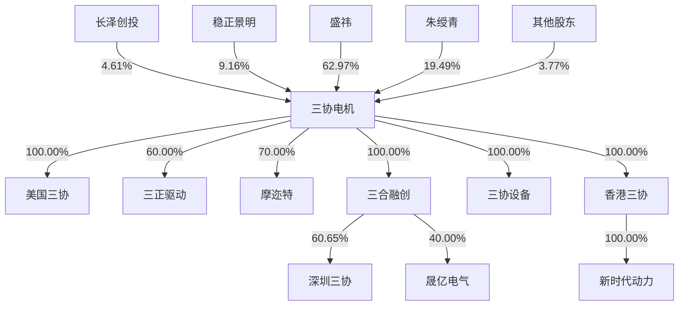
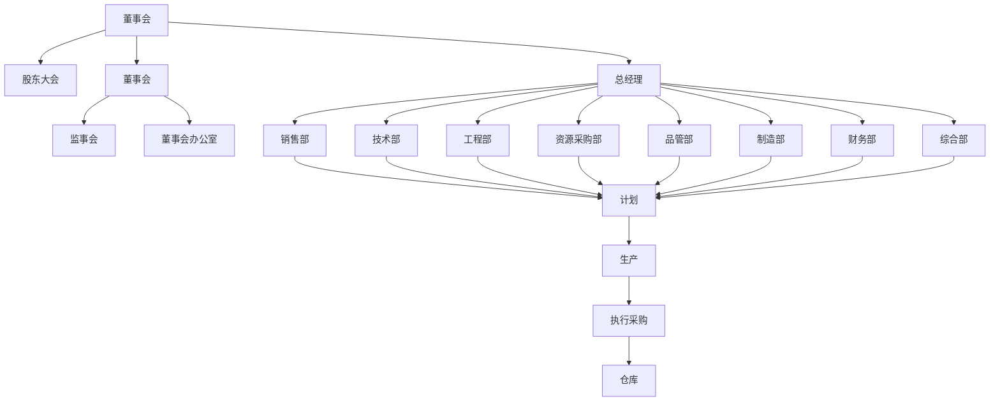
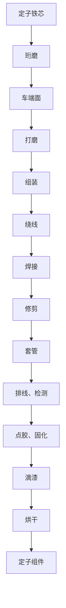
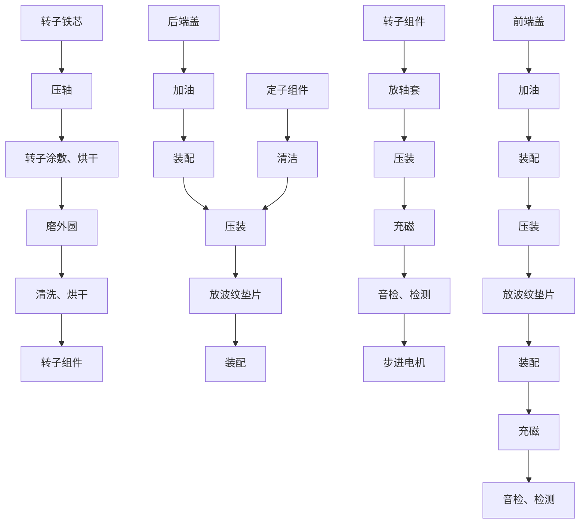
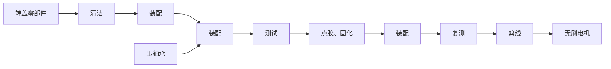
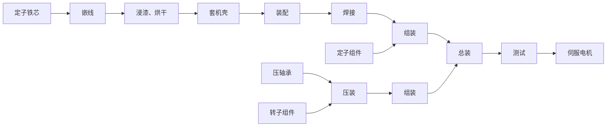

# 常州三协电机股份有限公司

江苏省常州市经济开发区富民路222号

text_image

MOTION

# 常州三协电机股份有限公司招股说明书

次股票发行后拟在北京证券交易所上市，该市场具有较高的投资风险。北京证券交易所主要务创新型中小企业，上市公司具有经营风险高、业绩不稳定、退市风险高等特点，投资者面临较的市场风险。投资者应充分了解北京证交易所市场的投资风险及本公司所披露的风险因素，审慎出投资决定。

保荐机构（主承销商）

东北证券股份有限公司

NORTHEASTSECURITIESCO.,LTD.

长春市生态大街6666号

中国证监会和北京证券交易所对本次发行所作的任何决定或意见，均不表明其对注册申请文件及所披露信息的真实性、准确性、完整性作出保证，也不表明其对发行人的盈利能力、投资价值或者对投资者的收益作出实质性判断或者保证。任何与之相反的声明均属虚假不实陈述。

根据《证券法》的规定，股票依法发行后，发行人经营与收益的变化，由发行人自行负责；投资者自主判断发行人的投资价值，自主作出投资决策，自行承担股票依法发行后因发行人经营与收益变化或者股票价格变动引致的投资风险。

# 声 明

发行人及全体董事、监事、高级管理人员承诺招股说明书及其他信息披露资料不存在虚假记载、误导性陈述或者重大遗漏，并对其真实性、准确性、完整性承担相应的法律责任。

发行人控股股东、实际控制人承诺招股说明书不存在虚假记载、误导性陈述或者重大遗漏，并对其真实性、准确性、完整性承担相应的法律责任。

公司负责人和主管会计工作的负责人、会计机构负责人保证招股说明书中财务会计资料真实、准确、完整。

发行人及全体董事、监事、高级管理人员、发行人的控股股东、实际控制人以及保荐人、承销商承诺因发行人招股说明书及其他信息披露资料有虚假记载、误导性陈述或者重大遗漏，致使投资者在证券发行和交易中遭受损失的，将依法承担法律责任。

保荐人及证券服务机构承诺因其为发行人本次公开发行股票制作、出具的文件有虚假记载、误导性陈述或者重大遗漏，给投资者造成损失的，将依法承担法律责任。

本次发行概况

<table><tr><td>发行股票类型</td><td>人民币普通股</td></tr><tr><td>发行股数</td><td>本次公开发行股票数量为1,800.00万股(不含超额配售选择权)。公司及主承销商选择采用超额配售选择权,采用超额配售选择权发行的股票数量为本次发行股票数量的15%(即270.00万股)。若全额行使超额配售选择权,本次发行的股票数量为2,070.00万股。</td></tr><tr><td>每股面值</td><td>1.00元</td></tr><tr><td>定价方式</td><td>公司和主承销商采用直接定价方式确定本次公开发行股票的发行价格</td></tr><tr><td>每股发行价格</td><td>8.83元/股</td></tr><tr><td>预计发行日期</td><td>2025年8月26日</td></tr><tr><td>发行后总股本</td><td>7,110.93万股</td></tr><tr><td>保荐人、主承销商</td><td>东北证券股份有限公司</td></tr><tr><td>招股说明书签署日期</td><td>2025年8月25日</td></tr></table>

注：超额配售选择权行使前，发行后总股本为7,110.93万股，若全额行使超额配售选择权，发行后总股本为 7,380.93 万股。

# 重大事项提示

本公司特别提醒投资者对下列重大事项给予充分关注，并认真阅读招股说明书正文内容：

# 一、本次公开发行股票并在北京证券交易所上市的安排及风险

公司本次公开发行股票完成后，将在北京证券交易所上市。公司本次公开发行股票获得中国证监会注册后，在股票发行过程中，会受到市场环境、投资者偏好、市场供需等多方面因素的影响；同时，发行完成后，若公司无法满足北京证券交易所上市的条件，均可能导致本次公开发行失败。公司在北京证券交易所上市后，投资者自主判断发行人的投资价值，自主作出投资决策，自行承担因发行人经营与收益变化或者股票价格变动引致的投资风险。

# 二、本次发行相关各方作出的重要承诺

本次发行有关的各项重要承诺、未能履行承诺的约束措施的具体内容参见本招股说明书“第四节 发行人基本情况”之“九、重要承诺”之“（一）与本次公开发行有关的承诺情况”。

# 三、本次发行前滚存利润的分配安排

经公司股东大会审议通过，公司本次发行前滚存未分配利润由本次发行完成后的新老股东按发行后的持股比例共享。

# 四、本次发行上市后公司的利润分配政策

经公司股东大会审议通过，本次公开发行股票成功后，公司本次发行前滚存未分配利润由本次发行完成后的新老股东按发行后的持股比例共享。公司发行上市后的股利分配政策具体内容参见本招股说明书“第十一节 投资者保护”之“二、本次发行上市后的股利分配政策和决策程序”。本公司提请投资者需认真阅读该章节的全部内容。

# 五、特别风险提示

本公司提醒投资者认真阅读本招股说明书的“第三节 风险因素”部分，并特别注意下列事项：

# （一）市场竞争加剧风险

公司长期以来注重对电机新技术、新产品的研发与革新，以迅速响应客户多样化的工艺需求，已积累了丰富的电磁、机械仿真技术与工艺自动化经验，逐步打造完善的工艺数据库，不断通过技术创新实现产品差异化。但随着我国产业结构的转型升级，国内其他厂商也在加大研发与技术方面的投入，随着政策引导下新的竞争对手的进入，市场竞争将更加激烈。若公司不能持续保持技术研发、产品创新能力、售后服务质量等方面的优势，进一步提高核心竞争力，将会面临市场竞争加剧引发市场份额下降的风险。

# （二）业绩大幅波动或下滑风险

报告期各期，发行人营业收入分别为 28,714.76 万元、36,195.94 万元及 42,006.27 万元，2022-2024年度呈持续增长趋势。尽管公司所处的电机制造业市场空间广阔且处于良好的发展阶段、公司产品功能较为全面、在手订单金额较高，但受行业政策变动、下游市场需求变动、市场竞争加剧等因素影响，公司仍可能面临业绩波动或下滑的风险。

# （三）毛利率下降风险

报告期内，公司主营业务毛利率分别为 22.24%、29.28%及 29.12%。公司销售收入主要受原材料价格、市场竞争程度、宏观经济形势、客户需求、销售产品结构等因素影响，公司主营业务成本中直接材料占比为80%左右，维持在较高水平，公司主要原材料市场价格受大宗商品市场波动、供需关系等多种因素影响较大。若未来上游原材料价格持续上涨，市场竞争激烈，公司无法将原材料上涨的压力转嫁给下游，公司将面临采购成本上升、毛利率下滑从而导致经营业绩受损的风险。

# （四）应收款项回收风险

报告期各期末，应收账款余额分别为 10,222.17万元、12,635.25万元及12,403.30万元，占当期营业收入比例分别为 35.60%、34.91%及 29.53%，随着公司销售规模扩大，公司应收账款余额可能继续增加，虽然公司大中型客户的客户回款和信用情况良好，但若客户未来的资信状况、经营情况出现恶化或与公司合作出现不利变化，可能导致应收账款不能按合同规定及时收回，将可能给公司带来坏账风险。

# （五）技术更新迭代风险

随着技术的发展和产品的持续迭代，微特电机行业逐步向高转速、无刷化、智能化、高效节能化等发展，需要根据客户的需求不断研发、升级现有产品，随着国内信息技术与先进制造技术的高速发展，若公司不能根据行业发展及下游客户需求持续进行技术升级与迭代，或产品开发速度不能与市场需求相匹配，则公司将面临技术落后导致核心竞争力下降的风险。

# （六）财务内控风险

报告期内，公司存在会计差错更正、票据使用不规范、个人卡等情形，截至报告期末，公司已经规范完毕，且相关内控制度完善并得到有效执行。但若在未来经营过程中财务内控制度不能得到有效执行，可能会导致公司利益受损或受到有关部门处罚的风险，进而损害公司其他股东的利益。

# （七）与雷赛智能业务合作稳定性的风险

报告期各期，公司对雷赛智能及其子公司的销售收入分别为 4,311.76 万元、5,088.88 万元及6,653.55 万元，占同期营业收入的比例分别为 15.02%、14.06%及 15.84%，雷赛智能系上市公司，专业从事智能装备运动控制核心部件的研发、生产、销售与服务，主要产品为伺服系统、步进系统、控制技术类产品三大类。未来若雷赛智能的经营策略发生较大变化，或公司与雷赛智能的合作关系被其他供应商替代，或由于公司自身原因导致公司无法与雷赛智能保持稳定的合作关系，将对公司经营产生重大不利影响。

# 六、财务报告审计截止日后的经营状况

# 1、会计师事务所的审阅意见

公司财务报告审计截止日为 2024 年 12 月 31 日，天健会计师对公司 2025 年 6 月 30 日的合并资产负债表及资产负债表，2025 年 1-6月合并利润表及利润表、合并现金流量表及现金流量表、合并所有者权益变动表及所有者权益变动表以及相关财务报表附注进行了审阅，并出具了天健审〔2025〕15-65号审阅报告，审阅意见如下：“根据我们的审阅，我们没有注意到任何事项使我们相信财务报表没有按照企业会计准则的规定编制，未能在所有重大方面公允反映三协电机公司的合并及母公司财务状况、经营成果和现金流量。”

# 2、发行人的专项声明

公司及全体董事、监事、高级管理人员保证公司2025年 1-6月财务报表所载资料不存在虚假记载、误导性陈述或者重大遗漏，并对其内容的真实性、准确性及完整性承担个别及连带责任。

公司负责人、主管会计工作负责人及会计机构负责人保证公司 2025年1-6 月财务报表真实、准确、完整。

# 3、财务报告审计截止日后主要财务信息

公司经审阅的主要财务数据如下：

单位：万元

<table><tr><td>项目</td><td>2025年6月30日/2025年1-6月</td><td>2024年12月31日/2024年1-6月</td><td>变动比例</td></tr><tr><td>资产总计</td><td>51,519.40</td><td>47,530.94</td><td>8.39%</td></tr><tr><td>负债总计</td><td>19,951.62</td><td>19,129.67</td><td>4.30%</td></tr><tr><td>所有者权益合计</td><td>31,567.78</td><td>28,401.27</td><td>11.15%</td></tr><tr><td>归属于母公司所有者权益合计</td><td>31,342.80</td><td>28,174.42</td><td>11.25%</td></tr><tr><td>营业收入</td><td>25,560.63</td><td>21,083.67</td><td>21.23%</td></tr><tr><td>营业利润</td><td>3,608.44</td><td>3,219.72</td><td>12.07%</td></tr><tr><td>利润总额</td><td>3,606.12</td><td>3,201.34</td><td>12.64%</td></tr><tr><td>净利润</td><td>3,141.51</td><td>2,773.47</td><td>13.27%</td></tr><tr><td>归属于母公司所有者净利润</td><td>3,152.82</td><td>2,808.70</td><td>12.25%</td></tr><tr><td>扣除非经常性损益后归属于母公司所有者净利润</td><td>3,120.84</td><td>2,803.62</td><td>11.31%</td></tr><tr><td>经营活动产生的现金流量净额</td><td>3,578.30</td><td>673.34</td><td>431.42%</td></tr></table>

公司经审阅的非经常性损益主要项目如下：

单位：万元

<table><tr><td>项目</td><td>2025年1-6月</td><td>2024年1-6月</td></tr><tr><td>非流动性资产处置损益,包括已计提资产减值准备的冲销部分</td><td>-0.0032</td><td>-7.88</td></tr><tr><td>计入当期损益的政府补助,但与公司正常经营业务密切相关、符合国家政策规定、按照确定的标准享有、对公司损益产生持续影响的政府补助除外</td><td>5.61</td><td>13.00</td></tr><tr><td>除同公司正常经营业务相关的有效套期保值业务外,非金融企业持有金融资产和金融负债产生的公允价值变动损益以及处置金融资产和金融负债产生的损益</td><td>32.09</td><td>8.15</td></tr><tr><td>除上述各项之外的其他营业外收入和支出</td><td>-2.31</td><td>-9.39</td></tr><tr><td>其他符合非经常性损益定义的损益项目</td><td>2.49</td><td>1.92</td></tr><tr><td>减:所得税影响额</td><td>5.30</td><td>0.04</td></tr><tr><td>少数股东损益</td><td>0.58</td><td>0.68</td></tr><tr><td>归属于母公司所有者的非经常性损益净额</td><td>31.98</td><td>5.08</td></tr></table>

# 4、财务报告审计截止日后主要财务变动分析

# （1）资产质量情况

截至2025年 6月 30日，公司资产总额为51,519.40万元，较 2024年末同比变动8.39%；归属于母公司所有者权益为31,342.80万元，较2024年末增加 3,168.38万元，增幅为11.25%，主要由净利润增加等因素所致。

# （2）经营成果情况

2025 年 1-6 月，公司营业收入为 25,560.63 万元，较上年同期增加 4,476.95 万元，增幅为 21.23%，扣除非经常性损益后的归属于母公司所有者净利润为3,120.84万元，较上年同期增长11.31%，净利润的增长主要系随着公司业务规模逐渐拓展，营业收入增加所致。

# （3）非经常性损益情况

2025 年 1-6 月，公司扣除所得税影响后归属于母公司所有者非经常性损益净额为 31.98 万元，金额较小，公司经营业绩对非经常性损益不存在重大依赖。

# 5、财务报告审计截止日后主要经营状况

公司财务报告审计截止日至本招股说明书签署日，公司经营状况正常，经营业绩良好，在经营模式、主要原材料的采购规模及采购价格、主要产品的生产、销售规模及销售价格，主要客户及供应商的构成，税收政策等方面未发生重大变化，亦未发生其他可能影响投资者判断的重大事项。

# 七、2025年 1-9月业绩预告信息

根据目前经营情况，如果未来公司经营环境及外部环境未发生重大不利变化，公司 2025年 1-9月业绩预计情况如下：

单位：万元

<table><tr><td>项目</td><td>2025 年 1-9 月预计</td><td>2024 年 1-9 月</td><td>变动比例</td></tr><tr><td>营业收入</td><td>32,000.00-35,000.00</td><td>29,510.62</td><td>8.44%-18.60%</td></tr><tr><td>归属于母公司所有者净利润</td><td>4,128.00-4,515.00</td><td>3,809.67</td><td>8.36%-18.51%</td></tr><tr><td>扣除非经常性损益后归属于母公司所有者净利润</td><td>4,084.00-4,471.00</td><td>3,765.11</td><td>8.47%-18.75%</td></tr></table>

注：2024年1-9月财务数据已经审阅

公司预计 2025 年 1-9 月营业收入约为 32,000.00 万元至 35,000.00 万元，同比增长幅度约为8.44%至 18.60%；归属于母公司所有者的净利润约为 4,128.00 万元至 4,515.00 万元，同比增长幅度约为 8.36%至 18.51%；归属于母公司所有者的扣除非经常性损益后的净利润约为 4,084.00 万元至 4,471.00 万元，同比增长幅度约为 8.47%至 18.75%。

上述2025年1-9月预计数据仅为管理层对经营业绩的初步估计情况，未经审计机构审计或审阅，不构成盈利预测或业绩承诺。

# 八、首次申报审计截止日后分红情况

公司首次申报审计截止日为 2023 年 6 月 30 日，首次申报时间为 2023 年 12 月。2023 年 11 月15日，公司召开2023年第五次临时股东大会，审议通过了《关于 2023年半年度权益分派预案的议案》，决定以权益分派实施时股权登记日应分配股数 38,485,000 股为基数，以未分配利润向全体股东每 10 股派发现金红利 3.90 元（含税），以股票发行溢价所形成的资本公积向全体股东每 10 股转增3.80股。本次权益分派共派发现金红利 1,500.92万元，转增1,462.43万股。权益分派权益登记日为2023年12月1日，除权除息日为 2023年12月4 日。本次现金分红已在首次申报前执行完毕。

公司 2023 年半年度利润分配方案是根据《公司章程》利润分配政策，并结合公司盈利情况、后续资金需求情况等因素审慎制定的，符合公司实际情况，具有合理性、必要性，不存在损害新老股东利益的情形；同时本次现金分红金额未对公司财务状况和正常生产运营产生较大不利影响，公司仍符合北交所发行条件和上市条件。

# 九、关于公司利润分配政策及上市后的三年内股东分红回报规划

公司根据相关法律法规的要求以及自身发展实际情况，制定了利润分配政策、上市后三年内股东分红回报规划，请投资者予以关注。利润分配政策、上市后三年内股东分红回报规划具体内容详见本招股说明书“第十一节 投资者保护”之“二、本次发行上市后的股利分配政策和决策程序”。

# 目录

第一节 释义 .........

第二节 概览.... 13

第三节 风险因素..... 25

第四节 发行人基本情况.. .30

第五节 业务和技术.... 87

第六节 公司治理... ... 145

第七节 财务会计信息. .163

第八节 管理层讨论与分析.... ..209

第九节 募集资金运用.. .351

第十节 其他重要事项.. . 364

第十一节 投资者保护 ... .365

第十二节 声明与承诺 .. ..370

第十三节 备查文件 . .382

第一节 释义

本招股说明书中，除非文意另有所指，下列简称和术语具有的含义如下：

注：本招股说明书任何表格中若出现总数与所列数值总和不符的情况，均为四舍五入所致。

<table><tr><td colspan="3">普通名词释义</td></tr><tr><td>发行人、本公司、公司、三协电机</td><td>指</td><td>常州三协电机股份有限公司</td></tr><tr><td>本次公开发行、本次发行</td><td>指</td><td>发行人本次向不特定合格投资者公开发行股票的行为</td></tr><tr><td>本次发行上市</td><td>指</td><td>发行人本次向不特定合格投资者公开发行股票并在北京证券交易所上市的行为</td></tr><tr><td>三协有限</td><td>指</td><td>发行人前身,常州市三协电机电器有限公司</td></tr><tr><td>三协股份</td><td>指</td><td>发行人前身,常州市三协电机电器股份有限公司</td></tr><tr><td>摩迩特</td><td>指</td><td>摩迩特电机(常州)有限公司</td></tr><tr><td>三协设备</td><td>指</td><td>常州三协机电设备有限公司</td></tr><tr><td>三合融创</td><td>指</td><td>杭州三合融创科技有限公司</td></tr><tr><td>香港三协</td><td>指</td><td>三协电机投资(香港)有限公司</td></tr><tr><td>新时代动力</td><td>指</td><td>新时代动力科技有限公司</td></tr><tr><td>美国三协</td><td>指</td><td>3X MOTION(USA) TECHNOLOGIES LLC</td></tr><tr><td>三正驱动</td><td>指</td><td>常州三正驱动科技有限公司</td></tr><tr><td>通驰电驱</td><td>指</td><td>常州通驰电驱技术有限公司</td></tr><tr><td>稳正景明</td><td>指</td><td>深圳市稳正景明创业投资企业(有限合伙)</td></tr><tr><td>长泽创投</td><td>指</td><td>深圳市稳正长泽创业投资企业(有限合伙)</td></tr><tr><td>晟亿电气</td><td>指</td><td>晟亿电气(上海)有限公司</td></tr><tr><td>深圳三协</td><td>指</td><td>深圳市三协电机有限公司</td></tr><tr><td>浙江大华</td><td>指</td><td>浙江大华科技有限公司</td></tr><tr><td>雷赛智能</td><td>指</td><td>深圳市雷赛智能控制股份有限公司</td></tr><tr><td>合肥波林</td><td>指</td><td>合肥波林新材料股份有限公司</td></tr><tr><td>诸暨维修部</td><td>指</td><td>诸暨市荣义电脑袜机维修部</td></tr><tr><td>股东会</td><td>指</td><td>常州三协电机股份有限公司股东会</td></tr><tr><td>董事会</td><td>指</td><td>常州三协电机股份有限公司董事会</td></tr><tr><td>监事会</td><td>指</td><td>常州三协电机股份有限公司监事会</td></tr><tr><td>三会</td><td>指</td><td>股东会、董事会、监事会</td></tr><tr><td>《公司法》</td><td>指</td><td>《中华人民共和国公司法》</td></tr><tr><td>《证券法》</td><td>指</td><td>《中华人民共和国证券法》</td></tr><tr><td>《上市规则》</td><td>指</td><td>《北京证券交易所股票上市规则》</td></tr><tr><td>《公司章程》</td><td>指</td><td>《常州三协电机股份有限公司章程》</td></tr><tr><td>《公司章程(草案)》</td><td>指</td><td>《常州三协电机股份有限公司章程(草案)》</td></tr><tr><td>中国证监会、证监会</td><td>指</td><td>中国证券监督管理委员会</td></tr><tr><td>北交所</td><td>指</td><td>北京证券交易所</td></tr><tr><td>全国股转系统、新三板</td><td>指</td><td>全国中小企业股份转让系统</td></tr><tr><td>全国股转公司</td><td>指</td><td>全国中小企业股份转让系统有限责任公司</td></tr><tr><td>报告期</td><td>指</td><td>2022年度、2023年度及2024年度</td></tr><tr><td>报告期各期末</td><td>指</td><td>2022年12月31日、2023年12月31日及2024年12月31日</td></tr><tr><td>保荐人、保荐机构、主承销商、东北证券</td><td>指</td><td>东北证券股份有限公司</td></tr><tr><td>律师事务所</td><td>指</td><td>北京国枫律师事务所</td></tr><tr><td>审计机构、天健会计师</td><td>指</td><td>天健会计师事务所(特殊普通合伙)</td></tr><tr><td>元、万元、亿元</td><td>指</td><td>人民币元、人民币万元、人民币亿元</td></tr><tr><td colspan="3">专业名词释义</td></tr><tr><td>步进电机</td><td>指</td><td>将电脉冲信号转变为角位移或线位移的控制元件。在非超载情况下,电机转速、停止位置取决于脉冲信号的频率和脉冲数,不受负载变化的影响,当步进驱动器接收到脉冲信号,它驱动步进电机按设定的方向转动一个固定的角度。可以通过控制脉冲个数来控制角位移量,达到准确定位的目的;也可以通过控制脉冲频率来控制电机转动的速度和加速度,达到调速的目的。</td></tr><tr><td>混合式步进电机</td><td>指</td><td>转子采用磁化磁铁、具有反应式基于气隙磁导变化和永磁式轴向恒定磁场双重特征的步进电机。该型电机可以实现非常精确的小增量步距运动,可达到复杂、精密的线性运动控制要求。发行人HB步进电机有二相、三相和五相,步进角在 $0.72^{\circ} \sim 3.75^{\circ}$ ,根据客户需要,可以分别提供加速快、力矩大、精度高、运行平稳、低转动惯量、低噪音、高平滑、大转速等多种组合特性。</td></tr><tr><td>无刷电机</td><td>指</td><td>无刷直流电机由电动机主体和驱动器组成,它采用晶体管换向电路代替电刷与换向器。依靠改变输入到无刷电机定子线圈上的电流波交变频率和波形,在绕组线圈周围形成一个绕电机几何轴心旋转的磁场,这个磁场驱动永磁铁转子从而产生转矩。</td></tr><tr><td>伺服电机</td><td>指</td><td>伺服电机可以控制速度,位置精度非常准确,可以将电压信号转化为转矩和转速以驱动控制对象。伺服电机转子转速受输入信号控制,并能快速反应,在自动控制系统中,用作执行元件,且具有机电时间常数小、线性度高等特性,可把所收到的电信号转换成电动机轴上的角位移或角速度输出。</td></tr><tr><td>定子</td><td>指</td><td>电动机静止不动的部分,由定子铁芯、定子绕组和机座三部分组成。</td></tr><tr><td>转子</td><td>指</td><td>由轴承支撑的旋转体。</td></tr><tr><td>磁钢</td><td>指</td><td>一种具有较强磁性的合金材料,由镨、钕、镝等稀土金属合成。</td></tr></table>

# 第二节 概览

本概览仅对招股说明书作扼要提示。投资者作出投资决策前，应认真阅读招股说明书全文。

# 发行人基本情况

<table><tr><td>公司名称</td><td colspan="2">常州三协电机股份有限公司</td><td colspan="2">统一社会信用代码</td><td colspan="2">91320405743730274F</td></tr><tr><td>证券简称</td><td colspan="2">三协电机</td><td colspan="2">证券代码</td><td colspan="2">920100</td></tr><tr><td>有限公司成立日期</td><td colspan="2">2002年11月7日</td><td colspan="2">股份公司成立日期</td><td colspan="2">2018年9月29日</td></tr><tr><td>注册资本</td><td colspan="2">5,310.93万元</td><td colspan="2">法定代表人</td><td colspan="2">盛祎</td></tr><tr><td>办公地址</td><td colspan="6">江苏省常州市经济开发区富民路222号</td></tr><tr><td>注册地址</td><td colspan="6">江苏省常州市经济开发区富民路222号</td></tr><tr><td>控股股东</td><td colspan="2">盛祎</td><td colspan="2">实际控制人</td><td colspan="2">盛祎、朱绶青</td></tr><tr><td>主办券商</td><td colspan="2">东北证券</td><td colspan="2">挂牌日期</td><td colspan="2">2022年2月28日</td></tr><tr><td>上市公司行业分类</td><td colspan="3">制造业(C)</td><td colspan="3">电机制造(CH381)</td></tr><tr><td>管理型行业分类</td><td>制造业(C)</td><td colspan="2">电气机械和器材制造业(CH38)</td><td colspan="2">电机制造(CH381)</td><td>微特电机及组件制造(CH3813)</td></tr></table>

# 二、 发行人及其控股股东、实际控制人的情况

发行人成立于2002年11月7日，于2022年2月28日在全国股转系统挂牌公开转让，于 2023年5月19日调整至创新层。

截至本招股说明书签署日，发行人控股股东为盛祎，直接持有发行人股份3,344.44万股，持股比例为 62.97%。

截至本招股说明书签署日，发行人共同实际控制人为盛祎、朱绶青。盛祎与朱绶青为夫妻。盛祎直接持有发行人 62.97%的股份；朱绶青直接持有发行人 19.49%的股份。盛祎、朱绶青合计控制发行人82.46%的股份。2002 年11月至今，盛祎担任三协电机总经理，股份公司成立后担任董事长。综上，认定盛祎、朱绶青为发行人的共同实际控制人。

2023年 12月 12日，盛祎、朱绶青和盛月瑶签署《一致行动协议》。该协议有效期为自签署之日起至公司向不特定合格投资者公开发行股票并上市之日起 36 个月止。在该协议有效期内，盛祎、朱绶青和盛月瑶对于一致行动相关事项应进行充分沟通并采取一致行动。如盛祎、朱绶青和盛月瑶进行充分沟通协商后，不能达成一致意见的，则应当以盛祎的意见为准，朱绶青、盛月瑶在行使提案权、提名权以及在公司股东大会/董事会上行使表决权时必须与盛祎的意见保持一致。

# 三、 发行人主营业务情况

公司成立于 2002 年，是一家研发、制造并销售控制类电机的高新技术企业。公司的主要产品包括步进电机、伺服电机和无刷电机及与其配套的产品，公司控制类电机产品具有体积小、功率密

度大、绿色节能的特点。

公司长期以来注重对电机新技术、新产品的研发与革新，以迅速响应客户多样化的工艺需求。公司已积累了丰富的电磁、机械仿真技术与工艺自动化经验，逐步打造完善的工艺数据库，不断通过技术创新实现产品差异化。公司导入 IATF16949质量体系，规范设计和制造过程，让每个环节得到有效的管控。公司秉承精益制造的先进理念，应用SAP 管理系统，推进实现“三化一稳定”—管理IT 化、生产自动化、人员专业化、关键岗位人员稳定，持续技术创新和工艺革新，构筑核心竞争力。公司能够对电机的磁路、结构进行精确的分析计算，从而满足产品所需的设计要求，同时公司具备全套的测试实验设备，并通过国家CNAS 实验室认证。

公司自成立以来高度重视研发工作，拥有专业结构合理、经验丰富的研发团队，较强的技术研发能力夯实了公司主营业务发展的长远基础。2022年、2023 年及2024年，公司研发投入金额分别为 1,064.33 万元、1,253.67 万元及 1,501.83 万元，占营业收入比例分别 3.71%、3.46%及 3.58%，截至招股说明书签署日，公司已取得 56 项专利，其中发明专利 10 项，实用新型专利 45 项，外观专利1项。经过持续性的研发支出与创新投入，公司研发团队取得了较好的研究成果和应用经验。

在公共安全监测系统和医疗检测系统领域，公司自主创新了混合式步进电机的定子转子磁路优化设计技术、端盖两面加工一次性装夹组件技术，提升了混合式步进电机的力矩，降低了温升，减小了电机的噪音，提高了安装精度，得到了行业用户海康威视、大华股份等客户普遍的认可。

在高端纺织机械领域，成功研发出平面盘式力矩伺服电机和高扭矩的一体盘式力矩电机，得到了意大利知名纺机公司圣东尼及国内知名内衣机公司高腾机电的认可。

在机器人领域，公司通过自主研发，采用当前突破性的基础材料和高槽满率的技术，成功地在AGV、协作机器人领域获得海康威视、大华股份、法奥机器人的认可。在协作机器人领域，公司产品已实现量产。协作型机器人作为一种新型的工业机器人，扫除了人机协作的障碍，让机器人彻底摆脱护栏或围笼的束缚，其开创性的产品性能和广泛的应用领域，为工业机器人的发展开启新时代。公司产品可应用于人形机器人领域，目前已开始向客户送样。

在汽车领域，公司自主创新的无刷电机采用先进的定转子隔离措施，保证电机定转子间隙内通过高温高压的防冻液、氢气也不会发生泄漏和安全隐患，已与国内知名企业凯龙高科、上燃动力等开展业务，为节能减排和环境保护作出了贡献。

公司凭借高质量的产品和优质的服务，在控制类电机领域树立了良好口碑及自主品牌，得到了运动控制厂商及工业自动化设备厂商的认可，并与其建立了稳定的深度合作关系。此外，公司通过自主研发、技术创新，公司产品广泛应用于安防、纺织、光伏、半导体、3C、汽车、机器人、医疗、智能物流等行业。目前公司已与海康威视、大华股份、大豪科技、睿能科技、日发纺机、慈星股份、浙江可胜、中信博、雷赛智能、威孚高科等细分领域的龙头企业客户开展稳定合作。

2022 年，公司被常州市工业和信息化局评为省级创新型中小企业。2023 年，公司被全国高新技术企业认定管理工作领导小组办公室评为国家级高新技术企业、被常州市工业和信息化局评为省级专精特新中小企业、被江苏省民营科技企业协会评为省级民营科技企业、被常州经开区经济发展局评为常州市专精特新中小企业。

2024 年，公司荣获大华股份颁发的 2023 年优秀技术合作奖、荣获杭州海康威视颁发的最佳交付奖、荣获创想三维颁发的新锐之星奖、荣获雷赛智能颁发的战略合作奖。

四、 主要财务数据和财务指标

<table><tr><td>项目</td><td>2024年12月31日/2024年度</td><td>2023年12月31日/2023年度</td><td>2022年12月31日/2022年度</td></tr><tr><td>资产总计(元)</td><td>475,309,430.05</td><td>391,994,281.24</td><td>269,084,308.96</td></tr><tr><td>股东权益合计(元)</td><td>284,012,698.02</td><td>226,254,445.34</td><td>171,409,855.95</td></tr><tr><td>归属于母公司所有者的股东权益(元)</td><td>281,744,174.86</td><td>224,053,703.54</td><td>170,987,270.85</td></tr><tr><td>资产负债率(母公司)(%)</td><td>38.01</td><td>41.45</td><td>35.53</td></tr><tr><td>营业收入(元)</td><td>420,062,741.47</td><td>361,959,353.18</td><td>287,147,557.76</td></tr><tr><td>毛利率(%)</td><td>28.00</td><td>28.47</td><td>22.31</td></tr><tr><td>净利润(元)</td><td>56,368,108.14</td><td>48,712,493.94</td><td>27,044,427.34</td></tr><tr><td>归属于母公司所有者的净利润(元)</td><td>56,335,019.43</td><td>48,640,847.04</td><td>26,976,267.92</td></tr><tr><td>归属于母公司所有者的扣除非经常性损益后的净利润(元)</td><td>52,928,963.11</td><td>48,267,584.45</td><td>25,164,958.78</td></tr><tr><td>加权平均净资产收益率(%)</td><td>22.28</td><td>24.08</td><td>19.06</td></tr><tr><td>扣除非经常性损益后净资产收益率(%)</td><td>20.93</td><td>23.90</td><td>17.78</td></tr><tr><td>基本每股收益(元/股)</td><td>1.06</td><td>1.34</td><td>0.85</td></tr><tr><td>稀释每股收益(元/股)</td><td>1.06</td><td>1.34</td><td>0.85</td></tr><tr><td>经营活动产生的现金流量净额(元)</td><td>61,136,234.95</td><td>34,041,904.53</td><td>21,738,423.03</td></tr><tr><td>研发投入占营业收入的比例(%)</td><td>3.58</td><td>3.46</td><td>3.71</td></tr></table>

# 五、 发行决策及审批情况

2023年 10月 27日，公司召开第二届董事会第十七次会议，审议通过了《关于公司申请公开发行股票并在北交所上市的议案》等与本次公开发行股票并在北京证券交易所上市的相关议案。2024年10月25日，公司召开第三届董事会第二次会议，审议通过了《关于延长公司申请向不特定合格投资者公开发行股票并在北京证券交易所上市股东大会决议有效期的议案》和《关于提请公司股东大会延长授权董事会办理公司申请向不特定合格投资者公开发行股票并在北京证券交易所上市有效期的议案》的议案。

2023年 11月15 日，公司召开2023年第五次临时股东大会，审议通过了《关于公司申请公开发行股票并在北交所上市的议案》等与本次公开发行股票并在北京证券交易所上市的相关议案，并同意授权公司董事会全权办理本次公开发行股票并在北京证券交易所上市的具体事宜。2024年11月13日，公司召开2024年第四次临时股东大会，审议通过了《关于延长公司申请向不特定合格投资者公开发行股票并在北京证券交易所上市股东大会决议有效期的议案》的议案，并同意延长授权公司董事会全权办理本次公开发行股票并在北京证券交易所上市的具体事宜。

本次发行方案已于 2025 年 6 月 9 日获得北京证券交易所审核通过，并取得了中国证监会下发的《关于同意常州三协电机股份有限公司向不特定合格投资者公开发行股票注册的批复》（证监许可[2025]1621 号）。

注 1：超额配售选择权行使前，发行后总股本为 7,110.93 万股，若全额行使超额配售选择权，发行后总股本为 7,380.93 万股；  
注2：发行前市盈率为本次发行价格除以每股收益，每股收益按 2024年度经审计扣除非经常性损益后归属于母公司股东的净利润除以本次发行前总股本计算；  
六、 本次发行基本情况  
注3：发行后市盈率为本次发行价格除以每股收益，每股收益按 2024年度经审计扣除非经常性损益后归属于母公司股东的净利润除以本次发行后总股本计算；行使超额配售选择权前的发行后市盈率为11.86倍，若全额行使超额配售选择权则发行后市盈率为 12.31倍；

<table><tr><td>发行股票类型</td><td>人民币普通股</td></tr><tr><td>每股面值</td><td>1.00元</td></tr><tr><td>发行股数</td><td>本次公开发行股票数量为1,800.00万股(不含超额配售选择权)。公司及主承销商选择采用超额配售选择权,采用超额配售选择权发行的股票数量为本次发行股票数量的15%(即270.00万股)。若全额行使超额配售选择权,本次发行的股票数量为2,070.00万股。</td></tr><tr><td>发行股数占发行后总股本的比例</td><td>25.31%(未考虑超额配售选择权的情况下)28.05%(全额行使超额配售选择权的情况下)</td></tr><tr><td>定价方式</td><td>公司和主承销商采用直接定价方式确定本次公开发行股票的发行价格</td></tr><tr><td>发行后总股本</td><td>7,110.93万股(未考虑超额配售选择权的情况下)7,380.93万股(全额行使超额配售选择权的情况下)</td></tr><tr><td>每股发行价格</td><td>8.83元/股</td></tr><tr><td>发行前市盈率(倍)</td><td>8.86</td></tr><tr><td>发行后市盈率(倍)</td><td>11.86</td></tr><tr><td>发行前市净率(倍)</td><td>1.66</td></tr><tr><td>发行后市净率(倍)</td><td>1.52</td></tr><tr><td>预测净利润(元)</td><td>不适用</td></tr><tr><td>发行前每股收益(元/股)</td><td>1.00</td></tr><tr><td>发行后每股收益(元/股)</td><td>0.74</td></tr><tr><td>发行前每股净资产(元/股)</td><td>5.30</td></tr><tr><td>发行后每股净资产(元/股)</td><td>5.80</td></tr><tr><td>发行前净资产收益率(%)</td><td>20.93</td></tr><tr><td>发行后净资产收益率(%)</td><td>12.83</td></tr><tr><td>本次发行股票上市流通情况</td><td>本次网上发行的股票无锁定安排。发行人的高级管理人员专项资产管理计划获配股份限售期为12个月,其他战略配售股份限售期为6个月,限售期自本次公开发行的股票在北交所上市之日起开始计算。</td></tr><tr><td>发行方式</td><td>本次发行采用战略投资者定向配售和网上向开通北交所交易权限的合格投资者定价发行相结合的方式进行</td></tr><tr><td>发行对象</td><td>发行对象为已开通北京证券交易所上市公司股票交易权限的合格投资者,法律、法规、规章和规范性文件禁止认购的除外</td></tr><tr><td>战略配售情况</td><td>本次发行战略配售发行数量为360.00万股,占超额配售选择权全额行使前本次发行数量的20.00%,占超额配售选择权全额行使后本次发行总股数的17.39%。</td></tr><tr><td>预计募集资金总额</td><td>15,894.00万元(未考虑超额配售选择权的情况下)18,278.10万元(全额行使超额配售选择权的情况下)</td></tr><tr><td>预计募集资金净额</td><td>13,091.23万元(未考虑超额配售选择权的情况下)15,475.30万元(全额行使超额配售选择权的情况下)</td></tr><tr><td>发行费用概算</td><td>本次发行费用总额为2,802.77万元(超额配售选择权行使前);2,802.80万元(若全额行使超额配售选择权),其中:1、保荐及承销费用:(1)保荐费用:188.68万元;(2)承销费用:1,143.63万元;参考市场承销保荐费率平均水平,综合考虑双方战略合作关系意愿,经双方友好协商确定;2、审计及验资费用:986.71万元;参考市场会计师费率平均水平,考虑服务的工作要求、工作量等因素,经友好协商确定,根据项目进度支付;3、律师费用:460.00万元;参考市场律师费率平均水平,考虑长期合作的意愿、律师的工作表现及工作量,经友好协商确定,根据项目进度支付;4、发行上市手续费及其他:23.75万元(超额配售选择权行使前);23.78万元(若全额行使超额配售选择权)。注:上述发行费用均不含增值税金额,最终发行费用可能由于金额四舍五入或最终发行结果而有所调整。</td></tr><tr><td>承销方式及承销期</td><td>余额包销</td></tr><tr><td>询价对象范围及其他报价条件</td><td>不适用</td></tr><tr><td>优先配售对象及条件</td><td>不适用</td></tr></table>

注4：发行前市净率以本次发行价格除以发行前每股净资产计算；  
注 5：发行后市净率以本次发行价格除以发行后每股净资产计算；行使超额配售选择权前的发行后市净率为1.52倍，若全额行使超额配售选择权则发行后市净率为 1.49倍；  
注6：发行前基本每股收益以 2024年度经审计扣除非经常性损益后归属于母公司股东的净利润除以

本次发行前总股本计算；

注7：发行后基本每股收益以 2024年度经审计扣除非经常性损益后归属于母公司股东的净利润除以本次发行后总股本计算；行使超额配售选择权前的发行后基本每股收益为 0.74 元/股，若全额行使超额配售选择权则发行后的基本每股收益为0.72元/股；

注8：发行前每股净资产以2024 年12月 31日经审计的归属于母公司股东的净资产除以本次发行前总股本计算；

注 9：发行后每股净资产按本次发行后归属于母公司股东的净资产除以发行后总股本计算，其中，发行后归属于母公司股东的净资产按经审计的截至 2024 年 12 月 31 日归属于母公司股东的净资产和本次募集资金净额之和计算；行使超额配售选择权前的发行后每股净资产为 5.80 元/股；若全额行使超额配售选择权则发行后每股净资产为5.91元/股；

注 10：发行前净资产收益率为 2024 年度经审计扣除非经常性损益后归属于母公司股东的净利润除以本次发行前归属于母公司股东的加权平均净资产计算；

注 11：发行后净资产收益率以 2024 年度经审计扣除非经常性损益后归属于母公司股东的净利润除以本次发行后归属于母公司股东的净资产计算，其中发行后归属于母公司股东的净资产按经审计的截至 2024 年 12 月 31 日归属于母公司股东的净资产和本次募集资金净额之和计算；行使超额配售选择权前的发行后净资产收益率为 12.83%，若全额行使超额配售选择权则发行后净资产收益率为12.13%。

# 七、 本次发行相关机构

# （一） 保荐人、承销商

<table><tr><td>机构全称</td><td>东北证券股份有限公司</td></tr><tr><td>法定代表人</td><td>李福春</td></tr><tr><td>注册日期</td><td>1992年7月17日</td></tr><tr><td>统一社会信用代码</td><td>91220000664275090B</td></tr><tr><td>注册地址</td><td>长春市生态大街6666号</td></tr><tr><td>办公地址</td><td>长春市生态大街6666号</td></tr><tr><td>联系电话</td><td>010-68573828</td></tr><tr><td>传真</td><td>010-68573837</td></tr><tr><td>项目负责人</td><td>程继光</td></tr><tr><td>签字保荐代表人</td><td>张兴云、程继光</td></tr><tr><td>项目组成员</td><td>杭立俊、李澹怡、沈牧怡、尹冠钧、裴冲、章海华、姚瑶</td></tr></table>

# （二） 律师事务所

<table><tr><td>机构全称</td><td>北京国枫律师事务所</td></tr><tr><td>负责人</td><td>张利国</td></tr><tr><td>注册日期</td><td>2005年1月7日</td></tr><tr><td>统一社会信用代码</td><td>31110000769903890U</td></tr><tr><td>注册地址</td><td>北京市东城区建国门内大街26号新闻大厦7层</td></tr><tr><td>办公地址</td><td>北京市东城区建国门内大街26号新闻大厦7层</td></tr><tr><td>联系电话</td><td>010-88004488</td></tr><tr><td>传真</td><td>010-66090016</td></tr><tr><td>经办律师</td><td>殷长龙、夏青</td></tr></table>

# （三） 会计师事务所

<table><tr><td>机构全称</td><td>天健会计师事务所(特殊普通合伙)</td></tr><tr><td>负责人</td><td>钟建国</td></tr><tr><td>注册日期</td><td>2011年7月18日</td></tr><tr><td>统一社会信用代码</td><td>913300005793421213</td></tr><tr><td>注册地址</td><td>浙江省杭州市西湖区灵隐街道西溪路128号</td></tr><tr><td>办公地址</td><td>浙江省杭州市西湖区灵隐街道西溪路128号</td></tr><tr><td>联系电话</td><td>0571-88216798</td></tr><tr><td>传真</td><td>0571-88216999</td></tr><tr><td>经办会计师</td><td>田业阳、陈兴冬</td></tr></table>

# （四） 资产评估机构

□适用 √不适用

# （五） 股票登记机构

<table><tr><td>机构全称</td><td>中国证券登记结算有限责任公司北京分公司</td></tr><tr><td>法定代表人</td><td>黄英鹏</td></tr><tr><td>注册地址</td><td>北京市西城区金融大街26号金阳大厦5层</td></tr><tr><td>联系电话</td><td>010-50939800</td></tr><tr><td>传真</td><td>010-50939716</td></tr></table>

# （六） 收款银行

<table><tr><td>户名</td><td>东北证券股份有限公司</td></tr><tr><td>开户银行</td><td>中国建设银行长春西安大路支行</td></tr><tr><td>账号</td><td>22001450100059111777</td></tr></table>

# （七） 申请上市交易所

<table><tr><td>交易所名称</td><td>北京证券交易所</td></tr><tr><td>法定代表人</td><td>周贵华</td></tr><tr><td>注册地址</td><td>北京市西城区金融大街丁26号</td></tr><tr><td>联系电话</td><td>010-63889755</td></tr><tr><td>传真</td><td>010-63884634</td></tr></table>

# （八） 其他与本次发行有关的机构

□适用 √不适用

# 八、 发行人与本次发行有关中介机构权益关系的说明

截至本招股说明书签署日，发行人与本次发行的中介机构及其负责人、高级管理人员、经办人员之间不存在直接或间接的股权关系或其他利害关系。

# 九、 发行人自身的创新特征

公司自成立以来，一直致力于精密运动控制领域的核心传动部件—精密控制微特电机及核心部件的技术研发和生产，产品均具备自主知识产权，获得多项发明和实用新型专利，已形成针对不同行业需求的多场景适用的运动控制系列电机，主要从事精密步进电机（混合式和永磁式步进电机）、直流无刷电机、伺服电机及其组件的设计、研发、生产和销售；同时，根据客户不同应用场景和行业高速发展带来的个性化需求，针对性的设计、制造高精度运动控制电机，为客户提供完整、系统、可靠的系统的运动控制解决方案。公司的研发创新严格遵循系统的研发管理规定，在系统的体系管理前提下，从市场需求开始，到研发立项、过程研发、产品验证试验定型、批产，均按照要求在PLM（产品生命周期管理系统）系统中体现。公司秉承创新驱动发展的理念，始终专注技术创新，推动研发成果转化，以期在行业中保持竞争领先的地位。公司主要创新特征体现如下方面：

# （一）创新投入

# 1、研发投入

公司自成立以来，始终将技术创新作为驱动公司业务持续发展的核心驱动力，持续加大研发投入力度，报告期内，公司研发费用分别为1,064.33万元、1,253.67万元及1,501.83万元，截至本招股说明书签署日，发行人在研项目具体情况如下：

<table><tr><td>序号</td><td>项目名称</td><td>技术方向</td><td>开始时间</td><td>计划结束时间</td><td>覆盖电机型号</td></tr><tr><td>1</td><td>无刷电机高能效技术的研发</td><td>一种太阳能高能效无刷电机</td><td>2024-1-1</td><td>2025-12-31</td><td>无刷太阳能</td></tr><tr><td>2</td><td>直流减速电机新结构与高性能设计的研发</td><td>一种新结构高性能直流减速电机</td><td>2024-6-1</td><td>2025-12-31</td><td>有刷减速电机</td></tr><tr><td>3</td><td>步进电机降低振动与噪音技术的研发</td><td>一种低振动、低噪音步进电机</td><td>2025-1-1</td><td>2025-12-31</td><td>步进42以下(含42)</td></tr><tr><td>4</td><td>步进电机提升焊接强度技术的研发</td><td>一种穿焊结构步进电机</td><td>2025-1-1</td><td>2025-12-31</td><td>步进57以上(含57)</td></tr><tr><td>5</td><td>无刷电机高转速技术的研发</td><td>一种分布式绕组的无刷电机</td><td>2025-1-1</td><td>2025-12-31</td><td>全系列无刷电机</td></tr><tr><td>6</td><td>伺服电机铁芯组合式技术的研发</td><td>一种组合式铁芯结构的伺服电机</td><td>2025-1-1</td><td>2025-12-31</td><td>全系列伺服电机</td></tr><tr><td>7</td><td>滚筒电机新结构高性能技术的研发</td><td>一种高性能结构的滚筒电机</td><td>2025-4-1</td><td>2026-12-31</td><td>全系列滚筒电机</td></tr><tr><td>8</td><td>直线步进电机转子焊接技术的研发</td><td>一种焊接结构直线步进电机</td><td>2025-4-1</td><td>2026-12-31</td><td>全系列直线电机</td></tr></table>

公司逐步培养并建立了一支从业经验丰富、专业结构合理的研发团队，截至报告期末，公司配备58名技术人员，占员工总人数比例为 15.80%，研发团队专业涵盖了电机电器及其电气自动化、机电一体化、机械设计制造及其自动化、工业设计、数控应用与维护等专业，能够从客户及行业实际需求出发，实现从控制电机的电磁研发、产品结构设计、工艺路线设计、实验检测，到产品批产保障等系统性的研发工作。公司通过对运动控制电机行业的市场变化趋势、技术革新、QCDTS 的快速响应、基础原材料性能的提升，同时深入了解客户需求并对行业的发展进行深度分析，因时制宜的作出战略决策，通过持续的研发投入，从团队培养提升和工艺创新上不断革新，以期能持续地推出新产品，适应高速的市场技术迭代需求。发行人围绕纺织、工业自动化、新能源、安防等市场需求，不断提升步进电机、无刷电机、伺服电机性能，包括电机结构、稳定性、输出功率、控制精度等，进一步提升电机产品技术先进性水平和产品竞争力。

# 2、多层次多维度创新

公司经过多年的技术积累和创新，已具备一定的行业知名度和影响力，在运动控制和特定细分行业占有一定地位。公司部分电机获得了欧盟CE、RoHs、REACH、美国UL认证，部分伺服电机获得国家2级能效标志认证。公司电机系列产品广泛应用于公共安全监测系统、医疗分析系统、新能源光伏光热系统、协作机器人、智慧物流及仓储系统、各类汽车尾气处理及新能源汽车冷却系统、高端纺织系统等领域。

公共安全监测系统和医疗检测系统主要使用混合式步进电机作为精密的图像跟踪捕捉和精确的位置控制，公司针对该行业“小型化、高转矩、高精度、长寿命”的要求，自主创新了混合式步进电机的定子转子磁路优化设计技术、端盖两面加工一次性装夹组件技术，提升了混合式步进电机的力矩，降低了温升，减小了电机的噪音，提高了安装精度，得到了行业用户海康威视、大华股份等客户普遍的认可。

高端纺织机械上使用的伺服电机，我国一直受制于国外，从 2010年开始，公司在高端圆织机、一体内衣机的伺服电机上进行自主创新，成功研发出应用于此类机型上的平面盘式力矩伺服电机和高扭矩的一体盘式力矩电机，得到了意大利知名纺机公司圣东尼及国内知名内衣机公司高腾机电的认可，合作至今。

在机器人领域，对伺服电机的精度控制有较高要求，典型特点是小体积大力矩、低电压，公司通过自主研发，采用当前突破性的基础材料和高槽满率的技术，成功地在AGV、协作机器人领域获得海康威视、大华股份、法奥机器人的认可合作。在协作机器人领域，公司产品已实现量产。协作型机器人作为一种新型的工业机器人，扫除了人机协作的障碍，让机器人彻底摆脱护栏或围笼的束缚，其开创性的产品性能和广泛的应用领域，为工业机器人的发展开启新时代。公司产品可应用于人形机器人领域，目前已开始向客户送样。

汽车领域需求的无刷电机，要求高可靠性，公司自主创新的无刷电机采用先进的定转子隔离措施，保证电机定转子间隙内通过高温高压的防冻液、氢气也不会发生泄漏和安全隐患，已与国内知名企业凯龙高科、上燃动力等开展业务，为节能减排和环境保护作出了贡献。

公司根据步进电机的工艺路线，通过持续的投入，不断优化工艺路径，提高自动化水平，从一条产线8 人操作1,500台/日提升到现在的 4 人操作2,200台/日，提升了产品的一次通过率，降低了对人的依赖。公司工艺路径的优化主要体现在转子自动入轴、自动磨削系统、多轴自动珩磨系统、自动上下料系统、自动装配生产线等的改善提升，提高了效率和产品一致性。

# 3、研发业务模式创新

传统的研发模式是基于市场通用的产品需求进行研发，公司在传统的研发模式的基础上，可以根据不同客户的定制化的需求进行产品研发。较传统研发模式而言，基于不同客户定制化的需求进行研发对公司的研发能力有更高的要求。

公司为客户开发具有个性化定制需求的产品时，结合当前市场对电机产品技术的高速迭代和多变的要求，并利用标准化产品的研发平台优势，公司可以快速地从全系列运动控制电机及多规格核心部件、产品数据库中匹配方案。同时，公司结合客户的工艺需求进行产品的开发，进而为客户提供高效的一站式运动控制解决方案，实现了大批量快速交付优势，较快满足目标市场的需求。

# 4、公司通过产品及采购标准化、批量化生产实现规模效应，提升产品性价比

公司通过技术研发进行成本控制，不断提升产品性价比。在客户开发阶段，寻找客户差异化产品，从设计端入手，做到零部件标准化，形成原材料批量采购，为后续电机产品量产降低采购成本，例如，公司自主研发的拼块定子结构设计技术，在生产工艺上先将各拼块定子进行单独绕线，再利用拼圆焊接技术将定子拼成整体，从而提高绕线的槽满率并降低铜损；步进电机自动组装装备技术，通过自动组装装备，将装配端盖、合盖、锁螺钉、充磁等工艺和测试螺钉深度、锁紧力、出轴尺寸、回弹力等检测项目于一体，代替了原有人工作业方式，提高了电机生产制造的效率，进而提升电机产品性价比。

# （二）创新成果

# 1、知识产权成果

截至招股说明书签署日，公司已取得 56项专利，其中发明专利 10项，实用新型专利 45项，外观专利1项及“拼块定子结构设计技术”、“转子结构设计技术”、“步进电机自动组装装备技术”、“定子转子磁路优化设计技术”、“太阳能电机设计技术”、“端盖两面加工一次性装夹组件技术”、“表贴式永磁同步电机转子装配技术”、“光伏大扭矩减速回转机构电机设计技术”、“丝杆电机轴校直装备技术”等具有自主知识产权的核心技术为公司持续发展提供了强大支持与保障。公司可以满足下游行业对高端电机制造的需求，为下游客户提供专业的电机制造服务，在主要细分领域具备较强的综合竞争力。发行人的知识产权成果请详见本招股说明书之“第五节 业务和技术”之“三、发行人主营业务情况”之“（三）主要资产情况”之“2、主要无形资产”。

# 2、核心技术产生的收入占营业收入的比例

公司专注于步进电机、无刷电机、伺服电机的研发、生产及销售。经过长期的研发和实践，应用公司自主研发的核心技术，公司各类产品的生产工艺和规模效益均有所提升，公司将步进电机、无刷电机、伺服电机归入核心技术产品。报告期内，核心技术产品收入占营业收入的比例较高，具

体情况如下：

单位：万元

<table><tr><td>项目</td><td>2024 年度</td><td>2023 年度</td><td>2022 年度</td></tr><tr><td>核心技术产品收入</td><td>37,728.01</td><td>33,689.07</td><td>27,063.83</td></tr><tr><td>营业收入</td><td>42,006.27</td><td>36,195.94</td><td>28,714.76</td></tr><tr><td>核心技术产品收入占营业收入的比例</td><td>89.82%</td><td>93.07%</td><td>94.25%</td></tr></table>

# 3、权威部门的荣誉和认证

2022 年，公司被常州市工业和信息化局评为省级创新型中小企业。2023 年，公司被全国高新技术企业认定管理工作领导小组办公室评为国家级高新技术企业、被常州市工业和信息化局评为省级专精特新中小企业、被江苏省民营科技企业协会评为省级民营科技企业、被常州经开区经济发展局评为常州市专精特新中小企业。

# 十、 发行人选择的具体上市标准及分析说明

发行人符合《上市规则》第 2.1.3 条的第一款标准，即预计市值不低于 2 亿元，最近两年净利润均不低于 1,500 万元且加权平均净资产收益率平均不低于 8%，或者最近一年净利润不低于 2,500万元且加权平均净资产收益率不低于8%。

根据发行人股票在全国股转系统交易情况、同行业可比公司估值情况，预计发行时公司市值不低于人民币2亿元；公司2023年度、2024年度归属于母公司所有者的净利润（取扣除非经常性损益前后孰低值）分别为4,826.76万元、5,292.90万元，最近两年净利润均不低于 1,500万元；发行人2023年度及2024年度加权平均净资产收益率（扣除非经常性损益前后孰低数）分别为 23.90%、20.93%，最近两年加权平均净资产收益率平均不低于8%，符合《上市规则》第 2.1.3条第一款的规定。

# 十一、 发行人公司治理特殊安排等重要事项

截至本招股说明书签署日，发行人不存在公司治理特殊安排等重要事项。

# 十二、 募集资金运用

本次募集资金投资项目围绕公司主营业务展开，公司本次募集资金数额和投资项目与现有业务、生产经营规模、财务状况、技术条件、管理能力、发展目标等相适应，投资项目具有较好的市场前景和盈利能力，具有较强的可行性。

本次公开发行股票所募集的资金扣除发行费用后，将全部用于以下项目：

<table><tr><td>序号</td><td>项目</td><td>项目总投资(万元)</td><td>拟使用募集资金(万元)</td></tr><tr><td>1</td><td>三协绿色节能智控电机扩产项目</td><td>11,916.60</td><td>11,537.12</td></tr><tr><td>2</td><td>研发中心建设项目</td><td>3,162.88</td><td>3,162.88</td></tr><tr><td>3</td><td>补充流动资金</td><td>1,200.00</td><td>1,200.00</td></tr><tr><td colspan="2">合计</td><td>16,279.48</td><td>15,900.00</td></tr></table>

公司本次募集资金数额和投资项目与现有业务、生产经营规模、财务状况、技术条件、管理能力、发展目标等相适应，投资项目具有较好的市场前景和盈利能力，具有较强的可行性。

本次募集资金投资项目实施后，公司与控股股东、实际控制人及其控制的其他企业之间不会新增同业竞争，且不存在对发行人独立性产生不利影响的情形。

本次发行的募集资金到位后，公司将按照项目的实际需求和轻重缓急将募集资金投入上述项目。项目投资总金额高于本次发行募集资金使用金额部分由公司以自有或自筹资金解决。若出现本次发行的募集资金超过项目资金需求部分的情况，超出部分将按照国家法律、法规、规范性文件及证券监管部门的相关规定履行法定程序后使用。

在本次发行的募集资金到位之前，公司将根据项目需要以自有或自筹资金进行先期投入，并在募集资金到位之后，可依照相关法律、法规及规范性文件的要求和程序对先期投入资金予以置换。

有关本次发行募集资金投资项目的详细情况请参见本招股说明书之“第九节 募集资金运用‖。

# 十三、 其他事项

无。

# 第三节 风险因素

投资者在评价公司本次发行的股票时，除本招股说明书提供的其他各项资料外，应特别认真地考虑下述各项风险因素。下述各项风险按照不同类型进行归类，同类风险根据重要性原则或可能影响投资决策的程度大小排序，但该排序并不表示风险因素依次发生。以下风险因素可能直接或间接对公司生产经营状况、财务状况和持续盈利能力产生不利影响。

# 一、经营风险

# （一）境外子公司经营风险

截至本招股说明书签署日，公司拥有香港三协、新时代动力、美国三协 3家境外公司。境外经营面临文化差异、语言障碍以及价值观冲突等困难，对境外公司的业务拓展可能产生一定的不利影响。若未来当地政治、经济和社会环境发生对公司开展业务的不利变化，将对公司的整体经营和盈利产生不利影响。

# （二）宏观经济波动风险

电机行业应用领域广泛，涉及社会经济的各个领域，其景气程度与宏观经济发展存在较为紧密的联系。发行人电机产品主要应用于纺织机械、光伏新能源、工业自动化、安防等，若未来宏观经济出现下行趋势，发行人电机产品下游应用领域的投资及产能投放可能会随之放缓，进而导致电机行业发展受到影响，从而对公司的经营与发展产生不利影响。

# （三）市场竞争加剧风险

公司长期以来注重对电机新技术、新产品的研发与革新，以迅速响应客户多样化的工艺需求，已积累了丰富的电磁、机械仿真技术与工艺自动化经验，逐步打造完善的工艺数据库，不断通过技术创新实现产品差异化。但随着我国产业结构的转型升级，国内其他厂商也在加大研发与技术方面的投入，随着政策引导下新的竞争对手的进入，市场竞争将更加激烈。若公司不能持续保持技术研发、产品创新能力、售后服务质量等方面的优势，进一步提高核心竞争力，将会面临市场竞争加剧引发市场份额下降的风险。

# （四）主要原材料价格波动风险

公司生产经营所需的主要原材料包括铁芯、磁钢、端盖、驱动器、电子元器件、漆包线、轴承、编码器、轴、带轮等，报告期内，公司主营业务成本中直接材料金额占比分别为 82.37%、81.15%及79.56%。公司原材料采购价格受国际大宗商品市场价格影响，若未来因为国际政治形势、经济环境等因素导致国际大宗商品价格发生重大变化，出现主要原材料供应短缺、价格上涨等情形，将影响公司产品的生产成本，面临主要原材料价格波动影响公司经营业绩风险。

# （五）安全生产风险

公司生产过程中涉及机械加工、电器装配等工序，对设备安全性及人工操作适当性要求较高，存在因设备及工艺不完善，物品保管及操作不当等原因造成意外安全事故的风险。尽管公司一直致力于提高生产过程中的自动化控制程度，并加强规范管理，增强员工的安全意识，但仍然不能排除发生员工工伤甚至安全事故的可能，进而影响公司生产经营、造成较大经济损失。

# （六）国外市场经营及主要依赖于贸易商的风险

报告期各期，公司直接向诺伊特销售金额分别为 1,700.60 万元、1,050.18 万元、4,290.25 万元，公司主要客户汉普斯、合肥波林采购公司产品后最终产品再次销售给诺伊特以及直销诺伊特合并计算分别为 7,676.63 万元、7,302.69 万元、9,567.58 万元，占公司营业收入比例分别为 26.73%、20.18%、22.80%，发行人在北美市场对诺伊特具有一定依赖。

近年来，全球经济面临主要经济体贸易政策变动、国际贸易保护主义抬头、局部经济环境恶化以及地缘政治局势紧张的情况。如果公司主要客户的下游客户国内经济环境、政治形势、对华贸易政策以及外汇管理等因素发生重大不利变化，或诺伊特的经营策略发生较大变化，或公司与诺伊特的合作关系被其他供应商替代，由于公司自身原因导致公司无法与诺伊特保持稳定的合作关系，将可能对公司业务带来不利影响。

# （七）业务来源地域相对集中风险

中国微特电机制造行业在长江三角洲、珠江三角洲、环渤海湾三大地区已形成中国微特电机的重要生产基地和出口基地。报告期内，发行人业务均为国内业务，主要集中在华东和华南地区，如果公司在新进入区域的产品推广、市场认可度不及预期，可能会出现公司区域外市场竞争受阻，收入无法持续上升的情况，进而对公司的业绩水平产生不利影响。

# （八）与雷赛智能业务合作稳定性的风险

报告期各期，公司对雷赛智能及其子公司的销售收入分别为 4,311.76 万元、5,088.88 万元及6,653.55 万元，占同期营业收入的比例分别为 15.02%、14.06%及 15.84%，雷赛智能系上市公司，专业从事智能装备运动控制核心部件的研发、生产、销售与服务，主要产品为伺服系统、步进系统、控制技术类产品三大类。未来若雷赛智能的经营策略发生较大变化，或公司与雷赛智能的合作关系被其他供应商替代，或由于公司自身原因导致公司无法与雷赛智能保持稳定的合作关系，将对公司经营产生重大不利影响。

# 二、财务风险

# （一）业绩大幅波动或下滑风险

报告期各期，发行人营业收入分别为 28,714.76 万元、36,195.94 万元及 42,006.27 万元，2022-2024年度呈持续增长趋势。尽管公司所处的电机制造业市场空间广阔且处于良好的发展阶段、公司产品功能较为全面、在手订单金额较高，但受行业政策变动、下游市场需求变动、市场竞争加剧等因素影响，公司仍可能面临业绩波动或下滑的风险。

# （二）毛利率下降风险

报告期内，公司主营业务毛利率分别为 22.24%、29.28%及 29.12%。公司销售收入主要受原材料价格、市场竞争程度、宏观经济形势、客户需求、销售产品结构等因素影响，公司主营业务成本中直接材料占比为 80%左右，维持在较高水平，公司主要原材料市场价格受大宗商品市场波动、供需关系等多种因素影响较大。若未来上游原材料价格持续上涨，市场竞争激烈，公司无法将原材料上涨的压力转嫁给下游，公司将面临采购成本上升、毛利率下滑从而导致经营业绩受损的风险。

# （三）税收政策变化的风险

报告期内，公司享受的税收优惠主要为高新技术企业所得税优惠、研发费用加计扣除及生产企业出口货物增值税免抵退税的税收优惠政策。如果上述税收优惠政策作出重大调整或公司将来不能通过高新技术企业复审或重新认定，则公司及下属子公司将无法享受上述税收优惠政策，将对公司未来的经营业绩产生不利影响。

# （四）应收款项回收风险

报告期各期末，应收账款余额分别为 10,222.17万元、12,635.25万元及12,403.30万元，占当期营业收入比例分别为 35.60%、34.91%及 29.53%，随着公司销售规模扩大，公司应收账款余额可能继续增加，虽然公司大中型客户的客户回款和信用情况良好，但若客户未来的资信状况、经营情况出现恶化或与公司合作出现不利变化，可能导致应收账款不能按合同规定及时收回，将可能给公司带来坏账风险。

# （五）财务内控风险

报告期内，公司存在会计差错更正、票据使用不规范、个人卡等情形，截至报告期末，公司已经规范完毕，且相关内控制度完善并得到有效执行。但若在未来经营过程中财务内控制度不能得到有效执行，可能会导致公司利益受损或受到有关部门处罚的风险，进而损害公司其他股东的利益。

# 三、技术风险

# （一）核心技术人员流失的风险

公司依赖自身的技术和创新优势不断发展，业务发展需要核心技术人员和高效的营销人员提供专业化服务。随着行业的快速发展，行业对相关技术人才的需求也在不断增加，将导致人才资源竞争的不断加剧，公司未来可能面临核心技术人员不足甚至流失的风险。

# （二）技术更新迭代风险

随着技术的发展和产品的持续迭代，微特电机行业逐步向高转速、无刷化、智能化、高效节能化等发展，公司需要根据客户的需求不断研发、升级现有产品。随着国内信息技术与先进制造技术的高速发展，若公司不能根据行业发展及下游客户需求持续进行技术升级与迭代，或产品开发速度不能与市场需求相匹配，则公司将面临技术落后导致核心竞争力下降的风险。

# 四、内控风险

# （一）实际控制人控制风险

公司共同实际控制人为盛祎、朱绶青，目前合计控制公司 82.46%的股份，且盛祎担任公司董事长兼总经理。公司虽然制定了较为完善的内部控制制度，公司法人治理结构健全有效，但是公司实际控制人仍可以利用其控制权及管理权优势，对公司的重大投资、人事、财务、经营管理等施加不当控制，将可能损害公司或其他股东利益。

# （二）公司规模扩大带来的管理风险

随着募集资金投资项目的实施及经营规模的提升，公司在经营管理、技术研发、市场拓展等方面将面临更大的挑战。如果公司管理水平不能适应企业规模迅速扩张的需要，组织模式和管理制度不能随着公司的规模扩大而及时调整，将制约公司的进一步发展，进而削弱公司的市场竞争力。

# 五、募投项目风险

# （一）募集资金投资项目实施风险

本次募集资金投资项目的可行性分析是基于当前经济形势、行业发展趋势及公司现有技术做出的，募投项目在实施的过程中，若出现宏观经济环境、市场态势、产业政策、经营情况等方面的不利变化，将对募投项目的实施进度、投资回报和经济效益等产生不利影响，导致募投项目可能存在无法按计划顺利实施的风险。

# （二）募集资金投资项目产能消化及收益不及预期的风险

尽管公司在选择募集资金投资项目时综合考虑了公司发展战略、目前市场环境、国家产业政策导向以及未来行业发展趋势等因素，并进行了详细的必要性分析、可行性论证及经济效益的审慎测算，认为公司募投项目前景和收益良好，但由于项目建设需要一定的周期，若在项目建设过程中出现下游客户需求不及预期、行业竞争格局变化、产业政策或市场环境变化及技术路线更新迭代等不利因素，可能导致新增产能无法消化，导致收益无法达到预期的风险。

# （三）净资产收益率下降的风险

本次公开发行股票后，公司的净资产将较发行前出现较大幅度的增长，由于募集资金投资项目从投入实施到产生收益需要一定的周期，项目效益的实现存在滞后性，公司的净利润规模无法和净资产规模保持同步，在公开发行股票后一段时间内公司将面临净资产收益率下降的风险。

# 六、其他风险

# （一）发行失败风险

本次发行结果会受到届时市场环境、投资者偏好、价值判断、市场供需等多方面因素的影响。公司在取得中国证监会同意注册决定后，在股票发行过程中，若出现有效报价投资者或网下申购的投资者数量不足法律规定要求等情况，公司将面临发行失败风险。

# （二）股票价格波动的风险

股票价格不仅取决于公司的经营业绩和发展前景，还受到国内外经济形势、国家宏观调控政策、市场供求关系、股票市场的投机行为、投资者的心理预期和各类重大突发事件等因素的影响。因此，由于存在大量的不确定性因素，上述任何因素的变化都有可能会对公司的股票价格产生不同程度的影响，可能会使得公司股票价格脱离其实际价值而产生波动，从而给投资者带来一定的投资风险。

# 第四节 发行人基本情况

# 发行人基本信息

<table><tr><td>公司全称</td><td>常州三协电机股份有限公司</td></tr><tr><td>英文全称</td><td>CHANGZHOU 3X MOTION TECHNOLOGIES CO.,LTD.</td></tr><tr><td>证券代码</td><td>920100</td></tr><tr><td>证券简称</td><td>三协电机</td></tr><tr><td>统一社会信用代码</td><td>91320405743730274F</td></tr><tr><td>注册资本</td><td>5,310.93万元</td></tr><tr><td>法定代表人</td><td>盛祎</td></tr><tr><td>成立日期</td><td>2002年11月7日</td></tr><tr><td>办公地址</td><td>江苏省常州市经济开发区富民路222号</td></tr><tr><td>注册地址</td><td>江苏省常州市经济开发区富民路222号</td></tr><tr><td>邮政编码</td><td>213000</td></tr><tr><td>电话号码</td><td>0519-88776134</td></tr><tr><td>传真号码</td><td>0519-88776134</td></tr><tr><td>电子信箱</td><td>jiangxiang@3xmotion.net</td></tr><tr><td>公司网址</td><td>http://3xmotion.cn/</td></tr><tr><td>负责信息披露和投资者关系的部门</td><td>董事会办公室</td></tr><tr><td>董事会秘书或者信息披露事务负责人</td><td>江翔</td></tr><tr><td>投资者联系电话</td><td>0519-88776134</td></tr><tr><td>经营范围</td><td>电机、电器配件、电机驱动器、电子元器件及产品、机械配件制造、加工、销售;技术咨询和服务;自营和代理各类商品和技术的进出口业务(但国家禁止或限定企业经营的商品和技术除外)。(依法须经批准的项目,经相关部门批准后方可开展经营活动)</td></tr><tr><td>主营业务</td><td>控制类电机的研发、制造、销售</td></tr><tr><td>主要产品与服务项目</td><td>步进电机、伺服电机和无刷电机及与其配套的产品</td></tr></table>

# 二、 发行人挂牌期间的基本情况

# （一） 挂牌时间

2022 年 2 月 28 日

# （二） 挂牌地点

2022年 1月25日，全国股转公司出具《关于同意常州三协电机股份有限公司股票在全国中小企业股份转让系统挂牌的函》（股转系统函〔2022〕193号），同意发行人股票在全国股转系统挂牌公开转让。2022年 2月28 日起，发行人股票在全国股转系统挂牌公开转让，证券简称为三协电机，证券代码为 873669，所属层级为基础层。2023 年 5 月 17 日，全国股转公司发布《关于 2023年第三次创新层进层决定的公告》（股转公告〔2023〕200号），三协电机调入创新层，进层决定自2023年5月19 日起生效。

截至本招股说明书签署日，发行人仍处于创新层。

# （三） 挂牌期间受到处罚的情况

发行人在全国股转系统挂牌期间不存在受到处罚的情形。

# （四） 终止挂牌情况

□适用 √不适用

# （五） 主办券商及其变动情况

公司股票自2022年2 月28日在全国股转系统挂牌至今，主办券商一直为东北证券，不存在变更主办券商的情况。

# （六） 报告期内年报审计机构及其变动情况

2020 年至 2023 年，公司年报审计机构原为苏亚金诚会计师事务所（特殊普通合伙）（以下简称“苏亚金诚”）。2024 年 9 月 26 日，经公司董事会审议通过，新聘天健会计师为审计机构，对苏亚金诚出具的2020年至2023 年审计报告进行复核并重新出具相应期间审计报告（天健审〔202415-66 号、天健审〔2024〕15-67 号、天健审〔2024〕15-68 号、天健审〔2024〕15-70 号），对前期财务数据进行更正并出具了《重要前期差错更正情况的鉴证报告》（天健审〔2024〕15-65 号），对发行人 2024 年1-6 月财务数据进行了审计并出具审计报告（天健审〔2024〕15-61 号），对发行人2024年财务数据进行了审计并出具审计报告（天健审〔2025〕15-1 号）。

# （七） 股票交易方式及其变更情况

报告期内，公司股票交易方式为集合竞价转让，未发生变更。

# （八） 报告期内发行融资情况

报告期内，公司共进行 2次股票发行，具体情况如下：

# 1、2022年股票发行

2022年 6月24日，公司召开第二届董事会第四次会议审议通过了《关于<常州三协电机股份有限公司股票定向发行说明书>的议案》。2022 年7月9 日，公司召开 2022年第一次临时股东大会，审议通过了上述议案。本次股票发行价格为 4.48 元/股，共发行普通股 530.00 万股，募集资金总额为2,374.40万元，募集资金用途为补充流动资金。

2022 年 7 月 29 日，全国股转公司就公司本次股票发行事项出具了《关于对常州三协电机股份

有限公司股票定向发行无异议的函》（股转函〔2022〕1807 号）。

2022 年 8 月 15 日，苏亚金诚出具《验资报告》（苏亚锡验[2022]7 号），经审验，截至 2022年8月9 日，公司已收到稳正景明、长泽创投缴纳的出资款 2,374.40万元。

本次股票发行新增股份于2022年9月1日在股转系统挂牌并公开转让。

# 2、2023年股票发行

2023年 5月26日，公司召开第二届董事会第十三次会议审议通过了《关于<常州三协电机股份有限公司股票定向发行说明书>的议案》。2023 年 6 月 15 日，公司召开 2023 年第三次临时股东大会，审议通过了上述议案。本次股票拟发行价格为 5.41 元/股，拟发行普通股 321.50 万股，拟募集资金总额为1,739.32万元，募集资金用途为补充流动资金。

2023年 7月5日，全国股转公司就公司本次股票发行事项出具了《关于同意常州三协电机股份有限公司股票定向发行的函》（股转函〔2023〕1295号）。

2023年 9月8日，苏亚金诚出具《验资报告》（苏亚验[2023]10号），经审验，截至 2023年9月6 日，公司已收到盛祎、盛松、薛小丽、倪进宽、余方成、吴春扣、陆宇君、戈翔俊、陈都亮、圣利、董雪强、文涛、付荷庆、陈韵和盛月瑶15名认购人缴纳的出资款1,723.09 万元。

本次股票发行新增股份于2023年10月 23日在股转系统挂牌并公开转让。

# （九） 报告期内重大资产重组情况

报告期内，发行人未进行过重大资产重组。

# （十） 报告期内控制权变动情况

报告期内，发行人控股股东为盛祎，共同实际控制人为盛祎、朱绶青，控制权未发生变动。

# （十一） 报告期内股利分配情况

报告期内，发行人存在股利分配情况，具体如下：

<table><tr><td>序号</td><td>股利所属期间年度</td><td>分配情况</td></tr><tr><td>1</td><td>2023年半年度</td><td>2023年11月15日,公司召开2023年第五次临时股东大会,审议通过了《关于2023年半年度权益分派预案的议案》,决定以权益分派实施时股权登记日应分配股数38,485,000股为基数,以未分配利润向全体股东每10股派发现金红利3.90元(含税),以股票发行溢价所形成的资本公积向全体股东每10股转增3.80股。本次权益分派共派发现金红利1,500.92万元,转增1,462.43万股。权益分派权益登记日为2023年12月1日,除权除息日为2023年12月4日。</td></tr></table>

# 三、 发行人的股权结构

flowchart

# 四、 发行人股东及实际控制人情况

# （一） 控股股东、实际控制人情况

# 1、控股股东、实际控制人的认定

截至本招股说明书签署日，发行人控股股东为盛祎，直接持有发行人股份3,344.44万股，持股比例为 62.97%。

截至本招股说明书签署日，发行人共同实际控制人为盛祎、朱绶青。盛祎与朱绶青为夫妻。盛祎直接持有发行人 62.97%的股份；朱绶青直接持有发行人 19.49%的股份。盛祎、朱绶青合计控制发行人82.46%的股份。2002 年11月至今，盛祎担任三协电机总经理，股份公司成立后担任董事长。综上，认定盛祎、朱绶青为发行人的共同实际控制人。

2023 年 12 月 12 日，盛祎、朱绶青和盛月瑶签署《一致行动协议》。该协议有效期为自签署之日起至公司向不特定合格投资者公开发行股票并上市之日起 36 个月止。在该协议有效期内，盛祎、朱绶青和盛月瑶对于一致行动相关事项应进行充分沟通并采取一致行动。如盛祎、朱绶青和盛月瑶进行充分沟通协商后，不能达成一致意见的，则应当以盛祎的意见为准，朱绶青、盛月瑶在行使提案权、提名权以及在公司股东大会/董事会上行使表决权时必须与盛祎的意见保持一致。

# 2、控股股东、实际控制人及其一致行动人的基本情况

盛祎：中国国籍，无境外永久居留权，男，1973 年 1 月出生，大专学历，身份证号码为3204051973\*\*\*\*\*\*\*\*。1993 年 8 月至 2003 年 2 月，在常州宝马集团公司工作，任职员；2002 年 11月至今，在三协电机（含三协有限、三协股份）工作，任总经理，股份公司成立后任董事长；2007年11月至2021年11月，任常州三协自动化科技有限公司执行董事兼总经理；2021年11月至 2023年 2 月，任常州三协自动化科技有限公司监事；2012 年 3 月至 2021 年 9 月，任常州罗伊泰克电机有限公司执行董事兼总经理；2019年1月至 2023年11月，任常州九合至鼎投资合伙企业（有限合伙）执行事务合伙人；2022年 11月至今，任晟亿电气董事长；2023年5 月至今，任香港三协董事；2023 年 11 月至今，任三协设备执行董事；2023 年 11 月至今，任新时代动力总经理；2024 年 8 月至今，任美国三协经理。

朱绶青：中国国籍，无境外永久居留权，女，1972 年 10 月出生，大专学历，身份证号码为3204051972\*\*\*\*\*\*\*\*。1992 年 8 月至今，在常州市第二十四中学工作，任教师；2018 年 9 月至 2023年10月，任三协电机董事。

盛月瑶，中国国籍，无境外永久居留权，女，1969年 11 月出生，大专学历。1988年 8 月至 1998年1 月，任江苏靖江邮电局报房员工；1998年 1月至 2019 年11 月，任中国联合网络通信有限公司靖江市分公司集团部员工；2020 年1 月至2022年 11 月，任晟亿电气（上海）有限公司董事长；2011年7 月至今历任常州三协电机股份有限公司（含常州市三协电机电器有限公司、常州市三协电机电器股份有限公司）人力资源部经理、顾问，2018年9 月至2022年 12月，任常州三协电机股份有限公司董事。

# （二） 持有发行人 5%以上股份的其他主要股东

截至本招股说明书签署日，持有公司 5%以上股份的主要股东为盛祎、朱绶青及稳正景明。除控股股东、实际控制人外，持有公司 5%以上股份的其他主要股东为稳正景明，持有数量为 486.70万股，持股比例为9.16%，具体情况如下：

<table><tr><td>企业名称</td><td colspan="3">深圳市稳正景明创业投资企业(有限合伙)</td></tr><tr><td>统一社会信用代码</td><td colspan="3">91440300MA5FY5WG3C</td></tr><tr><td>成立日期</td><td colspan="3">2019年11月25日</td></tr><tr><td>注册资本</td><td colspan="3">5,100万元</td></tr><tr><td>实缴资本</td><td colspan="3">3,162万元</td></tr><tr><td>企业类型</td><td colspan="3">有限合伙企业</td></tr><tr><td>执行事务合伙人</td><td colspan="3">深圳市稳正资产管理有限公司</td></tr><tr><td>住所</td><td colspan="3">深圳市福田区沙头街道天安社区深南大道深铁置业大厦十五层1506</td></tr><tr><td>主要生产经营地</td><td colspan="3">深圳市福田区沙头街道天安社区深南大道深铁置业大厦十五层1506</td></tr><tr><td>经营范围</td><td colspan="3">一般经营项目是:创业投资业务。(法律、行政法规、国务院决定禁止的项目除外,限制的项目须取得许可后方可经营)</td></tr><tr><td>主营业务</td><td colspan="3">创业投资</td></tr><tr><td>与发行人业务关系</td><td colspan="3">无业务关系</td></tr><tr><td rowspan="2">出资人构成、出资比例</td><td>合伙人名称</td><td>合伙人类型</td><td>出资比例</td></tr><tr><td>雷赛智能</td><td>有限合伙人</td><td>98.0392%</td></tr><tr><td rowspan="2"></td><td>熊强波</td><td>有限合伙人</td><td>1.9412%</td></tr><tr><td>深圳市稳正资产管理有限公司</td><td>普通合伙人</td><td>0.0196%</td></tr></table>

稳正景明为私募基金，于 2020 年 11 月 16 日在中国证券投资基金业协会备案，备案编码为SNG030。

稳正景明基金管理人为深圳市稳正资产管理有限公司。深圳市稳正资产管理有限公司成立于2013年11月11日，注册资本 2,000万元人民币，法定代表人为熊强波。深圳市稳正资产管理有限公司于2014年6 月4 日完成私募基金管理人备案登记，登记编号P1003586。

# （三） 发行人的股份存在涉诉、质押、冻结或其他有争议的情况

截至本招股说明书签署日，发行人的股份不存在涉诉、质押、冻结或其他有争议的情况。

# （四） 控股股东、实际控制人所控制的其他企业情况

截至本招股说明书签署日，除发行人及子公司外，盛祎、朱绶青无其他控制的企业。

# 五、 发行人股本情况

# （一） 本次发行前后的股本结构情况

本次发行前，公司总股本为 5,310.93万股，本次发行上市预计向公众发行不超过1,800.00万股（含本数，不考虑公司本次发行的超额配售选择权），或不超过2,070.00万股（含本数，全额行使公司本次发行的超额配售选择权），发行后公众股东持股比例占发行后总股本的比例不低于 25%。

在不考虑公司本次发行的超额配售选择权的情况下，本次发行前后的股本情况如下表：

<table><tr><td rowspan="2">序号</td><td rowspan="2">股东姓名</td><td colspan="2">发行前</td><td colspan="2">发行后</td></tr><tr><td>股数(股)</td><td>持股比例(%)</td><td>股数(股)</td><td>持股比例(%)</td></tr><tr><td>1</td><td>盛祎</td><td>33,444,438</td><td>62.97</td><td>33,444,438</td><td>47.03</td></tr><tr><td>2</td><td>朱绶青</td><td>10,349,724</td><td>19.49</td><td>10,349,724</td><td>14.55</td></tr><tr><td>3</td><td>稳正景明</td><td>4,866,965</td><td>9.16</td><td>4,866,965</td><td>6.84</td></tr><tr><td>4</td><td>长泽创投</td><td>2,447,035</td><td>4.61</td><td>2,447,035</td><td>3.44</td></tr><tr><td>5</td><td>盛月瑶</td><td>538,200</td><td>1.01</td><td>538,200</td><td>0.76</td></tr><tr><td>6</td><td>盛松</td><td>207,000</td><td>0.39</td><td>207,000</td><td>0.29</td></tr><tr><td>7</td><td>薛小丽</td><td>207,000</td><td>0.39</td><td>207,000</td><td>0.29</td></tr><tr><td>8</td><td>倪进宽</td><td>207,000</td><td>0.39</td><td>207,000</td><td>0.29</td></tr><tr><td>9</td><td>余方成</td><td>207,000</td><td>0.39</td><td>207,000</td><td>0.29</td></tr><tr><td>10</td><td>吴春扣</td><td>138,000</td><td>0.26</td><td>138,000</td><td>0.19</td></tr><tr><td>11</td><td>陆宇君</td><td>110,400</td><td>0.21</td><td>110,400</td><td>0.16</td></tr><tr><td>12</td><td>戈翔俊</td><td>110,400</td><td>0.21</td><td>110,400</td><td>0.16</td></tr><tr><td>13</td><td>陈都亮</td><td>69,000</td><td>0.13</td><td>69,000</td><td>0.10</td></tr><tr><td>14</td><td>圣利</td><td>69,000</td><td>0.13</td><td>69,000</td><td>0.10</td></tr><tr><td>15</td><td>董雪强</td><td>41,400</td><td>0.08</td><td>41,400</td><td>0.06</td></tr><tr><td>16</td><td>文涛</td><td>41,400</td><td>0.08</td><td>41,400</td><td>0.06</td></tr><tr><td>17</td><td>付荷庆</td><td>41,400</td><td>0.08</td><td>41,400</td><td>0.06</td></tr><tr><td>18</td><td>陈韵</td><td>13,800</td><td>0.03</td><td>13,800</td><td>0.02</td></tr><tr><td>19</td><td>张雯华</td><td>138</td><td>0.00</td><td>138</td><td>0.00</td></tr><tr><td>20</td><td>本次发行对象</td><td>-</td><td>-</td><td>18,000,000</td><td>25.31</td></tr><tr><td colspan="2">合计</td><td>53,109,300</td><td>100.00</td><td>71,109,300</td><td>100.00</td></tr></table>

在全额行使公司本次发行的超额配售选择权的情况下，本次发行前后的股本情况如下表：

<table><tr><td rowspan="2">序号</td><td rowspan="2">股东姓名</td><td colspan="2">发行前</td><td colspan="2">发行后</td></tr><tr><td>股数(股)</td><td>持股比例(%)</td><td>股数(股)</td><td>持股比例(%)</td></tr><tr><td>1</td><td>盛祎</td><td>33,444,438</td><td>62.97</td><td>33,444,438</td><td>45.31</td></tr><tr><td>2</td><td>朱绶青</td><td>10,349,724</td><td>19.49</td><td>10,349,724</td><td>14.02</td></tr><tr><td>3</td><td>稳正景明</td><td>4,866,965</td><td>9.16</td><td>4,866,965</td><td>6.59</td></tr><tr><td>4</td><td>长泽创投</td><td>2,447,035</td><td>4.61</td><td>2,447,035</td><td>3.32</td></tr><tr><td>5</td><td>盛月瑶</td><td>538,200</td><td>1.01</td><td>538,200</td><td>0.73</td></tr><tr><td>6</td><td>盛松</td><td>207,000</td><td>0.39</td><td>207,000</td><td>0.28</td></tr><tr><td>7</td><td>薛小丽</td><td>207,000</td><td>0.39</td><td>207,000</td><td>0.28</td></tr><tr><td>8</td><td>倪进宽</td><td>207,000</td><td>0.39</td><td>207,000</td><td>0.28</td></tr><tr><td>9</td><td>余方成</td><td>207,000</td><td>0.39</td><td>207,000</td><td>0.28</td></tr><tr><td>10</td><td>吴春扣</td><td>138,000</td><td>0.26</td><td>138,000</td><td>0.19</td></tr><tr><td>11</td><td>陆宇君</td><td>110,400</td><td>0.21</td><td>110,400</td><td>0.15</td></tr><tr><td>12</td><td>戈翔俊</td><td>110,400</td><td>0.21</td><td>110,400</td><td>0.15</td></tr><tr><td>13</td><td>陈都亮</td><td>69,000</td><td>0.13</td><td>69,000</td><td>0.09</td></tr><tr><td>14</td><td>圣利</td><td>69,000</td><td>0.13</td><td>69,000</td><td>0.09</td></tr><tr><td>15</td><td>董雪强</td><td>41,400</td><td>0.08</td><td>41,400</td><td>0.06</td></tr><tr><td>16</td><td>文涛</td><td>41,400</td><td>0.08</td><td>41,400</td><td>0.06</td></tr><tr><td>17</td><td>付荷庆</td><td>41,400</td><td>0.08</td><td>41,400</td><td>0.06</td></tr><tr><td>18</td><td>陈韵</td><td>13,800</td><td>0.03</td><td>13,800</td><td>0.02</td></tr><tr><td>19</td><td>张雯华</td><td>138</td><td>0.00</td><td>138</td><td>0.00</td></tr><tr><td>20</td><td>本次发行对象</td><td>-</td><td>-</td><td>20,700,000</td><td>28.05</td></tr><tr><td colspan="2">合 计</td><td>53,109,300</td><td>100.00</td><td>73,809,300</td><td>100.00</td></tr></table>

# （二） 本次发行前公司前十名股东情况

<table><tr><td>序号</td><td>股东姓名/名称</td><td>担任职务</td><td>持股数量(万股)</td><td>限售数量(万股)</td><td>股权比例(%)</td></tr><tr><td>1</td><td>盛祎</td><td>董事长、总经理</td><td>3,344.44</td><td>3,344.44</td><td>62.97</td></tr><tr><td>2</td><td>朱绶青</td><td>-</td><td>1,034.97</td><td>1,034.97</td><td>19.49</td></tr><tr><td>3</td><td>稳正景明</td><td>-</td><td>486.70</td><td>486.70</td><td>9.16</td></tr><tr><td>4</td><td>长泽创投</td><td>-</td><td>244.70</td><td>244.70</td><td>4.61</td></tr><tr><td>5</td><td>盛月瑶</td><td>人力资源顾问</td><td>53.82</td><td>53.82</td><td>1.01</td></tr><tr><td>6</td><td>盛松</td><td>董事、销售总监</td><td>20.70</td><td>20.70</td><td>0.39</td></tr><tr><td>7</td><td>薛小丽</td><td>董事、财务总监</td><td>20.70</td><td>20.70</td><td>0.39</td></tr><tr><td>8</td><td>倪进宽</td><td>技术总监</td><td>20.70</td><td>20.70</td><td>0.39</td></tr><tr><td>9</td><td>余方成</td><td>运营总监</td><td>20.70</td><td>20.70</td><td>0.39</td></tr><tr><td>10</td><td>吴春扣</td><td>工程部经理</td><td>13.80</td><td>13.80</td><td>0.26</td></tr><tr><td>11</td><td>现有其他股东</td><td>-</td><td>49.69</td><td>49.68</td><td>0.94</td></tr><tr><td colspan="2">合计</td><td>-</td><td>5,310.93</td><td>5,310.92</td><td>100.00</td></tr></table>

注：现有其他股东中，张雯华持股数为 138 股，为无限售股，张雯华为通过集合竞价方式持有发行人股票的股东。

# （三） 主要股东间关联关系的具体情况

<table><tr><td>序号</td><td>关联方股东名称</td><td>关联关系描述</td></tr><tr><td>1</td><td>盛祎、朱绶青</td><td>盛祎、朱绶青为夫妻关系</td></tr><tr><td>2</td><td>盛祎、盛月瑶</td><td>盛月瑶为盛祎的姐姐</td></tr><tr><td>3</td><td>稳正景明、长泽创投</td><td>稳正景明、长泽创投的普通合伙人、执行事务合伙人、私募基金管理人均为深圳市稳正资产管理有限公司</td></tr></table>

# （四） 其他披露事项

# 1、申报前12 个月新增股东情况

公司申报前12个月的新增股东均系 2023年通过认购公司定向发行股份方式成为新股东。截至本招股说明书签署日，发行人新增股东自取得股份之日起均已满 12 个月，期间未发生过股份转让情形。具体情况如下：

（1）新增股东基本情况、入股原因、入股价格及定价依据

①新增股东基本情况

公司申报前12个月新增股东的基本情况具体如下：

<table><tr><td>序号</td><td>股东姓名</td><td>居民身份证号码</td><td>有无境外永久居留权</td><td>持有发行人股份比例(%)</td><td>目前在发行人处的任职情况</td></tr><tr><td>1</td><td>盛月瑶</td><td>321024196911******</td><td>无</td><td>1.0134</td><td>人力资源顾问</td></tr><tr><td>2</td><td>盛松</td><td>321282197708******</td><td>无</td><td>0.3898</td><td>董事、销售总监</td></tr><tr><td>3</td><td>薛小丽</td><td>320405196202******</td><td>无</td><td>0.3898</td><td>董事、财务总监</td></tr><tr><td>4</td><td>倪进宽</td><td>342622197508******</td><td>无</td><td>0.3898</td><td>技术总监</td></tr><tr><td>5</td><td>余方成</td><td>320482198704******</td><td>无</td><td>0.3898</td><td>运营总监</td></tr><tr><td>6</td><td>吴春扣</td><td>321020197003******</td><td>无</td><td>0.2598</td><td>工程部经理</td></tr><tr><td>7</td><td>陆宇君</td><td>320211198310******</td><td>无</td><td>0.2079</td><td>销售经理</td></tr><tr><td>8</td><td>戈翔俊</td><td>320405198801******</td><td>无</td><td>0.2079</td><td>技术经理</td></tr><tr><td>9</td><td>陈都亮</td><td>320382198502******</td><td>无</td><td>0.1299</td><td>资源采购经理</td></tr><tr><td>10</td><td>圣利</td><td>342425198506******</td><td>无</td><td>0.1299</td><td>制造部经理</td></tr><tr><td>11</td><td>董雪强</td><td>320483198411******</td><td>无</td><td>0.0780</td><td>工程主管</td></tr><tr><td>12</td><td>文涛</td><td>612301197510******</td><td>无</td><td>0.0780</td><td>工艺工程师</td></tr><tr><td>13</td><td>付荷庆</td><td>320722198704******</td><td>无</td><td>0.0780</td><td>技术主管</td></tr><tr><td>14</td><td>陈韵</td><td>320402198807******</td><td>无</td><td>0.0260</td><td>技术主管</td></tr></table>

# ②入股原因

公司申报前12个月新增股东均系通过认购发行人 2023 年定向发行股票方式入股发行人，入股原因系看好发行人发展前景，提升荣誉感、增强团队凝聚力，激励员工为公司发展做出更大贡献，实现公司快速发展，满足公司战略发展的资金需要，扩大资本实力的同时进一步提升员工努力推动公司发展的获得感。

# ③入股价格及定价依据

公司新增股东的入股价格为 5.41 元/股，入股价格系在充分考虑公司每股净资产及每股收益、公司所处行业及成长性、定向发行股票报告期的权益分派情况等多种因素后确定。

# （2）新增股东与发行人其他股东、董事、监事、高级管理人员的关联关系

截至本招股说明书签署日，新增股东中，盛月瑶系盛祎的姐姐，盛祎与朱绶青系夫妻，盛月瑶系盛祎和朱绶青的一致行动人。除上述情况外，新增股东与发行人其他股东、董事、监事、高级管理人员不存在其他关联关系。

# （3）新增股东与本次发行的中介机构及其相关人员的关联关系

截至本招股说明书签署日，新增股东与本次发行的中介机构及其负责人、高级管理人员、经办人员不存在关联关系。

# （4）新增股东及其持股主体、其他股东之间是否存在股份代持情形

截至本招股说明书签署日，新增股东及其持股主体、其他股东之间不存在股份代持情形。

# （5）新增股东间以及新增股东的直接或间接控制主体间是否存在一致行动关系

截至本招股说明书签署日，公司新增股东间以及新增股东的直接或间接控制主体间不存在一致行动关系。

# （6）新增股东是否属于战略投资者

公司新增股东不属于战略投资者。

# 2、直接持有发行人股份的私募投资基金纳入监管情况

直接持有发行人的股东中，稳正景明和长泽创投为私募基金。稳正景明于 2020 年 11 月 16 日在中国证券投资基金业协会备案，备案编码为 SNG030；长泽创投于 2022 年 6 月 27 日在中国证券投资基金业协会备案，备案编码为 SVU935。稳正景明和长泽创投的基金管理人为深圳市稳正资产管理有限公司，已于 2014 年 6 月 4 日完成私募基金管理人备案登记，登记编号 P1003586。

# 3、其他披露情况

发行人历史沿革中存在股权代持情况，具体情况参见公司挂牌时于全国股转系统披露的《常州三协电机股份有限公司公开转让说明书》。

2021年 3月，上述股权代持已解除，涉及代持各方不存在纠纷或潜在纠纷，上述股权代持情况不影响发行人股权有效性，不构成本次发行的实质性法律障碍。截至本招股说明书签署日，公司不存在股权代持的情况。

# 六、 股权激励等可能导致发行人股权结构变化的事项

截至本招股说明书签署日，公司实施并完成过一次股权激励，不存在其他已经制定或正在实施的股权激励计划及相关安排，已完成的一次股权激励详见本招股说明书“第四节 发行人基本情况”之“二、发行人挂牌期间的基本情况”之“（八）报告期内发行融资情况”之“2、2023 年股票发行”。

除上述股权激励事项外，公司不存在其他股权激励等可能导致发行人股权结构变化的事项。

# 七、 发行人的分公司、控股子公司、参股公司情况

# （一） 控股子公司情况

√适用 □不适用

1. 三合融创

<table><tr><td>子公司名称</td><td>杭州三合融创科技有限公司</td></tr><tr><td>成立时间</td><td>2022年4月2日</td></tr><tr><td>注册资本</td><td>800万元</td></tr><tr><td>实收资本</td><td>800万元</td></tr><tr><td>注册地</td><td>浙江省杭州市滨江区浦沿街道六和路307号1幢3层312室</td></tr><tr><td>主要生产经营地</td><td>浙江省杭州市滨江区浦沿街道六和路307号1幢3层312室</td></tr><tr><td>主要产品或服务</td><td>软件开发;工程和技术研究和试验发展;电子产品、电工器材、电子元器件与机电组件设备、电子专用设备、机械电气设备等销售,目前尚无实际经营</td></tr><tr><td>主营业务及其与发行人主营业务的关系</td><td>电子元器件是发行人生产所需原材料之一,机电组件设备是发行人电机生产所需的设备之一</td></tr><tr><td>股东构成及控制情况</td><td>三协电机持股100.00%</td></tr><tr><td>最近一年及一期末总资产</td><td>1,235.57万元(截至2024年12月31日)</td></tr><tr><td>最近一年及一期末净资产</td><td>653.37万元(截至2024年12月31日)</td></tr><tr><td>最近一年及一期净利润</td><td>-34.94万元(截至2024年12月31日)</td></tr><tr><td>是否经过审计</td><td>是</td></tr><tr><td>审计机构名称</td><td>天健会计师</td></tr></table>

# 2. 三协设备

<table><tr><td>子公司名称</td><td>常州三协机电设备有限公司</td></tr><tr><td>成立时间</td><td>2023年11月13日</td></tr><tr><td>注册资本</td><td>100万元</td></tr><tr><td>实收资本</td><td>100万元</td></tr><tr><td>注册地</td><td>常州经济开发区潞城街道富民路218号5号楼502</td></tr><tr><td>主要生产经营地</td><td>常州经济开发区潞城街道富民路218号5号楼502</td></tr><tr><td>主要产品或服务</td><td>电机及电机生产相关设备的销售</td></tr><tr><td>主营业务及其与发行人主营业务的关系</td><td>电机及电机生产相关设备的销售,电机销售是发行人主营业务的组成部分,电机生产相关设备销售与发行人主营业务无关系</td></tr><tr><td>股东构成及控制情况</td><td>三协电机持股100.00%</td></tr><tr><td>最近一年及一期末总资产</td><td>228.84万元(截至2024年12月31日)</td></tr><tr><td>最近一年及一期末净资产</td><td>106.36万元(截至2024年12月31日)</td></tr><tr><td>最近一年及一期净利润</td><td>6.38万元(截至2024年12月31日)</td></tr><tr><td>是否经过审计</td><td>是</td></tr><tr><td>审计机构名称</td><td>天健会计师</td></tr></table>

# 3. 香港三协

<table><tr><td>子公司名称</td><td>三协电机投资(香港)有限公司</td></tr><tr><td>成立时间</td><td>2023年5月5日</td></tr><tr><td>注册资本</td><td>100万美元</td></tr><tr><td>实收资本</td><td>100万美元</td></tr><tr><td>注册地</td><td>香港尖沙咀金马伦道23-25A金马伦广场15楼B单元</td></tr><tr><td>主要生产经营地</td><td>香港尖沙咀金马伦道23-25A金马伦广场15楼B单元</td></tr><tr><td>主要产品或服务</td><td>贸易及投资</td></tr><tr><td>主营业务及其与发行人主营业务的关系</td><td>贸易及投资,与发行人主营业务无关系</td></tr><tr><td>股东构成及控制情况</td><td>三协电机持股100.00%</td></tr><tr><td>最近一年及一期末总资产</td><td>3,287.25万元(截至2024年12月31日)</td></tr><tr><td>最近一年及一期末净资产</td><td>513.66万元(截至2024年12月31日)</td></tr><tr><td>最近一年及一期净利润</td><td>-191.94万元(截至2024年12月31日)</td></tr><tr><td>是否经过审计</td><td>是</td></tr><tr><td>审计机构名称</td><td>天健会计师</td></tr></table>

# 4. 摩迩特

<table><tr><td>子公司名称</td><td>摩迩特电机(常州)有限公司</td></tr><tr><td>成立时间</td><td>2018年5月31日</td></tr><tr><td>注册资本</td><td>100万元</td></tr><tr><td>实收资本</td><td>100万元</td></tr><tr><td>注册地</td><td>常州经济开发区潞城富民路218号3号楼1层西侧</td></tr><tr><td>主要生产经营地</td><td>常州经济开发区潞城富民路218号3号楼1层西侧</td></tr><tr><td>主要产品或服务</td><td>永磁式步进电机的生产、销售</td></tr><tr><td>主营业务及其与发行人主营业务的关系</td><td>永磁式步进电机的生产、销售,是发行人主营业务的组成部分</td></tr><tr><td>股东构成及控制情况</td><td>三协电机持股70.00%、吴俊华持股30.00%</td></tr><tr><td>最近一年及一期末总资产</td><td>1,017.28万元(截至2024年12月31日)</td></tr><tr><td>最近一年及一期末净资产</td><td>290.86万元(截至2024年12月31日)</td></tr><tr><td>最近一年及一期净利润</td><td>52.79万元(截至2024年12月31日)</td></tr><tr><td>是否经过审计</td><td>是</td></tr><tr><td>审计机构名称</td><td>天健会计师</td></tr></table>

# 5. 三正驱动

<table><tr><td>子公司名称</td><td>常州三正驱动科技有限公司</td></tr><tr><td>成立时间</td><td>2023年8月28日</td></tr><tr><td>注册资本</td><td>250万元</td></tr><tr><td>实收资本</td><td>250万元</td></tr><tr><td>注册地</td><td>江苏省常州市武进区常武中路18-3号常州科教城惠研楼2517</td></tr><tr><td>主要生产经营地</td><td>江苏省常州市武进区常武中路18-3号常州科教城惠研楼2517</td></tr><tr><td>主要产品或服务</td><td>驱动器的研发、生产和销售,目前尚无实际经营</td></tr><tr><td>主营业务及其与发行人主营业务的关系</td><td>驱动器的研发、生产和销售,驱动器是发行人生产所需主要原材料之一</td></tr><tr><td>股东构成及控制情况</td><td>三协电机持股60%、张团善持股40%</td></tr><tr><td>最近一年及一期末总资产</td><td>225.27万元(截至2024年12月31日)</td></tr><tr><td>最近一年及一期末净资产</td><td>219.71万元(截至2024年12月31日)</td></tr><tr><td>最近一年及一期净利润</td><td>-27.55万元(截至2024年12月31日)</td></tr><tr><td>是否经过审计</td><td>是</td></tr><tr><td>审计机构名称</td><td>天健会计师</td></tr></table>

6. 美国三协

<table><tr><td>子公司名称</td><td>3X MOTION(USA) TECHNOLOGIES LLC</td></tr><tr><td>成立时间</td><td>2024年8月15日</td></tr><tr><td>注册资本</td><td>100万美元</td></tr><tr><td>实收资本</td><td>35.63万美元</td></tr><tr><td>注册地</td><td>美国德克萨斯州</td></tr><tr><td>主要生产经营地</td><td>美国德克萨斯州</td></tr><tr><td>主要产品或服务</td><td>电机及减速电机、电器配件、电机驱动器等产品的加工及销售</td></tr><tr><td>主营业务及其与发行人主营业务的关系</td><td>电机及减速电机、电器配件、电机驱动器等产品的加工及销售,是发行人主营业务的组成部分</td></tr><tr><td>股东构成及控制情况</td><td>三协电机持股100%</td></tr><tr><td>最近一年及一期末总资产</td><td>662.48万元(截至2024年12月31日)</td></tr><tr><td>最近一年及一期末净资产</td><td>240.20万元(截至2024年12月31日)</td></tr><tr><td>最近一年及一期净利润</td><td>-15.84万元(截至2024年12月31日)</td></tr><tr><td>是否经过审计</td><td>是</td></tr><tr><td>审计机构名称</td><td>天健会计师</td></tr></table>

# （二） 参股公司情况

√适用 □不适用

1. 晟亿电气 

<table><tr><td>公司名称</td><td>晟亿电气(上海)有限公司</td></tr><tr><td>成立时间</td><td>2020年1月17日</td></tr><tr><td>注册资本</td><td>500万元</td></tr><tr><td>实收资本</td><td>500万元</td></tr><tr><td>注册地</td><td>上海市松江区新桥镇新界路1号6幢2层</td></tr><tr><td>主要生产经营地</td><td>上海市松江区新桥镇新界路1号6幢2层</td></tr><tr><td>主要产品或服务</td><td>伺服驱动的生产、销售</td></tr><tr><td>主营业务及控股方业务情况</td><td>伺服驱动的生产、销售,晟亿电气无控股股东、实际控制人</td></tr><tr><td>股东构成及控制情况</td><td>三合融创40%、丁月琴持股35%、施惠林持股15%、方杰持股10%</td></tr><tr><td>入股时间</td><td>2022年11月25日</td></tr><tr><td>最近一年及一期末净资产</td><td>322.00万元(截至2024年12月31日)</td></tr><tr><td>最近一年及一期净利润</td><td>-39.27万元(截至2024年12月31日)</td></tr><tr><td>是否经过审计</td><td>否</td></tr><tr><td>审计机构名称</td><td>-</td></tr></table>

# （三） 孙公司情况

# 1、深圳三协

<table><tr><td>企业名称</td><td colspan="3">深圳市三协电机有限公司</td></tr><tr><td>成立日期</td><td colspan="3">2019年5月21日</td></tr><tr><td>注册资本</td><td colspan="3">370万元</td></tr><tr><td>实收资本</td><td colspan="3">370万元</td></tr><tr><td>注册地</td><td colspan="3">深圳市宝安区石岩街道罗租社区罗租工业大道2号B栋502</td></tr><tr><td>主要生产经营地</td><td colspan="3">深圳市宝安区石岩街道罗租社区罗租工业大道2号B栋502</td></tr><tr><td>主要产品或服务</td><td colspan="3">减速机、减速电机的研发、生产、销售</td></tr><tr><td>主营业务及其与发行人主营业务关系</td><td colspan="3">减速机、减速电机的研发、生产、销售,是发行人主营业务的组成部分</td></tr><tr><td rowspan="3">股东构成</td><td colspan="2">股东名称</td><td>持股比例</td></tr><tr><td colspan="2">三合融创</td><td>60.65%</td></tr><tr><td colspan="2">朱南保</td><td>39.35%</td></tr><tr><td rowspan="4">主要财务数据(万元)</td><td>项目</td><td colspan="2">2024年12月31日/2024年度</td></tr><tr><td>总资产</td><td colspan="2">675.92</td></tr><tr><td>净资产</td><td colspan="2">117.79</td></tr><tr><td>净利润</td><td colspan="2">1.13</td></tr></table>

注：以上财务数据已经天健会计师审计。

# （1）深圳三协的历史股权及实际控制人变动情况

# ①2019年5月，深圳三协设立

2019年 5月15日，德智高新、陆宇君、陈广武共同签署《深圳市三协电机有限公司公司章程》，设立深圳三协，注册资本为人民币 300.00万元。其中，德智高新持有 51%的股权，陆宇君持有 29%的股权，陈广武持有20%的股权。深圳三协自设立之日起的主要业务为减速机、减速电机等的研发、生产和销售。

2019年 5月21日，深圳市市场监督管理局核准深圳三协设立。

深圳三协设立时的股权结构情况如下：

②2019年7月，深圳三协第一次股权转让

<table><tr><td>序号</td><td>姓名或名称</td><td>出资额(万元)</td><td>出资比例(%)</td><td>出资方式</td></tr><tr><td>1</td><td>德智高新</td><td>153.00</td><td>51.00</td><td>货币</td></tr><tr><td>2</td><td>陆宇君</td><td>87.00</td><td>29.00</td><td>货币</td></tr><tr><td>3</td><td>陈广武</td><td>60.00</td><td>20.00</td><td>货币</td></tr><tr><td colspan="2">合计</td><td>300.00</td><td>100.00</td><td>-</td></tr></table>

2019年 7月18日，深圳三协召开股东会，作出决议，同意股东德智高新将其所持公司 51%的股权转让给朱南保。

同日，德智高新与朱南保就本次股权转让事宜签订《股权转让协议书》。

2019 年 7 月 25 日，深圳市市场监督管理局核准本次股权变更登记。

本次股权转让完成后，深圳三协的股权结构情况如下：

<table><tr><td>序号</td><td>姓名</td><td>出资额(万元)</td><td>出资比例(%)</td><td>出资方式</td></tr><tr><td>1</td><td>朱南保</td><td>153.00</td><td>51.00</td><td>货币</td></tr><tr><td>2</td><td>陆宇君</td><td>87.00</td><td>29.00</td><td>货币</td></tr><tr><td>3</td><td>陈广武</td><td>60.00</td><td>20.00</td><td>货币</td></tr><tr><td colspan="2">合计</td><td>300.00</td><td>100.00</td><td>-</td></tr></table>

③2020年1月，深圳三协第二次股权转让

2019年 12月 4日，深圳三协召开股东会，作出决议，同意股东朱南保将其所持公司 21%的股权转让给卢娇娇；同意股东陈广武将其所持公司4%的股权转让给卢娇娇；同意股东陈广武将其所持公司6%的股权转让给陆宇君。

2019年 12月 6日，卢娇娇分别与朱南保、陈广武就相应股权转让事宜签订《股权转让协议书》；2020年1月 3日，陈广武与陆宇君就相应股权转让事宜签订《股权转让协议书》。

2020年 1月3日，深圳市市场监督管理局核准本次股权变更登记。

本次股权转让完成后，深圳三协的股权结构情况如下：

<table><tr><td>序号</td><td>姓名</td><td>出资额(万元)</td><td>出资比例(%)</td><td>出资方式</td></tr><tr><td>1</td><td>陆宇君</td><td>105.00</td><td>35.00</td><td>货币</td></tr><tr><td>2</td><td>朱南保</td><td>90.00</td><td>30.00</td><td>货币</td></tr><tr><td>3</td><td>卢娇娇</td><td>75.00</td><td>25.00</td><td>货币</td></tr><tr><td>4</td><td>陈广武</td><td>30.00</td><td>10.00</td><td>货币</td></tr><tr><td colspan="2">合计</td><td>300.00</td><td>100.00</td><td>-</td></tr></table>

④2021年5月，深圳三协第三次股权转让

2021年 5月10日，深圳三协召开股东会，作出决议，同意股东卢娇娇将其所持公司 25%的股权转让给王洪波；同意股东朱南保将其所占公司5%的股权转让给王洪波；同意股东陈广武将其所占公司2.5%的股权转让给王洪波。

同日，王洪波分别为卢娇娇、朱南保、陈广武就相应股权转让事宜签订《股权转让协议书》。

2021 年 5 月 27 日，深圳市市场监督管理局核准本次股权变更登记。

本次股权转让完成后，深圳三协的股权结构情况如下：

<table><tr><td>序号</td><td>姓名</td><td>出资额(万元)</td><td>出资比例(%)</td><td>出资方式</td></tr><tr><td>1</td><td>陆宇君</td><td>105.00</td><td>35.00</td><td>货币</td></tr><tr><td>2</td><td>王洪波</td><td>75.00</td><td>32.50</td><td>货币</td></tr><tr><td>3</td><td>朱南保</td><td>90.00</td><td>25.00</td><td>货币</td></tr><tr><td>4</td><td>陈广武</td><td>30.00</td><td>7.50</td><td>货币</td></tr><tr><td colspan="2">合计</td><td>300.00</td><td>100.00</td><td>-</td></tr></table>

⑤2021年5月，深圳三协第一次增资

2021年 5月10日，深圳三协召开股东会，作出决议，同意增加注册资本 100万元，即由原来300 万元增加至400万元，由原股东同比例增资。其中，股东朱南保增加出资10 万元，股东陆宇君增加出资35万元，股东王洪波增加出资 55 万元。

2021年 5月27日，深圳市市场监督管理局核准本次股权变更登记。

本次增资完成后，深圳三协的股权结构情况如下：

<table><tr><td>序号</td><td>姓名</td><td>出资额(万元)</td><td>出资比例(%)</td><td>出资方式</td></tr><tr><td>1</td><td>陆宇君</td><td>140.00</td><td>35.00</td><td>货币</td></tr><tr><td>2</td><td>王洪波</td><td>130.00</td><td>32.50</td><td>货币</td></tr><tr><td>3</td><td>朱南保</td><td>100.00</td><td>25.00</td><td>货币</td></tr><tr><td>4</td><td>陈广武</td><td>30.00</td><td>7.50</td><td>货币</td></tr><tr><td colspan="2">合计</td><td>400.00</td><td>100.00</td><td>-</td></tr></table>

⑥2022年10月，深圳三协第四次股权转让

2022年 10月 19日，深圳三协召开股东会，作出决议，同意股东陆宇君将其持有公司 35%的股权转让给朱南保。

2022年 10月 21日，陆宇君与朱南保就本次股权转让事宜签订《股权转让协议书》。

2022年 10月 27日，深圳市市场监督管理局核准本次股权变更登记。

本次股权转让完成后，深圳三协的股权结构情况如下：

<table><tr><td>序号</td><td>姓名</td><td>出资额(万元)</td><td>出资比例(%)</td><td>出资方式</td></tr><tr><td>1</td><td>朱南保</td><td>240.00</td><td>60.00</td><td>货币</td></tr><tr><td>2</td><td>王洪波</td><td>130.00</td><td>32.50</td><td>货币</td></tr><tr><td>3</td><td>陈广武</td><td>30.00</td><td>7.50</td><td>货币</td></tr><tr><td colspan="2">合计</td><td>400.00</td><td>100.00</td><td>-</td></tr></table>

⑦2022年11月，深圳三协第五次股权转让

2022年 10月 26日，深圳三协召开股东会，作出决议，同意股东王洪波将其所持公司 32.5%的股权转让给发行人全资子公司三合融创。

同日，王洪波与三合融创就本次股权转让事宜签订《股权转让协议书》。

2022年 11月4日，深圳市市场监督管理局核准本次股权变更登记。

本次股权转让完成后，深圳三协的股权结构情况如下：

<table><tr><td>序号</td><td>姓名或名称</td><td>出资额(万元)</td><td>出资比例(%)</td><td>出资方式</td></tr><tr><td>1</td><td>朱南保</td><td>240.00</td><td>60.00</td><td>货币</td></tr><tr><td>2</td><td>三合融创</td><td>130.00</td><td>32.50</td><td>货币</td></tr><tr><td>3</td><td>陈广武</td><td>30.00</td><td>7.50</td><td>货币</td></tr><tr><td colspan="2">合计</td><td>400.00</td><td>100.00</td><td>-</td></tr></table>

⑧2023年4月，深圳三协第二次增资

2023年 3月30日，深圳三协召开股东会，全体股东一致同意将原注册资本 400万元变更为 440万元，由新股东黄晓彬认缴新增注册资本40万元。

2023年 4月17日，深圳市市场监督管理局核准本次股权变更登记。

本次增资完成后，深圳三协的股权结构情况如下：

<table><tr><td>序号</td><td>姓名或名称</td><td>出资额(万元)</td><td>出资比例(%)</td><td>出资方式</td></tr><tr><td>1</td><td>朱南保</td><td>240.00</td><td>54.55</td><td>货币</td></tr><tr><td>2</td><td>三合融创</td><td>130.00</td><td>29.54</td><td>货币</td></tr><tr><td>3</td><td>黄晓彬</td><td>40.00</td><td>9.09</td><td>货币</td></tr><tr><td>4</td><td>陈广武</td><td>30.00</td><td>6.82</td><td>货币</td></tr><tr><td colspan="2">合计</td><td>440.00</td><td>100.00</td><td>-</td></tr></table>

⑨2023年8月，深圳三协第六次股权转让

2023年 8月21日，深圳三协召开股东会，作出决议，同意股东朱南保将其所持公司 21.46%的股权转让给三合融创。

2023年 8月22日，朱南保与三合融创就本次股权转让事宜签订《股权转让协议书》。

2023年 8月29日，深圳市市场监督管理局核准本次股权变更登记。

本次股权转让完成后，深圳三协的股权结构情况如下：

<table><tr><td>序号</td><td>姓名或名称</td><td>出资额(万元)</td><td>出资比例(%)</td><td>出资方式</td></tr><tr><td>1</td><td>三合融创</td><td>224.40</td><td>51.00</td><td>货币</td></tr><tr><td>2</td><td>朱南保</td><td>145.60</td><td>33.09</td><td>货币</td></tr><tr><td>3</td><td>黄晓彬</td><td>40.00</td><td>9.09</td><td>货币</td></tr><tr><td>4</td><td>陈广武</td><td>30.00</td><td>6.82</td><td>货币</td></tr><tr><td colspan="2">合计</td><td>440.00</td><td>100.00</td><td>-</td></tr></table>

⑩2024 年 6 月，深圳三协第一次减资

2024年 3月1日，深圳三协召开股东会，决定深圳三协注册资本由人民币 440.00万元减少至人民币400.00万元，减资后的股东变更为三合融创、朱南保、陈广武，并修改章程相应条款。

2024年 6月7日，深圳市市场监督管理局核准本次股权变更登记。

本次减资完成后，深圳三协的股权结构情况如下：

<table><tr><td>序号</td><td>姓名</td><td>出资额(万元)</td><td>出资比例(%)</td><td>出资方式</td></tr><tr><td>1</td><td>三合融创</td><td>224.40</td><td>56.10</td><td>货币</td></tr><tr><td>2</td><td>朱南保</td><td>145.60</td><td>36.40</td><td>货币</td></tr><tr><td>3</td><td>陈广武</td><td>30.00</td><td>7.50</td><td>货币</td></tr><tr><td colspan="2">合计</td><td>400.00</td><td>100.00</td><td>-</td></tr></table>

⑪2025年7月，深圳三协第二次减资

2025年 3月25日，深圳三协召开股东会，决定深圳三协注册资本由人民币400.00万元减少至人民币370.00万元，减资后的股东变更为三合融创、朱南保，并修改章程相应条款。

2025年 7月25日，深圳市市场监督管理局核准本次股权变更登记。

本次减资完成后，深圳三协的股权结构情况如下：

<table><tr><td>序号</td><td>姓名</td><td>出资额(万元)</td><td>出资比例(%)</td><td>出资方式</td></tr><tr><td>1</td><td>三合融创</td><td>224.40</td><td>60.65</td><td>货币</td></tr><tr><td>2</td><td>朱南保</td><td>145.60</td><td>39.35</td><td>货币</td></tr><tr><td colspan="2">合计</td><td>370.00</td><td>100.00</td><td>-</td></tr></table>

2019 年 5 月 21 日至 2020 年 1 月 3 日，朱南保/朱南保控制的公司德智高新持股超过 50%，该阶段深圳三协实际控制人为朱南保；2020 年 1 月 3 日至 2022 年 10 月 27 日，深圳三协股权较为分散，且各股东之间无一致行动的约定，无单一或合计持股超 50%的股东，该阶段深圳三协无实际控制人；2022年10月27日至 2023年8月29 日，朱南保再次持股超 50%，该阶段深圳三协实际控制人为朱南保；2023 年 8 月 29 日至今，深圳三协控股股东为发行人全资子公司三合融创，实际控制人为盛祎、朱绶青。

深圳三协是集研发、生产和销售减速机、减速电机于一体的传动设备应用解决方案供应商，采用直销的业务模式，主要产品为减速机、减速电机等。

# （2）深圳三协主要财务数据

报告期内，深圳三协的主要财务数据如下：

单位：万元

<table><tr><td>项目</td><td>2024年度/2024年12月31日</td><td>2023年度/2023年12月31日</td><td>2022年度/2022年12月31日</td></tr><tr><td>总资产</td><td>675.92</td><td>576.31</td><td>390.56</td></tr><tr><td>净资产</td><td>117.79</td><td>116.83</td><td>163.94</td></tr><tr><td>营业收入</td><td>905.37</td><td>622.91</td><td>462.65</td></tr><tr><td>净利润</td><td>1.13</td><td>-99.99</td><td>-85.57</td></tr></table>

注：1、2024 年/2024 年 12 月 31 日、2023 年度/2023 年 12 月 31 日数据已经天健会计师审计；2、2022 年度/2022 年12 月31 日数据已经苏亚金诚审计。

# （3）深圳三协下游客户

报告期内，深圳三协的主要客户情况如下：

注：1、深圳三协于 2023 年8月成为发行人孙公司，朱南保持有深圳三协 33.0909%股权，并担任执行董事、经理、法定代表人，朱南保持股深圳市德智高新有限公司 95.75%并担任执行董事、总经理。基于谨慎性考虑，将朱南保及其控制的深圳市德智高新有限公司作为关联方进行披露，认定深圳市德智高新有限公司 2022 年和2023 年与发行人存在关联关系。2、以上仅为单体披露口径。3、深圳三协自2023 年9 月纳入发行人合并报表，故上表中深圳三协向发行人的销售金额仅计算至 2023 年8 月。  
单位：万元

<table><tr><td colspan="5">2024年度</td></tr><tr><td>序号</td><td>客户名称</td><td>销售金额</td><td>占深圳三协营业收入的比例(%)</td><td>是否与发行人存在关联关系</td></tr><tr><td>1</td><td>深圳市德智高新有限公司</td><td>238.25</td><td>26.32</td><td>是</td></tr><tr><td>2</td><td>雷赛智能</td><td>157.82</td><td>17.43</td><td>是</td></tr><tr><td>3</td><td>广州申子辰贸易有限公司</td><td>52.45</td><td>5.79</td><td>否</td></tr><tr><td>4</td><td>惠州市联合华创智控科技有限公司</td><td>34.37</td><td>3.80</td><td>否</td></tr><tr><td>5</td><td>深圳锐特机电技术有限公司</td><td>18.57</td><td>2.05</td><td>否</td></tr><tr><td colspan="2">合计</td><td>501.45</td><td>55.39</td><td>-</td></tr><tr><td colspan="5">2023年度</td></tr><tr><td>序号</td><td>客户名称</td><td>销售金额</td><td>占深圳三协营业收入的比例(%)</td><td>是否与发行人存在关联关系</td></tr><tr><td>1</td><td>深圳市德智高新有限公司</td><td>166.63</td><td>26.78</td><td>是</td></tr><tr><td>2</td><td>常州三协电机股份有限公司</td><td>91.29</td><td>14.67</td><td>-</td></tr><tr><td>3</td><td>广州申子辰贸易有限公司</td><td>48.15</td><td>7.74</td><td>否</td></tr><tr><td>4</td><td>台升科技(广东)有限公司</td><td>15.21</td><td>2.44</td><td>否</td></tr><tr><td>5</td><td>雷赛智能</td><td>12.01</td><td>1.93</td><td>是</td></tr><tr><td colspan="2">合计</td><td>333.28</td><td>53.56</td><td>-</td></tr><tr><td colspan="5">2022年度</td></tr><tr><td>序号</td><td>客户名称</td><td>销售金额</td><td>占深圳三协营业收入的比例(%)</td><td>是否与发行人存在关联关系</td></tr><tr><td>1</td><td>常州三协电机股份有限公司</td><td>225.66</td><td>48.78</td><td>-</td></tr><tr><td>2</td><td>深圳市德智高新有限公司</td><td>69.25</td><td>14.97</td><td>是</td></tr><tr><td>3</td><td>广州申子辰贸易有限公司</td><td>34.07</td><td>7.36</td><td>否</td></tr><tr><td>4</td><td>深圳锐特机电技术有限公司</td><td>23.47</td><td>5.07</td><td>否</td></tr><tr><td>5</td><td>滁州汉普斯新能源科技有限公司</td><td>20.47</td><td>4.42</td><td>否</td></tr><tr><td colspan="2">合计</td><td>372.92</td><td>80.61</td><td>-</td></tr></table>

# （4）深圳三协与发行人之间的业务往来

2022 年和 2023 年 1-8 月，发行人主要向深圳三协销售无刷电机等产品，销售金额分别为 4.19万元和 1.87 万元，占发行人当期营业收入的比例分别为 0.01%和 0.01%，占深圳三协当期营业成本的比例分别为 1.02%和 0.36%，金额和占比均较小。此外，发行人亦向深圳三协采购减速机等产品，采购金额分别为 225.66 万元和 91.29 万元，占发行人当期营业成本的比例分别为 1.01%和 0.35%，占深圳三协当期营业收入的比例分别为 48.78%和 14.66%，金额和占比均较小。综上所述，深圳三协对发行人不存在重大依赖。

# （5）客户重叠情况

报告期内，发行人与深圳三协向重叠客户销售情况如下：

注：1、重叠客户统计数据以客户单体口径为准；2、发行人与上述重叠客户销售金额为合并口径，2022 年度和 2023年 1-8 月，发行人合并范围主体为三协电机、摩迩特、三合融创；2023 年 9 月，深圳三协成为发行人控股公司，故2023 年9-12 月，发行人合并范围主体为三协电机、摩迩特、三合融创、深圳三协、三正驱动、三协设备、新时代动力和香港三协，为增加数据可比性，深圳三协向客户的销售收入在其纳入发行人合并范围后仍单独列示。  
单位：万元

<table><tr><td>序号</td><td>重叠客户名称</td><td>销售主体</td><td>主要销售内容</td><td>2024年度</td><td>2023年度</td><td>2022年度</td></tr><tr><td rowspan="2">1</td><td rowspan="2">雷赛智能</td><td>发行人</td><td>步进电机、无刷电机</td><td>6,652.75</td><td>5,084.46</td><td>4,295.87</td></tr><tr><td>深圳三协</td><td>减速电机</td><td>157.82</td><td>12.01</td><td>12.63</td></tr><tr><td rowspan="2">2</td><td rowspan="2">杭州爱动电气设备有限公司</td><td>发行人</td><td>步进电机</td><td>1,172.92</td><td>1,758.94</td><td>824.87</td></tr><tr><td>深圳三协</td><td>减速机</td><td>-</td><td>-</td><td>-</td></tr><tr><td rowspan="2">3</td><td rowspan="2">安徽汉普斯精密传动有限公司</td><td>发行人</td><td>无刷电机</td><td>-</td><td>-</td><td>254.65</td></tr><tr><td>深圳三协</td><td>减速机</td><td>-</td><td>-</td><td>20.43</td></tr><tr><td>4</td><td>滁州汉普斯新</td><td>发行人</td><td>无刷电机</td><td>266.69</td><td>2,913.29</td><td>59.88</td></tr><tr><td></td><td>能源科技有限公司</td><td>深圳三协</td><td>减速机</td><td>-</td><td>-</td><td>20.47</td></tr><tr><td rowspan="2">5</td><td rowspan="2">深圳市杰美康机电有限公司</td><td>发行人</td><td>步进电机、无刷电机</td><td>460.04</td><td>586.53</td><td>407.61</td></tr><tr><td>深圳三协</td><td>减速机</td><td>0.08</td><td>1.21</td><td>0.09</td></tr><tr><td rowspan="2">6</td><td rowspan="2">深圳市德智高新有限公司</td><td>发行人</td><td>步进电机、无刷电机</td><td>581.69</td><td>138.28</td><td>55.68</td></tr><tr><td>深圳三协</td><td>减速机</td><td>238.25</td><td>166.63</td><td>69.25</td></tr><tr><td rowspan="2">7</td><td rowspan="2">其他9家</td><td>发行人</td><td>步进电机、无刷电机</td><td>1.89</td><td>7.88</td><td>24.95</td></tr><tr><td>深圳三协</td><td>减速机</td><td>0.02</td><td>15.00</td><td>10.02</td></tr><tr><td colspan="2" rowspan="4">重叠客户合计</td><td>发行人</td><td>-</td><td>9,135.99</td><td>10,489.38</td><td>5,923.51</td></tr><tr><td>占当期营业收入的比例</td><td>-</td><td>21.75%</td><td>28.98%</td><td>20.63%</td></tr><tr><td>深圳三协</td><td>-</td><td>396.18</td><td>194.85</td><td>132.89</td></tr><tr><td>占当期营业收入的比例</td><td>-</td><td>43.76%</td><td>31.31%</td><td>27.71%</td></tr></table>

据上表，发行人和深圳三协向上述重叠客户销售的产品类别不同，发行人销售的主要为步进电机、无刷电机等产品，深圳三协销售的主要为减速机、减速电机等产品，存在从发行人采购少量无刷电机与其减速机组装成减速电机销售给雷赛智能的情况；2022 年和 2023 年 1-8 月，深圳三协从发行人采购的无刷电机占其营业成本的比例分别为 1.02%和 0.19%，占比较小，深圳三协对发行人的无刷电机不存在重大依赖。

报告期各期，发行人与上述重叠客户的销售金额分别为5,923.51万元、10,489.38万元和9,135.99万元，占发行人当期营业收入比例分别为 20.63%、28.98%和 21.75%。深圳三协向上述重叠客户的销售金额分别为 132.89 万元、194.85 万元和 396.18 万元，占深圳三协当期营业收入比例分别为28.72%、31.31%和 43.76%。

# 2、新时代动力

注：1、以上财务数据已经天健会计师审计。

<table><tr><td>企业名称</td><td colspan="2">新时代动力科技有限公司</td></tr><tr><td>成立时间</td><td colspan="2">2023年11月28日</td></tr><tr><td>注册资本</td><td colspan="2">32万美元</td></tr><tr><td>实收资本</td><td colspan="2">32万美元</td></tr><tr><td>注册地</td><td colspan="2">越南同奈省福新区戽奈工业园二期第6街</td></tr><tr><td>主要生产经营地</td><td colspan="2">越南同奈省福新区戽奈工业园二期第6街</td></tr><tr><td>主要产品或服务</td><td colspan="2">电机的生产和销售</td></tr><tr><td>主营业务及其与发行人主营业务关系</td><td colspan="2">电机的生产和销售,是发行人主营业务的组成部分</td></tr><tr><td rowspan="2">股东构成</td><td>股东名称</td><td>持股比例</td></tr><tr><td>香港三协</td><td>100.00%</td></tr><tr><td rowspan="4">主要财务数据(万元)</td><td>项目</td><td>2024年12月31日/2024年度</td></tr><tr><td>总资产</td><td>3,284.03</td></tr><tr><td>净资产</td><td>33.60</td></tr><tr><td>净利润</td><td>-183.63</td></tr></table>

# （四） 注销的参股公司情况

截至本招股说明书签署日，公司注销了1家参股公司，为常州通驰电驱技术有限公司，其基本情况如下：

<table><tr><td>企业名称</td><td colspan="2">常州通驰电驱技术有限公司</td></tr><tr><td>成立日期</td><td colspan="2">2023年9月12日</td></tr><tr><td>注销日期</td><td colspan="2">2023年12月21日</td></tr><tr><td>统一社会信用代码</td><td colspan="2">91320485MACWUBAH4M</td></tr><tr><td>注册资本</td><td colspan="2">500万元</td></tr><tr><td>法定代表人</td><td colspan="2">唐杰</td></tr><tr><td>注册地址</td><td colspan="2">常州经济开发区潞城街道龙锦路355号</td></tr><tr><td>经营范围</td><td colspan="2">一般项目:技术服务、技术开发、技术咨询、技术交流、技术转让、技术推广;电机制造;轴承制造;轴承、齿轮和传动部件制造;微特电机及组件制造;微特电机及组件销售;通用设备制造(不含特种设备制造);汽车零部件及配件制造;电机及其控制系统研发;电子产品销售;电工器材销售;轴承、齿轮和传动部件销售;新能源原动设备销售;机械电气设备制造;机械电气设备销售;轨道交通专用设备、关键系统及部件销售;电动机制造;工业自动控制系统装置制造;软件开发;工业控制计算机及系统制造;智能车载设备制造;智能车载设备销售;工业控制计算机及系统销售;集成电路芯片及产品制造;集成电路芯片及产品销售;计算机软硬件及外围设备制造(除依法须经批准的项目外,凭营业执照依法自主开展经营活动)</td></tr><tr><td rowspan="4">股东构成</td><td>股东姓名/名称</td><td>持股比例</td></tr><tr><td>上海麦思拓电子科技有限公司</td><td>70.00%</td></tr><tr><td>三协电机</td><td>25.00%</td></tr><tr><td>吴俊华</td><td>5.00%</td></tr></table>

通驰电驱系公司与上海麦思拓电子科技有限公司、吴俊华于 2023年 9月 12日共同设立，公司持股 25%，自成立后无实际经营。基于公司整体战略布局考虑，为整合及优化公司组织架构和现有资源配置，降低管理成本，提高公司整体运营效率，经与各方协商一致，拟将通驰电驱注销。2023年11月27日，公司第二届董事会第十八次会议审议通过了《关于公司拟注销参股公司暨关联交易的议案》。2023年12月21日，通驰电驱完成工商注销。通驰电驱的注销不会对公司整体业务发展和盈利水平产生不利影响，不存在损害公司及股东利益的情形。

# （五） 报告期内注销的分公司情况

报告期内，公司注销了 1家分公司，为常州三协电机股份有限公司南京分公司，其基本情况如下：

<table><tr><td>企业名称</td><td>常州三协电机股份有限公司南京分公司</td></tr><tr><td>成立日期</td><td>2019年5月10日</td></tr><tr><td>注销日期</td><td>2021年9月1日</td></tr><tr><td>统一社会信用代码</td><td>91320102MA1YCP7J3F</td></tr><tr><td>负责人</td><td>叶海澄</td></tr><tr><td>注册地</td><td>南京市玄武区龙蟠路155号3幢211室</td></tr><tr><td>主要生产经营地</td><td>南京市玄武区龙蟠路155号3幢211室</td></tr><tr><td>经营范围</td><td>电机、电器配件、电机驱动器、电子元器件及产品、机械配件制造、加工、销售;技术咨询和服务。(依法须经批准的项目,经相关部门批准后方可开展经营活动)</td></tr><tr><td>注销原因</td><td>无实际经营,予以注销。</td></tr><tr><td>存续期间是否存在违法违规行为</td><td>否</td></tr></table>

# 八、 董事、监事、高级管理人员情况

# （一） 董事、监事、高级管理人员的简要情况

# 1、董事会成员

公司董事会由6名董事组成，其中独立董事2 名，均由股东大会选举产生，每届任期 3年，公司现任董事的基本情况如下：

<table><tr><td>序号</td><td>姓名</td><td>职务</td><td>任期期限</td></tr><tr><td>1</td><td>盛祎</td><td>董事长、总经理</td><td>2024.9.29-2027.9.29</td></tr><tr><td>2</td><td>薛小丽</td><td>董事、财务总监</td><td>2024.9.29-2027.9.29</td></tr><tr><td>3</td><td>盛松</td><td>董事</td><td>2024.9.29-2027.9.29</td></tr><tr><td>4</td><td>王进</td><td>董事</td><td>2024.9.29-2027.9.29</td></tr><tr><td>5</td><td>夏卫军</td><td>独立董事</td><td>2024.9.29-2027.9.29</td></tr><tr><td>6</td><td>谢肖琳</td><td>独立董事</td><td>2024.9.29-2027.9.29</td></tr></table>

上述董事的简历如下：

盛祎：简历参见本节之“四、发行人股东及实际控制人情况”之“（一）控股股东、实际控制

人情况”之“2、控股股东、实际控制人的基本情况”。

薛小丽：中国国籍，无境外永久居留权，女，1962年 2月出生，专科学历。1979年6 月至 2012年2 月，在常州戚墅堰机车车辆配件工业有限公司工作，历任会计、副经理、总账会计；2012年3月至今，在三协电机（含三协有限、三协股份）工作，历任财务经理、财务总监；2023年 8月至今，任三正驱动总经理；2018年 9月至今，在三协电机工作，任董事；2018年9月至2024年 9月，任三协电机董事会秘书。

盛松：中国国籍，无境外永久居留权，男，1977 年 8 月出生，专科学历。1998 年 7 月至 2005年 8 月，在靖江市华通机电设备制造有限公司，历任技术员、项目经理；2005 年 9 月至 2010 年 9月，在三协有限工作，任技术员；2010年 9月至 2017年 12月，在三协有限工作，任采购经理；2018年 1 月至今，在三协电机（含三协有限、三协股份）工作，任销售总监；2018 年 9 月至 2021 年 4月，在三协电机工作，任监事；2021年4月至今，在三协电机工作，任董事。

王进：中国国籍，无境外永久居留权，男，1972年9月出生，研究生学历。1995 年6 月至 2003年 7 月，在长沙理工大学管理学院工作，任教师；2003 年 7 月至 2014 年 8 月，在富凯集团工作，任财务总监；2014 年 9 月至今，在深圳市稳正资产管理有限公司工作，任合伙人；2022 年 12 月至今，任三协电机董事。

夏卫军：中国国籍，无境外永久居留权，男，1976年 5月出生，本科学历。1999 年7 月至 2002年12月，在南通中远船舶钢结构有限公司工作，任业务主管；2003年 1月至2005年 3月，在南通化工轻工股份有限公司工作，任业务经理；2005年4 月至2006 年 12月，在中化国际（控股）股份有限公司工作，任业务经理；2007 年 1 月至 2018 年 1 月，在南通市柏琅贸易有限公司工作，任总经理；2018年2月至今，在江苏恒太照明有限公司，任董事；2018年12月至今，在江苏恒太照明股份有限公司工作，任董事、董事会秘书；2023 年 3 月至 2025 年 4 月，任江苏北辰互邦电力股份有限公司独立董事；2023 年 5 月至 2025 年 1 月，任无锡格林司通自动化设备股份有限公司独立董事。2023年 8月至今，任三协电机独立董事。

谢肖琳：中国国籍，无境外永久居留权，女，1966年 3月出生，本科学历。1986年7 月至 1996年11月，在江苏华侨友谊股份有限公司工作，任财务科长；1996年 11月至今，在江苏中企华中天资产评估有限公司工作，任董事长；2017 年 3 月至 2024 年 5 月，任龙利得智能科技股份有限公司独立董事；2021年6月至2023年8月，任浙江长华科技股份有限公司独立董事；2022年 1月至今，任江苏恒太照明股份有限公司独立董事；2022年 8月至今，任常高新集团有限公司董事；2022年 8月至今，任江苏龙城国有控股集团有限公司董事；2022年9 月至2022年 11月，任龙城产业投资控股集团有限公司董事；2023 年8月至今，任三协电机独立董事。

# 2、监事会成员

截至本招股说明书签署日，公司监事会由3 名监事组成。公司现任监事的基本情况如下：

<table><tr><td>序号</td><td>姓名</td><td>职务</td><td>任期期限</td></tr><tr><td>1</td><td>徐朝洋</td><td>监事会主席</td><td>2024.9.29-2027.9.29</td></tr><tr><td>2</td><td>徐永年</td><td>职工代表监事</td><td>2024.9.29-2027.9.29</td></tr><tr><td>3</td><td>贲小丽</td><td>监事</td><td>2024.9.29-2027.9.29</td></tr></table>

上述监事的简历如下：

徐朝洋：中国国籍，无境外永久居留权，男，1995年 4月出生，本科学历。2017年7 月至 2019年12 月，在常州弘量电子科技有限公司工作，历任职员、IT 主管；2020年 2月至今，在三协电机工作，任信息部经理；2022 年10月至今，任三协电机监事；2023年 11月至今，任三协设备监事。

徐永年：中国国籍，无境外永久居留权，男，1965年 12 月出生，高中学历。1983年 7 月至 2000年5 月，自由职业；2000年 6月至 2000年 8月，在深圳市沃尔迪实业发展有限公司工作，任职员；2000 年 8 月至 2004 年 3 月，自由职业；2004 年 3 月至 2015 年 4 月，在常州兰陵阀门控制有限公司工作，任职员；2015年6月至今，在三协电机（含三协有限、三协股份）工作，任仓库主管；2018年9 月至今，任三协电机监事。

贲小丽：中国国籍，无境外永久居留权，女，1980年 10 月出生，专科学历。2001年 8 月至 2003年1 月，在苏州市天阁装饰设计工程有限公司工作，任职员；2003年1月至2006年 10月，在苏州市恒华装饰设计工程有限公司工作，任职员；2006 年 10 月至 2008 年 3 月，自由职业；2008 年 3月至今，在三协电机（含三协有限、三协股份）销售部工作，任内勤；2022 年 10 月至今，任三协电机监事。

# 3、高级管理人员

截至本招股说明书签署日，公司高级管理人员包括总经理、财务总监与董事会秘书，共 3 人。公司现任高级管理人员的基本情况如下：

<table><tr><td>序号</td><td>姓名</td><td>职务</td><td>任期期限</td></tr><tr><td>1</td><td>盛祎</td><td>董事长、总经理</td><td>2024.9.29-2027.9.29</td></tr><tr><td>2</td><td>薛小丽</td><td>董事、财务总监</td><td>2024.9.29-2027.9.29</td></tr><tr><td>3</td><td>江翔</td><td>董事会秘书</td><td>2024.9.29-2027.9.29</td></tr></table>

上述高级管理人员的简历如下：

盛祎：简历参见本节之“四、发行人股东及实际控制人情况”之“（一）控股股东、实际控制人情况”之“2、控股股东、实际控制人的基本情况”。

薛小丽：简历参见本节之“八、董事、监事、高级管理人员情况”之“（一）董事、监事、高级管理人员的简要情况”之“1、董事会成员”。

江翔：男，1971 年 4 月出生，中国国籍，无境外永久居留权，本科学历。1990 年 5 月至 1992年11月，任常州市凌云冰箱配件厂职员；1992年 12月至 1995年 7月，任常州吉诺尔电器（集团）公司财务部会计；1995 年 8 月至 1997 年 9 月，任常州市兰陵电器附件厂办公室主任；1997 年 10月至 2000年11月，任常州常丰包装有限公司销售经理；2000年 12 月至 2004年 3月，任常州市工经质量认证咨询中心有限公司财务经理；2004年 4月至 2005年10月，任常州希望办公设备有限公司财务经理；2005年 11月至 2008年8月，任上海月星家具制造有限公司财务经理；2008 年8 月至2012年4月，任江苏今创车辆有限公司财务经理；2012年4月至 2013年 8月，任江苏新鸿联家电有限公司财务经理；2013年 8月至2016年4月，任江苏银晶光电科技发展有限公司财务经理；2016年4 月至2018年10月，任常州市凯迪电器股份有限公司财务负责人；2018年10月至2020 年1 月，先后担任江苏顺丰铝业有限公司财务总监、总经理助理；2020 年 1 月至 2020 年 5 月，任常州市振业塑料五金模具厂财务经理；2020年5月至 2022年2月，任江苏古川机械有限公司财务总监；2022年2 月至2023年1月，任常州市昊升电机股份有限公司总经理助理；2023年2月至2024 年9 月，任常州三协电机股份有限公司证券事务代表；2024年9 月至今，任三协电机董事会秘书。

# （二） 直接或间接持有发行人股份的情况

<table><tr><td>姓名</td><td>职位</td><td>关系</td><td>直接持股数量(股)</td><td>间接持股数量(股)</td><td>无限售股数量(股)</td><td>其中被质押或冻结股数</td></tr><tr><td>盛祎</td><td>董事长、总经理</td><td>-</td><td>33,444,438.00</td><td>-</td><td>0</td><td>0</td></tr><tr><td>王进</td><td>董事</td><td>-</td><td>-</td><td>865.00</td><td>0</td><td>0</td></tr><tr><td>薛小丽</td><td>董事、财务总监</td><td>-</td><td>207,000.00</td><td>-</td><td>0</td><td>0</td></tr><tr><td>盛松</td><td>董事</td><td>-</td><td>207,000.00</td><td>-</td><td>0</td><td>0</td></tr></table>

注：王进通过稳正景明、长泽创投间接持有发行人 865.00 股。

# （三） 对外投资情况

单位：元

<table><tr><td>姓名</td><td>在发行人处职务</td><td>对外投资单位名称</td><td>投资金额</td><td>投资比例</td></tr><tr><td>王进</td><td>董事</td><td>深圳市泰来企业咨询中心(有限合伙)</td><td>80,000.00</td><td>80.00%</td></tr><tr><td>王进</td><td>董事</td><td>深圳市德之产投资中心(有限合伙)</td><td>340,000.00</td><td>22.5166%</td></tr><tr><td>王进</td><td>董事</td><td>深圳市稳正长运创业投资企业(有限合伙)</td><td>1,460,000.00</td><td>16.2222%</td></tr><tr><td>王进</td><td>董事</td><td>深圳市稳正长泰投资中心(有限合伙)</td><td>1,000,000.00</td><td>9.3458%</td></tr><tr><td>王进</td><td>董事</td><td>深圳市富旭投资中心(有限合伙)</td><td>1,000,000.00</td><td>5.7208%</td></tr><tr><td>王进</td><td>董事</td><td>深圳市稳正投资有限公司</td><td>500,000.00</td><td>5.00%</td></tr><tr><td>王进</td><td>董事</td><td>深圳市稳正载德投资中心(有限合伙)</td><td>1,000,000.00</td><td>1.6653%</td></tr><tr><td>夏卫军</td><td>独立董事</td><td>江苏恒太照明股份有限公司</td><td>1,226,778.00</td><td>0.56%</td></tr><tr><td>谢肖琳</td><td>独立董事</td><td>江苏中企华中天资产评估有限公司</td><td>400,000.00</td><td>4.00%</td></tr><tr><td>江翔</td><td>董事会秘书</td><td>常州江诺企业管理有限公司</td><td>50,000.00</td><td>100.00%</td></tr></table>

# （四） 其他披露事项

# 1、董事、监事、高级管理人员的兼职情况及所兼职单位与公司的关联关系

截至本招股说明书签署日，公司董事、监事、高级管理人员在除公司及控股公司之外的其他单位的任职/兼职情况如下：

<table><tr><td>姓名</td><td>职务</td><td>兼职单位</td><td>兼职职务</td><td>兼职单位与本公司关系</td></tr><tr><td>盛祎</td><td>董事长、总经理</td><td>晟亿电气</td><td>董事长</td><td>关联方</td></tr><tr><td rowspan="16">王进</td><td rowspan="16">董事</td><td>深圳市帝成投资中心(有限合伙)</td><td>执行事务合伙人委派代表</td><td>关联方</td></tr><tr><td>深圳市稳正瑞丰投资中心(有限合伙)</td><td>执行事务合伙人委派代表</td><td>关联方</td></tr><tr><td>深圳市稳正君拓创业投资企业(有限合伙)</td><td>执行事务合伙人委派代表</td><td>关联方</td></tr><tr><td>深圳市稳正长兴创业投资企业(有限合伙)</td><td>执行事务合伙人委派代表</td><td>关联方</td></tr><tr><td>深圳市稳正瑞和创业投资企业(有限合伙)</td><td>执行事务合伙人委派代表</td><td>关联方</td></tr><tr><td>深圳市稳正君成创业投资企业(有限合伙)</td><td>执行事务合伙人委派代表</td><td>关联方</td></tr><tr><td>深圳市稳正君杨创业投资企业(有限合伙)</td><td>执行事务合伙人委派代表</td><td>关联方</td></tr><tr><td>深圳市德之产投资中心(有限合伙)</td><td>执行事务合伙人</td><td>关联方</td></tr><tr><td>深圳市稳正睿享投资中心(有限合伙)</td><td>执行事务合伙人委派代表</td><td>关联方</td></tr><tr><td>深圳市君正创业企业(有限合伙)</td><td>执行事务合伙人委派代表</td><td>关联方</td></tr><tr><td>深圳市稳正长华创业投资企业(有限合伙)</td><td>执行事务合伙人委派代表</td><td>关联方</td></tr><tr><td>深圳市稳正投资有限公司</td><td>监事</td><td>-</td></tr><tr><td>深圳市稳正资产管理有限公司</td><td>监事</td><td>-</td></tr><tr><td>武汉奥森迪科智能科技股份有限公司</td><td>董事</td><td>关联方</td></tr><tr><td>深圳市优易控软件有限公司</td><td>监事</td><td>-</td></tr><tr><td>深圳市稳正长富创业投资企业(有限合伙)</td><td>执行事务合伙人委派代表</td><td>关联方</td></tr><tr><td>夏卫军</td><td>独立董事</td><td>江苏恒太照明股份有限公司</td><td>董事、董事会秘书</td><td>关联方</td></tr><tr><td rowspan="2">谢肖琳</td><td rowspan="2">独立董事</td><td>江苏中企华中天资产评估有限公司</td><td>董事长</td><td>关联方</td></tr><tr><td>江苏恒太照明股份有限公司</td><td>独立董事</td><td>关联方</td></tr><tr><td rowspan="2"></td><td rowspan="2"></td><td>常高新集团有限公司</td><td>董事</td><td>关联方</td></tr><tr><td>江苏龙城国有控股集团有限公司</td><td>董事</td><td>关联方</td></tr><tr><td>江翔</td><td>董事会秘书</td><td>常州江诺企业管理有限公司</td><td>董事</td><td>关联方</td></tr></table>

截至本招股说明书签署日，发行人的高级管理人员（包括总经理、董事会秘书、财务总监）未在发行人控股股东、实际控制人及其控制的其他企业中担任职务，未在控股股东、实际控制人及其控制的其他企业领薪。发行人的财务人员未在控股股东、实际控制人及其控制的其他企业中兼职。

# 2、董事、监事及高级管理人员之间的亲属关系

截至本招股说明书签署日，公司董事、监事、高级管理人员之间不存在亲属关系。

# 3、董事、监事、高级管理人员变动情况

报告期初至本招股说明书签署日，公司董事、监事、高级管理人员变动情况如下：

（1）董事变动情况

<table><tr><td>时间</td><td>董事变动情况</td><td>变动后董事会成员</td></tr><tr><td>2022年12月28日</td><td>2022年12月28日,公司召开2022年第四次临时股东大会,免去盛月瑶董事职务,选举王进为董事,与盛祎、朱绶青、薛小丽、盛松共同组成第二届董事会。</td><td>盛祎、朱绶青、王进、薛小丽、盛松</td></tr><tr><td>2023年8月16日</td><td>2023年8月16日,公司召开2023年第四次临时股东大会,选举夏卫军、谢肖琳为公司独立董事,与盛祎、朱绶青、王进、薛小丽、盛松共同组成第二届董事会。</td><td>盛祎、朱绶青、王进、薛小丽、盛松、夏卫军、谢肖琳</td></tr><tr><td>2023年10月25日</td><td>公司董事会于2023年10月25日收到董事朱绶青女士递交的辞职报告,本次辞职未导致公司董事会成员人数低于法定最低人数,故自2023年10月25日起辞职生效。</td><td>盛祎、王进、薛小丽、盛松、夏卫军、谢肖琳</td></tr><tr><td>2024年9月29日</td><td>因公司第二届董事会任期届满,公司召开2024年第二次临时股东大会,选举盛祎、王进、薛小丽、盛松、夏卫军、谢肖琳共同组成第三届董事会。</td><td>盛祎、王进、薛小丽、盛松、夏卫军、谢肖琳</td></tr></table>

（2）监事变动情况

<table><tr><td>时间</td><td>监事变动情况</td><td>变动后监事会成员</td></tr><tr><td>2022年10月29日</td><td>2022年10月29日,公司召开2022年第三次临时股东大会,免去余方成、倪进宽监事职务,选举徐朝洋、贲小丽为监事,与徐永年共同组成第二届监事会。</td><td>徐朝洋、贲小丽、徐永年</td></tr><tr><td>2024年9月12日</td><td>公司召开职工代表大会,选举徐永年为公司第三届监事会职工代表监事,任职期限与第三届监事会非职工代表监事相同。</td><td rowspan="2">徐朝洋、贲小丽、徐永年</td></tr><tr><td>2024年9月29日</td><td>2024年9月29日,公司召开2024年第二次临时股东大会,选举徐朝洋、贲小丽为监事,与徐永年共同组成第三届监事会。</td></tr></table>

（3）高级管理人员变动情况

<table><tr><td>时间</td><td>高级管理人员变动情况</td><td>变动后高级管理人员成员</td></tr><tr><td>2024年9月29日</td><td>2024年9月29日,公司召开第三届董事会第一次会议,聘任盛祎为总经理,薛小丽为财务总监,江翔为董事会秘书。</td><td>盛祎、薛小丽、江翔</td></tr></table>

发行人最近 24 个月在任或曾任董事、高级管理人员（剔除重复人数）共计 8 人，剔除发行人独立董事变动人员后，最近 24 个月内发行人董事、高级管理人员实质变动人员为朱绶青、江翔，共2 人，变动比例为25%。朱绶青除担任公司董事外，未在公司担任其他职务，因个人原因辞去董事职务；薛小丽希望专注于公司财务管理工作，在董事会换届后不再兼任董事会秘书，发行人聘任公司原证券事务代表江翔为董事会秘书。综上所述，发行人上述董事、高级管理人员变动不会对发行人的经营稳定产生重大不利影响。

# 4、董事、监事、高级管理人员薪酬情况

# （1）薪酬组成、确定依据及履行的程序

与公司签订《劳动合同》的董事、监事、高级管理人员从公司领取的薪酬主要由基本工资和奖金相结合确定，独立董事领取独立董事津贴。

# （2）报告期内薪酬总额占公司利润总额的比重

报告期内，公司董事、监事、高级管理人员的薪酬情况如下表所示：

<table><tr><td>项目</td><td>2024 年度</td><td>2023 年度</td><td>2022 年度</td></tr><tr><td>薪酬总额(万元/税前)</td><td>298.56</td><td>252.90</td><td>231.33</td></tr><tr><td>利润总额(万元)</td><td>6,441.56</td><td>5,586.29</td><td>3,010.68</td></tr><tr><td>占当期公司利润总额的比重</td><td>4.63%</td><td>4.53%</td><td>7.68%</td></tr></table>

# 九、 重要承诺

# （一） 与本次公开发行有关的承诺情况

<table><tr><td>承诺主体</td><td>承诺开始日期</td><td>承诺结束日期</td><td>承诺类型</td><td>承诺内容(索引)</td></tr><tr><td>控股股东、实际控制人,其他持股董事、监事及高级管理人员,同一控制下合并控制超过10%的股东</td><td>2023年10月27日(盛祎、朱绶青、薛小丽、盛松于2024年11月5日重新签署)</td><td>长期有效</td><td>关于股份锁定及减持意向的承诺函</td><td>索引至本节“九、重要承诺”之“(三)承诺具体内容”之“1、与本次公开发行有关的承诺内容”</td></tr><tr><td>一致行动人</td><td>2023年12月12日(盛月瑶于2024年11月5日重新签署)</td><td>长期有效</td><td>关于股份锁定及减持意向的承诺函</td><td>索引至本节“九、重要承诺”之“(三)承诺具体内容”之“1、与本次公开发行有关的承诺内容”</td></tr><tr><td>公司,控股股东、实际控制人,非独立董事及高级管理人员</td><td>2023年10月27日(新任董事会秘书江翔于2024年11月5日补充签署)</td><td>长期有效</td><td>关于稳定股价的承诺函</td><td>索引至本节“九、重要承诺”之“(三)承诺具体内容”之“1、与本次公开发行有关的承诺内容”</td></tr><tr><td>公司,控股股东、实际控制人,全体董事及高级管理人员</td><td>2023年10月27日(江翔于2024年11月5日补充签署)</td><td>长期有效</td><td>关于填补被摊薄即期回报的措施及承诺</td><td>索引至本节“九、重要承诺”之“(三)承诺具体内容”之“1、与本次公开发行有关的承诺内容”</td></tr><tr><td>公司,控股股东、实际控制人,董事、监事及高级管理人员</td><td>2023年11月15日(江翔于2024年11月5日补充签署)</td><td>长期有效</td><td>关于利润分配政策的承诺函</td><td>索引至本节“九、重要承诺”之“(三)承诺具体内容”之“1、与本次公开发行有关的承诺内容”</td></tr><tr><td>公司,控股股东、实际控制人,董事、监事及高级管理人员</td><td>2023年10月27日(江翔于2024年11月5日补充签署)</td><td>长期有效</td><td>关于招股说明书及其他上市申请文件不存在虚假记载、误导性陈述或者重大遗漏的承诺函</td><td>索引至本节“九、重要承诺”之“(三)承诺具体内容”之“1、与本次公开发行有关的承诺内容”</td></tr><tr><td>公司,控股股东、实际控制人,董事、监事及高级管理人员,其他持股5%以上的股东(直接股东),其他持股5%以上的股东(间接股东)</td><td>2023年10月27日(江翔于2024年11月5日补充签署)</td><td>长期有效</td><td>关于未履行承诺时的约束措施的承诺函</td><td>索引至本节“九、重要承诺”之“(三)承诺具体内容”之“1、与本次公开发行有关的承诺内容”</td></tr><tr><td>一致行动人</td><td>2023年12月12日</td><td>长期有效</td><td>关于未履行承诺时的约束措施的承诺函</td><td>索引至本节“九、重要承诺”之“(三)承诺具体内容”之“1、与本次公开发行有关的承诺内容”</td></tr><tr><td>控股股东、实际控制人,董事、监事及高级管理人员,其他持股5%以上的股东(直接股东),其他持股5%以上的股东(间接股东)</td><td>2023年10月27日(盛祎等所有前期已出具承诺的主体于2024年11月5日重新签署,江翔于2024年11月5日补充签署)</td><td>长期有效</td><td>关于规范和减少关联交易的承诺函</td><td>索引至本节“九、重要承诺”之“(三)承诺具体内容”之“1、与本次公开发行有关的承诺内容”</td></tr><tr><td>一致行动人</td><td>2023年12月12日(盛月瑶于2024年11月5日重新签署)</td><td>长期有效</td><td>关于规范和减少关联交易的承诺函</td><td>索引至本节“九、重要承诺”之“(三)承诺具体内容”之“1、与本次公开发行有关的承诺内容”</td></tr><tr><td>控股股东、实际控制人,董事、监事、高级管理人员及核心技术人员</td><td>2023年10月27日(江翔于2024年11月5日补充签署)</td><td>长期有效</td><td>避免同业竞争的承诺函</td><td>索引至本节“九、重要承诺”之“(三)承诺具体内容”之“1、与本次公开发行有关的承诺内容”</td></tr><tr><td>公司、子公司,控股股东、实际控制人,董事、监事、高级管理人员及销售总监</td><td>2023年10月27日(三协设备于2023年11月13日补充签署,新时代动力于2023年11月28日补充签署,江翔于2024年11月5日补充签署)</td><td>长期有效</td><td>无商业贿赂的承诺</td><td>索引至本节“九、重要承诺”之“(三)承诺具体内容”之“1、与本次公开发行有关的承诺内容”</td></tr><tr><td>控股股东、实际控制人</td><td>2023年10月27日</td><td>长期有效</td><td>关于保持发行人资产、人员、财务、机构和业务独立的承诺</td><td>索引至本节“九、重要承诺”之“(三)承诺具体内容”之“1、与本次公开发行有关的承诺内容”</td></tr><tr><td>控股股东、实际控制人、实际控制人的一致行动人、董事、高级管理人员</td><td>2024年11月5日</td><td>长期有效</td><td>关于不存在对退市企业负有责任等相关事项的承诺</td><td>索引至本节“九、重要承诺”之“(三)承诺具体内容”之“1、与本次公开发行有关的承诺内容”</td></tr><tr><td>公司、控股股东、实际控制人、实际控制人的一致行动人、董事、高级管理人员</td><td>2024年11月5日</td><td>长期有效</td><td>关于挂牌期间不存在违法违规交易的承诺</td><td>索引至本节“九、重要承诺”之“(三)承诺具体内容”之“1、与本次公开发行有关的承诺内容”</td></tr><tr><td>公司</td><td>2024年11月5日</td><td>长期有效</td><td>关于公司股东不存在相关情形的承诺</td><td>索引至本节“九、重要承诺”之“(三)承诺具体内容”之“1、与本次公开发行有关的承诺内容”</td></tr><tr><td>控股股东、实际控制人、实际控制人的一致行动人</td><td>2024年11月5日</td><td>长期有效</td><td>关于上市后业绩大幅下滑延长股份锁定期的承诺</td><td>索引至本节“九、重要承诺”之“(三)承诺具体内容”之“1、与本次公开发行有关的承诺内容”</td></tr><tr><td>其他持股董事、高级管理人员</td><td>2024年11月5日</td><td>长期有效</td><td>关于上市后业绩大幅下滑延长股份锁定期的承诺</td><td>索引至本节“九、重要承诺”之“(三)承诺具体内容”之“1、与本次公开发行有关的承诺内容”</td></tr></table>

（二） 前期公开承诺情况

<table><tr><td>承诺主体</td><td>承诺开始日期</td><td>承诺结束日期</td><td>承诺类型</td><td>承诺内容(索引)</td></tr><tr><td>公司,控股股东、实际控制人</td><td>2021年10月14日</td><td>长期有效</td><td>减少并规范关联交易的承诺函</td><td>索引至本节“九、重要承诺”之“(三)承诺具体内容”之“2、前期公开承诺内容”</td></tr><tr><td>董监高(盛月瑶)</td><td>2019年1月1日</td><td>长期有效</td><td>减少并规范关联交易的承诺函</td><td>索引至本节“九、重要承诺”之“(三)承诺具体内容”之“2、前期公开承诺内容”</td></tr><tr><td>公司,控股股东、实际控制人</td><td>2021年11月8日</td><td>长期有效</td><td>关于劳动人事问题的承诺</td><td>索引至本节“九、重要承诺”之“(三)承诺具体内容”之“2、前期公开承诺内容”</td></tr><tr><td>公司</td><td>2021年10月20日</td><td>长期有效</td><td>公司不存在洗钱情况的承诺</td><td>索引至本节“九、重要承诺”之“(三)承诺具体内容”之“2、前期公开承诺内容”</td></tr><tr><td>控股股东、实际控制人,董监高(薛小丽、盛松、倪进宽、徐永年、余方成)</td><td>2021年10月14日</td><td>长期有效</td><td>关于避免同业竞争的承诺</td><td>索引至本节“九、重要承诺”之“(三)承诺具体内容”之“2、前期公开承诺内容”</td></tr><tr><td>董监高(盛月瑶)</td><td>2019年1月1日</td><td>长期有效</td><td>关于避免同业竞争的承诺</td><td>索引至本节“九、重要承诺”之“(三)承诺具体内容”之“2、前期公开承诺内容”</td></tr><tr><td>控股股东、实际控制人</td><td>2021年10月14日</td><td>长期有效</td><td>关于避免资金占用的承诺</td><td>索引至本节“九、重要承诺”之“(三)承诺具体内容”之“2、前期公开承诺内容”</td></tr><tr><td>控股股东、实际控制人</td><td>2021年10月14日</td><td>长期有效</td><td>关于房屋租赁的承诺</td><td>索引至本节“九、重要承诺”之“(三)承诺具体内容”之“2、前期公开承诺内容”</td></tr><tr><td>控股股东、实际控制人</td><td>2021年10月14日</td><td>长期有效</td><td>关于股份减持的承诺</td><td>索引至本节“九、重要承诺”之“(三)承诺具体内容”之“2、前期公开承诺内容”</td></tr><tr><td>控股股东、实际控制人</td><td>2022年2月28日</td><td>2023年2月27日</td><td>收购关联方股权并避免同业竞争的承诺</td><td>索引至本节“九、重要承诺”之“(三)承诺具体内容”之“2、前期公开承诺内容”</td></tr></table>

# （三） 承诺具体内容

# 1、与本次公开发行有关的承诺内容

# （1）关于股份锁定及减持意向的承诺函

①控股股东、实际控制人及其一致行动人承诺如下：

“1、自发行人审议本次发行上市事项的股东大会股权登记日次日起至公司股票在北交所上市之日或公司股票在北交所上市事项终止之日，本人不减持发行人股票。  
2、自公司股票上市之日起 12个月内，本人不转让或者委托他人管理本人直接或间接持有的公司本次公开发行股票前已发行的股份，也不由公司（或提议由公司）回购该部分股份，并依法办理所持股份的锁定手续。  
3、自公司股票上市后6 个月内，若公司股票连续20个交易日的收盘价均低于发行价，或者上市后 6个月期末（如该日不是交易日，则为该日后第一个交易日）收盘价低于发行价，本人持有上述公司股份的锁定期限在前述锁定期的基础上自动延长6个月。若公司上市后发生派息、送股、资

本公积转增股本、增发新股或配股等除权、除息行为的，上述发行价为除权除息后的价格。本人不因职务变更、离职等原因，而放弃履行本条承诺。

4、上述锁定期届满后，本人在公司任职期间，本人每年转让公司股份不超过直接或间接持有公司股份总数的 25%。在本人离职后半年内，本人不转让所持有的公司股份。如本人在任期届满前离职的，在就任时确定的任期内和任期届满后6 个月内本人亦遵守本条承诺。

5、如法律、行政法规、部门规章或中国证券监督管理委员会、北交所规定或要求股份锁定期长于本承诺，则本人直接和间接所持有的发行人股份的锁定期和限售条件自动按该等规定和要求执行。如因发行人进行权益分配等原因导致本人持有的发行人股份发生变化，本人仍将遵守上述承诺。

6、本人拟长期持有公司股票。如果在锁定期满后，本人拟减持股票的，将认真遵守中国证券监督管理委员会、北交所的相关规定以及本人已作出的相关承诺，审慎制定股票减持计划。

7、本人在所持公司本次发行前已发行股份的锁定期满后两年内减持该等股票的，应符合相关法律、法规的规定，减持价格将不低于公司发行价（自公司股票上市至其减持期间，公司如有派息、送股、资本公积金转增股本、增发新股或配股等除权、除息事项，减持价格下限和股份数将相应进行调整）。本人不因职务变更、离职等原因，而放弃履行本条承诺。

8、本人减持公司股份的方式应符合相关法律、法规、规章的规定，包括但不限于交易所集中竞价交易方式、大宗交易方式、协议转让方式等。

9、本人如减持发行人股份，将严格遵守中国证券监督管理委员会、北交所届时适用的规则，及时、准确地履行报告、预先披露及信息披露义务。本人所持股票在锁定期满后实施减持时，如中国证券监督管理委员会、北交所对股票减持存在新增规则和要求的，本人将同时遵守该等规则和要求。

10、若公司上市后涉嫌证券期货违法犯罪或重大违规行为的，自该行为被发现后6个月内，本人自愿限售直接或间接持有的股份；若公司上市后，本人涉嫌证券期货违法犯罪或重大违规行为的，自该行为被发现后12个月内，本人自愿限售直接或间接持有的股份。

11、如违反上述承诺减持公司股份的，由此所得收益归发行人所有，且本人承担相应的法律责任，并在发行人的股东大会及中国证券监督管理委员会指定信息披露平台上公开说明未履行的具体原因，向发行人的股东和社会公众投资者道歉。如造成投资者损失的，依法赔偿投资者损失。”

②其他持股董事、监事及高级管理人员承诺如下：

“1、自发行人审议本次发行上市事项的股东大会股权登记日次日起至公司股票在北交所上市之日或公司股票在北交所上市事项终止之日，本人不减持发行人股票。

2、自公司股票上市之日起 12个月内，本人不转让或者委托他人管理本人直接或间接持有的公司本次公开发行股票前已发行的股份，也不由公司（或提议由公司）回购该部分股份，并依法办理所持股份的锁定手续。

3、自公司股票上市后6 个月内，若公司股票连续20个交易日的收盘价均低于发行价，或者上市后 6个月期末（如该日不是交易日，则为该日后第一个交易日）收盘价低于发行价，本人持有上述公司股份的锁定期限在前述锁定期的基础上自动延长6个月。若公司上市后发生派息、送股、资本公积转增股本、增发新股或配股等除权、除息行为的，上述发行价为除权除息后的价格。本人不因职务变更、离职等原因，而放弃履行本条承诺。

4、在担任发行人董事、监事或高级管理人员期间，如实及时申报本人直接或间接持有的发行人股份及其变动情况，上述锁定期届满后，本人担任发行人董事、监事或高级管理人员期间，每年转让公司股份不超过直接或间接持有公司股份总数的25%。在本人离职后半年内，本人不转让所持有的公司股份。如本人在任期届满前离职的，在就任时确定的任期内和任期届满后6个月内本人亦遵守本条承诺。

5、如法律、行政法规、部门规章或中国证券监督管理委员会、北交所规定或要求股份锁定期长于本承诺，或本人作出股份锁定期长于本承诺的其他承诺的，则本人直接和间接所持有的发行人股份的锁定期和限售条件自动按该等规定和要求执行。如因发行人进行权益分配等原因导致本人持有的发行人股份发生变化，本人仍将遵守上述承诺。

6、本人在所持公司本次发行前已发行股份的锁定期满后两年内减持该等股票的，应符合相关法律、法规的规定，减持价格将不低于公司发行价（自公司股票上市至其减持期间，公司如有派息、送股、资本公积金转增股本、增发新股或配股等除权、除息事项，减持价格下限和股份数将相应进行调整）。本人不因职务变更、离职等原因，而放弃履行本条承诺。

7、本人如减持发行人股份，将严格遵守中国证券监督管理委员会、北交所届时适用的规则，及时、准确地履行报告、预先披露及信息披露义务。本人所持股票在锁定期满后实施减持时，如中国证券监督管理委员会、北交所对股票减持存在新增规则和要求的，本人将同时遵守该等规则和要求。

8、若违反上述承诺减持公司股份的，本人由此所得收益归发行人所有，且本人承担相应的法律责任，并在发行人的股东大会及中国证券监督管理委员会指定信息披露平台上公开说明未履行的具体原因，向发行人的股东和社会公众投资者道歉。如造成投资者损失的，依法赔偿投资者损失。”

③同一控制下合并控制超过 10%的股东承诺如下：

“1、自发行人审议本次发行上市事项的股东大会股权登记日次日起至公司股票在北交所上市之日或公司股票在北交所上市事项终止之日，本企业不减持发行人股票。

2、自公司股票上市之日起 12个月内，本企业不转让或者委托他人管理本企业直接或间接持有的公司本次公开发行股票前已发行的股份，也不由公司（或提议由公司）回购该部分股份，并依法办理所持股份的锁定手续。

3、自公司股票上市后6 个月内，若公司股票连续20个交易日的收盘价均低于发行价，或者上市后 6个月期末（如该日不是交易日，则为该日后第一个交易日）收盘价低于发行价，本企业持有上述公司股份的锁定期限在前述锁定期的基础上自动延长 6 个月。若公司上市后发生派息、送股、资本公积转增股本、增发新股或配股等除权、除息行为的，上述发行价为除权除息后的价格。

4、如法律、行政法规、部门规章或中国证券监督管理委员会、北交所规定或要求股份锁定期长于本承诺，则本企业直接和间接所持有的发行人股份的锁定期和限售条件自动按该等规定和要求执行。如因发行人进行权益分配等原因导致本企业持有的发行人股份发生变化，本企业仍将遵守上述承诺。

5、本企业拟长期持有公司股票。如果在锁定期满后，本企业拟减持股票的，将认真遵守中国证券监督管理委员会、北交所的相关规定以及本企业已作出的相关承诺，审慎制定股票减持计划。

6、本企业在所持公司本次发行前已发行股份的锁定期满后两年内减持该等股票的，应符合相关法律、法规的规定，减持价格将不低于公司发行价（自公司股票上市至其减持期间，公司如有派息、送股、资本公积金转增股本、增发新股或配股等除权、除息事项，减持价格下限和股份数将相应进行调整）。

7、本企业减持公司股份的方式应符合相关法律、法规、规章的规定，包括但不限于交易所集中竞价交易方式、大宗交易方式、协议转让方式等。

8、本企业如减持发行人股份，将严格遵守中国证券监督管理委员会、北交所届时适用的规则，及时、准确地履行报告、预先披露及信息披露义务。本企业所持股票在锁定期满后实施减持时，如中国证券监督管理委员会、北交所对股票减持存在新增规则和要求的，本企业将同时遵守该等规则和要求。

9、若违反上述承诺减持公司股份的，本企业由此所得收益归发行人所有，且本企业承担相应的法律责任，并在发行人的股东大会及中国证券监督管理委员会指定信息披露平台上公开说明未履行的具体原因，向发行人的股东和社会公众投资者道歉。如造成投资者损失的，依法赔偿投资者损失。”

（2）关于稳定公司股价的承诺函

①公司承诺如下：

“1、本公司将严格遵守执行公司股东大会审议通过的公司上市后三年内稳定股价预案的相关议案，包括按照该预案的规定履行稳定公司股价的义务，并接受未能履行稳定股价义务时的约束措施。

2、本公司将要求新聘任的董事（不含独立董事）、高级管理人员履行公司上市后三年内稳定股价预案规定的公司上市时董事（不含独立董事）、高级管理人员已作出的相应承诺。”

②控股股东、实际控制人承诺如下：

“1、本人将严格遵守执行公司股东大会审议通过的公司上市后三年内稳定股价预案的相关议案，包括按照该预案的规定履行稳定公司股价的义务，并接受未能履行稳定股价义务时的约束措施。

2、本人将根据公司上市后三年内稳定股价预案的相关规定，在符合公司回购股票的条件下，在股东大会上对相关回购方案投赞成票。”

③非独立董事承诺如下：

“1、本人将严格遵守执行公司股东大会审议通过的公司上市后三年内稳定股价预案的相关议案，包括按照该预案的规定履行稳定公司股价的义务，并接受未能履行稳定股价义务时的约束措施。

2、本人将根据公司上市后三年内稳定股价预案的相关规定，在符合公司回购股票的条件下，在董事会上对相关回购方案投赞成票。”

④高级管理人员承诺如下：

“本人将严格遵守执行公司股东大会审议通过的公司上市后三年内稳定股价预案的相关议案，包括按照该预案的规定履行稳定公司股价的义务，并接受未能履行稳定股价义务时的约束措施。”

（3）关于填补被摊薄即期回报的措施及承诺

①公司承诺如下：

“为保障公司、全体股东及社会公众投资者的合法利益，公司承诺将积极推动上述填补被摊薄即期回报的措施。若未履行前述承诺，公司将及时公告未履行的事实及理由，除因不可抗力或其他非归属于公司的原因外，将向公司股东和社会公众投资者道歉，同时向投资者提出补充承诺或替代承诺，以尽可能保护投资者的利益，并在公司股东大会审议通过后实施补充承诺或替代承诺。”

②控股股东、实际控制人承诺如下：

“1、本人承诺不越权干预公司经营管理活动，不侵占公司利益，不无偿或以不公平条件向其他单位或者个人输送利益，也不采用其他方式损害公司利益，不动用公司资产从事与履行职责无关的投资、消费活动。

2、作为填补回报措施相关责任主体之一，若本人违反上述承诺或拒不履行承诺给公司或者股东造成损失的，愿意依法承担对公司或者股东的补偿责任。

3、本承诺函出具日后，若中国证券监督管理委员会、北京证券交易所作出关于摊薄即期回报的填补措施及其承诺的其他监管规定，且上述承诺不能满足中国证券监督管理委员会、北京证券交易所该等规定时，本人承诺届时将按照中国证券监督管理委员会、北京证券交易所的最新规定出具补充承诺。”

③全体董事、高级管理人员承诺如下：

“1、本人承诺不无偿或以不公平条件向其他单位或者个人输送利益，也不采用其他方式损害公司利益；

2、本人承诺对本人的职务消费行为进行约束；

3、本人承诺不动用公司资产从事与本人履行职责无关的投资、消费活动；

4、本人承诺全力促使董事会或薪酬与考核委员会制定的薪酬制度与公司填补被摊薄即期回报措施的执行情况相挂钩；

5、若公司后续推出公司股权激励计划，本人承诺全力促使拟公布的公司股权激励的行权条件与公司填补被摊薄即期回报措施的执行情况相挂钩；

6、自本承诺出具日至公司向不特定合格投资者公开发行股票实施完毕，若中国证券监督管理委员会、北京证券交易所等证券监管机构作出关于填补被摊薄即期回报措施及相关承诺的其他新的监管规定，且上述承诺不能满足证券监管机构新规定的，本人承诺将按照证券监管机构最新规定作出承诺；

7、本人承诺切实履行本承诺，愿意承担因违背上述承诺而产生的法律责任。”

（4）关于利润分配政策的承诺函

①公司承诺如下：

“根据《公司法》《证券法》等相关法律法规的规定，本公司已制定适用于本公司实际情形的上市后利润分配政策，并在上市后适用的《公司章程（草案）》及《常州三协电机股份有限公司未来三年股东分红回报规划》中予以体现。

公司上市后将严格遵守并执行《常州三协电机股份有限公司未来三年股东分红回报规划》和《公司章程（草案）》中关于利润分配政策的相关规定。否则，公司将在股东大会及中国证券监督管理委员会指定信息披露平台公开说明未履行利润分配政策的具体原因并向公司股东和社会公众投资者道歉；如果未履行相关承诺事项，致使投资者在证券交易中遭受损失的，本公司将依法赔偿。”

②控股股东、实际控制人承诺如下：

“1、本人将采取一切必要的合理措施，促使发行人按照股东大会审议通过的分红回报规划及发行人上市后生效的《公司章程（草案）》的相关规定，严格执行相应的利润分配政策和分红回报规划。

# 2、本人采取的措施包括但不限于：

（1）根据《公司章程（草案）》中规定的利润分配政策及分红回报规划，督促相关方提出利润分配预案；  
（2）在审议发行人利润分配预案的股东大会/董事会/监事会上，本人将对符合利润分配政策和分红回报规划要求的利润分配预案投赞成票；  
（3）督促发行人根据相关决议实施利润分配。”

# ③董事、监事及高级管理人员承诺如下：

“1、本人将采取一切必要的合理措施，促使发行人按照股东大会审议通过的分红回报规划及发行人上市后生效的《公司章程（草案）》的相关规定，严格执行相应的利润分配政策和分红回报规划。

# 2、本人采取的措施包括但不限于：

（1）根据《公司章程（草案）》中规定的利润分配政策及分红回报规划，督促相关方提出利润分配预案；  
（2）在审议发行人利润分配预案的股东大会/董事会/监事会上，本人将对符合利润分配政策和分红回报规划要求的利润分配预案投赞成票；  
（3）督促发行人根据相关决议实施利润分配。”  
（5）关于招股说明书及其他上市申请文件不存在虚假记载、误导性陈述或者重大遗漏的承诺函

# ①公司承诺如下：

“1、本公司的招股说明书及其他上市申请文件真实、准确、完整，不存在虚假记载、误导性陈述或者重大遗漏，本公司对其真实性、准确性、完整性、及时性承担个别和连带的法律责任。

2、若本公司招股说明书及其他上市申请文件存在虚假记载、误导性陈述或者重大遗漏，对判断公司是否符合法律规定的发行条件构成重大、实质影响的，本公司将在该等违法事实被证券监管部门作出认定或处罚决定后，依法回购本次公开发行的全部新股，回购价格为本次公开发行价格加上同期银行存款利息（若发行人股票有派息、送股、资本公积金转增股本、增发新股或配股等除权、除息事项的，回购的股份包括公司本次公开发行的全部新股及其派生股份，发行价格将相应进行除权、除息调整），并根据相关法律、法规规定的程序实施。在实施上述股份回购时，如法律法规、《公司章程》等另有规定的从其规定。

3、若本公司招股说明书及其他上市申请文件存在虚假记载、误导性陈述或者重大遗漏，致使投资者在证券交易中遭受损失的，公司将在证券监管部门依法对上述事实作出认定或处罚决定后依法赔偿投资者损失。该等损失的赔偿金额以投资者实际发生的直接损失为限，具体的赔偿标准、赔偿主体范围、赔偿金额等细节内容待上述情形实际发生时，依最终确定的赔偿方案确定。”

②控股股东、实际控制人承诺如下：

“1、发行人的招股说明书及其他上市申请文件真实、准确、完整，不存在虚假记载、误导性陈述或者重大遗漏，本人对其真实性、准确性、完整性、及时性承担个别和连带的法律责任。

2、如发行人招股说明书及其他上市申请文件有虚假记载、误导性陈述或者重大遗漏，对判断发行人是否符合法律规定的发行条件构成重大、实质影响的，本人将督促发行人依法回购本次公开发行的全部新股，并依法购回已转让的原限售股份（如有），回购价格为本次公开发行价格加上同期银行存款利息（若发行人股票有派息、送股、资本公积金转增股本、增发新股或配股等除权、除息事项的，回购的股份包括公司本次公开发行的全部新股及其派生股份，发行价格将相应进行除权、除息调整），并根据相关法律、法规规定的程序实施。在实施上述股份回购时，如法律法规、《公司章程》等另有规定的从其规定。

3、若发行人的招股说明书及其他上市申请文件存在虚假记载、误导性陈述或者重大遗漏，致使投资者在证券交易中遭受损失的，本人将在证券监管部门依法对上述事实作出认定或处罚决定后依法赔偿投资者损失。该等损失的赔偿金额以投资者实际发生的直接损失为限，具体的赔偿标准、赔偿主体范围、赔偿金额等细节内容待上述情形实际发生时，依最终确定的赔偿方案确定。”

③董事、监事及高级管理人员承诺如下：

“1、发行人的招股说明书及其他上市申请文件真实、准确、完整，不存在虚假记载、误导性陈述或者重大遗漏，本人对其真实性、准确性、完整性、及时性承担个别和连带的法律责任。

2、若发行人的招股说明书及其他上市申请文件存在虚假记载、误导性陈述或者重大遗漏，致使投资者在证券交易中遭受损失的，本人将在证券监管部门依法对上述事实作出认定或处罚决定后依法赔偿投资者损失。该等损失的赔偿金额以投资者实际发生的直接损失为限，具体的赔偿标准、赔偿主体范围、赔偿金额等细节内容待上述情形实际发生时，依最终确定的赔偿方案确定。

3、上述承诺不会因为本人职务的变更或离职等原因而改变或无效。”

（6）关于未履行承诺时的约束措施的承诺函

①公司承诺如下：

“1、本公司保证将严格履行本公司本次上市招股说明书披露的承诺事项。

2、如非因不可抗力（如因相关法律法规、政策变化、自然灾害及其他不可抗力等本公司无法控制的客观原因）未能完全且有效的履行承诺事项中的各项义务或责任，则本公司承诺严格遵守下

# 列约束措施：

（1）如果本公司未履行招股说明书中披露的相关承诺事项，本公司将在股东大会及中国证券监督管理委员会指定信息披露平台公开说明未履行承诺的具体原因以及未履行承诺时的补救及改正情况并向股东和社会公众投资者道歉；  
（2）在有关监管机关要求的期限内予以纠正；  
（3）如果因本公司未履行相关承诺事项，致使投资者在证券交易中遭受损失的，本公司将依法向投资者赔偿相关损失；  
（4）本公司将对出现该等未履行承诺行为负有个人责任的董事、监事、高级管理人员采取调减或停发薪酬或津贴等措施（如该等人员在本公司领薪）；  
（5）本公司作出并在本次发行招股说明书披露的其他承诺约束措施。

3、如因不可抗力导致本公司承诺未能履行、确已无法履行或无法按期履行的，本公司将采取以下措施：

（1）及时、充分披露本公司承诺未能履行、无法履行或无法按期履行的具体原因；  
（2）向本公司的投资者提出补充承诺或替代承诺（相关承诺需按法律、法规、公司章程的规定履行相关审批程序），以尽可能保护投资者的权益。”

②控股股东、实际控制人及其一致行动人承诺如下：

“1、本人保证将严格履行公司本次上市招股说明书披露的承诺事项。

2、如非因不可抗力（如因相关法律法规、政策变化、自然灾害及其他不可抗力等本公司无法控制的客观原因）未能完全且有效的履行承诺事项中的各项义务或责任，则本人承诺严格遵守下列约束措施：

（1）如果本人未履行招股说明书中披露的相关承诺事项，本人将在股东大会及中国证券监督管理委员会指定信息披露平台公开说明未履行承诺的具体原因以及未履行承诺时的补救及改正情况并向股东和社会公众投资者道歉；

（2）在有关监管机关要求的期限内予以纠正；

（3）如果因本人未履行相关承诺事项，致使投资者在证券交易中遭受损失的，本人将依法向投资者赔偿相关损失。如果本人未承担前述赔偿责任，发行人有权扣减本人所获分配的现金分红用于承担前述赔偿责任。同时，在本人未承担前述赔偿责任期间，不得转让本人直接或间接持有的发行人股份，因合并分立、被强制执行、公司重组、为履行保护投资者利益承诺等必须转股的情形除外；

（4）本人作出并在本次发行招股说明书披露的其他承诺约束措施。

3、如因相关法律法规、政策变化、自然灾害及其他不可抗力等本人无法控制的客观原因导致本人承诺未能履行、确已无法履行或无法按期履行的，本人将采取以下措施：

（1）及时、充分披露本人承诺未能履行、无法履行或无法按期履行的具体原因；

（2）向公司的投资者提出补充承诺或替代承诺（相关承诺需按法律、法规、公司章程的规定履行相关审批程序），以尽可能保护投资者的权益。”

③董事、监事及高级管理人员承诺如下：

“1、本人保证将严格履行公司本次上市招股说明书披露的承诺事项。

2、如非因不可抗力（如因相关法律法规、政策变化、自然灾害及其他不可抗力等本公司无法控制的客观原因）未能完全且有效的履行承诺事项中的各项义务或责任，则本人承诺严格遵守下列约束措施：

（1）如果本人未履行招股说明书中披露的相关承诺事项，本人将在股东大会及中国证券监督管理委员会指定信息披露平台公开说明未履行承诺的具体原因以及未履行承诺时的补救及改正情况并向股东和社会公众投资者道歉；

（2）在有关监管机关要求的期限内予以纠正；

（3）如果因本人未履行相关承诺事项，致使投资者在证券交易中遭受损失的，本人将依法向投资者赔偿相关损失。如果本人未承担前述赔偿责任，自相关投资者遭受损失至本人履行赔偿责任期间，发行人有权停止发放本人自发行人领取的工资薪酬。同时，在本人未承担前述赔偿责任期间，不得转让本人直接或间接持有的发行人股份（如有），因合并分立、被强制执行、公司重组、为履行保护投资者利益承诺等必须转股的情形除外。

（4）本人作出并在本次发行招股说明书披露的其他承诺约束措施。

3、如因相关法律法规、政策变化、自然灾害及其他不可抗力等本人无法控制的客观原因导致本人承诺未能履行、确已无法履行或无法按期履行的，本人将采取以下措施：

（1）及时、充分披露本人承诺未能履行、无法履行或无法按期履行的具体原因；

（2）向公司的投资者提出补充承诺或替代承诺（相关承诺需按法律、法规、公司章程的规定履行相关审批程序），以尽可能保护投资者的权益。

4、本人承诺不因职务变更、离职等原因而放弃履行已作出的各项承诺及未能履行承诺的约束措施。”

④其他持股5%以上的股东（直接股东）承诺如下：

“1、本企业保证将严格履行公司本次上市招股说明书披露的承诺事项。

2、如非因不可抗力（如因相关法律法规、政策变化、自然灾害及其他不可抗力等本公司无法控制的客观原因）未能完全且有效的履行承诺事项中的各项义务或责任，则本企业承诺严格遵守下列约束措施：

（1）如果本企业未履行招股说明书中披露的相关承诺事项，本企业将在股东大会及中国证券监督管理委员会指定信息披露平台公开说明未履行承诺的具体原因以及未履行承诺时的补救及改正情况并向股东和社会公众投资者道歉；  
（2）在有关监管机关要求的期限内予以纠正；  
（3）如果因本企业未履行相关承诺事项，致使投资者在证券交易中遭受损失的，本企业将依法向投资者赔偿相关损失。如果本企业未承担前述赔偿责任，发行人有权扣减本企业所获分配的现金分红用于承担前述赔偿责任。同时，在本企业未承担前述赔偿责任期间，不得转让本企业直接或间接持有的发行人股份，因合并分立、被强制执行、公司重组、为履行保护投资者利益承诺等必须转股的情形除外。  
（4）本企业作出并在本次发行招股说明书披露的其他承诺约束措施。

3、如因相关法律法规、政策变化、自然灾害及其他不可抗力等本企业无法控制的客观原因导致本企业承诺未能履行、确已无法履行或无法按期履行的，本企业将采取以下措施：

（1）及时、充分披露本企业承诺未能履行、无法履行或无法按期履行的具体原因；  
（2）向公司的投资者提出补充承诺或替代承诺（相关承诺需按法律、法规、公司章程的规定履行相关审批程序），以尽可能保护投资者的权益。”  
⑤其他持股5%以上的股东（间接股东）承诺如下：

“1、本企业保证将严格履行公司本次上市招股说明书披露的承诺事项。

2、如非因不可抗力（如因相关法律法规、政策变化、自然灾害及其他不可抗力等本公司无法控制的客观原因）未能完全且有效的履行承诺事项中的各项义务或责任，则本企业承诺严格遵守下列约束措施：

（1）如果本企业未履行招股说明书中披露的相关承诺事项，本企业将在股东大会及中国证券监督管理委员会指定信息披露平台公开说明未履行承诺的具体原因以及未履行承诺时的补救及改正情况并向股东和社会公众投资者道歉；  
（2）在有关监管机关要求的期限内予以纠正；  
（3）如果因本企业未履行相关承诺事项，致使投资者在证券交易中遭受损失的，本企业将依

法向投资者赔偿相关损失。如果本企业未承担前述赔偿责任，发行人有权扣减本企业所获分配的现金分红用于承担前述赔偿责任。同时，在本企业未承担前述赔偿责任期间，不得转让本企业直接或间接持有的发行人股份，因合并分立、被强制执行、公司重组、为履行保护投资者利益承诺等必须转股的情形除外。

（4）本企业作出并在本次发行招股说明书披露的其他承诺约束措施。

3、如因相关法律法规、政策变化、自然灾害及其他不可抗力等本企业无法控制的客观原因导致本企业承诺未能履行、确已无法履行或无法按期履行的，本企业将采取以下措施：

（1）及时、充分披露本企业承诺未能履行、无法履行或无法按期履行的具体原因；

（2）向公司的投资者提出补充承诺或替代承诺（相关承诺需按法律、法规、公司章程的规定履行相关审批程序），以尽可能保护投资者的权益。”

（7）关于规范和减少关联交易的承诺函

①控股股东、实际控制人承诺如下：

“1、本人将善意地履行义务，不利用控股股东、实际控制人的地位与身份就关联交易采取任何行动，避免公司的股东大会、董事会等做出损害公司或其他股东合法权益的决议。

2、本人将尽量避免与公司及其控制的企业发生不必要的关联交易；不以向公司及其全资、控股子公司拆借资金、占用公司及其全资、控股子公司资金或采取由公司及其全资、控股子公司代垫款项、代偿债务等方式侵占公司及其全资、控股子公司资金。

3、如公司必须与本人进行关联交易，则本人承诺，将以签订书面合同或协议的形式明确约定，并严格遵守有关法律、法规、规范性文件以及公司章程、关联交易管理制度的规定，履行各项批准程序和信息披露义务，且在交易时遵循平等、自愿、等价和有偿的一般商业原则，促使交易的价格、相关协议条款和交易条件公平合理，不会要求公司就交易给予与第三人的条件相比更优惠的条件，确保关联交易的价格公允。

4、本人不通过关联交易损害公司以及公司其他股东的合法权益，如因关联交易损害公司以及公司其他股东合法权益的，本人自愿承担由此造成的一切损失。

5、本人的上述承诺将同样适用于本人直接或间接控制或施加重大影响或担任董事、高级管理人员的其他企业以及与本人关系密切的家庭成员（包括配偶、父母、配偶的父母、兄弟姐妹及其配偶、年满 18 周岁的子女及其配偶、配偶的兄弟姐妹和子女配偶的父母）等重要关联方，本人将在合法权限内促成本人持股或控制的其他企业及上述人员履行关联交易承诺。

6、自本承诺函出具之日起，本人将严格履行上述承诺，如有违反，愿意承担由此产生的全部责任，赔偿公司及其全资、控股子公司遭受的一切损失、损害和开支。公司及其他股东有权根据本人出具的承诺函依据中国相关法律申请强制履行上述承诺，同时本人因违反上述承诺所取得的利益归公司所有。”

②控股股东、实际控制人的一致行动人承诺如下：

“1、本人将善意地履行义务，不利用控股股东、实际控制人之一致行动人的地位与身份就关联交易采取任何行动，避免公司的股东大会、董事会等做出损害公司或其他股东合法权益的决议。

2、本人将尽量避免与公司及其控制的企业发生不必要的关联交易；不以向公司及其全资、控股子公司拆借资金、占用公司及其全资、控股子公司资金或采取由公司及其全资、控股子公司代垫款项、代偿债务等方式侵占公司及其全资、控股子公司资金。

3、如公司必须与本人进行关联交易，则本人承诺，将以签订书面合同或协议的形式明确约定，并严格遵守有关法律、法规、规范性文件以及公司章程、关联交易管理制度的规定，履行各项批准程序和信息披露义务，且在交易时遵循平等、自愿、等价和有偿的一般商业原则，促使交易的价格、相关协议条款和交易条件公平合理，不会要求公司就交易给予与第三人的条件相比更优惠的条件，确保关联交易的价格公允。

4、本人不通过关联交易损害公司以及公司其他股东的合法权益，如因关联交易损害公司以及公司其他股东合法权益的，本人自愿承担由此造成的一切损失。

5、本人的上述承诺将同样适用于本人直接或间接控制或施加重大影响或担任董事、高级管理人员的其他企业以及与本人关系密切的家庭成员（包括配偶、父母、配偶的父母、兄弟姐妹及其配偶、年满 18 周岁的子女及其配偶、配偶的兄弟姐妹和子女配偶的父母）等重要关联方，本人将在合法权限内促成本人持股或控制的其他企业及上述人员履行关联交易承诺。

6、自本承诺函出具之日起，本人将严格履行上述承诺，如有违反，愿意承担由此产生的全部责任，赔偿公司及其全资、控股子公司遭受的一切损失、损害和开支。公司及其他股东有权根据本人出具的承诺函依据中国相关法律申请强制履行上述承诺，同时本人因违反上述承诺所取得的利益归公司所有。”

③董事、监事及高级管理人员承诺如下：

“1、本人将善意地履行义务，不利用董事、监事和/或高级管理人员的地位与身份就关联交易采取任何行动，避免公司的股东大会、董事会等做出损害公司或其他股东合法权益的决议。

2、本人将尽量避免与公司及其控制的企业发生不必要的关联交易；不以向公司及其全资、控股子公司拆借资金、占用公司及其全资、控股子公司资金或采取由公司及其全资、控股子公司代垫款项、代偿债务等方式侵占公司及其全资、控股子公司资金。

3、如公司必须与本人进行关联交易，则本人承诺，将以签订书面合同或协议的形式明确约定，并严格遵守有关法律、法规、规范性文件以及公司章程、关联交易管理制度的规定，履行各项批准程序和信息披露义务，且在交易时遵循平等、自愿、等价和有偿的一般商业原则，促使交易的价格、相关协议条款和交易条件公平合理，不会要求公司就交易给予与第三人的条件相比更优惠的条件，确保关联交易的价格公允。

4、本人不通过关联交易损害公司以及公司其他股东的合法权益，如因关联交易损害公司以及公司其他股东合法权益的，本人自愿承担由此造成的一切损失。  
5、本人的上述承诺将同样适用于本人直接或间接控制或施加重大影响或担任董事、高级管理人员的其他企业以及与本人关系密切的家庭成员（包括配偶、父母、配偶的父母、兄弟姐妹及其配偶、年满 18 周岁的子女及其配偶、配偶的兄弟姐妹和子女配偶的父母）等重要关联方，本人将在合法权限内促成本人持股或控制的其他企业及上述人员履行关联交易承诺。  
6、自本承诺函出具之日起，本人将严格履行上述承诺，如有违反，愿意承担由此产生的全部责任，赔偿公司及其全资、控股子公司遭受的一切损失、损害和开支。公司及其他股东有权根据本人出具的承诺函依据中国相关法律申请强制履行上述承诺，同时本人因违反上述承诺所取得的利益归公司所有。”

④其他持股5%以上的股东（直接股东）承诺如下：

“1、本企业将善意地履行义务，不利用持股5%以上的股东的地位与身份就关联交易采取任何行动，避免公司的股东大会、董事会等做出损害公司或其他股东合法权益的决议。  
2、本企业将尽量避免与公司及其控制的企业发生不必要的关联交易；不以向公司及其全资、控股子公司拆借资金、占用公司及其全资、控股子公司资金或采取由公司及其全资、控股子公司代垫款项、代偿债务等方式侵占公司及其全资、控股子公司资金。  
3、如公司必须与本企业进行关联交易，则本企业承诺，将以签订书面合同或协议的形式明确约定，并严格遵守有关法律、法规、规范性文件以及公司章程、关联交易管理制度的规定，履行各项批准程序和信息披露义务，且在交易时遵循平等、自愿、等价和有偿的一般商业原则，促使交易的价格、相关协议条款和交易条件公平合理，不会要求公司就交易给予与第三人的条件相比更优惠的条件，确保关联交易的价格公允。  
4、本企业不通过关联交易损害公司以及公司其他股东的合法权益，如因关联交易损害公司以及公司其他股东合法权益的，本企业自愿承担由此造成的一切损失。  
5、本企业的上述承诺将同样适用于本企业直接或间接控制或施加重大影响的其他企业，本企业将在合法权限内促成有关企业履行关联交易承诺。  
6、自本承诺函出具之日起，本企业将严格履行上述承诺，如有违反，愿意承担由此产生的全部责任，赔偿公司及其全资、控股子公司遭受的一切损失、损害和开支。公司及其他股东有权根据

本企业出具的承诺函依据中国相关法律申请强制履行上述承诺，同时本企业因违反上述承诺所取得的利益归公司所有。”

⑤其他持股5%以上的股东（间接股东）承诺如下：

“1、本企业将善意地履行义务，不利用间接持股5%以上的股东的地位与身份就关联交易采取任何行动，避免公司的股东大会、董事会等做出损害公司或其他股东合法权益的决议。

2、本企业将尽量避免与公司及其控制的企业发生不必要的关联交易；不以向公司及其全资、控股子公司拆借资金、占用公司及其全资、控股子公司资金或采取由公司及其全资、控股子公司代垫款项、代偿债务等方式侵占公司及其全资、控股子公司资金。

3、如公司必须与本企业进行关联交易，则本企业承诺，将以签订书面合同或协议的形式明确约定，并严格遵守有关法律、法规、规范性文件以及公司章程、关联交易管理制度的规定，履行各项批准程序和信息披露义务，且在交易时遵循平等、自愿、等价和有偿的一般商业原则，促使交易的价格、相关协议条款和交易条件公平合理，不会要求公司就交易给予与第三人的条件相比更优惠的条件，确保关联交易的价格公允。

4、本企业不通过关联交易损害公司以及公司其他股东的合法权益，如因关联交易损害公司以及公司其他股东合法权益的，本企业自愿承担由此造成的一切损失。

5、本企业的上述承诺将同样适用于本企业直接或间接控制或施加重大影响的其他企业，本企业将在合法权限内促成有关企业履行关联交易承诺。

6、自本承诺函出具之日起，本企业将严格履行上述承诺，如有违反，愿意承担由此产生的全部责任，赔偿公司及其全资、控股子公司遭受的一切损失、损害和开支。公司及其他股东有权根据本企业出具的承诺函依据中国相关法律申请强制履行上述承诺，同时本企业因违反上述承诺所取得的利益归公司所有。”

（8）避免同业竞争的承诺函

①控股股东、实际控制人承诺如下：

“一、截至本承诺函出具之日，本人、本人直系亲属及控制的除公司及其全资、控股子公司以外的其他企业不存在以任何方式（包括但不限于单独经营、通过合资经营或拥有另一家公司或企业的股份及其他权益）在中华人民共和国境内或境外直接或间接参与、从事或经营任何与公司及其全资、控股子公司主营业务构成或可能构成竞争的任何业务或活动。

二、于本人直接或间接持有公司股份期间，或担任公司董事、监事、高级管理人员、核心技术人员期间，本人将不会为自己或者他人谋取属于公司及其全资、控股子公司的商业机会，如从任何第三方获得的任何商业机会与公司及其全资、控股子公司经营的业务有竞争或可能有竞争，本人将立即通知公司及其全资、控股子公司，并尽力将该商业机会让予公司及其全资、控股子公司；不以任何方式（包括但不限于单独经营、通过合资经营或拥有其他任何公司或企业的股份或其他权益）直接或间接参与任何与公司及其全资、控股子公司主营业务构成或可能构成竞争的任何业务或活动。本人将促使本人直接或者间接控股的除公司及其全资、控股子公司以外的其他企业履行本函中与本人相同的义务。

三、如因国家政策调整等不可抗力或因意外事件发生致使本人控制的其他企业与公司及其全资、控股子公司的同业竞争不可避免时，公司有权要求以任何适当方式消除该等竞争，包括但不限于由公司以市场价格购买本人持有的相关企业的股权等。

四、本人保证在本人直接或间接持有公司股份期间，或担任公司董事、监事、高级管理人员、核心技术人员期间上述承诺持续有效且不可撤销。

五、自本承诺函出具之日起，本人将严格履行上述承诺，如有违反，愿意承担由此产生的全部责任，赔偿公司及其全资、控股子公司遭受的一切损失、损害和开支。公司及其他股东有权根据本人出具的承诺函依据中国相关法律申请强制履行上述承诺，同时本人因违反上述承诺所取得的利益归公司所有。”

②董事、监事、高级管理人员及核心技术人员承诺如下：

“一、截至本承诺函出具之日，本人、本人直系亲属及控制的除公司及其全资、控股子公司以外的其他企业不存在以任何方式（包括但不限于单独经营、通过合资经营或拥有另一家公司或企业的股份及其他权益）在中华人民共和国境内或境外直接或间接参与、从事或经营任何与公司及其全资、控股子公司主营业务构成或可能构成竞争的任何业务或活动。

二、于本人直接或间接持有公司股份期间，或担任公司董事、监事、高级管理人员、核心技术人员期间，本人将不会为自己或者他人谋取属于公司及其全资、控股子公司的商业机会，如从任何第三方获得的任何商业机会与公司及其全资、控股子公司经营的业务有竞争或可能有竞争，本人将立即通知公司及其全资、控股子公司，并尽力将该商业机会让予公司及其全资、控股子公司；不以任何方式（包括但不限于单独经营、通过合资经营或拥有其他任何公司或企业的股份或其他权益）直接或间接参与任何与公司及其全资、控股子公司主营业务构成或可能构成竞争的任何业务或活动。本人将促使本人直接或者间接控股的除公司及其全资、控股子公司以外的其他企业履行本函中与本人相同的义务。

三、如因国家政策调整等不可抗力或因意外事件发生致使本人控制的其他企业与公司及其全资、控股子公司的同业竞争不可避免时，公司有权要求以任何适当方式消除该等竞争，包括但不限于由公司以市场价格购买本人持有的相关企业的股权等。

四、本人保证在本人直接或间接持有公司股份期间，或担任公司董事、监事、高级管理人员、

核心技术人员期间上述承诺持续有效且不可撤销。

五、自本承诺函出具之日起，本人将严格履行上述承诺，如有违反，愿意承担由此产生的全部责任，赔偿公司及其全资、控股子公司遭受的一切损失、损害和开支。公司及其他股东有权根据本人出具的承诺函依据中国相关法律申请强制履行上述承诺，同时本人因违反上述承诺所取得的利益归公司所有。”

# （9）无商业贿赂的承诺

①公司及子公司承诺如下：

“发行人及其子公司或任何董事、监事、高级管理人员、代理、雇员或任何其他代表或为以上主体行事的主体（以下简称“公司关联人”）均未违反任何适用的反贿赂（包括商业贿赂）或反腐败法律。

任何公司关联人亦未曾提供、支付、承诺支付或授权支付任何金钱或任何有价值的物品给在任何政府官员或任何其他主体（如果该公司关联人知道全部或部分该等金钱或有价值的物品将很有可能被直接或间接地提供、给予或承诺给予任何政府官员），为以下之目的：（1）影响该政府官员权限内的任何行为或决定；（2）引诱该政府官员就其法定职责进行任何作为或不作为；（3）获取任何不当优势；（4）引诱该政府官员影响或干涉任何政府部门的行为或决定；或（5）协助公司获得或保持业务或向公司介绍业务。

本公司完全知悉作出上述承诺的责任，如该等承诺有任何不实致使投资者或本次发行上市中介机构遭受损失（包括但不限于：承担赔偿责任、处罚及声誉受损），本公司承担赔偿利益受损方相应损失的责任。”

②控股股东、实际控制人承诺如下：

“发行人及其子公司或任何董事、监事、高级管理人员、代理、雇员或任何其他代表或为以上主体行事的主体（以下简称“公司关联人”）均未违反任何适用的反贿赂（包括商业贿赂）或反腐败法律。

任何公司关联人亦未曾提供、支付、承诺支付或授权支付任何金钱或任何有价值的物品给在任何政府官员或任何其他主体（如果该公司关联人知道全部或部分该等金钱或有价值的物品将很有可能被直接或间接地提供、给予或承诺给予任何政府官员），为以下之目的：（1）影响该政府官员权限内的任何行为或决定；（2）引诱该政府官员就其法定职责进行任何作为或不作为；（3）获取任何不当优势；（4）引诱该政府官员影响或干涉任何政府部门的行为或决定；或（5）协助公司获得或保持业务或向公司介绍业务。

本人完全知悉作出上述承诺的责任，如该等承诺有任何不实致使投资者或本次发行上市中介机构遭受损失（包括但不限于：承担赔偿责任、处罚及声誉受损），本人承担赔偿利益受损方相应损

失的责任。”

③董事、监事、高级管理人员及销售总监承诺如下：

“发行人及其子公司或任何董事、监事、高级管理人员、代理、雇员或任何其他代表或为以上主体行事的主体（以下简称“公司关联人”）均未违反任何适用的反贿赂（包括商业贿赂）或反腐败法律。

任何公司关联人亦未曾提供、支付、承诺支付或授权支付任何金钱或任何有价值的物品给在任何政府官员或任何其他主体（如果该公司关联人知道全部或部分该等金钱或有价值的物品将很有可能被直接或间接地提供、给予或承诺给予任何政府官员），为以下之目的：（1）影响该政府官员权限内的任何行为或决定；（2）引诱该政府官员就其法定职责进行任何作为或不作为；（3）获取任何不当优势；（4）引诱该政府官员影响或干涉任何政府部门的行为或决定；或（5）协助公司获得或保持业务或向公司介绍业务。

本人完全知悉作出上述承诺的责任，如该等承诺有任何不实致使投资者或本次发行上市中介机构遭受损失（包括但不限于：承担赔偿责任、处罚及声誉受损），本人承担赔偿利益受损方相应损失的责任。”

（10）关于保持发行人资产、人员、财务、机构和业务独立的承诺

①控股股东、实际控制人承诺如下：

“1、本人保证投入发行人的资产独立完整、权属清晰。本人及本人的关联方未占用、支配发行人资产。

2、本人保证，发行人人员独立于本人控制的除发行人及其控股子公司外的其他企业。发行人的高级管理人员在本人控制的除发行人及其控股子公司外的其他企业未担任除董事、监事以外的其他行政职务。

3、发行人依照法律法规和公司章程建立健全财务、会计管理制度，坚持独立核算。本人及本人的关联方尊重发行人财务的独立性，过去未曾且承诺未来亦不会干预发行人的财务、会计活动。

4、发行人的董事会、监事会及其他内部机构独立运作。本人控制的除发行人及其控股子公司外的其他企业及其内部机构与发行人及其内部机构之间没有上下级关系。本人及本人的关联方未违反法律法规、公司章程和规定程序干涉发行人的具体运作，过去未曾且承诺未来亦不会影响其经营管理的独立性。

5、发行人业务独立于本人及本人的关联方。本人承诺采取有效措施避免同业竞争。

本人保证不利用发行人控股股东/实际控制人地位从事或参与从事任何有损于发行人独立性的行为，保持发行人在资产、人员、财务、机构和业务等方面的独立性。”

（11）关于不存在对退市企业负有责任等相关事项的承诺

控股股东、实际控制人、实际控制人的一致行动人、董事、高级管理人员承诺如下：

“1、担任因规范类和重大违法类强制退市情形被终止上市企业的董事、高级管理人员，且对触及相关退市情形负有个人责任；

2、作为前述企业的控股股东、实际控制人且对触及相关退市情形负有个人责任。”

（12）关于挂牌期间不存在违法违规交易的承诺

公司、控股股东、实际控制人、实际控制人的一致行动人、董事、高级管理人员承诺如下：

“发行人在全国股转系统挂牌期间，本公司/本人不存在组织、参与内幕交易、操纵市场等违法违规行为或者为违法违规交易本公司股票提供便利的情形。”

（13）关于公司股东不存在相关情形的承诺

公司承诺如下：

“截至本承诺出具日，本公司通过非公开交易方式入股的股东中不存在法律法规规定禁止持股的主体直接或间接持有本公司股份的情形;不存在本次发行上市的中介机构及其负责人、高级管理人员、经办人员直接或间接持有本公司股份的情形;不存在以本公司股份进行不当利益输送的情形。”

（14）关于上市后业绩大幅下滑延长股份锁定期的承诺

①控股股东、实际控制人、实际控制人的一致行动人承诺如下：

“（一）公司上市当年较上市前一年扣除非经常性损益后归母净利润下滑 50%以上的，延长本人届时所持股份锁定期限24 个月；  
（二）公司上市第二年较上市前一年扣除非经常性损益后归母净利润仍下滑50%以上的，延长本人届时所持股份锁定期限 12个月；  
（三）公司上市第三年较上市前一年扣除非经常性损益后归母净利润仍下滑50%以上的，延长本人届时所持股份锁定期限 12个月。

注：“届时所持股份锁定期限”是指承诺人上市前取得，上市当年及之后第二年、第三年年报披露时仍持有股份剩余的锁定期。

本人将严格履行上述承诺。如本人因违反上述承诺而获得收益的，所得收益归公司所有。如本人因未履行上述承诺给公司或者其他投资者造成损失的，将依法承担相应责任。”

②其他持股董事、高级管理人员承诺如下：

“公司上市当年较上市前一年扣除非经常性损益后归母净利润下滑50%以上的，延长本人届时所持股份锁定期限24个月。

注：“届时所持股份锁定期限”是指承诺人上市前取得，上市当年年报披露时仍持有股份剩余的锁定期。

本人将严格履行上述承诺。如本人因违反上述承诺而获得收益的，所得收益归公司所有。如本人因未履行上述承诺给公司或者其他投资者造成损失的，将依法承担相应责任。”

# 2、前期公开承诺内容

# （1）减少并规范关联交易的承诺函

# ①公司承诺如下：

“1、本公司将严格遵守国家有关法律及《公司章程》《关联交易决策制度》等公司管理规章制度，在公平合理和正常商业交易的情况下进行关联交易，并将不会要求或接受相关关联方给予比在任何一项市场公平交易中第三者更优惠的条件。  
2、自本承诺签署之日起，本公司将减少与关联方的关联交易，避免与关联方发生不必要的关联交易。  
3、如本承诺被证明是不真实或未被遵守，本公司将要求相关关联方赔偿一切因此产生的直接和间接损失。  
4、公司不向关联方输送不当利益。  
5、本公司确认本承诺函所载的每一项承诺均为可独立执行之承诺，任何一项承诺若被视为无效或终止将不影响其他各项承诺的有效性。”

②控股股东、实际控制人承诺如下：

“截至本承诺函出具之日，除已公开披露的关联交易以外，本人及本人关联方与常州三协电机股份有限公司（以下简称“三协电机”）之间不存在其他任何依照法律法规和中国证券监督管理委员会、全国中小企业股份转让系统有限责任公司的有关规定应披露而未披露的关联交易。

本人承诺不利用自身的地位及影响谋求三协电机及其控制的其他企业在业务合作等方面给予本人及本人关联方优于市场第三方的权利；不利用自身的地位及影响谋求本人及本人关联方与三协电机及其控制的其他企业达成交易的优先权利。

本人将严格按照《中华人民共和国公司法》《中华人民共和国证券法》等有关法律法规和公司的《公司章程》《关联交易决策制度》等相关制度的规定，杜绝一切非法占用公司资金、资产的行为，不要求公司为本人及本人关联方提供任何形式的违法违规担保。

在本人作为三协电机控股股东/实际控制人/董事/监事/高级管理人员期间，本人及本人关联方将尽量避免、减少与三协电机发生关联交易。如因客观情况导致必要的关联交易无法避免的，本人及本人关联方将严格遵守按照公平、公允、合理、通常的商业准则进行，交易价格按市场公认的合理价格确定，不以低于或高于市场价格的条件与三协电机及其控制的其他企业进行交易，亦不利用关联交易从事任何损害三协电机利益的行为，并履行合法程序，及时进行信息披露，保证不通过关联

交易损害三协电机及其他股东的合法权益。

前述承诺系无条件且不可撤销的，并在本人继续作为三协电机控股股东/实际控制人/董事/监事/高级管理人员期间持续有效。如本人违反前述承诺，本人将承担三协电机、三协电机其他股东或利益相关方因此所受到的任何损失。

本人以三协电机当年及以后年度利润分配方案中本人应享有的分红（如有）、薪酬及津贴（如有）作为履行上述承诺的担保，且若本人未履行上述承诺，则在履行承诺前，本人直接或间接所持的公司股份（如有）不得转让，且公司可以暂扣本人自公司应获取的分红（金额为本人未履行之补偿金额）、可以停止发放本人的薪酬及津贴（金额为本人未履行之补偿金额），直至本人补充义务完全履行。

上述承诺内容已经本人确认且为本人真实意思表示，本人自愿接受监管机构、自律组织及社会公众和投资者的监督，积极采取合法措施履行上述承诺，若违反上述承诺，本人将依法承担相应责任。”

③董监高（盛月瑶）承诺如下：

“截至本承诺函出具之日，除已公开披露的关联交易以外，本人及本人关联方与常州三协电机股份有限公司（以下简称“三协电机”）之间不存在其他任何依照法律法规和中国证券监督管理委员会、全国中小企业股份转让系统有限责任公司的有关规定应披露而未披露的关联交易。

本人承诺不利用自身的地位及影响谋求三协电机及其控制的其他企业在业务合作等方面给予本人及本人关联方优于市场第三方的权利；不利用自身的地位及影响谋求本人及本人关联方与三协电机及其控制的其他企业达成交易的优先权利。

本人将严格按照《中华人民共和国公司法》《中华人民共和国证券法》等有关法律法规和公司的《公司章程》《关联交易决策制度》等相关制度的规定，杜绝一切非法占用公司资金、资产的行为，不要求公司为本人及本人关联方提供任何形式的违法违规担保。

在本人作为三协电机控股股东/实际控制人/董事/监事/高级管理人员期间，本人及本人关联方将尽量避免、减少与三协电机发生关联交易。如因客观情况导致必要的关联交易无法避免的，本人及本人关联方将严格遵守按照公平、公允、合理、通常的商业准则进行，交易价格按市场公认的合理价格确定，不以低于或高于市场价格的条件与三协电机及其控制的其他企业进行交易，亦不利用关联交易从事任何损害三协电机利益的行为。并履行合法程序，及时进行信息披露，保证不通过关联交易损害三协电机及其他股东的合法权益。

前述承诺系无条件且不可撤销的，并在本人继续作为三协电机控股股东/实际控制人/董事/监事/高级管理人员期间持续有效。如本人违反前述承诺，本人将承担三协电机、三协电机其他股东或利益相关方因此所受到的任何损失。

本人以三协电机当年及以后年度利润分配方案中本人应享有的分红（如有）、薪酬及津贴（如有）作为履行上述承诺的担保，且若本人未履行上述承诺，则在履行承诺前，本人直接或间接所持的公司股份（如有）不得转让，且公司可以暂扣本人自公司应获取的分红（金额为本人未履行之补偿金额）、可以停止发放本人的薪酬及津贴（金额为本人未履行之补偿金额），直至本人补充义务完全履行。

上述承诺内容已经本人确认且为本人真实意思表示，本人自愿接受监管机构、自律组织及社会公众和投资者的监督，积极采取合法措施履行上述承诺，若违反上述承诺，本人将依法承担相应责任。”

# （2）关于劳动人事问题的承诺

# ①公司承诺如下：

“本公司承诺，本公司将在 2022年3 月31日前尽快采取一切必要措施使劳务派遣用工数降至用工总数的10%以下，且仅在临时性、辅助性、替代性的工作岗位使用劳务派遣人员，确保劳动用工符合法律法规的规定。前述措施包括但不限于：

①将符合公司相关人力资源制度要求的派遣员工转为正式员工，并按规定为其缴纳社会保险和住房公积金；

②新增员工尽量不采用派遣用工方式；

③如有新增临时性、辅助性服务需求的，尽量通过符合规定的劳务外包方式进行。

同时，本公司将采取一切必要措施，督促子公司提高社会保险及住房公积金的缴纳比例，确保其劳动用工符合法律法规的规定。”

# ②控股股东、实际控制人承诺如下：

“如应有权部门要求或决定，如果公司及其子公司就其本次挂牌前的基本养老保险、基本医疗保险、失业保险、生育保险、工伤保险和住房公积金（以下统称“五险一金”）的缴纳以及用工情况，被要求为其员工补缴或被追偿五险一金，或因五险一金缴纳问题或劳务派遣及劳务外包瑕疵受到有关政府部门的处罚，本人将承担应补缴或被追偿的金额、承担滞纳金和罚款等相关费用。

本人同意承担并赔偿因违反上述承诺而给公司及其子公司造成的一切损失、损害和开支。”

# （3）公司不存在洗钱情况的承诺

# 公司承诺如下：

“公司自成立以来，严格遵守各项法律法规、部门规章，合法合规经营，未与洗钱高风险国家和地区有业务联系或大额资金交易往来。公司在今后的生产经营过程中，将保持企业的独立性，保持自身的廉洁性，独立自主地进行经营决策，合法合规经营，维护法律的权威，不与洗钱高风险国家和地区有业务联系或大额资金交易往来。公司不存在洗钱的情况。”

# （4）关于避免同业竞争的承诺

①控股股东、实际控制人承诺如下：

“1、截至本承诺函出具之日，本人及本人控制的公司（挂牌公司除外，下同）均未直接或间接从事任何与挂牌公司构成竞争或可能构成竞争的产品生产或类似业务。

2、自本承诺函出具之日起，本人及本人控制的公司将不会直接或间接以任何方式（包括但不限于独资、合资、合作和联营）参与或进行任何与挂牌公司构成竞争或可能构成竞争的产品生产或类似业务。

3、自本承诺函出具之日起，本人及将来成立之本人控制的公司将不会直接或间接以任何方式（包括但不限于独资、合资、合作和联营）参与或进行与挂牌公司构成竞争或可能构成竞争的产品生产或类似业务。

4、自本承诺函出具之日起，本人及本人控制的公司从任何第三者获得的任何商业机会与挂牌公司之业务构成或可能构成实质性竞争的，本人将立即通知挂牌公司，并尽力将该等商业机会让与挂牌公司。

5、本人及本人控制的公司承诺将不向其业务与挂牌公司之业务构成竞争的其他公司、企业、组织或个人提供技术信息、工艺流程、销售渠道等商业秘密。

6、如上述承诺被证明为不真实或未被遵守，本人将向挂牌公司赔偿一切直接和间接损失。”

②董监高（薛小丽、盛松、倪进宽、徐永年、余方成）承诺如下：

“1、截至本承诺函出具之日，本人及本人控制的公司（常州三协电机股份有限公司除外，以下简称“三协电机”）均未直接或间接从事任何与三协电机构成竞争或可能构成竞争的产品生产或类似业务。

2、自本承诺函出具之日起，本人及本人控制的公司将不会直接或间接以任何方式（包括但不限于独资、合资、合作和联营）参与或进行任何与三协电机构成竞争或可能构成竞争的产品生产或类似业务。

3、自本承诺函出具之日起，本人及将来成立之本人控制的公司将不会直接或间接以任何方式（包括但不限于独资、合资、合作和联营）参与或进行与三协电机构成竞争或可能构成竞争的产品生产或类似业务。

4、自本承诺函出具之日起，本人及本人控制的公司从任何第三者获得的任何商业机会与三协电机之业务构成或可能构成实质性竞争的，本人将立即通知三协电机，并尽力将该等商业机会让与

# 三协电机。

5、本人及本人控制的公司承诺将不向其业务与三协电机之业务构成竞争的其他公司、企业、组织或个人提供技术信息、工艺流程、销售渠道等商业秘密。

6、如上述承诺被证明为不真实或未被遵守，本人将向三协电机赔偿一切直接和间接损失。”

③董监高（盛月瑶）承诺如下：

“1、截至本承诺函出具之日，本人及本人控制的公司（常州三协电机股份有限公司除外，以下简称“三协电机”）均未直接或间接从事任何与三协电机构成竞争或可能构成竞争的产品生产或类似业务。

2、自本承诺函出具之日起，本人及本人控制的公司将不会直接或间接以任何方式（包括但不限于独资、合资、合作和联营）参与或进行任何与三协电机构成竞争或可能构成竞争的产品生产或类似业务。

3、自本承诺函出具之日起，本人及将来成立之本人控制的公司将不会直接或间接以任何方式（包括但不限于独资、合资、合作和联营）参与或进行与三协电机构成竞争或可能构成竞争的产品生产或类似业务。

4、自本承诺函出具之日起，本人及本人控制的公司从任何第三者获得的任何商业机会与三协电机之业务构成或可能构成实质性竞争的，本人将立即通知三协电机，并尽力将该等商业机会让与三协电机。

5、本人及本人控制的公司承诺将不向其业务与三协电机之业务构成竞争的其他公司、企业、组织或个人提供技术信息、工艺流程、销售渠道等商业秘密。

6、如上述承诺被证明为不真实或未被遵守，本人将向三协电机赔偿一切直接和间接损失。”

# （5）关于避免资金占用的承诺

控股股东、实际控制人承诺如下：

“为保证常州三协电机股份有限公司（以下简称“公司”或“股份公司”）的利益，本人承诺将严格遵照《公司章程》《关联交易决策制度》《对外担保决策制度》等有关管理制度进行决策和执行，履行相应程序，不以任何形式非经营性占用、借用股份有限公司及子公司的资金、资产及其他权益，具体包括但不限于：

1、不接受公司为本人及本人控制的企业垫支工资、福利等成本费用和其他支出；

2、不接受公司以直接或间接方式（包括但不限于资金拆借、提供委托贷款、委托投资、开具没有真实交易背景的商业承兑汇票、代偿债务等方式）提供的资金；

如本人或本人控制的企业违反上述承诺，公司及公司的其他股东有权根据本承诺函依法申请强制本人履行上述承诺，并赔偿股份公司的全部损失；同时本人及本人控制的企业因违反上述承诺所取得的利益归公司所有。”

# （6）关于房屋租赁的承诺

控股股东、实际控制人承诺如下：

“常州三协电机股份有限公司（以下简称“三协电机”或公司）及摩迩特电机（常州）有限公司（以下简称“摩迩特”或子公司）承租的全部土地及房屋的租赁合同到期后，三协电机及摩迩特有优先承租权，如续租则租赁期不少于10年；

若产权瑕疵房产被征收、征用、拆迁、改变用途，本人将为三协电机及摩迩特在附近区域提供备用厂房，并对其损失提供补偿。

如三协电机或摩迩特因租赁物业瑕疵导致其因此发生相关费用或损失，本人愿意在毋须三协电机和/或摩迩特支付对价的情况下，无条件、自愿承担所有相关所有费用及/或相关的经济赔偿责任。”

# （7）关于股份减持的承诺

控股股东、实际控制人承诺如下：

“自公司股票在全国中小企业股份转让系统挂牌（以下简称“本次挂牌”）之日起，本人持有的公司股票分三批解除转让限制，每批解除转让限制的股票数量均为本次挂牌前的三分之一，解除转让限制的时间分别为本次挂牌之日、挂牌期满一年和挂牌期满两年。

除上述承诺外，本人还将严格遵守《公司法》《证券法》等法律法规有关股票交易限制的规定。在担任公司董事、监事或高级管理人员期间，本人每年转让的公司股票不得超过本人所持公司股票的 25%；本人离职后半年内，不得转让公司股票。

如本人存在违反以上承诺的情形，则本人愿意承担相应的法律责任，因实施该种违法行为所得到的价款将全部归公司所有。”

# （8）收购关联方股权并避免同业竞争的承诺

控股股东、实际控制人承诺如下：

“1、自公司股票在全国中小企业股份转让系统挂牌并公开转让之日起一年内，由承诺人或公司收购公司董事盛月瑶持有的公司关联方晟亿电气（上海）有限公司（以下简称“晟亿电气”）的40%股权；

2、上述收购完成后，如晟亿电气不能被并入公司合并范围内，承诺人应确保晟亿电气不会直接或间接以任何方式参与或进行任何与公司构成竞争或可能构成竞争的产品生产或类似业务。

3、如上述承诺被证明为不真实或未被遵守，承诺人将向公司连带赔偿一切直接和间接损失。”

# 十、 其他事项

截至本招股说明书签署日，不存在需披露的其他事项。

# 第五节 业务和技术

# 一、 发行人主营业务、主要产品或服务情况

# （一）发行人主营业务、主要产品或服务情况

# 1、发行人的主营业务情况

公司成立于2002年，是一家研发、制造并销售控制类电机的高新技术企业。公司的主要产品包括步进电机、伺服电机和无刷电机及与其配套的产品，公司控制类电机产品具有体积小、功率密度大、绿色节能的特点。

公司长期以来注重对电机新技术、新产品的研发与革新，以迅速响应客户多样化的工艺需求。公司已积累了丰富的电磁、机械仿真技术与工艺自动化经验，逐步打造完善的工艺数据库，不断通过技术创新实现产品差异化。公司导入 IATF16949 质量体系，规范设计和制造过程，让每个环节得到有效的管控。公司秉承精益制造的先进理念，应用SAP 管理系统，推进实现“三化一稳定”—管理 IT 化、生产自动化、人员专业化、关键岗位人员稳定，持续技术创新和工艺革新，构筑核心竞争力。公司能够对电机的磁路、结构进行精确的分析计算，从而满足产品所需的设计要求，同时公司具备全套的测试实验设备，并通过国家CNAS 实验室认证。

公司自成立以来高度重视研发工作，拥有专业结构合理、经验丰富的研发团队，较强的技术研发能力夯实了公司主营业务发展的长远基础。2022 年、2023 年及 2024 年，公司研发投入金额分别为1,064.33 万元、1,253.67 万元、1,501.83 万元，占营业收入比例分别为 3.71%、3.46%及 3.58%，截至招股说明书签署日，公司已取得 56项专利，其中发明专利10 项，实用新型专利45项，外观专利1项。

经过持续性的研发支出与创新投入，公司研发团队取得了较好的研究成果和应用经验。

在公共安全监测系统和医疗检测系统领域，公司自主创新了混合式步进电机的定子转子磁路优化设计技术、端盖两面加工一次性装夹组件技术，提升了混合式步进电机的力矩，降低了温升，减小了电机的噪音，提高了安装精度，得到了行业用户海康威视、大华股份等客户普遍的认可。

在高端纺织机械领域，成功研发出平面盘式力矩伺服电机和高扭矩的一体盘式力矩电机，得到了意大利知名纺机公司圣东尼及国内知名内衣机公司高腾机电的认可。

在机器人领域，公司通过自主研发，采用当前突破性的基础材料和高槽满率的技术，成功地在AGV、协作机器人领域获得海康威视、大华股份、法奥机器人的认可。在协作机器人领域，公司产品已实现量产。协作型机器人作为一种新型的工业机器人，扫除了人机协作的障碍，让机器人彻底摆脱护栏或围笼的束缚，其开创性的产品性能和广泛的应用领域，为工业机器人的发展开启新时代。公司产品可应用于人形机器人领域，目前已开始向客户送样。

在汽车领域，公司自主创新的无刷电机采用先进的定转子隔离措施，保证电机定转子间隙内通过高温高压的防冻液、氢气也不会发生泄漏和安全隐患，已与国内知名企业凯龙高科、上燃动力等开展

业务，为节能减排和环境保护作出了贡献。

公司凭借高质量的产品和优质的服务，在控制类电机领域树立了良好口碑及自主品牌，得到了运动控制厂商及自动化工业化设备厂商的认可，并与其建立了稳定的深度合作关系。此外，公司通过自主研发、技术创新，公司产品广泛应用于安防、纺织、光伏、半导体、3C、汽车、机器人、医疗、智能物流等行业。目前公司已与海康威视、大华股份、大豪科技、睿能科技、日发纺机、慈星股份、浙江可胜、中信博、雷赛智能、威孚高科等细分领域的龙头企业客户开展稳定合作。

2022年，公司被常州市工业和信息化局评为省级创新型中小企业。2023年，公司被全国高新技术企业认定管理工作领导小组办公室评为国家级高新技术企业、被常州市工业和信息化局评为省级专精特新中小企业、被江苏省民营科技企业协会评为省级民营科技企业、被常州经开区经济发展局评为常州市专精特新中小企业。

2024 年，公司荣获大华股份颁发的 2023 年优秀技术合作奖、荣获海康威视颁发的最佳交付奖、荣获创想三维颁发的新锐之星奖、荣获雷赛智能颁发的战略合作奖。

# 2、发行人的主要产品及用途

（1）产品图示

<table><tr><td>产品分类</td><td>产品名称</td><td colspan="4">产品图示</td></tr><tr><td rowspan="6">步进电机</td><td rowspan="2">混合式步进电机</td><td></td><td></td><td></td><td></td></tr><tr><td></td><td></td><td></td><td></td></tr><tr><td rowspan="2">混合式步进电机线性执行器</td><td colspan="2">  </td><td colspan="2">  </td></tr><tr><td colspan="2">  </td><td colspan="2">  </td></tr><tr><td>永磁式步进电机</td><td></td><td></td><td></td><td></td></tr><tr><td>永磁式步进电机线性执行器</td><td></td><td></td><td></td><td></td></tr><tr><td rowspan="4">无刷电机</td><td rowspan="2">永磁直流无刷电机</td><td></td><td></td><td></td><td></td></tr><tr><td></td><td></td><td></td><td></td></tr><tr><td rowspan="2">直驱型电动滚筒</td><td></td><td></td><td></td><td></td></tr><tr><td></td><td></td><td></td><td></td></tr><tr><td colspan="2" rowspan="2">伺服电机</td><td></td><td></td><td></td><td></td></tr><tr><td></td><td></td><td></td><td></td></tr><tr><td colspan="2">减速机</td><td></td><td></td><td></td><td></td></tr></table>

# （2）产品情况

报告期内，公司的主要产品包括步进电机、伺服电机和无刷电机及与其配套的产品。公司的主要产品情况如下：

<table><tr><td>产品分类</td><td>产品名称</td><td>产品介绍</td><td>行业应用</td></tr><tr><td rowspan="2">步进电机</td><td>混合式步进电机</td><td>● 产品系列:20、28、35、36、39、42、57、60、86、90、110 系列● 力矩范围:0.6mN.m-13N.m● 电压范围:12-110VDC● 可选部件:刹车盘、齿轮箱、光电编码器、磁编码器等● 可选配件:蜗轮、蜗杆、带轮、齿轮、驱动器等</td><td>常用于汽车、安防监控、纺织机械、工业自动化、机器人、医疗设备、3D打印、雕刻机等行业</td></tr><tr><td>混合式步进电机线性执行器</td><td>● 产品系列:固定轴式、贯穿轴式、外部驱动式、滚珠丝杆 20、28、35、42、57、60、86 系列● 推力范围:5N-2400N● 电压范围:12-110VDC● 可选部件:刹车盘、光电编码器、磁编码器等● 可选配件:丝杆螺母、驱动器等</td><td>常用于医疗、3D打印、工业自动化、机器人、纺织机械等行业</td></tr><tr><td rowspan="2"></td><td>永磁式步进电机</td><td>●产品系列:BYJ永磁减速步进电机系列、PM永磁步进电机系列、PL永磁直线步进电机系列、PG精密永磁减速电机系列●力矩范围:0.2mN.m-200mN.m●电压范围:36VDC以下●可选部件:齿轮箱、光电编码器等●可选配件:蜗轮、蜗杆、带轮、齿轮、驱动器等</td><td>常用于家电风叶摆动、舞台灯光、打印机、医疗器械、阀门控制等自动化控制领域</td></tr><tr><td>永磁式步进电机线性执行器</td><td>●产品系列:固定轴式、贯穿轴式、外部驱动式、滚珠丝杆20、28、35、42、57、60、86系列●推力范围:5N-2400N●电压范围:12-110VDC●可选部件:刹车盘、光电编码器、磁编码器等●可选配件:丝杆螺母、驱动器等</td><td>常用于医疗、3D打印、工业自动化机械设备、机器人等行业</td></tr><tr><td rowspan="2">无刷电机</td><td>永磁直流无刷电机</td><td>●产品系列:33、42、57、60、80、86、90、110、130系列●力矩范围:0.02N.m-15N.m●电压范围:12-310VDC●功率范围:10-3KW●可选部件:刹车盘、齿轮箱、光电编码器、磁编码器等●可选配件:带轮、齿轮、驱动器等</td><td>常用于汽车、工业自动化、纺织机械、医疗设备、家用电器、光伏、风机、泵类等行业</td></tr><tr><td>电滚筒电机</td><td>●产品系列:67、80、82、108、113系列●力矩范围:2N.m-50N.m●电压范围:12-310VDC●功率范围:50W-500W●可选部件:刹车盘、齿轮箱、光电编码器、磁编码器,霍尔传感器等●可选配件:带轮、链轮,齿轮、驱动器等</td><td>常用于工业自动化行业,物流分拣,安检机,输送传送带</td></tr><tr><td colspan="2">伺服电机</td><td>●产品系列:40、90、110、130、140、142、150、180、210、260盘式系列●力矩范围:0.16N.m-48Nm●电压范围:12-110VDC、220VAC、380VAC●功率范围:50-11KW●可选部件:刹车盘、齿轮箱、光电编码器、磁编码器、旋转变压器等●可选配件:带轮、齿轮、驱动器等</td><td>常用于工业自动化、纺织机械、机器人、AGV、数控机床、雕刻机等行业</td></tr><tr><td colspan="2">减速机</td><td>●产品系列:行星减速机、精密行星减速机系列●扭矩范围:1N.m-1000N.m●减速比一段:3、4、5、7、10●减速比二段:12、15、16、20、25、30、25、40、50、70、100</td><td>常用于清洁机器人,AGV仓储小车、医疗器械、智能跟踪、速通门、云台、舞台灯光等领域</td></tr></table>

公司主要产品中步进电机、无刷电机和伺服电机均为控制类电机，属于微特电机。微特电机，全称微型特种电机，在原理、结构、性能、作用等方面与常规电机不同。微特电机是工业制造领域的核心部件，常用于电器及设备的动力装置，或在控制系统中实现机电信号或能量的检测、执行、转换等功能。

# 3、发行人主营业务收入构成

报告期内，公司主营业务收入按照产品划分如下：

单位：万元、% 

<table><tr><td rowspan="2">项目</td><td colspan="2">2024年度</td><td colspan="2">2023年度</td><td colspan="2">2022年度</td></tr><tr><td>金额</td><td>比例</td><td>金额</td><td>比例</td><td>金额</td><td>比例</td></tr><tr><td>步进电机</td><td>20,579.04</td><td>52.87</td><td>18,363.80</td><td>53.88</td><td>12,957.07</td><td>46.65</td></tr><tr><td>无刷电机</td><td>11,177.68</td><td>28.72</td><td>9,120.92</td><td>26.76</td><td>9,219.37</td><td>33.19</td></tr><tr><td>伺服电机</td><td>5,971.28</td><td>15.34</td><td>6,204.35</td><td>18.20</td><td>4,887.39</td><td>17.60</td></tr><tr><td>减速机</td><td>447.69</td><td>1.15</td><td>149.94</td><td>0.44</td><td>-</td><td>-</td></tr><tr><td>其他</td><td>749.10</td><td>1.92</td><td>243.09</td><td>0.71</td><td>712.64</td><td>2.56</td></tr><tr><td>合计</td><td>38,924.80</td><td>100.00</td><td>34,082.10</td><td>100.00</td><td>27,776.47</td><td>100.00</td></tr></table>

# （二）发行人的主要经营模式

# 1、盈利模式

公司主要从事控制类电机的研发、生产和销售，主要产品包括步进电机、无刷电机和伺服电机的全系列、多规格电机产品以及与其配套的产品，并可以根据客户需求定制化研发、生产，提供稳定、高效的运动控制解决方案。报告期内，公司主营业务收入来源于电机销售。

# 2、生产模式

公司生产模式采用以销定产与适度安全库存相结合的模式来组织生产。每年公司根据当年的生产和销售情况，结合项目开发情况制定下一年度销售计划，以此为依据，制定相应的年度生产计划。

在执行层面上根据公司阶段性销售及市场状况并结合库存状况对后续月份进行适当的调整。公司借助于 SAP 系统对销售订单的下达、原辅料的采购、生产环节的组织实施，每日实行动态跟踪。

# 3、采购模式

公司采用“以产定购”的采购模式。采购的主要原材料有磁钢、定转子、铁芯、轴、漆包线、电子元器件等，该类材料市场化程度较高，采购渠道丰富，市场供应较为充足。公司根据产品开发的需求对新进供应商进行调研、了解及审核，将符合公司产品需求的供应商纳入合格供应商名录。公司采购部定期根据与供应商的历史合作情况进行综合评价，更新合格供应商名录。

公司采购部门根据SAP 系统分析运算出的原材料采购需求进行原材料采购，在满足生产需求的基础上，提高库存周转率。采购方式主要分为询价采购及战略合作采购。不受大宗商品价格直接影响的原材料，公司主要采用询价采购模式，根据多家供应商报价情况及产品质量情况择优选择供应商。受大宗商品价格直接影响的原材料，公司主要采用战略合作采购模式，公司与供应商签订框架协议，对原材料集中采购，以获取价格优势。同时，在原材料价格相对低点时灵活采购，在上游大宗商品价格波动时进行提前锁价，降低原材料价格波动的影响。

# 4、销售模式

公司销售模式为直销模式，公司主要通过以下方式拓展业务：①下游客户主动寻求合作；②公司通过参加线上线下下游行业展会、了解行业的发展趋势，积极推进技术创新，研发新产品满足客户需求，从而积极拓展客户；③公司通过参加国内外电机行业的展会，了解电机行业的发展趋势，积极推进技术的创新、产品的研发，加快实现电机进口替代的步伐，从而推动国内工业自动化的发展进程。④与行业内处在同一供应链上的品牌厂商合作，利用各自的销售渠道优势及品牌影响，开拓新客户或新项目，快速建立销售渠道，获取销售订单。在国内市场，公司主要以直销的销售模式开拓市场，客户主要集中在华东地区和华南地区。同时，针对海外市场，公司通过与贸易商客户合作推广本公司产品，目前已积累了较为稳定的客户群体，海外客户群体主要集中在美国。

公司每年制定战略目标，根据战略目标制定营销相关的营销策略。通过了解客户的行业发展、市场前景、营销模式、技术期望，快速响应客户的需求，和客户共同推进方案的落地，提供产品与服务。

公司客户分为生产商客户及贸易商客户。其中，生产商客户主要是各大行业领域的设备生产厂商及其零部件供应厂商，生产商客户采购公司产品进行再加工或组装后对外销售。贸易商客户则是采购公司产品后不进行再加工直接对外销售的客户。发行人对贸易商客户销售属于买断式销售，发行人对其产品的销售价格、销售区域、销售时间、产品库存等均无限制性约束条款，在销售政策上与生产商客户一致。公司主营业务收入按生产商客户和贸易商客户分类构成如下：

单位：万元、% 

<table><tr><td rowspan="2">项目</td><td colspan="2">2024 年度</td><td colspan="2">2023 年度</td><td colspan="2">2022 年度</td></tr><tr><td>金额</td><td>比例</td><td>金额</td><td>比例</td><td>金额</td><td>比例</td></tr><tr><td>生产商客户</td><td>33,097.35</td><td>85.03</td><td>30,751.74</td><td>90.23</td><td>24,838.55</td><td>89.42</td></tr><tr><td>贸易商客户</td><td>5,827.45</td><td>14.97</td><td>3,330.35</td><td>9.77</td><td>2,937.92</td><td>10.58</td></tr><tr><td>合计</td><td>38,924.80</td><td>100.00</td><td>34,082.10</td><td>100.00</td><td>27,776.47</td><td>100.00</td></tr></table>

# 5、研发模式

公司设有工程部及技术部，负责技术研发。技术部主要负责产品的设计变更与设计改善工作、工程部主要负责工艺的研发，共同实现研发产品的量产。公司根据客户不同应用场景和行业高速发展带来的个性化需求，针对性的设计、制造高精度运动控制电机，为客户提供完整、系统、可靠的运动控制解决方案。公司的研发创新严格遵循公司的研发管理规定，在系统的体系管理前提下，从市场需求开始，研发立项、过程研发、产品验证试验定型、批产等环节，均按照要求在PLM（产品生命周期管理系统）系统中体现。公司秉承创新驱动发展的理念，始终专注技术创新，推动研发成果转化，以期在行业中保持竞争领先的地位。

# 6、采用目前经营模式的原因、影响经营模式的关键因素、经营模式及其影响因素在报告期内的变化情况及未来变化趋势

公司采取目前的经营模式是基于公司所处行业竞争环境，结合自身竞争优劣势与多年经营管理经验，符合公司实际情况与行业特点。

影响公司经营模式的关键因素包括行业政策与竞争格局、公司所处产业链的位置、下游客户生产工艺发展及其需求、公司生产经营规模以及自身发展战略等。

报告期内，公司的经营模式和影响因素未发生重大变化，影响公司经营模式的关键因素在可预见的一定时期内亦不会发生重大变化。

# （三）公司设立以来主营业务、主要产品或服务、主要经营模式的演变情况

公司自成立以来，专注于控制类电机的技术研发和创新，打造多系列、多场景适用的电机产品，根据下游客户不同应用场景的需求，设计、制造稳定、高效的运动控制电机，为客户提供完整、系统、可靠的运动控制解决方案。公司围绕控制类电机搭建了完善的电机产品体系，该体系包括步进电机、无刷电机、伺服电机产品及其配套的产品。

成立初期，公司主要产品为步进电机，2002年起公司不断夯实产品基础，主要生产混合式步进电机。2002 年至 2018 年，公司产品走向市场，并进入快速发展阶段，建立核心竞争优势，逐步掌握自动绗磨、自动绕线、自动外圆磨、自动测试、自动装配等生产工艺，并大批量生产步进电机、无刷电机、伺服电机等多种产品，主要应用于安防、光伏、纺织、工业自动化等领域。2019年起，公司基于前期产品创新的成功经验，围绕质量、成本、交期、技术、服务等维度及市场客户需求，研发适用于更多下游领域的高精度控制电机，逐步覆盖半导体、3C、汽车、机器人、医疗、智能物流等行业，进一步积极拓展市场。

# （四）公司内部组织架构及主要产品生产流程

# 1、公司组织架构及其职能

# （1）公司组织架构

flowchart

# （2）主要部门职能情况

公司按照《公司法》和《公司章程》要求设立了公司股东大会、董事会、监事会，在公司内部建立了与业务性质和规模相适应的组织结构，公司设置了 8 个部门，部门之间建立了适当的职责分工与报告关系，各部门职责分别为：

<table><tr><td>职能部门名称</td><td>部门职责</td></tr><tr><td>销售部</td><td>1围绕公司制定的战略目标,制定营销相关各项计划,配合财务部进行资金预算;2分析、预测市场,提供市场动态依据;3通过各种推广手段,利用各种资源,完成市场推广;4提升服务意识,开展并分析顾客满意度调查,推动提高顾客满意度,增加客户体验。5项目的投标、合同的洽谈与签订;6根据客户合同的具体要求,向技术、生产制造部门提交产品订单;7销售合同存档管理;8协助完成售后、客户回访、沟通等服务工作;9负责货款跟催、订单跟进;10及时反馈客户对产品质量、运输等各方面的需求信息。</td></tr><tr><td>技术部</td><td>1根据公司发展战略,组织制定技术部年度目标、计划,并组织实施:2策划、组织新产品的设计、技术文件的编制与样品的制作、测试;3负责客户售前、售中、售后的技术支持和服务,了解客户要求,提供技术思路和方案,解决客户技术问题,提升客户满意度;4负责产品的设计变更与设计改善工作;负责技术文件、记录的管理和控制、指导、协调、处理生产现场出现的技术问题;5广泛收集资料,适时制定公司企业标准和产品标准,实现产品的系列化、标准化、规范化管理;负责新材料、新工艺、新技术、新装备的研究与引进。</td></tr><tr><td>工程部</td><td>1根据公司发展战略,组织制定工程部年度目标、计划,并组织实施;2策划、组织新产品的工艺路线实现的策划,及相关工艺文件的编制与样品的制作、测试;3广泛收集资料,适时制定公司企业标准和产品工艺标准,实现产品的工艺标准化、规范化管理;4负责新工艺、新装备的研究与引进;5负责设备的维护更新,以及设备工艺自动化的改造及提升。</td></tr><tr><td>资源采购部</td><td>1制定和实施采购战略,包括采购计划、供应商选择、采购流程等,以确保公司采购工作的顺利进行;2负责与供应商的沟通和协商,确定采购价格、交货时间、质量标准等采购条款,并签订采购合同;3负责对供应商进行评估和选择,包括对供应商的资质、能力、信誉等方面进行调查和评估,以确保供应商能够满足公司的采购需求;4负责管理和维护供应商档案,包括供应商的基本信息、资质证书、供货能力等,以便于对供应商进行管理和评估;5参与采购相关的谈判和协商,包括与供应商的谈判、与相关部门的协商等,以达成采购目标和要求;6参与制定和实施公司的采购标准和规范,包括制定采购流程标准、质量标准等,以确保公司采购工作的标准化和规范化;7协调其他部门开展与采购相关的业务工作,包括与生产部门的协调、与财务部门的协调等,确保公司采购工作的顺利进行。</td></tr><tr><td>品管部</td><td>1根据公司发展战略,组织制定公司年度质量目标,计划,并负责实施;2负责贯彻落实公司质量方针和质量目标策划、组织公司质量管理体系的运行维护、绩效;3负责对供应商的质量业绩考核和评定;4负责对IQC、POC、FOC、实验室的质量策划、对过程的监督和控制;5负责质量责任事故调查处理,各种品质异常的仲裁处理,对客户投诉与退货进行调查处理,纠正预防跟踪验证;6负责公司监视测量设备的管理;7负责统计分析管理,为质量管理和决策提供可靠的依据;8负责推进公司持续改进体系文化的建设。</td></tr><tr><td>制造部</td><td>1据公司发展战略,组织制定PMC年度目标、计划,并组织实施;2通过PMC基础数据的整理及优化,使计划编排,采购执行,仓库业务依标准执行,满足销售订单交付的能力;3组织供应商开发,日常管理和绩效评价,使供应商供货水平持续提高;4对销售订单进行评审,并编制采购计划组织落实:5跟进和监督采购计划的实施进度,以满足订单交货的要求;6对采购计划达成率进行统计,并持续改进;7制订仓库管理规范,控制物料的出入库管理,确保库存账卡物一致,控制合理库存;8负责库存物资的搬运、贮存、标识、防护等工作;9指导、监督、检查车间日常生产作业的安排与管理,并组织做好各项生产数据的统计和分析工作;10负责生产中的技术和质量保证工作,发现问题及时组织解决和处理,重大问题及时上报;11根据公司年度生产目标,编制年度人力需求计划,审批后,协同综合管理部落实招聘及培训工作,确保人员到岗后能符合岗位操作要求;12负责组织产线工作流程和产线规章制度的制订,并负责组织执行、监督、检查、修改和完善;13负责设备日常点检和维护保养管理,提高设备运行效率;14负责部门内企业文化的宣传和践行,本部门的人员培训、绩效考核推动、落实工作;15负责整个生产过程的管控,保证生产作业的连续性、均衡性,达成各项品质、成本和计划完成指标;16负责控制生产成本、组织革新、提高生产效率及经济效率;17负责贯彻落实生产过程中的安全措施,确保生产安全有序进行;18负责本部门的人员培训、考核及团队建设,本部门日常工作安排;19参与公司的生产经营规划,产能规划,并组织实施。</td></tr><tr><td>财务部</td><td>1根据公司经营计划,组织编制年度综合财务计划和控制标准;2建立、健全财务管理体系,主持财务部门的日常管理,年度预算、资金运作等进行总体控制;3主持财务报表及财务预决算的编制工作,为公司决策提供及时有效的财务分析,保证财务信息对外披露的正常进行,有效地监督财务制度、预算的执行情况;4对公司税收进行整体筹划与管理,按时完成税务申报以及年度审计工作;5比较精确地监控和预测现金流量,确定和监控公司负债和资本的合理结构,统筹管理和运作公司资金并对其进行有效的风险控制;6对公司重大的投资、融资、并购等经营活动提供建议和决策支持,参与风险评估、指导、跟踪和控制;7促进与投资者的沟通顺畅,保证股东利益的最大化;与财政、税务、银行、证券等相关政府部门及会计师事务所等相关中介机构建立并保持良好的关系;8向上级汇报公司经营状况、经营成果、财务收支及计划的具体情况,为公司高层管理人员提供财务分析,提出有益的建议。</td></tr><tr><td>综合部</td><td>1根据公司战略目标,定期编制公司人力资源规划,按照规划组织落实;2组织制定、执行、监督公司人事行政管理制度;3组织制定公司各级岗位人员职位说明书;4制定招聘计划、招聘程序,特殊岗位进行初步的面试与筛选,做好各部门间的协调工作等;5编制年度培训计划及费用预算,负责培训计划的实施,对培训效果进行评估;6根据公司对绩效管理的要求,制定评价政策,组织实施绩效管理,并对各部门绩效评价过程进行监督控制;7制定薪酬政策和晋升政策,组织薪资评审和晋升评审,制定公司福利政策,办理社会保障福利;8组织做好人才的发现、挖掘、储备工作,组织运用推广员工职业生涯设计等先进的人力资源开发手段,最大限度调动员工的积极性;9通过企业文化建设活动,增强员工凝聚力;10员工提案管理,提升员工满意度;11负责本部门员工队伍的建设、提拔、绩效考核,最大限度地调动员工积极性;12控制部门办公费用;13组织EHS、办公区域6S管理,持续改进,做好公司的后期服务工作,提供后期保障。</td></tr></table>

# 2、主要产品生产流程

公司具备核心零部件的自研自产能力，公司将部分非核心工序进行委外加工，如零部件的机加工及表面处理等。在组装环节，公司综合考虑业务量及生产排期等因素，灵活调配各项生产资源，将辅助性的组装工作外包，上述工作无需具备特定专业资质。

公司主要产品有步进电机、无刷电机和伺服电机，主要产品的工艺流程图如下：

（1）步进电机生产工艺流程  

flowchart

flowchart

（2）无刷电机生产工艺流程  

flowchart

flowchart

flowchart

（3）伺服电机生产工艺流程

flowchart

flowchart

# （4）减速机生产工艺流程

flowchart

# （五）发行人经营中涉及的主要环境污染物、主要处理设施及处理能力

# 1、发行人不属于重污染行业

根据《企业环境信用评价办法（试行）》（环发〔2013〕150号），重污染行业包括：火电、钢铁、水泥、电解铝、煤炭、冶金、化工、石化、建材、造纸、酿造、制药、发酵、纺织、制革和采矿业 16类行业，以及国家确定的其他污染严重的行业。

公司主营业务为控制类电机的研发、生产与销售。主要产品为步进电机、无刷电机、伺服电机及其配套的产品，广泛应用于纺织、医疗、机器人、包装、印刷、通讯、办公自动化、半导体行业以及各类工业自动化设备。根据中国上市公司协会发布的《中国上市公司协会上市公司行业统计分类指引》，公司所属行业为“CH381 电机制造”；根据国家统计局发布的《国民经济行业分类》（GB/T4754-2017），公司所属行业为“C3813 微特电机及组件制造”，公司所属行业不属于重污染行业。

# 2、主要污染物排放及采取的防治措施

发行人生产经营过程中产生的主要污染物为废气、废水、噪声、固体废物，上述各类污染物类型及其排放源、污染物名称及处理方式具体如下：

<table><tr><td>环境污染种类</td><td>主要污染物</td><td>处理措施</td></tr><tr><td>废水</td><td>生活污水</td><td>经化粪池预处理后接入市政管网,排入污水处理厂处理,符合排放标准</td></tr><tr><td>废气</td><td>清洗、粘合(点胶、贴磁钢、涂敷及固化)、滴漆、锡焊等工序产生的有机废气非甲烷总烃</td><td>有机废气均经有效收集后,经由过滤棉+光催化+活性炭吸附装置处理后有组织排放,废气处理设施的处理效率为90%,符合排放标准</td></tr><tr><td>噪声</td><td>噪声</td><td>合理布置厂房,高噪声生产设备设置在厂房内远离厂界的位置,对机械噪声采取隔声、减震、安装隔声垫等降噪措施。加强车间管理,利用墙体对噪声进行阻隔,减少生产噪声传出厂外的机会,符合排放标准</td></tr><tr><td rowspan="3">固体废弃物</td><td>一般固废,主要为废金属边角料、废金属屑、废线头、废木箱等</td><td rowspan="3">一般固废的处置措施为外售后综合利用;危险废物委托有资质单位处置;含油抹布手套混入生活垃圾由环卫部门统一收集清运。固体废弃物综合处置率为100%。符合排放标准</td></tr><tr><td>危险固废,主要为含漆废物、废过滤棉、废乳化油、废珩磨油、废润滑油、废清洗剂、废活性炭、废包装材料、废灯管、喷淋废液、废磨削泥等</td></tr><tr><td>生活垃圾</td></tr></table>

报告期内，发行人环保设施实际运转效果良好，相关污染物排放能够得到有效处理并达到法律法规规定或国家、行业相关标准要求。

# 二、 行业基本情况

# （一）所属行业及确定所属行业的依据

公司是一家研发、制造并销售控制类电机的高新技术企业，公司的主要产品包括步进电机、伺服电机、无刷电机及与其配套的产品。根据《国民经济行业分类（GB/T4754-2017）》分类，公司所属行业为―C38 电器机械和器材制造业‖，细分行业为―C3813 微特电机及组件制造‖；按照中国上市公司协会发布的《中国上市公司协会上市公司行业统计分类指引》，公司所属行业为―CH381 电机制造‖。

# （二）行业监管部门、监管体制及主要法律法规

# 1、行业主管部门及监管体系

电机行业的主管部门和自律组织主要包括：国家发展和改革委员会及其各地分支机构、工业和信息化部、中国电器工业协会微电机分会、中国电子元件行业协会微特电机与组件行业分会。

<table><tr><td>序号</td><td>行业主管单位</td><td>主要职能</td></tr><tr><td>1</td><td>国家发展和改革委员会</td><td>主要负责拟订并组织实施产业发展战略、中长期规划和年度计划,推进产业结构战略性调整,促进行业体制改革,促进行业技术发展和进步等工作。</td></tr><tr><td>2</td><td>工业和信息化部</td><td>主要负责拟订实施行业规划、产业政策和标准,监测工业行业日常运行,推动重大技术装备发展和自主创新,指导行业结构调整、行业体制改革、技术进步和技术改造等工作。</td></tr><tr><td>3</td><td>中国电器工业协会微电机分会</td><td>是经国家民政部注册的全国性社团法人,该协会挂靠在西安微电机研究所,业务受中国电器工业协会指导。协会由全国微电机制造企业及相关配套行业、高校、科研院所和用户及相关企业事业单位等组成。</td></tr><tr><td>4</td><td>中国电子元件行业协会微特电机与组件行业分会</td><td>是经国家民政部注册的全国性社团法人,该协会挂靠位于上海的中国电子科技集团公司第二十一研究所,业务接受国家工业和信息化部和中国电子元件行业协会的指导。协会由电子、机械、邮电、航空、航天、兵器、轻工等产业从事微特电机与组件及其相关的零部件和材料、制造和检测专用设备研制生产的企业、研究所、高校等组成。</td></tr></table>

# 2、业务活动主要法律法规

公司主要业务活动遵循相关法律法规及规范性文件，电机行业的相关国家政策法规及规范性文件如下表：

<table><tr><td>序号</td><td>法律法规</td><td>颁布单位</td><td>颁布/最新修改时间</td></tr><tr><td>1</td><td>《中华人民共和国安全生产法》</td><td>全国人大常委会</td><td>2021年</td></tr><tr><td>2</td><td>《中华人民共和国水污染防治法》</td><td>全国人大常委会</td><td>2017年</td></tr><tr><td>3</td><td>《中华人民共和国固体废物污染环境防治法》</td><td>全国人大常委会</td><td>2020年</td></tr><tr><td>4</td><td>《中华人民共和国节约能源法》</td><td>全国人大常委会</td><td>2018年</td></tr><tr><td>5</td><td>《中华人民共和国劳动法》</td><td>全国人大常委会</td><td>2018年</td></tr><tr><td>6</td><td>《中华人民共和国可再生能源法》</td><td>全国人大常委会</td><td>2009年</td></tr><tr><td>7</td><td>《中华人民共和国社会保险法》</td><td>全国人大常委会</td><td>2018年</td></tr><tr><td>8</td><td>《中华人民共和国环境保护法》</td><td>全国人大常委会</td><td>2014年</td></tr><tr><td>9</td><td>《中华人民共和国刑法》</td><td>全国人大常委会</td><td>2023年</td></tr></table>

# 3、行业主要产业政策

电机行业的主要产业政策如下表：

<table><tr><td>主要政策</td><td>发布部门</td><td>发布时间</td><td>主要内容</td></tr><tr><td>《关于加快推动制造业绿色化发展的指导意见》</td><td>工业和信息化部、国家发展改革委、财政部、生态环境部、中国人民银行、国务院国资委、国家市场监督管理总局联合发布</td><td>2024年</td><td>提出通过智能化技术优化电机系统运行效率,支持绿色制造技术研发,明确将高效电机技术纳入工业节能改造重点领域</td></tr><tr><td>《机械行业稳增长工作方案(2023—2024年)》</td><td>工业和信息化部、财政部、农业农村部、商务部、海关总署、金融监管总局、国家药监局</td><td>2023年</td><td>2023—2024年,机械行业运行保持平稳向好态势,重点产业链供应链韧性和安全水平持续提升,产业发展质量效益不断增强。具体目标有:力争营业收入平均增速达到3%以上,到2024年达到8.1万亿元;重点行业呈现规模稳中有升,新增长点不断涌现,企业竞争力进一步增强,供给能力显著提升;产业集群建设不断推进,培育一批具有竞争力的中小企业特色集群和10个左右千亿级具有国际竞争力的产业集群。</td></tr><tr><td>《“十四五”现代能源体系规划》</td><td>国家发展改革委、国家能源局</td><td>2022年</td><td>展望2035年,能源高质量发展取得决定性进展,基本建成现代能源体系。能源安全保障能力大幅提升,绿色生产和消费模式广泛形成,非化石能源消费比重在2030年达到25%的基础上进一步大幅提高,可再生能源发电成为主体电源,新型电力系统建设取得实质性成效,碳排放总量达峰后稳中有降。</td></tr><tr><td>《“十四五”环境健康工作规划》</td><td>生态环境部</td><td>2022年</td><td>紧密衔接健康中国和美丽中国建设,为助推生态环境管理科学化、精准化发展培育新动能,提供新动力。到2025年,基本掌握全国重点地区高环境健康风险源分布特征,环境健康风险监测布局初步形成;进一步完善环境健康标准体系,研制一批环境健康风险评估技术规范和模型计算软件;在10-15个地区开展环境健康管理试点,环境健康管理实现多层次、多样化和特色化发展;打造专业化队伍,累计开展业务培训5万人次;营造全社会支持参与环境健康工作的良好氛围,全国居民环境健康素养水平达到20%及以上。</td></tr><tr><td>《工业能效提升行动计划》</td><td>工业和信息化部等六部联合发布</td><td>2022年</td><td>到2025年,重点工业行业能效全面提升,数据中心等2重点领域能效明显提升,绿色低碳能源利用比例显著提高,节能提效工艺技术装备广泛应用,标准、服务和监管体系逐步完善,钢铁、石化化工、有色金属、建材等行业重点产品能效达到国际先进水平,规模以上工业单位增加值能耗比2020年下降13.5%。能尽其用、效率至上成为市场主体和公众的共同理念和普遍要求,节能提效进一步成为绿色低碳的“第一能源”和降耗减碳的首要举措</td></tr><tr><td>《工业领域碳达峰实施方案》</td><td>工业和信息化部、发展改革委、生态环境部</td><td>2022年</td><td>提升重点用能设备能效。实施变压器、电机等能效提升计划,推动工业窑炉、锅炉、压缩机、风机、泵等重点用能设备系统节能改造升级。重点推广稀土永磁无铁芯电机、特大功率高压变频变压器、三角形立体卷铁芯结构变压器、可控热管式节能热处理炉、变频无级变速风机、磁悬浮离心风机等新型节能设备。</td></tr><tr><td>《加快电力装备绿色低碳创新发展行动计划》</td><td>工业和信息化部等五部联合发布</td><td>2022年</td><td>通过5-8年时间,电力装备供给结构显著改善,保障电网输配效率明显提升,高端化智能化绿色化发展及示范应用不断加快,国际竞争力进一步增强,基本满足适应非化石能源高比例、大规模接入的新型电力系统建设需要。煤电机组灵活性改造能力累计超过2亿千瓦,可再生能源发电装备供给能力不断提高,风电和太阳能发电装备满足12亿千瓦以上装机需求,核电装备满足7,000万千瓦装机需求。</td></tr><tr><td>《基础电子元器件产业发展行动计划(2021-2023年)》</td><td>工业和信息化部</td><td>2021年</td><td>到2023年,优势产品竞争力进一步增强,产业链安全供应水平显著提升,面向智能终端、5G、工业互联网等重要行业,推动基础电子元器件实现突破,增强关键材料、设备仪器等供应链保障能力,提升产业链供应链现代化水平。</td></tr><tr><td>《“十四五”工业绿色发展规划》</td><td>工业和信息化部</td><td>2021年</td><td>加快重点用能行业的节能技术装备创新和应用,持续推进典型流程工业能量系统优化。推动工业窑炉、锅炉、电机、泵、风机、压缩机等重点用能设备系统的节能改造。加强高温散料与液态熔渣余热、含尘废气余热、低品位余能等的回收利用,对重点工艺流程、用能设备实施信息化数字化改造升级。鼓励企业、园区建设能源综合管理系统,实现能效优化调控。积极推进网络和通信等新型基础设施绿色升级,降低数据中心、移动基站功耗。</td></tr><tr><td>《电机能效提升计划(2021-2023年)》</td><td>工业和信息化部、国家市场监督管理总局</td><td>2021年</td><td>到2023年,高效节能电机年产量达到1.7亿千瓦,在役高效节能电机占比达到20%以上,实现年节电量490亿千瓦时,相当于年节约标准煤1500万吨,减排二氧化碳2800万吨。推广应用一批关键核心材料、部件和工艺技术装备,形成一批骨干优势制造企业,促进电机产业高质量发展。</td></tr><tr><td>《“十三五”节能减排综合工作方案》</td><td>国务院</td><td>2016年</td><td>全面贯彻党的十八大和十八届三中、四中、五中、六中全会精神,深入贯彻习近平总书记系列重要讲话精神,认真落实党中央、国务院决策部署,紧紧围绕“五位一体”总体布局和“四个全面”战略布局,牢固树立创新、协调、绿色、开放、共享的发展理念,落实节约资源和保护环境基本国策,以提高能源利用效率和改善生态环境质量为目标,以推进供给侧结构性改革和实施创新驱动发展战略为动力,坚持政府主导、企业主体、市场驱动、社会参与,加快建设资源节约型、环境友好型社会,确保完成“十三五”节能减排约束性目标,保障人民群众健康和经济社会可持续发展,促进经济转型升级,实现经济发展与环境改善双赢,为建设生态文明提供有力支撑。</td></tr><tr><td>《国家发展改革委工业和信息化部关于实施制造业升级改造重大工程包的通知》</td><td>国家发展和改革委、工业和信息化部</td><td>2016年</td><td>通过实施重大工程包,力争通过3年努力,规模以上制造业增加值年均增长7%以上,企业技术改造投资年均增长15%左右,企业自主创新能力、工业新产品产值率明显提升,先进产能比重、资源能源利用效率、清洁生产和企业安全水平明显提高。</td></tr><tr><td>《中国制造2025》</td><td>国务院</td><td>2015年</td><td>加快发展智能制造装备和产品。组织研发具有深度感知、智慧决策、自动执行功能的高档数控机床、工业机器人、增材制造装备等智能制造装备以及智能化生产线,突破新型传感器、智能测量仪表、工业控制系统、伺服电机及驱动器和减速器等智能核心装置,推进工程化和产业化。加快机械、航空、船舶、汽车、轻工、纺织、食品、电子等行业生产设备的智能化改造,提高精准制造、敏捷制造能力。统筹布局和推动智能交通工具、智能工程机械、服务机器人、智能家电、智能照明电器、可穿戴设备等产品研发和产业化。</td></tr></table>

# 4、行业主要法律法规和政策对发行人经营发展的影响

近几年，国家针对电机行业陆续出台了《加快电力装备绿色低碳创新发展行动计划》《基础电子元器件产业发展行动计划（2021-2023年）》《电机能效提升计划（2021-2023年）》等法律法规、指导性政策文件，指导性政策文件的出台也表明了国家推动行业发展的决心，为电机市场规模的稳定增长提供了有利政策环境，也进一步指明了行业向绿色发展和转型升级的战略方向。

公司是一家研发、制造并销售控制类电机的高新技术企业，公司的主要产品包括步进电机、伺服电机、无刷电机及与其配套的产品，所属行业为电器机械和器材制造行业。国家近几年在该行业领域不断加大政策引导，为电机行业的发展提供有力支撑，为公司提供了良好的经营环境和发展机遇，有效促进了公司的经营发展。

# （三）行业基本情况

# 1、公司所处行业概况

电机是依据电磁感应定律实现电能转换或传递的一种电磁装置，微特电机全称微型特种电机，简称微电机，是指其原理、结构、性能、作用、使用条件适应特种机械要求。微特电机常用于控制系统中，实现机电信号或能量的检测、解算、放大、执行或转换等功能，或用于传动机械负载，也可作为设备的交、直流电源的发电机。微特电机的下游应用领域十分广泛，凡需要电驱动的场合都可见到微特电机的应用，其在全球范围内主要用于家用电器、汽车零部件设备、医疗器械、电子信息、机器人、航空航天、工业机械、军事等领域。

电机按用途可划分驱动用电动机和控制用电动机。控制用电动机又可划分为步进电动机和伺服电动机（含无刷电机）等。步进电机是一种将电脉冲信号转换成相应角位移或线位移的电动机。每输入一个脉冲信号，转子就转动一个角度或前进一步，其输出的角位移或线位移与输入的脉冲数成正比，转速与脉冲频率成正比。因此，步进电动机又称脉冲电动机。

步进电机相对于其他控制用途电机的最大区别是，它接收数字控制信号（电脉冲信号）并转化成与之相对应的角位移或直线位移，它本身就是一个完成数字模式转化的执行元件。而且它可开环位置控制，输入一个脉冲信号就得到一个规定的位置增量，这样的所谓增量位置控制系统与传统的直流控制系统相比，其成本明显降低，几乎不必进行系统调整。步进电机的角位移量与输入的脉冲个数严格成正比，而且在时间上与脉冲同步。因而只要控制脉冲的数量、频率和电机绕组的相序，即可获得所需的转角、速度和方向。

步进电机分三种：永磁式，反应式和混合式。永磁式步进电机可实现大转矩输出，步进角一般为1.5度，但噪声和振动都很大，在欧美等发达国家80年代已被淘汰；反应式步进电机转矩和体积较小，步进角一般为7.5度或1.5度；混合式步进电机是指混合了永磁式和反应式的优点的电机。它又分为两相、三相和五相：两相步进角一般为1.8度而五相步进角一般为0.72度，混合式步进电机随着相数（通电绕组数）的增加，步进角减小，精度提高，这种步进电机的应用最为广泛。混合式步进电机的转子本身具有磁性，因此在同样的定子电流下产生的转矩要大于反应式步进电机，且其步距角通常也较小，因此，经济型数控机床一般需用混合式步进电机驱动。

步进电机是由磁性转子铁芯通过与由定子产生的脉冲电磁场相互作用而产生转动，线性执行器（丝杆步进电机）在电机内部把旋转运动转化为线性运动。线性执行器的基本原理是采用一根螺杆和螺母相啮合，采取某种方法防止螺杆螺母相对转动，从而使螺杆轴向移动。一般而言，目前有两种实现这种转化的方式，第一种是在电机内置一个带内螺纹的转子，以转子的内螺纹和螺杆相啮合而实现线性运动，称之为贯通式线性执行器。第二种是以螺杆作为电机主轴，在电机外部通过一个外部驱动螺母和螺杆相啮合从而实现直线运动，称之为：外部驱动式线性执行器。在一些无法提供螺母或螺杆防转的机械装置的应用场合，可选用基于前两种电机，通过内置花键或者滑轨，花键和电机前端的花键套配合防止转动或者螺母与滑轨套配合来推动滑动轴，从而实现电机的线性运动。该类型电机被称为固定轴式线性执行器。在电机本身内部直接完成旋转到线性的转换非常有意义，简化了从旋转到直线的设计，取代了传统的齿轮齿条传动、皮带传动和联轴器的方式，更加适用于需要精确运动的场合。

伺服是指以物体的位置、方位、姿势等为控制量，组成能跟踪目标的任意变化的控制系统。伺服电机是指在伺服系统中控制机械元件运转的发动机，是一种补助马达间接变速装置。由于其转子转速受输入信号控制并能快速反应，在自动控制系统中，伺服电机用作执行元件。伺服电机有直流和交流伺服电动机之分，伺服系统大多采用永磁同步型交流伺服电动机，控制驱动器多采用快速、准确定位的全数字位置伺服系统。目前数字控制系统中，步进电机应用十分广泛，但随着全数字式交流伺服系统的出现，交流伺服电机也越来越多地应用于数字控制系统中。

减速机是一种由封闭在刚性壳体内的齿轮传动、蜗杆传动、齿轮-蜗杆传动所组成的独立部件，常用作原动机和工作机或执行机构之间的减速传动装置，起到匹配转速和传递转矩的作用，在现代机械中应用极为广泛。公司减速机产品主要为小微型行星减速机，主要作用是配合电机传递更大的输出扭矩，保证精度要求，广泛用于清洁机器人、AGV仓储小车、医疗器械、智能跟踪、速通门、云台、舞台灯光等领域。

# 2、行业发展趋势

随着电机行业的不断发展，电机产品的外延和内涵也不断拓展，电机产品广泛应用于冶金、建材、造纸、市政、水利、造船等各个领域。电机的通用性逐渐向专用性方向发展，打破了过去同样的电机分别用于不同负载类型、不同使用场合的局面。电机正向专用性、特殊性、个性化方向发展。国内很多企业也在向专业化企业转型，而企业是否具有非标准化定制的适应能力，是衡量一个企业未来发展潜力的重要方面。

20世纪80年代之前，美英法苏等国的少数公司或军工企业垄断了世界精密微电机市场，之后日本、德国、意大利等国迅速发展，产品水平为世界先进之列。随着经济全球化发展和全球内的产业转移，微特电机行业开始被转移到发展中国家。中国作为发展中国家的代表，承接了日本、韩国等发达国家的微特电机转移。我国微特电机行业经历了仿制、自行设计和研究开发的阶段，现已形成产品开发、规模化生产和关键零部件、关键材料、专用制造设备、测试仪器配套的完整工业体系。国内微特电机行业于60年代初期建成了许多专业生产微特电机的企业和研究所，自行设计了接触式自整角机、交流和直流伺服电机等多种微特电机产品；80年代，为满足家用电器市场需求以及微型计算机的广泛应用和普及，引进了步进电机生产线，并开发了宽调速直流伺服电动机和军用微特电机；90年代以后，由于国外家电产能向国内转移以及国内家电市场的快速发展，微特电机行业的发展速度加快，推出了永磁交流伺服电动机、无刷直流电动机等新产品，同时随着控制理论的进一步完善和集成电路的广泛应用，电机控制技术获得迅速发展。

中国已是全球微特电机的第一大生产国。2023年，我国微特电机产销量约为151亿台（2024-2029年中国微特电机行业发展趋势及竞争策略研究报告）。

根据贝哲斯咨询的调研数据，2024年全球微型电机市场规模为467.4亿美元，预计到2032年其规模将达到769.9亿美元。随着全球制造业工业自动化程度的不断加深，加之医疗器械行业的不断发展，全球微特电机行业将继续呈现稳步发展态势。

全球步进电机市场规模在2022年达到了20.79亿美元，其中中国市场占据最大份额，约为63%，美国市场占比约为11%。到2023年，市场规模达到36.60亿元。中国政府为支持步进电机行业的发展，推出了一系列政策，包括科技创新规划和技术标准化规范，以促进技术进步和行业发展。步进电机市场空间广阔，预计未来市场规模将持续扩大。据GIR（Global Info Research）调研显示，预计2029年达到24.11亿美元，2022-2029年CAGR将达到1.7%。

全球直流无刷电机行业竞争格局较为分散，没有形成绝对的垄断或寡头。直流无刷电机在控制算法、材料科学以及生产工艺等方面取得了显著进步。这些技术革新提高了电机的效率、功率密度和可靠性，使得直流无刷电机在性能上更加优越，从而满足了更多应用场景的需求。直流无刷电机相比传统电机具有更高的能效比，能够显著降低能耗，减少碳排放。随着全球对节能减排和可持续发展的重视，直流无刷电机的应用越来越广泛，成为推动市场增长的重要因素。

各国政府纷纷出台政策支持新能源产业和智能制造等领域的发展，为直流无刷电机行业提供了广阔的发展空间。例如，中国政府持续加大对新能源汽车、智能制造等领域的支持力度，推动了直流无刷电机市场的快速增长。环保法规的日益严格对电机生产及应用提出了更高的要求。直流无刷电机作为节能环保的代表性产品，符合环保法规的要求，因此在市场上受到越来越多的关注和采用。直流无刷电机市场发展现状分析指出随着全球经济的不断发展和人民生活水平的提高，对高效、节能、环保的电机产品需求不断增加。直流无刷电机以其卓越的性能和广泛的应用领域满足了市场需求，推动了市场的持续增长。现代消费者对产品的性能、品质、智能化程度等方面有着更高的要求。直流无刷电机以其高效、节能、低噪音、智能化等特点赢得了消费者的青睐，推动了市场的快速发展。

根据《2024-2029年中国直流无刷电机行业运营态势与投资前景调查研究报告》的数据显示，2023年全年全球无刷直流电机市场规模达到200亿美元。中国作为全球最大的电动机生产国和消费国，在直流无刷电机市场也占据重要地位。

近年来，随着制造业自动化程度的不断提高以及新兴产业的快速发展，全球伺服电机市场规模持续扩大。据市场研究机构数据显示，过去几年全球伺服电机市场保持着稳定的增长态势。根据思瀚发布的《2024-2029年伺服电机产业现状及未来发展趋势分析报告》数据显示：2023年中国伺服电机市场规模约为195亿元，同比增长7.73%。2024年，中国伺服电机市场规模将预计超过200亿元。可以看出，中国伺服电机市场规模逐年递增，反映出该行业在中国呈现出良好的发展态势。根据中研普华产业研究院的数据，2027年中国伺服系统市场规模预计将达到650亿元人民币左右，复合年增长率约为7.2%。此外，到2029年，中国伺服系统市场规模将超过500亿元，年复合增速约为11.1%。

微特电机下游应用领域多，微特电机在家用电器、医疗器械、电子信息、航空航天、工业机器等诸多领域均有应用。中国微特电机制造行业已有长足的发展，尤其在长江三角洲、珠江三角洲、环渤海湾三大地区已形成中国微特电机的重要生产基地和出口基地。

# （四）行业技术特点及未来发展趋势

中国是全球微特电机的第一生产大国，目前我国微电机行业已形成产品开发、生产，以及关键零部件、关键材料、专用制造设备、专用测试仪器相互配套、基本完整的微电机工业体系，我国微特电机行业处于较快发展阶段。我国正大力推进产业升级和经济结构调整，推动工业智能化和自动化的加速发展，使得各行业对生产技术及设备提出了更高的要求，从而为微特电机行业发展带来更多挑战和机遇。但国内高端电机发展落后，生产技术较低，龙头企业市占率较低。高端微特电机壁垒较高，国内企业较国际先进生产技术水平仍有距离，未来有望发挥依靠性价比和本土化服务优势逐渐推进国产替代。

未来电机行业技术发展趋势如下：

# 1、节能高效化

在节能减排的框架下，发展高效节能电机，已成行业共识，高效节能电机将带动产业链实现快速发展。《电机能效提升计划》《工业能效提升行动计划》等政策也明确提出要大力发展高效节能电机，在政策等因素的推动下，未来高效节能电机渗透率有望加速提升。

# 2、电机构造必将更加小巧精细

未来智慧城市以及工业自动化的发展对于智能机器人以及自动化设备的需求将会明显增加，预计未来智能机器人以及自动化设备将会得到大规模发展。其运行必然需要电机的驱动，这些精细的操作对于电机的要求也会偏向小巧、精致。

# 3、专业化、特殊化、个性化

随着电机行业的不断发展，电机产品的外延和内涵也不断拓展，电机产品广泛应用于冶金、建材、造纸、市政、水利、造船等各个领域。电机的通用性逐渐向专用性方向发展，打破了过去同样的电机分别用于不同负载类型、不同使用场合的局面。电机正向专用性、特殊性、个性化方向发展。国内很多企业也在向专业化企业转型，而企业是否具有非标准化定制的适应能力，是衡量一个企业未来发展潜力的重要方面。

# （五）行业壁垒

# 1、认证壁垒

微特电机及组件涉及电流、电压的控制管理，微特电机产品质量的缺陷将增加人员触电或造成火灾等危险的可能性。世界各国对微特电机产品均制定了严格的质量认证标准。企业生产的微特电机产品要进入国内、国际市场，需取得各国相应的认证，如我国CCC、美国UL、欧盟RoHS、欧盟CE等安全认证。因此，微特电机生产企业要成为下游客户的合格供应商，必须拥有可靠的质量保证体系以满足各国认证标准。

# 2、规模效应壁垒

微特电机行业的规模效应明显。一方面，微特电机产品的用途和价格属性决定了微特电机产品的生产只有在达到一定规模后方可降低生产成本，从而提高产品市场竞争力和效益；另一方面，下游家用电器生产商主要集中在少数大型国际家电制造企业，对供应商大规模、高质量、快速交付订单的能力要求很高，而新进入的企业短期内较难达到一定的生产规模以控制成本和满足大型客户的需求。

# 3、技术及人才壁垒

微特电机产品多样，涉及电力电子、机械制造、材料科学等多个学科，节能环保、智能微特电机组件产品还融入了微电子、数字通信等技术，这需要企业建立强大的技术研发团队和持续技术开发的创新机制，不断加强技术研发投入，拥有并保持较高技术实力，从而推动生产工艺流程的改善和产品特性的升级。微特电机及智能化组件从开发、设计到制造对相关技术人员的经验及水平要求较高，目前具备研发、设计、制造技术的高素质人才较为稀缺，对于欲进入本行业的企业来说，人才的引进较为困难，而相关技术和经验的积累也需要较长的周期。

# 4、客户壁垒

微特电机下游应用领域多，微特电机在家用电器、医疗器械、电子信息、航空航天、工业机器等诸多领域均有应用。电机的可靠性直接影响下游产品的质量水平，因此客户对配套电机产品的可靠性要求很高，要求供应商有过硬的产品制造工艺水平、较高的质量及充足的产品供应能力。

客户关系的建立需要相当长的周期，往往需要较长时间的测试、小批量试用通过之后，客户才会大批量采购。客户一般不会轻易改变已经使用的质量稳定、可靠的产品，不会轻易放弃与现有合格供应商的合作关系。因此，先进入企业拥有明显的先发优势，新企业想要进入该行业与先进入企业竞争客户资源具有较大的难度。

# 5、资金壁垒

微特电机行业属于劳动与技术密集型行业，从设备的购置、产品的研发、模具的开发、生产工艺的改进都需要大量的资金投入。为满足下游客户日益增长的定制化产品需求，并不断提升产品性能，公司需要购进新设备，不断开发新模具，持续进行技术研发与工艺改造升级。开展上述经营活动对公司的资金水平有较高要求，这就需要企业有足够的流动资金来支持项目的运转。

# （六）行业特有的经营模式、周期性、区域性或季节性特征等

# 1、行业特有的经营模式

公司所处微特电机行业生产的产品通常为定制产品，微特电机作为一种工业中间品构成下游产品的一个零部件，下游客户以及下游产品的不同，导致所需电机在功能、技术指标、大小尺寸等方面都存在巨大差异。微特电机行业针对不同客户的不同下游产品，以及同一客户的不同下游产品都需要进行定制生产。公司所处行业在生产端通常采用―以销定产‖业务模式，在采购端通常采用―以产定购‖业务模式。

# 2、行业周期性和季节性

近年来，电力电子、微电子、计算机、控制、总线通讯、5G网络、人工智能等技术得到迅猛发展，电机及智能驱控技术正在进入一个新的发展阶段，发展趋势逐步向节能环保、机电一体化、智能化、网络化和高可靠性方向发展，由于应用领域非常广阔，行业没有明显的周期性和季节性特征，但总体会受到全球经济发展的大环境影响。

# 3、区域性

微特电机下游应用领域多，微特电机在家用电器、医疗器械、电子信息、航空航天、工业机器等诸多领域均有应用。中国微特电机制造行业在长江三角洲、珠江三角洲、环渤海湾三大地区已形成中国微特电机的重要生产基地和出口基地。

# （七）发行人的竞争情况

# 1、行业竞争格局

我国微特电机行业集中度较低，竞争日益激烈。行业内企业必须通过不断加大研发资金投入和持续改造生产工艺，才能以成本优势及品质优势抢占市场，从而在激烈的竞争当中立于不败之地。未来随着行业持续发展和结构调整，行业整体集中度将有所提升，竞争将日趋激烈。规模较小、综合竞争力较弱的企业将面临着淘汰的风险。国际电机巨头通用电气（GE）、西门子（SIEMENS）、ABB、东芝三菱（TMEIC）、安川电机、松下电机等大型跨国集团以绝对的电机收入规模处于行业第一梯队。从发展的趋势来看，国内的电机行业近些年虽然通过合作、引进等方式提升了设计及制造水平，但受限于国内基础工业（主要为绝缘材料和电加工设备）的发展水平，以及基础研究及有限元数值分析手段的缺乏，国内厂商与国际巨头还有一定差距。

电机品类很多，覆盖的领域广泛，不同细分领域均有相对应的全球代表性企业。如工业自动化的微特电机领域，代表性企业有西门子、施耐德、日本安川、松下等。美国则在军事、航天电机领域占据较大优势，代表性企业有科尔摩根（KOLLMORGEN）等。这些领域对生产微特电机的原材料品质、生产技术和制造工艺要求较高。

工业自动化领域的步进电机和伺服电机应用最多。步进电机包括反应式（VR，VariableReluctance，亦称磁阻式）、永磁式（PM，PermanentMagnet）、混合式（HB，Hybrid）三类，但应用以PM和HB步进电机居多，从生产工艺和控制精度来看，HB较PM高端。

步进电机行业第一梯队是日本企业，日本为步进电机制造和高端步进电机出口强国，全球知名步进电机制造企业多数都集中在日本，全球70%以上HB步进电机和全球65%以上的PM步进电机来自日本品牌。德国也是世界上步进电机的技术大国，属第二梯队。美国、中国、韩国等为第三梯队，技术有一定差距，竞争力相对偏弱，我国在工业自动化、数控机床等高端领域所应用的步进电机仍然较依赖进口和外资品牌。

HB步进电机主要生产商日本美蓓亚、日本信浓的HB步进电机主要面向办公设备领域，日本电产主要在办公设备及工厂自动化领域，而山洋电气主要应用工厂自动化（芯片贴装机及测量机器等）、医疗设备、ATM等领域，东方马达则在工厂自动化（半导体、液晶面板制造装置）、医疗设备领域的比例为高，但山洋电气和东方马达规模相对较小。

PM步进电机在工业领域应用相对较少，最主要的用途是数码相机和光盘驱动器（ODD）市场，日本厂商在这两个主要领域占据领先优势。日本电产三协面向光盘驱动器（ODD市场）的出货数量比例很高，日本美蓓亚主要面向数码相机及办公设备（打印机，复印机，复合机）市场，日本电产科宝以数码相机和ODD用途为主线，日本电产（精密）主要则应用于数码相机、办公设备（打印机）和AV设备。

我国伺服市场近70%的市场份额由外资品牌占据。主要来自日本和欧美品牌，包括安川、松下、三菱、台达、西门子、博士力世乐、施耐德、富士等，其中日系品牌合计占据37%的市场份额，国内以电机为主营业务的上市公司技术水平与国外仍有一定差距，主要参与中低端市场，但也不乏研发实力较强，技术持续进步，逐渐在高端市场形成进口替代的企业。我国本土品牌主要有汇川、广州数控、登奇、米格、埃斯顿。国内伺服产品生产厂商较多，规模和技术实力与国外尚有差距，但头部企业研发力度持续加大，技术上快速追赶，逐步实现进口替代。

目前对于低、中、高端微特电机市场的划分没有明确的标准。一般而言，微特电机的能效、功能性和智能化水平可以作为微特电机档次划分的依据。能效、功能性和智能化水平较高的产品属于较为高端的产品，例如应用于高档数控机床和机器人的微特电机，对控制精度、可靠性、灵敏度、带反馈可实现闭环控制、可实现组网等要求极高，属于高端微特电机；能效、功能性和智能化水平较低的产品属于较为低端的产品，例如传统罩极电机，广泛应用于电风扇、吸尘器等普通小型家电中，能效低、功能单一，无法实现智能化的控制。

# 2、公司在行业内的竞争地位

公司是专业从事电机的生产、研发和销售的高新技术企业，具备专业制造技术、质量管理及自主设计开发经验与团队。

在技术方面，公司注重技术研发与创新，拥有快速高效的研发响应能力，掌握了伺服电机、步进电机和无刷电机关键生产工艺和核心技术，有效地满足客户的需求。

在产品质量方面，公司建立了健全的质量管控体系，配备了先进的测量与检测设备，并于2021年获得TQCSI颁发的质量管理体系认证证书。

公司为高新技术企业，于2020年、2023年获得江苏省科学技术厅、江苏省财政厅、国家税务总局江苏省税务局联合授予的高新技术企业证书。截至招股说明书签署日，公司已取得56项专利，其中发明专利10项，实用新型专利45项，外观专利1项。―拼块定子结构设计技术‖、―转子结构设计技术‖、―步进电机自动组装装备技术‖、―定子转子磁路优化设计技术‖、―太阳能电机设计技术‖、―端盖两面加工一次性装夹组件技术‖、“表贴式永磁同步电机转子装配技术”、“光伏大扭矩减速回转机构电机设计技术”、“丝杆电机轴校直装备技术”等具有自主知识产权的核心技术为公司持续发展提供了强大支持与保障。公司可以满足下游行业对高端电机制造的需求，为下游客户提供专业的电机制造服务，在主要细分领域具备较强的综合竞争力。

# 3、行业内的主要企业

截至招股说明书出具日，行业内的主要企业为国内已上市的微特电机大型生产厂商，如鸣志电器、江苏雷利、科力尔、华阳智能及星德胜，具体情况如下：

数据来源：可比公司招股说明书、定期报告、Choice金融终端及其他公开披露信息。  
单位：万元

<table><tr><td>公司名称</td><td>所在区域</td><td>设立时间</td><td>注册资本</td><td>主营业务及主要产品</td></tr><tr><td>鸣志电器(603728.SH)</td><td>上海市闵行区</td><td>1998年7月</td><td>41,888.25</td><td>从事控制电机及其驱动系统的研发和制造,公司产品包括直流无刷电机、无齿槽电机、空心杯电机、伺服电机、直线电机/电动缸/单轴机器人等控制电机产品,产品被国内、外客户广泛运用于工业自动化、医疗器械和生化分析、安防、自主移动机器人(AMR)、搬运机器人(AGV)、通信设备、太阳能光伏、智能水阀控制、纺织机械、金融设备、舞台灯光、汽车等自动化应用等领域。</td></tr><tr><td>江苏雷利(300660.SZ)</td><td>江苏省常州市</td><td>2006年4月</td><td>31,938.32</td><td>主要从事家用电器、汽车微特电机、医疗仪器用智能化组件、工控电机及组件及相关零部件的研发、生产与销售。公司产品包括空调电机及组件、洗衣机电机及组件、冰箱电机及组件、洗碗机循环泵、跑步机电机、医疗仪器用丝杆电机、汽车水泵、汽车精密冲压件及配套零部件等。</td></tr><tr><td>科力尔(002892.SZ)</td><td>湖南省永州市</td><td>2010年9月</td><td>62,080.09</td><td>主营业务为电机及智能驱控系统的研发、生产与销售。公司主要产品按应用领域分类:智能家居类产品(广泛应用于烤箱、冰箱、换气扇、洗衣机、暖风机、微波炉、商用空调、空气炸锅、空气净化器、咖啡机等)、健康与护理类产品(广泛应用于医疗雾化器、电吹风、食物搅拌机、果汁机、豆浆机等)和运动控制类产品(广泛应用于3D打印机、安防监控、银行ATM机、机器人、5G基站、高端数控机床、自动化生产线、电子加工设备、锂电池加工设备、医疗器械制造设备、激光加工设备、办公自动化与工业自动化等领域)。公司主要产品按技术原理分类,主要有罩极电机、串激电机、直流无刷电机、步进电机、伺服电机、编码器、驱动器、精密泵等。</td></tr><tr><td>华阳智能(301502.SZ)</td><td>江苏省常州市</td><td>2001年6月</td><td>5,708.35</td><td>公司的主营业务为微特电机及应用产品的研发、生产和销售。公司立足于精密微特电机及传动技术进行多行业战略布局,以技术创新为驱动,追踪市场发展前沿,持续开发新产品满足不断变化的市场需求。</td></tr><tr><td>星德胜(603344.SH)</td><td>江苏省苏州市</td><td>2004年11月</td><td>19,453.10</td><td>主要从事微特电机及相关产品的研发、生产及销售,产品主要应用于以吸尘器为代表的清洁电器领域。</td></tr></table>

# 4、公司竞争优势

# （1）技术创新优势

公司作为高新技术企业，专注于各类电机及其组件的研究和创新，不断提升产品的性能和品质，并积极将前沿技术运用于技术与产品开发中，持续研发满足客户需求的新产品，保持较强的自主创新能力及快速的产品技术迭代能力。

公司高度重视技术创新。公司建立了一个经验丰富、水平过硬的高素质研发技术团队。截至2024年12月31日，公司技术人员共58人，占公司总人数的15.80%。报告期内，公司研发投入金额分别为1,064.33万元、1,253.67万元及1,501.83万元，通过技术人员持续不断的研发创新和研发投入，截至招股说明书签署日，公司已取得56项专利，其中发明专利10项，实用新型专利45项，外观专利1项。

公司通过专利积累，不断形成核心技术。公司拥有的主要核心技术包括“拼块定子结构设计技术”、“转子结构设计技术”、“步进电机自动组装装备技术”、“定子转子磁路优化设计技术”、“太阳能电机设计技术”、“端盖两面加工一次性装夹组件技术”、“表贴式永磁同步电机转子装配技术”、“光伏大扭矩减速回转机构电机设计技术”、“丝杆电机轴校直装备技术”。这些技术着重提升电机性能及质量，被广泛运用于公司的主营业务产品中。上述核心技术均来源于公司的自主研发和多年的技术经验积累，在行业内具有一定的技术优势。此外，公司还拥有先进的产品测试能力和可靠性实验中心，为产品设计验证做扎实的铺垫。

凭借优秀的研发及生产实力，公司于2022年被常州市工业和信息化局评为省级创新型中小企业；

于2023年被全国高新技术企业认定管理工作领导小组办公室评为国家级高新技术企业、被常州市工业和信息化局评为省级专精特新中小企业、被江苏省民营科技企业协会评为省级民营科技企业、被常州经开区经济发展局评为常州市专精特新中小企业。

公司坚持自主创新，部分微特电机产品一定程度上实现进口替代和国际竞争。公司自主研发的微特电机具有多种机座型号和电机极数，在转速、力矩、功率密度、防护等级等核心技术指标已达到日本美蓓亚、日本松下电机等国际龙头企业水平。公司自主开发研制出应用于智能一体无缝内衣机的142系列伺服电机产品，经客户从性能、尺寸及匹配性方面进行测试，可以满足客户驱动器产品适配需求，该产品质量、稳定性等要求达到进口品牌伺服电机的水平。发行人部分电机出口美国，与相关竞品开展竞争，如应用于呼吸机的33、44型无刷电机，应用于制氧机的G5无刷电机，应用于汽车尾气泵的WU2、WDL电机等。随着公司科研能力的持续增强，依靠更强的成本控制能力以及更贴近市场需求的优势，公司将逐步打开这一市场，持续实现进口替代和国际竞争。

# （2）客户资源优势

微特电机下游客户对微特电机及组件产品的质量、品牌和生产能力有着高标准的要求，同时微特电机制造企业也需要参与到客户的产品研发过程，且微特电机制造企业与下游企业建立长期稳定的合作关系通常需要经历较长的合作周期，因此优质客户资源需要长期的积累，一般率先进入的企业会拥有明显的先发优势。

经过行业内多年的积累，公司产品广泛应用于安防、纺织、光伏、半导体、3C、汽车、机器人、医疗、智能物流等行业。目前公司已与海康威视、大华股份、大豪科技、睿能科技、日发纺机、慈星股份、浙江可胜、中信博、雷赛智能、威孚高科等细分领域的龙头企业客户开展稳定合作，拥有稳定的优质客户群。

# （3）生产优势

公司通过持续开发新工艺、引进新设备，对现有生产线进行升级改造，不断优化工艺流程，在进一步提高产品生产效率、扩大生产规模、降低企业生产成本的同时，不断提升公司产品质量的稳定性和可靠性，从而增强公司现有产品的核心竞争力。公司持续引进全自动绕线机，自动焊接机、自动绗磨机等自动化加工设备，以提高生产效率；公司亦引进了高精密数控外圆磨床、超精密数控多轴多工位立式自动珩磨机等一系列高精度设备，其加工精度可达±0.005mm，以提升产品精度。凭借出色的生产能力，公司进一步提高了客户的黏性，也拓展了公司产品的用户群体，有助于提高公司的盈利能力。

# （4）管理优势

公司坚持制度创新，积极推行现代化管理，逐步建立健全了一整套科学合理的管理模式和管理制度。在生产、物流和财务管理方面，公司应用ERP软件，将信息技术导入生产制造和供应链管理过程，通过合理计划与有效控制，对市场管理、生产管理和财务管理有效整合，优化企业资源整体配置，提升了企业管理水平；在行政办公方面，公司建立办公自动化网络系统，提高了运营效率。上述信息化管理模式的引入，使公司各业务流程实现有机集成，部门之间的数据充分共享和统一，使经营者及时获取经营信息，提高了经营管理人员决策的速度和效率。

# （5）区域优势

公司位于江苏省常州市。常州市是我国微特电机产业聚集地区之一，拥有大量微特电机制造企业及其上下游企业及江苏雷利、华阳智能等微特电机上市公司，目前已形成较为完整的产品链，具备较强的产业基础和产品配套能力，在全国微特电机行业中占有重要地位。经过多年发展，常州微特电机行业在技术研发、生产管理、市场营销、售后服务等方面积累了大量不同层次的人才，为行业的发展储备了丰富的人才资源。此外，常州地处经济发达、高校及科研机构聚集的长江三角洲地区，具有明显的研发区位优势。

# 5、公司竞争劣势

# （1）融资渠道较窄

报告期内，公司的业绩稳步增长，经营规模持续扩大，技术升级、新产品开发等的投入不断增加，对营运资金的需求也随之增大。自成立以来，公司融资渠道主要为自身经营积累、银行借款、股东投入等方式，融资渠道较为单一，难以满足公司发展需要。公司迫切需要拓宽融资渠道、增加融资规模、增强资金实力，以进一步扩大公司业务规模，提高公司生产能力，提升市场地位。

# （2）产能有待进一步扩大

目前，公司主要产品步进电机、伺服电机和无刷电机在国内外市场的需求较大，同时公司积极开拓新领域、研发新产品、开发新客户，预计未来公司的产品需求将进一步提高。近年来，面对逐年上升的需求和未来巨大的市场空间，公司现有产能规模将成为公司发展的一大障碍。

# （八）行业面临的机遇与挑战

# 1、行业面临的机遇

# （1）国内市场规模扩大

2016-2023年，全国规模以上电气机械和器材制造业企业营业收入呈现逐年增长的态势，2023年，全国规模以上电气机械和器材制造业增加值同比增长12.9%。近年来，我国工业化和城市化进程不断加快，电气机械和器材的智能化和自动化替代稳步推进，为电气机械和器材制造业的快速发展提供了良好的环境，行业市场规模也因此逐年扩大。

微特电机下游应用领域多，微特电机在家用电器、医疗器械、电子信息、航空航天、工业机器等诸多领域均有应用，下游行业的发展同样会带动微特电机行业的规模扩大。

# （2）国家政策支持

近几年，国家针对电机行业陆续出台了《加快电力装备绿色低碳创新发展行动计划》《基础电子元器件产业发展行动计划（2021-2023年）》《电机能效提升计划（2021-2023年）》等法律法规、指导性政策文件。指导性政策文件的出台也表明了国家推动行业发展的决心，为电机市场规模的稳定增长提供了有利政策环境，也进一步指明了行业向绿色发展和转型升级的战略方向。

# （3）产业链成熟完善

目前我国微电机行业已形成产品开发、生产，以及关键零部件、关键材料、专用制造设备、专用测试仪器相互配套、基本完整的微电机工业体系，从上游原材料至下游销售中的各个流程衔接顺畅。完善的基础设施建设、成熟的供应链物流体系为微电机行业的发展提供了有力保障，有利于行业的可持续发展。

# 2、行业面临的挑战

近年来，我国微特电机行业虽然取得了长足的发展和进步，但整体技术装备水平和日本、德国、美国等国家的知名微特电机制造企业相比仍有差距，行业的产、学、研结构还不理想，高水准的专业技术及工艺人才缺乏，在关键技术工艺方面还有待突破。我国微特电机企业大多集中于中低端市场的竞争，高端产品市场占有率不高，技术创新能力有待进一步提高。

# （九）同行业可比公司情况

# 1、发行人同行业可比的上市公司

公司的主要产品包括伺服电机、步进电机和无刷电机，根据国家统计局发布的《国民经济行业分类》（GB/T4754-2017），公司所属行业为―C38电器机械和器材制造业‖。结合公司产品类型、经营模式和主要客户，综合考虑公开信息情况，选取以下企业作为发行人同行业可比公司：

数据来源：可比公司招股说明书、定期报告、Choice金融终端及其他公开披露信息。  
单位：万元

<table><tr><td>公司名称</td><td>所在区域</td><td>设立时间</td><td>注册资本</td><td>主营业务及主要产品</td></tr><tr><td>鸣志电器(603728.SH)</td><td>上海市闵行区</td><td>1998年7月</td><td>41,888.25</td><td>从事控制电机及其驱动系统的研发和制造,公司产品包括直流无刷电机、无齿槽电机、空心杯电机、伺服电机、直线电机/电动缸/单轴机器人等控制电机产品,产品被国内、外客户广泛运用于工业自动化、医疗器械和生化分析、安防、自主移动机器人(AMR)、搬运机器人(AGV)、通信设备、太阳能光伏、智能水阀控制、纺织机械、金融设备、舞台灯光、汽车等自动化应用等领域。</td></tr><tr><td>江苏雷利(300660.SZ)</td><td>江苏省常州市</td><td>2006年4月</td><td>31,938.32</td><td>主要从事家用电器、汽车微特电机、医疗仪器用智能化组件、工控电机及组件及相关零部件的研发、生产与销售。公司产品包括空调电机及组件、洗衣机电机及组件、冰箱电机及组件、洗碗机循环泵、跑步机电机、医疗仪器用丝杆电机、汽车水泵、汽车精密冲压件及配套零部件等。</td></tr><tr><td>科力尔(002892.SZ)</td><td>湖南省永州市</td><td>2010年9月</td><td>62,080.09</td><td>主营业务为电机及智能驱控系统的研发、生产与销售。公司主要产品按应用领域分类:智能家居类产品(广泛应用于烤箱、冰箱、换气扇、洗衣机、暖风机、微波炉、商用空调、空气炸锅、空气净化器、咖啡机等)、健康与护理类产品(广泛应用于医疗雾化器、电吹风、食物搅拌机、果汁机、豆浆机等)和运动控制类产品(广泛应用于3D打印机、安防监控、银行ATM机、机器人、5G基站、高端数控机床、自动化生产线、电子加工设备、锂电池加工设备、医疗器械制造设备、激光加工设备、办公自动化与工业自动化等领域)。公司主要产品按技术原理分类,主要有罩极电机、串激电机、直流无刷电机、步进电机、伺服电机、编码器、驱动器、精密泵等。</td></tr><tr><td>华阳智能(301502.SZ)</td><td>江苏省常州市</td><td>2001年6月</td><td>5,708.35</td><td>公司的主营业务为微特电机及应用产品的研发、生产和销售。公司立足于精密微特电机及传动技术进行多行业战略布局,以技术创新为驱动,追踪市场发展前沿,持续开发新产品满足不断变化的市场需求。</td></tr><tr><td>星德胜(603344.SH)</td><td>江苏省苏州市</td><td>2004年11月</td><td>19,453.10</td><td>主要从事微特电机及相关产品的研发、生产及销售,产品主要应用于以吸尘器为代表的清洁电器领域。</td></tr></table>

# 2、发行人同行业可比上市公司选取标准

发行人选取同行业可比公司时主要参考以下标准：

（1）主要产品相同或相近；  
（2）经营模式相同或相似；  
（3）行业上下游产业、客户相同或相似；  
（4）主要经营业务数据可通过公开渠道获取。

# 3、发行人与同行业可比上市公司的比较情况

发行人与同行业可比公司的经营情况及关键业务数据、指标对比情况如下：

注：○1 数据来源于东方财富 Choice 数据。  
单位：万元、% 

<table><tr><td colspan="6">2024年度/2024年12月31日</td></tr><tr><td>项目</td><td>总资产</td><td>净资产</td><td>营业收入</td><td>净利润</td><td>毛利率</td></tr><tr><td>鸣志电器</td><td>407,809.10</td><td>292,164.81</td><td>241,592.52</td><td>7,940.78</td><td>37.68</td></tr><tr><td>江苏雷利</td><td>644,095.40</td><td>389,756.29</td><td>351,925.76</td><td>32,573.54</td><td>28.11</td></tr><tr><td>科力尔</td><td>237,761.23</td><td>128,315.13</td><td>165,650.33</td><td>5,027.80</td><td>18.20</td></tr><tr><td>华阳智能</td><td>107,901.20</td><td>82,617.34</td><td>48,340.99</td><td>3,364.43</td><td>19.42</td></tr><tr><td>星德胜</td><td>285,661.74</td><td>202,229.43</td><td>245,447.74</td><td>19,850.13</td><td>16.23</td></tr><tr><td>平均数</td><td>336,645.74</td><td>219,016.60</td><td>210,591.47</td><td>13,751.34</td><td>23.93</td></tr><tr><td>发行人</td><td>47,530.94</td><td>28,401.27</td><td>42,006.27</td><td>5,636.81</td><td>28.00</td></tr><tr><td colspan="6">2023年度/2023年12月31日</td></tr><tr><td>项目</td><td>总资产</td><td>净资产</td><td>营业收入</td><td>净利润</td><td>毛利率</td></tr><tr><td>鸣志电器</td><td>384,155.96</td><td>285,518.28</td><td>254,279.11</td><td>14,193.81</td><td>37.19</td></tr><tr><td>江苏雷利</td><td>575,719.05</td><td>383,543.12</td><td>307,670.75</td><td>36,134.85</td><td>29.68</td></tr><tr><td>科力尔</td><td>190,407.01</td><td>128,364.66</td><td>129,528.52</td><td>4,591.61</td><td>18.51</td></tr><tr><td>华阳智能</td><td>68,398.26</td><td>47,595.33</td><td>47,595.65</td><td>6,533.44</td><td>24.16</td></tr><tr><td>星德胜</td><td>173,664.93</td><td>104,529.52</td><td>205,428.86</td><td>19,537.75</td><td>19.32</td></tr><tr><td>平均数</td><td>278,469.04</td><td>189,910.18</td><td>188,900.58</td><td>16,198.29</td><td>25.83</td></tr><tr><td>发行人</td><td>39,199.43</td><td>22,625.44</td><td>36,195.94</td><td>4,871.25</td><td>28.47</td></tr><tr><td colspan="6">2022年度/2022年12月31日</td></tr><tr><td>项目</td><td>总资产</td><td>净资产</td><td>营业收入</td><td>净利润</td><td>毛利率</td></tr><tr><td>鸣志电器</td><td>386,554.44</td><td>271,675.11</td><td>295,996.24</td><td>24,907.01</td><td>38.20</td></tr><tr><td>江苏雷利</td><td>494,583.46</td><td>318,423.50</td><td>289,994.37</td><td>30,828.90</td><td>28.50</td></tr><tr><td>科力尔</td><td>179,287.21</td><td>128,337.46</td><td>118,343.30</td><td>6,839.36</td><td>17.55</td></tr><tr><td>华阳智能</td><td>66,916.92</td><td>40,875.44</td><td>46,343.89</td><td>6,348.47</td><td>25.35</td></tr><tr><td>星德胜</td><td>135,371.03</td><td>84,310.95</td><td>180,786.93</td><td>18,667.16</td><td>18.41</td></tr><tr><td>平均数</td><td>252,542.61</td><td>168,724.49</td><td>186,292.95</td><td>17,518.18</td><td>25.60</td></tr><tr><td>发行人</td><td>26,908.43</td><td>17,140.99</td><td>28,714.76</td><td>2,704.44</td><td>22.31</td></tr></table>

从营业收入和净利润来看，公司整体业务规模相对较小，主要是由于同行业可比公司均已上市，能够借助资本力量推动业务规模扩张实现长期稳定发展。未来，公司将通过合理使用募集资金，改善公司资本结构，加大技术开发投入的同时做强自身优势提升公司业务规模，从而全方位提升公司的市场地位。

（2）市场地位对比

<table><tr><td>公司名称</td><td>市场地位</td></tr><tr><td>鸣志电器(603728.SH)</td><td>经过多年发展,公司在控制电机及其驱动系统产品领域已实现了规模效应,在混合式步进电机技术和业务领域已跻身为世界主要供应商,品牌优势和市场优势明显。公司目前拥有步进电机、直流无刷电机、交流伺服电机、空心杯电机等控制电机类产品。公司的混合式步进电机产品在全球市场一直享有较高的市场地位,占据全球市场份额10%以上,同时也是最近十年之内唯一改变混合式步进电机全球竞争格局的国内企业,打破了日本企业对该行业的垄断。公司的直流无刷电机、交流伺服电机、空心杯电机技术亦在全球居于前列水平。</td></tr><tr><td>江苏雷利(300660.SZ)</td><td>公司作为世界范围内微电机领域的龙头企业,是国内规模最大的微电机模块化解决方案提供商,公司产品在家用电器、汽车制造、医疗、运动健康等领域得到了广泛应用。</td></tr><tr><td>科力尔(002892.SZ)</td><td>公司有着三十多年的电机及智能驱控技术的研发和制造经验,是国家高新技术企业、省级企业技术中心、湖南名牌产品和海关AEO高级认证企业,掌握了电机、驱动系统、智能控制系统等核心技术,产品性能达到国际先进水平,定位于全球中高端市场,有较强的品牌和客户影响力,罩极电机产销量在全球处于领先地位,步进电机在3D打印领域具有较强的行业竞争优势,并在智能安防、光伏设备等领域取得了新的突破,直流无刷电机在扫地机器人、知名客户吸尘器等智能家居领域的市场份额迅速提升,伺服系统突破了关键核心技术,实现了进口替代。</td></tr><tr><td>华阳智能(301502.SZ)</td><td>公司的微特电机及组件业务在空调细分领域有较高市场地位。经过多年行业积累和发展,公司长期服务于家电行业的龙头企业,是美的、格力、海尔、海信、奥克斯等知名家电集团的主要微特电机及组件供应商。公司主要客户已覆盖了国内大部分空调市场。此外,发行人还正在为多家知名制药企业的新型生物药同步开发给药装置,未来业务持续增长的潜力较大。</td></tr><tr><td>星德胜(603344.SH)</td><td>公司于2004年进入微特电机领域,是国内较早步入专业吸尘器微特电机行业的民营企业之一。自成立以来,公司始终保持对电机产品的技术研发,密切关注市场需求变化,不断开发出符合市场需求的多元化微特电机产品。同时,公司通过规模化生产大幅降低单位产品成本,凭借着强劲的技术实力、出众的产品质量、突出的性价比以及快速响应的服务能力,逐步建立起良好的行业口碑和品牌优势,拥有稳定的客户基础。全国家用吸尘器年产量中25%以上的吸尘器产品使用了公司生产的微特电机。</td></tr><tr><td>发行人</td><td>公司已经具备一定规模、技术也相对成熟,在运动控制器细分行业占有一定地位。公司通过技术研发和产品设计,不断完善产品线,建立了较为完善的销售、采购、研发设计体系,并凭借过硬的产品质量、稳定的供货能力,得到了客户的充分信任和认可,赢得了良好的业界口碑。公司主要下游客户多为纺织机生产厂商、安防设备生产厂商、太阳跟踪驱动器生产厂商等,公司客户已包括大华股份、雷赛智能等多家上市公司。</td></tr></table>

# （3）技术实力对比

报告期内，发行人与可比公司研发费用率（剔除股份支付）对比情况如下：

注1：数据来源于可比公司披露的招股说明书和年报。  
注2：数据为剔除公司及同行业可比公司股份支付费用后的研发费用率。  
单位：% 

<table><tr><td>公司名称</td><td>2024年度</td><td>2023年度</td><td>2022年度</td></tr><tr><td>鸣志电器</td><td>10.00</td><td>9.40</td><td>7.27</td></tr><tr><td>科力尔</td><td>4.71</td><td>4.95</td><td>5.36</td></tr><tr><td>江苏雷利</td><td>4.77</td><td>4.77</td><td>4.58</td></tr><tr><td>华阳智能</td><td>3.85</td><td>4.01</td><td>4.58</td></tr><tr><td>星德胜</td><td>3.67</td><td>4.23</td><td>3.49</td></tr><tr><td>平均数</td><td>5.40</td><td>5.47</td><td>5.06</td></tr><tr><td>发行人</td><td>3.58</td><td>3.38</td><td>3.71</td></tr></table>

报告期内，公司研发费用率（剔除股份支付）分别为3.71%、3.38%及3.58%，略低于同行业可比公司平均值，主要系一方面，鸣志电器研发费用率较高，拉高了同行业可比公司的平均水平所致。另一方面，由于公司研发活动中，设计工作相对较多，材料投入主要是为配合将设计方案转换为产品形成研发样机，但受限于公司规模较小，研发人员数量相较于同行业可比公司较少，使研发费用率相对较低。随着公司销售规模增加，为快速响应市场环境变化及加快对产品进行改良升级以更好满足客户需求，公司将加大研发投入，并建立研发中心，研发费用将呈上升趋势。

2022年度，公司销售规模保持平稳，而研发投入逐年增加，使研发费用率上升。2023年度至2024年度，公司研发费用呈逐年上涨趋势，随着公司销售规模增长而增加。为更好满足客户需求，开拓新的业务，提高市场竞争力，公司加大研发投入，并增加研发人员数量，使职工薪酬费用增幅较大，具有合理性。

# 三、 发行人主营业务情况

# （一） 销售情况和主要客户

# 1、主营业务收入构成

报告期内，公司主要产品的销售收入情况如下：

单位：万元、% 

<table><tr><td rowspan="2">项目</td><td colspan="2">2024年度</td><td colspan="2">2023年度</td><td colspan="2">2022年度</td></tr><tr><td>金额</td><td>比例</td><td>金额</td><td>比例</td><td>金额</td><td>比例</td></tr><tr><td>步进电机</td><td>20,579.04</td><td>52.87</td><td>18,363.80</td><td>53.88</td><td>12,957.07</td><td>46.65</td></tr><tr><td>无刷电机</td><td>11,177.68</td><td>28.72</td><td>9,120.92</td><td>26.76</td><td>9,219.37</td><td>33.19</td></tr><tr><td>伺服电机</td><td>5,971.28</td><td>15.34</td><td>6,204.35</td><td>18.20</td><td>4,887.39</td><td>17.60</td></tr><tr><td>减速机</td><td>447.69</td><td>1.15</td><td>149.94</td><td>0.44</td><td>-</td><td>-</td></tr><tr><td>其他</td><td>749.10</td><td>1.92</td><td>243.09</td><td>0.71</td><td>712.64</td><td>2.56</td></tr><tr><td>合计</td><td>38,924.80</td><td>100.00</td><td>34,082.10</td><td>100.00</td><td>27,776.47</td><td>100.00</td></tr></table>

# 2、不同销售模式下主营业务收入构成

单位：万元、% 

<table><tr><td rowspan="2">项目</td><td colspan="2">2024年度</td><td colspan="2">2023年度</td><td colspan="2">2022年度</td></tr><tr><td>金额</td><td>比例</td><td>金额</td><td>比例</td><td>金额</td><td>比例</td></tr><tr><td>直销</td><td>38,924.80</td><td>100.00</td><td>34,082.10</td><td>100.00</td><td>27,776.47</td><td>100.00</td></tr><tr><td>合计</td><td>38,924.80</td><td>100.00</td><td>34,082.10</td><td>100.00</td><td>27,776.47</td><td>100.00</td></tr></table>

# 3、主要产品的产能、产量及销量情况

<table><tr><td>产品类别</td><td>指标</td><td>2024年度</td><td>2023年度</td><td>2022年度</td></tr><tr><td rowspan="5">步进电机</td><td>产能(万台)</td><td>1,031.34</td><td>614.34</td><td>549.40</td></tr><tr><td>产量(万台)</td><td>771.93</td><td>638.78</td><td>481.20</td></tr><tr><td>产能利用率(%)</td><td>74.85</td><td>103.98</td><td>87.59</td></tr><tr><td>销量(万台)</td><td>757.60</td><td>642.07</td><td>486.61</td></tr><tr><td>产销率(%)</td><td>98.14</td><td>100.52</td><td>101.12</td></tr><tr><td rowspan="5">无刷电机</td><td>产能(万台)</td><td>121.50</td><td>85.50</td><td>85.50</td></tr><tr><td>产量(万台)</td><td>80.87</td><td>68.53</td><td>56.10</td></tr><tr><td>产能利用率(%)</td><td>66.56</td><td>80.15</td><td>65.62</td></tr><tr><td>销量(万台)</td><td>77.08</td><td>67.60</td><td>59.04</td></tr><tr><td>产销率(%)</td><td>95.31</td><td>98.64</td><td>105.23</td></tr><tr><td rowspan="5">伺服电机</td><td>产能(万台)</td><td>20.70</td><td>16.80</td><td>16.80</td></tr><tr><td>产量(万台)</td><td>7.58</td><td>8.15</td><td>7.24</td></tr><tr><td>产能利用率(%)</td><td>36.61</td><td>48.53</td><td>43.08</td></tr><tr><td>销量(万台)</td><td>7.61</td><td>8.07</td><td>7.30</td></tr><tr><td>产销率(%)</td><td>100.47</td><td>99.02</td><td>100.82</td></tr><tr><td rowspan="5">减速机</td><td>产能(万台)</td><td>7.50</td><td>2.50</td><td>-</td></tr><tr><td>产量(万台)</td><td>6.18</td><td>2.38</td><td>-</td></tr><tr><td>产能利用率(%)</td><td>82.41</td><td>95.20</td><td>-</td></tr><tr><td>销量(万台)</td><td>5.74</td><td>2.41</td><td>-</td></tr><tr><td>产销率(%)</td><td>92.88</td><td>101.25</td><td>-</td></tr></table>

注 1：产能利用率=产量/产能；产销率=销量/产量  
注 2：上述数据为母子公司合并口径数据。上述产品产能数据为产成品分类调整后数据。  
注 3：上述产能数据为公司现有产能数据。母公司及子公司深圳三协产能计算逻辑为各产品各关键工序中最小的产能为该产品当年的现有产能；子公司摩迩特产能计算逻辑为人工产能。  
注 4：减速机系深圳三协的产品，因深圳三协于 2023 年 9 月并入发行人合并范围，2023 年减速机产能只计算 2023年 9-12 月的产能。减速机的产量、销量数据为深圳三协单体数据。  
注 5：2024 年产能利用率下降主要是受发行人购置新设备使产能增长较快所致。

# 4、主要客户群体

公司主要客户群体为运动控制生产厂商、自动化设备生产厂商、贸易商。

# 5、报告期内向前五大客户的销售情况

注 1：以上数据为合并口径。①雷赛智能、深圳市灵犀自动化技术有限公司、上海市雷智电机有限公司为同一控制下的企业，合并披露为“雷赛智能”；②滁州汉普斯新能源科技有限公司、安徽汉普斯精密传动有限公司、安徽普合智能科技有限公司、安徽汉普斯智控科技有限公司为同一控制下的企业，合并披露为“汉普斯”；③浙江华睿科技股份有限公司、浙江大华技术股份有限公司、浙江大华智联有限公司、浙江大华科技有限公司、浙江华感科技有限公司为同一控制下的企业，合并披露为“大华股份”；④浙江大豪明德智控设备有限公司、北京大豪工缝智控科技有限公司、北京大豪科技股份有限公司、浙江大豪科技有限公司、诸暨轻工时代机器人科技有限公司为同一控制下的企业，合并披露为“大豪科技”;○5 南京诺伊特机电设备有限公司（简称以下“南京诺伊特”）、瑞胜智能传动有限公司（以下简称“瑞胜智能”）为同一控制下的企业，合并披露为“诺伊特”，基于谨慎性原则，发行人将与诺伊特的交易参照关联交易的标准予以披露和管理，请参见本招股说明书第六节之“七/(三)类关联方及类关联交易”列示。  
注 2：雷赛智能、诺伊特、浙江大豪明德智控设备有限公司、浙江大豪科技有限公司、浙江百翔科技股份有限公司、高腾机电，既为公司的直接客户又是公司的间接客户。公司部分电机产品通过深圳三协配套减速机后间接销售至雷赛智能；公司部分电机产品通过汉普斯、合肥波林配套减速机后间接销售至诺伊特；公司部分电机产品通过浙江大豪科技有限公司配套控制系统后间接销售至浙江百翔科技股份有限公司；公司部分电机产品通过杭州铭胜配套系统后间接销售至浙江大豪明德智控设备有限公司；公司部分电机产品通过杭州爱动间接销售至高腾机电。  
单位：万元、% 

<table><tr><td colspan="5">2024 年度</td></tr><tr><td>序号</td><td>客户</td><td>销售金额</td><td>占公司全部营业收入的比例</td><td>是否存在关联关系</td></tr><tr><td>1</td><td>雷赛智能</td><td>6,653.55</td><td>15.84</td><td>是</td></tr><tr><td>2</td><td>诺伊特</td><td>4,290.25</td><td>10.21</td><td>否</td></tr><tr><td>3</td><td>合肥波林</td><td>3,031.07</td><td>7.22</td><td>否</td></tr><tr><td>4</td><td>大豪科技</td><td>2,815.72</td><td>6.70</td><td>否</td></tr><tr><td>5</td><td>大华股份</td><td>2,751.51</td><td>6.55</td><td>否</td></tr><tr><td colspan="2">合计</td><td>19,542.11</td><td>46.52</td><td>-</td></tr><tr><td colspan="5">2023年度</td></tr><tr><td>序号</td><td>客户</td><td>销售金额</td><td>占公司全部营业收入的比例</td><td>是否存在关联关系</td></tr><tr><td>1</td><td>雷赛智能</td><td>5,088.88</td><td>14.06</td><td>是</td></tr><tr><td>2</td><td>合肥波林</td><td>3,339.22</td><td>9.23</td><td>否</td></tr><tr><td>3</td><td>大华股份</td><td>3,088.29</td><td>8.53</td><td>否</td></tr><tr><td>4</td><td>汉普斯</td><td>2,913.29</td><td>8.05</td><td>否</td></tr><tr><td>5</td><td>大豪科技</td><td>2,483.54</td><td>6.86</td><td>否</td></tr><tr><td colspan="2">合计</td><td>16,913.22</td><td>46.73</td><td>-</td></tr><tr><td colspan="5">2022年度</td></tr><tr><td>序号</td><td>客户</td><td>销售金额</td><td>占公司全部营业收入的比例</td><td>是否存在关联关系</td></tr><tr><td>1</td><td>雷赛智能</td><td>4,311.76</td><td>15.02</td><td>是</td></tr><tr><td>2</td><td>大华股份</td><td>3,561.26</td><td>12.40</td><td>否</td></tr><tr><td>3</td><td>合肥波林</td><td>3,451.57</td><td>12.02</td><td>否</td></tr><tr><td>4</td><td>汉普斯</td><td>2,524.46</td><td>8.79</td><td>否</td></tr><tr><td>5</td><td>大豪科技</td><td>1,718.31</td><td>5.98</td><td>否</td></tr><tr><td colspan="2">合计</td><td>15,567.35</td><td>54.21</td><td>-</td></tr></table>

公司存在向客户采购电机样机用于研发的情形，采购金额及占比情况如下：

注：以上数据为公司从客户处购买电机样机金额，未包含从非客户处购买电机样机金额。  
单位：万元、% 

<table><tr><td>年度</td><td>公司名称</td><td>采购金额</td><td>占样机采购总额的比例</td></tr><tr><td rowspan="5">2024 年度</td><td>雷赛智能</td><td>1.87</td><td>10.37</td></tr><tr><td>合肥波林</td><td>0.79</td><td>4.37</td></tr><tr><td>美瑞成(常州)传动科技有限公司</td><td>0.67</td><td>3.74</td></tr><tr><td>法奥意威(苏州)机器人系统有限公司</td><td>0.03</td><td>0.15</td></tr><tr><td>合计</td><td>3.36</td><td>18.63</td></tr><tr><td rowspan="4">2023 年度</td><td>雷赛智能</td><td>4.33</td><td>25.52</td></tr><tr><td>汉普斯</td><td>0.27</td><td>1.62</td></tr><tr><td>深圳市鼎拓达机电有限公司</td><td>0.04</td><td>0.21</td></tr><tr><td>合计</td><td>4.64</td><td>27.35</td></tr><tr><td rowspan="4">2022 年度</td><td>雷赛智能</td><td>8.01</td><td>53.99</td></tr><tr><td>常州祥博智能科技有限公司</td><td>0.73</td><td>4.89</td></tr><tr><td>深圳市杰美康机电有限公司</td><td>0.64</td><td>4.29</td></tr><tr><td>合计</td><td>9.38</td><td>63.17</td></tr></table>

报告期内，公司向客户采购电机样机用于研发的金额分别为 9.38万元、4.64万元、3.63万元，采购金额较小。报告期内，公司采购电机样机占研发费用材料费的比例分别为4.90%、7.75%、7.87%，采购金额和占比较小。公司采购电机样机用于研发，不直接对外销售，研发出更符合客户需求的电机从而促进公司的电机销售。

公司向雷赛智能采购的电机样机，主要是 60 式、80 式伺服电机及驱控一体式步进电机，采购后用于一体式外壳伺服电机项目、驱控一体式电机项目的研发，以丰富公司的产品系列，采购样机用于研发具有合理性。

# 6、董事、监事、高级管理人员、主要关联方在上述客户中任职或占有权益的情况

公司董事王进为公司股东稳正景明、长泽创投委派的董事。上述客户中，雷赛智能为公司的主要关联方，诺伊特的交易基于谨慎性原则参照关联交易进行列示。除上述情形外，报告期内，公司董事、监事、高级管理人员、主要关联方不存在持有上述客户 5%以上股份、在上述客户中任职或领取薪酬的情况。

# 7、前五大客户在公司占有权益的情况

截至本招股说明书签署日，公司前五大客户中，雷赛智能持有稳正景明98.0392%的出资份额，间接持有发行人8.98%的股份。

# （二） 采购情况及主要供应商

# 1、原材料采购及价格变动情况

# （1）原材料采购情况

公司采购的原材料包括铁芯、磁钢、端盖、漆包线、轴承、编码器、轴、电子元器件、带轮、驱动器、齿轮箱、转子组件等，具体如下：

单位：万元、% 

<table><tr><td rowspan="2">原材料</td><td colspan="2">2024年度</td><td colspan="2">2023年度</td><td colspan="2">2022年度</td></tr><tr><td>金额</td><td>占原材料采购总额比例</td><td>金额</td><td>占原材料采购总额比例</td><td>金额</td><td>占原材料采购总额比例</td></tr><tr><td>铁芯</td><td>3,816.51</td><td>15.80</td><td>3,484.99</td><td>17.57</td><td>2,927.09</td><td>16.54</td></tr><tr><td>磁钢</td><td>2,532.26</td><td>10.49</td><td>2,780.90</td><td>14.02</td><td>3,458.64</td><td>19.55</td></tr><tr><td>端盖</td><td>2,590.16</td><td>10.72</td><td>2,313.38</td><td>11.66</td><td>1,826.85</td><td>10.33</td></tr><tr><td>漆包线</td><td>2,745.85</td><td>11.37</td><td>2,190.41</td><td>11.04</td><td>1,649.29</td><td>9.32</td></tr><tr><td>轴承</td><td>1,430.58</td><td>5.92</td><td>1,173.98</td><td>5.92</td><td>1,056.51</td><td>5.97</td></tr><tr><td>编码器</td><td>720.04</td><td>2.98</td><td>805.48</td><td>4.06</td><td>853.54</td><td>4.82</td></tr><tr><td>轴</td><td>1,323.96</td><td>5.48</td><td>1,011.57</td><td>5.10</td><td>880.27</td><td>4.98</td></tr><tr><td>电子元器件</td><td>1,046.20</td><td>4.33</td><td>1,022.88</td><td>5.16</td><td>902.72</td><td>5.10</td></tr><tr><td>带轮</td><td>463.05</td><td>1.92</td><td>536.44</td><td>2.70</td><td>523.98</td><td>2.96</td></tr><tr><td>驱动器</td><td>391.80</td><td>1.62</td><td>441.17</td><td>2.22</td><td>248.25</td><td>1.40</td></tr><tr><td>齿轮箱</td><td>1,299.22</td><td>5.38</td><td>374.94</td><td>1.89</td><td>237.54</td><td>1.34</td></tr><tr><td>转子组件</td><td>742.87</td><td>3.08</td><td>81.04</td><td>0.41</td><td>93.07</td><td>0.53</td></tr><tr><td>合计</td><td>19,102.51</td><td>79.10</td><td>16,217.17</td><td>81.76</td><td>14,657.75</td><td>82.85</td></tr></table>

报告期内，公司原材料采购金额分别为17,692.42万元、19,836.16万元、24,151.04 万元。公司原材料采购结构较为稳定，采购的主要原材料合计金额占当期原材料采购总额的比例分别为 82.85%和 81.76%、79.10%。

# （2）主要原材料价格变动情况

报告期内，公司主要原材料平均采购单价情况如下：

<table><tr><td rowspan="2">原材料</td><td colspan="2">2024年度</td><td colspan="2">2023年度</td><td>2022年度</td></tr><tr><td>金额</td><td>变动比例(%)</td><td>金额</td><td>变动比例(%)</td><td>金额</td></tr><tr><td>铁芯(元/个)</td><td>1.20</td><td>-7.50</td><td>1.30</td><td>-13.25</td><td>1.50</td></tr><tr><td>磁钢(元/片)</td><td>1.56</td><td>-22.30</td><td>2.01</td><td>-29.91</td><td>2.87</td></tr><tr><td>端盖(元/个)</td><td>1.82</td><td>-3.08</td><td>1.88</td><td>-9.05</td><td>2.06</td></tr><tr><td>漆包线(元/kg)</td><td>70.06</td><td>7.22</td><td>65.34</td><td>-0.27</td><td>65.52</td></tr><tr><td>轴承(元/个)</td><td>0.81</td><td>-13.75</td><td>0.94</td><td>-5.77</td><td>1.00</td></tr><tr><td>编码器(元/个)</td><td>56.49</td><td>-27.75</td><td>78.20</td><td>-6.61</td><td>83.73</td></tr><tr><td>轴(元/个)</td><td>0.80</td><td>-18.95</td><td>0.99</td><td>-13.23</td><td>1.14</td></tr><tr><td>电子元器件(元/个)</td><td>0.86</td><td>-2.00</td><td>0.87</td><td>-1.17</td><td>0.88</td></tr><tr><td>带轮(元/个)</td><td>2.18</td><td>-10.09</td><td>2.42</td><td>6.46</td><td>2.28</td></tr><tr><td>驱动器(元/个)</td><td>882.23</td><td>-5.55</td><td>934.09</td><td>85.80</td><td>502.73</td></tr><tr><td>齿轮箱</td><td>139.50</td><td>48.22</td><td>94.12</td><td>-29.81</td><td>134.08</td></tr><tr><td>转子组件</td><td>4.35</td><td>210.80</td><td>1.40</td><td>11.37</td><td>1.26</td></tr></table>

# 2、能源采购及价格变动情况

报告期内，公司生产耗用的主要能源为电力，能源供应稳定，耗用情况如下：

<table><tr><td>能源</td><td>项目</td><td>2024 年度</td><td>2023 年度</td><td>2022 年度</td></tr><tr><td rowspan="3">电力</td><td>采购金额(万元)</td><td>225.82</td><td>185.76</td><td>157.57</td></tr><tr><td>采购数量(万千瓦时)</td><td>257.08</td><td>212.76</td><td>187.90</td></tr><tr><td>平均单价(元)</td><td>0.88</td><td>0.87</td><td>0.84</td></tr></table>

注：以上数据为合并口径

# 3、报告期内向前五大原材料供应商采购情况

报告期内，公司向前五名原材料供应商采购原材料的情况如下：

注 1：以上采购数据为原材料采购金额。  
注 2：以上数据为合并口径数据。滁州汉普斯新能源科技有限公司、安徽汉普斯精密传动有限公司、安徽普合智能科技有限公司、安徽汉普斯智控科技有限公司为同一控制下的企业，合并披露为“汉普斯”。  
单位：万元、% 

<table><tr><td>期间</td><td>供应商名称</td><td>主要采购内容</td><td>采购金额</td><td>占原材料采购总额的比例</td></tr><tr><td rowspan="6">2024年度</td><td>浙江洪波科技股份有限公司</td><td>漆包线</td><td>2,621.67</td><td>10.86</td></tr><tr><td>包头市金蒙汇磁材料有限责任公司</td><td>磁钢</td><td>1,783.72</td><td>7.39</td></tr><tr><td>常州天元国泰精密模具冲压有限公司</td><td>铁芯</td><td>1,517.75</td><td>6.28</td></tr><tr><td>汉普斯</td><td>齿轮箱</td><td>1,419.80</td><td>5.88</td></tr><tr><td>御马精密科技(江苏)股份有限公司</td><td>铁芯</td><td>1,354.15</td><td>5.61</td></tr><tr><td colspan="2">合计</td><td>8,697.10</td><td>36.01</td></tr><tr><td rowspan="6">2023年度</td><td>包头市金蒙汇磁材料有限责任公司</td><td>磁钢</td><td>2,162.21</td><td>10.90</td></tr><tr><td>浙江洪波科技股份有限公司</td><td>漆包线</td><td>2,115.31</td><td>10.66</td></tr><tr><td>御马精密科技(江苏)股份有限公司</td><td>铁芯</td><td>1,374.10</td><td>6.93</td></tr><tr><td>常州市烨宇金属铸件厂</td><td>端盖</td><td>1,267.77</td><td>6.39</td></tr><tr><td>常州天元国泰精密模具冲压有限公司</td><td>铁芯</td><td>1,244.75</td><td>6.28</td></tr><tr><td>合计</td><td>-</td><td>8,164.16</td><td>41.16</td></tr><tr><td rowspan="6">2022年度</td><td>常州天元国泰精密模具冲压有限公司</td><td>铁芯</td><td>1,409.35</td><td>7.97</td></tr><tr><td>常州市烨宇金属铸件厂</td><td>端盖</td><td>1,171.31</td><td>6.62</td></tr><tr><td>江苏晨朗电子集团有限公司</td><td>磁钢</td><td>1,104.72</td><td>6.24</td></tr><tr><td>包头市金蒙汇磁材料有限责任公司</td><td>磁钢</td><td>1,027.90</td><td>5.81</td></tr><tr><td>浙江洪波科技股份有限公司</td><td>漆包线</td><td>1,019.24</td><td>5.76</td></tr><tr><td>合计</td><td>-</td><td>5,732.52</td><td>32.40</td></tr></table>

# 4、外协加工情况

公司将部分非核心工序进行外协加工，如电泳、接线、嵌线、注塑、喷漆、发蓝等，上述工序不涉及核心技术。报告期内，外协加工金额分别为405.83万元、464.25万元、552.08万元，占各期营业成本的比例分别为1.82%、1.79%、1.83%，外协加工占营业成本的比例较小。

报告期内，外协加工金额及占当期营业成本的比例情况如下：

单位：万元、% 

<table><tr><td>项目</td><td>2024年度</td><td>2023年度</td><td>2022年度</td></tr><tr><td>外协加工金额合计</td><td>552.08</td><td>464.25</td><td>405.83</td></tr><tr><td>营业成本</td><td>30,246.27</td><td>25,892.37</td><td>22,309.47</td></tr><tr><td>外协加工比例</td><td>1.83</td><td>1.79</td><td>1.82</td></tr></table>

注：以上外协加工数据为合并口径数据，包括了与生产相关的外协、与研发相关的外协。

# 5、董事、监事、高级管理人员、主要关联方在上述供应商中任职或占有权益的情况

发行人前五大原材料供应商中，截至本招股说明书签署日，公司不存在董事、监事、高级管理人员、主要关联方在上述供应商中任职或占有权益超过5%的情况。

# （三） 主要资产情况

# 1、主要固定资产

截至2024年12月31 日，公司各类固定资产原值与累计折旧情况如下：

注：成新率=账面价值/原值   
单位：万元

<table><tr><td>类型</td><td>资产原值</td><td>累计折旧</td><td>减值准备</td><td>账面价值</td><td>成新率</td></tr><tr><td>房屋及建筑物</td><td>5,769.73</td><td>128.95</td><td>-</td><td>5,640.78</td><td>97.77%</td></tr><tr><td>机器设备</td><td>5,799.18</td><td>1,720.48</td><td>-</td><td>4,078.70</td><td>70.33%</td></tr><tr><td>运输设备</td><td>407.01</td><td>310.32</td><td>-</td><td>96.69</td><td>23.76%</td></tr><tr><td>电子设备</td><td>928.79</td><td>740.94</td><td>-</td><td>187.85</td><td>20.23%</td></tr><tr><td>其他设备</td><td>16.95</td><td>15.52</td><td>-</td><td>1.42</td><td>8.38%</td></tr><tr><td>合计</td><td>12,921.66</td><td>2,916.21</td><td>-</td><td>10,005.45</td><td>77.43%</td></tr></table>

# （1）房屋建筑物

# ①自有房屋建筑物

截至本招股说明书签署日，发行人自有房屋建筑物情况如下：

<table><tr><td>序号</td><td>权利人</td><td>坐落</td><td>证书编号</td><td>面积( $m^{2}$ )</td><td>权利类型</td><td>使用期限</td><td>权利性质</td><td>他项权利</td></tr><tr><td>1</td><td>发行人</td><td>富民路222号</td><td>苏(2024)常州市不动产权第0130004号</td><td>宗地面积 $15,005.00m^{2}$ (独用)/房屋建筑面积 $30,154.40m^{2}$ </td><td>国有建设用地使用权/房屋所有权</td><td>2072年09月12日止</td><td>出让/自建房</td><td>无</td></tr></table>

# ②租赁房屋建筑物

截至本招股说明书签署日，发行人及子公司正在履行的与生产经营相关的房屋租赁合同情况如下：

注：①上述第 2 项房产为靖江安达所有，权属清晰，不存在权属纠纷或潜在纠纷，因靖江安达以该项不动产作为抵押向银行申请贷款，房产证原件现抵押于银行，因此无法办理房屋租赁备案。  
②上述第 3 项房产为常州市武进区潞城街道财政和资产管理局所有，由三协电机承租后向摩迩特转租，权属清晰，不存在权属纠纷或潜在纠纷。因常州市武进区潞城街道财政和资产管理局自身历史原因，无法提供房产证或办理房屋租赁备案。  
③上述第 5 项房产为科达传感器所有，权属清晰，不存在权属纠纷或潜在纠纷，因科达传感器自身原因，目前正在办理房产权属证书，尚未办理房屋租赁备案。  
④上述第 7 项房产为常州科教城投资发展有限公司所有并已取得产权证书，该房产属于划拨地上的房产。三正驱动租赁使用前述房产已办理了租赁备案手续。  
⑤发行人及其控股子公司与相关主体签署的房屋租赁协议符合有关法律、法规的规定，对合同双方均具有约束力，合法、有效。前述租赁物业未办理房屋租赁备案登记手续的情形不影响租赁合同的效力，不会对公司的生产经营产生重大风险。

<table><tr><td>序号</td><td>承租方</td><td>出租方</td><td>房屋坐落</td><td>租赁面积</td><td>租赁期限</td><td>租赁用途</td></tr><tr><td>1</td><td>发行人</td><td>盛祎、朱绶青</td><td>常州市武进区潞城街道富民路218号5号楼101、102、201、301、302、401、402、501、502和6号楼101、102、201、301、401</td><td>8,461.55 $m^{2}$ </td><td>2025.01.01-2025.12.31</td><td>经营</td></tr><tr><td>2</td><td>发行人</td><td>靖江市安达机械制造有限公司</td><td>靖城镇虹兴10组3幢</td><td>70.00  $m^{2}$ </td><td>2025.07.01-2026.06.30</td><td>生产</td></tr><tr><td>3</td><td>摩迩特</td><td>常州市武进区潞城街道财政和资产管理办公室</td><td>富民路218号3号楼一层西侧部分</td><td>1,194.62 $m^{2}$ </td><td>2025.07.01-2025.12.31</td><td>商业</td></tr><tr><td>4</td><td>发行人</td><td>蒋惠英、徐焕清</td><td>常州市武进区潞城街道富民路218号6号楼5楼整层</td><td>908.18 $m^{2}$ </td><td>2025.03.01-2025.08.31</td><td>经营</td></tr><tr><td>5</td><td>发行人</td><td>常州科达传感器成套设备有限公司</td><td>常州市武进区富民路218号2号楼1楼整层</td><td>2,000.00 $m^{2}$ </td><td>2025.01.01-2025.12.31</td><td>生产研发销售</td></tr><tr><td>6</td><td>三合融创</td><td>杭州慧翼科技有限公司</td><td>杭州市滨江区浦沿街道六和路307号1幢3层312室</td><td>49.23  $m^{2}$ </td><td>2025.3.21-2026.3.20</td><td>办公</td></tr><tr><td>7</td><td>三正驱动</td><td>常州科教城投资发展有限公司</td><td>常州市武进区常武中路18号常州科教城惠研楼北楼5层楼2517-2519</td><td>232.45 $m^{2}$ </td><td>2023.11.1-2026.10.31</td><td>办公</td></tr><tr><td>8</td><td>深圳三协</td><td>深圳市奇利田科技实业有限公司</td><td>深圳市宝安区石岩街道罗租社区罗租工业大道2号B栋5层3单元</td><td>1,000.00 $m^{2}$ </td><td>2024.3.21-2027.3.20</td><td>研发生产</td></tr><tr><td>9</td><td>新时代动力</td><td>KCN DONG NAIJOINT STOCK COMPANY</td><td>越南同奈省福新区戽奈工业园二期第6街</td><td>1,761.00 $m^{2}$ </td><td>2023.11.28-2028.11.28</td><td>生产经营</td></tr><tr><td>10</td><td>美国三协</td><td>Recodeal Energy Inc.</td><td>RES A BLK 1 VETCO GRAY INDUSTRIAL PARK,12221 N Houston Rosslyn Rd TX77086,Houston,Harris,Texas</td><td>14,477.00 square feet</td><td>2024.10.1-2026.10.31</td><td>生产经营</td></tr><tr><td>11</td><td>三协设备</td><td>发行人</td><td>常州市武进区富民路218号5号楼502部分</td><td> $30.00m^{2}$ </td><td>2025.01.01-2025.12.31</td><td>办公经营</td></tr></table>

# （2）主要机器设备

截至2024年12月31日，公司原值50 万元以上的机器设备如下：

单位：万元

<table><tr><td>序号</td><td>设备</td><td>原值</td><td>账面价值</td><td>成新率</td></tr><tr><td>1</td><td>绕线机</td><td>1,284.06</td><td>901.01</td><td>70.17%</td></tr><tr><td>2</td><td>珩磨机</td><td>770.94</td><td>530.36</td><td>68.79%</td></tr><tr><td>3</td><td>(电机装配)手工装配生产线</td><td>272.00</td><td>252.62</td><td>92.88%</td></tr><tr><td>4</td><td>(电机装配)转子自动加工线</td><td>217.70</td><td>190.11</td><td>87.33%</td></tr><tr><td>5</td><td>电机测功系统</td><td>290.72</td><td>186.99</td><td>64.32%</td></tr><tr><td>6</td><td>外圆磨床</td><td>323.56</td><td>183.52</td><td>56.72%</td></tr><tr><td>7</td><td>(定子绕嵌线)绕嵌一体机</td><td>170.45</td><td>131.88</td><td>77.37%</td></tr><tr><td>8</td><td>数控车床</td><td>254.42</td><td>123.79</td><td>48.66%</td></tr><tr><td>9</td><td>(电机装配)无刷生产线</td><td>126.05</td><td>120.06</td><td>95.25%</td></tr><tr><td>10</td><td>灌胶机</td><td>106.64</td><td>100.11</td><td>93.88%</td></tr><tr><td>11</td><td>充磁机</td><td>76.64</td><td>57.27</td><td>74.73%</td></tr><tr><td>12</td><td>(电机装配)步进生产线</td><td>65.41</td><td>56.09</td><td>85.75%</td></tr><tr><td>13</td><td>电机自动检测线</td><td>76.81</td><td>53.63</td><td>69.82%</td></tr></table>

# 2、无形资产

# （1）土地使用权

截至本招股说明书签署日，发行人及子公司拥有的土地使用权情况如下：

<table><tr><td>序号</td><td>权属人</td><td>权证号</td><td>面积(平方米)</td><td>坐落</td><td>取得方式</td><td>用途</td><td>终止日期</td><td>是否抵押</td></tr><tr><td>1</td><td>发行人</td><td>苏(2022)常州市不动产权第0142106号</td><td>15,005.00</td><td>富民路北侧、五一路东侧</td><td>出让</td><td>工业用地</td><td>2072/09/12</td><td>否</td></tr></table>

# （2）商标

截至本招股说明书签署日，发行人及子公司拥有11项注册商标，具体如下：

<table><tr><td>序号</td><td>注册商标</td><td>所有权人</td><td>注册号</td><td>类别</td><td>有效期</td><td>取得方式</td></tr><tr><td>1</td><td></td><td>发行人</td><td>36523582</td><td>7</td><td>2019.10.21-2029.10.20</td><td>原始取得</td></tr><tr><td>2</td><td></td><td>发行人</td><td>18352588</td><td>7</td><td>2016.12.21-2026.12.20</td><td>原始取得</td></tr><tr><td>3</td><td></td><td>发行人</td><td>71237042</td><td>42</td><td>2024.01.21-2034.01.20</td><td>原始取得</td></tr><tr><td>4</td><td>常三协</td><td>发行人</td><td>75377500</td><td>7</td><td>2024.05.07-2034.05.06</td><td>原始取得</td></tr><tr><td>5</td><td>常三协</td><td>发行人</td><td>75387959</td><td>9</td><td>2024.05.07-2034.05.06</td><td>原始取得</td></tr><tr><td>6</td><td>常三协</td><td>发行人</td><td>75400227</td><td>42</td><td>2024.05.07-2034.05.06</td><td>原始取得</td></tr><tr><td>7</td><td>苏三协</td><td>发行人</td><td>75379276</td><td>9</td><td>2024.06.07-2034.06.06</td><td>原始取得</td></tr><tr><td>8</td><td>苏三协</td><td>发行人</td><td>75394689</td><td>7</td><td>2024.06.14-2034.06.13</td><td>原始取得</td></tr><tr><td>9</td><td></td><td>发行人</td><td>75386103</td><td>16</td><td>2024.06.14-2034.06.13</td><td>原始取得</td></tr><tr><td>10</td><td>苏三协</td><td>发行人</td><td>75400232</td><td>42</td><td>2024.07.07-2034.07.06</td><td>原始取得</td></tr><tr><td>11</td><td></td><td>发行人</td><td>75401115</td><td>9</td><td>2024.08.21-2034.08.20</td><td>原始取得</td></tr></table>

# （3）专利

截至本招股说明书签署日，发行人及子公司拥有56项专利，具体如下：

<table><tr><td>序号</td><td>专利权人</td><td>专利名称</td><td>专利号</td><td>申请日</td><td>专利类型</td><td>取得方式</td></tr><tr><td>1</td><td>发行人</td><td>一种两相步进电机</td><td>ZL202311045168.X</td><td>2023.08.18</td><td>发明专利</td><td>原始取得</td></tr><tr><td>2</td><td>发行人</td><td>一种丝杆校直装置</td><td>ZL202310888139.3</td><td>2023.07.19</td><td>发明专利</td><td>原始取得</td></tr><tr><td>3</td><td>发行人</td><td>一种步进电机反电势测试装置</td><td>ZL202211451426.X</td><td>2022.11.20</td><td>发明专利</td><td>原始取得</td></tr><tr><td>4</td><td>发行人</td><td>一种步进电机自动组装设备</td><td>ZL202211350802.6</td><td>2022.10.31</td><td>发明专利</td><td>原始取得</td></tr><tr><td>5</td><td>发行人</td><td>一种用于端盖两面加工的一次性装夹组件</td><td>ZL202210854875.2</td><td>2022.07.20</td><td>发明专利</td><td>原始取得</td></tr><tr><td>6</td><td>发行人</td><td>一种引线结构的交流伺服电机</td><td>ZL202123153203.9</td><td>2021.12.15</td><td>实用新型专利</td><td>原始取得</td></tr><tr><td>7</td><td>发行人</td><td>一种内置刹车结构的交流伺服电机</td><td>ZL202123153170.8</td><td>2021.12.15</td><td>实用新型专利</td><td>原始取得</td></tr><tr><td>8</td><td>发行人</td><td>一种直流永磁无刷电机内置的电路板</td><td>ZL202122863622.5</td><td>2021.11.22</td><td>实用新型专利</td><td>原始取得</td></tr><tr><td>9</td><td>发行人</td><td>一种用于新端盖结构的步进电机</td><td>ZL202122788006.8</td><td>2021.11.15</td><td>实用新型专利</td><td>原始取得</td></tr><tr><td>10</td><td>发行人</td><td>一种低压大电流无刷电机</td><td>ZL202122788000.0</td><td>2021.11.15</td><td>实用新型专利</td><td>原始取得</td></tr><tr><td>11</td><td>发行人</td><td>一种用于高磁密转子结构的86步进电机</td><td>ZL202122790581.1</td><td>2021.11.15</td><td>实用新型专利</td><td>原始取得</td></tr><tr><td>12</td><td>发行人</td><td>一种用于引线固定的电机压线装置</td><td>ZL202122790576.0</td><td>2021.11.15</td><td>实用新型专利</td><td>原始取得</td></tr><tr><td>13</td><td>发行人</td><td>一种用于转子分段斜极的交流伺服电机</td><td>ZL202122790586.4</td><td>2021.11.15</td><td>实用新型专利</td><td>原始取得</td></tr><tr><td>14</td><td>发行人</td><td>一种混合式步进电机</td><td>ZL202120707172.8</td><td>2021.04.08</td><td>实用新型专利</td><td>原始取得</td></tr><tr><td>15</td><td>发行人</td><td>一种新型电机密封结构</td><td>ZL202120707250.4</td><td>2021.04.08</td><td>实用新型专利</td><td>原始取得</td></tr><tr><td>16</td><td>发行人</td><td>一种端盖具有封胶结构的交流伺服电机</td><td>ZL202120707239.8</td><td>2021.04.08</td><td>实用新型专利</td><td>原始取得</td></tr><tr><td>17</td><td>发行人</td><td>用于纺织输线使用的直流永磁无刷电机</td><td>ZL202120578666.0</td><td>2021.03.22</td><td>实用新型专利</td><td>原始取得</td></tr><tr><td>18</td><td>发行人</td><td>一种用于太阳能光伏追日一体式直流永磁无刷电机</td><td>ZL202120578669.4</td><td>2021.03.22</td><td>实用新型专利</td><td>原始取得</td></tr><tr><td>19</td><td>发行人</td><td>一种低齿槽转矩步进电机</td><td>ZL202120578659.0</td><td>2021.03.22</td><td>实用新型专利</td><td>原始取得</td></tr><tr><td>20</td><td>发行人,雷赛智能</td><td>定子冲片及具有其的步进电机</td><td>ZL202120347937.1</td><td>2021.02.07</td><td>实用新型专利</td><td>原始取得</td></tr><tr><td>21</td><td>发行人</td><td>一种新型的永磁电机转子结构</td><td>ZL202020742825.1</td><td>2020.05.08</td><td>实用新型专利</td><td>原始取得</td></tr><tr><td>22</td><td>发行人</td><td>电机(太阳能光伏追日直流永磁无刷)</td><td>ZL202030120420.X</td><td>2020.04.01</td><td>外观设计专利</td><td>原始取得</td></tr><tr><td>23</td><td>发行人</td><td>一种太阳能光伏追日系统的直流永磁无刷电机</td><td>ZL201921608291.7</td><td>2019.09.25</td><td>实用新型专利</td><td>原始取得</td></tr><tr><td>24</td><td>发行人</td><td>磁钢粘贴装置及其转轴进料机构</td><td>ZL201920921223.X</td><td>2019.06.19</td><td>实用新型专利</td><td>原始取得</td></tr><tr><td>25</td><td>发行人</td><td>一种拼块结构的高功率交流伺服电机</td><td>ZL201821965283.3</td><td>2018.11.27</td><td>实用新型专利</td><td>原始取得</td></tr><tr><td>26</td><td>发行人</td><td>一种用于太阳能发电装置带位置反馈系统的步进电机</td><td>ZL201821966358.X</td><td>2018.11.27</td><td>实用新型专利</td><td>原始取得</td></tr><tr><td>27</td><td>发行人</td><td>一种用于医疗类的霍尔内置式直流永磁无刷电机</td><td>ZL201821965267.4</td><td>2018.11.27</td><td>实用新型专利</td><td>原始取得</td></tr><tr><td>28</td><td>发行人</td><td>一种用于纺织类的闭环式混合式步进电机</td><td>ZL201821965280.X</td><td>2018.11.27</td><td>实用新型专利</td><td>原始取得</td></tr><tr><td>29</td><td>发行人</td><td>一种用于横机输送的交流伺服电机</td><td>ZL201821965277.8</td><td>2018.11.27</td><td>实用新型专利</td><td>原始取得</td></tr><tr><td>30</td><td>发行人</td><td>一种用于安防类的经济型混合式步进电机</td><td>ZL201821965291.8</td><td>2018.11.27</td><td>实用新型专利</td><td>原始取得</td></tr><tr><td>31</td><td>发行人</td><td>一种用于雕刻机高精度步进电机</td><td>ZL201721756876.4</td><td>2017.12.15</td><td>实用新型专利</td><td>原始取得</td></tr><tr><td>32</td><td>发行人</td><td>一种水泵直流无刷电机</td><td>ZL201721756878.3</td><td>2017.12.15</td><td>实用新型专利</td><td>原始取得</td></tr><tr><td>33</td><td>发行人</td><td>一种大功率交流伺服电机</td><td>ZL201721754698.1</td><td>2017.12.15</td><td>实用新型专利</td><td>原始取得</td></tr><tr><td>34</td><td>发行人</td><td>一种用于纺织行业的快速响应步进电机</td><td>ZL201721754697.7</td><td>2017.12.15</td><td>实用新型专利</td><td>原始取得</td></tr><tr><td>35</td><td>发行人</td><td>一种用于太阳能发电装置步进电机</td><td>ZL201721756067.3</td><td>2017.12.15</td><td>实用新型专利</td><td>原始取得</td></tr><tr><td>36</td><td>发行人</td><td>一种太阳能直流永磁无刷电机</td><td>ZL201721756068.8</td><td>2017.12.15</td><td>实用新型专利</td><td>原始取得</td></tr><tr><td>37</td><td>发行人</td><td>大功率伺服电机的定子组件</td><td>ZL201621446772.9</td><td>2016.12.27</td><td>实用新型专利</td><td>原始取得</td></tr><tr><td>38</td><td>发行人</td><td>一种太阳能电机</td><td>ZL201621446788.X</td><td>2016.12.27</td><td>实用新型专利</td><td>原始取得</td></tr><tr><td>39</td><td>发行人</td><td>一种医疗行业专用直流永磁无刷电机</td><td>ZL201621448452.7</td><td>2016.12.27</td><td>实用新型专利</td><td>原始取得</td></tr><tr><td>40</td><td>发行人</td><td>一种多连接模式的工业水泵</td><td>ZL201621445381.5</td><td>2016.12.27</td><td>实用新型专利</td><td>原始取得</td></tr><tr><td>41</td><td>发行人</td><td>一种大力矩电机</td><td>ZL201621446786.0</td><td>2016.12.27</td><td>实用新型专利</td><td>原始取得</td></tr><tr><td>42</td><td>深圳三协</td><td>用于轴承端面打磨的打磨装置</td><td>ZL202111564415.8</td><td>2021.12.20</td><td>发明专利</td><td>原始取得</td></tr><tr><td>43</td><td>深圳三协</td><td>一种可更换输出轴的五金生产用打磨设备</td><td>ZL202122650821.8</td><td>2021.11.01</td><td>实用新型专利</td><td>原始取得</td></tr><tr><td>44</td><td>深圳三协</td><td>一种机械设备用链条传动装置</td><td>ZL202122675081.3</td><td>2021.11.01</td><td>实用新型专利</td><td>原始取得</td></tr><tr><td>45</td><td>深圳三协</td><td>一种工业机器人生产用大件输送设备</td><td>ZL202122668913.9</td><td>2021.11.01</td><td>实用新型专利</td><td>原始取得</td></tr><tr><td>46</td><td>深圳三协</td><td>一种多输入多输出的工业加工用齿轮箱</td><td>ZL202122651641.1</td><td>2021.11.01</td><td>实用新型专利</td><td>原始取得</td></tr><tr><td>47</td><td>发行人</td><td>一种自定位传感磁环式直流永磁无刷电机</td><td>ZL202322118645.2</td><td>2023.08.08</td><td>实用新型专利</td><td>原始取得</td></tr><tr><td>48</td><td>发行人</td><td>一种具有一体式外壳的伺服电机</td><td>ZL202322118657.5</td><td>2023.08.08</td><td>实用新型专利</td><td>原始取得</td></tr><tr><td>49</td><td>发行人</td><td>一种结构紧凑的步进电机</td><td>ZL202322118629.3</td><td>2023.08.08</td><td>实用新型专利</td><td>原始取得</td></tr><tr><td>50</td><td>发行人</td><td>一种基于光伏组件的减速回转装置</td><td>ZL202411067599.0</td><td>2024.08.06</td><td>发明专利</td><td>原始取得</td></tr><tr><td>51</td><td>发行人</td><td>磁钢粘贴装置及其转轴进料机构</td><td>ZL201910529832.5</td><td>2019.06.19</td><td>发明专利</td><td>原始取得</td></tr><tr><td>52</td><td>发行人</td><td>一种用于太阳能发电驱控一体直流永磁无刷电机</td><td>ZL202421091926.1</td><td>2024.05.20</td><td>实用新型专利</td><td>原始取得</td></tr><tr><td>53</td><td>发行人</td><td>一种材料高利用率型步进电机的转子组件及其步进电机</td><td>ZL202420976979.5</td><td>2024.05.08</td><td>实用新型专利</td><td>原始取得</td></tr><tr><td>54</td><td>发行人</td><td>一种电机位置磁环快速定位装置</td><td>ZL202411515052.2</td><td>2024.10.29</td><td>发明专利</td><td>原始取得</td></tr><tr><td>55</td><td>发行人</td><td>一种槽肩与齿轭分离的永磁同步电机</td><td>ZL202411465441.9</td><td>2024.10.21</td><td>发明专利</td><td>原始取得</td></tr><tr><td>56</td><td>发行人</td><td>一种光伏组件用减速回转机构</td><td>ZL202421885502.2</td><td>2024.08.06</td><td>实用新型专利</td><td>原始取得</td></tr></table>

# （4）域名

截至本招股说明书签署日，发行人及其子公司拥有域名情况如下：

<table><tr><td>序号</td><td>所有人</td><td>域名</td><td>网站备案号</td></tr><tr><td>1</td><td>发行人</td><td>3xmotion.cn</td><td>苏 ICP 备 2020067567 号-1</td></tr><tr><td>2</td><td>发行人</td><td>3xmotion.net</td><td>尚未实际建站,未备案</td></tr><tr><td>3</td><td>发行人</td><td>3xmotion.top</td><td>尚未实际建站,未备案</td></tr><tr><td>4</td><td>发行人</td><td>3xmotion.shop</td><td>尚未实际建站,未备案</td></tr><tr><td>5</td><td>发行人</td><td>3xmotion.com</td><td>域名服务器设置在境外,未备案</td></tr><tr><td>6</td><td>深圳三协</td><td>3xmotor.com</td><td>粤 ICP 备 2024320475 号-1</td></tr><tr><td>7</td><td>新时代动力</td><td>nextgenmotionvn.com</td><td>-</td></tr></table>

# （5）著作权

截至本招股说明书签署日，发行人及其子公司无著作权。

# （四） 其他披露事项

# 1、重大销售合同

报告期内，公司签订的对公司持续经营有重要影响的重大销售合同（发行人与报告期各期前五大客户签订的框架协议或当期最大金额合同）情况如下：

注：上述“履行情况”指截至 2024 年 12 月 31 日的履行情况。

<table><tr><td>序号</td><td>客户名称</td><td>合同类型</td><td>主要合同标的</td><td>签署日期/履行期限</td><td>合同执行金额(万元)</td><td>履行情况</td></tr><tr><td>1</td><td>雷赛智能</td><td>年度框架协议</td><td>电机</td><td>2024.01.01-2024.12.31</td><td>-</td><td>履行完毕</td></tr><tr><td>2</td><td>诺伊特</td><td>订单合同</td><td>定子及转子</td><td>2024.09.04</td><td>404.35</td><td>履行完毕</td></tr><tr><td>3</td><td>合肥波林</td><td>年度框架协议</td><td>无刷电机</td><td>2024.01.01-2024.12.31</td><td>-</td><td>履行完毕</td></tr><tr><td>4</td><td>浙江大豪明德智控设备有限公司</td><td>年度框架协议</td><td>电机</td><td>2024.01.01-2024.12.31</td><td>-</td><td>履行完毕</td></tr><tr><td>6</td><td>雷赛智能</td><td>年度框架协议</td><td>电机</td><td>2023.01.01-2023.12.31</td><td>-</td><td>履行完毕</td></tr><tr><td>7</td><td>浙江大豪明德智控设备有限公司</td><td>销售订单</td><td>伺服电机</td><td>2023.01.06</td><td>407.11</td><td>履行完毕</td></tr><tr><td>8</td><td>合肥波林新材料股份有限公司</td><td>销售订单</td><td>减速电机</td><td>2023.07.10</td><td>755.00</td><td>履行完毕</td></tr><tr><td>9</td><td>滁州汉普斯新能源科技有限公司</td><td>销售订单</td><td>无刷电机</td><td>2023.10.28</td><td>455.25</td><td>履行完毕</td></tr><tr><td>10</td><td>雷赛智能</td><td>销售订单</td><td>步进电机</td><td>2022.12.14</td><td>362.64</td><td>履行完毕</td></tr><tr><td>11</td><td>安徽普合智能科技有限公司</td><td>销售订单</td><td>直流无刷电机</td><td>2022.10.15</td><td>510.09</td><td>履行完毕</td></tr><tr><td>12</td><td>合肥波林新材料股份有限公司</td><td>销售订单</td><td>减速电机</td><td>2022.06.01</td><td>1,164.20</td><td>履行完毕</td></tr><tr><td>13</td><td>诺伊特</td><td>销售订单</td><td>步进电机、伺服电机、无刷电机、服务费</td><td>2022.01.01</td><td>944.74</td><td>履行完毕</td></tr><tr><td>14</td><td>浙江大华技术股份有限公司</td><td>年度框架协议</td><td>电机</td><td>2021.07.15/长期有效</td><td>-</td><td>正在履行</td></tr></table>

# 2、重大采购合同

报告期内，公司签订的对公司持续经营有重要影响的重大采购合同（发行人与报告期各期前五大供应商签订的采购框架协议或当期最大金额合同）情况如下：

<table><tr><td>序号</td><td>供应商名称</td><td>合同类型</td><td>主要合同标的</td><td>签署日期/有效期限</td><td>履行情况</td></tr><tr><td>1</td><td>汉普斯</td><td>年度框架协议</td><td>齿轮箱</td><td>2024.01.01/长期有效</td><td>正在履行</td></tr><tr><td>2</td><td>浙江洪波科技股份有限公司</td><td>年度框架协议</td><td>漆包线</td><td>2023.12.20/长期有效</td><td>正在履行</td></tr><tr><td>3</td><td>常州天元国泰精密模具冲压有限公司</td><td>年度框架协议</td><td>定转子</td><td>2023.10.20/长期有效</td><td>正在履行</td></tr><tr><td>4</td><td>御马精密科技(江苏)股份有限公司</td><td>年度框架协议</td><td>步进电机定转子铁芯为主、部分伺服/无刷电机定转子</td><td>2023.10.08/长期有效</td><td>正在履行</td></tr><tr><td>5</td><td>包头市金蒙汇磁材料有限责任公司</td><td>年度框架协议</td><td>钕铁硼磁钢</td><td>2023.10.24/长期有效</td><td>正在履行</td></tr><tr><td>6</td><td>常州市烨宇金属铸件厂</td><td>年度框架协议</td><td>端盖</td><td>2023.12.20/长期有效</td><td>正在履行</td></tr><tr><td>7</td><td>江苏晨朗电子集团有限公司</td><td>年度框架协议</td><td>磁钢</td><td>2023.11.02/长期有效</td><td>正在履行</td></tr><tr><td>8</td><td>浙江洪波科技股份有限公司</td><td>年度框架协议</td><td>漆包线</td><td>2020.05.07-2023.12.19</td><td>履行完毕</td></tr><tr><td>9</td><td>常州天元国泰精密模具冲压有限公司</td><td>年度框架协议</td><td>定转子</td><td>2020.04.20-2023.10.19</td><td>履行完毕</td></tr><tr><td>10</td><td>御马精密科技(江苏)股份有限公司</td><td>年度框架协议</td><td>步进电机定转子铁芯为主、部分伺服/无刷电机定转子</td><td>2020.04.23-2023.10.07</td><td>履行完毕</td></tr><tr><td>11</td><td>包头市金蒙汇磁材料有限责任公司</td><td>年度框架协议</td><td>钕铁硼磁钢</td><td>2022.02.22-2023.10.23</td><td>履行完毕</td></tr><tr><td>12</td><td>常州市烨宇金属铸件厂</td><td>年度框架协议</td><td>端盖</td><td>2020.04.22-2023.12.19</td><td>履行完毕</td></tr><tr><td>13</td><td>江苏晨朗电子集团有限公司</td><td>年度框架协议</td><td>磁钢</td><td>2020.04.08-2023.11.01</td><td>履行完毕</td></tr></table>

注：上述“履行情况”指截至 2024年12月31日的履行情况。

# 3、借款合同

报告期内，发行人及其控股子公司的重大授信合同（金额在 500万元以上）及其担保合同履行情况如下：

<table><tr><td>序号</td><td>借款方</td><td>贷款银行</td><td>金额(万元)</td><td>合同期限</td><td>履行情况</td><td>担保情况</td></tr><tr><td>1</td><td>发行人</td><td>中国银行股份有限公司常州经济开发区支行</td><td>1,000.00</td><td>2023.04.28-2024.04.27</td><td>履行完毕</td><td>由盛祎、朱绶青提供最高额为1,000万元的连带责任担保,并签订相应的最高额保证合同</td></tr></table>

# 4、技术开发合同

2024年度，发行人及其控股子公司的重大技术开发合同（金额在 500.00万元以上）及其截至2024年12月31日的履行情况如下：

<table><tr><td>序号</td><td>受托方</td><td>委托方</td><td>项目名称</td><td>合同金额(万元)</td><td>签署日期</td><td>履行情况</td></tr><tr><td>1</td><td>常州先进制造技术研究所</td><td>发行人</td><td>太阳能齿轭分离式电机(定子)自动化生产线技术研发</td><td>800.00</td><td>2024.12.10</td><td>正在履行</td></tr></table>

2024年 8月，常州市科技局发布 36项 2024年常州市科技计划（“揭榜挂帅”专项）重大技术需求榜单，“太阳能齿轭分离式电机（定子）自动化生产线技术研发”项目入选。发行人作为发榜单位，牵头与常州先进制造技术研究院承担课题研究。

# 四、 关键资源要素

# （一）核心技术情况

# 1、核心技术情况

公司一直高度重视技术研发工作，自成立以来，根据市场和客户的需求，通过自主研发不断积累核心技术，截至 2024 年 12 月 31 日，公司拥有的主要核心技术包括―拼块定子结构设计技术‖、―转子结构设计技术‖、“步进电机自动组装装备技术”、“定子转子磁路优化设计技术”、“太阳能电机设计技术”、“端盖两面加工一次性装夹组件技术”、“表贴式永磁同步电机转子装配技术”、“光伏大扭矩减速回转机构电机设计技术”、“丝杆电机轴校直装备技术”等，上述核心技术均来源于公司的自主研发和多年的技术经验积累，在行业内具有一定的技术优势。具体情况如下：

<table><tr><td>序号</td><td>技术名称</td><td>技术特色</td><td>所处阶段</td><td>技术来源</td><td>核心产品</td><td>对应专利</td></tr><tr><td>1</td><td>拼块定子结构设计技术</td><td>定子冲片区别于传统的整体式设计,采用拼块结构的设计方式。在后续生产工艺上先将各拼块定子进行单独绕线,再利用拼圆焊接技术将定子拼成整体,从而提高绕线的槽满率降低铜损。</td><td>批量生产</td><td>自主研发</td><td>无刷电机、伺服电机</td><td>获得ZL201821965283.3、ZL201621446772.9等5项实用新型专利</td></tr><tr><td>2</td><td>转子结构设计技术</td><td>对转子所用稀土永磁材料的极弧系数进行精确计算,配合定子铁芯的齿形、槽型,消除电机的齿槽效应;通过对转子铁芯的结构设计,减轻转子重量,以达到降低转子惯量,提高响应的目的</td><td>批量生产</td><td>自主研发</td><td>步进电机</td><td>获得ZL202120578659.0实用新型专利</td></tr><tr><td>3</td><td>步进电机自动组装装备技术</td><td>通过自动组装装备,将装配端盖、合盖、锁螺钉、充磁等工艺和测试螺钉深度、锁紧力、出轴尺寸、回弹力等检测项目于一体,代替了原有人工作业方式,提高了电机生产制造的效率,降低与人员的依赖性</td><td>批量生产</td><td>自主研发</td><td>步进电机</td><td>获得ZL202211350802.6发明专利</td></tr><tr><td>4</td><td>定子转子磁路优化设计技术</td><td>在齿形的设计上采用三角齿状的结构,齿尖处保留方形设计,齿底部改为锐角设计,一方面增加齿端磁路面积,另一方面起到聚磁的效果,增强小齿端的磁性,提升电机力矩。在定转子铆点设计上采用圆孔设计,并减少铆点直径与铆点数量、减少产生的涡流损耗。此项设计技术有低温升、低损耗、高效率和增大电机力矩的优点</td><td>批量生产</td><td>自主研发</td><td>步进电机</td><td>获得ZL202120707172.8、ZL202120347937.1等5项实用新型专利</td></tr><tr><td>5</td><td>太阳能电机设计技术</td><td>用于太阳能行业电机对于环境及寿命要求相当苛刻,环境方面电机需要在高低温、沙尘和水淋的恶劣户外环境下工作,同时需满足长达25年的无维护状态下的寿命要求。分别在材料选用、产品设计与工艺制造方面进行逐一解决</td><td>批量生产</td><td>自主研发</td><td>无刷电机、步进电机</td><td>获得ZL201621446788.X、ZL201721756067.3、ZL201721756068.8、ZL201821966358.X、ZL201921608291.7、ZL202120578669.4、ZL202030120420.X等7项实用型和外观专利</td></tr><tr><td>6</td><td>端盖两面加工一次性装夹组件技术</td><td>通过在端盖设计上增加工艺设计,通过一次装夹生产装置进行加工,一方面省去二次装夹时间提升加工效率,另一方面通过一次装夹提高尺寸的加工精度</td><td>批量生产</td><td>自主研发</td><td>无刷电机、步进电机</td><td>获得ZL202210854875.2发明专利</td></tr><tr><td>7</td><td>表贴式永磁同步电机转子装配技术</td><td>本装配技术可实现电机转子轴按定位要求自动入轴,根据磁钢数量和N/S极极性排布要求,一次性装配至电机转子铁芯上,实现了多道工序合并快速装配的效果,具备高效防呆能力</td><td>批量生产</td><td>自主研发</td><td>无刷电机、伺服电机</td><td>获得ZL201910529832.5发明专利</td></tr><tr><td>8</td><td>光伏大扭矩减速回转机构电机设计技术</td><td>通过永磁电机具备定位转矩的特性,将电机与高速比的行星减速器连接,既保证动力输出的能力,又具备反向转矩的能力。与传统减速机构相比,能够极大提升系统效率,提高使用寿命,降低能耗</td><td>研发</td><td>自主研发</td><td>无刷电机</td><td>获得ZL202411067599.0发明专利</td></tr><tr><td>9</td><td>丝杆电机轴校直装备技术</td><td>本技术提高丝杆电机检测、校直精度,并将两个工序合并为一个工艺过程,提升作业效率、操作便捷,同时降低对作业人员技能要求</td><td>批量生产</td><td>自主研发</td><td>步进直线电机</td><td>获得ZL202310888139.3发明专利</td></tr></table>

# 2、核心技术产生的收入占营业收入的比例

公司专注于步进电机、无刷电机、伺服电机的研发、生产及销售。经过长期的研发和实践，应用公司自主研发的核心技术，公司各类产品的生产工艺和规模效益均有所提升，公司将步进电机、无刷电机、伺服电机归入核心技术产品。报告期内，核心技术产品收入占营业收入的比例较高，具体情况如下：

单位：万元

<table><tr><td>项目</td><td>2024 年度</td><td>2023 年度</td><td>2022 年度</td></tr><tr><td>核心技术产品收入</td><td>37,728.01</td><td>33,689.07</td><td>27,063.83</td></tr><tr><td>营业收入</td><td>42,006.27</td><td>36,195.94</td><td>28,714.76</td></tr><tr><td>核心技术产品收入占营业收入的比例</td><td>89.82%</td><td>93.07%</td><td>94.25%</td></tr></table>

# （二）主要业务许可资格或资质情况

截至本招股说明书签署日，公司取得的主要业务许可资格或资质情况如下：

注：城镇污水排入排水管网许可证正在办理中。

<table><tr><td>序号</td><td>持有人</td><td>证书名称</td><td>证书编号</td><td>颁发单位</td><td>发布日期</td><td>有效期</td></tr><tr><td>1</td><td>三协电机</td><td>国家级高新技术企业证书</td><td>GR202332008361</td><td>全国高新技术企业认定管理工作领导小组办公室</td><td>2023/11/27</td><td>至2026/11/6</td></tr><tr><td>2</td><td>三协电机</td><td>质量管理体系认证证书</td><td>02824Q11564R0M</td><td>北京中安质环认证中心有限公司</td><td>2024/05/24</td><td>至2027/05/23</td></tr><tr><td>3</td><td>三协电机</td><td>环境管理体系认证证书</td><td>02824E11080R0M</td><td>北京中安质环认证中心有限公司</td><td>2024/05/24</td><td>至2027/05/23</td></tr><tr><td>4</td><td>三协电机</td><td>城镇污水排入排水管网许可证</td><td>常经2025字第040005(B)号</td><td>江苏省常州经济开发区管理委员会</td><td>2025/06/19</td><td>至2030/6/18</td></tr><tr><td>5</td><td>三协电机</td><td>固定污染源排污登记回执</td><td>91320405743730274F001X</td><td>-</td><td>2020/04/25</td><td>至2030/04/01</td></tr><tr><td>6</td><td>三协电机</td><td>固定污染源排污登记回执</td><td>91320405743730274F002Y</td><td>-</td><td>2025/05/07</td><td>至2030/05/06</td></tr><tr><td>7</td><td>三协电机</td><td>海关进出口货物收发货人备案</td><td>32549638EL</td><td>江苏省常州海关</td><td>2019/03/19</td><td>长期</td></tr><tr><td>8</td><td>摩迩特</td><td>固定污染源排污登记回执</td><td>91320412MA1WM8Y81L001Y</td><td>-</td><td>2023/11/15</td><td>至2028/11/14</td></tr><tr><td>9</td><td>摩迩特</td><td>海关进出口货物收发货人备案</td><td>3204964DHA</td><td>-</td><td>2022/03/11</td><td>长期</td></tr><tr><td>10</td><td>深圳三协</td><td>固定污染源排污登记回执</td><td>91440300MA5FM5JD0H001Y</td><td>-</td><td>2024/11/20</td><td>至2029/11/19</td></tr><tr><td>11</td><td>三协设备</td><td>海关进出口货物收发货人备案</td><td>3204964DR1</td><td>-</td><td>2023/12/12</td><td>长期</td></tr><tr><td>12</td><td>三协电机</td><td>中国合格评定国家认可委员会实验室认可证书</td><td>CNASL17808</td><td>中国合格评定国家认可委员会</td><td>2023/2/24</td><td>至2029/2/23</td></tr><tr><td>13</td><td>三协电机</td><td>汽车行业质量管理体系认证</td><td>T82948/0563635</td><td>上海恩可埃认证有限公司</td><td>2025/01/26</td><td>至2028/01/25</td></tr><tr><td>14</td><td>摩迩特</td><td>质量管理体系认证证书</td><td>18124Q12316R0S</td><td>嘉泰检验认证有限公司</td><td>2024/11/27</td><td>至2027/11/26</td></tr></table>

# （三）公司特许经营权情况

截至本招股说明书签署日，公司未拥有任何特许经营权。

# （四）员工情况

# 1、员工人数及变化情况

截至 2024 年 12 月 31 日，发行人及子公司共有员工 367 人。报告期内，发行人在职员工人数变化情况如下：

<table><tr><td>项目</td><td>2024-12-31</td><td>2023-12-31</td><td>2022-12-31</td></tr><tr><td>员工人数(人)</td><td>367</td><td>327</td><td>301</td></tr></table>

# 2、员工构成情况

截至2024年12月31日，发行人员工构成情况如下：

# （1）按专业结构划分

<table><tr><td>岗位构成</td><td>人数(人)</td><td>占比</td></tr><tr><td>生产人员</td><td>233</td><td>63.49%</td></tr><tr><td>技术人员</td><td>58</td><td>15.80%</td></tr><tr><td>行政管理人员</td><td>47</td><td>12.81%</td></tr><tr><td>销售人员</td><td>21</td><td>5.72%</td></tr><tr><td>财务人员</td><td>8</td><td>2.18%</td></tr><tr><td>合计</td><td>367</td><td>100.00%</td></tr></table>

（2）按年龄结构划分

<table><tr><td>年龄分布</td><td>人数(人)</td><td>占比</td></tr><tr><td>30岁(含)以下</td><td>77</td><td>20.98%</td></tr><tr><td>31-40岁</td><td>158</td><td>43.05%</td></tr><tr><td>41-50岁</td><td>97</td><td>26.43%</td></tr><tr><td>50岁(不含)以上</td><td>35</td><td>9.54%</td></tr><tr><td>合计</td><td>367</td><td>100.00%</td></tr></table>

（3）按受教育程度划分

<table><tr><td>教育程度</td><td>人数(人)</td><td>占比</td></tr><tr><td>本科及以上</td><td>62</td><td>16.89%</td></tr><tr><td>专科</td><td>84</td><td>22.89%</td></tr><tr><td>专科以下</td><td>221</td><td>60.22%</td></tr><tr><td>合计</td><td>367</td><td>100.00%</td></tr></table>

# 3、社会保障制度执行情况

发行人按照《中华人民共和国劳动法》《中华人民共和国劳动合同法》等国家及地方相关法律法规，与员工签订劳动合同，双方按照劳动合同约定享有权利和履行义务。发行人根据国家及所在地劳动和社会保障法律、法规和相关政策，为员工办理了各项社会保险，包括基本养老保险、医疗保险、失业保险、生育保险及工伤保险，同时建立了住房公积金制度，为员工缴存了住房公积金。

# （1）发行人社会保险和住房公积金缴纳情况

报告期各期末，发行人为员工缴纳社会保险及住房公积金情况如下：

①社会保险缴纳情况

单位：人

<table><tr><td colspan="2">项目</td><td>2024/12/31</td><td>2023/12/31</td><td>2022/12/31</td></tr><tr><td colspan="2">1员工总数</td><td>367</td><td>327</td><td>301</td></tr><tr><td colspan="2">2退休返聘人员</td><td>22</td><td>20</td><td>16</td></tr><tr><td colspan="2">3应缴纳社保人数(1-2)</td><td>345</td><td>307</td><td>285</td></tr><tr><td colspan="2">4已缴纳社保人数</td><td>343</td><td>306</td><td>282</td></tr><tr><td colspan="2">5社保缴纳比例(4/3)</td><td>99.42%</td><td>99.67%</td><td>98.95%</td></tr><tr><td colspan="2">应缴未缴人数(3-4)</td><td>2</td><td>1</td><td>3</td></tr><tr><td rowspan="2">未缴纳原因</td><td>自愿放弃缴纳</td><td>0</td><td>1</td><td>3</td></tr><tr><td>新入职</td><td>2</td><td>0</td><td>0</td></tr></table>

②住房公积金缴纳情况

单位：人

<table><tr><td colspan="2">项目</td><td>2024/12/31</td><td>2023/12/31</td><td>2022/12/31</td></tr><tr><td colspan="2">1员工总数</td><td>367</td><td>327</td><td>301</td></tr><tr><td colspan="2">2退休返聘人员</td><td>22</td><td>20</td><td>16</td></tr><tr><td colspan="2">3境外子公司人员(注)</td><td>12</td><td>-</td><td>-</td></tr><tr><td colspan="2">4应缴纳住房公积金人数(1-2-3)</td><td>333</td><td>307</td><td>285</td></tr><tr><td colspan="2">5已缴纳住房公积金人数</td><td>330</td><td>305</td><td>278</td></tr><tr><td colspan="2">6住房公积金缴纳比例(5/4)</td><td>99.10%</td><td>99.35%</td><td>97.54%</td></tr><tr><td colspan="2">应缴未缴人数(4-5)</td><td>3</td><td>2</td><td>7</td></tr><tr><td rowspan="2">未缴纳原因</td><td>自愿放弃缴纳</td><td>1</td><td>2</td><td>7</td></tr><tr><td>新入职</td><td>2</td><td>0</td><td>0</td></tr></table>

注：截至 2024 年 12 月 31 日，发行人境外子公司新时代动力雇佣越南籍员工 11 人，越南无公积金缴纳相关制度；境外子公司美国三协雇佣员工 1 人，美国无公积金缴纳相关制度。

报告期内，发行人未为部分员工缴纳社会保险和住房公积金的主要原因包括：①部分新入职员工的社会保险和住房公积金缴纳手续尚未办理完毕；②部分员工为退休返聘人员；③自行安排保险相关事项，自愿放弃在发行人处缴纳社会保险；④部分员工在发行人所在地暂无购房意愿，自愿放弃缴纳住房公积金。截至 2024 年 12 月 31 日，剔除不需要缴纳社会保险和住房公积金的退休返聘人员，未缴纳原因系个别员工自愿放弃缴纳社会保险和住房公积金或新入职，未缴纳人数较少。

# （2）主管部门出具的意见

根据发行人及其子公司所在地社会保障及住房公积金管理部门出具的证明文件，发行人及其子公司报告期内无因违反劳动用工、社保、公积金方面的法律、法规而受处罚的情形。

# （3）公司控股股东、实际控制人出具的承诺

发行人控股股东、实际控制人已就发行人及其控股子公司为员工缴纳社会保险及住房公积金之相关事宜出具书面承诺，发行人及其控股子公司经有关主管部门认定需为员工补缴社会保险、住房公积金，或受到主管部门处罚，或任何利益相关方以任何方式提出权利要求且该等要求获主管部门支持，发行人控股股东、实际控制人将无条件全额承担相关补缴、处罚款项，对利益相关方的赔偿或补偿款项，以及发行人及其控股子公司因此所支付的相关费用，确保发行人及其控股子公司不会因此遭受任何损失。

# 4、劳务派遣用工情况

报告期内，公司及控股子公司存在劳务派遣情形，具体情况如下：

<table><tr><td>项目</td><td>2024-12-31</td><td>2023-12-31</td><td>2022-12-31</td></tr><tr><td>在册员工人数</td><td>367</td><td>327</td><td>301</td></tr><tr><td>劳务派遣用工人数</td><td>-</td><td>18</td><td>33</td></tr><tr><td>劳务派遣用工比例</td><td>-</td><td>5.22%</td><td>9.88%</td></tr></table>

注：劳务派遣用工比例=劳务派遣用工人数/（在册员工人数+劳务派遣用工人数）

报告期内，公司及控股子公司对部分临时性、辅助性的岗位采取劳务派遣的用工形式，主要工作岗位为清洗、装箱、剪/剥线等。劳务派遣人员从事的工作均不涉及核心工艺及核心技术，无明显技术门槛，无需具备特殊的技能、资质，仅需对劳务派遣员工经过简单培训即可胜任，且主要为补充临时性用工缺口，具有临时性、辅助性和可替代性的特点。

报告期内，由3家劳务派遣公司提供服务。上述劳务派遣公司均系依法设立的有限公司，具备劳务派遣经营许可证，具体情况如下：

<table><tr><td>序号</td><td>劳务派遣公司名称</td><td>注册资本(万元)</td><td>资质许可证件</td><td>合同期限</td></tr><tr><td>1</td><td>常州市黄珑服务外包有限公司</td><td>200.00</td><td>《劳务派遣经营许可证》编号:320412201703080011</td><td>2021.08.01-2022.07.31</td></tr><tr><td>2</td><td>常州恒信人力资源有限公司</td><td>200.00</td><td>《劳务派遣经营许可证》编号:320412201801040001</td><td>2021.03.20-2022.03.192022.04.01-2023.04.01</td></tr><tr><td>3</td><td>江苏鑫团人力资源有限公司</td><td>1,088.00</td><td>《劳务派遣经营许可证》编号:320412202308141001</td><td>2021.04.01-2022.04.012022.04.01-2023.04.012022.06.03-2025.06.02</td></tr></table>

截至2024年12月31日，公司及控股子公司劳务派遣用工人数为 0人。

根据江苏常州经济开发区社会保障局于 2023 年 10 月 12 日出具的证明，三协电机及摩迩特在2020年1月 1日至2023年 8月 31日，不存在因违反劳动与社会保障相关法律、法规、规章及规范性文件而受到行政处罚的情形。根据江苏常州经济开发区社会保障局于2024年1月26日出具的证明，三协电机及摩迩特在2023年7月1日至2023年 12月 31日，不存在因违反劳动与社会保障相关法律、法规、规章及规范性文件而受到行政处罚的情形。根据常州市武进区人力资源和社会保障局于 2024年1月22日出具的证明，三正驱动自 2023年8 月 28日至2024年1月 22 日，不存在因违反劳动与社会保障相关法律、法规、规章及规范性文件而受到行政处罚的情形。根据 2024 年 2月18日在信用中国（广东）生成的《无违法违规证明公共信用信息报告》，深圳三协 2021年 1月1 日至2024年1月4日未受到人力资源社会保障领域的行政处罚。

根据江苏常州经济开发区社会保障和卫生健康局于 2024 年 9 月 6 日出具的证明，三协电机及摩迩特自 2024 年 1 月 1 日至 2024 年 6 月 30 日，不存在因违反劳动与社会保障相关法律、法规、规章及规范性文件而受到行政处罚的情形。根据常州市住房公积金管理中心于2024年8月20 日出具的证明，截至2024年8月 21日，三协电机及摩迩特不存在受到常州市住房公积金管理中心行政处罚的情形。根据2024年9月12日在杭州市公共信用信息平台生成的《企业信用报告》，三合融创自 2021年9月12日至2024年9月11日未受到人力资源社会保障领域的行政处罚。根据常州市武进区人力资源和社会保障局于2024年8月21日出具的证明，三正驱动自2023年8月28日至2024年 8 月 21 日，不存在因违反劳动与社会保障相关法律、法规、规章及规范性文件而受到行政处罚的情形。根据常州市住房公积金管理中心于2024年8月21日出具的证明，截至2024年 8月 21日，三正驱动不存在受到常州市住房公积金管理中心的情形。根据2024年9月19日在信用中国（广东）生成的《无违法违规证明公共信用信息报告》，深圳三协自 2023年1月1日至2024年8月5日未受到人力资源社会保障领域和住房公积金领域的行政处罚。根据 2024年11月 6日冯黄伍林有限法律责任合伙律师行出具的法律意见书，香港三协自 2024 年 2 月 1 日至 2024 年 7 月 31 日不存在因违反香港税务、劳工法例而被处罚的情况。根据2024年9 月24 日新太阳律师事务所出具的法律意见书，新时代动力自 2023 年 11 月 28 日至 2024 年 6 月 30 日不存在因违反劳动用工及社会保险相关法律、法规而受到行政处罚的情形。

根据2025年1月21日江苏政务服务网生成的《江苏省企业上市合法合规信息核查报告》，三协电机、三正驱动、摩迩特、三协设备自 2024 年 7 月 1 日至 2025 年 1 月 20 日，不存在受到企业劳动保障领域行政处罚的情形。根据常州市住房公积金管理中心于2025年2月 27日出具的证明，截至 2025年2月27日，三协电机、三正驱动不存在受到常州市住房公积金管理中心行政处罚的情形。根据常州市住房公积金管理中心于2025年3月4日出具的证明，截至2025年 3月 4日，摩迩特不存在受到常州市住房公积金管理中心行政处罚的情形。根据 2025年2月24日在浙江省公共信用信息平台生成的《企业专项信用报告》，三合融创自 2024 年 2 月 24 日至 2025 年 2 月 23 日未受到人力资源社会保障领域的行政处罚。根据2025年2月17日在信用中国（广东）生成的《无违法违规证明公共信用信息报告》，深圳三协自2024年1月1 日至2025年 1月 3 日未受到人力资源社会保障领域和住房公积金领域的行政处罚。根据 2025 年 3 月冯黄伍林有限法律责任合伙律师行出具的法律意见书，香港三协自 2024年8月1日至2024年12月31日不存在因违反香港税务、劳工法例而被处罚的情况。根据 2025 年 2 月新太阳律师事务所出具的法律意见书，新时代动力自 2023年11月28日至2025年2月 25日不存在因违反劳动用工及社会保险相关法律、法规而受到行政处罚的情形。根据 2025 年 2 月清律律师事务所出具的法律意见书，美国三协自 2024 年 8 月 15 日至2025年1月 31日不存在违反劳动法的情形。

发行人控股股东和实际控制人已就劳务派遣事项出具书面承诺，如发行人及其控股子公司因劳动用工问题受到主管部门处罚，或任何利益相关方以任何方式提出权利要求且该等要求获主管部门支持，发行人控股股东、实际控制人将无条件全额承担相关补缴、处罚款项，对利益相关方的赔偿或补偿款项，以及发行人及其控股子公司因此所支付的相关费用，确保发行人及其控股子公司不会因此遭受任何损失。

# （五）核心技术人员情况

# 1、核心技术人员简历

公司的核心技术人员为倪进宽、吴春扣。两人的简历如下：

# （1）倪进宽

倪进宽：中国国籍，男，1975年8 月出生，无境外永久居留权，本科学历。2001年 8月至2003年10月，在常州宝马集团公司常州电机电器总厂工作，任工程师；2003年 10月至2008 年10月，在常州宝马前杨电机电器有限公司工作，任总工程师；2008年 10月至2017年 8月，在常州精纳电机有限公司工作，历任技术部部长、公司董事兼总经理；2017 年 8 月至 2019 年 4 月，在常州市金杯控制电机有限公司工作，任工程师；2019 年 4 月至今，在三协电机工作，历任技术总工、技术总监；2021年 4月至2022年 10月，任三协电机监事；2023 年8 月至今，任三正驱动监事。

# （2）吴春扣

吴春扣：中国国籍，男，1970 年3 月出生，无境外永久居留权，专科学历。1993年 7月至2003年9 月，在泰州航海电气总厂工作，任技术员；2003 年10 月至2007年6 月，在常州多维电气股份有限公司工作，任工程部副部长；2007 年 7 月至 2016 年 6 月，在常州富兴机电有限公司工作，任工程部部长；2016 年 6 月至 2019 年 6 月，在江苏伯海电驱动科技有限公司工作，任副总经理；2017年5 月至2020年4月，任江苏伯海电驱动科技有限公司监事；2019年7月至今，在三协电机工作，任工程部经理。

# 2、核心技术人员科研成果及获奖情况

截至2024年12月31日，核心技术人员科研成果及获奖情况如下：

<table><tr><td>序号</td><td>姓名</td><td>职务</td><td>主要科研成果及获奖情况</td></tr><tr><td>1</td><td>倪进宽</td><td>技术总监</td><td>从事电机行业20多年,主要从事36BC、45BF、55BF、75BF、90BF、42HB、130HB等系列步进电机研发,应用于数控机床,各类工控自动化行业;从事33BLDC、42BLDC、57BLDC、86BLDC、110BLDC、130BLDC等系列无刷电机设计开发,应用于各类工业自动化控制行业;从事40、60、80、90、110、130、150、180等系列永磁伺服电机研发,应用于纺织设备、机器人、数控机床等各类工业自动化行业</td></tr><tr><td>2</td><td>吴春扣</td><td>工程部经理</td><td>从事电机行业30余年,从技术设计转型电机工艺,主持开发多种直流永减速电机。电机从业期间累计获得各项专利13项,其中发明专利3项。熟悉串激电机、罩极电机、步进电机、无刷电机、伺服电机的工艺设计及各类小型齿轮减速箱的装配生产工艺</td></tr></table>

# 3、核心技术人员持股情况

截至本招股说明书签署日，公司核心技术人员持股情况如下：

<table><tr><td>序号</td><td>姓名</td><td>直接持股数量(股)</td><td>间接持股数量(股)</td><td>持股比例</td></tr><tr><td>1</td><td>倪进宽</td><td>207,000.00</td><td>-</td><td>0.39%</td></tr><tr><td>2</td><td>吴春扣</td><td>138,000.00</td><td>-</td><td>0.26%</td></tr></table>

# 4、核心技术人员对外投资及兼职情况

截至2024年12月31日，除公司及控股子公司之外，公司核心技术人员不存在对外投资情况，且不存在在除公司及子公司之外的其他单位兼职的情况。

# 5、对核心技术人员的约束激励措施

公司与核心技术人员均签订了保密协议、竞业限制协议，确保其对公司的研发活动和技术秘密负有保密义务，同时公司为核心技术人员提供了绩效奖金、发明奖励等一系列奖励措施。此外，公司适时启动核心技术人员在内的核心人员的股权激励，充分调动核心技术人员等员工工作的主观能动性。

# 6、核心技术人员知识产权侵权情况

报告期内，公司核心技术人员不存在侵犯第三方知识产权或商业秘密、违反竞业限制约定或保密协议的情况。

# 7、核心技术人员的主要变动情况及对发行人的影响

公司核心技术人员稳定，报告期内核心技术人员不存在变动，未发生对公司造成重大不利影响的变化。

# （六）公司的研发情况

# 1、公司正在从事的研发项目

截至招股说明书签署日，公司正在从事的研发项目情况如下：

<table><tr><td>序号</td><td>项目名称</td><td>所处阶段及进展情况</td><td>拟达到的目标</td><td>项目主要参与人员</td><td>项目预算(万元)</td></tr><tr><td>1</td><td>无刷电机高能效技术的研发</td><td>正在研发</td><td>常规太阳能无刷电机采用整体式线包绕制方案,此方案绕线槽满率低,电机功率密度小,传动能耗大。本项目研发通过分离结构的定子设计,模块化线包绕制,槽满率显著提升,从而提升电机功率密度,降低产品能耗</td><td>戈翔俊(项目负责人)、倪进宽(技术专家)</td><td>480.00</td></tr><tr><td>2</td><td>直流减速电机新结构与高性能设计的研发</td><td>正在研发</td><td>研发直流减速电机新结构与高性能设计,以降低铜耗,降低杂散损耗,从而提升电机功率密度,降低产品能耗</td><td>朱概书(项目负责人)、倪进宽(技术专家)</td><td>100.00</td></tr><tr><td>3</td><td>步进电机降低振动与噪音技术的研发</td><td>正在研发</td><td>通过将定子冲片八个大极上的小齿的齿槽比、齿宽、齿形、相邻小齿的夹角、叠铆点,转子冲片上小齿的齿槽比、齿宽、齿形、叠铆点,进行设计优化,降低高次谐波,减小齿槽转矩,使电机低速运行平稳性更好,振动和噪音更小</td><td>付荷庆(项目负责人)、倪进宽(技术专家)</td><td>270.00</td></tr><tr><td>4</td><td>步进电机提升焊接强度技术的研发</td><td>正在研发</td><td>通过PCB板将定子漆包线与引线连接,引线通过PCB板上的开孔从反面穿到正面,焊接在正面焊盘上,再将焊接引线的PCB板固定在定子骨架卡扣上,较常规引线缠绕在引线上再进行焊接、套绝缘套管、排入定子槽内,大大提高了生产效率,同时通过引线穿过PCB板折弯受力,避免引线焊盘处受力,避免焊盘脱落,提高产品可靠性</td><td>张欢欢(项目负责人)、倪进宽(技术专家)</td><td>190.00</td></tr><tr><td>5</td><td>无刷电机高转速技术的研发</td><td>正在研发</td><td>传统的无刷直流电机通常采用集中绕组设计,即每个磁极下只有一个绕组。而分布绕组BLDC电机则采用了多个小绕组均匀分布在定子铁芯上,这些绕组相互之间有一定的间隔。这种设计使得磁通密度更加均匀,从而提高了电机的性能和效率</td><td>苏吉刚(项目负责人)、倪进宽(技术专家)</td><td>380.00</td></tr><tr><td>6</td><td>伺服电机铁芯组合式技术的研发</td><td>正在研发</td><td>该技术的结构包括齿轭分离式的定子铁芯,线,连饶的线圈,绝缘骨架和线圈骨架上的铜片。通过将置于定子铁芯上的绕组从常规的12个分瓣单独绕线调整为4个线圈连续绕线,从而减少了后续再重新接线的工艺。再者在置于定子铁芯上的绝缘骨架上设计并线缠绕块和铜片插槽,铜片用来进行部分绕前的并线工作,比传统结构节省了用来进行逻辑并线的电路板,达到同样的输出力矩性能</td><td>陈韵(项目负责人)、倪进宽(技术专家)</td><td>350.00</td></tr><tr><td>7</td><td>滚筒电机新结构高性能技术的研发</td><td>正在研发</td><td>传统的滚筒电机,电机为外转子结构,其转子机壳采用长外筒和短内筒结合的结构,该结构将磁钢粘附在较短的内筒壁上,再整体粘贴在长外筒上。这种操作工艺简单,投入装配少,易于快速投产。但由于采用双筒结构,转子机壳壁厚较厚,转子气隙内径小,有效总磁通会少。其次由于采用双筒,两筒配合由于采用间隙配合,合成后偏心大,导致由于磁场偏心性能下降,且机械振动大。最后,由于偏心问题,气隙需要放大,以降低偏心导致的气隙磁通不均匀性,整机的总磁通会更进一步下降。新结构在传统结构基础,去除内筒结构,直接采用外筒粘贴磁钢。</td><td>杨倪根(项目负责人)</td><td>135.00</td></tr><tr><td>8</td><td>直线步进电机转子焊接技术的研发</td><td>正在研发</td><td>通过将梯形丝杆与步进电机转轴直连结构,并采用焊接工艺,实现将步进电机转变成直线步进电机,将旋转运动转化为直线运动。该结构实现一款步进电机可以连接不同规格外径与导程的丝杆;可以节省安装空间,增大传动效率,减少转动惯量,降低物料成本。</td><td>吴聚波(项目负责人)、倪进宽(技术专家)</td><td>180.00</td></tr></table>

# 2、研发费用情况

报告期内，公司的研发费用及占营业收入的比例如下：

单位：万元

<table><tr><td>项目</td><td>2024年度</td><td>2023年度</td><td>2022年度</td></tr><tr><td>研发费用</td><td>1,501.83</td><td>1,253.67</td><td>1,064.33</td></tr><tr><td>营业收入</td><td>42,006.27</td><td>36,195.94</td><td>28,714.76</td></tr><tr><td>占比</td><td>3.58%</td><td>3.46%</td><td>3.71%</td></tr></table>

# 3、合作研发与外包研发情况

报告期内，公司合作研发情况如下：

# （1）与常州洪昇咨询管理有限公司签订电机开发合作协议

2023年、2024年，公司与常州洪昇咨询管理有限公司分别签订合作开发协议，根据发行人提供的技术指标进行产品的结构与性能的开发设计。发行人付清所有设计费用后完全拥有项目的所有权，包括使用权、著作权等所有权利，合同金额分别为5.40万元、7.70万元。

# （2）与晟亿电气签订技术开发合同

2024年 8月，公司与晟亿电气签订《技术开发（服务）合同》，公司负责设计电机，晟亿电气负责设计专用驱动器和现场整机调试。研发经费由公司承担，上述技术开发合同金额15.59万元。双方在履行上述合同过程中形成的知识产权：发行人负责的部分归发行人方所有，晟亿电气负责的部分归晟亿电气方所有。双方共同合作研发形成的技术等知识产权归发行人单方所有。

# 五、 境外经营情况

截至本招股说明书签署日，公司共有 3 家境外公司：

<table><tr><td>名称</td><td>注册地</td><td>主营业务</td><td>持股比例</td><td>取得方式</td></tr><tr><td>香港三协</td><td>中国香港</td><td>贸易及投资</td><td>100.00%</td><td>设立</td></tr><tr><td>新时代动力</td><td>越南</td><td>电机的生产和销售</td><td>100.00%</td><td>设立</td></tr><tr><td>美国三协</td><td>美国</td><td>电机及减速电机、电器配件、电机驱动器等产品的加工及销售</td><td>100.00%</td><td>设立</td></tr></table>

香港三协、新时代动力、美国三协的具体情况详见本招股说明书“第四节发行人基本情况”之“七、发行人的分公司、控股子公司、参股公司情况”之“（一）控股子公司情况”和“（三）孙公司情况”。

根据香港三协法律意见书、新时代动力法律意见书和美国三协法律意见书，香港三协、新时代动力和美国三协依法成立并合法存续，依法开展经营活动，不存在违背法令法规的情况，不存在需要终止的情形，未受到相关部门的处罚，亦不存在相关纠纷。

# 六、 业务活动合规情况

报告期内，公司不存在重大违法违规行为以及受到主管部门行政处罚且情节严重的情况，不存在因涉嫌犯罪被司法机关立案侦查或其他严重损害投资者合法权益和社会公共利益的情况。

# 七、 其他事项

截至本招股说明书签署日，公司无其他应披露事项。

# 第六节 公司治理

# 公司治理概况

自整体变更为股份有限公司以来，公司按照《公司法》《证券法》等相关法律、法规、规章以及规范性文件的要求，已建立并逐步完善由股东大会、董事会、监事会、独立董事和高级管理人员组成的治理架构。公司建立了符合北交所上市公司治理规范性要求的《公司章程》《股东大会议事规则》《董事会议事规则》《监事会议事规则》《独立董事工作制度》《总经理工作细则》等基本制度。

公司组织机构职责分工明确，相互配合，制衡机制有效运作，决策程序及议事规则透明、清晰、有效。公司三会能够切实履行职责，三会的召开及决议内容合法有效，不存在董事会或高级管理人员违反《公司法》及其他规定行使职权的情形。

# （一）股东大会制度的建立、健全及运行情况

报告期内，公司共召开了 16 次股东大会。自股份公司成立以来，公司历次股东大会严格按照《公司法》《公司章程》及《股东大会议事规则》的规定履行了股东大会的召集、议事、表决等程序。股东大会的审议内容及签署均严格执行相关制度要求，不存在公司董事、监事、高级管理人员违反《公司章程》《股东大会议事规则》等规章制度规定行使职权的行为。公司建立了完善的股东大会制度并良好运行，维护了公司和股东的合法权益。

# （二）董事会制度的建立、健全及运行情况

报告期内，公司共召开了 33 次董事会。自股份公司成立以来，公司历次董事会严格按照《公司法》《公司章程》及《董事会议事规则》的规定履行了董事会会议的通知、召开、表决等程序。董事会的审议内容及签署均严格执行相关制度要求，不存在公司董事、监事、高级管理人员违反《公司章程》《董事会议事规则》等规章制度规定行使职权的行为。公司建立了完善的董事会会议决策机制和运行机制，为规范公司的运作和高效的业务运营发挥了积极作用。

# （三）监事会制度的建立、健全及运行情况

报告期内，公司共召开了 19 次监事会。自股份公司成立以来，公司历次监事会严格按照《公司法》《公司章程》及《监事会议事规则》的规定履行了监事会会议的通知、召开、表决等程序。公司监事会依据相关规章制度要求，独立充分行使权力，认真履行了对公司运营、董事、高级管理人员工作的监督职责，依法维护公司和全体股东的合法权益。

# （四）独立董事制度的建立、健全及运行情况

为进一步健全公司治理结构，规范公司运作，根据《公司法》《全国中小企业股份转让系统挂牌公司治理规则》等相关规定，公司2023年第四次临时股东大会审议通过《独立董事工作制度》，建立了独立董事工作制度。公司现有独立董事2名，独立董事自聘任以来，依据《公司法》《公司章程》以及《独立董事工作制度》等相关规定勤勉尽责、独立审慎地履行了义务，参与公司重大经营决策，对公司的风险管理、内部控制以及未来发展提出了意见和建议，对完善公司的治理结构和规范运作、提升公司决策水平和经营能力发挥了积极的作用。

# （五）董事会秘书制度的建立、健全及运行情况

根据《公司法》《证券法》等相关法律法规的要求，公司制定了《公司章程》《董事会秘书工作细则》等规范，公司设董事会秘书1名，负责协调和组织公司的信息披露事务。公司董事会秘书按照《公司章程》《董事会秘书工作细则》的有关规定开展工作，筹备股东大会、董事会，认真做好会议记录，为独立董事及其他董事提供会议材料、会议通知等相关文件，协调信息披露事务，较好地履行相关职责。

# 特别表决权

截至本招股说明书签署日，发行人不存在特别表决权股份、协议控制架构或类似特殊安排的情形。

# 三、 内部控制情况

# （一）内部控制基本情况

公司一直致力于规范并完善内部控制，根据相关法律法规的要求逐步建立并完善了公司内部控制制度体系。公司通过有效的内部控制，合理保证了经营管理的合法合规与资产安全，提高了公司的经营效率与效果，确保了公司财务报告及相关信息的真实准确，切实保障了投资者的信息知情权、资产收益权以及重大参与决策权等权利。

# （二）公司管理层对公司内部控制的自我评价

公司董事会认为：“根据《企业内部控制基本规范》及相关规定，本公司内部控制于 2024 年12月 31日在所有重大方面是有效的。‖

# （三）注册会计师对内部控制的鉴证意见

2025 年 2 月 28 日，天健会计师对公司的内部控制情况进行了专项审核，出具了《内部控制审计报告》（天健审〔2025〕15-2 号），报告认为“三协电机公司于 2024 年 12 月 31 日按照《企业内部控制基本规范》和相关规定在所有重大方面保持了有效的财务报告内部控制”。

# （四）报告期内公司存在的内部控制缺陷及整改情况

# 1、票据使用不规范情形

报告期内，发行人存在帮关联方票据贴现、客户未签章即背书转让、票据转让操作错误及其他

等票据使用不规范情形。

（1）公司票据使用不规范的具体情况如下：

单位：万元

<table><tr><td>款项性质</td><td>2024 年度</td><td>2023 年度</td><td>2022 年度</td></tr><tr><td>帮关联方进行票据贴现</td><td>-</td><td>-</td><td>57.49</td></tr><tr><td>客户未签章即背书转让</td><td>-</td><td>-</td><td>31.00</td></tr></table>

2022年，公司存在帮助关联方晟亿电气进行票据贴现的情形。2022年1月24 日，晟亿电气将57.49万元的票据支付给公司，公司于2022年1 月26 日向晟亿电气银行转账57.49万元。

2022年，公司应收票据存在客户未签章即背书转让的情况，金额分别为31.00万元、0.00万元和0.00万元。针对客户未签章即背书转让票据，公司销售人员均进行详细的信息登记，登记信息包括票据收到日期、客户名称、承兑票号、金额、到期日期和签收人（即公司财务相关负责人），并交由财务审核签字后确认收款。

针对上述不规范事项公司已积极进行整改，自2022年 4 月起，未再发生相关情形。

（2）票据转让操作错误及其他情形

单位：万元

<table><tr><td>款项性质</td><td>2024 年度</td><td>2023 年度</td><td>2022 年度</td></tr><tr><td>供应商退回票据</td><td>-</td><td>-</td><td>10.00</td></tr></table>

2022 年 4 月 14 日，公司收到供应商常州市富烨机械厂票据 10.00 万元，系供应商不认可相关票据承兑银行，将票据退回所致，后于 2022年4月16日背书转让给供应商武进区洛阳鑫贝斯机械配件厂用于支付货款。

上述事项不符合《票据法》的有关规定，但鉴于该行为未造成任何经济纠纷，且发行人已进行纠正，根据《中华人民共和国行政处罚法》第二十七条“违法行为轻微并及时纠正，没有造成危害后果的，不予处罚”的规定，发行人报告期内的票据不合规行为受到行政处罚的风险较小。

针对上述票据使用不规范行为，公司采取了整改措施，完善了相应的内控制度，具体如下：

①发行人加强了相关人员的法律法规学习，组织高级管理人员及财务人员等集中培训，深入学习《中华人民共和国票据法》《电子商业汇票业务管理办法》《监管规则适用指引》等法律法规的规定，明确禁止实施无真实交易背景的票据流转行为，增强自身的合规意识。

②发行人完善了与票据管理相关的内控制度《票据管理规定》，规范了收票、开票、背书转让、贴现等具体情形及审批流程，严格规范票据流转，健全票据备查簿，并通过加强内部监督等方式确保管理措施得到有效执行。

③公司实际控制人盛祎、朱绶青夫妇亦出具了承诺，承诺若公司因票据行为而受到行政部门的行政处罚或被要求承担其他责任，其将承担该等损失或给予发行人同等的经济补偿，保证发行人及股东利益不会因此遭受任何损失。

综上，发行人报告期内存在的帮关联方票据贴现、客户未签章即背书转让、票据转让操作错误及其他情形等票据使用不规范行为，不存在纠纷或潜在纠纷，未受到相关部门行政处罚，不构成重大违法违规。发行人已制定有效的整改措施，及时纠正了不当行为，相关行为对发行人内控制度有效性不存在重大不利影响。

公司无真实交易背景的票据均已如期兑付，不存在票据逾期及欠息情况，不存在虚假记载、恶意骗取财物、资金等行为，不存在以套取银行资金为目的的主观意图和客观行为。因此，公司上述票据使用不规范行为虽不符合《票据法》第十条之规定，但不属于《票据法》第一百零二条规定的票据欺诈行为或《中华人民共和国刑法》第一百九十四条规定的票据诈骗行为，不属于按相关法律法规应当追究刑事责任或应当给予行政处罚的情形，公司票据使用不规范行为不构成重大违法违规。上述事项不符合《票据法》的有关规定，但鉴于该行为未造成任何经济纠纷，且发行人已进行纠正，发行人报告期内的票据不合规行为受到行政处罚的风险较小。

# 2、通过诸暨维修部代开发票

2022年，公司销售费用中存在通过诸暨维修部代开票给公司，以发票报销形式支付员工薪酬、员工房租、客户赞助费等无票费用的情形，具体情况如下：

单位：万元

<table><tr><td>明细项目</td><td>2024 年度</td><td>2023 年度</td><td>2022 年度</td></tr><tr><td>员工薪酬</td><td>-</td><td>-</td><td>4.47</td></tr><tr><td>员工房租和租赁税金等</td><td>-</td><td>-</td><td>2.58</td></tr><tr><td>合计</td><td>-</td><td>-</td><td>7.05</td></tr></table>

2022年，公司存在通过诸暨维修部代开发票给公司，以发票报销形式支付员工薪酬、员工房租、客户赞助费等无票费用的情形。上述不规范事项发生的背景主要系诸暨维修部的法定代表人张荣义系三协电机的原销售人员，已于 2021 年 6 月自三协电机离职。公司为规避员工个人所得税及解决员工租房、支付租赁税金、客户赞助费等无票费用，通过诸暨维修部开票进行费用报销。报告期内，公司通过诸暨维修部代开发票支付员工工资的金额分别为 4.47 万元、0.00 万元和 0.00 万元；支付员工房租和租赁税金的金额分别为 2.58万元、0.00万元和 0.00万元。

上述财务不规范事项已根据相关费用的实际内容还原列报在正确的财务报表项目，对员工薪酬部分进行个人所得税补缴。自 2022 年 5 月起，公司停止通过费用报销形式发放部分员工薪酬，已对上述不规范事项整改完毕，后续未再有此类事项发生。

# 3、个人卡收支款项

吴俊华持有发行人子公司摩迩特 30%股权，并担任该公司执行董事，存在吴俊华报销款系吴俊华代摩迩特支付的供应商货款、福利费等费用的情况，供应商货款主要是部分零星材料、网络服务费、租赁房屋的水费、通过淘宝或京东APP 购买的办公室家具及电脑等，单笔金额较小，且部分供应商为个体户，通过微信等方式便捷付款；快递费是因摩迩特规模不大，发货较为零散，快递商未与公司办理月结业务，由吴俊华通过小程序或者APP等方式进行下单并付款，单笔快递费金额较小，定期汇总后开具发票并报销。2022 年度、2023 年度，吴俊华垫付的供应商货款等款项金额分别为13.92万元、28.72 万元，占营业成本 0.06%、0.11%，比重较低，不存在员工利用个人账户损害公司利益的情形。2024年度未发生代付情形，截至 2024年 3月 31日应付吴俊华所有款项均已结清。

发行人已对上述事项进行规范。发行人关于资金的内部控制管理完善并执行有效，不存在其他通过个人卡代公司收取款项或支付费用的情形。

# 四、 违法违规情况

报告期内，公司严格按照相关法律法规的规定开展经营活动，不存在重大违法违规行为。

# 五、 资金占用及资产转移等情况

报告期内，公司不存在资金被控股股东、实际控制人及其控制的其他企业以借款、代偿债务、代垫款项或其他方式占用的情形。公司在公司章程中已明确对外担保的审批权限和审议程序，报告期内，公司不存在为控股股东、实际控制人及其控制的其他企业进行提供担保的情形。

# 六、 同业竞争情况

# （一）同业竞争情况

公司控股股东为盛祎，共同实际控制人为盛祎、朱绶青。截至本招股说明书签署日，除公司及子公司外，公司控股股东、实际控制人无其他控制的企业。

# （二）避免同业竞争的承诺

为避免今后与公司之间可能出现同业竞争，维护公司的利益和保证公司的长期稳定发展，公司控股股东、实际控制人出具了《关于避免同业竞争的承诺函》，承诺内容详见“第四节发行人基本情况”之“九、重要承诺”之“（三）承诺具体内容”之“1、与本次公开发行有关的承诺内容”。

# 七、 关联方、关联关系和关联交易情况

# （一）关联方及关联关系

根据《公司法》《企业会计准则第 36 号—关联方披露》《北京证券交易所股票上市规则》等法律、法规及规范性文件的有关规定，报告期内，发行人主要关联方如下：

# 1、关联自然人

（1）控股股东、实际控制人

<table><tr><td>序号</td><td>关联方姓名</td><td>关联关系</td></tr><tr><td>1</td><td>盛祎</td><td>控股股东、实际控制人、董事长、总经理</td></tr><tr><td>2</td><td>朱绶青</td><td>实际控制人</td></tr></table>

（2）直接或者间接持有发行人 5%以上股份的自然人

除公司控股股东、实际控制人外，不存在其他直接或间接持有发行人 5%以上股份的自然人股东。

（3）公司董事、监事及高级管理人员

截至本招股说明书签署日，发行人的董事、监事和高级管理人员如下：

<table><tr><td>序号</td><td>姓名</td><td>职位</td></tr><tr><td>1</td><td>盛祎</td><td>董事长、总经理</td></tr><tr><td>2</td><td>盛松</td><td>董事</td></tr><tr><td>3</td><td>王进</td><td>董事</td></tr><tr><td>4</td><td>薛小丽</td><td>董事、财务总监</td></tr><tr><td>5</td><td>夏卫军</td><td>独立董事</td></tr><tr><td>6</td><td>谢肖琳</td><td>独立董事</td></tr><tr><td>7</td><td>徐朝洋</td><td>监事会主席</td></tr><tr><td>8</td><td>贲小丽</td><td>监事</td></tr><tr><td>9</td><td>徐永年</td><td>职工代表监事</td></tr><tr><td>10</td><td>江翔</td><td>董事会秘书</td></tr></table>

报告期内，曾经任职董事、监事、高级管理人员的情况具体如下：

<table><tr><td>序号</td><td>姓名</td><td>关联关系</td></tr><tr><td>1</td><td>朱绶青</td><td>曾任发行人董事,于2023年10月卸任</td></tr><tr><td>2</td><td>盛月瑶</td><td>曾任发行人董事,于2022年12月卸任</td></tr><tr><td>3</td><td>陆朝辉</td><td>曾任发行人董事,于2021年4月卸任</td></tr><tr><td>4</td><td>余方成</td><td>曾任发行人监事,于2022年10月卸任</td></tr><tr><td>5</td><td>倪进宽</td><td>曾任发行人监事,于2022年10月卸任</td></tr></table>

（4）其他关联自然人

<table><tr><td>序号</td><td>关联方姓名</td><td>关联关系</td></tr><tr><td>1</td><td>李华</td><td>报告期内曾委托陆朝辉持有发行人5%股份,已于2021年3月退出发行人</td></tr><tr><td>2</td><td>苏芳</td><td>李华的配偶</td></tr><tr><td>3</td><td>吴俊华</td><td>持有发行人子公司摩迩特 30%股权,并担任该公司执行董事</td></tr><tr><td>4</td><td>朱南保</td><td>持有发行人孙公司深圳三协 39.35%股权,并担任执行董事、经理、法定代表人</td></tr><tr><td>5</td><td>张团善</td><td>持有发行人子公司三正驱动 40%股权,并担任执行董事</td></tr><tr><td>6</td><td>张荣义</td><td>发行人前员工,已于 2021 年 6 月从发行人处离职</td></tr></table>

# （5）前述关联人士关系密切的家庭成员

发行人上述关联自然人关系密切的家庭成员，包括配偶、年满18周岁的子女及其配偶、父母及配偶的父母、兄弟姐妹及其配偶、配偶的兄弟姐妹、子女配偶的父母。

# 2、关联法人

（1）持有发行人5%以上股份的法人或其他组织

<table><tr><td>序号</td><td>关联方名称</td><td>关联关系</td></tr><tr><td>1</td><td>稳正景明</td><td>直接持有发行人9.16%的股份</td></tr><tr><td>2</td><td>长泽创投</td><td>直接持有发行人4.61%的股份,与稳正景明的执行事务合伙人均为稳正资产,系同一控制,合计持股超5%</td></tr><tr><td>3</td><td>雷赛智能</td><td>雷赛智能持有稳正景明98.0392%的出资份额,间接持有发行人8.98%的股份</td></tr></table>

# （2）发行人的子公司、参股公司、孙公司

截至本招股说明书签署日，发行人共有 6 家控股子公司、1 家参股公司、2 家孙公司。发行人控股子公司为三协机电、三合融创、香港三协、摩迩特、三正驱动、美国三协，参股公司为晟亿电气，孙公司为深圳三协、新时代动力。

<table><tr><td>序号</td><td>关联方名称</td><td>关联关系</td></tr><tr><td>1</td><td>三协设备</td><td>发行人持股 100%</td></tr><tr><td>2</td><td>三合融创</td><td>发行人持股 100%</td></tr><tr><td>3</td><td>香港三协</td><td>发行人持股 100%</td></tr><tr><td>4</td><td>摩迩特</td><td>发行人持股 70%</td></tr><tr><td>5</td><td>三正驱动</td><td>发行人持股 60%</td></tr><tr><td>6</td><td>晟亿电气</td><td>发行人全资子公司三合融创持股 40%、发行人实际控制人盛祎担任董事长</td></tr><tr><td>7</td><td>深圳三协</td><td>2022 年 11 月,发行人全资子公司三合融创首次持有深圳三协 32.50%股权;2023 年 4 月,深圳三协增资,三合融创持股比例变为 29.54%;2023 年 8 月,三合融创受让朱南保所持深圳三协 21.46%的股份,持股比例变为 51.00%;2024 年 6 月,深圳三协减资,三合融创持股比例变为 56.10%;2025 年 7 月,深圳三协减资,三合融创的持股比例变为 60.65%。</td></tr><tr><td>8</td><td>新时代动力</td><td>发行人全资子公司香港三协持股 100%</td></tr><tr><td>9</td><td>美国三协</td><td>发行人持股 100%</td></tr></table>

（3）在报告期内控股股东、实际控制人、持股 5%以上的股东、董事、监事、高级管理人员直接或者间接控制的，或者担任董事、高级管理人员的，或者能够施加重大影响的，除公司及其控股子公司以外的法人或者其他组织，是公司的关联方。主要如下：

<table><tr><td>序号</td><td>关联方名称</td><td>关联关系</td></tr><tr><td>1</td><td>深圳市德之产投资中心(有限合伙)</td><td>发行人董事王进持股22.5166%且担任执行事务合伙人</td></tr><tr><td>2</td><td>武汉奥森迪科智能科技股份有限公司</td><td>发行人董事王进担任该公司董事</td></tr><tr><td>3</td><td>深圳市帝成投资中心(有限合伙)</td><td>发行人董事王进担任执行事务合伙人委派代表</td></tr><tr><td>4</td><td>深圳市稳正瑞丰投资中心(有限合伙)</td><td>发行人董事王进担任执行事务合伙人委派代表</td></tr><tr><td>5</td><td>深圳市稳正君拓创业投资企业(有限合伙)</td><td>发行人董事王进担任执行事务合伙人委派代表</td></tr><tr><td>6</td><td>深圳市稳正长兴创业投资企业(有限合伙)</td><td>发行人董事王进担任执行事务合伙人委派代表</td></tr><tr><td>7</td><td>深圳市稳正瑞和创业投资企业(有限合伙)</td><td>发行人董事王进担任执行事务合伙人委派代表</td></tr><tr><td>8</td><td>深圳市稳正君成创业投资企业(有限合伙)</td><td>发行人董事王进担任执行事务合伙人委派代表</td></tr><tr><td>9</td><td>深圳市稳正君杨创业投资企业(有限合伙)</td><td>发行人董事王进担任执行事务合伙人委派代表</td></tr><tr><td>10</td><td>深圳市稳正睿享投资中心(有限合伙)</td><td>发行人董事王进担任执行事务合伙人委派代表</td></tr><tr><td>11</td><td>深圳市君正创业企业(有限合伙)</td><td>发行人董事王进担任执行事务合伙人委派代表</td></tr><tr><td>12</td><td>深圳市稳正长华创业投资企业(有限合伙)</td><td>发行人董事王进担任执行事务合伙人委派代表</td></tr><tr><td>13</td><td>江苏恒太照明股份有限公司</td><td>发行人独立董事夏卫军担任董事、董事会秘书,发行人独立董事谢肖琳担任独立董事</td></tr><tr><td>14</td><td>江苏中企华中天资产评估有限公司</td><td>发行人独立董事谢肖琳担任董事长</td></tr><tr><td>15</td><td>常高新集团有限公司</td><td>发行人独立董事谢肖琳担任董事</td></tr><tr><td>16</td><td>江苏龙城国有控股集团有限公司</td><td>发行人独立董事谢肖琳担任董事</td></tr><tr><td>17</td><td>常州江诺企业管理有限公司</td><td>发行人董事会秘书江翔持股100.00%并担任董事</td></tr><tr><td>18</td><td>深圳市稳正长富创业投资企业(有限合伙)</td><td>发行人董事王进担任执行事务合伙人委派代表</td></tr></table>

（4）在报告期内控股股东、实际控制人、持股 5%以上的股东、董事、监事、高级管理人员的关系密切的家庭成员直接或者间接控制的，或者担任董事、高级管理人员的，或者能够施加重大影响的，除公司及其控股子公司以外的法人或者其他组织，是公司的关联方。具体如下：

<table><tr><td>序号</td><td>关联方名称</td><td>关联关系</td></tr><tr><td>1</td><td>常州恒豪暖通设备工程有限公司</td><td>发行人董事、财务总监薛小丽弟弟薛文川持股100%且曾担任执行董事兼总经理,已于2025年3月卸任执行董事兼总经理</td></tr><tr><td>2</td><td>南京市胜合皓泓建设工程有限公司</td><td>发行人原董事盛月瑶配偶之侄持股100%且担任执行董事</td></tr></table>

# （5）其他关联法人

<table><tr><td>序号</td><td>关联方名称</td><td>关联关系</td></tr><tr><td>1</td><td>无锡新知培训有限公司</td><td>李华持有该公司 40%股权,李华配偶苏芳持有该公司60%股权</td></tr><tr><td>2</td><td>无锡汇才人力资源服务有限公司</td><td>李华配偶苏芳持有该公司 66%股权</td></tr><tr><td>3</td><td>昊基人力资源服务无锡有限公司</td><td>李华配偶苏芳担任该公司董事长兼总经理</td></tr><tr><td>4</td><td>深圳市稳正资产管理有限公司</td><td>稳正景明、长泽创投的执行事务合伙人</td></tr><tr><td>5</td><td>上海市雷智电机有限公司</td><td>雷赛智能持股 100%</td></tr><tr><td>6</td><td>深圳市灵犀自动化技术有限公司</td><td>雷赛智能持股 70%</td></tr><tr><td>7</td><td>深圳市德智高新有限公司</td><td>朱南保持股 95.75%并担任执行董事、总经理</td></tr><tr><td>8</td><td>深圳市德研机电有限公司</td><td>朱南保持股 90%并担任总经理</td></tr><tr><td>9</td><td>诸暨市荣义电脑袜机维修部</td><td>发行人前员工张荣义设立的个体工商户</td></tr></table>

# 3、公司曾经的主要关联方

<table><tr><td>序号</td><td>关联方名称</td><td>关联关系</td></tr><tr><td>1</td><td>常州通驰电驱技术有限公司</td><td>发行人曾持股25%、吴俊华曾持股5%,已于2023年12月21日注销</td></tr><tr><td>2</td><td>常州三协自动化科技有限公司</td><td>盛祎曾持股90.9091%且担任监事,已于2023年2月9日注销</td></tr><tr><td>3</td><td>常州罗伊泰克电机有限公司</td><td>盛祎曾持股65%且担任执行董事兼总经理,已于2021年9月14日注销</td></tr><tr><td>4</td><td>常州九合至鼎投资合伙企业(有限合伙)</td><td>盛祎曾持股90%且担任执行事务合伙人,薛小丽持股10%,已于2023年11月13日注销</td></tr><tr><td>5</td><td>稳进(珠海)资产管理有限公司</td><td>王进曾担任执行董事,已于2022年6月21日注销</td></tr><tr><td>6</td><td>深圳市聚稳壹号投资中心(有限合伙)</td><td>王进曾担任执行事务合伙人委派代表,已于2023年3月16日注销</td></tr><tr><td>7</td><td>深圳市雷赛自动化系统有限公司</td><td>王进曾担任董事,于2022年6月卸任</td></tr><tr><td>8</td><td>腾龙两江(重庆)数据科技集团有限公司</td><td>王进曾担任董事,于2021年11月卸任</td></tr><tr><td>9</td><td>腾龙两江(重庆)科技有限公司</td><td>王进曾担任董事,于2021年10月卸任</td></tr><tr><td>10</td><td>龙城产业投资控股集团有限公司</td><td>谢肖琳曾担任董事,于2022年11月29日卸任</td></tr><tr><td>11</td><td>浙江长华科技股份有限公司</td><td>谢肖琳曾任独立董事,已于2023年8月1日辞职,2024年2月办理完成工商变更手续</td></tr><tr><td>12</td><td>3xmotion LLC</td><td>实际控制人盛祎的儿子盛瑄卓于美国成立的公司,无实际经营,已于2023年12月办理完成注销手续</td></tr><tr><td>13</td><td>无锡市弗兰德工程设备有限公司</td><td>实际控制人盛祎的父亲陈亮持股51%且担任公司执行董事兼总经理,该公司于2008年12月吊销,2024年3月办理完成注销手续</td></tr><tr><td>14</td><td>龙利得智能科技股份有限公司</td><td>独立董事谢肖琳曾担任独立董事,已于2024年5月卸任</td></tr><tr><td>15</td><td>深圳市稳正长信创业投资企业(有限合伙)</td><td>董事王进曾经担任执行事务合伙人委派代表,已于2024年8月23日注销</td></tr><tr><td>16</td><td>深圳市稳正长瀚创业投资企业(有限合伙)</td><td>发行人董事王进曾经担任执行事务合伙人委派代表,已于2024年8月26日注销</td></tr><tr><td>17</td><td>深圳市稳正长旭创业投资企业(有限合伙)</td><td>发行人董事王进曾经担任执行事务合伙人委派代表,已于2024年9月6日注销</td></tr><tr><td>18</td><td>深圳昆仑稳正二期投资企业(有限合伙)</td><td>发行人董事王进曾经担任执行事务合伙人委派代表,已于2024年9月24日注销</td></tr><tr><td>19</td><td>深圳市稳正长恒创业投资企业(有限合伙)</td><td>发行人董事王进曾经担任执行事务合伙人委派代表,已于2024年9月14日注销</td></tr><tr><td>20</td><td>深圳市稳正长青投资中心(有限合伙)</td><td>发行人董事王进曾担任执行事务合伙人委派代表,已于2024年12月31日注销</td></tr><tr><td>21</td><td>无锡格林司通自动化设备股份有限公司</td><td>发行人独立董事夏卫军曾担任独立董事,已于2025年1月卸任</td></tr><tr><td>22</td><td>江苏北辰互邦电力股份有限公司</td><td>发行人独立董事夏卫军曾担任独立董事,已于2025年4月卸任</td></tr></table>

# （二）关联交易

# 1、经常性关联交易

# （1）销售商品、提供劳务的关联交易

报告期内，三协电机向关联方销售的具体情况如下：

单位：万元、% 

<table><tr><td rowspan="2">关联方</td><td rowspan="2">关联交易内容</td><td colspan="2">2024 年</td><td colspan="2">2023 年</td><td colspan="2">2022 年</td></tr><tr><td>金额</td><td>占当期营业收入比例</td><td>金额</td><td>占当期营业收入比例</td><td>金额</td><td>占当期营业收入比例</td></tr><tr><td>深圳三协(注 1)</td><td>电机</td><td>-</td><td></td><td>1.87</td><td>0.01</td><td>4.19</td><td>0.01</td></tr><tr><td>雷赛智能(注 2)</td><td>电机及模具等</td><td>6,653.55</td><td>15.84</td><td>5,088.88</td><td>14.06</td><td>4,311.76</td><td>15.02</td></tr><tr><td>德智高新(注 3)</td><td>电机及配件</td><td>581.69</td><td>1.38</td><td>142.10</td><td>0.39</td><td>11.96</td><td>0.04</td></tr><tr><td>诸暨市荣义电脑袜机维修部</td><td>电机及配件等</td><td>21.63</td><td>0.05</td><td>-</td><td>-</td><td>53.98</td><td>0.19</td></tr><tr><td colspan="2">合计</td><td>7,256.87</td><td>17.28</td><td>5,232.86</td><td>14.46</td><td>4,381.88</td><td>15.26</td></tr></table>

注 1：2022 年 10 月，发行人全资子公司三合融创首次持有深圳三协 32.50%股权；2023 年 3月，深圳三协增资，三合融创持股比例变为29.54%；2023年8月，三合融创受让朱南保所持深圳三协21.46%的股份，持股比例变为51.00%。注 2：雷赛智能、深圳市灵犀自动化技术有限公司、上海市雷智电机有限公司为同一控制下的企业，合并披露为雷赛智能。雷赛智能于 2022年 9月 1 日成为公司间接持股5%以上的股东。  
注 3：深圳市德智高新有限公司、深圳市德研机电有限公司为同一控制下的企业，合并披露为德智高新。深圳三协

于 2023年 8月 29 日成为本公司孙公司，朱南保持有深圳三协 33.0909%股权，并担任执行董事、经理、法定代表人，朱南保持股深圳市德智高新有限公司 95.75%并担任执行董事、总经理。因此，上表中 2022年度金额为 2022年 9 月至 2022年 12 月交易金额（下同）。

报告期内，发行人向关联方销售商品、提供服务均为双方基于自身的实际经营需求完成，具有商业合理性。此外，双方交易价格均参考市场价格确定，交易价格公允，不存在向发行人或关联方输送利益的情形。

# （2）采购商品、接受劳务的关联交易

报告期内，三协电机向关联方采购的具体情况如下：

单位：万元、% 

<table><tr><td rowspan="2">关联方</td><td rowspan="2">关联交易内容</td><td colspan="2">2024年</td><td colspan="2">2023年</td><td colspan="2">2022年</td></tr><tr><td>金额</td><td>占当期营业成本比例</td><td>金额</td><td>占当期营业成本比例</td><td>金额</td><td>占当期营业成本比例</td></tr><tr><td>晟亿电气(上海)有限公司</td><td>伺服驱动器等</td><td>389.49</td><td>1.29</td><td>432.19</td><td>1.67</td><td>231.18</td><td>1.04</td></tr><tr><td>深圳市三协电机有限公司</td><td>齿轮箱、轴等</td><td>-</td><td>-</td><td>91.29</td><td>0.35</td><td>225.66</td><td>1.01</td></tr><tr><td>雷赛智能</td><td>驱动器等</td><td>45.45</td><td>0.15</td><td>107.01</td><td>0.41</td><td>52.42</td><td>0.23</td></tr><tr><td>南京市胜合皓泓建设工程有限公司</td><td>工程服务</td><td>-</td><td>-</td><td>184.33</td><td>0.71</td><td>55.34</td><td>0.25</td></tr><tr><td>德智高新</td><td>驱动器等</td><td>47.23</td><td>0.16</td><td>86.88</td><td>0.34</td><td>19.55</td><td>0.09</td></tr><tr><td>诸暨市荣义电脑袜机维修部</td><td>销售服务</td><td>167.95</td><td>0.56</td><td>108.15</td><td>0.42</td><td>80.49</td><td>0.36</td></tr><tr><td colspan="2">合计</td><td>650.12</td><td>2.15</td><td>1,009.85</td><td>3.90</td><td>664.65</td><td>2.98</td></tr></table>

报告期内，发行人向关联方采购商品、接受关联方提供服务均为双方基于自身的实际经营需求完成，具有商业合理性。此外，双方交易价格均参考市场价格确定，交易价格公允，不存在向发行人或关联方输送利益的情形。

# （3）关联租赁

报告期内，公司作为出租方的关联租赁的具体情况如下：

单位：万元

<table><tr><td>关联方</td><td>关联交易内容</td><td>2024 年度</td><td>2023 年度</td><td>2022 年度</td></tr><tr><td>常州九合至鼎投资合伙企业(有限合伙)</td><td>房屋租赁</td><td>-</td><td>0.12</td><td>0.15</td></tr><tr><td colspan="2">合计</td><td>-</td><td>0.12</td><td>0.15</td></tr></table>

报告期内，公司作为承租方的关联租赁的具体情况如下：

单位：万元

<table><tr><td>关联方</td><td>关联交易内容</td><td>2024 年度</td><td>2023 年度</td><td>2022 年度</td></tr><tr><td>盛祎、朱绶青</td><td>房屋租赁</td><td>105.80</td><td>98.68</td><td>95.83</td></tr></table>

<table><tr><td>合计</td><td>105.80</td><td>98.68</td><td>95.83</td></tr></table>

# （4）关联方应收应付款项

①应收关联方款项

单位：万元

<table><tr><td rowspan="2">项目名称</td><td rowspan="2">关联方</td><td colspan="2">2024.12.31</td><td colspan="2">2023.12.31</td><td colspan="2">2022.12.31</td></tr><tr><td>账面余额</td><td>坏账准备</td><td>账面余额</td><td>坏账准备</td><td>账面余额</td><td>坏账准备</td></tr><tr><td rowspan="4">应收账款</td><td>雷赛智能</td><td>1,782.42</td><td>54.54</td><td>1,186.57</td><td>36.31</td><td>435.04</td><td>13.31</td></tr><tr><td>深圳市三协电机有限公司</td><td>-</td><td>-</td><td>-</td><td>-</td><td>4.73</td><td>0.95</td></tr><tr><td>德智高新</td><td>302.14</td><td>9.25</td><td>63.60</td><td>2.78</td><td>14.24</td><td>1.13</td></tr><tr><td>诸暨市荣义电脑袜机维修部</td><td>24.44</td><td>0.75</td><td>19.90</td><td>3.98</td><td>61.00</td><td>1.87</td></tr><tr><td colspan="2">小计</td><td>2,109.00</td><td>64.54</td><td>1,270.07</td><td>43.07</td><td>515.01</td><td>17.26</td></tr><tr><td>预付款项</td><td>雷赛智能</td><td>11.50</td><td>-</td><td>-</td><td>-</td><td>-</td><td>-</td></tr><tr><td colspan="2">小计</td><td>11.50</td><td>-</td><td>-</td><td>-</td><td>-</td><td>-</td></tr><tr><td colspan="2">合计</td><td>2,120.50</td><td>64.54</td><td>1,270.07</td><td>43.07</td><td>515.01</td><td>17.26</td></tr></table>

②应付关联方款项

单位：万元

<table><tr><td>项目名称</td><td>关联方</td><td>2024.12.31</td><td>2023.12.31</td><td>2022.12.31</td></tr><tr><td rowspan="5">应付账款</td><td>晟亿电气(上海)有限公司</td><td>99.97</td><td>99.34</td><td>18.34</td></tr><tr><td>深圳市三协电机有限公司</td><td>-</td><td>-</td><td>37.76</td></tr><tr><td>雷赛智能</td><td>-</td><td>19.55</td><td>24.68</td></tr><tr><td>诸暨市荣义电脑袜机维修部</td><td>104.42</td><td>47.43</td><td>60.66</td></tr><tr><td>德智高新</td><td>22.22</td><td>45.93</td><td>20.65</td></tr><tr><td colspan="2">小计</td><td>226.60</td><td>212.25</td><td>162.10</td></tr><tr><td rowspan="5">其他应付款</td><td>盛祎</td><td>0.85</td><td>9.94</td><td>1.89</td></tr><tr><td>盛松</td><td></td><td>1.25</td><td>0.06</td></tr><tr><td>吴俊华</td><td></td><td>18.81</td><td>3.47</td></tr><tr><td>薛小丽</td><td></td><td>-</td><td>0.11</td></tr><tr><td>朱南保</td><td>3.61</td><td>3.61</td><td>-</td></tr><tr><td colspan="2">小计</td><td>4.46</td><td>33.61</td><td>5.53</td></tr><tr><td>合同负债</td><td>雷赛智能</td><td>-</td><td>-</td><td>0.96</td></tr><tr><td colspan="2">小计</td><td>-</td><td>-</td><td>0.96</td></tr><tr><td colspan="2">合计</td><td>231.07</td><td>245.86</td><td>168.59</td></tr></table>

# （5）关键管理人员薪酬

单位：万元

<table><tr><td>项目</td><td>2024 年度</td><td>2023 年度</td><td>2022 年度</td></tr><tr><td>关键管理人员报酬</td><td>298.56</td><td>252.90</td><td>231.33</td></tr></table>

# 3、偶发性关联交易

# （1）关联方股权转让

单位：万元

<table><tr><td>关联方</td><td>关联交易内容</td><td>2024 年度</td><td>2023 年度</td><td>2022 年度</td></tr><tr><td>盛月瑶</td><td>向三合融创转让晟亿电气 40%股权</td><td>-</td><td>-</td><td>160.00</td></tr></table>

# （2）关联担保

报告期内，公司及子公司作为被担保方的关联担保如下：

单位：万元

<table><tr><td>担保方</td><td>被担保方</td><td>担保金额</td><td>担保起始日</td><td>担保到期日</td><td>担保是否已经履行完毕</td></tr><tr><td>盛祎、朱绶青</td><td>三协电机</td><td>1,000.00</td><td>2023.04.28</td><td>2027.04.27</td><td>是</td></tr></table>

注:截至 2024 年 12 月31 日，该项借款公司已清偿完毕。

# （三）类关联方及类关联交易

发行人已经按照《公司法》《企业会计准则第 36 号一关联方披露》《北京证券交易所股票上市规则》对关联方关系、关联交易进行认定和披露，符合相关规则、规定的要求。

基于谨慎性原则，发行人将南京诺伊特、瑞胜智能（两公司属于同一控制下企业，合并披露为诺伊特，以下简称“诺伊特”）作为类关联方单独列出，参照关联交易的标准予以披露和管理，具体内容如下：

# 1、销售商品、提供劳务的关联交易

报告期内，三协电机向类关联方销售的具体情况如下：

单位：万元、% 

<table><tr><td rowspan="2">关联方</td><td rowspan="2">类关联交易内容</td><td colspan="2">2024年度</td><td colspan="2">2023年度</td><td colspan="2">2022年度</td></tr><tr><td>金额</td><td>占当期营业收入比例</td><td>金额</td><td>占当期营业收入比例</td><td>金额</td><td>占当期营业收入比例</td></tr><tr><td>诺伊特</td><td>电机等</td><td>4,290.25</td><td>10.21</td><td>1,050.18</td><td>2.90</td><td>1,700.60</td><td>5.92</td></tr><tr><td colspan="2">合计</td><td>4,290.25</td><td>10.21</td><td>1,050.18</td><td>2.90</td><td>1,700.60</td><td>5.92</td></tr></table>

报告期内，发行人向类关联方销售商品、提供劳务均为双方基于自身的实际经营需求完成，具有商业合理性。此外，双方交易价格均参考市场价格确定，交易价格公允，不存在向发行人或类关联方输送利益的情形。

# 2、采购商品、接受劳务的关联交易

报告期内，三协电机向类关联方采购的具体情况如下：

单位：万元、% 

<table><tr><td rowspan="2">关联方</td><td rowspan="2">类关联交易内容</td><td colspan="2">2024 年</td><td colspan="2">2023 年</td><td colspan="2">2022 年</td></tr><tr><td>金额</td><td>占当期营业成本比例</td><td>金额</td><td>占当期营业成本比例</td><td>金额</td><td>占当期营业成本比例</td></tr><tr><td>诺伊特</td><td>进销件等</td><td>128.29</td><td>0.42</td><td>2.79</td><td>0.01</td><td>0.19</td><td>0.00</td></tr><tr><td colspan="2">合计</td><td>128.29</td><td>0.42</td><td>2.79</td><td>0.01</td><td>0.19</td><td>0.00</td></tr></table>

报告期内，发行人向类关联方采购商品为双方基于自身的实际经营需求完成，具有商业合理性。此外，双方交易价格均参考市场价格确定，交易价格公允，不存在向发行人或类关联方输送利益的情形。

# 3、类关联方应收应付款项

# （1）应收类关联方款项

单位：万元

<table><tr><td rowspan="2">项目名称</td><td rowspan="2">类关联方</td><td colspan="2">2024-12-31</td><td colspan="2">2023-12-31</td><td colspan="2">2022-12-31</td></tr><tr><td>账面余额</td><td>坏账准备</td><td>账面余额</td><td>坏账准备</td><td>账面余额</td><td>坏账准备</td></tr><tr><td>应收账款</td><td>诺伊特</td><td>1,601.49</td><td>50.89</td><td>136.29</td><td>4.17</td><td>194.44</td><td>5.95</td></tr><tr><td colspan="2">合计</td><td>1,601.49</td><td>50.89</td><td>136.29</td><td>4.17</td><td>194.44</td><td>5.95</td></tr></table>

# （2）应付类关联方款项

单位：万元

<table><tr><td>项目名称</td><td>类关联方</td><td>2024-12-31</td><td>2023-12-31</td><td>2022-12-31</td></tr><tr><td>应付账款</td><td>诺伊特</td><td>102.00</td><td>2.77</td><td>-</td></tr><tr><td colspan="2">合计</td><td>102.00</td><td>2.77</td><td>-</td></tr></table>

# 4、公司通过汉普斯、合肥波林向诺伊特销售产品的终端客户及销售占比情况

南京诺伊特、瑞胜智能同受叶海澄控制，合并披露为诺伊特。报告期内，公司主要将60太阳能电机产品销售给汉普斯、合肥波林，上述客户配套其生产的减速机后组成减速电机销售至南京诺伊特，再由南京诺伊特销售至终端客户Nextracker(纳斯达克代码：NXT)。公司与诺伊特之间的交易，在境内的工厂主要采用这种方式。

公司未通过汉普斯、合肥波林向叶海澄（诺伊特实控人）在香港的公司瑞胜智能销售产品，而是在越南的工厂直接向瑞胜智能销售产品，再由瑞胜智能销售至终端客户 Nextracker。公司在越南的工厂主要采用这种方式，原因是合肥波林和汉普斯在越南没有工厂，因此只能将合肥波林和汉普斯的减速机卖往公司越南工厂组装后，再卖给叶海澄在香港的公司瑞胜智能。

Nextracker 是全球智能太阳能跟踪器和软件解决方案供应商，主要从事公用事业规模及分布式发电太阳能项目，目前市值约 86亿美元，2024年度营业收入为 29.59亿美元。

公司客户合肥波林系央企国家开发投资集团有限公司子公司，合肥波林具有国资背景。合肥波林2024年度销售规模为5-6 亿元，公司向其销售的主营业务收入为3,026.24万元，占合肥波林销售规模的比例较低。

公司客户汉普斯是中国德力西控股集团有限公司控制的主板上市公司德力西新能源科技股份有限公司之子公司。中国德力西控股集团有限公司是一个集资本营运、品牌营运、产业营运为一体的大型集团，二十多年来一直是我国电气行业的龙头企业，集团公司现有员工 20,000 余人，2022年营业收入已达688亿元，经营规模远超公司。汉普斯 2024年度销售规模为2 亿元-2.5 亿元，公司向其销售的主营业务收入为 2,251.17万元，占汉普斯营业收入的比例较低。

报告期内，公司向汉普斯、合肥波林、瑞胜智能销售的主营业务收入金额及占比情况如下：

单位：万元

<table><tr><td rowspan="2">客户名称</td><td colspan="2">2024 年度</td><td colspan="2">2023 年度</td><td colspan="2">2022 年度</td></tr><tr><td>金额</td><td>占比</td><td>金额</td><td>占比</td><td>金额</td><td>占比</td></tr><tr><td>汉普斯</td><td>2,251.17</td><td>5.78%</td><td>2,910.26</td><td>8.54%</td><td>2,524.41</td><td>9.09%</td></tr><tr><td>合肥波林</td><td>3,026.24</td><td>7.77%</td><td>3,334.77</td><td>9.78%</td><td>3,451.57</td><td>12.43%</td></tr><tr><td>瑞胜智能</td><td>1,224.38</td><td>3.15%</td><td>-</td><td>--</td><td>-</td><td>-</td></tr><tr><td>合计</td><td>6,501.80</td><td>16.70%</td><td>6,245.04</td><td>18.32%</td><td>5,975.97</td><td>21.51%</td></tr></table>

报告期内，公司通过汉普斯向南京诺伊特销售产品的终端客户主要为Nextracker,具体情况如下：

单位：万元

<table><tr><td rowspan="2">客户名称</td><td rowspan="2">终端客户名称</td><td colspan="2">2024 年度</td><td colspan="2">2023 年度</td><td colspan="2">2022 年度</td></tr><tr><td>金额</td><td>占比</td><td>金额</td><td>占比</td><td>金额</td><td>占比</td></tr><tr><td rowspan="2">汉普斯</td><td>Nextracker</td><td>2,246.55</td><td>99.79%</td><td>2,784.66</td><td>95.68%</td><td>2,497.25</td><td>98.92%</td></tr><tr><td>其他</td><td>4.62</td><td>0.21%</td><td>125.61</td><td>4.32%</td><td>27.16</td><td>1.08%</td></tr><tr><td colspan="2">合计</td><td>2,251.17</td><td>100.00%</td><td>2,910.26</td><td>100.00%</td><td>2,524.41</td><td>100.00%</td></tr></table>

注：上述金额为公司向汉普斯销售的主营业务收入金额

报告期内，公司通过合肥波林向南京诺伊特销售产品的终端客户主要为Nextracker,具体情况如下：

注：上述金额为公司向合肥波林销售的主营业务收入金额  
报告期内，公司直接向瑞胜智能销售产品的终端客户为Nextracker,具体情况如下：  
单位：万元

<table><tr><td rowspan="2">客户名称</td><td rowspan="2">终端客户名称</td><td colspan="2">2024年度</td><td colspan="2">2023年度</td><td colspan="2">2022年度</td></tr><tr><td>金额</td><td>占比</td><td>金额</td><td>占比</td><td>金额</td><td>占比</td></tr><tr><td rowspan="3">合肥波林</td><td>Nextracker</td><td>2,740.41</td><td>90.55%</td><td>3,163.63</td><td>94.87%</td><td>2,476.51</td><td>71.75%</td></tr><tr><td>苏州宝嘉新能源科技有限公司</td><td>285.34</td><td>9.43%</td><td>170.57</td><td>5.12%</td><td>969.57</td><td>28.09%</td></tr><tr><td>其他</td><td>0.50</td><td>0.02%</td><td>0.57</td><td>0.02%</td><td>5.49</td><td>0.16%</td></tr><tr><td colspan="2">合计</td><td>3,026.24</td><td>100.00%</td><td>3,334.77</td><td>100.00%</td><td>3,451.57</td><td>100.00%</td></tr></table>

单位：万元

<table><tr><td rowspan="2">客户名称</td><td rowspan="2">终端客户名称</td><td colspan="2">2024 年度</td><td colspan="2">2023 年度</td><td colspan="2">2022 年度</td></tr><tr><td>金额</td><td>占比</td><td>金额</td><td>占比</td><td>金额</td><td>占比</td></tr><tr><td>瑞胜智能</td><td>Nextracker</td><td>1,224.38</td><td>100.00%</td><td>-</td><td>--</td><td>-</td><td>-</td></tr><tr><td colspan="2">合计</td><td>1,224.38</td><td>100.00%</td><td>-</td><td>--</td><td>-</td><td>-</td></tr></table>

注：上述金额为公司向瑞胜智能销售的主营业务收入金额

综合来看，报告期内公司通过汉普斯、合肥波林向南京诺伊特销售产品的终端客户主要为Nextracker；报告期内公司直接向瑞胜智能销售产品的终端客户同为Nextracker。具体情况如下：

单位：万元

<table><tr><td rowspan="2">终端客户名称</td><td colspan="2">2024年度</td><td colspan="2">2023年度</td><td colspan="2">2022年度</td></tr><tr><td>金额</td><td>占比</td><td>金额</td><td>占比</td><td>金额</td><td>占比</td></tr><tr><td>Nextracker</td><td>6,211.34</td><td>95.53%</td><td>5,948.29</td><td>95.25%</td><td>4,973.76</td><td>83.23%</td></tr><tr><td>其中:自汉普斯</td><td>2,246.55</td><td>34.55%</td><td>2,784.66</td><td>44.59%</td><td>2,497.25</td><td>41.79%</td></tr><tr><td>自合肥波林</td><td>2,740.41</td><td>42.15%</td><td>3,163.63</td><td>50.66%</td><td>2,476.51</td><td>41.44%</td></tr><tr><td>自瑞胜智能</td><td>1,224.38</td><td>18.83%</td><td>-</td><td>-</td><td>-</td><td>-</td></tr><tr><td>苏州宝嘉新能源科技有限公司</td><td>285.34</td><td>4.39%</td><td>170.57</td><td>2.73%</td><td>969.57</td><td>16.22%</td></tr><tr><td>其中:自合肥波林</td><td>285.34</td><td>4.39%</td><td>170.57</td><td>2.73%</td><td>969.57</td><td>16.22%</td></tr><tr><td>其他</td><td>5.12</td><td>0.08%</td><td>126.17</td><td>2.02%</td><td>32.65</td><td>0.55%</td></tr><tr><td>合计</td><td>6,501.80</td><td>100.00%</td><td>6,245.04</td><td>100.00%</td><td>5,975.97</td><td>100.00%</td></tr></table>

注：上表金额为公司向汉普斯、合肥波林、瑞胜智能销售的主营业务收入金额

综上所述，公司通过汉普斯、合肥波林向南京诺伊特销售产品，未通过汉普斯、合肥波林向瑞胜智能销售，且终端客户主要为Nextracker。公司直接向瑞胜智能销售产品的终端客户为Nextracker。2022 年度至 2024 年度，上述交易中向终端客户 Nextracker 的销售金额分别为 4,973.76 万元、5,948.29万元、6,211.34 万元，销售金额占公司报告期主营业务收入金额 27,776.64 万元、34,082.10 万元、38,924.80 万元的比例分别为 17.91%、17.45%、15.96%。公司通过汉普斯、合肥波林向南京诺伊特销售产品的终端客户为 Nextracker、公司直接向瑞胜智能销售产品的终端客户同为 Nextracker 具有合理性，销售金额真实、准确、完整。

自业务合作以来，发行人及其控股股东、实际控制人不存在向诺伊特、汉普斯、合肥波林及前述公司的子公司和关联公司提供资金、贷款、担保或信贷增信等业务合作之外的支持，且发行人在北京证券交易所上市后，发行人及其控股股东、实际控制人亦不会向前述主体提供资金、贷款、担保或信贷增信等业务合作之外的支持。

# （四）关联交易决策程序的履行情况

# 1、关联交易履行的决策程序

<table><tr><td>召开时间</td><td>决策程序</td><td>议案名称</td></tr><tr><td>2022.05.20</td><td>2021年年度股东大会决议</td><td>《关于预计2022年度日常性关联交易的议案》</td></tr><tr><td>2022.10.29</td><td>2022年第三次临时股东大会</td><td>《关于全资子公司购买资产暨关联交易的议案》</td></tr><tr><td>2023.02.02</td><td>2023年第一次临时股东大会</td><td>《关于预计2023年日常性关联交易的议案》</td></tr><tr><td>2023.12.29</td><td>2023年第六次临时股东大会</td><td>《关于补充确认2020年、2021年、2022年、2023年1-6月关联交易的议案》</td></tr><tr><td>2024.01.24</td><td>2024年第一次临时股东大会</td><td>《关于预计2024年日常性关联交易的议案》</td></tr><tr><td>2024.03.08</td><td>第二届董事会第二十三次会议</td><td>《关于补充审议关联交易的议案》</td></tr><tr><td>2024.05.09</td><td>第二届董事会第二十四次会议</td><td>《关于新增2024年日常性关联交易的议案》</td></tr><tr><td>2024.12.30</td><td>2024年第六次临时股东大会</td><td>《关于预计2025年日常性关联交易的议案》</td></tr></table>

注 1：2023 年公司购销商品、接受和提供劳务的关联交易存在超出《关于预计 2023 年日常性关联交易的议案》《关于补充确认 2020 年、2021 年、2022 年、2023 年 1-6 月关联交易的议案》审议的关联交易，未履行董事会审议程序的关联交易累计金额为 5,246,310.99 元，达到董事会审批权限，未达到股东大会审议标准。2024 年 3 月 8 日，第二届董事会第二十三次会议审议通过了《关于补充审议关联交易的议案》，该议案无需提交股东大会审议。注 2：2024 年1 月24 日公司 2024 年第一次临时股东大会审议通过了《关于预计 2024 年日常性关联交易的议案》。因公司的经营情况及业务发展需要，公司需新增预计日常关联交易。2024 年5 月9 日，第二届董事会第二十四次会议审议通过了《关于新增 2024年日常性关联交易的议案》，该议案无需提交股东大会审议。

为保证公司与各关联方之间的关联交易的公允性和合法性，确保公司的关联交易行为不损害公司和股东的合法权益，报告期内，发行人按照《公司法》《全国中小企业股份转让系统挂牌公司治理规则》及《全国中小企业股份转让系统挂牌公司信息披露规则》等相关法律法规及公司现行有效的《公司章程》《股东大会议事规则》《董事会议事规则》及《关联交易管理制度》等规章制度的规定履行了决策程序或确认程序及信息披露义务。

# 2、关联交易对发行人财务状况和经营成果的影响

报告期内，发行人发生的关联交易均系考虑根据双方实际经营需求情况协商一致的结果，交易背景及内容具有合理性，交易价格公允，对发行人财务状况和经营成果未产生重大不利影响，不存在严重损害发行人及其他股东利益的情况。

# 3、关联交易决策制度及相关保障措施

公司为保证关联交易的公允性、合理性，完善公司法人治理结构，促进公司规范运作，更好地保护全体股东特别是中小股东的合法权益，根据《公司法》《企业会计准则第36号—关联方披露》等法律、法规、规范性文件及公司章程，制定了《关联交易管理制度》。

报告期内，公司与关联方发生的关联交易遵循了公平、公正、公开的原则，关联交易均已履行发生当时的《公司章程》和其他相关制度规定的程序。

为避免和减少将来可能与关联交易，维护公司的利益和保证公司的长期稳定发展，公司控股股东、实际控制人已出具《关于规范关联交易的承诺函》，承诺详见本招股说明书之“第四节发行人基本情况”之“九、重要承诺”之“（一）与本次公开发行有关的承诺情况”。

# 八、 其他事项

截至本招股说明书签署日，不存在需披露的其他事项。

# 第七节 财务会计信息

# 发行人最近三年及一期的财务报表

# （一） 合并资产负债表

法定代表人：盛祎  
主管会计工作负责人：薛小丽  
单位：元  
会计机构负责人：薛小丽

<table><tr><td>项目</td><td>2024 年 12 月 31 日</td><td>2023 年 12 月 31 日</td><td>2022 年 12 月 31 日</td></tr><tr><td>流动资产:</td><td></td><td></td><td></td></tr><tr><td>货币资金</td><td>62,283,136.56</td><td>53,631,552.24</td><td>34,847,631.59</td></tr><tr><td>结算备付金</td><td>-</td><td>-</td><td>-</td></tr><tr><td>拆出资金</td><td>-</td><td>-</td><td>-</td></tr><tr><td>交易性金融资产</td><td>23,595,465.96</td><td>12,523,706.79</td><td>17,010,000.05</td></tr><tr><td>衍生金融资产</td><td>-</td><td>-</td><td>-</td></tr><tr><td>应收票据</td><td>61,855,979.98</td><td>47,106,414.52</td><td>24,832,834.42</td></tr><tr><td>应收账款</td><td>115,496,972.52</td><td>117,322,439.67</td><td>93,362,785.34</td></tr><tr><td>应收款项融资</td><td>1,342,495.36</td><td>16,719,012.67</td><td>3,892,320.00</td></tr><tr><td>预付款项</td><td>1,270,660.66</td><td>1,411,335.94</td><td>1,404,208.76</td></tr><tr><td>应收保费</td><td>-</td><td>-</td><td>-</td></tr><tr><td>应收分保账款</td><td>-</td><td>-</td><td>-</td></tr><tr><td>应收分保合同准备金</td><td>-</td><td>-</td><td>-</td></tr><tr><td>其他应收款</td><td>1,098,372.10</td><td>898,863.03</td><td>1,407,220.00</td></tr><tr><td>其中:应收利息</td><td>-</td><td>-</td><td>-</td></tr><tr><td>应收股利</td><td>-</td><td>-</td><td>-</td></tr><tr><td>买入返售金融资产</td><td>-</td><td>-</td><td>-</td></tr><tr><td>存货</td><td>55,145,922.07</td><td>33,790,358.72</td><td>31,077,144.16</td></tr><tr><td>合同资产</td><td>1,056,867.51</td><td>189,316.74</td><td>46,865.55</td></tr><tr><td>持有待售资产</td><td>-</td><td>-</td><td>-</td></tr><tr><td>一年内到期的非流动资产</td><td>-</td><td>-</td><td>-</td></tr><tr><td>其他流动资产</td><td>5,566,693.97</td><td>692,146.18</td><td>759,394.59</td></tr><tr><td>流动资产合计</td><td>328,712,566.69</td><td>284,285,146.50</td><td>208,640,404.46</td></tr><tr><td>非流动资产:</td><td></td><td></td><td></td></tr><tr><td>发放贷款及垫款</td><td>-</td><td>-</td><td>-</td></tr><tr><td>债权投资</td><td>-</td><td>-</td><td>-</td></tr><tr><td>其他债权投资</td><td>-</td><td>-</td><td>-</td></tr><tr><td>长期应收款</td><td>-</td><td>-</td><td>-</td></tr><tr><td>长期股权投资</td><td>1,615,058.79</td><td>1,772,147.98</td><td>2,407,609.07</td></tr><tr><td>其他权益工具投资</td><td>-</td><td>-</td><td>-</td></tr><tr><td>其他非流动金融资产</td><td>-</td><td>-</td><td>-</td></tr><tr><td>投资性房地产</td><td>-</td><td>-</td><td>-</td></tr><tr><td>固定资产</td><td>100,054,470.93</td><td>30,290,935.68</td><td>30,736,514.06</td></tr><tr><td>在建工程</td><td>20,193,012.25</td><td>53,167,557.33</td><td>11,238,280.79</td></tr><tr><td>生产性生物资产</td><td>-</td><td>-</td><td>-</td></tr><tr><td>油气资产</td><td>-</td><td>-</td><td>-</td></tr><tr><td>使用权资产</td><td>5,149,072.63</td><td>506,437.25</td><td>606,551.96</td></tr><tr><td>无形资产</td><td>11,028,612.09</td><td>11,100,827.62</td><td>11,529,005.91</td></tr><tr><td>开发支出</td><td>-</td><td>-</td><td>-</td></tr><tr><td>商誉</td><td>606,540.82</td><td>606,540.82</td><td>-</td></tr><tr><td>长期待摊费用</td><td>689,307.57</td><td>-</td><td>149,749.25</td></tr><tr><td>递延所得税资产</td><td>2,296,360.54</td><td>1,698,423.78</td><td>1,513,117.55</td></tr><tr><td>其他非流动资产</td><td>4,964,427.74</td><td>8,566,264.28</td><td>2,263,075.91</td></tr><tr><td>非流动资产合计</td><td>146,596,863.36</td><td>107,709,134.74</td><td>60,443,904.50</td></tr><tr><td>资产总计</td><td>475,309,430.05</td><td>391,994,281.24</td><td>269,084,308.96</td></tr><tr><td>流动负债:</td><td></td><td></td><td></td></tr><tr><td>短期借款</td><td>-</td><td>10,101,005.55</td><td>-</td></tr><tr><td>向中央银行借款</td><td>-</td><td>-</td><td>-</td></tr><tr><td>拆入资金</td><td>-</td><td>-</td><td>-</td></tr><tr><td>交易性金融负债</td><td>-</td><td>-</td><td>-</td></tr><tr><td>衍生金融负债</td><td>-</td><td>-</td><td>-</td></tr><tr><td>应付票据</td><td>-</td><td>-</td><td>-</td></tr><tr><td>应付账款</td><td>117,071,346.73</td><td>102,540,697.57</td><td>59,516,798.89</td></tr><tr><td>预收款项</td><td>-</td><td>-</td><td>-</td></tr><tr><td>合同负债</td><td>1,124,601.45</td><td>265,306.43</td><td>370,190.25</td></tr><tr><td>卖出回购金融资产款</td><td>-</td><td>-</td><td>-</td></tr><tr><td>吸收存款及同业存放</td><td>-</td><td>-</td><td>-</td></tr><tr><td>代理买卖证券款</td><td>-</td><td>-</td><td>-</td></tr><tr><td>代理承销证券款</td><td>-</td><td>-</td><td>-</td></tr><tr><td>应付职工薪酬</td><td>9,914,797.25</td><td>7,889,134.54</td><td>5,534,530.74</td></tr><tr><td>应交税费</td><td>4,161,360.90</td><td>4,838,300.63</td><td>6,771,311.15</td></tr><tr><td>其他应付款</td><td>320,934.94</td><td>558,837.24</td><td>538,787.18</td></tr><tr><td>其中:应付利息</td><td>-</td><td>-</td><td>-</td></tr><tr><td>应付股利</td><td>-</td><td>-</td><td>-</td></tr><tr><td>应付手续费及佣金</td><td>-</td><td>-</td><td>-</td></tr><tr><td>应付分保账款</td><td>-</td><td>-</td><td>-</td></tr><tr><td>持有待售负债</td><td>-</td><td>-</td><td>-</td></tr><tr><td>一年内到期的非流动负债</td><td>2,086,613.03</td><td>592,152.70</td><td>711,667.17</td></tr><tr><td>其他流动负债</td><td>52,330,101.18</td><td>38,685,135.27</td><td>23,915,682.25</td></tr><tr><td>流动负债合计</td><td>187,009,755.48</td><td>165,470,569.93</td><td>97,358,967.63</td></tr><tr><td>非流动负债:</td><td></td><td></td><td></td></tr><tr><td>保险合同准备金</td><td>-</td><td>-</td><td>-</td></tr><tr><td>长期借款</td><td>-</td><td>-</td><td>-</td></tr><tr><td>应付债券</td><td>-</td><td>-</td><td>-</td></tr><tr><td>其中:优先股</td><td>-</td><td>-</td><td>-</td></tr><tr><td>永续债</td><td>-</td><td>-</td><td>-</td></tr><tr><td>租赁负债</td><td>3,434,090.58</td><td>-</td><td>-</td></tr><tr><td>长期应付款</td><td>159,890.47</td><td>240,444.11</td><td>313,985.37</td></tr><tr><td>长期应付职工薪酬</td><td>-</td><td>-</td><td>-</td></tr><tr><td>预计负债</td><td>-</td><td>-</td><td>-</td></tr><tr><td>递延收益</td><td>692,800.00</td><td>-</td><td>-</td></tr><tr><td>递延所得税负债</td><td>195.50</td><td>28,821.86</td><td>1,500.01</td></tr><tr><td>其他非流动负债</td><td>-</td><td>-</td><td>-</td></tr><tr><td>非流动负债合计</td><td>4,286,976.55</td><td>269,265.97</td><td>315,485.38</td></tr><tr><td>负债合计</td><td>191,296,732.03</td><td>165,739,835.90</td><td>97,674,453.01</td></tr><tr><td>所有者权益(或股东权益):</td><td></td><td></td><td></td></tr><tr><td>股本</td><td>53,109,300.00</td><td>53,109,300.00</td><td>35,300,000.00</td></tr><tr><td>其他权益工具</td><td>-</td><td>-</td><td>-</td></tr><tr><td>其中:优先股</td><td>-</td><td>-</td><td>-</td></tr><tr><td>永续债</td><td>-</td><td>-</td><td>-</td></tr><tr><td>资本公积</td><td>38,069,498.51</td><td>38,069,498.51</td><td>37,547,431.77</td></tr><tr><td>减:库存股</td><td>-</td><td>-</td><td>-</td></tr><tr><td>其他综合收益</td><td>-244,538.07</td><td>-267,095.31</td><td>-</td></tr><tr><td>专项储备</td><td>3,016,688.74</td><td>1,683,794.09</td><td>313,329.87</td></tr><tr><td>盈余公积</td><td>22,670,770.93</td><td>16,552,391.50</td><td>11,551,347.61</td></tr><tr><td>一般风险准备</td><td>-</td><td></td><td>-</td></tr><tr><td>未分配利润</td><td>165,122,454.75</td><td>114,905,814.75</td><td>86,275,161.60</td></tr><tr><td>归属于母公司所有者权益合计</td><td>281,744,174.86</td><td>224,053,703.54</td><td>170,987,270.85</td></tr><tr><td>少数股东权益</td><td>2,268,523.16</td><td>2,200,741.80</td><td>422,585.10</td></tr><tr><td>所有者权益合计</td><td>284,012,698.02</td><td>226,254,445.34</td><td>171,409,855.95</td></tr><tr><td>负债和所有者权益总计</td><td>475,309,430.05</td><td>391,994,281.24</td><td>269,084,308.96</td></tr></table>

# （二） 母公司资产负债表

单位：元

<table><tr><td>项目</td><td>2024 年 12 月 31 日</td><td>2023 年 12 月 31 日</td><td>2022 年 12 月 31 日</td></tr><tr><td>流动资产:</td><td></td><td></td><td></td></tr><tr><td>货币资金</td><td>48,016,611.29</td><td>42,485,194.02</td><td>33,924,200.56</td></tr><tr><td>交易性金融资产</td><td>19,038,485.05</td><td>10,023,333.33</td><td>17,010,000.05</td></tr><tr><td>衍生金融资产</td><td>-</td><td>-</td><td>-</td></tr><tr><td>应收票据</td><td>60,862,213.88</td><td>46,711,883.02</td><td>24,782,834.42</td></tr><tr><td>应收账款</td><td>130,508,857.29</td><td>114,998,669.04</td><td>91,590,655.16</td></tr><tr><td>应收款项融资</td><td>1,342,495.36</td><td>16,719,012.67</td><td>3,756,000.00</td></tr><tr><td>预付款项</td><td>755,985.19</td><td>759,869.19</td><td>1,248,327.70</td></tr><tr><td>其他应收款</td><td>4,078,653.55</td><td>2,975,555.87</td><td>3,793,400.00</td></tr><tr><td>其中:应收利息</td><td>-</td><td>-</td><td>-</td></tr><tr><td>应收股利</td><td>-</td><td>-</td><td>-</td></tr><tr><td>买入返售金融资产</td><td>-</td><td>-</td><td>-</td></tr><tr><td>存货</td><td>39,996,476.62</td><td>29,702,651.26</td><td>28,879,802.68</td></tr><tr><td>合同资产</td><td>1,056,867.51</td><td>189,316.74</td><td>46,865.55</td></tr><tr><td>持有待售资产</td><td>-</td><td>-</td><td>-</td></tr><tr><td>一年内到期的非流动资产</td><td>-</td><td>-</td><td>-</td></tr><tr><td>其他流动资产</td><td>4,689,274.19</td><td>226,376.93</td><td>359,727.96</td></tr><tr><td>流动资产合计</td><td>310,345,919.93</td><td>264,791,862.07</td><td>205,391,814.08</td></tr><tr><td>非流动资产:</td><td></td><td></td><td></td></tr><tr><td>债权投资</td><td>-</td><td>-</td><td>-</td></tr><tr><td>其他债权投资</td><td>-</td><td>-</td><td>-</td></tr><tr><td>长期应收款</td><td>-</td><td>-</td><td>-</td></tr><tr><td>长期股权投资</td><td>21,118,556.54</td><td>18,534,900.00</td><td>4,000,000.00</td></tr><tr><td>其他权益工具投资</td><td>-</td><td>-</td><td>-</td></tr><tr><td>其他非流动金融资产</td><td>-</td><td>-</td><td>-</td></tr><tr><td>投资性房地产</td><td>-</td><td>-</td><td>-</td></tr><tr><td>固定资产</td><td>94,522,605.70</td><td>27,164,663.45</td><td>28,488,339.77</td></tr><tr><td>在建工程</td><td>20,193,012.25</td><td>53,167,557.33</td><td>11,238,280.79</td></tr><tr><td>生产性生物资产</td><td>-</td><td>-</td><td>-</td></tr><tr><td>油气资产</td><td>-</td><td>-</td><td>-</td></tr><tr><td>使用权资产</td><td>428,862.80</td><td>-</td><td>606,551.96</td></tr><tr><td>无形资产</td><td>11,009,954.79</td><td>11,087,405.74</td><td>11,529,005.91</td></tr><tr><td>开发支出</td><td>-</td><td>-</td><td>-</td></tr><tr><td>商誉</td><td>-</td><td>-</td><td>-</td></tr><tr><td>长期待摊费用</td><td>-</td><td>-</td><td>149,749.25</td></tr><tr><td>递延所得税资产</td><td>1,663,366.02</td><td>1,638,184.83</td><td>1,506,484.97</td></tr><tr><td>其他非流动资产</td><td>4,775,870.41</td><td>8,542,527.87</td><td>2,263,075.91</td></tr><tr><td>非流动资产合计</td><td>153,712,228.51</td><td>120,135,239.22</td><td>59,781,488.56</td></tr><tr><td>资产总计</td><td>464,058,148.44</td><td>384,927,101.29</td><td>265,173,302.64</td></tr><tr><td>流动负债:</td><td></td><td></td><td></td></tr><tr><td>短期借款</td><td>-</td><td>10,101,005.55</td><td>-</td></tr><tr><td>交易性金融负债</td><td>-</td><td>-</td><td>-</td></tr><tr><td>衍生金融负债</td><td>-</td><td>-</td><td>-</td></tr><tr><td>应付票据</td><td>-</td><td>-</td><td>-</td></tr><tr><td>应付账款</td><td>110,524,046.93</td><td>98,499,043.72</td><td>57,091,757.79</td></tr><tr><td>预收款项</td><td>-</td><td>-</td><td>-</td></tr><tr><td>卖出回购金融资产款</td><td>-</td><td>-</td><td>-</td></tr><tr><td>应付职工薪酬</td><td>9,395,999.33</td><td>7,537,402.68</td><td>5,301,685.25</td></tr><tr><td>应交税费</td><td>3,747,861.75</td><td>4,726,873.56</td><td>6,534,934.93</td></tr><tr><td>其他应付款</td><td>179,695.82</td><td>298,735.17</td><td>504,088.19</td></tr><tr><td>其中:应付利息</td><td>-</td><td>-</td><td>-</td></tr><tr><td>应付股利</td><td>-</td><td>-</td><td>-</td></tr><tr><td>合同负债</td><td>203,153.08</td><td>118,123.26</td><td>284,698.22</td></tr><tr><td>持有待售负债</td><td>-</td><td>-</td><td>-</td></tr><tr><td>一年内到期的非流动负债</td><td>185,103.27</td><td>-</td><td>636,259.87</td></tr><tr><td>其他流动负债</td><td>51,311,397.73</td><td>38,271,469.94</td><td>23,854,568.28</td></tr><tr><td>流动负债合计</td><td>175,547,257.91</td><td>159,552,653.88</td><td>94,207,992.53</td></tr><tr><td>非流动负债:</td><td></td><td></td><td></td></tr><tr><td>长期借款</td><td>-</td><td>-</td><td>-</td></tr><tr><td>应付债券</td><td>-</td><td>-</td><td>-</td></tr><tr><td>其中:优先股</td><td>-</td><td>-</td><td>-</td></tr><tr><td>永续债</td><td>-</td><td>-</td><td>-</td></tr><tr><td>租赁负债</td><td>143,951.75</td><td>-</td><td>-</td></tr><tr><td>长期应付款</td><td>-</td><td>-</td><td>-</td></tr><tr><td>长期应付职工薪酬</td><td>-</td><td>-</td><td>-</td></tr><tr><td>预计负债</td><td>-</td><td>-</td><td>-</td></tr><tr><td>递延收益</td><td>692,800.00</td><td>-</td><td>-</td></tr><tr><td>递延所得税负债</td><td>-</td><td>3,500.00</td><td>1,500.01</td></tr><tr><td>其他非流动负债</td><td>-</td><td></td><td>-</td></tr><tr><td>非流动负债合计</td><td>836,751.75</td><td>3,500.00</td><td>1,500.01</td></tr><tr><td>负债合计</td><td>176,384,009.66</td><td>159,556,153.88</td><td>94,209,492.54</td></tr><tr><td>所有者权益:</td><td></td><td></td><td></td></tr><tr><td>股本</td><td>53,109,300.00</td><td>53,109,300.00</td><td>35,300,000.00</td></tr><tr><td>其他权益工具</td><td>-</td><td>-</td><td>-</td></tr><tr><td>其中:优先股</td><td>-</td><td>-</td><td>-</td></tr><tr><td>永续债</td><td>-</td><td>-</td><td>-</td></tr><tr><td>资本公积</td><td>37,983,981.77</td><td>37,983,981.77</td><td>37,547,431.77</td></tr><tr><td>减:库存股</td><td>-</td><td>-</td><td>-</td></tr><tr><td>其他综合收益</td><td>-</td><td>-</td><td>-</td></tr><tr><td>专项储备</td><td>2,574,941.84</td><td>1,455,544.76</td><td>295,546.32</td></tr><tr><td>盈余公积</td><td>22,670,770.93</td><td>16,552,391.50</td><td>11,551,347.61</td></tr><tr><td>一般风险准备</td><td>-</td><td>-</td><td>-</td></tr><tr><td>未分配利润</td><td>171,335,144.24</td><td>116,269,729.38</td><td>86,269,484.40</td></tr><tr><td>所有者权益合计</td><td>287,674,138.78</td><td>225,370,947.41</td><td>170,963,810.10</td></tr><tr><td>负债和所有者权益合计</td><td>464,058,148.44</td><td>384,927,101.29</td><td>265,173,302.64</td></tr></table>

# （三） 合并利润表

法定代表人：盛祎 主管会计工作负责人：薛小丽  
单位：元  
会计机构负责人：薛小丽

<table><tr><td>项目</td><td>2024年度</td><td>2023年度</td><td>2022年度</td></tr><tr><td>一、营业总收入</td><td>420,062,741.47</td><td>361,959,353.18</td><td>287,147,557.76</td></tr><tr><td>其中:营业收入</td><td>420,062,741.47</td><td>361,959,353.18</td><td>287,147,557.76</td></tr><tr><td>利息收入</td><td>-</td><td>-</td><td>-</td></tr><tr><td>已赚保费</td><td>-</td><td>-</td><td>-</td></tr><tr><td>手续费及佣金收入</td><td>-</td><td>-</td><td>-</td></tr><tr><td>二、营业总成本</td><td>362,388,127.66</td><td>306,551,028.24</td><td>257,463,745.02</td></tr><tr><td>其中:营业成本</td><td>302,462,667.69</td><td>258,923,662.94</td><td>223,094,702.56</td></tr><tr><td>利息支出</td><td>-</td><td>-</td><td>-</td></tr><tr><td>手续费及佣金支出</td><td>-</td><td>-</td><td>-</td></tr><tr><td>退保金</td><td>-</td><td>-</td><td>-</td></tr><tr><td>赔付支出净额</td><td>-</td><td>-</td><td>-</td></tr><tr><td>提取保险责任准备金净额</td><td>-</td><td>-</td><td>-</td></tr><tr><td>保单红利支出</td><td>-</td><td>-</td><td>-</td></tr><tr><td>分保费用</td><td>-</td><td>-</td><td>-</td></tr><tr><td>税金及附加</td><td>1,874,794.18</td><td>1,665,160.92</td><td>1,368,187.57</td></tr><tr><td>销售费用</td><td>9,437,675.68</td><td>6,784,916.54</td><td>4,377,751.81</td></tr><tr><td>管理费用</td><td>33,626,781.29</td><td>26,404,346.00</td><td>18,071,170.70</td></tr><tr><td>研发费用</td><td>15,018,250.60</td><td>12,536,672.52</td><td>10,643,348.44</td></tr><tr><td>财务费用</td><td>-32,041.78</td><td>236,269.32</td><td>-91,416.06</td></tr><tr><td>其中:利息费用</td><td>403,063.60</td><td>481,631.28</td><td>64,071.28</td></tr><tr><td>利息收入</td><td>210,306.05</td><td>258,443.45</td><td>167,596.14</td></tr><tr><td>加:其他收益</td><td>6,865,551.09</td><td>988,656.42</td><td>888,090.97</td></tr><tr><td>投资收益(损失以“-”号填列)</td><td>42,510.59</td><td>-233,054.81</td><td>141,859.40</td></tr><tr><td>其中:对联营企业和合营企业的投资收益</td><td>-156,950.67</td><td>-765,481.01</td><td>-192,390.93</td></tr><tr><td>以摊余成本计量的金融资产终止确认收益(损失以“-”号填列)</td><td>-</td><td>-</td><td>-</td></tr><tr><td>汇兑收益(损失以“-”号填列)</td><td>-</td><td>-</td><td>-</td></tr><tr><td>净敞口套期收益(损失以“-”号填列)</td><td>-</td><td>-</td><td>-</td></tr><tr><td>公允价值变动收益(损失以“-”号填列)</td><td>95,092.50</td><td>114,633.89</td><td>10,000.05</td></tr><tr><td>信用减值损失(损失以“-”号填列)</td><td>389,556.75</td><td>-183,658.79</td><td>-253,360.35</td></tr><tr><td>资产减值损失(损失以“-”号填列)</td><td>-310,456.65</td><td>-782,063.75</td><td>-1,262,184.75</td></tr><tr><td>资产处置收益(损失以“-”号填列)</td><td>11,198.16</td><td>-18,775.22</td><td>-</td></tr><tr><td>三、营业利润(亏损以“-”号填列)</td><td>64,768,066.25</td><td>55,294,062.68</td><td>29,208,218.06</td></tr><tr><td>加:营业外收入</td><td>92,269.72</td><td>773,418.79</td><td>1,223,400.87</td></tr><tr><td>减:营业外支出</td><td>444,775.18</td><td>204,579.14</td><td>324,790.29</td></tr><tr><td>四、利润总额(亏损总额以“-”号填列)</td><td>64,415,560.79</td><td>55,862,902.33</td><td>30,106,828.64</td></tr><tr><td>减:所得税费用</td><td>8,047,452.65</td><td>7,150,408.39</td><td>3,062,401.30</td></tr><tr><td>五、净利润(净亏损以“-”号填列)</td><td>56,368,108.14</td><td>48,712,493.94</td><td>27,044,427.34</td></tr><tr><td>其中:被合并方在合并前实现的净利润</td><td>-</td><td>-</td><td>-</td></tr><tr><td>(一)按经营持续性分类:</td><td></td><td></td><td></td></tr><tr><td>1.持续经营净利润(净亏损以“-”号填列)</td><td>56,368,108.14</td><td>48,712,493.94</td><td>27,044,427.34</td></tr><tr><td>2.终止经营净利润(净亏损以“-”号填列)</td><td>-</td><td>-</td><td>-</td></tr><tr><td>(二)按所有权归属分类:</td><td></td><td></td><td></td></tr><tr><td>1.少数股东损益(净亏损以“-”号填列)</td><td>33,088.71</td><td>71,646.90</td><td>68,159.42</td></tr><tr><td>2.归属于母公司所有者的净利润(净亏损以“-”号填列)</td><td>56,335,019.43</td><td>48,640,847.04</td><td>26,976,267.92</td></tr><tr><td>六、其他综合收益的税后净额</td><td>22,557.24</td><td>-267,095.31</td><td>-</td></tr><tr><td>(一)归属于母公司所有者的其他综合</td><td>22,557.24</td><td>-267,095.31</td><td>-</td></tr><tr><td>收益的税后净额</td><td></td><td></td><td></td></tr><tr><td>1.不能重分类进损益的其他综合收益</td><td>-</td><td>-</td><td>-</td></tr><tr><td>(1)重新计量设定受益计划变动额</td><td>-</td><td>-</td><td>-</td></tr><tr><td>(2)权益法下不能转损益的其他综合收益</td><td>-</td><td>-</td><td>-</td></tr><tr><td>(3)其他权益工具投资公允价值变动</td><td>-</td><td>-</td><td>-</td></tr><tr><td>(4)企业自身信用风险公允价值变动</td><td>-</td><td>-</td><td>-</td></tr><tr><td>(5)其他</td><td>-</td><td>-</td><td>-</td></tr><tr><td>2.将重分类进损益的其他综合收益</td><td>22,557.24</td><td>-267,095.31</td><td>-</td></tr><tr><td>(1)权益法下可转损益的其他综合收益</td><td>-</td><td>-</td><td>-</td></tr><tr><td>(2)其他债权投资公允价值变动</td><td>-</td><td>-</td><td>-</td></tr><tr><td>(3)金融资产重分类计入其他综合收益的金额</td><td>-</td><td>-</td><td>-</td></tr><tr><td>(4)其他债权投资信用减值准备</td><td>-</td><td>-</td><td>-</td></tr><tr><td>(5)现金流量套期储备</td><td>-</td><td>-</td><td>-</td></tr><tr><td>(6)外币财务报表折算差额</td><td>22,557.24</td><td>-267,095.31</td><td>-</td></tr><tr><td>(7)其他</td><td>-</td><td>-</td><td>-</td></tr><tr><td>(二)归属于少数股东的其他综合收益的税后净额</td><td>-</td><td>-</td><td>-</td></tr><tr><td>七、综合收益总额</td><td>56,390,665.38</td><td>48,445,398.63</td><td>27,044,427.34</td></tr><tr><td>(一)归属于母公司所有者的综合收益总额</td><td>56,357,576.67</td><td>48,373,751.73</td><td>26,976,267.92</td></tr><tr><td>(二)归属于少数股东的综合收益总额</td><td>33,088.71</td><td>71,646.90</td><td>68,159.42</td></tr><tr><td>八、每股收益:</td><td></td><td></td><td></td></tr><tr><td>(一)基本每股收益(元/股)</td><td>1.06</td><td>1.34</td><td>0.85</td></tr><tr><td>(二)稀释每股收益(元/股)</td><td>1.06</td><td>1.34</td><td>0.85</td></tr></table>

# （四） 母公司利润表

√适用□不适用

单位：元

<table><tr><td>项目</td><td>2024 年度</td><td>2023 年度</td><td>2022 年度</td></tr><tr><td>一、营业收入</td><td>415,080,981.63</td><td>354,212,752.86</td><td>280,228,326.20</td></tr><tr><td>减:营业成本</td><td>297,468,774.49</td><td>253,106,959.02</td><td>217,292,792.75</td></tr><tr><td>税金及附加</td><td>1,802,985.86</td><td>1,618,267.25</td><td>1,356,290.06</td></tr><tr><td>销售费用</td><td>9,106,614.25</td><td>6,632,403.20</td><td>4,319,366.39</td></tr><tr><td>管理费用</td><td>29,057,607.28</td><td>24,744,945.85</td><td>17,345,269.48</td></tr><tr><td>研发费用</td><td>15,039,493.91</td><td>12,560,113.02</td><td>10,643,423.49</td></tr><tr><td>财务费用</td><td>-156,975.48</td><td>209,429.07</td><td>-93,514.31</td></tr><tr><td>其中:利息费用</td><td>124,517.50</td><td>438,110.12</td><td>58,142.61</td></tr><tr><td>利息收入</td><td>185,732.51</td><td>254,598.16</td><td>163,341.32</td></tr><tr><td>加:其他收益</td><td>6,862,800.09</td><td>986,556.42</td><td>888,090.97</td></tr><tr><td>投资收益(损失以“-”号填列)</td><td>175,942.34</td><td>479,119.66</td><td>334,250.33</td></tr><tr><td>其中:对联营企业和合营企业的投资收益</td><td>-</td><td>-</td><td>-</td></tr><tr><td>以摊余成本计量的金融资产终止确认收益(损失以“-”号填列)</td><td>-</td><td>-</td><td>-</td></tr><tr><td>汇兑收益(损失以“-”号填列)</td><td>-</td><td>-</td><td>-</td></tr><tr><td>净敞口套期收益(损失以“-”号填列)</td><td>-</td><td>-</td><td>-</td></tr><tr><td>公允价值变动收益(损失以“-”号填列)</td><td>38,485.05</td><td>114,633.89</td><td>10,000.05</td></tr><tr><td>信用减值损失(损失以“-”号填列)</td><td>620,193.56</td><td>-167,493.19</td><td>-101,771.57</td></tr><tr><td>资产减值损失(损失以“-”号填列)</td><td>-310,615.43</td><td>-178,710.76</td><td>-1,262,184.75</td></tr><tr><td>资产处置收益(损失以“-”号填列)</td><td>-</td><td>-</td><td>-</td></tr><tr><td>二、营业利润(亏损以“-”号填列)</td><td>70,149,286.93</td><td>56,574,741.47</td><td>29,233,083.37</td></tr><tr><td>加:营业外收入</td><td>90,636.94</td><td>751,489.99</td><td>1,223,400.87</td></tr><tr><td>减:营业外支出</td><td>470,338.88</td><td>177,583.78</td><td>324,690.29</td></tr><tr><td>三、利润总额(亏损总额以“-”号填列)</td><td>69,769,584.99</td><td>57,148,647.68</td><td>30,131,793.95</td></tr><tr><td>减:所得税费用</td><td>8,585,790.70</td><td>7,138,208.81</td><td>3,057,614.13</td></tr><tr><td>四、净利润(净亏损以“-”号填列)</td><td>61,183,794.29</td><td>50,010,438.87</td><td>27,074,179.82</td></tr><tr><td>(一)持续经营净利润(净亏损以“-”号填列)</td><td>61,183,794.29</td><td>50,010,438.87</td><td>27,074,179.82</td></tr><tr><td>(二)终止经营净利润(净亏损以“-”号填列)</td><td>-</td><td>-</td><td>-</td></tr><tr><td>五、其他综合收益的税后净额</td><td>-</td><td>-</td><td>-</td></tr><tr><td>(一)不能重分类进损益的其他综合收益</td><td>-</td><td>-</td><td>-</td></tr><tr><td>1.重新计量设定受益计划变动额</td><td>-</td><td>-</td><td>-</td></tr><tr><td>2.权益法下不能转损益的其他综合收益</td><td>-</td><td>-</td><td>-</td></tr><tr><td>3.其他权益工具投资公允价值变动</td><td>-</td><td>-</td><td>-</td></tr><tr><td>4.企业自身信用风险公允价值变动</td><td>-</td><td>-</td><td>-</td></tr><tr><td>5.其他</td><td>-</td><td>-</td><td>-</td></tr><tr><td>(二)将重分类进损益的其他综合收益</td><td>-</td><td>-</td><td>-</td></tr><tr><td>1.权益法下可转损益的其他综合收益</td><td>-</td><td>-</td><td>-</td></tr><tr><td>2.其他债权投资公允价值变动</td><td>-</td><td>-</td><td>-</td></tr><tr><td>3.金融资产重分类计入其他综合收益的金额</td><td>-</td><td>-</td><td>-</td></tr><tr><td>4.其他债权投资信用减值准备</td><td>-</td><td>-</td><td>-</td></tr><tr><td>5.现金流量套期储备</td><td>-</td><td>-</td><td>-</td></tr><tr><td>6.外币财务报表折算差额</td><td>-</td><td>-</td><td>-</td></tr><tr><td>7.其他</td><td>-</td><td>-</td><td>-</td></tr><tr><td>六、综合收益总额</td><td>61,183,794.29</td><td>50,010,438.87</td><td>27,074,179.82</td></tr><tr><td>七、每股收益:</td><td></td><td></td><td></td></tr><tr><td>(一)基本每股收益(元/股)</td><td></td><td></td><td></td></tr><tr><td>(二)稀释每股收益(元/股)</td><td></td><td></td><td></td></tr></table>

# （五） 合并现金流量表

法定代表人：盛祎 主管会计工作负责人：薛小丽  
单位：元  
会计机构负责人：薛小丽

<table><tr><td>项目</td><td>2024 年度</td><td>2023 年度</td><td>2022 年度</td></tr><tr><td>一、经营活动产生的现金流量:</td><td></td><td></td><td></td></tr><tr><td>销售商品、提供劳务现金</td><td>257,079,813.52</td><td>205,849,495.70</td><td>165,884,142.53</td></tr><tr><td>客户存款和同业存放款项净增加额</td><td>-</td><td>-</td><td>-</td></tr><tr><td>向中央银行借款净增加额</td><td>-</td><td>-</td><td>-</td></tr><tr><td>收到原保险合同保费取得的现金</td><td>-</td><td>-</td><td>-</td></tr><tr><td>收到再保险业务现金净额</td><td>-</td><td>-</td><td>-</td></tr><tr><td>保户储金及投资款净增加额</td><td>-</td><td>-</td><td>-</td></tr><tr><td>收取利息、手续费及佣金的现金</td><td>-</td><td>-</td><td>-</td></tr><tr><td>拆入资金净增加额</td><td>-</td><td>-</td><td>-</td></tr><tr><td>回购业务资金净增加额</td><td>-</td><td>-</td><td>-</td></tr><tr><td>代理买卖证券收到的现金净额</td><td>-</td><td>-</td><td>-</td></tr><tr><td>收到的税费返还</td><td>-</td><td>306,459.51</td><td>303,892.21</td></tr><tr><td>收到其他与经营活动有关的现金</td><td>6,064,539.20</td><td>2,117,793.24</td><td>1,879,087.11</td></tr><tr><td>经营活动现金流入小计</td><td>263,144,352.72</td><td>208,273,748.45</td><td>168,067,121.85</td></tr><tr><td>购买商品、接受劳务支付的现金</td><td>104,216,381.75</td><td>89,497,894.77</td><td>83,897,006.99</td></tr><tr><td>客户贷款及垫款净增加额</td><td>-</td><td>-</td><td>-</td></tr><tr><td>存放中央银行和同业款项净增加额</td><td>-</td><td>-</td><td>-</td></tr><tr><td>支付原保险合同赔付款项的现金</td><td>-</td><td>-</td><td>-</td></tr><tr><td>拆出资金净增加额</td><td>-</td><td>-</td><td>-</td></tr><tr><td>支付利息、手续费及佣金的现金</td><td>-</td><td>-</td><td>-</td></tr><tr><td>支付保单红利的现金</td><td>-</td><td>-</td><td>-</td></tr><tr><td>支付给职工以及为职工支付的现金</td><td>52,940,653.89</td><td>44,193,734.15</td><td>40,721,035.73</td></tr><tr><td>支付的各项税费</td><td>21,501,862.49</td><td>24,424,652.56</td><td>10,764,833.83</td></tr><tr><td>支付其他与经营活动有关的现金</td><td>23,349,219.65</td><td>16,115,562.44</td><td>10,945,822.27</td></tr><tr><td>经营活动现金流出小计</td><td>202,008,117.77</td><td>174,231,843.92</td><td>146,328,698.82</td></tr><tr><td>经营活动产生的现金流量净额</td><td>61,136,234.95</td><td>34,041,904.53</td><td>21,738,423.03</td></tr><tr><td>二、投资活动产生的现金流量:</td><td></td><td></td><td></td></tr><tr><td>收回投资收到的现金</td><td>91,000,000.00</td><td>247,000,000.00</td><td>120,474,167.22</td></tr><tr><td>取得投资收益收到的现金</td><td>208,432.70</td><td>705,390.27</td><td>352,931.34</td></tr><tr><td>处置固定资产、无形资产和其他长期资产收回的现金净额</td><td>123,530.00</td><td>117,107.00</td><td>60,117.70</td></tr><tr><td>处置子公司及其他营业单位收到的现金净额</td><td>-</td><td>1,250,000.00</td><td>-</td></tr><tr><td>收到其他与投资活动有关的现金</td><td>-</td><td>300,000.00</td><td>-</td></tr><tr><td>投资活动现金流入小计</td><td>91,331,962.70</td><td>249,372,497.27</td><td>120,887,216.26</td></tr><tr><td>购建固定资产、无形资产和其他长期资产支付的现金</td><td>30,605,634.35</td><td>33,366,231.83</td><td>28,254,133.70</td></tr><tr><td>投资支付的现金</td><td>102,000,000.00</td><td>244,550,000.00</td><td>140,074,167.22</td></tr><tr><td>质押贷款净增加额</td><td>-</td><td>-</td><td>-</td></tr><tr><td>取得子公司及其他营业单位支付的现金净额</td><td>-</td><td>751,648.26</td><td>-</td></tr><tr><td>支付其他与投资活动有关的现金</td><td>-</td><td>-</td><td>300,000.00</td></tr><tr><td>投资活动现金流出小计</td><td>132,605,634.35</td><td>278,667,880.09</td><td>168,628,300.92</td></tr><tr><td>投资活动产生的现金流量净额</td><td>-41,273,671.65</td><td>-29,295,382.82</td><td>-47,741,084.66</td></tr><tr><td>三、筹资活动产生的现金流量:</td><td></td><td></td><td></td></tr><tr><td>吸收投资收到的现金</td><td>-</td><td>18,430,850.00</td><td>23,744,000.00</td></tr><tr><td>其中:子公司吸收少数股东投资收到的现金</td><td>-</td><td>1,200,000.00</td><td>-</td></tr><tr><td>取得借款收到的现金</td><td>-</td><td>10,100,000.00</td><td>-</td></tr><tr><td>发行债券收到的现金</td><td>-</td><td>-</td><td>-</td></tr><tr><td>收到其他与筹资活动有关的现金</td><td>-</td><td>1,900,002.50</td><td>-</td></tr><tr><td>筹资活动现金流入小计</td><td>-</td><td>30,430,852.50</td><td>23,744,000.00</td></tr><tr><td>偿还债务支付的现金</td><td>10,100,000.00</td><td>-</td><td>-</td></tr><tr><td>分配股利、利润或偿付利息支付的现金</td><td>116,941.12</td><td>15,439,821.44</td><td>-</td></tr><tr><td>其中:子公司支付给少数股东的股利、利润</td><td>-</td><td>-</td><td>-</td></tr><tr><td>支付其他与筹资活动有关的现金</td><td>1,518,085.63</td><td>946,127.00</td><td>1,301,922.00</td></tr><tr><td>筹资活动现金流出小计</td><td>11,735,026.75</td><td>16,385,948.44</td><td>1,301,922.00</td></tr><tr><td>筹资活动产生的现金流量净额</td><td>-11,735,026.75</td><td>14,044,904.06</td><td>22,442,078.00</td></tr><tr><td>四、汇率变动对现金及现金等价物的影响</td><td>244,376.51</td><td>-252,247.98</td><td>-</td></tr><tr><td>五、现金及现金等价物净增加额</td><td>8,371,913.06</td><td>18,539,177.79</td><td>-3,560,583.63</td></tr><tr><td>加:期初现金及现金等价物余额</td><td>53,027,806.88</td><td>34,488,629.09</td><td>38,049,212.72</td></tr><tr><td>六、期末现金及现金等价物余额</td><td>61,399,719.94</td><td>53,027,806.88</td><td>34,488,629.09</td></tr></table>

# （六） 母公司现金流量表

√适用□不适用

单位：元

<table><tr><td>项目</td><td>2024年度</td><td>2023年度</td><td>2022年度</td></tr><tr><td>一、经营活动产生的现金流量:</td><td></td><td></td><td></td></tr><tr><td>销售商品、提供劳务收到的现金</td><td>233,815,972.10</td><td>198,154,567.22</td><td>159,590,369.98</td></tr><tr><td>收到的税费返还</td><td>-</td><td>303,453.69</td><td>303,892.21</td></tr><tr><td>收到其他与经营活动有关的现金</td><td>5,971,418.70</td><td>2,123,847.95</td><td>1,841,783.40</td></tr><tr><td>经营活动现金流入小计</td><td>239,787,390.80</td><td>200,581,868.86</td><td>161,736,045.59</td></tr><tr><td>购买商品、接受劳务支付的现金</td><td>92,943,307.64</td><td>84,997,505.49</td><td>80,201,135.13</td></tr><tr><td>支付给职工以及为职工支付的现金</td><td>48,584,782.99</td><td>41,149,031.63</td><td>38,847,756.17</td></tr><tr><td>支付的各项税费</td><td>20,428,173.91</td><td>23,588,632.25</td><td>10,643,850.62</td></tr><tr><td>支付其他与经营活动有关的现金</td><td>21,785,423.61</td><td>16,355,329.52</td><td>10,609,506.74</td></tr><tr><td>经营活动现金流出小计</td><td>183,741,688.15</td><td>166,090,498.89</td><td>140,302,248.66</td></tr><tr><td>经营活动产生的现金流量净额</td><td>56,045,702.65</td><td>34,491,369.97</td><td>21,433,796.93</td></tr><tr><td>二、投资活动产生的现金流量:</td><td></td><td></td><td></td></tr><tr><td>收回投资收到的现金</td><td>83,000,000.00</td><td>247,000,000.00</td><td>120,474,167.22</td></tr><tr><td>取得投资收益收到的现金</td><td>183,502.65</td><td>652,336.80</td><td>352,931.34</td></tr><tr><td>处置固定资产、无形资产和其他长期资产收回的现金净额</td><td>123,530.00</td><td>6,507.00</td><td>60,117.70</td></tr><tr><td>处置子公司及其他营业单位收到的现金净额</td><td>-</td><td>-</td><td>-</td></tr><tr><td>收到其他与投资活动有关的现金</td><td>-</td><td>300,000.00</td><td>-</td></tr><tr><td>投资活动现金流入小计</td><td>83,307,032.65</td><td>247,958,843.80</td><td>120,887,216.26</td></tr><tr><td>购建固定资产、无形资产和其他长期资产支付的现金</td><td>28,137,764.07</td><td>32,747,190.67</td><td>27,705,457.62</td></tr><tr><td>投资支付的现金</td><td>94,583,656.54</td><td>254,534,900.00</td><td>140,774,167.22</td></tr><tr><td>取得子公司及其他营业单位支付的现金净额</td><td>-</td><td>-</td><td>-</td></tr><tr><td>支付其他与投资活动有关的现金</td><td>1,000,000.00</td><td>-</td><td>300,000.00</td></tr><tr><td>投资活动现金流出小计</td><td>123,721,420.61</td><td>287,282,090.67</td><td>168,779,624.84</td></tr><tr><td>投资活动产生的现金流量净额</td><td>-40,414,387.96</td><td>-39,323,246.87</td><td>-47,892,408.58</td></tr><tr><td>三、筹资活动产生的现金流量:</td><td></td><td></td><td></td></tr><tr><td>吸收投资收到的现金</td><td>-</td><td>17,230,850.00</td><td>23,744,000.00</td></tr><tr><td>取得借款收到的现金</td><td>-</td><td>10,100,000.00</td><td>-</td></tr><tr><td>发行债券收到的现金</td><td>-</td><td>-</td><td>-</td></tr><tr><td>收到其他与筹资活动有关的现金</td><td>-</td><td>1,900,002.50</td><td>-</td></tr><tr><td>筹资活动现金流入小计</td><td>-</td><td>29,230,852.50</td><td>23,744,000.00</td></tr><tr><td>偿还债务支付的现金</td><td>10,100,000.00</td><td>-</td><td>-</td></tr><tr><td>分配股利、利润或偿付利息支付的现金</td><td>116,941.12</td><td>15,439,821.44</td><td>-</td></tr><tr><td>支付其他与筹资活动有关的现金</td><td>286,779.13</td><td>642,693.00</td><td>1,285,386.00</td></tr><tr><td>筹资活动现金流出小计</td><td>10,503,720.25</td><td>16,082,514.44</td><td>1,285,386.00</td></tr><tr><td>筹资活动产生的现金流量净额</td><td>-10,503,720.25</td><td>13,148,338.06</td><td>22,458,614.00</td></tr><tr><td>四、汇率变动对现金及现金等价物的影响</td><td>124,151.57</td><td>-</td><td>-</td></tr><tr><td>五、现金及现金等价物净增加额</td><td>5,251,746.01</td><td>8,316,461.16</td><td>-3,999,997.65</td></tr><tr><td>加:期初现金及现金等价物余额</td><td>41,881,659.22</td><td>33,565,198.06</td><td>37,565,195.71</td></tr><tr><td>六、期末现金及现金等价物余额</td><td>47,133,405.23</td><td>41,881,659.22</td><td>33,565,198.06</td></tr></table>

# 二、 审计意见

<table><tr><td>2024年度</td><td></td></tr><tr><td>审计意见</td><td>无保留意见</td></tr><tr><td>审计报告中的特别段落</td><td>无</td></tr><tr><td>审计报告编号</td><td>天健审〔2025〕15-1号</td></tr><tr><td>审计机构名称</td><td>天健会计师事务所(特殊普通合伙)</td></tr><tr><td>审计机构地址</td><td>浙江省杭州市西湖区灵隐街道西溪路128号</td></tr><tr><td>审计报告日期</td><td>2025年2月28日</td></tr><tr><td>注册会计师姓名</td><td>田业阳、陈兴冬</td></tr><tr><td>2023年度</td><td></td></tr><tr><td>审计意见</td><td>无保留意见</td></tr><tr><td>审计报告中的特别段落</td><td>无</td></tr><tr><td>审计报告编号</td><td>天健审〔2024〕15-70号</td></tr><tr><td>审计机构名称</td><td>天健会计师事务所(特殊普通合伙)</td></tr><tr><td>审计机构地址</td><td>浙江省杭州市西湖区灵隐街道西溪路128号</td></tr><tr><td>审计报告日期</td><td>2024年11月29日</td></tr><tr><td>注册会计师姓名</td><td>田业阳、陈兴冬</td></tr><tr><td>2022年度</td><td></td></tr><tr><td>审计意见</td><td>无保留意见</td></tr><tr><td>审计报告中的特别段落</td><td>无</td></tr><tr><td>审计报告编号</td><td>天健审〔2024〕15-68号</td></tr><tr><td>审计机构名称</td><td>天健会计师事务所(特殊普通合伙)</td></tr><tr><td>审计机构地址</td><td>浙江省杭州市西湖区灵隐街道西溪路128号</td></tr><tr><td>审计报告日期</td><td>2024年11月29日</td></tr><tr><td>注册会计师姓名</td><td>田业阳、陈兴冬</td></tr></table>

# 三、 财务报表的编制基准及合并财务报表范围

# （一） 财务报表的编制基础

# 1、编制基础

公司以持续经营为基础，根据实际发生的交易和事项，按照《企业会计准则——基本准则》《公开发行证券的公司信息披露编报规则第 15 号——财务报告的一般规定》和各项具体会计准则及其他相关规定进行确认和计量，并在此基础上编制财务报表。

# 2、持续经营

公司管理层认为，公司自报告期末起至少12个月内具有持续经营能力。

# （二） 合并财务报表范围及变化情况

# 1、合并财务报表范围

公司合并财务报表的合并范围以控制为基础确定，所有受控制的子公司均纳入合并财务报表的合并范围。截至报告期末，公司合并范围内子公司信息如下：

<table><tr><td rowspan="2">子公司名称</td><td rowspan="2">主要经营地</td><td rowspan="2">注册地</td><td colspan="2">持股比例(%)</td><td rowspan="2">取得方式</td></tr><tr><td>直接</td><td>间接</td></tr><tr><td>摩迩特</td><td>常州</td><td>常州</td><td>70.00</td><td>-</td><td>非同一控制企业合并</td></tr><tr><td>三合融创</td><td>杭州</td><td>杭州</td><td>100.00</td><td>-</td><td>投资设立</td></tr><tr><td>香港三协(3XMOTION INVESTMENT (HONGKONG) CO., LIMITED)</td><td>香港</td><td>香港</td><td>100.00</td><td>-</td><td>投资设立</td></tr><tr><td>三正驱动</td><td>常州</td><td>常州</td><td>60.00</td><td>-</td><td>投资设立</td></tr><tr><td>深圳三协</td><td>深圳</td><td>深圳</td><td>-</td><td>56.10</td><td>非同一控制企业合并</td></tr><tr><td>三协设备</td><td>常州</td><td>常州</td><td>100.00</td><td>-</td><td>投资设立</td></tr><tr><td>新时代动力</td><td>越南</td><td>越南</td><td>-</td><td>100.00</td><td>投资设立</td></tr><tr><td>美国三协</td><td>美国</td><td>美国</td><td></td><td>100.00</td><td>投资设立</td></tr></table>

# 2、合并财务报表范围变化情况

报告期内，公司投资设立三合融创、香港三协、三正驱动、三协设备、新时代动力及美国三协，三合融创自2022年4 月纳入合并报表范围；香港三协自2023年 5月纳入合并报表范围；三正驱动自 2023 年 8 月纳入合并范围；三协设备自 2023 年 11 月纳入合并范围，新时代动力自 2023 年 11月纳入合并范围，美国三协自 2024年8月纳入合并报表范围。

报告期内，公司收购深圳三协，自 2023年 8月获得控制权，将其纳入合并范围。

# 四、 会计政策、估计

# （一） 会计政策和会计估计

# 具体会计政策和会计估计提示：

√适用 □不适用

公司及各子公司根据实际生产经营特点，依据相关企业会计准则的规定，对金融工具减值、固定资产折旧、无形资产摊销、收入确认等交易和事项制定了若干具体会计政策和会计估计。

# 1. 金融工具

√适用 □不适用

金融工具，是指形成一方的金融资产并形成其他方的金融负债或权益工具的合同。

# （1）金融工具的分类

# ①金融资产的分类

公司根据管理金融资产的业务模式和金融资产的合同现金流量特征，将金融资产分为以下三类：A、以摊余成本计量的金融资产；B、以公允价值计量且其变动计入其他综合收益的金融资产（包括指定为以公允价值计量且其变动计入其他综合收益的金融资产）；C、以公允价值计量且其变动计入当期损益的金融资产。

# ②金融负债的分类

公司将金融负债分为以下两类：A、以公允价值计量且其变动计入当期损益的金融负债（包括交易性金融负债和指定为以公允价值计量且其变动计入当期损益的金融负债）；B、以摊余成本计量的金融负债。

# （2）金融工具的确认依据和计量方法

①金融工具的确认依据

公司在成为金融工具合同的一方时，确认一项金融资产或金融负债。

②金融工具的计量方法

A、金融资产

金融资产在初始确认时以公允价值计量。对于以公允价值计量且其变动计入当期损益的金融资产，相关交易费用直接计入当期损益；对于其他类别的金融资产，相关交易费用计入初始确认金额。因销售产品或提供劳务而产生的应收账款、应收票据，且其未包含重大融资成分或不考虑不超过一年的合同中的融资成分的，按照预期有权收取的对价金额作为初始确认金额。

# a、以摊余成本计量的金融资产

初始确认后，对于该类金融资产采用实际利率法以摊余成本进行后续计量。以摊余成本计量且不属于任何套期关系一部分的金融资产所产生的利得或损失，在终止确认、重分类、按照实际利率法摊销或确认减值时，计入当期损益。

# b、以公允价值计量且其变动计入其他综合收益的金融资产

初始确认后，对于该类金融资产以公允价值进行后续计量。除减值损失或利得、汇兑损益及采用实际利率法计算的利息计入当期损益外，其他利得或损失均计入其他综合收益。终止确认时，将之前计入其他综合收益的累计利得或损失从其他综合收益中转出，计入当期损益。

公司将部分非交易性权益工具投资指定为以公允价值计量且其变动计入其他综合收益的金融资产的，将该类金融资产的相关股利收入计入当期损益，公允价值变动计入其他综合收益。当该金融资产终止确认时，之前计入其他综合收益的累计利得或损失将从其他综合收益转入留存收益，不计入当期损益。

# c、以公允价值计量且其变动计入损益的金融资产

公司将上述以摊余成本计量的金融资产和以公允价值计量且其变动计入其他综合收益的金融资产之外的金融资产，分类为以公允价值计量且其变动计入当期损益的金融资产。此外，在初始确认时，公司为了消除或显著减少会计错配，将部分金融资产指定为以公允价值计量且其变动计入当期损益的金融资产。对于此类金融资产，公司采用公允价值进行后续计量，公允价值变动计入当期损益。

# B、金融负债

金融负债于初始确认时分类为以公允价值计量且其变动计入当期损益的金融负债和其他金融负债。对于以公允价值计量且其变动计入当期损益的金融负债，相关交易费用直接计入当期损益，其他金融负债的相关交易费用计入其初始确认金额。

# a、以公允价值计量且其变动计入当期损益的金融负债

交易性金融负债（含属于金融负债的衍生工具），按照公允价值进行后续计量，除与套期会计有关外，公允价值变动计入当期损益。被指定为以公允价值计量且其变动计入当期损益的金融负债，该负债由公司自身信用风险变动引起的公允价值变动计入其他综合收益，且终止确认该负债时，计入其他综合收益的自身信用风险变动引起的其公允价值累计变动额转入留存收益。其余公允价值变动计入当期损益。若按上述方式对该等金融负债的自身信用风险变动的影响进行处理会造成或扩大损益中的会计错配的，公司将该金融负债的全部利得或损失（包括企业自身信用风险变动的影响金额）计入当期损益。

# b、以摊余成本计量的金融负债

除金融资产转移不符合终止确认条件或继续涉入被转移金融资产所形成的金融负债、财务担保合同外的其他金融负债分类为以摊余成本计量的金融负债，按摊余成本进行后续计量，终止确认或摊销产生的利得或损失计入当期损益。

# （3）金融资产转移的确认依据和计量方法

公司转移了金融资产所有权上几乎所有的风险和报酬的，终止确认该金融资产，并将转移中产生或保留的权利和义务单独确认为资产或负债；保留了金融资产所有权上几乎所有的风险和报酬的，继续确认所转移的金融资产。公司既没有转移也没有保留金融资产所有权上几乎所有的风险和报酬的，分别下列情况处理：①未保留对该金融资产控制的，终止确认该金融资产，并将转移中产生或保留的权利和义务单独确认为资产或负债；②保留了对该金融资产控制的，按照继续涉入所转移金融资产的程度确认有关金融资产，并相应确认有关负债。

金融资产整体转移满足终止确认条件的，将下列两项金额的差额计入当期损益：（1）所转移金融资产在终止确认日的账面价值；（2）因转移金融资产而收到的对价，与原直接计入其他综合收益的公允价值变动累计额中对应终止确认部分的金额（涉及转移的金融资产为以公允价值计量且其变动计入其他综合收益的债务工具投资）之和。转移了金融资产的一部分，且该被转移部分整体满足终止确认条件的，将转移前金融资产整体的账面价值，在终止确认部分和继续确认部分之间，按照转移日各自的相对公允价值进行分摊。

# （4）金融负债终止确认

当金融负债（或其一部分）的现时义务已经解除时，公司终止确认该金融负债（或该部分金融负债），将其账面价值与支付的对价（包括转出的非现金资产或承担的负债）之间的差额，计入当期损益。

# （5）金融资产和金融负债的抵销

金融资产和金融负债在资产负债表内分别列示，不得相互抵销。但同时满足下列条件的，以相互抵销后的净额在资产负债表内列示：

①公司具有抵销已确认金额的法定权利，且该种法定权利是当前可执行的；  
②公司计划以净额结算，或同时变现该金融资产和清偿该金融负债。

不满足终止确认条件的金融资产转移，转出方不得将已转移的金融资产和相关负债进行抵销。

# （6）权益工具

权益工具是指能证明拥有公司在扣除所有负债后的资产中的剩余权益的合同。公司发行（含再融资）、回购、出售或注销权益工具作为权益的变动处理。公司不确认权益工具的公允价值变动。与权益性交易相关的交易费用从权益中扣减。公司对权益工具持有方的分配作为利润分配处理，发放的股票股利不影响股东权益总额。

公司控制的主体发行的满足金融负债定义，但满足准则规定条件分类为权益工具的特殊金融工具，在公司合并财务报表中对应的少数股东权益部分，分类为金融负债。

# （7）金融工具公允价值的确定方法

存在活跃市场的金融工具，以活跃市场中的报价确定其公允价值。不存在活跃市场的金融工具，采用估值技术确定其公允价值。在估值时，公司采用在当前情况下适用并且有足够可利用数据和其他信息支持的估值技术，选择与市场参与者在相关资产或负债的交易中所考虑的资产或负债特征相一致的输入值，并尽可能优先使用相关可观察输入值。在相关可观察输入值无法取得或取得不切实可行的情况下，使用不可观察输入值。

在初始确认时，金融资产或金融负债的公允价值以相同资产或负债在活跃市场上的报价或者以仅使用可观察市场数据的估值技术之外的其他方式确定的，公司将该公允价值与交易价格之间的差额递延。初始确认后，公司根据某一因素在相应会计期间的变动程度将该递延差额确认为相应会计期间的利得或损失。

# （8）金融资产减值

公司对于以摊余成本计量的金融资产、以公允价值计量且其变动计入其他综合收益的债务工具投资等，以预期信用损失为基础确认损失准备。

# ①减值准备的确认方法

公司在考虑有关过去事项、当前状况以及对未来经济状况的预测等合理且有依据的信息的基础上，以发生违约的风险为权重，计算合同应收的现金流量与预期能收到的现金流量之间差额的现值的概率加权金额，确认预期信用损失。

# A、一般处理方法

每个资产负债表日，公司对于处于不同阶段的金融工具的预期信用损失分别进行计量。金融工具自初始确认后信用风险未显著增加的，处于第一阶段，公司按照未来 12 个月内的预期信用损失计量损失准备；金融工具自初始确认后信用风险已显著增加但尚未发生信用减值的，处于第二阶段，公司按照该工具整个存续期的预期信用损失计量损失准备；金融工具自初始确认后已经发生信用减值的，处于第三阶段，公司按照该工具整个存续期的预期信用损失计量损失准备。对于在资产负债表日具有较低信用风险的金融工具（如在具有较高信用评级的商业银行的定期存款、具有“投资级”以上外部信用评级的金融工具），公司假设其信用风险自初始确认后并未显著增加，按照未来 12个月内的预期信用损失计量损失准备。

# B、简化处理方法

对于应收账款、合同资产、租赁应收款及与收入相关的应收票据，未包含重大融资成分或不考虑未超过一年的合同中的融资成分的，公司均按照整个存续期的预期信用损失计量损失准备。

对包含重大融资成分的应收款项、合同资产和《企业会计准则第 21 号——租赁》规范的租赁应收款，始终按照相当于整个存续期内预期信用损失的金额计量其损失准备。

②信用风险自初始确认后是否显著增加的判断标准

如果某项金融资产在资产负债表日确定的预计存续期内的违约概率显著高于在初始确认时确定的预计存续期内的违约概率，则表明该项金融资产的信用风险显著增加。

无论公司采用何种方式评估信用风险是否显著增加，如果合同付款逾期超过（含）30日，则通常可以推定金融资产的信用风险显著增加，除非公司以合理成本即可获得合理且有依据的信息，证明即使逾期超过30日，信用风险仍未显著增加。

除特殊情况外，公司采用未来 12 个月内发生的违约风险的变化作为整个存续期内发生违约风险变化的合理估计，来确定自初始确认后信用风险是否显著增加。

③以组合为基础评估信用风险的组合方法和确定依据

公司对于信用风险显著不同具备以下特征的应收票据、应收账款、合同资产、租赁应收款和其他应收款单项评价信用风险。如：与对方存在争议或涉及诉讼、仲裁的应收款项；已有明显迹象表明债务人很可能无法履行还款义务的应收款项等。

当无法以合理成本评估单项金融资产预期信用损失的信息时，公司依据信用风险特征将应收款项划分为若干组合，在组合基础上计算预期信用损失，确定组合的依据如下：

<table><tr><td>组合名称</td><td>计提方法</td></tr><tr><td>银行承兑汇票组合、商业承兑汇票组合</td><td>对于划分为组合的应收票据,参考历史信用损失经验,结合当前状况以及对未来经济状况的预测,通过违约风险敞口和整个存续期预期信用损失率,计算预期信用损失。</td></tr><tr><td>逾期账龄组合</td><td>对于划分为逾期账龄组合的应收账款,公司参考历史信用损失经验,结合当前状况以及对未来经济状况的预测,编制应收账款逾期账龄与整个存续期预期信用损失率对照表,计算预期信用损失。应收账款逾期账龄计算方法:公司应收账款自销售款项约定的客户付款日开始计算应收账款逾期账龄,每满12个月为1年,不足1年仍按1年计算。</td></tr><tr><td>其他组合</td><td>公司将应收合并范围内子公司的款项、备用金、员工借款、代垫工伤医疗费等无显著回收风险的款项划为其他组合,参照历史信用损失经验,结合当前状况以及对未来状况的预测,通过违约风险敞口和未来12个月内或整个存续期预期信用损失率,计算预期信用损失。</td></tr><tr><td>合同资产/逾期账龄组合</td><td>对于划分为组合的合同资产,参照历史信用损失经验,结合当前状况以及对未来状况的预测,通过违约风险敞口和整个存续期预期信用损失率,计算预期信用损失。</td></tr></table>

公司将计提或转回的损失准备计入当期损益。对于持有的以公允价值计量且其变动计入其他综合收益的债务工具，公司在将减值损失或利得计入当期损益的同时调整其他综合收益。

公司与可比公司的信用减值损失比例及确定依据

公司与可比公司的信用减值损失比例及确定依据见本招股说明书“第八节 管理层讨论与分析”部分。

# 2. 存货

√适用 □不适用

# （1）存货的分类

公司存货分为原材料、周转材料（包括包装物和低值易耗品）、委托加工物资、在产品、库存商品、发出商品等。

# （2）发出存货的计价方法

发出材料、发出库存商品采用加权平均法核算。

# （3）存货可变现净值的确定依据及存货跌价准备的计提方法

资产负债表日，存货按照成本与可变现净值孰低计量。当其可变现净值低于成本时，提取存货跌价准备。

# ①存货可变现净值的确定依据

A、库存商品（产成品）和用于出售的材料等直接用于出售的商品存货，在正常生产经营过程中，以该存货的估计售价减去估计的销售费用和相关税费后的金额，确定其可变现净值。

B、需要经过加工的材料存货，在正常生产经营过程中，以所生产的产成品的估计售价减去至完工时估计将要发生的成本、估计的销售费用和相关税费后的金额，确定其可变现净值。

C、为执行销售合同或者劳务合同而持有的存货，其可变现净值以合同价格为基础计算；公司持有存货的数量多于销售合同订购数量的，超出部分的存货的可变现净值以一般销售价格为基础计算。

D、为生产而持有的材料等，用其生产的产成品的可变现净值高于成本的，该材料仍然按照成本计量；材料价格的下降表明产成品的可变现净值低于成本的，该材料按照可变现净值计量。

②存货跌价准备的计提方法

A、单项计提

公司通常按单个存货项目的成本高于其可变现净值的差额提取存货跌价准备。

（4）存货的盘存制度

公司存货盘存采用永续盘存制，并定期进行实地盘点。

（5）周转材料的摊销方法

①低值易耗品的摊销方法

公司领用低值易耗品采用一次转销法或分次摊销法或五五摊销法进行摊销。

②包装物的摊销方法

公司领用包装物采用一次转销法或分次摊销法或五五摊销法进行摊销。

# 3. 固定资产

√适用 □不适用

# (1) 固定资产确认条件

固定资产是指为生产商品、提供劳务、出租或经营管理而持有的，使用寿命超过一个会计年度的有形资产。固定资产在同时满足下列条件时予以确认：

①与该固定资产有关的经济利益很可能流入公司；  
②该固定资产的成本能够可靠地计量。

除已提足折旧仍继续使用的固定资产和土地以外，公司对所有固定资产计提折旧。

公司固定资产从其达到预定可使用状态的次月起采用年限平均法计提折旧，并按照固定资产类别、预计使用寿命和预计净残值率计算确定折旧率和折旧额，并根据用途分别计入相关资产的成本或当期损益。

已计提减值准备的固定资产在计提折旧时，公司按照该项固定资产的账面价值、预计净残值和尚可使用寿命重新计算确定折旧率和折旧额。

资产负债表日，公司复核固定资产的预计使用寿命、预计净残值率和折旧方法，如有变更，作为会计估计变更处理。

符合资本化条件的固定资产装修费用，在两次装修期间与固定资产尚可使用年限两者中较短的期间内，采用年限平均法单独计提折旧。

# (2) 固定资产分类及折旧方法

<table><tr><td>类别</td><td>折旧方法</td><td>折旧年限(年)</td><td>残值率(%)</td><td>年折旧率(%)</td></tr><tr><td>房屋及建筑物</td><td>年限平均法</td><td>20</td><td>5.00</td><td>4.75</td></tr><tr><td>机器设备</td><td>年限平均法</td><td>5-10</td><td>5.00</td><td>9.50-19.00</td></tr><tr><td>电子设备</td><td>年限平均法</td><td>3-5</td><td>5.00</td><td>19.00-31.67</td></tr><tr><td>运输设备</td><td>年限平均法</td><td>4-5</td><td>5.00</td><td>19.00-23.75</td></tr><tr><td>其他设备</td><td>年限平均法</td><td>3-5</td><td>5.00</td><td>19.00-31.67</td></tr></table>

# (3) 融资租入固定资产的认定依据、计价和折旧方法（未执行新租赁准则）

□适用 √不适用

# (4) 其他说明

□适用 √不适用

# 4. 在建工程

√适用 □不适用

# （1）在建工程的类别

在建工程以立项项目分类核算。

# （2）在建工程结转为固定资产的标准和时点

在建工程项目按照建造该项资产达到预定可使用状态前所发生的全部支出，作为固定资产的入账价值。自营工程，按照直接材料、直接人工、直接机械施工费等计量；出包工程，按照应支付的工程价款等计量。在以借款进行的工程达到预定可使用状态前发生的、符合资本化条件的借款费用，予以资本化，计入在建工程成本。

公司对于所建造的固定资产已达到预定可使用状态但尚未办理竣工决算的，自达到预定可使用状态之日起，根据工程预算、造价或者工程实际成本等，按照估计价值确定其成本，转入固定资产，并按照公司固定资产折旧政策计提固定资产的折旧；待办理竣工决算后，再按照实际成本调整原来的暂估价值，但不调整原已计提的折旧额。

# 5. 无形资产与开发支出

√适用 □不适用

# (1) 计价方法、使用寿命、减值测试

√适用 □不适用

# ①无形资产的初始计量

A、外购无形资产的初始计量

外购无形资产的成本，包括购买价款、相关税费以及直接归属于使该项资产达到预定用途所发生的其他支出。购买无形资产的价款超过正常信用条件延期支付，实质上具有融资性质的，无形资产的成本以购买价款的现值为基础确定。实际支付的价款与购买价款的现值之间的差额，除应予资本化的以外，在信用期间内计入当期损益。

# B、自行研究开发无形资产的初始计量

自行研究开发的无形资产的成本，按照自满足资本化条件后至达到预定用途前所发生的支出总额确定，对于以前期间已经费用化的支出不再调整。

公司自行研究开发的无形资产，其研究阶段的支出，于发生时计入当期损益；其开发阶段的支出，不符合资本化条件的，于发生时计入当期损益；符合资本化条件的，确认为无形资产。如果确实无法区分研究阶段支出和开发阶段支出，则将其所发生的研发支出全部计入当期损益。

# ②无形资产的后续计量

公司在取得无形资产时分析判断其使用寿命。公司将取得的无形资产分为使用寿命有限的无形资产和使用寿命不确定的无形资产。

# A、使用寿命有限的无形资产的后续计量

公司对使用寿命有限的无形资产，自达到预定用途时起在其使用寿命内采用直线法分期摊销，不预留残值。无形资产的摊销金额通常计入当期损益；某项无形资产包含的经济利益通过所生产的产品或其他资产实现的，其摊销金额计入相关资产的成本。

无形资产类别、预计使用寿命、预计净残值率和年摊销率参见“各类无形资产的摊销方法、使用寿命和预计净残值”。

资产负债表日，对使用寿命有限的无形资产的使用寿命和摊销方法进行复核。

# B、使用寿命不确定的无形资产的后续计量

公司对使用寿命不确定的无形资产，在持有期间内不进行摊销。

# ③无形资产使用寿命的估计

A、来源于合同性权利或其他法定权利的无形资产，其使用寿命按照不超过合同性权利或其他法定权利的期限确定；合同性权利或其他法定权利在到期时因续约等延续且有证据表明公司续约不需要付出大额成本的，续约期计入使用寿命。  
B、合同或法律没有规定使用寿命的，公司综合各方面的情况，通过聘请相关专家进行论证或者与同行业的情况进行比较以及参考公司的历史经验等方法来确定无形资产能为公司带来经济利益的期限。

C、按照上述方法仍无法合理确定无形资产为公司带来经济利益期限的，该项无形资产作为使用寿命不确定的无形资产。

④土地使用权的处理

A、公司取得的土地使用权通常确认为无形资产，但改变土地使用权用途，用于赚取租金或资本增值的，将其转为投资性房地产。  
B、公司自行开发建造厂房等建筑物，相关的土地使用权与建筑物分别进行处理。  
C、外购土地及建筑物支付的价款在建筑物与土地使用权之间进行分配；难以合理分配的，全部作为固定资产。

各类无形资产的摊销方法、使用寿命和预计净残值如下：

<table><tr><td>类别</td><td>摊销方法</td><td>使用寿命(年)</td><td>残值率(%)</td></tr><tr><td>土地使用权</td><td>直线法</td><td>50</td><td>0.00</td></tr><tr><td>专利权</td><td>-</td><td>-</td><td>-</td></tr><tr><td>非专利技术</td><td>-</td><td>-</td><td>-</td></tr><tr><td>软件使用权</td><td>直线法</td><td>5-10</td><td>0.00</td></tr></table>

# (2) 内部研究开发支出会计政策

①划分公司内部研究开发项目的研究阶段与开发阶段的具体标准

A、研发支出的归集范围

通常包括研发人员工资费用、直接投入费用、折旧费用与长期待摊费用、设计费用、装备调试费、无形资产摊销费用、委托外部研究开发费用、其他费用等，包括费用化的研发费用和资本化的开发支出。

B、划分研究阶段和开发阶段的具体标准

根据公司的业务模式和研发项目特点，公司将研究开发项目区分为研究阶段与开发阶段。

a、研究阶段

研究阶段是指为获取并理解新的科学或技术知识等而进行的独创性的有计划调查、研究活动的阶段。内部研究开发项目研究阶段的支出，在发生时计入当期损益。

b、开发阶段

开发阶段是指在进行商业性生产或使用前，将研究成果或其他知识应用于某项计划或设计，以生产出新的或具有实质性改进的材料、装置、产品等活动的阶段。

②开发阶段支出符合资本化的具体标准

内部研究开发项目开发阶段的支出，同时满足下列条件时确认为无形资产：

A、完成该无形资产以使其能够使用或出售在技术上具有可行性；  
B、具有完成该无形资产并使用或出售的意图；  
C、无形资产产生经济利益的方式，包括能够证明运用该无形资产生产的产品存在市场或无形资产自身存在市场，无形资产将在内部使用的，能够证明其有用性；  
D、有足够的技术、财务资源和其他资源支持，以完成该无形资产的开发，并有能力使用或出售该无形资产；  
E、归属于该无形资产开发阶段的支出能够可靠地计量。

# 6. 股份支付

√适用 □不适用

股份支付分为以权益结算的股份支付和以现金结算的股份支付。

# （一）授予日的会计处理

除了立即可行权的股份支付外，无论权益结算的股份支付还是现金结算的股份支付，公司在授予日均不做会计处理。

# （二）等待期内每个资产负债表日的会计处理

在等待期内的每个资产负债表日，公司将取得职工或其他方提供的服务计入成本费用，同时确认所有者权益或负债。

对于附有市场条件的股份支付，只要职工满足了其他所有非市场条件，就确认已取得的服务。业绩条件为非市场条件的，等待期期限确定后，后续信息表明需要调整对可行权情况的估计的，则对前期估计进行修改。

对于权益结算的涉及职工的股份支付，按照授予日权益工具的公允价值计入成本费用和资本公积(其他资本公积)，不确认其后续公允价值变动；对于现金结算的涉及职工的股份支付，按照每个资产负债表日权益工具的公允价值重新计量，确定成本费用和应付职工薪酬。

在等待期内每个资产负债表日，公司根据最新取得的可行权职工人数变动等后续信息做出最佳估计，修正预计可行权的权益工具数量。

根据上述权益工具的公允价值和预计可行权的权益工具数量，计算截至当期累计应确认的成本费用金额，再减去前期累计已确认金额，作为当期应确认的成本费用金额。

# （三）可行权日之后的会计处理

1.对于权益结算的股份支付，在可行权日之后不再对已确认的成本费用和所有者权益总额进行调整。公司在行权日根据行权情况，确认股本和股本溢价，同时结转等待期内确认的资本公积(其他资本公积)。  
2.对于现金结算的股份支付，企业在可行权日之后不再确认成本费用，负债(应付职工薪酬)公允价值的变动计入当期损益(公允价值变动损益)。

# （四）回购股份进行职工期权激励的会计处理

公司以回购股份形式奖励公司职工的，在回购股份时，按照回购股份的全部支出作为库存股处理，同时进行备查登记。在等待期内每个资产负债表日，按照权益工具在授予日的公允价值，将取得的职工服务计入成本费用，同时增加资本公积(其他资本公积)。在职工行权购买公司股份收到价款时，转销交付职工的库存股成本和等待期内资本公积（其他资本公积）累计金额，同时，按照其差额调整资本公积（股本溢价）。

# 7. 收入

√适用 □不适用

# （1）收入确认原则和计量方法

# ①收入的确认

公司在履行了合同中的履约义务，即在客户取得相关商品控制权时确认收入。合同开始日，公司对合同进行评估，识别该合同所包含的各单项履约义务，并确定各单项履约义务是在某一时段内履行，还是在某一时点履行，然后，在履行了各单项履约义务时分别确认收入。

# ②收入的计量

合同包含两项或多项履约义务的，公司在合同开始日，按照各单项履约义务所承诺商品或服务的单独售价的相对比例，将交易价格分摊至各单项履约义务，按照分摊至各单项履约义务的交易价格计量收入。在确定交易价格时，公司将考虑可变对价、合同中存在的重大融资成分、非现金对价以及应付客户对价等因素的影响，并假定将按照现有合同的约定向客户转移商品，且该合同不会被取消、续约或变更。

# （2）具体的收入确认政策

销售商品业务收入：

内销收入：根据公司与其客户的销售合同约定，发出货物后产品被客户领用并取得领用结算单据或经客户签收，且产品销售收入金额已确定，相关的经济利益很可能流入时确认收入。

外销收入：公司根据合同约定将货物发出并完成报关时根据提运单、报关单等确认收入。

# 8. 递延所得税资产和递延所得税负债

公司采用资产负债表债务法核算所得税。

# （1）递延所得税资产或递延所得税负债的确认

①公司在取得资产、负债时确定其计税基础。公司于资产负债表日，分析比较资产、负债的账面价值与其计税基础，资产、负债的账面价值与其计税基础存在暂时性差异的，在有关暂时性差异发生当期且符合确认条件的情况下，公司对应纳税暂时性差异或可抵扣暂时性差异分别确认递延所得税负债或递延所得税资产。

# ②递延所得税资产的确认依据

A、公司以未来期间很可能取得用以抵扣可抵扣暂时性差异的应纳税所得额为限，确认由可抵扣暂时性差异产生的递延所得税资产。在确定未来期间很可能取得的应纳税所得额时，包括未来期间正常生产经营活动实现的应纳税所得额，以及在可抵扣暂时性差异转回期间因应纳税暂时性差异的转回而增加的应纳税所得额。  
B、对于能够结转以后年度的可抵扣亏损和税款抵减，公司以很可能获得用来抵扣可抵扣亏损和税款抵减的未来应纳税所得额为限，确认相应的递延所得税资产。  
C、资产负债表日，公司对递延所得税资产的账面价值进行复核。如果未来期间很可能无法获得足够的应纳税所得额用以抵扣递延所得税资产的利益，则减记递延所得税资产的账面价值；在很可能获得足够的应纳税所得额时，减记的金额予以转回。

# ③递延所得税负债的确认依据

公司将当期和以前期间应交未交的应纳税暂时性差异确认为递延所得税负债。但不包括商誉、非企业合并形成的交易且该交易发生时既不影响会计利润也不影响应纳税所得额所形成的暂时性差异。

# （2）递延所得税资产或递延所得税负债的计量

①资产负债表日，对于递延所得税资产和递延所得税负债，公司根据税法规定按照预期收回该资产或清偿该负债期间的适用税率计量。  
②适用税率发生变化的，公司对已确认的递延所得税资产和递延所得税负债进行重新计量，除直接在所有者权益中确认的交易或者事项产生的递延所得税资产和递延所得税负债以外，将其影响数计入税率变化当期的所得税费用。  
③公司在计量递延所得税资产和递延所得税负债时，采用与收回资产或清偿债务的预期方式相一致的税率和计税基础。  
④公司对递延所得税资产和递延所得税负债不进行折现。

# 9. 与财务会计信息相关的重大事项或重要性水平的判断标准

公司结合自身所处的行业、发展阶段和经营状况，从事项的性质和金额两方面判断财务会计信息的重要性水平。在判断事项性质的重要性时，公司主要考虑该事项在性质上是否属于日常活动、是否显著影响公司的财务状况、经营成果和现金流量等因素；在判断事项金额的重要性时，公司主要考虑该事项金额占资产总额、净资产、营业收入、利润总额等直接相关项目金额的比重。

# 10. 重大会计判断和估计

本公司根据实际生产经营特点、历史经验和其他因素综合判断，需对财务报表项目金额进行判断和估计的重要领域包括金融工具减值、收入确认、存货跌价准备计提、固定资产折旧、无形资产摊销等，相关领域会计政策详见本节“四、会计政策、估计”之“（一）会计政策和会计估计”之“1.金融工具”、“2.存货”、“3.固定资产”、“5.无形资产与开发支出”、“7.收入”相关内容

# 11. 其他重要的会计政策和会计估计

√适用 □不适用

（1）现金及现金等价物的确定标准

现金包括公司库存现金以及可以随时用于支付的银行存款和其他货币资金。

公司将持有的期限短（自购买日起三个月内到期）、流动性强、易于转换为已知金额现金、价值变动风险很小的投资，确定为现金等价物。

（2）外币业务和外币报表折算

外币业务的核算方法

①外币交易的初始确认

对于发生的外币交易，公司均按照交易发生日中国人民银行公布的即期汇率（中间价）将外币金额折算为记账本位币金额。其中，对发生的外币兑换或涉及外币兑换的交易，公司按照交易发生日实际采用的汇率进行折算。

②资产负债表日或结算日的调整或结算

资产负债表日或结算日，公司按照下列方法对外币货币性项目和外币非货币性项目分别进行处理：

A、外币货币性项目的会计处理原则

对于外币货币性项目，在资产负债表日或结算日，公司采用资产负债表日或结算日的即期汇率（中间价）折算，对因汇率波动而产生的差额调整外币货币性项目的记账本位币金额，同时作为汇兑差额处理。其中，与购建或生产符合资本化条件的资产有关的外币借款产生的汇兑差额，计入符合资本化条件的资产的成本；其他汇兑差额，计入当期财务费用。

B、外币非货币性项目的会计处理原则

a、对于以历史成本计量的外币非货币性项目，公司仍按照交易发生日的即期汇率（中间价）折算，不改变其记账本位币金额，不产生汇兑差额。

b、对于以成本与可变现净值孰低计量的存货，如果其可变现净值以外币确定，则公司在确定存货的期末价值时，先将可变现净值按期末汇率折算为记账本位币金额，再与以记账本位币反映的存货成本进行比较。

c、对于以公允价值计量的非货币性项目，如果期末的公允价值以外币反映，则公司先将该外币按照公允价值确定当日的即期汇率折算为记账本位币金额，再与原记账本位币金额进行比较，其差额作为公允价值变动（含汇率变动）损益，计入当期损益。

外币报表折算的会计处理方法

①公司按照下列方法对境外经营的财务报表进行折算：

A、资产负债表中的资产和负债项目，采用资产负债表日的即期汇率折算，所有者权益项目除“未分配利润”项目外，其他项目采用发生时的即期汇率折算。

B、利润表中的收入和费用项目，采用交易发生日的即期汇率折算或者采用按照系统合理的方法确定的、与交易发生日即期汇率近似的汇率折算。

按照上述方法折算产生的外币财务报表折算差额，在合并资产负债表中所有者权益项目的“其他综合收益”项目列示。

②公司按照下列方法对处于恶性通货膨胀经济中的境外经营的财务报表进行折算：

A、公司对资产负债表项目运用一般物价指数予以重述，对利润表项目运用一般物价指数变动予以重述，再按资产负债表日的即期汇率进行折算。

B、在境外经营不再处于恶性通货膨胀经济中时，公司对财务报表停止重述，按照停止之日的价格水平重述的财务报表进行折算。

公司在处置境外经营时，将合并资产负债表中其他综合收益项目下列示的、与该境外经营相关的外币财务报表折算差额，自其他综合收益转入处置当期损益；部分处置境外经营的，按照处置的比例计算处置部分的外币财务报表折算差额，转入处置当期损益。

（3）合同资产

合同资产，指公司已向客户转让商品而有权收取对价的权利，且该权利取决于时间流逝之外的其他因素。公司的合同资产主要包括已完工未结算资产和质保金。同一合同下的合同资产和合同负债以净额列示，不同合同下的合同资产和合同负债不予抵销。

# （4）持有待售及终止经营

# ①持有待售

A、持有待售的非流动资产、处置组的范围

公司主要通过出售（包括具有商业实质的非货币性资产交换）而非持续使用一项非流动资产或处置组收回其账面价值时，将该非流动资产或处置组划分为持有待售类别。

处置组，是指在一项交易中作为整体通过出售或其他方式一并处置的一组资产，以及在该交易中转让的与这些资产直接相关的负债。

B、持有待售的非流动资产、处置组的确认条件

公司将同时满足下列条件的非流动资产或处置组划分为持有待售类别：

a、根据类似交易中出售此类资产或处置组的惯例，在当前状况下即可立即出售；

b、出售极可能发生，即公司已经就一项出售计划作出决议且获得确定的购买承诺，预计出售将在一年内完成。有关规定要求公司相关权力机构或者监管部门批准后方可出售的，需已经获得批准。

C、持有待售的非流动资产、处置组的会计处理方法和列报

公司将非流动资产或处置组首次划分为持有待售类别前，按照相关会计准则规定计量非流动资产或处置组中各项资产和负债的账面价值。

公司初始计量或在资产负债表日重新计量持有待售的非流动资产或处置组时，其账面价值高于公允价值减去出售费用后的净额的，将账面价值减记至公允价值减去出售费用后的净额，减记的金额确认为资产减值损失，计入当期损益，同时计提持有待售资产减值准备。对于持有待售的处置组确认的资产减值损失金额，先抵减处置组中商誉的账面价值，再根据处置组中各项非流动资产账面价值所占比重，按比例抵减其账面价值。对于持有待售的非流动资产不计提折旧或进行摊销。

持有待售的非流动资产或持有待售的处置组中的资产与持有待售的处置组中的负债不予相互抵销，分别作为流动资产和流动负债列示。

公司因出售对子公司的投资等原因导致其丧失对子公司控制权的，无论出售后企业是否保留部分权益性投资，在拟出售的对子公司投资满足持有待售类别划分条件时，在母公司个别财务报表中将对子公司投资整体划分为持有待售类别，在合并财务报表中将子公司所有资产和负债划分为持有待售类别。

②终止经营

A、终止经营的认定标准

终止经营，是指公司满足下列条件之一的、能够单独区分的组成部分，且该组成部分已经处置或划分为持有待售类别：

a、该组成部分代表一项独立的主要业务或一个单独的主要经营地区；

b、该组成部分是拟对一项独立的主要业务或一个单独的主要经营地区进行处置的一项相关联计划的一部分；

c、该组成部分是专为转售而取得的子公司。

B、终止经营的列报方法

公司在利润表中分别列示持续经营损益和终止经营损益。不符合终止经营定义的持有待售的非流动资产或处置组，其减值损失和转回金额及处置损益作为持续经营损益列报。终止经营的减值损失和转回金额等经营损益及处置损益作为终止经营损益列报。

# （5）长期股权投资

①长期股权投资初始投资成本的确定

A、企业合并形成的长期股权投资，其初始投资成本的确认见同一控制下和非同一控制下企业合并的会计处理方法。  
B、除企业合并形成的长期股权投资以外，其他方式取得的长期股权投资，按照下列规定确定其初始投资成本：

a、通过支付现金取得的长期股权投资，按照实际支付的购买价款作为初始投资成本。初始投资成本包括与取得长期股权投资直接相关的费用、税金及其他必要支出。

b、通过发行的权益性证券（权益性工具）等方式取得的长期股权投资，按照所发行权益性证券（权益性工具）公允价值作为其初始投资成本。如有确凿证据表明，取得的长期股权投资的公允价值比所发行权益性证券（权益性工具）的公允价值更加可靠的，以投资者投入的长期股权投资的公允价值为基础确定其初始投资成本。与发行权益性证券（权益性工具）直接相关费用，包括手续费、佣金等，冲减发行溢价，溢价不足冲减的，依次冲减盈余公积和未分配利润。通过发行债务性证券（债务性工具）取得的长期股权投资，比照通过发行权益性证券（权益性工具）处理。

c、通过债务重组方式取得的长期股权投资，公司以放弃债权的公允价值和可直接归属于该资产的税金等其他成本作为其初始投资成本。

d、通过非货币性资产交换方式取得的长期股权投资，在非货币性资产交换具有商业实质和换入资产或换出资产的公允价值能够可靠计量的情况下，公司以换出资产的公允价值为基础确定其初始投资成本，除非有确凿证据表明换入资产的公允价值更加可靠；不满足上述条件的，公司以换出资产的账面价值和应支付的相关税费作为换入长期股权投资的初始投资成本。

公司发生的与取得长期股权投资直接相关的费用、税金及其他必要支出，计入长期股权投资的初始投资成本。

公司无论以何种方式取得长期股权投资，实际支付的价款或对价中包含的已宣告但尚未发放的现金股利或利润，作为应收股利单独核算，不构成长期股权投资的成本。

②长期股权投资的后续计量及损益确认方法

A、采用成本法核算的长期股权投资

a、公司对被投资单位能够实施控制的长期股权投资，即对子公司投资，采用成本法核算。

b、采用成本法核算的长期股权投资，除取得投资时实际支付的价款或对价中包含的已宣告但尚未发放的现金股利或利润外，公司不分是否属于投资前和投资后被投资单位实现的净利润，均按照应享有被投资单位宣告发放的现金股利或利润确认投资收益。

B、采用权益法核算的长期股权投资

a、公司对被投资单位具有共同控制的合营企业或重大影响的联营企业，采用权益法核算。

b、采用权益法核算的长期股权投资，对于初始投资成本大于投资时应享有被投资单位可辨认净资产公允价值份额的，不调整长期股权投资的初始投资成本；初始投资成本小于投资时应享有被投资单位可辨认净资产公允价值份额的，其差额计入当期损益，同时调整长期股权投资的初始投资成本。

c、取得长期股权投资后，公司按照应享有或应分担的被投资单位实现的净损益和其他综合收益的份额，分别确认投资损益和其他综合收益，同时调整长期股权投资的账面价值。在确认应享有或应分担被投资单位的净损益时，以取得投资时被投资单位可辨认净资产的公允价值为基础，对被投资单位账面净利润经过调整后计算确定。但是，公司对无法合理确定取得投资时被投资单位各项可辨认资产公允价值的、投资时被投资单位可辨认资产的公允价值与其账面价值之间的差额较小的或是其他原因导致无法取得被投资单位有关资料的，直接以被投资单位的账面净损益为基础计算确认投资损益。公司按照被投资单位宣告分派的现金股利或利润计算应分享有的部分，相应减少长期股权投资的账面价值。公司对被投资单位除净损益、其他综合收益以及利润分配以外的所有者权益的其他变动，调整长期股权投资的账面价值并计入所有者权益。

公司在确认由联营企业及合营企业投资产生的投资收益时，对公司与联营企业及合营企业之间发生的未实现内部交易收益按照持股比例计算归属于公司的部分予以抵销，并在此基础上确认投资损益。公司与被投资单位发生的内部交易损失属于资产减值损失的，全额予以确认。公司对于纳入合并范围的子公司与其联营企业及合营企业之间发生的未实现内部交易损益，也按照上述原则进行抵销，并在此基础上确认投资损益。

在确认应分担被投资单位发生的净亏损时，按照下列顺序进行处理：首先冲减长期股权投资的账面价值；如果长期股权投资的账面价值不足以冲减的，则以其他实质上构成对被投资单位净投资的长期权益的账面价值为限继续确认投资损失，冲减长期应收款的账面价值；经过上述处理，按照投资合同或协议约定公司仍承担额外损失义务的，按照预计承担的义务确认预计负债，计入当期投资损失。被投资单位以后期间实现盈利的，公司扣除未确认的亏损分担额后，按照与上述相反的顺序处理，减记已确认预计负债的账面金额、恢复其他实质上构成对被投资单位净投资的长期权益和长期股权投资的账面价值，同时确认投资收益。

③确定对被投资单位具有共同控制、重大影响的依据

# A、确定对被投资单位具有共同控制的依据

共同控制，是指按照相关约定对某项安排所共有的控制，并且该安排的相关活动必须经过分享控制权的参与方一致同意后才能决策。某项安排的相关活动通常包括商品或劳务的销售和购买、金融资产的管理、资产的购买和处置、研究开发活动以及融资活动等。合营企业，是公司仅对某项安排的净资产享有权利的合营安排。合营方享有某项安排相关资产且承担相关债务的合营安排是共同经营，而不是合营企业。

# B、确定对被投资单位具有重大影响的依据

重大影响，是指对被投资单位的财务和经营政策有参与决策的权力，但并不能够控制或者与其他方一起共同控制这些政策的制定。公司能够对被投资单位施加重大影响的，被投资单位为其联营企业。

# （6）借款费用

# ①借款费用的范围

公司的借款费用包括因借款而发生的借款利息、折价或者溢价的摊销、辅助费用以及因外币借款而发生的汇兑差额等。

# ②借款费用的确认原则

公司发生的借款费用，可直接归属于符合资本化条件的资产的购建或者生产的，予以资本化，计入相关资产成本；其他借款费用，在发生时根据其发生额确认为费用，计入当期损益。

符合资本化条件的资产，包括需要经过相当长时间的购建或者生产活动才能达到预定可使用或者可销售状态的固定资产、投资性房地产和存货等资产。

# ③借款费用资本化期间的确定

A、借款费用开始资本化时点的确定

当资产支出已经发生、借款费用已经发生且为使资产达到预定可使用或者可销售状态所必要的购建或者生产活动已经开始时，借款费用开始资本化。其中，资产支出包括为购建或者生产符合资本化条件的资产而以支付现金、转移非现金资产或者承担带息债务形式发生的支出。

B、借款费用暂停资本化时间的确定

符合资本化条件的资产在购建或者生产过程中发生非正常中断且中断时间连续超过 3 个月的，暂停借款费用的资本化。公司将在中断期间发生的借款费用确认为当期损益，直至资产的购建或者生产活动重新开始后借款费用继续资本化。如果中断是所购建或者生产的符合资本化条件的资产达到预定可使用或者可销售状态必要的程序，则借款费用的资本化继续进行。

C、借款费用停止资本化时点的确定

当购建或者生产符合资本化条件的资产达到预定可使用或者可销售状态时，停止借款费用的资本化。在符合资本化条件的资产达到预定可使用或者可销售状态之后所发生的借款费用，在发生时根据其发生额确认为当期损益。

购建或者生产的符合资本化条件的资产的各部分分别完工，且每部分在其他部分继续建造过程中可供使用或者可对外销售，且为使该部分资产达到预定可使用或可销售状态所必要的购建或者生产活动实质上已经完成的，停止与该部分资产相关的借款费用的资本化；购建或者生产的资产的各部分分别完工，但必须等到整体完工后才可使用或者可对外销售的，在该资产整体完工时停止借款费用的资本化。

④借款费用资本化金额的确定

A、借款利息资本化金额的确定

在资本化期间内，每一会计期间的利息（包括折价或溢价的摊销）资本化金额，按照下列规定确定：

a、为购建或者生产符合资本化条件的资产而借入专门借款的，公司以专门借款当期实际发生的利息费用，减去将尚未动用的借款资金存入银行取得的利息收入或进行暂时性投资取得的投资收益后的金额确定。

b、为购建或者生产符合资本化条件的资产而占用了一般借款的，公司根据累计资产支出超过专门借款部分的资产支出加权平均数乘以所占用一般借款的资本化率，计算确定一般借款应予资本化的利息金额。资本化率根据一般借款加权平均利率计算确定。

c、借款存在折价或者溢价的，公司按照实际利率法确定每一会计期间应摊销的折价或者溢价金额，调整每期利息金额。

d、在资本化期间内，每一会计期间的利息资本化金额，不能超过当期相关借款实际发生的利息金额。

B、借款辅助费用资本化金额的确定

a、专门借款发生的辅助费用，在所购建或者生产的符合资本化条件的资产达到预定可使用或者可销售状态之前发生的，在发生时根据其发生额予以资本化，计入符合资本化条件的资产的成本；在所购建或者生产的符合资本化条件的资产达到预定可使用或者可销售状态之后发生的，在发生时根据其发生额确认为费用，计入当期损益。

b、一般借款发生的辅助费用，在发生时根据其发生额确认为费用，计入当期损益。

C、汇兑差额资本化金额的确定

在资本化期间内，外币专门借款本金及利息的汇兑差额，予以资本化，计入符合资本化条件的资产的成本。

# （7）使用权资产的会计处理方法

使用权资产，是指公司作为承租人可在租赁期内使用租赁资产的权利。

在租赁期开始日，公司对除短期租赁和低价值资产租赁以外的租赁确认使用权资产和租赁负债，并在租赁期内分别确认折旧费用和利息费用。

①初始计量

在租赁期开始日，公司按照成本对使用权资产进行初始计量。该成本包括下列四项：①租赁负债的初始计量金额；②在租赁期开始日或之前支付的租赁付款额，存在租赁激励的，扣除已享受的租赁激励相关金额；③发生的初始直接费用，即为达成租赁所发生的增量成本；④为拆卸及移除租赁资产、复原租赁资产所在场地或将租赁资产恢复至租赁条款约定状态预计将发生的成本，属于为生产存货而发生的除外。

②后续计量

A、计量基础

在租赁期开始日后，公司采用成本模式对使用权资产进行后续计量，即以成本减累计折旧及累计减值损失计量使用权资产。

公司按照租赁准则有关规定重新计量租赁负债的，相应调整使用权资产的账面价值。

B、使用权资产的折旧

自租赁期开始日起，公司对使用权资产计提折旧。使用权资产自租赁期开始的当月计提折旧。计提的折旧金额根据使用权资产的用途，计入相关资产的成本或者当期损益。公司在确定使用权资产的折旧方法时，根据与使用权资产有关的经济利益的预期消耗方式，采用直线法对使用权资产计提折旧。如果使用权资产发生减值，公司按照扣除减值损失之后的使用权资产的账面价值，进行后续折旧。使用权资产类别、使用年限、年折旧率列示如下：

<table><tr><td>使用权资产类别</td><td>折旧年限(年)</td><td>年折旧率(%)</td></tr><tr><td>房屋及建筑物</td><td>2-5</td><td>20.00-50.00</td></tr></table>

# （8）长期资产减值

长期股权投资、采用成本模式计量的投资性房地产、固定资产、在建工程、使用权资产、使用寿命有限的无形资产等长期资产，于资产负债表日存在减值迹象的，进行减值测试。减值测试结果表明资产的可收回金额低于其账面价值的，按其差额计提减值准备并计入减值损失。可收回金额为资产的公允价值减去处置费用后的净额与资产预计未来现金流量的现值两者之间的较高者。资产减值准备按单项资产为基础计算并确认，如果难以对单项资产的可收回金额进行估计的，以该资产所属的资产组确定资产组的可收回金额。资产组是能够独立产生现金流入的最小资产组合。

公司对商誉和使用寿命不确定的无形资产，无论是否存在减值迹象，至少在每年年度终了进行减值测试。

公司进行资产减值测试时，对于因企业合并形成的商誉的账面价值，自购买日起按照合理的方法分摊至相关的资产组；难以分摊至相关的资产组的，将其分摊至相关的资产组组合。在将商誉的账面价值分摊至相关的资产组或者资产组组合时，按照各资产组或者资产组组合的公允价值占相关资产组或者资产组组合公允价值总额的比例进行分摊。公允价值难以可靠计量的，按照各资产组或者资产组组合的账面价值占相关资产组或者资产组组合账面价值总额的比例进行分摊。在对包含商誉的相关资产组或者资产组组合进行减值测试时，如与商誉相关的资产组或者资产组组合存在减值迹象的，先对不包含商誉的资产组或者资产组组合进行减值测试，计算可收回金额，并与相关账面价值相比较，确认相应的减值损失；再对包含商誉的资产组或者资产组组合进行减值测试，比较这些相关资产组或者资产组组合的账面价值（包括所分摊的商誉的账面价值部分）与其可收回金额，如相关资产组或者资产组组合的可收回金额低于其账面价值的，确认商誉的减值损失。

上述资产减值损失一经确认，在以后会计期间不予转回。

# （9）长期待摊费用

# ①长期待摊费用的范围

长期待摊费用是指公司已经发生但应由本期和以后各期负担的分摊期限在1年以上（不含1年）的各项费用，包括以经营租赁方式租入的固定资产发生的改良支出等。

# ②长期待摊费用的初始计量

长期待摊费用按照实际发生的支出进行初始计量。

③长期待摊费用的摊销

长期待摊费用按照受益期限采用直线法分期摊销。

# （10）合同负债

合同负债，是指公司已收或应收客户对价而应向客户转让商品的义务。如果公司在向客户转让商品之前，客户已经支付了合同对价或公司已经取得了无条件收款权，公司在客户实际支付款项和到期应支付款项孰早时点，将该已收或应收款项列示为合同负债。同一合同下的合同资产和合同负债以净额列示，不同合同下的合同资产和合同负债不予抵销。

# （11）职工薪酬

职工薪酬包括短期薪酬、离职后福利、辞退福利和其他长期职工福利。

①短期薪酬

短期薪酬，是指企业预期在职工提供相关服务的年度报告期间结束后十二个月内将全部予以支付的职工薪酬，因解除与职工的劳动关系给予的补偿除外。

短期薪酬具体包括：职工工资、奖金、津贴和补贴，职工福利费，医疗保险费、工伤保险费和生育保险费等社会保险费，住房公积金，工会经费和职工教育经费，短期带薪缺勤，短期利润分享计划，非货币性福利以及其他短期薪酬。

公司在职工为其提供服务的会计期间，将实际发生的短期薪酬确认为负债，并计入当期损益或相关资产成本。

②离职后福利——设定提存计划

公司参与的设定提存计划是按照有关规定为职工缴纳的基本养老保险费、失业保险费、企业年金缴费等。公司根据在资产负债表日为换取职工在会计期间提供的服务而应缴存的金额，确认为职工薪酬负债，并计入当期损益或相关资产成本。

③辞退福利

辞退福利，是指公司在职工劳动合同到期之前解除与职工的劳动关系，或者为鼓励职工自愿接受裁减而给予职工的补偿。在下列两者孰早日确认辞退福利产生的职工薪酬负债，并计入当期损益：

A、企业不能单方面撤回因解除劳动关系计划或裁减建议所提供的辞退福利时。

B、企业确认与涉及支付辞退福利的重组相关的成本或费用时。

④其他长期职工福利

其他长期职工福利，是指除短期薪酬、离职后福利和辞退福利以外的其他所有职工福利。在报

告期末，公司将其他长期职工福利产生的职工薪酬成本确认为下列组成部分：

A、服务成本。  
B、其他长期职工福利净负债或净资产的利息净额。  
C、重新计量其他长期职工福利净负债或净资产所产生的变动。

为简化相关会计处理，上述项目的总净额计入当期损益或相关资产成本。

# （12）租赁负债

①初始计量

公司按照租赁期开始日尚未支付的租赁付款额的现值对租赁负债进行初始计量。

A、租赁付款额

租赁付款额，是指公司向出租人支付的与在租赁期内使用租赁资产的权利相关的款项，包括：①固定付款额及实质固定付款额，存在租赁激励的，扣除租赁激励相关金额；②取决于指数或比率的可变租赁付款额，该款额在初始计量时根据租赁期开始日的指数或比率确定；③公司合理确定将行使购买选择权时，购买选择权的行权价格；④租赁期反映出公司将行使终止租赁选择权时，行使终止租赁选择权需支付的款项；⑤根据公司提供的担保余值预计应支付的款项。

B、折现率

计算租赁付款额的现值时，公司采用租赁内含利率作为折现率。因无法确定租赁内含利率的，采用增量借款利率作为折现率。该增量借款利率，是指公司在类似经济环境下为获得与使用权资产价值接近的资产，在类似期间以类似抵押条件借入资金须支付的利率。公司以银行贷款利率为基础，考虑相关因素进行调整而得出该增量借款利率。

②后续计量

在租赁期开始日后，公司按以下原则对租赁负债进行后续计量：①确认租赁负债的利息时，增加租赁负债的账面金额；②支付租赁付款额时，减少租赁负债的账面金额；③因重估或租赁变更等原因导致租赁付款额发生变动时，重新计量租赁负债的账面价值。

在租赁期开始日后，发生下列情形时，公司按照变动后的租赁付款额的现值重新计量租赁负债的账面价值，并相应调整使用权资产的账面价值。使用权资产的账面价值已调减至零，但租赁负债仍需进一步调减的，公司将剩余金额计入当期损益。

A、实质固定付款额发生变动；  
B、担保余值预计的应付金额发生变动；  
C、用于确定租赁付款额的指数或比率发生变动；