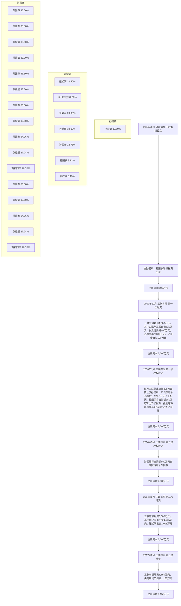
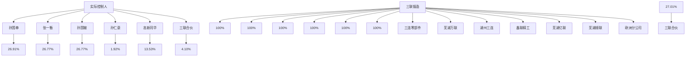
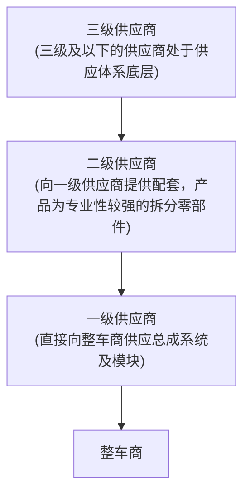
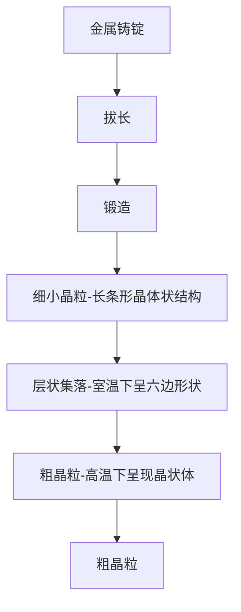
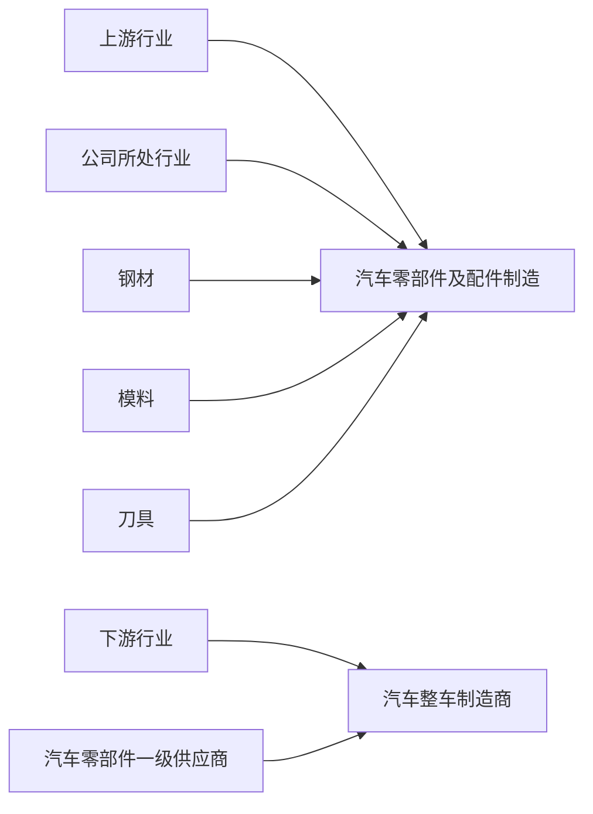
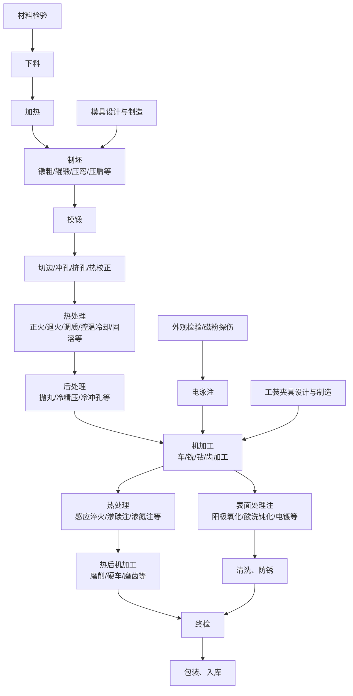

# 芜湖三联锻造股份有限公司

Wuhu Sanlian Forging Co., Ltd.

（芜湖市高新技术产业开发区天井山路 20 号）

natural_image

Abstract logo design with red, yellow, and blue curved shapes (no text or symbols)

SALN

# 首次公开发行股票并在主板上市招股说明书

保荐人（主承销商）

安信证券股份有限公司

（深圳市福田区福田街道福华一路119号安信金融大厦）

# 声明

中国证监会、交易所对本次发行所作的任何决定或意见，均不表明其对注册申请文件及所披露信息的真实性、准确性、完整性作出保证，也不表明其对发行人的盈利能力、投资价值或者对投资者的收益作出实质性判断或保证。任何与之相反的声明均属虚假不实陈述。

根据《证券法》的规定，股票依法发行后，发行人经营与收益的变化，由发行人自行负责；投资者自主判断发行人的投资价值，自主作出投资决策，自行承担股票依法发行后因发行人经营与收益变化或者股票价格变动引致的投资风险。

本次发行概况

<table><tr><td>发行股票类型</td><td>人民币普通股(A股)</td></tr><tr><td>发行股数</td><td>本次拟公开发行股票数量2,838万股,发行股票数量占本次发行后公司总股本的25.04%;本次发行股票均为公开发行的新股,公司原有股东不公开发售股份。</td></tr><tr><td>每股面值</td><td>人民币1.00元</td></tr><tr><td>每股发行价格</td><td>人民币27.93元</td></tr><tr><td>发行日期</td><td>2023年5月11日</td></tr><tr><td>拟上市的证券交易所和板块</td><td>深圳证券交易所主板</td></tr><tr><td>发行后总股本</td><td>11,336万股</td></tr><tr><td>保荐人(主承销商)</td><td>安信证券股份有限公司</td></tr><tr><td>招股说明书签署日期</td><td>2023年5月17日</td></tr></table>

# 目 录

# 声 明

# 本次发行概况...

# 目 录

# 第一节 释义 .......

一、普通术语. .. 8  
二、专业术语.. ..10

# 第二节 概览 ... 15

一、重大事项提示.. .15  
二、发行人及本次发行的中介机构基本情况. ..16  
三、本次发行概况.. .17  
四、发行人主营业务经营情况. .19  
五、发行人板块定位情况. ..20

六、发行人报告期主要财务数据和财务指标. ..20  
七、发行人财务报告审计截止日后主要财务信息及经营状况.. ... 21  
八、发行人选择的具体上市标准. ..22  
九、发行人公司治理特殊安排等重要事项. ..22  
十、募集资金运用与未来发展规划. ..22  
十一、其他对发行人有重大影响的事项. ..23

# 第三节 风险因素.. .24

一、与发行人相关的风险. ..24  
二、与行业相关的风险.. ..26  
三、其他风险... ..27

# 第四节 发行人基本情况. 29

一、发行人基本信息. ..29  
二、发行人设立及报告期内股本演变情况. ..29  
三、发行人的股权结构.. ..42  
四、发行人控股子公司、分公司及参股公司情况. ..42  
五、主要股东及实际控制人的基本情况. ..45

六、发行人控股股东、实际控制人报告期内合法合规情况. .52  
七、发行人股本情况. ..52  
八、发行人董事、监事、高级管理人员及其他核心人员的简要情况..........54  
九、董事、监事、高级管理人员和核心技术人员与发行人签订协议..........64  
十、发行人董事、监事、高级管理人员报告期内的变动情况. .. 65  
十一、董事、监事、高级管理人员及核心技术人员对外投资情况..............67  
十二、董事、监事、高级管理人员及核心技术人员薪酬情况.. .... 68  
十三、员工及其社会保障情况. .69

# 第五节 业务与技术... .74

一、公司的主营业务、主要产品及其变化情况. ..74  
二、公司所处行业基本情况. ..85  
三、公司的行业地位及竞争优劣势. .118  
四、公司主要业务情况. .127  
五、主要固定资产及无形资产. ..174  
六、特许经营权.. ..195  
七、研发和核心技术情况. ..195  
八、产品的质量控制情况. ..210

# 第六节 财务会计信息与管理层分析.... .213

一、合并财务会计报表. ..213   
二、会计师事务所的审计意见和关键审计事项.. ..218  
三、财务报表编制的基础、合并报表范围及变化情况. .221  
四、主要会计政策和会计估计.. .222  
五、执行的主要税收政策、缴纳的主要税种. ..234  
六、分部信息.. ..237  
七、非经常性损益. ..238  
八、财务指标.. ..239   
九、经营成果分析.. ..242  
十、资产质量分析.. ..300  
十一、负债构成、偿债能力、流动性与持续经营能力分析.. ..324  
十二、资本性支出分析.. ..337

十三、本次募集资金到位当年发行人即期回报被摊薄情况说明及董事、高级管理人员履行填补回报措施的承诺. .. 338  
十四、财务报表附注中的重要事项.. .340十五、财务报告审计截止日后主要财务信息及经营情况. .342  
十六、盈利预测情况. ..342

# 第七节 募集资金运用与未来发展规划. ..343

一、募集资金运用概况.. .. 343  
二、募集资金投资项目的必要性与可行性. ..346  
三、公司总体发展战略和经营目标.. ..353  
四、公司发行当年及未来两至三年的发展计划.. .. 353  
五、拟定上述发展计划所依据的假设条件. ..355  
六、实施上述发展计划将面临的主要困难. ..355  
七、公司业务发展计划与现有业务的关系. .. 355

# 第八节 公司治理与独立性 .. ..356

一、发行人公司治理情况. ..356  
二、关于发行人内部控制制度. ..356  
三、发行人报告期内违法违规情况. ..357  
四、报告期内对外担保和资金占用情况. ..357  
五、发行人的独立性.. ..357  
六、同业竞争.. ..359  
七、关联方、关联关系. ..368  
八、关联交易... ...370   
九、独立董事对发行人报告期关联交易执行情况的意见. ..373

# 第九节 投资者保护.. .374

一、发行人报告期内股利分配政策和实际股利分配情况. ..374  
二、发行后的股利分配政策. ..374  
三、本次发行前滚存利润的分配安排. ..378

# 第十节 其他重要事项.... ..380

一、重大合同.. ..380  
二、对外担保情况.. ..389

# 三、诉讼或仲裁事项.. ..389

# 第十一节 声明 ...... ...390

一、全体董事、监事、高级管理人员声明.. ..390  
二、控股股东、实际控制人声明. ..391  
三、保荐人（主承销商）声明. ..392  
保荐机构总经理声明. ..393  
保荐机构董事长声明.. ..394  
四、发行人律师声明. ..395  
五、会计师事务所声明.. ..396  
会计师事务所关于名称变更的说明. .. 397  
六、资产评估机构声明. .. 398   
七、验资机构声明.. ..399  
八、验资复核机构声明. ... 400

# 第十二节 附件 .... ...401

一、发行保荐书.. ...401  
二、上市保荐书.. ...401  
三、法律意见书.. ...401  
四、财务报告及审计报告. ...401  
五、公司章程（草案）. ...401

六、落实投资者关系管理相关规定的安排、股利分配决策程序、股东投票机制建立情况.. ...401  
七、与投资者保护相关的承诺. ...401  
八、发行人及其他责任主体作出的与发行人本次发行上市相关的其他承诺事项.... ... 428  
九、发行人审计报告基准日至招股说明书签署日之间的相关财务报告及审阅报告...... ...430  
十、盈利预测报告及审核报告（不适用） ...430   
十一、内部控制鉴证报告. ...430  
十二、经注册会计师鉴证的非经常性损益明细表. ...430  
十三、股东大会、董事会、监事会、独立董事、董事会秘书制度的建立健全

及运行情况说明.. ...430   
十四、审计委员会及其他专门委员会的设置情况说明. ... 435  
十五、募集资金具体运用情况. ...435  
十六、子公司、参股公司简要情况. ..447  
十七、其他与本次发行有关的重要文件. ..447

# 备查文件 ..... ....474

一、本次发行有关的备查文件. ... 474  
二、查阅地点、时间.. ...475

# 第一节 释义

一、普通术语

<table><tr><td>简称</td><td></td><td>释义</td></tr><tr><td>发行人/公司/本公司/股份公司/三联锻造</td><td>指</td><td>芜湖三联锻造股份有限公司</td></tr><tr><td>三联有限</td><td>指</td><td>芜湖三联锻造有限公司,发行人前身</td></tr><tr><td>湖州三连</td><td>指</td><td>湖州三连精密部件有限公司,公司全资子公司</td></tr><tr><td>芜湖万联</td><td>指</td><td>芜湖万联新能源汽车零部件有限公司,公司全资子公司</td></tr><tr><td>三连零部件</td><td>指</td><td>温州三连汽车零部件有限公司,公司全资子公司</td></tr><tr><td>鑫联精工</td><td>指</td><td>黄山鑫联精工机械有限公司,公司全资子公司</td></tr><tr><td>芜湖顺联</td><td>指</td><td>芜湖顺联智能装备有限公司,公司全资子公司</td></tr><tr><td>芜湖亿联</td><td>指</td><td>芜湖亿联旋压科技有限公司,公司全资子公司</td></tr><tr><td>欧洲分公司</td><td>指</td><td>芜湖三联锻造股份有限公司欧洲分公司</td></tr><tr><td>高新同华</td><td>指</td><td>安徽高新同华创业投资基金(有限合伙),公司持股5%以上的股东</td></tr><tr><td>三联合伙</td><td>指</td><td>芜湖三联控股合伙企业(有限合伙),公司员工持股平台</td></tr><tr><td>温州三联</td><td>指</td><td>温州三联锻造有限公司,公司实际控制人曾控制的企业(已注销)</td></tr><tr><td>黄山联鑫</td><td>指</td><td>黄山市联鑫机械有限公司,公司实际控制人曾控制的企业(已注销)</td></tr><tr><td>重庆硕联</td><td>指</td><td>重庆硕联精密锻造有限公司,公司实际控制人孙国奉妹夫张银宽控制的企业</td></tr><tr><td>华蓥硕联</td><td>指</td><td>华蓥市硕联精密锻造有限公司,公司实际控制人孙国奉妹夫张银宽控制的企业</td></tr><tr><td>山远锻压</td><td>指</td><td>华蓥市山远锻压机械有限公司,公司实际控制人孙国奉妹夫张银宽控制的企业</td></tr><tr><td>荣华锻压</td><td>指</td><td>华蓥市荣华锻压机械厂(普通合伙),公司实际控制人孙国奉妹夫张银宽控制的企业(已注销)</td></tr><tr><td>丹巴赫</td><td>指</td><td>丹巴赫(北京)人工智能技术有限公司,公司董事、副总经理韩良配偶之妹李霞持股20%、任总经理</td></tr><tr><td>博世</td><td>指</td><td>博世集团(Robert Bosch Gmbh),总部位于德国,业务遍布50多个国家,2022年全球第一大汽车零部件供应商</td></tr><tr><td>电装</td><td>指</td><td>日本电装公司(Nippon Denso),总部位于日本,2022年全球第二大汽车零部件供应商</td></tr><tr><td>采埃孚</td><td>指</td><td>采埃孚股份公司(ZF Friedrichshafen AG),总部位于德国,2022年全球第三大汽车零部件供应商</td></tr><tr><td>麦格纳</td><td>指</td><td>麦格纳国际集团(Magna International,Inc.),总部位于加拿大,2022年全球第四大汽车零部件供应商</td></tr><tr><td>华域麦格纳</td><td>指</td><td>华域麦格纳电驱动系统有限公司,注册地址上海市宝山区,由华域汽车系统股份有限公司和麦格纳(太仓)汽车科技有限公司合资成立,从事电驱动系统总成产品和子部件的设计、开发、生产、装配、测试、销售</td></tr><tr><td>爱信精机</td><td>指</td><td>日本爱信精机株式会社(Aisin Seiki),总部位于日本,2022年全球第五大汽车零部件供应商</td></tr><tr><td>大陆</td><td>指</td><td>大陆集团(Continental AG),总部位于德国,2022年全球第八大汽车零部件供应商</td></tr><tr><td>捷太格特</td><td>指</td><td>株式会社捷太格特(JTEKT CORPORATION),是原光洋精工和原丰田工机在2006年1月1日合并后成立的新的公司,总部位于日本,位列2022年全球汽车零部件供应商百强榜第21名,是机床行业的功能零部件生产厂家,以及转向系统、传动系列产品和轴承的供应商</td></tr><tr><td>博格华纳</td><td>指</td><td>博格华纳公司(BorgWarner Inc.),总部位于美国,位列2022年全球汽车零部件供应商百强榜第15名,为全球主要汽车生产商提供先进的动力系统和配件解决方案</td></tr><tr><td>舍弗勒</td><td>指</td><td>舍弗勒集团(Schaeffler AG),总部位于德国,位列2022年全球汽车零部件供应商百强榜第29名,是汽车行业发动机、变速箱和底盘应用领域高精密产品与系统的知名供应商,是全球范围内生产滚动轴承和直线运动产品的领导企业</td></tr><tr><td>本特勒</td><td>指</td><td>本特勒集团(Benteler International AG),总部位于德国,位列2022年全球汽车零部件供应商百强榜第33名,产品包括前悬挂、后悬挂模组;底盘系统;防撞结构件;发动机排气及控制系统等</td></tr><tr><td>美国车桥</td><td>指</td><td>美国车桥制造国际控股有限公司(American Axle &amp; Manufacturing, Inc.,AAM),总部位于美国,位列2022年全球汽车零部件供应商百强榜第43名,是全球知名的汽车动力传动、驱动和底盘系统及其零部件和金属成型产品制造商</td></tr><tr><td>恩梯恩</td><td>指</td><td>恩梯恩集团(NTN Corporation),总部位于日本,位列2022年全球汽车零部件供应商百强榜第55名,从事轴承、等速万向节、精密机械等的生产和销售业务</td></tr><tr><td>利纳马</td><td>指</td><td>利纳马集团(Linamar Corporation),总部位于加拿大,亚洲总部位于中国无锡,位列2022年全球汽车零部件供应商百强榜第54名,主要生产发动机、底盘零部件及组件等精密金属零部件及系统</td></tr><tr><td>无锡威孚</td><td>指</td><td>无锡威孚高科技集团股份有限公司,系无锡产业发展集团有限公司和德国罗伯特博世有限公司为主要股东的合资企业,1998年在深圳证券交易所上市,股票代码000581,股票简称威孚高科。无锡威孚是国内汽车零部件的著名生产厂商,业务包括燃油喷射系统、尾气后处理系统、进气系统</td></tr><tr><td>耐世特</td><td>指</td><td>耐世特汽车系统公司(Nexteer Automotive),总部位于美国,位列2022年全球汽车零部件供应商百强榜第58名,是转向系统及相关技术的全球供应商</td></tr><tr><td>THK</td><td>指</td><td>THK株式会社,总部位于日本,全球机电行业的机械零部件供应商</td></tr><tr><td>全国人大</td><td>指</td><td>中华人民共和国全国人民代表大会</td></tr><tr><td>国务院</td><td>指</td><td>中华人民共和国国务院</td></tr><tr><td>国资委</td><td>指</td><td>国务院国有资产监督管理委员会</td></tr><tr><td>财政部</td><td>指</td><td>中华人民共和国财政部</td></tr><tr><td>工信部</td><td>指</td><td>中华人民共和国工业和信息化部</td></tr><tr><td>国家发改委</td><td>指</td><td>中华人民共和国国家发展和改革委员会</td></tr><tr><td>科技部</td><td>指</td><td>中华人民共和国科学技术部</td></tr><tr><td>生态环境部</td><td>指</td><td>中华人民共和国生态环境部</td></tr><tr><td>中国证监会</td><td>指</td><td>中国证券监督管理委员会</td></tr><tr><td>深交所</td><td>指</td><td>深圳证券交易所</td></tr><tr><td>安信证券/保荐人/保荐机构/主承销商</td><td>指</td><td>安信证券股份有限公司</td></tr><tr><td>德恒/德恒律师/发行人律师</td><td>指</td><td>北京德恒律师事务所</td></tr><tr><td>容诚/容诚会计师/发行人会计师</td><td>指</td><td>容诚会计师事务所(特殊普通合伙),曾用名华普天健会计师事务所(特殊普通合伙)</td></tr><tr><td>报告期</td><td>指</td><td>2020年度、2021年度、2022年度</td></tr><tr><td>《公司法》</td><td>指</td><td>《中华人民共和国公司法》</td></tr><tr><td>《证券法》</td><td>指</td><td>《中华人民共和国证券法》</td></tr><tr><td>元/万元/亿元</td><td>指</td><td>人民币元/万元/亿元</td></tr></table>

# 二、专业术语

<table><tr><td>简称</td><td></td><td>释义</td></tr><tr><td>锻造</td><td>指</td><td>在加压设备及工(模)具的作用下,使坯料或铸锭产生局部或全部的塑性变形,以获得一定几何尺寸、形状的零件(或毛坯)并改善其性能的加工方法</td></tr><tr><td>热锻</td><td>指</td><td>在再结晶温度之上利用外力作用锻压,致使材料变形而塑性</td></tr><tr><td>自由锻</td><td>指</td><td>利用冲击力或压力使金属在上下砧面间各个方向自由变形,不受任何限制而获得所需形状及尺寸和一定机械性能的锻件的一种加工方法</td></tr><tr><td>模锻</td><td>指</td><td>金属坯料在具有一定形状的锻模膛内受压变形而获得锻件</td></tr><tr><td>机加工</td><td>指</td><td>机械加工,通过机械设备对工件的外形尺寸或性能进行改变的过程</td></tr><tr><td>旋压</td><td>指</td><td>旋压是将平板或空心坯料固定在旋压机的模具上,在坯料随机床主轴转动的同时,用旋轮或赶棒加压于坯料,使之产生局部的塑性变形。旋压是一种特殊的成形方法,用旋压方法可以完成各种形状旋转体的拉深、翻边、缩口、胀形和卷边等工艺</td></tr><tr><td>微合金</td><td>指</td><td>在普通软钢和普通高强度低合金钢基体化学成分中添加了微量合金元素(主要是强烈的碳化物形成元素,如Nb、V、Ti、Al等)的钢,合金元素的添加量不多于0.20%。添加微量合金元素后,使钢的一种或几种性能得到明显的变化</td></tr><tr><td>调质</td><td>指</td><td>一种用以改善钢铁材料综合力学性能的热处理工艺,即在淬火后再经高温回火处理,其目的在于使钢铁零部件获得强度与韧性的良好配合,既有较高的强度,又有优良的韧性、塑性、切削性能等</td></tr><tr><td>调质钢</td><td>指</td><td>一般是指含碳量在0.3-0.6%的中碳钢。一般用这类钢制作的零件要求具有良好的综合机械性能,即在保持较高的强度的同时又具有很好的塑性和韧性,工艺上使用调质处理来达到这个目的,所以习惯上把这一类钢称作调质钢</td></tr><tr><td>奥氏体</td><td>指</td><td>钢铁的一种层片状的显微组织,塑性很好,强度较低,具有一定韧性</td></tr><tr><td>马氏体</td><td>指</td><td>钢铁的一种针状的显微组织,高的强度和硬度是钢中马氏体的主要特征</td></tr><tr><td>非调质钢</td><td>指</td><td>在中碳锰钢的基础上加入钒、钛、铌微合金化元素,使其在加热过程中溶于奥氏体中,增加钢的强度。这类钢在热轧状态、锻造状态或正火状态的力学性能达到或接近调制钢,既缩短了生产周期,又节省了能源</td></tr><tr><td>载荷</td><td>指</td><td>载荷也称荷载,使结构或构件产生内力和变形的外力及其它因素,或习惯上指施加在工程结构上使工程结构或构件产生效应的各种直接作用</td></tr><tr><td>冲击载荷</td><td>指</td><td>在很短的时间内以很大的速度作用在构件上的载荷称为冲击载荷</td></tr><tr><td>静载荷</td><td>指</td><td>构件所承受的外力不随时间而变化,而构件本身各点的状态也不随时间而改变,构件各质点没有加速度</td></tr><tr><td>传动比</td><td>指</td><td>机构中两转动构件角速度的比值,也称速比</td></tr><tr><td>应力</td><td>指</td><td>物体由于外因(受力、湿度、温度场变化等)而变形时,在物体内各部分之间产生相互作用的内力,以抵抗这种外因的作用,并试图使物体从变形后的位置恢复到变形前的位置</td></tr><tr><td>交变应力</td><td>指</td><td>又称循环应力、重复应力,是随时间作周期性变化的应力</td></tr><tr><td>配气机构</td><td>指</td><td>按照发动机每一气缸内所进行的工作循环和点火顺序的要求,定时开启和关闭各气缸的进、排气门,使新鲜的可燃混合气(汽油机)或空气(柴油机)得以及时进入气缸,废气得以及时从气缸排出</td></tr><tr><td>塑性变形</td><td>指</td><td>一种不可自行恢复的变形</td></tr><tr><td>晶粒</td><td>指</td><td>金属等组成多晶体的外形不规则的小晶体,而每个晶粒有时又有若干个位向稍有差异的亚晶粒所组成</td></tr><tr><td>再结晶</td><td>指</td><td>金属加工后进行热处理,在变形金属或合金的显微组织中,产生无应变的新晶粒—再结晶的核心。新晶粒不断长大,直至原来的变形组织完全消失,金属或合金的性能也发生显著变化,这一过程称为再结晶</td></tr><tr><td>树枝状晶</td><td>指</td><td>一种能将其分枝成长过程中的某一阶段保留下来的树枝状晶体,对器件性能有相当大的影响</td></tr><tr><td>轻量化</td><td>指</td><td>在给定的边界条件下,实现结构自重的最小化,同时满足一定的寿命和可靠性要求</td></tr><tr><td>辊锻</td><td>指</td><td>材料在一对反向旋转模具的作用下产生塑性变形得到所需锻件或锻坯的塑性成形工艺</td></tr><tr><td>立锻</td><td>指</td><td>锻压机的工作部分(锤头或滑块)作垂直往复运动</td></tr><tr><td>平锻</td><td>指</td><td>锻压机的工作部分(锤头或滑块)作水平往复运动</td></tr><tr><td>预锻</td><td>指</td><td>使毛坯变形,以获得终锻所需要的材料分布状态的工艺步骤</td></tr><tr><td>终锻</td><td>指</td><td>模锻过程中得到锻件的最终几何尺寸的工艺步骤(除少数锻件在终锻后尚需附加弯曲、扭转等工艺步骤外),将预锻件或毛坯锻成最终的锻件形状</td></tr><tr><td>热矫正</td><td>指</td><td>也称火焰矫正,是指在变形构件的适当部位以火焰加热,利用冷却后产生的冷缩应力矫正变形的工艺</td></tr><tr><td>正火</td><td>指</td><td>就是将金属加热到临界温度以上30-50°C,保温适当时间后,在空气中冷却的热处理工艺,一般对碳钢锻件采用,主要是为了细化晶粒、消除内应力、增加强度和韧性,或为了消除网状渗碳体</td></tr><tr><td>退火</td><td>指</td><td>将钢件加热到适当温度,保持一定时间,然后缓慢冷却的热处理工艺,主要是为了细化晶粒,消除或减少残余应力,降低硬度,提高塑性和韧性,改善切削性能</td></tr><tr><td>淬火</td><td>指</td><td>将金属加热到临界点以上,然后经保温后急速冷却的热处理工艺,主要是为了获得不平衡的组织,以提高强度和硬度</td></tr><tr><td>回火</td><td>指</td><td>将金属加热到临界温度以下的某一温度,保温一段时间后让金属内组织能够均匀分配,之后再冷却到室温的热处理工艺,主要是为了获得较为稳定的组织,一般与淬火相结合处理锻件</td></tr><tr><td>感应淬火</td><td>指</td><td>利用电磁感应在工件内产生涡流而将工件进行加热,根据淬硬深度需要来选择适用电磁感应频率</td></tr><tr><td>高频淬火</td><td>指</td><td>使工件表面产生一定的感应电流,迅速加热零件表面,然后迅速淬火的一种金属热处理方法</td></tr><tr><td>固溶</td><td>指</td><td>将合金加热至第二相能全部或最大限度地溶入固溶体的温度,保持一段时间后,以快于第二相自固溶体中析出的速度冷却,获得过饱和固溶体的过程,主要目的是改善钢或合金的塑性和韧性,为沉淀硬化处理做好准备等</td></tr><tr><td>磁粉探伤</td><td>指</td><td>利用钢铁制品表面和近表面缺陷(如裂纹,夹渣,发纹等)磁导率和钢铁磁导率的差异,磁化后这些材料不连续处的磁场将发生畸变,形成部分磁通泄漏处工件表面产生漏磁场,从而吸引磁粉形成缺陷处的磁粉堆积——磁痕,在适当的光照条件下,显现出缺陷位置和形状,实现工件探伤的目的</td></tr><tr><td>抛丸</td><td>指</td><td>一种冷处理过程,用于去除表面氧化皮等杂质提高外观质量或通过高速冲击强化工件表面</td></tr><tr><td>冷精压</td><td>指</td><td>在常温下对已成形的锻件或粗加工的毛坯进一步改善其局部或全部表面粗糙度和尺寸精度的一种锻造方法</td></tr><tr><td>渗碳</td><td>指</td><td>在一定温度下一定介质中使碳原子渗入工件表层的热处理工艺</td></tr><tr><td>渗氮</td><td>指</td><td>在一定温度下一定介质中使氮原子渗入工件表层的热处理工艺</td></tr><tr><td>磨削</td><td>指</td><td>用磨料、磨具切除工件上多余材料的加工方法</td></tr><tr><td>磨齿</td><td>指</td><td>对齿轮的轮齿进行磨削加工的过程</td></tr><tr><td>硬车</td><td>指</td><td>把淬硬钢的车削作为最终加工或精加工的工艺方法,以避免普遍采用的磨削技术</td></tr><tr><td>阳极氧化</td><td>指</td><td>将金属或合金的制件作为阳极,采用电解的方法使其表面形成氧化物薄膜</td></tr><tr><td>酸洗钝化</td><td>指</td><td>一种化学反应,用以去除钢铁表面的腐锈现象并使金属化学稳定性增强</td></tr><tr><td>电镀</td><td>指</td><td>利用电解原理在某些金属表面上镀上一薄层其它金属或合金的过程</td></tr><tr><td>电泳</td><td>指</td><td>涂料粒子在电场力作用下在工件沉积成膜的过程</td></tr><tr><td>刀具</td><td>指</td><td>机械制造中用于切削加工的工具</td></tr><tr><td>夹具</td><td>指</td><td>机械制造过程中用来固定加工对象,使之占有正确的位置,以接受施工或检测的装置</td></tr><tr><td>IATF16949</td><td>指</td><td>汽车行业的质量管理体系标准,是国际汽车行业的技术规范,广泛应用于汽车供应链</td></tr><tr><td>ISO45001</td><td>指</td><td>一种职业健康安全管理体系</td></tr><tr><td>VDA6.3</td><td>指</td><td>德国汽车工业联合会(VDA)制定的德国汽车工业质量标准的第三部分即过程审核,过程审核是指对质量能力进行评定,使过程能达到受控和有能力,能在各种干扰因素的影响下稳定受控</td></tr><tr><td>汽车平台</td><td>指</td><td>汽车厂商进行汽车设计时的一个整体架构或模板,与车辆的基本结构相关,出自于同一平台的不同车辆具有相同的结构要素,通过共享发动机技术、底盘技术等核心技术,模块化地应用相关零部件,可以在一个平台上生产不同的车型,大幅地降低了设计制造成本</td></tr><tr><td>金相</td><td>指</td><td>金属或合金的化学成分以及各种成分在合金内部的物理状态和化学状态</td></tr><tr><td>bar</td><td>指</td><td>巴,压强单位,1巴(bar)=100千帕(kPa)</td></tr><tr><td>开式、半闭式、闭式模具</td><td>指</td><td>根据锻造模具的设计进行的分类,开式模具打压时,多余材料向外溢出,形成锻造飞边,可以进行切边处理;闭式模具,材料在相对密封的环境中成型,对下料要求较高,适合不易成型的锻件;半闭式模具介于两者之间</td></tr><tr><td>近净成型</td><td>指</td><td>零件成形后,仅需少量加工或不再加工,就可用作机械构件</td></tr><tr><td>加工余量</td><td>指</td><td>机械加工过程中,将工件上待加工表面的多余金属通过机械加工的方法去除掉,获得设计要求的加工表面,零件表面预留的(需切除掉的)金属层的厚度</td></tr><tr><td>融合道次旋压</td><td>指</td><td>将多道次旋压进行融合</td></tr><tr><td>铲旋</td><td>指</td><td>尖劈形旋轮不对正板材,与板材中心线成一个角度切入进行旋压</td></tr><tr><td>径向锻造</td><td>指</td><td>专门加工实心或空心长轴类零件的旋转锻造方法</td></tr><tr><td>型腔</td><td>指</td><td>模具中构成产品的空间</td></tr><tr><td>分模面</td><td>指</td><td>分开模具取出产品和浇注系统凝料的可分离的接触表面。一副模具根据需要可能一个或两个以上的分模面,分模面可以是垂直于合模方向,也可以与合模方向平行或倾斜</td></tr><tr><td>超音速高温喷涂</td><td>指</td><td>焰流加热加速喷涂材料至基体表面,形成高质量涂层</td></tr><tr><td>冷热镶嵌</td><td>指</td><td>在常温下或高温下进行镶嵌加工</td></tr><tr><td>铜套</td><td>指</td><td>铜套是热模锻压力机机身与传动主轴连接的滑动轴承中的重要零部件,在高速运动中保证钢性支撑的同时有效的传递运动</td></tr><tr><td>换模效率</td><td>指</td><td>将模具从锻压机上拆下和装上的耗时长短</td></tr><tr><td>解闷车</td><td>指</td><td>指压力机滑块不能越过下止点而卡在之前的某一位置时形成“闷车”时,通过卸载滑块运动过程中运动阻力,恢复滑块正常运动的过程机构</td></tr><tr><td>转子</td><td>指</td><td>由轴承支撑的旋转体</td></tr><tr><td>定子</td><td>指</td><td>电动机静止不动的部分</td></tr><tr><td>尺寸公差</td><td>指</td><td>尺寸公差是指在零件制造过程中,由于加工或测量等因素的影响,完工后的实际尺寸总存在一定的误差。为保证零件的互换性,必须将零件的实际尺寸控制在允许变动的范围内,这个允许的尺寸变动量称为尺寸公差</td></tr><tr><td>DIN10243</td><td>指</td><td>由ECISS/TC 28钢制模锻件技术委员会制定的欧洲标准,规定了落锤与压力机制造的垂直落锤压力钢锻制件的尺寸公差</td></tr><tr><td>DIN10243-E级</td><td>指</td><td>公差提供适当的精度标准适用于精密级别</td></tr><tr><td>DIN10243-F级</td><td>指</td><td>公差提供适当的精度标准适用于普通级别</td></tr><tr><td>一模多穴</td><td>指</td><td>指在一次开模过程中,可生产多个产品</td></tr><tr><td>HB</td><td>指</td><td>布氏硬度,硬度单位,单位为公斤力/平方毫米,一般用于材料较软的时候,如有色金属、热处理之前或退火后的钢铁</td></tr><tr><td>HRC</td><td>指</td><td>洛氏硬度,硬度单位,当测样品过小或者布氏硬度(HB)大于450时,就使用洛氏硬度计量</td></tr><tr><td>CAE</td><td>指</td><td>Computer Aided Engineering,即工程设计中的计算机辅助工程,指用计算机辅助求解分析复杂工程和产品的结构力学性能,以及优化结构性能等</td></tr><tr><td>GB/T12362-2003</td><td>指</td><td>中国钢质模锻件及机械加工余量标准</td></tr><tr><td>S102012-1</td><td>指</td><td>舍弗勒公司产品的分类以及工艺特征标准</td></tr><tr><td>S132030-1</td><td>指</td><td>关于汽车零件有害物质铅、汞、六价铬等有害物质含量限制</td></tr><tr><td>卡车</td><td>指</td><td>又称作载货汽车,一般称作货车,指主要用于运送货物的汽车,有时也指可以牵引其他车辆的汽车,属于商用车辆类别</td></tr><tr><td>求人倍率</td><td>指</td><td>求人倍率是劳动力市场在一个统计周期内有效需求人数与有效求职人数之比,求人倍率=有效需求人数/有效求职人数</td></tr><tr><td>PPAP</td><td>指</td><td>Production Part Approval Process,即生产件批准程序,规定了包括生产材料和散装材料在内的生产件批准的一般要求</td></tr><tr><td>APQP</td><td>指</td><td>Advanced Product Quality Planning,即产品质量先期策划,质量管理体系的一部分,一种用来确定和制定确保某产品使顾客满意所需步骤的结构化方法</td></tr><tr><td>BOM</td><td>指</td><td>物料清单,以数据格式来描述产品结构的文件,是计算机可以识别的产品结构数据文件,也是ERP的主导文件</td></tr><tr><td>ERP</td><td>指</td><td>企业资源计划(Enterprise Resource Planning)的简称,是指建立在信息技术基础上,集信息技术与先进管理思想于一身,以系统化的管理思想,为企业员工及决策层提供决策手段的管理平台</td></tr></table>

本招股说明书中任何表格中若出现合计数与所列数值总和不符，均为四舍五入所致。本招股说明书披露的第三方数据并非专门为本次发行准备，发行人未为此支付费用或提供帮助。

# 第二节 概览

本概览仅对招股说明书全文作扼要提示。投资者作出投资决策前，应认真阅读招股说明书全文。

# 一、重大事项提示

# （一）本次上市前滚存利润的分配安排及决策程序

根据公司 2022 年第一次临时股东大会决议，为兼顾新老股东的利益，公司首次公开发行股票前滚存的未分配利润由公司本次发行完成后的全体新老股东依其所持股份比例共同享有。

# （二）本次发行相关主体作出的重要承诺

本公司提示投资者认真阅读本公司、股东、实际控制人、董事、监事、高级管理人员、核心技术人员以及本次发行的保荐人及证券服务机构等作出的重要承诺和未能履行承诺的约束措施，具体内容请参见本招股说明书“第十二节 附件”之“七、与投资者保护相关的承诺”。

# （三）主要风险因素的特别提示

# 1、汽车产销量下降的风险

公司主要从事汽车锻造零部件的研发、生产和销售。公司产品主要应用于对零部件机械性能和安全性能要求较高的汽车动力系统、传动系统、转向系统以及悬挂支撑等系统。公司业务发展与汽车行业产销量息息相关。自 2010 年起，我国汽车产销量已连续十二年蝉联全球第一。但是，受我国宏观经济增速放缓等多方面因素影响，2018 年开始我国汽车产销量呈下降趋势，若未来因居民消费水平及汽车消费意愿变化等原因导致我国汽车销量进一步下降，公司可能面临业绩增长放缓甚至下滑的风险。

# 2、新能源汽车带来汽车产业变革的风险

近年来世界主要汽车生产大国积极推动节能与新能源汽车的研发和推广，新能源汽车销量快速增长带来汽车产业的变革。多个国家和地区以及知名整车厂商出台了燃油车退出时间表，进一步推动新能源汽车的发展和普及。公司大部分产品如球头拉杆、轮毂轴承等可以应用于燃油车和新能源两种车型，部分产品如高压共轨等主要应用于燃油车，亦有少量产品专用于新能源汽车。如果新能源汽车未来能够实现对燃油车的大规模替代，短期内公司参与的新能源定点开发项目不能按期完成或由于研发失败未能获取新能源汽车零部件订单，公司将失去进入新能源汽车零部件配套体系的重要机会，对公司的经营将产生不利影响。

# 3、客户集中度较高的风险

目前公司与全球知名的大型跨国汽车零部件行业龙头企业如博世、采埃孚、舍弗勒、麦格纳、利纳马等建立了长期稳定的合作关系。报告期各期，公司向前五大客户销售额占当期营业收入的比例分别为 55.93%、58.83%和59.34%，客户集中度较高。如果公司主要客户经营情况发生重大不利变动，或公司在未来无法满足客户需求，从而失去供应商资格，将对公司未来业绩带来不利影响。

# 4、原材料价格波动风险

公司产品的主要原材料为钢材，钢材价格将直接影响公司产品的生产成本。受到国内外经济形势、国家宏观经济政策调控以及市场供求关系等因素的影响，钢材价格变动存在一定的不确定性。基于钢材价格的波动性，公司与主要客户会就钢材价格波动与产品销售价格联动作出约定，定期调整产品售价。虽然公司通过上述措施在一定程度上可以降低主要原材料价格波动对公司业绩的影响，但仍然不能排除未来原材料价格出现大幅波动，进而导致公司经营业绩出现较大波动。

# 二、发行人及本次发行的中介机构基本情况

<table><tr><td colspan="4">(一)发行人基本情况</td></tr><tr><td rowspan="2">发行人名称</td><td rowspan="2">芜湖三联锻造股份有限公司</td><td>有限公司成立日期</td><td>2004年6月18日</td></tr><tr><td>股份公司成立日期</td><td>2018年11月26日</td></tr><tr><td>注册资本</td><td>8,498.00万元</td><td>法定代表人</td><td>孙国奉</td></tr><tr><td>注册地址</td><td>芜湖市高新技术产业开发区天井山路20号</td><td>主要生产经营地址</td><td>芜湖市高新技术产业开发区天井山路20号</td></tr><tr><td>控股股东</td><td>孙国奉、张一衡、孙国敏、孙仁豪</td><td>实际控制人</td><td>孙国奉、张一衡、孙国敏、孙仁豪</td></tr><tr><td>行业分类</td><td>汽车制造业(C36)</td><td>在其他交易场所(申请)挂牌或上市的情况</td><td>2016年12月,安徽省股权托管交易中心挂牌;2018年7月,安徽省股权托管交易中心终止挂牌</td></tr><tr><td colspan="4">(二)本次发行的有关中介机构</td></tr><tr><td>保荐人</td><td>安信证券股份有限公司</td><td>主承销商</td><td>安信证券股份有限公司</td></tr><tr><td>发行人律师</td><td>北京德恒律师事务所</td><td>其他承销机构</td><td>无</td></tr><tr><td>审计机构</td><td>容诚会计师事务所(特殊普通合伙)</td><td>评估机构</td><td>中水致远资产评估有限公司</td></tr><tr><td colspan="3">发行人与本次发行有关的保荐人、承销机构、证券服务机构及其负责人、高级管理人员、经办人员之间存在的直接或间接的股权关系或其他利益关系</td><td>不存在直接或间接的股权关系或其他利益关系</td></tr><tr><td colspan="4">(三)本次发行其他有关机构</td></tr><tr><td>股票登记机构</td><td>中国证券登记结算有限责任公司深圳分公司</td><td>收款银行</td><td>中信银行深圳分行营业部</td></tr><tr><td colspan="2">其他与本次发行有关的机构</td><td colspan="2">无</td></tr></table>

# 三、本次发行概况

<table><tr><td colspan="4">(一)本次发行的基本情况</td></tr><tr><td>股票种类</td><td colspan="3">人民币普通股(A股)</td></tr><tr><td>每股面值</td><td colspan="3">人民币1.00元</td></tr><tr><td>发行股数</td><td>2,838万股</td><td>占发行后总股本比例</td><td>25.04%</td></tr><tr><td>其中:发行新股数量</td><td>2,838万股</td><td>占发行后总股本比例</td><td>25.04%</td></tr><tr><td>股东公开发售股份数量</td><td>不适用</td><td>占发行后总股本比例</td><td>不适用</td></tr><tr><td>发行后总股本</td><td colspan="3">11,336万股</td></tr><tr><td>每股发行价格</td><td colspan="3">27.93元</td></tr><tr><td>发行市盈率</td><td colspan="3">37.73倍(以发行价格除以发行后的每股收益,发行后的每股收益按照2022年经审计的扣除非经常性损益前后孰低的净利润除以本次发行后总股本计算)</td></tr><tr><td>发行前每股净资产</td><td>7.57元(按经审计的截至2022年12月31日归属于母公司股东的净资产除以发行前总股本计算)</td><td>发行前每股收益</td><td>0.99元(按2022年经审计的扣除非经常性损益前后归属母公司股东的净利润的较低者除以发行前总股本计算)</td></tr><tr><td>发行后每股净资产</td><td>11.60元(按本次发行后归属于母公司股东的净资产除以发行后总股本计算,其中,发行后归属于母公司股东的净资产按经审计的截至2022年12月31日归属于母公司股东的净资产和本次募集资金净额之和计算)</td><td>发行后每股收益</td><td>0.74元(按2022年经审计的扣除非经常性损益前后归属于母公司股东的净利润的较低者除以发行后总股本计算)</td></tr><tr><td>发行市净率</td><td colspan="3">2.41倍(以每股发行价格除以发行后每股净资产计算,发行后每股净资产按2022年12月31日经审计的归属于母公司所有者权益加上本次发行募集资金净额之和除以本次发行后总股本计算)</td></tr><tr><td>预测净利润(如有)</td><td colspan="3">不适用</td></tr><tr><td>发行方式</td><td colspan="3">本次发行采用网下向符合条件的投资者询价配售与网上向持有深圳市场非限售A股股份和非限售存托凭证市值的社会公众投资者定价发行相结合的方式进行</td></tr><tr><td>发行对象</td><td colspan="3">本次发行上市的发行对象为符合资格的询价对象和持有深交所股票账户卡的境内自然人、法人及其它机构(法律、法规禁止购买者除外)</td></tr><tr><td>承销方式</td><td colspan="3">主承销商余额包销</td></tr><tr><td>募集资金总额</td><td colspan="3">79,265.34万元</td></tr><tr><td>募集资金净额</td><td colspan="3">67,211.81万元</td></tr><tr><td rowspan="4">募集资金投资项目</td><td colspan="3">精密锻造生产线技改及机加工配套建设项目</td></tr><tr><td colspan="3">高性能锻件生产线(50MN)产能扩建项目</td></tr><tr><td colspan="3">研发中心建设项目</td></tr><tr><td colspan="3">补充流动资金</td></tr><tr><td>发行费用概算</td><td colspan="3">本次发行费用总额为12,053.53万元,包括:1、保荐承销费:(1)保荐费用400.00万元;(2)承销费用8,664.38万元;2、审计及验资费用1,682.83万元;3、律师费用829.32万元;4、用于本次发行的信息披露费用408.49万元;5、发行手续费用及其他费用68.50万元。以上发行费用口径均为不含增值税金额,发行手续费用及其他费用中包含本次发行的印花税,税基为扣除印花税前的募集资金净额,税率为0.025%。合计数与各分项数值之和尾数存在微小差异,为四舍五入造成。</td></tr><tr><td>高级管理人员、员工拟参与战略配售情况(如有)</td><td colspan="3">不适用</td></tr><tr><td>保荐人相关子公司拟参与战略配售情况(如有)</td><td colspan="3">不适用</td></tr><tr><td>拟公开发售股份股东名称、持股数量及拟公开发售股份数量、发行费用的分摊原则(如有)</td><td colspan="3">不适用</td></tr><tr><td colspan="4">(二)本次发行上市的重要日期</td></tr><tr><td>初步询价日期</td><td colspan="3">2023年5月5日</td></tr></table>

<table><tr><td colspan="2">(一)本次发行的基本情况</td></tr><tr><td>刊登发行公告日期</td><td>2023年5月10日</td></tr><tr><td>申购日期</td><td>2023年5月11日</td></tr><tr><td>缴款日期</td><td>2023年5月15日</td></tr><tr><td>股票上市日期</td><td>本次股票发行结束后公司将尽快申请在深圳证券交易所主板上市</td></tr></table>

# 四、发行人主营业务经营情况

公司主要从事汽车锻造零部件的研发、生产和销售。公司主要产品为汽车锻造零部件，应用于对零部件机械性能和安全性能要求较高的汽车动力系统、传动系统、转向系统以及悬挂支撑等系统。

报告期内，公司营业收入分别为 61,784.48 万元、92,925.95 万元和 104,978.27万元。公司主要客户为舍弗勒、采埃孚、麦格纳、博世、利纳马等。公司产品广泛应用于奔驰、宝马、奥迪、大众、特斯拉、比亚迪、路虎、通用、小鹏、理想和蔚来等国内外知名汽车品牌。公司产品境内外销售均采用直销模式。

报告期内，公司采购总额分别为 35,822.58 万元、65,258.16 万元、68,063.25万元。公司生产主要原材料为钢材，原材料采购主要来自于中信泰富特钢集团股份有限公司、南京钢铁股份有限公司、东北特殊钢集团股份有限公司等优质钢材供应商。公司供应商生产的钢材品质优良，生产经营稳定。公司生产采用以销定产并考虑安全库存的模式。

公司主要客户舍弗勒、采埃孚、麦格纳、博世、利纳马等均为 2022 年全球汽车零部件供应商百强榜上榜企业，其中博世、采埃孚和麦格纳位列前五名。公司高压共轨产品作为国家火炬计划产业化示范项目，被评为高新技术产品及安徽工业精品，公司已成为博世高压共轨产品的主要供应商。公司轮毂轴承单元、转向节、转向球头等产品也被安徽省科学技术厅认定为高新技术产品。公司产品在工艺、质量等方面有较强竞争优势，为公司在汽车零部件行业带来一定的市场影响力，建立了较高的品牌知名度。

发行人的主营业务经营的具体情况请参见本招股说明书“第五节 业务与技术”的内容。

# 五、发行人板块定位情况

公司主要从事汽车锻造零部件的研发、生产和销售，所处的汽车零部件行业是汽车工业的重要组成部分。公司业务模式成熟，经过多年深耕已积累了深厚的技术经验、形成了良好的市场口碑，公司在生产能力、产品种类、产品质量等方面得到了采埃孚、舍弗勒等国际知名汽车零部件集团的广泛认可；报告期内，公司营业收入分别为 61,784.48 万元、92,925.95 万元和 104,978.27 万元，扣除非经常性损益后归属于母公司所有者的净利润分别为 $^ { 6 , 4 8 1 . 5 5 }$ 万元、 $6 { , } 6 7 6 . 1 5$ 万元和8,391.81万元，公司业绩持续增长，经营业绩稳定；公司持续专注于锻造技术与工艺的研究与开发，产品广泛应用于全球高端汽车品牌，具备了较高的市场知名度和行业认可度，具有行业代表性。

公司符合《深圳证券交易所股票发行上市审核规则》第三条“主板突出‘大盘蓝筹’特色，重点支持业务模式成熟、经营业绩稳定、规模较大、具有行业代表性的优质企业”的相关规定。

六、发行人报告期主要财务数据和财务指标

<table><tr><td>项目</td><td>2022.12.31/2022年度</td><td>2021.12.31/2021年度</td><td>2020.12.31/2020年度</td></tr><tr><td>资产总额(万元)</td><td>130,710.29</td><td>111,618.60</td><td>81,430.83</td></tr><tr><td>归属于母公司股东的权益(万元)</td><td>64,339.24</td><td>54,758.95</td><td>47,011.03</td></tr><tr><td>资产负债率(母公司)(%)</td><td>42.51</td><td>43.37</td><td>36.77</td></tr><tr><td>资产负债率(合并)(%)</td><td>50.78</td><td>50.94</td><td>42.27</td></tr><tr><td>营业收入(万元)</td><td>104,978.27</td><td>92,925.95</td><td>61,784.48</td></tr><tr><td>净利润(万元)</td><td>9,484.01</td><td>7,663.78</td><td>7,266.05</td></tr><tr><td>归属于母公司所有者的净利润(万元)</td><td>9,484.01</td><td>7,663.78</td><td>7,266.05</td></tr><tr><td>扣除非经常性损益后归属于母公司所有者的净利润(万元)</td><td>8,391.81</td><td>6,676.15</td><td>6,481.55</td></tr><tr><td>扣除非经常性损益前基本每股收益(元)</td><td>1.12</td><td>0.90</td><td>0.86</td></tr><tr><td>扣除非经常性损益前稀释每股收益(元)</td><td>/</td><td>/</td><td>/</td></tr><tr><td>扣除非经常性损益后基本每股收益(元)</td><td>0.99</td><td>0.78</td><td>0.76</td></tr><tr><td>扣除非经常性损益后稀释每股收益(元)</td><td>/</td><td>/</td><td>/</td></tr><tr><td>扣除非经常性损益前加权平均净资产收益率(%)</td><td>15.93</td><td>14.99</td><td>16.77</td></tr><tr><td>扣除非经常性损益后加权平均净资产收益率(%)</td><td>14.09</td><td>13.04</td><td>14.96</td></tr><tr><td>经营活动产生的现金流量净额(万元)</td><td>10,404.51</td><td>3,906.14</td><td>4,005.88</td></tr><tr><td>现金分红(万元)</td><td>/</td><td>/</td><td>/</td></tr><tr><td>研发投入占营业收入的比例(%)</td><td>5.29</td><td>6.25</td><td>6.32</td></tr></table>

# 七、发行人财务报告审计截止日后主要财务信息及经营状况

# （一）财务报告审计截止日后经营情况

公司财务报告审计基准日为 2022 年 12 月 31 日，财务报告审计基准日后至招股说明书签署日，公司的经营模式、税收政策未发生重大变化，主要客户及供应商未发生重大变化，未发生其他可能影响投资者判断的重大事项。本公司提示投资者关注本招股说明书“第六节 财务会计信息与管理层分析”之“十五、财务报告审计截止日后主要财务信息及经营情况”处披露的财务报告审计截止日后的主要财务信息及经营状况。

# （二）2023年 1-3月主要经营业绩情况预计

结合过往业绩、市场需求及订单情况，公司合理预计 2023 年 1-3 月经营业绩情况如下：

单位：万元

<table><tr><td>项目</td><td>2023年1-3月(预计)</td><td>2022年1-3月(未经审阅)</td><td>变动比例(%)</td></tr><tr><td>营业收入</td><td>24,000.00至27,000.00</td><td>25,892.94</td><td>-7.31至4.28</td></tr><tr><td>净利润</td><td>1,600.00至1,900.00</td><td>1,715.10</td><td>-6.71至10.78</td></tr><tr><td>归属于母公司股东的净利润</td><td>1,600.00至1,900.00</td><td>1,715.10</td><td>-6.71至10.78</td></tr><tr><td>扣除非经常性损益后归属于母公司股东的净利润</td><td>1,400.00至1,700.00</td><td>1,453.54</td><td>-3.68至16.96</td></tr></table>

上述预计财务数据仅为公司管理层根据实际经营情况对经营业绩的合理估计，未经审计机构审计或审阅，不代表公司最终可实现的营业收入及净利润，也不代表公司的盈利预测或业绩承诺。

# 八、发行人选择的具体上市标准

根据《深圳证券交易所股票上市规则（2023 年修订）》第三章3.1.2 中规定的第（一）项，发行人选择的具体上市标准为“（一）最近三年净利润均为正，且最近三年净利润累计不低于 1.5 亿元，最近一年净利润不低于 6,000 万元，最近三年经营活动产生的现金流量净额累计不低于 1 亿元或者营业收入累计不低于 10 亿元”。

发行人 2020 年度、2021 年度、2022 年度扣除非经常性损益后归属于母公司所有者的净利润分别为 6,481.55 万元、6,676.15 万元、8,391.81 万元，最近三年扣除非经常性损益后归属于母公司所有者的净利润均为正，累计 2.15 亿元，超过1.5亿元；发行人最近一年扣除非经常性损益后归属于母公司所有者的净利润为 8,391.81 万元，超过 6,000 万元；发行人 2020 年度、2021 年度、2022 年度营业收入分别为 61,784.48 万元、92,925.95 万元、104,978.27 万元，最近三年营业收入累计 25.97 亿元，超过 10 亿元。公司本次发行上市满足其所选择的上市标准。

# 九、发行人公司治理特殊安排等重要事项

发行人公司治理没有特殊安排等重要事项。

# 十、募集资金运用与未来发展规划

本次发行募集资金扣除发行费用后净额，将用于投资以下项目：

单位：万元

<table><tr><td>序号</td><td>项目名称</td><td>投资总额</td><td>拟使用募集资金</td><td>项目代码或备案号</td><td>项目环评批复</td></tr><tr><td>1</td><td>精密锻造生产线技改及机加工配套建设项目</td><td>23,111.87</td><td>23,111.87</td><td>2103-340203-04-01-698560</td><td>芜环评审【2021】110号 芜环行审(承) 【2023】13号</td></tr><tr><td>2</td><td>高性能锻件生产线(50MN)产能扩建项目</td><td>6,091.95</td><td>6,091.95</td><td>2103-340203-04-01-236398</td><td>芜环评审【2021】103号</td></tr><tr><td>3</td><td>研发中心建设项目</td><td>6,264.36</td><td>6,264.36</td><td>2103-340203-04-01-839821</td><td>芜环评审【2021】116号</td></tr><tr><td>4</td><td>补充流动资金</td><td>8,000.00</td><td>8,000.00</td><td>不适用</td><td>不适用</td></tr><tr><td colspan="2">合计</td><td>43,468.18</td><td>43,468.18</td><td>-</td><td>-</td></tr></table>

注：除高性能锻件生产线（50MN）产能扩建项目由发行人子公司芜湖万联实施，其他募集资金投资项目实施主体均为三联锻造。

本次发行上市募集资金到位前，公司将根据各项目的实际进度，以自有资金或银行贷款先行投入；募集资金到位后，公司将严格按照有关制度使用募集资金，募集资金可用于置换前期投入募集资金投资项目的自筹资金。若本次发行实际募集资金（扣除发行费用后）低于项目的总投资额，公司将通过自筹资金解决，来源包括公司自有资金、银行贷款等。若募集资金数额超过募集资金投资项目的资金需求，公司将根据自身发展规划和实际经营需求，对超募资金进行合理安排。

本次募集资金投资项目的具体内容请参见本招股说明书“第十二节 附件”之“十五、募集资金具体运用情况”。

# 十一、其他对发行人有重大影响的事项

公司不存在其他重大影响事项。

# 第三节 风险因素

# 一、与发行人相关的风险

# （一）客户集中度较高的风险

客户集中度较高的风险请参见本招股说明书“第二节 概览”之“一、重大事项提示”之“（三）主要风险因素的特别提示”之“3、客户集中度较高的风险”。

# （二）海外业务开拓风险

随着公司业务的拓展，公司在德国设置了欧洲分公司，负责欧洲市场维护及业务开拓；公司产品外销主要出口至舍弗勒、采埃孚、麦格纳等国际零部件企业在欧洲或美洲的工厂。公司未来将持续拓展海外市场，这对公司海外业务的经营能力提出进一步的要求。公司除上述海外分支机构和出口业务之外，尚未形成完善的海外经营体系，跨国经营经验有所欠缺，叠加海外法律监管、营商环境、地域文化等差异因素的影响，如果公司未来不能克服上述困难，公司未来海外业务开拓将面临一定风险。

# （三）社会保险及住房公积金被追缴风险

报告期内，公司存在未给部分职工缴纳社会保险和住房公积金的情形。该等员工主要为农村户籍人员，就业流动性较大，对当期收入重视度较高，且部分人员已在户籍所在地缴纳新型农村合作医疗保险或新型农村社会养老保险，导致其缴纳社会保险及住房公积金的意愿不强。公司已逐步完善人事用工制度，加大对社会保险、住房公积金相关政策的宣传力度，努力提高社会保险、住房公积金缴纳比例。公司针对农村户籍缴纳新农合、新农保的员工，实行新农合实报实销制度，新农保按照不超过 500 元/人/年的标准实报实销，同时公司为员工提供免费宿舍，解决员工住房难的问题。

报告期内，公司及其子公司所在地人力资源和社会保障局、公积金管理中心已出具相关合规证明，但公司报告期内未足额缴纳的社会保险和住房公积金仍存在被相关主管机构要求补缴的风险。公司控股股东、实际控制人已作出承担相关补缴或处罚费用的承诺。

# （四）核心技术失密及技术人才流失风险

核心技术人员和研发人才是公司的战略资源和核心竞争力。在多年的生产经营过程中，公司组建了一支高素质的研发团队以及一批高熟练度的技术工人。公司通过联合培训、内部培训和传帮带等方式培养生产研发人员，并通过晋升、奖金、股权激励等相结合的激励措施不断吸引人才的加入。但随着公司的业务规模的不断扩张，公司对于高素质技术人才的需求会不断增长，如果公司核心技术人才和研发人才流失或核心技术外泄，将对公司业务发展产生一定不利影响。

# （五）业务规模扩张导致的管理风险

随着公司业务的发展及募集资金投资项目的实施，公司收入规模和资产规模将会持续扩张，相应将在资源整合、市场开拓、内部控制等方面对管理人员提出更高的要求。如果公司内控体系和管理水平不能适应公司规模的快速扩张，公司可能发生因规模扩张导致的经营管理和内部控制风险。

# （六）应收款项发生坏账风险

随着公司业务规模的上升，公司应收款项规模也不断增加。报告期各期末，公司应收账款账面价值分别为 16,324.44 万元、19,247.08 万元和 27,049.01 万元，占流动资产比例分别为 44.41%、36.33%和39.42%。公司应收款项规模较大由公司所处汽车零部件行业特点及公司经营模式决定。公司的客户主要为国内外知名企业，客户资产规模较大、经营业绩稳定、信誉良好，与公司具有长期合作关系，应收账款发生坏账的可能性较小。同时，公司已制定了符合企业会计准则和实际情况的坏账准备计提政策。虽然公司应收账款回收风险较小，但若主要债务人的经营状况发生恶化，公司不能及时回收应收款项，将对公司资产质量以及财务状况产生一定不利影响。

# （七）存货跌价风险

报告期各期末，公司存货账面价值分别为 12,271.90万元、23,836.35 万元和26,244.49 万元，占流动资产的比重分别为 33.39%、44.99%和 38.25%，期末存货账面价值较大。公司采用以销定产模式，根据客户实际订单量和客户预测采购量安排生产、备货。公司已按照会计制度有关规定足额计提了存货跌价准备，若未来因市场环境变化或竞争加剧导致存货跌价或存货变现困难，对公司的盈利能力

将会产生一定不利影响。

# （八）净资产收益率短期下降的风险

报告期内，发行人以扣除非经常性损益后归属于公司普通股股东的净利润计算的加权平均净资产收益率分别为 14.96%、13.04%和 14.09%。若公司本次股票成功发行，净资产将大幅增加。由于募集资金投资项目存在一定的建设周期，难以在短期内达到预期效益，公司发行后的净资产收益率将会有一定幅度的下降。

# （九）募集资金投资项目无法达到预期收益的风险

本次募集资金投资项目将对公司锻造和机加工环节生产能力有全方位的提升，进一步增强公司市场竞争力，其可行性分析是基于宏观经济形势、国家产业相关政策、行业整体发展趋势、汽车消费市场需求以及公司经营状况等因素而做出的。尽管公司产能的扩张计划是建立在对于自身生产经营情况以及外部市场因素做出的审慎分析的基础上，但由于宏观经济形势存在一定程度上的不确定性，产业相关政策可能发生变化，汽车市场整体环境可能随之发生变化，从而对公司相关产品的未来销售情况造成影响，公司可能面临项目收益未能达到预期或无法按原计划顺利实施募集资金投资项目的风险，影响公司整体投资回报率。

# 二、与行业相关的风险

# （一）汽车产销量下降的风险

# （二）新能源汽车带来汽车产业变革的风险

（一）至（二）风险因素请参见本招股说明书“第二节 概览”之“一、重大事项提示”之“（三）主要风险因素的特别提示”。

# （三）汽车芯片短缺带来汽车产销量下降的风险

2020 年年末以来，全球芯片制造产能紧张，各行各业陆续面临“缺芯”问题，其中汽车产业受到的冲击最大，该因素导致多家知名车企出现减产或短期停产的现象。芯片是汽车电控系统不可或缺的部分，汽车电动化、智能化、网联化趋势使得各类车规级芯片的需求量快速增长，同时我国汽车芯片的自主供给能力不强，绝大多数依赖进口，供需不平衡导致芯片短缺问题突出。虽然自 2022 年以来，全球主要芯片企业已经恢复产能并逐渐加大汽车芯片生产供应，但短期内我国芯片依赖进口的现状仍未改变，如果未来贸易摩擦加剧，汽车芯片供应短缺可能导致汽车产销量下降，对公司的经营将产生不利影响。

# （四）产品价格年降的风险

公司产品主要为汽车锻造零部件，均属于非标准化的定制产品。产品价格根据不同的工艺需求和材料成本而定。汽车零部件行业普遍存在价格年度调整的惯例，通常一款新产品在上市之初价格较高，量产以后的一定年度内会逐年调整降低。如公司不能提高新产品研发能力，开发出满足客户需求的产品实现更新换代，公司将面临产品售价下调的风险。

# （五）技术进步与产品更新带来的风险

经过多年的发展，公司通过不断的技术和工艺创新，凭借较高的技术水平、产品质量以及先进管理体系，已进入全球主要汽车零部件供应商的供应链体系。但随着汽车行业整体技术更新换代周期不断缩短，对汽车零部件制造企业的创新研发能力要求也在不断提高。公司需要根据客户的产品更新换代需求，不断提供新的满足客户要求的产品。如果部分项目研发失败未能有效满足客户需求，可能导致公司在未来市场竞争中处于不利地位。

# （六）竞争加剧的风险

公司一直专注汽车锻造零部件的研发、生产和销售，系统掌握了锻造、热处理、机加工、模具和锻压设备等关键生产环节的工艺技术和装备研制技术。公司柴油车高压共轨锻件在国内具有较强的市场竞争力。但若未来同行业相关竞争对手取得技术突破、不断增效降本、扩大产能，则公司将面临市场竞争加剧的经营风险。

# 三、其他风险

# （一）原材料价格波动风险

原材料价格波动风险请参见本招股说明书“第二节 概览”之“一、重大事项提示”之“（三）主要风险因素的特别提示”之“4、原材料价格波动风险”。

# （二）汇率波动风险

报告期各期，公司产品境外业务收入占主营业务收入比例分别为 14.49%、

20.62%和 24.06%。公司销售及采购结算货币除人民币外主要为美元和欧元，在外币销售价格不变的情况下，人民币升值将会减少以人民币折算的销售收入，降低产品毛利率。公司在产品报价时会考虑汇率变动因素进行价格调节，但若未来人民币汇率持续上升，将对公司的出口业务和经营成果造成一定不利影响。

# （三）税收政策变动风险

报告期内各期，公司依法享受的所得税税收优惠金额占当期利润总额的比例分别为10.70%、16.10%和27.46%。报告期内，所得税税收优惠政策对公司的经营业绩存在一定程度的影响。如果未来国家的相关税收政策法规发生变化或者公司在税收优惠期满后未能被认定为高新技术企业，将会对公司的经营业绩产生一定不利影响。

# （四）实际控制人控制不当的风险

截至本招股说明书签署日，公司控股股东、实际控制人孙国奉、张一衡、孙国敏、孙仁豪实际控制公司 86.47%股份的表决权，其中，孙国奉任公司董事长、总经理，张一衡任公司董事，孙仁豪任公司副总经理。由于控股股东与实际控制人在股权控制和经营管理决策等方面对公司具有较大的影响力，若其利用控制地位对公司战略管理、经营决策、财务管控、人事任免、利润分配等重大事项施加不当影响，将可能影响公司业务经营及损害中小投资者利益。

# 第四节 发行人基本情况

# 一、发行人基本信息

<table><tr><td>中文名称</td><td>芜湖三联锻造股份有限公司</td></tr><tr><td>英文名称</td><td>Wuhu Sanlian Forging Co., Ltd.</td></tr><tr><td>注册资本</td><td>8,498.00 万元</td></tr><tr><td>法定代表人</td><td>孙国奉</td></tr><tr><td>有限公司成立时间</td><td>2004 年 6 月 18 日</td></tr><tr><td>股份公司成立时间</td><td>2018 年 11 月 26 日</td></tr><tr><td>公司住所</td><td>芜湖市高新技术产业开发区天井山路 20 号</td></tr><tr><td>邮政编码</td><td>241003</td></tr><tr><td>联系电话</td><td>0553-5650331</td></tr><tr><td>传真号码</td><td>0553-5650331</td></tr><tr><td>公司网址</td><td>https://www.wuhusanlian.com</td></tr><tr><td>电子信箱</td><td>wuhusanlian@wuhusanlian.com</td></tr><tr><td>负责信息披露和投资者关系的部门</td><td>证券投资部</td></tr><tr><td>联系人</td><td>杨成</td></tr><tr><td>联系方式</td><td>0553-5650331</td></tr></table>

# 二、发行人设立及报告期内股本演变情况

# （一）有限公司设立情况

# 1、有限公司设立程序

2004 年 6 月 1 日，孙国奉、孙国敏和张松满就设立三联有限签署了股东协议书及公司章程，约定三联有限的注册资本 500 万元，由孙国奉以机器设备出资175 万元，占注册资本 35%；孙国敏以货币和机器设备出资 162.5 万元，占注册资本32.5%；张松满以货币和机器设备出资 162.5 万元，占注册资本32.5%。

# 2、设立时股东出资的验资情况

2004年6月10日，安徽平泰会计师事务所出具编号为平泰会验字【2004】第395号《验资报告》，验证截至 2004年6 月 10日，三联有限已收到全体股东缴纳的注册资本合计 500万元，其中股东孙国奉以实物（机器设备）出资 175万元；股东孙国敏以货币出资 52.5 万元，以实物（机器设备）出资 100 万元，以代三联有限支付的土地款形成的债权出资 10 万元，共计 162.5 万元；股东张松满以货币出资57.5万元，以实物（机器设备）出资 105 万元，共计 162.5 万元。

2004 年 6 月 18 日，三联有限设立经芜湖市工商行政管理局核准，并取得注册号为 3402012102584 的《营业执照》。

三联有限设立时出资结构如下：

<table><tr><td>股东名称</td><td>注册资本(万元)</td><td>出资比例(%)</td><td>出资方式</td><td>出资状态</td></tr><tr><td>孙国奉</td><td>175.00</td><td>35.00</td><td>实物(机器设备)</td><td>实缴出资</td></tr><tr><td rowspan="3">孙国敏</td><td>52.50</td><td rowspan="3">32.50</td><td>货币</td><td rowspan="3">实缴出资</td></tr><tr><td>100.00</td><td>实物(机器设备)</td></tr><tr><td>10.00</td><td>债权(代付土地款)</td></tr><tr><td rowspan="2">张松满</td><td>57.50</td><td rowspan="2">32.50</td><td>货币</td><td rowspan="2">实缴出资</td></tr><tr><td>105.00</td><td>实物(机器设备)</td></tr><tr><td>合计</td><td>500.00</td><td>100.00</td><td>/</td><td>/</td></tr></table>

注：张松满系孙国奉之妹孙娟丽的配偶。

# 3、货币资金置换实物出资的情况

2006年9月28日，三联有限召开股东会并决议，同意因生产工艺及设备质量问题退回三联有限股东用以出资的机器设备，以货币方式置换该实物出资。三联有限设立时，该机器设备作为实物出资未履行评估作价程序，不符合当时有效的《公司法》（1999 年）中第二十四条的规定，存在出资程序瑕疵。股东以现金方式置换该实物出资后，该出资程序瑕疵已消除。

2007年11月26 日，安徽平泰会计师事务所出具编号为平泰会验字【2007】第 377 号《验资报告》，验证截至 2007 年 11 月 26 日，三联有限已收到全体股东380万元货币出资，置换原设立时股东投入的实物资产。其中孙国奉货币出资175万元，孙国敏货币出资 100万元，张松满货币出资 105万元。三联有限的注册资本仍为500万元。

本次货币出资置换完成后，三联有限的出资结构如下：

<table><tr><td>股东名称</td><td>注册资本(万元)</td><td>出资比例(%)</td><td>出资方式</td><td>出资状态</td></tr><tr><td>孙国奉</td><td>175.00</td><td>35.00</td><td>货币</td><td>实缴出资</td></tr><tr><td rowspan="2">孙国敏</td><td>152.50</td><td rowspan="2">32.50</td><td>货币</td><td rowspan="2">实缴出资</td></tr><tr><td>10.00</td><td>债权(代付土地款)</td></tr><tr><td>张松满</td><td>162.50</td><td>32.50</td><td>货币</td><td>实缴出资</td></tr><tr><td>合计</td><td>500.00</td><td>100.00</td><td>/</td><td>/</td></tr></table>

2021年5月8日，芜湖市市场监督管理局针对上述货币资金置换出具了《情况说明》，确认上述设备出资未经评估的瑕疵情形已主动消除且已超出行政处罚法规定的行政处罚期限。

2021年5月20日，容诚会计师出具编号为容诚专字【2021】241Z0033号的《验资复核报告》，对前述验资事项进行了复核验证，验证置换实物资产的货币资金 380 万元已投入三联有限，出资足额、真实；债权出资 10 万元已投入三联有限，出资足额、真实。

# （二）股份公司设立情况

# 1、发行人设立的程序

2018 年 10 月 11 日，三联有限召开股东会并作出决议，全体股东一致同意三联有限整体变更设立股份有限公司。根据华普天健会计师事务所（特殊普通合伙）出具编号为会审字【2018】5737号《审计报告》，截至 2018 年7 月 31 日，三联有限经审计的净资产总计为 308,886,389.01 元，按照 1：0.2639的比例折股，折合为股份有限公司的股份总数为 81,500,000 股，每股面值 1 元，共计81,500,000.00 元，其余 227,386,389.01 元计入资本公积。

根据中水致远资产评估有限公司出具的中水致远评报字【2018】第 020281号《芜湖三联锻造有限公司拟整体变更设立股份有限公司项目资产评估报告》，截至2018年7月31 日，公司净资产评估价值为 37,526.27万元。

2018 年 10 月 11 日，孙国奉、张一衡、孙国敏、孙仁豪、高新同华等 5 名股东作为发起人签署了《发起人协议》，一致同意由三联有限整体变更设立股份公司，股份公司的注册资本为 8,150万元。

2018年10月27 日，公司召开创立大会暨第一次临时股东大会并作出决议，全体股东（发起人）一致同意通过关于整体变更为股份公司的相关议案。

2018 年 10 月 27 日，华普天健会计师事务所（特殊普通合伙）对公司的出资情况进行了审验，并出具会验字【2018】6175 号《验资报告》，验证截至 2018年 10 月 27 日，公司已收到全体股东以净资产折股的方式缴纳的注册资本 8,150万元。

2018 年 11 月 26 日，三联有限整体变更为股份有限公司经芜湖市工商行政管理局核准，并取得统一社会信用代码为 91340200762794150A的《营业执照》。

# 2、发行人对股份改制折股净资产的调整与复核

2021年5月15日，容诚会计师出具容诚专字【2021】241Z0034号《芜湖三联锻造股份有限公司股改净资产出资到位情况专项复核的报告》及《关于芜湖三联锻造股份有限公司前期会计差错事项对股改基准日净资产影响的说明》，因前期会计差错更正，将三联有限股改基准日净资产由 308,886,389.01 元调整为298,285,000.14 元。调整后，截至 2018 年 7 月 31 日，三联有限经审计的净资产总计为 298,285,000.14 元，按照 1：0.2732 折股，折合为股份有限公司的股份总数为 81,500,000 股，每股面值 1 元，共计 81,500,000.00 元，调整后净资产超出股本部分216,785,000.14 元计入股份公司的资本公积。上述调整事项对股改时公司净资产出资情况未产生出资不实的影响。

2021年5月15日，中水致远资产评估有限公司出具《关于芜湖三联锻造股份有限公司前期会计差错更正对股改基准日评估净资产影响的说明》，将三联有限截至2018年7月31 日净资产的评估价值调整为 36,433.51万元。

2021年5月15日，发行人召开了第一届董事会第十七次会议，同意公司对上述会计差错进行更正。发行人独立董事就前期会计差错更正发表独立意见，同意发行人的会计处理方式，同意发行人根据调整后的股改净资产进行折股。2021年5月31日，发行人召开 2021年第二次临时股东大会，同意公司对上述会计差错进行更正。

# （三）报告期内的股本和股东变化情况

1、三联锻造设立以来股本演变情况概图  

flowchart

（转下图）

（续上图）  

```mermaid
graph TD
    A["2017年11月 三联有限 第四次增资"] --> B["注册资本:8,150万元"]
    B --> C["注册资本:8,150万元"]
    C --> D["注册资本:8,150万元"]
    D --> E["注册资本:8,150万元"]
    E --> F["注册资本:8,150万元"]
    F --> G["注册资本:8,150万元"]
    G --> H["注册资本:8,150万元"]
    H --> I["注册资本:8,150万元"]
    
    J["2018年2月 三联有限 第三次股权转让"] --> K["注册资本:8,150万元"]
    K --> L["注册资本:8,150万元"]
    L --> M["注册资本:8,150万元"]
    M --> N["注册资本:8,150万元"]
    
    O["2018年7月 三联有限 第四次股权转让"] --> P["注册资本:8,150万元"]
    P --> Q["注册资本:8,150万元"]
    Q --> R["注册资本:8,150万元"]
    
    S["2018年11月 三联锻造成立"] --> T["注册资本:8,150万元"]
    T --> U["注册资本:8,150万元"]
    
    V["2019年12月 三联锻造 第一次增资"] --> W["注册资本:8,498万元"]
    W --> X["注册资本:8,498万元"]
    
    Y["孙国奉"] --> Z["57.12%"]
    AA["张松满"] --> AB["28.77%"]
    AC["高新同华"] --> AD["14.11%"]
    
    AE["孙国奉将出资额"] --> AF["163万元转让予孙仁豪"]
    AG["张松满将出资额"] --> AH["2,345万元转让予张一衡"]
    
    AI["孙国奉将出资额"] --> AJ["2,205万元转让予孙国敏"]
    AK["张一衡将出资额"] --> AL["70万元转让予孙国敏"]
    
    AM["孙国奉将出资额"] --> AN["2,205万元转让予孙国敏"]
    AO["张一衡将出资额"] --> AP["70万元转让予孙国敏"]
    
    AQ["孙国奉将出资额"] --> AR["2,205万元转让予孙国敏"]
    AS["张一衡将出资额"] --> AT["70万元转让予孙国敏"]
    
    AU["孙国奉将出资额"] --> AV["2,205万元转让予孙国敏"]
    AW["张一衡将出资额"] --> AX["70万元转让予孙国敏"]
    
    AY["孙国奉"] --> AZ["55.12%"]
    BA["张一衡"] --> BB["28.77%"]
    BC["高新同华"] --> BD["14.11%"]
    BE["孙仁豪"] --> BF["2.00%"]
    
    BG["孙国奉"] --> BH["28.06%"]
    BI["张一衡"] --> BJ["27.91%"]
    BK["孙国敏"] --> BL["27.91%"]
    BM["高新同华"] --> BN["14.11%"]
    BO["孙仁豪"] --> BP["2.00%"]
    
    BQ["以三联有限截至2018年7月31日经审计后的净资产折股，整体变更为股份有限公司"]
    BR["注: 注册资本: 8,150万元"]
    
    BS["注: 注册资本: 8,498万元"]
    
    BT["注: 注册资本: 8,498万元"]
    
    BU["注: 注册资本: 8,498万元"]
    
    BV["注: 注册资本: 8,498万元"]
    
    CA["注: 注册资本: 8,498万元"]
    
    CB["注: 注册资本: 8,498万元"]
    
    CC["注: 注册资本: 8,498万元"]
    
    CE["注: 注册资本: 8,498万元"]
    
    CF["注: 注册资本: 8,498万元"]
    
    CG["注: 注册资本: 8,498万元"]
    
    CE
    CB
    CC
    CV
    CW
    CX
    CY
    CZ
    DA
    DB
    DC
    DD
    DV
    DW
    DX
    DY
    DY
    DY
    DY
    DY
```

flowchart

# 2、发行人报告期内的股本演变情况

三联有限自设立至报告期期初（2019 年初）进行了四次股权转让和四次增资，并于 2018 年 11 月整体变更为股份公司，具体情况请参见申报文件“4-3 发行人关于公司设立以来股本演变情况的说明及其董事、监事、高级管理人员的确认意见”。

报告期内，发行人的股本和股东变化情况如下：

2019 年 12月，股份有限公司第一次增资

# （1）增资情况

2019年12月4日，公司召开2019年第二次临时股东大会，审议通过了《关于公司增资扩股的议案》，议案决定拟将公司的注册资本由 8,150 万元增加至8,498万元。新增注册资本由新股东三联合伙以每股 4.50元的价格认购，其中 348万元计入注册资本，剩余 1,218万元计入资本公积。

本次增资时三联合伙合伙人的岗位及合伙份额情况如下：

<table><tr><td>序号</td><td>姓名</td><td>合伙人类型</td><td>岗位</td><td>认缴出资额(万元)</td><td>出资比例(%)</td><td>出资方式</td><td>出资期限</td></tr><tr><td>1</td><td>孙国奉</td><td>普通合伙人</td><td>三联锻造董事长、总经理</td><td>382.50</td><td>24.43</td><td>货币</td><td>2019.12.31之前</td></tr><tr><td>2</td><td>韩良</td><td>有限合伙人</td><td>三联锻造董事、副总经理</td><td>360.00</td><td>22.99</td><td>货币</td><td>2019.12.31之前</td></tr><tr><td>3</td><td>孟江峰</td><td>有限合伙人</td><td>三联锻造副总经理</td><td>135.00</td><td>8.62</td><td>货币</td><td>2019.12.31之前</td></tr><tr><td>4</td><td>杨成</td><td>有限合伙人</td><td>三联锻造财务总监、董事会秘书</td><td>54.00</td><td>3.45</td><td>货币</td><td>2019.12.31之前</td></tr><tr><td>5</td><td>谭辉</td><td>有限合伙人</td><td>鑫联精工总经理</td><td>45.00</td><td>2.87</td><td>货币</td><td>2019.12.31之前</td></tr><tr><td>6</td><td>刘云祥</td><td>有限合伙人</td><td>湖州三连副总经理</td><td>45.00</td><td>2.87</td><td>货币</td><td>2019.12.31之前</td></tr><tr><td>7</td><td>洪贤来</td><td>有限合伙人</td><td>三联锻造机加技术总监</td><td>45.00</td><td>2.87</td><td>货币</td><td>2019.12.31之前</td></tr><tr><td>8</td><td>王芳琴</td><td>有限合伙人</td><td>三联锻造采购部总监</td><td>45.00</td><td>2.87</td><td>货币</td><td>2019.12.31之前</td></tr><tr><td>9</td><td>孙秀娟</td><td>有限合伙人</td><td>三联锻造监事会主席、销售部总监</td><td>27.00</td><td>1.72</td><td>货币</td><td>2019.12.31之前</td></tr><tr><td>10</td><td>朱兵兵</td><td>有限合伙人</td><td>三联锻造销售部总监</td><td>22.50</td><td>1.44</td><td>货币</td><td>2019.12.31之前</td></tr><tr><td>11</td><td>班文成</td><td>有限合伙人</td><td>三联锻造监事、质保部总监</td><td>22.50</td><td>1.44</td><td>货币</td><td>2019.12.31之前</td></tr><tr><td>12</td><td>王洪兵</td><td>有限合伙人</td><td>三联锻造机加生产部总监</td><td>22.50</td><td>1.44</td><td>货币</td><td>2019.12.31之前</td></tr><tr><td>13</td><td>田金龙</td><td>有限合伙人</td><td>三联锻造监事、锻造技术部部长</td><td>22.50</td><td>1.44</td><td>货币</td><td>2019.12.31之前</td></tr><tr><td>14</td><td>章仁先</td><td>有限合伙人</td><td>三联锻造设备保全部总监</td><td>22.50</td><td>1.44</td><td>货币</td><td>2019.12.31之前</td></tr><tr><td>15</td><td>刘锐</td><td>有限合伙人</td><td>芜湖万联生产部总监</td><td>22.50</td><td>1.44</td><td>货币</td><td>2019.12.31之前</td></tr><tr><td>16</td><td>揭谦福</td><td>有限合伙人</td><td>三联锻造锻造工艺质量部部长</td><td>13.50</td><td>0.86</td><td>货币</td><td>2019.12.31之前</td></tr><tr><td>17</td><td>张猛</td><td>有限合伙人</td><td>芜湖万联质保部部长</td><td>13.50</td><td>0.86</td><td>货币</td><td>2019.12.31之前</td></tr><tr><td>18</td><td>刘青</td><td>有限合伙人</td><td>三联锻造工模部部长</td><td>13.50</td><td>0.86</td><td>货币</td><td>2019.12.31之前</td></tr><tr><td>19</td><td>李联刚</td><td>有限合伙人</td><td>三联锻造锻造生产部部长</td><td>13.50</td><td>0.86</td><td>货币</td><td>2019.12.31之前</td></tr><tr><td>20</td><td>叶永龙</td><td>有限合伙人</td><td>三联锻造财务科长</td><td>13.50</td><td>0.86</td><td>货币</td><td>2019.12.31之前</td></tr><tr><td>21</td><td>钱慧</td><td>有限合伙人</td><td>三联锻造证券事务代表</td><td>13.50</td><td>0.86</td><td>货币</td><td>2019.12.31之前</td></tr><tr><td>22</td><td>昝朋</td><td>有限合伙人</td><td>三连零部件技术部长</td><td>13.50</td><td>0.86</td><td>货币</td><td>2019.12.31之前</td></tr><tr><td>23</td><td>张宏禹</td><td>有限合伙人</td><td>三连零部件工艺部部长、湖州三连监事</td><td>13.50</td><td>0.86</td><td>货币</td><td>2019.12.31之前</td></tr><tr><td>24</td><td>陈林</td><td>有限合伙人</td><td>湖州三连技术部部长</td><td>13.50</td><td>0.86</td><td>货币</td><td>2019.12.31之前</td></tr><tr><td>25</td><td>徐林鸟</td><td>有限合伙人</td><td>三连零部件财务部部长</td><td>13.50</td><td>0.86</td><td>货币</td><td>2019.12.31之前</td></tr><tr><td>26</td><td>邓云辉</td><td>有限合伙人</td><td>三连零部件销售总监</td><td>13.50</td><td>0.86</td><td>货币</td><td>2019.12.31之前</td></tr><tr><td>27</td><td>秦勇</td><td>有限合伙人</td><td>三联锻造机加技术部部长</td><td>9.00</td><td>0.57</td><td>货币</td><td>2019.12.31之前</td></tr><tr><td>28</td><td>刘涛</td><td>有限合伙人</td><td>三联锻造锻造生产部部长</td><td>9.00</td><td>0.57</td><td>货币</td><td>2019.12.31之前</td></tr><tr><td>29</td><td>毛水荣</td><td>有限合伙人</td><td>三联锻造采购部副部长</td><td>9.00</td><td>0.57</td><td>货币</td><td>2019.12.31之前</td></tr><tr><td>30</td><td>孙文政</td><td>有限合伙人</td><td>三联锻造锻造技术部工艺科科长</td><td>9.00</td><td>0.57</td><td>货币</td><td>2019.12.31之前</td></tr><tr><td>31</td><td>汪月朋</td><td>有限合伙人</td><td>三联锻造管理部副部长</td><td>9.00</td><td>0.57</td><td>货币</td><td>2019.12.31之前</td></tr><tr><td>32</td><td>杨建伟</td><td>有限合伙人</td><td>三联锻造机加生产部部长</td><td>9.00</td><td>0.57</td><td>货币</td><td>2019.12.31之前</td></tr><tr><td>33</td><td>严琪</td><td>有限合伙人</td><td>三联锻造工艺部部长</td><td>9.00</td><td>0.57</td><td>货币</td><td>2019.12.31之前</td></tr><tr><td>34</td><td>王浩</td><td>有限合伙人</td><td>芜湖万联锻造工艺部副部长</td><td>9.00</td><td>0.57</td><td>货币</td><td>2019.12.31之前</td></tr><tr><td>35</td><td>张星</td><td>有限合伙人</td><td>三连零部件技术部副部长</td><td>9.00</td><td>0.57</td><td>货币</td><td>2019.12.31 之前</td></tr><tr><td>36</td><td>董瑞丽</td><td>有限合伙人</td><td>三连零部件企管部人事主管</td><td>9.00</td><td>0.57</td><td>货币</td><td>2019.12.31 之前</td></tr><tr><td>37</td><td>陈海燕</td><td>有限合伙人</td><td>三连零部件会计、工会主席</td><td>9.00</td><td>0.57</td><td>货币</td><td>2019.12.31 之前</td></tr><tr><td>38</td><td>余小雷</td><td>有限合伙人</td><td>湖州三连工艺部副部长</td><td>9.00</td><td>0.57</td><td>货币</td><td>2019.12.31 之前</td></tr><tr><td>39</td><td>刘细兰</td><td>有限合伙人</td><td>三连零部件采购部部长</td><td>9.00</td><td>0.57</td><td>货币</td><td>2019.12.31 之前</td></tr><tr><td>40</td><td>黎孝林</td><td>有限合伙人</td><td>鑫联精工技术部工程师</td><td>9.00</td><td>0.57</td><td>货币</td><td>2019.12.31 之前</td></tr><tr><td>41</td><td>张军照</td><td>有限合伙人</td><td>鑫联精工工艺部总监</td><td>9.00</td><td>0.57</td><td>货币</td><td>2019.12.31 之前</td></tr><tr><td>42</td><td>孙兴明</td><td>有限合伙人</td><td>鑫联精工技术部副部长</td><td>9.00</td><td>0.57</td><td>货币</td><td>2019.12.31 之前</td></tr><tr><td colspan="2">合计</td><td>/</td><td>/</td><td>1,566.00</td><td>100.00</td><td>/</td><td>/</td></tr></table>

2019 年 12 月 17 日，三联锻造本次增资经芜湖市市场监督管理局核准，并取得统一社会信用代码为 91340200762794150A的《营业执照》。

本次增资完成后，公司股本结构如下：

<table><tr><td>股东名称</td><td>持股数量(万股)</td><td>持股比例(%)</td><td>出资方式</td><td>出资状态</td></tr><tr><td>孙国奉</td><td>2,287.00</td><td>26.91</td><td>净资产</td><td>实缴出资</td></tr><tr><td>张一衡</td><td>2,275.00</td><td>26.77</td><td>净资产</td><td>实缴出资</td></tr><tr><td>孙国敏</td><td>2,275.00</td><td>26.77</td><td>净资产</td><td>实缴出资</td></tr><tr><td>高新同华</td><td>1,150.00</td><td>13.53</td><td>净资产</td><td>实缴出资</td></tr><tr><td>三联合伙</td><td>348.00</td><td>4.10</td><td>货币</td><td>实缴出资</td></tr><tr><td>孙仁豪</td><td>163.00</td><td>1.92</td><td>净资产</td><td>实缴出资</td></tr><tr><td>合计</td><td>8,498.00</td><td>100.00</td><td>/</td><td>/</td></tr></table>

2020年1月9日，容诚会计师出具编号为容诚验字【2020】241Z0001 号《验资报告》，验证截至 2019 年 12 月 30 日，公司已收到股东三联合伙以货币方式缴纳出资 1,566 万元，其中 348 万元计入注册资本，剩余 1,218 万元计入资本公积，公司的注册资本增加至 8,498万元。

# （2）股份支付情况

①股份支付费用的计算依据、方法

2019 年 12 月 10 日，公司聘请中水致远评估有限公司对公司股东全部权益价值进行评估并出具中水致远评咨字【2019】第 020067 号《芜湖三联锻造股份有限公司拟进行股份支付所涉及的股权公允价值项目估值报告》，截至评估基准日2018年12月31日，公司全部股东权益市场价值为 52,800.00万元。按照评估价值及公司股本8,150.00万股计算，公司每股公允价值为 6.48元。

2022年3月10日，公司聘请中水致远评估有限公司对公司股东全部权益价值进行评估并出具中水致远评咨字【2022】第 020010 号《芜湖三联锻造股份有限公司进行股份支付所涉及的其股权公允价值追溯估值项目估值报告》，截至评估基准日 2019 年 12 月 31 日，公司全部股东权益评估价值为 58,300.00 万元。按照评估价值及公司股本 8,150.00万股计算，公司每股公允价值为 7.15元。

公司基于谨慎性考虑，参考中水致远评咨字【2022】第 020010 号《芜湖三联锻造股份有限公司进行股份支付所涉及的其股权公允价值追溯估值项目估值报告》，按照公司截至 2019 年 12 月 31 日的股权公允价值的评估对前次股份支付公允价值进行调整，将股份支付授予的公允价值由 6.48 元/股调整为 7.15 元/股。2019年12月4日，公司股东大会审议通过了《关于公司增资扩股的议案》，发行人选择该时点作为授予日，按照 7年确认等待期（以 2019年12月4 日起算，按照公司上市申报计划 2023年12月上市，含上市后锁定期 3年），根据中水致远股权评估公允价值 7.15元/股与 4.50元/股的价差按期分摊计入当期费用。

公司在等待期内每个资产负债表日对预计可行权数量作出合理估计，确认相应的股权激励费用。等待期内若公司估计成功完成首次公开发行股票并上市且股票锁定期（自公司股票上市之日起三年）的时点发生变化，需根据重估时点确定等待期，截至当期累计应确认的股权激励费用扣减前期累计已确认金额，作为当期应确认的股权激励费用。

本次股份支付费用按照 7年等待期确认为管理费用和资本公积，并将确认的股份支付的费用计入经常性损益。对应会计处理为：

<table><tr><td>期间</td><td>会计科目</td><td>借方金额(元)</td><td>贷方金额(元)</td></tr><tr><td>2022 年度</td><td>管理费用-股份支付资本公积</td><td>962,795.80-</td><td>-962,795.80</td></tr><tr><td rowspan="2">2021 年度</td><td>管理费用-股份支付</td><td>929,944.49</td><td>-</td></tr><tr><td>资本公积</td><td>-</td><td>929,944.49</td></tr><tr><td rowspan="2">2020 年度</td><td>管理费用-股份支付</td><td>992,804.19</td><td>-</td></tr><tr><td>资本公积</td><td>-</td><td>992,804.19</td></tr></table>

本次股份支付具体计算过程和方法如下：

<table><tr><td>项目</td><td>2022年度</td><td>2021年度</td><td>2020年度</td></tr><tr><td>对应公司股份支付数量(万股)1</td><td>254.00</td><td>254.00</td><td>262.00</td></tr><tr><td>公司每股股份公允价值(元/股)2</td><td>7.15</td><td>7.15</td><td>7.15</td></tr><tr><td>员工持股平台入股价格(元/股)3</td><td>4.50</td><td>4.50</td><td>4.50</td></tr><tr><td>确认股份支付费用(万元)4=1*(2-3)</td><td>673.96</td><td>673.96</td><td>695.18</td></tr><tr><td>等待期月数(月)5</td><td>84</td><td>84</td><td>84</td></tr><tr><td>累计等待月数(月)6</td><td>37</td><td>25</td><td>13</td></tr><tr><td>累计确认股份支付(万元)7=4*6/5</td><td>296.86</td><td>200.58</td><td>107.59</td></tr><tr><td>当期应确认股份支付(万元)</td><td>96.28</td><td>92.99</td><td>99.28</td></tr></table>

发行人对应公司股份数量变动系激励对象离职将其持有的合伙份额向普通合伙人转让，普通合伙人持有的公司股份不具有激励效果。

三联合伙自成立至 2022年12月31日，合伙人变动情况如下：

<table><tr><td>序号</td><td>时间</td><td>出让人</td><td>受让人</td><td>转让出资额(万元)</td><td>对应发行人股数(万股)</td><td>转让比例(%)</td><td>转让对价(万元)</td></tr><tr><td>1</td><td>2020.6.4</td><td>黎孝林</td><td>陈杰</td><td>9.00</td><td>2.00</td><td>0.57</td><td>9.00</td></tr><tr><td>2</td><td rowspan="2">2020.7.23</td><td>班文成</td><td>孙国奉</td><td>4.50</td><td>1.00</td><td>0.29</td><td>4.50</td></tr><tr><td>3</td><td>王洪兵</td><td>江民春</td><td>9.00</td><td>2.00</td><td>0.57</td><td>9.00</td></tr><tr><td>4</td><td>2021.3.1</td><td>邓云辉</td><td>孙国奉</td><td>13.50</td><td>3.00</td><td>0.86</td><td>14.10</td></tr><tr><td>5</td><td rowspan="2">2021.6.30</td><td>昝朋</td><td>孙国奉</td><td>13.50</td><td>3.00</td><td>0.86</td><td>14.10</td></tr><tr><td>6</td><td>严琪</td><td>孙国奉</td><td>9.00</td><td>2.00</td><td>0.57</td><td>9.40</td></tr></table>

②本次股权激励以换取服务为目的，约定最低服务期限

三联合伙的合伙人均为公司核心员工，公司向员工进行激励系以换取服务为目的。根据《芜湖三联控股合伙企业（有限合伙）合伙协议书》中约定“以标的公司在中国证券市场首次公开发行人民币普通股股票并上市且股票锁定期（自标的公司股票上市之日起三年）届满之日起，本合伙企业所持标的股份将根据合伙人的书面申请，并经合伙人会议表决通过（且必须取得执行事务合伙人孙国奉先生同意）后择机分批出售，出售股票所得款项扣税及扣除各种费用后由提出申请的合伙人按照提出申请比例进行分配。”该约定表明，三联锻造员工需完成规定的服务期限方可从股权激励计划中获益，属于可行权条件中的服务期限条件。

③股份支付会计处理符合会计准则的规定

公司股份支付会计处理与《企业会计准则第 11 号-股份支付》的对照情况如下：

<table><tr><td>《企业会计准则第11号——股份支付》</td><td>公司情况对照</td></tr><tr><td>第二条股份支付,是指企业为获取职工和其他方提供服务而授予权益工具或者承担以权益工具为基础确定的负债的交易。股份支付分为以权益结算的股份支付和以现金结算的股份支付。以权益结算的股份支付,是指企业为获取服务以股份或其他权益工具作为对价进行结算的交易。</td><td>公司确认股份支付的对象包括与公司签了《劳动合同》的正式员工,为公司提供相应的服务的人员。本次授予员工股份的结算工具为公司股权,属于以权益结算的股份支付。</td></tr><tr><td>第四条以权益结算的股份支付换取职工提供服务的,应当以授予职工权益工具的公允价值计量。</td><td>权益工具的公允价值按照授予股权的公允价值和认购价格之间的差额确定。</td></tr><tr><td>第五条授予后立即可行权的换取职工服务的以权益结算的股份支付,应当在授予日按照权益工具的公允价值计入相关成本或费用,相应增加资本公积。</td><td>本次授予员工股份按照7年等待期,确认为管理费用和资本公积,并将确认的股份支付的费用计入经常性损益。</td></tr><tr><td>第八条以权益结算的股份支付换取其他方服务的,应当分别下列情况处理:(1)其他方服务的公允价值能够可靠计量的,应当按照其他方服务在取得日的公允价值,计入相关成本或费用,相应增加所有者权益。(2)其他方服务的公允价值不能可靠计量但权益工具公允价值能够可靠计量的,应当按照权益工具在服务取得日的公允价值,计入相关成本或费用,相应增加所有者权益。</td><td>公司取得以上员工提供的相应服务,属于公允价值不能可靠计量的服务,按权益工具的公允价值计入管理费用和资本公积。</td></tr></table>

公司关于股份支付的会计处理符合《企业会计准则》的相关规定。

# 3、发行人报告期内重大重组情况

发行人报告期内未发生重大资产重组，自有限公司设立至今为解决同业竞争问题曾存在2次资产重组情况，具体内容请参见本招股说明书“第十二节 附件”之“十七、其他与本次发行有关的重要文件”之“（一）报告期前资产重组情况”。

# 4、发行人在其他证券市场的上市/挂牌情况

# （1）2016年12 月，安徽省股权托管交易中心挂牌

三联有限召开股东会并一致同意在安徽省股权托管交易中心科技创新板挂牌，并向安徽省股权托管交易中心递交了申请。

2016 年 12 月 29 日，安徽省股权托管交易中心有限责任公司出具了皖股交挂牌【2016】63号《关于同意芜湖三联锻造有限公司等 27家企业科技创新板挂牌的通知》，同意三联有限在安徽省股权托管交易中心科技创新板挂牌，股权代码“700608”，证券简称“三联锻造”。

# （2）2018年7月，安徽省股权托管交易中心终止挂牌

2018 年 7 月 3 日，三联有限召开股东会，审议并通过了《关于公司终止在安徽省股权托管交易中心科技版挂牌的议案》，股东一致同意终止在安徽省股权托管交易中心科技版挂牌，并向安徽省股权托管交易中心提出申请。

2018年7月24日，安徽省股权托管交易中心有限公司出具了“皖股交机构【2018】21 号”《关于同意芜湖三联锻造有限公司在安徽省股权托管交易中心终止挂牌的函》，同意三联有限自 2018年7月 24日起终止在安徽省股权托管交易中心挂牌。

在挂牌期间三联有限未受到过安徽省股权托管交易中心的处罚。

# 三、发行人的股权结构

截至本招股说明书签署日，发行人股权结构图如下：

flowchart

# 四、发行人控股子公司、分公司及参股公司情况

# （一）全资子公司基本情况

截至本招股说明书签署日，发行人拥有6 家全资子公司，具体情况如下：

# 1、三连零部件

<table><tr><td>公司名称</td><td colspan="4">温州三连汽车零部件有限公司</td></tr><tr><td>统一社会信用代码</td><td colspan="4">91330381MA298WTM4J</td></tr><tr><td>成立日期</td><td colspan="4">2017年9月20日</td></tr><tr><td>注册地址</td><td colspan="4">浙江省温州市瑞安市桐浦镇桐浦村</td></tr><tr><td>主要生产经营地</td><td colspan="4">浙江省温州市瑞安市桐浦镇桐浦村</td></tr><tr><td>注册资本</td><td colspan="4">3,800万元</td></tr><tr><td>实收资本</td><td colspan="4">3,800万元</td></tr><tr><td>法定代表人</td><td colspan="4">张一衡</td></tr><tr><td>主营业务</td><td colspan="4">汽车零部件生产、销售</td></tr><tr><td>在发行人业务板块中定位</td><td colspan="4">设立目的为收购温州三联业务并解决同业竞争,未来产能与业务将逐渐转移至湖州三连</td></tr><tr><td>股东构成及控制情况</td><td colspan="4">三联锻造持有100%股权</td></tr><tr><td>最近一年主要财务数据</td><td>总资产</td><td>净资产</td><td>营业收入</td><td>净利润</td></tr><tr><td>(经容诚审计)(万元)</td><td></td><td></td><td></td><td></td></tr><tr><td>2022年12月31日/2022年度</td><td>12,418.10</td><td>7,883.72</td><td>8,968.25</td><td>287.61</td></tr></table>

2、芜湖万联

<table><tr><td>公司名称</td><td colspan="4">芜湖万联新能源汽车零部件有限公司</td></tr><tr><td>统一社会信用代码</td><td colspan="4">91340200MA2NTA5F1B</td></tr><tr><td>成立日期</td><td colspan="4">2017年7月13日</td></tr><tr><td>注册地址</td><td colspan="4">芜湖高新技术产业开发区南区新阳路8号</td></tr><tr><td>主要生产经营地</td><td colspan="4">芜湖高新技术产业开发区南区新阳路8号</td></tr><tr><td>注册资本</td><td colspan="4">3,200万元</td></tr><tr><td>实收资本</td><td colspan="4">3,200万元</td></tr><tr><td>法定代表人</td><td colspan="4">孙国奉</td></tr><tr><td>在发行人业务板块中定位</td><td colspan="4">芜湖生产基地,公司核心生产基地,开展生产和销售业务</td></tr><tr><td>股东构成及控制情况</td><td colspan="4">三联锻造持有100%股权</td></tr><tr><td>主营业务</td><td colspan="4">汽车零部件生产、销售</td></tr><tr><td>最近一年主要财务数据(经容诚审计)(万元)</td><td>总资产</td><td>净资产</td><td>营业收入</td><td>净利润</td></tr><tr><td>2022年12月31日/2022年度</td><td>27,514.27</td><td>7,148.65</td><td>31,750.23</td><td>1,609.07</td></tr></table>

3、湖州三连

<table><tr><td>公司名称</td><td colspan="4">湖州三连精密部件有限公司</td></tr><tr><td>统一社会信用代码</td><td colspan="4">91330501MA29K1B94H</td></tr><tr><td>成立日期</td><td colspan="4">2017年6月21日</td></tr><tr><td>注册地址</td><td colspan="4">浙江省湖州市敢山路1228号</td></tr><tr><td>主要生产经营地</td><td colspan="4">浙江省湖州市敢山路1228号</td></tr><tr><td>注册资本</td><td colspan="4">1,500万元</td></tr><tr><td>实收资本</td><td colspan="4">1,500万元</td></tr><tr><td>法定代表人</td><td colspan="4">孙国敏</td></tr><tr><td>在发行人业务板块中定位</td><td colspan="4">公司在湖州的生产基地,逐渐承接三连零部件的业务(温州厂区较小、设备老旧),实现生产基地的转换和产能的提升</td></tr><tr><td>股东构成及控制情况</td><td colspan="4">三联锻造持有100%股权</td></tr><tr><td>主营业务</td><td colspan="4">汽车零部件生产、销售</td></tr><tr><td>最近一年主要财务数据(经容诚审计)(万元)</td><td>总资产</td><td>净资产</td><td>营业收入</td><td>净利润</td></tr><tr><td>2022年12月31日/2022年度</td><td>13,041.66</td><td>728.49</td><td>9,446.66</td><td>404.97</td></tr></table>

4、鑫联精工

<table><tr><td>公司名称</td><td colspan="4">黄山鑫联精工机械有限公司</td></tr><tr><td>统一社会信用代码</td><td colspan="4">91341021MA2PHK983E</td></tr><tr><td>成立日期</td><td colspan="4">2017年10月16日</td></tr><tr><td>注册地址</td><td colspan="4">安徽省黄山市歙县经济开发区二环路行知大道002号</td></tr><tr><td>主要生产经营地</td><td colspan="4">安徽省黄山市歙县经济开发区二环路行知大道002号</td></tr><tr><td>注册资本</td><td colspan="4">1,000万元</td></tr><tr><td>实收资本</td><td colspan="4">1,000万元</td></tr><tr><td>法定代表人</td><td colspan="4">张一衡</td></tr><tr><td>在发行人业务板块中定位</td><td colspan="4">设立目的为收购黄山联鑫业务并解决同业竞争;公司在黄山的生产基地,开展生产和销售业务</td></tr><tr><td>股东构成及控制情况</td><td colspan="4">三联锻造持有100%股权</td></tr><tr><td>主营业务</td><td colspan="4">汽车零部件生产、销售</td></tr><tr><td>最近一年主要财务数据(经容诚审计)(万元)</td><td>总资产</td><td>净资产</td><td>营业收入</td><td>净利润</td></tr><tr><td>2022年12月31日/2022年度</td><td>11,015.98</td><td>3,072.19</td><td>8,898.66</td><td>802.30</td></tr></table>

5、芜湖亿联

<table><tr><td>公司名称</td><td colspan="4">芜湖亿联旋压科技有限公司</td></tr><tr><td>统一社会信用代码</td><td colspan="4">91340203MA2ULFUJX0</td></tr><tr><td>成立日期</td><td colspan="4">2020年4月1日</td></tr><tr><td>注册地址</td><td colspan="4">安徽省芜湖市弋江区白马街道高新区南区新阳路2号</td></tr><tr><td>主要生产经营地</td><td colspan="4">安徽省芜湖市弋江区白马街道高新区南区新阳路2号</td></tr><tr><td>注册资本</td><td colspan="4">1,000万元</td></tr><tr><td>实收资本</td><td colspan="4">1,000万元</td></tr><tr><td>法定代表人</td><td colspan="4">孙国奉</td></tr><tr><td>在发行人业务板块中定位</td><td colspan="4">公司旋压业务的研发、生产主体,开展旋压新工艺产品的研发、生产、销售</td></tr><tr><td>股东构成及控制情况</td><td colspan="4">三联锻造持有100%股权</td></tr><tr><td>主营业务</td><td colspan="4">旋压产品及汽车零部件生产、销售</td></tr><tr><td>最近一年主要财务数据(经容诚审计)(万元)</td><td>总资产</td><td>净资产</td><td>营业收入</td><td>净利润</td></tr><tr><td>2022年12月31日/2022年度</td><td>4,891.17</td><td>584.09</td><td>2,108.75</td><td>-66.99</td></tr></table>

6、芜湖顺联

<table><tr><td>公司名称</td><td colspan="4">芜湖顺联智能装备有限公司</td></tr><tr><td>统一社会信用代码</td><td colspan="4">91340200MA2T68PM0M</td></tr><tr><td>成立日期</td><td colspan="4">2018年10月25日</td></tr><tr><td>注册地址</td><td colspan="4">安徽省芜湖市弋江区高新技术开发区天井山路20号</td></tr><tr><td>主要生产经营地</td><td colspan="4">安徽省芜湖市弋江区高新技术开发区天井山路20号</td></tr><tr><td>注册资本</td><td colspan="4">100万元</td></tr><tr><td>实收资本</td><td colspan="4">100万元</td></tr><tr><td>法定代表人</td><td colspan="4">孙国奉</td></tr><tr><td>在发行人业务板块中定位</td><td colspan="4">公司主要生产装备的供应商(暂不对外开展业务)</td></tr><tr><td>股东构成及控制情况</td><td colspan="4">三联锻造持有100%股权</td></tr><tr><td>主营业务</td><td colspan="4">压力机及辅助设备、自动化上料设备设计、生产、销售</td></tr><tr><td>最近一年主要财务数据(经容诚审计)</td><td>总资产</td><td>净资产</td><td>营业收入</td><td>净利润</td></tr><tr><td>2022年12月31日/2022年度</td><td>5,814.05</td><td>103.98</td><td>1,740.48</td><td>78.71</td></tr></table>

# （二）分公司基本情况

截至本招股说明书签署日，发行人拥有1 家分公司，具体情况如下：

<table><tr><td>公司名称</td><td>芜湖三联锻造股份有限公司欧洲分公司</td></tr><tr><td>英文名称</td><td>Wuhu Sanlian Forging Co., Ltd. European Branch</td></tr><tr><td>境外投资证书编号</td><td>境外机构证第 N3400202000002 号</td></tr><tr><td>营业场所</td><td>Friedrich-Ebert-Anlage 49,60308 Frankfurt</td></tr><tr><td>负责人</td><td>潘明</td></tr><tr><td>核准或备案文号</td><td>皖境外机构【2020】00002 号</td></tr><tr><td>主要职能</td><td>负责欧洲销售市场维护及新业务开拓</td></tr><tr><td>成立日期</td><td>2019 年 1 月 8 日</td></tr></table>

# 五、主要股东及实际控制人的基本情况

# （一）控股股东、实际控制人的基本情况

# 1、发行人的实际控制人认定

截至本招股说明书签署日，公司共同实际控制人为孙国奉、张一衡、孙国敏、孙仁豪。孙国奉与孙仁豪系父子关系，孙国奉与孙国敏系兄弟关系，孙国奉、孙国敏与张一衡系舅甥关系。

孙国奉、张一衡、孙国敏与孙仁豪四人于 2018年7月12日签订《一致行动人协议》，约定：“各方保证在行使公司股东、董事权利及经营决策时，特别是行使召集权、提案权和表决权时采取相同的意思表示，以巩固四人在公司中的控制地位，维护公司实际控制权的稳定，若各方在对相关议案或表决、决策事项进行协商过程中存在意见不一致情况时，均按照孙国奉的意见进行表决或决策”。《一致行动人协议》有效期限为自签署之日（2018 年7月12日）至公司股票在境内A股上市之日起满 36个月时终止，有效期届满后各方可协商延期。该协议对孙国奉、张一衡、孙国敏与孙仁豪一致行动作出了合法、有效的安排，权利义务清晰、责任明确。

截至本招股说明书签署日，孙国奉直接持有公司 26.91%的股份，系公司第一大股东，任公司董事长、总经理；张一衡直接持有公司 26.77%的股份，任公司董事；孙国敏直接持有公司 26.77%的股份；孙仁豪直接持有公司 1.92%的股份，任公司副总经理；孙国奉担任三联合伙的执行事务合伙人，可实际支配三联合伙所持有的公司4.10%股份的表决权。孙国奉、张一衡、孙国敏和孙仁豪实际控制公司86.47%股份的表决权，能够对发行人股东大会和董事会产生重大影响。

报告期内，发行人及控股股东、实际控制人不存在受到行政处罚或刑事制裁等违法行为。发行人的实际控制人最近三年没有发生变化，符合《首次公开发行股票注册管理办法》《<首次公开发行股票注册管理办法>第十二条、第十三条、第三十一条、第四十四条、第四十五条和<公开发行证券的公司信息披露内容与格式准则第 57 号——招股说明书>第七条有关规定的适用意见——证券期货法律适用意见第17号》的规定。

# 2、公司控股股东、实际控制人的简历

# （1）孙国奉

公司董事长、总经理，男，中国国籍，无境外永久居留权，1968 年 4 月出生，身份证号 330325196804\*\*\*\*\*\*，初中文化。1994 年 3 月至 2010 年 1 月，历任温州三联（温州三联前身为瑞安市国环螺钉厂、瑞安市三联锻压厂）厂长、执行董事、总经理；2004 年4月至2018年3月，任瑞安市鑫联汽车零部件有限公司监事；2004年6月至 2018年10月，历任三联有限监事、执行董事、总经理；2015年10月至2017 年5月，任芜湖摩飞人体工学科技有限公司执行董事；2015年 12 月至 2018 年 8 月，任黄山联鑫监事；2017 年 6 月至 2020 年 11 月，任湖州三连监事；2017年 7月至今，任芜湖万联执行董事兼总经理；2017年 10月至今，历任鑫联精工董事长、董事；2018年10月至今，任芜湖顺联执行董事兼总经理；2018 年 10 月至今，任公司董事长、总经理；2019 年 11 月至今，任三联合伙执行事务合伙人；2020年4月至今，任芜湖亿联执行董事兼总经理。

# （2）张一衡

公司董事，男，中国国籍，无境外永久居留权，1992 年 8 月出生，身份证号：330381199208\*\*\*\*\*\*，大专学历。2016 年 6 月至 2017 年 7 月，任温州三联采购经理；2017 年 7 月至 2020 年 6 月，任芜湖万联监事；2018 年 2 月至 2018年10月，任三联有限董事；2018年2月至今，历任鑫联精工董事、董事长；2018年1月至今，任三连零部件执行董事兼总经理；2018年10月至今，任公司董事。

# （3）孙国敏

公司全资子公司湖州三连执行董事兼总经理，男，中国国籍，无境外永久居留权，1976 年 2 月出生，身份证号 330325197602\*\*\*\*\*\*，高中文化。1994 年 3月至2021年7月，历任温州三联销售经理、营销副总、执行董事兼总经理；2001年 3 月至 2008 年 2 月，任华蓥市永光锻压机械厂总经理；2011 年 6 月至 2012年7月，任瑞安市三联投资咨询有限公司执行董事、总经理；2004年6月至 2014年 3 月，任三联有限总经理；2013 年 4 月至 2013 年 12 月，任瑞安市凯盛贸易有限公司监事；2019 年 8 月至今，任三连零部件副总经理；2021 年 3 月至今，任湖州三连执行董事兼总经理。

# （4）孙仁豪

公司副总经理，男，中国国籍，无境外永久居留权，1994 年 6 月出生，身份证号 330381199406\*\*\*\*\*\*，大专学历。2015 年 3 月至 2018 年 10 月，任三联有限销售经理；2018 年2月至2021年3月，任湖州三连执行董事兼总经理；2018年 10 月至 2020 年 10 月，任公司董事会秘书；2018 年 10 月至 2020 年 11 月，任公司董事；2020年 11月至今，任公司副总经理。

# （二）控股股东和实际控制人控制的其他企业

截至本招股说明书签署日，公司控股股东、实际控制人孙国奉控制的其他企业为三联合伙。除三联合伙外，公司控股股东、实际控制人未控制其他企业。

三联合伙为公司员工持股平台，截至本招股说明书签署日，持有公司 4.10%的股份，基本情况如下：

<table><tr><td>企业名称</td><td>芜湖三联控股合伙企业(有限合伙)</td></tr><tr><td>统一社会信用代码</td><td>91340203MA2UA1BT27</td></tr><tr><td>成立日期</td><td>2019年11月12日</td></tr><tr><td>注册地址</td><td>安徽省芜湖市弋江区中山南路717号科技产业园4号楼3楼</td></tr><tr><td>主要生产经营地</td><td>安徽省芜湖市弋江区中山南路717号科技产业园4号楼3楼</td></tr><tr><td>注册资本</td><td>1,566万元</td></tr><tr><td>实收资本</td><td>1,566万元</td></tr><tr><td>执行事务合伙人</td><td>孙国奉</td></tr><tr><td>企业类型</td><td>有限合伙企业</td></tr><tr><td>经营范围</td><td>股权投资及相关咨询服务。(依法须经批准的项目,经相关部门批准后方可开展经营活动)</td></tr><tr><td>主营业务</td><td>股权投资(除投资发行人外,未开展其他投资活动)</td></tr></table>

三联合伙自成立至本招股说明书签署日，合伙人变动情况如下：

<table><tr><td>序号</td><td>时间</td><td>出让人</td><td>受让人</td><td>转让出资额(万元)</td><td>转让比例(%)</td><td>转让对价(万元)</td></tr><tr><td>1</td><td>2020.6.4</td><td>黎孝林</td><td>陈杰</td><td>9.00</td><td>0.57</td><td>9.00</td></tr><tr><td>2</td><td rowspan="2">2020.7.23</td><td>班文成</td><td>孙国奉</td><td>4.50</td><td>0.29</td><td>4.50</td></tr><tr><td>3</td><td>王洪兵</td><td>江民春</td><td>9.00</td><td>0.57</td><td>9.00</td></tr><tr><td>4</td><td>2021.3.1</td><td>邓云辉</td><td>孙国奉</td><td>13.50</td><td>0.86</td><td>14.10</td></tr><tr><td>5</td><td rowspan="2">2021.6.30</td><td>昝朋</td><td>孙国奉</td><td>13.50</td><td>0.86</td><td>14.10</td></tr><tr><td>6</td><td>严琪</td><td>孙国奉</td><td>9.00</td><td>0.57</td><td>9.40</td></tr></table>

截至本招股说明书签署日，三联合伙的合伙人出资情况如下：

<table><tr><td>序号</td><td>合伙人</td><td>出资额(万元)</td><td>出资比例(%)</td><td>合伙人类型</td><td>任职情况</td></tr><tr><td>1</td><td>孙国奉</td><td>423.00</td><td>27.01</td><td>普通合伙人</td><td>三联锻造董事长、总经理</td></tr><tr><td>2</td><td>韩良</td><td>360.00</td><td>22.99</td><td>有限合伙人</td><td>三联锻造董事、副总经理</td></tr><tr><td>3</td><td>孟江峰</td><td>135.00</td><td>8.62</td><td>有限合伙人</td><td>三联锻造副总经理</td></tr><tr><td>4</td><td>杨成</td><td>54.00</td><td>3.45</td><td>有限合伙人</td><td>三联锻造财务总监、董事会秘书</td></tr><tr><td>5</td><td>洪贤来</td><td>45.00</td><td>2.87</td><td>有限合伙人</td><td>三联锻造机加技术部总监</td></tr><tr><td>6</td><td>王芳琴</td><td>45.00</td><td>2.87</td><td>有限合伙人</td><td>三联锻造采购部总监</td></tr><tr><td>7</td><td>刘云祥</td><td>45.00</td><td>2.87</td><td>有限合伙人</td><td>湖州三连副总经理</td></tr><tr><td>8</td><td>谭辉</td><td>45.00</td><td>2.87</td><td>有限合伙人</td><td>鑫联精工总经理</td></tr><tr><td>9</td><td>孙秀娟</td><td>27.00</td><td>1.72</td><td>有限合伙人</td><td>三联锻造监事会主席、销售部总监</td></tr><tr><td>10</td><td>田金龙</td><td>22.50</td><td>1.44</td><td>有限合伙人</td><td>三联锻造监事、锻造技术部部长</td></tr><tr><td>11</td><td>章仁先</td><td>22.50</td><td>1.44</td><td>有限合伙人</td><td>三联锻造设备保全部总监</td></tr><tr><td>12</td><td>朱兵兵</td><td>22.50</td><td>1.44</td><td>有限合伙人</td><td>三联锻造销售部总监</td></tr><tr><td>13</td><td>刘锐</td><td>22.50</td><td>1.44</td><td>有限合伙人</td><td>芜湖万联生产部总监</td></tr><tr><td>14</td><td>班文成</td><td>18.00</td><td>1.15</td><td>有限合伙人</td><td>三联锻造监事、质保部总监</td></tr><tr><td>15</td><td>王洪兵</td><td>13.50</td><td>0.86</td><td>有限合伙人</td><td>三联锻造机加生产部总监</td></tr><tr><td>16</td><td>李联刚</td><td>13.50</td><td>0.86</td><td>有限合伙人</td><td>芜湖万联生产部总监</td></tr><tr><td>17</td><td>钱慧</td><td>13.50</td><td>0.86</td><td>有限合伙人</td><td>三联锻造证券事务代表</td></tr><tr><td>18</td><td>刘青</td><td>13.50</td><td>0.86</td><td>有限合伙人</td><td>三联锻造工模部部长</td></tr><tr><td>19</td><td>揭谦福</td><td>13.50</td><td>0.86</td><td>有限合伙人</td><td>三联锻造锻造工艺质量部部长</td></tr><tr><td>20</td><td>张猛</td><td>13.50</td><td>0.86</td><td>有限合伙人</td><td>芜湖万联质保部部长</td></tr><tr><td>21</td><td>叶永龙</td><td>13.50</td><td>0.86</td><td>有限合伙人</td><td>三联锻造财务科长</td></tr><tr><td>22</td><td>张宏禹</td><td>13.50</td><td>0.86</td><td>有限合伙人</td><td>三连零部件工艺部部长、湖州三连监事</td></tr><tr><td>23</td><td>徐林鸟</td><td>13.50</td><td>0.86</td><td>有限合伙人</td><td>三连零部件财务部部长</td></tr><tr><td>24</td><td>陈林</td><td>13.50</td><td>0.86</td><td>有限合伙人</td><td>湖州三连技术部部长</td></tr><tr><td>25</td><td>汪月朋</td><td>9.00</td><td>0.57</td><td>有限合伙人</td><td>三联锻造管理部总监</td></tr><tr><td>26</td><td>杨建伟</td><td>9.00</td><td>0.57</td><td>有限合伙人</td><td>三联锻造机加生产部部长</td></tr><tr><td>27</td><td>江民春</td><td>9.00</td><td>0.57</td><td>有限合伙人</td><td>三联锻造机加保全部副部长</td></tr><tr><td>28</td><td>秦勇</td><td>9.00</td><td>0.57</td><td>有限合伙人</td><td>三联锻造机加技术部部长</td></tr><tr><td>29</td><td>毛水荣</td><td>9.00</td><td>0.57</td><td>有限合伙人</td><td>三联锻造采购部副部长</td></tr><tr><td>30</td><td>刘涛</td><td>9.00</td><td>0.57</td><td>有限合伙人</td><td>三联锻造生产部总监</td></tr><tr><td>31</td><td>孙文政</td><td>9.00</td><td>0.57</td><td>有限合伙人</td><td>三联锻造锻造技术部工艺科科长</td></tr><tr><td>32</td><td>陈海燕</td><td>9.00</td><td>0.57</td><td>有限合伙人</td><td>三连零部件会计、工会主席</td></tr><tr><td>33</td><td>董瑞丽</td><td>9.00</td><td>0.57</td><td>有限合伙人</td><td>三连零部件企管部人事主管</td></tr><tr><td>34</td><td>张星</td><td>9.00</td><td>0.57</td><td>有限合伙人</td><td>三连零部件技术部副部长</td></tr><tr><td>35</td><td>余小雷</td><td>9.00</td><td>0.57</td><td>有限合伙人</td><td>湖州三连工艺部副部长</td></tr><tr><td>36</td><td>刘细兰</td><td>9.00</td><td>0.57</td><td>有限合伙人</td><td>三连零部件采购部部长</td></tr><tr><td>37</td><td>王浩</td><td>9.00</td><td>0.57</td><td>有限合伙人</td><td>芜湖万联锻造工艺部副部长</td></tr><tr><td>38</td><td>孙兴明</td><td>9.00</td><td>0.57</td><td>有限合伙人</td><td>鑫联精工技术部副部长</td></tr><tr><td>39</td><td>陈杰</td><td>9.00</td><td>0.57</td><td>有限合伙人</td><td>鑫联精工采购部经理</td></tr><tr><td>40</td><td>张军照</td><td>9.00</td><td>0.57</td><td>有限合伙人</td><td>鑫联精工工艺部总监</td></tr><tr><td colspan="2">合计</td><td>1,566.00</td><td>100.00</td><td colspan="2">/</td></tr></table>

三联合伙为公司员工持股平台，仅对其持有的公司股份进行投资管理，并不从事其他对外投资业务。全体合伙人以自有资金或自筹资金对合伙企业出资，没有以公开或非公开的方式募集资金，不存在委托基金管理人管理资产的情形，无需根据《私募投资基金监督管理暂行办法》等规定办理登记备案。

# （三）控股股东和实际控制人直接或间接持有发行人的股份是否存在被质押、冻结或发生诉讼纠纷等情形

截至本招股说明书签署日，发行人控股股东、实际控制人直接或间接持有发行人的股份均不存在质押、冻结或发生诉讼纠纷的情况。

# （四）其他持有发行人百分之五以上股份或表决权的主要股东的基本情况

# 1、直接发行人百分之五以上股份或表决权的主要股东的基本情况

截至本招股说明书签署日，高新同华直接持有公司 13.53%的股份，其基本情况如下：

<table><tr><td>企业名称</td><td>安徽高新同华创业投资基金(有限合伙)</td></tr><tr><td>统一社会信用代码</td><td>91340202335620287Y</td></tr><tr><td>企业类型</td><td>有限合伙企业</td></tr><tr><td>出资总额</td><td>113,000万元</td></tr><tr><td>执行事务合伙人</td><td>安徽同华投资管理中心(有限合伙)(委派代表:史正富)</td></tr><tr><td>注册地址</td><td>芜湖市弋江区高新技术开发区漳河路30号汇峰跨境电商产业园一楼</td></tr><tr><td>成立日期</td><td>2015年3月25日</td></tr><tr><td>基金备案编号</td><td>S81208</td></tr><tr><td>备案时间</td><td>2015年10月15日</td></tr><tr><td>基金管理人</td><td>安徽同华投资管理中心(有限合伙),登记编号:P1022934</td></tr><tr><td>经营范围</td><td>股权投资,投资管理及投资咨询(证券、期货咨询除外)(以上经营范围涉及前置许可的除外)(依法须经批准的项目,经相关部门批准后方可开展经营活动)</td></tr><tr><td>存续状态</td><td>存续</td></tr></table>

截至本招股说明书签署日，高新同华合伙人出资情况如下：

<table><tr><td>序号</td><td>合伙人名称/姓名</td><td>出资额(万元)</td><td>出资比例(%)</td><td>合伙人类型</td></tr><tr><td>1</td><td>陈灏元</td><td>50,000.00</td><td>44.25</td><td>有限合伙人</td></tr><tr><td>2</td><td>安徽省高新技术产业投资有限公司</td><td>44,800.00</td><td>39.65</td><td>有限合伙人</td></tr><tr><td>3</td><td>芜湖市建设投资有限公司</td><td>11,200.00</td><td>9.91</td><td>有限合伙人</td></tr><tr><td>4</td><td>安徽同华投资管理中心(有限合伙)</td><td>2,400.00</td><td>2.12</td><td>普通合伙人</td></tr><tr><td>5</td><td>盛秀林</td><td>1,550.00</td><td>1.37</td><td>有限合伙人</td></tr><tr><td>6</td><td>周兆渊</td><td>1,400.00</td><td>1.24</td><td>有限合伙人</td></tr><tr><td>7</td><td>钱坤</td><td>1,350.00</td><td>1.20</td><td>有限合伙人</td></tr><tr><td>8</td><td>郭玥</td><td>300.00</td><td>0.27</td><td>有限合伙人</td></tr><tr><td colspan="2">合计</td><td>113,000.00</td><td>100.00</td><td>--</td></tr></table>

高新同华执行事务合伙人和基金管理人均为安徽同华投资管理中心（有限合伙），高新同华已于 2015 年 10 月 15 日在中国证券投资基金业协会办理完成私募基金备案手续，取得了编号为 S81208《私募投资基金备案证明》。安徽同华投资管理中心（有限合伙）已于 2015 年9月10 日完成私募基金管理人登记手续，取得了中国证券投资基金业协会核发的编号为 P1022934《私募投资基金管理人登记证明》。

安徽同华投资管理中心（有限合伙）登记情况如下：

<table><tr><td>基金管理人名称</td><td>安徽同华投资管理中心(有限合伙)</td></tr><tr><td>统一社会信用代码</td><td>91340203327959408X</td></tr><tr><td>登记编号</td><td>P1022934</td></tr><tr><td>登记时间</td><td>2015年9月10日</td></tr><tr><td>成立日期</td><td>2015年1月9日</td></tr><tr><td>出资总额</td><td>2,400万元</td></tr><tr><td>注册地址</td><td>芜湖市弋江区高新技术开发区漳河路30号汇峰跨境电商产业园一楼</td></tr><tr><td>企业类型</td><td>有限合伙企业</td></tr><tr><td>经营范围</td><td>投资管理、创业投资、股权投资、投资咨询(证券、期货咨询除外)</td></tr></table>

# 2、间接发行人百分之五以上股份或表决权的主要股东的基本情况

通过高新同华间接持有公司5%以上股份的股东陈灏元的基本情况如下：

<table><tr><td>序号</td><td>股东姓名</td><td>国籍</td><td>是否拥有永久境外居留权</td><td>身份证号码</td><td>住所</td></tr><tr><td>1</td><td>陈灏元</td><td>中国</td><td>否</td><td>350102199706******</td><td>福建省福州市鼓楼区华林路****号</td></tr></table>

# 六、发行人控股股东、实际控制人报告期内合法合规情况

发行人控股股东、实际控制人报告期内不存在贪污、贿赂、侵占财产、挪用财产或者破坏社会主义市场经济秩序的刑事犯罪，不存在欺诈发行、重大信息披露违法或者其他涉及国家安全、公共安全、生态安全、生产安全、公众健康安全等领域的重大违法行为。

# 七、发行人股本情况

# （一）本次发行前后股本情况

本公司发行前总股本 8,498 万股，本次拟向社会公开发行 2,838 万股，发行后公司总股本 11,336 万股，本次公开发行新股占发行后总股本 25.04%。

本次发行后公司的股权结构如下：

<table><tr><td rowspan="2">序号</td><td rowspan="2">股东姓名/名称</td><td colspan="2">发行前</td><td colspan="2">发行后</td></tr><tr><td>持股数量(万股)</td><td>持股比例(%)</td><td>持股数量(万股)</td><td>持股比例(%)</td></tr><tr><td>1</td><td>孙国奉</td><td>2,287.00</td><td>26.91</td><td>2,287.00</td><td>20.17</td></tr><tr><td>2</td><td>张一衡</td><td>2,275.00</td><td>26.77</td><td>2,275.00</td><td>20.07</td></tr><tr><td>3</td><td>孙国敏</td><td>2,275.00</td><td>26.77</td><td>2,275.00</td><td>20.07</td></tr><tr><td>4</td><td>高新同华</td><td>1,150.00</td><td>13.53</td><td>1,150.00</td><td>10.14</td></tr><tr><td>5</td><td>三联合伙</td><td>348.00</td><td>4.10</td><td>348.00</td><td>3.07</td></tr><tr><td>6</td><td>孙仁豪</td><td>163.00</td><td>1.92</td><td>163.00</td><td>1.44</td></tr><tr><td>7</td><td>本次公开发行新股</td><td>-</td><td>-</td><td>2,838.00</td><td>25.04</td></tr><tr><td colspan="2">合计</td><td>8,498.00</td><td>100.00</td><td>11,336.00</td><td>100.00</td></tr></table>

# （二）前十名股东

本次发行前，公司共有6名股东，其中4名自然人股东，2名机构股东，其持股情况如下：

<table><tr><td>序号</td><td>股东名称</td><td>持股数量 (万股)</td><td>持股比例 (%)</td></tr><tr><td>1</td><td>孙国奉</td><td>2,287.00</td><td>26.91</td></tr><tr><td>2</td><td>张一衡</td><td>2,275.00</td><td>26.77</td></tr><tr><td>3</td><td>孙国敏</td><td>2,275.00</td><td>26.77</td></tr><tr><td>4</td><td>高新同华</td><td>1,150.00</td><td>13.53</td></tr><tr><td>5</td><td>三联合伙</td><td>348.00</td><td>4.10</td></tr><tr><td>6</td><td>孙仁豪</td><td>163.00</td><td>1.92</td></tr><tr><td colspan="2">合计</td><td>8,498.00</td><td>100.00</td></tr></table>

# （三）前十名自然人股东及其在发行人处任职情况

本次发行前，公司股东中包括 4名自然人股东，为孙国奉、张一衡、孙国敏、孙仁豪，具体情况如下：

<table><tr><td>序号</td><td>股东名称</td><td>持股数量(万股)</td><td>持股比例(%)</td><td>公司任职情况</td></tr><tr><td>1</td><td>孙国奉</td><td>2,287.00</td><td>26.91</td><td>董事长、总经理</td></tr><tr><td>2</td><td>张一衡</td><td>2,275.00</td><td>26.77</td><td>董事</td></tr><tr><td> $3^{注}$ </td><td>孙国敏</td><td>2,275.00</td><td>26.77</td><td>/</td></tr><tr><td>4</td><td>孙仁豪</td><td>163.00</td><td>1.92</td><td>副总经理</td></tr><tr><td colspan="2">合计</td><td>7,000.00</td><td>82.37</td><td>/</td></tr></table>

注：孙国敏未在发行人任职，在发行人子公司三连零部件任副总经理、湖州三连任执行董事兼总经理。

# （四）本次发行前国有或外资股东持股情况

截至本招股说明书签署日，发行人不存在国有股份和外资股份。

# （五）股东中的战略投资者持股

本次发行前公司不存在战略投资者。

# （六）发行人申报前十二个月新增股东的情况

发行人不存在申报前十二个月内新增股东的情形。

# （七）本次发行前各股东间的关联关系

截至本招股说明书签署日，公司股东孙国奉、张一衡、孙国敏、孙仁豪为一致行动人关系，其中股东孙国奉系张一衡舅父、系孙国敏长兄、系孙仁豪父亲、系三联合伙普通合伙人；三联合伙的合伙人中，陈海燕系孙国奉、孙国敏表妹，陈杰系张一衡表兄，孙秀娟与李联刚系夫妻关系。

除上述关系外，公司其他各股东之间不存在关联关系。

# 八、发行人董事、监事、高级管理人员及其他核心人员的简要情况

# （一）董事会成员

公司董事会由7 名董事组成，其中独立董事 3 名，董事提名及任期情况如下：

<table><tr><td>序号</td><td>姓名</td><td>职务</td><td>本届任期</td><td>提名人</td><td>选聘情况</td></tr><tr><td>1</td><td>孙国奉</td><td>董事长</td><td rowspan="7">2021年10月-2024年10月</td><td>孙国奉</td><td rowspan="7">经2021年10月15日召开的2021年第四次临时股东大会选聘。同月,公司召开第二届董事会第一次会议,选举孙国奉为董事长。</td></tr><tr><td>2</td><td>张一衡</td><td>董事</td><td>张一衡</td></tr><tr><td>3</td><td>韩良</td><td>董事</td><td>孙国奉</td></tr><tr><td>4</td><td>李晔</td><td>董事</td><td>高新同华</td></tr><tr><td>5</td><td>李明发</td><td>独立董事</td><td>孙国奉</td></tr><tr><td>6</td><td>谭青</td><td>独立董事</td><td>孙国奉</td></tr><tr><td>7</td><td>张金</td><td>独立董事</td><td>孙国奉</td></tr></table>

# 1、孙国奉

公司董事长、总经理，其基本情况请参见本章节之“五、主要股东及实际控制人的基本情况”之“（一）控股股东、实际控制人的基本情况”。

# 2、张一衡

公司董事，其基本情况请参见本章节之“五、主要股东及实际控制人的基本情况”之“（一）控股股东、实际控制人的基本情况”。

# 3、韩良

公司董事、副总经理，男，中国国籍，无境外永久居留权，1974 年 2 月出生，本科学历，高级工程师。1996年7月至2007 年9月，历任东风锻造有限公司（前身为东风汽车有限公司锻造厂）技术员、技术部长；2007年10月至 2018年10月，任三联有限副总经理；2018年10月至今，任公司董事、副总经理。

# 4、李晔

公司董事，男，中国国籍，无境外永久居留权，1982年10月出生，本科学历，澳洲注册会计师。2010年10月至2015年 12月，任普华永道中天会计师事务所（特殊普通合伙）（前身为普华永道中天会计师事务所有限公司）审计部高级审计员；2015年12月至今，任安徽高新同华创业投资基金（有限合伙）投资总监、总经理助理；2016 年 8 月至今，任滁州金盾碳科技有限公司监事；2017年3月至今，任安徽赛腾微电子有限公司董事；2017年11月至今，任上海多灵科技股份有限公司董事；2018 年 5 月至今，任苏州思坦维生物技术股份有限公司董事；2019 年 3 月至今，任矽杰微电子（厦门）有限公司董事；2020 年 6 月至今，任公司董事；2020 年7月至今，任鑫联精工董事；2020年10 月至今，任安徽天斯努信息技术股份有限公司董事；2021 年7月至2022年1月，任芜湖云一新材料科技有限公司董事；2021 年 8 月至今，任安徽天鑫能源科技有限公司董事。

# 5、李明发

公司独立董事，男，中国国籍，无境外永久居留权，1963 年 2 月出生，博士研究生学历。1988 年7月起至今，历任安徽大学法学院教师、法律系副主任、法学院副院长、法学院院长、研究生院常务副院长、法学院教授；2008年 10月至2014年5月，任铜陵有色金属集团股份有限公司独立董事；2009年9月至2013年8月，任安徽安凯汽车股份有限公司独立董事；2007年6月至2013年 7月，任安徽建工集团股份有限公司独立董事；2011 年7月至2014年8月，任洽洽食品股份有限公司独立董事；2013 年3月至2014 年8月，任合肥百货大楼集团股份有限公司独立董事；2014年1月至2014年8 月，任安徽鸿路钢构（集团）股份有限公司独立董事；2019 年 8 月至 2020 年 6 月，任蓝鼎国际发展有限公司独立非执行董事；2019 年 9 月至今，任安徽壹石通材料科技股份有限公司独立董事；2020年5月至今，任阳光电源股份有限公司独立董事；2020年6月至 2022年 12 月，任安徽皖通科技股份有限公司独立董事；2020 年 11 月至今，在发行人担任独立董事；2020 年12月至今，任铜陵兢强电子科技股份有限公司独立董事。

# 6、谭青

公司独立董事，女，中国国籍，无境外永久居留权，1974 年 5 月出生，博士研究生学历，上海财经大学会计学院博士后在站研究，教授、高级经济师。1995年 9 月至 2012 年 6 月，历任江西旅游商贸职业学院助讲、讲师、副教授；2012年 8 月至今，任杭州电子科技大学会计学院教授、硕士生导师；2018 年 5 月至今，任绿康生化股份有限公司独立董事；2020 年 5 月至今任深圳海联讯科技股份有限公司独立董事；2020 年 5 月至今，任浙江佳力科技股份有限公司独立董事；2020年10月至今创业慧康科技股份有限公司独立董事；2020年11月至2023年3月，任江苏伟康洁婧医疗器械股份有限公司独立董事；2020年11月至今，任公司独立董事。

# 7、张金

公司独立董事，男，中国国籍，无境外永久居留权，1962年11月出生，本科学历，高级工程师，2009 年 2 月被人力资源和社会保障部与机械工业联合会评为全国机械工业先进工作者。1985 年 7 月至 1996 年 10 月，就职于机械部设计研究院、中国锻压协会；1996 年 10 月至 2008 年 6 月，历任中国锻压协会副秘书长、秘书长、副理事长；1993 年 2 月至今，任北京富京技术公司董事长；2008年6月至今，任中国锻压协会执行副理事长兼秘书长；2008年6月至 2018年9月，任中国机械中等专业学校董事长；2009 年6月至2013年9月，任德勒格科技（北京）有限公司董事长；2009 年 7 月至今，任《锻造与冲压》杂志社有限公司（曾用名：甫铭金属成形传媒（北京）有限责任公司）执行董事；2011年2月至2017年3月，任无锡宏达重工股份有限公司独立董事；2017年 3月至今，任无锡宏达重工股份有限公司董事；2011 年 10 月至今，任南京迪威尔高端制造股份有限公司独立董事；2015 年 5 月至 2021 年 12 月，任北京双杰电气股份有限公司独立董事；2016 年 12 月至 2023 年 1 月，任合肥合锻智能制造股份有限公司独立董事；2019 年 6 月至今，任张家港中环海陆高端装备股份有限公司独立董事；2020年 3月至今，任国开金联供应链管理（北京）有限公司监事；2020年9月至今，任伊莱特能源装备股份有限公司独立董事；2020年8月至今，任江苏金源高端装备股份有限公司独立董事；2020 年11月至今，在发行人任独立董事；2021 年 7 月至今，任中锻科技研发中心（青岛）有限公司董事长；2021年8月至今，任中锻智能装备设计院（青岛）有限公司董事长。

# （二）监事会成员

公司监事会由3 名监事组成，设监事会主席 1名，职工代表监事1名，监事提名及任期情况如下：

<table><tr><td>序号</td><td>姓名</td><td>职务</td><td>本届任期</td><td>提名人</td><td>选聘情况</td></tr><tr><td>1</td><td>孙秀娟</td><td>监事会主席</td><td rowspan="3">2021年10月-2024年10月</td><td>孙国奉</td><td rowspan="2">经2021年10月15日召开的2021年第四次临时股东大会选举产生。同月,公司召开第二届监事会第一次会议,选举孙秀娟为监事会主席。</td></tr><tr><td>2</td><td>田金龙</td><td>监事</td><td>孙国奉</td></tr><tr><td>3</td><td>班文成</td><td>职工代表监事</td><td>经2021年第一次职工代表大会选举产生</td><td>经2021年9月30日召开的2021年第一次职工代表大会选举产生。</td></tr></table>

# 1、孙秀娟

公司监事会主席，女，中国国籍，无境外永久居留权，1988 年 8 月出生，本科学历。2010 年 8 月至 2018 年 10 月，历任三联有限销售职员、科长、副部长；2018年10月至今，任公司监事会主席、销售总监；2020年6月至今，任芜湖万联监事。

# 2、田金龙

公司监事，男，中国国籍，无境外永久居留权，1983年10月出生，本科学历。2007年7月至2008 年4月，任东风（十堰）精工齿轮有限公司技术员；2008年5月至2018年10 月，历任三联有限技术部职员、科长、副部长、监事；2018年 10 月至今，任芜湖顺联监事；2018 年 10 月至今任公司锻造技术部部长、监事。

# 3、班文成

公司职工代表监事，男，中国国籍，无境外永久居留权，1983年9月出生，大专学历。2005 年 3 月至 2006 年 11 月，任安徽康佳电器有限公司质量管理部工艺技术员；2006 年 12 月至 2007 年 9 月，任马勒发动机零部件（南京）有限公司检测中心实验员；2007年10 月至2018年 10月，历任三联有限检验室科长、质保部部长；2018年 10月至今，任公司质保部总监、职工代表监事。

# （三）高级管理人员

公司高级管理人员包括公司总经理、副总经理、财务总监、董事会秘书，公司现任高级管理人员 5名，基本情况如下：

<table><tr><td>序号</td><td>姓名</td><td>职务</td><td>本届任期</td><td>选聘情况</td></tr><tr><td>1</td><td>孙国奉</td><td>总经理</td><td rowspan="5">2021年10月-2024年10月</td><td rowspan="5">2021年10月20日,第二届董事会第一次会议聘任。</td></tr><tr><td>2</td><td>韩良</td><td>副总经理</td></tr><tr><td>3</td><td>孙仁豪</td><td>副总经理</td></tr><tr><td>4</td><td>孟江峰</td><td>副总经理</td></tr><tr><td>5</td><td>杨成</td><td>财务总监、董事会秘书</td></tr></table>

# 1、孙国奉

公司总经理，其基本情况请参见本章节之“五、主要股东及实际控制人的基本情况”之“（一）控股股东、实际控制人的基本情况”。

# 2、韩良

公司副总经理，其基本情况请参见本章节之“八、发行人董事、监事、高级管理人员及其他核心人员的简要情况”之“（一）董事会成员”。

# 3、孙仁豪

公司副总经理，其基本情况请参见本章节之“五、主要股东及实际控制人的基本情况”之“（一）控股股东、实际控制人的基本情况”。

# 4、孟江峰

公司副总经理，男，中国国籍，无境外永久居留权，1980 年 8 月出生，本科学历。2002 年 7 月至 2007 年 11 月，任东风锻造有限公司（前身为东风汽车有限公司锻造厂）研发部工程师；2007年11月至 2018年10月，任三联有限技术部部长；2018年10 月至今，任公司副总经理。

# 5、杨成

公司董事会秘书、财务总监，男，中国国籍，无境外永久居留权，1979 年6月出生，硕士研究生学历，高级会计师、注册税务师。1998年10月至2010 年9月，历任铜陵有色金属集团控股有限公司会计、财务主管；2010 年 9 月至 2015年6月，任瑞鹄汽车模具股份有限公司（曾用名：瑞鹄汽车模具有限公司）财务主管；2015年6月至 2017年2月，任芜湖融汇化工有限公司财务负责人；2017年2月至2018年10 月，任三联有限财务总监；2018年10月至今，任公司财务总监；2020 年 10 月至今，任公司董事会秘书。

# （四）核心技术人员

# 1、公司共有 4名核心技术人员，基本情况如下：

<table><tr><td>序号</td><td>姓名</td><td>职务</td></tr><tr><td>1</td><td>韩良</td><td>董事、副总经理</td></tr><tr><td>2</td><td>孟江峰</td><td>副总经理</td></tr><tr><td>3</td><td>田金龙</td><td>锻造技术部部长、监事</td></tr><tr><td>4</td><td>孙文政</td><td>锻造技术部工艺科科长</td></tr></table>

核心技术人员简历如下：

# （1）韩良

公司董事、副总经理，其基本情况请参见本章节之“八、发行人董事、监事、高级管理人员及其他核心人员的简要情况”之“（一）董事会成员”。

# （2）孟江峰

公司副总经理，其基本情况请参见本章节之“八、发行人董事、监事、高级管理人员及其他核心人员的简要情况”之“（三）高级管理人员”。

# （3）田金龙

公司锻造技术部部长、监事，其基本情况请参见本章节之“八、发行人董事、监事、高级管理人员及其他核心人员的简要情况”之“（二）监事会成员”。

# （4）孙文政

公司锻造技术部工艺科科长，男，中国国籍，无境外永久居留权，1987 年11 月出生，本科学历。2010 年 7 月至 2018 年 10 月，历任三联有限技术部锻造技术员、锻造技术部工艺科科长；2018年10月至今，任公司锻造技术部工艺科科长。

# 2、公司核心技术人员竞业禁止情况

# （1）公司核心技术人员签署竞业禁止协议的情况如下：

<table><tr><td>序号</td><td>姓名</td><td>职务</td><td>与原任职单位竞业禁止协议情况</td><td>与公司竞业禁止协议情况</td></tr><tr><td>1</td><td>韩良</td><td>三联锻造董事、副总经理</td><td rowspan="4">不存在竞业禁止约定</td><td rowspan="4">2018年11月,签订竞业禁止协议</td></tr><tr><td>2</td><td>孟江峰</td><td>三联锻造副总经理</td></tr><tr><td>3</td><td>田金龙</td><td>三联锻造监事、锻造技术部部长</td></tr><tr><td>4</td><td>孙文政</td><td>三联锻造锻造技术部工艺科科长</td></tr></table>

公司核心技术人员与原任职单位未签署过竞业禁止协议，亦未收到原单位向其支付的任何竞业限制补偿金。公司核心技术人员对原单位不负有竞业禁止义务。公司核心技术人员均与公司签署了竞业禁止协议。截至本招股说明书签署日，协议双方均按协议的规定享有权利并履行义务，不存在纠纷或潜在纠纷。

# （2）公司核心技术人员与原任职单位不存在技术纠纷

公司的有效专利中，核心技术人员作为发明人的最早申请时间，以及核心技术人员自原任职单位离职的时间具体如下：

<table><tr><td>序号</td><td>姓名</td><td>职务</td><td>自原任职单位离职时间</td><td>入职公司时间</td><td>公司有效专利中以其作为发明人的最早申请时间</td></tr><tr><td>1</td><td>韩良</td><td>三联锻造董事、副总经理</td><td>2007年9月</td><td>2007年10月</td><td>2019年3月</td></tr><tr><td>2</td><td>孟江峰</td><td>三联锻造副总经理</td><td>2007年11月</td><td>2007年11月</td><td>2009年3月</td></tr><tr><td>3</td><td>田金龙</td><td>三联锻造监事、锻造技术部部长</td><td>2008年4月</td><td>2008年5月</td><td>2015年1月</td></tr><tr><td> $4^{注}$ </td><td>孙文政</td><td>三联锻造锻造技术部工艺科科长</td><td>/</td><td>2010年7月</td><td>2015年1月</td></tr></table>

注:孙文政自本科毕业后即入职发行人处工作至今，无原任职单位。

公司的有效专利中以韩良、孟江峰、田金龙作为发明人的最早申请时间均系韩良、孟江峰、田金龙自原任职单位离职起 1年后。韩良、孟江峰、田金龙不存在与其在原任职单位承担的本职工作或者原任职单位分配的任务有关的发明创造的情形。公司核心技术人员在公司任职期间取得的技术研发成果与原任职单位无关，公司核心技术人员在知识产权、商业秘密方面与原任职单位不存在技术纠纷或潜在技术纠纷。

# （五）董事、监事、高级管理人员任职资格情况

# 1、董事、监事、高管具备任职资格

公司现任董事、监事、高级管理人员不存在犯罪记录、未受到过刑事处罚、不存在应执行而未履行的诉讼案件记录。董事、监事和高级管理人员不存在《首次公开发行股票注册管理办法》第十三条、《公司法》第一百四十六条和一百四十八条规定的不得担任董事、监事和高级管理人员的情形。公司独立董事均已通过中国证监会和深交所组织或者认可的证券业务培训。符合《上市公司独立董事规则》中关于独立董事的任职资格。

# 2、董事、监事、高管在关联方领薪情况

公司现任董事、监事、高级管理人员在公司关联方领取的薪酬情况请参见本章节之“十二、董事、监事、高级管理人员及核心技术人员薪酬情况”。公司董事李晔系公司机构股东高新同华委派，其未在公司领取薪酬，在公司关联方高新同华领薪；公司独立董事张金除在公司领取独立董事津贴外，在其任职的中锻科技研发中心（青岛）有限公司、中国锻压协会等单位领薪，除此之外，公司其他董事、监事、高管均未在关联方领薪。

# 3、公司独立董事任职符合中组部、教育部关于党政领导干部兼职的规定

除在公司的任职外，公司现任独立董事的其他任职情况如下：

<table><tr><td>姓名</td><td>其他单位任职名称</td><td>担任职务</td><td>任职单位与发行人的关系</td></tr><tr><td rowspan="4">李明发</td><td>安徽大学</td><td>教授</td><td>无</td></tr><tr><td>安徽壹石通材料科技股份有限公司</td><td rowspan="3">独立董事</td><td rowspan="3">无</td></tr><tr><td>阳光电源股份有限公司</td></tr><tr><td>铜陵兢强电子科技股份有限公司</td></tr><tr><td rowspan="5">谭青</td><td>杭州电子科技大学</td><td>教授</td><td>无</td></tr><tr><td>绿康生化股份有限公司</td><td rowspan="4">独立董事</td><td rowspan="4">无</td></tr><tr><td>深圳海联讯科技股份有限公司</td></tr><tr><td>浙江佳力科技股份有限公司</td></tr><tr><td>创业慧康科技股份有限公司</td></tr><tr><td>张金</td><td>中国锻压协会无锡宏达重工股份有限公司</td><td>执行副理事长兼秘书长董事</td><td>公司关联方</td></tr><tr><td rowspan="9"></td><td>北京富京技术公司</td><td rowspan="3">董事长</td><td rowspan="4"></td></tr><tr><td>中锻科技研发中心(青岛)有限公司</td></tr><tr><td>中锻智能装备设计院(青岛)有限公司</td></tr><tr><td>《锻造与冲压》杂志社有限公司</td><td>执行董事</td></tr><tr><td>张家港中环海陆高端装备股份有限公司</td><td rowspan="4">独立董事</td><td rowspan="5">无</td></tr><tr><td>南京迪威尔高端制造股份有限公司</td></tr><tr><td>伊莱特能源装备股份有限公司</td></tr><tr><td>江苏金源高端装备股份有限公司</td></tr><tr><td>国开金联供应链管理(北京)有限公司</td><td>监事</td></tr></table>

公司独立董事李明发、谭青、张金在公司任职，符合《中共中央纪委、教育部、监察部关于加强高等学校反腐倡廉建设的意见》（教监【2008】15 号）、中共教育部党组《关于进一步加强直属高校党员领导干部兼职管理的通知》（教党【2011】22 号）、中共中央组织部《关于进一步规范党政领导干部在企业兼职（任职）问题的意见》（中组发【2013】18 号）、教育部办公厅《关于开展党政领导干部在企业兼职情况专项检查的通知》（教人厅函【2015】11 号）的规定。

公司独立董事李明发、谭青、张金均出具了书面承诺，承诺其“不属于现职和不担任现职但未办理退（离）休手续的党政领导干部；亦不属于原党政领导干部辞去公职或者退（离）休的情形”。公司独立董事任职符合中组部、教育部关于党政领导干部兼职的规定。

# （六）董事、监事、高级管理人员及核心技术人员兼职情况

截至本招股说明书签署日，公司董事、监事、高级管理人员及核心技术人员兼职情况如下：

<table><tr><td>序号</td><td>姓名</td><td>兼职单位名称</td><td>职务</td><td>兼职单位与本公司关系</td></tr><tr><td rowspan="3">1</td><td rowspan="3">孙国奉</td><td>三联合伙</td><td>执行事务合伙人</td><td>公司股东</td></tr><tr><td>芜湖万联</td><td>执行董事、总经理</td><td>公司全资子公司</td></tr><tr><td>鑫联精工</td><td>董事</td><td>公司全资子公司</td></tr><tr><td rowspan="2"></td><td rowspan="2"></td><td>芜湖顺联</td><td>执行董事、总经理</td><td>公司全资子公司</td></tr><tr><td>芜湖亿联</td><td>执行董事、总经理</td><td>公司全资子公司</td></tr><tr><td rowspan="2">2</td><td rowspan="2">张一衡</td><td>三连零部件</td><td>执行董事兼总经理</td><td>公司全资子公司</td></tr><tr><td>鑫联精工</td><td>董事长</td><td>公司全资子公司</td></tr><tr><td rowspan="9">3</td><td rowspan="9">李晔</td><td>高新同华</td><td>投资总监、总经理助理</td><td>公司股东</td></tr><tr><td>鑫联精工</td><td>董事</td><td>公司全资子公司</td></tr><tr><td>苏州思坦维生物技术股份有限公司</td><td rowspan="6">董事</td><td rowspan="6">公司关联方</td></tr><tr><td>安徽赛腾微电子有限公司</td></tr><tr><td>上海多灵科技股份有限公司</td></tr><tr><td>矽杰微电子(厦门)有限公司</td></tr><tr><td>安徽天斯努信息技术股份有限公司</td></tr><tr><td>安徽天鑫能源科技有限公司</td></tr><tr><td>滁州金盾碳科技有限公司</td><td>监事</td><td>无</td></tr><tr><td rowspan="4">4</td><td rowspan="4">李明发</td><td>安徽大学</td><td>教授</td><td>无</td></tr><tr><td>安徽壹石通材料科技股份有限公司</td><td rowspan="3">独立董事</td><td rowspan="3">无</td></tr><tr><td>阳光电源股份有限公司</td></tr><tr><td>铜陵兢强电子科技股份有限公司</td></tr><tr><td rowspan="5">5</td><td rowspan="5">谭青</td><td>杭州电子科技大学</td><td>教授</td><td>无</td></tr><tr><td>绿康生化股份有限公司</td><td rowspan="4">独立董事</td><td rowspan="4">无</td></tr><tr><td>深圳海联讯科技股份有限公司</td></tr><tr><td>浙江佳力科技股份有限公司</td></tr><tr><td>创业慧康科技股份有限公司</td></tr><tr><td rowspan="7">6</td><td rowspan="7">张金</td><td>中国锻压协会</td><td>执行副理事长兼秘书长</td><td rowspan="6">公司关联方</td></tr><tr><td>无锡宏达重工股份有限公司</td><td>董事</td></tr><tr><td>北京富京技术公司</td><td rowspan="3">董事长</td></tr><tr><td>中锻科技研发中心(青岛)有限公司</td></tr><tr><td>中锻智能装备设计院(青岛)有限公司</td></tr><tr><td>《锻造与冲压》杂志社有限公司</td><td>执行董事</td></tr><tr><td>张家港中环海陆高端装备股份有限公司</td><td>独立董事</td><td>无</td></tr><tr><td rowspan="4"></td><td rowspan="4"></td><td>南京迪威尔高端制造股份有限公司</td><td rowspan="3"></td><td rowspan="4"></td></tr><tr><td>伊莱特能源装备股份有限公司</td></tr><tr><td>江苏金源高端装备股份有限公司</td></tr><tr><td>国开金联供应链管理(北京)有限公司</td><td>监事</td></tr><tr><td>7</td><td>孙秀娟</td><td>芜湖万联</td><td>监事</td><td>公司全资子公司</td></tr><tr><td>8</td><td>田金龙</td><td>芜湖顺联</td><td>监事</td><td>公司全资子公司</td></tr></table>

除上述情况外，公司其他董事、监事、高级管理人员及核心技术人员不存在其他兼职情形。

公司董事长、总经理孙国奉与公司董事张一衡系舅甥关系、与公司副总经理孙仁豪系父子关系。除上述关系外，公司其他董事、监事、高级管理人员及其他核心人员相互之间不存在亲属关系。

# （七）发行人董事、监事、高级管理人员及其他核心人员最近三年违法违规情况

发行人董事、监事、高级管理人员及其他核心人员最近三年不存在行政处罚、监督管理措施、纪律处分或自律监管措施、被司法机关立案侦查、被中国证监会立案调查情况。

# 九、董事、监事、高级管理人员和核心技术人员与发行人签订协议

# （一）发行人与董事、监事、高级管理人员和核心技术人员所签订的协议

公司与董事、监事、高级管理人员及其他核心人员签署了《劳动合同》或《聘用合同》，对双方的权利义务进行了约定；同时公司与核心技术人员签署了《员工竞业限制协议》。截至本招股说明书签署日，协议双方均按协议的规定享有权利并履行义务，上述合同和协议均得到有效执行。

# （二）发行人董事、监事、高级管理人员、核心技术人员及其近亲属持有公司股份情况

# 1、直接持股情况

本次发行前，公司董事、监事、高级管理人员、核心技术人员及其近亲属直

接持有公司股份情况如下：

<table><tr><td>序号</td><td>姓名</td><td>职务/亲属关系</td><td>持股数量 (万股)</td><td>持股比例 (%)</td></tr><tr><td>1</td><td>孙国奉</td><td>董事长、总经理</td><td>2,287.00</td><td>26.91</td></tr><tr><td>2</td><td>张一衡</td><td>董事</td><td>2,275.00</td><td>26.77</td></tr><tr><td>3</td><td>孙国敏</td><td>董事长、总经理孙国奉之弟</td><td>2,275.00</td><td>26.77</td></tr><tr><td>4</td><td>孙仁豪</td><td>副总经理</td><td>163.00</td><td>1.92</td></tr><tr><td colspan="3">合计</td><td>7,000.00</td><td>82.37</td></tr></table>

# 2、间接持股情况

本次发行前，公司董事、监事、高级管理人员、核心技术人员及其近亲属间接持有公司股份情况如下：

<table><tr><td>序号</td><td>姓名</td><td>职务/亲属关系</td><td>在间接持股主体中所占出资比例(%)</td><td>通过间接持股主体所持公司股数(万股)</td><td>通过间接持股主体持有公司股份比例(%)</td></tr><tr><td>1</td><td>孙国奉</td><td>董事长、总经理</td><td>27.01</td><td>94.00</td><td>1.11</td></tr><tr><td>2</td><td>韩良</td><td>董事、副总经理</td><td>22.99</td><td>80.00</td><td>0.94</td></tr><tr><td>3</td><td>孙秀娟</td><td>监事会主席</td><td>1.72</td><td>6.00</td><td>0.07</td></tr><tr><td>4</td><td>田金龙</td><td>监事</td><td>1.44</td><td>5.00</td><td>0.06</td></tr><tr><td>5</td><td>班文成</td><td>职工代表监事</td><td>1.15</td><td>4.00</td><td>0.05</td></tr><tr><td>6</td><td>孟江峰</td><td>副总经理</td><td>8.62</td><td>30.00</td><td>0.35</td></tr><tr><td>7</td><td>杨成</td><td>董事会秘书、财务总监</td><td>3.45</td><td>12.00</td><td>0.14</td></tr><tr><td>8</td><td>孙文政</td><td>锻造技术部工艺科科长</td><td>0.57</td><td>2.00</td><td>0.02</td></tr><tr><td>9</td><td>李联刚</td><td>监事会主席孙秀娟的配偶、芜湖万联生产部总监</td><td>0.86</td><td>3.00</td><td>0.04</td></tr><tr><td colspan="3">合计</td><td>67.81</td><td>236</td><td>2.78</td></tr></table>

截至本招股说明书签署日，发行人董事、监事、高级管理人员、核心技术人员及其近亲属持有公司股份不存在被质押、冻结或发生诉讼纠纷的情况。

# 十、发行人董事、监事、高级管理人员报告期内的变动情况

报告期内，公司除新增 3名独立董事外，现任董事、高级管理人员合计 7人，其中6人在报告期内保持稳定，稳定人员占比较高，符合《监管规则适用指引——发行类第4号》关于报告期内董事、高级管理人员变化的相关规定，且公司董事、高级管理人员变动已经履行了相应的法律程序，符合相关法律、法规和公司章程的规定。报告期内，公司董事、高级管理人员的变动未对公司治理结构的稳定性及生产经营产生重大不利影响，公司董事、高级管理人员稳定，未发生重大变化。

# （一）董事的变动情况

报告期期初，公司董事情况如下：

<table><tr><td>序号</td><td>成员</td><td>职位</td></tr><tr><td>1</td><td>孙国奉</td><td>董事长</td></tr><tr><td>2</td><td>张一衡</td><td>董事</td></tr><tr><td>3</td><td>韩良</td><td>董事</td></tr><tr><td>4</td><td>马栎松</td><td>董事</td></tr><tr><td>5</td><td>孙仁豪</td><td>董事</td></tr></table>

报告期内，公司董事变动情况如下：

<table><tr><td>期间</td><td>成员</td><td>职位</td><td>董事会人数(人)</td><td>变动情况</td></tr><tr><td rowspan="5">2020.6.15-2020.11.15</td><td>孙国奉</td><td>董事长</td><td rowspan="5">5</td><td rowspan="5">投资机构同华委派董事由马栎松更换为李晔</td></tr><tr><td>张一衡</td><td>董事</td></tr><tr><td>韩良</td><td>董事</td></tr><tr><td>李晔</td><td>董事</td></tr><tr><td>孙仁豪</td><td>董事</td></tr><tr><td rowspan="7">2020.11.16至今</td><td>孙国奉</td><td>董事长</td><td rowspan="7">7</td><td rowspan="7">为引进独立董事完善治理机制,孙仁豪辞任董事仅任职副总经理,经股东大会审议,选举谭青、李明发、张金为公司第一届董事会独立董事</td></tr><tr><td>张一衡</td><td>董事</td></tr><tr><td>韩良</td><td>董事</td></tr><tr><td>李晔</td><td>董事</td></tr><tr><td>谭青</td><td>独立董事</td></tr><tr><td>李明发</td><td>独立董事</td></tr><tr><td>张金</td><td>独立董事</td></tr></table>

上述董事变动系三联有限整体变更为股份公司后为完善公司治理结构，促进公司规范运作重新选聘了公司董事。上述董事变动未对公司生产经营产生重大不利影响。

# （二）监事的变动情况

报告期期初，公司监事为孙秀娟、田金龙、班文成，报告期内公司监事未发

生变动。

# （三）高级管理人员的变动情况

报告期期初，公司高级管理人员情况如下：

<table><tr><td>序号</td><td>成员</td><td>职位</td></tr><tr><td>1</td><td>孙国奉</td><td>总经理</td></tr><tr><td>2</td><td>韩良</td><td>副总经理</td></tr><tr><td>3</td><td>孟江峰</td><td>副总经理</td></tr><tr><td>4</td><td>孙仁豪</td><td>副总经理、董事会秘书</td></tr><tr><td>5</td><td>杨成</td><td>财务总监</td></tr></table>

报告期内，公司高级管理人员变动情况如下：

<table><tr><td>期间</td><td>成员</td><td>职位</td><td>变动情况</td></tr><tr><td rowspan="5">2020.10.30至今</td><td>孙国奉</td><td>总经理</td><td rowspan="5">经第一届董事会第十二次会议审议通过,同意孙仁豪辞去董事会秘书职务,聘任杨成为发行人董事会秘书</td></tr><tr><td>韩良</td><td>副总经理</td></tr><tr><td>孟江峰</td><td>副总经理</td></tr><tr><td>孙仁豪</td><td>副总经理</td></tr><tr><td>杨成</td><td>董事会秘书、财务总监</td></tr></table>

上述高级管理人员变动系三联有限整体变更为股份公司后为完善公司治理结构，促进公司规范运作重新选聘了公司高级管理人员。上述高级管理人员变动未对公司生产经营产生重大不利影响。

公司董事及高级管理人员变动系正常变动，公司核心管理层始终保持稳定。上述人员变动对公司日常管理不构成重大影响，也不影响公司的持续经营。

# 十一、董事、监事、高级管理人员及核心技术人员对外投资情况

截至本招股说明书签署日，公司董事、监事、高级管理人员及核心技术人员对外投资情况如下：

<table><tr><td>序号</td><td>姓名</td><td>公司职务</td><td>投资企业名称</td><td>投资金额 (万元)</td><td>投资比例 (%)</td></tr><tr><td>1</td><td>孙国奉</td><td>董事长、总经理</td><td>三联合伙</td><td>423.00</td><td>27.01</td></tr><tr><td>2</td><td>韩良</td><td>董事、副总经理</td><td>三联合伙</td><td>360.00</td><td>22.99</td></tr><tr><td>3</td><td>李晔</td><td>董事</td><td>滁州金盾碳科技有限公司</td><td>75.00</td><td>20.00</td></tr><tr><td>4</td><td>孙秀娟</td><td>监事会主席、销售总监</td><td>三联合伙</td><td>27.00</td><td>1.72</td></tr><tr><td>5</td><td>田金龙</td><td>监事、锻造技术部部长</td><td>三联合伙</td><td>22.50</td><td>1.44</td></tr><tr><td>6</td><td>班文成</td><td>职工代表监事、质保部总监</td><td>三联合伙</td><td>18.00</td><td>1.15</td></tr><tr><td>7</td><td>孟江峰</td><td>副总经理</td><td>三联合伙</td><td>135.00</td><td>8.62</td></tr><tr><td>8</td><td>杨成</td><td>董事会秘书、财务总监</td><td>三联合伙</td><td>54.00</td><td>3.45</td></tr><tr><td>9</td><td>孙文政</td><td>锻造技术部工艺科科长</td><td>三联合伙</td><td>9.00</td><td>0.57</td></tr></table>

除上述情况外，公司其他董事、监事、高级管理人员及核心技术人员不存在其他对外投资情形。公司董事、监事、高级管理人员及核心技术人员的上述对外投资行为与公司均不存在利益冲突。

# 十二、董事、监事、高级管理人员及核心技术人员薪酬情况

公司董事、监事的薪酬需经股东大会审议确定。在公司担任日常职务的董事、监事均按各自所在岗位职务的薪酬制度领取报酬，公司不再另行支付津贴。公司独立董事津贴标准为每人每年6万元（税前）。高级管理人员薪酬由董事会审议确定。核心技术人员的薪酬由基本工资、工龄工资、补贴等组成。基本工资根据员工所在岗位的责任、工作强度、任职条件等来确定。

董事、监事、高级管理人员及其他核心人员报告期各期薪酬总额占各期利润总额的比重如下：

<table><tr><td>期间</td><td>薪酬总额(万元)</td><td>利润总额(万元)</td><td>薪酬总额占利润总额比例</td></tr><tr><td>2022 年度</td><td>703.76</td><td>9,386.04</td><td>7.50%</td></tr><tr><td>2021 年度</td><td>636.81</td><td>7,877.34</td><td>8.08%</td></tr><tr><td>2020 年度</td><td>551.09</td><td>8,010.62</td><td>6.88%</td></tr></table>

公司现任董事、监事、高级管理人员及核心技术人员 2022 年度在公司（包括子公司）及公司关联方领取的薪酬情况如下表：

注1：公司外部董事李晔未在公司领取薪酬，在公司股东高新同华领薪；  
注2：公司独立董事张金除在公司领取独立董事津贴外，在其任职的中锻科技研发中心（青岛）有限公司、中国锻压协会等单位领薪。

<table><tr><td>序号</td><td>姓名</td><td>公司任职</td><td>薪酬(万元)</td><td>最近一年是否在关联企业领薪</td></tr><tr><td>1</td><td>孙国奉</td><td>董事长、总经理</td><td>165.73</td><td>否</td></tr><tr><td>2</td><td>张一衡</td><td>董事</td><td>29.69</td><td>否</td></tr><tr><td>3</td><td>韩良</td><td>董事、副总经理</td><td>172.16</td><td>否</td></tr><tr><td> $4^{注1}$ </td><td>李晔</td><td>董事</td><td>-</td><td>是</td></tr><tr><td>5</td><td>李明发</td><td>独立董事</td><td>6.00</td><td>否</td></tr><tr><td>6</td><td>谭青</td><td>独立董事</td><td>6.00</td><td>否</td></tr><tr><td> $7^{注2}$ </td><td>张金</td><td>独立董事</td><td>6.00</td><td>是</td></tr><tr><td>8</td><td>孙秀娟</td><td>监事会主席</td><td>56.95</td><td>否</td></tr><tr><td>9</td><td>田金龙</td><td>监事</td><td>29.94</td><td>否</td></tr><tr><td>10</td><td>班文成</td><td>职工代表监事</td><td>38.75</td><td>否</td></tr><tr><td>11</td><td>孙仁豪</td><td>副总经理</td><td>28.07</td><td>否</td></tr><tr><td>12</td><td>孟江峰</td><td>副总经理</td><td>72.88</td><td>否</td></tr><tr><td>13</td><td>杨成</td><td>财务总监、董事会秘书</td><td>67.14</td><td>否</td></tr><tr><td>14</td><td>孙文政</td><td>锻造技术部工艺科科长</td><td>24.45</td><td>否</td></tr><tr><td colspan="3">合计</td><td>703.76</td><td>/</td></tr></table>

除上述情况外，公司董事、监事、高级管理人员及核心技术人员在公司及其关联方处不存在领取其他收入及享受其他待遇或退休金计划的情况。发行人本次公开发行申报前已经制定实施的股权激励请参见本章节之“二、发行人设立及报告期内股本演变情况”之“（三）报告期内的股本和股东变化情况”。

# 十三、员工及其社会保障情况

# （一）发行人员工相关变动情况

报告期各期末，公司员工人数情况如下（含子公司）：

单位：人

<table><tr><td>项目</td><td>2022.12.31</td><td>2021.12.31</td><td>2020.12.31</td></tr><tr><td>在册人数</td><td>1,718</td><td>1,767</td><td>1,495</td></tr><tr><td>劳务派遣</td><td>72</td><td>59</td><td>60</td></tr><tr><td>合计</td><td>1,790</td><td>1,826</td><td>1,555</td></tr></table>

2020年10月，随着公司业务规模的扩大及产品订单的增长，公司人力资源较为紧张，为保障生产经营需求，公司对部分用工采取劳务派遣方式作为公司招募生产人员的补充手段。

截至 2022 年 12 月 31 日，公司及其子公司芜湖万联从劳务派遣单位接受派遣人员数量合计 72 人，占用工总数比例为 4.02%。公司及其子公司芜湖万联分别与安徽凯威人力资源咨询有限公司、芜湖高泓人力资源服务有限公司签订了《劳务派遣协议》，约定公司向其支付的劳务报酬中包括了派遣员工的社会保险费用。上述劳务派遣单位取得了《劳务派遣经营许可证》，具有劳务派遣业务资质。

截至 2022 年 12 月 31 日，公司员工专业结构、教育结构和年龄结构情况如下：

# 1、按员工专业结构划分

单位：人

<table><tr><td rowspan="2">专业结构</td><td colspan="2">2022.12.31</td></tr><tr><td>人数</td><td>占比</td></tr><tr><td>研发人员</td><td>205</td><td>11.93%</td></tr><tr><td>生产人员</td><td>1,372</td><td>79.86%</td></tr><tr><td>销售人员</td><td>25</td><td>1.46%</td></tr><tr><td>管理人员</td><td>116</td><td>6.75%</td></tr><tr><td>合计</td><td>1,718</td><td>100.00%</td></tr></table>

# 2、按员工受教育程度划分

单位：人

<table><tr><td rowspan="2">教育结构</td><td colspan="2">2022.12.31</td></tr><tr><td>人数</td><td>占比</td></tr><tr><td>硕士及以上</td><td>3</td><td>0.17%</td></tr><tr><td>本科</td><td>96</td><td>5.59%</td></tr><tr><td>大专</td><td>285</td><td>16.59%</td></tr><tr><td>中专及高中以下</td><td>1,334</td><td>77.65%</td></tr><tr><td>合计</td><td>1,718</td><td>100.00%</td></tr></table>

# 3、按员工年龄结构划分

单位：人

<table><tr><td rowspan="2">年龄结构</td><td colspan="2">2022.12.31</td></tr><tr><td>人数</td><td>占比</td></tr><tr><td>18-25岁</td><td>202</td><td>11.76%</td></tr><tr><td>26-35岁</td><td>547</td><td>31.84%</td></tr><tr><td>36-45岁</td><td>414</td><td>24.10%</td></tr><tr><td>46-55岁</td><td>473</td><td>27.53%</td></tr><tr><td>55岁以上</td><td>82</td><td>4.77%</td></tr><tr><td>合计</td><td>1,718</td><td>100.00%</td></tr></table>

# （二）发行人执行社会保障制度、住房制度改革、医疗制度改革情况

# 1、社保公积金缴纳情况

公司实行劳动合同制，员工的聘用和解聘均依据《中华人民共和国劳动法》《中华人民共和国劳动合同法》的规定办理。公司已按照国家及地方关于企业缴纳社会保险和住房公积金的相关规定，为员工办理了养老保险、医疗保险、失业保险、生育保险、工伤保险以及住房公积金。

报告期内，公司为员工缴纳社会保险及住房公积金的情况如下：

单位：人

<table><tr><td rowspan="2">项目</td><td colspan="3">2022.12.31</td><td colspan="3">2021.12.31</td><td colspan="3">2020.12.31</td></tr><tr><td>员工人数</td><td>实缴人数</td><td>比例(%)</td><td>员工人数</td><td>实缴人数</td><td>比例(%)</td><td>员工人数</td><td>实缴人数</td><td>比例(%)</td></tr><tr><td>基本医疗保险</td><td rowspan="6">1,718</td><td>1,386</td><td>80.68</td><td rowspan="6">1,767</td><td>1,472</td><td>83.31</td><td rowspan="6">1,495</td><td>1,131</td><td>75.65</td></tr><tr><td>基本养老保险</td><td>1,386</td><td>80.68</td><td>1,472</td><td>83.31</td><td>1,131</td><td>75.65</td></tr><tr><td>失业保险</td><td>1,386</td><td>80.68</td><td>1,472</td><td>83.31</td><td>1,131</td><td>75.65</td></tr><tr><td>工伤保险 $^{注}$ </td><td>1,405</td><td>81.78</td><td>1,496</td><td>84.66</td><td>230</td><td>15.38</td></tr><tr><td>生育保险 $^{注}$ </td><td>1,386</td><td>80.68</td><td>1,472</td><td>83.31</td><td>38</td><td>2.54</td></tr><tr><td>住房公积金</td><td>1,253</td><td>72.93</td><td>1,335</td><td>75.55</td><td>1,020</td><td>68.23</td></tr></table>

注：根据皖人社发【2020】11 号《关于延长阶段性减免企业社会保险费政策实施期限等问题的通知》芜湖地区对中小微企业三项社会保险单位缴费部分免征的政策，延长执行到2020年12月31日。截至2020年 12月31 日工伤保险、生育保险缴纳人数不包括芜湖地区缴纳人数。

报告期各期末，公司未缴纳养老保险及住房公积金的原因具体如下：

注1：截至各报告期末，公司员工办理退休手续时，会出现社保手续先于公积金手续办理，或相反情形，因此导致人数差异；  
注2：未缴纳社保的人数=员工总数-基本养老保险缴纳人数。  
单位：人

<table><tr><td colspan="2">未缴纳原因</td><td>2022.12.31</td><td>2021.12.31</td><td>2020.12.31</td></tr><tr><td rowspan="3">未缴纳社保原因</td><td>退休返聘人员 $^{注1}$ </td><td>62</td><td>58</td><td>39</td></tr><tr><td>自行缴纳及缴纳新农保、新农合人员</td><td>131</td><td>130</td><td>109</td></tr><tr><td>新入职待缴人员</td><td>57</td><td>39</td><td>76</td></tr><tr><td rowspan="2"></td><td>自愿放弃人员</td><td>82</td><td>68</td><td>140</td></tr><tr><td> $合计^{注2}$ </td><td>332</td><td>295</td><td>364</td></tr><tr><td rowspan="5">未缴纳公积金原因</td><td>退休返聘人员 $^{注1}$ </td><td>58</td><td>61</td><td>38</td></tr><tr><td>自行缴纳人员</td><td>50</td><td>6</td><td>3</td></tr><tr><td>新入职待缴人员</td><td>59</td><td>48</td><td>80</td></tr><tr><td>自愿放弃人员</td><td>298</td><td>317</td><td>354</td></tr><tr><td>合计</td><td>465</td><td>432</td><td>475</td></tr></table>

公司所属行业为汽车零部件及配件制造业，用工需求较大，且生产车间员工多为农村户籍或外地户籍，一线生产人员存在流动性大的特点。目前不同地区、不同社会保险制度之间的衔接措施尚未完善，特别是农村进城务工人员的社会保险制度尚在逐步完善过程中，部分农村进城务工人员因重复在公司缴纳养老保险和医疗保险需扣缴部分工资，影响其收入水平的同时无法实际享受社会保险的福利，导致员工参保积极性不高。现有住房公积金管理制度对住房公积金的缴纳、使用、提取存在诸多限制，异地提取和使用较为困难，导致农村户籍或外地户籍员工缴纳社保及公积金的意愿较低。公司制定了社保公积金动员方案，动员全体员工购买社保及公积金。针对农村户籍缴纳新农合、新农保的员工，公司实行新农合实报实销制度，新农保按照不超过 500 元/人/年的标准实报实销；同时公司为员工提供免费宿舍，解决员工住房难的问题，截至2022 年12 月31 日，公司共为135 名未缴纳住房公积金的员工提供了免费的员工宿舍。

报告期内，因自愿放弃、自行缴纳等原因未由公司缴纳社保及住房公积金的员工存在需要公司补缴的风险。根据公司测算，公司应缴未缴的社会保险、住房公积金金额及占当期利润总额的比例如下：

注：以上测算包括公司应当承担的补缴金额，不包括应由公司代扣代缴的员工个人应当承担的部分。

<table><tr><td>项目</td><td>2022.12.31/2022年度</td><td>2021.12.31/2021年度</td><td>2020.12.31/2020年度</td></tr><tr><td>社会保险补缴金额测算(万元)</td><td>358.41</td><td>319.92</td><td>73.91</td></tr><tr><td>住房公积金补缴金额测算(万元)</td><td>77.60</td><td>81.63</td><td>99.09</td></tr><tr><td>补缴金额合计(万元)</td><td>436.01</td><td>401.55</td><td>173.00</td></tr><tr><td>利润总额(万元)</td><td>9,386.04</td><td>7,877.34</td><td>8,010.62</td></tr><tr><td>补缴金额占当期利润总额的比例(%)</td><td>4.65</td><td>5.10</td><td>2.16</td></tr></table>

报告期内，公司应缴未缴的社会保险和住房公积金金额占当期利润总额的比例较低，不会对公司的盈利能力及持续经营能力造成重大不利影响。

# 2、主管机关证明

公司已经逐步规范职工社会保险和住房公积金的缴纳管理，截至2022 年12月 31 日，除少量特殊原因未予缴纳外，公司已经按照规定为员工缴纳社会保险和住房公积金。

公司及其子公司均已取得所在地人力资源和社会保障局出具的报告期内不存在因违反劳动保障相关法律而受到行政处罚（处理）的证明；公司及其子公司均已取得其所在地的住房公积金管理中心出具的报告期内公司不存在违反住房公积金法规而受到处罚的证明。报告期内，公司及子公司未因违反社会保险、住房公积金相关法律法规而受到行政处罚。

# 3、控股股东、实际控制人承诺

公司控股股东及实际控制人对员工社会保险和住房公积金缴纳情况出具如下承诺：“如三联锻造及子公司因首次公开发行前未严格执行为员工缴纳社会保险和住房公积金政策而被有权机关要求补缴社会保险或住房公积金，或因未足额缴纳社会保险及住房公积金需承担任何罚款、滞纳金，或因有关人员向公司或其全资子公司追索，或被任何政府主管部门、法院或仲裁机构决定、判决或裁定向任何员工或其他方支付补偿或赔偿，或因未及时或未足额缴纳社会保险及住房公积金事宜给三联锻造及子公司造成其他损失，本人将对公司及子公司作全额赔偿，并承担连带责任。本人承诺在承担上述连带责任后不向三联锻造及子公司追偿，保证三联锻造及子公司不会因此遭受任何损失。”

# 第五节 业务与技术

# 一、公司的主营业务、主要产品及其变化情况

# （一）公司的主营业务

公司主要从事汽车锻造零部件的研发、生产和销售。公司产品主要应用于对零部件机械性能和安全性能要求较高的汽车动力系统、传动系统、转向系统以及悬挂支撑等系统。公司依托锻造技术优势，积极开发布局锻造零部件在新能源汽车中的应用，参与知名整车厂新能源汽车平台的锻造零部件开发。

公司自成立以来不断深入研究和开发锻造及机加工工艺，持续进行研发投入，系统掌握了模具设计与制造、锻造、热处理、机加工等关键生产环节的工艺技术以及锻压装备研制技术。公司高压共轨产品作为国家火炬计划产业化示范项目，被评为高新技术产品及安徽工业精品，公司已成为博世高压共轨系统中高压共轨的主要供应商，在国内商用车产业链中占有重要位置；公司轮毂轴承单元、转向节、多轴转向球头等产品被认定为高新技术产品。公司成立以来，承担了国家科技部、安徽省科技厅等部门的多项研究开发工作，截至2022年12月 31日，公司取得了 1 项境外发明专利，累计取得 114 项境内专利，其中境内发明专利12 项，境内实用新型 102 项，公司被认定为国家级专精特新“小巨人”企业、中国锻压协会常务理事（单位）、中国内燃机工业协会会员、安徽省“专精特新”中小企业、安徽省企业技术中心、2022年度皖美品牌示范企业等。

公司在研发创新、生产管理、质量控制、产品及时交付等方面的能力获得了众多国际知名汽车零部件集团客户高度认可，建立了持续的合作关系。公司主要客户博世、采埃孚、麦格纳、舍弗勒、博格华纳、本特勒、恩梯恩、美国车桥、利纳马等均为 2022 年全球汽车零部件供应商百强榜上榜企业，其中博世、采埃孚和麦格纳位列前五名。公司产品广泛应用于奔驰、宝马、奥迪、路虎、大众、特斯拉、比亚迪、本田、马自达、日产、通用、福特、菲亚特、标致、上汽、上汽荣威、一汽、北汽、广汽、东风、长城、奇瑞、吉利、江淮、长安、五菱、塞力斯、小鹏、理想和蔚来等国内外知名车企生产的多种车型。

截至 2022 年 12 月 31 日，公司已进入戴姆勒、宝马、大众、特斯拉、比亚迪、通用、奥迪、福特、比亚迪丰田、蔚来、理想、小鹏、上汽大众、上汽通用、上汽、上汽荣威、长城、奇瑞和吉利等知名整车厂商新能源汽车零部件的定点开发项目。特斯拉、比亚迪、戴姆勒、宝马、大众、通用、蔚来、理想、小鹏、福特和上汽荣威项目已批量应用。

# （二）公司的主要产品及用途

公司主要产品为汽车锻造零部件，应用于对零部件机械性能和安全性能要求较高的汽车动力系统、传动系统、转向系统以及悬挂支撑等系统，部分零部件用于新能源汽车。公司产品多应用于汽车重要受力部位，零部件工作环境较为严峻，其质量水平直接影响整车性能、安全和寿命，进而影响驾驶员和乘客的体验和安全。

公司代表性产品在汽车系统中的应用如下：

<table><tr><td>汽车系统</td><td>公司代表性产品</td></tr><tr><td>动力系统</td><td>高压共轨、曲轴、轴套、平衡轴、空心轴、连杆、泵体</td></tr><tr><td>传动系统</td><td>轴轮、外轮、空心轴、齿轮、锁爪、内齿套</td></tr><tr><td>转向系统</td><td>球头、拉杆、转向节、节叉</td></tr><tr><td>悬挂支撑系统</td><td>控制臂</td></tr><tr><td>其他系统</td><td>门铰链</td></tr></table>

公司的产品主要应用于汽车的动力系统、传动系统和转向系统：

汽车动力系统是为汽车提供动力的系统，是汽车的核心系统，通过将热能或电能转化为机械能，并输送动力到传动系统。由于动力系统是能量转换系统，对于零部件的抗压性能、抗疲劳强度和耐磨性有较高的要求。公司产品应用于动力系统的高压共轨能够承受内部高强度油压，保证锻件产品不发生开裂，经过锻造的曲轴具有较高的抗疲劳强度和耐磨性。

汽车传动系统是动力系统与驱动车轮之间的能量传递装置，通过传动系统达到车辆行驶所需要的牵引力和车速。公司应用于传动系统的产品包括轴轮、外轮和齿轮等。轴轮和外轮是轮毂轴承的主要组成部分，是汽车的关键零部件之一，对于零部件的承重能力要求较高。齿轮用于汽车变速器主动轴向从动轴传送动力，工作状态受力大，对产品韧性和耐磨性要求高。

汽车转向系统是增大转向盘传递到转向传动机构的力、并改变力的传递方向的系统。公司应用于转向系统的产品球头、拉杆、转向节、节叉，对于承受拉压应力、弯曲应力以及耐磨性要求较高。

公司使用锻造工艺生产的产品具有突出的综合力学性能。锻造工艺能够增强汽车零部件的抗压性能、抗疲劳强度、承受重力扭力的能力和耐磨性，能够满足汽车对零部件机械性能和安全性能的要求。公司的主要产品在整车生产制造应用中具有重要作用。

图：公司代表性产品在汽车中的位置示意图  

text_image

连杆
泵体
节叉
门铰链
高压共轨
平衡轴
曲轴
外轮
轴轮
空心轴
球头
拉杆
内齿套
齿轮
轴套
锁爪
转向节
控制臂

公司主要产品根据产品锻造形态分为轮毂轴承类、高压共轨类、球头拉杆类、转向节类、节叉类、轴类、其他七类产品，各类产品中代表性零部件在汽车系统中的位置和功能介绍如下：

# 1、轮毂轴承类

公司轮毂轴承类产品锻造外形主要为圆盘状，主要包括组成轮毂轴承单元的轴轮与外轮、齿轮、轴套等。

# （1）轴轮与外轮

轮毂轴承单元包括轴轮、外轮以及钢珠等其他组件，是汽车的关键零部件之一，它的主要作用是承载重量并为轮毂的转动提供精确引导,承受轴向载荷及径向载荷。

图：轮毂轴承单元在汽车中的位置示意图  

text_image

轴轮
外轮
轮毂轴承单元

# （2）齿轮

齿轮用于汽车变速器、发动机总成，从主动轴向从动轴传送动力，改变传动比、转矩和转速的变化范围，适应不同行驶状况下的行驶速度和输出功率，工作状态受力大，对产品韧性和耐磨性要求高。

图：齿轮铣齿后在变速箱中的位置示意图  

text_image

铣齿后
齿轮

# （3）轴套

轴套是汽车双质量飞轮的重要组成部分，双质量飞轮用于汽车隔振减振装置，有效降低发动机因旋转的不均衡性造成的传动系扭转振动，提升换挡性能。

图：轴套在发动机双质量飞轮中的位置示意图  

text_image

轴套

# 2、高压共轨类

公司的高压共轨类产品用于燃油发动机中的高压共轨系统，用来存贮燃油，平抑由高压泵供油和喷油器喷油产生的压力波动，同时向多个喷油嘴供给同样数量和压力的燃油，提高发动机供油及燃油效果，使运转更加平顺，优化发动机综合性能，在一定程度上减少污染物排放。

图：高压共轨在汽车发动机中的位置示意图  

text_image

高压共轨
使用高压共轨系统的发动机

# 3、球头拉杆类

公司球头拉杆类产品包括球头、拉杆等。

球头用于转向系统两轴（如拉杆和摇臂）之间的连接件，利用球型结构，衔接传递转向动力，实现多角度旋转和动力传递。

拉杆用于汽车转向系统，传递转向助力器输出的转向动力，实现车辆平稳转向，需承受交变的拉压应力和弯曲应力。

图：球头拉杆在汽车转向系统中的位置示意图  

text_image

球头
拉杆
汽车转向系统

# 4、转向节类

公司转向节类产品包括汽车转向系统和悬架系统中的转向节、控制臂等。

转向节为汽车转向桥或传动系统的零部件，与拉杆、轮毂总成、悬架系统等连接，传递来自拉杆的转向动力，控制轮毂实现平滑转向，连接多个系统，承受多个方向力量。

控制臂为汽车悬架系统的导向和传力部件，连接轮毂、车身、减震器等，将作用在车轮上的力量传递给车身，同时保证车轮按一定轨迹运动。

图：转向节和控制臂在汽车转向系统和悬架系统中的位置示意图  

text_image

控制臂
转向节

# 5、节叉类

公司节叉类产品主要为节叉。节叉是构成万向轴总成的主要部件，装配在汽车驱动系统和转向系统，实现变角度动力传递，对硬度和耐磨性要求较高。

图：节叉在汽车转向系统中的位置示意图  

text_image

节叉

# 6、轴类

公司轴类产品包括曲轴、平衡轴、空心轴等产品。

# （1）曲轴

曲轴用于发动机系统，通过与连杆和活塞连接，把活塞和连杆输出的气体压力转变为转矩，输出动力，驱动汽车的传动系统和发动机配气机构及其他辅助装置运转，对其疲劳强度、硬度和耐磨性要求较高。

图：曲轴在汽车发动机中的位置示意图  

text_image

曲轴

# （2）平衡轴

平衡轴用于发动机系统，配有偏心重块并随曲轴同步旋转，利用偏心重块所产生的反向振动力，缓冲发动机其他部位运转的振动力，使发动机获得良好的平衡，降低发动机振动。

图：平衡轴在汽车发动机中的位置示意图  

text_image

平衡轴

# （3）空心轴

空心轴通过旋压技术等制造，轴内部为空心，可有效满足零部件机械性能需求、降低零部件重量。公司空心轴产品主要应用于新能源汽车的电驱动系统以及传动系统的齿轮箱中。

图：空心轴在驱动电机中的位置示意图  

text_image

空心轴

# 7、其他类

公司其他产品包括连杆、泵体、门铰链、锁爪、内齿套等。

连杆连接发动机活塞和曲轴，把活塞承接的气体压力转换为曲轴的转矩，将活塞的往复运动转变为曲轴的旋转运动，需承受交变的拉压应力和弯曲应力，对强度、抗疲劳性能、钢性和韧性要求较高。

泵体用于进一步加工为发动机内的高压油泵，组成高压共轨系统总成，高压油泵向高压共轨供给油料，保障高压共轨系统的供油压力。

门铰链是车门与车身的连接部件，经锻造生产的门铰链更坚固、安全。

锁爪用于混动和电动汽车的换挡执行机构，实现拨头的选挡和换挡功能。

内齿套用于减速器，在原动机和工作机或执行机构之间起匹配转速和传递转矩的作用。

连杆、泵体、门铰链、锁爪、内齿套产品图片如下所示：

图：连杆、泵体、门铰链、锁爪、内齿套产品图示  
  
连杆

  
泵体

  
门铰链

  
锁爪

  
内齿套

# （三）公司设立以来主营业务、主要产品的变化情况

公司自成立以来，主营业务、主要产品未发生重大变化。随着公司研发和生产能力的提高，产品种类逐渐丰富。

图：公司自设立以来历年新增产品  

text_image

齿轮
轴轮
外轮
连杆
节叉
拉杆
球头
门铰链
柴油机高压共轨
2006
2008
2010
2012
2014
2016
2018
2020
2022
上锁体
球销壳
不锈钢法兰
铝合金减震叉
防撞梁
半轴
输入轴
喷油器体
平衡轴
锁爪
电机轴
铝合金控制臂
旋压件
空心轴
扁形轴
不锈钢泵体
不锈钢支架
铝合金拉杆
CSS轴

# （四）公司主要产品针对具体车型的定制化或通用化程度及可替代性

# 1、公司主要产品针对具体车型的定制化或通用化程度

整车厂商平台化运营模式打破了传统运营模式下汽车企业只能针对一款车型进行开发、生产的限制。整车厂商在同一平台可以进行多种车型的开发，多个车型的零部件可以在同一平台上实现共用。公司根据客户新产品开发需求进行产品的定制化开发，公司的产品在各整车厂商同一平台下或迭代车型之间具有较高的通用性。

# 2、公司主要产品的可替代性

汽车零部件供应商在进入客户的供应链体系前须履行严格的资格认证程序，同时需具备较强的产品研发能力、高效的管理团队和有序的管理机制。汽车零部件供应商进入整车厂商供应链体系后，双方一般会建立长期稳定的合作关系。公司根据客户新产品开发需求进行产品的定制化开发，定制化开发的产品在产品生命周期内被其他汽车零部件供应商替代的可能性较低。

# 二、公司所处行业基本情况

公司主要产品为汽车锻造零部件，根据国家统计局发布的《国民经济行业分类（GB/T4754-2017）》，公司所属行业为“汽车制造业”（C36），所属细分行业为“汽车零部件及配件制造”（C3670）。

# （一）行业主管部门、监管体制、主要法律法规及政策

# 1、行业主管部门和监管体制

汽车零部件及配件制造行业主管部门为国家发展和改革委员会和工业和信息化部。自律管理部门为中国汽车工业协会、中国锻压协会。

各管理部门主要职能如下：

<table><tr><td>部门名称</td><td>主要职能</td></tr><tr><td>国家发展和改革委员会</td><td>拟订汽车零部件行业发展方针政策,进行中长期规划,制定相关行业标准,审批行业相关事项</td></tr><tr><td>工业和信息化部</td><td>拟订汽车零部件行业规划和产业政策并组织实施,拟订行业技术规范和标准并组织实施,指导行业质量管理工作</td></tr><tr><td>中国汽车工业协会</td><td>主要负责产业及市场研究、技术标准的起草和制定、产品质量监督、提供信息和行业自律等</td></tr><tr><td>中国锻压协会</td><td>主要负责为政府部门制订规划和政策提供资料及建议,促进行业交流、推动引导行业进步,组织国内外技术交流、技术研讨会,促进中外合作、进出口贸易,开展行业研究,组织开展技术研究、开发和推广,开展行业自律管理等</td></tr></table>

# 2、行业主要的法律、法规及政策

汽车产业是国民经济的重要支柱产业，汽车零部件制造行业是汽车工业的重要组成部分。锻造工艺能够改变金属原子的组织形态，从而改进产品性能，是制造业核心工艺之一，在国民经济和社会发展中发挥着重要作用。近年来，我国相继出台了一系列行业相关法规政策，有效推动了汽车零部件行业的健康发展。

行业主要法律法规和政策相关内容如下：

<table><tr><td>序号</td><td>文件名称</td><td>时间</td><td>发文单位</td><td>相关内容</td></tr><tr><td>1</td><td>《关于进一步释放消费潜力促进消费持续恢复的意见》</td><td>2022年4月</td><td>国务院</td><td>稳定增加汽车等大宗消费,各地区不得新增汽车限购措施,已实施限购的地区逐步增加汽车增量指标数量、放宽购车人员资格限制,因地制宜逐步取消汽车限购。全面取消二手车限迁政策,落实小型非营运二手车交易登记跨省通办措施。对皮卡车进城实施精细化管理,研究进一步放宽皮卡车进城限制。</td></tr><tr><td>2</td><td>《2030年前碳达峰行动方案》</td><td>2021年10月</td><td>国务院</td><td>大力推广新能源汽车,逐步降低传统燃油汽车在新车产销和汽车保有量中的占比,推动城市公共服务车辆电动化替代,推广电力、氢燃料、液化天然气动力重型货运车辆。到2030年,当年新增新能源、清洁能源动力的交通工具比例达到40%左右。</td></tr><tr><td>3</td><td>《国民经济和社会发展第十四个五年规划和2035年远景目标纲要》</td><td>2021年3月</td><td>全国人大</td><td>提出“立足产业规模优势、配套优势和部分领域先发优势,巩固提升高铁、电力装备、新能源、船舶等领域全产业链竞争力,从符合未来产业变革方向的整机产品入手打造战略性全局性产业链”、“完善出口政策,优化出口商品质量和结构,稳步提高出口附加值”。</td></tr><tr><td>4</td><td>《关于加快推动制造服务业高质量发展的意见》</td><td>2021年3月</td><td>国家发改委等13部门</td><td>探索实施制造业供应链竞争力提升工程,逐步完善战略性新兴产业供应链关键配套体系,巩固制造业供应链核心环节竞争力。开展制造业供应链协同性、安全性、稳定性、竞争力等综合评估,研究绘制基于国内国际产业循环的制造业重点行业供应链全景图。鼓励企业积极参与全球供应链网络,建立重要资源和产品全球供应链风险预警系统。</td></tr><tr><td>5</td><td>《新能源汽车产业发展规划(2021-2035年)》</td><td>2020年10月</td><td>国务院</td><td>以动力电池与管理系统、驱动电机与电力电子、网联化与智能化技术为“三横”,构建关键零部件技术供给体系。引导企业制定国际化发展战略,不断提高国际竞争能力,加大国际市场开拓力度,推动产业合作由生产制造环节向技术研发、市场营销等全链条延伸。</td></tr><tr><td>6</td><td>《关于调整轻型汽车国六排放标准实施有关要求的公告》</td><td>2020年7月</td><td>生态环境部等4部门</td><td>调整轻型汽车国六排放标准实施时间,落实稳定和扩大汽车消费政策。</td></tr><tr><td>7</td><td>《关于稳定和扩大汽车消费若干措施的通知》</td><td>2020年4月</td><td>国家发改委等11部门</td><td>调整国六排放标准实施、完善新能源汽车购置相关财税支持政策、加快淘汰报废老旧柴油货车、畅通二手车流通交易、用好汽车消费金融等措施持续释放汽车消费潜力。</td></tr><tr><td>8</td><td>《产业结构调整指导目录(2019年本)》</td><td>2019年12月</td><td>国家发改委</td><td>鼓励“高强钢锻件;耐高温、耐低温、耐腐蚀、耐磨损等高性能,轻量化新材料铸件、锻件;汽车、能源装备、轨道交通装备、航空航天、军工、海洋工程装备关键铸件、锻件;电控高压共轨喷射系统及其喷油器等汽车关键零部件;电动汽车驱动电机系统等新能源汽车关键零部件”等领域发展。</td></tr><tr><td>9</td><td>《汽车产业投资管理规定》</td><td>2018年12月</td><td>国家发改委</td><td>新能源汽车领域重点发展非金属复合材料、高强度轻质合金、高强度钢等轻量化材料的车身、零部件和整车。</td></tr><tr><td>10</td><td>《外商投资准入特别管理措施(负面清单)(2018年版)》</td><td>2018年6月</td><td>国家发改委、商务部</td><td>2020年取消商用车制造外资股比限制。2022年取消乘用车制造外资股比限制以及同一家外商可在国内建立两家及两家以下生产同类整车产品的合资企业的限制。</td></tr><tr><td>11</td><td>《汽车产业中长期发展规划》</td><td>2017年4月</td><td>工信部等3部门</td><td>要求“夯实零部件配套体系;引导汽车行业加强与原材料等相关行业合作,协同开展高强钢、铝合金......等零件产业化及批量应用研究;建立安全可控的关键零部件配套体系。加快汽车节能环保技术的研发和推广。推动先进燃油汽车、混合动力汽车和替代燃料汽车研发,突破整车轻量化、混合动力、高效内燃机、先进变速器......等关键技术。”</td></tr></table>

# 3、公司生产经营资质涉及的法律法规及行业政策

# （1）对外贸易经营者备案登记

<table><tr><td>序号</td><td>法律法规规定名称</td><td>资质相关规定</td><td>涉及资质名称</td><td>公司及子公司取得情况</td></tr><tr><td>1</td><td>《中华人民共和国对外贸易法》</td><td>第九条 从事货物进出口或者技术进出口的对外贸易经营者,应当向国务院对外贸易主管部门或者其委托的机构办理备案登记。</td><td>对外贸易经营者备案登记</td><td>发行人从事精密冲压模具和金属结构件进出口业务。发行人、三连零部件、湖州三连、鑫联精工存在进出口业务,已按照相关法律规定获取对外贸易经营者备案登记。</td></tr></table>

# （2）中华人民共和国海关报关单位注册登记证书

<table><tr><td>序号</td><td>法律法规规定名称</td><td>资质相关规定</td><td>涉及资质名称</td><td>公司及子公司取得情况</td></tr><tr><td>1</td><td>《中华人民共和国海关法》</td><td>第十一条 进出口货物收发货人、报关企业办理报关手续,应当依法向海关备案。</td><td>中华人民共和国海关报关单位注册登记证书</td><td>发行人从事精密冲压模具和金属结构件进出口业务。发行人、三连零部件、湖州三连、鑫联精工存在进出口业务,已按照相关法律规定取得中华人民共和国海关报关单位注册登记证书。</td></tr></table>

# （3）排污许可证或固定污染源排污回执

<table><tr><td>序号</td><td>法律法规规定名称</td><td>资质相关规定</td><td>涉及资质名称</td><td>公司及子公司取得情况</td></tr><tr><td>1</td><td>《排污许可管理条例》</td><td>第二条 依照法律规定实行排污许可管理的企业事业单位和其他生产经营者(以下称排污单位),应当依照本条例规定申请取得排污许可证;未取得排污许可证的,不得排放污染物。</td><td>排污许可证</td><td rowspan="2">发行人及其有实际生产的子公司三连零部件、芜湖万联、鑫联精工、芜湖亿</td></tr><tr><td>2</td><td>《固定污染源排污回执》</td><td>第二条 国家根据排放污染物的企业事业单位和其他生产经营者(以下简称排污单位)污染物产生量、排放量、对环境的影响程度等因素,实行排污许可重点管理、简化管理和登记管理。对污染物产生量、排放量或者对环境的影响程度较大的排污单位,实行排污许可重点管理;对污染物产生量、排放量和对环境的影响程度较小的排污单位,实行排污许可简化管理。对污染物产生量、排放量和对环境的影响程度很小的排污单位,实行排污登记管理。实行登记管理的排污单位,不需要申请取得排污许可证,应当在全国排污许可证管理信息平台填报排污登记表,登记基本信息、污染物排放去向、执行的污染物排放标准以及采取的污染防治措施等信息。</td><td>固定污染源排污回执</td></tr><tr><td></td><td></td><td></td><td></td><td>联、芜湖顺联、湖州三连已在生态环境部规定的实施时限内取得排污许可证或填报排污登记表,取得相应污染物排污登记回执。</td></tr></table>

（4）根据《中华人民共和国工业产品生产许可证管理条例》及《国务院关于调整工业产品生产许可证管理目录和试行简化审批程序的决定》（国发【2017】34 号）及《强制性产品认证管理规定》及国家认证认可监督管理委员会《强制性产品认证目录产品与 2017年HS 编码对应参考表》（2017年第20号），公司所生产的汽车锻造零部件不属于实行生产许可证制度管理的产品类型。公司所从事的业务不涉及特殊的生产经营许可，不存在必须取得的行业相关的资质、许可或认证的要求。

公司及其子公司已取得经营所需的业务资质证书，不存在无证或超出许可范围生产经营的情形，报告期内公司业务资质证书及认证证书均在有效期限内。

公司及其子公司已取得所在地市场监督管理局、环境主管部门、海关等部门分别出具的证明，报告期内公司及其子公司不存在因无证或超出许可范围生产经营而违反产品质量、海关、安全生产、环境保护等相关法律法规而受到处罚的情形。

# （二）行业发展概况及发展趋势

# 1、汽车行业

汽车产业是我国国民经济发展的重要支柱产业之一，具有涉及面广、市场潜力大、关联度高、消费拉动大的特点。汽车产业发展水平是衡量一个国家工业化水平、经济实力和科研创新能力的重要标志。

汽车产业链以汽车整车制造业为核心，向上延伸至汽车零部件制造业及与零部件制造相关的其他基础工业；向下可延伸至汽车服务贸易业，包括汽车销售、

汽车维修、汽车金融等。

# （1）全球汽车行业发展概况

# ①全球汽车销量维持在高位

全球汽车工业经过多年的发展，已进入稳定发展阶段。2010年至2017 年，全球汽车销量从 7,497.2 万辆增至 9,589.3 万辆，2018 年起全球汽车销量呈现负增长，受经济疲软、消费下行的影响，2020年全球销量下降至7,877.4万辆，2022年全球销量回升至8,105.0万辆，但仍低于2019 年销量水平。

2010年至2022年，全球汽车销量如下：

图：2010 年—2022 年全球汽车销量（万辆）  

bar

| Year | Value |
|---|---|
| 2010 | 7,497.2 |
| 2011 | 7,817.0 |
| 2012 | 8,212.9 |
| 2013 | 8,560.6 |
| 2014 | 8,833.8 |
| 2015 | 8,968.5 |
| 2016 | 9,385.6 |
| 2017 | 9,589.3 |
| 2018 | 9,565.0 |
| 2019 | 9,122.7 |
| 2020 | 7,877.4 |
| 2021 | 8,268.5 |
| 2022 | 8,105.0 |

数据来源：国际汽车制造商协会、TrendForce

②亚洲市场占比高，部分制造活动向发展中国家转移

目前，全球发达国家的汽车市场趋于饱和，以中国为代表的发展中国家不断取得技术突破，一些劳动密集、资源密集的汽车制造活动已经逐步由发达国家向发展中国家进行产业转移，同时亚洲市场在 2022 年全球汽车市场中的占比达到58.30%，给中国等发展中国家汽车工业发展带来机遇。

图：2022 年全球汽车产量区域分布  

pie

| 地区 | 占比 (%) |
| :--- | :--- |
| 亚洲 | 58.30 |
| 欧洲 | 20.38 |
| 美洲 | 20.15 |
| 非洲 | 1.16 |
| 大洋洲 | 0.01 |

数据来源：国际汽车制造商协会

③节能环保与新能源技术应用日趋广泛

随着各国排放标准不断升级，节能减排已经成为汽车行业发展趋势，推动汽车节能与新能源技术的快速发展。近几年世界主要汽车生产大国正大力推进节能与新能源汽车的研发和推广，新能源汽车销量快速增长。全球多国及多家知名汽车企业公布了燃油车禁售或停售时间表，新能源汽车对于燃油汽车替代趋势十分显著。2022 年度全球和国内新能源汽车行业处于高速增长期，新能源汽车销量增长55.90%，新能源汽车对于燃油汽车的替代速度较快。

图：2015年-2022年全球新能源车销量情况  

bar_line

| 年份 | 销量（万辆） | 同比增速 (%) |
| :--- | :--- | :--- |
| 2015年 | 67.1 | |
| 2016年 | 92.4 | 37.70 |
| 2017年 | 142.2 | 53.90 |
| 2018年 | 221.1 | 55.49 |
| 2019年 | 235.6 | 6.56 |
| 2020年 | 324.6 | 37.78 |
| 2021年 | 674.9 | 107.92 |
| 2022年 | 1052.2 | 55.90 |

数据来源：EV sales

# （2）我国汽车行业发展概况

# ①中国汽车保有量不断加大

近年来，我国经济的持续增长和社会快速发展推动了汽车需求量迅速增加。根据中国汽车工业协会数据，2010-2022 年期间我国汽车产销量实现大幅度增长，汽车产销量从 1,826.47 万辆和 1,806.19 万辆分别增至 2,702.1 万辆和 2,686.4万辆，成为全球汽车行业的主要增长点，连续十二年蝉联全球第一。

随着汽车市场竞争压力加剧，中国汽车产业逐步转入稳步发展阶段，并加速由高速度增长向高质量增长转变，“稳增长、调结构”的发展主题仍将继续。受经济疲软、消费下行的影响，2020年国内汽车产销同比分别下降 1.9%和 1.8%，而全球汽车产销同比分别下降 15.7%和13.7%，国内汽车产销降幅远低于全球，中国汽车产销占全球比例突破 30%。根据中国汽车工业协会公布的数据，2021年我国汽车产销分别同比增长 3.4%和 3.8%，结束了 2018 年以来连续三年的下降局面，产销量占全球的比例稳定在 30%以上。

2022 年上半年，汽车生产供给受到了动力电池原材料价格上涨等因素的影响，对我国汽车产业供应链造成一定冲击。2022 年 5 月，国务院常务会议通过了一系列促进消费、稳定增长的举措。2022 年全年，国内汽车产销量分别完成

2,702.1 万辆和 2,686.4 万辆，同比分别增长 3.4%和 2.1%。

2010年至2022年，我国汽车产量和销量及占全球的比例如下：

图：2010-2022 年我国汽车产量及占全球的比例（万辆）  

bar_line

| 年份 | 产量 | 占比 (%) |
| :--- | :--- | :--- |
| 2010 | 1,827 | 23.5 |
| 2011 | 1,842 | 23.1 |
| 2012 | 1,928 | 22.9 |
| 2013 | 2,212 | 25.4 |
| 2014 | 2,373 | 26.4 |
| 2015 | 2,450 | 27.0 |
| 2016 | 2,812 | 29.6 |
| 2017 | 2,902 | 29.8 |
| 2018 | 2,782 | 29.1 |
| 2019 | 2,572 | 27.9 |
| 2020 | 2,523 | 32.5 |
| 2021 | 2,608 | 32.5 |
| 2022 | 2,702 | 31.8 |

数据来源：中国汽车工业协会、国际汽车制造商协会

图：2010-2022年我国汽车销量及占全球的比例（万辆）  

bar_line

| 年份 | 销量 | 占比 (%) |
| :--- | :--- | :--- |
| 2010 | 1,806 | 24.1 |
| 2011 | 1,851 | 23.7 |
| 2012 | 1,931 | 23.5 |
| 2013 | 2,198 | 25.7 |
| 2014 | 2,349 | 26.7 |
| 2015 | 2,460 | 27.4 |
| 2016 | 2,803 | 29.9 |
| 2017 | 2,888 | 29.8 |
| 2018 | 2,808 | 29.6 |
| 2019 | 2,577 | 28.2 |
| 2020 | 2,531 | 32.1 |
| 2021 | 2,628 | 31.8 |
| 2022 | 2,686 | 33.1 |

数据来源：中国汽车工业协会、国际汽车制造商协会

产销量的增长不断扩大国内汽车保有量，据公安部相关统计数据显示，截至2022 年底全国汽车保有量达 3.19 亿辆；与 2021 年底相比，增加 0.18 亿辆，增长5.81%。从长期来看，我国不断增长的汽车保有量、较低的人均汽车保有量、不断提高的居民收入水平以及现有车辆更新换代需求，为汽车行业的长期发展提供了空间。

从长期来看，经济发展水平、人口数量和汽车保有量是影响汽车销量的决定性因素。经济发展水平和人口数量决定人均 GDP 以及居民可支配收入；从居民可支配收入角度分析，国家统计局数据显示，我国居民人均可支配收入近年来始终保持较高增长，2022 年度全国居民人均可支配收入达到了 36,883 元，增长5.0%，其中城镇居民为 49,283 元，增长 3.9%，农村居民为 20,133 元，增长 6.3%。随着我国经济水平进一步发展，居民收入水平的不断提高为汽车消费市场的发展奠定了坚实的基础。

图：2016-2022年我国汽车保有量（亿辆）  

bar

| Year | Value |
| :--- | :--- |
| 2016 | 1.94 |
| 2017 | 2.17 |
| 2018 | 2.40 |
| 2019 | 2.60 |
| 2020 | 2.81 |
| 2021 | 3.02 |
| 2022 | 3.19 |

数据来源：公安部

根据世界银行公布的 2022年全球20个主要国家千人汽车拥有量数据来看，我国千人汽车保有量为 226 辆，位居全球排名的第 16 位。而美国、澳大利亚、意大利等国家的千人汽车保有量远超我国。与主要发达国家相比，我国汽车人均保有量仍然较低，尤其是在三、四线城市和中西部地区，我国仍处于汽车消费的发展期。随着国内新型工业化和城镇化进程的快速发展以及基础设施的完善，居民消费不断升级，未来我国汽车市场仍具有较大的增长空间。

图：世界主要国家千人汽车拥有量（辆）  

bar

| 国家 | 数值 |
| :--- | :--- |
| 美国 | 837 |
| 澳大利亚 | 759 |
| 意大利 | 747 |
| 法国 | 731 |
| 加拿大 | 684 |
| 日本 | 639 |
| 德国 | 637 |
| 英国 | 612 |
| 中国 | 226 |

数据来源：世界银行  
②新能源汽车产销量快速提高

我国汽车产业结构也在发生变化，新能源汽车产销量不断提高。产量从 2015年的 37.9 万辆提升至 2022 年的 705.8 万辆，年复合增长率 51.86%，销量从 2015年的 33.1 万辆提升至 2022 年的 688.7 万辆，年复合增长率 54.28%。2022 年，我国新能源汽车产销分别同比增长 96.9%和93.4%，全年保持了产销两旺的局面，市场占有率提升至 25.64%。在“碳达峰”、“碳中和”的产业变革背景下，新能源汽车未来仍有较大的增长空间。新能源汽车的快速发展带动零部件需求提升，为汽车零部件企业带来新的业绩增长点。

图：2015年-2022年中国新能源汽车产销量（万辆）  

bar

| 年份 | 产量 | 销量 |
| :--- | :--- | :--- |
| 2015 | 37.9 | 33.1 |
| 2016 | 51.7 | 50.7 |
| 2017 | 79.4 | 77.7 |
| 2018 | 127.0 | 125.6 |
| 2019 | 124.2 | 120.6 |
| 2020 | 136.6 | 136.7 |
| 2021 | 354.5 | 352.1 |
| 2022 | 705.8 | 688.7 |

数据来源：中国汽车工业协会，Choice

2020年度至2022 年度，国内新能源汽车市场渗透率情况如下：

<table><tr><td>项目</td><td>2022年度</td><td>2021年度</td><td>2020年度</td></tr><tr><td>国内汽车销量(万辆)</td><td>2,686.4</td><td>2,627.5</td><td>2,531.1</td></tr><tr><td>国内新能源汽车销量(万辆)</td><td>688.7</td><td>352.1</td><td>136.7</td></tr><tr><td>新能源汽车市场渗透率</td><td>25.64%</td><td>13.40%</td><td>5.40%</td></tr></table>

数据来源：中国汽车工业协会

近年来，国内新能源汽车市场处于高速增长的发展阶段，新能源汽车销售对于传统燃油汽车的替代趋势逐渐明显，新能源汽车市场渗透率逐年提高，近三年分别为 5.40%、13.40%和 25.64%，未来新能源汽车的市场渗透率仍有较大的提升空间。

③新能源汽车对燃油汽车的替代对公司产品销售影响较小

公司主要产品在燃油汽车和新能源汽车的应用范围如下：

<table><tr><td>零部件应用车型</td><td>主要产品名称</td><td>产品所属汽车系统</td></tr><tr><td>燃油汽车和新能源汽车通用</td><td>曲轴、平衡轴、连杆、轴套、轴轮、外轮、齿轮、锁爪、内齿套、球头、拉杆、转向节、节叉、控制臂、门铰链</td><td>动力系统、传动系统、转向系统、悬挂支撑系统、其他系统</td></tr><tr><td>主要应用于燃油车</td><td>高压共轨、泵体</td><td>动力系统</td></tr><tr><td>仅用于新能源汽车</td><td>电驱动空心轴</td><td>动力系统</td></tr></table>

新能源汽车对燃油汽车的替代对公司产品销售影响较小，具体分析如下：

A.公司多数产品可在燃油汽车和新能源汽车通用

公司的多数产品，如平衡轴、连杆、轴套、轴轮、外轮、球头、拉杆、转向节、节叉、控制臂、门铰链等产品不会被新能源汽车三电系统替代，相应产品可在燃油汽车和新能源汽车通用。公司积极开发新能源整车厂客户，根据新能源汽车客户的需求开发适用于新车型的产品，新能源汽车替代燃油汽车趋势对公司多数产品的销售影响较小。

B.新能源汽车对商用车的替代有限

公司高压共轨、泵体产品主要应用于国内商用燃油车市场，近三年我国新能源汽车在商用车市场的渗透率较低，分别为 2.34%、3.88%和10.24%。目前我国新能源商用车行业仍处于起步阶段，短期内新能源商用车对于燃油商用车的替代有限，对于公司高压共轨产品销量影响较小。

2020年度至2022 年度，国内新能源汽车对国内商用车市场渗透情况如下：

<table><tr><td>项目</td><td>2022年度</td><td>2021年度</td><td>2020年度</td></tr><tr><td>国内商用车销量(万辆)</td><td>330.0</td><td>479.3</td><td>513.3</td></tr><tr><td>国内新能源商用车销量(万辆)</td><td>33.8</td><td>18.6</td><td>12.0</td></tr><tr><td>新能源商用车市场渗透率</td><td>10.24%</td><td>3.88%</td><td>2.34%</td></tr></table>

数据来源：中国汽车工业协会

# C.公司来自新能源汽车业务的销售收入快速增长

公司为了适应新能源汽车市场的需求，开发专用于新能源汽车电驱动系统的空心轴产品，随着国内新能源汽车销量的增长，公司积极开拓新能源客户，加大专用于新能源客户的产品研发和生产。

新能源汽车行业的快速发展带动了市场对于相关零部件的需求，报告期内公司来自新能源汽车的产品收入分别为 512.18 万元、2,360.42 万元和 9,847.71 万元，占主营业务收入的比例分别为 0.87%、2.74%和 10.05%，收入和占比均快速增长。报告期内，公司新能源汽车零部件业务处于高速增长期，公司未来新能源汽车零部件业务的收入和占比也将快速增长。

# ④中国汽车市场乘用车占据主导地位

根据我国汽车分类标准，汽车主要分为乘用车和商用车两大类。公司产品以内销为主，下游细分应用领域主要是国内乘用车市场和商用车市场。

2015年度至2022 年度，国内乘用车产销量占国内汽车产销量的80%左右，乘用车在汽车市场中占据主导地位，乘用车销量与国内汽车销量变化趋势一致。近年来，虽然国内乘用车销量有所波动，但在国内强大的消费市场促进下，我国乘用车市场连续八年超过 2,000万辆，国内市场对于乘用车有庞大的消费需求。随着国内新型工业化和城镇化进程的快速发展和基础设施的不断完善，居民人均可支配收入稳步提高，未来我国乘用车市场仍具有较大的增长空间。

2015年度至2022 年度，国内乘用车和商用车销量如下图所示：

bar_line

| 年份 | 乘用车（万辆） | 商用车（万辆） | 乘用车占比 (%) |
| :--- | :--- | :--- | :--- |
| 2015 | 2114.6 | 345.1 | 85.97 |
| 2016 | 2437.7 | 365.1 | 86.97 |
| 2017 | 2471.8 | 416.1 | 85.59 |
| 2018 | 2371.0 | 437.1 | 84.43 |
| 2019 | 2144.4 | 432.4 | 83.22 |
| 2020 | 2017.8 | 513.3 | 79.72 |
| 2021 | 2148.2 | 479.3 | 81.76 |
| 2022 | 2356.3 | 330.0 | 87.72 |

数据来源：中国汽车工业协会

2022年度，中国乘用车销量前十名整车厂商的销量及市场占比如下：

<table><tr><td>排名</td><td>汽车厂商</td><td>2022年乘用车销量(万辆)</td><td>2022年乘用车销量占比</td><td>是否为公司间接客户</td></tr><tr><td>1</td><td>比亚迪汽车</td><td>180.5</td><td>7.66%</td><td>是</td></tr><tr><td>2</td><td>一汽大众</td><td>177.9</td><td>7.55%</td><td>是</td></tr><tr><td>3</td><td>长安汽车</td><td>127.4</td><td>5.41%</td><td>是</td></tr><tr><td>4</td><td>上汽大众</td><td>124.4</td><td>5.28%</td><td>是</td></tr><tr><td>5</td><td>吉利汽车</td><td>123.5</td><td>5.24%</td><td>是</td></tr><tr><td>6</td><td>上汽通用</td><td>103.7</td><td>4.40%</td><td>是</td></tr><tr><td>7</td><td>广汽丰田</td><td>97.2</td><td>4.13%</td><td>是</td></tr><tr><td>8</td><td>东风日产</td><td>89.7</td><td>3.81%</td><td>是</td></tr><tr><td>9</td><td>一汽丰田</td><td>79.9</td><td>3.39%</td><td>是</td></tr><tr><td>10</td><td>上汽通用五菱</td><td>78.6</td><td>3.34%</td><td>是</td></tr><tr><td colspan="2">合计</td><td>1,182.8</td><td>50.20%</td><td>/</td></tr></table>

数据来源：汽车厂商、2022年乘用车销量和占比数据来自乘用车市场信息联席会

我国乘用车市场品牌集中度较高，2022 年度全国乘用车销量排名前十名厂商占比超过 50%。公司产品通过汽车零部件供应商最终应用于各品牌的整车车型，2022年度全国乘用车销量排名前十的厂商均为公司的间接客户。

公司主要产品在乘用车和商用车应用情况如下：

<table><tr><td>下游细分应用领域</td><td>主要产品名称</td></tr><tr><td>乘用车</td><td>高压共轨、曲轴、轴套、平衡轴、空心轴、连杆、泵体、轴轮、外轮、齿轮、锁爪、内齿套、球头、拉杆、转向节、节叉、控制臂、门铰链</td></tr><tr><td>商用车</td><td>高压共轨、连杆、球头、拉杆、转向节、内齿套、平衡轴、门铰链</td></tr></table>

公司的产品广泛应用于乘用车和商用车中，国内乘用车和商用车市场的稳定需求和增长潜力为公司产品在下游细分领域的应用提供了广阔的市场空间。

# 2、汽车零部件行业

汽车零部件是汽车工业的重要组成部分，处于整个汽车产业链的中上游。汽车工业的竞争很大程度上取决于汽车零部件产品技术、品质和成本等综合竞争结果。在全球汽车工业产业链上，零部件产业的产值一般超过 50%。

# （1）全球汽车零部件行业发展概况

随着各大跨国汽车公司生产经营由传统的纵向一体化、追求大而全的生产模式逐步转向精简机构、以开发整车项目为主的专业化生产模式，整车制造公司大幅降低了零部件自制率，与外部零部件制造企业建立了配套供应关系，形成了专业化分工协作的模式，这大幅推动了汽车零部件行业的发展。

国际较为成熟的汽车工业市场通常具备成熟的配套零部件市场。经过长期的发展和整合，成熟的汽车零部件市场具有产业集中的特点，国际知名的汽车零部件企业主要集中在北美、欧洲及日本，这些企业规模大、技术力量雄厚、资本实力充足，能够引导世界零部件行业的发展方向。在《美国汽车新闻》（AutomotiveNews）发布的“全球汽车零部件配套供应商百强榜”中，2021 年度全球汽车零部件配套供应商营业收入前 5名分别是博世、电装、采埃孚、麦格纳、爱信精机。日本企业在百强中数量最多为 22家，其次是美国 21家和德国18家，上榜的 100家企业中有96家企业的营收超过10亿美元，24 家企业的营收超过100亿美元。

全球汽车零部件工业近年来通过持续创新和升级实现了与整车同步、稳健发展态势。汽车零部件产业主要围绕整车市场布局，近 30 年来中国、日本、韩国等亚洲国家汽车工业崛起，凭借巨大的市场和成本优势，全球汽车零部件产业大规模向亚太地区转移。中日韩三国均以汽车工业为支柱产业之一，培育了一大批本土零部件企业，另一方面欧美汽车整车厂商产能也逐步向亚太地区转移，携同原有汽车零部件供应厂商共同在亚太地区投资建厂。亚太地区已经成为全球汽车零部件的生产中心。

# （2）中国汽车零部件行业发展概况

我国汽车零部件行业兴起于二十世纪五十年代。在起步阶段，汽车零部件制造企业技术水平较为薄弱，对整车厂商的依赖性较强。随着我国经济的高速发展和居民收入水平的提高，汽车消费市场迅速扩张，为我国汽车零部件行业的快速发展奠定了基础。配套产业政策的相继出台，为我国汽车零部件行业的发展壮大创造了良好的外部环境。同时，中国汽配市场的巨大潜力和较为低廉的劳动力成本吸引了国际汽车零部件企业在中国投资设厂，进一步推动了我国汽车零部件制造业的发展壮大。截至 2021年末，国内汽车零部件及配件制造企业数量超过 1.4万家，总产值达到4.07 万亿元。

图：2015 年-2021 年中国汽车零部件及配件制造行业产值及企业数量  

bar_line

| 年份 | 产值 (亿元) | 企业数量 (万家) |
| :--- | :--- | :--- |
| 2015 | 32,117 | 1.20 |
| 2016 | 37,203 | 1.28 |
| 2017 | 38,800 | 1.34 |
| 2018 | 33,741 | 1.30 |
| 2019 | 35,758 | 1.38 |
| 2020 | 36,311 | 1.40 |
| 2021 | 40,668 | 1.46 |

注1：数据来源：Wind、国家统计局；  
注2：截至本招股说明书签署日，2022年度数据尚未公布。

根据国家统计局数据的数据显示，2021 年度，我国汽车零部件制造业营业收入为4.07万亿元，利润总额为 2,684.30亿元，占汽车制造业的比重达 50.59%。整车和零部件比例接近 1:1，相较汽车工业发达国家 1:1.7 的整零比例，我国汽车零部件产业仍有较大的提升空间。

中国本土零部件厂商已经具备整车零部件系统、零部件及子系统的产业化能力，全面覆盖发动机、底盘（传动、制动、转向、悬架系统等）、车身及附件、电子系统和安全系统等组件。中国本土汽车零部件企业不断加大研发投入，加强研发平台建设，通过企业自主研发、合资合作和技术引进的方式在较多关键零部件领域均已经实现技术突破，已经成功融入全球零部件供应链体系。“全球汽车零部件配套供应商百强榜”中，中国有十家企业入围百强。

汽车零部件制造企业通常以整车厂为核心在一定区域内形成产业集群。近年来，吉林长春、湖北十堰、安徽芜湖、广东花都、京津冀环渤海、江苏扬州等汽车零部件产业基地迅速崛起，我国已逐步形成了六大产业集群，包括：以上海、江苏省和浙江省为核心的长三角产业集群，以重庆、四川省为核心的西南产业集群，以广东省为核心的珠三角产业集群，以吉林省、辽宁省和黑龙江省为核心的东北产业集群，以湖北省、湖南省、安徽省为核心的中部产业集群，以北京、天津和河北省为核心的环渤海产业集群。

经过多年的积累和发展，汽车零部件企业不断改进生产工艺、降低生产成本、提高产品质量，在技术水平和生产管理水平上有了长足进步。但由于我国汽车整车生产所选择的引进—消化—吸收路径，汽车零部件产业的技术和制造能力始终处在追赶整车制造能力的过程中，本土汽车零部件企业从生产规模、自主创新能力、核心技术、品牌效应等多方面与整车产业需求和国际竞争对手相比仍存在较大差距，竞争实力亟待加强。

# （3）汽车零部件行业特征

# ①金字塔式的多层级供应商体系

为适应整车配套市场中零部件的复杂性、高质量和专业化等特点，汽车零部件行业内部形成了金字塔式的多层级供应链体系，即供应商按照与整车厂商之间的供应关系分为一级供应商、二级供应商、三级供应商等多层级关系。一级供应商通过整车厂商的认证，直接为整车厂商供应零部件产品，参与整车的同步研发，为整车厂商提供模块化供货服务，与整车厂商存在长期、稳定的合作关系；二级供应商则向一级供应商供应零部件产品，依此类推，通常层级越低供应商数量越多。部分核心或关键零部件由整车厂或一级供应商垂直管理。

图：汽车零部件行业配套体系  

flowchart

资料来源：中国汽车报

②供应商体系具有较强的稳定性

全球汽车工业国际分工合作体系业已确立，整车厂商当前已广泛采用整车的全球分工协作战略和零部件的全球采购战略，整个行业正逐步向生产精益化、非核心业务外部化、产业链配置全球化、管理机构精简化的方向演化发展。全球整车厂商与零部件供应商的相互依赖性逐步得到强化，同时考虑到产品开发和产品质量等因素，整车厂商往往对其配套供应商的生产规模、产品质量及安全、同步和超前技术研发、后续支持服务等设置了严格准入要求。因此一旦双方合作关系确立，整车厂商通常不会轻易改变其配套零部件供应商，且由于供应商资格认证较为严格，认证周期长，整车厂商或一级零部件供应商为保证生产的稳定和连续，下级供应商一旦通过认证后，合作关系将会在较长时间内保持稳定。

③不同市场进入门槛和竞争程度有所不同

按照供应的对象分类，汽车零部件市场可以分为整车配套市场和售后维修市场。整车配套市场是指为新车制造配套零部件的市场；售后维修市场是指汽车销售之后，消费者在使用过程中由于零部件损耗需要进行修理或更换所形成的市场。售后维修市场的产品需求主要以多品种、小批量为主，相对于整车配套市场进入门槛较低。因此，市场集中度较低，竞争较为激烈。而整车配套市场对零部件的产品质量要求较高，供应商资格认证更为严格。

# （4）我国汽车零部件行业竞争格局和发展趋势

①汽车零部件产业潜在规模大，市场集中度进一步提高

目前我国汽车行业整车与零部件规模比例与成熟汽车市场有一定的差距，我国汽车零部件行业仍有较大的潜在市场空间。同时，随着我国汽车零部件制造企业的研发创新能力、海外市场开拓能力逐步增强，产品国际竞争力逐步提升，我国汽车零部件产业将迎来新一轮的发展期。成熟的汽车零部件市场具有产业集中的特点，目前我国汽车零部件制造企业市场集中度较低，竞争激烈。未来，汽车零部件行业将加快并购重组的步伐，整合和扩展产业链，市场集中度将进一步提升。

②汽车零部件产业逐步实现结构优化和产品升级

我国汽车零部件企业数量众多，除少数竞争力较强的大型零部件企业外，多数企业规模小、实力弱、研发能力不足，在价格较低、利润有限的低端零部件市场展开激烈的竞争。随着我国劳动力成本优势日益削弱，国内汽车零部件企业只有通过加强技术研发、突破关键零部件技术壁垒、完善产品结构，实现向系统开发、系统配套、模块化供货方向发展，才能在日趋激烈的市场环境保持持续的竞争优势。

③我国汽车零部件产业对外扩张步伐加快

2008 年全球金融危机给我国零部件企业带来向外发展的良机。由于欧美零部件行业在全球金融危机中遭受重创，大量企业出现停产、减产甚至破产的现象。而我国零部件企业得益于国内汽车消费市场的迅速回暖，短期内恢复正常经营，国内零部件企业纷纷尝试在全球范围内寻求合作及兼并收购的机会，同时在国际市场上大量吸纳优秀人才以扩充研发实力。随着内资零部件企业在国际市场上的布局拓展和技术提升，我国零部件企业在出口整车配套市场上具有广阔的发展前景。

# 3、汽车锻造零部件概述

作为汽车工业的基础，汽车零部件种类繁多，从生产工艺区分包括铸造件、锻造件、冲压件、注塑件等，其中采用锻造工艺制造的汽车锻件一般用于承受冲击或交变应力的工作环境，在汽车行驶中发挥着重要作用。

# （1）锻造基本概念

锻造是指在加压设备及工（模）具的作用下，使坯料或铸锭产生局部或全部的塑性变形，以获得一定几何尺寸、形状的零件（或毛坯）并改善其性能的加工工艺。

锻造实质是利用金属的塑性变形使金属毛坯改变形状和性能而成为合格锻件的加工过程，其根本目的是利用外加载荷（冲击载荷或静载荷）通过锻压设备使金属毛坯产生塑性变形，从而获得所需形状和尺寸的锻件，同时使锻件机械性能和内部组织符合一定的技术要求。

金属材料经过锻造加工后，形状、尺寸稳定性好，组织均匀，纤维组织合理，具有突出的综合力学性能。机械装备中的主承力结构或次承力结构件一般都是锻造而成的，锻件亦广泛地应用于国民经济和国防工业的各个领域。

锻造的主要原材料为金属棒料、铸锭等。这些原材料在其冶炼、浇注和结晶过程中，不可避免的会产生气孔、缩孔和树枝状晶等缺陷，因而铸造工艺很难制造出能胜任需要承受冲击或交变应力的工作环境的零部件（例如轮毂轴承、传动主轴、齿圈、连杆、球头等）。金属棒料或铸锭在经过锻造加工后，其组织、性能均能得到有效的改善和提高。金属的塑性变形和再结晶，使粗大晶粒细化，得到致密的金属组织，从而提高锻件的力学性能。在模具设计时，若正确控制零件的受力方向与纤维组织走向，还可以提高锻件的抗冲击性能。

图：锻造工艺原理  

flowchart

# （2）锻造工艺分类

根据锻件的尺寸和形状、采用的工装模具结构和锻造设备的不同，锻造主要分为自由锻和模锻。自由锻是指用简单的通用性工具，或在锻造设备的上、下砧之间直接对坯料施加外力，使坯料产生变形而获得所需的几何形状及内部质量的锻件的加工方法。自由锻以生产批量不大的锻件为主，采用锻锤、液压机等锻造设备对坯料进行成形加工。模锻是指金属坯料在具有一定形状的锻模膛内受压变形而获得锻件，模锻一般用于生产重量不大、批量较大的零部件。

按坯料在加工时的温度可分为热锻、温锻和冷锻。热锻指在再结晶温度之上利用外力作用锻压，致使材料变形而塑性。温锻指在再结晶温度之下某个合适的温度下对金属进行锻压。冷锻指对室温状态的金属材料进行压力加工。三种成形工艺的应用范围有所不同，其中热锻主要应用于轮毂和齿轮坯、转向节、球头拉杆、高压共轨、曲轴、连杆等。公司采用的锻造工艺属于热模锻工艺。

# （3）锻造工艺的主要特点

锻造工艺在加工零部件的过程中，具有生产效率高、锻件综合性能强等优势，因此被广泛应用于汽车、装备制造等领域的关键及核心零部件中。锻造加工

工艺主要有以下特点：

# ①加工设备专业

锻件生产线具有投资大、建设周期长的特征。针对锻造材料的特点，锻造加工设备必须具备较高的性能，因此，锻造企业通常需要投入大量资金购置专业化设计软件、高精度数控锻造设备、高均匀性的加热设备、高性能的热处理设备、数控机加工设备以及成套理化检测设备等，以满足不同生产工艺和下游客户对生产的要求。

# ②加工工艺复杂

锻件的主要功能是在工作中承受外力或传递力矩，通常需要特殊的工艺处理以满足其所需性能。锻件产品主要生产流程包括下料、加热、锻造、热处理、机加工、理化检测等多个环节，加工过程涉及冶金、金属加工、热处理和机械设计制造技术等多学科、多领域技术，技术集成度较高。此外，锻件产品具有典型的多品种、多规格、定制化的特点，不同产品的结构差异较大，需要企业具备大量的专业化技术工人，在生产过程中精确控制各种技术参数，以保证产品质量。

# （4）汽车锻造零部件发展概况

汽车产业作为多国的支柱型产业，其零部件产业规模大，是锻造工艺特别是热模锻工艺的重点应用领域。模锻工艺生产的锻件中主要为汽车锻件，各年汽车锻件产量占模锻件产量比例均在 60%以上，近几年汽车锻件产量保持稳定发展的态势。

图：2015 年-2021 年中国模锻件、汽车锻件产量（单位：万吨）  

bar

| 年份 | 模锻件 | 汽车锻件 |
| :--- | :--- | :--- |
| 2015年 | 600.1 | 420.6 |
| 2016年 | 678.7 | 486.3 |
| 2017年 | 787.4 | 515.8 |
| 2018年 | 795.3 | 501.0 |
| 2019年 | 776.3 | 489.0 |
| 2020年 | 885.0 | 584.0 |
| 2021年 | 934.0 | 598.0 |

注1：数据来源：中国锻压协会  
注2：截至本招股说明书签署日，2022年度数据尚未公布。

经过多年的发展，我国建立了较为完整的汽车锻造零部件产业链配套体系，技术水平与锻造业强国的差距逐渐缩小。随着我国国民经济各产业向高质量发展阶段转变，主要呈现以下发展趋势：

①锻造原材料从普通钢材向有色金属发展

汽车轻量化以及新能源汽车的深入发展，进一步扩大了新材料锻件的应用，特别是轻合金锻造技术，促进有色金属锻造的开发和使用力度，例如铝合金、镁合金等有色金属锻造零部件。

②关键锻件国产化趋势加速

我国汽车锻件零部件在规模与发展速度上取得了很大进步，同时在关键零部件领域取得了重要进展，国产化趋势加速。我国开发了高压共轨系统的核心零部件，如高压共轨管、柱塞套、喷油嘴、汽油高压共轨系统不锈钢油轨系列精锻件等零部件，成功实现国产化。

③逐步采用自动化、数字化、智能化生产

根据中国锻压协会统计，锻造企业人工成本占销售额的比例从 2015 年的

11.87%降低到2020年的 10.64%，降幅超过了 10%，随着自动化设备的采用，一线操作人员的整体素质大幅提高。自动生产线使锻造企业产线布局更加合理，贴近实际生产需求，劳动环境和生产条件已有大幅改善。

基于自身转型升级需求，在相关部委及地方政府支持下，我国企业已纷纷对原有工厂、车间进行自动化、数字化、网络化升级改造，或者建立新型数字化车间、智能工厂。当前全球制造业格局正在进行新一轮洗牌，对于我国制造业来说，必将会推进企业的数字化转型，以提升企业风险抵抗能力。

# ④新能源汽车蓬勃发展促进锻造技术创新

新能源汽车快速发展，呈现加速普及的态势。新能源汽车虽然在动力系统方面与内燃机汽车截然不同，但车辆行驶要求仍需符合汽车的一般要求，对安全、性能等方面并未放松要求。因此，新能源汽车对性能优良的锻造汽车零部件依然有着旺盛的需求，且新能源汽车为平衡汽车安全、性能与续航里程，对轻量化金属锻件、空心钢材锻件等既具备良好的综合力学性能，重量又相对较轻的锻件产生新的需求，促进了空心钢材锻件以及铝合金、镁合金等有色金属锻件的技术创新。

公司积极开拓锻件在新能源汽车领域的应用，参与了多家知名整车厂和零部件集团组织的新能源汽车平台定点开发项目，具体的项目情况请参见本章节之“七、研发和核心技术情况”之“（七）公司保持技术不断创新的机制、技术储备及技术创新的安排”。

# （三）行业竞争壁垒

汽车零部件行业主要有以下进入壁垒：

# 1、市场进入壁垒

汽车行业对产品的质量、性能和安全具有很高的标准和要求，汽车零部件供应商在进入汽车整车厂商或上一级零部件供应商的供应链体系前须履行严格的资格认证程序：

①零部件供应商首先必须建立客户指定的国际认可的第三方质量体系，并在通过第三方的审核认证后才能成为潜在的供应商。②各大整车厂商和一级供应商还实行严格的供应商评审体系，按各自标准对配套零部件供应商在产品技术开发能力、装备水平、生产过程、生产经验等方面进行严格的审核打分，并进行现场制造过程审核。只有通过评审的企业才能进入合格供应商名录，建立起供销合作关系。③产品需经过严格的质量先期策划和生产件批准程序，并经过严格的产品装机试验考核。

新进入的企业通常难以在短期内获得客户的认可，资质认证成为汽车零部件行业较高的进入壁垒。正是因为以上严格的资格认证程序，整车厂与零部件供应商之间的合作关系一旦确立，不会轻易发生变化。汽车零部件供应商进入整车厂的供应体系后，双方一般会建立稳定的合作关系，对于新进入的供应商形成了较高的市场进入壁垒。

# 2、资金壁垒

汽车零部件行业属于资金密集型行业，其市场化程度相对较高，行业竞争也较为激烈。一方面，由于整车厂商对上游配套零部件供应商供应的及时性、生产规模及产品质量的稳定性有较高要求，零部件供应商在购建厂房、采购生产及检测设备、维持必要的库存原材料及产成品的过程中均存在较大的资金需求。另一方面，由于全球汽车工业的行业集中度较高，导致国内外整车厂商往往占据一定的谈判优势，其信用期限相对较长，这也对零部件供应商造成一定的流动资金压力。因此，行业竞争者若不具有较强的资金实力，很难获得整车厂商认可。

# 3、研发能力壁垒

随着汽车消费市场需求向电动化、智能化、网联化、共享化发展，每一款新车型的市场生命周期呈现出缩短的趋势，这就对整车厂商新车型的设计研发时效性提出更高要求。为应对消费市场快速多变的需求，基于整体系统设计与整体解决方案的同步开发模式应运而生，并迅速成为全球汽车产业的主流发展方向。

同步开发作为整车厂商和零部件供应商共同进行产品试验的过程，国外这一合作体系相对较为成熟。由于受到开发实力及技术经验的局限，国内具备与整车厂商实现同步开发的零部件供应商仅有少数。但就行业未来发展趋势而言，零部件供应商必须尽可能多的参与整车开发环节，否则将可能逐渐远离产业链的核心环节并面临被市场淘汰的风险。

是否有能力支撑与整车厂同步开发以及能否顺应汽车产业的发展方向，成为零部件供应商能否进入汽车产业链的重要因素，也成为新进入者面临的壁垒。

# 4、管理壁垒

当前汽车零部件行业的下游市场需求更加趋向于小批量、多批次，推动汽车零部件供应商在原料采购、生产运作、市场销售等环节逐步采用精益化管理模式以应对存货及经营风险。只有具备全面出色的系统化管理能力，零部件供应商才能够保证原材料及产成品的质量稳定性和向下游供货的持续性。突出的管理水平源自于高效的管理团队和持续不断的管理技术革新，行业新进入者通常情况下难以在短时间内建立起高效的管理团队和有序的管理机制，从而形成一定的行业进入壁垒。

# （四）市场供求状况及变动原因

市场需求方面，随着汽车产业链国际化分工，我国汽车零部件产业逐渐成为国际汽车零部件产业重要的生产基地，国内整车配套需求和国外整车配套需求共同构成了我国汽车零部件产业的市场需求。

受多种因素影响，全球汽车行业在 2018 年出现负增长。我国已经陆续出台相关政策扶持汽车产业发展，汽车行业总体逐步恢复。从千人汽车保有量及居民可支配收入等数据来看，中国汽车市场及汽车零部件市场仍存在较大的发展空间。

市场供给方面，我国汽车零部件供应商在基本满足国内整车配套和售后市场需求的基础上，每年都有相当规模的零部件产品出口。随着产品升级、技术革新的推进，我国汽车零部件行业在全球分工中的作用已变得越来越重要，在全球市场中的份额也将得到提高。

# （五）行业利润水平及变动原因

汽车零部件行业利润水平的变动趋势主要受整车厂商在产业链中的主导地位、下游整车市场价格变化、上游原材料价格波动以及零部件企业管理水平的影响。总体而言，整车厂在产业链中处于主导地位，具有较强的向上游配套厂商转嫁成本的能力，在较大程度上决定了上游配套零部件企业的盈利水平。

新车上市初期利润空间较大，为其配套的零部件亦可达到较高的盈利水平。随着新车型不断推出，对原有车型替代作用逐渐增强，从而迫使原有车型降价，配套零部件的价格相应下浮，使得汽车零部件生产企业的盈利空间受到阶段性的挤压。汽车零部件行业对上游原材料价格缺少掌控能力，原材料价格波动对零部件生产企业的成本控制和经营风险控制能力也提出了一定程度的考验。

随着精益生产的理念被整车厂商广泛采用，整车厂商倾向于采用零库存采购管理策略以降低存货对资金的占用，同时要求配套零部件企业能够做到及时供货，从而使配套零部件企业面临较大的生产管理和资金运营压力，从而影响资金使用效率和利润水平。

# （六）行业发展的有利和不利因素

# 1、有利因素

# （1）我国产业政策支持汽车制造及相关行业的发展

近年来，国家出台了一系列产业政策为汽车制造及相关行业的发展搭建了良好的政策环境。

国务院以及国家发改委、工信部等部委先后颁布《汽车产业中长期规划》《汽车产业投资管理规定》《进一步优化供给推动消费平稳增长促进形成强大国内市场的实施方案（2019 年）》《产业结构调整指导目录（2019 年本）》《新能源汽车产业发展规划（2021-2035 年）》等政策鼓励汽车行业高质量发展，夯实零部件配套体系，完善并巩固国内产业链优势，促进汽车交易流通，满足居民汽车消费需求，推动中国汽车产业转型升级，增加中国汽车行业的话语权，向世界汽车强国发展。

公司作为汽车锻件企业，自身优势较为明显，在汽车及零部件行业政策的支持下，将获得良好的发展机遇。

# （2）我国汽车零部件市场竞争格局调整

随着国内汽车普及率提高，汽车产销量呈现下滑趋势，存量市场竞争激烈，导致汽车零部件行业中小零部件企业的生存面临较大的挑战，行业面临重新洗牌的局面。技术、质量领先的企业将会在困境中得以生存并壮大，一些规模小、缺少主导产品、生产效率较低、缺乏竞争力的企业将面临淘汰。公司经过多年的发展，技术和研发优势较为突出，客户多为国际知名零部件集团企业，具有较高的经营稳定性、持续性和抗风险能力，有能力把握行业竞争格局调整带来的发展机遇。

# （3）中国汽车零部件产业链地位进一步提升

近年来，由于欧美汽车产业已步入成熟期，市场趋于饱和，增速较为缓慢，国际整车厂基于开拓新兴市场、优化产业链、控制生产成本的目的，携同原有汽车零部件供应厂商共同在亚太地区投资建厂；同时中日韩三国以汽车工业为支柱产业，培育了一大批本土零部件企业。目前，亚太地区已经成为全球汽车零部件的生产中心。

2020 年，在新冠肺炎疫情全球大流行中，中国取得了世人瞩目的重大战略成果，成功控制了疫情，在世界上率先复工复产。中国汽车零部件产业链快速恢复巩固和提升了中国汽车零部件产业在全球汽车产业中的地位，增强了国际合作伙伴对中国企业的信心，中国汽车零部件产业在全球汽车产业的地位增强，为国内汽车零部件企业提供更多的发展机遇。

# （4）节能与新能源汽车产业发展促进锻造技术提升扩大锻造技术应用

随着节能与新能源汽车产业相关技术的不断提高，节能与新能源汽车呈现加速普及的发展态势。中国汽车工程学会编著的《节能与新能源汽车技术路线图2.0》提出传统能源乘用车燃料消耗量 2025 年达到 5.6L/100km，2030 年达到4.8L/100km，2035年达到 4L/100km 的发展目标。汽车节能以结构节能与技术节能并重、乘用车和商用车节能兼顾为总体思路，全面提升传统能源汽车节能技术和燃油经济性水平。同时大力发展汽车轻量化技术，在保证汽车性能的前提下，通过减轻整备质量达到节能减排的目的。纵观国际轻量化技术的发展，“轻”已经不再是汽车轻量化的唯一含义，力求将车辆整备质量控制在一个合理水平比单纯追求车辆减重更有意义，必须解决好结构、性能、成本和美学等几大汽车开发问题。从技术角度看，因严格的排放限制和碰撞法规要求导致的增重毋庸置疑具有优先权。为此，高强钢、铝合金、镁合金等材料制成的零部件的应用就显得格外重要。汽车节能与轻量化发展趋势对汽车锻件提出更高的技术要求，同时也扩

大了锻造技术的应用范围。

公司生产的高压共轨锻件用于高压共轨系统，该系统可消除燃油中的压力波动，使燃油在发动机内更有效地燃烧，提高输出功率，降低碳烟排放，达到节能环保和提高燃油经济性的目的。公司依托自身锻造技术优势，在铝合金锻件、空心锻件具有充分的技术储备，参与多家知名整车厂组织的新能源汽车平台的开发，牢牢把握节能与新能源汽车扩大锻件应用范围带来的发展机遇。

# 2、不利因素

# （1）燃油车产销量下降

2018年到2020年国内汽车产销量的下降主要由燃油车产销量下降导致。燃油车零部件根据是否用于燃油车发动机及配套紧密的系统可分为内燃机相关零部件与内燃机非相关零部件。在燃油车产销量下降的态势下，内燃机相关零部件将受到直接的不利影响，因燃油车依然占据汽车产销量的绝大部分，连带用于汽车其他部位的内燃机非相关零部件也受到一定的影响。燃油车产销量下降，使得汽车零部件存量市场竞争更为激烈。在整车产销量下降带来的压力向上游零部件供应体系传导时，技术和创新能力较弱的零部件企业将面临更大的挑战。

# （2）劳动力成本上升

近年来劳动力供求关系的结构性矛盾以及人口老龄化加速导致我国劳动力成本进入上升通道，劳动力成本加速上升，我国制造业的劳动力成本优势正逐渐消失。根据国家统计局数据，我国制造业职工年平均工资持续上涨，从 2016 年的 59,470 元/年增加到 2021 年的 92,459 元/年。

图：2016 年—2021 年我国制造业城镇单位就业人员平均工资（元/年）  

bar

| Year | Value |
|---|---|
| 2016 | 59,470 |
| 2017 | 64,452 |
| 2018 | 72,088 |
| 2019 | 78,147 |
| 2020 | 82,783 |
| 2021 | 92,459 |

数据来源：国家统计局，截至本招股说明书签署日，2022年度数据尚未公布。

汽车锻造零部件生产目前仍需要较多的操作工人，人工成本及费用占比较高，劳动力成本持续上升，不利于产业保持成本优势。

# （3）操作工人招工难

国家人力资源和社会保障部表示，我国目前就业结构矛盾的突出表现是就业难与招工难并存。我国技术工人普遍短缺，技能劳动者的求人倍率长期保持在 2以上。企业自动化程度普遍不高，仍需要较多的人工操作，且工人需掌握一定的操作技术。招工难尤其还表现在企业难以招到足够的年轻操作工人，导致企业操作技术工人年龄普遍较大，不利于操作技能的传授。

# （七）行业技术水平及特点

随着下游汽车整车行业创新驱动发展，我国汽车零部件行业技术水平总体有明显提高，但与国际汽车零部件企业仍存在一定的差距。一方面体现在总成水平，国际知名汽车零部件集团总成水平较高，在一定程度上推动着汽车工业技术的进步；另一方面，国际知名汽车零部件集团掌握着关键零部件技术和工艺，形成在特定领域的专业竞争优势。国内汽车零部件企业自主开发体系尚未完全成熟，产品独立开发能力较弱，产品更新换代发展较慢，产品以配套为主，多数产品较为低端。

在汽车锻造零部件细分领域，我国的锻造类汽车零部件企业总体技术水平与国外锻造企业也存在一定的差距，主要体现在材料技术、装备技术和自动化水平方面。锻造材料作为锻造零部件上游行业，特殊的材料构成和加工工艺往往决定了锻造零部件的性能，材料技术水平高低往往能够影响下游锻造零部件企业的技术水平。锻造零部件生产工艺对锻压、热处理、机加工、检测等装备要求较高，装备水平高低是下游一级零部件供应商或整车厂审核的重要内容，国内锻造零部件企业相对国外厂商，装备从性能到自动化水平等方面存在一定的差距。

目前高端零部件产品市场仍主要被外资或合资企业占据，但随着我国锻造零部件企业自主创新能力不断加强，部分企业进入国际知名汽车零部件集团供应链体系，高端产品市场占比份额也有所提升，如高压共轨等部分核心零部件已占据主导地位。随着国家政策支持，企业不断加大科技创新资金投入，综合技术水平将进一步向国际领先技术水平靠拢。

# （八）行业特有经营模式

在汽车零部件供应商分级体系中，配套零部件供应商根据高一级的零部件供应商或整车厂的定制要求进行零部件定点开发，制定工艺路线并组织生产，零部件供应商大多是订单式定制生产，也就是零部件供应商取得客户供应商认证后，在客户有定点开发项目需求时投标或协商参与，确定参与项目后，进行深入的技术沟通，自主开发产品，自主采购或根据客户指定采购原材料，自主批量生产，直接为客户供货。此外，在汽车零部件生产制造过程中，汽车零部件供应商通常会将部分工艺相对简单、非关键生产环节或不具备生产能力的特殊处理工序交由外协供应商完成，从而达到提高生产效率、降低生产成本以及完善生产工艺的目的。

# （九）行业的周期性、季节性及区域性

汽车零部件行业与整车制造业存在着密切的联系，其行业景气程度与汽车整车行业基本保持一致，整车行业与国民经济的发展周期密切相关，对经济周期高度敏感，因此汽车零部件行业受下游整车行业、国民经济周期波动的影响而具有一定的周期性。当宏观经济处于增长阶段，居民消费水平提高，汽车产销量增长，带动汽车零部件行业产销量上升；反之随着宏观经济下滑，汽车消费受到抑制，进而影响汽车零部件行业的产销情况。

汽车零部件产业是汽车工业的重要组成部分，是汽车工业发展的重要基础。汽车零部件制造企业一般是围绕整车厂商建立，因此能形成大规模的产业基地。

目前，我国已经逐步形成了六大产业集群——长三角产业集群、西南产业集群、珠三角产业集群、东北产业集群、中部产业集群、环渤海产业集群。产业规模化、集群化特征日趋凸显。因此，汽车零部件行业具有区域性特征。

汽车零部件行业不存在明显的季节性特征。不过汽车零部件行业的生产和销售受下游整车行业生产销售的影响较大。国内外整车厂通常在每年四季度增加生产计划来应对春节或圣诞节假期汽车销售市场的需求，导致汽车零部件企业四季度产量相对其他季度较高。

# （十）行业上下游关联情况

公司的产品主要为汽车锻件，主要上游原材料为钢材，辅材为模料、刀具等。下游主要是各大整车制造商及汽车零部件一级供应商。公司所处行业与上下游行业关系如下图所示：

图：公司所处行业与上下游行业关系图  

flowchart

# 1、上游行业

汽车锻件的上游行业主要为制造锻件所需的各项原辅材料，包括钢材、模料、刀具等。

钢材在所有原材料成本中占比最大，是锻件生产的主要原材料，目前市场上钢材供应充足，采购价格主要受钢材市场价格波动的影响。辅材在原材料成本中占比较小，目前该类材料市场供应充足，不会出现供应短缺等情况，且市场竞争充分，有着成熟的交易机制和价格体系。

# 2、下游行业

公司生产的汽车锻件应用于汽车动力系统、传动系统、转向系统以及悬挂支撑等系统，下游汽车市场的景气度和发展前景对汽车锻件行业发展有直接影响。目前我国汽车行业稳步发展，随着汽车产业链自主化、国产化程度的加深，我国汽车锻件生产企业仍然具有较大的发展空间。并且随着汽车产业的不断发展，汽车行业对锻件的性能指标要求不断提高，一定程度上可促进汽车锻件行业技术水平和自主创新能力的提升。

# （十一）产品进口国的进口政策、贸易摩擦对本行业的影响

公司产品外销主要出口至美国埃斯、采埃孚巴西、采埃孚斯洛伐克、采埃孚德国、舍弗勒德国、THK 加拿大、舍弗勒墨西哥等国际零部件集团在欧洲或美洲的工厂。

截至2022年12 月31日，相关国家进口公司主要产品的关税情况如下：

<table><tr><td>国家</td><td>主要进口产品</td><td>海关编码</td><td>关税税率</td></tr><tr><td>美国</td><td>摩擦片、支架</td><td>8708939000、8708949090</td><td>2.5%、2.5%(贸易摩擦中均加征25%附加税)</td></tr><tr><td>巴西</td><td>拉杆、球头、转向摇臂、壳体、扇形轴</td><td>8708801000、8483900090</td><td>18.0%、12.6%</td></tr><tr><td>斯洛伐克</td><td>球头、壳体、拉杆、轮毂、外轮</td><td>8708801000、8483900090</td><td>0%、0%</td></tr><tr><td>德国</td><td>拉杆、平衡轴、球头、控制臂、U型臂</td><td>8708801000、8708999990</td><td>0%、0%</td></tr><tr><td>加拿大</td><td>拉杆</td><td>8708801000</td><td>6.0%</td></tr><tr><td>俄罗斯</td><td>球头、拉杆</td><td>8708801000</td><td>15.0%</td></tr><tr><td>墨西哥</td><td>轴轮、外轮、壳体、高压共轨、拉杆</td><td>8708801000、8708999990、8483900090</td><td>5.0%、0%、0%</td></tr></table>

在中美贸易摩擦中，美国对于中国出口美国的一系列产品加征了关税，公司出口美国的摩擦片和支架两种产品，关税及附加税税率总计均为27.5%，巴西关税税率相对其他几个国家较高，不同产品分别为 18.0%或12.6%。

报告期内，公司直接出口美国的产品金额占公司营业收入的比例分别为0.25%、0.23%和 0.19%，出口巴西的产品金额占营业收入比例分别为 1.78%、

1.68%和 1.97%，出口美国和巴西的产品金额占比较小，中美贸易摩擦以及巴西相对较高的进口关税水平对公司盈利水平影响较小。

除美国和巴西外，公司产品主要出口目的国相关产品的关税总体处于较低的水平，上述国家与我国贸易关系较为紧密，相关产品报告期内亦未出现贸易摩擦，我国相关企业对出口至上述国家的业务不存在重大不利影响。

# 三、公司的行业地位及竞争优劣势

# （一）公司市场占有率、近三年变化情况

根据中国锻压协会统计，国内骨干锻造企业数量约460家，企业平均产量较低。根据我国汽车锻件产量计算公司市场占有率情况如下：

<table><tr><td>项目</td><td>2022年度</td><td>2021年度</td><td>2020年度</td></tr><tr><td>我国汽车锻件产量(万吨)</td><td>/</td><td>598.00</td><td>584.00</td></tr><tr><td>公司汽车锻件产量(万吨)</td><td>6.15</td><td>6.08</td><td>3.85</td></tr><tr><td>公司汽车锻件市场占有率</td><td>/</td><td>1.02%</td><td>0.66%</td></tr></table>

注1：数据来源：我国汽车锻件产量数据来自中国锻压协会；  
注2：截至本招股说明书签署日，2022年度数据尚未公布。

因汽车零部件企业一般生产多种产品，不同的企业生产的产品单位重量差异较大，需综合考虑其他指标衡量汽车锻件企业的市场地位。公司产品中轮毂轴承类和高压共轨类的产量最多，为公司代表性产品，可反映公司市场地位。

公司的轮毂轴承类产品中销量最大的为轴轮、外轮，轴轮和外轮配套使用，公司内销的轴轮主要应用于国内乘用车。每台乘用车四个车轮需使用四个轴轮，因此可以根据我国乘用车销量数据，估算公司轴轮产品的市场占有率。

公司轴轮的市场占有率情况如下：

<table><tr><td>项目</td><td>2022年度</td><td>2021年度</td><td>2020年度</td></tr><tr><td>我国乘用车销量(万辆)</td><td>2,356.3</td><td>2,140.8</td><td>2,017.8</td></tr><tr><td>我国乘用车销量需求轴轮量(万件)</td><td>9,425.2</td><td>8,563.2</td><td>8,071.2</td></tr><tr><td>公司内销轴轮产品销量(万件)</td><td>968.28</td><td>792.26</td><td>601.62</td></tr><tr><td>公司轴轮产品国内市场占有率</td><td>10.27%</td><td>9.25%</td><td>7.45%</td></tr></table>

数据来源：我国乘用车销量数据来源于中国汽车工业协会，我国乘用车销量需求轴轮量为4\*我国乘用车销量（万辆）。

公司的高压共轨产品主要应用于商用车中卡车的柴油发动机上，少量用于乘用车。柴油发动机一般采用高压共轨系统或其他燃油喷射系统，每台卡车如果采用高压共轨系统，则仅使用一根高压共轨。根据我国卡车销量数据和公司高压共轨产品销量，估算高压共轨产品的市场占有率情况如下：

<table><tr><td>项目</td><td>2022年度</td><td>2021年度</td><td>2020年度</td></tr><tr><td>我国卡车销量(万辆)</td><td>289.3</td><td>428.8</td><td>468.5</td></tr><tr><td>公司内销商用车高压共轨产品销量(万件)</td><td>118.78</td><td>145.12</td><td>164.87</td></tr><tr><td>公司高压共轨产品国内市场占有率</td><td>41.06%</td><td>33.84%</td><td>35.19%</td></tr></table>

注1：我国卡车销量数据来源于中国汽车工业协会；  
注2：我国卡车主要为柴油发动机，卡车销量数据包括采用高压共轨的卡车和未采用高压共轨系统的卡车销量数据。因无法获取采用高压共轨系统和非高压共轨系统卡车比例，因此上表计算的公司高压共轨产品国内市场占有率可能低于实际情况。

从汽车零部件供应商体系的角度看，是否进入国际知名零部件集团的供应商体系、进入的数量以及零部件集团在百强榜中的排名等，亦为衡量汽车零部件企业市场地位的重要指标之一。在国际知名汽车零部件集团百强榜中，公司已进入其中10家，其中博世、采埃孚和麦格纳名列 2022 年全球汽车零部件企业百强榜前五名，凸显出公司在行业内的市场地位。

根据2021年全球汽车零部件企业营收数据，位列2022全球汽车零部件企业百强榜单的企业属于公司直接或间接客户的情况如下：

<table><tr><td>序号</td><td>公司名称</td><td>百强排名</td><td>国家</td><td>2021年度营业收入(亿美元)</td></tr><tr><td>1</td><td>博世</td><td>1</td><td>德国</td><td>(F)491.14</td></tr><tr><td>2</td><td>采埃孚</td><td>3</td><td>德国</td><td>393.00</td></tr><tr><td>3</td><td>麦格纳</td><td>4</td><td>加拿大</td><td>(F)362</td></tr><tr><td>4</td><td>博格华纳</td><td>15</td><td>美国</td><td>139.85</td></tr><tr><td>5</td><td>舍弗勒</td><td>29</td><td>德国</td><td>(E)84.36</td></tr><tr><td>6</td><td>本特勒</td><td>33</td><td>德国</td><td>(F)73.12</td></tr><tr><td>7</td><td>美国车桥</td><td>43</td><td>美国</td><td>51.57</td></tr><tr><td>8</td><td>利纳马</td><td>54</td><td>加拿大</td><td>(F)37.33</td></tr><tr><td>9</td><td>恩梯恩</td><td>55</td><td>日本</td><td>(FE)35.94</td></tr><tr><td>10</td><td>日本精工</td><td>62</td><td>日本</td><td>31.23</td></tr></table>

注 1：数据来源，《美国汽车新闻》Automotive News，2021 年度营业收入系根据供应商提供的当年在汽车行业配套市场的营业收入，F为财年（与公历年度不一致），E为估算，FE 为财年估算，其他为公历年度数据；

注2：公司主要生产对汽车安全性有重要影响的零部件。大型零部件企业针对该类安全件通常会从原材料环节开始进行严格的质量把控，部分企业（如博世）会根据其自身需求在部分业务中指定其他生产商或贸易商向公司采购，进而成为公司的间接客户。

# （二）公司主要竞争对手

公司主要竞争对手基本情况如下：

<table><tr><td>序号</td><td>公司名称</td><td>公司简介</td></tr><tr><td>1</td><td>江苏太平洋精锻科技股份有限公司(精锻科技,300258)</td><td>精锻科技成立于1992年,深交所上市公司,主营业务为汽车精锻齿轮及其他精密锻件的研发、生产与销售,主要采用冷温热复合精锻、热处理和机加工的生产工艺,主要产品包括汽车差速器锥齿轮、汽车变速器结合齿齿轮、汽车变速器轴类件、EDL齿轮、同步器齿圈、离合器驱动盘毂类零件、驻车齿轮、新能源车中央电机轴和差速器总成、高端农业机械用齿轮等。</td></tr><tr><td>2</td><td>天润工业技术股份有限公司(天润工业,002283)</td><td>天润工业成立于1995年,深交所上市公司,主营业务为船机、中重卡、轻卡和轿车曲轴以及连杆、铸件、锻件七大业务板块,主要采用铸造、锻造(热模锻)、热处理和机加工的生产工艺,主要产品有曲轴、连杆、毛坯、铸件、锻件。</td></tr><tr><td>3</td><td>云南西仪工业股份有限公司(西仪股份,002265)</td><td>西仪股份成立于1997年,深交所上市公司,主营业务为汽车发动机连杆、其他工业产品、其他产品的研发与生产,主要采用锻造(热模锻)、热处理和机加工的生产工艺,主要产品为轿车、微车和轻型车系列连杆、其他工业产品以及关键零部件。</td></tr><tr><td>4</td><td>桂林福达股份有限公司(福达股份,603166)</td><td>福达股份成立于2000年12月,上海证券交易所上市公司,主营业务为发动机曲轴、汽车离合器、螺旋锥齿轮等汽车零部件的研发、生产与销售,主要采用锻造(热模锻)、热处理和机加工的生产工艺,产品主要配套范围包括商用车、乘用车和工程机械,部分产品已经进入国际知名厂商汽车零部件全球采购体系。</td></tr><tr><td>5</td><td>德西福格汽车零部件集团(德西福格)</td><td>德西福格汽车零部件集团总部位于德国,成立于1938年,是钢锻和铝锻及后续机加工领域全球最大的汽车零部件供应商之一,主要采用锻造、热处理和机加工的生产工艺,客户包括全球所有知名汽车制造商和供应商,2019年度销售额为12.3亿欧元。德西福格的高压共轨产品为公司的直接竞争产品。</td></tr><tr><td>6</td><td>宁波蜗牛锻造有限公司(宁波蜗牛)</td><td>宁波蜗牛锻造有限公司是由斯洛文尼亚蜗牛股份有限公司和宁波金牛实业有限公司共同出资建立的一家中外合资企业,成立于2005年7月,专注于锻造零件的研发、生产和销售,主要采用锻造、热处理和机加工的生产工艺,以生产汽车底盘和发动机系统锻造零部件为主,主要产品类型有连杆、球铰链接头、横接头、平衡轴和控制臂等。</td></tr></table>

# （三）公司与同行业可比公司的比较情况

# 1、可比公司选取

公司主要产品为汽车锻造零部件。在选取同行业可比公司时，从行业分类、主营业务、工艺路线和产品及下游应用的相似程度这四个方面综合判断相关公司的可比性，主要选取与公司处于相同行业、主要产品或业务领域重合且易于取得公开披露信息的公司。基于上述原则，公司选取的同行业可比公司包括四家上市公司，江苏太平洋精锻科技股份有限公司（精锻科技，300258）、天润工业技术股份有限公司（天润工业，002283）、云南西仪工业股份有限公司（西仪股份，

002265）、桂林福达股份有限公司（福达股份，603166）。

# 2、公司与同行业可比公司产品及用途的可比性

根据同行业可比上市公司的公开资料显示，精锻科技、天润工业、西仪股份和桂林福达作为可比公司，发行人与可比公司的比较情况如下：

<table><tr><td>序号</td><td>公司名称</td><td>行业分类</td><td>主营业务和主要产品</td><td>工艺路线</td><td>产品下游应用领域</td><td>与发行人的可比性</td></tr><tr><td>1</td><td>精锻科技</td><td>“汽车制造业”(C36)-“汽车零部件及配件制造”(C3670)</td><td>主营业务为汽车精锻齿轮及其他精密锻件的研发、生产与销售,主要产品为汽车差速器半轴齿轮、行星齿轮及变速器结合齿齿轮</td><td>主要采用冷温热复合精锻、热处理和机加工,锻压工序自主生产未外协</td><td>国内外整车厂或其动力总成供应商配套,最终客户包括上海大众、上海通用等知名汽车制造商</td><td>归属行业相同,主营业务、工艺路线有较高相似性,部分产品相同,下游应用领域类似</td></tr><tr><td>2</td><td>天润工业</td><td>“汽车制造业”(C36)-“汽车零部件及配件制造”(C3670)</td><td>以生产“天”牌内燃机曲轴、连杆为主导产品的曲轴、连杆专业生产,主要产品有曲轴、连杆、毛坯、铸件、锻件</td><td>主要采用铸造、锻造(热模锻)、热处理和机加工的生产工艺,锻压工序自主生产未外协</td><td>以为主机厂配套为主,供应国内(外)社会维修市场为辅,发动机曲轴、连杆应用领域以商用车为主</td><td>归属行业相同,主营业务、工艺路线有较高相似性,部分产品相同</td></tr><tr><td>3</td><td>西仪股份</td><td>机械制造业-机械零部件制造业和其他工业产品制造行业</td><td>主要从事汽车发动机连杆、其他工业产品、其他产品的研发与生产。主要产品为轿车、微车和轻型车系列连杆、其他工业产品以及关键零部件</td><td>主要采用锻造(热模锻)、热处理和机加工的生产工艺,锻压工序自主生产未外协</td><td>为国内汽车及发动机制造企业配套,部分产品进入国际知名厂商汽车零部件全球采购体系</td><td>主营业务、工艺路线有较高相似性,部分产品相同,下游应用领域相似度高</td></tr><tr><td>4</td><td>福达股份</td><td>“汽车制造业”(C36)-“汽车零部件及配件制造”(C3670)</td><td>主要从事发动机曲轴、汽车离合器、螺旋锥齿轮等汽车零部件的研发、生产与销售</td><td>主要采用锻造、热处理和机加工等生产工艺生产,公司子公司福达锻造自主生产锻件,同时向东风锻造有限公司等采购曲轴毛坯</td><td>产品主要配套范围包括商用车、乘用车和工程机械,部分产品已经进入国际知名厂商汽车零部件全球采购体系</td><td>归属行业相同,主营业务有较高相似性,部分产品相同,下游应用领域相似度高</td></tr><tr><td>5</td><td>三联锻造</td><td>“汽车制造业”(C36)-“汽车零部件及配件制造”(C3670)</td><td>主要从事汽车锻造零部件的研发、生产和销售。主要产品包括轮毂轴承类、高压共轨类、球头拉杆类等产品</td><td>主要采用锻造(热模锻)、热处理和机加工的生产工艺,锻压工序自主生产未外协</td><td>为全球知名汽车零部件供应商提供配套,产品进入国内外知名汽车厂商,下游应用领域包括乘用车和商用车</td><td>/</td></tr></table>

注：相关资料来源于上市公司公开披露文件

可比公司与发行人在行业分类、主营业务和主要产品、工艺路线和产品下游应用领域等方面具有相同归属或相似属性，相关公司与发行人具有可比性。

# 3、公司与同行业可比公司的比较情况

<table><tr><td rowspan="2">序号</td><td rowspan="2">公司名称</td><td rowspan="2">注册资本(亿元)</td><td colspan="4">2022年度</td><td rowspan="2">主要客户</td></tr><tr><td>营业收入(亿元)</td><td>净利润(亿元)</td><td>研发费用(万元)</td><td>研发费用占比</td></tr><tr><td>1</td><td>精锻科技</td><td>4.82</td><td>18.08</td><td>2.47</td><td>10,212.09</td><td>5.65%</td><td>大众、GKN(吉凯恩)、麦格纳、博格华纳、舍弗勒、美国车桥、奥迪、沃尔沃、DANA(德纳)、EATON(伊顿)等</td></tr><tr><td>2</td><td>天润工业</td><td>11.39</td><td>31.36</td><td>2.02</td><td>18,890.08</td><td>6.02%</td><td>潍柴、东风康明斯、上汽、一汽锡柴、大柴、上柴、康明斯、戴姆勒、卡特彼勒等</td></tr><tr><td>3</td><td>西仪股份</td><td>9.49</td><td>42.56</td><td>2.29</td><td>24,394.55</td><td>5.73%</td><td>长安汽车、上汽集团、广汽集团、长城汽车、华晨汽车、奇瑞汽车、江铃集团、吉利集团、一汽海马、昌河铃木等</td></tr><tr><td>4</td><td>福达股份</td><td>6.46</td><td>11.35</td><td>0.66</td><td>7,858.76</td><td>6.93%</td><td>宝马、奔驰、沃尔沃、雷诺日产、上汽乘用车、东风康明斯、日本日野中国公司、日本洋马中国公司、陕西汉德车桥、红岩车桥等</td></tr><tr><td>5</td><td>德西福格</td><td>/</td><td>/</td><td>/</td><td>/</td><td>/</td><td>全球知名汽车制造商和供应商</td></tr><tr><td>6</td><td>宁波蜗牛</td><td>0.4160</td><td>/</td><td>/</td><td>/</td><td>/</td><td>宝马、大众、采埃孚、长城汽车、一汽轿车、捷豹、现代、吉利等</td></tr><tr><td>7</td><td>三联锻造</td><td>0.8498</td><td>10.50</td><td>0.95</td><td>5551.13</td><td>5.29%</td><td>博世、麦格纳、采埃孚、舍弗勒、博格华纳、本特勒、恩梯恩、美国车桥、利纳马等</td></tr></table>

注1：可比公司精锻科技、天润工业、西仪股份、福达股份、宁波蜗牛注册资本为截至2022 年 12 月 31 日情况；  
注2：德西福格、宁波蜗牛为非上市公司。

# （四）公司的竞争优势和劣势

# 1、竞争优势

公司的竞争优势以技术研发优势为基础，发挥所在地产业集群的便利性，凝聚各级管理人才智慧，充分调动自身资源，快速响应客户需求，不断提高客户满意度，与国际知名汽车零部件集团建立长期合作关系，形成客户资源优势，进而增强新客户的信任，持续提升公司在汽车锻件行业地位。

# （1）客户资源优势

客户资源优势是公司技术研发、响应速度等优势的集中体现。较高的新项目开发效率以及客户满意度使得公司积累了大量优质的客户资源。凭借持续、稳定的服务，公司与众多全球知名汽车零部件集团建立了良好的合作关系。

由于全球知名汽车零部件集团对其上游零部件供应商有着严格的资格认证，更换上游零部件供应商的转换成本高且周期长，因此双方形成的战略合作伙伴关系相对稳定。在国际知名汽车零部件集团百强榜中，公司已进入其中 10 家，其中博世、采埃孚和麦格纳名列 2022 年全球汽车零部件企业百强榜前五名，凸显公司在行业内的市场地位。公司优质的客户资源帮助公司在行业内形成一定标杆效应，有助于老客户引荐新客户，同时有助于公司在开发新客户时，降低沟通成本，增强新客户对公司信心，加快供应商认证，是公司未来市场份额稳步提升，业绩持续增长的重要保证。

# （2）产品质量优势

公司产品多应用于汽车重要受力部位，零部件工作环境较为严峻，其质量水平直接影响整车性能、安全和寿命，因此对于产品质量要求较高。公司主要客户博世、舍弗勒、利纳马、采埃孚等全球知名汽车零部件制造商具有严格的产品质量审核体系。公司获得客户的定点开发项目后，需按照产品质量先期策划（APQP）流程的步骤，提交各阶段的验证及总结报告以通过各项评审，其中产品/过程质量体系评审位于整个流程承上启下位置，对于项目通过 APQP 认证至关重要。同时，在生产件批准程序（PPAP）中设定产品质量目标，批量生产后出具产品性能报告以达到质量要求，通过统计过程控制对生产过程进行监控和分析评价，使生产过程维持在受控状态，达到控制质量的目的。

公司严格遵守国家相关法规标准、IATF16949 质量管理体系以及客户的要求，结合公司实际生产经营情况，建立了完善的质量管理体系，保障公司产品出厂质量。质量管理体系包括质量手册、操作规范、作业标准等多层级文件，覆盖了研发、模锻、热处理、质量检测等各项经营活动，将产品质量管控责任划分到每个岗位，让全员参与质量管理，形成重视质量的企业文化。

公司主要由质保部具体负责生产质量管理工作，根据月度质量考核情况对责任人员进行奖惩，并将年度考核结果与年终奖金及岗位晋升相挂钩，使公司质量制度得到有效的落实。公司通过质量管理体系认证、技术创新、工艺流程改进等，持续推进质量管理工作，有效保障了产品质量，增强客户满意度，同时也有效控制了产品的生产成本，提高了产品市场竞争力。

近年来因质量问题产生质量索赔的情形极少，报告期内发生产品质量索赔费占当年营业收入的比例分别为 0.05%、0.07%和 0.05%，占比极小。通过以上措施，公司有效地维护了高品质的企业形象，增强了客户对公司的信任程度，为公司持续获得客户订单提供了产品质量保证。

# （3）技术研发优势

# ①生产工艺较为先进

汽车锻件产品质量的优劣和精度的高低除了原材料钢材本身的因素外，还受各加工工序的工艺技术影响。汽车锻件生产工序较多，工艺流程较为复杂，先进的制造工艺技术是保证产品质量和精度、提高生产效率和材料利用率的关键所在。

公司多年来一直专注于以热模锻工艺为核心的研发创新，形成了较为完整的锻造工艺技术体系。以锻造环节为例，公司掌握了“钢制锻件微晶结构控制技术”等基础性技术，可在微观层面控制钢材再结晶晶粒排列、奥氏体转变等金相结构，从而使公司新产品研发可根据客户要求具备最佳的综合力学性能，并大大提高研发的效率。

公司凭借成熟工艺的积累，在产品工艺制定方面不拘泥于某一种成型工艺，而是根据产品结构特点采用多种组合工艺的方式，以提升产品质量、降低生产成本，使公司产品更具市场竞争力。公司积极研发和提高机加工方面的生产工艺和能力，掌握了核心技术“锻件自动化机加工技术”。随着公司机加工能力的增强，产品交付逐步由单独交付“锻造毛坯件”向交付“锻造毛坯件+机加工成品件”转变。此业务模式增加了公司产品的附加价值，增加了客户对于公司制造能力的依赖程度。

# ②模具自主设计

汽车锻件模具设计开发水平对产品质量及档次有着重要影响，是否具有独立开发甚至同步开发模具的能力是汽车一级零部件供应商和整车厂商选择供应商的重要评审标准。公司具备突出的模具设计开发能力，该项能力是公司先进制造能力的必要基础和保障。公司掌握了“复杂形状锻件模具设计与加工技术”，解决了形状较为复杂的锻件难以充满型腔、金相组织不合格、模具寿命短等问题。

公司拥有专业的模具开发设计团队，设计团队由具有专业背景且行业经验丰富的工程师和技术人员组成。经验丰富的专业化开发设计团队是公司模具设计开发的保证。突出的模具设计能力使得公司能够满足客户多样化的需求，尤其在结构较为复杂的精密锻造零部件制造上具备较强竞争力。

# ③装备自主研制

锻造工艺较为复杂，生产装备尤其是关键工序的装备水平对生产效率和产品品质有着重要影响，也是一级零部件供应商和整车厂商选择上游供应商的重要因素。

国内锻压设备的技术水平参差不齐，高精尖设备仍须进口，相关设备销售价格高、采购周期长。公司在多年生产实践中不断总结生产中遇到的问题和自身需求，掌握了“热模锻压力机装备设计与制造技术”等装备生产技术，培育出扎实的装备自主设计能力。子公司芜湖顺联目前主要从事核心装备的研发设计，并已成功设计制造出 1,000 吨-5,000 吨等系列的热模锻压机、500KW-1,250KW 等系列的自动控温中频感应加热炉等核心生产装备，有效降低了设备采购成本，加快了投产速度，提高了设备自主性、实用性以及维护效率，提升了公司市场竞争力。

# ④与客户同步设计开发

为适应市场需求变化、缩短产品升级周期，汽车零部件供应商往往会参与客户产品的开发过程，与客户进行产品的同步设计开发。同步设计开发即针对客户需求，参与客户产品早期阶段的设计开发工作，并进行可制造性、可量产性建议，提供产品从设计开发到量产的全方位服务。同步设计开发能力也是汽车零部件一级供应商选择上游供应商的重要考虑因素。

公司凭借较为全面系统的锻造生产技术体系，具备了突出的同步设计开发能力。公司积极参与客户新产品的早期设计开发工作，与客户进行同步开发，产品设计完成后，公司从模具设计与制造、锻造、热处理、机加工等生产环节的工艺性角度提出改进建议和持续优化，从而为客户提供一站式服务。

# （4）快速响应客户优势

对于汽车零部件一级供应商，响应速度是其选择供应商的重要考量因素。响应速度的快慢将直接影响客户向整车厂交付产品的时间。公司塑造了高效务实的企业文化，利用高效的项目管理体制，积极调动生产和研发设计资源，发挥技术研发优势，能够及时满足客户的多样化需求，在规定的时间内开发并交付出符合客户需求的产品，快速响应客户。

# （5）管理优势

公司一直专注于汽车锻件的研发和生产，公司管理层及核心骨干从业经历较长，在公司工作年限较长，积累了丰富的管理及生产经营经验。公司管理层和核心骨干均直接或间接持有公司的股权，公司的发展与管理层及业务骨干的利益直接相关，为公司的长远发展奠定了坚实的基础。

# （6）产业区域优势

汽车零部件企业大都依托产业群聚集地而建，从而离目标市场和原材料生产厂商更近，能够更快地响应市场需求变化。公司靠近长三角和中部产业集群，上下游配套体系完善，行业人才较为集中，且陆路、水路和航空交通发达，使得公司在人员招聘、信息获取和物流货运方面更加便利。

# 2、竞争劣势

# （1）规模相对较小

经过十多年的发展，公司发展进入快车道，生产规模快速提升，但与同行业可比公司和汽车锻件行业规模相比，公司的规模依然较小，技术研发能力与生产能力难以匹配业务需求，虽能够研发出符合客户要求的产品，但生产线难以满足大批量生产和新产品研发同时开展的情况时有发生。生产规模较小制约公司承接更多的客户订单。

# （2）大型汽车锻件产能不足

汽车中部分锻造零部件尺寸较大，如用于发动机的曲轴等。公司生产的汽车锻件多数尺寸较小，采用锻压吨位相对较小的锻压设备即可满足生产需要，如需生产大型的汽车锻件，则需要较大吨位的锻压机以满足压力和模具安装空间等。目前公司可自主研制 5,000吨级别的锻压机，生产部分大型汽车锻件，但产能依然不足以支持公司持续、大量地承接该类订单，在一定程度上制约了公司技术研发实力的发挥和营收规模的进一步扩大。

# （3）锻造环节自动化程度较低

根据公司目前锻造环节的操作工人数量和工作方式，公司仍属于劳动密集型企业。公司锻造生产线需要较多的人工与机器配合，锻造环节自动化程度较低，人工操作效率难以进一步提高，提高自动化程度需要较高的资金和人才投入，与国外大型锻造企业相比，公司在生产自动化程度上存在较大差距。

# （4）融资渠道相对单一

公司目前融资主要依赖银行渠道。作为民营企业，与国有企业和同行业上市公司相比，公司缺乏资本市场的融资渠道，融资渠道单一，融资成本较高。

# 四、公司主要业务情况

# （一）公司主要产品及用途

公司主要产品及用途，请参见本章节之“一、公司的主营业务、主要产品及其变化情况”之“（二）公司的主要产品及用途”。

# （二）公司主要产品工艺流程

公司具备从锻造到机加工等环节较为完整的汽车锻件生产工艺，可根据客户要求进行锻造加工或进一步机加工，同时公司根据产品加工需要，将部分特殊热处理、表面处理等工序交由专业的外协供应商处理。

公司主要产品的工艺流程如下：

flowchart

注：公司不具备对产品进行渗碳、渗氮、表面处理（阳极氧化/酸洗钝化/电镀等）、电泳的加工能力。如客户要求对一些产品进行此类特殊工艺处理，公司委托专业的外协供应商进行加工处理。

公司始终坚持产品研发和技术创新，根据下游行业发展趋势及客户不断更新的需求持续创新生产技艺，围绕公司主营业务产品，在模具设计与制造、模锻、热处理、机加工等多个关键生产环节积累了一系列成熟的核心技术。公司核心技术具体情况参见本招股说明书“第五节 业务与技术”之“七、研发和核心技术情况”之“（一）核心技术情况”。

# （三）公司主要经营模式

公司经过多年深耕，积累了深厚的技术经验、形成了良好的市场口碑，在生产能力、产品种类、产品质量等方面得到了采埃孚、舍弗勒等国际知名汽车零部件集团的广泛认可，公司业务模式成熟，经营稳定。

# 1、销售模式

公司产品境内外销售均采用直销模式。在汽车零部件供应商体系中，公司作为整车厂二级或三级配套供应商，公司产品直接销售给汽车一级或二级配套供应商。此外，公司根据与部分客户的合同约定，采取受托加工收取加工服务费的销售模式。

公司获取客户主要通过主动寻找、展会、转介绍以及客户主动邀约等方式。公司与客户建立联系后，公司产品需通过严格的样品样件的检测，并通过客户对供应商的全面的审核认证、考核流程，方能成为客户的合格供应商。公司产品多为汽车安全件和支撑结构件，产品性能要求较高，相对于一般的结构件或装饰件需经过更为严格的测试，大多数产品还需经过台架测试，如高压共轨、轮毂轴承单元、球头拉杆、转向节等，需承受极限状态下的测试。公司成为客户的合格供应商之后，主要客户会对公司进行年度审核，持续关注公司工厂质量、安全、设备、生产、技术、物流等状况。

公司销售部每年末根据客户的销售预测或采购预算、年度销售计划完成情况和市场状况预测下年度各种产品销售量，编制年度销售预算，报经总经理审批后执行。销售部每季度分析总结年度销售计划的执行情况，在销售计划执行过程中，根据汽车行业的市场变化及客户订单需求的变化适时调整销售计划。

公司产品定价根据产品原材料、设备折旧、工艺技术、相关税金以及合理利润等因素综合确定。公司主要原材料为钢材，价格波动幅度较大。公司与主要客户在合同中约定，可根据钢材价格波动幅度协商调整产品售价。

公司根据合同约定或客户要求采用签收或寄售交付方式。公司一般会给予客户1-3个月的账期。签收方式中，公司在取得客户签收单之后确认收入。寄售结算方式中，客户实行零库存和及时供货的供应链管理模式，要求供应商按照计划订单生产零部件产品并将产品发送至其指定仓库，客户根据生产需求领用之后，定期向公司发送确认通知单，公司收到客户确认通知单后确认收入。

公司高度重视产品质量，近年来因质量问题产生质量索赔的情形极少，报告期内发生产品质量索赔费占当年营业收入的比例分别为 0.05%、0.07%和 0.05%。

# 2、生产模式

公司生产采用以销定产并考虑安全库存的方式组织生产。公司收到客户订单之后，计划物流部组织技术、生产、采购、销售、财务部门进行评审，并编制月度生产计划，生产部根据月度生产计划组织生产。

计划物流部每年年初根据年度销售计划进行年度生产规划，包括机器设备、生产人员安排等。计划物流部每月月末根据客户的订单需求、原材料、模具、设备、人员状况等因素制定下一月份的生产计划，并组织生产车间排产。

公司生产环节形成了较为完整的加工链条，根据客户要求需要进行渗碳、渗氮以及阳极氧化、酸洗钝化、电镀、电泳等表面处理工序的部分产品交由专业的外协供应商处理。

# 3、采购模式

公司主要原材料为钢材，辅材为模料、刀具等。其中，钢材根据客户订单考虑安全库存提前约两个月向钢厂下达采购订单，辅材主要实行年度商务采购合同，统一批量采购。原辅材料采购具体由采购部负责。

公司采购计划分为年度采购计划、月度采购计划和临时采购计划。年度采购计划根据客户年度订货计划和对市场状况的预测制定；月度采购计划根据计划物流部及公司其他部门提供物料需求计划制定；临时采购计划由各部门根据其临时需求提出采购申请。采购计划由采购部拟定，经总经理审批后由采购部具体执行。公司技术研发中心需要的临时性采购由技术研发中心提出采购需求和计划，经总经理审批后由采购部门具体执行。公司大部分型号钢材由客户指定从特定供应商处采购。

公司建立了完善的采购管理流程和严格的供应商管理制度。公司在初选原辅材料和外协供应商时，根据品质、技术、价格、服务等因素选择确定供应商。公司采购部建立了供应商名录，对供应商进行日常管理，每年对供应商进行业绩评价，技术研发中心、质保部对采购部的供应商评价进行审查复核。公司对评价不合格的供应商发出整改通知，整改仍不合格的从供应商名录中去除，公司不再向其采购。

公司建立了完善的存货管理制度。公司原材料的验收、入库与出库均有严格的程序，进行系统化管理，公司能够及时掌握原材料的库存情况，确保采购与生产的衔接。原辅材料和外协处理件到公司后，公司采购部、质保部及时办理报验手续，对不符合质量要求和超计划采购，仓库有权拒绝入库。公司设有最低安全库存，根据客户订单稳定性确定原辅材料的最低安全库存量，一般为订单对原材料需求量的20%左右。

公司采购钢材等原辅材料的价格根据市场行情与供应商报价比价确定，部分钢材采购由客户与钢厂商定价格，公司按此价格执行采购。外协采购价格通过询价、比价确定。

公司钢材采购量占钢厂产量比重很小，钢厂对于较小批量采购一般不接受先提货后付款的方式，因此公司钢材采购一般需要在提货前支付货款。

# 4、研发模式

公司立足于自主研发，秉持“科技创新，质量兴企，服务至上”的理念，不断进行技术、产品和装备的研发创新。

公司研发以锻压成型工艺研究、模具设计制造、机加工工艺开发、装备设计制造及技术改进为主要研发方向，根据锻压成型工艺、机加工工艺、装备制造的发展方向、公司目标产品的类型，以及在生产实践中遇到的技术瓶颈问题确定技术研发方向，组建技术攻关团队，项目立项后开展技术攻关。

公司建立了完善的研究与开发管理制度，每年编制年度研发计划，根据研发项目确定研发项目小组。项目小组进行研发，并按照项目管理要求，对项目的范围、进度、质量、成本、沟通、采购、风险等进行管理。

公司需要委托外部单位研发或与外部单位合作研发时，由技术研发中心寻找具备相关研发能力且信誉可靠的外部单位，协商确定共同研发事项，约定研发目标、各方投资、分工、进度、权利和义务、研发成果与知识产权归属等事项。

研发项目完成后，研发项目小组根据研发结果提出验收结项申请，公司组织技术研发中心、生产部、财务部等相关部门对项目进行验收。

# （四）公司主要产品的生产和销售情况

# 1、报告期内公司产能及产量情况

# （1）产能与产能利用率情况

公司主要生产汽车锻造零部件，产品种类、型号众多，各产品根据客户订单动态分配产能进行生产，难以将产能分配至具体产品。公司生产工艺中的锻造环节为瓶颈环节，以锻打产出件数作为计算公司的产能和产量的依据。

报告期内，公司产能（理论产出件数）、实际产量（实际产出件数）和产能利用率情况如下：

单位：万件

<table><tr><td>项目</td><td>2022 年度</td><td>2021 年度</td><td>2020 年度</td></tr><tr><td>实际产出件数</td><td>5,554.34</td><td>5,692.25</td><td>3,819.41</td></tr><tr><td>理论产出件数</td><td>6,132.43</td><td>5,173.87</td><td>4,915.41</td></tr><tr><td>产能利用率</td><td>90.57%</td><td>110.02%</td><td>77.70%</td></tr></table>

注：产能利用率=实际产出件数/理论产出件数；  
实际产出件数=实际产成品入库数量（件）；  
理论产出件数=理论产出锻打时间（秒）/单件产品平均锻打耗时（秒/件）；  
理论产出锻打时间=产能贡献月数\*30 天/月\*24 小时/天\*3600 秒/小时\*（1-停机时间占比）；  
停机时间占比=（假期停机时间+换班停机时间）/全年时间。

报告期内公司产能利用率较高，2021 年度产能已饱和。公司迫切需要实施募集资金投资项目以应对持续增长的订单需求。随着公司不断加大设备采购增加产能，2022年度释放产能导致产能利用率出现回落。

# （2）产量与产销率情况

报告期内，公司主要产品的产销量情况如下：

单位：万件

<table><tr><td rowspan="2">主要产品</td><td colspan="3">2022年度</td><td colspan="3">2021年度</td><td colspan="3">2020年度</td></tr><tr><td>产量</td><td>销量</td><td>产销率(%)</td><td>产量</td><td>销量</td><td>产销率(%)</td><td>产量</td><td>销量</td><td>产销率(%)</td></tr><tr><td>轮毂轴承类</td><td>1,669.68</td><td>1,703.66</td><td>102.03</td><td>1,985.27</td><td>1,672.52</td><td>84.25</td><td>1,249.13</td><td>1,263.75</td><td>101.17</td></tr><tr><td>高压共轨类</td><td>181.76</td><td>184.95</td><td>101.76</td><td>237.68</td><td>224.95</td><td>94.64</td><td>204.01</td><td>197.01</td><td>96.57</td></tr><tr><td>球头拉杆类</td><td>1,877.64</td><td>1,906.58</td><td>101.54</td><td>1,765.86</td><td>1,628.39</td><td>92.21</td><td>1,151.25</td><td>1,170.57</td><td>101.68</td></tr><tr><td>转向节类</td><td>126.22</td><td>99.46</td><td>78.80</td><td>72.56</td><td>67.53</td><td>93.06</td><td>83.88</td><td>76.72</td><td>91.47</td></tr><tr><td>节叉类</td><td>936.61</td><td>967.57</td><td>103.31</td><td>873.01</td><td>733.72</td><td>84.05</td><td>675.36</td><td>707.18</td><td>104.71</td></tr><tr><td>轴类</td><td>362.28</td><td>380.12</td><td>104.93</td><td>336.64</td><td>319.01</td><td>94.76</td><td>22.01</td><td>20.39</td><td>92.64</td></tr><tr><td>其他</td><td>400.15</td><td>386.03</td><td>96.47</td><td>421.23</td><td>454.90</td><td>107.99</td><td>433.77</td><td>373.93</td><td>86.20</td></tr><tr><td>合计</td><td>5,554.34</td><td>5,628.36</td><td>101.33</td><td>5,692.25</td><td>5,101.01</td><td>89.61</td><td>3,819.41</td><td>3,809.55</td><td>99.74</td></tr></table>

注：受托加工业务提供锻造加工服务，也需要耗用公司产能进行生产，受托加工业务加工的产品主要是轮毂轴承类、节叉类、轴类等，因此产销量测算将受托加工业务加工的产品与产品销售业务的产销情况合并计算。

公司采取以销定产的经营策略，报告期内各期，公司的产销率分别为99.74%、89.61%、101.33%。2021 年度公司产销率较 2020 年度有所下滑，主要原因系2021年末已生产的产品尚未出库形成销售导致。2022年度产销率较2021年度有所提高，主要原因系 2021年度已生产的部分产品在 2022年度形成销售。

# 2、主要产品的销售收入和价格变化情况

# （1）公司主要产品销售收入

报告期内，公司主要产品销售如下：

<table><tr><td rowspan="2">项目</td><td colspan="2">2022年度</td><td colspan="2">2021年度</td><td colspan="2">2020年度</td></tr><tr><td>金额(万元)</td><td>占比(%)</td><td>金额(万元)</td><td>占比(%)</td><td>金额(万元)</td><td>占比(%)</td></tr><tr><td>轮毂轴承类</td><td>35,669.99</td><td>36.41</td><td>35,159.17</td><td>40.81</td><td>24,999.63</td><td>42.29</td></tr><tr><td>高压共轨类</td><td>10,420.87</td><td>10.64</td><td>12,674.86</td><td>14.71</td><td>10,640.61</td><td>18.00</td></tr><tr><td>球头拉杆类</td><td>20,457.01</td><td>20.88</td><td>14,669.84</td><td>17.03</td><td>9,494.96</td><td>16.06</td></tr><tr><td>转向节类</td><td>5,744.18</td><td>5.86</td><td>3,907.40</td><td>4.54</td><td>4,933.35</td><td>8.35</td></tr><tr><td>节叉类</td><td>3,210.20</td><td>3.28</td><td>1,997.87</td><td>2.32</td><td>1,894.21</td><td>3.20</td></tr><tr><td>轴类</td><td>11,397.89</td><td>11.64</td><td>7,703.29</td><td>8.94</td><td>1,213.53</td><td>2.05</td></tr><tr><td>其他</td><td>7,205.48</td><td>7.36</td><td>6,148.86</td><td>7.14</td><td>3,992.99</td><td>6.75</td></tr><tr><td>受托加工</td><td>3,852.88</td><td>3.93</td><td>3,896.80</td><td>4.53</td><td>1,946.87</td><td>3.29</td></tr><tr><td>合计</td><td>97,958.50</td><td>100.00</td><td>86,158.09</td><td>100.00</td><td>59,116.16</td><td>100.00</td></tr></table>

# （2）主要产品的销售价格变化情况

报告期内，公司主要产品按类别统计销售单价及变动情况如下：

<table><tr><td rowspan="2">产品类别</td><td colspan="2">2022年度</td><td colspan="2">2021年度</td><td>2020年度</td></tr><tr><td>单价(元/件)</td><td>增长率(%)</td><td>单价(元/件)</td><td>增长率(%)</td><td>单价(元/件)</td></tr><tr><td>轮毂轴承类</td><td>25.32</td><td>4.89</td><td>24.14</td><td>9.38</td><td>22.07</td></tr><tr><td>高压共轨类</td><td>56.34</td><td>-0.02</td><td>56.35</td><td>4.33</td><td>54.01</td></tr><tr><td>球头拉杆类</td><td>10.73</td><td>19.09</td><td>9.01</td><td>11.10</td><td>8.11</td></tr><tr><td>转向节类</td><td>57.75</td><td>-0.21</td><td>57.87</td><td>-10.00</td><td>64.30</td></tr><tr><td>节叉类</td><td>4.53</td><td>-0.66</td><td>4.56</td><td>-4.00</td><td>4.75</td></tr><tr><td>轴类</td><td>30.73</td><td>20.37</td><td>25.53</td><td>-57.10</td><td>59.51</td></tr><tr><td>其他</td><td>18.67</td><td>38.09</td><td>13.52</td><td>26.59</td><td>10.68</td></tr><tr><td>全部产品</td><td>18.58</td><td>3.28</td><td>17.99</td><td>6.07</td><td>16.96</td></tr><tr><td>受托加工</td><td>6.85</td><td>-7.05</td><td>7.37</td><td>66.13</td><td>4.43</td></tr></table>

# 3、报告期内前五大客户销售情况

# （1）报告期内前五大客户销售基本情况

报告期内，公司前五大客户销售情况如下：

注 1：舍弗勒包含舍弗勒（中国）有限公司、Schaeffler Mexico, S. de R.L. de C.V.、SchaefflerTechnologies.AG&Co.KG、Schaeffler Kysuce, spol. s r.o、Schaeffler Romania S.R.L.、SchaefflerCanada Inc.，下同；  
注 2：采埃孚包含 ZF Chassis Technology S.A. de C.V.、ZF do Brasil Ltda.、ZF LemförderAks Modülleri Sanayi ve Ticaret Anonim Sirket、ZF Lemförder Métal France SAS、ZF LemförderTVA, S.A.U.、ZF Slovakia a.s.、ZF Friedrichshafen AG、采埃孚传动系统零部件（上海）有限公司、采埃孚商用车底盘技术（上海）有限公司、上海采埃孚伦福德底盘技术有限公司、采埃孚传动技术（杭州）有限公司、采埃孚汽车科技（张家港）有限公司、采埃孚（中国）投资有限公司，下同；  
注3：利纳马包含利纳马汽车系统（无锡）有限公司、利纳马汽车系统（重庆）有限公司，Linamar Hungary Zrt，下同。

<table><tr><td>年度</td><td>序号</td><td>客户名称</td><td>销售金额(万元)</td><td>占当期销售总额的比例(%)</td><td>主要销售内容</td></tr><tr><td rowspan="5">2022年度</td><td>1</td><td>舍弗勒 $^{注1}$ </td><td>29,112.87</td><td>27.73</td><td>轮毂轴承类轴类</td></tr><tr><td>2</td><td>采埃孚 $^{注2}$ </td><td>12,929.25</td><td>12.32</td><td>球头拉杆类转向节类</td></tr><tr><td>3</td><td>利纳马 $^{注3}$ </td><td>7,972.26</td><td>7.59</td><td>高压共轨类轮毂轴承类轴类</td></tr><tr><td>4</td><td>北京振华机电技术有限公司</td><td>6,152.36</td><td>5.86</td><td>轮毂轴承类</td></tr><tr><td>5</td><td>无锡威孚高科技集团股份有限公司</td><td>6,129.63</td><td>5.84</td><td>高压共轨类轴类</td></tr><tr><td></td><td colspan="2">合计</td><td>62,296.37</td><td>59.34</td><td>/</td></tr><tr><td rowspan="6">2021年度</td><td>1</td><td>舍弗勒</td><td>23,643.11</td><td>25.44</td><td>轮毂轴承类轴类</td></tr><tr><td>2</td><td>利纳马</td><td>8,888.61</td><td>9.57</td><td>高压共轨类轮毂轴承类轴类</td></tr><tr><td>3</td><td>北京振华机电技术有限公司</td><td>7,663.47</td><td>8.25</td><td>轮毂轴承类</td></tr><tr><td>4</td><td>采埃孚</td><td>7,605.58</td><td>8.18</td><td>球头拉杆类</td></tr><tr><td>5</td><td>无锡威孚高科技集团股份有限公司</td><td>6,869.59</td><td>7.39</td><td>高压共轨类</td></tr><tr><td colspan="2">合计</td><td>54,670.36</td><td>58.83</td><td>/</td></tr><tr><td rowspan="6">2020年度</td><td>1</td><td>舍弗勒</td><td>12,124.64</td><td>19.62</td><td>轮毂轴承类</td></tr><tr><td>2</td><td>利纳马</td><td>7,529.72</td><td>12.19</td><td>高压共轨类轮毂轴承类</td></tr><tr><td>3</td><td>无锡威孚高科技集团股份有限公司</td><td>5,728.67</td><td>9.27</td><td>高压共轨类</td></tr><tr><td>4</td><td>北京振华机电技术有限公司</td><td>4,628.36</td><td>7.49</td><td>轮毂轴承类</td></tr><tr><td>5</td><td>采埃孚</td><td>4,544.73</td><td>7.36</td><td>球头拉杆类</td></tr><tr><td colspan="2">合计</td><td>34,556.12</td><td>55.93</td><td>/</td></tr></table>

公司董事、监事、高级管理人员、核心技术人员及其关联方和持有公司 5%以上股份的股东与上述前五大客户均不存在关联关系。

# （2）报告期内按照产品类型分类的前五大客户情况

注1：恩梯恩包括上海恩梯恩精密机电有限公司、南京恩梯恩精密机电有限公司的销售金额，下同；  
注2：博戈橡胶包括博戈橡胶金属（上海）有限公司、博戈橡胶塑料（株洲）有限公司的销售金额，下同。  
①轮毂轴承类 

<table><tr><td>年度</td><td>序号</td><td>客户名称</td><td>销售金额(万元)</td><td>占当期销售总额的比例(%)</td><td>销售数量(万件)</td><td>平均单价(元/件)</td><td>主要细分销售内容</td></tr><tr><td>2022</td><td>1</td><td>舍弗勒</td><td>23,692.16</td><td>22.57</td><td>931.35</td><td>25.44</td><td>轴轮、外轮</td></tr><tr><td rowspan="5">年度</td><td>2</td><td>北京振华机电技术有限公司</td><td>5,179.37</td><td>4.93</td><td>225.61</td><td>22.96</td><td>停车齿轮、轴轮、齿轮</td></tr><tr><td>3</td><td>利纳马</td><td>2,048.05</td><td>1.95</td><td>41.79</td><td>49.01</td><td>齿轮</td></tr><tr><td>4</td><td> $恩梯恩^{注1}$ </td><td>1,949.95</td><td>1.86</td><td>71.43</td><td>27.30</td><td>轴轮、外轮</td></tr><tr><td>5</td><td>采埃孚</td><td>1,043.42</td><td>0.99</td><td>56.53</td><td>18.46</td><td>轴轮、轴套</td></tr><tr><td colspan="2">合计</td><td>33,912.95</td><td>32.30</td><td>1,326.71</td><td>25.56</td><td>/</td></tr><tr><td rowspan="6">2021年度</td><td>1</td><td>舍弗勒</td><td>19,935.46</td><td>21.45</td><td>824.45</td><td>24.18</td><td>轴轮、外轮</td></tr><tr><td>2</td><td>北京振华机电技术有限公司</td><td>7,442.36</td><td>8.01</td><td>297.36</td><td>25.03</td><td>停车齿轮、轴轮、齿轮</td></tr><tr><td>3</td><td>恩梯恩</td><td>3,753.50</td><td>4.04</td><td>144.20</td><td>26.03</td><td>轴轮、外轮</td></tr><tr><td>4</td><td>利纳马</td><td>1,388.45</td><td>1.49</td><td>44.68</td><td>31.08</td><td>齿轮</td></tr><tr><td>5</td><td>采埃孚</td><td>558.26</td><td>0.60</td><td>29.80</td><td>18.73</td><td>轴轮、轴套</td></tr><tr><td colspan="2">合计</td><td>33,078.03</td><td>35.60</td><td>1,340.50</td><td>24.68</td><td>/</td></tr><tr><td rowspan="6">2020年度</td><td>1</td><td>舍弗勒</td><td>11,535.60</td><td>18.67</td><td>566.18</td><td>20.37</td><td>轴轮、外轮</td></tr><tr><td>2</td><td>北京振华机电技术有限公司</td><td>4,476.73</td><td>7.25</td><td>188.55</td><td>23.74</td><td>停车齿轮、轴轮、齿轮</td></tr><tr><td>3</td><td>利纳马</td><td>3,636.28</td><td>5.89</td><td>131.81</td><td>27.59</td><td>齿轮</td></tr><tr><td>4</td><td>恩梯恩</td><td>3,288.02</td><td>5.32</td><td>128.85</td><td>25.52</td><td>轴轮、外轮</td></tr><tr><td>5</td><td> $博戈橡胶^{注2}$ </td><td>493.76</td><td>0.80</td><td>27.35</td><td>18.05</td><td>内套</td></tr><tr><td colspan="2">合计</td><td>23,430.39</td><td>37.92</td><td>1,042.74</td><td>22.47</td><td>/</td></tr></table>

报告期内，公司轮毂轴承类产品的主要客户对公司产品需求量不断增长，公司轮毂轴承类产品的销售收入持续增长。公司轮毂轴承类产品不同客户单价略有差异，主要原因系采购公司轮毂轴承类产品的客户所采购的细分产品略有不同，细分产品的材质、尺寸、重量、工艺与生产难度存在差异,细分产品报价略有不同，具有商业合理性。

报告期内，公司轮毂轴承类产品的主要客户基本保持稳定，2020 年度，美捷汽车系统（大连）有限公司退出轮毂轴承类前五大客户，博戈橡胶进入前五大客户；2021 年度，博戈橡胶退出前五大客户，采埃孚进入前五大客户。报告期各期公司客户采购规模略有波动，部分客户采购量波动导致进入或退出该类业务

前五大客户的情况，具有商业合理性。

②高压共轨类 

<table><tr><td>年度</td><td>序号</td><td>客户名称</td><td>销售金额(万元)</td><td>占当期销售总额的比例(%)</td><td>销售数量(万件)</td><td>平均单价(元/件)</td><td>主要细分销售内容</td></tr><tr><td rowspan="6">2022年度</td><td>1</td><td>无锡威孚高科技集团股份有限公司</td><td>4,755.31</td><td>4.53</td><td>86.72</td><td>54.84</td><td>碳钢油轨、不锈钢油轨</td></tr><tr><td>2</td><td>本特勒 $^{注1}$ </td><td>2,978.78</td><td>2.84</td><td>49.94</td><td>59.65</td><td>不锈钢油轨</td></tr><tr><td>3</td><td>无锡富泰盛精模科技有限公司</td><td>1,365.46</td><td>1.30</td><td>28.12</td><td>48.56</td><td>碳钢油轨</td></tr><tr><td>4</td><td>利纳马</td><td>601.75</td><td>0.57</td><td>11.87</td><td>50.70</td><td>碳钢油轨</td></tr><tr><td>5</td><td>先富斯 $^{注2}$ </td><td>423.07</td><td>0.40</td><td>4.67</td><td>90.59</td><td>碳钢油轨</td></tr><tr><td colspan="2">合计</td><td>10,124.37</td><td>9.64</td><td>181.33</td><td>55.83</td><td>/</td></tr><tr><td rowspan="6">2021年度</td><td>1</td><td>无锡威孚高科技集团股份有限公司</td><td>6,431.90</td><td>6.92</td><td>120.18</td><td>53.52</td><td>碳钢油轨、不锈钢油轨</td></tr><tr><td>2</td><td>利纳马</td><td>2,657.03</td><td>2.86</td><td>37.62</td><td>70.63</td><td>碳钢油轨</td></tr><tr><td>3</td><td>无锡富泰盛精模科技有限公司</td><td>1,382.25</td><td>1.49</td><td>35.96</td><td>38.44</td><td>碳钢油轨</td></tr><tr><td>4</td><td>本特勒</td><td>1,088.18</td><td>1.17</td><td>17.96</td><td>60.58</td><td>不锈钢油轨</td></tr><tr><td>5</td><td>先富斯</td><td>803.84</td><td>0.87</td><td>9.48</td><td>84.79</td><td>碳钢油轨</td></tr><tr><td colspan="2">合计</td><td>12,363.21</td><td>13.30</td><td>221.20</td><td>55.89</td><td>/</td></tr><tr><td rowspan="6">2020年度</td><td>1</td><td>无锡威孚高科技集团股份有限公司</td><td>5,676.23</td><td>9.19</td><td>121.88</td><td>46.57</td><td>碳钢油轨</td></tr><tr><td>2</td><td>利纳马</td><td>3,268.87</td><td>5.29</td><td>42.99</td><td>76.03</td><td>碳钢油轨</td></tr><tr><td>3</td><td>无锡富泰盛精模科技有限公司</td><td>697.10</td><td>1.13</td><td>19.17</td><td>36.36</td><td>碳钢油轨</td></tr><tr><td>4</td><td>本特勒</td><td>539.92</td><td>0.87</td><td>8.42</td><td>64.12</td><td>不锈钢油轨</td></tr><tr><td>5</td><td>中国第一汽车股份有限公司无锡油泵油嘴研究所</td><td>220.80</td><td>0.36</td><td>2.52</td><td>87.62</td><td>碳钢油轨</td></tr><tr><td colspan="2">合计</td><td>10,402.92</td><td>16.84</td><td>195.00</td><td>53.35</td><td>/</td></tr></table>

注1：本特勒包括本特勒汽车零部件（上海）有限公司、本特勒汽车系统（上海）有限公司、本特勒投资（中国）有限公司的销售金额，下同；  
注2：先富斯包括Senior Flexonics Mexico、先富斯技术（武汉）有限公司的销售金额，下同；Senior Flexonics Mexico 是 MANUFACTURAS ZAPALINAME SA DE CV 的贸易名称。

报告期内，公司高压共轨类产品的主要客户对公司产品需求量不断增长，公司高压共轨类产品的销售收入持续增长。公司高压共轨类产品不同客户单价略有差异，主要原因系采购公司高压共轨类产品的客户所采购的细分产品略有不同，细分产品的材质、尺寸、重量、工艺与生产难度存在差异，导致细分产品报价略有不同，具有商业合理性。

报告期内，公司高压共轨类产品的主要客户基本保持稳定，无锡威孚高科技集团股份有限公司、利纳马作为该类业务的主要客户，采购量较为稳定。报告期各期，客户采购规模略有波动，部分客户采购量波动导致进入或退出公司该类业务前五大，具有商业合理性。

③球头拉杆类 

<table><tr><td>年度</td><td>序号</td><td>客户名称</td><td>销售金额(万元)</td><td>占当期销售总额的比例(%)</td><td>销售数量(万件)</td><td>平均单价(元/件)</td><td>主要细分销售内容</td></tr><tr><td rowspan="6">2022年度</td><td>1</td><td>采埃孚</td><td>8,776.14</td><td>8.36</td><td>769.61</td><td>11.40</td><td>球头、拉杆、壳体</td></tr><tr><td>2</td><td>上海同谊汽车配件有限公司 $^{注1}$ </td><td>3,682.71</td><td>3.51</td><td>391.35</td><td>9.41</td><td>球头、拉杆</td></tr><tr><td>3</td><td> $THK^{注2}$ </td><td>3,417.29</td><td>3.26</td><td>146.54</td><td>23.32</td><td>球头、拉杆</td></tr><tr><td>4</td><td>豫北凯斯特隆(新乡)汽车科技有限公司 $^{注3}$ </td><td>1,764.30</td><td>1.68</td><td>282.39</td><td>6.25</td><td>拉杆、球笼</td></tr><tr><td>5</td><td> $BelMag^{注4}$ </td><td>986.52</td><td>0.94</td><td>165.77</td><td>5.95</td><td>球头、拉杆</td></tr><tr><td colspan="2">合计</td><td>18,626.96</td><td>17.74</td><td>1755.66</td><td>10.61</td><td>/</td></tr><tr><td rowspan="6">2021年度</td><td>1</td><td>采埃孚</td><td>6,131.31</td><td>6.60</td><td>590.78</td><td>10.38</td><td>球头、拉杆、壳体</td></tr><tr><td>2</td><td>上海同谊汽车配件有限公司</td><td>3,832.73</td><td>4.12</td><td>441.83</td><td>8.67</td><td>球头、拉杆</td></tr><tr><td>3</td><td>BelMag</td><td>1,364.12</td><td>1.47</td><td>276.38</td><td>4.94</td><td>球头、拉杆</td></tr><tr><td>4</td><td>THK</td><td>1,091.99</td><td>1.18</td><td>41.80</td><td>26.12</td><td>球头、拉杆</td></tr><tr><td>5</td><td>豫北凯斯特隆(新乡)汽车科技有限公司</td><td>1,074.03</td><td>1.16</td><td>153.67</td><td>6.99</td><td>拉杆、球笼</td></tr><tr><td colspan="2">合计</td><td>13,494.19</td><td>14.52</td><td>1,504.46</td><td>8.97</td><td>/</td></tr><tr><td rowspan="6">2020年度</td><td>1</td><td>采埃孚</td><td>3,900.09</td><td>6.31</td><td>397.69</td><td>9.81</td><td>球头、拉杆、壳体</td></tr><tr><td>2</td><td>上海同谊汽车配件有限公司</td><td>3,554.29</td><td>5.75</td><td>434.28</td><td>8.18</td><td>球头、拉杆</td></tr><tr><td>3</td><td>BelMag</td><td>701.66</td><td>1.14</td><td>128.53</td><td>5.46</td><td>球头、拉杆</td></tr><tr><td>4</td><td>豫北凯斯特隆(新乡)汽车科技有限公司</td><td>661.20</td><td>1.07</td><td>91.02</td><td>7.26</td><td>拉杆、球笼</td></tr><tr><td>5</td><td>泰林汽车配件(张家港)有限公司</td><td>598.50</td><td>0.97</td><td>89.41</td><td>6.69</td><td>拉杆</td></tr><tr><td colspan="2">合计</td><td>9,415.73</td><td>15.24</td><td>1,140.93</td><td>8.25</td><td>/</td></tr></table>

注1：上海同谊汽车配件有限公司曾用名为上海三达汽车技术有限公司，下同；  
注 2：THK 的收入主要来源于 THK Rhythm Automotive，THK Rhythm Automotive 是 THKRhythm Automotive Canada Limited 的贸易名称，下同；

注3：豫北凯斯特隆（新乡）汽车科技有限公司包括豫北凯斯特隆（新乡）汽车科技有限公司、豫北转向系统（新乡）有限公司的销售金额，下同；  
注 4：BelMag 是 AO NAUCHNO-PROIZVODSTVENNOE OBYEDINENIE "BELMAG"的贸易名称，下同。

报告期内，公司球头拉杆类产品的主要客户对公司产品需求量不断增长，公司球头拉杆类的销售收入稳定增长。公司球头拉杆类产品不同客户单价略有差异，主要原因系采购公司球头拉杆类产品的客户所采购的细分产品略有不同，细分产品的材质、尺寸、重量、工艺与生产难度存在差异，导致细分产品报价略有不同，具有商业合理性。

报告期内，公司球头拉杆类产品的主要客户基本保持稳定。2021 年度，泰林汽车配件（张家港）有限公司退出该类业务前五大客户，THK 进入该类业务前五大客户。报告期各期，客户采购规模略有波动，部分客户采购量波动导致进入或退出公司该类业务前五大，具有商业合理性。

注：上海汇众汽车制造有限公司包括上海汇众汽车制造有限公司、柳州汇众汽车底盘系统有限公司、烟台汇众汽车底盘系统有限公司的销售金额，下同。  
④转向节类 

<table><tr><td>年度</td><td>序号</td><td>客户名称</td><td>销售金额(万元)</td><td>占当期销售总额的比例(%)</td><td>销售数量(万件)</td><td>平均单价(元/件)</td><td>主要细分销售内容</td></tr><tr><td rowspan="6">2022年度</td><td>1</td><td>采埃孚</td><td>2,975.20</td><td>2.83</td><td>51.36</td><td>57.93</td><td>控制臂</td></tr><tr><td>2</td><td>上海汇众汽车制造有限公司注</td><td>1,683.11</td><td>1.60</td><td>27.06</td><td>62.20</td><td>转向节</td></tr><tr><td>3</td><td>安吉万桥汽车零部件有限公司</td><td>288.65</td><td>0.27</td><td>4.30</td><td>67.13</td><td>转向节</td></tr><tr><td>4</td><td>遵义金业机械铸造有限公司</td><td>260.34</td><td>0.25</td><td>0.81</td><td>321.41</td><td>横臂、梯形臂</td></tr><tr><td>5</td><td>精诚工科汽车系统有限公司</td><td>184.68</td><td>0.18</td><td>7.43</td><td>24.86</td><td>转向节、摆臂轴</td></tr><tr><td colspan="2">合计</td><td>5,391.98</td><td>5.14</td><td>90.96</td><td>59.28</td><td>/</td></tr><tr><td rowspan="6">2021年度</td><td>1</td><td>上海汇众汽车制造有限公司</td><td>1,661.56</td><td>1.79</td><td>26.16</td><td>63.52</td><td>转向节</td></tr><tr><td>2</td><td>采埃孚</td><td>704.29</td><td>0.76</td><td>11.88</td><td>59.30</td><td>控制臂</td></tr><tr><td>3</td><td>精诚工科汽车系统有限公司</td><td>643.76</td><td>0.69</td><td>13.79</td><td>46.69</td><td>转向节、摆臂轴</td></tr><tr><td>4</td><td>本特勒</td><td>371.59</td><td>0.40</td><td>8.78</td><td>42.33</td><td>U型臂</td></tr><tr><td>5</td><td>遵义金业机械铸造有限公司</td><td>196.89</td><td>0.21</td><td>0.64</td><td>309.62</td><td>横臂、梯形臂</td></tr><tr><td colspan="2">合计</td><td>3,578.08</td><td>3.85</td><td>61.24</td><td>58.43</td><td>/</td></tr><tr><td rowspan="2">2020年度</td><td>1</td><td>上海汇众汽车制造有限公司</td><td>2,862.27</td><td>4.63</td><td>41.59</td><td>68.82</td><td>转向节</td></tr><tr><td>2</td><td>精诚工科汽车系统有限公司</td><td>648.47</td><td>1.05</td><td>9.95</td><td>65.20</td><td>转向节、摆臂轴</td></tr><tr><td rowspan="4"></td><td>3</td><td>采埃孚</td><td>401.43</td><td>0.65</td><td>6.37</td><td>62.98</td><td>控制臂</td></tr><tr><td>4</td><td>本特勒</td><td>322.57</td><td>0.52</td><td>7.32</td><td>44.10</td><td>U型臂</td></tr><tr><td>5</td><td>浙江万向系统有限公司</td><td>124.54</td><td>0.20</td><td>2.03</td><td>61.47</td><td>转向节</td></tr><tr><td colspan="2">合计</td><td>4,359.27</td><td>7.06</td><td>67.25</td><td>64.82</td><td>/</td></tr></table>

报告期内，公司转向节类产品的主要客户对公司产品需求量略有下降，主要原因系该类产品中的转向节产品业务逐渐进入产品生命周期后期，客户的采购量逐渐下降，该类产品中的控制臂产品业务增量不及转向节产品的下降幅度，导致公司该类业务的综合销售收入出现一定幅度下降。公司转向节类产品不同客户单价略有差异，主要原因系采购公司转向节类产品的客户所采购的细分产品略有不同，细分产品的材质、尺寸、重量、工艺与生产难度存在差异，导致细分产品报价略有不同，具有商业合理性。

报告期内，公司转向节类产品的主要客户基本保持稳定。报告期各期，客户采购规模略有波动，其中部分客户采购量波动导致进入或退出公司该类业务前五大客户的情况，具有商业合理性。

⑤节叉类

<table><tr><td>年度</td><td>序号</td><td>客户名称</td><td>销售金额(万元)</td><td>占当期销售总额的比例(%)</td><td>销售数量(万件)</td><td>平均单价(元/件)</td><td>主要细分销售内容</td></tr><tr><td rowspan="6">2022年度</td><td>1</td><td>豫北凯斯特隆(新乡)汽车科技有限公司</td><td>1,936.42</td><td>1.84</td><td>426.68</td><td>4.54</td><td>节叉</td></tr><tr><td>2</td><td>一光汽车配件(苏州)有限公司</td><td>476.02</td><td>0.45</td><td>124.20</td><td>3.83</td><td>节叉</td></tr><tr><td>3</td><td>光洋连接器(厦门)有限公司</td><td>390.56</td><td>0.37</td><td>79.31</td><td>4.92</td><td>节叉</td></tr><tr><td>4</td><td>泰林汽车配件(张家港)有限公司</td><td>270.20</td><td>0.26</td><td>56.69</td><td>4.77</td><td>节叉</td></tr><tr><td>5</td><td>硕泰机械(浙江)有限公司</td><td>98.75</td><td>0.09</td><td>19.74</td><td>5.00</td><td>节叉</td></tr><tr><td colspan="2">合计</td><td>3,171.95</td><td>3.01</td><td>706.62</td><td>4.49</td><td>/</td></tr><tr><td>2021年度</td><td>1</td><td>光洋连接器(厦门)有限公司</td><td>683.34</td><td>0.74</td><td>137.29</td><td>4.98</td><td>节叉</td></tr><tr><td rowspan="5"></td><td>2</td><td>豫北凯斯特隆(新乡)汽车科技有限公司</td><td>649.79</td><td>0.70</td><td>157.15</td><td>4.13</td><td>节叉</td></tr><tr><td>3</td><td>泰林汽车配件(张家港)有限公司</td><td>338.99</td><td>0.36</td><td>70.79</td><td>4.79</td><td>节叉</td></tr><tr><td>4</td><td>一光汽车配件(苏州)有限公司</td><td>200.11</td><td>0.22</td><td>54.30</td><td>3.68</td><td>节叉</td></tr><tr><td>5</td><td>硕泰机械(浙江)有限公司</td><td>91.50</td><td>0.10</td><td>17.89</td><td>5.11</td><td>节叉</td></tr><tr><td colspan="2">合计</td><td>1,963.73</td><td>2.11</td><td>437.42</td><td>4.49</td><td>/</td></tr><tr><td rowspan="6">2020年度</td><td>1</td><td>豫北凯斯特隆(新乡)汽车科技有限公司</td><td>657.06</td><td>1.06</td><td>164.18</td><td>4.00</td><td>节叉</td></tr><tr><td>2</td><td>光洋连接器(厦门)有限公司</td><td>631.95</td><td>1.02</td><td>127.42</td><td>4.96</td><td>节叉</td></tr><tr><td>3</td><td>泰林汽车配件(张家港)有限公司</td><td>376.91</td><td>0.61</td><td>78.77</td><td>4.79</td><td>节叉</td></tr><tr><td>4</td><td>日立高新技术(上海)国际贸易有限公司</td><td>135.18</td><td>0.22</td><td>9.31</td><td>14.51</td><td>突缘叉</td></tr><tr><td>5</td><td>硕泰机械(浙江)有限公司</td><td>82.95</td><td>0.13</td><td>18.46</td><td>4.49</td><td>节叉</td></tr><tr><td colspan="2">合计</td><td>1,884.05</td><td>3.05</td><td>398.14</td><td>4.73</td><td>/</td></tr></table>

2020 年度，公司因商业原因与日立高新技术（上海）国际贸易有限公司终止了业务合作，导致当期公司节叉类产品销量和销售收入出现下滑。公司节叉类产品不同客户单价略有差异，主要原因系采购公司节叉类产品的客户所采购的细分产品略有不同，细分产品的材质、尺寸、重量、工艺与生产难度存在差异，导致细分产品报价略有不同，公司节叉类细分产品报价略有不同，具有商业合理性。

报告期内，公司节叉类产品的主要客户基本保持稳定。报告期各期，公司客户采购规模略有波动，其中部分客户采购量波动导致进入或退出公司该类业务前五大客户的情况，具有商业合理性。

⑥轴类

<table><tr><td>年度</td><td>序号</td><td>客户名称</td><td>销售金额(万元)</td><td>占当期销售总额的比例(%)</td><td>销售数量(万件)</td><td>平均单价(元/件)</td><td>主要细分销售内容</td></tr><tr><td rowspan="6">2022年度</td><td>1</td><td>利纳马</td><td>4,528.81</td><td>4.31</td><td>145.75</td><td>31.07</td><td>凸轮轴</td></tr><tr><td>2</td><td>舍弗勒</td><td>3,626.13</td><td>3.45</td><td>194.84</td><td>18.61</td><td>平衡轴</td></tr><tr><td>3</td><td>无锡威孚高科技集团股份有限公司</td><td>1,041.52</td><td>0.99</td><td>13.29</td><td>78.37</td><td>电机轴、空心轴、凸轮轴</td></tr><tr><td>4</td><td>新晨动力机械(沈阳)有限公司</td><td>854.88</td><td>0.81</td><td>5.63</td><td>151.84</td><td>曲轴</td></tr><tr><td>5</td><td>上海汽车变速器有限公司</td><td>722.23</td><td>0.69</td><td>5.18</td><td>139.43</td><td>电机轴</td></tr><tr><td colspan="2">合计</td><td>10,773.57</td><td>10.26</td><td>364.70</td><td>29.54</td><td>/</td></tr><tr><td rowspan="6">2021年度</td><td>1</td><td>利纳马</td><td>4,076.17</td><td>4.39</td><td>130.68</td><td>31.19</td><td>凸轮轴</td></tr><tr><td>2</td><td>舍弗勒</td><td>2,683.83</td><td>2.89</td><td>151.87</td><td>17.67</td><td>平衡轴</td></tr><tr><td>3</td><td>江西江铃底盘股份有限公司</td><td>261.04</td><td>0.28</td><td>1.52</td><td>171.90</td><td>轴头</td></tr><tr><td>4</td><td>采埃孚</td><td>192.56</td><td>0.21</td><td>2.09</td><td>92.28</td><td>轴、输入轴</td></tr><tr><td>5</td><td>本田动力(中国)有限公司注</td><td>147.12</td><td>0.16</td><td>6.15</td><td>23.91</td><td>曲轴</td></tr><tr><td colspan="2">合计</td><td>7,360.73</td><td>7.92</td><td>292.30</td><td>25.18</td><td>/</td></tr><tr><td rowspan="6">2020年度</td><td>1</td><td>天润工业技术股份有限公司</td><td>728.49</td><td>1.18</td><td>3.79</td><td>192.12</td><td>曲轴</td></tr><tr><td>2</td><td>本田动力(中国)有限公司</td><td>169.79</td><td>0.27</td><td>7.21</td><td>23.55</td><td>曲轴</td></tr><tr><td>3</td><td>江西江铃底盘股份有限公司</td><td>147.84</td><td>0.24</td><td>0.89</td><td>166.06</td><td>轴头</td></tr><tr><td>4</td><td>舍弗勒</td><td>126.26</td><td>0.20</td><td>8.09</td><td>15.61</td><td>平衡轴</td></tr><tr><td>5</td><td>采埃孚</td><td>11.77</td><td>0.02</td><td>0.03</td><td>392.48</td><td>轴、输入轴</td></tr><tr><td colspan="2">合计</td><td>1,184.16</td><td>1.92</td><td>20.01</td><td>59.17</td><td>/</td></tr></table>

注：本田动力（中国）有限公司曾用名嘉陵本田发动机有限公司。

报告期内，公司轴类产品的主要客户对公司产品需求量不断增长，公司轴类产品的销售收入持续增长。公司轴类产品不同客户单价略有差异，主要原因系采购公司轴类产品的客户所采购的细分产品略有不同，细分产品的材质、尺寸、重量、工艺与生产难度存在差异，导致细分产品报价略有不同，具有商业合理性。

报告期内，公司轴类产品的主要客户较为稳定。2020 年度，公司该类业务量较小，客户分散导致报告期各期采购规模略有波动。公司轴类产品主要客户进入或退出公司该类业务前五大客户的情况，具有商业合理性。

⑦其他类

<table><tr><td>年度</td><td>序号</td><td>客户名称</td><td>销售金额(万元)</td><td>占当期销售总额的比例(%)</td><td>销售数量(万件)</td><td>平均单价(元/件)</td><td>主要细分销售内容</td></tr><tr><td rowspan="6">2022年度</td><td>1</td><td>博格华纳汽车零部件(武汉)有限公司</td><td>1,342.26</td><td>1.28</td><td>7.93</td><td>169.26</td><td>电机壳</td></tr><tr><td>2</td><td>北京振华机电技术有限公司</td><td>972.99</td><td>0.93</td><td>0.69</td><td>1,410.13</td><td>不锈钢十字架</td></tr><tr><td>3</td><td>舍弗勒</td><td>867.84</td><td>0.83</td><td>73.58</td><td>11.79</td><td>变速杆</td></tr><tr><td>4</td><td>利纳马</td><td>793.65</td><td>0.76</td><td>65.94</td><td>12.04</td><td>燃油泵</td></tr><tr><td>5</td><td>常熟美桥汽车传动系统制造技术有限公司</td><td>531.17</td><td>0.51</td><td>5.67</td><td>93.68</td><td>连杆</td></tr><tr><td colspan="2">合计</td><td>4,507.91</td><td>4.29</td><td>153.80</td><td>29.31</td><td>/</td></tr><tr><td rowspan="6">2021年度</td><td>1</td><td>遵义金业机械铸造有限公司</td><td>1,343.48</td><td>1.45</td><td>0.20</td><td>6,809.33</td><td>锻板配套</td></tr><tr><td>2</td><td>利纳马</td><td>756.66</td><td>0.81</td><td>65.70</td><td>11.52</td><td>燃油泵</td></tr><tr><td>3</td><td>舍弗勒</td><td>708.65</td><td>0.76</td><td>59.68</td><td>11.87</td><td>变速杆</td></tr><tr><td>4</td><td>安徽爱德夏汽车零部件有限公司</td><td>466.37</td><td>0.50</td><td>113.01</td><td>4.13</td><td>车身件、车门件</td></tr><tr><td>5</td><td>富顺安建汽车零部件(东莞)有限公司</td><td>358.95</td><td>0.39</td><td>40.47</td><td>8.87</td><td>喷油器座</td></tr><tr><td colspan="2">合计</td><td>3,634.11</td><td>3.91</td><td>279.05</td><td>13.02</td><td>/</td></tr><tr><td rowspan="6">2020年度</td><td>1</td><td>安徽爱德夏汽车零部件有限公司</td><td>680.21</td><td>1.10</td><td>136.49</td><td>4.98</td><td>车身件、车门件</td></tr><tr><td>2</td><td>利纳马</td><td>597.15</td><td>0.97</td><td>54.00</td><td>11.06</td><td>燃油泵</td></tr><tr><td>3</td><td>富顺安建汽车零部件(东莞)有限公司</td><td>477.38</td><td>0.77</td><td>52.73</td><td>9.05</td><td>喷油器座</td></tr><tr><td>4</td><td>舍弗勒</td><td>458.44</td><td>0.74</td><td>38.83</td><td>11.81</td><td>变速杆</td></tr><tr><td>5</td><td>遵义金业机械铸造有限公司</td><td>352.10</td><td>0.57</td><td>0.06</td><td>5,868.33</td><td>锻板配套</td></tr><tr><td colspan="2">合计</td><td>2,565.28</td><td>4.15</td><td>282.10</td><td>9.09</td><td>/</td></tr></table>

报告期内，公司将小批量试制样件或交付量较小且型号变动较为频繁的锻造产品分类为其他类产品，因此其他类产品核算的内容较为多样，公司主要客户对各种差异化产品的需求量也在不断增长。公司其他类产品不同客户单价略有差异，主要原因系采购公司其他类产品的客户所采购的细分产品不同，导致细分产品报价略有不同，具有商业合理性。

2022年度，遵义金业机械铸造有限公司、安徽爱德夏汽车零部件有限公司、富顺安建汽车零部件（东莞）有限公司退出该类业务前五大，北京振华机电技术有限公司、博格华纳汽车零部件（武汉）有限公司、常熟美桥汽车传动系统制造技术有限公司进入该类业务前五大。公司其他类产品主要客户进入或退出公司该类业务前五大客户的情况，具有商业合理性。

⑧受托加工业务

<table><tr><td>年度</td><td>序号</td><td>客户名称</td><td>销售金额(万元)</td><td>占当期销售总额的比例(%)</td><td>销售数量(万件)</td><td>平均单价(元/件)</td><td>主要细分销售内容</td></tr><tr><td rowspan="6">2022年度</td><td>1</td><td>洛阳LYC汽车轴承科技有限公司</td><td>2,235.87</td><td>2.13</td><td>318.57</td><td>7.02</td><td>外轮、轴轮</td></tr><tr><td>2</td><td> $恩斯克^{注}$ </td><td>996.15</td><td>0.95</td><td>234.46</td><td>4.25</td><td>节叉</td></tr><tr><td>3</td><td>天润工业技术股份有限公司</td><td>620.85</td><td>0.59</td><td>9.77</td><td>63.55</td><td>曲轴、连杆</td></tr><tr><td>4</td><td>/</td><td>/</td><td>/</td><td>/</td><td>/</td><td>/</td></tr><tr><td>5</td><td>/</td><td>/</td><td>/</td><td>/</td><td>/</td><td>/</td></tr><tr><td colspan="2">合计</td><td>3,852.87</td><td>3.67</td><td>562.80</td><td>6.85</td><td>/</td></tr><tr><td rowspan="6">2021年度</td><td>1</td><td>洛阳LYC汽车轴承科技有限公司</td><td>1,659.42</td><td>1.79</td><td>216.18</td><td>7.68</td><td>外轮、轴轮</td></tr><tr><td>2</td><td>天润工业技术股份有限公司</td><td>1,250.10</td><td>1.35</td><td>17.87</td><td>69.94</td><td>曲轴、连杆</td></tr><tr><td>3</td><td>恩斯克</td><td>987.28</td><td>1.06</td><td>295.02</td><td>3.35</td><td>节叉</td></tr><tr><td>4</td><td>/</td><td>/</td><td>/</td><td>/</td><td>/</td><td>/</td></tr><tr><td>5</td><td>/</td><td>/</td><td>/</td><td>/</td><td>/</td><td>/</td></tr><tr><td colspan="2">合计</td><td>3,896.80</td><td>4.19</td><td>529.08</td><td>7.37</td><td>/</td></tr><tr><td rowspan="6">2020年度</td><td>1</td><td>恩斯克</td><td>1,010.53</td><td>1.64</td><td>308.10</td><td>3.28</td><td>节叉</td></tr><tr><td>2</td><td>洛阳LYC汽车轴承科技有限公司</td><td>936.34</td><td>1.52</td><td>131.04</td><td>7.15</td><td>外轮、轴轮</td></tr><tr><td>3</td><td>/</td><td>/</td><td>/</td><td>/</td><td>/</td><td>/</td></tr><tr><td>4</td><td>/</td><td>/</td><td>/</td><td>/</td><td>/</td><td>/</td></tr><tr><td>5</td><td>/</td><td>/</td><td>/</td><td>/</td><td>/</td><td>/</td></tr><tr><td colspan="2">合计</td><td>1,946.87</td><td>3.15</td><td>439.14</td><td>4.43</td><td>/</td></tr></table>

注：恩斯克包括杭州恩斯克汽车零部件有限公司、东莞恩斯克转向器有限公司、张家港恩斯克精密机械有限公司、NSK Steering Systems Europe (Polska) SP.Z O.O.的销售金额，下同。

报告期内，公司受托加工类产品的主要客户对公司产品需求量不断增长，公司受托加工类产品的销售收入持续增长。公司受托加工类产品不同客户单价略有差异，主要原因系采购公司受托加工类产品的客户所采购的细分产品不同，导致细分产品报价略有不同，具有商业合理性。

报告期内，公司受托加工类产品的主要客户基本保持稳定。2021 年度，天润工业技术股份有限公司新增了该类业务。

# （3）报告期内按客户类型分类的前五大客户情况

①直接客户 

<table><tr><td>年度</td><td>序号</td><td>客户名称</td><td>销售金额(万元)</td><td>占当期销售总额的比例(%)</td><td>销售数量(万件)</td><td>平均单价(元/件)</td><td>主要销售内容</td></tr><tr><td rowspan="6">2022年度</td><td>1</td><td>舍弗勒</td><td>29,112.87</td><td>27.73</td><td>1,224.70</td><td>23.77</td><td>轮毂轴承类、球头拉杆类、轴类</td></tr><tr><td>2</td><td>采埃孚</td><td>12,929.25</td><td>12.32</td><td>879.79</td><td>14.70</td><td>球头拉杆类、转向节类</td></tr><tr><td>3</td><td>利纳马</td><td>7,972.26</td><td>7.59</td><td>265.35</td><td>30.04</td><td>高压共轨类、轮毂轴承类、轴类</td></tr><tr><td>4</td><td>无锡威孚高科技集团股份有限公司</td><td>6,129.63</td><td>5.84</td><td>134.62</td><td>45.53</td><td>高压共轨类、轴类</td></tr><tr><td>5</td><td>豫北转向系统(新乡)有限公司</td><td>3,700.76</td><td>3.53</td><td>709.07</td><td>5.22</td><td>节叉类、球头拉杆类</td></tr><tr><td colspan="2">合计</td><td>59,844.77</td><td>57.01</td><td>3,213.53</td><td>18.62</td><td>/</td></tr><tr><td rowspan="6">2021年度</td><td>1</td><td>舍弗勒</td><td>23,643.11</td><td>25.44</td><td>1,044.48</td><td>22.64</td><td>轮毂轴承类、球头拉杆类、轴类</td></tr><tr><td>2</td><td>利纳马</td><td>8,888.61</td><td>9.57</td><td>278.68</td><td>31.90</td><td>高压共轨类、轮毂轴承类、轴类</td></tr><tr><td>3</td><td>采埃孚</td><td>7,605.58</td><td>8.18</td><td>634.54</td><td>11.99</td><td>球头拉杆类</td></tr><tr><td>4</td><td>无锡威孚高科技集团股份有限公司</td><td>6,869.59</td><td>7.39</td><td>160.11</td><td>42.90</td><td>高压共轨类</td></tr><tr><td>5</td><td>上海同谊汽车配件有限公司</td><td>3,832.73</td><td>4.12</td><td>441.83</td><td>8.67</td><td>球头拉杆类</td></tr><tr><td colspan="2">合计</td><td>50,839.62</td><td>54.71</td><td>2,559.64</td><td>19.86</td><td>/</td></tr><tr><td rowspan="3">2020年度</td><td>1</td><td>舍弗勒</td><td>12,124.64</td><td>19.62</td><td>613.13</td><td>19.77</td><td>轮毂轴承类、球头拉杆类、轴类</td></tr><tr><td>2</td><td>利纳马</td><td>7,529.72</td><td>12.19</td><td>228.84</td><td>32.90</td><td>高压共轨类、轮毂轴承类、轴类</td></tr><tr><td>3</td><td>无锡威孚高科技集团股份有限公司</td><td>5,728.67</td><td>9.27</td><td>123.54</td><td>46.37</td><td>高压共轨类</td></tr><tr><td rowspan="3"></td><td>4</td><td>采埃孚</td><td>4,544.73</td><td>7.36</td><td>412.88</td><td>11.01</td><td>球头拉杆类</td></tr><tr><td>5</td><td>上海同谊汽车配件有限公司</td><td>3,554.29</td><td>5.75</td><td>434.28</td><td>8.18</td><td>球头拉杆类</td></tr><tr><td colspan="2">合计</td><td>33,482.06</td><td>54.19</td><td>1,812.68</td><td>18.47</td><td>/</td></tr></table>

报告期内，公司直接销售的主要客户基本保持稳定。

注1：佛山市悦慧港贸易有限公司包括佛山市新中卫经贸有限公司、佛山市悦慧港贸易有限公司的销售金额，下同；  
②贸易商  
注2：A&C CORPORATION 是 2003年11月注册在美国伊利诺伊州的股份有限责任公司，下同。

<table><tr><td>年度</td><td>序号</td><td>客户名称</td><td>销售金额(万元)</td><td>占当期销售总额的比例(%)</td><td>销售数量(万件)</td><td>平均单价(元/件)</td><td>主要销售内容</td></tr><tr><td rowspan="6">2022年度</td><td>1</td><td>北京振华机电技术有限公司</td><td>6,152.36</td><td>5.86</td><td>226.30</td><td>27.19</td><td>轮毂轴承类</td></tr><tr><td>2</td><td>佛山市悦慧港贸易有限公司 $^{注1}$ </td><td>277.38</td><td>0.26</td><td>10.89</td><td>25.47</td><td>其他类</td></tr><tr><td>3</td><td>A&amp;C CORPORATION $^{注2}$ </td><td>183.88</td><td>0.18</td><td>16.75</td><td>10.98</td><td>其他类</td></tr><tr><td>4</td><td>/</td><td>/</td><td>/</td><td>/</td><td>/</td><td>/</td></tr><tr><td>5</td><td>/</td><td>/</td><td>/</td><td>/</td><td>/</td><td>/</td></tr><tr><td colspan="2">合计</td><td>6,613.62</td><td>6.30</td><td>253.94</td><td>26.04</td><td>/</td></tr><tr><td rowspan="6">2021年度</td><td>1</td><td>北京振华机电技术有限公司</td><td>7,663.47</td><td>8.25</td><td>297.42</td><td>25.77</td><td>轮毂轴承类</td></tr><tr><td>2</td><td>佛山市悦慧港贸易有限公司</td><td>408.35</td><td>0.44</td><td>15.73</td><td>25.96</td><td>其他类</td></tr><tr><td>3</td><td>A&amp;C CORPORATION</td><td>200.23</td><td>0.22</td><td>21.75</td><td>9.21</td><td>其他类</td></tr><tr><td>4</td><td>/</td><td>/</td><td>/</td><td>/</td><td>/</td><td>/</td></tr><tr><td>5</td><td>/</td><td>/</td><td>/</td><td>/</td><td>/</td><td>/</td></tr><tr><td colspan="2">合计</td><td>8,272.06</td><td>8.90</td><td>334.90</td><td>24.70</td><td>/</td></tr><tr><td rowspan="4">2020年度</td><td>1</td><td>北京振华机电技术有限公司</td><td>4,628.36</td><td>7.49</td><td>188.60</td><td>24.54</td><td>轮毂轴承类</td></tr><tr><td>2</td><td>佛山市悦慧港贸易有限公司</td><td>176.85</td><td>0.29</td><td>7.26</td><td>24.36</td><td>其他类</td></tr><tr><td>3</td><td>日立高新技术(上海)国际贸易有限公司</td><td>135.18</td><td>0.22</td><td>9.31</td><td>14.51</td><td>节叉类</td></tr><tr><td>4</td><td>A&amp;C CORPORATION</td><td>125.82</td><td>0.20</td><td>12.66</td><td>9.94</td><td>其他类</td></tr><tr><td rowspan="2"></td><td>5</td><td>/</td><td>/</td><td>/</td><td>/</td><td>/</td><td>/</td></tr><tr><td colspan="2">合计</td><td>5,066.21</td><td>8.20</td><td>217.83</td><td>23.26</td><td>/</td></tr></table>

报告期内，公司贸易商客户基本保持稳定。2020 年度，公司因商业原因与日立高新技术（上海）国际贸易有限公司终止了业务合作。

# （4）报告期内按销售区域分类的前五大客户情况

①内销业务

<table><tr><td>年度</td><td>序号</td><td>客户名称</td><td>销售金额(万元)</td><td>占当期销售总额的比例(%)</td><td>销售数量(万件)</td><td>平均单价(元/件)</td><td>主要销售内容</td></tr><tr><td rowspan="6">2022年度</td><td>1</td><td>舍弗勒</td><td>20,332.32</td><td>19.37</td><td>881.90</td><td>23.06</td><td>轮毂轴承类、球头拉杆类</td></tr><tr><td>2</td><td>利纳马</td><td>7,263.03</td><td>6.92</td><td>258.27</td><td>28.12</td><td>高压共轨类、轮毂轴承类、轴类</td></tr><tr><td>3</td><td>北京振华机电技术有限公司</td><td>6,152.36</td><td>5.86</td><td>226.30</td><td>27.19</td><td>轮毂轴承类</td></tr><tr><td>4</td><td>无锡威孚高科技集团股份有限公司</td><td>6,129.63</td><td>5.84</td><td>134.62</td><td>45.53</td><td>高压共轨类、轴类</td></tr><tr><td>5</td><td>采埃孚</td><td>4,367.05</td><td>4.16</td><td>225.43</td><td>19.37</td><td>轮毂轴承类、球头拉杆类</td></tr><tr><td colspan="2">合计</td><td>44,244.40</td><td>42.15</td><td>1,726.52</td><td>25.63</td><td>/</td></tr><tr><td rowspan="6">2021年度</td><td>1</td><td>舍弗勒</td><td>15,102.64</td><td>16.25</td><td>691.68</td><td>21.83</td><td>轮毂轴承类、球头拉杆类</td></tr><tr><td>2</td><td>利纳马</td><td>8,776.22</td><td>9.44</td><td>277.79</td><td>31.59</td><td>高压共轨类、轮毂轴承类、轴类</td></tr><tr><td>3</td><td>北京振华机电技术有限公司</td><td>7,663.47</td><td>8.25</td><td>297.42</td><td>25.77</td><td>轮毂轴承类</td></tr><tr><td>4</td><td>无锡威孚高科技集团股份有限公司</td><td>6,865.59</td><td>7.39</td><td>160.11</td><td>42.88</td><td>高压共轨类</td></tr><tr><td>5</td><td>上海同谊汽车配件有限公司</td><td>3,832.73</td><td>4.12</td><td>441.83</td><td>8.67</td><td>球头拉杆类</td></tr><tr><td colspan="2">合计</td><td>42,240.66</td><td>45.46</td><td>1,868.84</td><td>22.60</td><td>/</td></tr><tr><td>2020年度</td><td>1</td><td>舍弗勒</td><td>7,972.39</td><td>12.90</td><td>431.94</td><td>18.46</td><td>轮毂轴承类、球头拉杆类</td></tr><tr><td rowspan="5"></td><td>2</td><td>利纳马</td><td>7,508.61</td><td>12.15</td><td>228.84</td><td>32.81</td><td>高压共轨类、轮毂轴承类、轴类</td></tr><tr><td>3</td><td>无锡威孚高科技集团股份有限公司</td><td>5,728.67</td><td>9.27</td><td>123.54</td><td>46.37</td><td>高压共轨类</td></tr><tr><td>4</td><td>北京振华机电技术有限公司</td><td>4,628.36</td><td>7.49</td><td>188.60</td><td>24.54</td><td>轮毂轴承类</td></tr><tr><td>5</td><td>上海同谊汽车配件有限公司</td><td>3,554.29</td><td>5.75</td><td>434.28</td><td>8.18</td><td>球头拉杆类</td></tr><tr><td colspan="2">合计</td><td>29,392.32</td><td>47.57</td><td>1,407.20</td><td>20.89</td><td>/</td></tr></table>

报告期内，公司内销业务的主要客户基本保持稳定。

②外销业务

<table><tr><td>年度</td><td>序号</td><td>客户名称</td><td>销售金额(万元)</td><td>占当期销售总额的比例(%)</td><td>销售数量(万件)</td><td>平均单价(元/件)</td><td>主要销售内容</td></tr><tr><td rowspan="6">2022年度</td><td>1</td><td>舍弗勒</td><td>8,780.54</td><td>8.36</td><td>342.81</td><td>25.61</td><td>轮毂轴承类、轴类</td></tr><tr><td>2</td><td>采埃孚</td><td>8,562.20</td><td>8.16</td><td>654.35</td><td>13.09</td><td>球头拉杆类、转向节类</td></tr><tr><td>3</td><td>THK</td><td>3,422.64</td><td>3.26</td><td>146.55</td><td>23.35</td><td>球头拉杆类</td></tr><tr><td>4</td><td>BelMag</td><td>986.52</td><td>0.94</td><td>165.77</td><td>5.95</td><td>球头拉杆类</td></tr><tr><td>5</td><td>利纳马</td><td>709.23</td><td>0.68</td><td>7.08</td><td>100.17</td><td>轮毂轴承类、轴类</td></tr><tr><td colspan="2">合计</td><td>22,461.13</td><td>21.40</td><td>1,316.56</td><td>17.06</td><td>/</td></tr><tr><td rowspan="6">2021年度</td><td>1</td><td>舍弗勒</td><td>8,540.46</td><td>9.19</td><td>352.79</td><td>24.21</td><td>轮毂轴承类、轴类</td></tr><tr><td>2</td><td>采埃孚</td><td>5,523.06</td><td>5.94</td><td>490.73</td><td>11.25</td><td>球头拉杆类、转向节类</td></tr><tr><td>3</td><td>BelMag</td><td>1,364.12</td><td>1.47</td><td>276.38</td><td>4.94</td><td>球头拉杆类</td></tr><tr><td>4</td><td>THK</td><td>1,095.58</td><td>1.18</td><td>42.16</td><td>25.99</td><td>球头拉杆类</td></tr><tr><td>5</td><td>先富斯</td><td>592.23</td><td>0.64</td><td>7.14</td><td>82.95</td><td>高压共轨类</td></tr><tr><td colspan="2">合计</td><td>17,115.44</td><td>18.42</td><td>1,169.20</td><td>14.64</td><td>/</td></tr><tr><td rowspan="4">2020年度</td><td>1</td><td>舍弗勒</td><td>4,152.25</td><td>6.72</td><td>181.19</td><td>22.92</td><td>轮毂轴承类、轴类</td></tr><tr><td>2</td><td>采埃孚</td><td>3,337.45</td><td>5.40</td><td>310.62</td><td>10.74</td><td>球头拉杆类、转向节类</td></tr><tr><td>3</td><td>BelMag</td><td>701.66</td><td>1.14</td><td>128.53</td><td>5.46</td><td>球头拉杆类</td></tr><tr><td>4</td><td>先富斯</td><td>203.88</td><td>0.33</td><td>2.27</td><td>89.71</td><td>高压共轨类</td></tr><tr><td rowspan="2"></td><td>5</td><td>恩斯克</td><td>127.07</td><td>0.21</td><td>34.20</td><td>3.72</td><td>受托加工类</td></tr><tr><td colspan="2">合计</td><td>8,522.31</td><td>13.79</td><td>656.82</td><td>12.98</td><td>/</td></tr></table>

报告期内，公司外销业务的主要客户基本保持稳定。2021 年度，恩斯克退出外销业务前五大，THK 进入外销业务前五大；2022 年度，先富斯退出外销业务前五大，利纳马进入外销业务前五大。

# （5）报告期内公司主要客户的销售收入变动情况

报告期内公司主要客户在全球范围销售收入注 1情况如下

<table><tr><td>客户名称</td><td>2022年度</td><td>2021年度</td><td>2020年度</td></tr><tr><td>舍弗勒</td><td>158.09亿欧元</td><td>138.52亿欧元</td><td>125.89亿欧元</td></tr><tr><td>利纳马</td><td>79.18亿美元</td><td>65.37亿美元</td><td>58.16亿美元</td></tr><tr><td>麦格纳 $^{注2}$ </td><td>378.40亿美元</td><td>362.42亿美元</td><td>326.47亿美元</td></tr><tr><td>采埃孚</td><td>438.01亿欧元</td><td>383.13亿欧元</td><td>326.11亿欧元</td></tr><tr><td>无锡威孚</td><td>127.30亿元</td><td>136.82亿元</td><td>128.84亿元</td></tr></table>

注1：以上财务数据来自各公司定期报告；  
注2：公司通过北京振华向麦格纳北美曼西工厂供应汽车零部件产品。

公司主要客户舍弗勒、利纳马、麦格纳和采埃孚的年度报告中未披露产销量。受近三年全球汽车行业整体影响，汽车零部件供应商舍弗勒、利纳马、麦格纳和采埃孚的销售收入呈现持续增长的变动趋势。

公司主要客户在大中华区或亚太地区相关业务的销售收入注 1如下：

<table><tr><td>客户名称</td><td>与公司相关的业务</td><td>2022年度</td><td>2021年度</td><td>2020年度</td></tr><tr><td>舍弗勒</td><td>大中华区销售业务</td><td>24.53亿欧元</td><td>23.12亿欧元</td><td>21.00亿欧元</td></tr><tr><td>利纳马</td><td>亚太地区销售业务</td><td>6.43亿美元</td><td>6.46亿美元</td><td>5.58亿美元</td></tr><tr><td>麦格纳</td><td>北美地区销售业务 $^{注2}$ </td><td>189.11亿美元</td><td>166.98亿美元</td><td>157.13亿美元</td></tr><tr><td>采埃孚</td><td>亚太地区销售业务</td><td>106.89亿欧元</td><td>93.95亿欧元</td><td>81.47亿欧元</td></tr><tr><td>无锡威孚</td><td>国内销售业务</td><td>119.17亿元</td><td>133.04亿元</td><td>126.71亿元</td></tr></table>

注1：以上财务数据来自各公司定期报告；  
注2：公司通过北京振华向麦格纳北美曼西工厂供应的产品主要应用于北美市场。

2020年度至2022 年度，舍弗勒、麦格纳和采埃孚在大中华区或亚太地区的汽车零部件相关业务销售收入呈现持续增长趋势。公司是舍弗勒、利纳马、采埃孚、无锡威孚在亚太地区的汽车零部件供应商，是麦格纳北美地区部分汽车零部件的间接供应商，公司客户经营情况以及客户对公司产品的采购需求直接影响公司的销售业绩。近三年，客户对公司产品的采购需求略有波动，公司销售收入变动趋势与舍弗勒、利纳马、麦格纳、采埃孚、无锡威孚相应地区业务销售收入的变动趋势基本一致。

# 4、报告期内，公司退换货的情况

报告期各期，公司发生的退换货金额和占比情况如下：

<table><tr><td>项目</td><td>2022年度</td><td>2021年度</td><td>2020年度</td></tr><tr><td>退换货金额(万元)</td><td>1,108.71</td><td>372.01</td><td>196.78</td></tr><tr><td>主营业务收入(万元)</td><td>97,958.50</td><td>86,158.09</td><td>59,116.16</td></tr><tr><td>退换货占比(%)</td><td>1.13</td><td>0.43</td><td>0.33</td></tr></table>

报告期内，公司发生的退换货金额占主营业务收入的比例分别为 0.33%、0.43%、1.13%，发生退换货的主要原因系产品外观瑕疵。2022 年度，发行人退换货金额占主营业务收入的比例略有提高，主要系客户北京振华机电技术有限公司在出口运输途中保管不当导致产品锈蚀退回所致，因其无法对锈蚀产品进行处理而退回至公司，该批货物已经过分选处理实现销售。

报告期各期，公司前五大退换货客户的情况如下：

<table><tr><td>年度</td><td>序号</td><td>客户名称</td><td>金额(万元)</td><td>占退换货金额的比例(%)</td></tr><tr><td rowspan="6">2022年度</td><td>1</td><td>北京振华机电技术有限公司</td><td>501.88</td><td>45.27</td></tr><tr><td>2</td><td>采埃孚</td><td>105.32</td><td>9.50</td></tr><tr><td>3</td><td>无锡富泰盛精模科技有限公司</td><td>66.78</td><td>6.02</td></tr><tr><td>4</td><td>本特勒</td><td>62.56</td><td>5.64</td></tr><tr><td>5</td><td>舍弗勒</td><td>55.43</td><td>5.00</td></tr><tr><td colspan="2">合计</td><td>791.97</td><td>71.43</td></tr><tr><td rowspan="6">2021年度</td><td>1</td><td>北京振华机电技术有限公司</td><td>112.46</td><td>30.23</td></tr><tr><td>2</td><td>浙江轩孚科技有限公司</td><td>60.58</td><td>16.28</td></tr><tr><td>3</td><td>舍弗勒</td><td>58.09</td><td>15.62</td></tr><tr><td>4</td><td>无锡威孚高科技集团股份有限公司</td><td>28.55</td><td>7.67</td></tr><tr><td>5</td><td>光洋连接器(厦门)有限公司</td><td>20.90</td><td>5.62</td></tr><tr><td colspan="2">合计</td><td>280.59</td><td>75.43</td></tr><tr><td>2020</td><td>1</td><td>无锡富泰盛精模科技有限公司</td><td>38.75</td><td>19.69</td></tr><tr><td rowspan="5">年度</td><td>2</td><td>南京恩梯恩精密机电有限公司</td><td>33.15</td><td>16.85</td></tr><tr><td>3</td><td>北京振华机电技术有限公司</td><td>24.75</td><td>12.58</td></tr><tr><td>4</td><td>无锡威孚高科技集团股份有限公司</td><td>24.29</td><td>12.34</td></tr><tr><td>5</td><td>豫北凯斯特隆(新乡)汽车科技有限公司</td><td>18.17</td><td>9.23</td></tr><tr><td colspan="2">合计</td><td>139.11</td><td>70.69</td></tr></table>

公司与主要客户签订的合同约定的退换货政策如下：

<table><tr><td>序号</td><td>客户名称</td><td>合同退换货条款</td></tr><tr><td>1</td><td>北京振华机电技术有限公司</td><td>承揽方按照发货计划交货后,经委托方或委托方授权的第三方发现货物的质量、数量、规格等任一方面与本合同规定不符的,除属于承运人或保险公司责任外,委托方可以向承揽方提出异议。品质及规格方面的异议应于货物最终用户收到后90天内以书面形式提出(以货物最终用户入库时间起算),数量方面的异议应于最终用户收到货物后30天内以书面形式提出(以货物最终用户入库时间起算)。承揽方应于收到异议后30天内答复委托方。委托方对承揽方提出的NCR必须在24小时内提交改进措施并保证落实。如属于承揽方所提供产品的质量问题造成委托方必须雇用第三方进行质量复查,承揽方对相关方法进行确认后,相关费用由承揽方全部承担。</td></tr><tr><td>2</td><td>无锡富泰盛精模科技有限公司</td><td>如交付的合同产品不符合约定的质量标准或者被证明质量低劣的,可暂停购买全部或部分已下达有法律约束力的订单合同产品,直至供应商采取合适的措施重新达到所要求的质量标准。供应商不得就此类暂停购买向公司主张任何赔偿。</td></tr><tr><td>3</td><td>南京恩梯恩精密机电有限公司</td><td>收货检查的结果发现订货产品中有不合格品或数量超过或不足时,甲方应立即通知乙方。在此情况下,乙方应按甲方的指示,立即采取提供代替产品、补足不足数量或对不合格产品进行修理等措施。前款规定的提供代替产品、补足不足数量时的交货手续。在甲方另行指定的期限内,乙方应收回不合格品及过量交付的订货产品(以下,称过量交付货物),且由乙方自行承担相关费用。但甲方表示购买过量交付货物的场合不限于此。在前款的期限内,过量交付货物的全部或一部分因不能归于甲方的责任灭失、毁损时,由乙方负担损失。乙方在规定的期限内未收回过量交付货物时,甲方对此作任意处理,其费用由乙方负担。乙方不得对此处理提出赔偿损失等异议。甲方在认为必要的时候,可购买过量交付货物。在此情况下,以甲方的购买表示作为过量交付货物已交付完毕。</td></tr><tr><td>4</td><td>无锡威孚高科技集团股份有限公司</td><td>在非常情况下,特别是在面对显而易见的危险及严重的伤害等状况下,WFAC有权要求供应商对确知的缺陷立即进行纠正。供应商对此应无条件执行并承担所有费用。如果货物或服务与协商不一致的或公开的规范不一致,WFAC有权要求供应商无条件换货、降低采购价格、部分或全部取消相关订单。此外供应商应全部赔偿WFAC所有直接损失。如因货物不合格,需要进行额外的验收检查,供应商应承担相关费用。如遇紧急情况并与供应商事先协商后(要有书面依据),WFAC保留修补被发现的瑕疵的权利,相关费用由供应商承担。已交付的货物不符合约定的质量标准或者可以证明其质量低劣的,供应商必须无条件进行更换为合格品,且 WFAC保留暂停购买全部或部分已订购货物的权利(包括有约束力的订单)直至供应商采取合适的措施重新达到所要求的质量标准。供应商不得就此类暂停购买向WFAC主张任何形式的赔偿。</td></tr><tr><td>5</td><td>浙江轩孚科技有限公司</td><td>买方一旦发现卖方产品不合格,应及时通知卖方。如果卖方要求以书面形式的,买方可以事后以书面形式予以补发。补救措施的条件同时符合下列条件的,经买方同意后卖方可以采取修理、更换、重作、退货等方式补救产品的缺陷:(1)买方开始使用产品(包括预装配、装配前的处理和装配)之前发现缺陷。(2)卖方可以在其所在地或买方指定地点(须遵守买方的相关生产、安全、环保、劳务等相关管理规定),在不影响买方正常工作的前提下完成补救工作。(3)补救措施不会对买方的工作产生影响,包括其生产过程造成延误,或使买方发生额外费用。(4)补救措施须在买方规定的最终期限之前完成。买方会通过SRM系统对产品的库存状况进行不定时更新,卖方应密切关注SRM系统关于不合格品状况的动态信息,应及时自动采取措施进行补货。当卖方产品出现不合格时,对于买方不同意补救的,或补救后仍不能满足买方要求的,买方可通知卖方要求其将不合格品收回,通知发出后超过30日,卖方未收回的,买方有权自行销毁,费用由卖方承担。</td></tr><tr><td>6</td><td>舍弗勒</td><td>客户应尽快检查收到的合同产品,检查只是关于外观缺陷和产品一致性以及数量。一发现纰漏客户应立刻告知。客户有权对合同产品进一步检查。在正常的商业过程中一发现缺陷客户也要立刻告知。由上所述,供应商无权声称客户给出缺陷报告太晚。如发现缺陷,客户有权退回部分或所有货物。</td></tr><tr><td>7</td><td>光洋连接器(厦门)有限公司</td><td>在乙方进行乙方产品的发货检验时或在此以前,乙方发现供应部件有不合格品或有不符合。合同规定的甲方保证情况(以下简称“不妥”)时,乙方判断该不合格品或不妥应归责于甲方的,乙方应迅速以书面形式将该不合格品或不妥的情况通知甲方。收到前款规定的乙方的通知后,甲方应按照乙方指定的程序和条件,(a)减少要求支付金额或退还该供应部件价款,(b)无偿交付补充品或代替品,或者(c)无偿修理或调整该供应部件。无论何种情形,甲方均应根据乙方的要求,补偿乙方由于应归责于甲方的不合格品或不妥而发生的损害和费用。</td></tr><tr><td>8</td><td>采埃孚</td><td>ZF对收到的货物的检查仅限于确认产品及其数量,以及检查运输过程中的明显损伤。此外,供应商放弃对延迟的缺陷通知进行抗辩,并继续对该等缺陷负责。乙方完成乙方产品的发货检验后,在规定的保证期间届满之日以前的期间内,发现供应部件有不妥时,乙方判断该不妥应归责于甲方的,乙方应迅速以书面形式将该不妥情况通知甲方。</td></tr><tr><td>9</td><td>豫北凯斯特隆(新乡)汽车科技有限公司</td><td>乙方对提供的供货品的质量完全负责,(以甲方客户要求甲方的质量保证其为准,涉及安全件的产品,产品质保期等同于整车寿命)甲方在验收后因以下属于乙方责任的不良品(包括因此而造成的故障品)收到损失时,可以通知乙方要求赔偿。因乙方责任对甲方产品的质量、性能带来重大影响而使甲方受到损失时,乙方应承担甲方所有损失;如乙方产品有特殊性能要求,可另行与甲方签订不良赔偿期协议;其他未尽事项按双方签订的《质量协议》相关条款执行。</td></tr><tr><td>10</td><td>本特勒</td><td>如果供应商存在不合格的交货或者发生了其它违反合同规定的行为,本特勒可以自行决定扣押付款,直至合同义务得到适当的履行或者不合格事项得到了整改。如果本特勒针对供应商所享有的权利并不是基于相同的法律关系,例如就不同的项目,本特勒同样有权扣留付款。</td></tr></table>

公司实际发生的退换货情况符合合同相关约定。

根据《企业会计准则第 14 号——收入》第三十二条，对于附有销售退回条款的销售，企业应当在客户取得相关商品控制权时，按照因向客户转让商品而预期有权收取的对价金额（即不包含预期因销售退回将退还的金额）确认收入，按照预期因销售退回将退还的金额确认负债。

报告期内，公司退换货金额合计占主营业务收入的比例极低，公司发生退换货的主要原因为产品外观瑕疵，相应产品经过分选处理后仍可实现销售，公司在退换货发生时冲减已确认的收入成本，公司的收入确认方法谨慎合理。

# 5、报告期内公司销售产品对应主要汽车品牌与整车车型的情况

报告期各期，公司销售业务对应主要汽车品牌与整车车型的对应关系、车型的投产时间、生命周期情况如下：

注1：公司主要定位为汽车零部件二级供应商，公司主要产品一一对应到整车制造商的具体车型存在一定困难，公司通过询问一级供应商客户了解产品应用于各整车厂商的造车平台或车型；

<table><tr><td>汽车品牌</td><td>平台/车型</td><td>平台/车型介绍注1</td><td>投产年度</td><td>生命周期</td><td>产品大类</td><td>细分产品</td></tr><tr><td rowspan="3">通用</td><td>8速自动变速器</td><td>8速自动变速器系通用自主研发的代号8L90以及8L45的8速自动变速箱系统。8L90与8L45的8速自动变速箱系是一款可以承受高扭矩的双离合变速器</td><td>2014年/2016年</td><td>长期(车型升级)</td><td>轮毂轴承类</td><td>停车齿轮、轴轮、齿轮等</td></tr><tr><td>适配通用四缸发动机车型</td><td>通用四缸发动机系通用打造的代号Ecotec系列四缸发动机。目前通用最新一代四缸发动机型号为第八代Ecotec 1.5T直喷发动机,是一款基于全新的"单缸最优"的设计理念和模块化架构开发的小排量发动机</td><td>2000年</td><td>长期(车型升级)</td><td>轴类、其他类</td><td>凸轮轴、燃油泵</td></tr><tr><td>A2XX/E2UL/GEM平台</td><td>A2XX平台系通用Alpha研发平台,定位于后驱紧凑/中型车,A2XX由初代A1XX更新升级而来;E2UL系通用将投产的凯迪拉克代号为E2UL的全新SUV;GEM系通用“GEM”平台,“GEM”是Global Emerging Markets全球新兴市场的缩写,该平台专为极具潜力的新兴市场研发新车型,主销市场将会是中国和拉丁美洲等国家</td><td>2012年/**/2014年</td><td>长期(平台升级)</td><td>球头拉杆类</td><td>球头、拉杆</td></tr><tr><td rowspan="3">宝马</td><td>3系/5系</td><td>3系、5系指代宝马3系轿车、宝马5系轿车</td><td>1975年/1972年</td><td>长期(车型升级)</td><td>轮毂轴承类</td><td>外轮、轴轮</td></tr><tr><td>适配宝马四缸发动机车型/BMW UKL</td><td>宝马四缸发动机车型目前主要应用于宝马1系、2系等宝马中小型车型;BMW UKL系宝马UKL平台,是宝马的横置前驱平台</td><td>1927年/2014年</td><td>长期(车型升级)</td><td>轴类、球头拉杆类</td><td>平衡轴、拉杆</td></tr><tr><td>X系</td><td>宝马X系是宝马SUV车型,旗下主要车型有宝马X1、宝马X3、宝马X4、宝马X5、宝马X7等</td><td>1999年</td><td>长期(车型升级)</td><td>转向节类</td><td>控制臂</td></tr><tr><td>大众</td><td>MQB平台MEB平台</td><td>通用MQB全称为Modular Querbaukasten,MQB是大众集团最新的横置发动机模块化平台,该模块化平台在大众、奥迪、斯柯达和西雅特这4个品牌中得到广泛应用MEB全称为Modular Electrification Toolkit,系大众集团全新开发的电动车专属平台,该模块化平台可研发不同级别的车型,包括轿车、SUV、MPV以及部分商用车</td><td>2012年2020年</td><td>长期(平台升级)长期(平台升级)</td><td>轮毂轴承类、球头拉杆类轮毂轴承类</td><td>外轮、轴轮、球头、拉杆齿轮、轴轮</td></tr><tr><td></td><td>DQ381/EA211平台</td><td>DQ381/EA211分别为基于大众模块化MQB平台研发的代号DQ381自动变速器系统和EA211的涡轮增压发动机系统</td><td>2016年/2012年</td><td>长期(平台升级)</td><td>轮毂轴承类、高压共轨类</td><td>轴轮、轴套、不锈钢油轨等</td></tr><tr><td>博世注2</td><td>适配博世柴油机车型</td><td>适用博世公司高压共轨柴油发动机系统的商用车</td><td>1945年</td><td>长期(车型升级)</td><td>高压共轨类</td><td>碳钢油轨</td></tr><tr><td rowspan="3">吉利</td><td>CMA平台</td><td>吉利CMA平台全称为Compact Modular Architecture,CMA为中级车基础模块架构,是由沃尔沃主导与吉利共同开发的首个全新架构,CMA架构可以为不同平台的车型提供生产方案并且可以覆盖A级和B级不同车型的开发需求</td><td>2017年</td><td>长期(平台升级)</td><td>轮毂轴承类、球头拉杆类</td><td>外轮、轴轮、球头、拉杆等</td></tr><tr><td>BMA/PMA平台</td><td>吉利BMA平台的全称是B-segment Modular Architecture,其与CMA平台同为吉利旗下的一个生产模块架构,BMA平台主要应用于A0至A+级的车型上;吉利PMA平台为吉利与沃尔沃共同开发的纯电动平台,PMA平台主要应用于A+级CUV、A0级跨界车、A/B级轿车以及B级SUV</td><td>2018年/2021年</td><td>长期(平台升级)</td><td>轮毂轴承类</td><td>轴轮、外轮</td></tr><tr><td>远景X6</td><td>远景X6是吉利旗下的一款紧凑型SUV车型</td><td>2019年</td><td>长期(车型升级)</td><td>其他类</td><td>离合器毂、通油座等</td></tr><tr><td rowspan="3">福特</td><td>FORD CD542</td><td>FORD CD542系福特蒙迪欧新款换代车型(由FORD CD391升级为FORD CD542)</td><td>2014年</td><td>长期(平台升级)</td><td>轮毂轴承类</td><td>外轮、轴轮</td></tr><tr><td>FORD CD4</td><td>FORD CD4为福特汽车开发的前置前驱平台,该平台主要针对中大型车进行开发</td><td>2012年</td><td>长期(平台升级)</td><td>轮毂轴承类</td><td>外轮、轴轮、齿轮轴</td></tr><tr><td>FORD CD6</td><td>FORD CD6为福特汽车开发的纵置后驱平台,该平台主要针对中大型车进行开发</td><td>2019年</td><td>长期(平台升级)</td><td>转向节类</td><td>U型臂、控制臂</td></tr><tr><td>小鹏汽车</td><td>Edward平台</td><td>小鹏Edward系小鹏Edward智能电动汽车平台,主要针对轴距在2,800毫米至3,100毫米之间的车辆进行设计、开发</td><td>2019年</td><td>长期(平台升级)</td><td>轮毂轴承类</td><td>外轮、轴轮</td></tr><tr><td>长安马自达</td><td>CX-5</td><td>CX-5系长安马自达CX-5车型</td><td>2013年</td><td>长期(车型升级)</td><td>轮毂轴承类</td><td>外轮、轴轮</td></tr></table>

注2：适用博世品牌高压油轨系统的商用车品牌。

近年，各大主流整车厂商实施造车平台化战略，不断推出各自的造车平台，如大众 MQB、MEB平台、吉利 CMA、BMA平台等。平台化运营模式打破了传统运营模式下汽车企业只能针对一款车型进行开发、生产的限制。整车厂商在同一平台可以进行多种车型的开发，多个车型的零部件可以在同一平台上实现共用。公司的产品在各整车厂商同一平台下或迭代车型之间具有较高的通用性，各整车厂商造车平台开发投入大，更新换代周期较长，公司产品若应用于造车平台中，可适用于该平台旗下多款车型。

公司的汽车锻造零部件产品是汽车整车构成中较为底层的基础零部件，各整车厂商升级或开发新车型的过程中一般不会对汽车锻造零部件进行完全重新设计，汽车锻造零部件的升级开发主要是对外形参数的调整，调整参数后的产品经过客户 APQP、PPAP 认证后即可批量投入生产，因此公司产品销售和持续盈利能力受车型更新换代影响较小。

# 6、公司取得客户资格认证、APQP、PPAP 的具体情况

公司在进入客户供应链体系并向客户批量供货前须通过客户资格认证，具体产品型号需执行 APQP 程序、PPAP 程序批准后方可进行批量生产。客户资格认证系公司进入客户供应链体系的准入条件，客户按照相应标准对公司的产品技术开发能力、装备水平等方面进行审核，通过审核后公司获得客户资格认证，进入客户供应链体系。公司取得客户资格认证不适用于某一具体车型。

# （1）公司取得主要客户资格认证情况

报告期内取得前五大客户资格认证情况如下：

<table><tr><td>主要客户名称</td><td>客户资格认证标准</td><td>客户资格认证时间</td><td>资格有效期</td></tr><tr><td>舍弗勒</td><td>IATF16949、VDA6.3</td><td>2008年</td><td>长期</td></tr><tr><td>利纳马</td><td>IATF16949</td><td>2010年</td><td>长期</td></tr><tr><td>北京振华机电技术有限公司 $^{注1}$ </td><td>IATF16949、GQS(麦格纳全球质量标准体系)</td><td>2013年</td><td>长期</td></tr><tr><td>采埃孚</td><td>IATF16949、VDA6.3、ZFQD83(采埃孚标准)</td><td>2012年</td><td>长期</td></tr><tr><td>无锡威孚高科技集团股份有限公司 $^{注2}$ </td><td>IATF16949、VDA6.3</td><td>2012年</td><td>长期</td></tr></table>

注 1：北京振华机电技术有限公司的最终客户为麦格纳曼西工厂，因此由麦格纳对公司进行客户资格认证审核；  
注 2：无锡威孚高科技集团股份有限公司的下游客户为博世，因此由博世对公司进行客户资格认证审核。

公司客户按各自评审标准对零部件供应商在产品技术开发能力、装备水平、生产过程、生产经验等方面进行审核打分。公司通过客户的供应商评审后进入客户合格供应商名录，并与客户建立起供销合作关系。客户根据上一次审核结果，定期或不定期对供应商进行复审。客户对于已经进入其供应链体系的供应商一般不设置资格有效期限。公司与主要客户建立了长期稳定的合作关系，并持续获得客户的供应商资格认证。

# （2）报告期内公司新增或减少客户资格认证的情况

公司积极与新客户接洽，通过了解新客户产品开发需求，积极参与客户对公司的资格认证，通过新客户的资格认证即获得作为其合格供应商的资格。报告期各期，公司新增客户资格认证分别为 6 个、4 个和 13 个。公司取得客户资格认证后，客户根据相关制度定期或不定期对公司的供应商资格进行审核，如果审核结果为 C 级或得分较低即为审核不通过，如果经过整改仍然无法通过审核，公司将失去该客户的合格供应商资格。报告期内，公司不存在未持续取得客户资格认证而导致客户资格认证减少的情形。

# （3）公司与主要客户的业务合作关系持续稳定

报告期内，公司与主要客户正在履行的合同、协议情况如下：

<table><tr><td>序号</td><td>合同对方</td><td>签订时间</td><td>合同类型</td><td>合同期限</td></tr><tr><td rowspan="2">1</td><td rowspan="2">舍弗勒(中国)有限公司</td><td>2021.6.10</td><td>框架协议</td><td>长期</td></tr><tr><td> $2008.9.12^{注1}$ </td><td>框架协议</td><td>长期</td></tr><tr><td rowspan="2">2</td><td rowspan="2">北京振华机电技术有限公司</td><td>2019.3.29</td><td>框架协议</td><td>长期</td></tr><tr><td> $2018.1.3^{注2}$ </td><td>框架协议</td><td>长期</td></tr><tr><td>3</td><td>利纳马汽车系统(无锡)有限公司</td><td> $2010.6.1^{注3}$ </td><td>框架协议</td><td>长期</td></tr><tr><td>4</td><td>无锡威孚高科技集团股份有限公司</td><td>2023.3.20</td><td>框架协议</td><td>2023.1.1-2023.12.31</td></tr><tr><td>5</td><td>采埃孚传动系统零部件(上海)有限公司</td><td> $2016.3.18^{注4}$ </td><td>框架协议</td><td>2016.3.18-2024.12.31</td></tr></table>

注 1：公司股改更名，双方于 2021 年 6 月重新签署框架协议；  
注 2：公司股改更名，双方于 2019 年 3 月重新签署框架协议；  
注 3：公司股改更名，双方于 2018 年 11 月签署《合同履行主体变更之补充协议》；  
注 4：公司股改更名，双方于 2018 年 11 月签署《合同履行主体变更之补充协议》。

公司自 2008 年与舍弗勒开始合作，自 2012 年与采埃孚开始合作，自 2010年与利纳马开始合作、自2013年与北京振华机电技术有限公司开始合作，自2012年与无锡威孚高科技集团股份有限公司开始合作。公司与主要客户均签署了较为长期的业务合同、协议并建立了长期稳定的合作关系。公司与主要客户的合作关系稳定，未来业务可持续，不存在重大不利变化风险。

# （4）公司执行APQP、PPAP 程序情况

公司取得客户资格认证后，客户根据业务需求向公司发送新产品需求或产品定点通知书。新产品开发过程需执行产品质量先期策划程序（APQP）和产品生产件批准程序（PPAP）。生产件批准程序（PPAP）是产品质量先期策划（APQP）中的关键步骤，公司需向客户交付 PPAP 样件和 PPAP 文件，并经过客户的装机试验和审核后通过 PPAP 批准程序。PPAP 批准在产品生命周期内有效，客户根据下游市场需求定期向公司发送采购订单。

# （5）公司报告期内新增或减少车型批准的情况

公司主要定位为汽车零部件二级供应商，公司主要客户为舍弗勒、利纳马、采埃孚、无锡威孚高科技集团股份有限公司等汽车零部件一级供应商；一级供应商在向二级供应商提供项目定点信息、订单、合同等资料中一般不会明确具体应用的整车车型；同时由于整车厂商平台化的生产模式，一级供应商向整车厂商供货的平台化零部件也可能同时配套整车厂商多种不同车型，因此公司主要产品一一对应到整车制造商的具体车型存在一定困难。

公司新产品开发过程均需要执行产品质量先期策划程序（APQP）和产品生产件批准程序（PPAP）。公司在试生产结束后，向客户交付 PPAP样件和 PPAP文件，通过客户审核批准后的新产品才能交付量产。报告期各期，公司通过 PPAP程序的新增产品型号数量分别为 54 个、58 个和 52 个；公司已通过 PPAP 程序但已停止量产的产品型号数量分别为 3个、2个和 6个，公司通过PPAP 程序并量产的产品型号出现一定更替迭代符合业务发展规律。

# （五）原材料和能源采购情况

报告期内，公司采购总额包括钢材、辅材、能源及服务具体情况如下：

<table><tr><td rowspan="2">采购内容</td><td colspan="2">2022年度</td><td colspan="2">2021年度</td><td colspan="2">2020年度</td></tr><tr><td>金额(万元)</td><td>占比(%)</td><td>金额(万元)</td><td>占比(%)</td><td>金额(万元)</td><td>占比(%)</td></tr><tr><td>钢材</td><td>48,622.60</td><td>71.44</td><td>45,123.30</td><td>69.15</td><td>25,321.76</td><td>70.69</td></tr><tr><td>辅材</td><td>8,200.68</td><td>12.05</td><td>10,801.35</td><td>16.55</td><td>4,912.17</td><td>13.71</td></tr><tr><td>能源</td><td>8,271.17</td><td>12.15</td><td>6,982.49</td><td>10.70</td><td>4,074.85</td><td>11.38</td></tr><tr><td>运输服务</td><td>1,907.80</td><td>2.80</td><td>1,673.81</td><td>2.56</td><td>847.54</td><td>2.37</td></tr><tr><td>外协服务</td><td>1,061.00</td><td>1.56</td><td>677.22</td><td>1.04</td><td>666.26</td><td>1.86</td></tr><tr><td>采购总额</td><td>68,063.25</td><td>100.00</td><td>65,258.16</td><td>100.00</td><td>35,822.58</td><td>100.00</td></tr></table>

报告期内，钢材与辅材合计占采购总额的比例分别为 84.40%、85.70%和83.49%，公司整体采购结构较为稳定。

报告期内，公司采购总额与主营业务收入的变动匹配情况如下：

<table><tr><td rowspan="2">项目</td><td colspan="2">2022年度</td><td colspan="2">2021年度</td><td>2020年度</td></tr><tr><td>金额(万元)</td><td>同比增长(%)</td><td>金额(万元)</td><td>同比增长(%)</td><td>金额(万元)</td></tr><tr><td>钢材</td><td>48,622.60</td><td>7.75</td><td>45,123.30</td><td>78.20</td><td>25,321.76</td></tr><tr><td>辅材</td><td>8,200.68</td><td>-24.08</td><td>10,801.35</td><td>119.89</td><td>4,912.17</td></tr><tr><td>能源</td><td>8,271.17</td><td>18.46</td><td>6,982.49</td><td>71.36</td><td>4,074.85</td></tr><tr><td>运输服务</td><td>1,907.80</td><td>13.98</td><td>1,673.81</td><td>97.49</td><td>847.54</td></tr><tr><td>外协服务</td><td>1,061.00</td><td>56.67</td><td>677.22</td><td>1.65</td><td>666.26</td></tr><tr><td>采购总额</td><td>68,063.25</td><td>4.30</td><td>65,258.16</td><td>82.17</td><td>35,822.58</td></tr><tr><td>主营业务收入</td><td>97,958.50</td><td>13.70</td><td>86,158.09</td><td>45.74</td><td>59,116.16</td></tr></table>

2021年度，公司采购总额同比增长 82.17%，主营业务收入同比增长45.74%，采购总额增长率高于主营业务收入增长率，主要原因系钢材、辅材、能源及运输服务的采购额增长率较高所致。其中，钢材采购金额同比增长 78.20%，主要原因系 2021 年度公司采购钢材量较大，同时 2021 年度大宗钢材价格较 2020 年度大幅增长；辅材采购金额同比增长 119.89%，主要原因系 2021 度公司产量大幅提高，子公司芜湖万联、湖州三连新厂区的逐步投产，辅材采购需求上升，同时公司购置机加工设备增加机加工生产能力，机加工环节对刀具等辅材的消耗较高所致；能源采购金额同比增长 71.36%，主要原因系 2021度公司产量大幅提高，同时公司提高机加工生产能力对电力消耗有所增加所致；运输服务采购金额同比增长97.49%，主要原因系 2021年度全球海运费价格大幅提高所致。以上因素共同导致2021年度采购总额增长率高于主营业务收入增长率。

2022年度，公司采购总额同比增长 4.30%，主营业务收入同比增长 13.70%，采购总额低于主营业务收入增长率，主要原因系 2021年度公司采购的辅材较多，同时 2022 年度公司机加工业务工艺水平不断提高，所需的刀具等机物料消耗量有所下降所致。

# 1、主要原材料采购情况

公司采购的主要原材料为钢材，采购的辅材主要包括模料、刀具。

报告期内，主要原材料和辅材采购金额及占比情况如下：

<table><tr><td rowspan="2">项目</td><td colspan="2">2022年度</td><td colspan="2">2021年度</td><td colspan="2">2020年度</td></tr><tr><td>金额(万元)</td><td>占比(%)</td><td>金额(万元)</td><td>占比(%)</td><td>金额(万元)</td><td>占比(%)</td></tr><tr><td>钢材</td><td>48,622.60</td><td>85.57</td><td>45,123.30</td><td>80.69</td><td>25,321.76</td><td>83.75</td></tr><tr><td>辅材</td><td>8,200.68</td><td>14.43</td><td>10,801.35</td><td>19.31</td><td>4,912.17</td><td>16.25</td></tr><tr><td>合计</td><td>56,823.28</td><td>100.00</td><td>55,924.65</td><td>100.00</td><td>30,233.93</td><td>100.00</td></tr></table>

# 2、主要原材料采购单价变动情况

报告期内，公司钢材平均采购价格变化情况如下：

<table><tr><td rowspan="2">项目</td><td colspan="2">2022年度</td><td colspan="2">2021年度</td><td>2020年度</td></tr><tr><td>单价(元/吨)</td><td>变动率(%)</td><td>单价(元/吨)</td><td>变动率(%)</td><td>单价(元/吨)</td></tr><tr><td>钢材</td><td>6,430.65</td><td>1.66</td><td>6,325.75</td><td>20.88</td><td>5,232.93</td></tr></table>

报告期内，公司钢材平均采购价格与钢材市场价格波动情况如下：

line

公司钢材平均采购价格与国内普钢价格走势图
| 季度 | 公司钢材采购平均单价 (元/吨) | 普钢指数 (元/吨) |
|---|---|---|
| 2019年1季度 | 5400.00 | 4000.00 |
| 2019年2季度 | 5650.00 | 4150.00 |
| 2019年3季度 | 5100.00 | 4000.00 |
| 2019年4季度 | 5150.00 | 3950.00 |
| 2020年1季度 | 5350.00 | 3800.00 |
| 2020年2季度 | 5250.00 | 3750.00 |
| 2020年3季度 | 5150.00 | 3850.00 |
| 2020年4季度 | 5250.00 | 4300.00 |
| 2021年1季度 | 5650.00 | 4850.00 |
| 2021年2季度 | 6350.00 | 5700.00 |
| 2021年3季度 | 6750.00 | 5800.00 |
| 2021年4季度 | 6650.00 | 5450.00 |
| 2022年1季度 | 6550.00 | 5150.00 |
| 2022年2季度 | 6550.00 | 5100.00 |
| 2022年3季度 | 6500.00 | 4350.00 |
| 2022年4季度 | 6350.00 | 4150.00 |

数据来源：Wind资讯

公司采购的钢材价格主要受到大宗商品钢材价格波动的影响。报告期内，公司采购的钢材为汽车生产用特种钢材，其市场销售价格高于国内普钢价格，价格走势与普钢价格走势基本一致。

# 3、主要能源供应情况

公司生产所需要的主要能源为电力、液化气、天然气和水等。

报告期内，公司使用电力具体情况如下：

<table><tr><td rowspan="2">年度</td><td colspan="3">电力</td></tr><tr><td>数量(万kwh)</td><td>平均单价(元/kwh)</td><td>金额(万元)</td></tr><tr><td>2022年度</td><td>10,503.56</td><td>0.75</td><td>7,836.59</td></tr><tr><td>2021年度</td><td>9,964.37</td><td>0.66</td><td>6,578.13</td></tr><tr><td>2020年度</td><td>6,107.32</td><td>0.63</td><td>3,864.28</td></tr><tr><td>合计</td><td>26,575.25</td><td>0.69</td><td>18,279.00</td></tr></table>

报告期内，公司根据生产线布局因地制宜选择使用液化气或天然气提供生产生活所需燃料，公司使用液化气、天然气具体情况如下：

<table><tr><td rowspan="2">年度</td><td colspan="3">液化气</td></tr><tr><td>数量(千克)</td><td>平均单价(元/千克)</td><td>金额(万元)</td></tr><tr><td>2022 年度</td><td>47,797.53</td><td>7.33</td><td>35.03</td></tr><tr><td>2021 年度</td><td>82,528.98</td><td>5.42</td><td>44.74</td></tr><tr><td>2020 年度</td><td>48,903.93</td><td>4.81</td><td>23.50</td></tr><tr><td>合计</td><td>179,230.45</td><td>5.76</td><td>103.27</td></tr><tr><td rowspan="2">年度</td><td colspan="3">天然气</td></tr><tr><td>数量(立方米)</td><td>平均单价(元/立方米)</td><td>金额(万元)</td></tr><tr><td>2022 年度</td><td>715,166.00</td><td>4.04</td><td>289.28</td></tr><tr><td>2021 年度</td><td>837,480.22</td><td>3.14</td><td>263.05</td></tr><tr><td>2020 年度</td><td>425,166.52</td><td>2.87</td><td>121.96</td></tr><tr><td>合计</td><td>1,977,812.74</td><td>3.41</td><td>674.29</td></tr></table>

报告期内，公司用水具体情况如下：

<table><tr><td rowspan="2">年度</td><td colspan="3">水</td></tr><tr><td>数量(吨)</td><td>平均单价(元/吨)</td><td>金额(万元)</td></tr><tr><td>2022 年度</td><td>325,028.56</td><td>3.39</td><td>110.27</td></tr><tr><td>2021 年度</td><td>283,988.58</td><td>3.40</td><td>96.57</td></tr><tr><td>2020 年度</td><td>206,277.53</td><td>3.16</td><td>65.11</td></tr><tr><td>合计</td><td>815,294.68</td><td>3.34</td><td>271.94</td></tr></table>

# 4、报告期内前五大供应商采购情况

（1）报告期内，公司向前五大供应商采购情况如下：

注 1：中信泰富特钢集团股份有限公司包含中信泰富钢铁贸易有限公司（2019 年 9 月11 日由中信泰富特钢有限公司更名而来）、大冶特殊钢有限公司、中信泰富特钢集团股份有限公司；  
注2：东北特殊钢集团股份有限公司包含东北特殊钢集团股份有限公司、江苏沙钢集团淮钢特钢股份有限公司、抚顺特殊钢股份有限公司；  
注3：国家电网有限公司包含国网安徽省电力有限公司芜湖供电公司、国网浙江瑞安市供电有限责任公司、国网安徽省电力有限公司歙县供电公司、国网浙江省电力有限公司湖州供电公司；  
注4：南京钢铁股份有限公司包含南京钢铁股份有限公司、南京钢铁有限公司。

<table><tr><td>年度</td><td>序号</td><td>供应商名称</td><td>采购金额(万元)</td><td>占当期采购总额的比例</td><td>采购内容</td></tr><tr><td>2022</td><td>1</td><td>中信泰富特钢集团股份有限公司 $^{注1}$ </td><td>14,013.28</td><td>20.59%</td><td>钢材</td></tr><tr><td rowspan="5">年度</td><td>2</td><td>南京钢铁股份有限公司 $^{注4}$ </td><td>11,891.61</td><td>17.47%</td><td>钢材</td></tr><tr><td>3</td><td>国家电网有限公司 $^{注3}$ </td><td>7,836.59</td><td>11.51%</td><td>电力</td></tr><tr><td>4</td><td>东北特殊钢集团股份有限公司 $^{注2}$ </td><td>4,474.89</td><td>6.57%</td><td>钢材</td></tr><tr><td>5</td><td>宝武杰富意特殊钢有限公司</td><td>3,413.51</td><td>5.02%</td><td>钢材</td></tr><tr><td colspan="2">合计</td><td>41,629.89</td><td>61.16%</td><td>/</td></tr><tr><td rowspan="6">2021年度</td><td>1</td><td>中信泰富特钢集团股份有限公司 $^{注1}$ </td><td>13,901.48</td><td>21.30%</td><td>钢材</td></tr><tr><td>2</td><td>南京钢铁股份有限公司 $^{注4}$ </td><td>10,879.80</td><td>16.67%</td><td>钢材</td></tr><tr><td>3</td><td>国家电网有限公司 $^{注3}$ </td><td>6,578.13</td><td>10.08%</td><td>电力</td></tr><tr><td>4</td><td>东北特殊钢集团股份有限公司 $^{注2}$ </td><td>3,854.25</td><td>5.91%</td><td>钢材</td></tr><tr><td>5</td><td>北京富源钢峰钢铁贸易有限公司</td><td>3,166.27</td><td>4.85%</td><td>钢材</td></tr><tr><td colspan="2">合计</td><td>38,379.92</td><td>58.81%</td><td>/</td></tr><tr><td rowspan="6">2020年度</td><td>1</td><td>中信泰富特钢集团股份有限公司 $^{注1}$ </td><td>8,946.64</td><td>24.97%</td><td>钢材</td></tr><tr><td>2</td><td>东北特殊钢集团股份有限公司 $^{注2}$ </td><td>4,675.23</td><td>13.05%</td><td>钢材</td></tr><tr><td>3</td><td>国家电网有限公司 $^{注3}$ </td><td>3,864.28</td><td>10.79%</td><td>电力</td></tr><tr><td>4</td><td>南京钢铁股份有限公司 $^{注4}$ </td><td>3,280.82</td><td>9.16%</td><td>钢材</td></tr><tr><td>5</td><td>北京富源钢峰钢铁贸易有限公司</td><td>1,469.30</td><td>4.10%</td><td>钢材</td></tr><tr><td colspan="2">合计</td><td>22,236.27</td><td>62.07%</td><td>/</td></tr></table>

公司董事、监事、高级管理人员、核心技术人员及其关联方和持有公司 5%以上股份的股东与上述前五大供应商均不存在关联关系。

# （2）公司的物流模式及向主要物流供应商的采购情况

# ①公司的物流模式

# A.销售业务的物流模式

公司销售业务的物流模式包括公路运输、水路运输两种模式。其中国内销售主要采用公路运输；海外销售采用公路运输、水路运输相结合的方式。对于需要公司承担运输责任的阶段，由公司委托第三方物流供应商将货物运送至客户指定收货地点或指定承运人即完成交货义务。

# B.采购业务的物流模式

公司采购业务的物流模式包括公路运输、水路运输两种模式。其中国内采购主要采用公路运输；海外采购采用公路运输、水路运输相结合的方式；公司海外采购业务量较少，因此公司采购业务主要为公路运输。对于需要公司承担运输责任的阶段，由公司委托第三方物流供应商进行提货。

# C.公司与物流供应商的合作情况

公司采用商业谈判的方式选择确定第三方物流供应商，选择最终的物流供应商需要综合考虑报价、承运能力、服务品质等因素。公司与第三方物流供应商参考公开市场行情协商定价，并根据账期以银行转账或承兑汇票支付运费。

# ②报告期内，公司物流供应商的情况

A.报告期内，公司销售业务前五大物流供应商的具体情况如下：

<table><tr><td>年度</td><td>序号</td><td>物流供应商名称</td><td>采购金额(万元)</td><td>占销售业务运输费用总额比例</td></tr><tr><td rowspan="6">2022年度</td><td>1</td><td>Fraser Direct Logistics LTD</td><td>518.34</td><td>27.17%</td></tr><tr><td>2</td><td>东方海外物流(中国)有限公司</td><td>459.44</td><td>24.08%</td></tr><tr><td>3</td><td>芜湖平东物流有限公司</td><td>451.81</td><td>23.68%</td></tr><tr><td>4</td><td>安徽省圣景供应链管理有限公司</td><td>233.15</td><td>12.22%</td></tr><tr><td>5</td><td>芜湖兴邦物流有限公司</td><td>97.46</td><td>5.11%</td></tr><tr><td colspan="2">合计</td><td>1,760.20</td><td>92.26%</td></tr><tr><td rowspan="6">2021年度</td><td>1</td><td>芜湖平东物流有限公司</td><td>352.73</td><td>21.07%</td></tr><tr><td>2</td><td>Fraser Direct Logistics LTD</td><td>319.52</td><td>19.09%</td></tr><tr><td>3</td><td>安徽省圣景供应链管理有限公司</td><td>268.35</td><td>16.03%</td></tr><tr><td>4</td><td>芜湖共达物流有限公司</td><td>167.39</td><td>10.00%</td></tr><tr><td>5</td><td>温州市东风物流集团有限公司</td><td>89.14</td><td>5.33%</td></tr><tr><td colspan="2">合计</td><td>1,197.13</td><td>71.52%</td></tr><tr><td rowspan="4">2020年度</td><td>1</td><td>芜湖平东物流有限公司</td><td>341.56</td><td>40.30%</td></tr><tr><td>2</td><td>芜湖共达物流有限公司</td><td>151.98</td><td>17.93%</td></tr><tr><td>3</td><td>安徽省圣景供应链管理有限公司</td><td>83.73</td><td>9.88%</td></tr><tr><td>4</td><td>温州市东风物流集团有限公司</td><td>81.85</td><td>9.66%</td></tr><tr><td rowspan="2"></td><td>5</td><td>芜湖鑫联物流运输有限公司</td><td>72.87</td><td>8.60%</td></tr><tr><td colspan="2">合计</td><td>731.98</td><td>86.37%</td></tr></table>

报告期内，公司销售业务向前五大物流供应商采购的金额占当期销售业务运输费用总额的比例分别为 86.37%、71.52%和92.26%。公司向主要物流供应商采购的金额随公司向不同地区客户的发货量的变动而变动。

B.报告期内，公司采购业务前五大物流供应商的具体情况如下：

<table><tr><td>年度</td><td>序号</td><td>物流供应商名称</td><td>采购金额(万元)</td><td>占采购业务运输费用总额比例</td></tr><tr><td rowspan="6">2022年度</td><td>1</td><td>安徽浩元供应链管理有限公司</td><td>217.97</td><td>24.06%</td></tr><tr><td>2</td><td>南京北江物流有限公司</td><td>115.56</td><td>12.76%</td></tr><tr><td>3</td><td>涟水县联众运输有限公司</td><td>104.51</td><td>11.54%</td></tr><tr><td>4</td><td>大连润发运输有限公司</td><td>91.56</td><td>10.11%</td></tr><tr><td>5</td><td>无锡海州物流有限公司</td><td>91.01</td><td>10.05%</td></tr><tr><td colspan="2">合计</td><td>620.62</td><td>68.50%</td></tr><tr><td rowspan="6">2021年度</td><td>1</td><td>无锡市广森运输有限公司</td><td>152.60</td><td>21.77%</td></tr><tr><td>2</td><td>无锡凯力货运有限公司</td><td>128.42</td><td>18.32%</td></tr><tr><td>3</td><td>大连润发运输有限公司</td><td>108.20</td><td>15.43%</td></tr><tr><td>4</td><td>涟水县联众运输有限公司</td><td>76.97</td><td>10.98%</td></tr><tr><td>5</td><td>湖北全诚物流有限公司</td><td>66.39</td><td>9.47%</td></tr><tr><td colspan="2">合计</td><td>532.58</td><td>75.97%</td></tr><tr><td rowspan="6">2020年度</td><td>1</td><td>大连润发运输有限公司</td><td>177.22</td><td>22.89%</td></tr><tr><td>2</td><td>无锡凯力货运有限公司</td><td>108.72</td><td>14.04%</td></tr><tr><td>3</td><td>无锡市广森运输有限公司</td><td>93.63</td><td>12.09%</td></tr><tr><td>4</td><td>涟水县联众运输有限公司</td><td>85.79</td><td>11.08%</td></tr><tr><td>5</td><td>石家庄瞬间运输有限公司</td><td>57.60</td><td>7.44%</td></tr><tr><td colspan="2">合计</td><td>522.96</td><td>67.54%</td></tr></table>

报告期内，公司采购业务向前五大物流供应商采购的金额占当期采购业务运输费用总额的比例分别为 67.54%、75.97%和68.50%。公司采购业务向主要物流供应商采购的金额随公司采购业务量的变动而变动。

安徽浩元供应链管理有限公司主要向公司运送客户洛阳 LYC 汽车轴承科技有限公司提供的受托加工钢材。2021年末洛阳 LYC 汽车轴承科技有限公司变更钢材提货点，新提货点的距离较远，产生的运费较高，导致 2022 年度公司向安徽浩元供应链管理有限公司支付的运输费用较高。无锡市广森运输有限公司主要向公司运送南京钢铁股份有限公司提供的钢材、无锡凯力货运有限公司主要向公司运送中信泰富特钢集团股份有限公司提供的钢材，由于其运输价格较高，2022年度公司切换至价格相对较低的南京北江物流有限公司、无锡海州物流有限公司。

# 5、外协采购情况

# （1）公司外协采购情况

报告期内，公司外协加工费用及其占营业成本的比例如下：

单位：万元

<table><tr><td>项目</td><td>2022年度</td><td>2021年度</td><td>2020年度</td></tr><tr><td>外协加工费用</td><td>1,061.00</td><td>677.22</td><td>666.26</td></tr><tr><td>营业成本</td><td>83,376.59</td><td>73,275.52</td><td>45,326.95</td></tr><tr><td>占比</td><td>1.27%</td><td>0.92%</td><td>1.47%</td></tr></table>

报告期内，公司外协加工费用金额分别为 666.26 万元、677.22万元、1,061.00万元，公司外协加工费用金额占营业成本的比例分别为 1.47%、0.92%、1.27%，公司外协采购的金额较小，占营业成本的比例较低。

汽车零部件生产制造过程中，汽车零部件供应商通常会将部分工艺相对简单、非关键生产环节或不具备生产能力的特殊处理工序交由外协供应商完成，从而达到提高生产效率、降低生产成本以及完善生产工艺的目的。公司出于上述考虑，将表面处理、热处理等工序交由外协供应商完成。公司收到外协供应商交付的产品后，经进一步机加工并质检合格后交付客户或直接经质检合格后交付客户。

具备上述加工能力的外协供应商企业规模相对较小，数量众多，市场竞争较为激烈，公司在外协供应商的选取上存在较大选择空间。外协加工费用相对于公司营业成本的规模较小，公司对该类外协供应商不存在依赖。

# （2）报告期内前五大外协供应商采购情况

报告期内，公司向前五名外协供应商的采购情况如下：

<table><tr><td>序号</td><td>供应商名称</td><td>采购金额(万元)</td><td>占当期外协采购比例</td></tr><tr><td colspan="4">2022年度外协前五名供应商</td></tr><tr><td>1</td><td>安徽轶轩表面处理技术有限公司</td><td>333.66</td><td>31.45%</td></tr><tr><td>2</td><td>郎溪县科美盾金属制品有限公司</td><td>142.23</td><td>13.41%</td></tr><tr><td>3</td><td>江苏航硕金属制品有限公司</td><td>84.38</td><td>7.95%</td></tr><tr><td>4</td><td>常州市运柯热处理有限公司</td><td>78.81</td><td>7.43%</td></tr><tr><td>5</td><td>金华永安汽配有限公司</td><td>61.60</td><td>5.81%</td></tr><tr><td colspan="2">合计</td><td>700.69</td><td>66.04%</td></tr><tr><td colspan="4">2021年度外协前五名供应商</td></tr><tr><td>1</td><td>安徽轶轩表面处理技术有限公司</td><td>120.20</td><td>17.75%</td></tr><tr><td>2</td><td>郎溪县科美盾金属制品有限公司</td><td>101.25</td><td>14.95%</td></tr><tr><td>3</td><td>瑞安市隆鑫锻造厂</td><td>72.29</td><td>10.67%</td></tr><tr><td>4</td><td>常州市运柯热处理有限公司</td><td>69.59</td><td>10.28%</td></tr><tr><td>5</td><td>湖南省兆亮电镀有限公司</td><td>56.73</td><td>8.38%</td></tr><tr><td colspan="2">合计</td><td>420.06</td><td>62.03%</td></tr><tr><td colspan="4">2020年度外协前五名供应商</td></tr><tr><td>1</td><td>重庆大江杰信锻造有限公司</td><td>179.75</td><td>26.98%</td></tr><tr><td>2</td><td>安徽轶轩表面处理技术有限公司</td><td>69.96</td><td>10.50%</td></tr><tr><td>3</td><td>芜湖华力金属制品有限公司</td><td>65.74</td><td>9.87%</td></tr><tr><td>4</td><td>湘潭市鑫汇达电镀有限公司</td><td>49.71</td><td>7.46%</td></tr><tr><td>5</td><td>瑞安市隆鑫锻造厂</td><td>47.46</td><td>7.12%</td></tr><tr><td colspan="2">合计</td><td>412.62</td><td>61.93%</td></tr></table>

公司将部分非关键生产环节工序委外，有助于公司专注于定制化研发、改进工艺并发展核心业务，充分利用自有产能及配套供应链资源，及时满足客户的特定需求，提高综合配套服务能力。公司在选择外协供应商时，会对其进行综合评审，环保方面重点关注其排污许可证等环保资质，是否存在环保行政处罚等情形。近三年，上述主要外协供应商未发生过重大环保事故，除安徽轶轩表面处理技术有限公司因环保事项受到一次行政处罚外，其他外协供应商未因环保事项受到过行政处罚。

截至本招股说明书签署日，公司董事、监事、高级管理人员和核心技术人员、主要关联方或持有 5%以上股份的股东在上述外协供应商中不持有任何权益，不存在公司员工或前员工实际控制主要外协供应商的情形。

# （六）安全生产与环保情况

# 1、安全生产

# （1）安全生产相关制度建设情况

发行人及子公司认真贯彻执行国家安全生产的相关法规政策，根据IATF16949质量管理体系和 ISO45001职业健康安全管理体系的要求，建立了《安全生产责任制管理制度》等一系列生产管理、伤亡防范、设备操作规范等安全生产相关规章制度和操作规程。

# （2）安全生产事件

报告期内，公司未发生过安全生产事件。

# （3）公司安全生产的合法合规情况

根据芜湖市弋江区应急管理局、瑞安市桐浦镇应急管理中心、湖州南太湖新区管理委员会应急管理局和歙县应急管理局出具的证明，发行人及子公司自2020年以来不存在因违反有关劳动安全、安全生产管理法律、法规而受到行政处罚的情形。

报告期内，公司遵守安全生产相关法律法规，没有发生重大安全生产事件，也未因生产安全原因受到相关部门处罚。

# 2、环保情况

# （1）公司所处行业不属于重污染行业

公司主要通过锻造、机加工从事汽车零部件的研发、生产和销售，生产过程中主要污染物为固体废弃物、废水、噪声、废气等。

根据《环境保护综合名录（2021年版）》的规定，公司产品不在“高污染、高环境风险”产品名录内。根据《企业环境信用评价办法（试行）》（环发【2013】150号）的规定，公司所处的汽车零部件及配件制造业不属于重污染行业。

# （2）公司环境保护合法合规情况

针对公司生产经营情况和环保法规要求，发行人制定了《三废及噪声排放管理》等相关制度，有效地预防和减少生产经营过程中的环境污染。公司及子公司已按照环保法规要求获得了相应的《排污许可证》或《固定污染源排污登记回执》。

# （3）公司生产经营过程中污染物排放、环保处理措施、环保投入情况

公司生产过程中不存在重大污染源，公司着力减少生产过程中的环境污染，对排放的主要污染物均采取了必要的处理措施，确保对环境不会造成污染。

公司生产过程中主要污染物及处理措施如下：

<table><tr><td>类别</td><td>排放环节</td><td>主要污染物</td><td>主要处理措施</td><td>运行情况</td></tr><tr><td>废气</td><td>热处理、抛丸、淬火、防锈、机械预处理</td><td>挥发性有机物、颗粒物等</td><td>静电净化、布袋除尘器、油污净化、湿式除尘</td><td>达标排放</td></tr><tr><td>废液</td><td>热处理、生活污水</td><td>氨氮、悬浮物、废探伤油、废乳化液和切削液、废机油等</td><td>收集至公司综合污水处理站,后进入城市污水处理厂</td><td>达标排放</td></tr><tr><td>固体废物</td><td>剪切、机加工、模锻、热处理、打磨、磁粉探伤、抛丸、制坯等生产过程</td><td>金属边角料、油泥和污泥、淬火渣、废淬火液、废淬火液桶</td><td>委托专业固废处理环保公司清运后处理</td><td>达标排放</td></tr><tr><td>噪声</td><td>剪切、模锻、冲校等生产过程</td><td>噪声</td><td>个人防护用品、隔音墙</td><td>有效防护、达标排放</td></tr></table>

报告期内，公司环保投入情况如下：

单位：万元

<table><tr><td>项目</td><td>2022年度</td><td>2021年度</td><td>2020年度</td></tr><tr><td>环保费用</td><td>129.77</td><td>133.90</td><td>86.62</td></tr><tr><td>环保资产投入</td><td>10.42</td><td>166.13</td><td>76.08</td></tr><tr><td>合计</td><td>140.19</td><td>300.03</td><td>162.70</td></tr></table>

公司所处的行业不属于高污染行业，生产经营中产生的污染物主要为废液、废气、固体废弃物及噪声等。

报告期内，公司环保设施有效运行，处理效果符合相关环保标准。为确保环保设施运行良好，公司定期开展检查，重点关注环保设施运行情况及关键控制参数是否处于合理范围，及时排查异常情况。公司及子公司在生产过程中严格遵守国家和地方的环保法规，报告期内未受到环保部门的行政处罚。公司委托第三方检测机构对公司及其子公司的排污情况进行检测并出具检测报告。报告期内，公司及其子公司废液、废气、固体废弃物及噪声排放检测结果均符合国家规定的排放标准。

报告期内，公司环保设施正常、稳定，运转情况良好，设备整体运行能力可以覆盖生产过程中产生的污染物，公司环保投入、环保相关成本费用与公司排污量相匹配。

公司及子公司在生产过程中严格遵守国家和地方的环保法规，报告期内未受到环保部门的行政处罚。

# （4）公司生产经营中主要厂区污染物排放量及处理能力

①三联锻造

<table><tr><td>污染物类别</td><td>污染物排放量</td><td>污染物排放情况</td><td>处理设施及处理能力</td></tr><tr><td>废气</td><td>公司有组织废气排放中低浓度颗粒物符合HJ836-2017标准;非甲烷总烃浓度符合HJ38-2017标准;二氧化硫浓度符合HJ693-2014标准;氨氧化物浓度符合HJ57-2017标准;公司无组织废气排放中颗粒物浓度符合GB/T15432-1995标准;非甲烷总烃浓度符合HJ604-2017标准</td><td>未超出许可范围</td><td>淬火油雾经油雾净化处理后通过15米高的排气筒排放,防锈油雾经油雾净化处理后通过15米高的排气筒排放</td></tr><tr><td>废液</td><td>生活污水排放口PH值符合GB6920-1986标准;化学需氧量浓度符合HJ828-2017标准;氨氮浓度符合HJ535-2009标准</td><td>未超出许可范围</td><td>生活污水经化粪池处理后由开发区污水管网排入芜湖市城南污水处理厂处理</td></tr><tr><td>固体废物</td><td>废油泥20吨/年;废乳化液80吨/年</td><td>未超出许可范围</td><td>集中收集并将危险废物定期交付有资质的第三方机构处理</td></tr><tr><td>噪声</td><td>公司厂环境噪声均符合GB12348-2008《工业企业厂界环境噪声排放标准》</td><td>未超出许可范围</td><td>采用低噪声设备、基础减振、厂房隔音以及距离衰减等噪声控制措施</td></tr></table>

②三连零部件

<table><tr><td>污染物类别</td><td>污染物排放量</td><td>污染物排放情况</td><td>处理设施及处理能力</td></tr><tr><td>废气</td><td>三连零部件烟气参数、颗粒物参数符合GB/T16157-1996标准;公司二氧化硫参数符合HJ482-2009标准;氨氧化物参数符合HJ/T43-1999标准;非甲烷总烃参数符合HJ38-2017标准</td><td>未超出许可范围</td><td>抛丸粉尘经收集后通过布袋除尘处理引至12米高空排放;淬火油槽、回火、真空淬火及氮化工序产生的废气经收集后通过油烟净化设施处理引至屋顶排放;食堂油烟经收集后通过油烟净化器处理引至屋顶排放;氨分解尾气产生的氮气和氢气,活性原子氮渗入工件表层,氢气通过真空棒抽离燃烧排放</td></tr><tr><td>废液</td><td>五日生化需氧量、氨氮浓度符合HJ535-2009标准;悬浮物浓度符合GB/T11901-1989标准;化学需氧量符合HJ828-2017标准</td><td>未超出许可范围</td><td>只有生活污水,项目废水经生态化粪池处理后委托瑞安市阿强家电维修部定期清运至陶山污水处理厂。间接冷却水循环使用,不外排,仅适时添加</td></tr><tr><td>固体废物</td><td>废包装桶1吨/年</td><td>未超出许可范围</td><td>集中收集并将危险废物定期交付有资质的第三方机构处理</td></tr><tr><td>噪声</td><td>三连零部件厂内环境噪声均符合GB12348-2008《工业企业厂界环境噪声排放标准》</td><td>未超出许可范围</td><td>锻造车间采取避震沟、减震措施,加强设备的维护,确保设备处于良好的运转状态,杜绝因设备不正常运转时产生的高噪声现象</td></tr></table>

③鑫联精工

<table><tr><td>污染物类别</td><td>污染物排放量</td><td>污染物排放情况</td><td>处理设施及处理能力</td></tr><tr><td>废气</td><td>鑫联精工废气有组织排放符合GB18483-2001附录A的浓度限制,排放监控点颗粒物符合GB/T16157-1996的浓度限制;鑫联精工无组织排放监控点颗粒物符合GB/T15432-1995浓度限制;非甲烷总烃浓度符合HJ604-2017浓度限制</td><td>未超出许可范围</td><td>热处理产生的淬火油烟高温燃烧后无组织排放;抛丸过程产生的抛丸粉尘经布袋除尘器处理后经15米高排气筒排放;返修打磨工序产生的打磨金属粉尘经湿式除尘后无组织排放;抛光工序产生的抛光粉尘经移动式烟尘净化器处理后无组织排放;防锈有机废气(以非甲烷总烃计)产生量极少,以无组织排放;餐饮油烟经油烟净化设施处理后通过油烟专用管道在屋顶排放</td></tr><tr><td>废液</td><td>生活污水排放口PH值符合GB/T6920-1986标准;五日生化需氧量、氨氮浓度符合HJ535-2009标准;悬浮物浓度符合GB/T11901-1989标准;动植物油浓度符合HJ637-2018标准</td><td>未超出许可范围</td><td>生活污水(含食堂餐饮废水),办公废水经化粪池预处理、食堂餐饮废水经隔油池及化粪池预处理后达到《污水综合排放标准》排入市政污水管网,进入歙县污水处理厂处理达到《城镇污水处理厂污染物排放标准》后排入练江</td></tr><tr><td>固体废物</td><td>废乳化液1吨/年;废矿物油3吨/年</td><td>未超出许可范围</td><td>集中收集并将危险废物定期交付有资质的第三方机构处理</td></tr><tr><td>噪声</td><td>鑫联精工厂内环境噪声均符合GB12348-2008《工业企业厂界环境噪声排放标准》</td><td>未超出许可范围</td><td>设备噪声在经过距离衰减、建筑隔音、减震处理措施后,满足GB12348-2008《工业企业厂界环境噪声排放标准》</td></tr></table>

④芜湖万联

<table><tr><td>污染物类别</td><td>污染物排放量</td><td>污染物排放情况</td><td>处理设施及处理能力</td></tr><tr><td>废气</td><td>公司废气有组织排放中颗粒物符合GB/T16157-1996 及其修改单重量法的浓度限制;公司无组织排放监控点颗粒物符合 GB/T15432-1995 浓度限制;非甲烷总烃浓度符合 HJ604-2017 浓度限制</td><td>未超出许可范围</td><td>废气通过1套集气罩和滤筒除尘器装置处理后由 15 米高排气筒有组织排放</td></tr><tr><td>废液</td><td>芜湖万联生活污水排放口 PH 值符合 GB/T6920-1986 标准;化学需氧量浓度符合 HJ828-2017 标准;生化需氧量符合 HJ505-2009 标准;氨氮浓度符合 HJ535-2009 标准;悬浮物浓度符合 GB/T11901-1989 标准;动植物油类浓度符合 HJ637-2018 标准</td><td>未超出许可范围</td><td>生活用水通过厂区化粪池处理后汇入市政污水管网,通过市政污水管网进入芜湖市城南污水处理厂</td></tr><tr><td>固体废物</td><td>污泥 80 吨/年</td><td>未超出许可范围</td><td>集中收集并将危险废物定期交付有资质的第三方机构处理</td></tr><tr><td>噪声</td><td>芜湖万联厂内环境噪声均符合 GB12348-2008《工业企业厂界环境噪声排放标准》</td><td>未超出许可范围</td><td>对生产设备产生的噪声源采取隔声、消声和减震等措施,厂界噪声检测结果满足《工业企业厂界环境噪声排放标准》中 3 类标准</td></tr></table>

⑤湖州三连

<table><tr><td>污染物类别</td><td>污染物排放量</td><td>污染物排放情况</td><td>处理设施及处理能力</td></tr><tr><td>废气</td><td>公司废气无组织排放监控点颗粒物、非甲烷总烃浓度符合GB16297-1996《大气污染物综合排放标准》中表2的无组织排放监控浓度限制。</td><td>未超出许可范围</td><td>废气通过1套烟雾除尘装置处理后有组织排放</td></tr><tr><td>废液</td><td>生活污水排放口PH值、化学需氧量、五日生化需氧量、悬浮物、石油类浓度均符合GB8978-1996《污水综合排放标准》表4中的三级标准,氨氮、总磷浓度符合DB33/887-2013《工业企业废水氮、磷污染物间接排放限制》中的其它企业标准</td><td>未超出许可范围</td><td>生活污水经化粪池预处理后纳管进凤凰污水处理厂集中处理;雨水通过管网排入附近河道</td></tr><tr><td>固体废物</td><td>废切削液、废皂化液1.2吨/年,废磁粉0.3吨/年,污水处理站污泥0.8吨/年,废淬火液和废油9.68吨/年,废机油0.4吨/年,原料包装桶1吨/年</td><td>未超出许可范围</td><td>集中收集并将危险废物定期交付有资质的第三方机构处理</td></tr><tr><td>噪声</td><td>湖州三连厂界东、厂界南、厂界西、厂界北测点昼间厂界环境噪声均符合GB12348-2008《工业企业厂界环境噪声排放标准》表1中的3类功能区标准</td><td>未超出许可范围</td><td>选择低噪声设备,生产时关闭隔声门窗,对噪声源强大的设备安装减震垫。定期检查设备,使设备处于正常工况下运行</td></tr></table>

公司生产经营过程中涉及的环境污染程度较低，生产经营产生的废水、固体废弃物及噪声等污染物均进行了妥善处理，对周边环境无明显影响。报告期内，公司污染物排放量不存在超出许可范围的情形。

# （5）公司生产经营与募集资金投资项目环保情况

①报告期内，公司生产经营活动中的建设项目环评情况

注：根据《建设项目环境影响登记表备案管理办法》规定，按照《建设项目环境影响评价分类管理名录》规定应当填报环境影响登记表的建设项目，建设单位应当依照本办法规

<table><tr><td>序号</td><td>公司名称</td><td>环境影响评价报告表</td><td>环评批复</td><td>竣工环保验收</td></tr><tr><td rowspan="6">1</td><td rowspan="6">三联锻造</td><td>《芜湖三联锻造有限公司锻件加工项目建设项目环境影响报告表(报批版)》</td><td>《审批意见》</td><td>《负责验收的环境保护行政主管部门验收意见》环验【2011】28号</td></tr><tr><td>《芜湖三联锻造有限公司年产850万件机加工项目建设项目环境影响报告表》</td><td>《审批意见》(环内审【2016】372号)</td><td>《负责验收的环境保护行政主管部门验收意见》(环验【2017】135号)</td></tr><tr><td>《芜湖三联锻造有限公司锻件加工扩建项目建设项目环境影响报告表》《芜湖三联锻造有限公司锻件加工扩建项目环境影响补充报告》</td><td>《审批意见》(环内审【2017】09号)</td><td>《负责验收的环境保护行政主管部门验收意见》(环验【2017】174号)</td></tr><tr><td>《芜湖三联锻造股份有限公司年产100万件汽车及新能源汽车零部件机加工项目环境影响报告表》</td><td>《审批意见》(芜承诺准许【2020】27号)</td><td>自主验收已编制验收报告并在全国建设项目竣工环境保护验收信息平台公示环境保护验收信息</td></tr><tr><td>《芜湖三联锻股份有限公司新能源汽车零部件机加工扩建项目建设项目环境影响报告表》</td><td>《审批意见》(芜环评审【2020】235号)</td><td>自主验收已编制验收报告并在全国建设项目竣工环境保护验收信息平台公示环境保护验收信息</td></tr><tr><td>《芜湖三联锻股份有限公司新能源汽车轴齿类零部件机加工项目环境影响报告表》</td><td>《审批意见》(芜环行审(承)【2023】60号)</td><td>正在建设中</td></tr><tr><td>2</td><td>三连零部件</td><td>《温州三连汽车零部件有限公司建设项目环境影响报告表》</td><td>《关于温州三连汽车零部件有限公司建设项目环境影响报告表的批复》(瑞环建【2018】140号)</td><td>自主验收已编制验收报告并在全国建设项目竣工环境保护验收信息平台公示环境保护验收信息</td></tr><tr><td rowspan="2">3</td><td rowspan="2">芜湖万联</td><td>《芜湖万联新能源汽车零部件有限公司年产800万件汽车零部件锻件项目环境影响报告表》</td><td>《审批意见》(环内审【2018】9号)</td><td>自主验收已编制验收报告并在全国建设项目竣工环境保护验收信息平台公示环境保护验收信息</td></tr><tr><td>《芜湖万联新能源汽车零部件有限公司不锈钢高压共轨、混动水套、可变气门凸轮轴等低排放发动机锻件锻造及机加工项目环境影响报告表》;《芜湖万联新能源汽车零部件有限公司不锈钢高压共轨、混动水套、可变气门凸轮轴等低排放发动机锻件锻造及精加工项目环境影响报告表》</td><td>《审批意见》(芜环评审【2018】62号)《审批意见》(芜环评审【2020】132号)</td><td>自主验收已编制验收报告并在全国建设项目竣工环境保护验收信息平台公示环境保护验收信息</td></tr><tr><td rowspan="3"></td><td rowspan="3"></td><td>《芜湖万联新能源汽车零部件有限公司年产400万件汽车零部件锻件扩建项目》</td><td>《审批意见》(芜环评审【2021】42号)</td><td>自主验收已编制验收报告并在全国建设项目竣工环境保护验收信息平台公示环境保护验收信息</td></tr><tr><td>《芜湖万联新能源汽车零部件有限公司不锈钢高压共轨、混动水套等低排放发动机锻造及精加工项目》</td><td>《关于芜湖万联新能源汽车零部件有限公司不锈钢高压共轨、混动水套等低排放发动机锻造及精加工项目环境影响报告表审批意见的函》(芜环行审【2022】97号)</td><td>已完成阶段性竣工环保自主验收已编制验收报告并在全国建设项目竣工环境保护验收信息平台公示环境保护验收信息</td></tr><tr><td>《芜湖万联新能源汽车零部件有限公司年产200万件高强度轻量化铝合金锻件生产线项目环境影响报告表》</td><td>《审批意见》芜环行审(承)【2023】63号</td><td>正在建设中</td></tr><tr><td>4</td><td>湖州三连</td><td>《湖州三连精密部件有限公司年产各类汽车零部件2,000万件项目环境影响报告表》</td><td>《湖州市环境保护局开发区分局关于湖州三连精密部件有限公司年产各类汽车零部件2,000万件项目环境影响报告表的批复》(湖环开建【2018】17号)</td><td>先行性环境保护验收已编制验收报告并在全国建设项目竣工环境保护验收信息平台公示环境保护验收信息</td></tr><tr><td rowspan="2">5</td><td rowspan="2">鑫联精工</td><td>《黄山鑫联精工机械有限公司年产1,500万套汽车底盘零部件及800万套汽车零部件机加工项目(一期)环境影响报告表》</td><td>《关于黄山鑫联精工机械有限公司年产1,500万套汽车底盘零部件及800万套汽车零部件机加工项目(一期)环境影响报告表的批复》(歙环字【2018】72号)</td><td>自主验收已编制验收报告并在全国建设项目竣工环境保护验收信息平台公示环境保护验收信息</td></tr><tr><td>《黄山鑫联精工机械有限公司年产1,500万套汽车底盘零部件及800万套汽车零部件加工改造升级项目环境影响报告表》</td><td>《关于黄山鑫联精工机械有限公司年产1,500万套汽车底盘零部件及800万套汽车零部件改造升级项目环境影响报告表的批复》(歙环字【2021】22号)</td><td>自主验收已编制验收报告并在全国建设项目竣工环境保护验收信息平台公示环境保护验收信息</td></tr><tr><td>6</td><td>芜湖亿联</td><td>《芜湖亿联旋压科技有限公司年产120万件旋压件项目环境影响报告表》</td><td>《审批意见》(芜环评审【2021】86号)</td><td>自主验收已编制验收报告并在全国建设项目竣工环境保护验收信息平台公示环境保护验收信息</td></tr><tr><td> $7^{注}$ </td><td>芜湖顺联</td><td>《机器人、加热电炉、锻压机等智能自动化装备生产组装项目建设项目环境影响登记表》(备案号:202034020300000258)</td><td>无需环评</td><td>无需验收</td></tr></table>

定，办理环境影响登记表备案手续。芜湖顺联该项目属于《建设项目环境影响评价分类管理名录》应当填报环境影响登记表的建设项目，属于第70 专用设备制造及维修项中仅组装的。

②截至本招股说明书签署日，公司募集资金投资项目环评情况

<table><tr><td>序号</td><td>项目名称</td><td>项目备案代码</td><td>环评批复</td></tr><tr><td>1</td><td>精密锻造生产线技改及机加工配套建设项目</td><td>2103-340203-04-01-698560</td><td>芜环评审【2021】110号 芜环行审(承) 【2023】13号</td></tr><tr><td>2</td><td>高性能锻件生产线(50MN)产能扩建项目</td><td>2103-340203-04-01-236398</td><td>芜环评审【2021】103号</td></tr><tr><td>3</td><td>研发中心建设项目</td><td>2103-340203-04-01-839821</td><td>芜环评审【2021】116号</td></tr><tr><td>4</td><td>补充流动资金</td><td>不适用</td><td>不适用</td></tr></table>

根据《产业结构调整指导目录》（2021 年修订）和《国务院关于加快推进产能过剩行业结构调整的通知》（国发【2006】11 号）等相关产业环保政策，公司及其子公司生产经营与募集资金投资项目所涉及的生产工艺、设施和产品均符合国家产业政策、环保政策，不涉及国家禁止或淘汰的工艺、设施和产品，符合国家和地方环保要求。

截至本招股说明书签署日，公司及子公司已获得其所在地环保主管部门出具的报告期内无重大违法违规证明，报告期内公司及子公司均不存在环保违法违规行为，未发生环保事故，也不存在因违反环保法律法规而受到行政处罚的情形。

# 五、主要固定资产及无形资产

# （一）固定资产

# 1、固定资产概况

公司主要固定资产为房屋及建筑物、机器设备、运输工具、办公设备等。截至2022年12月31日，公司主要固定资产情况如下：

单位：万元

<table><tr><td>项目</td><td>原值</td><td>累计折旧</td><td>减值准备</td><td>账面价值</td><td>占比</td><td>成新率</td></tr><tr><td>房屋及建筑物</td><td>14,436.52</td><td>2,700.18</td><td>-</td><td>11,736.33</td><td>26.23%</td><td>81.30%</td></tr><tr><td>机器设备</td><td>48,726.46</td><td>16,514.67</td><td>-</td><td>32,211.79</td><td>71.99%</td><td>66.11%</td></tr><tr><td>运输工具</td><td>1,369.35</td><td>766.65</td><td>-</td><td>602.71</td><td>1.35%</td><td>44.01%</td></tr><tr><td>办公设备</td><td>583.03</td><td>386.99</td><td>-</td><td>196.05</td><td>0.44%</td><td>33.63%</td></tr><tr><td>合计</td><td>65,115.36</td><td>20,368.49</td><td>-</td><td>44,746.88</td><td>100.00%</td><td>68.72%</td></tr></table>

注：成新率=固定资产净值/固定资产原值×100%。

# 2、房屋建筑物

# （1）自有房产

截至2022年12 月31日，公司拥有房屋建筑物共计 17 处，具体情况如下：

注1：此房产证载规划用途为车间，实际用途为办公楼和食堂，存在实际用途与证载规划用途不一致的情形；  
注2：此房产证三楼证载规划用途为装配车间、四楼证载用途为测试车间，实际用途均为办公楼，合计面积为 756㎡，存在实际用途与证载规划用途不一致的情形；  
注3：不动产登记证书附记 2023年10月 11日前通过《产业用地投资协议》履约认定，截至本招股说明书出具日尚未达到履约认定的时间。

<table><tr><td>序号</td><td>权利人</td><td>位置</td><td>不动产权证号</td><td>用途</td><td>房屋面积(m2)</td><td>使用权终止日期</td><td>他项权利</td></tr><tr><td>1</td><td rowspan="8">三联锻造</td><td>弋江区高新技术产业开发区天井山路20号</td><td>皖(2020)芜湖市不动产权证0850266号</td><td>工业</td><td>7,686.96</td><td>2059.2.25</td><td>抵押</td></tr><tr><td>2</td><td>弋江区高新技术产业开发区天井山路20号</td><td>皖(2020)芜湖市不动产权证0850267号</td><td>工业</td><td>10,044.13</td><td>2059.2.25</td><td>抵押</td></tr><tr><td>3</td><td>弋江区高新技术产业开发区天井山路20号冷挤压车间</td><td>皖(2020)芜湖市不动产权证0850229号</td><td>工业</td><td>7,190.74</td><td>2059.2.25</td><td>抵押</td></tr><tr><td> $4^{注1}$ </td><td>弋江区高新技术开发区天井山路20号冷挤压车间扩建</td><td rowspan="2">皖(2020)芜湖市不动产权第0942786号</td><td rowspan="2">工业</td><td>3,264.60</td><td rowspan="2">2059.2.25</td><td rowspan="2">抵押</td></tr><tr><td> $5^{注1}$ </td><td>弋江区高新技术开发区天井山路20号冷挤压车间扩建</td><td>4,250.22</td></tr><tr><td>6</td><td>弋江区高新技术产业开发区南区新阳路8号2#厂房</td><td>皖(2018)芜湖市不动产权第0598067号</td><td>工业</td><td>1,932.63</td><td>2058.7.16</td><td>抵押</td></tr><tr><td>7</td><td>弋江区高新技术产业开发区南区新阳路8号办公楼</td><td>皖(2018)芜湖市不动产权第0598068号</td><td>办公</td><td>1,149.70</td><td>2058.7.16</td><td>抵押</td></tr><tr><td>8</td><td>弋江区高新技术产业开发区南区新阳路8号1#厂房</td><td>皖(2018)芜湖市不动产权第0598069号</td><td>工业</td><td>5,717.24</td><td>2058.7.16</td><td>抵押</td></tr><tr><td>9</td><td rowspan="4">芜湖万联</td><td>弋江区高新技术开发区支纬一路与支经四路交叉口东南侧食堂</td><td>皖(2020)芜湖市不动产权第0928523号</td><td>工业</td><td>3,753.26</td><td>2068.3.12</td><td>抵押</td></tr><tr><td>10</td><td>弋江区高新技术开发区支纬一路与支经四路交叉口东南侧3#车间</td><td>皖(2020)芜湖市不动产权第0928524号</td><td>工业</td><td>7,332.08</td><td>2068.3.12</td><td>抵押</td></tr><tr><td>11</td><td>弋江区高新技术开发区支纬一路与支经四路交叉口东南侧研发楼</td><td>皖(2020)芜湖市不动产权第0928525号</td><td>工业</td><td>5,345.80</td><td>2068.3.12</td><td>抵押</td></tr><tr><td>12</td><td>弋江区高新技术开发区支纬一路与支经四路交叉口东南侧1#车间</td><td>皖(2020)芜湖市不动产权第0928526号</td><td>工业</td><td>10,752.45</td><td>2068.3.12</td><td>抵押</td></tr><tr><td>13</td><td></td><td>弋江区高新区新阳路2号2#车间</td><td>皖(2022)芜湖市不动产权证1389862号</td><td>工业</td><td>8,776.81</td><td>2068.3.12</td><td>抵押</td></tr><tr><td>14</td><td rowspan="2">三连零部件</td><td>瑞安市桐浦镇桐浦村</td><td>浙(2018)瑞安市不动产权第0000001号</td><td>工业</td><td>3,152.37</td><td>2041.4.11</td><td>抵押</td></tr><tr><td>15</td><td>瑞安市桐浦镇桐浦村</td><td>浙(2020)瑞安市不动产权第0043990号</td><td>工业</td><td>4,271.94</td><td>2036.4.11</td><td>抵押</td></tr><tr><td> $16^{注2}$ </td><td>鑫联精工</td><td>歙县经济开发区</td><td>皖(2019)歙县不动产权第0008704号</td><td>工业</td><td>22,865.80</td><td>2068.3.23</td><td>抵押</td></tr><tr><td> $17^{注3}$ </td><td>湖州三连</td><td>湖州市敢山路1228号</td><td>浙(2021)湖州市不动产权第0168571号</td><td>工业</td><td>18,560.10</td><td>2067.9.17</td><td>抵押</td></tr></table>

公司相关房产建设均已履行必要的建设审批手续，取得了《建设用地规划许可证》《建设工程规划许可证》《建设工程施工许可证》等相关许可，相关房产竣工验收合格，并已取得了不动产权证书。

公司及子公司芜湖万联、鑫联精工所在地的自然资源和规划局、园区管委会等部门已出具专项《说明》，确认上述公司载证用途与规划用途不一致的行为不属于重大违法违规行为，公司可继续使用该等建筑物，且不会因此受到行政处罚。

发行人及其子公司所在地自然资源和规划局、住房和城乡建设局已出具合规证明文件，确认发行人及其子公司在报告期内能够遵守有关国土资源管理方面以及城乡规划方面的法律法规开展生产经营，不存在违反有关国土资源、城乡规划的法律法规的违法行为，也不存在因违反有关国土资源管理、城乡规划的法律法规而受到行政处罚的情形。

发行人控股股东、实际控制人孙国奉、孙国敏、张一衡、孙仁豪出具了承诺函，承诺如发行人因房产实际用途与证载规划用途不一致以及因未履行规划审批手续的临时建筑物而被有关主管部门责令拆除或处罚的，由其连带承担发行人因此造成的全部直接经济损失。

# （2）承租房产、土地

截至2022年12 月31日，公司承租房产具体情况如下：  
注1：该租赁房产为公司为员工租赁的职工宿舍，公司按套承租没有精确的使用面积；

<table><tr><td>序号</td><td>出租方</td><td>承租方</td><td>房屋位置</td><td>用途</td><td>面积(m2)</td><td>租赁期限</td><td>租金</td></tr><tr><td>1</td><td rowspan="3">芜湖环球滤清器有限公司</td><td rowspan="3">三联锻造</td><td>芜湖市高新技术开发区西山路车间三</td><td>车间</td><td>16,235.76</td><td>2023.1.1-2025.12.31</td><td>2,240,534.88元/年</td></tr><tr><td> $2^{注1}$ </td><td>弋江区高新技术开发区西山路40-42</td><td>宿舍</td><td>48套</td><td>2021.7.1-2024.6.30</td><td>288,000.00元/年</td></tr><tr><td> $3^{注2}$ </td><td>芜湖市高新技术开发区天井山路40号办公室一间</td><td>办公室</td><td>1间办公室</td><td>2022.1.1-2024.12.30</td><td>20,000元/年</td></tr><tr><td>4</td><td rowspan="3">芜湖海尚实业有限公司</td><td rowspan="3">三联锻造</td><td>芜湖市高新技术开发区西山路仓库</td><td>车间</td><td>1,700.00</td><td>2020.7.15-2023.7.14</td><td>274,700.00元/年</td></tr><tr><td>5</td><td rowspan="2">芜湖市高新技术开发区西山路40-42</td><td rowspan="2">车间</td><td>3,721.40</td><td>2021.6.1-2024.5.30</td><td>601,120.00元/年</td></tr><tr><td>6</td><td>4,709.54</td><td>2021.6.1-2024.5.30</td><td>759,275.00元/年</td></tr><tr><td> $7^{注2}$ </td><td>FrankfurtFriedrich-Ebert-AnlageBCGmbH&amp;Co.KG</td><td>三联锻造</td><td>Friedrich-Ebert-Anlage 49, 60308 Frankfurt</td><td>办公室</td><td>1个工位</td><td>2021.10.1-2022.1.31如双方无异议,该合同持续有效</td><td>277.00欧元/月</td></tr><tr><td>8</td><td>芜湖市弋江宜居投资有限公司</td><td>三联锻造</td><td>弋江区浅湾小区41套</td><td>宿舍</td><td>2,035.19</td><td>2022.11.5-2023.11.4</td><td>219,800.00元/年</td></tr><tr><td> $9^{注1}$ </td><td rowspan="4">安徽中梦维家投资管理有限公司</td><td rowspan="4">三联锻造</td><td>弋江区高新区白领公寓二期we+青年人才社区</td><td>宿舍</td><td>4套</td><td>2022.8.18-2023.8.17</td><td>21,120.00元/年</td></tr><tr><td>10</td><td>弋江区高新区白领公寓二期we+青年人才社区28栋2单元1601室</td><td>宿舍</td><td>60.00</td><td>2022.5.5-2023.5.4</td><td>5,760.00元/年</td></tr><tr><td>11</td><td>弋江区高新区白领公寓二期we+青年人才社区22栋1单元101室、25栋2单元1802室</td><td>宿舍</td><td>110.00</td><td>2022.7.7-2023.7.6</td><td>10,560.00元/年</td></tr><tr><td> $12^{注1}$ </td><td>弋江区高新区白领公寓二期we+青年人才社区</td><td>宿舍</td><td>5套</td><td>2022.9.2-2023.9.1</td><td>25,920.00元/年</td></tr><tr><td>序号</td><td>出租方</td><td>承租方</td><td>房屋位置</td><td>用途</td><td>面积( $m^2$ )</td><td>租赁期限</td><td>租金</td></tr><tr><td> $13^{注1}$ </td><td rowspan="2"></td><td rowspan="2"></td><td>弋江区高新区白领公寓二期we+青年人才社区</td><td>宿舍</td><td>4套</td><td>2022.10.10-2023.10.9</td><td>24,960.00元/年</td></tr><tr><td> $14^{注1}$ </td><td>弋江区高新区白领公寓二期we+青年人才社区</td><td>宿舍</td><td>20套</td><td>2022.10.19-2023.10.18</td><td>96,000.00元/年</td></tr><tr><td>15</td><td>恽廷娣</td><td>三联锻造</td><td>中央城C区17-1-1302</td><td>宿舍</td><td>91.06</td><td>2022.2.26-2024.2.25</td><td>24,000.00元/年</td></tr><tr><td>16</td><td>芜湖市弋江宜居投资有限公司</td><td>芜湖万联</td><td>芜湖市弋江区金石新城小区8套住房</td><td>宿舍</td><td>522.18</td><td>2022.8.15-2023.8.14</td><td>40,178.00元/年</td></tr><tr><td> $17^{注5}$ </td><td>歙县经济开发区投资开发有限公司</td><td>鑫联精工</td><td>安徽省歙县开发区新城花苑</td><td>宿舍</td><td>533.00</td><td>2022.1.9-2022.12.31</td><td>27,822.00元/年</td></tr><tr><td> $18^{注3}$ </td><td>徐根方、黄有珍</td><td>湖州三连</td><td>杨家埠直街B幢43、45号、B幢205、305室</td><td>宿舍</td><td>240.00</td><td>2022.3.10-2023.3.9</td><td>34,000.00元/年</td></tr><tr><td> $19^{注4}$ </td><td>芜湖欣瑞阳光医药有限公司</td><td>三联锻造</td><td>芜湖市高新技术产业开发区西山路22号</td><td>土地</td><td>893.93</td><td>2020.1.1-2039.12.31</td><td>0元/年</td></tr><tr><td> $20^{注5}$ </td><td>歙县经济开发区投资开发有限公司</td><td>鑫联精工</td><td>安徽省歙县开发区新城花苑</td><td>宿舍</td><td>225.00</td><td>2022.6.16-2022.12.31</td><td>10,800.00元/年</td></tr><tr><td>21</td><td>上海亭牛实业发展有限公司</td><td>三联锻造</td><td>上海市嘉定区安亭镇墨玉路33号17楼1703室</td><td>办公室</td><td>105.00</td><td>2022.10.1-2024.9.30</td><td>91,980元/年</td></tr></table>

注2：该租赁房产为公司租赁的办公工位或办公室没有精确的使用面积；  
注3：2023年3月8日，徐根方、黄有珍与湖州三连签署《房屋租赁合同》，湖州三连承租杨家埠直街 B 幢 43、45 号、B 幢 205、305 室作宿舍使用，租赁面积 240 ㎡，租赁期限为 2023 年 3 月 10 日至 2024 年 3 月 9 日，租金 34,000.00 元/年；  
注 4：三联锻造与芜湖欣瑞阳光医药有限公司于 2019 年 12 月 31 日签署的《土地租赁合同》为双方互为租赁土地的协议。发行人将其名下 570.47 ㎡的土地与芜湖欣瑞阳光医药有限公司名下893.93㎡的土地进行相互租赁，双方约定相互之间土地租赁的租金均为 0元；  
注5：2023年1月1 日，鑫联精工与歙县经济开发区投资开发有限公司签署《歙县开发区公共租赁住房租赁合同》，鑫联精工承租歙县经济开发区投资开发有限公司位于安徽省歙县开发区新城花苑宿舍，租赁面积共 758㎡，租赁期限 2023年 1月 1日至2023年12月 31日，租金 39,567.6 元/年。

# （3）出租房产

截至2022年12 月31日，公司无对外出租的房产。

# （4）临时建筑、构筑物

截至2022 年12月31日，公司及子公司存在使用临时建筑、构筑物用作门卫用房、简易停车棚、仓库等情形。

具体情况如下：

<table><tr><td>序号</td><td>公司名称</td><td>坐落位置</td><td>建筑结构</td><td>临时建筑/构筑物名称</td><td>用途</td><td>临时建筑或构筑物面积(m2)</td><td>占生产办公建筑物总面积比例</td><td>土地使用权人</td></tr><tr><td rowspan="9">1</td><td rowspan="9">三联锻造</td><td rowspan="4">芜湖市高新技术开发区天井山路20号</td><td>临时钢结构、框架结构</td><td>设备、半成品、废物、杂物临时存放区</td><td>临时仓储用房</td><td>2,866.27</td><td>1.70%</td><td rowspan="4">自有</td></tr><tr><td>框架结构、砖墙混合结构</td><td>配电房、环保监测设备房、空压机外机遮挡、淋浴间</td><td rowspan="2">配套用房</td><td>244.05</td><td>0.14%</td></tr><tr><td>索膜结构、临时钢结构</td><td>停车棚、遮雨棚</td><td>2,467.91</td><td>1.46%</td></tr><tr><td>临时钢结构、砖墙混合结构</td><td>辅助加工生产区、会议室</td><td>辅助生产、办公用房</td><td>1,809.24</td><td>1.07%</td></tr><tr><td rowspan="4">芜湖市高新技术开发区天井山路40-42号</td><td>临时钢结构、框架结构</td><td>设备、废物、杂物存放区;</td><td>临时仓储用房</td><td>1,612.26</td><td>0.96%</td><td rowspan="4">三联锻造租赁芜湖环球滤清器有限公司、芜湖海尚实业有限公司的厂房</td></tr><tr><td>砖墙混合结构</td><td>冷却塔、干燥机、检测室</td><td rowspan="2">配套用房</td><td>437.40</td><td>0.26%</td></tr><tr><td>索膜结构、临时钢结构</td><td>停车棚、遮雨棚</td><td>1,454.80</td><td>0.86%</td></tr><tr><td>临时钢结构</td><td>返修工作区、机加保全工作区、质保检验房、切削液房、会议室</td><td>辅助生产用房、办公用房</td><td>290.58</td><td>0.17%</td></tr><tr><td colspan="4">合计</td><td>11,182.51</td><td>6.62%</td><td>/</td></tr><tr><td rowspan="2">2</td><td rowspan="2">三连零部件</td><td rowspan="2">瑞安市桐浦镇桐浦村</td><td>砖混结构</td><td>宿舍楼边角</td><td>配套用房</td><td>173.08</td><td>0.10%</td><td>自有</td></tr><tr><td>砖混结构</td><td>食堂边角</td><td>配套用房</td><td>32.10</td><td>0.02%</td><td>自有</td></tr><tr><td></td><td></td><td colspan="4">合计</td><td>205.18</td><td>0.12%</td><td>/</td></tr><tr><td rowspan="3">3</td><td rowspan="3">鑫联精工</td><td rowspan="2">安徽省黄山市歙县经济开发区二环路行知大道002号</td><td>临时钢结构</td><td>设备、废物临时存放区</td><td>临时仓储用房</td><td>527.98</td><td>0.31%</td><td rowspan="2">自有</td></tr><tr><td>索膜结构、临时钢结构</td><td>停车棚</td><td>配套用房</td><td>266.80</td><td>0.16%</td></tr><tr><td colspan="4">合计</td><td>794.78</td><td>0.47%</td><td>/</td></tr><tr><td rowspan="3">4</td><td rowspan="3">芜湖万联</td><td rowspan="2">芜湖市高新技术开发区支纬一路与支经四路交叉口东南侧</td><td>临时钢结构、砖墙混合结构</td><td>辅助设备、废物临时存放区</td><td>临时仓储用房</td><td>356.60</td><td>0.21%</td><td rowspan="2">自有</td></tr><tr><td>索膜结构、临时钢结构</td><td>停车棚、遮雨棚、</td><td>配套用房</td><td>1,938.96</td><td>1.15%</td></tr><tr><td colspan="4">合计</td><td>2,295.56</td><td>1.36%</td><td>/</td></tr><tr><td rowspan="5">5</td><td rowspan="5">芜湖万联</td><td rowspan="4">芜湖市高新技术开发区新阳路8号</td><td>临时钢结构、砖墙混合结构</td><td>设备、废物临时存储区、空压机房、报废房、杂物间</td><td>临时仓储用房</td><td>524.63</td><td>0.31%</td><td rowspan="4">芜湖万联承租三联锻造土地和房产</td></tr><tr><td>框架结构、砖墙混合结构</td><td>淋浴间、衣帽间</td><td rowspan="2">配套用房</td><td>107.88</td><td>0.06%</td></tr><tr><td>临时钢结构</td><td>车棚、遮雨棚</td><td>318.32</td><td>0.19%</td></tr><tr><td>临时钢结构</td><td>试验区、保全工作室</td><td>辅助生产用房</td><td>121.80</td><td>0.07%</td></tr><tr><td colspan="4">合计</td><td>1,072.63</td><td>0.63%</td><td>/</td></tr><tr><td rowspan="3">6</td><td rowspan="3">湖州三连</td><td rowspan="2">浙江省湖州市敢山路1228号</td><td>临时钢结构、框架结构</td><td>冷却塔</td><td rowspan="2">配套用房</td><td>25.00</td><td>0.01%</td><td rowspan="2">自有</td></tr><tr><td>索膜结构、临时钢结构</td><td>停车棚、遮雨棚</td><td>591.06</td><td>0.35%</td></tr><tr><td colspan="4">合计</td><td>616.06</td><td>0.36%</td><td>/</td></tr><tr><td colspan="6">总计</td><td>16,166.72</td><td>9.56%</td><td>/</td></tr></table>

注：2022 年 7 月至 2022 年 12 月，发行人及子公司无新增临时建筑、构筑物。临时建筑、构筑物占生产办公建筑物总面积的比例下降，系 2022 年 9 月发行人子公司芜湖万联取得位于弋江区高新区新阳路 2号 2#车间不动产权证书，生产办公建筑物总面积上升所致。

上述临时建筑物、构筑物占发行人及其子公司自有房屋与租赁房屋的建筑面积（含临时建筑物、构筑物）比例为 9.56%，其中辅助生产、办公用房所占比例1.31%、临时仓储用房所占比例 3.49%、配套用房所占比例 4.76%（其中停车棚、雨棚所占比例为4.17%），未取得临时建设工程规划许可证。因公司对政策理解不清晰，公司使用的临时建筑、构筑物未及时向相关部门申请办理临时建筑许可审批手续，上述行为不符合《中华人民共和国城乡规划法》《中华人民共和国建筑法》等法律规定，因此公司使用的临时建筑、构筑物存在被处以罚款、限期改正、责令限期拆除等法律风险。公司及子公司已经征得当地主管部门同意，公司及子公司可继续使用上述建筑物、构筑物。

发行人及子公司芜湖万联、鑫联精工已取得所在地的自然资源和规划局、园区管委会等部门出具的专项《说明》，确认上述行为不属于重大违法违规行为，发行人可继续使用该等建筑物，且不会因此受到处罚。

发行人及其子公司所在地自然资源和规划局、住房和城乡建设局出具合规证明文件，确认发行人及其子公司在报告期内能够遵守有关国土资源管理方面以及城乡规划方面的法律法规并开展生产经营，不存在违反有关国土资源、城乡规划的法律法规的违法行为，亦不存在因违反有关国土资源管理、城乡规划的法律法规而受到行政处罚的情形。

发行人控股股东、实际控制人孙国奉、张一衡、孙国敏、孙仁豪对上述事项已出具《房产使用实际用途和规划用途不一致的声明承诺》《控股股东、实际控制人关于临时构筑物的承诺》，具体内容请参见本招股说明书“第十二节 附件”之“八、发行人及其他责任主体作出的与发行人本次发行上市相关的其他承诺事项”之“（一）控股股东、实际控制人关于房产使用存在实际用途和规划用途不一致的承诺”和“（二）控股股东、实际控制人关于临时构筑物的承诺”。

发行人及其子公司上述未履行规划审批手续的临时建筑、构筑物主要用途为雨棚、车棚等辅助性临时建筑或构筑物，不属于发行人及其子公司的主要生产经营场所，可替代性较强，对发行人及其子公司的重要程度较低，即使该建筑物、构筑物被要求拆除，对发行人及其子公司的整体生产经营亦不构成重大不利影

响。

# 3、机器设备

截至2022年12 月31日，公司机器设备如下：

<table><tr><td>序号</td><td>设备名称</td><td>数量(台/条)</td><td>原值(万元)</td><td>账面价值(万元)</td></tr><tr><td>1</td><td>锻压机</td><td>72</td><td>11,245.49</td><td>8,641.31</td></tr><tr><td>2</td><td>旋压机</td><td>7</td><td>799.50</td><td>714.04</td></tr><tr><td>3</td><td>机加工设备</td><td>1,000</td><td>17,918.42</td><td>11,153.77</td></tr><tr><td>4</td><td>后处理设备</td><td>478</td><td>3,480.76</td><td>2,025.34</td></tr><tr><td>5</td><td>热处理设备</td><td>53</td><td>2,153.49</td><td>1,394.11</td></tr><tr><td>6</td><td>其他辅助设备</td><td>2,778</td><td>13,128.81</td><td>8,283.22</td></tr><tr><td colspan="2">合计</td><td>4,388</td><td>48,726.46</td><td>32,211.79</td></tr></table>

# （二）无形资产

# 1、土地使用权

截至 2022 年 12 月 31 日，公司拥有的土地使用权具体情况如下：

注：根据不动产权证所示，此不动产权中 864.10㎡土地面积使用权终止日期为 2036年12月3日；1,295.9㎡土地面积使用权终止日期为 2036 年4月11日。

<table><tr><td>序号</td><td>权利人</td><td>位置</td><td>不动产权证号</td><td>用途</td><td>土地使用权面积(m2)</td><td>使用权终止日期</td><td>他项权利</td></tr><tr><td>1</td><td>三联锻造</td><td>芜湖市弋江区高新技术产业开发区</td><td>皖(2020)芜湖市不动产权证0850266号、0850267号、0850229号、0942786号、0851530号</td><td>工业用地</td><td>48,598.00</td><td>2059.2.25</td><td>抵押</td></tr><tr><td>2</td><td>三联锻造</td><td>弋江区高新技术产业开发区南区新阳路8号</td><td>皖(2018)芜湖市不动产权证0598067号、0598068号、0598069号</td><td>工业用地</td><td>13,424.00</td><td>2058.7.16</td><td>抵押</td></tr><tr><td>3</td><td>芜湖万联</td><td>芜湖市弋江区高新技术开发区支纬一路与支经四路交叉口东南侧</td><td>皖(2020)芜湖市不动产权第0928523号、0928524号、0928525号、0928526号;皖(2018)芜湖市不动产权第0449552号</td><td>工业用地</td><td>49,490.00</td><td>2068.3.12</td><td>抵押</td></tr><tr><td>4</td><td>三连零部件</td><td>瑞安市桐浦镇桐浦村</td><td>浙(2018)瑞安市不动产权第0000001号</td><td>工业用地</td><td>9,212.11</td><td>2041.4.11</td><td>抵押</td></tr><tr><td>5</td><td>三连零部件</td><td>瑞安市桐浦镇桐浦村注</td><td>浙(2020)瑞安市不动产权第0043990号</td><td>工业用地</td><td>2,160.00</td><td>2036.4.11</td><td>抵押</td></tr><tr><td>6</td><td>鑫联精工</td><td>歙县经济开发区</td><td>皖(2019)歙县不动产权第0008704号</td><td>工业用地</td><td>36,182.30</td><td>2068.3.23</td><td>抵押</td></tr><tr><td>7</td><td>湖州三连</td><td>湖州市敢山路1228号</td><td>浙(2021)湖州市不动产权第0168571号</td><td>工业用地</td><td>26,687.00</td><td>2067.9.17</td><td>抵押</td></tr></table>

公司及子公司自有土地均为出让取得的工业用地，取得程序合法合规，不存在使用集体建设用地、划拨地、农用地、耕地、基本农田的情形，符合《中华人民共和国土地管理法》等相关法律法规的规定，符合土地政策及城市规划政策。

# 2、专利

# （1）公司境内专利

截至 2022 年 12 月 31 日，公司及其子公司名下共有境内专利 114 项，其中发明专利12项，实用新型 102项，具体情况如下：

注1：2022年1月，三联锻造与兴业银行股份有限公司芜湖分行签订《最高额质押合同》（210206），上表第1、5项专利为质押物；2023年2 月，该等专利质押权登记予以注销；注2:2022年1月，三联锻造与中国银行股份有限公司芜湖分行签订《最高额质押合同》  
①三联锻造

<table><tr><td>序号</td><td>专利类型</td><td>申请号/专利号</td><td>专利名称</td><td>有效期</td><td>状态</td><td>取得方式</td><td>他项权利</td></tr><tr><td> $1^{注1}$ </td><td>发明专利</td><td>ZL200910116288.8</td><td>中高碳微合金非调质钢及其控锻——控冷的工艺方法</td><td>2009.3.5-2029.3.4</td><td>专利权维持</td><td>原始取得</td><td>质押</td></tr><tr><td> $2^{注2}$ </td><td>发明专利</td><td>ZL200910116289.2</td><td>一种微合金非调质钢及其控锻——控冷的工艺方法</td><td>2009.3.5-2029.3.4</td><td>专利权维持</td><td>原始取得</td><td>质押</td></tr><tr><td> $3^{注3}$ </td><td>发明专利</td><td>ZL201510023497.3</td><td>一种余热淬火防堵转报警系统</td><td>2015.1.16-2035.1.15</td><td>专利权维持</td><td>原始取得</td><td>无</td></tr><tr><td> $4^{注3}$ </td><td>发明专利</td><td>ZL201510024055.0</td><td>一种轴类转向节中心钻孔自定心装置</td><td>2015.1.16-2035.1.15</td><td>专利权维持</td><td>原始取得</td><td>无</td></tr><tr><td> $5^{注1}$ </td><td>发明专利</td><td>ZL201510024060.1</td><td>长轴类转向节新型钻孔夹具</td><td>2015.1.16-2035.1.15</td><td>专利权维持</td><td>原始取得</td><td>质押</td></tr><tr><td>6</td><td>发明专利</td><td>ZL201510024068.8</td><td>一种长轴类转向节新型校正模具</td><td>2015.1.16-2035.1.15</td><td>专利权维持</td><td>原始取得</td><td>无</td></tr><tr><td>7</td><td>发明专利</td><td>ZL201610769100.X</td><td>一种汽车下摆臂生产工艺</td><td>2016.8.30-2036.8.29</td><td>专利权维持</td><td>原始取得</td><td>无</td></tr><tr><td>8</td><td>发明专利</td><td>ZL201610788511.3</td><td>一种发动机飞轮壳夹具</td><td>2016.8.31-2036.8.30</td><td>专利权维持</td><td>原始取得</td><td>无</td></tr><tr><td> $9^{注2}$ </td><td>发明专利</td><td>ZL201610770518.2</td><td>一种汽车下摆臂生产用开叉装置</td><td>2016.8.30-2036.8.29</td><td>专利权维持</td><td>原始取得</td><td>质押</td></tr><tr><td>10</td><td>实用新型</td><td>ZL201520032185.4</td><td>一种双金属切边模具</td><td>2015.1.16-2025.1.15</td><td>专利权维持</td><td>原始取得</td><td>无</td></tr><tr><td>11</td><td>实用新型</td><td>ZL201520032214.7</td><td>一种盘类工件自定心装置</td><td>2015.1.16-2025.1.15</td><td>专利权维持</td><td>原始取得</td><td>无</td></tr><tr><td>12</td><td>实用新型</td><td>ZL201520033084.9</td><td>一种具有窄深筋锻件的热锻模具</td><td>2015.1.16-2025.1.15</td><td>专利权维持</td><td>原始取得</td><td>无</td></tr><tr><td>13</td><td>实用新型</td><td>ZL201721875745.8</td><td>一种汽车用球头的精压模</td><td>2017.12.27-2027.12.26</td><td>专利权维持</td><td>原始取得</td><td>无</td></tr><tr><td>14</td><td>实用新型</td><td>ZL201721875758.5</td><td>一种用于凸轮轴类零件减小变形的余热淬火装置</td><td>2017.12.27-2027.12.26</td><td>专利权维持</td><td>原始取得</td><td>无</td></tr><tr><td>15</td><td>实用新型</td><td>ZL201721875760.2</td><td>一种高强度转向节</td><td>2017.12.27-2027.12.26</td><td>专利权维持</td><td>原始取得</td><td>无</td></tr><tr><td>16</td><td>实用新型</td><td>ZL201721875806.0</td><td>一种生产用球头的冲校复合模</td><td>2017.12.27-2027.12.26</td><td>专利权维持</td><td>原始取得</td><td>无</td></tr><tr><td>17</td><td>实用新型</td><td>ZL201721875808.X</td><td>一种用于中碳钢零件油介质余热淬火的淬火槽</td><td>2017.12.27-2027.12.26</td><td>专利权维持</td><td>原始取得</td><td>无</td></tr><tr><td>18</td><td>实用新型</td><td>ZL201721918620.9</td><td>一种带有新型分体结构的铰链锻模</td><td>2017.12.27-2027.12.26</td><td>专利权维持</td><td>原始取得</td><td>无</td></tr><tr><td>19</td><td>实用新型</td><td>ZL201922298082.3</td><td>一种高压共轨管的锻造模具</td><td>2019.12.19-2029.12.18</td><td>专利权维持</td><td>原始取得</td><td>无</td></tr><tr><td>20</td><td>实用新型</td><td>ZL201922298096.5</td><td>一种变速箱半轴齿轮锻件</td><td>2019.12.19-2029.12.18</td><td>专利权维持</td><td>原始取得</td><td>无</td></tr><tr><td>21</td><td>实用新型</td><td>ZL201922298098.4</td><td>一种高压共轨轴夹具</td><td>2019.12.19-2029.12.18</td><td>专利权维持</td><td>原始取得</td><td>无</td></tr><tr><td>22</td><td>实用新型</td><td>ZL201922298104.6</td><td>一种非均匀挤压筒间隙的预锻模具结构</td><td>2019.12.19-2029.12.18</td><td>专利权维持</td><td>原始取得</td><td>无</td></tr><tr><td>23</td><td>实用新型</td><td>ZL201922298121.X</td><td>一种折弯模具结构</td><td>2019.12.19-2029.12.18</td><td>专利权维持</td><td>原始取得</td><td>无</td></tr><tr><td>24</td><td>实用新型</td><td>ZL201922298133.2</td><td>一种汽车变速箱输入轴锻造装置</td><td>2019.12.19-2029.12.18</td><td>专利权维持</td><td>原始取得</td><td>无</td></tr><tr><td>25</td><td>实用新型</td><td>ZL201922298142.1</td><td>一种新型热模锻窝座液压模架</td><td>2019.12.19-2029.12.18</td><td>专利权维持</td><td>原始取得</td><td>无</td></tr><tr><td>26</td><td>实用新型</td><td>ZL201922299683.6</td><td>一种空心轴成型用打磨装置</td><td>2019.12.19-2029.12.18</td><td>专利权维持</td><td>原始取得</td><td>无</td></tr><tr><td>27</td><td>实用新型</td><td>ZL201922299689.3</td><td>一种电机轴冷却装置</td><td>2019.12.19-2029.12.18</td><td>专利权维持</td><td>原始取得</td><td>无</td></tr><tr><td>28</td><td>实用新型</td><td>ZL201922299707.8</td><td>一种切边校正复合模具结构</td><td>2019.12.19-2029.12.18</td><td>专利权维持</td><td>原始取得</td><td>无</td></tr><tr><td>29</td><td>实用新型</td><td>ZL202022367881.4</td><td>转向节淬火槽装置</td><td>2020.10.22-2030.10.21</td><td>专利权维持</td><td>原始取得</td><td>无</td></tr><tr><td>30</td><td>实用新型</td><td>ZL202022367878.2</td><td>汽车球头精压的自动上下料装置</td><td>2020.10.22-2030.10.21</td><td>专利权维持</td><td>原始取得</td><td>无</td></tr><tr><td>31</td><td>实用新型</td><td>ZL202022400547.4</td><td>一种温锻闭式模具润滑结构</td><td>2020.10.26-2030.10.25</td><td>专利权维持</td><td>原始取得</td><td>无</td></tr><tr><td>32</td><td>实用新型</td><td>ZL202022782214.2</td><td>一种变速杆轮廓定位加工的夹具</td><td>2020.11.26-2030.11.25</td><td>专利权维持</td><td>原始取得</td><td>无</td></tr><tr><td>33</td><td>实用新型</td><td>ZL202022782120.5</td><td>铝锻件端面深槽切削刀具</td><td>2020.11.26-2030.11.25</td><td>专利权维持</td><td>原始取得</td><td>无</td></tr><tr><td>34</td><td>实用新型</td><td>ZL202022815445.9</td><td>一种保证汽车轮毂外圈车削圆度图形的工装</td><td>2020.11.30-2030.11.29</td><td>专利权维持</td><td>原始取得</td><td>无</td></tr><tr><td>35</td><td>实用新型</td><td>ZL202022815274.X</td><td>球销座过中心内孔车削刀具</td><td>2020.11.30-2030.11.29</td><td>专利权维持</td><td>原始取得</td><td>无</td></tr><tr><td>36</td><td>实用新型</td><td>ZL202023160474.2</td><td>电机轴淬火装置</td><td>2020.12.24-2030.12.23</td><td>专利权维持</td><td>原始取得</td><td>无</td></tr><tr><td>37</td><td>实用新型</td><td>ZL202023160292.5</td><td>齿轮槽的打磨装置</td><td>2020.12.24-2030.12.23</td><td>专利权维持</td><td>原始取得</td><td>无</td></tr><tr><td>38</td><td>实用新型</td><td>ZL202122536323.0</td><td>一种具有降低42CrMo钢淬火裂纹温度的设备</td><td>2021.10.21-2031.10.20</td><td>专利权维持</td><td>原始取得</td><td>无</td></tr><tr><td>39</td><td>实用新型</td><td>ZL202122536091.9</td><td>一种拉杆一模多件锻造成型设备</td><td>2021.10.21-2031.10.20</td><td>专利权维持</td><td>原始取得</td><td>无</td></tr><tr><td>40</td><td>实用新型</td><td>ZL202122536076.4</td><td>一种辊锻模加工设备</td><td>2021.10.21-2031.10.20</td><td>专利权维持</td><td>原始取得</td><td>无</td></tr><tr><td>41</td><td>实用新型</td><td>ZL202122536034.0</td><td>一种冲孔切边连体模架</td><td>2021.10.21-2031.10.20</td><td>专利权维持</td><td>原始取得</td><td>无</td></tr><tr><td>42</td><td>实用新型</td><td>ZL202122567167.4</td><td>一种用于轴轮预锻结构的设备</td><td>2021.10.25-2031.10.24</td><td>专利权维持</td><td>原始取得</td><td>无</td></tr><tr><td>43</td><td>实用新型</td><td>ZL202122567165.5</td><td>一种自动剔除机构</td><td>2021.10.25-2031.10.24</td><td>专利权维持</td><td>原始取得</td><td>无</td></tr><tr><td>44</td><td>实用新型</td><td>ZL202122566526.4</td><td>一种应用于轴类轮毂快速检测段差的检具结构</td><td>2021.10.25-2031.10.24</td><td>专利权维持</td><td>原始取得</td><td>无</td></tr><tr><td>45</td><td>实用新型</td><td>ZL202122566524.5</td><td>一种温度参数设定可控的55钢轮毂正火设备</td><td>2021.10.25-2031.10.24</td><td>专利权维持</td><td>原始取得</td><td>无</td></tr><tr><td>46</td><td>实用新型</td><td>ZL202122592794.3</td><td>多轴动力刀座扭矩扳手</td><td>2021.10.27-2030.10.26</td><td>专利权维持</td><td>原始取得</td><td>无</td></tr><tr><td>47</td><td>实用新型</td><td>ZL202123378338.5</td><td>一种不锈钢共轨管的模具结构</td><td>2021.12.30-2031.12.29</td><td>专利权维持</td><td>原始取得</td><td>无</td></tr></table>

（2022年芜中银质押字 001号），上表中第2、9项专利为质押物；2023年 2月，该等专利质押权登记予以注销；

注3:2023年1月，三联锻造与兴业银行股份有限公司芜湖分行签订《最高额质押合同》（22WH08 授012C1），上表中第 3、4项专利为质押物。

②三连零部件

<table><tr><td>序号</td><td>专利类型</td><td>申请号/专利号</td><td>专利名称</td><td>有效期</td><td>状态</td><td>取得方式</td><td>他项权利</td></tr><tr><td>1</td><td>实用新型</td><td>ZL201820826643.5</td><td>一模双腔式带有大斜度腹板锻件成型模具</td><td>2018.5.28-2028.5.27</td><td>专利权维持</td><td>原始取得</td><td>无</td></tr><tr><td>2</td><td>实用新型</td><td>ZL201820826666.6</td><td>半闭式汽车变速箱齿轮锻压成型模具</td><td>2018.5.28-2028.5.27</td><td>专利权维持</td><td>原始取得</td><td>无</td></tr><tr><td>3</td><td>实用新型</td><td>ZL201820880774.1</td><td>切边冲孔校正一体化模具</td><td>2018.6.7-2028.6.6</td><td>专利权维持</td><td>原始取得</td><td>无</td></tr><tr><td>4</td><td>实用新型</td><td>ZL201820880783.0</td><td>锻件锻后余热淬火装置</td><td>2018.6.7-2028.6.6</td><td>专利权维持</td><td>原始取得</td><td>无</td></tr><tr><td>5</td><td>实用新型</td><td>ZL201821264224.3</td><td>一种汽车底盘件控制臂</td><td>2018.8.7-2028.8.6</td><td>专利权维持</td><td>原始取得</td><td>无</td></tr><tr><td>6</td><td>实用新型</td><td>ZL201821264225.8</td><td>一种汽车方向盘转向节叉</td><td>2018.8.7-2028.8.6</td><td>专利权维持</td><td>原始取得</td><td>无</td></tr><tr><td>7</td><td>实用新型</td><td>ZL201921557063.1</td><td>一种用于锻件控温冷却工艺的设备</td><td>2019.9.19-2029.9.18</td><td>专利权维持</td><td>原始取得</td><td>无</td></tr><tr><td>8</td><td>实用新型</td><td>ZL201921691693.8</td><td>一种高强度深管式滑板车转接梁</td><td>2019.10.11-2029.10.10</td><td>专利权维持</td><td>原始取得</td><td>无</td></tr><tr><td>9</td><td>实用新型</td><td>ZL201921691731.X</td><td>一种高强度摩托车曲柄</td><td>2019.10.11-2029.10.10</td><td>专利权维持</td><td>原始取得</td><td>无</td></tr><tr><td>10</td><td>实用新型</td><td>ZL201921691738.1</td><td>一种高强度汽车转向节叉</td><td>2019.10.11-2029.10.10</td><td>专利权维持</td><td>原始取得</td><td>无</td></tr><tr><td>11</td><td>实用新型</td><td>ZL201921691781.8</td><td>一种汽车八速变速箱的齿轮锻件</td><td>2019.10.11-2029.10.10</td><td>专利权维持</td><td>原始取得</td><td>无</td></tr><tr><td>12</td><td>实用新型</td><td>ZL202121471048.2</td><td>一种耐用的汽车拉杆球头结构</td><td>2021.6.30-2031.6.29</td><td>专利权维持</td><td>原始取得</td><td>无</td></tr><tr><td>13</td><td>实用新型</td><td>ZL202122610504.3</td><td>一种高硬度抗变形下摆臂锻件</td><td>2021.10.26-2031.10.25</td><td>专利权维持</td><td>原始取得</td><td>无</td></tr><tr><td>14</td><td>实用新型</td><td>ZL202122582516.X</td><td>一种汽车变速箱齿轮锻件</td><td>2021.10.26-2031.10.25</td><td>专利权维持</td><td>原始取得</td><td>无</td></tr></table>

③芜湖万联

注1：上表中1-2项专利权于 2019年1月21 日，由三联锻造无偿转让至芜湖万联；注2：2022年 8月，芜湖万联与中国银行股份有限公司芜湖分行签订《最高额质押合同》，

<table><tr><td>序号</td><td>专利类型</td><td>申请号/专利号</td><td>专利名称</td><td>有效期</td><td>状态</td><td>取得方式</td><td>他项权利</td></tr><tr><td> $1^{注1}$ </td><td>发明专利</td><td>ZL201610767199.X</td><td>一种内设中间孔及腰形孔的圆盘法兰件加工工艺</td><td>2016.8.30-2036.8.29</td><td>专利权维持</td><td>受让取得</td><td>质押 $注2$ </td></tr><tr><td> $2^{注1}$ </td><td>发明专利</td><td>ZL201610769566.X</td><td>一种内设中间孔及腰形孔的圆盘法兰件加工方法</td><td>2016.8.30-2036.8.29</td><td>专利权维持</td><td>受让取得</td><td>质押 $注2$ </td></tr><tr><td>3</td><td>实用新型</td><td>ZL201920377942.X</td><td>一种汽车轮毂铸造用水冷模具</td><td>2019.3.25-2029.3.24</td><td>专利权维持</td><td>原始取得</td><td>质押注2</td></tr><tr><td>4</td><td>实用新型</td><td>ZL201920377944.9</td><td>一种汽车轮毂模具的脱模机构</td><td>2019.3.25-2029.3.24</td><td>专利权维持</td><td>原始取得</td><td>质押注2</td></tr><tr><td>5</td><td>实用新型</td><td>ZL201920377955.7</td><td>一种汽车变速箱内齿轮的预锻模具</td><td>2019.3.25-2029.3.24</td><td>专利权维持</td><td>原始取得</td><td>质押注2</td></tr><tr><td>6</td><td>实用新型</td><td>ZL201920377971.6</td><td>一种汽车轮毂轴承法兰盘外圈的终锻模具</td><td>2019.3.25-2029.3.24</td><td>专利权维持</td><td>原始取得</td><td>质押注2</td></tr><tr><td>7</td><td>实用新型</td><td>ZL201920377976.9</td><td>一种散热性好的汽车轮毂生产模具</td><td>2019.3.25-2029.3.24</td><td>专利权维持</td><td>原始取得</td><td>质押注2</td></tr><tr><td>8</td><td>实用新型</td><td>ZL201920378054.X</td><td>一种新能源汽车轮毂锻造装置</td><td>2019.3.25-2029.3.24</td><td>专利权维持</td><td>原始取得</td><td>质押注2</td></tr><tr><td>9</td><td>实用新型</td><td>ZL201920378070.9</td><td>一种汽车驱动轴轮毂的制坯模具</td><td>2019.3.25-2029.3.24</td><td>专利权维持</td><td>原始取得</td><td>质押注2</td></tr><tr><td>10</td><td>实用新型</td><td>ZL201920378086.X</td><td>一种汽车轮毂轴承外圈的锻造模具</td><td>2019.3.25-2029.3.24</td><td>专利权维持</td><td>原始取得</td><td>质押注2</td></tr><tr><td>11</td><td>实用新型</td><td>ZL201920378090.6</td><td>一种汽车轮毂成型用液压装置</td><td>2019.3.25-2029.3.24</td><td>专利权维持</td><td>原始取得</td><td>质押注2</td></tr><tr><td>12</td><td>实用新型</td><td>ZL201920378421.6</td><td>一种汽车轮毂外圈锻件精密成型模具</td><td>2019.3.25-2029.3.24</td><td>专利权维持</td><td>原始取得</td><td>质押注2</td></tr><tr><td>13</td><td>实用新型</td><td>ZL202022382629.0</td><td>平衡错移力的液压模架</td><td>2020.10.23-2030.10.22</td><td>专利权维持</td><td>原始取得</td><td>无</td></tr><tr><td>14</td><td>实用新型</td><td>ZL202022380528.X</td><td>轮毂终锻及反向冲裁异形减重孔的模具装置</td><td>2020.10.23-2030.10.22</td><td>专利权维持</td><td>原始取得</td><td>无</td></tr><tr><td>15</td><td>实用新型</td><td>ZL202022435723.8</td><td>一种电机机壳焊接设备</td><td>2020.10.28-2030.10.27</td><td>专利权维持</td><td>原始取得</td><td>无</td></tr><tr><td>16</td><td>实用新型</td><td>ZL202022431985.7</td><td>一种齿轮表面打磨设备</td><td>2020.10.28-2030.10.27</td><td>专利权维持</td><td>原始取得</td><td>无</td></tr><tr><td>17</td><td>实用新型</td><td>ZL202022431890.5</td><td>转向节钻孔加工装置</td><td>2020.10.28-2030.10.27</td><td>专利权维持</td><td>原始取得</td><td>无</td></tr><tr><td>18</td><td>实用新型</td><td>ZL202022463401.4</td><td>一种电机轴焊接机构</td><td>2020.10.30-2030.10.29</td><td>专利权维持</td><td>原始取得</td><td>无</td></tr><tr><td>19</td><td>实用新型</td><td>ZL202022463397.1</td><td>一种锻件淬火装置</td><td>2020.10.30-2030.10.29</td><td>专利权维持</td><td>原始取得</td><td>无</td></tr><tr><td>20</td><td>实用新型</td><td>ZL202122536321.1</td><td>一种地铁联轴器支架锻造成型设备</td><td>2021.10.21-2031.10.20</td><td>专利权维持</td><td>原始取得</td><td>无</td></tr><tr><td>21</td><td>实用新型</td><td>ZL202123378404.9</td><td>一种热模锻压力机的上下顶料装置</td><td>2021.12.30-2031.12.29</td><td>专利权维持</td><td>原始取得</td><td>无</td></tr></table>

上表中第1-12项专利为质押物。

④湖州三连 

<table><tr><td>序号</td><td>专利类型</td><td>申请号/专利号</td><td>专利名称</td><td>有效期</td><td>状态</td><td>取得方式</td><td>他项权利</td></tr><tr><td>1</td><td>实用新型</td><td>ZL202122287397.5</td><td>热锻模具的高效喷涂脱模剂装置</td><td>2021.9.22-2031.9.21</td><td>专利权维持</td><td>原始取得</td><td>无</td></tr><tr><td>2</td><td>实用新型</td><td>ZL202122287374.4</td><td>节叉生产高效热处理装置</td><td>2021.9.22-2031.9.21</td><td>专利权维持</td><td>原始取得</td><td>无</td></tr><tr><td>3</td><td>实用新型</td><td>ZL202122287383.3</td><td>万向节叉运行中预热装置</td><td>2021.9.22-2031.9.21</td><td>专利权维持</td><td>原始取得</td><td>无</td></tr><tr><td>4</td><td>实用新型</td><td>ZL202122287199.9</td><td>热锻件的表面处理装置</td><td>2021.9.22-2031.9.21</td><td>专利权维持</td><td>原始取得</td><td>无</td></tr><tr><td>5</td><td>实用新型</td><td>ZL202221567502.9</td><td>热锻件的同步冷却输送装置</td><td>2022.6.22-2032.6.21</td><td>专利权维持</td><td>原始取得</td><td>无</td></tr><tr><td>6</td><td>实用新型</td><td>ZL202221566474.9</td><td>热锻件的高效连续冲孔装置</td><td>2022.6.22-2032.6.21</td><td>专利权维持</td><td>原始取得</td><td>无</td></tr><tr><td>7</td><td>实用新型</td><td>ZL202221566454.1</td><td>热锻件模具快速拆装的冲头结构</td><td>2022.6.22-2032.6.21</td><td>专利权维持</td><td>原始取得</td><td>无</td></tr><tr><td>8</td><td>实用新型</td><td>ZL202221612630.0</td><td>万向节叉生产的锻造装置</td><td>2022.6.27-2032.6.26</td><td>专利权维持</td><td>原始取得</td><td>无</td></tr><tr><td>9</td><td>实用新型</td><td>ZL202221611853.5</td><td>转向节叉的锻造自动送料装置</td><td>2022.6.27-2032.6.26</td><td>专利权维持</td><td>原始取得</td><td>无</td></tr></table>

⑤鑫联精工

<table><tr><td>序号</td><td>专利类型</td><td>申请号/专利号</td><td>专利名称</td><td>有效期</td><td>状态</td><td>取得方式</td><td>他项权利</td></tr><tr><td>1</td><td>发明专利</td><td>ZL202010946495.2</td><td>一种水磨台喷淋系统</td><td>2020.9.10-2040.9.9</td><td>专利权维持</td><td>原始取得</td><td>无</td></tr><tr><td>2</td><td>实用新型</td><td>ZL201822028352.4</td><td>一种汽车门铰链机构</td><td>2018.12.5-2028.12.4</td><td>专利权维持</td><td>原始取得</td><td>无</td></tr><tr><td>3</td><td>实用新型</td><td>ZL201822028608.1</td><td>一种汽车转向用拉杆</td><td>2018.12.5-2028.12.4</td><td>专利权维持</td><td>原始取得</td><td>无</td></tr><tr><td>4</td><td>实用新型</td><td>ZL201922336587.4</td><td>一种新型汽车制动系统用摩擦片</td><td>2019.12.24-2029.12.23</td><td>专利权维持</td><td>原始取得</td><td>无</td></tr><tr><td>5</td><td>实用新型</td><td>ZL201922336916.5</td><td>一种新型汽车用摩擦片</td><td>2019.12.24-2029.12.23</td><td>专利权维持</td><td>原始取得</td><td>无</td></tr><tr><td>6</td><td>实用新型</td><td>ZL202021152862.3</td><td>一种汽车用可自动补充润滑油的球头</td><td>2020.6.19-2030.6.18</td><td>专利权维持</td><td>原始取得</td><td>无</td></tr><tr><td>7</td><td>实用新型</td><td>ZL202121793734.1</td><td>一种用于汽车转向系统的节叉</td><td>2021.8.3-2031.8.2</td><td>专利权维持</td><td>原始取得</td><td>无</td></tr><tr><td>8</td><td>实用新型</td><td>ZL202121814868.7</td><td>一种级进式自动上料机</td><td>2021.8.3-2031.8.2</td><td>专利权维持</td><td>原始取得</td><td>无</td></tr><tr><td>1</td><td>实用新型</td><td>ZL202022384658.0</td><td>一种连料打断装置</td><td>2020.10.23-2030.10.22</td><td>专利权维持</td><td>原始取得</td><td>无</td></tr><tr><td>2</td><td>实用新型</td><td>ZL202022381838.3</td><td>三点径向支撑的卧式旋压机</td><td>2020.10.23-2030.10.22</td><td>专利权维持</td><td>原始取得</td><td>无</td></tr><tr><td>3</td><td>实用新型</td><td>ZL202022770415.0</td><td>一种重载旋轮结构</td><td>2020.11.26-2030.11.25</td><td>专利权维持</td><td>原始取得</td><td>无</td></tr><tr><td>4</td><td>实用新型</td><td>ZL202022766169.1</td><td>工件淬火后PAG淬火剂回收装置</td><td>2020.11.26-2030.11.25</td><td>专利权维持</td><td>原始取得</td><td>无</td></tr><tr><td>5</td><td>实用新型</td><td>ZL202022810671.8</td><td>长圆棒料提升机</td><td>2020.11.30-2030.11.29</td><td>专利权维持</td><td>原始取得</td><td>无</td></tr><tr><td>6</td><td>实用新型</td><td>ZL202122536093.8</td><td>一种自动喷墨装置</td><td>2021.10.26-2031.10.25</td><td>专利权维持</td><td>原始取得</td><td>无</td></tr><tr><td>7</td><td>实用新型</td><td>ZL202122536312.2</td><td>一种废油回收盒</td><td>2021.10.21-2031.10.20</td><td>专利权维持</td><td>原始取得</td><td>无</td></tr><tr><td>8</td><td>实用新型</td><td>ZL202123227717.4</td><td>一种冲孔料自动吹出装置</td><td>2021.12.21-2031.12.20</td><td>专利权维持</td><td>原始取得</td><td>无</td></tr><tr><td>9</td><td>实用新型</td><td>ZL202123225195.4</td><td>一种抛丸机门防脱落装置</td><td>2021.12.21-2031.12.20</td><td>专利权维持</td><td>原始取得</td><td>无</td></tr><tr><td>10</td><td>实用新型</td><td>ZL202123282550.1</td><td>一种轴套零件的切边装置</td><td>2021.12.24-2031.12.23</td><td>专利权维持</td><td>原始取得</td><td>无</td></tr><tr><td>11</td><td>实用新型</td><td>ZL202123285063.0</td><td>一种用于汽车节叉加工的工装</td><td>2021.12.24-2031.12.23</td><td>专利权维持</td><td>原始取得</td><td>无</td></tr><tr><td>12</td><td>实用新型</td><td>ZL202123406069.9</td><td>一种汽车花键轴用喷砂机</td><td>2021.12.31-2031.12.30</td><td>专利权维持</td><td>原始取得</td><td>无</td></tr></table>

⑥芜湖顺联

⑦芜湖亿联 

<table><tr><td>序号</td><td>专利类型</td><td>申请号/专利号</td><td>专利名称</td><td>有效期</td><td>状态</td><td>取得方式</td><td>他项权利</td></tr><tr><td>1</td><td>实用新型</td><td>ZL202022937904.0</td><td>一种大型壳体的挤压模具</td><td>2020.12.10-2030.12.9</td><td>专利权维持</td><td>原始取得</td><td>无</td></tr><tr><td>2</td><td>实用新型</td><td>ZL202023182916.3</td><td>旋压机用冷却装置</td><td>2020.12.25-2030.12.24</td><td>专利权维持</td><td>原始取得</td><td>无</td></tr><tr><td>3</td><td>实用新型</td><td>ZL202023182471.9</td><td>一种旋压机的夹料装置</td><td>2020.12.25-2030.12.24</td><td>专利权维持</td><td>原始取得</td><td>无</td></tr></table>

# （2）公司境外专利

截至 2022 年 12 月 31 日，发行人及其子公司共有境外专利 1 项，具体情况如下：

<table><tr><td>序号</td><td>权利人</td><td>类型</td><td>专利号</td><td>专利名称</td><td>专利申请日</td><td>授权公告日</td><td>保护期限</td><td>取得方式</td><td>国家/地区</td></tr><tr><td>1</td><td>三联锻造</td><td>发明专利</td><td>特许第7111903号</td><td>一种大比例多次变径空心轴的无芯旋压加工方法</td><td>2019.12.23</td><td>2022.7.25</td><td>申请日起20年</td><td>原始取得</td><td>日本</td></tr></table>

# 3、软件著作权

截至2022年12 月31日，公司共拥有1项软件著作权，具体情况如下：

<table><tr><td>序号</td><td>登记号</td><td>软件名称</td><td>专利权人</td><td>首次发表日期</td><td>取得方式</td></tr><tr><td>1</td><td>2018SR938924</td><td>T6—企业管理软件 V7.1</td><td>三连零部件</td><td>2018.8.7</td><td>原始取得</td></tr></table>

# 4、商标、域名

截至 2022 年 12 月 31 日，公司及其子公司共持有 8 项注册商标，具体情况如下：

<table><tr><td>序号</td><td>权利人</td><td>商标图示</td><td>注册号</td><td>核定使用类别</td><td>期限</td><td>取得方式</td><td>他项权利</td></tr><tr><td>1</td><td>三联锻造</td><td></td><td>9875673</td><td>第7类</td><td>2022.10.21-2032.10.20</td><td>受让取得 $^{注1}$ </td><td>无</td></tr><tr><td>2</td><td>三联锻造</td><td>W.N</td><td>9875627</td><td>第7类</td><td>2022.10.21-2032.10.20</td><td>受让取得 $^{注1}$ </td><td>质押 $^{注2}$ </td></tr><tr><td>3</td><td>三联锻造</td><td>温锻WENDUAN</td><td>9879956</td><td>第35类</td><td>2022.10.28-2032.10.27</td><td>受让取得 $^{注1}$ </td><td>质押 $^{注2}$ </td></tr><tr><td>4</td><td>三联锻造</td><td>温锻WENDUAN</td><td>9879899</td><td>第12类</td><td>2022.10.28-2032.10.27</td><td>受让取得 $^{注1}$ </td><td>质押 $^{注2}$ </td></tr><tr><td>5</td><td>三联锻造</td><td></td><td>9876580</td><td>第35类</td><td>2023.1.7-2033.1.6</td><td>受让取得 $^{注1}$ </td><td>无</td></tr><tr><td>6</td><td>三联锻造</td><td></td><td>3086760</td><td>第12类</td><td>2023.3.14-2033.3.13</td><td>受让取得 $^{注1}$ </td><td>无</td></tr><tr><td>7</td><td>三联锻造</td><td>温锻WENDUAN</td><td>3642139</td><td>第7类</td><td>2015.11.7-2025.11.6</td><td>受让取得 $^{注1}$ </td><td>质押 $^{注2}$ </td></tr><tr><td>8</td><td>鑫联精工</td><td></td><td>44365188</td><td>第12类</td><td>2020.11.21-2030.11.20</td><td>原始取得</td><td>无</td></tr></table>

注1：2019年11月 20日，上表中1-7项商标由三连零部件无偿转让至三联锻造；  
注 2：2022年 4 月 25 日，三联锻造与中国银行股份有限公司芜湖分行签订《最高额质押合同》（2022年芜中银质押字 013号），上表中第 2-4项、第7项商标为质押物。

截至2022年12 月31日，公司及其子公司域名共 3项，具体情况如下：

<table><tr><td>序号</td><td>主办单位名称</td><td>域名</td><td>有效期间</td><td>网站备案/许可证号</td><td>备案时间</td></tr><tr><td>1</td><td>三联锻造</td><td>wuhusanlian.com</td><td>2010.1.7-2024.1.7</td><td>皖ICP备12010498号-1</td><td>2022.5.24</td></tr><tr><td> $2^{注}$ </td><td>三连零部件</td><td>china-sanlian.com</td><td>1999.12.7-2024.12.7</td><td>浙ICP备05012360号-1</td><td>2020.5.21</td></tr><tr><td>3</td><td>鑫联精工</td><td>china-xinlianjg.com</td><td>2019.1.4-2023.1.4</td><td>皖ICP备19001737号-1</td><td>2019.4.12</td></tr></table>

注：2020年3月2日，温州三联将此域名无偿转让至三连零部件。

# （三）与经营活动相关的资质和认证

截至本招股说明书签署日，公司取得与经营活动相关的主要资质情况如下：

1、三联锻造

<table><tr><td>序号</td><td>证书名称</td><td>出具单位</td><td>证书编号</td><td>备案日期</td><td>有效期</td></tr><tr><td>1</td><td>《排污许可证》</td><td>芜湖市生态环境局</td><td>91340200762794150A001T</td><td>2022.11.8</td><td>2022.11.8-2027.11.7</td></tr><tr><td>2</td><td>《对外贸易经营者备案登记表》</td><td>对外贸易经营者备案登记机关</td><td>04459317</td><td>2020.11.6</td><td>/</td></tr><tr><td rowspan="2">3</td><td rowspan="2">《中华人民共和国海关报关单位注册登记证书》</td><td rowspan="2">中华人民共和国芜湖海关</td><td>3402360011(海关注册编码)</td><td rowspan="2">2018.12.27</td><td rowspan="2">长期</td></tr><tr><td>3401602398(检验检疫备案号)</td></tr><tr><td>4</td><td>《高新技术企业证书》</td><td>安徽省科学技术厅、安徽省财政厅、国家税务总局安徽省税务局</td><td>GR202234001497</td><td>2022.10.18</td><td>2022.10.18-2025.10.17</td></tr><tr><td>5</td><td>《固定污染源排污登记回执》(芜湖市天井山路40号机加分厂)</td><td>芜湖市生态环境局</td><td>91340200762794150A003W</td><td>2020.11.25</td><td>2020.11.25-2025.11.24</td></tr><tr><td>6</td><td>《固定污染源排污登记回执》(芜湖市高新技术产业开发区新阳路与南经二路交叉口西南侧精密锻造分厂)</td><td>芜湖市生态环境局</td><td>91340200762794150A004X</td><td>2022.12.20</td><td>2021.4.14-2026.4.13</td></tr><tr><td>7</td><td>《固定污染源排污登记回执》(芜湖市高新技术产业开发区新阳路2号研发中心)</td><td>芜湖市生态环境局</td><td>91340200762794150A005W</td><td>2021.5.17</td><td>2021.5.17-2026.5.16</td></tr><tr><td>8</td><td>《食品经营许可证》</td><td>芜湖市弋江区市场监督管理局</td><td>JY33402030018429</td><td>2022.5.6</td><td>2022.5.6-2027.5.5</td></tr></table>

2、三连零部件

<table><tr><td>序号</td><td>证书名称</td><td>出具单位</td><td>证书编号</td><td>备案日期</td><td>有效期</td></tr><tr><td>1</td><td>《固定污染源排污登记回执》</td><td>温州市生态环境局</td><td>91330381MA298WTM4J002Y</td><td>2021.11.10</td><td>2021.11.10-2026.11.9</td></tr><tr><td>2</td><td>《高新技术企业证书》</td><td>浙江省科学技术厅、浙江省财政厅、国家税务总局浙江省税务局</td><td>GR202233007007</td><td>2022.12.24</td><td>2022.12.24-2025.12.23</td></tr><tr><td>3</td><td>《对外贸易经营者备案登记表》</td><td>对外贸易经营者备案登记机关</td><td>03410130</td><td>2018.2.26</td><td>/</td></tr><tr><td rowspan="2">4</td><td rowspan="2">《海关进出口货物收发货人备案回执》</td><td rowspan="2">温州海关驻瑞安办事处</td><td>331596189P(海关编码)</td><td rowspan="2">2017.9.22</td><td rowspan="2">长期</td></tr><tr><td>3301616282(检验检疫备案号)</td></tr><tr><td>5</td><td>《食品经营许可证》</td><td>瑞安市市场监督管理局</td><td>JY33303810248589</td><td>2022.11.29</td><td>2022.11.29-2027.11.28</td></tr></table>

# 3、芜湖万联

<table><tr><td>序号</td><td>证书名称</td><td>出具单位</td><td>证书编号</td><td>备案日期</td><td>有效期</td></tr><tr><td>1</td><td>《高新技术企业证书》</td><td>安徽省科学技术厅、安徽省财政厅、国家税务总局安徽省税务局</td><td>GR202034001998</td><td>2020.8.17</td><td>三年</td></tr><tr><td>2</td><td>《固定污染源排污登记回执》(芜湖高新技术产业开发区南区新阳路8号厂区)</td><td>芜湖市生态环境局</td><td>91340200MA2NTA5F1B003W</td><td>2021.8.24</td><td>2021.8.24-2026.8.23</td></tr><tr><td>3</td><td>《固定污染源排污登记回执》(芜湖市高新技术产业开发区南区支委一路与支经四路交叉口南侧厂区)</td><td>芜湖市生态环境局</td><td>91340200MA2NTA5F1B002Y</td><td>2020.10.21(申请)2022.11.4(变更)</td><td>2020.10.21-2025.10.20</td></tr><tr><td>4</td><td>《武器装备科研生产单位二级保密资格证书》</td><td>安徽省国家保密局、安徽省国防科学技术工业办公室</td><td>AHB22078</td><td>2022.10.17</td><td>2022.10.17-2027.10.16</td></tr></table>

# 4、湖州三连

<table><tr><td>序号</td><td>证书名称</td><td>出具单位</td><td>证书编号</td><td>备案日期</td><td>有效期</td></tr><tr><td>1</td><td>《固定污染源排污登记回执》</td><td>湖州市生态环境局</td><td>91330501MA29K1B94H001W</td><td>2020.9.11</td><td>2020.9.11-2025.9.10</td></tr><tr><td rowspan="2">2</td><td rowspan="2">《海关进出口货物收发货人备案回执》</td><td rowspan="2">中华人民共和国湖州海关</td><td>3305960B0L(海关编码)</td><td rowspan="2">2021.4.29</td><td rowspan="2">长期</td></tr><tr><td>3358200500(检验检疫备案号)</td></tr><tr><td>3</td><td>《对外贸易经营者备案登记表》</td><td>对外贸易经营者备案登记机关</td><td>03409790</td><td>2021.12.15</td><td>/</td></tr><tr><td>4</td><td>《食品经营许可证》</td><td>湖州市市场监督管理局湖州南太湖新区分局</td><td>JY33305080015391</td><td>2022.1.19</td><td>2022.1.19-2027.1.18</td></tr></table>

# 5、鑫联精工

<table><tr><td>序号</td><td>证书名称</td><td>出具单位</td><td>证书编号</td><td>备案日期</td><td>有效期</td></tr><tr><td>1</td><td>《固定污染源排污登记回执》</td><td>黄山市生态环境局</td><td>91341021MA2PHK 983E001X</td><td>2020.3.11</td><td>2020.3.11-2025.3.10</td></tr><tr><td>2</td><td>《食品经营许可证》</td><td>歙县市场监督管理局</td><td>JY33410210080251</td><td>2020.12.18</td><td>2020.12.18-2025.12.17</td></tr><tr><td>3</td><td>《对外贸易经营者备案登记表》</td><td>对外贸易经营者备案登记机关</td><td>02862735</td><td>2019.12.26</td><td>/</td></tr><tr><td rowspan="2">4</td><td rowspan="2">《海关进出口货物收发货人备案回执》</td><td rowspan="2">中华人民共和国黄山海关</td><td>340996084P(海关编码)</td><td rowspan="2">2020.1.15</td><td rowspan="2">长期</td></tr><tr><td>3457100023(检验检疫备案号)</td></tr><tr><td>5</td><td>《高新技术企业证书》</td><td>安徽省科学技术厅、安徽省财政厅、国家税务总局安徽省税务局</td><td>GR202234006094</td><td>2022.11.18</td><td>2022.11.18-2025.11.17</td></tr></table>

# 6、芜湖亿联

<table><tr><td>序号</td><td>证书名称</td><td>出具单位</td><td>证书编号</td><td>备案日期</td><td>有效期</td></tr><tr><td>1</td><td>《固定污染源排污登记回执》</td><td>芜湖市生态环境局</td><td>91340203MA2ULFUJX0001X</td><td>2021.5.4</td><td>2021.5.4-2026.5.3</td></tr></table>

# 7、芜湖顺联

<table><tr><td>序号</td><td>证书名称</td><td>出具单位</td><td>证书编号</td><td>备案日期</td><td>有效期</td></tr><tr><td>1</td><td>《固定污染源排污登记回执》</td><td>芜湖市生态环境局</td><td>91340200MA2T68PM0M001X</td><td>2022.3.14</td><td>2022.3.14-2027.3.13</td></tr></table>

注：根据《固定污染源排污许可分类管理名录（2019 年版）》，对于实行排污许可重点管理及实行排污许可简化管理的单位应申请《排污许可证》。对于实行排污登记管理的单位应填报《排污登记表》并取得相应回执。

截至本招股说明书签署日，公司及其子公司取得的体系认证证书如下：

<table><tr><td>序号</td><td>证书名称</td><td>标准</td><td>主体</td></tr><tr><td>1</td><td>《汽车行业质量管理体系认证》</td><td>IATF16949:2016</td><td rowspan="2">三联锻造</td></tr><tr><td>2</td><td>《环境管理体系认证证书》</td><td>GB/T24001-2016/ISO14001:2015</td></tr><tr><td>3</td><td>《职业健康安全管理体系认证证书》</td><td>GB/T45001-2020/ISO45001: 2018</td><td rowspan="2"></td></tr><tr><td>4</td><td>《能源管理体系认证证书》</td><td>GB/T23331-2020/ISO50001: 2018; RB/T119-2015</td></tr><tr><td>5</td><td>《汽车行业质量管理体系认证》</td><td>IATF16949: 2016</td><td rowspan="3">三连零部件</td></tr><tr><td>6</td><td>《环境管理体系认证证书》</td><td>GB/T24001-2016/ISO14001: 2015</td></tr><tr><td>7</td><td>《职业健康安全管理体系认证证书》</td><td>GB/T45001-2020/ISO45001: 2018</td></tr><tr><td>8</td><td>《汽车行业质量管理体系认证》</td><td>IATF16949: 2016</td><td rowspan="3">芜湖万联</td></tr><tr><td>9</td><td>《环境管理体系认证证书》</td><td>GB/T24001-2016/ISO14001: 2015</td></tr><tr><td>10</td><td>《职业健康安全管理体系认证证书》</td><td>GB/T45001-2020/ISO45001: 2018</td></tr><tr><td>11</td><td>《汽车行业质量管理体系认证》</td><td>IATF16949: 2016</td><td rowspan="5">湖州三连</td></tr><tr><td>12</td><td>《中国职业健康安全管理体系认证》</td><td>GB/T45001-2020 idt ISO45001:2018</td></tr><tr><td>13</td><td>《环境管理体系认证》</td><td>GB/T24001-2016 idt ISO14001:2015</td></tr><tr><td>14</td><td>《质量管理体系认证证书》</td><td>GB/T 19001-2016 / ISO 9001:2015</td></tr><tr><td>15</td><td>《武器装备质量管理体系认证证书》</td><td>GJB 9001C-2017</td></tr><tr><td>16</td><td>《汽车行业质量管理体系认证》</td><td>IATF16949: 2016</td><td rowspan="3">鑫联精工</td></tr><tr><td>17</td><td>《中国职业健康安全管理体系认证证书》</td><td>GB/T45001-2020/ISO45001: 2018</td></tr><tr><td>18</td><td>《环境管理体系认证证书》</td><td>GB/T24001-2016/ISO14001: 2015</td></tr><tr><td>19</td><td>《汽车行业质量管理体系认证》</td><td>IATF16949: 2016</td><td>芜湖亿联</td></tr></table>

# 六、特许经营权

截至报告期期末，公司未拥有任何特许经营权。

# 七、研发和核心技术情况

# （一）核心技术情况

# 1、核心技术

公司长期专注于锻造领域的研发，在锻造、热处理、机加工、模具和锻压设备等主要环节积累了一系列核心技术，构建了较为完备的锻件产品生产技术体系。公司主要核心技术情况如下表所示：

<table><tr><td>序号</td><td>种类</td><td>核心技术名称</td><td>技术简介、先进性及具体表征</td><td>对应专利</td><td>应用产品类型</td></tr><tr><td>1</td><td>锻造</td><td>钢制锻件微晶结构控制技术</td><td>通过对钢材碳含量、微合金含量的控制以及优化锻造过程压力、模具对金属流向的规制,控制钢材在锻造成型过程中的再结晶晶粒排列、奥氏体转变等微晶结构,从而使钢制锻件的性能,特别是抗压性能得到大幅度的提高,应用于更加严峻的工作环境。采用该技术研制生产的高压共轨锻件可承受内部高达2,500bar的油压,保证锻件产品不发生开裂</td><td>1ZL200910116288.82ZL200910116289.23ZL202221567502.9</td><td>高压共轨、轮毂轴承、平衡轴</td></tr><tr><td>2</td><td>锻造</td><td>复杂形状锻件近净成型技术</td><td>针对形状较为复杂的部件在锻造时难充满、材料利用率低、易产生折纹等问题,该技术根据产品形状,采用诸如半闭式、闭式模具结构结合辊锻、立锻、平锻等多种锻造工艺,优化制坯形状及预成型,达到近净成型。采用此技术生产的转向节合格率较高,毛坯重量减小4%-6%,机加工余量小,综合材料利用率可达到75%以上;圆盘类锻件如轮毂轴承、齿轮等部件,锻件最小余量达到0.6-0.8mm,材料利用率提高约8%-10%</td><td>1ZL201922298133.22ZL201922298142.13ZL201610769566.X4ZL201610769100.X5ZL201610770518.26ZL201920377944.97ZL202123378338.5</td><td>高压共轨、轮毂轴承、转向节、球头拉杆、节叉、轴</td></tr><tr><td>3</td><td>锻造</td><td>空心锻件旋压复合成型技术</td><td>针对保留锻件综合机械性能同时减轻重量的技术难题,该技术通过融合道次旋压、强力旋压、轴向铲旋等工艺技术,解决了性能好与重量轻的矛盾以及空心锻件整体成形难题,采用该技术可制造空心轴等部件,达到金属组织均匀、硬度散差小、变形小、热处理成本低。与传统锻造工艺相比,该项技术可降低制造成本达30%以上,可实现综合减重25%-50%,关键受力面减重25%-36%</td><td>1ZL201922299683.62ZL202022381838.33特许第7111903号</td><td>空心轴、内齿套</td></tr><tr><td>4</td><td>热处理</td><td>锻件热处理温控技术</td><td>针对锻件在锻后冷却后期面临温度低、塑性差,冷却内应力的危险性较大,在冷却时容易出现裂纹,马氏体、奥氏体转变不易控制的问题,该技术通过对余热淬火、控温冷却、高频淬火等工艺的温度曲线进行控制,有效细化锻件的金属晶粒、消除或减少残余应力,提高锻件力学性能表现</td><td>1ZL201510023497.32ZL201721875758.53ZL201721875808.X4ZL201820880783.05ZL202022367881.46ZL202023160474.2</td><td>高压共轨、轮毂轴承、转向节、球头拉杆、节叉、轴</td></tr><tr><td>5</td><td>机加工</td><td>锻件自动化机加工技术</td><td>通过对机加工单元、机床单元、机器人单元及自动检测单元四个方面进行分析,优化工艺并开发适配工装夹具,该技术集自动上下料、自动加工、自动清洗、自动检测于一体,实现加工过程的自动化,使轮毂轴承类、球头拉杆类、轴类锻件产品实现了较高的自动化生产加工水平</td><td>1ZL201510024055.02ZL201510024060.13ZL201610767199.X4ZL202022782214.25ZL202022782120.56ZL202022815445.97ZL202022815274.X8ZL202022431890.5</td><td>轮毂轴承、球头拉杆、轴、齿轮</td></tr><tr><td>6</td><td>模具</td><td>复杂形状锻件模具设计与加工技术</td><td>针对形状较为复杂锻件的模具难以充满型腔、金相组织不合格、模具寿命短等问题,该技术通过采用半闭式或闭式模具结构,根据锻造受力分析选择最优分模面,使金属在锻造时充满型腔,提高材料利用率;引进高速铣、真空淬火、离子氮化等加工设备,采用超音速高温喷涂、冷热镶嵌和堆焊修复等技术,提高型腔一致性和加工精度,延长模具使用寿命</td><td>1ZL201922298082.32ZL201922298098.43ZL201922299707.84ZL201520032185.45ZL201510024068.86ZL201922298104.67ZL201920377971.68ZL201610788511.39ZL201520033084.910ZL202022937904.0</td><td>高压共轨、轮毂轴承、转向节、球头拉杆、节叉、轴</td></tr><tr><td>7</td><td>锻压设备</td><td>热模锻压力机装备设计与制造技术</td><td>针对公司外购的热模锻压力机存在性价比较低、使用维护成本较高等问题,该技术有效降低了设备采购成本,加快了投产速度,提高了设备自主性、实用性以及维护效率</td><td>1ZL202122536091.92ZL202122536321.1</td><td>高压共轨、轮毂轴承、转向节、球头拉杆、节叉、轴</td></tr></table>

# 2、核心技术产品收入占营业收入的比例

报告期内，公司核心技术产品的销售收入在营业收入中占比情况如下：

单位：万元

<table><tr><td>项目</td><td>2022年度</td><td>2021年度</td><td>2020年度</td></tr><tr><td>核心技术产品收入</td><td>97,958.50</td><td>86,158.09</td><td>59,116.16</td></tr><tr><td>营业收入</td><td>104,978.27</td><td>92,925.95</td><td>61,784.48</td></tr><tr><td>核心技术产品收入占营业收入的比重</td><td>93.31%</td><td>92.72%</td><td>95.68%</td></tr></table>

注：公司的核心技术产品收入为公司的主营业务收入。

# （二）在研项目及相关情况

截至2022 年12月31日，公司正在研发的主要技术或产品具体情况如下：

<table><tr><td>序号</td><td>项目名称</td><td>应用领域</td><td>应用产品</td><td>技术特点</td><td>拟达到的目标</td></tr><tr><td>1</td><td>碳素结构钢余热淬火工艺研究及应用</td><td>热处理</td><td>轴套、转向节</td><td>1.采用锻后直接用PV挤淬火的工艺方法。</td><td>1.淬火硬度及金相达到客户要求;2.淬火工艺稳定,没有淬火裂纹产生;3.产品淬火变形在可控范围以内。</td></tr><tr><td>2</td><td>非调钢产品锻造晶粒度细化工艺研究</td><td>锻造</td><td>轮毂轴承</td><td>1.通过研究塑性成型的变形量对晶粒度的影响;2.新的模具设计思路。</td><td>1.硬度HB210-270;二次晶粒度达到3级以上;2.产品尺寸满足图纸要求,合格率达到99%以上。</td></tr><tr><td>3</td><td>高压共轨模具寿命提升研究</td><td>模具</td><td>高压共轨</td><td>1.采用新型温控措施和参数;2.采用自动喷涂石墨装置且实用环保脱模剂。</td><td>1.硬度HB310-355;2.产品直线度不大于0.7,尺寸公差满足DIN10243-F级;3.产品错差达到0.6以内。</td></tr><tr><td>4</td><td>近闭式预成形工艺应用于杆、轴类锻件研究</td><td>锻造</td><td>拉杆、轴类</td><td>1.提高产品强度;2.采用新型温控措施和参数;3.采用自动喷涂石墨装置且实用环保脱模剂。</td><td>1.产品加工余量达到0.8-1.2mm,尺寸公差满足DIN10243-F级;2.产品错差达到0.5以内;3.材料利用率达到72%以上。</td></tr><tr><td>5</td><td>长轴类锻件平锻工艺研究</td><td>锻造</td><td>轴类</td><td>1.采用复合模具设计;2.采用自动喷涂石墨装置且实用环保脱模剂。</td><td>1.产品调质,硬度HB230-280,抗拉740-890Mpa;2.产品加工余量达到0.8-1.2mm,尺寸公差满足DIN10243-F级;3.产品错差达到0.5以内;4.材料利用率达到72%以上。</td></tr><tr><td>6</td><td>控制臂锻件切冲校复合模结构研究与应用</td><td>模具</td><td>控制臂</td><td>1.一模两件设计;2.采用复合模具设计;3.采用自动喷涂石墨装置且实用环保脱模剂。</td><td>1.产品调质,硬度HB230-280,抗拉740-890Mpa;2.产品加工余量达到0.8-1.2mm,尺寸公差满足DIN10243-F级;3.产品错差达到0.5以内;4.材料利用率达到72%以上。</td></tr><tr><td>7</td><td>新能源汽车半轴锻造及加工工艺研究</td><td>锻造</td><td>轴类</td><td>1.中频淬火工艺的成熟应用,已覆盖多款半轴产品;2.机加工从热前加工领域成功延伸至热后的成品加工,并直接给主机厂提供配套;3.热后加工领域的拓展,如硬车、花键硬滚、磨削等,为其他产品工艺提供了成功的借鉴。</td><td>1.产品中频淬火层深度 1-6mm,静扭达到3500N.m以上;2.关键特性尺寸和精度能力:CPK≥1.33。</td></tr><tr><td>8</td><td>新能源电机轴(空心轴)的机加工艺开发</td><td>机加工</td><td>空心轴</td><td>1.空心轴壁厚的控制,动平衡达到3g.mm以内;2.中频淬火和渗碳工艺的成熟应用,已覆盖多款空心轴产品;3.机加工从热前加工领域成功延伸至热后的成品加工,并直接给主机厂提供配套;4.热后加工领域的拓展,如硬车、花键硬滚、磨削等,为其他产品提供工艺经验和数据支持。</td><td>1.动平衡达到3g.mm以内;2.关键特性尺寸和精度能力:CPK≥1.33。</td></tr><tr><td>9</td><td>锻造旋压一体成型工艺研究</td><td>锻造、旋压</td><td>轴类</td><td>1.预锻成仿形,提高材料利用率;2.采用自动喷涂石墨装置且实用环保脱模剂。</td><td>1.产品等温正火,硬度 HB145-160,硬度差不大于8HB;2.产品加工余量达到 0.8-1.2mm,尺寸公差满足DIN10243-F级,具部实现不加工或直接精加工;3.产品错差达到0.4以内。</td></tr><tr><td>10</td><td>精密铝合金锻件研发及产业化</td><td>锻造</td><td>控制臂、拉杆</td><td>1.铝合金类产品小余量锻件结构设计;2.采用复合模具进行冲切校一体,提升效率,减少作业人员;3.制坯设备根据产品的形状,自主研发,提高产品利用率。</td><td>1.产品的抗拉强度、硬度、金相组织都足以满足要求,如Rm≥340 MPa、Rp0.2≥310 MPa;HBW≥95HB;2.产品错模小于0.4,尺寸公差满足DIN10243-F级;3.产品加工余量达到0.6-1.0mm。</td></tr><tr><td>11</td><td>外轮类产品模具寿命提升研究</td><td>模具</td><td>外轮</td><td>1.非调质钢的应用;2.独特控温工艺;3.采用自动喷涂石墨装置且实用环保脱模剂。</td><td>1.锻造厚度公差±0.5mm,尺寸公差满足DIN10243-F级;2.锻件错差不大于0.4;3.材料利用率达到70%。</td></tr></table>