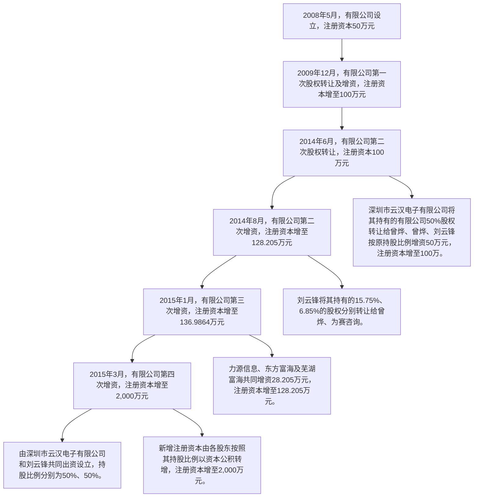
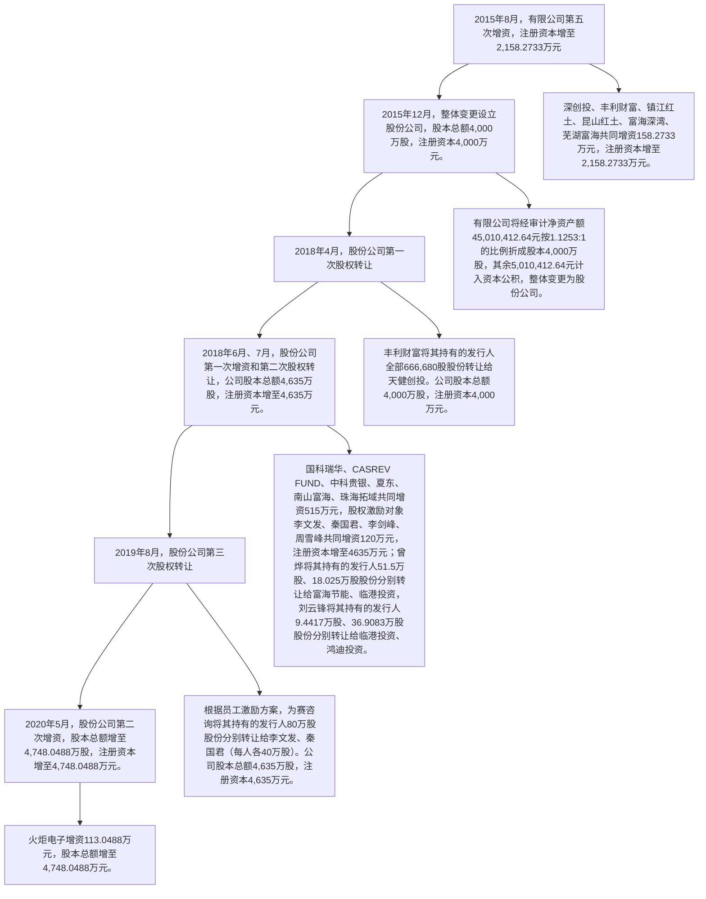
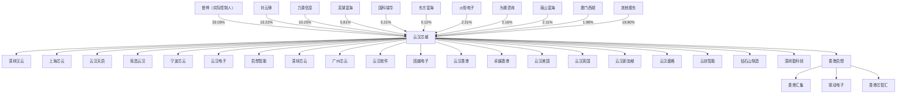
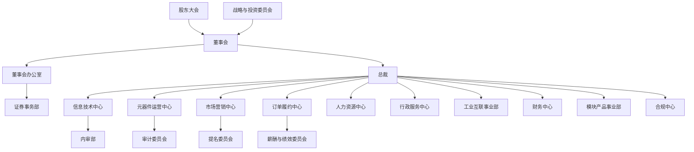
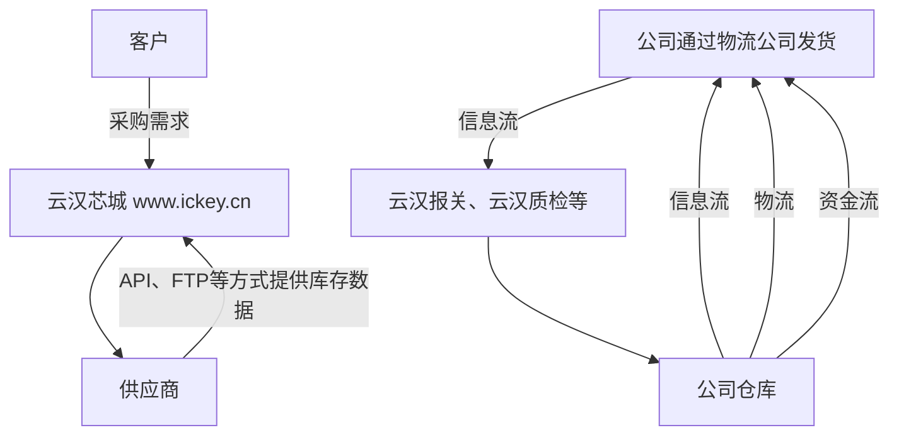
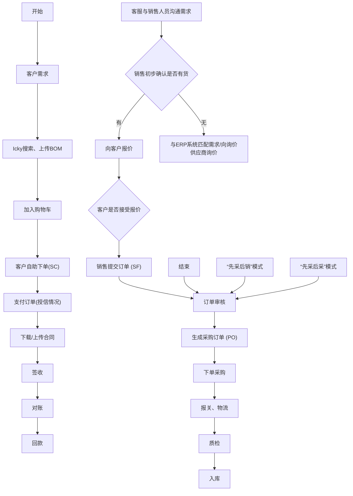
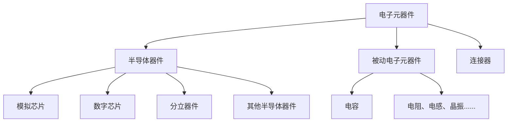
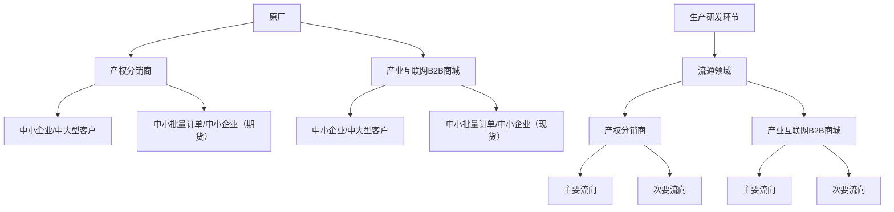
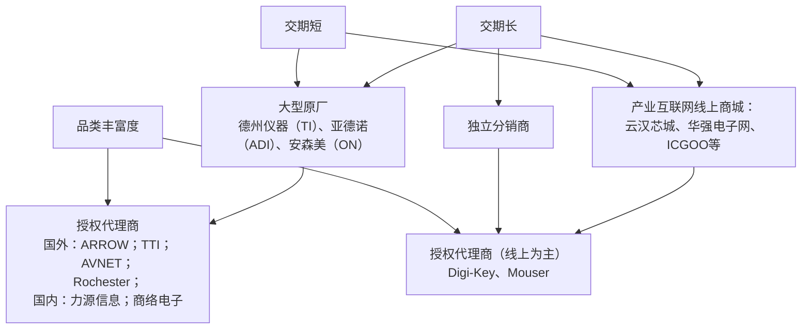

# 创业板投资风险提示

次股票发行后拟在创业板市场上市，该市场具有较高的投资风险。创业板公司具有创新入大、新旧产业融合成功与否存在不确定性、尚处于成长期、经营风险高、业绩不稳、退市风险高等特点，投资者面临较大的市场风险。投资者应充分了解创业板市场的投风险及本公司所披露的风险因素，审慎作出投资决定。


# 云汉芯城

云汉芯城（上海）互联网科技股份有限公司

Ckey （Shanghai）Internet and Technology Co.,Ltd.

（住所：上海漕河泾开发区松江高科技园莘砖公路 258 号 32 幢 1101 室）

# 首次公开发行股票并在创业板上市

# 招股说明书

保荐人（主承销商）


国金证券股份有限公司

SINOLINK SECURITIESCO.,LTD.

（成都市青羊区东城根上街 95号）

# 声明

中国证监会、交易所对本次发行所作的任何决定或意见，均不表明其对注册申请文件及所披露信息的真实性、准确性、完整性作出保证，也不表明其对发行人的盈利能力、投资价值或者对投资者的收益作出实质性判断或保证。任何与之相反的声明均属虚假不实陈述。

根据《证券法》的规定，股票依法发行后，发行人经营与收益的变化，由发行人自行负责；投资者自主判断发行人的投资价值，自主做出投资决策，自行承担股票依法发行后因发行人经营与收益变化或者股票价格变动引致的投资风险。

# 致投资者的声明

发行人是一家电子元器件分销与产业互联网融合发展的创新型高新技术企业，重点聚焦电子制造产业中小批量电子元器件研发、生产、采购需求，经过多年研发投入和持续积累，获得了“全国供应链创新与应用试点企业”、“制造业与互联网融合发展试点示范单位”、“服务型制造示范平台（共享制造类）”、“中国产业互联网百强企业”、“上海市专精特新中小企业”、“长三角十二大工业互联网平台”、“国家级专精特新‘小巨人’企业”、“高新技术企业”等荣誉，属于国内电子元器件线上分销领域的领军企业之一。

# 一、上市目的

公司处于电子元器件分销与产业互联网融合领域，该领域具有新技术发展速度、市场变化较快的特点，未来的发展离不开底层支持技术的迭代升级、综合服务的深挖拓展，因此，公司为始终保持市场领先地位，需要在技术研发和产业链升级完善等方面持续投入。

公司发行上市后，资本市场平台优势能够进一步提升其整体研发实力，并通过技术升级和迭代提高运营效率、扩大市场份额，有力保障国内电子产业供应链安全，提升电子元器件供应渠道的稳定性和可靠性，更好满足包括海量中小型电子制造企业在内的下游制造厂商对于电子元器件采购的需求；其次，以本次上市为契机，公司能够提升品牌形象和行业知名度，以推动主营业务高质量地持续发展；最后，将互联网、大数据、人工智能等技术与传统电子元器件分销业务深度融合，以提升电子产业的供应链效率，是通过创新、创造、创意促进新质生产力发展的典型应用之一，公司作为国内电子元器件线上分销领域的领军企业之一，将通过发行上市加快做优做强，持续推动中国电子产业流通领域向高端化、智能化、绿色化发展。

# 二、融资必要性及募集资金使用规划

本次募集资金主要投向“大数据中心及元器件交易平台升级项目”、“电子产业协同制造服务平台建设项目” 和“智能共享仓储建设项目”三个项目，均符合公司主营业务的发展方向。

“大数据中心及元器件交易平台升级项目”和“电子产业协同制造服务平台建设项目”有助于对公司原有线上商城升级，提升其服务能力和效率，以增强客户体验。“智能共享仓储建设项目”能够为公司主营业务提供基础设施支持，扩大仓储容量和周转能力、提高仓储作业效率，以及时响应客户。

# 三、现代企业制度的建立健全情况

公司自整体变更为股份公司以来，按照《公司法》等相关法律、法规、规范性文件要求，不断健全和完善公司治理，逐步建立了股东（大）会、董事会、独立董事和董事会秘书制度，聘请了独立董事，设立了审计委员会、薪酬与考核委员会、战略委员会和提名委员会，完善了各项规章制度。

公司管理层对公司的内部控制进行了自查和评估，并聘请了会计师对内部控制有效性进行审计，并出具标准无保留意见的内部控制审计报告。因此，公司已根据实际情况和管理需要，建立健全了合理的内部控制制度，所建立的内部控制制度贯穿于公司经营活动的各层面和各环节并有效实施。

# 四、持续经营能力及未来发展规划

报告期内，公司的主营业务收入分别为 433,090.39 万元、263,331.28 万元和 257,036.01 万元，其中，2023 年，受 2022 年业绩基数较高，以及全球宏观环境及行业下行调整等因素影响，公司销售规模出现明显下滑，但客户数量和订单数量仍维持在较高水平，与供应商的数据合作进一步深化。2024 年，行情持续复苏，公司主要产品销售数量同比大幅增长，客户和订单数量稳定提升，数据合作供应体系持续优化调整，净利润出现同比增长。

针对上述行业周期性波动，公司会基于经营情况及未来市场预判，动态调整销售、管理、研发等投入，不断增强自身管理水平。与此同时，公司会持续提升客户端和供应端两侧的服务能力，越来越多的客户认可会带动更多供应商与公司开展深度合作，供应能力进一步优化会吸引更多的下游需求，形成供应端和需求端共同推动的增长飞轮。

未来，公司将始终坚守“联接电子世界、共创产业繁荣”的企业使命，通过数字化改造供应链，实现产业效率的提升、降低行业内交易总成本，推动中国电子产业流通领域向高端化、智能化、绿色化发展，并与上下游合作者共享其中产生的增量收益。

董事长、实际控制人：


<details>
<summary>text_image</summary>

曾烨
</details>

发行概况

<table><tr><td>发行股票类型</td><td>人民币普通股(A股)</td></tr><tr><td>发行股数</td><td>本次公开发行股票的数量为1,627.9025万股,占发行后总股本的比例为25%。本次发行全部为新股发行,不涉及股东公开发售股份的情形。</td></tr><tr><td>每股面值</td><td>人民币1.00元</td></tr><tr><td>每股发行价格</td><td>27.00元</td></tr><tr><td>发行日期</td><td>2025年9月19日</td></tr><tr><td>拟上市证券交易所和板块</td><td>深圳证券交易所创业板</td></tr><tr><td>发行后总股本</td><td>6,511.6099万股</td></tr><tr><td>保荐人(主承销商)</td><td>国金证券股份有限公司</td></tr><tr><td>招股说明书签署日期</td><td>2025年9月25日</td></tr></table>

# 目录

声明...

致投资者的声明....

发行概况 ...

目录..

第一节 释义.. 10

一、基本术语.. .10  
二、专业术语.. ..12

第二节 概览 . 15

一、重大事项提示.. ..15  
二、发行人及本次发行的中介机构基本情况. .19  
三、本次发行概况. ... 20  
四、发行人主营业务经营情况. ..24  
五、发行人符合创业板定位. ..29

六、发行人报告期的主要财务数据和财务指标. ..42

七、发行人财务报告审计截止日后主要财务信息及经营状况. ..42  
八、发行人选择的具体上市标准. ..44  
九、发行人公司治理特殊安排等重要事项. ..44  
十、募集资金用途与未来发展规划. ..45  
十一、其他对发行人有重大影响的事项. ..46

第三节 风险因素. ..47

一、与发行人相关的风险.. ..47  
二、与行业相关的风险.. ..49  
三、其他风险. ..49

第四节 发行人基本情况. 52

一、发行人基本情况.. ..52  
二、发行人的设立情况. ..52  
三、发行人股份公司设立后的股东变化情况. ..57  
四、发行人重大资产重组情况. ..71

五、发行人的组织结构.. ..71  
六、发行人控股子公司、参股公司的情况. .73  
七、发行人主要股东及实际控制人的基本情况. ..78  
八、发行人股本情况. ... 90  
九、发行人董事、监事、高级管理人员与核心技术人员. ..98  
十、发行人本次公开发行前已经制定或实施的股权激励及相关安排........110  
十一、员工情况. ... 120

# 第五节 业务与技术. .126

一、公司主营业务、主要产品及设立以来的变化情况. ..126  
二、发行人所处行业基本情况. ... 146  
三、发行人主要产品的销售情况和主要客户. ..183  
四、发行人主要产品的采购情况和主要供应商.. ..190  
五、对主营业务有重大影响的主要固定资产和无形资产. .. 192  
六、经营资质.. ..213  
七、发行人的核心技术和研发情况. ..215  
八、发行人的境外经营情况. ..221

# 第六节 财务会计信息与管理层分析. .222

一、最近三年财务报表.. ..222  
二、注册会计师审计意见. ..227  
三、财务报表的编制基础与合并财务报表范围. ..227  
四、与财务会计信息相关的重要性水平及关键审计事项. ..229  
五、报告期内主要会计政策和会计估计方法. ..232  
六、经会计师核验的非经常性损益明细表. ..279  
七、主要税收政策、缴纳的主要税种及税率. ..280  
八、主要财务指标.. ..283  
九、分部信息.. ..285  
十、经营成果分析.. ..285  
十一、资产质量分析.. ..325  
十二、偿债能力、流动性与持续经营能力的分析. ..342

十三、报告期内重大投资或资本性支出、重大资产业务重组或股权收购合并事项... ..354  
十四、资产负债表日后事项、或有事项及其他重要事项. ..354  
十五、财务报告审计截止日后的主要经营情况. ..355  
十六、发行人盈利预测信息披露情况. ..358

# 第七节 募集资金运用与未来发展规划. .359

一、本次募集资金运用概况. .. 359  
二、项目实施的可行性. ...360  
三、项目与发行人现有主要业务、核心技术之间的关系. ..361  
四、募集资金投资情况. ..362  
五、未来发展规划.. ... 368

# 第八节 公司治理与独立性 . ..371

一、报告期内发行人公司治理完善情况. ..371  
二、发行人内部控制情况. ...371  
三、发行人规范运作情况. ...372  
四、发行人直接面向市场独立持续经营的能力.. .. 372  
五、同业竞争.. ..374  
六、关联关系.. ...376  
七、关联交易.. ...384  
八、发行人报告期内关联交易制度的执行情况及独立董事意见.. ...390  
九、规范并减少关联交易的措施. ..391

# 第九节 投资者保护 .394

一、本次发行完成前滚存利润的分配安排. ..394  
二、发行上市后的股利分配政策及差异情况. ..394  
三、公司股东回报规划.. ..398

# 第十节 其他重要事项. .. 400

一、对生产经营活动、未来发展或财务状况具有重要影响的合同及其履行情况.... ...400  
二、发行人对外担保的有关情况. ...404

三、对财务状况、经营成果、声誉、业务活动、未来前景等可能产生较大影响的诉讼或仲裁事项. ..404  
四、发行人控股股东或实际控制人、控股子公司，发行人董事、监事、高级管理人员和核心技术人员作为一方当事人的重大诉讼或仲裁事项........406  
五、发行人董事、监事、高级管理人员和核心技术人员涉及行政处罚的情况. ... 406  
六、董事、监事和高级管理人员是否存在被监管部门处罚等情形............406  
七、控股股东、实际控制人报告期内是否存在重大违法行为... ...407

# 第十一节 声明 ...... .... 408

一、发行人全体董事、董事会审计委员会、高级管理人员声明... .... 408  
二、发行人控股股东、实际控制人声明.. ...409  
三、保荐人（主承销商）声明. ...410  
四、发行人律师声明.. .. 412  
五、发行人会计师声明. ...413  
六、资产评估机构声明. ...414   
七、验资机构声明.. ... 416  
八、验资复核机构声明. ..417

# 第十二节 附件.. ...418

一、附件... ...418   
二、附件查阅地点和时间.. ...419

# 附录一 落实投资者关系管理相关规定的安排、股东投票机制建立情况.........420

一、发行人投资者关系的主要安排. ...420  
二、股东投票机制的建立情况. ...421

# 附录二 与投资者保护相关的承诺.. ..423

一、关于股份限售的承诺. ..423  
二、关于持股意向及减持意向的承诺. ..427  
三、关于稳定股价的措施和承诺. ...430  
四、关于股份购回及欺诈上市股份买回的承诺. ...430  
五、关于填补被摊薄即期回报的措施和承诺. ..431  
六、利润分配政策的承诺. ...434

七、关于未履行承诺的约束措施. ...434  
八、关于无虚假陈述及依法承担赔偿责任的承诺. ... 436  
九、关于股东信息披露等事项承诺. ...438  
十、应对发行人发行失败的相关措施预案及承诺. ...438  
十一、关于发行人在审期间不进行现金分红的承诺. ..439

# 附录三 发行人股东（大）会、董事会、监事会、独立董事、董事会秘书制度的建立健全及运行情况 .......... ..... 440

一、股东（大）会制度的建立健全及运行情况. ..440  
二、董事会制度的建立健全及运行情况. ...440  
三、监事会制度的建立健全及运行情况. ... 440  
四、独立董事制度的建立健全及运行情况. ...441  
五、董事会秘书制度的建立健全及运行情况. ..441  
六、董事会专门委员会的设置情况. .441

# 第一节 释义

在招股说明书中，除非文义另有所指，下列简称具有如下特定含义：

# 一、基本术语

<table><tr><td>股份公司、公司、本公司、发行人、云汉、云汉芯城</td><td>指</td><td>云汉芯城(上海)互联网科技股份有限公司</td></tr><tr><td>有限公司、云汉有限</td><td>指</td><td>上海云汉电子有限公司</td></tr><tr><td>深圳云汉电子</td><td>指</td><td>深圳市云汉电子有限公司</td></tr><tr><td>为赛咨询</td><td>指</td><td>宁波为赛咨询管理中心(有限合伙),曾用名上海为赛投资管理中心(有限合伙)、上海为赛咨询管理中心(有限合伙)</td></tr><tr><td>力源信息</td><td>指</td><td>武汉力源信息技术股份有限公司</td></tr><tr><td>东方富海</td><td>指</td><td>东方富海(上海)创业投资企业(有限合伙)</td></tr><tr><td>蜜呆资管</td><td>指</td><td>厦门蜜呆资产管理合伙企业(有限合伙)</td></tr><tr><td>芜湖富海</td><td>指</td><td>芜湖富海浩研创业投资基金(有限合伙)</td></tr><tr><td>深创投</td><td>指</td><td>深圳市创新投资集团有限公司</td></tr><tr><td>丰利财富</td><td>指</td><td>丰利财富(北京)国际资本管理股份有限公司</td></tr><tr><td>镇江红土</td><td>指</td><td>镇江红土创业投资有限公司</td></tr><tr><td>昆山红土</td><td>指</td><td>昆山红土高新创业投资有限公司</td></tr><tr><td>富海深湾</td><td>指</td><td>富海深湾(深圳)移动创新私募创业投资基金合伙企业(有限合伙)</td></tr><tr><td>天健创投</td><td>指</td><td>厦门富海天健创业投资合伙企业(有限合伙)</td></tr><tr><td>国科瑞华</td><td>指</td><td>北京国科瑞华战略性新兴产业投资基金(有限合伙)</td></tr><tr><td>CASREV FUND</td><td>指</td><td>CASREV FUND II-USD L.P.</td></tr><tr><td>中科贵银</td><td>指</td><td>中科贵银(贵州)产业投资基金(有限合伙)</td></tr><tr><td>南山富海</td><td>指</td><td>深圳南山东方富海中小微创业投资基金合伙企业(有限合伙)</td></tr><tr><td>珠海拓域</td><td>指</td><td>珠海拓域壹号股权投资基金(有限合伙)</td></tr><tr><td>富海节能</td><td>指</td><td>深圳东方富海节能环保创业投资基金合伙企业(有限合伙)</td></tr><tr><td>临港投资</td><td>指</td><td>上海临港松江股权投资基金合伙企业(有限合伙)</td></tr><tr><td>鸿迪投资</td><td>指</td><td>上海鸿迪投资集团有限公司</td></tr><tr><td>火炬电子</td><td>指</td><td>福建火炬电子科技股份有限公司</td></tr><tr><td>厦门西堤</td><td>指</td><td>厦门西堤拾贰投资合伙企业(有限合伙)</td></tr><tr><td>中小企业基金</td><td>指</td><td>中小企业发展基金(深圳南山有限合伙)</td></tr><tr><td>福建开京</td><td>指</td><td>福建开京集团有限责任公司</td></tr><tr><td>湘裕君源</td><td>指</td><td>萍乡市湘裕君源企业管理中心(有限合伙)</td></tr><tr><td>云汉香港</td><td>指</td><td>云汉电子(香港)有限公司,发行人全资子公司</td></tr><tr><td>深圳汉云</td><td>指</td><td>深圳市汉云电子有限公司,发行人全资子公司</td></tr><tr><td>卓越香港</td><td>指</td><td>卓越电子技术(香港)有限公司,发行人全资子公司</td></tr><tr><td>固越电子</td><td>指</td><td>上海固越电子科技有限公司,发行人全资子公司</td></tr><tr><td>云汉软件</td><td>指</td><td>上海云汉软件技术有限公司,发行人全资子公司</td></tr><tr><td>深圳芯云</td><td>指</td><td>深圳芯云智慧供应链有限公司,发行人全资子公司</td></tr><tr><td>启想智能</td><td>指</td><td>上海启想智能科技有限公司,发行人全资子公司</td></tr><tr><td>云汉电子</td><td>指</td><td>云汉芯城(上海)电子科技有限公司,发行人全资子公司</td></tr><tr><td>宁波芯云</td><td>指</td><td>宁波芯云智慧供应链有限公司,发行人全资子公司</td></tr><tr><td>南昌云汉</td><td>指</td><td>南昌云汉电子有限公司,发行人全资子公司</td></tr><tr><td>上海芯云</td><td>指</td><td>上海芯云智慧集成电路有限公司,曾用名上海芯云智慧供应链有限公司,上海云汉天启数据技术有限公司,发行人全资子公司</td></tr><tr><td>广州芯云</td><td>指</td><td>广州芯云智慧科技有限公司,发行人全资子公司</td></tr><tr><td>云汉天启</td><td>指</td><td>上海云汉天启电子科技有限公司,发行人全资子公司</td></tr><tr><td>云汉美国</td><td>指</td><td>云汉电子美国有限责任公司,Unikey (USA) Electronics LLC,发行人全资子公司</td></tr><tr><td>云汉英国</td><td>指</td><td>云汉电子英国有限责任公司,Unikey Electronics Limited,发行人全资子公司</td></tr><tr><td>云汉新加坡</td><td>指</td><td>云汉电子新加坡有限责任公司,Unikey Electronics Pte. Ltd.,发行人全资子公司</td></tr><tr><td>香港启想</td><td>指</td><td>启想智能科技(香港)有限公司,发行人全资子公司</td></tr><tr><td>钻石山制造</td><td>指</td><td>钻石山制造有限公司,发行人全资子公司</td></tr><tr><td>香港汇集</td><td>指</td><td>香港汇集有限公司,曾用名香港汇集制造有限公司,香港启想全资子公司</td></tr><tr><td>联动电子</td><td>指</td><td>联动电子有限公司,TECHLINK ELECTRONICS PTE. LTD,钻石山制造全资子公司</td></tr><tr><td>香港芯智汇</td><td>指</td><td>香港芯智汇有限公司,钻石山制造全资子公司</td></tr><tr><td>云汉盛格</td><td>指</td><td>上海云汉盛格科技有限公司,发行人控股子公司</td></tr><tr><td>深圳盈科创</td><td>指</td><td>深圳市盈科创科技有限公司,发行人控股子公司</td></tr><tr><td>云汉壮壮</td><td>指</td><td>深圳市云汉壮壮电子技术有限公司</td></tr><tr><td>云汉商毅</td><td>指</td><td>上海云汉商毅信息技术有限公司</td></tr><tr><td>云创智能</td><td>指</td><td>深圳市云创智能制造有限责任公司,发行人参股子公司</td></tr><tr><td>《公司章程(上市草案)》</td><td>指</td><td>《云汉芯城(上海)互联网科技股份有限公司章程(上市草案)》</td></tr><tr><td>股东(大)会</td><td>指</td><td>云汉芯城(上海)互联网科技股份有限公司股东(大)会</td></tr><tr><td>董事会</td><td>指</td><td>云汉芯城(上海)互联网科技股份有限公司董事会</td></tr><tr><td>监事会</td><td>指</td><td>云汉芯城(上海)互联网科技股份有限公司监事会,公司曾设机构</td></tr><tr><td>本次发行</td><td>指</td><td>本公司本次拟公开发行人民币普通股(A股)的行为</td></tr><tr><td>中国证监会</td><td>指</td><td>中国证券监督管理委员会</td></tr><tr><td>深交所</td><td>指</td><td>深圳证券交易所</td></tr><tr><td>《公司法》</td><td>指</td><td>《中华人民共和国公司法》</td></tr><tr><td>《证券法》</td><td>指</td><td>《中华人民共和国证券法》</td></tr><tr><td>《创业板暂行规定》</td><td>指</td><td>《深圳证券交易所创业板企业发行上市申报及推荐暂行规定》</td></tr><tr><td>保荐机构、保荐人、主承销商、国金证券</td><td>指</td><td>国金证券股份有限公司</td></tr><tr><td>发行人会计师、审计机构、容诚、容诚会计师</td><td>指</td><td>容诚会计师事务所(特殊普通合伙)</td></tr><tr><td>发行人律师、通力、通力律师</td><td>指</td><td>上海市通力律师事务所</td></tr><tr><td>资产评估机构</td><td>指</td><td>上海立信资产评估有限公司</td></tr><tr><td>报告期内、报告期、最近三年</td><td>指</td><td>2022年、2023年、2024年</td></tr><tr><td>报告期各期末</td><td>指</td><td>2022年12月31日、2023年12月31日、2024年12月31日</td></tr><tr><td>元(万元)</td><td>指</td><td>人民币元(人民币万元)</td></tr></table>

# 二、专业术语

注：本招股说明书中部分合计数与各数直接相加之和在尾数上存在差异，均系计算中四舍五入造成。

<table><tr><td>电子元器件</td><td>指</td><td>电子元器件是指具有独立电路功能、构成电路的基本单元,任何一种电子设备或电子装置均由电子元器件组成</td></tr><tr><td>电子元器件流通、电子元器件分销</td><td>指</td><td>电子元器件从制造厂商生产后流转至下游电子产品制造厂商或应用方的过程</td></tr><tr><td>原厂、厂牌</td><td>指</td><td>原厂系电子元器件生产厂商,厂牌系该厂商生产产品的品牌名称</td></tr><tr><td>分销商</td><td>指</td><td>运用自身渠道进行电子元器件销售的厂商,主要包括授权分销商和独立分销商等类别</td></tr><tr><td>授权分销商、授权代理商</td><td>指</td><td>系取得原厂代理授权的分销商,主流的授权分销商通常规模庞大,具备较强的供应链管理能力,以服务大中型客户为主,主要满足客户长期稳定的大批量生产需求</td></tr><tr><td>独立分销商</td><td>指</td><td>也称贸易商,其不具有原厂代理授权,货物主要来源于授权分销商或同行,主要服务于中小型客户、中小批量订单或临时性、阶段性的现货需求</td></tr><tr><td>半导体器件</td><td>指</td><td>导电性介于良导电体与绝缘体之间,利用半导体材料特殊电特性来完成特定功能的电子器件,可用来产生、控制、接收、变换、放大信号和进行能量转换,主要包括数字芯片、模拟芯片、分立器件等类别</td></tr><tr><td>主动器件</td><td>指</td><td>正常工作的基本条件是必须提供相应的电源,如果没有电源,元器件将无法工作,亦称为有源元器件</td></tr><tr><td>被动器件</td><td>指</td><td>只消耗元件输入信号电能的元器件,本身不需要电源就可以进行信号处理和传输,亦称为无源元器件,主要包括电容、电阻、电感等</td></tr><tr><td>产业互联网</td><td>指</td><td>利用信息技术与互联网对传统产业进行数字化、智能化改造,充分发挥互联网在生产要素中的优化和集成作用,提升行业上下游交易、生产、物流仓储等各个环节的效率和安全性,从而实现更优的资源配置并降低运作成本的产业形态</td></tr><tr><td>电容</td><td>指</td><td>电容器,被动器件的主要类别之一,是储存电量和电能(电势能)的元件</td></tr><tr><td>陶瓷电容、MLCC</td><td>指</td><td>介质材料为陶瓷的电容器,其中片式多层陶瓷电容器(简称“MLCC”)为陶瓷电容的主要类别</td></tr><tr><td>连接器</td><td>指</td><td>使导体(线)与适当的配对元件连接,实现电流或信号接通和断开的机电元件</td></tr><tr><td>PCBA</td><td>指</td><td>Printed Circuit Board Assembly 的简称,也就是 PCB 空板经过 SMT 贴片,或经过 DIP 插件的整个制程</td></tr><tr><td>SMT</td><td>指</td><td>Surface Mounted Technology 的简称,表面贴装技术,将元器件安装在印制电路板的表面或其它基板的表面上,通过再流焊或浸焊等方法加以焊接组装的电路装连技术</td></tr><tr><td>BOM</td><td>指</td><td>Bill of Material 的简称,物料清单</td></tr><tr><td>HiBOM</td><td>指</td><td>即 BOM 智能选型工具,系公司开发的基于 BOM 智能选型 SaaS 软件,用户仅需将 BOM 物料表上传至公司网站,即可实现对 BOM 表物料的快速、准确选型和最优货源匹配,具有智能化程度高、识别准确度高、匹配完成度高、匹配速度快的优势</td></tr><tr><td>SKU</td><td>指</td><td>Stock Keeping Unit(库存量单位),是物理上不可分割的最小存货单元。在使用时要根据不同业态、不同管理模式来处理。本招股书中,用型号、厂牌、供应商、包装类型等因素来划分不同的 SKU</td></tr><tr><td>SPU</td><td>指</td><td>Standard Product Unit(标准化产品单元),是商品信息聚合的最小单位,属性值、特性相同的商品就可以成为一个 SPU。本招股书中,型号、厂牌均相同的元器件产品为一个 SPU</td></tr><tr><td>API</td><td>指</td><td>Application Programming Interface(应用程序接口),是一些预先定义的接口(如函数、HTTP 接口),可用于获取各类数据</td></tr><tr><td>FTP</td><td>指</td><td>File Transfer Protocol(文件传输协议),是用于在网络上进行文件传输的一套标准协议</td></tr><tr><td>EDI</td><td>指</td><td>Electronic Data Interchange(电子数据交换),一种以电子数据形式传输数据的技术</td></tr><tr><td>AEO 认证</td><td>指</td><td>Authorized Economic Operator 的简称,中国海关依据有关国际条约、协定以及《中华人民共和国海关注册登记和备案企业信用管理办法》,开展与其他国家或者地区海关的 AEO 互认合作,并且给予互认企业相关便利措施。</td></tr><tr><td>CNAS 认证</td><td>指</td><td>中国合格评定国家认可委员会(CNAS)系由国家认证认可监督管理委员会批准设立并授权的国家认可机构,统一负责对认证机构、实验室和检查机构等相关机构进行认可审核。相关机构成功通过其审核后,将获颁认可证书,可按证书上所列明的检测能力范围在检测证书或报告上使用 CNAS 标识。</td></tr><tr><td>中长尾客户</td><td>指</td><td>客户类型的一种,指单个客户消费金额较小,但是数量众多的一类客户,与消费金额较大的重点客户相对应</td></tr><tr><td>先销后采</td><td>指</td><td>不提前备货,接到销售订单后,按照客户的订单需求,再自主选择向供应商下发采购需求的经营模式</td></tr><tr><td>数据供应商</td><td>指</td><td>通过API调用接口或FTP等形式定期提供数据包,来向公司提供其库存数据的供应商</td></tr><tr><td>交期</td><td>指</td><td>订单下达日开始至交付日之间的时间长短</td></tr><tr><td>现货、现货订单</td><td>指</td><td>即交期较短的订单,在电子元器件流通领域通常指交期小于或等于3个月的订单</td></tr><tr><td>WSTS</td><td>指</td><td>World Semiconductor Trade Statistics(世界半导体贸易统计组织),全球权威半导体产业分析机构</td></tr><tr><td>德州仪器、TI</td><td>指</td><td>全球知名的半导体设计与制造企业,发行人的供应商之一</td></tr><tr><td>恩智浦、NXP</td><td>指</td><td>全球知名的半导体设计与制造企业,发行人的供应商之一</td></tr><tr><td>艾睿、Arrow</td><td>指</td><td>全球知名电子元器件分销商,发行人的供应商之一</td></tr><tr><td>安富利、Avnet</td><td>指</td><td>全球知名电子元器件分销商,发行人的供应商之一</td></tr><tr><td>罗彻斯特电子、Rocherster</td><td>指</td><td>全球知名电子元器件分销商,发行人的供应商之一</td></tr><tr><td>得捷电子、Digi-key</td><td>指</td><td>全球知名电子元器件分销商,发行人的供应商之一</td></tr></table>

# 第二节 概览

本概览仅对招股说明书全文作扼要提示。投资者作出投资决策前，应认真阅读招股说明书全文。

# 一、重大事项提示

本公司特别提醒投资者认真阅读招股说明书全文，并特别注意下列重大事项提示：

# （一）本次发行前滚存利润的分配安排

根据公司 2021年 10月召开的 2021年第四次临时股东大会决议，截至 2021年 9月 30日，公司不存在滚存未分配利润；若公司首次公开发行股票并在创业板上市前存在滚存未分配利润，则拟由公司本次发行后的新股东和发行前的老股东按照发行后的股份比例共享；若公司首次公开发行股票并在创业板上市前存在未弥补亏损，则拟由公司本次发行后的新股东和发行前的老股东按照发行后的股份比例承担。

# （二）本次发行后发行人的利润分配政策、上市后三年股东分红回报规划以及长期回报规划

公司制定了利润分配政策、上市后三年股东分红回报规划以及长期回报规划，具体内容参见“第九节 投资者保护”之“二、发行上市后的股利分配政策及差异情况”和“三、公司股东回报规划”。

# （三）本次发行的相关重要承诺

公司控股股东、实际控制人及其一致行动人已承诺，若出现公司上市当年及之后第二年、第三年较上市前一年净利润下滑 50%以上等情形的，延长其届时所持股份锁定期限。本次发行相关责任方作出的重要承诺详见本招股说明书“附录二与投资者保护相关的承诺”。

# （四）风险因素提示

本公司特别提醒投资者注意，在投资决策前请认真阅读招股说明书“第三节 风险因素”的全部内容，充分了解公司存在的主要风险。提醒投资者特别关

注“风险因素”中的下列风险：

# 1、行业周期性变化与收入规模波动风险

公司所在的电子元器件流通行业属于全球化产业，是实现电子元器件在市场间有效配置的核心领域，与半导体行业周期性强相关，而半导体行业受国际贸易形势、宏观经济景气度、下游终端需求变化、上游原厂技术发展规律及产能变化等诸多因素影响，周期性波动较为明显。2020 年起，受下游需求旺盛驱动，叠加上游产能增长滞后因素，半导体行业开启了新一轮的增长周期，根据WSTS 数据，全球半导体市场销售额于 2021 年第四季度达到此次增长周期最高峰。2022 年第一季度开始，行业开始进入下行调整周期，消费电子需求出现明显下降，2022 年第三季度至 2023 年第二季度，工业、汽车电子等下游终端应用需求持续下滑。2023 年下半年，行业下游需求触底，上游去库存阶段接近尾声。长期来看，由于市场应用广泛、产业规模巨大，随着电子产品应用领域的不断拓展和应用深度的不断加强，全球半导体市场整体将保持长期增长趋势。根据 WSTS数据，2022年市场规模增长至 5,740亿美元，同比增长 3.2%，增速明显放缓，2023 年第一季度，全球半导体市场销售额同比降幅达到 21.3%，其中以中国为主的亚太地区销售额同比降幅达到 28.74%，降幅高于其他地区。2023年第二季度，全球半导体销售额同比降幅缩小至 17.26%，环比增速由负转正，达到 4.21%。2023 全年同比下降 8.22%。2024 年，行业景气度复苏，全年全球半导体销售额达到 6,276 亿美元，同比增长 19.12%。2024 年 12 月 3 日，WSTS 发布了市场预测，预计 2025 年全球半导体市场仍将实现增长，市场规模将达到6,971亿美元，同比增长 11%。

若下游终端应用需求持续疲软，行业景气度进一步下降，而公司未能准确把握行业趋势并采取相应应对措施，无法持续汇集下游需求，将对公司业务增长、产品销售产生不利影响，可能导致公司收入波动或出现下滑的风险。

# 2、净利润下滑的风险

报告期内，发行人营业收入分别为 433,319.83 万元、263,709.04 万元、257,726.99 万元，期间费用分别为 35,700.14 万元、29,704.29 万元、30,486.75 万元，净利润分别为 13,541.19 万元、7,859.17 万元、8,833.28 万元。2023 年发行人营业收入同比下降 39.14%，期间费用下降幅度小于营业收入下降幅度，导致净利润较同期减少 41.96%。2024 年，发行人营业收入同比降幅缩窄至 2.27%，而毛利率有所上升，同时，期间费用率小幅上升，发行人净利润同比增长12.39%。

如未来下游市场需求减弱、市场竞争持续加剧等因素导致公司收入下降或毛利率降低，或若公司未能准确把握下游需求变动趋势并动态调整公司费用投入，则公司仍存在净利润下滑的风险。

# 3、供应商集中度较高及数据供应商合作稳定性风险

公司的上游供应商主要为国内外知名的电子元器件原厂或分销商，整体而言，电子元器件市场上游原厂和授权分销商高度集中，主要由欧美企业主导，在产品研发、生产和销售上具有较强的竞争力。报告期内，公司前五大供应商主要以全球大型原厂和知名授权分销商为主，各期采购金额占比分别为 32.96%、21.75%、15.35%，在公司主动优化、丰富采购渠道的背景下，供应商集中度整体呈现下滑趋势，但仍相对较高。此外，公司主要以数据合作方式开展电子元器件线上销售业务，通过 API/EDI、FTP 等多种数据传输方式，接入全球超2,500 家优质供应商的海量电子元器件库存数据信息，并利用信息化系统、大数据应用能力实现对供应商及其库存数据的有效管控，从而高效响应用户在公司线上商城实时的大量搜索需求。因此，与业内优质数据供应商开展数据合作，是公司业务不断发展的重要基础，目前，公司已与包括恩智浦（NXP）、艾睿（Arrow）、安富利（Avnet）等知名原厂或大型授权代理商在内的超 2,500 家优质供应商开展数据合作。

在上述背景下，若主要供应商的经营状况恶化导致交付能力下降，或公司的平台规模、服务能力、技术水平无法跟进或满足优质数据供应商的业务发展速度，亦或受国际政治环境等因素影响，都可能会存在主要供应商终止向公司销售产品或进行数据合作的风险，将会对公司的生产经营产生不利影响。

# 4、客户、订单流失的风险

公司中小批量订单占比较高，单笔订单价值相对较低，同时，客户众多且较为分散，因此，交易客户数、订单规模会直接影响公司收入规模。与传统的分销渠道不同，公司主要依托互联网开展业务。近年来，公司在搭建及完善供应链体系和销售团队及建设信息系统/模块等方面投入较大，上述成本、费用大多较为刚性和固定。当主营业务边际利润贡献较低，无法完整覆盖公司投入的固定成本、费用时，公司将可能出现亏损。因此，收入规模对公司而言极为重要。目前，公司处于快速发展期，若供应能力、服务能力无法有效支持业务快速发展，用户体验变差，将会导致客户、订单流失的风险，对公司未来经营造成不利影响。

# 5、经营现金流风险

报告期各期，发行人经营活动产生的现金流量净额分别为 18,817.20 万元、7,517.24 万元、2,044.39 万元。发行人存在采购端与销售端账期错配，从采购端上看，发行人的上游供应商以国内外知名的电子元器件生产厂商、授权分销商为主，包括恩智浦（NXP）、艾睿（Arrow）、安富利（Avnet）等，上述供应商占据一定的市场优势地位，因此在信用政策上对方一般要求预付全部款项或给予小于等于 30 天的账期；从销售端来看，发行人下游客户以国内生产制造企业为主，公司根据其信用情况通常给予 1-3 个月的付款账期。因此，整体而言，销售端回款周期高于采购端的付款周期，导致发行人在经营过程中需要进行一定期限垫资。报告期内，发行人营业收入增速放缓，采购端与销售端错配金额缩小，现金流量转为正数。目前，公司已对现金及现金等价物进行了重点监控，以满足公司日常经营需求，若未来公司与客户/供应商的结算方式发生重大不利变化，或无法持续保持对经营现金流进行有效管控，可能会因此产生经营现金流大幅波动或短缺风险，影响公司未来持续发展。

# 6、技术及系统安全风险

# （1）技术风险

公司为进一步提升核心竞争力，积极探索利用互联网、大数据及人工智能等新一代技术提升在电子元器件流通领域效率，保持公司业务可持续增长。公司现有业务的开展、产品开发、信息挖掘及分析等方面对相关技术有较高的要求，如果竞争对手迅速跟进甚至加速创新，而公司自身研发能力不匹配或者项目投入不足，将可能面临技术水平落后、业务模式固化等风险，从而在一定程度上削弱公司的市场竞争力，对公司的盈利水平造成不利影响。

# （2）系统安全风险

公司是一家在电子元器件流通领域、并以互联网技术和大数据技术为支撑的企业，计算机和网络系统的稳定性以及数据的安全性对公司的经营至关重要，互联网系统的安全性和稳定性是影响用户体验的关键因素之一。虽然公司已采取了完善的数据库备份、数据安全传输和质量管理体系等措施，以保障系统的稳定性、数据资源存储和使用的安全性，但公司仍可能存在受到恶意软件、病毒、黑客攻击或电力、网络中断，以及其他系统安全运行问题，造成公司网站不能正常访问、客户终端无法接收信息、公司电脑系统所存储的机密资料外泄等后果，从而影响公司正常运行，对公司业务及品牌形象带来不利影响。

# 7、中美贸易摩擦及发行人子公司被列入“实体清单”的风险

2023 年 3 月 2 日，美国商务部工业和安全局将发行人子公司云汉香港列入“实体清单”，同批列入的我国企业还包括浪潮集团、龙芯中科、第四范式、华大基因等。截至本招股说明书签署之日，云汉香港仍为“实体清单”企业。

一方面，云汉香港作为单独法人主体，直接受到“实体清单相关管控政策”限制，限制政策对其业务开展造成了重大影响，云汉香港采购金额占发行人总采购比重从列入“实体清单”前的15%左右，下降至低于1%。

另一方面，发行人及其他子公司作为其他独立法人主体，并不受“实体清单相关管控政策”限制，虽有少部分供应商停止了与发行人及其他子公司的合作，并造成销售毛利方面的损失，但整体影响较小，且随着发行人已采取相关措施进行应对，负面影响已逐渐缩减。

未来期间，若中美贸易摩擦加剧，美国政府进一步限制半导体领域的技术、产品向我国转移，将可能对我国电子元器件分销领域的发展造成一定不利影响，进而对发行人的境外采购和经营业绩产生不利影响。

# 二、发行人及本次发行的中介机构基本情况

（一）发行人基本情况

<table><tr><td>发行人名称</td><td>云汉芯城(上海)互联网科技股份有限公司</td><td>成立日期</td><td>2008年5月7日</td></tr><tr><td>注册资本</td><td>4,883.7074万元人民币</td><td>法定代表人</td><td>曾烨</td></tr><tr><td>注册地址</td><td>上海漕河泾开发区松江高科技园莘砖公路258号32幢1101室</td><td>主要生产经营地址</td><td>上海市松江区千帆路237弄9号11层-13层</td></tr><tr><td>控股股东</td><td>曾烨</td><td>实际控制人</td><td>曾烨</td></tr><tr><td>行业分类</td><td>批发业(F51)</td><td>在其他交易场所(申请)挂牌或上市的情况</td><td>无</td></tr></table>

（二）本次发行的有关中介机构

<table><tr><td>保荐人(主承销商)</td><td>国金证券股份有限公司</td><td>主承销商</td><td>国金证券股份有限公司</td></tr><tr><td>发行人律师</td><td>上海市通力律师事务所</td><td>其他承销机构</td><td>无</td></tr><tr><td>审计机构</td><td>容诚会计师事务所(特殊普通合伙)</td><td>评估机构</td><td>上海立信资产评估有限公司</td></tr><tr><td colspan="2">发行人与本次发行有关的保荐人、承销机构、证券服务机构及其负责人、高级管理人员、经办人员之间存在的直接或间接的股权关系或其他利益关系</td><td colspan="2">无</td></tr></table>

（三）本次发行其他有关机构

<table><tr><td>股票登记机构</td><td>中国证券登记结算有限责任公司深圳分公司</td><td>收款银行</td><td>中国建设银行股份有限公司成都市新华支行</td></tr><tr><td colspan="2">其他与本次发行有关的机构</td><td colspan="2">无</td></tr></table>

# 三、本次发行概况

（一）本次发行的基本情况

<table><tr><td>股票种类</td><td colspan="3">人民币普通股(A股)</td></tr><tr><td>每股面值</td><td colspan="3">人民币1.00元</td></tr><tr><td>发行股数</td><td>1,627.9025万股</td><td>占发行后总股本比例</td><td>25%</td></tr><tr><td>其中:发售新股数量</td><td>1,627.9025万股</td><td>占发行后总股本比例</td><td>25%</td></tr><tr><td>股东公开发售股份数量</td><td>无</td><td>占发行后总股本比例</td><td>无</td></tr><tr><td>发行后总股本</td><td colspan="3">6,511.6099万股</td></tr><tr><td>每股发行价格</td><td colspan="3">27.00元/股</td></tr><tr><td>发行市盈率</td><td colspan="3">20.91倍(按照每股发行价格除以发行后每股收益计算,每股收益按照2024年经审计的扣除非经常性损益前后孰低的归属于母公司股东的净利润除以本次发行后总股本计算)</td></tr><tr><td>发行前每股净资产</td><td>15.32元(按照2024年12月31日经审计的归属于母公司所有者权益除以本次发行前总股本计算)</td><td>发行前每股收益</td><td>1.72元(按照2024年经审计的扣除非经常性损益前后孰低的归属于母公司所有者的净利润除以本次发行前总股本计算)</td></tr><tr><td>发行后每股净资产</td><td>17.20元(按照2024年12月31日经审计的归属于母公司所有者权益与本次募集资金净额之和除以发行后总股本计算)</td><td>发行后每股收益</td><td>1.29元(按照2024年度经审计的扣除非经常性损益前后孰低的归属于母公司股东的净利润除以本次发行后总股本计算)</td></tr><tr><td>发行市净率</td><td colspan="3">1.57倍(按照每股发行价格除以发行后每股净资产计算)</td></tr><tr><td>发行方式</td><td colspan="3">本次发行采用向参与战略配售的投资者定向配售、网下向符合条件的投资者询价配售与网上向持有深圳市场非限售A股股份和非限售存托凭证市值的社会公众投资者定价发行相结合的方式进行。</td></tr><tr><td>发行对象</td><td colspan="3">符合资格的参与战略配售的投资者、符合国家法律法规和监管机构规定条件的询价对象和在深交所开户并持有创业板交易账户的境内自然人、法人和其他机构投资者(国家法律、法规禁止购买者除外)或中国证监会规定的其他对象。</td></tr><tr><td>承销方式</td><td colspan="3">余额包销</td></tr><tr><td>募集资金总额</td><td colspan="3">43,953.37万元</td></tr><tr><td>募集资金净额</td><td colspan="3">37,152.02万元</td></tr><tr><td rowspan="3">募集资金投资项目</td><td colspan="3">大数据中心及元器件交易平台升级项目</td></tr><tr><td colspan="3">电子产业协同制造服务平台建设项目</td></tr><tr><td colspan="3">智能共享仓储建设项目</td></tr><tr><td>发行费用概算</td><td colspan="3">本次发行费用总额(不含增值税)为6,801.35万元,明细如下:1、保荐承销费用:3,738.36万元,其中承销费为3,428.36万元,保荐费310.00万元,保荐及承销费分阶段收取,参考市场保荐承销费率平均水平,经双方友好协商确定,根据项目进度分节点支付;2、审计验资费用:1,910.19万元,依据服务的工作内容和要求、所需的工作工时及参与提供服务的各级别人员投入的专业知识和工作经验等因素,结合发行人的实际情况确定,根据项目进度分节点支付;3、律师费用:640.00万元,参考市场律师费率平均水平,考虑法律服务的工作要求、工作量等因素,经双方友好协商确定,根据项目进度分节点支付;4、用于本次发行的信息披露费用:500.00万元;5、发行手续费及其他费用:12.80万元。注:本次发行最终计入发行费用的各项费用均为不含增值税金额;合计数与各分项数值之和尾数如存在微小差异,为四舍五入</td></tr><tr><td></td><td colspan="3">造成;前次披露的招股意向书中,发行手续费及其他费用为3.51万元,差异主要系纳入本次发行的印花税费用的调整,除前述调整外,发行费用不存在其他调整情况。</td></tr><tr><td>高级管理人员、员工拟参与战略配售情况</td><td colspan="3">发行人的高级管理人员与核心员工参与本次战略配售设立的专项资产管理计划为国金资管云汉芯城员工参与创业板战略配售集合资产管理计划,根据最终确定的发行价格,上述专项资管计划最终战略配售股份数量为155.9259万股,约占本次发行数量的9.58%;获配股票的限售期为12个月,限售期自本次公开发行的股票在深交所上市之日起开始计算。</td></tr><tr><td>保荐人相关子公司拟参与战略配售情况</td><td colspan="3">本次发行价格未超过剔除最高报价后网下投资者报价的中位数和加权平均数以及剔除最高报价后通过公开募集方式设立的证券投资基金(以下简称“公募基金”)、全国社会保障基金(以下简称“社保基金”)、基本养老保险基金(以下简称“养老金”)、企业年金基金和职业年金基金(以下简称“年金基金”)、符合《保险资金运用管理办法》等规定的保险资金(以下简称“保险资金”)与合格境外投资者资金报价中位数和加权平均数孰低值,本次发行的保荐人相关子公司将按照相关规定无需参与本次发行的战略配售。</td></tr></table>

（二）本次发行上市的重要日期

<table><tr><td>刊登询价公告日期</td><td>2025年9月11日</td></tr><tr><td>初步询价日期</td><td>2025年9月15日</td></tr><tr><td>刊登发行公告日期</td><td>2025年9月18日</td></tr><tr><td>申购日期</td><td>2025年9月19日</td></tr><tr><td>缴款日期</td><td>2025年9月23日</td></tr><tr><td>股票上市日期</td><td>本次股票发行结束后将尽快申请在深圳证券交易所创业板上市</td></tr></table>

# （三）本次发行的战略配售情况

# 1、本次战略配售的总体安排

（1）本次发行的发行价格不超过剔除最高报价后网下投资者报价的中位数和加权平均数，以及剔除最高报价后公募基金、社保基金、养老金、年金基金、保险资金和合格境外投资者资金的报价中位数和加权平均数的孰低值，故保荐人相关子公司无需参与本次战略配售。

根据最终确定的发行价格，参与本次发行的战略配售投资者为发行人的高级管理人员与核心员工参与本次战略配售设立的专项资产管理计划。

（2）本次发行初始战略配售数量为 244.1853 万股，占本次发行数量的15.00%。最终战略配售数量为 155.9259 万股，约占本次发行数量的 9.58%。本次发行初始战略配售数量与最终战略配售数量的差额 88.2594 万股回拨至网下发行。根据最终确定的发行价格，发行人的高级管理人员与核心员工参与本次战略配售设立的专项资产管理计划最终战略配售数量为 155.9259 万股，约占本次发行数量的 9.58%。本次发行战略配售结果如下：

<table><tr><td>参与战略配售的投资者</td><td>获配股数(股)</td><td>获配金额(元)</td><td>限售期</td></tr><tr><td>国金资管云汉芯城员工参与创业板战略配售集合资产管理计划</td><td>1,559,259</td><td>42,099,993.00</td><td>12个月</td></tr></table>

# 2、发行人高级管理人员与核心员工参与本次战略配售设立的专项资产管理计划

# （1）投资主体

发行人的高级管理人员与核心员工参与本次战略配售设立的专项资产管理计划为国金资管云汉芯城员工参与创业板战略配售集合资产管理计划（以下简称“云汉芯城资管计划”）。

# （2）审议情况

2025年 3月 17日，发行人第三届董事会第十八次会议审议通过了《关于公司高级管理人员与核心员工设立专项资管计划参与公司首次公开发行股票并在创业板上市战略配售的议案》，同意发行人的部分高级管理人员与核心员工设立专项资产管理计划参与本次发行上市的战略配售。

# （3）参与规模和具体情况

云汉芯城资管计划最终参与战略配售认购数量为 155.9259 万股，约占本次公开发行数量的9.58%。具体情况如下：

<table><tr><td>产品名称</td><td>国金资管云汉芯城员工参与创业板战略配售集合资产管理计划</td></tr><tr><td>产品编码</td><td>SAUT59</td></tr><tr><td>成立时间</td><td>2025年3月10日</td></tr><tr><td>备案时间</td><td>2025年3月20日</td></tr><tr><td>募集资金规模</td><td>4,240.00万元</td></tr><tr><td>认购金额上限</td><td>4,210.00万元</td></tr><tr><td>管理人名称</td><td>国金证券资产管理有限公司</td></tr><tr><td>托管人名称</td><td>中信银行股份有限公司</td></tr><tr><td>实际支配主体</td><td>国金证券资产管理有限公司(实际支配主体非发行人高级管理人员)</td></tr></table>

云汉芯城资管计划参与人姓名、职务、实际缴款金额及比例等具体情况如下：

<table><tr><td>序号</td><td>姓名</td><td>劳动关系所属单位</td><td>职务</td><td>实际缴款金额(万元)</td><td>资管计划份额的持有比例</td><td>员工类别</td></tr><tr><td>1</td><td>曾烨</td><td>云汉芯城(上海)互联网科技股份有限公司</td><td>董事长</td><td>1,484.848</td><td>35.02%</td><td>核心员工</td></tr><tr><td>2</td><td>刘云锋</td><td>云汉芯城(上海)互联网科技股份有限公司</td><td>董事、总裁</td><td>799.664</td><td>18.86%</td><td>高级管理人员</td></tr><tr><td>3</td><td>周雪峰</td><td>云汉芯城(上海)互联网科技股份有限公司</td><td>首席财务官、董事会秘书</td><td>864.960</td><td>20.40%</td><td>高级管理人员</td></tr><tr><td>4</td><td>徐俊</td><td>云汉芯城(上海)互联网科技股份有限公司</td><td>人力行政副总裁</td><td>300.192</td><td>7.08%</td><td>核心员工</td></tr><tr><td>5</td><td>李文发</td><td>深圳市汉云电子有限公司</td><td>董事、首席运营官</td><td>399.832</td><td>9.43%</td><td>高级管理人员</td></tr><tr><td>6</td><td>王宇</td><td>云汉芯城(上海)互联网科技股份有限公司</td><td>市场营销副总裁</td><td>130.168</td><td>3.07%</td><td>核心员工</td></tr><tr><td>7</td><td>李剑峰</td><td>云汉芯城(上海)互联网科技股份有限公司</td><td>销售副总裁</td><td>130.168</td><td>3.07%</td><td>核心员工</td></tr><tr><td>8</td><td>张明川</td><td>云汉芯城(上海)互联网科技股份有限公司</td><td>销售副总裁</td><td>130.168</td><td>3.07%</td><td>核心员工</td></tr><tr><td colspan="4">合计</td><td>4,240.000</td><td>100.00%</td><td>-</td></tr></table>

注：1、合计数与各部分数直接相加之和若在尾数上有差异，是由四舍五入造成的。  
2、该资管计划的募集资金规模和认购金额上限的差额用于支付管理费、托管费等相关费用。  
3、最终获配金额和获配股数待T-2日确定发行价格后确认。  
4、深圳市汉云电子有限公司系发行人全资子公司。上述参与人均与发行人或其全资子公司签订了劳动合同。

# 四、发行人主营业务经营情况1

# （一）发行人主营业务情况

公司是一家电子元器件分销与产业互联网融合发展的创新型高新技术企业，重点聚焦电子制造产业中小批量电子元器件研发、生产、采购需求。公司通过有效运用数字技术和互联网技术，基于自建自营的云汉芯城 B2B 线上商城（www.ickey.cn），主要为电子制造产业提供高效、专业的电子元器件供应链一站式服务，并延伸至产品技术方案设计、PCBA 生产制造服务、电子工程师技术支持等在内的多个领域，子公司深圳汉云拥有 CNAS 认证的电子元器件检测实验室。经过多年研发投入和持续积累，公司获得了“全国供应链创新与应用试点企业”、“制造业与互联网融合发展试点示范单位”、“服务型制造示范平台（共享制造类）”、“中国产业互联网百强企业”、“上海市专精特新中小企业”、“长三角十二大工业互联网平台”、“国家级专精特新‘小巨人企业”、“高新技术企业”等荣誉。

长期以来，电子元器件领域上游原厂高度集中，下游电子产品制造企业则相对分散，上下游存在显著的信息不对称现象，整体产业链效率低下，上游厂商无法高效覆盖下游需求，而大量中小批量研发、生产、采购需求也难以获得优质的供应链服务，客户面临搜寻成本高、采购价格贵、假货多、服务差的困境。为破解行业痛点，通过对传统供应链进行全流程的数字化改造和集约化创新，公司打造了涵盖数据中台、技术中台、业务中台等在内完善的产业互联网技术架构，不断提升面向优质供应商和海量下游客户的技术服务能力。

通过 API/EDI、FTP等多种数据传输方式，公司将全球超 2,500家优质供应商的海量电子元器件库存数据信息接入云汉芯城线上商城，日可售 SKU 达到2,799.24 万2，能较好地满足客户一站式采购需求，并通过下游中小批量订单需求的汇集，向供应商进行专业化和集约化采购，有效降低整体采购成本；另一方面，云汉芯城线上商城已成为电子元器件流通领域重要销售渠道，随着客户数量、经营规模的不断增长，公司能够获得供应商在产品类别、价格、服务等方面更好的支持，从而吸引了更多下游需求，形成了供应端和需求端共同推动的增长飞轮。与此同时，公司构建了包括“云仓”、优选供应商、PCBA 服务等在内的创新业务生态，不断扩大客户服务的广度和深度，在驱动公司业绩发展的同时，提升产业效率，助力实体经济发展提质增效。

公司始终坚持“一切业务在线化、一切业务数据化、一切数据业务化”的发展理念，高度重视数据资源的积累和应用。公司从海量业务数据中提炼出涵盖多维度信息的各类标准化数据库，包含 4,448.90 万 SPU 产品数据、9,302.31 万条参数替代关系数据、78.22 万条国产替代关系数据、107.79 万型号的进口报关分类数据、46.54 万型号的元器件质检信息等，并运用大数据和人工智能等技术手段，提升在元器件选型、替代推荐、需求预测、授信、质检、报关等应用场景的服务能力及公司整体运营效率。随着业务规模的扩大，公司不断开发能适应公司业态发展的系统或功能模块，报告期内，新增系统或功能模块数超 100个、月均版本迭代频率超 300次，从而有力支撑和高效响应业态发展的需求。

目前，公司线上商城可支持每天上百万级的搜索量，搜索匹配率维持在90%左右，月处理订单数（峰值）和 BOM 单数（峰值）分别为 6.8 万笔和 3.4万单左右，报关商品归类自动匹配率（峰值）达到 98%。截至 2024年 12月 31日，公司注册用户数超过 69.65万，累计下单企业客户超过 15.89万家。随着业务的不断拓展，报告期内，在行业周期性波动背景下，公司销售端的核心业务指标仍保持较高水平，具体情况如下：

<table><tr><td>项目</td><td>2024年/2024年12月31日</td><td>2023年/2023年12月31日</td><td>2022年/2022年12月31日</td></tr><tr><td>累计注册用户数量(个)</td><td>696,476</td><td>635,354</td><td>570,788</td></tr><tr><td>交易客户数量(个)</td><td>50,568</td><td>49,583</td><td>53,573</td></tr><tr><td>订单数量(笔)</td><td>660,357</td><td>548,782</td><td>672,792</td></tr><tr><td>平均订单金额(万元)</td><td>0.39</td><td>0.48</td><td>0.64</td></tr><tr><td>客单价(万元)</td><td>5.10</td><td>5.32</td><td>8.09</td></tr></table>

# （二）发行人主要经营模式

发行人主要经营模式为电子元器件 B2B 销售业务经营模式和 PCBA业务经营模式。

在电子元器件 B2B 销售业务中，公司经营模式可以分为“先销后采”和“先采后销”两种模式，上述两种模式均以购销差价的方式实现盈利。其中，“先销后采”模式是主要的经营模式，即公司在接到销售订单后，按照订单中产品型号、厂牌、数量、交期等需求，结合供应商提供的库存、交期数据或向供应商询盘情况，再向供应商下发采购需求。采购的产品通过物流运输至公司仓库验收入库后，公司再按照交期要求通过顺丰等第三方快递物流公司向客户寄送产品。

在 PCBA 业务经营模式中，公司建立了“启想智联”一站式云制造服务专家（www.pcbai.com)，同时通过线上商城（www.ickey.cn）设置“PCB+SMT”服务入口，客户可输入物料种类、贴片数量、单片 SMT 元件数量等参数，系统自动报价，客户可根据报价自行下单采购。随后，公司安排 PCBA 生产制造服务，并按交期向客户交货。

# （三）发行人主要客户、供应商

# 1、前五大客户情况

报告期内，发行人前五大客户情况如下：

单位：万元

<table><tr><td>序号</td><td>客户名称</td><td>注册时间</td><td>销售金额</td><td>占比</td></tr><tr><td>1</td><td>中国铁路通信信号股份有限公司</td><td>2010年</td><td>3,934.19</td><td>1.53%</td></tr><tr><td>2</td><td>北京航天顺芯电子科技有限公司</td><td>2015年</td><td>1,553.83</td><td>0.60%</td></tr><tr><td>3</td><td>MICROSENS GmbH &amp; Co. KG</td><td>1995年</td><td>1,319.75</td><td>0.51%</td></tr><tr><td>4</td><td>江苏神州半导体科技有限公司</td><td>2016年</td><td>1,168.86</td><td>0.45%</td></tr><tr><td>5</td><td>旺顿电子(Waldom Electronics)</td><td>1947年</td><td>1,049.11</td><td>0.41%</td></tr><tr><td colspan="3">2024年合计</td><td>9,025.73</td><td>3.50%</td></tr><tr><td>1</td><td>中国铁路通信信号股份有限公司</td><td>2010年</td><td>3,316.03</td><td>1.26%</td></tr><tr><td>2</td><td>北京恒昌亚怡科技有限公司</td><td>2001年</td><td>2,067.69</td><td>0.78%</td></tr><tr><td>3</td><td>旺顿电子(Waldom Electronics)</td><td>1947年</td><td>1,108.43</td><td>0.42%</td></tr><tr><td>4</td><td>深圳市昌誉达科技有限公司</td><td>2010年</td><td>939.47</td><td>0.36%</td></tr><tr><td>5</td><td>江苏神州半导体科技有限公司</td><td>2016年</td><td>915.64</td><td>0.35%</td></tr><tr><td colspan="3">2023年合计</td><td>8,347.26</td><td>3.17%</td></tr><tr><td>1</td><td>Digi-Kom International Ltd</td><td>2008年</td><td>10,450.83</td><td>2.41%</td></tr><tr><td>2</td><td>深圳市新新电子科技有限公司</td><td>2017年</td><td>2,733.28</td><td>0.63%</td></tr><tr><td>3</td><td>广州立功科技股份有限公司</td><td>1999年</td><td>2,678.32</td><td>0.62%</td></tr><tr><td>4</td><td>中国铁路通信信号股份有限公司</td><td>2010年</td><td>2,092.72</td><td>0.48%</td></tr><tr><td>5</td><td>上海宏石医疗科技有限公司</td><td>2003年</td><td>2,064.60</td><td>0.48%</td></tr><tr><td colspan="3">2022年合计</td><td>20,019.75</td><td>4.62%</td></tr></table>

注 1：Digi-Kom International Ltd 包含深圳市顺芯供应链管理有限公司  
注2：深圳市新新电子科技有限公司包含北京时代超想电子有限公司  
注 3：广州立功科技股份有限公司包含杭州立功电子科技有限公司、广州致远电子股份有限公司、广州周立功单片机科技有限公司、ZLG ELECTRONICS（HONG KONG）CO.,LIMITED 等  
注 4：中国铁路通信信号股份有限公司包含北京全路通信信号研究设计院集团有限公司、北京铁路信号有限公司、上海铁路通信有限公司、西安铁路信号有限责任公司、天津铁路

# 信号有限责任公司等

注 5：北京恒昌亚怡科技有限公司包含 SAVILITER TECHNOLOGY CO.,LIMITED、宁波京立科技有限公司

报告期各期，公司的客户较为分散，前五大客户收入占比较低，不存在向单个客户销售比例超过总额 50%的情况，不存在对单个客户的重大依赖。公司前五大客户存在一定的波动，主要与公司的经营模式相关，一方面，公司主要以线上商城开展业务，订单以中小批量为主，客户集中度较低，报告期内，基于自身需求，不同客户需求和订单通常会存在一定的波动性，导致报告期内前五大客户出现一定变化；另一方面，随着公司供应能力的不断增强及客户对公司认可度的不断提升，整体而言，客户下单规模也持续增长，随着信任度的提升，部分客户也向公司提交批量订单需求，导致报告期内前五大客户交易规模有所增长。

# 2、前五大供应商情况

报告期内，公司向前五名供应商采购情况如下表：

注：上述供应商具体介绍请参见本招股说明书“第五节 业务与技术”之“四、发行人主要产品的采购情况和主要供应商”之“（二）公司前五大供应商情况”之“2、主要供应商的基本情况”。  
单位：万元

<table><tr><td>序号</td><td>供应商名称</td><td>采购金额</td><td>占比</td></tr><tr><td>1</td><td>山蔚科技有限公司</td><td>10,389.11</td><td>4.71%</td></tr><tr><td>2</td><td>艾睿(Arrow)</td><td>10,350.19</td><td>4.69%</td></tr><tr><td>3</td><td>安富利(Avnet)</td><td>6,019.36</td><td>2.73%</td></tr><tr><td>4</td><td>Master Electronics</td><td>3,819.35</td><td>1.73%</td></tr><tr><td>5</td><td>德州仪器(TI)</td><td>3,263.58</td><td>1.48%</td></tr><tr><td colspan="2">2024年合计</td><td>33,841.58</td><td>15.35%</td></tr><tr><td>1</td><td>艾睿(Arrow)</td><td>15,815.18</td><td>7.17%</td></tr><tr><td>2</td><td>得捷电子(Digi-Key)</td><td>11,049.69</td><td>5.01%</td></tr><tr><td>3</td><td>安富利(Avnet)</td><td>7,917.00</td><td>3.59%</td></tr><tr><td>4</td><td>德州仪器(TI)</td><td>6,914.57</td><td>3.13%</td></tr><tr><td>5</td><td>山蔚科技有限公司</td><td>6,275.07</td><td>2.85%</td></tr><tr><td colspan="2">2023年合计</td><td>47,971.51</td><td>21.75%</td></tr><tr><td>1</td><td>艾睿(Arrow)</td><td>28,745.12</td><td>7.76%</td></tr><tr><td>2</td><td>罗彻斯特电子(Rochester)</td><td>27,998.56</td><td>7.56%</td></tr><tr><td>3</td><td>TTI</td><td>23,216.02</td><td>6.27%</td></tr><tr><td>4</td><td>得捷电子(Digi-Key)</td><td>21,886.58</td><td>5.91%</td></tr><tr><td>5</td><td>安富利(Avnet)</td><td>20,195.46</td><td>5.45%</td></tr><tr><td colspan="2">2022年合计</td><td>122,041.73</td><td>32.96%</td></tr></table>

报告期内，公司不存在单一供应商采购占比超过 50%之情形。公司、公司控股股东、实际控制人、董事、高级管理人员及其关系密切的家庭成员与相关供应商不存在关联关系。上述供应商及其控股股东、实际控制人不存在系发行人前员工、前关联方、前股东、发行人实际控制人的密切家庭成员等可能导致利益倾斜的情形，不存在成立后短期内即成为发行人主要供应商的情形。

# （四）发行人市场地位

根据电子元器件行业权威咨询机构——国际电子商情发布的“2022 年度中国本土电子元器件分销商营收排名”，公司排名从 2020 年的 23 位上升至 2022年的 15 位，系上榜的企业中主要以产业互联网 B2B 线上商城开展业务的电子元器件分销商3。

结合上述公开信息，公司属于电子元器件领域 B2B领军企业之一。

# 五、发行人符合创业板定位

根据关于创业板定位的相关规定，公司符合创业板定位，具体依据及合理性如下：

# （一）发行人符合国家经济发展战略和产业政策导向

电子元器件是支撑信息技术产业发展的基石，在电子元器件分销领域，由于产业互联网对推进全链条升级改造和协同创新具有重要意义，近年来，国家相关部门陆续出台包括《关于加快推动制造服务业高质量发展的意见》《基础电子元器件产业发展行动计划（2021-2023 年）》《工业互联网创新发展行动计划（2021-2023 年）》等在内的产业政策，希望能够推动采购、生产、流通等上下游环节信息实时采集、互联互通，提高生产制造和物流一体化运作水平，助力中小微企业成长，鼓励支持利用产业互联网提升实体经济经营效率。国家产业政策支持，为行业的可持续发展提供了有力保证，是国家深化供给侧结构性改革、建设现代化经济体系的重大举措。发行人是一家电子元器件分销与产业互联网融合发展的创新型企业，重点聚焦电子制造产业中小批量电子元器件研发、生产、采购需求，因此，发行人符合国家经济发展战略和产业政策导向。

# （二）发行人所处行业不属于创业板发行上市申报负面清单行业

公司通过有效运用数字技术和互联网技术，基于自建自营的云汉芯城 B2B线上商城（www.ickey.cn），主要为电子制造产业提供高效、专业的电子元器件供应链一站式服务。由于公司主要通过电子元器件分销来实现盈利，报告期各期，电子元器件 B2B 销售业务占主营业务收入比重均超过或接近 99%。根据《国民经济行业分类》（GB/T4754-2017），公司所属行业为“F51 批发业”大类下“5193互联网批发”，不属于创业板发行上市申报负面清单行业。

# （三）发行人的创新、创造、创意特征及科技创新、 模式创新、 业态创新和新旧产业融合情况

公司是一家主要面向电子制造产业的电子元器件线上分销商，重点聚焦电子制造产业中小批量研发、生产、采购需求。通过有效运用数字技术和互联网技术，公司对传统电子元器件流通领域进行数字化、智能化改造，自建自营云汉芯城 B2B 线上商城，创新地采用数据合作业态开展业务，较好匹配下游电子制造产业中小批量订单需求特点，一定程度上解决了传统电子元器件流通领域产业效率较为低下的问题，具有创新、创造、创意特征和科技创新、模式创新、业态创新特征，符合新旧产业融合需求，符合创业板定位，具体论述如下：

# 1、传统电子元器件流通市场概况及特点

电子元器件品种和型号极为丰富，SPU 数量以亿计数，下游应用广泛、需求多样，一方面，上游原厂相对集中，生产模式通常以批量化规模生产为主，且需要一定的刚性生产制造周期。基于服务成本、专业化分工等因素，大型的上游原厂难以高效、完整覆盖下游需求；另一方面，下游需求方以电子产品制造商为主，主要专注于产品研发和制造，受市场因素影响，需求端经常呈现短期或长期的波动，与供应端产出存在一定错配。在上述背景下，在上游原厂和下游需求方间存在一个规模巨大的流通市场，由分销商（在传统电子元器件流通市场，分销商群体主要由授权代理商和独立分销商组成）协助原厂完成产品市场开发和客户技术支持工作，并为下游客户提供供应链服务，同时调节电子元器件市场库存，起到类似“蓄水池”的作用，从而完成电子元器件在不同市场、不同区域、不同供货期限的调配。目前，约 56%的电子元器件采购规模（金额）主要依赖分销商渠道，而高达 99%以上的电子产品制造商主要采用此方式采购物料4。

# 2、传统电子元器件流通市场存在的主要问题

经过数十年发展，传统电子元器件流通市场业务形态相对稳定，不同的订单规模（或客户规模）通常可以对应不同的供货渠道。其中，大批量订单和大中型客户主要由原厂或大型的授权分销商提供支持，在技术配合、产品价格、交期、质量方面通常都能提供较好的服务。而海量的中小批量或中小企业订单，尤其是研发、打样、试产或小批量生产订单，难以在传统流通模式下得到高质量服务，产业效率较为低下，具体情况如下：

中小批量订单典型特点为：单笔采购数量、价值较小，但需求型号多样，部分订单规模小于原厂出厂时的最小标准包装，需要拆包供应。在传统分销服务方式下，无论订单规模大小，订单服务成本相差无几，而拆包销售将会导致服务及后续的管理成本更高，因此，授权代理商或规模较大的独立分销商对于服务零散、营收规模较小的中小批量订单意愿并不强，通常会要求最低起订量（例如 1,000 片起订等），使得中小批量订单，尤其是中小企业的该等需求得不到很好的响应。在传统流通方式下，中小批量订单通常由聚集于中关村、华强北等电子元器件集散市场的现货分销商提供服务。整体而言，该等市场存在着较为显著的信息不对称、现货分销商良莠不齐，客户常遇到价格虚高、持续供应不稳定、质量不可靠甚至假货（包括翻新货）等诸多问题。此外，由于研发、打样、试产等阶段的不同电子元器件型号需求通常较多，而受制于经营规模等因素，大多数传统分销商品类覆盖面较为局限，客户通常难以在一个供应商处配齐相关物料，需要耗费较高的搜寻成本。基于上述原因，中小批量电子元器件需求常会面临采购价格高、假货多、搜寻沟通成本高、难以一站式购齐的问题。

在电子元器件需求端，近年来，由于电子制造产业需求变化快、产品迭代周期短、新品类不断涌现，个性化产品、定制应用方案、敏捷供应等成为电子产业领域重要的发展趋势，推动电子元器件中小批量需求日益旺盛。而传统的分销服务方式较难匹配这一发展趋势，愈发影响了电子产业的创新创造效率，特别是对于中小电子产品制造商而言，由于其抗风险能力与供应端议价能力均较弱，亟需效率更高、成本更低、品质更可靠的电子元器件供应服务方式。

在电子元器件供应端，由于传统流通渠道分销层级较多，电子元器件流向最终应用方时经历数次甚至数十次流转情况极为常见，电子产业整体为此耗费了较高的流通成本；上游原厂和大型授权分销商难以直接触及中小批量需求，较难把握当下中小企业多变的需求，对上游厂商及时确定产品方向、改进生产计划和扩大市场份额造成了较大困扰。上游原厂、大型授权分销商因此较为欢迎能高效覆盖中小批量需求的电子元器件流通新模式的探索。

# 3、发行人的创新、创造、创意特征及科技创新、模式创新、业态创新和新旧产业融合的具体情况

基于行业痛点，公司通过对传统电子元器件流通领域进行数字化、智能化改造，自建自营云汉芯城 B2B 线上商城，接入全球超 2,500 家优质供应商的海量电子元器件库存数据信息，充分发挥互联网在生产要素中的优化和集成作用，提升行业产业效率，实现了更优的资源配置并降低运作成本，具备显著的创新、创造、创意特征，较好地实现了传统电子元器件流通方式与新兴产业互联网模式的产业融合。在此过程中，科技创新、模式创新、业态创新中的特征较为显著，具体情况如下：

# （1）发行人的模式创新特征

公司系业内最早一批推出线上商城的企业之一，通过在电子元器件流通和产业互联网领域融合方面进行的模式创新，已形成了相对成熟、稳定的经营模

# 式，一定程度上解决了传统电子元器件流通领域产业效率较为低下的问题：

在电子元器件流通领域，公司系国内最早一批推出 B2B 线上商城，并主要以此开展业务的企业之一，重点面向中小批量现货需求。2011 年，公司自主搭建的云汉芯城线上商城（www.ickey.cn）上线，通过有效运用可视化、数字化技术方法和手段，对供应端产品信息进行智能化处理和展示，打破了传统电子元器件流通领域以线下交易为主而产生的信息不对称的局面。

①在销售端，公司高度重视中小批量现货需求的客户体验，线上商城产品起订门槛较低，大部分型号/品类产品甚至可以实现“一片起订”，因此公司汇集了大量中小批量订单需求。2024 年，公司订单平均金额为 0.39 万元，其中，金额在 10万元（不含税）以下的订单数量和金额占比超过 99%和 70%。随着线上商城汇集的海量供应数据不断丰富，公司日可售 SKU达到 2,799.24万，规模和丰富度远超传统分销商。客户可在商城中进行搜索和比较后，结合交期、价格等因素进行一站式购买，并可在线上与公司的客服或 FAE 工程师进行实时沟通。此外，公司持续在产品技术方案设计、PCBA 生产制造服务、电子工程师技术支持等多个领域不断延伸服务，极大便利了中小批量订单客户，能较好地满足下游客户一站式购齐诉求，有力保障了中国中小电子制造企业的电子元器件供应安全。

②在采购端，公司制定了较为完善的供应商管理制度，严格筛选合格供应商。目前已与恩智浦（NXP）5等大型原厂、授权代理商和业内知名独立分销商建立稳定的合作关系，并直接向下游客户销售，大幅压缩交易层级，在一定程度上降低产品价格和搜寻成本。对于所采购的物料，公司要求供应商直接发货至公司仓库，并执行严格的质检程序。一方面，在较大程度上避免了传统电子元器件流通领域困扰客户的假货问题，另一方面，通过该模式，上游供应商仅需与公司开展业务，大幅降低了直接服务海量终端客户的难度，更好地帮助上游供应商专注于电子元器件设计开发、生产制造或产品推广等，促进产业专业化分工，提升产业整体运作效率。

公司不断深化与供应商的合作深度和广度，现有合作数据供应商数量超

2,500 家。随着供应能力的不断提升，公司注册用户数也实现快速增长，截至2024 年 12 月 31 日，公司注册用户数和累计下单企业客户数分别超过 69.65 万和 15.89 万，累计订单数超 375 万单，已在电子元器件流通领域与产业互联网融合方面形成了较为成熟、稳定的经营模式，具备良好的模式创新特征。

# （2）发行人的业态创新特征

公司较为创新地采用数据合作业态开展业务，拥有海量电子元器件领域数据，该业态较好匹配下游电子制造产业中小批量订单需求特点，拓展了上游优质供应商服务中小批量订单的能力，已成为业内采用这一业态开展业务的主要企业之一：

有别于传统流通领域中以产品购销方式开展业务的业态形式，公司打造了以数据合作为核心的电子元器件线上业务。公司通过 API/EDI、FTP 等多种数据传输方式，接入全球超 2,500 家优质供应商的海量电子元器件库存数据信息，并依赖强大的信息化系统、大数据应用能力实现对供应商及其库存数据的有效管控，从而高效响应用户线上实时的大量搜索需求，大幅降低客户因搜寻、比较产生的人力、时间成本，提高客户采购及时性。随着订单的不断汇集，在该业态下，公司可实现专业化和集约化采购，有效降低整体采购成本，并利用规模效应带来成本降低，扩大并持续回馈下游客户，从而更好地降低客户的研发、制造成本。因此，该业态较好地匹配了中小批量订单单笔采购数量、价值较小，但需求型号多样的特点，提升了客户在应对现阶段电子产业下游需求变化快、产品迭代周期短、新品类不断涌现等挑战的综合竞争力。

上述业态灵活性较高，周转较快，但由于供应商数据规模、订单数量等都显著高于传统分销模式，对于采购、销售管理水平要求较高，需要对海量供应端信息和销售/采购订单进行快速、精确处理。为此，公司利用有效的技术手段和方法，搭建较为完善的信息系统并构建了强大的数据处理能力。通过多年不断积累，公司已从海量业务数据中提炼出涵盖多维度信息的各类标准化数据库，包含 4,448.90 万 SPU 产品数据、9,302.31 万条参数替代关系数据、78.22 万条国产替代关系数据、107.79 万型号的进口报关分类数据、46.54 万型号的元器件质检信息等。通过有效利用丰富的数据信息，公司能够进一步为上下游合作伙伴提供包括电子元器件智能选型、国产替代推荐、PCBA 服务、智能关务处理、智能化仓储服务等在内的多层次电子制造产业全流程服务。

报告期内，公司来自数据合作供应渠道产生的收入占比均接近或超过 85%，成为电子元器件流通领域内采用这一业态开展业务的主要企业之一。在数据合作的业态下，随着与优质数据供应商合作的不断深入，公司也在不断汇聚下游需求，一方面形成了良性的增长飞轮，推动自身业务规模的快速增长，另一方面也在提升产业效率，助力实体经济提质增效和中小制造企业发展方面作出一定贡献。

# （3）发行人的科技创新特征

公司科技创新特征主要体现于利用信息技术对信息系统/模块的应用开发和利用大数据、人工智能等技术手段，实现对电子元器件相关数据资源的高效利用，不断深化多层次、多场景业务中的应用，提升电子元器件流通领域的经营效率：

在科技创新方面，公司持续投入大量研发资源，重点聚焦于信息系统/模块的应用开发和数据资源的高效利用，具备较强的科技创新特征。随着业务规模的扩大，公司不断开发能适应公司业态发展的系统或功能模块，报告期内，新增系统或功能模块数超 100 个、月均版本迭代频率超 300 次。结合大数据、人工智能等新一代信息技术，公司构建了数据、技术、业务三大中台支撑系统，并在此基础上搭建了云汉芯城商城、BOM智能选型工具（HiBOM）、PCBA智能制造云工厂、供应链协作系统 SRM等业务前台体系，在主要面向供应链管理、数据供应商管理、客户管理、品质管理、关务处理、PCBA 服务等方面均建构了独立的智能化系统/模块。

通过有效运用科技创新，公司对不同类型数据做标准化和结构化解析和处理，不断深化元器件选型、推荐、需求预测、授信、质检、报关等业务场景中的应用，极大地提升产业效率。以公司开发的 HiBOM 选型工具为例，该工具基于 BOM 数据库，利用自然语言解析处理技术与专家规则相结合的方式，突破格式限制，能够实现对不同形式 BOM 表的高效解析，识别准确率达到 90%以上。与此同时，在系统架构上采用 Kubernetes 容器化的部署方式6，具有高可用与弹性伸缩能力特征，实现 BOM 文件单行解析效率时间不超过 300ms，已成为业内领先的 BOM 表智能化处理工具，极大提升了客户在多产品类型/规格采购时便利性。此外，基于公司积累的标准产品库及国产电子元器件库，利用BadgerDB、Redis 等 NOSQL 大数据全量、增量自更新处理技术7，结合多参数等价、替代规则、优选算法给出国产替代的元器件方案，助力芯片国产化。另一方面，发行人借助数字化、信息化的持续投入，质检体系也在持续完善，质检能力随之快速提升，目前，发行人子公司深圳汉云已拥有 CNAS 认证的电子元器件检测实验室。发行人通过上线开盖检查、AI 智能比对识别、X-ray 检测等关键质检项目，发行人实现质检能力全品类高比例覆盖，年质检单数快速增长至 22.39 万单，确保了供应品质，同时还为供应渠道进一步拓展提供了有力的品质保障。目前，公司重点关注并持续开发面向协同制造、智能仓储、连通下游柔性生产的数字化系统，在数据化、智能化方面拓展自身服务领域，不断通过科技创新和应用，进一步满足未来下游市场需求。通过不断深化多层次、多场景业务中的应用，公司致力于更好地提升电子元器件及下游生产制造领域的经营效率。

公司运用互联网和大数据技术为中国电子制造产业供应链提质增效方面的有益探索和突出表现也得到了国家相关部委的支持和认可，获得了国家工信部评选的“制造业与互联网融合发展试点示范单位”、“服务型制造示范平台（共享制造类）”、“国家级专精特新‘小巨人’企业”、商务部评选的“全国供应链创新与应用试点企业”以及“高新技术企业”等在内的一系列认定或荣誉。

综上，公司具备较为显著的创新、创造、创意特征，模式创新、业态创新和科技创新中的特征较为显著，较好地实现了传统电子元器件流通方式与新兴产业互联网模式的产业融合，较好地解决了传统电子元器件流通市场产业效率较为低下、难以高效服务中小批量订单的问题，符合创业板定位。

# （四）发行人属于成长型创新创业企业，符合创业板定位

根据《创业板暂行规定》的相关要求，发行人属于成长型创新创业企业，符合创业板定位，具体说明如下：

# 1、技术创新性及其表征

在技术创新方面，公司持续投入大量研发资源，重点聚焦于①信息系统/模块的应用开发和②数据资源的高效利用，具备较强的技术创新特征。随着业务规模的扩大，公司不断开发能适应公司业态发展的系统或功能模块，报告期内，新增系统或功能模块数超 100 个、月均版本迭代频率超 300 次。结合大数据、人工智能等新一代信息技术，公司构建了数据、技术、业务三大中台支撑系统，并在此基础上搭建了云汉芯城商城、BOM 智能选型工具（HiBOM）、PCBA 智能制造云工厂、供应链协作系统 SRM等业务前台体系，在主要面向供应链管理、数据供应商管理、客户管理、品质管理、关务处理、PCBA 服务等方面均建构了独立的智能化系统/模块。

通过有效运用技术创新，公司对不同类型数据做标准化和结构化解析和处理，不断深化元器件选型、推荐、需求预测、授信、质检、报关等业务场景中的应用，极大地提升产业效率。以公司开发的 HiBOM 选型工具为例，该工具基于 BOM 数据库，利用自然语言解析处理技术与专家规则相结合的方式，突破格式限制，能够实现对不同形式 BOM 表的高效解析，识别准确率达到 90%以上。与此同时，在系统架构上采用 Kubernetes 容器化的部署方式8，具有高可用与弹性伸缩能力特征，实现 BOM 文件单行解析效率时间不超过 300ms，已成为业内领先的 BOM 表智能化处理工具，极大提升了客户在多产品类型/规格采购时便利性。此外，基于公司积累的标准产品库及国产电子元器件库，利用BadgerDB、Redis 等 NOSQL 大数据全量、增量自更新处理技术9，结合多参数等价、替代规则、优选算法给出国产替代的元器件方案，助力芯片国产化。最后，发行人借助数字化、信息化的持续投入，质检体系也在持续完善，质检能力随之快速提升，并拥有 CNAS 认证的电子元器件检测实验室。发行人通过上线开盖检查、AI 智能比对识别、X-ray 检测等关键质检项目，发行人实现质检能力全品类高比例覆盖，年质检单数快速增长至 22.39 万单，确保了供应品质，同时还为供应渠道进一步拓展提供了有力的品质保障。目前，公司重点关注并持续开发面向协同制造、智能仓储、连通下游柔性生产的数字化系统，在数据化、智能化方面拓展自身服务领域，不断通过科技创新和应用，进一步满足未来下游市场需求。

通过不断深化多层次、多场景业务中的应用，公司致力于更好地提升电子元器件及下游生产制造领域的经营效率。经过多年在研发领域的高强度投入，公司在电子元器件分销与产业互联网融合领域具有较为突出的科技创新能力，取得了一定的研发进展及其成果，公司已拥有包括 BOM 智能识别匹配算法、电子元器件搜索系统、国产替代方案、PCBA 系统、云信算法模型、多型号分箱技术、报关归类数据自动化清洗技术、关务风控智能验证技术、物料自动匹配客户的推送技术、基于集货中转的直通越库技术、页面和接口数据级联缓存技术等在内的十余项核心技术，拥有 17 项发明专利，255 项软件著作权。公司与上海交通大学等团队合作，在 SCI 期刊《IET Electronics Letters》发表了论文《Learning representation of heterogeneous temporal graphs for recommendation》，在核心期刊《高技术通讯》发表了论文《基于卷积神经网络和 LSTM 循环神经网络的客户复购预测方法》，在中国科技核心期刊《微型电脑应用》发表了论文《基于有限状态机的 Invoice 收票自动化系统》。此外，近年来，基于技术创新，公司也陆续获得多项专业资质和重要奖项等，具体情况如下：

<table><tr><td>序号</td><td>资质、奖项</td><td>颁发单位</td><td>颁发时间</td></tr><tr><td>1</td><td>CNAS认证的电子元器件检测实验室</td><td>中国合格评定国家认可委员会(CNAS)</td><td>2023年</td></tr><tr><td>2</td><td>“国家级专精特新‘小巨人’企业”</td><td>工业和信息化部</td><td>2022年</td></tr><tr><td>3</td><td>高新技术企业</td><td>上海市科学技术委员会等部门</td><td>2022年</td></tr><tr><td>4</td><td>上海市企业技术中心</td><td>上海市经济和信息化委员会等部门</td><td>2022年</td></tr><tr><td>5</td><td>服务型制造示范平台(共享制造类)</td><td>工业和信息化部</td><td>2021年</td></tr><tr><td>6</td><td>2020年度卓越电子产业互联网企业</td><td>ASPENCORE</td><td>2020年</td></tr><tr><td>7</td><td>制造业与互联网融合发展试点示范单位</td><td>工业和信息化部</td><td>2020年</td></tr><tr><td>8</td><td>中国产业互联网百强企业</td><td>中国产业互联网秋季峰会组委会</td><td>2020年</td></tr><tr><td>9</td><td>长三角十二大工业互联网平台</td><td>上海市工业互联网协会、江苏省企业信息化协会、安徽工业互联网产业联盟、浙江省工业互联网产业联盟</td><td>2020年</td></tr><tr><td>10</td><td>上海市“专精特新”中小企业</td><td>上海市经济和信息化委员会</td><td>2020年</td></tr><tr><td>11</td><td>上海市院士专家工作站</td><td>上海市院士专家工作站指导办公室</td><td>2019年</td></tr><tr><td>12</td><td>上海市服务型制造示范平台</td><td>上海市经济和信息化委员会</td><td>2019年</td></tr><tr><td>13</td><td>全国供应链创新与应用试点企业</td><td>国家商务部、工业和信息化部等八部门</td><td>2018年</td></tr><tr><td>14</td><td>松江区企业技术中心</td><td>松江区企业技术中心认定领导小组</td><td>2018年</td></tr><tr><td>15</td><td>上海市高新技术企业成果转化</td><td>上海市高新技术企业成果转化认定办公室</td><td>2017年</td></tr><tr><td>16</td><td>松江区科技进步奖</td><td>上海市松江区科学技术委员会</td><td>2016年</td></tr></table>

综上，公司持续投入高强度技术、研发活动，重点聚焦于电子元器件分销与产业互联网融合领域中的信息系统/模块的应用开发和数据资源的高效利用，取得了较为丰富的研发进展和成果、获得一系列专业资质和重要奖项，相关技术具备一定先进性，公司具备较强的创新能力。

# 2、公司的成长性及其表征

一方面，基于世界半导体贸易统计协会（WSTS）关于全球半导体器件市场规模和中国占比数据合并统计，同时结合相关报告分析，约 56%的电子元器件采购规模主要依赖分销商渠道，2022 年国内电子元器件分销市场规模达到1.85 万亿元，电子元器件分销市场巨大。其中，由于不同阶段研发、生产活动具有不同特点，订单规模、交期要求也存在着较大差异，在电子制造业研发、打样、试产或小批量生产过程中，中小批量的电子元器件需求将长期持续存在。尽管 2020 年起，电子元器件领域出现了供需错配局面，推动电子元器件尤其是半导体器件市场需求快速增长，同时，全球公共卫生事件也对电子元器件交易习惯造成了重大持久影响，线上化趋势凸显，电子元器件线上分销领域在近年来交易规模快速增长，但目前仍有大量需求由聚集于中关村、华强北等电子元器件集散市场的独立分销商提供服务，客户常面临采购价格高、假货多、搜寻沟通成本高、难以一站式购齐的问题，因此，未来市场仍将存在大量未被较好满足的中小批量订单需求。

另一方面，基于多年的不断投入，发行人已成为电子元器件线上分销领域的领军企业，重点聚焦中小批量订单需求，并拥有丰富的供应商、客户资源，在业内享有较高品牌美誉度，形成了较强的核心竞争力，近年来营业收入、净利润等业绩情况整体呈现增长态势：从营业收入上看，2020 年-2022 年，公司营业收入从 153,385.37 万元快速增长至 433,319.83 万元，年复合增长率达到68.08%。从净利润上看，2020 年-2021 年，公司净利润由 3,079.14 万元快速增长至 16,086.86 万元，盈利能力成长性良好。2022 年，销售费用、研发费用等增长较多，公司净利润有所下降，但仍保持较高水平，2022 年全年净利润为13,541.19 万元。2023 年，受行业周期性因素及去年同期高基数影响，公司业绩出现较大幅度下滑，但客户数量和订单数量仍维持较高水平，且合作供应商数量继续保持增长态势。2024 年，行情持续复苏，公司主要产品销售数量出现同比大幅上升，客户数量和订单数量稳定增长，净利润同比增长。

在行业大背景下，公司成长性特征与公司多年来持续在信息系统/模块的应用开发和数据资源的高效利用等研发、技术方面的投入以及在供应能力和客户资源等方面的提升密不可分。通过与超 2,500 家供应商进行数据对接，公司接入海量电子元器件实时库存数据信息，日可售 SKU 达到 2,799.24 万，能较好地满足客户一站式采购需求，并通过下游中小批量订单需求的汇集，向供应商进行专业化和集约化采购，有效降低整体采购成本。与此同时，公司线上商城也已成为电子元器件流通领域重要销售渠道，随着客户数量、经营规模的不断增长，公司能够获得供应商在产品类别、价格、服务等方面更好的支持，从而吸引了更多下游需求，形成了供应端和需求端共同推动的增长飞轮。此外，公司还构建了包括“云仓”、优选供应商、PCBA 服务等在内的创新业务生态，不断扩大客户服务的广度和深度。

综上，一方面，公司所处行业具有较大的市场空间，另一方面，基于多年积淀的成熟供应链服务体系，公司已打造了较强的电子元器件分销服务能力，客户合作深度不断加强、订单规模也不断增长，品牌信誉度不断提升，在增长飞轮驱动下，持续推动公司业务的不断成长，公司创新能力能够支撑成长性，且相关成长性情况可持续。

# 3、公司符合创业板行业领域及其依据

公司是一家电子元器件分销与产业互联网融合发展的创新型企业，重点聚焦电子制造产业中小批量电子元器件研发、生产、采购需求，通过有效运用数字 技 术 和 互 联 网 技 术 ， 基 于 自 建 自 营 的 云 汉 芯 城 B2B 线 上 商 城（www.ickey.cn），主要为电子制造产业提供高效、专业的电子元器件供应链一站式服务。公司主要通过电子元器件分销来实现盈利。基于上述情况，根据《国民经济行业分类》（GB/T4754-2017），公司所属行业为“F51 批发业”大类下“5193 互联网批发”。报告期各期，公司主要运营模式未发生重大变化，电子元器件 B2B 销售业务占主营业务收入比重均超过或接近 99%，公司所属行业分类不存在变动。

根据《创业板暂行规定》10第五条的规定，公司不属于上述规定中原则上不支持其申报在创业板发行上市或禁止类行业。国内电子元器件及分销行业基本上遵循市场化的发展模式，各企业面向市场自主经营，公司不存在主要依赖国家限制产业开展业务的情形。

# 4、公司符合创业板定位相关指标及其依据

根据《创业板暂行规定》第三条的规定，公司选择“（二）最近三年累计研发投入金额不低于 5,000 万元，且最近三年营业收入复合增长率不低于20%；”作为公司符合创业板定位相关指标的申报标准，公司符合该项指标的具体情况如下：

<table><tr><td>创业板暂行规定主要要求</td><td>发行人符合相关规定的分析</td></tr><tr><td>第三条“本所支持和鼓励符合下列标准之一的成长型创新创业企业申报在创业板发行上市:(一)最近三年研发投入复合增长率不低于15%,最近一年研发投入金额不低于1000万元,且最近三年营业收入复合增长率不低于20%;(二)最近三年累计研发投入金额不低于5000万元,且最近三年营业收入复合增长率不低于20%;(三)属于制造业优化升级、现代服务业或者数字经济等现代产业体系领域,且最近三年营业收入复合增长率不低于30%。最近一年营业收入金额达到3亿元的企业,或者按照《关于开展创新企业境内发行股票或存托凭证试点的若干意见》等相关规则申报创业板的已境外上市红筹企业,不适用前款规定的营业收入复合增长率要求。”</td><td>12022年、2023年及2024年,公司研发费用分别为6,169.79万元、4,898.57万元、4,561.99万元,最近三年累计研发投入金额为15,630.35万元,不低于5,000万元;22024年,公司营业收入为257,726.99万元,最近一年营业收入金额达到3亿元,可不适用前款规定的营业收入复合增长率要求。综上,公司符合创业板定位相关指标的申报标准(二)。</td></tr></table>

综上，发行人具备较强的核心竞争力，具备较强的自主研发和创新能力，创新成果显著，属于成长型创新创业企业，符合创业板定位。

# 六、发行人报告期的主要财务数据和财务指标

<table><tr><td>项目</td><td>2024 年 12 月 31 日/2024 年</td><td>2023 年 12 月 31 日/2023 年</td><td>2022 年 12 月 31 日/2022年</td></tr><tr><td>资产总额(万元)</td><td>108,123.04</td><td>94,797.24</td><td>106,552.11</td></tr><tr><td>归属于母公司所有者权益(万元)</td><td>74,831.61</td><td>65,895.38</td><td>57,901.06</td></tr><tr><td>资产负债率(母公司)</td><td>15.70%</td><td>20.31%</td><td>28.70%</td></tr><tr><td>资产负债率(合并)</td><td>30.81%</td><td>30.52%</td><td>45.69%</td></tr><tr><td>营业收入(万元)</td><td>257,726.99</td><td>263,709.04</td><td>433,319.83</td></tr><tr><td>净利润(万元)</td><td>8,833.28</td><td>7,859.17</td><td>13,541.19</td></tr><tr><td>归属于母公司所有者的净利润(万元)</td><td>8,827.28</td><td>7,861.26</td><td>13,563.44</td></tr><tr><td>扣除非经常性损益后归属于母公司所有者的净利润(万元)</td><td>8,407.68</td><td>7,020.08</td><td>12,430.59</td></tr><tr><td>基本每股收益(元)</td><td>1.81</td><td>1.61</td><td>2.78</td></tr><tr><td>稀释每股收益(元)</td><td>1.81</td><td>1.61</td><td>2.78</td></tr><tr><td>加权平均净资产收益率</td><td>12.55%</td><td>12.69%</td><td>26.72%</td></tr><tr><td>经营活动产生的现金流量净额(万元)</td><td>2,044.39</td><td>7,517.24</td><td>18,817.20</td></tr><tr><td>现金分红(万元)</td><td>-</td><td>-</td><td>-</td></tr><tr><td>研发投入占营业收入的比例</td><td>1.77%</td><td>1.86%</td><td>1.42%</td></tr></table>

# 七、发行人财务报告审计截止日后主要财务信息及经营状况

# （一）财务报告审计截止日后经营状况

公司财务报告审计截止日为 2024年 12月 31日。财务报告审计截止日至本招股说明书签署日之间，公司研发、采购、生产以及销售等业务运转正常，公司的经营模式未发生重大变化。

# （二）2025 年 1-6 月财务数据审阅情况

申报会计师对公司 2025 年 1-6 月的财务报表进行审阅，并出具了《审阅报告》（容诚阅字[2025]361Z0007 号）。公司 2025 年 1-6 月经营业绩及同比情况如下：

<table><tr><td>项目</td><td>2025年1-6月</td><td>2024年1-6月</td><td>变动率</td></tr><tr><td>营业收入(万元)</td><td>144,004.57</td><td>122,227.27</td><td>17.82%</td></tr><tr><td>毛利额(万元)</td><td>23,763.97</td><td>20,164.50</td><td>17.85%</td></tr><tr><td>期间费用(万元)</td><td>16,934.99</td><td>14,871.22</td><td>13.88%</td></tr><tr><td>净利润(万元)</td><td>5,405.16</td><td>3,828.80</td><td>41.17%</td></tr><tr><td>扣除非经常性损益后归属母公司股东净利润(万元)</td><td>5,044.51</td><td>3,787.85</td><td>33.18%</td></tr></table>

2025年 1-6月，下游市场延续 2024年增长态势，叠加发行人持续优化供应能力，使得模拟芯片等主要产品的销售数量出现明显增长，营业收入达到144,004.57 万元，同比增长 17.82%。与此同时，公司 2025 年 1-6 月的毛利率维持在同期水平，毛利额随收入增长而同比增加 3,599.47 万元，增长比例达到17.85%；公司期间费用同比增长 13.88%，增长幅度低于收入增长幅度，其中销售费用、管理费用及财务费用同比增长 17.21%，研发支出规模同比变动较小。因此，2025 年 1-6 月发行人净利润为 5,405.16 万元，同比增加 1,576.36 万元，增长 41.17%，扣非归母净利润为 5,044.51万元，同比增加 1,256.67万元，增长33.18%。

# （三）2025年 1-9月业绩预计情况

结合市场环境及公司实际经营情况，根据管理层初步测算，2025 年 1-9 月公司经营业绩（预计数）及同比变动情况如下：

单位：万元

<table><tr><td>项目</td><td>2025年1-9月</td><td>2024年1-9月</td><td>变动率</td></tr><tr><td>营业收入</td><td>220,000-230,000</td><td>184,703.65</td><td>19.11%-24.52%</td></tr><tr><td>归属于母公司所有者净利润</td><td>7,700-8,000</td><td>5,551.31</td><td>38.71%-44.11%</td></tr><tr><td>扣除非经常性损益后归属</td><td>7,500-7,800</td><td>5,508.96</td><td>36.14%-41.59%</td></tr><tr><td>于母公司所有者净利润</td><td></td><td></td><td></td></tr></table>

2025 年 1-9 月，公司预计实现营业收入 220,000-230,000 万元，较上年同期增长 19.11%-24.52%，预计实现归属于母公司所有者的净利润为 7,700-8,000 万元，较上年同期增长 38.71%-44.11%；扣除非经常性损益后归属于母公司所有者的净利润为 7,500-7,800 万元，较上年同期增长 36.14%-41.59%。

具体情况详见本招股说明书“第六节 财务会计信息与管理层分析”之“十五、财务报告审计截止日后的主要经营情况”。

# 八、发行人选择的具体上市标准

2020 年 9 月，发行人进行了最近一次股权融资，此次融资对应发行人整体投后估值约为 25.20 亿元。结合该次融资估值情况、目前发行人良好的经营状况以及同行业上市公司估值水平，预计发行人首次公开发行后总市值不低于人民币 10 亿元。根据容诚会计师出具的《审计报告》（容诚审字[2025]361Z0187号），发行人 2024年度营业收入为 257,726.99万元，归属于母公司股东的净利润（扣除非经常性损益前后孰低）为 8,407.68 万元，公司最近一年净利润为正且营业收入不低于人民币 1亿元。

根据《深圳证券交易所股票发行上市审核规则》和《深圳证券交易所创业板股票上市规则》，发行人选择的具体上市标准为“（二）预计市值不低于人民币10亿元，最近一年净利润为正且营业收入不低于人民币 1亿元”11。

# 九、发行人公司治理特殊安排等重要事项

发行人不存在公司治理的特殊安排。

# 十、募集资金用途与未来发展规划

# （一）募集资金用途

根据公司发展规划，本次发行所募集的资金拟投资于以下项目：

<table><tr><td>序号</td><td>项目名称</td><td>投资总额(万元)</td><td>预计拟投入募集资金数额(万元)</td><td>建设期</td></tr><tr><td>1</td><td>大数据中心及元器件交易平台升级项目</td><td>29,129.46</td><td>29,129.46</td><td>3年</td></tr><tr><td>2</td><td>电子产业协同制造服务平台建设项目</td><td>13,431.54</td><td>13,431.54</td><td>3年</td></tr><tr><td>3</td><td>智能共享仓储建设项目</td><td>9,597.66</td><td>9,597.66</td><td>3年</td></tr><tr><td colspan="2">合计</td><td>52,158.66</td><td>52,158.66</td><td>-</td></tr></table>

根据公司战略规划及经营安排，同时综合考虑现金储备情况，经第三届董事会第十二次会议及 2024 年第二次临时股东大会审议通过，公司取消“补充流动资金”项目（该项目原投资总额为 42,000 万元），公司募集资金投资项目合计投资总额由 94,158.66 万元调减为 52,158.66 万元。

若募集资金数额不足以满足以上项目的投资需要，不足部分公司将通过自筹资金予以解决；募集资金到位前，公司将根据实际情况以自筹资金先行投入，募集资金到位后予以置换。

根据《上市公司募集资金监管规则》（证监会公告[2025]10 号）第十四条规定，上市公司应当根据公司的发展规划及实际生产经营需求，妥善安排实际募集资金净额超过计划募集资金金额部分（下称超募资金）的使用计划。根据前述规定，若实际募集资金净额超过上述项目的资金需求，则超出部分将用于新项目、回购注销等。

本次募集资金运用详细情况请参见本招股说明书“第七节 募集资金运用与未来发展规划”。

# （二）未来发展规划

公司始终坚持“一切业务在线化、一切业务数据化、一切数据业务化”的发展理念，充分发挥大数据、人工智能、互联网技术优势，依托自主研发的B2B 商城将业务做深做强做大，深度挖掘电子产业链的痛点，做好底层数据建设，提升数据连接能力，将数据和技术相结合，为行业创造价值，向产业链各环节参与者提供更全面优质的服务，为电子产业链参与者创造价值，形成资源共享、合作共赢的伙伴关系，不断提升产业效率。

为提升企业核心竞争力，保持公司持续稳定的增长，未来公司将在现有业务基础上，结合本次募集资金运用，拟定以下措施：1、加强大数据中心建设，建设高质量的数据库，提高数据资源的价值密度；2、加强数据中台建设，加强数据协同能力，提升数据应用效率，加快数据响应业务的速度；3、进一步推动电子制造协同服务平台建设，全面打造数据驱动的 C2M 协同制造服务平台；4、优化仓储网络布局，对仓库进行智能化升级，提高仓储承载能力和运转效率，提供快捷高效服务；5、加强系统安全升级，持续开展系统安全建设，为数据存储、传送等方面提供安全性保障；6、促进人才建设，为公司未来的发展提供坚实的人才基础。

# 十一、其他对发行人有重大影响的事项

截至本招股说明书签署日，发行人不存在其他对发行人有重大影响的事项。

# 第三节 风险因素

投资者评价发行人本次发行的股票时，除招股说明书提供的其他各项资料外，应特别认真地考虑下述各项风险因素。下述风险是根据重要性原则或可能影响投资者决策的程度大小排序，但该排序并不表示风险因素会依次发生。

# 一、与发行人相关的风险

# （一）供应商集中度较高及数据供应商合作稳定性风险

详见本招股说明书“第二节 概览”之“一、重大事项提示”之“（四）风险因素提示”。

# （二）客户、订单流失的风险

详见本招股说明书“第二节 概览”之“一、重大事项提示”之“（四）风险因素提示”。

# （三）经营现金流风险

详见本招股说明书“第二节 概览”之“一、重大事项提示”之“（四）风险因素提示”。

# （四）财务风险

# 1、净利润下滑的风险

详见本招股说明书“第二节 概览”之“一、重大事项提示”之“（四）风险因素提示”。

# 2、毛利率波动风险

报告期各期，公司主营业务毛利率分别为 12.16%、14.77%、16.19%，毛利率存在一定波动。随着未来行业竞争加剧、技术变革加快，以及客户要求提高、部分供应商销售渠道扁平化等因素的影响，如公司不能适应市场变化，不能及时推出具有竞争力的服务和创新模式以吸引新老客户，则可能面临销售毛利率大幅波动或下降的风险。

# 3、存货跌价风险

公司期末存货主要由库存商品、发出商品构成。报告期各期末，公司存货规模占总资产的比重较高。报告期各期末，公司存货账面价值分别为 15,487.44万元、12,987.14 万元、20,013.83 万元，占各期末总资产比例分别为 14.54%、13.70%、18.51%。

目前，公司各期“先销后采”模式实现的营业收入占比较高，均在 80%以上。在该模式下，公司通常取得客户订单后向供应商下发需求，能够尽可能避免呆滞物料带来的存货跌价风险，但若因市场环境巨变、客户放弃履约等因素导致订单无法执行，将导致公司存货存在跌价的可能性。此外，为更好地满足客户对于交货时间快的需求，公司会根据市场需求变化、历史销售数据等因素对客户未来需求做出预测，以需求预测为依据，对部分电子元器件进行备货采购，即“先采后销”模式。若未来未能及时应对上下游行业变化或其他难以预料的原因导致备货无法顺利实现销售，且可变现净值低于存货价格，公司也将面临存货跌价风险。上述因素都将对公司未来盈利能力造成不利影响。

# 4、应收账款回款风险

报告期各期末，公司应收账款账面价值分别为 31,795.74 万元、31,086.09万元、40,192.51 万元，占同期营业收入的比例分别为 7.34%、11.79%、15.59%。各期末应收账款规模变动主要受营业收入规模波动影响。报告期内，公司应收账款账龄普遍较低，各期末 1 年以内应收账款占当期余额比重分别为 99.53%、97.94%、95.58%。

整体而言，电子元器件上游厂商较为集中，下游客户较为分散，形成上下游不对称的产业结构。公司以 B2B 线上商城开展电子元器件销售业务，客户群体数量较多且较为分散，若未来部分客户生产经营出现不利变化、资金紧张，或由于下游电子制造产业出现市场环境剧烈变化而引发的系统性风险，导致公司的应收账款无法及时回收，将对公司的经营业绩造成一定程度的不利影响。

# （五）人才流失的风险

公司是一家电子元器件分销与产业互联网融合发展的创新型企业，在业务开展过程中，需要一批熟悉电子元器件产品特性、市场动态、产业互联网运营的人才。人才是公司赖以生存和发展的关键性因素，为了保证公司人才队伍的稳定、为未来可持续发展奠定基础，公司制定了较为完善的人才培养和引进制度。未来期间，随着市场竞争加剧，业内对人才的争夺将更加激烈，公司可能会面临人才流失的风险。

# （六）募集资金投资项目新增折旧、摊销影响公司利润的风险

公司本次发行募集资金拟用于大数据中心及元器件交易平台升级项目、电子产业协同制造服务平台建设项目和智能共享仓储建设项目，在场地购置、设备购置上投入较大。若公司募集资金项目不能如期达产或者销售计划不能如期实现，公司将面临因折旧、摊销增加而导致短期内利润下滑的风险。

# 二、与行业相关的风险

# （一）行业周期性变化与收入规模波动风险

详见本招股说明书“第二节 概览”之“一、重大事项提示”之“（四）风险因素提示”。

# （二）中美贸易摩擦及发行人子公司被列入“实体清单”的风险

详见本招股说明书“第二节 概览”之“一、重大事项提示”之“（四）风险因素提示”。

# （三）技术及系统安全风险

详见本招股说明书“第二节 概览”之“一、重大事项提示”之“（四）风险因素提示”。

# 三、其他风险

# （一）汇率波动风险

公司的外汇收支业务主要涉及电子元器件的外币进口采购和部分产品在香港地区的外币结算销售，业务涉及币种包括美元、港币、英镑、新加坡元等，其中，进口采购外币规模显著高于公司外币结算的销售收入。报告期各期，公司汇兑损益分别为 1,653.42 万元、463.02 万元、758.54 万元，2022 年美元汇率升值明显，对公司 2022 年经营业绩产生一定的不利影响。由于汇率的变化受国内外政治、经济等各种因素影响，具有较大不确定性，若未来人民币发生较大幅度的贬值，可能进一步对公司经营造成不利影响。

# （二）实际控制人控制不当的风险

本次发行前，公司实际控制人曾烨先生直接和间接合计控制公司 35.19%的股份，在本次发行完成后仍为公司的实际控制人，对公司的战略规划、经营决策具有重大的影响。如未来实际控制人出现决策失误，将对公司的实际经营产生不利影响，存在实际控制人控制不当的风险。

# （三）股东即期回报被摊薄的风险

本次公开发行成功后，公司净资产和总股本将有较大幅度的增长。由于募集资金投资项目将按照预先制定的投资计划在一段时间内逐步实施，从资金投入到产生经济效益有一定的时滞。因此，本次发行完成后，短期内公司存在由于净资产规模扩大导致每股收益、净资产收益率等下降，股东即期回报被摊薄的风险。

# （四）发行失败的风险

公司本次拟申请在深交所创业板公开发行股票，根据《深圳证券交易所股票发行上市审核规则》《深圳证券交易所创业板股票上市规则》等有关规定，须满足相应的上市条件。公司选择的具体上市标准为“预计市值不低于 10 亿元，最近一年净利润为正且营业收入不低于人民币 1亿元”。根据保荐机构 2021年12 月出具的《国金证券股份有限公司关于云汉芯城（上海）互联网科技股份有限公司预计市值的分析报告》，分别按照收益法和市场法评估，发行人的股权价值分别为 60.79 亿元和 56.69 亿元，基于谨慎考虑，并参考最近一次融资（2020年 9月）整体投后估值（25.20亿元），发行人股权价值采用估值较低的市场法评估确认的 56.69 亿元。因此，发行人预计市值建立在该次股权融资估值情况及公司经营情况、同行业上市公司估值水平的基础上。若公司启动发行时同行业上市公司市场估值水平出现大幅下滑，或公司发行前经营业绩出现下滑，将可能导致公司发行后市值无法满足《深圳证券交易所股票发行上市审核规则》第二十二条以及《深圳证券交易所创业板股票上市规则》2.1.2 规定的“预计市值不低于人民币 10 亿元”的要求，存在发行失败的风险。同时，本次发行的发行结果也受到证券市场整体情况、投资者对本次发行方案的认可程度等多种因素的影响，存在不能足额募集所需资金甚至发行失败的风险。

# 第四节 发行人基本情况

# 一、发行人基本情况

<table><tr><td>公司名称</td><td>云汉芯城(上海)互联网科技股份有限公司</td></tr><tr><td>英文名称</td><td>ICkey (Shanghai) Internet and Technology Co., Ltd.</td></tr><tr><td>注册资本</td><td>4,883.7074万元</td></tr><tr><td>统一社会信用代码</td><td>913100006746031318</td></tr><tr><td>法定代表人</td><td>曾烨</td></tr><tr><td>有限公司成立日期</td><td>2008年5月7日</td></tr><tr><td>股份公司设立日期</td><td>2015年12月3日</td></tr><tr><td>住所</td><td>上海漕河泾开发区松江高科技园莘砖公路258号32幢1101室</td></tr><tr><td>经营范围</td><td>许可项目:第二类医疗器械生产。(依法须经批准的项目,经相关部门批准后方可开展经营活动,具体经营项目以相关部门批准文件或许可证件为准)一般项目:互联网科技、物联网科技、电子科技领域内的技术开发、技术咨询、技术服务、技术转让,设计、制作各类广告,利用自有媒体发布各类广告,集成电器、模块电路、电子元器件、接插件、通讯器材、仪器仪表、五金交电、包装材料批发零售,从事货物及技术的进出口业务,电子产品、计算机硬件及配件、通讯器材的网上零售,第二类医疗器械研发,第二类医疗器械零售、批发。(除依法须经批准的项目外,凭营业执照依法自主开展经营活动)</td></tr><tr><td>邮政编码</td><td>201612</td></tr><tr><td>公司电话</td><td>021-31029123</td></tr><tr><td>公司传真</td><td>021-64821570</td></tr><tr><td>网址</td><td>http://www.ickey.cn</td></tr><tr><td>电子信箱</td><td>ad@ickey.cn</td></tr><tr><td>负责信息披露和投资者关系的部门</td><td>董事会办公室</td></tr><tr><td>董事会秘书</td><td>周雪峰</td></tr><tr><td>董事会办公室电话</td><td>021-31029123</td></tr></table>

# 二、发行人的设立情况

# （一）发行人的设立方式

发行人系由上海云汉电子有限公司整体变更设立。2015 年 9 月 1 日，经云汉有限股东会决议通过，有限公司全体股东作为发起人，以 2015 年 8 月 31 日为基准日进行审计、评估，将有限公司整体变更为股份有限公司，并将名称变更为云汉芯城（上海）互联网科技股份有限公司。

2015 年 10 月 13 日，致同会计师事务所出具致同审字（2015）第350ZB0228 号《审计报告》，截至 2015 年 8 月 31 日，有限公司的净资产为45,010,412.64 元。

2015 年 10 月 14 日，上海立信资产评估有限公司出具了信资评报字（2015）第 415 号《上海云汉电子有限公司拟公司改制整体资产评估报告书》，有限公司以 2015 年 8 月 31 日为基准日的净资产评估值为 4,773.16 万元，高于公司拟整体变更的股本，符合《公司法》等法律法规的规定。

2015 年 10 月 15 日，全体发起人签署了《云汉芯城（上海）互联网科技股份有限公司发起人协议书》。有限公司将经审计净资产额 45,010,412.64 元按1.1253:1 的比例折成 4,000 万股，每股面值为 1 元人民币，其余人民币5,010,412.64 元计入资本公积；股份公司的股本总额为 4,000 万股，注册资本及实收资本均为人民币 4,000 万元；自然人股东已按规定履行了纳税义务并取得了完税凭证等相关资料。

2015 年 10 月 30 日，公司召开股份公司创立大会，会议决议通过上述有限公司整体变更及折股方案。

2015 年 10 月 30 日，致同会计师事务所对本次整体变更出具了致同验字（2015）第 350ZB0101号《验资报告》，确认截至 2015年 10月 30日，各发起人对云汉芯城的出资均已全部到位。2021 年 10 月 28 日，容诚会计师出具了容诚专字[2021]361Z0475 号《验资复核报告》，对前述验资情况进行了复核，认为致同验字（2015）第 350ZB0101 号《验资报告》在所有重大方面符合《中国注册会计师审计准则第 1602号——验资》的相关规定。

2015年 12月 3日，上海市工商行政管理局对上述变更进行了核准，并换发了股份公司营业执照，统一社会信用代码为 913100006746031318。

本公司整体变更设立时，发起人持有本公司的股份数量及比例如下：

<table><tr><td>序号</td><td>发起人</td><td>持股数量(股)</td><td>持股比例(%)</td></tr><tr><td>1</td><td>曾烨</td><td>17,792,000</td><td>44.48</td></tr><tr><td>2</td><td>刘云锋</td><td>7,413,360</td><td>18.53</td></tr><tr><td>3</td><td>武汉力源信息技术股份有限公司</td><td>5,004,000</td><td>12.51</td></tr><tr><td>4</td><td>芜湖富海浩研创业投资基金(有限合伙)</td><td>2,835,320</td><td>7.09</td></tr><tr><td>5</td><td>东方富海(上海)创业投资企业(有限合伙)</td><td>2,502,000</td><td>6.26</td></tr><tr><td>6</td><td>上海为赛投资管理中心(有限合伙)</td><td>1,853,360</td><td>4.63</td></tr><tr><td>7</td><td>深圳市创新投资集团有限公司</td><td>933,320</td><td>2.33</td></tr><tr><td>8</td><td>丰利财富(北京)国际资本管理股份有限公司</td><td>666,680</td><td>1.67</td></tr><tr><td>9</td><td>镇江红土创业投资有限公司</td><td>333,320</td><td>0.83</td></tr><tr><td>10</td><td>昆山红土高新创业投资有限公司</td><td>333,320</td><td>0.83</td></tr><tr><td>11</td><td>富海深湾(深圳)移动创新私募创业投资基金合伙企业(有限合伙)</td><td>333,320</td><td>0.83</td></tr><tr><td colspan="2">合计</td><td>40,000,000</td><td>100.00</td></tr></table>

# （二）云汉有限的设立情况

2008年 4月 17日，深圳市云汉电子有限公司和刘云锋共同申请设立公司前身上海云汉电子有限公司，注册资本为 50 万元。其中：深圳云汉电子认缴出资25 万元，占注册资本的 50%；刘云锋认缴出资 25 万元，占注册资本的 50%。本次增资各方均以自有资金出资，资金来源合法合规。

2008 年 5 月 5 日，上海德欣会计师事务所有限公司对上海云汉电子有限公司（筹）截止 2008年 5月 4日的出资情况进行了审验，并出具了沪德欣（2008）验字第 5205 号《验资报告》，确认 50 万元出资已于登记之前足额缴纳。2021年 10 月 28 日，容诚会计师出具了容诚专字[2021]361Z0475 号《验资复核报告》，认为上海德欣事务所出具的德欣（2008）验字第 5205 号验资报告在所有重大方面符合《中国注册会计师审计准则第 1602号——验资》的相关规定。

2008 年 5 月 7 日，上海云汉电子有限公司办理完毕工商登记手续，取得上海市工商行政管理局松江分局下发的注册证号为 310227001377671 的《企业法人营业执照》。

有限公司设立时的出资比例如下：

<table><tr><td>序号</td><td>股东名称</td><td>注册资本(万元)</td><td>持股比例(%)</td></tr><tr><td>1</td><td>深圳市云汉电子有限公司</td><td>25.00</td><td>50.00</td></tr><tr><td>2</td><td>刘云锋</td><td>25.00</td><td>50.00</td></tr><tr><td colspan="2">合计</td><td>50.00</td><td>100.00</td></tr></table>

# （三）云汉有限设立以来股本演变情况


<details>
<summary>flowchart</summary>


</details>

（转下图）

（续上图）  


<details>
<summary>flowchart</summary>


</details>

# （转下图）

（续上图）  


<details>
<summary>text_image</summary>

2020年9月，股份公司第三次增资和第四次股权转让，股本总额增至4883.7074万股，注册资本增至4883.7074万元。

厦门西堤、中小企业基金共同增资135.6586万元，注册资本增至4883.7074万元；曾烨将其持有的发行人48万股、48.45万股股份分别转让给鸿迪投资、郦韩英，刘云锋将其持有的发行人11.63万股、8.5万股、8.5万股、8.5万股、3.88万股、8.5万股股份分别转让给福建开京、沈笑彦、衣嘉平、余满芬、崔振南、湘裕君源，李文发、秦国君分别将其持有的发行人5万股、15万股股份转让给湘裕君源。发行人股本总额增至4883.7074万股。
</details>

# 三、发行人股份公司设立后的股东变化情况

# （一）2018年 4月，股份公司第一次股权转让

2018年 4月 28日，丰利财富与天健创投签署了《关于云汉芯城（上海）互联网科技股份有限公司股份转让协议》，约定丰利财富将其持有的云汉芯城全部 666,680股股份（占总股本的 1.67%）转让给天健创投，转让价格系按照丰利财富 2015 年入股云汉有限时的投资总额 1,000 万元确定。丰利财富系代表其管理的丰利财富新三板成长基金（以下简称“丰利新三板基金”）投资发行人，资金来源为丰利新三板基金的募集资金。由于 2018 年丰利新三板基金拟转让发行人股份时，其存续期限已临近届满，基金所投资的项目退出压力较大，急于寻找退出的渠道，因此丰利财富同意按其出资时的价格 1000 万元将持有发行人的股份转让给天健创投。

新增股东天健创投主营业务为创业投资，与公司主营业务不存在相似或相同的情况，非三类股东。东方富海（芜湖）股权投资基金管理企业（有限合伙）和厦门蜜呆资产管理合伙企业（有限合伙）为其普通合伙人，其中蜜呆资管为其执行事务合伙人，实际控制人为徐珊。

本次股权转让后，公司股权结构如下：

<table><tr><td>序号</td><td>股东姓名/名称</td><td>持股数量(股)</td><td>持股比例(%)</td></tr><tr><td>1</td><td>曾烨</td><td>17,792,000</td><td>44.48</td></tr><tr><td>2</td><td>刘云锋</td><td>7,413,360</td><td>18.53</td></tr><tr><td>3</td><td>力源信息</td><td>5,004,000</td><td>12.51</td></tr><tr><td>4</td><td>芜湖富海</td><td>2,835,320</td><td>7.09</td></tr><tr><td>5</td><td>东方富海</td><td>2,502,000</td><td>6.26</td></tr><tr><td>6</td><td>为赛咨询</td><td>1,853,360</td><td>4.63</td></tr><tr><td>7</td><td>深创投</td><td>933,320</td><td>2.33</td></tr><tr><td>8</td><td>天健创投</td><td>666,680</td><td>1.67</td></tr><tr><td>9</td><td>镇江红土</td><td>333,320</td><td>0.83</td></tr><tr><td>10</td><td>昆山红土</td><td>333,320</td><td>0.83</td></tr><tr><td>11</td><td>富海深湾</td><td>333,320</td><td>0.83</td></tr><tr><td colspan="2">合计</td><td>40,000,000</td><td>100.00</td></tr></table>

# （二）2018 年 6 月至 7 月，股份公司增加注册资本暨第二次股权转让

2018 年 6 月 12 日，发行人与国科瑞华、CASREV FUND、中科贵银、夏东、南山富海、珠海拓域、曾烨、刘云锋、为赛咨询、力源信息、东方富海、芜湖富海、深创投、天健创投、镇江红土、昆山红土、富海深湾、富海节能、临港投资、鸿迪投资签署了《关于云汉芯城（上海）互联网科技股份有限公司之增资与股权转让协议》，约定该协议相关方对发行人增资，以及受让发行人股份事宜。根据该协议，国科瑞华以现金 7,412 万元认缴新增注册资本 254.4787 万元；CASREV FUND 以现金 1,800 万元的等值美元认缴新增注册资本 61.8 万元；中科贵银以现金 1,584 万元认缴新增注册资本 54.384 万元；夏东以现金 204 万元认缴新增注册资本 7.004万元；南山富海以现金 3,000万元认缴新增注册资本103 万元；珠海拓域以现金 1,000 万元认缴新增注册资本 34.3333 万元。同时，该协议还约定，曾烨将其持有的发行人 51.5 万股股份转让予富海节能，转让价格为 1,500 万元；曾烨将其持有的发行人 18.025 万股股份转让予临港投资，转让价格为 524.9994万元；刘云锋将其持有的发行人 9.4417万股股份转让予临港投资，转让价格为 275.006万元；刘云锋将其持有的发行人 36.9083万股股份转让予鸿迪投资，转让价格为 1,075 万元。上述增资和股权转让的每股价格约为29.13元，对应发行人整体投后估值约为 13.5亿元。

发行人于 2018 年 6 月 12 日召开 2018 年第一次临时股东大会并通过决议，同意上述协议约定的发行人增资及股东转让股份事项。同时，同意对公司管理团队进行股权激励，由激励对象李文发、秦国君、李剑峰、周雪峰认缴发行人新增注册资本共计 120万元，每股价格 1元。其中，李文发以现金 20万元认缴新增注册资本 20万元；秦国君以现金 20万元认缴新增注册资本 20万元；李剑峰以现金 20万元认缴新增注册资本 20万元；周雪峰以现金 60万元认缴新增注册资本60万元。

2018年 6月 28日，发行人就夏东、南山富海、珠海拓域、李文发、秦国君、李剑峰、周雪峰向发行人增资事宜办理完成工商变更登记，发行人的注册资本由 4,000 万元增至 4,264.3373 万元。

2018年7月27日，发行人就国科瑞华、CASREV FUND、中科贵银向发行人增资事宜办理完成工商变更登记。发行人的注册资本由 4,264.3373 万元增至4,635 万元。

2020 年 12 月 16 日，容诚会计师出具了《验资报告》（容诚验字[2020]361Z0117号），对本次增资进行了验证。

本次变更完成后，公司的股权结构如下：

<table><tr><td>序号</td><td>股东姓名/名称</td><td>持股数量(股)</td><td>持股比例(%)</td></tr><tr><td>1</td><td>曾烨</td><td>17,096,750</td><td>36.89</td></tr><tr><td>2</td><td>刘云锋</td><td>6,949,860</td><td>14.99</td></tr><tr><td>3</td><td>力源信息</td><td>5,004,000</td><td>10.80</td></tr><tr><td>4</td><td>芜湖富海</td><td>2,835,320</td><td>6.12</td></tr><tr><td>5</td><td>国科瑞华</td><td>2,544,787</td><td>5.49</td></tr><tr><td>6</td><td>东方富海</td><td>2,502,000</td><td>5.40</td></tr><tr><td>7</td><td>为赛咨询</td><td>1,853,360</td><td>4.00</td></tr><tr><td>8</td><td>南山富海</td><td>1,030,000</td><td>2.22</td></tr><tr><td>9</td><td>深创投</td><td>933,320</td><td>2.01</td></tr><tr><td>10</td><td>天健创投</td><td>666,680</td><td>1.44</td></tr><tr><td>11</td><td>CASREV FUND</td><td>618,000</td><td>1.33</td></tr><tr><td>12</td><td>周雪峰</td><td>600,000</td><td>1.29</td></tr><tr><td>13</td><td>中科贵银</td><td>543,840</td><td>1.17</td></tr><tr><td>14</td><td>富海节能</td><td>515,000</td><td>1.11</td></tr><tr><td>15</td><td>鸿迪投资</td><td>369,083</td><td>0.80</td></tr><tr><td>16</td><td>珠海拓域</td><td>343,333</td><td>0.74</td></tr><tr><td>17</td><td>富海深湾</td><td>333,320</td><td>0.72</td></tr><tr><td>18</td><td>镇江红土</td><td>333,320</td><td>0.72</td></tr><tr><td>19</td><td>昆山红土</td><td>333,320</td><td>0.72</td></tr><tr><td>20</td><td>临港投资</td><td>274,667</td><td>0.59</td></tr><tr><td>21</td><td>李文发</td><td>200,000</td><td>0.43</td></tr><tr><td>22</td><td>李剑峰</td><td>200,000</td><td>0.43</td></tr><tr><td>23</td><td>秦国君</td><td>200,000</td><td>0.43</td></tr><tr><td>24</td><td>夏东</td><td>70,040</td><td>0.15</td></tr><tr><td colspan="2">合计</td><td>46,350,000</td><td>100.00</td></tr></table>

# （三）2019年 8月，股份公司第三次股权转让

2019 年 8 月 13 日，为赛咨询与李文发、秦国君分别签署了《股份转让协议》。根据该协议，李文发以 40 万元的价格受让为赛咨询持有的发行人股份40 万股，秦国君以 40 万元的价格受让为赛咨询持有的发行人股份 40 万股。同时，李文发、秦国君与为赛咨询其他合伙人签署了《退伙协议书》，两人于2019年 8月 12日将其依据 2017年公司员工激励方案以 40万元的价格各取得的为赛咨询21.58%的财产份额转出，进而从为赛咨询退伙。

本次转让后，公司的股权结构如下：

<table><tr><td>序号</td><td>股东姓名/名称</td><td>持股数量(股)</td><td>持股比例(%)</td></tr><tr><td>1</td><td>曾烨</td><td>17,096,750</td><td>36.89</td></tr><tr><td>2</td><td>刘云锋</td><td>6,949,860</td><td>14.99</td></tr><tr><td>3</td><td>力源信息</td><td>5,004,000</td><td>10.80</td></tr><tr><td>4</td><td>芜湖富海</td><td>2,835,320</td><td>6.12</td></tr><tr><td>5</td><td>国科瑞华</td><td>2,544,787</td><td>5.49</td></tr><tr><td>6</td><td>东方富海</td><td>2,502,000</td><td>5.40</td></tr><tr><td>7</td><td>为赛咨询</td><td>1,053,360</td><td>2.27</td></tr><tr><td>8</td><td>南山富海</td><td>1,030,000</td><td>2.22</td></tr><tr><td>9</td><td>深创投</td><td>933,320</td><td>2.01</td></tr><tr><td>10</td><td>天健创投</td><td>666,680</td><td>1.44</td></tr><tr><td>11</td><td>CASREV FUND</td><td>618,000</td><td>1.33</td></tr><tr><td>12</td><td>周雪峰</td><td>600,000</td><td>1.29</td></tr><tr><td>13</td><td>李文发</td><td>600,000</td><td>1.29</td></tr><tr><td>14</td><td>秦国君</td><td>600,000</td><td>1.29</td></tr><tr><td>15</td><td>中科贵银</td><td>543,840</td><td>1.17</td></tr><tr><td>16</td><td>富海节能</td><td>515,000</td><td>1.11</td></tr><tr><td>17</td><td>鸿迪投资</td><td>369,083</td><td>0.80</td></tr><tr><td>18</td><td>珠海拓域</td><td>343,333</td><td>0.74</td></tr><tr><td>19</td><td>镇江红土</td><td>333,320</td><td>0.72</td></tr><tr><td>20</td><td>昆山红土</td><td>333,320</td><td>0.72</td></tr><tr><td>21</td><td>富海深湾</td><td>333,320</td><td>0.72</td></tr><tr><td>22</td><td>临港投资</td><td>274,667</td><td>0.59</td></tr><tr><td>23</td><td>李剑峰</td><td>200,000</td><td>0.43</td></tr><tr><td>24</td><td>夏东</td><td>70,040</td><td>0.15</td></tr><tr><td colspan="2">合计</td><td>46,350,000</td><td>100.00</td></tr></table>

# （四）2020 年 5 月，股份公司第二次增资

2020 年 5 月 20 日，召开 2020 年第二次临时股东大会并通过决议，同意发行人的注册资本由 4,635 万元增至 4,748.0488 万元。

根据发行人与火炬电子于 2020 年 5 月 20 日签署的《关于云汉芯城（上海）互联网科技股份有限公司之增资协议》，火炬电子以现金 5,000 万元认购上述新增股份 113.0488 万股。此次增资每股价格约为 44.23 元，对应发行人整体投后估值约为21亿元。

2020年5月28日，发行人在上海市市场监督管理局完成了变更备案。

2020 年 12 月 16 日，容诚会计师出具了《验资报告》（容诚验字[2020]361Z0117号），对本次增资进行了验证。

本次增资后，发行人的股权结构如下：

<table><tr><td>序号</td><td>股东姓名/名称</td><td>持股数量(股)</td><td>持股比例(%)</td></tr><tr><td>1</td><td>曾烨</td><td>17,096,750</td><td>36.01</td></tr><tr><td>2</td><td>刘云锋</td><td>6,949,860</td><td>14.64</td></tr><tr><td>3</td><td>力源信息</td><td>5,004,000</td><td>10.54</td></tr><tr><td>4</td><td>芜湖富海</td><td>2,835,320</td><td>5.97</td></tr><tr><td>5</td><td>国科瑞华</td><td>2,544,787</td><td>5.36</td></tr><tr><td>6</td><td>东方富海</td><td>2,502,000</td><td>5.27</td></tr><tr><td>7</td><td>火炬电子</td><td>1,130,488</td><td>2.38</td></tr><tr><td>8</td><td>为赛咨询</td><td>1,053,360</td><td>2.22</td></tr><tr><td>9</td><td>南山富海</td><td>1,030,000</td><td>2.17</td></tr><tr><td>10</td><td>深创投</td><td>933,320</td><td>1.97</td></tr><tr><td>11</td><td>天健创投</td><td>666,680</td><td>1.40</td></tr><tr><td>12</td><td>CASREV FUND</td><td>618,000</td><td>1.30</td></tr><tr><td>13</td><td>周雪峰</td><td>600,000</td><td>1.26</td></tr><tr><td>14</td><td>李文发</td><td>600,000</td><td>1.26</td></tr><tr><td>15</td><td>秦国君</td><td>600,000</td><td>1.26</td></tr><tr><td>16</td><td>中科贵银</td><td>543,840</td><td>1.15</td></tr><tr><td>17</td><td>富海节能</td><td>515,000</td><td>1.08</td></tr><tr><td>18</td><td>鸿迪投资</td><td>369,083</td><td>0.78</td></tr><tr><td>19</td><td>珠海拓域</td><td>343,333</td><td>0.72</td></tr><tr><td>20</td><td>镇江红土</td><td>333,320</td><td>0.70</td></tr><tr><td>21</td><td>昆山红土</td><td>333,320</td><td>0.70</td></tr><tr><td>22</td><td>富海深湾</td><td>333,320</td><td>0.70</td></tr><tr><td>23</td><td>临港投资</td><td>274,667</td><td>0.58</td></tr><tr><td>24</td><td>李剑峰</td><td>200,000</td><td>0.42</td></tr><tr><td>25</td><td>夏东</td><td>70,040</td><td>0.15</td></tr><tr><td colspan="2">合计</td><td>47,480,488</td><td>100.00</td></tr></table>

# （五）2020年 9月，股份公司第三次增资和第四次股权转让

2020 年 9 月 15 日，发行人召开 2020 年第三次临时股东大会并通过决议，同意发行人的注册资本由 4,748.0488 万元增至 4,883.7074 万元。其中，厦门西堤以 5,000.00 万元认购公司新增股份 96.899 万股，96.899 万元计入股本，剩余部分计入资本公积；中小企业基金以 2,000.00 万元认购新增股份 38.7596 万股，38.7596万元计入股本，剩余部分计入资本公积。

2020 年 12 月 16 日，容诚会计师出具了《验资报告》（容诚验字

[2020]361Z0117 号），对本次增资进行了验证。

此外，公司股东曾烨、刘云锋、秦国君、李文发与郦韩英、沈笑彦、衣嘉平、余满芬、崔振南、鸿迪投资、福建开京、湘裕君源等 8 位自然人、法人主体签署股份转让协议，转让股份合计 1,659,535股，具体情况如下：

<table><tr><td>转让方</td><td>受让方</td><td>转让股数(股)</td><td>转让价格(万元)</td></tr><tr><td rowspan="2">曾烨</td><td>鸿迪投资</td><td>480,000.00</td><td>2,476.80</td></tr><tr><td>郦韩英</td><td>484,495.00</td><td>2,499.99</td></tr><tr><td rowspan="6">刘云锋</td><td>福建开京</td><td>116,280.00</td><td>600.00</td></tr><tr><td>沈笑彦</td><td>85,000.00</td><td>438.60</td></tr><tr><td>衣嘉平</td><td>85,000.00</td><td>438.60</td></tr><tr><td>余满芬</td><td>85,000.00</td><td>438.60</td></tr><tr><td>崔振南</td><td>38,760.00</td><td>200.00</td></tr><tr><td>湘裕君源</td><td>85,000.00</td><td>438.60</td></tr><tr><td>李文发</td><td>湘裕君源</td><td>50,000.00</td><td>258.00</td></tr><tr><td>秦国君</td><td>湘裕君源</td><td>150,000.00</td><td>774.00</td></tr></table>

2020年9月23日，股份公司在上海市市场监督管理局完成了变更登记。

此次增资及股权转让的每股价格约为 51.6 元，对应发行人整体投后估值约为25.2亿。本次变更完成后，发行人的股权结构如下：

<table><tr><td>序号</td><td>股东姓名/名称</td><td>持股数量(股)</td><td>持股比例(%)</td></tr><tr><td>1</td><td>曾烨</td><td>16,132,255</td><td>33.03</td></tr><tr><td>2</td><td>刘云锋</td><td>6,454,820</td><td>13.22</td></tr><tr><td>3</td><td>力源信息</td><td>5,004,000</td><td>10.25</td></tr><tr><td>4</td><td>芜湖富海</td><td>2,835,320</td><td>5.81</td></tr><tr><td>5</td><td>国科瑞华</td><td>2,544,787</td><td>5.21</td></tr><tr><td>6</td><td>东方富海</td><td>2,502,000</td><td>5.12</td></tr><tr><td>7</td><td>火炬电子</td><td>1,130,488</td><td>2.31</td></tr><tr><td>8</td><td>为赛咨询</td><td>1,053,360</td><td>2.16</td></tr><tr><td>9</td><td>南山富海</td><td>1,030,000</td><td>2.11</td></tr><tr><td>10</td><td>厦门西堤</td><td>968,990</td><td>1.98</td></tr><tr><td>11</td><td>深创投</td><td>933,320</td><td>1.91</td></tr><tr><td>12</td><td>鸿迪投资</td><td>849,083</td><td>1.74</td></tr><tr><td>13</td><td>天健创投</td><td>666,680</td><td>1.37</td></tr><tr><td>14</td><td>CASREV FUND</td><td>618,000</td><td>1.27</td></tr><tr><td>15</td><td>周雪峰</td><td>600,000</td><td>1.23</td></tr><tr><td>16</td><td>李文发</td><td>550,000</td><td>1.13</td></tr><tr><td>17</td><td>中科贵银</td><td>543,840</td><td>1.11</td></tr><tr><td>18</td><td>富海节能</td><td>515,000</td><td>1.05</td></tr><tr><td>19</td><td>郦韩英</td><td>484,495</td><td>0.99</td></tr><tr><td>20</td><td>秦国君</td><td>450,000</td><td>0.92</td></tr><tr><td>21</td><td>中小企业基金</td><td>387,596</td><td>0.79</td></tr><tr><td>22</td><td>珠海拓域</td><td>343,333</td><td>0.70</td></tr><tr><td>23</td><td>富海深湾</td><td>333,320</td><td>0.68</td></tr><tr><td>24</td><td>镇江红土</td><td>333,320</td><td>0.68</td></tr><tr><td>25</td><td>昆山红土</td><td>333,320</td><td>0.68</td></tr><tr><td>26</td><td>湘裕君源</td><td>285,000</td><td>0.58</td></tr><tr><td>27</td><td>临港投资</td><td>274,667</td><td>0.56</td></tr><tr><td>28</td><td>李剑峰</td><td>200,000</td><td>0.41</td></tr><tr><td>29</td><td>福建开京</td><td>116,280</td><td>0.24</td></tr><tr><td>30</td><td>沈笑彦</td><td>85,000</td><td>0.17</td></tr><tr><td>31</td><td>衣嘉平</td><td>85,000</td><td>0.17</td></tr><tr><td>32</td><td>余满芬</td><td>85,000</td><td>0.17</td></tr><tr><td>33</td><td>夏东</td><td>70,040</td><td>0.14</td></tr><tr><td>34</td><td>崔振南</td><td>38,760</td><td>0.08</td></tr><tr><td colspan="2">合计</td><td>48,837,074</td><td>100.00</td></tr></table>

# （六）对赌协议解除相关情况

发行人设立以来共进行了五轮融资，发行人和曾烨、刘云锋以及为赛咨询与各轮投资方签署了含业绩承诺、上市承诺条款的相关协议，发行人均不属于该等条款下承担回购股权或现金补偿等义务的主体。2021年 9月 30日，相关股东与各轮投资人分别签署了《关于投资协议特殊权利条款终止之协议书》，确认历次投资协议中的业绩承诺、上市承诺及投资人优先权等特殊权利安排已履行完毕或彻底终止，发行人、曾烨、刘云锋、为赛咨询对各轮投资人不负有任何关于业绩承诺、上市承诺的回购、补偿或赔偿等义务。《关于投资协议特殊权利条款终止之协议书》的前述约定不存在自动恢复条款。2023 年 8 月，各轮投资人签署了《关于云汉芯城不存在回购义务相关事项的确认函》，确认自其入股发行人以来，与发行人之间自始不存在发行人作为对赌协议补偿或回购条款义务方的约定，也不存在发行人承担回购、补偿等任何对赌义务的情形。除已披露的投资协议之外，各轮投资人也未与发行人签署任何要求发行人承担回购义务相关内容的其他协议、条款或任何形式的承诺。发行人自始对各轮投资人不负有任何回购股份的义务，也不存在在业绩对赌、上市对赌、股权回购等条款下承担任何赔偿或回购等义务的情形。

发行人历史上业绩承诺、上市承诺条款的签署及履行、终止情况，以及特殊权利条款终止协议书的具体条款内容如下：

注：天健创投与丰利财富于 2018 年 4 月 28 日签署了《关于云汉芯城（上海）互联网科技股份有限公司股份转让协议》，约定了上述 B 轮投资协议项下丰利财富享有的各项权利全部由天健创投承继。2021 年 9 月 30 日天健创投享有的各项投资人特殊权利均已彻底终止。

<table><tr><td>轮次</td><td>投资方</td><td>上市承诺及业绩承诺相关内容</td><td>履行/终止情况</td><td>终止协议的具体条款内容</td></tr><tr><td rowspan="2">A轮</td><td rowspan="2">力源信息、东方富海、芜湖富海</td><td>上市承诺(拖带出售权):若(1)云汉有限未能在2019年4月30日前上市;(2)云汉有限及其子公司(若有)发生或者发现对云汉有限发行上市构成实质障碍的情形、且按照中国法律无法纠正;或(3)第三方(包括A轮投资人)提出购买云汉有限股权或提出以现金或发行股份方式购买云汉有限资产,在上述情形下,如果A轮投资人均同意向第三方出售股权,则曾烨、刘云锋、为赛咨询应与A轮投资人协商,共同确认A轮投资人的退出方案:(1)同时出售其持有的股权,使出售股权比例达到51%以上;或(2)以不低于第三方的价格收购A轮投资人持有云汉有限所有股权。若第三方为A轮投资人关联方则此条不适用。</td><td>该条款未实际履行,并已于2018年6月被《关于云汉芯城(上海)互联网科技股份有限公司之股东协议》(以下简称“《C轮股东协议》”)的拖售权条款替代,最终于2021年9月30日彻底终止。</td><td>A轮投资人确认该条款已终止。A轮投资人过去不曾,未来也不会就此向曾烨、刘云锋、为赛咨询、发行人主张回购或要求其承担任何其他责任。</td></tr><tr><td>业绩承诺:若依据本协议约定A轮投资人进行了第二次增资,曾烨、刘云锋、为赛咨询连带地向投资方承诺,云汉有限2015年度营业收入不低于人民币3亿元。若云汉有限2015年实际营业收入未达到3亿元,则任一投资方均有权要求曾烨、刘云锋、为赛咨询任一方进行股权补偿。</td><td>发行人已完成该业绩承诺,曾烨、刘云锋、为赛咨询无须向投资方补偿。</td><td>A轮投资人确认,发行人在2015年的实际营业收入已达到A轮投资协议所约定的营业收入指标,曾烨、刘云锋、为赛咨询不需要向A轮投资人进行股权补偿。</td></tr><tr><td rowspan="3">B轮</td><td rowspan="3">深创投、镇江红土、昆山红土、富海深湾、芜湖富海、丰利财富注</td><td>上市承诺(拖带出售权):若(1)云汉有限未能在2022年4月30日前上市;(2)云汉有限及其子公司(若有)发生或者发现对云汉有限发行上市构成实质障碍的情形、且按照中国法律无法纠正;或(3)第三方提出购买云汉有限股权或提出以现金或发行股份方式购买云汉有限资产,在上述情形下,如果B轮投资人同意向第三方出售股权,则曾烨、刘云锋、为赛咨询应与B轮投资人协商,共同确认B轮投资人退出方案:(1)同时出售其持有的股权,使出售股权比例达到51%以上;或(2)以不低于第三方的价格收购B轮投资人持有云汉有限所有股权。若第三方为B轮投资人关联方则此条不适用。</td><td>该条款未实际履行,并已于2018年6月被《C轮股东协议》的拖售权条款替代,最终于2021年9月30日彻底终止。</td><td>B轮投资人确认该条款已终止。B轮投资人过去不曾,未来也不会就此向曾烨、刘云锋、为赛咨询、发行人主张回购或要求其承担任何其他责任。</td></tr><tr><td>2015年业绩承诺:曾烨、刘云锋共同向B轮投资人承诺,保证云汉有限实现以下经营目标:2015年公司完成销售收入4亿元,且毛利率不低于4%,即主营业务利润不低于1600万元。如公司未能实现该经营目标,B轮投资人有权要求由曾烨和刘云锋按照12:5的比例无偿支付现金或股权给B轮投资人,作为对B轮投资人的补偿。曾烨、刘云锋按照B轮投资金额以年化6%的利率水平对B轮投资人进行利息补偿,起止时间为资金到账之日至2015年12月31日。曾烨、刘云锋最迟应于2018年4月30日前将前述利息补偿款支付到B轮投资人指定账户。前述利息补偿款支付完毕后,曾烨、刘云锋和云汉有限无需再就2015年度业绩承诺向B轮投资人支付其他任何补偿、赔偿。</td><td>发行人未达到该业绩承诺指标。曾烨和刘云锋已按照约定履行补偿义务。</td><td>B轮投资人确认,曾烨、刘云锋在B轮投资协议项下对B轮投资人负有的业绩补偿及其相关补偿义务已全部履行完毕,曾烨、刘云锋不再对B轮投资人负有任何关于业绩承诺及补偿的义务。</td></tr><tr><td>2016年业绩承诺曾烨、刘云锋向B轮投资人承诺,保证云汉芯城实现以下经营目标:云汉芯城2016年实现销售收入不低于8亿元。如公司未能实现该经营目标,B轮投资人有权要求由曾烨和刘云锋按照12:5的比例无偿支付现金或股权给B轮投资人,作为对B轮投资人的补偿。</td><td>云汉芯城已完成该业绩承诺,曾烨、刘云锋无须向投资方补偿。</td><td>B轮投资人确认,发行人在2016年的实际销售收入已达到B轮投资协议所约定的销售收入指标,曾烨、刘云锋不需要向B轮投资人承担无偿转让股权或者支付现金等业绩补偿责任。</td></tr><tr><td></td><td></td><td>2017年、2018年业绩承诺曾烨向B轮投资人承诺,保证云汉芯城实现以下经营目标:(1)云汉芯城2017年实现净利润不低于1元(在云汉芯城2017年实现股份支付不低于1800万元基础上,如实际实现股份支付低于前述金额,则2017年承诺净利润应当根据差额相应增加);(2)云汉芯城2018年实现净利润不低于2000万元。若公司2017年度、2018年度的任一业绩承诺未能实现,B轮投资人有权利要求曾烨对B轮投资人进行现金补偿。特别地,如云汉芯城在2018年6月前(即不晚于2018年6月30日)完成不低于一亿元融资且融资前估值不低于十亿元,则关于2017年度、2018年度的业绩承诺及补偿的条款自动失效,全部不再执行。</td><td>发行人在2018年6月30日前已完成不低于一亿元融资且融资前估值不低于10亿元,该业绩承诺及补偿条款自动失效,全部不再执行。</td><td>B轮投资人确认,发行人在2018年6月30日前已完成不低于一亿元融资且融资前估值不低于10亿元,B轮投资协议所约定的关于2017年、2018年度的业绩承诺及补偿的条款自上述融资完成之日起自动失效,全部不再执行。</td></tr><tr><td>C轮</td><td>国科瑞华、CASREV FUND、中科贵银、夏东、南山富海、珠海拓域、富海节能、临港投资、鸿迪投资</td><td>上市承诺(拖售权):若(1)云汉芯城未能在2022年4月30日前实现首次公开发行并上市;或(2)云汉芯城及其子公司(若有)发生或者发现对云汉芯城首次公开发行并上市构成实质障碍的情形,且按照上市地法律无法纠正;或(3)第三方提出购买公司股权或提出以现金或发行股份方式购买云汉芯城资产,云汉芯城估值超过人民币600,000万元;在上述任一情形下,若国科瑞华、CASREV FUND、中科贵银、夏东、南山富海、珠海拓域及深创投均同意向第三方出售股权,则曾烨、刘云锋、为赛咨询应与国科瑞华、CASREV FUND、中科贵银、夏东、南山富海、珠海拓域及深创投协商,共同确认C轮投资人及A轮投资人、B轮投资人的退出方案:(1)根据届时国科瑞华、CASREV FUND、中科贵银、夏东、南山富海、珠海拓域及深创投的拟出售价格,曾烨、刘云锋、为赛咨询应同时出售其持有的股权,使总体出售股权比例达到51%以上;或(2)由曾烨、刘云锋、为赛咨询以不低于第三方的价格收购C轮投资人及A轮投资人、B轮投资人持有的云汉芯城股权,曾烨、刘云锋就应购买股权及向C轮投资人及前期投资人支付股权转让价款相互之间承担连带责任。若第三方为国科瑞华、CASREV FUND、中科贵银、夏东、南山富海、珠海拓域或深创投关联方则此条不适用。为避免歧义,各方确认,若国科瑞华、CASREV FUND、中科贵银、夏东、南山富海、珠海拓域及深创投行使拖售权,C轮投资人及A轮投资人、B轮投资人有权(非义务)优先于曾烨、刘云锋、为赛咨询将其股权全部出售。</td><td>该条款未实际履行,已于2021年9月30日彻底终止。</td><td>C轮投资人一致同意,自本协议生效之日起该条款终止。</td></tr><tr><td></td><td></td><td>业绩承诺:若2018年云汉芯城净利润(加上公司当年发生股份支付所冲抵的利润)合计低于2000万元人民币,则C轮投资人有权要求曾烨、刘云锋连带无条件向C轮投资人无偿转让其所持云汉芯城的部分股权或无偿支付现金。</td><td>发行人已完成该业绩承诺,曾烨、刘云锋无须对投资方补偿。</td><td>C轮投资人确认,发行人在2018年的实际完成净利润(即审计净利润加公司当年发生股份支付(如有)所冲抵的利润后的数额)已经达到C轮投资协议所约定的承诺净利润指标,发行人的业绩承诺义务已经完成,曾烨、刘云锋无须向C轮投资人承担无偿转让股权或者支付现金等业绩补偿责任。</td></tr><tr><td>D轮</td><td>火炬电子</td><td>上市承诺(拖售权):若前轮融资协议中享有拖售权的股东行使拖售权,则火炬电子有权参与该等出售,火炬电子有权要求按照前轮融资协议有关“拖售权”的全部约定享有股份出售或处置的权利。</td><td>该条款未实际履行,已于2021年9月30日彻底终止。</td><td>自本协议生效之日起,D轮投资协议约定的拖售权等有关火炬电子的特殊权利的条款终止。</td></tr><tr><td>D+轮</td><td>厦门西堤、中小企业基金</td><td>上市承诺(拖售权):若前轮融资协议中享有拖售权的股东行使拖售权,则中小企业基金、厦门西堤有权参与该等出售,中小企业基金、厦门西堤有权要求按照前轮融资协议有关“拖售权”的全部约定享有股份出售或处置的权利。</td><td>该条款未实际履行,已于2021年9月30日彻底终止。</td><td>自本协议生效之日起,D+轮投资协议约定的拖售权等有关厦门西堤、中小企业基金的特殊权利的条款终止。</td></tr></table>

各轮投资协议中，除上述上市承诺及业绩承诺条款外，还约定了投资人享有的优先购买、共同出售、反稀释、优先清算、公司治理等方面的特殊权利。根据相关股东与各轮投资人于 2021 年 9 月 30 日分别签署的《关于投资协议特殊权利条款终止之协议书》，该等投资人享有的优先购买、共同出售、反稀释、优先清算、公司治理等方面的特殊权利也均已终止，且不带恢复条款。

因此，不存在因对赌协议导致发行人控制权不稳定、严重影响发行人持续经营能力以及其他严重影响投资者权益的情形。

# （七）不存在股权代持等情形

发行人历史沿革过程中不存在股权代持等情形。

# （八）交易价格无明显异常

发行人历史沿革中股东入股交易价格无明显异常。

# （九）有限公司整体变更为股份公司的基准日未分配利润为负的情况

# 1、有限公司整体变更为股份公司情况

整体变更具体情况请参见本节“二、发行人的设立情况”之“（一）发行人的设立方式”。

发行人整体变更为股份有限公司相关事项已经云汉有限董事会、股东会，发行人创立大会审议通过，发行人整体变更后注册资本不高于截至 2015年 8月31 日经审计后的账面净资产数额，整体变更为股份有限公司时存在累计未弥补亏损，不存在导致出资不实的情形，发行人已就整体变更事项完成工商登记和税务登记并取得了换发的《营业执照》。云汉有限整体变更后其债权债务由发行人继续享有和承担，不存在侵害债权人合法权益的情形，发行人与公司债权人不存在纠纷。整体变更相关事项符合《公司法》等法律法规相关规定。

# 2、基准日未分配利润为负的形成原因

公司整体变更基准日未分配利润为负的主要原因系：自成立以来，为提升公司服务能力和开拓市场，公司在搭建及完善供应链体系和销售团队及建设信息系统/模块方面持续投入大量资源，与此同时，早期公司的整体销售规模仍相对较小，尚无法完整覆盖前期投入的成本、费用，因此，截至股改基准日，公司未分配利润为负。

# 3、该情形尚未消除，整体变更后的变化情况及未来发展趋势，与报告期内盈利水平变动的匹配关系，对未来盈利能力的影响

截至 2024 年 12 月 31 日，未分配利润为负的情形已消除，具体情况如下：

单位：万元

<table><tr><td>项目</td><td>2024年12月31日</td></tr><tr><td>股本</td><td>4,883.71</td></tr><tr><td>资本公积</td><td>32,877.45</td></tr><tr><td>其他综合收益</td><td>388.31</td></tr><tr><td>盈余公积</td><td>1,864.86</td></tr><tr><td>未分配利润</td><td>34,817.28</td></tr><tr><td>少数股东权益</td><td>-23.37</td></tr><tr><td>所有者权益合计</td><td>74,808.24</td></tr></table>

报告期各期末，公司的未分配利润与当期盈利水平变动关系情况如下：

单位：万元

<table><tr><td>项目</td><td>2024年12月31日/2024年</td><td>2023年12月31日/2023年</td><td>2022年12月31日/2022年</td></tr><tr><td>营业收入</td><td>257,726.99</td><td>263,709.04</td><td>433,319.83</td></tr><tr><td>归属于母公司所有者的净利润</td><td>8,827.28</td><td>7,861.26</td><td>13,563.44</td></tr><tr><td>期末未分配利润</td><td>34,817.28</td><td>26,624.82</td><td>19,226.27</td></tr></table>

经过多年持续的研发、市场投入，公司已打造业内电子元器件流通领域知名的 B2B 线上商城，得到了客户的充分认可和供应商良好的服务支持，公司的管理水平、技术能力已经可以支撑业务良好运营。2020 年起，公司开始持续盈利，2021 年，营业收入达到 383,563.00 万元，归属于母公司所有者的净利润达到 16,121.00 万元，2022 年营业收入为 433,319.83 万元，归属于母公司所有者的净利润达到 13,563.44 万元，大幅增长。2023 年，发行人营业收入为 263,709.04万元，归属于母公司所有者的净利润为 7,861.26 万元，2024 年，发行人营业收入为 257,726.99 万元，归属于母公司所有者的净利润为 8,827.28 万元，随着近几年公司盈利能力的提升，公司未分配利润为负的情形已消除，不会对未来盈利能力造成重大影响。

# 4、整体变更的具体方案及相应的会计处理、整改措施

截至 2015 年 8 月 31日，云汉有限经审计的实收资本为 21,582,733.00 元、资本公积为 43,417,267.00 元、未分配利润为-19,989,587.36 元，所有者权益为45,010,412.64 元，按 1.1253:1 的比例折为股本 4000 万股，每股面值 1 元，其余人民币 5,010,412.64 元计入资本公积。2020 年起，公司营业收入大幅增长，并实现持续盈利，公司为实现盈利采取诸多有效措施，具体分析详见本招股说明书“第六节 财务会计信息与管理层分析”之“十、经营成果分析”之“（九）存在累计未弥补亏损的情况”。

# 四、发行人重大资产重组情况

发行人报告期内不存在重大资产重组。

# 五、发行人的组织结构

# （一）公司的股权结构图

截至2025年3月 25日，公司股权结构如下图：


<details>
<summary>flowchart</summary>


</details>

# （二）公司的组织结构图

截至招股说明书签署之日，公司内部组织结构如下图：


<details>
<summary>flowchart</summary>


</details>

# 六、发行人控股子公司、参股公司的情况

截至 2025年 3月 25日，公司拥有 21家全资子公司，分别为深圳汉云、上海芯云、云汉天启、南昌云汉、宁波芯云、云汉电子、启想智能、深圳芯云、云汉软件、固越电子、云汉香港、卓越香港、Unikey （USA）Electronics LLC、Unikey Electronics Limited、Unikey Electronics Pte. Ltd.、香港启想、广州芯云、钻石山制造、香港汇集、联动电子和香港芯智汇，拥有 2 家控股子公司，为云汉盛格、深圳盈科创，拥有 1家参股公司，为云创智能。

# （一）重要子公司

结合公司的业务特点，发行人将最近一期内总资产、净资产、营业收入或净利润（或净亏损绝对值）占公司 10%以上或业务定位具有战略重要性的子公司认定为重要子公司。

1、云汉电子

<table><tr><td>公司名称</td><td colspan="2">云汉芯城(上海)电子科技有限公司</td></tr><tr><td>成立时间</td><td colspan="2">2018年10月23日</td></tr><tr><td>注册资本</td><td colspan="2">30,000万元</td></tr><tr><td>注册地</td><td colspan="2">上海市松江区新桥镇莘砖公路258号32幢1101室-1</td></tr><tr><td>股东构成</td><td colspan="2">发行人持股100%</td></tr><tr><td>主营业务</td><td colspan="2">一般项目:技术服务、技术开发、技术咨询、技术交流、技术转让、技术推广;广告制作;广告设计、代理;广告发布;集成电路销售;电子元器件批发;电子元器件零售;五金产品零售;五金产品批发;通讯设备销售;仪器仪表销售;包装材料及制品销售;货物进出口;技术进出口;互联网销售(除销售需要许可的商品);劳动保护用品销售;特种劳动防护用品销售;电线、电缆经营;电气设备销售;金属材料销售;金属工具销售;金属制品销售;紧固件销售;配电开关控制设备销售;普通货物仓储服务(不含危险化学品等需许可审批的项目);纸制品销售;针纺织品及原料销售;绘图、计算及测量仪器销售;光学仪器销售;机械设备销售;化工产品销售(不含许可类化工产品);石油制品销售(不含危险化学品);石油制品制造(不含危险化学品);建筑材料销售;橡胶制品销售;塑料制品销售;物料搬运装备销售;照明器具销售;液压动力机械及元件销售;办公用品销售;办公设备销售;办公设备耗材销售;办公设备耗材制造。(除依法须经批准的项目外,凭营业执照依法自主开展经营活动)许可项目:第一类增值电信业务;基础电信业务;第二类增值电信业务。(依法须经批准的项目,经相关部门批准后方可开展经营活动,具体经营项目以相关部门批准文件或许可证件为准)</td></tr><tr><td>在发行人业务板块中定位</td><td colspan="2">主要负责发行人的销售业务</td></tr><tr><td rowspan="6">财务数据</td><td>项目</td><td>2024年/2024年12月31日</td></tr><tr><td>总资产(万元)</td><td>79,526.91</td></tr><tr><td>净资产(万元)</td><td>34,153.59</td></tr><tr><td>营业收入(万元)</td><td>239,960.16</td></tr><tr><td>净利润(万元)</td><td>873.43</td></tr><tr><td>审计情况</td><td>以上财务数据包括在经容诚会计师事务所(特殊普通合伙)审计的合并财务报表范围内</td></tr></table>

2、启想智能

<table><tr><td>公司名称</td><td colspan="2">上海启想智能科技有限公司</td></tr><tr><td>成立时间</td><td colspan="2">2018年10月18日</td></tr><tr><td>注册资本</td><td colspan="2">2,000万元</td></tr><tr><td>注册地</td><td colspan="2">上海市松江区新腾路9号2幢1层128室</td></tr><tr><td>股东构成</td><td colspan="2">发行人持股100%</td></tr><tr><td>主营业务</td><td colspan="2">智能科技、电子科技、机电科技领域内的技术开发、技术转让、技术咨询、技术服务,机电设备及配件、五金交电、塑胶制品、包装材料、电子元器件、通讯器材、数码产品、计算机软硬件及辅助设备批发零售,商务信息咨询,电子产品、机械设备(除特种)安装,电器成套设备安装,电路板加工,电子产品加工,货物或技术进出口(国家禁止或涉及行政审批的货物和技术进出口除外),计算机软件开发。(依法须经批准的项目,经相关部门批准后方可开展经营活动)</td></tr><tr><td>在发行人业务板块中定位</td><td colspan="2">主要负责发行人智能制造样本工厂建设以及日常SMT订单业务执行</td></tr><tr><td rowspan="6">财务数据</td><td>项目</td><td>2024年/2024年12月31日</td></tr><tr><td>总资产(万元)</td><td>3,265.26</td></tr><tr><td>净资产(万元)</td><td>1,042.38</td></tr><tr><td>营业收入(万元)</td><td>6,222.89</td></tr><tr><td>净利润(万元)</td><td>247.67</td></tr><tr><td>审计情况</td><td>以上财务数据包括在经容诚会计师事务所(特殊普通合伙)审计的合并财务报表范围内</td></tr></table>

# 3、云汉软件

<table><tr><td>公司名称</td><td colspan="2">上海云汉软件技术有限公司</td></tr><tr><td>成立时间</td><td colspan="2">2018年7月20日</td></tr><tr><td>注册资本</td><td colspan="2">1,000万元</td></tr><tr><td>注册地</td><td colspan="2">上海市松江区新桥镇莘砖公路258号32幢1104室</td></tr><tr><td>股东构成</td><td colspan="2">发行人持股100%</td></tr><tr><td>主营业务</td><td colspan="2">软件科技、计算机科技、网络科技、云计算科技、区块链科技领域内的技术开发、技术咨询、技术转让、技术服务,商务信息咨询,企业管理咨询,计算机软硬件及其辅助设备的销售。(依法须经批准的项目,经相关部门批准后方可开展经营活动)</td></tr><tr><td>在发行人业务板块中定位</td><td colspan="2">主要负责发行人技术支持与研究开发</td></tr><tr><td rowspan="6">财务数据</td><td>项目</td><td>2024年/2024年12月31日</td></tr><tr><td>总资产(万元)</td><td>4,712.91</td></tr><tr><td>净资产(万元)</td><td>4,618.67</td></tr><tr><td>营业收入(万元)</td><td>1,136.31</td></tr><tr><td>净利润(万元)</td><td>352.75</td></tr><tr><td>审计情况</td><td>以上财务数据包括在经容诚会计师事务所(特殊普通合伙)审计的合并财务报表范围内</td></tr></table>

4、卓越香港

<table><tr><td>公司名称</td><td colspan="2">卓越电子技术(香港)有限公司</td></tr><tr><td>成立时间</td><td colspan="2">2015年11月27日</td></tr><tr><td>注册资本</td><td colspan="2">1万港币</td></tr><tr><td>注册地</td><td colspan="2">Room 803B, 8/F.,West Coast International Building,290-296 Un Chau Street,Cheung Sha Wan, KL, Hong Kong</td></tr><tr><td>股东构成</td><td colspan="2">发行人持股100%</td></tr><tr><td>主营业务</td><td colspan="2">电子元器件,包装材料批发零售,货物的出口业务</td></tr><tr><td>在发行人业务板块中定位</td><td colspan="2">主要负责发行人的部分采购渠道及执行香港本地订单业务</td></tr><tr><td rowspan="6">财务数据</td><td>项目</td><td>2024年/2024年12月31日</td></tr><tr><td>总资产(万元)</td><td>4,470.77</td></tr><tr><td>净资产(万元)</td><td>1,536.76</td></tr><tr><td>营业收入(万元)</td><td>14,469.59</td></tr><tr><td>净利润(万元)</td><td>6.61</td></tr><tr><td>审计情况</td><td>以上财务数据包括在经容诚会计师事务所(特殊普通合伙)审计的合并财务报表范围内</td></tr></table>

5、香港启想

<table><tr><td>公司名称</td><td colspan="2">启想智能科技(香港)有限公司</td></tr><tr><td>成立时间</td><td colspan="2">2019年10月18日</td></tr><tr><td>注册资本</td><td colspan="2">10万港币</td></tr><tr><td>注册地</td><td colspan="2">RM 2I 1/F WAH HUNG CENTER 41 HUNG TO ROAD KWUN TONG KL</td></tr><tr><td>股东构成</td><td colspan="2">启想智能持股100%</td></tr><tr><td>主营业务</td><td colspan="2">电路板及电子产品加工,电子元器件批发零售,货物进出口</td></tr><tr><td>在发行人业务板块中定位</td><td colspan="2">作为发行人的部分采购渠道,负责发行人香港地区物流报关理货业务</td></tr><tr><td rowspan="6">财务数据</td><td>项目</td><td>2024年/2024年12月31日</td></tr><tr><td>总资产(万元)</td><td>14,006.41</td></tr><tr><td>净资产(万元)</td><td>643.68</td></tr><tr><td>营业收入(万元)</td><td>62,401.04</td></tr><tr><td>净利润(万元)</td><td>60.11</td></tr><tr><td>审计情况</td><td>以上财务数据包括在经容诚会计师事务所(特殊普通合伙)审计的合并财务报表范围内</td></tr></table>

# 6、钻石山制造

<table><tr><td>公司名称</td><td colspan="2">钻石山制造有限公司</td></tr><tr><td>成立时间</td><td colspan="2">2022年6月6日</td></tr><tr><td>注册资本</td><td colspan="2">300万美元</td></tr><tr><td>注册地</td><td colspan="2">A Room, 11/F., Power Industrial Building, No.11 Wo Heung Street, Fo Tan, New Territories, Hong Kong</td></tr><tr><td>股东构成</td><td colspan="2">发行人持股100%</td></tr><tr><td>主营业务</td><td colspan="2">电子产品的研发、生产、销售,电子产品批发零售、货物进出口</td></tr><tr><td>在发行人业务板块中定位</td><td colspan="2">主要负责发行人的部分采购渠道</td></tr><tr><td rowspan="6">财务数据</td><td>项目</td><td>2024年/2024年12月31日</td></tr><tr><td>总资产(万元)</td><td>3,691.33</td></tr><tr><td>净资产(万元)</td><td>584.83</td></tr><tr><td>营业收入(万元)</td><td>27,591.01</td></tr><tr><td>净利润(万元)</td><td>-39.57</td></tr><tr><td>审计情况</td><td>以上财务数据包括在经容诚会计师事务所(特殊普通合伙)审计的合并财务报表范围内</td></tr></table>

# （二）发行人其他子公司

截至2025年3月 25日，发行人其他子公司情况如下：

# 1、发行人其他全资、控股子公司情况

<table><tr><td>序号</td><td>公司名称</td><td>成立时间</td><td>注册资本</td><td>股东构成及控制情况</td><td>主营业务及与发行人主营业务关系</td></tr><tr><td>1</td><td>深圳汉云</td><td>2014年8月8日</td><td>1,000万元</td><td>发行人持股100%</td><td>主要负责公司仓储及深圳地区物流报关业务</td></tr><tr><td>2</td><td>上海芯云</td><td>2019年4月16日</td><td>300万元</td><td>发行人持股100%</td><td>负责发行人的销售业务</td></tr><tr><td>3</td><td>云汉天启</td><td>2019年5月15日</td><td>300万元</td><td>发行人持股100%</td><td>主要参与发行人ICkey线上商城运营业务</td></tr><tr><td>4</td><td>南昌云汉</td><td>2019年4月17日</td><td>300万元</td><td>发行人持股100%</td><td>主要负责发行人客户呼叫服务相关业务</td></tr><tr><td>5</td><td>宁波芯云</td><td>2018年10月31日</td><td>1,000万元</td><td>发行人持股100%</td><td>承担发行人部分物流报关业务</td></tr><tr><td>6</td><td>深圳芯云</td><td>2018年10月16日</td><td>1,000万元</td><td>发行人持股100%</td><td>主要负责发行人部分物流报关理货业务</td></tr><tr><td>7</td><td>固越电子</td><td>2016年4月26日</td><td>400万元</td><td>发行人持股100%</td><td>主要负责发行人电子芯吧客网站运营</td></tr><tr><td>8</td><td>广州芯云</td><td>2021年3月1日</td><td>3,000万元</td><td>发行人持股100%</td><td>承担发行人部分物流报关业务</td></tr><tr><td>9</td><td>云汉香港</td><td>2014年4月7日</td><td>300万美元</td><td>发行人持股100%</td><td>主要负责发行人的部分采购渠道</td></tr><tr><td>10</td><td>Unikey(USA)Electronics LLC</td><td>2019年8月28日</td><td>50万美元</td><td>发行人持股100%</td><td>主要负责发行人美国当地渠道维护与部分美国电子元器件采购工作</td></tr><tr><td>11</td><td>Unikey Electronics Limited</td><td>2019年8月13日</td><td>50万美元</td><td>发行人持股100%</td><td>主要负责发行人英国当地渠道维护与部分英国电子元器件采购工作</td></tr><tr><td>12</td><td>Unikey Electronics Pte. Ltd.</td><td>2020年12月16日</td><td>1,000万美元</td><td>发行人持股100%</td><td>承担新加坡当地渠道维护与部分新加坡电子元器件采购工作</td></tr><tr><td>13</td><td>香港汇集</td><td>2023年4月26日</td><td>200万港币</td><td>香港启想持股100%</td><td>主要负责发行人的部分采购渠道以及执行香港本地订单业务</td></tr><tr><td>14</td><td>联动电子</td><td>2024年5月3日</td><td>1万新加坡币</td><td>钻石山制造持股100%</td><td>承担新加坡当地渠道维护与部分新加坡电子元器件采购工作</td></tr><tr><td>15</td><td>香港芯智汇</td><td>2024年7月29日</td><td>50万港币</td><td>钻石山制造持股100%</td><td>主要负责发行人的部分采购渠道及执行香港本地订单业务</td></tr><tr><td>16</td><td>云汉盛格</td><td>2020年11月18日</td><td>100万元</td><td>发行人持股80.00%,周伟持股20.00%</td><td>主要开展元器件相关的研发方案咨询、设计与集成业务</td></tr><tr><td>17</td><td>深圳盈科创</td><td>2024年9月10日</td><td>408.1632万元</td><td>发行人持股51%,沈楚荣、张灿和蒋娜分别持股19.60%、14.70%和14.70%</td><td>负责发行人的部分采购及销售业务</td></tr></table>

# 2、发行人的参股公司

<table><tr><td>序号</td><td>公司名称</td><td>成立时间</td><td>注册资本</td><td>股东构成情况</td><td>主营业务及与发行人主营业务关系</td></tr><tr><td>1</td><td>云创智能</td><td>2019年8月2日</td><td>1,000万元</td><td>发行人持股4.50%;深圳市工科物联网有限公司持股90.50%;宁波梅山保税港区天鹰合会投资管理合伙企业(有限合伙)持股5.00%</td><td>主要开展SMT智能制造服务、智能制造,产品定制和进出口服务等</td></tr></table>

# （三）报告期转让、注销子公司的情形

报告期内，公司无转让或注销子公司的情况。

# 七、发行人主要股东及实际控制人的基本情况

截至本招股说明书签署之日，发行人共有 34 名股东，其中，持有发行人5%以上的股东分别为曾烨、刘云锋、力源信息、芜湖富海与东方富海及其关联方、国科瑞华及其关联方。

报告期初至本招股说明书签署之日，公司控股股东、实际控制人为曾烨。

# （一）公司控股股东及实际控制人

<table><tr><td>姓名</td><td>曾烨</td></tr><tr><td>身份证号</td><td>4101841977********</td></tr><tr><td>国籍</td><td>中国</td></tr><tr><td>是否拥有永久境外居留权</td><td>无</td></tr><tr><td>持有发行人的股份情况</td><td>直接持有公司 33.03%的股份,通过为赛咨询间接控制公司 2.16%的股份,合计控制公司 35.19%的股份,所持发行人股份不存在质押或其他有争议的情况。</td></tr></table>

曾烨担任发行人董事长兼法定代表人，直接持有发行人 1,613.23 万股股份，占发行人股份总数的 33.03%，此外，发行人股东为赛咨询直接持有发行人105.34 万股股份，占发行人股份总数的 2.16%。曾烨作为为赛咨询的执行事务合伙人，通过为赛咨询间接控制发行人 2.16%的股份。曾烨合计控制发行人35.19%的股份。

曾烨为发行人创始人，在 2014年 6月公司股权结构调整后直接持有发行人65.75%的股权，并间接控制为赛咨询持有的发行人 6.85%股权。后由于发行人不断对外融资，曾烨控制的发行人股份比例逐渐下降，但始终为发行人第一大股东，并且控制发行人的股份比例一直超过 30%。截至目前，发行人股权较为分散，曾烨仍合计控制发行人 35.19%的股份，为单一第一大股东，且控制发行人股份比例远高于第二大股东。此外，曾烨担任发行人的董事长兼法定代表人，全面负责发行人的经营管理，对发行人股东（大）会、董事会的重大决策事项均具有重要影响力。因此，曾烨为发行人的实际控制人。

曾烨先生的简历详见本节“九、发行人董事、监事、高级管理人员与核心技术人员”之“（一）公司董事、监事、高级管理人员与核心技术人员情况”之“1、董事会成员简介”。

公司控股股东、实际控制人曾烨先生直接或间接持有的发行人股份不存在被质押情况，亦不存在其他有争议的情况。报告期内，曾烨先生不存在贪污、贿赂、侵占财产、挪用财产或者破坏社会主义市场经济秩序的刑事犯罪，不存在欺诈发行、重大信息披露违法或者其他涉及国家安全、公共安全、生态安全、生产安全、公众健康安全等领域的重大违法行为。

# （二）其他持有公司 5%以上股份的主要股东

除曾烨外，刘云锋、力源信息分别持有发行人 13.22%和 10.25%的股份。芜湖富海、东方富海分别持有发行人 5.81%、5.12%的股份，南山富海、富海节能、中小企业基金、富海深湾系二者的关联企业，富海系公司合并持有发行人15.57%的股份。国科瑞华持有发行人 5.21%的股份，CASREV FUND、中科贵银为其关联企业，国科系公司合并持有发行人 7.59%的股份。基本情况如下：

# 1、刘云锋

刘云锋先生现任公司董事、总裁。截至本招股说明书签署日，刘云锋先生持有本公司股份 645.48万股，占公司发行前总股本的 13.22%，所持发行人股份不存在质押或其他有争议的情况。

刘云锋先生的简历详见本节“九、发行人董事、监事、高级管理人员与核心技术人员”之“（一）公司董事、监事、高级管理人员与核心技术人员情况”之“1、董事会成员简介”。

# 2、力源信息

<table><tr><td>公司名称</td><td colspan="4">武汉力源信息技术股份有限公司</td></tr><tr><td>成立时间</td><td colspan="4">2001年8月9日</td></tr><tr><td>注册资本</td><td colspan="4">115401.1922万元人民币</td></tr><tr><td>注册地</td><td colspan="4">湖北省武汉市东湖新技术开发区光谷大道武大园三路5号</td></tr><tr><td>主要生产经营地</td><td colspan="4">湖北省武汉市东湖新技术开发区光谷大道武大园三路5号</td></tr><tr><td>持有发行人的股份情况</td><td colspan="4">持有发行人股份数为5,004,000股,占发行人总股本的10.25%</td></tr><tr><td rowspan="8">前十大股东(截至2024.9.30)</td><td>名称</td><td>持股数(万股)</td><td colspan="2">持股比例(%)</td></tr><tr><td>MARK ZHAO</td><td>13,735.71</td><td colspan="2">11.90</td></tr><tr><td>香港中央结算有限公司</td><td>1,746.59</td><td colspan="2">1.51</td></tr><tr><td>高惠谊</td><td>970.68</td><td colspan="2">0.84</td></tr><tr><td>乌鲁木齐融冰股权投资合伙企业(有限合伙)</td><td>966.71</td><td colspan="2">0.84</td></tr><tr><td>中国农业银行股份有限公司-华夏创业板动量成长交易型开放式指数证券投资基金</td><td>524.76</td><td colspan="2">0.45</td></tr><tr><td>BARCLAYS BANK PLC</td><td>317.97</td><td colspan="2">0.28</td></tr><tr><td>MORGAN STANLEY &amp; CO.INTERNATIONAL PLC.</td><td>302.88</td><td colspan="2">0.26</td></tr><tr><td rowspan="4"></td><td colspan="2">中国国际金融股份有限公司</td><td>247.44</td><td>0.21</td></tr><tr><td colspan="2">谢爱林</td><td>240.69</td><td>0.21</td></tr><tr><td colspan="2">王晓东</td><td>210.92</td><td>0.18</td></tr><tr><td colspan="2">合计</td><td>19,264.35</td><td>16.68</td></tr><tr><td>主营业务</td><td colspan="4">一般项目:集成电路芯片设计及服务,集成电路芯片及产品制造,集成电路芯片及产品销售,电子元器件批发,电子产品销售,技术服务、技术开发、技术咨询、技术交流、技术转让、技术推广,货物进出口,技术进出口,非居住房地产租赁,居民日常生活服务,市场营销策划。(除许可业务外,可自主依法经营法律法规非禁止或限制的项目)</td></tr><tr><td rowspan="5">财务数据</td><td>项目</td><td colspan="2">2024年1-9月/2024年9月30日</td><td>2023年/2023年12月31日</td></tr><tr><td>总资产(万元)</td><td colspan="2">595,694.79</td><td>555,271.41</td></tr><tr><td>净资产(万元)</td><td colspan="2">369,678.99</td><td>361,256.64</td></tr><tr><td>营业收入(万元)</td><td colspan="2">560,666.87</td><td>594,385.39</td></tr><tr><td>净利润(万元)</td><td colspan="2">10,026.59</td><td>6,635.27</td></tr></table>

# 3、芜湖富海、东方富海及其关联方

# （1）芜湖富海

<table><tr><td>公司名称</td><td colspan="3">芜湖富海浩研创业投资基金(有限合伙)</td></tr><tr><td>成立时间</td><td colspan="3">2012年12月27日</td></tr><tr><td>注册资本</td><td colspan="3">25,000万元</td></tr><tr><td>注册地</td><td colspan="3">芜湖市镜湖区观澜路1号滨江商务楼9层230</td></tr><tr><td>主要生产经营地</td><td colspan="3">芜湖市镜湖区观澜路1号滨江商务楼9层230</td></tr><tr><td>持有发行人的股份情况</td><td colspan="3">持有发行人股份数为2,835,320股,占发行人总股本的5.81%</td></tr><tr><td rowspan="9">股东构成</td><td>名称</td><td>出资额(万元)</td><td>持股比例(%)</td></tr><tr><td>芜湖兴安创业投资基金管理有限公司(GP)</td><td>1,000.00</td><td>4.00</td></tr><tr><td>东方富海(芜湖)股权投资基金管理企业(有限合伙)</td><td>10,000.00</td><td>40.00</td></tr><tr><td>中国信达资产管理股份有限公司</td><td>6,000.00</td><td>24.00</td></tr><tr><td>深圳市东方富海投资管理股份有限公司</td><td>2,690.83</td><td>10.76</td></tr><tr><td>韩飞翔</td><td>2,000.00</td><td>8.00</td></tr><tr><td>郭画</td><td>841.67</td><td>3.37</td></tr><tr><td>魏民</td><td>625.00</td><td>2.50</td></tr><tr><td>郑州廿四乡飨食品有限公司</td><td>1,000.83</td><td>4.00</td></tr><tr><td rowspan="4"></td><td>王佩</td><td>508.33</td><td>2.03</td></tr><tr><td>任群力</td><td>166.67</td><td>0.67</td></tr><tr><td>田世红</td><td>166.67</td><td>0.67</td></tr><tr><td>合计</td><td>25,000.00</td><td>100.00</td></tr><tr><td>主营业务</td><td colspan="3">对节能环保、资源及其它新兴行业投资(非上市企业)、股权投资(非上市企业)、投融资管理及为创业企业提供创业管理服务(涉及前置许可的除外)。(依法须经批准的项目,经相关部门批准后方可开展经营活动)</td></tr><tr><td rowspan="5">财务数据</td><td>项目</td><td colspan="2">2024年/2024年12月31日</td></tr><tr><td>总资产(万元)</td><td colspan="2">25,200.17</td></tr><tr><td>净资产(万元)</td><td colspan="2">25,200.09</td></tr><tr><td>营业收入(万元)</td><td colspan="2">-</td></tr><tr><td>净利润(万元)</td><td colspan="2">-436.73</td></tr></table>

# （2）东方富海

<table><tr><td>公司名称</td><td colspan="3">东方富海(上海)创业投资企业(有限合伙)</td></tr><tr><td>成立时间</td><td colspan="3">2013年1月6日</td></tr><tr><td>注册资本</td><td colspan="3">10,000万元</td></tr><tr><td>注册地</td><td colspan="3">上海市虹口区东大名路391-393号(单号)4层(集中登记地)</td></tr><tr><td>主要生产经营地</td><td colspan="3">深圳市福田区沙头街道深铁置业大厦33楼</td></tr><tr><td>持有发行人的股份情况</td><td colspan="3">持有发行人股份数为2,502,000股,占发行人总股本的5.12%</td></tr><tr><td rowspan="9">股东构成</td><td>名称</td><td>出资额(万元)</td><td>持股比例(%)</td></tr><tr><td>东方富海(上海)投资管理合伙企业(有限合伙)(GP)</td><td>2,000.00</td><td>20.00</td></tr><tr><td>邓诗维</td><td>2,000.00</td><td>20.00</td></tr><tr><td>宁波明德坤鼎股权投资合伙企业(有限合伙)</td><td>2,000.00</td><td>20.00</td></tr><tr><td>宁波绿河睿能投资合伙企业(有限合伙)</td><td>1,500.00</td><td>15.00</td></tr><tr><td>深圳市迈泰电子有限公司</td><td>1,000.00</td><td>10.00</td></tr><tr><td>陆保林</td><td>1,000.00</td><td>10.00</td></tr><tr><td>樊彬</td><td>500.00</td><td>5.00</td></tr><tr><td>合计</td><td>10,000.00</td><td>100.00</td></tr><tr><td>主营业务</td><td colspan="3">创业投资;投资咨询(不得从事经纪);企业管理,投资管理。(依法须经批准的项目,经相关部门批准后方可开展经营活动)</td></tr><tr><td rowspan="2">财务数据</td><td>项目</td><td colspan="2">2024年/2024年12月31日</td></tr><tr><td>总资产(万元)</td><td colspan="2">25,289.95</td></tr><tr><td rowspan="3"></td><td>净资产(万元)</td><td colspan="2">25,288.29</td></tr><tr><td>营业收入(万元)</td><td colspan="2">-</td></tr><tr><td>净利润(万元)</td><td colspan="2">61.77</td></tr></table>

（3）南山富海

<table><tr><td>公司名称</td><td colspan="3">深圳南山东方富海中小微创业投资基金合伙企业(有限合伙)</td></tr><tr><td>成立时间</td><td colspan="3">2017年11月23日</td></tr><tr><td>注册资本</td><td colspan="3">100,000万</td></tr><tr><td>注册地</td><td colspan="3">深圳市南山区南头街道深南大道10128号南山软件园东塔楼805室</td></tr><tr><td>主要生产经营地</td><td colspan="3">深圳市南山区南头街道深南大道10128号南山软件园东塔楼805室</td></tr><tr><td>持有发行人的股份情况</td><td colspan="3">持有发行人股份数为1,030,000股,占发行人总股本的2.11%</td></tr><tr><td rowspan="13">股东构成</td><td>名称</td><td>出资额(万元)</td><td>持股比例(%)</td></tr><tr><td>深圳市东方富海创业投资管理有限公司(GP)</td><td>1,000.00</td><td>1.00</td></tr><tr><td>深圳市引导基金投资有限公司</td><td>35,000.00</td><td>35.00</td></tr><tr><td>深圳市前海科控富海一号创业投资合伙企业(有限合伙)</td><td>14,250.00</td><td>14.25</td></tr><tr><td>国信资本有限责任公司</td><td>10,000.00</td><td>10.00</td></tr><tr><td>深圳市前海富海臻选创业投资企业(有限合伙)</td><td>9,150.00</td><td>9.15</td></tr><tr><td>深圳市汇通金控基金投资有限公司</td><td>9,000.00</td><td>9.00</td></tr><tr><td>深圳涵金一号投资中心(有限合伙)</td><td>5,500.00</td><td>5.50</td></tr><tr><td>深圳市鑫元德弘投资合伙企业(有限合伙)</td><td>5,100.00</td><td>5.10</td></tr><tr><td>深圳市东方富海投资管理股份有限公司</td><td>5,000.00</td><td>5.00</td></tr><tr><td>湖南财鑫资本管理有限公司</td><td>5,000.00</td><td>5.00</td></tr><tr><td>深圳市鹏尚科技有限公司</td><td>1,000.00</td><td>1.00</td></tr><tr><td>合计</td><td>100,000.00</td><td>100.00</td></tr><tr><td>主营业务</td><td colspan="3">一般经营项目是:投资管理(根据法律、行政法规、国务院决定等规定需要审批的,依法取得相关审批文件后方可经营);受托管理股权投资基金(不得从事证券投资活动;不得以公开方式募集资金开展投资活动;不得从事公开募集基金管理业务);对未上市企业进行股权投资;受托资产管理(不得从事信托、金融资产管理、证券资产管理等业务);股权投资;投资咨询;创业投资。(以上经营范围法律、行政法规、国务院规定禁止的项目除外,限制的项目须取得许可后方可经营)。</td></tr><tr><td rowspan="2">财务数据</td><td>项目</td><td colspan="2">2024年/2024年12月31日</td></tr><tr><td>总资产(万元)</td><td colspan="2">146,627.23</td></tr><tr><td rowspan="3"></td><td>净资产(万元)</td><td colspan="2">146,566.08</td></tr><tr><td>营业收入(万元)</td><td colspan="2">-</td></tr><tr><td>净利润(万元)</td><td colspan="2">-658.93</td></tr></table>

（4）富海节能

<table><tr><td>公司名称</td><td colspan="3">深圳东方富海节能环保创业投资基金合伙企业(有限合伙)</td></tr><tr><td>成立时间</td><td colspan="3">2017年11月23日</td></tr><tr><td>注册资本</td><td colspan="3">8,200万元</td></tr><tr><td>注册地</td><td colspan="3">深圳市福田区沙头街道天安社区深南大道深铁置业大厦三十三层8室</td></tr><tr><td>主要生产经营地</td><td colspan="3">深圳市福田区沙头街道天安社区深南大道深铁置业大厦三十三层8室</td></tr><tr><td>持有发行人的股份情况</td><td colspan="3">持有发行人股份数为515,000股,占发行人总股本的1.05%</td></tr><tr><td rowspan="5">股东构成</td><td>名称</td><td>出资额(万元)</td><td>持股比例(%)</td></tr><tr><td>深圳市富海鑫湾股权投资基金管理企业(有限合伙)(GP)</td><td>1,000.00</td><td>12.20</td></tr><tr><td>招商财富资产管理有限公司(代表“招商财富-东方富海节能环保基金专项资产管理计划”)</td><td>6,200.00</td><td>75.61</td></tr><tr><td>李从文</td><td>1,000.00</td><td>12.20</td></tr><tr><td>合计</td><td>8,200.00</td><td>100.00</td></tr><tr><td>主营业务</td><td colspan="3">一般经营项目是:投资管理(根据法律、行政法规、国务院决定等规定需要审批的,依法取得相关审批文件后方可经营);受托管理股权投资基金(不得从事证券投资活动;不得以公开方式募集资金开展投资活动;不得从事公开募集基金管理业务);对未上市企业进行股权投资;受托资产管理(不得从事信托、金融资产管理、证券资产管理等业务);股权投资;投资咨询。(以上经营范围法律、行政法规、国务院规定禁止的项目除外,限制的项目须取得许可后方可经营)。</td></tr><tr><td rowspan="5">财务数据</td><td>项目</td><td colspan="2">2024年/2024年12月31日</td></tr><tr><td>总资产(万元)</td><td colspan="2">14,913.66</td></tr><tr><td>净资产(万元)</td><td colspan="2">14,913.66</td></tr><tr><td>营业收入(万元)</td><td colspan="2">-</td></tr><tr><td>净利润(万元)</td><td colspan="2">-102.15</td></tr></table>

富海节能的有限合伙人招商财富-东方富海节能环保基金专项资产管理计划（以下简称“招商资管计划”）为资产管理计划，基本情况如下：

<table><tr><td>资产管理计划名称</td><td>招商财富-东方富海节能环保基金专项资产管理计划</td></tr><tr><td>产品编码</td><td>SCA855</td></tr><tr><td>成立时间</td><td>2017年12月20日</td></tr><tr><td>备案时间</td><td>2017年12月20日</td></tr><tr><td>资产管理计划类型</td><td>专项资产管理计划</td></tr><tr><td>运作状态</td><td>正在运作</td></tr><tr><td>投资人数量及类型</td><td>29名自然人</td></tr><tr><td>管理人名称</td><td>招商财富资产管理有限公司</td></tr><tr><td>托管人名称</td><td>招商银行股份有限公司深圳分行</td></tr></table>

招商资管计划的管理人招商财富资产管理有限公司的基本情况如下：

<table><tr><td>名称</td><td>招商财富资产管理有限公司</td></tr><tr><td>统一社会信用代码</td><td>91440300062724274L</td></tr><tr><td>类型</td><td>有限责任公司(法人独资)</td></tr><tr><td>住所</td><td>深圳市前海深港合作区南山街道梦海大道5033号前海卓越金融中心3号楼L26-01B、2602</td></tr><tr><td>法定代表人</td><td>张倩</td></tr><tr><td>注册资本</td><td>164,000万元</td></tr><tr><td>成立日期</td><td>2013年2月21日</td></tr><tr><td>营业期限</td><td>2013年2月21日至长期</td></tr><tr><td>经营范围</td><td>许可经营项目是:经营特定客户资产管理业务以及中国证监会许可的其他业务。</td></tr></table>

招商资管计划依法成立、有效存续并已按照相关规定进行备案，其管理人招商财富资产管理有限公司已依法注册并持有有效的《经营证券期货业务许可证》。发行人的控股股东、实际控制人、董事、高级管理人员及其近亲属、本次发行的中介机构及其签字人员不存在直接或间接持有招商资管计划权益的情形。招商财富资产管理有限公司承诺招商资管计划在公司上市后 12 个月内不减持其间接持有的发行人股份。

# （5）中小企业基金

<table><tr><td>公司名称</td><td>中小企业发展基金(深圳南山有限合伙)</td></tr><tr><td>成立时间</td><td>2016年12月21日</td></tr><tr><td>注册资本</td><td>450,000万元</td></tr><tr><td>注册地</td><td>深圳市南山区粤海街道高新区社区高新南九道10号深圳湾科技生态园10栋508</td></tr><tr><td>主要生产经营地</td><td>深圳市福田区沙头街道天安社区深南大道深铁置业大厦三十三层</td></tr><tr><td>持有发行人的股份情况</td><td>持有发行人股份数为387,596股,占发行人总股本的0.79%</td></tr></table>

<table><tr><td rowspan="14">股东构成</td><td>名称</td><td>出资额(万元)</td><td>持股比例(%)</td></tr><tr><td>深圳市富海中小企业发展基金股权投资管理有限公司(GP)</td><td>4,500.00</td><td>1.00</td></tr><tr><td>国家中小企业发展基金有限公司</td><td>110,000.00</td><td>24.44</td></tr><tr><td>深圳市引导基金投资有限公司</td><td>109,500.00</td><td>24.33</td></tr><tr><td>新余市华邦投资管理中心(有限合伙)</td><td>46,000.00</td><td>10.22</td></tr><tr><td>深圳市汇通金控基金投资有限公司</td><td>45,000.00</td><td>10.00</td></tr><tr><td>万科企业股份有限公司</td><td>30,000.00</td><td>6.67</td></tr><tr><td>山证创新投资有限公司</td><td>30,000.00</td><td>6.67</td></tr><tr><td>国投证券股份有限公司</td><td>25,000.00</td><td>5.56</td></tr><tr><td>深圳市创东方富盛投资企业(有限合伙)</td><td>20,000.00</td><td>4.44</td></tr><tr><td>海南保泰盈投资合伙企业(有限合伙)</td><td>10,000.00</td><td>2.22</td></tr><tr><td>山西交通产业基金合伙企业(有限合伙)</td><td>10,000.00</td><td>2.22</td></tr><tr><td>中信保诚人寿保险有限公司</td><td>10,000.00</td><td>2.22</td></tr><tr><td>合计</td><td>450,000.00</td><td>100.00</td></tr><tr><td>主营业务</td><td colspan="3">一般经营项目是:对中小企业发展创业投资业务,股权投资及相关业务(不得从事证券投资活动、不得以公开方式募集资金开展投资活动、不得从事公开募集基金管理业务)</td></tr><tr><td rowspan="5">财务数据</td><td>项目</td><td colspan="2">2024年/2024年12月31日</td></tr><tr><td>总资产(万元)</td><td colspan="2">724,718.12</td></tr><tr><td>净资产(万元)</td><td colspan="2">724,019.75</td></tr><tr><td>营业收入(万元)</td><td colspan="2">-</td></tr><tr><td>净利润(万元)</td><td colspan="2">25,282.62</td></tr></table>

# （6）富海深湾

<table><tr><td>公司名称</td><td colspan="3">富海深湾(深圳)移动创新私募创业投资基金合伙企业(有限合伙)</td></tr><tr><td>成立时间</td><td colspan="3">2015年7月6日</td></tr><tr><td>注册资本</td><td colspan="3">13,600万元</td></tr><tr><td>注册地</td><td colspan="3">深圳市福田区沙头街道天安社区深南大道6011-8号深铁置业大厦三十四层11室</td></tr><tr><td>主要生产经营地</td><td colspan="3">深圳市福田区沙头街道天安社区深南大道6011-8号深铁置业大厦三十四层11室</td></tr><tr><td>持有发行人的股份情况</td><td colspan="3">持有发行人股份数为333,320股,占发行人总股本的0.68%</td></tr><tr><td rowspan="2">股东构成</td><td>名称</td><td>出资额(万元)</td><td>持股比例(%)</td></tr><tr><td>东方富海(芜湖)股权投资基金管理企业(有限合伙)(GP)</td><td>300.00</td><td>2.21</td></tr><tr><td rowspan="22"></td><td>深圳市东方富海投资管理股份有限公司</td><td>2,000.00</td><td>14.71</td></tr><tr><td>宁波谦德坤鼎股权投资合伙企业(有限合伙)</td><td>1,000.00</td><td>7.35</td></tr><tr><td>深圳市前海博林创富投资管理有限公司</td><td>1,000.00</td><td>7.35</td></tr><tr><td>向洁</td><td>700.00</td><td>5.15</td></tr><tr><td>深圳惠润投资有限公司</td><td>600.00</td><td>4.41</td></tr><tr><td>刘心</td><td>510.00</td><td>3.75</td></tr><tr><td>楼今女</td><td>500.00</td><td>3.68</td></tr><tr><td>何先梅</td><td>500.00</td><td>3.68</td></tr><tr><td>曹桂虎</td><td>500.00</td><td>3.68</td></tr><tr><td>应平</td><td>500.00</td><td>3.68</td></tr><tr><td>张小妹</td><td>500.00</td><td>3.68</td></tr><tr><td>任何</td><td>500.00</td><td>3.68</td></tr><tr><td>吴海东</td><td>500.00</td><td>3.68</td></tr><tr><td>郭晓峰</td><td>500.00</td><td>3.68</td></tr><tr><td>郑波</td><td>500.00</td><td>3.68</td></tr><tr><td>程小兵</td><td>500.00</td><td>3.68</td></tr><tr><td>上海万盛季世创业投资中心(有限合伙)</td><td>500.00</td><td>3.68</td></tr><tr><td>宁波坤富同德股权投资合伙企业(有限合伙)</td><td>500.00</td><td>3.68</td></tr><tr><td>上海高讯投资有限公司</td><td>500.00</td><td>3.68</td></tr><tr><td>新余博思达资产管理中心(有限合伙)</td><td>500.00</td><td>3.68</td></tr><tr><td>林展荣</td><td>490.00</td><td>3.60</td></tr><tr><td>合计</td><td>13,600.00</td><td>100.00</td></tr><tr><td>主营业务</td><td colspan="3">创业投资(限投资未上市企业)。(除依法须经批准的项目外,凭营业执照依法自主开展经营活动)以私募基金从事股权投资、投资管理、资产管理等活动(须在中国证券投资基金业协会完成登记备案后方可从事经营活动)。(依法须经批准的项目,经相关部门批准后方可开展经营活动,具体经营项目以相关部门批准文件或许可证件为准)</td></tr><tr><td rowspan="5">财务数据</td><td colspan="2">项目</td><td>2024年/2024年12月31日</td></tr><tr><td colspan="2">总资产(万元)</td><td>53,060.39</td></tr><tr><td colspan="2">净资产(万元)</td><td>53,060.39</td></tr><tr><td colspan="2">营业收入(万元)</td><td>-</td></tr><tr><td colspan="2">净利润(万元)</td><td>5,312.05</td></tr></table>

# 4、国科瑞华及其关联方

# （1）国科瑞华

<table><tr><td>公司名称</td><td colspan="3">北京国科瑞华战略性新兴产业投资基金(有限合伙)</td></tr><tr><td>成立时间</td><td colspan="3">2015年10月16日</td></tr><tr><td>注册资本</td><td colspan="3">196,098.48769万元</td></tr><tr><td>注册地</td><td colspan="3">北京市北京经济技术开发区科创十四街99号33幢D栋二层2158号</td></tr><tr><td>主要生产经营地</td><td colspan="3">北京市北京经济技术开发区科创十四街99号33幢D栋二层2158号</td></tr><tr><td>持有发行人的股份情况</td><td colspan="3">持有发行人股份数为2,544,787股,占发行人总股本的5.21%</td></tr><tr><td rowspan="9">股东构成</td><td>名称</td><td>出资额(万元)</td><td>持股比例(%)</td></tr><tr><td>北京国科瑞孚股权投资基金(有限合伙)</td><td>75,791.80</td><td>38.65</td></tr><tr><td>中国进出口银行</td><td>52,877.72</td><td>26.96</td></tr><tr><td>北京国科汇金股权投资基金合伙企业(有限合伙)</td><td>39,658.52</td><td>20.22</td></tr><tr><td>淳安大中酒店有限公司</td><td>8,813.10</td><td>4.49</td></tr><tr><td>国创开元股权投资基金(有限合伙)</td><td>8,813.10</td><td>4.49</td></tr><tr><td>中国科技产业投资管理有限公司(GP)</td><td>6,619.00</td><td>3.38</td></tr><tr><td>华资资产管理有限公司</td><td>3,525.24</td><td>1.80</td></tr><tr><td>合计</td><td>196,098.49</td><td>100.00</td></tr><tr><td>主营业务</td><td colspan="3">非证券业务的投资、投资管理、咨询。(“1、未经有关部门批准,不得以公开方式募集资金;2、不得公开开展证券类产品和金融衍生品交易活动;3、不得发放贷款;4、不得对所投资企业以外的其他企业提供担保;5、不得向投资者承诺投资本金不受损失或者承诺最低收益”;企业依法自主选择经营项目,开展经营活动;依法须经批准的项目,经相关部门批准后依批准的内容开展经营活动;不得从事本市产业政策禁止和限制类项目的经营活动。)</td></tr><tr><td rowspan="5">财务数据</td><td>项目</td><td colspan="2">2024年/2024年12月31日</td></tr><tr><td>总资产(万元)</td><td colspan="2">177,886.48</td></tr><tr><td>净资产(万元)</td><td colspan="2">175,627.36</td></tr><tr><td>营业收入(万元)</td><td colspan="2">-</td></tr><tr><td>净利润(万元)</td><td colspan="2">13,260.65</td></tr></table>

# （2）CASREV FUND

<table><tr><td>公司名称</td><td colspan="3">CASREV FUND II-USD L.P.</td></tr><tr><td>成立时间</td><td colspan="3">2015年4月21日</td></tr><tr><td>注册资本</td><td colspan="3">7,195.888万美元</td></tr><tr><td>注册地</td><td colspan="3">PO Box 309,Ugland House,Grand Cayman,KY1-1104,Cayman Islands</td></tr><tr><td>主要生产经营地</td><td colspan="3">PO Box 309,Ugland House,Grand Cayman,KY1-1104,Cayman Islands</td></tr><tr><td>持有发行人的股份情况</td><td colspan="3">持有发行人股份数为618,000股,占发行人总股本的1.27%</td></tr><tr><td rowspan="18">股东构成</td><td>名称</td><td>出资额(万美元)</td><td>持股比例(%)</td></tr><tr><td>CASREV Capital Co.,Ltd</td><td>215.89</td><td>3.00</td></tr><tr><td>T&amp;B Holdings Hong Kong Co.Limited</td><td>2,000.00</td><td>27.79</td></tr><tr><td>ORIX Asia Capital Limited</td><td>1,580.00</td><td>21.96</td></tr><tr><td>Orient Great Management Limited</td><td>1,000.00</td><td>13.90</td></tr><tr><td>Adams Street 2011 Emerging Markets Fund LP</td><td>493.41</td><td>6.86</td></tr><tr><td>Adams Street Partnership Fund-2010 Non-U.S. Emerging Markets Fund,L.P.</td><td>451.21</td><td>6.27</td></tr><tr><td>Adams Street 2012 Emerging Markets Fund LP</td><td>355.94</td><td>4.95</td></tr><tr><td>Adams Street 2013 Emerging Markets Fund LP</td><td>294.35</td><td>4.09</td></tr><tr><td>Adams Street 2014 Emerging Markets Fund LP</td><td>305.09</td><td>4.24</td></tr><tr><td>Yaron Lemelbaum</td><td>150.00</td><td>2.08</td></tr><tr><td>Avinoam Naor</td><td>75.00</td><td>1.04</td></tr><tr><td>Mario Segal</td><td>75.00</td><td>1.04</td></tr><tr><td>Netta Segal</td><td>75.00</td><td>1.04</td></tr><tr><td>Dov Baharav</td><td>50.00</td><td>0.69</td></tr><tr><td>Robert Arnold Minicucci</td><td>50.00</td><td>0.69</td></tr><tr><td>Harel Kodesh</td><td>25.00</td><td>0.35</td></tr><tr><td>合计</td><td>7,195.89</td><td>100.00</td></tr><tr><td rowspan="5">财务数据</td><td>项目</td><td colspan="2">2024年/2024年12月31日</td></tr><tr><td>总资产(万美元)</td><td colspan="2">7,626.57</td></tr><tr><td>净资产(万美元)</td><td colspan="2">7,615.07</td></tr><tr><td>营业收入(万美元)</td><td colspan="2">-</td></tr><tr><td>净利润(万美元)</td><td colspan="2">1,181.31</td></tr></table>

# （3）中科贵银

<table><tr><td>公司名称</td><td colspan="3">中科贵银(贵州)产业投资基金(有限合伙)</td></tr><tr><td>成立时间</td><td colspan="3">2014年6月30日</td></tr><tr><td>注册资本</td><td colspan="3">12,000万元</td></tr><tr><td>注册地</td><td colspan="3">贵州省贵安新区马场镇财富广场A栋2-14号</td></tr><tr><td>主要生产经营地</td><td colspan="3">贵州省贵安新区马场镇财富广场A栋2-14号</td></tr><tr><td>持有发行人的股份情况</td><td colspan="3">持有发行人股份数为543,840股,占发行人总股本的1.11%</td></tr><tr><td rowspan="10">股东构成</td><td>名称</td><td>出资额(万元)</td><td>持股比例(%)</td></tr><tr><td>中国科技产业投资管理有限公司(GP)</td><td>1,200.00</td><td>10.00</td></tr><tr><td>华资资产管理有限公司</td><td>3,060.00</td><td>25.50</td></tr><tr><td>贵州贵安资本运营有限公司</td><td>3,000.00</td><td>25.00</td></tr><tr><td>贵州高速投资集团有限公司</td><td>2,400.00</td><td>20.00</td></tr><tr><td>贵州卓信安邦资产管理有限公司</td><td>1,200.00</td><td>10.00</td></tr><tr><td>李才华</td><td>540.00</td><td>4.50</td></tr><tr><td>陈跃红</td><td>400.00</td><td>3.33</td></tr><tr><td>任晓霞</td><td>200.00</td><td>1.67</td></tr><tr><td>合计</td><td>12,000.00</td><td>100.00</td></tr><tr><td>主营业务</td><td colspan="3">法律、法规、国务院决定规定禁止的不得经营;法律、法规、国务院决定规定应当许可(审批)的,经审批机关批准后凭许可(审批)文件经营;法律、法规、国务院决定规定无需许可(审批)的,市场主体自主选择经营。(创业投资、产业投资;为被投资企业提供管理服务业务;参与设立新企业及为被投资企业提供咨询服务。)</td></tr><tr><td rowspan="5">财务数据</td><td>项目</td><td colspan="2">2024年/2024年12月31日</td></tr><tr><td>总资产(万元)</td><td colspan="2">3,852.17</td></tr><tr><td>净资产(万元)</td><td colspan="2">2,952.90</td></tr><tr><td>营业收入(万元)</td><td colspan="2">-</td></tr><tr><td>净利润(万元)</td><td colspan="2">-2.75</td></tr></table>

# 八、发行人股本情况

# （一）本次发行前后的股本情况

发行人本次发行前总股本为 48,837,074 股，本次拟公开发行新股为16,279,025 股，占发行后总股本的比例为 25.00%。发行前后股东持股情况如下：

<table><tr><td>序号</td><td>股东姓名/名称</td><td>发行前</td><td>发行后</td></tr></table>

<table><tr><td></td><td></td><td>持股数(股)</td><td>持股比例(%)</td><td>持股数(股)</td><td>持股比例(%)</td></tr><tr><td>1</td><td>曾烨</td><td>16,132,255</td><td>33.03</td><td>16,132,255</td><td>24.77</td></tr><tr><td>2</td><td>刘云锋</td><td>6,454,820</td><td>13.22</td><td>6,454,820</td><td>9.91</td></tr><tr><td>3</td><td>力源信息</td><td>5,004,000</td><td>10.25</td><td>5,004,000</td><td>7.68</td></tr><tr><td>4</td><td>芜湖富海</td><td>2,835,320</td><td>5.81</td><td>2,835,320</td><td>4.35</td></tr><tr><td>5</td><td>国科瑞华</td><td>2,544,787</td><td>5.21</td><td>2,544,787</td><td>3.91</td></tr><tr><td>6</td><td>东方富海</td><td>2,502,000</td><td>5.12</td><td>2,502,000</td><td>3.84</td></tr><tr><td>7</td><td>火炬电子</td><td>1,130,488</td><td>2.31</td><td>1,130,488</td><td>1.74</td></tr><tr><td>8</td><td>为赛咨询</td><td>1,053,360</td><td>2.16</td><td>1,053,360</td><td>1.62</td></tr><tr><td>9</td><td>南山富海</td><td>1,030,000</td><td>2.11</td><td>1,030,000</td><td>1.58</td></tr><tr><td>10</td><td>厦门西堤</td><td>968,990</td><td>1.98</td><td>968,990</td><td>1.49</td></tr><tr><td>11</td><td>深创投</td><td>933,320</td><td>1.91</td><td>933,320</td><td>1.43</td></tr><tr><td>12</td><td>鸿迪投资</td><td>849,083</td><td>1.74</td><td>849,083</td><td>1.30</td></tr><tr><td>13</td><td>天健创投</td><td>666,680</td><td>1.37</td><td>666,680</td><td>1.02</td></tr><tr><td>14</td><td>CASREV FUND</td><td>618,000</td><td>1.27</td><td>618,000</td><td>0.95</td></tr><tr><td>15</td><td>周雪峰</td><td>600,000</td><td>1.23</td><td>600,000</td><td>0.92</td></tr><tr><td>16</td><td>李文发</td><td>550,000</td><td>1.13</td><td>550,000</td><td>0.84</td></tr><tr><td>17</td><td>中科贵银</td><td>543,840</td><td>1.11</td><td>543,840</td><td>0.84</td></tr><tr><td>18</td><td>富海节能</td><td>515,000</td><td>1.05</td><td>515,000</td><td>0.79</td></tr><tr><td>19</td><td>郦韩英</td><td>484,495</td><td>0.99</td><td>484,495</td><td>0.74</td></tr><tr><td>20</td><td>秦国君</td><td>450,000</td><td>0.92</td><td>450,000</td><td>0.69</td></tr><tr><td>21</td><td>中小企业基金</td><td>387,596</td><td>0.79</td><td>387,596</td><td>0.60</td></tr><tr><td>22</td><td>珠海拓域</td><td>343,333</td><td>0.70</td><td>343,333</td><td>0.53</td></tr><tr><td>23</td><td>镇江红土</td><td>333,320</td><td>0.68</td><td>333,320</td><td>0.51</td></tr><tr><td>24</td><td>昆山红土</td><td>333,320</td><td>0.68</td><td>333,320</td><td>0.51</td></tr><tr><td>25</td><td>富海深湾</td><td>333,320</td><td>0.68</td><td>333,320</td><td>0.51</td></tr><tr><td>26</td><td>湘裕君源</td><td>285,000</td><td>0.58</td><td>285,000</td><td>0.44</td></tr><tr><td>27</td><td>临港投资</td><td>274,667</td><td>0.56</td><td>274,667</td><td>0.42</td></tr><tr><td>28</td><td>李剑峰</td><td>200,000</td><td>0.41</td><td>200,000</td><td>0.31</td></tr><tr><td>29</td><td>福建开京</td><td>116,280</td><td>0.24</td><td>116,280</td><td>0.18</td></tr><tr><td>30</td><td>余满芬</td><td>85,000</td><td>0.17</td><td>85,000</td><td>0.13</td></tr><tr><td>31</td><td>沈笑彦</td><td>85,000</td><td>0.17</td><td>85,000</td><td>0.13</td></tr><tr><td>32</td><td>衣嘉平</td><td>85,000</td><td>0.17</td><td>85,000</td><td>0.13</td></tr><tr><td rowspan="2">序号</td><td rowspan="2">股东姓名/名称</td><td colspan="2">发行前</td><td colspan="2">发行后</td></tr><tr><td>持股数(股)</td><td>持股比例(%)</td><td>持股数(股)</td><td>持股比例(%)</td></tr><tr><td>33</td><td>夏东</td><td>70,040</td><td>0.14</td><td>70,040</td><td>0.11</td></tr><tr><td>34</td><td>崔振南</td><td>38,760</td><td>0.08</td><td>38,760</td><td>0.06</td></tr><tr><td>35</td><td>本次发行股本</td><td></td><td></td><td>16,279,025</td><td>25.00</td></tr><tr><td colspan="2">合计</td><td>48,837,074</td><td>100.00</td><td>65,116,099</td><td>100.00</td></tr></table>

# （二）发行前本公司前十名股东

<table><tr><td>序号</td><td>股东姓名/名称</td><td>持股数量(股)</td><td>持股比例(%)</td></tr><tr><td>1</td><td>曾烨</td><td>16,132,255</td><td>33.03</td></tr><tr><td>2</td><td>刘云锋</td><td>6,454,820</td><td>13.22</td></tr><tr><td>3</td><td>力源信息</td><td>5,004,000</td><td>10.25</td></tr><tr><td>4</td><td>芜湖富海</td><td>2,835,320</td><td>5.81</td></tr><tr><td>5</td><td>国科瑞华</td><td>2,544,787</td><td>5.21</td></tr><tr><td>6</td><td>东方富海</td><td>2,502,000</td><td>5.12</td></tr><tr><td>7</td><td>火炬电子</td><td>1,130,488</td><td>2.31</td></tr><tr><td>8</td><td>为赛咨询</td><td>1,053,360</td><td>2.16</td></tr><tr><td>9</td><td>南山富海</td><td>1,030,000</td><td>2.11</td></tr><tr><td>10</td><td>厦门西堤</td><td>968,990</td><td>1.98</td></tr><tr><td colspan="2">合计</td><td>39,656,020</td><td>81.20</td></tr></table>

# （三）本次发行前的前十名自然人股东及其在发行人处担任职务

<table><tr><td>序号</td><td>股东姓名</td><td>持股数量(股)</td><td>持股比例(%)</td><td>在公司任职情况</td></tr><tr><td>1</td><td>曾烨</td><td>16,132,255</td><td>33.03</td><td>担任公司董事长</td></tr><tr><td>2</td><td>刘云锋</td><td>6,454,820</td><td>13.22</td><td>担任公司总裁、董事</td></tr><tr><td>3</td><td>周雪峰</td><td>600,000</td><td>1.23</td><td>担任公司首席财务官、董事会秘书</td></tr><tr><td>4</td><td>李文发</td><td>550,000</td><td>1.13</td><td>担任公司董事、首席运营官</td></tr><tr><td>5</td><td>郦韩英</td><td>484,495</td><td>0.99</td><td>未在公司任职</td></tr><tr><td>6</td><td>秦国君</td><td>450,000</td><td>0.92</td><td>未在公司任职 $^{12}$ </td></tr><tr><td>7</td><td>李剑峰</td><td>200,000</td><td>0.41</td><td>担任公司销售副总裁</td></tr><tr><td>8</td><td>余满芬</td><td>85,000</td><td>0.17</td><td>未在公司任职</td></tr><tr><td>9</td><td>沈笑彦</td><td>85,000</td><td>0.17</td><td>未在公司任职</td></tr><tr><td>10</td><td>衣嘉平</td><td>85,000</td><td>0.17</td><td>未在公司任职</td></tr><tr><td colspan="2">合计</td><td>25,126,570</td><td>51.44</td><td>-</td></tr></table>

# （四）发行人股本中国有股份及外资股份情况

# 1、国有股份

根据《上市公司国有股权监督管理办法》（国务院国有资产监督管理委员会、中华人民共和国财政部、中国证券监督管理委员会令第 36 号）第七十四条规定：“不符合本办法规定的国有股东标准，但政府部门、机构、事业单位和国有独资或全资企业通过投资关系、协议或者其他安排，能够实际支配其行为的境内外企业，证券账户标注为‘CS’，所持上市公司股权变动行为参照本办法管理”。根据深创投提供给发行人的资料，深创投的国有属性为“国有实际控制股东（CS）”。

截至本招股说明书签署之日，公司股东深创投持有的公司股份为 93.33 万股，持有公司股份数量占公司总股本的比例为 1.91%。

# 2、外资股份

公司外资股东及持股情况如下：

<table><tr><td>序号</td><td>股东姓名</td><td>持股数量(股)</td><td>持股比例(%)</td><td>注册地</td></tr><tr><td>1</td><td>CASREV FUND</td><td>618,000</td><td>1.27</td><td>英国</td></tr><tr><td colspan="2">合计</td><td>618,000</td><td>1.27</td><td>-</td></tr></table>

CASREV FUND注册于开曼群岛，2018 年 7 月 5 日公司取得了上海市松江区经济委员会出具的沪松外资备 201800771号《外商投资企业设立备案回执》。

# （五）最近一年内新增股东的情况

截至本招股说明书签署日，发行人不存在最近一年新增股东的情况。

# （六）本次发行前各股东间的关联关系及关联股东的各自持股比例

注：根据天健创投的合伙协议及股东调查表，天健创投的执行事务合伙人为厦门蜜呆资产管理合伙企业（有限合伙）。深圳市东方富海投资管理股份有限公司控制的东方富海（芜湖）股权投资基金管理企业（有限合伙）为天健创投的普通合伙人，但并非执行事务合伙人，持有天健创投 0.5%的财产份额；深圳市东方富海投资管理股份有限公司为天健创投的有限合伙人，持有天健创投 9.5%的财产份额。天健创投不受深圳市东方富海投资管理股份有限公司的控制。除上述投资关系外，天健创投与芜湖富海、东方富海、南山富海、富海节能、中小企业基金、富海深湾不存在其他关联关系。

<table><tr><td>股东姓名/名称</td><td>持股比例(%)</td><td>关联关系</td></tr><tr><td>曾烨</td><td>33.03</td><td>曾烨为为赛咨询的普通合伙人及执行事务</td></tr><tr><td>为赛咨询</td><td>2.16</td><td>合伙人,在为赛咨询的出资比例为19.17%</td></tr><tr><td>芜湖富海</td><td>5.81</td><td rowspan="6">芜湖富海、东方富海、南山富海、富海节能、中小企业基金、富海深湾的执行事务合伙人均由深圳市东方富海投资管理股份有限公司实际控制。</td></tr><tr><td>东方富海</td><td>5.12</td></tr><tr><td>南山富海</td><td>2.11</td></tr><tr><td>富海节能</td><td>1.05</td></tr><tr><td>中小企业基金</td><td>0.79</td></tr><tr><td>富海深湾</td><td>0.68</td></tr><tr><td>国科瑞华</td><td>5.21</td><td rowspan="3">中国科技产业投资管理有限公司为三者的合伙人或合伙人的母公司。其中:1、国科瑞华的执行事务合伙人为中国科技产业投资管理有限公司;2、CASREV FUND的普通合伙人 CASREV Capital Co., Ltd.为中国科技产业投资管理有限公司的全资子公司;3、中科贵银的普通合伙人为中国科技产业投资管理有限公司,其持有中科贵银10%的财产份额。</td></tr><tr><td>CASREV FUND</td><td>1.27</td></tr><tr><td>中科贵银</td><td>1.11</td></tr><tr><td>深创投</td><td>1.91</td><td rowspan="3">深创投分别持有镇江红土和昆山红土27.2727%和23.4375%的股权。昆山红土、镇江红土的私募基金管理人分别是昆山红土创业投资管理有限公司、江苏红土创业投资管理有限公司,深创投间接持有昆山红土创业投资管理有限公司、江苏红土创业投资管理有限公司100%的股权。</td></tr><tr><td>镇江红土</td><td>0.68</td></tr><tr><td>昆山红土</td><td>0.68</td></tr><tr><td>火炬电子</td><td>2.31</td><td rowspan="2">福建开京的唯一股东蔡纯纯为火炬电子实际控制人蔡明通之女。</td></tr><tr><td>福建开京</td><td>0.24</td></tr><tr><td>鸿迪投资</td><td>1.74</td><td rowspan="2">鸿迪投资的控股股东周章灿为郦韩英的丈夫,鸿迪投资的股东周榆昂、周依蓉系两人子女。</td></tr><tr><td>郦韩英</td><td>0.99</td></tr></table>

除此之外，公司其他股东之间不存在关联关系。

# （七）特殊类型股东的有关情况

截至本招股说明书签署日，发行人共有 34 名股东，其中 12 名为自然人股东，22名为机构股东，其中机构股东具体情况如下：

<table><tr><td>序号</td><td>股东名称</td><td>私募基金股东/私募基金管理人</td><td>是否为三类股东</td><td>具体情况</td></tr><tr><td>1</td><td>力源信息</td><td>否</td><td>否</td><td>系依法设立并有效存续的股份有限公司(股票代码:300184),不属于《私募投资基金监督管理暂行办法》规定的私募投资基金,亦无需按照《私募投资基金登记备案办法》的规定办理备案登记。</td></tr><tr><td>2</td><td>芜湖富海</td><td>是</td><td>否</td><td>系私募基金,已按照《私募投资基金登记备案办法》办理了私募基金备案手续(基金编号:SD1578);其执行事务合伙人芜湖兴安创业投资基金管理有限公司已按照《私募投资基金登记备案办法》办理了私募基金管理人登记手续(登记编号:P1000762)。</td></tr><tr><td>3</td><td>国科瑞华</td><td>是</td><td>否</td><td>系私募基金,已按照《私募投资基金登记备案办法》办理了私募基金备案手续(基金编号:SE1802);其执行事务合伙人中国科技产业投资管理有限公司已按照《私募投资基金登记备案办法》办理了私募基金管理人登记手续(登记编号:P1000510)。</td></tr><tr><td>4</td><td>东方富海</td><td>是</td><td>否</td><td>系私募基金,已按照《私募投资基金登记备案办法》办理了私募基金备案手续(基金编号:SD4217);其执行事务合伙人东方富海(上海)投资管理合伙企业(有限合伙)已按照《私募投资基金登记备案办法》办理了私募基金管理人登记手续(登记编号:P1001155)。</td></tr><tr><td>5</td><td>火炬电子</td><td>否</td><td>否</td><td>系依法设立并有效存续的股份有限公司(股票代码603678),不属于《私募投资基金监督管理暂行办法》规定的私募投资基金,亦无需按照《私募投资基金登记备案办法》的规定办理备案登记。</td></tr><tr><td>6</td><td>为赛咨询</td><td>否</td><td>否</td><td>系由发行人员工共同出资组成的员工持股平台,不存在以非公开方式向合格投资者募集资金设立的情形;不存在受托管理私募投资基金的情形,也未聘请私募基金专业人员从事投资业务,不属于《私募投资基金监督管理暂行办法》规定的私募投资基金,无需按照《私募投资基金登记备案办法》的规定办理备案登记,亦不属于契约型私募基金、信托计划、资产管理计划。</td></tr><tr><td>7</td><td>南山富海</td><td>是</td><td>否</td><td>系私募基金,已按照《私募投资基金登记备案办法》办理了私募基金备案手续(基金编号:SCR200);其执行事务合伙人深圳市东方富海创业投资管理有限公司已按照《私募投资基金登记备案办法》办理了私募基金管理人登记手续(登记编号:P1020765)。</td></tr><tr><td>8</td><td>厦门西堤</td><td>是</td><td>否</td><td>系私募基金,已按照《私募投资基金登记备案办法》办理了私募基金备案手续(基金编号:SLV344);其执行事务合伙人厦门西堤源股权投资合伙企业(有限合伙)已按照《私募投资基金登记备案办法》办理了私募基金管理人登记手续(登记编号:P1069922)。</td></tr><tr><td>9</td><td>深创投</td><td>是</td><td>否</td><td>系私募基金管理人,已按照《私募投资基金登记备案办法》的规定办理了私募基金管理人登记手续(登记编号:P1000284)。</td></tr><tr><td>10</td><td>鸿迪投资</td><td>否</td><td>否</td><td>系依法设立并有效存续的有限责任公司,不属于《私募投资基金监督管理暂行办法》规定的私募投资基金,亦无需按照《私募投资基金登记备案办法》的规定办理备案登记。</td></tr><tr><td>11</td><td>天健创投</td><td>是</td><td>否</td><td>系私募基金,已按照《私募投资基金登记备案办法》办理了私募基金备案手续(基金编号:SM7375);其执行事务合伙人厦门蜜呆资产管理合伙企业(有限合伙)已按照《私募投资基金登记备案办法》办理了私募基金管理人登记手续(登记编号:P1060176)。</td></tr><tr><td>12</td><td>CASREV FUND</td><td>否</td><td>否</td><td>系依据开曼群岛法律设立的有限合伙企业,注册号为MC-81821,注册地址为PO Box 309,Ugland House,Grand Cayman,KY1-1104,Cayman Islands,不属于《私募投资基金监督管理暂行办法》规定的私募投资基金,亦无需按照《私募投资基金登记备案办法》的规定办理备案登记。</td></tr><tr><td>13</td><td>中科贵银</td><td>是</td><td>否</td><td>系私募基金,已按照《私募投资基金登记备案办法》办理了私募基金备案手续(基金编号:SD4760);其执行事务合伙人中国科技产业投资管理有限公司已按照《私募投资基金登记备案办法》办理了私募基金管理人登记手续(登记编号:P1000510)。</td></tr><tr><td>14</td><td>富海节能</td><td>是</td><td>否</td><td>系私募基金,已按照《私募投资基金登记备案办法》办理了私募基金备案手续(基金编号:SCZ580);其执行事务合伙人深圳市富海鑫湾股权投资基金管理企业(有限合伙)已按照《私募投资基金登记备案办法》办理了私募基金管理人登记手续(登记编号:P1020562)。</td></tr><tr><td>15</td><td>中小企业基金</td><td>是</td><td>否</td><td>系私募基金,已按照《私募投资基金登记备案办法》办理了私募基金备案手续(基金编号:SR5570);其执行事务合伙人深圳市富海中小企业发展基金股权投资管理有限公司已按照《私募投资基金登记备案办法》办理了私募基金管理人登记手续(登记编号:P1031644)。</td></tr><tr><td>16</td><td>珠海拓域</td><td>是</td><td>否</td><td>系私募基金,已按照《私募投资基金登记备案办法》办理了私募基金备案手续(基金编号:SX9127);其执行事务合伙人珠海拓域股权投资中心(有限合伙)已按照《私募投资基金登记备案办法》办理了私募基金管理人登记手续(登记编号:P1062184)。</td></tr><tr><td>17</td><td>镇江红土</td><td>是</td><td>否</td><td>系私募基金,已按照《私募投资基金登记备案办法》办理了私募基金备案手续(基金编号:S27635);其执行事务合伙人江苏红土创业投资管理有限公司已按照《私募投资基金登记备案办法》办理了私募基金管理人登记手续(登记编号:P1009540)。</td></tr><tr><td>18</td><td>昆山红土</td><td>是</td><td>否</td><td>系私募基金,已按照《私募投资基金登记备案办法》办理了私募基金备案手续(基金编号:SD6432);其私募基金管理人昆山红土创业投资管理有限公司已按照《私募投资基金登记备案办法》办理了私募基金管理人登记手续(登记编号:P1013658)。</td></tr><tr><td>19</td><td>富海深湾</td><td>是</td><td>否</td><td>系私募基金,已按照《私募投资基金登记备案办法》办理了私募基金备案手续(基金编号:SE6250);其执行事务合伙人东方富海(芜湖)股权投资基金管理企业(有限合伙)已按照《私募投资基金登记备案办法》办理了私募基金管理人登记手续(登记编号:P1001075)。</td></tr><tr><td>20</td><td>湘裕君源</td><td>是</td><td>否</td><td>系私募基金,已按照《私募投资基金登记备案办法》办理了私募基金备案手续(基金编号:SJX381);其执行事务合伙人深圳东方君源资产管理有限公司已按照《私募投资基金登记备案办法》办理了私募基金管理人登记手续(登记编号:P1022337)。</td></tr><tr><td>21</td><td>临港投资</td><td>是</td><td>否</td><td>系私募基金,已按照《私募投资基金登记备案办法》办理了私募基金备案手续(基金编号:SW1152);其执行事务合伙人上海临港松江创业投资管理有限公司已按照《私募投资基金登记备案办法》办理了私募基金管理人登记手续(登记编号:P1063171)。</td></tr><tr><td>22</td><td>福建开京</td><td>否</td><td>否</td><td>系依法设立并有效存续的有限责任公司,不属于《私募投资基金监督管理暂行办法》规定的私募投资基金,亦无需按照《私募投资基金登记备案办法》的规定办理备案登记。</td></tr></table>

# （八）股东穿透的有关情况

截至本招股说明书签署之日，公司共有 34 名股东，其中自然人股东 12 名，机构股东22名。公司股东穿透计算情况如下：

<table><tr><td>序号</td><td>股东名称</td><td>穿透核查情况</td><td>穿透的股东人数</td></tr><tr><td>1</td><td>曾烨等12名自然人股东</td><td>自然人股东,不穿透</td><td>12</td></tr><tr><td>2</td><td>力源信息</td><td>上市公司,不穿透</td><td>1</td></tr><tr><td>3</td><td>芜湖富海</td><td>已备案私募投资基金,不进行穿透计算</td><td>1</td></tr><tr><td>4</td><td>国科瑞华</td><td>已备案私募投资基金,不进行穿透计算</td><td>1</td></tr><tr><td>5</td><td>东方富海</td><td>已备案私募投资基金,不进行穿透计算</td><td>1</td></tr><tr><td>6</td><td>火炬电子</td><td>上市公司,不穿透</td><td>1</td></tr><tr><td>7</td><td>为赛咨询</td><td>发行人员工持股平台,公司员工按一名股东计算,外部人员按实际人数计算</td><td>3</td></tr><tr><td>8</td><td>南山富海</td><td>已备案私募投资基金,不进行穿透计算</td><td>1</td></tr><tr><td>9</td><td>厦门西堤</td><td>已备案私募投资基金,不进行穿透计算</td><td>1</td></tr><tr><td>10</td><td>深创投</td><td>已备案私募投资基金,不进行穿透计算</td><td>1</td></tr><tr><td>11</td><td>鸿迪投资</td><td>主要业务为投资管理及投资,并非以持有发行人股份为目的而设立的持股平台,在计算发行人股东人数时按1名股东计算。</td><td>1</td></tr><tr><td>12</td><td>天健创投</td><td>已备案私募投资基金,不进行穿透计算</td><td>1</td></tr><tr><td>13</td><td>CASREV FUND</td><td>主要业务为投资,包括股权、债券、可转换债券及其他类型的证券,普通合伙人CASREV Capital Co.,Ltd为中国科技产业投资管理有限公司的全资子公司。并非以持有发行人股份为目的而设立的持股主体,在计算发行人股东人数时按1名股东计算。</td><td>1</td></tr><tr><td>14</td><td>中科贵银</td><td>已备案私募投资基金,不进行穿透计算</td><td>1</td></tr><tr><td>15</td><td>富海节能</td><td>已备案私募投资基金,不进行穿透计算</td><td>1</td></tr><tr><td>16</td><td>中小企业基金</td><td>已备案私募投资基金,不进行穿透计算</td><td>1</td></tr><tr><td>17</td><td>珠海拓域</td><td>已备案私募投资基金,不进行穿透计算</td><td>1</td></tr><tr><td>18</td><td>镇江红土</td><td>已备案私募投资基金,不进行穿透计算</td><td>1</td></tr><tr><td>19</td><td>昆山红土</td><td>已备案私募投资基金,不进行穿透计算</td><td>1</td></tr><tr><td>20</td><td>富海深湾</td><td>已备案私募投资基金,不进行穿透计算</td><td>1</td></tr><tr><td>21</td><td>湘裕君源</td><td>已备案私募投资基金,不进行穿透计算</td><td>1</td></tr><tr><td>22</td><td>临港投资</td><td>已备案私募投资基金,不进行穿透计算</td><td>1</td></tr><tr><td>23</td><td>福建开京</td><td>主要业务为房地产开发及投资,并非以持有发行人股份为目的而设立的持股主体,在计算发行人股东人数时按1名股东计算。</td><td>1</td></tr><tr><td colspan="3">合计股东人数</td><td>36</td></tr></table>

如上表所示，截至本招股说明书签署之日，公司股东穿透后总人数为 36 人，不存在股东人数超过 200人的情形。

# 九、发行人董事、监事、高级管理人员与核心技术人员

# （一）公司董事、监事、高级管理人员与核心技术人员情况

# 1、董事会成员简介

截至本招股说明书签署之日，公司董事会由 9 名董事组成，其中包括 3 名独立董事，具体人员如下：

<table><tr><td>序号</td><td>姓名</td><td>职位</td><td> $任期^{13}$ </td></tr><tr><td>1</td><td>曾烨</td><td>董事长</td><td>2022.3.14-2025.3.13</td></tr><tr><td>2</td><td>刘云锋</td><td>董事、总裁</td><td>2022.3.14-2025.3.13</td></tr><tr><td>3</td><td>李文发</td><td>董事、首席运营官</td><td>2023.6.30-2025.3.13</td></tr><tr><td>4</td><td>周绍军</td><td>董事</td><td>2022.3.14-2025.3.13</td></tr><tr><td>5</td><td>王大鹏</td><td>董事</td><td>2022.3.14-2025.3.13</td></tr><tr><td>6</td><td>夏东</td><td>董事</td><td>2022.3.14-2025.3.13</td></tr><tr><td>7</td><td>邓天远</td><td>独立董事</td><td>2022.3.14-2025.3.13</td></tr><tr><td>8</td><td>林秉风</td><td>独立董事</td><td>2022.3.14-2025.3.13</td></tr><tr><td>9</td><td>王欣</td><td>独立董事</td><td>2022.3.14-2025.3.13</td></tr></table>

公司董事基本情况如下：

曾烨先生，1977 年出生，中国国籍，无境外永久居留权，郑州大学国际贸易学士，长江商学院 EMBA，上海市领军人才，“长江智能制造协会”副会长。曾烨于 2002 年创立深圳市云汉电子有限公司，并于 2008 年创立公司前身上海云汉电子有限公司，深耕电子元器件流通领域逾二十年，对电子产业供应链服务有着深度理解和丰富经验积累，带领“云汉芯城”逐步发展成为国内一流的电子元器件B2B商城。现任公司董事长。

刘云锋先生，1978 年出生，中国国籍，无境外永久居留权，大连海事大学工科学士、美国韦伯斯特大学 MBA、中欧国际工商学院 EMBA。2000 年-2005年就职华为技术有限公司；2005 年-2008 年，就职深圳市云汉电子有限公司；2008年至今，任公司总裁；2015年10月至今，担任公司董事。

李文发先生，1978 年出生，中国国籍，无境外永久居留权。大连海事大学通信工程专业学士、中欧国际工商学院 EMBA。2000 年 8 月-2016 年 1 月，就职于华为技术有限公司；2016年 2月至今，任公司首席运营官；2023年 6月至今，任公司董事。

周绍军先生，1974 年出生，中国国籍，无境外永久居留权，University ofAberdeen 经济学专业硕士。2001-2005 年，就职深圳创新投资集团有限公司；2007-2019 年，担任深圳市东方富海投资管理股份有限公司合伙人与基金负责人；2019 年至今，担任深圳市富海中小企业发展基金股权投资管理有限公司副总经理；2015年10月至今，担任公司董事。

王大鹏先生，1978 年出生，中国国籍，无境外永久居留权，复旦大学电子工程专业学士、江苏大学工商管理硕士。2001 年 8 月-2002 年 5 月，就职上海复旦微电子集团股份有限公司；2002 年 6 月-2005 年 12 月，就职宝来证券（香港）有限公司；2006 年 1 月-2011 年 7 月，就职香港富鑫国际有限公司；2011年 8 月至今，历任镇江红土创业投资有限公司投资总监、江苏红土智能创业投资管理企业（有限合伙）投资部副总经理；2015 年 10 月至今，担任公司董事。

夏东先生，1978 年出生，中国国籍，无境外永久居留权，武汉大学城市规划专业学士、澳洲国立大学（与清华大学联合教学）管理硕士。1998 年 9 月-2000年 3月，就职珠海格力电器股份有限公司；2000年 6月-2002年 10月，就职广东乐华空调器有限公司；2002年 11月-2008年 7月，就职 TCL空调器（中山）有限公司；2008 年 8 月-2010 年 2 月，就职恩颐投资咨询（北京）有限公司；2010年 3月-2018年 5月，就职中国科技产业投资管理有限公司；2018年 6月至今，任职于杭州乐刻网络技术有限公司，历任 COO、联席 CEO；2018 年10月至今，担任公司董事。

邓天远先生，1976 年出生，中国国籍，无境外永久居留权，中国科学技术大学计算机科学技术&信息管理与信息系统专业双学士。2000 年 7 月-2007 年 6月，就职华为技术有限公司；2007 年 9 月-2009 年 12 月，就职北京赛维安讯科技发展有限公司；2010年 1月-2011年 8月，就职中科恒源科技股份有限公司；2011 年 9 月-2015 年 5 月，就职中信证券股份有限公司；2015 年 5 月-2016 年 8月，就职中安润信（北京）创业投资有限公司；2016 年 9 月至今，任深圳国金投资顾问有限公司副总裁；2020年9月至今，担任公司独立董事。

林秉风先生，1980 年出生，中国国籍，无境外永久居留权，兰州财经大学会计学专业学士，北京信息科技大学企业管理专业硕士，北京大学光华管理学院 EMBA。中国注册会计师、税务师。2007 年 4 月-2008 年 1 月，就职北京新东方北斗星培训学校；2008 年 1 月-2012 年 8 月，就职厦门天健正信会计师事务所；2012 年 8 月至 2020 年 7 月，就职厦门天健咨询有限公司；2020 年 8 月至 2021 年 12 月，任茶花现代家居用品股份有限公司投资总监；2021 年 8 月至今，任福州大秉果子投资咨询有限公司执行董事兼总经理；2024 年 3 月至今，任福州九牧承风咨询有限公司执行董事兼总经理。2020 年 9 月至今，担任公司独立董事。

王欣先生，1977 年出生，中国国籍，无境外永久居留权，上海交通大学信息与控制工程专业学士、中欧国际工商学院 EMBA。2000 年-2002 年，就职安达信（上海）企业咨询有限公司；2002 年-2004 年，就职毕博管理咨询（上海）有限公司；2004年-2012年，就职埃森哲（中国）有限公司；2012年-2014年，

就职波士顿咨询（上海）有限公司；2014 年-2021 年 3 月，就职罗兰贝格企业管理（上海）有限公司；2021 年 3 月至 2023 年 11 月，任波士顿咨询（上海）有限公司咨询部董事兼总经理、全球合伙人；2024 年 1 月至 8 月，就职上海网之易璀璨网络科技有限公司。2024 年 9 月至今，就职于 Yaosheng IndustrialDevelopment Co., Ltd.。2020 年 9 月至今，担任公司独立董事。

# 2、监事会成员简介

2025 年 6 月 30 日，发行人 2024年度股东会审议取消了监事会及监事，并对《公司章程》及相关制度进行相应修改，由审计委员会履行《公司法》规定的监事会职权。

# 3、高级管理人员简介

截至本招股说明书签署之日，公司有 4名高级管理人员，具体人员如下：

<table><tr><td>序号</td><td>姓名</td><td>职位</td><td>任期</td></tr><tr><td>1</td><td>刘云锋</td><td>总裁</td><td>2022.3.19-2025.3.13</td></tr><tr><td>2</td><td>李文发</td><td>首席运营官</td><td>2022.3.19-2025.3.13</td></tr><tr><td rowspan="2">3</td><td rowspan="2">周雪峰</td><td>首席财务官</td><td>2022.3.19-2025.3.13</td></tr><tr><td>董事会秘书</td><td>2022.3.19-2025.3.13</td></tr><tr><td>4</td><td>钱波</td><td>首席技术官</td><td>2022.3.19-2025.3.13</td></tr></table>

公司高级管理人员基本情况如下：

刘云锋先生，任发行人总裁，详见本节“九、发行人董事、监事、高级管理人员与核心技术人员”之“（一）公司董事、监事、高级管理人员与核心技术人员情况”之“1、董事会成员简介”。

李文发先生，任发行人首席运营官，详见本节“九、发行人董事、监事、高级管理人员与核心技术人员”之“（一）公司董事、监事、高级管理人员与核心技术人员情况”之“1、董事会成员简介”。

周雪峰先生，1978 年出生，中国国籍，无境外永久居留权，华东交通大学会计专业学士、中欧国际工商学院 EMBA。2002 年 9 月-2012 年 5 月，就职天健正信会计师事务所；2012 年 5 月-2015 年 3 月，就职厦门天健咨询有限公司；2015年 3月-2017年 3月，就职华锐风电科技（集团）股份有限公司；2017年 4月-2018 年 4 月，就职北京天健皓元企业管理咨询有限公司；2018 年 5 月至今，任公司首席财务官兼董事会秘书。

钱波先生，1980年出生，中国国籍，无境外永久居留权，南京邮电大学电子工程专业学士、清华大学电子工程专业硕士。2005年7月-2007年7月，就职安捷伦科技（上海）有限公司；2007年7月-2009年7月，就职中国惠普有限公司；2010年2月-2010年5月，就职国际商业机器（中国）有限公司；2010年6月-2014年12月，就职腾讯科技（上海）有限公司；2014年12月-2017年5月，就职上海方付通科技服务股份有限公司；2017年7月-2018年7月，就职成都运力科技有限公司；2018年8月-2021年7月，就职优刻得科技股份有限公司；2021年7月至今，担任公司首席技术官。

# 4、核心技术人员简介

截至招股说明书签署之日，公司共有 5 名核心技术人员，名单如下：

<table><tr><td>序号</td><td>姓名</td><td>职位</td></tr><tr><td>1</td><td>刘云锋</td><td>董事、总裁</td></tr><tr><td>2</td><td>施海昕</td><td>数据运营总监</td></tr><tr><td>3</td><td>李鲲鹏</td><td>技术总监</td></tr><tr><td>4</td><td>钱波</td><td>首席技术官</td></tr><tr><td>5</td><td>郭骁满</td><td>工业互联事业部总经理</td></tr></table>

公司核心技术人员基本情况如下：

刘云锋先生，任发行人总裁，详见本节“九、发行人董事、监事、高级管理人员与核心技术人员”之“（一）公司董事、监事、高级管理人员与核心技术人员情况”之“1、董事会成员简介”。

施海昕先生，1980 年出生，中国国籍，无境外永久居留权，电子科技大学计算机科学与技术专业学士、电子科技大学计算机软件与理论专业硕士学历、中欧国际工商学院 MBA。2006年 4月-2011 年 5月，就职上海贝尔阿尔卡特股份有限公司；2011年 6月-2014年 2月，就职成都西可科技有限公司；2017年 3月至今，历任公司数据创新部总监、数据运营总监。

李鲲鹏先生，1983 年出生，中国国籍，无境外永久居留权，毕业于上海交通大学计算机科学与技术专业，本科学历。2006 年 6 月-2006 年 11 月，就职上海活跃文化传播有限公司；2006 年 12 月-2008 年 1 月，就职上海商派网络科技有限公司；2008 年 2 月-2011 年 1 月，就职上海灵邦电子商务有限公司；2011年 2月-2012年 6月，就职欧莱诺（上海）商贸有限公司；2012年 8月-2014年10 月，就职上海徐家汇商城集团电子商务有限公司；2014 年 12 月至今，历任公司信息技术部总监、技术总监。2015 年 10 月至 2025 年 6 月，担任发行人职工监事。

钱波先生，任首席技术官，详见本节“九、发行人董事、监事、高级管理人员与核心技术人员”之“（一）公司董事、监事、高级管理人员与核心技术人员情况”之“3、高级管理人员简介”

郭骁满先生，1994 年出生，中国国籍，无境外永久居留权，北华大学网络工程专业本科学历。2015 年 12 月-2016 年 5 月，就职北京拜克洛克科技有限责任公司；2016年 6月-2020年 3月，就职北京微瑞科技有限责任公司；2020年 4月至 2021年 8月，担任公司工业互联事业部研发总监；2021年 8月至今，担任公司工业互联事业部总经理。

# 5、董事的提名和选聘情况

<table><tr><td>序号</td><td>姓名</td><td>职位</td><td>任期</td><td>提名情况</td><td>选聘情况</td></tr><tr><td>1</td><td>曾烨</td><td>董事长</td><td>2022.3.14-2025.3.13</td><td>董事会提名</td><td>2022年3月14日,2022年第一次临时股东大会</td></tr><tr><td>2</td><td>刘云锋</td><td>董事、总裁</td><td>2022.3.14-2025.3.13</td><td>董事会提名</td><td>2022年3月14日,2022年第一次临时股东大会</td></tr><tr><td>3</td><td>李文发</td><td>董事、首席运营官</td><td>2023.6.30-2025.3.13</td><td>董事会提名</td><td>2023年6月30日,2022年度股东大会</td></tr><tr><td>4</td><td>周绍军</td><td>董事</td><td>2022.3.14-2025.3.13</td><td>董事会提名</td><td>2022年3月14日,2022年第一次临时股东大会</td></tr><tr><td>5</td><td>王大鹏</td><td>董事</td><td>2022.3.14-2025.3.13</td><td>董事会提名</td><td>2022年3月14日,2022年第一次临时股东大会</td></tr><tr><td>6</td><td>夏东</td><td>董事</td><td>2022.3.14-2025.3.13</td><td>董事会提名</td><td>2022年3月14日,召开2022年第一次临时股东大会</td></tr><tr><td>7</td><td>邓天远</td><td>独立董事</td><td>2022.3.14-2025.3.13</td><td>董事会提名</td><td>2022年3月14日,2022年第一次临时股东大会</td></tr><tr><td>8</td><td>林秉风</td><td>独立董事</td><td>2022.3.14-2025.3.13</td><td>董事会提名</td><td>2022年3月14日,2022年第一次临时股东大会</td></tr><tr><td>9</td><td>王欣</td><td>独立董事</td><td>2022.3.14-2025.3.13</td><td>董事会提名</td><td>2022年3月14日,召开2022年第一次临时股东大会</td></tr></table>

# （二）董事、监事、高级管理人员及核心技术人员的兼职情况

截至 2025 年 3 月 25 日，公司董事、高级管理人员及核心技术人员的兼职情况如下：

<table><tr><td rowspan="2">姓名</td><td rowspan="2">在本公司职务</td><td colspan="2">兼职情况</td><td rowspan="2">是否本公司关联方</td></tr><tr><td>单位名称</td><td>职务</td></tr><tr><td rowspan="13">王大鹏</td><td rowspan="13">董事</td><td>江苏红土软件创业投资有限公司</td><td>监事</td><td>否</td></tr><tr><td>安徽亚格盛电子新材料股份有限公司</td><td>董事</td><td>是</td></tr><tr><td>江苏凤凰画材科技股份有限公司</td><td>监事</td><td>否</td></tr><tr><td>江苏一块去网络股份有限公司</td><td>董事</td><td>是</td></tr><tr><td>广州腾游旅游信息咨询有限公司</td><td>董事</td><td>是</td></tr><tr><td>江苏金世缘乳胶制品股份有限公司</td><td>董事</td><td>是</td></tr><tr><td>硅谷数模(苏州)半导体股份有限公司</td><td>董事</td><td>是</td></tr><tr><td>江苏雷博微电子设备有限公司</td><td>董事</td><td>是</td></tr><tr><td>南京红土创业投资有限公司</td><td>董事</td><td>是</td></tr><tr><td>蓝星光域(上海)航天科技有限公司</td><td>董事</td><td>是</td></tr><tr><td>德赢创新(上海)半导体设备技术有限公司</td><td>董事</td><td>是</td></tr><tr><td>苏州天硕导航科技有限责任公司</td><td>董事</td><td>是</td></tr><tr><td>江苏红土智能创业投资管理企业(有限合伙)</td><td>投资部副总经理</td><td>否</td></tr><tr><td rowspan="7">周绍军</td><td rowspan="7">董事</td><td>广州唯思软件股份有限公司</td><td>董事</td><td>是</td></tr><tr><td>珠海零距物联网科技有限公司</td><td>董事</td><td>是</td></tr><tr><td>广州移淘网络科技有限公司</td><td>董事</td><td>是</td></tr><tr><td>珠海云游道科技有限责任公司</td><td>董事</td><td>是</td></tr><tr><td>上海尚窈企业发展有限公司</td><td>董事</td><td>是</td></tr><tr><td>深圳市智慧海洋科技有限公司</td><td>董事</td><td>是</td></tr><tr><td>深圳市富海中小企业发展基金股权投资管理有限公司</td><td>副总经理</td><td>是</td></tr><tr><td>夏东邓天远</td><td>董事独立董事</td><td>杭州乐刻网络技术有限公司深圳市集燧科技有限公司</td><td>董事/联席 CEO经理、董事</td><td>是是</td></tr><tr><td rowspan="3"></td><td rowspan="3"></td><td>北京亿奇娱乐影视文化有限公司</td><td>董事</td><td>是</td></tr><tr><td>杭州夏天岛影视动漫制作有限公司</td><td>董事</td><td>是</td></tr><tr><td>深圳国金投资顾问有限公司</td><td>副总裁</td><td>是</td></tr><tr><td rowspan="6">林秉风</td><td rowspan="6">独立董事</td><td>浙江艾罗网络能源技术股份有限公司</td><td>独立董事</td><td>否</td></tr><tr><td>北京信息科技大学</td><td>MPACC社会实践导师</td><td>否</td></tr><tr><td>福州大秉果子投资咨询有限公司</td><td>执行董事兼总经理</td><td>是</td></tr><tr><td>福州一世世投资有限公司</td><td>执行董事兼总经理、财务负责人</td><td>是</td></tr><tr><td>海阳科技股份有限公司</td><td>独立董事</td><td>否</td></tr><tr><td>福州九牧承风咨询有限公司</td><td>执行董事,经理,财务负责人</td><td>是</td></tr><tr><td rowspan="2">王欣</td><td rowspan="2">独立董事</td><td>上海移为通信技术股份有限公司</td><td>独立董事</td><td>否</td></tr><tr><td>Yaosheng Industrial Development Co., Ltd.</td><td>高级总监</td><td>否</td></tr></table>

# （三）董事、监事、高级管理人员及核心技术人员之间的亲属关系

截至招股说明书签署之日，公司董事、高级管理人员及核心技术人员相互之间不存在亲属关系。

# （四）董事、监事、高级管理人员和核心技术人员及其近亲属持有发行人股份的情况

截至本招股说明书签署之日，公司现任董事、高级管理人员、核心技术人员及其近亲属持有发行人股份的情况如下：

<table><tr><td>姓名</td><td>职务/身份</td><td>直接持股数量(股)</td><td>间接持股数量(股)</td><td>合计持股数量(股)</td><td>合计持股比例(%)</td></tr><tr><td>曾烨</td><td>董事长</td><td>16,132,255</td><td>201,971</td><td>16,334,226</td><td>33.45</td></tr><tr><td>刘云锋</td><td>总裁、董事、核心技术人员</td><td>6,454,820</td><td>-</td><td>6,454,820</td><td>13.22</td></tr><tr><td>徐俊</td><td>刘云锋的妻子</td><td>-</td><td>83,394</td><td>83,394</td><td>0.17</td></tr><tr><td>周雪峰</td><td>首席财务官、董事会秘书</td><td>600,000</td><td>-</td><td>600,000</td><td>1.23</td></tr><tr><td>李文发</td><td>董事、首席运营官</td><td>550,000</td><td>-</td><td>550,000</td><td>1.13</td></tr><tr><td>夏东</td><td>董事</td><td>70,040</td><td>-</td><td>70,040</td><td>0.14</td></tr><tr><td>周绍军</td><td>董事</td><td>-</td><td>9,516</td><td>9,516</td><td>0.02</td></tr><tr><td>李鲲鹏</td><td>核心技术人员</td><td>-</td><td>40,029</td><td>40,029</td><td>0.08</td></tr><tr><td>施海昕</td><td>核心技术人员</td><td>-</td><td>30,021</td><td>30,021</td><td>0.06</td></tr></table>

除上述情况外，本次发行前无其他董事、高级管理人员和核心技术人员及其近亲属以任何方式直接或间接持有本公司股份的情况。上述董事、高级管理人员和核心技术人员及其近亲属直接或间接持有的本公司的股份不存在质押或冻结以及其他争议或潜在纠纷的情况。

# （五）董事、监事、高级管理人员、核心技术人员与发行人相关业务的对外投资情况

截至 2025 年 3 月 25 日，公司董事、高级管理人员、核心技术人员对外投资情况如下：

<table><tr><td>姓名</td><td>职务</td><td>投资单位</td><td>持股比例(%)</td><td>是否本公司关联方</td></tr><tr><td>曾烨</td><td>董事长</td><td>宁波为赛咨询管理中心(有限合伙)</td><td>19.17</td><td>是</td></tr><tr><td rowspan="3">周绍军</td><td rowspan="3">董事</td><td>深圳市小小蚂蚁创业投资有限公司</td><td>3.33</td><td>否</td></tr><tr><td>深圳市鑫富远泰企业管理合伙企业(有限合伙)</td><td>8.00</td><td>否</td></tr><tr><td>芜湖市富海久泰投资咨询合伙企业(有限合伙)</td><td>2.68</td><td>否</td></tr><tr><td rowspan="9">夏东</td><td rowspan="9">董事</td><td>北京国科正道投资中心(有限合伙)</td><td>5.33</td><td>否</td></tr><tr><td>杭州乐动投资合伙企业(有限合伙)</td><td>15.00</td><td>否</td></tr><tr><td>杭州乐刻网络技术有限公司</td><td>10.07</td><td>是</td></tr><tr><td>海南趣游网络科技有限公司</td><td>30.00</td><td>否</td></tr><tr><td>杭州隅间网络技术有限公司</td><td>37.50</td><td>是</td></tr><tr><td>杭州利小他网络合伙企业(有限合伙)</td><td>30.00</td><td>否</td></tr><tr><td>杭州通心协力健康科技合伙企业(有限合伙)</td><td>28.00</td><td>是</td></tr><tr><td>杭州乐活体育发展合伙企业(有限合伙)</td><td>0.01</td><td>是</td></tr><tr><td>杭州乐港湾体育发展合伙企业(有限合伙)</td><td>40.00</td><td>否</td></tr><tr><td rowspan="9">林秉风</td><td rowspan="9">独立董事</td><td>浙江伽奈维医疗科技有限公司</td><td>3.24</td><td>否</td></tr><tr><td>厦门飞博共创网络科技股份有限公司</td><td>0.03</td><td>否</td></tr><tr><td>福建中锐网络股份有限公司</td><td>1.34</td><td>否</td></tr><tr><td>嘉兴景诗毅股权投资合伙企业(有限合伙)</td><td>14.00</td><td>否</td></tr><tr><td>福州大秉果子投资咨询有限公司</td><td>80.00</td><td>是</td></tr><tr><td>恒杰生物(浙江)股份有限公司</td><td>3.39</td><td>否</td></tr><tr><td>福州九牧承风咨询有限公司</td><td>80.00</td><td>是</td></tr><tr><td>福建晓富控股有限公司</td><td>3.22</td><td>否</td></tr><tr><td>福州一世世投资有限公司</td><td>80.00</td><td>是</td></tr><tr><td rowspan="8">邓天远</td><td rowspan="8">独立董事</td><td>昭阳健康(广州)科技有限公司</td><td>0.18</td><td>否</td></tr><tr><td>昆明利金企业管理合伙企业(有限合伙)</td><td>8.00</td><td>否</td></tr><tr><td>深圳国金天惠创业投资企业(有限合伙)</td><td>2.38</td><td>否</td></tr><tr><td>深圳和众行资产管理有限公司</td><td>1.28</td><td>否</td></tr><tr><td>深圳市集燧科技有限公司</td><td>98.00</td><td>是</td></tr><tr><td>深圳国金天宜创业投资企业(有限合伙)</td><td>24.59</td><td>否</td></tr><tr><td>宁波梅山保税港区华兴阳光投资合伙企业(有限合伙)</td><td>4.74</td><td>否</td></tr><tr><td>东莞市建鑫电子科技有限公司</td><td>4.50</td><td>否</td></tr><tr><td>周雪峰</td><td>首席财务官、董事会秘书</td><td>宁波梅山保税港区如跃投资管理合伙企业(有限合伙)</td><td>6.74</td><td>否</td></tr><tr><td>李鲲鹏</td><td>核心技术人员</td><td>宁波为赛咨询管理中心(有限合伙)</td><td>3.80</td><td>是</td></tr><tr><td>施海昕</td><td>核心技术人员</td><td>宁波为赛咨询管理中心(有限合伙)</td><td>2.85</td><td>是</td></tr></table>

# （六）董事、监事、高级管理人员及核心技术人员领取薪酬情况

# 1、薪酬组成、确定依据及其调整所需履行的程序

除独立董事以及外部投资机构派驻的董事外，其余董事、高级管理人员与核心技术人员在本公司领取薪酬，主要由基础年薪及绩效年薪构成，并依法享有养老、工伤、失业、医疗、生育等社会保险及住房公积金福利。独立董事在公司仅领取独立董事津贴，不享有福利待遇。公司董事的薪酬标准由薪酬与考核委员会拟定方案，报经董事会同意后，提交股东（大）会审议通过；高级管理人员的薪酬标准由薪酬与考核委员会拟订并经董事会审议通过。独立董事的津贴由股东（大）会按相关标准审议确定。

# 2、董事、监事、高级管理人员及核心技术人员最近一年从公司领取薪酬的情况

发行人现任董事、取消监事会前在任监事、高级管理人员及核心技术人员2024年在本公司及关联企业领取薪酬的情况如下：

<table><tr><td>序号</td><td>姓名</td><td>职位</td><td>从发行人及下属企业处领取的2024年薪酬(万元)</td></tr><tr><td>1</td><td>曾烨</td><td>董事长</td><td>115.33</td></tr><tr><td>2</td><td>刘云锋</td><td>董事、总裁</td><td>115.33</td></tr><tr><td>3</td><td>周绍军</td><td>董事</td><td>-</td></tr><tr><td>4</td><td>王大鹏</td><td>董事</td><td>-</td></tr><tr><td>5</td><td>夏东</td><td>董事</td><td>-</td></tr><tr><td>6</td><td>邓天远</td><td>独立董事</td><td>12.00</td></tr><tr><td>7</td><td>林秉风</td><td>独立董事</td><td>12.00</td></tr><tr><td>8</td><td>王欣</td><td>独立董事</td><td>12.00</td></tr><tr><td>9</td><td>任凤娇</td><td>原监事会主席</td><td>57.45</td></tr><tr><td>10</td><td>万丽</td><td>原监事</td><td>60.84</td></tr><tr><td>11</td><td>李鲲鹏</td><td>核心技术人员、原监事</td><td>66.00</td></tr><tr><td>12</td><td>李文发</td><td>董事、首席运营官</td><td>129.12</td></tr><tr><td>13</td><td>周雪峰</td><td>首席财务官、董事会秘书</td><td>120.61</td></tr><tr><td>14</td><td>钱波</td><td>首席技术官</td><td>120.00</td></tr><tr><td>15</td><td>施海昕</td><td>核心技术人员</td><td>43.06</td></tr><tr><td>16</td><td>郭骁满</td><td>核心技术人员</td><td>66.06</td></tr><tr><td colspan="3">合计</td><td>929.79</td></tr></table>

截至本招股说明书签署之日，除周绍军、夏东、王大鹏作为外部董事未在发行人及下属企业领取薪酬外，其余董事、高级管理人员及核心技术人员除在发行人及下属企业领取薪酬外未享受其他待遇和退休金计划等。

# 3、发行人正在执行的股权激励及其他制度安排和执行情况

截至本招股说明书签署之日，发行人不存在正在执行的对其董事、高级管理人员、核心技术人员、员工实行的股权激励（如员工持股计划、限制性股票、

股票期权）及其他制度安排。

# （七）公司与董事、监事、高级管理人员及核心技术人员签定的协议及其履行情况

发行人与公司董事（不包括独立董事以及外部投资机构派驻的董事）、高级管理人员、核心技术人员均签订了《劳动合同》，与独立董事签订了《独立董事聘任合同》，并与岗位职责涉及公司机密的核心技术人员以及其他研发、财务、业务、人事等部门的相关人员签订了《保密协议》，除上述协议外，公司与董事、高级管理人员及核心技术人员未签署其他协议。

截至本招股说明书签署之日，协议双方均按协议的规定享有权利并履行义务，上述合同和协议均得到了有效执行，不存在违约情况。

# （八）董事、监事、高级管理人员及核心技术人员最近两年的变动情况

# 1、董事变动情况

2023 年 1 月 1 日，公司第三届董事会成员为曾烨、刘云锋、秦国君、周绍军、王大鹏、夏东、林秉风、邓天远、王欣。

最近两年内，公司董事发生了如下变动：

2023 年 5 月 26 日，秦国君申请辞去发行人董事职务，履职至 2023 年 6 月30 日。

2023 年 6 月 9 日，公司召开 2022 年度董事会，提名李文发为董事。2023年6月30日，公司召开 2022年度股东大会审议通过了前述补选董事议案。

截至招股说明书签署之日，公司现任董事 9 位，分别为曾烨、刘云锋、李文发、周绍军、王大鹏、夏东、林秉风、邓天远、王欣。

# 2、监事变动情况

2023年 1月 1日至 2025年 6月，公司监事会成员为任凤娇、万丽、李鲲鹏，任凤娇为监事会主席，李鲲鹏为职工代表监事。2025 年 6 月，为适配新《公司法》要求，公司 2024 年度股东会审议取消了监事会及监事，由审计委员会履行《公司法》规定的监事会职权。

# 3、高级管理人员变动情况

2023 年 1 月 1 日，刘云锋为公司总裁，秦国君为首席数据官，李文发为首席运营官，周雪峰为首席财务官、董事会秘书，钱波为首席技术官。

最近两年内，高级管理人员发生了如下变化：

<table><tr><td>时间</td><td>会议届次</td><td>变动情况</td><td>对公司影响</td></tr><tr><td>2023年5月</td><td>/</td><td>秦国君辞去首席数据官职务</td><td>秦国君因个人身体原因辞去职务,对发行人持续经营或治理结构未造成重大不利影响</td></tr></table>

截至招股说明书签署之日，公司现任高级管理人员 4 位，分别为刘云锋、李文发、周雪峰、钱波。

综上，公司董事、高级管理人员最近两年未发生重大变化。相关人员的调整系为加强公司治理水平、规范公司法人治理结构，对公司经营未产生不利影响，调整过程均履行了必要的法律程序，符合法律、法规及有关规范性文件和《公司章程》的规定。

# 4、核心技术人员变动情况

公司最近两年核心技术人员未发生重大变化。

# （九）董事、监事、高级管理人员和核心技术人员涉及行政处罚、监督管理措施、纪律处分或自律监管措施、被司法机关立案侦查、被中国证监会立案调查的情况

截至本招股说明书签署日，发行人董事、监事会取消前在任监事、高级管理人员和核心技术人员最近三年不存在涉及行政处罚、监督管理措施、纪律处分或自律监管措施、被司法机关立案侦查、被中国证监会立案调查的情况。

# 十、发行人本次公开发行前已经制定或实施的股权激励及相关安排

# （一）股权激励及相关安排

# 1、股权激励的基本情况

截至本招股说明书签署日，公司不存在已经制定、上市后实施的期权激励

计划。

为了更好地激励管理团队、吸引人才，增强管理团队对实现公司持续、健康发展的责任感、使命感，确保公司实现发展规划，公司建立了员工持股平台为赛咨询，对员工实施股权激励。

截至本招股说明书签署之日，为赛咨询持有发行人股份数为 1,053,360.00股，占发行人总股本的 2.16%。

# （1）员工持股平台基本情况

<table><tr><td>公司名称</td><td>宁波为赛咨询管理中心(有限合伙)</td></tr><tr><td>成立时间</td><td>2014年5月19日</td></tr><tr><td>注册资本</td><td>3.6946万元人民币</td></tr><tr><td>企业类型</td><td>有限合伙</td></tr><tr><td>注册地</td><td>浙江省宁波保税区兴业大道2号A812室(甬保商务秘书公司托管D14号)</td></tr><tr><td>主营业务</td><td>企业管理咨询。(依法须经批准的项目,经相关部门批准后方可开展经营活动)</td></tr></table>

注：成立时，持股平台公司名称为上海为赛投资管理中心（有限合伙），2018 年 12 月 12日更名为上海为赛咨询管理中心（有限合伙），2019 年 6 月 27 日，上海为赛咨询管理中心（有限合伙）更名为宁波为赛咨询管理中心（有限合伙）。

# （2）合伙人确定标准、构成及变动、资金来源情况

# ①合伙人的确定标准

根据发行人 2017 年、2019 年实施的员工激励计划，激励对象应为中层管理人员及以上级别、业务骨干，且不得存在以下情形：（1）最近 3 年内被证券交易所公开谴责或宣布为不适当人选的；（2）最近 3 年内因重大违法违规行为被中国证监会予以行政处罚的；（3）具有《公司法》规定的不得担任公司董事、高级管理人员情形的。根据发行人技术专家激励方案，激励对象应为与公司进行技术合作项目的核心技术专家，且不得存在上述三项情形。

# ②合伙人构成及变动情况

为赛咨询设立以来的合伙人变动情况如下：

<table><tr><td>时间</td><td>事项</td><td>概况及出资结构</td></tr><tr><td>2014.05</td><td>为赛咨询成立</td><td>曾烨、刘云锋、徐俊分别认缴 4.5890 万元、1.8460 万元和 0.0650 万元出资额设立为赛咨询。</td></tr><tr><td>2017.05</td><td>为赛咨询实施员工激励方案</td><td>2017年2月,发行人2017年第一次临时股东大会审议通过了员工股权激励方案。依照该激励方案,曾烨、刘云锋将其在为赛咨询持有的共计5.7167万元出资额转让予李文发、秦国君等31名员工,刘云锋退出持股平台。2017年5月5日,上述财产份额转让完成工商变更登记。</td></tr><tr><td>2017.11</td><td>黄琪、李娜、吴明灿、顾天任、夏美霞、舒志勇离职并退伙</td><td>2017年10月,为赛咨询合伙人黄琪、李娜、吴明灿、顾天任、夏美霞、舒志勇离职并将其持有的为赛咨询共计0.7178万元出资额转让予曾烨。2017年11月13日,上述财产份额转让完成工商变更登记。</td></tr><tr><td>2018.06</td><td>赖青凤、张丽芳离职并退伙</td><td>2018年4月,为赛咨询合伙人赖青凤、张丽芳离职并将其持有的为赛咨询共计0.1047万元出资额转让予曾烨。2018年6月6日,上述财产份额转让完成工商变更登记。</td></tr><tr><td>2018.12</td><td>杨辉明、王丽娟、于培离职并退伙</td><td>2018年12月,为赛咨询合伙人杨辉明、王丽娟、于培离职并将其持有的为赛咨询共计0.1158万元出资额转让予曾烨。2018年12月12日,上述财产份额转让完成工商变更登记。</td></tr><tr><td rowspan="2">2019.08</td><td>洪小飞、韩秋菊离职并退伙</td><td>2019年8月,为赛咨询合伙人洪小飞、韩秋菊离职并将其持有的为赛咨询共计0.0839万元出资额转让予曾烨。2019年8月16日,上述财产份额转让完成工商变更登记。</td></tr><tr><td>李文发、秦国君将其通过为赛咨询间接持有发行人股份转为直接持有发行人股份,并从为赛咨询退伙。</td><td>李文发、秦国君将其通过为赛咨询间接持有发行人股份(出资额合计2.8054万元)转为直接持有发行人股份,并从为赛咨询退伙。2019年8月16日,上述财产份额转让完成工商变更登记,为赛咨询注册资本变为3.6946万元。</td></tr><tr><td>2019.12</td><td>为赛咨询实施员工股权激励方案和技术专家股权激励方案第一期行权</td><td>2019年2月,发行人2019年第一次临时股东大会审议通过了员工股权激励方案。2019年11月,发行人2019年第六次临时股东大会审议通过了技术专家股权激励方案,2020年12月,发行人2020年第五次临时股东大会对技术专家股权激励方案进行了修订。根据前述激励方案,2019年12月,曾烨将其持有的为赛咨询0.8699万元出资额转让予施海昕、周慧军等12名员工,将0.105万元出资额转让予技术专家顾问陈利剑、严骏驰。2019年12月19日,上述财产份额转让完成工商变更登记。</td></tr><tr><td>2020.07</td><td>明珍离职并退伙</td><td>2020年7月,为赛咨询合伙人明珍离职,明珍将其持有的为赛咨询0.0975万元出资额转让予曾烨。2020年7月9日,上述财产份额转让完成工商变更登记。</td></tr><tr><td>2020.11</td><td>奚玉玺离职并退伙</td><td>2020年11月,为赛咨询合伙人奚玉玺离职,奚玉玺将其持有的为赛咨询0.0488万元出资额转让予曾烨。2020年11月2日,上述财产份额转让完成工商变更登记。</td></tr><tr><td>2020.12</td><td>为赛咨询实施技术专家股权激励方案第二期行权</td><td>2020年12月,根据技术专家股权激励方案第二期行权安排,曾烨将其持有的为赛咨询0.105万元出资额转让予陈利剑、严骏驰。2020年12月31日,上述财产份额转让完成工商变更登记。</td></tr><tr><td>2021.1</td><td>为赛咨询实施技术专家股权激励方案第三期行权</td><td>2021年1月,根据技术专家股权激励方案第三期行权安排,曾烨将其持有的为赛咨询0.1408万元出资额转让予陈利剑、严骏驰。2021年1月25日,上述财产份额转让完成工商变更登记。</td></tr><tr><td>2021.5</td><td>李秀云离职并退伙</td><td>2021年5月,为赛咨询合伙人李秀云离职,李秀云将其持有的为赛咨询0.0423万元出资额转让予曾烨。2021年5月13日,上述财产份额转让完成工商变更登记。</td></tr></table>

截至本招股说明书签署之日，为赛咨询股东构成和任职情况如下：

注：关于外部专家入股的适格性，参见本节“十、发行人本次公开发行前已经制定或实施的股权激励及相关安排”之“（一）股权激励及相关安排”之“2、股权计划的实施”之“（4）技术专家股权激励”。

<table><tr><td>序号</td><td>股东姓名</td><td>出资金额(万元)</td><td>出资比例(%)</td><td>在发行人及其子公司处任职情况</td></tr><tr><td>1</td><td>曾烨(GP)</td><td>0.71</td><td>19.17</td><td>董事长</td></tr><tr><td>2</td><td>徐俊</td><td>0.29</td><td>7.92</td><td>人力行政副总裁</td></tr><tr><td>3</td><td>李剑峰</td><td>0.29</td><td>7.92</td><td>销售副总裁</td></tr><tr><td>4</td><td>刘杰</td><td>0.24</td><td>6.51</td><td>采购副总裁,已于2024年7月离职</td></tr><tr><td>5</td><td>陈利剑</td><td>0.18</td><td>4.75</td><td>外部专家</td></tr><tr><td>6</td><td>严骏驰</td><td>0.18</td><td>4.75</td><td>外部专家</td></tr><tr><td>7</td><td>白向阳</td><td>0.17</td><td>4.61</td><td>被动件产品部总监</td></tr><tr><td>8</td><td>陈佳淦</td><td>0.17</td><td>4.61</td><td>财务中心总监</td></tr><tr><td>9</td><td>程凯</td><td>0.17</td><td>4.61</td><td>商务总监</td></tr><tr><td>10</td><td>李鲲鹏</td><td>0.14</td><td>3.80</td><td>技术总监</td></tr><tr><td>11</td><td>万丽</td><td>0.12</td><td>3.29</td><td>业务运营部总监</td></tr><tr><td>12</td><td>任凤娇</td><td>0.12</td><td>3.29</td><td>董事会办公室主任兼合规中心主任</td></tr><tr><td>13</td><td>周慧军</td><td>0.11</td><td>2.85</td><td>客户运营总监,已于2024年7月离职</td></tr><tr><td>14</td><td>周盛宏</td><td>0.11</td><td>2.85</td><td>销售总监,已于2023年4月离职</td></tr><tr><td>15</td><td>施海昕</td><td>0.11</td><td>2.85</td><td>数据运营总监</td></tr><tr><td>16</td><td>邓秀珍</td><td>0.10</td><td>2.64</td><td>产品运营高级经理</td></tr><tr><td>17</td><td>肖开波</td><td>0.10</td><td>2.64</td><td>运维经理</td></tr><tr><td>18</td><td>徐鹏飞</td><td>0.10</td><td>2.64</td><td>开发经理</td></tr><tr><td>19</td><td>吴金霞</td><td>0.10</td><td>2.64</td><td>财务经理</td></tr><tr><td>20</td><td>张本霞</td><td>0.05</td><td>1.32</td><td>市场营销经理</td></tr><tr><td>21</td><td>张家兵</td><td>0.05</td><td>1.32</td><td>成本与效率优化经理</td></tr><tr><td>22</td><td>关思雅</td><td>0.05</td><td>1.32</td><td>高级关务经理</td></tr><tr><td>23</td><td>何蕊</td><td>0.04</td><td>1.14</td><td>总经理高级助理</td></tr><tr><td>24</td><td>陈晨</td><td>0.02</td><td>0.56</td><td>销售经理</td></tr><tr><td colspan="2">合计</td><td>3.69</td><td>100.00</td><td>-</td></tr></table>

发行人员工持股平台合伙人（含离职的前合伙人）包括员工和外部技术专家。作为合伙人的员工在担任合伙人期间，其身份均为公司中层管理人员或业务骨干；外部专家陈利剑和严骏驰均为发行人合作项目中的核心技术人员。前述员工和技术专家均不存在最近 3 年内被证券交易所公开谴责或宣布为不适当人选的或最近 3 年内因重大违法违规行为被中国证监会予以行政处罚或具备《公司法》规定的不得担任公司董事、高级管理人员的三种情形。

# ③资金来源

为赛咨询的合伙人均已实缴出资或足额支付受让价款，出资方式为现金，资金来源为自有资金。不存在发行人及控股股东、实际控制人或第三方为激励对象参加持股提供奖励、资助、补贴等安排。为赛咨询合伙人持有的财产份额为其真实持有，不存在代持的情形。

# （3）员工持股平台决策机制

为赛咨询的重大事项由合伙人会议决议。除需要合伙人会议决议的事项外，由普通合伙人担任执行事务合伙人，对外代表合伙企业执行合伙企业事务，负责合伙企业日常管理。其他合伙人不执行合伙企业事务。

须由合伙人会议决议的事项包括：1、在一定情况下，其他合伙人一致同意可以对执行事务合伙人除名。该等情形包括执行事务合伙人未缴纳出资、因故意或重大过失给合伙企业造成特别重大损失等。2、新合伙人入股，应当由全体合伙人一致同意。3、普通合伙人转变为有限合伙人或有限合伙人转变为普通合伙人，须经全体合伙人一致同意。4、合伙企业的以下事项须由全体合伙人同意，包括改变合伙企业名称；改变合伙企业的经营范围、主要经营场所的地点；处分合伙企业的不动产；转让或者处分合伙企业的知识产权和其他财产权利；以合伙企业名义为他人提供担保；聘任合伙人以外的人担任合伙企业的经营管理人员。5、合伙企业解散需指定合伙人或委托第三人担任清算人的，须经全体合伙人过半数同意。

# 2、股权计划的实施

# （1）2017 年员工股权激励

2017年 1月，公司召开第一届董事会第十二次会议。2017年 2月，公司召开 2017 年第一次临时股东大会，审议通过了员工股权激励方案（以下简称“2017 年员工激励方案”），通过为赛咨询对发行人员工进行股权激励。2017年 5 月，根据前述员工激励方案，曾烨、刘云锋将其持有的为赛咨询相应财产份额转让予李文发、秦国君等 31 名员工。李文发、秦国君取得的为赛咨询财产份额对应的发行人股份的价格为 1 元/股，其他员工取得的为赛咨询财产份额对应的发行人股份的价格为 5元/股。

# （2）2018年员工股权激励

2018年 5月，公司召开第一届董事会第十七次会议。2018年 6月公司召开2018 年第一次临时股东大会，审议通过了员工股权激励方案（以下简称“2018年员工激励方案”），对发行人员工李文发、秦国君、周雪峰、李剑峰进行了股权激励。2018 年 10 月公司先后召开第一届董事会第二十二次会议和 2018 年第三次临时股东大会，对上述股权方案进行了修订。

根据上述激励方案，激励对象李文发、秦国君、周雪峰、李剑峰以 1 元/股的价格认缴发行人新增注册资本共计 120 万元。具体参见本招股书“第四节 发行人基本情况”之“三、发行人股份公司设立后的股东变化情况”之“（二）2018年6月至7月，股份公司增加注册资本暨第二次股权转让”。

# （3）2019年员工股权激励

2019年 1月，公司召开第一届董事会第二十三次会议，2019年 2月，公司召开 2019 年第一次临时股东大会，审议通过了员工股权激励方案（以下简称“2019 年员工激励方案”）。根据上述方案，2019 年 12 月，曾烨将其持有的为赛咨询相应财产份额转让予施海昕、周慧军等 12 名员工，该等员工取得的为赛咨询财产份额对应的发行人股份的价格为 5元/股。

# （4）技术专家股权激励

为了更好地利用公司的数据资源，研发数据智能产品，提升交易效率与服务能力，公司外聘相关技术领域专家进行合作，成立合作项目组，联合开展大数据、AI 智能等技术研究开发。出于更好开展合作、确保合作目标完成的考量，2019 年 11 月，公司先后召开第二届董事会第七次会议和 2019 年第六次临时股东大会，审议通过了《关于云汉芯城（上海）互联网科技股份有限公司技术专家团队股权激励方案的议案》（以下简称“技术专家股权激励方案”），根据上述股权激励方案，曾烨将其持有的为赛咨询各 4.75%的财产份额授予陈利剑、严骏驰，即两人各间接持有发行人 50,000 股，占发行人股份比例的 0.1%，该等人员取得的为赛咨询财产份额对应的发行人股份的价格为 5 元/股；本次激励分三年行权，2019 年 12 月、2020 年 12 月可行权的数量分别为总数的 30%，2021年 12月可行权的数量为总数的 40%。2020年 12月，公司先后召开第二届董事会第十四次会议和 2020 年第五次临时股东大会，对上述股权激励方案中第三批达到可行权条件的股份支付的行权时间、激励计划的有效期、行权期进行修订，修改为2021年1月可行权的数量为总数的 40%。

其中，严骏驰为上海交通大学老师，根据发行人与上海交通大学签署的《技术开发合同》，2019 年起，发行人与上海交通大学就“云汉智能分析与辅助决策方法的研究及测评”项目合作进行技术开发。严骏驰作为上海交通大学的长聘教轨副教授，担任该项目的负责人。严骏驰自 2018年 4月至今在上海交通大学任教，未在高校学院担任行政职务，不属于党政领导干部或正职领导。根据上海交通大学人工智能研究院于 2019 年 11 月 1 日出具的证明：“严骏驰不属于《中共中央组织部关于进一步规范党政领导干部在企业兼职（任职）问题的意见》（中组发[2013]18 号）等法律法规及规范性文件中所述的‘党政领导干部’或‘党员领导干部’。本单位知悉严骏驰与云汉芯城（上海）互联网科技股份有限公司（以下简称‘云汉芯城’）进行技术合作并领取报酬以及取得云汉芯城股份权益的相关情况。本单位确认严骏驰前述行为不违反相关法律法规、规范性文件、本单位规章制度，亦不违反严骏驰与本单位签署的聘用合同或有关竞业限制的约定。”

陈利剑在上海量境网络技术有限公司任职，根据发行人与陈利剑等签署的《合作协议》，陈利剑为发行人聘请的技术专家顾问，自 2019 年起，陈利剑及其技术团队协助发行人开展数据智能等方面的研究开发工作。陈利剑近五年在上海量境网络技术有限公司工作并担任该公司的总经理。根据上海量境网络技术有限公司出具的证明文件，该公司知悉并同意陈利剑与云汉芯城进行技术合作、领取报酬和取得云汉芯城的股份权益。

# （二）持有股份在平台内部的流转退出、股权管理机制及规范运行

# 1、人员离职后的股份处理

# （1）2017 年员工股权激励

激励对象取得的激励财产份额归激励对象所有，在遵守法定限售期及限售承诺的情况下，激励对象有权决定是否出售激励财产份额。若选择出售，激励对象可以按照以下方式和价格出售：i.若发行人已上市，激励对象可以向曾烨提出出售其持有的为赛咨询财产份额的申请，曾烨可以选择回购其持有的为赛咨询财产份额，也可以安排为赛咨询出售相关财产份额对应的发行人股票。选择由曾烨回购其持有的为赛咨询财产份额的，回购价根据曾烨接到出售申请当日发行人股票收盘价扣减相关税费确定，如当天无交易则按申请日前最后一个交易日发行人股票收盘价扣减相关税费确定。选择出售发行人股票的，为赛咨询应于接到出售申请次日开始办理出售股票手续（包括对外公告等事宜），在满足法律法规规定的出售条件之日起的第一个交易日，为赛咨询应出售相应的发行人股票，所得款项扣除相关税费后支付给激励对象。ii.若发行人未上市，激励对象可以向曾烨提出回购其持有的为赛咨询财产份额的申请。回购价格根据激励对象实缴的认购款加上同期银行贷款利率确定。

# （2）2018年员工股权激励

李文发、秦国君、周雪峰、李剑峰在取得激励股份后，该等股份归其所有。在股权激励方案约定的授予日起的五年内，激励对象不得出售其所获得的激励股份。前述禁售期届满后，在遵守法定限售期及股东限售承诺的情况下，激励对象可自主决定出售其持有的激励股份。

# （3）2019年员工股权激励

激励对象取得的激励财产份额归激励对象所有。在股权激励方案约定的授予日起任职未满三年离职的，激励对象应当在其离职当日将其持有的为赛咨询财产份额出售予曾烨。回购价格根据激励对象实缴的认购款加上同期银行贷款利率确定。激励对象在股权激励方案约定的授予日起任职满三年后，在遵守法定限售期及相关限售承诺的情况下，激励对象有权决定是否出售激励财产份额。

激励对象在股权激励方案约定的授予日起任职满三年后，若选择出售，可以选择的出售方式和对应价格与 2017年员工激励方案一致。

# （4）技术专家股权激励

陈利剑、严骏驰并非发行人员工，不适用离职情况下处理财产份额的约定，其在取得为赛咨询财产份额后可以自主决定是否出售。若选择出售，可以选择的出售方式和对应价格与 2017 年员工激励方案一致。

# 2、员工及员工持股平台股份锁定期

根据为赛咨询出具的承诺函，为赛咨询持有的发行人股份的锁定期为自发行人上市之日起三十六个月。发行人上市后六个月内，如发行人股票连续二十个交易日的收盘价均低于发行价，或者发行人上市后六个月期末收盘价低于发行价，则为赛咨询持有的发行人股票的锁定期限自动延长六个月。

根据 2018 年员工激励方案，李文发、秦国君、周雪峰、李剑峰在股权激励方案约定的授予日起的五年内不得出售其获得的激励股份。另根据李文发、秦国君、周雪峰、李剑峰出具的锁定承诺，自发行人上市起十二个月内，其不得转让所持发行人股份。此外，若发行人上市后六个月内，如发行人股票连续二十个交易日的收盘价均低于发行价，或者发行人上市后六个月期末收盘价低于发行价，则李文发、秦国君、周雪峰持有的发行人股票的锁定期限自动延长六个月。

# 3、减持安排

根据为赛咨询出具的锁定承诺，其所持发行人股份锁定期满之日起两年内，如进行减持，减持价格不低于公司首次公开发行股票价格。

根据李文发、秦国君、周雪峰出具的锁定承诺，限售期满后，在其担任发行人董事、监事和高级管理人员期间每年转让的股份不超过其持有发行人股份总数的25%；在申报离任后六个月内，不转让其持有的发行人股份。如其在任期届满前离职，其在就任发行人董事、高级管理人员时确定的任期内和任期届满后六个月内，每年转让的股份数不超过其所持有的发行人股份总数的 25%；离职后半年内，不转让持有的发行人股份。其所持发行人股份锁定期满之日起两年内，如进行减持，减持价格不低于发行人首次公开发行股票价格。

# 4、规范运行

为赛咨询系发行人员工持股平台，自成立起始终规范运行。截至本招股说明书签署之日，为赛咨询在设立过程中不存在《中华人民共和国证券投资基金法》及《私募投资基金监督管理暂行办法》所规定之非公开募集资金的情形，不属于《中华人民共和国证券投资基金法》《私募投资基金监督管理暂行办法》以及《私募投资基金登记备案办法》所规范的私募投资基金，无需按前述相关规定办理私募投资基金备案登记手续。

# （三）股权激励价格的公允性分析及相关会计处理

股权激励价格的公允性分析及相关会计处理参见本招股说明书“第六节 财务会计信息与管理层分析”之“十、经营成果分析”之“（五）期间费用分析”之“2、管理费用”之“（5）股份支付”。

# （四）股权激励对公司的影响

# 1、对公司经营状况的影响

公司通过实施股权激励方案，建立了优秀的价值分配体系，完善了激励机制，极大地调动了管理团队的积极性，增强了团队的凝聚力，为公司的持续健康平稳发展提供了动力。

# 2、对公司财务状况的影响

为公允地反映股权激励对公司财务状况的影响，公司依照会计准则确认了报告期内的股份支付费用。报告期各期，公司确认的股份支付费用分别为148.77万元、0万元和 0万元，股份支付对费用的整体影响较小。

# 3、对公司控制权变化的影响

股权激励实施前后，公司的控制权未发生变化。

# 十一、员工情况

# （一）员工人数情况

报告期内，公司的员工人数总体稳定。2022 年 12 月 31 日、2023 年 12 月31 日和 2024 年 12 月 31 日，公司员工总数分别为 864 人、849 人和 865 人。

# （二）员工专业结构

截至2024年12月31日，员工的专业结构情况如下：

# 1、员工专业结构

单位：人

<table><tr><td>岗位</td><td>人数</td><td>比例</td></tr><tr><td>管理及行政人员</td><td>46</td><td>5.32%</td></tr><tr><td>技术人员</td><td>75</td><td>8.67%</td></tr><tr><td>销售人员</td><td>690</td><td>79.77%</td></tr><tr><td>生产人员</td><td>35</td><td>4.05%</td></tr><tr><td>财务人员</td><td>19</td><td>2.20%</td></tr><tr><td>合计</td><td>865</td><td>100.00%</td></tr></table>

# 2、员工年龄分布

单位：人

<table><tr><td>年龄结构</td><td>人数</td><td>比例</td></tr><tr><td>30岁以下</td><td>381</td><td>44.05%</td></tr><tr><td>30岁-39岁</td><td>416</td><td>48.09%</td></tr><tr><td>40岁-49岁</td><td>65</td><td>7.51%</td></tr><tr><td>50岁以上</td><td>3</td><td>0.35%</td></tr><tr><td>合计</td><td>865</td><td>100.00%</td></tr></table>

# 3、员工受教育程度

单位：人

<table><tr><td>教育程度</td><td>人数</td><td>比例</td></tr><tr><td>硕士及以上</td><td>41</td><td>4.74%</td></tr><tr><td>本科</td><td>431</td><td>49.83%</td></tr><tr><td>大专</td><td>279</td><td>32.25%</td></tr><tr><td>大专以下</td><td>114</td><td>13.18%</td></tr><tr><td>合计</td><td>865</td><td>100.00%</td></tr></table>

# （三）劳务派遣

报告期内，发行人与上海皓帮劳务派遣有限公司、深圳市保洁恒环境产业有限公司、深圳市铁保宏泰保安服务有限公司等就劳务派遣用工事项分别签订了劳务派遣协议，由该等劳务派遣公司向发行人相关子公司提供劳务派遣用工。

报告期各期末，发行人以劳务派遣方式用工的岗位如下所示：

单位：人

<table><tr><td>岗位名称</td><td>2024-12-31</td><td>2023-12-31</td><td>2022-12-31</td></tr><tr><td>保洁/保安</td><td>8</td><td>6</td><td>5</td></tr><tr><td>PCBA 生产作业员</td><td>-</td><td>-</td><td>4</td></tr><tr><td>单据整理人员</td><td>-</td><td>-</td><td>-</td></tr><tr><td>合计</td><td>8</td><td>6</td><td>9</td></tr></table>

公司根据生产经营需要，针对临时性、辅助性或替代性的工作岗位采用劳务派遣的用工形式，劳务派遣主要包括产品生产线上的 PCBA 生产作业员、办公区域的保洁人员、保安人员以及单据整理人员。公司为了进一步提升客户体验，解决中小批量订单贴片生产难的行业痛点，为客户提供包括 PCB 电路板、SMT 贴片等在内的 PCBA 业务。由于该业务尚处于尝试探索阶段，且营收比重较低，因此对于如 SMT 作业员、DIP 作业员、AOI 检验员、配料员、仓库管理员和文件管控专员这一系列对作业人员的学历、技能与经验要求较低且不涉及核心工序与核心技术的岗位，公司与具备劳务派遣资质的劳务派遣公司签署了劳务派遣用工合同。单据整理人员主要协助进行凭证的打印、装订和整理工作。报告期内，公司使用劳务派遣用工的派遣主体具备劳务派遣资质，劳务派遣用工岗位性质符合《劳务派遣暂行规定》规定的在临时性、辅助性或者替代性的工作岗位上使用被派遣劳动者的规定。

报告期各期末，发行人劳务派遣情况如下所示：

单位：人

<table><tr><td>项目</td><td>2024-12-31</td><td>2023-12-31</td><td>2022-12-31</td></tr><tr><td>劳务派遣人数</td><td>8</td><td>6</td><td>9</td></tr><tr><td>员工总人数</td><td>865</td><td>849</td><td>864</td></tr><tr><td>用工人数</td><td>873</td><td>855</td><td>873</td></tr><tr><td>劳务派遣占用工人数比例</td><td>0.92%</td><td>0.70%</td><td>1.03%</td></tr></table>

由上表可知，发行人各报告期期末劳务派遣占比分别为 1.03%、0.70%和0.92%。发行人不存在劳务派遣用工人数占其用工总数的比例超过 10%的情形，符合《中华人民共和国劳动合同法》和《劳务派遣暂行规定》等相关法律法规的规定。报告期内，发行人及子公司不存在因劳务派遣违规受到劳动主管部门的行政处罚的情形。

# （四）报告期内社会保险和住房公积金缴纳情况

公司根据《中华人民共和国劳动法》《中华人民共和国劳动合同法》和国家及地方政府的有关规定与员工签订了《劳动合同》，双方根据劳动合同承担义务和享受权利。

公司按照国家和地方有关规定执行社会保障制度，为员工办理了基本养老保险、基本医疗保险、工伤保险、失业保险和生育保险。公司按照《住房公积金管理条例》（国务院令第 350 号）等法规、文件的规定为公司员工开立了住房公积金账户并缴存住房公积金。

公司社会保险及公积金的具体缴纳情况如下：

# 1、报告期内缴纳社会保险和住房公积金情况

报告期各期末，公司员工缴纳社会保险的情况如下表所示：

单位：人

<table><tr><td rowspan="2">项目</td><td colspan="2">2024-12-31</td><td colspan="2">2023-12-31</td><td colspan="2">2022-12-31</td></tr><tr><td>人数</td><td>占比</td><td>人数</td><td>占比</td><td>人数</td><td>占比</td></tr><tr><td>已缴纳人数</td><td>856</td><td>98.96%</td><td>830</td><td>97.76%</td><td>726</td><td>84.03%</td></tr><tr><td>缓缴人数</td><td>-</td><td>0.00%</td><td>-</td><td>-</td><td>130</td><td>15.05%</td></tr><tr><td>未缴纳人数</td><td>9</td><td>1.04%</td><td>19</td><td>2.24%</td><td>8</td><td>0.93%</td></tr><tr><td>其中:中国大陆</td><td>3</td><td>0.35%</td><td>14</td><td>1.65%</td><td>5</td><td>0.58%</td></tr><tr><td>境外地区</td><td>6</td><td>0.69%</td><td>5</td><td>0.59%</td><td>3</td><td>0.35%</td></tr><tr><td>员工总人数</td><td>865</td><td>100.00%</td><td>849</td><td>100.00%</td><td>864</td><td>100.00%</td></tr></table>

注：上表中相关人员的缓缴系子公司深圳芯云、深圳汉云和广州芯云根据广东省人力资源和社会保障厅、广东省发展和改革委员会、广东省财政厅、国家税务总局广东省税务局于

2022 年 6 月 10 日发布的《关于实施扩大阶段性缓缴社会保险费政策实施范围等政策的通知》，申请缓缴 2022 年 12 月养老保险费、失业保险费和工伤保险费的单位缴费部分，缓缴费用已计提。

报告期各期末，公司员工缴纳住房公积金的情况如下表所示：

单位：人

<table><tr><td rowspan="2">项目</td><td colspan="2">2024-12-31</td><td colspan="2">2023-12-31</td><td colspan="2">2022-12-31</td></tr><tr><td>人数</td><td>占比</td><td>人数</td><td>占比</td><td>人数</td><td>占比</td></tr><tr><td>已缴纳人数</td><td>846</td><td>97.80%</td><td>823</td><td>96.94%</td><td>208</td><td>24.07%</td></tr><tr><td>缓缴人数</td><td>-</td><td>-</td><td>-</td><td>-</td><td>634</td><td>73.38%</td></tr><tr><td>未缴纳人数</td><td>19</td><td>2.20%</td><td>26</td><td>3.06%</td><td>22</td><td>2.55%</td></tr><tr><td>其中:中国大陆</td><td>8</td><td>0.92%</td><td>14</td><td>1.65%</td><td>6</td><td>0.69%</td></tr><tr><td>境外地区</td><td>11</td><td>1.27%</td><td>12</td><td>1.41%</td><td>16</td><td>1.85%</td></tr><tr><td>员工总人数</td><td>865</td><td>100.00%</td><td>849</td><td>100.00%</td><td>864</td><td>100.00%</td></tr></table>

注：根据上海市住房公积金管理委员会于 2022 年 5 月 29 日发布的《关于本市实施住房公积金阶段性支持政策的通知》，2022 年 12 月 31 日前，住房公积金缴存企业等用人单位在符合条件时可以向上海市公积金管理中心申请缓缴住房公积金，缓缴期限为 2022年 4月至12 月。上表中相关人员的缓缴系发行人及其控股子公司固越电子、云汉软件、启想智能、云汉电子、云汉天启和云汉盛格依照上述政策，针对需在上海市本地缴纳住房公积金的员工申请缓缴2022年12月的住房公积金费用，缓缴费用已计提。

# 2、部分员工未缴纳社会保险及住房公积金原因

报告期内，发行人部分员工未缴纳社保或公积金主要原因及人数如下所示：

单位：人

<table><tr><td colspan="2">项目</td><td>2024/12/31</td><td>2023/12/31</td><td>2022/12/31</td></tr><tr><td rowspan="4">社保</td><td>新员工入职或员工当月离职未缴纳</td><td>3</td><td>5</td><td>27</td></tr><tr><td>境外公司的员工</td><td>6</td><td>3</td><td>3</td></tr><tr><td>员工自愿放弃缴纳</td><td>-</td><td>-</td><td>-</td></tr><tr><td>合计</td><td>9</td><td>8</td><td>30</td></tr><tr><td rowspan="4">公积金</td><td>新员工入职或员工当月离职未缴纳</td><td>8</td><td>6</td><td>27</td></tr><tr><td>境外公司的员工/外籍员工</td><td>11</td><td>16</td><td>19</td></tr><tr><td>员工自愿放弃缴纳</td><td>-</td><td>-</td><td>1</td></tr><tr><td>合计</td><td>19</td><td>22</td><td>47</td></tr></table>

# （1）新员工入职或员工当月离职未缴纳

新员工入职或员工当月离职未缴纳。根据发行人确认，发行人及控股子公司所在地的社保、住房公积金每月均有缴纳截止日，超过该缴纳截止日期则无法缴纳当月的社保或住房公积金。部分新入职的试用期员工因入职时间晚于当月缴纳截止日，或正在办理社保、住房公积金转移手续，公司无法在当月为其缴纳社会保险或住房公积金。另外，部分员工当月于缴纳截止日前已离职并办理了社会保险、住房公积金转移手续，公司也无法在当月为其缴纳社会保险或住房公积金。

# （2）境外主体（中国香港主体及海外主体）

发行人在境外的子公司不适用境内社会保险、住房公积金缴纳的相关规定。且根据相关规定，发行人无需为境内子公司的外籍员工办理住房公积金缴纳手续。根据陈和李律师事务所出具的法律意见书，云汉电子（香港）有限公司、钻石山制造有限公司已按照香港法 485 章《强制性公积金计划条例》的规定，为其员工安排参与有效之强积金计划并依时作出供款。Locke Lord LLP 律师事务所出具法律意见书认为发行人美国子公司符合美国当地与劳动就业有关的法律；Gunnercooke LLP 和 M Law LLP 律师事务所出具法律意见书认为发行人英国子公司在员工雇佣上符合英国当地相关的立法规定。根据Drew & Napier LLC律师事务所出具的法律意见书，云汉新加坡报告期内遵守了当地与员工雇佣相关的法律法规。

# （3）自愿放弃缴纳

部分职工不愿意承担社保及公积金个人缴纳部分，相对于退休后享受社保及公积金待遇更愿意选择每月拿到更多的现金，故主动提出申请要求放弃缴纳社保及公积金。

# 3、员工社会保障合规情况

根据发行人及其控股子公司所在地社会保险和住房公积金缴纳主管单位出具的证明，以及通过在国家企业信用信息公示系统、企查查、信用中国以及当地社会保险和住房公积金主管部门网站的查询，发行人及其控股子公司报告期内不存在社会保险和住房公积金相关的行政处罚。

# 4、控股股东、实际控制人承诺

为进一步保障公司及员工利益，公司控股股东、实际控制人曾烨已出具如下《承诺函》：“公司上市后，如因上市前公司（含下属合并报表范围子公司，下同）存在（1）未按规定缴纳员工社会保险及住房公积金被要求或责令支付和补缴；（2）因前述行为受到相关行政处罚，则该等支出由本人承担。”

# 5、未缴纳社会保险和住房公积金对发行人的影响

经测算报告期内公司部分员工未缴纳社会保险和住房公积金对公司利润影响如下：

单位：万元

<table><tr><td>项目</td><td>2024年</td><td>2023年</td><td>2022年</td></tr><tr><td>社会保险缺口</td><td>4.44</td><td>3.93</td><td>25.42</td></tr><tr><td>住房公积金缺口</td><td>3.03</td><td>1.11</td><td>5.07</td></tr><tr><td>合计</td><td>7.47</td><td>5.04</td><td>30.49</td></tr><tr><td>扣除非经常性损益后归属于母公司所有者的净利润</td><td>8,407.68</td><td>7,020.08</td><td>12,430.59</td></tr><tr><td>占比</td><td>0.09%</td><td>0.07%</td><td>0.25%</td></tr></table>

发行人报告期内存在未为部分员工缴纳社会保险和住房公积金的情况。经测算，发行人应缴未缴社会保险和住房公积金的金额占发行人当期扣除非经常性损益后归属于母公司所有者的净利润的比例较小，且发行人及其控股子公司在报告期内未因此受到相关行政处罚。此外，发行人实际控制人已出具相关承诺，若因上述情形被要求补缴或受到相关行政处罚，将自愿承担补缴义务和处罚责任。因此，发行人报告期内存在的未为部分员工缴纳社会保险和住房公积金的情况不会对本次发行造成重大不利影响。

# 第五节 业务与技术

# 一、公司主营业务、主要产品及设立以来的变化情况

# （一）公司主营业务

公司是一家电子元器件分销与产业互联网融合发展的创新型高新技术企业，重点聚焦电子制造产业中小批量电子元器件研发、生产、采购需求。公司通过有效运用数字技术和互联网技术，基于自建自营的云汉芯城 B2B 线上商城（www.ickey.cn），主要为电子制造产业提供高效、专业的电子元器件供应链一站式服务，并延伸至产品技术方案设计、PCBA 生产制造服务、电子工程师技术支持等在内的多个领域，发行人下属子公司深圳汉云拥有 CNAS 认证的电子元器件检测实验室。经过多年研发投入和持续积累，公司获得了“全国供应链创新与应用试点企业”、“制造业与互联网融合发展试点示范单位”、“服务型制造示范平台（共享制造类）”、“中国产业互联网百强企业”、“上海市专精特新中小企业”、“长三角十二大工业互联网平台” 、“国家级专精特新‘小巨人’企业”、“高新技术企业”等荣誉。


<details>
<summary>text_image</summary>

云汉芯城
元器件一站式采购商城
全品类
输入型号/参数
上传BOM
5G/4G/3G/2G模块
IRM-20-12
LM1117IMPX-3.3/NOPB
MMBT3904
1123343-1
数据搜索引擎
华强北当日达
云仓现货
主动器件
被动器件
连接器
国产器件
BOM服务
热控国产器件
扬州扬杰电...
乐山无线电
北京兆易创...
深圳友台半...
深圳瑞隆源...
热控被动器件
YAGEO
YAGEO
MURATA
SAMSUNG
MURATA
平台化数据对接
嵌入式高效服务
在线申请 >
ADI
亚德诺半导体
Microchip
微芯科技
云汉解决你的缺料难题
六大热门品牌·现货稳定供应·云仓2小时出库
XILINX
赛灵思
美信半导体
200元大额券限时领 >>
TI
德州仪器
NXP
恩智浦半导体
公司新闻
服务公告
更多 >
云汉芯城与上海交通大学深化合作促...
重磅！云汉芯城入选国家工业和信息...
过关斩将，创新共赢！“云汉交龙战人...
大数据助力电子制造走向未来 云汉芯...
云汉芯城应邀参与2021第二届全国集...
同"芯"协力 情聚中秋
云汉芯城与阿里云签署战略合作协议
风雨无阻，携手同行，我们时刻准备...
账期服务
先发货 后付款
2小时发货
周末不休 下单无忧
一站式服务
BOM+PCB+SMT
BOM配单
主动被动全搞定
</details>

图：云汉芯城线上商城（www.ickey.cn）界面

长期以来，电子元器件领域上游原厂高度集中，下游电子产品制造企业则相对分散，上下游存在显著的信息不对称现象，整体产业链效率低下，上游厂商无法高效覆盖下游需求，而大量中小批量研发、生产、采购需求也难以获得优质的供应链服务，客户面临搜寻成本高、采购价格贵、假货多、服务差的困境。为破解行业痛点，通过对传统供应链进行全流程的数字化改造和集约化创新，公司打造了涵盖数据中台、技术中台、业务中台等在内完善的产业互联网技术架构，不断提升面向优质供应商和海量下游客户的技术服务能力。

公司通过 API/EDI、FTP 等多种数据传输方式，接入全球超 2,500 家优质供应商的海量电子元器件库存数据信息，日可售 SKU达到 2,799.24万，能较好地满足客户一站式采购需求，并通过下游中小批量订单需求的汇集，向供应商进行专业化和集约化采购，有效降低整体采购成本；另一方面，云汉芯城线上商城已成为电子元器件流通领域重要销售渠道，随着客户数量、经营规模的不断增长，公司能够获得供应商在产品类别、价格、服务等方面更好的支持，从而吸引了更多下游需求，形成了供应端和需求端共同推动的增长飞轮。与此同时，公司构建了包括“云仓”、优选供应商、PCBA 服务等在内的创新业务生态，不断扩大客户服务的广度和深度，在驱动公司业绩发展的同时，提升产业效率，助力实体经济发展提质增效。


<details>
<summary>flowchart</summary>

```mermaid
graph TD
    A["全球优质供应商"] -->|数据化连接合作(API调用接口或FTP等)/询价合作| B["海量下游客户"]
    B -->|品类丰富度不断增长、合作不断深化| A
    A -->|吸引| C["需求端"]
    C -->|一站式服务能力不断提升| B
    D["创新业务生态\n“云仓”共享服务\n优选供应商\nPCBA服务"] --> A
    E["需求端"] -->|基于大数据的BOM配型算\n授信辅助评价模型—云信系统\n可视化的智能客户回访系统| B
    F["供应端"] -->|合作供应商SRM系统\n基于云仓合作的WMS系统\n自动化报关管理关务系统\n品质管理系统| A
    G["需求端"] -->|基于大数据的BOM配型算\n授信辅助评价模型—云信系统\n可视化的智能客户回访系统| B
```
</details>

公司始终坚持“一切业务在线化、一切业务数据化、一切数据业务化”的发展理念，高度重视数据资源的积累和应用。公司从海量业务数据中提炼出涵盖多维度信息的各类标准化数据库，包含 4,448.90 万 SPU 产品数据、9,302.31万条参数替代关系数据、78.22 万条国产替代关系数据、107.79 万型号的进口报关分类数据、46.54 万型号的元器件质检信息等，并运用大数据和人工智能等技术手段，提升在元器件选型、替代推荐、需求预测、授信、质检、报关等应用场景的服务能力及公司整体运营效率。随着业务规模的扩大，公司不断开发能适应公司业态发展的系统或功能模块，报告期内，新增系统或功能模块数超100 个、月均版本迭代频率超 300 次，从而有力支撑和高效响应业态发展的需求。

目前，公司线上商城可支持每天上百万级的搜索量，搜索匹配率维持在90%左右，月处理订单数（峰值）和 BOM 单数（峰值）分别为 6.8 万笔和 3.4万单左右，报关商品归类自动匹配率超 95%。截至 2024年 12月 31日，公司注册用户数超过69.65万，累计下单企业客户超过 15.89万家。

# （二）公司主要产品和服务的基本情况

公司的主要业务包括电子元器件 B2B 销售业务和 PCBA 业务，其中，电子元器件 B2B 销售业务是主要收入来源，报告期各期，公司的主营业务收入情况如下：

单位：万元

<table><tr><td rowspan="2">项目</td><td colspan="2">2024 年</td><td colspan="2">2023 年</td><td colspan="2">2022 年</td></tr><tr><td>收入</td><td>占比</td><td>收入</td><td>占比</td><td>收入</td><td>占比</td></tr><tr><td>B2B 销售业务</td><td>253,845.04</td><td>98.76%</td><td>259,896.90</td><td>98.70%</td><td>431,409.41</td><td>99.61%</td></tr><tr><td>PCBA 业务</td><td>3,190.98</td><td>1.24%</td><td>3,434.38</td><td>1.30%</td><td>1,680.98</td><td>0.39%</td></tr><tr><td>合计</td><td>257,036.01</td><td>100.00%</td><td>263,331.28</td><td>100.00%</td><td>433,090.39</td><td>100.00%</td></tr></table>

# 1、电子元器件 B2B销售

在电子元器件 B2B 销售业务中，公司通过自建自营的云汉芯城线上商城（www.ickey.cn），主要为中小批量研发、生产、采购需求客户提供各类电子元器件产品。客户可在线上商城上实现产品搜寻、BOM 配单、在线询价、在线支付、在线订单物流查询等线上采购全流程操作。

为打破运营资金的限制、充分扩大可销售 SKU 数，从而为客户提供更优质的一站式电子元器件供应服务，公司主要采取“先销后采”的经营模式。在该模式下，公司不提前备货，主要通过数据连接的方式获取供应商实时库存数据，并在线上商城向客户展示，客户下单后再向供应商进行集约化采购。


<details>
<summary>flowchart</summary>


</details>

图：公司电子元器件 B2B销售业务示意图

公司与全球超 2,500 家电子元器件供应商开展数据合作，日可售 SKU 达到2,799.24 万，涵盖集成电路、分立器件、传感器、被动器件、连接器等电子元器件品类，具体如下：

<table><tr><td>产品大类</td><td colspan="2">主要细分类别</td><td>介绍</td><td>主要厂牌</td><td>产品图示</td></tr><tr><td rowspan="4">半导体器件</td><td colspan="2">模拟芯片</td><td>产生、放大和处理各种模拟信号,种类细且繁多,包括模数转换芯片(ADC)、放大器芯片、电源管理芯片、PLL等等</td><td>德州仪器(TI)、亚德诺(ADI)、美信半导体(Maxim)、安森美(ON)</td><td></td></tr><tr><td rowspan="3">数字芯片</td><td>逻辑芯片</td><td>以二进制为原理、实现数字信号逻辑运算和处理的芯片</td><td>德州仪器(TI)、安森美(ON)、安世(Nexperia)、恩智浦(NXP)</td><td></td></tr><tr><td>存储器</td><td>电子系统中的记忆设备,用来存放程序和数据</td><td>美光科技(Micron)、赛普拉斯(Cypress)</td><td></td></tr><tr><td>微处理器</td><td>由一片或少数几片大规模集成电路组成的计算处理单元。这些电路执行控制部件和算术逻辑部件的功能</td><td>意法半导体(STMicroelectronics)、德州仪器(TI)、恩智浦(NXP)、英特尔(Intel)</td><td></td></tr><tr><td rowspan="3"></td><td colspan="2">分立器件</td><td>具有单独功能且功能不能拆分的电子器件,可以分为半导体二极管、三极管、桥式整流器等</td><td>英飞凌(Infineon)、安森美(ON)、威世(VISHAY)、意法半导体(STMicroelectronics)</td><td></td></tr><tr><td rowspan="2">其他半导体器件</td><td>传感器</td><td>将环境中光、温度、声、电流、位移、压力等物理信号转化为电信号的半导体器件</td><td>英飞凌(Infineon)、霍尼韦尔(Honeywell)</td><td></td></tr><tr><td>光电子</td><td>利用光-电子(或电-光子)转换效应制成的半导体器件</td><td>今台电子(Kingbright)、欧司朗(OSRAM)</td><td></td></tr><tr><td rowspan="3">被动器件</td><td colspan="2">电容</td><td>容纳电荷的器件</td><td>村田(Murata)、东电化(TDK)、太阳诱电(TaiyoYuden)、AVX、基美(KEMET)</td><td></td></tr><tr><td colspan="2">电感</td><td>用绝缘导线(例如漆包线、纱包线等)绕制而成的电磁感应元件</td><td>东电化(TDK)、村田(Murata)</td><td></td></tr><tr><td colspan="2">电阻</td><td>限流元件</td><td>威世(VISHAY)、国巨(YAGEO)</td><td></td></tr><tr><td colspan="3">连接器</td><td>使导体(线)与适当的配对元件连接,实现电流或信号接通和断开的机电元件</td><td>泰科电子(TE)、莫仕(Molex)、申泰(Samtec)</td><td></td></tr></table>

# 2、PCBA 业务

为了进一步提升客户体验，更好地解决中小批量订单贴片生产难的行业痛点，公司还为客户提供包括 PCB 电路板、SMT 贴片等在内的 PCBA 服务。目前，该业务尚处于尝试探索阶段，营收占比较低。

由于中小批量生产订单需要频繁转线换料，生产线调试时间占比较长，导致生产效率较低，因此大多数规模以上工厂承接中小批量订单的意愿较弱。公司订单以中小批量为主，部分客户通过公司线上商城购买电子元器件时，对于PCBA 服务也存在一定需求。在此背景下，为了增强客户服务能力，更好地提升一站式采购体验，基于运营过程中积累的大数据，公司打造了 PCBA 智能生产工厂，专注于中小批量生产、研发项目小批量打样需求。通过“高频换线、柔性生产”，公司能够满足紧急项目 6 小时出货的需求，极大地提升一站式采购体验。


<details>
<summary>natural_image</summary>

Interior view of a cleanroom manufacturing facility with large white industrial machines and workers (no visible text or symbols)
</details>


<details>
<summary>natural_image</summary>

Interior view of a cleanroom facility with large white industrial equipment and blue flooring (no visible text or symbols)
</details>

波峰焊


<details>
<summary>natural_image</summary>

Interior view of a large industrial machine or processing facility with control panels and no visible text or symbols.
</details>

十温区回流焊


<details>
<summary>natural_image</summary>

Laboratory equipment setup with a blue and white scientific instrument labeled 'SCIENSCOPE' and a monitor on top (no readable text beyond label)
</details>


<details>
<summary>text_image</summary>

Lab equipment photo with monitor displaying a green screen and Chinese text '屏幕显示' (Screen Display)
</details>


<details>
<summary>natural_image</summary>

Industrial machine with control panel and display unit (no visible text or symbols)
</details>


<details>
<summary>text_image</summary>

JXJ
FAI-JCX820
</details>


<details>
<summary>natural_image</summary>

Industrial machine with dual control panels and control panel (no visible text or symbols)
</details>

高速贴片机  
图：公司PCBA智能生产工厂

# 3、其他服务

除上述服务外，公司还建有包括电子研发工程师社区技术论坛、微信公众号等的一系列技术交流社区，并提供包括电子元器件技术资料库、电子产品技术方案设计、国产化应用技术支持、工程样品样片支持等在内的服务。通过上述服务，公司能够帮助电子产品制造企业的电子硬件工程师在新产品技术开发的过程中快速精准地获取最新产品技术信息和样品样片技术支持，发挥一站式供应链服务的差异化优势，缩短开发时间，提升研发效率，提升整个电子产业的创新效率。

其中，公司搭建的电子芯吧客网站（ICXBK.COM），为下游终端用户电子研发工程师提供专业的电子技术支持服务、开发板试用服务等服务，重点帮助国产电子元器件生产厂家对电子硬件工程师用户群体进行产品技术信息的精准推送和技术工程支持。公司积极推进国产元器件推广，与超过 500 家国产器件厂商建立业务合作关系，帮助超 4,000 余家制造企业完成电子元器件的国产化替代专项服务，已成为业内知名的国产化替代专业服务网站。

# （三）主要经营模式

# 1、电子元器件 B2B销售业务经营模式

在电子元器件 B2B 销售业务中，公司经营模式可以分为“先销后采”和“先采后销”两种模式，上述两种模式均以购销差价的方式实现盈利。其中，“先销后采”模式是主要的经营模式，报告期各期占营业收入比重均在 80%以上。两种模式的基本情况如下：

先销后采：公司不提前备货，即公司在接到销售订单后，按照订单中产品型号、厂牌、数量、交期等需求，结合供应商提供的库存、交期数据或向供应商询盘情况，再向供应商下发采购需求。采购的产品通过物流运输至公司仓库验收入库后，公司再按照交期要求通过顺丰等第三方快递物流公司向客户寄送产品。

先采后销：为了实现快速交货、提升市场竞争力，公司会基于线上商城的搜索、交易等大数据信息，对部分热门、通用物料进行采购备货。在接到销售订单后，公司会根据备货情况，再按照订单要求通过顺丰等第三方快递物流公司向客户寄送产品。

# （1）销售模式

# ①客户管理

公司的潜在客户主要经网络搜索、老客户推荐、电子芯吧客网站引流等方式访问云汉芯城线上商城（www.ickey.cn）。在营销推广方面，公司主要采用线上引流方式，即向百度等搜索引擎或网站采买线上营销服务，提高公司网站的曝光度，增加潜在客户对公司线上商城的认知度，从而提升网站访问量并获取新增注册用户。

为了更好地提升用户体验，公司制订了相对完善的客户信用管理机制，并为部分优质客户提供信用支持。客户申请授信时，公司会综合考虑该客户的成立时间、注册资本、股东情况、诉讼情况等公开信息及该客户历史交易规模、回款情况、预计未来订单规模等因素。目前，公司已上线基于 AI智能算法的授信辅助评价模型“云信系统”，能智能测算该客户的额度上限，帮助相应权限管理人员在更好地防范风险基础上审批确定该客户的具体授信额度和信用期。

在后续客户信用管理中，公司会基于客户实际交易情况、信用履行状况等，对客户的信用额度、账期信用政策等进行动态评估和调整。

# ②订单管理

通常而言，用户可以通过公司线上商城搜索产品型号或规格信息，并根据所展示的对应产品价格、库存、交期等情况，自行在线上商城中下单。在下单前，客户也可通过即时通讯工具或邮件等方式，向公司 FAE 工程师咨询产品技术信息。


<details>
<summary>text_image</summary>

云汉芯城
元器件一站式采购商城
全品类
ADUM1201BRZ-RL7 SOIC-8
上传BOM
5G/4G/3G/2G模块 芯云超级会员 热门物料 新客专享 女神节限时兑换
数据搜索引擎
云仓现货
主动器件
全场7折
被动器件
连接器
国产器件
BOM服务
一站式服务
PCBA制造
模块专区
首页 > "ADUM1201BRZ-RL7 SOIC-8"
相关的结果约5条
供应商: 
不限 云汉优选 TME
厂牌: 
不限 ANALOG DEVICES
型号比价: 清选择型号
请输入比价数量 比价
云汉优选
原厂正品
100%交付
1片超订
商品名称 厂牌 说明/参数 库存 价格幅度 中国香港交货 内地交货 (含增值税) 货期 数量 操作
ADUM1201BRZ-RL7
2小时发货
下单享3倍积分
ANALOG DEVICES 批号:22+
8-SOIC (0.154", 3 .90mm Width) Gener al Purpose 10Mbps...
标准包装数: 1000 Datasheet 参考图片
2866 收购更多 配我 组订量: 1片 增量: 1 + ¥6.5 内地 1工作日 - 1 合计: ¥6.50 +
现在下单,预计12:44前发货 加入购物车 直换购买
汇钱EY 云汉自营
商品名称 厂牌 说明/参数 库存 价格幅度 中国香港交货 内地交货 (含增值税) 货期 数量 操作
ADUM1201BRZ-RL7 ANALOG DEVICES 8-SOIC (0.154", 3 .90mm Width) Gener al Purpose 10Mbps...
Datasheet 参考图片 18000 起订量: 1片 增量: 1 内地 5-12工作日 - 1 中国香港 + 询价
</details>

图：云汉芯城线上商城（www.ickey.cn）搜索效果示例

除客户自主下单外，部分客户也会请求公司业务人员选择手工在后台录入其需求信息而生成订单（以下简称“手工录入订单”）。报告期内手工录入订单对应收入分别为 174,355.27 万元、80,863.04 万元、58,680.37 万元，占营业收入比例为 40.24%、30.66%、22.77%，出现上述情形主要与发行人的经营特点相关，主要原因包括如下情况：

A、客户近期搜索、询价带来的热门物料需求：公司系统中的型号价值模型及销售模型会根据近期运营的相关大数据自动分析拟订热门物料，并自动推送给客户，为了更好地触达客户，业务人员也会主动根据系统中型号价值分析结果，向客户及时反馈该物料上游渠道市场动向情况。此外，公司业务人员也会基于系统中关于相关客户近期的询价、购买等行为的分析，进行针对性推荐。在上述情况下，客户有采购意愿时，往往会请公司业务人员在系统中完成订单信息的录入工作并生成用于签署的销售合同；

B、电子工程师、电子元器件采购经理是发行人主要的用户群体，提高上述核心用户群体的工作效率，是发行人吸引客户，并进一步增加客户合作可能性的重要基础，因此，除了通过线上商城提供的海量的电子元器件数据资料和提效的专业工具外，发行人还配备相应规模的业务人员，协助客户完成线上商城的相关操作，重点对接用户需求中目前难以通过信息化、系统化方式完美解决的情形，从而进一步提高用户对于云汉芯城线上商城的认可度和信任度。部分客户因出差、会议等因素不方便下单，若采购型号的交期比较紧急或上游供应较为紧缺时，客户会通过邮件等方式让公司业务人员在系统完成订单信息录入并生成用于签署的销售合同。

C、线上商城展示的部分产品的价格或者数量可能难以满足客户的需要，例如，公司 B2B 线上商城前台展示的某个 SKU 库存数量低于最小起订数量时，若无其他货源支持，客户则无法在线通过线上商城直接提交订单，为满足客户下单需求，业务人员可通过智能助理向公司采购提交询价单，由采购与上游渠道通过 SRM系统或邮件等方式沟通确认后，在系统中反馈给业务人员上游渠道情况，之后再由公司业务人员按照客户需求结合现有库存数量在系统完成订单信息录入并生成用于签署的销售合同。此外，部分客户需求低于公司线上商城的该型号产品的最小起订量而无法直接下单，或部分客户希望对线上商城展示的价格进行议价，若采用前台自主下单，订单价格无法根据议价后的价格确定，上述情形均需要业务人员协助后台订单录入。

D、BOM 单未配齐时，客户主动联系业务人员要求帮忙配单：由于在产品搜寻、BOM 配单、在线询价、在线下单等方面，部分订单因规模或产品类型较多，即使客户使用了公司 HIBOM 工具提高了配单效率，但仍可能存在极少数型号需要人工选型配单，在这样的背景下，出于便利性考虑，客户会联系业务人员帮忙搜寻相关物料，业务人员通常会协助客户在系统中完成订单信息的录

入工作并生成用于签署的销售合同。

发行人为每个客户均配备有对应的业务人员，要求业务人员做好客户采购助理的角色，尽可能减轻客户的工作量，弥补信息系统不足之处，提升客户的采购体验。帮助客户完成订单信息录入的工作，也是发行人业务人员周到细致地服务客户的体现。

在订单审核中，客户需求会进入公司 ERP 系统，系统会根据预设规则进行人工或自动审核，主要对供应商库存情况（先销后采）、自营备货（先采后销）、采购成本、客户资信状况等情况进行审核。订单审核通过后，在先销后采模式下，公司会先向供应商下发采购需求，待产品验收入库，完成产品分拣打包后，按照客户交期通过顺丰等快递物流向客户发货；在先采后销模式下，则由仓库按照交期直接将备货发货给客户。在客户回款方面，客户可选择在订单生成后的支付环节直接付款，若客户为授信客户，公司则按照与其约定执行收款。

对于手工录入订单，当接到客户需求后，公司业务人员会联系客户、采购确认销售订单情况，并协助后台创建销售订单，销售订单会经过订单初审、订单终审等环节的审核。在完成订单终审后，系统自动触发授权信息，通过短信/邮件等形式推送至手工录入订单客户，由客户进行授权确认，并由系统自动触发终审通知信息，通过短信/邮件等形式发送给客户。公司要求订单需在线上商城上传用印合同14并经法务部门进一步审核。

# （2）采购模式

# ①供应商管理和采购模式

根据是否为公司提供商品库存数据，公司的供应商可以分为数据供应商和询价供应商两类，其中，公司向数据供应商采购的比重较高，两类供应商情况如下：

<table><tr><td>供应商类别</td><td>主要情况</td></tr><tr><td>数据供应商</td><td>该类供应商通常会通过API/EDI、FTP传输、SRM系统等多种数据传输方式向公司提供电子元器件库存数据,通过对上述数据的处理,公司形成了实时SKU数据库,并在云汉芯城线上商城(www.ickey.cn)进行产品信息展示,包括库存数量、厂牌、交期、销售价格等。通过数据对接的方式,公司掌握了大量可供销售的商品信息及渠道,极大地丰富了公司可销售的电子元器件SKU库,同时,帮助供应商拓展了其电子元器件的销售渠道,双方互利共赢,形成持续性合作。</td></tr><tr><td>询价供应商</td><td>除数据供应商外,公司也会向其他供应商(即询价供应商)进行采购,主要系不愿或无法向公司提供自身实时库存数据的供应商,通常情况下,当数据供应商无法有效满足客户需求(包括采购数量、价格、交期等)时,公司会向询价供应商询问其物料情况并进行采购。</td></tr></table>

公司制订了较为完善的供应商管理制度，对供应商的类型、注册资本规模、成立年限、交货能力、售后服务能力、账期支持等方面进行准入资格评估，并定期对供应商供货能力、价格水平、配合情况等进行评估，对供应商名录进行动态管理和调整。

在执行采购任务中，由于不同供应商的下单方式各不相同，公司主要通过供应商自身系统、邮件、SRM 系统等方式向供应商下单或询问。下单完成后，供应商会通过快递物流，按照交期规定向公司仓库发货。针对境外采购的订单，公司通常会要求发货至香港仓库或采用直运大陆仓库，其中，对于客户要求在境内交货订单，公司会通过第三方代理报关或自行报关，后将产品运输至公司深圳仓库。货物到达公司仓库后，公司进行货物核对和产品检验，完成验收入库，并根据订单约定向供应商支付采购款。

# ②与供应商的深入合作模式

近年来，为了更好地提高资源整合能力和专业服务能力，公司进一步与部分优质供应商开展深入合作，在供应端推出了优选供应商和“云仓”模式等合作模式，具体情况如下：

优选供应商：利用基于大数据开发的动态价值分析模型，公司对供应商某一 SKU 的价格及库存等进行分析，具有竞争力的供应商可成为公司商城上该SKU 的优选供应商。若客户未指定渠道，优选供应商将成为一定期间内该 SKU的主要供应商，一方面，该模式提升该物料供应的确定性和稳定性，另一方面，特定物料的独家供应也聚集了订单需求，降低了采购成本，同时也提升了供应商对公司的支持力度。

“云仓”模式：基于线上商城搜索、交易信息，公司会与部分供应商开展“云仓”合作模式，即公司利用大数据（基于近期线上商城搜索、询价、交易信息、市场动态等）分析拟订热门物料清单，由供应商提前将合理的货物量运送至公司仓库，待相关物料实际销售后，公司与供应商进行结算，这一模式提升了客户对于电子元器件供应可靠性和及时性的体验，一定程度上也降低了采购物流成本及分拣理货等订单处理成本，利用公司高效的信息化系统和仓储物流体系提升了电子产业供应链的交易效率。

# 2、PCBA业务经营模式

公司建立了“启想智联”一站式云制造服务专家（www.pcbai.com)，同时在云汉芯城线上商城（www.ickey.cn）设置“PCB+SMT”服务入口，客户可输入物料种类、贴片数量、单片 SMT元件数量等参数，系统自动报价，客户可根据报价自行下单采购。随后，公司安排 PCBA 生产制造服务，并按交期向客户交货。


<details>
<summary>text_image</summary>

在线计算价格
单片生产数量 10 pcs ?
物料种类 1 ?
单片SMT元件个数 10 ?
单片插件元件个数 5 ?
16脚以上IC个数 1 ?
PCB尺寸 10.000 × 5.000 cm ?
物料供给方式 自供 云汉芯城全供 部分云汉芯城提供 ?
PCB供给方式 自供 云汉芯城全供
贴片面数 单面 双面
是否分板 是 否
包装方式 气泡袋包装 防静电包装 ?
交货地 上海市
是否测试 否 ?
服务报价
工程费 ¥10.00
开机费 ¥355.00
贴片费 ¥11.50
焊接费 ¥20.00
钢网费 ¥100.00
包装费 ¥8.00
分板费 ¥5.00
夹具费 ? ¥0.00
其他 ¥0.00
小计: ¥509.50
云汉供料重减 ? -¥0.00
运费: ¥12.00
活动优惠金额: -¥0.00
费用总计: ¥521.50
(参数全部完成后自动计算生成价格)
如果报价页面计算金额超过3000元, 或者您对报价有疑问, 请咨询
SMT工程师热线进行重新核价或者提交人工报价
工程师热线: 021-57853557
生成订单
定制流程
1.在线计价 2.提交订单 3.客服审核 4.客户付款 5.备齐物料 6.加工生产 7.检测出库 8.配送发货
</details>

图：SMT在线计价示例

# 3、公司研发模式

公司根据工作的实际需要以及客户的反馈情况，紧跟行业的发展趋势以及公司的发展战略，以实现电子产业全流程数字化和打通供应链环节为目标，利用信息化技术进行计算机应用程序的研发，形成新的功能板块，优化及完善自身的服务内容，并根据业务需求自主研发了亮灯货架、智能点料机等硬件。公司的研发环节主要包含以下几个阶段：

# ①研发需求信息收集

公司相关人员收集研发需求信息后，经讨论形成需求结论。需求部门与信息技术中心、工业互联事业部等研发部门的产品经理就应用程序、硬件产品的开发或改进需求进行沟通，筛选出真实、可行的需求，并形成文档递交给开发经理。开发经理对项目的可行性、难度以及工作量等方面进行评估，形成初步方案，并由研发部门、需求部门负责人组织人员进行内部评审。

# ②研发项目立项

研发项目初步方案通过评审后，研发部门负责项目组的组建，进行各部门人员的协调。项目负责人编制项目的技术设计方案，包括项目目标、主要工作内容、人员、经费、时间表安排等，由需求部门和研发部门相关人员评审。根据评审意见优化后的技术设计方案，形成立项报告。

# ③研发项目进度管理

研发项目由各项目负责人统筹，由研发部门负责人统一管理。研发部门对研发项目进行跟踪检查，并负责解决问题以及协调工作。在研发项目设计执行的主要工作完成后，项目组及测试工程师对程序代码、硬件原型实施分阶段内部测试，并从客户使用角度进行客户验收测试。在测试通过后，研发部门提出项目验收申请，并组织需求部门及相关领导参加验收评估会议。

在项目的发布阶段，项目组的重点工作是对使用部门人员进行培训和讲解，确保其能独立操作和使用。在该过程中，项目组记录程序、硬件运行情况，发现并处理相关问题。待项目稳定运行后，项目组编制项目结项文件，由研发部门及需求部门负责人共同确认验收结项，并提交董事会办公室备案。

# （四）设立以来主营业务、主要产品、主要经营模式的演变情况

自成立以来，公司持续聚焦电子元器件流通领域，业务发展经历了三大阶段，具体情况如下：

# 1、第一阶段：线下分销（2008年-2010年）

公司创始人于 2002 年起开始从事电子元器件分销业务，在该领域积累了丰富的行业经验。2008 年公司成立后至 2010 年间，公司主要经营电子元器件的线下分销业务。基于常年业务经验和相关技术背景，公司创始团队对行业需求痛点有深刻认知，也开始萌生了利用互联网技术解决电子元器件行业线下交易信息不透明、交易效率低等问题的想法。

# 2、第二阶段：在线销售商城（2011年-2017年）

2011 年，公司自主搭建的云汉芯城线上商城（www.ickey.cn）上线，通过在网站上向用户展示物料信息数据，打破了传统电子元器件流通领域以线下交易为主而产生的信息不对称的局面。在发展过程中，公司逐渐完善电子元器件供应服务体系，陆续上线登录认证、商城搜索、会员中心、询价等多项功能，并成功开发出销售管理系统、促销管理系统、采购管理系统、仓储管理系统等信息化系统。2013 年，公司创建了电子芯吧客网站，为用户提供技术支持服务，提升公司整体服务能力。2015 年，公司线上商城注册用户数达到 10 万，2017年，公司线上商城初见规模，截止 2017 年底，公司注册用户数达到 24 万，累计下单客户数超过3.2万，累计订单数超过55万单。

# 3、第三阶段：电子元器件分销与产业互联网融合发展（2018 年至今）

经过多年不断发展，随着在电子元器件领域积累了海量信息数据，公司团队开始研究如何运用电子元器件基础数据进一步提升电子产业链的效率，为上下游产业链创造价值。2018 年起，公司开发包括关务系统、品质管理系统、BOM 智能选型工具等在内的业务系统/模块，并开始筹建 PCBA 智能生产工厂，开始探索将电子元器件数据应用于各生产制造环节为客户提供高效高质的制造服务。2019 年，公司线上商城上线 PCBA 智造服务，通过 PCBA 中的 SMT 服务推动公司电子元器件分销业务的发展。同时，公司采取竞合方式优化供应商体系，大力推进通过 SRM系统对供应商发货、报关、物流仓储等环节进行数字化改造，大幅降低了流程损耗时间，提升了公司的整体供应链服务能力。2020年，在经过一段时间试行后，公司“云仓”业务规模不断扩大，利用公司高效的信息化系统和仓储物流体系提升了电子产业供应链的交易效率。公司逐步延伸服务范围，致力于构建以电子元器件分销为主、全产业链布局的高效制造产业服务体系。截止 2024年 12月 31日，公司注册用户数、累计下单企业客户数分别超过 69.65万和 15.89万，累计订单数超过 375万单，公司已逐渐成长为知名电子元器件领域与产业互联网融合发展的创新型企业。

# （五）发行人主要业务经营情况和核心技术产业化情况

基于多年的不断投入，发行人已成为电子元器件线上分销领域的领军企业之一。报告期内，发行人重点聚焦中小批量订单需求，并拥有丰富的供应商、客户资源，在业内享有较高品牌美誉度，形成了较强的核心竞争力，近年来营业收入整体呈现增长态势：从营业收入上看，2020 年-2022 年，公司营业收入从 153,385.37 万元快速增长至 433,319.83 万元，年复合增长率达到 68.08%。2023 年，受行业周期性因素及去年同期高基数影响，公司业绩出现较大幅度下滑，但客户数量和订单数量仍维持较高水平，且合作供应商数量继续保持增长态势。2024 年，行情持续复苏，公司主要产品销售数量同比大幅增长，客户和订单数量稳定提升，数据合作供应体系持续优化，净利润同比增长。

发行人已基于大数据、人工智能等相关技术开发形成了多项发明专利，并进一步不断完善自身核心技术，从而大幅提升了公司经营运作效率。发行人相关核心技术或是提升客户工作效率、或是提升电子元器件供应链各个环节的作业效率、或是提升供应商的协作效率，均系发行人实现高效在线服务、提升客户体验的重要组成部分，也是发行人的核心竞争力和电子元器件销售的技术支撑，相关核心技术均已应用于公司主营业务并实现产业化应用。

# （六）主要产品的业务流程图

1、电子元器件 B2B销售业务流程  


<details>
<summary>flowchart</summary>


</details>

# 2、PCBA业务主要流程


图：PCBA业务

其中，公司PCBA业务中主要生产工序为 SMT贴片，工序流程图如下：


<details>
<summary>flowchart</summary>


</details>

# （七）公司产业互联网领域系统技术架构

在电子元器件流通及相关领域，基于多年积累的数据资源优势，结合大数据、人工智能等新一代信息技术，公司构建了数据、技术、业务三大中台支撑系统，并在此基础上搭建了云 汉 芯 城 线 上 商 城、BOM 智能选型工 具（HiBOM）、PCBA 智能制造云工厂、供应链协作系统 SRM 等业务前台体系，面向电子产业提供电子元器件采购、PCBA 服务、产品技术方案开发等全流程、一站式的供应链服务，打通全产业供应链的信息流、物流和资金流，提升供应链效率。公司在产业互联网领域搭建的系统技术架构情况如下：


<details>
<summary>flowchart</summary>


</details>

业务中台是公司技术和数据能力的体现，围绕业务场景，基于技术中台搭建的业务中台将从前台获取的多维度数据传递给数据中台，由数据中台计算分析后反馈给业务中台，进而支撑业务前台的发展。为快速响应业务需求、提高系统迭代效率，公司自建了专业研发团队，自主研发了涵盖销售、采购、报关、仓储、PCBA 服务等全业务流程的业务中台系统，使各部门能够实时高效共享业务信息，支撑公司业务快速发展。随着公司业务规模的扩大，公司的研发团队不断开发能较好适应公司业态发展的系统或功能模块，报告期内，新增系统或功能模块数超 100 个、月均版本迭代频率均超 300 次，从而有力支撑和高效响应业态发展的需求，随着系统模块功能不断丰富和完善，极大地提升了内部运营及外部协同效率。


<details>
<summary>flowchart</summary>

```mermaid
graph TD
    A["2011.02 已更新至 V3.0"] --> B["业务协作系统"]
    B --> C["2011.02 已更新至 V1.0"]
    C --> D["商城平台"]
    D --> E["2015.07 已更新至 V3.0"]
    E --> F["商品及商品档案管理系统"]
    F --> G["2015.08 已更新至 V2.0"]
    G --> H["面向客户的开放平台"]
    H --> I["2019.06 已更新至 V2.0"]
    I --> J["PCBA智能制造云工厂平台"]
    J --> K["2018.09 已更新至 V2.0"]
    K --> L["HELLO BOM海外商城"]
    L --> M["2021.10 已更新至 V1.0"]
    M --> N["销售智能助理"]
    N --> O["2022.01 已更新至 V1.0"]
    O --> P["品质管理系统"]
    P --> Q["2018.06 已更新至 V1.0"]
    Q --> R["云汉芯城ICkey小程序"]
    R --> S["2022.03 已更新至 V1.0"]
    S --> T["BOM服务体验升级"]
    T --> U["当参数、型号、数量、厂模没有提取到对应列数时，客户可以手动选择对应的列数，不用逐个修改，也不用把原表格进行处理后再次上传，提高客户体验感，节约处理BOM的时间"]
    
    subgraph 业务协作系统
        B
        C
        D
        E
        F
        G
        H
        I
        J
        K
        L
        M
        N
        O
        P
        Q
        S
        T
    end
    
    subgraph 商城平台
        D
        E
        F
        G
        H
        I
        J
        K
        L
        M
        N
        O
        P
        Q
    end
    
    subgraph 商品及商品档案管理系统
        E
        F
        G
        H
        I
        J
        K
        L
        M
        N
    end
    
    subgraph 面向客户的开放平台
        H
        I
        J
        K
        L
        M
    end
    
    subgraph WMS系统
        I
        J
        K
        L
        M
    end
    
    subgraph 客户回访系统
        J
        K
        L
        M
    end
    
    subgraph SRM系统
        M
        N
        O
        P
    
    subgraph 天问智库知识管理系统
        C
        D
        E
        F
        G
        H
        I
        J
        K
    end
    
    subgraph 天眼系统
        M
        N
        O
    end
    
    subgraph 云信系统
        M
        N
    end
    
    subgraph HELLO BOM海外商城
        L
        M
    end
    
    subgraph 销售智能助理
        N
        O
    end
    
    subgraph 云汉芯城ICkey小程序
        R
        S
    end
    
    subgraph 自助取数系统
        T
        U
        V
        W
    
    end
    
    subgraph 商城展示元器件原型封装、PCB封装、3D模型图
        D
        E
        F
        G
        H
        I
        J
    end
    
    subgraph 备货商品管理
        N
        O
    end
    
    subgraph BOM服务体验升级
        T
        U
    end
    
    subgraph BOM服务体验升级
        T
    end
    
    subgraph 自助取数系统
        T1["可视化的自助取数能力建设，降低业务运营进行数据分析的取数门槛，提升效率。"]
    end
    
    subgraph 商城展示元器件原型封装、PCB封装、3D模型图
        D1["原理图封装、PCB封装、3D模型是硬件工程师在画原原理图、layout工程师在layout、堆叠工程师在做器件布局图的时候的关键信息。通过提供这些数据帮助工程师在工作上提高效率。"]
    end
    
    subgraph 备货商品管理
        N1["基于备货分类实现对商品差异化定价、前台差异化展示、发货规则优化等。"]
    end
    
    subgraph BOM服务体验升级
        T1a["当参数、型号、数量、厂模没有提取到对应列数时，客户可以手动选择对应的列数，不用逐个修改，也不用把原表格进行处理后再次上传，提高客户体验感，节约处理BOM的时间"]
    end
    
    subgraph 自助取数系统
        T2["可视化的自助取数能力建设，降低业务运营进行数据分析的取数门槛，提升效率。"]
    end
    
    subgraph 商城展示元器件原型封装、PCB封装、3D模型图
        D2["原理图封装、PCB封装、3D模型是硬件工程师在画原原理图、layout工程师在layout、堆叠工程师在做器件布局图的时候的关键信息。通过提供这些数据帮助工程师在工作上提高效率。"]
    end
    
    subgraph 备货商品管理
        N2["基于备货分类实现对商品差异化定价、前台差异化展示、发货规则优化等。"]
    end
    
    subgraph BOM服务体验升级
        T2a["当参数、型号、数量、厂模没有提取到对应列数时，客户可以手动选择对应的列数，不用逐个修改，也不用把原表格进行处理后再次上传，提高客户体验感，节约处理BOM的时间"]
    end
    
    subgraph 自助取数系统
        T3["可视化的自助取数能力建设，降低业务运营进行数据分析的取数门槛，提升效率。"]
    end
    
    subgraph 商城展示元器件原型封装、PCB封装、3D模型图
        D3["原理图封装、PCB封装、3D模型是硬件工程师在画原原理图、layout工程师在layout、堆叠工程师在做器件布局图的时候的关键信息。通过提供这些数据帮助工程师在工作上提高效率。"]
    end
    
    subgraph 备货商品管理
        N3["基于备货分类实现对商品差异化定价、前台差异化展示、发货规则优化等。"]
    end
    
    subgraph BOM服务体验升级
        T3a["当参数、型号、数量、厂模没有提取到对应列数时，客户可以手动选择对应的列数，不用逐个修改，也不用把原表格进行处理后再次上传，提高客户体验感，节约处理BOM的时间"]
    end
    
    subgraph 自助取数系统
        T4["可视化的自助取数能力建设，降低业务运营进行数据分析的取数门槛，提升效率。"]
    end
    
    subgraph 商城展示元器件原型封装、PCB封装、3D模型图
        D4["原理图封装、PCB封装、3D模型是硬件工程师在画原原理图、layout工程师在layout、堆叠工程师在做器件布局图的时候的关键信息。通过提供这些数据帮助工程师在工作上提高效率。"]
    end
    
    subgraph 备货商品管理
        N4["基于备货分类实现对商品差异化定价、前台差异化展示、发货规则优化等。"]
    end
    
    subgraph BOM服务体验升级
        T4a["当参数、型号、数量、厂模没有提取到对应列数时，客户可以手动选择对应的列数，不用逐个修改，也不用把原表格进行处理后再次上传，提高客户体验感，节约处理BOM的时间"]
    end
    
    subgraph 自助取数系统
        T5["可视化的自助取数能力建设，降低业务运营进行数据分析的取数门槛，提升效率。"]
    end
    
    subgraph 商城展示元器件原型封装、PCB封装、3D模型图
        D5["原理图封装、PCB封装、3D模型是硬件工程师在画原原理图、layout工程师在layout、堆叠工程师在做器件布局图的时候的关键信息。通过提供这些数据帮助工程师在工作上提高效率。"]
    end
    
    subgraph 备货商品管理
        N5["基于备货分类实现对商品差异化定价、前台差异化展示、发货规则优化等。"]
    end
    
    subgraph BOM服务体验升级
        T5a["当参数、型号、数量、厂模没有提取到对应列数时，客户可以手动选择对应的列数，不用逐个修改，也不用把原表格进行处理后再次上传，提高客户体验感，节约处理BOM的时间"]
    end
    
    subgraph 自助取数系统
        T6["可视化的自助取数能力建设，降低业务运营进行数据分析的取数门槛，提升效率。"]
    end
    
    subgraph 商城展示元器件原型封装、PCB封装、3D模型图
        D6["原理图封装、PCB封装、3D模型是硬件工程师在画原原理图、layout工程师在layout、堆叠工程师在做器件布局图的时候的关键信息。通过提供这些数据帮助工程师在工作上提高效率。"]
    end
    
    subgraph 备货商品管理
        N6["基于备货分类实现对商品差异化定价、前台差异化展示、发货规则优化等。"]
    end
    
    subgraph BOM服务体验升级
        T6a["当参数、型号、数量、厂模没有提取到对应列数时，客户可以手动选择对应的列数，不用逐个修改，也不用把原表格进行处理后再次上传，提高客户体验感，节约处理BOM的时间"]
    end
    
    subgraph 自助取数系统
        T7["可视化的自助取数能力建设，降低业务运营进行数据分析的取数门槛，提升效率。"]
    end
    
    subgraph 商城展示元器件原型封装、PCB封装、3D模型图
        D8["原理图封装、PCB封装、3D模型是硬件工程师在画原原理图、layout工程师在layout、堆叠工程师在做器件布局图的时候的关键信息。通过提供这些数据帮助工程师在工作上提高效率。"]
    end
    
    subgraph 备货商品管理
        N8["基于备货分类实现对商品差异化定价、前台差异化展示、发货规则优化等。"]
    end
    
    subgraph BOM服务体验升级
        T8a["当参数、型号、数量、厂模没有提取到对应列数时，客户可以手动选择对应的列数，不用逐个修改，也不用把原表格进行处理后再次上传，提高客户体验感，节约处理BOM的时间"]
    end
    
    subgraph 自助取数系统
        T9["可视化的自助取数能力建设，降低业务运营进行数据分析的取数门槛，提升效率。"]
    end
    
    subgraph 商城展示元器件原型封装、PCB封装、3D模型图
        D10["原理图封装、PCB封装、3D模型是硬件工程师在画原原理图、layout工程师在layout、堆叠工程师在做器件布局图的时候的关键信息。通过提供这些数据帮助工程师在工作上提高效率。"]
    end
    
    subgraph 备货商品管理
        N10["基于备货分类实现对商品差异化定价、前台差异化展示、发货规则优化等。"]
    end
    
    subgraph BOM服务体验升级
        T11["当参数、型号、数量、厂模没有提取到对应列数时，客户可以手动选择对应的列数，不用逐个修改，也不用把原表格进行处理后再次上传，提高客户体验感，节约处理BOM的时间"]
    end
    
    subgraph 自助取数系统
        T12["可视化的自助取数能力建设，降低业务运营进行数据分析的取数门槛，提升效率。"]
    end
    
    subgraph 商城展示元器件原型封装、PCB封装、3D模型图
        D13["原理图封装、PCB封装、3D模型是硬件工程师在画原原理图、layout工程师在layout、堆叠工程师在做器件布局图的时候的关键信息。通过提供这些数据帮助工程师在工作上提高效率。"]
    end
    
    subgraph 备货商品管理
        N14["基于备货分类实现对商品差异化定价、前台差异化展示、发货规则优化等。"]
    end
    
    subgraph BOM服务体验升级
        T15a["当参数、型号、数量、厂模没有提取到对应列数时，客户可以手动选择对应的列数，不用逐个修改，也不用把原表格进行处理后再次上传，提高客户体验感，节约处理BOM的时间"]
    end
    
    subgraph 自助取数系统
        T16a["可视化的自助取数能力建设，降低业务运营进行数据分析的取数门槛，提升效率。"]
    end
    
    subgraph 商城展示元器件原型封装、PCB封装、3D模型图
        D17["原理图封装、PCB封装、3D模型是硬件工程师在画原原理图、layout工程师在layout、堆叠工程师在做器件布局图的时候的关键信息。通过提供这些数据帮助工程师在工作上提高效率。"]
    end
    
    subgraph 备货商品管理
        N18a["基于备货分类实现对商品差异化定价、前台差异化展示、发货规则优化等。"]
    end
    
    subgraph BOM服务体验升级
        T19a["当参数、型号、数量、厂模没有提取到对应列数时，客户可以手动选择对应的列数，不用逐个修改，也不用把原表格进行处理后再次上传，提高客户体验感，节约处理BOM的时间"]
    end
    
    subgraph 自助取数系统
        T20a["可视化的自助取数能力建设，降低业务运营进行数据分析的取数门槛，提升效率。"]
    end
    
    subgraph 商城展示元器件原型封装、PCB封装、3D模型图
        D21a["原理图封装、PCB封装、3D模型是硬件工程师在画原原理图、layout工程师在layout、堆叠工程师在做器件布局图的时候的关键信息。通过提供这些数据帮助工程师在工作上提高效率。"]
    end
    
    subgraph 备货商品管理
        N22a["基于备货分类实现对商品差异化定价、前台差异化展示、发货规则优化等。"]
    end
    
    subgraph BOM服务体验升级
        T23a["当参数、型号、数量、厂模没有提取到对应列数时，客户可以手动选择对应的列数，不用逐个修改，也不用把原表格进行处理后再次上传，提高客户体验感，节约处理BOM的时间"]
    end
    
    subgraph 自助取数系统
        T24a["可视化的自助取数能力建设，降低业务运营进行数据分析的取数门槛，提升效率。"]
    end
    
    subgraph 商城展示元器件原型封装、PCB封装、3D模型图
        D25a["原理图封装、PCB封装、3D模型是硬件工程师在画原原理图、layout工程师在layout、堆叠工程师在做器件布局图的时候的关键信息。通过提供这些数据帮助工程师在工作上提高效率。"]
    end
    
    subgraph 备货商品管理
        N26a["基于备货分类实现对商品差异化定价、前台差异化展示、发货规则优化等。"]
    end
    
    subgraph BOM服务体验升级
        T27a["当参数、型号、数量、厂模没有提取到对应列数时，客户可以手动选择对应的列数，不用逐个修改，也不用把原表格进行处理后再次上传，提高客户体验感，节约处理BOM的时间"]
    end
```
</details>

图：公司主要系统或模块上线时间及更新情况

公司主要系统或模块的特点、优势情况如下：

<table><tr><td>系统/模块名称</td><td>特点、优势</td></tr><tr><td>业务协作系统</td><td>覆盖全业务流程,实现业务信息的快速流转和实时交互,用信息化系统赋能员工,大幅提升工作效率及服务能力,并增强对业务流程的可管控性;业务信息实现全程数据化,为数据支持运营决策奠定基础。</td></tr><tr><td>线上商城</td><td>为各类行业用户提供一站式的器件自助搜索、询价、下单、支付及订单管理服务。</td></tr><tr><td>商品及商品档案管理系统</td><td>实现各供应商千万级的商品数据的准实时处理,支持按业务自定义处理规则及模型。管理千万级商品的基础档案及销售资料。</td></tr><tr><td>面向客户的开放系统</td><td>为客户提供系统自助对接系统,促进高效的业务协同和上下游信息的快速联动。</td></tr><tr><td>WMS系统</td><td>在供应商发货数据、客户购买习惯等数据基础上生成自动化算法,可提前规划货位,提高发货效率;系统可自动规划拣货路径,避免拣货人员无效找寻,提高了单位时间内的拣选量和准确度;与PDA、便携式打印机等多终端对接,实现快速发货。</td></tr><tr><td>客户回访系统</td><td>对客户购买行为等数据进行分析和建模,实现对客户的识别和细分,从而对客户进行精准服务,提升客户体验,进而创造更大的客户价值。</td></tr><tr><td>SRM系统</td><td>协助供应商实现了对业务流程的数字化改进,大幅提高公司人员与供应商的对接效率,打破公司与供应商的信息孤岛,实现与供应商数据的快速连接。</td></tr><tr><td>品质管理系统</td><td>为实现对元器件品质的严格管控,形成了物料品质检验从包装、标签-&gt;元器件外观-&gt;开盖检验的由外到内、逐层检验的全面质检体系,全流程系统化,提升质量检查流程的效率。将人工智能算法引入晶圆自动识别比对流程,大幅提升了检验效率和准确率。</td></tr><tr><td>关务系统</td><td>系统实现了高度自动化、协同化,对95%以上的电子元器件型号实现了自动归类,报关单自动推送海关单一窗口,大幅提升通关效率;通过报关规则和逻辑配置,提前对报关数据进行校验,实现报关风险预警,增强风险管控能力。</td></tr><tr><td>PCBA智能制造云工厂</td><td>整合后端SMT工厂,为用户提供一站式物料采购、贴片、组装服务。</td></tr><tr><td>HiBOM工具</td><td>即“BOM智能选型工具”,能够利用机器学习技术为用户提供快捷、智能的选型和配单服务,颠覆性提升传统BOM配单速度。</td></tr><tr><td>天问智库知识管理系统</td><td>全面归纳、提炼电子元器件行业的知识技能,快速赋能员工。</td></tr><tr><td>天眼系统</td><td>根据业务逻辑和规则,对业务运行实现多维度的监控预警。</td></tr><tr><td>授信辅助评价模型—云信系统</td><td>通过神经网络算法深度学习标注逻辑,得到定量模型,秒级计算客户最高授信额度,在降低公司资金逾期风险和坏账率的前提下,加速授信审批流程,并消除人为主观因素带来的误差。</td></tr><tr><td>HELLO BOM海外商城</td><td>涵盖BOM智能选型服务、元器件检索服务和在线下单及支付服务,将元器件分销领域的服务能力推向海外市场,服务全球用户。</td></tr><tr><td>销售智能助理</td><td>承载多业务场景、可迭代、可扩展的智能辅助销售平台。针对客户消息,系统自动推荐答案给销售代表。从“人找知识”转变为“知识找人”。用数字化方法将业务规则沉淀在平台上,落实“大平台支撑精兵作战”。</td></tr><tr><td>云汉芯城ICkey小程序</td><td>为微信生态用户提供元器件一站式采购服务,让用户可以在微信环境中更流畅和便捷地使用BOM智能选型服务、元器件检索服务和在线下单及支付等服务。</td></tr></table>

# （八）生产经营中涉及的主要环境污染物、主要处理设施及处理能力

# 1、电子元器件 B2B销售业务

电子元器件 B2B 销售业务不涉及生产制造，除生活类污水、废弃物外，无环境污染及排放物。

# 2、PCBA 业务

公司 PCBA业务中的 SMT环节主要在公司的 PCBA智能生产工厂完成，生产工艺中存在废气、噪声、固废等污染物。该 PCBA 示范工厂废气排放严格遵守《大气污染物综合排放标准》（DB31/933-2015）排放限值，厂界噪声符合《工业企业厂界环境噪声排放标准》，固体废物的处理遵守《中华人民共和国固体废物污染环境防治法》和上海市有关规定要求，公司委托具备资质单位对废弃容器、废电路板、含酒精无尘纸、废活性炭等危险废物以及一般工业固废进行安全处置，无生产性废水。

# （九）报告期各期具有代表性的业务指标

结合公司所处的行业和自身经营的特点，公司客户数量、订单数量、营业收入及主营业务毛利率为对公司具有核心意义的业务指标，其变动对业绩变动具有较强预示作用，营业收入和毛利率分析详见本招股说明书第六节之“十、经营成果分析”之 “（一）报告期内的经营成果概述”和“（二）营业收入构成及变动分析”和“（四）毛利率分析”。

# （十）发行人符合产业政策和国家经济发展战略的情况

国家近年来一直努力推动电子元器件行业的健康、有序发展，陆续出台了《关于加快培育发展制造业优质企业的指导意见》、《关于加快推动制造服务业高质量发展的意见》、《中华人民共和国国民经济和社会发展第十四个五年规划和 2035 年远景目标纲要》、《基础电子元器件产业发展行动计划（2021-2023 年）》、《工业互联网创新发展行动计划（2021-2023 年）》等多项支持性政策，电子元器件行业迎来蓬勃发展的历史性机遇。

公司是一家电子元器件分销与产业互联网融合发展的创新型高新技术企业，通过有效运用数字技术和互联网技术为电子制造产业提供高效、专业的电子元器件供应链一站式服务，并延伸至产品技术方案设计、PCBA 生产制造服务、电子工程师技术支持等在内的多个领域，发行人下属子公司深圳汉云拥有CNAS 认证的电子元器件检测实验室，提升了产业效率，助力了实体经济发展提质增效，因此符合产业政策和国家经济发展战略。

# 二、发行人所处行业基本情况

# （一）所属行业及确定所属行业的依据

公司是一家电子元器件分销与产业互联网融合发展的创新型企业，重点聚焦电子制造产业中小批量电子元器件研发、生产、采购需求，通过有效运用数字 技 术 和 互 联 网 技 术 ， 基 于 自 建 自 营 的 云 汉 芯 城 B2B 线 上 商 城（www.ickey.cn），主要为电子制造产业提供高效、专业的电子元器件供应链一站式服务。公司主要通过电子元器件分销来实现盈利，报告期各期，电子元器件 B2B 销售业务占主营业务收入比重均超过或接近 99%。根据《国民经济行业分类》（GB/T4754-2017），公司所属行业为“F51 批发业”大类下“5193互联网批发”。

# （二）所属行业的行业主管部门、行业监管体制、行业主要法律法规政策及对发行人经营发展的影响

# 1、行业主管部门、监管体制

目前，国内电子元器件及分销行业基本上遵循市场化的发展模式，各企业面向市场自主经营。政府主管部门主要对市场准入、市场交易行为进行管理和监督，行业协会则履行自律规范和协调指导行业发展等职责。

公司经营中涉及的政府主管部门主要包括国家工信部、国家市场监督管理总局、海关总署等。其中，国家工信部主要负责制定关于电子元器件行业的政策与规划，对产业布局与产业发展方向进行宏观调控，推进产业结构战略性调整和优化升级，起草相关法律法规草案，制定规章，拟订行业技术规范和标准并组织实施，指导行业质量管理工作等。与此同时，针对产业互联网领域，国家工信部还承担组织实施产业规划和政策，起草相关法律法规草案，制定规章，拟订技术规范和标准并组织实施，指导行业质量管理工作等职责。国家市场监督管理总局负责监督管理市场交易行为和网络商品交易及有关服务的行为。海关总署负责全国海关工作、海关监管工作、进出口关税及其他税费征收管理、进出口商品法定检验、海关风险管理、国家进出口货物贸易等海关统计等。

公司所处行业的主要行业协会包括中国电子元件行业协会、中国互联网协会等，主要职能是促进政府主管部门与业内企业间的沟通，制订并实施业内规范和自律公约，充分发挥行业自律作用等。

# 2、行业主要法律法规及政策

# （1）主要法律、法规、规范性文件

公司所处行业的主要法律、法规、规范性文件包括《中华人民共和国数据安全法》《中华人民共和国电子商务法》《中华人民共和国网络安全法》《中华人民共和国对外贸易法》《中华人民共和国海关法》《网络交易监督管理办法》《互联网信息服务管理办法（2024修订）》等。

# （2）主要行业政策

<table><tr><td>行业政策</td><td>颁发部门</td><td>发布时间</td><td>主要相关内容</td></tr><tr><td>《关于加快培育发展制造业优质企业的指导意见》</td><td>工业和信息化部、证监会等6部门</td><td>2021.6</td><td>加快推进新一代信息技术和制造业融合发展,培育一批综合性强、带动面广的示范场景,建设和推广工业互联网平台,开展百万工业APP培育行动,实施网络安全分类分级管理,积极发展服务型制造新模式新业态。</td></tr><tr><td>《关于加快推动制造服务业高质量发展的意见》</td><td>国家发改委等13部门</td><td>2021.3</td><td>加快发展工业软件、工业互联网,培育共享制造、共享设计和共享数据平台,推动制造业实现资源高效利用和价值共享。发展现代物流服务体系,促进信息资源融合共享,推动实现采购、生产、流通等上下游环节信息实时采集、互联互通,提高生产制造和物流一体化运作水平。</td></tr><tr><td>《基础电子元器件产业发展行动计划(2021-2023年)》</td><td>工业和信息化部</td><td>2021.1</td><td>培育工业互联网平台。鼓励和支持产业基础较好的分支行业,探索工业互联网建设模式,鼓励龙头企业面向行业开放共享业务系统,带动产业链上下游企业开展协同设计和协同供应链管理。</td></tr><tr><td>《工业互联网创新发展行动计划(2021-2023年)》</td><td>工业和信息化部</td><td>2021.1</td><td>统筹工业互联网发展和安全,提升新型基础设施支撑服务能力,拓展融合创新应用,深化商用密码应用,增强安全保障能力,壮大技术产业创新生态,实现工业互联网整体发展阶段性跃升,推动经济社会数字化转型和高质量发展。</td></tr><tr><td>《关于推动先进制造业和现代服务业深度融合发展的实施意见》</td><td>发改委等15部委</td><td>2019.11</td><td>优化供应链管理。提升信息、物料、资金、产品等配置流通效率,推动设计、采购、制造、销售、消费信息交互和流程再造,形成高效协同、弹性安全、绿色可持续的智慧供应链网络。</td></tr><tr><td>《关于开展供应链创新与应用试点的通知》</td><td>商务部、工信部等8部门</td><td>2018.4</td><td>提出,在全国范围内开展供应链创新与应用城市试点和企业试点,推动形成创新引领、协同发展、产融结合、供需匹配、优质高效、绿色低碳、全球布局的产业链供应链体系,促进发展实体经济。</td></tr><tr><td>《深化“互联网+先进制造业”发展工业互联网的指导意见》</td><td>国务院</td><td>2017.11</td><td>借助互联网推动传统工业转型升级,拓展网络经济发展空间。</td></tr><tr><td>《关于积极推进供应链创新与应用的指导意见》</td><td>国务院办公厅</td><td>2017.10</td><td>提出“以提高发展质量和效益为中心,以供应链与互联网、物联网深度融合为路径,以信息化、标准化、信用体系建设和人才培养为支撑,创新发展供应链新理念、新技术、新模式,高效整合各类资源和要素,提升产业集成和协同水平,打造大数据支撑、网络化共享、智能化协作的智慧供应链体系,推进供给侧结构性改革,提升我国经济全球竞争力。”</td></tr><tr><td>《工业电子商务发展三年行动计划》</td><td>工业和信息化部</td><td>2017.9</td><td>提出“加快培育装备和电子信息行业电子商务平台,支持零配件电子商务平台围绕用户个性化需求,与供应链上下游企业加强协作,完善零配件模型库、数据库,缩短个性化产品交货周期,提供订单交易、仓储物流、资金结算等一站式采购服务,降低采购成本。”</td></tr><tr><td>《发展服务型制造专项行动指南》</td><td>工业和信息化部、发改委、中国工程院</td><td>2016.7</td><td>提出“通过科技、制度等创新,激发企业发展服务型制造的活力和潜力。拓展新一代信息通信技术在创新服务方面的应用,深化制造业与“互联网+”融合发展,促进制造业与服务业资源整合、运营协同,以服务提升带动制造能力和制造水平提升。”</td></tr><tr><td>《关于深化制造业与互联网融合发展的指导意见》</td><td>国务院</td><td>2016.5</td><td>支持重点行业骨干企业建立在线采购、销售服务平台,推动建设一批第三方电子商务服务平台。</td></tr><tr><td>《关于积极推动“互联网+”行动的指导意见》</td><td>国务院</td><td>2015.7</td><td>提出大力发展行业电子商务,鼓励能源、化工、钢铁、电子、轻纺、医药等行业企业,积极利用电子商务平台优化采购、分销体系,提升企业经营效率。</td></tr></table>

# 3、近期相关法律法规、行业政策对发行人经营发展的影响

一方面，电子元器件领域系制造业的基础，是国民经济的重要组成部分，电子元器件分销行业是实现电子元器件在市场间有效配置的核心领域，对电子制造产业的发展和创新有着重要意义；另一方面，产业互联网是互联网在产业流通、生产、服务全流程的深化应用，能够有效实现供应链协同创新，促进了资源配置效率优化，是推动制造业转型升级的重要手段。近年来，我国政府出台了一系列鼓励电子元器件流通行业与产业互联网深度融合的发展规划、政策和指导意见，有效推动了包括电子元器件领域在内的产业互联网的快速发展，在降低下游采购成本、提高效率、优化资源配置等方面具有良好社会意义。公司高度专注电子元器件分销领域与产业互联网的有效结合，相关鼓励政策为公司的发展带来了良好的生产经营环境和发展机遇，有助于公司进一步快速发展。

# （三）所属行业发展情况

公司是一家电子元器件分销与产业互联网融合发展的创新型企业，因此，下文将分别介绍电子元器件行业、电子元器件流通/分销领域及与产业互联网融合发展情况。

# 1、电子元器件行业发展情况

电子元器件行业是电子信息产业的基础支撑性产业，是关系国民经济和社会发展全局的基础性、先导性和战略性的支柱产业，整体市场规模庞大，门类极为丰富。根据产品特点，电子元器件主要可分为半导体器件、被动电子元器件、连接器等类别。


<details>
<summary>flowchart</summary>


</details>

# （1）半导体器件行业发展情况

半导体器件是指导电性介于良导电体与绝缘体之间，利用半导体材料特殊电特性来完成特定功能的电子器件，包括模拟芯片、数字芯片、分立器件等类别。自上世纪中叶首个晶体管问世后，全球半导体产业快速发展。世界半导体贸易统计组织（以下简称“WSTS”）数据显示，2020 年，全球半导体行业销售规模达到 4,404 亿美元。半导体器件的下游应用主要集中于消费类电子、汽车电子、工业控制、通信、商业应用等领域，随着物联网（IoT）、电动汽车、人工智能、新一代通信等新兴产业蓬勃发展，半导体器件仍将在未来具备极为广阔的市场前景。

整体而言，半导体器件行业受全球宏观经济变化、下游应用需求及技术革新影响，存在一定的周期性。根据 WSTS 数据，2017、2018 年，全球半导体行业经历了快速增长，2018 年市场规模达到 4,688 亿美元，较 2017 年上升13.73%。2019 年上半年，受全球存储芯片价格大幅下滑、智能手机/个人电脑等需求放缓，持续了两年的快速增长态势终止，行业进入了调整期，市场规模出现了较大下降。2019 年下半年开始，随着 5G 商用化、数据中心、物联网、汽车电子需求提升拉动，全球半导体行业逐步回暖，但全年市场规模仍下降至4,121 亿美元，较 2018 年下降 12.1%。2020 年一季度开始，全球半导体市场出现了阶段性下降，但很快出现反弹，2020 年销售额达到 4,404 亿美元，同比增长7.68%，其中包括模拟芯片、数字芯片在内的集成电路产业占比高达八成。

全球半导体销售额及增速(亿美元)  


<details>
<summary>bar_line</summary>

| Quarter | 销售额 | yoy  |
| ------- | ------ | ---- |
| 2019Q1  | 980    | -    |
| 2019Q2  | 990    | -    |
| 2019Q3  | 1070   | -    |
| 2019Q4  | 1090   | -    |
| 2020Q1  | 1050   | -    |
| 2020Q2  | 1040   | -    |
| 2020Q3  | 1140   | -    |
| 2020Q4  | 1190   | -    |
| 2021Q1  | 1230   | -    |
| 2021Q2  | 1340   | -    |
| 2021Q3  | 1460   | -    |
| 2021Q4  | 1520   | -    |
| 2022Q1  | 1530   | -    |
| 2022Q2  | 1510   | -    |
| 2022Q3  | 1420   | -    |
| 2022Q4  | 1310   | -    |
| 2023Q1  | 1200   | -    |
| 2023Q2  | 1270   | -    |
| 2023Q3  | 1350   | -    |
| 2023Q4  | 1470   | -    |
| 2024Q1  | 1410   | -    |
| 2024Q2  | 1510   | -    |
| 2024Q3  | 1670   | -    |
| 2024Q4  | 1730   | -    |
</details>

数据来源：WSTS

2019 年第二季度开始，半导体行业增速开始呈现快速增长态势。2020 年以来，大量线下活动转移到线上，远程办公、网上购物、视频游戏、在线教育的迅猛增长带动个人电脑/平板、数据中心、云计算等需求量持续旺盛，而部分半导体厂商对当时短期市场需求预期相对谨慎，主动延后了生产排期和扩产计划，加剧了全球半导体器件供应能力的下降，受上述因素影响，半导体器件市场在2020 年-2021 年保持了高景气度。2021 年第四季度后，受全球宏观经济下行等影响，行业开始进入下行调整周期，一方面，消费类电子等下游需求出现了明显下滑，另一方面，汽车、工控等终端需求仍较为旺盛，在上述因素共同影响下，2022 年全球半导体行业市场规模整体仍保持增长，但增速出现了一定下滑，行业景气度呈现出下降趋势。WSTS 数据显示，2022 年全球半导体市场规模达到 5,740 亿美元，2023 年第一季度，全球半导体市场销售额同比降幅达到21.3%，其中以中国为主的亚太地区销售额同比降幅达到 28.74%，2023 年第二季度，全球半导体市场销售额同比降幅缩小至 17.26%，环比增速由负转正为4.21%，2023 全年同比下降 8.22%。2024 年，行业景气度复苏，全年全球半导体销售额达到 6,276亿美元，同比增长 19.12%。2024年 12月 3日，WSTS发布了市场预测，预计 2025 年全球半导体市场仍将实现增长，市场规模将达到6,971 亿美元，同比增长 11%。

从具体类别上看，半导体器件主要可分为集成电路（IC）、分立器件和其他半导体器件，其中，集成电路是最为主要的品类，2022 年，销售规模占比接近 80%。根据对处理信号的种类不同，集成电路可分为模拟芯片和数字芯片，其中数字芯片又可以细分为微处理器（Mos Micro）、存储器（Mos Memory）、逻辑芯片（logic）等类别，其他半导体器件主要包括传感器、光电子器件等。

# ① 集成电路市场发展状况

近年来，全球集成电路市场呈现一定波动性。2016 年-2018 年，全球销售规模出现了明显上升，2018 年底市场规模开始出现下滑态势，尤其是存储器市场，该趋势一直延续至 2019 年上半年。2019 年下半年开始，集成电路有所回暖，随后受行业需求变化影响，2020 年一季度再次出现一定下滑。2020 年二季度到 2021 年第四季度，旺盛需求的不断释放，又推动集成电路产业恢复和不断增长。2022 年以后，受全球宏观经济下行影响，个人电脑、智能手机等消费类终端的出货呈现放缓态势，导致集成电路市场规模增速出现明显回落。1999 年至今，全球集成电路按年度的市场规模情况如下：

全球集成电路市场规模及增速(单位：百万美元)  


<details>
<summary>bar_line</summary>

| Year | 销售额   | 同比增速 |
|------|----------|----------|
| 1999 | 130,000  | -        |
| 2000 | 175,000  | 38%      |
| 2001 | 150,000  | -15%     |
| 2002 | 120,000  | -20%     |
| 2003 | 140,000  | 35%      |
| 2004 | 175,000  | 48%      |
| 2005 | 190,000  | 32%      |
| 2006 | 210,000  | 33%      |
| 2007 | 220,000  | 28%      |
| 2008 | 210,000  | 22%      |
| 2009 | 190,000  | -5%      |
| 2010 | 250,000  | 32%      |
| 2011 | 245,000  | -5%      |
| 2012 | 235,000  | -5%      |
| 2013 | 255,000  | 5%       |
| 2014 | 275,000  | 15%      |
| 2015 | 275,000  | -5%      |
| 2016 | 275,000  | -5%      |
| 2017 | 345,000  | 25%      |
| 2018 | 395,000  | 15%      |
| 2019 | 335,000  | -15%     |
| 2020 | 365,000  | -15%     |
| 2021 | 465,000  | 38%      |
| 2022 | 485,000  | -15%     |
| 2023 | 435,000  | -15%     |
</details>

数据来源：WSTS

# A、模拟芯片市场

自然界数据的源头主要为模拟信号，比如声音、光线、温度、电磁波等，在电子设备中，模拟芯片是处理自然界数据的第一关，因此，模拟芯片是当今数字为中心的计算系统中的关键组件。模拟芯片主要可分为信号链产品和电源类产品，主要产品类别包括电源管理芯片、线性产品、接口芯片、转换器等，产品广泛应用于通信、工业、汽车、消费等领域。整体而言，模拟芯片的周期变化基本与整个半导体产业一致，但由于其存在设计门槛较高、制程要求较低、种类极为丰富、应用领域极为分散，产品型号生命周期通常较长、产品迭代周期较慢等特点，导致行业成熟度较高、波动性相对较弱。根据 WSTS 数据，2021年，全球模拟芯片市场规模约为 741亿美元，同比增幅达到 33.14%。2022年市场面临短期景气承压，增速回落至 14.03%，但在汽车、新能源等领域需求仍然旺盛，全球市场规模将继续增长至 845 亿美元。2023 年，受半导体行业周期性影响，全球市场规模进一步下降至 812亿美元。

全球模拟芯片销售额（单位：百万美元）  


<details>
<summary>bar_line</summary>

| 年份 | 模拟芯片销售额 | 同比增速 (%) |
| :--- | :--- | :--- |
| 2011 | 42,000 | - |
| 2012 | 39,000 | -5.6 |
| 2013 | 40,000 | 7.8 |
| 2014 | 44,000 | 11.2 |
| 2015 | 45,000 | 2.6 |
| 2016 | 48,000 | 5.6 |
| 2017 | 53,000 | 11.2 |
| 2018 | 59,000 | 11.2 |
| 2019 | 54,000 | -8.4 |
| 2020 | 56,000 | 3.2 |
| 2021 | 74,000 | 33.6 |
| 2022 | 85,000 | 15.6 |
| 2023 | 81,000 | -5.6 |
</details>

数据来源：WSTS

目前，全球模拟芯片前十大厂商市场占比超六成，呈现出一超多强的格局。根据 2021 年模拟芯片制造商营收排名，德州仪器（TI）凭借 140.5 亿美元销售额和 19%的市场份额牢牢占据行业龙头的地位，下游市场以工业和汽车产业为主 。 除 德 州 仪 器 （TI） 外 ， 主 要 厂 商 还 包 括 亚 德 诺 （ADI） 、 思 佳 讯（Skyworks）、英飞凌（Infineon）、意法半导体（ST）、恩智浦（NXP）、美信（Maxim）、安森美（ON）等，各主要厂商分别在不同应用领域具备自身竞争优势。与此同时，中国已成为全球最大模拟芯片应用市场，占比超过三分之一，也涌现出包括圣邦微、思瑞浦等在内的一批优秀国产厂商。但整体而言，国内模拟芯片制造商仍存在自给率低、规模小、优势品类少等特点，短期内难以对国际主要厂商的产品形成完全替代。

全球模拟芯片市场份额变化  


<details>
<summary>bar_stacked</summary>

| Year | Texas Instruments | Analog Devices | Infineon | ST | Skyworks Solutions | NXP | Maxim | On Semi | Microchip | Renesas | Linear Technology |
|------|---------------------|-----------------|----------|----|---------------------|-----|-------|---------|-----------|---------|-------------------|
| 2013 | ~7,000              | ~2,000          | ~3,000   | ~1,000 | ~4,000             | ~1,000 | ~2,000 | ~1,000  | ~500      | ~500    | ~1,000            |
| 2014 | ~8,000              | ~2,500          | ~3,500   | ~1,500 | ~4,500             | ~1,500 | ~2,500 | ~1,500  | ~500      | ~500    | ~1,500            |
| 2015 | ~9,000              | ~3,000          | ~4,000   | ~2,000 | ~5,000             | ~2,000 | ~3,000 | ~2,000  | ~500      | ~500    | ~2,000            |
| 2016 | ~10,000             | ~3,500          | ~4,500   | ~2,500 | ~5,500             | ~2,500 | ~3,500 | ~2,500  | ~500      | ~500    | ~2,500            |
| 2017 | ~11,000             | ~4,000          | ~5,000   | ~3,000 | ~6,000             | ~3,000 | ~4,000 | ~3,000  | ~500      | ~500    | ~3,000            |
| 2018 | ~12,500             | ~4,500          | ~5,500   | ~3,500 | ~6,500             | ~3,500 | ~4,500 | ~3,500  | ~550      | ~550    | ~3,500            |
| 2019 | ~13,500             | ~5,000          | ~6,000   | ~4,000 | ~7,000             | ~4,000 | ~5,000 | ~4,000  | ~6,50     | ~6,50    | ~4,50     |
| 2020 | ~14,500             | ~5,500          | ~6,500   | ~4,500 | ~7,500             | ~4,500 | ~5,500 | ~4,500  | ~7,5       | ~7,5    | ~5,5       |
| 2021 | ~15,500             | ~6,566          | ~7,566   | ~5,566   | ~8,566             | ~5,566| ~6,566| ~5,566  | ~9,5       | ~9.5    | ~7,5       |
</details>

数据来源：Statista

# B、数字芯片市场

数字芯片主要功能为处理以 0、1 二进制数字为基础的离散信号，主要实现离散信息的存储、传递、逻辑运算和操作。通常包括微处理器、存储器、逻辑芯片等类别。其中，微处理器主要包括 MPU、CPU、DSP、MCU 等，存储器包括随机存储器（如 DRAM、SDRM）和只读存储器（Flash 等）；逻辑芯片包括信号开关、比较器、转换器等。随着智能手机、物联网、电动汽车等产业的快速增长，数字芯片逐渐往集成度更高、更具应用特性等方面发展，微控制器MCU、嵌入式 DSP 处理器、嵌入式片上系统（SoC）等不断增长。以 MCU 为例，为了面向应用的特殊控制，MCU 除了集成缩减化的 CPU 等微处理器外，通常还集成了存储器、串行接口、并行接口、中断调度电路等，系统设计追求小型化，并在单芯片上实现基础的计算功能。

近年来，全球数字芯片市场呈现快速增长态势。2016 年至 2018 年三季度，逻辑芯片、微处理器的出货数量、市场规模均保持快速增长态势，2018 年上述两个类别市场规模分别达到 1,093 亿美元和 672 亿美元。存储器出货量相对平稳，但由于受到需求旺盛和产能不足等产业因素共同影响，DRAM 和 Flash 等存储器平均售价持续增长，导致存储器市场规模增速显著高于出货量。2018 年四季度开始，受市场需求增长放缓、去库存以及存储器价格回归等多重因素影响，数字芯片开始出现下滑态势，该趋势延续至 2019 年上半年，在此期间，业内多数厂商均出现了营收和利润下滑情况。2019 年下半年开始，业内去库存结束及市场需求回暖带动了数字芯片市场逐步恢复。随后受行业需求变化影响，2020 年一季度再次出现一定下滑。2020 年二季度开始，旺盛需求的不断释放，又推动数字芯片产业恢复和不断增长，至 2021 年，数字芯片行业一直维持较高的景气度。根据 WSTS 数据，2021年，全球数字芯片市场规模约为 3,888.96 亿美元，同比增幅达到 27.27%。2022 年和 2023 年，受行业周期性因素影响，全球数字芯片市场规模整体下降态势，分别为 3,854.18 亿美元和 3,472.17 亿美元。

全球数字芯片销售额(单位：百万美元)  


<details>
<summary>bar_line</summary>

| Year | 数字芯片销售额 | 同比增速 |
|------|------------------|----------|
| 2011 | 205,000          | -        |
| 2012 | 198,000          | -        |
| 2013 | 210,000          | -        |
| 2014 | 230,000          | -        |
| 2015 | 228,000          | -        |
| 2016 | 228,000          | -        |
| 2017 | 290,000          | -        |
| 2018 | 335,000          | -        |
| 2019 | 280,000          | -        |
| 2020 | 305,000          | -        |
| 2021 | 385,000          | -        |
| 2022 | 385,000          | -        |
| 2023 | 345,000          | -        |
</details>

数据来源：WSTS

由于数字芯片产品跨度较大，不同领域中均有优势厂商：在逻辑芯片领域，欧美厂商具备较为明显优势，主要包括德州仪器（TI）、亚德诺（ADI）、英飞凌（Infineon）、瑞萨电子（Renesas）、思佳讯（Skyworks Solutions）等；在微处理器领域，桌面端和服务器 CPU 主要以 Intel、AMD 等为主，智能手机端 CPU 主要厂商包括高通、三星、华为、联发科等；MCU 领域则主要以意法半导体（ST）、恩智浦（NXP）、微芯（Microchip）、英飞凌（Infineon）、德州仪器（TI）等为主；在存储器领域，韩国、日本、美国等国厂商具备较强竞争力，在 DRAM 领域，三星、海力士及美光为行业龙头，在 NAND 领域，三星、东芝、新帝、海力士、美光具备一定优势。近年来，中国已初步完成在数字芯片领域的战略布局，并发展迅速，但由于起步晚，且核心技术受到封锁，市场份额仍较低，距离较高水平的国产替代还有较大的发展空间。

# ② 分立器件、其他半导体器件市场发展状况

除集成电路外，半导体元器件还包括分立器件和光电子器件、传感器等其他半导体器件。上述类别产品也采用半导体制备工艺制造，能够实现特定功能，但由于往往其功能无法在集成电路中实现或者在集成电路中实现难度较大、成本较高，因此与集成电路有所区别。WSTS 数据显示，2021 年分立器件、传感器、光电子半导体行业销售规模分别为303亿美元、191亿美元、434亿美元。

# A、分立器件市场

分立器件是实现电流控制、电压控制、电路保护、调制信号等功能的核心部件之一，主要包括二极管、三极管、晶闸管、MOSFET 等产品类别，广泛应用于消费电子、汽车、通信和工业等领域。近年来，受益于工控、电动汽车、新能源、家电变频化、快充等新兴需求拉动，分立器件市场规模呈现稳健增长态势，根据 WSTS 数据，2021 年分立器件销售规模为 303 亿美元，同比增长27.44%，预计 2022 年将增长至 334 亿美元，增长率为 10.12%。在细分类别中，MOSFET、IGBT、功率二极管、晶闸管是功率器件占比最高的产品类别，合计占比超过90%。

全球分立器件销售额(百万美元)  


<details>
<summary>line</summary>

| Year   | 分立器件销售额 |
| ------ | -------------- |
| 2011   | 21500          |
| 2012   | 19500          |
| 2013   | 18500          |
| 2014   | 20500          |
| 2015   | 18800          |
| 2016   | 19800          |
| 2017   | 21500          |
| 2018   | 24200          |
| 2019   | 24000          |
| 2020   | 24000          |
| 2021   | 30500          |
| 2022E  | 34000          |
</details>

分立器件细分产品占比  


<details>
<summary>pie</summary>

| Category | Percentage (%) |
|---|---|
| MOSFET | 41 |
| IGBT | 30 |
| 二极管及整流器 | 20 |
| 晶闸管 | 5 |
| BJT | 4 |
| 其他 | 0 |
</details>

数据来源：wind

从需求端上看，我国已成为全球最大的分立器件消费国，根据 YOLE 数据，在 MOSFET、IGBT、二极管、晶闸管等主要细分领域的市场消费占比中，我国占全球消费量的比重接近或超过 40%，市场需求巨大。从供给端上看，分立器件产地主要集中于欧洲、日本、美国、中国等地区，其中，欧美厂商拥有较为先进的技术和良好的成本管理能力，在 IGBT、中高压 MOSFET 及其他中高端产品线具有较大竞争优势，主要竞争厂商包括英飞凌、安森美、意法半导体、三菱电机、富士电机、东芝、威世等。2021 年，上述厂商分别占据了分立器件及模块市场份额的 16.07%、6.77%、5.66%、4.87%、3.87%、3.29%、3.29%，市场集中度相对较高。与此同时，国内厂商产品集中于二极管、低压 MOSFET、晶闸管等低端领域，而在高端产品线领域，国内仅有极少数厂商拥有生产能力，因此，整体市场份额占比较低。

2021年全球分立器件及模块排名  


<details>
<summary>bar</summary>

| Company | Percentage (%) |
| :--- | :--- |
| 英飞凌 | 16.07 |
| 安森美 | 6.77 |
| 意法半导体 | 5.66 |
| 三菱电机 | 4.87 |
| 富士电机 | 3.87 |
| 东芝 | 3.29 |
| 威世 | 3.29 |
| 安世半导体 | 2.22 |
| 瑞萨电子 | 2.13 |
| 罗姆半导体 | 2.09 |
</details>

资料来源：WSTS,国际电子商情

# B、其他半导体器件市场

# Ⅰ.传感器市场

传感器能将环境中光、温度、声、电流、位移、压力等物理信号转化为电信号，是物联网感知层的核心器件。近年来，随着智能硬件、自动驾驶、工业互联网等物联网相关产业的高速发展，传感类电子元器件领域也迎来了快速增长期，WSTS 数据显示，2021 年传感类电子元器件销售规模为 191 亿美元，同比增长 27.98%，预计 2022 年将增长至 221 亿美元，增长率为 16.55%。从技术路径上看，传感器一般可分为单一材料传感器（例如压电传感器）、组合材料传感器（如 CMOS 图像传感器等）和微系统传感器（如 MEMS 等）。其中，CMOS 图像传感器、MEMS、射频传感器（RF）、雷达传感器、指纹传感器占全球传感器市场比重较大，2018 年，上述品类占全球传感器的比重分别为 27%、25%、15%、11%和 8%。除上述类别外，还包括磁传感器、3D 传感器、气体传感器、光谱传感器等。

目前，全球传感器产业链主要集中于美国、日本、德国和中国，代表厂商包括博世、博通、霍尼韦尔、意法半导体、欧姆龙、德州仪器（TI）、亚德诺、恩智浦等。整体而言，尽管近年来国内企业成长迅速，但在 MEMS、生物传感器等新兴领域，欧美企业仍占据较大的市场份额。以 MEMS 为例，根据 Yole研究报告，2018 年全球前十大厂商均为欧美厂商，主要包括博通、博世、意法半导体、德州仪器（TI）等。

# Ⅱ.光电子器件市场

光电子器件是指利用光-电子（或电-光子）转换效应制成的功能器件，主要类别包括发光二极管（LED）、激光二极管（LD）、光电探测器和光电接收器等。其中，发光二极管（LED）主要应用于照明、显示等领域，激光二极管（LD）、光电探测器、光电接收器主要应用于数据存储、数据通信等领域。根据 Wind及世界半导体贸易统计组织（WSTS）数据，2021年光电子器件销售规模为 434亿美元，同比增长 7.44%，预计 2022年将增长至 444亿美元，增长率为 0.22%。其中，LED 领域的代表性的芯片厂商包括欧司朗、科锐、日亚、首尔半导体、三星电子、三安光电等，光通信芯片领域的代表性厂商包括博通、菲尼萨等。

# （2）被动器件行业发展现状

被动器件是指指令通过而未加以更改的电路元件，系现代电子产业里的基础材料。被动器件行业具有品种繁多、用途广泛、生命周期较长的特点。根据产品类别划分，被动器件主要包括电阻、电容、电感（三者统称为“RCL”）、晶振等。根据电子元件协会（ECIA）数据，2022 年全球被动元件市场规模达约346 亿美元，预计 2023 年市场规模将增至 363 亿美元。根据 HouseholdApplication Factory 数据，电容是被动元件中规模最大的门类，中国是全球被动元器件行业最大市场。从供给端上看，日本、韩国和中国台湾厂商成立时间较早，在材料研发、设备、工艺技术储备以及市场拓展方面深度布局，尤其是在核心材料研发和中高端市场掌握着较高话语权，市场占有率较高。其中，村田（Murata）、TDK、三星电机长期位居全球前三位置，随后是风华高科、AVX、三环集团、国巨、太阳诱电等在内的厂商。

# ① 电容市场

从产品维度出发，电容主要可分为陶瓷电容、铝电解电容、钽电解电容、薄膜电容等类别。根据 Household Application Factory 数据，2021 年全球电容销售规模为 161 亿美元，其中，陶瓷电容是最主要的电容产品类型，陶瓷电容中又以片式多层陶瓷电容（简称“MLCC”）为主要类别。根据中国电子元件行业协会信息中心发布的《2024年版中国 MLCC市场竞争研究报告》显示，2023年 MLCC 全球市场规模达到 974 亿元，预计到 2028 年将增至 1,408 亿元，期间的复合年增长率约为 7.6%，由于 MLCC占比较大，且该类别与整个电容景气度高度相关，因此，下面主要介绍 MLCC市场情况。

近年来，全球MLCC市场呈现出明显的周期性变动趋势，具体说明如下：

<table><tr><td>时间</td><td>情况</td></tr><tr><td>2016年下半年-2019年一季度</td><td>2016年下半年开始,日韩部分龙头厂商受产能瓶颈限制,叠加中低端市场利润空间下滑,将部分产能切换至新兴的汽车电子、工业等领域,导致通讯、计算机、消费电子等领域出现较大的产能缺口。中国台湾厂商如国巨等又主动垒库存、延长交货周期,进一步加大产能缺口。与此同时,下游通讯、计算机、消费电子等传统领域的市场需求仍在继续增长,电子产品制造商、分销商为应对产能缺口而大幅增加库存,备货周期随之大幅延长。受此影响,2018年年初,MLCC产品价格全线上涨并持续至2019年初。</td></tr><tr><td>2019年二季度-2020年上半年</td><td>2019年二季度开始,受到国内外MLCC等产品的新增产能不断投产和国际贸易局势紧张、区域经济下行等负面因素的共同影响,MLCC价格从高位回落,整个行业均处在去库存的过程中,MLCC产品价格持续下滑。</td></tr><tr><td>2020年下半年-2021年上半年</td><td>2020年下半年,由于2019年底原厂、分销商、电子产品制造商等产业下游去库存基本结束,MLCC等电容市场于2020年下半年开始回暖,开启新一轮的涨价周期,这轮周期驱动因素主要有三点:一是5G、汽车电子等领域需求激增;二是华为事件影响,全球主要手机厂商大幅备货以抢占华为市场份额,一定程度上透支未来需求;三是下游客户受缺货、涨价行情影响,恐慌式下单,进一步放大缺货、涨价效应。</td></tr><tr><td>2021年下半年-2022年</td><td>2021年下半年起,受全球宏观经济下行、欧美高通胀等因素影响,下游消费类需求持续低迷,造成消费级MLCC需求下滑,市场库存攀高。根据TrendForce集邦咨询调查,2022年起,MLCC已经连续两季度呈现量与价同步下滑,与此同时,工业级、车规级MLCC则在下游行业整体高景气的局面下,维持量价相对平稳的状况。</td></tr><tr><td>2023年</td><td>全球MLCC市场整体增速较为温和,受下游智能手机、PC等传统应用需求放缓及库存调整影响,部分厂商的主力生产设施利用率维持在80-85%左右。不过,一些高端应用领域(如车用、AI服务器)的需求已开始显现回暖迹象。</td></tr><tr><td>2024年</td><td>随着库存进一步去化,供需关系趋于平衡,与此同时,下游汽车电子、5G及AI相关应用需求逐步增强,上游原厂预计将进一步提升产能利用率,行业内供应端的相关企业营业利润有望大幅提升,市场正从低速成长期逐步迈向复苏阶段。</td></tr></table>

# ②电感、电阻市场

电感是一种电磁感应组件，也称为线圈、扼流圈等，具有“通直流、阻交流”的特性，主要用于筛选信号、过滤噪声、稳定电流及抑制电磁波干扰等，在电路中最常见的作用是与电容一起组成 LC 滤波电路。从全球电感市场产能格局看，2019 年日系厂商在全球电感市场占据主导地位，TDK、村田和太阳诱电三家日本企业合计市占率 50%以上，奇力新、顺络电子作为国内电感龙头市占率分别为13%和7%，位列全球第四和第五名。

电阻是限制电流的元件，在电路中通常起分压、分流的作用。电阻市场主要被中国台湾企业垄断，根据中国电子元件行业协会数据，国巨、华新科、旺诠、厚声等中国台湾厂商合计占据全球电阻市场 70\~80%的份额。

# （3）连接器行业发展现状

连接器是指将器件相连，实现电流或信号在不同器件之间流通的元器件，是信息传输转换的关键节点。作为电路中流和信号传递的通道，连接器应用场景丰富，广泛应用于汽车、通信、消费电子、工业、医疗等领域。根据 Bishop& Associates 统计数据，连接器的全球市场规模已由 2013 年的 489 亿美元增长至 2023年的 818亿美元，其中，中国作为全球规模最大的连接器销售市场，其市场规模从 2013年的 130.6亿美元增长到 2023年的 249.8亿美元，年复合增长率高达 6.7%，显著高于全球平均水平。未来，连接器行业将继续受益于智能化和电动化的升级浪潮，市场规模进一步增长。

2013-2023年连接器全球市场规模(亿美元)  


<details>
<summary>bar</summary>

| Year | Value |
| :--- | :--- |
| 2013 | 489 |
| 2014 | 529 |
| 2015 | 520 |
| 2016 | 544 |
| 2017 | 601 |
| 2018 | 667 |
| 2019 | 642 |
| 2020 | 627 |
| 2021 | 780 |
| 2022 | 840 |
| 2023 | 818 |
</details>

数据来源：Bishop&Associates

从市场分布上看，连接器主要需求集中于中国、欧洲、北美、日本和其他亚太地区。近年来，受全球经济波动的影响，欧美和日本连接器市场增长放缓，甚至出现了下滑态势，而以中国及亚太地区为代表的新兴市场需求增长强劲，成为推动全球连接器市场增长的主要动力。从全球连接器厂商竞争领域来看，泰科电子（TE Connectivity）、莫仕（Molex）、安费诺（Amphenol）这三家美国大型厂商在各个细分领域排名均靠前，2019 年全球连接器厂商市场份额中，泰科电子、安费诺及莫仕占比分别为 16%、11%及 8%，三家厂商的市场份额合计占全球连接器市场份额的 35%。

全球主要连接器厂商市场占比情况  


<details>
<summary>pie</summary>

| Company | Percentage (%) |
| :--- | :--- |
| TE Connectivity | 16 |
| 安费诺 | 11 |
| Molex Incorporated | 8 |
| Aptiv (Delphi) | 5 |
| Foxconn | 5 |
| Lux share | 6 |
| 矢崎 | 4 |
| JAE | 3 |
| JST | 2 |
| Rosenberger | 2 |
| Hirose | 2 |
| 住友 | 2 |
| 浩亭 | 1 |
| 3M | 1 |
| 其他 | 32 |
</details>

数据来源：Bishop&Associates, 德邦证券研究所

# 2、电子元器件流通/分销领域及与产业互联网融合发展情况

# （1）电子元器件流通/分销领域发展情况

# ①电子元器件流通/分销领域概览

在电子元器件领域，由于品类极为丰富且下游需求多样，采购订单相对分散，上游生产端通常难以完全直接对接海量下游需求。因此，在电子元器件上游原厂与下游需求方之间通常存在一个规模巨大的流通市场，其中，分销商在其中发挥了重要作用，具体情况如下：

<table><tr><td>行业特点</td><td>分销商主要作用</td></tr><tr><td>上游集中、下游分散</td><td>电子元器件上游原厂相对集中,而下游电子产品制造商高度分散,且品类众多、用途庞杂,整个产业链上、下游高度不对称,原厂受限于有限的销售能力和产品开发意愿,通常只能集中服务于少数全球性客户。众多型号的元器件产品在全球范围内推广涉及的绝大部分市场开拓和技术支持工作需要依赖分销商完成。同时,原厂也依赖于分销商庞大的销售网络,反馈下游需求实时变化的庞杂信息,及时改进生产计划、确定产品方向,但整体信息传导链条较长。</td></tr><tr><td>品类繁杂、流程冗长</td><td>一方面,电子产品日趋复杂,电子元器件品类需求也更加多样化,而在采购过程中往往对技术支持、物流、进口报关、仓储、结算等服务有较多需求,另一方面,电子产品市场竞争较为激烈,市场变化较快、分工极细,下游厂商主要专注于产品研发和制造,通常需要外部的专业的采购支持,需依赖分销商提供供应链服务。</td></tr><tr><td>上下游话语权不对等影响产业效率</td><td>大多数电子产品制造商的单体采购或单次采购订单规模通常较为有限,难以从上游原厂处取得有竞争力的交易价格和其他商务条件,分销商能够通过集合较多的采购需求,在细分市场获得较大的市场份额,形成一定的规模优势,从而取得较好的价格和交期支持,帮助电子产品制造商降低产品成本,增强其在市场中的竞争力。</td></tr><tr><td>行业存在一定波动性</td><td>电子元器件受产业上游供应和下游需求影响较大,生产端的供应需要经过一段时间,而需求端经常出现短期或长期的波动性。在上述背景下,分销商通常能够调节电子元器件市场库存情况,从而起到类似“蓄水池”的作用,并协助上游供应商实现电子元器件的有效调配。</td></tr></table>

目前，约 44%的电子元器件采购规模系下游电子产品制造商直接与原厂进行采购，主要采用该模式的主要下游厂商（通常称为“蓝筹超级客户”，主要为大型电子制造商）占电子产品制造商比重约 1%，剩余 56%的电子元器件采购规模主要依赖分销商渠道，99%以上的电子产品制造商主要采用此方式采购物料15，在流通领域，分销商承担了极为重要的角色。

具体而言，目前全球电子元器件流通领域中领先的公司包括艾睿（Arrow）、安富利（Avnet）、大联大（WPG）、文晔科技（WT Microelectronics）、Macnica Holdings 、TTI、RS Group plc、中电港、深圳华强实业等，从地域来看，主要来自于北美、西欧和东亚，其中，全球前四大分销商艾睿（Arrow）、安富利（Avnet）、大联大（WPG）、文晔科技（WT Microelectronics）近三年各年度合计营收均接近或超过 1,000 亿美元。目前，全球主要电子元器件分销商的近年业绩情况如下：

注 1：上述数据选取自《国际电子商情》发布的 2022年度、2023年度全球电子元器件分销商营收排名，以及2023年分销商TOP4排名。  
注 2： TTI 为非上市公司，2022 年业绩数据为国际电子商情统计，2023 年和 2024 年数据未披露。  
单位：亿美元  
注3：截至2025年3月 21日，表中部分分销商暂未披露其2024年业绩数据。

<table><tr><td>序号</td><td>企业名</td><td>所在国家/区域</td><td>2022营收规模</td><td>2023营收规模</td><td>2024营收规模</td></tr><tr><td>1</td><td>艾睿(Arrow)</td><td>美国</td><td>371.24</td><td>331.07</td><td>279.23</td></tr><tr><td>2</td><td>大联大控股(WPG Holding)</td><td>中国台湾</td><td>260.86</td><td>216.00</td><td>276.85</td></tr><tr><td>3</td><td>安富利(Avnet)</td><td>美国</td><td>263.30</td><td>256.11</td><td>224.84</td></tr><tr><td>4</td><td>文晔科技(WT Microelectronics)</td><td>中国台湾</td><td>192.21</td><td>191.13</td><td>301.65</td></tr><tr><td>5</td><td>Macnica Holdings</td><td>日本</td><td>76.59</td><td>73.51</td><td>68.25</td></tr><tr><td>6</td><td>中电港</td><td>中国</td><td>64.43</td><td>48.69</td><td>/</td></tr><tr><td>7</td><td>TTI</td><td>美国</td><td>39.00</td><td>/</td><td>/</td></tr><tr><td>8</td><td>RS Group plc</td><td>英国</td><td>36.99</td><td>36.57</td><td>/</td></tr><tr><td>9</td><td>Restar holding</td><td>日本</td><td>35.61</td><td>35.73</td><td>36.61</td></tr><tr><td>10</td><td>深圳华强实业</td><td>中国</td><td>35.62</td><td>29.23</td><td>30.30</td></tr></table>

# ②电子元器件流通/分销领域主要参与方及供应关系

在传统电子元器件流通领域，根据是否取得原厂授权，分销商通常可分为授权分销商、独立分销商（通常也称为“贸易商”）等，具体情况如下：

<table><tr><td>分类</td><td>主要作用</td></tr><tr><td>授权分销商</td><td>系取得原厂代理授权的分销商。电子元器件产品通常直接来自于原厂,与原厂合作相对紧密。主流的授权分销商通常规模庞大,具备较强的供应链管理能力,以服务大中型客户为主,主要满足客户长期稳定的大批量生产需求;</td></tr><tr><td>独立分销商</td><td>也称贸易商,其不具有原厂代理授权,货物主要来源于授权分销商或同行,主要服务于中小型客户、中小批量订单或临时性、阶段性的现货需求。</td></tr></table>

近年来，随着互联网技术、人工智能算法等技术的兴起和应用不断深入，电子元器件流通领域涌现出一批具有特色的产业互联网商城。通过有效利用新兴技术，电子元器件领域产业互联网 B2B 商城打破了传统流通渠道中主要以人工服务为主、效率较低的问题，较好解决了难以高效、低成本为海量中长尾需求提供优质服务的问题，能够以较低的服务成本为海量中小批量/中小企业现货需求订单（中长尾需求）提供涵盖产品选型、货源匹配、智能推荐、品质管控等在内的供应链服务，从而有效促进了电子产业的降本增效，成为电子元器件流通领域的重要发展趋势。

目前，电子元器件产业链主要供应关系情况如下：


<details>
<summary>flowchart</summary>


</details>

# （2）电子元器件流通与产业互联网融合发展情况

# ①概览

在传统的电子元器件流通领域，不同的细分市场通常依赖不同的分销渠道，具体情况如下：

<table><tr><td colspan="2">细分市场</td><td>主要供货渠道和特点</td></tr><tr><td colspan="2">大批量订单、大中型客户</td><td>主要由原厂或大型的授权分销商提供支持,在技术配合、产品价格、交期、质量方面都能提供较好的服务</td></tr><tr><td rowspan="2">中小批量订单、中小企业</td><td>期货(交期&gt;3个月)</td><td>订单以批量的生产性订单为主,主要由中小型授权分销商或独立分销商提供服务,通常而言,由于计划性相对较强,分销商通常也能够进行覆盖,但整体的服务质量和透明度较低</td></tr><tr><td>现货(交期≤3个月)</td><td>订单以研发、打样、试产或小批量生产订单为主,目前主要由独立分销商提供服务,由于订单较为零散,加之存在一定的信息不对称,客户通常会面临价格高、搜寻沟通成本高、假货(包括翻新货)多、难以一站式购齐的问题,基本无法获得高质量的服务</td></tr></table>

在上述背景下，电子元器件领域的 B2B 线上商城应运而生，并不断渗透，较好地解决了现有行业痛点。产业互联网是指利用信息技术与互联网，通过对传统产业进行数字化、智能化改造，充分发挥互联网在生产要素中的优化和集成作用，从而提升行业上下游交易、融资、物流仓储等各个环节的效率和安全性，实现更优的资源配置并降低运作成本。通过与产业互联网深度融合，能够较好地解决传统分销模式下无法有效服务中小批量订单的问题：

1、价格高、搜寻沟通成本高：通过提供可视化、数字化方法，产业互联网线上商城能够有效对接需求端和供应端，客户可以在商城上搜索查询物料基本信息、库存信息和价格信息等，极大降低信息不对称，能够压缩交易链条，从而降低产品价格和搜寻成本，同时客户还可通过沟通工具进行实时技术和商务沟通，提升客户体验；  
2、假货多：传统分销模式主要以线下方式开展，现货分销商良莠不齐，客户常面临质量不可靠甚至假货（包括翻新货）的问题。产业互联网线上商城通过线上渠道开展业务，交易透明度大幅提升。部分优秀线上商城在严格筛选供应商，并对进料进行严格把关的基础上，将信用传递至下游，这种信用担保不单包括产品质量，还包括交期和价格承诺等，上述措施极大提升客户的信任，降低甚至杜绝了假货问题；  
3、难以一站式购齐：在研发、打样、项目评估、小批量生产中，BOM 表需求物料成百上千，通常需要专业的采购员和专业的供应商配合方可高效完成，工作非常繁琐、专业且极为耗费时间，传统分销商难以覆盖较为全面的物料品类，而线上商城可以汇集丰富的境内外供应商信息和 SKU 数据，数据丰富度远超过传统分销商，能够较好地实现一站式购齐；

此外，利用人工智能搜索引擎和神经网络智能算法等技术方法，产业互联网商城还能够利用自身积累的数据资源优势在元器件选型、推荐、需求预测、授信、质检、报关等业务场景中的应用，极大地提升产业效率。例如，公司开发的 HiBOM 选型工具具有智能化程度高、识别准确度高、匹配完成度高、匹配速度快的优势，用户仅需将 BOM 物料表上传至公司商城，即可实现对 BOM表物料的快速、准确选型和最优货源匹配，极大提升了产业效率。

<table><tr><td colspan="12">BOM_采购.xlsx</td></tr><tr><td colspan="12">筛选条件：内地交货 所有供应商 接受替代料，接受替换厂牌 更多条件 重新配单 估算贴片费用 总价(含税) ¥2210700.22</td></tr><tr><td colspan="12">全部 2小时发货 3天内交货 5天内交货 9天内交货 导出报价 批量加入购物车</td></tr><tr><td>序号</td><td>规格参数/型号</td><td>数量 1 套</td><td>全部推荐型号</td><td>库存/MOQ</td><td>货期(工作日)</td><td>推荐购买数量</td><td>单价</td><td>小计</td><td>操作</td><td></td><td></td></tr><tr><td>1</td><td>IAC
Bead,120ohm@100MHz,300mA,0402
更改</td><td>44393
备损: 0</td><td>型号: BLM15HB121SN1D
厂牌: Murata Manufacturing
信号线 120Ω@100MHz 300mA 0402(1005公制) 1mmx0.5mm
Datasheet 其他厂牌</td><td>库存: 68033
起订量: 50
整包数: 50</td><td>1</td><td>- 44400 +</td><td>¥0.0406
Q</td><td>¥1802.64</td><td>加入购物车</td><td></td><td></td></tr><tr><td>2</td><td>IDC
Bead,0.35ohm,220ohm@100MHz,300m...</td><td>44393</td><td>型号: BLM15AG221SH1D
厂牌: Murata Electronics
- 220Ω@100MHz 300mA 0402(1005公制) 1mmx0.5mm
Datasheet</td><td>库存: 80000
起订量: 10000
整包数: 10000</td><td>11-15</td><td>50000</td><td>¥0.1276
关税: 1%</td><td>¥6380</td><td>加入购物车</td><td></td><td></td></tr><tr><td>3</td><td>IDC
Bead,550mA,0402,0.19ohm,120ohm@...</td><td>44393</td><td>型号: BLM15AG121SN1D
厂牌: Murata Manufacturing
120Ω@100MHz 550mA 0402(1005公制) 1mmx0.55mm
Datasheet</td><td>库存: 1936735
起订量: 50
整包数: 50</td><td>1</td><td>44400</td><td>¥0.0113</td><td>¥501.72</td><td>加入购物车</td><td></td><td></td></tr><tr><td>4</td><td>25V,150pF,5%,0201,COG</td><td>44393</td><td>型号: GRM0335C1E151JA01D
厂牌: Murata Manufacturing
150pF 0201 COG,NPO -5%~5% 25V</td><td>库存: 286125
起订量: 13334
整包数: 1</td><td>5-9</td><td>44393</td><td>¥0.012</td><td>¥532.71</td><td>加入购物车</td><td></td><td></td></tr><tr><td>5</td><td>+/-0.1pF,0402,50V,1pF</td><td>44393</td><td>型号: CC0402BRNPO9BN1R0
厂牌: YAGEO/台湾国巨
1pF 0402 -0.1pF~0.1pF 50V COG,NPO
Datasheet</td><td>库存: 448033
起订量: 100
整包数: 100</td><td>1</td><td>44400</td><td>¥0.0097</td><td>¥430.68</td><td>加入购物车</td><td></td><td></td></tr></table>

图：云汉芯城 HiBOM选型工具用户界面示例

基于上述优势，近年来，电子元器件分销领域与产业互联网融合发展势头迅猛，国内陆续涌现出包括云汉芯城、立创商城、华强电子网、ICGOO 等在内的一批优秀创新型企业。从发展历程上看，主要公司起步于电子元器件交易线上化趋势，目前已处于综合发展阶段，各发展阶段情况如下：

<table><tr><td>阶段</td><td>时期</td><td>主要情况</td></tr><tr><td>初创培育期</td><td>2000年-2010年</td><td>2000年前后,电子元器件分销领域线上商城开始起步,经历了从早期信息咨询、黄页商机、技术交流的信息服务模式到初步的商品交易转变。尽管电子元器件的线上模式在最初十年发展缓慢,但顺应了互联网的发展形势,也培养了用户的线上使用习惯,创造性地开拓了一条新的分销通路,打破了原有的线下模式。</td></tr><tr><td>快速成长期</td><td>2010年-2015年</td><td>2010年后,随着电子元器件线上分销模式的可行性被不断验证,国内电子元器件分销与产业互联网融合迎来了发展的小高潮,各主要商城也不断在信息系统、供应链管理、仓储物流等方面提升自身实力,从而更好地抢占市场先机。</td></tr><tr><td>综合发展期</td><td>2015年至今</td><td>2015年后,业内企业逐步意识到做大交易的同时应当做实服务,前端交易并非业务的终结,而应当充分发挥线上交易积累的大数据优势,优化供应链服务,将服务向全产业链延伸,构建高效率的电子产业链服务体系。</td></tr></table>

# ②电子元器件分销领域主要创新型企业竞争情况

近年来，电子元器件分销与产业互联网融合发展的创新型企业快速成长，根据电子元器件行业权威咨询机构——国际电子商情发布的“2020 年中国电子元器件分销商 TOP35 营收排名”显示：除传统分销商外，目前已有多家主要以产业互联网模式开展电子元器件分销业务的公司进入前 35 大。其中，云汉芯城、立创商城、ICGOO 排名分别为第 23 位、第 28 位、第 29 位。2021 年，国际电子商情发布的“2021 年度中国本土电子元器件分销商营收排名”中显示：云汉芯城排名进一步提升至了第 19 位16。2022 年，根据国际电子商情发布的“2022年度中国本土电子元器件分销商营收排名”，云汉芯城排名上升至第 15 位。2023 年度榜单于 2024 年 5 月初发布，由于在榜单发布时，发行人尚未披露2023 年度数据，因此，公司暂未被列入该榜单。公司 2023 年营业收入为 26.37亿元，结合已公布的分销商的营业收入情况，公司位列中国本土分销商第 20 位左右。整体而言，电子元器件分销和产业互联网融合领域在未来仍具有较好的发展机遇和市场前景。

从经营模式上看，国内企业在开展业务方面有 2 种主要模式，分别为数据合作模式和仓储备货模式，两种模式情况和特点如下：

<table><tr><td>主要模式</td><td>情况</td><td>特点</td><td>代表性公司</td></tr><tr><td>数据合作模式</td><td>主要以“先销后采”为主,即利用API调用接口或数据包形式,集合上游供应链实时库存数据,并加以标准化、数据化处理后在前台展示</td><td>该模式下,可充分扩充可售SKU数量,产品丰富度能够达到较高水平,且资金压力和库存跌价风险较小,库存流转效率高。但由于商品未提前采购至自身仓库,对商品的控制力较弱,为保证客户对于电子元器件采购确定性、发货及时性的体验,相关企业需要依赖强大的信息化系统、大数据应用能力来实现对供应商及其库存数据的管控。</td><td>云汉芯城、华强电子网、ICGOO等</td></tr><tr><td>仓储备货模式</td><td>主要以“先采后销”为主,即根据物料市场情况,对热门物料进行提前备货,并根据客户需求进行销售</td><td>该模式下,在向客户销售前,相关企业已经将商品采购至自身仓库,备货的资金压力较大,可售元器件SKU库也相对有限,同时库存跌价风险也较大。优点主要是对自有库存的控制力更强,发货速度较快,上述模式与传统贸易商的经营策略基本一致,需要利用大数据等技术手段对未来客户需求进行准确预测以降低经营风险。</td><td>立创商城</td></tr></table>

# （3）国内电子元器件流通/分销领域发展情况

电子元器件品种和型号极为丰富，SPU 数量以亿计数，下游应用广泛、需求多样，一方面，上游原厂相对集中，生产模式通常以批量化规模生产为主，且需要一定的刚性生产制造周期。基于服务成本、专业化分工等因素，大型的上游原厂难以高效、完整覆盖下游需求；另一方面，下游需求方以电子产品制造商为主，主要专注于产品研发和制造，受市场因素影响，需求端经常呈现短期或长期的波动，与供应端产出存在一定错配。在上述背景下，在上游原厂和下游需求方间存在一个规模巨大的流通市场，由分销商（在传统电子元器件流通市场，分销商群体主要由授权代理商和独立分销商组成）协助原厂完成产品市场开发和客户技术支持工作，并为下游客户提供供应链服务，同时调节电子元器件市场库存，起到类似“蓄水池”的作用，从而完成电子元器件在不同市场、不同区域、不同供货期限的调配。目前，约 56%的电子元器件采购规模（金额）主要依赖分销商渠道，而高达 99%以上的电子产品制造商主要采用此方式采购物料17。

随着中国电子产业的不断成长，国内的电子元器件分销市场也呈现快速增长趋势。自改革开放后出现的以中电港前身中国电子器材有限公司等为代表的第一批电子元器件分销商后，电子元器件分销市场快速发展，21 世纪以来，由于市场竞争的日益激烈和国家政策的大力推动，国内分销行业进入了整合发展期，中电港、泰科源、深圳华强、力源信息、信和达等代表性公司逐渐占据较高的市场份额，并在各自擅长的产品分销类别拥有较强的竞争力，但整体而言，相较于海外市场，行业头部企业市场占比仍然较低，2021 年，国内前 3 大、前10大分销商市场占有率分别低于 5%、10%，市场中存在大量的电子元器件分销商为电子制造业提供服务，呈现出集中度较低的局面。

近年来，行业发展逐渐呈现出多元化、专业化、数字化等趋势。在多元化方面，一些分销商开始向产业链上游的原厂、下游的代工厂延伸，向半导体研发设计、PCBA 智能制造等领域拓展；在专业化方面，分销商基于自身技术的积累沉淀，以及对上游电子元器件产品的深度了解，为下游客户提供包括电子元器件选型、技术咨询、产品开发等多种增值服务，开始为下游客户提供更加细致的技术支持和服务，帮助客户解决设计、生产、供应链等方面的难题；在数字化方面，随着大数据和人工智能技术的发展，线上分销趋势凸显，成为解决传统分销模式中难以较好服务中长尾订单需求等问题的主要创新模式。在上述背景下，以发行人、华强电子网、立创商城等为代表部分的线上分销企业经营规模出现了快速增长，2022 年，根据国际电子商情发布的“2022 年度中国本土电子元器件分销商营收排名”，发行人排名第 15 位，系上榜的企业中排名第一的线上分销企业。

由于电子元器件整体市场规模庞大，门类极为丰富，不同市场调研部门和政府部门对于电子元器件的定义各不相同，同时，电子元器件从上游设计、中游制造到下游流通跨度较大，各环节均有增值活动，不同机构出具的报告中市场规模数据也会存在一定差异。由于未查询到权威部门出具的关于电子元器件分销市场规模的直接数据，依据①《中国电子元器件行业“十四五”发展规划》中关于“十三五”电子元器件主要分支行业销售额完成情况（不含半导体分立器件和真空电子器件行业）的数据和年平均增长率，以及②世界半导体贸易统计协会（WSTS）关于全球半导体器件市场规模和各年中国占比数据等相关权威数据合并统计，同时，根据部分市场统计数据18对于分销占终端规模 56%的比例进行合并计算，国内电子元器件分销市场规模从 2015 年的 1.20 万亿元成长至2022年的1.85万亿元，具体情况如下：

中国电子元器件分销市场规模及增速（单位：亿元）  


<details>
<summary>bar_line</summary>

| Year | 销售额  | YoY    |
| ---- | ------- | ------ |
| 2015 | 12000   |        |
| 2016 | 12800   | 5.5%   |
| 2017 | 14800   | 16.5%  |
| 2018 | 16300   | 11.5%  |
| 2019 | 15500   | -5.5%  |
| 2020 | 16400   | 6.5%   |
| 2021 | 17800   | 8.5%   |
| 2022 | 18600   | 4.5%   |
</details>

# （四）发行人的创新、创造、创意特征，科技创新、模式创新、业态创新和新旧产业融合情况

该部分请参见本招股说明书“第二节 概览”之“五、发行人符合创业板定位”之“（三）发行人的创新、创造、创意特征及科技创新、模式创新、业态创新和新旧产业融合情况”。

# （五）行业竞争环境

# 1、行业竞争格局

在电子元器件流通领域，主要参与者包括授权分销商、独立分销商以及主要以产业互联网线上商城开展业务的创新型企业（以下简称“产业互联网线上商城”）等，产业互联网线上商城与授权分销商、独立分销商等在产品交期、品类丰富度等方面的特点具有较大差异，具体情况如下：


<details>
<summary>flowchart</summary>


</details>

注：上图仅以电子元器件流通领域典型情况作示意，亦存在特殊情况。

从上图可知，产业互联网线上商城特点包括品种丰富、且主要聚焦短交期订单，与其他市场参与者存在较大差异，具体而言，产业互联网线上商城与其他参与者间的竞争格局情况如下：

<table><tr><td>参与者</td><td>竞争格局</td></tr><tr><td>授权分销商</td><td>传统大型授权分销商以服务大中型客户为主,主要满足长期、稳定的大批量生产需求,以及为客户提供配套的技术服务等。传统授权分销商与产业互联网线上商城均拥有自身核心能力和特点。其中,传统授权分销商核心能力包括原厂授权的产品线品类、数量,资金获取能力、资金成本以及对客户的技术支持能力等,而新兴产业互联网线上商城则在于能够有效运用互联网和大数据技术能力,通过汇集更为丰富供应端信息和有效需求,实现更高的专业化和集约化,从而为客户提供一站式电子元器件采购体验,降低了客户整体采购成本,不断提高收入规模。因此,两者的经营策略和侧重点存在一定差异,且受制于原厂限制等因素,授权分销商通常难以覆盖较多品类,加之在互联网信息化系统建设、数据积累、数据应用能力等方面壁垒较高,传统授权分销商进入的难度相对较大,双方通常不构成直接竞争对手,而是相互合作,利用双方各自的优点实现合作共赢。</td></tr><tr><td>独立分销商</td><td>传统独立分销商主要覆盖中小批量订单,以中小客户(包括中小制造厂商、研发方案设计商、科研院所等)的现货需求为主,一方面,传统独立分销商与产业互联网线上商城现阶段的主要目标客户重合度较高,具有一定的竞争关系;另一方面,由于产业互联网线上商城通过构建相对开放的体系,并利用大数据能力从技术角度降低了服务中长尾客户的成本,更加契合中长尾用户单次采购金额相对较小、用户数量巨大的特征,作为日益重要的流量入口,B2B线上商城为独立分销商提供了更为精准和更具潜力的销售渠道,拓展了优质独立分销商的未来发展空间。</td></tr></table>

随着电子元器件分销领域与产业互联网的融合不断深入，国内产业互联网线上商城业务规模快速成长，日益成为电子元器件分销行业中重要的参与者，并陆续涌现出包括发行人、华强电子网、立创商城、ICGOO 商城等在内的一批优秀企业，上述企业仍处在快速拓展和全面发展阶段，目前仍主要聚焦于拓展自身业务能力、集聚下游需求和打造供应能力等方面。

# 2、行业内主要企业与同行业可比公司

国内电子元器件分销市场存在规模较大的大型分销企业，也存在海量的中小型分销商。由于未查询到权威部门出具的关于电子元器件分销市场从业企业的基本情况，通过公开渠道查询19：国内经营范围内包含“电子元器件销售”，且所处行业为批发与零售业的企业（经营状态为存续）共计 107.72 万家。从上述信息可知，国内电子元器件分销市场参与者众多，存在海量分销商群体。

从市场集中度上看，国内电子元器件分销市场集中度较低，市场整体持续处于充分竞争状态（详见下图）。2020-2022年，前 3大、前 10大和前 25大企业市场占有率均分别低于 5%、10%和 15%，除上述大型企业外，剩余中小企业的合计市场占有率超过 85%，市场较为分散，具体情况如下：

中国电子元器件分销市场集中度情况  


<details>
<summary>bar_line</summary>

| 年份   | 销售额（亿元） | 前三大企业市占率合计 | 前十大企业市占率合计 | 前二十五大企业市占率合计 |
| ------ | -------------- | --------------------- | --------------------- | ------------------------ |
| 2020年 | 16,400         | 4%                    | 9%                    | 12%                      |
| 2021年 | 17,800         | 5%                    | 10%                   | 13.5%                    |
| 2022年 | 18,500         | 5%                    | 9%                    | 11.5%                    |
</details>

具体而言，2022 年，国内前十大电子元器件分销企业及主要以线上分销方式开展业务的发行人、华强电子网的营收规模情况如下：

注1：华强电子网在国际电子商情排名中被并入了其控股股东深圳华强，本表根据华强电子网公开披露数据，计算其排名和市占率后单独列入。  
注2：除华强电子网外，表中企业的营业收入数据主要来自于 2023年初国际电子商情对相关公司调研后确认的2022年收入规模，可能与上述公司的实际营业收入存在一定差异，为了便于对比，未按照已上市公司实际披露的收入情况对上表中的数据进行调整。

<table><tr><td>市场排名</td><td>公司名称</td><td>经营模式</td><td>营业收入(单位:亿元)</td><td>市场占有率</td></tr><tr><td>1</td><td>中电港</td><td rowspan="2">传统线下分销为主</td><td>433.03</td><td>2.34%</td></tr><tr><td>2</td><td>深圳华强</td><td>239.41</td><td>1.29%</td></tr><tr><td>3</td><td>泰科源</td><td rowspan="8"></td><td>184.00</td><td>0.99%</td></tr><tr><td>4</td><td>香农芯创</td><td>137.72</td><td>0.74%</td></tr><tr><td>5</td><td>唯时信</td><td>113.00</td><td>0.61%</td></tr><tr><td>6</td><td>硬蛋创新</td><td>95.36</td><td>0.51%</td></tr><tr><td>7</td><td>新蕾电子</td><td>92.60</td><td>0.50%</td></tr><tr><td>8</td><td>芯智控股</td><td>87.02</td><td>0.47%</td></tr><tr><td>9</td><td>力源信息</td><td>80.39</td><td>0.43%</td></tr><tr><td>10</td><td>天河星</td><td>66.00</td><td>0.36%</td></tr><tr><td>15</td><td>发行人</td><td rowspan="2">线上分销为主</td><td>43.33</td><td>0.23%</td></tr><tr><td>16</td><td>华强电子网</td><td>38.55</td><td>0.21%</td></tr></table>

在同行业可比公司选择方面，公司选择已申报境内 A股IPO，主要以中小批量长尾需求为主的线上分销商华强电子网作为可比公司之一。此外，由于尚无其他电子元器件线上分销或以中小批量电子元器件订单为主要服务对象的上市公司，为了更好进行对比，公司主要选择经营规模或经营品类较为接近的电子元器件授权分销上市公司作为可比公司，包括力源信息（300184）、润欣科技（300493）、商络电子（300975）、雅创电子（301099）等，可比公司的基本情况如下：

注：同行业可比公司经营状况、技术实力的关键指标对比分析请参见本招股说明书“第六节财务会计信息与管理层分析”之“十、经营成果分析”之“（四）毛利率分析”和“（五）期间费用分析”。

<table><tr><td>类别</td><td>公司名称</td><td>基本情况</td></tr><tr><td>线上分销商</td><td>深圳华强电子网集团股份有限公司</td><td>该公司是一家面向电子元器件垂直产业链的产业互联网B2B综合服务商,主要包括全球采购服务和综合信息服务两种服务形式。2002年“华强电子网”正式上线,2011年,华强电子网集团借助庞大的数据资源积淀和自身品牌信用,开始在信息服务模式的基础上探索采购服务模式,并以此为基础,逐步打造了专注于采购服务的华强商城。目前该商城拥有百万级别注册用户,拥有较高的行业知名度。</td></tr><tr><td rowspan="2">授权分销商</td><td>南京商络电子股份有限公司(300975.sz)</td><td>该公司是一家主要面向网络通信、消费电子、汽车电子、工业控制等应用领域的电子元器件分销商。商络电子代理的产品包括电容、电感、电阻及射频器件等被动器件及IC、分立器件、功率器件、存储器件及连接器等其他电子元器件,其中以被动器件为主。</td></tr><tr><td>武汉力源信息技术股份有限</td><td>该公司是多家知名半导体厂商的授权代理或分销商,拥有专业网站和庞大的产品资料库,能为客户提供从产品资料、产品方案、</td></tr><tr><td rowspan="3"></td><td>公司(300184.sz)</td><td>产品选型、供应保障及物流服务等一揽子服务。</td></tr><tr><td>上海润欣科技股份有限公司(300493.sz)</td><td>该公司系国内领先的 IC 产品授权分销商,主要代理高通、AVX/京瓷、思佳讯、AAC 等全球著名 IC 设计制造公司的 IC 产品,分销的 IC 产品以通讯连接芯片、射频和功率放大芯片和传感器芯片为主。</td></tr><tr><td>上海雅创电子集团股份有限公司(301099.sz)</td><td>该公司是国内知名电子元器件授权分销商,主要分销东芝、首尔半导体、村田、松下、LG 等国际著名电子元器件设计制造商的产品,具体产品包括光电器件、存储芯片、被动元件和分立半导体等,产品主要应用于汽车电子领域、消费电子、大数据存储、电力电子等。</td></tr></table>

# 3、行业进入壁垒

# （1）数据壁垒

数据与业务场景的有效结合，是提升产业互联网服务电子元器件分销在内的实体经济研发、生产、流通等各个环节效率的关键，也是综合竞争力的重要来源。在电子元器件分销与产业互联网融合领域，大数据可以应用于用户需求挖掘、物料匹配、产品替代推荐、交易授信、物流仓储、生产制造等全业务流程的多个场景中，实现对用户需求的精准把握，高效匹配供需资源，提高运营效率。大数据的积累与应用能力已经成为业内企业竞争的关键要素。

数据资源的积累需要以一定的业务规模为基础，并依赖长期的沉淀和探索，根据业务发展的需求，在运营产生的海量大数据中提炼出覆盖产品信息、市场需求信息、供应商信息等多方面、多维度的高价值关键数据资源，形成标准化的数据库资源。对于行业新进入者而言，很难在短期内获得海量优质数据资源的积累。因此，本行业具有较高的数据壁垒。

# （2）规模壁垒

在电子元器件分销与产业互联融合领域，企业的盈利能力与所能连接的上游供应能力和下游客户资源有密切关系。通常只有当企业达到一定经营规模，企业才能够实现盈利。同时，行业还具有较为显著的“马太效应”特征，大量的供应商与客户将吸引更多的用户聚集，随着时间的推移将促使业内领先企业持续扩大优势。另外，随着供应商与客户的逐渐增多，业内企业将可以快速积累产业链各环节的海量数据，运用大数据、云计算等新兴技术打通产业链中的物流、信息流和资金流，并在此基础上通过不断拓宽业务领域、提升服务水平的方式增强用户粘性。

对于新进入者而言，由于运营前期需投入大量的开发和运营费用，再加上用户拓展难度较大且耗时较长，导致企业发展初期面临较大的经营压力。另外，运营前期数据匮乏，缺失增强产业洞察、资源整合等服务能力的核心动力，也加大了其持续吸引用户的难度。因此，本行业具有较高的规模壁垒。

# （3）技术壁垒

一方面，产业互联网在服务电子元器件分销及相关制造业领域时，其建设与运用涉及网络通讯、软件工程、系统集成、信息安全等各方面的基础性技术支持，及与大数据、云计算、物联网等多领域技术的跨界融合；另一方面，产业互联网立足于垂直产业，业内企业需在深刻理解电子元器件分销及相关产业特征、商业模式、信息技术等基础上，有效整合各类设计、生产和市场资源，促进产业链上下游的高效对接与协同创新，确保互联网及相关技术在不同场景中的深度融合应用。因此，如何将互联网技术与新一代信息技术深度融合，加快数字化转型，并全面拓展在研发设计、生产制造、供应链管理、远程运维、客户服务等产业链环节中的场景应用，真正实现为产业赋能，成为对行业新进入者的壁垒。

# （4）专业人才壁垒

电子元器件分销与产业互联网融合涉及到 IT、通信、产业链等诸多领域，对从业人员的综合素质要求较高，部分岗位往往需要互联网技术、产业链知识兼备的复合型人才。由于目前我国产业互联网行业仍处于快速发展阶段，市场上人才供给并不充分，复合型人才大多集中在行业领先企业中；同时，高素质复合人才需要在长期技术研发和市场竞争中培养，新进企业难以在短期内培养出一批既深入理解垂直细分产业，又掌握相关技术的人才团队。因此，本行业具有较高的人才壁垒。

# （5）资金壁垒

在电子元器件分销与产业互联网融合领域，企业开展的基础是相关系统和架构，形成市场竞争力的核心是包括数据中台、协同制造、仓储物流、供应链金融等配套服务水平。新进入者一方面需要在业务运营初期投入大量的资金，搭建完善的技术架构并不断迭代更新，另一方面，在经营的过程中需要持续在配套服务等领域加大投入，构建企业护城河。除此以外，新进入者在初步布局后，将直接与已积累大量客户资源、具备规模效应的行业先行者竞争，面临前期无法盈利或盈利难以维持后期正常运营投入的境地。因此，本行业具有较高的资金壁垒。

# 4、发行人市场地位

该部分请参见本招股说明书“第二节 概览”之“四、发行人主营业务经营情况”之“（四）发行人市场地位”。

# 5、发行人竞争优势与劣势

# （1）竞争优势

# ①大数据资源与数据应用能力优势

自 2011 年线上商城上线至今，公司沉淀了丰富的数据资源，坚持“一切业务在线化，一切业务数据化，一切数据业务化”的发展理念，以大数据为公司发展的重要驱动力，积极探索大数据在业务场景中的应用，充分挖掘数据价值，在大数据资源和数据应用能力方面具备较强竞争力：

目前，公司已经从积累的数据资源中提炼出标准化的 4,448.90 万 SPU 产品数据、9,302.31 万条参数替代关系数据、78.22 万条国产替代关系数据、107.79万型号的进口报关分类数据、46.54 万型号的元器件质检信息数据，并形成了元器件产品信息数据库、替代关系数据库、元器件生产数据库、元器件商品信息数据库、网站交互数据库、业务数据库以及元器件进口、物流、仓储、质检信息数据库。公司不断探索数据与业务场景的结合，将大数据应用于 BOM 智能选型、替代产品推荐、国产器件替代推荐、产品进口报关、元器件质检、客户授信、备货计划、客户回访、DFM三维仿真模拟、SMT贴片等多个业务场景，提高各业务环节的运营效率，保障物料的持续高效供给，并实现业务范围的拓展，对 PCBA业务等提供大数据支持，有效提高 SMT产线的生产程序编制效率，为客户缩短试产周期，提高研发试产效率。

# ②领先的业务中台信息化系统建设

为快速响应业务需求、提高系统迭代效率，公司自建了专业研发团队，自主研发了涵盖销售、采购、报关、仓储、物流、PCBA 等在内的全业务流程信息化系统，已打造业内领先的业务中台信息化系统，公司内部及合作伙伴能够实时高效共享业务信息，充分提高运营效率，支撑公司业务快速发展。

具体内容请详见本节之“一、公司主营业务、主要产品及设立以来的变化情况”之“（七）公司产业互联网领域系统技术架构”。

# ③强大的互联网服务能力

通过自身积累的海量电子元器件大数据库，充分利用大数据、人工智能等技术方法，公司不断迭代优化面向用户的互联网服务能力，搜索引擎可支持每天上百万级的搜索量，并能够实现快速、精准匹配。报告期内，公司搜索匹配率维持在 90%左右，能够较好地满足用户对电子元器件搜索和采购需求。为了更好提升客户一站式采购体验，公司陆续开发了一系列高效服务工具，以HiBOM 为例，该工具为 BOM 智能选型 SaaS 软件，具有智能化程度高、识别准确度高、匹配完成度高、匹配速度快的优势，用户仅需将 BOM 表（物料清单）上传，即可实现对 BOM 表物料的快速、准确选型和最优货源匹配，极大提升了使用体验。

HiBOM 选型工具基于 BOM 知识库，利用自然语言解析处理技术与专家规则相结合的方式，突破格式限制，能够实现对不同形式 BOM 表的高效解析，识别准确率达到 90%以上。与此同时，在系统架构上采用 Kubernetes 容器化的部署方式，具有高可用与弹性伸缩能力特征，实现 BOM 文件单行解析效率时间不超过 300ms，以 100 行 BOM 文件计算，平均解析与匹配时间约为 45 秒。此外，结合公司积累的元器件替代关系数据库，该系统还可为客户提供缺货物料的替代推荐。2019年 8月上线以来，HiBOM选型工具上传的 BOM单数呈现快速增长趋势，从上线初期的月均 4,000 个增长至 2022 年近 3.4 万个（峰值），一定程度上体现出公司面向用户的互联网服务能力。

# ④供应商资源优势

上游供应商的实力及其与公司合作关系的稳定性是公司未来持续发展的有力保证。公司在经营发展过程中，始终坚持与上游供应商保持长期良好合作的业务模式，深化与优质供应商开展数据合作，并不断探索优选供应商模式、云仓模式等多种合作模式。经过多年发展，公司已积累了较为丰富的供应商资源，目前，与公司合作的供应商数量突破 4,200 家，进行数据合作的供应商数量超2,500 家，每日可售元器件 SKU 达到 2,799.24 万。供应产品品质可靠、种类丰富，涵盖了移动通讯、消费电子、汽车电子、物联网、智能设备、工业控制等众多下游应用领域。

# ⑤品牌与客户优势

发行人在较好应用大数据资源与数据应用能力的基础上，能够基于领先的业务中台信息化系统建设和较为强大的互联网服务能力，在面对下游海量中小批量订单和中小客户需求时，保持优质、稳定的服务质量，并持续获得下游客户的认可与支持。自云汉芯城线上商城上线以来，公司注册用户数超过 69.65万，累计下单企业客户超过 15.89 万家，客户涉及工业智能物联、汽车电子、轨道交通、消费电子、电力能源、医疗设备、安防家居等多个行业，客户覆盖范围较广。伴随公司服务能力和品牌影响力的不断提升，逐渐成为客户购买电子元器件的重要渠道，在客户群体中积累了良好口碑，报告期各期，公司电子元器件B2B业务存量客户采购金额占比均超85%。

公司在电子元器件产业链的影响力日益提高，形成了较好的品牌效应。2019 年，公司荣获上海报业集团、界面财联社评选的“2018 年度中国好公司奖”。2020 年，公司荣获全球电子技术领域知名媒体集团 ASPENCORE 评选的“年度卓越电子产业互联网企业”，成为唯一获此殊荣的电子元器件领域的主要以线上商城开展业务的创新型企业，公司已形成一定规模的品牌效应。

# ⑥技术与人才优势

公司在电子元器件产业互联网领域具有突出的科技创新能力，拥有多项具有自主知识产权的核心技术，截至目前，公司拥有发明专利 17 项，软件著作权255 项。公司与上海交通大学等团队合作，在 SCI 期刊《IET Electronics Letters》发 表 了 论 文 《Learning representation of heterogeneous temporal graphs forrecommendation》，在核心期刊《高技术通讯》发表了论文《基于卷积神经网络和 LSTM 循环神经网络的客户复购预测方法》，在中国科技核心期刊《微型电脑应用》发表了论文《基于有限状态机的 Invoice 收票自动化系统》。

公司重视技术积累与创新的同时，也非常重视人才的培养，目前公司具备一支优秀的管理团队和实力雄厚的研发团队。管理团队方面，团队均是电子元器件产业服务领域资深专家，深耕电子元器件产业多年，对行业具有较深理解；在行业快速发展、变化的今天，为公司做出正确决策、实现可持续发展提供了重要保障。研发团队方面，截至 2024 年 12 月 31 日，公司拥有技术人员 75 名，占公司总人数的 8.67%，研发人员均具备较为深厚的研发项目开展经验，相关技术人员更同时掌握了信息技术与工业技术知识，属于宝贵的复合型人才，团队技术实力过硬为公司保持技术优势、大数据优势提供了重要支撑，并保证了公司以新兴技术为电子产业持续赋能。

# （2）竞争劣势

# ①融资渠道单一

公司所处领域系电子元器件分销与产业互联网融合领域，具有新技术发展速度、市场变化较快的特点，公司未来的发展离不开底层支持技术的迭代升级、综合服务的深挖拓展。因此，公司必须储备大量的资金，保障在技术研发、系统运营、市场营销、人才引进等方面的持续资金投入，以确保始终保持市场的领先地位。目前，公司尚未登陆国内 A 股市场，融资渠道相对狭窄，资本积累规模相对较小，制约着公司信息技术实力与综合服务能力的快速提高。

# ②人才不足

随着公司业务的不断拓展和经营规模的持续扩大，公司需要持续在系统运营、技术开发、销售管理等领域投入优秀的专业人才。同时，公司所处的产业为新兴产业形态，对从业人员的综合素质要求较高，尤其是信息技术中心、工业互联事业部等部门核心岗位，往往需要具备电子元器件产业知识、系统运营经验、互联网开发技术等综合知识储备的复合型人才。目前，公司迫切需要引进优秀的人才，扩充人才团队。

# ③服务大中型客户、大批量订单方面的能力较弱

公司是一家主要面向电子制造产业的电子元器件线上分销商，重点聚焦电子制造产业中小批量研发、生产采购需求，客户群体以中小型客户为主。目前，公司的大批量订单相对较少，尚未成立专门团队对接大中型客户和大批量订单，且相较于行业可比上市公司，公司的融资渠道相对狭窄，资金实力较弱，也一定程度上制约了发行人服务大中型客户、大批量订单方面的能力。

# （六）行业发展面临的机遇与挑战

# 1、行业发展面临的机遇

# （1）国家产业政策支持，为行业的可持续发展提供了有力保证

在电子元器件分销领域，由于产业互联网对推进全链条升级改造和协同创新具有重要意义，近年来，国家相关部门陆续出台包括《关于加快推动制造服务业高质量发展的意见》、《基础电子元器件产业发展行动计划（2021-2023年）》、《工业互联网创新发展行动计划（2021-2023 年）》等在内的产业政策，希望能够推动采购、生产、流通等上下游环节信息实时采集、互联互通，提高生产制造和物流一体化运作水平，助力中小微企业成长，鼓励支持利用产业互联网提升实体经济经营效率。国家产业政策支持，为行业的可持续发展提供了有力保证，是国家深化供给侧结构性改革、建设现代化经济体系的重大举措。

# （2）电子元器件下游需求的不断增长，为行业发展提供了良好支撑

电子元器件行业是电子信息产业的基础支撑性产业，整体市场规模庞大，门类极为丰富。近年来，随着物联网（IoT）、电动汽车、人工智能、新一代通信等新兴产业蓬勃发展，电子元器件具备极为广阔的市场前景。以半导体产业为例，根据 WSTS数据，2021年-2024年全球半导体市场规模分别达到 5,559亿美元、5,740 亿美元、5,269 亿美元、6,276 亿美元，预计 2025 年全球半导体市场规模同比增长达到 11%，将达到 6,971亿美元。

# （3）大数据、云计算等新兴技术的推广，为行业发展提供了新技术基础

大数据、云计算、物联网、人工智能等新一代信息技术的成熟与应用，促进了传统产业链各环节的改造重塑，成为推动产业升级的重要催化剂。在现阶段，新兴技术的发展将有助于更好的打通交易信息流的关键环节，实现产业链整合优化，提升交易的质量与效率。未来，随着产业与新兴技术的深度融合，将不断催生出新应用和新业态，为电子元器件分销领域与产业互联网融合带来了新的发展机遇，促使不断向集约化、智能化方向发展。

# （4）国产电子元器件品牌的崛起，为行业发展提供了新的市场发展机遇

近些年，我国将大力发展以电子元器件产业为代表的电子信息基础产业纳入国家级的重大产业战略。在国家政策及市场需求的推动下，我国电子元器件制造业逐步从低成本优势向成本、质量、性能等方面并重的方向发展。经过多年的发展，通过技术合作、创新研发、产业并购等方式，我国本土电子元器件企业已在电子元器件的制造和设计领域积累较好的竞争力，促使我国也逐渐从电子元器件的消费、生产大国向设计研发和制造强国转变。随着产业设计及制造市场的不断发展，电子元器件行业国产替代进程正迅速加快，上述契机将有力带动领域内国产替代业务的发展，推动行业进一步发展。

# 2、行业发展面临的挑战

# （1）服务应用场景待挖掘

目前，电子元器件分销领域与产业互联网的融合仍处于从分销交易到综合服务升级的阶段，服务开发程度整体偏弱，应用场景仍亟待挖掘。未来，随着大数据、云计算等新一代信息技术的不断发展，业内企业将依托底层技术，从产业需求侧梳理产业互联网的建设方向，深度开发和挖掘出具有实际价值、解决实际问题的产业互联网应用，最终打造完善的产业链集成服务体系，以不断提升与巩固自身在产业链中的地位。

# （2）复合型人才缺乏

在电子元器件分销与产业互联网的融合发展上，由于涉及工业、信息通讯等多学科领域知识的交叉融合，需要大批既精通云计算、大数据等新一代信息技术，又知晓工业知识、业务流程、企业管理模式、决策程序等产业信息的高素质复合型人才。目前，相关人才尤其是复合型人才匮乏的情况仍普遍存在，加之人才的培养周期较长，对未来行业发展会形成一定挑战。

# 三、发行人主要产品的销售情况和主要客户

# （一）主要产品的销售情况

# 1、主要产品按照产品类别划分

报告期内，公司主营业务包括 B2B 销售业务和 PCBA 业务，具体情况如下：

单位：万元

<table><tr><td rowspan="2" colspan="2">项目</td><td colspan="2">2024年</td><td colspan="2">2023年</td><td colspan="2">2022年</td></tr><tr><td>金额</td><td>占比</td><td>金额</td><td>占比</td><td>金额</td><td>占比</td></tr><tr><td rowspan="5">B2B 销售业务</td><td>半导体器件</td><td>144,677.23</td><td>56.29%</td><td>162,292.66</td><td>61.63%</td><td>329,691.48</td><td>76.13%</td></tr><tr><td>被动器件</td><td>41,375.44</td><td>16.10%</td><td>34,701.80</td><td>13.18%</td><td>38,448.94</td><td>8.88%</td></tr><tr><td>连接器</td><td>44,714.80</td><td>17.40%</td><td>37,304.79</td><td>14.17%</td><td>40,379.05</td><td>9.32%</td></tr><tr><td>其他</td><td>23,077.57</td><td>8.98%</td><td>25,597.65</td><td>9.72%</td><td>22,889.94</td><td>5.29%</td></tr><tr><td>小计</td><td>253,845.04</td><td>98.76%</td><td>259,896.90</td><td>98.70%</td><td>431,409.41</td><td>99.61%</td></tr><tr><td colspan="2">PCBA业务</td><td>3,190.98</td><td>1.24%</td><td>3,434.38</td><td>1.30%</td><td>1,680.98</td><td>0.39%</td></tr><tr><td colspan="2">合计</td><td>257,036.01</td><td>100.00%</td><td>263,331.28</td><td>100.00%</td><td>433,090.39</td><td>100.00%</td></tr></table>

报告期各期，公司电子元器件 B2B 销售业务收入占比均超过或接近 99%。其中，半导体器件、被动器件、连接器是 B2B 销售业务的主要销售产品类别，各期占比均超过或接近 90%。

# 2、主要产品按照区域划分

报告期内，公司主营业务收入按销售地区划分情况如下：

单位：万元

<table><tr><td rowspan="2">地区</td><td colspan="2">2024 年</td><td colspan="2">2023 年</td><td colspan="2">2022 年</td></tr><tr><td>收入</td><td>占比</td><td>收入</td><td>占比</td><td>收入</td><td>占比</td></tr><tr><td>华东</td><td>89,625.51</td><td>34.87%</td><td>93,985.08</td><td>35.69%</td><td>148,213.73</td><td>34.22%</td></tr><tr><td>华南</td><td>97,486.34</td><td>37.93%</td><td>92,514.43</td><td>35.13%</td><td>166,153.15</td><td>38.36%</td></tr><tr><td>华北</td><td>26,254.88</td><td>10.21%</td><td>27,227.00</td><td>10.34%</td><td>44,150.35</td><td>10.19%</td></tr><tr><td>华中</td><td>11,669.36</td><td>4.54%</td><td>11,199.49</td><td>4.25%</td><td>16,057.36</td><td>3.71%</td></tr><tr><td>西南</td><td>8,196.58</td><td>3.19%</td><td>10,987.26</td><td>4.17%</td><td>15,929.20</td><td>3.68%</td></tr><tr><td>西北</td><td>4,916.63</td><td>1.91%</td><td>5,496.37</td><td>2.09%</td><td>8,432.94</td><td>1.95%</td></tr><tr><td>东北</td><td>3,229.03</td><td>1.26%</td><td>3,186.82</td><td>1.21%</td><td>5,450.66</td><td>1.26%</td></tr><tr><td>中国香港地区</td><td>14,162.35</td><td>5.51%</td><td>18,265.95</td><td>6.94%</td><td>28,394.46</td><td>6.56%</td></tr><tr><td>其他地区</td><td>1,495.34</td><td>0.58%</td><td>468.89</td><td>0.18%</td><td>308.53</td><td>0.07%</td></tr><tr><td>合计</td><td>257,036.01</td><td>100.00%</td><td>263,331.28</td><td>100.00%</td><td>433,090.39</td><td>100.00%</td></tr></table>

报告期各期，公司主营业务收入来自于华东、华南、华北地区的比重较高，上述地区合计接近或超过 80%。

# 3、B2B销售业务收入按照销售模式划分

报告期内，公司的 B2B 销售业务可以分为两种模式，其中先销后采模式是主要模式，各期占比均超过 80%，具体情况如下：

单位：万元

<table><tr><td rowspan="2">项目</td><td colspan="2">2024 年</td><td colspan="2">2023 年</td><td colspan="2">2022 年</td></tr><tr><td>收入</td><td>占比</td><td>收入</td><td>占比</td><td>收入</td><td>占比</td></tr><tr><td>先销后采</td><td>214,697.08</td><td>84.58%</td><td>241,756.51</td><td>93.02%</td><td>403,716.15</td><td>93.58%</td></tr><tr><td>先采后销</td><td>39,147.96</td><td>15.42%</td><td>18,140.39</td><td>6.98%</td><td>27,693.25</td><td>6.42%</td></tr><tr><td>合计</td><td>253,845.04</td><td>100.00%</td><td>259,896.90</td><td>100.00%</td><td>431,409.41</td><td>100.00%</td></tr></table>

# 4、主要产品的销量和价格

发行人主要销售产品为半导体器件、被动器件和连接器，报告期各期，销量和单位价格情况如下：

<table><tr><td rowspan="2">产品类别</td><td colspan="3">销量(万个)</td><td colspan="3">销售平均单价(元/个)</td></tr><tr><td>2024年</td><td>2023年</td><td>2022年</td><td>2024年</td><td>2023年</td><td>2022年</td></tr><tr><td>半导体器件</td><td>140,605.67</td><td>111,860.07</td><td>173,025.34</td><td>1.03</td><td>1.45</td><td>1.91</td></tr><tr><td>被动器件</td><td>550,334.59</td><td>361,026.70</td><td>311,061.04</td><td>0.08</td><td>0.10</td><td>0.12</td></tr><tr><td>连接器</td><td>80,038.18</td><td>51,412.54</td><td>39,017.83</td><td>0.56</td><td>0.73</td><td>1.03</td></tr></table>

公司产品种类众多，不同类别、不同规格产品价格差异较大。整体而言，报告期内，半导体器件、被动器件、连接器型号品种规格众多，且单价与单笔订单销售数量、市场行情高度相关，平均单价存在一定波动。

# （二）公司客户销售情况

# 1、发行人的客户结构情况

# （1）按照销售规模划分结构

报告期内，发行人客户按销售规模分层的具体变动情况如下：

单位：万元、家

<table><tr><td rowspan="2">客户销售金额</td><td colspan="2">2024 年</td><td colspan="2">2023 年</td><td colspan="2">2022 年</td></tr><tr><td>金额</td><td>数量</td><td>金额</td><td>数量</td><td>金额</td><td>数量</td></tr><tr><td>10 万元(含)以下</td><td>53,568.03</td><td>45,531</td><td>53,275.11</td><td>44,408</td><td>55,407.39</td><td>46,470</td></tr><tr><td>10-50 万元(含)</td><td>88,193.85</td><td>4,147</td><td>90,590.65</td><td>4,265</td><td>119,746.09</td><td>5,404</td></tr><tr><td>50-100 万元(含)</td><td>37,268.26</td><td>544</td><td>37,712.73</td><td>552</td><td>68,336.31</td><td>998</td></tr><tr><td>100-300 万元(含)</td><td>46,239.59</td><td>291</td><td>48,366.42</td><td>302</td><td>90,645.34</td><td>559</td></tr><tr><td>300 万元以上</td><td>32,457.26</td><td>55</td><td>33,764.12</td><td>56</td><td>99,184.69</td><td>142</td></tr><tr><td>合计</td><td>257,726.99</td><td>50,568</td><td>263,709.04</td><td>49,583</td><td>433,319.83</td><td>53,573</td></tr></table>

报告期内，发行人下游客户数量较多，各年度客户数接近或超过 5 万家。从客户收入规模分层来看，报告期内，发行人 50 万元以下销售区间内的客户数量占比在 95%以上，金额占比超过 40%，整体而言，公司客户群体较为分散，与经营特点一致。

# （2）按客户类型划分结构

报告期各期，按照客户是否属于分销商，公司营业收入分类情况如下：

单位：万元

<table><tr><td rowspan="2">客户类别</td><td colspan="2">2024 年</td><td colspan="2">2023 年</td><td colspan="2">2022 年</td></tr><tr><td>金额</td><td>占比</td><td>金额</td><td>占比</td><td>金额</td><td>占比</td></tr><tr><td>非分销商</td><td>141,375.44</td><td>54.85%</td><td>163,278.44</td><td>61.92%</td><td>256,670.21</td><td>59.23%</td></tr><tr><td>分销商</td><td>116,351.55</td><td>45.15%</td><td>100,430.60</td><td>38.08%</td><td>176,649.62</td><td>40.77%</td></tr><tr><td>合计</td><td>257,726.99</td><td>100.00%</td><td>263,709.04</td><td>100.00%</td><td>433,319.83</td><td>100.00%</td></tr></table>

报告期各期，非分销商的比重均超过或接近 60%，主要包括生产制造商、研发方案设计商、高校研究所等。

# 2、前五大客户情况

前五大客户交易情况请参见本招股说明书“第二节 概览”之“四、发行人主营业务经营情况”之“（三）发行人主要客户、供应商”之“1、前五大客户情况”。

报告期各期，新增前五大客户的合作情况具体如下：

<table><tr><td>新增年度</td><td>客户名称</td><td>合作首年</td></tr><tr><td rowspan="2">2024 年</td><td>北京航天顺芯电子科技有限公司</td><td>2015 年</td></tr><tr><td>MICROSENS GmbH &amp; Co. KG</td><td>2021 年</td></tr><tr><td rowspan="4">2023 年</td><td>北京恒昌亚怡科技有限公司</td><td>2012 年</td></tr><tr><td>旺顿电子(Waldom Electronics)</td><td>2017 年</td></tr><tr><td>深圳市昌誉达科技有限公司</td><td>2018 年</td></tr><tr><td>江苏神州半导体科技有限公司</td><td>2018 年</td></tr><tr><td rowspan="5">2022 年</td><td>Digi-Kom International Ltd</td><td>2021 年</td></tr><tr><td>深圳市新新电子科技有限公司</td><td>2016 年</td></tr><tr><td>广州立功科技股份有限公司</td><td>2015 年</td></tr><tr><td>中国铁路通信信号股份有限公司</td><td>2018 年</td></tr><tr><td>上海宏石医疗科技有限公司</td><td>2021 年</td></tr></table>

由上表可知，2022 年公司前五大客户均为当期新增前五大客户，具体合作情况如下：①Digi-Kom International Ltd 成立于 2008 年，系业内知名的电子元器件分销商，专注于为海外客户提供电子元器件中稀缺、过时和停产的物料型号。双方于 2021 年开始合作，2022 年因其下游客户在英飞凌（Infineon）、威世（VISHAY）、安森美（ON）、安世（Nexperia）等车载模拟芯片、数字芯片、分立器件等方面的需求大幅增加，而发行人产品丰富度和供应能力方面能够较好满足其需求，因此，该公司向发行人采购规模大幅增加所致；②深圳市新新电子科技有限公司成立于 2017 年20，系一家专营二、三极管、场效应管、IGBT 等的线上分销商，2022 年，因 MOS 管、二三极管行情景气度上升，发行人产品质量保障能力较强，产品质量可靠，供应渠道多元，该公司加大了对发行人的采购所致；③广州立功科技股份有限公司成立于 1999 年，系国内知名分销商，主要面向工业、汽车电子用户，专注于为客户提供从选型评估、开发设计、测试认证到量产防伪，贯穿产品全生命周期的专业技术与服务。公司于

2015 年开始与其合作，2022 年因其合作厂商 NXP（恩智浦）存在缺货情况，加大了对发行人的采购；④中国铁路通信信号股份有限公司（688009.SH）成立于 2010 年，是国务院国资委直接监管的大型中央企业，是以轨道交通控制技术为特色的高科技产业集团，全球最大的轨道交通控制系统提供商。公司于2018 年开始与其开展合作，2022 年，公司客户服务能力和大中型订单处理能力得到其认可，其孙公司北京铁路信号有限责任公司大规模增加了发行人的采购规模所致；⑤上海宏石医疗科技有限公司成立于 2003 年，系国内少数几家能够自主生产研制实时荧光定量 PCR 检测系统的公司之一，双方于 2021 年开始合作，2022 年在工业级半导体器件缺货行情背景下，发行人凭借着优质的产品质量、丰富的物料型号、稳定的供应能力，吸引该客户增加了对公司的采购规模。

2023 年，公司新增前五大客户具体情况如下：①北京恒昌亚怡科技有限公司成立于 2001 年，系业内知名的现货分销商。发行人于 2012 年与其开始合作，2023 年，由于发行人供应物料丰富程度较高，较好地满足了该公司当期采购物料的需求，导致该客户对发行人的采购规模有所增加;②旺顿电子（WaldomElectronics）成立于 1947 年，是一家知名的全球性分销商，2017 年开始至今一直是公司重要供应商之一，2023 年其因下游客户对特定物料的全球调货需求，旺顿电子选择与公司进行合作；③深圳市昌誉达科技有限公司，公司成立于2010 年，是一家专业、大型的半导体独立分销商。发行人于 2018 年与其开始合作，2023 年其消费电子领域终端客户提高了对模块产品的需求，因此导致该客户加大了对发行人的采购规模；④江苏神州半导体科技有限公司，成立于2016 年，系一家半导体产线电源系统服务厂商。发行人于 2018 年开始向其供应电子元器件，2021 年与其开展 PCBA 业务合作，并通过高质量的客户服务能力和高效率的订单处理能力得到了客户进一步认可，2023 年该客户主动提高了与公司在PCBA业务方面的合作规模。

2024 年，公司新增前五大客户具体情况如下：①北京航天顺芯电子科技有限公司成立于 2015 年，系行业内耕耘多年的现货分销商。发行人于 2015 年开始与其合作，由于发行人供应物料丰富、渠道稳定、交期快捷、服务细致，与该客户建立了近 10 年的长期合作关系。2024 年，该客户在数字芯片方面的需求明显增加，导致其对发行人的采购规模有所增加；②MICROSENS GmbH &

Co. KG是一家位于德国哈姆（Hamm）的公司，自 1993年以来一直侧重于用于通信网络的动态组件的生产和成功开发，专注于开发和生产高性能数字通信系统，其光纤传输系统和楼宇自动化解决方案在行业内享有盛誉，是全球领先的光纤传输系统和楼宇自动化解决方案制造商之一。发行人于 2021 年开始与其合作，2023 年年末，发行人加大了海外市场的拓展，设置了专业服务团队，该客户在2024年的采购规模有所增加。

公司、公司控股股东、实际控制人、董事、高级管理人员及其关系密切的家庭成员与相关客户不存在关联关系。上述客户及其控股股东、实际控制人不存在系发行人前员工、前关联方、前股东、发行人实际控制人的密切家庭成员等可能导致利益倾斜的情形。

# （三）公司购销重叠的情况

报告期内，公司存在向供应商销售产品或向客户采购产品的情形，即存在购销重叠的情况，并且随着合作供应商数量的快速增加，购销重叠家数也有所增长，但整体金额占比较小。购销重叠的客户/供应商各期采购、销售情况如下：

<table><tr><td>项目</td><td>2024 年</td><td>2023 年</td><td>2022 年</td></tr><tr><td>当期购销重叠家数(个)</td><td>1,970</td><td>1,397</td><td>939</td></tr><tr><td>客户供应商重叠金额(万元)</td><td>9,281.81</td><td>10,609.98</td><td>11,678.25</td></tr><tr><td>占当期营业收入比重</td><td>3.60%</td><td>4.02%</td><td>2.70%</td></tr><tr><td>占当期采购总金额比重</td><td>4.21%</td><td>4.81%</td><td>3.15%</td></tr></table>

注：上表中客户供应商重叠金额取当期对该客户或供应商的销售收入和采购金额中的最小值

# 1、购销重叠情形存在的合理性

公司的供应商类别主要包括原厂、授权代理商、独立分销商等，客户类别主要包括终端用户（包括制造厂商、研发方案设计商、代工厂等）和分销商客户等。由于公司经营产品类别较为丰富，在实务中，部分供应商面临现货需求时，也会将公司线上商城作为其采购渠道之一。此外，当获得订单需求时，公司会根据订单中的型号、交期、价格、渠道等因素自主选择合适的供应商，当存在分销商客户拥有交期匹配、价格合适的库存时，公司也可能向该分销商采购产品，从而导致存在购销重叠情形。

报告期内，公司的购销重叠情形均基于正常经营业务需要，上述情形符合电子元器件流通行业的特点，也体现了发行人产业互联网线上商城的经营特点，具备商业合理性。

# 2、采购和销售相同型号电子元器件的原因说明

报告期各期，公司存在向同一客户/供应商采购和销售相同型号的电子元器件的情形，但重叠金额占比极小，具体金额如下：

单位：万元

<table><tr><td>项目</td><td>2024 年</td><td>2023 年</td><td>2022 年</td></tr><tr><td>型号重叠金额</td><td>151.69</td><td>232.88</td><td>304.86</td></tr><tr><td>当期销售收入</td><td>257,726.99</td><td>263,709.04</td><td>433,319.83</td></tr><tr><td>占比</td><td>0.06%</td><td>0.09%</td><td>0.07%</td></tr></table>

注：上表中型号重叠金额指同一客户/供应商前提下，对同一个型号既有销售又有采购的情形，并取销售收入和采购金额中的最小值

报告期内，公司向同一客户/供应商采购和销售相同型号的电子元器件金额较小，占当期销售收入的比重较低，发生该情况的主要原因系同一客户/供应商在当期不同时间内对物料需求或者库存有所差异，即基于市场需求变化，在同一会计期间内不同时间，可能会遇到同一客户/供应商向公司采购或销售同一型号产品的情形，符合行业特点。

# （四）公司客户变动情况

报告期各期，公司新增和退出客户情况如下：

<table><tr><td>项目</td><td>2024年</td><td>2023年</td><td>2022年</td></tr><tr><td>本期新增交易客户数量(家)</td><td>20,347</td><td>19,503</td><td>26,662</td></tr><tr><td>本期新增交易客户收入占比</td><td>12.46%</td><td>13.12%</td><td>14.28%</td></tr><tr><td>本期退出交易客户数量(家)</td><td>19,362</td><td>23,493</td><td>13,324</td></tr><tr><td>本期退出交易客户上一期间收入占比</td><td>9.97%</td><td>9.53%</td><td>6.48%</td></tr></table>

注：新增客户指当期有交易，且上期无交易的客户；退出客户指当期无交易，且上期有交 易的客户

公司基于自建自营的云汉芯城 B2B 线上商城（www.ickey.cn）开展业务，客户较为分散，报告期各期均存在一定的客户变动。整体而言，公司的主要收入来自于存量客户，各期新增客户占收入比重均低于 15%，各期退出客户上一年度的收入占比均低于 10%。

# 四、发行人主要产品的采购情况和主要供应商

# （一）主要产品的采购情况

报告期内，公司主要产品采购金额如下：

单位：万元

<table><tr><td rowspan="2">项目</td><td colspan="2">2024 年</td><td colspan="2">2023 年</td><td colspan="2">2022 年</td></tr><tr><td>金额</td><td>占比</td><td>金额</td><td>占比</td><td>金额</td><td>占比</td></tr><tr><td>半导体器件</td><td>127,829.45</td><td>58.30%</td><td>136,978.86</td><td>62.50%</td><td>283,382.00</td><td>76.59%</td></tr><tr><td>被动器件</td><td>35,737.31</td><td>16.30%</td><td>28,986.70</td><td>13.23%</td><td>32,455.30</td><td>8.77%</td></tr><tr><td>连接器</td><td>37,869.49</td><td>17.27%</td><td>30,821.51</td><td>14.06%</td><td>34,546.49</td><td>9.34%</td></tr><tr><td>其他元器件</td><td>17,829.22</td><td>8.13%</td><td>22,393.58</td><td>10.22%</td><td>19,635.91</td><td>5.31%</td></tr><tr><td>合计</td><td>219,265.47</td><td>100.00%</td><td>219,180.66</td><td>100.00%</td><td>370,019.69</td><td>100.00%</td></tr></table>

报告期内，公司主要产品的具体采购数量和单价情况如下：

单位：万件、元/件

<table><tr><td rowspan="2">项目</td><td colspan="2">2024 年</td><td colspan="2">2023 年</td><td colspan="2">2022 年</td></tr><tr><td>数量</td><td>单价</td><td>数量</td><td>单价</td><td>数量</td><td>单价</td></tr><tr><td>半导体器件</td><td>149,699.67</td><td>0.85</td><td>109,742.51</td><td>1.25</td><td>169,974.57</td><td>1.67</td></tr><tr><td>被动器件</td><td>627,919.15</td><td>0.06</td><td>359,555.22</td><td>0.08</td><td>245,468.76</td><td>0.13</td></tr><tr><td>连接器</td><td>82,650.94</td><td>0.46</td><td>52,177.54</td><td>0.59</td><td>40,205.95</td><td>0.86</td></tr></table>

报告期内，公司各类别采购产品的单价主要受外部环境变化影响，由于公司经营的电子元器件品类繁多，各期间采购的品种存在一定差异，导致各类别产品采购单价存在一定波动。

# （二）公司前五大供应商情况

# 1、前五大供应商情况

该部分请参见本招股说明书“第二节 概览”之“四、发行人主营业务经营情况”之“（三）发行人主要客户、供应商”之“2、前五大供应商情况”。

# 2、主要供应商的基本情况

报告期内，公司的主要供应商基本情况如下：

<table><tr><td colspan="2">供应商名称</td><td>合作年限</td><td>主营业务及行业地位</td></tr><tr><td>艾睿(Arrow)</td><td></td><td>11</td><td>全球知名的电子元器件代理商,公司于1946年在纽约注册,已于美国纽约交易所上市。2020财年营收286.73亿美元,位列美国500强企业第110名,在“2021年度全球电子元器件分销商TOP50”中位于第1位。</td></tr><tr><td>安富利(Avnet)</td><td></td><td>10</td><td>全球知名电子元器件、计算机产品和嵌入技术分销商,1955年在纽约成立,后于纳斯达克交易所上市,2020财年营收达到176.34亿美元,位列美国500强企业中排名169位,在“2021年度全球电子元器件分销商TOP50”中位于第3位。</td></tr><tr><td>TTI</td><td></td><td>11</td><td>全球知名的电子元器件分销商之一,属于伯克希尔·哈撒韦公司(BERKSHIRE HATHAWAY INC.)旗下。公司成立于1971年,总部位于美国德克萨斯州沃斯堡市,员工规模近5,000人,在“2021年度全球电子元器件分销商TOP50”中位于第12位。</td></tr><tr><td>德州仪器(TI)</td><td></td><td>6</td><td>全球领先的半导体设计与制造企业、最大的模拟芯片制造商,成立于1930年,总部位于美国德克萨斯州,已在纳斯达克上市。2020财年营收144.61亿美元,产品主要面向工业和汽车市场。</td></tr><tr><td>罗彻斯特电子(Rochester)</td><td></td><td>7</td><td>罗彻斯特电子成立于1981年,总部位于美国马萨诸塞州纽伯里波特,是半导体全周期解决方案提供商。作为元器件制造商的现货代理商,储存超过150亿片现货库存,覆盖20多万种产品型号,以海量停产元器件产品为核心竞争力。</td></tr><tr><td>得捷电子(Digi-Key)</td><td></td><td>11</td><td>全球知名的电子元器件现货代理商,创立于1972年,总部位于美国明尼苏达州锡夫里弗福尔斯市,是700多家全球知名电子元器件厂商授权代理,“2021年度全球电子元器件分销商TOP50”中位于第7位。</td></tr><tr><td>山蔚科技有限公司</td><td></td><td>3</td><td>业内知名的电子元器件分销商,2004年成立于香港,专注于电子制造业,同时承接PCBA业务。</td></tr><tr><td>Master Electronics</td><td></td><td>10</td><td>全球知名的电子元器件分销商,于1967年在美国加利福尼亚州诞生,其供应的高品质电子元器件被广泛应用于高端工业电子、消费电子以及医疗电子市场中。</td></tr></table>

# 3、报告期内主要供应商变动情况

报告期内，公司的主要供应商基本稳定，包括全球知名半导体生产制造商德州仪器（TI），全球知名授权分销商艾睿（Arrow）、TTI、安富利（Avnet）等。报告期内，发行人主动调整供应体系，分散集中采购风险，公司前五大供应商集中度逐年降低，分别为 32.96%、21.75%、15.35%。

# 五、对主营业务有重大影响的主要固定资产和无形资产

# （一）主要固定资产情况

截至 2024 年 12 月 31 日，公司固定资产账面价值为 13,602.44 万元，主要包括房屋及建筑物、办公设备及其他、机器设备及运输设备，具体情况如下：

单位：万元

<table><tr><td>项目</td><td>账面原值</td><td>累计折旧</td><td>账面价值</td><td>成新率</td></tr><tr><td>房屋及建筑物</td><td>13,679.04</td><td>1,603.67</td><td>12,075.37</td><td>88.28%</td></tr><tr><td>办公设备及其他</td><td>2,245.23</td><td>1,751.09</td><td>494.14</td><td>22.01%</td></tr><tr><td>机器设备</td><td>1,776.99</td><td>747.99</td><td>1,029.00</td><td>57.91%</td></tr><tr><td>运输设备</td><td>78.78</td><td>74.84</td><td>3.94</td><td>5.00%</td></tr><tr><td>合计</td><td>17,780.03</td><td>4,177.59</td><td>13,602.44</td><td>76.50%</td></tr></table>

其中机器设备主要是 PCBA 业务涉及的贴片机、回流焊设备、波峰焊设备、供料器、检测设备等。公司自有和租赁的房屋及建筑物情况如下：

# 1、自有房产

截至本招股说明书签署之日，公司自有房产情况如下：

<table><tr><td>产权证书号</td><td>房屋位置</td><td>面积</td><td>房屋所有权人</td><td>用途</td><td>他项权利</td></tr><tr><td>沪(2017)松字不动产权第021683号</td><td>上海市松江区莘砖公路258号32幢1101室、1102室、1103室、1104室</td><td>建筑面积 $1,472.13 \text{m}^{2}$ </td><td>云汉芯城</td><td>办公</td><td>/</td></tr><tr><td>沪(2021)松字不动产权第037826号</td><td>上海市松江区莘砖公路258号32幢1004室</td><td>建筑面积 $222.19 \text{m}^{2}$ </td><td>云汉芯城</td><td>办公</td><td>/</td></tr><tr><td>沪(2023)松字不动产权第009518号</td><td>松江区新桥镇千帆路237弄9号1101室</td><td>建筑面积 $369.25 \text{m}^{2}$ </td><td>云汉芯城</td><td>办公</td><td>/</td></tr><tr><td>沪(2023)松字不动产权第009531号</td><td>松江区新桥镇千帆路237弄9号1102室</td><td>建筑面积 $409.92 \text{m}^{2}$ </td><td>云汉芯城</td><td>办公</td><td>/</td></tr><tr><td>沪(2023)松字不动产权第009532号</td><td>松江区新桥镇千帆路237弄9号1103室</td><td>建筑面积 $369.25 \text{m}^{2}$ </td><td>云汉芯城</td><td>办公</td><td>/</td></tr><tr><td>沪(2023)松字不动产权第009530号</td><td>松江区新桥镇千帆路237弄9号1104室</td><td>建筑面积 $409.92 \text{m}^{2}$ </td><td>云汉芯城</td><td>办公</td><td>/</td></tr><tr><td>沪(2023)松字不动产权第009529号</td><td>松江区新桥镇千帆路 237弄9号1201室</td><td>建筑面积 $369.25m^{2}$ </td><td>云汉芯城</td><td>办公</td><td>/</td></tr><tr><td>沪(2023)松字不动产权第009534号</td><td>松江区新桥镇千帆路 237弄9号1202室</td><td>建筑面积 $409.92m^{2}$ </td><td>云汉芯城</td><td>办公</td><td>/</td></tr><tr><td>沪(2023)松字不动产权第009533号</td><td>松江区新桥镇千帆路 237弄9号1203室</td><td>建筑面积 $369.25m^{2}$ </td><td>云汉芯城</td><td>办公</td><td>/</td></tr><tr><td>沪(2023)松字不动产权第009519号</td><td>松江区新桥镇千帆路 237弄9号1204室</td><td>建筑面积 $409.92m^{2}$ </td><td>云汉芯城</td><td>办公</td><td>/</td></tr><tr><td>沪(2023)松字不动产权第009528号</td><td>松江区新桥镇千帆路 237弄9号1301室</td><td>建筑面积 $369.25m^{2}$ </td><td>云汉芯城</td><td>办公</td><td>/</td></tr><tr><td>沪(2023)松字不动产权第009527号</td><td>松江区新桥镇千帆路 237弄9号1302室</td><td>建筑面积 $409.92m^{2}$ </td><td>云汉芯城</td><td>办公</td><td>/</td></tr><tr><td>沪(2023)松字不动产权第009521号</td><td>松江区新桥镇千帆路 237弄9号1303室</td><td>建筑面积 $369.25m^{2}$ </td><td>云汉芯城</td><td>办公</td><td>/</td></tr><tr><td>沪(2023)松字不动产权第009520号</td><td>松江区新桥镇千帆路 237弄9号1304室</td><td>建筑面积 $409.92m^{2}$ </td><td>云汉芯城</td><td>办公</td><td>/</td></tr></table>

发行人上述自有房产的不动产权证载用途为厂房，实际用途为办公，存在实际用途与证载用途不一致的情形。但发行人的上述自有不动产均位于上海市松江区莘砖公路 258 号“G60 科创走廊”产业园区内，该园区系由政府认定的平台企业开发的科技产业园区。根据上海市《关于上海市推进产业用地高质量利用的实施细则（2020版）》（沪规划资源用[2020]351号）、《关于本市推进产业用地高质量利用的实施细则》（沪规土资地[2018]687 号）等的相关规定，政府认定的平台企业开发的产业园区可以对园区内的工业用地进行灵活利用。

上海市松江区规划和自然资源局于 2022 年 2 月 14 日出具《关于云汉芯城（上海）互联网科技股份有限公司物业使用事项的情况说明》，确认“G60 上海松江科创走廊”园区、“G60 科创云廊”园区的用地规划以及建设用途符合法律法规及国土资源部等六部委发布的《关于支持新产业新业态发展促进大众创业万众创新用地的意见》（国土资规[2015]5 号）、上海市规划和自然资源局、上海市经济和信息化委员会印发的《关于上海市推进产业用地高质量利用的实施细则（2020版）》（沪规划资源用[2020]351号）、《关于本市推进产业用地高质量利用的实施细则》（沪规土资地[2018]687 号）等政策的规定，园区内的建筑物可用于办公、研发等灵活用途。云汉芯城及其子公司在该园区内使用的物业用于办公、研发，符合法律法规及政策规定，不存在违法违规情形。云汉芯城及其子公司不会因此受到处罚，或被强制要求搬迁。

因此，该情形符合当地的相关规定，不会对发行人的正常经营构成重大不利影响。

# 2、租赁房产

截至2025年3月 25日，公司主要租赁房产情况如下：

# （1）境内

<table><tr><td>序号</td><td>承租方</td><td>出租方</td><td>房产证号</td><td>用途</td><td>坐落地址</td><td>面积(m2)</td><td>租赁期限</td><td>是否办理租赁备案</td></tr><tr><td>1</td><td>启想智能</td><td>上海云澜实业发展有限公司</td><td>沪(2019)松字不动产权第013582号</td><td>厂房</td><td>上海市松江区新腾路9号2幢1层128室及2层223室</td><td>2,561.50</td><td>2024年10月1日至2025年9月30日</td><td>否</td></tr><tr><td>2</td><td>深圳汉云</td><td>银星投资集团有限公司</td><td>粤(2020)深圳市不动产权第0044738号</td><td>仓储</td><td>深圳市龙华区观澜街道观光路1301-24号厂房403</td><td>6,285.67</td><td>2021年4月1日至2029年3月31日</td><td>是</td></tr><tr><td>3</td><td>深圳汉云</td><td>深圳金诚互动实业有限公司</td><td>粤(2020)深圳市不动产权第0262375号</td><td>办公</td><td>深圳市福田区振华路飞亚达大厦西座三层301</td><td>117.00</td><td>2024年7月1日至2025年9月30日</td><td>是</td></tr><tr><td>4</td><td>深圳芯云</td><td>银星投资集团有限公司</td><td>粤(2020)深圳市不动产权第0044738号</td><td>仓储</td><td>深圳市龙华区观澜街道观光路银星科技园1301-24号F1栋第4层1301-24#-F1-401</td><td>7,000.00</td><td>2021年8月1日至2029年3月31日</td><td>是</td></tr><tr><td>5</td><td>深圳芯云</td><td>银星投资集团有限公司</td><td>粤(2020)深圳市不动产权第0044738号</td><td>仓储</td><td>深圳市龙华区观澜街道观光路1301-24号厂房402</td><td>857.00</td><td>2020年4月1日至2029年3月31日</td><td>是</td></tr><tr><td>6</td><td>深圳汉云</td><td>银星投资集团有限公司</td><td>粤(2020)深圳市不动产权第0044738号</td><td>仓储</td><td>深圳市龙华区观澜街道新澜社区观光路1301-24号201、202、203(银星智谷F1栋2层)</td><td>7,857.00</td><td>2025年2月15日起至2029年3月31日</td><td>是</td></tr><tr><td>7</td><td>南昌云汉</td><td>江西省赣房投资集团有限公司</td><td>赣(2018)南昌市不动产权第0232744号赣(2018)南昌市不动产权第0231238号赣(2018)南昌市不动产权第0232736号</td><td>办公</td><td>江西省南昌市高新区紫阳大道3399号的“云中城”A栋1110、1101、1102</td><td>617.80</td><td>2024年4月1日至2027年3月31日</td><td>是</td></tr><tr><td>8</td><td>南昌云汉</td><td>江西省赣房投资集团有限公司</td><td>赣(2021)南昌市不动产权第0035766号赣(2021)南昌市不动产权第0035755号赣(2021)南昌市不动产权第0036356号赣(2021)南昌市不动产权第0035721号赣(2021)南昌市不动产权第0035525号</td><td>办公</td><td>江西省南昌市高新区紫阳大道3399号的“云中城”A栋1103、1104、1105、1106、1107</td><td>933.37</td><td>2022年5月11日至2025年5月10日</td><td>否</td></tr></table>

上述所租赁物业均已提供有效的房屋权属证明，其中第 3 项租赁物业涉及转租情形，出租方亦已取得房屋产权人出具的转租同意书。因此，相关出租方均有权出租该等物业，租赁关系合法有效。

上述第 1 项以及第 8 项租赁物业未办理租赁备案登记，主要原因系出租方配合办理备案的意愿较低。根据《商品房屋租赁管理办法》的相关规定，房屋租赁当事人未办理租赁登记备案的，直辖市、市、县人民政府建设（房地产）主管部门有权责令限期改正，单位逾期不改正，处以 1,000 元以上 10,000 元以下的罚款。根据在发行人所在地住房和城乡建设主管部门网站等公开渠道的查询结果，发行人报告期内不存在因上述物业租赁合同未办理备案登记而被主管机关处罚的情形。同时根据《中华人民共和国民法典》的相关规定，未办理租赁合同登记备案手续的，不影响合同的效力。据此，前述租赁物业未办理租赁登记备案手续不会导致相关租赁合同无效，不会影响发行人依据租赁协议使用相关租赁房屋，不会对发行人的生产经营稳定性产生重大不利影响。

就前述部分租赁物业未办理租赁登记备案手续而可能存在被相关主管部门处罚的风险，发行人控股股东、实际控制人曾烨已出具相关承诺：“若发行人及其子公司因未办理房屋租赁登记备案被有关政府主管部门处以罚款，或因此带来任何其他费用支出或经济损失的，本人将承担一切责任和经济损失。”

# （2）中国香港地区

<table><tr><td>序号</td><td>承租方</td><td>出租方</td><td>房产证号</td><td>用途</td><td>坐落地址</td><td>面积(m2)</td><td>租赁期限</td></tr><tr><td>1</td><td>钻石山制造</td><td>Rapid Prosperous Limited</td><td>/</td><td>仓储</td><td>沙田禾香街9-15号力坚工业大厦11楼A,B,C室</td><td>660.54</td><td>2023年3月20日至2025年4月30日</td></tr></table>

# （二）主要无形资产情况

# 1、商标权

截至2025年3月 25日，公司拥有的商标权情况如下：

<table><tr><td>序号</td><td>商标</td><td>商标权人</td><td>注册证号</td><td>取得方式</td><td>核定使用商品及类别</td><td>权利期限</td></tr><tr><td>1</td><td>ICkey</td><td>云汉芯城</td><td>第9052237号</td><td>原始取得</td><td>第35类</td><td>2022.05.14-2032.05.13</td></tr><tr><td>2</td><td>ICkey</td><td>云汉芯城</td><td>第9238681号</td><td>受让取得</td><td>第9类</td><td>2022.08.14-2032.08.13</td></tr><tr><td>3</td><td>云汉芯城</td><td>云汉芯城</td><td>第13833759号</td><td>原始取得</td><td>第9类</td><td>2025.02.21-2035.02.20</td></tr><tr><td>4</td><td>云汉芯城</td><td>云汉芯城</td><td>第13842575号</td><td>原始取得</td><td>第35类</td><td>2025.02.28-2035.02.27</td></tr><tr><td>5</td><td></td><td>云汉芯城</td><td>第16440241号</td><td>原始取得</td><td>第9类</td><td>2016.04.21-2026.04.20</td></tr><tr><td>6</td><td></td><td>云汉芯城</td><td>第16440442号</td><td>原始取得</td><td>第35类</td><td>2016.04.21-2026.04.20</td></tr><tr><td>7</td><td>云汉芯孵</td><td>云汉芯城</td><td>第17482176号</td><td>原始取得</td><td>第9类</td><td>2016.09.14-2026.09.13</td></tr><tr><td>8</td><td>云汉芯孵</td><td>云汉芯城</td><td>第17482276号</td><td>原始取得</td><td>第35类</td><td>2016.09.14-2026.09.13</td></tr><tr><td>9</td><td>云汉芯孵</td><td>云汉芯城</td><td>第17482467号</td><td>原始取得</td><td>第41类</td><td>2016.09.14-2026.09.13</td></tr><tr><td>10</td><td>云汉壮壮</td><td>云汉芯城</td><td>第19130776号</td><td>原始取得</td><td>第9类</td><td>2017.03.28-2027.03.27</td></tr><tr><td>11</td><td>云汉壮壮</td><td>云汉芯城</td><td>第19130809号</td><td>原始取得</td><td>第35类</td><td>2017.03.28-2027.03.27</td></tr><tr><td>12</td><td>云汉壮壮</td><td>云汉芯城</td><td>第19130971号</td><td>原始取得</td><td>第42类</td><td>2017.03.28-2027.03.27</td></tr><tr><td>13</td><td></td><td>云汉芯城</td><td>第19130821号</td><td>原始取得</td><td>第35类</td><td>2017.03.28-2027.03.27</td></tr><tr><td>14</td><td></td><td>云汉芯城</td><td>第19130854号</td><td>原始取得</td><td>第9类</td><td>2017.03.28-2027.03.27</td></tr><tr><td>15</td><td></td><td>云汉芯城</td><td>第19130928号</td><td>原始取得</td><td>第42类</td><td>2017.03.28-2027.03.27</td></tr><tr><td>16</td><td>云汉芯城SFT</td><td>云汉芯城</td><td>第20890492号</td><td>原始取得</td><td>第9类</td><td>2017.09.28-2027.09.27</td></tr><tr><td>17</td><td>云汉芯城SFT</td><td>云汉芯城</td><td>第20890646号</td><td>原始取得</td><td>第35类</td><td>2018.04.28-2028.04.27</td></tr><tr><td>18</td><td>云汉芯城</td><td>云汉芯城</td><td>第28299962号</td><td>受让取得</td><td>第42类</td><td>2018.12.07-2028-12.06</td></tr><tr><td>19</td><td>ICKEY</td><td>云汉芯城</td><td>第28306322号</td><td>受让取得</td><td>第42类</td><td>2018.12.07-2028-12.06</td></tr><tr><td>20</td><td>ICKEY</td><td>云汉芯城</td><td>第28307493号</td><td>受让取得</td><td>第36类</td><td>2019.02.21-2029.02.20</td></tr><tr><td>21</td><td>云汉芯城</td><td>云汉芯城</td><td>第28323199号</td><td>受让取得</td><td>第36类</td><td>2018.12.07-2028.12.06</td></tr><tr><td>22</td><td>云汉芯城</td><td>云汉芯城</td><td>第36264710号</td><td>原始取得</td><td>第9类</td><td>2019.09.21-2029.09.20</td></tr><tr><td>23</td><td></td><td>云汉芯城</td><td>第36264736号</td><td>原始取得</td><td>第35类</td><td>2019.09.21-2029.09.20</td></tr><tr><td>24</td><td></td><td>云汉芯城</td><td>第36267360号</td><td>原始取得</td><td>第9类</td><td>2019.09.21-2029.09.20</td></tr><tr><td>25</td><td></td><td>云汉芯城</td><td>第36267549号</td><td>原始取得</td><td>第35类</td><td>2019.09.21-2029.09.20</td></tr><tr><td>26</td><td>云汉芯城</td><td>云汉芯城</td><td>第36267969号</td><td>原始取得</td><td>第9类</td><td>2019.09.21-2029.09.20</td></tr><tr><td>27</td><td></td><td>云汉芯城</td><td>第36267981号</td><td>原始取得</td><td>第9类</td><td>2019.09.21-2029.09.20</td></tr><tr><td>28</td><td>云汉芯城</td><td>云汉芯城</td><td>第36270457号</td><td>原始取得</td><td>第9类</td><td>2019.09.21-2029.09.20</td></tr><tr><td>29</td><td>云汉芯城</td><td>云汉芯城</td><td>第36275464号</td><td>原始取得</td><td>第35类</td><td>2019.09.21-2029.09.20</td></tr><tr><td>30</td><td></td><td>云汉芯城</td><td>第36275468号</td><td>原始取得</td><td>第35类</td><td>2019.09.28-2029.09.27</td></tr><tr><td>31</td><td></td><td>云汉芯城</td><td>第36277364号</td><td>原始取得</td><td>第9类</td><td>2019.09.21-2029.09.20</td></tr><tr><td>32</td><td>云汉芯城</td><td>云汉芯城</td><td>第36277729号</td><td>原始取得</td><td>第35类</td><td>2019.09.28-2029.09.27</td></tr><tr><td>33</td><td></td><td>云汉芯城</td><td>第36278119号</td><td>原始取得</td><td>第35类</td><td>2019.09.21-2029.09.20</td></tr><tr><td>34</td><td>云汉芯城</td><td>云汉芯城</td><td>第39415962号</td><td>原始取得</td><td>第42类</td><td>2020.04.28-2030.04.27</td></tr><tr><td>35</td><td></td><td>云汉芯城</td><td>第39420478号</td><td>原始取得</td><td>第42类</td><td>2020.04.14-2030.04.13</td></tr><tr><td>36</td><td></td><td>云汉芯城</td><td>第39439630号</td><td>原始取得</td><td>第42类</td><td>2020.07.07-2030.07.06</td></tr><tr><td>37</td><td>云创智能</td><td>云汉芯城</td><td>第39582565号</td><td>原始取得</td><td>第16类</td><td>2020.05.14-2030.05.13</td></tr><tr><td>38</td><td></td><td>云汉芯城</td><td>第39582571号</td><td>原始取得</td><td>第16类</td><td>2020.06.14-2030.06.13</td></tr><tr><td>39</td><td></td><td>云汉芯城</td><td>第39599924号</td><td>原始取得</td><td>第16类</td><td>2020.04.14-2030.04.13</td></tr><tr><td>40</td><td></td><td>云汉芯城</td><td>第39601522号</td><td>原始取得</td><td>第9类</td><td>2020.05.21-2030.05.20</td></tr><tr><td>41</td><td></td><td>云汉芯城</td><td>第56989974号</td><td>申请取得</td><td>第35类</td><td>2021.12.14-2031.12.13</td></tr><tr><td>42</td><td>HiBOM</td><td>云汉芯城</td><td>第56984272号</td><td>申请取得</td><td>第9类</td><td>2022.01.07-2032.01.06</td></tr><tr><td>43</td><td></td><td>云汉芯城</td><td>第56984278号</td><td>申请取得</td><td>第9类</td><td>2021.12.21-2031.12.20</td></tr><tr><td>44</td><td>HiBOM</td><td>云汉芯城</td><td>第56984314号</td><td>申请取得</td><td>第16类</td><td>2022.01.07-2032.01.06</td></tr><tr><td>45</td><td></td><td>云汉芯城</td><td>第56972526号</td><td>申请取得</td><td>第42类</td><td>2021.12.14-2031.12.13</td></tr><tr><td>46</td><td></td><td>云汉芯城</td><td>第56973883号</td><td>申请取得</td><td>第16类</td><td>2021.12.14-2031.12.13</td></tr><tr><td>47</td><td></td><td>云汉芯城</td><td>第63292897号</td><td>原始取得</td><td>第42类</td><td>2022.12.14-2032.12.13</td></tr><tr><td>48</td><td></td><td>固越电子</td><td>第36245239号</td><td>原始取得</td><td>第9类</td><td>2019.09.21-2029.09.20</td></tr><tr><td>49</td><td></td><td>固越电子</td><td>第36250402号</td><td>原始取得</td><td>第35类</td><td>2019.09.21-2029.09.20</td></tr><tr><td>50</td><td></td><td>固越电子</td><td>第36254538号</td><td>原始取得</td><td>第42类</td><td>2019.09.21-2029.09.20</td></tr><tr><td>51</td><td>电子芯吧客</td><td>固越电子</td><td>第36239307号</td><td>原始取得</td><td>第9类</td><td>2019.10.07-2029.10.06</td></tr><tr><td>52</td><td>电子芯吧客</td><td>固越电子</td><td>第36245266号</td><td>原始取得</td><td>第35类</td><td>2019.10.07-2029.10.06</td></tr><tr><td>53</td><td>电子芯吧客</td><td>固越电子</td><td>第36254543号</td><td>原始取得</td><td>第42类</td><td>2019.10.07-2029.10.06</td></tr><tr><td>54</td><td></td><td>启想智能</td><td>第35164509号</td><td>原始取得</td><td>第40类</td><td>2020.07.14-2030.07.13</td></tr><tr><td>55</td><td></td><td>启想智能</td><td> $第35164532号^{21}$ </td><td>原始取得</td><td>第42类</td><td>2020.11.07-2030.11.06</td></tr><tr><td>56</td><td></td><td>启想智能</td><td>第35174440号</td><td>原始取得</td><td>第39类</td><td>2020.11.07-2030.11.06</td></tr><tr><td>57</td><td></td><td>启想智能</td><td>第35179234号</td><td>原始取得</td><td>第9类</td><td>2020.06.28-2030.06.27</td></tr></table>