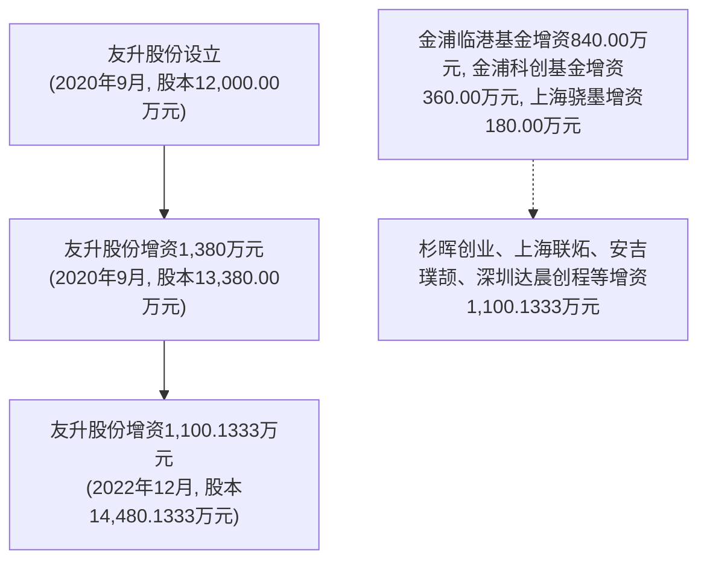
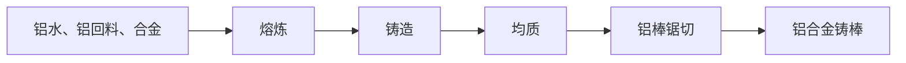
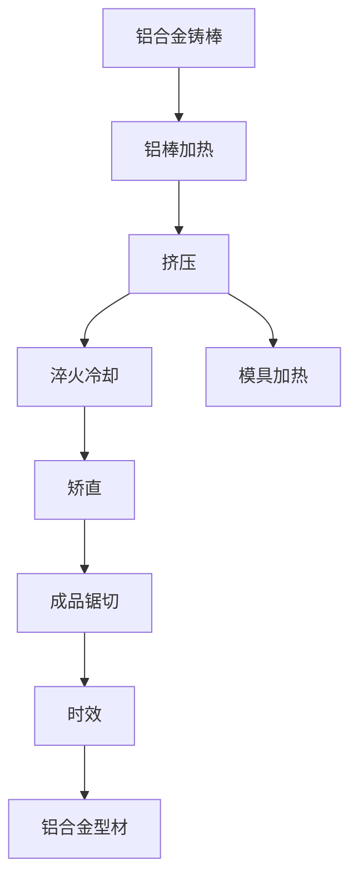
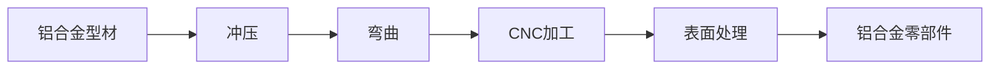
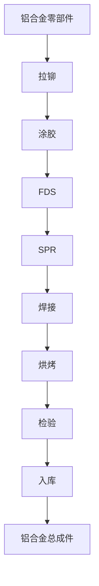
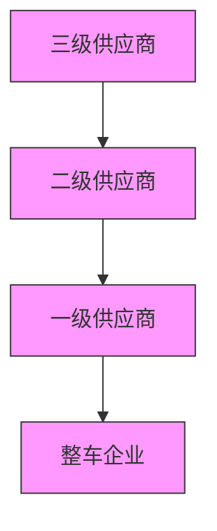
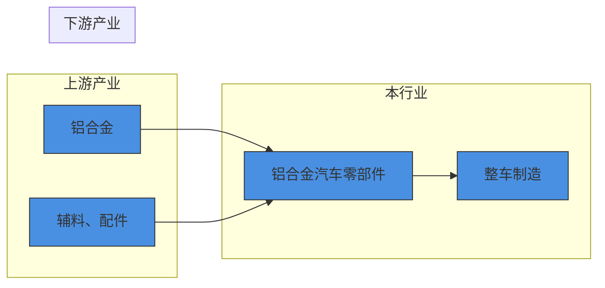

# 上海友升铝业股份有限公司

Shanghai Unison Aluminium Products Co., Ltd.

（上海市青浦区沪青平公路 2058 号）

natural_image

Blue abstract logo with stylized 'A' and 'L' letters, no readable text or symbols

# 首次公开发行股票并在主板上市

# 招股说明书

保荐人（主承销商）

国泰海通证券股份有限公司

GUOTAI HAITONGSECURITIESCO.,LTD.

中国（上海）自由贸易试验区商城路 618 号

# 致投资者的声明

# 一、发行人上市的目的

# （一）公司通过上市实现高质量发展

公司以“成为全球汽车工业顶级供应商”为发展目标，自设立以来坚持专业化和规模化发展，以客户为中心、以产品质量为根本、以技术创新为手段，逐渐成为新能源汽车领域重要零部件供应商。公司希望通过本次上市进一步增强公司的资本实力和行业影响力，完善公司治理机制，夯实经营基础，全面提升核心竞争力，致使公司成为全球汽车工业优秀供应商。

# （二）公司通过上市创造社会价值

公司的发展源于社会，也将回馈于社会。公司希望通过本次上市建立高质量发展体系，创造更多的社会价值。公司将不断加强技术创新，为客户提供更优质的产品和服务，持续推动新能源汽车的续航升级和燃油车的节能减排，助力“双碳”政策目标实现；借助上市平台，公司希望进一步扩大经营规模，稳步实现资产增值，以高质量发展回馈广大投资者。

# 二、发行人现代企业制度的建立健全情况

公司已建立了健全的现代企业制度。公司治理制度建设方面，公司根据《公司法》《证券法》等相关法律、法规的要求结合公司实际情况制定了《公司章程》，建立了由股东大会、董事会、监事会和高级管理人员组成的科学和规范的法人治理结构。公司董事、监事和高级管理人员严格按照相关法律、法规及公司章程的规定开展经营。经营管理制度建设方面，公司建立了科学、规范、高效的经营管理制度，包括销售管理制度、生产管理制度、采购管理制度、财务管理制度等方面，提高了公司的经营管理水平和效率。

# 三、发行人本次融资的必要性及募集资金使用规划

在国家绿色发展战略引导、“双碳”政策目标推进以及新能源汽车技术成熟与配套设施进一步完善的背景下，未来新能源汽车、汽车轻量化、节能化已成为行业的发展趋势。铝合金汽车零部件具有轻量化、高可靠性、热稳定性强的优点，符合《新能源汽车产业发展规划（2021—2035 年）》规定的关键材料产业化应用。公司长期专注于铝合金汽车零部件研发及生产，需要在这一关键时期抓住机遇，扩大市场份额，提升整体竞争力。

公司规划本次募集资金用于云南友升轻量化铝合金零部件生产基地项目和年产 50 万台（套）电池托盘和 20 万套下车体制造项目，有利于完善产品布局、形成规模优势，实现高质量发展。

# 四、发行人持续经营能力及未来发展规划

# （一）发行人持续经营能力

公司凭借着先进的技术工艺、强大的产品开发实力和规模化的产品交付能力，已经与全球领先客户特斯拉、蔚来汽车、吉利集团、小鹏汽车、广汽集团、北汽新能源、赛力斯、宁德时代、海斯坦普、华域汽车等建立稳定的合作关系。报告期内，公司主要产品和业务未发生重大变化，资产质量良好，运营管理能力较强，资产规模持续扩大，具备较强的持续经营能力。

# （二）未来发展规划

公司在未来发展战略规划上，一方面，公司将继续以拓展国内外高端优质客户为重点方向，扩大公司在新能源汽车零部件领域的影响力，夯实公司在新能源汽车产业链中的行业地位。另一方面，公司将不断加大研发投入和新产品开发，对新产品、新工艺、新技术进行持续投资，提升产品性能，优化生产工艺，提高生产效益。

公司将积极把握全球新能源汽车行业增长带来的市场机遇，响应“碳达峰、碳中和”号召，紧跟“十四五”规划发展方向，大力拓展公司产品和技术在新能源汽车产业链上的应用，为提升我国新能源汽车的工业水平作出贡献。

实际控制人、董事长：

罗世兵

# 发行人声明

中国证监会、交易所对本次发行所作的任何决定或意见，均不表明其对发行人注册申请文件及所披露信息的真实性、准确性、完整性作出保证，也不表明其对发行人的盈利能力、投资价值或者对投资者的收益作出实质性判断或保证。任何与之相反的声明均属虚假不实陈述。

根据《证券法》规定，股票依法发行后，发行人经营与收益的变化，由发行人自行负责；投资者自主判断发行人的投资价值，自主作出投资决策，自行承担股票依法发行后因发行人经营与收益变化或者股票价格变动引致的投资风险。

本次发行概况

<table><tr><td>发行股票类型</td><td>人民币普通股(A股)</td></tr><tr><td>发行股数</td><td>本次发行股票数量为4,826.7111万股,占本次发行后股份总数的25%。本次发行均为新股,公司股东不公开发售股份。</td></tr><tr><td>每股面值</td><td>人民币1.00元</td></tr><tr><td>每股发行价格</td><td>人民币46.36元</td></tr><tr><td>发行日期</td><td>2025年9月12日</td></tr><tr><td>拟上市证券交易所和板块</td><td>上海证券交易所主板</td></tr><tr><td>发行后总股本</td><td>19,306.8444万股</td></tr><tr><td>保荐人(主承销商)</td><td>国泰海通证券股份有限公司</td></tr><tr><td>招股说明书签署日期</td><td>2025年9月18日</td></tr></table>

# 目 录

# 致投资者的声明 .

一、发行人上市的目的..  
二、发行人现代企业制度的建立健全情况.  
三、发行人本次融资的必要性及募集资金使用规划.  
四、发行人持续经营能力及未来发展规划.

# 发行人声明 .....

# 本次发行概况....

# 目 录...

# 第一节 释义 ..

一、一般释义. .11  
二、行业术语释义.. .14

# 第二节 概览... 16

一、重大事项提示.. ..16  
二、发行人及本次发行的中介机构基本情况. .18  
三、本次发行概况.. .19  
四、发行人的主营业务经营情况. ..20  
五、发行人符合主板定位情况. ..27

六、发行人主要财务数据及财务指标. ..31

七、发行人财务报告审计截止日后主要财务信息及经营状况. ..32

八、发行人选择的具体上市标准. ..34

九、公司治理特殊安排等重要事项. ..34

十、本次募集资金用途及未来发展规划. ..34

十一、其他对发行人有重大影响的事项. ..35

# 第三节 风险因素. .36

一、与发行人相关的风险. ..36  
二、与行业相关的风险.. ..38  
三、其他风险... ..39

# 第四节 发行人基本情况.... .40

一、发行人基本信息. ..40

二、发行人设立情况和报告期内股本、股东变化情况. ..40

三、发行人成立以来重要事件. ..50

四、发行人在其他证券市场上市或挂牌的情况. .51

五、发行人的股权结构.. .51

六、发行人控股和参股公司情况. .51

七、持有发行人 5%以上股份的主要股东及实际控制人的基本情况 ...........57

八、控股股东、实际控制人报告期内不存在重大违法行为.. ..72

九、发行人股本情况.. ..72

十、发行人董事、监事、高级管理人员及其他核心人员的简要情况..........81

十一、公司与董事、监事、高级管理人员及其他核心人员签订的协议及履行情况... ..88

十二、公司董事、监事、高级管理人员及其他核心人员及其近亲属持股情况.. ..88

十三、公司与董事、监事、高级管理人员及其他核心人员在最近三年内的变动情况... ..90

十四、公司与董事、监事、高级管理人员及其他核心人员的对外投资情况..91

十五、董事、监事、高级管理人员及其他核心人员的薪酬情况. ... 92

十六、本次发行前发行人已制定或实施的股权激励及相关安排. ... 93

十七、发行人员工情况.. ..97

# 第五节 业务与技术. .101

一、发行人主营业务及主要产品.. ..101

二、发行人所处行业的基本情况.. ..116

三、发行人销售情况和主要客户. ..143

四、发行人采购情况和主要供应商. ..146

五、发行人的主要固定资产及无形资产情况. ..150

六、发行人的技术和研发情况. ..157

七、安全生产和环境保护情况. ..163

八、发行人境外经营及境外资产情况. ..166

# 第六节 财务会计信息与管理层分析. .169

一、合并财务报表.. ..169  
二、审计意见.. ..173  
三、重要性水平及关键审计事项. ..173  
四、财务报表的编制基础、合并报表范围及变化情况. ..175  
五、报告期内采用的主要会计政策和会计估计. .177  
六、经注册会计师鉴证的非经常性损益表. ..192  
七、报告期内执行的主要税收政策. ..193  
八、主要财务指标.. ..196  
九、经营成果分析.. ..198  
十、资产质量分析.. ..234  
十一、偿债能力、流动性与持续经营能力. ..250  
十二、其他重大事项.. .. 271  
十三、盈利预测信息. ..271  
十四、财务报告审计截止日后主要财务信息及经营状况. ..272

# 第七节 募集资金运用与未来发展规划.... .277

一、本次发行募集资金情况. ..277  
二、募集资金投资项目的可行性及与发行人主要业务、核心技术之间的关系... ...280  
三、募集资金投资项目概况. ..282  
四、未来发展与规划. ..282

# 第八节 公司治理与独立性. ..286

一、报告期内发行人公司治理存在的缺陷及改进情况. ..286  
二、发行人管理层对内部控制完整性、合理性及有效性的自我评估意见以及注册会计师对公司内部控制的审计意见.. ...286  
三、公司报告期内违法违规情况. ..286  
四、公司资金占用、对外担保和其他事项. ..288  
五、面向市场独立持续经营能力.. ..290  
六、同业竞争. ..292  
七、关联方及关联交易. ..293

八、规范关联交易的制度安排. ..310   
九、报告期内关联交易的程序履行情况及独立董事意见. ..310  
十、规范及减少关联交易的措施. ..310  
十一、报告期内关联方的变化情况. ..311

# 第九节 投资者保护.... .312

一、本次发行完成前滚存利润的分配安排. ..312  
二、本次发行前后股份分配政策的差异情况. ..312  
三、有关现金分红的股利分配政策、决策程序及监督机制.. ..312

# 第十节 其他重要事项.... .313

一、信息披露及投资者关系的负责部门和人员.. ..313  
二、重要合同事项.. ..313  
三、对外担保.. ..318  
四、重大诉讼或仲裁事项. .. 318  
五、发行人董事、监事、高级管理人员和核心技术人员涉及刑事诉讼的情况. ..319

# 第十一节声明..... ..320

一、发行人及其全体董事、监事、高级管理人员声明.. ..320  
二、发行人控股股东、实际控制人声明.. ..321  
三、保荐人（主承销商）声明. ..322  
四、保荐人（主承销商）董事长、总经理声明.. ..323  
五、发行人律师声明. ..324  
六、会计师事务所声明. .325  
七、评估机构声明.. ..326   
八、验资机构声明.. ..328

# 第十二节附件.... .329

一、备查文件.. ..329  
二、备查时间和地点. ..329

# 附录一：与投资者保护相关的承诺. .331

一、本次发行前股东所持股份的限售安排、自愿锁定、持股及减持意向的承诺.... ..331

二、关于稳定公司股价的预案及承诺. ..344  
三、关于股份回购和股份购回的措施和承诺. ..348  
四、关于欺诈发行上市的股份购回承诺. ..349  
五、关于填补被摊薄即期回报的措施及承诺. ..350  
六、关于利润分配政策的承诺. ..352  
七、依法承担赔偿或赔偿责任的承诺. ..353  
八、关于未履行承诺时的约束措施的承诺. ..354  
九、关于避免同业竞争的承诺. ..358  
十、关于减少及规范关联交易的承诺. ..360  
十一、关于避免资金占用的承诺. ..364  
十二、关于股东信息披露的承诺.. ..364   
十三、关于在审期间不进行现金分红的承诺. ..365  
十四、关于业绩下滑情形的承诺. .. 365

# 附录二：落实投资者关系管理相关规定的安排、股利分配决策程序、股东投票机制建立情况 ........... ...367

一、发行人投资者关系的主要安排. ..367  
二、股利分配政策.. ..368  
三、发行人股东投票机制的建立情况. ..373

# 附录三：发行人股东大会、董事会、监事会、独立董事和董事会秘书制度的建立健全及运行情况 ......... ....375

一、股东大会制度的建立健全及运行情况. ..375  
二、董事会制度的建立健全及运行情况.. ..375  
三、监事会制度的建立健全及运行情况. ..376  
四、独立董事制度的建立健全及运行情况. ..376  
五、董事会秘书制度. ..378

# 附录四：审计委员会及其他专门委员会的设置情况说明 .380

附录五：商标.... ..381   
附录六：专利.... ..382   
附录七：土地使用权... ..390  
附录八：资产许可情况.... ..391

附录九：资质和许可. ..392

附录十：募集资金具体运用情况 .... .394

一、云南友升轻量化铝合金零部件生产基地项目（一期）..... ..394  
二、年产50万台（套）电池托盘和 20万套下车体制造项目. .. 395  
三、补充流动资金项目. ..396

# 第一节 释义

在本招股说明书中，除非文义另有所指，下列词语具有如下含义：

# 一、一般释义

<table><tr><td>公司、本公司、友升股份、发行人</td><td>指</td><td>上海友升铝业股份有限公司</td></tr><tr><td>实际控制人</td><td>指</td><td>罗世兵和金丽燕</td></tr><tr><td>泽升贸易</td><td>指</td><td>上海泽升贸易有限公司,系发行人控股股东</td></tr><tr><td>友升有限</td><td>指</td><td>上海友升铝业有限公司,系发行人前身</td></tr><tr><td>广东泽升</td><td>指</td><td>广东泽升汽车科技有限公司,系发行人全资子公司</td></tr><tr><td>安徽友升</td><td>指</td><td>安徽友升铝业有限公司,系发行人全资子公司</td></tr><tr><td>重庆友利森</td><td>指</td><td>重庆友利森汽车科技有限公司,系发行人全资子公司</td></tr><tr><td>长春友升</td><td>指</td><td>长春友升汽车科技有限公司,系发行人全资子公司</td></tr><tr><td>上海泽升</td><td>指</td><td>上海泽升汽车科技有限公司,系发行人全资子公司</td></tr><tr><td>山东友升</td><td>指</td><td>山东友升铝业有限公司,系发行人全资子公司</td></tr><tr><td>江苏友升</td><td>指</td><td>江苏友升汽车科技有限公司,系发行人全资子公司</td></tr><tr><td>武汉友升</td><td>指</td><td>武汉友升汽车科技有限公司,系发行人全资子公司</td></tr><tr><td>云南友升</td><td>指</td><td>云南友升铝业有限公司,系发行人全资子公司</td></tr><tr><td>海南泽爱思</td><td>指</td><td>海南泽爱思国际贸易有限公司,系发行人全资子公司</td></tr><tr><td>泽升国际</td><td>指</td><td>ZESHENG INTERNATIONAL PTE. LTD.,系发行人全资子公司</td></tr><tr><td>泽升欧洲</td><td>指</td><td>ZS EUROPE LTD.,系发行人全资子公司</td></tr><tr><td>墨西哥泽爱思</td><td>指</td><td>ZS AUTOMOTIVE COMPONENTS MEXICO S.A.DE C.V.,系发行人全资子公司</td></tr><tr><td>墨西哥友升</td><td>指</td><td>UNISON AUTOMOTIVE MEXICO S.A.DE C.V.,系发行人全资子公司</td></tr><tr><td>徐泾工业公司</td><td>指</td><td>上海市青浦县徐泾乡工业公司,系发行人历史上的股东</td></tr><tr><td>友升太平洋美国</td><td>指</td><td>Unison Pacific Investment (US) Limited,即友升太平洋(美国)投资有限公司,曾系发行人股东</td></tr><tr><td>第一美亚</td><td>指</td><td>Unison Aluminum Products (FAAF) LLC,即友升铝业(第一美亚)有限责任公司,曾系发行人股东</td></tr><tr><td>第一美亚基金</td><td>指</td><td>First America Asia Fund I LP,曾系友升铝业(第一美亚)有限责任公司的股东</td></tr><tr><td>美国日升</td><td>指</td><td>Sunrise Group (USA),Inc.,即美国日升集团公司,曾系发行人股东</td></tr><tr><td>上海广虹</td><td>指</td><td>上海广虹实业有限公司,曾系发行人股东,曾用名为上海广虹(集团)有限公司</td></tr><tr><td>共青城泽升</td><td>指</td><td>共青城泽升投资管理合伙企业(有限合伙),发行人发起人股东之一</td></tr><tr><td>达晨创联基金</td><td>指</td><td>深圳市达晨创联私募股权投资基金合伙企业(有限合伙),发行人发起人股东之一</td></tr><tr><td>金浦临港基金</td><td>指</td><td>上海金浦临港智能科技股权投资基金合伙企业(有限合伙),系发行人股东</td></tr><tr><td>金浦科创基金</td><td>指</td><td>上海金浦科技创业股权投资基金合伙企业(有限合伙),系发行人股东</td></tr><tr><td>上海骁墨</td><td>指</td><td>上海骁墨信息技术服务中心(有限合伙),系发行人股东</td></tr><tr><td>杉晖创业</td><td>指</td><td>深圳市杉晖创业投资合伙企业(有限合伙),系发行人股东</td></tr><tr><td>杉创智至</td><td>指</td><td>上海杉创智至创业投资合伙企业(有限合伙),系发行人股东</td></tr><tr><td>上海联炻</td><td>指</td><td>上海联炻企业管理中心(有限合伙),系发行人股东</td></tr><tr><td>达晨财汇</td><td>指</td><td>海南三亚达晨财汇私募股权投资基金合伙企业(有限合伙),系发行人股东</td></tr><tr><td>财投晨源</td><td>指</td><td>江西赣江新区财投晨源股权投资中心(有限合伙),系发行人股东</td></tr><tr><td>达晨财智</td><td>指</td><td>深圳市达晨财智创业投资管理有限公司,系发行人股东</td></tr><tr><td>财智创赢</td><td>指</td><td>深圳市财智创赢私募股权投资企业(有限合伙),系发行人股东</td></tr><tr><td>杭州达晨创程</td><td>指</td><td>杭州达晨创程股权投资基金合伙企业(有限合伙),系发行人股东</td></tr><tr><td>深圳达晨创程</td><td>指</td><td>深圳市达晨创程私募股权投资基金企业(有限合伙),系发行人股东</td></tr><tr><td>安吉璞颉</td><td>指</td><td>安吉璞颉企业管理合伙企业(有限合伙),系发行人股东</td></tr><tr><td>财智创享</td><td>指</td><td>深圳市财智创享咨询服务合伙企业(有限合伙)</td></tr><tr><td>特斯拉</td><td>指</td><td>Tesla,Inc.及其下属公司、Tesla Manufacturing Brandenburg SE 及其下属公司和特斯拉(上海)有限公司及其下属公司</td></tr><tr><td>蔚来汽车</td><td>指</td><td>蔚来控股有限公司及其下属公司</td></tr><tr><td>理想汽车</td><td>指</td><td>重庆理想汽车有限公司及其下属公司</td></tr><tr><td>广汽集团</td><td>指</td><td>广州汽车集团股份有限公司及其下属公司</td></tr><tr><td>一汽股份</td><td>指</td><td>中国第一汽车股份有限公司及其下属公司</td></tr><tr><td>麦格纳</td><td>指</td><td>Magna International(Hong Kong)Limited及其下属公司和Magna Fuzhou Automotive Seating Co.PTE.LTD.,及其下属公司</td></tr><tr><td>海斯坦普</td><td>指</td><td>海斯坦普汽车组件(昆山)有限公司</td></tr><tr><td>本特勒</td><td>指</td><td>Benteler Automobil Technik Gmbh及其下属公司和本特勒国际股份公司及其下属公司</td></tr><tr><td>华域汽车</td><td>指</td><td>华域汽车系统股份有限公司及其下属公司</td></tr><tr><td>威巴克</td><td>指</td><td>Vibracoustic SE&amp;Co.KG及其下属公司和Vibracoustic Hong Kong Holdings Limited及其下属公司</td></tr><tr><td>富奥股份</td><td>指</td><td>富奥汽车零部件股份有限公司及其下属公司</td></tr><tr><td>凌云工业</td><td>指</td><td>凌云工业股份有限公司及其下属公司</td></tr><tr><td>广西艾盛</td><td>指</td><td>广西艾盛创制科技有限公司及其下属公司</td></tr><tr><td>北汽新能源</td><td>指</td><td>北汽蓝谷新能源科技股份有限公司及其下属公司</td></tr><tr><td>罗福斯</td><td>指</td><td>罗福斯控股香港有限公司及其下属公司</td></tr><tr><td>吉利集团</td><td>指</td><td>浙江吉利控股集团有限公司及其下属公司</td></tr><tr><td>宁德时代</td><td>指</td><td>宁德时代新能源科技股份有限公司及其下属公司</td></tr><tr><td>比亚迪</td><td>指</td><td>比亚迪股份有限公司及其下属公司</td></tr><tr><td>长安汽车</td><td>指</td><td>重庆长安汽车股份有限公司及其下属公司</td></tr><tr><td>小鹏、小鹏汽车</td><td>指</td><td>小鹏汽车华中(武汉)有限公司</td></tr><tr><td>沃尔沃</td><td>指</td><td>Volvo Car Corporation、Polestar Performance AB</td></tr><tr><td>中创新航</td><td>指</td><td>中创新航科技集团股份有限公司及其下属公司</td></tr><tr><td>孚能科技</td><td>指</td><td>孚能科技(赣州)股份有限公司及其下属公司</td></tr><tr><td>祥晋汽车</td><td>指</td><td>浙江祥晋汽车零部件股份有限公司及其下属公司</td></tr><tr><td>赛力斯</td><td>指</td><td>赛力斯集团股份有限公司及其下属公司</td></tr><tr><td>小米、小米汽车</td><td>指</td><td>小米科技有限责任公司及其下属公司</td></tr><tr><td>江铃汽车</td><td>指</td><td>江铃汽车股份有限公司及其下属公司</td></tr><tr><td>TPI</td><td>指</td><td>SENVIA,S,INC.和 TPI,INC.</td></tr><tr><td>廊坊飞泽</td><td>指</td><td>廊坊市飞泽复合材料科技有限公司</td></tr><tr><td>祥鑫科技</td><td>指</td><td>祥鑫科技(广州)有限公司</td></tr><tr><td>上海交运</td><td>指</td><td>上海交运集团股份有限公司</td></tr><tr><td>信源集团</td><td>指</td><td>聊城信源集团有限公司及其下属公司</td></tr><tr><td>万旭铝业</td><td>指</td><td>重庆万旭铝业有限公司</td></tr><tr><td>亘旭铝材</td><td>指</td><td>重庆亘旭铝材有限公司</td></tr><tr><td>山东创新</td><td>指</td><td>山东创新金属科技有限公司及其下属公司</td></tr><tr><td>山东裕航</td><td>指</td><td>山东裕航特种合金装备有限公司及其下属公司</td></tr><tr><td>重庆铝王</td><td>指</td><td>重庆铝王铝业有限公司及其下属公司</td></tr><tr><td>重庆渝创</td><td>指</td><td>重庆渝创新材料有限公司</td></tr><tr><td>茌平恒信</td><td>指</td><td>茌平恒信铝业有限公司及其下属公司</td></tr><tr><td>中铝集团</td><td>指</td><td>中国铝业股份有限公司及其下属公司</td></tr><tr><td>内蒙古蒙泰</td><td>指</td><td>内蒙古蒙泰集团有限公司及其下属公司</td></tr><tr><td>ROCHE、墨西哥罗切</td><td>指</td><td>ROCHE INDUSTRIES PROFESSIONAL DE MEXICO, S. DE R.L. DE C.V.</td></tr><tr><td>保荐机构、主承销商、国泰海通、保荐人</td><td>指</td><td>国泰海通证券股份有限公司</td></tr><tr><td>发行人律师、通力、通力律师</td><td>指</td><td>上海市通力律师事务所</td></tr><tr><td>发行人会计师、中汇会计师、中汇</td><td>指</td><td>中汇会计师事务所(特殊普通合伙)</td></tr><tr><td>沃克森评估</td><td>指</td><td>沃克森(北京)国际资产评估有限公司</td></tr><tr><td>元</td><td>指</td><td>人民币元</td></tr><tr><td>A股</td><td>指</td><td>人民币普通股</td></tr><tr><td>报告期</td><td>指</td><td>2022年度、2023年度和2024年度</td></tr><tr><td>本次发行</td><td>指</td><td>公司本次公开发行4,826.7111万股面值为1.00元的境内上市人民币普通股的行为</td></tr></table>

二、行业术语释义

注：本招股说明书中若出现总计数与所列数值总和不符，均为四舍五入所致。

<table><tr><td>整车配套市场</td><td>指</td><td>在新车出厂前,为汽车制造企业整车装配供应零部件的市场,其主要受到汽车制造厂商产量的影响</td></tr><tr><td>APQP</td><td>指</td><td>Advanced Product Quality Planning,即产品质量先期策划,是一种结构化的方法,用来制订开发出使顾客满意的产品所需的途径与步骤</td></tr><tr><td>PPAP</td><td>指</td><td>Production Part Approval Process,即生产件批准程序,规定了包括生产和散装材料在内的生产件批准的一般要求,用来确定供应商是否已经正确理解了顾客工程设计和规范的所有要求,以及其生产过程是否具有潜在能力,在实际生产过程中是否按规定的生产节拍生产满足顾客要求的产品</td></tr><tr><td>总成</td><td>指</td><td>由若干零件、部件、组合件或附件组合装配而成,并具有独立功能的汽车组成部分</td></tr><tr><td>机加工</td><td>指</td><td>是指通过一种机械设备对工件的外形尺寸或性能进行改变的过程。按加工方式上的差别可分为切削加工和压力加工</td></tr><tr><td>工装</td><td>指</td><td>工艺装备,即制造过程中所用的各种工具的总称,包括模具、夹具以及检具等各种工具</td></tr><tr><td>刀具</td><td>指</td><td>机械加工过程中用于切削加工的工具,又称切削工具</td></tr><tr><td>铆接</td><td>指</td><td>使用铆钉连接两件或两件以上的工件</td></tr><tr><td>热处理</td><td>指</td><td>将金属材料放在一定的介质内加热、保温、冷却,通过改变材料表面或内部的金相组织结构,来控制其性能的一种金属热加工工艺</td></tr><tr><td>CAE</td><td>指</td><td>计算机辅助工程(Computer Aided Engineering),指用计算机辅助求解分析复杂工程和产品的结构力学性能,以及优化结构性能等</td></tr><tr><td>FDS</td><td>指</td><td>流钻螺钉(Flow Drill Screw),是一种通过设备中心拧紧轴将电机的高速旋转传导至待连接板料摩擦生热产生塑性形变后,自攻丝并螺接的一种冷成型工艺</td></tr><tr><td>SPR</td><td>指</td><td>自冲铆接技术(Self-Piercing Riveting),是通过液压缸或伺服电机提供动力将铆钉直接压入待铆接板材,待铆接板材在铆钉的压力作用下与铆钉发生塑性变形,成形后充盈于铆模之中,从而形成稳定连接的一种全新的板材连接技术</td></tr><tr><td>抗拉强度</td><td>指</td><td>金属由均匀塑性形变向局部集中塑性变形过渡的临界值,也是金属在静拉伸条件下的最大承载能力</td></tr><tr><td>屈服强度</td><td>指</td><td>金属材料发生屈服现象时的屈服极限</td></tr><tr><td>比强度</td><td>指</td><td>材料的抗拉强度与材料表观密度的比值,单位为牛/特。比强度越高表明达到相应强度所用的材料质量越轻</td></tr><tr><td>比刚度</td><td>指</td><td>材料的弹性模量与其密度的比值,单位为牛顿米/弧度。比刚度越高表明达到相应刚度所用的材料质量越轻</td></tr><tr><td>铝回料</td><td>指</td><td>是生产过程中产生的可回炉熔铸的废铝,具体指熔铸、挤压等生产过程中产生的铸锭切头切尾损失、挤压余料等</td></tr><tr><td>铝屑</td><td>指</td><td>是生产过程中产生的不宜直接回炉熔铸的铝屑、铝渣等</td></tr><tr><td>铝灰</td><td>指</td><td>是生产过程中产生的无利用价值的固态废弃物</td></tr><tr><td>返利</td><td>指</td><td>是销售过程中,按照约定,根据销售额及返点比例给予客户一定的返利</td></tr><tr><td>补差</td><td>指</td><td>是销售过程中,按照约定,按照固定价格与客户结算的情况下,双方会根据铝价的波动结算一定的补差金额</td></tr><tr><td>IMMEX</td><td>指</td><td>Industria Manufacturera, Maquiladora y de Servicio de Exportación的首字母缩写,IMMEX通常翻译为“制造加工和出口服务业”。为促进贸易和经济发展,墨西哥联邦政府于2006年11月1日颁布了《促进制造业、加工及出口服务业法令》(The Decree for the Promotion of the Manufacturing, Maquila and Export Service Industry,简称“IMMEX法令”),旨在增强墨西哥出口行业的竞争力、增强出口企业经营的确定性、透明度和连续性、降低管理和物流成本,以鼓励和吸引投资。IMMEX法令正式设立了IMMEX计划。IMMEX计划主要面对墨西哥的制造业、加工业和出口服务业,以及在墨西哥制造并最终出口的产品</td></tr><tr><td>Shelter模式</td><td>指</td><td>根据IMMEX法令,Shelter模式为IMMEX计划下的一种模式,墨西哥允许境外公司提供技术、生产管理、机器设备以及原材料等,并通过拥有IMMEX实体资格的墨西哥境内公司(简称“Shelter服务商”)开展业务,即允许境外公司在墨西哥不设法律实体的情况下,通过与Shelter服务商合作在墨西哥进行生产</td></tr></table>

# 第二节 概览

本概览仅对招股说明书全文做扼要提示。投资者作出投资决策前，应认真阅读招股说明书全文。

# 一、重大事项提示

# （一）特别风险提示

本公司提醒投资者特别关注“风险因素”中的下列风险，并认真阅读本招股说明书“第三节风险因素”中的全部内容。

# 1、行业周期波动的影响

汽车生产和销售受宏观经济的影响较大，汽车产业与宏观经济的波动相关性明显，全球及国内经济的周期性波动都将对我国汽车生产和消费带来影响。公司的业务收入主要来源为汽车铝合金零部件产品的销售，如果汽车行业受到宏观经济的不利影响，汽车产销量下降，可能会造成公司的订单减少、存货积压、货款收回困难等情况，因此公司存在受经济周期波动的影响导致的风险。

# 2、客户相对集中的风险

报告期各期，公司对前五大客户的销售收入分别为 123,501.58 万元、152,141.55 万元和 204,405.73 万元，占公司营业收入的比例分别为 52.55%、52.37%和 51.75%，客户集中度较高。公司主要客户包括特斯拉、广汽集团、蔚来汽车、北汽新能源、赛力斯、海斯坦普、宁德时代、凌云工业等国内外知名汽车整车或零部件厂商，如果公司主要客户的需求下降，或转向其他供应商采购，将对公司的经营及财务状况产生不利影响。

# 3、主要原材料价格波动的风险

公司采购的原材料主要为铝水、铝棒、铝型材等。报告期内，公司采购的铝水、铝棒、铝型材等原材料合计占采购总额的比重分别为 77.96%、76.23%和71.64%，占比较高。铝水、铝棒、铝型材的采购价格主要参照上海有色网和长江有色金属网的市场价格确定。如果铝价格出现大幅上涨，产品价格调整不及时，将导致公司经营业绩下滑和盈利能力下降。

以 2024 年为例，假设发行人主要原材料铝材价格变动±3%、±5%，产品价格未向客户传导，对利润总额的敏感性分析如下：

<table><tr><td rowspan="2">项目</td><td colspan="4">原材料价格变动幅度</td></tr><tr><td>-3%</td><td>3%</td><td>-5%</td><td>5%</td></tr><tr><td>对利润总额影响金额(万元)</td><td>5,029.78</td><td>-5,029.78</td><td>8,382.97</td><td>-8,382.97</td></tr><tr><td>对利润总额影响率</td><td>10.78%</td><td>-10.78%</td><td>17.96%</td><td>-17.96%</td></tr></table>

从上述敏感性分析可以看出，如果铝材采购价格上升或下降 3%、5%，发行人 2024年利润总额将减少或增加 10.78%、17.96%。

# 4、营运资金流动性风险

报告期内，公司对外采购铝水、铝棒、铝型材等原材料时，结算方式以预付为主，而公司与下游客户进行结算时，通常有一定的账期。公司与主要客户信用期一般为开票后 60 日至 90 日内付款，考虑到开票结算周期一般约为一个月，因此销售至回款整体周期约 90日至 120日。在公司业务高速发展期，会使得经营活动现金需求较大。报告期内，公司经营活动产生的现金流量净额分别为 4,911.60 万元、3,802.24 万元和-25,294.15 万元，净流出规模整体呈上升趋势，且 2024 年度经营活动产生的现金流量净额为负，如公司不能通过股权或债权方式进行融资，以弥补流动资金缺口，可能会造成流动性风险。

# 5、租赁厂房到期不能续租或被收回的风险

发行人及子公司多处生产经营场所来自于租赁。截至报告期末，租赁房产面积占比 73.00%，公司租赁的部分厂房尚未取得产权证书，尚未取得产权证书建筑面积占比 12.71%。若租赁房产因为产权瑕疵或出租方原因，在租赁有效期内被提前收回或到期无法续租，致使公司需要搬迁，将会对公司的生产经营稳定性造成影响并带来额外的搬迁支出。

# （二）本次发行相关主体作出的重要承诺

本公司提示投资者认真阅读本公司、股东、董事、监事、高级管理人员、核心技术人员以及本次发行的保荐人及证券服务机构等作出的重要承诺详见本招股说明书“附录一：与投资者保护相关的承诺”相关内容。

# （三）本次发行后公司的利润分配政策

本公司提醒投资者关注公司发行上市后的利润分配政策、现金分红的最低比例、未来三年具体利润分配计划和长期回报规划等，详见本招股说明书“附录二/二、股利分配政策”相关内容。

# （四）业绩下滑情形相关承诺

本公司提醒投资者关注公司出现上市当年及之后第二年、第三年较上市前一年扣除非经常性损益后归母净利润下滑 50%以上等情形的，延长所持股份锁定期限的相关承诺，详见本招股说明书“附录一：与投资者保护相关的承诺”相关内容。

# （五）财务报告审计截止日后主要财务信息及经营状况

公司财务报告审计基准日为 2024年 12月 31日。财务报告审计截止日至本招股说明书签署日，公司经营状况良好，经营模式、采购模式、销售模式等未发生重大不利变化，未发生导致公司经营业绩异常波动的重大不利因素。

# 二、发行人及本次发行的中介机构基本情况

<table><tr><td colspan="4">(一)发行人基本情况</td></tr><tr><td>发行人名称</td><td>上海友升铝业股份有限公司</td><td>成立时间</td><td>1992年12月4日</td></tr><tr><td>注册资本</td><td>14,480.1333万元</td><td>法定代表人</td><td>罗世兵</td></tr><tr><td>注册地址</td><td>上海市青浦区沪青平公路2058号</td><td>主要生产经营地址</td><td>山东省聊城市茌平区信发街道办事处北环路3212号、重庆市綦江区古南街道工业园区北渡铝产业园</td></tr><tr><td>控股股东</td><td>上海泽升贸易有限公司</td><td>实际控制人</td><td>罗世兵、金丽燕</td></tr><tr><td>行业分类</td><td>C36汽车制造业</td><td>在其他交易场所(申请)挂牌或上市的情况</td><td>2014年7月1日,公司进入上海股权托管交易中心中小企业股权报价系统挂牌,股份代码为201095;2020年12月1日,公司终止在上海股权托管交易中心展示系统基本信披层展示。</td></tr><tr><td colspan="4">(二)本次发行的有关中介机构</td></tr><tr><td>保荐人</td><td>国泰海通证券股份有限公司</td><td>主承销商</td><td>国泰海通证券股份有限公司</td></tr><tr><td>发行人律师</td><td>上海市通力律师事务所</td><td>其他承销机构</td><td>无</td></tr><tr><td>审计机构</td><td>中汇会计师事务所(特殊普通合伙)</td><td>评估机构</td><td>沃克森(北京)国际资产评估有限公司</td></tr><tr><td colspan="2">发行人与本次发行有关的保荐人、承销机构、证券服务机构及其负责人、高级管理人员、经办人员之间存在的直接或间接的股权关系或其他利益关系</td><td colspan="2">不存在直接或间接的股权关系或其他利益关系</td></tr><tr><td colspan="4">(三)本次发行的其他有关机构</td></tr><tr><td>股票登记机构</td><td>中国证券登记结算有限责任公司上海分公司</td><td>收款银行</td><td>中国建设银行上海市分行营业部</td></tr><tr><td colspan="2">其他与本次发行有关的机构</td><td colspan="2">无</td></tr></table>

# 三、本次发行概况

<table><tr><td colspan="5">(一)本次发行的基本情况</td></tr><tr><td>股票种类</td><td colspan="4">人民币普通股(A股)</td></tr><tr><td>每股面值</td><td colspan="4">人民币1.00元</td></tr><tr><td>发行股数</td><td colspan="2">4,826.7111万股</td><td>占发行后总股本比例</td><td>25%</td></tr><tr><td>其中:发行新股数量</td><td colspan="2">4,826.7111万股</td><td>占发行后总股本比例</td><td>25%</td></tr><tr><td>股东公开发售股份数量</td><td colspan="2">不适用</td><td>占发行后总股本比例</td><td>不适用</td></tr><tr><td>发行后总股本</td><td colspan="4">19,306.8444万股</td></tr><tr><td>每股发行价格</td><td colspan="4">46.36元/股</td></tr><tr><td>发行市盈率</td><td colspan="4">22.31倍(按扣除非经常性损益前后净利润的孰低额和发行后总股本全面摊薄计算)</td></tr><tr><td>发行前每股净资产</td><td>13.43元/股(按照2024年12月31日经审计的归属于母公司所有者权益除以发行前总股本计算)</td><td colspan="2">发行前每股收益</td><td>2.77元/股(按照2024年12月31日经审计的扣除非经常性损益前后孰低的归属于母公司股东的净利润除以发行前总股本计算)</td></tr><tr><td>发行后每股净资产</td><td>20.83元/股</td><td colspan="2">发行后每股收益</td><td>2.08元/股</td></tr><tr><td>发行市净率</td><td colspan="4">2.23倍(按每股发行价格除以发行后每股净资产计算)</td></tr><tr><td>发行方式</td><td colspan="4">本次发行采用向参与战略配售的投资者定向配售、网下向符合条件的投资者询价配售与网上向持有上海市场非限售A股股份和非限售存托凭证市值的社会公众投资者定价发行相结合的方式进行</td></tr><tr><td>发行对象</td><td colspan="4">符合资格的参与战略配售的投资者、网下投资者和已开立上海证券交易所股票账户的境内自然人、法人、证券投资基金及符合法律、法规、规范性文件规定的其他投资者(国家法律、法规及上海证券交易所业务规则等禁止参与者除外)</td></tr><tr><td>承销方式</td><td colspan="4">余额包销</td></tr><tr><td>募集资金总额</td><td colspan="4">223,766.33万元</td></tr><tr><td>募集资金净额</td><td colspan="4">207,748.09万元</td></tr><tr><td>募集资金投资项目</td><td colspan="4">云南友升轻量化铝合金零部件生产基地项目(一期)</td></tr><tr><td rowspan="2"></td><td colspan="4">年产50万台(套)电池托盘和20万套下车体制造项目</td></tr><tr><td colspan="4">补充流动资金</td></tr><tr><td>发行费用概算</td><td colspan="4">本次发行费用为16,018.24万元,具体构成如下:1、保荐承销费用:保荐费为200.00万元,承销费用为12,107.15万元;保荐承销费分阶段收取,参考市场保荐承销费率平均水平及公司拟募集资金总额,经双方友好协商确定,根据项目进度分节点支付。2、审计及验资费用:1,830.36万元;依据承担的责任和实际工作量,以及投入的相关资源等因素,经双方友好协商确定,按照项目完成进度分节点支付。3、律师费用:1,220.00万元;依据承担的责任和实际工作量,以及投入的相关资源等因素,经双方友好协商确定,按照项目完成进度分节点支付。4、用于本次发行的信息披露费用:549.06万元。5、发行手续费及其他费用:111.67万元。(注:本次发行各项费用均为不含增值税金额,相较于招股意向书,根据发行情况将印花税纳入了发行手续费及其他费用,印花税税基为扣除印花税前的募集资金净额,税率为0.025%。)</td></tr><tr><td>高级管理人员、员工拟参与战略配售情况</td><td colspan="4">海富通友升铝业员工参与主板战略配售集合资产管理计划(以下简称为“海富通友升资管计划”)参与战略配售实际获配数量为3,882,657股,占本次发行数量比例为8.04%,获配金额为179,999,978.52元。海富通友升资管计划本次获配股票限售期限为自发行人首次公开发行并上市之日起12个月。</td></tr><tr><td>保荐人相关子公司拟参与战略配售情况</td><td colspan="4">不适用</td></tr><tr><td>拟公开发售股份股东名称、持股数量及拟公开发售股份数量</td><td colspan="4">不适用</td></tr><tr><td>发行费用的分摊原则</td><td colspan="4">本次发行费用由公司承担</td></tr><tr><td colspan="5">(二)本次发行上市的重要日期</td></tr><tr><td>刊登初步询价公告日期</td><td colspan="4">2025年9月4日</td></tr><tr><td>初步询价日期</td><td colspan="4">2025年9月9日</td></tr><tr><td>刊登发行公告日期</td><td colspan="4">2025年9月11日</td></tr><tr><td>申购日期</td><td colspan="4">2025年9月12日</td></tr><tr><td>缴款日期</td><td colspan="4">2025年9月16日</td></tr><tr><td>股票上市日期</td><td colspan="4">本次股票发行结束后将尽快申请在上海证券交易所主板上市</td></tr></table>

# （三）本次发行的战略配售情况

# 1、战略配售数量

本次公开发行股票 4,826.7111 万股，发行股份占发行后公司股份总数的比例为 25%，全部为公开发行新股，本次发行前股东所持发行人股份在本次发行时不向投资者公开发售。本次公开发行后总股本为 19,306.8444 万股。本次初始战略配售发行数量为965.3422 万股，占本次发行数量的 20.00%。本次发行最终战略配售数量为 690.2499万股，占本次发行数量的 14.30%，初始战略配售股数与最终战略配售股数的差额275.0923万股回拨至网下发行。

# 2、战略配售对象

本次发行中，参与战略配售的投资者的选择在考虑投资者资质以及市场情况后综合决定，包括以下几类：

（1）与发行人经营业务具有战略合作关系或长期合作愿景的大型企业或其下属企业；  
（2）具有长期投资意愿的大型保险公司或其下属企业、国家级大型投资基金或其下属企业；  
（3）发行人的高级管理人员与核心员工参与本次战略配售设立的专项资产管理计划，即海富通友升资管计划。

# 3、发行人高管核心员工专项资产管理计划

# （1）投资主体

发行人的高级管理人员与核心员工参与本次战略配售设立的专项资产管理计划为海富通友升资管计划。

# （2）参与规模和具体情况

海富通友升资管计划参与战略配售的数量为 3,882,657 股，占本次发行数量的 8.04%，获配金额为 179,999,978.52 元。具体情况如下：

具体名称：海富通友升铝业员工参与主板战略配售集合资产管理计划

设立时间：2025年 7月 18日

备案时间：2025年 7月 31日

产品编码：SBCG61

募集资金规模：18,000.00 万元

认购金额上限：18,000.00 万元

管理人：海富通基金管理有限公司

集合计划托管人：兴业银行股份有限公司上海分行

实际支配主体：实际支配主体为海富通基金管理有限公司，发行人的高级管理人员及核心员工非实际支配主体。

海富通友升资管计划的出资人均与发行人或发行人全资子公司签署劳动合同、建立劳动关系。参与人姓名、职务与比例等信息具体如下：

注 1：合计数与各部分数直接相加之和在尾数存在的差异系由四舍五入造成；  
注 2：海富通友升资管计划所募集资金的 100%用于参与本次战略配售，即用于支付本次战略配售的价款；

<table><tr><td>序号</td><td>姓名</td><td>职务</td><td>员工类别</td><td>劳动合同签署单位</td><td>缴款金额(万元)</td><td>专项资管计划的持有比例</td></tr><tr><td>1</td><td>罗世兵</td><td>董事长、总经理</td><td>高级管理人员</td><td>友升股份</td><td>6,600.00</td><td>36.67%</td></tr><tr><td>2</td><td>金丽燕</td><td>董事、人资行政部经理</td><td>核心员工</td><td>友升股份</td><td>4,400.00</td><td>24.44%</td></tr><tr><td>3</td><td>付忠祥</td><td>副总经理</td><td>高级管理人员</td><td>友升股份</td><td>1,600.00</td><td>8.89%</td></tr><tr><td>4</td><td>王甥</td><td>财务总监</td><td>高级管理人员</td><td>友升股份</td><td>600.00</td><td>3.33%</td></tr><tr><td>5</td><td>朱明</td><td>销售部主管</td><td>核心员工</td><td>友升股份</td><td>500.00</td><td>2.78%</td></tr><tr><td>6</td><td>閤成云</td><td>人资行政部高级经理</td><td>核心员工</td><td>友升股份</td><td>350.00</td><td>1.94%</td></tr><tr><td>7</td><td>糜罕峰</td><td>工程技术中心副总监</td><td>核心员工</td><td>友升股份</td><td>300.00</td><td>1.67%</td></tr><tr><td>8</td><td>杨浩</td><td>工程技术中心项目经理</td><td>核心员工</td><td>友升股份</td><td>300.00</td><td>1.67%</td></tr><tr><td>9</td><td>王立忠</td><td>工程技术中心项目经理</td><td>核心员工</td><td>友升股份</td><td>300.00</td><td>1.67%</td></tr><tr><td>10</td><td>倪清元</td><td>运营总监</td><td>核心员工</td><td>友升股份</td><td>300.00</td><td>1.67%</td></tr><tr><td>11</td><td>李文通</td><td>工程技术中心项目经理</td><td>核心员工</td><td>友升股份</td><td>250.00</td><td>1.39%</td></tr><tr><td>12</td><td>刘旺才</td><td>副总经理</td><td>高级管理人员</td><td>广东泽升</td><td>200.00</td><td>1.11%</td></tr><tr><td>13</td><td>蔡翱</td><td>副总经理</td><td>高级管理人员</td><td>重庆友利森</td><td>200.00</td><td>1.11%</td></tr><tr><td>14</td><td>殷明</td><td>运营总监</td><td>核心员工</td><td>安徽友升</td><td>200.00</td><td>1.11%</td></tr><tr><td>15</td><td>翁自华</td><td>运营总监</td><td>核心员工</td><td>友升股份</td><td>200.00</td><td>1.11%</td></tr><tr><td>16</td><td>李政</td><td>品保部副总监</td><td>核心员工</td><td>友升股份</td><td>200.00</td><td>1.11%</td></tr><tr><td>17</td><td>万纯生</td><td>采购部经理</td><td>核心员工</td><td>友升股份</td><td>200.00</td><td>1.11%</td></tr><tr><td>18</td><td>于亚静</td><td>销售部经理</td><td>核心员工</td><td>友升股份</td><td>200.00</td><td>1.11%</td></tr><tr><td>19</td><td>徐中赞</td><td>总经办总裁助理</td><td>核心员工</td><td>友升股份</td><td>200.00</td><td>1.11%</td></tr><tr><td>20</td><td>李鹏辉</td><td>工程技术中心项目经理</td><td>核心员工</td><td>友升股份</td><td>200.00</td><td>1.11%</td></tr><tr><td>21</td><td>谷健</td><td>工程技术中心项目经理</td><td>核心员工</td><td>友升股份</td><td>200.00</td><td>1.11%</td></tr><tr><td>22</td><td>董朋轩</td><td>工程技术中心项目经理</td><td>核心员工</td><td>友升股份</td><td>200.00</td><td>1.11%</td></tr><tr><td>23</td><td>徐辉</td><td>工程技术中心项目经理</td><td>核心员工</td><td>友升股份</td><td>100.00</td><td>0.56%</td></tr><tr><td>24</td><td>聂龙武</td><td>工程技术中心项目经理</td><td>核心员工</td><td>友升股份</td><td>100.00</td><td>0.56%</td></tr><tr><td>25</td><td>陈银喜</td><td>销售部副主管</td><td>核心员工</td><td>友升股份</td><td>100.00</td><td>0.56%</td></tr><tr><td colspan="4">合计</td><td>/</td><td>18,000.00</td><td>100.00%</td></tr></table>

注 3：广东泽升指广东泽升汽车科技有限公司，系发行人全资子公司；安徽友升指安徽友升铝业有限公司，系发行人全资子公司；重庆友利森指重庆友利森汽车科技有限公司，系发行人全资子公司；

# 4、获配结果

本次发行最终战略配售结果如下：

<table><tr><td>序号</td><td>投资者名称</td><td>类型</td><td>获配股数(股)</td><td>获配股数占本次发行数量的比例</td><td>获配金额(元)</td><td>限售期(月)</td></tr><tr><td>1</td><td>江西省国控产业发展基金(有限合伙)</td><td rowspan="5">与发行人经营业务具有战略合作关系或长期合作愿景的大型企业或其下属企业</td><td>215,703</td><td>0.45%</td><td>9,999,991.08</td><td>18</td></tr><tr><td>2</td><td>晋拓科技股份有限公司</td><td>647,109</td><td>1.34%</td><td>29,999,973.24</td><td>18</td></tr><tr><td>3</td><td>南方工业资产管理有限责任公司</td><td>431,406</td><td>0.89%</td><td>19,999,982.16</td><td>18</td></tr><tr><td>4</td><td>广东广祺柒号股权投资合伙企业(有限合伙)</td><td>647,109</td><td>1.34%</td><td>29,999,973.24</td><td>18</td></tr><tr><td>5</td><td>中兵投资管理有限责任公司</td><td>431,406</td><td>0.89%</td><td>19,999,982.16</td><td>18</td></tr><tr><td>6</td><td>中国保险投资基金(有限合伙)</td><td>具有长期投资意愿的大型保险公司或其下属企业、国家级大型投资基金或其下属企业</td><td>647,109</td><td>1.34%</td><td>29,999,973.24</td><td>18</td></tr><tr><td>7</td><td>海富通友升铝业员工参与主板战略配售集合资产管理计划</td><td>高级管理人员与核心员工专项资产管理计划</td><td>3,882,657</td><td>8.04%</td><td>179,999,978.52</td><td>12</td></tr><tr><td colspan="3">合计</td><td>6,902,499</td><td>14.30%</td><td>319,999,853.64</td><td>-</td></tr></table>

# 5、限售期限

海富通友升资管计划本次获配股票限售期限为自发行人首次公开发行并上市之日起 12 个月。其他参与战略配售的投资者本次获配股票限售期限为自发行人首次公开发行并上市之日起18个月。

限售期届满后，参与战略配售的投资者对获配股份的减持适用中国证监会和上交所关于股份减持的有关规定。

# 四、发行人的主营业务经营情况

# （一）发行人主营业务及产品

公司是集设计、开发、生产、销售、服务于一体的专业铝合金汽车零部件制造商，公司始终专注于轻量化汽车零部件领域，致力于推动新能源汽车的续航升级和燃油车的节能减排。

公司产品主要聚焦于新能源汽车领域，已经形成了门槛梁系列、电池托盘系列、保险杠系列、副车架系列等多产品体系。凭借着先进的技术工艺、强大的产品开发实力和规模化的产品交付能力，公司得到全球领先的新能源汽车整车厂商特斯拉、广汽集团、蔚来汽车、北汽新能源、吉利集团的高度认可，形成了长期稳定的合作关系。在燃油车业务领域，公司主要客户包括凌云工业、富奥股份、华域汽车等知名一级汽车零部件厂商。

公司主要产品为汽车结构零部件，可分为门槛梁系列、电池托盘系列、保险杠系列、副车架系列等。报告期内，公司主营业务收入构成如下：

单位：万元

<table><tr><td rowspan="2">项目</td><td colspan="2">2024年度</td><td colspan="2">2023年度</td><td colspan="2">2022年度</td></tr><tr><td>金额</td><td>占比</td><td>金额</td><td>占比</td><td>金额</td><td>占比</td></tr><tr><td>门槛梁系列</td><td>174,805.91</td><td>48.90%</td><td>106,310.06</td><td>40.87%</td><td>85,456.46</td><td>40.58%</td></tr><tr><td>电池托盘系列</td><td>106,401.06</td><td>29.77%</td><td>66,562.67</td><td>25.59%</td><td>43,072.25</td><td>20.45%</td></tr><tr><td>保险杠系列</td><td>42,123.91</td><td>11.78%</td><td>49,725.52</td><td>19.12%</td><td>44,792.73</td><td>21.27%</td></tr><tr><td>副车架系列</td><td>12,552.51</td><td>3.51%</td><td>27,132.02</td><td>10.43%</td><td>22,662.03</td><td>10.76%</td></tr><tr><td>其他</td><td>21,561.04</td><td>6.03%</td><td>10,403.83</td><td>4.00%</td><td>14,610.08</td><td>6.94%</td></tr><tr><td>总计</td><td>357,444.44</td><td>100.00%</td><td>260,134.11</td><td>100.00%</td><td>210,593.54</td><td>100.00%</td></tr></table>

# （二）发行人主要经营模式

# 1、销售模式、渠道及重要客户

公司的销售模式为直销，主要客户为特斯拉、广汽集团、蔚来汽车、北汽新能源、吉利集团、赛力斯等国内外知名整车厂，以及海斯坦普、宁德时代、凌云工业、富奥股份、华域汽车等知名一级汽车零部件厂商。公司的产品为非标准化产品，根据客户的产品设计需求进行定制化的同步开发，在通过客户的定点并取得销售订单后，公司依据订单组织采购和生产，并完成产品的销售交付。公司销售模式、渠道及重要客户具体情况详见本招股说明书“第五节/一/（四）/1、销售模式”和“第五节/三、发行人销售情况和主要客户”之说明。

# 2、主要原材料及重要供应商

公司铝合金汽车零部件产品生产所需的主要原材料为铝水、铝棒、铝型材等，市场供应充足，公司根据生产计划和相对应的采购需求制定采购计划。主要供应商具体情况详见本招股说明书“第五节/四、发行人采购情况和主要供应商”之说明。

# 3、主要生产模式

公司主要采用“以销定产”，同时根据客户的滚动预测适当进行备货。生产部门根据客户订单及需求编制的销售预测为基础，经审核后制定详细的生产计划并执行生产任务。具体情况详见本招股说明书“第五节/一/（四）/3、生产模式”之说明。

# （三）行业竞争情况及发行人竞争地位

# 1、行业竞争情况

汽车产业链庞大而复杂，高度依赖全球化的市场分工和技术协作，全球汽车零部件产业已形成以整车厂商为核心、以一级零部件供应商、二级零部件供应商、三级零部件供应商为支撑的金字塔型多层级配套供应体系。三级供应商主要向二级供应商提供配套、二级供应商主要向一级供应商提供配套、一级供应商再直接向整车厂商供货，并同时提供对应零部件的整体解决方案，呈现出专业化分工和产业集群的特征。通常一级供应商具备与整车厂商更深厚的客户关系与更强的同步开发能力，获取更高产业附加值。

近年来，随着新能源汽车产业的蓬勃发展，汽车产业链正处于传统燃油汽车快速向新能源汽车转变进程中，全球汽车产业链的重心和核心都在发生变化，中国的新能源汽车产业规模全球领先，产业优势明显，国内汽车零部件产业有望随着新能源汽车的发展而崛起，国内部分领先的汽车零部件企业凭借在新能源领域的先发优势、规模优势、工艺优势，逐渐由“单一零部件供应商”转变为“模块化、轻量化、集成化零部件供应商”，逐步进入新能源汽车整车厂商供应链，成为一级汽车零部件供应商。根据《美国汽车新闻》发布的 2024年全球汽车零部件配套供应商百强榜，中国百强零部件厂商数量 15 家，平均营收 69.44 亿美元，中国汽车零部件企业在百强榜中的数量和规模均有较大提升。

# 2、发行人竞争地位

公司是国内重要的新能源汽车铝合金零部件供应商，与全球领先的主要新能源汽车整车厂商和知名一级零部件供应商建立了长期稳定的合作关系，公司产品得到特斯拉、广汽集团、蔚来汽车、北汽新能源、吉利集团、海斯坦普、凌云工业、富奥股份、华域汽车等客户的高度认可。同时，报告期内公司不断拓展新能源汽车领域新客户，公司凭借先进的技术工艺和规模化的供应能力，2022 年和 2023 年先后与宁德时代、小鹏汽车、比亚迪、赛力斯等行业领先客户建立了合作关系。

# 五、发行人符合主板定位情况

# （一）公司业务模式成熟

公司自 1992 年成立以来，始终致力于铝合金材料的研发、生产和销售。经过前期的技术沉淀和工艺积累，公司逐步聚焦于轻量化铝合金汽车零部件领域，专注于推动新能源汽车的续航升级和燃油车的节能减排，主要产品包括门槛梁系列、电池托盘系列、保险杠系列、副车架系列等。经过多年发展，公司已形成了成熟稳定的研发、采购、生产和销售模式，具体表现如下：

研发方面，公司一贯高度重视技术研发和自主创新体系的建设，凭借多年来深耕于铝合金材料和汽车零部件领域积累的丰富经验，公司在高性能铝合金新材料研发、先进加工工艺、轻量化终端产品设计三大方面形成了多项核心技术和自主专利，并成功应用于现有产品体系，研发模式成熟稳定。

采购方面，公司主要原材料为铝水、铝棒、铝型材等，铝材属于成熟大宗商品，价格透明，供应充足。公司根据生产计划和相对应的采购需求制定采购计划，已建立起稳定的采购控制程序和供方管理控制程序，并形成规范完整的管理体系，采购模式成熟稳定。

生产方面，公司主要采用“以销定产”的生产模式，同时根据客户的滚动预测适当进行备货。生产部门根据客户订单及需求编制的销售预测为基础，经审核后制定详细的生产计划。公司充分利用各个地区的资源优势、人力优势、成本优势，根据当地的资源禀赋分设不同的子公司来承担相应的生产工序，生产模式成熟稳定。

销售方面，公司的销售模式为直销，主要客户为特斯拉、广汽集团、蔚来汽车、北汽新能源、吉利集团、赛力斯等国内外知名整车厂，以及海斯坦普、宁德时代、富奥股份、华域汽车等知名一级汽车供应商。汽车零部件行业本身由于技术、质量、规模和品牌等实力的限制已形成一定的准入门槛，客户需对供应商履行严格复杂的资格认证等程序，双方的合作关系一旦建立则相对稳固，销售模式成熟稳定。

报告期内，公司业务模式未发生重大变动，在可预见的未来亦不会发生重大不利变化。

# （二）公司经营业绩稳定

报告期各期，公司营业收入分别为 235,012.29 万元、290,485.81 万元和395,016.08 万元，主营业务收入占营业收入的比例一直保持在 90%左右，主营业务突出、占比稳定。从产品构成看，公司已形成门槛梁系列、电池托盘系列、保险杠系列、副车架系列等铝合金汽车零部件产品体系。下游新能源汽车市场的蓬勃发展带动汽车零部件市场需求快速增加，公司轻量化终端产品得到业内知名整车厂商特别是新能源汽车整车厂商的认可，报告期内收入规模呈现快速增长趋势。

报告期各期，公司扣除非经常性损益后归母净利润分别为 22,434.87 万元、31,907.34万元和 40,115.90万元。受益于销售规模扩大，公司盈利能力良好，经营业绩持续增长。目前国内新能源汽车市场销量及渗透率仍处于不断提升的过程中，随着新能源汽车市场的发展，铝合金汽车零部件市场规模将不断扩大，公司未来经营业绩增长仍存在一定的可持续性。

# （三）公司规模较大

报告期各期末，公司资产总额分别为 247,545.06 万元、297,926.09 万元和413,547.19 万元，业务规模逐步扩大。公司先后在上海、山东、广东、重庆、安徽、吉林、江苏、湖北等地设立了多个制造基地，业务覆盖范围较广。

报告期各期，公司不断加大资本支出，用于购建固定资产、在建工程、无形资产而支付的现金分别为 15,641.62 万元、24,252.44 万元和 32,769.25 万元，为经营规模的增长提供保障和支持。2023 年，公司为更好满足客户海外生产基地的需求，积极拓展国际市场，实行国内国际双循环战略，在美洲加快推进墨西哥生产基地建设，在欧洲保加利亚设立泽升欧洲；截至 2024 年末，墨西哥一期生产基地已正式投产，公司海外业务的扩张为经营规模持续增长提供进一步保障。

报告期各期，发行人营业收入分别为 235,012.29 万元、290,485.81 万元和395,016.08 万元，经营规模较大，增长较快。根据 Wind 数据，截至 2025 年 4月末，A股市场所属行业为汽车零部件的上市公司家数为 173家，其中 2024年经营规模低于发行人的家数为 118家，高于发行人的为 55家，发行人收入规模高于大部分汽车零部件行业国内上市公司；扣除非经常性损益后归属于母公司所有者的净利润低于发行人的家数为 147家，高于发行人的家数为 26家，发行人净利润规模高于大部分汽车零部件行业国内上市公司。与同行业可比上市公司相比，2024 年度发行人经营规模与旭升集团相当，净利润规模大于和胜股份、文灿股份和新铝时代。

# （四）公司具有行业代表性

# 1、公司主要产品已覆盖主要新能源整车厂商和车型

公司是国内重要的新能源汽车铝合金零部件供应商，与全球领先的主要新能源汽车整车厂商特斯拉、广汽集团、蔚来汽车、北汽新能源、吉利集团、小鹏汽车、赛力斯等建立了稳定的合作关系，公司主要产品已覆盖行业内主流的新能源车型如特斯拉 Model 3、Model Y、广汽埃安系列、蔚来 ES/EC/ET 系列、北汽新能源极狐阿尔法系列、极氪 001/009 系列、问界 M5/M7/M9 系列等。公司具有一定的行业地位，是细分行业具有代表性的优质企业。

公司主要产品配套市场主要厂商、具体客户及车型情况如下：

<table><tr><td>客户名称</td><td>2024年新能源销量排名</td><td>供应主要产品</td><td>主要车型</td></tr><tr><td>特斯拉</td><td>3</td><td>保险杠、门槛梁、电池托盘</td><td>Model Y、Model 3</td></tr><tr><td>蔚来汽车</td><td>/</td><td>门槛梁</td><td>ES/EC/ET系列车型</td></tr><tr><td>广汽集团</td><td>9</td><td>副车架、门槛梁、电池托盘</td><td>广汽埃安系列</td></tr><tr><td>北汽新能源</td><td>/</td><td>保险杠、门槛梁、电池托盘</td><td>极狐阿尔法S、极狐阿尔法T</td></tr><tr><td>吉利集团</td><td>2</td><td>门槛梁</td><td>领克系列、极氪系列、吉利系列等</td></tr><tr><td>长安汽车</td><td>5</td><td>门槛梁</td><td>阿维塔07/11/12</td></tr><tr><td>富奥股份</td><td>/</td><td>副车架</td><td>红旗HS5</td></tr><tr><td>华域汽车</td><td>/</td><td>保险杠、门槛梁、电池托盘</td><td>凯迪拉克、别克、荣威、特斯拉等</td></tr><tr><td>凌云工业</td><td>/</td><td>保险杠</td><td>凯迪拉克、君威、红旗HS5等</td></tr><tr><td>海斯坦普</td><td>/</td><td>电池托盘</td><td>Model Y、Model 3</td></tr><tr><td>宁德时代</td><td>注:理想汽车排第6</td><td>电池托盘</td><td>理想汽车L6、L7、L8、L9系列、极氪001</td></tr><tr><td>小鹏汽车</td><td>/</td><td>门槛梁</td><td>小鹏G6、MONA、P7+</td></tr><tr><td>赛力斯</td><td>8</td><td>门槛梁</td><td>问界M5、M7、M9</td></tr><tr><td>小米汽车</td><td>/</td><td>门槛梁</td><td>SU7</td></tr></table>

公司主要产品在整车厂相关车型供应占比较高，具体如下：

<table><tr><td>项目</td><td>品牌名称</td><td>主要车型</td><td>市场销量(万辆)</td><td>账面销量(万件)</td><td>销量占比</td></tr><tr><td rowspan="9">门槛梁系列</td><td>特斯拉</td><td>Model Y、Model 3</td><td>91.60</td><td>55.64</td><td>60.75%</td></tr><tr><td>蔚来汽车</td><td>ES/EC/ET 系列</td><td>20.05</td><td>21.17</td><td>105.56%</td></tr><tr><td>广汽埃安</td><td>AION LX/AION V</td><td>3.84</td><td>3.78</td><td>98.36%</td></tr><tr><td>极氪</td><td>极氪 001/009</td><td>12.26</td><td>10.74</td><td>87.64%</td></tr><tr><td>北汽新能源</td><td>极狐阿尔法系列</td><td>0.29</td><td>0.19</td><td>67.00%</td></tr><tr><td>阿维塔</td><td>阿维塔 07/11/12</td><td>5.55</td><td>5.71</td><td>102.88%</td></tr><tr><td>小鹏汽车</td><td>小鹏 G6、MONA、P7+</td><td>10.89</td><td>10.81</td><td>99.26%</td></tr><tr><td>赛力斯</td><td>问界 M5、M7、M9</td><td>38.59</td><td>35.54</td><td>92.10%</td></tr><tr><td>小米汽车</td><td>SU7</td><td>13.95</td><td>14.48</td><td>103.77%</td></tr><tr><td rowspan="3">电池托盘系列</td><td>特斯拉</td><td>Model Y、Model 3</td><td>91.60</td><td>61.43</td><td>67.06%</td></tr><tr><td>极氪</td><td>极氪 001/009</td><td>12.26</td><td>3.65</td><td>29.76%</td></tr><tr><td>理想</td><td>理想 L6、L7、L8、L9</td><td>48.97</td><td>9.34</td><td>19.08%</td></tr><tr><td rowspan="4">保险杠系列</td><td>特斯拉</td><td>Model Y、Model 3</td><td>91.60</td><td>73.64</td><td>80.39%</td></tr><tr><td>小鹏汽车</td><td>小鹏 P7+</td><td>1.75</td><td>2.19</td><td>124.90%</td></tr><tr><td>阿维塔</td><td>阿维塔 07</td><td>2.02</td><td>2.80</td><td>138.60%</td></tr><tr><td>北汽新能源</td><td>极狐阿尔法系列</td><td>0.29</td><td>0.19</td><td>65.66%</td></tr><tr><td rowspan="2">副车架系列</td><td>广汽埃安</td><td>埃安系列</td><td>33.47</td><td>1.15</td><td>3.44%</td></tr><tr><td>一汽红旗</td><td>红旗 HS5</td><td>9.49</td><td>8.70</td><td>91.63%</td></tr></table>

注 1：上述车型的市场销量数据取 2024 年市场销量数据，销售数据来源于太平洋汽车网、车主之家网。特斯拉数据为上海工厂的产量；  
注 2：销量占比超过 100%系公司销量与整车市场销量存在时间性差异。

综上，发行人主要客户在新能源市场排名较高，发行人主要产品在整车厂相关车型的销售占比较高。

# 2、公司主要产品市场占有率较高

汽车零部件品种繁多，市场空间大，零部件供应商较多，行业集中度相对较低，对于单一零部件市场容量缺乏权威数据来源，市场排名缺乏公开数据难以统计。

鉴于公司产品系轻量化铝合金零部件，主要配套新能源汽车，根据中国汽车工业协会公布的新能源汽车销售数据，并结合公司主要产品在新能源汽车中的渗透率和实际销售额，测算公司门槛梁、保险杠、副车架和电池托盘产品市场占有率分别为 64.25%、12.30%、1.44%和 3.74%。

公司门槛梁系列产品市场占有率较高，其余产品市场占有率相对较低。公司相关产品在新能源汽车领域仍存在一定比例钢制，随着轻量化铝合金零部件的渗透率不断提升，“以铝代钢”在新能源汽车领域不断推进，公司相关产品的市场容量将不断扩大，市场占有率亦将提升。此外，公司电池托盘产品 2023年已大量供货宁德时代，并取得比亚迪、沃尔沃等新的项目定点，2024 年已开始供货沃尔沃，电池托盘的市占率未来提升空间较大。

综上，公司凭借多年来深耕产业的经验以及多年来积攒的技术优势，使得自身产品在市场中拥有独特的品牌价值并且享有较高声誉，2024 年 4 月，公司被上海有色金属网评选为“2024 年 SMM 中国工业铝型材企业二十强”，另外，公司电池托盘、保险杠项目获得上海市高新技术成果转化项目认定。公司产品受到业内知名整车厂商的高度认可，多次获得客户对供应商的认可奖项，如北汽新能源优秀质量保证奖、蔚来质量卓越合作伙伴等。

综上，公司业务模式成熟、经营业绩稳定、规模较大、行业地位突出，符合主板定位要求。

# 六、发行人主要财务数据及财务指标

根据中汇会计师事务所出具的标准无保留意见的《审计报告》，公司报告期内的主要财务数据及财务指标如下：

<table><tr><td>项目</td><td>2024年12月31日/2024年度</td><td>2023年12月31日/2023年度</td><td>2022年12月31日/2022年度</td></tr><tr><td>资产总额(万元)</td><td>413,547.19</td><td>297,926.09</td><td>247,545.06</td></tr><tr><td>归属于母公司所有者权益(万元)</td><td>194,463.54</td><td>155,849.51</td><td>122,354.21</td></tr><tr><td>资产负债率(母公司)</td><td>62.62%</td><td>52.14%</td><td>41.30%</td></tr><tr><td>资产负债率(合并)</td><td>52.98%</td><td>47.69%</td><td>50.57%</td></tr><tr><td>营业收入(万元)</td><td>395,016.08</td><td>290,485.81</td><td>235,012.29</td></tr><tr><td>净利润(万元)</td><td>40,515.98</td><td>32,121.75</td><td>23,303.10</td></tr><tr><td>归属于母公司所有者的净利润(万元)</td><td>40,515.98</td><td>32,121.75</td><td>23,303.10</td></tr><tr><td>扣除非经常性损益后归属于母公司所有者的净利润(万元)</td><td>40,115.90</td><td>31,907.34</td><td>22,434.87</td></tr><tr><td>基本每股收益(元/股)</td><td>2.80</td><td>2.22</td><td>1.74</td></tr><tr><td>稀释每股收益(元/股)</td><td>2.80</td><td>2.22</td><td>1.74</td></tr><tr><td>加权平均净资产收益率</td><td>23.13%</td><td>22.98%</td><td>20.15%</td></tr><tr><td>经营活动产生的现金流量净额(万元)</td><td>-25,294.15</td><td>3,802.24</td><td>4,911.60</td></tr><tr><td>现金分红(万元)</td><td>-</td><td>-</td><td>6,000.00</td></tr><tr><td>研发投入占营业收入的比例</td><td>3.06%</td><td>3.34%</td><td>3.67%</td></tr></table>

# 七、发行人财务报告审计截止日后主要财务信息及经营状况

# （一）财务报告审计截止日后经营状况

公司财务报告审计基准日为 2024年 12月 31日。财务报告审计截止日至本招股说明书签署日，公司经营状况良好，经营模式、采购模式、销售模式等未发生重大不利变化，未发生导致公司经营业绩异常波动的重大不利因素。

# （二）2025年 1-6月财务数据审阅情况

公司财务报告审计基准日为 2024 年 12 月 31 日。中汇会计师对公司截至2025年 6月 30日的合并及母公司资产负债表、2025年 1-6月的合并及母公司利润表和合并及母公司现金流量表以及相关附注进行了审阅，并出具了中汇会阅[2025]10338 号《审阅报告》。

经审阅，公司2025年1-6月财务数据与上年同期对比情况如下：

单位：万元

<table><tr><td>项目</td><td>2025年6月30日</td><td>2024年12月31日</td><td>变动比例</td></tr><tr><td>资产总额</td><td>416,324.06</td><td>413,547.19</td><td>0.67%</td></tr><tr><td>负债总额</td><td>197,032.14</td><td>219,083.65</td><td>-10.07%</td></tr><tr><td>股东权益</td><td>219,291.92</td><td>194,463.54</td><td>12.77%</td></tr><tr><td>归属于母公司所有者权益</td><td>219,291.92</td><td>194,463.54</td><td>12.77%</td></tr><tr><td>项目</td><td>2025年1-6月</td><td>2024年1-6月</td><td>变动比例</td></tr><tr><td>营业收入</td><td>217,601.72</td><td>166,416.26</td><td>30.76%</td></tr><tr><td>营业利润</td><td>24,823.18</td><td>16,836.26</td><td>47.44%</td></tr><tr><td>利润总额</td><td>24,729.18</td><td>16,806.00</td><td>47.14%</td></tr><tr><td>净利润</td><td>22,147.57</td><td>14,757.93</td><td>50.07%</td></tr><tr><td>归属于母公司所有者的净利润</td><td>22,147.57</td><td>14,757.93</td><td>50.07%</td></tr><tr><td>扣除非经常性损益后归属于母公司所有者的净利润</td><td>22,224.51</td><td>14,656.60</td><td>51.63%</td></tr></table>

公司 2025 年 4-6 月财务数据与上年同期对比情况如下：

单位：万元

<table><tr><td>项目</td><td>2025 年 4-6 月</td><td>2024 年 4-6 月</td><td>变动比例</td></tr><tr><td>营业收入</td><td>123,033.42</td><td>95,392.43</td><td>28.98%</td></tr><tr><td>营业利润</td><td>14,934.34</td><td>10,050.54</td><td>48.59%</td></tr><tr><td>利润总额</td><td>14,864.51</td><td>10,024.25</td><td>48.29%</td></tr><tr><td>净利润</td><td>13,300.04</td><td>8,780.47</td><td>51.47%</td></tr><tr><td>归属于母公司所有者的净利润</td><td>13,300.04</td><td>8,780.47</td><td>51.47%</td></tr><tr><td>扣除非经常性损益后归属于母公司所有者的净利润</td><td>13,382.05</td><td>8,725.21</td><td>53.37%</td></tr></table>

2025年 1-6月及 2025年 4-6月，公司营业收入、营业利润、净利润与 2024年 1-6 月及 2024 年 4-6 月相比有所增长，主要系公司业务发展良好，盈利能力稳定，具体分析参见本招股说明书“第六节 财务会计信息与管理层分析”之“十四、财务报告审计截止日后主要财务信息及经营状况”之“（二）2025 年1-6月财务数据审阅情况”相关内容。

# （三）2025年 1-9月业绩预测情况

2025年1-9月公司业绩预测如下：

单位：万元

<table><tr><td>项目</td><td>2025年1-9月</td><td>2024年1-9月</td><td>变动比例</td></tr><tr><td>营业收入</td><td>340,564.67-350,564.67</td><td>271,701.25</td><td>25.35%-29.03%</td></tr><tr><td>归属于母公司所有者的净利润</td><td>34,761.94-35,961.94</td><td>26,001.69</td><td>33.69%-38.31%</td></tr><tr><td>扣除非经常性损益后归属于母公司所有者的净利润</td><td>34,809.13-36,009.13</td><td>26,102.96</td><td>33.35%-37.95%</td></tr></table>

注：上述 2025 年1-9月业绩预测为公司初步预计数据，未经审计或审阅，不构成公司的盈利预测或业绩承诺。

预计公司 2025 年 1-9月营业收入、归属于母公司所有者的净利润和扣除非经常性损益后归属于母公司所有者的净利润将保持增长。

# 八、发行人选择的具体上市标准

公司选择适用《上海证券交易所股票上市规则》第 3.1.2 条的第一项上市标准，即“最近 3 年净利润均为正，且最近 3 年净利润累计不低于 2 亿元，最近一年净利润不低于 1 亿元，最近 3 年经营活动产生的现金流量净额累计不低于2亿元或营业收入累计不低于15亿元”。

公司 2022 年、2023 年和 2024 年经审计的营业收入分别为 235,012.29 万元、290,485.81 万元和 395,016.08 万元，扣除非经常性损益前后孰低的归属于母公司股东的净利润分别为 22,434.87 万元、31,907.34 万元和 40,115.90 万元，符合最近 3 年净利润均为正，且最近 3 年净利润累计不低于 2 亿元，最近一年净利润不低于1亿元，最近3年营业收入累计不低于 15亿元的财务指标。

# 九、公司治理特殊安排等重要事项

截至本招股书签署日，公司不存在公司治理特殊安排等重要事项。

# 十、本次募集资金用途及未来发展规划

# （一）募集资金用途

根据公司发展战略，本次募集资金扣除发行费用后将围绕主营业务进行投资运用，依据轻重缓急拟投资于以下项目：

注：根据《项目备案告知书》，“年产 50万台（套）电池托盘和 20万套下车体制造项目”总投资 10 亿元，分两期建设，第一期投资 3 亿元，第二期投资 7 亿元，本次募集资金投入系项目第二期。  
单位：万元

<table><tr><td>序号</td><td>项目名称</td><td>投资总额</td><td>募集资金拟投入金额</td></tr><tr><td>1</td><td>云南友升轻量化铝合金零部件生产基地项目(一期)</td><td>127,085.45</td><td>127,085.45</td></tr><tr><td>2</td><td>年产50万台(套)电池托盘和20万套下车体制造项目</td><td>70,000.00(注)</td><td>70,000.00</td></tr><tr><td>3</td><td>补充流动资金</td><td>50,000.00</td><td>50,000.00</td></tr><tr><td colspan="2">合计</td><td>247,085.45</td><td>247,085.45</td></tr></table>

# （二）未来发展规划

公司在未来发展战略规划上，一方面，公司将继续以拓展国内外高端优质客户为重点方向，扩大公司在新能源汽车零部件领域的影响力，夯实公司在新能源汽车产业链中的行业地位。另一方面，公司将不断加大研发投入和新产品开发，对新产品、新工艺、新技术进行持续投资，提升产品性能，优化生产工艺，提高生产效益。

未来，公司将积极把握新能源汽车行业快速增长带来的市场机遇，响应“碳达峰、碳中和”的号召，紧跟“十四五规划”的发展方向，大力拓展公司产品和技术在新能源汽车产业链上的应用，为提升我国新能源汽车的工业水平作出贡献。

# 十一、其他对发行人有重大影响的事项

截至本招股说明书签署之日，公司不存在对财务状况、经营成果、声誉、业务活动、未来前景等可能产生较大影响的诉讼或仲裁事项。

# 第三节 风险因素

投资者在评价发行人本次发行的股票时，除本招股说明书提供的其他资料外，应特别考虑下述各项风险因素。下述风险因素根据重要性原则或可能影响投资决策的程度大小排序，该排序并不表明风险依排列次序发生。

# 一、与发行人相关的风险

# （一）客户相对集中的风险

报告期各期，公司对前五大客户的销售收入分别为 123,501.58 万元、152,141.55 万元和 204,405.73 万元，占公司营业收入的比例分别为 52.55%、52.37%和 51.75%，客户集中度较高。公司主要客户包括特斯拉、广汽集团、蔚来汽车、北汽新能源、赛力斯、海斯坦普、宁德时代、凌云工业等国内外知名汽车整车或零部件厂商，如果公司主要客户的需求下降，或转向其他供应商采购，将对公司的经营及财务状况产生不利影响。

# （二）产品研发失败风险

随着新能源汽车的快速发展，对新能源汽车的续航能力、安全性等技术指标的诉求不断提升。如果因公司设计失误造成产品与客户的要求不符或未能及时完成开发，不能满足客户需求，公司则面临由此造成的业务经营损失的风险；同时，公司还面临着产品新技术、新工艺的研究开发方向可能失误的风险。

# （三）租赁厂房到期不能续租或被收回的风险

发行人及子公司多处生产经营场所来自于租赁。截至报告期末，租赁房产面积占比 73.00%，公司租赁的部分厂房尚未取得产权证书，尚未取得产权证书建筑面积占比 12.71%。若租赁房产因为产权瑕疵或出租方原因，在租赁有效期内被提前收回或到期无法续租，致使公司需要搬迁，将会对公司的生产经营稳定性造成影响并带来额外的搬迁支出。

# （四）应收账款较高的风险

报告期各期末，公司应收账款净额分别为 66,245.45 万元、89,454.70 万元和 128,339.09 万元，占总资产的比例分别为 26.76%、30.03%和 31.03%，期末应收账款较高。若未来汽车行业景气度下降或公司主要客户生产经营发生不利变化，应收账款不能按期收回，可能出现因应收账款发生坏账而给公司现金流、经营业绩带来负面影响的风险。

# （五）营运资金流动性风险

报告期内，公司对外采购铝水、铝棒、铝型材等原材料时，结算方式以预付为主，而公司与下游客户进行结算时，通常有一定的账期。公司与主要客户信用期一般为开票后 60 日至 90 日内付款，考虑到开票结算周期一般约为一个月，因此销售至回款整体周期约 90日至 120日。在公司业务高速发展期，会使得经营活动现金需求较大。报告期内，公司经营活动产生的现金流量净额分别为 4,911.60 万元、3,802.24 万元和-25,294.15 万元，净流出规模整体呈上升趋势，且 2024 年度经营活动产生的现金流量净额为负，如公司不能通过股权或债权方式进行融资，以弥补流动资金缺口，可能会造成流动性风险。

# （六）境外子公司经营风险

公司在墨西哥和保加利亚设立了子公司，由于国际市场的政治环境、经济政策等因素较为复杂多变，且司法体系、商业环境等方面与国内存在诸多差异，未来公司可能面临因海外经营、管理经验不足、经营环境恶化、贸易政策变化导致的海外经营风险。

# （七）经营规模迅速扩张导致的管理风险

随着公司资产、收入和业务规模的不断扩大，经营管理半径的进一步加大，特别是本次募集资金投资项目实施后，生产管理、组织管理以及内部控制的复杂程度和难度也将增加，公司存在着管理能力、管理制度和管理人才不能适应经营规模快速增长的风险。

# （八）实际控制人控制的风险

公司实际控制人为罗世兵和金丽燕，两人在本次公开发行前直接和间接控制公司合计 70.44%的表决权；本次公开发行后，若本次新股发行数量为4,826.7111万股，罗世兵和金丽燕直接与间接合计控制公司表决权比例仍然高达52.83%。如果罗世兵和金丽燕利用其实际控制人地位，对公司的发展战略、生产经营决策、利润分配和人事安排等重大事项的决策实施不当影响或侵占公司利益，则存在可能损害公司和其他股东利益的风险。

# （九）税收优惠政策变化的风险

《高新技术企业认定管理办法》规定：高新技术企业资格自颁发证书之日起有效期为三年，若公司及子公司未来不能持续取得高新技术企业资格或国家对高新技术企业的税收优惠政策发生变化，将对公司的经营业绩产生一定影响。以 2024年为例，假定发行人、发行人子公司山东友升及江苏友升按照 25%税率计算，会减少当期净利润 2,049.50 万元。

# 二、与行业相关的风险

# （一）行业周期波动的影响

汽车生产和销售受宏观经济的影响较大，汽车产业与宏观经济的波动相关性明显，全球及国内经济的周期性波动都将对我国汽车生产和消费带来影响。公司的业务收入主要来源为汽车铝合金零部件产品的销售，如果汽车行业受到宏观经济的不利影响，汽车产销量下降，可能会造成公司的订单减少、存货积压、货款收回困难等情况，因此公司存在受经济周期波动的影响导致的风险。

# （二）汽车产业政策变化的风险

随着我国汽车保有量的不断增长，北京、上海、深圳、广州、天津、杭州等城市纷纷出台汽车限牌政策，一定程度上抑制了汽车消费。如果国家汽车产业发展政策发生转变，或者抑制汽车需求的调控政策变得更为广泛与严格，将影响整个国内汽车零部件行业的发展，进而产生不利于公司生产经营的风险。

# （三）市场竞争的风险

公司主要产品为铝合金汽车零部件。近年来，汽车铝合金零部件生产企业不断加大技术投入、扩大规模以维持竞争力，导致该领域竞争日趋激烈。若公司不能保持原有竞争优势，市场竞争地位将受到一定影响。

# （四）主要原材料价格波动的风险

公司采购的原材料主要为铝水、铝棒、铝型材等。报告期内，公司采购的铝水、铝棒、铝型材等原材料合计占采购总额的比重分别为 77.96%、76.23%和

71.64%，占比较高。铝水、铝棒、铝型材的采购价格主要参照上海有色网和长江有色金属网的市场价格确定。如果铝价格出现大幅上涨，产品价格调整不及时，将导致公司经营业绩下滑和盈利能力下降。

以 2024 年为例，假设发行人主要原材料铝材价格变动±3%、±5%，产品价格未向客户传导，对利润总额的敏感性分析如下：

<table><tr><td rowspan="2">项目</td><td colspan="4">原材料价格变动幅度</td></tr><tr><td>-3%</td><td>3%</td><td>-5%</td><td>5%</td></tr><tr><td>对利润总额影响金额(万元)</td><td>5,029.78</td><td>-5,029.78</td><td>8,382.97</td><td>-8,382.97</td></tr><tr><td>对利润总额影响率</td><td>10.78%</td><td>-10.78%</td><td>17.96%</td><td>-17.96%</td></tr></table>

从上述敏感性分析可以看出，如果铝材采购价格上升或下降 3%、5%，发行人 2024年利润总额将减少或增加 10.78%、17.96%。

# 三、其他风险

# （一）募投项目不能达到预期收益的风险

本次募集资金投资项目的可行性分析是基于当前经济形势、市场环境、行业发展趋势及公司实际经营状况做出的，由于市场发展和宏观经济形势具有不确定性，如果募集资金不能及时到位、市场环境发生重大不利变化或行业竞争加剧，将会对项目的实施进度和预期收益产生不利影响。

# （二）摊薄即期收益的风险

本次公开发行完成后，公司总资产和净资产规模将有所增加，总股本亦相应增加。由于募集资金从投入使用到产生回报需要一定周期，在公司股本和净资产增加的情况下，每股收益和加权平均净资产收益率等指标在短期内将出现一定幅度的下降。

# （三）新增长期资产折旧摊销费用影响未来经营业绩的风险

本次募集资金项目全部建成投产后，公司每年的折旧、摊销费用将大幅增加，达产后每年新增折旧摊销费用金额为 13,963.20 万元。如果市场环境发生重大不利变化，收入及利润水平未实现既定目标，则本次募集资金投资项目将存在新增长期资产折旧摊销费用影响未来经营业绩的风险。

# 第四节 发行人基本情况

# 一、发行人基本信息

<table><tr><td>发行人</td><td>上海友升铝业股份有限公司</td></tr><tr><td>英文名称</td><td>Shanghai Unison Aluminium Products Co., Ltd.</td></tr><tr><td>注册资本</td><td>14,480.1333万元</td></tr><tr><td>法定代表人</td><td>罗世兵</td></tr><tr><td>有限公司成立日期</td><td>1992年12月4日</td></tr><tr><td>整体变更设立为股份公司日期</td><td>2020年9月9日</td></tr><tr><td>住所</td><td>上海市青浦区沪青平公路2058号</td></tr><tr><td>邮政编码</td><td>201702</td></tr><tr><td>电话</td><td>021-59761698</td></tr><tr><td>传真</td><td>021-59760338</td></tr><tr><td>互联网网址</td><td>http://www.unisonal.com</td></tr><tr><td>电子信箱</td><td>yszq@unisonal.com</td></tr><tr><td>信息披露和投资者关系部门</td><td>证券事务部</td></tr><tr><td>信息披露负责人和联系方式</td><td>施红惠,021-59761698</td></tr></table>

# 二、发行人设立情况和报告期内股本、股东变化情况

公司是由友升有限整体变更设立的股份有限公司。公司报告期内股本变化情况如下：

flowchart

# （一）有限责任公司的设立情况

友升有限成立于 1992 年 12 月 4 日，由徐泾工业公司、友升太平洋美国共同出资设立的中外合资有限责任公司，注册资本为 400万美元。

1992 年 10 月 22 日，青浦县人民政府出具《青浦县人民政府关于中美合资经营“上海友升铝业有限公司”合同、章程的批复》（青府贸（1992）289号），批复同意设立友升有限等相关事项。1992年 11月 26日，上海市人民政府向友升有限核发《中华人民共和国外商投资企业批准证书》（外经贸沪字[1992]1636 号）。

1992 年 12 月 4 日，友升有限取得《企业法人营业执照》（注册号为工商企合字第02590号），友升有限正式成立。

友升有限设立时股东及出资情况如下：

<table><tr><td>序号</td><td>股东名称</td><td>出资额(万美元)</td><td>出资比例</td></tr><tr><td>1</td><td>徐泾工业公司</td><td>240.00</td><td>60.00%</td></tr><tr><td>2</td><td>友升太平洋美国</td><td>160.00</td><td>40.00%</td></tr><tr><td colspan="2">合计</td><td>400.00</td><td>100.00%</td></tr></table>

上海青浦会计师事务所分别于 1993年 8月 20日、1996年 12月 31日出具资志字第 93088号《验资报告》和 96338号《验资报告》，确认友升有限 400万美元注册资金已全部到位。其中，徐泾工业公司以土地使用权出资 99.12 万美元，以货币出资140.88万美元；友升太平洋美国以货币出资 160.00万美元。

# （二）股份有限公司的设立情况

公司由上海友升铝业有限公司整体变更设立。

根据会计师出具的《审计报告》，友升有限截至 2020年 5月 31日的净资产为 40,482.37 万元。

沃克森评估于 2020 年 7 月 23 日出具了沃克森评报字（2020）第 1025 号《上海友升铝业有限公司拟变更设立股份公司涉及的上海友升铝业有限公司净资产资产评估报告》，根据该评估报告，截至 2020年 5月 31日，友升有限的净资产评估值为 48,659.65 万元。

2020年 7月 27日，友升有限股东会作出决议，同意根据会计师出具的《审计报告》，以友升有限截至 2020 年 5 月 31 日的净资产 40,482.37 万元按 3.3735:1的比例折合股本 12,000.00 万元（每股面值 1.00 元），净资产超过股本部分全部计入资本公积，将友升有限整体变更设立为上海友升铝业股份有限公司。友升有限的全部资产、负债、业务及人员都由变更后的股份公司承继。

根据会计师出具的《验资报告》，对股份公司发起人的全部出资予以确认。

2020 年 9 月 9 日，公司在上海市市场监督管理局登记注册并领取《营业执照》（统一社会信用代码9131011860721585X1），友升股份正式成立。

公司整体变更设立时的股权结构如下：

<table><tr><td>序号</td><td>股东名称</td><td>股份(万股)</td><td>持股比例</td></tr><tr><td>1</td><td>泽升贸易</td><td>8,976.00</td><td>74.80%</td></tr><tr><td>2</td><td>达晨创联基金</td><td>1,800.00</td><td>15.00%</td></tr><tr><td>3</td><td>共青城泽升</td><td>1,020.00</td><td>8.50%</td></tr><tr><td>4</td><td>罗世兵</td><td>204.00</td><td>1.70%</td></tr><tr><td colspan="2">合计</td><td>12,000.00</td><td>100.00%</td></tr></table>

根据会计师出具的《上海友升铝业股份有限公司前期差错更正对股改基准日净资产影响的说明》，对整体变更基准日财务报表进行了追溯调整。因收入跨期、成本调整等事项，导致友升有限于整体变更基准日的净资产调减 44.93 万元，调整后的净资产为 40,437.44 万元。沃克森评估于 2023 年 11 月 18 日出具了《评估结果变动情况的专项说明》，友升有限截至 2020年 5月 31日的净资产评估值调整为 48,620.33 万元。由于经调整后净资产大于整体变更后股本数12,000.00万元，上述调整事项不影响公司整体变更时的注册资本充实情况。

2023 年 11 月，公司分别召开了第二届董事会第三次会议及 2023 年第三次临时股东大会，审议通过《上海友升铝业股份有限公司关于追溯调整股改基准日净资产及折股比例的议案》，同意对友升有限整体变更基准日的净资产折股方案进行调整。

# （三）报告期内股本和股东的变化情况

# 1、报告期初公司的股权结构

报告期初，友升有限的股权结构如下：

<table><tr><td>序号</td><td>股东名称</td><td>出资额(万元)</td><td>出资比例</td></tr><tr><td>1</td><td>泽升贸易</td><td>8,190.8086</td><td>74.80%</td></tr><tr><td>2</td><td>达晨创联基金</td><td>1,642.5418</td><td>15.00%</td></tr><tr><td>3</td><td>共青城泽升</td><td>930.7737</td><td>8.50%</td></tr><tr><td>4</td><td>罗世兵</td><td>186.1547</td><td>1.70%</td></tr><tr><td colspan="2">合计</td><td>10,950.2788</td><td>100.00%</td></tr></table>

# 2、2020 年 9 月，整体变更为股份有限公司，股本增加至 12,000.00 万元

友升股份设立情况参见本节“二/（二）股份有限公司的设立情况”之说明。

# 3、2020 年 9 月，增资至 13,380.00 万元

2020 年 9 月，金浦临港基金、金浦科创基金和上海骁墨与本次增资前公司股东泽升贸易、罗世兵、共青城泽升、达晨创联基金共同签署《投资协议》，约定金浦临港基金、金浦科创基金和上海骁墨分别以 7,000 万元、3,000 万元和1,500万元认购发行人新增注册资本 840万元、360万元和180万元。

2020 年 9 月 27 日，经友升股份 2020 年第二次临时股东大会审议通过，友升股份股本由 12,000万元增加至 13,380万元，新增注册资本由金浦临港基金出资 840 万元、金浦科创基金出资 360 万元、上海骁墨出资 180 万元，出资方式均为货币资金，新增股份的认购价格为 8.3333元/股。

2020年 9月 30日，友升股份完成了上述增资的工商变更登记手续，并取得了由上海市市场监督管理局换发的《营业执照》。

本次增资后，友升股份的股权结构如下：

<table><tr><td>序号</td><td>股东名称</td><td>股份(万股)</td><td>持股比例</td></tr><tr><td>1</td><td>泽升贸易</td><td>8,976.00</td><td>67.09%</td></tr><tr><td>2</td><td>达晨创联基金</td><td>1,800.00</td><td>13.45%</td></tr><tr><td>3</td><td>共青城泽升</td><td>1,020.00</td><td>7.62%</td></tr><tr><td>4</td><td>罗世兵</td><td>204.00</td><td>1.52%</td></tr><tr><td>5</td><td>金浦临港基金</td><td>840.00</td><td>6.28%</td></tr><tr><td>6</td><td>金浦科创基金</td><td>360.00</td><td>2.69%</td></tr><tr><td>7</td><td>上海骁墨</td><td>180.00</td><td>1.35%</td></tr><tr><td colspan="2">合计</td><td>13,380.00</td><td>100.00%</td></tr></table>

# 4、2022 年 12 月，增资至 14,480.1333 万元

2022 年 12 月 4 日，友升股份召开第一届董事会第十六次会议，审议通过了《关于上海友升铝业股份有限公司增资的议案》，同意增加注册资本至14,480.1333 万元，新增股份的认购价格为 33.6323 元/股，新增股本的认购情况如下：

<table><tr><td>序号</td><td>认购人</td><td>认购数量(万股)</td><td>认购金额(万元)</td><td>出资方式</td></tr><tr><td>1</td><td>杉晖创业</td><td>297.3333</td><td>10,000.00</td><td>货币</td></tr><tr><td>2</td><td>上海联炻</td><td>297.3333</td><td>10,000.00</td><td>货币</td></tr><tr><td>3</td><td>安吉璞颉</td><td>148.6667</td><td>5,000.00</td><td>货币</td></tr><tr><td>4</td><td>财投晨源</td><td>89.2000</td><td>3,000.00</td><td>货币</td></tr><tr><td>5</td><td>深圳达晨创程</td><td>86.5984</td><td>2,912.50</td><td>货币</td></tr><tr><td>6</td><td>杉创智至</td><td>59.4667</td><td>2,000.00</td><td>货币</td></tr><tr><td>7</td><td>杭州达晨创程</td><td>51.9590</td><td>1,747.50</td><td>货币</td></tr><tr><td>8</td><td>达晨财汇</td><td>29.7333</td><td>1,000.00</td><td>货币</td></tr><tr><td>9</td><td>达晨财智</td><td>29.7333</td><td>1,000.00</td><td>货币</td></tr><tr><td>10</td><td>财智创赢</td><td>10.1093</td><td>340.00</td><td>货币</td></tr><tr><td colspan="2">合计</td><td>1,100.1333</td><td>37,000.00</td><td>/</td></tr></table>

2022年 12月 19日，友升股份召开 2022年第六次临时股东大会，审议通过了前述议案。

2022 年 12 月 19 日，友升股份完成了上述增资的工商变更登记手续，并取得了由上海市市场监督管理局换发的《营业执照》。

本次增资后，友升股份的股权结构如下：

<table><tr><td>序号</td><td>股东名称</td><td>股份(万股)</td><td>持股比例</td></tr><tr><td>1</td><td>泽升贸易</td><td>8,976.0000</td><td>61.99%</td></tr><tr><td>2</td><td>达晨创联基金</td><td>1,800.0000</td><td>12.43%</td></tr><tr><td>3</td><td>共青城泽升</td><td>1,020.0000</td><td>7.04%</td></tr><tr><td>4</td><td>金浦临港基金</td><td>840.0000</td><td>5.80%</td></tr><tr><td>5</td><td>金浦科创基金</td><td>360.0000</td><td>2.49%</td></tr><tr><td>6</td><td>杉晖创业</td><td>297.3333</td><td>2.05%</td></tr><tr><td>7</td><td>上海联炻</td><td>297.3333</td><td>2.05%</td></tr><tr><td>8</td><td>罗世兵</td><td>204.0000</td><td>1.41%</td></tr><tr><td>9</td><td>上海骁墨</td><td>180.0000</td><td>1.24%</td></tr><tr><td>10</td><td>安吉璞颉</td><td>148.6667</td><td>1.03%</td></tr><tr><td>11</td><td>财投晨源</td><td>89.2000</td><td>0.62%</td></tr><tr><td>12</td><td>深圳达晨创程</td><td>86.5984</td><td>0.60%</td></tr><tr><td>13</td><td>杉创智至</td><td>59.4667</td><td>0.41%</td></tr><tr><td>14</td><td>杭州达晨创程</td><td>51.9590</td><td>0.36%</td></tr><tr><td>15</td><td>达晨财汇</td><td>29.7333</td><td>0.21%</td></tr><tr><td>16</td><td>达晨财智</td><td>29.7333</td><td>0.21%</td></tr><tr><td>17</td><td>财智创赢</td><td>10.1093</td><td>0.07%</td></tr><tr><td colspan="2">合计</td><td>14,480.1333</td><td>100.00%</td></tr></table>

# （四）发行人与股东之间的特殊权益安排及解除情况

公司部分股东与发行人及其实际控制人签订了对赌协议，相关对赌或特殊股东权利的约定与解除情况如下：

<table><tr><td>序号</td><td>股东名称</td><td>特殊股东权利内容</td><td>解除情况</td><td>义务主体</td><td>是否设置恢复条款</td></tr><tr><td>1</td><td>达晨创联基金</td><td>回购权、共同出售权、股权转让限制、优先受让权和随售权、优先认购权等</td><td>2021年6月各方已签署《补充协议三》,约定相关特殊股东权利自标的公司正式申报上市材料之日起不可撤销的自动终止且自始无效,特殊股东权利的违约条款未被触发;标的公司于2021年6月完成上市申报,相关特殊股东权利已于2021年6月不可撤销地自动终止且自始无效</td><td>友升有限、泽升贸易、罗世兵、共青城泽升</td><td>否</td></tr><tr><td>2</td><td>金浦临港基金、金浦科创基金</td><td>股权转让限制、优先受让和认购权、不进行更优惠的增资和股权转让等</td><td>2021年5月各方已签署《补充协议二》,各方不可撤销同意,自《补充协议二》签署之日,《补充协议一》第1.2条自动终止,自向证券交易所申报上传上市申请材料之日,《补充协议一》第1.1条自动终止;2023年5月各方已签署《补充协议三》,各方不可撤销地确认,《补充协议一》第1.3条自向证券交易所等证券监管机构提交上市申请材料之日起自动终止</td><td>罗世兵</td><td>否</td></tr><tr><td>3</td><td>上海骁墨</td><td>股权转让限制、优先受让和认购权、不进行更优惠的增资和股权转让等</td><td>2021年5月各方已签署《补充协议二》,各方不可撤销地同意,自补充协议二签署之日,特殊股东权利自动终止</td><td>罗世兵</td><td>否</td></tr><tr><td>4</td><td>上海联炻</td><td>回购权、优先认购权、股权转让限制、优先购买权、共同出售权、反稀释、优先清算权等</td><td>2022年12月,各方已签署《补充协议》,特殊股东权利自公司向证券监管部门正式递交上市申请时不可撤销地自动终止且自始无效</td><td>罗世兵、泽升贸易、共青城泽升</td><td>否</td></tr><tr><td>5</td><td>杉创智至、杉晖创业</td><td>业绩承诺与保障、股权回购、优先认购权、反稀释权、限制出售权、优先购买权、优先出售权等</td><td>2022年12月,杉创智至、杉晖创业与实际控制人罗世兵、金丽燕已签署《补充协议》,自公司提交合格IPO申请时(以上市申请文件获得相关监管机构受理之日)不可撤销地自动终止且自始无效;2023年10月,杉创智至、杉晖创业与实际控制人罗世兵、金丽燕签署了《补充协议》,该协议约定2022年12月签订的《补充协议》第3条“投资方权利”约定的第3.1条业绩承诺与保障条款、第3.3条股权回购条款、第3.4条并购条款、第3.5条董事提名权条款、第3.6条优先认购权条款、第3.7条反稀释权条款、第3.8条限制出售权、优先购买权和优先出售权条款、第3.9条清算权条款等特殊条款以及相应的违约责任条款自始均未被触发,各方未就上述特殊条款产生任何争议</td><td>罗世兵、金丽燕</td><td>否</td></tr></table>

发行人及实际控制人与上述股东签订的特殊权益安排均已签订相关解除协议或条款，不存在发行上市后因对赌安排导致发行人控制权变化或股权结构发生重大变更的潜在风险，不存在影响发行人持续经营能力或者其他严重影响投资者权益的情形，不存在违反相关监管规定的情形。

# （五）发行人历史沿革中存在股份代持的情况

发行人历史上存在股份代持的情况，形成原因、演变情况和解除过程如下：

# 1、第一美亚、美国日升代持

# （1）代持的形成

1）2003年 7月 3日，第一美亚基金向陈桂荣转让其所持有第一美亚 100%的股权，存在股权代持的情况

2003年 7月 3日，陈桂荣与第一美亚基金签署了《股权转让协议》，约定第一美亚基金以 6.0753 万美元的价格向陈桂荣转让其所持有第一美亚 100%的股权，陈桂荣间接取得友升有限 55%股权。陈桂荣系罗世兵兄弟之配偶，与罗世兵之间存在委托持股的情况，陈桂荣作为名义股东不实际参与经营管理，双方均确认属于代持。

2）2003年 7月 30日，第一美亚向美国日升转让其所持有的友升有限 55%股权，存在股权代持的情况

2003 年 7 月 30 日，第一美亚与美国日升签署《股权转让协议》，约定第一美亚将其持有的友升有限 55%股权转让给美国日升，第一美亚不再持有友升有限股权，该次转让系由罗世兵同一控制下的两家企业进行的转让，未支付对价。根据公司提供的资料及境外律师出具的境外法律意见书，美国日升成立于2003年 7月 21日，注册地址为美国亚利桑那州，股东和法定代表人为占庆华。占庆华为罗世兵的母亲，其受罗世兵委托于 2003 年 7 月 21 日设立美国日升。本次股权转让后，罗世兵通过美国日升间接持有友升有限 55%股权。占庆华作为名义股东不实际参与经营管理，双方均确认属于代持。

# （2）股权代持原因

当时友升有限经营陷入困境且公司所欠银行贷款期限届满，面临续期压力，在此情况下外方股东有意通过间接方式出让其持有的公司股权，罗世兵时任公司的总经理，有意接手外方持有的公司股权。考虑到罗世兵作为公司高管如果直接显名实际受让外方持有的公司股权，可能会让公司银行贷款续期申请难以获得通过，进而会直接影响公司的持续经营。经考虑，罗世兵当时安排了占庆华和陈桂荣出面代其收购了外方持股公司的股权。

# （3）股权代持解除

2007 年 8 月，占庆华已将其持有美国日升 100%股权转让予罗世兵，解除上述代持关系。

根据对陈桂荣和罗世兵的访谈，陈桂荣对于前述代罗世兵直接持有第一美亚股权及间接持有友升有限事项不存在任何异议，代持形成及解除过程不存在任何纠纷及潜在纠纷，将来亦不会就代持事项提出任何异议、索赔或权利主张。

占庆华已于 2009年 5月去世，根据罗世兵及其兄弟的访谈，占庆华其他继承人均确认对占庆华代罗世兵直接持有美国日升的股权、间接持有友升有限股权及后续将美国日升股权转让予罗世兵不存在任何异议，代持形成及解除过程不存在任何纠纷及潜在纠纷，各方将来亦不会就该等代持事项提出任何异议、索赔或权利主张。

根据上海广虹于2021年8月 21日出具的《关于上海友升铝业股份有限公司历史沿革相关事项的确认函》，上海广虹确认其已知悉罗世兵委托陈桂荣、占庆华间接收购友升有限股权事项，确认对上述股权变动事项不存在任何异议，与发行人股东间不存在任何纠纷或潜在纠纷。

上述股权代持已有效解除，代持形成及解除不存在纠纷及潜在纠纷。

# 2、付忠祥为李雷、万海亮代持的情况

# （1）代持的基本情况和原因

2018 年 12 月，友升有限开展员工股权激励。李雷、万海亮看好友升有限的未来发展前景，但因当时其未达到员工股权激励的条件，因此李雷、万海亮与付忠祥协商通过付忠祥代持公司员工持股平台共青城泽升各 5 万元出资份额并间接持有公司的股权。考虑到李雷、万海亮在公司处任职及工作表现等情况，付忠祥同意以委托持股的方式代李雷、万海亮各认购共青城泽升 5 万元出资份额，价格为 3.55 元/出资份额，计划分两期支付。2018 年 12 月 28 日，李雷、万海亮分别向付忠祥支付了首期出资款 97,625.00 元（5 万元出资份额的55%），截至代持解除前，李雷、万海亮均未支付第二期出资款缴款。

# （2）代持的解除

2020 年 7 月 2 日，李雷因个人职业发展规划原因从公司离职。经李雷与付忠祥协商一致，李雷将共青城泽升 5 万元的出资份额以原价转让予付忠祥，并收到出资款返还97,625.00元，付忠祥与李雷之间的股权代持关系解除。

2021年 5月 31日，万海亮因个人职业发展规划原因从公司离职。经万海亮与付忠祥协商一致，万海亮将共青城泽升 5 万元的出资份额以原价转让予付忠祥，并收到出资款返还 97,625.00 元，付忠祥与万海亮之间的股权代持关系解除。

截至本招股说明书签署之日，付忠祥、李雷、万海亮的股份代持关系已经彻底解除且不可恢复，不存在任何未决事项、其他特殊利益安排、争议或潜在纠纷情形。

# （六）发行人设立时存在部分实缴出资超期的情况

根据上海青浦会计师事务所于 1993年 8月 20日、1996年 12月 31日分别出具的资志字第 93088 号《关于上海友升铝业有限公司注册资本的验证报告（第一期）》（以下简称“93088 号《验资报告》”）、资志字第 96338 号《关于上海友升铝业有限公司的设立验资报告》（以下简称“96338 号《验资报告》”）及青府贸（1996）370 号批复，徐泾工业公司、友升太平洋美国实缴出资的情况和具体出资瑕疵如下：

<table><tr><td>股东名称</td><td>出资到位情况</td><td>出资额(万美元)</td><td>验资情况</td><td>超过合资合同约定截止时间情况</td></tr><tr><td rowspan="2">徐泾工业公司</td><td>徐泾工业公司自1992年11月30日开始已投入土地使用权47,987平方米,并已取得青浦县人民政府青外集建(96)字第023号集体土地建设用地使用证,土地使用权人为友升有限。该地块土地使用权作价99.12万美元,已经投资双方协议约定并经青浦县人民政府青府贸(1996)370号批复确认</td><td>99.12</td><td>96338号《验资报告》</td><td>符合合同关于第一期出资时间约定</td></tr><tr><td>于1993年3月30日汇入人民币200万元,其中人民币105.11522万元按照当天汇率折合为美元18.38万元,作为出资额</td><td>18.38</td><td>96338号《验资报告》</td><td>符合合同关于第二期出资时间约定</td></tr><tr><td rowspan="2"></td><td>于1993年6月21日汇入人民币100万元,其中人民币72.015万元按照当天汇率折合为美元12.5万元,作为出资额</td><td>12.50</td><td>93088号《验资报告》</td><td>超过第二期79日</td></tr><tr><td>于1993年7月12日汇入110万元美元</td><td>110.00</td><td>93088号《验资报告》</td><td>超过第三期40日</td></tr><tr><td rowspan="3">友升太平洋美国</td><td>于1993年1月20日汇入美元56万元</td><td>56.00</td><td>93088号《验资报告》</td><td>超过第一期17日</td></tr><tr><td>于1993年4月20日汇入美元56万元</td><td>56.00</td><td>93088号《验资报告》</td><td>超过第二期17日</td></tr><tr><td>于1993年6月21日汇入美元48万元</td><td>48.00</td><td>93088号《验资报告》</td><td>超过第三期19日</td></tr></table>

徐泾工业公司和友升太平洋美国存在部分实缴出资期限超过原合资合同约定期限的情形。但鉴于徐泾工业公司和友升太平洋美国均已在较短期限内补缴到位，已实际履行出资义务，并由相关会计师事务所出具验资报告验证已实缴到位。前述延期出资事项不会影响友升有限相关股东出资的有效性，不构成重大违法行为及本次发行的法律障碍。

# 三、发行人成立以来重要事件

# 1、实际控制人变更

2003 年 7 月 3 日，第一美亚基金向陈桂荣转让其所持有第一美亚 100%的股权，陈桂荣通过第一美亚间接持有友升有限 55%股权，陈桂荣系罗世兵兄弟之配偶，与罗世兵之间存在委托持股的情况，友升有限实际控制人变更为罗世兵。股权代持情况参见本节“二/（五）发行人历史沿革中存在股份代持的情况”。

# 2、报告期内重大资产重组

报告期内，发行人未发生重大资产重组情况。

# 四、发行人在其他证券市场上市或挂牌的情况

2014 年 7 月 1 日，上海股权托管交易中心股份有限公司出具了《关于同意上海友升铝业有限公司挂牌的通知》（沪股交[2014]749 号），同意友升有限进入上海股权托管交易中心中小企业股权报价系统挂牌，股份代码为 201095。

2020 年 11 月 29 日，上海股权托管交易中心股份有限公司出具了《关于同意上海友升铝业股份有限公司在展示系统基本信披层终止展示的通知》（沪股交[2020]459 号），同意友升股份终止在展示系统基本信披层展示。

公司自 2020 年 12 月 1 日起在上海股权托管交易中心展示系统基本信披层终止展示。

在上海股权托管交易中心挂牌期间，公司未受到过上海股权托管交易中心的处罚。

# 五、发行人的股权结构

截至本招股说明书签署日，公司的股权结构如下：

```mermaid
graph TD
    A["罗世兵"] -->|100.00%| B["泽升贸易"]
    C["共青城泽升"] -->|7.04%| B
    B -->|61.99%| D["友升股份"]
    E["财智创赢 0.07%"] --> F["达晨系基金"]
    G["达晨财智 0.21%"] --> F
    H["深圳达晨创投 0.60%"] --> F
    I["杭州达晨创投 0.36%"] --> F
    J["达晨创联基金 12.43%"] --> F
    K["财投晨源 0.62%"] --> F
    L["财智创赢 0.07%"] --> F
    M["达晨财智 0.21%"] --> F
    N["金浦科创基金 2.49%"] --> F
    O["金浦临港基金 5.80%"] --> F
    P["杉创普至 0.41%"] --> Q["其他法人股东"]
    R["达晨财汇 0.21%"] --> Q
    S["上海晓墨 1.24%"] --> Q
    T["安吉美祺 1.03%"] --> Q
    U["杉辉创富 2.05%"] --> Q
    V["上海联弦 2.05%"] --> Q
    W["其他法人股东"] --> X["其他法人股东"]
    Y["山东友升"] --> Z["山东友升"]
    AA["云南友升"] --> AB["云南友升"]
    AC["重庆友利森"] --> AD["重庆友利森"]
    AE["广东泽升"] --> AF["广东泽升"]
    AG["安徽友升"] --> AH["安徽友升"]
    AI["长春友升"] --> AJ["长春友升"]
    AK["武汉友升"] --> AL["武汉友升"]
    AM["江苏友升"] --> AN["江苏友升"]
    AO["上海泽升"] --> AP["上海泽升"]
    AQ["墨西哥友升"] --> AR["墨西哥友升"]
    AS["海南泽爱思"] --> AT["海南泽爱思"]
    AU["上海泽升 在平分公司"] --> AV["上海泽升"]
    AW["墨西哥泽爱思"] --> AX["墨西哥泽爱思"]
    AY["泽升国际"] --> AZ["泽升国际"]
    BA["泽升欧洲"] --> BB["泽升欧洲"]
```

flowchart

# 六、发行人控股和参股公司情况

截至本招股说明书签署日，发行人共有 11 家一级全资子公司，分别为山东友升、上海泽升、长春友升、广东泽升、安徽友升、重庆友利森、江苏友升、武汉友升、云南友升、海南泽爱思和墨西哥友升，1 家二级全资子公司泽升国际，2家三级全资子公司，分别为泽升欧洲和墨西哥泽爱思，无参股公司。

满足如下 4 项标准中的任一项即为发行人的重要控股公司：（1）报告期末总资产占发行人合并报表总资产的 5%及以上；（2）报告期末净资产占发行人合并报表净资产的 5%及以上；（3）报告期最后一年营业收入占发行人合并报表营业收入的 5%及以上；（4）报告期最后一年净利润占发行人合并报表净利润的5%及以上。

发行人重要控股公司基本情况如下：

# （一）山东友升铝业有限公司

<table><tr><td>公司名称</td><td colspan="2">山东友升铝业有限公司</td></tr><tr><td>成立日期</td><td colspan="2">2014年4月8日</td></tr><tr><td>注册资本</td><td colspan="2">5,000万元</td></tr><tr><td>实收资本</td><td colspan="2">5,000万元</td></tr><tr><td>法定代表人</td><td colspan="2">罗世兵</td></tr><tr><td>注册地和主要生产经营地</td><td colspan="2">山东省聊城市茌平区信发街道办事处北环路3212号</td></tr><tr><td>股东构成及控制情况</td><td colspan="2">发行人持有其100.00%的股权</td></tr><tr><td>主营业务及在发行人业务板块中定位</td><td colspan="2">铝合金汽车零部件的研发、生产和销售,主要负责铝水熔铸、铝棒挤压等热加工工序及冷加工工序</td></tr><tr><td rowspan="6">主要财务数据(单位:万元)</td><td>项目</td><td>2024.12.31/2024年度</td></tr><tr><td>总资产</td><td>111,101.60</td></tr><tr><td>净资产</td><td>54,844.43</td></tr><tr><td>营业收入</td><td>162,960.51</td></tr><tr><td>净利润</td><td>15,661.93</td></tr><tr><td>审计情况</td><td>经中汇会计师审计</td></tr></table>

# （二）上海泽升汽车科技有限公司

<table><tr><td>公司名称</td><td colspan="2">上海泽升汽车科技有限公司</td></tr><tr><td>成立日期</td><td colspan="2">2020年3月11日</td></tr><tr><td>注册资本</td><td colspan="2">5,000万元</td></tr><tr><td>实收资本</td><td colspan="2">5,000万元</td></tr><tr><td>法定代表人</td><td colspan="2">金丽燕</td></tr><tr><td>注册地和主要生产经营地</td><td colspan="2">中国(上海)自由贸易试验区临港新片区新四平公路168号1幢</td></tr><tr><td>股东构成及控制情况</td><td colspan="2">发行人持有其100.00%的股权</td></tr><tr><td>主营业务及在发行人业务板块中定位</td><td colspan="2">铝合金汽车零部件的研发、生产和销售</td></tr><tr><td rowspan="6">主要财务数据(单位:万元)</td><td>项目</td><td>2024.12.31/2024年度</td></tr><tr><td>总资产</td><td>43,745.88</td></tr><tr><td>净资产</td><td>7,746.76</td></tr><tr><td>营业收入</td><td>88,017.27</td></tr><tr><td>净利润</td><td>1,671.22</td></tr><tr><td>审计情况</td><td>经中汇会计师审计</td></tr></table>

# （三）长春友升汽车科技有限公司

<table><tr><td>公司名称</td><td colspan="2">长春友升汽车科技有限公司</td></tr><tr><td>成立日期</td><td colspan="2">2020年1月13日</td></tr><tr><td>注册资本</td><td colspan="2">2,000万元</td></tr><tr><td>实收资本</td><td colspan="2">2,000万元</td></tr><tr><td>法定代表人</td><td colspan="2">罗世兵</td></tr><tr><td>注册地和主要生产经营地</td><td colspan="2">长春市汽车开发区长虹大路999号(吉林省鸿翔实业有限公司院内)</td></tr><tr><td>股东构成及控制情况</td><td colspan="2">发行人持有其100.00%的股权</td></tr><tr><td>主营业务及在发行人业务板块中定位</td><td colspan="2">铝合金汽车零部件的生产和销售</td></tr><tr><td rowspan="6">主要财务数据(单位:万元)</td><td>项目</td><td>2024.12.31/2024年度</td></tr><tr><td>总资产</td><td>10,653.00</td></tr><tr><td>净资产</td><td>2,180.95</td></tr><tr><td>营业收入</td><td>12,343.10</td></tr><tr><td>净利润</td><td>183.30</td></tr><tr><td>审计情况</td><td>经中汇会计师审计</td></tr></table>

# （四）广东泽升汽车科技有限公司

<table><tr><td>公司名称</td><td colspan="2">广东泽升汽车科技有限公司</td></tr><tr><td>成立日期</td><td colspan="2">2018年3月21日</td></tr><tr><td>注册资本</td><td colspan="2">1,000万元</td></tr><tr><td>实收资本</td><td colspan="2">1,000万元</td></tr><tr><td>法定代表人</td><td colspan="2">罗世兵</td></tr><tr><td>注册地和主要生产经营地</td><td colspan="2">中山市三角镇高平大道西1号之一厂房E一楼和二楼</td></tr><tr><td>股东构成及控制情况</td><td colspan="2">发行人持有其100.00%的股权</td></tr><tr><td>主营业务及在发行人业务板块中定位</td><td colspan="2">铝合金汽车零部件的生产和销售</td></tr><tr><td rowspan="6">主要财务数据(单位:万元)</td><td>项目</td><td>2024.12.31/2024年度</td></tr><tr><td>总资产</td><td>9,265.88</td></tr><tr><td>净资产</td><td>2,022.40</td></tr><tr><td>营业收入</td><td>3,556.00</td></tr><tr><td>净利润</td><td>-281.12</td></tr><tr><td>审计情况</td><td>经中汇会计师审计</td></tr></table>

# （五）安徽友升铝业有限公司

<table><tr><td>公司名称</td><td colspan="2">安徽友升铝业有限公司</td></tr><tr><td>成立日期</td><td colspan="2">2017年10月27日</td></tr><tr><td>注册资本</td><td colspan="2">5,000万元</td></tr><tr><td>实收资本</td><td colspan="2">5,000万元</td></tr><tr><td>法定代表人</td><td colspan="2">罗世兵</td></tr><tr><td>注册地和主要生产经营地</td><td colspan="2">安徽省六安市裕安区高新技术产业开发区平桥园国华路1号</td></tr><tr><td>股东构成及控制情况</td><td colspan="2">发行人持有其100.00%的股权</td></tr><tr><td>主营业务及在发行人业务板块中定位</td><td colspan="2">铝合金汽车零部件的生产和销售</td></tr><tr><td rowspan="6">主要财务数据(单位:万元)</td><td>项目</td><td>2024.12.31/2024年度</td></tr><tr><td>总资产</td><td>42,174.26</td></tr><tr><td>净资产</td><td>7,366.02</td></tr><tr><td>营业收入</td><td>68,206.38</td></tr><tr><td>净利润</td><td>1,666.80</td></tr><tr><td>审计情况</td><td>经中汇会计师审计</td></tr></table>

# （六）重庆友利森汽车科技有限公司

<table><tr><td>公司名称</td><td colspan="2">重庆友利森汽车科技有限公司</td></tr><tr><td>成立日期</td><td colspan="2">2017年12月14日</td></tr><tr><td>注册资本</td><td colspan="2">5,000万元</td></tr><tr><td>实收资本</td><td colspan="2">5,000万元</td></tr><tr><td>法定代表人</td><td colspan="2">罗世兵</td></tr><tr><td>注册地和主要生产经营地</td><td colspan="2">重庆市綦江区古南街道工业园区北渡铝产业园</td></tr><tr><td>股东构成及控制情况</td><td colspan="2">发行人持有其100.00%的股权</td></tr><tr><td>主营业务及在发行人业务板块中定位</td><td colspan="2">铝合金汽车零部件的研发、生产和销售,主要负责铝棒挤压等热加工工序及冷加工工序</td></tr><tr><td rowspan="6">主要财务数据(单位:万元)</td><td>项目</td><td>2024.12.31/2024年度</td></tr><tr><td>总资产</td><td>113,584.59</td></tr><tr><td>净资产</td><td>26,627.78</td></tr><tr><td>营业收入</td><td>142,986.92</td></tr><tr><td>净利润</td><td>9,584.60</td></tr><tr><td>审计情况</td><td>经中汇会计师审计</td></tr></table>

# （七）江苏友升汽车科技有限公司

<table><tr><td>公司名称</td><td colspan="2">江苏友升汽车科技有限公司</td></tr><tr><td>成立日期</td><td colspan="2">2022年8月10日</td></tr><tr><td>注册资本</td><td colspan="2">10,000万元</td></tr><tr><td>实收资本</td><td colspan="2">10,000万元</td></tr><tr><td>法定代表人</td><td colspan="2">罗世兵</td></tr><tr><td>注册地和主要生产经营地</td><td colspan="2">江苏省扬州市经济开发区东风河东路80号2、6、7、8、9、10号厂房</td></tr><tr><td>股东构成及控制情况</td><td colspan="2">发行人持有其100.00%的股权</td></tr><tr><td>主营业务及在发行人业务板块中定位</td><td colspan="2">铝合金汽车零部件的研发、生产和销售</td></tr><tr><td rowspan="6">主要财务数据(单位:万元)</td><td>项目</td><td>2024.12.31/2024年度</td></tr><tr><td>总资产</td><td>57,374.03</td></tr><tr><td>净资产</td><td>12,018.42</td></tr><tr><td>营业收入</td><td>35,571.39</td></tr><tr><td>净利润</td><td>2,060.96</td></tr><tr><td>审计情况</td><td>经中汇会计师审计</td></tr></table>

# （八）海南泽爱思国际贸易有限公司

<table><tr><td>公司名称</td><td colspan="2">海南泽爱思国际贸易有限公司</td></tr><tr><td>成立日期</td><td colspan="2">2023年5月6日</td></tr><tr><td>注册资本</td><td colspan="2">18,000万元</td></tr><tr><td>实收资本</td><td colspan="2">18,000万元</td></tr><tr><td>法定代表人</td><td colspan="2">罗世兵</td></tr><tr><td>注册地和主要生产经营地</td><td colspan="2">海南省海口市江东新区东营西路8号江东湾数字创意谷一期D区2层210号</td></tr><tr><td>股东构成及控制情况</td><td colspan="2">发行人持有其100.00%的股权</td></tr><tr><td>主营业务及在发行人业务板块中定位</td><td colspan="2">主要负责境外业务管理</td></tr><tr><td rowspan="6">主要财务数据(单位:万元)</td><td>项目</td><td>2024.12.31/2024年度</td></tr><tr><td>总资产</td><td>28,923.97</td></tr><tr><td>净资产</td><td>14,123.01</td></tr><tr><td>营业收入</td><td>535.04</td></tr><tr><td>净利润</td><td>-73.32</td></tr><tr><td>审计情况</td><td>经中汇会计师审计</td></tr></table>

# （九）泽升国际

<table><tr><td>公司名称</td><td colspan="2">ZESHENG INTERNATIONAL PTE. LTD.</td></tr><tr><td>成立日期</td><td colspan="2">2023年6月5日</td></tr><tr><td>注册资本</td><td colspan="2">745.31万美元</td></tr><tr><td>实收资本</td><td colspan="2">745.31万美元</td></tr><tr><td>注册地和主要生产经营地</td><td colspan="2">111 NORTH BRIDGE ROAD#29-06A PENINSULA PLAZA SINGAPORE(179098)</td></tr><tr><td>股东构成及控制情况</td><td colspan="2">海南泽爱思持有其100%股权</td></tr><tr><td>主营业务及在发行人业务板块中定位</td><td colspan="2">主要负责境外原材料采购等境外业务管理</td></tr><tr><td rowspan="6">主要财务数据(单位:万元)</td><td>项目</td><td>2024.12.31/2024年度</td></tr><tr><td>总资产</td><td>26,496.64</td></tr><tr><td>净资产</td><td>22,998.48</td></tr><tr><td>营业收入</td><td>8,758.27</td></tr><tr><td>净利润</td><td>115.08</td></tr><tr><td>审计情况</td><td>经中汇会计师审计</td></tr></table>

# （十）墨西哥泽爱思

<table><tr><td>公司名称</td><td colspan="2">ZS AUTOMOTIVE COMPONENTS MEXICO,S.A.DE C.V.</td></tr><tr><td>成立日期</td><td colspan="2">2023年8月21日</td></tr><tr><td>注册资本</td><td colspan="2">25,648.35万墨西哥比索</td></tr><tr><td>实收资本</td><td colspan="2">25,648.35万墨西哥比索</td></tr><tr><td>注册地和主要生产经营地</td><td colspan="2">Av. Circuito San Miguelito Poniente, Número 122, Localidad Ciudad Saté lite, C.P. 78423, San Luis Potosi, S.L.P.</td></tr><tr><td>股东构成及控制情况</td><td colspan="2">泽升国际持有其99.9993%股权,上海泽升持有其0.0007%股权</td></tr><tr><td>主营业务及在发行人业务板块中定位</td><td colspan="2">主要从事铝合金汽车零部件的生产和销售</td></tr><tr><td rowspan="6">主要财务数据(单位:万元)</td><td>项目</td><td>2024.12.31/2024年度</td></tr><tr><td>总资产</td><td>15,796.50</td></tr><tr><td>净资产</td><td>13,625.10</td></tr><tr><td>营业收入</td><td>-</td></tr><tr><td>净利润</td><td>-444.64</td></tr><tr><td>审计情况</td><td>经中汇会计师审计</td></tr></table>

# （十一）发行人其他控股和参股公司情况

<table><tr><td>序号</td><td>公司名称</td><td>股权结构</td><td>认缴出资额</td><td>设立时间</td><td>主营业务</td></tr><tr><td>1</td><td>武汉友升</td><td>友升股份持股100%</td><td>2,000万元</td><td>2022.12.27</td><td>从事铝合金汽车零部件的生产和销售</td></tr><tr><td>2</td><td>云南友升</td><td>友升股份持股100%</td><td>5,000万元</td><td>2023.3.16</td><td>从事铝合金汽车零部件的生产和销售</td></tr><tr><td>3</td><td>泽升欧洲</td><td>泽升国际持股100%</td><td>100保加利亚列弗</td><td>2023.8.15</td><td>从事铝合金汽车零部件的生产和销售</td></tr><tr><td>4</td><td>墨西哥友升</td><td>友升股份持股99%,上海泽升持股1%</td><td>200,000.00墨西哥比索</td><td>2024.10.22</td><td>从事铝合金汽车零部件的生产和销售</td></tr></table>

# 七、持有发行人 5%以上股份的主要股东及实际控制人的基本情况

# （一）控股股东、实际控制人基本情况

# 1、控股股东

泽升贸易系公司控股股东，截至本招股说明书签署日，泽升贸易持有公司8,976.00万股股份，占本次发行前总股本的 61.99%。泽升贸易基本情况如下：

<table><tr><td>公司名称</td><td colspan="2">上海泽升贸易有限公司</td></tr><tr><td>成立日期</td><td colspan="2">2007年9月5日</td></tr><tr><td>注册资本</td><td colspan="2">50万元</td></tr><tr><td>实收资本</td><td colspan="2">50万元</td></tr><tr><td>法定代表人</td><td colspan="2">金丽燕</td></tr><tr><td>注册地和主要生产经营地</td><td colspan="2">青浦区徐泾镇金云村382号3号楼111室</td></tr><tr><td>股东构成及控制情况</td><td colspan="2">罗世兵持有其100.00%的股权</td></tr><tr><td>主营业务及在发行人业务板块中定位</td><td colspan="2">投资控股</td></tr><tr><td rowspan="6">主要财务数据(单位:万元)</td><td>项目</td><td>2024.12.31/2024年度</td></tr><tr><td>总资产</td><td>9,680.92</td></tr><tr><td>净资产</td><td>9,679.34</td></tr><tr><td>营业收入</td><td>-</td></tr><tr><td>净利润</td><td>-26.52</td></tr><tr><td>审计情况</td><td>经上海志为会计师事务所(普通合伙)审计</td></tr></table>

# 2、实际控制人

罗世兵及其配偶金丽燕系发行人实际控制人，罗世兵基本信息为：男，汉族，中国国籍，无境外永久居留权，身份证号 310112197010\*\*\*\*\*\*，硕士研究生学历。金丽燕基本信息为：女，汉族，中国国籍，无境外永久居留权，身份证号 330726197706\*\*\*\*\*\*，本科学历。个人简历参见本节“十/（一）董事会成员”。

罗世兵现任公司董事长兼总经理，金丽燕现任公司董事。罗世兵、金丽燕直接和间接合计控制发行人 70.44%的股份，其中，罗世兵直接持有发行人1.41%的股份，罗世兵通过泽升贸易控制发行人 61.99%的股份；金丽燕担任共青城泽升执行事务合伙人，通过共青城泽升控制发行人 7.04%的股份。报告期内，发行人的实际控制人未发生变化。

截至本招股说明书签署日，控股股东和实际控制人持有的公司股份不存在质押或其它有争议的情况。

# （二）其他持股 5%以上主要股东的情况

# 1、共青城泽升

# （1）共青城泽升基本情况

截至本招股说明书签署日，共青城泽升持有发行人 7.04%的股份。共青城泽升的基本情况如下：

<table><tr><td>公司名称</td><td colspan="2">共青城泽升投资管理合伙企业(有限合伙)</td></tr><tr><td>成立日期</td><td colspan="2">2017年9月28日</td></tr><tr><td>认缴出资额</td><td colspan="2">930.7737万元</td></tr><tr><td>执行事务合伙人</td><td colspan="2">金丽燕</td></tr><tr><td>注册地和主要生产经营地</td><td colspan="2">江西省九江市共青城市私募基金创新园内</td></tr><tr><td>主营业务及其与发行人主营业务的关系</td><td colspan="2">发行人员工持股平台,与发行人主营业务不相关</td></tr><tr><td rowspan="6">主要财务数据(单位:万元)</td><td>项目</td><td>2024.12.31/2024年度</td></tr><tr><td>总资产</td><td>2,042.28</td></tr><tr><td>净资产</td><td>1,819.39</td></tr><tr><td>营业收入</td><td>-</td></tr><tr><td>净利润</td><td>33.72</td></tr><tr><td>审计情况</td><td>未经审计</td></tr></table>

# （2）共青城泽升的出资结构

截至本招股说明书签署日，共青城泽升的出资结构如下：

注 1：杨小玲和罗楚佳为发行人原高级管理人员罗世国（已去世）继承人。

<table><tr><td>序号</td><td>姓名</td><td>在发行人处任职情况</td><td>合伙人性质</td><td>出资额(万元)</td><td>出资比例</td></tr><tr><td>1</td><td>金丽燕</td><td>董事</td><td>普通合伙人</td><td>154.8274</td><td>16.63%</td></tr><tr><td>2</td><td>罗世兵</td><td>董事长、总经理</td><td>有限合伙人</td><td>457.6963</td><td>49.17%</td></tr><tr><td>3</td><td>付忠祥</td><td>副总经理</td><td>有限合伙人</td><td>85.0000</td><td>9.13%</td></tr><tr><td>4</td><td>罗登</td><td>董事</td><td>有限合伙人</td><td>40.0000</td><td>4.30%</td></tr><tr><td>5</td><td>杨小玲</td><td>/</td><td>有限合伙人</td><td>37.5000</td><td>4.03%</td></tr><tr><td>6</td><td>施红惠</td><td>董事会秘书</td><td>有限合伙人</td><td>30.0000</td><td>3.22%</td></tr><tr><td>7</td><td>罗楚佳</td><td>/</td><td>有限合伙人</td><td>12.5000</td><td>1.34%</td></tr><tr><td>8</td><td>于亚静</td><td>销售部经理</td><td>有限合伙人</td><td>10.0000</td><td>1.07%</td></tr><tr><td>9</td><td>蔡翱</td><td>副总经理</td><td>有限合伙人</td><td>10.0000</td><td>1.07%</td></tr><tr><td>10</td><td>王甥</td><td>财务总监</td><td>有限合伙人</td><td>10.0000</td><td>1.07%</td></tr><tr><td>11</td><td>张云飞</td><td>行政部经理</td><td>有限合伙人</td><td>5.0000</td><td>0.54%</td></tr><tr><td>12</td><td>简浩</td><td>审计部经理</td><td>有限合伙人</td><td>5.0000</td><td>0.54%</td></tr><tr><td>13</td><td>万纯生</td><td>采购部经理</td><td>有限合伙人</td><td>5.0000</td><td>0.54%</td></tr><tr><td>14</td><td>李政</td><td>品保部副总监</td><td>有限合伙人</td><td>5.0000</td><td>0.54%</td></tr><tr><td>15</td><td>李健</td><td>职工代表监事</td><td>有限合伙人</td><td>5.0000</td><td>0.54%</td></tr><tr><td>16</td><td>潘春林</td><td>设备部经理</td><td>有限合伙人</td><td>5.0000</td><td>0.54%</td></tr><tr><td>17</td><td>李文通</td><td>工程技术中心项目经理</td><td>有限合伙人</td><td>5.0000</td><td>0.54%</td></tr><tr><td>18</td><td>糜罕峰</td><td>工程技术中心工程副总监</td><td>有限合伙人</td><td>5.0000</td><td>0.54%</td></tr><tr><td>19</td><td>殷明</td><td>运营总监</td><td>有限合伙人</td><td>5.0000</td><td>0.54%</td></tr><tr><td>20</td><td>刘旺才</td><td>副总经理</td><td>有限合伙人</td><td>5.0000</td><td>0.54%</td></tr><tr><td>21</td><td>柯文明</td><td>销售部经理</td><td>有限合伙人</td><td>5.0000</td><td>0.54%</td></tr><tr><td>22</td><td>刘学君</td><td>运营总监</td><td>有限合伙人</td><td>5.0000</td><td>0.54%</td></tr><tr><td>23</td><td>刘宇</td><td>工程技术中心项目经理</td><td>有限合伙人</td><td>3.0000</td><td>0.32%</td></tr><tr><td>24</td><td>李栋</td><td>工程技术中心项目经理</td><td>有限合伙人</td><td>2.7500</td><td>0.30%</td></tr><tr><td>25</td><td>许林凯</td><td>工程技术中心项目经理</td><td>有限合伙人</td><td>2.5000</td><td>0.27%</td></tr><tr><td>26</td><td>钟威</td><td>生产部助理经理</td><td>有限合伙人</td><td>2.5000</td><td>0.27%</td></tr><tr><td>27</td><td>李敬国</td><td>品保部主管</td><td>有限合伙人</td><td>2.5000</td><td>0.27%</td></tr><tr><td>28</td><td>万新亮</td><td>工程技术中心项目经理</td><td>有限合伙人</td><td>2.5000</td><td>0.27%</td></tr><tr><td>29</td><td>卓振</td><td>工程技术中心项目经理</td><td>有限合伙人</td><td>2.5000</td><td>0.27%</td></tr><tr><td>30</td><td>张兴状</td><td>生产部经理</td><td>有限合伙人</td><td>2.5000</td><td>0.27%</td></tr><tr><td>31</td><td>倪清元</td><td>工程技术中心项目经理</td><td>有限合伙人</td><td>2.5000</td><td>0.27%</td></tr><tr><td colspan="4">合计</td><td>930.7737</td><td>100.00%</td></tr></table>

# 2、达晨创联基金、财投晨源、深圳达晨创程、杭州达晨创程、达晨财智、财智创赢

达晨创联基金、财投晨源、深圳达晨创程、杭州达晨创程、财智创赢基金管理人均为达晨财智，因此，公司股东达晨创联基金、财投晨源、深圳达晨创程、杭州达晨创程、财智创赢、达晨财智为一致行动人，上述股东合计持有发行人14.28%股份，为持有发行人 5%以上股份的股东。

# （1）达晨创联基金

截至本招股说明书签署日，达晨创联基金持有本公司 12.43%的股份。达晨创联基金基本情况如下：

<table><tr><td>公司名称</td><td>深圳市达晨创联私募股权投资基金合伙企业(有限合伙)</td></tr><tr><td>成立日期</td><td>2016-11-17</td></tr><tr><td>认缴出资额</td><td>300,000万元</td></tr><tr><td>执行事务合伙人</td><td>深圳市达晨财智创业投资管理有限公司</td></tr><tr><td>注册地和主要生产经营地</td><td>深圳市福田区沙头街道天安社区深南大道深铁置业大厦三十七层、三十八层</td></tr><tr><td>主营业务及其与发行人主营业务的关系</td><td>股权投资,与发行人主营业务不相关</td></tr></table>

达晨创联基金已在中国证券投资基金业协会进行了私募基金备案，其基金管理人深圳市达晨财智创业投资管理有限公司已在中国证券投资基金业协会进行了登记。

截至本招股说明书签署日，达晨创联基金的出资结构如下：

<table><tr><td>序号</td><td>合伙人名称或者姓名</td><td>合伙人性质</td><td>出资额(万元)</td><td>出资比例</td></tr><tr><td>1</td><td>深圳市达晨财智创业投资管理有限公司</td><td>普通合伙人</td><td>32,400.00</td><td>10.80%</td></tr><tr><td>2</td><td>芜湖胜宾投资中心(有限合伙)</td><td>有限合伙人</td><td>60,600.00</td><td>20.20%</td></tr><tr><td>3</td><td>深圳市引导基金投资有限公司</td><td>有限合伙人</td><td>40,000.00</td><td>13.33%</td></tr><tr><td>4</td><td>湖南电广传媒股份有限公司</td><td>有限合伙人</td><td>20,000.00</td><td>6.67%</td></tr><tr><td>5</td><td>深圳市福田引导基金投资有限公司</td><td>有限合伙人</td><td>20,000.00</td><td>6.67%</td></tr><tr><td>6</td><td>宁波梅山保税港区腾云源晟股权投资合伙企业(有限合伙)</td><td>有限合伙人</td><td>15,000.00</td><td>5.00%</td></tr><tr><td>7</td><td>武汉联投呈祥股权投资合伙企业(有限合伙)</td><td>有限合伙人</td><td>10,000.00</td><td>3.33%</td></tr><tr><td>8</td><td>苏州上实盛世园丰股权投资合伙企业(有限合伙)</td><td>有限合伙人</td><td>10,000.00</td><td>3.33%</td></tr><tr><td>9</td><td>金雷科技股份公司</td><td>有限合伙人</td><td>8,000.00</td><td>2.67%</td></tr><tr><td>10</td><td>苏州博璟昕曜创业投资合伙企业(有限合伙)</td><td>有限合伙人</td><td>6,500.00</td><td>2.17%</td></tr><tr><td>11</td><td>中意人寿保险有限公司</td><td>有限合伙人</td><td>5,000.00</td><td>1.67%</td></tr><tr><td>12</td><td>井冈山辰兴启迪投资合伙企业(有限合伙)</td><td>有限合伙人</td><td>5,000.00</td><td>1.67%</td></tr><tr><td>13</td><td>陈延良</td><td>有限合伙人</td><td>5,000.00</td><td>1.67%</td></tr><tr><td>14</td><td>苏州博璟昕瑞创业投资合伙企业(有限合伙)</td><td>有限合伙人</td><td>3,500.00</td><td>1.17%</td></tr><tr><td>15</td><td>宁波梅山保税港区国钰乾元一期股权投资合伙企业(有限合伙)</td><td>有限合伙人</td><td>3,000.00</td><td>1.00%</td></tr><tr><td>16</td><td>杭州清科和思投资管理合伙企业(有限合伙)</td><td>有限合伙人</td><td>3,000.00</td><td>1.00%</td></tr><tr><td>17</td><td>武汉正煊资本投资有限公司</td><td>有限合伙人</td><td>3,000.00</td><td>1.00%</td></tr><tr><td>18</td><td>孙绍录</td><td>有限合伙人</td><td>2,500.00</td><td>0.83%</td></tr><tr><td>19</td><td>宁波梅山保税港区黎氏创业投资合伙企业(有限合伙)</td><td>有限合伙人</td><td>2,000.00</td><td>0.67%</td></tr><tr><td>20</td><td>南京星纳晨企业管理合伙企业(有限合伙)</td><td>有限合伙人</td><td>2,000.00</td><td>0.67%</td></tr><tr><td>21</td><td>杨婧</td><td>有限合伙人</td><td>2,000.00</td><td>0.67%</td></tr><tr><td>22</td><td>湖北世纪英才文化发展有限公司</td><td>有限合伙人</td><td>2,000.00</td><td>0.67%</td></tr><tr><td>23</td><td>管晓薇</td><td>有限合伙人</td><td>2,000.00</td><td>0.67%</td></tr><tr><td>24</td><td>张陆</td><td>有限合伙人</td><td>2,000.00</td><td>0.67%</td></tr><tr><td>25</td><td>王卫平</td><td>有限合伙人</td><td>2,000.00</td><td>0.67%</td></tr><tr><td>26</td><td>张涛</td><td>有限合伙人</td><td>2,000.00</td><td>0.67%</td></tr><tr><td>27</td><td>江晓龙</td><td>有限合伙人</td><td>2,000.00</td><td>0.67%</td></tr><tr><td>28</td><td>李侃</td><td>有限合伙人</td><td>2,000.00</td><td>0.67%</td></tr><tr><td>29</td><td>舒胜利</td><td>有限合伙人</td><td>2,000.00</td><td>0.67%</td></tr><tr><td>30</td><td>张家强</td><td>有限合伙人</td><td>2,000.00</td><td>0.67%</td></tr><tr><td>31</td><td>马国奇</td><td>有限合伙人</td><td>2,000.00</td><td>0.67%</td></tr><tr><td>32</td><td>胡郁</td><td>有限合伙人</td><td>2,000.00</td><td>0.67%</td></tr><tr><td>33</td><td>詹昌斌</td><td>有限合伙人</td><td>2,000.00</td><td>0.67%</td></tr><tr><td>34</td><td>袁巨凡</td><td>有限合伙人</td><td>2,000.00</td><td>0.67%</td></tr><tr><td>35</td><td>朱雪华</td><td>有限合伙人</td><td>2,000.00</td><td>0.67%</td></tr><tr><td>36</td><td>厦门九皋创业投资合伙企业(有限合伙)</td><td>有限合伙人</td><td>2,000.00</td><td>0.67%</td></tr><tr><td>37</td><td>师莉</td><td>有限合伙人</td><td>1,800.00</td><td>0.60%</td></tr><tr><td>38</td><td>黄彦</td><td>有限合伙人</td><td>1,500.00</td><td>0.50%</td></tr><tr><td>39</td><td>井冈山惇和投资合伙企业(有限合伙)</td><td>有限合伙人</td><td>1,000.00</td><td>0.33%</td></tr><tr><td>40</td><td>共青城亚美投资合伙企业(有限合伙)</td><td>有限合伙人</td><td>1,000.00</td><td>0.33%</td></tr><tr><td>41</td><td>艾江生</td><td>有限合伙人</td><td>1,000.00</td><td>0.33%</td></tr><tr><td>42</td><td>王惠莉</td><td>有限合伙人</td><td>1,000.00</td><td>0.33%</td></tr><tr><td>43</td><td>周雅琴</td><td>有限合伙人</td><td>1,000.00</td><td>0.33%</td></tr><tr><td>44</td><td>肖冰</td><td>有限合伙人</td><td>1,000.00</td><td>0.33%</td></tr><tr><td>45</td><td>姚超骏</td><td>有限合伙人</td><td>1,000.00</td><td>0.33%</td></tr><tr><td>46</td><td>胡恩雪</td><td>有限合伙人</td><td>1,000.00</td><td>0.33%</td></tr><tr><td>47</td><td>刘丽萍</td><td>有限合伙人</td><td>200.00</td><td>0.07%</td></tr><tr><td colspan="3">合计</td><td>300,000.00</td><td>100.00%</td></tr></table>

# （2）财投晨源

截至本招股说明书签署日，财投晨源持有本公司 0.62%的股份。财投晨源基本情况如下：

<table><tr><td>公司名称</td><td>江西赣江新区财投晨源股权投资中心(有限合伙)</td></tr><tr><td>成立日期</td><td>2022-11-9</td></tr><tr><td>认缴出资额</td><td>50,000万元人民币</td></tr><tr><td>执行事务合伙人</td><td>深圳市达晨财智创业投资管理有限公司(实际控制人:湖南电广传媒股份有限公司)</td></tr><tr><td>注册地和主要生产经营地</td><td>江西省赣江新区直管区中医药科创城新祺周欣东杨路8号36栋二层2095</td></tr><tr><td>主营业务及其与发行人主营业务的关系</td><td>股权投资,与发行人主营业务不相关</td></tr></table>

财投晨源已在中国证券投资基金业协会进行了私募基金备案，其基金管理人深圳市达晨财智创业投资管理有限公司已在中国证券投资基金业协会进行了登记。

截至本招股说明书签署日，财投晨源的出资结构如下：

<table><tr><td>序号</td><td>合伙人名称或者姓名</td><td>合伙人性质</td><td>出资额(万元)</td><td>出资比例</td></tr><tr><td>1</td><td>深圳市达晨财智创业投资管理有限公司</td><td>普通合伙人</td><td>500.00</td><td>1.00%</td></tr><tr><td>2</td><td>江西省财投供应链金融有限公司</td><td>有限合伙人</td><td>49,500.00</td><td>99.00%</td></tr><tr><td colspan="3">合计</td><td>50,000.00</td><td>100.00%</td></tr></table>

# （3）深圳达晨创程

截至本招股说明书签署日，深圳达晨创程持有本公司 0.60%的股份。深圳达晨创程基本情况如下：

<table><tr><td>公司名称</td><td>深圳市达晨创程私募股权投资基金企业(有限合伙)</td></tr><tr><td>成立日期</td><td>2022-3-22</td></tr><tr><td>认缴出资额</td><td>378,700万元人民币</td></tr><tr><td>执行事务合伙人</td><td>深圳市达晨财智创业投资管理有限公司(实际控制人:湖南电广传媒股份有限公司)</td></tr><tr><td>注册地和主要生产经营地</td><td>深圳市福田区沙头街道天安社区深南大道深铁置业大厦三十七层、三十八层</td></tr><tr><td>主营业务及其与发行人主营业务的关系</td><td>股权投资,与发行人主营业务不相关</td></tr></table>

深圳达晨创程已在中国证券投资基金业协会进行了私募基金备案，其基金管理人深圳市达晨财智创业投资管理有限公司已在中国证券投资基金业协会进行了登记。

截至本招股说明书签署日，深圳达晨创程的出资结构如下：

<table><tr><td>序号</td><td>合伙人名称或者姓名</td><td>合伙人性质</td><td>出资额(万元)</td><td>出资比例</td></tr><tr><td>1</td><td>深圳市达晨财智创业投资管理有限公司</td><td>普通合伙人</td><td>6,000.00</td><td>1.58%</td></tr><tr><td>2</td><td>太保长航股权投资基金(武汉)合伙企业(有限合伙)</td><td>有限合伙人</td><td>51,000.00</td><td>13.47%</td></tr><tr><td>3</td><td>常德市达晨创程私募股权投资企业(有限合伙)</td><td>有限合伙人</td><td>32,100.00</td><td>8.48%</td></tr><tr><td>4</td><td>湖南省湘江产业投资基金合伙企业(有限合伙)</td><td>有限合伙人</td><td>30,000.00</td><td>7.92%</td></tr><tr><td>5</td><td>江西省现代产业引导基金(有限合伙)</td><td>有限合伙人</td><td>30,000.00</td><td>7.92%</td></tr><tr><td>6</td><td>成都高新策源投资集团有限公司</td><td>有限合伙人</td><td>30,000.00</td><td>7.92%</td></tr><tr><td>7</td><td>招商财富资产管理有限公司</td><td>有限合伙人</td><td>27,600.00</td><td>7.29%</td></tr><tr><td>8</td><td>江西省国有资本运营控股集团有限公司</td><td>有限合伙人</td><td>20,000.00</td><td>5.28%</td></tr><tr><td>9</td><td>东莞市产投发展母基金合伙企业(有限合伙)</td><td>有限合伙人</td><td>20,000.00</td><td>5.28%</td></tr><tr><td>10</td><td>渝深(重庆)科技创新私募股权投资基金合伙企业(有限合伙)</td><td>有限合伙人</td><td>20,000.00</td><td>5.28%</td></tr><tr><td>11</td><td>湖南电广传媒股份有限公司</td><td>有限合伙人</td><td>15,000.00</td><td>3.96%</td></tr><tr><td>12</td><td>湖南广播影视集团有限公司</td><td>有限合伙人</td><td>15,000.00</td><td>3.96%</td></tr><tr><td>13</td><td>湖南盛力投资有限责任公司</td><td>有限合伙人</td><td>15,000.00</td><td>3.96%</td></tr><tr><td>14</td><td>江西中文传媒蓝海国际投资有限公司</td><td>有限合伙人</td><td>15,000.00</td><td>3.96%</td></tr><tr><td>15</td><td>深圳市达晨创业投资有限公司</td><td>有限合伙人</td><td>10,000.00</td><td>2.64%</td></tr><tr><td>16</td><td>深圳开源证券投资有限公司</td><td>有限合伙人</td><td>10,000.00</td><td>2.64%</td></tr><tr><td>17</td><td>东营前程创业投资合伙企业(有限合伙)</td><td>有限合伙人</td><td>7,000.00</td><td>1.85%</td></tr><tr><td>18</td><td>云南金产股权投资基金合伙企业(有限合伙)</td><td>有限合伙人</td><td>5,000.00</td><td>1.32%</td></tr><tr><td>19</td><td>重庆唯品会投资有限公司</td><td>有限合伙人</td><td>5,000.00</td><td>1.32%</td></tr><tr><td>20</td><td>武汉洪创投资管理有限公司</td><td>有限合伙人</td><td>5,000.00</td><td>1.32%</td></tr><tr><td>21</td><td>无锡惠开正源创业投资合伙企业(有限合伙)</td><td>有限合伙人</td><td>5,000.00</td><td>1.32%</td></tr><tr><td>22</td><td>烟台市财金新动能投资有限公司</td><td>有限合伙人</td><td>5,000.00</td><td>1.32%</td></tr><tr><td colspan="3">合计</td><td>378,700.00</td><td>100.00%</td></tr></table>

# （4）杭州达晨创程

截至本招股说明书签署日，杭州达晨创程持有本公司 0.36%的股份。杭州达晨创程基本情况如下：

<table><tr><td>公司名称</td><td>杭州达晨创程股权投资基金合伙企业(有限合伙)</td></tr><tr><td>成立日期</td><td>2022-3-11</td></tr><tr><td>认缴出资额</td><td>300,480万元人民币</td></tr><tr><td>执行事务合伙人</td><td>深圳市达晨财智创业投资管理有限公司(实际控制人:湖南电广传媒股份有限公司)</td></tr><tr><td>注册地和主要生产经营地</td><td>浙江省杭州市临安区青山湖街道大园路1155号创业广场B座1410室</td></tr><tr><td>主营业务及其与发行人主营业务的关系</td><td>股权投资,与发行人主营业务不相关</td></tr></table>

杭州达晨创程已在中国证券投资基金业协会进行了私募基金备案，其基金管理人深圳市达晨财智创业投资管理有限公司已在中国证券投资基金业协会进行了登记。

截至本招股说明书签署日，杭州达晨创程的出资结构如下：

<table><tr><td>序号</td><td>合伙人名称或者姓名</td><td>合伙人性质</td><td>出资额(万元)</td><td>出资比例</td></tr><tr><td>1</td><td>深圳市达晨财智创业投资管理有限公司</td><td>普通合伙人</td><td>3,000.00</td><td>1.00%</td></tr><tr><td>2</td><td>杭州产业投资有限公司</td><td>有限合伙人</td><td>30,000.00</td><td>9.98%</td></tr><tr><td>3</td><td>广西投资引导基金有限责任公司</td><td>有限合伙人</td><td>29,000.00</td><td>9.65%</td></tr><tr><td>4</td><td>芜湖歌斐颂雅股权投资中心(有限合伙)</td><td>有限合伙人</td><td>21,355.00</td><td>7.11%</td></tr><tr><td>5</td><td>招商财富资产管理有限公司</td><td>有限合伙人</td><td>20,050.00</td><td>6.67%</td></tr><tr><td>6</td><td>杭州市临安区新锦产业发展集团有限公司</td><td>有限合伙人</td><td>20,000.00</td><td>6.66%</td></tr><tr><td>7</td><td>湖南电广传媒股份有限公司</td><td>有限合伙人</td><td>15,000.00</td><td>4.99%</td></tr><tr><td>8</td><td>浙江省产业基金有限公司</td><td>有限合伙人</td><td>15,000.00</td><td>4.99%</td></tr><tr><td>9</td><td>鄂尔多斯市创新投资集团有限公司</td><td>有限合伙人</td><td>15,000.00</td><td>4.99%</td></tr><tr><td>10</td><td>芜湖歌斐颂星股权投资中心(有限合伙)</td><td>有限合伙人</td><td>10,880.00</td><td>3.62%</td></tr><tr><td>11</td><td>杭州临安金融控股集团有限公司</td><td>有限合伙人</td><td>10,000.00</td><td>3.33%</td></tr><tr><td>12</td><td>长沙马栏山投资开发建设有限公司</td><td>有限合伙人</td><td>10,000.00</td><td>3.33%</td></tr><tr><td>13</td><td>杭州钱塘和达大健康创业投资基金合伙企业(有限合伙)</td><td>有限合伙人</td><td>10,000.00</td><td>3.33%</td></tr><tr><td>14</td><td>财信吉祥人寿保险股份有限公司</td><td>有限合伙人</td><td>10,000.00</td><td>3.33%</td></tr><tr><td>15</td><td>衢州绿石新材料股权投资合伙企业(有限合伙)</td><td>有限合伙人</td><td>10,000.00</td><td>3.33%</td></tr><tr><td>16</td><td>兰溪市聚力产业基金投资有限公司</td><td>有限合伙人</td><td>10,000.00</td><td>3.33%</td></tr><tr><td>17</td><td>芜湖歌斐颂琦股权投资中心(有限合伙)</td><td>有限合伙人</td><td>8,295.00</td><td>2.76%</td></tr><tr><td>18</td><td>长三角(嘉兴)战略新兴产业投资合伙企业(有限合伙)</td><td>有限合伙人</td><td>7,000.00</td><td>2.33%</td></tr><tr><td>19</td><td>烟台隆畅投资合伙企业(有限合伙)</td><td>有限合伙人</td><td>5,000.00</td><td>1.66%</td></tr><tr><td>20</td><td>江西省文信一号文化产业发展投资基金(有限合伙)</td><td>有限合伙人</td><td>5,000.00</td><td>1.66%</td></tr><tr><td>21</td><td>江西省文信二号文化产业发展投资基金(有限合伙)</td><td>有限合伙人</td><td>5,000.00</td><td>1.66%</td></tr><tr><td>22</td><td>福建省金投金顺股权投资基金合伙企业(有限合伙)</td><td>有限合伙人</td><td>5,000.00</td><td>1.66%</td></tr><tr><td>23</td><td>上海浦东创新投资发展(集团)有限公司</td><td>有限合伙人</td><td>5,000.00</td><td>1.66%</td></tr><tr><td>24</td><td>贵州黔晟投资有限公司</td><td>有限合伙人</td><td>5,000.00</td><td>1.66%</td></tr><tr><td>25</td><td>南通沿海智鑫产业投资发展合伙企业(有限合伙)</td><td>有限合伙人</td><td>5,000.00</td><td>1.66%</td></tr><tr><td>26</td><td>浙江嘉兴嘉国禾祺投资有限公司</td><td>有限合伙人</td><td>3,000.00</td><td>1.00%</td></tr><tr><td>27</td><td>东营前程创业投资合伙企业(有限合伙)</td><td>有限合伙人</td><td>3,000.00</td><td>1.00%</td></tr><tr><td>28</td><td>宁波梅山保税港区图生霖智股权投资中心(有限合伙)</td><td>有限合伙人</td><td>2,900.00</td><td>0.97%</td></tr><tr><td>29</td><td>宁波梅山保税港区灿运淳诺股权投资中心(有限合伙)</td><td>有限合伙人</td><td>2,000.00</td><td>0.67%</td></tr><tr><td colspan="3">合计</td><td>300,480.00</td><td>100.00%</td></tr></table>

# （5）达晨财智

截至本招股说明书签署日，达晨财智持有本公司 0.21%的股份。达晨财智基本情况如下：

<table><tr><td>公司名称</td><td>深圳市达晨财智创业投资管理有限公司</td></tr><tr><td>成立日期</td><td>2008-12-15</td></tr><tr><td>注册资本</td><td>18,668.5714万元人民币</td></tr><tr><td>实收资本</td><td>18,668.5714万元人民币</td></tr><tr><td>法定代表人</td><td>刘昼</td></tr><tr><td>股权结构</td><td>深圳市达晨创业投资有限公司持有35.00%、湖南电广传媒股份有限公司持有20.00%、肖冰持有10.00%、刘昼持有10.00%、深圳市财智创享咨询服务合伙企业(有限合伙)持有5.75%、邵红霞持有4.45%、胡德华持有2.80%、齐慎持有2.40%、刘旭峰持有2.40%、熊人杰持有2.00%、傅忠红持有2.00%、梁国智持有1.50%、熊维云持有1.30%、黄琨持有0.40%</td></tr><tr><td>实际控制人</td><td>湖南电广传媒股份有限公司</td></tr><tr><td>注册地和主要生产经营地</td><td>深圳市福田区沙头街道天安社区深南大道深铁置业大厦三十七层、三十八层</td></tr><tr><td>主营业务及其与发行人主营业务的关系</td><td>股权投资,与发行人主营业务不相关</td></tr></table>

截至本招股说明书签署日，达晨财智的出资结构如下：

<table><tr><td>序号</td><td>合伙人名称或者姓名</td><td>股东性质</td><td>出资额(万元)</td><td>出资比例</td></tr><tr><td>1</td><td>深圳市达晨创业投资有限公司</td><td>法人股东</td><td>6,534.00</td><td>35.00%</td></tr><tr><td>2</td><td>湖南电广传媒股份有限公司</td><td>A股上市公司</td><td>3,733.71</td><td>20.00%</td></tr><tr><td>3</td><td>肖冰</td><td>自然人</td><td>1,866.86</td><td>10.00%</td></tr><tr><td>4</td><td>刘昼</td><td>自然人</td><td>1,866.86</td><td>10.00%</td></tr><tr><td>5</td><td>深圳市财智创享咨询服务合伙企业(有限合伙)</td><td>合伙企业</td><td>1,073.44</td><td>5.75%</td></tr><tr><td>6</td><td>邵红霞</td><td>自然人</td><td>830.75</td><td>4.45%</td></tr><tr><td>7</td><td>胡德华</td><td>自然人</td><td>522.72</td><td>2.80%</td></tr><tr><td>8</td><td>齐慎</td><td>自然人</td><td>448.05</td><td>2.40%</td></tr><tr><td>9</td><td>刘旭峰</td><td>自然人</td><td>448.05</td><td>2.40%</td></tr><tr><td>10</td><td>熊人杰</td><td>自然人</td><td>373.37</td><td>2.00%</td></tr><tr><td>11</td><td>傅忠红</td><td>自然人</td><td>373.37</td><td>2.00%</td></tr><tr><td>12</td><td>梁国智</td><td>自然人</td><td>280.03</td><td>1.50%</td></tr><tr><td>13</td><td>熊维云</td><td>自然人</td><td>242.69</td><td>1.30%</td></tr><tr><td>14</td><td>黄琨</td><td>自然人</td><td>74.67</td><td>0.40%</td></tr><tr><td colspan="3">合计</td><td>18,668.57</td><td>100.00%</td></tr></table>

# （6）财智创赢

截至本招股说明书签署日，财智创赢持有本公司 0.07%的股份。财智创赢基本情况如下：

<table><tr><td>公司名称</td><td>深圳市财智创赢私募股权投资企业(有限合伙)</td></tr><tr><td>成立日期</td><td>2020-6-23</td></tr><tr><td>认缴出资额</td><td>55,135.7597万元人民币</td></tr><tr><td>执行事务合伙人</td><td>深圳市达晨财智创业投资管理有限公司(实际控制人:湖南电广传媒股份有限公司)</td></tr><tr><td>注册地和主要生产经营地</td><td>深圳市福田区沙头街道天安社区深南大道深铁置业大厦三十七层、三十八层</td></tr><tr><td>主营业务及其与发行人主营业务的关系</td><td>股权投资,与发行人主营业务不相关</td></tr></table>

财智创赢已在中国证券投资基金业协会进行了私募基金备案，其基金管理人深圳市达晨财智创业投资管理有限公司已在中国证券投资基金业协会进行了登记。

截至本招股说明书签署日，财智创赢的出资结构如下：

<table><tr><td>序号</td><td>合伙人名称或者姓名</td><td>合伙人性质</td><td>出资额(万元)</td><td>出资比例</td></tr><tr><td>1</td><td>深圳市达晨财智创业投资管理有限公司</td><td>普通合伙人</td><td>100.00</td><td>0.18%</td></tr><tr><td>2</td><td>傅忠红</td><td>有限合伙人</td><td>2,778.00</td><td>5.04%</td></tr><tr><td>3</td><td>胡德华</td><td>有限合伙人</td><td>2,700.00</td><td>4.90%</td></tr><tr><td>4</td><td>邵红霞</td><td>有限合伙人</td><td>2,671.00</td><td>4.84%</td></tr><tr><td>5</td><td>齐慎</td><td>有限合伙人</td><td>2,585.00</td><td>4.69%</td></tr><tr><td>6</td><td>梁国智</td><td>有限合伙人</td><td>2,500.00</td><td>4.53%</td></tr><tr><td>7</td><td>肖冰</td><td>有限合伙人</td><td>2,475.00</td><td>4.49%</td></tr><tr><td>8</td><td>窦勇</td><td>有限合伙人</td><td>2,105.00</td><td>3.82%</td></tr><tr><td>9</td><td>刘武克</td><td>有限合伙人</td><td>2,055.00</td><td>3.73%</td></tr><tr><td>10</td><td>刘旭</td><td>有限合伙人</td><td>1,945.00</td><td>3.53%</td></tr><tr><td>11</td><td>张勇强</td><td>有限合伙人</td><td>1,890.00</td><td>3.43%</td></tr><tr><td>12</td><td>张玥</td><td>有限合伙人</td><td>1,848.59</td><td>3.35%</td></tr><tr><td>13</td><td>熊维云</td><td>有限合伙人</td><td>1,810.00</td><td>3.28%</td></tr><tr><td>14</td><td>赵淑华</td><td>有限合伙人</td><td>1,800.00</td><td>3.26%</td></tr><tr><td>15</td><td>李大伟</td><td>有限合伙人</td><td>1,796.00</td><td>3.26%</td></tr><tr><td>16</td><td>付乐园</td><td>有限合伙人</td><td>1,795.00</td><td>3.26%</td></tr><tr><td>17</td><td>刘红华</td><td>有限合伙人</td><td>1,790.00</td><td>3.25%</td></tr><tr><td>18</td><td>刘卉宁</td><td>有限合伙人</td><td>1,765.00</td><td>3.20%</td></tr><tr><td>19</td><td>白咏松</td><td>有限合伙人</td><td>1,755.00</td><td>3.18%</td></tr><tr><td>20</td><td>路颖</td><td>有限合伙人</td><td>1,750.00</td><td>3.17%</td></tr><tr><td>21</td><td>宋秀群</td><td>有限合伙人</td><td>1,744.17</td><td>3.16%</td></tr><tr><td>22</td><td>张睿</td><td>有限合伙人</td><td>1,730.00</td><td>3.14%</td></tr><tr><td>23</td><td>赵鹰</td><td>有限合伙人</td><td>1,710.00</td><td>3.10%</td></tr><tr><td>24</td><td>李小岛</td><td>有限合伙人</td><td>1,670.00</td><td>3.03%</td></tr><tr><td>25</td><td>张宏亮</td><td>有限合伙人</td><td>1,600.00</td><td>2.90%</td></tr><tr><td>26</td><td>邓勇</td><td>有限合伙人</td><td>1,502.00</td><td>2.72%</td></tr><tr><td>27</td><td>舒保华</td><td>有限合伙人</td><td>1,500.00</td><td>2.72%</td></tr><tr><td>28</td><td>李卓轩</td><td>有限合伙人</td><td>1,500.00</td><td>2.72%</td></tr><tr><td>29</td><td>张瀚中</td><td>有限合伙人</td><td>1,476.00</td><td>2.68%</td></tr><tr><td>30</td><td>肖琪</td><td>有限合伙人</td><td>675.00</td><td>1.22%</td></tr><tr><td>31</td><td>刘昼</td><td>有限合伙人</td><td>115.00</td><td>0.21%</td></tr><tr><td colspan="3">合计</td><td>55,135.76</td><td>100.00%</td></tr></table>

# 3、金浦临港基金和金浦科创基金

金浦临港基金和金浦科创基金的基金管理人均为上海金浦智能科技投资管理有限公司，系一致行动人，金浦临港基金和金浦科创基金合计持有发行人8.29%的股份，为持有发行人5%以上股份的股东。

# （1）金浦临港基金

截至本招股说明书签署日，金浦临港基金持有本公司 5.80%的股份。金浦临港基金基本情况如下：

<table><tr><td>公司名称</td><td>上海金浦临港智能科技股权投资基金合伙企业(有限合伙)</td></tr><tr><td>成立日期</td><td>2017-3-27</td></tr><tr><td>认缴出资额</td><td>128,600万元</td></tr><tr><td>执行事务合伙人</td><td>上海金浦智能科技投资管理有限公司</td></tr><tr><td>注册地和主要生产经营地</td><td>上海市浦东新区南汇新城镇环湖西二路888号865室</td></tr><tr><td>主营业务及其与发行人主营业务的关系</td><td>股权投资,与发行人主营业务不相关</td></tr></table>

截至本招股说明书签署日，金浦临港基金的出资结构如下：

<table><tr><td>序号</td><td>合伙人名称或者姓名</td><td>合伙人性质</td><td>出资额(万元)</td><td>出资比例</td></tr><tr><td>1</td><td>上海金浦智能科技投资管理有限公司</td><td>普通合伙人</td><td>100.00</td><td>0.08%</td></tr><tr><td>2</td><td>上海宣鸿企业管理合伙企业(有限合伙)</td><td>普通合伙人</td><td>100.00</td><td>0.08%</td></tr><tr><td>3</td><td>上海临港智兆股权投资基金合伙企业(有限合伙)</td><td>有限合伙人</td><td>20,000.00</td><td>15.55%</td></tr><tr><td>4</td><td>上海彗凛企业管理中心(有限合伙)</td><td>有限合伙人</td><td>18,800.00</td><td>14.62%</td></tr><tr><td>5</td><td>上海国方母基金一期创业投资合伙企业(有限合伙)</td><td>有限合伙人</td><td>11,250.00</td><td>8.75%</td></tr><tr><td>6</td><td>镇江市丹徒区华建资产投资有限公司</td><td>有限合伙人</td><td>10,000.00</td><td>7.78%</td></tr><tr><td>7</td><td>上海衿歆科技发展有限公司</td><td>有限合伙人</td><td>10,000.00</td><td>7.78%</td></tr><tr><td>8</td><td>衢州绿色发展集团有限公司</td><td>有限合伙人</td><td>10,000.00</td><td>7.78%</td></tr><tr><td>9</td><td>镇江高新创业投资有限公司</td><td>有限合伙人</td><td>10,000.00</td><td>7.78%</td></tr><tr><td>10</td><td>上海荃儒投资有限公司</td><td>有限合伙人</td><td>7,000.00</td><td>5.44%</td></tr><tr><td>11</td><td>共青城浦联投资合伙企业(有限合伙)</td><td>有限合伙人</td><td>5,500.00</td><td>4.28%</td></tr><tr><td>12</td><td>上海联明投资集团有限公司</td><td>有限合伙人</td><td>5,000.00</td><td>3.89%</td></tr><tr><td>13</td><td>上海临港奉贤经济发展有限公司</td><td>有限合伙人</td><td>4,000.00</td><td>3.11%</td></tr><tr><td>14</td><td>上海国方母基金二期创业投资合伙企业(有限合伙)</td><td>有限合伙人</td><td>3,750.00</td><td>2.92%</td></tr><tr><td>15</td><td>上海添晟股权投资管理有限公司</td><td>有限合伙人</td><td>3,000.00</td><td>2.33%</td></tr><tr><td>16</td><td>厦门国际信托有限公司</td><td>有限合伙人</td><td>2,000.00</td><td>1.56%</td></tr><tr><td>17</td><td>厦门市天地股权投资有限公司</td><td>有限合伙人</td><td>2,000.00</td><td>1.56%</td></tr><tr><td>18</td><td>镇江团山资本管理有限公司</td><td>有限合伙人</td><td>2,000.00</td><td>1.56%</td></tr><tr><td>19</td><td>上海松江城乾投资有限公司</td><td>有限合伙人</td><td>1,900.00</td><td>1.48%</td></tr><tr><td>20</td><td>上海颉越企业管理合伙企业(有限合伙)</td><td>有限合伙人</td><td>1,200.00</td><td>0.93%</td></tr><tr><td>21</td><td>宁波恩广创业投资合伙企业(有限合伙)</td><td>有限合伙人</td><td>1,000.00</td><td>0.78%</td></tr><tr><td colspan="3">合计</td><td>128,600.00</td><td>100.00%</td></tr></table>

金浦临港基金已在中国证券投资基金业协会进行了私募基金备案，其基金管理人上海金浦智能科技投资管理有限公司已在中国证券投资基金业协会进行了登记。

# （2）金浦科创基金

截至本招股说明书签署日，金浦科创基金持有本公司 2.49%的股份。金浦科创基金基本情况如下：

<table><tr><td>公司名称</td><td>上海金浦科技创业股权投资基金合伙企业(有限合伙)</td></tr><tr><td>成立日期</td><td>2020-9-9</td></tr><tr><td>认缴出资额</td><td>60,000.00万元</td></tr><tr><td>执行事务合伙人</td><td>上海金浦科创未来投资管理有限公司</td></tr><tr><td>注册地和主要生产经营地</td><td>上海市松江区新桥镇莘砖公路668号313室</td></tr><tr><td>主营业务及其与发行人主营业务的关系</td><td>股权投资,与发行人主营业务不相关</td></tr></table>

截至本招股说明书签署日，金浦科创基金的出资结构如下：

<table><tr><td>序号</td><td>合伙人名称或者姓名</td><td>合伙人性质</td><td>出资额(万元)</td><td>出资比例</td></tr><tr><td>1</td><td>上海金浦科创未来投资管理有限公司</td><td>普通合伙人</td><td>500.00</td><td>0.83%</td></tr><tr><td>2</td><td>上海创义企业管理合伙企业(有限合伙)</td><td>普通合伙人</td><td>100.00</td><td>0.17%</td></tr><tr><td>3</td><td>上海仓繁廪沣企业管理合伙企业(有限合伙)</td><td>有限合伙人</td><td>12,446.00</td><td>20.74%</td></tr><tr><td>4</td><td>上海松江创业投资管理有限公司</td><td>有限合伙人</td><td>9,000.00</td><td>15.00%</td></tr><tr><td>5</td><td>越秀(南昌)股权投资合伙企业(有限合伙)</td><td>有限合伙人</td><td>7,690.00</td><td>12.82%</td></tr><tr><td>6</td><td>浙江永强集团股份有限公司</td><td>有限合伙人</td><td>6,000.00</td><td>10.00%</td></tr><tr><td>7</td><td>上海临港经济发展集团投资管理有限公司</td><td>有限合伙人</td><td>6,000.00</td><td>10.00%</td></tr><tr><td>8</td><td>上海引领接力行健私募基金合伙企业(有限合伙)</td><td>有限合伙人</td><td>5,264.00</td><td>8.77%</td></tr><tr><td>9</td><td>上海廪杰沣实企业管理中心(有限合伙)</td><td>有限合伙人</td><td>4,000.00</td><td>6.67%</td></tr><tr><td>10</td><td>上海蓁实企业管理合伙企业(有限合伙)</td><td>有限合伙人</td><td>3,000.00</td><td>5.00%</td></tr><tr><td>11</td><td>嘉兴贵全双瀛股权投资合伙企业(有限合伙)</td><td>有限合伙人</td><td>2,000.00</td><td>3.33%</td></tr><tr><td>12</td><td>湖南泰嘉新材料科技股份有限公司</td><td>有限合伙人</td><td>1,500.00</td><td>2.50%</td></tr><tr><td>13</td><td>广州一诺侨骏股权投资基金合伙企业(有限合伙)</td><td>有限合伙人</td><td>1,500.00</td><td>2.50%</td></tr><tr><td>14</td><td>南京佳视联创业投资中心(有限合伙)</td><td>有限合伙人</td><td>1,000.00</td><td>1.67%</td></tr><tr><td colspan="3">合计</td><td>60,000.00</td><td>100.00%</td></tr></table>

金浦科创基金已在中国证券投资基金业协会进行了私募基金备案，其基金管理人上海金浦智能科技投资管理有限公司已在中国证券投资基金业协会进行了登记。

# 八、控股股东、实际控制人报告期内不存在重大违法行为

报告期内，发行人控股股东、实际控制人不存在贪污、贿赂、侵占财产、挪用财产或者破坏社会主义市场经济秩序的刑事犯罪，不存在欺诈发行、重大信息披露违法或者其他涉及国家安全、公共安全、生态安全、生产安全、公众健康安全等领域的重大违法行为。

# 九、发行人股本情况

# （一）发行前后的股本结构

公司发行前的总股本为 14,480.1333 万股，本次公开发行股份数量为4,826.7111万普通股，本次发行前后公司股本情况如下：

<table><tr><td rowspan="2">序号</td><td rowspan="2">股东名称</td><td colspan="2">发行前股本结构</td><td colspan="2">发行后股本结构</td></tr><tr><td>股数(万股)</td><td>比例</td><td>股数(万股)</td><td>比例</td></tr><tr><td colspan="2">一、有限售条件流通股</td><td>14,480.1333</td><td>100.00%</td><td>14,480.1333</td><td>75.00%</td></tr><tr><td>1</td><td>泽升贸易</td><td>8,976.0000</td><td>61.99%</td><td>8,976.0000</td><td>46.49%</td></tr><tr><td>2</td><td>达晨创联基金</td><td>1,800.0000</td><td>12.43%</td><td>1,800.0000</td><td>9.32%</td></tr><tr><td>3</td><td>共青城泽升</td><td>1,020.0000</td><td>7.04%</td><td>1,020.0000</td><td>5.28%</td></tr><tr><td>4</td><td>金浦临港基金</td><td>840.0000</td><td>5.80%</td><td>840.0000</td><td>4.35%</td></tr><tr><td>5</td><td>金浦科创基金</td><td>360.0000</td><td>2.49%</td><td>360.0000</td><td>1.86%</td></tr><tr><td>6</td><td>杉晖创业</td><td>297.3333</td><td>2.05%</td><td>297.3333</td><td>1.54%</td></tr><tr><td>7</td><td>上海联炻</td><td>297.3333</td><td>2.05%</td><td>297.3333</td><td>1.54%</td></tr><tr><td>8</td><td>罗世兵</td><td>204.0000</td><td>1.41%</td><td>204.0000</td><td>1.06%</td></tr><tr><td>9</td><td>上海骁墨</td><td>180.0000</td><td>1.24%</td><td>180.0000</td><td>0.93%</td></tr><tr><td>10</td><td>安吉璞颉</td><td>148.6667</td><td>1.03%</td><td>148.6667</td><td>0.77%</td></tr><tr><td>11</td><td>财投晨源</td><td>89.2000</td><td>0.62%</td><td>89.2000</td><td>0.46%</td></tr><tr><td>12</td><td>深圳达晨创程</td><td>86.5984</td><td>0.60%</td><td>86.5984</td><td>0.45%</td></tr><tr><td>13</td><td>杉创智至</td><td>59.4667</td><td>0.41%</td><td>59.4667</td><td>0.31%</td></tr><tr><td>14</td><td>杭州达晨创程</td><td>51.9590</td><td>0.36%</td><td>51.9590</td><td>0.27%</td></tr><tr><td>15</td><td>达晨财汇</td><td>29.7333</td><td>0.21%</td><td>29.7333</td><td>0.15%</td></tr><tr><td>16</td><td>达晨财智</td><td>29.7333</td><td>0.21%</td><td>29.7333</td><td>0.15%</td></tr><tr><td>17</td><td>财智创赢</td><td>10.1093</td><td>0.07%</td><td>10.1093</td><td>0.05%</td></tr><tr><td colspan="2">二、本次发行流通股</td><td>-</td><td>-</td><td>4,826.7111</td><td>25.00%</td></tr><tr><td colspan="2">合计</td><td>14,480.1333</td><td>100.00%</td><td>19,306.8444</td><td>100.00%</td></tr></table>

# （二）本次发行前的前十名股东

截至本招股说明书签署日，公司前十名股东情况如下表所示：

<table><tr><td>序号</td><td>股东名称</td><td>持股数(万股)</td><td>比例</td></tr><tr><td>1</td><td>泽升贸易</td><td>8,976.0000</td><td>61.99%</td></tr><tr><td>2</td><td>达晨创联基金</td><td>1,800.0000</td><td>12.43%</td></tr><tr><td>3</td><td>共青城泽升</td><td>1,020.0000</td><td>7.04%</td></tr><tr><td>4</td><td>金浦临港基金</td><td>840.0000</td><td>5.80%</td></tr><tr><td>5</td><td>金浦科创基金</td><td>360.0000</td><td>2.49%</td></tr><tr><td>6</td><td>杉晖创业</td><td>297.3333</td><td>2.05%</td></tr><tr><td>7</td><td>上海联炻</td><td>297.3333</td><td>2.05%</td></tr><tr><td>8</td><td>罗世兵</td><td>204.0000</td><td>1.41%</td></tr><tr><td>9</td><td>上海骁墨</td><td>180.0000</td><td>1.24%</td></tr><tr><td>10</td><td>安吉璞颉</td><td>148.6667</td><td>1.03%</td></tr><tr><td colspan="2">合计</td><td>14,123.3333</td><td>97.53%</td></tr></table>

# （三）本次发行前的前十名自然人股东及其担任发行人职务情况

本次发行前，发行人共有 1 名自然人股东，自然人股东的持股情况及其在发行人处任职情况如下：

<table><tr><td>序号</td><td>姓名</td><td>在公司任职情况</td><td>持股数(万股)</td><td>持股比例</td></tr><tr><td>1</td><td>罗世兵</td><td>董事长、总经理</td><td>204.00</td><td>1.41%</td></tr><tr><td colspan="3">合计</td><td>204.00</td><td>1.41%</td></tr></table>

# （四）国有股份或外资股份情况

截至本招股说明书签署日，发行人股本中不存在国有股份或外资股份情况。

# （五）申报前十二个月新增股东的基本情况

# 1、新增股东基本情况

申报前十二个月，发行人新增股东的情况如下：

<table><tr><td>序号</td><td>股东名称</td><td>持股数(万股)</td><td>比例</td></tr><tr><td>1</td><td>杉晖创业</td><td>297.3333</td><td>2.05%</td></tr><tr><td>2</td><td>上海联炻</td><td>297.3333</td><td>2.05%</td></tr><tr><td>3</td><td>安吉璞颉</td><td>148.6667</td><td>1.03%</td></tr><tr><td>4</td><td>财投晨源</td><td>89.2000</td><td>0.62%</td></tr><tr><td>5</td><td>深圳达晨创程</td><td>86.5984</td><td>0.60%</td></tr><tr><td>6</td><td>杉创智至</td><td>59.4667</td><td>0.41%</td></tr><tr><td>7</td><td>杭州达晨创程</td><td>51.9590</td><td>0.36%</td></tr><tr><td>8</td><td>达晨财汇</td><td>29.7333</td><td>0.21%</td></tr><tr><td>9</td><td>达晨财智</td><td>29.7333</td><td>0.21%</td></tr><tr><td>10</td><td>财智创赢</td><td>10.1093</td><td>0.07%</td></tr><tr><td colspan="2">合计</td><td>1,100.1333</td><td>7.61%</td></tr></table>

上述新增股东均系财务投资者，因看好公司未来发展，通过增资的方式成为公司股东，具备法律、法规规定的股东资格。

最近一年内，公司新增股东基本情况如下：

# （1）财投晨源、深圳达晨创程、杭州达晨创程、达晨财智、财智创赢

财投晨源、深圳达晨创程、杭州达晨创程、达晨财智、财智创赢简要情况请参见本节之“七、持有发行人 5%以上股份的主要股东及实际控制人的基本情况”。

# （2）达晨财汇

# 1）达晨财汇基本情况

<table><tr><td>企业名称</td><td>海南三亚达晨财汇私募股权投资基金合伙企业(有限合伙)</td></tr><tr><td>成立日期</td><td>2021-1-25</td></tr><tr><td>注册资本</td><td>14,500万元人民币</td></tr><tr><td>执行事务合伙人</td><td>海南三亚达晨投资有限公司(实际控制人:湖南电广传媒股份有限公司)</td></tr><tr><td>注册地和主要经营场所</td><td>海南省三亚市吉阳区迎宾路中铁置业广场3楼310室GW-25号</td></tr><tr><td>主营业务</td><td>股权投资</td></tr></table>

# 2）达晨财汇的合伙人及财产份额结构如下：

<table><tr><td>序号</td><td>合伙人名称</td><td>合伙人类型</td><td>出资额(万元)</td><td>出资比例</td></tr><tr><td>1</td><td>海南三亚达晨投资有限公司</td><td>普通合伙人</td><td>14,253.00</td><td>98.30%</td></tr><tr><td>2</td><td>深圳市达晨创业投资有限公司</td><td>普通合伙人</td><td>147.00</td><td>1.01%</td></tr><tr><td>3</td><td>深圳市荣涵投资有限公司</td><td>有限合伙人</td><td>100.00</td><td>0.69%</td></tr><tr><td colspan="3">合计</td><td>14,500.00</td><td>100.00%</td></tr></table>

# 3）达晨财汇的基金管理人为深圳市达晨创业投资有限公司，其基本情况如下：

<table><tr><td>企业名称</td><td>深圳市达晨创业投资有限公司</td></tr><tr><td>成立日期</td><td>2000-4-19</td></tr><tr><td>注册资本</td><td>10,000万元人民币</td></tr><tr><td>法定代表人</td><td>付维刚</td></tr><tr><td>注册地和主要经营场所</td><td>深圳市福田区深南大道特区报业大厦23楼D座</td></tr><tr><td>主营业务</td><td>股权投资</td></tr></table>

# （3）杉晖创业

# 1）杉晖创业基本情况

<table><tr><td>企业名称</td><td>深圳市杉晖创业投资合伙企业(有限合伙)</td></tr><tr><td>成立日期</td><td>2022-12-1</td></tr><tr><td>注册资本</td><td>10,510万元人民币</td></tr><tr><td>执行事务合伙人</td><td>上海杉杉创晖创业投资管理有限公司(实际控制人:宫毅)</td></tr><tr><td>注册地和主要经营场所</td><td>深圳市福田区沙头街道新华社区新洲十一街128号祥祺投资大厦十三层1301-B</td></tr><tr><td>主营业务</td><td>股权投资</td></tr></table>

2）杉晖创业的合伙人及财产份额结构如下：

<table><tr><td>序号</td><td>合伙人名称</td><td>合伙人类型</td><td>出资额(万元)</td><td>出资比例</td></tr><tr><td>1</td><td>上海杉杉创晖创业投资管理有限公司</td><td>普通合伙人</td><td>10.00</td><td>0.10%</td></tr><tr><td>2</td><td>重庆渝富控股集团有限公司</td><td>有限合伙人</td><td>8,000.00</td><td>76.12%</td></tr><tr><td>3</td><td>南通杉富股权投资合伙企业(有限合伙)</td><td>有限合伙人</td><td>2,500.00</td><td>23.79%</td></tr><tr><td colspan="3">合计</td><td>10,510.00</td><td>100.00%</td></tr></table>

3）杉晖创业的基金管理人为上海杉杉创晖创业投资管理有限公司，其基本情况如下：

<table><tr><td>企业名称</td><td>上海杉杉创晖创业投资管理有限公司</td></tr><tr><td>成立日期</td><td>2011-6-16</td></tr><tr><td>注册资本</td><td>1,250万元人民币</td></tr><tr><td>法定代表人</td><td>宫毅</td></tr><tr><td>注册地</td><td>上海市杨浦区国定路335号2号楼1004-7室</td></tr><tr><td>主要经营场所</td><td>上海市浦东新区耀元路39弄君康金融广场A栋8楼</td></tr><tr><td>主营业务</td><td>股权投资</td></tr></table>

# （4）杉创智至

1）杉创智至基本情况

<table><tr><td>企业名称</td><td>上海杉创智至创业投资合伙企业(有限合伙)</td></tr><tr><td>成立日期</td><td>2020-10-14</td></tr><tr><td>注册资本</td><td>32,000万元人民币</td></tr><tr><td>执行事务合伙人</td><td>上海杉杉创晖创业投资管理有限公司(实际控制人:宫毅)</td></tr><tr><td>注册地</td><td>上海市嘉定区塔城路885号3幢3层327室</td></tr><tr><td>主要经营场所</td><td>上海市浦东新区耀元路39弄君康金融广场A栋8楼</td></tr><tr><td>主营业务</td><td>股权投资</td></tr></table>

2）杉创智至的合伙人及财产份额结构如下：

<table><tr><td>序号</td><td>合伙人名称</td><td>合伙人类型</td><td>出资额(万元)</td><td>出资比例</td></tr><tr><td>1</td><td>上海杉杉创晖创业投资管理有限公司</td><td>普通合伙人</td><td>10.00</td><td>0.03%</td></tr><tr><td>2</td><td>上海敦泊管理咨询有限公司</td><td>普通合伙人</td><td>100.00</td><td>0.31%</td></tr><tr><td>3</td><td>宁波杉杉创业投资有限公司</td><td>有限合伙人</td><td>7,500.00</td><td>23.44%</td></tr><tr><td>4</td><td>山东联诚精密制造股份有限公司</td><td>有限合伙人</td><td>6,000.00</td><td>18.75%</td></tr><tr><td>5</td><td>湖州南浔浔合股权投资合伙企业(有限合伙)</td><td>有限合伙人</td><td>4,500.00</td><td>14.06%</td></tr><tr><td>5</td><td>浙江理南股权投资有限公司</td><td>有限合伙人</td><td>4,500.00</td><td>14.06%</td></tr><tr><td>7</td><td>上海市信息投资股份有限公司</td><td>有限合伙人</td><td>4,000.00</td><td>12.50%</td></tr><tr><td>8</td><td>上海兴嘉股权投资合伙企业(有限合伙)</td><td>有限合伙人</td><td>3,000.00</td><td>9.38%</td></tr><tr><td>9</td><td>深圳爱众资本管理有限公司</td><td>有限合伙人</td><td>2,000.00</td><td>6.25%</td></tr><tr><td>10</td><td>上海杉创矿业投资有限公司</td><td>有限合伙人</td><td>390.00</td><td>1.22%</td></tr><tr><td colspan="3">合计</td><td>32,000.00</td><td>100.00%</td></tr></table>

3）杉创智至的基金管理人为上海杉杉创晖创业投资管理有限公司，与杉晖创业管理人相同。

# （5）上海联炻

1）上海联炻基本情况

<table><tr><td>企业名称</td><td>上海联炻企业管理中心(有限合伙)</td></tr><tr><td>成立日期</td><td>2022-1-19</td></tr><tr><td>注册资本</td><td>10,010万元人民币</td></tr><tr><td>执行事务合伙人</td><td>上海联新资本管理有限公司(实际控制人:无实际控制人)</td></tr><tr><td>注册地和主要经营场所</td><td>上海市青浦区五库浜路203号13幢六层E区680室</td></tr><tr><td>主营业务</td><td>股权投资</td></tr></table>

2）上海联炻的合伙人及财产份额结构如下：

<table><tr><td>序号</td><td>合伙人名称</td><td>合伙人类型</td><td>出资额(万元)</td><td>出资比例</td></tr><tr><td>1</td><td>上海联新资本管理有限公司</td><td>普通合伙人</td><td>10.00</td><td>0.10%</td></tr><tr><td>2</td><td>上海融合产业股权投资基金合伙企业(有限合伙)</td><td>有限合伙人</td><td>8,000.00</td><td>79.92%</td></tr><tr><td>3</td><td>上海联新三期创业投资中心(有限合伙)</td><td>有限合伙人</td><td>2,000.00</td><td>19.98%</td></tr><tr><td colspan="3">合计</td><td>10,010.00</td><td>100.00%</td></tr></table>

# （6）安吉璞颉

# 1）安吉璞颉基本情况

<table><tr><td>公司名称</td><td>安吉璞颉企业管理合伙企业(有限合伙)</td></tr><tr><td>成立日期</td><td>2022-12-2</td></tr><tr><td>认缴出资额</td><td>5,051万元人民币</td></tr><tr><td>执行事务合伙人</td><td>张奕锦</td></tr><tr><td>注册地和主要经营场所</td><td>浙江省湖州市安吉县昌硕街道胜利西路38号第一国际城1幢18楼1022号(自主申报)</td></tr><tr><td>主营业务</td><td>股权投资</td></tr></table>

# 2）安吉璞颉的合伙人及财产份额结构如下：

<table><tr><td>序号</td><td>合伙人姓名</td><td>合伙人性质</td><td>出资额(万元)</td><td>出资比例</td></tr><tr><td>1</td><td>张奕锦</td><td>普通合伙人</td><td>1.00</td><td>0.02%</td></tr><tr><td>2</td><td>张奕彬</td><td>有限合伙人</td><td>2,424.00</td><td>47.99%</td></tr><tr><td>3</td><td>芮志明</td><td>有限合伙人</td><td>909.00</td><td>18.00%</td></tr><tr><td>4</td><td>陈道秋</td><td>有限合伙人</td><td>707.00</td><td>14.00%</td></tr><tr><td>5</td><td>王维生</td><td>有限合伙人</td><td>606.00</td><td>12.00%</td></tr><tr><td>6</td><td>范承喜</td><td>有限合伙人</td><td>404.00</td><td>8.00%</td></tr><tr><td colspan="3">合计</td><td>5,051.00</td><td>100.00%</td></tr></table>

# 2、发行人申报前十二个月新增股东与发行人其他股东、董事、监事、高级管理人员，及与本次发行的中介机构及其负责人、高级管理人员、经办人员之间的关联关系

新增股东财投晨源、深圳达晨创程、杭州达晨创程、财智创赢与发起人股东达晨创联基金的执行事务合伙人兼基金管理人均为新增股东达晨财智。发行人董事汪璐为达晨财智员工。

新增股东达晨财汇之基金管理人深圳市达晨创业投资有限公司与达晨财智均属于湖南电广传媒股份有限公司控制，但二者投资决策、运营管理均独立进行。

杉晖创业和杉创智至的执行事务合伙人兼基金管理人为上海杉杉创晖创业投资管理有限公司。

除此之外，新增股东与发行人其他股东、董事、监事、高级管理人员、本次发行中介机构及其负责人、高级管理人员、经办人员不存在亲属关系、关联关系，也不存在委托持股、信托持股或其他利益安排，新增股东亦不存在股份代持情形。

# 3、新增股东入股原因、入股价格及定价依据

入股原因：发行人因业务增长存在资金需求，拟通过股权融资的方式引入外部股东，新增股东看好新能源汽车产业及轻量化零部件的发展前景。

入股价格及定价依据：2022 年 12 月 19 日，经股东大会审议通过，发行人股本由 13,380.00 万元增加至 14,480.1333 万元。本次增资作价为 33.6323 元/股，增资价格系综合参考发行人的经营状况、财务状况、发展预期等因素后由各方协商确定。

# （六）股东私募投资基金备案情况

截至本招股说明书签署日，公司共有 16 名机构股东，其中，私募基金股东为 10名并均已办理了私募基金产品备案，私募投资基金管理人 1名，系达晨财智，达晨财智已办理私募基金管理人备案。另外 5 名机构股东不属于《中华人民共和国证券投资基金法》《私募投资基金监督管理暂行办法》《私募投资基金管理人登记和基金备案办法（试行）》所规定的私募投资基金或私募投资基金管理人，无需依照相关规定办理私募投资基金备案或私募投资基金管理人登记手续。其中，属于私募投资基金的股东备案、登记情况如下：

<table><tr><td>序号</td><td>股东名称</td><td>基金编号</td><td>备案时间</td><td>基金管理人名称</td><td>基金管理人登记编号</td></tr><tr><td>1</td><td>达晨创联基金</td><td>SR3967</td><td>2016-12-30</td><td rowspan="5">达晨财智</td><td rowspan="5">P1000900</td></tr><tr><td>2</td><td>财投晨源</td><td>SXW129</td><td>2022-12-2</td></tr><tr><td>3</td><td>深圳达晨创程</td><td>SVQ442</td><td>2022-5-10</td></tr><tr><td>4</td><td>杭州达晨创程</td><td>SVS108</td><td>2022-5-23</td></tr><tr><td>5</td><td>财智创赢</td><td>SNA667</td><td>2020-12-24</td></tr><tr><td>6</td><td>达晨财汇</td><td>STZ754</td><td>2022-8-3</td><td>深圳市达晨创业投资有限公司</td><td>P1070858</td></tr><tr><td>7</td><td>金浦临港基金</td><td>SY1807</td><td>2018-1-4</td><td rowspan="2">上海金浦智能科技投资管理有限公司</td><td rowspan="2">P1063908</td></tr><tr><td>8</td><td>金浦科创基金</td><td>SLZ239</td><td>2020-9-29</td></tr><tr><td>9</td><td>杉晖创业</td><td>SZA715</td><td>2022-12-27</td><td rowspan="2">上海杉杉创晖创业投资管理有限公司</td><td rowspan="2">P1004400</td></tr><tr><td>10</td><td>杉创智至</td><td>SVA072</td><td>2022-2-8</td></tr></table>

# （七）本次发行前各股东间的关联关系、一致行动关系及关联股东的各自持股比例

本次发行前，各股东间的关联关系、一致行动关系及关联股东的各自持股比例情况如下：

<table><tr><td>股东名称或者姓名</td><td>持股比例</td><td>关联关系</td></tr><tr><td>罗世兵</td><td>1.41%</td><td rowspan="3">罗世兵持有泽升贸易 100.00%的股权,持有共青城泽升49.17%的出资额,金丽燕持有共青城泽升 16.63%的出资额,金丽燕为共青城泽升执行事务合伙人、泽升贸易执行董事、经理。罗世兵、金丽燕为夫妻关系。罗世兵兄弟之子罗登持有共青城泽升 4.30%的出资额,罗登为发行人董事。罗世兵之兄弟、已故发行人高级管理人员罗世国之配偶杨小玲持有共青城泽升 4.03%的出资额,罗世国之女罗楚佳持有共青城泽升 1.34%的出资额。罗世兵、金丽燕、泽升贸易和共青城泽升构成一致行动关系。</td></tr><tr><td>泽升贸易</td><td>61.99%</td></tr><tr><td>共青城泽升</td><td>7.04%</td></tr><tr><td>金浦临港基金</td><td>5.80%</td><td rowspan="2">金浦临港基金、金浦科创基金的基金管理人均系上海金浦智能科技投资管理有限公司。金浦临港基金、金浦科创基金构成一致行动关系。</td></tr><tr><td>金浦科创基金</td><td>2.49%</td></tr><tr><td>达晨创联基金</td><td>12.43%</td><td rowspan="6">达晨创联基金、财投晨源、财智创赢、杭州达晨创程、深圳达晨创程执行事务合伙人兼基金管理人均为达晨财智。达晨创联基金、财投晨源、财智创赢、杭州达晨创程、深圳达晨创程、达晨财智为一致行动关系。</td></tr><tr><td>财投晨源</td><td>0.62%</td></tr><tr><td>深圳达晨创程</td><td>0.60%</td></tr><tr><td>杭州达晨创程</td><td>0.36%</td></tr><tr><td>达晨财智</td><td>0.21%</td></tr><tr><td>财智创赢</td><td>0.07%</td></tr><tr><td>达晨财汇</td><td>0.21%</td><td>达晨财汇之基金管理人深圳市达晨创业投资有限公司与达晨财智均属于湖南电广传媒股份有限公司控制,但二者投资决策、运营管理均独立进行。</td></tr><tr><td>杉晖创业</td><td>2.05%</td><td rowspan="2">杉晖创业和杉创智至的执行事务合伙人兼基金管理人均系上海杉杉创晖创业投资管理有限公司。</td></tr><tr><td>杉创智至</td><td>0.41%</td></tr></table>

除上述股东间的关联关系外，发行人股东之间不存在其他关联关系。

# （八）发行人股东公开发售股份对发行人的控制权、治理结构及生产经营产生的影响

本次发行全部为公开发行新股，不涉及发行人股东公开发售股份。

# 十、发行人董事、监事、高级管理人员及其他核心人员的简要情况

# （一）董事会成员

本公司董事会由7名董事组成，其中独立董事三名，董事会成员如下表：

<table><tr><td>姓名</td><td>职务</td><td>提名人</td><td>任职期间</td></tr><tr><td>罗世兵</td><td>董事长</td><td>董事会</td><td>2023.8.9 至 2026.8.9</td></tr><tr><td>金丽燕</td><td>董事</td><td>董事会</td><td>2023.8.9 至 2026.8.9</td></tr><tr><td>汪璐</td><td>董事</td><td>董事会</td><td>2023.8.9 至 2026.8.9</td></tr><tr><td>罗登</td><td>董事</td><td>董事会</td><td>2023.8.9 至 2026.8.9</td></tr><tr><td>刘伟龙</td><td>独立董事</td><td>董事会</td><td>2023.8.9 至 2026.8.9</td></tr><tr><td>李阿吉</td><td>独立董事</td><td>董事会</td><td>2023.8.9 至 2026.8.9</td></tr><tr><td>张佼</td><td>独立董事</td><td>董事会</td><td>2023.8.9 至 2026.8.9</td></tr></table>

公司董事会现任成员的基本情况如下：

1、罗世兵，男，1970 年出生，中国国籍，无境外永久居留权，硕士研究生学历。曾于 1994 年 3 月至 1998 年 4 月任上海紫明机械有限公司总经理助理；1998 年 10 月至 2002 年 6 月任上海卡迪欧医疗器械有限公司副总经理；2000 年 7 月至 2002 年 6 月任上海交大全球通信息技术有限公司总经理；2002年 7月至 2020年 8月任友升有限总经理、执行董事、董事长；2020年 8月至今任发行人董事长兼总经理。  
2、金丽燕，女，1977 年出生，中国国籍，无境外永久居留权，本科学历。曾于 2000年 7月至 2003年 10月任北京中软融海通讯技术有限公司任软件开发职员；2003 年 12 月至 2004 年 8 月任上海上大鼎正软件股份有限公司软件开发职员；2004年 10月至 2004年 12月任神州通誉软件股份有限公司软件开发职员；2005 年 4 月至 2005 年 10 月任日电卓越软件科技有限公司任软件开发职员；2005 年 11 月至 2008 年 10 月自由职业；2008 年 11 月至 2020 年 8 月任友升

有限董事。2020 年 8 月至今任友升股份董事；兼任泽升贸易执行董事、经理及共青城泽升执行事务合伙人。

3、汪璐，女，1983 年出生，中国国籍，无境外永久居留权，硕士研究生学历。曾于 2007 年 7 月至 2008 年 8 月任中电飞华通讯股份有限公司市场经理；2010年 1月至 2014年 6月任上海电气泰雷兹交通自动化系统有限公司市场发展部经理；2014年 6月至 2014年 8月任高迪安集团公共事务发展部部长、战略发展部总监；2015 年 2 月至 2020 年 12 月任上海四维文化传媒股份有限公司监事；2015年 5月至 2020年 4月任上海浦东爱你壹世创新企业发展有限公司董事；2019年 4月至 2019年 8月任上海壹佰米网络科技有限公司董事；2014年 8月至今任深圳市达晨财智创业投资管理有限公司上海总经理；2019 年至 2021年 9 月任 DingDong Cayman 董事；2020 年 10 月至今任上海悦普广告集团股份有限公司董事；2017年 12月至 2020年 8月任友升有限董事；2020年 8月起至今任友升股份董事。其他任职参见本节“十/（五）董事、监事、高级管理人员及其他核心人员兼职情况”。

4、罗登，男，1984 年出生，中国国籍，无境外永久居留权，本科学历。曾于 2007 年 1 月至 2012 年 2 月任上海昊钰软件信息技术有限公司研发总监；2012 年 2 月至 2013 年 8 月任上海有色金属电子商务有限公司运营总监；2013年 8 月至 2015 年 5 月任天津渤商电子商务有限公司副总经理；2015 年 6 月至2016年 10月任天津淘油科技股份有限公司副总经理；2018年 3 月至 2020年 8月任友升有限总经理秘书；2020 年 8 月至 2020 年 11 月任友升股份总经理秘书；2020年 12月至 2021年 1月担任友升股份董事、董事会秘书；2021年 2月至今担任友升股份董事、总经理秘书。

5、刘伟龙，男，1969 年出生，中国国籍，无境外永久居留权，硕士研究生学历，注册会计师、高级会计师、高级经济师。曾于 1994年 1月至 1996年 4月任海南万国发展总公司上海公司项目经理；1996年 5月至 1997年 4任上海外滩房屋置换有限公司置换部经理助理；1997年 5月至 1998年 5月任荣成纸业控股有限公司财务总监助理；1998年 6月至 1999年 6月任上海联家超市有限公司财务经理；1999 年 10 月至 2002 年 6 月任家乐福管理咨询服务有限公司财务管理总部部门经理；2002 年 7 月至 2003 年 12 月联华超市股份有限公司重组办主任；2004 年 1 月至 2009 年 8 月任百联集团有限公司部门副总经理；2009 年 9月至 2014 年 4 月任联华超市股份有限公司部门总监；2014 年 5 月至 2018 年 6月任联华电子商务有限公司董事、联华电子商务有限公司普陀分公司负责人；2020年 7月至今任联华超市股份有限公司安全质量部部长。2020年 8月至今任友升股份独立董事。

6、李阿吉，女，1973 年出生，中国国籍，无境外永久居留权，硕士研究生学历，律师。曾于 1999 年 6 月至 2001 年 7 月任澳大利亚的近律师事务所上海分所律师；2001年 9月至 2002年 9月任美国凯寿律师事务所上海分所律师；2002 年 10 月至 2003 年 7 月任王培芬律师事务所上海分所律师；2003 年 8 月至2010 年 8 月任美国众达律师事务所上海分所律师；2010 年 10 月至 2013 年 10月任康宁（上海）管理有限公司法律顾问；2013 年 10 月至 2021 年 12 月任贝朗医疗（上海）国际贸易有限公司中央商务运营总监；2020年 3月至 2023年 5月任上海钛米机器人股份有限公司独立董事；2022 年 1 月至今任上海品正方远管理咨询有限公司总经理；2022年 5月至 2024年 9月任密尔克卫智能供应链服务集团股份有限公司独立董事；2020年8月至今任友升股份独立董事。

7、张佼，男，1971 年出生，中国国籍，无境外永久居留权，博士学历，教授。曾于 1996 年 8 月至 2001 年 8 月任河北工业大学材料学院材料成型系主任、上海交通大学材料学院讲师、副教授、英国牛津大学材料系高级访问学者。2015 年 12 月至今任上海交通大学材料学院教授；2017 年 7 月至今任上海交通大学凝固科学与技术研究所研究员和教工支部党支部书记；2017 年 8 月至今任上交赛孚尔（包头）新材料有限公司董事长；2017 年 8 月至今任上海市铝业协会副会长；2019 年 3 月至今任奇铝（上海）新材料研究中心（有限合伙）执行事务合伙人；2019 年 4 月至今任昆山晶微新材料研究院有限公司执行董事兼总经理；2019年 5月至今任广西百色市铝业协会副会长；2019年 6月至今任昆山祁御新材料科技有限公司总经理；2021 年 1 月至今任上海佼会材料科技有限责任公司执行董事；2020年8月至今任友升股份独立董事。

# （二）监事会成员

公司监事会由 3 名成员组成，其中包括一名职工代表监事，监事会成员如下表：

<table><tr><td>姓名</td><td>职务</td><td>提名人</td><td>任职期间</td></tr><tr><td>赵珊珊</td><td>监事会主席</td><td>监事会</td><td>2023.8.9 至 2026.8.9</td></tr><tr><td>李宗毅</td><td>监事</td><td>监事会</td><td>2023.8.9 至 2026.8.9</td></tr><tr><td>李健</td><td>职工代表监事</td><td>职工代表大会</td><td>2023.8.9 至 2026.8.9</td></tr></table>

公司监事会现任成员的基本情况如下：

1、赵珊珊，女，1981 年出生，中国国籍，无境外永久居留权，高中学历。赵珊珊女士曾于 2004 年 3 月至 2005 年 8 月任上海迪比特实业有限公司物流部账务员；2006 年 2 月至 2020 年 8 月任友升有限仓储物流部主管；2020 年 8月至 2023年 5月任友升股份仓储物流部主管；2023年 5月至今任友升股份销售部主管；2020年8月至今任友升股份监事会主席。  
2、李宗毅，男，1983 年出生，中国国籍，无境外永久居留权，本科学历。李宗毅先生曾于 2006 年 5 月至 2009 年 4 月任上海蓝盟网络技术有限公司软件工程师；2009年 4月至 2013年 4月任上海颜钛实业有限公司软件工程师；2013 年 4 月至 2014 年 10 月任上海沪工焊接集团股份有限公司软件工程师；2014 年 10 月至 2014 年 12 月任上海信元宠物食品有限公司网络管理员；2015年 2月至 2017年 12月任上海山崎电路板有限公司软件工程师；2017年 12月至2020年 8月任友升有限信息技术部 ERP系统负责人；2020年 8月至今任友升股份技术部ERP系统负责人、监事。  
3、李健，男，1982 年出生，中国国籍，无境外永久居留权，高中学历。李健先生曾于 2004年 12月至 2010年 10月任友升有限生产部班长；2010年 10月至 2017年 10月任友升有限生产部主管；2017年 10月至 2020年 8月任友升有限生产运营部经理；2020年8月至今任友升股份生产运营部经理、监事。

# （三）高级管理人员

公司高级管理人员由公司董事会聘任，任期 3年。

<table><tr><td>姓名</td><td>高管任职</td><td>本届任期</td></tr><tr><td>罗世兵</td><td>总经理</td><td>2023.8.9 至 2026.8.9</td></tr><tr><td>付忠祥</td><td>副总经理</td><td>2023.8.9 至 2026.8.9</td></tr><tr><td>刘旺才</td><td>副总经理</td><td>2023.8.9 至 2026.8.9</td></tr><tr><td>蔡翱</td><td>副总经理</td><td>2023.8.9 至 2026.8.9</td></tr><tr><td>施红惠</td><td>董事会秘书</td><td>2023.8.9 至 2026.8.9</td></tr><tr><td>王甥</td><td>财务总监</td><td>2023.8.9 至 2026.8.9</td></tr></table>

1、罗世兵，现任公司董事长、总经理。简历参见本节“十/（一）董事会成员”。  
2、付忠祥，男，1971 年出生，中国国籍，无境外永久居留权，本科学历。付忠祥曾于 1993 年 10 月至 1996 年 8 月任通城县农机局农机学校教师；1997年 3月至 1999年 2月任远大空调有限公司销售员；1999年 4月至 2004年7 月任研祥智能科技股份有限公司部门经理；2006 年 11 月至 2007 年 6 月任上海天律信息技术有限公司商务总监；2007年 7月至 2014年 1月任友升有限销售部经理；2014 年 1 月至 2020 年 8 月任友升有限副总经理、销售部总监；2020年8月至今任友升股份副总经理、销售部总监。  
3、刘旺才，男，1975 年出生，中国国籍，无境外永久居留权，本科学历。刘旺才先生曾于 1998 年 7 月至 2000 年 7 月任重庆江陵发动机有限公司工程师；2000 年 9 月至 2004 年 3 月任广东东箭汽车科技股份有限公司计划部经理；2004 年 5 月至 2008 年 2 月任广东发尔特克汽车用品有限公司生产部长；2008年 4月至 2014年 6月任凯泰科（中国）医疗器械股份有限公司技术总监；2014年 6月至 2018年 7月任广州宇龙汽车零部件有限公司总经理助理兼生产副经理；2018 年 7 月至 2019 年 4 月任广东泽升投产经理；2019 年 4 月至今任广东泽升运营总监。2020年8月至今任友升股份副总经理。  
4、蔡翱，男，1981 年出生，中国国籍，无境外永久居留权，本科学历。蔡翱先生曾于 2005 年 7 月至 2007 年 2 月任中亿丰罗普斯金铝业股份有限公司工程师；2007年 3月至 2011年 5月任友升有限生产运营部车间主任；2011年 6月至 2012年 7月任长沙振升集团有限公司技术部部长；2012年 8月至 2018年1 月任中铝萨帕特种铝材（重庆）有限公司运营经理；2018 年 2 月至今任重庆友利森运营总监；2020年8月至今任友升股份副总经理。  
5、施红惠，女，1974 年出生，中国国籍，无境外永久居留权，本科学历，注册会计师。施红惠女士曾于 1996 年 9 月至 2002 年 4 月任上海新胜峰木业有限公司财务主管；2002年 5月至 2011年 2月任兆旺科技（上海）有限公司

财务部科长；2011年 11月至 2014年 11月任上海岱美汽车内饰件股份有限公司财务经理；2015 年 2 月至 2018 年 6 月上海天永智能装备股份有限公司财务总监；2019 年 8 月至 2020 年 9 月上海华依科技集团股份有限公司财务总监；2018年 6月至 2019年 7月担任友升有限财务总监。2021年 1月至今任发行人董事会秘书。

6、王甥，女，1983 年出生，中国国籍，无境外永久居留权，本科学历，注册会计师，高级会计师。王甥女士曾于 2005 年 7 月至 2009 年 3 月任比亚迪股份有限公司事业部财务经理；2009年 5月至 2014年 2月任上海海拉电子有限公司业务控制主管；2014 年 2 月至 2020 年 12 月任普赫姆汽车技术（上海）有限公司财务控制经理。2020年12月至今任友升股份财务总监。

# （四）核心技术人员

公司核心技术人员包括罗世兵、李文通、糜罕峰3人。

1、罗世兵，简历参见本节“十/（一）董事会成员”。  
2、李文通，男，1985 年出生，中国国籍，无境外永久居留权，本科学历。李文通先生曾于 2008年 8月至 2010年 11月任富士康精密组件（深圳）有限公司品质工程师；2010 年 12 月至 2013 年 3 月任友升有限品保部品质工程师；2013 年 6 月至 2020 年 8 月任友升有限工程技术中心项目经理；2020 年 8月至今任工程技术中心项目经理。  
3、糜罕峰，男，1980 年出生，中国国籍，无境外永久居留权，本科学历。糜罕峰先生曾于 2003 年 7 月至 2016 年 3 月任美特尔科技（无锡）有限公司工程经理；2016 年 4 月至 2017 年 12 月任美特尔金属制品（苏州）有限公司工程经理；2017 年 12 月至 2022 年 7 月任友升有限工程技术中心工程经理。2022年7月至今任友升股份工程技术中心工程副总监。

# （五）董事、监事、高级管理人员及其他核心人员兼职情况

截至本招股说明书签署日，发行人董事、监事、高级管理人员、其它核心人员在其他企业任职及任职企业与发行人的关联关系情况如下：

<table><tr><td>姓名</td><td>在本单位的任职情况</td><td>兼职单位</td><td>兼任职务</td><td>兼职单位与公司关系</td></tr><tr><td rowspan="2">金丽燕</td><td rowspan="2">董事</td><td>泽升贸易</td><td>执行董事、经理</td><td>控股股东</td></tr><tr><td>共青城泽升</td><td>执行事务合伙人</td><td>股东</td></tr><tr><td rowspan="9">张佼</td><td rowspan="9">独立董事</td><td>上海交通大学</td><td>材料学院教授、凝固科学与技术研究所研究院和教工支部党支部书记</td><td>无关联关系</td></tr><tr><td>上交赛孚尔(包头)新材料有限公司</td><td>董事长</td><td>关联方</td></tr><tr><td>奇铝(上海)新材料研究中心(有限合伙)</td><td>执行事务合伙人</td><td>关联方</td></tr><tr><td>昆山晶微新材料研究院有限公司</td><td>执行董事、总经理</td><td>关联方</td></tr><tr><td>昆山祁御新材料科技有限公司</td><td>总经理</td><td>关联方</td></tr><tr><td>上海佼会材料科技有限责任公司</td><td>执行董事</td><td>关联方</td></tr><tr><td>上海凝微新材料研究中心(有限合伙)</td><td>执行事务合伙人</td><td>关联方</td></tr><tr><td>上海市铝业协会</td><td>副会长</td><td>无关联关系</td></tr><tr><td>广西百色市铝业协会</td><td>副会长</td><td>无关联关系</td></tr><tr><td rowspan="2">李阿吉</td><td rowspan="2">独立董事</td><td>上海品正方远管理咨询有限公司</td><td>总经理</td><td>关联方</td></tr><tr><td>密尔克卫智能供应链服务集团股份有限公司</td><td>独立董事</td><td>无关联关系</td></tr><tr><td rowspan="3">刘伟龙</td><td rowspan="3">独立董事</td><td>联华超市股份有限公司</td><td>安全质量部部长</td><td>无关联关系</td></tr><tr><td>上海衡益企业管理咨询有限公司(已吊销)</td><td>执行董事</td><td>关联方</td></tr><tr><td>上海联通教育科技有限公司(已吊销)</td><td>监事</td><td>无关联关系</td></tr><tr><td rowspan="3">汪璐</td><td rowspan="3">董事</td><td>深圳市达晨财智创业投资管理有限公司</td><td>上海总经理</td><td>股东</td></tr><tr><td>上海悦普广告集团股份有限公司</td><td>董事</td><td>关联方</td></tr><tr><td>上海国晨创业投资管理有限公司</td><td>董事</td><td>关联方</td></tr></table>

除上述已披露兼职情况外，截至本招股说明书签署日，公司董事、监事、高级管理人员及核心技术人员均未在其他单位兼职。

# （六）董事、监事、高级管理人员及其他核心人员的亲属关系

公司董事、监事、高级管理人员及其他核心人员中相互间的亲属关系如下表所示：

<table><tr><td>姓名</td><td>职务</td><td>亲属关系</td></tr><tr><td>罗世兵</td><td>董事长、总经理</td><td>董事金丽燕之配偶</td></tr><tr><td>金丽燕</td><td>董事</td><td>董事长、总经理罗世兵之配偶</td></tr><tr><td>罗登</td><td>董事</td><td>董事长、总经理罗世兵之侄子</td></tr></table>

除此之外，董事、监事、高级管理人员与核心技术人员相互之间不存在亲属关系。

# （七）董事、监事、高级管理人员及其他核心人员最近三年涉及行政处罚、被司法机关立案侦查、被中国证监会立案调查情况

发行人董事、监事、高级管理人员和其他核心人员最近三年不存在涉及行政处罚、被司法机关立案侦查、被中国证监会立案调查情况。

# 十一、公司与董事、监事、高级管理人员及其他核心人员签订的协议及履行情况

公司董事、监事、高级管理人员及核心技术人员与公司签订了《劳动合同》/《聘用协议》，与核心技术人员签订了《保密协议》。截至本招股说明书签署日，上述合同履行正常，不存在违约情形。

# 十二、公司董事、监事、高级管理人员及其他核心人员及其近亲属持股情况

# 1、直接持股情况

截至本招股说明书签署日，公司董事、监事、高级管理人员及核心技术人员及其近亲属直接持有发行人股份的情况如下表所示：

<table><tr><td>序号</td><td>姓名</td><td>职务/亲属关系</td><td>持股数(万股)</td><td>持股比例</td></tr><tr><td>1</td><td>罗世兵</td><td>董事长、总经理</td><td>204.00</td><td>1.41%</td></tr></table>

截至本招股说明书签署日，上述人员所持有的公司股份不存在任何质押或冻结情形。

# 2、间接持股情况

截至本招股说明书签署日，公司董事、监事、高级管理人员及核心技术人员及其近亲属间接持有发行人股份的情况如下表所示：

<table><tr><td>序号</td><td>姓名</td><td>职务/亲属关系</td><td>间接持股公司</td><td>间接持股情况</td><td>间接持股比例</td></tr><tr><td rowspan="2">1</td><td rowspan="2">罗世兵</td><td rowspan="2">董事长、总经理</td><td>泽升贸易</td><td>持有泽升贸易100%股权</td><td rowspan="2">65.45%</td></tr><tr><td>共青城泽升</td><td>持有共青城泽升49.17%的出资额</td></tr><tr><td>2</td><td>金丽燕</td><td>董事、董事长配偶</td><td>共青城泽升</td><td>持有共青城泽升16.63%的出资额</td><td>1.17%</td></tr><tr><td>3</td><td>杨小玲</td><td>罗世兵之兄长配偶</td><td>共青城泽升</td><td>持有共青城泽升4.03%的出资额</td><td>0.28%</td></tr><tr><td>4</td><td>罗楚佳</td><td>罗世兵之兄长之女</td><td>共青城泽升</td><td>持有共青城泽升1.34%的出资额</td><td>0.09%</td></tr><tr><td>5</td><td>罗登</td><td>董事</td><td>共青城泽升</td><td>持有共青城泽升4.30%的出资额</td><td>0.30%</td></tr><tr><td>6</td><td>汪璐</td><td>董事</td><td>财智创享</td><td>持有财智创享0.87%的出资额</td><td>0.00079%</td></tr><tr><td>7</td><td>李健</td><td>监事</td><td>共青城泽升</td><td>持有共青城泽升0.54%的出资额</td><td>0.04%</td></tr><tr><td>8</td><td>付忠祥</td><td>副总经理</td><td>共青城泽升</td><td>持有共青城泽升9.13%的出资额</td><td>0.64%</td></tr><tr><td>9</td><td>施红惠</td><td>董事会秘书</td><td>共青城泽升</td><td>持有共青城泽升3.22%的出资额</td><td>0.23%</td></tr><tr><td>10</td><td>王甥</td><td>财务总监</td><td>共青城泽升</td><td>持有共青城泽升1.07%的出资额</td><td>0.08%</td></tr><tr><td>11</td><td>蔡翱</td><td>副总经理</td><td>共青城泽升</td><td>持有共青城泽升1.07%的出资额</td><td>0.08%</td></tr><tr><td>12</td><td>刘旺才</td><td>副总经理</td><td>共青城泽升</td><td>持有共青城泽升0.54%的出资额</td><td>0.04%</td></tr><tr><td>13</td><td>李文通</td><td>核心技术人员</td><td>共青城泽升</td><td>持有共青城泽升0.54%的出资额</td><td>0.04%</td></tr><tr><td>14</td><td>糜罕峰</td><td>核心技术人员</td><td>共青城泽升</td><td>持有共青城泽升0.54%的出资额</td><td>0.04%</td></tr></table>

注：发行人董事汪璐持有财智创享 0.87%出资额，财智创享通过达晨财智、达晨创联基金、财投晨源、杭州达晨创程、深圳达晨创程、财智创赢间接持有发行人 0.00079%股份

截至本招股说明书签署日，上述人员所持有的公司股份不存在任何质押或冻结情形。

# 十三、公司与董事、监事、高级管理人员及其他核心人员在最近三年内的变动情况

# （一）董事变动情况

2023年 8月 9日，公司召开 2023年第二次临时股东大会，选举罗世兵、金丽燕、汪璐、罗登、刘伟龙、李阿吉、张佼为发行人第二届董事会董事，其中刘伟龙、李阿吉、张佼为独立董事。同日，公司召开第二届董事会第一次会议，选举罗世兵为董事长。

# （二）监事变动情况

2023 年 8 月 9 日，公司召开职工代表大会，选举李健为第二届监事会职工代表监事。2023 年 8 月 9 日公司召开 2023 年第二次临时股东大会，选举赵珊珊、李宗毅为发行人第二届监事会监事。同日，发行人召开第二届监事会第一次会议，选举赵珊珊为第二届监事会主席。

# （三）高级管理人员变动情况

2023 年 8 月 9 日公司召开第二届董事会第一次会议，聘任罗世兵为发行人总经理，聘任付忠祥、蔡翱、刘旺才为发行人副总经理，聘任施红惠为发行人董事会秘书，聘任王甥为发行人财务总监。

# （四）其他核心人员变动情况

<table><tr><td>时间</td><td>姓名</td><td>职务</td><td>变动方向</td><td>变动原因</td></tr><tr><td>2023年2月</td><td>王立忠</td><td>工程技术中心项目经理</td><td>离任</td><td>因个人原因辞去工程技术中心项目经理职务</td></tr><tr><td>2023年11月</td><td>董朋轩</td><td>工程技术中心项目经理</td><td>离任</td><td>因个人原因辞去工程技术中心项目经理职务</td></tr></table>

王立忠、董朋轩担任公司核心技术人员职务期间所负责的工作已交接完毕，由公司现有研发团队承接，公司的生产经营、技术研发等工作均有序推进。本次核心技术人员变动不会对公司的核心竞争力和技术研发能力产生重大不利影响。

上述董事、监事、高级管理人员及其他核心人员的变动均履行了必要的法律程序。

# 十四、公司与董事、监事、高级管理人员及其他核心人员的对外投资情况

截至本招股说明书签署日，除持有本公司股份外，公司董事、监事、高级管理人员及核心技术人员主要对外投资情况如下表：

<table><tr><td>姓名</td><td>本公司任职</td><td>其他对外投资企业名称</td><td>出资额(万元)</td><td>出资比例</td></tr><tr><td rowspan="4">罗世兵</td><td rowspan="4">董事长、总经理</td><td>泽升贸易</td><td>50.00</td><td>100.00%</td></tr><tr><td>共青城泽升</td><td>457.6963</td><td>49.17%</td></tr><tr><td>上海卡迪欧医疗器械有限公司(已吊销)</td><td>18.00</td><td>0.84%</td></tr><tr><td>武汉顺道环保健康技术有限公司(已吊销)</td><td>1.00</td><td>3.33%</td></tr><tr><td rowspan="2">罗登</td><td rowspan="2">董事</td><td>共青城泽升</td><td>40.00</td><td>4.30%</td></tr><tr><td>天津众帮企业管理合伙企业(有限合伙)</td><td>5.00</td><td>1.69%</td></tr><tr><td rowspan="4">汪璐</td><td rowspan="4">董事</td><td>宁波市达晨创元股权投资合伙企业(有限合伙)</td><td>100.00</td><td>1.81%</td></tr><tr><td>深圳市财智创享咨询服务合伙企业(有限合伙)</td><td>67.24</td><td>0.87%</td></tr><tr><td>深圳市达晨创元股权投资企业(有限合伙)</td><td>150.00</td><td>0.57%</td></tr><tr><td>上海创成管理咨询合伙企业(有限合伙)</td><td>60.00</td><td>13.33%</td></tr><tr><td>金丽燕</td><td>董事</td><td>共青城泽升</td><td>154.8274</td><td>16.63%</td></tr><tr><td rowspan="5">张佼</td><td rowspan="5">独立董事</td><td>上交赛孚尔(包头)新材料有限公司</td><td>1,490.10</td><td>33.11%</td></tr><tr><td>昆山祁御新材料科技有限公司</td><td>297.00</td><td>99.00%</td></tr><tr><td>奇铝(上海)新材料研究中心(有限合伙)</td><td>99.50</td><td>99.50%</td></tr><tr><td>上海凝微新材料研究中心(有限合伙)</td><td>90.00</td><td>30.00%</td></tr><tr><td>上海佼会材料科技有限责任公司</td><td>50.00</td><td>100.00%</td></tr><tr><td>李阿吉</td><td>独立董事</td><td>上海利保华菁投资中心(有限合伙)</td><td>200.00</td><td>4.44%</td></tr><tr><td rowspan="2">刘伟龙</td><td rowspan="2">独立董事</td><td>上海衡益企业管理咨询有限公司(已吊销)</td><td>45.00</td><td>50.00%</td></tr><tr><td>上海联通教育科技有限公司(已吊销)</td><td>6.00</td><td>20.00%</td></tr><tr><td>李健</td><td>监事</td><td>共青城泽升</td><td>5.00</td><td>0.54%</td></tr><tr><td>付忠祥</td><td>副总经理</td><td>共青城泽升</td><td>85.00</td><td>9.13%</td></tr><tr><td>王甥</td><td>财务总监</td><td>共青城泽升</td><td>10.00</td><td>1.07%</td></tr><tr><td>蔡翱</td><td>副总经理</td><td>共青城泽升</td><td>10.00</td><td>1.07%</td></tr><tr><td>刘旺才</td><td>副总经理</td><td>共青城泽升</td><td>5.00</td><td>0.54%</td></tr><tr><td>施红惠</td><td>董事会秘书</td><td>共青城泽升</td><td>30.00</td><td>3.22%</td></tr><tr><td>李文通</td><td>核心技术人员</td><td>共青城泽升</td><td>5.00</td><td>0.54%</td></tr><tr><td>糜罕峰</td><td>核心技术人员</td><td>共青城泽升</td><td>5.00</td><td>0.54%</td></tr></table>

截至本招股说明书签署日，公司董事、监事、高级管理人员与核心技术人员的对外投资不存在与发行人利益发生冲突的情况。

# 十五、董事、监事、高级管理人员及其他核心人员的薪酬情况

# （一）董事、监事、高级管理人员及核心技术人员的薪酬组成、确定依据及所履行的程序

公司董事（非独立董事）、监事、高级管理人员及核心技术人员的薪酬由基本工资和奖金组成，基本工资以员工岗位为依据确定，奖金以公司年度盈利水平和各部门及个人绩效考核结果为依据确定。

公司董事（非独立董事）、监事、高级管理人员的薪酬方案由薪酬与考核委员会提出提案，并提交公司股东大会或董事会审议通过后生效。

公司独立董事津贴标准为：每人每年 8.00 万元（税前）。此外，独立董事出席本公司董事会和股东大会的差旅费及按《公司章程》行使职权所需的合理费用据实报销。

# （二）董事、监事、高级管理人员及核心技术人员薪酬总额占各期利润总额的比重

报告期内，公司董事、监事、高级管理人员及核心技术人员从公司领取薪酬总额占各期发行人利润总额的比重如下：

<table><tr><td>项目</td><td>2024 年度</td><td>2023 年度</td><td>2022 年度</td></tr><tr><td>薪酬总额(万元)</td><td>853.82</td><td>795.26</td><td>756.63</td></tr><tr><td>利润总额(万元)</td><td>46,667.26</td><td>36,543.93</td><td>25,227.44</td></tr><tr><td>占比</td><td>1.83%</td><td>2.18%</td><td>3.00%</td></tr></table>

# （三）董事、监事、高级管理人员及核心技术人员最近一年的薪酬情况

最近一年，董事、监事、高级管理人员及核心技术人员从公司领取薪酬情况如下：

单位：万元

<table><tr><td>姓名</td><td>职务</td><td>2024年度</td><td>是否在本公司领薪</td></tr><tr><td>罗世兵</td><td>董事长、总经理</td><td>101.19</td><td>是</td></tr><tr><td>金丽燕</td><td>董事</td><td>54.67</td><td>是</td></tr><tr><td>汪璐</td><td>董事</td><td>-</td><td>否,外部董事</td></tr><tr><td>罗登</td><td>董事</td><td>34.89</td><td>是</td></tr><tr><td>刘伟龙</td><td>独立董事</td><td>8.00</td><td>独立董事津贴</td></tr><tr><td>李阿吉</td><td>独立董事</td><td>8.00</td><td>独立董事津贴</td></tr><tr><td>张佼</td><td>独立董事</td><td>8.00</td><td>独立董事津贴</td></tr><tr><td>赵珊珊</td><td>监事会主席</td><td>27.88</td><td>是</td></tr><tr><td>李宗毅</td><td>监事</td><td>24.02</td><td>是</td></tr><tr><td>李健</td><td>职工代表监事</td><td>51.05</td><td>是</td></tr><tr><td>付忠祥</td><td>副总经理</td><td>121.79</td><td>是</td></tr><tr><td>蔡翱</td><td>副总经理</td><td>61.83</td><td>是</td></tr><tr><td>刘旺才</td><td>副总经理</td><td>61.08</td><td>是</td></tr><tr><td>王甥</td><td>财务总监</td><td>84.00</td><td>是</td></tr><tr><td>施红惠</td><td>董事会秘书</td><td>71.61</td><td>是</td></tr><tr><td>李文通</td><td>核心技术人员</td><td>61.02</td><td>是</td></tr><tr><td>糜罕峰</td><td>核心技术人员</td><td>74.80</td><td>是</td></tr><tr><td colspan="2">合计</td><td>853.82</td><td></td></tr></table>

注：薪酬计算口径为个人薪酬总金额，不包含股份支付的金额。

截至本招股说明书签署日，发行人董事、监事、高级管理人员和核心技术人员未享受其他待遇和退休金计划，不存在在合并范围以外的关联方领薪的情况。

# 十六、本次发行前发行人已制定或实施的股权激励及相关安排

2018 年 12 月，公司通过共青城泽升员工持股平台实施了股权激励，共青城泽升持有公司 1,020.00 万股股份，持股比例 7.04%。2021 年 2 月，为进一步激励员工，共青城泽升执行事务合伙人金丽燕将 40万元出资额转让给 9名股权激励对象。

除此之外，公司不存在其他已经制定或正在实施的股权激励及相关安排。

# （一）员工持股平台的基本情况及人员构成

截至本招股说明书签署日，共青城泽升具体情况详见本招股说明书本节“七/（二）其他持股 5%以上主要股东的情况/1、共青城泽升”之说明。

# （二）股份锁定期等有关情况

共青城泽升已就本次发行前所持公司股份出具了限售安排、自愿锁定、持股及减持意向的承诺，详见本招股说明书“附录一：与投资者保护相关的承诺”。

# （三）股权激励对公司经营状况、财务状况、控制权等方面的影响

公司通过股权激励，进一步健全了公司的长效激励机制，有助于充分调动员工的积极性和创造性，从而促进公司的良性发展。共青城泽升由公司实际控制人金丽燕担任执行事务合伙人，持股平台的设立不会影响公司控制权的稳定性。

为公允反映股权激励对公司财务状况的影响，公司对股权激励确认了股份支付费用。

# 1、2018年12月，股份支付的具体情况及会计处理情况

2018 年 12 月，共青城泽升合伙人认缴出资额由 200 万元变更为 930.7737万元。新增出资额 730.7737 万元，其中：金丽燕认缴 73.0774 万元，罗世兵认缴 277.6963 万元，其余 380 万元出资额由其他合伙人认缴。本次增资后，共青城泽升出资情况如下：

<table><tr><td>序号</td><td>合伙人姓名</td><td>当时任职情况</td><td>合伙人性质</td><td>认缴额(万元)</td><td>出资占比</td></tr><tr><td>1</td><td>金丽燕</td><td>董事</td><td>普通合伙人</td><td>93.0774</td><td>10.00%</td></tr><tr><td>2</td><td>罗世兵</td><td>董事长、总经理</td><td>有限合伙人</td><td>457.6963</td><td>49.17%</td></tr><tr><td>3</td><td>付忠祥</td><td>副总经理</td><td>有限合伙人</td><td>90.0000</td><td>9.67%</td></tr><tr><td>4</td><td>罗世国</td><td>副总经理</td><td>有限合伙人</td><td>50.0000</td><td>5.37%</td></tr><tr><td>5</td><td>施红惠</td><td>财务总监</td><td>有限合伙人</td><td>40.0000</td><td>4.30%</td></tr><tr><td>6</td><td>赵洪涛</td><td>董事</td><td>有限合伙人</td><td>30.0000</td><td>3.22%</td></tr><tr><td>7</td><td>罗登</td><td>总经理秘书</td><td>有限合伙人</td><td>30.0000</td><td>3.22%</td></tr><tr><td>8</td><td>张友伟</td><td>工程技术中心项目经理</td><td>有限合伙人</td><td>20.0000</td><td>2.15%</td></tr><tr><td>9</td><td>殷明</td><td>运营总监</td><td>有限合伙人</td><td>10.0000</td><td>1.07%</td></tr><tr><td>10</td><td>蔡翱</td><td>副总经理</td><td>有限合伙人</td><td>10.0000</td><td>1.07%</td></tr><tr><td>11</td><td>姚清涛</td><td>运营总监</td><td>有限合伙人</td><td>10.0000</td><td>1.07%</td></tr><tr><td>12</td><td>刘旺才</td><td>副总经理</td><td>有限合伙人</td><td>10.0000</td><td>1.07%</td></tr><tr><td>13</td><td>张云飞</td><td>行政部经理</td><td>有限合伙人</td><td>5.0000</td><td>0.54%</td></tr><tr><td>14</td><td>简浩</td><td>财务经理</td><td>有限合伙人</td><td>5.0000</td><td>0.54%</td></tr><tr><td>15</td><td>万纯生</td><td>采购部副经理</td><td>有限合伙人</td><td>5.0000</td><td>0.54%</td></tr><tr><td>16</td><td>李政</td><td>品保部经理</td><td>有限合伙人</td><td>5.0000</td><td>0.54%</td></tr><tr><td>17</td><td>李健</td><td>生产部经理</td><td>有限合伙人</td><td>5.0000</td><td>0.54%</td></tr><tr><td>18</td><td>于亚静</td><td>销售部经理</td><td>有限合伙人</td><td>5.0000</td><td>0.54%</td></tr><tr><td>19</td><td>潘春林</td><td>设备部经理</td><td>有限合伙人</td><td>5.0000</td><td>0.54%</td></tr><tr><td>20</td><td>曹捷</td><td>工程技术中心项目经理</td><td>有限合伙人</td><td>5.0000</td><td>0.54%</td></tr><tr><td>21</td><td>李文通</td><td>工程技术中心项目经理</td><td>有限合伙人</td><td>5.0000</td><td>0.54%</td></tr><tr><td>22</td><td>糜罕峰</td><td>工程技术中心工程经理</td><td>有限合伙人</td><td>5.0000</td><td>0.54%</td></tr><tr><td>23</td><td>王立忠</td><td>工程技术中心项目经理</td><td>有限合伙人</td><td>5.0000</td><td>0.54%</td></tr><tr><td>24</td><td>周盛礼</td><td>工程技术中心项目经理</td><td>有限合伙人</td><td>5.0000</td><td>0.54%</td></tr><tr><td>25</td><td>王海文</td><td>行政部经理</td><td>有限合伙人</td><td>5.0000</td><td>0.54%</td></tr><tr><td>26</td><td>戴红杰</td><td>物控部经理</td><td>有限合伙人</td><td>5.0000</td><td>0.54%</td></tr><tr><td>27</td><td>杨春</td><td>销售部主管</td><td>有限合伙人</td><td>5.0000</td><td>0.54%</td></tr><tr><td>28</td><td>宋宏伟</td><td>销售部经理</td><td>有限合伙人</td><td>5.0000</td><td>0.54%</td></tr><tr><td colspan="4">合计</td><td>930.7737</td><td>100.00%</td></tr></table>

本次增资未导致发行人实际控制人罗世兵和金丽燕持有友升有限的股权及股权比例增加，故对实际控制人不作股份支付处理。

其他员工通过共青城泽升间接持有友升有限 380.00 万元出资额，其取得友升有限每单位注册资本的价格为 3.55 元。本次股份支付的股权公允价值参考以2018年 4月外部投资者达晨创联基金增资友升有限的价格 7.0908元/单位注册资本测算，应确认的股份支付总额 1,345.50 万元。根据《监管规则适用指引——发行类第 5 号》，结合公司《股权激励计划》的具体约定，除施红惠外，公司对于股权激励员工的服务期有明确表述，即“激励计划实施之日起至上市之日后36 个月内”，股权激励费用在等待期内摊销；公司看重施红惠的专业能力和IPO 上市经验，一次性授予其股份，明确不含相关服务期限，股权激励费用在授予日一次性确认。

# 2、2021年2月，股份支付的具体情况及会计处理情况

2021年 2月，共青城泽升执行事务合伙人金丽燕将 40万元出资额转让给 9名股权激励对象，均为公司员工。具体如下：

<table><tr><td>序号</td><td>姓名</td><td>当时任职情况</td><td>合伙人性质</td><td>出资额(万元)</td></tr><tr><td>1</td><td>于亚静</td><td>销售部经理</td><td>有限合伙人</td><td>5.00</td></tr><tr><td>2</td><td>王甥</td><td>财务总监</td><td>有限合伙人</td><td>10.00</td></tr><tr><td>3</td><td>董朋轩</td><td>工程技术中心项目经理</td><td>有限合伙人</td><td>5.00</td></tr><tr><td>4</td><td>刘学君</td><td>运营总监</td><td>有限合伙人</td><td>5.00</td></tr><tr><td>5</td><td>万光强</td><td>运营总监</td><td>有限合伙人</td><td>5.00</td></tr><tr><td>6</td><td>万新亮</td><td>工程技术中心副经理</td><td>有限合伙人</td><td>2.50</td></tr><tr><td>7</td><td>倪清元</td><td>工程技术中心项目经理</td><td>有限合伙人</td><td>2.50</td></tr><tr><td>8</td><td>卓振</td><td>生产部技术总监</td><td>有限合伙人</td><td>2.50</td></tr><tr><td>9</td><td>张兴状</td><td>工程技术中心项目经理</td><td>有限合伙人</td><td>2.50</td></tr><tr><td colspan="4">合计</td><td>40.00</td></tr></table>

本次股份支付的股权公允价值参考以 2020 年 9 月外部投资者金浦临港基金、金浦科创基金和上海骁墨增资友升股份的价格 8.3333 元/股作为公允价值测算，应确认的股份支付总额 223.28万元，等待期为授予日至预计上市之日后 36个月（2027年12月），股权激励费用在等待期内摊销。

# 3、授予日后转让份额时股份支付的处理

授予日后，存在部分激励员工离职的情况，离职员工将持有的共青城泽升的股权转让给执行事务合伙人金丽燕或其指定的第三方，公司对离职人员已确认的股份支付费用在当期进行冲回，对新授予方的股权按最新的估值重新确认股份支付费用，并在等待期内摊销。

授予日后，存在部分在职员工将持有的共青城泽升的股权转让给执行事务合伙人金丽燕或其指定的第三方，作为加速行权处理，将剩余等待期内应确认的金额立即计入当期损益。

综合考虑上述因素，报告期内确认股份支付费用金额分别为 144.33 万元、247.78 万元和 266.30 万元。

# 十七、发行人员工情况

# （一）员工基本情况

# 1、员工人数及变化

报告期各期末，公司员工人数如下：

<table><tr><td>项目</td><td>2024.12.31</td><td>2023.12.31</td><td>2022.12.31</td></tr><tr><td>员工人数</td><td>3,465</td><td>2,984</td><td>2,569</td></tr></table>

# 2、员工专业结构、受教育程度和年龄分布情况

截至 2024年 12月 31日，公司员工专业结构、受教育程度及年龄分布结构如下：

<table><tr><td>项目</td><td>类别</td><td>人数</td><td>占总人数的比例</td></tr><tr><td rowspan="5">专业结构</td><td>生产人员</td><td>2,837</td><td>81.88%</td></tr><tr><td>销售人员</td><td>25</td><td>0.72%</td></tr><tr><td>管理人员</td><td>310</td><td>8.95%</td></tr><tr><td>研发人员</td><td>293</td><td>8.46%</td></tr><tr><td>合计</td><td>3,465</td><td>100.00%</td></tr><tr><td>项目</td><td>类别</td><td>人数</td><td>占总人数的比例</td></tr><tr><td rowspan="4">受教育程度</td><td>硕士及以上</td><td>21</td><td>0.61%</td></tr><tr><td>大学(含大专)</td><td>517</td><td>14.92%</td></tr><tr><td>高中及以下</td><td>2,927</td><td>84.47%</td></tr><tr><td>合计</td><td>3,465</td><td>100.00%</td></tr><tr><td>项目</td><td>类别</td><td>人数</td><td>占总人数的比例</td></tr><tr><td rowspan="3">年龄分布</td><td>30岁及以下</td><td>715</td><td>20.63%</td></tr><tr><td>31-40岁</td><td>1,441</td><td>41.59%</td></tr><tr><td>41-50岁</td><td>1,047</td><td>30.22%</td></tr><tr><td rowspan="2"></td><td>51岁及以上</td><td>262</td><td>7.56%</td></tr><tr><td>合计</td><td>3,465</td><td>100.00%</td></tr></table>

# （二）报告期内社会保险和住房公积金缴纳情况

# 1、社会保障制度、住房公积金制度执行情况

报告期内，发行人缴纳社会保险和住房公积金的具体情况如下：

<table><tr><td>项目</td><td>缴纳情况</td><td>养老保险</td><td>医疗保险</td><td>失业保险</td><td>生育保险</td><td>工伤保险</td><td>住房公积金</td></tr><tr><td rowspan="3">2024.12.31</td><td>已缴纳人数</td><td>3,370</td><td>3,307</td><td>3,375</td><td>3,307</td><td>3,380</td><td>3,309</td></tr><tr><td>未缴纳人数</td><td>95</td><td>158</td><td>90</td><td>158</td><td>85</td><td>156</td></tr><tr><td>覆盖比例</td><td>97.26%</td><td>95.44%</td><td>97.40%</td><td>95.44%</td><td>97.55%</td><td>95.50%</td></tr><tr><td rowspan="3">2023.12.31</td><td>已缴纳人数</td><td>2,889</td><td>2,849</td><td>2,889</td><td>2,849</td><td>2,928</td><td>2,844</td></tr><tr><td>未缴纳人数</td><td>95</td><td>135</td><td>95</td><td>135</td><td>56</td><td>140</td></tr><tr><td>覆盖比例</td><td>96.82%</td><td>95.48%</td><td>96.82%</td><td>95.48%</td><td>98.12%</td><td>95.31%</td></tr><tr><td rowspan="3">2022.12.31</td><td>已缴纳人数</td><td>2,514</td><td>2,388</td><td>2,552</td><td>2,388</td><td>2,552</td><td>2,386</td></tr><tr><td>未缴纳人数</td><td>55</td><td>181</td><td>17</td><td>181</td><td>17</td><td>183</td></tr><tr><td>覆盖比例</td><td>97.86%</td><td>92.95%</td><td>99.34%</td><td>92.95%</td><td>99.34%</td><td>92.88%</td></tr></table>

截至报告期期末，发行人社保和公积金缴纳覆盖比例较高，部分员工社保、公积金未缴纳主要原因为：1）新入职员工：员工于当月入职，入职时间超过当月社保、公积金上缴日。2）自行缴纳：部分员工在其他地方自行缴纳社保，如发行人农村户籍员工多在其户籍所在地参加新型农村社会养老保险和新型农村合作医疗保险。3）自愿放弃：部分一线生产人员为非城镇户籍，该部分员工流动性较大，社保、公积金缴纳后异地提取和使用较为困难，导致员工缴纳意愿不强，故自愿放弃缴纳。4）退休返聘人员：无需缴纳社会保险费和住房公积金。

# 2、员工社会保障合规情况

根据发行人及子公司所在地的人力资源和社会保障机构出具的证明，报告期内，发行人及子公司不存在因违反社会保险和住房公积金缴纳方面的相关规定而受到主管部门处罚的情形。

# 3、相关风险及应对方案

报告期内，发行人存在部分员工未缴纳社会保险及住房公积金的情况，存在被主管部门要求补缴的风险。针对该项风险，报告期内发行人实施了以下应对方案：

（1）加强对员工关于社会保险及住房公积金制度相关知识的普及与宣传，使员工了解国家现行社保和住房公积金制度；  
（2）加强人力资源管理力度，跟踪员工社会保险及住房公积金缴纳情况；公司在招聘新员工时，充分向应聘人员讲解公司社会保险、住房公积金缴纳政策，并要求新入职员工严格遵守国家社会保障、住房保障相关规定，按照国家法规要求缴纳相应的社会保险及住房公积金；  
（3）发行人控股股东泽升贸易、实际控制人罗世兵、金丽燕已就发行人社会保险、住房公积金缴纳情况出具承诺函：“发行人及子公司因首次公开发行并上市之前所缴纳的各项社会保险及住房公积金不符合规定而承担任何罚款或损失，本公司/人将承担相应责任，为上述公司补缴各项社会保险及住房公积金，并承担任何罚款等一切可能给上述公司造成的损失。”

# （三）劳务派遣情况

报告期内，除与公司直接签订劳动合同的员工外，为了更有效保障公司的生产经营和用工需求，公司还使用劳务派遣人员作为公司用工人员的补充。报告期各期末，公司劳务派遣人员数量及占比情况如下：

<table><tr><td>项目</td><td>2024.12.31</td><td>2023.12.31</td><td>2022.12.31</td></tr><tr><td>劳务派遣人数(人)</td><td>163</td><td>103</td><td>30</td></tr><tr><td>占员工总数比例</td><td>4.49%</td><td>3.34%</td><td>1.15%</td></tr></table>

报告期末，发行人劳务派遣用工符合《劳务派遣暂行规定》的规定。

# （四）劳务外包情况

报告期内，公司业务规模不断扩张，为解决用工需要，公司将生产工序中相对简单且为重复性较强的环节进行劳务外包。报告期内，公司的劳务外包费分别为 495.01 万元、1,396.87 万元和 2,674.31 万元，占营业成本比例分别为

0.27%、0.61%和 0.85%，金额及占比较低。报告期内，公司劳务外包金额持续增长，主要原因系公司业务量持续增加，为解决临时用工需要，公司将生产工序中相对简单且为重复性较强的环节进行劳务外包。

# 第五节 业务与技术

# 一、发行人主营业务及主要产品

# （一）发行人主营业务

公司是集设计、开发、生产、销售、服务于一体的专业铝合金汽车零部件制造商，公司始终专注于轻量化汽车零部件领域，致力于推动新能源汽车的续航升级和燃油车的节能减排。

公司产品主要聚焦于新能源汽车领域，已经形成了门槛梁系列、电池托盘系列、保险杠系列、副车架系列等多产品体系。凭借着先进的技术工艺、强大的产品开发实力和规模化的产品交付能力，公司得到全球领先的新能源汽车整车厂商特斯拉、广汽集团、蔚来汽车、北汽新能源、吉利集团、赛力斯的高度认可，形成了长期稳定的合作关系。在燃油车业务领域，公司主要客户包括凌云工业、富奥股份、华域汽车等知名一级汽车零部件厂商。

报告期内，公司主要产品和主营业务均未发生重大变化。

# （二）主要产品的用途及特点

公司主要产品为汽车结构零部件，可分为门槛梁系列、电池托盘系列、保险杠系列、副车架系列等，不同系列的产品可再分为零件类产品和总成类产品，总成类产品系由零件类产品经过多道加工工序制成。公司主要产品实际应用情况如下：

text_image

保险杠
副车架
门槛梁
电池托盘

# 1、门槛梁系列

门槛梁是整车骨架的重要组成部分，是车身碰撞（正碰、偏置碰、侧碰等）安全重要的传力、受力部件和结构；也是乘员舱重要承力部件，车门密封的支撑面，车辆维修举升的着力点。为满足汽车适应不同条件的工况，门槛梁使用铝合金需要具备良好的物理性能和吸能效果。

新能源车的车身结构与燃油汽车的车身结构有所不同，新能源车门槛梁要承载电池的重量，因此新能源车门槛梁需要具备一定的支撑性能，传统钢制门槛梁和普通铝合金门槛梁难以满足新能源汽车的需求。公司开发的一体化挤压门槛梁可以有效解决强度较低、截面复杂致使难挤压成型、耐候性低、直线度低等难题。

公司于 2012 年开发了第一款铝合金门槛梁，2015 年投入量产，在凯迪拉克车型上应用，随后推广到蔚来汽车、吉利集团、特斯拉等多家整车厂的汽车上，解决了新能源汽车的电池安装安全性和行驶的平稳性问题。针对门槛梁特定需求，公司继续深入研发适用于门槛梁专用铝合金的成分配比，公司最新研发的具备纤维微观组织结构的铝合金门槛梁能够有效提升汽车碰撞中吸能效果，极大的改善了碰撞性能，提升了汽车的安全性能。

发行人门槛梁系列产品主要客户为特斯拉、蔚来汽车、北汽新能源、吉利集团、赛力斯等。发行人代表性门槛梁如下图所示：

text_image

Exploded view diagram of a vehicle chassis with numbered components for identification

<table><tr><td>序号</td><td>零件名称</td><td>序号</td><td>零件名称</td></tr><tr><td>1</td><td>门槛前加强板</td><td>4</td><td>座椅横梁左后撑板</td></tr><tr><td>2</td><td>侧柱分载梁</td><td>5</td><td>座椅横梁前加强板</td></tr><tr><td>3</td><td>电池侧边安装前支架</td><td>/</td><td>/</td></tr></table>

# 2、电池托盘系列

发行人“高性能铝合金电池托盘”项目被认定为上海市高新技术成果转化项目。电池托盘是新能源汽车电力系统的重要组成部分，是电池系统安全性的重要保障；其重量占电池系统的 20%-30%，它需要高精度、耐腐蚀、耐高温、抗冲击等性能。挤压铝合金电池托盘是目前主流的电池托盘设计方案，其通过型材的拼接及加工来满足不同的需求，具有设计灵活、加工方便、易于修改等优点；性能上挤压铝合金电池托盘具有高刚性、抗震动、抗挤压等性能。

发行人电池托盘系列产品主要客户为宁德时代、中创新航、海斯坦普、华域汽车、特斯拉等，其中发行人直接供应特斯拉电池托盘底护板和电池托盘侧纵梁，海斯坦普和华域汽车系特斯拉指定的一级供应商，发行人供应电池托盘纵梁。发行人代表性电池托盘结构如下图所示：

text_image

动力电池底护板
边框总成

text_image

边框总成
动力电池底护板
电池托盘总成

<table><tr><td>序号</td><td>零件号</td><td>序号</td><td>零件号</td></tr><tr><td>1</td><td>前左边框</td><td>11</td><td>加强筋</td></tr><tr><td>2</td><td>前边框</td><td>12</td><td>前底板</td></tr><tr><td>3</td><td>竖梁 1</td><td>13</td><td>集流体 1</td></tr><tr><td>4</td><td>竖梁 2</td><td>14</td><td>中部底板 1</td></tr><tr><td>5</td><td>横梁 1</td><td>15</td><td>中部底板 2</td></tr><tr><td>6</td><td>横梁 2</td><td>16</td><td>后底板</td></tr><tr><td>7</td><td>竖梁 4</td><td>17</td><td>水冷板</td></tr><tr><td>8</td><td>后边框</td><td>18</td><td>集流体 2</td></tr><tr><td>9</td><td>竖梁 3</td><td>19</td><td>底护板</td></tr><tr><td>10</td><td>左边框</td><td>/</td><td>/</td></tr></table>

# 3、保险杠系列

保险杠是车身被动安全系统的重要组成部分，当汽车发生碰撞时能有效保护车身及车身附件。当碰撞时，冲击力通过保险杠的导向作用，经过车架能快速分散给整个车身以避免车身局部变形过大，同时最大限度保护驾驶室的安全，保证极端情况下乘客有足够的生存空间。

铝合金保险杠可以通过优化合金成分和结构设计的方式提高强度和吸能性能，在满足轻量化要求的同时提升被动安全性。公司自主研发的超高强度 6 系铝合金材料，具有良好的抗腐蚀性、抗氧化性；结构设计方面，利用不等厚设计优化加强横梁形变，实现高效吸能效果。

发行人保险杠系列产品主要客户为特斯拉、凌云工业、华域汽车等。发行人代表性保险杠如下图所示：

text_image

Exploded view diagram of a mechanical component with numbered parts for identification

<table><tr><td>序号</td><td>零件名称</td><td>序号</td><td>零件名称</td></tr><tr><td>1</td><td>前保险杠骨架总成</td><td>5</td><td>前保险杠吸能盒左前加强板</td></tr><tr><td>2</td><td>拖钩螺母</td><td>6</td><td>前保险杠右连接板</td></tr><tr><td>3</td><td>拖车钩螺母加强板</td><td>7</td><td>前保险杠吸能盒</td></tr><tr><td>4</td><td>连接支架</td><td>8</td><td>前保险杠左连接板</td></tr></table>

# 4、副车架系列

副车架属于重要的车身结构安全件，是汽车前后车桥的骨架，连接和固定着悬架系统、转向系统、发动机等总成零件。副车架的主要作用是阻隔驾驶过程中的振动和噪声，提高车型乘坐舒适性。

公司副车架产品通过采用多孔结构设计实现良好的吸能效果，有效提升了整车的减震性和舒适性，公司独创的热处理工艺有效提升副车架产品的焊接质量。

发行人副车架系列产品主要客户为富奥股份、广汽集团、麦格纳等。发行人代表性副车架结构如下图所示：

text_image

Exploded view diagram of a car chassis with numbered parts for identification

<table><tr><td>序号</td><td>零件名称</td><td>序号</td><td>零件名称</td></tr><tr><td>1</td><td>前控制臂安装支架</td><td>9</td><td>后横梁</td></tr><tr><td>2</td><td>前横梁</td><td>10</td><td>定位销</td></tr><tr><td>3</td><td>前连接支架</td><td>11</td><td>双联安装支架</td></tr><tr><td>4</td><td>前纵梁</td><td>12</td><td>后纵梁</td></tr><tr><td>5</td><td>副车架中间安装套管</td><td>13</td><td>控制臂安装套管</td></tr><tr><td>6</td><td>发动机悬置安装支架</td><td>14</td><td>稳定杆前安装套管</td></tr><tr><td>7</td><td>转向器后安装支架</td><td>15</td><td>转向器前安装套管</td></tr><tr><td>8</td><td>前副车架转向机底护板</td><td>16</td><td>后连接支架</td></tr></table>

# 5、其他

发行人的其他产品主要为减震、仪表板骨架、模具、轮圈、型材等产品。

# （1）减震零部件

减震件是汽车悬架系统中所运用到的零部件，当车辆发生颠簸时，缓冲来自地面的作用力，使车辆能够平稳行驶。减震件主要包括悬置拉杆、减震衬套、减震内芯等。

# （2）仪表板骨架零部件

仪表板骨架总成位于汽车乘坐舱内，是一种固定中控台、空调管道、仪表、方向盘、中立柱、储物箱等零件的设备，铝合金制仪表板骨架总成拥有质量轻、刚性强、耐腐蚀等特性。

# （3）轮圈零部件

轮圈是在车轮上周边安装和支撑轮胎的部件，与轮辐组成车轮。

# （三）公司主营业务收入构成

报告期内，公司主营业务构成情况如下：

单位：万元

<table><tr><td rowspan="2">项目</td><td colspan="2">2024年度</td><td colspan="2">2023年度</td><td colspan="2">2022年度</td></tr><tr><td>金额</td><td>占比</td><td>金额</td><td>占比</td><td>金额</td><td>占比</td></tr><tr><td>门槛梁系列</td><td>174,805.91</td><td>48.90%</td><td>106,310.06</td><td>40.87%</td><td>85,456.46</td><td>40.58%</td></tr><tr><td>电池托盘系列</td><td>106,401.06</td><td>29.77%</td><td>66,562.67</td><td>25.59%</td><td>43,072.25</td><td>20.45%</td></tr><tr><td>保险杠系列</td><td>42,123.91</td><td>11.78%</td><td>49,725.52</td><td>19.12%</td><td>44,792.73</td><td>21.27%</td></tr><tr><td>副车架系列</td><td>12,552.51</td><td>3.51%</td><td>27,132.02</td><td>10.43%</td><td>22,662.03</td><td>10.76%</td></tr><tr><td>其他</td><td>21,561.04</td><td>6.03%</td><td>10,403.83</td><td>4.00%</td><td>14,610.08</td><td>6.94%</td></tr><tr><td>总计</td><td>357,444.44</td><td>100.00%</td><td>260,134.11</td><td>100.00%</td><td>210,593.54</td><td>100.00%</td></tr></table>

# （四）发行人的主要经营模式

# 1、销售模式

公司的销售模式为直销，主要客户为特斯拉、广汽集团、蔚来汽车、北汽新能源、吉利集团、赛力斯等国内外知名整车厂，以及海斯坦普、宁德时代、富奥股份、华域汽车等知名一级汽车供应商。汽车零部件行业本身由于技术、质量、规模和品牌等实力的限制已形成一定的准入门槛，客户需对供应商履行严格复杂的资格认证、产品质量先期策划（APQP）和生产件批准程序（PPAP），因此双方的合作关系一旦建立则相对较为稳固。

公司对部分客户采用寄售模式，主要为本特勒、威巴克、吉利集团、赛力斯等。寄售模式的主要流程为：客户通过邮件或订单系统定期向公司下达采购需求，公司根据采购需求将产品发送至指定的仓库，客户按需提货，公司根据其实际领用数量开具发票并结算。

公司订单来源主要有三种类型：一是公司在相关产品领域已有较高知名度，客户通过一些渠道获得公司的信息，主动与公司商洽合作；二是公司根据业务规划，主动与相关领域的客户取得联系，汽车行业有一定产销量的整车厂商或一级供应商数量相对较少，公司每年会根据名录制定客户开拓计划；三是已有的存量客户有新需求后，与公司进一步合作，通常情况下整车厂商首先产生新车型开发需求，将新零件的报价要求发给在其合格供应商目录中全部或部分零部件制造供应商进行技术评估和报价，并在综合考虑价格、研发能力、生产能力、质量控制能力、产品交付能力等综合能力因素后确定最终供应商，公司凭借自身的竞争优势获取新项目订单。

公司采用的定价方式主要为行业内普遍使用的“成本加成法”，综合考虑原材料价格、加工成本等基础上，根据市场竞争情况确定合理的利润水平，形成产品报价。公司主要产品为铝合金零部件，产品定价一般为铝基价+加工费的形式。不同客户对于产品定价中铝基价的调整机制存在差异，一般可分为固定价格模式和铝价加成模式，对于固定价格模式，公司在铝价大幅变动时会及时与客户协商调价或补差，参考实际铝价和固定价格中的铝基价差异情况，尽可能获得一定的补差金额；对于铝价加成模式，产品价格按照浮动周期（如按月、按季度、按半年度）自动调整，维持合理的盈利水平。

公司的销售部和工程技术中心与客户的各部门、各层级有着良性且深入的沟通，一方面与客户一起解决实际生产过程产生的困难和问题，另一方面与客户一起研发探索行业前沿技术，协助并满足客户开发新款车型的零部件需求。公司通过持续不断地了解和开发客户的新需求，获得新订单，维持和强化与客户之间良好的合作关系。公司通过优秀的研发能力及持续稳定的产品质量在客户行业中建立良好的口碑，为公司持续获得新订单提供了良好的基础。

报告期内，公司主要客户情况如下：

text_image

整车厂客户
TESLA
NIO
广汽埃安
GAC AION
BAIC BJEV
北汽新能源
ZEEKR
长安汽车
CHANGAN AUTO
AITO
Adding Intelligence to Auto
一供厂客户
A
BENTELER Gestamp
CATL
华域汽车
HUAYU AUTOMOTIVE SYSTEMS
MAGNA CALB
中创新航

# 2、采购模式

公司采购需求包括原材料铝水、铝棒、铝型材以及其他合金等。公司已根据 IATF16949:2016 质量管理体系建立起采购控制程序和供方管理控制程序，并形成规范完整的管理体系。

公司根据生产计划和相对应的采购需求制定采购计划以保证生产顺利实施和如期完成。采购计划由相关部门分工实施采购活动：采购部负责最终产品形成过程中所需各类物资的采购和服务；工程技术中心负责制定采购物资的技术标准及验收标准；品保部负责对采购物资进行实际品质验证与反馈；财务部负责采购付款的审核及核销工作。

公司为确保采购的保质保量，建立了供应商管理制度与供应商评估体系，该体系将评估和管理流程主要分为如下六个步骤：供方开发、初步筛选确认、样品确认、量产与交付跟踪、供方业绩考核与评审、供方建档与分类。针对公司的合格供应商，公司采购部按品保部等相关部门提供的合格供方质量记录、采购物资的重要程度及供方的状况，对供方进行分类管理。

# 3、生产模式

公司主要采用“以销定产”的生产模式，同时根据客户的滚动预测适当进行备货。生产部门根据客户订单及需求编制的销售预测为基础，经审核后制定详细的生产计划。公司及子公司充分利用各个地区的资源优势、人力优势、成本优势，根据当地的资源禀赋去承担相应的生产工序。

报告期内，公司出于提高生产效益、满足临时性订单增长的需求，对部分产品的加工工序采取委托加工的方式进行。报告期内，公司发生的委托加工费金额分别为 4,340.52 万元、4,893.15 万元和 5,209.46 万元，占营业成本比例分别为 2.32%、2.13%和 1.66%，占比较小。

# 4、采取目前经营模式的原因、影响经营模式的关键因素及未来变化趋势

公司根据行业特点及自身经营特征，形成了目前较为成熟的采购、生产、销售产品的经营模式，符合公司发展现状及未来规划。公司的经营模式受到公司所处行业的技术水平特点、市场供需情况、市场竞争格局及产业政策等一系列因素的影响，在长期的生产经营活动中通过不断探索和完善而形成，符合行业特点及自身经营需要。

报告期内公司的经营模式未发生重大变化，影响经营模式的主要因素也未出现重大变化，预计在未来一定期间内公司经营模式及其影响因素不会发生重大变化。

# （五）成立以来主营业务、主要产品或服务、主要经营模式的演变情况

# 1、主营业务、主要产品的演变情况

公司成立于 1992 年，经过三十多年的发展，已经从挤压型材生产商逐步发展为专业铝合金汽车零部件制造商。

# （1）产业初步布局阶段（1992 年至 2010 年）

公司主营业务发展初期，以工业铝型材业务为主，工业铝型材业务完成了从投资建设到规模化供应，业务以上海、浙江、江苏长三角为主。在该阶段，公司对铝合金材料配方的研发、挤压和机加工等核心工艺拥有了深刻的理解，积累了丰富的产品技术和工艺制造经验。

# （2）产业延伸至汽车零部件，综合竞争力稳步提升阶段（2010 年-2020年）

经过前期的技术沉淀和工艺积累，公司逐步向后端深加工业务延伸，确立了以铝合金汽车零部件行业为战略规划，不断开拓市场。2010 年，公司与国际知名汽车零部件一级供应商威巴克开始建立合作关系，向其供应减震件系列零部件，与国内一级汽车零部件供应商凌云工业开始建立合作关系，向其供应保险杠系列零部件；2013 年，公司为华域汽车提供门槛梁等零部件，开始参与到凯迪拉克 CT6 车型的生产过程中。2016 年，公司为蔚来汽车提供门槛梁零部件，正式开启了公司在新能源汽车铝合金车身零部件产品的布局。随后公司不断开拓新能源汽车客户，取得了特斯拉、理想汽车、北汽新能源、广汽集团等整车厂商的相关订单。

# （3）聚焦新能源汽车零部件，业务进入快速发展阶段（2020年至今）

经过汽车零部件行业的深耕和积累，凭借着先进的技术工艺、强大的产品开发实力和规模化的产品交付能力，公司产品得到全球领先的新能源汽车整车厂商特斯拉、蔚来汽车、北汽新能源、广汽集团、吉利集团、赛力斯的高度认可。2020 年以来，全球新能源汽车产业蓬勃发展，受益于行业的快速增长，公司业务进入到快速发展阶段。

# 2、主要经营模式的演变情况

报告期内公司主要经营模式未发生重大变化。

# （六）发行人主要业务经营情况和核心技术产业化情况

# 1、主要业务经营情况

报告期内，公司主要产品为门槛梁、电池托盘、副车架和保险杠等系列汽车零部件，公司主营业务经营情况良好，主营业务收入持续增长，分别为210,593.54 万元、260,134.11 万元和 357,444.44 万元，经营业绩呈现较快增长趋势。

# 2、核心技术产业化情况

作为国家级高新技术企业，公司专注于铝合金汽车零部件相关技术和生产工艺的自主研发，建立了一支规模化的研发团队，积累了较为丰富的研发经验，在高性能铝合金新材料研发、先进加工工艺、轻量化终端产品设计三大方面形成了多项核心技术。

在高性能铝合金新材料研发方面，公司通过特定合金成分配比、模具设计优化、热加工成型工艺以及特殊的热处理工艺，有效改善铝合金的微观组织，进而提升铝合金材料的综合性能；公司开发的多款具有较高吸能效果的铝合金材料，可以有效提升汽车碰撞的安全性，并广泛应用于汽车门槛梁、电池托盘、保险杠、副车架等产品，被国内主流厂商认可并采用。

在先进加工工艺方面，公司通过自主研发弯曲设备、机加工专机、铆接设备等加工设备，对铝合金精密加工、弯曲成型、焊接等工序进行改善，有效提升加工精度、轮廓度，提高生产的效率和质量稳定性。

在轻量化终端产品设计方面，经过不断优化与验证，公司在门槛梁、电池托盘、保险杠、副车架等产品设计上形成了多项核心技术，在保证轻量化目标实现的前提下，单位产品质量的刚度和整体产品的强度得到大幅提升。

公司一贯专注于铝合金汽车零部件的研发和产业化，以自有核心技术为基础，在原料配方、产品开发与设计、生产工艺等方面形成了核心能力，在铝合金汽车零部件的生产过程中积累了丰富的产业化经验，使研发的新技术能高效率地转化为产业成果。

# （七）主要产品的工艺流程

现阶段我国汽车零部件采购体系模式主要为以整车厂为核心，整车厂对上游配套供应商的产品质量稳定性、生产专业化水平、自主研发和创新能力等有较高要求。公司主要从事汽车铝合金零部件的研发、生产及销售，公司的产品生产工艺流程具体如下：

# 1、主要热加工工序（熔铸、挤压）

公司热加工工序主要包括熔铸和挤压两个环节，在熔铸阶段，公司以铝水、铝回料、合金进行配料装炉，铸造、均质后生产成铝棒；铝棒经过加热、挤压、矫直、锯切和时效后生产成挤压型材。

# 熔铸生产工艺流程图如下：

flowchart

# 挤压生产工艺流程图如下：

flowchart

# 2、主要冷加工工序

flowchart

# 3、主要连接加工工序

flowchart

以上为公司代表性电池托盘产品的主要加工工序。因公司的产品种类众多，不同的产品使用加工工序有所不同，通用的加工工序包括冲压、CNC、焊接、拉铆、钻孔、气密检测、涂胶、烘烤、检验等。

# 4、核心技术在主要生产流程的具体使用情况和效果

<table><tr><td>核心技术名称</td><td>应用环节</td><td>应用效果</td></tr><tr><td>一种应用于门槛梁上的具有良好热稳定性、高强度新型铝合金材料</td><td>配料、熔铸</td><td>该材料通过控制Mg/Si比值,同时调整Cu的含量,在进一步提升产品性能的同时,又能使材料在后期烘烤时的衰减速率保持在较低水平,从而使得铝合金材料兼具高强度、较好热稳定性</td></tr><tr><td>用于新能源汽车7系铝合金的热顶铸造工艺</td><td>配料、熔铸</td><td>首先提高Fe/Si比,使游离Si的数量和共晶Si的数量降低,减小了合金脆性区的范围,提高了合金的抗裂纹能力;通过控制冷却水温,控制冷却水开启时间,增加起铸时铝液的Ti含量,避免了铝棒边部裂纹和中心裂纹缺陷。然后通过控制油膜占比石墨环宽度的1/3-1/4,降低了铝液结晶时一次冷却位置,控制铝液温度685-695°C,减弱铝液一次冷却后凝固外壳回熔的倾向,减小一二次冷却距离。最终解决了铝棒铸造开头的非正常铸造条件下产生边部裂纹及中心裂纹的问题,以及偏析层厚的问题。</td></tr><tr><td>一种适用于汽车保险杠吸能盒Al-Mg-Si系合金材料</td><td>配料、熔铸</td><td>利用Al-Mg-Si系合金时效强化的原理,将Mg/Si比值调整到合适配比,使硬质相和铝基体呈现半共格的结构;保证产品强度的同时增加产品的滑移能力,提升其溃变性能,具有良好的吸能效果</td></tr><tr><td>一种提升6005A铝合金延伸率的制备工艺</td><td>配料、熔铸</td><td>通过增加Mn和Cr的含量,采用565°C、6h均匀化退火,使该合金在挤压过程中的再结晶温度得到提高,可有效抑制晶粒的粗化,消除挤压过程中粗晶的产生,细化晶粒,从根本上提升产品的强度及断后延伸率</td></tr><tr><td>双孔模具挤压型材冷却校正工装及其校正方法</td><td>挤压</td><td>公司研发的双孔模具挤压冷却校正方法,通过结合专用双孔工装挡水工装及外接水调整装置,使其不对称产品的双孔挤压型材达到冷却平衡,提高了此类产品的直线度及质量稳定性。</td></tr><tr><td>一种改善挤压型材压溃性能用变形铝合金</td><td>配料、熔铸、挤压</td><td>此种铝合金新材料中添加微量的Mn元素,与合金中Al形成MnAl6金属化合物,在挤压过程中的应力作用下,MnAl6以弥散质点状态析出并聚集在晶粒的晶界上,提高再结晶温度,阻碍晶粒的长大,使晶粒得到细化;合金中添加微量的V元素,和合金中的Al形成Al3V或Al10V铝钒化合物弥散质点,该质点抑制挤压型材的再结晶过程,达到细化铝合金再结晶的目的,提升合金的强度和韧性,使合金具有较高的溃变性能和机械性能</td></tr><tr><td>一种改善挤压型材粗晶用变形铝合金</td><td>配料、熔铸、挤压</td><td>通过添加Mn元素,与合金中Al形成MnAl6金属化合物,使得晶粒的长大速率降低,再结晶温度提高,阻碍晶粒的聚集、长大;合金中增加的Cr元素,能够延缓再结晶发生,并可细化晶粒,同时增添的Cr元素,可阻碍再结晶的发生;合金中增加的Zr元素,有利于提高初始再结晶温度,保留未再结晶组织,保留挤压效应,细化晶粒的同时,也可提升合金强度</td></tr><tr><td>一种轻量化铝合金电池托盘设计与制造工艺</td><td>挤压、机加工</td><td>该铝合金电池托盘将传统的左横梁与右横梁直接对接焊接的方式,改良为上层与下层交错嵌入式结构,同时底架、左横梁、右横梁的底部均采用中空双层设计,有效避免了焊缝的重叠。该种设计通过中空双层结构的设计,实现铝合金电池托盘的减重;通过交叉镶嵌式结构的设计,有效防止了粉尘的进入,密封质量得到保证</td></tr><tr><td>一种轻量化铝合金保险杠设计与制造工艺</td><td>挤压、机加工</td><td>公司研发了一种应用于电动汽车的减重型保险杠,由保险杠横梁、吸能盒以及安装底板组成。横梁和吸能盒多采用壁厚较薄(2mm左右)的中空日字型和目字型结构,中间筋多设计为弧形或折角形,能够增强碰撞吸能效果</td></tr><tr><td>一种轻量化铝合金副车架设计与制造工艺</td><td>挤压、机加工</td><td>公司研发的副车架采用部件与部件之间采用镶嵌式装配,优化了副车架各个部件的连接关系,彼此嵌入式的设计使得副车架各部件之间连接更加牢固,确保了部件之间的装配公差;还能够加长焊缝长度,在保证焊接效果的同时,也提高了副车架整体的焊接强度</td></tr><tr><td>轻量化铝合金仪表板骨架设计与制造工艺</td><td>挤压、机加工</td><td>本产品整体以6系铝合金制成,主横梁采用日字形截面创新设计。一方面增强了主横梁的强度,即铝合金的中空方管增加加强筋;另一方面保证了转向管柱支座在横梁主管上的固定效果。通过仪表板横梁总成结构的创新设计,实现膝部气囊与副驾驶区安全气囊的同时安装。双气囊不仅实现减重效果,更重要的是使主副驾驶室的乘客在碰撞时均能得到安全气囊的保护,提高了整车的安全系数</td></tr><tr><td>提升高强度7系合金挤压模具寿命的结构设计</td><td>挤压</td><td>通过调整模具分流孔分布结构设计。由原来的引料槽引料变更为备孔直接供料的方方法。该方案取消引料槽的加工,以保证模具结构的强度,提高模具的使用周期,提升模具寿命</td></tr><tr><td>一种汽车型材门槛梁挤压模具</td><td>挤压</td><td>一种应用于新能源汽车铝合金门槛梁型材挤压模具,包括模具主体,模具分为上下模两个部分。模具设有分流孔,背孔及中间主承载桥,工头。其特征在于中间筋对应主承载桥</td></tr></table>

# （八）发行人报告期各期具有代表性的业务指标

公司报告期各期具有代表性的业务指标主要包括产量、销量和产销率等，具体变动情况及原因分析详见本招股说明书本节“三/（一）报告期内公司主要产品的产能、产量和销量情况”之说明。

# （九）发行人符合产业政策和国家经济发展战略

公司是集设计、开发、生产、销售、服务于一体的专业铝合金汽车零部件制造商，始终专注于轻量化汽车零部件领域，致力于推动新能源汽车的续航升级和燃油车的节能减排，符合我国大力推动绿色产业发展和升级、实现汽车强国战略的重大举措。

发行人主要产品和业务属于战略性新兴产业，符合国家经济发展战略的方向。根据《战略性新兴产业分类（2018）》，公司所处行业属于“新材料产业”下的“高品质铝材制造”，公司主要产品汽车结构零部件属于该行业中的“汽车结构用铝合金型材（5000、6000、7000系铝合金）”。

发行人主要产品和业务符合国家产业政策的方向。根据《产业结构调整指导目录（2024 年本）》，公司主要产品属于“十六、汽车”中列示的“轻量化材料应用”，符合国家产业政策。

# （1）发行人产品符合产业政策和国家经济发展战略

汽车工业提升了我国经济的整体实力，起着重要的支柱作用，是保持国民经济持续、快速、健康发展的重要产业，中央及地方相继出台了一系列对汽车行业、新能源汽车、汽车轻量化相关产业的扶持及鼓励政策。根据相关政策法规和发展规划，新能源汽车、轻量化材料是政策鼓励和支持的产业。

发行人是集设计、开发、生产、销售、服务于一体的专业铝合金汽车零部件制造商，公司主要产品应用于新能源汽车领域，主要包括门槛梁系列、电池托盘系列、保险杠系列、副车架系列等铝合金汽车零部件产品。公司始终专注于轻量化汽车零部件领域，致力于推动新能源汽车的续航升级和燃油车的节能减排，符合我国大力推动绿色产业发展和升级、实现汽车强国战略的重大举措。

公司产品广泛应用于新能源汽车领域，主要客户包括特斯拉、广汽集团、蔚来汽车、北汽新能源、吉利集团、赛力斯等知名整车厂商，报告期内公司新能源汽车配套产品收入及占比持续上升。发行人主要产品和业务符合《新能源汽车产业发展规划（2021—2035年）》规定的关键材料产业化应用。

# （2）受益于产业政策推动，发行人报告期内业绩不断增长

受益于政策推动，新能源产业关键技术不断突破，产业链蓬勃发展，市场需求大幅提升。公司作为新能源汽车零部件的重要供应商，为满足下游整车厂轻量化需求，公司在汽车轻量化零部件领域不断取得突破，经营规模快速增长，主营业务收入由 2022 年的 210,593.54 万元增加至 2024 年的 357,444.44 万元，最近三年复合增长率为 30.28%。

# 二、发行人所处行业的基本情况

# （一）所属行业及确定行业依据

公司主营业务为铝合金汽车零部件的研发、生产和销售。根据国家统计局颁布的《国民经济行业分类》（GB/T4754-2017），公司所属行业为汽车制造业（行业代码：C36）中的汽车零部件及配件制造业（C3670）。

根据中国上市公司协会发布的《中国上市公司协会上市公司行业统计分类指引》（2023年），公司所处行业属于“C36 汽车制造业”中的“C367 汽车零部件及配件制造”。

# （二）行业主管部门、管理体制及主要政策法规

# 1、行业主管部门与管理体制

行业主要管理部门有发改委、工信部、科技部、中国汽车工业协会。

发改委是综合研究拟订经济和社会发展政策，进行总量平衡，指导总体经济体制改革的宏观调控部门。

工信部主要负责拟订实施行业规划、产业政策和标准，监测工业行业日常运行，推动重大技术装备发展和自主创新，指导推进信息化建设，协调维护国家信息安全等。

科技部主要负责拟订国家创新驱动发展战略方针以及科技发展、引进国外智力规划和政策并组织实施，牵头建立统一的国家科技管理平台和科研项目资金协调、评估、监管机制，拟订国家基础研究规划、政策和标准并组织实施等。

中国汽车工业协会为汽车零部件制造业的行业自律组织，主要负责产业调查研究、技术标准制订、行业技术与信息的搜集分析、提供信息咨询服务、行业自律、国际交流等。

# 2、行业政策及法律法规

公司受汽车制造业的法律法规及政策影响较大。汽车工业提升了我国经济的整体实力，起着重要的支柱作用，是保持国民经济持续、快速、健康发展的先导型产业，是我国产业结构转型升级的关键因素，中央及地方相继出台了一系列对汽车行业以及汽车轻量化、节能环保材料相关行业的扶持及鼓励政策，主要的法律法规及产业政策如下：

<table><tr><td>序号</td><td>时间</td><td>发文部门</td><td>法律法规及政策</td><td>主要内容</td></tr><tr><td>1</td><td>2024年</td><td>商务部、财政部、国家发展改革委、工业和信息化部、公安部、生态环境部、税务总局</td><td>《汽车以旧换新补贴实施细则》</td><td>对个人消费者报废国三及以下排放标准燃油乘用车或2018年4月30日前(含当日,下同)注册登记的新能源乘用车,并购买纳入工业和信息化部《减免车辆购置税的新能源汽车车型目录》的新能源乘用车或2.0升及以下排量燃油乘用车,给予一次性定额补贴,进一步推动新能源汽车换代更新。</td></tr><tr><td>2</td><td>2023年</td><td>工业和信息化部、财政部、交通运输部、商务部、海关总署、金融监管总局、国家能源局</td><td>《汽车行业稳增长工作方案(2023-2024年)》</td><td>支持扩大新能源汽车消费,进一步提升公共领域车辆电动化水平,组织开展新能源汽车下乡活动,鼓励企业开发更多先进适用车型,推动新能源汽车与能源深度融合发展。</td></tr><tr><td>3</td><td>2023年</td><td>财政部、国家税务总局、工业和信息化部</td><td>《关于延续和优化新能源汽车车辆购置税减免政策的公告》</td><td>在2024年1月1日至2025年12月31日期间的新能源汽车免征车辆购置税,其中,每辆新能源乘用车免税额不超过3万元;对购置日期在2026年1月1日至2027年12月31日期间的新能源汽车减半征收车辆购置税,其中,每辆新能源乘用车减税额不超过1.5万元。</td></tr><tr><td>4</td><td>2021年</td><td>国务院办公厅</td><td>《中华人民共和国国民经济和社会发展第十四个五年规划和2035年远景目标纲要》</td><td>纲要提出聚焦新一代信息技术、生物技术、新能源、新材料、高端装备、新能源汽车、绿色环保以及航空航天、海洋装备等战略性新兴产业,加快关键核心技术创新应用,增强要素保障能力,培育壮大产业发展新动能。</td></tr><tr><td>5</td><td>2020年</td><td>国务院办公厅</td><td>《新能源汽车产业发展规划(2021—2035年)》</td><td>开展高性能铝镁合金、纤维增强复合材料、低成本稀土永磁材料等关键材料产业化应用。纯电动乘用车新车平均电耗降至12.0千瓦时/百公里,新能源汽车新车销售量达到汽车新车销售总量的20%左右。</td></tr><tr><td>6</td><td>2020年</td><td>工业和信息化部指导、中国汽车工程学会组织编制</td><td>《节能与新能源汽车技术路线图2.0》</td><td>进一步强调了纯电驱动发展战略,提出至2035年,新能源汽车市场占比超过50%,燃料电池汽车保有量达到100万辆左右,节能汽车全面实现混合动力化,汽车产业实现电动化转型。</td></tr><tr><td>7</td><td>2020年</td><td>发改委、网信办、科技部、工信部、公安部、财政部、自然资源部、住建部、交通运输部、商务部、市场监管总局</td><td>《智能汽车创新发展战略》</td><td>该战略计划到2025年,中国标准智能汽车的技术创新、产业生态、基础设施、法规标准、产品监管和网络安全体系基本形成。实现有条件自动驾驶的智能汽车达到规模化生产,实现高度自动驾驶的智能汽车在特定环境下市场化应用。</td></tr><tr><td>8</td><td>2019年</td><td>中共中央国务院</td><td>《交通强国建设纲要》</td><td>纲要中提及,推广新能源、清洁能源、智能化、数字化、轻量化、环保型交通装备及成套技术装备。</td></tr><tr><td>9</td><td>2018年</td><td>统计局</td><td>战略性新兴产业分类(2018)</td><td>将汽车结构用铝合金型材(5000、6000、7000系铝合金)列入战略性新兴产业目录</td></tr><tr><td>10</td><td>2017年</td><td>发改委、工信部、科技部</td><td>《汽车产业中长期发展规划》</td><td>规划中提出:加大汽车节能环保技术的研发和推广。推动先进燃油汽车、混合动力汽车和替代燃料汽车研发,突破整车轻量化等关键技术。完善节能汽车推广机制,通过汽车燃料消耗量限值标准、标识标准以及税收优惠政策等,引导轻量化、小型化乘用车的研发和消费。</td></tr></table>

# 3、行业主要法律法规和政策对公司经营发展的影响

公司是专业从事铝合金汽车零部件研发、生产和销售的国家级高新技术企业，主营产品为门槛梁系列、电池托盘系列、保险杠系列、副车架系列等，公司是特斯拉、广汽集团、蔚来汽车、北汽新能源、吉利集团、赛力斯等新能源整车厂商的重要供应商之一。

发展新能源汽车是推动绿色产业发展和升级、实现汽车强国战略的重大举措，近年来，国家陆续出台了一系列的法规和政策，大力推进新能源产业链的发展。受益于政策推动，新能源产业关键技术不断突破，产业链蓬勃发展，市场需求大幅提升，而公司作为新能源汽车零部件的重要供应商，为满足下游整车厂轻量化的需求，公司在汽车结构件领域不断取得突破，经营规模快速增长。相关产业政策的出台对公司的经营资质、准入门槛、运营模式、所在行业竞争格局不存在重大影响。

# （三）行业概况及发展趋势

汽车产业是国民经济的重要支柱产业，汽车产业凭借其产业链长、辐射面广和联动性强的特征，对国民经济的发展有着举足轻重的战略作用。鉴于其对国家经济发展、人民生活水平和产业转型升级的重要影响，汽车产业的发展程度，在某种程度上反映了一国的科技实力、制造业水平、经济发达程度，乃至整个国家的综合竞争力。

# 1、汽车零部件行业概述

# （1）汽车零部件分类

一辆汽车由上万个零部件组成，常见的分类是将汽车零部件分为动力系统、传动系统、转向系统、制动系统、行驶系统、车身结构件和汽车电子七大类。燃油车零部件分类情况如下表所示：

数据来源：盖世汽车网

<table><tr><td>分类</td><td>零部件种类</td></tr><tr><td>动力系统</td><td>发动机总成、滤清器、气缸及部件、油箱、曲轴、燃油喷射装置、泵、增压器、其他发动系统</td></tr><tr><td>传动系统</td><td>变速器、离合器、减速器总成、万向节、差速器总成、传动轴、取力器、其他传动系统</td></tr><tr><td>转向系统</td><td>转向机总成、转向盘、助力器、助力泵、转向节、转向拉杆、其他转向系统</td></tr><tr><td>制动系统</td><td>制动器总成、液压制动泵、刹车片、刹车盘、空气压缩机、其他制动系统</td></tr><tr><td>行驶系统</td><td>车轮、车胎、前桥、后桥、减震系统、悬挂系统、轮辋、轮毂、冲压件、挤压件、橡胶件、其他行走系统</td></tr><tr><td>车身结构件</td><td>座椅及附件、汽车轴承、保险杠、排气管、玻璃、雨刮器、副车架、其他诸如门槛梁、仪表板骨架、前纵梁、后纵梁、中横梁总成等车身件</td></tr><tr><td>汽车电子</td><td>车灯、空调器、传感器、其他电子电器零部件系统</td></tr></table>

新能源汽车相比燃油汽车差异零部件主要是三电系统即电机、电池、电控及其附加产品诸如电池托盘等。

发行人的铝合金汽车零部件主要产品为门槛梁系列、电池托盘系列、保险杠系列、副车架系列等，发行人产品主要应用于新能源汽车领域，以满足新能源汽车轻量化需求。

# （2）产业链情况

铝合金汽车零部件上游行业为铝材、其他合金、天然气等原材料行业，目前这些行业已经较为成熟、市场竞争较为充分，能为铝合金汽车零部件行业提供充足的原材料支持。

现阶段，汽车零部件行业已经形成专业化程度高、分工明晰的产业链体系：整车制造商进行车型开发设计、整车组装和终端品牌经营，零部件企业负责零部件的模块化、系统化开发设计和制造。在专业化分工日趋细致的背景下，行业内形成了整车厂、一级零部件供应商、二级零部件供应商、三级零部件供应商等多层次分工的金字塔结构。其中，整车厂处于金字塔顶端；一级供应商直接向整车制造商供货，它不仅直接向整车制造商供应总成及模块，还参与整车制造商的产品设计与开发，在整车制造过程中参与度较高；二级供应商主要向一级供应商提供配套，二级供应商大都生产专业性较强的总成系统及模块拆分零部件；三级供应商处于汽车零部件供应体系的底层，规模相对较小。

汽车零部件供应商体系  

flowchart

# 2、汽车零部件行业发展趋势

# （1）新能源汽车是行业发展的关键驱动力

随着全球能源短缺和环境保护问题日益凸显，节能环保问题逐渐引起各国的重视。传统燃油汽车作为主要的能源消耗源和污染排放源，未来将被新能源汽车代替已经形成共识。为了应对能源与环保问题，各国纷纷发布汽车电动化并跟进发布补贴政策以推广新能源汽车。我国更是将新能源汽车作为推动绿色产业发展和升级、实现汽车强国战略而大力扶持。

根据中国汽车工业协会统计，2022 年我国新能源汽车销售数量为 688.70 万辆，同比增长 95.60%，2023 年我国新能源汽车销售数量为 949.50 万辆，同比增长 37.90%，2024 年我国新能源汽车销售数量为 1,286.60 万辆，同比增长35.50%。2020 年至 2024 年复合增长率 76.59%。随着消费者对新能源汽车认可度越来越高，新能源汽车市场已经由政策驱动转向市场驱动。

2016年-2024年中国新能源汽车销量  

bar

| 年份 | 数值 |
| :--- | :--- |
| 2016年 | 50 |
| 2017年 | 70 |
| 2018年 | 130 |
| 2019年 | 120 |
| 2020年 | 140 |
| 2021年 | 350 |
| 2022年 | 700 |
| 2023年 | 950 |
| 2024年 | 1300 |

数据来源：GGII，中国汽车工业协会

# （2）轻量化趋势

轻量化是汽车零部件行业发展重要方向，作为实现节能减排的重要手段，汽车轻量化已成为汽车制造业不可逆转的发展趋势，铝合金是目前重要的轻量化材料。

# 1）轻量化是解决新能源汽车“里程焦虑”的有力措施

影响电动汽车续航里程的主要因素有动力电池、汽车的整备质量等。新能源汽车电池的总电量、比能量、放电效率及放电深度等参数会影响汽车续航里程。电池总电量与汽车续航里程成正相关，在整车尺寸和整车设计整备质量目标大致确定的情况下，其电池质量目标有限，电池的比能量尤为重要。比能量是单位质量电池所提供的电量，即电池可用电量与质量的比值（W·h/kg），电池的比能量越大，单位质量的电池可利用的能量越多。

汽车整备质量越高，对电机输出功率要求越高，续航里程越低。轻量化是降低汽车整备质量的有效措施，汽车轻量化是在保持原有的行驶安全性、耐撞性、抗震性以及舒适性等性能不降低的情况下，有目标地减轻汽车自身的重量。

# 2）轻量化可以有效应对燃油车节能减排要求

节能减排是汽车行业长期发展的主题。随着汽车性能和配置不断提升，总质量也随着汽车性能和配置不断提升。汽车总质量上升将会提高汽车油耗、影响汽车操控性能。

从工信部 2017 年颁发的双积分管理办法中可知：轻量化是汽车节能的最佳选择。此外，轻量化对汽车操控性能的提升十分显著。加速方面：一定范围内，汽车重量每减轻 10%，百公里加速时间可以降低 5%；制动方面：对于一辆整备重量 1,600kg，百公里加速时间 8s 的家用车，若汽车重量减轻 50kg，保持其他系统不变，百公里制动距离可以降低 1.25 米。一般家用车辆的制动距离为36\~42米，1.25米的差距可以显著降低发生事故的概率。

# （3）进口替代及全球化采购进一步深化

随着汽车制造工业的快速发展，国内汽车零部件制造企业自主研发能力逐步增强、技术水平不断提高，在关键零部件领域的开发和制造能力持续提升。依靠巨大的国内汽车市场规模以及成本优势，部分优质自主厂商凭借技术积累以及资本优势在高端技术上取得较大突破，进口替代将进一步深化。

随着全球汽车工业整车厂商与零部件厂商之间专业化分工进一步加强，汽车零部件全球采购体系逐步建立，各大汽车整车厂商及知名零部件厂商逐步降低零部件自制比率。而国内汽车零部件企业生产配套能力、技术水平、产品质量在不断提高，凭借着成本优势，将充分受益于全球化采购趋势带来的市场机遇。

# （四）行业技术水平及技术特点

# 1、行业技术水平

由于我国汽车零部件行业起步较晚，一段时期以来，行业内对于技术研发的投入不足，较为依赖引进国外技术，导致行业内企业自主开发设计能力相对较低，大多数国内企业不具备基础开发、同步开发、系统开发和超前开发能力，整体技术实力偏弱，与国外成熟企业存在一定差距。

经过多年的发展，我国汽车零部件行业的技术水平和研发能力得到了较大幅度的提升，已崛起一批具有自主开发设计能力且规模较大的零部件企业。目前，我国汽车零部件企业已具备向各类型汽车整车制造商提供零部件的能力，能够满足整车配套日益增长的需求。部分零部件企业已拥有较强的技术水平与同步开发、模具设计、规模生产能力，其产品成功跻身于国际汽车零部件供应链。

# 2、技术特点

铝合金汽车零部件根据种类的不同，主要采用铸造工艺和挤压工艺两种成型技术。铸造工艺是利用压力将铝合金液体高速压入精密金属模具腔内，液体在压力作用下冷却凝固而形成铸件。挤压工艺是对放置在模具型腔内的金属坯料施加强大的压力，迫使金属坯料产生定向塑性变形，从挤压模的模孔中挤出，从而获得所需的断面形状、尺寸并具有一定力学性能的零部件。发行人生产工艺采用挤压成型工艺，主要应用于汽车结构件。挤压成型工艺技术水平主要体现在高性能铝合金新材料、先进加工工艺、轻量化终端产品设计三个方面，具体如下：

# （1）高性能铝合金新材料

在汽车发展史上，普通钢铁材料在汽车中占有统治地位。而在汽车轻量化过程中将使用轻量化材料来代替传统普通钢材料，目前主要使用的轻量化材料有高强度钢、铝合金、镁合金、碳纤维复合材料等。从下表中可以看出，铝合金材料的综合性价比要高于高强度钢、镁合金、碳纤维复合材料等。由于其工艺成熟，生产效率高且比较容易适应汽车结构件对性能、价格、质量稳定性和供货响应等多重因素的要求，铝合金材料成为当前应用最广泛的轻量化材料。

不同轻量化材料性能对比情况如下表所示：

<table><tr><td>材料</td><td>密度(g/cm3)</td><td>抗拉强度(MPa)</td><td>比强度(MPa·g/cm3)</td><td>减重效果</td></tr><tr><td>普通钢(低碳钢)</td><td>7.80</td><td>551.60</td><td>70.72</td><td>-</td></tr><tr><td>高强度钢(双相钢)</td><td>7.85</td><td>1,379.00</td><td>175.67</td><td>10%-28%</td></tr><tr><td>铝合金(6061-T6)</td><td>2.70</td><td>310.28</td><td>114.92</td><td>30%-60%</td></tr><tr><td>镁合金(AZ31)</td><td>1.74</td><td>255.12</td><td>146.62</td><td>30%-70%</td></tr><tr><td>碳纤维</td><td>1.55</td><td>2,068.50</td><td>1,334.52</td><td>50%-70%</td></tr></table>

注：数据来源于广证恒生《高强钢、铝镁合金持续高增长，碳纤维初步实现规模应用》。

铝合金是铝的质量分数大于 50%的合金，有 1-9 系列合金产品。铝合金按照加工方法可以分为变形铝合金和铸造铝合金，变形铝合金又分为挤压铝合金、轧制铝合金和锻造铝合金。目前，铝合金铸造工艺主要用于形状复杂的结构件和壳体件，如发动机零部件、壳体类零件等，但其机械性能相对不高，不能满足部分车身结构件和汽车底盘的要求。随着轻量化技术的发展及新能源汽车对轻量化要求越来越高，挤压铝合金在车身零件及结构件的应用越来越广泛，将更多的应用在保险杠、门槛梁、电池托盘以及车身骨架等。其中，以乘用车的前后保险杠最具有代表性，应用挤压铝合金制造汽车零部件既可以满足抗冲击、吸能的要求，又可有效地减少构件的重量。

发行人生产的汽车零部件采用的工艺为挤压工艺，铝合金挤压型材即对在模具型腔内的金属坯施加强大的压力，迫使金属坯料产生定向塑性变形，从挤压模具的模孔中挤出，从而获得所需断面形状、尺寸并具有一定力学性能的零件或半成品。汽车用铝合金挤压型材较其他成型方式，具备以下特点：

1）在挤压过程中，被挤压金属在变形区内获得比轧制、锻造更为强烈和均匀的三向压缩应力状态，因此挤压可充分发挥被加工金属的塑性，可用于加工轧制锻造无法加工的难变形金属，同时可用于制作各种空心或实心的复杂截面构件。  
2）由于铝型材几何截面可变，经过机加工后的构件刚度高，可提高车身的刚性、提高车辆动态控制特性。  
3）由于铝型材截面可控制，可提高构件的功能集成程度，降低构件数量，同时通过截面匹配还可实现焊接精确定位。  
4）具有挤压效益的产品，在淬火时效后，纵向强度性能远比其他方法加工的同类产品要高。

发行人针对高性能铝合金新材料进行了自主研发，在成分配比和模具设计领域形成了核心技术。

# （2）先进加工工艺

汽车零部件主要加工工艺有弯曲工艺、机加工工艺、连接工艺。而汽车零部件具有非标准定制品的特点，在对汽车零部件特别是铝合金零部件进行加工时，通常需要针对产品设计、研发相应的加工设备，以解决产品加工精度、提高加工后产品性能的问题。

# （3）轻量化终端产品设计

汽车零部件制造是一个复杂的过程，不仅前期规划、设计、开发，还包括后期匹配、生产、验证。随着汽车向轻量化、低碳环保方向发展，下游行业对汽车零部件的要求越来越高。未来，汽车零部件的开发深度将不断加深，在满足汽车安全性的同时，要求可以集成多种功能。在物联网、大数据、智能传感器等技术的推动下，铝合金材料及汽车零部件生产也将向智能化方向发展。

汽车零部件轻量化设计能够有效的降低汽车零部件的重量，不仅可以提高新能源车的续航里程，也能提升燃油车的节能减排效果。若要对汽车零部件进行有效的轻量化设计，就必须基于先进的设计方法。

结构设计是进行产品开发必不可少的一个环节，新的结构优化设计方法是融合材料学、结构力学、计算力学、数学、有限元法、优化理论以及其他工程科学于一体的设计方法。新的结构优化设计方法基于多学科理论，利用计算机虚拟出零部件的结构，它的优点是周期短、成本低、效率高、准确性高，设计出的结构件具有较高的安全性能，且结构件的重量轻。如广泛应用汽车领域的整体车身结构和车架。这些整体式结构件具有减重效果显著、缩减装配工序的周期和工作量、较高的比强度和比刚度、较高的抗疲劳性能等优点。

# 3、行业壁垒

# （1）客户认证壁垒

通常情况下，全球整车厂商对于零部件配套供应商的选择，往往建立有一整套严格的质量体系认证标准。首先，汽车零部件供应商在通过国际组织、国家和地区汽车协会组织制订的零部件质量管理体系认证审核后方可成为整车厂商的候选供应商；其次，整车厂商按照各自建立的供应商选择标准，对零部件供应商的各个生产管理环节和制造工艺进行现场审核并评分，该过程通常耗费1-2 年的时间；最后，在相关配套零部件进行批量生产前还需履行严格的产品质量先期策划（APQP）和生产件批准程序（PPAP），并经过反复的装车试验。该过程也需要耗费 1-2 年的时间，汽车整车厂商更换的合格供应商的时间成本较高。

# （2）产品同步开发能力壁垒

随着汽车消费需求向多元化、个性化、时尚化的演变，每一款新车型的市场生命周期正呈现出缩短的趋势，这对整车厂商设计研发新车型的时效性提出了更高要求。为应对消费市场快速多变的需求，基于整体系统设计与整体解决方案的同步开发模式应运而生，并迅速成为全球汽车工业的主流发展方向。由于受到技术开发水平的局限，国内具备与国际整车厂商同步开发实力的零部件供应商仅为少数。但就行业发展趋势而言，零部件供应商必须尽可能参与整车开发环节，否则将因逐渐远离产业链的核心环节而面临被市场淘汰的风险。

而汽车零部件的设计开发是个系统性的工程，新材料的引入、新结构的改变，均涉及到设计性能、连接、成型、成本等许多因素，建立完整的设计开发体系后才具备与整车厂同步开发产品的能力。该过程耗用时间长，投入成本高，形成较高的进入壁垒。

# （3）资金门槛

汽车零部件行业属于资金密集型行业，其市场化程度相对较高，行业竞争也较为激烈。为了满足整车厂商的及时供货要求，扩大生产规模，保证产品质量的稳定性等，零部件供应商需要加大厂房与设备投资，维持必要的原材料及产成品库存，因此，资金实力成为供应商的行业进入门槛之一；另外，由于全球汽车工业的客户规模较大，信用期限相对较长，零部件供应商如不具备一定的资金实力，将因不能承受资金压力而难以为继。

# 4、面临的机遇与风险

# （1）面临的机遇

# 1）国家政策性支持是行业快速发展的有力保证

根据国务院《节能与新能源汽车产业发展规划（2012 年-2020 年）》与《新能源汽车产业发展规划（2021—2035 年）》等文件明确指示，汽车轻量化是未来汽车行业发展的重要方向，属于国家大力推动的重点领域。实现汽车轻量化，就是要在保证汽车数据性能不受损害的前提下，通过使用更坚固轻盈的合金材料，进而降低汽车的整备质量。如此将会提高汽车的动力性，减少燃料消耗，降低排气污染。基于铝合金材料有着质量轻，易成型，高回收率，高性价比等优势，汽车铝合金零部件在汽车上的应用能带来巨大的经济效益，以及环境优化效益。鉴于此，使用铝合金的汽车零部件已经占领了市场的主导地位。同时，提高单车用铝比例已经成为了应对燃油供求失衡和环境污染的解决方案。

# 2）技术门槛不断提高

随着新能源汽车市场的不断成熟，竞争更加激烈化，整车制造企业及零部件供应商对汽车零部件的技术含量、可靠性、精度和节能环保等要求越来越高，技术门槛也在不断提高。在未来的汽车零部件产业中，汽车铝合金零部件企业需具备较强的材料开发与制备技术、产品方案设计、模具设计与制造能力，才能满足整车厂商和上一级零部件供应商对产品的质量要求。随着技术门槛的提高，一些不具备核心技术的中小汽车零部件企业将会被出清。

# 3）整零之间的战略关系将进一步优化

近年来，整车厂对汽车零部件企业提出越来越高的要求，汽车零部件企业要向能够给整车厂提供系统解决方案的供应商进行转变，这需要零部件企业在技术开发的早期，就与整车厂进行非常紧密的合作，在经营发展上，互相支持。汽车零部件行业将继续向系统化开发、模块化制造、集成化供货方向发展。

# （2）面临的风险

# 1）国内零部件供应商规模偏小，行业集中度低

我国汽车零部件供应商数量众多，但规模较小，产业集中度较低，整个行业内具有规模优势的企业相对较少。缺乏规模优势一方面将制约企业产能和技术投入，导致企业较难形成规模效应，难以达到经济效益的最优化，不利于竞争力的提升；另一方面导致零部件企业在与下游整车或一级供应商的博弈中不占优势，议价能力较弱。

# 2）行业竞争加剧

汽车产业已经成为我国支柱性产业，并且汽车轻量化为汽车行业发展的必然趋势。铝合金等轻合金精密套件的需求量会长期稳步地提升，良好的行业应用前景将吸引大量的竞争者加入。

国内汽车零部件的生产企业主要有两类，一类是汽车整车领域企业的配套企业，性质上多为下游整车企业的子公司或者分公司；另一类是独立的汽车零部件生产企业，专门从事汽车零部件的生产。未来市场竞争将会日趋激烈，行业的资源会逐步集中，汽车零部件生产企业必须不断提高技术水平、坚持关键技术的自我研发，引进先进理念与设备、扩大生产规模、提升公司内部管理水平，才能在未来的市场里生存发展。

# （五）行业周期性、区域性、季节性特征

# 1、周期性

汽车零部件行业与整车制造业存在着密切的联动关系。由于整车行业与国民经济的发展周期密切相关，属于对经济景气周期高度敏感的行业，因此汽车零部件行业受下游整车行业、国民经济周期波动的影响而具有一定的周期性。

# 2、区域性

汽车零部件行业主要面向整车配套市场，而我国乃至全球的汽车工业发展均呈现出集中化、规模化的行业发展趋势，因此决定了零部件配套供应商的客户结构较为集中。基于上述原因，国内汽车零部件企业为降低运输成本、缩短供货周期、提高协同生产能力，往往选择在整车厂商临近区域设立生产基地，逐步形成以东北、长三角、珠三角、环渤海、中部和西南等六大汽车产业基地为辐射中心的行业区域性分布特征。

# 3、季节性

对于整车销售市场而言，四季度一般为销售旺季，具有一定的季节性，但是，由于新产品投入、营销推广、税收政策、备库存等因素的影响，汽车整车制造行业季节性有所削弱。发行人所在的汽车零部件行业不存在明显的季节性，但受到整车企业生产订单的间接影响，一般而言下半年收入规模增长较快，第三、第四季度收入较高。

# （六）与上、下游行业之间的关联性和上下游行业发展情况

铝合金汽车零部件行业处于整个汽车产业链的中游，其上游产业为铝材、配件等原材料行业，下游则为整车厂商及其零部件配套供应商。

flowchart

从上游行业来看，铝合金汽车零部件原材料的价格主要由铝水、铝棒等资源类大宗商品的市场价格决定，近年来由于受到资源类商品价格频繁波动的影响，原材料的价格亦出现大幅波动，对汽车零部件企业的生产成本及生产经营的稳定性造成一定影响。

从下游行业来看，受益于国内外整车行业的发展和汽车消费需求的增加，国内汽车零部件行业呈现出良好的发展趋势。由于零部件生产企业的下游客户主要为国内外整车厂商及其零部件配套供应商，客户集中度较高，因此零部件企业在与下游客户的谈判中处于相对弱势的地位。但对于部分在某一细分市场内占有技术优势和领先地位的零部件供应商，由于其在与客户的商务谈判中具有一定的议价能力，因此具备一定的向下游转移成本的能力。

# （七）行业竞争情况

# 1、行业竞争格局和市场化程度

全球汽车零部件产业发展至今，已基本形成一种以整车配套市场为主的依附式发展模式，即一种以整车厂商为核心、以零部件供应商为支撑的金字塔型多层级配套供应体系，具体如下：

<table><tr><td>层级</td><td>地位</td><td>分类特点</td><td>竞争力分析</td></tr><tr><td rowspan="2">第一层</td><td rowspan="2">一级配套</td><td>整车生产企业直属配件厂和全资子公司</td><td>控制发动机、车身等关键零部件系统的制造权,其生产活动要服从于整车厂的整体部署,产品品种单一、规模较大,并且可以得到整车厂商的技术与管理支持;但这类零部件企业对整车企业的依附性很大,因此对市场与技术开发、营销与服务等方面的投入较少,缺乏直接面对市场竞争的能力</td></tr><tr><td>跨国汽车零部件企业在国内的独资或合资公司</td><td>拥有外资的资金、技术和管理方面的支持,具有较大的规模和资金、技术实力,管理水平较高,市场竞争能力较强</td></tr><tr><td></td><td></td><td>规模较大的民营汽车零配件生产企业</td><td>拥有较大的规模和资金实力,技术先进,产品具有较好的性价比,质量和成本具有竞争力</td></tr><tr><td>第二层</td><td>二级配套</td><td>-</td><td>该层的企业大多数独立于整车厂,企业数目较多,竞争较为激烈,产品技术水平、价格、成本是竞争实力的关键因素;该类企业对市场反应灵敏,经营机制灵活;每个厂家生产产品的专业性较强,该层次内龙头企业的部分产品可以达到世界先进水平,目前处于高速发展阶段</td></tr><tr><td>第三层</td><td>三级配套</td><td>-</td><td>主要为大量规模较小的零件供应企业,靠部分低端配套产品和为中大型配套企业加工维持,经营规模较小、抗风险能力较差、缺乏核心竞争力</td></tr></table>

在燃油车时代，汽车产业链中的一级零部件供应商以日本、美国和欧洲的汽车零部件厂商为主导，中国汽车零部件企业多为二级供应商和三级供应商，规模相对较小。近年来，随着新能源汽车产业的蓬勃发展，汽车产业链正处于传统燃油汽车快速向新能源汽车转变进程中，全球汽车产业链的重心和核心都在发生根本变化，中国的新能源汽车产业规模全球领先，产业优势明显，国内汽车零部件产业有望随着新能源汽车的发展而崛起，国内部分领先的汽车零部件企业凭借在新能源领域的先发优势、规模优势、工艺优势，逐渐由“单一零部件供应商”转变为“模块化、轻量化、集成化零部件供应商”，逐步进入新能源汽车整车厂商供应链，成为一级汽车零部件供应商。

公司凭借着先进的技术工艺、强大的产品开发实力和规模化的产品交付能力，得到全球领先的新能源汽车整车厂商特斯拉、广汽集团、蔚来汽车、北汽新能源、吉利集团、赛力斯的高度认可，形成了长期稳定的合作关系。

# 2、行业内主要企业及其市场份额

根据美国汽车新闻发布的 2024 年全球零部件配套供应商百强榜，销售额前十的全球汽车零部件供应商及国内主要汽车零部件供应商如下：

数据来源：美国汽车新闻  
单位：亿美元

<table><tr><td>排名</td><td>公司</td><td>公司英文名</td><td>国家</td><td>2023年收入</td></tr><tr><td>1</td><td>罗伯特 博世</td><td>Robert Bosch GmbH</td><td>德国</td><td>558.90</td></tr><tr><td>2</td><td>采埃孚</td><td>ZF Friedrichshafen AG</td><td>德国</td><td>497.09</td></tr><tr><td>3</td><td>麦格纳国际</td><td>Magna International Inc.</td><td>加拿大</td><td>427.97</td></tr><tr><td>4</td><td>宁德时代</td><td>CATL</td><td>中国</td><td>413.65</td></tr><tr><td>5</td><td>电装</td><td>Denso Corp.</td><td>日本</td><td>407.23</td></tr><tr><td>6</td><td>现代摩比斯</td><td>Hyundai Mobis</td><td>韩国</td><td>369.64</td></tr><tr><td>7</td><td>爱信精机</td><td>Aisin SeikiCo.</td><td>日本</td><td>326.98</td></tr><tr><td>8</td><td>大陆</td><td>Continental AG</td><td>德国</td><td>287.43</td></tr><tr><td>9</td><td>佛瑞亚</td><td>Forvia</td><td>法国</td><td>283.10</td></tr><tr><td>10</td><td>李尔</td><td>Lear Corp.</td><td>美国</td><td>234.67</td></tr><tr><td>15</td><td>延锋</td><td>Yanfeng</td><td>中国</td><td>155.13</td></tr><tr><td>40</td><td>均胜电子</td><td>Joyson Electronics</td><td>中国</td><td>79.06</td></tr><tr><td>48</td><td>北京海纳川</td><td>BHAP</td><td>中国</td><td>59.66</td></tr><tr><td>49</td><td>中信戴卡</td><td>CITIC Dicastal Co.</td><td>中国</td><td>58.00</td></tr><tr><td>70</td><td>华翔电子</td><td>Ningbo Huaxiang Electronic Co.</td><td>中国</td><td>32.96</td></tr><tr><td>72</td><td>德昌电机</td><td>Johnson Electric Group</td><td>中国</td><td>32.10</td></tr><tr><td>73</td><td>国轩高科</td><td>Gotion High-Tech Co.</td><td>中国</td><td>31.92</td></tr><tr><td>74</td><td>德赛西威</td><td>Huizhou Desay Automotive Co.</td><td>中国</td><td>31.05</td></tr><tr><td>77</td><td>敏实集团</td><td>Minth Group</td><td>中国</td><td>29.14</td></tr><tr><td>80</td><td>诺博汽车系统</td><td>Nobe Automotive Systems</td><td>中国</td><td>28.17</td></tr><tr><td>81</td><td>宁波拓普集团</td><td>Ningbo Tuopu Group</td><td>中国</td><td>27.82</td></tr><tr><td>87</td><td>精诚工科汽车系统</td><td>Exquisite Automotive Systems Co.</td><td>中国</td><td>24.81</td></tr><tr><td>89</td><td>中鼎密封件</td><td>Anhui Zhongding Sealing Parts Co.</td><td>中国</td><td>23.46</td></tr><tr><td>100</td><td>三花汽零</td><td>Zhejiang Sanhua Automotive</td><td>中国</td><td>14.78</td></tr></table>

全球零部件配套供应商百强榜中，欧洲、日本、美国企业仍占据主要份额，受益于新能源汽车的快速发展，中国汽车零部件企业在百强榜中的数量和规模均有较大提升，未来中国汽车零部件企业有望伴随着汽车电动化、智能化的发展而崛起。部分领先企业凭借突出的研发实力和先进的制造工艺与整车厂商开展合作，从而进入全球汽车产业链的领先行列。

# 3、市场供求状况及变动原因

# （1）当前铝合金汽车零部件应用情况

随着技术进步及轻量化进度的加速，国内外车企逐渐增加对铝合金零部件的使用。豪华汽车方面，全铝车身成为新的趋势，特斯拉、奥迪、捷豹 XFL、路虎揽胜等正在推进全铝化车身的应用，减重效果明显。特斯拉 Model S 通过使用全铝车身兼顾了轻量化与高强度特性，除了车身外，其前后悬架大部分材料也采用铝材。此外，蔚来 ES 8 还采用了全铝前/后副车架，底盘和悬挂系统也全部采用铝合金材质。

中国汽车工程学会 2017 年 11 月发布《节能与新能源汽车技术路线图》，其中制定了轻量化技术发展目标，到 2020 年汽车重量比 2015 年减轻 10%，到2025 年在 2015 年基础上进一步减重 20%，对轻量化材料的使用范围以及用量也将进一步扩大。具体轻量化发展技术路线情况如下：

<table><tr><td>指标</td><td>2020年</td><td>2025年</td><td>2030年</td></tr><tr><td>车辆装备质量</td><td>较2015年减重10%</td><td>较2015年减重20%</td><td>较2015年减重35%</td></tr><tr><td>高强度钢</td><td>强度600MPA以上的AHSS钢应用达到50%</td><td>第三代汽车钢应用比例达到白车身重量的30%</td><td>2000MPA以上钢材有一定比例运用</td></tr><tr><td>铝合金</td><td>单车用铝量达到190KG</td><td>单车用铝量达到250KG</td><td>单车用铝量达到350KG</td></tr></table>

# （2）未来市场空间预测

随着新能源汽车的发展，消费者对续航里程的要求也随之提高，轻量化作为提高续航里程的重要方法，得到越来越多车企的重视。在全球新能源汽车市场上，特斯拉引领了新能源汽车轻量化趋势，特斯拉 2022 年全球交付量达 131万辆，同比增长 40%，2023 年全球交付量近 181 万辆。广汽集团、北汽新能源、吉利集团、比亚迪等汽车制造商未来在新能源汽车产销量规划方面都在百万辆。庞大的市场规模将会带来更多的汽车铝合金零部件的市场需求。

# （八）发行人在行业中的竞争地位

# 1、发行人的市场地位

我国铝合金零部件行业企业较多，行业比较分散，目前尚无一家铝合金零部件企业在汽车零部件市场占有率上有绝对的优势。发行人的轻量化终端产品得到业内知名整车厂商特别是新能源汽车整车厂商的认可，如发行人研发的保险杠产品具有超高强度，应用在特斯拉相关车型上，门槛梁产品应用在蔚来、特斯拉多款车型上，电池托盘在广汽集团、宁德时代等客户大规模出货，产品品质和技术水平受到高度认可。

报告期内，公司铝合金零部件产品已覆盖国内外主流汽车整车厂及车型，公司产品配套主要客户及车型情况如下：

<table><tr><td>客户名称</td><td>合作历史</td><td>主要产品</td><td>主要车型</td></tr><tr><td>特斯拉</td><td>2020年至今</td><td>保险杠、门槛梁、电池托盘</td><td>Model Y、Model 3</td></tr><tr><td>蔚来汽车</td><td>2016年至今</td><td>门槛梁</td><td>ES/EC/ET系列车型</td></tr><tr><td>广汽集团</td><td>2018年至今</td><td>副车架、门槛梁、电池托盘</td><td>广汽埃安系列</td></tr><tr><td>北汽新能源</td><td>2016年至今</td><td>保险杠、门槛梁、电池托盘</td><td>极狐阿尔法S、极狐阿尔法T</td></tr><tr><td>吉利集团</td><td>2019年至今</td><td>门槛梁</td><td>领克系列、极氪系列、吉利系列等</td></tr><tr><td>长安汽车</td><td>2021年至今</td><td>门槛梁</td><td>阿维塔07/11/12</td></tr><tr><td>富奥股份</td><td>2017年至今</td><td>副车架</td><td>红旗HS5</td></tr><tr><td>华域汽车</td><td>2015年至今</td><td>保险杠、门槛梁、电池托盘</td><td>凯迪拉克、别克、荣威、特斯拉等</td></tr><tr><td>凌云工业</td><td>2010年至今</td><td>保险杠</td><td>凯迪拉克、君威、红旗HS5等</td></tr><tr><td>海斯坦普</td><td>2021年至今</td><td>电池托盘</td><td>Model Y、Model 3</td></tr><tr><td>宁德时代</td><td>2022年至今</td><td>电池托盘</td><td>理想汽车L6、L7、L8、L9系列、极氪001</td></tr><tr><td>小鹏汽车</td><td>2022年至今</td><td>门槛梁</td><td>小鹏G6、MONA、P7+</td></tr><tr><td>赛力斯</td><td>2022年至今</td><td>门槛梁</td><td>问界M5、M7、M9</td></tr><tr><td>小米汽车</td><td>2022年至今</td><td>门槛梁</td><td>SU7</td></tr></table>

# 2、公司产品获得多家客户及组织赞誉

公司凭借多年来深耕产业的经验以及多年来积攒的技术优势，使得自身产品在市场中拥有独特的品牌价值并且享有较高声誉，多年来，发行人多次获得客户对供应商的认可奖项以及各组织对公司产品质量的认可。详细奖项情况如下：

<table><tr><td>序号</td><td>年份</td><td>组织名称</td><td>奖项名称</td></tr><tr><td>1</td><td>2017年</td><td>上海市高新技术成果转化项目认定协会</td><td>上海市高新技术成果转化项目(高精度高强度汽车铝合金保险杠零件)</td></tr><tr><td>2</td><td>2018年</td><td>北汽新能源</td><td>2017年度优秀质量保证奖</td></tr><tr><td>3</td><td>2018年</td><td>上海市科技创业中心</td><td>上海市高新技术成果转化项目“自主创新十强”(高精度高强度汽车铝合金保险杠零件)</td></tr><tr><td>4</td><td>2019年</td><td>上海市高新技术成果转化项目认定协会</td><td>上海市高新技术成果转化项目(高性能铝合金电池托盘)</td></tr><tr><td>5</td><td>2020年</td><td>北汽蓝谷麦格纳汽车有限公司</td><td>红榜</td></tr><tr><td>6</td><td>2023年</td><td>上海蔚来汽车有限公司</td><td>蔚来质量卓越合作伙伴</td></tr><tr><td>7</td><td>2024年</td><td>SMM</td><td>2024年SMM中国工业铝型材企业二十强</td></tr></table>

# 3、发行人主要竞争对手的基本情况

行业内主要企业的基本情况如下：

# （1）和胜股份

广东和胜工业铝材股份有限公司（和胜股份：002824.SZ）主要从事工业铝挤压材产品的研发、设计、生产和销售，和胜股份产品多、用途广，产品主要应用于电子消费品、耐用消费品、汽车零部件等多个行业领域。

2024 年度和胜股份实现的营业收入为 333,307.49 万元，净利润为 8,082.74万元。

# （2）旭升集团

宁波旭升集团股份有限公司（旭升集团：603305.SH）主要从事精密铝合金汽车零部件和工业零部件的研发、生产、销售，主要致力于新能源汽车和汽车轻量化领域。公司主导产品包括新能源汽车变速系统、传动系统、电池系统、悬挂系统等核心系统的精密机械加工零部件，产品主要分为汽车类、工业类、模具类和其他类。

2024 年度旭升集团实现的营业收入为 440,875.13 万元，净利润为 41,074.48万元。

# （3）文灿股份

广东文灿压铸股份有限公司（文灿股份：603348.SH）主要从事铝合金精密压铸件的研发、生产和销售。文灿股份的主要产品为汽车用铝合金压铸件。产品主要应用于中高档汽车的发动机系统、变速箱系统、底盘系统、制动系统、车身结构件及其他汽车零部件。

2024 年度文灿股份实现的营业收入为 624,717.31 万元，实现的净利润为11,506.85 万元。

# （4）新铝时代

重庆新铝时代科技股份有限公司（新铝时代：301613.SZ）主要从事新能源汽车电池铝合金零部件的研发、生产和销售，拥有铝合金材料研发、产品设计、先进生产工艺和规模化生产的完整业务体系。公司主要产品为电池盒箱体、电芯外壳、精密结构件等。

2024 年度新铝时代实现的营业收入为 190,592.31 万元，实现的净利润为20,281.45 万元。

# 4、发行人的竞争优势

# （1）新能源汽车市场聚焦优势

影响新能源汽车推广的一大难题即是续航里程较短，为了解决续航里程问题，各大电动汽车整车厂商普遍采取轻量化解决方案。铝合金因其较低的密度和优质的性能比重，在大幅降低车身重量同时，兼具突出的安全性能，近年来被广泛应用于汽车轻量化领域，尤其是在重量占比较高的汽车的门槛梁、电池托盘、保险杠、副车架等汽车结构件领域。

发行人是我国较早开始研发与生产汽车铝合金零部件的公司，形成了明显的市场先发优势。2013 年，公司为华域汽车提供门槛梁等零部件，开始参与到凯迪拉克 CT6 车型的生产过程中。2016 年，公司为蔚来汽车提供门槛梁零部件，正式开启了公司在新能源汽车铝合金车身零部件产品的布局。随后公司不断开拓新能源汽车客户，取得了特斯拉、理想汽车、北汽新能源、广汽集团等整车厂商的相关订单。

公司持续聚焦新能源汽车市场，从蔚来汽车、广汽集团、北汽新能源等国内头部新能源整车厂到国际新能源汽车巨头特斯拉，乃至不断发力新能源汽车市场的传统燃油汽车巨头大众、通用等，均是公司终端产品的应用领域。随着新能源汽车市场的持续增长，公司在新能源汽车市场优势将不断巩固、扩大。

# （2）技术优势

发行人始终专注于汽车轻量化领域，多年来，发行人通过项目的成功实施及研发、设计及生产技术经验的积累，经引进消化吸收再创新乃至原始创新，已经系统掌握高性能铝合金新材料、先进加工工艺和轻量化终端产品设计等三大核心技术，技术水平受到行业内一流客户的认可。

在高性能铝合金新材料方面，发行人通过采取特定合金成分配比、模具设计优化、热加工成型工艺以及特殊的热处理工艺，有效改善铝合金的微观组织，进而大幅提升铝合金材料的综合性能、优化整车的安全性能等指标，以公司为特斯拉开发的铝合金保险杠为例，该款产品采用公司自主研发的超高强度铝合金材料，具有良好的抗腐蚀性、抗氧化性；结构设计方面，利用不等厚设计优化加强横梁形变，实现高效吸能效果。

在先进加工工艺方面，公司通过自主研发弯曲设备、机加工专机、铆接设备等加工设备，对铝合金精密加工、弯曲成型、焊接等工序进行了改善，有效提升加工精度、轮廓度，大幅降低生产成本，保证了质量的一致性，保障了量产问题，大幅提升了生产的效率和质量稳定性。

在终端产品设计方面，经过不断优化与验证，发行人在保险杠、门槛梁、副车架、电池托盘等产品设计方面均形成了核心技术，在实现轻量化的前提下，也大幅提高单位产品质量的刚度和整体产品的强度。

# （3）客户优势

汽车行业对产品的质量、性能和安全有着很高的标准和要求，汽车零部件供应商在进入整车厂商、汽车零部件一级供应商的采购体系前须履行严格的资格认证程序，而这一过程往往需要 1-2 年的时间，双方均要付出相当高的时间成本和经济成本，因此整车厂商、一级供应商一旦和公司确立供应关系，其合作关系一般比较稳定。

公司已成为特斯拉、广汽集团、蔚来汽车、北汽新能源、吉利集团、赛力斯等国内外知名整车厂的一级供应商，以及海斯坦普、宁德时代、凌云工业、富奥股份、华域汽车等知名一级汽车供应商的供应商。

# （4）产业链整合优势

发行人把汽车零部件设计、模具设计、材料科学、材料工程、机械加工、铝合金连接工艺、弯曲工艺等汽车零部件生产、加工产业链进行了有机整合，深度融合了汽车零部件研发、生产、销售的全部产业链。

公司凭借先进的技术和经验优势，深入参与到产品前期设计，在满足客户需求的基础上，协助其进行产品结构、性能、成本等方面的改良。

铝合金产品向着高强高韧、断面形状复杂、薄壁扁平多腔和尺寸精度要求高的方向发展，这无疑给铝合金型材挤压工艺和模具设计提出了更高要求。传统的经验式铝型材挤压工艺和模具设计方法已难以适应大断面复杂型材的设计需求。公司针对不同终端产品研发设计了多种模具，提高了产品生产效率。

不同零部件对铝合金材料有着不同性能要求，公司针对各种零部件的材料性状需求研发了相适应的材料成分配比。在公司实际开发具体产品时，各个生产环节往往相互交融，如在铝合金新材料成分配比设计阶段时，即考虑到材料成型、机械加工、焊接性能的相关因素，以确定成型成本、机械加工成本的经济性、难度。发行人具备一体化、系统化设计、生产汽车零部件的能力。

# （5）属地化服务优势

公司建立了从技术、生产、服务一体化的快速反应体系，利用全球化的生产与业务资源布局，围绕汽车整车企业的属地化建厂，以实现对客户需求的快速响应，为公司维护客户关系及市场开发提供了良好的竞争基础。

公司先后在上海、山东、重庆、安徽、广东、长春、江苏、湖北等地建立子公司，结合集团化管理理念和属地化团队建设，持续开拓市场版图，提升规模效应。

# 5、发行人的竞争劣势

# （1）融资渠道有限

汽车铝合金零部件行业在前期需要花费高额成本进行研发以及购买生产配套所使用的工装与生产设备，报告期内，公司用于购建固定资产、在建工程、无形资产而支付的资金分别为 15,641.62 万元、24,252.44 万元和 32,769.25 万元，为满足下游客户需求，公司需要持续进行资本性投入。

公司营运资金流动性偏紧，对外采购铝水、铝棒、铝型材等原材料时，结算方式以预付为主，与产品的量产及客户结算存在一定的周期。公司与主要客户信用期一般为开票后 60 日至 90 日内付款，考虑到开票结算周期一般约为一个月，因此销售至回款整体周期约 90日至120日。

上述行业特点决定了公司在产能扩张过程中需要大量的资金以满足资本性支出和营运资金需求，公司的资本实力偏弱，融资渠道有限，融资能力不足制约了公司的快速发展。

# （2）生产规模有待提高

公司产品主要聚焦于新能源汽车领域，专注于轻量化汽车零部件，受益于下游新能源汽车的蓬勃发展，报告期内公司经营规模不断提升。目前公司产能较为饱和，报告期内产能利用率分别为 95.28%、92.91%和 95.15%。在公司签署特斯拉、蔚来汽车、吉利集团、长安汽车、宁德时代、小鹏汽车、赛力斯等多个知名新能源汽车整车厂和一级供应商的供应合同后，随着新能源汽车产销量不断上升，公司需要配套增加产能满足下游市场日益增长的需求。公司生产规模的提高是公司需要解决的第一问题，需要避免出现供不应求的状况。

与同行业上市公司相比，公司的资产规模和经营规模低于旭升集团、文灿股份、和胜股份，公司需要进一步提升资产规模和经营规模，增强持续盈利能力和市场竞争力。

# （3）人才梯队建设有待提高

公司通过多年的持续发展，已建立了较为稳定的经营管理体系。随着企业经营规模不断扩大，经营管理半径进一步加大，特别是本次募集资金投资项目实施后，生产管理、组织管理以及内部控制的复杂程度和难度也将增加，公司在高水平的管理人才或技能人才储备方面仍存在不足。在高学历人才储备和培养方面，公司与行业内龙头企业相比还有差距，整体管理和技术人才储备有待提高。

# （4）全球化布局缓慢

汽车产业链庞大，汽车产业的发展形成了全球化分工和专业化协作的态势，全球大型汽车零部件企业以及国内头部汽车零部件企业均在全球各地设立生产基地和销售机构，在全球化布局上建立了领先优势。

公司在全球化布局上与行业领先企业存在较大差距，报告期内，公司境外主营业务收入分别为 2,500.59 万元、7,121.74 万元和 24,724.15 万元，占比分别为 1.19%、2.74%和 6.92%，境外收入和占比较低。公司在拓展国际市场上需要进一步加大投入，加快推进墨西哥、保加利亚生产基地建设，为公司经营规模持续增长提供进一步保障。

# 6、公司与同行业可比公司的比较

# （1）同行业可比公司的选取标准

公司结合行业分类、业务的下游主要应用领域、主要业务与公司是否存在相似性等方面，选取了和胜股份、旭升集团、文灿股份、新铝时代作为发行人的同行业可比公司进行比较分析。

<table><tr><td>名称</td><td>下游主要应用领域</td><td>主要客户</td><td>主要产品</td><td>生产工艺</td></tr><tr><td>和胜股份</td><td>铝合金汽车零部件、消费电子结构件</td><td>宁德时代、比亚迪、广汽埃安、富士康等</td><td>电池托盘、电芯外壳、保险杠、消费电子结构件</td><td>挤压成型</td></tr><tr><td>旭升集团</td><td>铝合金汽车零部件</td><td>特斯拉、蔚来汽车、长城汽车、采埃孚等</td><td>传动系统、控制系统、电池系统等产品</td><td>压铸成型</td></tr><tr><td>文灿股份</td><td>铝合金汽车零部件</td><td>大众、奔驰、宝马、奥迪、雷诺、特斯拉、蔚来汽车、理想汽车、小鹏汽车、广汽新能源、采埃孚、博世、大陆等</td><td>车身结构件、发动机壳体、变速箱壳体等</td><td>压铸成型</td></tr><tr><td>新铝时代</td><td>铝合金汽车零部件</td><td>比亚迪、吉利汽车等</td><td>电池盒箱体、电芯外壳、精密结构件等</td><td>挤压成型</td></tr><tr><td>友升股份</td><td>铝合金汽车零部件</td><td>特斯拉、广汽集团、蔚来汽车、北汽新能源、吉利集团、海斯坦普、凌云工业、富奥股份、华域汽车、宁德时代、小鹏汽车等</td><td>门槛梁系列、电池托盘系列、保险杠系列、副车架系列等</td><td>挤压成型</td></tr></table>

和胜股份、旭升集团、文灿股份、新铝时代和发行人产品均主要为铝合金汽车零部件。和胜股份、新铝时代和发行人均采用的是挤压成型工艺，下游客户主要为新能源领域整车企业或电池生产企业，和胜股份和发行人均有电池托盘产品；旭升集团的生产工艺和产品类型与发行人存在差异，但下游客户类型与发行人具有一定可比性，均以特斯拉、蔚来汽车等新能源汽车整车厂商为主；文灿股份的生产工艺与发行人存在差异，但其车身结构件占比较高，新能源汽车客户亦有一定占比，与发行人具有一定可比性。

因此，发行人选取和胜股份、旭升集团、文灿股份和新铝时代作为同行业可比公司具有合理性。

# （2）业务经营情况、关键业务数据、指标比较

报告期内，发行人与同行业可比公司的主要经营数据对比情况如下：

单位：万元

<table><tr><td>公司简称</td><td>项目</td><td>2024年度/2024年末</td><td>2023年度/2023年末</td><td>2022年度/2022年末</td></tr><tr><td rowspan="5">和胜股份</td><td>营业收入</td><td>333,307.49</td><td>290,505.47</td><td>299,927.43</td></tr><tr><td>净利润</td><td>8,082.74</td><td>14,227.35</td><td>21,325.66</td></tr><tr><td>总资产</td><td>399,979.03</td><td>363,111.42</td><td>304,115.18</td></tr><tr><td>净资产</td><td>174,554.40</td><td>171,878.28</td><td>162,143.52</td></tr><tr><td>毛利率</td><td>12.80%</td><td>16.57%</td><td>19.14%</td></tr><tr><td rowspan="5">旭升集团</td><td>营业收入</td><td>440,875.13</td><td>483,386.53</td><td>445,371.06</td></tr><tr><td>净利润</td><td>41,074.48</td><td>71,160.76</td><td>70,018.34</td></tr><tr><td>总资产</td><td>1,398,863.85</td><td>1,006,388.93</td><td>962,370.39</td></tr><tr><td>净资产</td><td>663,763.89</td><td>625,734.98</td><td>562,473.10</td></tr><tr><td>毛利率</td><td>20.28%</td><td>23.81%</td><td>23.91%</td></tr><tr><td rowspan="5">文灿股份</td><td>营业收入</td><td>624,717.31</td><td>510,148.65</td><td>522,957.40</td></tr><tr><td>净利润</td><td>11,506.85</td><td>5,043.27</td><td>23,757.79</td></tr><tr><td>总资产</td><td>867,859.08</td><td>773,578.99</td><td>735,064.41</td></tr><tr><td>净资产</td><td>424,770.37</td><td>322,387.63</td><td>304,660.62</td></tr><tr><td>毛利率</td><td>12.66%</td><td>14.28%</td><td>18.47%</td></tr><tr><td rowspan="5">新铝时代</td><td>营业收入</td><td>190,592.31</td><td>178,205.42</td><td>142,136.35</td></tr><tr><td>净利润</td><td>20,281.45</td><td>19,637.06</td><td>17,385.88</td></tr><tr><td>总资产</td><td>324,204.35</td><td>221,906.43</td><td>199,126.51</td></tr><tr><td>净资产</td><td>154,484.98</td><td>74,196.18</td><td>54,077.76</td></tr><tr><td>毛利率</td><td>22.09%</td><td>24.12%</td><td>29.97%</td></tr><tr><td rowspan="5">友升股份</td><td>营业收入</td><td>395,016.08</td><td>290,485.81</td><td>235,012.29</td></tr><tr><td>净利润</td><td>40,515.98</td><td>32,121.75</td><td>23,303.10</td></tr><tr><td>总资产</td><td>413,547.19</td><td>297,926.09</td><td>247,545.06</td></tr><tr><td>净资产</td><td>194,463.54</td><td>155,849.51</td><td>122,354.21</td></tr><tr><td>毛利率</td><td>20.58%</td><td>21.04%</td><td>20.55%</td></tr></table>

数据来源：上市公司年度报告、招股说明书等公开披露数据，新铝时代毛利率为主营业务毛利率

报告期内，受益于新能源汽车行业的快速发展，新能源汽车零部件市场需求大幅提升，和胜股份、旭升集团、文灿股份、新铝时代和发行人的新能源汽车零部件占比相对较高，除旭升集团 2024 年收入下滑外，其他可比公司及发行人的销售规模呈现增长的趋势。截至报告期末，公司的资产规模和经营规模低于旭升集团、文灿股份，高于和胜股份、新铝时代。发行人毛利率与同行业可比公司比较分析参见“第六节财务会计信息与管理层分析”。

# （3）市场地位和技术实力比较

汽车零部件种类繁多，不同零部件产品因应用系统、规格型号、生产工艺等方面存在差异，同行业可比公司在各自细分领域具有竞争优势。

# 1）市场地位

和胜股份在汽车零部件领域主要产品包括：新能源汽车电池下箱体、电池下箱体配件、模组结构件、电芯外壳等电池结构件产品，以及防撞梁、底盘门槛梁等车身结构件产品。在消费电子领域主要产品包括：手机中框和背板、平板电脑中框和背板、笔记本电脑外壳等。电池结构件产品主要客户为宁德时代和广汽埃安。

旭升集团经营规模较大，是国内新能源汽车零部件领域龙头企业，产品类型涵盖传动系统、控制系统、电池系统等产品，下游客户主要为特斯拉、长城汽车、蔚来汽车等新能源整车厂商。

文灿股份主要产品分为汽车类铸件和非汽车类铸件，汽车类铸件是其核心业务，产品包括车身结构件、新能源三电系统如电机壳、电池盒等，变速箱壳体、变速箱零件、发动机壳体等，主要新能源客户为特斯拉、蔚来汽车、理想汽车等。

新铝时代业务集中度较高，收入主要来源于比亚迪，主要产品为电池盒箱体、电芯外壳、精密结构件等。2023 年电池盒箱体收入占其主营业务收入的比例为92.81%，是其主营业务收入的主要来源，主要客户为比亚迪等。

发行人主要产品门槛梁系列、电池托盘系列、保险杠系列、副车架系列，主要供应特斯拉、广汽集团、蔚来汽车、北汽新能源、吉利集团、赛力斯等行业内知名企业。

# 2）技术实力

截至报告期末，同行业可比公司与发行人取得发明专利的情况如下：

<table><tr><td>名称</td><td>发明专利数量</td></tr><tr><td>和胜股份</td><td>89</td></tr><tr><td>旭升集团</td><td>33</td></tr><tr><td>文灿股份</td><td>36</td></tr><tr><td>新铝时代</td><td>23</td></tr><tr><td>发行人</td><td>29</td></tr></table>

注：可比公司数据来自于年度报告、半年度报告等公开披露信息

同行业可比公司与发行人在各自优势领域均具有较强的技术实力，除和胜股份外，发行人相关发明专利数量与同行业可比公司相当。

# 三、发行人销售情况和主要客户

# （一）报告期内公司主要产品的产能、产量和销量情况

# 1、产量、销量、产销率

报告期内，公司主要零部件产品的产量、销量、产销率情况如下：

单位：吨 

<table><tr><td>项目</td><td>2024 年度</td><td>2023 年度</td><td>2022 年度</td></tr><tr><td>产量</td><td>80,773.20</td><td>63,139.35</td><td>53,078.44</td></tr><tr><td>销量</td><td>79,862.35</td><td>62,998.61</td><td>52,194.29</td></tr><tr><td>产销率</td><td>98.87%</td><td>99.78%</td><td>98.33%</td></tr></table>

注：产量和销量数据为根据产品标准重量计算。

# 2、产能利用率

发行人生产工序主要是熔铸、挤压及冷加工，其中挤压工序是制约发行人生产产能的主要因素。由于各类挤压件的规格、大小、重量各有不同，同样吨位的挤压机生产不同挤压件的产量有较大差异，此外，同一台设备往往用于生产多种产品，因此，产能利用率以公司挤压机的设备利用率作为替代。（产能利用率=设备实际运行时间÷设备理论运行时间）。

随着新能源汽车的快速发展，零部件市场需求不断增加，公司于 2022 年下半年进一步加大了设备投入，产能不断增加，产能处于不断爬坡阶段，导致2023 年度产能利用率有所下降。2024 年公司新建产线产量提升，产能利用率恢复至较高水平。

单位：h 

<table><tr><td>主要设备</td><td>项目</td><td>2024 年度</td><td>2023 年度</td><td>2022 年度</td></tr><tr><td rowspan="3">挤压设备产能利用率</td><td>理论运行时间</td><td>184,377.16</td><td>164,957.16</td><td>144,727.93</td></tr><tr><td>实际运行时间</td><td>175,444.08</td><td>153,268.76</td><td>137,896.39</td></tr><tr><td>产能利用率</td><td>95.15%</td><td>92.91%</td><td>95.28%</td></tr></table>

注 1：理论运行时间=当年挤压设备标准运行时间（即除去日检、月检、半年检及临时检修后的时间）；  
注 2：考虑到不同吨位的挤压机挤出效率存在差异，此处统一按照 2000 吨挤压机进行标准化折算。

# 3、主要产品销售情况

# （1）按产品分类情况

报告期内，公司主营业务收入按产品分类情况如下：

单位：万元

<table><tr><td rowspan="2">项目</td><td colspan="2">2024年度</td><td colspan="2">2023年度</td><td colspan="2">2022年度</td></tr><tr><td>金额</td><td>占比</td><td>金额</td><td>占比</td><td>金额</td><td>占比</td></tr><tr><td>门槛梁系列</td><td>174,805.91</td><td>48.90%</td><td>106,310.06</td><td>40.87%</td><td>85,456.46</td><td>40.58%</td></tr><tr><td>电池托盘系列</td><td>106,401.06</td><td>29.77%</td><td>66,562.67</td><td>25.59%</td><td>43,072.25</td><td>20.45%</td></tr><tr><td>保险杠系列</td><td>42,123.91</td><td>11.78%</td><td>49,725.52</td><td>19.12%</td><td>44,792.73</td><td>21.27%</td></tr><tr><td>副车架系列</td><td>12,552.51</td><td>3.51%</td><td>27,132.02</td><td>10.43%</td><td>22,662.03</td><td>10.76%</td></tr><tr><td>其他</td><td>21,561.04</td><td>6.03%</td><td>10,403.83</td><td>4.00%</td><td>14,610.08</td><td>6.94%</td></tr><tr><td>总计</td><td>357,444.44</td><td>100.00%</td><td>260,134.11</td><td>100.00%</td><td>210,593.54</td><td>100.00%</td></tr></table>

# （2）按销售模式分类

报告期内，公司主营业务收入按销售模式分类情况如下：

单位：万元

<table><tr><td rowspan="2">项目</td><td colspan="2">2024 年度</td><td colspan="2">2023 年度</td><td colspan="2">2022 年度</td></tr><tr><td>金额</td><td>比例</td><td>金额</td><td>比例</td><td>金额</td><td>比例</td></tr><tr><td>非寄售模式</td><td>293,473.46</td><td>82.10%</td><td>242,213.75</td><td>93.11%</td><td>202,588.06</td><td>96.20%</td></tr><tr><td>寄售模式</td><td>63,970.99</td><td>17.90%</td><td>17,920.36</td><td>6.89%</td><td>8,005.49</td><td>3.80%</td></tr><tr><td>合计</td><td>357,444.44</td><td>100.00%</td><td>260,134.11</td><td>100.00%</td><td>210,593.54</td><td>100.00%</td></tr></table>

报告期内，公司采用寄售模式销售的客户为本特勒、威巴克、宁波杭州湾吉利汽车部件有限公司、赛力斯等，2023 年寄售收入比例有所回升，系宁波杭州湾吉利汽车部件有限公司自 2023 年起由非寄售模式变更为寄售模式。2024年寄售收入升高主要系赛力斯的销售收入增长。

# 4、产品销售价格变动情况

报告期内，公司主要零部件产品的平均销售价格如下：

单位：万元、吨、万元/吨 

<table><tr><td>项目</td><td>2024 年度</td><td>2023 年度</td><td>2022 年度</td></tr><tr><td>主营业务收入</td><td>357,444.44</td><td>260,134.11</td><td>210,593.54</td></tr><tr><td>销量</td><td>79,862.35</td><td>62,998.61</td><td>52,194.29</td></tr><tr><td>单位价格</td><td>4.48</td><td>4.13</td><td>4.03</td></tr><tr><td>单位价格变动</td><td>8.39%</td><td>2.34%</td><td>/</td></tr></table>

报告期内，公司产品价格逐渐上升，主要受产品结构以及市场铝价的综合变动影响。

# （二）报告期内向前五名客户的销售情况

报告期内，公司对前五名客户的销售情况如下所示：

注：受同一实际控制人控制的客户已合并计算  
单位：万元

<table><tr><td>期间</td><td>序号</td><td>客户名称</td><td>主要产品</td><td>销售收入</td><td>占当期营业收入的比例</td></tr><tr><td rowspan="6">2024年度</td><td>1</td><td>特斯拉</td><td>门槛梁、保险杠、电池托盘系列产品</td><td>64,952.28</td><td>16.44%</td></tr><tr><td>2</td><td>宁德时代</td><td>电池托盘系列产品</td><td>41,471.73</td><td>10.50%</td></tr><tr><td>3</td><td>赛力斯</td><td>门槛梁系列产品</td><td>37,029.08</td><td>9.37%</td></tr><tr><td>4</td><td>海斯坦普</td><td>电池托盘系列产品</td><td>31,643.05</td><td>8.01%</td></tr><tr><td>5</td><td>蔚来汽车</td><td>门槛梁系列产品</td><td>29,309.59</td><td>7.42%</td></tr><tr><td colspan="3">合计</td><td>204,405.73</td><td>51.75%</td></tr><tr><td rowspan="2">2023年度</td><td>1</td><td>特斯拉</td><td>门槛梁、保险杠、电池托盘系列产品</td><td>70,384.53</td><td>24.23%</td></tr><tr><td>2</td><td>海斯坦普</td><td>电池托盘系列产品</td><td>24,310.43</td><td>8.37%</td></tr><tr><td rowspan="4"></td><td>3</td><td>蔚来汽车</td><td>门槛梁系列产品</td><td>23,178.44</td><td>7.98%</td></tr><tr><td>4</td><td>广汽集团</td><td>门槛梁、电池托盘、副车架系列产品</td><td>19,683.54</td><td>6.78%</td></tr><tr><td>5</td><td>宁德时代</td><td>电池托盘系列产品</td><td>14,584.60</td><td>5.02%</td></tr><tr><td colspan="3">合计</td><td>152,141.55</td><td>52.37%</td></tr><tr><td rowspan="6">2022年度</td><td>1</td><td>特斯拉</td><td>门槛梁、保险杠、电池托盘系列产品</td><td>47,473.30</td><td>20.20%</td></tr><tr><td>2</td><td>蔚来汽车</td><td>门槛梁系列产品</td><td>26,239.57</td><td>11.17%</td></tr><tr><td>3</td><td>北汽新能源</td><td>门槛梁、保险杠、电池托盘系列产品</td><td>17,838.72</td><td>7.59%</td></tr><tr><td>4</td><td>广汽集团</td><td>门槛梁、电池托盘、副车架系列产品</td><td>17,058.69</td><td>7.26%</td></tr><tr><td>5</td><td>凌云工业</td><td>电池托盘、保险杠系列产品</td><td>14,891.30</td><td>6.34%</td></tr><tr><td colspan="3">合计</td><td>123,501.58</td><td>52.55%</td></tr></table>

报告期内前五名客户均为非关联方，不存在公司董事、监事、高级管理人员、核心技术人员、持有公司 5%以上股份股东在主要客户中占有权益份额的情况。

# 四、发行人采购情况和主要供应商

# （一）主要产品的原材料和能源供应情况

报告期各期，公司总采购金额分别为 164,732.36 万元、191,356.66 万元和284,992.90 万元，采购内容包括原材料、辅材料、能源及委托加工。发行人生产经营所需原材料主要为铝水、铝棒、铝型材等。公司采购部门主要综合考虑质量、价格、付款方式以及与供应商的合作情况等因素决定供应商。公司日常生产经营所需的能源主要为电力、天然气等，供应充足且价格较为稳定。报告期各期公司采购总额及其构成具体情况如下：

单位：万元

<table><tr><td rowspan="2">项目</td><td colspan="2">2024年度</td><td colspan="2">2023年度</td><td colspan="2">2022年度</td></tr><tr><td>金额</td><td>占比</td><td>金额</td><td>占比</td><td>金额</td><td>占比</td></tr><tr><td>原材料</td><td>204,176.80</td><td>71.64%</td><td>145,876.63</td><td>76.23%</td><td>128,421.01</td><td>77.96%</td></tr><tr><td>辅材料</td><td>65,232.59</td><td>22.89%</td><td>32,228.30</td><td>16.84%</td><td>24,698.68</td><td>14.99%</td></tr><tr><td>能源</td><td>10,374.05</td><td>3.64%</td><td>8,358.57</td><td>4.37%</td><td>7,272.15</td><td>4.41%</td></tr><tr><td>委托加工</td><td>5,209.46</td><td>1.83%</td><td>4,893.15</td><td>2.56%</td><td>4,340.52</td><td>2.63%</td></tr><tr><td>合计</td><td>284,992.90</td><td>100.00%</td><td>191,356.66</td><td>100.00%</td><td>164,732.36</td><td>100.00%</td></tr></table>

# 1、主要原材料采购情况

单位：吨、万元

<table><tr><td rowspan="2">项目</td><td colspan="3">2024年度</td><td colspan="3">2023年度</td><td colspan="3">2022年度</td></tr><tr><td>数量</td><td>金额</td><td>占采购总额比</td><td>数量</td><td>金额</td><td>占采购总额比</td><td>数量</td><td>金额</td><td>占采购总额比</td></tr><tr><td>铝棒</td><td>76,864.14</td><td>144,973.75</td><td>50.87%</td><td>62,477.61</td><td>110,102.56</td><td>57.54%</td><td>49,262.67</td><td>91,251.83</td><td>55.39%</td></tr><tr><td>铝水及铝锭</td><td>21,160.79</td><td>37,352.93</td><td>13.11%</td><td>17,960.55</td><td>29,728.39</td><td>15.54%</td><td>14,897.90</td><td>25,765.39</td><td>15.64%</td></tr><tr><td>铝型材</td><td>9,336.42</td><td>21,850.11</td><td>7.67%</td><td>2,709.07</td><td>6,045.69</td><td>3.16%</td><td>5,114.14</td><td>11,403.79</td><td>6.92%</td></tr><tr><td>小计</td><td>107,361.35</td><td>204,176.80</td><td>71.64%</td><td>83,147.23</td><td>145,876.63</td><td>76.23%</td><td>69,274.71</td><td>128,421.01</td><td>77.96%</td></tr></table>

注：铝水和铝锭均用于熔铸工序，报告期内，公司存在采购少量铝锭用于溶解成铝水的情况。

报告期内，公司主要原材料为铝水、铝棒、铝型材等，主要原材料采购额占公司总采购额的比例分别为 77.96%、76.23%和 71.64%，占比较高。其他采购主要系配件、机物料、工艺装备、包装材料、备品备件、合金、外协加工费等。2024 年主要原材料采购比例下降主要系公司总成类产品增加，辅料采购占比增长。

# 2、辅材料采购情况

单位：万元

<table><tr><td rowspan="2">项目</td><td colspan="2">2024年度</td><td colspan="2">2023年度</td><td colspan="2">2022年度</td></tr><tr><td>金额</td><td>占比</td><td>金额</td><td>占比</td><td>金额</td><td>占比</td></tr><tr><td>配件</td><td>32,311.27</td><td>11.34%</td><td>13,845.65</td><td>7.24%</td><td>9,388.47</td><td>5.70%</td></tr><tr><td>机物料</td><td>14,136.40</td><td>4.96%</td><td>7,689.97</td><td>4.02%</td><td>6,225.83</td><td>3.78%</td></tr><tr><td>工艺装备</td><td>9,548.92</td><td>3.35%</td><td>3,671.22</td><td>1.92%</td><td>2,627.86</td><td>1.60%</td></tr><tr><td>备品备件</td><td>3,668.71</td><td>1.29%</td><td>2,358.32</td><td>1.23%</td><td>1,995.89</td><td>1.21%</td></tr><tr><td>包装材料</td><td>3,243.46</td><td>1.14%</td><td>2,735.44</td><td>1.43%</td><td>2,491.31</td><td>1.51%</td></tr><tr><td>合金</td><td>2,323.83</td><td>0.82%</td><td>1,927.70</td><td>1.01%</td><td>1,969.32</td><td>1.20%</td></tr><tr><td>合计</td><td>65,232.59</td><td>22.89%</td><td>32,228.30</td><td>16.84%</td><td>24,698.68</td><td>14.99%</td></tr></table>

注：辅材料种类多，未列示采购数量

报告期内，公司辅材料采购中配件主要包括螺栓、螺母、安装板、底板、支架等零配件，构成产品的组成部分；机物料主要包括生产过程中领用的焊丝、结构胶、切削液等辅助材料；包装材料主要包括产品物流过程中所需的周转箱和产品外包装材料；工艺装备主要包括生产过程中使用的模具、夹具、检具等低值易耗品；备品备件主要为日常生产及设备维护所需的零配件；合金主要系铝硅合金、镁锭、锰剂等金属元素物质。

公司报告期内辅材料采购增大主要系配件采购增加，公司产品结构中装配复杂程度较高的总成类产品产量增加，该类产品需要较多配件，使得公司配件采购增加。同时产品加工程度提升使得所需的焊接、铆接等连接工艺增加，相应采购的机物料增加。

# 3、能源耗用情况

报告期内，公司生产、经营活动消耗的能源主要为天然气、电力，具体情况如下：

单位：万元、万立方米、万千瓦时、元/立方米、元/千瓦时

<table><tr><td rowspan="2">项目</td><td colspan="3">2024年度</td><td colspan="3">2023年度</td><td colspan="3">2022年度</td></tr><tr><td>金额</td><td>数量</td><td>单价</td><td>金额</td><td>数量</td><td>单价</td><td>金额</td><td>数量</td><td>单价</td></tr><tr><td>天然气</td><td>3,183.42</td><td>984.25</td><td>3.23</td><td>2,527.99</td><td>664.50</td><td>3.80</td><td>2,510.93</td><td>668.16</td><td>3.76</td></tr><tr><td>电力</td><td>7,190.63</td><td>12,106.62</td><td>0.59</td><td>5,830.58</td><td>9,809.89</td><td>0.59</td><td>4,761.22</td><td>8,093.81</td><td>0.59</td></tr><tr><td>合计</td><td>10,374.05</td><td>/</td><td>/</td><td>8,358.57</td><td>/</td><td>/</td><td>7,272.15</td><td>/</td><td>/</td></tr></table>

公司主要能源包括天然气和电，报告期内采购金额随着生产规模扩大而增加，采购单价跟随市场价格变动。2024 年度天然气采购单价下降，主要受供给端影响。

# 4、主要产品的原材料价格变动趋势

公司的主要原材料为铝水、铝棒、铝型材等。报告期内，发行人采购铝水、铝棒、铝型材等原材料的具体情况如下：

单位：万元、吨、元/吨 

<table><tr><td>年份</td><td>2024 年度</td><td>2023 年度</td><td>2022 年度</td></tr><tr><td>采购金额</td><td>204,176.80</td><td>145,876.63</td><td>128,421.01</td></tr><tr><td>数量</td><td>107,361.35</td><td>83,147.23</td><td>69,274.71</td></tr><tr><td>单价</td><td>19,017.72</td><td>17,544.38</td><td>18,537.94</td></tr><tr><td>采购单价变动</td><td>8.40%</td><td>-5.36%</td><td>/</td></tr></table>

报告期内，公司铝水、铝棒、铝型材等原材料的采购单价存在波动， 2023年度和 2024 年度的采购单价分别变动了-5.36%和 8.40%，整体变动趋势与长江有色金属市场A00铝锭现货平均价格变动较为一致，具体情况如下：

单位：元/吨   

line

| Date       | 长江有色价格 | 主要原材料采购单价 |
| ---------- | ------------ | ------------------ |
| 2022年1月  | ~19,000.00   | ~20,000.00         |
| 2022年7月  | ~16,000.00   | ~18,000.00         |
| 2023年1月  | ~16,500.00   | ~17,500.00         |
| 2023年7月  | ~16,500.00   | ~17,500.00         |
| 2024年1月  | ~17,000.00   | ~18,500.00         |
| 2024年7月  | ~18,500.00   | ~19,500.00         |
| 2025年1月  | ~18,000.00   | ~19,500.00         |

数据来源：长江有色金属网 A00铝锭现货价

# （二）报告期内向前五名供应商的采购情况

报告期内，公司对前五名供应商的采购情况如下所示：

注 1：受同一实际控制人控制的供应商已合并计算。  
单位：万元

<table><tr><td>序号</td><td>供应商名称</td><td>采购内容</td><td>采购金额</td><td>占当期采购总额比重</td></tr><tr><td colspan="5">2024年度</td></tr><tr><td>1</td><td>信源集团</td><td>铝水、铝棒、电力</td><td>54,175.47</td><td>19.01%</td></tr><tr><td>2</td><td>重庆渝创</td><td>铝棒</td><td>48,950.79</td><td>17.18%</td></tr><tr><td>3</td><td>茌平恒信</td><td>铝棒、委托加工</td><td>26,955.43</td><td>9.46%</td></tr><tr><td>4</td><td>内蒙古蒙泰</td><td>铝棒、委托加工、铝水</td><td>26,532.16</td><td>9.31%</td></tr><tr><td>5</td><td>山东创新</td><td>铝棒、铝型材、委托加工</td><td>15,505.54</td><td>5.44%</td></tr><tr><td colspan="3">合计</td><td>172,119.39</td><td>60.39%</td></tr><tr><td colspan="5">2023年度</td></tr><tr><td rowspan="2">1</td><td>重庆渝创</td><td>铝棒</td><td>42,290.34</td><td>22.10%</td></tr><tr><td>万旭铝业</td><td>铝棒</td><td>16.50</td><td>0.01%</td></tr><tr><td></td><td colspan="2">小计</td><td>42,306.84</td><td>22.11%</td></tr><tr><td>2</td><td>信源集团</td><td>铝水、铝棒、电力</td><td>38,419.41</td><td>20.08%</td></tr><tr><td>3</td><td>内蒙古蒙泰</td><td>铝棒、委托加工</td><td>22,087.68</td><td>11.54%</td></tr><tr><td>4</td><td>茌平恒信</td><td>铝棒、委托加工</td><td>15,324.66</td><td>8.01%</td></tr><tr><td>5</td><td>重庆精炼</td><td>铝棒、委托加工</td><td>8,120.26</td><td>4.24%</td></tr><tr><td colspan="3">合计</td><td>126,258.85</td><td>65.98%</td></tr><tr><td colspan="5">2022年度</td></tr><tr><td>1</td><td>信源集团</td><td>铝水、铝棒、电力</td><td>46,498.48</td><td>28.23%</td></tr><tr><td>2</td><td>内蒙古蒙泰</td><td>铝棒、委托加工</td><td>17,445.01</td><td>10.59%</td></tr><tr><td>3</td><td>重庆渝创</td><td>铝棒、铝型材</td><td>13,318.82</td><td>8.09%</td></tr><tr><td>4</td><td>山东创新</td><td>铝棒、委托加工</td><td>11,196.15</td><td>6.80%</td></tr><tr><td>5</td><td>茌平恒信</td><td>铝棒、委托加工</td><td>6,329.09</td><td>3.84%</td></tr><tr><td colspan="3">合计</td><td>94,787.54</td><td>57.55%</td></tr></table>

发行人董事、监事、高级管理人员和核心技术人员，主要关联方或持股 5%以上股份的股东在上述供应商中未占有任何权益。

# 五、发行人的主要固定资产及无形资产情况

# （一）主要固定资产

# 1、固定资产概况

截至2024年12月31日，公司拥有的固定资产具体情况如下：

单位：万元

<table><tr><td>类别</td><td>账面原值</td><td>累计折旧</td><td>账面价值</td><td>成新率</td></tr><tr><td>房屋及建筑物</td><td>11,871.08</td><td>2,577.71</td><td>9,293.37</td><td>78.29%</td></tr><tr><td>机器设备</td><td>116,611.39</td><td>32,423.94</td><td>84,187.46</td><td>72.19%</td></tr><tr><td>运输工具</td><td>883.37</td><td>371.78</td><td>511.59</td><td>57.91%</td></tr><tr><td>办公及其他设备</td><td>1,703.84</td><td>653.38</td><td>1,050.46</td><td>61.65%</td></tr><tr><td>合计</td><td>131,069.69</td><td>36,026.81</td><td>95,042.88</td><td>72.51%</td></tr></table>

# 2、主要生产设备

截至2024年12月31日，公司拥有的主要生产设备情况具体如下：

单位：万元

<table><tr><td>序号</td><td>生产设备</td><td>原值</td><td>净值</td><td>成新率</td></tr><tr><td>1</td><td>CNC 加工中心</td><td>30,216.40</td><td>24,847.82</td><td>82.23%</td></tr><tr><td>2</td><td>挤压设备</td><td>15,758.39</td><td>10,644.29</td><td>67.55%</td></tr><tr><td>3</td><td>焊接设备</td><td>11,556.58</td><td>8,882.93</td><td>76.86%</td></tr><tr><td>4</td><td>工装、模具</td><td>3,323.88</td><td>1,700.24</td><td>51.15%</td></tr><tr><td>5</td><td>铆接设备</td><td>3,358.66</td><td>2,928.27</td><td>87.19%</td></tr><tr><td>6</td><td>搬运设备</td><td>3,676.38</td><td>3,281.21</td><td>89.25%</td></tr><tr><td>7</td><td>熔铸设备</td><td>3,336.60</td><td>2,268.00</td><td>67.97%</td></tr><tr><td>8</td><td>时效设备</td><td>2,014.47</td><td>1,566.45</td><td>77.76%</td></tr><tr><td>9</td><td>检测设备</td><td>2,703.74</td><td>2,296.78</td><td>84.95%</td></tr></table>

# 3、房屋建筑物

截至2024年12月31日，发行人及其子公司的主要房屋建筑物情况如下：

<table><tr><td>序号</td><td>证件编号</td><td>产权人</td><td>座落</td><td>面积(m2)</td><td>取得方式</td><td>房屋用途</td><td>他项权利</td></tr><tr><td>1</td><td>鲁(2019)茌平县不动产权第0001042号</td><td>山东友升</td><td>山东友升铝业有限公司门岗等7户</td><td>26,475.40</td><td>自建</td><td>其他</td><td>抵押</td></tr><tr><td>2</td><td>鲁(2020)茌平区不动产权第0009450号</td><td>山东友升</td><td>茌平区城区北部、银三岩建材有限公司以东、北环路以北</td><td>11,414.63</td><td>自建</td><td>工业</td><td>抵押</td></tr><tr><td>3</td><td>渝(2021)綦江区不动产权第000769209号</td><td>重庆友利森</td><td>綦江区古南街道北渡场128号</td><td>28,347.39</td><td>自建</td><td>工业</td><td>抵押</td></tr><tr><td>4</td><td>渝(2023)綦江区不动产权第001311326号</td><td>重庆友利森</td><td>綦江区古南街道北渡场128号</td><td>3,490.32</td><td>自建</td><td>工业</td><td>抵押</td></tr><tr><td>5</td><td>渝(2024)綦江区不动产权第000102085号</td><td>重庆友利森</td><td>綦江区古南街道北渡场128号</td><td>14,034.77</td><td>自建</td><td>工业</td><td>抵押</td></tr><tr><td>6</td><td>渝(2025)綦江区不动产权第000022902号</td><td>重庆友利森</td><td>綦江区古南街道北渡场128号</td><td>2,488.93</td><td>自建</td><td>工业</td><td>/</td></tr><tr><td>7</td><td>渝(2025)綦江区不动产权第000023246号</td><td>重庆友利森</td><td>綦江区古南街道北渡场128号</td><td>2,679.82</td><td>自建</td><td>工业</td><td>/</td></tr></table>

注 1：2024年 9月 24日，发行人与招商银行股份有限公司重庆分行签订《最高额抵押合同》（合同编号：2024年渝两字第 9081208号 02），发行人将其拥有的位于綦江区北渡场128 号的自有房产（不动产权证书编号：渝（2021）綦江区不动产权第 000769209 号、渝（2023）綦江区不动产权第 001311326 号和渝（2024）綦江区不动产权第 000102085 号）作为抵押物抵押；  
注 2：2024 年 11 月 15 日，发行人子公司山东友升与招商银行股份有限公司聊城分行签订《最高额抵押合同》（合同编号：531XY241105T00000902），山东友升将其拥有的位于山东省聊城市茌平区北部、银三岩建材有限公司以东、北环路以北 1-7 幢房产及土地使用权（不动产权证书编号：鲁（2019）茌平县不动产权第 0001042 号）及山东省聊城市茌平区城区北部、银三岩建材有限公司以东、北环路以北 8-12 幢房产及土地使用权（不动产权证书编号：鲁（2020）茌平区不动产权第 0009450号）作为抵押物抵押；

注 3：2025 年 1 月，重庆友利森于重庆市綦江区北渡铝产业园的新建辅房已经办理渝（2025）綦江区不动产权第 000022902 号和渝（2025）綦江区不动产权第 000023246 号《中华人民共和国不动产权证书》。

# （二）主要无形资产

# 1、商标

截至 2024年 12月 31日，公司及子公司共拥有 6项商标，具体情况参见本招股说明书“附录五：商标”。

# 2、专利

截至 2024年 12月 31日，发行人及其子公司总计拥有已授权专利 176项，其中发明专利 29项，实用新型专利 147项。具体情况参见本招股说明书“附录六：专利”。

# 3、土地使用权

截至 2024年 12月 31日，发行人及子公司拥有 4项土地使用权，具体情况参见本招股说明书“附录七：土地使用权”。

# 4、软件著作权

截至 2024年 12月 31日，发行人及子公司共拥有 2个软件著作权，具体如下：

<table><tr><td>序号</td><td>软件著作权名称</td><td>登记号</td><td>著作权人</td><td>首次发表日期</td></tr><tr><td>1</td><td>铝合金三维建模系统V1.0</td><td>2020SR0419152</td><td>重庆友利森</td><td>2020/3/6</td></tr><tr><td>2</td><td>铝合金型材拉伸压力控制程序软件 V1.0</td><td>2020SR0418854</td><td>重庆友利森</td><td>2020/3/24</td></tr></table>

# 5、域名

截至 2024 年 12 月 31 日，发行人及子公司共拥有 1 个域名，具体如下：

<table><tr><td>序号</td><td>域名</td><td>域名持有者</td><td>备案号</td><td>到期时间</td></tr><tr><td>1</td><td>unisonal.com</td><td>友升股份</td><td>沪 ICP 备 2022032724 号-1</td><td>2027/10/19</td></tr></table>

# 6、境外土地所有权

截至 2024年 12月 31日，发行人及子公司拥有 3项境外土地所有权，具体如下：

<table><tr><td>序号</td><td>权利人</td><td>权证编号</td><td>用途</td><td>坐落位置</td><td>面积(m2)</td><td>他项权利</td></tr><tr><td>1</td><td>墨西哥泽爱思</td><td>-</td><td>工业用地</td><td>圣路易斯波托西市 World Trade Center 工业园区</td><td>100,000.04</td><td>/</td></tr><tr><td>2</td><td>泽升欧洲</td><td>61412.21.276</td><td>工业用地</td><td rowspan="2">The village of Radinovo, Maritsa Municipality, Plovdiv Region</td><td>28,103.00</td><td>/</td></tr><tr><td>3</td><td>泽升欧洲</td><td>61412.21.55</td><td>工业用地</td><td>6,500.00</td><td>/</td></tr></table>

# （三）资产许可情况

截至 2024年 12月 31日，发行人存在两项许可使用专利，具体情况参见本招股说明书“附录八：资产许可情况”。

# （四）主要资产租赁情况

截至 2024年 12月 31日，发行人及其子公司在境内租赁主要房产、土地的情况如下：

注 1：江苏友升自扬州智谷资产管理有限公司处承租位于扬州市经济技术开发区东风河东路 80 号的土地及房产处于抵押状态。针对该事项，出租方已出具《确认函》，确认若因租赁房屋出现抵押或其他权利限制导致江苏友升不能正常租赁使用的，出租方在合理期限内于该市内就近向江苏友升协调提供满足租赁面积及用途的其他可合法租赁使用的厂房及办公楼，并协商补偿江苏友升由此产生的损失；  
注 2：武汉友升租赁合同续签后，出租方变更为武汉哈工潮江产业发展有限公司。该公司股东武汉严格科创产业发展集团有限公司系严格集团股份有限公司之子公司，严格集团即原哈工大机器人集团，系产业园所有方；  
注 3：发行人于 2025年 3月 20日续签租约至 2026年 3月 31日，出租方由上海青浦徐泾资产经营管理有限公司变更至上海广虹实业有限公司。  
单位：平方米

<table><tr><td>编号</td><td>承租方</td><td>出租方</td><td>坐落</td><td>建筑面积</td><td>租赁期间</td><td>用途</td></tr><tr><td>1</td><td rowspan="3">上海泽升</td><td rowspan="3">上海临锋经济发展有限公司</td><td>上海市奉贤区新四平公路168号临港智造园五期项目(青桐园)中1幢厂房(其中3层办公的租赁区域为第2、3层)</td><td>13,427.08</td><td>2020.7.1至2030.6.30</td><td rowspan="3">办公、生产经营、仓储</td></tr><tr><td>2</td><td>上海市奉贤区新四平公路168号临港智造园五期项目(青桐园)中1幢厂房(其中3层办公的租赁区域为第1层)</td><td>921.54</td><td>2020.10.19至2030.6.30</td></tr><tr><td>3</td><td>上海市奉贤区新四平公路168号临港智造园五期项目(青桐园)中3幢厂房北部</td><td>9,943.98</td><td>2021.7.1至2031.6.30</td></tr><tr><td>4</td><td rowspan="2">友升股份(注3)</td><td>上海广虹实业有限公司</td><td rowspan="2">上海市青浦区沪青平公路2058号</td><td>6,371.00</td><td>2023.10.1至2026.3.31</td><td rowspan="2">办公、生产经营、仓储</td></tr><tr><td>5</td><td>上海青浦徐泾资产经营管理有限公司</td><td>1,572.00</td><td>2024.10.1至2025.9.30</td></tr><tr><td>6</td><td>海南泽爱思</td><td>海南江东湾数字创意谷运营管理有限公司</td><td>海南省海口市江东新区东营西路8号江东湾数字创意谷一期D区2层210室</td><td>75.00</td><td>2024.8.1至2025.7.31</td><td>办公</td></tr><tr><td>7</td><td>广东泽升</td><td>中山市三角镇健鼎物业管理中心</td><td>中山市三角镇高平大道西1号之一的厂房E一楼和二楼厂房</td><td>10,866.50</td><td>2024.11.1至2027.2.28</td><td>办公、生产经营、仓储</td></tr><tr><td>8</td><td>长春友升</td><td>吉林省鸿翔实业有限公司</td><td>长春市长虹大路999号</td><td>3,200.001,607.74</td><td>2023.12.16至2025.12.152023.10.20至2025.10.19</td><td>办公、生产经营、仓储</td></tr><tr><td rowspan="3"></td><td rowspan="4"></td><td rowspan="4"></td><td rowspan="3"></td><td>485.00</td><td>2023.3.26至2025.3.25</td><td rowspan="4"></td></tr><tr><td>270.00</td><td>2024.6.24至2026.6.23</td></tr><tr><td>6,035.30</td><td>2023.3.1至2025.2.28</td></tr><tr><td>9</td><td>长春市汽车产业开发区捷达大路888号</td><td>1,590.00</td><td>2024.5.25至2026.5.24</td></tr><tr><td>10</td><td>武汉友升(注2)</td><td>武汉哈工潮江产业发展有限公司</td><td>武汉市汉南区通江二路哈工大机器人集团武汉产业园1#厂房</td><td>8,133.70</td><td>2024.12.8至2028.12.7</td><td>办公、生产经营、仓储</td></tr><tr><td>11</td><td rowspan="2">山东友升</td><td>山东茌平经济开发区管理委员会</td><td>山东省聊城市茌平区105国道以东、北环路以南齐刘村北</td><td>55,510.76</td><td>2021.5.1起十年</td><td rowspan="2">办公、生产经营、仓储</td></tr><tr><td>12</td><td>景爱欣</td><td>山东省茌平区西环路2720号</td><td>1,756.80</td><td>2024.5.20至2025.5.19</td></tr><tr><td>13</td><td rowspan="2">江苏友升(注1)</td><td rowspan="2">扬州智谷资产管理有限公司</td><td>扬州经开区东风河东路80号汽车轻量化产业园2#办公楼一、二层、6#、7#、8#、9#、10#、14#</td><td>36,217.78</td><td>2022.8.1至2032.12.31</td><td rowspan="2">办公、生产经营、仓储</td></tr><tr><td>14</td><td>汽车轻量化产业园(扬州经开区东风河东路80号)内,公安栋号16#厂房</td><td>6,748.00</td><td>2024.11.22至2029.12.21</td></tr><tr><td>15</td><td>安徽友升</td><td>安徽六安高新技术产业开发区管理委员会</td><td>安徽六安高新技术产业开发区平桥园板块国华路与兴华路交叉口</td><td>28,500.00</td><td>2023.1.1至2032.12.31</td><td>办公、生产经营、仓储</td></tr><tr><td>16</td><td>重庆友利森</td><td>重庆市渝南资产经营有限公司</td><td>重庆市綦江区北渡铝产业园区内(綦江区古南街道北渡场115号)</td><td>26,158.39</td><td>2023.10.1至2032.12.31</td><td>办公、生产经营、仓储</td></tr></table>

除上述租赁外，发行人积极拓展国际市场，在墨西哥采用 Shelter 模式与当地 企 业 ROCHE 合 作 ， 并 签 署 了 《 MEXCENTRIX /UNISON SERVICESAGREEMENT 》。 2023 年 4 月 25 日 ， 友 升 股 份 、 ROCHE 与 DINTELINMOBILIARIA, S.A. DE C.V.签署了《租赁协议》，租赁其位于圣路易斯波托西市圣路易斯波托西工业园内 21,067.05 平方米的建筑物，租赁期自租赁协议签署之日起至 2028 年 6 月 15 日，租金为 95,855.07 美元/月。

根据墨西哥泽爱思与 ROCHE于 2023年 11月 15日签订的《设施委托保管协议》，ROCHE 租赁的前述厂房中面积为 500 平方米区域供墨西哥泽爱思无偿使用，期限为2年。

截至报告期末，发行人及子公司租赁的部分房产存在瑕疵，具体如下：

# 1、子公司长春友升租赁使用的房产对应的土地系划拨地且房产未取得产权证书

长春友升租赁的位于长春市长虹大路 999 号的租赁房产对应的土地属于划拨用地且房产未取得产权证书。

根据《中华人民共和国城市房地产管理法（2019）》，以营利为目的，房屋所有权人将以划拨方式取得使用权的国有土地上建成的房屋出租的，应当将租金中所含土地收益上缴国家。根据《城镇国有土地使用权出让和转让暂行条例》规定，划拨土地使用权及其地上建筑物出租须经土地管理部门和房产管理部门批准，出租方应补交土地使用权出让金或者以出租所获收益抵交土地使用权出让金。未经批准擅自出租划拨土地使用权的单位和个人，由市、县人民政府土地管理部门没收其非法收入，并根据情节处以罚款。

长春友升所租赁物业对应的土地虽为划拨用地且房产未取得产权证书，但考虑到长春友升非上述土地使用权权利人，其仅依租赁协议租赁使用相关房产，根据现有法律法规有关规定，长春友升被处以行政处罚的可能性较小。如因上述瑕疵导致长春友升无法继续租赁该等房产，长春友升可较方便地寻找到替代租赁房产；此外，前述瑕疵物业对应的经营面积占发行人及其控股子公司生产经营总面积的比例较小。

出租方吉林省鸿翔实业有限公司（以下简称“鸿翔实业”）出具确认函，如长春友升因第三人主张权利或政府机关行使职权而致使上述租赁房屋的租赁关系无效或出现任何纠纷，导致长春友升需要搬迁并遭受经济损失，或被有权政府部门处罚，及被其他第三方追索而产生的经济损失，鸿翔实业将承担赔偿责任，对长春友升所遭受的经济损失予以足额赔偿。

发行人控股股东、实际控制人已出具承诺，若长春友升因第三人主张权利或政府机关行使职权而致使上述租赁房屋的租赁关系无效或出现任何纠纷，导致长春友升需要搬迁并遭受经济损失，或被有权政府部门处罚，及被其他第三方追索而产生的经济损失，控股股东和实际控制人将予以足额补偿，保证长春友升不因此遭受任何经济损失。

长春友升租赁的上述房产面积占比较小，存在的瑕疵不会对发行人的正常生产经营产生重大不利影响。

# 2、子公司安徽友升租赁使用的房产尚未取得房产证

安徽友升租赁的位于六安高新技术产业开发区的租赁房产的产权人分别为六安市振华汽车变速箱有限公司和六安市强大齿轮有限公司，土地用途为国有工业用地并取得土地权证，由于产权人自身原因尚未取得房产证。

安徽六安高新技术产业开发区管理委员会（以下简称“六安高新区管委会”）出具确认函，由于产权人自身原因上述物业现由本单位进行接管，本单位有权对上述土地使用权及其上房产进行管理、出租，且上述租赁房产目前不存在被要求停止使用、强制拆除的风险。本单位承诺，在安徽友升租赁期内，上述房产未办理产权证书不影响安徽友升租赁使用。如安徽友升在租赁期限内因相关房产未办理产证、政府部门征收等原因不能继续使用上述房产的，本单位将在附近区域内协调安排替代性房产供安徽友升租赁使用，并补偿安徽友升因此产生的相关经济损失（包括搬迁费等）。

# 3、子公司山东友升租赁使用的房产尚未取得房产证

山东友升租赁的位于山东省茌平区西环路 2720 号厂区内的房产，系集体建设用地上房产，产权人聊城安丰建材有限公司已取得鲁（2021）茌平区不动产权第 0007515 号土地权证，建筑物租赁面积为 1,756.80 平方米，由于产权人自身原因尚未取得房产证。

景爱欣出具确认函，本人就转租上述租赁物业事项已取得房产权利人的同意，有权对上述土地使用权及其上房产进行出租，且租赁房产目前不存在被要求停止使用、强制拆除的风险。本人承诺，本人将督促权利人尽快取得房屋产权证书，如山东友升在租赁期限内不能继续使用上述房产，本人将在附近区域内协调安排替代性房产，并补偿山东友升因此产生的一切实际或可期的经济损失（包括但不限于搬迁费、停产损失费等）。

山东友升租赁的上述房产存在的瑕疵不会对发行人的正常生产经营产生重大不利影响。

# （五）主要资质和许可情况

公司已拥有生产经营所必要的资质和许可，具体情况参见本招股说明书“附录九：资质和许可”。

# （六）固定资产、无形资产与公司业务的内在联系以及对公司持续经营的影响

公司固定资产主要为日常生产经营所需的房屋建筑物和主要机器设备，是保证日常生产经营的必要条件。

公司所拥有的主要无形资产与公司所提供产品及服务的内在联系情况，参见本节“六/（一）核心技术”。

# 六、发行人的技术和研发情况

# （一）核心技术

# 1、公司主要核心技术及应用情况

公司一贯高度重视技术研发和自主创新体系的建设，凭借多年来深耕于铝合金材料和汽车零部件领域积累的丰富经验，公司在高性能铝合金新材料研发、先进加工工艺、轻量化终端产品设计三大方面形成了多项核心技术和自主专利。截至本招股说明书签署日，公司拥有的核心技术情况如下：

<table><tr><td>核心技术名称</td><td>技术描述</td><td>应用产品</td><td>技术所处阶段</td><td>技术来源</td><td>对应专利</td></tr><tr><td>一种应用于门槛梁上的具有良好热稳定性、高强度新型铝合金材料</td><td>该材料通过控制 Mg/Si 比值为0.82~1.22,同时调整 Cu 的含量在0.2-0.4%区间;在进一步提升产品性能的同时,又能使材料在后期烘烤时的衰减速率保持在较低水平,从而使得铝合金材料兼具高强度、较好热稳定性的特点。合金采用 550~570°C的温度,经过 8~12h 保温,可进一步提升合金的挤压成形性能。</td><td>门槛梁系列产品</td><td>已量产</td><td>自主研发</td><td>专利号:ZL201911356780.2一种汽车门槛梁铝合金及其制备方法</td></tr><tr><td>用于新能源汽车7 系铝合金的热</td><td>首先提高 Fe/Si 比,使游离 Si 的数量和共晶 Si 的数量降低,减小了合金</td><td>保险杠、门</td><td>已量产</td><td>自主研发</td><td>专利号:ZL202210257090.7</td></tr><tr><td>顶铸造工艺</td><td>脆性区的范围,提高了合金的抗裂纹能力;通过控制冷却水温,控制冷却水开启时间,增加起铸时铝液的Ti含量,避免了铝棒边部裂纹和中心裂纹缺陷。然后通过控制油膜占比石墨环宽度的1/3-1/4,降低了铝液结晶时一次冷却位置,控制铝液温度685-695°C,减弱铝液一次冷却后凝固外壳回熔的倾向,减小一二次冷却距离。最终解决了铝棒铸造开头的非正常铸造条件下产生边部裂纹及中心裂纹的问题,以及偏析层厚的问题。</td><td>槛梁等系列产品</td><td></td><td></td><td>一种新能源汽车用7系铝合金热顶铸造工艺</td></tr><tr><td>一种适用于汽车保险杠吸能盒Al-Mg-Si系合金材料</td><td>利用Al-Mg-Si系合金时效强化的原理,将Mg/Si比值调整为0.82的配比,使硬质相和铝基体呈现半共格的结构;保证产品强度的同时增加产品的滑移能力,提升其溃变性能,具有良好的吸能效果。</td><td>保险杠系列产品</td><td>已量产</td><td>自主研发</td><td>专利号:ZL201510953543.X一种适用于汽车保险杠吸能盒的Al-Mg-Si系合金材料</td></tr><tr><td>一种提升6005A铝合金延伸率的制备工艺</td><td>通过增加Mn和Cr的含量,采用565°C、6h均匀化退火,使该合金在挤压过程中的再结晶温度得到提高,可有效抑制晶粒的粗化,消除挤压过程中粗晶的产生,细化晶粒,从根本上提升产品的强度及断后延伸率。</td><td>各系列产品</td><td>已量产</td><td>自主研发</td><td>专利号:ZL201611243800.1一种提升6005A铝合金延伸率的制备工艺</td></tr><tr><td>双孔模具挤压型材冷却校正工装及其校正方法</td><td>公司研发的双孔模具挤压冷却校正方法,通过结合专用双孔工装挡水工装及外接水调整装置,使其不对称产品的双孔挤压型材达到冷却平衡,提高了此类产品的直线度及质量稳定性。</td><td>电池托盘系列产品</td><td>已量产</td><td>自主研发</td><td>专利号:ZL202110263661.3一种双孔模具挤压型材冷却校正工装及其校正方法</td></tr><tr><td>一种改善挤压型材压溃性能用变形铝合金</td><td>此种铝合金新材料中添加微量的Mn元素,与合金中Al形成MnAl6金属化合物,在挤压过程中的应力作用下,MnAl6以弥散质点状态析出并聚集在晶粒的晶界上,提高再结晶温度,阻碍晶粒的长大,使晶粒得到细化;合金中添加微量的V元素,和合金中的Al形成Al3V或Al10V铝钒化合物弥散质点,该质点抑制挤压型材的再结晶过程,达到细化铝合金再结晶的目的,提升合金的强度和韧性,使合金具有较高的溃变性能和机械性能。</td><td>各系列产品</td><td>已量产</td><td>自主研发</td><td>专利号:ZL201810001985.8一种改善挤压型材压溃性能用变形铝合金</td></tr><tr><td>一种改善挤压型材粗晶用变形铝合金</td><td>通过添加Mn元素,与合金中Al形成MnAl6金属化合物,使得晶粒的长大速率降低,再结晶温度提高,阻碍晶粒的聚集、长大;合金中增加的Cr元素,能够延缓再结晶发生,并可细化晶粒,同时增添的Cr元素,可阻碍再结晶的发生;合金中增加的Zr元素,有利于提高初始再结晶温度,保留未再结晶组织,保留挤压效应,细化晶粒的同时,也可提升合金强度。</td><td>各系列产品</td><td>已量产</td><td>自主研发</td><td>专利号:ZL201710840749.0一种改善挤压型材粗晶用变形铝合金</td></tr><tr><td>一种轻量化铝合金电池托盘设计与制造工艺</td><td>该铝合金电池托盘将传统的左横梁与右横梁直接对接焊接的方式,改良为上层与下层交错嵌入式结构,同时底架、左横梁、右横梁的底部均采用中空双层设计,有效避免了焊缝的重叠。该种设计通过中空双层结构的设计,实现铝合金电池托盘的减重;通过交叉镶嵌式结构的设计,有效防止了粉尘的进入,密封质量得到保证。</td><td>电池托盘系列产品</td><td>已量产</td><td>自主研发</td><td>专利号:ZL201920005382.5一种底板减重型乘用车铝合金电池托盘;ZL201921202973.8设有底板防渗漏连接结构的铝合金电池托盘</td></tr><tr><td>一种轻量化铝合金保险杠设计与制造工艺</td><td>公司研发了一种应用于电动汽车的减重型保险杠,由保险杠横梁、吸能盒以及安装底板组成。横梁和吸能盒多采用壁厚较薄(2mm左右)的中空“日”字型和“目”字型结构,中间筋多设计为弧形或折角形,能够增强碰撞吸能效果。</td><td>保险杠系列产品</td><td>已量产</td><td>自主研发</td><td>专利号:ZL201920017838.X一种应用于电动汽车的减重型保险杠;ZL202221496634.7一种高强度日字型的铝合金前保险杠</td></tr><tr><td>一种轻量化铝合金副车架设计与制造工艺</td><td>公司研发的副车架采用部件与部件之间采用镶嵌式装配,优化了副车架各个部件的连接关系,彼此嵌入式的设计使得副车架各部件之间连接更加牢固,确保了部件之间的装配公差;还能够加长焊缝长度,在保证焊接效果的同时,也提高了副车架整体的焊接强度。</td><td>副车架系列产品</td><td>已量产</td><td>自主研发</td><td>专利号:ZL201520680955.6一种全挤压成型的铝合金副车架;ZL201921515337.0一种铝合金副车架镶嵌结构</td></tr><tr><td>轻量化铝合金仪表板骨架设计与制造工艺</td><td>本产品整体以6系铝合金制成,主横梁采用日字形截面创新设计。一方面增强了主横梁的强度,即铝合金的中空方管增加加强筋;另一方面保证了转向管柱支座在横梁主管上的固定效果。通过仪表板横梁总成结构的创新设计,实现膝部气囊与副驾驶区安全气囊的同时安装。双气囊不仅实现减重效果,更重要的是使主副驾驶室的乘客在碰撞时均能得到安全气囊的保护,提高了整车的安全系数。</td><td>仪表板骨架系列产品</td><td>已量产</td><td>自主研发</td><td>专利号:ZL201921367678.8设有双安全气囊安装固定机构的铝合金汽车仪表板横梁总成;ZL201921367541.2日字行截面横梁主管的铝合金汽车仪表板横梁总成</td></tr><tr><td>提升高强度7系合金挤压模具寿命的结构设计</td><td>通过调整模具分流孔分布结构设计。由原来的引料槽引料变更为备孔直接供料的方方法。该方案取消引料槽的加工,以保证模具结构的强度,提高模具的使用周期,提升模具寿命。</td><td>保险杠、门槛梁等系列产品</td><td>已量产</td><td>自主研发</td><td>专利号:ZL202110032328.1提高高强度7系铝合金模具寿命的挤压模具</td></tr><tr><td>一种汽车型材门槛梁挤压模具</td><td>一种应用于新能源汽车铝合金门槛梁型材挤压模具,包括模具主体,模具分为上下模两个部分。模具设有分流孔,背孔及中间主承载桥,工头。其特征在于中间筋对应主承载桥。</td><td>门槛梁系列产品</td><td>已量产</td><td>自主研发</td><td>专利号:ZL202110077137.7一种汽车门槛梁型材挤压模具</td></tr></table>

# （二）正在从事的研发项目情况

截至报告期末，发行人正在从事的研发预算 500 万以上的研发项目如下表所示：

<table><tr><td>序号</td><td>项目</td><td>项目简介</td><td>实施进展</td><td>拟达到的研发目标</td></tr><tr><td>1</td><td>铸造与型材混合型副车架轻量化设计与研究</td><td>采用铸件与型材各自成型,然后采用焊接方法连接,设计过程中采用CAE辅助分析,既要保证副车架性能的同时,又要保证其轻量化。</td><td>最终测试</td><td>利用铝挤压技术和低压铸造技术的不同点,扬长补短,实现不同工艺特性优势,较大的幅度的提升副车架性能和实现轻量化目标;同时采用先进的焊接连接技术,实现挤压型材与低压铸件的有效结合,提升整体性能。</td></tr><tr><td>2</td><td>FDS与搅拌焊混合性工艺新型铝合金电池框开发</td><td>该项目旨在采用FDS与搅拌焊混合,在降低电池框成本的同时提高其钢性和使用寿命。</td><td>重复性测试</td><td>FDS的电池框因采用了密封胶,密封性较好且变形小,但成本较高;搅拌焊的电池框成本低,钢性好,但是变形量大,而采用FDS与搅拌焊混合,可大幅规避以上两种结构的缺陷,降低电池框的成本,同时提高其钢性和使用寿命。</td></tr><tr><td>3</td><td>超大型铝合金保险拉弯设备及工艺开发</td><td>该项目旨在研发超大型截面铝合金保险杠的拉弯设备,实现大型截面铝合金的弯曲成型。</td><td>重复性测试</td><td>通过研发超大型截面铝合金保险杠的拉弯设备,实现大型截面铝合金的弯曲成型,实现大型截面铝合金的量产。</td></tr></table>

# （三）技术创新机制、技术储备及技术创新安排

# 1、研发机构的设置

公司始终对高性能铝合金新材料、先进加工工艺、轻量化终端产品设计等研发工作保持高度重视，工程技术中心的工作涵盖四大方面：

（1）开展具有市场前景的应用基础项目、关键技术的研发以及前瞻性产品的研究与开发。

（2）开展具有市场需求的新产品、新工艺、新技术、新材料、新装备的开发和应用。  
（3）开展将重大科技成果转化为企业生产力的中间试验。  
（4）参与公司技术进步发展规划、计划的制定和执行，参与国外引进技术的论证、消化、吸收和创新，开展国内外技术交流与合作。

# 2、技术创新机制及安排

公司自设立以来，始终专注于提升公司的创新能力、科研能力，对外持续加大与各高校以及科研中心全方面合作力度，对内激励各层级工作人员不断创新。发行人拥有完善的内部创新激励体制以及创新管理体系，制定了包括《科技成果转化实施奖励制度》《研发人员绩效考核制度》《研究开发组织管理》《科技人员培训管理办法》等多项保持持续创新能力的制度。2018 年，发行人获评上海市科技小巨人，2019 年，发行人获评 2018 年度上海市“专精特新”中小企业、上海市企业技术中心，2024 年，发行人获评专精特新“小巨人”企业。此外，发行人作为主要起草单位以及参与单位制定了两项地方性标准。

公司始终将科技创新视为第一生产力，以市场为导向，结合自身发展战略，对全球市场最新趋势进行综合分析，不断进行产品创新和核心技术的突破。公司在一直坚持自主研发，利用自身对行业的经验以及对下游行业的宏观预判进行先导性研发，保证自身技术水平的持续领先。

公司建有严格有效的研发资金管理制度。研发资金是创新的物质基础，公司根据《研发项目管理制度》、研发计划及资金需求，提前安排资金，确保研发资金的需要。未来，公司将加大对研发费用的投入，为公司的技术创新、人才培养等创新机制奠定物质基础。

公司建立了严格的研发资金审批流程。制度规定，项目研发决策必须建立在全面严谨的背景调查和科学的可行性分析的基础上，并通过公司内部有关部门审批，最后经过总经理批准后方可实施。该制度有效地提高了资金的使用效率，让有限的研发资金可以集中的使用在利于公司长远发展的研发领域。

同时，公司对核心员工实施股权激励，鼓励员工尤其是研发人员深入参与公司技术研发和项目开发，深层融入公司团队。公司上市后将积极探索其它的股权激励方式，进一步完善充分激发研发人员创新能力的激励机制。

根据公司《研究开发组织管理》条例，公司进行定期人才引进，以确保科研人员的人数与技术水准满足公司科研及生产需要。公司高端人才的引进主要来源于同行业的优秀技术人员、高校的优秀毕业生以及合作机构的科研人员。

# 3、技术储备

公司拥有的技术储备参见本节“六/（二）正在从事的研发项目情况”。

# （四）报告期内发行人的研发投入

报告期内，发行人研发费用及其占营业收入的比例如下表所示：

单位：万元

<table><tr><td>项目</td><td>2024 年度</td><td>2023 年度</td><td>2022 年度</td></tr><tr><td>研发费用</td><td>12,092.96</td><td>9,701.23</td><td>8,628.58</td></tr><tr><td>营业收入</td><td>395,016.08</td><td>290,485.81</td><td>235,012.29</td></tr><tr><td>占比</td><td>3.06%</td><td>3.34%</td><td>3.67%</td></tr></table>

# （五）报告期内研发人员情况

报告期内，公司研发人员指直接从事研发活动的人员以及与研发活动密切相关的管理人员和直接服务人员。主要包括在工程技术中心直接从事研发项目的专业人员、技术人员等。

报告期内，研发人员数量分别为 242人、285人和 293人，研发人员占比分别为9.42%、9.55%和8.46%。研发人员学历分布情况如下：

<table><tr><td rowspan="2">学历分布</td><td colspan="2">2024.12.31</td><td colspan="2">2023.12.31</td><td colspan="2">2022.12.31</td></tr><tr><td>数量</td><td>占比</td><td>数量</td><td>占比</td><td>数量</td><td>占比</td></tr><tr><td>硕士及以上</td><td>8</td><td>2.73%</td><td>2</td><td>0.70%</td><td>3</td><td>1.24%</td></tr><tr><td>大学(含大专)</td><td>182</td><td>62.12%</td><td>187</td><td>65.61%</td><td>168</td><td>69.42%</td></tr><tr><td>高中及以下</td><td>103</td><td>35.15%</td><td>96</td><td>33.68%</td><td>71</td><td>29.34%</td></tr><tr><td>合计</td><td>293</td><td>100.00%</td><td>285</td><td>100.00%</td><td>242</td><td>100.00%</td></tr></table>

# 七、安全生产和环境保护情况

# （一）安全生产情况

# 1、安全生产管理制度情况

报告期内，发行人安全生产管理制度健全有效，具体体现如下：

# （1）安全生产制度文件

发行人已建立全方面的安全生产管理制度，包括《消防安全管理制度》《安全生产管理制度》《安全生产责任制管理制度》《安全检查和隐患整改管理制度》《劳动防护用品管理制度》等，发行人严格执行安全生产管理制度，报告期内未发生过安全事故，安全生产管理制度执行有效。

# （2）安全生产组织架构

发行人在生产过程中，严格遵守《中华人民共和国安全生产法》和《企业安全生产标准化基本规范》等法律法规，采取了多项安全防护措施，以保障员工的人身安全及企业的财产安全。首先，发行人根据自身实际情况，以“安全第一、预防为主、综合治理”为方针，建立起《安全规章制度》，明确负责安全生产的机构和其职责，以总经理为第一负责人，领导下属安全管理人员和职能部门开展工作，在环保、采购、生产、销售、维修、仓库和特定工种层面恪尽职守，切实地将安全责任落到实处；其次，发行人建立了安全培训教育制度，根据各岗位要求定期组织安全操作培训，不仅要求新员工和转岗员工需通过考核后方可上岗，还对特种作业人员和运输人员参加培训后取得资格证提出相应要求；此外，在监督层面，发行人将公司层面的综合检查和专业职能层面的检查相结合，将季节性常规检查和不定期抽查相结合，及时整改发现的隐患，从而有效预防和减少事故的发生。

# （3）安全生产设施

报告期内，发行人主要安全设施运行情况如下：

<table><tr><td>序号</td><td>安全设施名称</td><td>场所</td><td>检查情况</td><td>运行情况</td></tr><tr><td>1</td><td>灭火器、消防栓、喷淋设施</td><td>生产车间及办公区域</td><td>每月检查</td><td>运行良好</td></tr><tr><td>2</td><td>气体报警装置</td><td>生产车间</td><td>每月检查</td><td>运行良好</td></tr><tr><td>3</td><td>防爆工程</td><td>生产车间</td><td>每月检查</td><td>运行良好</td></tr><tr><td>4</td><td>防雷系统</td><td>生产车间及办公区域</td><td>每年检查</td><td>运行良好</td></tr></table>

报告期内，发行人定期对安全设施进行检查、维护保养，发行人安全设施运行情况良好，符合生产要求。

# （4）安全生产相关证书

报告期内，发行人获得的安全生产相关证书情况如下：

<table><tr><td>序号</td><td>主体</td><td>证书名称</td><td>有效期</td></tr><tr><td>1</td><td>发行人</td><td>安全生产标准化三级企业(机械)</td><td>2023年11月至2026年11月</td></tr><tr><td>2</td><td>发行人</td><td>职业健康安全管理体系认证证书</td><td>2024年1月30日至2027年3月4日</td></tr><tr><td>3</td><td>山东友升</td><td>职业健康安全管理体系认证证书</td><td>2023年2月10日至2026年2月9日</td></tr><tr><td>4</td><td>重庆友利森</td><td>安全生产标准化三级企业(机械)</td><td>2023年11月至2026年11月</td></tr><tr><td>5</td><td>安徽友升</td><td>安全生产标准化三级企业(机械)</td><td>2021年8月至2024年8月</td></tr></table>

# 2、报告期内发生安全事故情况

报告期内，发行人未发生过安全生产事故。

# 3、报告期内安全生产违法行为

报告期内，发行人未发生过安全生产违法行为。

# （二）环境保护情况

发行人所处行业为汽车零部件及配件制造业，不属于高污染行业。报告期内，公司在业务经营的同时，对环境保护高度关注。公司严格遵守与环境保护相关的法律法规，据此制定了完整的控制制度，购建了完备的环保设施，确保相关法律法规的要求得以有效落实。

报告期内，发行人未发生过重大环境污染情况。公司在生产经营过程中产生的主要环境污染物及主要处理措施具体如下：

# 1、主要环境污染物

<table><tr><td>生产工艺</td><td>污染物名称</td></tr><tr><td>熔铸工艺</td><td>熔炼炉废气、保温炉废气、在线处理系统废气、铝渣处理装置废气、除尘灰、铝灰渣、切余料、残次品、废金属屑以及生产设备使用产生的噪声</td></tr><tr><td>挤压工艺</td><td>时效炉废气、切余料、残次品、废金属屑以及生产设备使用产生的噪声</td></tr><tr><td>冷加工工艺</td><td>焊接废气、时效废气、烘干废气、打胶和烘干固化废气、脱脂废水、清洗废水、碱洗废水、水洗废水、酸洗废水、钝化废水、除尘灰、残次品、切余料、废金属屑、废活性炭以及生产设备使用产生的噪声</td></tr></table>

# 2、主要处理措施及处理能力

<table><tr><td>序号</td><td>主要环境污染物</td><td>主要处理设施及处理方式</td><td>处理能力</td></tr><tr><td>1</td><td>大气污染物</td><td>大气污染物收集后经焊接烟尘净化器处理达标后高空排放</td><td>达标</td></tr><tr><td>2</td><td>水污染物</td><td>废水经收集后进入厂区污水处理站处理达标排入市政污水管网,生活污水经收集后排入市政污水管网</td><td>达标</td></tr><tr><td>3</td><td>固体废物</td><td>危险固体废物交由有处理资质的环保公司进行处置;一般固体废物可回收的部分交由回收商回收利用,不可回收的部分连同生活垃圾交由环卫部门运走处理</td><td>达标</td></tr><tr><td>4</td><td>噪声</td><td>选用低噪声设备,对主要噪声源采取减振、消声和隔声等措施,以降低噪声对周围环境的影响</td><td>达标</td></tr></table>

公司已按照相关法律法规要求采取了适当的环境污染物处理措施，经具有资质的环境保护机构评估，不会对环境造成重大污染。

# 3、报告期内环保处罚情形

2023年 11月 9日，聊城市生态环境局对子公司山东友升出具《行政处罚决定书》（聊环（茌）罚【2023】111-1 号），山东友升生产过程中喷淋设施未正常使用，罚款人民币32.50万元。

2023年 11月 9日，聊城市生态环境局对子公司山东友升出具《行政处罚决定书》（聊环（茌）罚【2023】112-1号），山东友升生产过程中有 1台锯切机未安装配套的污染防治设施，罚款人民币 4.81万元。

聊城市生态环境局出具专项证明，确认前述行为均未严重损害社会公共利益、未造成重大环境污染等重大不利后果，山东友升已足额缴纳罚款并及时进行整改、积极消除影响，前述行为不构成重大违法违规，前述行政处罚均不属于重大行政处罚。

# 八、发行人境外经营及境外资产情况

# （一）发行人境外子公司基本情况

报告期内，发行人已设立境外子公司的基本情况如下：

# 1、泽升国际

<table><tr><td>公司名称</td><td>ZESHENG INTERNATIONAL PTE. LTD.</td></tr><tr><td>成立日期</td><td>2023年6月5日</td></tr><tr><td>注册资本</td><td>745.31万美元</td></tr><tr><td>注册地和主要生产经营地</td><td>111 NORTH BRIDGE ROAD #29-06A PENINSULA PLAZA SINGAPORE (179098)</td></tr><tr><td>股东构成及控制情况</td><td>海南泽爱思持有其100.00%的股权</td></tr><tr><td>主营业务及在发行人业务板块中定位</td><td>主要负责境外子公司的经营管理</td></tr></table>

# 2、泽升欧洲

<table><tr><td>公司名称</td><td>ZS EUROPE LTD.,</td></tr><tr><td>成立日期</td><td>2023年8月15日</td></tr><tr><td>注册资本</td><td>100.00 保加利亚列弗</td></tr><tr><td>注册地和主要生产经营地</td><td>Republic of Bulgaria, Sofia Region, Stolichna Municipality, Sofia City, Slaveykov Square, Number 6, Floor 2, Office 2</td></tr><tr><td>股东构成及控制情况</td><td>泽升国际有其100.00%的股权</td></tr><tr><td>主营业务及在发行人业务板块中定位</td><td>主要从事铝合金汽车零部件的生产和销售</td></tr></table>

# 3、墨西哥泽爱思

<table><tr><td>公司名称</td><td>ZS AUTOMOTIVE COMPONENTS MEXICO S.A. DE C.V.,</td></tr><tr><td>成立日期</td><td>2023年8月21日</td></tr><tr><td>注册资本</td><td>256,483,542.00墨西哥比索</td></tr><tr><td>注册地和主要生产经营地</td><td>Av. Circuito San Miguelito Poniente, Número 122, Localidad Ciudad Satèite, C.P. 78423, San Luis Potosi, S.L.P.</td></tr><tr><td>股东构成及控制情况</td><td>上海泽升持股0.0007%,泽升国际持股99.9993%</td></tr><tr><td>主营业务及在发行人业务板块中定位</td><td>主要从事铝合金汽车零部件的生产和销售</td></tr></table>

# 4、墨西哥友升

<table><tr><td>公司名称</td><td>UNISON AUTOMOTIVE MEXICO,S.A. DE C.V.</td></tr><tr><td>成立日期</td><td>2024年10月22日</td></tr><tr><td>注册资本</td><td>200,000.00 墨西哥比索</td></tr><tr><td>注册地和主要生产经营地</td><td>AV. VENUSTIANO CARRANZA 2076, INT.63, COL.POLANCO, C.P. 78220,SAN LUIS POTOSI ,SAN LUIS POTOSI</td></tr><tr><td>股东构成及控制情况</td><td>友升股份持股99%,上海泽升持股1%</td></tr><tr><td>主营业务及在发行人业务板块中定位</td><td>主要设计、生产、制造、开发、加工、购买、销售、营销、进出口及分销汽车行业各类产品及零部件等业务</td></tr></table>

根据境外律师出具的法律意见书，报告期内公司境外子公司合法合规经营，未受到当地主管机关的处罚。

# （二）发行人境外经营情况

截至报告期末，发行人境外子公司泽升国际负责境外子公司的经营管理。泽升欧洲保加利亚一期生产基地目前正处于厂房建设过程中，墨西哥生产基地进展情况如下：

报告期内，发行人计划通过 Shelter 模式在墨西哥开展业务。发行人与ROCHE 签署了《MEXCENTRIX /UNISON SERVICES AGREEMENT》，根据该协议，双方约定根据墨西哥 IMMEX 相关法律法规在墨西哥圣路易斯波托西市通过Shelter 模式开展铝合金汽车零部件的生产、销售相关业务。

墨西哥联邦政府于 2006 年 11 月 1 日颁布了《促进制造业、加工及出口服务业法令》（The Decree for the Promotion of the Manufacturing, Maquila andExport Service Industry，“IMMEX 法令”），旨在增强墨西哥出口行业的竞争力、增强出口企业经营的确定性、透明度和连续性、降低管理和物流成本，以鼓励和吸引投资。IMMEX 法令正式设立了 IMMEX 计划。IMMEX 计划主要面对墨西哥的制造业、加工业和出口服务业，以及在墨西哥制造并最终出口的产品。

Shelter 模式为 IMMEX 计划下的一种商业模式，墨西哥允许境外公司提供技术、生产管理、机器设备以及原材料等，并通过拥有 IMMEX 实体资格的墨西哥境内公司开展业务，即允许境外公司在墨西哥不设法律实体的情况下，通过与拥有IMMEX实体资格的墨西哥境内公司合作在墨西哥进行生产。

在 Shelter 模式下，发行人主要负责生产的直接运营管理、提供生产所必需的机器设备、全面控制生产的质量和效率、管理生产所需的软硬件等；ROCHE主要负责发行人设备、原材料及产品的进出口服务、保证生产经营符合墨西哥法律以及提供行政管理基础设施等相关工作。所有的原材料、生产设备及产成品等所有权归发行人所有，公司向 ROCHE 支付服务费用、租金以及生产经营期间产生的员工工资、关税等费用。

ROCHE 为上述具有 IMMEX 实体资格的墨西哥境内公司所有者，Shelter 模式系发行人为加快国际化进程采取的过渡期解决方案。截至报告期末，发行人在Shelter模式下建立的墨西哥一期工厂已正式投产运行。

截至本招股说明书签署之日，发行人已设立墨西哥泽爱思，目前墨西哥二期基建工程正处于厂房建设过程中。同时，发行人新设立全资子公司墨西哥友升，拟同时申请 IMMEX 实体资格认证。待其取得 IMMEX 实体资格认证后，发行人将视业务发展情况逐步把生产经营转移至墨西哥泽爱思和墨西哥友升。

# （三）发行人境外资产情况

公司的境外资产情况详见本节“五、发行人的主要固定资产及无形资产情况”的相关内容。

# 第六节 财务会计信息与管理层分析

本节财务会计数据及相关财务信息，非经特别说明，均依据经注册会计师审计的财务报表及其附注得出。本节的财务会计数据及有关说明反映了公司报告期内经审计财务报表及附注的主要内容，公司提醒投资者关注财务报表和审计报告全文，以获取全部的财务资料。

# 一、合并财务报表

# （一）合并资产负债表

单位：元

<table><tr><td>项目</td><td>2024 年 12 月 31 日</td><td>2023 年 12 月 31 日</td><td>2022 年 12 月 31 日</td></tr><tr><td>货币资金</td><td>84,498,117.53</td><td>135,581,418.48</td><td>410,482,236.05</td></tr><tr><td>应收票据</td><td>399,358,246.78</td><td>159,748,240.51</td><td>131,345,508.17</td></tr><tr><td>应收账款</td><td>1,283,390,882.88</td><td>894,547,006.86</td><td>662,454,452.31</td></tr><tr><td>应收款项融资</td><td>106,051,735.05</td><td>139,673,097.26</td><td>33,913,538.01</td></tr><tr><td>预付款项</td><td>24,395,960.02</td><td>20,710,138.47</td><td>23,339,808.83</td></tr><tr><td>其他应收款</td><td>28,393,932.00</td><td>22,954,357.36</td><td>13,913,043.09</td></tr><tr><td>存货</td><td>502,229,650.56</td><td>269,713,832.84</td><td>238,896,699.06</td></tr><tr><td>其他流动资产</td><td>58,071,007.44</td><td>22,529,539.54</td><td>31,092,977.67</td></tr><tr><td>流动资产合计</td><td>2,486,389,532.26</td><td>1,665,457,631.32</td><td>1,545,438,263.19</td></tr><tr><td>固定资产</td><td>950,428,834.79</td><td>723,823,083.18</td><td>642,517,182.33</td></tr><tr><td>在建工程</td><td>240,541,379.83</td><td>89,738,679.74</td><td>1,944,176.08</td></tr><tr><td>使用权资产</td><td>193,606,435.05</td><td>219,308,157.97</td><td>138,598,293.35</td></tr><tr><td>无形资产</td><td>105,136,641.61</td><td>110,085,407.37</td><td>25,139,343.85</td></tr><tr><td>长期待摊费用</td><td>58,415,304.98</td><td>42,075,142.03</td><td>21,471,927.99</td></tr><tr><td>递延所得税资产</td><td>71,394,031.59</td><td>73,946,943.70</td><td>60,942,946.50</td></tr><tr><td>其他非流动资产</td><td>29,559,776.48</td><td>54,825,892.96</td><td>39,398,472.99</td></tr><tr><td>非流动资产合计</td><td>1,649,082,404.33</td><td>1,313,803,306.95</td><td>930,012,343.09</td></tr><tr><td>资产总计</td><td>4,135,471,936.59</td><td>2,979,260,938.27</td><td>2,475,450,606.28</td></tr><tr><td>短期借款</td><td>988,867,580.09</td><td>505,574,813.75</td><td>457,545,041.02</td></tr><tr><td>应付票据</td><td>-</td><td>42,072,700.28</td><td>40,937,968.70</td></tr><tr><td>应付账款</td><td>575,953,052.82</td><td>299,194,162.26</td><td>225,993,340.60</td></tr><tr><td>合同负债</td><td>4,087,844.44</td><td>9,584,727.85</td><td>3,841,580.67</td></tr><tr><td>应付职工薪酬</td><td>49,586,036.35</td><td>38,810,022.65</td><td>28,753,622.40</td></tr><tr><td>应交税费</td><td>36,057,087.25</td><td>24,732,204.00</td><td>39,039,832.56</td></tr><tr><td>其他应付款</td><td>12,242,720.55</td><td>9,664,302.16</td><td>14,301,399.32</td></tr><tr><td>一年内到期的非流动负债</td><td>76,028,333.57</td><td>73,169,897.17</td><td>107,968,553.23</td></tr><tr><td>其他流动负债</td><td>178,479,078.32</td><td>125,570,827.45</td><td>110,457,461.56</td></tr><tr><td>流动负债合计</td><td>1,921,301,733.39</td><td>1,128,373,657.57</td><td>1,028,838,800.06</td></tr><tr><td>长期借款</td><td>4,242,960.00</td><td>-</td><td>19,200,750.00</td></tr><tr><td>租赁负债</td><td>170,595,315.39</td><td>201,721,546.49</td><td>135,822,617.42</td></tr><tr><td>长期应付款</td><td>10,558,580.47</td><td>7,804,813.89</td><td>12,414,823.94</td></tr><tr><td>预计负债</td><td>1,726,293.83</td><td>1,926,293.83</td><td>1,726,293.83</td></tr><tr><td>递延收益</td><td>40,207,450.66</td><td>27,846,495.52</td><td>4,662,500.01</td></tr><tr><td>递延所得税负债</td><td>42,204,192.30</td><td>53,093,079.31</td><td>49,242,709.59</td></tr><tr><td>非流动负债合计</td><td>269,534,792.65</td><td>292,392,229.04</td><td>223,069,694.79</td></tr><tr><td>负债合计</td><td>2,190,836,526.04</td><td>1,420,765,886.61</td><td>1,251,908,494.85</td></tr><tr><td>股本</td><td>144,801,333.00</td><td>144,801,333.00</td><td>144,489,579.00</td></tr><tr><td>资本公积</td><td>745,341,819.68</td><td>742,678,857.86</td><td>730,027,805.39</td></tr><tr><td>其他综合收益</td><td>-23,805,144.71</td><td>216,051.95</td><td>-</td></tr><tr><td>专项储备</td><td>2,895,379.09</td><td>556,551.56</td><td>-</td></tr><tr><td>盈余公积</td><td>33,191,466.36</td><td>24,550,207.43</td><td>16,413,250.43</td></tr><tr><td>未分配利润</td><td>1,042,210,557.13</td><td>645,692,049.86</td><td>332,611,476.61</td></tr><tr><td>归属于母公司股东权益合计</td><td>1,944,635,410.55</td><td>1,558,495,051.66</td><td>1,223,542,111.43</td></tr><tr><td>股东权益合计</td><td>1,944,635,410.55</td><td>1,558,495,051.66</td><td>1,223,542,111.43</td></tr><tr><td>负债和股东权益总计</td><td>4,135,471,936.59</td><td>2,979,260,938.27</td><td>2,475,450,606.28</td></tr></table>

# （二）合并利润表

单位：元

<table><tr><td>项目</td><td>2024 年度</td><td>2023 年度</td><td>2022 年度</td></tr><tr><td>一、营业收入</td><td>3,950,160,805.10</td><td>2,904,858,086.83</td><td>2,350,122,891.18</td></tr><tr><td>减:营业成本</td><td>3,137,241,757.75</td><td>2,293,763,575.70</td><td>1,867,055,433.71</td></tr><tr><td>税金及附加</td><td>14,985,058.01</td><td>13,755,696.89</td><td>10,373,622.88</td></tr><tr><td>销售费用</td><td>23,335,900.40</td><td>21,692,402.14</td><td>13,576,203.52</td></tr><tr><td>管理费用</td><td>125,634,433.32</td><td>91,043,519.48</td><td>77,636,005.71</td></tr><tr><td>研发费用</td><td>120,929,591.62</td><td>97,012,325.27</td><td>86,285,794.34</td></tr><tr><td>财务费用</td><td>33,772,057.98</td><td>20,405,249.11</td><td>26,014,661.70</td></tr><tr><td>其中:利息费用</td><td>34,698,739.17</td><td>21,221,077.19</td><td>25,853,999.88</td></tr><tr><td>利息收入</td><td>531,097.45</td><td>2,030,051.02</td><td>288,963.11</td></tr><tr><td>加:其他收益</td><td>24,576,026.57</td><td>20,704,372.43</td><td>6,869,389.19</td></tr><tr><td>信用减值损失(损失以“-”号填列)</td><td>-37,170,047.64</td><td>-15,544,912.59</td><td>-14,369,288.52</td></tr><tr><td>资产减值损失(损失以“-”号填列)</td><td>-13,439,872.41</td><td>-2,435,825.15</td><td>-4,840,053.27</td></tr><tr><td>资产处置收益(亏损以“-”号填列)</td><td>-18,425.69</td><td>-160,528.66</td><td>229,461.18</td></tr><tr><td>二、营业利润(亏损以“-”号填列)</td><td>468,209,686.85</td><td>369,748,424.27</td><td>257,070,677.90</td></tr><tr><td>加:营业外收入</td><td>497,369.24</td><td>7,750.20</td><td>20,820.59</td></tr><tr><td>减:营业外支出</td><td>2,034,480.01</td><td>4,316,883.01</td><td>4,817,073.87</td></tr><tr><td>三、利润总额(亏损总额以“-”号填列)</td><td>466,672,576.08</td><td>365,439,291.46</td><td>252,274,424.62</td></tr><tr><td>减:所得税费用</td><td>61,512,809.88</td><td>44,221,761.21</td><td>19,243,470.72</td></tr><tr><td>四、净利润(净亏损以“-”号填列)</td><td>405,159,766.20</td><td>321,217,530.25</td><td>233,030,953.90</td></tr><tr><td>(一)按所有权归属分类</td><td></td><td></td><td></td></tr><tr><td>1.归属于母公司所有者的净利润(净亏损以“-”号填列)</td><td>405,159,766.20</td><td>321,217,530.25</td><td>233,030,953.90</td></tr><tr><td>2.少数股东损益(净亏损以“-”号填列)</td><td>-</td><td>-</td><td>-</td></tr><tr><td>(二)按持续经营性分类</td><td></td><td></td><td></td></tr><tr><td>1.持续经营净利润(净亏损以“-”号填列)</td><td>405,159,766.20</td><td>321,217,530.25</td><td>233,030,953.90</td></tr><tr><td>2.终止经营净利润(净亏损以“-”号填列)</td><td>-</td><td>-</td><td>-</td></tr><tr><td>五、其他综合收益的税后净额</td><td>-24,021,196.66</td><td>216,051.95</td><td>-</td></tr><tr><td>归属于母公司股东的其他综合收益的税后净额</td><td>-24,021,196.66</td><td>216,051.95</td><td>-</td></tr><tr><td>六、综合收益总额</td><td>381,138,569.54</td><td>321,433,582.20</td><td>233,030,953.90</td></tr><tr><td>基本每股收益(元/股)</td><td>2.80</td><td>2.22</td><td>1.74</td></tr><tr><td>稀释每股收益(元/股)</td><td>2.80</td><td>2.22</td><td>1.74</td></tr></table>

# （三）合并现金流量表

单位：元

<table><tr><td>项目</td><td>2024年度</td><td>2023年度</td><td>2022年度</td></tr><tr><td>一、经营活动产生的现金流量</td><td></td><td></td><td></td></tr><tr><td>销售商品、提供劳务收到的现金</td><td>2,464,818,899.52</td><td>2,358,802,466.50</td><td>2,001,793,494.75</td></tr><tr><td>收到的税费返还</td><td>7,363,896.06</td><td>-</td><td>10,981,447.35</td></tr><tr><td>收到其他与经营活动有关的现金</td><td>24,729,865.67</td><td>34,905,736.96</td><td>12,743,365.82</td></tr><tr><td>经营活动现金流入小计</td><td>2,496,912,661.25</td><td>2,393,708,203.46</td><td>2,025,518,307.92</td></tr><tr><td>购买商品、接受劳务支付的现金</td><td>1,945,916,484.79</td><td>1,751,409,076.85</td><td>1,478,183,779.07</td></tr><tr><td>支付给职工以及为职工支付的现金</td><td>440,333,390.44</td><td>317,280,664.67</td><td>259,617,900.29</td></tr><tr><td>支付的各项税费</td><td>139,836,229.83</td><td>124,139,809.60</td><td>107,880,883.11</td></tr><tr><td>支付其他与经营活动有关的现金</td><td>223,768,041.19</td><td>162,856,299.17</td><td>130,719,714.48</td></tr><tr><td>经营活动现金流出小计</td><td>2,749,854,146.25</td><td>2,355,685,850.29</td><td>1,976,402,276.95</td></tr><tr><td>经营活动产生的现金流量净额</td><td>-252,941,485.00</td><td>38,022,353.17</td><td>49,116,030.97</td></tr><tr><td>二、投资活动产生的现金流量</td><td></td><td></td><td></td></tr><tr><td>处置固定资产、无形资产和其他长期资产收回的现金净额</td><td>490,616.00</td><td>133,520.20</td><td>663,900.10</td></tr><tr><td>投资活动现金流入小计</td><td>490,616.00</td><td>133,520.20</td><td>663,900.10</td></tr><tr><td>购建固定资产、无形资产和其他长期资产支付的现金</td><td>327,692,496.74</td><td>242,524,439.01</td><td>156,416,171.52</td></tr><tr><td>投资活动现金流出小计</td><td>327,692,496.74</td><td>242,524,439.01</td><td>156,416,171.52</td></tr><tr><td>投资活动产生的现金流量净额</td><td>-327,201,880.74</td><td>-242,390,918.81</td><td>-155,752,271.42</td></tr><tr><td>三、筹资活动产生的现金流量</td><td></td><td></td><td></td></tr><tr><td>吸收投资收到的现金</td><td>-</td><td>10,485,000.00</td><td>359,515,000.00</td></tr><tr><td>取得借款收到的现金</td><td>1,002,034,686.42</td><td>511,428,575.85</td><td>514,685,106.31</td></tr><tr><td>收到其他与筹资活动有关的现金</td><td>156,643,160.67</td><td>18,388,507.25</td><td>54,402,670.01</td></tr><tr><td>筹资活动现金流入小计</td><td>1,158,677,847.09</td><td>540,302,083.10</td><td>928,602,776.32</td></tr><tr><td>偿还债务支付的现金</td><td>497,974,785.15</td><td>490,680,021.16</td><td>340,489,347.73</td></tr><tr><td>分配股利、利润或偿付利息支付的现金</td><td>19,154,401.78</td><td>12,549,273.27</td><td>74,867,470.43</td></tr><tr><td>支付其他与筹资活动有关的现金</td><td>90,683,576.29</td><td>113,890,160.84</td><td>106,088,103.88</td></tr><tr><td>筹资活动现金流出小计</td><td>607,812,763.22</td><td>617,119,455.27</td><td>521,444,922.04</td></tr><tr><td>筹资活动产生的现金流量净额</td><td>550,865,083.87</td><td>-76,817,372.17</td><td>407,157,854.28</td></tr><tr><td>四、汇率变动对现金及现金等价物的影响</td><td>-12,072,637.09</td><td>1,734,175.72</td><td>5,464.07</td></tr><tr><td>五、现金及现金等价物净增加额</td><td>-41,350,918.96</td><td>-279,451,762.09</td><td>300,527,077.90</td></tr><tr><td>加:期/年初现金及现金等价物的余额</td><td>119,049,425.46</td><td>398,501,187.55</td><td>97,974,109.65</td></tr><tr><td>六、期/年末现金及现金等价物余额</td><td>77,698,506.50</td><td>119,049,425.46</td><td>398,501,187.55</td></tr></table>

# 二、审计意见

中汇会计师事务所（特殊普通合伙）接受公司委托，审计了公司财务报表，包括 2024 年 12 月 31 日、2023 年 12 月 31 日和 2022 年 12 月 31 日的资产负债表，2024 年度、2023 年度和 2022 年度的利润表、现金流量表、股东权益变动表以及相关财务报表附注，并出具了无保留意见的审计报告。

中汇认为：发行人的财务报表在所有重大方面按照企业会计准则的规定编制，公允反映了发行人 2024 年 12 月 31 日、2023 年 12 月 31 日和 2022 年 12 月31 日的财务状况以及 2024 年度、2023 年度和 2022 年度的经营成果和现金流量。

# 三、重要性水平及关键审计事项

# （一）重要性水平

公司根据自身所处的行业和发展阶段，从项目的性质和金额两方面判断财务信息的重要性。在判断项目性质重要性时，公司主要考虑该项目在性质上是否属于日常活动、是否显著影响公司的财务状况、经营成果和现金流量等因素；在判断项目金额大小的重要性时，公司主要考虑该项目金额占营业利润的比重是否超过5%的范围。

# （二）关键审计事项

# 1、收入确认

报告期内，友升股份营业收入分别为 235,012.29 万元、290,485.81 万元和395,016.08 万元，主要为门槛梁系列、电池托盘系列、保险杠系列、副车架系

列等产品收入。

鉴于收入是公司的关键业绩指标之一，存在管理层为了达到特定目标或期望而操纵收入确认时点的固有风险，因此，中汇会计师将营业收入的确认识别为关键审计事项。

中汇会计师针对营业收入的确认执行的主要审计程序包括但不限于：

（1）了解、评估并测试友升股份与收入确认相关的关键内部控制的设计和运行有效性；  
（2）通过审阅销售合同及与管理层的访谈，了解友升股份的收入确认政策，评估友升股份的收入确认时点是否符合企业会计准则的要求；  
（3）对收入执行分析程序，包括月度收入波动分析，主要产品本期收入、毛利率与上期比较分析等分析程序；  
（4）对各期记录的交易选取样本，核对销售明细与销售合同、销售出库单、销售发票、对账单、签收单、报关单、收款单据等以评价收入确认的真实性；  
（5）结合应收账款审计，选择主要客户函证各期销售额以评价收入确认的真实性及完整性；  
（6）对资产负债表日前后的销售交易进行截止测试，评价收入是否计入恰当的会计期间；  
（7）检查与收入确认相关的信息在财务报表中的列报与披露是否充分、恰当。

# 2、应收账款的减值

报告期各期末，友升股份应收账款余额分别为 69,825.83 万元、94,358.65万元和 135,309.24 万元，坏账准备余额分别为 3,580.39 万元、4,903.95 万元和6,970.15 万元。

对于应收账款坏账准备的计提，管理层基于交易对手的财务状况，对应收账款获取的担保、应收账款的账龄、交易对手的信用等级和历史还款记录进行评估。计提坏账准备需要采用重大的会计估计，包括对客户的信用风险、历史还款记录和存在的争议的考虑，同时考虑应收账款对于财务报表整体的重要性，因此，中汇会计师将应收账款的减值确定为关键审计事项。

中汇会计师针对应收账款减值执行的主要审计程序包括但不限于：

（1）了解和测试友升股份的信用政策及应收账款管理相关的关键内部控制设计和运行的有效性；  
（2）结合同行业上市公司应收账款减值政策以及现行会计政策，评估友升股份应收账款减值政策是否谨慎；  
（3）分析应收账款周转率，对比同行业上市公司应收账款周转率以及减值情况，分析应收账款坏账准备计提是否充分；  
（4）根据应收账款账龄表查证大额、长账龄客户信用情况，并执行应收账款函证程序及检查期后回款情况；  
（5）获取应收账款坏账准备计提表，检查是否按照应收账款减值政策执行，重新计算坏账金额，检查计提金额是否准确。

# 四、财务报表的编制基础、合并报表范围及变化情况

# （一）财务报表的编制基础

# 1、编制基础

本公司财务报表以持续经营为编制基础。

# 2、持续经营能力评价

本公司自本报告期末至少 12 个月内具备持续经营能力，无影响持续经营能力的重大事项。

# （二）合并财务报表范围及变化情况

# 1、合并财务报表的范围

公司以控制为基础确定合并财务报表的合并范围。截至 2024 年 12 月 31日，公司合并财务报表范围内子公司（包括曾纳入合并报表范围子公司）如下表：

<table><tr><td>子公司</td><td>注册地</td><td>注册资本(万元)</td><td>持股比例</td><td>业务性质</td><td>取得方式</td></tr><tr><td>山东友升</td><td>聊城市</td><td>5,000.00</td><td>100%</td><td rowspan="9">汽车零部件研发、生产与销售</td><td>设立</td></tr><tr><td>安徽友升</td><td>六安市</td><td>5,000.00</td><td>100%</td><td>设立</td></tr><tr><td>重庆友利森</td><td>重庆市</td><td>5,000.00</td><td>100%</td><td>设立</td></tr><tr><td>广东泽升</td><td>中山市</td><td>1,000.00</td><td>100%</td><td>设立</td></tr><tr><td>长春友升</td><td>长春市</td><td>2,000.00</td><td>100%</td><td>设立</td></tr><tr><td>上海泽升</td><td>上海市</td><td>5,000.00</td><td>100%</td><td>设立</td></tr><tr><td>江苏友升</td><td>扬州市</td><td>10,000.00</td><td>100%</td><td>设立</td></tr><tr><td>武汉友升</td><td>武汉市</td><td>2,000.00</td><td>100%</td><td>设立</td></tr><tr><td>云南友升</td><td>昭通市</td><td>5,000.00</td><td>100%</td><td>设立</td></tr><tr><td>海南泽爱思</td><td>海口市</td><td>16,000.00</td><td>100%</td><td rowspan="2">境外子公司的经营管理</td><td>设立</td></tr><tr><td>泽升国际</td><td>新加坡</td><td>745.31万美元</td><td>100%</td><td>设立</td></tr><tr><td>泽升欧洲</td><td>保加利亚</td><td>100.00 保加利亚列弗</td><td>100%</td><td rowspan="3">汽车零部件生产与销售</td><td>设立</td></tr><tr><td>墨西哥泽爱思</td><td>墨西哥</td><td>25,648.35万墨西哥比索</td><td>100%</td><td>设立</td></tr><tr><td>墨西哥友升</td><td>墨西哥</td><td>200,000.00 墨西哥比索</td><td>100%</td><td>设立</td></tr></table>

# 2、合并财务报表的范围变化情况

（1）2022 年 8 月，公司新设子公司江苏友升，之后将其纳入合并报表范围。  
（2）2022 年 12 月，公司新设子公司武汉友升，之后将其纳入合并报表范围。  
（3）2023 年 3 月，公司新设子公司云南友升，之后将其纳入合并报表范围。  
（4）2023 年 5 月，公司新设子公司海南泽爱思，之后将其纳入合并报表范围。  
（5）2023 年 6 月，公司新设子公司泽升国际，之后将其纳入合并报表范围。  
（6）2023 年 8 月，公司新设子公司泽升欧洲，之后将其纳入合并报表范围。  
（7）2023 年 8 月，公司新设子公司墨西哥泽爱思，之后将其纳入合并报

表范围。

（8）2024 年 10 月，公司新设子公司墨西哥友升，之后将其纳入合并报表范围。

# 五、报告期内采用的主要会计政策和会计估计

# （一）收入确认

# 1、收入确认原则

本公司的收入主要包括销售商品、提供劳务等。本公司在履行了合同中的履约义务，即在客户取得相关商品控制权时确认收入。取得相关商品控制权是指能够主导该商品的使用并从中获得几乎全部的经济利益。

本公司依据收入准则相关规定判断相关履约义务性质属于“在某一时段内履行的履约义务”或“某一时点履行的履约义务”，分别按以下原则进行收入确认。

（1）本公司满足下列条件之一的，属于在某一时段内履行履约义务：

①客户在本公司履约的同时即取得并消耗本公司履约所带来的经济利益。

②客户能够控制本公司履约过程中在建的商品。

③本公司履约过程中所产出的商品具有不可替代用途，且本公司在整个合同期内有权就累计至今已完成的履约部分收取款项。

对于在某一时段内履行的履约义务，本公司在该段时间内按照履约进度确认收入，但是，履约进度不能合理确定的除外。本公司考虑商品的性质，采用产出法或投入法确定恰当的履约进度。

（2）对于不属于在某一时段内履行的履约义务，属于在某一时点履行的履约义务，本公司在客户取得相关商品控制权时点确认收入。

在判断客户是否已取得商品控制权时，本公司考虑下列迹象：

①本公司就该商品享有现时收款权利，即客户就该商品负有现时付款义务。

②本公司已将该商品的法定所有权转移给客户，即客户已拥有该商品的法

定所有权。

③本公司已将该商品实物转移给客户，即客户已实物占有该商品。  
④本公司已将该商品所有权上的主要风险和报酬转移给客户，即客户已取得该商品所有权上的主要风险和报酬。  
⑤客户已接受该商品。  
⑥其他表明客户已取得商品控制权的迹象。

# 2、收入的计量

本公司应当按照分摊至各单项履约义务的交易价格计量收入。在确定交易价格时，本公司考虑可变对价、合同中存在的重大融资成分、非现金对价、应付客户对价等因素的影响。

# （1）可变对价

本公司按照期望值或最可能发生金额确定可变对价的最佳估计数，但包含可变对价的交易价格，应当不超过在相关不确定性消除时累计已确认收入极可能不会发生重大转回的金额。企业在评估累计已确认收入是否极可能不会发生重大转回时，应当同时考虑收入转回的可能性及其比重。

# （2）重大融资成分

合同中存在重大融资成分的，本公司应当按照假定客户在取得商品控制权时即以现金支付的应付金额确定交易价格。该交易价格与合同对价之间的差额，应当在合同期间内采用实际利率法摊销。

# （3）非现金对价

客户支付非现金对价的，本公司按照非现金对价的公允价值确定交易价格。非现金对价的公允价值不能合理估计的，本公司参照其承诺向客户转让商品的单独售价间接确定交易价格。

# （4）应付客户对价

针对应付客户对价的，应当将该应付对价冲减交易价格，并在确认相关收入与支付（或承诺支付）客户对价二者孰晚的时点冲减当期收入，但应付客户对价是为了向客户取得其他可明确区分商品的除外。

企业应付客户对价是为了向客户取得其他可明确区分商品的，应当采用与本企业其他采购相一致的方式确认所购买的商品。企业应付客户对价超过向客户取得可明确区分商品公允价值的，超过金额冲减交易价格。向客户取得的可明确区分商品公允价值不能合理估计的，企业应当将应付客户对价全额冲减交易价格。

# 3、收入确认具体方法

本公司主要向汽车整车厂商或一级汽车零部件供应商销售铝合金汽车零部件，主要产品为门槛梁系列、电池托盘系列、保险杠系列、副车架系列等，本公司收入确认具体方法如下：

<table><tr><td>销售模式</td><td>具体形式</td><td>收入确认政策</td><td>收入确认时点</td><td>收入确认依据</td></tr><tr><td rowspan="2">境内销售</td><td>非寄售模式</td><td rowspan="4">本公司履行了合同中的履约义务,即在客户取得相关商品控制权时确认收入</td><td>以产品交付予客户并经客户签收为收入确认时点</td><td>客户签收单据</td></tr><tr><td>寄售模式</td><td>客户根据需求自行提货,公司根据客户实际使用数量及相应的领用记录进行收入确认</td><td>客户对账单、系统领用记录</td></tr><tr><td rowspan="2">境外销售</td><td>境内出口销售</td><td>按照与客户签订的合同条款,主要包括FOB/FCA等贸易结算方式。FOB模式下以公司按约定将货物报关、离港,完成交货时确认销售收入;FCA模式下以公司按约定将货物交给客户指定的承运人时确认销售收入</td><td>出口报关单据</td></tr><tr><td>境外出货销售</td><td>以产品交付予客户并经客户签收为收入确认时点</td><td>客户签收单据</td></tr></table>

# （二）存货

# 1、存货的分类

存货包括在日常活动中持有以备出售的产成品或商品、处在生产过程中的在产品、在生产过程或提供劳务过程中耗用的原材料等。

# 2、发出存货的计价方法

发出存货采用月末一次加权平均法。

# 3、存货可变现净值的确定依据及存货跌价准备的计提方法

资产负债表日，存货采用成本与可变现净值孰低计量，按照单个存货成本高于可变现净值的差额计提存货跌价准备。直接用于出售的存货，在正常生产经营过程中以该存货的估计售价减去估计的销售费用和相关税费后的金额确定其可变现净值；需要经过加工的存货，在正常生产经营过程中以所生产的产成品的估计售价减去至完工时估计将要发生的成本、估计的销售费用和相关税费后的金额确定其可变现净值；资产负债表日，同一项存货中一部分有合同价格约定、其他部分不存在合同价格的，分别确定其可变现净值，并与其对应的成本进行比较，分别确定存货跌价准备的计提或转回的金额。

# 4、存货的盘存制度

存货的盘存制度为永续盘存制。

# 5、低值易耗品和包装物的摊销方法

# （1）低值易耗品

按照一次转销法进行摊销。

# （2）包装物

按照一次转销法进行摊销。

# （三）固定资产

# 1、固定资产确认条件、计价和折旧方法

固定资产是指为生产商品、提供劳务、出租或经营管理而持有的，使用年限超过一个会计年度的有形资产。

固定资产以取得时的实际成本入账，并从其达到预定可使用状态的次月起采用年限平均法计提折旧。

# 2、各类固定资产的折旧方法

<table><tr><td>类别</td><td>折旧方法</td><td>折旧年限(年)</td><td>净残值率(%)</td><td>年折旧率(%)</td></tr><tr><td>房屋及建筑物</td><td>年限平均法</td><td>20</td><td>10.00</td><td>4.50</td></tr><tr><td>机器设备</td><td>年限平均法</td><td>5-10</td><td>10.00</td><td>9.00-18.00</td></tr><tr><td>运输工具</td><td>年限平均法</td><td>5-10</td><td>10.00</td><td>9.00-18.00</td></tr><tr><td>办公及其他设备</td><td>年限平均法</td><td>5</td><td>10.00</td><td>18.00</td></tr></table>

# 3、固定资产的减值测试方法、减值准备计提方法

资产负债表日，有迹象表明固定资产发生减值的，按照账面价值与可收回金额的差额计提相应的减值准备。

# （四）无形资产

1、无形资产包括土地使用权、软件使用权、专利权及非专利技术等，按成本进行初始计量。  
2、使用寿命有限的无形资产，在使用寿命内按照与该项无形资产有关的经济利益的预期实现方式系统合理地摊销，无法可靠确定预期实现方式的，采用直线法摊销。具体年限如下：

<table><tr><td>项目</td><td>摊销年限(年)</td></tr><tr><td>土地使用权</td><td>50</td></tr><tr><td>境外土地所有权</td><td>永久</td></tr><tr><td>软件使用权</td><td>1-5</td></tr><tr><td>其他</td><td>5</td></tr></table>

使用寿命不确定的无形资产不摊销，本公司在每个会计期间均对该无形资产的使用寿命进行复核。对使用寿命不确定的无形资产，使用寿命不确定的判断依据是：

<table><tr><td>项目</td><td>使用寿命不确定的判断依据</td><td>对使用寿命进行复核的程序</td></tr><tr><td>境外土地所有权</td><td>依据当地法律,所有权人对土地的所有权没有年限限制</td><td>每期末确认相关法律对土地所有权期限的规定是否发生变更</td></tr></table>

3、使用寿命确定的无形资产，在资产负债表日有迹象表明发生减值的，按照账面价值与可收回金额的差额计提相应的减值准备；使用寿命不确定的无形资产和尚未达到可使用状态的无形资产，无论是否存在减值迹象，每年均进行减值测试。

4、内部研究开发项目研究阶段的支出，于发生时计入当期损益。内部研究开发项目开发阶段的支出，同时满足下列条件的，确认为无形资产：（1）完成该无形资产以使其能够使用或出售在技术上具有可行性；（2）具有完成该无形资产并使用或出售的意图；（3）无形资产产生经济利益的方式，包括能够证明运用该无形资产生产的产品存在市场或无形资产自身存在市场，无形资产将在内部使用的，能证明其有用性；（4）有足够的技术、财务资源和其他资源支持，以完成该无形资产的开发，并有能力使用或出售该无形资产；（5）归属于该无形资产开发阶段的支出能够可靠地计量。

# （五）金融工具

# 1、金融工具的确认和终止确认

本公司于成为金融工具合同的一方时确认一项金融资产或金融负债。

以常规方式买卖金融资产，按交易日会计进行确认和终止确认。常规方式买卖金融资产，是指按照合同条款的约定，在法规或通行惯例规定的期限内收取或交付金融资产。交易日，是指本公司承诺买入或卖出金融资产的日期。

满足下列条件的，终止确认金融资产（或金融资产的一部分，或一组类似金融资产的一部分），即从其账户和资产负债表内予以转销：

（1）收取金融资产现金流量的权利届满；

（2）转移了收取金融资产现金流量的权利，或在“过手协议”下承担了及时将收取的现金流量全额支付给第三方的义务；并且（a）实质上转让了金融资产所有权上几乎所有的风险和报酬，或（b）虽然实质上既没有转移也没有保留金融资产所有权上几乎所有的风险和报酬，但放弃了对该金融资产的控制。

# 2、金融资产分类和计量

本公司的金融资产于初始确认时根据本公司管理金融资产的业务模式和金融资产的合同现金流量特征分类为：以摊余成本计量的金融资产、以公允价值计量且其变动计入其他综合收益的金融资产以及以公允价值计量且其变动计入当期损益的金融资产。金融资产的后续计量取决于其分类。

本公司对金融资产的分类，依据本公司管理金融资产的业务模式和金融资产的现金流量特征进行分类。

（1）以摊余成本计量的金融资产

金融资产同时符合下列条件的，分类为以摊余成本计量的金融资产：本公司管理该金融资产的业务模式是以收取合同现金流量为目标；该金融资产的合同条款规定，在特定日期产生的现金流量，仅为对本金和以未偿付本金金额为基础的利息的支付。对于此类金融资产，采用实际利率法，按照摊余成本进行后续计量，其摊销或减值产生的利得或损失，均计入当期损益。

# （2）以公允价值计量且其变动计入其他综合收益的债务工具投资

金融资产同时符合下列条件的，分类为以公允价值计量且其变动计入其他综合收益的金融资产：本公司管理该金融资产的业务模式是既以收取合同现金流量为目标又以出售金融资产为目标；该金融资产的合同条款规定，在特定日期产生的现金流量，仅为对本金和以未偿付本金金额为基础的利息的支付。对于此类金融资产，采用公允价值进行后续计量。其折价或溢价采用实际利率法进行摊销并确认为利息收入或费用。除减值损失及外币货币性金融资产的汇兑差额确认为当期损益外，此类金融资产的公允价值变动作为其他综合收益确认，直到该金融资产终止确认时，其累计利得或损失转入当期损益。与此类金融资产相关利息收入，计入当期损益。

# （3）以公允价值计量且其变动计入其他综合收益的权益工具投资

本公司不可撤销地选择将部分非交易性权益工具投资指定为以公允价值计量且其变动计入其他综合收益的金融资产，仅将相关股利收入计入当期损益，公允价值变动作为其他综合收益确认，直到该金融资产终止确认时，其累计利得或损失转入留存收益。

# （4）以公允价值计量且其变动计入当期损益的金融资产

上述以摊余成本计量的金融资产和以公允价值计量且其变动计入其他综合收益的金融资产之外的金融资产，分类为以公允价值计量且其变动计入当期损益的金融资产。在初始确认时，为了能够消除或显著减少会计错配，可以将金融资产指定为以公允价值计量且其变动计入当期损益的金融资产。对于此类金融资产，采用公允价值进行后续计量，所有公允价值变动计入当期损益。

当且仅当本公司改变管理金融资产的业务模式时，才对所有受影响的相关金融资产进行重分类。

对于以公允价值计量且其变动计入当期损益的金融资产，相关交易费用直接计入当期损益，其他类别的金融资产相关交易费用计入其初始确认金额。

# 3、金融负债分类和计量

本公司的金融负债于初始确认时分类为：以摊余成本计量的金融负债与以公允价值计量且其变动计入当期损益的金融负债。

符合以下条件之一的金融负债可在初始计量时指定为以公允价值计量且其变动计入当期损益的金融负债：（1）该项指定能够消除或显著减少会计错配；（2）根据正式书面文件载明的公司风险管理或投资策略，以公允价值为基础对金融负债组合或金融资产和金融负债组合进行管理和业绩评价，并在公司内部以此为基础向关键管理人员报告；（3）该金融负债包含需单独分拆的嵌入衍生工具。

本公司在初始确认时确定金融负债的分类。对于以公允价值计量且其变动计入当期损益的金融负债，相关交易费用直接计入当期损益，其他金融负债的相关交易费用计入其初始确认金额。

金融负债的后续计量取决于其分类：

（1）以摊余成本计量的金融负债

对于此类金融负债，采用实际利率法，按照摊余成本进行后续计量。

（2）以公允价值计量且其变动计入当期损益的金融负债

以公允价值计量且其变动计入当期损益的金融负债，包括交易性金融负债（含属于金融负债的衍生工具）和初始确认时指定为以公允价值计量且其变动计入当期损益的金融负债。

# 4、金融工具抵销

同时满足下列条件的，金融资产和金融负债以相互抵销后的净额在资产负债表内列示：具有抵销已确认金额的法定权利，且该种法定权利是当前可执行的；计划以净额结算，或同时变现该金融资产和清偿该金融负债。

# 5、金融资产减值

本公司对于以摊余成本计量的金融资产、以公允价值计量且其变动计入其他综合收益的债务工具投资和财务担保合同等，以预期信用损失为基础确认损失准备。信用损失，是指本公司按照原实际利率折现的、根据合同应收的所有合同现金流量与预期收取的所有现金流量之间的差额，即全部现金短缺的现值。

本公司考虑所有合理且有依据的信息，包括前瞻性信息，以单项或组合的方式对以摊余成本计量的金融资产和以公允价值计量且其变动计入其他综合收益的金融资产（债务工具）的预期信用损失进行估计。

# （1）预期信用损失一般模型

如果该金融工具的信用风险自初始确认后已显著增加，本公司按照相当于该金融工具整个存续期内预期信用损失的金额计量其损失准备；如果该金融工具的信用风险自初始确认后并未显著增加，本公司按照相当于该金融工具未来12 个月内预期信用损失的金额计量其损失准备。由此形成的损失准备的增加或转回金额，作为减值损失或利得计入当期损益。通常逾期超过 30 日，本公司即认为该金融工具的信用风险已显著增加，除非有确凿证据证明该金融工具的信用风险自初始确认后并未显著增加。

具体来说，本公司将购买或源生时未发生信用减值的金融工具发生信用减值的过程分为三个阶段，对于不同阶段的金融工具的减值有不同的会计处理方法：

第一阶段：信用风险自初始确认后未显著增加

对于处于该阶段的金融工具，公司应当按照未来 12 个月的预期信用损失计量损失准备，并按其账面余额（即未扣除减值准备）和实际利率计算利息收入（若该工具为金融资产，下同）。

第二阶段：信用风险自初始确认后已显著增加但尚未发生信用减值

对于处于该阶段的金融工具，公司应当按照该工具整个存续期的预期信用损失计量损失准备，并按其账面余额和实际利率计算利息收入。

# 第三阶段：初始确认后发生信用减值

对于处于该阶段的金融工具，公司应当按照该工具整个存续期的预期信用损失计量损失准备，但对利息收入的计算不同于处于前两阶段的金融资产。对于已发生信用减值的金融资产，企业应当按其摊余成本（账面余额减已计提减值准备，也即账面价值）和实际利率计算利息收入。

对于购买或源生时已发生信用减值的金融资产，公司应当仅将初始确认后整个存续期内预期信用损失的变动确认为损失准备，并按其摊余成本和经信用调整的实际利率计算利息收入。

（2）本公司对在资产负债表日具有较低信用风险的金融工具，选择不与其初始确认时的信用风险进行比较，而直接做出该工具的信用风险自初始确认后未显著增加的假定。

如果公司确定金融工具的违约风险较低，借款人在短期内履行其支付合同现金流量义务的能力很强，并且即使较长时期内经济形势和经营环境存在不利变化，也不一定会降低借款人履行其支付合同现金流量义务的能力，那么该金融工具可被视为具有较低的信用风险。

# （3）应收款项及租赁应收款

本公司对于《企业会计准则第 14 号——收入》所规定的、不含重大融资成分（包括根据该准则不考虑不超过一年的合同中融资成分的情况）的应收款项，采用预期信用损失的简化模型，始终按照整个存续期内预期信用损失的金额计量其损失准备。

本公司对包含重大融资成分的应收款项和《企业会计准则第 21 号——租赁》规范的租赁应收款，本公司作出会计政策选择，选择采用预期信用损失的简化模型，即按照相当于整个存续期内预期信用损失的金额计量损失准备。

在确定预期信用损失率时，本公司使用内部历史信用损失经验等数据，并结合当前状况和前瞻性信息对历史数据进行调整。在评估前瞻性信息时，本公司考虑的因素包括经济政策、宏观经济指标、行业风险和客户情况的变化等。本公司定期监控并复核与预期信用损失计算相关的假设。上述估计技术和关键假设于报告期内未发生重大变化。对于应收票据、应收账款、其他应收款及应收融资租赁款，无论是否存在重大融资成分，本公司考虑所有合理且有依据的信息，包括前瞻性信息，以单项或组合的方式对上述应收款项预期信用损失进行估计，并采用预期信用损失的简化模型，始终按照整个存续期的预期信用损失计量损失准备。计提方法如下：

1）期末对有客观证据表明其已发生减值的应收款项单独进行减值测试，根据其预计未来现金流量现值低于其账面价值的差额，确认减值损失，计提坏账准备。  
2）当单项金融资产无法以合理成本评估预期信用损失的信息时，本公司依据信用风险特征划分应收款项组合，在组合基础上计算预期信用损失。

本公司参考历史信用损失经验，结合当前状况以及对未来经济状况的预测，编制应收账款账龄与整个存续期预期信用损失率对照表，计算预期信用损失。

本公司将计提或转回的损失准备计入当期损益。

# 6、金融资产转移

本公司已将金融资产所有权上几乎所有的风险和报酬转移给转入方的，终止确认该金融资产；保留了金融资产所有权上几乎所有的风险和报酬的，不终止确认该金融资产。

本公司既没有转移也没有保留金融资产所有权上几乎所有的风险和报酬的，分别下列情况处理：放弃了对该金融资产控制的，终止确认该金融资产并确认产生的资产和负债；未放弃对该金融资产控制的，按照其继续涉入所转移金融资产的程度确认有关金融资产，并相应确认有关负债。

通过对所转移金融资产提供财务担保方式继续涉入的，按照金融资产的账面价值和财务担保金额两者之中的较低者，确认继续涉入形成的资产。财务担保金额，是指所收到的对价中，将被要求偿还的最高金额。

# （六）应收账款

本公司对于《企业会计准则第 14 号——收入》所规定的、不含重大融资成分（包括根据该准则不考虑不超过一年的合同中融资成分的情况）的应收款项，采用预期信用损失的简化模型，即始终按照整个存续期内预期信用损失的金额计量其损失准备，由此形成的损失准备的增加或转回金额，作为减值损失或利得计入当期损益。

对于包含重大融资成分的应收款项，本公司采用预期信用损失的简化模型，即始终按照整个存续期内预期信用损失的金额计量其损失准备。

1、预期信用损失的简化模型：始终按照整个存续期内预期信用损失的金额 计量其损失准备。

本公司考虑所有合理且有依据的信息，包括前瞻性信息，以单项或组合的方式对应收账款预期信用损失进行估计，并采用预期信用损失的简化模型，计提方法如下：

1）期末对有客观证据表明其已发生减值的应收款项单独进行减值测试，根据其预计未来现金流量现值低于其账面价值的差额，确认减值损失，计提坏账准备。  
2）当单项金融资产无法以合理成本评估预期信用损失的信息时，本公司依据信用风险特征划分应收款项组合，在组合基础上计算预期信用损失。

<table><tr><td>组合</td><td>计提方法</td></tr><tr><td>应收组合 1</td><td>预期信用损失</td></tr></table>

本公司以划分为应收其他客户的应收款项预计存续期的历史违约损失率为基础，并根据前瞻性估计予以调整。在每个资产负债表日，本公司都将分析前瞻性估计的变动，并据此对历史整个存续期预期信用损失率进行调整。

2、采用预期信用损失的一般模型，详见“（五）金融工具”进行处理。  
3、按照信用风险特征组合计提坏账准备的组合类别及确定依据

本公司对单项金额不重大以及金额重大但单项测试未发生减值的应收款项，按信用风险特征的相似性和相关性对金融资产进行分组。这些信用风险通常反映债务人按照该等资产的合同条款偿还所有到期金额的能力，并且与被检查资产的未来现金流量测算相关。

1）确定组合的依据及坏账准备的计提方法

<table><tr><td>组合</td><td>确定组合的依据</td><td>计提方法</td></tr><tr><td>应收组合 1</td><td>外部客户</td><td>预期信用损失</td></tr></table>

# 4.基于账龄确认信用风险特征组合的账龄计算方法

对基于账龄确认信用风险特征组合的账龄计算方法，按照入账日期至资产负债表日的时间确认。

<table><tr><td>账 龄</td><td>应收账款计提比例(%)</td><td>其他应收款计提比例(%)</td></tr><tr><td>1年以内(含1年)</td><td>5.00</td><td>5.00</td></tr><tr><td>1-2年(含2年)</td><td>20.00</td><td>20.00</td></tr><tr><td>2-3年(含3年)</td><td>50.00</td><td>50.00</td></tr><tr><td>3年以上</td><td>100.00</td><td>100.00</td></tr></table>

# 5.按照单项计提坏账准备的单项计提判断标准

<table><tr><td>单项计提坏账准备的理由</td><td>本公司对于单项金额虽不重大但具备以下特征的应收款项,单独进行减值测试:有客观证据表明其发生了减值</td></tr><tr><td>坏账准备的计提方法</td><td>根据其未来现金流量现值低于其账面价值的差额,确认减值损失,计提坏账准备</td></tr></table>

注：包括应收关联方款项；与对方存在争议或涉及诉讼、仲裁的应收款项；已有明显迹象表明债务人很可能无法履行还款义务的应收款项。

对应收票据、预付款项及长期应收款等其他应收款项，根据其未来现金流量现值低于其账面价值的差额计提坏账准备。

# （七）租赁

1.作为承租方对短期租赁和低价值资产租赁进行简化处理的判断依据和会计处理方法

# （1）判断依据

短期租赁，是指在租赁期开始日，租赁期不超过 12 个月的租赁。包含购买选择权的租赁不属于短期租赁。

低价值资产租赁，是指单项租赁资产为全新资产时价值较低的租赁。

承租人在判断是否是低价值资产租赁时，应基于租赁资产的全新状态下的价值进行评估，不应考虑资产已被使用的年限。

# （2）会计处理方法

本公司对于短期租赁和低价值资产租赁，选择不确认使用权资产和租赁负债，将短期租赁和低价值资产租赁的租赁付款额，在租赁期内各个期间按照直线法的方法计入相关资产成本或当期损益。

# 2.作为出租方的租赁分类标准和会计处理方法

# （1）融资租赁

本公司作为出租人的，在租赁期开始日，对融资租赁确认应收融资租赁款，并终止确认融资租赁资产，并按照固定的周期性利率计算并确认租赁期内各个期间的利息收入。

# （2）经营租赁

本公司作为出租人的，在租赁期内各个期间，采用直线法的方法，将经营租赁的租赁收款额确认为租金收入。将发生的与经营租赁有关的初始直接费用进行资本化，在租赁期内按照与租金收入确认相同的基础进行分摊，分期计入当期损益。

对于经营租赁资产中的固定资产，本公司应当采用类似资产的折旧政策计提折旧；对于其他经营租赁资产，应当根据该资产适用的企业会计准则，采用系统合理的方法进行摊销。本公司按照《企业会计准则第 8 号— —资产减值》的规定，确定经营租赁资产是否发生减值，并进行相应会计处理。

# （八）重大会计政策或会计估计与可比上市公司的差异比较

公司重大会计政策或会计估计与可比上市公司不存在重大差异。

# （九）会计政策、会计估计变更

# 1、会计政策的变更

（1）本公司自 2022 年 1 月 1 日采用《企业会计准则解释第 15 号》（财会〔2021〕35 号）中“关于企业将固定资产达到预定可使用状态前或者研发过程中产出的产品或副产品对外销售的会计处理”、“关于亏损合同的判断”相关规定，对于解释发布前企业的财务报表未按照“关于企业将固定资产达到预定可使用状态前或者研发过程中产出的产品或副产品对外销售的会计处理”规定列报的，应当按照本解释对可比期间的财务报表数据进行相应调整；对于解释发布前企业的财务报表未按照“关于亏损合同的判断”规定列报的，根据累积影响数，调整期初留存收益及财务报表其他相关项目金额，对可比期间信息不予调整。该项会计政策变更对报告期财务报表无影响。根据累积影响数，调整财务报表相关项目金额。会计政策变更对本公司无影响。

（2）本公司自 2022 年 1 月 1 日采用《企业会计准则解释第 16 号》（财会〔2022〕31 号）“关于发行方分类为权益工具的金融工具相关股利的所得税影响的会计处理”、“关于企业将以现金结算的股份支付修改为以权益结算的股份支付的会计处理”相关规定。对于解释发布前企业的财务报表未按照“关于发行方分类为权益工具的金融工具相关股利的所得税影响的会计处理”规定列报的，根据累积影响数，应当追溯调整财务报表相关项目金额；对于解释发布前企业的财务报表未按照“关于企业将以现金结算的股份支付修改为以权益结算的股份支付的会计处理”规定列报的，根据累积影响数，调整期初留存收益及财务报表其他相关项目金额，对可比期间信息不予调整。会计政策变更对公司无重大影响。  
（3）本公司自 2023年 1月 1日起执行解释 16号中“关于单项交易产生的资产和负债相关的递延所得税不适用初始确认豁免的会计处理”的规定，对在首次施行该解释的财务报表列报最早期间的期初至该解释施行日之间发生的上述交易进行追溯调整；对在首次施行该解释的财务报表列报最早期间的期初因上述单项交易而确认的资产和负债，产生的应纳税暂时性差异和可抵扣暂时性差异进行追溯调整，并将累计影响数调整财务报表列报最早期间的期初留存收益及其他相关财务报表项目，可比期间财务报表已重新表述。  
（4）本公司自 2024 年 1 月 1 日采用《企业会计准则解释第 17 号》，关于流动负债与非流动负债的划分，解释 17 号规定，企业在资产负债表日没有将负债清偿推迟至资产负债表日后一年以上的实质性权利的，该负债应当归类为流动负债；关于供应商融资安排的披露，解释 17 号规定，企业在对现金流量表进行附注披露时，应当汇总披露与供应商融资安排有关的信息。关于售后租回交易的会计处理，解释 17 号规定，售后租回交易中的资产转让属于销售的，在租赁期开始日后，承租人应当按照新租赁准则第二十条的规定对售后租回所形成的使用权资产进行后续计量，并按照新租赁准则第二十三条至第二十九条的规

定对售后租回所形成的租赁负债进行后续计量。该项会计政策变更对报告期财务报表无重大影响。

（5）本公司自 2024年 4月 1日采用《企业会计准则应用指南汇编 2024》关于保证类质保费用的规定，计提的保证类质保费用应计入“主营业务成本/其他业务成本”，不再计入“销售费用”。该项会计政策变更对报告期财务报表无重大影响。

除上述会计政策变更外，本公司报告期内未发生其他会计政策变更。

# 2、会计估计的变更

本公司报告期内未发生重大会计估计变更事项。

# （十）会计差错更正

本公司报告期内未发生重大会计差错更正事项。

# 六、经注册会计师鉴证的非经常性损益表

依据中汇会计师出具的《非经常性损益明细表审核报告》，公司报告期内非经常性损益的具体内容、金额及对当期经营成果的影响如下：

单位：万元

<table><tr><td>非经常性损益明细</td><td>2024年度</td><td>2023年度</td><td>2022年度</td></tr><tr><td>非流动性资产处置损益</td><td>-124.56</td><td>-216.95</td><td>-450.80</td></tr><tr><td>计入当期损益的政府补助(与企业业务密切相关,按照国家统一标准定额或定量享受的政府补助除外)</td><td>652.42</td><td>705.80</td><td>708.19</td></tr><tr><td>计入当期损益的对非金融企业收取的资金占用费</td><td>-</td><td>-</td><td>-</td></tr><tr><td>根据税收、会计等法律、法规的要求对当期损益进行一次性调整对当期损益的影响</td><td>-</td><td>-</td><td>629.54</td></tr><tr><td>除上述各项之外的其他营业外收入和支出</td><td>-30.99</td><td>-230.01</td><td>-5.88</td></tr><tr><td>其他符合非经常性损益定义的损益项目</td><td>-</td><td>-</td><td>-</td></tr><tr><td>非经常性损益合计</td><td>496.87</td><td>258.83</td><td>881.04</td></tr><tr><td>减:所得税影响金额</td><td>96.80</td><td>44.42</td><td>12.82</td></tr><tr><td>扣除所得税影响后的非经常性损益</td><td>400.07</td><td>214.42</td><td>868.23</td></tr><tr><td>其中:归属于母公司所有者的非经常性损益</td><td>400.07</td><td>214.42</td><td>868.23</td></tr></table>

报告期内，公司非经常性损益发生额分别为 868.23 万元、214.42 万元和400.07 万元，主要系政府补助、设备处置损失和 2022 年四季度新购置设备一次性加计扣除税收优惠。

2022 年“根据税收、会计等法律、法规的要求对当期损益进行一次性调整对当期损益的影响”中存在 629.54 万元非经常性损益，系根据《关于加大支持科技创新税前扣除力度的公告》（财政部税务总局科技部公告 2022年第 28号）公司作为高新技术企业在 2022年 10月 1日至 2022年 12月 31日期间新购置的设备、器具，允许当年一次性全额在计算应纳税所得额时扣除并允许在税前实行100%加计扣除，导致当期所得税费用减少部分。

# 七、报告期内执行的主要税收政策

# （一）主要税种及税率

报告期内，公司适用的主要税种、税率及计税依据如下：

<table><tr><td>税种</td><td>计税依据</td><td>税率</td></tr><tr><td>增值税</td><td>销售货物、提供应税劳务</td><td>20%、16%、13%、6%、0%</td></tr><tr><td>城市维护建设税</td><td>应缴流转税税额</td><td>7%、5%</td></tr><tr><td>教育费附加</td><td>应缴流转税税额</td><td>3%</td></tr><tr><td>地方教育附加</td><td>应缴流转税税额</td><td>2%、1%</td></tr><tr><td>房产税</td><td>房产原值一次减除30%后的余值</td><td>1.2%</td></tr><tr><td>企业所得税</td><td>应纳税所得额</td><td>30%、25%、17%、15%、10%</td></tr></table>

执行不同企业所得税税率纳税主体的情况说明如下：

<table><tr><td>纳税主体名称</td><td>所得税税率</td></tr><tr><td>友升股份</td><td>15%</td></tr><tr><td>山东友升</td><td>15%</td></tr><tr><td>安徽友升</td><td>25%</td></tr><tr><td>广东泽升</td><td>25%</td></tr><tr><td>重庆友利森</td><td>15%</td></tr><tr><td>长春友升</td><td>25%</td></tr><tr><td>上海泽升</td><td>25%</td></tr><tr><td>江苏友升</td><td>15%、25%</td></tr><tr><td>武汉友升</td><td>25%</td></tr><tr><td>海南泽爱思</td><td>25%</td></tr><tr><td>云南友升</td><td>15%</td></tr><tr><td>泽升国际</td><td>17%</td></tr><tr><td>墨西哥泽爱思</td><td>30%</td></tr><tr><td>泽升欧洲</td><td>10%</td></tr><tr><td>墨西哥友升</td><td>30%</td></tr></table>

# （二）税收优惠

# 1、企业所得税优惠

（1）公司于 2020 年 11 月 12 日通过了高新技术企业认定，经上海市科学技术委员会、上海市财政局、国家税务总局上海市税务局联合认定为高新技术企业，并联合颁发了编号为 GR202031001767 号《高新技术企业证书》，有效期为三年。2023 年 11 月 15 日，公司再次通过高新技术企业认定，经上海市科学技术委员会、上海市财政局、国家税务总局上海市税务局联合认定为高新技术企业，并联合颁发了编号为 GR202331001298 号《高新技术企业证书》，有效期为三年。

根据《中华人民共和国企业所得税法》第二十八条的有关规定，公司享受高新技术企业的所得税优惠政策，2022 年度、2023 年度及 2024 年度上海友升铝业股份有限公司适用的企业所得税税率为 15%。

（2）子公司山东友升于 2020年 12月 8日通过了高新技术企业认定，经山东省科学技术厅、山东省财政厅、国家税务总局山东省税务局联合认定为高新技术企业，并联合颁发了编号为 GR202037002293 号《高新技术企业证书》，有效期为三年。2023年 12月 7日山东友升铝业有限公司再次通过高新技术企业认定，经山东省科学技术厅、山东省财政厅、国家税务总局山东省税务局联合认定为高新技术企业，并联合颁发了编号为 GR202337005036 号《高新技术企业证书》，有效期为三年。

根据《中华人民共和国企业所得税法》第二十八条的有关规定，山东友升享受高新技术企业的所得税优惠政策，2022 年度、2023 年度及 2024 年度山东友升铝业有限公司适用的企业所得税税率为 15%。

（3）子公司江苏友升于 2024 年 12 月 16 日通过了高新技术企业认定，经江苏省科学技术厅、江苏省财政厅、国家税务总局江苏省税务局联合认定为高新技术企业，并联合颁发了编号为 GR202432010000 号《高新技术企业证书》，有效期为三年。

根据《中华人民共和国企业所得税法》第二十八条的有关规定，江苏友升享受高新技术企业的所得税优惠政策，2024 年度江苏友升汽车科技有限公司适用的企业所得税税率为15%。

（4）子公司重庆友利森根据《财政部、国家税务总局、国家发展改革委关于延续西部大开发企业所得税政策的公告》（财政部公告 2020 年第 23 号），自2021 年 1 月 1 日至 2030 年 12 月 31 日，对设在西部地区的鼓励类产业企业减按15%的税率征收企业所得税，重庆友利森享受上述优惠政策。2022 年度、2023年度及 2024 年度重庆友利森适用的企业所得税税率为 15%。

重庆友利森经重庆市科学技术局、重庆市财政局和国家税务总局重庆市税务局联合认定为高新技术企业，并于 2020 年 10 月 9 日联合颁发了编号为GR202051100819号《高新技术企业证书》，有效期为三年。

根据《中华人民共和国企业所得税法》第二十八条的有关规定，重庆友利森享受高新技术企业的所得税优惠政策，2022 年度重庆友利森适用的企业所得税税率为 15%。

（5）子公司云南友升根据财政部、税务总局、国家发展改革委《关于延续西部大开发企业所得税政策的公告》（财政部、税务总局、国家发展改革委公告2020年第 23号）规定，自 2021年 1月 1日至 2030年 12月 31日，对设在西部地区的鼓励类产业企业减按 15%的税率征收企业所得税。云南友升享受上述优惠政策，2023年度及2024年度云南友升适用的企业所得税税率为 15%。

（6）根据《关于加大支持科技创新税前扣除力度的公告》（财政部税务总局科技部公告 2022 年第 28 号）规定，高新技术企业在 2022 年 10 月 1 日至

2022 年 12 月 31 日期间新购置的设备、器具，允许当年一次性全额在计算应纳税所得额时扣除，并允许在税前实行 100%加计扣除，本公司、山东友升和重庆友利森符合该税收优惠政策。

（7）根据《关于先进制造业企业享受增值税加计抵减政策有关事项的通知》（财政部税务总局公告[2023]43 号）和《工业和信息化部办公厅关于 2023年度享受增值税加计抵减政策的先进制造业企业名单制定工作有关事项的通知》(工信厅财函[2023]267 号)规定，高新技术企业中的制造业一般纳税人自2023年 11月 1日至 2027年 12月 31日，允许先进制造业企业按照当期可抵扣进项税额加计 5%抵减应纳增值税税额。本公司、山东友升符合该税收优惠政策。  
（8）根据广东省财政厅、国家税务总局广东省税务局、广东省退役军人事务厅、广东省人力资源和社会保障厅、广东省农业农村厅《关于我省实施自主就业退役士兵和重点群体创业就业有关税收政策的通知》（粤财税[2023]34 号）规定，自 2023 年 1 月 1 日至 2027 年 12 月 31 日，企业招用脱贫人口、在人力资源社会保障部门公共就业服务机构登记失业半年以上且持《就业创业证》或《就业失业登记证》（注明“企业吸纳税收政策”)的人员，与其签订 1 年以上期限劳动合同并依法缴纳社会保险费的，自签订劳动合同并缴纳社会保险当月起，在 3年内按实际招用人员，以每人每年 7800元的定额标准，依次扣减增值税、城市维护建设税、教育费附加、地方教育附加和企业所得税优惠。广东泽升符合该税收优惠政策。

# 八、主要财务指标

# （一）主要财务指标

报告期内，公司主要财务指标如下表所示：

注：财务指标计算如下：  
（1）流动比率＝流动资产/流动负债；  
（2）速动比率＝速动资产/流动负债=（流动资产-预付款项-其他应收款-存货-其他流动资产）/流动负债；  
（3）资产负债率＝总负债／总资产；  
（4）应收账款周转率＝营业收入/应收账款平均余额；  
（5）存货周转率＝营业成本/存货平均余额；

<table><tr><td>财务指标</td><td>2024.12.31</td><td>2023.12.31</td><td>2022.12.31</td></tr><tr><td>流动比率(倍)</td><td>1.29</td><td>1.48</td><td>1.50</td></tr><tr><td>速动比率(倍)</td><td>0.98</td><td>1.18</td><td>1.20</td></tr><tr><td>资产负债率(母公司)</td><td>62.62%</td><td>52.14%</td><td>41.30%</td></tr><tr><td>资产负债率(合并)</td><td>52.98%</td><td>47.69%</td><td>50.57%</td></tr><tr><td>财务指标</td><td>2024年度</td><td>2023年度</td><td>2022年度</td></tr><tr><td>应收账款周转率(次/年)</td><td>3.44</td><td>3.54</td><td>3.87</td></tr><tr><td>存货周转率(次/年)</td><td>8.06</td><td>8.88</td><td>9.06</td></tr><tr><td>息税折旧摊销前利润(万元)</td><td>65,231.27</td><td>50,425.50</td><td>35,770.06</td></tr><tr><td>利息保障倍数(倍)</td><td>18.80</td><td>23.76</td><td>13.84</td></tr><tr><td>每股经营活动产生的现金流量(元/股)</td><td>-1.75</td><td>0.26</td><td>0.34</td></tr><tr><td>每股净现金流量(元/股)</td><td>-0.29</td><td>-1.93</td><td>2.08</td></tr><tr><td>每股净资产(元/股)</td><td>13.43</td><td>10.76</td><td>8.47</td></tr><tr><td>归属于发行人股东的净利润(万元)</td><td>40,515.98</td><td>32,121.75</td><td>23,303.10</td></tr><tr><td>归属于发行人股东扣除非经常性损益后的净利润(万元)</td><td>40,115.90</td><td>31,907.34</td><td>22,434.87</td></tr><tr><td>研发投入占营业收入的比例</td><td>3.06%</td><td>3.34%</td><td>3.67%</td></tr></table>

（6）息税折旧摊销前利润＝利润总额＋利息支出＋本期计提的折旧费用＋本期无形资产摊销+本期长期待摊费用摊销；  
（7）利息保障倍数=息税折旧摊销前利润/（计入财务费用的利息支出+计入在建工程资本化的利息支出）；  
（8）每股经营活动现金净流量＝经营活动产生的现金流量净额／期末总股本；  
（9）每股净现金流量（元/股）＝现金及现金等价物净增加（减少）额／期末总股本；  
（10）每股净资产=所有者权益/期末总股本；  
（11）归属于发行人股东扣除非经常性损益后的净利润=归属于发行人股东的净利润-非经常性损益；  
（12）研发投入占营业收入的比例=研发费用/营业收入。

# （二）净资产收益率和每股收益

<table><tr><td rowspan="2">报告期利润</td><td rowspan="2">报告期间</td><td rowspan="2">加权平均净资产收益率</td><td colspan="2">每股收益(元/股)</td></tr><tr><td>基本每股收益</td><td>稀释每股收益</td></tr><tr><td rowspan="3">归属于公司普通股股东的净利润</td><td>2024年度</td><td>23.13%</td><td>2.80</td><td>2.80</td></tr><tr><td>2023年度</td><td>22.98%</td><td>2.22</td><td>2.22</td></tr><tr><td>2022年度</td><td>20.15%</td><td>1.74</td><td>1.74</td></tr><tr><td rowspan="3">扣除非经常性损益后归属于公司普通股股东的净利润</td><td>2024年度</td><td>22.90%</td><td>2.77</td><td>2.77</td></tr><tr><td>2023年度</td><td>22.83%</td><td>2.20</td><td>2.20</td></tr><tr><td>2022年度</td><td>19.40%</td><td>1.68</td><td>1.68</td></tr></table>

注：根据中国证监会《公开发行证券的公司信息披露编报规则第 9 号——净资产收益率和每股收益的计算及披露》（2010年修订）的要求计算净资产收益率：

$$
\text {加权平均净资产收益率} = \mathrm{P0} / (\mathrm{E0} + \mathrm{NP} \div 2 + \mathrm{Ei} \times \mathrm{Mi} \div \mathrm{M0} - \mathrm{Ej} \times \mathrm{Mj} \div \mathrm{M0} \pm \mathrm{Ek} \times \mathrm{Mk} \div \mathrm{M0})
$$

其中：P0 分别对应于归属于公司普通股股东的净利润、扣除非经常性损益后归属于公司普通股股东的净利润；NP 为归属于公司普通股股东的净利润；E0 为归属于公司普通股股东的期初净资产；Ei 为报告期发行新股或债转股等新增的、归属于公司普通股股东的净资产；Ej 为报告期回购或现金分红等减少的、归属于公司普通股股东的净资产；M0 为报告期月份数；Mi 为新增净资产次月起至报告期期末的累计月数；Mj 为减少净资产次月起至报告期期末的累计月数；Ek 为因其他交易或事项引起的、归属于公司普通股股东的净资产增减变动；Mk为发生其他净资产增减变动次月起至报告期期末的累计月数。

基本每股收益=P0÷S

$$
\mathrm{S} = \mathrm{S} 0 + \mathrm{S} 1 + \mathrm{Si} \times \mathrm{Mi} \div \mathrm{M} 0 - \mathrm{Sj} \times \mathrm{Mj} \div \mathrm{M} 0 - \mathrm{Sk}
$$

其中：P0 为归属于公司普通股股东的净利润或扣除非经常性损益后归属于普通股股东的净利润；S 为发行在外的普通股加权平均数；S0 为期初股份总数；S1 为报告期因公积金转增股本或股票股利分配等增加股份数；Si 为报告期因发行新股或债转股等增加股份数；Sj 为报告期因回购等减少股份数；Sk 为报告期缩股数；M0 报告期月份数；Mi 为增加股份次月起至报告期期末的累计月数；Mj为减少股份次月起至报告期期末的累计月数。

稀释每股收益=P1/（S0＋S1＋Si×Mi÷M0–Sj×Mj÷M0–Sk+认股权证、股份期权、可转换债券等增加的普通股加权平均数）

其中，P1 为归属于公司普通股股东的净利润或扣除非经常性损益后归属于公司普通股股东的净利润，并考虑稀释性潜在普通股对其影响，按《企业会计准则》及有关规定进行调整。

# 九、经营成果分析

# （一）报告期内，公司经营情况概览及经营成果逻辑分析

报告期内，公司营业收入和净利润均呈现快速增长，主要经营数据如下：

单位：万元

<table><tr><td rowspan="2">项目</td><td colspan="2">2024年度</td><td colspan="2">2023年度</td><td>2022年度</td></tr><tr><td>金额</td><td>同比变动</td><td>金额</td><td>同比变动</td><td>金额</td></tr><tr><td>营业收入</td><td>395,016.08</td><td>35.98%</td><td>290,485.81</td><td>23.60%</td><td>235,012.29</td></tr><tr><td>营业成本</td><td>313,724.18</td><td>36.77%</td><td>229,376.36</td><td>22.85%</td><td>186,705.54</td></tr><tr><td>毛利</td><td>81,291.90</td><td>33.03%</td><td>61,109.45</td><td>26.50%</td><td>48,306.75</td></tr><tr><td>利润总额</td><td>46,667.26</td><td>27.70%</td><td>36,543.93</td><td>44.86%</td><td>25,227.44</td></tr><tr><td>净利润</td><td>40,515.98</td><td>26.13%</td><td>32,121.75</td><td>37.84%</td><td>23,303.10</td></tr></table>

报告期内，受益于下游新能源汽车市场的蓬勃发展，汽车零部件市场需求快速增加。公司是国内重要的新能源汽车零部件供应商，为满足新能源整车客户特斯拉、蔚来汽车、吉利集团、赛力斯等不断增长的需求，报告期内公司积极加大资本支出，产销规模不断提升，使得公司营业收入和净利润呈现快速增长。

# （二）营业收入分析

# 1、营业收入构成及变动分析

# （1）营业收入构成情况

报告期内，公司营业收入构成如下所示：

单位：万元

<table><tr><td rowspan="2">项目</td><td colspan="2">2024 年度</td><td colspan="2">2023 年度</td><td colspan="2">2022 年度</td></tr><tr><td>金额</td><td>比例</td><td>金额</td><td>比例</td><td>金额</td><td>比例</td></tr><tr><td>主营业务收入</td><td>357,444.44</td><td>90.49%</td><td>260,134.11</td><td>89.55%</td><td>210,593.54</td><td>89.61%</td></tr><tr><td>其他业务收入</td><td>37,571.64</td><td>9.51%</td><td>30,351.70</td><td>10.45%</td><td>24,418.75</td><td>10.39%</td></tr><tr><td>合计</td><td>395,016.08</td><td>100.00%</td><td>290,485.81</td><td>100.00%</td><td>235,012.29</td><td>100.00%</td></tr></table>

公司的营业收入主要来源于主营业务收入，包括门槛梁系列、电池托盘系列、保险杠系列、副车架系列等产品销售产生的收入；其他业务收入主要系废铝销售收入。

# （2）营业收入变动分析

报告期内，营业收入持续增长，主要原因如下：

① 下游新能源汽车产业蓬勃发展，市场需求驱动营业收入快速增长

报告期内，国内新能源汽车销量分别为 688.70 万辆和 949.50 万辆和1,286.60万辆，新能源汽车的快速发展使得相关零部件的市场需求大幅提升。

公司是国内重要的新能源汽车零部件供应商，报告期内，受益于下游新能源汽车市场的蓬勃发展，汽车零部件市场需求快速增加，公司积极加大固定资产投资，报告期内产销规模大幅提升，使得公司营业收入呈现快速增长。

报告期内，公司新能源汽车配套产品收入及占比持续上升，具体如下表所示：

单位：万元

<table><tr><td>项目</td><td>2024 年度</td><td>2023 年度</td><td>2022 年度</td></tr><tr><td>新能源汽车配套产品收入</td><td>331,171.52</td><td>224,808.76</td><td>164,596.99</td></tr><tr><td>主营业务收入</td><td>357,444.44</td><td>260,134.11</td><td>210,593.54</td></tr><tr><td>占比</td><td>92.65%</td><td>86.42%</td><td>78.16%</td></tr></table>