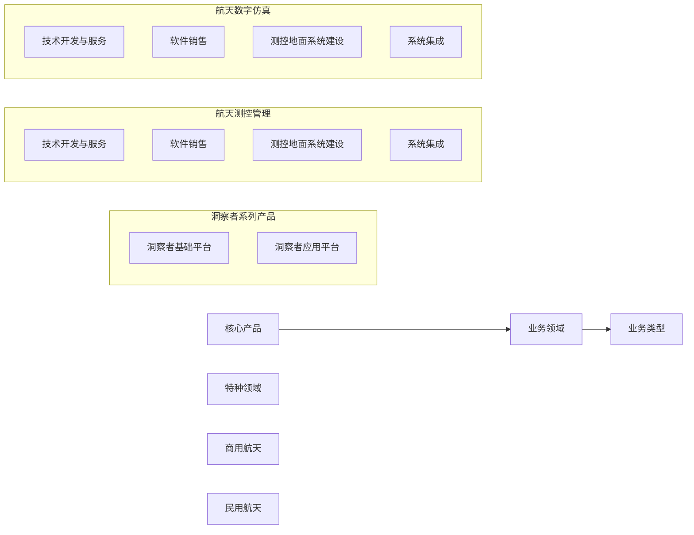
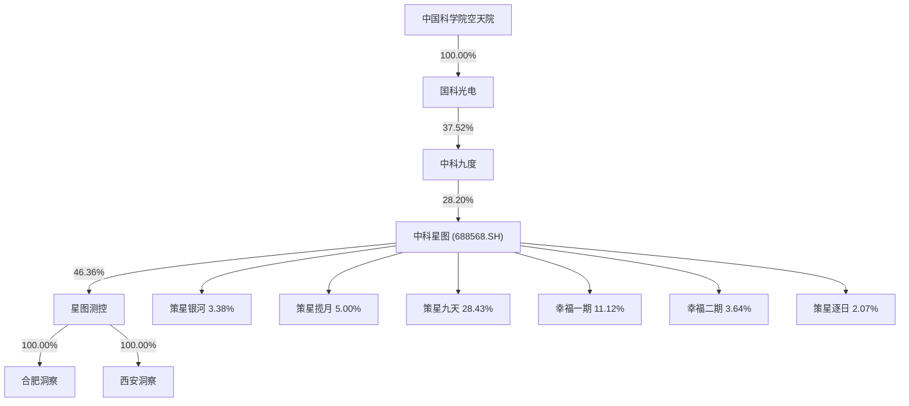
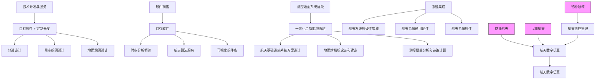
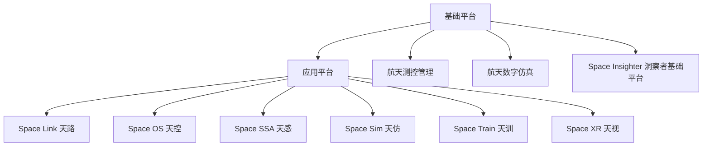
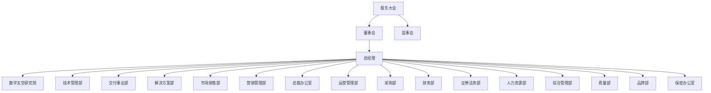
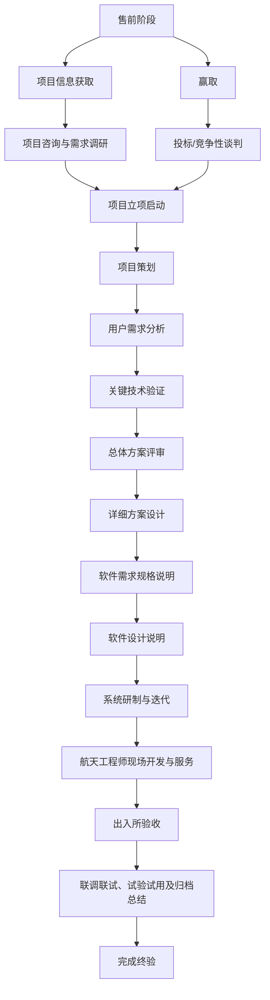
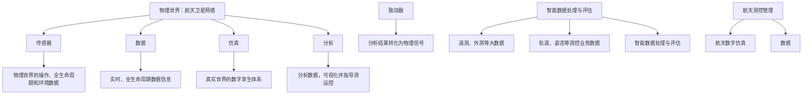

# 中科星图测控技术股份有限公司

中国（安徽）自由贸易试验区合肥市高新区望江西路 900 号中安创谷科技园一期A1 栋35 层

# 星图测控

# 中科星图测控技术股份有限公司招股说明书

本次股票发行后拟在北京证券交易所上市，该市场具有较高的投资风险。北京证券交易所主要服务创新型中小企业，上市公司具有经营风险高、业绩不稳定、退市风险高等特点，投资者面临较大的市场风险。投资者应充分了解北京证券交易所市场的投资风险及本公司所披露的风险因素，审慎作出投资决定。

保荐机构 (主承销商）

中信建投证券股份有限公司

CHINASECURITIESCO.,LTD.

(北京市朝阳区安立路66号4号楼)

中国证监会和北京证券交易所对本次发行所作的任何决定或意见，均不表明其对注册申请文件及所披露信息的真实性、准确性、完整性作出保证，也不表明其对发行人的盈利能力、投资价值或者对投资者的收益作出实质性判断或者保证。任何与之相反的声明均属虚假不实陈述。

根据《证券法》的规定，股票依法发行后，发行人经营与收益的变化，由发行人自行负责；投资者自主判断发行人的投资价值，自主作出投资决策，自行承担股票依法发行后因发行人经营与收益变化或者股票价格变动引致的投资风险。

# 声明

发行人及全体董事、监事、高级管理人员承诺招股说明书及其他信息披露资料不存在虚假记载、误导性陈述或者重大遗漏，并对其真实性、准确性、完整性承担相应的法律责任。

发行人控股股东、实际控制人承诺招股说明书不存在虚假记载、误导性陈述或者重大遗漏，并对其真实性、准确性、完整性承担相应的法律责任。

公司负责人和主管会计工作的负责人、会计机构负责人保证招股说明书中财务会计资料真实、准确、完整。

发行人及全体董事、监事、高级管理人员、发行人的控股股东、实际控制人以及保荐人、承销商承诺因发行人招股说明书及其他信息披露资料有虚假记载、误导性陈述或者重大遗漏，致使投资者在证券发行和交易中遭受损失的，将依法承担法律责任。

保荐人及证券服务机构承诺因其为发行人本次公开发行股票制作、出具的文件有虚假记载、误导性陈述或者重大遗漏，给投资者造成损失的，将依法承担法律责任。

本次发行概况

<table><tr><td>发行股票类型</td><td>人民币普通股</td></tr><tr><td>发行股数</td><td>本次发行的股票数量为2,750.00万股(不含超额配售选择权)。发行人及主承销商采用超额配售选择权,采用超额配售选择权发行的股票数量为本次发行股票数量的15%,即412.50万股(含本数),若全额行使超额配售选择权,本次发行的股票数量为3,162.50万股</td></tr><tr><td>每股面值</td><td>1.00元</td></tr><tr><td>定价方式</td><td>发行人和主承销商采用直接定价的方式确定本次公开发行股票的发行价格</td></tr><tr><td>每股发行价格</td><td>6.92元/股</td></tr><tr><td>预计发行日期</td><td>2024年12月24日</td></tr><tr><td>发行后总股本</td><td>110,000,000股</td></tr><tr><td>保荐人、主承销商</td><td>中信建投证券股份有限公司</td></tr><tr><td>招股说明书签署日期</td><td>2024年12月23日</td></tr></table>

注：超额配售选择权行使前，发行后总股本为 110,000,000 股，若全额行使超额配售选择权，发行后总股本为 114,125,000 股。

# 重大事项提示

本公司特别提醒投资者对下列重大事项给予充分关注，并认真阅读招股说明书正文内容：

# 一、本次公开发行股票并在北京证券交易所上市的安排及风险

公司本次公开发行股票完成后，将在北京证券交易所上市。

公司本次公开发行股票获得中国证监会注册后，在股票发行过程中，可能会受到市场环境、投资者偏好、市场供需等多方面因素的影响；同时，发行完成后，若公司无法满足北京证券交易所上市的条件，均可能导致本次公开发行失败。

公司在北京证券交易所上市后，投资者自主判断发行人的投资价值，自主作出投资决策，自行承担因发行人经营与收益变化或者股票价格变动引致的投资风险。

# 二、本次发行上市后公司的利润分配政策

公司上市后的利润分配政策详见本招股说明书“第十一节 投资者保护”之“二、本次发行上市后的股利分配政策和决策程序”。

# 三、本次发行相关的重要承诺和说明

发行人及其控股股东、实际控制人、董事、监事、高级管理人员、相关股东等就本次公开发行作出了相关承诺，承诺的具体内容详见本招股说明书“第四节 发行人基本情况”之“九、重要承诺”。

# 四、特别风险提示

本公司提醒投资者认真阅读本招股说明书的“第三节 风险因素”部分，并特别注意下列事项：

# （一）国家及行业政策影响较大的风险

航天产业是国家鼓励发展的战略性支柱产业，从国家到地方层面出台了一系列政策有效保证相关产业发展与落地，有力促进了公司航天测控管理与航天数字仿真业务迅速发展。如《国家卫星导航产业中长期发展规划》《关于印发国家民用空间基础设施中长期发展规划（2015—2025年）的通知》《中国航天助力联合国 2030年可持续发展目标的声明》等政策文件，从明确推动航天产业创新发展、鼓励社会资本参与国家民用空间基础设施建设和应用开发、统筹规划卫星导航基础设施的建设和应用等多个方面为我国航天产业发展提供政策保障。如果相关政策对行业发展支持力度减弱、政策执行延后或存在偏差，则可能导致公司的发展环境出现变化，并对公司的生产经营产生不利影响。

# （二）市场竞争加剧的风险

公司目前的终端用户主要集中在特种领域、民用航天、商业航天等领域，终端需求与特种领域预算支出规模、国家研发投入的关联性大。虽然近年来终端用户需求稳定增长且预计将继续保持攀升态势，但是如果出现重大调整，国家研发投入、特种领域预算支出规模相应减少，则公司面临的市场需求亦将受到一定的不利影响。同时，我国近年来航天测控管理与航天数字仿真产业进入发展快车道，行业整体规模快速增长、上下游产业链持续完善，公司所面临的市场竞争存在日益加剧的风险。

# （三）客户集中度较高的风险

2021 年度、2022 年度、2023 年度、2024 年 1-6 月，公司向合并口径前五大客户销售收入分别为 6,529.15 万元、7,271.87 万元、8,627.82 万元、3,783.01 万元，占当期营业收入的比例分别为 62.64%、51.40%、37.67%、46.50%，公司对前五大客户的销售占比较高。尽管报告期内公司客户集中度有所下降，但若未来公司主要客户的生产经营状况发生重大不利变化，或公司与大客户的合作关系发生变化，公司可能面临合作金额降低或客户流失等风险，进而对公司的经营业绩造成不利影响。

# （四）供应商集中度较高的风险

2021年度、2022年度、2023年度、2024年1-6月，公司向合并口径前五大供应商采购金额分别为 3,288.16 万元、2,622.13 万元、3,860.16 万元、1,276.61 万元，占当期采购总额的比例分别为 69.31%、38.58%、32.93%、34.29%，占比较高。虽然公司与主要供应商保持较为稳定的合作关系，但仍存在供应商集中度较高的风险。

# （五）收入季节性波动的风险

报告期内，公司主营业务呈现明显的季节性特点，前三季度收入占全年收入比重较小，第四季度收入占全年收入比重较大。2021年度、2022 年度和2023年度，公司当年第四季度收入占当年收入的比例分别为 69.24%、57.73%和 47.08%。公司产品/服务的下游最终用户主要为特种领域用户，该类客户一般在上半年制定采购计划，审批通过后进行招标和项目实施。受项目验收审批等因素影响，在第四季度集中交付和验收，从而导致公司业绩的季节性特征明显。

# （六）应收账款金额较大且周转率下降的风险

报告期各期末，公司应收账款余额分别为 5,914.05 万元、11,372.34 万元、16,348.80万元、21,005.58 万元，占当期营业收入比例分别为 56.74%、80.39%、71.38%、258.18%，应收账款周转率分别为 2.38、1.38、1.39、0.39。随着公司业务发展，应收账款余额将可能继续增加。若公司采取的收款措施不力或客户信用发生变化，应收账款发生坏账的风险将会提高，同时应收账款周转率下降会导致资金使用效率低下，从而对公司的经营产生不利影响。

# （七）经营活动产生的现金流量为负的风险

报告期内，公司经营活动产生的现金流量净额分别为 4,052.23万元、-605.19万元、1,484.50万元、-3,364.12万元。报告期内，公司经营活动产生的现金流量净额波动较大，与公司净利润存在一定差异。随着公司综合服务能力与市场影响力持续提升，公司承接的项目快速增加，公司应收账款、合同资产、存货等资产占用规模不断增加，公司营运资金需求日益增加。公司经营活动现金流量净额的波动可能导致公司出现营运资金短期不足的风险。

# （八）技术风险

公司所处技术密集型产业具有产品更新迭代速度快的特点，对公司在市场发展趋势预测、关键技术及产品研发、核心技术更新与优化等方面要求较高。公司主营业务领域近几年发展迅猛，随着卫星发射频率及在轨卫星数量的不断增加，下游用户在多星在轨碰撞预警、多星同时仿真、测控支持、星座在轨运行管控、太空环境虚拟现实等方面对公司技术能力提出更高的要求。如果公司不能准确研判技术发展方向，持续投入研发并进行技术迭代，则可能导致公司失去技术优势及市场机遇，对公司发展造成不利影响。

# （九）同业竞争的风险

发行人与控股股东、实际控制人的主营业务涉及航天产业链的不同环节，且发行人控股股东、实际控制人及其部分下属公司或单位亦存在软件业务。报告期内，发行人与控股股东及其控制的其他企业存在客户、供应商重合的情形。虽然发行人与控股股东、实际控制人及其控制的其他公司或单位主营业务领域界限清晰，并且发行人与关联方客户、供应商重合系基于各单位自身主营业务独立开展，不存在相同或相似产品或服务，相关销售、采购均有合理商业背景，控股股东、实际控制人也做出了《关于避免同业竞争的承诺函》，但如果控股股东、实际控制人违背《关于避免同业竞争的承诺函》拓展业务以致涉及发行人主营业务领域，则公司控股股东、实际控制人可能通过同业竞争损害公司及投资者的利益。

# （十）与控股股东、实际控制人及关联方利益冲突的风险

报告期内，公司关联销售金额分别为3,818.89万元、2,610.07万元、2,626.89万元、663.04万元，占当期营业收入的比重分别为36.64%、18.45%、11.47%、8.15%，报告期初公司关联销售金额和占营业收入的比重较大，但均呈现逐渐下降的趋势。公司具备健全的组织架构和完善的法人治理结构，已制定一系列公司治理制度并得到有效执行；公司关联交易内部控制制度健全，通过建立相关内控制度、营造内控管理环境、优化关联交易审批程序保证其与关联方交易价格的公允性。如果未来公司未能严格履行关联交易决策、审批程序，则可能存在与控股股东、实际控制人及关联方利益冲突的风险。

# 五、财务报告审计截止日后的主要经营状况

# （一）财务报告审计截止日后的主要财务信息

# 1、2024 年 1-9 月主要财务信息

公司财务报告审计截止日为 2024年6月30日，立信会计师事务所（特殊普通合伙）对公司2024 年9月30日的合并及母公司资产负债表、2024 年1-9月的合并及母公司利润表、合并及母公司现金流量表以及财务报表附注进行了审阅，并出具了《审阅报告》（信会师报字[2024]第 ZG12093 号）。

根据立信会计师事务所（特殊普通合伙）出具的《审阅报告》，截至 2024 年 9 月30 日，公司的资产总额为 44,589.58 万元，股东权益总额为 27,386.34 万元。2024 年 1-9月，公司营业收入为 16,283.14 万元，营业利润为 4,668.18 万元，归属于母公司股东的净利润为 5,020.74 万元。

公司已披露财务报告审计截止日后经立信会计师事务所（特殊普通合伙）审阅的主要财务信息及经营状况。具体信息参见本招股说明书“第八节 管理层讨论与分析”之“八、发行人资产负债表日后事项、或有事项及其他重要事项”之“（一）财务报告审计截止日后主要财务信息及经营状况”。

# 2、2024 年度业绩预计情况

在结合公司 2024 年四季度经营计划、最新经营情况、财务预算、项目执行情况等相关资料的基础上，考虑各项基本假设和特定假设的前提下，公司以 2024 年 1-9 月未审的经营业绩为基础，对 2024度的经营业绩进行了预测。

2024年全年，公司预计可实现营业收入 28,743.00万元，同比增长 25.50%；归母净利润8,278.00 万元，同比增长32.18%；扣除非经常性损益后归母净利润 6,017.00，同比增长 18.44%。（以上数据为公司初步测算的结果，未经会计师审计或审阅，不构成公司盈利预测或业绩承诺）。

# （二）财务报告审计截止日后的经营状况

财务报告审计截止日后至本招股说明书签署日，公司经营情况正常，行业政策、税收政策、市场环境、公司经营模式等方面未发生重大变化，董事、监事、高级管理人员及核心技术人员未发生重大不利变化，未发生其他可能影响投资者判断的重大事项。

# 目录

第一节 释义...

第二节 概览.... 15

第三节 风险因素...... ..26

第四节 发行人基本情况.... .33

第五节 业务和技术. . 66

第六节 公司治理.. ..137

第七节 财务会计信息.. ..154

第八节 管理层讨论与分析..... ...188

第九节 募集资金运用... ..283

第十节 其他重要事项... ..304

第十一节 投资者保护..... ..305

第十二节 声明与承诺.. .311

第十三节 备查文件....... ..320

# 第一节 释义

本招股说明书中，除非文意另有所指，下列简称和术语具有的含义如下：

本招股说明书涉及到的数字为保留小数点后两位有效数字，其中部分合计数与各单项数据之和在尾数上存在差异，系由四舍五入造成。

<table><tr><td colspan="3">普通名词释义</td></tr><tr><td>发行人、公司、本公司、股份公司、星图测控</td><td>指</td><td>中科星图测控技术股份有限公司</td></tr><tr><td>星图测控有限、有限公司</td><td>指</td><td>中科星图测控技术(合肥)有限公司,曾用名中科星图(西安)测控技术有限公司、西安四方星途测控技术有限公司,系股份公司前身</td></tr><tr><td>中科星图</td><td>指</td><td>中科星图股份有限公司(688568.SH),公司控股股东</td></tr><tr><td>中国科学院空天院</td><td>指</td><td>中国科学院空天信息创新研究院,公司实际控制人</td></tr><tr><td>中科九度</td><td>指</td><td>中科九度(北京)空间信息技术有限责任公司</td></tr><tr><td>国科光电</td><td>指</td><td>国科光电科技有限责任公司</td></tr><tr><td>策星九天</td><td>指</td><td>共青城策星九天投资合伙企业(有限合伙)</td></tr><tr><td>策星揽月</td><td>指</td><td>共青城策星揽月投资合伙企业(有限合伙)</td></tr><tr><td>幸福一期</td><td>指</td><td>共青城星图幸福一期投资合伙企业(有限合伙)</td></tr><tr><td>幸福二期</td><td>指</td><td>共青城星图幸福二期投资合伙企业(有限合伙)</td></tr><tr><td>策星银河</td><td>指</td><td>共青城策星银河投资合伙企业(有限合伙)</td></tr><tr><td>策星逐日</td><td>指</td><td>共青城策星逐日投资合伙企业(有限合伙)</td></tr><tr><td>四方股份</td><td>指</td><td>北京四方继保自动化股份有限公司(601126.SH)</td></tr><tr><td>西安洞察</td><td>指</td><td>中科星图洞察科技(西安)有限公司,公司的全资子公司</td></tr><tr><td>合肥洞察</td><td>指</td><td>合肥中科星图洞察科技有限公司,公司的全资子公司</td></tr><tr><td>岢岚九舟</td><td>指</td><td>岢岚九舟星辰航天科技有限公司,公司的参股公司</td></tr><tr><td>星图空间</td><td>指</td><td>中科星图空间技术有限公司</td></tr><tr><td>欧比特卫星大数据</td><td>指</td><td>珠海欧比特卫星大数据有限公司</td></tr><tr><td>时空道宇</td><td>指</td><td>浙江时空道宇科技有限公司</td></tr><tr><td>航天科工仿真</td><td>指</td><td>航天科工系统仿真科技(北京)有限公司</td></tr><tr><td>中电科五十四所</td><td>指</td><td>中国电子科技集团公司第五十四研究所</td></tr><tr><td>中电科三十八所</td><td>指</td><td>中国电子科技集团公司第三十八研究所</td></tr><tr><td>中电科十四所</td><td>指</td><td>中国电子科技集团公司第十四研究所</td></tr><tr><td>工业和信息化部</td><td>指</td><td>中华人民共和国工业和信息化部</td></tr><tr><td>国防科工局</td><td>指</td><td>国家国防科技工业局</td></tr><tr><td>招股说明书、本招股说明书</td><td>指</td><td>中科星图测控技术股份有限公司招股说明书</td></tr><tr><td>中国证监会、证监会</td><td>指</td><td>中国证券监督管理委员会</td></tr><tr><td>北交所</td><td>指</td><td>北京证券交易所</td></tr><tr><td>股票登记机构</td><td>指</td><td>中国证券登记结算有限责任公司北京分公司</td></tr><tr><td>全国股转公司、股转公司</td><td>指</td><td>全国中小企业股份转让系统有限责任公司</td></tr><tr><td>全国股转系统、股转系统</td><td>指</td><td>全国中小企业股份转让系统</td></tr><tr><td>保荐人、保荐机构、主承销商、中信建投、中信建投证券</td><td>指</td><td>中信建投证券股份有限公司</td></tr><tr><td>审计机构、会计师事务所、立信会计师</td><td>指</td><td>立信会计师事务所(特殊普通合伙)</td></tr><tr><td>律师事务所、律师</td><td>指</td><td>北京市君合律师事务所</td></tr><tr><td>资产评估师、评估机构</td><td>指</td><td>银信资产评估有限公司</td></tr><tr><td>本次公开发行、本次发行</td><td>指</td><td>发行人向不特定合格投资者公开发行股票并在北京证券交易所上市</td></tr><tr><td>《公司章程》</td><td>指</td><td>《中科星图测控技术股份有限公司章程》</td></tr><tr><td>《公司章程》(草案)</td><td>指</td><td>《中科星图测控技术股份有限公司章程(草案)》</td></tr><tr><td>股东大会</td><td>指</td><td>中科星图测控技术股份有限公司股东大会</td></tr><tr><td>董事会</td><td>指</td><td>中科星图测控技术股份有限公司董事会</td></tr><tr><td>监事会</td><td>指</td><td>中科星图测控技术股份有限公司监事会</td></tr><tr><td>高级管理人员</td><td>指</td><td>总经理、副总经理、董事会秘书、财务总监</td></tr><tr><td>三会</td><td>指</td><td>股东(大)会、董事会、监事会</td></tr><tr><td>《公司法》</td><td>指</td><td>《中华人民共和国公司法》</td></tr><tr><td>《证券法》</td><td>指</td><td>《中华人民共和国证券法》</td></tr><tr><td>报告期</td><td>指</td><td>2021年、2022年、2023年、2024年1-6月</td></tr><tr><td>报告期各期末</td><td>指</td><td>2021年12月31日、2022年12月31日、2023年12月31日、2024年6月30日</td></tr><tr><td>元、万元、亿元</td><td>指</td><td>人民币元、人民币万元、人民币亿元</td></tr><tr><td colspan="3">专业名词释义</td></tr><tr><td>卫星</td><td>指</td><td>围绕一颗行星并按闭合轨道做周期性运行的天然天体。目前,人造卫星也被简称为卫星</td></tr><tr><td>卫星轨道</td><td>指</td><td>卫星围绕行星飞行的轨迹。绕地球运行的卫星飞行的水平速度叫第一宇宙速度,即环绕速度。卫星只要获得这一水平方向的速度后,不需要再加动力就可以环绕地球飞行。这时卫星的飞行轨迹叫卫星轨道</td></tr><tr><td>卫星星座</td><td>指</td><td>一组人造卫星共同运作而形成的系统,也称为分布式卫星系统(Distributed Satellite System,DSS)。与单颗卫星不同,卫星星座可以提供永久性的全球或接近全球的覆盖,这样在任何时候地球上的任何地方都至少有一颗卫星可以看到。星座内卫星通常放置在一组互补的轨道平面上,并与分布在全球的卫星地面站连接。星座中的每颗卫星之间也可通过星间通信技术来进行信息传送</td></tr><tr><td>卫星全生命周期</td><td>指</td><td>卫星从发射升空到终止(返回地球)期间</td></tr><tr><td>航天器</td><td>指</td><td>空间飞行器、太空飞行器。按照天体力学的规律在太空运行,执行探索、开发、利用太空和天体等特定任务的各类飞行器,包括人造地球卫星、空间探测器、货运飞船、载人飞船、空间站、航天飞机、空天飞机、运载火箭等各种形态</td></tr><tr><td>载荷/卫星载荷</td><td>指</td><td>航天器上装载的直接执行特定卫星任务的仪器、设备或者分系统,如遥感卫星的有效载荷一般是光学相机,通信卫星的有效载荷一般是通信终端</td></tr><tr><td>空天信息产业</td><td>指</td><td>包括航天运输服务、卫星应用服务和空间站应用的产业。未来,随着低轨通信卫星系统建立形成的“通导遥”一体的空天信息网络,将进一步促进空天互联网、万物互联产业的发展</td></tr><tr><td>太空交通规则</td><td>指</td><td>多国航空航天专家呼吁出台的用于管制太空中各种高速运转的卫星和航天器碎片等的规则。建立航天安全促进系统则是实现太空交通管制的重要途径</td></tr><tr><td>太空碎片</td><td>指</td><td>地球轨道上的人造碎片,是太空中不再有用途的人造物体,包括失效的航天器、已经报废的火箭末子级、航天任务产生的抛弃物,以及卫星碰撞事件产生的碎片等</td></tr><tr><td>太空资产</td><td>指</td><td>太空域系统资产以及从地面支持太空域的系统资产,是重要的国家级战略资产</td></tr><tr><td>姿态</td><td>指</td><td>卫星星体在轨道上运行所处的空间指向状态</td></tr><tr><td>卫星健康管理</td><td>指</td><td>对卫星以及有效载荷进行的故障预测、故障诊断、故障隔离、故障处理决策、部件性能跟踪、趋势预测等监测管理工作,对于控制卫星以及有效载荷的风险、降低保障成本、缩减维护规模具有现实意义</td></tr><tr><td>人工智能</td><td>指</td><td>Artificial Intelligence,计算机科学的一个分支,是研究、开发用于模拟、延伸和扩展人的智能的理论、方法、技术及应用系统的一门新的技术科学</td></tr><tr><td>深空探测</td><td>指</td><td>脱离地球引力场,进入太阳系空间和宇宙空间的探测,目前通常指对地球以外天体开展的空间探测活动</td></tr><tr><td>空间站</td><td>指</td><td>一种在近地轨道长时间运行、可供多名航天员巡访、长期工作和生活的载人航天器</td></tr><tr><td>载人航天</td><td>指</td><td>人类驾驶和乘坐载人航天器在太空中从事各种探测、研究、试验、生产和军事应用的往返飞行活动。其目的在于突破地球大气的屏障和克服地球引力,把人类的活动范围从陆地、海洋和大气层扩展到太空,更广泛和更深入地认识整个宇宙,并充分利用太空和载人航天器的特殊环境进行各种研究和试验活动,开发太空极其丰富的资源</td></tr><tr><td>商业航天</td><td>指</td><td>在国家相关法律法规指导下,按市场规则配置技术、资金、人才等资源要素,以盈利为目的、独立的非政府航天活动及商业行为</td></tr><tr><td>航天工程</td><td>指</td><td>探索、开发、利用太空和天体的综合性工程,即综合实施航天系统,特别是航天器和航天运输系统的设计、制造、试验、发射、运行、返回、控制、管理和使用的工程</td></tr><tr><td>SAR卫星</td><td>指</td><td>雷达卫星,是载有合成孔径雷达(Synthetic Aperture Radar)的对地观测遥感卫星的统称。SAR的全天候、全天时及能穿透一些地物的成像特点,显示出它与光学遥感器相比的优越性</td></tr><tr><td>洞察者系列产品</td><td>指</td><td>公司自主研发的洞察者软硬件平台,包括洞察者基础平台和洞察者应用平台</td></tr><tr><td>数字太空</td><td>指</td><td>地球之上空间的认知与应用通过数字化构建的空间,是由天基、地基观测数据驱动,以天体力学、轨道动力学等科学认知为依据,采用空间网络、大数据、云计算等现代信息技术为手段,并依托空间信息数据库,构建成的集空间科学、技术、应用及服务为一体的重大空间基础设施。数字太空主要用以提升、增强和扩展卫星、火箭、导弹等实体进出空间、探索空间、利用空间、开发空间的能力与效益</td></tr><tr><td>模拟训练</td><td>指</td><td>面向实战化联合训练的需求,通过建模和仿真技术,构建全生命周期的模拟训练体系,为航天领域模拟训练应用和系统集成提供支撑</td></tr><tr><td>智能数据处理与评估</td><td>指</td><td>满足航天数据处理及智能分析与评估需求,提供大数据智能分析、图像处理、效能评估等技术,支撑航天领域数据智能应用和系统集成建设</td></tr><tr><td>航天动力学</td><td>指</td><td>研究航天器和运载器、运输器在飞行中所受的力及其在力作用下的运动的学科。又称星际航行动力学</td></tr><tr><td>姿态动力学</td><td>指</td><td>航天动力学的一个分支,研究航天器的姿态运动,包括航天器整体围绕其质心的运动以及航天器各部分之间的相对运动。航天器的结构设计和姿态控制系统的设计都以姿态动力学研究为基础</td></tr><tr><td>轨道动力学</td><td>指</td><td>以各类航天器为研究对象,分析它们在万有引力及其它外力作用下的运动特性及控制规律的一门科学</td></tr><tr><td>国家航天局</td><td>指</td><td>中华人民共和国负责民用航天管理及国际空间合作的政府机构,履行政府相应的管理职责。对航天活动实施行业管理,使其稳定、有序、健康、协调地发展。代表中国政府组织或领导开展航天领域对外交流与合作等活动</td></tr><tr><td>中国宇航学会</td><td>指</td><td>国务院、中央军委、民政部联合批准成立的国家一级学术性机构和法人社会团体,是我国开展航天政策研究、决策咨询和科技服务工作,打造的宇航权威智库和航天产业化服务平台。该学会由中国航天科学技术工作者组成,其宗旨是促进航天科学技术的创新和发展,推动航天科学技术的普及与推广</td></tr><tr><td>NASA</td><td>指</td><td>美国航空航天局(National Aeronautics and Space Administration),又称美国宇航局、美国太空总署,是美国联邦政府的一个行政性科研机构,负责制定、实施美国的太空计划,并开展航空科学暨太空科学的研究</td></tr><tr><td>DARPA</td><td>指</td><td>美国国防高级研究计划局(Defense Advanced Research Projects Agency),是美国国防部下属的一个行政机构,负责研发用于军事用途的高新科技</td></tr><tr><td>ESA</td><td>指</td><td>欧洲航天局(European Space Agency),成立于1975年,是一个致力于探索太空的政府间组织,总部设在法国巴黎</td></tr><tr><td>Roscosmos</td><td>指</td><td>俄罗斯航天国家集团公司,系俄罗斯主理航天事业的国营企业,负责俄罗斯各项空间科学与载人航天项目。其前身为俄罗斯联邦政府领导的俄罗斯联邦航天局,2016年由联邦航天局与联合火箭航天公司合并组建</td></tr><tr><td>AGI</td><td>指</td><td>美国分析图形有限公司(Analytical Graphics,Inc.),成立于1989年,总部位于美国宾夕法尼亚州埃克斯顿,是一家为航空航天、国防、电信和智能应用提供任务驱动仿真、建模、测试和分析软件的领先供应商</td></tr><tr><td>STK</td><td>指</td><td>Systems Tool Kit,是由AGI公司开发的一款在航天领域处于领先地位的商业航天分析软件。STK支持航天任务的全过程,包括设计、测试、发射、运行和任务应用</td></tr><tr><td>SSC</td><td>指</td><td>瑞典航天公司(Swedish Space Corporation),是一家世界级航天基础设施服务商,主营业务为以全球卫星测控及运营网络为核心的卫星管理服务,包括发射支持、在轨服务、数据处理、网关服务、卫星网络运营等</td></tr><tr><td>KSAT</td><td>指</td><td>挪威康斯伯格卫星服务有限公司(Kongsberg SATellite services),成立于1967年,是全球领先的卫星地面站服务和海事卫星监测服务提供商,总部位于挪威特隆姆瑟。公司主要为极地轨道卫星发射、控制、数据接收和传送提供服务,并通过卫星成像技术为用户提供溢油监测、船舶探测等方面的服务</td></tr><tr><td>OneWeb</td><td>指</td><td>一家总部位于英国的航天公司,成立于2012年,该公司致力于为全球提供高速宽带互联网服务,通过发射大规模低地球轨道卫星网络,实现覆盖全球的无缝互联网连接</td></tr><tr><td>SpaceX</td><td>指</td><td>美国太空探索技术公司,是由埃隆·马斯克(Elon Musk)于2002年6月建立的美国太空运输公司。它开发了可部分重复使用的猎鹰1号和猎鹰9号运载火箭以及Dragon系列的航天器,后者通过猎鹰9号发射到轨道。此外SpaceX旗下还有名为Starlink——星链的低轨卫星通讯系统,其覆盖全球的高速互联网接入能力具有极高的商业及军事价值</td></tr></table>

# 第二节 概览

本概览仅对招股说明书作扼要提示。投资者作出投资决策前，应认真阅读招股说明书全文。

# 发行人基本情况

<table><tr><td>公司名称</td><td colspan="2">中科星图测控技术股份有限公司</td><td colspan="2">统一社会信用代码</td><td colspan="2">91610133MA6U0P572W</td></tr><tr><td>证券简称</td><td colspan="2">星图测控</td><td colspan="2">证券代码</td><td colspan="2">920116</td></tr><tr><td>有限公司成立日期</td><td colspan="2">2016年12月14日</td><td colspan="2">股份公司成立日期</td><td colspan="2">2022年11月28日</td></tr><tr><td>注册资本</td><td colspan="2">82,500,000.00</td><td colspan="2">法定代表人</td><td colspan="2">牛威</td></tr><tr><td>办公地址</td><td colspan="6">中国(安徽)自由贸易试验区合肥市高新区望江西路900号中安创谷科技园一期A1栋35层</td></tr><tr><td>注册地址</td><td colspan="6">中国(安徽)自由贸易试验区合肥市高新区望江西路900号中安创谷科技园一期A1栋35层</td></tr><tr><td>控股股东</td><td colspan="2">中科星图股份有限公司</td><td colspan="2">实际控制人</td><td colspan="2">中国科学院空天信息创新研究院</td></tr><tr><td>主办券商</td><td colspan="2">中信建投证券股份有限公司</td><td colspan="2">挂牌日期</td><td colspan="2">2023年2月28日</td></tr><tr><td>上市公司行业分类</td><td colspan="3">I信息传输、软件和信息技术服务业</td><td colspan="3">I65软件和信息技术服务业</td></tr><tr><td>管理型行业分类</td><td>I信息传输、软件和信息技术服务业</td><td colspan="2">I65软件和信息技术服务业</td><td colspan="2">I651软件开发</td><td>I6513应用软件开发</td></tr></table>

# 二、 发行人及其控股股东、实际控制人的情况

公司成立于 2016年12月14日，于2023年2月28日在股转系统挂牌并公开转让，并于 2023 年 6 月调至创新层。截至 2024 年 6 月 30 日，公司共有 2 家分公司，2 家全资子公司，2家参股公司。

截至本招股说明书签署日，中科星图持有公司 38,250,000 股股份，占公司有表决权股份总数的 46.36%，公司董事会的 9 名董事中，有超过半数由中科星图提名，并经公司股东大会选举产生。因此，中科星图为公司的控股股东。

根据中科星图公开披露的相关公告文件，中科星图的实际控制人为中国科学院空天院。因此，中国科学院空天院可通过中科星图实际控制发行人，为发行人的实际控制人。

# 三、 发行人主营业务情况

公司是围绕航天器在轨管理与服务，专业从事航天测控管理、航天数字仿真的国家高新技术企业。公司依托航天器高精度轨道、姿态、控制计算，测控资源智能筹划与调度，卫星全生命周期健康管理、测控装备一体化设计与智能管控等核心技术，研发了具有完全知识产权、国产自主可控的洞察者系列产品。公司业务发端于航天特种领域，凭借核心技术团队在特种领域多年来高标准交付国家重大航天工程任务所积累的技术优势，目前已全面拓展至特种领域、民用航天和商业航天领域。

基于洞察者系列产品以及积累的各类航天领域核心算法，公司支持航天任务全过程管理，包括设计、规划、测试、发射、运行、应用等各环节，响应包括但不限于轨道设计、星座组网设计、地面站网设计、系统仿真验证、航天器监测与管控、碰撞预警与规避、离轨方案设计、模拟训练、科普教育等各种业务需求，为特种领域、民用航天、商业航天领域客户提供技术开发与服务、软件销售、测控地面系统建设、系统集成等航天综合解决方案。

flowchart

# 四、 主要财务数据和财务指标

<table><tr><td>项目</td><td>2024年6月30日/2024年1月—6月</td><td>2023年12月31日/2023年度</td><td>2022年12月31日/2022年度</td><td>2021年12月31日/2021年度</td></tr><tr><td>资产总计(元)</td><td>387,852,502.58</td><td>378,651,012.35</td><td>221,854,581.69</td><td>134,629,645.52</td></tr><tr><td>股东权益合计(元)</td><td>249,614,213.51</td><td>223,656,017.26</td><td>115,300,382.11</td><td>62,978,161.17</td></tr><tr><td>归属于母公司所有者的股东权益(元)</td><td>249,614,213.51</td><td>223,656,017.26</td><td>115,300,382.11</td><td>62,978,161.17</td></tr><tr><td>资产负债率(母公司)(%)</td><td>36.72</td><td>41.36</td><td>47.00</td><td>45.02</td></tr><tr><td>营业收入(元)</td><td>81,359,653.11</td><td>229,035,156.59</td><td>141,464,852.36</td><td>104,237,550.47</td></tr><tr><td>毛利率(%)</td><td>53.18</td><td>52.16</td><td>56.92</td><td>55.20</td></tr><tr><td>净利润(元)</td><td>25,958,196.25</td><td>62,627,922.69</td><td>50,748,745.98</td><td>34,850,517.32</td></tr><tr><td>归属于母公司所有者的净利润(元)</td><td>25,958,196.25</td><td>62,627,922.69</td><td>50,748,745.98</td><td>34,850,517.32</td></tr><tr><td>归属于母公司所有者的扣除非经常性损益后的净利润(元)</td><td>12,442,047.11</td><td>50,802,398.51</td><td>30,322,895.13</td><td>34,849,971.72</td></tr><tr><td>加权平均净资产收益率(%)</td><td>10.97</td><td>36.12</td><td>56.93</td><td>76.85</td></tr><tr><td>扣除非经常性损益后净资产收益率(%)</td><td>5.26</td><td>29.30</td><td>34.02</td><td>76.85</td></tr><tr><td>基本每股收益(元/股)</td><td>0.31</td><td>0.79</td><td>0.68</td><td>0.46</td></tr><tr><td>稀释每股收益(元/股)</td><td>0.31</td><td>0.79</td><td>0.68</td><td>0.46</td></tr><tr><td>经营活动产生的现金流量净额(元)</td><td>-33,641,174.80</td><td>14,844,991.24</td><td>-6,051,949.64</td><td>40,522,274.19</td></tr><tr><td>研发投入占营业收入的比例(%)</td><td>15.73</td><td>12.15</td><td>15.50</td><td>15.81</td></tr></table>

# 五、 发行决策及审批情况

2023 年 10 月 13 日和 10 月 19 日，发行人分别召开第一届董事会第八次会议、第一届董事会第九次会议，审议通过了《关于公司申请向不特定合格投资者公开发行股票并在北京证券交易所上市的议案》《关于公司申请向不特定合格投资者公开发行股票并在北京证券交易所上市募集资金投资项目及其可行性的议案》《关于提请公司股东大会授权董事会办理公司申请公开发行股票并在北交所上市事宜的议案》等本次发行及上市相关的议案。

2023 年 11 月 4 日，发行人召开 2023 年第四次临时股东大会，审议通过了董事会提交的与本次发行及上市相关的议案。

2024 年 10 月 22 日，发行人召开第一届董事会第十七次会议，审议通过了《议案关于调整<公司申请向不特定合格投资者公开发行股票并在北京证券交易所上市方案>的议案》等议案，对本次发行上市具体方案中的募集资金用途进行调整，发行人股东大会已授权董事会调整本次公开发行股票方案，上述议案无需提交股东大会审议。

2024年 11月8日，本次发行上市已经北京证券交易所上市委员会 2024年第22次审议会议通过。

2024年 12月9日，本次发行上市取得中国证监会《关于同意中科星图测控技术股份有限公司向不特定合格投资者公开发行股票注册的批复》（证监许可〔2024〕1767

号）。

六、 本次发行基本情况

<table><tr><td>发行股票类型</td><td>人民币普通股</td></tr><tr><td>每股面值</td><td>1.00元</td></tr><tr><td>发行股数</td><td>本次发行的股票数量为2,750.00万股(不含超额配售选择权)。发行人及主承销商采用超额配售选择权,采用超额配售选择权发行的股票数量为本次发行股票数量的15%,即412.50万股(含本数),若全额行使超额配售选择权,本次发行的股票数量为3,162.50万股</td></tr><tr><td>发行股数占发行后总股本的比例</td><td>25.00%(未考虑超额配售选择权的情况下)27.71%(全额行使超额配售选择权的情况下)</td></tr><tr><td>定价方式</td><td>发行人和主承销商采用直接定价的方式确定本次公开发行股票的发行价格</td></tr><tr><td>发行后总股本</td><td>110,000,000</td></tr><tr><td>每股发行价格</td><td>6.92元/股</td></tr><tr><td>发行前市盈率(倍)</td><td>11.24</td></tr><tr><td>发行后市盈率(倍)</td><td>14.98</td></tr><tr><td>发行前市净率(倍)</td><td>2.55</td></tr><tr><td>发行后市净率(倍)</td><td>1.96</td></tr><tr><td>预测净利润(元)</td><td>不适用</td></tr><tr><td>发行前每股收益(元/股)</td><td>0.62</td></tr><tr><td>发行后每股收益(元/股)</td><td>0.46</td></tr><tr><td>发行前每股净资产(元/股)</td><td>2.71</td></tr><tr><td>发行后每股净资产(元/股)</td><td>3.53</td></tr><tr><td>发行前净资产收益率(%)</td><td>29.30</td></tr><tr><td>发行后净资产收益率(%)</td><td>13.09</td></tr><tr><td>本次发行股票上市流通情况</td><td>本次网上发行的股票无流通限制及锁定安排。战略配售部分,中信建投股管家星图测控1号北交所战略配售集合资产管理计划、中保投资(北京)有限责任公司(中保投北交智选战略投资私募股权基金)、上海晨鸣私募基金管理有限公司(晨鸣12号私募证券投资基金)、北京中兴通远投资股份有限公司获配股份限售期为12个月,其他战略配售投资者获配股份限售期为6个月</td></tr><tr><td>发行方式</td><td>本次发行采用向战略投资者定向配售和网上向开通北交所交易权限的合格投资者定价发行相结合的方式进行</td></tr><tr><td>发行对象</td><td>符合国家法律法规和监管机构规定的已开通北京证券交易所股票交易权限的合格投资者(法律、法规和规范性文件禁止认购的除外)</td></tr><tr><td>战略配售情况</td><td>本次发行战略配售发行数量为550.00万股,占超额配售选择权行使前本次发行数量的20.00%,占超额配售选择权全额行使后本次发行总股数的17.39%</td></tr><tr><td>预计募集资金总额</td><td>19,030.00万元(未考虑超额配售选择权的情况下)21,884.50万元(全额行使超额配售选择权的情况下)</td></tr><tr><td>预计募集资金净额</td><td>16,458.17万元(未考虑超额配售选择权的情况下)19,164.24万元(全额行使超额配售选择权的情况下)</td></tr><tr><td>发行费用概算</td><td>本次发行费用总额为2,571.83万元(行使超额配售选择权之前);2,720.26万元(若全额行使超额配售选择权),其中:(1)保荐及承销费用:1,800.00万元(行使超额配售选择权之前);1,947.72万元(若全额行使超额配售选择权);(2)审计及验资费用:404.72万元;(3)律师费用:275.94万元;(4)发行手续费用及其他费用91.17万元(行使超额配售选择权之前);91.88万元(若全额行使超额配售选择权)。注:上述发行费用均不含增值税金额,各项发行费用可能由于金额四舍五入或最终发行结果而有所调整。</td></tr><tr><td>承销方式及承销期</td><td>主承销商余额包销</td></tr><tr><td>询价对象范围及其他报价条件</td><td>不适用</td></tr><tr><td>优先配售对象及条件</td><td>不适用</td></tr></table>

注 1：超额配售选择权行使前，发行后总股本为 11,000.00 万股，若全额行使超额配售选择权，发行后总股本为 11,412.50 万股；

注 2：发行前市盈率为本次发行价格除以每股收益，每股收益按 2023 年度经审计扣除非经常性损益后的归属于母公司股东的净利润除以本次发行前总股本计算；

注 3：发行后市盈率为本次发行价格除以每股收益，每股收益按 2023 年度经审计扣除非经常性损益后的归属于母公司股东的净利润除以本次发行后总股本计算；行使超额配售选择权前的发行后市盈率为 14.98 倍，若全额行使超额配售选择权则发行后市盈率为 15.55倍；

注 4：发行前市净率以本次发行价格除以发行前每股净资产计算；

注 5：发行后市净率以本次发行价格除以发行后每股净资产计算；行使超额配售选择权前的发行后市净率为 1.96 倍，若全额行使超额配售选择权则发行后市净率为 1.90 倍；

注 6：发行前每股收益以 2023 年度经审计扣除非经常性损益后的归属于母公司股东的净利润除以本次发行前总股本计算；

注 7：发行后基本每股收益以 2023 年度经审计扣除非经常性损益后的归属于母公司股东的净利润除以本次发行后总股本计算；行使超额配售选择权前的发行后基本每股收益为 0.46 元/股，若全额行使超额配售选择权则发行后的基本每股收益为 0.45 元/股；

注 8：发行前每股净资产以 2023 年 12 月31 日经审计的归属于母公司股东的净资产除以本次发行前总股本计算；

注 9：发行后每股净资产按本次发行后归属于母公司股东的净资产除以发行后总股本计算，其中，发行后归属于母公司股东的净资产按经审计的截至 2023 年 12 月 31 日归属于母公司股东的净资产和本次募集资金净额之和计算；行使超额配售选择权前的发行后每股净资产 3.53 元/股，若全额行使超额配售选择权则发行后每股净资产为 3.64 元/股；

注 10：发行前净资产收益率为 2023年度公司加权平均净资产收益率；

注 11：发行后净资产收益率以 2023 年度经审计扣除非经常性损益后归属于母公司股东的净利润除以本次发行后归属于母公司股东的净资产计算，其中发行后归属于母公司股东的净资产按经审计的截至 2023 年 12 月 31 日归属于母公司股东的净资产和本次募集资金净额之和计算；行使超额配售选择权前的发行后净资产收益率为 13.09%，若全额行使超额配售选择权则发行后净资产收益率为 12.23%。

# 七、 本次发行相关机构

# （一） 保荐人、承销商

<table><tr><td>机构全称</td><td>中信建投证券股份有限公司</td></tr><tr><td>法定代表人</td><td>王常青</td></tr><tr><td>注册日期</td><td>2005年11月2日</td></tr><tr><td>统一社会信用代码</td><td>91110000781703453H</td></tr><tr><td>注册地址</td><td>北京市朝阳区安立路66号4号楼</td></tr><tr><td>办公地址</td><td>北京市朝阳区景辉街16号院1号楼泰康集团大厦11层</td></tr><tr><td>联系电话</td><td>010-65608431</td></tr><tr><td>传真</td><td>010-65608450</td></tr><tr><td>项目负责人</td><td>曾诚</td></tr><tr><td>签字保荐代表人</td><td>曾诚、陈洋愉</td></tr><tr><td>项目组成员</td><td>刘晓恒、陶龙龙、赵彬彬、李雨龙、何庆豪</td></tr></table>

# （二） 律师事务所

<table><tr><td>机构全称</td><td>北京市君合律师事务所</td></tr><tr><td>负责人</td><td>华晓军</td></tr><tr><td>注册日期</td><td>1989年4月7日</td></tr><tr><td>统一社会信用代码</td><td>31110000E000169525</td></tr><tr><td>注册地址</td><td>北京市东城区建国门北大街8号华润大厦20层</td></tr><tr><td>办公地址</td><td>北京市东城区建国门北大街8号华润大厦20层</td></tr><tr><td>联系电话</td><td>010-85191300</td></tr><tr><td>传真</td><td>010-85191350</td></tr><tr><td>经办律师</td><td>李若晨、卜祯、张相宾</td></tr></table>

# （三） 会计师事务所

<table><tr><td>机构全称</td><td>立信会计师事务所(特殊普通合伙)</td></tr><tr><td>负责人</td><td>朱建弟、杨志国</td></tr><tr><td>注册日期</td><td>2011年1月24日</td></tr><tr><td>统一社会信用代码</td><td>91310101568093764U</td></tr><tr><td>注册地址</td><td>上海市黄浦区南京东路61号四楼</td></tr><tr><td>办公地址</td><td>上海市黄浦区南京东路61号四楼</td></tr><tr><td>联系电话</td><td>010-56730088</td></tr><tr><td>传真</td><td>010-56730000</td></tr><tr><td>经办会计师</td><td>崔云刚、李娅丽</td></tr></table>

# （四） 资产评估机构

□适用 √不适用

# （五） 股票登记机构

<table><tr><td>机构全称</td><td>中国证券登记结算有限责任公司北京分公司</td></tr><tr><td>法定代表人</td><td>周宁</td></tr><tr><td>注册地址</td><td>北京市西城区金融大街26号金阳大厦5层</td></tr><tr><td>联系电话</td><td>010-58598980</td></tr><tr><td>传真</td><td>010-58598977</td></tr></table>

# （六） 收款银行

<table><tr><td>户名</td><td>中信建投证券股份有限公司</td></tr><tr><td>开户银行</td><td>中信银行北京京城大厦支行</td></tr><tr><td>账号</td><td>8110701013302370405</td></tr></table>

# （七） 申请上市交易所

<table><tr><td>交易所名称</td><td>北京证券交易所</td></tr><tr><td>法定代表人</td><td>周贵华</td></tr><tr><td>注册地址</td><td>北京市西城区金融大街丁26号</td></tr><tr><td>联系电话</td><td>010-63889755</td></tr><tr><td>传真</td><td>010-63884634</td></tr></table>

# （八） 其他与本次发行有关的机构

□适用 √不适用

# 八、 发行人与本次发行有关中介机构权益关系的说明

截至 2024 年 10 月 31 日，保荐人（主承销商）中信建投证券自营业务合计持有公司控股股东中科星图股票 34,094股，占中科星图总股本的 0.01%。中信建投证券买卖中科星图的股票基于其已公开披露的信息以及自身对证券市场、行业发展趋势和股票投资价值的分析和判断，出于合理安排和资金需求筹划而进行，从未知悉、探知、获取或利用任何相关内幕信息，也从未有任何人员向中信建投证券泄漏相关信息或建议中信建投证券买卖中科星图的股票。中信建投证券已经制定并执行信息隔离管理制度，在存在利益冲突的业务之间设置了隔离墙，符合中国证券业协会《证券公司信息隔离墙制度指引》等规定。中信建投证券持有中科星图股份履行了《证券发行上市保荐业务管理办法》第四十一条规定的利益冲突审查程序。

截至 2024 年 10 月 31 日，保荐人全资子公司中信建投基金管理有限公司（以下简称“建投基金”）持有公司控股股东中科星图股票203股，占中科星图总股本的0.00004%。

除上述情况外，不存在其他保荐人或其控股股东、实际控制人、重要关联方持有公司或其控股股东、实际控制人、重要关联方股份的情况；保荐人已建立了有效的信息隔离墙管理制度，保荐人自营业务及建投基金进行股权投资，从而持有公司控股股东中科星图的股份的情形不影响保荐人及保荐代表人公正履行保荐职责。

# 九、 发行人自身的创新特征

公司作为航天器管理服务领域的高新技术企业，始终坚持创新驱动发展战略，致力于成为国际一流、国内领先的航天基础设施建设运营与太空资产管理服务提供商。公司在航天动力学、太空信息分析和卫星健康管理等多个专业领域掌握了自主创新的核心技术，研发推出了洞察者系列产品，为我国航天用户提供了自主可控的产品和解决方案。公司的创新特征主要体现在以下方面：

# （一）产品创新

公司研发了具备自主知识产权、自主可控、全国产化的洞察者系列航天应用产品，依托航天器高精度轨道、姿态、控制计算，测控资源智能筹划与调度，卫星全生命周期健康管理、测控装备一体化设计与智能管控等核心技术，攻克航天动力学高精度算法、多类型测控资源装备调度、巨型星座并行管理、一体化全功能地面站建设等关键难题，引领了我国空间信息分析技术领域的突破，并正力争逐步实现对国际主流航天分析软件STK 的产品替代，得到特种领域、商业航天客户的广泛认可，为国家太空战略资产管理提供了国产化技术支撑。

公司致力于以数字化手段提升、增强和拓展卫星、火箭等实体进出空间、探索空间、利用空间、开发空间的能力与效益，充分融合业内企业航天任务涉及领域较广、定制化程度较高、技术门槛较高等特点，发挥洞察者系列产品集成度较高、可拓展性较强以及积累了丰富、领先的航天核心算法等优势，向用户提供基于洞察者系列产品的航天综合解决方案。

# （二）技术创新

公司拥有支撑自身商业模式的全部核心技术；依托核心技术的创新性，公司能够为用户提供覆盖航天任务全生命周期的高质量技术支持。

公司深耕航天测控管理与航天数字仿真领域，通过多年的创新研发、技术积累，形成了航天器高精度轨道、姿态、控制计算，测控资源智能筹划与调度，卫星全生命周期健康管理及测控装备一体化设计与智能管控等核心技术。依托上述核心技术，公司建立了洞察者系列产品，包括系统级的空间信息全周期分析工具及基于该工具衍生开发的各类应用工具，形成了高度协同的技术体系。

公司核心技术团队利用在特种领域内多年高标准交付国家重大航天工程任务所积累的各类型航天算法与模块优势，逐渐丰富航天综合解决方案内容，并实现了与高性能计算、人工智能、大数据等新一代信息技术的深度融合应用，构建了全面的核心技术体系。

# （三）创新投入及成果转化

# 1、创新投入情况

公司始终将创新立为企业发展之本，高度重视创新能力建设和基础应用的研发，持续加大研发投入，围绕业内技术热点难点、行业亟需等领域开展研发项目，不断提升公司核心技术水平；报告期内，公司研发投入分别为 1,647.77 万元、2,192.02万元、2,781.79万元、1,279.49 万元，占营业收入比重分别为 15.81%、15.50%、12.15%、15.73%，公司保持着较为稳定的研发投入。

自成立以来，公司始终重视技术创新和人才引进，独立自主研发并持续升级洞察者系列产品功能，提升技术水平，驱动公司业务发展。公司核心团队由具有 20 多年从业经验，经历航天任务工程、前瞻技术研究的行业内优秀的专家团队组成，承担过多项国家自然科学基金、863 专项、973 专项等重大科研项目，与国内航天企业、相关科研院所建立了长期合作关系。截至 2024 年 6 月末，公司技术人员数量为 166 人，占当期期末员工总数的比例为 76.15%；硕士及以上学历人员 85 人，占当期期末员工总数的比例为 38.99%。

同时，公司积极加大创新投入，开展了“商业航天星座集群跨域协同关键技术研究与验证”、“基于北斗天基的商业航天测运控关键技术攻关及验证”等领域的关键技术攻关，持续取得创新成果。

# 2、创新成果转化

# （1）研发专利成果

截至 2024 年 6 月 30 日，公司已在航天领域拥有 32 项已授权发明专利及 189 项已登记的计算机软件著作权。

# （2）核心技术创新

公司深耕航天测控管理与航天数字仿真领域，通过多年的创新研发、技术积累，形成了航天器高精度轨道、姿态、控制计算，测控资源智能筹划与调度，卫星全生命周期健康管理，测控装备一体化设计与智能管控等核心技术。依托上述核心技术，公司研发了洞察者系列产品，包括系统级的空间信息分析平台及基于该平台衍生开发的各类应用平台，形成了高度协同的技术体系，具有较强的创新特征：

①实现了基于云计算+微服务架构的空间信息分析平台软件，具备完整的仿真、分析、计算功能，支持从近地到深空的卫星全生命周期业务，已在国内航天领域进行了推广应用，并正力争逐步实现对国际主流航天分析软件 STK的产品替代；

②构建了面向航天器设计、运行管理全流程的功能完备、高度协同的洞察者产品体系，实现了对航天设计、仿真评估、在轨管理、模拟训练等航天业务的全链条覆盖，处于国内领先水平，在我国各类航天测控管理任务中得到了成功应用；  
③突破了高精度姿轨控计算、测控资源智能筹划、全生命周期健康管理以及测控装备一体化设计与智能管控等核心技术，解决了超大规模星座时空频能多维度、高效率仿真计算分析等难题，满足各类巨型星座建设、运营、管理等急迫需求，处于国内领先水平，并在我国国家级卫星互联网系统建模与仿真等项目中得到了成功应用。

# 十、 发行人选择的具体上市标准及分析说明

公司根据《北京证券交易所股票上市规则（试行）》的要求，结合自身业务规模、经营情况、盈利情况等因素综合考量，选择第一款标准，即预计市值不低于 2亿元，最近两年净利润均不低于 1,500 万元且加权平均净资产收益率平均不低于 8%，或者最近一年净利润不低于 2,500 万元且加权平均净资产收益率不低于 8%。

发行人 2022年度、2023年度归属于母公司股东的净利润（扣除非经常性损益前后孰低数）分别为 3,032.29 万元和 5,080.24 万元，符合“最近两年净利润均不低于 1,500万元”的标准，同时符合“最近一年净利润不低于 2,500 万元”的标准；发行人 2022年度、2023 年度的加权平均净资产收益率（扣除非经常性损益后归属于母公司股东的净利润孰低计算）分别为 34.02%和 29.30%，符合“加权平均净资产收益率平均不低于8%”的标准；结合发行人的盈利能力和市场估值水平等因素合理估计，预计发行人公开发行股票后的总市值不低于人民币 2亿元。因此，公司预计满足所选择的上市标准。

# 十一、 发行人公司治理特殊安排等重要事项

截至本招股说明书签署日，发行人不存在公司治理特殊安排等重要事项。

# 十二、 募集资金运用

公司第一届董事会第八次会议、第一届董事会第九次会议、第一届董事会第十七次会议及 2023 年第四次临时股东大会审议通过了本次公开发行方案。

根据公司战略发展和经营管理的实际情况，在经过前期充分论证的基础上，本次公开发行募集资金将投资于以下项目：

<table><tr><td>序号</td><td>项目名称</td><td>预计投资总额(万元)</td><td>拟募集资金使用额(万元)</td><td>项目备案号</td><td>环评批复号</td></tr><tr><td>1</td><td>商业航天测控服务中心及站网建设(一期)项目</td><td>10,940.39</td><td>7,869.26</td><td>2310-340161-04-01-458783</td><td>20233401000100000099</td></tr><tr><td>2</td><td>基于AI的新一代洞察者软件平台研制项目</td><td>4,713.62</td><td>3,373.19</td><td>2310-340161-04-04-784644</td><td>20233401000100000100</td></tr><tr><td>3</td><td>研发中心建设项目</td><td>3,308.45</td><td>3,308.45</td><td>2310-340161-04-01-868951</td><td>20233401000100000098</td></tr><tr><td>4</td><td>补充流动资金</td><td>4,500.00</td><td>4,500.00</td><td>不适用</td><td>不适用</td></tr><tr><td colspan="2">合计</td><td>23,462.46</td><td>19,050.90</td><td>-</td><td>-</td></tr></table>

本次发行募集资金到位前，发行人可根据各项目的实际进度和资金需求，以自筹资金先行支付项目所需款项；本次发行及上市募集资金到位后，发行人将严格按照有关募集资金管理使用的相关制度使用募集资金，募集资金可用于置换前期投入募集资金投资项目的自筹资金以及支付项目剩余款项。如果本次发行实际募集资金（扣除发行费用）低于募集资金投资项目投资额，发行人将通过自筹资金解决；若本次募集资金超过项目预计资金使用需求，公司将根据中国证监会和北京证券交易所的相关规定对超募资金进行使用。

# 十三、 其他事项

无。

# 第三节 风险因素

投资者在评价本公司此次发行的股票时，除本招股说明书提供的其他资料外，应特别认真地考虑下述各项风险因素。以下风险因素根据重要性原则和可能影响投资者决策的程度大小排序，该排序并不表示风险因素依次发生。投资者应当认真阅读公司公开披露的信息，自主判断公司投资价值并做出投资决策，自行承担股票依法发行后因公司经营与收益变化导致的风险。

# 一、经营风险

# （一）国家及行业政策影响较大的风险

航天产业是国家鼓励发展的战略性支柱产业，从国家到地方层面出台了一系列政策有效保证相关产业发展与落地，有力促进了公司航天测控管理与航天数字仿真业务迅速发展。如《国家卫星导航产业中长期发展规划》《关于印发国家民用空间基础设施中长期发展规划（2015-2025年）的通知》《中国航天助力联合国 2030年可持续发展目标的声明》等政策文件，从明确推动航天产业创新发展、鼓励社会资本参与国家民用空间基础设施建设和应用开发、统筹规划卫星导航基础设施的建设和应用等多个方面为我国航天产业发展提供政策保障。如果相关政策对行业发展支持力度减弱、政策执行延后或存在偏差，则可能导致公司的发展环境出现变化，并对公司的生产经营产生不利影响。

# （二）市场竞争加剧的风险

公司目前的终端用户主要集中在特种领域、民用航天、商业航天等领域，终端需求与特种领域预算支出规模、国家研发投入的关联性大。虽然近年来终端用户需求稳定增长且预计将继续保持攀升态势，但是如果出现重大调整，国家研发投入、特种领域预算支出规模相应减少，则公司面临的市场需求亦将受到一定的不利影响。同时，我国近年来航天测控管理与航天数字仿真产业进入发展快车道，行业整体规模快速增长、上下游产业链持续完善，公司所面临的市场竞争存在日益加剧的风险。

# （三）客户集中度较高的风险

报告期内，公司向合并口径前五大客户销售收入分别为 6,529.15万元、7,271.87万元、8,627.82 万元、3,783.01 万元，占营业收入的比例分别为 62.64%、51.40%、37.67%、46.50%，公司对前五大客户的销售占比较高。尽管报告期内公司客户集中度有所下降，但若未来公司主要客户的生产经营状况发生重大不利变化，或公司与大客户的合作关系发生变化，公司可能面临合作金额降低或客户流失等风险，进而对公司的经营业绩造成不利影响。

# （四）供应商集中度较高的风险

报告期内，公司向合并口径前五大供应商采购金额分别为 3,288.16 万元、2,622.13万元、3,860.16 万元、1,276.61 万元，占当期采购总额的比例分别为 69.31%、38.58%、32.93%、34.29%，占比较高。虽然公司与主要供应商保持较为稳定的合作关系，但仍存在供应商集中度较高的风险。

# （五）收入季节性波动的风险

报告期内，公司主营业务呈现明显的季节性特点，前三季度收入占全年收入比重较小，第四季度收入占全年收入比重较大。2021年度、2022 年度和2023年度，公司当年第四季度收入占当年收入的比例分别为 69.24%、57.73%和 47.08%。公司产品/服务的下游最终用户主要为特种领域航天客户和商业航天客户，该类客户一般在上半年制定采购计划，审批通过后进行招标和项目实施。受项目验收审批等因素影响，在第四季度集中交付和验收，从而导致公司业绩的季节性特征明显，公司收入及盈利存在一定的季节性波动风险。

# （六）同业竞争的风险

发行人与控股股东、实际控制人的主营业务涉及航天产业链的不同环节，且发行人控股股东、实际控制人及其部分下属公司或单位亦存在软件业务。报告期内，发行人与控股股东及其控制的其他企业存在客户、供应商重合的情形。虽然发行人与控股股东、实际控制人及其控制的其他公司或单位主营业务领域界限清晰，并且发行人与关联方客户、供应商重合系基于各单位自身主营业务独立开展，不存在相同或相似产品或服务，相关销售、采购均有合理商业背景，控股股东、实际控制人也做出了《关于避免同业竞争的承诺函》，但如果控股股东、实际控制人违背《关于避免同业竞争的承诺函》拓展业务以致涉及发行人主营业务领域，则公司控股股东、实际控制人可能通过同业竞争损害公司及投资者的利益。

# （七）与控股股东、实际控制人及关联方利益冲突的风险

报告期内，公司关联销售金额分别为 3,818.89 万元、2,610.07 万元、2,626.89 万元、663.04 万元，占当期营业收入的比重分别为 36.64%、18.45%、11.47%、8.15%，报告期初公司关联销售金额和占营业收入的比重较大，但均呈现逐渐下降的趋势。公司具备健全的组织架构和完善的法人治理结构，已制定一系列公司治理制度并得到有效执行；公司关联交易内部控制制度健全，通过建立相关内控制度、营造内控管理环境、优化关联交易审批程序保证其与关联方交易价格的公允性。如果未来公司未能严格履行关联交易决策、审批程序，则可能存在与控股股东、实际控制人及关联方利益冲突的风险。

# （八）规模较小的风险

虽然公司拥有一定的研发实力和资源优势，但公司目前仍处于快速成长阶段，规模与国际同行业先进公司相比处于相对弱势，抗风险能力有待提高。内外部环境发生变化时，如不能及时采取适当措施进行风险管理，则可能影响公司的稳定经营，造成不利影响。

# （九）项目开展合规性风险

发行人业务面向特种领域、民用航天、商业航天等领域客户，采取多渠道密切跟踪市场动态、紧盯客户需求，并主要通过与潜在客户主动接洽及推介自身技术实力、行业经验、服务水平等进行客户拓展工作；在通过前述方式与潜在客户建立沟通渠道后，以招投标、竞争性及商务谈判、询比价、单一来源等多种方式获取项目。随着公司经营规模的持续扩大，对公司治理水平及日常经营管理形成了更高的要求，如果公司在业务获取、业务开展等环节不能满足相关法律法规，将对公司经营及业务稳定带来一定不利影响。

# （十）未来业务开展受限的风险

报告期内，公司未在境外开展业务，销售、采购全部来自境内，不存在客户或供应商来自境外的情形。随着公司经营规模快速扩张、业务种类不断丰富，公司不排除将来开拓境外业务。

未来，如果国际相关环境变化，如全球经济增长波动等，相关负面影响可能直接或通过公司上下游等渠道间接影响公司的业务发展，若公司未能及时有效应对，则可能对公司经营造成不利影响。

# 二、财务风险

# （一）应收账款金额较大且周转率下降的风险

报告期各期末，公司应收账款余额分别为 5,914.05 万元、11,372.34 万元、16,348.80万元、21,005.58 万元，占当期营业收入比例分别为 56.74%、80.39%、71.38%、258.18%，应收账款周转率分别为 2.38、1.38、1.39、0.39。随着公司业务发展，应收账款余额将可能继续增加。若公司采取的收款措施不力或客户信用发生变化，应收账款发生坏账的风险将会提高，同时应收账款周转率下降会导致资金使用效率低下，从而对公司的经营产生不利影响。

# （二）经营活动产生的现金流量为负的风险

报告期内，公司经营活动产生的现金流量净额分别为 4,052.23万元、-605.19万元、1,484.50万元、-3,364.12万元。报告期内，公司经营活动产生的现金流量净额波动较大，且有一期为负数，与公司净利润存在一定差异。随着公司综合服务能力与市场影响力持续提升，公司承接的项目快速增加，公司应收账款、合同资产、存货等资产占用规模不断增加，公司营运资金需求日益增加。公司经营活动现金流量净额的波动可能导致公司出现营运资金短期不足的风险。

# （三）毛利率波动甚至下降的风险

报告期内，公司综合销售毛利率分别为 55.20%、56.92%、52.16%和 53.18%。公司所处行业技术属性较强、客户需求个性化特征明显，业内领先企业普遍采用“产品+综合服务方案”业务模式。行业下游用户主要来自特种领域、民用航天及商业航天，不同用户的航天任务各有侧重，使用的产品或服务定制化程度较高。不同期间公司交付的项目构成不同，公司的毛利率将随着交付项目的不同而波动。

基于公司核心竞争力，公司目前保持相对较高毛利率水平。我国近年来航天测控管理和航天数字仿真产业进入发展快车道，公司受到市场竞争日趋激烈的挑战；同时公司持续拓展业务版图，测控地面系统建设等新类型业务涉及较大硬件投入，可能导致公司毛利率波动甚至下降的风险。

# （四）合同资产减值的风险

报告期各期末，公司合同资产账面价值分别为1,343.73万元、2,540.85万元、4,398.51万元、3,488.67 万元，占各期末总资产比例分别为 9.98%、11.45%、11.62%、8.99%。随着公司业务发展，合同资产将可能继续增加。如因客户自身原因不能及时验收和结算，或客户信用发生变化，合同资产减值的风险将会提高，同时较大规模合同资产还会降低资金使用效率，从而对公司的经营产生不利影响。

# （五）存货减值的风险

报告期各期末，公司的存货主要由库存商品、合同履约成本组成，各期期末账面价值分别为 179.06 万元、1,336.08 万元、3,503.15 万元、3,913.93 万元，占各期末总资产的比例分别为 1.33%、6.02%、9.25%、10.09%。如果公司产品不能满足客户实际需求，或因客户自身原因不能及时验收和结算，将产生存货减值的风险。

此外，由于公司所处航天测控管理、航天数字仿真行业处于高速发展期，且主要客户来源于特种领域，具备项目执行效率要求高、客户内部审批流程繁琐等特点，因此公司存在项目先开工后签订合同的现象，但未出现合同无法签署的情形。随着公司业务发展，如果未来此类情况继续增加，存货减值的风险将有所增加，同时较大规模存货还会降低资金使用效率，从而对公司的经营产生不利影响。

# （六）税收政策变化的风险

根据《财政部 国家税务总局关于全面推开营业税改征增值税试点的通知》（财税〔2016〕36 号）文件规定，纳税人提供技术转让、技术开发和与之相关的技术咨询、技术服务免征增值税。公司享受该优惠政策。

根据《财政部 税务总局 发展改革委 工业和信息化部关于促进集成电路产业和软件产业高质量发展企业所得税政策的公告》（财政部 税务总局 发展改革委 工业和信息化部公告 2020年第45号）文件规定，国家鼓励的集成电路设计、装备、材料、封装、测试企业和软件企业，自获利年度起，第一年至第二年免征企业所得税，第三年至第五年按照25.00%的法定税率减半征收企业所得税。公司2020 年起满足定期减免税优惠条件，2020 年度、2021 年度享受免征企业所得税待遇，2022 年度、2023 年度、2024 年度享受减半征收企业所得税待遇；公司子公司合肥中科星图洞察科技有限公司 2022 年度、2023年度享受免征企业所得税待遇，2024年度、2025 年度、2026年度享受减半征收企业所得税待遇。

2019年 12月2日，公司经陕西省科学技术厅、陕西省财政厅、国家税务总局陕西省税务局认定并批准为高新技术企业，证书编号：GR201961001263，有效期：三年。自2019年 1月1日起至2021年12月31日止减按15%的税率征收企业所得税。公司于2022年10 月申请高新技术复审，2022年11月18日经安徽省科学技术厅、安徽省财政厅、国家税务总局安徽省税务局复核认定并批准为高新技术企业，证书编号：GR202234005912，有效期：三年。自 2022 年 1 月 1 日起至 2024 年 12 月 31 日止减按15%的税率征收企业所得税。

根据《财政部 税务总局关于进一步完善研发费用税前加计扣除政策的公告》（财政部 税务总局公告 2023年第7号）企业开展研发活动中实际发生的研发费用，未形成无形资产计入当期损益的，在按规定据实扣除的基础上，自 2023 年 1 月 1 日起，再按照实际发生额的 100%在税前加计扣除；形成无形资产的，自 2023年1月1日起，按照无形资产成本的 200%在税前摊销。

如果未来以上税收优惠政策发生不利变化，可能对公司的经营业绩产生一定影响。

# （七）内部控制风险

发行人遵照有关法律法规和制度的要求，已经建立健全了各项内部控制制度，制定了较为全面的《公司章程》、三会议事规则等治理制度体系。报告期内发行人内部控制制度健全有效，确保了发行人各项经营管理活动合规有序开展。随着发行人经营规模快速增长、经营活动日益复杂，对内部控制提出了更高要求。未来，如公司内部控制体系不能随之持续完善并有效执行，将对公司治理产生不利影响。

# 三、技术风险

公司所处技术密集型产业具有产品更新迭代速度快的特点，对公司在市场发展趋势预测、关键技术及产品研发、核心技术更新与优化等方面要求较高。公司主营业务领域近几年发展迅猛，随着卫星发射频率及在轨卫星数量的不断增加，下游用户在多星在轨碰撞预警、多星同时仿真、测控支持、星座在轨运行管控、太空环境虚拟现实等方面对公司技术能力提出更高的要求。如果公司不能准确研判技术发展方向，持续投入研发并进行技术迭代，则可能导致公司失去技术优势及市场机遇，对公司发展造成不利影响。

# 四、人力资源风险

核心技术人员和管理人员是企业发展的核心要素之一。公司现有业务对从业人员的专业性与综合素质要求较高，航天测控管理与航天数字仿真类业务需要根据客户的航天数字仿真特征、开发需求、测控模拟精度要求等细节进行定制化设计、开发与实施，专业门槛较高。公司业务及开发人员需精通轨道动力学、姿态动力学、遥测数据融合方法、测控设备分析方法等基础科学与方法，还要掌握软硬件开发技术，熟悉客户业务流程。同时，对于专业型人才的争夺一直是行业内普遍的竞争策略，如不能对核心技术人员和管理人员实行有效的激励和约束，可能导致相关人员流失，进而对企业的经营和发展造成一定影响。

# 五、发行失败风险

公司本次公开发行将采取网下询价对象申购配售和网上向社会公众投资者定价发行相结合的发行方式或证券监管部门认可的其他发行方式实施，会受到届时市场环境、投资者偏好、价值判断、市场供需等多方面因素的影响。在股票发行过程中，若出现有效报价或网下申购的投资者数量不足等情况，可能会导致发行失败。

# 六、募集资金投资项目实施的风险

公司对募集资金投资项目的可行性进行了充分论证和测算，项目的实施将进一步增强公司竞争力，提升公司研发创新能力，保证公司的持续稳定发展。但募投项目的实施取决于市场环境、管理、技术、资金等各方面因素。若募投项目实施过程中市场环境等因素发生突变，导致募集资金项目实施效果不及预期，公司将面临募投项目效益达不到预期目标的风险，同时由于募投项目的实施会增加公司折旧摊销费用及人工薪酬，会对公司财务状况造成一定压力，进而对公司经营业绩产生影响。此外，本次募投项目“商业航天测控服务中心及站网建设（一期）项目”涉及在我国西部、东北、南部等地（初步选址）建设地面站网，截至本招股说明书签署日，上述地面站选址工作正在进行中，公司预计取得上述土地不存在实质性障碍，但若公司无法按照预定计划取得上述土地，将对本次募投项目的实施产生一定的不利影响。

# 第四节 发行人基本情况

# 发行人基本信息

<table><tr><td>公司全称</td><td>中科星图测控技术股份有限公司</td></tr><tr><td>英文全称</td><td>Geovis Insighter Technology Co.,Ltd.</td></tr><tr><td>证券代码</td><td>920116</td></tr><tr><td>证券简称</td><td>星图测控</td></tr><tr><td>统一社会信用代码</td><td>91610133MA6U0P572W</td></tr><tr><td>注册资本</td><td>82,500,000.00</td></tr><tr><td>法定代表人</td><td>牛威</td></tr><tr><td>成立日期</td><td>2016年12月14日</td></tr><tr><td>办公地址</td><td>中国(安徽)自由贸易试验区合肥市高新区望江西路900号中安创谷科技园一期A1栋35层</td></tr><tr><td>注册地址</td><td>中国(安徽)自由贸易试验区合肥市高新区望江西路900号中安创谷科技园一期A1栋35层</td></tr><tr><td>邮政编码</td><td>230031</td></tr><tr><td>电话号码</td><td>0551-68111566</td></tr><tr><td>传真号码</td><td>0551-68111566</td></tr><tr><td>电子信箱</td><td>xtck@geovis.com.cn</td></tr><tr><td>公司网址</td><td>www.spaceinsighter.com</td></tr><tr><td>负责信息披露和投资者关系的部门</td><td>证券法务部</td></tr><tr><td>董事会秘书或者信息披露事务负责人</td><td>张子航</td></tr><tr><td>投资者联系电话</td><td>0551-68111566</td></tr><tr><td>经营范围</td><td>一般项目:技术服务、技术开发、技术咨询、技术交流、技术转让、技术推广;通信设备制造;导航终端制造;仪器仪表制造;计算机软硬件及外围设备制造;卫星技术综合应用系统集成;智能控制系统集成;人工智能通用应用系统;软件开发;信息系统集成服务;计算机系统服务;卫星通信服务;卫星导航服务;人工智能行业应用系统集成服务;软件外包服务;通信设备销售;导航终端销售;仪器仪表销售;软件销售;电子元器件与机电组件设备销售;办公用品销售;货物进出口;技术进出口;光通信设备制造;网络设备制造;物联网设备制造;卫星移动通信终端制造;雷达及配套设备制造;人工智能应用软件开发;集成电路设计;物联网技术服务;信息系统运行维护服务;专业设计服务;工程和技术研究和试验发展;工程技术服务(规划管理、勘察、设计、监理除外);工业工程设计服务;科技中介服务;科普宣传服务;土地整治服务;进出口代理(除许可业务外,可自主依法经营法律法规非禁止或限制的项目)许可项目:航天设备制造;第一类增值电信业务;第二类增值电信业务(依法须经批准的项目,经相关部门批准后方可开展经营活动,具体经营项目以相关部门批准文件或许可证件为准)</td></tr><tr><td>主营业务</td><td>航天测控管理与航天数字仿真</td></tr><tr><td>主要产品与服务项目</td><td>技术开发与服务、软件销售、测控地面系统建设、系统集成</td></tr></table>

# 二、 发行人挂牌期间的基本情况

# （一） 挂牌时间

2023 年 2 月 28 日

# （二） 挂牌地点

全国股转系统创新层。

# （三） 挂牌期间受到处罚的情况

自挂牌之日起至本招股说明书签署日，公司严格按照相关法律法规及公司章程的规定开展经营，不存在被相关主管机关处罚的情况。

# （四） 终止挂牌情况

□适用 √不适用

# （五） 主办券商及其变动情况

公司主办券商为中信建投证券股份有限公司，公司挂牌至今未发生过主办券商变更的情况。

# （六） 报告期内年报审计机构及其变动情况

报告期内，公司年报审计机构均为立信会计师事务所（特殊普通合伙），审计机构未发生变动。

# （七） 股票交易方式及其变更情况

公司股票交易方式为集合竞价交易，自 2023年2月28日公司股票在全国中小企业股份转让系统公开转让起至本招股说明书签署日，公司的股票交易方式未发生变更。

# （八） 报告期内发行融资情况

公司于全国股转系统挂牌后，报告期内共进行过一次定向发行，具体情况如下：

2023 年 3 月 28 日，公司召开第一届董事会第六次会议，审议通过了《关于<中科星图测控技术股份有限公司 2023年第一次股票定向发行说明书>的议案》《关于<中科星图测控技术股份有限公司 2023年员工持股计划（草案）>的议案》等相关议案。同日，公司召开第一届监事会第三次会议，审议通过了《关于<中科星图测控技术股份有限公司2023年第一次股票定向发行说明书>的议案》《关于<中科星图测控技术股份有限公司2023年员工持股计划（草案）>的议案》等相关议案。

2023年 4月12日，公司召开2023年第三次临时股东大会，审议通过了《关于<中科星图测控技术股份有限公司 2023年第一次股票定向发行说明书>的议案》《关于<中科星图测控技术股份有限公司 2023年员工持股计划（草案）>的议案》等相关议案。

2023年 4月26日，全国股转公司印发《关于同意中科星图测控技术股份有限公司股票定向发行的函》（股转函〔2023〕876 号）。本次股票发行股数为 7,500,000 股，每股价格为人民币 6.30元，募集资金总额为47,250,000.00 元。

本次发行的具体情况如下：

<table><tr><td>序号</td><td>发行对象名称</td><td>认购数量(股)</td><td>认购金额(元)</td><td>认购方式</td></tr><tr><td>1</td><td>策星银河</td><td>2,790,000</td><td>17,577,000.00</td><td>现金</td></tr><tr><td>2</td><td>策星逐日</td><td>1,710,000</td><td>10,773,000.00</td><td>现金</td></tr><tr><td>3</td><td>幸福二期</td><td>3,000,000</td><td>18,900,000.00</td><td>现金</td></tr><tr><td colspan="2">合计</td><td>7,500,000</td><td>47,250,000.00</td><td>-</td></tr></table>

2023 年 5 月 9 日，立信会计师出具《验资报告》（信会师报字[2023]第 ZG11482号），经审验，截至 2023年5月8日止，公司已定向发行人民币普通股 7,500,000股，每股发行价格 6.30 元，共募集资金人民币 47,250,000.00 元，扣除不含税发行费用人民币 561,084.91 元，实际募集资金净额人民币 46,688,915.09 元，其中增加注册资本人民币 7,500,000.00 元，增加资本公积 39,188,915.09 元。

2023年 5月16日，公司在全国股转系统网站发布《股票定向发行新增股份在全国股份转让系统挂牌并公开转让的公告》，本次定向发行新增股份于 2023年5月19日起在全国中小企业股份转让系统挂牌并公开转让。

# （九） 报告期内重大资产重组情况

报告期内，公司未发生重大资产重组。

# （十） 报告期内控制权变动情况

报告期内，公司控股股东、实际控制人未发生变动。

# （十一） 报告期内股利分配情况

报告期内，公司未进行过股利分配。

# 三、 发行人的股权结构

截至报告期末，公司的股权结构如下：

flowchart

# 四、 发行人股东及实际控制人情况

# （一） 控股股东、实际控制人情况

# 1、控股股东

截至本招股说明书签署日，中科星图持有公司 38,250,000 股，持股比例为46.36%，为公司的控股股东。

中科星图为上海证券交易所科创板上市公司，证券代码为 688568.SH，截至 2024年 6 月 30 日，其基本情况如下：

<table><tr><td>公司名称</td><td colspan="3">中科星图股份有限公司</td></tr><tr><td>统一社会信用代码</td><td colspan="3">91110108784807231Q</td></tr><tr><td>成立日期</td><td colspan="3">2006年1月20日</td></tr><tr><td>注册地址及主要生产经营地</td><td colspan="3">北京市顺义区临空经济核心区机场东路2号(产业园1A-4号1、5、7层)</td></tr><tr><td>法定代表人</td><td colspan="3">许光銮</td></tr><tr><td>总股本</td><td colspan="3">543,325,930股 $^{1}$ </td></tr><tr><td>经营范围</td><td colspan="3">技术开发、技术转让、技术咨询、技术服务;销售自行开发后的产品、机械设备、计算机、软件及辅助设备、电子产品;货物进出口、技术进出口、代理进出口;计算机信息系统集成服务;制造计算机整机(高污染、高环境风险的生成制造环节除外)。(市场主体依法自主选择经营项目,开展经营活动;依法须经批准的项目,经相关部门批准后依批准的内容开展经营活动;不得从事国家和本市产业政策禁止和限制类项目的经营活动。)</td></tr><tr><td>主营业务及其与发行人主营业务的关系</td><td colspan="3">中科星图(688568.SH)长期专注数字地球领域业务。数字地球利用遥感卫星、航空摄影等多种对地观测手段,快速高效地获取高精度地球观测数据,基于统一的时空基准重建三维虚拟地球框架模型,并根据行业需求承载融合各行业空间信息,解决各种行业的各类应用问题。中科星图持续研发数字地球核心技术,为政府、企业、特种领域、大众用户提供相关数字地球产品与服务。星图测控(874016.NQ)是围绕航天器在轨管理与服务,专业从事航天测控管理、航天数字仿真的国家高新技术企业。中科星图主营业务与发行人业务在卫星产业链上处于不同位置,不存在同业竞争。</td></tr><tr><td rowspan="4">最近一年主要财务数据(已经立信会计师审计)</td><td>项目</td><td>2024.6.30/2024年1-6月</td><td>2023.12.31/2023年度</td></tr><tr><td>总资产(万元)</td><td>655,276.60</td><td>602,925.75</td></tr><tr><td>净资产(万元)</td><td>397,857.80</td><td>390,603.88</td></tr><tr><td>净利润(万元)</td><td>10,700.38</td><td>48,188.58</td></tr></table>

根据中科星图公开披露文件，截至 2024年6月30日，中科星图前十大股东构成情况如下：

<table><tr><td>序号</td><td>股东(出资人)</td><td>持股数量(股)</td><td>占总股本比例(%)</td></tr><tr><td>1</td><td>中科九度(北京)空间信息技术有限责任公司</td><td>103,038,092</td><td>28.26</td></tr><tr><td>2</td><td>曙光信息产业股份有限公司</td><td>57,252,740</td><td>15.70</td></tr><tr><td>3</td><td>宁波星图群英创业投资合伙企业(有限合伙)</td><td>56,418,551</td><td>15.47</td></tr><tr><td>4</td><td>中国建设银行股份有限公司-易方达国防军工混合型证券投资基金</td><td>9,919,436</td><td>2.72</td></tr><tr><td>5</td><td>宁波星图荟萃创业投资合伙企业(有限合伙)</td><td>6,233,518</td><td>1.71</td></tr><tr><td>6</td><td>全国社保基金五零三组合</td><td>5,200,000</td><td>1.43</td></tr><tr><td>7</td><td>香港中央结算有限公司</td><td>3,917,396</td><td>1.07</td></tr><tr><td>8</td><td>中国建设银行股份有限公司-博时军工主题股票型证券投资基金</td><td>3,738,299</td><td>1.03</td></tr><tr><td>9</td><td>上海固信投资控股有限公司-长三角(合肥)数字经济股权投资基金合伙企业(有限合伙)</td><td>3,642,438</td><td>1.00</td></tr><tr><td>10</td><td>华夏人寿保险股份有限公司-自有资金</td><td>3,529,721</td><td>0.97</td></tr></table>

# 2、实际控制人

根据中科星图公开披露的相关公告文件，中科星图的实际控制人为中国科学院空天院。因此，中国科学院空天院可通过中科星图实际控制发行人，为发行人的实际控制人。中国科学院空天院基本情况如下：

<table><tr><td>单位名称</td><td colspan="2">中国科学院空天信息创新研究院</td></tr><tr><td>统一社会信用代码</td><td colspan="2">12100000MB1E85344J</td></tr><tr><td>成立日期</td><td colspan="2">2020年3月12日</td></tr><tr><td>注册地址及主要生产经营地</td><td colspan="2">北京市海淀区北四环西路19号</td></tr><tr><td>法定代表人</td><td colspan="2">吴一戎</td></tr><tr><td>开办资金</td><td colspan="2">590,000.00万元</td></tr><tr><td>举办单位</td><td colspan="2">中国科学院</td></tr><tr><td>宗旨和业务范围</td><td colspan="2">开展空天信息科学与技术研究,促进科技发展。空间地球系统科学、遥感与数字地球、空天观测平台、地面系统、传感技术与导航技术研究空天信息获取、接收、处理与应用电子学、光学器件、载荷、系统开发研制与集成院地合作开展科技成果转移转化研究生教育、博士后培养、学术交流与培训相关技术开发、推广、服务与咨询相关检验检测。</td></tr><tr><td>主营业务及其与发行人主营业务的关系</td><td colspan="2">中国科学院空天院为国家科研事业单位,主要从事空天信息领域的基础性、前瞻性研究。中国科学院空天院主营业务与发行人不存在同业竞争。</td></tr><tr><td rowspan="4">最近一年主要财务数据(已经大信会计师事务所(特殊普通合伙)审计)</td><td>项目</td><td>2023.12.31/2023年度</td></tr><tr><td>总资产(万元)</td><td>1,239,692.06</td></tr><tr><td>净资产(万元)</td><td>807,313.93</td></tr><tr><td>本期盈余(万元)</td><td>-67,010.82</td></tr></table>

# （二） 持有发行人 5%以上股份的其他主要股东

截至本招股说明书签署日，直接持有发行人 5%以上股份的其他主要股东如下表所示：

<table><tr><td>序号</td><td>股东名称</td><td>持股数量(股)</td><td>持股比例</td><td>股东性质</td></tr><tr><td>1</td><td>策星九天</td><td>23,450,781</td><td>28.43%</td><td>合伙企业</td></tr><tr><td>2</td><td>幸福一期</td><td>9,174,219</td><td>11.12%</td><td>合伙企业</td></tr><tr><td>3</td><td>策星揽月</td><td>4,125,000</td><td>5.00%</td><td>合伙企业</td></tr></table>

# 1、策星九天

<table><tr><td>公司名称</td><td>共青城策星九天投资合伙企业(有限合伙)</td></tr><tr><td>统一社会信用代码</td><td>91360405MA7BD5BA6C</td></tr><tr><td>成立日期</td><td>2021年10月11日</td></tr><tr><td>注册地址及主要生产经营地</td><td>江西省九江市共青城市基金小镇内</td></tr><tr><td>执行事务合伙人</td><td>牛威</td></tr><tr><td>出资额</td><td>3,083.47万元</td></tr><tr><td>经营范围</td><td>一般项目:项目投资,实业投资。(未经金融监管部门批准,不得从事吸收存款、融资担保、代客理财、向社会公众集(融)资等金融业务)(除许可业务外,可自主依法经营法律法规非禁止或限制的项目)</td></tr><tr><td>主营业务及其与发行人主营业务的关系</td><td>为发行人员工组成的持股平台,与发行人主营业务无关</td></tr></table>

截至本招股书签署日，策星九天合伙人及出资情况如下：

<table><tr><td>序号</td><td>合伙人名称</td><td>出资额(万元)</td><td>出资比例</td><td>合伙人类型</td></tr><tr><td>1</td><td>牛威</td><td>1,195.05</td><td>38.76%</td><td>普通合伙人</td></tr><tr><td>2</td><td>胡煜</td><td>1,341.27</td><td>43.50%</td><td>有限合伙人</td></tr><tr><td>3</td><td>李宁</td><td>103.55</td><td>3.36%</td><td>有限合伙人</td></tr><tr><td>4</td><td>李攀</td><td>103.55</td><td>3.36%</td><td>有限合伙人</td></tr><tr><td>5</td><td>张子航</td><td>103.55</td><td>3.36%</td><td>有限合伙人</td></tr><tr><td>6</td><td>王子铭</td><td>51.77</td><td>1.68%</td><td>有限合伙人</td></tr><tr><td>7</td><td>罗丹</td><td>46.02</td><td>1.49%</td><td>有限合伙人</td></tr><tr><td>8</td><td>李娜</td><td>29.58</td><td>0.96%</td><td>有限合伙人</td></tr><tr><td>9</td><td>李俊哲</td><td>29.58</td><td>0.96%</td><td>有限合伙人</td></tr><tr><td>10</td><td>李波</td><td>29.58</td><td>0.96%</td><td>有限合伙人</td></tr><tr><td>11</td><td>金群峰</td><td>29.58</td><td>0.96%</td><td>有限合伙人</td></tr><tr><td>12</td><td>马俊杰</td><td>9.86</td><td>0.32%</td><td>有限合伙人</td></tr><tr><td>13</td><td>梁思杰</td><td>6.57</td><td>0.21%</td><td>有限合伙人</td></tr><tr><td>14</td><td>刘博玲</td><td>3.94</td><td>0.13%</td><td>有限合伙人</td></tr><tr><td colspan="2">合计</td><td>3,083.47</td><td>100.00%</td><td>-</td></tr></table>

# 2、幸福一期

<table><tr><td>公司名称</td><td>共青城星图幸福一期投资合伙企业(有限合伙)</td></tr><tr><td>统一社会信用代码</td><td>91360405MABWW0HB9D</td></tr><tr><td>成立日期</td><td>2022年8月8日</td></tr><tr><td>注册地址及主要生产经营地</td><td>江西省九江市共青城市基金小镇内</td></tr><tr><td>执行事务合伙人</td><td>岳苗苗</td></tr><tr><td>出资额</td><td>3,908.22 万元</td></tr><tr><td>经营范围</td><td>一般项目:以自有资金从事投资活动(除依法须经批准的项目外,凭营业执照依法自主开展经营活动)</td></tr><tr><td>主营业务及其与发行人主营业务的关系</td><td>主要从事投资业务,与发行人主营业务无关</td></tr></table>

截至本招股书签署日，幸福一期合伙人及出资情况如下：

<table><tr><td>序号</td><td>合伙人名称</td><td>出资额(万元)</td><td>出资比例</td><td>合伙人类型</td></tr><tr><td>1</td><td>岳苗苗</td><td>68.16</td><td>1.74%</td><td>普通合伙人</td></tr><tr><td>2</td><td>张亚然</td><td>125.67</td><td>3.22%</td><td>有限合伙人</td></tr><tr><td>3</td><td>杨宇</td><td>116.82</td><td>2.99%</td><td>有限合伙人</td></tr><tr><td>4</td><td>熊兆</td><td>110.76</td><td>2.83%</td><td>有限合伙人</td></tr><tr><td>5</td><td>谢国钧</td><td>108.63</td><td>2.78%</td><td>有限合伙人</td></tr><tr><td>6</td><td>闫建平</td><td>108.63</td><td>2.78%</td><td>有限合伙人</td></tr><tr><td>7</td><td>杨探</td><td>106.50</td><td>2.73%</td><td>有限合伙人</td></tr><tr><td>8</td><td>冯蓉</td><td>106.50</td><td>2.73%</td><td>有限合伙人</td></tr><tr><td>9</td><td>张春</td><td>104.37</td><td>2.67%</td><td>有限合伙人</td></tr><tr><td>10</td><td>李艳艳</td><td>104.37</td><td>2.67%</td><td>有限合伙人</td></tr><tr><td>11</td><td>李会丹</td><td>104.37</td><td>2.67%</td><td>有限合伙人</td></tr><tr><td>12</td><td>刘继东</td><td>93.72</td><td>2.40%</td><td>有限合伙人</td></tr><tr><td>13</td><td>郝雪涛</td><td>91.59</td><td>2.34%</td><td>有限合伙人</td></tr><tr><td>14</td><td>徐翔</td><td>89.46</td><td>2.29%</td><td>有限合伙人</td></tr><tr><td>15</td><td>安宁</td><td>89.46</td><td>2.29%</td><td>有限合伙人</td></tr><tr><td>16</td><td>蒲卉</td><td>87.33</td><td>2.23%</td><td>有限合伙人</td></tr><tr><td>17</td><td>刘阳</td><td>87.33</td><td>2.23%</td><td>有限合伙人</td></tr><tr><td>18</td><td>林殷</td><td>87.33</td><td>2.23%</td><td>有限合伙人</td></tr><tr><td>19</td><td>曲景娥</td><td>85.20</td><td>2.18%</td><td>有限合伙人</td></tr><tr><td>20</td><td>孙耀晖</td><td>80.94</td><td>2.07%</td><td>有限合伙人</td></tr><tr><td>21</td><td>巩志远</td><td>74.55</td><td>1.91%</td><td>有限合伙人</td></tr><tr><td>22</td><td>徐凤桐</td><td>72.42</td><td>1.85%</td><td>有限合伙人</td></tr><tr><td>23</td><td>董婧一</td><td>72.42</td><td>1.85%</td><td>有限合伙人</td></tr><tr><td>24</td><td>李韶光</td><td>70.29</td><td>1.80%</td><td>有限合伙人</td></tr><tr><td>25</td><td>朱晓勇</td><td>70.29</td><td>1.80%</td><td>有限合伙人</td></tr><tr><td>26</td><td>罗亦萱</td><td>70.29</td><td>1.80%</td><td>有限合伙人</td></tr><tr><td>27</td><td>张丽</td><td>70.29</td><td>1.80%</td><td>有限合伙人</td></tr><tr><td>28</td><td>赵航艺</td><td>70.29</td><td>1.80%</td><td>有限合伙人</td></tr><tr><td>29</td><td>邹志霖</td><td>70.29</td><td>1.80%</td><td>有限合伙人</td></tr><tr><td>30</td><td>王岩</td><td>68.16</td><td>1.74%</td><td>有限合伙人</td></tr><tr><td>31</td><td>张瑞</td><td>68.16</td><td>1.74%</td><td>有限合伙人</td></tr><tr><td>32</td><td>唐丹丹</td><td>68.16</td><td>1.74%</td><td>有限合伙人</td></tr><tr><td>33</td><td>程功</td><td>68.16</td><td>1.74%</td><td>有限合伙人</td></tr><tr><td>34</td><td>郑浩</td><td>68.16</td><td>1.74%</td><td>有限合伙人</td></tr><tr><td>35</td><td>刘笑河</td><td>63.90</td><td>1.64%</td><td>有限合伙人</td></tr><tr><td>36</td><td>李博</td><td>63.90</td><td>1.64%</td><td>有限合伙人</td></tr><tr><td>37</td><td>胡国军</td><td>63.90</td><td>1.64%</td><td>有限合伙人</td></tr><tr><td>38</td><td>黄玉甫</td><td>63.90</td><td>1.64%</td><td>有限合伙人</td></tr><tr><td>39</td><td>郭书红</td><td>63.90</td><td>1.64%</td><td>有限合伙人</td></tr><tr><td>40</td><td>王宝川</td><td>63.90</td><td>1.64%</td><td>有限合伙人</td></tr><tr><td>41</td><td>袁泉</td><td>63.90</td><td>1.64%</td><td>有限合伙人</td></tr><tr><td>42</td><td>马毆良</td><td>63.90</td><td>1.64%</td><td>有限合伙人</td></tr><tr><td>43</td><td>王世超</td><td>61.77</td><td>1.58%</td><td>有限合伙人</td></tr><tr><td>44</td><td>黄斌</td><td>59.64</td><td>1.53%</td><td>有限合伙人</td></tr><tr><td>45</td><td>赵红爽</td><td>59.64</td><td>1.53%</td><td>有限合伙人</td></tr><tr><td>46</td><td>杨阳</td><td>59.64</td><td>1.53%</td><td>有限合伙人</td></tr><tr><td>47</td><td>汪璇</td><td>57.51</td><td>1.47%</td><td>有限合伙人</td></tr><tr><td>48</td><td>贾培哲</td><td>55.38</td><td>1.42%</td><td>有限合伙人</td></tr><tr><td>49</td><td>吴良超</td><td>53.25</td><td>1.36%</td><td>有限合伙人</td></tr><tr><td>50</td><td>张迪扉</td><td>51.12</td><td>1.31%</td><td>有限合伙人</td></tr><tr><td colspan="2">合计</td><td>3,908.22</td><td>100.00%</td><td>-</td></tr></table>

# 3、策星揽月

<table><tr><td>公司名称</td><td>共青城策星揽月投资合伙企业(有限合伙)</td></tr><tr><td>统一社会信用代码</td><td>91360405MA7BNNFK70</td></tr><tr><td>成立日期</td><td>2021年10月11日</td></tr><tr><td>注册地址及主要生产经营地</td><td>江西省九江市共青城市基金小镇内</td></tr><tr><td>执行事务合伙人</td><td>褚波</td></tr><tr><td>出资额</td><td>542.38万元</td></tr><tr><td>经营范围</td><td>一般项目:以自有资金从事投资活动(除依法须经批准的项目外,凭营业执照依法自主开展经营活动)</td></tr><tr><td>主营业务及其与发行人主营业务的关系</td><td>为发行人董事、员工组成的持股平台,与发行人主营业务无关</td></tr></table>

截至本招股书签署日，策星揽月合伙人及出资情况如下：

<table><tr><td>序号</td><td>合伙人名称</td><td>出资额(万元)</td><td>出资比例</td><td>合伙人类型</td></tr><tr><td>1</td><td>褚波</td><td>32.54</td><td>6.00%</td><td>普通合伙人</td></tr><tr><td>2</td><td>成伟</td><td>39.45</td><td>7.27%</td><td>有限合伙人</td></tr><tr><td>3</td><td>牛威</td><td>33.53</td><td>6.18%</td><td>有限合伙人</td></tr><tr><td>4</td><td>崔忠林</td><td>33.20</td><td>6.12%</td><td>有限合伙人</td></tr><tr><td>5</td><td>王健</td><td>31.23</td><td>5.76%</td><td>有限合伙人</td></tr><tr><td>6</td><td>张晓林</td><td>27.61</td><td>5.09%</td><td>有限合伙人</td></tr><tr><td>7</td><td>胡建斌</td><td>26.30</td><td>4.85%</td><td>有限合伙人</td></tr><tr><td>8</td><td>岳荣</td><td>19.72</td><td>3.64%</td><td>有限合伙人</td></tr><tr><td>9</td><td>刘锴</td><td>19.72</td><td>3.64%</td><td>有限合伙人</td></tr><tr><td>10</td><td>张蕾蕾</td><td>19.72</td><td>3.64%</td><td>有限合伙人</td></tr><tr><td>11</td><td>于渤</td><td>19.72</td><td>3.64%</td><td>有限合伙人</td></tr><tr><td>12</td><td>梁志锋</td><td>19.72</td><td>3.64%</td><td>有限合伙人</td></tr><tr><td>13</td><td>张茂林</td><td>19.72</td><td>3.64%</td><td>有限合伙人</td></tr><tr><td>14</td><td>孔令红</td><td>16.76</td><td>3.09%</td><td>有限合伙人</td></tr><tr><td>15</td><td>赵天峰</td><td>14.79</td><td>2.73%</td><td>有限合伙人</td></tr><tr><td>16</td><td>苏琳</td><td>14.79</td><td>2.73%</td><td>有限合伙人</td></tr><tr><td>17</td><td>彭帅</td><td>14.79</td><td>2.73%</td><td>有限合伙人</td></tr><tr><td>18</td><td>白军辉</td><td>14.79</td><td>2.73%</td><td>有限合伙人</td></tr><tr><td>19</td><td>徐凯凯</td><td>14.79</td><td>2.73%</td><td>有限合伙人</td></tr><tr><td>20</td><td>万鑫垚</td><td>9.86</td><td>1.82%</td><td>有限合伙人</td></tr><tr><td>21</td><td>任敏</td><td>7.89</td><td>1.45%</td><td>有限合伙人</td></tr><tr><td>22</td><td>牛瑞涛</td><td>7.89</td><td>1.45%</td><td>有限合伙人</td></tr><tr><td>23</td><td>陈霞</td><td>5.92</td><td>1.09%</td><td>有限合伙人</td></tr><tr><td>24</td><td>张轩</td><td>4.93</td><td>0.91%</td><td>有限合伙人</td></tr><tr><td>25</td><td>卢强强</td><td>4.93</td><td>0.91%</td><td>有限合伙人</td></tr><tr><td>26</td><td>李松鹤</td><td>4.93</td><td>0.91%</td><td>有限合伙人</td></tr><tr><td>27</td><td>王飞龙</td><td>4.93</td><td>0.91%</td><td>有限合伙人</td></tr><tr><td>28</td><td>陶鹏</td><td>4.93</td><td>0.91%</td><td>有限合伙人</td></tr><tr><td>29</td><td>杜蔚</td><td>4.93</td><td>0.91%</td><td>有限合伙人</td></tr><tr><td>30</td><td>李泳涛</td><td>4.93</td><td>0.91%</td><td>有限合伙人</td></tr><tr><td>31</td><td>李晓庆</td><td>3.94</td><td>0.73%</td><td>有限合伙人</td></tr><tr><td>32</td><td>刘延</td><td>3.94</td><td>0.73%</td><td>有限合伙人</td></tr><tr><td>33</td><td>高景丽</td><td>3.94</td><td>0.73%</td><td>有限合伙人</td></tr><tr><td>34</td><td>上官原蕾</td><td>3.94</td><td>0.73%</td><td>有限合伙人</td></tr><tr><td>35</td><td>郭振</td><td>3.94</td><td>0.73%</td><td>有限合伙人</td></tr><tr><td>36</td><td>陈龙</td><td>3.94</td><td>0.73%</td><td>有限合伙人</td></tr><tr><td>37</td><td>张国强</td><td>3.94</td><td>0.73%</td><td>有限合伙人</td></tr><tr><td>38</td><td>赵理</td><td>1.97</td><td>0.36%</td><td>有限合伙人</td></tr><tr><td>39</td><td>李晨光</td><td>1.97</td><td>0.36%</td><td>有限合伙人</td></tr><tr><td>40</td><td>赵树立</td><td>1.97</td><td>0.36%</td><td>有限合伙人</td></tr><tr><td>41</td><td>张姗</td><td>1.97</td><td>0.36%</td><td>有限合伙人</td></tr><tr><td>42</td><td>郭伟</td><td>1.97</td><td>0.36%</td><td>有限合伙人</td></tr><tr><td>43</td><td>顾晓伟</td><td>1.97</td><td>0.36%</td><td>有限合伙人</td></tr><tr><td>44</td><td>冯诗海</td><td>1.97</td><td>0.36%</td><td>有限合伙人</td></tr><tr><td>45</td><td>王德营</td><td>1.97</td><td>0.36%</td><td>有限合伙人</td></tr><tr><td colspan="2">合计</td><td>542.38</td><td>100.00%</td><td>-</td></tr></table>

# （三） 发行人的股份存在涉诉、质押、冻结或其他有争议的情况

截至本招股说明书签署日，发行人股份不存在涉诉、质押、冻结或其他有争议的情况。

# （四） 控股股东、实际控制人所控制的其他企业情况

发行人控股股东为中科星图，实际控制人为中国科学院空天院。截至 2024 年 6 月

30 日，除发行人及发行人子公司外，发行人控股股东、实际控制人控制的其他企业情况如下：

1、中科星图及其控制的其他企业及单位

<table><tr><td>序号</td><td>企业名称</td><td>主营业务</td><td>与发行人是否存在同业竞争</td></tr><tr><td>1</td><td>中科星图</td><td>国内数字地球产品研发与产业化的先行者和领军企业,利用遥感卫星、航空摄影等多种对地观测手段,快速高效地获取高精度地球观测数据,基于统一的时空基准重建三维虚拟地球框架模型,并根据行业需求承载融合各行业空间信息,解决待定的应用问题</td><td>否</td></tr><tr><td>2</td><td>中科星图防务技术有限公司</td><td>以 GEOVIS 特种数字地球产品为核心,面向特种领域用户提供指挥控制、目标态势、情报保障等相关的产品与服务</td><td>否</td></tr><tr><td>3</td><td>中科星图数字地球合肥有限公司</td><td>以 GEOVIS 在线数字地球产品为核心,以“云、边、端”服务模式向以大众用户为主的市场提供在线数字地球应用</td><td>否</td></tr><tr><td>4</td><td>中科星图空间技术有限公司</td><td>以 GEOVIS 数字地球产品为核心,面向测绘领域提供相关的处理产品与测绘服务,同时开展测绘数据处理和软件测评业务</td><td>否</td></tr><tr><td>5</td><td>中科星图金能(南京)科技有限公司</td><td>基于 GEOVIS 企业数字地球平台,以自主研发为基础,以客户需求为导向,集成园区、能源、金融领域大量行业机理模型、算法库和公共组件,提供园区、石油石化、矿山、电力、新能源、金融等行业的解决方案及软硬件产品</td><td>否</td></tr><tr><td>6</td><td>中科星图金能丝路(新疆)科技有限公司</td><td>未实际开展运营</td><td>否</td></tr><tr><td>7</td><td>中科星图智慧科技有限公司</td><td>以 GEOVIS 民用数字地球产品为核心,面向政府用户提供智慧管理和数字化治理相关的产品与服务</td><td>否</td></tr><tr><td>8</td><td>中科星图慧安科技有限公司</td><td>面向公共安全领域政府用户提供智慧应急、智慧人防等相关产品和解决方案</td><td>否</td></tr><tr><td>9</td><td>北京普睿德利科技有限公司</td><td>面向公共安全领域政府用户提供智慧应急、智慧人防等相关产品和解决方案</td><td>否</td></tr><tr><td>10</td><td>中科普睿(东莞)科技有限公司</td><td>未实际开展运营</td><td>否</td></tr><tr><td>11</td><td>中科星图瑞云科技有限公司</td><td>面向政府用户提供数字乡村、城镇更新等领域的专业技术服务和解决方案</td><td>否</td></tr><tr><td>12</td><td>中科知行宏图科技有限公司</td><td>面向市场监管相关领域政府用户提供智慧管理与精准运营相关的产品及解决方案</td><td>否</td></tr><tr><td>13</td><td>中科知行宏图科技(北京)有限公司</td><td>未实际开展运营</td><td>否</td></tr><tr><td>14</td><td>中科星图智源科技(安徽)有限公司</td><td>面向自然资源领域政府用户提供城市一体化时空底座和自然资源智慧管理等相关产品和解决方案</td><td>否</td></tr><tr><td>15</td><td>中科星图智慧科技(唐山)有限公司</td><td>未实际开展运营</td><td>否</td></tr><tr><td>16</td><td>中科星图智慧科技(北京)有限公司</td><td>未实际开展运营</td><td>否</td></tr><tr><td>17</td><td>中科星图北岸科技(青岛)有限公司</td><td>面向政府用户提供智慧城市建设的专业技术服务和解决方案,推动数字经济与智慧城市建设有机结合、共同发展</td><td>否</td></tr><tr><td>18</td><td>中科星图亿水(四川)科技有限公司</td><td>智慧水利系统与服务提供商,提供涉水行业信息化全域解决方案</td><td>否</td></tr><tr><td>19</td><td>中科星图亿水(青岛)科技有限公司</td><td>未实际开展运营</td><td>否</td></tr><tr><td>20</td><td>中科星图亿水(武汉)科技有限公司</td><td>未实际开展运营</td><td>否</td></tr><tr><td>21</td><td>中科星图亿水(北京)科技有限公司</td><td>未实际开展运营</td><td>否</td></tr><tr><td>22</td><td>中科星图亿水丝路(新疆)科技有限公司</td><td>智慧水利系统与服务提供商,提供涉水行业信息化全域解决方案</td><td>否</td></tr><tr><td>23</td><td>中科星图维天信科技股份有限公司</td><td rowspan="4">面向特种领域、政府和企业用户提供气象装备,以及气象、海洋、生态等行业的技术开发与服务</td><td>否</td></tr><tr><td>24</td><td>中科星图维天信(安徽)科技有限公司</td><td>否</td></tr><tr><td>25</td><td>中科星图维天信(西安)科技有限公司</td><td>否</td></tr><tr><td>26</td><td>北京中科星图维天信线上科技有限公司</td><td>否</td></tr><tr><td>27</td><td>中科星图科技(南京)有限公司</td><td>未实际开展运营</td><td>否</td></tr><tr><td>28</td><td>中科星光信息技术有限公司</td><td>面向特种领域用户提供电磁信息装备与系统服务相关的产品与服务</td><td>否</td></tr><tr><td>29</td><td>光古电子技术(合肥)有限公司</td><td>未实际开展运营</td><td>否</td></tr><tr><td>30</td><td>中科星光(成都)电子有限公司</td><td>为中科星光信息技术有限公司全资子公司,主要提供射频前端产品的研发、生产与销售</td><td>否</td></tr><tr><td>31</td><td>上海钴晟电子有限公司</td><td>为中科星光信息技术有限公司控股子公司,主要提供高性能接收机产品的研发、生产与销售</td><td>否</td></tr><tr><td>32</td><td>中科星盾科技(天津)有限公司</td><td>专业从事卫星通信调制解调设备的研发、生产和相关技术服务,为各类卫星通信地球站、卫星广播电视、卫星中继通信站和机动通信站等提供传输速率覆盖极低速到超高速的系列化通用调制解调器产品</td><td>否</td></tr><tr><td>33</td><td>北京融码卫通科技有限公司</td><td>未实际开展运营</td><td>否</td></tr><tr><td>34</td><td>中科星图资本管理有限公司</td><td>作为中科星图全资从事资本投资及资本运营业务的专业化子公司,核心推动公司集团化、生态化、国际化发展战略实施,增强公司持续发展能力,持续拓展投资业务及丰富产业投资渠道</td><td>否</td></tr><tr><td>35</td><td>中科数测(无锡)科技有限公司</td><td>以空天信息系统测评为特色,将大数据、云计算和人工智能等新一代信息技术和测评技术产业深度融合,围绕特种领域测评、信创测评、大数据测评、信息安全测评、人工智能测试、芯片测试等业务方向进行技术研究、解决方案输出及测评服务</td><td>否</td></tr><tr><td>36</td><td>西安中科数测科技有限公司</td><td>未实际开展运营</td><td>否</td></tr><tr><td>37</td><td>北京中科数测科技有限公司</td><td>未实际开展运营</td><td>否</td></tr><tr><td>38</td><td>固源芯创微(安徽)科技有限公司</td><td>基于通讯协议、芯片驱动、固件利用模糊测试技术研发安全漏洞挖掘工具</td><td>否</td></tr><tr><td>39</td><td>上海置维信息科技有限公司</td><td>已暂停实际运营</td><td>否</td></tr><tr><td>40</td><td>北京固源网络科技有限公司</td><td>已暂停实际运营</td><td>否</td></tr><tr><td>41</td><td>北京创奇视界科技有限公司</td><td>深耕于特种领域体系对抗领域,突破了智能分析评估、体系建模仿真大规模虚拟环境可视化等一系列关键技术,覆盖了实战化的虚拟战场环境,实现模拟训练全流程、多要素、大模型、高智能的能力</td><td>否</td></tr><tr><td>42</td><td>中科星图深海科技有限公司</td><td>将智能无人感知装备与 GEOVIS 数字地球产品相结合,为用户获取、分析和应用综合信息等提供解决方案</td><td>否</td></tr><tr><td>43</td><td>中科星图海鲸装备(浙江)有限公司</td><td>未实际开展运营</td><td>否</td></tr><tr><td>44</td><td>山西零碳数智科技股份有限公司</td><td>帮助化工园区、化工企业、冶金和电力行业实现工厂数字化转型,提高生产效率,降低能耗和排放,为企业实现碳达峰碳中和目标提供有力支持</td><td>否</td></tr></table>

# 2、中国科学院空天院及其控制的其他企业及单位

<table><tr><td>序号</td><td>企业名称</td><td>主营业务</td><td>与发行人是否存在同业竞争</td></tr><tr><td>1</td><td>中国科学院空天院</td><td>国家科研事业单位,主要从事空天信息科学与技术研究</td><td>否</td></tr><tr><td>2</td><td>齐鲁空天信息研究院</td><td>专注于空天信息领域的装备研发、系统集成与服务,核心业务包括未来智能卫星技术、雷达系统、光电系统、低空及临近空间飞行器等</td><td>否</td></tr><tr><td>3</td><td>苏州空天信息研究院</td><td>开展电子信息设备等相关领域应用技术研发、技术系统集成、工程化验证</td><td>否</td></tr><tr><td>4</td><td>广东大湾区空天信息研究院</td><td>发展太赫兹科学理论、突破太赫兹关键核心技术</td><td>否</td></tr><tr><td>5</td><td>海南空天信息研究院</td><td>面向国家南海战略与海南经济社会发展需求,系统布局,建设空天信息、遥感应用、高科技人才培养与成果转化平台,开展关键技术、系统集成技术与工程化、产业化研究</td><td>否</td></tr><tr><td>6</td><td>中科九度</td><td>产业化平台和产业化公司,致力于创新科技成果的产品化和产业化</td><td>否</td></tr><tr><td>7</td><td>中科亿海微电子科技(苏州)有限公司</td><td rowspan="2">集成电路设计、芯片检测、FPGA芯片开发软件等产品的研究、开发、销售及技术开发、技术咨询、技术服务,可重构系统设计、开发、销售等</td><td rowspan="2">否</td></tr><tr><td>8</td><td>苏州中科集智电子科技有限公司</td></tr><tr><td>9</td><td>中科亿海微电子科技(成都)有限公司</td><td rowspan="2"></td><td rowspan="2"></td></tr><tr><td>10</td><td>北京中科亿海微电子技术研究院有限公司</td></tr><tr><td>11</td><td>国科光电</td><td>原中国科学院光电院下属科技成果转化、资产管理和投融资平台,主要从事资产管理、对外投资管理等业务</td><td>否</td></tr><tr><td>12</td><td>中科鸿鹄(北京)航空科技有限公司</td><td>智能无人飞行器智造</td><td>否</td></tr><tr><td>13</td><td>中科慧城(天津)信息产业研究院有限公司</td><td>产业孵化和相关投资</td><td>否</td></tr><tr><td>14</td><td>北京科电高技术有限公司</td><td>物业服务</td><td>否</td></tr><tr><td>15</td><td>中科和光(天津)应用激光技术研究所有限公司</td><td>一是服务天津当地企业技术升级及产业转型需求,为企业提供多样化的技术服务与产业合作,同时在专业领域为企业切实解决具体的技术难题;二是努力发展实体经济,目前以激光切割、机器视觉、红外机芯为核心项目</td><td>否</td></tr><tr><td>16</td><td>北京国科东方光电技术有限公司</td><td>进出口代理服务</td><td>否</td></tr><tr><td>17</td><td>北京国科华智科技发展有限公司</td><td>科普宣传</td><td>否</td></tr><tr><td>18</td><td>北京中科数遥信息技术有限公司</td><td rowspan="7">原始数据解码、成像、校正和定标等服务</td><td rowspan="7">否</td></tr><tr><td>19</td><td>三门峡陕州中科数遥信息技术有限公司</td></tr><tr><td>20</td><td>三亚中科数遥信息技术有限公司</td></tr><tr><td>21</td><td>山西中科天玑卫星科技有限公司</td></tr><tr><td>22</td><td>中科星联(深圳)信息科技有限公司</td></tr><tr><td>23</td><td>三亚遥感信息产业园投资管理有限公司</td></tr><tr><td>24</td><td>内蒙古中科宣遥信息技术有限公司</td></tr><tr><td>25</td><td>北京科遥技术总公司</td><td>已无实际业务经营</td><td>否</td></tr></table>

# 五、 发行人股本情况

# （一） 本次发行前后的股本结构情况

截至本招股说明书签署日，公司总股本为 82,500,000 股，公司本次拟向不特定合格投资者公开发行不超过 2,750.00万股（含本数，不含超额配售选择权）。发行人及主承销商将根据具体发行情况择机采用超额配售选择权，采用超额配售选择权发行的股票数量不超过本次发行股票数量的 15%，即不超过 412.50 万股（含本数），包含采用超额配售选择权发行的股票数量在内，本次发行的股票数量不超过 3,162.50万股（含本数）。

根据截至本招股说明书签署日的公司股东持股情况，假设本次发行 27,500,000股，发行前后公司的股本情况如下：

<table><tr><td rowspan="2">序号</td><td rowspan="2">股东名称</td><td colspan="2">本次发行前股权结构</td><td colspan="2">本次发行后股权结构</td></tr><tr><td>持股数量(股)</td><td>持股比例</td><td>持股数量(股)</td><td>持股比例</td></tr><tr><td>1</td><td>中科星图</td><td>38,250,000</td><td>46.36%</td><td>38,250,000</td><td>34.77%</td></tr><tr><td>2</td><td>策星九天</td><td>23,450,781</td><td>28.43%</td><td>23,450,781</td><td>21.32%</td></tr><tr><td>3</td><td>幸福一期</td><td>9,174,219</td><td>11.12%</td><td>9,174,219</td><td>8.34%</td></tr><tr><td>4</td><td>策星揽月</td><td>4,125,000</td><td>5.00%</td><td>4,125,000</td><td>3.75%</td></tr><tr><td>5</td><td>幸福二期</td><td>3,000,000</td><td>3.64%</td><td>3,000,000</td><td>2.73%</td></tr><tr><td>6</td><td>策星银河</td><td>2,790,000</td><td>3.38%</td><td>2,790,000</td><td>2.54%</td></tr><tr><td>7</td><td>策星逐日</td><td>1,710,000</td><td>2.07%</td><td>1,710,000</td><td>1.55%</td></tr><tr><td>8</td><td>本次发行股份</td><td>-</td><td>-</td><td>27,500,000</td><td>25.00%</td></tr><tr><td colspan="2">合计</td><td>82,500,000</td><td>100.00%</td><td>110,000,000</td><td>100.00%</td></tr></table>

# （二） 本次发行前公司前十名股东情况

<table><tr><td>序号</td><td>股东姓名/名称</td><td>担任职务</td><td>持股数量(万股)</td><td>限售数量(万股)</td><td>股权比例(%)</td></tr><tr><td>1</td><td>中科星图</td><td>-</td><td>3,825.00</td><td>3,825.00</td><td>46.36</td></tr><tr><td>2</td><td>策星九天</td><td>-</td><td>2,345.08</td><td>2,345.08</td><td>28.43</td></tr><tr><td>3</td><td>幸福一期</td><td>-</td><td>917.42</td><td>917.42</td><td>11.12</td></tr><tr><td>4</td><td>策星揽月</td><td>-</td><td>412.50</td><td>412.50</td><td>5.00</td></tr><tr><td>5</td><td>幸福二期</td><td>-</td><td>300.00</td><td>300.00</td><td>3.64</td></tr><tr><td>6</td><td>策星银河</td><td>-</td><td>279.00</td><td>279.00</td><td>3.38</td></tr><tr><td>7</td><td>策星逐日</td><td>-</td><td>171.00</td><td>171.00</td><td>2.07</td></tr><tr><td colspan="2">合计</td><td>-</td><td>8,250.00</td><td>8,250.00</td><td>100.00</td></tr></table>

# （三） 主要股东间关联关系的具体情况

<table><tr><td>序号</td><td>关联方股东名称</td><td>关联关系描述</td></tr><tr><td>1</td><td>无</td><td>-</td></tr></table>

# （四） 其他披露事项

公司历史沿革中存在股权代持情形，股权代持已在挂牌之前解除并于挂牌时披露股权代持的形成和解除情况，基本情况如下：

# 1、代持基本情况

2016年 12月，四方股份、罗永红、王金林共同出资设立星图测控有限，其中，四方股份出资 1,200万元（对应持有星图测控有限60%股权）；罗永红出资 400万元（对应持有星图测控有限 20%股权）；王金林出资 400 万元（对应持有星图测控有限 20%股权）。罗永红、王金林于测控有限设立时所持有的全部股权分别系为牛威和吴功友代持。

# 2、代持解除情况

2017 年 10 月 9 日，星图测控有限的股东会作出决议，同意：（1）罗永红将其持有的星图测控有限 20%股权（对应400万元认缴注册资本，其中 12.50万元已实缴）转让予牛威；（2）王金林将其持有的星图测控有限 20%股权（对应 400 万元认缴注册资本，其中12.50 万元已实缴）转让予吴功友；（3）相应修改《公司章程》。

罗永红与牛威、王金林与吴功友于 2017年10月9日分别签署了《股权转让协议》，罗永红、王金林将其各自持有的星图测控有限 20%股权分别转让予牛威、吴功友。鉴于罗永红、王金林所持公司股权均系为牛威和吴功友代持，本次股权转让系还原股权代持，故牛威、吴功友未向罗永红和王金林实际支付股权转让对价。

星图测控有限于 2017年10月25日就上述股权转让办理了工商变更登记手续。

# 3、是否存在纠纷或潜在纠纷

根据对罗永红、王金林、牛威及吴功友的访谈、相关人员经公证的声明以及资金流水等文件，上述股权代持的解除真实、合法，不存在股权纠纷。

# 六、 股权激励等可能导致发行人股权结构变化的事项

截至本招股说明书签署日，公司不存在本次公开发行申报前已经制定或实施的股权激励及相关安排（如限制性股票、股票期权等）以及发行人控股股东、实际控制人与其他股东签署的特殊投资约定等可能导致股权结构变化的事项。

# 七、 发行人的分公司、控股子公司、参股公司情况

截至2024 年6月30日，发行人共有2家分公司，2家全资子公司，2家参股公司，具体情况如下：

# （一） 分公司情况

# 1、星图测控北京分公司

<table><tr><td>公司名称</td><td>中科星图测控技术股份有限公司北京分公司</td></tr><tr><td>统一社会信用代码</td><td>91110113MA04FYWM99</td></tr><tr><td>负责人</td><td>李攀</td></tr><tr><td>成立时间</td><td>2021年10月11日</td></tr><tr><td>注册地址</td><td>北京市顺义区汇海中路1号院6号楼-1至9层101内608-5室</td></tr><tr><td>经营范围</td><td>技术开发;技术咨询;技术交流;技术转让;技术推广;技术服务;软件服务;软件开发;基础软件服务;应用软件服务;计算机系统服务。(市场主体依法自主选择经营项目,开展经营活动;依法须经批准的项目,经相关部门批准后依批准的内容开展经营活动;不得从事国家和本市产业政策禁止和限制类项目的经营活动。)</td></tr><tr><td>主营业务及其与发行人主营业务的关系</td><td>根据星图测控统一安排开展业务</td></tr></table>

# 2、星图测控西安分公司

<table><tr><td>公司名称</td><td>中科星图测控技术股份有限公司西安分公司</td></tr><tr><td>统一社会信用代码</td><td>91610138MA7D8U4R32</td></tr><tr><td>负责人</td><td>褚波</td></tr><tr><td>成立时间</td><td>2021年11月19日</td></tr><tr><td>注册地址</td><td>陕西省西安市国家民用航天产业基地航拓路中段汇航广场A座3层</td></tr><tr><td>经营范围</td><td>计算机系统集成;(依法须经批准的项目,经相关部门批准后依批准的内容开展的经营活动),计算机软硬件及配件的技术开发、销售、技术咨询、技术服务,通讯设备(不含地面卫星接收设备)、仪器仪表及配件的开发、销售,办公用品、电子元器件、机电设备(不含汽车)的销售,货物或技术的进出口业务(国家限制和禁止进出口的货物和技术除外)。(依法须经批准的项目,经相关部门批准后依批准的内容开展的经营活动)。</td></tr><tr><td>主营业务及其与发行人主营业务的关系</td><td>根据星图测控统一安排开展业务</td></tr></table>

# （二） 控股子公司情况

√适用 □不适用

1、合肥洞察

<table><tr><td>子公司名称</td><td>合肥中科星图洞察科技有限公司</td></tr><tr><td>成立时间</td><td>2021年11月25日</td></tr><tr><td>注册资本</td><td>10,000,000.00</td></tr><tr><td>实收资本</td><td>8,000,000.00</td></tr><tr><td>注册地</td><td>中国(安徽)自由贸易试验区合肥市高新区望江西路900号中安创谷科技园一期A1栋35层</td></tr><tr><td>主要生产经营地</td><td>中国(安徽)自由贸易试验区合肥市高新区望江西路900号中安创谷科技园一期A1栋35层</td></tr><tr><td>主要产品或服务</td><td>技术开发与服务、软件销售、测控地面系统建设、系统集成等航天综合解决方案</td></tr><tr><td>主营业务及其与发行人主营业务的关系</td><td>为星图测控全资子公司,根据星图测控统一安排开展业务</td></tr><tr><td>股东构成及控制情况</td><td>发行人持股100%</td></tr><tr><td>最近一年及一期末总资产</td><td>截至2024年6月30日总资产为4,959.92万元;截至2023年12月31日总资产为5,807.89万元</td></tr><tr><td>最近一年及一期末净资产</td><td>截至2024年6月30日净资产为3,930.63万元;截至2023年12月31日净资产为3,839.97万元</td></tr><tr><td>最近一年及一期净利润</td><td>2024年1-6月度净利润为90.66万元;2023年度净利润为1,436.58万元</td></tr><tr><td>是否经过审计</td><td>是</td></tr><tr><td>审计机构名称</td><td>立信会计师事务所(特殊普通合伙)</td></tr></table>

2、 西安洞察

<table><tr><td>子公司名称</td><td>中科星图洞察科技(西安)有限公司</td></tr><tr><td>成立时间</td><td>2021年11月16日</td></tr><tr><td>注册资本</td><td>10,000,000.00</td></tr><tr><td>实收资本</td><td>3,000,000.00</td></tr><tr><td>注册地</td><td>陕西省西安市国家民用航天产业基地航拓路汇航广场A座3层</td></tr><tr><td>主要生产经营地</td><td>陕西省西安市国家民用航天产业基地航拓路汇航广场A座3层</td></tr><tr><td>主要产品或服务</td><td>技术开发与服务、软件销售、测控地面系统建设、系统集成等航天综合解决方案</td></tr><tr><td>主营业务及其与发行人主营业务的关系</td><td>为星图测控全资子公司,根据星图测控统一安排开展业务</td></tr><tr><td>股东构成及控制情况</td><td>发行人持股100%</td></tr><tr><td>最近一年及一期末总资产</td><td>截至2024年6月30日总资产为92.75万元;截至2023年12月31日总资产为129.59万元</td></tr><tr><td>最近一年及一期末净资产</td><td>截至2024年6月30日净资产为60.09万元;截至2023年12月31日净资产为79.69万元</td></tr><tr><td>最近一年及一期净利润</td><td>2024年1-6月度净利润为-19.60万元;2023年度净利润为-102.79万元</td></tr><tr><td>是否经过审计</td><td>是</td></tr><tr><td>审计机构名称</td><td>立信会计师事务所(特殊普通合伙)</td></tr></table>

# （三） 参股公司情况

√适用 □不适用

# 1、 岢岚九舟

<table><tr><td>公司名称</td><td>岢岚九舟星辰航天科技有限公司</td></tr><tr><td>成立时间</td><td>2023年4月7日</td></tr><tr><td>注册资本</td><td>12,000,000.00元</td></tr><tr><td>实收资本</td><td>9,954,286.70元</td></tr><tr><td>注册地</td><td>山西省忻州市岢岚县三井镇岢岚经济技术开发区三井新能源产业园066号</td></tr><tr><td>主要生产经营地</td><td>山西省忻州市岢岚县三井镇岢岚经济技术开发区三井新能源产业园066号</td></tr><tr><td>主要产品或服务</td><td>航天基础设施资产管理</td></tr><tr><td>主营业务及控股方业务情况</td><td>主营业务为航天基础设施资产管理;岢岚县兴达建设发展有限责任公司为岢岚县国资运营平台</td></tr><tr><td>股东构成及控制情况</td><td>岢岚县兴达建设发展有限责任公司持股70.00%,发行人持股30.00%</td></tr><tr><td>入股时间</td><td>2023年4月7日</td></tr><tr><td>最近一年及一期末净资产</td><td>截至2024年6月30日净资产为358.38万元;截至2023年12月31日净资产为362.77万元</td></tr><tr><td>最近一年及一期净利润</td><td>2024年1-6月净利润为-4.39万元;2023年度净利润为-1.23万元</td></tr><tr><td>是否经过审计</td><td>否</td></tr><tr><td>审计机构名称</td><td>-</td></tr></table>

# 2、航天宇遥

<table><tr><td>公司名称</td><td>信阳航天宇遥科技有限公司</td></tr><tr><td>成立时间</td><td>2024年4月24日</td></tr><tr><td>注册资本</td><td>1,000,000.00</td></tr><tr><td>实收资本</td><td>-</td></tr><tr><td>注册地</td><td>河南省信阳市平桥区平桥街道龙江东路108号信阳优谷2层</td></tr><tr><td>主要生产经营地</td><td>河南省信阳市平桥区平桥街道龙江东路108号信阳优谷2层</td></tr><tr><td>主要产品或服务</td><td>航天基础设施资产管理</td></tr><tr><td>主营业务及控股方业务情况</td><td>主营业务为航天基础设施资产管理;信阳市平桥水利建设投资开发有限公司为当地国资平台</td></tr><tr><td>股东构成及控制情况</td><td>信阳市平桥水利建设投资开发有限公司持股70%,发行人持股30%</td></tr><tr><td>入股时间</td><td>2024年4月24日</td></tr><tr><td>最近一年及一期末净资产</td><td>截至报告期末尚未实际运营</td></tr><tr><td>最近一年及一期净利润</td><td>截至报告期末尚未实际运营</td></tr><tr><td>是否经过审计</td><td>否</td></tr><tr><td>审计机构名称</td><td>-</td></tr></table>

# 八、 董事、监事、高级管理人员情况

# （一） 董事、监事、高级管理人员的简要情况

截至本招股说明书签署日，公司的董事、监事、高级管理人员如下：

# 1、董事会成员

公司董事会现有董事 9名，具体情况如下：

<table><tr><td>序号</td><td>姓名</td><td>职务</td><td>本届任期</td></tr><tr><td>1</td><td>胡煜</td><td>董事长</td><td>2022年11月至2025年11月</td></tr><tr><td>2</td><td>牛威</td><td>董事</td><td>2022年11月至2025年11月</td></tr><tr><td>3</td><td>王盛刚</td><td>董事</td><td>2023年1月至2025年11月</td></tr><tr><td>4</td><td>张亚然</td><td>董事</td><td>2022年11月至2025年11月</td></tr><tr><td>5</td><td>成伟</td><td>董事</td><td>2022年11月至2025年11月</td></tr><tr><td>6</td><td>张子航</td><td>董事</td><td>2022年11月至2025年11月</td></tr><tr><td>7</td><td>赵保军</td><td>独立董事</td><td>2023年11月至2025年11月</td></tr><tr><td>8</td><td>谢传梅</td><td>独立董事</td><td>2023年11月至2025年11月</td></tr><tr><td>9</td><td>赵素艳</td><td>独立董事</td><td>2023年11月至2025年11月</td></tr></table>

（1）胡煜先生：1976年6月出生，中国国籍，无境外永久居留权，硕士研究生学历，正高级工程师，安徽省第十三届政协委员。1998年至 2006年，历任中国空间技术研究院503 所某研究室工程师、主任助理。2006年至2016 年，历任航天恒星科技有限公司市场营销处处长、业务副总经理，期间曾兼任西安航天天绘数据技术有限公司总经理。2016 年至 2022 年，任中科星图副总经理。2016 年至 2024 年 2 月，兼任星图空间董事长。2021 年至今，兼任中科天极（新疆）空天信息有限公司副董事长，2023 年至今，兼任中科星图金能（南京）科技有限公司董事长，2024 年 9 月至今，兼任南京中科华兴应急科技研究院有限公司董事。2020年至今，任公司董事长。

（2）牛威先生：1975 年 11 月出生，中国国籍，无境外永久居留权，硕士研究生学历，高级工程师。1997年至2009年，历任西安卫星测控中心助理工程师、工程师、高级工程师。2009年至2017年，任西安卫星测控中心宇航动力学国家重点实验室识别团队负责人，期间 2013年至2014年，在英国埃克塞特大学作访问学者。2017年至今，任公司董事、总经理。

（3）王盛刚先生：1984年2月出生，中国国籍，无境外永久居留权，本科学历，中级工程师。2008年至2010年，任北京亚视枫云设计顾问有限公司工程部工程总监。2010年至 2016 年，任中石化胜利石油工程有限公司渤海钻井总公司工程师。2016年至

2019 年，任中国科学院遥感与数字地球研究所数字地球重点实验室工程师。2019 年至今，就职于中国科学院空天院，现任中国科学院空天院国家遥感应用工程技术研究中心主管。2023 年1月至今，任公司董事。

（4）张亚然女士：1985年1月出生，中国国籍，无境外永久居留权，本科学历，中级会计师。2007年至2009年，任北京德青源农业科技股份有限公司财务会计。2010年至 2017 年，任瑞斯康达科技发展股份有限公司财务主管。2017 年 12 月至今，历任中科星图总经理助理、财务管理中心总经理、财务总监、副总经理。2022年11月至今，任公司董事。

（5）成伟先生：1982 年 10 月出生，中国国籍，无境外永久居留权，本科学历，中级工程师。2005年至2010年，任航天恒星空间技术应用有限公司市场部经理。2011年至2016 年，任西安航天天绘数据技术有限公司市场部总经理。2016年至今，历任星图空间副总经理、董事兼总经理。2023 年 9 月至今，任中科数测（无锡）科技有限公司董事长。2020年至今，任公司董事。

（6）张子航先生：1985年7月出生，中国国籍，无境外永久居留权，硕士研究生学历，持有中国注册会计师（CPA）、美国特许金融分析师（CFA）、保荐代表人资格。2007年至 2011 年，历任德勤（Deloitte）会计师事务所加拿大蒙特利尔分所、中国上海分所审计员、高级审计员。2012年至2015年，历任江海证券有限公司投资银行部高级经理、信达证券有限公司投资银行部副总裁。2016年至2022 年，历任中信建投证券股份有限公司投资银行业务管理委员会副总裁、高级副总裁、业务总监。2013至2019年，兼任华夏视听环球传媒（北京）股份有限公司独立董事、审计委员会主任委员、薪酬与考核委员会委员。2022 年至今就职于公司，现任公司董事、副总经理、财务总监、董事会秘书。

（7）赵保军先生：1960年8月出生，中国国籍，无境外永久居留权，博士研究生学历，教授。1984年至1986年，任东北重型机械学院自动控制理论教研室助教。1989年至 1994 年，任燕山大学自动控制理论教研室讲师。1999 年至 2021 年，历任北京理工大学信号与信息处理专业副教授、教授，于 2021年退休。2021年至今，任北京理工大学信号与信息处理专业教授。2022 年至今，兼任中国科学院大学教授。2023 年 11月至今，任公司独立董事。

（8）谢传梅女士：1979年4月出生，中国国籍，无境外永久居留权，博士研究生学历，副教授。2004年至今，历任安徽大学物理与光电工程学院助教、讲师、副教授。2023年11 月至今，任公司独立董事。  
（9）赵素艳女士：1977年4月出生，中国国籍，无境外永久居留权，硕士研究生学历，美国注册会计师。1999年至 2002年，任国家邮政总局邮政邮购局市场部统计分析专员。2004 年至 2008 年，任美国国际人力资源发展公司财务部高级会计主管。2009年至 2011 年，任远东宏信有限公司航运事业部财务负责人。2011 年至 2016 年，任中信商业保理有限公司综合财务部总经理。2016年至2021年，任北京淳信资本管理有限公司财务与规划部总经理。2023年5月至今，兼任国联股份（603613）独立董事。2023年11月至今，任公司独立董事。

# 2、监事会成员

公司监事会现有监事3名，其中职工代表监事2名，具体情况如下：

<table><tr><td>序号</td><td>姓名</td><td>职务</td><td>本届任期</td></tr><tr><td>1</td><td>张瑞</td><td>监事会主席</td><td>2022年11月至2025年11月</td></tr><tr><td>2</td><td>褚波</td><td>职工监事</td><td>2022年11月至2025年11月</td></tr><tr><td>3</td><td>崔忠林</td><td>职工监事</td><td>2022年11月至2025年11月</td></tr></table>

监事简历如下：

（1）张瑞女士：1974年4月出生，中国国籍，无境外永久居留权，硕士研究生学历，项目管理工程师中级职称。1998年至2000年，任航空材料研究所助理工程师。2000年至 2002 年，任长城软件与系统有限公司解决方案工程师。2002 年至 2016 年，历任曙光信息产业（北京）有限公司首席工程师、总裁助理、解决方案中心副总经理。2016年至今，任中科星图总裁助理、审计部总经理。2020年至今，任公司监事；2022 年 11月至今，任公司监事会主席。  
（2）褚波先生：1975年7月出生，中国国籍，无境外永久居留权，硕士研究生学历，中级工程师。1998年至2020年，历任西安卫星测控中心助理工程师、工程师、技术室副主任、主任。2020年至今，任公司技术管理部总经理；2022 年11月至今，任公司职工监事。  
（3）崔忠林先生：1979年12月出生，中国国籍，无境外永久居留权，本科学历，高级工程师。2001年至2022年，历任中电科三十八所助理工程师、工程师、高级工程

师，飞控测控室副主任、主任。2022 年至今就职于公司，现任公司职工监事、技术创新中心主任。

# 3、高级管理人员

公司现有高级管理人员 4名，具体情况如下：

<table><tr><td>序号</td><td>姓名</td><td>职务</td><td>本届任期</td></tr><tr><td>1</td><td>牛威</td><td>总经理</td><td>2022年11月至2025年11月</td></tr><tr><td>2</td><td>李宁</td><td>副总经理</td><td>2022年11月至2025年11月</td></tr><tr><td>3</td><td>李攀</td><td>副总经理</td><td>2022年11月至2025年11月</td></tr><tr><td>4</td><td>张子航</td><td>副总经理、财务总监、董事会秘书</td><td>2022年11月至2025年11月</td></tr></table>

高级管理人员简历如下：

（1）牛威先生：个人简历情况参见本节“八、董事、监事、高级管理人员情况”之“（一）董事、监事、高级管理人员的简要情况”之“1、董事会成员”。  
（2）李宁先生：1973年7月出生，中国国籍，无境外永久居留权，本科学历，高级工程师。1997年至2018年，历任西安卫星测控中心助理工程师、工程师、高级工程师。2018年至 2019年，任西安中子运测信息科技有限公司副总经理。2020年至今就职于公司，现任公司副总经理、数字太空研究院院长。  
（3）李攀先生：1977年9月出生，中国国籍，无境外永久居留权，硕士研究生学历。曾在联想、三星、IBM 和中科星图从事技术研发、客户销售、渠道建设和市场运营等管理工作。在联想工作期间，先后担任联想研究院信息安全研究室助理研究员、联想集团信息安全事业部行业经理和联想网御科技有限公司销售总监等职位。在三星工作期间担任三星电子业务群组中国区政府行业销售主管。在 IBM 工作期间，先后担任IBM安全软件产品线中国北区经理、IBM ISS产品线中国区渠道经理、IBM 安全服务业务中国区高级咨询顾问、IBM 集成与服务业务中国区销售主管等职位。在中科星图工作期间任副总裁，负责区域市场和营销管理等工作。2021 年至今就职于公司，现任公司副总经理。  
（4）张子航先生：个人简历情况参见本节“八、董事、监事、高级管理人员情况”之“（一）董事、监事、高级管理人员的简要情况”之“1、董事会成员”。

# （二） 直接或间接持有发行人股份的情况

截至本招股说明书签署日，发行人董事、监事、高级管理人员直接或间接持有发行人股份的情况如下：

<table><tr><td>姓名</td><td>职位</td><td>关系</td><td>直接持股数量(股)</td><td>间接持股数量(股)</td><td>无限售股数量(股)</td><td>其中被质押或冻结股数</td></tr><tr><td>胡煜</td><td>董事长</td><td>-</td><td>0</td><td>10,200,778</td><td>0</td><td>0</td></tr><tr><td>牛威</td><td>董事、总经理</td><td>-</td><td>0</td><td>9,716,003</td><td>0</td><td>0</td></tr><tr><td>王盛刚</td><td>董事</td><td>-</td><td>0</td><td>-</td><td>0</td><td>0</td></tr><tr><td>张亚然</td><td>董事</td><td>-</td><td>0</td><td>324,140</td><td>0</td><td>0</td></tr><tr><td>成伟</td><td>董事</td><td>-</td><td>0</td><td>300,000</td><td>0</td><td>0</td></tr><tr><td>张子航</td><td>董事、副总经理、财务总监、董事会秘书</td><td>-</td><td>0</td><td>787,500</td><td>0</td><td>0</td></tr><tr><td>张瑞</td><td>监事会主席</td><td>-</td><td>0</td><td>160,000</td><td>0</td><td>0</td></tr><tr><td>褚波</td><td>职工监事</td><td>-</td><td>0</td><td>247,500</td><td>0</td><td>0</td></tr><tr><td>崔忠林</td><td>职工监事</td><td>-</td><td>0</td><td>700,000</td><td>0</td><td>0</td></tr><tr><td>李宁</td><td>副总经理</td><td>-</td><td>0</td><td>787,500</td><td>0</td><td>0</td></tr><tr><td>李攀</td><td>副总经理</td><td>-</td><td>0</td><td>787,500</td><td>0</td><td>0</td></tr></table>

# （三） 对外投资情况

截至本招股说明书签署日，发行人董事、监事、高级管理人员对外投资情况如下：

单位：万元、% 

<table><tr><td>姓名</td><td>在发行人处职务</td><td>对外投资单位名称</td><td>投资金额</td><td>投资比例</td></tr><tr><td rowspan="2">胡煜</td><td rowspan="2">董事长</td><td>策星九天</td><td>1,341.27</td><td>43.50</td></tr><tr><td>宁波星图群英创业投资合伙企业(有限合伙)</td><td>359.04</td><td>5.60</td></tr><tr><td rowspan="3">牛威</td><td rowspan="3">董事、总经理</td><td>策星九天</td><td>1,195.05</td><td>38.76</td></tr><tr><td>策星揽月</td><td>33.53</td><td>6.18</td></tr><tr><td>策星逐日</td><td>234.52</td><td>21.77</td></tr><tr><td>王盛刚</td><td>董事</td><td>心象文化科技(北京)有限公司</td><td>20.00</td><td>40.00</td></tr><tr><td rowspan="2">成伟</td><td rowspan="2">董事</td><td>策星揽月</td><td>39.45</td><td>7.27</td></tr><tr><td>宁波星图群英创业投资合伙企业(有限合伙)</td><td>100.00</td><td>0.63</td></tr><tr><td rowspan="3">张亚然</td><td rowspan="3">董事</td><td>幸福一期</td><td>125.67</td><td>3.22</td></tr><tr><td>共青城星图繁星投资合伙企业(有限合伙)</td><td>42.38</td><td>1.72</td></tr><tr><td>宁波星图荟萃创业投资合伙企业(有限合伙)</td><td>100.00</td><td>1.07</td></tr><tr><td>张子航</td><td>董事、副总经理、财务总监、董事会秘书</td><td>策星九天</td><td>103.55</td><td>3.36</td></tr><tr><td>张瑞</td><td>监事会主席</td><td>幸福一期</td><td>68.16</td><td>1.74</td></tr><tr><td></td><td></td><td>宁波星图群英创业投资合伙企业(有限合伙)</td><td>100.00</td><td>0.75</td></tr><tr><td>褚波</td><td>职工监事</td><td>策星揽月</td><td>32.54</td><td>6.00</td></tr><tr><td rowspan="2">崔忠林</td><td rowspan="2">职工监事</td><td>策星揽月</td><td>33.20</td><td>6.12</td></tr><tr><td>策星逐日</td><td>281.93</td><td>26.17</td></tr><tr><td>李宁</td><td>副总经理</td><td>策星九天</td><td>103.55</td><td>3.36</td></tr><tr><td rowspan="2">李攀</td><td rowspan="2">副总经理</td><td>策星九天</td><td>103.55</td><td>3.36</td></tr><tr><td>宁波星图群英创业投资合伙企业(有限合伙)</td><td>100.00</td><td>0.34</td></tr><tr><td rowspan="3">赵保军</td><td rowspan="3">独立董事</td><td>北京数科众嘉科技发展中心(有限合伙)</td><td>510.00</td><td>6.84</td></tr><tr><td>新余烨晶投资管理合伙企业(有限合伙)</td><td>175.00</td><td>5.26</td></tr><tr><td>北京数科众翔科技发展中心(有限合伙)</td><td>60.00</td><td>14.29</td></tr></table>

# （四） 其他披露事项

# 1、董事、监事、高级管理人员的兼职情况

截至本招股说明书签署日，除发行人及控股子公司以外，公司现任董事、监事、高级管理人员的其他兼职情况如下：

<table><tr><td>姓名</td><td>本公司职务</td><td>兼职单位</td><td>兼任职务</td><td>是否与发行人具有关联关系</td></tr><tr><td rowspan="3">胡煜</td><td rowspan="3">董事长</td><td>中科天极(新疆)空天信息有限公司</td><td>副董事长</td><td>是</td></tr><tr><td>中科星图金能(南京)科技有限公司</td><td>董事长</td><td>是</td></tr><tr><td>南京中科华兴应急科技研究院有限公司</td><td>董事</td><td>是</td></tr><tr><td rowspan="4">王盛刚</td><td rowspan="4">董事</td><td>中国科学院空天院</td><td>国家遥感应用工程技术研究中心主管</td><td>是</td></tr><tr><td>中科星图维天信科技股份有限公司</td><td>董事</td><td>是</td></tr><tr><td>心象文化科技(北京)有限公司</td><td>监事</td><td>否</td></tr><tr><td>时代低空(山东)产业发展有限公司</td><td>监事</td><td>否</td></tr><tr><td rowspan="2">成伟</td><td rowspan="2">董事</td><td>星图空间</td><td>董事长</td><td>是</td></tr><tr><td>中科数测(无锡)科技有限公司</td><td>董事长</td><td>是</td></tr><tr><td rowspan="3">张亚然</td><td rowspan="3">董事</td><td>中科星图</td><td>副总经理、财务总监</td><td>是</td></tr><tr><td>星图空间</td><td>财务负责人</td><td>是</td></tr><tr><td>中科星图维天信科技股份有限公司</td><td>董事</td><td>是</td></tr><tr><td rowspan="8"></td><td rowspan="8"></td><td>中科星图数字地球合肥有限公司</td><td>董事</td><td>是</td></tr><tr><td>中科星图智慧科技有限公司</td><td>董事</td><td>是</td></tr><tr><td>中科星图慧安科技有限公司</td><td>董事</td><td>是</td></tr><tr><td>中科星图深海科技有限公司</td><td>董事</td><td>是</td></tr><tr><td>中科星光信息技术有限公司</td><td>财务负责人</td><td>是</td></tr><tr><td>中科星图智源科技(安徽)有限公司</td><td>董事</td><td>是</td></tr><tr><td>北京创奇视界科技有限公司</td><td>财务负责人</td><td>是</td></tr><tr><td>北京天辰合创科技有限公司</td><td>财务负责人</td><td>是</td></tr><tr><td rowspan="11">张瑞</td><td rowspan="11">监事会主席</td><td>中科星图</td><td>总裁助理、审计部经理</td><td>是</td></tr><tr><td>中科星图维天信科技股份有限公司</td><td>监事会主席</td><td>是</td></tr><tr><td>中科星图数字地球合肥有限公司</td><td>监事</td><td>是</td></tr><tr><td>中科星图资本管理有限公司</td><td>监事</td><td>是</td></tr><tr><td>中科星图防务技术有限公司</td><td>监事</td><td>是</td></tr><tr><td>中科星图智慧科技有限公司</td><td>监事</td><td>是</td></tr><tr><td>中科星图深海科技有限公司</td><td>监事</td><td>是</td></tr><tr><td>中科星图瑞云科技有限公司</td><td>监事</td><td>是</td></tr><tr><td>中科星图亿水(四川)科技有限公司</td><td>监事</td><td>是</td></tr><tr><td>中科星图科技(南京)有限公司</td><td>监事</td><td>是</td></tr><tr><td>中科星图智源科技(安徽)有限公司</td><td>监事</td><td>是</td></tr><tr><td rowspan="2">赵保军</td><td rowspan="2">独立董事</td><td>北京理工大学</td><td>教授</td><td>否</td></tr><tr><td>中国科学院大学</td><td>兼职教授</td><td>否</td></tr><tr><td>谢传梅</td><td>独立董事</td><td>安徽大学</td><td>副教授</td><td>否</td></tr><tr><td>赵素艳</td><td>独立董事</td><td>国联股份(603613)</td><td>独立董事</td><td>否</td></tr></table>

# 2、董事、监事、高级管理人员相互之间存在的亲属关系

截至本招股说明书签署日，发行人董事、监事、高级管理人员之间不存在亲属关系。

# 3、董事、监事、高级管理人员薪酬的情况

# （1）董事、监事、高级管理人员的薪酬组成、确定依据

公司董事（在公司领薪的非独立董事）、监事（在公司领薪的监事）、高级管理人员的薪酬主要由基本工资、绩效等组成；独立董事领取独立董事津贴。公司董事（在公司领薪的非独立董事）、监事（在公司领薪的监事）、高级管理人员的薪酬主要根据其所处岗位的职责、重要性、贡献度等因素确定；公司独立董事津贴由股东大会审议决定。公司部分董事、监事不从公司领取薪酬。

# （2）董事、监事、高级管理人员薪酬总额占各期发行人利润总额的比例

报告期内，公司董事、监事、高级管理人员的税前薪酬总额占各期公司利润总额的

比例如下：

单位：万元

<table><tr><td>项目</td><td>2024 年 1-6 月</td><td>2023 年</td><td>2022 年</td><td>2021 年</td></tr><tr><td>税前薪酬总额</td><td>138.00</td><td>331.18</td><td>256.91</td><td>73.98</td></tr><tr><td>利润总额</td><td>2,720.69</td><td>6,717.95</td><td>5,202.57</td><td>3,349.10</td></tr><tr><td>占比</td><td>5.07%</td><td>4.93%</td><td>4.94%</td><td>2.21%</td></tr></table>

# 4、董事、高级管理人员报告期内的变动情况

# （1）董事变动

<table><tr><td>时间</td><td>董事会构成</td><td>内部决策程序</td><td>变动情况及原因</td></tr><tr><td>截至2021.01.01</td><td>胡煜(董事长)、牛威、成伟</td><td>星图测控有限股东会、董事会</td><td>—</td></tr><tr><td>2022.11.24</td><td>胡煜(董事长)、牛威、张亚然、成伟、张子航</td><td>创立大会暨2022年第一次临时股东大会、第一届董事会第一次会议</td><td>公司进行股改,选举产生股份公司第一届董事会</td></tr><tr><td>2023.01.06</td><td>胡煜(董事长)、牛威、王盛刚、张亚然、成伟、张子航</td><td>2023年第一次临时股东大会</td><td>为进一步完善公司治理结构,增选王盛刚为公司第一届董事会董事</td></tr><tr><td>2023.11.04</td><td>胡煜(董事长)、牛威、王盛刚、张亚然、成伟、张子航、赵保军、谢传梅、赵素艳</td><td>2023年第四次临时股东大会</td><td>为进一步完善公司治理结构,增选赵保军、谢传梅、赵素艳为公司独立董事</td></tr></table>

# （2）高级管理人员变动

<table><tr><td>时间</td><td>高级管理人员构成</td><td>内部决策程序</td><td>变动情况及原因</td></tr><tr><td>截至2021.01.01</td><td>总经理:牛威</td><td>星图测控有限董事会</td><td>—</td></tr><tr><td>2022.11.24</td><td>总经理:牛威副总经理:李宁、李攀、张子航董事会秘书、财务总监:张子航</td><td>第一届董事会第一次会议</td><td>公司进行股改,由股份公司第一届董事会聘任产生经营管理层</td></tr></table>

发行人报告期内董事、高级管理人员的变动主要系公司生产经营需要、进行股改、完善公司治理结构所需，已履行必要的法律程序，符合有关法律法规、规范性文件和《公司章程》的规定，上述变动情况不构成重大不利变化，不会对发行人的生产经营造成重大不利影响。

# 九、 重要承诺

# （一） 与本次公开发行有关的承诺情况

<table><tr><td>承诺主体</td><td>承诺开始</td><td>承诺结束</td><td>承诺类型</td><td>承诺内容(索引)</td></tr><tr><td></td><td>日期</td><td>日期</td><td></td><td></td></tr><tr><td>控股股东、实际控制人、持股10%以上的股东(策星九天、幸福一期)</td><td>2023年12月10日</td><td>长期有效</td><td>关于股份锁定及减持意向的承诺</td><td>详见附件一之“一、关于股份锁定及减持意向的承诺”</td></tr><tr><td>幸福二期</td><td>2024年7月31日</td><td>长期有效</td><td>关于股份锁定及减持意向的承诺</td><td>详见附件一之“一、关于股份锁定及减持意向的承诺”</td></tr><tr><td>牛威</td><td>2024年10月29日</td><td>长期有效</td><td>关于股份锁定及减持意向的承诺</td><td>详见附件一之“一、关于股份锁定及减持意向的承诺”</td></tr><tr><td>发行人、控股股东、实际控制人、董事、高级管理人员</td><td>2023年12月10日</td><td>长期有效</td><td>关于上市后填补被摊薄即期回报的措施和承诺</td><td>详见附件一之“二、关于上市后填补被摊薄即期回报的措施及相关承诺”</td></tr><tr><td>发行人、控股股东、董事(不含独立董事)、高级管理人员</td><td>2024年7月4日</td><td>长期有效</td><td>关于上市后稳定股价的预案与承诺</td><td>详见附件一之“三、关于上市后稳定股价的预案与承诺”</td></tr><tr><td>控股股东、实际控制人、持股5%以上的股东(策星九天、幸福一期、策星揽月)</td><td>2023年12月10日</td><td>长期有效</td><td>关于减少和规范关联交易的承诺</td><td>详见附件一之“四、关于减少和规范关联交易的承诺”</td></tr><tr><td>控股股东、实际控制人</td><td>2023年12月10日</td><td>长期有效</td><td>关于避免同业竞争的承诺</td><td>详见附件一之“五、关于避免同业竞争的承诺”</td></tr><tr><td>控股股东、实际控制人</td><td>2023年12月10日</td><td>长期有效</td><td>关于不占用公司资金的承诺</td><td>详见附件一之“六、关于不占用公司资金的承诺”</td></tr><tr><td>发行人、控股股东、实际控制人、董事、监事、高级管理人员</td><td>2023年12月10日</td><td>长期有效</td><td>关于招股说明书及其他信息披露资料真实、准确、完整的承诺</td><td>详见附件一之“七、关于招股说明书及其他信息披露资料真实、准确、完整的承诺”</td></tr><tr><td>发行人</td><td>2023年12月10日</td><td>长期有效</td><td>关于利润分配政策的承诺</td><td>详见附件一之“八、关于利润分配政策的承诺”</td></tr><tr><td>控股股东、实际控制人</td><td>2023年12月10日</td><td>长期有效</td><td>关于保持公司独立性的承诺</td><td>详见附件一之“九、关于保持公司独立性的承诺”</td></tr><tr><td>控股股东、实际控制人、董事长、总经理</td><td>2024年9月6日</td><td>长期有效</td><td>关于因违法违规事项自愿限售股份的承诺</td><td>详见附件一之“十、关于因违法违规事项自愿限售股份的承诺”</td></tr><tr><td>发行人、控股股东、实际控制人、持股5%以上的股东(策星九天、幸福一期、策星揽月)、董事、监事、高级管理人员</td><td>2023年12月10日</td><td>长期有效</td><td>关于未履行承诺时的约束措施的承诺</td><td>详见附件一之“十一、关于未履行承诺时的约束措施的承诺”</td></tr><tr><td>幸福二期</td><td>2024年7月31日</td><td>长期有效</td><td>关于未履行承诺时的约束措施的承诺</td><td>详见附件一之“十一、关于未履行承诺时的约束措施的承诺”</td></tr><tr><td>发行人</td><td>2024年9月6日</td><td>长期有效</td><td>关于发行人股东情况的专项承诺</td><td>详见附件一之“十二、关于发行人股东情况的专项承诺”</td></tr><tr><td>发行人、控股股东、实际控制人、董事、高级管理人员</td><td>2024年9月6日</td><td>长期有效</td><td>关于不存在相关违法违规情形的承诺</td><td>详见附件一之“十三、关于不存在相关违法违规情形的承诺”</td></tr><tr><td>控股股东</td><td>2024年11月13日</td><td>长期有效</td><td>关于上市后业绩大幅下滑延长股份锁定期的承诺</td><td>详见附件一之“十四、关于上市后业绩大幅下滑延长股份锁定期的承诺”</td></tr></table>

# （二） 前期公开承诺情况

<table><tr><td>承诺主体</td><td>承诺开始日期</td><td>承诺结束日期</td><td>承诺类型</td><td>承诺内容(索引)</td></tr><tr><td>控股股东、实际控制人</td><td>2023年1月12日</td><td>长期有效</td><td>同业竞争承诺</td><td>详见附件二之“一、同业竞争承诺”</td></tr><tr><td>控股股东、实际控制人、董事、监事、高级管理人员</td><td>2023年1月12日</td><td>长期有效</td><td>关联交易承诺</td><td>详见附件二之“二、关联交易承诺”</td></tr><tr><td>控股股东、实际控制人</td><td>2023年1月12日</td><td>长期有效</td><td>资金占用承诺</td><td>详见附件二之“三、资金占用承诺”</td></tr><tr><td>控股股东、实际控制人、董事、监事、高级管理人员</td><td>2023年1月12日</td><td>长期有效</td><td>股份增减持承诺</td><td>详见附件二之“四、股份增减持承诺”</td></tr></table>

# （三） 承诺具体内容

具体内容详见本招股说明书之“附件一：与本次公开发行有关的承诺的具体内容”和“附件二：前期公开承诺的具体内容”。

# 十、 其他事项

# （一）申报前 12个月新增股东情况

# 1、新增股东

发行人于 2023 年 12 月向北京证券交易所提交申报材料，2023 年 5 月，发行人于新三板市场完成定向发行，本次定向发行属于申报前 12 个月通过增资或股份转让产生新股东的情况，前述定向发行发行人新增策星银河、策星逐日、幸福二期三位股东，具体情况如下：

<table><tr><td>序号</td><td>股东名称</td><td>新增股数</td><td>增资价格(元/股)</td><td>增资金额(万元)</td><td>定价依据</td><td>是否为战略投资者</td><td>入股原因</td></tr><tr><td>1</td><td>策星银河</td><td>2,790,000</td><td rowspan="3">6.30</td><td>1,757.70</td><td rowspan="3">参考经备案的资产评估值,并综合考虑发行人的经营情况、发展前景</td><td>否</td><td rowspan="3">看好发行人发展前景,希望通过持股共享公司发展收益</td></tr><tr><td>2</td><td>策星逐日</td><td>1,710,000</td><td>1,077.30</td><td>否</td></tr><tr><td>3</td><td>幸福二期</td><td>3,000,000</td><td>1,890.00</td><td>否</td></tr></table>

策星银河、策星逐日为发行人的员工持股平台，策星逐日的执行事务合伙人为发行人监事崔忠林，除此之外，新股东与发行人其他股东、董事、监事、高级管理人员不存在关联关系。新股东与本次发行的中介机构及其负责人、高级管理人员、经办人员不存在关联关系。新股东及其持股主体、其他股东之间不存在股份代持情形。新股东间以及新股东的直接或间接控制主体间不存在一致行动关系。新股东均不属于战略投资者。

# 2、新增股东基本情况

# （1）策星银河

截至本招股说明书签署日，策星银河持有发行人 2,790,000 股股份，持股比例为3.38%，其基本情况如下：

<table><tr><td>名称</td><td>共青城策星银河投资合伙企业(有限合伙)</td></tr><tr><td>统一社会信用代码</td><td>91360405MACC12XF3D</td></tr><tr><td>主要经营场所</td><td>江西省九江市共青城市基金小镇内</td></tr><tr><td>执行事务合伙人</td><td>王健</td></tr><tr><td>企业类型</td><td>有限合伙企业</td></tr><tr><td>经营范围</td><td>一般项目:以自有资金从事投资活动(除依法须经批准的项目外,凭营业执照依法自主开展经营活动)</td></tr><tr><td>成立日期</td><td>2023.03.21</td></tr><tr><td>经营期限</td><td>2023.03.21-2043.03.20</td></tr></table>

策星银河的出资结构如下：

<table><tr><td>序号</td><td>合伙人姓名</td><td>合伙人类型</td><td>出资额(万元)</td><td>出资比例(%)</td></tr><tr><td>1</td><td>王健</td><td>普通合伙人</td><td>70.88</td><td>4.03</td></tr><tr><td>2</td><td>张轲</td><td>有限合伙人</td><td>189.00</td><td>10.75</td></tr><tr><td>3</td><td>张仑</td><td>有限合伙人</td><td>157.50</td><td>8.96</td></tr><tr><td>4</td><td>韩勇</td><td>有限合伙人</td><td>110.25</td><td>6.27</td></tr><tr><td>5</td><td>刘湘斌</td><td>有限合伙人</td><td>94.50</td><td>5.38</td></tr><tr><td>6</td><td>司传智</td><td>有限合伙人</td><td>94.50</td><td>5.38</td></tr><tr><td>7</td><td>苏琳</td><td>有限合伙人</td><td>86.63</td><td>4.93</td></tr><tr><td>8</td><td>李娜</td><td>有限合伙人</td><td>78.75</td><td>4.48</td></tr><tr><td>9</td><td>梁志锋</td><td>有限合伙人</td><td>63.00</td><td>3.58</td></tr><tr><td>10</td><td>岳荣</td><td>有限合伙人</td><td>63.00</td><td>3.58</td></tr><tr><td>11</td><td>于渤</td><td>有限合伙人</td><td>63.00</td><td>3.58</td></tr><tr><td>12</td><td>王亚</td><td>有限合伙人</td><td>56.70</td><td>3.23</td></tr><tr><td>13</td><td>张晓林</td><td>有限合伙人</td><td>56.70</td><td>3.23</td></tr><tr><td>14</td><td>李波</td><td>有限合伙人</td><td>47.25</td><td>2.69</td></tr><tr><td>15</td><td>丁娅萍</td><td>有限合伙人</td><td>44.10</td><td>2.51</td></tr><tr><td>16</td><td>张轩</td><td>有限合伙人</td><td>33.08</td><td>1.88</td></tr><tr><td>17</td><td>王飞龙</td><td>有限合伙人</td><td>33.08</td><td>1.88</td></tr><tr><td>18</td><td>李泳涛</td><td>有限合伙人</td><td>33.08</td><td>1.88</td></tr><tr><td>19</td><td>刘锴</td><td>有限合伙人</td><td>31.50</td><td>1.79</td></tr><tr><td>20</td><td>刘延</td><td>有限合伙人</td><td>31.50</td><td>1.79</td></tr><tr><td>21</td><td>杨宇宁</td><td>有限合伙人</td><td>31.50</td><td>1.79</td></tr><tr><td>22</td><td>汪璟</td><td>有限合伙人</td><td>31.50</td><td>1.79</td></tr><tr><td>23</td><td>张茂林</td><td>有限合伙人</td><td>31.50</td><td>1.79</td></tr><tr><td>24</td><td>彭帅</td><td>有限合伙人</td><td>23.63</td><td>1.34</td></tr><tr><td>25</td><td>杜立昌</td><td>有限合伙人</td><td>23.63</td><td>1.34</td></tr><tr><td>26</td><td>魏文俭</td><td>有限合伙人</td><td>23.63</td><td>1.34</td></tr><tr><td>27</td><td>刘博玲</td><td>有限合伙人</td><td>18.90</td><td>1.08</td></tr><tr><td>28</td><td>李志鹏</td><td>有限合伙人</td><td>18.90</td><td>1.08</td></tr><tr><td>29</td><td>齐珊珊</td><td>有限合伙人</td><td>18.90</td><td>1.08</td></tr><tr><td>30</td><td>杜丹</td><td>有限合伙人</td><td>15.75</td><td>0.90</td></tr><tr><td>31</td><td>施政</td><td>有限合伙人</td><td>15.75</td><td>0.90</td></tr><tr><td>32</td><td>赵天峰</td><td>有限合伙人</td><td>12.60</td><td>0.72</td></tr><tr><td>33</td><td>胡建斌</td><td>有限合伙人</td><td>12.60</td><td>0.72</td></tr><tr><td>34</td><td>上官原蕾</td><td>有限合伙人</td><td>12.60</td><td>0.72</td></tr><tr><td>35</td><td>聂丹</td><td>有限合伙人</td><td>12.60</td><td>0.72</td></tr><tr><td>36</td><td>陈霞</td><td>有限合伙人</td><td>9.45</td><td>0.54</td></tr><tr><td>37</td><td>卢强强</td><td>有限合伙人</td><td>6.30</td><td>0.36</td></tr></table>

# （2）策星逐日

截至本招股说明书签署日，策星逐日持有发行人 1,710,000 股股份，持股比例为2.07%，其基本情况如下：

<table><tr><td>名称</td><td>共青城策星逐日投资合伙企业(有限合伙)</td></tr><tr><td>统一社会信用代码</td><td>91360405MACDBE121H</td></tr><tr><td>主要经营场所</td><td>江西省九江市共青城市基金小镇内</td></tr><tr><td>执行事务合伙人</td><td>崔忠林</td></tr><tr><td>企业类型</td><td>有限合伙企业</td></tr><tr><td>经营范围</td><td>一般项目:以自有资金从事投资活动(除依法须经批准的项目外,凭营业执照依法自主开展经营活动)</td></tr><tr><td>成立日期</td><td>2023.03.27</td></tr><tr><td>经营期限</td><td>2023.03.27-2043.03.26</td></tr></table>

策星逐日的出资结构如下：

<table><tr><td>序号</td><td>合伙人姓名</td><td>合伙人类型</td><td>出资额(万元)</td><td>出资比例(%)</td></tr><tr><td>1</td><td>崔忠林</td><td>普通合伙人</td><td>281.93</td><td>26.17</td></tr><tr><td>2</td><td>高娟</td><td>有限合伙人</td><td>248.06</td><td>23.03</td></tr><tr><td>3</td><td>牛威</td><td>有限合伙人</td><td>234.52</td><td>21.77</td></tr><tr><td>4</td><td>蔡劲</td><td>有限合伙人</td><td>31.50</td><td>2.92</td></tr><tr><td>5</td><td>牛东</td><td>有限合伙人</td><td>18.90</td><td>1.75</td></tr><tr><td>6</td><td>蔡文新</td><td>有限合伙人</td><td>12.60</td><td>1.17</td></tr><tr><td>7</td><td>赵青</td><td>有限合伙人</td><td>12.60</td><td>1.17</td></tr><tr><td>8</td><td>马若愚</td><td>有限合伙人</td><td>12.60</td><td>1.17</td></tr><tr><td>9</td><td>王翰卿</td><td>有限合伙人</td><td>12.60</td><td>1.17</td></tr><tr><td>10</td><td>杨小龙</td><td>有限合伙人</td><td>12.60</td><td>1.17</td></tr><tr><td>11</td><td>吕继增</td><td>有限合伙人</td><td>12.60</td><td>1.17</td></tr><tr><td>12</td><td>王德营</td><td>有限合伙人</td><td>9.45</td><td>0.88</td></tr><tr><td>13</td><td>魏晓珊</td><td>有限合伙人</td><td>9.45</td><td>0.88</td></tr><tr><td>14</td><td>董佰山</td><td>有限合伙人</td><td>9.45</td><td>0.88</td></tr><tr><td>15</td><td>王赛</td><td>有限合伙人</td><td>9.45</td><td>0.88</td></tr><tr><td>16</td><td>赵广杰</td><td>有限合伙人</td><td>9.45</td><td>0.88</td></tr><tr><td>17</td><td>任青超</td><td>有限合伙人</td><td>9.45</td><td>0.88</td></tr><tr><td>18</td><td>郭利云</td><td>有限合伙人</td><td>9.45</td><td>0.88</td></tr><tr><td>19</td><td>郭伟</td><td>有限合伙人</td><td>9.45</td><td>0.88</td></tr><tr><td>20</td><td>顾晓伟</td><td>有限合伙人</td><td>9.45</td><td>0.88</td></tr><tr><td>21</td><td>党康</td><td>有限合伙人</td><td>9.45</td><td>0.88</td></tr><tr><td>22</td><td>葛磊</td><td>有限合伙人</td><td>9.45</td><td>0.88</td></tr><tr><td>23</td><td>晏立刚</td><td>有限合伙人</td><td>9.45</td><td>0.88</td></tr><tr><td>24</td><td>李海文</td><td>有限合伙人</td><td>9.45</td><td>0.88</td></tr><tr><td>25</td><td>吴洋</td><td>有限合伙人</td><td>9.45</td><td>0.88</td></tr><tr><td>26</td><td>刘进</td><td>有限合伙人</td><td>9.45</td><td>0.88</td></tr><tr><td>27</td><td>程乾</td><td>有限合伙人</td><td>9.45</td><td>0.88</td></tr><tr><td>28</td><td>唐永康</td><td>有限合伙人</td><td>9.45</td><td>0.88</td></tr><tr><td>29</td><td>韩俊婷</td><td>有限合伙人</td><td>9.45</td><td>0.88</td></tr><tr><td>30</td><td>苏立钊</td><td>有限合伙人</td><td>9.45</td><td>0.88</td></tr><tr><td>31</td><td>刘庆</td><td>有限合伙人</td><td>3.15</td><td>0.29</td></tr><tr><td>32</td><td>冯诗海</td><td>有限合伙人</td><td>3.15</td><td>0.29</td></tr><tr><td>33</td><td>王腾威</td><td>有限合伙人</td><td>0.95</td><td>0.09</td></tr></table>

# （3）幸福二期

截至本招股说明书签署日，幸福二期持有发行人 3,000,000 股股份，持股比例为3.64%，其基本情况如下：

<table><tr><td>名称</td><td>共青城星图幸福二期投资合伙企业(有限合伙)</td></tr><tr><td>统一社会信用代码</td><td>91360405MAC7M7Y35Y</td></tr><tr><td>主要经营场所</td><td>江西省九江市共青城市基金小镇内</td></tr><tr><td>执行事务合伙人</td><td>赵浩然</td></tr><tr><td>企业类型</td><td>有限合伙企业</td></tr><tr><td>经营范围</td><td>一般项目:以自有资金从事投资活动(除依法须经批准的项目外,凭营业执照依法自主开展经营活动)</td></tr><tr><td>成立日期</td><td>2023.02.06</td></tr><tr><td>经营期限</td><td>2023.02.06-2053.02.05</td></tr></table>

幸福二期的出资结构如下：

<table><tr><td>序号</td><td>合伙人姓名/名称</td><td>合伙人类型</td><td>出资额(万元)</td><td>出资比例(%)</td></tr><tr><td>1</td><td>赵浩然</td><td>普通合伙人</td><td>1.00</td><td>0.01</td></tr><tr><td>2</td><td>星图繁星</td><td>有限合伙人</td><td>2,470.00</td><td>34.25</td></tr><tr><td>3</td><td>幸福三期</td><td>有限合伙人</td><td>1,890.00</td><td>26.21</td></tr><tr><td>4</td><td>幸福四期</td><td>有限合伙人</td><td>2,849.70</td><td>39.52</td></tr></table>

# 第五节 业务和技术

# 、 发行人主营业务、主要产品或服务情况

# （一）主营业务情况

公司是围绕航天器在轨管理与服务，专业从事航天测控管理、航天数字仿真的国家级专精特新“小巨人”企业。公司依托航天器高精度轨道、姿态、控制计算，测控资源智能筹划与调度，卫星全生命周期健康管理及测控装备一体化设计与智能管控等核心技术，研发了具有完全知识产权、国产自主可控的洞察者系列产品。公司业务发端于航天特种领域，凭借核心技术团队在特种领域多年来高标准交付国家重大航天工程任务所积累的技术优势，目前已全面拓展至特种领域、民用航天和商业航天领域。

基于洞察者系列产品以及积累的各类航天领域核心算法，公司支持航天任务全过程管理，包括设计、规划、测试、发射、运行、应用等各环节，响应包括但不限于轨道设计、星座组网设计、地面站网设计、系统仿真验证、航天器监测与管控、碰撞预警与规避、离轨方案设计、模拟训练、科普教育等各种业务需求，为特种领域、民用航天、商业航天领域客户提供技术开发与服务、软件销售、测控地面系统建设、系统集成等航天综合解决方案。

# （二）主要产品和服务

公司构建了如下图所示的主营业务体系：

flowchart

公司依托完全自主化的核心技术，研发形成洞察者系列产品。同时，借鉴国际市场头部航天科技服务企业普遍推行的“产品+综合服务方案”业务模式，公司针对航天任务涉及专业领域广、定制化程度高、细分领域技术门槛高的特点，利用洞察者系列产品的高集成度、强拓展性以及丰富的航天核心算法，向用户提供基于洞察者系列产品的航天综合解决方案，主要产品和服务形态包括技术开发与服务、软件销售、测控地面系统建设和系统集成。具体情况如下：

# 1、技术开发与服务

公司航天专家及工程师依托自主研发的洞察者系列产品及积累的各类航天领域核心算法，结合用户航天任务的差异化需求，为特种领域、民用航天、商业航天等用户提供航天测控管理、航天数字仿真领域的定制化系统开发与服务。

# 2、软件销售

软件销售系公司向用户提供自主研发、国产可控的洞察者软件产品，满足航天领域用户通用业务需求。

# 3、测控地面系统建设

公司航天专家及工程师依托洞察者系列产品及航天测控系统总体能力与工程经验，面向用户提供包括但不限于航天基础设施系统方案设计、地面站指标论证和建设、测控覆盖分析和链路计算、专用设备选型及适配、软硬件部署、系统安装及调试，并最终向客户交付一体化全功能的地面站系统。

# 4、系统集成

为满足用户航天系统软硬件集成的要求，公司基于多年的专业技术积累及项目实施经验，通过集成优化航天系统通用硬件及软件，向客户提供系统集成服务，满足客户多样化需求。

# （三）主要业务领域

随着航天科技的蓬勃发展，以太空站位及视角深刻造福和改变地球生产、生活已成为现代人类科技活动的重要组成部分，太空资产逐步成为世界各国竞相角逐的新型战略资产。自 1957 年首颗人造卫星上天以来，人类日益频繁的太空活动、航天器发射成本的不断降低以及制造运营水平的逐步提升，带来了近十年来在轨航天器数量的指数级增长，太空交通环境日益严峻，给航天器在轨管理带来机遇与挑战。

近地在轨航天器变化情况  

text_image

1957
1998
2018
2023

2023年11月，洞察者软件根据近地轨道卫星公开资料生成

面对着日益复杂的空间环境，公司提供的覆盖航天器制造、发射、在轨、离轨全生命周期的航天测控管理、航天数字仿真专业化产品及服务，更是在高精密、低容错的航天产业链中发挥着不可替代的作用。公司主要业务领域如下：

# 1、航天测控管理

航天测控指对航天器飞行和工作状态进行跟踪、测量和控制的活动，是航天器与地面通信的中枢链路。

公司航天测控管理系为火箭主动段、卫星早期轨道段、在轨测试阶段、长管阶段、离轨阶段提供遥测遥控支持、任务规划与调度、轨道确定与控制、碰撞预警、健康管理等技术服务，以及开展地面站网等航天基础设施系统建设，为特种领域、民用航天和商业航天用户提供测控整体解决方案。

# 2、航天数字仿真

航天数字仿真通过对航天任务进行模拟试验与分析，为航天任务规划设计、航天器平台和载荷优化、发射入轨及在轨运行等提供仿真环境，低成本、高效率地验证与优化航天任务方案，有效降低任务执行成本，提升航天任务效益产出。

公司航天数字仿真业务主要为航天工程的设计论证、仿真推演、模拟训练、分析评估提供完整的解决方案和产品。通过运用航天动力学、航天装备建模和人工智能、并行计算和虚拟现实等技术，公司构建了能够模拟航天任务设计、测试、发射、运行和应用等全流程和全要素的工程仿真平台，为各类航天任务提供专业的仿真分析计算、决策支持。

# （四）洞察者系列产品

洞察者系列产品是公司产品与服务体系的核心，包括洞察者基础平台（洞察者空间信息分析系统）和洞察者应用平台。公司研发的洞察者系列产品如下：

flowchart

洞察者基础平台是系统级的航天任务全周期分析软件，利用航天器高精度轨道、姿态、控制计算，测控资源智能筹划与调度，卫星全生命周期健康管理等核心技术，为航天任务设计、测试、发射、运行和应用提供专业的信息计算分析，并为一体化全功能地面站网建设提供技术支撑，是洞察者应用平台和项目开发服务的基础。

text_image

Screenshot of a digital interface displaying a circular diagram with green lines and coordinate axes, alongside a 3D surface plot with grid lines.

A高精度轨道预报

text_image

Screenshot of a 3D modeling software interface showing Earth's globe with trajectory and world map, alongside its property panel.

轨道控制策略分析

text_image

Screenshot of a 3D modeling software interface showing a thermal or simulation visualization with color-coded intensity axes and parameter settings.

雷达特性分析

text_image

Screenshot of a digital interface displaying Earth's orbital visualization and a 3D world map with labeled points and grid lines.

可见性参数分析

洞察者应用平台是根据航天测控管理和航天数字仿真领域需求，在基础平台之上融合各领域业务信息、扩展行业应用打造形成的业务专属软硬件平台，包括一体化全功能地面站网建设（天路 Space Link）、太空资产管理（天控Space OS）、太空态势感知（天感 Space SSA）、航天仿真分析（天仿 Space Sim）、航天业务数字化训练（天训 SpaceTrain）、太空视景交互（天视 Space XR）等航天业务应用平台。

# 1、天路（Space Link）

天路应用平台是以智能管控系统为指挥中枢的测控地面系统，是数据收发的最前端设备，是天地联系的唯一通道。天路应用平台由天伺馈、跟踪、信道、基带、智能调度、存储转发、数据交互等组成，集成了高精度轨道预报、智能任务编排、设备智能调度、全系统无人值守与远程监控、测控数据处理与监视等算法，实现对火箭、卫星等航天器的跟踪测量、遥测遥控数据的收发等。

natural_image

Exterior view of a large satellite dish antenna against a clear blue sky (no signage or text visible on the dish itself)

天伺馈系统  

text_image

GEVSIS
2021-10-23 04:00
总页数: 01
总页数: 02
日期: 2021-10-23 04:00
文件名: 01
备注: 本页
开始时间: 2021-10-23 04:00
帮助
日期: 2021-10-23 04:00
状态: 已退位
日期: 2021-10-23 04:00
状态: 已退位
日期: 2021-10-23 04:00
状态: 已退位
日期: 2021-10-23 04:00
状态: 已退位
日期: 2021-10-23 04:15
状态: 已退位
日期: 2021-10-23 04:15
状态: 已退位
日期: 2021-10-23 04:15
状态: 已退位
日期: 2021-10-23 04:15
状态: 已退位
日期: 2021-10/23 04:15
状态: 已退位
日期: 2021-10/23 04:15
状态: 已退位
日期: 2021-10/23 04:15
状态: 已退位
日期: 2021-10/23 04:15
状态: 已退位
日期: -17.88877896739769
状态: 已退位
日期: -17.88877896739769
状态: 已退位
日期: -17.88877896739769
状态: 已退位
日期: -17.88877896739769
状态: 已退位
日期: -17.8977888674415
状态: 已退位
日期: -17.8977888674415
状态: 已退位
日期: -17.8977888674415
状态: 已退位
日期: -17.8977888674415
状态: 已退位
日期: -17.8977988674415
状态: 已退位
日期: -17.8977988674415
状态: 已退位
日期: -17.8977988674415
状态: 已退位
日期: -17.8977988674415
状态: 已退位
日期: 155-155-155-155-
状态: 155-155-155-155-
状态: 155-155-155-155-
状态: 155-155-155-155-
状态: 155-155-155-155-
状态: 155-155-155-155-
状态: 156-156-156-156-
状态: 156-156-156-156-
状态: 156-156-156-156-
状态: 156-156-156-156-
状态: 156-156-156-156-
状态: 156-156-156-156-
状态: 233-233-233-
状态: 233-233-233-
状态: 233-233-233-
状态: 233-233-233-
状态: 233-233-233-
状态: 233-233-233-
状态: 233-233-233-
状态: 233-244-244-
状态: 233-244-244-
状态: 233-244-244-
状态: 233-244-244-
状态: 233-244-244-
状态: 233-244-244-
状态: 233-244-244-
状态: 233-266-266-
状态: 233-266-266-
状态: 233-266-266-
状态: 233-266-266-
状态: 233-266-266-
状态: 233-266-266-
状态: 233-266-266-
状态: 233-279-279-
状态: 233-279-279-
状态: 233-279-279-
状态: 233-279-279-
状态: 233-279-279-
状态: 233-279-279-
状态: 233-289-289-
状态: 233-289-289-
状态: 233-289-289-
状态: 233-289-289-
状态: 233-289-289-
状态: 233-299-299-
状态: 233-299-299-
状态: 233-299-299-
状态: 233-299-299-
状态: 233-300-300-
状态: 233-300-300-
状态: 233-300-300-
状态: 233-300-300-
状态: 233-300-300-
状态: 233-300-300-
状态: 233-300-300-
状态: 233-310-310-
状态: 233-310-310-
状态: 233-310-310-
状态: 233-310-310-
状态: 233-310-310-
状态: 233-310-310-
状态: 233-310-310-
状态: 233-409-409-
状态: 233-409-409-
状态: 233-409-409-
状态: 233-409-409-
状态: 233-409-409-
状态: 233-409-409-
状态: 234+ - - - - - -
状态：已退位
扩展数据源主机“扩展数据源”模式，切换成功。
按下选项:
要更新系统并更新数据源的访问:
ACU为支持数据源的访问。
关于系统在“主数据源”的访问:
启动程序，请将系统进行访问。
另存系统可自动访问。
系统设置需自动访问。<nl>

A智能任务编排

natural_image

Two server racks with open computer monitors displaying a satellite image, no visible text or symbols on the screens or surroundings.

▲机房设备  

text_image

天问通
信道
PDU
监控机和PDU1 172.30.35.170（更新时间：2023/12/8 19:45:35）
总电量 80.434kW 总功率 0.165kW 总电压 220.3V
总电流 0.5kA 总功率 30.5%RH 总温度 11.7°C
基带机 172.30.35.171（更新时间：2023/12/8 19:45:35）
总电量 190kW 总功率 0.345kW 总电压 220.3V
总电流 1.702A 总湿度 27.4%RH 总温度 12.1°C
存储支持服务 172.30.35.172（更新时间：2023/12/8 19:45:35）
总电量 34.4kW 总功率 0.145kW 总电压 218.6V
总电流 0.779A 总湿度 0%RH 总温度 0°C
基带机和PDU1 172.30.35.173（更新时间：2023/12/8 19:45:35）
总电量 34.4kW 总功率 0.145kW 总电压 218.6V
总电流 0.779A 总湿度 0%RH 总温度 0°C
中心体PDU 172.30.35.173（更新时间：2023/12/8 19:45:35）
扩展模式
标准模式
数传器基带
新通道模式
中低速数传
位移代号
-02 深度发送状态 未发送 深度ADC电压 2265mV 设备状态
任务代码 00000109 测度发送状态 未发送 深度C/Nu 0dBHz 道路传输状态
连接方式类型 连接方式类型 连接方式类型 连接方式类型 连接方式类型 连接方式类型 连接方式类型 连接方式类型 连接方式类型 连接方式类型 连接方式类型 连接方式类型 连接方式类型 连接方式类型 连接方式类型 连接方式类型 连接方式类型 连接方式类型 连接方式类型 连接方式类型 连接方式类型 连接入
连接方式类型 连接方式类型 连接方式类型 连接方式类型 连接方式类型 连接方式类型 连接方式类型 连接方式类型 连接方式类型 连接方式类型 连接方式类型 连接方式类型 连接方式类型 连接方式类型 连接方式类型 连接方式类型 连接方式类型 连接方式类型 连接方式类型 连接方式类型
连接方式类型 连接方式类型 连接方式类型 连接方式类型 连接方式类型 连接方式类型 连接方式类型 连接方式类型 连接方式类型 连接方式类型 连接方式类型 连接方式类型 连接方式类型 连接方式类型 连接方式类型 连接方式类型 连接方式类型 连接方式类型 连接方式类型 连接方式类型

无人值守与远程控制

# 2、天控（Space OS）

天控应用平台针对卫星在轨管理领域的典型业务需求，基于“云计算+微服务”软件架构以及组件式开发方法，设计并实现了集卫星遥测处理、遥控发令、轨道确定与控制、任务规划与调度、健康管理、数据处理、态势展示等多功能为一体的卫星测控管理应用服务平台。其与天路应用平台配合，将共同打造公司商业航天一体化测控、管理、服务能力，为用户提供“卫星即服务”的一站式解决方案。

text_image

GESVS Smart5. 企业资产管理部
2021年1月1日 - 2021年12月31日
首页
公司信息
管理人
公司名称
公司类型
公司地址
公司网站
公司电话
公司邮箱
公司网址
公司网站
公司名称
公司地址
公司电话
公司邮箱
公司网址
公司网站
公司名称
公司地址
公司电话
公司邮箱
公司网址
公司网站
公司名称
公司地址
公司电话
公司邮箱
公司网址
公司网站
公司名称
公司地址
公司电话
公司邮箱
公司网址
公司网站
公司名称
公司地址
公司电话
公司邮箱
公司网址
公司网站
公司名称
公司地址
公司电话
公司邮箱
公司网址

星座状态监视  

text_image

BESYS Stock 2. 资产管理服务
首页
商品名称: 财经信息
商品代码: 100001
商品类型: 财经信息
商品名称: 财经信息
商品代码: 100002
商品类型: 财经信息
商品名称: 财经信息
商品代码: 100003
商品类型: 财经信息
商品名称: 财经信息
商品代码: 100004
商品类型: 财经信息
商品名称: 财经信息
商品代码: 100005
商品类型: 财经信息
商品名称: 财经信息
商品代码: 100006
商品类型: 财经信息
商品名称: 财经信息
商品代码: 100007
商品类型: 财经信息
商品名称: 财经信息
商品代码: 100008
商品类型: 财经信息
商品名称: 财经信息
商品代码: 100009
商品类型: 财经信息
商品名称: 财经信息
商品代码: 100010
商品类型: 财经信息
商品名称: 财经信息
商品代码: 100011
商品类型: 财经信息
商品名称: 财经信息
商品代码: 100012
商品类型: 财经信息
商品名称: 财经信息
商品代码: 100013
商品类型: 财经信息
商品名称: 财经信息
商品代码: 100014
商品类型: 财经信息
商品名称: 财经信息
商品代码: 100015
商品类型: 财经信息
商品名称: 财经信息
商品代码: 100016
商品类型: 财经信息
商品名称: 财经信息
商品代码: 100017
商品类型: 财经信息
商品名称: 财经信息
商品代码: 100018
商品类型: 财经信息
商品名称: 财经信息
商品代码: 100019
商品类型: 财经信息
商品名称: 财经信息
商品代码: 100020
商品类型: 财经信息
商品名称: 财经信息

遥控指令加工

text_image

GESVIS
base13 - 本部资产配置管理平台
2021-08 15:01:46
文件(F)
编辑(E)
查看(V)
收藏夹(A)
工具(T)
帮助(H)
退出(X)
退出(X)
退出(X)
退出(X)
退出(X)
退出(X)
退出(X)
退出(X)
退出(X)
退出(X)
退出(X)
退出(X)
退出(X)
退出(X)
退出(X)
退出(X)
退出(X)
退出(X)
退出(X)
退出(X)
退出(X)
退出(X)
退出(X)
退出(X)
退出(X)
退出(X)
退出(X)
退出(X)
退出(X)
退出(X)
退出(X)
退出(X)
退出(X)
退出(X)

任务运行态势  

text_image

GES/IS
Ges/IS System - 企业用户管理服务系统
文件(F) 编辑(E) 查看(V) 工具(T) 工具(A)
帮助(H)
新建文件夹
新建模板
新建工具箱
新建文档
新建数据库
新建数据库
新建数据库
新建数据库
新建数据库
新建数据库
新建数据库
新建数据库
新建数据库
新建数据库
新建数据库
新建数据库
新建数据库
新建数据库
新建数据库
新建数据库
新建数据库
新建数据库
新建数据库
新建数据库
新建数据库
新建数据库
新建数据库
新建数据库
新建数据库
新建数据库
新建数据库
新建数据库
新建数据库
新建数据库
新建数据库
新建数据库
新建数据库
新建数据库

转发协议配置

# 3、天感（Space SSA）

天感应用平台主要针对太空态势感知领域典型需求，采用结构化、组件化设计理念以及并行计算、高精度轨道确定与预报等核心技术，设计并实现了包括外测数据汇集与处理、空间目标发现识别、编目定轨、碰撞预警、陨落预报等多项空间目标感知处理业务功能于一体的太空态势感知应用平台，为在轨航天器运行提供了各种太空事件感知预警及轨道编目的分析和数据支撑。

text_image

警报中心
数据源
数据源名称
数据源类型
数据源状态
数据源状态
数据源类型
数据源状态
数据源状态
数据源状态
数据源状态
数据源状态
数据源状态
数据源状态
数据源状态
数据源状态
数据源状态
数据源状态
数据源状态
数据源状态
数据源状态
数据源状态
数据源状态
数据源状态
数据源状态
数据源状态
数据源状态
数据源状态
数据源状态
数据源状态
数据源状态
数据源状态
数据源位置
数据源位置
数据源位置
数据源位置
数据源位置
数据源位置
数据源位置
数据源位置
数据源位置
数据源位置
数据源位置
数据源位置
数据源位置
数据源位置
数据源位置
数据源位置
数据源位置
数据源位置
数据源位置
数据源位置
数据源位置
数据源位置
数据源位置
数据源位置
数据源位置
数据源位
数据源位
数据源位
数据源位
数据源位
数据源位
数据源位
数据源位
数据源位
数据源位
数据源位
数据源位
数据源位
数据源位
数据源位
数据源位
数据源位
数据源位
数据源位
数据源位
数据源位
数据源位
数据源位
数据源位
数据源位
数据源位置
数据源位置
数据源位置
数据源位置
数据源位置
数据源位置
数据源位置
数据源位置
数据源位置
数据源位置
数据源位置
数据源位置
数据源位置
数据源位置
数据源位置
数据源位置
数据源位置
数据源位置
数据源位置
数据源位置
数据源位置
数据源位置
数据源位置
数据源位置
数据源地位
数据源地位
数据源地位
数据源地位
数据源地位
数据源地位
数据源地位
数据源地位
数据源地位
数据源地位
数据源地位
数据源地位

A实时测量数据监视

text_image

导航控制
文件(F)
编辑(E)
视图(V)
窗口(W)
帮助(H)
新建(N)
打开(O)
保存(S)
退出(X)
帮助(H)

1. 选择
2. 选择
3. 选择
4. 选择
5. 选择
6. 选择
7. 选择
8. 选择
9. 选择
10. 选择
11. 选择
12. 选择
13. 选择
14. 选择
15. 选择
16. 选择
17. 选择
18. 选择
19. 选择
20. 选择
21. 选择
22. 选择
23. 选择
24. 选择
25. 选择
26. 选择
27. 选择
28. 选择
29. 选择
30. 选择
31. 选择
32. 选择
33. 选择
34. 选择
35. 选择
36. 选择
37. 选择
38. 选择
39. 选择
40. 选择
41. 选择
42. 选择
43. 选择
44. 选择
45. 选择
46. 选择
47. 选择
48. 选择
49. 选择
50. 选择
51. 选择
52. 选择
53. 选择
54. 选择
55. 选择
56. 选择
57. 选择
58. 选择
59. 选择
60. 选择
61. 选择
62. 选择
63. 选择
64. 选择
65. 选择
66. 选择
67. 选择
68. 选择
69. 选择
70. 选择
71. 选择
72. 选择
73. 选择
74. 选择
75. 选择
76. 选择
77. 选择
78. 选择
79. 选择
80. 选择
81. 选择
82. 选择
83. 选择
84. 选择
85. 选择
86. 选择
87. 选择
88. 选择
89. 选择
90. 选择
91. 选择
92. 选择
93. 选择
94. 选择
95. 选择
96. 选择
97. 选择
98. 选择
99. 选择

监视区域可视化

bar

| 时间 | 标准误差 (标准误差) |
| ---- | ------------------ |
| 2018年 | 4.5 |
| 2019年 | 3.8 |
| 2020年 | 1.5 |

监视任务统计

text_image

文件(F)
编辑(E)
查看(V)
收藏夹(A)
工具(T)
帮助(H)
新建(N)
删除(D)
重命名(M)
窗口(W)
帮助(H)
新建文件夹
文件夹
文件夹
文件夹
文件夹
文件夹
文件夹
文件夹
文件夹
文件夹
文件夹
文件夹
文件夹
文件夹
文件夹
文件夹
文件夹
文件夹
文件夹
文件夹
文件夹
文件夹
文件夹
文件夹
文件夹
文件夹
文件夹
文件夹
文件夹
文件夹
文件夹
文件夹
文件夹
文件夹
工作区
编辑(E)
查看(V)
收藏夹(A)
工具(T)
帮助(H)
新建(N)
删除(D)
重命名(M)
窗口(W)
帮助(H)
新建文件夹
文件夹
文件夹
文件夹
文件夹
文件夹
文件夹
文件夹
文件夹
文件夹
文件夹
文件夹
文件夹
文件夹
文件夹
文件夹
文件夹
文件夹
文件夹
文件夹
文件夹
文件夹
工作区
编辑(E)
查看(V)
收藏夹(A)
工具(T)
帮助(H)
新建(N)
删除(D)
重命名(M)
窗口(W)
帮助(C)
新建文件夹
文件夹
文件夹
文件夹
文件夹
文件夹
文件夹
文件夹
文件夹
文件夹
文件夹
文件夹
文件夹
文件夹
文件夹
文件夹
工作区
编辑(E)
查看(V)
收藏夹(A)
工具(T)
帮助(H)
新建(N)
删除(D)
重命名(M)
窗口(W)
帮助(C)
新建文件夹
文件夹
文件夹
文件夹
文件夹
文稿1_01_02_03_04_05_06_07_08_09_10_11_12_13_14_15_16_17_18_19_20_21_22_23_24_25_26_27_28_29_30_31_32_33_34_35_36_37_38_39_40_41_42_43_44_45_46_47_48_49_50_51_52_53_54_55_56_57_58_59_60_61_62_63_64_65_66_67_68_69_70_71_72_73_74_75_76_77_78_79_80_81_82_83_84_85_86_87_88_89 80 81 82 83 84 85 86 87 88 89 90 91 92 93 94 95 96 97 98 99 100 101 102 103 104 105 106 107 108 109 110 111 112 113 114 115 116 117 118 119 120 121 122 123 124 125 126 127 128 129 130 131 132 133 134 135 136 137 138 139 140 141 142 143 144 145 146 147 148 149 150 151 152 153 154 155 156 157 158 159 160 161 162 163 164 165 166 167 168 169 170 171 172 173 174 175 176 177 178 179 180 181 182 183 184 185 186 187 188 189 190 191 192 193 194 195 196 197 198 199 200 201 202 203 204 205 206 207 208 209 210 211 212 213 214 215 216 217 218 219 220 221 222 223 224 225 226 227

A测量数据详情

# 4、天仿（Space Sim）

天仿应用平台主要针对航天系统设计与仿真分析领域的典型需求，在洞察者基础平台高精度轨道预报与控制算法的基础上，设计并实现了卫星频率轨道设计、星座组网设计、航天装备数字化建模、场景想定编辑、态势推演、系统效能评估、态势展示等多功能于一体的仿真验证与效能评估应用平台，为航天系统设计的高精度仿真验证提供技术支撑。

text_image

太空大空
2021年
天台空间
导航器
导航器
导航器
导航器
导航器
导航器
导航器
导航器
导航器
导航器
导航器
导航器
导航器
导航器
导航器
导航器
导航器
导航器
导航器
导航器
导航器
导航器
导航器
导航器
导航器
导航器
导航器
导航器
导航器
导航器
导航器
导航器
导航器
导航器

高精度航天器模型

text_image

卫星太空
01:14:23 01:15:23 01:16:23 01:17:23 01:18:23 01:19:23 01:20:23 01:21:23 01:22:23 01:23:23 01:24:23 01:25:23 01:26:23 01:27:23 01:28:23 01:29:23 01:30:23 01:31:23 01:32:23 01:33:23 01:34:23 01:35:23 01:36:23 01:37:23 01:38:23 01:39:23 01:40:23 01:41:23 01:42:23 01:43:23 01:44:23 01:45:23 01:46:23 01:47:23 01:48:23 01:49:23 01:50:23 01:51:23 01:52:23 01:53:23 01:54:23 01:55:23 01:56:23 01:57:23 01:58:23 01:59:23 01:60:23 01:61:23 01:62:23 01:63:23 01:64:23 01:65:23 01:66:23 01:67:23 01:68:23 01:69:23 01:70:23 01:71:23 01:72:23 01:73:23 01:74:23 01:75:23 01:76:23 01:77:23 01:78:23 01:79:23 01:80:23 01:81:23 01:82:23 01:83:23 01:84:23 01:85:23 01:86:23 01:87:23 01:88:23 01:89:23 01:90:23 01:91:23 01:92:23 01:93:23 01:94:23 01:95:23 01:96:23 01:97:23 01:98:23 01:99:23
卫星太空
A
B
C
D
E
F
G
H
I
J
K
L
M
N
O
P
Q
R
S
T
U
V
W
X
Y
Z
A
B
C
D
E
F
G
H
I
J
K
L
M
N
O
P
Q
R
S
T
U
V
W
X
Y
Z

覆盖能力热图

text_image

消散太空
消散星
消散天
消散夜
消散夜空
消散夜空
消散夜空
消散夜空
消散夜空
消散夜空
消散夜空
消散夜空
消散夜空
消散夜空
消散夜空
消散夜空
消散夜空
消散夜空
消散夜空
消散夜空
消散夜空
消散夜空
消散夜空
消散夜空
消散夜空间
消散夜空间
消散夜空间
消散夜空间
消散夜空间
消散夜空间
消散夜空间
消散夜空间
消散夜空间
消散夜空间
消散夜空间
消散夜空间
消散夜空间
消散夜空间
消散夜空间
消散夜空间
消散夜空间
消散夜空间
消散夜空间
消散夜空间
消散夜空
消散夜空
消散夜空
消散夜空
消散夜空
消散夜空
消散夜空
消散夜空
消散夜空
消散夜空
消散夜空
消散夜空
消散夜空
消散夜空
消散夜空
消散夜空
消散夜空
消散夜空
消散夜空
消散夜室
消散夜室
消散夜室
消散夜室
消散夜室
消散夜室
消散夜室
消散夜室
消散夜室
消散夜室
消散夜室
消散夜室
消散夜室
消散夜室
消散夜室
消散夜室
消散夜室
消散夜室
消散夜室
消散夜室
消散夜室内
消散夜间
消散夜间
消散夜间
消散夜间
消散夜间
消散夜间
消散夜间
消散夜间
消散夜间
消散夜间
消散夜间

太空环境模拟

text_image

导航控制
导航位置
导航状态
导航对象
导航时间
导航位置
导航状态
导航对象
导航状态
导航状态
导航状态
导航状态
导航状态
导航状态
导航状态
导航状态
导航状态
导航状态
导航状态
导航状态
导航状态
导航状态
导航状态
导航状态
导航状态
导航状态
导航状态
导航状态
导航状态
导航状态
导航状态
导航状态
导航状态
导航状态
导航状态
导航状态
导航状态
导航状态
导航状态
导航状态
导航状态
导航状态

▲任务推演

# 5、天训（Space Train）

天训应用平台主要针对航天系统模拟训练领域的典型需求，围绕训练准备、实施及总结等全流程，设计并实现了训练规划、仿真推演、态势显示、导调控制、训练监控、考核评估、记录回放等模拟训练功能，为太空任务模拟训练提供完整解决方案。

text_image

数据安全与监控
数据安全与监控
数据安全与监控
数据安全与监控
数据安全与监控
数据安全与监控
数据安全与监控
数据安全与监控
数据安全与监控
数据安全与监控
数据安全与监控
数据安全与监控
数据安全与监控
数据安全与监控
数据安全与监控
数据安全与监控
数据安全与监控
数据安全与监控
数据安全与监控
数据安全与监控
数据安全与监控

A训练场景编辑

text_image

云霄下窗
云霄下窗
星展行动
云霄下窗
星展行动
云霄下窗
星展行动
云霄下窗
星展行动
云霄下窗
星展行动
云霄下窗
星展行动
云霄下窗
星展行动
云霄下窗
星展行动
云霄下窗
星展行动
云霄下窗
星展行动
云霄下窗
星展行动
云霄下窗
星展行动

▲任务想定

text_image

导调管控系统
文件(F)
编辑(E)
视图(V)
窗口(W)
帮助(H)
工具(T)
工具栏(T)
工具栏(T)
工具栏(T)
工具栏(T)
工具栏(T)
工具栏(T)
工具栏(T)
工具栏(T)
工具栏(T)
工具栏(T)
工具栏(T)
工具栏(T)
工具栏(T)
工具栏(T)
工具栏(T)
工具栏(T)
工具栏(T)
工具栏(T)
工具栏(T)
工具栏(T)
工具栏(T)
工具栏(T)
工具栏(T)
工具栏(T)
工具栏(T)
工具台
工具台1
工具台2
工具台3
工具台4
工具台5
工具台6
工具台7
工具台8
工具台9
工具台10
工具台11
工具台12
工具台13
工具台14
工具台15
工具台16
工具台17
工具台18
工具台19
工具台20
工具台21
工具台22
工具台23
工具台24
工具台25
工具台26
工具台27
工具台28
工具台29
工具台30
工具台31
工具台32
工具台33
工具台34
工具台35
工具台36
工具台37
工具台38
工具台39
工具台40
工具台41
工具台42
工具台43
工具台44
工具台45
工具台46
工具台47
工具台48
工具台49
工具台50
工具台51
工具台52
工具台53
工具台54
工具台55
工具台56
工具台57
工具台58
工具台59
工具台60
工具台61
工具台62
工具台63
工具台64
工具台65
工具台66
工具台67
工具台68
工具台69
工具台70
工具台71
工具台72
工具台73
工具台74
工具台75
工具台76
工具台77
工具台78
工具台79
工具台80
工具台81
工具台82
工具台83
工具台84
工具台85
工具台86
工具台87
工具台88
工具台89
工具台90
工具台91
工具台92
工具台93
工具台94
工具台95
工具台96
工具台97
工具台98
工具台99
工具台100

装备导调控制

text_image

态势推演系统
任务列表
命令
命令类型
命令行号
命令行次
命令行时
命令行间
命令行间
命令行间
命令行间
命令行间
命令行间
命令行间
命令行间
命令行间
命令行间
命令行间
命令行间
命令行间
命令行间
命令行间
命令行间
命令行间
命令行间
命令行间
命令行间
命令行间
命令行间
命令行间
命令行间
命令行间
命令行局
命令行局
命令行局
命令行局
命令行局
命令行局
命令行局
命令行局
命令行局
命令行局
命令行局
命令行局
命令行局
命令行局
命令行局
命令行局
命令行局
命令行局
命令行局
命令行局
命令行局
命令行局
命令行局
命令行局
命令行局
命令行园
命令行园
命令行园
命令行园
命令行园
命令行园
命令行园
命令行园
命令行园
命令行园
命令行园
命令行园
命令行园
命令行园
命令行园
命令行园
命令行园
命令行园
命令行园
命令行园
命令行园
命令行园
命令行园
命令行园
命令行园
命令行国
命令行国
命令行国
命令行国
命令行国
命令行国
命令行国
命令行国
命令行国
命令行国
命令行国
命令行国
命令行国
命令行国
命令行国
命令行国
命令行国
命令行国
命令行国
命令行国
命令行国
命令行国
命令行国
命令行国
命令行国
命令行园
命令行园
命令行园
命令行园
命令行园
命令行园
命令行园
命令行园
命令行园
命令行园
命令行园
命令行园
命令行园
命令行园

态势推演与效能分析

# 6、天视（Space XR）

天视应用平台主要是针对航天工业设计、航天科普教育等应用领域实际需求，利用MR、VR、AR 等扩展现实技术，构建太空视景渲染与交互引擎，设计并实现了空间态势映射、空间目标模型管理、场景编辑、场景推演与展示等多功能为一体的综合航天工程可视化平台，通过手势/语音交互、虚拟现实等多种交互方式，提升航天器设计、制造以及科普教育等诸多应用场景的效能。

text_image

宇宙星系
D2015/12/26

A太阳系全息视景

text_image

式变态内

A太空态势全息视景

natural_image

Interior of a space-themed command center with a large Earth projection and a rocket launch, no visible text or symbols on the main elements.

A火箭发射全息视景

natural_image

Illustration of Earth with satellites and a central tower, showing orbital paths and coverage (no text or symbols)

航天任务模训全息视景

# （四）主营业务收入构成

公司主营业务收入构成如下：

单位：万元

<table><tr><td rowspan="2">产品或服务</td><td rowspan="2">应用领域</td><td colspan="2">2024年1-6月</td><td colspan="2">2023年度</td><td colspan="2">2022年度</td><td colspan="2">2021年度</td></tr><tr><td>金额</td><td>占比</td><td>金额</td><td>占比</td><td>金额</td><td>占比</td><td>金额</td><td>占比</td></tr><tr><td rowspan="3">技术开发与服务</td><td>航天测控管理</td><td>5,509.29</td><td>67.72%</td><td>11,109.13</td><td>48.50%</td><td>8,699.15</td><td>61.49%</td><td>3,923.96</td><td>37.64%</td></tr><tr><td>航天数字仿真</td><td>1,725.96</td><td>21.21%</td><td>5,935.20</td><td>25.91%</td><td>3,685.27</td><td>26.05%</td><td>5,205.77</td><td>49.94%</td></tr><tr><td>小计</td><td>7,235.25</td><td>88.93%</td><td>17,044.33</td><td>74.42%</td><td>12,384.42</td><td>87.54%</td><td>9,129.73</td><td>87.59%</td></tr><tr><td rowspan="3">软件销售</td><td>航天测控管理</td><td>115.04</td><td>1.41%</td><td>681.42</td><td>2.98%</td><td>404.42</td><td>2.86%</td><td>172.57</td><td>1.66%</td></tr><tr><td>航天数字仿真</td><td>53.10</td><td>0.65%</td><td>-</td><td>-</td><td>353.98</td><td>2.50%</td><td>88.50</td><td>0.85%</td></tr><tr><td>小计</td><td>168.14</td><td>2.07%</td><td>681.42</td><td>2.98%</td><td>758.41</td><td>5.36%</td><td>261.06</td><td>2.50%</td></tr><tr><td rowspan="3">测控地面系统建设</td><td>航天测控管理</td><td>-</td><td>-</td><td>4,096.95</td><td>17.89%</td><td>-</td><td>-</td><td>-</td><td>-</td></tr><tr><td>航天数字仿真</td><td>-</td><td>-</td><td>-</td><td>-</td><td>-</td><td>-</td><td>-</td><td>-</td></tr><tr><td>小计</td><td>-</td><td>-</td><td>4,096.95</td><td>17.89%</td><td>-</td><td>-</td><td>-</td><td>-</td></tr><tr><td rowspan="3">系统集成</td><td>航天测控管理</td><td>-</td><td>-</td><td>9.17</td><td>0.04%</td><td>491.15</td><td>3.47%</td><td>988.89</td><td>9.49%</td></tr><tr><td>航天数字仿真</td><td>732.57</td><td>9.00%</td><td>1,071.65</td><td>4.68%</td><td>512.50</td><td>3.62%</td><td>44.07</td><td>0.42%</td></tr><tr><td>小计</td><td>732.57</td><td>9.00%</td><td>1,080.82</td><td>4.72%</td><td>1,003.65</td><td>7.09%</td><td>1,032.96</td><td>9.91%</td></tr><tr><td colspan="2">总计</td><td>8,135.97</td><td>100.00%</td><td>22,903.52</td><td>100.00%</td><td>14,146.49</td><td>100.00%</td><td>10,423.76</td><td>100.00%</td></tr></table>

报告期内，公司在航天测控管理、航天数字仿真等主营业务领域实现了技术开发与服务、软件销售、测控地面系统建设、系统集成等产品或服务的业务收入，其中技术开发与服务占比较高。2023 年，公司开展测控地面系统建设业务，根据用户测控需求，提供地面站设计与建设、测控中心设计与建设等服务，获得销售收入，使得公司 2023年的营业收入出现了新的增长点。公司各类业务收入情况如下：

单位：万元

<table><tr><td rowspan="2">业务类别</td><td colspan="2">2024 年 1-6 月</td><td colspan="2">2023 年度</td><td colspan="2">2022 年度</td><td colspan="2">2021 年度</td></tr><tr><td>金额</td><td>占比</td><td>金额</td><td>占比</td><td>金额</td><td>占比</td><td>金额</td><td>占比</td></tr><tr><td>航天测控管理</td><td>5,624.33</td><td>69.13%</td><td>15,896.66</td><td>69.41%</td><td>9,594.73</td><td>67.82%</td><td>5,085.42</td><td>48.79%</td></tr><tr><td>航天数字仿真</td><td>2,511.63</td><td>30.87%</td><td>7,006.85</td><td>30.59%</td><td>4,551.76</td><td>32.18%</td><td>5,338.33</td><td>51.21%</td></tr><tr><td>合计</td><td>8,135.97</td><td>100.00%</td><td>22,903.52</td><td>100.00%</td><td>14,146.49</td><td>100.00%</td><td>10,423.76</td><td>100.00%</td></tr></table>

# （五）主要经营模式

# 1、盈利模式

公司通过面向特种领域、民用航天、商业航天领域提供航天综合解决方案实现盈利，主要产品或服务包括技术开发与服务、软件销售、测控地面系统建设和系统集成。

技术开发与服务基于公司自主研发的洞察者系列产品向客户提供航天测控管理、航天数字仿真等业务方向的定制技术研发与服务，获得销售收入。

软件销售基于公司自主研发的洞察者软件产品满足航天领域用户通用业务需求，获得销售收入。

测控地面系统建设业务根据用户测控需求，提供地面站设计与建设、测控中心设计与建设等服务，获得销售收入。

系统集成基于公司在航天领域长年积累的研发经验、技术优势，结合用户需求，通过集成航天系统通用硬件与航天系统软件满足用户多样化需求，获得销售收入。

# 2、采购模式

公司采购遵循“以销定采”的原则，根据客户开发、项目开展情况确定采购需求，经内部审批决策后，由采购部统一执行。公司采购内容主要包括硬件设备采购以及技术开发服务采购。

硬件设备采购为公司在技术开发、系统集成业务中的技术成果提供载体或在测控地面系统建设业务中采购必要的硬件装备。技术开发服务采购系公司为提升项目交付效率、集中公司核心技术优势和研发资源，聚焦于项目主干，将项目技术辅助方案、配套组件和细分功能模块向细分领域供应商进行采购，不涉及核心、关键技术领域。项目负责人根据销售合同要求及项目开展需要，向公司提交采购申请并经内部审批通过后，交由采购部执行。

公司采购执行模式主要包括询比价、竞争性谈判及商务谈判等。公司建立了完善的采购管理制度，通过建立合格供应商名单，初步遴选供应商后，通过评价供应商技术能力及与项目的适配度，确保采购内容能够持续满足产品研发、生产和服务需求，并确保采购价格合理。

# 3、研发模式

公司研发以引领行业发展为指引，以满足业务需求为目标。公司研发过程主要包含研发立项、研发项目过程管理、研发成果验收管理。研发项目立项旨在通过规范对研发项目的立项分析、论证、评审等活动，确保研发项目顺利实施，研发产品符合市场需求，提升公司竞争能力和创新能力；研发项目过程管理旨在通过对研发项目推进过程中的项目进度、质量保障、预算费用等监督和控制，确保研发项目顺利实施并符合项目预期效益；研发成果验收管理旨在通过规范研发项目全生命周期的文件资料的齐备性审核、研发项目研制成果的评审等活动，确保研发项目验收合格。

# 4、销售模式

公司业务面向特种领域、民用航天、商业航天领域客户，组建了专业化、立体化的市场营销体系，密切跟踪市场动态、紧盯客户需求，通过招投标、竞争性谈判以及询比价等多种方式获取销售合同，并采用直销模式实现销售。

公司以洞察者系列产品作为与下游客户建立业务联系的切入点，并通过业务合作深入挖掘客户需求，推动技术开发与服务、软件销售、测控地面系统建设、系统集成等产品或服务的体系营销。

公司成立市场销售部门，定期对现有及潜在客户开展拜访调研，拓展、巩固业务联系，及时获取市场信息、深入挖掘和快速响应客户需求。同时，通过公司销售体系、技术体系和职能体系的密切协调，确保售前售中售后服务质量、巩固客户基础。

5、采用目前经营模式的原因、影响经营模式的关键因素、经营模式和影响因素在

# 报告期内的变化情况及未来变化趋势

# （1）采用目前经营模式的原因

公司目前的经营模式在经营与管理实践中逐步形成，与公司所处的行业特点、自身技术水平、下游用户需求及未来业务发展方向相适应。

# （2）影响经营模式的关键因素

公司具备完整的业务经营流程，当前的经营模式是公司根据国内市场规模、业内竞争格局，并结合市场环境变化等因素，通过长期业务摸索、持续发展完善而形成的，符合公司现阶段的发展方向和定位。影响公司经营模式的关键因素主要有行业发展趋势及竞争形势、公司发展战略及市场开发能力、技术研发实力及服务能力等。

# （3）经营模式和影响因素在报告期内的变化情况及未来变化趋势

公司现有经营模式已经历行业与市场检验，并逐步获得客户认可。报告期内，公司的经营模式及关键影响因素并未发生重大变化，预计未来短期内亦不会产生重大改变。

近年来，从国家到地方层面出台了一系列政策有效保证相关产业发展与落地，如《国家卫星导航产业中长期发展规划》《关于印发国家民用空间基础设施中长期发展规划（2015-2025 年）的通知》，多省市的“十四五”规划也明确提出发展航天产业及相关应用并制定了相关配套措施。因此，在可预见的未来期间内，公司所属行业作为国家政策支持行业，预计将继续获得政策鼓励与产业环境支持。公司将在现有模式基础上，加强研发投入与技术创新，不断根据行业变化和客户需求提高自身的销售与服务能力。

# （六）自设立以来主营业务､主要产品和主要经营模式的演变情况

# 1、主营业务演变情况

报告期内，公司主营业务未发生重大变化。

自成立以来，公司始终专注于围绕航天测控管理、航天数字仿真领域为客户提供航天综合解决方案。

# 2、主要产品及经营模式演变情况

报告期内，公司主要产品和经营模式未发生重大变化。

公司的主要产品是公司自主研发的洞察者系列产品，随着公司业务快速发展，产品

的功能不断丰富和完善，性能不断优化和提升。

公司设立以来，在航天器高精度轨道、姿态、控制计算，测控资源智能筹划与调度，卫星全生命周期健康管理，测控装备一体化设计与智能管控等核心技术方面持续投入和积累，结合国内航天任务的具体需求，研发形成了具备完全知识产权、国产自主可控的洞察者系列产品。该系列产品历经多个版本迭代，已具备支持航天任务的体系分析、业务系统研发、航天测控任务实施功能，构成公司产品及服务体系的核心。

公司成立初期，业务主要覆盖航天特种领域，特种领域航天任务具有技术方案复杂、指标参数精度要求高、容错率低、定制化属性强、响应速度要求快、安全责任重大等特点。公司核心技术团队在特种领域所积累的较强的技术优势和良好的行业口碑，为提升公司解决复杂航天任务的能力打下了坚实基础，提升了公司的核心竞争力，助力公司报告期内逐步开拓新的客户市场。目前，公司下游客户已全面拓展至民用航天、商业航天领域。

随着公司项目经验积累、对下游用户需求的理解加深，借鉴国际市场普遍推广的“产品+综合服务方案”的业务模式，公司发挥洞察者系列产品基础功能完备、可拓展性强的特点以及积累的各类型航天算法与模块优势，持续丰富航天综合解决方案内容，目前已形成了技术开发与服务、软件销售、测控地面系统建设、系统集成等产品及服务收入。为适应商业航天客户的相关需求，强化和延伸公司对商业航天用户的服务能力，公司拓展了测控地面系统建设业务，进一步丰富了公司的航天综合解决方案。

综上，报告期内，洞察者系列产品功能持续增强，航天综合解决方案不断完善，项目实施经验不断丰富，客户范围不断拓展。公司主要产品和经营模式未发生重大变化。

# （七）公司组织结构及主要服务的流程图

# 1、公司组织架构图

flowchart

各部门主要职责:

<table><tr><td>部门名称</td><td>部门职责</td></tr><tr><td>数字太空研究院</td><td>负责公司核心技术预研、关键技术攻关、专业算法工程化及通用业务组件研发。负责洞察者系列产品的研制与开发,并为公司其他业务部门提供技术及产品支持。</td></tr><tr><td>技术管理部</td><td>执行公司的技术规划,统筹技术资源调配,负责公司产品的全生命周期管理以及研发项目的全生命周期管理。</td></tr><tr><td>交付事业部</td><td>负责公司各业务方向的项目规划、项目交付及运维工作。</td></tr><tr><td>解决方案部</td><td>负责技术对接、方案论证、编制标书、参与竞标等工作,完成系统性、综合性、专业性项目的论证和赢取。同时,解决方案部跟踪所属行业与技术领域发展趋势,了解公司核心产品研制进展,支持交付部门项目实施。</td></tr><tr><td>市场销售部</td><td>负责收集所辖特种领域、民用航天及商业航天市场需求信息与资讯,掌握国家政策、相关市场和竞争对手发展变化和趋势。负责拓展销售渠道,组织参加行业展会、论坛等,收集信息并发放公司宣传资料,实时把握客户需求,获取和识别销售商机,推动商机赢取和合同签订。</td></tr><tr><td>营销管理部</td><td>负责统筹公司市场体系管理,为公司市场开发工作的有序开展提供保证。负责建立健全公司营销管理制度流程体系,规范公司营销体系全流程工作。</td></tr><tr><td>总裁办公室</td><td>建立与政府机构良好的沟通、合作、反馈机制,代表公司参与相关公共事务活动,有效展现公司在相关政府层面的认知度和品牌形象。</td></tr><tr><td>运营管理部</td><td>负责分解公司经营及收入目标,保障计划及目标的达成;组织、规范公司运营管理工作。</td></tr><tr><td>采购部</td><td>负责公司外协外购、固定资产等的集中采购,供应商开发与管理工作。</td></tr><tr><td>财务部</td><td>负责公司预决算管理、会计核算、资金管理、信贷融资管理、税务管理、财务分析、统计等工作。</td></tr><tr><td>证券法务部</td><td>负责公司信息披露、资本运作及投资者关系管理工作;负责公司三会运作及相关文件的起草及归档;负责公司规章制度的制定、合同的起草及审核、争议解决及其他日常法务工作。</td></tr><tr><td>人力资源部</td><td>负责公司人力资源规划、薪酬、绩效考核、招聘、培训、员工关系管理等管理工作。</td></tr><tr><td>综合管理部</td><td>负责公司公文管理、档案管理、行政后勤事务、固定资产管理、信息化管理、办公用品采购等工作。</td></tr><tr><td>质量部</td><td>负责公司体系建立与维护、质量综合、质量管理和检验等工作,是公司质量工作的归口管理部门。</td></tr><tr><td>品牌部</td><td>统筹管理公司品牌建设与推广,提升品牌认知度、知名度、美誉度。</td></tr><tr><td>保密办公室</td><td>负责统筹公司保密管理,确保涉密工作安全,为公司经营管理正常运行提供安全</td></tr></table>

# 2、主要生产或服务的流程图

报告期内，技术开发与服务收入占各期营业收入的比例分别为 87.59%、87.54%、74.42%、88.93%，是公司主要的收入来源，其流程图如下：

flowchart

（八）生产经营中涉及的主要环境污染物、主要处理设施及处理能力

# 1、主要污染物及处理措施

公司主要产品或服务包括技术开发与服务、软件销售、测控地面系统建设、系统集成等，在生产经营过程中不产生环境污染物。

# 2、违法违规情况

公司不属于重污染行业，在生产经营过程中不产生环境污染物，无相关违法违规行为。报告期内，公司生产经营符合国家和地方环保要求，未发生过环保事故，未因违反环境保护相关法律、法规而受到处罚。

# 、 行业基本情况

# （一）所属行业及确定所属行业的依据

公司主业聚焦于航天产业中的航天测控管理与航天数字仿真领域，致力于为客户提供技术开发与服务、软件销售、测控地面系统建设、系统集成等航天综合解决方案。

按照《国民经济行业分类（GB/T4754-2017）》，公司属于 I6513 应用软件开发。根据《产业结构调整指导目录（2024 年本）》，公司属于“十八、航空航天”之“3.航空航空航天系统设备：民用航空器机载系统和设备设计制造，航空器地面模拟训练系统、试验系统开发制造，卫星地面和应用系统建设及设备制造”，为国家政策鼓励类行业。

# （二）所处行业的主管部门、监管体制、主要法律法规和政策及对发行人经营发展的影响

# 1、行业主管部门以及监管体制

# （1）行业主管部门

公司业务的主管部门包括工业和信息化部、国防科工局、国家航天局，自律性组织为中国宇航学会和中国软件行业协会，公司软件著作权、专利等登记的业务主管部门为国家版权局中国版权保护中心和国家知识产权局。

# （2）行业监管体制

公司所处行业主管部门、自律组织构成了行业监管体制，其各自监管内容如下：

<table><tr><td>序号</td><td>行业主管单位</td><td>监管内容</td></tr><tr><td>1</td><td>工业和信息化部</td><td>负责研究提出行业发展战略,拟订行业规划和产业政策并组织实施,提出优化产业布局、结构的政策建议,起草相关法律法规草案,指导行业技术法规和行业标准的拟订,以及对行业发展方向进行宏观调控</td></tr><tr><td>2</td><td>国防科工局</td><td>负责管理国防科技工业的行政管理机关,负责核、航天、航空、船舶、兵器、电子等领域武器装备科研生产重大事项的组织协调和军工核心能力建设</td></tr><tr><td>3</td><td>国家航天局</td><td>主要负责执行中国的国家航天政策,负责民用航天管理及国际空间合作,对航天活动实施行业管理,使其稳定、有序、健康、协调地发展,代表中国政府组织或领导开展航天领域对外交流与合作等活动</td></tr><tr><td>4</td><td>国家版权局中国版权保护中心</td><td>拟订国家版权战略纲要和著作权保护管理使用的政策措施并组织实施,承担国家享有著作权作品的管理和使用工作,对作品的著作权登记和法定许可使用进行管理;承担著作权涉外条约有关事宜,处理涉外及港澳台的著作权关系;组织查处著作权领域重大及涉外违法违规行为;组织推进软件正版化工作</td></tr><tr><td>5</td><td>国家知识产权局</td><td>负责保护知识产权,负责促进知识产权运用,负责知识产权的审查注册登记和行政裁决,负责建立知识产权公共服务体系等。</td></tr><tr><td>6</td><td>中国宇航学会</td><td>主要负责承接航天领域科技评估、专业技术人员水平评价、技术标准研制、国家科技奖励推荐等政府委托工作或转移职能,组织航天科技工作者参与航天科技战略、规划、布局、政策、法律法规的咨询制定,开展科技咨询、科技服务和科技转让等</td></tr><tr><td>7</td><td>中国软件行业协会</td><td>主要负责产业及市场研究、行业协调;为会员企业提供公共服务、行业自律管理;受工信部委托对各地软件企业认定机构的工作进行业务指导、监督和检查;负责软件产品登记认证和软件企业资质认证工作;订立行业行规行约,约束行业行为,提高行业自律性</td></tr></table>

# 2、主要法律法规及政策

随着我国航天强国战略逐步推进，国内航天产业迎来了高速发展期。为进一步鼓励、促进产业发展，近年来国家和地方层面纷纷出台了一系列支持产业发展的法律法规和政策文件，具体如下：

（1）国家层面法律法规及政策

<table><tr><td>序号</td><td>文件名</td><td>文号</td><td>颁布单位</td><td>颁布时间</td><td>主要涉及内容</td></tr><tr><td>1</td><td>《信息化和工业化深度融合专项行动计划》</td><td>-</td><td>工信部</td><td>2013年9月</td><td>规定要带动国防科技领域产业链上下游企业协同联动,促进形成产业生产效率、产品质量显著提高的阶段性工作目标</td></tr><tr><td>2</td><td>《国家卫星导航产业中长期发展规划》</td><td>国办发[2013]97号</td><td>国务院</td><td>2013年10月</td><td>加快建立完善国家卫星导航产业发展协调机制,统筹规划卫星导航基础设施的建设和应用</td></tr><tr><td>3</td><td>《中国制造2025》</td><td>国发[2015]28号</td><td>国务院</td><td>2015年5月</td><td>加快推进国家民用空间基础设施建设,发展新型卫星等空间平台与有效载荷</td></tr><tr><td>4</td><td>《关于航天发射有关增值税政策的通知》</td><td>财税[2015]66号</td><td>财政部</td><td>2015年6月</td><td>对境内单位提供航天运输服务适用增值税零税率政策,实行免退税办法</td></tr><tr><td>5</td><td>《关于印发国家民用空间基础设施中长期发展规划(2015-2025年)的通知》</td><td>发改高技[2015]2429号</td><td>国家发改委、财政部、国防科工局</td><td>2015年10月</td><td>探索国家民用空间基础设施市场化、商业化发展新机制,支持和引导社会资本参与国家民用空间基础设施建设和应用开发,实现空间资源规模化、业务化、产业化发展</td></tr><tr><td>6</td><td>《国家信息化发展战略纲要》</td><td>-</td><td>国务院</td><td>2016年7月</td><td>以信息化驱动现代化为主线,以建设网络强国为目标,着力增强国家信息化发展能力。将信息强军的内容纳入信息化战略</td></tr><tr><td>7</td><td>《关于加快推进“一带一路”空间信息走廊建设与应用的指导意见》</td><td>科工一司[2016]1199号</td><td>国防科工局、发改委</td><td>2016年11月</td><td>积极推动商业卫星系统发展。鼓励商业化公司为各国政府和大众提供市场化服务</td></tr><tr><td>8</td><td>《2016中国的航天》白皮书</td><td>-</td><td>国务院</td><td>2016年12月</td><td>鼓励引导民间资本和社会力量有序参与航天活动,大力发展商业航天</td></tr><tr><td>9</td><td>《关于推动国防科技工业军民融合深度发展的意见》</td><td>国办发[2017]91号</td><td>国务院办公厅</td><td>2017年11月</td><td>组织国内优势单位开展专项攻关,提高军工能力建设所需的高端加工制造设备、测试仪器、科研生产软件等自主可控水平</td></tr><tr><td>10</td><td>《中华人民共和国无线电频率划分规定》</td><td>工业和信息化部令第46号</td><td>工业和信息化部</td><td>2018年2月</td><td>依据WRC-15议题结论对业余业务、卫星无线电导航业务、卫星水上移动业务、卫星移动业务、空间研究业务、水上移动业务、卫星航空移动业务、航空移动业务、卫星固定业务、卫星地球探测业务、无线电定位业务等进行修订</td></tr><tr><td>11</td><td>《关于推动资本市场服务网络强国建设的指导意见》</td><td>中网办发文[2018]3号</td><td>网信办、证监会</td><td>2018年3月</td><td>充分发挥资本市场作用,推动网信企业加快发展。加强政策引导,促进网信企业规范发展</td></tr><tr><td>12</td><td>《中国航天助力联合国2030年可持续发展目标的声明》</td><td>-</td><td>国家航天局</td><td>2019年4月</td><td>实施国家科技重大专项、重大航天工程和空间科学研究任务;建设空间信息走廊,促进卫星资源开放共享;支持商业航天发展,推广卫星应用,促进航天技术转移转化,打造“航天+”产业等</td></tr><tr><td>13</td><td>《2019年“两会”报告》</td><td>-</td><td>全国两会</td><td>2019年4月</td><td>继续深化国防和军队改革,加快国防科技创新步伐</td></tr><tr><td>14</td><td>《“十四五”规划》</td><td>-</td><td>中共中央</td><td>2020年10月</td><td>明确推动集成电路、航空航天等产业创新发展</td></tr><tr><td>15</td><td>《2021中国的航天》白皮书</td><td>-</td><td>国务院</td><td>2021年1月</td><td>鼓励引导商业航天发展,研究制定商业航天发展指导意见,促进商业航天快速发展。优化商业航天在产业链中布局,鼓励引导商业航天企业从事卫星应用和航天技术转移转化。商业卫星测控站网加快发展</td></tr><tr><td>16</td><td>《国家民用卫星遥感数据国际合作管理暂行办法》</td><td>-</td><td>国家航天局</td><td>2022年4月</td><td>明确卫星遥感数据国际合作遵循平等互利、和平利用、包容发展的原则,明确责任主体,加强多方协同,促进国际应用推广,支持卫星遥感数据的开放与共享</td></tr><tr><td>17</td><td>《关于推动未来产业创新发展的实施意见》</td><td>工信部联科〔2024〕12号</td><td>工业和信息化部等七部门</td><td>2024年1月</td><td>提出重点推进未来信息、未来空间等产业发展,涵盖卫星互联网、空天等领域</td></tr></table>

# （2）地方层面产业政策

响应国家航天强国战略、通过航天产业带动地方经济及社会发展，各地政府进一步出台了有关政策措施加快推进航天产业建设，为促进相关产业落地带来了更多的机遇，相关代表性政策如下：

<table><tr><td>序号</td><td>文件名</td><td>文号</td><td>颁布单位</td><td>颁布时间</td><td>主要涉及内容</td></tr><tr><td>1</td><td>《安徽省国民经济和社会发展第十四个五年规划和2035年远景目标纲要》</td><td>-</td><td>安徽省政府</td><td>2021年2月</td><td>聚焦量子科学、磁约束核聚变科学、脑科学与类脑科学、生命科学、生物育种、空天科技、材料科学等领域,力争取得若干“从0到1”重大原创性成果;开发具有自主知识产权的重大基础装备、工业机器人、新型关键基础零部件,航空航天、船舶海工等先进通用设备</td></tr><tr><td>2</td><td>《安徽省“十四五”开发区高质量发展规划》</td><td></td><td>安徽省发展改革委</td><td>2022年3月</td><td>把新一代信息技术产业作为我省战略性新兴产业发展的首位产业,加快发展集成电路、新型显示、智能终端、工业互联网、5G/6G、空天信息、云计算和大数据、软件和信息技术等8个新兴产业</td></tr><tr><td>3</td><td>《合肥市加快推进空天信息产业高质量发展若干政策》</td><td>合政办秘[2022]31号</td><td>合肥市政府</td><td>2022年6月</td><td>支持制造端规模化发展,支持在肥设立企业总部,支持提升研发创新能力,支持企业规模化发展,支持创新及服务平台建设,支持企业降低融资成本并且支持企业借力资本市场</td></tr><tr><td>4</td><td>《北京市国民经济和社会发展第十四个五年规划和二〇三五年远景目标纲要》</td><td>-</td><td>北京市人民政府</td><td>2021年1月</td><td>战略布局未来产业。优化“南箭北星“空间布局,聚焦无人机、卫星、火箭、地面终端、定位服务等细分领域,吸引一批航天产业链上下游企业在京落地。打造国家北斗创新应用综合示范区,建设北斗产业创新中心,培育全链条全流程的复合型“北斗+”集成业态,孵化一批北斗时空智能企业,打造未来空天产业集群</td></tr><tr><td>5</td><td>《北京市支持卫星网络产业发展的若干措施》</td><td>京经信发〔2021〕6号</td><td>北京市经济和信息化局</td><td>2021年1月</td><td>打造覆盖火箭、卫星、地面终端、运营服务及核心软硬件、系统运控的卫星网络全产业链,培育北斗创新及融合应用的产业生态</td></tr><tr><td>6</td><td>《北京经济技术开发区支持星箭网络产业发展的实施办法(试行)》</td><td>京技管[2021]186号</td><td>北京经济技术开发区管理委员会</td><td>2021年12月</td><td>支持产业链协同开放,打造星箭网络产业基地,完善多元投融资服务,支持行业标准制修订、支持高端人才引进</td></tr><tr><td>7</td><td>《北京市加快商业航天创新发展行动方案(2024-2028年)》</td><td>京政办发〔2024〕2号</td><td>北京市人民政府办公厅</td><td>2024年1月</td><td>提出加快卫星星座建设,完善空间基础设施;创新产品示范应用,打造空天经济新动能;努力将北京建设成为具有全球影响力的商业航天创新发展高地等行动目标,并制定了相关保障措施</td></tr><tr><td>8</td><td>《西安国家民用航天产业基地支持商业航天产业发展的扶持办法》</td><td>西航天发[2020]94号</td><td>西安市航天基地管委会办公室</td><td>2020年4月</td><td>鼓励商业航天加快产业聚集,鼓励企业市场化运作,鼓励加大创新投入,鼓励科技资源共享,支持本地产品采购配套等</td></tr><tr><td>9</td><td>《陕西省人民政府办公厅关于推进气象强省建设助力高质量发展的意见》</td><td>陕政办发[2020]30号</td><td>陕西省人民政府办公厅</td><td>2020年12月</td><td>加强卫星应用,提升精密监测能力,加强气象信息化建设构建生态建设服务体系</td></tr><tr><td>10</td><td>《重庆市国民经济和社会发展第十四个五年规划和二〇三五年远景目标纲要》</td><td>渝府发[2021]6号</td><td>重庆市政府</td><td>2021年2月</td><td>推进信息基础设施建设。加快建设5G、千兆光纤等基础网络,规划部署低轨卫星移动通信、空间互联网和量子通信网等未来网络设施,打造泛在互联立体网络体系</td></tr><tr><td>11</td><td>《上海市促进商业航天发展打造空间信息产业基地行动计划(2023—2025年)》</td><td>沪府办发[2023]19号</td><td>上海市政府</td><td>2023年10月</td><td>到2025年,以商业航天跨越式发展为牵引,围绕卫星制造、运载发射、地面系统设备、空间信息应用和服务等环节,加强卫星通信、导航、遥感一体化发展,推动空天地信息网络一体化融合。强化综合保障,发挥市、区两级财政资金作用,加大向卫星组网建设、测控服务、发射保险等方面倾斜</td></tr><tr><td>12</td><td>《湖南省卫星导航定位基准站建设与服务管理办法》</td><td>湘自然资规[2020]6号</td><td>湖南省自然资源厅</td><td>2020年11月</td><td>对卫星导航定位基准站建设与服务实行分类管理</td></tr><tr><td>13</td><td>《湖南省国民经济和社会发展第十四个五年规划和二〇三五年远景目标纲要》</td><td>-</td><td>湖南省政府</td><td>2021年1月</td><td>统筹全省卫星导航定位基站建设与应用,提升卫星导航定位服务能力,推动北斗二号向北斗三号稳步过渡,强化北斗地基增强系统建设,创建航空航天遥感应用示范省</td></tr><tr><td>14</td><td>《浙江省国民经济和社会发展第十四个五年规划和二〇三五年远景目标纲要》</td><td>-</td><td>浙江省政府</td><td>2021年1月</td><td>推进“掌上治理之省”建设。以数字化手段提升风险防范化解能力。探索运用物联网、地理信息、卫星影像、时空数据分析等技术推进省域空间治理、环境治理和事故灾害防治现代化</td></tr><tr><td>15</td><td>《浙江省航空航天产业发展“十四五”规划》</td><td>浙发改高技[2021]151号</td><td>浙江省发展和改革委员会</td><td>2021年5月</td><td>聚焦大型飞机、商业航天、通用航空和无人机等重点领域,聚力推进市场培育、制造突破、创新融合、集聚发展、开放合作,加快浙江航空航天产业赶超进位,跨越发展</td></tr><tr><td>16</td><td>《湖北省北斗卫星导航产业发展“十四五”规划》</td><td>鄂发改高技[2021]339号</td><td>湖北省发展和改革委员会</td><td>2021年11月</td><td>构建、优化全省“一主多辅”的北斗产业空间布局</td></tr><tr><td>17</td><td>《武汉市推进商业航天突破性发展若干措施》</td><td>武政规〔2024〕6号</td><td>武汉市人民政府</td><td>2024年7月</td><td>为抢抓商业航天发展重要机遇,大力推进武汉国家航天产业基地建设,打造商业航天千亿产业集群,加快培育发展新质生产力</td></tr></table>

# 3、行业主要法律法规及政策对发行人经营发展的影响

航天产业是国家鼓励发展的战略性支柱产业，从国家到地方层面出台了一系列政策有效保证相关产业发展与落地，有力促进了航天测控管理和航天数字仿真行业迅速发展。如《国家卫星导航产业中长期发展规划》《关于印发国家民用空间基础设施中长期发展规划（2015-2025年）的通知》《中国航天助力联合国 2030年可持续发展目标的声明》等政策文件明确推动航天产业创新发展、鼓励社会资本参与国家民用空间基础设施建设和应用开发、统筹规划卫星导航基础设施的建设和应用等多个方面为我国航天产业提供政策保障。

地方政府进一步出台政策推动航天产业，多省市的“十四五”规划均明确提出发展航天产业及相关应用并制定了相关配套措施，如《合肥市加快推进空天信息产业高质量发展若干政策》《北京经济技术开发区支持星箭网络产业发展的实施办法（试行）》《北京市加快商业航天创新发展行动方案（2024-2028 年）》《西安国家民用航天产业基地支持商业航天产业发展的扶持办法》，支持提升研发创新能力，支持企业规模化发展，支持创新及服务平台建设，支持企业降低融资成本并且支持企业借力资本市场，为公司合肥总部和北京、西安分子公司的建立、发展、运营与业务延伸提供了良好的营商环境和发展机遇。

综合来看，相关主管部门推出了一系列支持行业发展措施，将为公司长期、稳定、可持续发展奠定坚实基础，为公司业务发展创造了有利的政策环境。

# （三）行业技术水平及技术特点、主要技术门槛和技术壁垒，衡量核心竞争力的关键指标，行业技术的发展趋势，行业特有的经营模式、周期性、区域性或季节性特征

# 1、产业背景

公司所处的航天测控管理和航天数字仿真行业属于航天产业范畴。航天又称空间飞行、太空飞行、宇宙航行或航天飞行，是指进入、探索、开发和利用太空（即地球大气层以外的宇宙空间，又称外层空间）以及地球以外天体各种活动的总称。航天产业包括空间技术、空间应用、空间科学三大领域，涵盖利用火箭发动机推进的跨大气层和在太空飞行的飞行器及其所载设备、地面设备的制造业、发射服务业和应用产业。

近年来，航天产业在特种领域、民用航天、商业行业，包括卫星互联网方向，呈现以下产业发展趋势：

# （1）国际太空竞争加剧，推动航天产业特种领域快速发展

太空作为人类发展的第四空间，太空开发国际竞争愈演愈烈、已成为大国博弈的焦点。俄乌冲突中乌克兰利用 StarLink 进行提供了更高效和安全的通信和情报收集方式，马斯克的星盾计划（StarShield）专门给政府和情报部门提供产品或服务，包括地球观测、安全通信和有效载荷托管等。卫星等航天器作为各国太空战略布局的重要载体，直接关系到气象、通信、经济、科技等领域，据《中国航天科技活动蓝皮书（2022年）》统计，截至 2022年12月，全球在轨航天器7,218颗，其中美国在卫星数量和种类上具有绝对优势，各国在轨航天器数量分布具体如下图所示：

pie

| 国家 | 数值 |
| :--- | :--- |
| 美国 | 4731 |
| 中国 | 704 |
| 俄罗斯 | 219 |
| 日本 | 108 |
| 印度 | 76 |
| 其他国家 | 1380 |

数据来源：《中国航天科技活动蓝皮书（2022年）》，单位：颗

虽然美国在卫星数量、卫星功能等方面代表的航天实力大幅领先世界其他国家，但其仍在大力争占、维持“航天制霸权”。根据报道，2019 年 12 月 20 日，美国太空军正式成立，成为美国第六个独立军种，且 2022 年度人数增长了近 10%。美国太空发展局计划2021-2025财年投资110亿美元，用于部署军用大型星座。随着美国太空部队的发展，俄罗斯继续加强自己的军事太空资产，各自挑战对方在外层空间的主导地位，俄罗斯正在努力扩大其在外层空间的电子战形式的反介入/区域拒止方法，增加其通信系统的可持续性，并发展针对地基太空基础设施的进攻能力。根据法国议会 2018 年批准的《2019 年至 2025 年法国军事规划法案》，2019 年至 2025 年期间，法国太空军事项目支出预算将从先前拟定的 36亿欧元(约合42亿美元)增加至 43亿欧元(50 亿美元)，用于更新现有的观测卫星和通信卫星，并发射 3颗电磁侦听卫星，提高太空监视雷达的现代化水平。法国总统马克龙 2019 年 7 月宣布，法国空军内部将成立太空军事指挥部和“航空与太空部队”。

为满足航天器更长在轨时间的需求，在轨服务与制造技术得到长足发展，用于延长航天器在轨时间、提升遂行任务能力。如美国太空军提出建立天基后勤在轨服务系统计划，平时提供在轨维修维护等服务，战时则执行抵近、抓捕、操控对方航天器等太空作战任务；英国加快推进“主动碎片清除与在轨服务”计划；日本正在研究建造具备在太空实现警戒、监视和补给等功能的“宇宙巡逻船”。

为满足多任务负荷需求、提升航天器数字智能化水平，各国加大了数字技术和智能技术在特种领域的应用推广力度。其中，美国太空军重点关注数字工程、数字人才、数字总部及数字作战，谋求通过技术变革打造真正的“数字军种”。

综合来看，随着太空竞争加剧、各国加大特种领域太空投入，航天特种领域发展迎来重大契机。

# （2）国家民用空间基础设施蓬勃发展，步入转型发展关键期

国家民用空间基础设施是指利用空间资源，主要为广大用户提供遥感、通信广播、导航定位以及其他产品与服务的天地一体化工程设施，由空间系统、地面系统及其关联系统组成。民用空间基础设施已成为现代化社会的战略性基础设施。加快建设长期连续稳定运行的国家民用空间基础设施，对我国现代化建设具有重大战略意义。

经过半个多世纪的发展建设，我国空间基础设施已基本建成完整配套的航天工业体系，卫星研制与发射能力步入世界先进行列，资源、海洋、气象、环境减灾等遥感卫星已具备一定的业务化服务能力，北斗卫星导航系统已提供区域服务，卫星应用成为国家创新管理、保护资源环境、提升减灾能力不可或缺的手段。

同时，我国民用空间基础设施步入转型发展关键期，技术能力从追赶世界先进技术为主转变为自主创新为主，行业应用从主要依靠国外数据与手段转变为主要依靠自主数据，发展机制从政府投资为主转变为多元化、商业化发展。

# （3）商业航天快速发展，需求增长迅猛

随着航天产业资金投入增加，全球商业航天以卫星研制及发射服务能力为代表的产能持续增长。卫星研制方面，小卫星研制能力迅速提升。发射服务能力方面，发射服务企业大力研发、推广火箭重复使用技术，并通过新建火箭工厂、配套发射设施，以及扩充在研在役小运载数量等多种方式提升发射服务能力。

随着商业航天企业服务能力向上下游产业链延伸，商业航天向各经济领域的渗透强度也在逐步提升，当前以制造为主的航天发展模式将变革为以服务应用端需求为主。在新的发展模式下，航天将进一步与各行业融合发展，探索形成新的应用领域和应用场景，尤其是互联网、物联网与航天技术的深度融合将持续推动商业航天的行业变革。

商业卫星星座加速发展，根据业界初步统计，截至 2023 年，国内已注册并有效经营的商业航天企业数量超过 400家，卫星发射计划达数千颗。在商业航天对各经济领域的持续渗透、综合服务能力的持续增强的背景下，政府和特种领域用户出于节约成本、加快产能、提升能力等因素考虑，对商业航天产品及服务的采购需求持续增长。商业航天服务的引入可以降低发射费用、打破传统的垄断局面，并形成对政府和特种领域用户能力的有益补充。同时，空地一体通信来临的背景下，通信、导航、遥感等卫星应用需求持续增长，卫星应用领域不断深化、在航天产业中的中枢功能不断强化，为商业航天

创造了广阔市场。

# （4）我国卫星互联网加速建设

卫星互联网，即基于卫星通信技术接入互联网，具备覆盖范围广、跨洲际通信时延低、支持大规模灵活通信、建设成本低、可用于应急等特殊场景的优点。卫星互联网具备实现全覆盖通信的潜力，弥补现有地面互联网网络的覆盖盲点，解决偏远地区以及空中、海上通信盲区的联网需求，弥补数字鸿沟。为此世界各国纷纷加快了卫星互联网布局，尤其是以美国 SpaceX 公司为代表的星链计划，计划建造近 4.2 万颗卫星的超巨型卫星互联网星座，目前已在轨 5000余颗，已为全球部分区域提供互联网通信服务。

我国目前也正在加快卫星互联网建设。2020 年 4 月，国家发改委首次明确卫星互联网作为通信基础设施属于国家新基建范畴，卫星互联网被提到国家战略地位；据国际电信联盟（ITU）披露文件，2020 年 9 月我国以“GW”为代号申报了两个低轨卫星星座，共计 12,992 颗卫星；2021 年 4 月我国组建成立了中国卫星网络集团有限公司（以下简称“中国星网”），是专门从事卫星互联网设计建设运营的国有重要骨干企业。随着中国星网的成立，我国卫星互联网产业建设进入加速落地时期，将推动我国航天产业链上下游共同发展，开启我国天地一体化网络空间建设的新征程。

# 2、所处行业在航天产业中的定位

航天产业是以航天技术为主导、多种学科专业集成的综合产业，应用领域广泛，涵盖通信、导航、遥感等，产业链包括卫星研制、火箭研制与发射、卫星运管及应用等上中下多个环节：

```mermaid
graph TD
    A["上游"] --> B["卫星研制环节"]
    B --> C["系统设计"]
    B --> D["仿真论证"]
    B --> E["卫星载荷"]
    B --> F["卫星平台"]
    B --> G["部件配套"]
    B --> H["设计总装"]
    B --> I["虚拟装配"]
    B --> J["地面测试"]
    B --> K["在轨测试"]
    B --> L["在轨交付"]
    
    M["中游"] --> N["火箭研制与发射环节"]
    N --> O["火箭设计"]
    N --> P["弹道设计"]
    N --> Q["发动机"]
    N --> R["部件配套"]
    N --> S["火箭制造"]
    N --> T["发射场"]
    T --> U["配套测控系统建设"]
    T --> V["发射场测试"]
    T --> W["发射场测控系统建设"]
    T --> X["发射测控"]
    T --> Y["箭遥分析"]
    
    Z["下游"] --> AA["卫星运管环节"]
    AA --> AB["测运控中心建设"]
    AA --> AC["地面站建设"]
    AA --> AD["测控软件"]
    AA --> AE["碰撞预警"]
    AA --> AF["测控服务"]
    AA --> AG["数传服务"]
    AA --> AH["模拟训练"]
    AA --> AI["信关站"]
    AA --> AJ["通信业务"]
    AA --> AK["导航业务"]
    AA --> AL["遥感业务"]
    
    AM["卫星应用环节"] --> AN["通信应用"]
    AM --> AO["导航应用"]
    AM --> AP["遥感应用"]
```

flowchart

注：各环节细分业务中，红色部分为公司所处行业涉及的业务

由上图可见，公司所处的航天测控管理与航天数字仿真行业涉及航天产业上中下游，覆盖航天任务全生命周期。

航天测控是航天器升空后天地通信的关键链路，发挥天地之间信息传输的“高速路”作用，常被比喻为“航天器的生命线”，是航天产业高度专业化的细分领域。航天测控的主要功能是对航天器进行跟踪测量、接收星上遥测数据、发送遥控指令进行航天器的姿态控制与轨道控制等。在各国争夺太空资产趋于白热化的背景下，航天测控已成为航天器应对复杂太空环境、恶劣太空安全形势的关键，是航天器发挥性能、维持寿命的决定性因素，更是“要管好用好,更要保护好”太空资产至关重要的工具。

航天测控管理，主要通过提供航天任务全生命周期各阶段的测控管理服务，例如卫星测控、轨道确定与控制、碰撞预警与规避，协助航天器运营方提升卫星运行效益、降低运管环节的资源投入，提高航天任务经济效益。

航天数字仿真是航天产业在数字仿真方向上的细分领域，基于物理效应模型和（或）采用按飞行器运动学、空气动力学及轨道动力学有关原理建立的数学模型，进行航天任务模拟试验与分析，模拟创建航天器发射入轨、在轨运行及退役离轨等各环节高度仿真的太空环境，为航天任务规划、航天器入轨及在轨运行方案提供验证平台。在各国对太空资产争夺加剧的背景下，航天数字仿真已成为业内优化航天任务方案的必备工具。通过航天数字仿真降低航天任务成本、提升航天效益产出，已成为各国赢得太空战略的必然选择。

# 3、行业技术水平及技术特点、主要技术门槛和技术壁垒

# （1）行业技术水平及技术特点

航天测控管理、航天数字仿真行业是航天产业与应用软件开发产业交叉的高精尖领域，服务的航天任务复杂多样、技术升级迭代快，技术引领创新成为业内企业核心竞争力。随着世界各国加大太空开发投入，太空竞争加剧，用户对于航天测控管理、航天数字仿真的稳定性、精确度、快速响应、成本效益等提出了更高的要求。为满足新的卫星应用场景，尤其是巨型复杂星座的需求，需要将轨道动力学、姿态动力学、控制学等航天技术与新一代信息技术深度融合。技术创新能力成为业内企业在激烈的市场竞争中取胜的重要支撑。

业内产品或服务定制化程度较高，技术应用与使用场景高度结合，进入门槛较高。行业下游用户主要来自特种领域、民用航天和商业航天，各领域航天任务目标存在差异、个性化需求较高。业内企业需要根据对用户航天任务需求、卫星应用场景的深度理解，结合自身技术能力，研发符合用户定制化需求的综合解决方案，形成了较高的技术壁垒。

# （2）衡量核心竞争力的关键指标、主要技术门槛和技术壁垒

# ①技术理论储备

航天测控管理、航天数字仿真行业涉及的专业领域较多、技术复杂，既包括航天动力学、航天测控等专业理论，又涉及电子学、微波技术、通信与信息系统、计算机软件等多学科知识，还需要对航天客户所处行业、需求和应用场景有较深入的了解。

同时，航天测控管理及航天数字仿真工作定制化程度高，客户对系统的可靠性、稳定性、安全性要求高，企业以往技术储备、系统稳定性等诸多因素将直接影响客户的选择，新进企业如果没有丰富的技术储备将很难获得客户的选择与认可。

# ②技术创新能力

技术创新能力决定了业内企业的未来发展速度及行业竞争力，只有通过不断技术创新，才能够保证企业不断完善、丰富产品及服务，更好满足下游客户定制化、多样化的航天任务的需求，实现可持续发展。随着太空目标持续增长，太空环境日益严峻，轨道资源愈加稀缺，航天任务持续多样，技术创新能力已成为决定业内企业适应不断变化的市场环境、解决新型技术难题、稳步开拓市场的核心竞争力之一。

公司所处行业专业性强、技术迭代更新速度快，业内企业不但需要高精尖的航天专业知识和技术积累，还需具备技术创新素养。在项目竞争中客户往往选择技术创新能力较强的产品和解决方案提供商。随着大数据、云计算、人工智能等新一代信息技术的快速发展，市场对航天测控管理及航天数字仿真的要求越来越高，技术创新、融合的能力已成为企业在行业中立足的关键。

# ③技术人才队伍

航天测控管理、航天数字仿真行业涉及的学科领域较多，具备深厚的专业知识和技能、良好的技术前瞻能力、丰富的航天工程实践经验等的高端人才相对有限。因此，航天高端人才的储备是衡量企业核心竞争力的关键指标之一。随着大数据、云计算、人工智能等新一代信息技术在航天领域的发展和应用，进一步要求人才能够在相关领域交叉创新，人才储备的重要性进一步凸显。

公司所处行业需要根据客户航天任务的具体要求进行定制化设计、开发与实施，专业性强，要求从业人员具备航天动力学、航天测控工程、电磁场与微波技术、通信与信息系统、信号与信息处理、软件开发等复合背景，精通轨道动力学、姿态动力学、航天测量数据处理方法、测控设备分析方法等基础科学与方法，同时熟悉用户的业务流程，对人才综合素质及实施经验要求较高。目前，行业内高素质的技术人才、专家和工程师相对有限，且大多需要专业化培养及业务实践，成才周期较长，新进入企业面临着极高的人才壁垒。

# ④专业资质维护

航天测控管理、航天数字仿真行业涉及重大复杂航天任务，其高精密、低容错的特点对于业内企业提出更高的技术要求，资质准入成为业内管理的必要手段。当前，行业涉及特种领域、民用航天、商业航天等三大应用领域。根据相关法律法规，业内企业需根据各领域的任务需求、特点，取得相应的各类资质。此外，该行业涉及国家大量航天器信息，关系到太空资产安全，相关部门出具的专业资质、专业技术人员配置、设备设施和技术文件、相关质量体系及信息安全制度等是企业从事、拓展业务的必要条件，形成了较高的资质壁垒。

同时，特种领域的服务模式、周期以及客户开发等与民用航天、商业航天存在显著差异。民用航天及商业航天领域企业进入特种领域的，面临资质认定标准、相关领域成功案例、人员队伍开发经验等多方面资质壁垒。

# ⑤资金投入能力

航天测控管理、航天数字仿真行业业务开展过程中耗用资源较多，具有资金投入大、回报周期长的特点，如平台系统开发、专业模块二次开发、系统集成开发、地面站基础设施建设、测控中心建设等，前期投资较大，对行业内企业的配套资金实力提出了较高的要求。因此，该行业存在一定资金壁垒，若新进入该行业的企业缺乏融资能力，容易出现现金流短缺、无法进行大规模资金投入的情况。

# 4、行业技术发展趋势

近年来，世界各航天大国开发太空的需求迫切，人类太空活动日益频繁，航天产业繁荣发展。根据欧洲航天局（The European Space Agency）统计，截至 2023 年 8 月 11日，人类已累计成功进行 6,410次火箭发射，将15,760颗卫星送入太空并仍有约 10,550颗卫星处于在轨状态。

截至2023年8月人类太空活动统计  

bar

| 类别 | 数值 |
|---|---|
| 成功火箭发射（次） | 6,410 |
| 在轨卫星（颗） | 10,550 |
| 累计升空卫星（颗） | 15,760 |

资料来源：欧洲航天局（ESA）

伴随入轨航天器数量迅速增长，航天器入轨耗用的火箭系统、寿命到期后滞留太空等形成的大量太空碎片也呈指数级增长。截至 2023年8月 11日，被美国空间监视网编目记录的太空碎片约 34,400个，具体增长趋势如下：

  
资料来源：美国国家航空航天局轨道碎片计划办公室

伴随着太空碎片指数级增长导致的轨道拥塞，太空安全形势愈发严峻、轨道资源等太空资产日益稀缺。根据欧洲航天局统计，截至 2023 年 8 月全球因断裂、爆炸、碰撞或异常事件导致航天器解体事件约 640起。

随着卫星数量的快速增长以及空间碎片的急剧增加，太空安全形势愈发紧张，航天测控管理、航天数字仿真行业遇到了前所未有的技术挑战。航天数字仿真侧重航天任务前端设计，通过模拟航天器入轨、在轨及离轨等全生命周期的仿真环境，建立航天任务设计优化平台；航天测控管理聚焦航天任务中后端执行，为火箭发射、航天器在轨运营、卫星通导遥等提供技术支持，提升航天任务执行效率，保障太空资产安全。

在此背景下，航天产业在国家安全与经济社会发展中的战略地位更加重要，产业规模强势增长。各国太空能力建设纷纷提速、太空资产日益成为各航天大国抢夺的稀缺资源，各航天强国赋予航天产业更加重要的战略地位，为航天测控管理、航天数字仿真等高精尖领域创造大量产业需求，公司所处行业步入发展快车道。

# （1）航天测控管理行业

航天测控管理为航天器跟踪测量、运营控制提供基础设施与技术支持，已成为提升太空资产使用效能、降低航天任务执行成本、保障太空资产安全的关键手段。在各航天大国纷纷加快航天布局、争夺太空资产的背景下，航天测控管理已成为太空竞争的战略高地。

当前，航天测控管理需适应航天发射密度加大、要求提高的实际，创新测控技术和手段，确保测控精准可靠、圆满成功。航天测控管理系通过建立涵盖发射、在轨、离轨等航天任务全生命周期各阶段的管理控制系统，为航天器制造、航天发射、在轨运营、离轨退役等各应用场景提供硬件设备、软件产品、信息保障、技术服务等全套解决方案。航天测控管理是统筹各类太空资产调度使用、提升太空资产使用效率、发挥太空资产最大效能的重要保障。作为管好用好太空资产的核心技术之一，航天测控管理近年来在太空经济热潮带领下，日益成为航天产业的前沿学科和热门领域。

# ①航天测控管理行业发展概况

当前，太空资源竞争激烈，通信、导航、遥感等各类卫星快速发展，尤其是低轨卫星互联网星座的建设，各国巨头争相布局。

美国 SpaceX 公司于 2015 年提出“Starlink”星链计划，目前计划建造近 4.2 万颗卫星的超巨型星座；于 2022 年宣布启动“星盾”计划，定向服务于美国国家安全机构，将从根本上提升美军通信侦察、空间态势感知和天基防御打击能力。英国 OneWeb 公司于2015年首次提出 648颗低轨卫星计划，于2021年向美国联邦通信委员会（FCC）申请布局6,372 颗LEO 卫星。美国亚马逊公司Kuiper卫星部署计划于 2020年获得美国联邦通信委员会（FCC）审批,该计划预定了多达92次的发射服务，投入超过 100亿美元，部署3,236 颗卫星。美国链客（Lynk）公司于2021年宣布 5,000颗低轨卫星布局方案，并在 2022 年 9 月成为全球第一家获得美国联邦通信委员会（FCC）颁布的卫星通信商业许可的公司。全球代表性的星座建设计划如下：

<table><tr><td>国家</td><td>公司名/星座名</td><td>数目(颗)</td><td>频段</td><td>总投资(美元)</td></tr><tr><td rowspan="7">美国</td><td>Iridium</td><td>66</td><td>L/Ka</td><td>超50亿</td></tr><tr><td>Orbcomm</td><td>36</td><td>VHF</td><td>超5亿</td></tr><tr><td>Globalstar</td><td>48</td><td>L/S</td><td>33亿</td></tr><tr><td>Starlink</td><td>11927+30000</td><td>Ku/Ka/E</td><td>~100亿</td></tr><tr><td>AST</td><td>243</td><td>UHF/L/S</td><td>-</td></tr><tr><td>Lynk</td><td>5000</td><td>UHF</td><td>-</td></tr><tr><td>Kuiper</td><td>3236</td><td>Ka</td><td>100亿</td></tr><tr><td>英国/印度</td><td>OneWeb</td><td>648+720+1280</td><td>Ku/Ka/V</td><td>55~70亿</td></tr><tr><td rowspan="2">加拿大</td><td>Telesat</td><td>298+1671</td><td>Ka</td><td>~50亿</td></tr><tr><td>Kepler</td><td>140</td><td>Ku/Ka</td><td>-</td></tr><tr><td>俄罗斯</td><td>Sphere</td><td>638</td><td>-</td><td>超68.67亿</td></tr><tr><td>欧盟</td><td> $IRIS^2$ </td><td>80~1000</td><td>Ka/Q/V</td><td>60亿欧元</td></tr><tr><td rowspan="2">中国</td><td>GW</td><td>12992</td><td>Ka</td><td>-</td></tr><tr><td>G60(千帆)</td><td>1296~10000+</td><td>Ku</td><td>-</td></tr></table>

数据来源：国际电信联盟，各公司官网

面对着世界各航天大国持续加大航天投入的竞争格局，我国也加快了航天强国建设。其中，我国规模最大的“GW”万颗卫星互联网星座，计划发射 12,992颗卫星，国内卫星互联网产业市场规模迅速增长。

我国卫星互联网产业市场规模预测  

bar_line

| Year   | 市场规模 (亿元) | 增速 (%) |
| ------ | --------------- | -------- |
| 2021   | 290             | -        |
| 2022E  | 315             | 7.5      |
| 2023E  | 360             | 13.5     |
| 2024E  | 405             | 13.8     |
| 2025E  | 450             | 11.0     |

资料来源：SIA，华经产业研究院，东方财富证券研究所

卫星星座的建设运营，需要通过航天工程实现。航天工程作为一项“万人一杆枪”的复杂系统工程，必须依靠航天器系统、火箭系统、发射场系统、测控系统以及应用系统等大系统的相互配合、相互支持，才能达到预定的目标。

航天工程各细分系统  
  
航天器系统

火箭系统  

  
发射场系统

测控系统  

  
应用系统

航天测控管理作为航天工程的重要环节，主要通过提供火箭主动段、卫星早期轨道段、在轨测试阶段、长管阶段、离轨阶段测控支持、轨道确定与控制、碰撞预警等技术服务，以及测控中心、站网建设运营等航天基础设施系统建设，为卫星星座的建设运营提供支撑。

综上，在卫星星座建设快速布局的背景下，航天测控管理对于提高航天器的运行效率、保障太空资产安全、增强航天活动的经济效益具有重要作用，航天测控管理面临着持续增长的市场需求，市场前景良好。

# ②航天测控管理领域技术发展趋势

# A、航天测控管理是支撑未来航天发展的关键

太空轨道资源有限，在地球同步轨道带能够部署的同步卫星轨道位置不足一万个，低轨频轨资源的争夺愈演愈烈。由于国际社会对太空轨道分配采取“先到先得”的原则，各航天大国都加快了抢占太空轨道资源的步伐、资源争夺激烈。为掌握太空资源开发主动权、提升太空竞争实力，各航天大国纷纷加大了太空开发力度，航天器发射数量和频率快速增长、在轨运行任务愈加复杂和繁重。通过充分发挥航天测控管理效能、提升太空开发经济效益和航天器在轨运营效率，成为支撑未来航天发展的关键。

# B、更远、更高、更精、更低的测控要求

更远，就是更远的测控距离。人类探索太空的脚步永无止境，地月空间、火星探测、飞出太阳系……未来一定会走向更远的深空。遥远的距离会带来巨大的时延，更多的衰减，信号越来越微弱，这些困难使得测控系统必须尽可能地采用最先进的技术，不断提高通信效率和测控精度。

更高，就是更高的数据传输速率。随着卫星应用的发展，各类卫星，尤其是遥感卫星对地观测产生了海量数据，测控网需要高速率的数据传输能力，测控通信业务传输速率逐渐从百兆、发展到千兆，未来采用激光链路和更高频段的无线电链路，突破万兆指日可待。

更精，就是更高的轨道测量精度。深空探测的发展对轨道测量提出了极高的要求，“失之毫厘，差之千里”，越来越远的航天器需要更高的位置精度以及航天器间的相对位置精度，这都需要测控系统进行更高精度的测量。

更低，就是更低的探索成本。随着航天测控网规模的日益庞大，材料费用以及后期的维护费用都非常高昂，这些都使降低航天测控任务的总费用成为国际航天界的重要课题。在商业航天追求经济效益的大背景下，如何降低建设和运营成本，进而降低整个航天任务的成本，是实现商业闭环的重要保证，也是航天测控管理要解决的问题。

# C、更多的测控目标和更智能的测控管理

随着航天技术的发展，卫星应用领域不断扩展，尤其是小卫星项目快速布局，未来一段时间内将有大量卫星发射入轨，对测控系统的智能化水平提出了更高要求。在单颗卫星的测控任务外，对多星的同时测控支持、多星及星座在轨运行管理等增加了航天测控网的负担和操作复杂性。针对巨型星座的测控管理需要更智能的资源筹划和调度。

# D、商业航天测控标准统一化

在商业航天日益兴盛的航天领域，标准缺失的问题正日渐凸显。标准不统一会阻碍商业航天合作和资源共享、增加商业成本。通过建立统一的商业航天测控标准，如发掘CCSDS 标准的扩展性，将在现有框架下实现更高的传输速率；在数据存储与管理系统的模式上，发展云平台空间数据服务系统，并通过标准的信息交换协议，向各类用户提供卫星接收数据的深加工、共享、分发等服务，将大幅压缩航天任务成本、提升商业航天效益。

建设航天强国战略稳步推进背景下，航天领域关键技术国产自主可控已成为业内迫切需求。在国家高度重视下，我国航天强国战略有序推进。2022年10月，中共二十大报告中对加快建设航天强国作出了重要战略部署，在关键技术上自主创新、实现国产自主可控是建成航天强国的重要保障，突破核心领域技术限制是业内当前亟待解决的重大问题。

# （2）航天数字仿真领域

# ①航天数字仿真领域发展概况

航天数字仿真系数字仿真与航天工程的交叉领域。航天数字仿真通过对航天任务进行模拟试验与分析，为航天任务规划设计、航天器平台和载荷优化、发射入轨及在轨运行等提供仿真环境，低成本、高效率地验证与优化航天任务方案，有效降低任务执行成本，提升航天任务效益产出。

通过航天数字仿真，能够提前筹划空间飞行器、航天运载器等的载荷需求、功能布局、技术指标，提升其研制效率、压缩研发周期、优化生产过程，能够有效降低空间飞行器、航天运载器等的研发与生产成本、促进航天产业的高质量发展。为加快航天产业发展，在经济、高效提升投入产出效益成为我国继续保持竞争优势的背景下，航天数字仿真对于提升航天产业综合实力愈加关键。

航天数字仿真的主要客户为特种领域客户和相关研究院（所）等，其中特种领域航天数字仿真对于我国全面建设航天强国具有重要意义。二十世纪 80年代和90年代，美国NASA 和 DARPA 最早将虚拟现实技术应用研制大型座舱飞行模拟器系统，对飞行人员进行飞行战斗训练。我国在航天数字仿真领域发展起步比欧美等发达国家晚，相关研究始于上世纪 90 年代初。在发展初期，我国高水平的航天数字仿真技术开发人员、产品研制人员、复杂系统设计集成人员等较为稀缺。进入 21 世纪，我国开始对分布交互式仿真、虚拟现实等先进建模、仿真、模拟等精细化设计技术及其应用开展研究，开发了较大规模的复杂系统模拟、仿真。

# ②航天数字仿真领域技术发展趋势

# A、新兴技术进一步推动仿真市场需求

近年来，我国航天事业突飞猛进、在多个领域取得重大突破，北斗导航、载人航天、深空探测等诸多工程异军突起。这些成就标志着我国从世界航天大国迈向航天强国，反映出我国航天实力不断增强，也对航天数字仿真提出了更高的要求。随着我国航天任务的复杂度、航天工业信息化程度不断提高，对航天数字仿真的应用需求也越来越迫切。航天数字仿真技术与手段正在向数字化、高效化、信息化、智能化等方向演进。

当前业内研究热点包括复杂系统建模仿真理论与方法、网络化建模仿真、虚拟现实技术与仿真融合等。此类技术吸纳了新兴技术的研究成果，对传统建模仿真等设计手段的理论、方法与平台技术提出了严峻的挑战，将对航天数字仿真的继承与发展产生重大影响。航天数字仿真不仅将在功能、任务、应用场景等方面更加丰富，而且也正逐渐在立项论证、方案设计试验验证、生产制造、定型评估、服务保障等航天任务全生命周期发挥更大作用。此外，随着近年来生成式人工智能（AIGC）技术逐渐成熟，其在航天数字仿真领域的应用场景日趋多元，加快了航天数字仿真与多样化航天任务需求深度融合，提升设计水平的同时，也创造了广阔的市场需求。

# B、特种领域等传统应用方向的仿真需求增加

特种领域是航天数字仿真的传统应用方向。2012 年以来中国特种领域支出进入适度增长阶段，同时为应对各国对“太空军队”、“太空主权”、“混合战”的深化发展，国际军事装备的现代化、装备自动化、智能化竞争不断提高的挑战，国内航天数字仿真取得了更广阔的市场发展空间。

随着特种领域信息化建设竞争加剧、相关航天装备系统越来越复杂，航天系统研制、任务规划等方面的航天数字仿真应用场景持续丰富。世界各军事强国竞相在航天系统的研制、航天任务规划过程中不断完善仿真方法，改进仿真手段，以提高研制与规划工作的综合效益。

此外，由于航天领域高风险、高价值和高投入的特点，相关单位对航天装备的数字化论证和设计的要求更加迫切，航天数字仿真的需求更复杂、经费投入也持续增加。整体来看，航天数字仿真在特种领域等传统应用方向的需求将持续增加。

# C、航天数字仿真技术持续优化

随着世界各国航天产业的不断发展，航天系统的复杂度逐步增加，超大规模星座不断涌现，星座在频率、轨道资源方面的冲突越来越多；由于星间链路的引入，星座内以及星座间业务与信息交互也更加复杂；同时随着航天系统在特种领域、民用领域以及商用领域的通信、导航、遥感应用逐步走向成熟，航天系统与各应用行业的业务交互更加复杂。而传统仿真软件无法支持超大的仿真规模，仿真业务较为单一，业务方向覆盖有限。

为了匹配更加复杂的实际系统，航天数字仿真需要不断提升技术水平，以提升仿真的精准度、仿真计算效率。在仿真建模方面，航天数字仿真需要针对卫星、地面站等实体在业务逻辑行为、业务数据流、测控信息流、能量流、动力学模型、空间环境等不同维度进行精细化综合性仿真，以实现对实际系统的精准仿真，生成更好更精准的评估分析报告。在仿真计算效率方面，为应对超大规模仿真需求，需要采用基于高性能计算的分布式仿真引擎、高实时信息交互中间件以及基于 GPU 的并行计算架构，最终助力超大规模星座（含卫星、地面站、终端等）按照“一比一”要求的实时或者超实时精细化仿真。

# 5、行业发展的重要意义

2016 年 9 月，《中国科学报》发表中国科学院魏奉思院士文章《“数字空间”是空间科技战略新高地》，在全世界范围内率先提出“数字空间”（也称“数字太空”）概念，即指地球之上空间的认知与应用通过数字化构建的空间，是由天基、地基观测数据驱动，以科学认知为依据，空间通信网络、大数据、云计算等现代信息技术为手段，以“天人合一”为根本，“牵一发动全身”为灵魂的空间信息大数据库，是集空间科学、空间技术、空间应用与空间服务为一体的重大空间基础设施。

数字太空建设系统通过航天测控管理和航天数字仿真，将涵盖致动器、传感器的物理世界和包括数据、仿真及分析的数字孪生串联起来，形成了一个完备的架构：

数字太空系统架构

flowchart

近年来，随着各国太空开发加速、卫星等飞行器数量的增加，太空环境愈发复杂，太空碎片数量增加、飞行器轨道资源紧缺等问题愈发严重。据有关数据与 CNKI 文献，过去 20 年间，太空发生了已确认的、非故意的、系统相关的在轨碰撞事件 566 次，产生了数以百万计的潜在有害碎片，导致“凯斯勒综合症”（Kessler syndrome）正在逐渐由理论设想变为现实困境。同时，随着各类飞行器设计功能复杂化、承担任务多样化，商业航天快速发展的背景下对于飞行器设计及运行的成本考核、提升飞行器运行效率、实现全生命周期管控等需求不断攀升，建设数字航天、智能航天已成为太空探索亟待解决的行业问题。

2020年 8月，中国科学院向中共中央、国务院呈送《关于实施“建设‘数字空间’、打造‘空间大脑’重大科技工程”的建议》（科发学部〔2020〕55 号，以下简称《建议》）。《建议》提出近二十年信息科技飞速发展，一切都可以数据化、一切均可编程、数字经济成为经济增长新引擎的数字时代已经到来，人类正进入空间大航天时代与数字时代融合发展的历史交汇期，数字航天、智能航天正成为第四次全球工业革命竞争的焦点。

然而，《建议》指出我国尚未建立能够为“空间硬实力”提供全过程及全周期服务的“空间软实力”支撑体系、缺乏数字化及智能化的空间安全“倍增器”，导致我国航天向数字化及智能化的高质量发展受“空间软实力”落后的制约。此外，我国在开拓人类空间新知识体系的竞争中落后西方国家甚远，空间硬实力的产出/投入比远不及美国一半，空间应用的广度、深度和效益亟待提升。推进数字太空建设，高质量发展国内航天测控管理和航天数字仿真行业，已成为我国空间强国战略的迫切需求。

# 6、行业特有的经营模式、周期性、区域性和季节性

# （1）行业特有的经营模式

公司所处行业技术属性较强、客户需求个性化特征明显，业内领先企业普遍采用“产品+综合服务方案”业务模式。行业下游用户主要来自特种领域、民用航天及商业航天领域，不同用户的航天任务各有侧重，使用的产品或服务定制化程度较高。为满足用户需求，业内企业需要重视人才、技术和经验的积累，对技术研发、方案交付的投入较高，形成技术储备、方案设计、运营维护兼备的业务能力；对产品持续更新迭代，以适应不断变化的下游需求。以国际主流航天分析软件 STK 的供应商 AGI 公司为代表的业内领先企业发挥产品优势，深入理解客户需求，开发与产品配套的综合解决方案，形成“产品+综合服务方案”业务模式。在这一模式下，业内企业与下游用户联系紧密，为持续开发下游市场奠定了坚实基础。

# （2）周期性

随着我国加速发展航天事业，全面建设航天强国的稳步推进与商业航天的逐步放开，对航天测控管理和航天数字仿真的需求逐步提升，陆续出台了《国家卫星导航产业中长期发展规划》《关于印发国家民用空间基础设施中长期发展规划（2015-2025 年）的通知》等鼓励行业发展的产业政策。随着新兴技术的创新应用不断落地、国内产业扶持政策持续发力，与航天测控管理和航天数字仿真的融合度持续提升、航天发射活动快速增长。根据相关统计，2020 年至目前，我国航天发射次数分别为 39 次、55 次、64次及 70 次，呈快速增长态势。日益频繁的航天活动推动相关应用领域不断得到深化、拓展，带动市场规模的持续增长，预计航天测控管理及航天数字仿真行业将保持较长周期的快速增长。

# （3）区域性

国内航天产业围绕我国航天战略规划布局展开。随着我国航天产业结构持续完善发展、产业布局不断优化，各地持续加大航天产业培育力度、加入航天产业的竞争，例如《合肥市加快推进空天信息产业高质量发展若干政策》提出要支持新引进的火箭、卫星总装及零部件制造企业规模化发展，并且对承担空天信息关键共性技术研发和重大科技成果工程化项目以及建设国家级空天信息产业创新中心的企业给予补贴支持和政策协助，全国其他地区，如北京、陕西、重庆、上海、湖南、浙江、湖北等也陆续加大航天

产业政策支持，航天产业区域性尚不显著。

# （4）季节性

航天产业特种领域用户受业务类型特点、项目执行规划等影响，普遍存在上半年项目签约或集中开工，下半年进行项目具体实施并验收结算的情形，因此航天产业特种领域收入确认主要集中在下半年甚至第四季度、呈现一定的季节性。

# （四）公司产品或服务的市场地位、行业内的主要企业、竞争优势与劣势、行业发展态势、面临的机遇与挑战，以及上述情况在报告期内的变化及未来可预见的变化趋势

# 1、发行人的市场地位

公司秉承技术领先，自主创新的宗旨，依托航天器高精度轨道、姿态、控制计算，测控资源智能筹划与调度，卫星全生命周期健康管理，测控装备一体化设计与智能管控等核心技术，并与高性能计算、人工智能、大数据等新一代信息技术深度融合，自主研发形成了洞察者系列产品，在国内航天测控管理与航天数字仿真领域具有一定市场影响力和客户美誉度。

# 2、发行人的技术水平及特点

公司掌握行业所需大量基础科学与技术，如航天器高精度轨道、姿态、控制计算，测控资源智能筹划与调度，卫星全生命周期健康管理，测控装备一体化设计与智能管控等核心技术，并结合高性能计算、人工智能、大数据等新一代信息技术，可满足不同客户的个性化需求。

公司研发经验丰富，核心人员参与过多项国家自然科学基金、863 专项、973 专项等重大科研项目，与国内特种领域用户、航天企业、相关科研院所建立了长期合作关系。公司已交付项目包括卫星在轨状态分析系统、卫星地面系统多星测控平台、VR 太空场景展示软件、模拟训练系统等。

公司打破技术壁垒，开发的洞察者系列产品拥有完全自主知识产权。公司掌握业内相关核心技术，攻克了高精度轨道预报、巨型星座仿真、多星多站任务智能筹划、星座和卫星的健康管理等关键技术难题，技术水平在国内航天测控管理与航天数字仿真行业具有较强竞争力。

# 3、行业竞争格局

航天产业起源于特种领域，随着我国加大航天产业投入、民用航天和商业航天快速发展，产业各环节均有大量企业涌现，航天测控管理与航天数字仿真行业竞争更加激烈，率先研判未来发展趋势并提前迭代技术有助于企业保持良好的市场竞争力，行业竞争逐渐向智能化、多任务化方向转变，并与太空数据深度融合。

# （1）特种领域精细化、安全化、智能化要求更高

特种领域航天经过多年发展，对航天测控管理以及航天数字仿真等精细化、安全化、智能化要求更高，对供应商的公司规模、技术能力、人员水平要求更严格。因此提前布局并进入特种领域的供应商具有充分的技术积累，相对于其他聚焦于民用航天、商业航天领域的企业拥有一定的技术优势。

# （2）民用航天、商业航天领域要求更高的综合与智能服务能力

随着卫星等航天器数量快速扩张以及载荷功能不断丰富，航天器运营商对于航天综合服务的综合性、稳定性等要求更高，供应商的服务能力直接关系到其在业内的市场地位。航天测控未来将会是多星、多中心、多站架构。只有通过智能化测控系统、虚拟现实仿真系统，实现测控资源的统筹调度、星上各种数据的快速处理及卫星的精准仿真，才能适应下游用户不断变化的需求。

# （3）航天测控管理要求与高性能计算深度融合

传统卫星数量相对有限，因此测控任务可以重点依靠投入资源和增加人力模式完成需求，但是随着各类卫星星座建设的持续推进，以及航天器的商业应用日趋普及，以平台和载荷为核心的航天测控管理模式，通过与各类太空数据的高性能计算相结合，进一步提升测控管理水平。

# （4）航天数字仿真需求愈加复杂、多样

随着我国及全球航天事业的发展，航天器在轨数量将愈来愈多、规模愈来愈大，应用与功能模式愈加复杂，如通信、导航和遥感卫星融合系统相互增强，突破单一种类卫星性能上限，因此对于航天器的数字仿真难度将大幅增加。在传统卫星仿真与测控任务之外，巨型星座设计、星座在轨运行管控分析等方面面临着需求高、难度大的挑战，极大增加了航天数字仿真的操作复杂性和负担。

# 4、主要竞争对手及可比公司

# （1）行业内主要国内企业

公司的主营业务为提供航天测控管理与航天数字仿真领域的航天综合解决方案。其中航天测控管理属于近年来快速发展的前沿高科技行业，业内企业普遍处于发展初期，暂无登陆国内 A股市场和新三板市场的业内公司，相对可比公司基本情况如下：

# ①北京航天驭星科技股份有限公司

北京航天驭星科技股份有限公司成立于 2016 年，是集商业化航天测运控技术研发、航天通信产品制造和航天器在轨运管服务于一体的综合方案提供商，为航天用户提供包含火箭发射测控、卫星测运控、载荷数据接收、遥感卫星定标、空间碰撞预警、空间碎片清理、航天数字化应用等服务在内的一揽子解决方案。

# ②北京天链测控技术有限公司

北京天链测控技术有限公司成立于 2017 年，是商业航天测控高新技术企业，为卫星运营客户提供卫星运维管理解决方案和数据接收服务，核心业务包括商业运载火箭跟踪测量、卫星测控运维、卫星载荷数据接收、地面站网建设运维。

# ③西安寰宇卫星测控与数据应用有限公司

西安寰宇卫星测控与数据应用有限公司成立于 2018年，是一家专注于卫星测运控、卫星应用和数据服务的高新技术企业，业务包括提供测运控系统整体解决方案、航天器在轨测控管理服务、航天器测运控管理云服务、软件定制开发服务等技术服务，以及航天器测控软件、航天器运控软件、航天仿真验证软件等软件产品。

航天数字仿真横跨航天工程、模拟训练、智能分析、仿真等多个综合领域，国内专业从事航天数字仿真这一高精尖产业的企业普遍处于业务上升期，与公司规模相近或业务可比的业内企业较少，国内 A 股市场及新三板市场尚无在该领域与公司完全可比的公司。随着我国航天产业的快速发展，航天数字仿真的应用领域和应用方向也在逐步扩展。当前在数字仿真领域代表性企业，如华如科技（301302.SZ）、航天科工仿真等与公司航天数字仿真业务存在一定相似性。上述公司的基本情况如下：

# ①华如科技（301302.SZ）

华如科技以仿真为主业，围绕建模仿真、人工智能、虚拟现实和大数据四大技术板块，持续开展产品研制和技术创新。面向国防建设和工业发展，为军事仿真、训练防务、智能决策和数字孪生等应用方向，提供“仿真+”全场景解决方案和“一站式”产品及技术服务。

# ②航天科工仿真

航天科工仿真成立于 2003 年 8 月，为航天发展（000547.SZ）控股子公司，以仿真技术为主线，聚焦“军用仿真、信息保障、虚拟现实”三大领域，拥有全域作战仿真平台、半实物仿真平台、电子化指挥沙盘、装备信息管理平台和 VR与全自由度运动控制平台，主营业务包括军用仿真、信息保障和虚拟现实。

# （2）行业内主要海外企业

公司发展过程中主要对标海外成熟的行业领先企业，相关企业信息如下：

# ①AGI（Analytical Graphics,Inc.，美国分析图形有限公司）

AGI 成立于 1989 年，总部位于美国宾夕法尼亚州埃克斯顿，是一家为航空航天、国防、电信和智能应用提供任务驱动仿真、建模、测试和分析软件的领先供应商，拥有30 年在各行业的成功经验，在全球拥有数百家客户，尤其是在政府以及航空航天与国防等行业。

AGI 公司开发的 STK（原名 Satelite Tool Kit，目前已更名为 Systems Tool Kit）是世界航天领域先进的商业仿真分析软件，广泛应用于航空航天、宇航飞行控制、空间环境、卫星、导航、雷达、通信、电子对抗、导弹、空间飞行器、深空探测等基础航天动力学相关的所有领域仿真分析与评估。

natural_image

Satellite orbiting Earth with visible curvature and orbital paths, no text or symbols present

natural_image

Satellite view of Earth from space with grid overlay and AGI logo (no readable text or symbols)

natural_image

Global Earth with network connections and a logo (no readable text or symbols)

资料来源：AGI官网

STK 是 AGI 公司一系列图形化、交互式工程软件产品的核心，目前已扩展成为分析和执行陆地、海洋、航空及航天任务的专业仿真平台，业务模式为提供 STK 产品及基于 STK 的综合服务方案。STK 可提供逼真的二维、三维可视化动态场景以及精确的图表、报告等多种分析结果，在航天飞行任务的系统分析、设计制造，测试发射以及在轨运行等各个环节中都有广泛的应用，客户包括 NASA、ESA、波音等。

text_image

Space_Systems - STK 12 - 3D Graphics 2 - Earth
Object Browser
3D View
MEO Coverage Time [hr]
0.8  0.0  0.1  0.6  1.1  1.4  1.7  1.9  2.2  2.5
3D Graphics 2 - Earth
MEO Coverage Time [hr]
0.9  0.0  0.1  0.5  1.1  1.4  1.7  1.9  2.2  2.5
Timeline 2
15 Nov 2012 15:22:31:30
GroundAccess ComputedChromAccessTime
DataAccess ComputedChromAccessTime
ATG History
MDS Volume
15 Nov 2012 15:22:31:30
Time Step: 8:000 hr
MDS Volume
15 Nov 2012 15:22:31:30
TIME Step: 8:000 hr

资料来源：AGI官网

# ②SSC（Swedish Space Corporation，瑞典空间公司）

SSC 成立于 1972 年，是瑞典政府控股的国有大型综合性航天企业。目前在德国、美国、智利、澳大利亚、加拿大、泰国、英国等地设有分支机构，是一家世界级航天基础设施服务商。SSC主营业务为以全球卫星测控及运营网络为核心的卫星管理服务，包括科学与发射服务（Science and Launch Service）、卫星地面站服务（Satellite GroundStation Services）、航天器运营与工程（Space Operations and Engineering）、数据分析服务（Data Analytics Services）等方向。该服务基于其部署在瑞典、德国、意大利、南非、澳大利亚、加拿大、美国、智利等全球多地的地面站网络，为全球多国卫星提供在轨运行服务，包括卫星业务测控、工程测控、遥测与载荷数据接收与传输等。

text_image

Europe's polar gateway to space
SPACEPORT ESRANGE

natural_image

Silhouette of a large radio telescope above a forested hillside, with no visible text or symbols.

natural_image

Satellite orbiting Earth, showing continents and cloud cover (no text or symbols)

资料来源：SSC官网

# ③KSAT（Kongsberg SATellite services，挪威康斯伯格卫星服务有限公司）

KSAT 前身 Tromsø Telemetry Station 成立于 1967 年，挪威国有控股公司 Space

Norway AS、Kongsberg Group（康斯伯格海事集团）下属企业 Kongsberg Defence &Aerospace AS 各拥有 50%股权。KSAT 是全球领先的卫星地面站服务和海事卫星监测服务提供商，总部位于挪威特隆姆瑟,主营地面网络服务（Ground Network Services）、地球观测服务（Earth Observation Services）两类业务。其中地面网络服务业务涉及如下细分领域：数据接收与测控方案（KSATmax）、发射通信系统方案（KSAT Launch & LEOP）、小型卫星及星座地面站网（KSATlite）、航天基础设施服务方案（KSAT Hosted）、卫星运营（Satellite Operation）。

KSAT主要为极地轨道卫星发射、控制、数据接收和传送提供服务，并通过卫星成像技术为用户提供溢油监测、船舶探测等方面的服务。KSAT 通过其分布在极地和中纬度地区的天线为全球多国卫星提供支持服务，能够同时提供北极和南极地区卫星数据接收服务。KSAT客户分布全球，主要包括 NASA、ESA、美国国家海洋和大气管理局、日本宇航局、德国宇航局、加拿大航天局等。

natural_image

Illustration of satellites orbiting Earth with a Kongsberg logo in the background (no text or symbols on the diagram itself)

natural_image

Nighttime view of a large radar dome structure with vibrant green and blue aurora borealis against a dark sky (no text or symbols visible)

natural_image

Night scene with illuminated spherical structures and a red Kongsberg logo in the top-left corner (no readable text or symbols on main subjects)

KSAT

# （3）可比上市公司

如上述分析所述，国内 A 股市场中，尚无在航天测控管理、航天数字仿真领域与公司业务完全可比的公司。公司所处行业属于空天信息领域上游企业、较多业务涉及特种领域航天数字仿真，从与公司业务范围、客户特征存在部分重叠和相似性等角度出发，选取特种领域仿真以及空天信息领域下游上市公司，包括华如科技（301302.SZ）、航天宏图（688066.SH）、超图软件（300036.SZ）等公司作为可比上市公司。

# 5、发行人的竞争优劣势、行业发展态势以及面临的机遇与挑战

# （1）竞争优势

# ①深耕航天领域的研发团队和完善的研发体系

公司团队长期深耕航天测控管理和航天数字仿真领域，核心技术团队拥有超过二十年的行业从业和研发经历，长期的技术积累构建了公司在业内的技术优势和研发壁垒。通过专业的研发团队持续攻关，公司掌握了航天器高精度轨道、姿态、控制计算，测控资源智能筹划与调度，卫星全生命周期健康管理，测控装备一体化设计与智能管控等核心技术，并实现了与高性能计算、人工智能、大数据等新一代信息技术的深度融合应用，构建了全面的技术体系。

# ②稳健经营的商业航天公司发展模式

公司秉承“致力于成为国际一流、国内领先的航天基础设施建设运营与太空资产管理服务提供商”的企业愿景，经过在特种领域的多年积累，创始团队及核心技术人员来自于国家航天测控单位，多次参加国家重大航天工程任务，并承担国家重大航天项目，与特种领域及航天科研院所建立了长期合作关系，积累了良好的品牌声誉。公司以为特种领域服务为基础，稳健发展，在确保公司经营稳定的基础上，抓住民用航天、商业航天发展机遇，进一步提升公司盈利和发展上限，走出商业航天公司可持续发展模式。根据公司的业务发展情况，逐步、有节奏地开拓业务范围，确保公司经营稳健的同时，实现公司可持续发展。

# ③国有背景的自主可控国产化产品

公司实际控制人为中国科学院空天院，中国科学院空天院拥有 20余个国家级/院级重点实验室、中心，已基本形成了空天信息领域高起点、大格局、全链条布局的研究方向，在国内空天信息领域处于领先地位；公司核心技术团队均来自于国家航天测控单位，多次参加国家重大航天工程任务，承担过国家重大航天项目。国有股东背景及核心技术团队的大型国有航天单位研发经历决定了公司具备承担国家战略级航天任务的能力。

公司研发了具备自主知识产权、自主可控、全国产化的洞察者系列产品，依托航天器高精度轨道、姿态、控制计算，测控资源智能筹划与调度，卫星全生命周期健康管理，测控装备一体化设计与智能管控等核心技术，攻克航天动力学高精度算法、多类型测控资源装备调度、巨型星座并行管理、一体化全功能地面站建设等关键难题，引领了国内空间信息分析技术的突破，并正力争逐步实现对国际主流航天分析软件 STK 的产品替代，已得到特种领域、民用航天、商业航天客户的认可，为国家太空战略资产管理提供了国产化技术支撑。

# （2）竞争劣势

# ①业务规模相对有限

目前公司正处于成长期，虽然通过良好的市场口碑、完备的技术能力在业务开拓方面取得突破、业务规模快速增长，但相较行业内发展更为成熟的企业，公司目前的资产规模、收入水平仍存在一定差距。近年来，公司积极布局新技术研发、业务拓展加速，预计未来公司业务规模可达到行业头部水平。

# ②融资渠道相对单一

公司所处的航天测控管理与航天数字仿真行业作为我国航天产业中的重要领域，具备高技术、高投入、高效益和长周期的行业属性。公司建立了全面的技术体系、拥有自主知识产权的核心产品，具备较大的市场挖掘潜力。行业高投入、长周期的属性要求公司投入大量资金用于技术研发、市场开拓等经营活动。当前，公司自有资金规模相对有限、融资渠道单一，无法有效满足公司快速扩张的资金需求。

# （3）行业发展态势以及面临的机遇与挑战

# ①行业发展态势以及公司面临的行业机遇

# A、我国商业航天蓬勃发展，航天测控管理市场需求旺盛

2014年，国务院出台了《关于创新重点领域投融资机制鼓励社会投资的指导意见》，首次提出鼓励民间资本参与国家民用空间基础设施建设，鼓励民间资本研制、发射和运营商业遥感卫星，提供市场化、专业化服务，引导民间资本参与卫星导航地面应用系统建设。随着商业航天政策门槛逐步放开，商业火箭公司、商业卫星公司、商业测控公司等商业航天公司纷纷涌现，并迎来快速发展。

2022 年 1 月，国务院新闻办公室发布《2021 中国的航天》白皮书，指出商业卫星测控站网加快发展，并提出要创新测控技术和手段，强化天地基测控资源融合运用能力，推动构建全域覆盖、泛在互联的航天测控体系。

作为商业航天的关键支撑技术，航天测控管理通过提升商业航天器使用效率、节约商业航天器运营成本，能够显著改善商业航天经济性，已成为商业航天扩张的倍增器。蓬勃发展的商业航天产业创造了旺盛的航天测控管理市场需求。

# B、航天数字仿真应用领域持续拓展，行业发展空间广阔

随着航天产业的快速增长，航天数字仿真相关应用领域将持续快速发展。未来空间领域卫星星座规模不断增大，任务范围逐步向月球、火星等深空领域扩展，包含星间链路在内的通导遥星座业务模型及内外交互流程更加复杂，任务管控的智能化需求越来越高，任务分析由当前以时空分析为主转变到时空、通信、导航、遥感、电磁干扰等多维综合分析，拉动对航天数字仿真的需求，为业内企业提供了稳定且日益增长的市场需求和发展机遇。

信息技术的进步将持续拓展计算机仿真应用的广度和深度。近年来，虚拟现实（VR）、增强现实（AR）等新兴技术发展如火如荼，研发商众多，配套软硬件和应用等层出不穷，设备性能亦不断提升。依托成熟的软硬件设备和 VR、AR 等新技术的拓展应用，航天数字仿真的应用领域将进一步拓宽至传统应用之外，用户将获得更加细腻、逼真的沉浸式仿真体验。

# ②行业发展态势以及公司面临的行业挑战

# A、与国家产业政策的关联度高、市场竞争日趋激烈

公司目前的终端用户主要集中在特种领域、民用航天、商业航天领域，终端需求与特种领域支出规模、国家研发投入的关联性大，与国家的行业政策和宏观经济政策联系紧密。虽然近年来终端用户需求稳定增长且预计将继续保持攀升态势，但是如果出现宏观经济政策重大调整，国家研发投入、特种领域预算支出规模相应减少，则公司面临的市场需求亦将受到一定的不利影响，业内公司与国家产业政策的关联度较高。

同时，我国近年来航天测控管理和航天数字仿真行业进入发展快车道，行业整体规模快速增长、上下游产业链持续完善，公司所面临的市场竞争存在日益加剧的风险。

公司将充分利用当前产业政策红利、市场激烈竞争格局下带来的大量市场机会，充分发挥自身技术体系全面、研发经验丰富等竞争优势，在行业快速发展的浪潮中实现跨越式发展。

# B、人才综合素质要求高、行业复合人才储备有限

公司业务属于航天动力学、通信、计算机等学科的交叉领域，目前国内此类复合背景人才储备有限，且当前开设航天相关专业的高等院校相对较少。公司虽然相关人才队伍已初具规模，但若无法持续保持人才梯队储备，公司的研发技术将面临人才紧缺的问题，将会对公司未来的核心业务产生影响。

# 6、上述情况在报告期内的变化及未来可预见的变化趋势

报告期内，公司追赶业内国际领先企业，顺应行业发展趋势、紧抓发展机遇，持续加大研发投入、积极开拓市场，市场地位增强、竞争优势逐渐积累。报告期内，公司深耕航天测控管理和航天数字仿真领域，通过长期的自主创新与市场开拓，已逐步建立基于洞察者系列平台的产品及服务体系，在业内实现了国产自主可控的突破，加快追赶国际领先企业。同时，公司抓住航天大时代下的重大发展契机、响应下游航天任务需求的变化，提供技术开发与服务、软件销售、测控地面系统建设、系统集成等多样化产品或服务，在行业内树立了良好的品牌形象，市场地位不断上升、竞争优势逐渐显现。报告期内，公司市场地位与竞争优势提升，逐渐成为业内主要企业。

行业发展环境向好，公司未来发展前景广阔。随着我国加大航天产业建设，在可预见的未来，国内下游需求将快速增长。特种领域太空安全形势严峻，催生大量航天任务需求；民用航天卫星应用新场景层出不穷，产生广阔的航天测控管理需求；商业航天进入门槛降低，民间资本大量涌入，创造航天产业新的业绩增长点。受益于行业发展大环境，公司能够进一步发挥技术和产品优势，未来市场地位将得到进一步提高。

# （五）发行人与同行业可比公司在经营情况、市场地位、技术实力、衡量核心竞争力的关键业务数据、指标等方面的比较情况

# 1、发行人与同行业可比公司在经营情况、市场地位等方面的比较

公司与同行业公司的客户结构、主营产品或服务存在差异，下游市场、竞争格局不同。毛利率、净利润指标能够更客观地体现盈利能力、竞争优势等经营情况与市场地位，具体比较情况如下：

单位：%、万元

<table><tr><td rowspan="2">公司名称</td><td colspan="4">毛利率</td><td colspan="4">净利润</td></tr><tr><td>2024 年1-6 月</td><td>2023年度</td><td>2022年度</td><td>2021年度</td><td>2024 年1-6 月</td><td>2023年度</td><td>2022年度</td><td>2021年度</td></tr><tr><td>华如科技</td><td>52.78</td><td>38.89</td><td>56.11</td><td>59.14</td><td>-6,569.25</td><td>-22,163.49</td><td>13,370.89</td><td>11,807.13</td></tr><tr><td>航天宏图</td><td>27.56</td><td>35.92</td><td>48.05</td><td>51.97</td><td>-18,499.98</td><td>-37,620.94</td><td>26,440.39</td><td>19,983.87</td></tr><tr><td>超图软件</td><td>61.45</td><td>57.88</td><td>46.54</td><td>57.40</td><td>3,321.42</td><td>14,537.06</td><td>-34,381.74</td><td>28,536.66</td></tr><tr><td>平均值</td><td>47.26</td><td>44.23</td><td>50.23</td><td>56.17</td><td>-7,249.27</td><td>-15,082.46</td><td>1,809.85</td><td>20,109.22</td></tr><tr><td>发行人</td><td>53.18</td><td>52.16</td><td>56.92</td><td>55.20</td><td>2,595.82</td><td>6,262.79</td><td>5,074.87</td><td>3,485.05</td></tr></table>

资料来源：各上市公司招股说明书、定期报告等

上表可见，公司毛利率处于业内毛利率区间范围内，体现了公司的竞争优势。同时，公司处于快速发展阶段、净利润增长较快，盈利能力不断提升。

# 2、发行人与同行业可比公司在技术实力、衡量核心竞争力的关键业务数据、指标等方面的比较

# （1）发行人与同行业可比公司技术实力的比较

发行人与选取的同行业上市公司分属产业链的细分领域不同，虽然主营业务涉及的核心技术方向存在差异，但研发经费投入都是形成技术实力的关键因素。为此，选取了报告期内研发费用占营业收入比例作为技术实力的主要对比指标。具体比较情况如下：

单位：% 

<table><tr><td>公司名称</td><td>2024 年 1-6 月</td><td>2023 年度</td><td>2022 年度</td><td>2021 年度</td></tr><tr><td>超图软件</td><td>16.42</td><td>13.26</td><td>15.73</td><td>11.59</td></tr><tr><td>航天宏图</td><td>16.37</td><td>21.03</td><td>12.03</td><td>14.38</td></tr><tr><td>华如科技</td><td>94.57</td><td>68.51</td><td>20.74</td><td>19.66</td></tr><tr><td>平均数(%)</td><td>42.46</td><td>34.27</td><td>16.17</td><td>15.21</td></tr><tr><td>发行人(%)</td><td>15.73</td><td>12.15</td><td>15.47</td><td>14.54</td></tr></table>

资料来源：各上市公司招股说明书、定期报告等

2021年度和 2022年度，公司研发费用率与同行业平均水平相近。公司紧抓航天大时代的发展契机，积极加大研发投入，研发费用率在向行业平均水平靠拢，体现了公司在所属细分领域的技术实力。2023 年度和 2024 年 1-6 月，由于华如科技营业收入出现下滑，导致华如科技的研发费用占营业收入比例出现较大幅度增加，使得公司 2023 年度和2024 年 1-6月研发费用率与同行业平均水平出现了一定差距。

# （2）发行人与同行业可比公司在衡量核心竞争力的关键业务数据方面的比较

公司所处行业产品或服务定制化程度较高，属于高度专业化分工的细分市场。公司提供的洞察者系列产品，包括轨道设计、星座组网设计、地面站网设计、系统仿真验证、航天器监测与管控、碰撞预警与规避、离轨方案设计、模拟训练等各种功能，在国内暂无公开披露的完全可比竞品。同时，随着公司持续加大研发投入以及项目实施经验积累，预计洞察者系列产品服务功能将持续提升，向国际领先航天科技服务公司看齐。

# 三、 发行人主营业务情况

# （一） 销售情况和主要客户

# 1、报告期内发行人主要产品与服务的收入情况

# （1）主营业务收入构成

报告期内，公司主营业务收入情况如下：

单位：万元

<table><tr><td rowspan="2">产品或服务类别</td><td colspan="2">2024 年 1-6 月</td><td colspan="2">2023 年度</td><td colspan="2">2022 年度</td><td colspan="2">2021 年度</td></tr><tr><td>金额</td><td>占比</td><td>金额</td><td>占比</td><td>金额</td><td>占比</td><td>金额</td><td>占比</td></tr><tr><td>技术开发与服务</td><td>7,235.25</td><td>88.93%</td><td>17,044.33</td><td>74.42%</td><td>12,384.42</td><td>87.54%</td><td>9,129.73</td><td>87.59%</td></tr><tr><td>软件销售</td><td>168.14</td><td>2.07%</td><td>681.42</td><td>2.98%</td><td>758.41</td><td>5.36%</td><td>261.06</td><td>2.50%</td></tr><tr><td>测控地面系统建设</td><td>-</td><td>-</td><td>4,096.95</td><td>17.89%</td><td>-</td><td>-</td><td>-</td><td>-</td></tr><tr><td>系统集成</td><td>732.57</td><td>9.00%</td><td>1,080.82</td><td>4.72%</td><td>1,003.65</td><td>7.09%</td><td>1,032.96</td><td>9.91%</td></tr><tr><td>合计</td><td>8,135.97</td><td>100.00%</td><td>22,903.52</td><td>100.00%</td><td>14,146.49</td><td>100.00%</td><td>10,423.76</td><td>100.00%</td></tr></table>

报告期内，公司收入构成包括技术开发与服务、软件销售、测控地面系统建设及系统集成，其中技术开发与服务为主要收入来源，报告期内其收入占比分别为 87.59%、87.54%、74.42%、88.93%。报告期内，随着公司以洞察者系列产品为核心的航天综合解决方案销售规模不断扩大，公司主营业务收入持续增长。2023 年，公司开展测控地面系统建设业务，根据用户测控需求，提供地面站设计与建设、测控中心设计与建设等服务，获得销售收入，使得公司 2023 年的营业收入出现了新的增长点。测控地面系统建设业务收入确认主要集中在下半年，呈现一定的季节性特点。

# （2）发行人主要服务的产能和产量情况

公司主要根据定制化、差异化需求提供相应的技术开发与服务、软件、系统等综合解决方案。由于不同客户需求存在定制化、差异化特征，不同项目之间的合同规模、实施复杂程度差异较大，因此，无法以产能、产量进行计量。

# （3）销售价格的总体变动情况

公司根据用户航天任务目标设计、开发和交付综合解决方案。由于用户业务需求差异较大，公司交付的产品或服务定制化特征明显，各项目的功能模块、软硬件配置等差异较大，不同项目的价格不具备可比性，产品或服务的价格波动无法直接反映公司经营状况的变化。

# （4）按销售模式分类

报告期内，公司采取直销的销售模式，销售模式未发生重大变化：

单位：万元

<table><tr><td rowspan="2">项目</td><td colspan="2">2024 年 1-6 月</td><td colspan="2">2023 年度</td><td colspan="2">2022 年度</td><td colspan="2">2021 年度</td></tr><tr><td>金额</td><td>占比</td><td>金额</td><td>占比</td><td>金额</td><td>占比</td><td>金额</td><td>占比</td></tr><tr><td>直销</td><td>8,135.97</td><td>100.00%</td><td>22,903.52</td><td>100.00%</td><td>14,146.49</td><td>100.00%</td><td>10,423.76</td><td>100.00%</td></tr><tr><td>经销</td><td>-</td><td>-</td><td>-</td><td>-</td><td>-</td><td>-</td><td>-</td><td>-</td></tr><tr><td>合计</td><td>8,135.97</td><td>100.00%</td><td>22,903.52</td><td>100.00%</td><td>14,146.49</td><td>100.00%</td><td>10,423.76</td><td>100.00%</td></tr></table>

# 2、报告期内主要客户销售情况

报告期内，公司前五大客户销售情况如下：

# （1）2024年 1-6月前五大客户情况

单位：万元

<table><tr><td>序号</td><td>客户名称</td><td>是否关联方</td><td>金额</td><td>占营业收入比例</td></tr><tr><td>1</td><td>上海宇航系统工程研究所</td><td>否</td><td>1,291.51</td><td>15.87%</td></tr><tr><td rowspan="2">2</td><td>中国科学院空天院</td><td>是</td><td>398.89</td><td>4.90%</td></tr><tr><td>齐鲁空天信息研究院</td><td>是</td><td>264.15</td><td>3.25%</td></tr><tr><td>3</td><td>北京中科气象科技有限公司</td><td>否</td><td>660.38</td><td>8.12%</td></tr><tr><td>4</td><td>昆宇蓝程(北京)科技有限责任公司</td><td>否</td><td>660.38</td><td>8.12%</td></tr><tr><td>5</td><td>NL 单位</td><td>否</td><td>507.71</td><td>6.24%</td></tr><tr><td colspan="2">合计</td><td>-</td><td>3,783.01</td><td>46.50%</td></tr></table>

# （2）2023年度前五大客户情况

单位：万元

<table><tr><td>序号</td><td>客户名称</td><td>是否关联方</td><td>金额</td><td>占营业收入比例</td></tr><tr><td>1</td><td>二十一世纪空间技术应用股份有限公司</td><td>否</td><td>2,910.77</td><td>12.71%</td></tr><tr><td>2</td><td>上海宇航系统工程研究所</td><td>否</td><td>1,768.26</td><td>7.72%</td></tr><tr><td rowspan="3">3</td><td>中科星图</td><td>是</td><td>840.38</td><td>3.67%</td></tr><tr><td>中国科学院空天院</td><td>是</td><td>458.49</td><td>2.00%</td></tr><tr><td>星图空间</td><td>是</td><td>330.19</td><td>1.44%</td></tr><tr><td>4</td><td>陆海空间(烟台)信息技术有限公司</td><td>否</td><td>1,159.88</td><td>5.06%</td></tr><tr><td>5</td><td>天津云遥宇航科技有限公司</td><td>否</td><td>1,159.85</td><td>5.06%</td></tr><tr><td colspan="2">合计</td><td>-</td><td>8,627.82</td><td>37.67%</td></tr></table>

# （3）2022年度前五大客户情况

单位：万元

<table><tr><td>序号</td><td>客户名称</td><td>是否关联方</td><td>金额</td><td>占营业收入比例</td></tr><tr><td rowspan="2">1</td><td>中科星图</td><td>是</td><td>1,705.20</td><td>12.05%</td></tr><tr><td>中国科学院空天院</td><td>是</td><td>904.87</td><td>6.40%</td></tr><tr><td>2</td><td>欧比特卫星大数据</td><td>否</td><td>1,680.00</td><td>11.88%</td></tr><tr><td>3</td><td>知一航宇(北京)科技有限公司</td><td>否</td><td>1,179.25</td><td>8.34%</td></tr><tr><td>4</td><td>北京开运联合信息技术集团股份有限公司</td><td>否</td><td>943.40</td><td>6.67%</td></tr><tr><td>5</td><td>湖南迈克森伟电子科技有限公司</td><td>否</td><td>859.16</td><td>6.07%</td></tr></table>

<table><tr><td>合计</td><td>-</td><td>7,271.87</td><td>51.40%</td></tr></table>

# （4）2021 年度前五名销售客户情况

单位：万元

<table><tr><td>序号</td><td>客户名称</td><td>是否关联方</td><td>金额</td><td>占营业收入比例</td></tr><tr><td rowspan="3">1</td><td>中科星图</td><td>是</td><td>2,290.60</td><td>21.97%</td></tr><tr><td>中国科学院空天院</td><td>是</td><td>1,455.09</td><td>13.96%</td></tr><tr><td>星图空间</td><td>是</td><td>73.20</td><td>0.70%</td></tr><tr><td>2</td><td>时空道宇</td><td>否</td><td>939.26</td><td>9.01%</td></tr><tr><td>3</td><td>航天科工仿真</td><td>否</td><td>620.00</td><td>5.95%</td></tr><tr><td>4</td><td>华如科技</td><td>否</td><td>580.00</td><td>5.56%</td></tr><tr><td>5</td><td>上海宇航系统工程研究所</td><td>否</td><td>571.00</td><td>5.48%</td></tr><tr><td colspan="2">合计</td><td>-</td><td>6,529.15</td><td>62.64%</td></tr></table>

报告期内，公司前五大客户收入合计分别为 6,529.15 万元、7,271.87 万元、8,627.82万元、3,783.01 万元，占营业收入比例分别为 62.64%、51.40%、37.67%、46.50%，不存在向单个客户的销售比例超过总额的 50%或严重依赖于少数客户的情形。报告期内，公司前五名客户中存在新增客户的情形，主要系特种领域终端用户根据业务需要调整承接其项目的总体单位，以及公司商业航天业务规模快速增长背景下客户来源持续丰富等因素导致。

# （5）董事、监事、高级管理人员、主要关联方在上述客户中所占的权益情况

公司董事、监事、高级管理人员在主要客户中的占有权益的情况如下：

<table><tr><td>序号</td><td>姓名</td><td>与公司关系</td><td>占有权益客户</td><td>权益内容</td></tr><tr><td>1</td><td>胡煜</td><td>公司董事长</td><td>中科星图</td><td>通过持股平台间接持有0.81%股份</td></tr><tr><td>2</td><td>张亚然</td><td>公司董事</td><td>中科星图</td><td>通过持股平台间接持有0.03%股份</td></tr><tr><td>3</td><td>成伟</td><td>公司董事</td><td>中科星图</td><td>通过持股平台间接持有0.09%股份</td></tr><tr><td>4</td><td>张瑞</td><td>公司监事会主席</td><td>中科星图</td><td>通过持股平台间接持有0.11%股份</td></tr><tr><td>5</td><td>李攀</td><td>公司副总经理</td><td>中科星图</td><td>通过持股平台间接持有0.05%股份</td></tr></table>

注：上述持有权益内容相关数据为截至 2024 年6 月30 日节点数据。

报告期内，公司向关联方的销售定价公允、具有商业合理性，相关产品或服务均实现了最终销售，具体情况详见本招股说明书“第六节 公司治理”之“七、 关联方、关联关系和关联交易情况”。

# （二） 采购情况及主要供应商

# 1、报告期内采购情况

# （1）主要采购情况

报告期内公司主要采购外协服务、硬件产品及其他，具体采购种类及金额情况如下：

单位：万元

<table><tr><td rowspan="2">类别/项目</td><td colspan="2">2024年1-6月</td><td colspan="2">2023年度</td><td colspan="2">2022年度</td><td colspan="2">2021年度</td></tr><tr><td>采购金额</td><td>占比</td><td>采购金额</td><td>占比</td><td>采购金额</td><td>占比</td><td>采购金额</td><td>占比</td></tr><tr><td>外协服务及硬件</td><td>2,787.32</td><td>74.87%</td><td>9,588.04</td><td>81.80%</td><td>5,207.13</td><td>76.60%</td><td>3,650.28</td><td>76.94%</td></tr><tr><td>其他</td><td>935.33</td><td>25.13%</td><td>2,133.48</td><td>18.20%</td><td>1,590.30</td><td>23.40%</td><td>1,094.03</td><td>23.06%</td></tr><tr><td>合计</td><td>3,722.65</td><td>100.00%</td><td>11,721.51</td><td>100.00%</td><td>6,797.43</td><td>100.00%</td><td>4,744.31</td><td>100.00%</td></tr></table>

报告期内，公司外协服务及硬件采购支出占对外采购总支出的比例较高，分别为76.94%、76.60%、81.80%、74.87%。其中，采购的外协服务主要系公司报告期人员规模处于快速增长阶段，为更好地聚焦公司优势业务领域、发挥公司技术专长，公司将部分辅助性工作通过外协采购方式支持。此外，公司所处行业分工高度专业化、精细化，业内企业业务优势各有所长，为充分利用行业快速增长的趋势、提升交付效率和市场拓展效果，公司采用外协满足非核心环节的技术需要。发行人向主要外协供应商采购的内容主要是其他专业软件模块、算法、插件等，不涉及发行人核心技术领域。

公司采购硬件，主要针对客户一揽子交付、便捷使用等业务需求，采购业内通用硬件用于加载公司软件产品、算法模块或技术服务方案等。由于不同项目硬件需求存在差异，随着各年度开发交付的项目结构调整，各期采购的硬件种类、金额也同步发生变化。

公司采购的其他种类，主要包括公司日常经营中使用的办公电脑、软件、房租等。

# （2）采购品类相关价格变动趋势

公司采购的外协服务、硬件为非标准产品或服务，无法比较标准采购价格波动。公司专注于为客户提供航天综合解决方案，为满足用户不同航天任务需求，各方案具备的功能模块、技术要求差异较大，定制化程度较高，耗用的外协服务、硬件区别明显，不同项目采购的外协服务及硬件价格不具可比性，无法计量采购品类的标准采购单价，采购品类价格波动不能反映经营情况的变化。

# （3）主要原材料和能源供应

公司采购的外协服务主要为技术开发与服务业务中起辅助支持作用、非关键的其他软件模块、算法、插件，市场中能够给发行人提供外协的厂商供给充足，公司选择空间较大、可替代性强。

公司采购的硬件属于业内通用硬件，系标准化产品、市场竞争充分，公司可供选择的厂商较多，上游供应稳定充足。

公司生产经营所需能源主要为办公用水、用电，所需量较少，由当地相关部门配套供应，报告期内能源供应稳定。

# 2、主要供应商情况

报告期内，根据供应商采购额排名前五大供应商如下：

# （1）2024 年 1-6 月前五大供应商情况

单位：万元

<table><tr><td>序号</td><td>供应商名称</td><td>是否关联方</td><td>金额</td><td>占采购总额的比例</td></tr><tr><td>1</td><td>北京无元数字科技有限公司</td><td>否</td><td>338.68</td><td>9.10%</td></tr><tr><td>2</td><td>北京天工科仪空间技术有限公司</td><td>否</td><td>330.19</td><td>8.87%</td></tr><tr><td>3</td><td>北京华创众成信息技术有限责任公司</td><td>否</td><td>226.42</td><td>6.08%</td></tr><tr><td>4</td><td>北京方州科技有限公司</td><td>否</td><td>207.55</td><td>5.58%</td></tr><tr><td>5</td><td>陕西航天技术应用研究院有限公司</td><td>否</td><td>173.77</td><td>4.67%</td></tr><tr><td colspan="2">合计</td><td>-</td><td>1,276.61</td><td>34.29%</td></tr></table>

# （2）2023年度前五大供应商情况

单位：万元

<table><tr><td>序号</td><td>供应商名称</td><td>是否关联方</td><td>金额</td><td>占采购总额的比例</td></tr><tr><td>1</td><td>北京天工科仪空间技术有限公司</td><td>否</td><td>1,022.23</td><td>8.72%</td></tr><tr><td>2</td><td>北京方州科技有限公司</td><td>否</td><td>829.57</td><td>7.08%</td></tr><tr><td>3</td><td>安徽华印机电有限公司</td><td>否</td><td>821.24</td><td>7.01%</td></tr><tr><td>4</td><td>中国电子科技集团公司第三十九研究所</td><td>否</td><td>601.77</td><td>5.13%</td></tr><tr><td>5</td><td>西安敏文测控科技有限公司</td><td>否</td><td>585.36</td><td>4.99%</td></tr><tr><td colspan="2">合计</td><td>-</td><td>3,860.16</td><td>32.93%</td></tr></table>

# （3）2022年度前五大供应商情况

单位：万元

<table><tr><td>序号</td><td>供应商名称</td><td>是否关联方</td><td>金额</td><td>占采购总额的比例</td></tr><tr><td>1</td><td>星图空间</td><td>是</td><td>797.58</td><td>11.73%</td></tr><tr><td>2</td><td>西安运控信息科技有限公司</td><td>否</td><td>507.74</td><td>7.47%</td></tr><tr><td>3</td><td>北京星天科技有限公司</td><td>否</td><td>441.51</td><td>6.50%</td></tr><tr><td>4</td><td>长沙翔宇信息科技有限公司</td><td>否</td><td>441.34</td><td>6.49%</td></tr><tr><td>5</td><td>北京天工科仪空间技术有限公司</td><td>否</td><td>433.96</td><td>6.38%</td></tr><tr><td colspan="2">合计</td><td>-</td><td>2,622.13</td><td>38.58%</td></tr></table>

# （4）2021年度前五大供应商情况

单位：万元

<table><tr><td>序号</td><td>供应商名称</td><td>是否关联方</td><td>金额</td><td>占采购总额的比例</td></tr><tr><td>1</td><td>中科星图</td><td>是</td><td>786.79</td><td>16.58%</td></tr><tr><td>2</td><td>西安运控信息科技有限公司</td><td>否</td><td>741.26</td><td>15.62%</td></tr><tr><td>3</td><td>西安索菲电子科技有限公司</td><td>否</td><td>736.39</td><td>15.52%</td></tr><tr><td>4</td><td>北京天工科仪空间技术有限公司</td><td>否</td><td>624.00</td><td>13.15%</td></tr><tr><td>5</td><td>北京神州数码有限公司</td><td>否</td><td>399.71</td><td>8.43%</td></tr><tr><td colspan="2">合计</td><td>-</td><td>3,288.16</td><td>69.31%</td></tr></table>

报告期内，公司向前五大供应商采购金额合计分别为 3,288.16万元、2,622.13万元、3,860.16 万元、1,276.61 万元，占当期采购额总额的比例分别为 69.31%、38.58%、32.93%、34.29%，不存在向单个供应商的采购比例超过总额的 50%或严重依赖于少数供应商的情形。报告期内，公司前五名供应商中存在新增供应商的情形，主要系下游客户业务需求定制化程度高、不同年度交付的项目结构存在差异，同时公司将细分技术领域辅助性技术外包、根据不同项目需求动态选择供应商等因素导致。

# （5）董事、监事、高级管理人员、主要关联方在上述供应商中所占的权益情况

报告期内公司前五大供应商除公司控股股东中科星图外，公司董事、监事、高级管理人员、主要关联方在上述供应商中没有占有权益。公司董事、监事、高级管理人员在中科星图中的占有权益的情况详见本招股说明书“第五节 业务和技术”之“三、发行人主营业务情况”之“（一）销售情况和主要客户”之“2、报告期内主要客户销售情况”之“（5）董事、监事、高级管理人员、主要关联方在上述客户中所占的权益情况”。

报告期内，公司向关联方的采购定价公允、具有商业合理性，具体情况详见本招股说明书“第六节 公司治理”之“七、 关联方、关联关系和关联交易情况”。

# （三） 主要资产情况

# 1、主要固定资产

公司的固定资产包括运输设备、电子类设备、办公设备及其他，截至 2024 年 6 月30日，公司各类固定资产账面原值分别为 56.25万元、511.08 万元、115.45万元，具体情况如下：

<table><tr><td>固定资产类别</td><td>账面原值(万元)</td><td>累计折旧(万元)</td><td>账面净值(万元)</td><td>成新率</td></tr><tr><td>运输设备</td><td>56.25</td><td>28.16</td><td>28.09</td><td>49.93%</td></tr><tr><td>电子类设备</td><td>511.08</td><td>322.35</td><td>188.73</td><td>36.93%</td></tr><tr><td>办公设备及其他</td><td>115.45</td><td>62.34</td><td>53.11</td><td>46.00%</td></tr><tr><td>合计</td><td>682.78</td><td>412.85</td><td>269.93</td><td>39.53%</td></tr></table>

# 2、租赁房屋情况

截至2024 年6月30日，发行人及其下属子公司、分支机构不存在租赁使用土地的情况，其承租的与生产经营相关的主要房屋共计 4处。该等租赁房屋的基本情况如下：

<table><tr><td>序号</td><td>承租方</td><td>出租方</td><td>位置</td><td>面积( $m^{2}$ )</td><td>租赁期限</td></tr><tr><td>1</td><td>公司、合肥洞察</td><td>安徽中安创谷科技园有限公司</td><td>中安创谷科技园一期A1栋35层</td><td>2,011.92</td><td>2022.02.14-2027.02.13</td></tr><tr><td>2</td><td>星图测控北京分公司</td><td>中科星图</td><td>国家地理信息产业园1A-4号楼六楼608-5室</td><td>15.00</td><td>2024.01.01-2028.12.31</td></tr><tr><td>3</td><td>西安洞察</td><td>西安航天基地丝路慧谷控股集团有限公司</td><td>西安航天基地航拓路汇航广场A座3层西区</td><td>300.00</td><td>2023.09.01-2024.06.30</td></tr><tr><td>4</td><td>星图测控西安分公司</td><td>西安航天基地丝路慧谷控股集团有限公司</td><td>西安航天基地航拓路汇航广场A座3层东区</td><td>1,452.11</td><td>2023.09.01-2024.06.30</td></tr></table>

# 3、主要无形资产

# （1）商标

截至2024 年6月30日，公司及其下属子公司共拥有 1项注册商标，具体情况请参见本招股说明书之“附件三：无形资产清单”之“一、商标”。

# （2）专利

截至 2024 年 6 月 30 日，公司及其下属子公司共拥有 32 项已获授权的专利，具体情况请参见本招股说明书之“附件三：无形资产清单”之“二、专利”。

# （3）计算机软件著作权

截至2024 年6月30日，公司及其下属子公司共拥有 189项计算机软件著作权，具体情况请参见本招股说明书之“附件三：无形资产清单”之“三、计算机软件著作权”。

# （4）域名

截至2024 年6月30日，公司及其下属子公司共拥有 1项经备案的域名，具体情况请参见本招股说明书之“附件三：无形资产清单”之“四、域名”。

# （四） 其他披露事项

# （一）公司的重要合同及其履行情况

# 1、重要销售合同

报告期内，对公司持续经营有重要影响的金额在 700 万元以上的销售合同如下：

<table><tr><td>序号</td><td>合同名称</td><td>客户名称</td><td>合同内容</td><td>合同金额(万元)</td><td>履行起始日期</td><td>履行情况</td></tr><tr><td>1</td><td>12米X频段卫星测控数传系统项目合同</td><td>陆海空间(烟台)信息技术有限公司</td><td>测控地面系统建设</td><td>3,900.00</td><td>2023年9月</td><td>正在履行</td></tr><tr><td>2</td><td>采购合同</td><td>二十一世纪空间技术应用股份有限公司</td><td>技术开发与服务/软件销售/测控地面系统建设</td><td>3,202.00</td><td>2023年8月</td><td>正在履行</td></tr><tr><td>3</td><td>技术开发合同</td><td>欧比特卫星大数据</td><td>技术开发与服务</td><td>1,680.00</td><td>2022年2月</td><td>履行完毕</td></tr><tr><td>4</td><td>信号模拟处理与分析系统</td><td>北京理工雷科空天信息技术有限公司</td><td>系统集成</td><td>1,520.00</td><td>2024年5月</td><td>正在履行</td></tr><tr><td>5</td><td>技术开发合同</td><td>中国科学院空天院</td><td>技术开发与服务</td><td>1,500.00</td><td>2021年8月</td><td>正在履行</td></tr><tr><td>6</td><td>采购合同</td><td>时空道宇</td><td>系统集成/技术开发与服务</td><td>1,393.36</td><td>2021年11月</td><td>正在履行</td></tr><tr><td>7</td><td>技术开发合同</td><td>知一航宇(北京)科技有限公司</td><td>技术开发与服务</td><td>1,250.00</td><td>2022年3月</td><td>正在履行</td></tr><tr><td>8</td><td>卫星地球站系统项目合同</td><td>岢岚九舟星辰航天科技有限公司</td><td>测控地面系统建设</td><td>1,127.55</td><td>2023年8月</td><td>正在履行</td></tr><tr><td>9</td><td>技术开发合同</td><td>中科星图</td><td>技术开发与服务</td><td>945.00</td><td>2021年7月</td><td>正在履行</td></tr><tr><td>10</td><td>技术开发合同</td><td>中科星图</td><td>技术开发与服务</td><td>850.00</td><td>2022年10月</td><td>正在履行</td></tr><tr><td>11</td><td>云遥地面站项目合同</td><td>天津云遥宇航科技有限公司</td><td>测控地面系统建设</td><td>800.00</td><td>2023年9月</td><td>正在履行</td></tr><tr><td>12</td><td>研制合同</td><td>上海宇航系统工程研究所</td><td>技术开发与服务</td><td>759.82</td><td>2023年3月</td><td>正在履行</td></tr><tr><td>13</td><td>研制合同</td><td>上海宇航系统工程研究所</td><td>技术开发与服务</td><td>726.16</td><td>2023年3月</td><td>正在履行</td></tr><tr><td>14</td><td>*****卫星载荷仿真与任务推演评估系统</td><td>北京中科气象科技有限公司</td><td>技术开发与服务</td><td>700.00</td><td>2024年1月</td><td>正在履行</td></tr></table>

# 2、重要采购合同

报告期内，对公司持续经营有重要影响的金额在 400 万元以上的采购合同如下：

<table><tr><td>序号</td><td>合同名称</td><td>客户名称</td><td>合同内容</td><td>合同金额(万元)</td><td>履行起始日期</td><td>履行情况</td></tr><tr><td>1</td><td>7.3 米S/X/Ka频段车载天伺馈采购合同</td><td>中国电子科技集团公司第三十九研究所</td><td>天馈子系统、天线结构子系统、天线控制子系统等</td><td>1,200.00</td><td>2023年10月</td><td>正在履行</td></tr><tr><td>2</td><td>遥感卫星接收站跟踪接收系统及配套设备采购合同</td><td>安徽华印机电有限公司</td><td>遥感卫星接收站跟踪接收系统、机房配套设备</td><td>928.00</td><td>2023年8月</td><td>正在履行</td></tr><tr><td>3</td><td>技术开发合同</td><td>中科星图</td><td>技术服务</td><td>834.00</td><td>2021年7月</td><td>正在履行</td></tr><tr><td>4</td><td>技术开发合同</td><td>星图空间</td><td>技术服务</td><td>797.58</td><td>2022年2月</td><td>履行完毕</td></tr><tr><td>5</td><td>数字信号接收设备采购合同</td><td>西安润平信息科技有限公司</td><td>数字信号接收设备</td><td>520.00</td><td>2024年6月</td><td>正在履行</td></tr><tr><td>6</td><td>技术开发(委托)合同</td><td>天津讯联科技有限公司</td><td>技术服务</td><td>496.00</td><td>2022年8月</td><td>正在履行</td></tr><tr><td>7</td><td>技术服务合同</td><td>西安运控信息科技有限公司</td><td>技术服务</td><td>490.00</td><td>2021年5月</td><td>正在履行</td></tr><tr><td>8</td><td>12米天伺馈采购合同</td><td>中国电子科技集团公司第三十九研究所</td><td>伺服电机、角位置传感器、X频段场放等</td><td>470.00</td><td>2023年9月</td><td>正在履行</td></tr><tr><td>9</td><td>技术开发合同</td><td>北京星天科技有限公司</td><td>技术服务</td><td>468.00</td><td>2021年7月</td><td>履行完毕</td></tr><tr><td>10</td><td>IT设备采购合同</td><td>宝德网络安全系统(深圳)有限公司</td><td>服务器、工作站、移动硬盘等</td><td>456.82</td><td>2023年3月</td><td>正在履行</td></tr><tr><td>11</td><td>采购合同</td><td>北京神州数码有限公司</td><td>服务器、存储及服务</td><td>451.68</td><td>2021年11月</td><td>履行完毕</td></tr><tr><td>12</td><td>设备采购合同</td><td>成都天贸科技有限公司</td><td>接收机、硬件设备、软件等</td><td>450.00</td><td>2024年1月</td><td>正在履行</td></tr></table>

# 3、借款合同

截至本招股说明书签署日，公司对外签订的借款合同如下：

<table><tr><td>序号</td><td>合同名称</td><td>贷款人</td><td>借款人</td><td>合同金额(万元)</td><td>借款期限</td><td>担保情况</td><td>履行情况</td></tr><tr><td>1</td><td>流动资金借款合同</td><td>徽商银行股份有限公司安徽自贸试验区合肥片区支行</td><td>星图测控</td><td>200.00</td><td>2022.10.9-2023.7.3</td><td>无担保</td><td>履行完毕</td></tr><tr><td>2</td><td>流动资金借款合同</td><td>华夏银行股份有限公司合肥包河支行</td><td>星图测控</td><td>200.00</td><td>2022.10.25-2023.7.3</td><td>无担保</td><td>履行完毕</td></tr><tr><td>3</td><td>流动资金借款合同</td><td>中国银行股份有限公司合肥开发区支行</td><td>星图测控</td><td>200.00</td><td>2023.7.18-2024.7.18</td><td>无担保</td><td>履行完毕</td></tr><tr><td>4</td><td>流动资金借款合同</td><td>中国农业银行股份有限公司合肥蜀山区支行</td><td>星图测控</td><td>200.00</td><td>2023.8.30-2024.8.16</td><td>无担保</td><td>履行完毕</td></tr><tr><td>5</td><td>流动资金借款合同</td><td>中国银行股份有限公司合肥开发区支行</td><td>星图测控</td><td>500.00</td><td>2023.10.31-2024.10.31</td><td>无担保</td><td>履行完毕</td></tr><tr><td>6</td><td>流动资金借款合同</td><td>徽商银行股份有限公司安徽自贸试验区合肥片区支行</td><td>星图测控</td><td>200.00</td><td>2024.3.25-2025.3.25</td><td>无担保</td><td>正在履行</td></tr><tr><td>7</td><td>流动资金借款合同</td><td>中国银行股份有限公司合肥分行</td><td>星图测控</td><td>500.00</td><td>2024.8.14-2025.8.14</td><td>无担保</td><td>正在履行</td></tr><tr><td>8</td><td>流动资金借款合同</td><td>华夏银行股份有限公司合肥包河支行</td><td>星图测控</td><td>400.00</td><td>2024.8.27-2025.8.27</td><td>无担保</td><td>正在履行</td></tr><tr><td>9</td><td>流动资金借款合同</td><td>中国工商银行股份有限公司安徽自贸试验区合肥片区支行</td><td>星图测控</td><td>500.00</td><td>2024.10.31-2025.10.31</td><td>无担保</td><td>正在履行</td></tr></table>

# 四、 关键资源要素

# （一）核心技术情况

# 1、核心技术基本情况

公司深耕航天测控管理与航天数字仿真领域，通过多年的创新研发、技术积累，形成了航天器高精度轨道、姿态、控制计算，测控资源智能筹划与调度，卫星全生命周期健康管理，测控装备一体化设计与智能管控等核心技术。依托上述核心技术，公司研发了洞察者系列产品，包括系统级的空间信息分析平台及基于该平台衍生开发的各类应用平台，形成了高度协同的技术体系。

# ①航天器高精度轨道、姿态、控制计算

公司拥有航天领域的轨道动力学、姿态动力学以及控制计算等多种专业算法技术储备，构建了基于微服务架构的算法服务平台，为公司提供精确、高效的数学、力学及航天学方面的技术支撑。

# ②测控资源智能筹划与调度

通过长期的业务积累，公司已经在卫星需求建模、卫星任务规划、测控资源筹划、设备调度策略制定等方向进行了技术储备，该类技术为公司提供了自主运行、按需服务等航天任务及航天测控站网体系智能化调度的能力。

# ③卫星全生命周期健康管理

公司在星座频轨分析、数字卫星仿真模型、卫星状态诊断、卫星碰撞预警等方面形成了丰富的技术积累并掌握了相关核心技术，该类技术结合大数据、并行计算等技术在卫星测控管理的多种场景下应用广泛，实现了卫星全生命周期的健康管理。

# ④测控装备一体化设计与智能管控

基于航天测控需求分解和天地链路分析计算，公司在地面站通信链路一体化设计与适配、指标分析计算与控制分配、接口标准化设计与优化匹配、全系统无人值守与智能调度、测控数据高可靠性实时处理与传输方面进行了技术积累，实现了测控任务全流程自动运行、测控装备全系统智能管控。

公司核心技术均来源于自主研发项目原始创新，技术特色、技术应用情况以及规模化生产情况见下表：

<table><tr><td>序号</td><td>技术名称</td><td>技术特色</td><td>技术来源</td><td>在主营业务及产品或服务中的应用</td><td>所处阶段</td><td>对应的专利/软件著作权</td></tr><tr><td>1</td><td>航天器高精度轨道、姿态、控制计算</td><td>涵盖航天领域的轨道动力学、姿态动力学以及控制计算等多种专业算法技术,构建了基于微服务架构的算法服务平台,提供精确、高效的数学、力学及航天学的支撑</td><td>自主研发</td><td>广泛应用于公司洞察者系列软件产品和技术开发</td><td>已投入使用实现规模化生产并持续优化</td><td>1、一种空间目标陨落多模型跟踪引导方法(ZL201811465240.3)2、一种小推力控制在地球静止同步卫星轨道倾角保持中的应用(ZL201811465616.0)3、精密轨道确定软件V1.0(2022SR0876318)4、轨道确定与控制软件V1.0(2023SR0838014)5、三型卫星轨道确定与控制软件V1.0(2023SR1050586)6、某演示验证系统轨道确定与控制软件V1.0(2023SR1055170)</td></tr><tr><td>2</td><td>测控资源智能筹划与调度</td><td>涵盖卫星需求建模、卫星任务规划、测控资源筹划、设备调度策略制定等方向技术,提供了自主运行、按需服务等航天任务及航天测控站网体系智能化调度的能力</td><td>自主研发</td><td>广泛应用于公司洞察者系列软件产品、卫星测控、太空交通管理服务</td><td>已投入使用实现规模化生产并持续优化</td><td>1、一种星载的辅助测控装置和方法(ZL202211222628.7)2、一种卫星圆锥传感器作用范围的确认方法及系统(ZL201810115369.5)3、一种地球表面多边形布尔运算的算法及计算机系统(ZL202210941048.7)4、一种卫星测控分系统全数字仿真平台(ZL202310567371.7)5、一种SAR卫星星座任务规划方法(ZL202310449719.2)</td></tr><tr><td>3</td><td>卫星全生命周期健康管理</td><td>涵盖智能诊断与维护、轨道自主维持、碰撞预警与规避、星座频轨分析、数字卫星仿真模型等技术,提供了自主运行、按需服务等全寿命周期自动化管控的能力</td><td>自主研发</td><td>广泛应用于公司洞察者系列软件产品和卫星测控及太空交通管理服务</td><td>已投入使用实现规模化生产并持续优化</td><td>1、一种基于gRPC协议的轨道分析算法服务的调用方法和装置(ZL202211228297.8)2、一种基于OSG的巨型星座态势展示方法(ZL202310284694.5)3、一种卫星测控分系统全数字仿真平台(ZL202310567371.7)4、一种GEO轨道视角的数字太空场景可视化系统和方法(ZL202310385082.5)5、GEO卫星轨道维持软件V1.0(2023SR0139627)6、LEO卫星轨道维持软件V1.0(2023SR0838067)7、空间目标碰撞预警软件V1.0(2023SR0838050)</td></tr><tr><td>4</td><td>测控装备一体化设计与智能管控</td><td>涵盖通信链路一体化设计与适配、指标分析计算与控制分配、接口标准化设计与优化匹配、全系统无人值守与智能调度、测控数据高可靠性实时处理与传输,提供测控任务全流程自动运行、测控装备全系统智能管控能力。</td><td>自主研发</td><td>广泛应用于卫星测控和地面站建设</td><td>已投入使用并持续优化</td><td>1、一种空间目标陨落多模型跟踪引导方法(ZL201811465240.3)2、一种计算测站跟踪预报过顶点的显示方法和系统(ZL202211231915.4)3、一种基于LabView的卫星测控设备仿真测试系统(ZL202310410361.2)4、轨道预报并发调度软件V1.0(2023SR0146814)5、基于装备过境分析软件V1.0(2023SR0838019)6、测控站信息交换软件V1.0(2023SR0838003)</td></tr></table>

# 2、公司来源于核心技术的收入金额和占比情况

单位：万元

<table><tr><td>项目</td><td>2024 年 1-6 月</td><td>2023 年度</td><td>2022 年度</td><td>2021 年度</td></tr><tr><td>核心技术产品收入</td><td>7,403.39</td><td>21,822.70</td><td>13,142.83</td><td>9,390.79</td></tr><tr><td>营业收入</td><td>8,135.97</td><td>22,903.52</td><td>14,146.49</td><td>10,423.76</td></tr><tr><td>占比</td><td>91.00%</td><td>95.28%</td><td>92.91%</td><td>90.09%</td></tr></table>

# （二）公司及其子公司取得的业务许可资格或资质

截至本招股说明书签署日，发行人及子公司取得的主要经营资质、许可情况如下：

注：公司目前所拥有的特种领域相关资质可以满足目前公司特种领域业务的资质要求。

<table><tr><td>序号</td><td>资质名称</td><td>注册号</td><td>持有人</td><td>发证机关</td><td>发证日期</td><td>有效期</td></tr><tr><td>1</td><td>高新技术企业</td><td>GR202234005912</td><td>星图测控</td><td>安徽省科学技术厅、安徽省财政厅、国家税务总局安徽省税务局</td><td>2022年11月18日</td><td>三年</td></tr><tr><td>2</td><td>软件企业证书</td><td>皖RQ-2024-0274</td><td>星图测控</td><td>中国软件行业协会</td><td>2024年6月28日</td><td>一年</td></tr><tr><td>3</td><td>软件企业证书</td><td>皖RQ-2023-0581</td><td>合肥洞察</td><td>中国软件行业协会</td><td>2023年12月29日</td><td>一年</td></tr><tr><td>4</td><td>质量管理体系认证证书</td><td>00223Q20122ROM</td><td>星图测控</td><td>方圆标志认证集团有限公司</td><td>2023年1月9日</td><td>三年</td></tr><tr><td>5</td><td>信息技术服务管理体系认证证书</td><td>0022023ITSM009R0MN</td><td>星图测控</td><td>方圆标志认证集团有限公司</td><td>2023年1月9日</td><td>三年</td></tr><tr><td>6</td><td>信息安全管理体系认证证书</td><td>00223IS0011R0M</td><td>星图测控</td><td>方圆标志认证集团有限公司</td><td>2023年1月9日</td><td>三年</td></tr><tr><td>7</td><td>CMMI3级证书</td><td>#002164</td><td>星图测控</td><td>the CMMI Institute of the U.S. Patent and Trademark Office</td><td>2022年8月5日</td><td>三年</td></tr><tr><td>8</td><td>CMMI5级证书</td><td>71150</td><td>星图测控</td><td>SITARA Technologies Pvt. Ltd.</td><td>2024年7月21日</td><td>三年</td></tr><tr><td>9</td><td>增值电信业务经营许可证</td><td>皖B2-20240639</td><td>星图测控</td><td>安徽省通信管理局</td><td>2024年12月6日</td><td>五年</td></tr></table>

# （三）公司特许经营权情况

截至本招股说明书签署日，公司及子公司不存在特许经营权。

# （四）主要荣誉及获奖情况

截至本招股说明书签署日，公司所获主要荣誉及获奖情况如下：

<table><tr><td>序号</td><td>荣誉名称</td><td>颁发机构</td><td>颁发时间</td></tr><tr><td>1</td><td>全国科技型中小企业</td><td>科学技术部火炬高技术产业开发中心</td><td>2018年3月</td></tr><tr><td>2</td><td>AAA企业信用等级证书</td><td>安徽省徽金信用评价中心等</td><td>2022年9月</td></tr><tr><td>3</td><td>2022年度合肥高新区瞪羚培育企业</td><td>合肥高新技术产业开发区管理委员会</td><td>2022年12月</td></tr><tr><td>4</td><td>安徽省商标品牌示范企业</td><td>安徽省商标品牌示范企业推荐委员会</td><td>2022年12月</td></tr><tr><td>5</td><td>合肥市大数据企业</td><td>合肥市数字资源局</td><td>2022年12月</td></tr><tr><td>6</td><td>安徽省大数据企业</td><td>安徽省数字资源管理局</td><td>2022年12月</td></tr><tr><td>7</td><td>陕西省科技进步二等奖</td><td>陕西省人民政府</td><td>2023年4月</td></tr><tr><td>8</td><td>合肥市专精特新企业</td><td>合肥市经济和信息化局</td><td>2023年5月</td></tr><tr><td>9</td><td>2023年度安徽省创新型中小企业</td><td>安徽省经济和信息化厅</td><td>2023年7月</td></tr><tr><td>10</td><td>合肥市工业设计中心</td><td>合肥市经济和信息化局</td><td>2023年7月</td></tr><tr><td>11</td><td>安徽省专精特新企业</td><td>安徽省经济和信息化厅</td><td>2023年8月</td></tr><tr><td>12</td><td>合肥市服务型制造示范平台</td><td>合肥市经济和信息化局</td><td>2023年8月</td></tr><tr><td>13</td><td>商业航天测运控安徽省产业创新研究院</td><td>安徽省科学技术厅</td><td>2023年9月</td></tr><tr><td>14</td><td>合肥市企业技术中心</td><td>合肥市经济和信息化局</td><td>2023年11月</td></tr><tr><td>15</td><td>博士后科研工作站</td><td>安徽省人力资源和社会保障厅</td><td>2023年12月</td></tr><tr><td>16</td><td>合肥高新区深科技企业</td><td>合肥高新技术产业开发区管理委员会</td><td>2023年12月</td></tr><tr><td>17</td><td>瞪羚企业</td><td>合肥高新技术产业开发区管理委员会</td><td>2023年12月</td></tr><tr><td>18</td><td>安徽省企业技术中心</td><td>安徽省经济和信息化厅</td><td>2023年12月</td></tr><tr><td>19</td><td>国家级专精特新“小巨人”企业</td><td>工业和信息化部</td><td>2024年9月</td></tr><tr><td>20</td><td>安徽省级工业技术中心</td><td>安徽省工业和信息化厅</td><td>2024年11月</td></tr></table>

# （五）员工情况

# 1、公司员工基本情况

# （1）按照年龄划分

截至2024 年6月30日，公司员工年龄结构情况如下：

<table><tr><td>年龄</td><td>人数</td><td>占比</td></tr><tr><td>50岁以上</td><td>10</td><td>4.59%</td></tr><tr><td>41-50岁</td><td>35</td><td>16.06%</td></tr><tr><td>31-40岁</td><td>111</td><td>50.92%</td></tr><tr><td>30岁及以下</td><td>62</td><td>28.44%</td></tr><tr><td>合计</td><td>218</td><td>100.00%</td></tr></table>

# （2）按照学历划分

截至2024 年6月30日，公司员工学历结构情况如下：

<table><tr><td>学历</td><td>人数</td><td>占比</td></tr><tr><td>博士</td><td>3</td><td>1.38%</td></tr><tr><td>硕士</td><td>82</td><td>37.61%</td></tr><tr><td>本科</td><td>125</td><td>57.34%</td></tr><tr><td>专科及以下</td><td>8</td><td>3.67%</td></tr><tr><td>合计</td><td>218</td><td>100.00%</td></tr></table>

# （3）按照专业结构划分

截至2024 年6月30日，公司员工专业结构情况如下：

<table><tr><td>工作岗位</td><td>人数</td><td>占比</td></tr><tr><td>技术人员</td><td>166</td><td>76.15%</td></tr><tr><td>销售人员</td><td>29</td><td>13.30%</td></tr><tr><td>职能人员</td><td>23</td><td>10.55%</td></tr><tr><td>合计</td><td>218</td><td>100.00%</td></tr></table>

# 2、社会保险、住房公积金缴纳情况

# （1）社会保险缴纳情况

截至2024年6月30日，发行人及其下属子公司、分支机构社会保险缴纳的具体情况如下：

单位：人

<table><tr><td rowspan="2">日期</td><td rowspan="2">项目</td><td rowspan="2">员工人数</td><td rowspan="2">缴纳人数</td><td rowspan="2">未缴纳人数</td><td rowspan="2">缴纳比例(%)</td><td colspan="2">未缴纳原因</td></tr><tr><td>新入职员工未及时办理</td><td>员工自愿放弃</td></tr><tr><td rowspan="4">2021.12</td><td>养老保险</td><td>105</td><td>88</td><td>17</td><td>83.81</td><td>1</td><td>16</td></tr><tr><td>医疗保险</td><td>105</td><td>83</td><td>22</td><td>79.05</td><td>3</td><td>19</td></tr><tr><td>失业保险</td><td>105</td><td>83</td><td>22</td><td>79.05</td><td>3</td><td>19</td></tr><tr><td>工伤保险</td><td>105</td><td>85</td><td>20</td><td>80.95</td><td>3</td><td>17</td></tr><tr><td rowspan="4">2022.12</td><td>养老保险</td><td>163</td><td>145</td><td>18</td><td>88.96</td><td>0</td><td>18</td></tr><tr><td>医疗保险</td><td>163</td><td>138</td><td>25</td><td>84.66</td><td>0</td><td>25</td></tr><tr><td>失业保险</td><td>163</td><td>140</td><td>23</td><td>85.89</td><td>0</td><td>23</td></tr><tr><td>工伤保险</td><td>163</td><td>142</td><td>21</td><td>87.12</td><td>0</td><td>21</td></tr><tr><td rowspan="4">2023.12</td><td>养老保险</td><td>195</td><td>173</td><td>22</td><td>88.72</td><td>0</td><td>22</td></tr><tr><td>医疗保险</td><td>195</td><td>166</td><td>29</td><td>85.13</td><td>1</td><td>28</td></tr><tr><td>失业保险</td><td>195</td><td>169</td><td>26</td><td>86.67</td><td>1</td><td>25</td></tr><tr><td>工伤保险</td><td>195</td><td>169</td><td>26</td><td>86.67</td><td>1</td><td>25</td></tr><tr><td rowspan="4">2024.06</td><td>养老保险</td><td>218</td><td>194</td><td>24</td><td>88.99</td><td>3</td><td>21</td></tr><tr><td>医疗保险</td><td>218</td><td>188</td><td>30</td><td>86.24</td><td>3</td><td>27</td></tr><tr><td>失业保险</td><td>218</td><td>191</td><td>27</td><td>87.61</td><td>3</td><td>24</td></tr><tr><td>工伤保险</td><td>218</td><td>191</td><td>27</td><td>87.61</td><td>3</td><td>24</td></tr></table>

上表自愿放弃缴纳社会保险的发行人员工系自主择业军转人员。根据相关政府部门出具的证明，发行人及其下属子公司、分支机构报告期内不存在因上述未缴纳社会保险事项而受到主管部门行政处罚的情形。

# （2）住房公积金缴纳情况

截至2024 年6月30日，发行人及其下属子公司、分支机构住房公积金缴纳的具体情况如下：

单位：人

<table><tr><td rowspan="2">日期</td><td rowspan="2">员工人数</td><td rowspan="2">缴纳人数</td><td rowspan="2">未缴纳人数</td><td rowspan="2">缴纳比例(%)</td><td colspan="2">未缴纳原因</td></tr><tr><td>新入职员工未及时办理</td><td>员工自愿放弃</td></tr><tr><td>2021.12</td><td>105</td><td>94</td><td>11</td><td>89.52</td><td>1</td><td>10</td></tr><tr><td>2022.12</td><td>163</td><td>153</td><td>10</td><td>93.87</td><td>0</td><td>10</td></tr><tr><td>2023.12</td><td>195</td><td>187</td><td>8</td><td>95.90</td><td>0</td><td>8</td></tr><tr><td>2024.06</td><td>218</td><td>206</td><td>12</td><td>94.50</td><td>3</td><td>9</td></tr></table>

上表自愿放弃缴纳住房公积金的发行人员工系自主择业军转人员。根据相关政府部门出具的证明，发行人及其下属子公司、分支机构报告期内不存在因上述未缴纳住房公积金事项而受到主管部门行政处罚的情形。

# 3、核心技术人员情况

（1）核心技术人员基本情况

<table><tr><td>序号</td><td>姓名</td><td>职务</td><td>任期</td><td>国家或地区</td><td>境外居留权</td><td>性别</td><td>出生日期</td><td>学历</td><td>职称</td><td>研究成果(与公司业务相关)</td></tr><tr><td>1</td><td>牛威</td><td>董事、总经理</td><td>-</td><td>中国</td><td>无</td><td>男</td><td>1975年</td><td>硕士研究生</td><td>高级工程师</td><td>主持完成洞察者系列产品研发,打破了国外在该领域的技术封锁;多次主持国家重大科研课题,承担过多项国家自然科学基金、863专项、973专项等重大科研项目;参与多项专利的发明;发表多篇重要学术论文。获得省部级科技进步一等奖1项,二等奖5项,三等奖4项,入选特种行业人才工程。</td></tr><tr><td>2</td><td>张轲</td><td>首席科学家</td><td>-</td><td>中国</td><td>无</td><td>男</td><td>1972年</td><td>博士研究生</td><td>高级工程师</td><td>参与了神舟三号至神舟十号飞船及100余颗卫星的测控任务;2项国家特种领域标准第一完成人;参与多项专利的发明。获省部级科技进步二等奖2项、三等奖7项;因科研工作突出立个人二等功1次、三等奖2次;入选总装备部“1153”人才工程。</td></tr><tr><td>3</td><td>崔忠林</td><td>技术创新中心主任</td><td>-</td><td>中国</td><td>无</td><td>男</td><td>1979年</td><td>本科</td><td>高级工程师</td><td>主持完成了多个重要科研项目的研发,主持研制了世界首个保形升降平流层飞艇飞控系统、世界首个平流层气球集群组网通信系统、我国首个系留气球型号装备测控系统等10多个重大工程项目的研制任务;参与多项专利的发明。获省部级科技进步一等奖、二等奖、三等奖各1项、其他科技相关奖项2项。</td></tr><tr><td>4</td><td>金群峰</td><td>航天仿真事业部技术总师</td><td>-</td><td>中国</td><td>无</td><td>男</td><td>1971年</td><td>硕士研究生</td><td>副研究员</td><td>主持完成了多个重要科研项目的研发。获省部级科技进步一等奖1项、二等奖2项、三等奖5项。</td></tr><tr><td>5</td><td>李俊哲</td><td>技术研究部总经理</td><td>-</td><td>中国</td><td>无</td><td>男</td><td>1975年</td><td>硕士研究生</td><td>高级工程师</td><td>主持完成了多个重要科研项目的研发。获省部级科技进步二等奖1项,三等奖2项;因科研工作突出立个人二等功1次;获中国载人航天工程第一次飞行试验突出贡献奖;入选总装备部“1153”人才工程。</td></tr><tr><td>6</td><td>高娟</td><td>商业航天测控事业部总经理</td><td>-</td><td>中国</td><td>无</td><td>女</td><td>1979年</td><td>硕士研究生</td><td>副教授</td><td>主持完成了多个重要科研项目的研发。获得省部级科技进步三等奖3项,荣立个人三等功2次,入选特种行业人才工程人才库;获得特种行业优秀专业技术优秀专业技术人才岗位津贴。</td></tr><tr><td>7</td><td>罗丹</td><td>航天信息系统总体部总经理</td><td>-</td><td>中国</td><td>无</td><td>男</td><td>1981年</td><td>硕士研究生</td><td>高级工程师</td><td>主持完成了多个重要科研项目的研发。获得省部级科技进步二等奖4项,申请发明专利2项,荣立个人三等功2次,入选特种行业人才工程人才库;获得特种行业优秀专业技术人才岗位津贴。</td></tr></table>

续：

<table><tr><td>序号</td><td>姓名</td><td>职业经历</td></tr><tr><td>1</td><td>牛威</td><td>1997年至2009年,历任西安卫星测控中心助理工程师、工程师、高级工程师。2009年至2017年,任西安卫星测控中心宇航动力学国家重点实验室识别团队负责人,期间2013年2月至2014年2月,在英国埃克塞特大学作访问学者。2017年至今,任公司董事、总经理</td></tr><tr><td>2</td><td>张轲</td><td>1994年至2019年,历任西安卫星测控中心测控技术部工程师、高级工程师、研究员,轨道室副主任,宇航动力学室主任。2014年至2019年,受聘为中国载人航天轨道专家组成员。2019年至2022年,任中电科三十八所预警探测研发中心软件总体设计师。2022年至今就职于公司,现任公司首席科学家</td></tr><tr><td>3</td><td>崔忠林</td><td>2001年至2022年,历任中电科三十八所助理工程师、工程师、高级工程师,飞控测控室副主任、主任。2022年至今就职于公司,现任公司职工监事、技术创新中心主任</td></tr><tr><td>4</td><td>金群峰</td><td>1994年至1999年,任解放军某部助理工程师;1999年至2009年,任解放军某部工程师;2009年至2019年,任解放军某部副研究员;2019年至2021年,历任星图空间副总裁、空天信息事业部总经理;2021年至今就职于公司,现任公司航天仿真事业部技术总师</td></tr><tr><td>5</td><td>李俊哲</td><td>1994年至2018年,历任西安卫星测控中心助理工程师、工程师、高级工程师。2019年1至2019年8月,任西安中子运测信息科技有限公司技术总监。2019年至2021年,历任西安中科天塔科技股份有限公司产品总监、研发部部长、高级研发总监。2021年至今就职于公司,现任公司技术研究部总经理</td></tr><tr><td>6</td><td>高娟</td><td>2004年至2018年,历任航天工程大学助教、讲师、副教授。2018年至2019年,任北京天链测控技术有限公司研究院院长。2019年4月至2022年12月,国科华路航天科技有限公司地面站网部副部长、青岛华路航天科技有限公司副总经理。2023年1月至今就职于公司,现任公司商业航天测控事业部总经理</td></tr><tr><td>7</td><td>罗丹</td><td>2006年至2008年,在西安卫星测控中心任助理工程师,2008年至2018年,在北京空天数据传输与应用中心任工程师。2018年至2023年在国科华路航天科技有限公司任技术总监、高级工程师,2023年5月至今就职于公司,现任航天信息系统总体部总经理</td></tr></table>

# （2）持有发行人的股份情况、对外投资情况及兼职情况

核心技术人员持有公司股份情况如下：

<table><tr><td>姓名</td><td>职务</td><td>持股数量(股)</td><td>直接持股比例</td><td>间接持股比例</td></tr><tr><td>牛威</td><td>董事、总经理</td><td>9,716,003</td><td>-</td><td>11.78%</td></tr><tr><td>张轲</td><td>首席科学家</td><td>300,000</td><td>-</td><td>0.36%</td></tr><tr><td>崔忠林</td><td>技术创新中心主任</td><td>700,000</td><td>-</td><td>0.85%</td></tr><tr><td>金群峰</td><td>航天仿真事业部技术总师</td><td>225,000</td><td>-</td><td>0.27%</td></tr><tr><td>李俊哲</td><td>技术研究部总经理</td><td>225,000</td><td>-</td><td>0.27%</td></tr><tr><td>高娟</td><td>商业航天测控事业部总经理</td><td>393,750</td><td>-</td><td>0.48%</td></tr><tr><td>罗丹</td><td>航天信息系统总体部总经理</td><td>350,000</td><td>-</td><td>0.42%</td></tr><tr><td colspan="2">合计</td><td>11,909,753</td><td>-</td><td>14.44%</td></tr></table>

注：截至本招股说明书签署日，除上述持股外，公司核心技术人员未通过其他方式直接或间接持有公司股份（上市的股票、公开发行的债券等交易性证券除外）。

核心技术人员对外投资及兼职情况如下：

<table><tr><td>姓名</td><td>对外投资单位</td><td>持股/份额比例</td><td>主营业务</td><td>与公司是否存在利益冲突</td><td>是否对公司持续经营能力产生不利影响</td></tr><tr><td rowspan="3">牛威</td><td>策星九天</td><td>38.76%</td><td>股权投资</td><td>否</td><td>否</td></tr><tr><td>策星揽月</td><td>6.18%</td><td>股权投资</td><td>否</td><td>否</td></tr><tr><td>策星逐日</td><td>21.77%</td><td>股权投资</td><td>否</td><td>否</td></tr><tr><td>张轲</td><td>策星银河</td><td>10.75%</td><td>股权投资</td><td>否</td><td>否</td></tr><tr><td rowspan="2">崔忠林</td><td>策星揽月</td><td>6.12%</td><td>股权投资</td><td>否</td><td>否</td></tr><tr><td>策星逐日</td><td>26.17%</td><td>股权投资</td><td>否</td><td>否</td></tr><tr><td>金群峰</td><td>策星九天</td><td>0.96%</td><td>股权投资</td><td>否</td><td>否</td></tr><tr><td>李俊哲</td><td>策星九天</td><td>0.96%</td><td>股权投资</td><td>否</td><td>否</td></tr><tr><td>高娟</td><td>策星逐日</td><td>23.03%</td><td>股权投资</td><td>否</td><td>否</td></tr><tr><td>罗丹</td><td>策星九天</td><td>1.49%</td><td>股权投资</td><td>否</td><td>否</td></tr></table>

公司核心技术人员的对外投资单位均为公司员工持股平台，与公司不存在利益冲突，对公司持续经营能力不产生不利影响。

截至本招股说明书签署日，公司核心技术人员均不存在兼职情形。

# （3）核心技术人员是否存在因知识产权等产生的纠纷情况

公司核心技术人员不存在侵犯第三方知识产权或商业秘密的情况，不存在违反与第三方的竞业限制约定或保密协议的情况，不存在纠纷或潜在纠纷的情况。

# （4）报告期内核心技术人员的主要变动情况及对公司的影响

报告期内，公司持续加强研发队伍建设、技术实力不断提升，增厚了公司技术积累，公司技术储备不断丰富，核心技术人员不存在重大不利变动。

# （六）研发情况

# 1、研发项目情况

# （1）正在从事的研发项目

截至2024 年6月30日，公司主要在研项目的整体预算、研发进展等情况如下：

<table><tr><td>序号</td><td>项目名称</td><td>研发目标</td><td>核心参与人数(人)</td><td>整体预算(万元)</td><td>所处阶段及进展情况</td></tr><tr><td>1</td><td>星地一体化测控资源分布式调度关键技术</td><td>研究我国商业航天地面站网统一测控的建设方案;研究基于用户知识画像的需求推理与智能优化方法、星座集群协同算法;研发小型多模导航定轨终端和星载多功能一体化电子终端样机</td><td>4</td><td>1,500.00</td><td>已完成总体设计,正处于分项技术研究并行研发阶段</td></tr><tr><td>2</td><td>面向商业卫星星座的协同应用技术</td><td>研究商业航天星座集群统一任务规划策略;研究可见光、SAR等载荷协同任务规划技术、多星多载荷系统任务规划技术</td><td>5</td><td>1,400.00</td><td>已完成总体设计,正处于分项技术研究并行研发阶段</td></tr><tr><td>3</td><td>商业卫星星座综合管控系统研制</td><td>研发面向星座集群的跨域协同任务规划平台系统,实现需求智能提报、协同任务规划、协同方案推演、数据快视等功能</td><td>10</td><td>1,000.00</td><td>已完成总体设计,正处于系统开发和测试阶段</td></tr><tr><td>4</td><td>卫星数字工程设计与仿真工业软件关键技术</td><td>研发一套卫星数字工程仿真设计平台,为卫星工程领域常用的算法、模型、业务流程等提供参考实现,并提供设计开发工具,用户可基于该平台搭建适用于各类卫星工程任务的仿真分析验证系统,并使用系统进行卫星工程各类技术指标、工程方案的设计及验证。同时,系统可产生卫星工程各种应用场景的仿真数据和测试用例,供工程应用系统使用</td><td>5</td><td>1,030.00</td><td>完成编码实现,处于系统测试阶段</td></tr><tr><td>5</td><td>基于数据驱动的在轨飞行器有效载荷健康管理技术</td><td>针对多源地面设施(天线、站控中心)对卫星的遥测数据接收、处理与转发,研发载荷管理技术,实现系统对民用卫星遥测数据的传输、汇总、分析、显示。通过建立遥测数据管理与分析机制,分阶段分步骤采用如门限判断、单/多参数关联综合判断、人工智能大数据、专家知识图谱、数字孪生等新技术手段开展民用卫星的在轨健康状态评估、健康趋势分析、在轨寿命评估与预测、在轨效能评价</td><td>8</td><td>700.00</td><td>已完成结项</td></tr><tr><td>6</td><td>太空视景交互平台</td><td>太空视景交互平台是基于扩展现实相关技术,采用分层次、对象化、组件式的架构体系,构建太空视景渲染平台,集空间态势映射、空间目标管理、航天任务推演等多功能为一体的综合航天工程应用平台,主要功能包括模型管理、场景渲染、数据处理、人机交互等</td><td>6</td><td>850.00</td><td>已完成结项</td></tr><tr><td>7</td><td>基于北斗天基的商业航天测运控关键技术攻关及验证</td><td>北斗短报文通信应用于卫星等航天器上,与在地面低速、小范围运动目标应用有较大不同。针对北斗短报文通信具有目标位置变化快、多普勒频率变化大以及与现有测控系统间信息传输协议差异大等突出特点,需要突破星载高动态下多普勒效应带来的频偏补偿、星载高动态短报文信号接收、基于低等级多用户协同的高频度高可靠通信等关键技术</td><td>5</td><td>400.00</td><td>已完成需求分析,正在进行软件设计和编码实现</td></tr><tr><td>8</td><td>商业航天工程数智协同平台产业链协同攻关</td><td>联合产业链上下游高校、科研院所、龙头企业等,从全产业链上提供可靠的解决方案。通过实现航天工程设计仿真手段高效自主可控、解决智能精密定轨与碰撞规避问题、攻克面向巨型星座的测运控难题和建立航天高端装备智能制造工程管理体系等关键问题的解决</td><td>4</td><td>1,512.00</td><td>已完成需求调研,正处于需求分析和软件设计阶段</td></tr><tr><td>9</td><td>商业航天测运控安徽省产业创新研究院</td><td>与深空探测实验室、国家航天局、中科院国家空间科学中心、国家天文台等国家机构对进行深入合作,引进培养航天测运控领域高端人才,布局产业创新发展重大需求,并通过共享海量空间基础数据、卫星运行数据、卫星应用数据等,吸引全国的创新创业团队共同开发行业应用市场</td><td>4</td><td>1,068.00</td><td>已完成需求调研,正处于需求分析和软件设计阶段</td></tr><tr><td>10</td><td>三维态势球sdk网页版</td><td>“三维态势球sdk网页版”能让项目实施人员在梳理完需求之后,快速搭建项目原型,实现主要的可视化效果,常规需求优先使用已有API组合完成,定制需求再进行二次开发,可极大减少交付人员在项目实施现场的三维可视化领域开发压力</td><td>6</td><td>500.00</td><td>已完成结项</td></tr><tr><td>11</td><td>太空目标态势分析APP</td><td>以洞察者航天算法服务为基础,实现空间态势推演、态势分析和覆盖分析的功能,支持在手机端的三维地球展示,能够加载影像数据和三维模型</td><td>1</td><td>100.00</td><td>已完成结项</td></tr><tr><td>12</td><td>基于AI的多功能遥感星座任务规划技术</td><td>基于一体化联合任务分析的高动态应用环境,构建卫星群体智能协同系统与卫星智能任务规划系统,能够自动筹划多源用户需求,智能调度大规模异构资源,充分挖潜不同卫星载荷、不同测控数传资源的群体协同能力、不同传输途径,精准规划卫星动作参数,实现卫星智能组网、智能管理、智能规划,支撑地面系统自主运行。</td><td>6</td><td>700.00</td><td>完成总体设计,正处于技术研究和算法开发阶段</td></tr><tr><td>13</td><td>图形化智能轨道规划系统</td><td>致力于为轨道构型设计,轨道远程机动,轨道进程构型进入,轨道几何关系分析,机动可达域分析等提供专业的分析及可视化工具;同时具备最优化迭代分析功能,利用算力实现约束条件下的最优化轨道规划设计,具备优化迭代结果动态可视化显示能力。</td><td>9</td><td>1,000.00</td><td>已完成项目立项,正在进行需求调研</td></tr><tr><td>14</td><td>星座集群跨域协同验证平台</td><td>以大规模低轨遥感星座集群为应用背景,基于智能化和网络化思路,攻克基于用户知识画像的需求推理与智能优化、星座集群的星地体化协同算法、统标准的资源服务化封装等关键技术,研制星座集群跨域协同验证系统,实现星座集群的整体协同任务规划、分布式执行和星地资源的统一运控管理和共享。</td><td>10</td><td>1,310.00</td><td>已完成项目立项,正在进行需求调研</td></tr><tr><td>15</td><td>深空任务综合仿真分析平台</td><td>深空任务综合仿真分析平台采用自主创新的算法模型和三维可视化,产品致力于为深空任务提供地月空间轨道设计、探月仿真分析、地月可见分析、探日仿真分析、星图图像仿真等功能。为深空探测任务提供设计、论证和验证评估计算分析,以增强深空探测任务的执行成功率。</td><td>7</td><td>600.00</td><td>已完成需求分析,正处于设计和编码实现阶段</td></tr><tr><td>16</td><td>自动化轨道确定技术</td><td>自动化轨道确定技术研究,采用统一的计算分析平台完成计算,完成卫星测量数据接收、数据预处理、初轨确定及精密轨道自动化定轨;为卫星长期管理运行提供高效精密的轨道数据。</td><td>1</td><td>70.00</td><td>完成软件设计,正在进行编码实现</td></tr></table>

# （2）报告期内研发投入的构成、占营业收入的比例

报告期内，公司研发投入的构成情况如下：

单位：万元、% 

<table><tr><td rowspan="2">项目</td><td colspan="2">2024 年 1-6 月</td><td colspan="2">2023 年度</td><td colspan="2">2022 年度</td><td colspan="2">2021 年度</td></tr><tr><td>金额</td><td>比例</td><td>金额</td><td>比例</td><td>金额</td><td>比例</td><td>金额</td><td>比例</td></tr><tr><td>人工费用</td><td>574.12</td><td>44.87%</td><td>1,181.91</td><td>42.49%</td><td>1,167.11</td><td>53.24%</td><td>421.71</td><td>25.59%</td></tr><tr><td>差旅交通运费</td><td>39.93</td><td>3.12%</td><td>47.62</td><td>1.71%</td><td>122.88</td><td>5.61%</td><td>32.27</td><td>1.96%</td></tr><tr><td>办公费用</td><td>0.83</td><td>0.07%</td><td>23.47</td><td>0.84%</td><td>2.48</td><td>0.11%</td><td>0.27</td><td>0.02%</td></tr><tr><td>折旧摊销费用</td><td>186.55</td><td>14.58%</td><td>338.89</td><td>12.18%</td><td>471.70</td><td>21.52%</td><td>309.33</td><td>18.77%</td></tr><tr><td>房租物业费用</td><td>9.80</td><td>0.77%</td><td>21.50</td><td>0.77%</td><td>17.22</td><td>0.79%</td><td>96.06</td><td>5.83%</td></tr><tr><td>技术服务费</td><td>468.25</td><td>36.60%</td><td>1,168.40</td><td>42.00%</td><td>410.63</td><td>18.73%</td><td>788.13</td><td>47.83%</td></tr><tr><td>合计</td><td>1,279.49</td><td>100.00%</td><td>2,781.79</td><td>100.00%</td><td>2,192.02</td><td>100.00%</td><td>1,647.77</td><td>100.00%</td></tr><tr><td>其中:费用化研发支出</td><td>1,279.49</td><td>100.00%</td><td>2,781.79</td><td>100.00%</td><td>2,188.06</td><td>99.82%</td><td>1,515.72</td><td>91.99%</td></tr><tr><td>资本化研发支出</td><td>-</td><td>-</td><td>-</td><td>-</td><td>3.96</td><td>0.18%</td><td>132.06</td><td>8.71%</td></tr></table>

报告期各期，公司研发投入分别为 1,647.77 万元、2,192.02 万元、2,781.79 万元、1,279.49 万元，占营业收入的比例分别为 15.81%、15.50、12.15%、15.73%，主要包括人工费用、折旧摊销费用和技术服务费等。报告期内，公司为积累技术优势、响应市场变化，持续加大研发投入。

# （3）报告期内资本化相关研发项目的情况

报告期内，公司资本化研发支出金额分别为 132.06万元、3.96万元、0万元、0万元，均对应“洞察者空间信息分析系统V2.1”项目，该项目的相关情况如下：

<table><tr><td>项目名称</td><td>洞察者空间信息分析系统 V2.1</td></tr><tr><td>研发的具体内容</td><td>旨在为洞察者基础平台提供从算法到可视化的全面支持:1、完善基础平台的计算分析功能。研究基于组件化、服务化等前沿技术,实现卫星轨道设计、星座设计、卫星发射窗口分析、轨道确定预报以及轨道控制等,覆盖航天业务从设计、发射到运行段全生命周期的核心基础算法;2、完善基础平台的可视化功能。针对地固系、J2000等多种时空坐标系,打造了空间态势可视化框架,实现对卫星空间态势的多维度表达;3、提升基础平台的数据分析功能。面向航天业务数据开发了卫星历史轨道数据分析、历史变轨分析以及发射事件分析等航天数据综合分析服务。</td></tr><tr><td>期末研发进度</td><td>已完成</td></tr><tr><td>具体研发成果</td><td>软件著作权《洞察者空间信息分析系统V2.1》,2022SR0983579软件著作权《精密轨道确定软件V1.0》,2022SR0876318软件著作权《洞察者-空间态势分析与可视化软件V1.0》,2021SR1169794发明专利《一种小推力控制在地球静止同步卫星轨道倾角保持中的应用》,CN109552670B发明专利《一种空间目标陨落多模型跟踪引导方法》,CN109323698B发明专利《一种卫星圆锥传感器作用范围的确认方法及系统》,CN108287352B</td></tr><tr><td>完成时间</td><td>2022年1月</td></tr><tr><td>预计经济利益产生方式</td><td>公司主要基于“洞察者”产品进行的定制开发和直接销售“洞察者”产品</td></tr><tr><td>资本化起始时点</td><td>2019年7月</td></tr><tr><td>确定资本化开始时点的具体依据</td><td>项目资本化评审报告</td></tr></table>

报告期内，“洞察者空间信息分析系统 V2.1”项目各期和累计资本化金额、主要支出构成情况如下：

单位：万元

<table><tr><td rowspan="2">项目</td><td colspan="2">2022年度</td><td colspan="2">2021年度</td><td colspan="2">合计</td></tr><tr><td>金额</td><td>比例(%)</td><td>金额</td><td>比例(%)</td><td>金额</td><td>比例(%)</td></tr><tr><td>人工费用</td><td>3.62</td><td>91.31</td><td>105.99</td><td>80.26</td><td>109.61</td><td>80.58</td></tr><tr><td>房租物业费用</td><td>0.33</td><td>8.38</td><td>23.58</td><td>17.85</td><td>23.91</td><td>17.58</td></tr><tr><td>折旧摊销费用</td><td>0.01</td><td>0.31</td><td>2.49</td><td>1.89</td><td>2.50</td><td>1.84</td></tr><tr><td>合计</td><td>3.96</td><td>100.00</td><td>132.06</td><td>100.00</td><td>136.02</td><td>100.00</td></tr></table>

注：2023 年度和 2024 年1-6 月没有资本化研发支出。

上表可见，报告期内资本化研发投入均为“洞察者空间信息分析系统 V2.1”项目相关投入，其中主要支出为人工费用，占累计金额的 80.66%。整体来看，公司报告期内资本化研发投入合计 136.02万元，对公司经营业绩影响较小。

# 2、合作研发情况

报告期内，公司不存在与其他单位合作研发情况。

# 五、 境外经营情况

公司未在境外投资设立子公司、分公司或办事处从事生产经营活动，也未在境外拥有资产，也不存在收入来自境外的情形。

# 六、 业务活动合规情况

报告期内，公司按照法律法规的规定开展经营活动，不存在重大违法违规行为以及受到主管部门行政处罚且情节严重的情况，不存在因涉嫌犯罪被司法机关立案侦查或其他严重损害投资者合法权益和社会公共利益的情况。

# 七、 其他事项

无

# 第六节 公司治理

# 公司治理概况

公司根据《公司法》《证券法》等有关法律、法规、规范性文件的要求，建立健全了由股东大会、董事会、监事会和经营管理层组成的公司治理结构，并设置了独立董事、董事会秘书等人员和机构，制定和完善了《公司章程》《股东大会议事规则》《董事会议事规则》《监事会议事规则》《独立董事工作细则》《董事会秘书工作细则》等公司治理制度以及对外投资、对外担保、关联交易等方面的内控制度。

公司的股东大会、董事会、监事会、经营管理层之间权责明确，均能按照《公司章程》和相关治理规范性文件规范运行，相互协调、相互制衡、权责明确，在公司治理方面不存在重大缺陷。

# （一）股东大会制度的建立健全与运行情况

根据《公司法》《公司章程》等有关规定，公司制定了《股东大会议事规则》。报告期内，公司股东大会的召集、提案、出席、议事、表决、决议及会议记录均按照《公司法》《公司章程》以及《股东大会议事规则》的要求规范运行，股东大会的召开及决议内容合法有效，不存在违反《公司法》及其他相关规定行使职权的情形。

# （二）董事会制度的建立健全与运行情况

根据《公司法》《公司章程》等有关规定，公司制定了《董事会议事规则》。报告期内，公司董事会成员严格按照《公司章程》和《董事会议事规则》的规定行使职权，公司历次董事会的召集、出席、议事、表决、决议及会议记录均按照《公司法》《公司章程》及《董事会议事规则》的要求规范运作，董事会的召开及决议内容合法有效，不存在违反《公司法》及其他相关规定行使职权的情形。

# （三）监事会制度的建立健全与运行情况

根据《公司法》《公司章程》等有关规定，公司制定了《监事会议事规则》。报告期内，公司监事会的召开、议事、表决、决议及会议记录均按照《公司法》《公司章程》及《监事会议事规则》的要求规范运作，监事会的召开及决议内容合法有效，不存在违反《公司法》及其他相关规定行使职权的情形。

# （四）独立董事制度的建立健全和运行情况

根据《公司法》和《公司章程》等有关规定，公司制定了《独立董事工作细则》。公司董事会设 3名独立董事，达到董事会总人数的三分之一，其中 1名为会计专业人员。公司独立董事自聘任以来，依照国家法律、法规和《公司章程》有关规定履行职权，出席董事会会议，对完善公司法人治理结构和规范运作发挥了积极作用。

# （五）董事会秘书制度的建立健全及运行情况

根据《公司法》和《公司章程》等有关规定，公司制定了《董事会秘书工作细则》。公司设董事会秘书 1名，对董事会负责。

公司董事会秘书自聘任以来，严格按照《公司法》《公司章程》和《董事会秘书工作细则》等规定，勤勉尽职地履行职权，依法筹备了历次董事会及股东大会会议，负责投资者关系管理和信息披露事务。董事会秘书在公司法人治理结构的完善、与中介机构的配合协调、与监管部门的沟通协调、主要管理制度的制定等方面发挥了积极的作用

# 二、 特别表决权

截至本招股说明书签署日，发行人不存在特别表决权股份或类似安排的情况。

# 三、 内部控制情况

# （一）公司董事会对内部控制完整性、合理性及有效性的自我评价

董事会对公司的内部控制制度进行了自查和评估后认为：

根据公司财务报告内部控制重大缺陷的认定情况，在内部控制评价报告基准日，不存在财务报告内部控制重大缺陷，公司董事会认为，公司已按照企业内部控制规范体系和相关规定的要求在所有重大方面保持了有效的财务报告内部控制。

根据公司非财务报告内部控制重大缺陷认定情况，于内部控制报告基准日公司未发现非财务报告内部控制重大缺陷。

# （二）注册会计师对公司内部控制的鉴证意见

2024 年 10 月 14 日，立信会计师出具了《内部控制鉴证报告》（信会师报字[2024]第ZG12065 号），认为：星图测控于2024年6月30日按照《企业内部控制基本规范》的相关规定在所有重大方面保持了有效的财务报告内部控制。

# 四、 违法违规情况

报告期内，公司不存在重大违法违规行为及重大行政处罚情况。

# 五、 资金占用及资产转移等情况

报告期内，公司不存在资金被控股股东、实际控制人及其控制的其他企业以借款、代偿债务、代垫款项或者其他方式占用的情形；公司不存在为控股股东、实际控制人及其控制的其他企业提供担保、承担成本或费用等情形；公司不存在向控股股东、实际控制人及其所控制的其他企业输送利益、损害公司利益的情形。

# 六、 同业竞争情况

# （一）发行人不存在同业竞争的情况

截至本招股说明书签署日，公司控股股东为中科星图，实际控制人为中国科学院空天院。

中科星图长期专注数字地球领域业务。数字地球利用遥感卫星、航空摄影等多种对地观测手段，快速高效地获取高精度地球观测数据，基于统一的时空基准重建三维虚拟地球框架模型，并根据行业需求承载融合各行业空间信息，解决各种行业的各类应用问题。中科星图持续研发数字地球核心技术，为政府、企业、特种领域、大众用户提供相关数字地球产品与服务；星图测控是围绕航天器在轨管理与服务，专业从事航天测控管理、航天数字仿真的国家高新技术企业；中科星图主营业务与发行人业务在卫星产业链上处于不同位置，不存在同业竞争。

中国科学院空天院为国家科研事业单位，主要从事空天信息领域的基础性、前瞻性研究；其主营业务与发行人不存在同业竞争。

中科星图及中国科学院空天院控制的其他企业的情况详见本招股说明书之“第四节发行人基本情况”之“四、发行人股东及实际控制人情况”之“（四）控股股东、实际

控制人所控制的其他企业情况”。

公司与控股股东、实际控制人及其控制的其他企业不存在同业竞争的情形。

# （二）关于避免同业竞争的承诺及履行情况

公司控股股东、实际控制人在全国股转系统挂牌前出具了《关于避免同业竞争的承诺函》。自签署之日起，公司控股股东、实际控制人按照《承诺函》的内容履行相应的承诺，截至本招股说明书签署日，未发生违反该承诺事项的情形。

为避免今后与公司之间可能出现的同业竞争，维护公司全体股东的利益和保证公司的长期稳定发展，公司控股股东、实际控制人出具了《关于避免同业竞争的承诺函》，具体内容参见本招股说明书“第四节 发行人基本情况”之“九、重要承诺”之“（一）与本次公开发行有关的承诺情况”之相关内容。

# 七、 关联方、关联关系和关联交易情况

# （一）关联方的认定

根据《公司法》《企业会计准则》及《北京证券交易所股票上市规则（试行）》等相关规定，截至报告期末，公司关联方及其关联关系如下：

# 1、控股股东、实际控制人

<table><tr><td>序号</td><td>企业名称</td><td>关联关系</td></tr><tr><td>1</td><td>中科星图</td><td>公司的控股股东</td></tr><tr><td>2</td><td>中科九度</td><td>公司的间接控股股东</td></tr><tr><td>3</td><td>国科光电</td><td>公司的间接控股股东</td></tr><tr><td>4</td><td>中国科学院空天院</td><td>公司的实际控制人</td></tr></table>

# 2、公司的下属子公司

<table><tr><td>序号</td><td>企业名称</td><td>关联关系</td></tr><tr><td>1</td><td>西安洞察</td><td>公司全资子公司</td></tr><tr><td>2</td><td>合肥洞察</td><td>公司全资子公司</td></tr></table>

# 3、除公司及其下属子公司外，控股股东、实际控制人控制的其他法人或其他组织

<table><tr><td>序号</td><td>企业名称</td><td>关联关系</td></tr><tr><td>1</td><td>中科星图防务技术有限公司</td><td>控股股东中科星图控制的其他企业</td></tr><tr><td>2</td><td>中科星图数字地球合肥有限公司</td><td>控股股东中科星图控制的其他企业</td></tr><tr><td>3</td><td>中科星图空间技术有限公司</td><td>控股股东中科星图控制的其他企业</td></tr><tr><td>4</td><td>中科星图金能(南京)科技有限公司</td><td>控股股东中科星图控制的其他企业</td></tr><tr><td>5</td><td>山西零碳数智科技股份有限公司</td><td>控股股东中科星图控制的其他企业</td></tr><tr><td>6</td><td>中科星图金能丝路(新疆)科技有限公司</td><td>控股股东中科星图控制的其他企业</td></tr><tr><td>7</td><td>中科星图智慧科技有限公司</td><td>控股股东中科星图控制的其他企业</td></tr><tr><td>8</td><td>中科星图慧安科技有限公司</td><td>控股股东中科星图控制的其他企业</td></tr><tr><td>9</td><td>北京普睿德利科技有限公司</td><td>控股股东中科星图控制的其他企业</td></tr><tr><td>10</td><td>中科普睿(东莞)科技有限公司</td><td>控股股东中科星图控制的其他企业</td></tr><tr><td>11</td><td>中科星图瑞云科技有限公司</td><td>控股股东中科星图控制的其他企业</td></tr><tr><td>12</td><td>中科知行宏图科技有限公司</td><td>控股股东中科星图控制的其他企业</td></tr><tr><td>13</td><td>中科知行宏图科技(北京)有限公司(已于2024年8月20日注销)</td><td>控股股东中科星图控制的其他企业</td></tr><tr><td>14</td><td>中科星图智慧科技安徽有限公司(2024年8月名称变更为中科星图智源科技(安徽)有限公司)</td><td>控股股东中科星图控制的其他企业</td></tr><tr><td>15</td><td>中科星图智慧科技(唐山)有限公司</td><td>控股股东中科星图控制的其他企业</td></tr><tr><td>16</td><td>中科星图智慧科技(北京)有限公司</td><td>控股股东中科星图控制的其他企业</td></tr><tr><td>17</td><td>中科星图亿水(四川)科技有限公司</td><td>控股股东中科星图控制的其他企业</td></tr><tr><td>18</td><td>中科星图亿水丝路(新疆)科技有限公司</td><td>控股股东中科星图控制的其他企业</td></tr><tr><td>19</td><td>中科星图亿水(武汉)科技有限公司</td><td>控股股东中科星图控制的其他企业</td></tr><tr><td>20</td><td>中科星图亿水(北京)科技有限公司</td><td>控股股东中科星图控制的其他企业</td></tr><tr><td>21</td><td>中科星图亿水(青岛)科技有限公司</td><td>控股股东中科星图控制的其他企业</td></tr><tr><td>22</td><td>中科星图维天信科技股份有限公司</td><td>控股股东中科星图控制的其他企业</td></tr><tr><td>23</td><td>中科星图维天信(安徽)科技有限公司</td><td>控股股东中科星图控制的其他企业</td></tr><tr><td>24</td><td>中科星图维天信(西安)科技有限公司</td><td>控股股东中科星图控制的其他企业</td></tr><tr><td>25</td><td>北京中科星图维天信线上科技有限公司</td><td>控股股东中科星图控制的其他企业</td></tr><tr><td>26</td><td>中科星图科技(南京)有限公司</td><td>控股股东中科星图控制的其他企业</td></tr><tr><td>27</td><td>北京创奇视界科技有限公司</td><td>控股股东中科星图控制的其他企业</td></tr><tr><td>28</td><td>中科星光信息技术有限公司</td><td>控股股东中科星图控制的其他企业</td></tr><tr><td>29</td><td>光古电子技术(合肥)有限公司</td><td>控股股东中科星图控制的其他企业</td></tr><tr><td>30</td><td>中科星光(成都)电子有限公司</td><td>控股股东中科星图控制的其他企业</td></tr><tr><td>31</td><td>上海钻晟电子有限公司</td><td>控股股东中科星图控制的其他企业</td></tr><tr><td>32</td><td>融码技术(天津)有限公司(2024年8月名称变更为中科星盾科技(天津)有限公司)</td><td>控股股东中科星图控制的其他企业</td></tr><tr><td>33</td><td>北京融码卫通科技有限公司</td><td>控股股东中科星图控制的其他企业</td></tr><tr><td>34</td><td>中科星图资本管理有限公司</td><td>控股股东中科星图控制的其他企业</td></tr><tr><td>35</td><td>中科星图深海科技有限公司</td><td>控股股东中科星图控制的其他企业</td></tr><tr><td>36</td><td>中科星图海鲸装备(浙江)有限公司</td><td>控股股东中科星图控制的其他企业</td></tr><tr><td>37</td><td>中科星图北岸科技(青岛)有限公司</td><td>控股股东中科星图控制的其他企业</td></tr><tr><td>38</td><td>中科数测(无锡)科技有限公司</td><td>控股股东中科星图控制的其他企业</td></tr><tr><td>39</td><td>西安中科数测科技有限公司</td><td>控股股东中科星图控制的其他企业</td></tr><tr><td>40</td><td>北京中科数测科技有限公司</td><td>控股股东中科星图控制的其他企业</td></tr><tr><td>41</td><td>固源芯创微(安徽)科技有限公司</td><td>控股股东中科星图控制的其他企业</td></tr><tr><td>42</td><td>上海置维信息科技有限公司</td><td>控股股东中科星图控制的其他企业</td></tr><tr><td>43</td><td>北京固源网络科技有限公司</td><td>控股股东中科星图控制的其他企业</td></tr><tr><td>44</td><td>中科亿海微电子科技(苏州)有限公司</td><td>间接控股股东中科九度控制的其他企业</td></tr><tr><td>45</td><td>苏州中科集智电子科技有限公司</td><td>间接控股股东中科九度控制的其他企业</td></tr><tr><td>46</td><td>中科亿海微电子科技(成都)有限公司</td><td>间接控股股东中科九度控制的其他企业</td></tr><tr><td>47</td><td>北京中科亿海微电子技术研究院有限公司</td><td>间接控股股东中科九度控制的其他企业</td></tr><tr><td>48</td><td>中科鸿鹄(北京)航空科技有限公司</td><td>间接控股股东国科光电控制的其他企业</td></tr><tr><td>49</td><td>中科慧城(天津)信息产业研究院有限公司</td><td>间接控股股东国科光电控制的其他企业</td></tr><tr><td>50</td><td>北京科电高技术有限公司</td><td>间接控股股东国科光电控制的其他企业</td></tr><tr><td>51</td><td>中科和光(天津)应用激光技术研究所有限公司</td><td>间接控股股东国科光电控制的其他企业</td></tr><tr><td>52</td><td>北京国科东方光电技术有限公司</td><td>间接控股股东国科光电控制的其他企业</td></tr><tr><td>53</td><td>北京国科华智科技发展有限公司</td><td>间接控股股东国科光电控制的其他企业</td></tr><tr><td>54</td><td>齐鲁空天信息研究院</td><td>实际控制人中国科学院空天院出资举办的事业单位</td></tr><tr><td>55</td><td>苏州空天信息研究院</td><td>实际控制人中国科学院空天院出资举办的事业单位</td></tr><tr><td>56</td><td>广东大湾区空天信息研究院</td><td>实际控制人中国科学院空天院出资举办的事业单位</td></tr><tr><td>57</td><td>海南空天信息研究院</td><td>实际控制人中国科学院空天院出资举办的事业单位</td></tr><tr><td>58</td><td>北京中科数遥信息技术有限公司</td><td>实际控制人中国科学院空天院控制的其他企业</td></tr><tr><td>59</td><td>三门峡陕州中科数遥信息技术有限公司</td><td>实际控制人中国科学院空天院控制的其他企业</td></tr><tr><td>60</td><td>三亚中科数遥信息技术有限公司</td><td>实际控制人中国科学院空天院控制的其他企业</td></tr><tr><td>61</td><td>山西中科天玑卫星科技有限公司</td><td>实际控制人中国科学院空天院控制的其他企业</td></tr><tr><td>62</td><td>内蒙古中科宣遥信息技术有限公司</td><td>实际控制人中国科学院空天院控制的其他企业</td></tr><tr><td>63</td><td>中科星联(深圳)信息科技有限公司</td><td>实际控制人中国科学院空天院控制的其他企业</td></tr><tr><td>64</td><td>三亚遥感信息产业园投资管理有限公司</td><td>实际控制人中国科学院空天院控制的其他企业</td></tr><tr><td>65</td><td>北京科遥技术总公司</td><td>实际控制人中国科学院空天院控制的其他企业</td></tr></table>

4、其他直接或间接持有公司 5%以上股份的其他法人或其他组织

<table><tr><td>序号</td><td>企业名称</td><td>关联关系</td></tr><tr><td>1</td><td>策星九天</td><td>直接持有公司5%以上股份的企业</td></tr><tr><td>2</td><td>幸福一期</td><td>直接持有公司5%以上股份的企业</td></tr><tr><td>3</td><td>策星揽月</td><td>直接持有公司5%以上股份的企业</td></tr><tr><td>4</td><td>宁波星图群英创业投资合伙企业(有限合伙)</td><td>间接持有公司5%以上股份的企业</td></tr><tr><td>5</td><td>共青城九度领英投资管理合伙企业(有限合伙)</td><td>间接持有公司5%以上股份的企业</td></tr><tr><td>6</td><td>曙光信息产业股份有限公司</td><td>间接持有公司5%以上股份的企业</td></tr></table>

5、董事、监事和高级管理人员、间接持有公司 5%以上股份的其他自然人

<table><tr><td>序号</td><td>企业名称</td><td>关联关系</td></tr><tr><td>1</td><td>胡煜</td><td>董事长、间接持有公司5%以上股份的自然人</td></tr><tr><td>2</td><td>牛威</td><td>董事、总经理、间接持有公司5%以上股份的自然人</td></tr><tr><td>3</td><td>王盛刚</td><td>董事</td></tr><tr><td>4</td><td>张亚然</td><td>董事</td></tr><tr><td>5</td><td>成伟</td><td>董事</td></tr><tr><td>6</td><td>张子航</td><td>董事、副总经理、董事会秘书、财务总监</td></tr><tr><td>7</td><td>赵保军</td><td>独立董事</td></tr><tr><td>8</td><td>谢传梅</td><td>独立董事</td></tr><tr><td>9</td><td>赵素艳</td><td>独立董事</td></tr><tr><td>10</td><td>李宁</td><td>副总经理</td></tr><tr><td>11</td><td>李攀</td><td>副总经理</td></tr><tr><td>12</td><td>张瑞</td><td>监事会主席</td></tr><tr><td>13</td><td>褚波</td><td>职工监事</td></tr><tr><td>14</td><td>崔忠林</td><td>职工监事</td></tr></table>

6、控股股东、实际控制人的董事、监事和高级管理人员

<table><tr><td>序号</td><td>企业名称</td><td>关联关系</td></tr><tr><td>1</td><td>吴一戎</td><td>实际控制人中国科学院空天院的负责人</td></tr><tr><td>2</td><td>许光銮</td><td>控股股东中科星图的董事长、间接控股股东中科九度的董事长</td></tr><tr><td>3</td><td>邵宗有</td><td>控股股东中科星图的副董事长、总经理</td></tr><tr><td>4</td><td>王东辉</td><td>控股股东中科星图的董事、间接控股股东中科九度的董事</td></tr><tr><td>5</td><td>胡岩峰</td><td>控股股东中科星图的董事</td></tr><tr><td>6</td><td>陈伟</td><td>控股股东中科星图的董事、副总经理</td></tr><tr><td>7</td><td>任京暘</td><td>控股股东中科星图的董事</td></tr><tr><td>8</td><td>白俊霞</td><td>控股股东中科星图的董事</td></tr><tr><td>9</td><td>张国华</td><td>控股股东中科星图的独立董事</td></tr><tr><td>10</td><td>陈宝国</td><td>控股股东中科星图的独立董事</td></tr><tr><td>11</td><td>李奎</td><td>控股股东中科星图的独立董事</td></tr><tr><td>12</td><td>陈晋蓉</td><td>控股股东中科星图的独立董事</td></tr><tr><td>13</td><td>朱晓勇</td><td>控股股东中科星图的监事会主席</td></tr><tr><td>14</td><td>翁启南</td><td>控股股东中科星图的监事</td></tr><tr><td>15</td><td>秦刚</td><td>控股股东中科星图的监事、间接控股股东中科九度的经理</td></tr><tr><td>16</td><td>张亚然</td><td>控股股东中科星图的副总经理、财务总监</td></tr><tr><td>17</td><td>唐德可</td><td>控股股东中科星图的副总经理</td></tr><tr><td>18</td><td>杨宇</td><td>控股股东中科星图的副总经理、董事会秘书</td></tr><tr><td>19</td><td>魏育成</td><td>间接控股股东中科九度的副董事长</td></tr><tr><td>20</td><td>王宏琦(2024年9月辞任)</td><td>间接控股股东中科九度的董事</td></tr><tr><td>21</td><td>阎志伟(2024年9月辞任)</td><td>间接控股股东中科九度的董事</td></tr><tr><td>22</td><td>黎红(2024年9月辞任)</td><td>间接控股股东中科九度的监事</td></tr><tr><td>23</td><td>余迎芳</td><td>间接控股股东中科九度的财务负责人</td></tr><tr><td>24</td><td>姚琳</td><td>间接控股股东国科光电的执行董事</td></tr><tr><td>25</td><td>张晶</td><td>间接控股股东国科光电的经理</td></tr><tr><td>26</td><td>徐亮</td><td>间接控股股东国科光电的监事、间接控股股东中科九度的监事</td></tr></table>

7、除上文已披露的关联方外，由上述关联自然人直接或间接控制、或由上述关联自然人担任董事、高级管理人员的其他法人或其他组织（公司及其下属子公司除外）

<table><tr><td>序号</td><td>企业名称</td><td>关联关系</td></tr><tr><td>1</td><td>中科天极(新疆)空天信息有限公司</td><td>公司董事长胡煜担任副董事长的企业</td></tr><tr><td>2</td><td>心象文化科技(北京)有限公司</td><td>公司董事王盛刚控制并担任执行董事兼经理的企业</td></tr><tr><td>3</td><td>共青城数测启航投资合伙企业(有限合伙)</td><td>公司董事成伟担任执行事务合伙人的企业</td></tr><tr><td>4</td><td>共青城星图繁星投资合伙企业(有限合伙)</td><td>公司董事张亚然担任执行事务合伙人的企业</td></tr><tr><td>5</td><td>北京国联视讯信息技术股份有限公司</td><td>公司独立董事赵素艳担任独立董事的企业</td></tr><tr><td>6</td><td>策星逐日</td><td>公司职工监事崔忠林担任执行事务合伙人的企业</td></tr><tr><td>7</td><td>北斗伏羲信息技术有限公司</td><td>控股股东中科星图的副董事长、总经理邵宗有担任董事的企业</td></tr><tr><td>8</td><td>北京中科特思信息科技有限公司</td><td>控股股东中科星图的副董事长、总经理邵宗有担任董事的企业</td></tr><tr><td>9</td><td>中科特思信息技术(深圳)有限公司</td><td>控股股东中科星图的副董事长、总经理邵宗有担任董事的企业</td></tr><tr><td>10</td><td>中科蓝卓(北京)信息科技有限公司</td><td>控股股东中科星图的副董事长、总经理邵宗有担任董事的企业</td></tr><tr><td>11</td><td>北京星球时空科技有限公司</td><td>控股股东中科星图的副董事长、总经理邵宗有担任董事长的企业</td></tr><tr><td>12</td><td>中科卫星科技集团有限公司</td><td>控股股东中科星图的董事王东辉担任董事的企业</td></tr><tr><td>13</td><td>山东中科思尔科技有限公司</td><td>控股股东中科星图的董事王东辉担任董事的企业</td></tr><tr><td>14</td><td>中科边缘智慧信息科技(苏州)有限公司</td><td>控股股东中科星图的董事王东辉担任董事的企业</td></tr><tr><td>15</td><td>共青城星图智慧投资合伙企业(有限合伙)</td><td>控股股东中科星图的董事、副总经理陈伟担任执行事务合伙人的企业</td></tr><tr><td>16</td><td>宁波星图奋斗创业投资合伙企业(有限合伙)</td><td>控股股东中科星图的董事、副总经理陈伟担任执行事务合伙人的企业</td></tr><tr><td>17</td><td>共青城星图亿水投资合伙企业(有限合伙)</td><td>控股股东中科星图的董事、副总经理陈伟担任执行事务合伙人的企业</td></tr><tr><td>18</td><td>航天信德智图(北京)科技有限公司</td><td>控股股东中科星图的董事、副总经理陈伟担任董事的企业</td></tr><tr><td>19</td><td>天津中科曙光存储科技有限公司</td><td>控股股东中科星图的董事任京暘担任董事长的企业</td></tr><tr><td>20</td><td>曙光数据基础设施创新技术(北京)股份有限公司</td><td>控股股东中科星图的董事任京暘担任董事长的企业</td></tr><tr><td>21</td><td>曙光信息系统(辽宁)有限公司</td><td>控股股东中科星图的董事任京暘担任董事长的企业</td></tr><tr><td>22</td><td>山西算力网络枢纽节点建设运营有限公司</td><td>控股股东中科星图的董事白俊霞担任董事的企业</td></tr><tr><td>23</td><td>中科曙光信息产业(北京)有限公司</td><td>控股股东中科星图的董事白俊霞担任执行董事、经理的企业</td></tr><tr><td>24</td><td>中科三清科技有限公司</td><td>控股股东中科星图的董事白俊霞担任董事的企业</td></tr><tr><td>25</td><td>中科天玑数据科技股份有限公司</td><td>控股股东中科星图的董事白俊霞担任董事的企业</td></tr><tr><td>26</td><td>中科曙光南京研究院有限公司</td><td>控股股东中科星图的董事白俊霞担任董事的企业</td></tr><tr><td>27</td><td>中科曙光信息产业(海南)有限公司</td><td>控股股东中科星图的董事白俊霞担任财务负责人的企业</td></tr><tr><td>28</td><td>曙光信息产业(河南)有限公司</td><td>控股股东中科星图的董事白俊霞担任财务负责人的企业</td></tr><tr><td>29</td><td>北京华清财智企业管理顾问有限责任公司</td><td>控股股东中科星图的独立董事陈晋蓉控制的企业</td></tr><tr><td>30</td><td>招金矿业股份有限公司</td><td>控股股东中科星图的独立董事陈晋蓉担任独立非执行董事的企业</td></tr><tr><td>31</td><td>山东产研博正教育科技有限公司</td><td>控股股东中科星图的独立董事陈晋蓉担任经理的企业</td></tr><tr><td>32</td><td>中勤万信税务师事务所(北京)有限公司</td><td>控股股东中科星图的独立董事张国华担任董事的企业</td></tr><tr><td>33</td><td>慧博云通科技股份有限公司</td><td>控股股东中科星图的独立董事张国华担任独立董事的企业</td></tr><tr><td>34</td><td>瑞斯康达科技发展股份有限公司</td><td>控股股东中科星图的独立董事张国华担任独立董事的企业</td></tr><tr><td>35</td><td>宁波星图荟萃创业投资合伙企业(有限合伙)</td><td>控股股东中科星图的副总经理唐德可担任执行事务合伙人的企业</td></tr><tr><td>36</td><td>天地图有限公司</td><td>控股股东中科星图的副总经理唐德可担任董事的企业</td></tr><tr><td>37</td><td>中科曙光国家先进计算产业创新中心有限公司</td><td>控股股东中科星图的监事翁启南担任执行董事的企业</td></tr><tr><td>38</td><td>曙光信息产业(北京)有限公司</td><td>控股股东中科星图的监事翁启南担任董事的企业</td></tr><tr><td>39</td><td>中科曙光信息技术(重庆)有限公司</td><td>控股股东中科星图的监事翁启南担任执行董事兼经理的企业</td></tr><tr><td>40</td><td>曙光信息产业(山西)有限公司</td><td>控股股东中科星图的监事翁启南担任董事的企业</td></tr><tr><td>41</td><td>曙光云计算集团股份有限公司</td><td>控股股东中科星图的监事翁启南担任董事的企业</td></tr><tr><td>42</td><td>曙光网络科技有限公司</td><td>控股股东中科星图的监事翁启南担任财务负责人的企业</td></tr><tr><td>43</td><td>中科曙光信息科技(无锡)有限公司</td><td>控股股东中科星图的监事翁启南担任执行董事兼经理的企业</td></tr><tr><td>44</td><td>曙光信息产业(河北)有限公司</td><td>控股股东中科星图的监事翁启南担任执行董事的企业</td></tr><tr><td>45</td><td>共青城中城领英科技产业投资管理合伙企业(有限合伙)</td><td>控股股东中科星图的监事、间接控股股东中科九度的经理秦刚担任执行事务合伙人的企业</td></tr><tr><td>46</td><td>北京中科城镇科技协同创新中心(有限合伙)</td><td>控股股东中科星图的监事、间接控股股东中科九度的经理秦刚控制的企业担任执行事务合伙人的企业</td></tr><tr><td>47</td><td>共青城亿海芯隆投资管理合伙企业(有限合伙)</td><td>间接控股股东中科九度的副董事长魏育成担任执行事务合伙人的企业</td></tr><tr><td>48</td><td>苏州亿海芯途科技产业投资合伙企业(有限合伙)</td><td>间接控股股东中科九度的副董事长魏育成担任执行事务合伙人的企业</td></tr><tr><td>49</td><td>共青城万城领英投资管理合伙企业(有限合伙)</td><td>间接控股股东中科九度的副董事长魏育成担任执行事务合伙人的企业</td></tr><tr><td>50</td><td>共青城亿海芯和科技投资管理合伙企业(有限合伙)</td><td>间接控股股东中科九度的副董事长魏育成担任执行事务合伙人的企业</td></tr><tr><td>51</td><td>共青城中科星河科技投资管理合伙企业(有限合伙)</td><td>间接控股股东中科九度的副董事长魏育成担任执行事务合伙人的企业</td></tr><tr><td>52</td><td>共青城藕合科技投资合伙企业(有限合伙)</td><td>控股股东中科九度的董事阎志伟担任执行事务合伙人的企业</td></tr><tr><td>53</td><td>北京中科科电私募基金管理有限公司</td><td>间接控股股东中科九度的董事阎志伟控制并担任董事的企业</td></tr><tr><td>54</td><td>苏州中科科电亿海欣荣创业投资合伙企业(有限合伙)</td><td>间接控股股东中科九度的董事阎志伟控制并担任董事的企业</td></tr><tr><td>55</td><td>共青城中科科电科技投资管理合伙企业(有限合伙)</td><td>间接控股股东中科九度的董事阎志伟担任执行事务合伙人的企业</td></tr><tr><td>56</td><td>苏州中科科电创业投资管理合伙企业(有限合伙)</td><td>间接控股股东中科九度的董事阎志伟控制的企业</td></tr><tr><td>57</td><td>苏州中科科电科技成果转化创业投资基金合伙企业(有限合伙)</td><td>间接控股股东中科九度的董事阎志伟控制的企业</td></tr><tr><td>58</td><td>北京信和洁能新能源技术服务有限公司</td><td>间接控股股东中科九度的董事阎志伟担任董事的企业</td></tr><tr><td>59</td><td>北京行者华视网络系统集成技术有限公司</td><td>间接控股股东中科九度的董事王宏琦控制的企业</td></tr><tr><td>60</td><td>四川行者赛能太阳能光电池制造有限公司</td><td>间接控股股东中科九度的董事王宏琦控制的企业</td></tr><tr><td>61</td><td>北京行者神通网络技术开发有限公司</td><td>间接控股股东中科九度的董事王宏琦控制的企业</td></tr><tr><td>62</td><td>北京行者远见系统软件技术有限公司</td><td>间接控股股东中科九度的董事王宏琦控制的企业</td></tr><tr><td>63</td><td>北京行者创新集成电路技术开发有限公司</td><td>间接控股股东中科九度的董事王宏琦控制的企业</td></tr><tr><td>64</td><td>四川行者昕能太阳能发电有限公司</td><td>间接控股股东中科九度的董事王宏琦控制的企业</td></tr><tr><td>65</td><td>赛瑞能太阳能光电技术(北京)有限公司</td><td>间接控股股东中科九度的董事王宏琦担任董事的企业</td></tr></table>

# 8、其他主要关联方

<table><tr><td>序号</td><td>企业名称</td><td>关联关系</td></tr><tr><td>1</td><td>岢岚九舟</td><td>公司参股公司,公司持有其30%股权</td></tr><tr><td>2</td><td>信阳航天宇遥科技有限公司</td><td>公司参股公司,公司持有其30%股权</td></tr><tr><td>3</td><td>中科天智运控(深圳)科技有限公司</td><td>控股股东中科星图的曾任董事雷斌(已于2021年11月辞去中科星图董事职务)报告期内曾担任董事长,并在报告期内与星图测控存在交易的企业,雷斌已于2022年4月辞去该企业董事职务</td></tr></table>

除上述主要关联方外，具有下列情形之一的主体，亦为发行人的关联方：（1）上述关联自然人关系密切的家庭成员及其直接或间接控制的，或者担任董事、高级管理人员的法人或者其他组织（发行人及其下属子公司除外）；（2）控股股东中科星图及中科九度、实际控制人中国科学院空天院的合营企业或联营企业及其下属子公司；（3）除已在前述“8、其他主要关联方”披露的主体外，发行人报告期内的其他历史关联方；

（4）在过去 12 个月内或者根据相关协议安排在未来 12 个月内，存在上述情形之一的关联法人和关联自然人。

# （二）关联交易

# 1、关联交易汇总表

单位：万元

<table><tr><td>类型</td><td>关联方</td><td>交易内容</td><td>2024年1-6月</td><td>2023年度</td><td>2022年度</td><td>2021年度</td></tr><tr><td rowspan="14">经常性关联交易</td><td>董事、监事、高级管理人员</td><td>薪酬</td><td>138.00</td><td>331.18</td><td>256.91</td><td>73.98</td></tr><tr><td>岢岚九舟</td><td>销售商品</td><td>-</td><td>997.83</td><td>-</td><td>-</td></tr><tr><td>中国科学院空天院</td><td>提供劳务</td><td>398.89</td><td>458.49</td><td>904.87</td><td>1,455.09</td></tr><tr><td>齐鲁空天信息研究院</td><td>提供劳务</td><td>264.15</td><td>-</td><td>-</td><td>-</td></tr><tr><td>中科星图</td><td>提供劳务</td><td>-</td><td>840.38</td><td>1,705.20</td><td>2,290.60</td></tr><tr><td>星图空间</td><td>提供劳务</td><td>-</td><td>330.19</td><td>-</td><td>73.20</td></tr><tr><td>上海钴晟电子有限公司</td><td>采购商品</td><td>-</td><td>25.31</td><td>-</td><td>-</td></tr><tr><td>中科星图数字地球合肥有限公司</td><td>采购商品</td><td>-</td><td>22.00</td><td>-</td><td>-</td></tr><tr><td>中科星光信息技术有限公司</td><td>采购商品</td><td>19.82</td><td>21.37</td><td>-</td><td>-</td></tr><tr><td>中科边缘智慧信息科技(苏州)有限公司</td><td>接受劳务</td><td>-</td><td>188.68</td><td>-</td><td>-</td></tr><tr><td>中科星图</td><td>接受劳务</td><td>-</td><td>-</td><td>-</td><td>786.79</td></tr><tr><td>星图空间</td><td>接受劳务</td><td>-</td><td>-</td><td>797.58</td><td>-</td></tr><tr><td>中科天智运控(深圳)科技有限公司</td><td>接受劳务</td><td>-</td><td>-</td><td>-</td><td>45.00</td></tr><tr><td>中科星图</td><td>房屋租赁</td><td>0.70</td><td>1.41</td><td>0.23</td><td>-</td></tr></table>

# 2、经常性关联交易

# （1）董事、监事、高级管理人员薪酬

单位：万元

<table><tr><td>项目</td><td>2024年1-6月</td><td>2023年度</td><td>2022年度</td><td>2021年度</td></tr><tr><td>董事、监事、高级管理人员薪酬</td><td>138.00</td><td>331.18</td><td>256.91</td><td>73.98</td></tr></table>

# （2）销售商品、提供劳务

报告期内，公司与关联方发生的销售主要系提供航天测控管理与航天数字仿真相关业务，具体情形如下：

单位：万元

<table><tr><td>关联方</td><td>交易内容</td><td>2024年1-6月</td><td>2023年度</td><td>2022年度</td><td>2021年度</td></tr><tr><td>岢岚九舟</td><td>销售商品</td><td>-</td><td>997.83</td><td>-</td><td>-</td></tr><tr><td>中国科学院空天院</td><td>提供劳务</td><td>398.89</td><td>458.49</td><td>904.87</td><td>1,455.09</td></tr><tr><td>齐鲁空天信息研究院</td><td>提供劳务</td><td>264.15</td><td>-</td><td>-</td><td>-</td></tr><tr><td>中科星图</td><td>提供劳务</td><td>-</td><td>840.38</td><td>1,705.20</td><td>2,290.60</td></tr><tr><td>星图空间</td><td>提供劳务</td><td>-</td><td>330.19</td><td>-</td><td>73.20</td></tr><tr><td colspan="2">合计</td><td>663.04</td><td>2,626.89</td><td>2,610.07</td><td>3,818.89</td></tr></table>

①对中国科学院空天院、齐鲁空天信息研究院、中科星图、星图空间的销售

# A．关联销售的内容

公司向中国科学院空天院及其出资举办的齐鲁空天信息研究院、中科星图及其子公司星图空间提供航天测控管理与航天数字仿真相关业务。

# B．关联销售的必要性

公司主营业务专注航天测控管理及航天数字仿真领域，中国科学院空天院、中科星图体系内其他公司不涉及该等技术领域。现阶段，航天项目的综合要求越来越高，所涉及的技术领域十分广泛，中国科学院空天院、中科星图所承接的项目涉及航天测控管理、航天数字仿真相关工作时，会综合考虑成本和技术优势的情况下采用公司的产品和服务。随着公司自身业务的拓展能力进一步加强，未来关联交易占比将保持在合理范围。

# C．关联销售的定价政策及公允性

公司报价通过对项目开发内容进行评估，综合估算完成项目所需工作量和技术难度完成销售定价，定价公允。

# ②对岢岚九舟的销售

# A．关联销售的内容

公司对岢岚九舟的销售为“卫星地球站系统项目”，属于测控地面系统建设。

# B．关联销售的必要性

岢岚九舟控股股东为岢岚县兴达建设发展有限责任公司，主营业务为航天基础设施资产管理。为发挥岢岚紧邻太原卫星发射中心的地域优势，服务于商业航天卫星的测控和数传数据接收和商业火箭遥测数据接收，兼顾航天科普职能，带动空天信息等新兴产业落地岢岚，岢岚九舟拟实施卫星地球站系统项目。公司经过多年来的市场开拓、技术积累，加大了测控地面系统建设领域的开发力度，延伸了公司航天测控服务范围与能力，具备提供该项目服务的能力，双方具有合理的合作背景。

# C．关联销售的定价政策及公允性

公司报价通过对项目开发内容进行评估，综合估算完成项目所需工作量和技术难度完成销售定价，毛利率为 31.26%，与公司同年其他测控地面系统建设项目平均毛利率33.93%较为接近，且通过招投标方式获得该项目，定价公允。

# （3）采购商品、接受劳务

报告期内，公司向关联方采购商品、接受关联方劳务的情况如下：

单位：万元

<table><tr><td>关联方</td><td>交易内容</td><td>2024 年1-6 月</td><td>2023 年度</td><td>2022 年度</td><td>2021 年度</td></tr><tr><td>上海钴晟电子有限公司</td><td>采购商品</td><td>-</td><td>25.31</td><td>-</td><td>-</td></tr><tr><td>中科星图数字地球合肥有限公司</td><td>采购商品</td><td>-</td><td>22.00</td><td>-</td><td>-</td></tr><tr><td>中科星光信息技术有限公司</td><td>采购商品</td><td>19.82</td><td>21.37</td><td>-</td><td>-</td></tr><tr><td>中科边缘智慧信息科技(苏州)有限公司</td><td>接受劳务</td><td>-</td><td>188.68</td><td>-</td><td>-</td></tr><tr><td>中科星图</td><td>接受劳务</td><td>-</td><td>-</td><td>-</td><td>786.79</td></tr><tr><td>星图空间</td><td>接受劳务</td><td>-</td><td>-</td><td>797.58</td><td>-</td></tr><tr><td>中科天智运控(深圳)科技有限公司</td><td>接受劳务</td><td>-</td><td>-</td><td>-</td><td>45.00</td></tr><tr><td colspan="2">合计</td><td>19.82</td><td>257.36</td><td>797.58</td><td>831.79</td></tr></table>

# ①对中科星图的采购

# A．关联采购内容

公司对中科星图的采购内容为“洞察者地理信息应用模块定制开发”项目的专业化应用模块及相关软件授权。

# B．关联采购的必要性

随着近年来航天产业高速发展，公司以往采用的传统椭球模型来进行卫星的任务规划，已经不能满足当前卫星载荷精细化、定制化的使用要求，需要采用高精度的地理信息数据、精确的地理分析算法以及高效的低代码开发方式，来满足用户更加精细化、定制化及快速迭代更新的开发需求。

该笔采购发生在中科星图收购公司后的首年，为公司与中科星图核心软件首次融合、实现优势互补的必要动作。公司通过采购专业化应用模块及相关软件授权，可有效发挥中科星图 GEOVIS 数字地球在地理信息领域的技术优势，将中科星图数字地球软件产品的数据处理能力与公司洞察者平台进行融合，为公司在卫星任务规划及仿真评估等领域提供技术支持。该技术服务主要包括基于地理信息的各类分析、规划、编辑模块以及空天大数据共享服务云平台及时空数据库软件产品的授权。

因此，公司通过本次采购可将中科星图数字地球软件产品的数据处理能力与公司洞察者平台进行融合，更好的支持发行人完成多样化、定制开发任务，采购具有必要性，且本次采购后公司后续无需再行购买相关技术服务。

# C．关联采购的定价政策及公允性

公司向中科星图的关联采购，采用协商并参考中科星图相关服务及软件模块产品对第三方的报价，定价公允。

# ②对星图空间的采购

# A．关联采购内容

公司对星图空间的采购内容为“星座\*\*\*\*\*及任务可视化管理系统”技术服务。该技术服务对应公司销售的“星座安全及长管系统”技术开发项目。

# B．关联采购的必要性

目前，公司航天测控管理客户在星座长管业务领域对于地理信息可视化的要求持续提升，星图空间相关产品与服务在该领域具有一定技术优势。公司对星图空间的该项采购可以让公司快速形成精细化地理分析及 MR等新一代态势展示能力，实现卫星星座及地面站网等复杂可视化系统的管理和运行，采购具有必要性。本次采购对应公司销售的“星座安全及长管系统”技术开发项目，为根据对应销售项目需求的采购。

# C．关联采购的定价政策及公允性

公司向星图空间的关联采购，采用协商并参考星图空间相关服务及软件模块产品对第三方的报价，定价公允。

③对中科星图数字地球合肥有限公司、中科天智运控（深圳）科技有限公司、中科边缘智慧信息科技（苏州）有限公司、上海钴晟电子有限公司、中科星光信息技术有限公司的采购

# A．关联采购内容

公司对中科星图数字地球合肥有限公司的采购内容为 IT 设备（GEOVIS iDataBox时空大数据云盒），该硬件对应销售的“探测设备模拟系统”系统集成项目；对中科天智运控（深圳）科技有限公司的采购内容为“应急减灾\*\*\*\*\*卫星任务规划算法开发”技术服务，该技术服务对应销售的“应急减灾\*\*\*\*\*工程运行管理系统建设”技术开发项目；对中科边缘智慧信息科技（苏州）有限公司的采购内容为“导调仿真训练评估平台”技术服务，对应公司销售的“处置效果综合评估”技术开发项目，属于发行人产品的专业插件模块；对上海钴晟电子有限公司、中科星光信息技术有限公司的采购内容为变频器，用于地面站建设，属于通用硬件采购。

# B．关联采购的必要性

中科星图数字地球合肥有限公司、中科天智运控（深圳）科技有限公司、中科边缘智慧信息科技（苏州）有限公司、上海钴晟电子有限公司、中科星光信息技术有限公司在对应领域具有特长，公司对其采购金额较小，具有必要性。其中，前三项采购对应公司销售的“探测设备模拟系统”系统集成项目、“应急减灾\*\*\*\*\*工程运行管理系统建设项目”、“导调仿真训练评估平台”技术开发项目，为根据对应销售项目需求的采购，后两项为用于地面站建设，属于通用硬件采购。

# C．关联采购的定价政策及公允性

公司向中科星图数字地球合肥有限公司的采购，采用协商并参考中科星图数字地球合肥有限公司相关产品对第三方的报价，定价公允。

公司向中科天智运控（深圳）科技有限公司的采购采用了询比价方式定价，最终选择中科天智运控（深圳）科技有限公司的服务，定价公允。

公司向中科边缘智慧信息科技（苏州）有限公司的采购采用了询比价方式定价，最终选择中科边缘智慧信息科技（苏州）有限公司的服务，定价公允。

公司向上海钴晟电子有限公司的采购采用了询比价方式定价，最终选择上海钴晟电子有限公司的产品，定价公允。

公司向中科星光信息技术有限公司的采购采用了询比价方式定价，最终选择中科星光信息技术有限公司的产品，定价公允。

# （4）关联方租赁

报告期内，公司租赁关联方房屋的具体情况如下：

单位：万元

<table><tr><td>关联方</td><td>交易内容</td><td>2024年1-6月</td><td>2023年度</td><td>2022年度</td><td>2021年度</td></tr><tr><td>中科星图</td><td>房屋租赁</td><td>0.70</td><td>1.41</td><td>0.23</td><td>-</td></tr><tr><td colspan="2">合计</td><td>0.70</td><td>1.41</td><td>0.23</td><td>-</td></tr></table>

# （三）关联方应收、应付款项的余额情况

报告期各期末，公司对关联方的应收应付款项期末余额情况如下：

# 1、应收关联方款项

单位：万元

<table><tr><td>项目名称</td><td>关联方名称</td><td>2024 年 1-6 月</td><td>2023 年度</td><td>2022 年度</td><td>2021 年度</td></tr><tr><td>应收账款</td><td>中国科学院空天院</td><td>1,138.90</td><td>710.00</td><td>1,762.00</td><td>1,516.00</td></tr><tr><td>应收账款</td><td>中科星图</td><td>206.62</td><td>206.62</td><td>1,095.23</td><td>418.74</td></tr><tr><td>应收账款</td><td>岢岚九舟</td><td>169.13</td><td>169.13</td><td>-</td><td>-</td></tr><tr><td>应收账款</td><td>星图空间</td><td>350.00</td><td>350.00</td><td>-</td><td>-</td></tr><tr><td>合同资产</td><td>中国科学院空天院</td><td>76.15</td><td>680.90</td><td>40.00</td><td>8.00</td></tr><tr><td>合同资产</td><td>岢岚九舟</td><td>56.38</td><td>56.38</td><td>-</td><td>-</td></tr><tr><td>合同资产</td><td>齐鲁空天信息研究院</td><td>148.50</td><td>-</td><td>-</td><td>-</td></tr><tr><td>合同资产</td><td>中科星图</td><td></td><td>-</td><td>-</td><td>15.45</td></tr><tr><td>其他非流动资产</td><td>中国科学院空天院</td><td>106.25</td><td>89.30</td><td>-</td><td>-</td></tr><tr><td>其他非流动资产</td><td>中科星图</td><td>119.12</td><td>119.12</td><td>119.12</td><td>94.50</td></tr><tr><td>其他非流动资产</td><td>中科星光信息技术有限公司</td><td>-</td><td>9.91</td><td>-</td><td>-</td></tr><tr><td>其他非流动资产</td><td>齐鲁空天信息研究院</td><td>19.00</td><td>-</td><td>-</td><td>-</td></tr></table>

# 2、应付关联方款项

单位：万元

<table><tr><td>项目名称</td><td>关联方名称</td><td>2024年1-6月</td><td>2023年度</td><td>2022年度</td><td>2021年度</td></tr><tr><td>应付账款</td><td>星图空间</td><td>-</td><td>-</td><td>797.58</td><td>-</td></tr><tr><td>应付账款</td><td>中科星图</td><td>584.50</td><td>584.50</td><td>787.03</td><td>786.79</td></tr><tr><td>应付账款</td><td>中科边缘智慧信息科技(苏州)有限公司</td><td>197.74</td><td>197.74</td><td>9.06</td><td>9.06</td></tr><tr><td>应付账款</td><td>中科星图数字地球合肥有限公司</td><td>-</td><td>22.00</td><td>-</td><td>-</td></tr><tr><td>应付账款</td><td>中科天智运控(深圳)科技有限公司</td><td>-</td><td>-</td><td>22.50</td><td>31.50</td></tr><tr><td>应付账款</td><td>曙光网络科技有限公司</td><td>59.73</td><td>59.73</td><td>59.73</td><td>-</td></tr><tr><td>应付账款</td><td>中科星光信息技术有限公司</td><td>-</td><td>10.69</td><td>-</td><td>-</td></tr><tr><td>其他应付款</td><td>中科星图</td><td>0.91</td><td>2.35</td><td>-</td><td>-</td></tr><tr><td>其他应付款</td><td>褚波</td><td>-</td><td>-</td><td>-</td><td>0.66</td></tr><tr><td>合同负债</td><td>齐鲁空天信息研究院</td><td>-</td><td>80.66</td><td>-</td><td>-</td></tr></table>

# （四）关联交易对发行人财务状况和经营成果的影响

报告期内，公司向关联方采购、销售商品等，属于正常的商业交易。关联交易的价格依据市场定价原则确定，定价机制合理，不存在显失公允的情形，不存在损害公司及其他股东利益的情况，不存在对发行人或关联方输送利益的情形，且均已履行了相应的审议决策程序，对公司的财务状况和经营不构成重大不利影响。

# （五）发行人报告期内发生的关联交易所履行的审议程序及信息披露义务

公司在《公司章程》及其他内部规定中明确了关联交易决策的权力与程序，《公司章程》规定了关联股东或利益冲突的董事在关联交易表决中的回避制度。同时，公司在制定的《股东大会议事规则》《董事会议事规则》和《关联交易管理制度》等制度中对关联交易决策的权力与程序作了更加详尽的规定。公司报告期内发生的关联交易已依照《公司章程》及有关规定履行了相关审批程序，并履行了相应的信息披露义务，关联股东或董事在审议相关交易时进行了回避，不存在独立董事和监事会成员、审计委员会成员发表不同意见等情形。

# 八、 其他事项

无。

# 第七节 财务会计信息

# 发行人最近三年及一期的财务报表

# （一） 合并资产负债表

法定代表人：牛威 主管会计工作负责人：张子航 会计机构负责人：李娜  
单位：元

<table><tr><td>项目</td><td>2024 年 6 月 30 日</td><td>2023 年 12 月 31 日</td><td>2022 年 12 月 31 日</td><td>2021 年 12 月 31 日</td></tr><tr><td>流动资产:</td><td></td><td></td><td></td><td></td></tr><tr><td>货币资金</td><td>46,904,388.68</td><td>91,301,113.51</td><td>33,705,536.92</td><td>44,939,342.30</td></tr><tr><td>结算备付金</td><td>-</td><td>-</td><td>-</td><td>-</td></tr><tr><td>拆出资金</td><td>-</td><td>-</td><td>-</td><td>-</td></tr><tr><td>交易性金融资产</td><td>-</td><td>-</td><td>-</td><td>-</td></tr><tr><td>衍生金融资产</td><td>-</td><td>-</td><td>-</td><td>-</td></tr><tr><td>应收票据</td><td>11,661,760.00</td><td>333,330.00</td><td>1,598,000.00</td><td>1,856,148.00</td></tr><tr><td>应收账款</td><td>191,755,632.11</td><td>151,839,770.77</td><td>108,439,976.09</td><td>57,958,016.75</td></tr><tr><td>应收款项融资</td><td>-</td><td>-</td><td>160,000.00</td><td>-</td></tr><tr><td>预付款项</td><td>18,837,738.65</td><td>16,625,152.11</td><td>15,350,942.70</td><td>3,545,070.29</td></tr><tr><td>应收保费</td><td>-</td><td>-</td><td>-</td><td>-</td></tr><tr><td>应收分保账款</td><td>-</td><td>-</td><td>-</td><td>-</td></tr><tr><td>应收分保合同准备金</td><td>-</td><td>-</td><td>-</td><td>-</td></tr><tr><td>其他应收款</td><td>2,871,924.39</td><td>2,018,025.96</td><td>1,496,718.63</td><td>837,516.52</td></tr><tr><td>其中:应收利息</td><td>-</td><td>-</td><td>-</td><td>-</td></tr><tr><td>应收股利</td><td>-</td><td>-</td><td>-</td><td>-</td></tr><tr><td>买入返售金融资产</td><td>-</td><td>-</td><td>-</td><td>-</td></tr><tr><td>存货</td><td>39,139,299.36</td><td>35,031,522.48</td><td>13,360,785.97</td><td>1,790,606.79</td></tr><tr><td>合同资产</td><td>34,886,672.50</td><td>43,985,110.86</td><td>25,408,535.36</td><td>13,437,250.50</td></tr><tr><td>持有待售资产</td><td>-</td><td>-</td><td>-</td><td>-</td></tr><tr><td>一年内到期的非流动资产</td><td>-</td><td>-</td><td>-</td><td>-</td></tr><tr><td>其他流动资产</td><td>885,846.28</td><td>1,205,171.47</td><td>74,489.65</td><td>103.29</td></tr><tr><td>流动资产合计</td><td>346,943,261.97</td><td>342,339,197.16</td><td>199,594,985.32</td><td>124,364,054.44</td></tr><tr><td>非流动资产:</td><td></td><td></td><td></td><td></td></tr><tr><td>发放贷款及垫款</td><td>-</td><td>-</td><td>-</td><td>-</td></tr><tr><td>债权投资</td><td>-</td><td>-</td><td>-</td><td>-</td></tr><tr><td>其他债权投资</td><td>-</td><td>-</td><td>-</td><td>-</td></tr><tr><td>长期应收款</td><td>-</td><td>-</td><td>-</td><td>-</td></tr><tr><td>长期股权投资</td><td>1,987,504.21</td><td>2,000,666.00</td><td>-</td><td>-</td></tr><tr><td>其他权益工具投资</td><td>-</td><td>-</td><td>-</td><td>-</td></tr><tr><td>其他非流动金融资产</td><td>-</td><td>-</td><td>-</td><td>-</td></tr><tr><td>投资性房地产</td><td>-</td><td>-</td><td>-</td><td>-</td></tr><tr><td>固定资产</td><td>2,699,277.22</td><td>2,913,073.89</td><td>3,520,696.39</td><td>1,207,390.16</td></tr><tr><td>在建工程</td><td>2,262,007.90</td><td>253,097.36</td><td>-</td><td>-</td></tr><tr><td>生产性生物资产</td><td>-</td><td>-</td><td>-</td><td>-</td></tr><tr><td>油气资产</td><td>-</td><td>-</td><td>-</td><td>-</td></tr><tr><td>使用权资产</td><td>3,048,607.94</td><td>3,940,212.56</td><td>6,124,212.16</td><td>-</td></tr><tr><td>无形资产</td><td>3,192,932.38</td><td>3,996,531.67</td><td>3,440,953.19</td><td>3,768,256.64</td></tr><tr><td>开发支出</td><td>-</td><td>-</td><td>-</td><td>1,595,588.15</td></tr><tr><td>商誉</td><td>-</td><td>-</td><td>-</td><td>-</td></tr><tr><td>长期待摊费用</td><td>1,796,450.74</td><td>2,422,991.68</td><td>3,633,828.52</td><td>870,075.99</td></tr><tr><td>递延所得税资产</td><td>8,035,071.95</td><td>6,514,736.17</td><td>3,193,787.83</td><td>636,255.14</td></tr><tr><td>其他非流动资产</td><td>17,887,388.27</td><td>14,270,505.86</td><td>2,346,118.28</td><td>2,188,025.00</td></tr><tr><td>非流动资产合计</td><td>40,909,240.61</td><td>36,311,815.19</td><td>22,259,596.37</td><td>10,265,591.08</td></tr><tr><td>资产总计</td><td>387,852,502.58</td><td>378,651,012.35</td><td>221,854,581.69</td><td>134,629,645.52</td></tr><tr><td>流动负债:</td><td></td><td></td><td></td><td></td></tr><tr><td>短期借款</td><td>11,008,774.97</td><td>9,007,333.32</td><td>4,015,000.00</td><td>-</td></tr><tr><td>向中央银行借款</td><td>-</td><td>-</td><td>-</td><td>-</td></tr><tr><td>拆入资金</td><td>-</td><td>-</td><td>-</td><td>-</td></tr><tr><td>交易性金融负债</td><td>-</td><td>-</td><td>-</td><td>-</td></tr><tr><td>衍生金融负债</td><td>-</td><td>-</td><td>-</td><td>-</td></tr><tr><td>应付票据</td><td>3,945,000.00</td><td>17,611,200.00</td><td>-</td><td>-</td></tr><tr><td>应付账款</td><td>81,057,083.22</td><td>71,151,799.91</td><td>60,365,927.16</td><td>41,591,614.50</td></tr><tr><td>预收款项</td><td>-</td><td>-</td><td>-</td><td>-</td></tr><tr><td>合同负债</td><td>231,439.62</td><td>2,291,867.92</td><td>1,447,624.86</td><td>885,000.00</td></tr><tr><td>卖出回购金融资产款</td><td>-</td><td>-</td><td>-</td><td>-</td></tr><tr><td>吸收存款及同业存放</td><td>-</td><td>-</td><td>-</td><td>-</td></tr><tr><td>代理买卖证券款</td><td>-</td><td>-</td><td>-</td><td>-</td></tr><tr><td>代理承销证券款</td><td>-</td><td>-</td><td>-</td><td>-</td></tr><tr><td>应付职工薪酬</td><td>1,957,365.13</td><td>8,985,924.36</td><td>6,412,963.00</td><td>2,730,854.67</td></tr><tr><td>应交税费</td><td>4,755,094.52</td><td>4,850,459.12</td><td>8,972,818.15</td><td>3,264,710.27</td></tr><tr><td>其他应付款</td><td>1,166,881.22</td><td>2,380,537.60</td><td>1,295,881.66</td><td>612,631.02</td></tr><tr><td>其中:应付利息</td><td>-</td><td>-</td><td>-</td><td>-</td></tr><tr><td>应付股利</td><td>-</td><td>-</td><td>-</td><td>-</td></tr><tr><td>应付手续费及佣金</td><td>-</td><td>-</td><td>-</td><td>-</td></tr><tr><td>应付分保账款</td><td>-</td><td>-</td><td>-</td><td>-</td></tr><tr><td>持有待售负债</td><td>-</td><td>-</td><td>-</td><td>-</td></tr><tr><td>一年内到期的非流动负债</td><td>2,416,395.04</td><td>1,795,459.56</td><td>2,181,107.83</td><td>-</td></tr><tr><td>其他流动负债</td><td>-</td><td>-</td><td>-</td><td>20,000,000.00</td></tr><tr><td>流动负债合计</td><td>106,538,033.72</td><td>118,074,581.79</td><td>84,691,322.66</td><td>69,084,810.46</td></tr><tr><td>非流动负债:</td><td></td><td></td><td></td><td></td></tr><tr><td>保险合同准备金</td><td>-</td><td>-</td><td>-</td><td>-</td></tr><tr><td>长期借款</td><td>-</td><td>-</td><td>-</td><td>-</td></tr><tr><td>应付债券</td><td>-</td><td>-</td><td>-</td><td>-</td></tr><tr><td>其中:优先股</td><td>-</td><td>-</td><td>-</td><td>-</td></tr><tr><td>永续债</td><td>-</td><td>-</td><td>-</td><td>-</td></tr><tr><td>租赁负债</td><td>1,009,404.21</td><td>1,939,314.06</td><td>4,456,576.60</td><td>-</td></tr><tr><td>长期应付款</td><td>-</td><td>-</td><td>-</td><td>-</td></tr><tr><td>长期应付职工薪酬</td><td>-</td><td>-</td><td>-</td><td>-</td></tr><tr><td>预计负债</td><td>3,589,715.61</td><td>5,942,932.65</td><td>4,866,287.01</td><td>2,266,673.89</td></tr><tr><td>递延收益</td><td>27,098,891.68</td><td>29,007,796.16</td><td>12,540,013.31</td><td>300,000.00</td></tr><tr><td>递延所得税负债</td><td>2,243.85</td><td>30,370.43</td><td>-</td><td>-</td></tr><tr><td>其他非流动负债</td><td>-</td><td>-</td><td>-</td><td>-</td></tr><tr><td>非流动负债合计</td><td>31,700,255.35</td><td>36,920,413.30</td><td>21,862,876.92</td><td>2,566,673.89</td></tr><tr><td>负债合计</td><td>138,238,289.07</td><td>154,994,995.09</td><td>106,554,199.58</td><td>71,651,484.35</td></tr><tr><td>所有者权益(或股东权益):</td><td></td><td></td><td></td><td></td></tr><tr><td>股本</td><td>82,500,000.00</td><td>82,500,000.00</td><td>75,000,000.00</td><td>24,340,000.00</td></tr><tr><td>其他权益工具</td><td>-</td><td>-</td><td>-</td><td>-</td></tr><tr><td>其中:优先股</td><td>-</td><td>-</td><td>-</td><td>-</td></tr><tr><td>永续债</td><td>-</td><td>-</td><td>-</td><td>-</td></tr><tr><td>资本公积</td><td>45,150,128.17</td><td>45,150,128.17</td><td>6,922,415.71</td><td>2,392,746.11</td></tr><tr><td>减:库存股</td><td>-</td><td>-</td><td>-</td><td>-</td></tr><tr><td>其他综合收益</td><td>-</td><td>-</td><td>-</td><td>-</td></tr><tr><td>专项储备</td><td>-</td><td>-</td><td>-</td><td>-</td></tr><tr><td>盈余公积</td><td>8,513,601.67</td><td>8,513,601.67</td><td>3,584,601.19</td><td>3,628,946.59</td></tr><tr><td>一般风险准备</td><td>-</td><td>-</td><td>-</td><td>-</td></tr><tr><td>未分配利润</td><td>113,450,483.67</td><td>87,492,287.42</td><td>29,793,365.21</td><td>32,616,468.47</td></tr><tr><td>归属于母公司所有者权益合计</td><td>249,614,213.51</td><td>223,656,017.26</td><td>115,300,382.11</td><td>62,978,161.17</td></tr><tr><td>少数股东权益</td><td>-</td><td>-</td><td>-</td><td>-</td></tr><tr><td>所有者权益合计</td><td>249,614,213.51</td><td>223,656,017.26</td><td>115,300,382.11</td><td>62,978,161.17</td></tr><tr><td>负债和所有者权益总计</td><td>387,852,502.58</td><td>378,651,012.35</td><td>221,854,581.69</td><td>134,629,645.52</td></tr></table>

# （二） 母公司资产负债表

√适用□不适用

单位：元

<table><tr><td>项目</td><td>2024 年 6 月 30 日</td><td>2023 年 12 月 31 日</td><td>2022 年 12 月 31 日</td><td>2021 年 12 月 31 日</td></tr><tr><td>流动资产:</td><td></td><td></td><td></td><td></td></tr><tr><td>货币资金</td><td>24,493,629.71</td><td>66,940,118.43</td><td>32,397,909.26</td><td>24,939,342.30</td></tr><tr><td>交易性金融资产</td><td>-</td><td>-</td><td>-</td><td>-</td></tr><tr><td>衍生金融资产</td><td>-</td><td>-</td><td>-</td><td>-</td></tr><tr><td>应收票据</td><td>11,661,760.00</td><td>333,330.00</td><td>1,598,000.00</td><td>1,856,148.00</td></tr><tr><td>应收账款</td><td>167,022,459.61</td><td>126,334,435.10</td><td>78,171,972.25</td><td>57,956,503.74</td></tr><tr><td>应收款项融资</td><td>-</td><td>-</td><td>160,000.00</td><td>-</td></tr><tr><td>预付款项</td><td>18,366,187.03</td><td>16,614,727.59</td><td>15,031,872.88</td><td>3,545,070.29</td></tr><tr><td>其他应收款</td><td>2,855,392.55</td><td>2,004,065.64</td><td>4,033,042.75</td><td>837,516.52</td></tr><tr><td>其中:应收利息</td><td>-</td><td>-</td><td>-</td><td>-</td></tr><tr><td>应收股利</td><td>-</td><td>-</td><td>-</td><td>-</td></tr><tr><td>买入返售金融资产</td><td>-</td><td>-</td><td>-</td><td>-</td></tr><tr><td>存货</td><td>38,727,679.09</td><td>35,031,522.48</td><td>13,360,785.97</td><td>1,790,606.79</td></tr><tr><td>合同资产</td><td>34,008,622.50</td><td>39,780,900.86</td><td>21,906,905.36</td><td>13,437,250.50</td></tr><tr><td>持有待售资产</td><td>-</td><td>-</td><td>-</td><td>-</td></tr><tr><td>一年内到期的非流动资产</td><td>-</td><td>-</td><td>-</td><td>-</td></tr><tr><td>其他流动资产</td><td>865,053.67</td><td>1,026,425.21</td><td>715.02</td><td>-</td></tr><tr><td>流动资产合计</td><td>298,000,784.16</td><td>288,065,525.31</td><td>166,661,203.49</td><td>104,362,438.14</td></tr><tr><td>非流动资产:</td><td></td><td></td><td></td><td></td></tr><tr><td>债权投资</td><td>-</td><td>-</td><td>-</td><td>-</td></tr><tr><td>其他债权投资</td><td>-</td><td>-</td><td>-</td><td>-</td></tr><tr><td>长期应收款</td><td>-</td><td>-</td><td>-</td><td>-</td></tr><tr><td>长期股权投资</td><td>12,987,504.21</td><td>13,000,666.00</td><td>4,000,000.00</td><td>-</td></tr><tr><td>其他权益工具投资</td><td>-</td><td>-</td><td>-</td><td>-</td></tr><tr><td>其他非流动金融资产</td><td>-</td><td>-</td><td>-</td><td>-</td></tr><tr><td>投资性房地产</td><td>-</td><td>-</td><td>-</td><td>-</td></tr><tr><td>固定资产</td><td>2,679,353.98</td><td>2,889,154.77</td><td>3,488,785.51</td><td>1,201,815.83</td></tr><tr><td>在建工程</td><td>2,262,007.90</td><td>253,097.36</td><td>-</td><td>-</td></tr><tr><td>生产性生物资产</td><td>-</td><td>-</td><td>-</td><td>-</td></tr><tr><td>油气资产</td><td>-</td><td>-</td><td>-</td><td>-</td></tr><tr><td>使用权资产</td><td>2,680,231.96</td><td>3,448,538.14</td><td>3,009,645.63</td><td>-</td></tr><tr><td>无形资产</td><td>3,192,932.38</td><td>3,996,531.67</td><td>3,440,953.19</td><td>3,768,256.64</td></tr><tr><td>开发支出</td><td>-</td><td>-</td><td>-</td><td>1,595,588.15</td></tr><tr><td>商誉</td><td>-</td><td>-</td><td>-</td><td>-</td></tr><tr><td>长期待摊费用</td><td>1,705,445.12</td><td>2,304,684.38</td><td>3,460,917.86</td><td>870,075.99</td></tr><tr><td>递延所得税资产</td><td>7,750,378.95</td><td>6,088,258.71</td><td>3,110,787.68</td><td>636,255.14</td></tr><tr><td>其他非流动资产</td><td>17,507,388.27</td><td>13,271,595.86</td><td>2,346,118.28</td><td>2,188,025.00</td></tr><tr><td>非流动资产合计</td><td>50,765,242.77</td><td>45,252,526.89</td><td>22,857,208.15</td><td>10,260,016.75</td></tr><tr><td>资产总计</td><td>348,766,026.93</td><td>333,318,052.20</td><td>189,518,411.64</td><td>114,622,454.89</td></tr><tr><td>流动负债:</td><td></td><td></td><td></td><td></td></tr><tr><td>短期借款</td><td>11,008,774.97</td><td>9,007,333.32</td><td>4,015,000.00</td><td>-</td></tr><tr><td>交易性金融负债</td><td>-</td><td>-</td><td>-</td><td>-</td></tr><tr><td>衍生金融负债</td><td>-</td><td>-</td><td>-</td><td>-</td></tr><tr><td>应付票据</td><td>3,945,000.00</td><td>14,333,720.00</td><td>-</td><td>-</td></tr><tr><td>应付账款</td><td>72,951,744.29</td><td>62,710,094.78</td><td>50,774,460.56</td><td>41,546,714.50</td></tr><tr><td>预收款项</td><td>-</td><td>-</td><td>-</td><td>-</td></tr><tr><td>卖出回购金融资产款</td><td>-</td><td>-</td><td>-</td><td>-</td></tr><tr><td>应付职工薪酬</td><td>1,773,038.34</td><td>8,212,398.00</td><td>5,742,412.63</td><td>2,730,854.67</td></tr><tr><td>应交税费</td><td>3,377,468.56</td><td>2,159,622.14</td><td>7,041,631.21</td><td>3,264,667.77</td></tr><tr><td>其他应付款</td><td>1,131,565.40</td><td>2,267,116.78</td><td>1,194,902.87</td><td>606,332.02</td></tr><tr><td>其中:应付利息</td><td>-</td><td>-</td><td>-</td><td>-</td></tr><tr><td>应付股利</td><td>-</td><td>-</td><td>-</td><td>-</td></tr><tr><td>合同负债</td><td>231,439.62</td><td>2,291,867.92</td><td>1,447,624.86</td><td>885,000.00</td></tr><tr><td>持有待售负债</td><td>-</td><td>-</td><td>-</td><td>-</td></tr><tr><td>一年内到期的非流动负债</td><td>2,064,697.84</td><td>1,548,632.59</td><td>908,813.18</td><td>-</td></tr><tr><td>其他流动负债</td><td>-</td><td>-</td><td>-</td><td>-</td></tr><tr><td>流动负债合计</td><td>96,483,729.02</td><td>102,530,785.53</td><td>71,124,845.31</td><td>49,033,568.96</td></tr><tr><td>非流动负债:</td><td></td><td></td><td></td><td></td></tr><tr><td>长期借款</td><td>-</td><td>-</td><td>-</td><td>-</td></tr><tr><td>应付债券</td><td>-</td><td>-</td><td>-</td><td>-</td></tr><tr><td>其中:优先股</td><td>-</td><td>-</td><td>-</td><td>-</td></tr><tr><td>永续债</td><td>-</td><td>-</td><td>-</td><td>-</td></tr><tr><td>租赁负债</td><td>916,413.16</td><td>1,718,489.60</td><td>2,244,258.13</td><td>-</td></tr><tr><td>长期应付款</td><td>-</td><td>-</td><td>-</td><td>-</td></tr><tr><td>长期应付职工薪酬</td><td>-</td><td>-</td><td>-</td><td>-</td></tr><tr><td>预计负债</td><td>3,559,974.81</td><td>4,578,887.75</td><td>3,167,595.98</td><td>2,266,673.89</td></tr><tr><td>递延收益</td><td>27,098,891.68</td><td>29,007,796.16</td><td>12,540,013.31</td><td>300,000.00</td></tr><tr><td>递延所得税负债</td><td>-</td><td>22,677.00</td><td>-</td><td>-</td></tr><tr><td>其他非流动负债</td><td>-</td><td>-</td><td>-</td><td>-</td></tr><tr><td>非流动负债合计</td><td>31,575,279.65</td><td>35,327,850.51</td><td>17,951,867.42</td><td>2,566,673.89</td></tr><tr><td>负债合计</td><td>128,059,008.67</td><td>137,858,636.04</td><td>89,076,712.73</td><td>51,600,242.85</td></tr><tr><td>所有者权益:</td><td></td><td></td><td></td><td></td></tr><tr><td>股本</td><td>82,500,000.00</td><td>82,500,000.00</td><td>75,000,000.00</td><td>24,340,000.00</td></tr><tr><td>其他权益工具</td><td>-</td><td>-</td><td>-</td><td>-</td></tr><tr><td>其中:优先股</td><td>-</td><td>-</td><td>-</td><td>-</td></tr><tr><td>永续债</td><td>-</td><td>-</td><td>-</td><td>-</td></tr><tr><td>资本公积</td><td>45,150,128.17</td><td>45,150,128.17</td><td>6,922,415.71</td><td>2,392,746.11</td></tr><tr><td>减:库存股</td><td>-</td><td>-</td><td>-</td><td>-</td></tr><tr><td>其他综合收益</td><td>-</td><td>-</td><td>-</td><td>-</td></tr><tr><td>专项储备</td><td>-</td><td>-</td><td>-</td><td>-</td></tr><tr><td>盈余公积</td><td>8,513,601.67</td><td>8,513,601.67</td><td>3,584,601.19</td><td>3,628,946.59</td></tr><tr><td>一般风险准备</td><td>-</td><td>-</td><td>-</td><td>-</td></tr><tr><td>未分配利润</td><td>84,543,288.42</td><td>59,295,686.32</td><td>14,934,682.01</td><td>32,660,519.34</td></tr><tr><td>所有者权益合计</td><td>220,707,018.26</td><td>195,459,416.16</td><td>100,441,698.91</td><td>63,022,212.04</td></tr><tr><td>负债和所有者权益合计</td><td>348,766,026.93</td><td>333,318,052.20</td><td>189,518,411.64</td><td>114,622,454.89</td></tr></table>

# （三） 合并利润表

法定代表人：牛威 主管会计工作负责人：张子航 会计机构负责人：李娜  
单位：元

<table><tr><td>项目</td><td>2024 年 1 月—6 月</td><td>2023 年度</td><td>2022 年度</td><td>2021 年度</td></tr><tr><td>一、营业总收入</td><td>81,359,653.11</td><td>229,035,156.59</td><td>141,464,852.36</td><td>104,237,550.47</td></tr><tr><td>其中:营业收入</td><td>81,359,653.11</td><td>229,035,156.59</td><td>141,464,852.36</td><td>104,237,550.47</td></tr><tr><td>利息收入</td><td>-</td><td>-</td><td>-</td><td>-</td></tr><tr><td>已赚保费</td><td>-</td><td>-</td><td>-</td><td>-</td></tr><tr><td>手续费及佣金收入</td><td>-</td><td>-</td><td>-</td><td>-</td></tr><tr><td>二、营业总成本</td><td>64,775,114.36</td><td>165,420,881.02</td><td>105,069,060.03</td><td>68,723,919.60</td></tr><tr><td>其中:营业成本</td><td>38,089,132.18</td><td>109,570,987.58</td><td>60,939,803.95</td><td>46,697,857.29</td></tr><tr><td>利息支出</td><td>-</td><td>-</td><td>-</td><td>-</td></tr><tr><td>手续费及佣金支出</td><td>-</td><td>-</td><td>-</td><td>-</td></tr><tr><td>退保金</td><td>-</td><td>-</td><td>-</td><td>-</td></tr><tr><td>赔付支出净额</td><td>-</td><td>-</td><td>-</td><td>-</td></tr><tr><td>提取保险责任准备金净额</td><td>-</td><td>-</td><td>-</td><td>-</td></tr><tr><td>保单红利支出</td><td>-</td><td>-</td><td>-</td><td>-</td></tr><tr><td>分保费用</td><td>-</td><td>-</td><td>-</td><td>-</td></tr><tr><td>税金及附加</td><td>127,834.47</td><td>1,201,365.51</td><td>681,037.45</td><td>42,341.40</td></tr><tr><td>销售费用</td><td>7,133,039.18</td><td>13,416,491.69</td><td>9,205,240.98</td><td>2,294,582.32</td></tr><tr><td>管理费用</td><td>6,811,081.58</td><td>13,502,913.99</td><td>12,512,426.39</td><td>4,556,122.61</td></tr><tr><td>研发费用</td><td>12,794,873.15</td><td>27,817,902.68</td><td>21,880,591.02</td><td>15,157,167.77</td></tr><tr><td>财务费用</td><td>-180,846.20</td><td>-88,780.43</td><td>-150,039.76</td><td>-24,151.79</td></tr><tr><td>其中:利息费用</td><td>218,759.90</td><td>400,701.94</td><td>280,736.33</td><td>-</td></tr><tr><td>利息收入</td><td>409,921.03</td><td>505,932.57</td><td>458,582.38</td><td>30,085.38</td></tr><tr><td>加:其他收益</td><td>9,274,164.09</td><td>5,574,526.59</td><td>989,826.56</td><td>762.55</td></tr><tr><td>投资收益(损失以“-”号填列)</td><td>-13,161.79</td><td>-939,334.00</td><td>-</td><td>-</td></tr><tr><td>其中:对联营企业和合营企业的投资收益</td><td>-13,161.79</td><td>-939,334.00</td><td>-</td><td>-</td></tr><tr><td>以摊余成本计量的金融资产终止确认收益(损失以“-”号填列)</td><td>-</td><td>-</td><td>-</td><td>-</td></tr><tr><td>汇兑收益(损失以“-”号填列)</td><td>-</td><td>-</td><td>-</td><td>-</td></tr><tr><td>净敞口套期收益(损失以“-”号填列)</td><td>-</td><td>-</td><td>-</td><td>-</td></tr><tr><td>公允价值变动收益(损失以“-”号填列)</td><td>-</td><td>-</td><td>-</td><td>-</td></tr><tr><td>信用减值损失(损失以“-”</td><td>-7,424,971.53</td><td>-6,129,580.84</td><td>-4,201,569.93</td><td>-1,217,119.30</td></tr><tr><td>号填列)</td><td></td><td></td><td></td><td></td></tr><tr><td>资产减值损失(损失以“-”号填列)</td><td>1,760,278.46</td><td>-3,362,195.68</td><td>-1,158,316.75</td><td>-806,007.50</td></tr><tr><td>资产处置收益(损失以“-”号填列)</td><td>-</td><td>77,964.31</td><td>-</td><td>-</td></tr><tr><td>三、营业利润(亏损以“-”号填列)</td><td>20,180,847.98</td><td>58,835,655.95</td><td>32,025,732.21</td><td>33,491,266.62</td></tr><tr><td>加:营业外收入</td><td>7,030,000.00</td><td>8,361,500.88</td><td>20,000,000.00</td><td>1,783.05</td></tr><tr><td>减:营业外支出</td><td>3,991.21</td><td>17,619.72</td><td>-</td><td>2,000.00</td></tr><tr><td>四、利润总额(亏损总额以“-”号填列)</td><td>27,206,856.77</td><td>67,179,537.11</td><td>52,025,732.21</td><td>33,491,049.67</td></tr><tr><td>减:所得税费用</td><td>1,248,660.52</td><td>4,551,614.42</td><td>1,276,986.23</td><td>-1,359,467.65</td></tr><tr><td>五、净利润(净亏损以“-”号填列)</td><td>25,958,196.25</td><td>62,627,922.69</td><td>50,748,745.98</td><td>34,850,517.32</td></tr><tr><td>其中:被合并方在合并前实现的净利润</td><td>-</td><td>-</td><td>-</td><td>-</td></tr><tr><td>(一)按经营持续性分类:</td><td></td><td></td><td></td><td></td></tr><tr><td>1.持续经营净利润(净亏损以“-”号填列)</td><td>25,958,196.25</td><td>62,627,922.69</td><td>50,748,745.98</td><td>34,850,517.32</td></tr><tr><td>2.终止经营净利润(净亏损以“-”号填列)</td><td>-</td><td>-</td><td>-</td><td>-</td></tr><tr><td>(二)按所有权归属分类:</td><td></td><td></td><td></td><td></td></tr><tr><td>1.少数股东损益(净亏损以“-”号填列)</td><td>-</td><td>-</td><td>-</td><td>-</td></tr><tr><td>2.归属于母公司所有者的净利润(净亏损以“-”号填列)</td><td>25,958,196.25</td><td>62,627,922.69</td><td>50,748,745.98</td><td>34,850,517.32</td></tr><tr><td>六、其他综合收益的税后净额</td><td>-</td><td>-</td><td>-</td><td>-</td></tr><tr><td>(一)归属于母公司所有者的其他综合收益的税后净额</td><td>-</td><td>-</td><td>-</td><td>-</td></tr><tr><td>1.不能重分类进损益的其他综合收益</td><td>-</td><td>-</td><td>-</td><td>-</td></tr><tr><td>(1)重新计量设定受益计划变动额</td><td>-</td><td>-</td><td>-</td><td>-</td></tr><tr><td>(2)权益法下不能转损益的其他综合收益</td><td>-</td><td>-</td><td>-</td><td>-</td></tr><tr><td>(3)其他权益工具投资公允价值变动</td><td>-</td><td>-</td><td>-</td><td>-</td></tr><tr><td>(4)企业自身信用风险公允价值变动</td><td>-</td><td>-</td><td>-</td><td>-</td></tr><tr><td>(5)其他</td><td>-</td><td>-</td><td>-</td><td>-</td></tr><tr><td>2.将重分类进损益的其他综合收益</td><td>-</td><td>-</td><td>-</td><td>-</td></tr><tr><td>(1)权益法下可转损益的其他综合收益</td><td>-</td><td>-</td><td>-</td><td>-</td></tr><tr><td>(2)其他债权投资公允价值变动</td><td>-</td><td>-</td><td>-</td><td>-</td></tr><tr><td>(3)金融资产重分类计入其他综合收益的金额</td><td>-</td><td>-</td><td>-</td><td>-</td></tr><tr><td>(4)其他债权投资信用减值准备</td><td>-</td><td>-</td><td>-</td><td>-</td></tr><tr><td>(5)现金流量套期储备</td><td>-</td><td>-</td><td>-</td><td>-</td></tr><tr><td>(6)外币财务报表折算差额</td><td>-</td><td>-</td><td>-</td><td>-</td></tr><tr><td>(7)其他</td><td>-</td><td>-</td><td>-</td><td>-</td></tr><tr><td>(二)归属于少数股东的其他综合收益的税后净额</td><td>-</td><td>-</td><td>-</td><td>-</td></tr><tr><td>七、综合收益总额</td><td>25,958,196.25</td><td>62,627,922.69</td><td>50,748,745.98</td><td>34,850,517.32</td></tr><tr><td>(一)归属于母公司所有者的综合收益总额</td><td>25,958,196.25</td><td>62,627,922.69</td><td>50,748,745.98</td><td>34,850,517.32</td></tr><tr><td>(二)归属于少数股东的综合收益总额</td><td>-</td><td>-</td><td>-</td><td>-</td></tr><tr><td>八、每股收益:</td><td></td><td></td><td></td><td></td></tr><tr><td>(一)基本每股收益(元/股)</td><td>0.31</td><td>0.79</td><td>0.68</td><td>0.46</td></tr><tr><td>(二)稀释每股收益(元/股)</td><td>0.31</td><td>0.79</td><td>0.68</td><td>0.46</td></tr></table>

# （四） 母公司利润表

√适用□不适用

单位：元

<table><tr><td>项目</td><td>2024 年 1 月—6 月</td><td>2023 年度</td><td>2022 年度</td><td>2021 年度</td></tr><tr><td>一、营业收入</td><td>79,058,908.31</td><td>195,407,552.41</td><td>109,206,707.19</td><td>104,237,550.47</td></tr><tr><td>减:营业成本</td><td>38,101,413.64</td><td>96,517,039.01</td><td>47,714,683.77</td><td>46,697,857.29</td></tr><tr><td>税金及附加</td><td>109,344.80</td><td>1,097,021.75</td><td>544,967.26</td><td>42,298.90</td></tr><tr><td>销售费用</td><td>7,082,946.33</td><td>12,759,467.71</td><td>9,059,743.37</td><td>2,294,582.32</td></tr><tr><td>管理费用</td><td>6,776,677.44</td><td>13,354,989.67</td><td>12,039,192.57</td><td>4,512,129.52</td></tr><tr><td>研发费用</td><td>11,379,979.82</td><td>22,719,948.47</td><td>17,686,192.02</td><td>15,157,167.77</td></tr><tr><td>财务费用</td><td>-58,915.23</td><td>-91,969.73</td><td>-49,931.37</td><td>-24,151.79</td></tr><tr><td>其中:利息费用</td><td>209,512.06</td><td>320,253.58</td><td>159,857.88</td><td>-</td></tr><tr><td>利息收入</td><td>278,268.25</td><td>426,726.16</td><td>235,330.64</td><td>30,085.38</td></tr><tr><td>加:其他收益</td><td>9,269,680.90</td><td>5,533,405.08</td><td>989,826.56</td><td>762.55</td></tr><tr><td>投资收益(损失以“-”号填列)</td><td>-13,161.79</td><td>-939,334.00</td><td>19,000,000.00</td><td>-</td></tr><tr><td>其中:对联营企业和合营企业的投资收益</td><td>-13,161.79</td><td>-939,334.00</td><td>-</td><td>-</td></tr><tr><td>以摊余成本计量的金融资产终止确认收益(损失以“-”号填列)</td><td>-</td><td>-</td><td>-</td><td>-</td></tr><tr><td>汇兑收益(损失以“-”号填列)</td><td>-</td><td>-</td><td>-</td><td>-</td></tr><tr><td>净敞口套期收益(损失以“-”号填列)</td><td>-</td><td>-</td><td>-</td><td>-</td></tr><tr><td>公允价值变动收益(损失以“-”号填列)</td><td>-</td><td>-</td><td>-</td><td>-</td></tr><tr><td>信用减值损失(损失以“-”号填列)</td><td>-6,974,410.13</td><td>-4,866,391.10</td><td>-3,872,741.09</td><td>-1,217,104.02</td></tr><tr><td>资产减值损失(损失以“-”号填列)</td><td>1,384,348.46</td><td>-2,956,685.68</td><td>-1,122,946.75</td><td>-806,007.50</td></tr><tr><td>资产处置收益(损失以“-”号填列)</td><td>-</td><td>11,472.10</td><td>-</td><td>-</td></tr><tr><td>二、营业利润(亏损以“-”号填列)</td><td>19,333,918.95</td><td>45,833,521.93</td><td>37,205,998.29</td><td>33,535,317.49</td></tr><tr><td>加:营业外收入</td><td>7,030,000.00</td><td>8,361,500.88</td><td>-</td><td>1,783.05</td></tr><tr><td>减:营业外支出</td><td>3,991.21</td><td>17,619.72</td><td>-</td><td>2,000.00</td></tr><tr><td>三、利润总额(亏损总额以“-”号填列)</td><td>26,359,927.74</td><td>54,177,403.09</td><td>37,205,998.29</td><td>33,535,100.54</td></tr><tr><td>减:所得税费用</td><td>1,112,325.64</td><td>4,887,398.30</td><td>1,359,986.38</td><td>-1,359,467.65</td></tr><tr><td>四、净利润(净亏损以“-”号填列)</td><td>25,247,602.10</td><td>49,290,004.79</td><td>35,846,011.91</td><td>34,894,568.19</td></tr><tr><td>(一)持续经营净利润(净亏损以“-”号填列)</td><td>25,247,602.10</td><td>49,290,004.79</td><td>35,846,011.91</td><td>34,894,568.19</td></tr><tr><td>(二)终止经营净利润(净亏损以“-”号填列)</td><td>-</td><td>-</td><td>-</td><td>-</td></tr><tr><td>五、其他综合收益的税后净额</td><td>-</td><td>-</td><td>-</td><td>-</td></tr><tr><td>(一)不能重分类进损益的其他综合收益</td><td>-</td><td>-</td><td>-</td><td>-</td></tr><tr><td>1.重新计量设定受益计划变动额</td><td>-</td><td>-</td><td>-</td><td>-</td></tr><tr><td>2.权益法下不能转损益的其他综合收益</td><td>-</td><td>-</td><td>-</td><td>-</td></tr><tr><td>3.其他权益工具投资公允价值变动</td><td>-</td><td>-</td><td>-</td><td>-</td></tr><tr><td>4.企业自身信用风险公允价值变动</td><td>-</td><td>-</td><td>-</td><td>-</td></tr><tr><td>5.其他</td><td>-</td><td>-</td><td>-</td><td>-</td></tr><tr><td>(二)将重分类进损益的其他综合收益</td><td>-</td><td>-</td><td>-</td><td>-</td></tr><tr><td>1.权益法下可转损益的其他综合收益</td><td>-</td><td>-</td><td>-</td><td>-</td></tr><tr><td>2.其他债权投资公允价值变动</td><td>-</td><td>-</td><td>-</td><td>-</td></tr><tr><td>3.金融资产重分类计入其他综合收益的金额</td><td>-</td><td>-</td><td>-</td><td>-</td></tr><tr><td>4.其他债权投资信用减值准备</td><td>-</td><td>-</td><td>-</td><td>-</td></tr><tr><td>5.现金流量套期储备</td><td>-</td><td>-</td><td>-</td><td>-</td></tr><tr><td>6.外币财务报表折算差额</td><td>-</td><td>-</td><td>-</td><td>-</td></tr><tr><td>7.其他</td><td>-</td><td>-</td><td>-</td><td>-</td></tr><tr><td>六、综合收益总额</td><td>25,247,602.10</td><td>49,290,004.79</td><td>35,846,011.91</td><td>34,894,568.19</td></tr><tr><td>七、每股收益:</td><td></td><td></td><td></td><td></td></tr><tr><td>(一)基本每股收益(元/股)</td><td>-</td><td>-</td><td>-</td><td>-</td></tr><tr><td>(二)稀释每股收益(元/股)</td><td>-</td><td>-</td><td>-</td><td>-</td></tr></table>

# （五） 合并现金流量表

法定代表人：牛威 主管会计工作负责人：张子航 会计机构负责人：李娜  
单位：元

<table><tr><td>项目</td><td>2024年1月—6月</td><td>2023年度</td><td>2022年度</td><td>2021年度</td></tr><tr><td>一、经营活动产生的现金流量:</td><td></td><td></td><td></td><td></td></tr><tr><td>销售商品、提供劳务现金</td><td>36,952,932.22</td><td>169,498,023.66</td><td>80,970,228.10</td><td>48,054,083.94</td></tr><tr><td>客户存款和同业存放款项净增加额</td><td>-</td><td>-</td><td>-</td><td>-</td></tr><tr><td>向中央银行借款净增加额</td><td>-</td><td>-</td><td>-</td><td>-</td></tr><tr><td>收到原保险合同保费取得的现金</td><td>-</td><td>-</td><td>-</td><td>-</td></tr><tr><td>收到再保险业务现金净额</td><td>-</td><td>-</td><td>-</td><td>-</td></tr><tr><td>保户储金及投资款净增加额</td><td>-</td><td>-</td><td>-</td><td>-</td></tr><tr><td>收取利息、手续费及佣金的现金</td><td>-</td><td>-</td><td>-</td><td>-</td></tr><tr><td>拆入资金净增加额</td><td>-</td><td>-</td><td>-</td><td>-</td></tr><tr><td>回购业务资金净增加额</td><td>-</td><td>-</td><td>-</td><td>-</td></tr><tr><td>代理买卖证券收到的现金净额</td><td>-</td><td>-</td><td>-</td><td>-</td></tr><tr><td>收到的税费返还</td><td>863,530.36</td><td>282,020.37</td><td>-</td><td>-</td></tr><tr><td>收到其他与经营活动有关的现金</td><td>14,990,684.10</td><td>32,515,822.94</td><td>14,690,632.50</td><td>20,107,230.98</td></tr><tr><td>经营活动现金流入小计</td><td>52,807,146.68</td><td>202,295,866.97</td><td>95,660,860.60</td><td>68,161,314.92</td></tr><tr><td>购买商品、接受劳务支付的现金</td><td>36,265,116.75</td><td>82,092,470.60</td><td>45,926,070.65</td><td>13,452,299.91</td></tr><tr><td>客户贷款及垫款净增加额</td><td>-</td><td>-</td><td>-</td><td>-</td></tr><tr><td>存放中央银行和同业款项净增加额</td><td>-</td><td>-</td><td>-</td><td>-</td></tr><tr><td>支付原保险合同赔付款项的现金</td><td>-</td><td>-</td><td>-</td><td>-</td></tr><tr><td>拆出资金净增加额</td><td>-</td><td>-</td><td>-</td><td>-</td></tr><tr><td>支付利息、手续费及佣金的现金</td><td>-</td><td>-</td><td>-</td><td>-</td></tr><tr><td>支付保单红利的现金</td><td>-</td><td>-</td><td>-</td><td>-</td></tr><tr><td>支付给职工以及为职工支付的现金</td><td>34,370,104.59</td><td>51,993,374.41</td><td>34,846,821.67</td><td>10,207,442.94</td></tr><tr><td>支付的各项税费</td><td>3,604,643.20</td><td>22,356,925.44</td><td>1,664,219.57</td><td>30,005.00</td></tr><tr><td>支付其他与经营活动有关的现金</td><td>12,208,456.94</td><td>31,008,105.28</td><td>19,275,698.35</td><td>3,949,292.88</td></tr><tr><td>经营活动现金流出小计</td><td>86,448,321.48</td><td>187,450,875.73</td><td>101,712,810.24</td><td>27,639,040.73</td></tr><tr><td>经营活动产生的现金流量净额</td><td>-33,641,174.80</td><td>14,844,991.24</td><td>-6,051,949.64</td><td>40,522,274.19</td></tr><tr><td>二、投资活动产生的现金流量:</td><td></td><td></td><td></td><td></td></tr><tr><td>收回投资收到的现金</td><td>-</td><td>-</td><td>-</td><td>-</td></tr><tr><td>取得投资收益收到的现金</td><td>-</td><td>-</td><td>-</td><td>-</td></tr><tr><td>处置固定资产、无形资产和其他长期资产收回的现金净额</td><td>-</td><td>-</td><td>-</td><td>-</td></tr><tr><td>处置子公司及其他营业单位收到的现金净额</td><td>-</td><td>-</td><td>-</td><td>-</td></tr><tr><td>收到其他与投资活动有关的现金</td><td>-</td><td>-</td><td>-</td><td>-</td></tr><tr><td>投资活动现金流入小计</td><td>-</td><td>-</td><td>-</td><td>-</td></tr><tr><td>购建固定资产、无形资产和其他长期资产支付的现金</td><td>8,303,109.97</td><td>7,035,283.28</td><td>7,960,959.17</td><td>3,070,465.12</td></tr><tr><td>投资支付的现金</td><td>-</td><td>2,940,000.00</td><td>-</td><td>-</td></tr><tr><td>质押贷款净增加额</td><td>-</td><td>-</td><td>-</td><td>-</td></tr><tr><td>取得子公司及其他营业单位支付的现金净额</td><td>-</td><td>-</td><td>-</td><td>-</td></tr><tr><td>支付其他与投资活动有关的现金</td><td>-</td><td>-</td><td>-</td><td>-</td></tr><tr><td>投资活动现金流出小计</td><td>8,303,109.97</td><td>9,975,283.28</td><td>7,960,959.17</td><td>3,070,465.12</td></tr><tr><td>投资活动产生的现金流量净额</td><td>-8,303,109.97</td><td>-9,975,283.28</td><td>-7,960,959.17</td><td>-3,070,465.12</td></tr><tr><td>三、筹资活动产生的现金流量:</td><td></td><td></td><td></td><td></td></tr><tr><td>吸收投资收到的现金</td><td>-</td><td>47,250,000.00</td><td>-</td><td>-</td></tr><tr><td>其中:子公司吸收少数股东投资收到的现金</td><td>-</td><td>-</td><td>-</td><td>-</td></tr><tr><td>取得借款收到的现金</td><td>2,000,000.00</td><td>9,000,000.00</td><td>4,000,000.00</td><td>-</td></tr><tr><td>发行债券收到的现金</td><td>-</td><td>-</td><td>-</td><td>-</td></tr><tr><td>收到其他与筹资活动有关的现金</td><td>-</td><td>-</td><td>-</td><td>-</td></tr><tr><td>筹资活动现金流入小计</td><td>2,000,000.00</td><td>56,250,000.00</td><td>4,000,000.00</td><td>-</td></tr><tr><td>偿还债务支付的现金</td><td>-</td><td>4,000,000.00</td><td>-</td><td>-</td></tr><tr><td>分配股利、利润或偿付利息支付的现金</td><td>138,675.00</td><td>183,918.62</td><td>14,600.00</td><td>-</td></tr><tr><td>其中:子公司支付给少数股东的股利、利润</td><td>-</td><td>-</td><td>-</td><td>-</td></tr><tr><td>支付其他与筹资活动有关的现金</td><td>1,151,768.56</td><td>2,542,212.75</td><td>1,206,296.57</td><td>-</td></tr><tr><td>筹资活动现金流出小计</td><td>1,290,443.56</td><td>6,726,131.37</td><td>1,220,896.57</td><td>-</td></tr><tr><td>筹资活动产生的现金流量净额</td><td>709,556.44</td><td>49,523,868.63</td><td>2,779,103.43</td><td>-</td></tr><tr><td>四、汇率变动对现金及现金等价物的影响</td><td>-</td><td>-</td><td>-</td><td>-</td></tr><tr><td>五、现金及现金等价物净增加额</td><td>-41,234,728.33</td><td>54,393,576.59</td><td>-11,233,805.38</td><td>37,451,809.07</td></tr><tr><td>加:期初现金及现金等价物余额</td><td>88,099,113.51</td><td>33,705,536.92</td><td>44,939,342.30</td><td>7,487,533.23</td></tr><tr><td>六、期末现金及现金等价物余额</td><td>46,864,385.18</td><td>88,099,113.51</td><td>33,705,536.92</td><td>44,939,342.30</td></tr></table>

# （六） 母公司现金流量表

√适用□不适用

单位：元

<table><tr><td>项目</td><td>2024 年 1 月—6 月</td><td>2023 年度</td><td>2022 年度</td><td>2021 年度</td></tr><tr><td>一、经营活动产生的现金流量:</td><td></td><td></td><td></td><td></td></tr><tr><td>销售商品、提供劳务收到的现金</td><td>29,870,732.90</td><td>131,251,186.75</td><td>80,914,969.30</td><td>48,054,083.94</td></tr><tr><td>收到的税费返还</td><td>863,530.36</td><td>282,020.37</td><td>-</td><td>-</td></tr><tr><td>收到其他与经营活动有关的现金</td><td>14,858,893.27</td><td>35,293,827.25</td><td>14,520,060.75</td><td>107,230.98</td></tr><tr><td>经营活动现金流入小计</td><td>45,593,156.53</td><td>166,827,034.37</td><td>95,435,030.05</td><td>48,161,314.92</td></tr><tr><td>购买商品、接受劳务支付的现金</td><td>30,818,682.66</td><td>75,691,495.48</td><td>44,551,814.39</td><td>13,452,299.91</td></tr><tr><td>支付给职工以及为职工支付的现金</td><td>31,520,148.44</td><td>46,606,043.71</td><td>34,279,990.20</td><td>10,207,442.94</td></tr><tr><td>支付的各项税费</td><td>2,951,173.90</td><td>20,432,429.31</td><td>1,653,001.90</td><td>30,005.00</td></tr><tr><td>支付其他与经营活动有关的现金</td><td>12,058,512.27</td><td>25,924,018.82</td><td>18,176,161.02</td><td>3,949,292.88</td></tr><tr><td>经营活动现金流出小计</td><td>77,348,517.27</td><td>168,653,987.32</td><td>98,660,967.51</td><td>27,639,040.73</td></tr><tr><td>经营活动产生的现金流量净额</td><td>-31,755,360.74</td><td>-1,826,952.95</td><td>-3,225,937.46</td><td>20,522,274.19</td></tr><tr><td>二、投资活动产生的现金流量:</td><td></td><td></td><td></td><td></td></tr><tr><td>收回投资收到的现金</td><td>-</td><td>-</td><td>-</td><td>-</td></tr><tr><td>取得投资收益收到的现金</td><td>-</td><td>-</td><td>19,000,000.00</td><td>-</td></tr><tr><td>处置固定资产、无形资产和其他长期资产收回的现金净额</td><td>-</td><td>-</td><td>-</td><td>-</td></tr><tr><td>处置子公司及其他营业单位收到的现金净额</td><td>-</td><td>-</td><td>-</td><td>-</td></tr><tr><td>收到其他与投资活动有关的现金</td><td>-</td><td>-</td><td>-</td><td>-</td></tr><tr><td>投资活动现金流入小计</td><td>-</td><td>-</td><td>19,000,000.00</td><td>-</td></tr><tr><td>购建固定资产、无形资产和其他长期资产支付的现金</td><td>8,303,109.97</td><td>7,035,283.28</td><td>7,875,955.30</td><td>3,070,465.12</td></tr><tr><td>投资支付的现金</td><td>-</td><td>9,940,000.00</td><td>4,000,000.00</td><td>-</td></tr><tr><td>取得子公司及其他营业单位支付的现金净额</td><td>-</td><td>-</td><td>-</td><td>-</td></tr><tr><td>支付其他与投资活动有关的现金</td><td>-</td><td>-</td><td>-</td><td>-</td></tr><tr><td>投资活动现金流出小计</td><td>8,303,109.97</td><td>16,975,283.28</td><td>11,875,955.30</td><td>3,070,465.12</td></tr><tr><td>投资活动产生的现金流量净额</td><td>-8,303,109.97</td><td>-16,975,283.28</td><td>7,124,044.70</td><td>-3,070,465.12</td></tr><tr><td>三、筹资活动产生的现金流量:</td><td></td><td></td><td></td><td></td></tr><tr><td>吸收投资收到的现金</td><td>-</td><td>47,250,000.00</td><td>-</td><td>-</td></tr><tr><td>取得借款收到的现金</td><td>2,000,000.00</td><td>9,000,000.00</td><td>4,000,000.00</td><td>-</td></tr><tr><td>发行债券收到的现金</td><td>-</td><td>-</td><td>-</td><td>-</td></tr><tr><td>收到其他与筹资活动有关的现金</td><td>-</td><td>-</td><td>-</td><td>-</td></tr><tr><td>筹资活动现金流入小计</td><td>2,000,000.00</td><td>56,250,000.00</td><td>4,000,000.00</td><td>-</td></tr><tr><td>偿还债务支付的现金</td><td>-</td><td>4,000,000.00</td><td>-</td><td>-</td></tr><tr><td>分配股利、利润或偿付利息支付的现金</td><td>138,675.00</td><td>183,918.62</td><td>14,600.00</td><td>-</td></tr><tr><td>支付其他与筹资活动有关的现金</td><td>1,087,346.51</td><td>1,923,635.98</td><td>424,940.28</td><td>-</td></tr><tr><td>筹资活动现金流出小计</td><td>1,226,021.51</td><td>6,107,554.60</td><td>439,540.28</td><td>-</td></tr><tr><td>筹资活动产生的现金流量净额</td><td>773,978.49</td><td>50,142,445.40</td><td>3,560,459.72</td><td>-</td></tr><tr><td>四、汇率变动对现金及现金等价物的影响</td><td>-</td><td>-</td><td>-</td><td>-</td></tr><tr><td>五、现金及现金等价物净增加额</td><td>-39,284,492.22</td><td>31,340,209.17</td><td>7,458,566.96</td><td>17,451,809.07</td></tr><tr><td>加:期初现金及现金等价物余额</td><td>63,738,118.43</td><td>32,397,909.26</td><td>24,939,342.30</td><td>7,487,533.23</td></tr><tr><td>六、期末现金及现金等价物余额</td><td>24,453,626.21</td><td>63,738,118.43</td><td>32,397,909.26</td><td>24,939,342.30</td></tr></table>

# 、 审计意见

<table><tr><td>2024年1月—6月</td><td>是否审计 √是 □否</td></tr><tr><td>审计意见</td><td>无保留意见</td></tr><tr><td>审计报告中的特别段落</td><td>无</td></tr><tr><td>审计报告编号</td><td>信会师报字[2024]第ZG12063号</td></tr><tr><td>审计机构名称</td><td>立信会计师事务所(特殊普通合伙)</td></tr><tr><td>审计机构地址</td><td>上海市黄浦区南京东路61号4楼</td></tr><tr><td>审计报告日期</td><td>2024年10月14日</td></tr><tr><td>注册会计师姓名</td><td>崔云刚、李娅丽</td></tr><tr><td>2023年度</td><td></td></tr><tr><td>审计意见</td><td>无保留意见</td></tr><tr><td>审计报告中的特别段落</td><td>无</td></tr><tr><td>审计报告编号</td><td>信会师报字[2024]第ZG10291号</td></tr><tr><td>审计机构名称</td><td>立信会计师事务所(特殊普通合伙)</td></tr><tr><td>审计机构地址</td><td>上海市黄浦区南京东路61号4楼</td></tr><tr><td>审计报告日期</td><td>2024年3月15日</td></tr><tr><td>注册会计师姓名</td><td>崔云刚、李娅丽</td></tr><tr><td>2022年度</td><td></td></tr><tr><td>审计意见</td><td>无保留意见</td></tr><tr><td>审计报告中的特别段落</td><td>无</td></tr><tr><td>审计报告编号</td><td>信会师报字[2023]第ZG10190号</td></tr><tr><td>审计机构名称</td><td>立信会计师事务所(特殊普通合伙)</td></tr><tr><td>审计机构地址</td><td>上海市黄浦区南京东路61号4楼</td></tr><tr><td>审计报告日期</td><td>2023年3月21日</td></tr><tr><td>注册会计师姓名</td><td>崔云刚、李娅丽</td></tr><tr><td>2021年度</td><td></td></tr><tr><td>审计意见</td><td>无保留意见</td></tr><tr><td>审计报告中的特别段落</td><td>无</td></tr><tr><td>审计报告编号</td><td>信会师报字[2023]第ZG10002号</td></tr><tr><td>审计机构名称</td><td>立信会计师事务所(特殊普通合伙)</td></tr><tr><td>审计机构地址</td><td>上海市黄浦区南京东路61号4楼</td></tr><tr><td>审计报告日期</td><td>2023年1月8日</td></tr><tr><td>注册会计师姓名</td><td>崔云刚、李娅丽</td></tr></table>

# 三、 财务报表的编制基准及合并财务报表范围

# （一） 财务报表的编制基础

# （1）编制基础

本公司根据实际发生的交易和事项，按照中华人民共和国财政部颁布的《企业会计准则——基本准则》和各项具体会计准则、企业会计准则应用指南、企业会计准则解释及其他相关规定（以下合称“企业会计准则”），以及中国证券监督管理委员会《公开发行证券的公司信息披露编报规则第 15 号—— 财务报告的一般规定》的相关规定编制。

# （2）持续经营

本公司财务报表以持续经营为基础编制，即本公司管理层相信本公司能自本财务报表批准日后不短于 12 个月的可预见未来期间内持续经营。

# （二） 合并财务报表范围及变化情况

1、报告期内，公司纳入合并范围内的子公司如下：

<table><tr><td>序号</td><td>名称</td><td>持股比例</td><td>表决权比例</td><td>纳入合并范围的期间</td><td>合并类型</td><td>取得方式</td></tr><tr><td>1</td><td>中科星图洞察科技(西安)有限公司</td><td>100.00%</td><td>100.00%</td><td>2021年11月至今</td><td>新设合并</td><td>设立</td></tr><tr><td>2</td><td>合肥中科星图洞察科技有限公司</td><td>100.00%</td><td>100.00%</td><td>2021年11月至今</td><td>新设合并</td><td>设立</td></tr></table>

# 2、合并财务报表范围变化情况

报告期内，公司新设立全资子公司中科星图洞察科技（西安）有限公司和合肥中科星图洞察科技有限公司，两家全资子公司均自 2021年11月纳入合并报表的范围。

# 四、 会计政策、估计

# （一） 会计政策和会计估计

具体会计政策和会计估计提示：

√适用 □不适用

公司根据生产经营特点和相关企业会计准则的规定，确定具体会计政策和会计估计，主要体现在存货的计价方法、金融工具减值、固定资产折旧和无形资产摊销、收入的确认时点等。

# 1、 金融工具

√适用 □不适用

公司在成为金融工具合同的一方时，确认一项金融资产、金融负债或权益工具。

（1）金融工具的分类

根据公司管理金融资产的业务模式和金融资产的合同现金流量特征，金融资产于初始确认时分类为：以摊余成本计量的金融资产、以公允价值计量且其变动计入其他综合收益的金融资产和以公允价值计量且其变动计入当期损益的金融资产。

公司将同时符合下列条件且未被指定为以公允价值计量且其变动计入当期损益的金融资产，分类为以摊余成本计量的金融资产：

－ 业务模式是以收取合同现金流量为目标；  
－ 合同现金流量仅为对本金和以未偿付本金金额为基础的利息的支付。

公司将同时符合下列条件且未被指定为以公允价值计量且其变动计入当期损益的金融资产，分类为以公允价值计量且其变动计入其他综合收益的金融资产（债务工具）：

－ 业务模式既以收取合同现金流量又以出售该金融资产为目标；  
－ 合同现金流量仅为对本金和以未偿付本金金额为基础的利息的支付。

对于非交易性权益工具投资，公司可以在初始确认时将其不可撤销地指定为以公允价值计量且其变动计入其他综合收益的金融资产（权益工具）。该指定在单项投资的基础上作出，且相关投资从发行者的角度符合权益工具的定义。

除上述以摊余成本计量和以公允价值计量且其变动计入其他综合收益的金融资产外，公司将其余所有的金融资产分类为以公允价值计量且其变动计入当期损益的金融资产。在初始确认时，如果能够消除或显著减少会计错配，公司可以将本应分类为以摊余成本计量或以公允价值计量且其变动计入其他综合收益的金融资产不可撤销地指定为以公允价值计量且其变动计入当期损益的金融资产。

金融负债于初始确认时分类为：以公允价值计量且其变动计入当期损益的金融负债和以摊余成本计量的金融负债。

符合以下条件之一的金融负债可在初始计量时指定为以公允价值计量且其变动计入当期损益的金融负债：

①该项指定能够消除或显著减少会计错配。  
②根据正式书面文件载明的企业风险管理或投资策略，以公允价值为基础对金融负债组合或金融资产和金融负债组合进行管理和业绩评价，并在企业内部以此为基础向关

键管理人员报告。

③该金融负债包含需单独分拆的嵌入衍生工具。

# （2）金融工具的确认依据和计量方法

# ①以摊余成本计量的金融资产

以摊余成本计量的金融资产包括应收票据、应收账款、其他应收款等，按公允价值进行初始计量，相关交易费用计入初始确认金额；不包含重大融资成分的应收账款以及公司决定不考虑不超过一年的融资成分的应收账款，以合同交易价格进行初始计量。

持有期间采用实际利率法计算的利息计入当期损益。

收回或处置时，将取得的价款与该金融资产账面价值之间的差额计入当期损益。

# ②以公允价值计量且其变动计入其他综合收益的金融资产（债务工具）

以公允价值计量且其变动计入其他综合收益的金融资产（债务工具）包括应收款项融资、其他债权投资等，按公允价值进行初始计量，相关交易费用计入初始确认金额。该金融资产按公允价值进行后续计量，公允价值变动除采用实际利率法计算的利息、减值损失或利得和汇兑损益之外，均计入其他综合收益。

终止确认时，之前计入其他综合收益的累计利得或损失从其他综合收益中转出，计入当期损益。

# ③以公允价值计量且其变动计入其他综合收益的金融资产（权益工具）

以公允价值计量且其变动计入其他综合收益的金融资产（权益工具）包括其他权益工具投资等，按公允价值进行初始计量，相关交易费用计入初始确认金额。该金融资产按公允价值进行后续计量，公允价值变动计入其他综合收益。取得的股利计入当期损益。

终止确认时，之前计入其他综合收益的累计利得或损失从其他综合收益中转出，计入留存收益。

# ④以公允价值计量且其变动计入当期损益的金融资产

以公允价值计量且其变动计入当期损益的金融资产包括交易性金融资产、衍生金融资产、其他非流动金融资产等，按公允价值进行初始计量，相关交易费用计入当期损益。

该金融资产按公允价值进行后续计量，公允价值变动计入当期损益。

# ⑤以公允价值计量且其变动计入当期损益的金融负债

以公允价值计量且其变动计入当期损益的金融负债包括交易性金融负债、衍生金融负债等，按公允价值进行初始计量，相关交易费用计入当期损益。该金融负债按公允价值进行后续计量，公允价值变动计入当期损益。

终止确认时，其账面价值与支付的对价之间的差额计入当期损益。

# ⑥以摊余成本计量的金融负债

以摊余成本计量的金融负债包括短期借款、应付票据、应付账款、其他应付款，按公允价值进行初始计量，相关交易费用计入初始确认金额。

持有期间采用实际利率法计算的利息计入当期损益。

终止确认时，将支付的对价与该金融负债账面价值之间的差额计入当期损益。

# （3）金融资产终止确认和金融资产转移

满足下列条件之一时，公司终止确认金融资产：

－ 收取金融资产现金流量的合同权利终止；  
－ 金融资产已转移，且已将金融资产所有权上几乎所有的风险和报酬转移给转入方；  
－ 金融资产已转移，虽然公司既没有转移也没有保留金融资产所有权上几乎所有的风险和报酬，但是未保留对金融资产的控制。

公司与交易对手方修改或者重新议定合同而且构成实质性修改的，则终止确认原金融资产，同时按照修改后的条款确认一项新金融资产。

发生金融资产转移时，如保留了金融资产所有权上几乎所有的风险和报酬的，则不终止确认该金融资产。

在判断金融资产转移是否满足上述金融资产终止确认条件时，采用实质重于形式的原则。

公司将金融资产转移区分为金融资产整体转移和部分转移。金融资产整体转移满足

终止确认条件的，将下列两项金额的差额计入当期损益：

①所转移金融资产的账面价值；

②因转移而收到的对价，与原直接计入所有者权益的公允价值变动累计额（涉及转移的金融资产为以公允价值计量且其变动计入其他综合收益的金融资产（债务工具）的情形）之和。

金融资产部分转移满足终止确认条件的，将所转移金融资产整体的账面价值，在终止确认部分和未终止确认部分之间，按照各自的相对公允价值进行分摊，并将下列两项金额的差额计入当期损益：

①终止确认部分的账面价值；

②终止确认部分的对价，与原直接计入所有者权益的公允价值变动累计额中对应终止确认部分的金额（涉及转移的金融资产为以公允价值计量且其变动计入其他综合收益的金融资产（债务工具）的情形）之和。

金融资产转移不满足终止确认条件的，继续确认该金融资产，所收到的对价确认为一项金融负债。

# （4）金融负债终止确认

金融负债的现时义务全部或部分已经解除的，则终止确认该金融负债或其一部分；公司若与债权人签定协议，以承担新金融负债方式替换现存金融负债，且新金融负债与现存金融负债的合同条款实质上不同的，则终止确认现存金融负债，并同时确认新金融负债。

对现存金融负债全部或部分合同条款作出实质性修改的，则终止确认现存金融负债或其一部分，同时将修改条款后的金融负债确认为一项新金融负债。

金融负债全部或部分终止确认时，终止确认的金融负债账面价值与支付对价（包括转出的非现金资产或承担的新金融负债）之间的差额，计入当期损益。

公司若回购部分金融负债的，在回购日按照继续确认部分与终止确认部分的相对公允价值，将该金融负债整体的账面价值进行分配。分配给终止确认部分的账面价值与支付的对价（包括转出的非现金资产或承担的新金融负债）之间的差额，计入当期损益。

# （5）金融资产和金融负债的公允价值的确定方法

存在活跃市场的金融工具，以活跃市场中的报价确定其公允价值。不存在活跃市场的金融工具，采用估值技术确定其公允价值。在估值时，公司采用在当前情况下适用并且有足够可利用数据和其他信息支持的估值技术，选择与市场参与者在相关资产或负债的交易中所考虑的资产或负债特征相一致的输入值，并优先使用相关可观察输入值。只有在相关可观察输入值无法取得或取得不切实可行的情况下，才使用不可观察输入值。

# （6）金融资产减值的测试方法及会计处理方法

公司对以摊余成本计量的金融资产、以公允价值计量且其变动计入其他综合收益的金融资产（债务工具）和财务担保合同等以预期信用损失为基础进行减值会计处理。

公司考虑有关过去事项、当前状况以及对未来经济状况的预测等合理且有依据的信息，以发生违约的风险为权重，计算合同应收的现金流量与预期能收到的现金流量之间差额的现值的概率加权金额，确认预期信用损失。

对于由《企业会计准则第 14 号——收入》规范的交易形成的应收款项和合同资产，无论是否包含重大融资成分，公司始终按照相当于整个存续期内预期信用损失的金额计量其损失准备。

对于由《企业会计准则第 21 号——租赁》规范的交易形成的租赁应收款，公司选择始终按照相当于整个存续期内预期信用损失的金额计量其损失准备。

对于其他金融工具，公司在每个资产负债表日评估相关金融工具的信用风险自初始确认后的变动情况。

公司通过比较金融工具在资产负债表日发生违约的风险与在初始确认日发生违约的风险，以确定金融工具预计存续期内发生违约风险的相对变化，以评估金融工具的信用风险自初始确认后是否已显著增加。通常逾期超过 30 日，公司即认为该金融工具的信用风险已显著增加，除非有确凿证据证明该金融工具的信用风险自初始确认后并未显著增加。

如果金融工具于资产负债表日的信用风险较低，公司即认为该金融工具的信用风险自初始确认后并未显著增加。

如果该金融工具的信用风险自初始确认后已显著增加，公司按照相当于该金融工具整个存续期内预期信用损失的金额计量其损失准备；如果该金融工具的信用风险自初始确认后并未显著增加，公司按照相当于该金融工具未来 12 个月内预期信用损失的金额计量其损失准备。由此形成的损失准备的增加或转回金额，作为减值损失或利得计入当期损益。对于以公允价值计量且其变动计入其他综合收益的金融资产（债务工具），在其他综合收益中确认其损失准备，并将减值损失或利得计入当期损益，且不减少该金融资产在资产负债表中列示的账面价值。

如果有客观证据表明某项应收款项已经发生信用减值，则公司在单项基础上对该应收款项计提减值准备。

除单项计提坏账准备的上述应收款项外，公司依据信用风险特征将其余金融工具划分为若干组合，在组合基础上确定预期信用损失。公司对应收票据、应收账款、应收款项融资、其他应收款、合同资产等计提预期信用损失的组合类别及确定依据如下：

<table><tr><td>项目</td><td>组合类别</td><td>确定依据</td></tr><tr><td>应收票据、应收账款、除押金、保证金类往来款项形成其他应收款、合同资产等</td><td>账龄组合</td><td>信用风险特征相同,按账龄组合计提坏账准备</td></tr><tr><td>押金、保证金类往来款项形成其他应收款,应收款项融资</td><td>低风险组合</td><td>押金、保证金类往来款项形成的其他应收款项以及信用等级较高的银行出具的银行承兑汇票回款风险低,不确认坏账准备</td></tr></table>

公司基于账龄组合信用风险特征组合的账龄计算方法如下:

<table><tr><td>账龄</td><td>应收款项计提比例(100%)</td></tr><tr><td>6个月以内</td><td>1.00</td></tr><tr><td>7至12月</td><td>5.00</td></tr><tr><td>1至2年</td><td>15.00</td></tr><tr><td>2至3年</td><td>30.00</td></tr><tr><td>3至4年</td><td>50.00</td></tr><tr><td>4年以上</td><td>100.00</td></tr></table>

公司不再合理预期金融资产合同现金流量能够全部或部分收回的，直接减记该金融资产的账面余额。

公司与可比公司的信用减值损失比例及确定依据

公司应收账款按组合计提坏账准备的比例与同行业可比公司对比如下：

注：星图测控对 1 年以内的应收账款区分 6 个月以内和 7-12 月账龄，分别按照 1.00%和 5.00%比例计提坏账准备。其他公司数据来源于其公开披露的定期报告、招股说明书等。其中，航天宏图的坏账计提比例，系其 2024 年半年报披露的应收军方、政府部门、国企、大专院校及政府所属事业单位的款项组合坏账计提比例。

<table><tr><td>账龄</td><td>华如科技</td><td>航天宏图</td><td>超图软件</td><td>行业均值</td><td>星图测控</td></tr><tr><td>1年以内</td><td>5.00</td><td>7.00</td><td>5.00</td><td>5.67</td><td>1.00/5.00</td></tr><tr><td>1-2年</td><td>10.00</td><td>11.85</td><td>20.00</td><td>13.95</td><td>15.00</td></tr><tr><td>2-3年</td><td>30.00</td><td>18.55</td><td>50.00</td><td>32.85</td><td>30.00</td></tr><tr><td>3-4 年</td><td>50.00</td><td>34.94</td><td>100.00</td><td>61.65</td><td>50.00</td></tr><tr><td>4-5 年</td><td>80.00</td><td>56.38</td><td>100.00</td><td>78.79</td><td>100.00</td></tr><tr><td>5 年以上</td><td>100.00</td><td>100.00</td><td>100.00</td><td>100.00</td><td>100.00</td></tr></table>

# 2、 存货

√适用 □不适用

# （1）存货的分类和成本

存货分类为：合同履约成本等，其中合同履约成本为在执行项目归集的外协服务费、直接材料、直接人工和其他直接费用。

存货按成本进行初始计量，存货成本包括采购成本、加工成本和其他使存货达到目前场所和状态所发生的支出。

# （2）发出存货的计价方法

存货发出时按以下方法计价：①采购存货专门用于单项业务时，按个别计价法确认；②非为单项业务单独采购的存货，按加权平均价格计价确认。

# （3）存货的盘存制度

采用永续盘存制。

# （4）低值易耗品和包装物的摊销方法

①低值易耗品采用一次转销法；

②包装物采用一次转销法。

# （5）存货跌价准备的确认标准和计提方法

资产负债表日，存货应当按照成本与可变现净值孰低计量。当存货成本高于其可变现净值的，应当计提存货跌价准备。可变现净值，是指在日常活动中，存货的估计售价减去至完工时估计将要发生的成本、估计的销售费用以及相关税费后的金额。

产成品、库存商品和用于出售的材料等直接用于出售的商品存货，在正常生产经营过程中，以该存货的估计售价减去估计的销售费用和相关税费后的金额，确定其可变现净值；需要经过加工的材料存货，在正常生产经营过程中，以所生产的产成品的估计售价减去至完工时估计将要发生的成本、估计的销售费用和相关税费后的金额，确定其可变现净值；为执行销售合同或者劳务合同而持有的存货，其可变现净值以合同价格为基础计算，若持有存货的数量多于销售合同订购数量的，超出部分的存货的可变现净值以一般销售价格为基础计算。

计提存货跌价准备后，如果以前减记存货价值的影响因素已经消失，导致存货的可变现净值高于其账面价值的，在原已计提的存货跌价准备金额内予以转回，转回的金额计入当期损益。

# 3、 固定资产

√适用 □不适用

# （1） 固定资产确认条件

固定资产指为生产商品、提供劳务、出租或经营管理而持有，并且使用寿命超过一个会计年度的有形资产。固定资产在同时满足下列条件时予以确认：

①与该固定资产有关的经济利益很可能流入企业；  
②该固定资产的成本能够可靠地计量。

固定资产按成本（并考虑预计弃置费用因素的影响）进行初始计量。

与固定资产有关的后续支出，在与其有关的经济利益很可能流入且其成本能够可靠计量时，计入固定资产成本；对于被替换的部分，终止确认其账面价值；所有其他后续支出于发生时计入当期损益。

# （2） 固定资产分类及折旧方法

<table><tr><td>类别</td><td>折旧方法</td><td>折旧年限(年)</td><td>残值率(%)</td><td>年折旧率(%)</td></tr><tr><td>房屋及建筑物</td><td>-</td><td>-</td><td>-</td><td>-</td></tr><tr><td>机器设备</td><td>-</td><td>-</td><td>-</td><td>-</td></tr><tr><td>电子设备</td><td>年限平均法</td><td>3</td><td>5</td><td>31.67</td></tr><tr><td>运输设备</td><td>年限平均法</td><td>5</td><td>5</td><td>19.00</td></tr><tr><td>办公设备及其他</td><td>年限平均法</td><td>5</td><td>5</td><td>19.00</td></tr></table>

# （3） 融资租入固定资产的认定依据、计价和折旧方法（未执行新租赁准则）

□适用 √不适用

# （4） 其他说明

□适用 √不适用

# 4、 在建工程

√适用 □不适用

在建工程按实际发生的成本计量。实际成本包括建筑成本、安装成本、符合资本化条件的借款费用以及其他为使在建工程达到预定可使用状态前所发生的必要支出。在建工程在达到预定可使用状态时，转入固定资产并自次月起开始计提折旧。公司在建工程结转为固定资产的标准和时点如下：

<table><tr><td>类别</td><td>转为固定资产的标准和时点</td></tr><tr><td>测控中心及站网建设</td><td>(1)主体建设工程及配套工程已实质上完工,可完成对航天器的测控和数传数据接收工作,达到预定可使用状态;(2)系统工作频段、系统G/T值、系统EIRP值、极化方式、指向精度、跟踪精度、速率等性能或技术指标测试合格,经公司地面系统建设实施部门、技术管理部门等部门评审通过并形成《地面站外场测试意见》。</td></tr></table>

# 5、 无形资产与开发支出

√适用 □不适用

# （1） 计价方法、使用寿命、减值测试

√适用 □不适用

# ①公司取得无形资产时按成本进行初始计量；

外购无形资产的成本，包括购买价款、相关税费以及直接归属于使该项资产达到预定用途所发生的其他支出。

# ②后续计量

在取得无形资产时分析判断其使用寿命。

对于使用寿命有限的无形资产，在为企业带来经济利益的期限内摊销；无法预见无形资产为企业带来经济利益期限的，视为使用寿命不确定的无形资产，不予摊销。

# ③减值测试

使用寿命有限的无形资产于资产负债表日存在减值迹象的，进行减值测试。减值测试结果表明资产的可收回金额低于其账面价值的，按其差额计提减值准备并计入减值损失。可收回金额为资产的公允价值减去处置费用后的净额与资产预计未来现金流量的现值两者之间的较高者。资产减值准备按单项资产为基础计算并确认，如果难以对单项资产的可收回金额进行估计的，以该资产所属的资产组确定资产组的可收回金额。资产组是能够独立产生现金流入的最小资产组合。

对于使用寿命不确定的无形资产、尚未达到可使用状态的无形资产，无论是否存在减值迹象，至少在每年年度终了进行减值测试。

上述资产减值损失一经确认，在以后会计期间不予转回。

各类无形资产的摊销方法、使用寿命和预计净残值如下：

<table><tr><td>类别</td><td>摊销方法</td><td>使用寿命(年)</td><td>残值率(%)</td></tr><tr><td>土地使用权</td><td>-</td><td>-</td><td>-</td></tr><tr><td>专利权</td><td>-</td><td>-</td><td>-</td></tr><tr><td>非专利技术</td><td>年限平均法</td><td>5</td><td>0</td></tr><tr><td>软件</td><td>年限平均法</td><td>5</td><td>0</td></tr><tr><td>知识产权</td><td>年限平均法</td><td>5</td><td>0</td></tr></table>

# （2） 内部研究开发支出会计政策

# ①划分研究阶段和开发阶段的具体标准

公司内部研究开发项目的支出分为研究阶段支出和开发阶段支出。

研究阶段：为获取并理解新的科学或技术知识等而进行的独创性的有计划调查、研究活动的阶段。

开发阶段：在进行商业性生产或使用前，将研究成果或其他知识应用于某项计划或设计，以生产出新的或具有实质性改进的材料、装置、产品等活动的阶段。

# ②开发阶段支出资本化的具体条件

研究阶段的支出，于发生时计入当期损益。开发阶段的支出同时满足下列条件的，确认为无形资产，不能满足下述条件的开发阶段的支出计入当期损益：

A.完成该无形资产以使其能够使用或出售在技术上具有可行性；  
B.具有完成该无形资产并使用或出售的意图；  
C.无形资产产生经济利益的方式，包括能够证明运用该无形资产生产的产品存在市场或无形资产自身存在市场，无形资产将在内部使用的，能够证明其有用性；  
D.有足够的技术、财务资源和其他资源支持，以完成该无形资产的开发，并有能力使用或出售该无形资产；  
E.归属于该无形资产开发阶段的支出能够可靠地计量。  
无法区分研究阶段支出和开发阶段支出的，将发生的研发支出全部计入当期损益。

# 6、 股份支付

√适用 □不适用

公司的股份支付是为了获取职工或其他方提供服务而授予权益工具或者承担以权益工具为基础确定的负债的交易。公司的股份支付分为以权益结算的股份支付和以现金结算的股份支付。

以权益结算的股份支付换取职工提供服务的，以授予职工权益工具的公允价值计量。对于授予后立即可行权的股份支付交易，在授予日按照权益工具的公允价值计入相关成本或费用，相应增加资本公积。对于授予后完成等待期内的服务或达到规定业绩条件才可行权的股份支付交易，在等待期内每个资产负债表日，公司根据对可行权权益工具数量的最佳估计，按照授予日公允价值，将当期取得的服务计入相关成本或费用，相应增加资本公积。

如果修改了以权益结算的股份支付的条款，至少按照未修改条款的情况确认取得的服务。此外，任何增加所授予权益工具公允价值的修改，或在修改日对职工有利的变更，均确认取得服务的增加。

在等待期内，如果取消了授予的权益工具，则公司对取消所授予的权益性工具作为加速行权处理，将剩余等待期内应确认的金额立即计入当期损益，同时确认资本公积。但是，如果授予新的权益工具，并在新权益工具授予日认定所授予的新权益工具是用于替代被取消的权益工具的，则以与处理原权益工具条款和条件修改相同的方式，对所授

予的替代权益工具进行处理。

# 7、 收入

√适用 □不适用

# （1）收入确认和计量所采用的会计政策

公司在履行了合同中的履约义务，即在客户取得相关商品或服务控制权时确认收入。取得相关商品或服务控制权，是指能够主导该商品或服务的使用并从中获得几乎全部的经济利益。

合同中包含两项或多项履约义务的，公司在合同开始日，按照各单项履约义务所承诺商品或服务的单独售价的相对比例，将交易价格分摊至各单项履约义务。公司按照分摊至各单项履约义务的交易价格计量收入。

交易价格是指公司因向客户转让商品或服务而预期有权收取的对价金额，不包括代第三方收取的款项以及预期将退还给客户的款项。公司根据合同条款，结合其以往的习惯做法确定交易价格，并在确定交易价格时，考虑可变对价、合同中存在的重大融资成分、非现金对价、应付客户对价等因素的影响。公司以不超过在相关不确定性消除时累计已确认收入极可能不会发生重大转回的金额确定包含可变对价的交易价格。合同中存在重大融资成分的，公司按照假定客户在取得商品或服务控制权时即以现金支付的应付金额确定交易价格，并在合同期间内采用实际利率法摊销该交易价格与合同对价之间的差额。

满足下列条件之一的，属于在某一时段内履行履约义务，否则，属于在某一时点履行履约义务：

• 客户在公司履约的同时即取得并消耗公司履约所带来的经济利益。  
客户能够控制公司履约过程中在建的商品。  
• 公司履约过程中所产出的商品具有不可替代用途，且公司在整个合同期内有权就累计至今已完成的履约部分收取款项。

对于在某一时段内履行的履约义务，公司在该段时间内按照履约进度确认收入，但是，履约进度不能合理确定的除外。公司考虑商品或服务的性质，采用产出法或投入法确定履约进度。当履约进度不能合理确定时，已经发生的成本预计能够得到补偿的，公司按照已经发生的成本金额确认收入，直到履约进度能够合理确定为止。

对于在某一时点履行的履约义务，公司在客户取得相关商品或服务控制权时点确认收入。在判断客户是否已取得商品或服务控制权时，公司考虑下列迹象：

• 公司就该商品或服务享有现时收款权利，即客户就该商品或服务负有现时付款义务。  
• 公司已将该商品的法定所有权转移给客户，即客户已拥有该商品的法定所有权。  
• 公司已将该商品实物转移给客户，即客户已实物占有该商品。  
• 公司已将该商品所有权上的主要风险和报酬转移给客户，即客户已取得该商品所有权上的主要风险和报酬。  
客户已接受该商品或服务等。

公司根据在向客户转让商品或服务前是否拥有对该商品或服务的控制权，来判断从事交易时公司的身份是主要责任人还是代理人。公司在向客户转让商品或服务前能够控制该商品或服务的，公司为主要责任人，按照已收或应收对价总额确认收入；否则，公司为代理人，按照预期有权收取的佣金或手续费的金额确认收入。

# （2）按照业务类型披露具体收入确认方式及计量方法

公司收入主要包括技术开发与服务、软件销售、测控地面系统建设、系统集成。

# ①技术开发与服务

# • 技术开发

公司在定制开发系统主要功能通过测试并交付使用，客户按照研制要求对项目成果逐项进行验收，在取得客户确认的出所验收报告（即初验报告）时，按照合同金额的100%确认项目收入；并按照出所验收时已发生的全部成本及预提终验总结阶段（该阶段公司主要完成向客户归档项目总结，配合客户完成联试终验的工作）的成本金额之和确认项目成本，公司按照出所验收确认收入的 5%预提终验总结阶段的成本并确认预计负债；该阶段发生成本时冲销已计提的预计负债。

# • 技术服务

公司根据服务提供内容及条例按履约进度确认相关服务收入。公司在取得经客户确认的完工确认单、验收单等后按履约进度确认收入。

# ②软件销售

公司在已将所销售的自有软件产品交付给客户，并取得客户的验收文件后，确认商品销售收入。

# ③测控地面系统建设

公司将测控地面系统建设完成，并取得客户出具的交付验收评审意见或交付验收单后，确认测控地面系统建设收入。

# ④系统集成

公司在已将所销售的从第三方直接采购软、硬件产品并集成后的系统集成产品交付给客户，并取得客户的验收文件后，确认商品销售收入。

# 8、 递延所得税资产和递延所得税负债

√适用 □不适用

所得税包括当期所得税和递延所得税。除因企业合并和直接计入所有者权益（包括其他综合收益）的交易或者事项产生的所得税外，公司将当期所得税和递延所得税计入当期损益。

递延所得税资产和递延所得税负债根据资产和负债的计税基础与其账面价值的差额（暂时性差异）计算确认。

对于可抵扣暂时性差异确认递延所得税资产，以未来期间很可能取得的用来抵扣可抵扣暂时性差异的应纳税所得额为限。对于能够结转以后年度的可抵扣亏损和税款抵减，以很可能获得用来抵扣可抵扣亏损和税款抵减的未来应纳税所得额为限，确认相应的递延所得税资产。

对于应纳税暂时性差异，除特殊情况外，确认递延所得税负债。

不确认递延所得税资产或递延所得税负债的特殊情况包括：

商誉的初始确认；

既不是企业合并、发生时也不影响会计利润和应纳税所得额（或可抵扣亏损），且初始确认的资产和负债未导致产生等额应纳税暂时性差异和可抵扣暂时性差异的交易或事项。

对与子公司、联营企业及合营企业投资相关的应纳税暂时性差异，确认递延所得税负债，除非公司能够控制该暂时性差异转回的时间且该暂时性差异在可预见的未来很可能不会转回。对与子公司、联营企业及合营企业投资相关的可抵扣暂时性差异，当该暂时性差异在可预见的未来很可能转回且未来很可能获得用来抵扣可抵扣暂时性差异的应纳税所得额时，确认递延所得税资产。

资产负债表日，对于递延所得税资产和递延所得税负债，根据税法规定，按照预期收回相关资产或清偿相关负债期间的适用税率计量。

资产负债表日，公司对递延所得税资产的账面价值进行复核。如果未来期间很可能无法获得足够的应纳税所得额用以抵扣递延所得税资产的利益，则减记递延所得税资产的账面价值。在很可能获得足够的应纳税所得额时，减记的金额予以转回。

当拥有以净额结算的法定权利，且意图以净额结算或取得资产、清偿负债同时进行时，当期所得税资产及当期所得税负债以抵销后的净额列报。

资产负债表日，递延所得税资产及递延所得税负债在同时满足以下条件时以抵销后的净额列示：

纳税主体拥有以净额结算当期所得税资产及当期所得税负债的法定权利；  
递延所得税资产及递延所得税负债是与同一税收征管部门对同一纳税主体征收的所得税相关或者是对不同的纳税主体相关，但在未来每一具有重要性的递延所得税资产及负债转回的期间内，涉及的纳税主体意图以净额结算当期所得税资产和负债或是同时取得资产、清偿负债。

# 9、 与财务会计信息相关的重大事项或重要性水平的判断标准

公司根据自身所处行业特点、经营状况和发展阶段，从项目的性质和金额两方面判断财务信息的重要性水平。针对项目金额的重要性判断，主要考虑该事项金额占总资产、净资产、营业收入、利润总额等直接相关项目金额的比重；针对项目性质的重要性判断，主要考虑该事项是否对公司财务状况、经营成果和现金流量造成重大影响、是否属于日常经营活动。

报告期内，公司与财务会计信息相关的重大事项或重要性水平标准为各期税前利润的 5%，或金额虽未达到税前利润的 5%但公司认为较为重要的相关事项。

此外，公司对特定项目的重要性标准确定方法和选择依据如下：

（1）2024 年 1-6 月

<table><tr><td>项目</td><td>2024年1-6月重要性标准</td></tr><tr><td>重要的在建工程</td><td>预算超过100万以上的项目</td></tr><tr><td>账龄超过一年或逾期的重要应付账款</td><td>账龄超过一年或逾期的应付账款余额超过100万元</td></tr><tr><td>重要的合营或联营企业</td><td>投资额超过100万元的股权投资</td></tr><tr><td>合同资产转应收账款事项重大变动的金额</td><td>合同资产转应收账款超过100万以上的项目</td></tr><tr><td>重要的投资活动支付的现金</td><td>投资活动支付的现金超过100万元</td></tr></table>

（2）2023 年度

<table><tr><td>项目</td><td>2023年度重要性标准</td></tr><tr><td>重要的在建工程</td><td>预算超过100万以上的项目</td></tr><tr><td>账龄超过一年或逾期的重要应付账款</td><td>账龄超过一年或逾期的应付账款余额超过100万元</td></tr><tr><td>重要的合营或联营企业</td><td>投资额超过100万元的股权投资</td></tr><tr><td>合同资产转应收账款事项重大变动的金额</td><td>合同资产转应收账款超过100万以上的项目</td></tr></table>

（3）2022 年度

<table><tr><td>项目</td><td>2022年度重要性标准</td></tr><tr><td>合同资产转应收账款事项重大变动的金额</td><td>合同资产转应收账款超过100万以上的项目</td></tr><tr><td>账龄超过一年或逾期的重要应付账款</td><td>账龄超过一年或逾期的应付账款余额超过100万元</td></tr></table>

（4）2021 年度

<table><tr><td>项目</td><td>2021年度重要性标准</td></tr><tr><td>合同资产转应收账款事项重大变动的金额</td><td>合同资产转应收账款超过50万以上的项目</td></tr><tr><td>账龄超过一年或逾期的重要应付账款</td><td>账龄超过一年或逾期的应付账款余额超过50万元</td></tr></table>

# 10、 重大会计判断和估计

公司在运用会计政策过程中，由于经营活动内在的不确定性，需要对无法准确计量的报表项目的账面价值进行判断、估计和假设。这些判断、估计和假设是根据公司管理层过去的历史经验，并在考虑其他相关因素的基础上做出的，并结合对未来事项合理预期，对所采用的重要会计估计和关键假设进行持续评价。

这些判断、估计和假设会影响收入、费用、资产和负债的报告金额以及资产负债表日或有负债的披露。然而，这些估计的不确定性所导致的实际结果可能与公司管理层当前的估计存在差异，进而造成对未来受影响的资产或负债的账面金额进行重大调整。

公司对前述判断、估计和假设在持续经营的基础上进行定期复核，会计估计的变更仅影响变更当期的，其影响数在变更当期予以确认；既影响变更当期又影响未来期间的，其影响数在变更当期和未来期间予以确认。

资产负债表日，本公司需对财务报表项目金额进行判断、估计和假设的重要领域如下：

# （1）收入确认

公司在收入确认方面涉及到如下重大的会计判断和估计：

识别客户合同；估计因向客户转让商品而有权取得的对价的可收回性；识别客户合同中的履约义务；合同中是否存在重大融资成分；确定履约义务是在某一时段内履行还是在某一时点履行；履约进度的确定等相关事项。前述重大判断和估计变更都可能对变更当期或以后期间的营业收入、营业成本，以及期间损益产生影响，且可能构成重大影响。

# （2）金融资产减值

公司采用预期信用损失模型对金融工具的减值进行评估，应用预期信用损失模型需要做出重大判断和估计，需考虑所有合理且有依据的信息，包括前瞻性信息。在做出该等判断和估计时，公司根据历史数据结合经济政策、宏观经济指标、行业风险、外部市场环境、技术环境、客户情况的变化等因素推断债务人信用风险的预期变动。

# 11、 其他重要的会计政策和会计估计

□适用 √不适用

# （二） 会计政策和会计估计分析

√适用 □不适用

本公司的会计政策和会计估计与公司业务实质相匹配，与同行业可比公司不存在较大差异。

# 五、 分部信息

□适用 √不适用

# 六、 非经常性损益

单位：元

<table><tr><td></td><td>2024 年 1 月—6 月</td><td>2023 年度</td><td>2022 年度</td><td>2021 年度</td></tr><tr><td>非流动性资产处置损益,包括已计提资产减值准备的冲销部分</td><td>-</td><td>77,964.31</td><td>-</td><td>-</td></tr><tr><td>计入当期损益的政府补助,但与公司正常经营业务密切相关、符合国家政策规定、按照确定的标准享有、对公司损益产生持续影响的政府补助除外</td><td>15,417,781.76</td><td>13,450,723.50</td><td>20,486,686.69</td><td>1,783.05</td></tr><tr><td>除同公司正常经营业务相关的有效套期保值业务外,非金融企业持有金融资产和金融负债产生的公允价值变动损益以及处置金融资产和金融负债产生的损益</td><td>-</td><td>-</td><td>-</td><td>-</td></tr><tr><td>计入当期损益的对非金融企业收取的资金占用费</td><td>-</td><td>-</td><td>-</td><td>-</td></tr><tr><td>委托他人投资或管理资产的损益</td><td>-</td><td>-</td><td>-</td><td>-</td></tr><tr><td>对外委托贷款取得的损益</td><td>-</td><td>-</td><td>-</td><td>-</td></tr><tr><td>因不可抗力因素,如遭受自然灾害而产生的各项资产损失</td><td>-</td><td>-</td><td>-</td><td>-</td></tr><tr><td>单独进行减值测试的应收款项减值准备转回</td><td>-</td><td>-</td><td>-</td><td>-</td></tr><tr><td>企业取得子公司、联营企业及合营企业的投资成本小于取得投资时应享有被投资单位可辨认净资产公允价值产生的收益</td><td>-</td><td>-</td><td>-</td><td>-</td></tr><tr><td>同一控制下企业合并产生的子公司期初至合并日的当期净损益</td><td>-</td><td>-</td><td>-</td><td>-</td></tr><tr><td>非货币性资产交换损益</td><td>-</td><td>-</td><td>-</td><td>-</td></tr><tr><td>债务重组损益</td><td>-</td><td>-</td><td>-</td><td>-</td></tr><tr><td>企业因相关经营活动不再持续而发生的一次性费用,如安置职工的支出等</td><td>-</td><td>-</td><td>-</td><td>-</td></tr><tr><td>因税收、会计等法律、法规的调整对当期损益产生的一次性影响</td><td>-</td><td>-</td><td>-</td><td>-</td></tr><tr><td>因取消、修改股权激励计划一次性确认的股份支付费用</td><td>-</td><td>-</td><td>-</td><td>-</td></tr><tr><td>对于现金结算的股份支付,在可行权日之后,应付职工薪酬的公允价值变动产生的损益</td><td>-</td><td>-</td><td>-</td><td>-</td></tr><tr><td>采用公允价值模式进行后续计量的投资性房地产公允价值变动产生的损益</td><td>-</td><td>-</td><td>-</td><td>-</td></tr><tr><td>交易价格显失公允的交易产生的收益</td><td>-</td><td>-</td><td>-</td><td>-</td></tr><tr><td>与公司正常经营业务无关的或有事项产生的损益</td><td>-</td><td>-</td><td>-</td><td>-</td></tr><tr><td>受托经营取得的托管费收入</td><td>-</td><td>-</td><td>-</td><td>-</td></tr><tr><td>除上述各项之外的其他营业外收入和支出</td><td>-3,991.21</td><td>-17,618.84</td><td>-</td><td>-2,000.00</td></tr><tr><td>其他符合非经常性损益定义的损益项目</td><td>33,272.69</td><td>13,193.04</td><td></td><td>762.55</td></tr><tr><td>小计</td><td>15,447,063.24</td><td>13,524,262.01</td><td>20,486,686.69</td><td>545.60</td></tr><tr><td>减:所得税影响数</td><td>-1,930,914.10</td><td>-1,698,737.84</td><td>-60,835.84</td><td>-</td></tr><tr><td>少数股东权益影响额</td><td>-</td><td>-</td><td>-</td><td>-</td></tr><tr><td>合计</td><td>13,516,149.14</td><td>11,825,524.18</td><td>20,425,850.85</td><td>545.60</td></tr><tr><td>非经常性损益净额</td><td>13,516,149.14</td><td>11,825,524.18</td><td>20,425,850.85</td><td>545.60</td></tr><tr><td>归属于母公司股东的净利润</td><td>25,958,196.25</td><td>62,627,922.69</td><td>50,748,745.98</td><td>34,850,517.32</td></tr><tr><td>扣除非经常性损益后归属于母公司股东的净利润</td><td>12,442,047.11</td><td>50,802,398.51</td><td>30,322,895.13</td><td>34,849,971.72</td></tr><tr><td>归属于母公司股东的非经常性损益净额占归属于母公司股东的净利润的比例(%)</td><td>52.07</td><td>18.88</td><td>40.25</td><td>0.0016</td></tr></table>

# 非经常性损益分析：

报告期内，公司非经常性损益主要来源于政府补助。

报告期各期，公司非经常性损益净额分别为 545.60 元、20,425,850.85 元、11,825,524.18 元、13,516,149.14 元，占归属于母公司股东的净利润的比例分别为0.0016%、40.25%、18.88%、52.07%。2022 年度，公司非经常性损益金额较大，主要系公司收到的落地专项资金补助满足结转进入当期损益的条件，导致确认营业外收入2,000.00 万元。2023年度，公司非经常性损益金额较大，主要系公司收到的高成长优质企业奖励、研发费用补贴、2023 年鼓励企业上市融资政策奖补等满足结转进入当期损益的条件，导致确认大额营业外收入和其他收益所致。2024年1-6月，公司非经常性损益金额较大，主要系公司收到的高成长优质企业奖励、关键技术揭榜挂帅项目资金等满足结转进入当期损益的条件，导致确认大额营业外收入和其他收益所致。整体来看，非经常性损益对公司的经营稳定性及未来持续盈利能力不构成重大不利影响。

# 七、 主要会计数据及财务指标

<table><tr><td>项目</td><td>2024年6月30日/2024年1月—6月</td><td>2023年12月31日/2023年度</td><td>2022年12月31日/2022年度</td><td>2021年12月31日/2021年度</td></tr><tr><td>资产总计(元)</td><td>387,852,502.58</td><td>378,651,012.35</td><td>221,854,581.69</td><td>134,629,645.52</td></tr><tr><td>股东权益合计(元)</td><td>249,614,213.51</td><td>223,656,017.26</td><td>115,300,382.11</td><td>62,978,161.17</td></tr><tr><td>归属于母公司所有者的股东权益(元)</td><td>249,614,213.51</td><td>223,656,017.26</td><td>115,300,382.11</td><td>62,978,161.17</td></tr><tr><td>每股净资产(元/股)</td><td>3.03</td><td>2.71</td><td>1.54</td><td>2.59</td></tr><tr><td>归属于母公司所有者的每股净资产(元/股)</td><td>3.03</td><td>2.71</td><td>1.54</td><td>2.59</td></tr><tr><td>资产负债率(合并)(%)</td><td>35.64</td><td>40.93</td><td>48.03</td><td>53.22</td></tr><tr><td>资产负债率(母公司)(%)</td><td>36.72</td><td>41.36</td><td>47.00</td><td>45.02</td></tr><tr><td>营业收入(元)</td><td>81,359,653.11</td><td>229,035,156.59</td><td>141,464,852.36</td><td>104,237,550.47</td></tr><tr><td>毛利率(%)</td><td>53.18</td><td>52.16</td><td>56.92</td><td>55.20</td></tr><tr><td>净利润(元)</td><td>25,958,196.25</td><td>62,627,922.69</td><td>50,748,745.98</td><td>34,850,517.32</td></tr><tr><td>归属于母公司所有者的净利润(元)</td><td>25,958,196.25</td><td>62,627,922.69</td><td>50,748,745.98</td><td>34,850,517.32</td></tr><tr><td>扣除非经常性损益后的净利润(元)</td><td>12,442,047.11</td><td>50,802,398.51</td><td>30,322,895.13</td><td>34,849,971.72</td></tr><tr><td>归属于母公司所有者的扣除非经常性损益后的净利润(元)</td><td>12,442,047.11</td><td>50,802,398.51</td><td>30,322,895.13</td><td>34,849,971.72</td></tr><tr><td>息税折旧摊销前利润(元)</td><td>30,571,069.51</td><td>73,673,853.34</td><td>58,977,943.79</td><td>37,049,836.68</td></tr><tr><td>加权平均净资产收益率(%)</td><td>10.97</td><td>36.12</td><td>56.93</td><td>76.85</td></tr><tr><td>扣除非经常性损益后净资产收益率(%)</td><td>5.26</td><td>29.30</td><td>34.02</td><td>76.85</td></tr><tr><td>基本每股收益(元/股)</td><td>0.31</td><td>0.79</td><td>0.68</td><td>0.46</td></tr><tr><td>稀释每股收益(元/股)</td><td>0.31</td><td>0.79</td><td>0.68</td><td>0.46</td></tr><tr><td>经营活动产生的现金流量净额(元)</td><td>-33,641,174.80</td><td>14,844,991.24</td><td>-6,051,949.64</td><td>40,522,274.19</td></tr><tr><td>每股经营活动产生的现金流量净额(元)</td><td>-0.41</td><td>0.18</td><td>-0.08</td><td>1.66</td></tr><tr><td>研发投入占营业收入的比例(%)</td><td>15.73</td><td>12.15</td><td>15.50</td><td>15.81</td></tr><tr><td>应收账款周转率</td><td>0.39</td><td>1.39</td><td>1.38</td><td>2.38</td></tr><tr><td>存货周转率</td><td>1.03</td><td>4.53</td><td>8.04</td><td>20.20</td></tr><tr><td>流动比率</td><td>3.26</td><td>2.90</td><td>2.36</td><td>1.80</td></tr><tr><td>速动比率</td><td>2.89</td><td>2.60</td><td>2.20</td><td>1.77</td></tr></table>

# 主要会计数据及财务指标计算公式及变动简要分析：

上述财务指标除特别说明外，均以合并财务报表数据为基础计算。相关计算公式如下：

（1）每股净资产=净资产/期末总股本  
（2）归属于母公司所有者的每股净资产=归属于母公司所有者的净资产/期末总股本  
（3）资产负债率=负债总额/资产总额  
（4）毛利率=（营业收入-营业成本）/营业收入  
（5）息税折旧摊销前利润=净利润+所得税费用+利息费用+固定资产折旧+无形资产摊销+长期待摊费用摊销+使用权资产折旧  
（6）加权平均净资产收益率、每股收益根据《公开发行证券的公司信息披露编报规则第 9号—净资产收益率和每股收益的计算及披露》计算  
（7）每股经营活动产生的现金流量净额=经营活动产生的现金流量净额/期末总股本  
（8）研发投入占营业收入的比例=研发投入/营业收入  
（9）应收账款周转率=当期营业收入/（期初应收账款账面价值+期末应收账款账面价值+期初合同资产账面价值+期末合同资产账面价值）/2  
（10）存货周转率=营业成本/期初期末存货平均余额  
（11）流动比率=流动资产/流动负债  
（12）速动比率=（流动资产-存货）/流动负债

# 八、 盈利预测

□适用 √不适用

# 第八节 管理层讨论与分析

# 经营核心因素

# （一）影响公司收入、成本、费用和利润的主要因素

# 1、影响收入的主要因素

公司是一家围绕航天器在轨管理与服务，专业从事航天测控管理、航天数字仿真的国家高新技术企业。影响公司收入的主要因素包括行业发展状况、行业竞争格局、综合解决方案的研发与创新能力等。

# （1）行业发展状况

作为关系国家安全与经济社会稳定发展的战略型行业，航天产业近年来发展迅速。公司聚焦的航天测控管理和航天数字仿真领域，是航天产业发展的关键技术支撑。大航天时代下各国纷纷加大航天投入，为公司所处行业带来巨大的下游需求。公司所处行业发展状况详见本招股说明书“第五节 业务和技术”之“二、行业基本情况”。

# （2）行业竞争格局

我国航天测控管理和航天数字仿真属于航天产业新兴领域，业内主要企业普遍于最近十年内成立，市场集中度尚未充分显现。经过长期的研发投入、积极拓展下游市场，公司逐步积累了一定的技术优势和项目开发经验，形成了逐渐完善的产品及服务体系，市场地位逐渐提高，在行业竞争中处于有利地位。公司所处行业竞争格局详见本招股说明书“第五节 业务和技术”之“二、行业基本情况”。

# （3）综合解决方案的研发与创新能力

随着航天任务日益多元化、复杂化，下游用户对于航天综合解决方案的要求不断提高。通过强大的研发与创新能力，不断提升解决方案的技术水平，成为业内企业扩大市场份额、保持业绩持续增长的关键。公司掌握的主要技术情况详见本招股说明书“第五节 业务和技术”之“四、关键资源要素”。

# 2、影响成本的主要因素

报告期内，公司营业成本包括外协及硬件成本、人工成本及费用、预计成本等项目。公司交付项目构成的变化，以及不同项目的定制化需求系影响公司营业成本的主要因

素。

# 3、影响期间费用的主要因素

报告期内，公司期间费用包括销售费用、管理费用、研发费用和财务费用，期间费用总额分别为 2,198.37 万元、4,344.82 万元、5,464.85 万元、2,655.81 万元，占营业收入的比例分别为 21.09%、30.71%、23.86%、32.64%。

报告期内，公司销售费用主要由人工费用、业务招待费及市场推广费、折旧摊销费用等构成；管理费用主要由人工费用、业务招待费、办公费用、折旧摊销费用等构成；研发费用主要由人工费用、技术服务费、折旧摊销费用等构成；财务费用主要为利息收入。

# 4、影响公司利润的主要因素

报告期内，公司分别实现净利润 3,485.05 万元、5,074.87 万元、6,262.79 万元、2,595.82万元。影响公司利润的主要因素包括收入规模、毛利率水平和期间费用规模。2021 年度公司的营业外收支规模较小；2022 年度营业外收入较大，主要系公司收到的落地专项资金补助满足结转进入当期损益的条件，导致确认营业外收入 2,000.00 万元；2023年度营业外收入较大，主要系公司收到的高成长优质企业奖励、2023 年鼓励企业上市融资政策奖补等满足结转进入当期损益的条件，导致确认营业外收入 836.15万元；2024年 1-6月营业外收入较大，主要系公司收到的高成长优质企业奖励等满足结转进入当期损益的条件，导致确认营业外收入 703.00 万元。。

# （二）影响发行人报告期内和未来财务状况和盈利能力的相关财务或非财务指标分析

# 1、财务指标影响分析

根据公司所处行业发展现状、公司主营业务经营特点，主营业务收入增长率、毛利率、期间费用率等财务指标对于分析公司财务状况和盈利能力具有较强的指示意义。

通过分析主营业务收入增长率，可了解公司所处的发展阶段和成长性。2021 年、2022 年、2023 年，公司主营业务收入分别为 10,423.76 万元、14,146.49 万元、22,903.52万元，年均复合增速 48.23%，保持较快增长。

毛利率能够说明公司的获利能力、在业内的市场地位。报告期内，公司主营业务毛

利率分别为 55.20%、56.92%、52.16%、53.18%。报告期内，公司毛利率整体较为稳定。

期间费用率能够显示公司经营效率、费用管控水平。报告期内，公司期间费用相对稳定，占营业收入比重分别为 21.09%、30.71%、23.86%、32.64%，随着公司收入规模快速增长，组织结构日趋完善、人员规模及相关费用增长较快，公司期间费用率呈小幅上升趋势。

# 2、非财务指标影响分析

在非财务指标方面，国家对于航天产业的行业政策、市场竞争格局、下游需求变化以及国际太空资产开发竞争环境等，都对公司未来财务状况和盈利能力具有重大影响。

# 二、 资产负债等财务状况分析

# （一） 应收款项

# 1、 应收票据

√适用 □不适用

# （1） 应收票据分类列示

单位：元

<table><tr><td>项目</td><td>2024 年 6 月 30 日</td><td>2023 年 12 月 31 日</td><td>2022 年 12 月 31 日</td><td>2021 年 12 月 31 日</td></tr><tr><td>银行承兑汇票</td><td>-</td><td>-</td><td>-</td><td>-</td></tr><tr><td>商业承兑汇票</td><td>11,661,760.00</td><td>333,330.00</td><td>1,598,000.00</td><td>1,856,148.00</td></tr><tr><td>合计</td><td>11,661,760.00</td><td>333,330.00</td><td>1,598,000.00</td><td>1,856,148.00</td></tr></table>

# （2） 报告期各期末公司已质押的应收票据

□适用 √不适用

# （3） 报告期各期末公司已背书或贴现且在资产负债表日尚未到期的应收票据

□适用 √不适用

# （4） 报告期各期末公司因出票人未履约而将其转应收账款的票据

□适用 √不适用

# （5） 按坏账计提方法分类披露

单位：元

<table><tr><td rowspan="3">类别</td><td colspan="5">2024年6月30日</td></tr><tr><td colspan="2">账面余额</td><td colspan="2">坏账准备</td><td rowspan="2">账面价值</td></tr><tr><td>金额</td><td>比例(%)</td><td>金额</td><td>计提比例(%)</td></tr><tr><td>按单项计提坏账准备的应收票据</td><td>-</td><td>-</td><td>-</td><td>-</td><td>-</td></tr><tr><td>按组合计提坏账准备的应收票据</td><td>12,470,000.00</td><td>100.00</td><td>808,240.00</td><td>6.48</td><td>11,661,760.00</td></tr><tr><td>其中:账龄组合</td><td>12,470,000.00</td><td>100.00</td><td>808,240.00</td><td>6.48</td><td>11,661,760.00</td></tr><tr><td>低风险组合</td><td>-</td><td>-</td><td>-</td><td>-</td><td>-</td></tr><tr><td>合计</td><td>12,470,000.00</td><td>100.00</td><td>808,240.00</td><td>6.48</td><td>11,661,760.00</td></tr></table>

单位：元

<table><tr><td rowspan="3">类别</td><td colspan="5">2023年12月31日</td></tr><tr><td colspan="2">账面余额</td><td colspan="2">坏账准备</td><td rowspan="2">账面价值</td></tr><tr><td>金额</td><td>比例(%)</td><td>金额</td><td>计提比例(%)</td></tr><tr><td>按单项计提坏账准备的应收票据</td><td>-</td><td>-</td><td>-</td><td>-</td><td>-</td></tr><tr><td>按组合计提坏账准备的应收票据</td><td>377,400.00</td><td>100.00</td><td>44,070.00</td><td>11.68</td><td>333,330.00</td></tr><tr><td>其中:账龄组合</td><td>377,400.00</td><td>100.00</td><td>44,070.00</td><td>11.68</td><td>333,330.00</td></tr><tr><td>低风险组合</td><td></td><td></td><td></td><td></td><td></td></tr><tr><td>合计</td><td>377,400.00</td><td>100.00</td><td>44,070.00</td><td>11.68</td><td>333,330.00</td></tr></table>

单位：元

<table><tr><td rowspan="3">类别</td><td colspan="5">2022年12月31日</td></tr><tr><td colspan="2">账面余额</td><td colspan="2">坏账准备</td><td rowspan="2">账面价值</td></tr><tr><td>金额</td><td>比例(%)</td><td>金额</td><td>计提比例(%)</td></tr><tr><td>按单项计提坏账准备的应收票据</td><td>-</td><td>-</td><td>-</td><td>-</td><td>-</td></tr><tr><td>按组合计提坏账准备的应收票据</td><td>1,880,000.00</td><td>100.00</td><td>282,000.00</td><td>15.00</td><td>1,598,000.00</td></tr><tr><td>其中:账龄组合</td><td>1,880,000.00</td><td>100.00</td><td>282,000.00</td><td>15.00</td><td>1,598,000.00</td></tr><tr><td>特定款项组合</td><td></td><td></td><td></td><td></td><td></td></tr><tr><td>合计</td><td>1,880,000.00</td><td>100.00</td><td>282,000.00</td><td>15.00</td><td>1,598,000.00</td></tr></table>

单位：元

<table><tr><td rowspan="3">类别</td><td colspan="5">2021年12月31日</td></tr><tr><td colspan="2">账面余额</td><td colspan="2">坏账准备</td><td rowspan="2">账面价值</td></tr><tr><td>金额</td><td>比例（%）</td><td>金额</td><td>计提比例（%）</td></tr><tr><td>按单项计提坏账准备的应收票据</td><td>-</td><td>-</td><td>-</td><td>-</td><td>-</td></tr><tr><td>按组合计提坏账准备</td><td>2,041,200.00</td><td>100.00</td><td>185,052.00</td><td>9.07</td><td>1,856,148.00</td></tr><tr><td>的应收票据</td><td></td><td></td><td></td><td></td><td></td></tr><tr><td>其中:账龄组合</td><td>2,041,200.00</td><td>100.00</td><td>185,052.00</td><td>9.07</td><td>1,856,148.00</td></tr><tr><td>特定款项组合</td><td></td><td></td><td></td><td></td><td></td></tr><tr><td>合计</td><td>2,041,200.00</td><td>100.00</td><td>185,052.00</td><td>9.07</td><td>1,856,148.00</td></tr></table>

# 1） 按单项计提坏账准备：

□适用 √不适用

# 2） 按组合计提坏账准备：

√适用 □不适用

单位：元

<table><tr><td rowspan="2">组合名称</td><td colspan="3">2024年6月30日</td></tr><tr><td>账面余额</td><td>坏账准备</td><td>计提比例(%)</td></tr><tr><td>6个月以内</td><td>444,000.00</td><td>4,440.00</td><td>1.00</td></tr><tr><td>7至12个月</td><td>11,216,000.00</td><td>560,800.00</td><td>5.00</td></tr><tr><td>2至3年</td><td>810,000.00</td><td>243,000.00</td><td>30.00</td></tr><tr><td>合计</td><td>12,470,000.00</td><td>808,240.00</td><td>6.48</td></tr></table>

单位：元

<table><tr><td rowspan="2">组合名称</td><td colspan="3">2023年12月31日</td></tr><tr><td>账面余额</td><td>坏账准备</td><td>计提比例(%)</td></tr><tr><td>7至12个月</td><td>125,400.00</td><td>6,270.00</td><td>5.00</td></tr><tr><td>1至2年</td><td>252,000.00</td><td>37,800.00</td><td>15.00</td></tr><tr><td>合计</td><td>377,400.00</td><td>44,070.00</td><td>11.68</td></tr></table>

单位：元

<table><tr><td rowspan="2">组合名称</td><td colspan="3">2022年12月31日</td></tr><tr><td>账面余额</td><td>坏账准备</td><td>计提比例(%)</td></tr><tr><td>1-2年</td><td>1,880,000.00</td><td>282,000.00</td><td>15.00</td></tr><tr><td>合计</td><td>1,880,000.00</td><td>282,000.00</td><td>15.00</td></tr></table>

单位：元

<table><tr><td rowspan="2">组合名称</td><td colspan="3">2021年12月31日</td></tr><tr><td>账面余额</td><td>坏账准备</td><td>计提比例(%)</td></tr><tr><td>6个月以内</td><td>865,200.00</td><td>8,652.00</td><td>1.00</td></tr><tr><td>1-2年</td><td>1,176,000.00</td><td>176,400.00</td><td>15.00</td></tr><tr><td>合计</td><td>2,041,200.00</td><td>185,052.00</td><td>9.07</td></tr></table>

确定组合依据的说明：

公司对于信用风险特征相同的应收票据，按账龄组合计提坏账准备。

# 3） 如按预期信用损失一般模型计提坏账准备，请按下表披露坏账准备的相关信息：

□适用 √不适用

# （6） 报告期内计提、收回或转回的坏账准备情况

√适用 □不适用

单位：元

<table><tr><td rowspan="2">类别</td><td rowspan="2">2023年12月31日</td><td colspan="3">本期变动金额</td><td rowspan="2">2024年6月30日</td></tr><tr><td>计提</td><td>收回或转回</td><td>核销</td></tr><tr><td>按信用风险特征组合计提坏账准备</td><td>44,070.00</td><td>764,170.00</td><td></td><td></td><td>808,240.00</td></tr><tr><td>合计</td><td>44,070.00</td><td>764,170.00</td><td>-</td><td>-</td><td>808,240.00</td></tr></table>

单位：元

<table><tr><td rowspan="2">类别</td><td rowspan="2">2022年12月31日</td><td colspan="3">本期变动金额</td><td rowspan="2">2023年12月31日</td></tr><tr><td>计提</td><td>收回或转回</td><td>核销</td></tr><tr><td>按信用风险特征组合计提坏账准备</td><td>282,000.00</td><td>-237,930.00</td><td></td><td></td><td>44,070.00</td></tr><tr><td>合计</td><td>282,000.00</td><td>-237,930.00</td><td>-</td><td>-</td><td>44,070.00</td></tr></table>

单位：元

<table><tr><td rowspan="2">类别</td><td rowspan="2">2021年12月31日</td><td colspan="3">本期变动金额</td><td rowspan="2">2022年12月31日</td></tr><tr><td>计提</td><td>收回或转回</td><td>核销</td></tr><tr><td>商业承兑汇票</td><td>185,052.00</td><td>96,948.00</td><td></td><td></td><td>282,000.00</td></tr><tr><td>合计</td><td>185,052.00</td><td>96,948.00</td><td>-</td><td>-</td><td>282,000.00</td></tr></table>

单位：元

<table><tr><td rowspan="2">类别</td><td rowspan="2">2020年12月31日</td><td colspan="3">本期变动金额</td><td rowspan="2">2021年12月31日</td></tr><tr><td>计提</td><td>收回或转回</td><td>核销</td></tr><tr><td>商业承兑汇票</td><td>15,065.00</td><td>169,987.00</td><td></td><td></td><td>185,052.00</td></tr><tr><td>合计</td><td>15,065.00</td><td>169,987.00</td><td>-</td><td>-</td><td>185,052.00</td></tr></table>

其中报告期坏账准备收回或转回金额重要的：

□适用 √不适用

其他说明：

无

# （7） 报告期内实际核销的应收票据情况

□适用 √不适用

# （8） 科目具体情况及分析说明：

报告期各期末，公司应收票据账面价值分别为 185.61万元、159.80万元、33.33万元、1,166.18 万元，占各期末总资产的比重分别为 1.38%、0.72%、0.09%、3.01%，占比较小。

# 2、 应收款项融资

√适用 □不适用

单位：元

<table><tr><td>项目</td><td>2024 年 6 月 30 日</td><td>2023 年 12 月 31 日</td><td>2022 年 12 月 31 日</td><td>2021 年 12 月 31 日</td></tr><tr><td>应收票据</td><td>-</td><td>-</td><td>160,000.00</td><td>-</td></tr><tr><td>合计</td><td>-</td><td>-</td><td>160,000.00</td><td>-</td></tr></table>

应收款项融资本期增减变动及公允价值变动情况：

√适用 □不适用

2022 年末，公司应收款项融资新增 16.00 万元，系当期收到银行承兑汇票导致，金额较小。

如按预期信用损失一般模型计提坏账准备，请参照其他应收款披露：

□适用 √不适用

# 科目具体情况及分析说明：

报告期各期末，公司应收款项融资账面价值分别为 0.00 万元、16.00 万元、0.00 万元、0.00万元，金额较小。

# 3、 应收账款

√适用 □不适用

# （1） 按账龄分类披露

单位：元

<table><tr><td>账龄</td><td>2024 年 6 月 30 日</td><td>2023 年 12 月 31 日</td><td>2022 年 12 月 31 日</td><td>2021 年 12 月 31 日</td></tr><tr><td>1 年以内</td><td>144,362,327.70</td><td>120,144,078.81</td><td>87,872,842.01</td><td>55,885,468.62</td></tr><tr><td>其中:6 个月以内</td><td>62,527,395.76</td><td>101,145,480.81</td><td>85,836,342.01</td><td>53,420,539.00</td></tr><tr><td>7 月-12 月</td><td>81,834,931.94</td><td>18,998,598.00</td><td>2,036,500.00</td><td>2,464,929.62</td></tr><tr><td>1至2年</td><td>47,048,135.26</td><td>27,014,137.26</td><td>22,879,490.00</td><td>3,150,000.00</td></tr><tr><td>2至3年</td><td>13,983,800.00</td><td>12,650,800.00</td><td>2,971,080.00</td><td>-</td></tr><tr><td>3年以上</td><td>4,661,500.00</td><td>3,679,000.00</td><td>-</td><td>105,000.00</td></tr><tr><td>合计</td><td>210,055,762.96</td><td>163,488,016.07</td><td>113,723,412.01</td><td>59,140,468.62</td></tr></table>

# （2） 按坏账计提方法分类披露

单位：元

<table><tr><td rowspan="3">类别</td><td colspan="5">2024年6月30日</td></tr><tr><td colspan="2">账面余额</td><td colspan="2">坏账准备</td><td rowspan="2">账面价值</td></tr><tr><td>金额</td><td>比例(%)</td><td>金额</td><td>计提比例(%)</td></tr><tr><td>按单项计提坏账准备的应收账款</td><td>-</td><td>-</td><td>-</td><td>-</td><td>-</td></tr><tr><td>按组合计提坏账准备的应收账款</td><td>210,055,762.96</td><td>100.00</td><td>18,300,130.85</td><td>8.71</td><td>191,755,632.11</td></tr><tr><td>其中:账龄组合</td><td>210,055,762.96</td><td>100.00</td><td>18,300,130.85</td><td>8.71</td><td>191,755,632.11</td></tr><tr><td>低风险组合</td><td></td><td></td><td></td><td></td><td></td></tr><tr><td>合计</td><td>210,055,762.96</td><td>100.00</td><td>18,300,130.85</td><td>8.71</td><td>191,755,632.11</td></tr></table>

单位：元

<table><tr><td rowspan="3">类别</td><td colspan="5">2023年12月31日</td></tr><tr><td colspan="2">账面余额</td><td colspan="2">坏账准备</td><td rowspan="2">账面价值</td></tr><tr><td>金额</td><td>比例(%)</td><td>金额</td><td>计提比例(%)</td></tr><tr><td>按单项计提坏账准备的应收账款</td><td>-</td><td>-</td><td>-</td><td>-</td><td>-</td></tr><tr><td>按组合计提坏账准备的应收账款</td><td>163,488,016.07</td><td>100.00</td><td>11,648,245.30</td><td>7.12</td><td>151,839,770.77</td></tr><tr><td>其中:账龄组合</td><td>163,488,016.07</td><td>100.00</td><td>11,648,245.30</td><td>7.12</td><td>151,839,770.77</td></tr><tr><td>低风险组合</td><td></td><td></td><td></td><td></td><td></td></tr><tr><td>合计</td><td>163,488,016.07</td><td>100.00</td><td>11,648,245.30</td><td>7.12</td><td>151,839,770.77</td></tr></table>

单位：元

<table><tr><td rowspan="3">类别</td><td colspan="5">2022年12月31日</td></tr><tr><td colspan="2">账面余额</td><td colspan="2">坏账准备</td><td rowspan="2">账面价值</td></tr><tr><td>金额</td><td>比例(%)</td><td>金额</td><td>计提比例(%)</td></tr><tr><td>按单项计提坏账准备的应收账款</td><td>-</td><td>-</td><td>-</td><td>-</td><td>-</td></tr><tr><td>按组合计提坏账准备的应收账款</td><td>113,723,412.01</td><td>100.00</td><td>5,283,435.92</td><td>4.65</td><td>108,439,976.09</td></tr><tr><td>其中:账龄组合</td><td>113,723,412.01</td><td>100.00</td><td>5,283,435.92</td><td>4.65</td><td>108,439,976.09</td></tr><tr><td>特定款项组合</td><td></td><td></td><td></td><td></td><td></td></tr><tr><td>合计</td><td>113,723,412.01</td><td>100.00</td><td>5,283,435.92</td><td>4.65</td><td>108,439,976.09</td></tr></table>

单位：元

<table><tr><td rowspan="3">类别</td><td colspan="5">2021年12月31日</td></tr><tr><td colspan="2">账面余额</td><td colspan="2">坏账准备</td><td rowspan="2">账面价值</td></tr><tr><td>金额</td><td>比例(%)</td><td>金额</td><td>计提比例(%)</td></tr><tr><td>按单项计提坏账准备的应收账款</td><td>-</td><td>-</td><td>-</td><td>-</td><td>-</td></tr><tr><td>按组合计提坏账准备的应收账款</td><td>59,140,468.62</td><td>100.00</td><td>1,182,451.87</td><td>2.00</td><td>57,958,016.75</td></tr><tr><td>其中:账龄组合</td><td>59,140,468.62</td><td>100.00</td><td>1,182,451.87</td><td>2.00</td><td>57,958,016.75</td></tr><tr><td>特定款项组合</td><td></td><td></td><td></td><td></td><td></td></tr><tr><td>合计</td><td>59,140,468.62</td><td>100.00</td><td>1,182,451.87</td><td>2.00</td><td>57,958,016.75</td></tr></table>

# 1） 按单项计提坏账准备：

□适用 √不适用

# 2） 按组合计提坏账准备：

√适用 □不适用

单位：元

<table><tr><td rowspan="2">组合名称</td><td colspan="3">2024 年 6 月 30 日</td></tr><tr><td>账面余额</td><td>坏账准备</td><td>计提比例(%)</td></tr><tr><td>6 个月以内</td><td>62,527,395.76</td><td>625,273.96</td><td>1.00</td></tr><tr><td>7 至 12 月</td><td>81,834,931.94</td><td>4,091,746.60</td><td>5.00</td></tr><tr><td>1 至 2 年</td><td>47,048,135.26</td><td>7,057,220.29</td><td>15.00</td></tr><tr><td>2 至 3 年</td><td>13,983,800.00</td><td>4,195,140.00</td><td>30.00</td></tr><tr><td>3 至 4 年</td><td>4,661,500.00</td><td>2,330,750.00</td><td>50.00</td></tr><tr><td>合计</td><td>210,055,762.96</td><td>18,300,130.85</td><td>8.71</td></tr></table>

单位：元

<table><tr><td rowspan="2">组合名称</td><td colspan="3">2023年12月31日</td></tr><tr><td>账面余额</td><td>坏账准备</td><td>计提比例(%)</td></tr><tr><td>6个月以内</td><td>101,145,480.81</td><td>1,011,454.81</td><td>1.00</td></tr><tr><td>7至12月</td><td>18,998,598.00</td><td>949,929.90</td><td>5.00</td></tr><tr><td>1至2年</td><td>27,014,137.26</td><td>4,052,120.59</td><td>15.00</td></tr><tr><td>2至3年</td><td>12,650,800.00</td><td>3,795,240.00</td><td>30.00</td></tr><tr><td>3至4年</td><td>3,679,000.00</td><td>1,839,500.00</td><td>50.00</td></tr><tr><td>合计</td><td>163,488,016.07</td><td>11,648,245.30</td><td>7.12</td></tr></table>

单位：元

<table><tr><td rowspan="2">组合名称</td><td colspan="3">2022年12月31日</td></tr><tr><td>账面余额</td><td>坏账准备</td><td>计提比例(%)</td></tr><tr><td>6个月以内</td><td>85,836,342.01</td><td>858,363.42</td><td>1.00</td></tr><tr><td>7至12月</td><td>2,036,500.00</td><td>101,825.00</td><td>5.00</td></tr><tr><td>1至2年</td><td>22,879,490.00</td><td>3,431,923.50</td><td>15.00</td></tr><tr><td>2至3年</td><td>2,971,080.00</td><td>891,324.00</td><td>30.00</td></tr><tr><td>3至4年</td><td></td><td></td><td></td></tr><tr><td>合计</td><td>113,723,412.01</td><td>5,283,435.92</td><td>4.65</td></tr></table>

单位：元

<table><tr><td rowspan="2">组合名称</td><td colspan="3">2021年12月31日</td></tr><tr><td>账面余额</td><td>坏账准备</td><td>计提比例(%)</td></tr><tr><td>6个月以内</td><td>53,420,539.00</td><td>534,205.39</td><td>1.00</td></tr><tr><td>7至12月</td><td>2,464,929.62</td><td>123,246.48</td><td>5.00</td></tr><tr><td>1至2年</td><td>3,150,000.00</td><td>472,500.00</td><td>15.00</td></tr><tr><td>2至3年</td><td></td><td></td><td></td></tr><tr><td>3至4年</td><td>105,000.00</td><td>52,500.00</td><td>50.00</td></tr><tr><td>合计</td><td>59,140,468.62</td><td>1,182,451.87</td><td>2.00</td></tr></table>

确定组合依据的说明：

公司对于信用风险特征相同的应收账款，按账龄组合计提坏账准备。

# 3） 如按预期信用损失一般模型计提坏账准备，请按下表披露坏账准备的相关信息：

□适用 √不适用

# （3） 报告期计提、收回或转回的坏账准备情况

√适用 □不适用

单位：元

<table><tr><td rowspan="2">类别</td><td rowspan="2">2023年12月31日</td><td colspan="3">本期变动金额</td><td rowspan="2">2024年6月30日</td></tr><tr><td>计提</td><td>收回或转回</td><td>核销</td></tr><tr><td>账龄组合</td><td>11,648,245.30</td><td>6,651,885.55</td><td></td><td></td><td>18,300,130.85</td></tr><tr><td>合计</td><td>11,648,245.30</td><td>6,651,885.55</td><td>-</td><td>-</td><td>18,300,130.85</td></tr></table>

单位：元

<table><tr><td rowspan="2">类别</td><td rowspan="2">2022年12月31日</td><td colspan="3">本期变动金额</td><td rowspan="2">2023年12月31日</td></tr><tr><td>计提</td><td>收回或转回</td><td>核销</td></tr><tr><td>账龄组合</td><td>5,283,435.92</td><td>6,364,809.38</td><td></td><td></td><td>11,648,245.30</td></tr><tr><td>合计</td><td>5,283,435.92</td><td>6,364,809.38</td><td>-</td><td>-</td><td>11,648,245.30</td></tr></table>

单位：元

<table><tr><td rowspan="2">类别</td><td rowspan="2">2021年12月31日</td><td colspan="3">本期变动金额</td><td rowspan="2">2022年12月31日</td></tr><tr><td>计提</td><td>收回或转回</td><td>核销</td></tr><tr><td>账龄组合</td><td>1,182,451.87</td><td>4,100,984.05</td><td></td><td></td><td>5,283,435.92</td></tr><tr><td>合计</td><td>1,182,451.87</td><td>4,100,984.05</td><td>-</td><td>-</td><td>5,283,435.92</td></tr></table>

单位：元

<table><tr><td rowspan="2">类别</td><td rowspan="2">2020年12月31日</td><td colspan="3">本期变动金额</td><td rowspan="2">2021年12月31日</td></tr><tr><td>计提</td><td>收回或转回</td><td>核销</td></tr><tr><td>账龄组合</td><td>137,748.95</td><td>1,044,702.92</td><td></td><td></td><td>1,182,451.87</td></tr><tr><td>合计</td><td>137,748.95</td><td>1,044,702.92</td><td>-</td><td>-</td><td>1,182,451.87</td></tr></table>

其中报告期坏账准备收回或转回金额重要的：

其他说明：

无

# （4） 本期实际核销的应收账款情况

□适用 √不适用

# （5） 按欠款方归集的期末余额前五名的应收账款情况

单位：元

<table><tr><td rowspan="2">单位名称</td><td colspan="3">2024年6月30日</td></tr><tr><td>应收账款</td><td>占应收账款期末余额合计数的比例(%)</td><td>坏账准备</td></tr><tr><td>上海宇航系统工程研究所</td><td>15,778,880.15</td><td>7.51</td><td>626,614.01</td></tr><tr><td>二十一世纪空间技术应用股份有限公司</td><td>13,762,000.00</td><td>6.55</td><td>688,100.00</td></tr><tr><td>陆海空间(烟台)信息技术有限公司</td><td>12,605,900.00</td><td>6.00</td><td>516,059.00</td></tr><tr><td>中国科学院空天信息创新研究院</td><td>11,389,000.00</td><td>5.42</td><td>1,989,890.00</td></tr><tr><td>北京远山信息技术有限公司</td><td>11,290,900.00</td><td>5.38</td><td>1,087,309.00</td></tr><tr><td>合计</td><td>64,826,680.15</td><td>30.86</td><td>4,907,972.01</td></tr></table>

单位：元

<table><tr><td rowspan="2">单位名称</td><td colspan="3">2023年12月31日</td></tr><tr><td>应收账款</td><td>占应收账款期末余额合计数的比例(%)</td><td>坏账准备</td></tr><tr><td>二十一世纪空间技术应用股份有限公司</td><td>25,616,000.00</td><td>15.67</td><td>256,160.00</td></tr><tr><td>陆海空间(烟台)信息技术有限公司</td><td>9,850,000.00</td><td>6.02</td><td>98,500.00</td></tr><tr><td>知一航宇(北京)科技有限公司</td><td>8,750,000.00</td><td>5.35</td><td>1,312,500.00</td></tr><tr><td>上海宇航系统工程研究所</td><td>8,091,880.15</td><td>4.95</td><td>107,398.80</td></tr><tr><td>中国科学院空天院</td><td>7,100,000.00</td><td>4.34</td><td>1,740,000.00</td></tr><tr><td>合计</td><td>59,407,880.15</td><td>36.34</td><td>3,514,558.80</td></tr></table>

单位：元

<table><tr><td rowspan="2">单位名称</td><td colspan="3">2022年12月31日</td></tr><tr><td>应收账款</td><td>占应收账款期末余额合计数的比例(%)</td><td>坏账准备</td></tr><tr><td>中国科学院空天院</td><td>17,620,000.00</td><td>15.49</td><td>1,646,200.00</td></tr><tr><td>知一航宇(北京)科技有限公司</td><td>12,250,000.00</td><td>10.77</td><td>122,500.00</td></tr><tr><td>中科星图</td><td>10,952,300.00</td><td>9.63</td><td>166,223.00</td></tr><tr><td>欧比特卫星大数据</td><td>9,120,000.00</td><td>8.02</td><td>91,200.00</td></tr><tr><td>北京开运联合信息技术集团股份有限公司</td><td>7,200,000.00</td><td>6.33</td><td>72,000.00</td></tr><tr><td>合计</td><td>57,142,300.00</td><td>50.24</td><td>2,098,123.00</td></tr></table>

单位：元

<table><tr><td rowspan="2">单位名称</td><td colspan="3">2021年12月31日</td></tr><tr><td>应收账款</td><td>占应收账款期末余额合计数的比例(%)</td><td>坏账准备</td></tr><tr><td>中国科学院空天院</td><td>15,160,000.00</td><td>25.63</td><td>151,600.00</td></tr><tr><td>航天科工仿真</td><td>5,450,000.00</td><td>9.22</td><td>54,500.00</td></tr><tr><td>北京领为军融科技有限公司</td><td>4,900,000.00</td><td>8.29</td><td>49,000.00</td></tr><tr><td>辰极智航(北京)科技有限公司</td><td>4,900,000.00</td><td>8.29</td><td>49,000.00</td></tr><tr><td>北京环境特性研究所</td><td>4,376,800.00</td><td>7.40</td><td>43,768.00</td></tr><tr><td>合计</td><td>34,786,800.00</td><td>58.83</td><td>347,868.00</td></tr></table>

其他说明：

报告期各期末，公司前五大应收账款余额合计分别为3,478.68 万元、5,714.23万元、5,940.79 万元、6,482.67 万元，占各期末应收账款余额的比例分别为 58.83%、50.24%、36.34%、30.86%，呈下降趋势，表明公司市场开拓情况良好、客户来源持续丰富。公司前五大客户主要为国家科研院所、航天科技企业等，信用资质较好，公司与其建立了稳固的合作关系。公司对主要客户的应收账款质量整体较高。

# （6） 报告期各期末信用期内外的应收账款

单位：元

<table><tr><td rowspan="2">项目</td><td colspan="2">2024 年 6 月 30 日</td><td colspan="2">2023 年 12 月 31 日</td><td colspan="2">2022 年 12 月 31 日</td><td colspan="2">2021 年 12 月 31 日</td></tr><tr><td>金额</td><td>占比</td><td>金额</td><td>占比</td><td>金额</td><td>占比</td><td>金额</td><td>占比</td></tr><tr><td>信用期内应收账款</td><td>144,362,327.70</td><td>68.73</td><td>120,144,078.81</td><td>73.49</td><td>87,872,842.01</td><td>77.27</td><td>55,885,468.62</td><td>94.50</td></tr><tr><td>信用期外应收账款</td><td>65,693,435.26</td><td>31.27</td><td>43,343,937.26</td><td>26.51</td><td>25,850,570.00</td><td>22.73</td><td>3,255,000.00</td><td>5.50</td></tr><tr><td>应收账款余额合计</td><td>210,055,762.96</td><td>100.00</td><td>163,488,016.07</td><td>100.00</td><td>113,723,412.01</td><td>100.00</td><td>59,140,468.62</td><td>100.00</td></tr></table>

# （7） 应收账款期后回款情况

单位：元

<table><tr><td rowspan="2">项目</td><td colspan="2">2024 年 6 月 30 日</td><td colspan="2">2023 年 12 月 31 日</td><td colspan="2">2022 年 12 月 31 日</td><td colspan="2">2021 年 12 月 31 日</td></tr><tr><td>金额</td><td>比例</td><td>金额</td><td>比例</td><td>金额</td><td>比例</td><td>金额</td><td>比例</td></tr><tr><td>期末应收账款余额</td><td>210,055,762.96</td><td>-</td><td>163,488,016.07</td><td>-</td><td>113,723,412.01</td><td>-</td><td>59,140,468.62</td><td>-</td></tr><tr><td>截至2024 年9 月 30日期后回款金额</td><td>27,033,528.00</td><td>12.87%</td><td>49,743,688.00</td><td>30.43%</td><td>80,878,982.75</td><td>71.12%</td><td>44,376,518.62</td><td>75.04%</td></tr><tr><td></td><td></td><td></td><td></td><td></td><td></td><td></td><td></td><td></td></tr></table>

# （8） 因金融资产转移而终止确认的应收账款

□适用 √不适用

# （9） 转移应收账款且继续涉入形成的资产、负债金额

□适用 √不适用

# （10） 科目具体情况及分析说明

报告期各期末，公司应收账款余额分别为 5,914.05 万元、11,372.34 万元、16,348.80万元、21,005.58 万元，占各期末总资产的比例分别为 43.93%、51.26%、43.18%、54.16%，呈小幅波动趋势。

# 4、 其他披露事项：

无

# （二） 存货

# 1、 存货

# （1） 存货分类

√适用 □不适用