# 创业板投资风险特别提示

本次发行股票拟在创业板上市，创业板公司具有创新投入大、新旧产业本次发行股票拟在创业板上市，创业板公司具有创新投入大、新旧产业融合存在不确定性、尚处于成长期、经营风险高、业绩不稳定、退市风险高等特点，投资者面临较大的市场风险。投资者应充

# 黄山谷捷股份有限公司

山谷捷股份有限公

（HuangShan Googe Co.,Ltd.）

natural_image

Abstract geometric logo design with interlocking blue and white shapes (no text or symbols)

# 首次公开发行股票并在创业板上市

# 行股票并在

保荐机构（主承销商）

国元证券股份有限公司

GUOYUANSECURITIESCO.,LTD.

（安徽省合肥市梅山路18号）

# 声 明

中国证监会、交易所对本次发行所作的任何决定或意见，均不表明其对发行人注册申请文件及所披露信息的真实性、准确性、完整性作出保证，也不表明其对发行人的盈利能力、投资价值或者对投资者的收益作出实质性判断或保证。任何与之相反的声明均属虚假不实陈述。

根据《证券法》规定，股票依法发行后，发行人经营与收益的变化，由发行人自行负责；投资者自主判断发行人的投资价值，自主作出投资决策，自行承担股票依法发行后因发行人经营与收益变化或者股票价格变动引致的投资风险。

# 致投资者的声明

# 、发行人上市的目的

山谷捷是一家专业从事功率半导体模块散热基板研发、生产和销售的国新技术企业，产品主要应用于新能源汽车领域。公司系车规级功率半导体模热基板行业的领先企业，与国内外知名的功率半导体厂商英飞凌、博世、安、意法半导体、中车时代、斯达半导等建立了长期稳定的合作关系，市场地产品质量均处于行业领先水平。

过本次上市，公司将借助资本市场平台优势，进一步提升整体研发实力过技术升级，丰富产品矩阵、提升产品品质，扩大市场占有率，强化公司市位；公司将以上市为契机，提升市场知名度、树立品牌形象，推动主营业务量发展；公司作为车规级功率模块散热基板制造商，主营业务与新能源汽车业深度融合，将通过发行上市加快做优做强，持续助力中国新能源汽车产业链发展壮大。

# 二、发行人现代企业制度的建立健全情况

公司根据《公司法》《证券法》《上市公司治理准则》《上市公司章程指引》等法律法规的要求，建立和完善了由股东大会、董事会、监事会、高级管理人员组成的公司治理架构，形成了权力机构、决策机构、监督机构和管理层之间各司其职、各负其责、协调运作、有效制衡的现代公司治理结构。

公司按照《深圳证券交易所创业板股票上市规则》等文件的要求，有效执行了公司制定的各项内部控制制度，保障公司高效可靠运行，公司内部控制制度健全有效并得到有效执行。

# 三、发行人本次融资的必要性及募集资金使用规划

本次募集资金主要投向“功率半导体模块散热基板智能制造及产能提升项目”、“研发中心建设项目”和“补充流动资金”三个项目。“功率半导体模块散热基板智能制造及产能提升项目”旨在突破公司产能瓶颈，满足公司智能化生产和业务发展需求，巩固公司在行业内的优势地位；“研发中心建设项目”将紧密围绕功率半导体模块散热基板的新产品、新技术和新工艺的开发，改善公司的研发设施和技术条件，进一步提升公司技术创新能力和整体研发实力；“补充流动资金”项目旨在满足行业快速发展、公司业绩快速增长背景下公司对营运资金的较大需求。因此，本次融资建设募投项目具有必要性。

# 四、发行人持续经营能力及未来发展规划

经过多年业务积淀，公司已在国内外形成较强的行业优势竞争地位。报告期内，公司营业收入分别为 25,544.79 万元、53,665.14 万元、75,898.64 万元和27,901.55 万元，2021-2023 年复合增长率 72.37%，扣除非经常性损益后归属于母公司所有者的净利润分别为 3,398.34 万元、9,671.78 万元、14,529.21 万元和 5,221.40 万元，2021-2023 年复合增长率 106.77%。公司行业地位较为突出能够积极防范和应对各种不利风险因素，具有良好的持续经营能力。

公司致力于成为全球领先的功率半导体模块散热基板研发和制造企业。公司将以车规级功率模块散热基板业务为核心，积极拓展自身散热基板产品在风力发电、光伏发电、轨道交通和其他电气化交通工具等领域的创新运用，持续为产业和股东创造价值。

公司董事长：

text_image

黄山谷捷股份有限公司
3410040127944

本次发行概况

<table><tr><td>发行股票类型</td><td>人民币普通股(A股)</td></tr><tr><td>发行股数</td><td>本次拟公开发行2,000万股,占本次发行后总股本的25.00%;全部为新股发行,不涉及股东公开发售股份的情形</td></tr><tr><td>每股面值</td><td>人民币1.00元</td></tr><tr><td>每股发行价格</td><td>人民币27.50元</td></tr><tr><td>发行日期</td><td>2024年12月23日</td></tr><tr><td>拟上市的证券交易所和板块</td><td>深圳证券交易所创业板</td></tr><tr><td>发行后总股本</td><td>8,000万股</td></tr><tr><td>保荐机构(主承销商)</td><td>国元证券股份有限公司</td></tr><tr><td>招股说明书签署日期</td><td>2024年12月19日</td></tr></table>

# 目 录

声 明....

致投资者的声明.....

本次发行概况....

目 录...

# 第一节 释义 ..

一、一般名词释义.. 9  
二、专用术语释义.. .10

# 第二节 概览 .. 13

一、重大事项提示.. .13  
二、发行人及本次发行的中介机构基本情况. ..16  
三、本次发行概况.. .17  
四、主营业务经营情况.. .18  
五、发行人板块定位.. .21  
六、报告期的主要财务数据及财务指标.. ..26  
七、公司财务报告审计截止日后的主要财务信息及经营状况.. ..27  
八、发行人选择的具体上市标准. ..29  
九、发行人的募集资金用途与未来发展规划. ..29  
十、其他对发行人有重大影响的事项. ..30

# 第三节 风险因素.. 31

一、与发行人相关风险.. ..31  
二、与行业相关的风险.. ..34  
三、其他风险... ..35

# 第四节 发行人基本情况. 37

一、发行人概况.. ..37  
二、发行人的设立情况、报告期内的股本和股东变化情况. ..37  
三、发行人成立以来的重要事件.. ..45  
四、发行人在其他证券市场的上市/挂牌情况 ..47  
五、发行人的股权结构和组织结构. ..47

六、发行人控股子公司、参股公司情况. ..48  
七、持有发行人 5%以上股份或表决权的主要股东及实际控制人情况 .......49  
八、特别表决权股份或类似安排情况. ..57   
九、协议控制架构情况. ..57  
十、控股股东、实际控制人的合法合规情况. .57  
十一、发行人股本情况. .57  
十二、董事、监事、高级管理人员与其他核心人员. ..64  
十三、发行人本次公开发行申报前已经制定或实施的股权激励及相关安排..77  
十四、发行人员工情况. ..78

# 第五节 业务与技术. .82

一、发行人主营业务和主要产品情况. ..82  
二、发行人所处行业基本情况及其竞争状况.. ..93  
三、发行人报告期内销售情况和主要客户情况.. ..131  
四、发行人报告期内采购情况和主要供应商情况. ..136  
五、公司经营相关的主要固定资产和无形资产等资源要素. ..141  
六、发行人的核心技术及研发情况. ...146

七、发行人生产经营中涉及的主要环境污染物、主要处理设施及处理能力.... 158

八、发行人境外生产经营情况. ..159

# 第六节 财务会计信息与管理层分析. .160

一、财务报表.. ...160  
二、审计意见、关键审计事项. ..165  
三、重大事项或重要性水平判断标准. ..165  
四、影响经营业绩的重要因素 ..166  
五、财务报表的编制基础及合并财务报表范围. ..168  
六、主要会计政策和会计估计. ..169  
七、非经常性损益. ..196  
八、主要税项.. ...197  
九、主要财务指标.. ...198

十、经营成果分析.. ..200  
十一、资产质量分析.. ..222  
十二、偿债能力、流动性与持续经营能力分析.. ..240  
十三、重大投资、资本性支出、重大资产业务重组或股权收购合并事项252  
十四、资产负债表日后事项、或有事项、其他重要事项以及重大担保、诉讼等事项... ..253  
十五、盈利预测报告. .253  
十六、财务报告截止日后发行人主要财务信息及经营状况. .253

# 第七节 募集资金运用与未来发展规划 . ..256

一、募集资金运用概况.. ..256  
二、募集资金投资项目具体情况. ..260  
三、公司战略规划及采取的措施. ..260

# 第八节 公司治理与独立性 ... ...264

一、报告期内公司治理存在的缺陷及改进情况.. ..264  
二、报告期内公司内部控制情况. ..264  
三、发行人报告期内的违法违规及受到处罚、监督管理措施、纪律处分或自律监管措施的情况.. ..266  
四、发行人报告期内的资金占用和对外担保情况. ...266  
五、发行人直接面向市场独立持续经营的能力.. ..266  
六、同业竞争情况. ...268  
七、关联方、关联关系和关联交易. .. 268

# 第九节 投资者保护. .281

一、本次发行前滚存利润的分配安排. ..281  
二、股利分配政策.. ..281

# 第十节 其他重要事项.... ..288

一、重大商务合同.. ... 288  
二、对外担保情况. ..292  
三、重大诉讼或仲裁事项.. .. 292

# 第十一节 声明 ...... ..294

一、发行人及全体董事、监事、高级管理人员声明. ..294

二、发行人控股股东声明. .. 295  
三、发行人实际控制人声明. ..296  
四、保荐机构（主承销商）声明.. ..297  
五、发行人律师声明.. .. 299  
六、会计师事务所声明. ...300  
七、资产评估机构声明. ..301   
八、资产评估复核机构声明. ... 302   
九、验资机构声明.. ..303

# 第十二节 附件 .... ..304

一、附件目录.. ..304   
二、查阅时间及地点. .. 305  
三、落实投资者关系管理相关规定的安排、股利分配决策程序、股东投票机制建立情况.. ..305  
四、本次发行相关主体作出的重要承诺. ..308  
五、股东大会、董事会、监事会、独立董事、董事会秘书以及审计委员会等机构的运行及履职情况.. ..330  
六、募集资金具体运用情况. ..333  
七、子公司、参股公司简要情况. ..342

# 第一节 释义

本招股说明书中，除非文义另有所指，下列简称和术语具有如下含义：

# 一、一般名词释义

<table><tr><td>公司、本公司、发行人、黄山谷捷、股份公司</td><td>指</td><td>黄山谷捷股份有限公司</td></tr><tr><td>谷捷有限</td><td>指</td><td>黄山谷捷散热科技有限公司,系发行人前身</td></tr><tr><td>黄山广捷</td><td>指</td><td>黄山广捷表面处理科技有限公司,系发行人控股子公司</td></tr><tr><td>黄山供销集团</td><td>指</td><td>黄山供销集团有限公司,系发行人控股股东</td></tr><tr><td>黄山市供销社</td><td>指</td><td>黄山市供销合作社联合社,系发行人实际控制人</td></tr><tr><td>昆山谷捷</td><td>指</td><td>昆山谷捷金属制品有限公司,曾为发行人控股股东</td></tr><tr><td>赛格高技术</td><td>指</td><td>深圳赛格高技术投资股份有限公司,系发行人股东</td></tr><tr><td>上汽科技</td><td>指</td><td>SAIC TECHNOLOGIES FUND II,LLC,系发行人股东</td></tr><tr><td>黄山佳捷</td><td>指</td><td>黄山佳捷股权管理中心(有限合伙),系发行人股东</td></tr><tr><td>英飞凌(Infineon)</td><td>指</td><td>英飞凌科技股份公司(Infineon Technologies AG),世界领先的半导体企业,全球功率半导体龙头企业,前身是西门子集团的半导体部门</td></tr><tr><td>博世(Bosch)</td><td>指</td><td>博世集团(Robert Bosch GmbH),世界500强企业,全球领先的汽车技术和服务供应商</td></tr><tr><td>联合汽车电子</td><td>指</td><td>联合汽车电子有限公司(United Automotive Electronic Systems Co., Ltd.),由博世与中联汽车电子有限公司共同投资组建的合资企业</td></tr><tr><td>安森美(Onsemi)</td><td>指</td><td>ON semiconductor corporation,世界领先的半导体制造商,于1999年由摩托罗拉半导体业务部门分拆而来</td></tr><tr><td>深圳安森美</td><td>指</td><td>深圳南山安森美半导体有限公司,为安森美全资子公司,是中国半导体行业第一家外商投资企业</td></tr><tr><td>日立(Hitachi)</td><td>指</td><td>日立集团,世界500强企业,在汽车系统、绿色能源等领域具有领先的市场地位,系全球知名汽车零部件供应商</td></tr><tr><td>意法半导体(ST)</td><td>指</td><td>ST Microelectronics,全球领先的半导体生产厂商,由意大利的SGS Microelettronica公司和法国的ThomsonSemiconducteurs公司合并而成</td></tr><tr><td>上汽英飞凌</td><td>指</td><td>上汽英飞凌汽车功率半导体(上海)有限公司,由上汽集团与英飞凌公司合资设立</td></tr><tr><td>中车时代</td><td>指</td><td>株洲中车时代半导体有限公司,株洲中车时代电气股份有限公司(688187.SH)下属子公司</td></tr><tr><td>斯达半导</td><td>指</td><td>斯达半导体股份有限公司(603290.SH)</td></tr><tr><td>士兰微</td><td>指</td><td>杭州士兰微电子股份有限公司(600460.SH)</td></tr><tr><td>芯联集成</td><td>指</td><td>芯联集成电路制造股份有限公司(原“绍兴中芯集成电路制造股份有限公司”)(688469.SH)</td></tr><tr><td>东风汽车</td><td>指</td><td>东风汽车集团股份有限公司</td></tr><tr><td>长城汽车</td><td>指</td><td>长城汽车股份有限公司(601603.SH)</td></tr><tr><td>智新半导体</td><td>指</td><td>智新半导体有限公司,东风汽车旗下企业</td></tr><tr><td>蜂巢传动</td><td>指</td><td>蜂巢传动系统(江苏)有限公司,长城汽车旗下企业</td></tr><tr><td>日本悠年</td><td>指</td><td>Union Electronics Solutions Co., Ltd.,注册地位于日本东京</td></tr><tr><td>黄山众成</td><td>指</td><td>黄山众成表面精密处理有限公司</td></tr><tr><td>昆山普莱克</td><td>指</td><td>昆山普莱克电子科技有限公司</td></tr><tr><td>上海广弘</td><td>指</td><td>上海广弘实业有限公司</td></tr><tr><td>广瑞特</td><td>指</td><td>深圳市广瑞特电子科技有限公司</td></tr><tr><td>天芯创联</td><td>指</td><td>深圳市天芯创联科技有限公司</td></tr><tr><td>芯辰达</td><td>指</td><td>深圳市芯辰达电子科技有限公司</td></tr><tr><td>国际能源署(IEA)</td><td>指</td><td>全球经济合作与发展组织的辅助机构之一,总部设在法国巴黎</td></tr><tr><td>中国证监会</td><td>指</td><td>中国证券监督管理委员会</td></tr><tr><td>深交所</td><td>指</td><td>深圳证券交易所</td></tr><tr><td>国元证券、保荐机构、保荐人、主承销商</td><td>指</td><td>国元证券股份有限公司</td></tr><tr><td>中审众环会计师、发行人会计师</td><td>指</td><td>中审众环会计师事务所(特殊普通合伙)</td></tr><tr><td>天禾律师、发行人律师</td><td>指</td><td>安徽天禾律师事务所</td></tr><tr><td>中联国信</td><td>指</td><td>安徽中联国信资产评估有限责任公司</td></tr><tr><td>本次发行</td><td>指</td><td>黄山谷捷股份有限公司首次公开发行人民币普通股(A股)的行为</td></tr><tr><td>《公司法》</td><td>指</td><td>《中华人民共和国公司法》</td></tr><tr><td>《证券法》</td><td>指</td><td>《中华人民共和国证券法》</td></tr><tr><td>《公司章程(草案)》</td><td>指</td><td>《黄山谷捷股份有限公司章程(草案)》</td></tr><tr><td>股东大会</td><td>指</td><td>黄山谷捷股份有限公司股东大会</td></tr><tr><td>董事会</td><td>指</td><td>黄山谷捷股份有限公司董事会</td></tr><tr><td>监事会</td><td>指</td><td>黄山谷捷股份有限公司监事会</td></tr><tr><td>元、万元、亿元</td><td>指</td><td>人民币元、万元、亿元</td></tr><tr><td>报告期</td><td>指</td><td>2021年、2022年、2023年和2024年1-6月</td></tr><tr><td>报告期末</td><td>指</td><td>2024年6月30日</td></tr><tr><td>报告期各期末</td><td>指</td><td>2021年12月31日、2022年12月31日、2023年12月31日和2024年6月30日</td></tr></table>

# 二、专用术语释义

注：本招股说明书若出现总数与各分项数值之和尾数不符的情况，均为四舍五入原因造成。

<table><tr><td>功率半导体模块</td><td>指</td><td>大功率电子电力器件按一定的功能组合再灌封成一体的模块,主要以绝缘栅双极晶体管(IGBT)、功率金属氧化物半导体场效应晶体管(MOSFET)以及功率集成电路(POWER IC)为主,又称功率模块</td></tr><tr><td>电机控制器</td><td>指</td><td>新能源汽车电驱动系统的重要组成部分,主要作用是控制和调节驱动电机的运行状态,一般由功率模块、控制软件、传感器等组成</td></tr><tr><td>IGBT</td><td>指</td><td>Insulated Gate Bipolar Transistor,绝缘栅双极晶体管,是同时具备MOSFET的栅电极电压控制特性和BJT的低导通电阻特性的全控型功率半导体器件</td></tr><tr><td>MOSFET</td><td>指</td><td>Metal-Oxide-Semiconductor Field-Effect Transistor,金属氧化物半导体场效应晶体管,是一种广泛使用在模拟电路与数字电路的场效应晶体管</td></tr><tr><td>SiC</td><td>指</td><td>碳化硅,一种第三代宽禁带半导体材料,具有禁带宽度大、临界击穿电场高、电子饱和迁移速率较高、热导率极高等性质</td></tr><tr><td>IATF16949</td><td>指</td><td>国际汽车工作组(IATF)制定的针对新产品设计、开发、制造、安装及服务的一系列技术规范,是目前全球汽车行业通用的质量管理体系标准,前身为ISO/TS16949标准</td></tr><tr><td>VDA6.3</td><td>指</td><td>德国汽车工业联合会(VDA)制定的德国汽车工业质量标准的第三部分,即过程审核,指对质量能力进行评定,使过程能达到受控和有能力,能在各种干扰因素的影响下稳定受控</td></tr><tr><td>APQP</td><td>指</td><td>产品质量先期策划</td></tr><tr><td>热阻</td><td>指</td><td>当有热量在物体上传输时,在物体两端温度差与热源的功率之间的比值,单位为开尔文每瓦特(K/W)或摄氏度每瓦特(°C/W)</td></tr><tr><td>热导率</td><td>指</td><td>当温度垂直向下梯度为 $1°C/m$ 时,单位时间内通过单位水平截面积所传递的热量</td></tr><tr><td>热应力</td><td>指</td><td>温度改变时,物体由于外在约束以及内部各部分之间的相互约束,使其不能完全自由胀缩而产生的应力,又称变温应力</td></tr><tr><td>热膨胀系数</td><td>指</td><td>物体由于温度改变而有胀缩现象,其变化能力以等压下,单位温度变化所导致的长度量值的变化</td></tr><tr><td>维氏硬度(HV)</td><td>指</td><td>用一个相对面间夹角为 $136°$ 的金刚石正棱锥体压头,在规定载荷F作用下压入被测试样表面,保持定时间后卸除载荷,测量压痕对角线长度d,进而计算出压痕表面积,最后求出压痕表面积上的平均压力,即为金属的维氏硬度值,用符号HV表示</td></tr><tr><td>导热硅脂</td><td>指</td><td>以有机硅酮为主要原料,添加耐热、导热性能优异的材料,制成的导热型有机硅脂状复合物,用于功率放大器、晶体管、电子管、CPU等电子元器件的导热及散热</td></tr><tr><td>焊接浸润率</td><td>指</td><td>一种评价可焊性的指标,焊接浸润率越高,可焊性越好</td></tr><tr><td>成形缺料</td><td>指</td><td>因模具结构设计不合理,锻件在锻压过程中填充不充分,部分区域不能填充完成,导致外形上有所缺失</td></tr><tr><td>脱模变形</td><td>指</td><td>锻件脱离模具的过程中,因脱模力影响使其产生不必要的变形,造成锻件后续无法加工或不满足外形、精度等要求</td></tr><tr><td>CNC</td><td>指</td><td>数控机床,是数字控制机床(Computer numerical control machine tools)的简称,是一种装有程序控制系统的自动化机床</td></tr><tr><td>AOI</td><td>指</td><td>Automated Optical Inspection,高速高精度光学影像检测系统,运用机器视觉作为检测标准技术,改良传统以人力使用光学仪器进行检测的缺点</td></tr><tr><td>慢走丝</td><td>指</td><td>利用连续移动的细金属丝(称为电极丝,一般为铜丝)作电极,对工件进行脉冲火花放电,产生6,000度以上高温,蚀除金属、切割成工件的一种数控加工机床</td></tr><tr><td>近净成形</td><td>指</td><td>零件成形后,仅需少量加工或不再加工,就可用作机械结构件的技术</td></tr><tr><td>针翅状直接冷却结构</td><td>指</td><td>一种冷却结构,其原理为在扩大二次传热面的同时,利用流体的扰动使流体的边界层不断地受到破坏,从而有效地提高传热系数</td></tr><tr><td>车规级功率半导体模块散热基板</td><td>指</td><td>车规级功率半导体模块的重要组成部件与核心散热功能结构。随着车规级功率模块向高密度化、大功率、小型化发展,其散热问题愈发重要,散热性能的好坏直接影响模块的性能和寿命</td></tr></table>

# 第二节 概览

本概览仅对招股说明书全文作扼要提示。投资者作出投资决策前，应认真阅读招股说明书全文。

# 一、重大事项提示

公司特别提醒投资者注意，在作出投资决策之前，务必仔细阅读本招股说明书全文，并应特别注意下列重大风险和重要事项：

# （一）重大风险提示

请投资者对下列风险予以特别关注，并仔细阅读本招股说明书“第三节 风险因素”全文。

# 1、产业政策及市场需求波动风险

新能源汽车属于国家重点发展领域，《新能源汽车产业发展规划（2021－2035年）》《“十四五”现代能源体系规划》等文件多次提到要促进我国新能源汽车产业高质量可持续发展。受益于国家新能源汽车产业政策的推动，2016 年以来我国新能源汽车产业整体发展较快，铜针式散热基板作为新能源汽车电机控制器用功率半导体模块重要组成部件，其市场亦发展迅速。近年来，全球新能源汽车市场增长较快，销售量从 2019 年的 225.53 万辆，增长到 2023 年的 1,436.94 万辆。但目前全球新能源汽车的发展仍处于成长阶段，新能源汽车产销量在汽车行业总体占比依然不高，购买成本、充电时间、续航能力、配套充电设施等因素仍会对新能源汽车产业的发展形成一定的制约。自 2023 年下半年以来，受政治、经济、产业结构转型等多重因素影响，欧美等地相继调整了新能源汽车相关政策，包括推迟或计划推迟燃油车禁售时间、降低新能源汽车补贴、放缓汽车电动化步伐等。

报告期内，铜针式散热基板销售是公司最主要的收入来源，公司铜针式散热基板销售收入分别为 18,199.61 万元、40,215.10 万元、58,997.12 万元和 21,522.51万元，占主营业务收入的比例分别为 93.48%、96.96%、98.51%和 98.91%。未来如果受到行业政策变化、配套设施建设和推广、客户认可度等因素影响，导致新能源汽车市场需求出现较大波动，将会对公司的生产经营造成重大影响。

# 2、经营业绩下滑的风险

受海外新能源汽车政策调整、产品单价下滑和铜价持续上涨等因素影响，2024 年上半年以来公司营业收入及扣除非经常性损益后归属于母公司股东净利润较上年同期有所下降。如果未来新能源汽车行业政策出现较大不利变化、新能源汽车市场价格竞争加剧、铜价持续上涨等因素进一步导致产品销售单价和毛利率下滑，给公司盈利能力造成较大不利影响，公司将面临经营业绩下滑的风险。

# 3、客户集中度较高的风险

报告期内，公司主营业务前五大客户的销售收入分别为 17,310.59 万元、33,277.80 万元、42,104.34 万元和 16,856.74 万元，占营业收入的比例分别为67.77%、62.01%、55.47%和 60.42%。报告期内对前五大客户集中度较高，若未来公司不能持续拓展新的客户，或原有客户发展战略发生重大变化，对公司的采购减少，将对公司经营业绩造成较大不利影响。

# 4、原材料价格波动的风险

公司产品的主要原材料为铜排、铜板等，其市场价格主要受上游铜材价格的影响，作为大宗商品，铜材市场价格波动性较大。报告期内，公司直接材料占主营业务成本的比例分别为 64.82%、65.98%、68.71%和 67.45%，占比较大。因此，原材料价格波动对公司主营业务成本和毛利率的影响较大。2024 年以来，铜价呈大幅上涨趋势，创下近 10 来年最高纪录，处于历史最高位。发行人与主要客户约定了与原材料波动相应的价格传导机制，可根据原材料价格变化调整对应销售价格，价格传导机制因不同客户而异，如斯达半导可根据订单当日铜价迅速调整销售定价，而英飞凌、联合汽车、深圳安森美和上汽英飞凌等客户一般每季度或每半年对产品定价进行调整，价格传导机制存在滞后性。由于价格传导机制具有滞后性以及调价幅度并不能完全覆盖原材料价格变化，若原材料价格大幅上涨将会对公司经营业绩造成较大不利影响。

# 5、产品销售单价下滑和毛利率波动风险

报告期内，公司核心产品铜针式散热基板销售均价分别为 97.63 元、95.40元、90.97元和85.61元，呈下降趋势；公司主营业务毛利率分别为28.19%、34.37%、36.26%和 33.33%，主要原因系报告期内公司产品良品率提升、新产品开发和规模效应显现。报告期内，公司核心产品良品率分别为 84.50%、87.71%、91.76%和 95.71%，公司通过生产工艺改进、提高加工熟练度、操作精度等方式，使得核心产品良品率逐渐提高。公司目前生产技术及工艺相对成熟，后续核心产品良品率的提升空间有限。

公司主营业务毛利率的波动主要受市场需求、产品结构、材料成本等因素影响。若未来宏观经济、市场竞争程度、原材料价格持续大幅波动或产品结构出现大幅变动，同时受到与客户约定的年降机制、价格传导机制的滞后性、新能源车企降价促销等因素影响，若公司不能通过扩大生产规模、提高生产效率、技术及工艺革新等措施降低生产成本，不能持续开发出竞争力较强的新产品，公司将面临产品销售单价下滑和毛利率波动甚至下降的风险，进而对公司经营业绩造成较大不利影响。

# 6、技术升级迭代的风险

公司深耕车规级功率半导体模块散热基板生产制造领域，核心竞争力主要来源于多年的技术工艺和生产制造经验积累，特别是对先进技术和生产工艺的掌握。如果公司不能持续跟踪前沿技术并相应更新自身的技术储备，或竞争对手率先取得突破性技术，则可能导致公司生产经营所依赖的技术或主要产品的市场竞争力下降，出现竞争对手的同类产品在性能、质量、价格等方面优于公司产品的情况，将可能对公司的生产经营状况造成重大冲击。

# 7、应收账款余额较大的风险

报告期各期末，公司应收账款账面价值合计分别为 6,762.99万元、14,447.88万元、16,473.19 万元和 10,708.68 万元，占流动资产的比例分别为 36.63%、55.46%、43.86%和 28.10%。随着公司业务规模的扩大，营业收入不断增长，公司应收账款总体呈增加趋势。公司客户主要为国内外知名功率半导体厂商，商业信用良好，但未来若主要客户因经营情况或商业信用发生重大不利变化，以及公司对信用风险管控不当，则可能导致应收账款无法收回的风险，从而影响公司经营业绩。

# 8、经营性现金流净额与净利润金额差异较大的风险

报告期内，公司经营性现金流净额分别为-1,348.79 万元、1,734.22 万元、9,430.46 万元和 2,959.34 万元，净利润金额分别为 3,427.86 万元、10,234.06 万元、

16,346.06 万元和 6,345.69 万元。由于公司报告期内业务规模和营业收入快速增长，经营性应收项目相应增加，同时，为应对大幅增长的订单需求，公司的存货余额相应增加，从而导致经营性现金流量净额为负，未来公司业务的快速发展仍将给公司带来较大的资金压力，如果公司不能及时回笼资金，经营活动产生的现金流量净额可能继续出现负数或与净利润金额差异较大，进而对公司的财务状况和生产经营带来不利影响。

# （二）关于滚存利润的分配及上市后的现金股利分配方案

公司 2023 年第一次临时股东大会审议通过了《关于公司首次公开发行股票并在创业板上市前滚存利润分配方案的议案》，同意公司本次发行前的滚存未分配利润由本次发行后的新老股东按照发行后的持股比例共享。

本公司提示投资者认真阅读公司发行上市后的利润分配政策、现金分红的最低比例、上市后三年内利润分配计划和长期回报规划，具体事项详见本招股说明书“第九节 投资者保护”之“二、股利分配政策”相关内容。

# （三）本次发行相关主体作出的重要承诺

公司控股股东、实际控制人及其一致行动人已承诺，若出现公司上市当年或之后第二年、第三年较上市前一年扣除非经常性损益后归母净利润下滑 50%以上等情形的，延长其届时所持股份锁定期限。本公司提示投资者认真阅读本公司、股东、实际控制人、董事、监事、高级管理人员、其他核心人员以及本次发行的保荐人及证券服务机构等作出的重要承诺以及未能履行承诺的约束措施，具体承诺事项详见本招股说明书“第十二节 附件”之“四、本次发行相关主体作出的重要承诺”。

# 二、发行人及本次发行的中介机构基本情况

<table><tr><td colspan="4">(一)发行人基本情况</td></tr><tr><td>发行人名称</td><td>黄山谷捷股份有限公司</td><td>成立日期</td><td>2012年6月12日(有限公司);2022年9月13日(股份有限公司)</td></tr><tr><td>注册资本</td><td>6,000万元</td><td>法定代表人</td><td>胡恩谓</td></tr><tr><td>注册地址</td><td>安徽省黄山市徽州区城北工业园文峰西路10号</td><td>主要生产经营地址</td><td>安徽省黄山市徽州区城北工业园文峰西路10号、16号</td></tr><tr><td>控股股东</td><td>黄山供销集团有限公司</td><td>实际控制人</td><td>黄山市供销合作社联合社</td></tr><tr><td>行业分类</td><td>汽车制造业(行业代码:C36)</td><td>在其他交易场所(申请)挂牌或上市的情况</td><td>2018年10月,安徽股权托管交易中心挂牌;2022年11月,安徽股权托管交易中心终止挂牌</td></tr><tr><td colspan="4">(二)本次发行的有关中介机构</td></tr><tr><td>保荐人</td><td>国元证券股份有限公司</td><td>主承销商</td><td>国元证券股份有限公司</td></tr><tr><td>发行人律师</td><td>安徽天禾律师事务所</td><td>其他承销机构</td><td>无</td></tr><tr><td>审计及验资机构</td><td>中审众环会计师事务所(特殊普通合伙)</td><td>评估机构</td><td>安徽中联国信资产评估有限责任公司</td></tr><tr><td colspan="2">发行人与本次发行有关的保荐人、承销机构、证券服务机构及其负责人、高级管理人员、经办人员之间存在的直接或间接的股权关系或其他利益关系</td><td colspan="2">无</td></tr><tr><td colspan="4">(三)本次发行其他有关中介机构</td></tr><tr><td>股票登记机构</td><td>中国证券登记结算有限责任公司深圳分公司</td><td>收款银行</td><td>安徽省工商银行合肥市四牌楼支行</td></tr><tr><td colspan="2">申请上市证券交易所</td><td colspan="2">深圳证券交易所</td></tr></table>

# 三、本次发行概况

<table><tr><td colspan="4">(一)本次发行的基本情况</td></tr><tr><td>股票种类</td><td colspan="3">人民币普通股(A股)</td></tr><tr><td>每股面值</td><td colspan="3">人民币1.00元</td></tr><tr><td>发行股数</td><td>2,000万股</td><td>占发行后总股本比例</td><td>25.00%</td></tr><tr><td>其中:发行新股数量</td><td>2,000万股</td><td>占发行后总股本比例</td><td>25.00%</td></tr><tr><td>股东公开发售股份数量</td><td>不适用</td><td>占发行后总股本比例</td><td>不适用</td></tr><tr><td>发行后总股本</td><td colspan="3">8,000万股</td></tr><tr><td>每股发行价格</td><td colspan="3">27.50元</td></tr><tr><td>发行市盈率</td><td colspan="3">15.14倍(按每股发行价格除以发行后每股收益计算)</td></tr><tr><td>发行前每股净资产</td><td>7.96元(按2024年6月30日经审计的归属于母公司所有者权益除以本次发行前总股本计算)</td><td>发行前每股收益</td><td>2.42元(按2023年度经审计的扣除非经常性损益前后孰低的归母净利润除以本次发行前总股本计算)</td></tr><tr><td>发行后每股净资产</td><td>11.99元(按2024年6月30日经审计的归属于母公司所有者权益与本次发行募集资金净额之和除以本次发行后总股本计算)</td><td>发行后每股收益</td><td>1.82元(按2023年度经审计的扣除非经常性损益前后孰低的归母净利润除以本次发行后总股本计算)</td></tr><tr><td>发行市净率</td><td colspan="3">2.29倍(按每股发行价格除以发行后每股净资产计算)</td></tr><tr><td>发行方式</td><td colspan="3">本次发行采用直接定价方式,通过网上向持有深圳市场非限售A股股份和非限售存托凭证市值的社会公众投资者定价发行,不进行网下询价和配售</td></tr><tr><td>发行对象</td><td colspan="3">在深圳证券交易所开户并开通创业板市场交易账户的境内自然人、法人等投资者(国家法律、法规、中国证监会及深圳证券交易所规范性文件规定的禁止购买者除外)</td></tr><tr><td>承销方式</td><td colspan="3">余额包销</td></tr><tr><td>募集资金总额</td><td colspan="3">55,000.00万元</td></tr><tr><td>募集资金净额</td><td colspan="3">48,128.45万元</td></tr><tr><td rowspan="3">募集资金投资项目</td><td colspan="3">功率半导体模块散热基板智能制造及产能提升项目</td></tr><tr><td colspan="3">研发中心建设项目</td></tr><tr><td colspan="3">补充流动资金</td></tr><tr><td>发行费用概算</td><td colspan="3">本次发行费用总额为6,871.55万元,其中:1、保荐及承销费用4,597.17万元;2、审计及验资费用1,151.80万元;3、律师费用659.14万元;4、用于本次发行的信息披露费用447.17万元;5、发行手续费用及其他16.28万元;注:以上发行费用均不含增值税;发行手续费用及其他包含印花税,税基为扣除印花税前的募集资金净额,税率为0.025%。</td></tr><tr><td colspan="4">(二)本次发行上市的重要日期</td></tr><tr><td>刊登发行公告日期</td><td colspan="3">2024年12月20日</td></tr><tr><td>申购日期</td><td colspan="3">2024年12月23日</td></tr><tr><td>缴款日期</td><td colspan="3">2024年12月25日</td></tr><tr><td>股票上市日期</td><td colspan="3">本次股票发行结束后公司将尽快申请在深圳证券交易所创业板上市</td></tr></table>

# 四、主营业务经营情况

# （一）主要业务及产品

黄山谷捷是一家专业从事功率半导体模块散热基板研发、生产和销售的国家高新技术企业，系车规级功率半导体模块散热基板行业的领先企业。公司产品主要应用于新能源汽车领域，是新能源汽车电机控制器用功率半导体模块的重要组成部件，同时，公司产品在新能源发电、储能等领域亦有广泛应用前景。

公司主要产品包括铜针式散热基板、铜平底散热基板，两者均应用于功率半导体模块的散热系统，其中铜针式散热基板应用于新能源汽车领域，铜平底散热基板应用于新能源发电等领域。

报告期内，公司主营业务收入按产品类型分类如下：

单位：万元

<table><tr><td rowspan="2">项目</td><td colspan="2">2024 年 1-6 月</td><td colspan="2">2023 年度</td><td colspan="2">2022 年度</td><td colspan="2">2021 年度</td></tr><tr><td>金额</td><td>占比</td><td>金额</td><td>占比</td><td>金额</td><td>占比</td><td>金额</td><td>占比</td></tr><tr><td>铜针式散热基板</td><td>21,522.51</td><td>98.91%</td><td>58,997.12</td><td>98.51%</td><td>40,215.10</td><td>96.96%</td><td>18,199.61</td><td>93.48%</td></tr><tr><td>铜平底散热基板</td><td>42.55</td><td>0.20%</td><td>262.44</td><td>0.44%</td><td>573.91</td><td>1.38%</td><td>816.23</td><td>4.19%</td></tr><tr><td>其他</td><td>194.37</td><td>0.89%</td><td>629.14</td><td>1.05%</td><td>688.56</td><td>1.66%</td><td>453.32</td><td>2.33%</td></tr><tr><td>合计</td><td>21,759.44</td><td>100.00%</td><td>59,888.70</td><td>100.00%</td><td>41,477.56</td><td>100.00%</td><td>19,469.16</td><td>100.00%</td></tr></table>

报告期内，公司主营业务收入按终端应用领域分类如下：

单位：万元

<table><tr><td rowspan="2">项目</td><td colspan="2">2024 年 1-6 月</td><td colspan="2">2023 年度</td><td colspan="2">2022 年度</td><td colspan="2">2021 年度</td></tr><tr><td>金额</td><td>占比</td><td>金额</td><td>占比</td><td>金额</td><td>占比</td><td>金额</td><td>占比</td></tr><tr><td>新能源汽车</td><td>21,522.51</td><td>98.91%</td><td>58,997.12</td><td>98.51%</td><td>40,215.10</td><td>96.96%</td><td>18,199.61</td><td>93.48%</td></tr><tr><td>其他</td><td>236.93</td><td>1.09%</td><td>891.58</td><td>1.49%</td><td>1,262.47</td><td>3.04%</td><td>1,269.55</td><td>6.52%</td></tr><tr><td>合计</td><td>21,759.44</td><td>100.00%</td><td>59,888.70</td><td>100.00%</td><td>41,477.56</td><td>100.00%</td><td>19,469.16</td><td>100.00%</td></tr></table>

# （二）销售方式及重要客户

公司采用直销模式，下游客户多为国内外知名功率半导体厂商。公司客户均建立了完善的合格供应商准入体系，进入其合格供应商名录审核较为严格，通常需要经过商务沟通、全面验厂、体系审核、设计开发、样品测试、小批量验证等环节。客户导入新的供应商需要花费较长周期和较高成本，一般不会轻易更换供应商。

公司是全球功率半导体龙头企业英飞凌新能源汽车电机控制器用功率半导体模块散热基板的最大供应商，同时与国内外知名功率半导体厂商博世、安森美、日立、意法半导体、中车时代、斯达半导、士兰微、芯联集成等建立了长期稳定的合作关系，市场地位和产品质量均处于行业领先水平。公司通过下游车规级功率模块制造商间接为新能源整车提供零部件支持，产品广泛应用于各大主流新能源汽车品牌。

# （三）主要原材料及重要供应商

公司采购的主要原材料为铜排、铜板。铜材为大宗商品，市场供应充足，价格透明。公司严格执行采购控制程序，实行“以产定采”政策，采用直接采购模

式。

公司建立了合格供应商名录，主要供应商包括宁波高新区威康新材料有限公司、宁波金田电材有限公司、浙江力博实业股份有限公司、铜陵有色金属集团股份有限公司金威铜业分公司等。公司与主要原材料供应商均建立了良好的合作关系，报告期内合作稳定。

# （四）主要生产模式

公司采用“以销定产”的生产模式，产品多为客户定制化订单，公司根据客户订单安排生产。公司根据 IATF16949汽车行业质量管理体系标准制定了《生产和服务提供控制程序》《标识可追溯性控制程序》等制度文件并严格执行，不断强化生产管理，持续提升产品品质。公司的主要产品拥有唯一追溯码，能够实现产品在汽车产业链全生产过程的追溯管理。

# （五）行业竞争及发行人竞争地位情况

发行人所处行业呈国际化竞争格局，行业内主要企业包括日本泰瓦工业株式会社、美国德纳股份有限公司、中国台湾健策精密工业股份有限公司及发行人等。

我国车规级功率半导体行业起步较晚，散热基板作为车规级功率半导体模块的重要组成部件与核心散热功能结构，面临复杂严苛的使用环境和特殊的应用工况，下游客户对供应商产品制造能力要求较高，在行业发展早期，该细分领域竞争主体主要为中国台湾、日本、美国等地企业。

发行人自设立以来，创新性运用冷精锻工艺生产铜针式散热基板，该工艺流程简洁高效，在提升产品品质的同时大幅度提高了生产效率，较以往技术具有明显优势。公司通过创新的工艺运用和优秀的产品质量赢得了下游客户认可，填补了境内企业在车规级功率模块散热基板产品领域的市场空白。公司持续开拓创新，不断推出适应市场需求的新技术新产品，报告期内市场占有率不断提升，竞争优势愈发突出，客户覆盖国内外知名功率半导体厂商，产品成功出口至欧洲、日本等地区，逐步替代了中国台湾、日本、美国等竞争对手的市场份额。

根据测算，2021 年-2023年全球车规级功率半导体模块散热基板需求量分别为947.98万件、1,452.05 万件和 1,983.16万件，发行人铜针式散热基板销量分别为 186.42 万件、421.53 万件和 648.51 万件，市场份额占比分别为 19.66%、29.03%和 32.70%，呈快速增长趋势。发行人已成为车规级功率半导体模块散热基板行业的领先企业，为推进车规级功率半导体模块的全面国产与自主可控作出了一定贡献。

# 五、发行人板块定位

# （一）发行人符合创业板定位行业领域要求

根据《战略性新兴产业分类（2018）》，公司所处行业为“新能源汽车产业”之“新能源汽车装置、配件制造”；根据《新产业新业态新商业模式统计分类（2018）》，公司主营业务为“新能源汽车零部件配件制造”。

因此，公司所处行业为战略性新兴产业，主营业务属于新产业、新业态、新模式范畴，公司所处行业不属于《深圳证券交易所创业板企业发行上市申报及推荐暂行规定（2024 年修订）》第五条规定的原则上不支持其申报在创业板发行上市或禁止发行上市类行业。公司发展符合国家产业政策和经济发展战略，符合创业板定位行业领域要求。

# （二）发行人符合创业板定位相关指标要求

公司符合《深圳证券交易所创业板企业发行上市申报及推荐暂行规定（2024年修订）》第四条第一款相关指标要求，具体如下：

<table><tr><td>创业板定位相关指标一</td><td>是否符合</td><td>指标情况</td></tr><tr><td>最近三年研发投入复合增长率不低于15%</td><td>是</td><td>公司最近三年研发费用分别为494.09万元、1,234.41万元和1,840.03万元,复合增长率92.98%,不低于15%</td></tr><tr><td>最近一年研发投入金额不低于1,000万元</td><td>是</td><td>公司最近一年研发费用金额为1,840.03万元,不低于1,000万元</td></tr><tr><td>最近三年营业收入复合增长率不低于25%,最近一年营业收入达到3亿元,不适用营业收入复合增长率要求</td><td>是</td><td>公司最近三年营业收入分别为25,544.79万元、53,665.14万元和75,898.64万元,复合增长率72.37%,不低于25%。2023年度公司营业收入为7.59亿元,超过3亿元,不适用营业收入复合增长率要求</td></tr></table>

# （三）发行人创新、创造、创意特征及科技创新、模式创新、业态创新和新旧产业融合情况

发行人多年来深耕车规级功率半导体模块散热基板领域，在该细分领域具有领先的市场地位和较高的市场份额。发行人围绕新产品开发、冷精锻工艺运用、模具设计制造、生产流程优化等方面进行了持续的创新创造，产品已获得包括英飞凌在内的国内外知名功率半导体厂商认可。发行人主要创新、创造、创意特征及科技创新、模式创新、业态创新和新旧产业融合情况如下：

# 1、发行人创新、创造、创意特征

# （1）新领域新产品的自主创新

发行人具有优秀的创新文化和基因，自成立以来，始终坚持以市场为导向，深刻洞察市场需求，致力于新领域新产品的自主创新。发行人敏锐地意识到车规级功率半导体模块散热基板的发展前景，自成立伊始即与日立合作，运用新技术新工艺开发用于新能源汽车的铜针式散热基板，是行业内较早从事该产品研发的企业。发行人自主应用大吨位的锻压设备，经历了反复的模具优化设计和产品工艺研究，最终实现了冷精锻工艺量产铜针式散热基板，获得日立认可并成为其合格供应商，发行人也与日立开启了十余年的合作历程。

发行人积极响应国家关于战略性新兴产业的发展规划，长期致力于新能源汽车产业领域的发展，持续加大人力及资金投入，力求与行业头部客户达成稳定合作。英飞凌作为全球功率半导体行业龙头企业，对合格供应商认证严苛，认证周期较长。发行人自 2012 年底即与英飞凌接触，历经商务沟通、全面验厂、体系审核、设计开发、样品测试、小批量验证等环节，最终于 2017 年成功进入英飞凌的合格供应商名录，目前已成为其新能源汽车电机控制器用功率半导体模块散热基板的最大供应商。与此同时，发行人陆续通过博世、安森美、意法半导体、中车时代、斯达半导等行业知名客户合格供应商认证，持续扩大行业客户覆盖范围。

在新能源汽车产业尚处萌芽阶段，发行人即通过敏锐的市场眼光进行车规级功率半导体模块散热基板的提前布局，通过 ISO/TS16949 汽车行业质量管理体系认证，完成进入下游客户的合格供应商名录认证工作。在新能源汽车销量呈爆发式增长导致对功率模块散热基板需求量急剧上升的关键市场机遇期，发行人生产工艺已臻于成熟，客户资源丰富，市场拓展具备良好基础，因而业务规模得以迅速扩大，成功成为英飞凌等下游客户散热基板的核心供应商，牢牢确立了产业先发优势，推动了车规级功率半导体模块散热基板行业的发展。

# （2）冷精锻工艺的自主创新

具备针翅结构的铜针式散热基板是一种成形难度高且精度高的精密结构件，应用于车规级功率半导体模块，下游客户对产品的热导率、精度、硬度、表面粗糙度等指标要求高。基板上的铜针密度高，之间的表面距离一般只有1.0mm-1.6mm 左右，成百上千的铜针对生产工艺提出了较高的要求。

在行业早期，业内企业主要采取粉末冶金或热精锻的工艺生产铜针式散热基板。粉末冶金工艺较为繁琐，需要经过原料混炼、射出成型、烧结等多个工序，生产成本较高，烧结过程存在变形控制和尺寸精度控制的问题，且粉末经压缩后内部气孔无法完全消除，对产品热导率有一定影响。热精锻工艺由于锻件材料降温过程中存在冷缩现象，会影响锻件精度，高温环境下锻件表面易形成氧化或烧损等热加工缺陷，此外热精锻工艺也存在能耗较多成本过高的问题。

发行人创新性运用冷精锻工艺生产铜针式散热基板，经过长期的研发投入和工艺优化，取得了良好的生产效果。该工艺利用大型锻压机和模具，对原材料铜排毛胚冷锻一体成型，工艺流程简洁高效，在提高生产效率的同时降低了生产成本，且产品热导率、精度、硬度、表面粗糙度指标均表现优异。发行人所产铜针式散热基板热导率可达 395W/（m·k），弧度精度可控制在±0.03mm，此外冷锻工艺的加工硬化效果也提升了产品的强度，基板硬度达 90HV-115HV。凭借创新的冷精锻工艺运用和优异的产品品质，发行人获得了国内外知名功率半导体厂商的认可。

# （3）模具设计开发和生产制造的自主创新

模具是运用冷精锻工艺量产精密结构件的关键技术节点和难点，只有模具精度、结构和锻件精度、结构相匹配才能锻造出合格的产品，高品质模具可以在提高产品良率的同时维持模具的耐用性。纯铜作为一种锻压材料需要比铝高出 2-3倍的变形压力，模具和锻压设备会承受非常高的应力，因此对模具强度的设计合理性提出了很大的挑战。为了实现散热基板大批量生产，模具的设计合理性和模具零件制作精度都必须满足特定要求，否则就会产生应力集中和应力疲劳问题，使产品良率降低、模具的寿命无法保障。

运用冷精锻工艺生产铜针式散热基板是一个全新的技术工艺创新，市场上并无相应外部锻压模具可供采购，所有的模具设计均需依靠发行人独立完成。发行人依靠长期的经验积累、实验摸索和先进的设计制作工具，应用慢走丝等模具制作设备和 Siemens NX CAD/CAM、AutoCAD 设计软件，总结模具设计的变形规律和薄弱点，较好地解决了成形缺料、脱模变形、模具寿命有限等问题，使产品的模具满足大批量生产的技术要求。发行人模具腔体可承受近 2,000Mpa的压强，快速对铜排毛胚一体冷锻成型的同时，针翅间距公差可控制在±0.05mm。发行人模具整体耐用性能好，可经受超 100万次以上锻造，到期仅需更换小尺寸的易损部件，从而有效降低模具使用成本，缩短模具维修时间，为大批量生产提供了有力保障。

发行人自主进行模具设计开发和生产制造，依靠技术创新与长期的经验积累制造出高可靠性、长寿命、耐用性强的大尺寸铜针式散热基板模具，解决了运用冷精锻工艺大批量生产铜针式散热基板的重大难题。

# （4）生产流程的持续创新

发行人具备专用和非标设备的改造能力、工艺流程的优化能力，在长期生产实践中，对生产流程进行了持续的优化和创新。针对机加工工序，发行人通过对加工设备的深入研究和生产应用，结合软件对加工刀路进行优化，获得了最优的刀路参数，缩短了单件的机加工时间，整体提高了生产效率。切削参数是影响刀具寿命的主要原因，发行人通过确定不同材料刀具的最优切削参数，应用到实际生产，使定制的刀具获得长寿命和高切削效率。发行人自主研发了加工中心多工位装夹效率提升技术，利用连杆机构和气缸原理，驱动夹紧装置对多个产品实现同时固定，该结构设计简洁、可靠、通用性好，相对于单工位工装和手动夹紧装置提高了装夹的效率，满足相似产品的通用化、规模化生产，进一步提高了设备的利用率。

发行人对多个单工位操作的机器通过自动旋转作业台进行整合，使多工位之间实现自动化物料传递和操作，降低了用工数量，避免了人工的不当操作，形成了自动化旋转多工位复合操作台技术。发行人自编程序，应用 AOI 设备，创建了具有视觉自动检测技术的生产线，可对产品孔径、外观划痕、位置度等进行快速精确测量，并自动判断产品合格与否，提高了检测效率，确保产品性能、外观、功能、尺寸等满足客户特定需求。

# 2、发行人科技创新、模式创新、业态创新和新旧产业融合情况

# （1）发行人所处行业属于战略性新兴产业

发行人是一家专业从事功率半导体模块散热基板的研发、生产和销售的国家高新技术企业，产品主要应用于新能源汽车领域，是新能源汽车电机控制器用功率半导体模块的重要组成部件。

根据国家统计局颁布的《战略性新兴产业分类（2018）》，公司所处行业为“新能源汽车产业”之“新能源汽车装置、配件制造”；根据《新产业新业态新商业模式统计分类（2018）》，公司主营业务为“新能源汽车零部件配件制造”。同时，发行人产品是功率半导体模块的重要组成部件，功率半导体亦属于《战略性新兴产业分类（2018）》中“新型电子元器件及设备制造”之“半导体分立器件制造”。因此，发行人所处行业为国家战略性新兴产业，主营业务属于新产业、新业态、新模式范畴，具有明显的科技创新属性。

# （2）技术创新情况

发行人建立了完善、科学、高效的研发管理制度和体系，并持续强化同步研发能力，与行业知名客户保持紧密合作，及时洞悉行业技术发展方向和动态，积极推动新产品的开发与应用。

发行人在冷精锻工艺、模具设计制造方面具备较强的技术优势，自主研发的冷锻一体成型技术、模具设计开发和生产制造技术已达到行业领先水平。发行人先后入选安徽省专精特新冠军企业、安徽省新能源汽车和智能网联汽车产业优势企业（第一批）、第五批国家级专精特新“小巨人”企业、安徽省技术创新示范企业，通过安徽省企业技术中心认定。公司就散热基板生产形成了一系列核心技术，截至本招股说明书签署日，拥有 10项发明专利和 14项实用新型专利。

# （3）产业融合情况

近年来，新能源汽车已成为全球汽车产业转型发展的主要方向和促进世界经济持续增长的重要引擎，世界主要汽车大国纷纷加强战略谋划、强化政策支持，跨国汽车企业也加大研发投入、完善产业布局。我国将发展新能源汽车视为从汽车大国迈向汽车强国的必由之路，先后制定了《节能与新能源汽车产业发展规划（2012-2020年）》《新能源汽车产业发展规划（2021－2035年）》，对新能源汽车产业发展目标、发展思路、技术创新、产业生态、产业融合都进行了详细阐述。

发行人积极响应国家产业政策，成立之初即专注于新能源汽车产业领域，将自身核心技术、创新能力、生产工艺与新能源汽车产业相结合，创新性运用冷精锻工艺生产铜针式散热基板。在车规级功率半导体领域，由于欧美、日本等发达国家业务起步早、技术水平领先、品牌优势明显，占据了大部分市场份额，国产功率模块仍处于进口替代发展阶段，散热基板等功率模块组成部件的发展过程亦是进口替代的过程。在行业发展早期，该细分领域竞争主体主要为中国台湾、日本、美国等地企业。公司通过创新的工艺运用和优秀的产品质量赢得了下游客户认可，填补了境内企业在车规级功率模块散热基板产品领域的市场空白。报告期内公司产品市场占有率不断提升，竞争优势愈发突出，客户覆盖国内外知名功率半导体厂商，产品成功出口至欧洲、日本等地区，逐步替代了中国台湾、日本、美国等竞争对手的市场份额。

公司核心产品铜针式散热基板是冷精锻工艺在车规级功率半导体模块重要组成部件中的创新应用，是改善功率模块散热性能、提升电机控制器功率密度的关键零部件，发行人主营业务与新能源汽车产业深度融合。

综上，公司主营业务和产品具备创新、创造及创意特征，并实现了科技创新、模式创新、业态创新和新旧产业融合，符合创业板定位。

# 六、报告期的主要财务数据及财务指标

根据中审众环会计师出具的众环审字（2024）0104198号标准无保留意见《审计报告》，报告期内，发行人主要财务数据及财务指标如下：

<table><tr><td>项目</td><td>2024年6月30日/2024年1-6月</td><td>2023年12月31日/2023年度</td><td>2022年12月31日/2022年度</td><td>2021年12月31日/2021年度</td></tr><tr><td>资产总额(万元)</td><td>57,143.52</td><td>56,365.48</td><td>40,885.73</td><td>22,972.51</td></tr><tr><td>归属于母公司所有者权益(万元)</td><td>47,782.20</td><td>41,722.45</td><td>25,994.13</td><td>15,422.12</td></tr><tr><td>资产负债率(母公司)</td><td>16.42%</td><td>26.23%</td><td>35.95%</td><td>32.87%</td></tr><tr><td>资产负债率(合并)</td><td>14.21%</td><td>23.76%</td><td>34.69%</td><td>32.87%</td></tr><tr><td>营业收入(万元)</td><td>27,901.55</td><td>75,898.64</td><td>53,665.14</td><td>25,544.79</td></tr><tr><td>净利润(万元)</td><td>6,345.69</td><td>16,346.06</td><td>10,234.06</td><td>3,427.86</td></tr><tr><td>归属于母公司所有者的净利润(万元)</td><td>6,059.75</td><td>15,728.32</td><td>9,947.19</td><td>3,427.86</td></tr><tr><td>扣除非经常性损益后归属于母公司所有者的净利润(万元)</td><td>5,221.40</td><td>14,529.21</td><td>9,671.78</td><td>3,398.34</td></tr><tr><td>基本每股收益(元)</td><td>1.01</td><td>2.62</td><td>1.69</td><td>0.88</td></tr><tr><td>稀释每股收益(元)</td><td>1.01</td><td>2.62</td><td>1.69</td><td>0.88</td></tr><tr><td>加权平均净资产收益率</td><td>13.54%</td><td>46.45%</td><td>46.51%</td><td>58.54%</td></tr><tr><td>经营活动产生的现金流量净额(万元)</td><td>2,959.34</td><td>9,430.46</td><td>1,734.22</td><td>-1,348.79</td></tr><tr><td>现金分红(万元)</td><td>-</td><td>-</td><td>1,500.00</td><td>1,928.17</td></tr><tr><td>研发费用占营业收入的比例</td><td>3.40%</td><td>2.42%</td><td>2.30%</td><td>1.93%</td></tr></table>

# 七、公司财务报告审计截止日后的主要财务信息及经营状况

财务报告审计截止日后，公司经营状况良好，主营业务、经营模式未发生重大变化，未出现对公司生产经营能力产生重大不利影响的事项，也未出现其他可能影响投资者判断的重大事项。

# （一）2024年 1-9月主要财务信息

本招股说明书的财务报告审计截止日为 2024年6月30日，中审众环会计师事务所对公司2024 年1-9月财务报表进行审阅，并出具众环阅字（2024）0100018号《审阅报告》，公司 2024年1-9月的主要财务数据如下：

# 1、合并资产负债表主要数据

单位：万元

<table><tr><td>项目</td><td>2024 年 9 月 30 日</td><td>2023 年 12 月 31 日</td><td>变动</td></tr><tr><td>总资产</td><td>65,715.16</td><td>56,365.48</td><td>16.59%</td></tr><tr><td>总负债</td><td>13,645.43</td><td>13,391.81</td><td>1.89%</td></tr><tr><td>股东权益合计</td><td>52,069.72</td><td>42,973.66</td><td>21.17%</td></tr></table>

# 2、合并利润表主要数据

单位：万元

<table><tr><td>项目</td><td>2024 年 1-9 月</td><td>2023 年 1-9 月</td><td>变动</td></tr><tr><td>营业收入</td><td>48,201.72</td><td>55,918.65</td><td>-13.80%</td></tr><tr><td>营业利润</td><td>10,807.63</td><td>13,276.31</td><td>-18.59%</td></tr><tr><td>利润总额</td><td>10,805.42</td><td>13,276.43</td><td>-18.61%</td></tr><tr><td>净利润</td><td>9,390.06</td><td>11,344.35</td><td>-17.23%</td></tr><tr><td>归属于母公司股东的净利润</td><td>9,033.17</td><td>10,931.06</td><td>-17.36%</td></tr><tr><td>扣除非经常性损益后归属于母公司股东的净利润</td><td>8,113.14</td><td>10,499.12</td><td>-22.73%</td></tr></table>

2024 年 1-9 月公司营业收入为 48,201.72 万元，较上年同期下降 13.80%；扣除非经常性损益后归属于母公司股东的净利润为 8,113.14 万元，较上年同期下降22.73%，主要受国外新能源汽车政策放缓、新能源汽车价格战向上游传导以及铜价上涨的影响。

# 3、非经常性损益明细表主要数据

单位：万元

<table><tr><td>项目</td><td>2024 年 1-9 月</td><td>2023 年 1-9 月</td></tr><tr><td>非流动性资产处置损益,包括已计提资产减值准备的冲销部分</td><td>0.23</td><td>-2.72</td></tr><tr><td>计入当期损益的政府补助,但与企业正常经营业务密切相关,符合国家政策规定,按照一定标准定额或定量持续享受的政府补助除外</td><td>1,084.22</td><td>511.10</td></tr><tr><td>除上述各项之外的其他营业外收入和支出</td><td>-2.18</td><td>0.69</td></tr><tr><td>其他符合非经常性损益定义的损益项目</td><td>-</td><td>2.86</td></tr><tr><td>小计</td><td>1,082.26</td><td>511.93</td></tr><tr><td>减:所得税影响额</td><td>162.34</td><td>80.00</td></tr><tr><td>少数股东权益影响额(税后)</td><td>-0.11</td><td>-0.01</td></tr><tr><td>归属于发行人股东的非经常性损益</td><td>920.03</td><td>431.94</td></tr></table>

# （二）2024 年度业绩预计情况

基于已实现的经营情况，结合市场供需情况以及公司自身的经营情况预测等，公司预计2024年度财务数据情况如下：

注:上述2024年度业绩情况为公司初步测算数据，未经会计师审计或审阅，且不构成盈利预测或业绩承诺。  
单位：万元

<table><tr><td>项目</td><td>2024 年度</td><td>2023 年度</td><td>变动</td></tr><tr><td>营业收入</td><td>75,990.00 至 76,740.00</td><td>75,898.64</td><td>0.12% 至 1.11%</td></tr><tr><td>归属于母公司所有者的净利润</td><td>12,900.00 至 13,210.00</td><td>15,728.32</td><td>-17.98% 至 -16.01%</td></tr><tr><td>扣除非经常性损益后归属于母公司所有者的净利润</td><td>11,950.00 至 12,260.00</td><td>14,529.21</td><td>-17.75% 至 -15.62%</td></tr></table>

公司根据实际经营情况和在手订单，测算预计 2024 年度营业收入为75,990.00 万元至 76,740.00 万元，较 2023 年度同比上涨 0.12%至 1.11%；归属于母公司所有者的净利润为 12,900.00 至 13,210.00 万元，同比下降 17.98%至 16.01%；扣除非经常性损益后归属于母公司所有者的净利润为11,950.00万元至12,260.00万元，同比下降17.75%至15.62%。2024年上半年受国外新能源汽车相关政策影响，国外销量有所下降，由于新能源汽车市场竞争激烈，公司产品销售价格有所下滑。2024 年下半年下游功率半导体厂商需求增加，订单量恢复增长，预计全年销量692.58万件，较上年度增长 6.17%。

上述 2024 年度业绩情况为公司初步测算数据，未经会计师审计或审阅，且不构成盈利预测或业绩承诺。

公司财务报告审计截止日后主要财务信息及经营状况的具体内容详见本招股说明书“第六节 财务会计信息与管理层分析”之“十六、财务报告截止日后发行人主要财务信息及经营状况”。

# 八、发行人选择的具体上市标准

根据《深圳证券交易所创业板股票上市规则（2024 年修订）》规定的上市条件，发行人符合上市标准为“2.1.2（一）最近两年净利润均为正，累计净利润不低于1亿元，且最近一年净利润不低于 6,000 万元”，具体如下：

根据中审众环会计师出具的《审计报告》（众环审字（2024）0104198 号），发行人2022年度、2023年度的扣除非经常性损益前后孰低的归属于母公司股东的净利润分别为 9,671.78 万元和 14,529.21 万元，合计 24,201.00 万元，不低于 1亿元，2023 年度扣除非经常性损益前后孰低的归属于母公司股东的净利润不低于 6,000 万元。

# 九、发行人的募集资金用途与未来发展规划

经发行人 2023 年第一次临时股东大会审议确定的本次募集资金投资项目及

其备案情况如下：

单位：万元

<table><tr><td>序号</td><td>项目名称</td><td>投资总额</td><td>拟用募集资金</td><td>项目备案文号</td><td>实施主体</td></tr><tr><td>1</td><td>功率半导体模块散热基板智能制造及产能提升项目</td><td>32,846.78</td><td>32,846.78</td><td rowspan="2">2212-341004-07-01-718460</td><td>黄山谷捷</td></tr><tr><td>2</td><td>研发中心建设项目</td><td>7,354.41</td><td>7,354.41</td><td>黄山谷捷</td></tr><tr><td>3</td><td>补充流动资金</td><td>10,000.00</td><td>10,000.00</td><td>-</td><td>黄山谷捷</td></tr><tr><td colspan="2">合计</td><td>50,201.19</td><td>50,201.19</td><td></td><td></td></tr></table>

若本次股票发行后，实际募集资金数额（扣除发行费用后）大于上述投资项目的资金需求，超过部分将根据中国证监会及深圳证券交易所的有关规定用于公司主营业务的发展。若本次股票发行后，实际募集资金数量（扣除发行费用后）小于上述投资项目的资金需求，不足部分公司将用自筹资金补足。如果本次募集资金到位前，公司需要对上述拟投资项目进行先期投入，则公司将用自筹资金投入，待募集资金到位后以募集资金置换自筹资金。

本次募集资金运用与未来发展规划具体情况详见本招股说明书“第七节募集资金运用与未来发展规划”。

# 十、其他对发行人有重大影响的事项

截至本招股说明书签署日，不存在其他对发行人有重大影响的事项。

# 第三节 风险因素

投资者在评价本公司本次发行的股票时，除本招股说明书提供的其他各项资料外，还应特别认真考虑本节下述各项风险因素。以下各类风险因素的排序遵循重要性原则或可能影响投资决策的程度大小，但该排序并不表示风险因素会依次发生。

# 一、与发行人相关风险

# （一）技术升级迭代的风险

公司深耕车规级功率半导体模块散热基板生产制造领域，核心竞争力主要来源于多年的技术工艺和生产制造经验积累，特别是对先进技术和生产工艺的掌握。如果公司不能持续跟踪前沿技术并相应更新自身的技术储备，或竞争对手率先取得突破性技术，则可能导致公司生产经营所依赖的技术或主要产品的市场竞争力下降，出现竞争对手的同类产品在性能、质量、价格等方面优于公司产品的情况，将可能对公司的生产经营状况造成重大冲击。

# （二）经营业绩下滑的风险

受海外新能源汽车政策调整、产品单价下滑和铜价持续上涨等因素影响，2024 年上半年以来公司营业收入及扣除非经常性损益后归属于母公司股东净利润较上年同期有所下降。如果未来新能源汽车行业政策出现较大不利变化、新能源汽车市场价格竞争加剧、铜价持续上涨等因素进一步导致产品销售单价和毛利率下滑，给公司盈利能力造成较大不利影响，公司将面临经营业绩下滑的风险。

# （三）客户集中度较高的风险

报告期内，公司主营业务前五大客户的销售收入分别为 17,310.59 万元、33,277.80 万元、42,104.34 万元和 16,856.74 万元，占营业收入的比例分别为67.77%、62.01%、55.47%和 60.42%。报告期内对前五大客户集中度较高，若未来公司不能持续拓展新的客户，或原有客户发展战略发生重大变化，对公司的采购减少，将对公司经营业绩造成较大不利影响。

# （四）原材料价格波动的风险

公司产品的主要原材料为铜排、铜板等，其市场价格主要受上游铜材价格的影响，作为大宗商品，铜材市场价格波动性较大。报告期内，公司直接材料占主营业务成本的比例分别为 64.82%、65.98%、68.71%和 67.45%，占比较大。因此，原材料价格波动对公司主营业务成本和毛利率的影响较大。2024 年以来，铜价呈大幅上涨趋势，创下近 10 来年最高纪录，处于历史最高位。发行人与主要客户约定了与原材料波动相应的价格传导机制，可根据原材料价格变化调整对应销售价格，价格传导机制因不同客户而异，如斯达半导可根据订单当日铜价迅速调整销售定价，而英飞凌、联合汽车、深圳安森美和上汽英飞凌等客户一般每季度或每半年对产品定价进行调整，价格传导机制存在滞后性。由于价格传导机制具有滞后性以及调价幅度并不能完全覆盖原材料价格变化，若原材料价格大幅上涨将会对公司经营业绩造成较大不利影响。

# （五）产品销售单价下滑和毛利率波动风险

报告期内，公司核心产品铜针式散热基板销售均价分别为 97.63 元、95.40元、90.97元和85.61元，呈下降趋势；公司主营业务毛利率分别为28.19%、34.37%、36.26%和 33.33%，主要原因系报告期内公司产品良品率提升、新产品开发和规模效应显现。报告期内，公司核心产品良品率分别为 84.50%、87.71%、91.76%和 95.71%，公司通过生产工艺改进、提高加工熟练度、操作精度等方式，使得核心产品良品率逐渐提高。公司目前生产技术及工艺相对成熟，后续核心产品良品率的提升空间有限。

公司主营业务毛利率的波动主要受市场需求、产品结构、材料成本等因素影响。若未来宏观经济、市场竞争程度、原材料价格持续大幅波动或产品结构出现大幅变动，同时受到与客户约定的年降机制、价格传导机制的滞后性、新能源车企降价促销等因素影响，若公司不能通过扩大生产规模、提高生产效率、技术及工艺革新等措施降低生产成本，不能持续开发出竞争力较强的新产品，公司将面临产品销售单价下滑和毛利率波动甚至下降的风险，进而对公司经营业绩造成较大不利影响。

# （六）应收账款余额较大的风险

报告期各期末，公司应收账款账面价值合计分别为 6,762.99万元、14,447.88万元、16,473.19 万元和 10,708.68 万元，占流动资产的比例分别为 36.63%、55.46%、43.86%和 28.10%。随着公司业务规模的扩大，营业收入不断增长，公司应收账款总体呈增加趋势。公司客户主要为国内外知名功率半导体厂商，商业信用良好，但未来若主要客户因经营情况或商业信用发生重大不利变化，以及公司对信用风险管控不当，则可能导致应收账款无法收回的风险，从而影响公司经营业绩。

# （七）经营性现金流净额与净利润金额差异较大的风险

报告期内，公司经营性现金流净额分别为-1,348.79 万元、1,734.22 万元、9,430.46 万元和 2,959.34 万元，净利润金额分别为 3,427.86 万元、10,234.06 万元、16,346.06 万元和 6,345.69 万元。由于公司报告期内业务规模和营业收入快速增长，经营性应收项目相应增加，同时，为应对大幅增长的订单需求，公司的存货余额相应增加，从而导致经营性现金流量净额为负，未来公司业务的快速发展仍将给公司带来较大的资金压力，如果公司不能及时回笼资金，经营活动产生的现金流量净额可能继续出现负数或与净利润金额差异较大，进而对公司的财务状况和生产经营带来不利影响。

# （八）创新风险

公司主要从事功率半导体模块散热基板的研发、生产和销售，产品主要应用于新能源汽车行业，是新能源汽车电机控制器用功率半导体模块的重要组成部件。随着汽车产业链的整合发展，汽车零部件企业的创新能力成为市场竞争的核心要素。公司长期以来重视创新能力的发展和提升，在新产品、新技术和新工艺等方面持续加大研发投入。然而，技术升级、新产品开发均需大量的前期准备工作，需要投入大量的人力及资金，且要求公司根据产品最新的研发状态及客户需求进行及时修正。新产品的成功与否取决于多种因素，如产品的市场接受度、公司的生产管理能力等。如果公司开发的产品不能契合市场需求，将会对公司产品销售和市场竞争力造成不利影响，前期投入难以收回，公司将面临创新失败的风险。

# （九）核心技术泄密风险

公司拥有车规级功率半导体模块散热基板相关产品的自主知识产权，掌握了冷锻一体成型、模具设计开发和生产制造等一系列核心技术。公司生产经营过程中积累并自主研发形成的核心技术是公司保持竞争优势的关键。公司不能排除在生产经营过程中相关技术、数据、保密信息泄露进而导致核心技术泄密的可能。如果相关核心技术泄密并被竞争对手获知和模仿，将可能给发行人市场竞争力带来不利影响。

# （十）产品质量控制风险

公司客户主要为国内外知名功率半导体厂商，对产品质量要求较高。虽然公司已建立了较为完善的产品质量管理体系，产品质量的管理涵盖研发、采购、生产等全过程，且报告期内未发生过重大产品质量纠纷，但仍存在因产品质量无法满足客户要求而导致退换货、索赔甚至被客户移出合格供应商名录的风险。

# （十一）外协供应商管理风险

报告期内，公司在生产过程中，基于自身电镀工序产能不足等因素，将部分电镀工序交由外协供应商完成。公司客户主要为国内外知名功率半导体厂商，对产品的质量和交付及时性要求较高。若公司不能很好地管控外协供应商的质量和交付，将影响公司与客户的合作关系，对公司竞争力和市场份额将产生不利影响。

# （十二）业务规模扩大带来的管理风险

报告期内公司业务规模不断增长，对公司运营、内部控制、市场开拓等方面的管理能力形成了一定程度的挑战。未来随着公司产品种类不断丰富，销售区域及客户不断增多，特别是募投项目的逐渐实施，公司业务及资产规模、机构和人员数量还将进一步扩张，公司的生产能力、经营管理、内部控制等方面将面临更大的挑战。如果公司不能快速提升内部控制和经营管理水平，公司将面临一系列经营管理风险，甚至可能影响公司正常的生产经营。

# 二、与行业相关的风险

# （一）产业政策及市场需求波动风险

新能源汽车属于国家重点发展领域，《新能源汽车产业发展规划（2021－2035年）》《“十四五”现代能源体系规划》等文件多次提到要促进我国新能源汽车产业高质量可持续发展。受益于国家新能源汽车产业政策的推动，2016 年以来我国新能源汽车产业整体发展较快，铜针式散热基板作为新能源汽车电机控制器用功率半导体模块重要组成部件，其市场亦发展迅速。近年来，全球新能源汽车市场增长较快，销售量从 2019 年的 225.53 万辆，增长到 2023 年的 1,436.94 万辆。但目前全球新能源汽车的发展仍处于成长阶段，新能源汽车产销量在汽车行业总体占比依然不高，购买成本、充电时间、续航能力、配套充电设施等因素仍会对新能源汽车产业的发展形成一定的制约。自 2023 年下半年以来，受政治、经济、产业结构转型等多重因素影响，欧美等地相继调整了新能源汽车相关政策，包括推迟或计划推迟燃油车禁售时间、降低新能源汽车补贴、放缓汽车电动化步伐等。

报告期内，铜针式散热基板销售是公司最主要的收入来源，公司铜针式散热基板销售收入分别为 18,199.61 万元、40,215.10 万元、58,997.12 万元和 21,522.51万元，占主营业务收入的比例分别为 93.48%、96.96%、98.51%和 98.91%。未来如果受到行业政策变化、配套设施建设和推广、客户认可度等因素影响，导致新能源汽车市场需求出现较大波动，将会对公司的生产经营造成重大影响。

# （二）市场竞争风险

近年来，随着国家对新能源汽车产业的大力支持，新能源汽车市场在快速发展的同时，市场竞争也日趋激烈。铜针式散热基板作为新能源汽车电机控制器用功率半导体模块重要组成部件，不断吸引新进入者通过直接投资、收购兼并等方式参与竞争，市场竞争日益激烈。如果未来市场需求不及预期，随着市场竞争压力的不断增大，公司未来业务发展将面临市场竞争加剧的风险，公司经营业绩将面临较大幅度下降甚至亏损的风险。

# 三、其他风险

# （一）汇率波动风险

报告期内，公司外销收入分别为 12,071.86 万元、18,266.39 万元、25,260.29万元和 6,058.46 万元，呈逐年增长的趋势，公司汇兑净损失分别为 80.69 万元、-500.48 万元、-154.19 万元和-62.44 万元。公司外销业务主要以美元结算，而其对应的采购等成本和费用支出则以人民币结算，因此，公司的出口业务利润水平受汇率变动影响较大。由于汇率的波动具有不确定性，未来可能因汇率波动导致出现汇兑损失，对公司盈利能力带来不利影响。

# （二）募投项目实施不达预期风险

公司本次募集资金投资项目包括功率半导体模块散热基板智能制造及产能提升项目、研发中心建设项目、补充流动资金。本次募投项目是公司基于外部市场需求、未来战略发展方向、自身技术储备、生产能力现状等方面审慎研究后做出的合理规划。项目实施后将进一步增强公司的生产能力、技术实力、盈利能力和市场竞争力。但在募投项目未来的实施过程中，可能存在宏观政策环境变化、市场竞争加剧、新增产能不能及时被市场消化等不利因素，从而导致募投项目实施效果不达预期。

# （三）募投项目新增固定资产折旧影响业绩的风险

本次募集资金投资项目实施完成后，公司固定资产增加 28,339.86 万元，按照公司固定资产折旧政策测算，每年增加折旧金额为 2,189.04万元，虽然募投项目实施完成后，公司产能、收入、利润水平也会大幅提升，但募投项目需要经过一段时间后才能产生效益，若未来公司募投项目建设或者带来效益不达预期，则募投项目每年新增的折旧会对公司业绩造成较大不利影响。

# （四）净资产收益率下降的风险

本次募集资金投资项目实施后，公司的净资产规模将大幅增长，但募集资金投资项目需要一定的建设期，项目全面达产也需要一定的时间。虽然公司所处行业前景广阔，公司也对本次募投项目进行了审慎的可行性研究，本次募投项目的顺利实施将进一步提高公司的盈利能力，但仍存在本次发行后净资产收益率等指标下降的风险。

# （五）发行失败风险

公司本次申请首次公开发行股票并在深圳证券交易所创业板上市，在取得中国证监会同意注册的批复后将进行市场化发行。市场化发行受公开发行时国内外经济政策环境、证券市场行情、投资者对于公司股价未来走势判断等多种因素的影响。因此，如果上述因素出现不利变动，公司的投资价值未能获得足够多投资者的认可，本次发行将可能出现有效报价不足或网下投资者申购数量低于网下初始发行量等情形而导致的发行失败风险。

# 第四节 发行人基本情况

# 一、发行人概况

<table><tr><td>公司名称</td><td>黄山谷捷股份有限公司</td></tr><tr><td>英文名称</td><td>HuangShan Googe Co.,Ltd.</td></tr><tr><td>注册资本</td><td>6,000万元</td></tr><tr><td>法定代表人</td><td>胡恩谓</td></tr><tr><td>成立日期</td><td>2012年6月12日(有限公司);2022年9月13日(股份有限公司)</td></tr><tr><td>住所</td><td>安徽省黄山市徽州区城北工业园文峰西路10号</td></tr><tr><td>邮编</td><td>245900</td></tr><tr><td>电话</td><td>0559-3567566</td></tr><tr><td>互联网网址</td><td>www.googemetal.com</td></tr><tr><td>电子邮箱</td><td>gjzqb@googemetal.com</td></tr><tr><td>负责信息披露及投资者关系的部门</td><td>证券事务部</td></tr><tr><td>负责人</td><td>程家斌</td></tr><tr><td>负责人联系电话</td><td>0559-3556866</td></tr></table>

# 二、发行人的设立情况、报告期内的股本和股东变化情况

# （一）发行人的设立情况

# 1、有限公司设立情况

2012年4月11日，黄山市供销社出具《关于同意投资昆山谷捷项目的批复》（黄供财[2012]22 号），同意设立谷捷有限。

2012年5月28 日，谷捷有限股东昆山谷捷作出股东决定，同意由昆山谷捷出资1,000万元，设立谷捷有限。

2012年6月12 日，安徽天正达会计师事务所出具《验资报告》（皖天会验字[2012]第261号），确认截至 2012年6月 12日，谷捷有限已收到昆山谷捷缴纳的注册资本1,000 万元，出资方式为货币。

2012年6月12 日，谷捷有限取得了黄山市工商行政管理局徽州区分局核发的营业执照（注册号：341004000012276）。

设立时，谷捷有限的股权结构如下：

<table><tr><td>序号</td><td>股东姓名/名称</td><td>出资额(万元)</td><td>出资比例(%)</td></tr><tr><td>1</td><td>昆山谷捷</td><td>1,000.00</td><td>100.00</td></tr><tr><td colspan="2">合计</td><td>1,000.00</td><td>100.00</td></tr></table>

# 2、股份公司设立情况

2022 年 8 月 5 日，中审众环会计师出具《审计报告》（众环审字（2022）0113941号），确认截至2022年5月31日，谷捷有限经审计后的净资产为20,152.51万元。

2022年8月7日，中联国信出具《资产评估报告》（皖中联国信评报字（2022）第 223 号），确认截至 2022 年 5 月 31 日，谷捷有限净资产评估值为 28,244.00万元。

2022年8月24 日，黄山市供销社、黄山供销集团出具《关于黄山谷捷散热科技有限公司整体改制变更设立股份有限公司的批复》（黄供集团[2022]44 号）注1，同意谷捷有限整体变更为股份有限公司。

2022年8月24 日，谷捷有限召开股东会，同意将谷捷有限变更为股份有限公司，以截至 2022 年 5 月 31 日经审计的净资产 20,152.51 万元按 1:0.29773 比例折成 6,000 万股作为发行人总股本，每股面值 1 元，净资产余额 14,152.51 万元转为股份有限公司的资本公积，整体变更后各股东持股比例保持不变。

2022年8月24 日，谷捷有限全体股东签订《黄山谷捷股份有限公司发起人协议》。

2022 年 9 月 8 日，公司召开创立大会暨首次股东大会，审议通过了公司章程并选举产生了第一届董事会和监事会。

2022 年 9 月 8 日，中审众环会计师出具《验资报告》（众环验字（2022）0110090 号），确认截至 2022 年 9 月 8 日，黄山谷捷已收到全体股东缴纳的实收资本6,000.00万元，出资方式为净资产折股。

2022年9月13 日，黄山谷捷取得了黄山市市场监督管理局为其换发的营业执照（统一社会信用代码：913410045986552970）。

本次整体变更后，黄山谷捷的股权结构如下：

<table><tr><td>序号</td><td>股东姓名/名称</td><td>持股数量(万股)</td><td>持股比例(%)</td></tr><tr><td>1</td><td>黄山供销集团</td><td>3,112.20</td><td>51.8700</td></tr><tr><td>2</td><td>赛格高技术</td><td>1,539.00</td><td>25.6500</td></tr><tr><td>3</td><td>张俊武</td><td>438.90</td><td>7.3150</td></tr><tr><td>4</td><td>周斌</td><td>438.90</td><td>7.3150</td></tr><tr><td>5</td><td>黄山佳捷</td><td>300.00</td><td>5.0000</td></tr><tr><td>6</td><td>上汽科技</td><td>171.00</td><td>2.8500</td></tr><tr><td colspan="2">合计</td><td>6,000.00</td><td>100.0000</td></tr></table>

（二）发行人报告期内的股本和股东变化情况  

flowchart

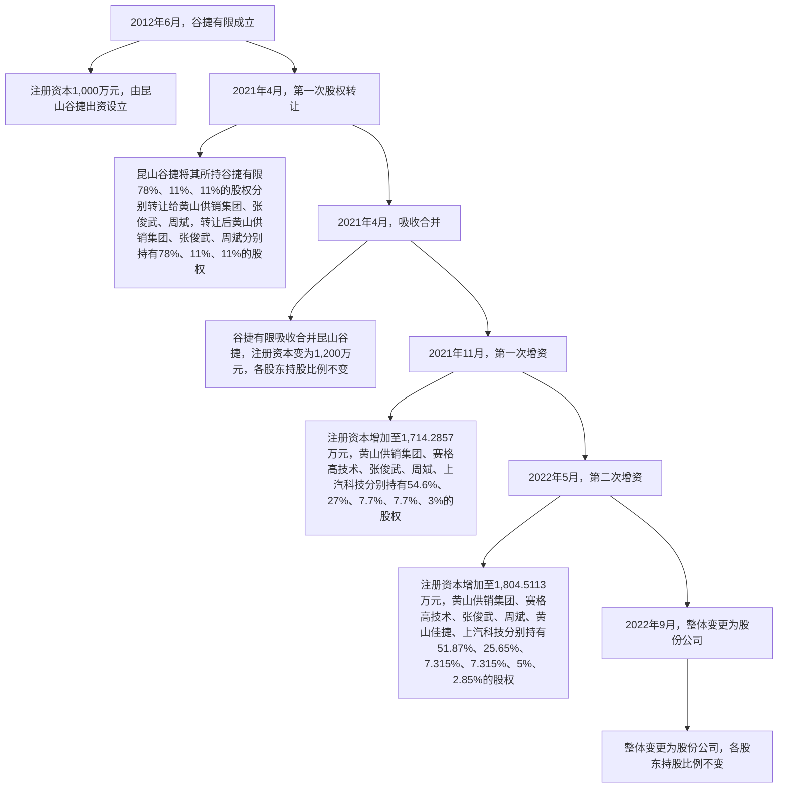

# 1、报告期期初股本和股东情况

自有限公司设立至报告期期初，公司的股本及股东情况未发生变化，具体情况见本节之“二、发行人的设立情况、报告期内的股本和股东变化情况”之“（一）发行人的设立情况”之“1、有限公司设立情况”。

# 2、2021年 4月，第一次股权转让

2020 年 12 月 30 日，黄山市供销社、黄山供销集团出具《关于同意昆山谷捷股权转让以及黄山谷捷吸收合并昆山谷捷的批复》（黄供集团[2020]80 号），同意昆山谷捷将其所持谷捷有限 78%、11%、11%的股权以零对价分别转让给黄山供销集团、张俊武、周斌。

2021 年 4 月 3 日，谷捷有限股东昆山谷捷作出股东决定，同意昆山谷捷进行股权转让，受让方系昆山谷捷全体股东，各股东按持有昆山谷捷的股权比例受让谷捷有限股权。同日，昆山谷捷分别与黄山供销集团、张俊武、周斌签署了股权转让相关协议。

转让前后，谷捷有限的股权结构图对比如下：

flowchart

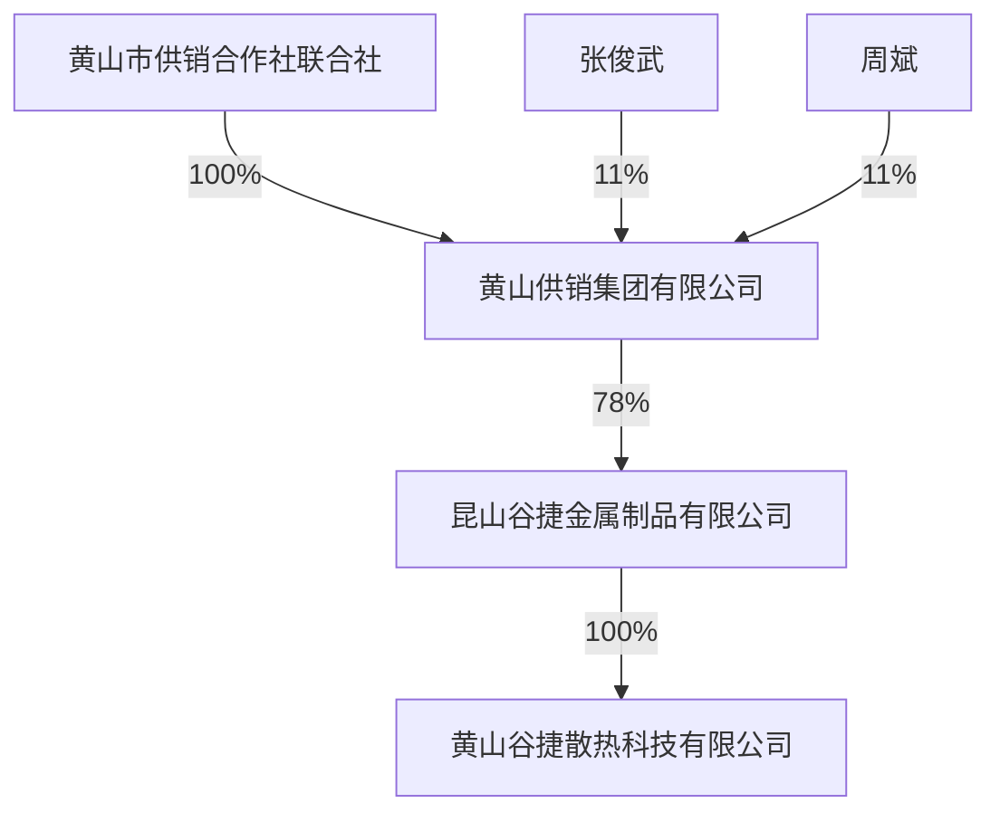

flowchart

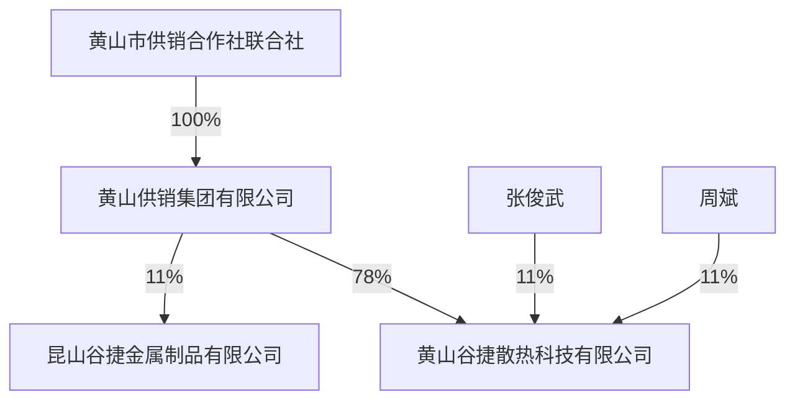

2021 年 4 月 7 日，谷捷有限取得了黄山市徽州区市场监督管理局为其换发的营业执照（统一社会信用代码：913410045986552970）。

本次股权转让后，谷捷有限的股权结构如下：

<table><tr><td>序号</td><td>股东姓名/名称</td><td>出资额(万元)</td><td>出资比例(%)</td></tr><tr><td>1</td><td>黄山供销集团</td><td>780.00</td><td>78.00</td></tr><tr><td>2</td><td>张俊武</td><td>110.00</td><td>11.00</td></tr><tr><td>3</td><td>周斌</td><td>110.00</td><td>11.00</td></tr><tr><td colspan="2">合计</td><td>1,000.00</td><td>100.00</td></tr></table>

本次股权转让系同一股权结构下的公司架构调整，股权转让完成后，黄山供销集团、张俊武、周斌对谷捷有限的持股方式由间接持股变更为直接持股，本次股权转让价格为0元。

# 3、2021 年 4 月，吸收合并

2020 年 12 月 24 日，谷捷有限及昆山谷捷召开股东会，同意谷捷有限吸收合并昆山谷捷，合并后谷捷有限存续，昆山谷捷注销；同日，谷捷有限与昆山谷捷签订《合并协议》。

2020 年 12 月 25 日，谷捷有限与昆山谷捷在《中国商报》联合刊登了吸收合并公告，按照《公司法》规定履行了债权人告知等义务。公告期满，未有债权人要求谷捷有限清偿债务或要求谷捷有限提供相应担保。

2020 年 12 月 30 日，黄山市供销社、黄山供销集团出具《关于同意昆山谷捷股权转让以及黄山谷捷吸收合并昆山谷捷的批复》（黄供集团[2020]80 号），同意谷捷有限吸收合并昆山谷捷，吸收合并后昆山谷捷注销，谷捷有限存续。

2021 年 4 月 7 日，谷捷有限召开股东会，吸收合并后谷捷有限的注册资本变更为1,200万元，其中黄山供销集团出资 936万元，张俊武出资 132万元，周斌出资132万元；同日，谷捷有限与昆山谷捷再次签订《吸收合并协议》，进一步明确了双方权利义务等条款。

2021 年 4 月 13 日，谷捷有限取得了黄山市徽州区市场监督管理局为其换发的营业执照（统一社会信用代码：913410045986552970）。

2021年8月20 日，国家税务总局苏州昆山经济技术开发区税务局出具《清税证明》（昆开税税企清[2021]9296 号），确认昆山谷捷税务事项已结清。2021年9月7日，昆山市市场监督管理局出具《准予注销登记通知书》（（05831101zc）公司注销[2021]第09070003 号），核准昆山谷捷注销。

2022年11月16 日，中审众环会计师出具《验资报告》（众环验字（2022）0110095 号），确认截至 2021 年 9 月 7 日，谷捷有限已收到全体股东新增实收资本200万元，由股东以被合并方昆山谷捷的账面净资产出资。

本次吸收合并前后，谷捷有限、昆山谷捷的股东及各出资比例如下：

单位：万元

<table><tr><td rowspan="3">序号</td><td rowspan="3">股东名称</td><td colspan="4">吸收合并前</td><td colspan="2">吸收合并后</td></tr><tr><td colspan="2">谷捷有限</td><td colspan="2">昆山谷捷</td><td colspan="2">谷捷有限</td></tr><tr><td>出资额</td><td>出资比例</td><td>出资额</td><td>出资比例</td><td>出资额</td><td>出资比例</td></tr><tr><td>1</td><td>黄山供销集团</td><td>780.00</td><td>78.00%</td><td>156.00</td><td>78.00%</td><td>936.00</td><td>78.00%</td></tr><tr><td>2</td><td>张俊武</td><td>110.00</td><td>11.00%</td><td>22.00</td><td>11.00%</td><td>132.00</td><td>11.00%</td></tr><tr><td>3</td><td>周斌</td><td>110.00</td><td>11.00%</td><td>22.00</td><td>11.00%</td><td>132.00</td><td>11.00%</td></tr><tr><td colspan="2">合计</td><td>1,000.00</td><td>100.00%</td><td>200.00</td><td>100.00%</td><td>1,200.00</td><td>100.00%</td></tr></table>

本次吸收合并系同一股权结构下的公司架构调整，吸收合并当时未对双方净资产进行评估。2022 年 11 月 14 日，中联国信进行了追溯评估并出具了《资产评估报告》（皖中联国信评报字（2022）第 303-1号、皖中联国信评报字（2022）第303-2号），确认截至 2021年3月31日，昆山谷捷净资产账面价值为 380.94万元，评估价值为 380.94 万元，谷捷有限净资产账面价值为 2,912.30 万元，评估价值为 9,651.75 万元。

# 4、2021 年 11 月，第一次增资，增资至 1,714.2857 万元

2021年7月31 日，黄山江南新科苑资产评估事务所（特殊普通合伙）出具《资产评估报告》（新科苑评报字（2021）第 0112 号），确认截至 2020 年 12月 31 日，谷捷有限股东全部权益价值为 26,461.86 万元。2022 年 11 月 25 日，中联国信出具《评估复核报告》（皖中联国信复核字（2022）第002 号），认为评估结果基本反映了资产在评估基准日的市场价值。

2021年9月17 日，黄山市供销社、黄山供销集团出具《关于黄山谷捷散热科技有限公司增资扩股有关事项的批复》（黄供集团[2021]52 号），同意谷捷有限增资扩股，由赛格高技术和上汽科技向谷捷有限增资。

2021年9月18 日，赛格高技术、上汽科技与黄山供销集团、张俊武、周斌及谷捷有限签署《黄山谷捷散热科技有限公司增资协议》，约定谷捷有限增加注册资本514.2857万元，其中赛格高技术认缴462.8571万元、上汽科技认缴51.4286万元，增资价格为 22.42元/注册资本，出资方式为货币。各方在增资协议中约定了回购条款及其他股东特殊权利条款，相关内容及解除情况详见本节之“十一、发行人股本情况”之“（十）本次发行前涉及的对赌协议及其解除情况”。

2021 年 9 月 19 日，谷捷有限召开股东会，同意上述增资扩股事项。

2021 年 11 月 11 日，谷捷有限取得了黄山市市场监督管理局为其换发的营业执照（统一社会信用代码：913410045986552970）。

2022 年 1 月 17 日，中审众环会计师出具《验资报告》（众环验字（2022）0110017 号），确认截至 2021 年 12 月 31 日，谷捷有限已收到股东赛格高技术和上汽科技缴纳的实收资本514.2857万元，出资方式为货币。

本次增资完成后，公司股权结构如下：

<table><tr><td>序号</td><td>股东姓名/名称</td><td>出资额(万元)</td><td>出资比例(%)</td></tr><tr><td>1</td><td>黄山供销集团</td><td>936.0000</td><td>54.60</td></tr><tr><td>2</td><td>赛格高技术</td><td>462.8571</td><td>27.00</td></tr><tr><td>3</td><td>张俊武</td><td>132.0000</td><td>7.70</td></tr><tr><td>4</td><td>周斌</td><td>132.0000</td><td>7.70</td></tr><tr><td>5</td><td>上汽科技</td><td>51.4286</td><td>3.00</td></tr><tr><td colspan="2">合计</td><td>1,714.2857</td><td>100.00</td></tr></table>

# 5、2022 年 5 月，第二次增资，增资至 1,804.5113 万元

2022年4月28日，中联国信出具《资产评估报告》（皖中联国信评报字（2022）第 171 号），确认截至 2021 年 12 月 31 日，谷捷有限股东全部权益的市场价值为 40,370 万元。

2022年5月17 日，黄山市供销社、黄山供销集团出具《关于黄山谷捷散热科技有限公司员工股权激励实施方案的批复》（黄供集团[2022]27 号），同意谷捷有限实施员工股权激励。

2022 年 5 月 20 日，谷捷有限召开股东会，同意将公司的注册资本由1,714.2857 万元增至 1,804.5113 万元，新增注册资本 90.2256 万元由员工持股平台黄山佳捷全额认缴。

2022年5月24 日，谷捷有限与黄山佳捷签署《黄山谷捷散热科技有限公司增资扩股协议》，新增注册资本 90.2256万元由黄山佳捷全额认缴，增资价格为23.55元/注册资本，出资方式为货币。

2022年5月26 日，谷捷有限取得了黄山市市场监督管理局为其换发的营业

执照（统一社会信用代码：913410045986552970）。

2022 年 7 月 15 日，中审众环会计师出具《验资报告》（众环验字（2022）0110088号），确认截至 2022年5月31日，谷捷有限已收到股东黄山佳捷缴纳的实收资本 90.2256 万元，出资方式为货币。

本次增资完成后，谷捷有限的股权结构如下：

<table><tr><td>序号</td><td>股东姓名/名称</td><td>出资额(万元)</td><td>出资比例(%)</td></tr><tr><td>1</td><td>黄山供销集团</td><td>936.0000</td><td>51.8700</td></tr><tr><td>2</td><td>赛格高技术</td><td>462.8571</td><td>25.6500</td></tr><tr><td>3</td><td>张俊武</td><td>132.0000</td><td>7.3150</td></tr><tr><td>4</td><td>周斌</td><td>132.0000</td><td>7.3150</td></tr><tr><td>5</td><td>黄山佳捷</td><td>90.2256</td><td>5.0000</td></tr><tr><td>6</td><td>上汽科技</td><td>51.4286</td><td>2.8500</td></tr><tr><td colspan="2">合计</td><td>1,804.5113</td><td>100.0000</td></tr></table>

# 6、2022年 9月，整体变更为股份公司

2022 年 9 月，谷捷有限整体变更为股份公司，具体情况见本节之“二、发行人的设立情况、报告期内的股本和股东变化情况”之“（一）发行人的设立情况”之“2、股份公司设立情况”。

# 三、发行人成立以来的重要事件

# （一）发行人报告期内的重大资产重组情况

报告期内，发行人未进行过重大资产重组。

# （二）发行人报告期内吸收合并昆山谷捷情况

为精简组织架构、降低管理成本，2021 年4月，发行人吸收合并昆山谷捷，具体情况如下：

# 1、吸收合并前昆山谷捷基本情况

<table><tr><td>公司名称</td><td>昆山谷捷金属制品有限公司</td></tr><tr><td>成立日期</td><td>2009年7月6日</td></tr><tr><td>法定代表人</td><td>胡恩谓</td></tr><tr><td>注册地和主要生产经营地</td><td>昆山开发区蓬朗大通路南侧、马塘路东侧</td></tr><tr><td>注册资本</td><td>200.00万元</td></tr><tr><td>公司类型</td><td>有限责任公司</td></tr><tr><td>经营范围</td><td>金属制品、塑料制品、铝合金制品、五金交电、家具、通讯设备及相关产品的生产和销售;货物进出口业务。(依法须经批准的项目,经相关部门批准后方可开展经营活动)</td></tr><tr><td>股东构成及控制情况</td><td>黄山供销集团持有78.00%的股权,张俊武持有11.00%的股权,周斌持有11.00%的股权</td></tr></table>

# 2、吸收合并前，昆山谷捷历次股权和股东变化情况

2009年6月30 日，昆山谷捷召开股东会，审议通过《昆山谷捷金属制品有限公司章程》。根据该公司章程，昆山谷捷设立时注册资本为 100 万元，其中吴斌认缴出资 60 万元；张俊武认缴出资 20 万元；邓亮认缴出资 10 万元；王凌峰认缴出资10万元。

2010年3月22日，昆山谷捷召开股东会，同意王凌峰将其所持昆山谷捷10%股权转让给周斌，邓亮将其所持昆山谷捷 10%股权转让给周斌；同日，周斌分别与王凌峰、邓亮签订《股权转让协议》。

2012年4月23 日，昆山谷捷召开股东会，同意新增注册资本 100万元，黄山市化工总厂、吴斌、张俊武、周斌分别认购 90万元、6万元、2万元、2万元。

2014 年 6 月 7 日，吴斌与黄山市化工总厂签订《股权转让协议》，约定吴斌将其持有昆山谷捷 33%的股权转让给黄山市化工总厂；同日，昆山谷捷召开股东会，通过了股权转让后的章程修正案。

2016年9月28 日，昆山谷捷召开股东会，决议股东黄山市化工总厂的名称变更为黄山供销集团。

至本次吸收合并前，昆山谷捷的股权未再有其他变化。

# 3、吸收合并的具体内容及履行的法定程序

本次吸收合并的具体内容及履行的法定程序详见本节之“二、发行人的设立情况、报告期内的股本和股东变化情况”之“（二）发行人报告期内的股本和股东变化情况”之“3、2021年4月，吸收合并”。

# 4、上述吸收合并对发行人的影响

本次吸收合并于 2021 年 4 月完成，吸收合并前一年被吸收合并方昆山谷捷与吸收合并方谷捷有限的资产总额、营业收入、利润总额情况如下：

<table><tr><td>项目</td><td>昆山谷捷</td><td>谷捷有限</td><td>比例</td></tr><tr><td>资产总额(万元)</td><td>1,388.97</td><td>6,365.57</td><td>21.82%</td></tr><tr><td>营业收入(万元)</td><td>-</td><td>8,913.09</td><td>0.00%</td></tr><tr><td>利润总额(万元)</td><td>-</td><td>1,753.72</td><td>0.00%</td></tr></table>

本次交易标的 2020年末/年度资产总额、营业收入、利润总额占吸收合并前谷捷有限相应项目的比例分别为 21.82%、0.00%、0.00%。被吸收合并方昆山谷捷系谷捷有限原控股股东，自报告期初起即与发行人受同一实际控制人控制。本次吸收合并完成后，公司的管理层和实际控制人没有发生变更，主营业务亦没有发生变化。本次吸收合并有利于精简组织架构、降低管理成本。

# 四、发行人在其他证券市场的上市/挂牌情况

谷捷有限于 2018 年 10 月 29 日在安徽股权托管交易中心挂牌，2022 年 11月24日终止在安徽股权托管交易中心挂牌。2022年12月30日，安徽股权托管交易中心出具证明，确认公司仅通过该中心进行股权登记托管，未通过该中心进行过股票发行、股权转让、股权质押、增减资等行为，公司未有受到该中心处罚的情形。

# 五、发行人的股权结构和组织结构

# （一）股权结构图

截至本招股说明书签署日，公司股权结构如下图所示：

flowchart

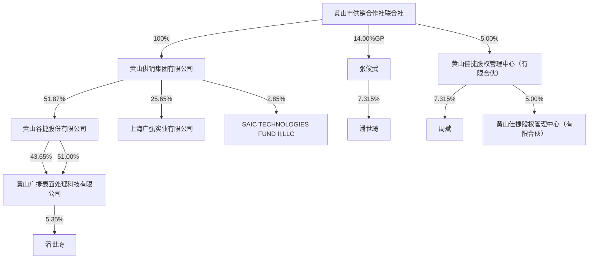

# （二）组织结构图

截至本招股说明书签署日，公司组织结构如下图所示：

flowchart

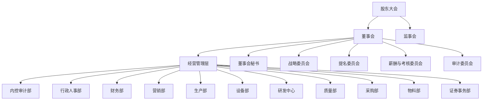

# 六、发行人控股子公司、参股公司情况

截至本招股说明书签署日，发行人拥有 1家控股子公司，无参股公司，基本情况如下：

# （一）黄山广捷表面处理科技有限公司

<table><tr><td>公司名称</td><td colspan="3">黄山广捷表面处理科技有限公司</td></tr><tr><td>成立日期 $^{注1}$ </td><td colspan="3">2020年3月31日</td></tr><tr><td>注册资本</td><td colspan="3">1,000万元</td></tr><tr><td>实收资本</td><td colspan="3">1,000万元</td></tr><tr><td>注册地及主要生产经营地</td><td colspan="3">安徽省黄山市歙县徽城镇循环经济园区纬一路2号</td></tr><tr><td>股东构成及控制情况</td><td colspan="3">发行人持有51.00%的股权,上海广弘持有43.65%的股权,潘世琦持有5.35%的股权。</td></tr><tr><td>法定代表人</td><td colspan="3">周斌</td></tr><tr><td>经营范围</td><td colspan="3">金属及非金属表面处理;化工原料及产品销售(除危险化学品,易制毒化学品)。(依法须经批准的项目,经相关部门批准后方可开展经营活动)</td></tr><tr><td>主营业务及其在发行人业务板块中定位</td><td colspan="3">从事电镀业务,系发行人主营业务的生产工序之一。</td></tr><tr><td rowspan="5">最近一年及一期主要财务数据 $^{注2}$ </td><td>项目</td><td>2024.6.30/2024年1-6月</td><td>2023.12.31/2023年度</td></tr><tr><td>总资产(万元)</td><td>2,949.07</td><td>3,277.66</td></tr><tr><td>净资产(万元)</td><td>2,537.06</td><td>2,553.50</td></tr><tr><td>营业收入(万元)</td><td>1,490.43</td><td>3,468.02</td></tr><tr><td>净利润(万元)</td><td>583.56</td><td>1,260.70</td></tr></table>

注 1：成立时黄山广捷系发行人持股 45%的联营企业，2022 年 5 月成为黄山谷捷的控股子公司；  
注2：以上财务数据已经中审众环会计师审计。

# 七、持有发行人 5%以上股份或表决权的主要股东及实际控制人情况

# （一）控股股东及实际控制人的基本情况

# 1、控股股东

截至本招股说明书签署日，黄山供销集团持有发行人3,112.20 万股，持股比例为51.87%，为发行人的控股股东。黄山供销集团基本情况如下：

注：2023 年度财务数据已经黄山徽泓会计师事务所（普通合伙）审计，2024 年 1-6 月财务数据未经审计。

<table><tr><td>公司名称</td><td colspan="3">黄山供销集团有限公司</td></tr><tr><td>成立时间</td><td colspan="3">1990年3月2日</td></tr><tr><td>注册资本</td><td colspan="3">30,000万元</td></tr><tr><td>实收资本</td><td colspan="3">30,000万元</td></tr><tr><td>注册地及主要生产经营地</td><td colspan="3">黄山市屯溪区天都大道天都大厦1201号</td></tr><tr><td>股东构成</td><td colspan="3">黄山市供销社持股100%</td></tr><tr><td>法定代表人</td><td colspan="3">冯家成</td></tr><tr><td>经营范围</td><td colspan="3">项目投资、厂房租赁、货物仓储;膜材料、LED节能灯、光机电一体化产品、电子产品、金属材料、塑料材料、铝合金材料、五金交电、家具、通讯设备、精细化学品(聚合物微粉和改性塑料)、化工原料及化工产品(不含危险化学品)、塑木型材及其系列制品、粉末丁腈橡胶、粉末丁苯橡胶、丁腈橡胶、食用农产品、建筑材料销售;计算机技术、网络技术服务,信息咨询;初级农产品开发、种植、收购、批发、零售;预包装食品兼散装食品批发、零售;经营本企业自产产品的出口业务和本企业生产所需的机械、零配件、原辅材料的进出口业务。(依法须经批准的项目,经相关部门批准后方可开展经营活动)</td></tr><tr><td>主营业务及其与发行人主营业务的关系</td><td colspan="3">“三农”服务和投资管理,未从事与发行人主营业务相同或相似的业务</td></tr><tr><td rowspan="5">最近一年及一期主要财务数据(母公司) $^{\text{注}}$ </td><td>项目</td><td>2024.6.30/2024年1-6月</td><td>2023.12.31/2023年度</td></tr><tr><td>总资产(万元)</td><td>58,778.14</td><td>47,596.02</td></tr><tr><td>净资产(万元)</td><td>57,423.63</td><td>47,065.88</td></tr><tr><td>营业收入(万元)</td><td>492.77</td><td>945.32</td></tr><tr><td>净利润(万元)</td><td>8,564.06</td><td>2,990.14</td></tr></table>

# 2、实际控制人

截至本招股说明书签署日，黄山供销集团为黄山市供销社 100%出资的企业，黄山市供销社通过黄山供销集团持有发行人 51.87%的股份。公司的实际控制人为黄山市供销社。

黄山市供销社系全市供销合作社的联合组织，其主要职能为：管理、监督和运营本级社有资产，建立健全社有资产保值增值考核和责任追究制度，探索建立管理者和经营者与绩效挂钩的激励约束机制，依法履行出资人职责，享有出资人权益；指导成员社的组织建设和制度建设；协调成员社之间的关系等。黄山市供销社不直接从事生产经营活动。

# （二）控股股东和实际控制人直接或间接持有发行人的股份被质押、冻结或发生诉讼纠纷等情形

截至本招股说明书签署日，发行人控股股东、实际控制人直接或间接持有发行人的股份均不存在质押、冻结或诉讼纠纷等情形。

# （三）其他持有发行人 5%以上股份或表决权的主要股东的基本情况

截至本招股说明书签署日，除发行人控股股东黄山供销集团外，其他持有公司5%以上股份的股东为赛格高技术、张俊武、周斌和黄山佳捷，具体情况如下：

# 1、自然人股东

截至本招股说明书签署日，张俊武直接持有发行人 438.90 万股，占发行人本次发行前总股本的 7.315%，周斌直接持有发行人 438.90 万股，占发行人本次发行前总股本的7.315%。自然人股东的身份证号及住所信息如下：

<table><tr><td>姓名</td><td>身份证号码</td><td>住所</td><td>国籍</td><td>境外永久居留权</td></tr><tr><td>张俊武</td><td>342723197302******</td><td>安徽省黄山市</td><td>中国</td><td>无</td></tr><tr><td>周斌</td><td>310226197105******</td><td>上海市浦东新区</td><td>中国</td><td>无</td></tr></table>

张俊武及周斌简历详见本节”之“十二、董事、监事、高级管理人员与其他核心人员”之“（一）董事、监事、高级管理人员及其他核心人员的简介”之“1、董事会成员”。

# 2、深圳赛格高技术投资股份有限公司

赛格高技术持有发行人1,539.00万股，占发行人本次发行前总股本的25.65%，其基本情况如下：

<table><tr><td>公司名称</td><td colspan="3">深圳赛格高技术投资股份有限公司</td></tr><tr><td>统一社会信用代码</td><td colspan="3">91440300192268035Q</td></tr><tr><td>成立时间</td><td colspan="3">1994年5月12日</td></tr><tr><td>注册地址及主要经营地</td><td colspan="3">深圳市福田区福保街道福保社区菩提路216号益田花园二期27、28栋三层</td></tr><tr><td>注册资本</td><td colspan="3">30,000万元</td></tr><tr><td>实收资本</td><td colspan="3">30,000万元</td></tr><tr><td>法定代表人</td><td colspan="3">杨洪宇</td></tr><tr><td>经营范围</td><td colspan="3">一般经营项目是:投资兴办各类实业;从事电子信息类产品开发、经营业务;从事网上国内贸易、进出口贸易;国内贸易(不含专营、专卖、专控商品);经营进出口业务(法律、行政法规、国务院决定禁止的项目除外,限制的项目须取得许可后方可经营);谷物、豆及薯类批发,食糖批发,米、面制品及食用油批发;建材批发销售;石油、石油制品批发;煤炭、煤炭制品批发;供应链管理及相关配套服务;一类、二类医疗器械零售与批发;房屋租赁服务,在合法取得使用权的土地上从事房地产开发经营;报关代理。从事互联网信息服务业务。以自有资金从事投资活动;石油制品销售(不含危险化学品);成品油批发(不含危险化学品);润滑油销售。</td></tr><tr><td></td><td colspan="3">(除依法须经批准的项目外,凭营业执照依法自主开展经营活动),许可经营项目是:从事互联网信息服务业务;二类医疗器械零售与批发。第三类医疗器械经营。(依法须经批准的项目,经相关部门批准后方可开展经营活动,具体经营项目以相关部门批准文件或许可证件为准)</td></tr><tr><td>主营业务及与发行人主营业务的关系</td><td colspan="3">主要从事国内贸易、经营进出口、半导体及其他战略性新兴产业投资、房屋租赁服务等业务,未从事与发行人主营业务相同或相似的业务</td></tr><tr><td rowspan="7">股权结构</td><td>股东名称</td><td>认缴出资额(万元)</td><td>比例</td></tr><tr><td>深圳市赛格集团有限公司</td><td>25,330.8064</td><td>84.4360%</td></tr><tr><td>深圳市深福保(集团)有限公司</td><td>1,813.9619</td><td>6.0465%</td></tr><tr><td>深圳市城市建设开发(集团)有限公司</td><td>1,683.5658</td><td>5.6119%</td></tr><tr><td>中国长城资产管理股份有限公司贵州省分公司</td><td>656.0800</td><td>2.1869%</td></tr><tr><td>深圳市新产业创业投资有限公司</td><td>515.5859</td><td>1.7186%</td></tr><tr><td>合计</td><td>30,000.0000</td><td>100.0000%</td></tr></table>

# 3、黄山佳捷股权管理中心（有限合伙）

黄山佳捷持有发行人 300.00万股，占发行人本次公开发行前总股本的 5.00%，其基本情况如下：

<table><tr><td>企业名称</td><td>黄山佳捷股权管理中心(有限合伙)</td></tr><tr><td>统一社会信用代码</td><td>91341004MA8P2F2B9W</td></tr><tr><td>成立时间</td><td>2022年5月20日</td></tr><tr><td>注册地址及主要经营地</td><td>安徽省黄山市徽州区文峰西路16号</td></tr><tr><td>执行事务合伙人</td><td>张俊武</td></tr><tr><td>企业类型</td><td>有限合伙企业</td></tr><tr><td>出资额</td><td>2,124.8129万元</td></tr><tr><td>经营范围</td><td>一般项目:以自有资金从事投资活动(除许可业务外,可自主依法经营法律法规非禁止或限制的项目)</td></tr></table>

黄山佳捷为黄山谷捷的员工持股平台，截至本招股说明书签署日，合伙人出资情况如下：

单位：万元

<table><tr><td>序号</td><td>姓名</td><td>合伙人类别</td><td>在公司任职情况</td><td>出资金额</td><td>出资比例</td></tr><tr><td>1</td><td>张俊武</td><td>普通合伙人</td><td>董事、总经理</td><td>297.4718</td><td>14.00%</td></tr><tr><td>2</td><td>罗仁棠</td><td>有限合伙人</td><td>副总经理</td><td>276.2250</td><td>13.00%</td></tr><tr><td>3</td><td>程家斌</td><td>有限合伙人</td><td>副总经理、董事会秘书</td><td>212.4823</td><td>10.00%</td></tr><tr><td>4</td><td>谷伟</td><td>有限合伙人</td><td>营销部经理</td><td>169.9839</td><td>8.00%</td></tr><tr><td>5</td><td>周斌</td><td>有限合伙人</td><td>董事、副总经理</td><td>148.7371</td><td>7.00%</td></tr><tr><td>6</td><td>汪琦</td><td>有限合伙人</td><td>财务负责人</td><td>148.7371</td><td>7.00%</td></tr><tr><td>7</td><td>肖内</td><td>有限合伙人</td><td>研发中心主任</td><td>148.7371</td><td>7.00%</td></tr><tr><td>8</td><td>黄芳芳</td><td>有限合伙人</td><td>质量部经理</td><td>148.7371</td><td>7.00%</td></tr><tr><td>9</td><td>刘庆喜</td><td>有限合伙人</td><td>生产部经理</td><td>148.7371</td><td>7.00%</td></tr><tr><td>10</td><td>凌志明</td><td>有限合伙人</td><td>物料部经理</td><td>84.9920</td><td>4.00%</td></tr><tr><td>11</td><td>吴亚玲</td><td>有限合伙人</td><td>行政人事部经理</td><td>84.9920</td><td>4.00%</td></tr><tr><td>12</td><td>吴学智</td><td>有限合伙人</td><td>设备部副经理</td><td>63.7451</td><td>3.00%</td></tr><tr><td>13</td><td>王韬</td><td>有限合伙人</td><td>研发中心副主任</td><td>63.7451</td><td>3.00%</td></tr><tr><td>14</td><td>程仲伽</td><td>有限合伙人</td><td>生产部副经理</td><td>63.7451</td><td>3.00%</td></tr><tr><td>15</td><td>程杰文</td><td>有限合伙人</td><td>生产部副经理</td><td>63.7451</td><td>3.00%</td></tr><tr><td colspan="4">合计</td><td>2,124.8129</td><td>100.00%</td></tr></table>

# （四）控股股东、实际控制人控制的其他企业

截至本招股说明书签署日，除控制发行人外，控股股东、实际控制人控制的其他企业基本情况如下：

<table><tr><td>序号</td><td>名称</td><td>成立时间</td><td>注册资本(万元)</td><td>注册地址</td><td>主营业务</td><td>持股情况</td></tr><tr><td>1</td><td>黄山荷琇生物科技有限公司</td><td>2015.08.27</td><td>1,000.00</td><td>安徽省黄山高新技术产业开发区金鸡路102号</td><td>化妆品、日用化学产品等</td><td>黄山供销集团持股100%</td></tr><tr><td>2</td><td>黄山乐惟化妆品贸易有限公司</td><td>2019.03.20</td><td>100.00</td><td>安徽省黄山市屯溪区新安北路65号</td><td>化妆品、日用百货、个人卫生用品等</td><td>黄山荷琇生物科技有限公司持股100%</td></tr><tr><td>3</td><td>黄山市供销农业发展投资管理有限公司</td><td>1990.06.18</td><td>2,025.90</td><td>黄山市屯溪区天都大道天都大厦1201号</td><td>农业发展项目的投资与管理</td><td>黄山供销集团持股100%</td></tr><tr><td>4</td><td>黄山泉水鱼产业开发有限公司</td><td>2016.11.24</td><td>1,000.00</td><td>黄山市休宁县海阳镇黄山南路18号农委新大楼11楼</td><td>水产、农产品等</td><td>黄山市供销农业发展投资管理有限公司持股95%</td></tr><tr><td>5</td><td>黄山禾润生态科技有限公司</td><td>2020.11.03</td><td>1,000.00</td><td>安徽省黄山市徽州区永佳大道109号永佳科技园</td><td>昆虫性诱、植物源引诱和食物源引诱产品、物理防控产品等</td><td>黄山市供销农业发展投资管理有限公司持股100%</td></tr><tr><td>6</td><td>黄山市供销农副产品投资发展有限公司</td><td>2014.11.18</td><td>5,000.00</td><td>黄山市屯溪区新安北路65号</td><td>项目投资、企业管理</td><td>黄山供销集团持股70.72%,黄山市供销农业发展投资管理有限公司持股9%</td></tr><tr><td>7</td><td>黄山市屯溪区供销农副产品专业合作社</td><td>2014.12.23</td><td>1,000.00</td><td>黄山市屯溪区牌坊前路8号屯浦阳光2幢8-19号</td><td>收购、销售农副产品、技术培训等</td><td>黄山市供销农副产品投资发展有限公司持股51%</td></tr><tr><td>8</td><td>黄山市徽州区供销农副产品专业合作社</td><td>2014.12.11</td><td>500.00</td><td>黄山市徽州区文峰路82号(区供销大厦)</td><td>收购、销售社员生产产品,技术培训等</td><td>黄山市供销农副产品投资发展有限公司持股51%</td></tr><tr><td>9</td><td>休宁县供销农副产品专业合作社</td><td>2014.12.24</td><td>500.00</td><td>休宁县海阳镇体育场路金诚阳光10幢101铺</td><td>收购、销售社员生产产品,技术培训等</td><td>黄山市供销农副产品投资发展有限公司持股51%</td></tr><tr><td>10</td><td>黟县供销农副产品专业合作社</td><td>2014.12.05</td><td>500.00</td><td>黟县碧阳镇城南新区宏村大道122</td><td>农副产品的生产、销售等</td><td>黄山市供销农副产品投资发展有限公司持股51%</td></tr><tr><td>11</td><td>歙县供销农副产品专业合作社</td><td>2015.01.08</td><td>500.50</td><td>歙县徽城镇百花路金泰广场B座1001室</td><td>收购、销售社员生产产品,技术培训等</td><td>黄山市供销农副产品投资发展有限公司持股50.15%</td></tr><tr><td>12</td><td>黄山市黄山区供销农副产品专业合作社</td><td>2014.12.01</td><td>601.50</td><td>黄山市黄山区龙井西路粮食局大楼西侧</td><td>技术咨询,购买、销售农产品等</td><td>黄山市供销农副产品投资发展有限公司持股50.87%</td></tr><tr><td>13</td><td>祁门县供销农副产品专业合作社</td><td>2014.12.02</td><td>502.02</td><td>祁门县新兴路兴美楼12-15号</td><td>技术咨询,购买、销售农产品等</td><td>黄山市供销农副产品投资发展有限公司持股51%</td></tr><tr><td>14</td><td>黄山市供销农副产品专业合作社联合社</td><td>2015.01.27</td><td>35.00</td><td>安徽省黄山市屯溪区老街街道新安北路65号</td><td>收购、销售社员生产产品,技术培训等</td><td>黄山市供销农副产品投资发展有限公司间接持股100%</td></tr><tr><td>15</td><td>黄山市屯溪区徽晟供销合作社有限公司</td><td>2018.11.02</td><td>500.00</td><td>黄山市屯溪区机场大道龙井新村8号</td><td>技术咨询服务,销售食用农产品、日用百货等</td><td>黄山供销集团持股51%</td></tr><tr><td>16</td><td>黄山全晟密封科技有限公司</td><td>2004.05.21</td><td>1,000.00</td><td>歙县循环经济园区二幢</td><td>密封新材料、橡胶制品等</td><td>黄山供销集团持股70%</td></tr><tr><td>17</td><td>黄山四月乡村建设有限公司</td><td>2021.11.11</td><td>2,000.00</td><td>安徽省黄山市歙县郑村镇棠樾村绕村公路1号</td><td>自身无业务经营</td><td>黄山供销集团持股51%</td></tr><tr><td>18</td><td>黄山四月乡村农艺场有限公司</td><td>2018.03.06</td><td>5,000.00</td><td>黄山市歙县郑村镇棠樾村村民委员会内</td><td>农业生产经营、农业产业化种植、农业观光旅游等</td><td>黄山供销集团持股60%</td></tr><tr><td>19</td><td>黄山合茂兴置业有限公司</td><td>2022.12.15</td><td>5,000.00</td><td>安徽省黄山市屯溪区昱东街道天都大道9号天都大厦A座1201室</td><td>房地产开发</td><td>黄山供销集团持股100%</td></tr><tr><td>20</td><td>黄山永佳投资有限公司</td><td>2016.05.31</td><td>2,000.00</td><td>徽州区岩寺镇环城北路19号</td><td>实业投资</td><td>黄山供销集团持股25%</td></tr><tr><td>21</td><td>黄山永新股份有限公司</td><td>1992.05.21</td><td>61,249.1866</td><td>安徽省黄山市徽州区徽州东路188号</td><td>彩印复合软包装材料、多功能膜材料等</td><td>黄山永佳投资有限公司持股33.09%</td></tr><tr><td>22</td><td>黄山市永佳职业培训学校</td><td>2006.05.08</td><td>590.00</td><td>黄山市屯溪区新安北路65号</td><td>会计、电脑等职业培训</td><td>黄山供销集团持股100%</td></tr><tr><td>23</td><td>黄山市供信商业运营管理有限公司</td><td>2023.10.19</td><td>5,000.00</td><td>安徽省黄山市歙县经济开发区新安江大道26号</td><td>资产管理、投资等</td><td>黄山供销集团持股54%,黄山市供销农副产品投资发展有限公司持股26%</td></tr><tr><td>24</td><td>黄山名茶数智科技有限公司</td><td>2023.12.29</td><td>500.00</td><td>安徽省黄山市屯溪区天都大道天都大厦1101号</td><td>农业数字化</td><td>黄山供销集团持股100%</td></tr><tr><td>25</td><td>黄山市徽州区徽茶智农科技有限公司</td><td>2024.1.2</td><td>500.00</td><td>安徽省黄山市徽州区岩寺镇环城北路置业大厦12楼</td><td>农业数字化</td><td>黄山名茶数智科技有限公司持股51%</td></tr><tr><td>26</td><td>黄山供联生态农业科技有限公司</td><td>2024.1.8</td><td>500.00</td><td>安徽省黄山市黄山区耿城镇辅村村委会1楼</td><td>水产养殖</td><td>黄山市供销农业发展投资管理有限公司持股51%</td></tr><tr><td>27</td><td>安徽金扁担股权投资有限公司</td><td>2024.2.28</td><td>1,000.00</td><td>安徽省黄山市屯溪区昱东街道天都大道天都大厦1101号</td><td>投资</td><td>黄山产业投资集团有限公司持股100%</td></tr><tr><td>28</td><td>黄山产业投资集团有限公司</td><td>2016.1.6</td><td>200,000.00</td><td>黄山市屯溪区社屋前路昱东大厦19楼</td><td>“三农”服务和投资管理</td><td>黄山供销集团有限公司持股51.50%</td></tr><tr><td>29</td><td>黄山市绿色投资基金合伙企业(有限合伙)</td><td>2021.10.12</td><td>20,020.00</td><td>安徽省黄山市屯溪区屯光镇社屋前路昱东大厦19楼</td><td>以自有资金从事投资活动,创业投资(限投资未上市企业)</td><td>黄山产业投资集团有限公司持股99.90%,黄山市信投投资有限公司持股0.10%</td></tr><tr><td>30</td><td>黄山市生态粮油食品集团有限公司</td><td>2022.9.23</td><td>14,000.00</td><td>安徽省黄山市屯溪区昱东街道社屋前路昱东大厦19楼</td><td>军粮供应保障、政策性粮食储备、农产品购销</td><td>黄山产业投资集团有限公司持股100%</td></tr><tr><td>31</td><td>黄山市徽菜产业科技发展有限公司</td><td>2023.11.27</td><td>10,000.00</td><td>安徽省黄山市屯溪区屯光镇社屋前路昱东大厦19楼</td><td>围绕徽菜产业上下游进行投资</td><td>黄山产业投资集团有限公司持股100%</td></tr><tr><td>32</td><td>黄山市小额贷款有限公司</td><td>2016.3.23</td><td>10,000.00</td><td>黄山市屯溪区社屋前路昱东大厦19楼</td><td>发放小额贷款</td><td>黄山产业投资集团有限公司持股100%</td></tr><tr><td>33</td><td>黄山市信投金融信息服务有限公司</td><td>2015.12.10</td><td>5,000.00</td><td>黄山市屯溪区社屋前路昱东大厦19楼</td><td>未开展实际业务</td><td>黄山产业投资集团有限公司持股100%</td></tr><tr><td>34</td><td>黄山市信投投资有限公司</td><td>2016.1.11</td><td>2,000.00</td><td>黄山市屯溪区社屋前路昱东大厦19楼</td><td>投资管理、投资咨询、投资顾问、企业股权投资</td><td>黄山产业投资集团有限公司持股100%</td></tr><tr><td>35</td><td>黄山市信投资产管理有限公司</td><td>2016.1.11</td><td>1,000.00</td><td>黄山市屯溪区社屋前路昱东大厦19楼</td><td>资产管理、投资管理、企业管理、供应链管理及配套服务、受托或委托资产管理业务(不含金融资产)</td><td>黄山产业投资集团有限公司持股100%</td></tr><tr><td>36</td><td>黄山新安江资本投资管理有限公司</td><td>2020.7.16</td><td>1,000.00</td><td>安徽省黄山市屯溪区天都大道30号君悦华府808室</td><td>私募基金管理、股权投资等业务</td><td>黄山市信投投资有限公司持股100%</td></tr><tr><td>37</td><td>黄山市征信有限公司</td><td>2019.2.1</td><td>1,000.00</td><td>安徽省黄山市屯溪区社屋前路昱东大厦19楼</td><td>征信服务业务</td><td>黄山产业投资集团有限公司持股100%</td></tr><tr><td>38</td><td>黄山市乡村振兴开发投资有限公司</td><td>2020.11.10</td><td>1,000.00</td><td>安徽省黄山市屯溪区昱东街道昱东大厦18楼</td><td>未实际开展业务</td><td>黄山市信投资产管理有限公司持股100%</td></tr><tr><td>39</td><td>黄山市军粮供应站有限公司</td><td>1989.8.14</td><td>500.00</td><td>安徽省黄山市屯溪区黄山中路33号</td><td>军粮供应保障,粮油、副食品零售</td><td>黄山市生态粮油食品集团有限公司持股100%</td></tr><tr><td>40</td><td>黄山市粮食储备库有限公司</td><td>2008.9.28</td><td>500.00</td><td>安徽省黄山市屯溪区黄山中路33号军粮供应站内</td><td>政策性粮油(市级储备原粮、成品粮油)承储、省市两级生活类应急救灾物资保管</td><td>黄山市生态粮油食品集团有限公司持股100%</td></tr><tr><td>41</td><td>黄山徽加电子商务有限公司</td><td>2018.3.20</td><td>200.00</td><td>黄山市屯溪区社屋前路昱东大厦18楼</td><td>电子商务销售业务</td><td>黄山市信投投资有限公司持股100%</td></tr><tr><td>42</td><td>安徽省生态产品交易所有限责任公司</td><td>2011.11.22</td><td>10,000.00</td><td>黄山市屯溪区社屋前路昱东大厦写字楼18层</td><td>农村产权等生产权益交易所业务</td><td>黄山产业投资集团有限公司持股78.5%</td></tr><tr><td>43</td><td>黄山新安江创业投资基金合伙企业(有限合伙)</td><td>2021.8.6</td><td>3,000.00</td><td>安徽省黄山市屯溪区屯光镇社屋前路昱东大厦19楼</td><td>以私募基金从事股权投资、投资管理、资产管理等活动</td><td>黄山市信投投资有限公司持股41%、黄山市信投资产管理有限公司持股30%、黄山新安江资本投资管理有限公司持股1%</td></tr><tr><td>44</td><td>黄山市融资担保有限公司</td><td>2002.7.4</td><td>34,400.00</td><td>安徽省黄山市屯溪区社屋前路昱东大厦19楼</td><td>融资担保</td><td>黄山产业投资集团有限公司持股60.17%</td></tr><tr><td>45</td><td>歙县天使投资合伙企业(有限合伙)</td><td>2023.3.8</td><td>2,000.00</td><td>安徽省黄山市歙县经济开发区新安江大道26号</td><td>以私募基金从事股权投资、投资管理、资产管理等活动</td><td>黄山新安江资本投资管理有限公司持股1%且为执行事务合伙人</td></tr><tr><td>46</td><td>黄山山海文旅产业基金合伙企业(有限合伙)</td><td>2023.7.4</td><td>101,000.00</td><td>安徽省黄山市屯溪区屯光镇社屋前路昱东大厦19楼</td><td>未实际开展业务</td><td>黄山新安江资本投资管理有限公司持股0.99%且为执行事务合伙人</td></tr><tr><td>47</td><td>黄山新安臭鳜鱼运营管理有限公司</td><td>2024.8.30</td><td>5,000.00</td><td>安徽省黄山市屯溪区昱东街道天都大道9号</td><td>以自有资金从事投资活动,供应链管理等</td><td>黄山产业投资集团有限公司持股100%</td></tr><tr><td>48</td><td>黄山徽韵臭鳜鱼供应链管理有限公司</td><td>2024.9.13</td><td>5,000.00</td><td>安徽省黄山市屯溪区昱中街道黄山西路76号</td><td>供应链管理服务等</td><td>黄山新安臭鳜鱼运营管理有限公司持股51%</td></tr><tr><td>49</td><td>黄山供销优选科技有限公司</td><td>2022.4.20</td><td>1,500.00</td><td>安徽省黄山市屯溪区迎宾大道52号</td><td>电商和影视制作</td><td>黄山市信投金融信息服务有限公司75%</td></tr><tr><td>50</td><td>黄山产投信息科技有限公司</td><td>2024.11.28</td><td>1,000.00</td><td>安徽省黄山市屯溪区昱东街道天都大道9号天都大厦A座11楼</td><td>软件开发</td><td>黄山市信投金融信息服务有限公司95%</td></tr></table>

# 八、特别表决权股份或类似安排情况

截至本招股说明书签署日，发行人不存在特别表决权股份或类似安排。

# 九、协议控制架构情况

截至本招股说明书签署日，发行人不存在协议控制架构的情况。

# 十、控股股东、实际控制人的合法合规情况

报告期内，控股股东、实际控制人不存在贪污、贿赂、侵占财产、挪用财产或者破坏社会主义市场经济秩序的刑事犯罪，不存在欺诈发行、重大信息披露违法或者其他涉及国家安全、公共安全、生态安全、生产安全、公众健康安全等领域的重大违法行为。

# 十一、发行人股本情况

# （一）本次发行前后的股本情况

本次发行前发行人总股本为 6,000 万股，本次拟公开发行不超过 2,000 万股股份，占本次发行后总股本的比例不低于 25.00%。按本次公开发行 2,000 万股计算，发行前后发行人的股本结构如下：

注：CS 指 Controlling State-owned Shareholder，国有实际控制股东，根据《深圳市国资委关于黄山谷捷股份有限公司国有股权管理有关问题的批复》（深国资委函[2023]182 号）认定，下同。

<table><tr><td rowspan="2">序号</td><td rowspan="2">股东名称</td><td colspan="2">本次发行前</td><td colspan="2">本次发行后</td></tr><tr><td>持股数量(万股)</td><td>比例</td><td>持股数量(万股)</td><td>比例</td></tr><tr><td>1</td><td>黄山供销集团</td><td>3,112.20</td><td>51.8700%</td><td>3,112.20</td><td>38.9025%</td></tr><tr><td>2</td><td>赛格高技术(CS)</td><td>1,539.00</td><td>25.6500%</td><td>1,539.00</td><td>19.2375%</td></tr><tr><td>3</td><td>张俊武</td><td>438.90</td><td>7.3150%</td><td>438.90</td><td>5.4863%</td></tr><tr><td>4</td><td>周斌</td><td>438.90</td><td>7.3150%</td><td>438.90</td><td>5.4863%</td></tr><tr><td>5</td><td>黄山佳捷</td><td>300.00</td><td>5.0000%</td><td>300.00</td><td>3.7500%</td></tr><tr><td>6</td><td>上汽科技(CS)</td><td>171.00</td><td>2.8500%</td><td>171.00</td><td>2.1375%</td></tr><tr><td>7</td><td>社会公众股</td><td>-</td><td>-</td><td>2,000.00</td><td>25.0000%</td></tr><tr><td colspan="2">合计</td><td>6,000.00</td><td>100.0000%</td><td>8,000.00</td><td>100.0000%</td></tr></table>

# （二）本次发行前的前十名股东情况

本次发行前，发行人前十名股东的持股情况如下：

<table><tr><td>序号</td><td>股东姓名/名称</td><td>持股数量(万股)</td><td>持股比例</td></tr><tr><td>1</td><td>黄山供销集团</td><td>3,112.20</td><td>51.8700%</td></tr><tr><td>2</td><td>赛格高技术(CS)</td><td>1,539.00</td><td>25.6500%</td></tr><tr><td>3</td><td>张俊武</td><td>438.90</td><td>7.3150%</td></tr><tr><td>4</td><td>周斌</td><td>438.90</td><td>7.3150%</td></tr><tr><td>5</td><td>黄山佳捷</td><td>300.00</td><td>5.0000%</td></tr><tr><td>6</td><td>上汽科技(CS)</td><td>171.00</td><td>2.8500%</td></tr><tr><td colspan="2">合计</td><td>6,000.00</td><td>100.0000%</td></tr></table>

# （三）本次发行前的前十名自然人股东及其在公司任职情况

本次发行前，发行人的前十名自然人股东及其在发行人处任职的情况如下：

<table><tr><td>序号</td><td>股东姓名</td><td>直接持股数量(万股)</td><td>持股比例</td><td>在公司任职情况</td></tr><tr><td>1</td><td>张俊武</td><td>438.90</td><td>7.3150%</td><td>董事、总经理</td></tr><tr><td>2</td><td>周斌</td><td>438.90</td><td>7.3150%</td><td>董事、副总经理</td></tr><tr><td colspan="2">合计</td><td>877.80</td><td>14.6300%</td><td>-</td></tr></table>

# （四）发行人股本中国有股份或外资股份情况

# 1、国有股份情况

发行人股东中，赛格高技术为国有股东，持有发行人1,539万股，占发行人发行前总股本的 25.65%；上汽科技为国有股东且为境外主体，持有发行人 171万股，占发行人发行前总股本的 2.85%。

2023年3月30 日，深圳市人民政府国有资产监督管理委员会出具《深圳市国资委关于黄山谷捷股份有限公司国有股权管理有关问题的批复》（深国资委函[2023]182 号），确认赛格高技术、上汽科技为国有实际控制股东，其在中国证券登记结算有限责任公司登记的投资者一码通账户应标注“CS”标识。

# 2、外资股份情况

公司股东中，上汽科技为外资股东，持有发行人 171万股，占发行人发行前总股本的2.85%，注册地为美国。

# （五）最近一年发行人新增股东情况

# 1、新增股东的持股数量及变化情况、取得股份的时间、价格和定价依据

发行人最近一年新增股东为黄山佳捷，系通过增资方式成为发行人股东。

为建立、健全公司长效激励机制，吸引和留住优秀人才，2022 年5月20日谷捷有限召开股东会，决议由公司的 15 名激励对象通过新设员工持股平台黄山佳捷对公司增资，以 23.55元/注册资本的价格认缴公司新增注册资本 90.2256万元。2022年5月24 日，谷捷有限与黄山佳捷签署《黄山谷捷散热科技有限公司增资扩股协议》，黄山佳捷以2,124.8129万元认购发行人90.2256万元注册资本。

本次增资价格及定价依据以资产评估结果为基准确定，亦不低于最近一次外部投资者的增资价格。

# 2、新增股东基本情况

黄山佳捷的基本情况详见本节之“七、持有发行人 5%以上股份或表决权的主要股东及实际控制人情况”之“（三）其他持有发行人 5%以上股份或表决权的主要股东的基本情况”之“3、黄山佳捷股权管理中心（有限合伙）”。

# 3、新增股东与发行人其他股东、董事、监事、高级管理人员是否存在关联关系，新增股东与本次发行的中介机构及其负责人、高级管理人员、经办人员是否存在关联关系，新增股东是否存在股份代持情形

黄山佳捷为员工持股平台，发行人董事、总经理、股东张俊武持有黄山佳捷14%的合伙份额并担任黄山佳捷执行事务合伙人，董事、副总经理、股东周斌持有黄山佳捷 7%的合伙份额，职工代表监事谷伟持有黄山佳捷 8%的合伙份额，副总经理罗仁棠持有黄山佳捷 13%的合伙份额，副总经理兼董事会秘书程家斌持有黄山佳捷10%的合伙份额，财务负责人汪琦持有黄山佳捷 7%的合伙份额。除上述情形外，发行人新增股东黄山佳捷与发行人其他股东、董事、监事、高级管理人员、本次发行中介机构及其负责人、高级管理人员、经办人员之间不存在关联关系，新增股东不存在股份代持情形。

# 4、新增股东股份锁定承诺

作为申报前 12 个月内的新增股东，黄山佳捷承诺自取得股份之日起 36 个月内或本次发行上市之日起 12个月内（以上述期限孰长者为准）不对外转让股份，具体详见本招股说明书“第十二节 附件”之“四、本次发行相关主体作出的重要承诺”之“（一）股份流通限制及自愿锁定的承诺”。

# （六）本次发行前各股东之间的关联关系及关联股东的各自持股比例

本次发行前，公司股东张俊武为黄山佳捷的普通合伙人，持有黄山佳捷 14%的份额；公司股东周斌为黄山佳捷的有限合伙人，持有黄山佳捷 7%的份额。

除上述情况外，截至本招股说明书签署日，发行人各股东之间不存在关联关系。

# （七）发行人股东公开发售股份情况

本次发行不存在发行人股东公开发售股份的情况。

# （八）私募投资基金股东备案登记情况

截至本招股说明书签署日，公司共有股东 6名，其中自然人股东 2名，机构股东4名。上述机构股东不存在以非公开方式向投资者募集资金设立的情形，亦不存在委托其他管理机构管理资产的情形或行为，不属于私募投资基金或私募投资基金管理人，不需履行私募投资基金管理人登记或私募投资基金备案程序。

# （九）契约型基金、资产管理计划或信托计划持股情况

截至本招股说明书签署日，公司股东不存在契约型基金、资产管理计划或信托计划等情形。

# （十）本次发行前涉及的对赌协议及其解除情况

# 1、对赌协议基本情况

2021年9月18 日，赛格高技术、上汽科技与谷捷有限及原股东黄山供销集团、张俊武、周斌签署《黄山谷捷散热科技有限公司增资协议》（以下简称“增资协议”），对回购条款、继续增资权、责任条款、恢复条款等特殊权利进行了约定，具体如下：

<table><tr><td>特殊权利条款</td><td>条款内容</td></tr><tr><td>回购条款</td><td>13.2【退出机制】发生下列情形之一的,投资方有权要求黄山谷捷和/或原股东中的任何一方或多方按照投资本金加8%年化收益(扣除持股期间分红)的价格对投资方所持黄山谷捷的全部或部分股权进行回购:(1)黄山谷捷连续三个会计年度出现亏损,而黄山谷捷未能提出任何令投资方满意的改善标的公司财务状况的方案;(2)黄山谷捷经营管理发生严重困难(包括但不限于经营管理层三分之二以上的人员离职、生产经营停顿达12个月以上等等);(3)本协议签署生效后5年内,黄山谷捷未能实现合格上市(指在深圳证券交易所或上海证券交易所上市,下同),因IPO审核中止及其他不可抗力因素造成上市时间滞后的,时间相应顺延;黄山谷捷满足合格上市财务指标但未能上市的情形除外。</td></tr><tr><td>继续增资权</td><td>2.4【继续增资权】各方确认,本次增资完成后,根据黄山谷捷的后续经营情况和上市计划,在各方协商一致且不影响黄山谷捷上市计划的前提下,投资方一有权选择按届时的监管规则以公允价值对黄山谷捷继续增资,直至取得控股权,具体由协议各方另行协商确定。</td></tr><tr><td>责任条款</td><td>19.1【连带责任】黄山谷捷、各位原股东在本协议项下应对投资方承担投资款项返还义务、股权回购义务或责任是连带性质的。</td></tr><tr><td>恢复条款</td><td>19.6【权利终止】如果本协议项下相关条款与黄山谷捷上市时相关股票发行上市的法律政策相矛盾,包括赋予投资方的一系列权益安排,则投资方在本协议项下的该项权利在黄山谷捷申报合格的首次公开发行申请文件时终止并解除,投资方应配合签署相应补充协议,或出具特别权利终止确认函等文件。该等权益安排,在黄山谷捷首次公开发行申请被撤回、失效、否决时自动恢复,并应视为该等权利自始存在。</td></tr><tr><td>股东特殊权利</td><td>8.5【一致同意事项】投资完成后至黄山谷捷首次公开发行股票并上市前,以下事项必须经黄山谷捷全体持股5%以上(不含本数)的股东一致同意:(1)黄山谷捷(含控股子公司)进行合并、分立、清算、解散、减资;(2)黄山谷捷以低于本次投资时黄山谷捷估值进行融资;(3)黄山谷捷(含控股子公司)拟以控股、参股、合伙等形式对外投资或受让其他企业股权,或对外转让本公司的子公司的股权;(4)黄山谷捷(含控股子公司)拟收购其他企业的资产业务(含负债)或转让本公司(含控股子公司)的资产业务(含负债);(5)黄山谷捷的定向利润分配方案。8.7【股东知情权】投资完成后,黄山谷捷应按时向投资方提供以下资料:(1)每日历季度结束后10个工作日内,提供公司主要经营数据和季度合并财务管理报告(含利润表、资产负债表、现金流量表,下同);(2)每日历年度结束后4个月内,提供公司经营报告和经会计师事务所审计的黄山谷捷年度审计报告;(3)每日历年度结束后30天内,提供黄山谷捷下一年度的业务计划;(4)在董事会、股东(大)会结束后15日内提供相关董事会、股东(大)会的会议纪要、会议决议复印件或扫描件。8.9【章程必备内容之一】在不违反《公司法》等黄山谷捷所适用的相关法律法规、规范性文件的前提下,黄山谷捷、原股东应将上述第8.1条至第8.7条的约定纳入黄山谷捷章程或公司内部管理相关制度。如公司章程与本协议约定不一致的,均以本协议约定为准。12.1【股权转让】【股权转让限制】自投资完成后至黄山谷捷实现合格的首次公开发行之前(包括在改制为股份有限公司后存续的期间内),未经投资方一事先书面同意,原股东不得实施下列行为:(1)原股东将其直接或间接持有的黄山谷捷部分或全部股权转让给黄山谷捷其他股东或本协议之外的第三方(无论是否办理工商登记)。但以下情形除外:1根据已经黄山谷捷董事会和股东(大)会批准的员工股权激励计划而进行的股权转让;2作为黄山谷捷收购或合并其他企业对价而进行的股权转让;3原自然人股东为个人资产筹划而发生的累计不超过3%的股权转让;4同一控制下的股权转让。(2)除为黄山谷捷融资提供质押担保外,原股东在其直接或间接持有的黄山谷捷部分或全部股权上设立信托、担保或其他权利限制。</td></tr><tr><td>最优惠待遇</td><td>12.2【最优惠待遇】如黄山谷捷给予任一股东(包括原股东及引进的新投资者,实施经黄山谷捷董事会和股东(大)会批准的股权激励计划情形除外)的权利优于本协议投资方一享有的权利的,则本协议投资方一将自动享有该等权利。</td></tr></table>

# 2、对赌协议终止情况

2021 年 12 月 16 日，赛格高技术、上汽科技与谷捷有限及原股东黄山供销集团、张俊武、周斌签署了《黄山谷捷散热科技有限公司增资协议之补充协议》，约定自该补充协议签署之日起，《增资协议》中关于股东退出、继续增资权等涉及公司承担对赌义务的相关条款（包括但不限于《增资协议》第二条 2.4款，第十三条第 13.2 款，第十九条 19.1 款、19.6 款），其中涉及公司作为对赌义务人的相关内容自动终止且自始无效，公司不再承担对赌义务/责任。

2023年3月28日，赛格高技术、上汽科技与发行人及原股东黄山供销集团、张俊武、周斌签署了《黄山谷捷散热科技有限公司增资协议之补充协议（二）》，约定：自该补充协议签署生效之日起，《增资协议》中关于继续增资权、股权转让等特殊权利条款中公司原股东需承担义务/责任的相关内容，包括但不限于《增资协议》第二条 2.4 款，第八条 8.5 款、8.7 款、8.9 款，第十二条 12.1 款、12.2款，第十九条 19.1 款、19.6 款，自动终止且自始无效，公司原股东均不再承担相关的义务/责任；《增资协议》第十三条 13.2款涉及公司原股东承担对赌义务/责任的内容，自公司向证券监管机构提交上市申报材料时效力终止。如公司因撤回上市申请或上市申请被否决而未完成上市，自撤回之日或否决之日起，上述条款中涉及公司原股东承担对赌义务/责任的内容自动恢复效力，投资方有权要求公司原股东承担对赌义务/责任；自该补充协议签署生效之日起，《增资协议》中关于一致同意事项、股东知情权等特殊权利条款中公司需承担义务/责任的相关内容，包括但不限于《增资协议》第八条 8.5 款、8.7款、8.9款，第十二条 12.2款，第十九条 19.1 款、19.6 款，自动终止且自始无效，公司均不再承担相关的义务/责任。

2023年9月15日，赛格高技术、上汽科技与发行人及原股东黄山供销集团、张俊武、周斌签署了《黄山谷捷散热科技有限公司增资协议之补充协议（三）》，约定《增资协议之补充协议（二）》第 1.3 条彻底终止且自始无效，同时《增资协议》第十三条 13.2 款涉及公司原股东承担对赌义务/责任的内容，自动终止且自始无效，公司原股东不再承担相关的义务/责任。

2023年9月15 日，赛格高技术、上汽科技、黄山供销集团、张俊武、周斌出具确认暨承诺函如下：

（1）截至本函出具日，不存在触发对赌协议生效的情形，未曾实际执行过对赌条款或提出过回购要求。  
（2）本企业/本人确认《增资协议》中关于回购条款、继续增资权等涉及公司及公司原股东承担对赌义务的相关条款，包括但不限于《增资协议》第二条2.4 款，第八条 8.5 款、8.7 款、8.9 款，第十二条 12.1 款、12.2 款，第十三条 13.2款，第十九条 19.1 款、19.6 款，自动终止且自始无效，对公司及公司原股东不再具有法律效力，公司及公司原股东不再承担相关义务/责任，各方不存在任何权利主张、争议及潜在纠纷。

综上，发行人历史上的对赌条款均已清理完毕，相关入股或增资协议中涉及的特殊权利条款不存在触发或执行的情形。

# （十一）本次发行前穿透计算股东人数情况

本次发行前，公司共有 6名股东，按照穿透计算的相关规定，公司经穿透核查后的实际持股人数不超过 200人。

# 十二、董事、监事、高级管理人员与其他核心人员

# （一）董事、监事、高级管理人员及其他核心人员的简介

# 1、董事会成员

截至本招股说明书签署日，公司现有董事 9名，其中独立董事 3名，其具体情况如下：

<table><tr><td>序号</td><td>姓名</td><td>公司职务</td><td>任职期限</td><td>提名人</td></tr><tr><td>1</td><td>胡恩谓</td><td>董事长</td><td>2022.09-2025.09</td><td>黄山供销集团</td></tr><tr><td>2</td><td>洪海洲</td><td>董事</td><td>2022.09-2025.09</td><td>黄山供销集团</td></tr><tr><td>3</td><td>车委</td><td>董事</td><td>2022.09-2025.09</td><td>赛格高技术</td></tr><tr><td>4</td><td>张俊武</td><td>董事、总经理</td><td>2022.09-2025.09</td><td>黄山供销集团</td></tr><tr><td>5</td><td>周斌</td><td>董事、副总经理</td><td>2022.09-2025.09</td><td>黄山供销集团</td></tr><tr><td>6</td><td>侯艳</td><td>董事</td><td>2022.09-2025.09</td><td>黄山供销集团</td></tr><tr><td>7</td><td>徐冬梅</td><td>独立董事</td><td>2022.09-2025.09</td><td>黄山供销集团</td></tr><tr><td>8</td><td>郭少明</td><td>独立董事</td><td>2024.07-2025.09</td><td>赛格高技术</td></tr><tr><td>9</td><td>江建辉</td><td>独立董事</td><td>2022.09-2025.09</td><td>黄山供销集团</td></tr></table>

胡恩谓先生：1962 年11月出生，中国国籍，无境外永久居留权，中专学历，会计师。1982年7 月至 1988年12月历任绩溪县食品公司会计、计财股长。1989年1月至1998年7 月历任歙县罐头食品厂（歙县酒厂）财务科长、副厂长。1998年7月至2009年9月历任杜邦华佳化工有限公司财务部会计、营销部经理助理、成都工厂厂长、信用控制部经理、上海工厂厂长、运营总监。2009年 10月至2013年12月任黄山贝诺科技有限公司总经理。2014年1月至2016年12 月任黄山市华科投资有限公司总经理助理。2017 年 1 月至 2022 年 10 月任黄山供销集团副总经理。2014年6 月至2021年9月历任昆山谷捷董事、董事长。2014 年6月至2022年9月历任谷捷有限董事、董事长，2022 年9月至今任发行人董事长。

洪海洲先生：1968 年5月出生，中国国籍，无境外永久居留权，本科学历。1990 年 7 月至 2008 年 8 月历任杜邦华佳化工有限公司车间主任、研究所所长、生产部副经理、质保部副经理、营销部经理、上海工厂厂长、市场部总监、企管部总监。2008 年 8 月至 2009 年 9 月任黄山贝诺科技有限公司总经理。2009 年10月至2017年1月任黄山华塑新材料科技有限公司总经理。2017年2月至2024年1月任黄山供销集团总经理。2016年9月至2021年9月任昆山谷捷董事。2016年9月至2022年9 月任谷捷有限董事，2022 年9月至今任发行人董事。

车委先生：1963 年 11 月出生，中国国籍，无境外永久居留权，本科学历，中级经济师。1989 年8月至1991年8月任华东工程学院社会科学系法律教研室教员、室主任。1991年9月至1994年4月历任深圳市赛格集团有限公司股权室、股改办职员、总经理秘书。1994 年 5 月至 1995 年 12 月任赛格高技术董事局秘书。1996 年1月至 1996年7月任深圳中成企业集团有限公司总经理助理。1996年 8 月至 2012 年 8 月历任赛格高技术经营部部长、资产管理部部长、副总裁。2012 年 8 月至 2023 年 11 月任赛格高技术总经理。2012 年 8 月至今任赛格高技术董事。2021年9 月至2022年9月任谷捷有限董事，2022年9月至今任发行人董事。

张俊武先生：1973 年2月出生，中国国籍，无境外永久居留权，大专学历。1996年7月至2009年6月历任杜邦华佳化工有限公司车间主任、生产部副经理、采购经理、上海工厂厂长。2009年6月至 2012年4月任昆山谷捷监事、副总经理。2012年4月至 2021年9月历任昆山谷捷董事、副总经理、总经理。2012年6月至2021年1月任谷捷有限董事、副总经理，2021年1月至2022 年9月任谷捷有限董事、总经理，2022年9月至今任发行人董事、总经理。

周斌先生：1971 年 5 月出生，中国国籍，无境外永久居留权，本科学历。1994年9月至2005 年4月历任上海航海仪器厂助理工程师、上海皇冠制罐有限公司技术员、圣韵电子（上海）有限公司工程师。2005 年 5 月至 2009 年 12 月任柯达电子（上海）有限公司工程部主管。2010年1月至2021年 9月历任昆山谷捷技术主管、总经理、副总经理，2012年 4月至2021年9月任昆山谷捷董事。2012 年 6 月至 2014 年 8 月任谷捷有限董事、技术主管，2014 年 8 月至 2021 年1 月任谷捷有限董事、总经理，2021 年 1 月至 2022 年 9 月任谷捷有限董事、副总经理，2022年9 月至今任发行人董事、副总经理。

侯艳女士：1975 年 9 月出生，中国国籍，无境外永久居留权，本科学历。1995 年 11 月至 2010 年 7 月历任歙县北岸中学、新安中学教师。2010 年 8 月至2016年12月历任歙县教育局办公室文员、党办副主任、办公室主任及人事股长。2017 年 1 月至 2017 年 12 月任黄山供销集团行政人事部副总监，2018 年 1 月至

2023 年 6 月任黄山供销集团办公室主任，2021 年 3 月至今任黄山供销集团总经理助理。2022年9 月至今任发行人董事。

徐冬梅女士：1966年11月出生，中国国籍，无境外永久居留权，硕士研究生学历，正高级工程师。1989 年 7 月至 2001 年 7 月历任大连显像管厂工程师、项目经理，大连大显集团有限公司项目经理。2001年7月至2003年 7月任大连光电通信发展有限公司国际合作部部长。2003 年7月至2005年7月任大连华录影音实业有限公司营销部部长。2005年8月至 2006年5月任大连光电通信发展有限公司总经理助理。2006年6月至2010 年6月任大连集成电路设计产业基地管理有限公司总经理。2010 年 7 月至 2020 年 11 月任天水华天电子集团股份有限公司副总经理。2020年12月至今任中国半导体行业协会封测分会秘书长。2022年9月至今任发行人独立董事。2023年10 月至今任中国半导体行业协会副秘书长。

郭少明先生：1963 年 8 月出生，中国国籍，无境外永久居留权，硕士研究生学历。1984年8月至1989年12月任深圳建业石油产品有限公司财务部部长。1989 年 12 月至 1996 年 4 月任深圳市液化石油气管理公司计财部部长。1996 年4 月至 2007 年 1 月历任深圳市燃气集团有限公司副总会计师兼财务部部长，监事审计办公室、审计部总经理。2007年1月至 2016年1月历任深圳市燃气集团股份有限公司监事审计办公室、审计部总经理，管道气客户服务分公司总经理。2016年1月至2021年3月历任深圳市燃气集团股份有限公司信息管理部总经理、审计部总经理。2024 年7月至今任发行人独立董事。

江建辉先生：1973 年 1 月出生，中国国籍，无境外永久居留权，硕士研究生学历。1992年7月至 1995年5 月任黄山市棉纺厂技术员。1995年 5月至2016年 2 月历任黄山市中级人民法院书记员、助审员、审判员、民庭副庭长、庭长。2016年3月至2019 年4月任安徽一飞律师事务所高级顾问、专职律师。2019年4月至今任安徽哲启律师事务所合伙人。2022 年9月至今任发行人独立董事。

# 2、监事会成员

截至本招股说明书签署日，公司现有监事 3名，其中职工监事 1名，现任监事基本情况如下：

<table><tr><td>姓名</td><td>性别</td><td>公司职务</td><td>任职期限</td><td>提名人</td></tr><tr><td>方圣伟</td><td>男</td><td>监事会主席</td><td>2022.09-2025.09</td><td>黄山供销集团</td></tr><tr><td>梁毅</td><td>男</td><td>监事</td><td>2022.09-2025.09</td><td>赛格高技术</td></tr><tr><td>谷伟</td><td>男</td><td>职工代表监事</td><td>2022.09-2025.09</td><td>职工代表大会选举</td></tr></table>

方圣伟先生：1974 年9月出生，中国国籍，无境外永久居留权，大专学历，中级管理会计师。1996 年 5 月至 2001 年 10 月任黄山市粮食局会计。2001 年 11月至2011年4月历任杜邦华佳化工有限公司东莞厂财务经理、上海厂财务经理、信控专员。2011 年 5 月至 2015 年 7 月任黄山永佳光电有限公司财务总监。2015年8月至2016年5 月任黄山润贝生物科技有限公司财务总监。2016 年6月至今历任黄山供销集团财务审计部总监、财务部总监、财务管理部部长。2016 年 12月至2022年9月任谷捷有限监事，2022年 9月至今任发行人监事会主席。

梁毅先生：1981 年 9 月出生，中国国籍，无境外永久居留权，本科学历，高级会计师。2004 年6月至2006年5月任中联广深医药（集团）股份有限公司主办会计。2006 年 6 月至 2017 年 11 月历任赛格高技术主管会计、财务部副部长。2017 年12月至 2019年1月任深圳市赛格集团有限公司高级财务经理。2019年2月至2024年2 月，任赛格高技术综合部部长、董事会秘书，2024年2月至今，任赛格高技术副总经理、董事会秘书。2022年9月至今任发行人监事。

谷伟先生：1983 年 12 月出生，中国国籍，无境外永久居留权，本科学历。2007年9月至2009 年7月任黄山市人民政府外事办公室办事员。2009 年8月至2014年5月任黄山嵊峰针织有限公司销售部经理。2014年6月至2022 年9月任谷捷有限营销部经理，2022年9月至今任发行人营销部经理、职工代表监事。

# 3、高级管理人员

截至本招股说明书签署日，公司现有高级管理人员 5 名，其基本情况如下：

<table><tr><td>姓名</td><td>性别</td><td>在本公司任职</td><td>任职期限</td></tr><tr><td>张俊武</td><td>男</td><td>董事、总经理</td><td>2022.09-2025.09</td></tr><tr><td>周斌</td><td>男</td><td>董事、副总经理</td><td>2022.09-2025.09</td></tr><tr><td>罗仁棠</td><td>男</td><td>副总经理</td><td>2022.09-2025.09</td></tr><tr><td>程家斌</td><td>男</td><td>副总经理、董事会秘书</td><td>2022.09-2025.09</td></tr><tr><td>汪琦</td><td>男</td><td>财务负责人</td><td>2022.09-2025.09</td></tr></table>

张俊武、周斌简历详见本招股说明书“第四节 发行人基本情况”之“十二、董事、监事、高级管理人员与其他核心人员”之“（一）董事、监事、高级管理人员及其他核心人员的简介”之“1、董事会成员”。

罗仁棠先生：1977 年10月出生，中国国籍，无境外永久居留权，大专学历。2000 年 7 月至 2003 年 10 月历任江苏昆山好孩子集团车间班组长、质量主管。2003 年 11 月至 2010 年 11 月任江苏昆山通用锁具有限公司质量经理。2010 年12 月至 2013 年 6 月任昆山谷捷质量经理。2013 年 7 月至 2015 年 9 月任谷捷有限质量经理，2015 年10月至2016年12月任谷捷有限总经理助理，2017年1月至2022年9月任谷捷有限副总经理，2022 年9月至今任发行人副总经理。

程家斌先生：1973 年 9 月出生，中国国籍，无境外永久居留权，工商管理硕士，高级经济师。1996 年 7 月至 1997 年 12 月任安徽省宁国双津实业有限公司企管处科员。1998 年1月至2002年5月历任安徽飞达实业股份有限公司企管部主管、项目办主任、办公室主任。2002年 6月至2012年4月历任安徽中鼎控股（集团）股份有限公司秘书科科长、办公室主任。2012 年 5 月至 2013 年 11月任芜湖亚夏汽车股份有限公司证券事务代表（兼证券事务部部长）。2013 年12 月至 2021 年 12 月任安徽太平洋电缆股份有限公司董事、董事会秘书。2022年1月至2022年9 月任谷捷有限董事会秘书，2022年9月至今任发行人副总经理、董事会秘书。

汪琦先生：1982 年 9 月出生，中国国籍，无境外永久居留权，大专学历，中级管理会计师、税务师。2004年9月至 2014年2月历任黄山汉邦树脂有限公司质检员，杜邦华佳化工有限公司东莞分公司、黄山分公司会计。2014 年 3 月至2016年12月任黄山华兰科技有限公司审计部副经理。2017年1 月至2022年9月任谷捷有限财务负责人，2022年9月至今任发行人财务负责人。

# 4、其他核心人员

本公司其他核心人员皆为核心技术人员。截至本招股说明书签署日，公司共有核心技术人员4名，基本情况如下：

<table><tr><td>姓名</td><td>性别</td><td>在本公司任职</td></tr><tr><td>张俊武</td><td>男</td><td>董事、总经理</td></tr><tr><td>周斌</td><td>男</td><td>董事、副总经理</td></tr><tr><td>肖内</td><td>男</td><td>研发中心主任</td></tr><tr><td>王韬</td><td>男</td><td>研发中心副主任</td></tr></table>

张俊武、周斌简历详见本招股说明书“第四节 发行人基本情况”之“十二、董事、监事、高级管理人员与其他核心人员”之“（一）董事、监事、高级管理人员及其他核心人员的简介”之“1、董事会成员”。

肖内先生：1986 年 9 月出生，中国国籍，无境外永久居留权，大专学历。2007年9月至2009 年11月任太仓市泰合精密机械有限公司技术员。2009年12月至 2011 年 8 月任昆山冠世优精密模具有限公司 CNC 编程技术员。2011 年 9月至 2014 年 3 月任东莞丞威精密模具有限公司 CNC 编程工程师。2014 年 4 月至 2022 年 9 月历任谷捷有限工程部主管、副经理、经理，研发中心主任，2022年9月至今任发行人研发中心主任。

王韬先生：1995 年 12 月出生，中国国籍，无境外永久居留权，本科学历。2018 年 7 月至 2021 年 12 月任谷捷有限项目工程师，2021 年 12 月至 2022 年 9月任谷捷有限研发中心经理助理，2022 年 9 月至 2022 年 12 月任发行人研发中心经理助理，2023 年1月至今任发行人研发中心副主任。

# （二）董事、监事、高级管理人员及其他核心人员的兼职情况

截至本招股说明书签署日，公司现任董事、监事、高级管理人员及其他核心人员在本公司（含控股子公司）以外的其他单位的主要任职情况如下：

<table><tr><td>姓名</td><td>本公司职务</td><td>兼职单位</td><td>在兼职单位职务</td><td>兼职单位与发行人的关联关系</td></tr><tr><td rowspan="7">洪海洲</td><td rowspan="7">董事</td><td>黄山荷琇生物科技有限公司</td><td>董事</td><td>控股股东控制的企业</td></tr><tr><td>黄山四月乡村农艺场有限公司</td><td>董事长</td><td>控股股东控制的企业</td></tr><tr><td>黄山全晟密封科技有限公司</td><td>董事</td><td>控股股东控制的企业</td></tr><tr><td>黄山永佳投资有限公司</td><td>董事</td><td>控股股东控制的企业</td></tr><tr><td>黄山永新股份有限公司</td><td>监事会主席</td><td>控股股东控制的企业</td></tr><tr><td>黄山贝诺科技有限公司</td><td>董事长</td><td>控股股东施加重大影响的企业</td></tr><tr><td>黄山友谊南海新材料有限公司</td><td>董事长</td><td>控股股东施加重大影响的企业</td></tr><tr><td></td><td></td><td>安徽省屯溪高压阀门股份有限公司</td><td>监事会主席</td><td>控股股东施加影响的企业</td></tr><tr><td>张俊武</td><td>董事、总经理</td><td>黄山佳捷</td><td>执行事务合伙人</td><td>持股5%以上的股东</td></tr><tr><td>车委</td><td>董事</td><td>赛格高技术</td><td>董事</td><td>持股5%以上的股东</td></tr><tr><td rowspan="7">侯艳</td><td rowspan="7">董事</td><td>黄山供销集团</td><td>总经理助理</td><td>控股股东</td></tr><tr><td>黄山合茂兴置业有限公司</td><td>董事</td><td>控股股东控制的企业</td></tr><tr><td>黄山四月乡村建设有限公司</td><td>监事</td><td>控股股东控制的企业</td></tr><tr><td>黄山贝诺科技有限公司</td><td>监事</td><td>控股股东施加重大影响的企业</td></tr><tr><td>黄山市田园徽州精致农业科技发展有限公司</td><td>监事</td><td>控股股东施加重大影响企业</td></tr><tr><td>黄山市供信商业运营管理有限公司</td><td>董事长</td><td>控股股东控制的企业</td></tr><tr><td>滁州市亭好农产品供销投资发展有限公司</td><td>副董事长</td><td>控股股东施加重大影响企业</td></tr><tr><td rowspan="8">徐冬梅</td><td rowspan="8">独立董事</td><td>中国半导体行业协会封测分会</td><td>秘书长</td><td>无关联关系</td></tr><tr><td>苏州珂玛材料科技股份有限公司</td><td>独立董事</td><td>无关联关系</td></tr><tr><td>合肥微睿科技股份有限公司</td><td>独立董事</td><td>无关联关系</td></tr><tr><td>苏州智程半导体科技股份有限公司</td><td>独立董事</td><td>无关联关系</td></tr><tr><td>苏州芯心思源信息科技有限公司</td><td>执行董事</td><td>独立董事徐冬梅控制的企业</td></tr><tr><td>上海懿雨芯心信息科技有限公司</td><td>执行董事</td><td>独立董事徐冬梅控制的企业</td></tr><tr><td>仙交微电校友(苏州)信息有限公司</td><td>监事</td><td>无关联关系</td></tr><tr><td>中国半导体行业协会</td><td>副秘书长</td><td>无关联关系</td></tr><tr><td rowspan="5">郭少明</td><td rowspan="5">独立董事</td><td>深圳市福田资本运营集团有限公司</td><td>董事</td><td>无关联关系</td></tr><tr><td>深圳市福田引导基金投资有限公司</td><td>董事</td><td>无关联关系</td></tr><tr><td>深圳市福田产业投资服务有限公司</td><td>董事</td><td>无关联关系</td></tr><tr><td>深圳市兰亭科技股份有限公司</td><td>独立董事</td><td>无关联关系</td></tr><tr><td>深圳市东方嘉盛供应链股份有限公司</td><td>独立董事</td><td>无关联关系</td></tr><tr><td rowspan="2">江建辉</td><td rowspan="2">独立董事</td><td>安徽哲启律师事务所</td><td>合伙人</td><td>无关联关系</td></tr><tr><td>黄山芯微电子股份有限公司</td><td>独立董事</td><td>无关联关系</td></tr><tr><td>方圣伟</td><td>监事会主席</td><td>黄山供销集团黄山乐惟化妆品贸易有限公司</td><td>财务管理部部长监事</td><td>控股股东控股股东控制的企业</td></tr><tr><td rowspan="14"></td><td rowspan="14"></td><td>黄山荷琇生物科技有限公司</td><td>监事</td><td>控股股东控制的企业</td></tr><tr><td>黄山禾润生态科技有限公司</td><td>监事</td><td>控股股东控制的企业</td></tr><tr><td>黄山永佳投资有限公司</td><td>董事</td><td>控股股东控制的企业</td></tr><tr><td>黄山合茂兴置业有限公司</td><td>董事</td><td>控股股东控制的企业</td></tr><tr><td>黄山泉水鱼产业开发有限公司</td><td>副总经理、财务负责人</td><td>控股股东控制的企业</td></tr><tr><td>黄山全晟密封科技有限公司</td><td>监事</td><td>控股股东控制的企业</td></tr><tr><td>黄山贝诺科技有限公司</td><td>董事</td><td>控股股东施加重大影响的企业</td></tr><tr><td>黄山友谊南海新材料有限公司</td><td>财务负责人</td><td>控股股东施加重大影响的企业</td></tr><tr><td>黄山供销优选科技有限公司</td><td>财务负责人</td><td>控股股东控制的企业</td></tr><tr><td>黄山市供销农副产品专业合作社联合社</td><td>监事</td><td>控股股东控制的企业</td></tr><tr><td>安庆华兰科技有限公司</td><td>监事</td><td>控股股东施加重大影响的企业</td></tr><tr><td>安徽金扁担股权投资有限公司</td><td>财务负责人</td><td>控股股东控制的企业</td></tr><tr><td>黄山市供销农副产品投资发展有限公司</td><td>监事</td><td>控股股东控制的企业</td></tr><tr><td>黄山向云端微景点旅游开发有限公司</td><td>董事长</td><td>控股股东施加重大影响的企业</td></tr><tr><td rowspan="2">梁毅</td><td rowspan="2">监事</td><td>赛格高技术</td><td>副总经理、董事会秘书</td><td>持股5%以上的股东</td></tr><tr><td>赛格(香港)有限公司</td><td>董事</td><td>与赛格高技术同受赛格集团控制</td></tr></table>

# （三）董事、监事、高级管理人员及其他核心人员之间的亲属关系

公司董事、监事、高级管理人员及其他核心人员之间不存在亲属关系。

# （四）董事、监事、高级管理人员及其他核心人员最近三年涉及行政处罚、监督管理措施、纪律处分或自律监管措施、被司法机关立案侦查、被中国证监会立案调查情况

最近三年，公司董事、监事、高级管理人员及其他核心人员不存在涉及行政处罚、监督管理措施、纪律处分或自律监管措施、被司法机关立案侦查、被中国

证监会立案调查情况。

# （五）董事、监事、高级管理人员及其他核心人员与公司签订的协议及履行情况

截至本招股说明书签署日，发行人与在公司全职工作的董事、监事、高级管理人员及其他核心人员均签署了劳动合同/聘用协议、保密协议及竞业禁止协议，与独立董事签署了独立董事聘任协议。除此之外，公司未与董事、监事、高级管理人员及其他核心人员签订其他对投资者作出价值判断和投资决策有重大影响的协议。

截至本招股说明书签署日，上述合同与协议均正常履行，不存在违约情形。

# （六）董事、监事、高级管理人员及其他核心人员最近两年的变动情况

# 1、董事变化情况

<table><tr><td>变动时间</td><td>变动原因</td><td>变动前人员</td><td>变动后人员</td></tr><tr><td>2021年初</td><td>-</td><td>-</td><td>胡恩谓、洪海洲、张俊武、周斌</td></tr><tr><td>2021年9月19日</td><td>赛格高技术、上汽科技对谷捷有限增资</td><td>胡恩谓、洪海洲、张俊武、周斌</td><td>胡恩谓、洪海洲、车委、张俊武、周斌</td></tr><tr><td>2022年9月8日</td><td>整体变更,设立股份公司</td><td>胡恩谓、洪海洲、车委、张俊武、周斌</td><td>非独立董事:胡恩谓、洪海洲、车委、张俊武、周斌、侯艳;独立董事:徐冬梅、陈高才、江建辉</td></tr><tr><td>2024年7月31日</td><td>独立董事陈高才辞任并补选郭少明为独立董事</td><td>非独立董事:胡恩谓、洪海洲、车委、张俊武、周斌、侯艳;独立董事:徐冬梅、陈高才、江建辉</td><td>非独立董事:胡恩谓、洪海洲、车委、张俊武、周斌、侯艳;独立董事:徐冬梅、郭少明、江建辉</td></tr></table>

# 2、监事变化情况

<table><tr><td>变动时间</td><td>变动原因</td><td>变动前人员</td><td>变动后人员</td></tr><tr><td>2021年初</td><td>-</td><td>-</td><td>方圣伟</td></tr><tr><td>2022年9月8日</td><td>整体变更,设立股份公司</td><td>方圣伟</td><td>非职工代表监事:方圣伟、梁毅;职工代表监事:谷伟</td></tr></table>

# 3、高级管理人员变化情况

<table><tr><td>变动时间</td><td>变动原因</td><td>变动前人员</td><td>变动后人员</td></tr><tr><td>2021年初</td><td>-</td><td>-</td><td>总经理:周斌;副总经理:张俊武、罗仁棠;财务负责人:汪琦</td></tr><tr><td>2021年1月23日</td><td>周斌辞去总经理职务,聘任张俊武为总经理</td><td>总经理:周斌;副总经理:张俊武、罗仁棠;财务负责人:汪琦</td><td>总经理:张俊武;副总经理:周斌、罗仁棠;财务负责人:汪琦</td></tr><tr><td>2022年1月21日</td><td>聘任程家斌为董事会秘书</td><td>总经理:张俊武;副总经理:周斌、罗仁棠;财务负责人:汪琦</td><td>总经理:张俊武;副总经理:周斌、罗仁棠;财务负责人:汪琦;董事会秘书:程家斌</td></tr><tr><td>2022年9月8日</td><td>整体变更,设立股份公司</td><td>总经理:张俊武;副总经理:周斌、罗仁棠;财务负责人:汪琦;董事会秘书:程家斌</td><td>总经理:张俊武;副总经理:周斌、罗仁棠;副总经理兼董事会秘书:程家斌;财务负责人:汪琦</td></tr></table>

# 4、其他核心人员变化情况

公司其他核心人员为核心技术人员，分别为张俊武、周斌、肖内、王韬，张俊武、周斌为公司董事、高级管理人员，肖内、王韬自报告期初一直在公司从事研发工作，最近两年内未发生变化。

上述董事、监事、高级管理人员及其他核心人员变动主要系完善法人治理结构、资本市场规划等而进行的正常变动，公司的核心管理层始终保持稳定，未对公司生产经营和公司治理带来不利影响，也不影响公司的持续经营。公司最近两年内董事、监事、高级管理人员及其他核心人员未发生重大不利变化。

# （七）董事、监事、高级管理人员及其他核心人员对外投资情况

截至本招股说明书签署日，公司董事、监事、高级管理人员及其他核心人员对外投资情况如下表所示：

<table><tr><td>姓名</td><td>本公司职务</td><td>投资对象名称</td><td>出资比例</td></tr><tr><td rowspan="2">胡恩谓</td><td rowspan="2">董事长</td><td>黄山贝诺科技有限公司</td><td>7.00%</td></tr><tr><td>黄山永佳投资有限公司</td><td>3.30%</td></tr><tr><td rowspan="2">洪海洲</td><td rowspan="2">董事</td><td>黄山华塑新材料科技有限公司</td><td>6.00%</td></tr><tr><td>黄山永佳投资有限公司</td><td>3.55%</td></tr><tr><td>张俊武</td><td>董事、总经理</td><td>黄山佳捷</td><td>14.00%</td></tr><tr><td>周斌</td><td>董事、副总经理</td><td>黄山佳捷</td><td>7.00%</td></tr><tr><td rowspan="3">徐冬梅</td><td rowspan="3">独立董事</td><td>苏州芯心思源信息科技有限公司</td><td>100.00%</td></tr><tr><td>上海懿雨芯心信息科技有限公司</td><td>90.00%</td></tr><tr><td>西安芯天金铂企业管理合伙企业(有限合伙)</td><td>3.36%</td></tr><tr><td>谷伟</td><td>职工代表监事</td><td>黄山佳捷</td><td>8.00%</td></tr><tr><td>罗仁棠</td><td>副总经理</td><td>黄山佳捷</td><td>13.00%</td></tr><tr><td>程家斌</td><td>副总经理、董事会秘书</td><td>黄山佳捷</td><td>10.00%</td></tr><tr><td>汪琦</td><td>财务负责人</td><td>黄山佳捷</td><td>7.00%</td></tr><tr><td>肖内</td><td>研发中心主任</td><td>黄山佳捷</td><td>7.00%</td></tr><tr><td>王韬</td><td>研发中心副主任</td><td>黄山佳捷</td><td>3.00%</td></tr></table>

公司董事、监事、高级管理人员及其他核心人员对外投资的上述企业不存在与公司利益冲突的情况。

# （八）董事、监事、高级管理人员、其他核心人员及其近亲属持有公司股份的情况

# 1、董事、监事、高级管理人员及其他核心人员本人持股情况

截至本招股说明书签署日，公司董事、监事、高级管理人员及其他核心人员持股情况如下表所示：

<table><tr><td>姓名</td><td>本公司职务</td><td>持股方式</td><td>持股数(万股)</td><td>持股比例</td></tr><tr><td>胡恩谓</td><td>董事长</td><td>-</td><td>-</td><td>-</td></tr><tr><td>洪海洲</td><td>董事</td><td>-</td><td>-</td><td>-</td></tr><tr><td>车委</td><td>董事</td><td>-</td><td>-</td><td>-</td></tr><tr><td rowspan="3">张俊武</td><td rowspan="3">董事、总经理</td><td>直接持有</td><td>438.90</td><td>7.3150%</td></tr><tr><td>通过黄山佳捷间接持有</td><td>42.00</td><td>0.7000%</td></tr><tr><td>小计</td><td>480.90</td><td>8.0150%</td></tr><tr><td rowspan="3">周斌</td><td rowspan="3">董事、副总经理</td><td>直接持有</td><td>438.90</td><td>7.3150%</td></tr><tr><td>通过黄山佳捷间接持有</td><td>21.00</td><td>0.3500%</td></tr><tr><td>小计</td><td>459.90</td><td>7.6650%</td></tr><tr><td>侯艳</td><td>董事</td><td>-</td><td>-</td><td>-</td></tr><tr><td>徐冬梅</td><td>独立董事</td><td>-</td><td>-</td><td>-</td></tr><tr><td>郭少明</td><td>独立董事</td><td>-</td><td>-</td><td>-</td></tr><tr><td>江建辉</td><td>独立董事</td><td>-</td><td>-</td><td>-</td></tr><tr><td>方圣伟</td><td>监事会主席</td><td>-</td><td>-</td><td>-</td></tr><tr><td>梁毅</td><td>监事</td><td>-</td><td>-</td><td>-</td></tr><tr><td>谷伟</td><td>职工代表监事</td><td>通过黄山佳捷间接持有</td><td>24.00</td><td>0.4000%</td></tr><tr><td>罗仁棠</td><td>副总经理</td><td>通过黄山佳捷间接持有</td><td>39.00</td><td>0.6500%</td></tr><tr><td>程家斌</td><td>副总经理、董事会秘书</td><td>通过黄山佳捷间接持有</td><td>30.00</td><td>0.5000%</td></tr><tr><td>汪琦</td><td>财务负责人</td><td>通过黄山佳捷间接持有</td><td>21.00</td><td>0.3500%</td></tr><tr><td>肖内</td><td>研发中心主任</td><td>通过黄山佳捷间接持有</td><td>21.00</td><td>0.3500%</td></tr><tr><td>王韬</td><td>研发中心副主任</td><td>通过黄山佳捷间接持有</td><td>9.00</td><td>0.1500%</td></tr><tr><td colspan="3">合计</td><td>1,084.80</td><td>18.0800%</td></tr></table>

截至本招股说明书签署日，公司董事、监事、高级管理人员及其他核心人员持有的公司股份不存在质押、冻结或发生诉讼纠纷等情形。

# 2、董事、监事、高级管理人员及其他核心人员之近亲属持股情况

截至本招股说明书签署日，公司董事、监事、高级管理人员及其他核心人员的近亲属不存在直接或间接持有公司股份的情形。

# （九）董事、监事、高级管理人员及其他核心人员的薪酬情况

# 1、董事、监事、高级管理人员及其他核心人员的薪酬组成、确定依据及所履行的程序

报告期内，在公司专职的董事、监事，按照其在公司实际担任的职务与岗位责任确定薪酬标准，不再另行领取董事或者监事津贴。不在公司专职的非独立董事和监事，不在公司领取薪酬，不享受津贴或福利待遇。独立董事实行固定津贴制度，具体津贴标准由董事会薪酬与考核委员会拟定，并经董事会审议通过后提交股东大会批准。

公司高级管理人员及其他核心人员的薪酬由基本薪酬和绩效薪酬组成。其中，基本薪酬主要依据职位、责任、能力、市场薪资行情等因素确定，绩效薪酬根据公司每年实现效益情况以及高级管理人员和其他核心人员的工作业绩核定。

发行人根据规定设立董事会薪酬与考核委员会，负责制定公司董事及高级管理人员的薪酬标准与考核方案及管理。发行人董事、监事、高级管理人员及其他核心人员的薪酬和考核情况均经发行人履行相关决策程序审议确定。

# 2、董事、监事、高级管理人员及其他核心人员的薪酬领取情况

2023 年度，公司现任董事、监事、高级管理人员及其他核心人员从公司领取的薪酬情况如下：

<table><tr><td>序号</td><td>姓名</td><td>职务</td><td>税前薪酬(万元)</td><td>是否在关联企业领薪</td></tr><tr><td>1</td><td>胡恩谓</td><td>董事长</td><td>120.06</td><td>否</td></tr><tr><td>2</td><td>洪海洲</td><td>董事</td><td>-</td><td>是</td></tr><tr><td>3</td><td>车委</td><td>董事</td><td>-</td><td>是</td></tr><tr><td>4</td><td>张俊武</td><td>董事、总经理</td><td>104.15</td><td>否</td></tr><tr><td>5</td><td>周斌</td><td>董事、副总经理</td><td>105.62</td><td>否</td></tr><tr><td>6</td><td>侯艳</td><td>董事</td><td>-</td><td>是</td></tr><tr><td>7</td><td>徐冬梅</td><td>独立董事</td><td>6.5</td><td>否</td></tr><tr><td>8</td><td>郭少明</td><td>独立董事</td><td>-</td><td>否</td></tr><tr><td>9</td><td>江建辉</td><td>独立董事</td><td>6.5</td><td>否</td></tr><tr><td>10</td><td>方圣伟</td><td>监事会主席</td><td>-</td><td>是</td></tr><tr><td>11</td><td>梁毅</td><td>监事</td><td>-</td><td>是</td></tr><tr><td>12</td><td>谷伟</td><td>职工代表监事</td><td>55.33</td><td>否</td></tr><tr><td>13</td><td>罗仁棠</td><td>副总经理</td><td>84.04</td><td>否</td></tr><tr><td>14</td><td>程家斌</td><td>副总经理、董事会秘书</td><td>76.09</td><td>否</td></tr><tr><td>15</td><td>汪琦</td><td>财务负责人</td><td>57.92</td><td>否</td></tr><tr><td>16</td><td>肖内</td><td>研发中心主任</td><td>42.10</td><td>否</td></tr><tr><td>17</td><td>王韬</td><td>研发中心副主任</td><td>34.29</td><td>否</td></tr></table>

公司部分董事、监事、高级管理人员在公司享有股权激励，详见本节之“十三、发行人本次公开发行申报前已经制定或实施的股权激励及相关安排”。除上述薪酬及股权激励外，不存在其它特殊待遇和退休金计划。

# 3、董事、监事、高级管理人员及其他核心人员薪酬总额与当期利润总额占比情况

报告期内，发行人董事、监事、高级管理人员及其他核心人员领取的薪酬总额及其占发行人同期利润总额的比例如下：

<table><tr><td>项目</td><td>2024年1-6月</td><td>2023年度</td><td>2022年度</td><td>2021年度</td></tr><tr><td>薪酬总额(税前,万元)</td><td>264.04</td><td>699.09</td><td>538.27</td><td>272.44</td></tr><tr><td>利润总额(万元)</td><td>7,321.81</td><td>19,075.04</td><td>11,851.24</td><td>3,956.96</td></tr><tr><td>占利润总额的比例</td><td>3.61%</td><td>3.66%</td><td>4.54%</td><td>6.89%</td></tr></table>

# 十三、发行人本次公开发行申报前已经制定或实施的股权激励及相关安排

# （一）发行人本次公开发行申报前已制定或实施的股权激励的基本情况

截至本招股说明书签署日，公司不存在已经制定尚未实施或正在实施的股权激励情况。申报前实施的股权激励情况如下：

# 1、实施股权激励的背景及人员构成

2022 年 5 月，公司设立员工持股平台黄山佳捷实施股权激励，由黄山佳捷向公司增资，通过黄山佳捷间接持有公司股份的人员均为公司中高层管理人员及骨干员工，具体情况见本节之“二、发行人的设立情况、报告期内的股本和股东变化情况”之“（二）发行人报告期内的股本和股东变化情况”之“5、2022年5月，第二次增资，增资至 1,804.5113万元”。

# 2、公司员工持股平台基本情况

截至本招股说明书签署日，包括张俊武、周斌等在内的 15 名员工通过黄山佳捷持有公司 300 万股，持股比例为 5%，黄山佳捷的基本情况见本节之“七、持有发行人 5%以上股份或表决权的主要股东及实际控制人情况”之“（三）其他持有发行人5%以上股份或表决权的主要股东的基本情况”之“3、黄山佳捷股权管理中心（有限合伙）”。

# （二）股权激励对公司经营状况、财务状况、控制权变化等方面的影响

# 1、股权激励对经营状况的影响

通过本次股权激励，公司建立健全了长期有效的激励机制，充分调动了公司中高层管理人员及骨干员工的工作积极性，增强了企业凝聚力，提高了人员稳定性，有利于公司长期稳定发展。

# 2、股权激励对财务状况的影响

2022年4月28日，中联国信出具《资产评估报告》（皖中联国信评报字（2022）第 171 号），确认截至 2021 年 12 月 31 日，谷捷有限股东全部权益的市场价值为 40,370.00 万元。员工持股平台黄山佳捷增资的价格以上述评估价值为基准，确定为23.55元/注册资本。

本次股权激励的增资价格以资产评估结果为基准确定，亦不低于最近一次外部投资者赛格高技术与上汽科技 2021年11 月的增资价格22.42元/注册资本；本次股权激励按 2021 年经审计归属于母公司的扣除非经常性损益后的净利润计算，增资价格对应市盈率为 11.88倍。

本次股权激励的增资价格公允，不涉及为获取职工或其他方的服务而以低于公允价值的交易价格授予员工股权的情形，不涉及股份支付，对公司财务状况无重大影响。

# 3、股权激励对公司控制权的影响

股权激励实施完毕后，公司控股股东、实际控制人未发生变化，股权激励不会影响公司控制权。

# 4、上市后的行权安排

截至本招股说明书签署日，股权激励已实施完毕，不存在未授予或未行权的情况，不涉及上市后的行权安排。

# 十四、发行人员工情况

# （一）员工人数变化及构成情况

报告期各期末，发行人员工数量及变化情况如下：

<table><tr><td>项目</td><td>2024.6.30</td><td>2023.12.31</td><td>2022.12.31</td><td>2021.12.31</td></tr><tr><td>员工人数(人)</td><td>595</td><td>664</td><td>573</td><td>297</td></tr></table>

注：黄山广捷自2022年 5月变更为发行人控股子公司，故发行人2022年末及以后的员工人数包含黄山广捷员工人数（下同）。

截至2024年6 月30日，发行人员工人数为 595 人，其具体构成情况如下：

# 1、员工专业结构

<table><tr><td>专业分工</td><td>人数(人)</td><td>占比</td></tr><tr><td>生产人员</td><td>477</td><td>80.17%</td></tr><tr><td>研发及技术人员</td><td>83</td><td>13.95%</td></tr><tr><td>行政及管理人员</td><td>29</td><td>4.87%</td></tr><tr><td>销售人员</td><td>6</td><td>1.01%</td></tr><tr><td>合计</td><td>595</td><td>100.00%</td></tr></table>

# 2、员工受教育程度

<table><tr><td>学历</td><td>人数(人)</td><td>占比</td></tr><tr><td>本科及以上</td><td>42</td><td>7.06%</td></tr><tr><td>大专</td><td>54</td><td>9.08%</td></tr><tr><td>大专以下</td><td>499</td><td>83.87%</td></tr><tr><td>合计</td><td>595</td><td>100.00%</td></tr></table>

# 3、员工年龄分布

<table><tr><td>年龄分布</td><td>人数(人)</td><td>占比</td></tr><tr><td>30岁及以下</td><td>108</td><td>18.15%</td></tr><tr><td>31—40岁</td><td>263</td><td>44.20%</td></tr><tr><td>41—50岁</td><td>176</td><td>29.58%</td></tr><tr><td>50岁以上</td><td>48</td><td>8.07%</td></tr><tr><td>合计</td><td>595</td><td>100.00%</td></tr></table>

# （二）发行人员工社会保险和住房公积金缴纳情况

# 1、员工社会保险及公积金缴纳情况

发行人及其子公司按照《中华人民共和国劳动合同法》和国家及地方其他有关劳动法律、法规的规定，建立了劳动用工制度，实行劳动合同制。发行人及其子公司按国家法律法规以及其所在地区社会保险和住房公积金政策，为员工办理缴纳基本养老保险、工伤保险、生育保险、失业保险、医疗保险和住房公积金等。

报告期内，发行人及其子公司为员工缴纳社会保险的具体情况如下：

<table><tr><td>年份</td><td>期末员工人数(名)</td><td>期末缴费人数(名)</td><td>部分员工未缴费原因</td></tr><tr><td>2024 年1-6月</td><td>595</td><td>575</td><td>退休返聘人员 16 人,新入职员工 2 人,在其他单位缴纳1人,自行缴纳1人</td></tr><tr><td>2023年</td><td>664</td><td>642</td><td>退休返聘人员19人,新入职员工1人,在其他单位缴纳1人,自行缴纳1人</td></tr><tr><td>2022年</td><td>573</td><td>545</td><td>退休返聘人员17人,新入职员工4人,在其他单位缴纳3人,参加城乡居民社会保险1人,自行缴纳3人</td></tr><tr><td>2021年</td><td>297</td><td>243</td><td>退休返聘人员10人,新入职员工15人,在其他单位缴纳2人,参加城乡居民社会保险17人,自行缴纳9人,其他原因1人</td></tr></table>

报告期内，发行人及其子公司为员工缴纳住房公积金的具体情况如下：

<table><tr><td>年份</td><td>期末员工人数(名)</td><td>期末缴费人数(名)</td><td>部分员工未缴费原因</td></tr><tr><td>2024年1-6月</td><td>595</td><td>576</td><td>退休返聘人员16人,新入职员工2人,在其他单位缴纳1人</td></tr><tr><td>2023年</td><td>664</td><td>643</td><td>退休返聘人员19人,新入职员工1人,在其他单位缴纳1人</td></tr><tr><td>2022年</td><td>573</td><td>548</td><td>退休返聘人员17人,新入职员工4人,自愿放弃2人,在其他单位缴纳2人</td></tr><tr><td>2021年</td><td>297</td><td>222</td><td>退休返聘人员10人,新入职员工40人,自愿放弃24人,在其他单位缴纳1人</td></tr></table>

注：2021年社保、公积金新入职员工未缴纳人数不一致的原因系 2021年公司试用期为3个月，公积金在试用期满后为员工缴纳，而社保在入职后 1个月内缴纳。

报告期内，公司及其子公司为绝大部分员工缴纳了社会保险及住房公积金。部分员工未缴纳社会保险和住房公积金，主要原因系新入职员工正在办理缴纳手续、退休返聘的员工无需缴纳。根据《中华人民共和国社会保险法》《住房公积金管理条例》等相关规定，报告期内应缴未缴社会保险人数分别为 29人、7人、2人和2人，应缴未缴公积金人数分别为 25 人、4人、1人和1人，主要系已参加城乡居民社会保险、自愿放弃、在其他单位缴纳等。

# 2、报告期社会保险和住房公积金的合规情况

根据发行人及其子公司所在地的社会保险管理部门、住房公积金管理部门出具的证明以及安徽省公共信用信息服务中心出具的《公共信用信息报告（无违法违规证明版）》，报告期内，发行人及其子公司能够遵守社会保险和住房公积金缴纳方面的相关规定，不存在因违反社会保险和住房公积金缴纳方面的相关规定而受到主管部门处罚的情形。

# 3、控股股东关于社会保险、住房公积金事项的承诺

发行人控股股东黄山供销集团已出具承诺，详见“第十二节 附件”之“四、

本次发行相关主体作出的重要承诺”之“（十一）其他承诺事项”

# （三）发行人报告期内劳务派遣情况

# 1、劳务派遣人员的具体情况和用途

报告期内，发行人为保持用工灵活性、降低管理成本，解决非核心岗位用工需求，存在劳务派遣用工情形，具体情况如下：

<table><tr><td>时间</td><td>2024年6月30日</td><td>2023年12月31日</td><td>2022年12月31日</td><td>2021年12月31日</td></tr><tr><td>劳务派遣人数(人)</td><td>9</td><td>7</td><td>7</td><td>-</td></tr><tr><td>总用工人数 $^{注1}$ (人)</td><td>604</td><td>671</td><td>580</td><td>297</td></tr><tr><td>占公司总用工人数比例</td><td>1.49%</td><td>1.04%</td><td>1.21%</td><td>-</td></tr></table>

注1：总用工人数包括在职员工人数、劳务派遣人数。

发行人劳务派遣员工的岗位为安保岗位，为发行人提供劳务派遣服务的劳务派遣单位黄山市汉德保安服务有限公司持有《劳务派遣经营许可证》（证号：34100020200010）及《保安服务许可证》（证号：皖公保服 20120003 号）。

# 2、劳务派遣合规情况

报告期各期末，发行人劳务派遣员工人数占总用工人数比例均低于 10%，符合《劳务派遣暂行规定》关于“使用的被派遣劳动者数量不得超过其用工总量的10%”的规定；相关人员被安排从事安保工作，属于生产辅助工作，用工情况符合《劳务派遣暂行规定》关于“用工单位只能在临时性、辅助性或者替代性的工作岗位上使用被派遣劳动者”的规定。

发行人报告期内劳务派遣用工符合《劳务派遣暂行规定》的规定，劳务派遣公司不存在专门或主要为发行人提供劳务派遣服务的情形，发行人与劳务派遣公司之间不存在关联关系，亦不存在劳务纠纷。

# 第五节 业务与技术

# 一、发行人主营业务和主要产品情况

# （一）发行人主营业务

黄山谷捷是一家专业从事功率半导体模块散热基板研发、生产和销售的国家高新技术企业，系车规级功率半导体模块散热基板行业的领先企业。公司产品主要应用于新能源汽车领域，是新能源汽车电机控制器用功率半导体模块的重要组成部件，同时，公司产品在新能源发电、储能等领域亦有广泛应用前景。

自设立以来，公司一直深耕车规级功率半导体模块散热基板领域，凭借创新的冷精锻工艺应用、优秀的模具设计制造能力和优异的车规级产品品质，积累了良好的市场声誉，获得了行业优质客户的认可。目前，公司是全球功率半导体龙头企业英飞凌新能源汽车电机控制器用功率半导体模块散热基板的最大供应商，同时与国内外知名的功率半导体厂商博世、安森美、日立、意法半导体、中车时代、斯达半导、士兰微、芯联集成等建立了长期稳定的合作关系，市场地位和产品质量均处于行业领先水平。公司通过下游车规级功率模块制造商间接为新能源整车提供零部件支持，产品广泛应用于各大主流新能源汽车品牌。

公司积极响应国家关于战略性新兴产业的发展规划，长期致力于新能源汽车产业领域的发展，对车规级功率半导体模块散热基板进行持续研究开发。公司针对传统技术工艺流程复杂、制造成本偏高等固有缺陷，积极开展新技术新工艺的研究，创新性运用冷精锻工艺生产铜针式散热基板，对原材料铜毛胚采用冷精锻技术一体锻造成型，可直接形成以往复杂工序才能完成的针翅状精密结构。应用冷精锻工艺生产铜针式散热基板是一个全新的技术工艺创新，所有的模具设计均系公司独立完成。通过长期的经验积累和实验摸索，公司系统总结模具设计的变形规律和薄弱点，攻克了冷精锻工艺中模具设计制造的成形缺料、脱模变形、模具寿命有限等难点。该冷精锻工艺流程简洁高效，在提升产品品质的同时大幅度提高了生产效率，节约了生产成本，相比传统技术具有明显优势，技术水平处于行业领先地位，得到了包括英飞凌在内的国内外知名功率半导体厂商的一致认可。

近年来，公司核心竞争力与市场认可度稳步提升，先后入选安徽省专精特新冠军企业、安徽省新能源汽车和智能网联汽车产业优势企业（第一批）、第五批国家级专精特新“小巨人”企业、安徽省技术创新示范企业，通过安徽省企业技术中心认定，并荣获英飞凌 2023 年度功率模块最佳供应商，中车时代最佳战略合作奖、卓越品质奖，士兰微年度优秀战略供应商、芯联集成年度优秀供应商。公司视产品质量与技术创新为根本，不断健全质量管控体系，就散热基板生产形成了一系列核心技术，包括冷锻一体成型技术、模具设计开发和生产制造技术等。截至本招股说明书签署日，公司拥有 10项发明专利和 14项实用新型专利。

# （二）发行人主要产品及其应用

# 1、主要产品类别

公司主要产品包括铜针式散热基板、铜平底散热基板，两者均应用于功率半导体模块的散热系统，具体情况如下：

<table><tr><td>产品名称</td><td>产品介绍</td><td>示例图</td></tr><tr><td rowspan="3">铜针式散热基板</td><td rowspan="3">基板具备针翅结构,大幅提高了散热表面积,可使功率模块形成针翅状直接冷却结构,有效提高了模块散热性能,促成功率半导体模块小型化。由于新能源汽车电机控制器用功率半导体模块对散热效率和小型化有较高要求,因此该产品在新能源汽车领域得到了广泛运用。该产品为公司的核心产品</td><td></td></tr><tr><td></td></tr><tr><td></td></tr><tr><td>铜平底散热基板</td><td>平底散热基板是传统领域功率半导体模块的通用散热结构,主要作用是将模块热量向外传递,并为模块提供机械支撑。该产品传统应用于工业控制等领域,目前亦应用在新能源发电、储能等新兴领域</td><td>  </td></tr></table>

# 2、主要产品应用场景

公司主要通过下游车规级功率模块制造商间接为新能源整车提供零部件支持。近年来，随着新能源整车企业向产业链上游延伸，公司也直接向整车企业旗下的车规级功率半导体厂商直接供货。发行人所处产业链示意图如下：

flowchart

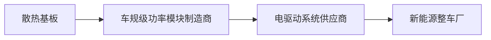

公司产品直接应用于新能源汽车电机控制器用功率半导体模块，主要为IGBT功率模块，其封装后的模块结构图如下：

text_image

IGBT 芯片
键合线
焊料层
DBC 基板
上铜层
DDC 基板
陶瓷层
DDC 基板
下铜层
焊料层
散热基板

如上图所示，IGBT 功率模块主要由 IGBT 芯片、覆铜陶瓷基板（简称“DBC基板”，包括上铜层、陶瓷层和下铜层）、键合线、焊料层、散热基板等构成。其制造流程为根据特定的电路设计，将两个或多个 IGBT芯片贴片到覆铜陶瓷基板上，并用金属线键合链接，同时将覆铜陶瓷基板与散热基板进行焊接，然后进行整体灌封。IGBT 功率模块主要组成部分及功能如下：

<table><tr><td>IGBT 功率模块组成部分</td><td>主要功能</td></tr><tr><td>IGBT 芯片</td><td>整个 IGBT 功率模块的核心,起到变频、逆变、变压、功率放大、功率控制等作用</td></tr><tr><td>覆铜陶瓷基板(DBC 基板)</td><td>主要成分为氧化铝、氮化铝或氮化硅等,起到绝缘、导热、机械支撑等作用,覆铜层上可以刻蚀出各种图形,绘制电路线路</td></tr><tr><td>键合线</td><td>实现内部电气互联,包括芯片与芯片间的电气连接,芯片与焊点间的电气连接以及焊点与焊点间的电气连接等</td></tr><tr><td>散热基板</td><td>功率模块的核心散热功能结构与通道,主要起热量传导作用,同时发挥机械支撑与结构保护作用</td></tr></table>

电子元器件在工作中必然会产生功率损耗，这些功率损耗大部分将转化为热量，具有电阻值的电子元件在正常工作时等同于内部热源。由于特定场景的应用需求和下游应用领域的不断扩大，大功率器件装配越来越趋于高功率密度和小型化，单位体积的发热量越来越高，功率损耗转化成热量直接影响功率器件工作的可靠性和稳定性。以 IGBT功率模块为例，温度过高时，会导致模块的关断时间延长、栅控失灵、擎住电流下降等一系列问题，更严重的，如果功率模块中的热量不能及时转移，可能会导致芯片烧毁。

IGBT 功率模块失效的主要原因是温度过高导致的热应力。首先，模块内部如果散热不均，会导致内部热应力分布不均，容易引起焊料层脱落；另外，芯片在运行过程中会反复经受高温循环带来的热应力冲击，易导致芯片疲劳失效；最后，由于 IGBT功率模块由不同材料封装而成，芯片、覆铜陶瓷基板、散热基板等具有不同的热膨胀系数，高温条件下具有不同热膨胀系数的材料会在结合界面产生热应力，当热应力超过材料的极限阈值，将会导致材料断裂或损伤。因此，良好的热管理对于 IGBT功率模块稳定性和可靠性极为重要。

新能源汽车电机控制器是典型的高功率密度部件，且功率密度随着对新能源汽车性能需求的提高仍在不断提升。电机控制器内 IGBT功率模块长时间运行以及频繁开闭会产生大量热量，伴随着温度的升高，IGBT 功率模块的失效概率也将大幅增加，最终将影响电机的输出性能以及汽车驱动系统的可靠性。因此，为维持 IGBT功率模块的稳定工作，需要有可靠的散热设计与通畅的散热通道，快速有效地减少模块内部热量，以满足模块可靠性指标的要求。

目前，车规级 IGBT功率模块一般采用液冷散热，而液冷散热又分为间接液冷散热和直接液冷散热，两种散热结构如下图所示：

text_image

IGBT芯片
DBC基板
间接液冷散热
平底散热基板
导热硅脂
冷却液
芯片结温Tj
芯片
DBC基板
平底散热基板
导热硅脂
液冷板
环境温度Ta
芯片结温Tj
芯片
DBC基板
针式散热基板
密封圈
冷却液
直接液冷散热
DBC基板
针式散热基板
环境温度Ta

间接液冷散热采用的是平底散热基板，基板下面涂一层导热硅脂，紧贴在液冷板上，液冷板内通冷却液，散热路径为芯片-DBC 基板-平底散热基板-导热硅脂-液冷板-冷却液。即芯片为发热源，热量主要通过 DBC 基板、平底散热基板、导热硅脂传导至液冷板，液冷板再通过液冷对流的方式将热量排出。间接液冷散热中 IGBT功率模块不直接与冷却液接触，散热效率不高，也因此限制了功率模块的功率密度提升。

直接液冷散热采用的是针式散热基板，位于功率模块底部的散热基板增加了针翅状散热结构，可直接加上密封圈通过冷却液散热，散热路径为芯片-DBC 基板-针式散热基板-冷却液，无需使用导热硅脂。该种方式使得 IGBT 功率模块与冷却液直接接触，模块整体热阻值可降低 30%左右，且针翅结构大大提高了散热表面积，散热效率因此大幅提高，IGBT 功率模块功率密度也可以设计的更高。目前直接液冷散热已成为车规级 IGBT 功率模块的主流散热方式，包括英飞凌在内主要厂商的车规级功率模块产品均主要采用针式散热基板。

散热基板是 IGBT 功率模块的核心散热功能结构与通道，也是模块中价值占比较高的重要部件，车规级功率半导体模块散热基板必须具备良好的热传导性能、与芯片和覆铜陶瓷基板等部件相匹配的热膨胀系数、足够的硬度和耐用性等特点。

目前发行人所产铜针式散热基板配套的主要车规级功率半导体厂商及最终

配套整车厂商如下：

# （三）发行人主营业务收入的构成情况

报告期内，公司主营业务收入按产品类型分类如下：

单位：万元

<table><tr><td rowspan="2">项目</td><td colspan="2">2024 年 1-6 月</td><td colspan="2">2023 年度</td><td colspan="2">2022 年度</td><td colspan="2">2021 年度</td></tr><tr><td>金额</td><td>占比</td><td>金额</td><td>占比</td><td>金额</td><td>占比</td><td>金额</td><td>占比</td></tr><tr><td>铜针式散热基板</td><td>21,522.51</td><td>98.91%</td><td>58,997.12</td><td>98.51%</td><td>40,215.10</td><td>96.96%</td><td>18,199.61</td><td>93.48%</td></tr><tr><td>铜平底散热基板</td><td>42.55</td><td>0.20%</td><td>262.44</td><td>0.44%</td><td>573.91</td><td>1.38%</td><td>816.23</td><td>4.19%</td></tr><tr><td>其他</td><td>194.37</td><td>0.89%</td><td>629.14</td><td>1.05%</td><td>688.56</td><td>1.66%</td><td>453.32</td><td>2.33%</td></tr><tr><td>合计</td><td>21,759.44</td><td>100.00%</td><td>59,888.70</td><td>100.00%</td><td>41,477.56</td><td>100.00%</td><td>19,469.16</td><td>100.00%</td></tr></table>

报告期内，公司主营业务收入按终端应用领域分类如下：

单位：万元

<table><tr><td rowspan="2">项目</td><td colspan="2">2024 年 1-6 月</td><td colspan="2">2023 年度</td><td colspan="2">2022 年度</td><td colspan="2">2021 年度</td></tr><tr><td>金额</td><td>占比</td><td>金额</td><td>占比</td><td>金额</td><td>占比</td><td>金额</td><td>占比</td></tr><tr><td>新能源汽车</td><td>21,522.51</td><td>98.91%</td><td>58,997.12</td><td>98.51%</td><td>40,215.10</td><td>96.96%</td><td>18,199.61</td><td>93.48%</td></tr><tr><td>其他</td><td>236.93</td><td>1.09%</td><td>891.58</td><td>1.49%</td><td>1,262.47</td><td>3.04%</td><td>1,269.55</td><td>6.52%</td></tr><tr><td>合计</td><td>21,759.44</td><td>100.00%</td><td>59,888.70</td><td>100.00%</td><td>41,477.56</td><td>100.00%</td><td>19,469.16</td><td>100.00%</td></tr></table>

# （四）发行人主要经营模式

# 1、盈利模式

公司主要服务于国内外知名功率半导体厂商，为客户生产各种类型的功率模块散热基板，利润主要来源于产品销售收入与成本费用的差额。公司不断强化自身研发能力，提高产品生产工艺水平和产品性能，打造具有自身独特优势的高质量散热基板产品。同时，公司通过抓住行业发展机遇，适时扩大自身产能，不断提升自身核心竞争力水平及盈利能力。

# 2、采购模式

# （1）供应商管理

为规范采购管理工作，公司根据 IATF16949 汽车行业质量管理体系标准制定了《供方管理办法》《外部提供过程产品服务控制程序》《进料检验管理办法》等制度文件，对供应商引入、报价、合同签订、考评等环节实施严格的工作流程及执行标准。

公司采购品种主要包括铜排、铜板等原材料。公司综合考虑各家原材料供应商的产品质量、产品价格、交付效率、运输成本等因素，确定合格供应商名录，并定期组织对供应商的评价考核，不断完善供应链体系。公司与主要供应商均保持了良好的合作关系，主要原材料供应商较为稳定。

# （2）采购流程

公司严格执行采购控制程序，实行“以产定采”政策，采用直接采购模式。生产部门提出采购需求后，采购部门根据所需采购物资的规范标准编制采购计划并选择供应商报价，综合评价后公司直接与供应商签订采购合同，采购部门持续跟踪进度直至货物交付。质量部门、物料部门负责采购物资的进货检验和入库，确保所采购的产品质量能持续满足公司要求，保证公司正常生产秩序。具体采购流程如下：

flowchart

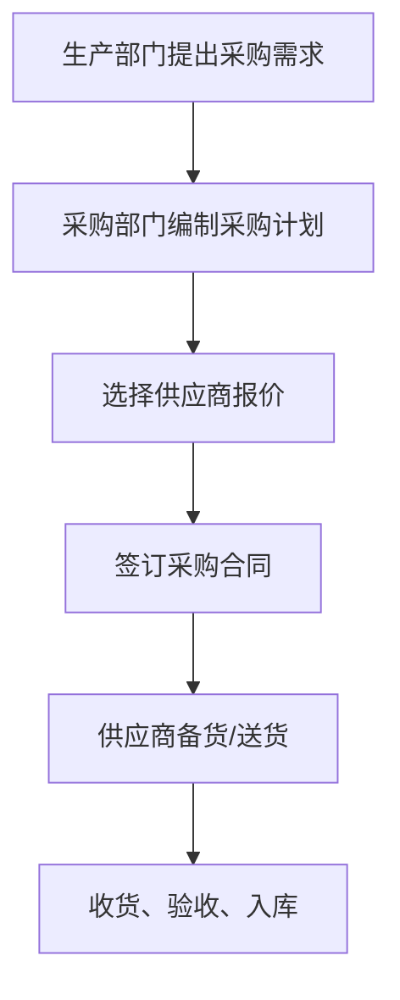

# （3）外协加工采购

公司存在电镀工序的部分外协加工采购。电镀相关技术较为成熟，市场竞争充分，价格透明，因此不会影响公司的业务独立性和完整性。公司结合产品质量需求、加工工艺、交付周期等因素，将外协加工供应商纳入合格供应商名录管理。

采购部门根据年度生产计划，通过询价来确定外协加工供应商。

公司控股子公司黄山广捷主营业务为电镀加工服务，主要为发行人提供电镀加工。随着黄山广捷产能的不断提升，报告期内其占发行人电镀业务比例分别为17.50%、51.84%、59.46%和 55.12%，占比逐渐提升，发行人外协加工采购占比将不断降低。

# 3、生产模式

公司主要采用“以销定产”的生产模式，产品多为客户定制化订单，公司根据客户订单安排生产。凭借专业的研发设计和生产经验，公司深度参与客户产品前期研发工作，同步研发出满足客户需求的产品。公司制定了《生产和服务提供控制程序》《标识可追溯性控制程序》等制度文件并严格执行，不断强化生产管理，持续提升产品品质。

公司销售部门收到客户订单后向生产部门下达生产订单，生产部门按照订单上对于交货数量、交货周期、交货质量的要求安排生产计划，同时根据生产计划下达原材料采购申请交采购部门。生产人员严格按照产品工艺流程、控制计划、作业指导书来完成各道生产工序。按客户需求，公司的主要产品拥有唯一追溯码，能够实现产品在汽车产业链全过程的追溯管理。

# 4、销售模式

公司采用直销模式，直接与客户协商订立销售合同，产品直接销售给客户。

# （1）成为合格供应商

公司客户大多为国内外知名功率半导体厂商，建立了完善的合格供应商准入体系，对供应商的产品品质要求较高。进入该类客户合格供应商名录审核严格，且周期较长，通常需要经过商务沟通、全面验厂、体系审核、设计开发、样品测试、小批量验证等多个环节。客户导入新的供应商也需要花费较长周期和较高成本，一般不会轻易更换供应商。公司多年来深耕功率半导体模块散热基板的研发、生产和销售，建立了健全的质量管控体系，与客户建立了长期稳定的合作关系，市场认可度较高，行业口碑良好。

# （2）销售流程

公司进入客户的合格供应商名录后，根据客户需求进行报价，获取订单，具体销售流程如下：

flowchart

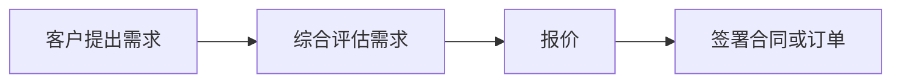

客户提出需求：客户通过供应商管理系统向公司发出采购需求，需求包括图纸和相关的产品技术要求、供货数量、交货期限、交货地点、交付方式、标识、包装要求等。

综合评估需求：由销售部门牵头，研发中心、生产部、物料部、质量部共同对客户需求进行评估，确认并形成文件，包括进行风险分析。

报价：经过综合评估，且经过成本核算后，由销售部门拟定价格经总经理核准后，报价给客户。

签署合同或订单：报价经客户确认后，公司与客户签署合同或订单。

# 5、采用目前经营模式的原因、影响经营模式的关键因素、经营模式和影响因素在报告期内的变化情况及未来变化趋势

公司经营模式主要是由国家相关法律法规、汽车关键零部件行业、功率半导体行业的特点及惯例、客户的需求、公司多年来的发展经验、生产技术与工艺等多重因素共同作用所形成。因此，上述因素均为影响公司经营模式的关键因素。

报告期内，公司经营模式及其关键影响因素均未发生重大变化。同时在可预见的未来，公司经营模式及其关键影响因素亦不会发生重大变化。

# （五）发行人设立以来主营业务和主要产品、主要经营模式的演变情况

公司自设立以来，一直从事车规级功率半导体模块散热基板的研发、生产和销售，始终将该产品作为研发重点。公司自成立伊始即与日立合作，生产用于功率模块散热的铜针式散热基板。

随着新能源汽车市场的蓬勃发展，公司车规级功率半导体模块散热基板的销售收入快速增长，下游客户已拓展至国内外知名功率半导体生产商，包括英飞凌、博世、安森美、日立、意法半导体、中车时代、斯达半导、士兰微、芯联集成等，公司产品广泛应用于各大主流新能源汽车品牌。

公司自设立以来主营业务和主要产品、主要经营模式未发生重大变化。

# （六）发行人主要业务经营情况和核心技术产业化情况

报告期内，发行人经营业绩持续快速增长，主要业务经营情况良好，具体详见本招股说明书“第二节 概览”之“四、主营业务经营情况”。

发行人主要核心技术均已实现产业化，具体详见本招股说明书“第五节 业务与技术”之“六、发行人的核心技术及研发情况”。

# （七）发行人主要产品的工艺流程图

# 1、工艺流程图

# （1）铜针式散热基板

flowchart

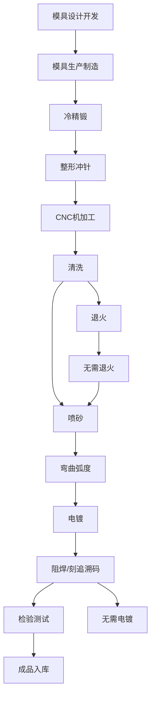

铜针式散热基板工艺流程如上图所示，生产的主要步骤包括：模具设计开发和生产制造、冷精锻、整形冲针、CNC 机加工、清洗、退火、喷砂、弯曲弧度、电镀、阻焊/刻追溯码、检验测试等。关键步骤具体说明如下：

模具设计开发和生产制造：通过经验积累及实验摸索，结合专业设计软件对模具进行高效的设计和优化，得到符合量产要求的最合理的模具结构；利用自有技术人员和设备，精准贯彻设计意图，自主完成模具制造。

冷精锻：使用公司自主设计制造的专业冷精锻模具，采用锻压机对铜排毛胚在常温下进行锻造，利用强大的压力和速度冲击，使铜排毛胚一次冷锻成型并形成针翅结构，该工序为产品生产的核心环节。

CNC 机加工：使用 CNC 和专用的装夹治具，通过优化刀路设计，设定不同

的刀具组合，快速对半成品进行加工，获得产品的最终形状。

弯曲弧度：通过模具使产品发生不同程度的翘曲，以满足客户对于不同弧度的需求。

检验测试：通过自研的检测设备检测产品弧度、精度、尺寸和外观，确保产品合格。

（2）铜平底散热基板  

flowchart

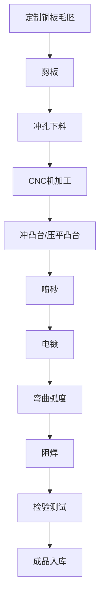

铜平底散热基板工艺流程如上图所示，生产的主要步骤包括：剪板、冲孔下料、CNC 机加工、冲凸台/压平凸台、喷砂、电镀、弯曲弧度、阻焊、检验测试等。

# 2、核心技术的具体使用情况及效果

公司产品的生产流程主要包括模具设计开发和生产制造、冷精锻、机加工、弯曲弧度、检验测试等。经过长期研发投入和持续积累，发行人形成了包括大尺寸铜针式基板冷锻一体成型技术、冷精锻模具设计开发技术、冷精锻模具生产制造技术、针式基板冷锻高净成形技术等 14 项核心技术，主要核心技术贯穿于产品生产的各个环节，已在生产工艺中形成了较为成熟、稳定的应用，具体情况详见本招股说明书“第五节 业务与技术”之“六、发行人的核心技术及研发情况”的相关内容。

# （八）发行人报告期内具有代表性的业务指标变动情况及原因

发行人核心产品铜针式散热基板是新能源汽车电机控制器用功率半导体模块的重要组成部件，发行人经营状况与新能源汽车产业具有紧密联系。报告期内，受益于国内外新能源汽车产业的蓬勃发展，发行人业绩呈现较快增长趋势，具体如下：

注：新能源汽车销量数据来源于国际能源署和中国汽车工业协会。

<table><tr><td>年份</td><td>2024 年1-6 月</td><td>2023年度</td><td>2022年度</td><td>2021年度</td><td>2021-2023年复合增长率</td></tr><tr><td>全球新能源汽车销量(万辆)</td><td>-</td><td>1,436.94</td><td>1,063.28</td><td>689.19</td><td>44.39%</td></tr><tr><td>中国新能源汽车销量(万辆)</td><td>494.4</td><td>949.5</td><td>688.7</td><td>352.1</td><td>64.22%</td></tr><tr><td>发行人主营业务收入(万元)</td><td>21,759.44</td><td>59,888.70</td><td>41,477.56</td><td>19,469.16</td><td>75.39%</td></tr><tr><td>发行人铜针式散热基板销售收入(万元)</td><td>21,522.51</td><td>58,997.12</td><td>40,215.10</td><td>18,199.61</td><td>80.05%</td></tr><tr><td>归属于母公司所有者的净利润(万元)</td><td>6,059.75</td><td>15,728.32</td><td>9,947.19</td><td>3,427.86</td><td>114.21%</td></tr></table>

发行人主要业务指标变动情况及原因的分析详见本招股说明书“第六节 财务会计信息与管理层分析”之“十、经营成果分析”。

# （九）发行人符合国家产业政策和经济发展战略的情况

根据《战略性新兴产业分类（2018）》，公司所处行业为“新能源汽车产业”之“新能源汽车装置、配件制造”；根据《新产业新业态新商业模式统计分类（2018）》，公司主营业务为“新能源汽车零部件配件制造”。因此，发行人所处行业为战略性新兴产业，主营业务属于新产业、新业态、新模式范畴，符合国家产业政策。

新能源汽车是实现碳达峰、碳中和目标的必要路径和应对能源安全问题的重要突破口，也是基于驱动技术的重大升级和转型。近年来，在各国汽车产业政策、环保政策支持以及上游技术创新的推动下，全球新能源汽车市场进入高速增长期。我国将发展新能源汽车作为应对气候变化、优化能源结构的重要战略举措，发展新能源汽车是我国从汽车大国迈向汽车强国的必由之路，也是我国汽车自主品牌实现“弯道超车”的重要机遇。因此，发行人主营业务符合国家经济发展战略。

# 二、发行人所处行业基本情况及其竞争状况

# （一）发行人所属行业分类

公司是一家专业从事功率半导体模块散热基板的研发、生产和销售的高新技术企业，产品主要应用于新能源汽车领域，是新能源汽车电机控制器用功率半导体模块的重要组成部件。

根据《国民经济行业分类》（GB/T4754-2017），公司所属行业的行业代码

为“C3670”，属于“汽车零部件及配件制造”。

根据《产业结构调整指导目录（2019 年本）》，公司主营业务属于鼓励类的第十六大类“汽车”中的第6小类“智能汽车、新能源汽车及关键零部件、高效车用内燃机研发能力建设”。

根据《战略性新兴产业分类（2018）》，发行人所处行业为“新能源汽车产业”之“新能源汽车装置、配件制造”。

根据《新产业新业态新商业模式统计分类（2018）》，公司主营业务为“新能源汽车零部件配件制造”。

# （二）行业主管部门、行业监管体制、行业主要法律法规及政策

# 1、行业主管部门及监管体制

公司所属行业在市场化运行的基础上，由国家发改委、工信部等行业主管部门进行宏观调控，并由行业自律组织进行自律管理，具体情况如下：

国家发展和改革委员会负责对行业进行宏观调控，组织实施产业政策，研究拟订行业发展规划，指导技术改造及行业结构调整。工业和信息化部负责拟订工业行业的行业规划、政策和标准并组织实施，指导行业技术创新和技术进步，推进相关科研成果产业化等。

我国汽车零部件行业的自律组织为中国汽车工业协会，其主要职责为：产业调查研究、标准制订、信息服务、咨询服务与项目论证、贸易争端调查与协调、行业自律、专业培训、国际交流和会展服务等。

发行人客户多为车规级功率半导体厂商，公司为功率半导体行业联盟（株洲市）会员。该联盟作为工业和信息化部指导筹建的非营利性创新型组织，主要协助政府部门加强对 IGBT产业支持力度，为政府制定相关政策提供依据，联合企业、政府、科研单位、高等院校等多方资源进行 IGBT发展战略研究、探索产学研相结合技术创新机制，推动全产业链国产化。

# 2、行业主要法律法规及政策

公司发展受新能源汽车及功率半导体行业环境影响，行业主要相关法律法规及政策文件如下：

<table><tr><td>序号</td><td>颁布时间</td><td>颁布机构</td><td>名称</td><td>内容概要</td></tr><tr><td>1</td><td>2024年8月</td><td>商务部等部门</td><td>《关于进一步做好汽车以旧换新有关工作的通知》</td><td>对符合商务部、财政部等7部门《关于印发〈汽车以旧换新补贴实施细则〉的通知》(商消费函〔2024〕75号,以下简称《补贴实施细则》)规定,个人消费者于2024年4月24日(含当日,下同)至2024年12月31日期间,报废国三及以下排放标准燃油乘用车或2018年4月30日前注册登记的新能源乘用车,并购买纳入工业和信息化部《减免车辆购置税的新能源汽车车型目录》的新能源乘用车或2.0升及以下排量燃油乘用车的,调整补贴标准,具体如下:对报废上述两类旧车并购买新能源乘用车的,补贴2万元;对报废国三及以下排放标准燃油乘用车并购买2.0升及以下排量燃油乘用车的,补贴1.5万元</td></tr><tr><td>2</td><td>2024年7月</td><td>国家发改委、财政部</td><td>《关于加力支持大规模设备更新和消费品以旧换新的若干措施》</td><td>加快高能耗高排放老旧船舶报废更新,推动新能源清洁能源船舶发展;提高新能源公交车及动力电池更新补贴标准,推动城市公交车电动化替代,支持新能源公交车及动力电池更新</td></tr><tr><td>3</td><td>2023年12月</td><td>商务部等部门</td><td>《关于支持新能源汽车贸易合作健康发展的意见》</td><td>推动新能源汽车贸易合作健康发展,推动汽车产业转型升级,支撑外贸稳规模优结构</td></tr><tr><td>4</td><td>2023年10月</td><td>国家发改委</td><td>《国家碳达峰试点建设方案》</td><td>加快推动交通运输工具装备低碳转型,大力推广新能源汽车,推动公共领域车辆全面电气化替代,淘汰老旧交通工具</td></tr><tr><td>5</td><td>2023年10月</td><td>交通运输部等部门</td><td>《关于推进城市公共交通健康可持续发展的若干意见》</td><td>鼓励各地通过多种形式对新能源城市公交车辆充电给予政策支持。充分发挥省级层面对城市交通发展奖励资金的统筹作用,采用奖励方式加强对辖区内城市公共汽电车行业转型升级发展、保障城市公共汽电车企业可持续运营、推广应用新能源城市公交车辆等深化城市公共交通优先发展方面的引导</td></tr><tr><td>6</td><td>2023年10月</td><td>商务部等部门</td><td>《关于推动汽车后市场高质量发展的指导意见》</td><td>加快新能源汽车维修技术标准体系建设,有效支撑我国新能源汽车产业高质量发展</td></tr><tr><td>7</td><td>2023年9月</td><td>工信部等部门</td><td>《汽车行业稳增长工作方案(2023—2024年)》</td><td>支持扩大新能源汽车消费。落实好现有新能源汽车车船税、车辆购置税等优惠政策,抓好新能源汽车补助资金清算审核工作,积极扩大新能源汽车个人消费比例</td></tr><tr><td>8</td><td>2023年6月</td><td>财政部等部门</td><td>《关于延续和优化新能源汽车车辆购置税减免政策的公告》</td><td>对购置日期在2024年1月1日至2025年12月31日期间的新能源汽车免征车辆购置税,其中,每辆新能源乘用车免税额不超过3万元;对购置日期在2026年1月1日至2027年12月31日期间的新能源汽车减半征收车辆购置税,其中,每辆新能源乘用车减税额不超过1.5万元</td></tr><tr><td>9</td><td>2023年6月</td><td>国务院办公厅</td><td>《关于进一步构建高质量充电基础设施体系的指导意见》</td><td>进一步构建高质量充电基础设施体系,更好满足人民群众购置和使用新能源汽车需要,助力推进交通运输绿色低碳转型与现代化基础设施体系建设</td></tr><tr><td>10</td><td>2023年5月</td><td>国家发改委等部门</td><td>《关于加快推进充电基础设施建设更好支持新能源汽车下乡和乡村振兴的实施意见》</td><td>创新农村地区充电基础设施建设运营维护模式、支持农村地区购买使用新能源汽车、强化农村地区新能源汽车宣传服务管理</td></tr><tr><td>11</td><td>2023年1月</td><td>工信部等六部门</td><td>《关于推动能源电子产业发展的指导意见》</td><td>发展新能源用耐高温、耐高压、低损耗、高可靠IGBT器件及模块,研究小型化、高性能、高效率、高可靠的功率半导体、传感类器件、光电子器件等基础电子元器件及专用设备、先进工艺,加快功率半导体器件等面向光伏发电、风力发电、电力传输、新能源汽车、轨道交通推广</td></tr><tr><td>12</td><td>2022年1月</td><td>国家发改委等部门</td><td>《促进绿色消费实施方案》</td><td>大力推广新能源汽车,逐步取消各地新能源车辆购买限制,推动落实免限行、路权等支持政策</td></tr><tr><td>13</td><td>2022年1月</td><td>国家发改委</td><td>《“十四五”现代流通体系建设规划》</td><td>持续推进交通运输领域清洁替代,加快布局充换电基础设施,促进电动汽车在短途物流、港口和机场等领域推广,积极推进船舶与港口、机场廊桥岸电改造和使用</td></tr><tr><td>14</td><td>2022年1月</td><td>国家发改委等部门</td><td>《“十四五”现代能源体系规划》</td><td>积极推动新能源汽车在城市公交等领域应用,到2025年,新能源汽车新车销量占比达到20%左右</td></tr><tr><td>15</td><td>2021年10月</td><td>国务院</td><td>《2030年前碳达峰行动方案》</td><td>大力推广新能源汽车,逐步降低传统燃油汽车在新车产销和汽车保有量中的占比,推动城市公共服务车辆电动化替代,推广电力、氢燃料、液化天然气动力重型货运车辆。到2030年,当年新增新能源、清洁能源动力的交通工具比例达到40%左右</td></tr><tr><td>16</td><td>2021年3月</td><td>全国人大</td><td>《中华人民共和国国民经济和社会发展第十四个五年规划和2035年远景目标纲要》</td><td>聚焦新一代信息技术、生物技术、新能源、新材料、高端装备、新能源汽车、绿色环保以及航空航天、海洋装备等战略性新兴产业,加快关键核心技术创新应用,增强要素保障能力,培育壮大产业发展新动能。集成电路先进工艺和绝缘栅双极型晶体管(IGBT)等特色工艺取得突破</td></tr><tr><td>17</td><td>2021年1月</td><td>工业和信息化部</td><td>《基础电子元器件产业发展行动计划(2021-2023年)》</td><td>重点发展微型化、片式化阻容感元件,高频率、高精度频率元器件,耐高温、耐高压、低损耗、高可靠半导体分立器件及模块</td></tr><tr><td>18</td><td>2020年11月</td><td>国务院办公厅</td><td>《新能源汽车产业发展规划(2021-2035年)》</td><td>以动力电池与管理系统、驱动电机与电力电子、网联化与智能化技术为“三横”,构建关键零部件技术供给体系;探索新一代车用电机驱动系统解决方案;突破车规级芯片、车用操作系统、新型电子电气架构、高效高密度驱动电机系统等关键技术和产品</td></tr><tr><td>19</td><td>2020年9月</td><td>国家发改委等部门</td><td>《关于扩大战略性新兴产业投资培育壮大新增长点增长极的指导意见》</td><td>加快新能源产业跨越式发展。聚焦新能源装备制造“卡脖子”问题,加快主轴承、IGBT、控制系统、高压直流海底电缆等核心技术部件研发</td></tr><tr><td>20</td><td>2019年10月</td><td>国家发改委</td><td>《产业结构调整指导目录(2019年本)》</td><td>将新能源汽车关键零部件,大功率电子器件等纳入鼓励类产业</td></tr><tr><td>21</td><td>2018年11月</td><td>国家统计局</td><td>《战略性新兴产业分类(2018)》</td><td>将新能源汽车装置、配件制造,电力电子元器件制造(绝缘栅双极晶体管芯片IGBT)纳入战略性新兴产业</td></tr><tr><td>22</td><td>2018年8月</td><td>国家统计局</td><td>《新产业新业态新商业模式统计分类(2018)》</td><td>将新能源汽车零部件配件制造纳入新产业新业态新模式范畴</td></tr><tr><td>23</td><td>2017年4月</td><td>工信部等3部门</td><td>《汽车产业中长期发展规划》</td><td>加快新能源汽车技术研发及产业化。利用企业投入、社会资本、国家科技计划(专项、基金等)统筹组织企业、高校、科研院所等协同攻关,重点围绕动力电池与电池管理系统、电机驱动与电力电子总成、电动汽车智能化技术、燃料电池动力系统、插电/增程式混合动力系统和纯电动力系统等6个创新链进行任务部署</td></tr><tr><td>24</td><td>2016年9月</td><td>国务院</td><td>《中国制造2025》</td><td>继续支持电动汽车、燃料电池汽车发展,掌握汽车低碳化、信息化、智能化核心技术,提升动力电池、驱动电机、高效内燃机、先进变速器、轻量化材料、智能控制等核心技术的工程化和产业化能力,形成从关键零部件到整车的完整工业体系和创新体系,推动自主品牌节能与新能源汽车同国际先进水平接轨</td></tr></table>

# 3、行业主要法律法规及产业政策对公司经营发展的影响

行业主要法律法规及产业政策促进了发行人下游新能源汽车行业和功率半导体行业的健康、快速发展，也为发行人的经营发展营造了良好的政策和市场环境，报告期内行业法律法规及产业政策的变化对公司经营资质、准入门槛、运营模式、行业竞争格局等方面无重大不利影响。

# （三）行业特点和发展趋势

# 1、行业上下游关联情况

发行人产业链上游主要为铜材供应商，下游客户为车规级功率半导体厂商。发行人作为新能源汽车零部件供应商，通过向车规级功率模块制造商销售散热基板间接为新能源整车提供零部件支持。近年来，随着新能源整车企业向产业链上游延伸，公司也直接与其旗下的车规级功率半导体厂商合作，公司产品广泛应用于各大主流新能源汽车品牌。发行人产业链上下游情况如下图所示：

flowchart

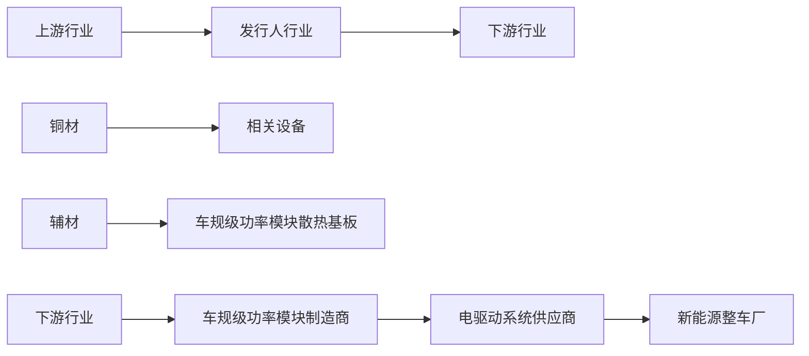

# 2、新能源汽车行业基本情况及发展趋势

# （1）行业概况

伴随着全球新一轮科技革命和产业变革，汽车与能源、半导体、物联网等领域有关技术加速融合，新能源汽车已成为全球汽车产业转型升级的主要方向。为应对能源危机与气候变化，切实履行碳排放承诺，近年来发达国家持续大规模布局新能源汽车产业。特别是 2021 年以来，美国、欧盟纷纷将发展新能源汽车产业升级为国家战略，旨在健全产业链体系、掌握关键性技术，抢占新能源汽车产业链制高点。我国已将发展新能源汽车作为国家战略，发展新能源汽车是我国从汽车大国迈向汽车强国的必由之路。

# 1）欧洲新能源汽车相关政策

近年来欧盟对新能源汽车消费的鼓励性政策持续加码，刺激新能源汽车产销实现爆发。欧盟内部设置了严格的汽车尾气排放法规并加大了处罚力度，各成员国也对新能源汽车实行了高额的补贴优惠政策。欧洲绿色新政目标到 2030 年实现 3,000 万辆新能源汽车的销量，在 2035 年前禁售燃油车，欧盟各成员国还进一步将禁售时间予以提前。

德国新能源汽车产业政策支持体系较为完善，重视并鼓励新能源汽车与能源、通信、交通等系统融合发展。在战略规划方面，2009 年德国发布《国家电动汽车发展计划》，确定汽车产业电动化转型战略，提出到 2020 年实现 100 万辆纯电动及混合动力汽车保有量的发展目标。2011 年 5 月，德国发布《电动汽车政府方案》，是《国家电动汽车发展计划》的细化和落实，从研发、示范、教育、标准化、基础设施、税收优惠、交通等方面提出了政府的未来详细行动方案，对德国电动汽车发展影响深远。

英国对新能源汽车产业支持力度不断加大，致力于构建全方位的零排放政策体系，使英国成为零排放汽车设计、制造和使用的最佳目的地。英国政府分别于2013 年和 2015 年发布《超低排放汽车发展战略》和《2015 年至 2020 年英国超低排放汽车投资计划》，提出力争到 2050 年实现全面电动化。2019 年3月，英国交通部发布《未来出行：城市战略》，提出 2030 年英国超低排放汽车占当年新车销量至少50%，力争达到70%。

自 2023 年下半年以来，受政治、经济、产业结构转型等多重因素影响，欧美等地相继调整了新能源汽车相关政策，包括推迟或计划推迟燃油车禁售时间、降低新能源汽车补贴、放缓汽车电动化步伐等。目前欧盟正在考虑延迟燃油车禁售令的执行时间，但其彻底禁售燃油车的目标并未改变；2023 年末，德国取消了部分新能源汽车购置补贴，造成新能源汽车销量出现下降；2023 年 9 月，英国政府宣布禁售燃油车的时间从原计划的 2030 年推迟到 2035 年，与欧盟保持一致，但欧美等地推动新能源汽车发展的总体目标并未改变。

# 2）美国新能源汽车相关政策

21 世纪以来，美国先后颁布五大产业政策：税收减免政策、燃油标准经济性政策、温室气体排放标准政策、先进车辆贷款支持项目和零排放汽车法案，以此为基础协同推进新能源汽车产业高速发展。在总体战略方面，美国于 2013 年率先颁布了《电动汽车普及计划蓝图》，提出了发展关键技术、降低购置成本、大力发展充电桩等基础设施的发展目标。

拜登政府上台后，将发展新能源汽车产业升级为国家战略。2021 年 8 月 5日，拜登签署行政令，通过制定更加严格的燃油效率和排放标准，扩大美国市场新能源汽车需求，目标到 2030年美国新能源汽车销量占比不少于 50%。

2024 年 3 月，拜登政府推出了最新汽车尾气排放标准，较最初提案，最终版本方案降低了纯电动汽车销量预期、更大程度地接受插电式混动车型，以便制造商有更多时间用于向电动汽车转型。

# 3）我国新能源汽车相关政策

规划我国新能源汽车未来长期发展的主要政策文件为2020年11月国务院办公厅印发的《新能源汽车产业发展规划（2021-2035 年）》，文件中对发展愿景明确如下：

一是到 2025 年，我国新能源汽车市场竞争力明显增强，动力电池、驱动电机、车用操作系统等关键技术取得重大突破，安全水平全面提升。纯电动乘用车新车平均电耗降至 12.0 千瓦时/百公里，新能源汽车新车销售量达到汽车新车销售总量的20%左右，高度自动驾驶汽车实现限定区域和特定场景商业化应用，充换电服务便利性显著提高。

二是到 2035 年，我国新能源汽车核心技术达到国际先进水平，质量品牌具备较强国际竞争力。纯电动汽车成为新销售车辆的主流，公共领域用车全面电动化，高度自动驾驶汽车实现规模化应用，充换电服务网络便捷高效，有效促进节能减排水平和社会运行效率的提升。

根据中国汽车工业协会数据，2023年我国新能源汽车销量为 949.5 万辆，市场占有率达 31.6%；预计 2024 年销量为 1,150 万辆；至 2025 年或 2026 年市占率可能达到 50%，有望提前实现《新能源汽车产业发展规划（2021—2035 年）》制定的“到2035年纯电动汽车成为新销售车辆的主流”的目标。

# （2）市场规模

# 1）全球市场

随着各国支持政策的持续推动，新能源汽车市场近年来呈高速增长趋势。全球市场方面，根据国际能源署数据，全球新能源汽车销量从 2019年的225.53万辆增长至 2023 年的 1,436.94 万辆，年均复合增长率约 58.88%。

全球新能源汽车销量及增长率  

bar_line

| 年份 | 全球新能源汽车销量 (万辆) | 销量增长率 (%) |
| :--- | :--- | :--- |
| 2019年 | 225.53 | |
| 2020年 | 316.31 | 40.25 |
| 2021年 | 689.19 | 117.88 |
| 2022年 | 1063.28 | 54.28 |
| 2023年 | 1436.94 | 35.14 |

# 2）中国市场

根据中国汽车工业协会数据，我国新能源汽车销量从 2019 年的 120.6 万辆增长至 2023 年的 949.5 万辆，年均复合增长率为 67.51%，连续 9 年位列世界第。

中国新能源汽车销量及增长率  

bar_line

| 年份 | 中国新能源汽车销量（万辆） | 销量增长率 (%) |
| :--- | :--- | :--- |
| 2019年 | 120.6 | |
| 2020年 | 136.7 | 13.35 |
| 2021年 | 352.1 | 157.57 |
| 2022年 | 688.7 | 95.60 |
| 2023年 | 949.5 | 37.87 |

数据来源：中国汽车工业协会

2024年1-6月，我国新能源汽车销量达 494.4万辆，同比增长 32%。

# （3）行业发展趋势

# 1）全球新能源汽车发展已进入快车道

由于政策、技术、配套设施等因素限制，早期新能源汽车发展还存在不确定性，但近几年来全球汽车新能源化的趋势已基本形成，并逐步成为各国的共识。中国新能源汽车市场渗透率已由2020年的5.40%大幅提升至2023年的31.60%，2024年1-6月达35.2%。美国、欧洲等国家的新能源汽车市场占有率也在持续增长，尤其是北欧地区，2021年挪威等国新能源汽车整体销售占比已超过 50%。

# 2）中国新能源汽车产业竞争力大幅提高

近年来，我国强化顶层设计和创新驱动，新能源汽车产业发展从小到大、从弱到强，成为引领全球汽车产业转型升级的重要力量。自 2015 年起，我国新能源汽车产销量连续 9 年位居世界第一；从企业品牌情况看，2021 年全球十大新能源汽车畅销车型中，中国品牌占据六款；从动力电池出货量来看，出货量前十的企业当中，我国企业占有六席；从配套环境看，截至 2021 年底，我国累计建成充电桩261.7万个，换电站 1,298座，形成了全球最大的充换电网络。

从上游的镍、钴、锂等矿产资源开发提炼，到正极、负极、电解液以及隔膜等新材料，再到电池电机电控等核心零部件，最后到整车厂，我国已经诞生了众多新能源汽车产业链上市公司。产业上下游合力形成的强大供应链优势，推动了我国新能源汽车产业在全球的强势崛起。

# 3）汽车半导体使用量大幅提升

在汽车电动化、智能化和网联化三大趋势驱动之下，新能源汽车半导体使用量大幅提升，控制芯片、存储芯片、MCU芯片、CMOS 图像传感器、触控芯片、MOSFET/IGBT、超声波/毫米波芯片等成为标配。在各类汽车半导体产品中，功率半导体受益最大，以IGBT 为代表的功率半导体在新能源汽车中得到了广泛的应用，对整车的性能有着重要的影响。IGBT 在新能源汽车中的主要应用包括电机控制器、车载充电机（OBC）、车载空调以及为新能源汽车充电的直流充电桩。

# 3、功率半导体行业基本情况及发展趋势

功率半导体是电力电子装置中实现电力控制和转换的核心部件，主要功能为调整或改变电路中的电压、电流、频率等物理特性，以实现对电能的管理，其广泛运用于新能源汽车、工业控制、新能源发电、储能、消费电子等领域。

从分类看，功率半导体分立器件主要包括二极管、晶闸管和晶体管。其中二极管、晶闸管等生产工艺相对简单，在中低端领域大量使用，目前已基本实现国产化。而以 IGBT为代表的晶体管器件更多应用于高压、高可靠性领域，生产工艺门槛较高且结构相对复杂，技术含金量与产品附加值高，目前大部分市场份额被国外厂商所占据。

随着下游应用领域的快速发展，功率半导体需求快速增长，尤其是在新能源汽车领域。由驱动电机、电机控制器等组成的电驱动系统作为汽车的动力之源，是整车的核心组成部分，IGBT 功率模块在电机控制器中发挥了核心作用，直接控制直、交流电的转换，同时对交流电机进行变频控制，通过决定驱动系统的扭矩和最大输出功率来直接影响新能源汽车的加速能力和最高时速，堪称核心之核“芯”。

# （1）IGBT 行业概况

# 1）基本介绍

IGBT 根据其电压等级的不同，可分为低压、中压和高压三大类：

<table><tr><td>电压等级</td><td>电压范围</td><td>主要应用</td></tr><tr><td>低压</td><td>600V以下</td><td>消费电子领域</td></tr><tr><td>中压</td><td>600V-1,200V</td><td>新能源汽车、工业控制、家用电器等领域</td></tr><tr><td>高压</td><td>1,700V-6,500V</td><td>新能源发电、智能电网等领域</td></tr></table>

IGBT 在使用中高度重视散热性和可靠性，因此封装环节至关重要。根据应用场景和对性能要求的不同，可将IGBT功率模块分为消费级、工业级和车规级。与消费级和工业级半导体相比，车规级半导体对产品的可靠性、一致性、安全性、稳定性和长效性要求较高，具体区别如下所示：

<table><tr><td colspan="4">IGBT各应用场景参数情况</td></tr><tr><td>参数</td><td>消费级</td><td>工业级</td><td>车规级</td></tr><tr><td>温度</td><td>-20°C—70°C</td><td>-40°C—85°C</td><td>-40°C—175°C</td></tr><tr><td>容错率</td><td>&lt;3%</td><td>&lt;1%</td><td>0</td></tr><tr><td>使用时间</td><td>1-3年</td><td>5-10年</td><td>多至15年</td></tr><tr><td>工艺处理</td><td>防水处理</td><td>防水、防潮、防腐、防霉变处理</td><td>防水、防腐处理外,还需增强封装设计和散热处理</td></tr></table>

# 2）应用领域

应用领域方面，根据高工产业研究院数据，2020年我国 IGBT在新能源汽车的应用占市场价值的 28%，仅次于工业控制领域。在新能源市场持续爆发的带动下，新能源应用有望成为我国“十四五”IGBT 需求增长最大的下游驱动力。高工产业研究院预计，2025年 IGBT在新能源汽车应用市场占比将超过工业控制应用，成为我国 IGBT 第一大应用市场。

2020年我国IGBT应用领域情况  

pie

| 类别 | 占比 (%) |
| :--- | :--- |
| 新能源汽车 | 28.00 |
| 工业控制 | 30.00 |
| 新能源发电 | 11.00 |
| 消费电子 | 22.00 |
| 其他 | 9.00 |

数据来源：高工产业研究院

2025E我国IGBT应用领域情况  

pie

| 类别 | 占比 (%) |
| :--- | :--- |
| 新能源汽车 | 35.00 |
| 工业控制 | 24.00 |
| 新能源发电 | 21.00 |
| 消费电子 | 15.00 |
| 其他 | 5.00 |

数据来源：高工产业研究院

# 3）市场规模与竞争格局

全球市场规模方面，根据华经产业研究院数据，全球 IGBT功率模块市场规模在过去几年中保持持续增长，从 2017 年的 46.8 亿美元增长至 2021 年的 70.9亿美元，年均复合增长率 10.9%。

全球IGBT市场规模及增长率  

bar_line

| 年份   | 全球IGBT市场规模（亿美金） | 增长率   |
| ------ | -------------------------- | -------- |
| 2017年 | 46.8                       | -        |
| 2018年 | 50.7                       | 8.33%    |
| 2019年 | 54.2                       | 6.90%    |
| 2020年 | 66.5                       | 22.69%   |
| 2021年 | 70.9                       | 6.62%    |

数据来源：华经产业研究院

市场竞争格局方面，目前全球 IGBT市场大部分份额被国外企业所占据，英飞凌是其中龙头。根据华经产业研究院数据，2020年英飞凌占全球 IGBT模块市场份额的 36.50%。

2020年全球IGBT模块竞争格局  

pie

| 类别 | 占比 (%) |
| :--- | :--- |
| 英飞凌 | 36.50 |
| 富士电机 | 11.40 |
| 三菱 | 9.70 |
| 赛米控 | 5.80 |
| 威科 | 3.30 |
| 斯达半导 | 2.80 |
| 日立 | 2.70 |
| 丹佛斯 | 2.30 |
| ABB | 2.10 |
| 博世 | 2.50 |
| 其他 | 20.90 |

数据来源：华经产业研究院

# （2）SiC 功率器件简述

目前，以 IGBT 为代表的功率半导体器件主要采用硅基材料制作，但受制于材料化学性能，由其制作的功率器件功率密度已接近极限。而与硅基材料相比，以碳化硅（SiC）为代表的第三代半导体材料拥有更为优越的电气特性，能够满足高温、高压、高频、大功率等条件下的应用需求，已逐渐开始应用于大功率器件。

在同样体积条件下，碳化硅功率器件可拥有更高功率密度，从而提升整体性能，降低整体能耗。值得注意的是，硅基材料与碳化硅材料之间各有利弊，并无绝对的替代关系，只是在特定的应用场景中存在各自的比较优势。

尽管SiC 模块相比同等 IGBT模块开关损耗和导通损耗较低，但由于 SiC 模块主要用在更高功率密度的使用场景中，加之其开关频率较高，损耗亦会增加，发热问题依然突出，仍需高性能散热基板来解决散热问题，以满足 SiC 模块正常工作需要。

# （3）新能源汽车功率半导体行业基本情况

# 1）新能源汽车功率半导体基本应用

功率半导体是新能源汽车中的核心元器件，目前主要以 IGBT 为主，IGBT在新能源汽车中的主要应用如下：

<table><tr><td>新能源汽车 IGBT 功率模块应用场景</td><td>功能</td><td>功率等级</td></tr><tr><td>电机控制器</td><td>直接控制直、交流电的转换,同时对交流电机进行变频控制,通过决定驱动系统的扭矩和最大输出功率来直接影响新能源汽车的加速能力和最高时速</td><td>30-400kw</td></tr><tr><td>车载充电机(OBC)</td><td>将交流电转换为直流并为高压电池充电</td><td>3.3-22kw</td></tr><tr><td>PTC 加热器、水泵、油泵、空调压缩机</td><td>小功率 DC-AC 转换,将直流电转换为交流电</td><td>0.2-5kw</td></tr></table>

上述应用场景中，电机控制器用 IGBT 功率模块价值占比最大，作用最为重要。电控 IGBT模块由于自身功率等级较高，同时面对复杂环境和特殊工况，发热现象较为严重，为保证其性能正常发挥，需要有可靠的散热结构设计，配备性能良好的散热基板。发行人所产散热基板，即用于配套电机控制器用功率半导体模块。

# 2）新能源汽车功率半导体市场规模

近年来，全球新能源汽车 IGBT 市场高速增长，根据高工产业研究院数据，2021 年全球新能源汽车 IGBT 行业市场规模达 140.6 亿人民币，预计 2025 年市场规模有望达到 497.9 亿人民币，年均复合增长率约 37.2%，远高于 IGBT 行业整体市场增长率。

全球新能源汽车IGBT行业市场规模及增长率  

bar_line

| 年份 | 全球新能源汽车IGBT行业市场规模 (亿人民币) | 增长率 (%) |
| :--- | :--- | :--- |
| 2021年 | 140.6 | |
| 2022E | 230.8 | 64.15 |
| 2023E | 305.3 | 32.28 |
| 2024E | 385 | 26.11 |
| 2025E | 497.9 | 29.32 |

数据来源：高工产业研究院

# （4）其他领域功率半导体应用情况

在新能源发电领域，IGBT 功率模块亦得到广泛运用。光伏发电中，光伏逆变器需要将光伏发电所产生的直流电转化为符合电网电能质量要求的交流电，IGBT 则是光伏逆变器的核心部件。风力发电中，风电变流器需要将风电机组在自然风作用下产生的电压频率、幅值不稳定的电能转换为频率、幅值稳定，符合电网要求的电能，风电变流器的功能实现同样需使用 IGBT。

由于光伏、风电等新能源发电的不稳定性，弃风弃光等问题随之产生，对电网的消纳能力亦是严峻考验。为新能源发电配套安装电化学储能装置能够有效平抑、消纳、平滑新能源发电的输出，储能市场因此也迎来发展良机。IGBT 作为储能变流器的核心半导体部件，可对电能起到整流、逆变等作用，以实现新能源发电的交流并网、储能电池的充放电等功能。

# 4、车规级功率半导体模块散热基板行业基本情况及发展趋势

# （1）行业概况

# 1）产品概述

良好的热管理对于功率模块稳定性和可靠性尤为重要，相较于其他应用领域，新能源汽车电机控制器用功率半导体模块面临着更为复杂的使用环境和特殊的应用工况：一是车载工况功率等级高、循环波动极其复杂，功率模块温度快速变化，经常处于“极热”或“极冷”状态，消费级半导体温度可承受区间一般为-20℃$- 7 0 ^ { \circ } \mathrm { C }$ ，而车规级半导体一般要求温度可承受区间达到 ${ \bf - 4 0 ^ { \circ } C - 1 7 5 ^ { \circ } C }$ ，此外，在对抗湿度、粉尘、盐碱自然环境、有害气体侵蚀等方面，车规级半导体也有更高要求；二是汽车行驶过程中会存在振动与颠簸，功率模块长期处于高震动的工作环境，要求功率模块各组成部分具有足够的机械强度，能够在强震动环境下正常运行；三是必须确保超长使用寿命和零容错率，整车设计寿命通常在 15 年及以上，远高于消费电子产品的寿命需求，在失效率方面，整车厂对车规级半导体的要求通常是零失效；四是装配体积、重量和制造成本有严格限制。

新能源汽车电机控制器复杂严苛的使用工况对功率模块散热基板的性能和可靠性提出了很大的挑战，散热基板需在热传导性能、热膨胀系数、硬度、耐用性、体积、成本等诸多方面满足车规级使用场景的需求。

发行人所产铜针式散热基板，即用于配套电机控制器用功率模块。散热基板作为电控功率模块的重要组成部件与核心散热功能结构，通过改善功率模块散热性能，进而提升电机控制器功率密度，最终达到优化电驱动系统性能的效果。

# 2）散热方式与结构

从实践看，目前常见的功率模块热管理方式主要有空冷散热和液冷散热。

空冷散热一般分为自然对流散热和强迫对流散热，自然对流的散热路径主要是芯片将热量传递给散热器上的翅片，热量通过翅片自然对流散发，其优点是结构简单可靠，但由于自然对流冷却的热交换系数较低，因此无法满足大功率模块的散热需求。强迫对流是在自然对流的结构基础上增加散热风扇，通过加速翅片表面的空气流动性提高散热效率。虽然强迫对流散热在一定条件下可以满足部分大功率模块的散热要求，但因风扇的存在，需要增加额外的通风结构设计，其体积一般较大，且同时会有噪声，因此空冷散热并没有在车规级功率模块中得到广泛使用。

natural_image

Close-up of a red heat sink component mounted on a base with metallic legs (no visible text or symbols)

a)自然对流散热器

b   

natural_image

Close-up of a CPU cooler with heatsink and cooling fins (no visible text or symbols)

b)强迫对流散热器

目前，车规级功率模块采取的主流散热方式为液冷散热，其体积较小且性能稳定可靠。而液冷散热又分为间接液冷与直接液冷，两者结构区别如下：

text_image

引线键合
芯片
壳
DBC
液冷板 焊料 导热硅脂 平底
散热基板

间接液冷散热

text_image

引线键合
芯片
体
基板
针式
散热基板
翅柱
焊料

直接液冷散热

相比间接液冷散热，直接液冷散热不需要导热硅脂，也无需使用液冷板，模块整体热阻值可降低 30%左右，因而已成为车规级功率模块的主流散热方式，包括英飞凌、博世、安森美、日立、中车时代、斯达半导等在内的知名厂商生产的车规级功率模块均主要采用直接液冷散热，搭配针式散热基板。针式散热基板与平底散热基板对比如下所示：

<table><tr><td>散热结构</td><td>平底散热基板</td><td>针式散热基板</td></tr><tr><td>散热方式</td><td>间接液冷散热</td><td>直接液冷散热</td></tr><tr><td>散热效率</td><td>功率模块通过导热硅脂、液冷板与冷却液间接接触,热阻值较大,散热效率相对较低</td><td>无需使用导热硅脂,无需液冷板,且功率模块通过翅柱与冷却液直接接触,可将热阻值降低30%左右,散热效率大幅提高,促成功率模块小型化</td></tr><tr><td>应用领域</td><td>工业控制和其他传统功率模块应用领域,对散热效率与模块小型化要求不高,平底基板因此得到了广泛应用。此外平底基板在新能源发电、储能等新兴领域亦有应用</td><td>由于新能源汽车电机控制器用功率半导体模块对散热效率和小型化要求较高,因此针式基板产品在该细分领域占据了主流地位</td></tr></table>

# （2）产品发展历程

英飞凌作为全球车规级功率半导体领域的龙头企业，其对配套的散热基板要求较高，产品除需在热导率、热膨胀系数、硬度等性能指标方面表现优异，还需要兼具性价比和经济性。英飞凌采用的针式散热基板产品演化历程，较为全面地反映了该产品的技术发展路径。

以英飞凌代表性的 HybridPACK™系列功率模块为例，从基板材料和生产工艺角度，其配套的针式散热基板已经经历了四次演变，具体过程如下：

<table><tr><td colspan="5">英飞凌 HybridPACKTM系列功率模块散热基板发展历程</td></tr><tr><td>项目</td><td>第一阶段</td><td>第二阶段</td><td>第三阶段</td><td>第四阶段</td></tr><tr><td>产品结构</td><td>针式</td><td>针式</td><td>针式</td><td>针式</td></tr><tr><td>基板材料</td><td>铝碳化硅</td><td>铜粉</td><td>铜块</td><td>铜块</td></tr><tr><td>生产工艺</td><td>粉末冶金</td><td>粉末冶金</td><td>热精密锻造</td><td>冷精密锻造</td></tr></table>

如上表，从基板材料看，散热基板经历了从铝碳化硅到铜粉、铜块的演进；从生产工艺看，散热基板经历了从粉末冶金到热精密锻造，再到冷精密锻造的演进。随着产品阶段的演进，散热基板性能逐渐优化，产品性价比逐步提高。

# 1）基板材料

散热基板作为整个功率模块的力学支撑与重要的散热通道，对其综合性能有较高要求，需要具备高热导率、与芯片及覆铜陶瓷基板相近的热膨胀系数和一定的硬度，同时还要兼具性价比。目前车规级功率模块散热基板材料主要包括铜、铝碳化硅和铝等，各材料主要情况如下：

<table><tr><td>基板材料</td><td>热导率 W/(m·K)</td><td>热膨胀系数 ppm/°C</td><td>材料特点</td><td>新能源汽车应用情况</td></tr><tr><td>铝碳化硅(AlSiC)</td><td>132-255</td><td>4.8-16</td><td>热导率一般,但热膨胀系数更接近芯片及陶瓷基板,能有效改善模块热循环能力,有很高的模块寿命。材料密度低,制作工艺复杂,价格较高</td><td>性价比低,应用较少</td></tr><tr><td>铝</td><td>238</td><td>23</td><td>相较于铜材实现了70%左右的轻量化,铝材价格便宜,但其热导性能不佳,影响芯片的功率</td><td>非主流用材,少数厂商使用</td></tr><tr><td>铜</td><td>400</td><td>17</td><td>热导率高,散热性能优良,热循环能力可靠,可满足车规级功率模块的可靠性要求</td><td>制作车规级功率模块散热基板的主流原材料</td></tr></table>

热导率与热膨胀系数是散热基板最重要的两项性能指标。热导率越高，材料导热性能越好。此外，由于功率模块由不同材料封装而成，芯片、覆铜陶瓷基板、散热基板等具有不同的热膨胀系数，高温条件下具有不同热膨胀系数的材料会在结合界面产生热应力，当热应力超过材料的极限阈值，将会导致材料结合界面断裂或损伤，因此散热基板需要具有与芯片、覆铜陶瓷基板相接近的热膨胀系数，以提高模块热循环可靠性。

在早期，由于铝碳化硅热膨胀系数相比铜更接近芯片和覆铜陶瓷基板，可有效避免结合界面的热应力，减少材料断裂和损伤，提高功率模块可靠性，因此在散热基板发展早期阶段得到了运用，但铝碳化硅制作工艺复杂、成本较高，热导率较低。英飞凌等功率模块厂商通过改进封装设计和工艺，提高焊接结合界面的可靠性，有效解决了铜材基板材料的热循环可靠性问题。采用铜材散热基板封装的功率模块，可经历上千次热循环后焊接面仍无明显退化，达到了车规级功率模块的要求，加之铜材热导率高于铝碳化硅，工艺成本较低，因此铜材已取代铝碳化硅成为制作散热基板的主流材料。

除铜和铝碳化硅外，亦有少数厂商使用铝材制作散热基板。铝材相较于铜材价格更为低廉，但其热导性能不佳，且热膨胀系数与芯片、覆铜陶瓷基板匹配性较差，采用此方案的车规级半导体厂商较少。

# 2）生产工艺

针翅结构的铜散热基板，是一种成形难度高且精度高的精密结构件，对生产工艺要求严格，目前主要包括粉末冶金技术和精密锻造技术，其中精密锻造又可分为热精锻与冷精锻。

# A.粉末冶金技术

金属粉末注射成型技术（以下简称“MIM”）是将现代塑料注射成型技术引入粉末冶金领域而形成的一门新型粉末冶金近净成形技术，其基本工艺过程是：选取符合 MIM 要求的金属粉末和粘结剂，在一定温度下采用适当的方法将粉末和粘结剂混合成均匀的喂料，经制粒后注射成型，获得的成型坯经过脱脂处理后烧结致密化成为最终成品。

MIM 工艺在小型化、高精度、高难度形状的精密零件制造领域相比较于传统加工方法具有明显优势，具备较强的竞争力。但 MIM 工艺也存其自身的局限性：①由于使用了大量的粘结剂，烧结过程收缩率较高，一般可达 13%-25%，内部易产生孔隙，存在变形控制和尺寸精度控制的问题，且每批次产品烧结收缩率会受各种环境及原料等因素影响，影响产品合格率；②对原料粉末要求很细，粉末原料的价格一般较高，限制了该技术的广泛应用；③制程工序较多，流程较为繁琐。

# B.精密锻造技术

精密锻造成形技术是指零件成形后，仅需要少量加工或不再加工，就可以用作机械构件的成形技术，即制造接近零件形状和尺寸要求的毛坯，目前该技术广泛运用于大批量生产结构相对复杂的零部件。

热精锻成形是指在再结晶温度以上进行锻造的精锻工艺。因为变形温度高，在进行锻造时材料的变形抗力低，塑性好，所以易于成形几何形状复杂的零件。热精密锻造的优缺点较为明显，其优势在于高温可减少金属的变形抗力，因而减少坏料变形所需的锻压力，对处理较硬的金属时较为高效，对模具设计要求不高。同时热锻使锻压设备吨位大为减少，可节约设备购置成本。热精锻劣势在于锻件冷却过程存在热胀冷缩现象，影响锻件精度；高温下锻件表面易产生氧化或烧损缺陷，影响产品表面质量；锻造过程能耗高，增加能耗成本。

冷精锻成形是指在常温条件下的锻造加工，利用安装在设备上的模具，在强大压力和一定速度下使金属材料从模腔中挤出，从而获得所需形状、尺寸以及具有一定力学性能的锻造方法。冷精锻技术的成形精度比热精锻要高，在精密成形领域有着独到的优势，具体优点包括：①工件精度高，产品尺寸一致性好，形状和尺寸容易控制；相比热精锻可避免高温导致的外形误差，产品表面无氧化和烧损等热加工缺陷；②零件强度性能好，冷锻产生的加工硬化效果可使产品的硬度显著增强；③能源消耗小。但冷精锻技术对模具的要求以及工艺技术的要求较高。

<table><tr><td>成形工艺</td><td>成形精度</td><td>表面粗糙度</td><td>表面氧化程度</td><td>塑性效果</td><td>可形成尺寸</td><td>能源消耗</td></tr><tr><td>热精锻成形</td><td>低</td><td>高</td><td>严重</td><td>回复与再结晶</td><td>较大</td><td>多</td></tr><tr><td>冷精锻成形</td><td>高</td><td>低</td><td>无</td><td>加工硬化</td><td>较小</td><td>少</td></tr></table>

模具是冷精密锻造技术的关键节点和难点，只有模具精度、结构和锻件精度、结构相匹配才能锻造出合格的产品，好的模具可以在提高产品良率的同时维持模具的耐用性。针翅结构的铜散热基板具有成形难度高且精度高等特点，终端运用于新能源汽车，下游客户对产品精度、硬度、表面粗糙度等指标要求较高。散热基板上分布的铜针极为密集，成百上千的铜针对模具强度的设计合理性提出了很大的挑战。纯铜作为一种锻压材料需要比铝高出 2-3倍的变形压力，使得模具和锻压设备承受非常高的应力。如果模具设计不合理或达不到要求，就会产生应力集中和应力疲劳的问题，从而使得模具寿命得不到保证，并造成成形缺料、脱模变形等一系列问题，进而无法实现大批量生产。

针对模具问题，发行人运用专业软件，系统分析模具结构和应力状态，并经过长期经验积累及实验摸索，系统总结模具设计的变形规律和薄弱点，较好地解决了成形缺料、脱模变形、模具寿命有限等问题，自主研发设计并生产出耐用性好并且性能稳定的模具，使模具满足量产的技术要求，为冷精锻工艺大批量生产散热基板提供了保障。

散热基板作为车规级功率模块的重要组成部件，型号众多，客户对产品质量、性能和安全性具有较高的标准和要求，除冷精锻工艺外，基板生产还需综合运用机加工、检验测试、自动化等多种技术，技术应用种类丰富，覆盖产品研发及生产各工艺环节，因此对供应商的工艺协同运用能力提出了很大的挑战。发行人围绕产品工艺流程，进行了持续创新创造。在机加工环节，发行人结合软件对加工刀路进行优化，设定刀具的最优切削参数，缩短了单件产品机加工时间；在检验测试环节，发行人自研了自动检测技术，构建了具有视觉自动检测技术的生产线，避免了人工检测带来的失误，确保产品性能、外观、功能、尺寸的一致性；产线自动化方面，发行人对多个单工位操作的机器通过自动旋转作业台进行整合，使多工位之间实现自动化物料传递和操作，形成了自动化旋转多工位复合操作台技术，提升了生产线的自动化水平。

综上，在行业早期，行业公司主要采用粉末冶金工艺或热精锻工艺生产针式散热基板。针对粉末冶金技术和热精锻技术的缺陷，发行人创新性运用冷精锻工艺生产铜针式散热基板，解决了冷精锻工艺中模具设计开发和生产制造等关键问题，同时发行人强化工艺流程开发，综合运用机加工、检验测试、自动化等多种技术，持续提高生产效率、提升产品性能指标。发行人采用的冷精锻技术路线相比粉末冶金与热精锻工艺具有明显优势，具体对比如下：

<table><tr><td colspan="4">铜针式散热基板主要生产工艺对比分析</td></tr><tr><td>生产工艺</td><td>技术原理</td><td>优点</td><td>缺点</td></tr><tr><td>粉末冶金(金属粉末注射成型)</td><td>将现代塑料注射成型技术引入粉末冶金领域而形成的一门新型粉末冶金近净成形技术</td><td>原材料利用程度高</td><td>(1)烧结过程存在变形问题,影响产品精度;(2)产品内部易产生孔隙,影响热导率;(3)原材料成本较高;(4)制程较为复杂,程序繁琐</td></tr><tr><td>热精锻</td><td>在金属再结晶温度之上,利用高温进行锻造</td><td>减少金属的变形抗力,因而减少材料变形所需的锻压力,使锻压设备吨位大为减少</td><td>(1)存在热胀冷缩现象,影响锻件精度;(2)高温下易产生氧化或烧损缺陷,影响产品表面质量;(3)能耗高,成本较高</td></tr><tr><td>冷精锻</td><td>在常温下将金属毛坯放入模具模腔,利用强大的压力和一定的速度冲击,迫使金属从模腔中挤出,从而获得形状、尺寸、力学性能均符合要求的精密锻造件</td><td>(1)精度高,产品尺寸一致性好,形状和尺寸易控制;(2)表面质量好,无氧化和烧损等热加工缺陷;(3)硬化效果可使产品的强度显著提高;(4)工艺流程简洁高效,能源消耗少,成本低</td><td>(1)模具设计开发和制造难度较高;(2)工艺技术难度较高</td></tr></table>

# （3）市场规模

受益于下游新能源汽车产业的蓬勃发展，车规级功率半导体模块散热基板需求快速增长，但目前尚无该细分领域市场规模的公开统计数据。考虑到散热基板终端配套为新能源汽车，两者具有直接相关性，故采用新能源汽车销量测算散热基板的需求量。

据此，全球车规级功率半导体模块散热基板市场规模测算如下：

注：1、新能源汽车销量数据来源于国际能源署。根据国际能源署统计口径，新能源汽车按驱动模式可分为纯电动汽车和插电式混合动力汽车；按照用途可分为乘用车、电动大巴、重型货车和轻型货车。  
2、单车散热基板用量：①乘用车：纯电动车单电机车型按单车搭配 1 件计算，双电机车型按单车搭配2件计算，双电机车型占纯电动车比例约 10%；插电式混动车型为双电机，按单车搭配2件计算；②电动大巴和重型货车：一般采用多电机和多功率模块，按单车搭配3 件计算；③轻型货车：纯电动按单车搭配 1 件计算；插电式混动为双电机，按单车搭配 2件计算。

<table><tr><td>项目</td><td>2023年度</td><td>2022年度</td><td>2021年度</td><td>单车散热基板用量(件)</td></tr><tr><td>1.1 全球新能源乘用车销量(万辆)</td><td>1,380.00</td><td>1,020.00</td><td>660.00</td><td>-</td></tr><tr><td>纯电动</td><td>950.00</td><td>730.00</td><td>470.00</td><td>1.1</td></tr><tr><td>插电式混动</td><td>430.00</td><td>290.00</td><td>190.00</td><td>2</td></tr><tr><td>1.2 乘用车散热基板需求量(万件)</td><td>1,905.00</td><td>1,383.00</td><td>897.00</td><td>-</td></tr><tr><td>2.1 全球新能源大巴车销量(万辆)</td><td>4.94</td><td>6.54</td><td>9.18</td><td>3</td></tr><tr><td>2.2 大巴车散热基板需求量(万件)</td><td>14.82</td><td>19.62</td><td>27.54</td><td>-</td></tr><tr><td>3.1 全球新能源重型货车销量(万辆)</td><td>5.34</td><td>5.95</td><td>1.42</td><td>3</td></tr><tr><td>3.2 重型货车散热基板需求量(万件)</td><td>16.02</td><td>17.85</td><td>4.26</td><td>-</td></tr><tr><td>4.1 全球新能源轻型货车销量(万辆)</td><td>46.66</td><td>30.79</td><td>18.59</td><td>-</td></tr><tr><td>纯电动</td><td>46.00</td><td>30.00</td><td>18.00</td><td>1</td></tr><tr><td>插电式混动</td><td>0.66</td><td>0.79</td><td>0.59</td><td>2</td></tr><tr><td>4.2 轻型货车散热基板需求量(万件)</td><td>47.32</td><td>31.58</td><td>19.18</td><td>-</td></tr><tr><td>全球新能源汽车销量合计(万辆)</td><td>1,436.94</td><td>1,063.28</td><td>689.19</td><td>-</td></tr><tr><td>全球车规级功率半导体模块散热基板需求量(万件)</td><td>1,983.16</td><td>1,452.05</td><td>947.98</td><td>-</td></tr></table>

# （4）行业发展前景

新能源乘用车持续高速增长、商用车新能源化进程加快、交通工具电动化浪潮全面开启等多重因素给车规级功率模块散热基板行业长期发展带来重要机遇，行业发展空间巨大。

# 1）新能源乘用车持续高速增长

随着生活水平的不断提高，消费者越来越重视汽车的驾驶体验和舒适性，相较于燃油汽车，新能源乘用车在驾驶体验、用车成本、智能化等方面具备先天优势。驾驶体验方面，新能源乘用车因瞬间输出扭矩大，动力响应更加快速平顺，同时还有更低的噪音和震动，驾乘体验更加平稳舒适；用车成本方面，充电费用远低于燃油成本，且新能源乘用车保养成本较低；智能化方面，燃油车受制于传统的电子电气架构系统，加之电池较小储能能力不足，难以实现整车智能化。随着动力电池能量密度和性能的整体提升，新能源乘用车的续航能力得到显著增强，充电桩覆盖率的稳步提升也使得出行更加便捷，因而能够满足大部分出行需求。

综上，由于新能源乘用车在驾驶体验、用车成本、智能化等方面的优势，其市占率已大幅提升。而随着全球主流汽车强国对新能源汽车的政策支持、供应链及充电桩等配套设施的日益完善、消费者对新能源汽车接受度不断提高，新能源乘用车销量仍将在中长期内保持高速增长趋势，市场占有率也将持续上升。

根据国际能源署数据，2021 年全球新能源乘用车市场占有率为 8.6%，2025年、2030年有望分别达到 20%和36%；销量方面，2021年全球新能源乘用车销量约660 万辆，2025 年、2030 年分别有望达到 1,870 万辆和 4,100 万辆，年复合增长率约 22.50%。

全球主要国家和地区新能源乘用车市场占有率预测  

line

| Year   | 美国  | 欧洲  | 中国  | 全球  |
| ------ | ----- | ----- | ----- | ----- |
| 2021年 | 4.6%  | 17%   | 16%   | 8.6%  |
| 2025E  | 13%   | 29%   | 37%   | 20%   |
| 2030E  | 50%   | 52%   | 54%   | 36%   |

数据来源：国际能源署

全球主要国家和地区新能源乘用车销量预测（万辆）  

bar

| 地区 | 2021年 | 2025E | 2030E |
| :--- | :--- | :--- | :--- |
| 美国 | 63 | 186 | 730 |
| 欧洲 | 230 | 560 | 980 |
| 中国 | 330 | 880 | 1085 |
| 全球 | 660 | 1870 | 4100 |

数据来源：国际能源署

# 2）商用车新能源化进程加快

商用车新能源化，对推进绿色交通、降低碳排放有重要意义。目前，新能源商用车的发展与乘用车相比还存在一定差距。但受技术进步、补贴政策推动、配套设施的建立、用电成本下降等因素影响，商用车正在成为新能源汽车市场的重要组成部分，各级政府部门出台了一系列政策措施支持新能源商用车的发展。

以用途和负载量划分，新能源商用车可分为轻卡、重卡、大巴等类型。其中，以城市内部物流为主要运用场景的轻卡（轻型货车/物流车），是未来新能源商用车的主要增长点。

公路物流可分为城市物流和城际物流。城市物流以城市内部日常生活用品运输、快递和小件货运为代表，由于成本限制，纯电动物流车普遍续航里程不超过300km，加之整车自重大且动力系统多为永磁同步电机，天然利于轻载场景，因此城市物流将成为新能源轻卡的重要应用场景。随着网上购物兴起，快递物流业发展迅速，加之精准送达等需求影响，衍生了生鲜、代购等新的同城模式，同城货运规模增长迅速，带动了新能源物流车需求增长。目前，电商物流、快递配送、城市配送领域已经开始逐步用新能源轻卡替代传统燃油车辆，发展潜力巨大。

城际物流以重卡为主，对车辆的安全性、承载力、续航里程、维修便利性要求较高。随着国内外新能源重型卡车的推出，城际物流的电动化进程也即将开始。2022 年 12 月，特斯拉向首批用户交付了 Tesla Semi 电动半挂卡车，该车搭配三电机系统，满载质量 37 吨，续航里程可达 800 公里，该车型的发布与交付，标志着物流电动化迈入新的阶段，物流电动化的替代空间进一步扩大。

新能源大巴领域，由于政府政策的推动，我国主要地区均出台了新能源公交车采购更新计划。深圳、广州、北京、上海等一线城市公交车辆已基本实现电动化，三四线城市客车电动化也在加速推进。随着动力电池成本下降和续航里程增加，未来新能源大巴将由短途客运和景区内摆渡逐渐进入公路客车领域，将进一步成为城市客车主流。新能源大巴符合绿色低碳循环发展的时代背景，从目前大巴市场电动化率来看，未来新能源大巴仍有较大的市场空间。

根据国际能源署预测数据，2021年全球新能源商用车销量为29.19万辆，2025年、2030 年分别有望达到 203 万辆和 457 万辆，年复合增长率约 35.75%，具体数据如下：

bar

全球新能源商用车销量预测（万辆）
| 年份 | 新能源大巴销量 (万辆) | 新能源轻型货车销量 (万辆) | 新能源重型货车销量 (万辆) |
| :--- | :--- | :--- | :--- |
| 2021年 | 9.18 | 18.59 | 1.42 |
| 2025E | 41.90 | 147.00 | 14.10 |
| 2030E | 52.40 | 349.00 | 55.60 |

数据来源：国际能源署

# 3）交通工具电动化浪潮全面开启

交通领域的电动化是近年来最深刻的技术变革之一，除新能源汽车和依靠电力牵引的高铁、地铁外，电动化正逐步向电动轮船、电动飞机等领域扩展。

船舶是河运和海运的主要载体，整治船舶污染，推动船舶动力的电动化，是航运业绿色发展的趋势，也是双碳背景下中国内河航运的必然需求。新能源汽车领域的技术发展，对促进船舶电动化起到了非常关键的作用。近年来，我国陆续出台了《内河绿色船舶规范》《纯电池动力船舶检验指南》等技术标准，推动电动船舶行业发展。过去几年，中国纯电动船舶实现了快速发展，目前国内中短途运输、中小量运输的内河航运船舶上已启动电动化，各地推出的短途轮渡及景区游览船舶等电动化趋势明显。

出于减少碳排放和降低燃油成本的需求，以电动化推进技术为结合点，世界各大航空企业与汽车企业已经开始相互渗透、跨界融合发展。据统计，全世界范围内已涌现出上百家电动飞行企业。目前，市场上的电动飞行产品速度基本处在120km/h-250km/h 之间，续航里程多在百公里左右，理论上已能够满足短途的航空需要。随着电池技术与电机技术的进一步发展，在短距离商业化载人领域，电动飞机有望实现对传统燃油飞机的取代。

# 5、其他领域功率半导体模块散热基板情况简述

根据高工产业研究院数据，2021年全球风力发电、光伏发电、储能行业 IGBT

市场价值约94.9亿元，预计 2025年将达到近 150亿元。

全球风光储IGBT行业市场规模及增长率  

bar_line

| 年份 | 全球风光储IGBT行业市场规模（亿人民币） | 增长率 (%) |
| :--- | :--- | :--- |
| 2021年 | 94.9 | |
| 2022E | 112.1 | 18.12 |
| 2023E | 132.6 | 18.29 |
| 2024E | 138.5 | 4.45 |
| 2025E | 149.8 | 8.16 |

数据来源：高工产业研究院

相较于新能源汽车场景，风力发电、光伏发电、储能等领域功率模块在装配体积限制、可靠性、使用寿命、功率循环波动等方面均与车用场景有所不同，因此对模块整体散热效率和散热性能要求与新能源汽车也有所区别，目前该类领域散热基板主要以平底散热基板为主。

报告期内，发行人与中车时代就平底散热基板达成业务合作，进行了相关产品研发，解决了产品结构、弧度精度等问题，最终获客户认可并实现量产供货，搭配该平底散热基板的功率半导体模块终端已应用于风力发电等领域。随着大功率半导体在风力发电、光伏发电、储能等领域的广泛运用，平底散热基板市场空间日益广阔。

# （四）发行人创新、创造、创意特征及科技创新、模式创新、业态创新和新旧产业融合情况

发行人创新、创造、创意特征及科技创新、模式创新、业态创新和新旧产业融合情况详见本招股说明书“第二节 概览”之“五、发行人板块定位”之“（三）发行人创新、创造、创意特征及科技创新、模式创新、业态创新和新旧产业融合情况”。

# （五）发行人产品的市场地位和技术水平及特点

# 1、市场地位

# （1）市场认可度较高，客户多为国内外知名功率半导体厂商

公司自 2012 年成立以来，一直从事车规级功率半导体散热基板的研发、生产和销售，对主营业务具有深厚的研究与理解，在研发能力、生产管理、质量控制、规模化交付等方面均获得客户的一致认可。公司是英飞凌新能源汽车电机控制器用功率半导体模块散热基板的最大供应商，同时与国内外知名功率半导体厂商博世、安森美、日立、意法半导体、中车时代、斯达半导、士兰微、芯联集成等达成长期稳定合作。随着新能源整车企业向产业链上游延伸，公司也直接与整车企业旗下的车规级功率半导体厂商合作，东风汽车旗下智新半导体和长城汽车旗下蜂巢传动均与公司达成稳定合作。

# （2）市场份额不断提升，市场占有率较高

根据测算，2023 年全球车规级功率半导体模块散热基板需求量约 1,983.16万件，发行人铜针式散热基板销量约 648.51 万件，市场份额占比为 32.70%。公司凭借行业领先的技术水平、丰富的客户资源、优异的产品品质，在该细分市场中保持了领先的市场地位。2021-2023年公司市场份额占比如下：

单位：万件

<table><tr><td>项目</td><td>2023年</td><td>2022年</td><td>2021年</td></tr><tr><td>全球车规级功率半导体模块散热基板需求量</td><td>1,983.16</td><td>1,452.05</td><td>947.98</td></tr><tr><td>发行人铜针式散热基板销量</td><td>648.51</td><td>421.53</td><td>186.42</td></tr><tr><td>全球市场份额占比</td><td>32.70%</td><td>29.03%</td><td>19.66%</td></tr></table>

根据国际能源署数据，2019 年-2023年，全球新能源汽车销量年复合增长率约 58.88%，2025 年、2030 年销量分别有望达到 2,073 万辆和 4,557 万辆，新能源汽车销量的持续高速增长，将带动车规级功率半导体模块散热基板市场规模同步攀升，公司市场前景也将日益广阔。

# 2、技术水平及特点

发行人拥有冷锻一体成型、模具设计开发和生产制造等核心工艺技术，技术实力处于行业领先地位。发行人通过对模具进行高效地设计和优化，从而得到符合批量生产要求的最合理的模具结构和产品的成型方式。发行人自研了高效CNC 机加工工艺开发、刀具切削改进、加工中心多工位装夹效率提升等技术，改进机加工工艺、优化夹具设计，提高了生产效率。发行人先进的技术水平和规模化生产能力为公司产品开发、生产、交付提供强大支持，增强了公司的核心竞争力。关于核心技术的具体情况详见本招股说明书“第五节 业务与技术”之“六、发行人的核心技术及研发情况”之“（一）核心技术基本情况”。

# （六）发行人行业竞争格局与行业内的主要企业

# 1、行业竞争格局

发行人所处行业呈国际化竞争格局，行业内主要企业包括日本泰瓦工业株式会社、美国德纳股份有限公司、中国台湾健策精密工业股份有限公司及发行人等。英飞凌目前车规级功率半导体模块散热基板的主要供应商包括发行人、健策精密工业股份有限公司、泰瓦工业株式会社等。

由于我国车规级功率半导体行业起步较晚，散热基板作为功率模块的重要组成部件，下游客户对供应商产品制造能力要求较高，因此在行业发展早期，该细分领域竞争主体主要为中国台湾、日本、美国等地企业。

发行人创新性运用冷精锻工艺生产铜针式散热基板，填补了境内企业在散热基板产品领域的市场空白。发行人持续开拓创新，不断推出适应市场需求的新技术新产品，报告期内市场占有率不断提升，产品成功出口至欧洲、日本等地区，逐步替代了中国台湾、日本、美国等竞争对手的市场份额，发行人已成为车规级功率半导体模块散热基板行业的领先企业。

由于散热基板行业细分程度高，行业整体竞争格局统计数据及第三方研究数据较为缺乏。发行人主要竞争对手均未单独公开披露散热基板业务数据，因此发行人无法准确取得行业内主要竞争对手的市场份额分布情况。

# 2、行业内的主要企业

# （1）健策精密工业股份有限公司

健策精密工业股份有限公司创立于 1987 年，为中国台湾证券交易所上市公司，2023 年营业收入约 120.63 亿新台币。该公司拥有完整的热管理技术，为客户提供完整的散热解决方案，客户包括 IBM、SONY 等国际大厂。该公司以 3C产业电子元件均热片等散热产品为主营业务，车规级功率半导体模块散热基板是其重要业务板块，但该部分营收数据未单独披露。

# （2）泰瓦工业株式会社

泰瓦工业株式会社成立于 1971 年，总部位于日本岐阜县，在东京都、上海设有分支机构。该公司以铜、铝零件锻造及加工为主营业务，提供高性能的汽车零部件，具体产品包括用于功率半导体模块冷却的针式散热基板、电子驻车制动器、刹车踏板、油门踏板等，主要客户包括英飞凌、日立等世界知名企业。

# （3）德纳股份有限公司

德纳股份有限公司成立于 1904 年，为纽约证券交易所上市公司，总部位于美国俄亥俄州，2023 年营业收入约 105.55 亿美元。该公司是全球领先的传动、密封和热管理技术供应商，为传统乘用车、商用车和非公路车市场提供高效的汽车动力总成系统产品，同时在新能源汽车领域也已开发出燃料电池、热管理技术等针对性解决方案。该公司推出的 IGBT冷却模块产品已实现量产，但其未单独披露该板块业务数据。

# （七）发行人的竞争优劣与劣势

发行人自成立以来，一直专注于车规级功率半导体模块散热基板的研发、生产和销售。发行人在冷精锻工艺、模具设计制造方面具备较强的技术优势，能够在规模化生产的同时保证产品品质、良品率，快速满足客户的定制化需求。发行人也是行业内较早涉足该细分领域的企业，已经与行业头部客户达成了长期稳定的合作关系。公司具体竞争优劣势如下：

# 1、竞争优势

# （1）大客户优势

目前车规级功率半导体大部分市场份额被国外企业所占据，行业集中度较高，头部企业大多为实力雄厚的跨国集团。公司是英飞凌新能源汽车电机控制器用功率半导体模块散热基板的最大供应商，同时与国际知名的功率半导体厂商博世、安森美、日立、意法半导体已达成稳定合作，国内知名厂商中车时代、斯达半导、士兰微、芯联集成等亦为公司主要客户，上述客户信息如下：

<table><tr><td>序号</td><td>客户名称</td><td>总部所在地</td><td>客户概况</td></tr><tr><td>1</td><td>英飞凌(Infineon)</td><td>德国</td><td>前身是西门子集团的半导体部门,系一家全球领先的半导体企业,全球汽车电子、电源能效管理和物联网等领域的领导者,在功率半导体领域位列全球第一</td></tr><tr><td>2</td><td>安森美(Onsemi)</td><td>美国</td><td>世界领先的半导体厂商,于1999年分拆自摩托罗拉,根据Omdia统计的2021年功率半导体市场份额情况,安森美位列全球第二</td></tr><tr><td>3</td><td>博世(Bosch)</td><td>德国</td><td>世界500强企业,全球领先的汽车技术和服务供应商,作为原始设备的汽车供应商,其业务范围广泛,包括汽车电子、动力总成解决方案等</td></tr><tr><td>4</td><td>日立(Hitachi)</td><td>日本</td><td>世界500强企业,全球知名汽车零部件供应商,在汽车系统、产业互联、数字系统及服务和绿色能源及移动等领域具有领先的市场地位</td></tr><tr><td>5</td><td>意法半导体(ST)</td><td>瑞士</td><td>全球知名的半导体厂商,由意大利SGS微电子公司和法国Thomson半导体公司合并而成,根据Omdia统计的2021年功率半导体市场份额情况,意法半导体位列全球第三</td></tr><tr><td>6</td><td>中车时代</td><td>株洲</td><td>国内知名的功率半导体厂商,是国际少数同时掌握IGBT、SiC器件及其组件技术的IDM模式企业,拥有芯片-模块-装置-系统完整产业链,系株洲中车时代电气股份有限公司(688187.SH)下属子公司</td></tr><tr><td>7</td><td>斯达半导</td><td>嘉兴</td><td>专业从事以IGBT为主的功率半导体芯片和模块的设计研发、生产及销售服务,是目前国内功率半导体器件领域的领军企业(603290.SH),根据Omdia报告,公司2020年在全球IGBT模块市场排名第六,是唯一一家名列全球前十的中国企业</td></tr><tr><td>8</td><td>士兰微</td><td>杭州</td><td>专业从事集成电路芯片设计以及半导体微电子相关产品生产的高新技术企业,国内规模最大的集成电路芯片设计与制造一体的企业之一(600460.SH)</td></tr><tr><td>9</td><td>芯联集成</td><td>绍兴</td><td>国内知名半导体企业(688469.SH),公司以晶圆代工为起点,向下延伸到模组封装,为国内外客户提供一站式代工解决方案,为功率、传感和传输等领域的半导体产品公司提供完整生产制造平台</td></tr></table>

注：客户概况资料来源于各公司官网、年度报告等。

# （2）先发优势

车规级半导体对汽车的安全性和功能性起到至关重要的作用，其对产品的可靠性、一致性、安全性、稳定性和长效性要求较高，形成了较高的客户认证壁垒，客户端整体认证周期较长。散热基板作为功率模块的核心散热功能结构和重要组成部件，直接关系到汽车电机控制器的可靠性和电驱动系统的性能，一旦出现问题将会给下游企业带来巨大损失，替代成本较高，因此一旦进入供应商体系一般不会轻易发生变更。公司自成立伊始即专注于车规级功率半导体模块散热基板的研发、生产和销售，是行业内较早从事该领域的企业，率先完成了行业头部客户拓展与合格供应商认证工作，先发优势明显。

随着公司生产规模的扩大、工艺技术的提升、内控制度的完善，公司在规模效益、供货稳定性、产品品质方面的优势将进一步凸显，从而提高潜在竞争对手进入本行业的壁垒和门槛。

# （3）技术优势

公司创新性运用冷精锻工艺生产铜针式散热基板，相比传统粉末冶金和热精锻工艺具有明显优势，具备较强的核心竞争力。公司围绕冷精锻工艺中的关键节点和难点进行集中攻关，借助专业软件，系统分析模具的应力状态，总结模具设计的变形规律和薄弱点，经过长期经验积累和实验摸索，自主设计开发并制造出耐用性强且性能稳定的模具，模具强度、精度、寿命、良品率等指标均表现优异，为冷精锻工艺大批量生产提供了保证。

基于自主研发的高品质冷精锻模具，公司冷精锻工艺流程简洁高效，大幅度提高生产效率的同时提升了产品品质，获得了包括英飞凌在内行业知名客户的认可。

# （4）同步研发优势

同步研发能力是汽车零部件行业核心竞争力的重要体现，新能源汽车研发生产周期相比传统燃油车明显缩短，因此整车厂商或一级零部件供应商要求上游供应商能够参与产品前期设计开发阶段，充分理解产品设计的理念和需求，并根据其计划和时间节点配合产品开发进度，及时同步推出设计方案和最终产品。

公司具备与客户同步研发的技术能力，多年来持续参与客户的同步研发，通过建立良好的客户沟通机制和快速的研发响应机制，与下游车规级半导体厂商建立了长期稳定的合作关系。公司通过配备专业人员，优化内外部沟通渠道，能够及时跟踪了解下游客户的研发设计需求及产品特征演变趋势，在客户新产品设计与开发的早期阶段，共同制定产品方案及具体的技术参数，有效减少了沟通轮次及磨合时间，缩短产品开发周期。公司快速的研发响应机制，在确保产品性能和可靠性的前提下，能够最大限度提高产品设计速度及研发成功率，从而缩短研发周期，提升客户满意度。

# （5）产品质量优势

车规级功率半导体面临着复杂的使用环境和应用工况，汽车长期处于高震动、高湿度、高温度的工作环境，对功率半导体的安全性、可靠性、处理能力、使用寿命和装配体积重量要求极高，整车厂对车规级半导体的要求通常是零失效。散热基板作为功率模块的重要组成部件，客户主要为国内外知名功率半导体厂商，对产品质量要求亦十分严格。在进入客户供应链体系前，一般需符合一系列车规级标准和规范，包括 IATF16949 汽车行业质量管理体系、VDA6.3 过程审核等，经历严苛的应用测试验证后才能进入其供应链体系。

自成立以来，公司在质量认证体系及质量管控方面投入了大量的资源，先后通过 ISO9001质量管理体系、IATF16949汽车行业质量管理体系认证。公司建立并完善了质量管理制度及体系，明确了各部门及岗位的职责，将对产品的质量要求贯穿于研发、采购、生产管理等全过程。公司与客户建立了完备的质量反馈体系，客户会对公司产品、生产线、厂房进行审核，并根据实际情况提出改进建议，从而形成相互促进的良性互动，公司依靠优异的产品质量和服务质量与客户建立了长期的合作信任关系，质量管理能力和产品质量获得了客户的认可。

# 2、竞争劣势

报告期内，随着全球新能源汽车行业的快速发展与客户需求的不断增长，为保障产品交付进度和新产品的开发，提升核心竞争力，公司需不断进行资本性投入和研发投入，融资渠道相对单一已成为制约公司发展的重要因素。

# （八）发行人行业主要壁垒和周期性特征

# 1、行业主要壁垒

# （1）客户认证壁垒

汽车行业对产品的质量、性能和安全具有很高的标准和要求，因此，整车厂商和车规级功率半导体厂商在选择上游零部件供应商时，设定了一系列严格的资质认证要求，具体包括：①零部件供应商必须首先通过国际认可的第三方质量体系认证，才能成为潜在供应商；②整车厂商和车规级功率半导体厂商实行严格的供应商评价体系，按各自标准对配套零部件供应商在产品质量、开发能力、生产能力、财务状况等方面进行考核评价，并进行现场制造过程审核，经长达 1-3年的严格认证后才能成为合格供应商。公司主要客户的资格认证标准如下表：

<table><tr><td>主要客户名称</td><td>客户资格认证标准</td></tr><tr><td>英飞凌</td><td>IATF16949、VDA6.3</td></tr><tr><td>博世</td><td>IATF16949、VDA6.3、14Q-Basics Value Steam(博世质量标准体系)</td></tr><tr><td>安森美</td><td>IATF16949、VDA6.3</td></tr><tr><td>日立</td><td>IATF16949、QPMR(日立质量标准体系)</td></tr><tr><td>斯达半导</td><td>IATF16949、VDA6.3</td></tr><tr><td>中车时代</td><td>IATF16949、VDA6.3</td></tr><tr><td>芯联集成</td><td>IATF16949、VDA6.3、SQSA(芯联集成质量标准体系)</td></tr></table>

发行人除需满足 IATF16949 汽车行业质量管理体系外，英飞凌、安森美等客户还需按德国汽车工业质量标准第三部分（VDA6.3）要求进行过程审核，博世、日立、芯联集成等客户还存在自身供应商质量评价体系，该类资质认证或评审要求高。

因此，客户认证成为车规级功率半导体模块散热基板行业较高的进入壁垒。客户与零部件供应商之间的合作关系一旦确立，不会轻易发生变化，新进入的企业通常难以在短期内获得客户的认可并获取重要的客户资源。

# （2）技术工艺壁垒

车规级功率半导体模块散热基板，是一种成形难度高且精度高的精密结构件，产品直接应用于车规级功率半导体模块，面临复杂严苛的使用环境和特殊的应用工况，客户对产品安全性、可靠性等有严格要求。散热基板型号众多，生产涉及模具设计开发与生产制造、冷精锻、CNC 机加工、弯曲弧度、电镀、检验测试等多种技术工艺，不同型号对产品形态和指标具有不同要求，需要根据下游客户的定制化需求不断对产品进行升级。在定制化需求下，企业需对产品的功能需求技术指标以及成本等多方面进行充分的优化、协调和匹配，并在生产过程中对生产工艺进行优化改进，最终实现对客户的大规模交付。

下游客户对产品的高要求使得散热基板供应商需要不断研发新技术新工艺、提升生产过程管控能力、优化产品结构，这些都需要花费较长时间的技术开发、工艺改进和经验积累才能实现，因此形成了较高的行业技术工艺壁垒。

# （3）规模壁垒

新能源汽车零部件厂商的生产规模对其参与行业竞争意义重大。随着新能源汽车市场的快速发展，各大车规级功率半导体厂商均面临一定的供应链压力，为保证供应的稳定性，其一般要求上游供应商具有一定的产销规模及相应的大规模生产经验，只有达到一定规模的企业才能满足其多样化、高质量、交付快的需求，并通过规模化生产降低成本，提高竞争力。行业新进入企业短期内一般难以形成规模化供货能力，亦无法通过大批量生产分摊前期的投入成本，因此规模是进入本行业的重要壁垒之一。

# （4）管理壁垒

发行人所处行业具有多品种、多批次、交货周期短、质量要求高等特点，行业内生产企业需在原材料采购、生产制造、市场开拓等方面加强综合管理、提高运营效率，只有具备全面的系统化管理能力，才能保证产品质量的稳定性和向下游客户供货的及时性。优秀的管理水平源自于高效的管理团队和持续不断的管理技术革新，是企业在长期的生产经营活动中不断积累所形成，行业新进入者通常情况下难以在短时间内建立起高效的管理团队和有序的管理机制，从而形成一定的行业进入壁垒。

# 2、行业周期性、季节性和区域性

发行人所处行业与新能源汽车行业存在密切联系，行业景气程度与新能源汽车行业基本保持一致。新能源汽车行业的生产与销售无明显季节性特征，发行人行业也同样无明显季节性特征。车规级功率半导体模块散热基板的运输和仓储均较为便捷，不存在明显的产品区域性特征。

# （九）行业发展态势及面临的机遇和挑战

# 1、面临的机遇

# （1）国家政策大力支持行业发展

公司发展受新能源汽车及功率半导体行业环境影响，两者都是我国重点发展的战略性新兴产业，具有引领产业升级、提高我国产业国际竞争力，同时调整能源结构、确保能源安全等重大战略性意义。《国民经济和社会发展第十四个五年规划纲要》中明确提出要重点发展新能源汽车、半导体等产业，加快关键核心技术创新应用，增强要素保障能力。

# （2）新能源汽车市场快速发展拉动行业需求

近年来，新能源汽车市场在国内外呈现爆发式增长，产销量屡创新高。公司的主要产品车规级功率模块散热基板，作为新能源汽车电机控制器用功率半导体模块的重要组成部件，市场需求量快速增长，随着新能源汽车市场渗透率的进一步提高，行业市场容量和发行人市场空间有望进一步提升。

# （3）碳达峰、碳中和等政策为行业提供有力支撑

近年来，我国政府明确提出碳达峰、碳中和目标，要求加快构建清洁低碳安全高效能源体系，以新能源汽车、风能、太阳能等为代表的新能源产业发展迅速。功率模块是诸多新能源产业中不可或缺的核心电子元器件，因此未来新能源领域的快速发展将会推动功率半导体行业的快速发展，发行人将从中受益。

# （4）下游产业链应用领域日益广泛

随着我国产业竞争力全面提升，产业升级全面加快，功率半导体应用范围日益广泛，在新能源汽车、新能源发电、储能等领域都得到了广泛应用，应用范围持续拓展，发行人作为功率半导体产业链重要供应商将从中受益。

# （5）国家大力推行“进口替代”

近年来，国家明确提出要加强自主创新能力建设，加快发展自主可控的战略高新技术和重要领域核心关键技术。“自主可控”即是要求对战略高新技术和重要领域核心关键技术实现全面国产。IGBT 作为一种新型电力电子器件，是新能源汽车、工业控制及自动化领域的核心元器件，目前行业大部分市场被国外企业所占据，要实现 IGBT 功率模块自主可控，必须推进全面国产。发行人产品作为IGBT功率模块的重要组成部件，将受益于“进口替代”的方针政策。

# 2、面临的挑战

# （1）行业增速放缓

公司成立至今，一直专注于车规级功率半导体模块散热基板的研发、生产和销售，报告期内应用于新能源汽车领域产品占比 90%以上。受益于新能源汽车市场的爆发式增长，报告期内公司营业收入大幅提升。但受我国宏观经济增速放缓、汽车行业转型升级、中美经贸摩擦、环保标准切换及新能源补贴退坡等众多因素影响，我国新能源汽车存在行业增速放缓或下滑的风险，如果行业出现大幅波动，公司将不可避免地受到行业波动带来的影响。

# （2）客户降低采购价格与原材料价格波动的影响

公司下游客户大多为国内外知名功率半导体厂商，该类客户在行业内具有较强的议价话语权，受降低生产成本等因素影响，客户具有压低采购价格的诉求。同时，近年来公司主要原材料铜的价格发生大幅波动，能源价格和人工成本也呈现上涨趋势，增加了公司对生产成本的控制要求，加大了公司的经营压力。

# （十）同行业可比上市公司情况

发行人主要从事车规级功率半导体模块散热基板的研发、生产和销售，目前尚无与发行人从事相同业务和产品的 A 股上市公司，行业内的主要企业健策精密工业股份有限公司、泰瓦工业株式会社、德纳股份有限公司亦未公开披露该板块业务和财务数据。因此，发行人结合所处行业、主营业务情况，按照以下标准选取相似的同行业可比上市公司：从事汽车零部件相关业务的 A 股上市公司，且主要产品为金属结构件、主要原材料为大宗金属商品。

按照上述标准，公司选取的同行业可比上市公司包括杭州正强传动股份有限公司（301119.SZ）、成都豪能科技股份有限公司（603809.SH）、浙江兆丰机电股份有限公司（300695.SZ）。

发行人与同行业可比上市公司的基本情况比较如下：

<table><tr><td>序号</td><td>公司名称</td><td>主营业务和产品</td><td>市场地位</td></tr><tr><td>1</td><td>正强股份</td><td>主要从事汽车十字轴万向节总成、节叉及其相关零部件的研发、生产和销售,主要产品为十字轴万向节总成、节叉和十字轴,同时应用在传统燃油车企和新能源车企</td><td>正强股份在十字轴万向节总成和节叉领域积累了丰富的产品开发经验和技术创新能力,形成了技术研发优势,并得到了客户的广泛认可,成为国内规模较大的十字轴万向节总成和节叉生产企业。在该领域内形成了一定的竞争优势,在所属的行业中占据重要位置</td></tr><tr><td>2</td><td>豪能股份</td><td>汽车零部件业务主要包括同步器和差速器两大总成系统,产品主要包括同步器齿环(铜质同步环、冲压钢环、精锻钢环、中间环)、齿毂、齿套、结合齿、同步器总成、行星齿轮、半轴齿轮、差速器壳体和差速器总成等,同时应用于燃油汽车和新能源汽车。此外,豪能股份还涉足航空零部件业务</td><td>豪能股份凭借多年积累的综合竞争优势,已在整车厂和主机厂中确立了良好的品牌形象,并发展成为国内少数能同时为欧系、美系、日系及国内自主品牌配套的零部件供应商,始终保持行业竞争优势地位</td></tr><tr><td>3</td><td>兆丰股份</td><td>兆丰股份是一家专业生产汽车轮毂轴承单元及底盘系统相关产品的高新技术企业,主营业务涵盖各类汽车轮毂轴承单元、分离轴承等汽车轴承,以及商用车底盘系统零部件和新能源电动车桥的研发、生产和销售</td><td>兆丰股份作为专业生产汽车轮毂轴承单元的零部件制造商,深耕主业二十余年,在汽车轮毂轴承单元领域积累了丰富的研发制造经验和市场、供应链资源。兆丰股份凭借着在技术研发、智能制造、产品质量、客户服务等方面的优势,成为国内少数具备自主研发能力并能提供专业技术解决方案,规模生产全系列轮毂轴承单元的企业之一</td></tr><tr><td>4</td><td>发行人</td><td>主要从事车规级功率半导体模块散热基板的研发、生产和销售,核心产品为铜针式散热基板</td><td>公司是车规级功率半导体模块散热基板行业的领先企业,技术实力与市场份额均处于行业领先水平</td></tr></table>

发行人与同行业可比上市公司的技术能力情况比较如下：

<table><tr><td>序号</td><td>公司名称</td><td>技术能力概述</td></tr><tr><td>1</td><td>正强股份</td><td>正强股份在车加工、热处理和磨加工等核心工艺流程方面具备较强的技术实力,通过对核心工艺流程的持续技术创新及技术改进,实现在线监测、“一件流”模式的精益化生产,在提高产品生产效率的同时,进一步提升了产品的品质、精度以及性能。截至2023年12月31日,正强股份及子公司拥有发明专利20项、实用新型专利40项</td></tr><tr><td>2</td><td>豪能股份</td><td>豪能股份已建成一支具有丰富经验的技术研发团队,在原材料铜合金制造、模具设计制造、精密锻造、高精度切削加工、热处理、喷钼处理、摩擦材料粘附技术等全工艺过程都拥有自身核心技术</td></tr><tr><td>3</td><td>兆丰股份</td><td>兆丰股份具备新技术研究、新产品开发、试制、检测、试验全流程的设计和验证能力,能够为客户提供完整的汽车轮毂轴承单元的解决方案。截至2024年6月30日,兆丰股份及下属子公司维持的有效专利共计100余项</td></tr><tr><td>4</td><td>发行人</td><td>发行人形成了包括大尺寸铜针式基板冷锻一体成型技术、冷精锻模具设计开发技术、冷精锻模具生产制造技术、针式基板冷锻高净成形技术等14项核心技术,主要核心技术贯穿于产品生产的各个环节,已在生产工艺中形成了较为成熟、稳定的应用。截至本招股说明书签署日,公司拥有已授权专利24项,其中发明专利10项,实用新型专利14项</td></tr></table>

公司与同行业可比上市公司关键财务数据的对比情况详见本招股说明书“第六节 财务会计信息与管理层分析”之“十、经营成果分析”。

# 三、发行人报告期内销售情况和主要客户情况

# （一）主要产品产能、产销量和价格变动情况

# 1、产能利用情况

公司主要产品为散热基板，其种类较多，规格、大小等各不相同，同一设备生产不同产品的产量有较大差异，且同一台设备往往用于生产多种产品，因此采用设备利用率计算产能利用率。散热基板生产核心工序主要包括冷精锻、CNC机加工等，影响产能的关键工序为 CNC 机加工，CNC 利用率能够较为充分地体现公司的产能利用率。发行人在进行产能统计时，以理论产能口径进行统计，报告期内，根据公司 CNC 利用率计算的产能利用率如下：

单位：小时

<table><tr><td>项目</td><td>2024 年 1-6 月</td><td>2023 年度</td><td>2022 年度</td><td>2021 年度</td></tr><tr><td>理论运行时间</td><td>1,023,000</td><td>1,901,000</td><td>1,285,600</td><td>575,400</td></tr><tr><td>实际运行时间</td><td>781,218</td><td>1,923,007</td><td>1,219,372</td><td>604,934</td></tr><tr><td>产能利用率</td><td>76.37%</td><td>101.16%</td><td>94.85%</td><td>105.13%</td></tr></table>

注：理论运行时间计算标准为每月生产 25天，每日工作时长 20 小时。

# 2、主要产品的产销量及产销率

报告期内，公司主要产品产量、销量及产销率情况如下：

单位：万件

<table><tr><td rowspan="2">产品类型</td><td colspan="3">2024 年 1-6 月</td><td colspan="3">2023 年度</td><td colspan="3">2022 年度</td><td colspan="3">2021 年度</td></tr><tr><td>产量</td><td>销量</td><td>产销率</td><td>产量</td><td>销量</td><td>产销率</td><td>产量</td><td>销量</td><td>产销率</td><td>产量</td><td>销量</td><td>产销率</td></tr><tr><td>铜针式散热基板</td><td>249.64</td><td>251.40</td><td>100.71%</td><td>661.39</td><td>648.51</td><td>98.05%</td><td>442.42</td><td>421.53</td><td>95.28%</td><td>188.72</td><td>186.42</td><td>98.78%</td></tr><tr><td>铜平底散热基板</td><td>0.81</td><td>0.66</td><td>81.21%</td><td>5.31</td><td>3.80</td><td>71.56%</td><td>15.97</td><td>15.44</td><td>96.68%</td><td>17.47</td><td>17.29</td><td>98.97%</td></tr></table>

# 3、主要产品的销售价格及变动情况

报告期内，公司主要产品销售价格及变动情况如下:

单位：元/件

<table><tr><td rowspan="2">产品类型</td><td colspan="2">2024 年 1-6 月</td><td colspan="2">2023 年度</td><td colspan="2">2022 年度</td><td colspan="2">2021 年度</td><td>2020 年度</td></tr><tr><td>平均售价</td><td>变动幅度</td><td>平均售价</td><td>变动幅度</td><td>平均售价</td><td>变动幅度</td><td>平均售价</td><td>变动幅度</td><td>平均售价</td></tr><tr><td>铜针式散热基板</td><td>85.61</td><td>-4.50%</td><td>90.97</td><td>-4.64%</td><td>95.40</td><td>-2.28%</td><td>97.63</td><td>-5.53%</td><td>103.34</td></tr><tr><td>铜平底散热基板</td><td>64.52</td><td>25.48%</td><td>68.99</td><td>85.61%</td><td>37.17</td><td>-21.28%</td><td>47.22</td><td>29.69%</td><td>36.41</td></tr></table>

报告期内，公司铜针式散热基板销售额占主营业务收入的比例分别为93.48%、96.96%、98.51%和 98.91%，为公司的核心产品。公司铜平底散热基板销售额分别为 816.23 万元、573.91 万元、262.44 万元和 42.55 万元，金额较小，主要系各年度销售产品规格大小不同形成的结构差异，导致平均售价变动较大。

# （二）主营业务收入构成情况

报告期内，公司主营业务收入按产品类型分类如下：

单位：万元

<table><tr><td rowspan="2">项目</td><td colspan="2">2024 年 1-6 月</td><td colspan="2">2023 年度</td><td colspan="2">2022 年度</td><td colspan="2">2021 年度</td></tr><tr><td>金额</td><td>占比</td><td>金额</td><td>占比</td><td>金额</td><td>占比</td><td>金额</td><td>占比</td></tr><tr><td>铜针式散热基板</td><td>21,522.51</td><td>98.91%</td><td>58,997.12</td><td>98.51%</td><td>40,215.10</td><td>96.96%</td><td>18,199.61</td><td>93.48%</td></tr><tr><td>铜平底散热基板</td><td>42.55</td><td>0.20%</td><td>262.44</td><td>0.44%</td><td>573.91</td><td>1.38%</td><td>816.23</td><td>4.19%</td></tr><tr><td>其他</td><td>194.37</td><td>0.89%</td><td>629.14</td><td>1.05%</td><td>688.56</td><td>1.66%</td><td>453.32</td><td>2.33%</td></tr><tr><td>合计</td><td>21,759.44</td><td>100.00%</td><td>59,888.70</td><td>100.00%</td><td>41,477.56</td><td>100.00%</td><td>19,469.16</td><td>100.00%</td></tr></table>

报告期内，公司主营业务收入按终端应用领域分类如下：

单位：万元

<table><tr><td rowspan="2">项目</td><td colspan="2">2024 年 1-6 月</td><td colspan="2">2023 年度</td><td colspan="2">2022 年度</td><td colspan="2">2021 年度</td></tr><tr><td>金额</td><td>占比</td><td>金额</td><td>占比</td><td>金额</td><td>占比</td><td>金额</td><td>占比</td></tr><tr><td>新能源汽车</td><td>21,522.51</td><td>98.91%</td><td>58,997.12</td><td>98.51%</td><td>40,215.10</td><td>96.96%</td><td>18,199.61</td><td>93.48%</td></tr><tr><td>其他</td><td>236.93</td><td>1.09%</td><td>891.58</td><td>1.49%</td><td>1,262.47</td><td>3.04%</td><td>1,269.55</td><td>6.52%</td></tr><tr><td>合计</td><td>21,759.44</td><td>100.00%</td><td>59,888.70</td><td>100.00%</td><td>41,477.56</td><td>100.00%</td><td>19,469.16</td><td>100.00%</td></tr></table>

# （三）报告期内主要客户

# 1、营业收入前五大客户情况

报告期内，公司营业收入前五名客户情况如下：

注：1、博世（Bosch）包括 Robert Bosch GmbH、Robert Bosch Elektronika Kft、联合汽车电子、博世动力总成有限公司、博世汽车部件（苏州）有限公司，该等公司为同一实际控制人控制下企业；  
2、安森美（Onsemi）包括深圳安森美、ON Semiconductor Malaysia Sdn.Bhd、ONSemiconductor Korea,Ltd、ON Semiconductor Trading SARL、Semiconductor ComponentsIndustries, LLC，该等公司为同一实际控制人控制下企业；  
3、斯达半导包括其控股子公司上海道之科技有限公司、浙江谷蓝电子科技有限公司。  
4、日本悠年包括其全资子公司上海悠年半导体有限公司。  
单位：万元

<table><tr><td>报告期</td><td>序号</td><td>客户名称</td><td>销售内容</td><td>销售额</td><td>占当期营业收入比例</td></tr><tr><td rowspan="4">2024年1-6月</td><td>1</td><td>斯达半导</td><td>散热基板</td><td>6,095.02</td><td>21.84%</td></tr><tr><td>2</td><td>博世(Bosch)</td><td>散热基板</td><td>5,820.16</td><td>20.86%</td></tr><tr><td>3</td><td>安森美(Onsemi)</td><td>散热基板</td><td>2,242.03</td><td>8.04%</td></tr><tr><td>4</td><td>浙江卓昌金属有限公司</td><td>铜废料</td><td>1,783.08</td><td>6.39%</td></tr><tr><td rowspan="2"></td><td>5</td><td>郎溪联合铜业有限公司</td><td>铜废料</td><td>1,414.51</td><td>5.07%</td></tr><tr><td colspan="3">合计</td><td>17,354.80</td><td>62.20%</td></tr><tr><td rowspan="6">2023年度</td><td>1</td><td>英飞凌(Infineon)</td><td>散热基板</td><td>12,578.20</td><td>16.57%</td></tr><tr><td>2</td><td>博世(Bosch)</td><td>散热基板</td><td>8,644.67</td><td>11.39%</td></tr><tr><td>3</td><td>安森美(Onsemi)</td><td>散热基板</td><td>8,173.17</td><td>10.77%</td></tr><tr><td>4</td><td>斯达半导</td><td>散热基板</td><td>6,699.23</td><td>8.83%</td></tr><tr><td>5</td><td>上汽英飞凌</td><td>散热基板</td><td>6,043.90</td><td>7.96%</td></tr><tr><td colspan="3">合计</td><td>42,139.17</td><td>55.52%</td></tr><tr><td rowspan="6">2022年度</td><td>1</td><td>英飞凌(Infineon)</td><td>散热基板</td><td>15,377.48</td><td>28.65%</td></tr><tr><td>2</td><td>中车时代</td><td>散热基板</td><td>5,099.26</td><td>9.50%</td></tr><tr><td>3</td><td>斯达半导</td><td>散热基板</td><td>4,872.14</td><td>9.08%</td></tr><tr><td>4</td><td>黄山方平铜业有限公司</td><td>铜废料</td><td>4,632.58</td><td>8.63%</td></tr><tr><td>5</td><td>博世(Bosch)</td><td>散热基板</td><td>4,286.45</td><td>7.99%</td></tr><tr><td colspan="3">合计</td><td>34,267.91</td><td>63.86%</td></tr><tr><td rowspan="6">2021年度</td><td>1</td><td>英飞凌(Infineon)</td><td>散热基板</td><td>10,217.16</td><td>40.00%</td></tr><tr><td>2</td><td>宣城市富旺金属材料有限公司</td><td>铜废料</td><td>5,200.64</td><td>20.36%</td></tr><tr><td>3</td><td>中车时代</td><td>散热基板</td><td>2,980.97</td><td>11.67%</td></tr><tr><td>4</td><td>博世(Bosch)</td><td>散热基板</td><td>1,529.20</td><td>5.99%</td></tr><tr><td>5</td><td>安森美(Onsemi)</td><td>散热基板</td><td>1,458.04</td><td>5.71%</td></tr><tr><td colspan="3">合计</td><td>21,386.01</td><td>83.72%</td></tr></table>

# 2、主营业务收入前五大客户情况

单位：万元

<table><tr><td>报告期</td><td>序号</td><td>客户名称</td><td>销售内容</td><td>销售额</td><td>占当期营业收入比例</td></tr><tr><td rowspan="3">2024年1-6月</td><td>1</td><td>斯达半导</td><td>散热基板</td><td>6,092.52</td><td>21.84%</td></tr><tr><td>2</td><td>博世(Bosch)</td><td>散热基板</td><td>5,818.64</td><td>20.85%</td></tr><tr><td>3</td><td>安森美(Onsemi)</td><td>散热基板</td><td>2,242.03</td><td>8.04%</td></tr><tr><td rowspan="3"></td><td>4</td><td>士兰微</td><td>散热基板</td><td>1,364.89</td><td>4.89%</td></tr><tr><td>5</td><td>英飞凌(Infineon)</td><td>散热基板</td><td>1,338.66</td><td>4.80%</td></tr><tr><td colspan="3">合计</td><td>16,856.74</td><td>60.42%</td></tr><tr><td rowspan="6">2023年度</td><td>1</td><td>英飞凌(Infineon)</td><td>散热基板</td><td>12,578.20</td><td>16.57%</td></tr><tr><td>2</td><td>博世(Bosch)</td><td>散热基板</td><td>8,644.39</td><td>11.39%</td></tr><tr><td>3</td><td>安森美(Onsemi)</td><td>散热基板</td><td>8,164.40</td><td>10.76%</td></tr><tr><td>4</td><td>斯达半导</td><td>散热基板</td><td>6,673.45</td><td>8.79%</td></tr><tr><td>5</td><td>上汽英飞凌</td><td>散热基板</td><td>6,043.90</td><td>7.96%</td></tr><tr><td colspan="3">合计</td><td>42,104.34</td><td>55.47%</td></tr><tr><td rowspan="6">2022年度</td><td>1</td><td>英飞凌(Infineon)</td><td>散热基板</td><td>15,377.48</td><td>28.65%</td></tr><tr><td>2</td><td>中车时代</td><td>散热基板</td><td>5,099.26</td><td>9.50%</td></tr><tr><td>3</td><td>斯达半导</td><td>散热基板</td><td>4,872.14</td><td>9.08%</td></tr><tr><td>4</td><td>博世(Bosch)</td><td>散热基板</td><td>4,286.45</td><td>7.99%</td></tr><tr><td>5</td><td>安森美(Onsemi)</td><td>散热基板</td><td>3,642.47</td><td>6.79%</td></tr><tr><td colspan="3">合计</td><td>33,277.80</td><td>62.01%</td></tr><tr><td rowspan="6">2021年度</td><td>1</td><td>英飞凌(Infineon)</td><td>散热基板</td><td>10,217.16</td><td>40.00%</td></tr><tr><td>2</td><td>中车时代</td><td>散热基板</td><td>2,980.97</td><td>11.67%</td></tr><tr><td>3</td><td>博世(Bosch)</td><td>散热基板</td><td>1,529.20</td><td>5.99%</td></tr><tr><td>4</td><td>安森美(Onsemi)</td><td>散热基板</td><td>1,458.04</td><td>5.71%</td></tr><tr><td>5</td><td>日本悠年</td><td>散热基板</td><td>1,125.22</td><td>4.40%</td></tr><tr><td colspan="3">合计</td><td>17,310.59</td><td>67.77%</td></tr></table>

报告期内，公司主营业务收入前五大客户占当期营业收入的比例分别为67.77%、62.01%、55.47%和 60.42%，主要客户保持稳定。

2021 年-2023 年，公司对英飞凌销售收入占当期营业收入的比例分别为40.00%、28.65%和 16.57%，占比呈现下降趋势。发行人对英飞凌的销售收入占比较高，但不存在重大依赖。英飞凌是全球功率半导体龙头企业，其在功率半导体行业中市场占有率位列全球第一，公司凭借优秀的产品品质自 2017 年起便与其建立了长期稳定的合作关系，目前已成为英飞凌新能源汽车电机控制器用功率半导体模块散热基板的最大供应商，其占发行人营业收入比例较高，与英飞凌的行业地位相称。2024 年1-6月，受欧美地区新能源汽车政策调整及英飞凌消耗当期库存等因素影响，英飞凌对发行人采购额下降至1,338.66万元，但发行人作为英飞凌铜针式散热基板主要供应商的地位并未发生改变，占其供应份额亦未发生不利变化。

公司积累了良好的市场声誉，获得了行业优质客户的普遍认可，与国内外知名功率半导体厂商博世、安森美、日立、意法半导体、中车时代、斯达半导、士兰微、芯联集成等已建立了长期稳定的合作关系，具备较强的行业竞争力。

# 3、前五大客户中新增客户情况

报告期内，博世、斯达半导及黄山方平铜业有限公司、上汽英飞凌和浙江卓昌金属有限公司及郎溪联合铜业有限公司分别在 2021 年、2022 年、2023 年和2024年1-6月成为公司营业收入前五大客户。

前五大客户中新增客户的基本情况如下：

<table><tr><td>序号</td><td>客户名称</td><td>成立时间</td><td>达成合作方式</td><td>首次合作时间</td><td>是否持续合作</td><td>销售内容</td></tr><tr><td>1</td><td>博世(Bosch)</td><td>1866年</td><td>商务洽谈</td><td>2015年</td><td>是</td><td>散热基板</td></tr><tr><td>2</td><td>斯达半导</td><td>2005年</td><td>商务洽谈</td><td>2013年</td><td>是</td><td>散热基板</td></tr><tr><td>3</td><td>黄山方平铜业有限公司</td><td>2014年</td><td>商务洽谈</td><td>2022年</td><td>是</td><td>铜废料</td></tr><tr><td>4</td><td>上汽英飞凌</td><td>2018年</td><td>商务洽谈</td><td>2019年</td><td>是</td><td>散热基板</td></tr><tr><td>5</td><td>浙江卓昌金属有限公司</td><td>2021年</td><td>商务洽谈</td><td>2022年</td><td>是</td><td>铜废料</td></tr><tr><td>6</td><td>郎溪联合铜业有限公司</td><td>2016年</td><td>商务洽谈</td><td>2023年</td><td>是</td><td>铜废料</td></tr></table>

前五大客户中新增客户报告期销售额如下：

单位：万元

<table><tr><td>序号</td><td>客户名称</td><td>2024年1-6月</td><td>2023年</td><td>2022年</td><td>2021年</td></tr><tr><td>1</td><td>博世(Bosch)</td><td>5,820.16</td><td>8,644.67</td><td>4,286.45</td><td>1,529.20</td></tr><tr><td>2</td><td>斯达半导</td><td>6,095.02</td><td>6,699.23</td><td>4,872.14</td><td>883.44</td></tr><tr><td>3</td><td>黄山方平铜业有限公司</td><td>632.87</td><td>4,068.68</td><td>4,632.58</td><td>-</td></tr><tr><td>4</td><td>上汽英飞凌</td><td>930.38</td><td>6,043.90</td><td>17.74</td><td>0.21</td></tr><tr><td>5</td><td>浙江卓昌金属有限公司</td><td>1,783.08</td><td>3,177.46</td><td>395.02</td><td>-</td></tr><tr><td>6</td><td>郎溪联合铜业有限公司</td><td>1,414.51</td><td>1,741.73</td><td>-</td><td>-</td></tr></table>

如上表，博世和斯达半导均为发行人长期合作客户，报告期内，受益于新能源汽车终端需求旺盛，两者作为知名车规级功率模块制造商，向发行人大量采购散热基板，成为发行人前五大客户。上汽英飞凌由上汽集团与英飞凌合资设立，为进一步发挥上汽英飞凌本土化服务的优势，上汽英飞凌负责供应的国内市场功率半导体产品逐步增加，成为发行人前五大客户。同时，由于报告期发行人规模不断扩张，生产过程中产生的铜废料量快速增长，发行人通过商务洽谈的方式，经询价比较后与多家铜废料收购方达成合作，黄山方平铜业有限公司、浙江卓昌金属有限公司和郎溪联合铜业有限公司成为发行人前五大客户。

2022年、2023 年和2024年1-6月，部分客户退出前五大，主要是随着公司的销售规模增长、新客户的开发，部分客户销售占比相应减少。日本悠年 2022年起退出发行人主营业务收入前五大客户，主要原因系日本悠年下游客户需求减少导致其向发行人的采购量下降，发行人目前仍与日本悠年保持良好合作关系，2023年销售收入386.31万元。中车时代2023年退出发行人营业收入前五大客户，但仍为发行人前十大客户。上汽英飞凌 2024 年 1-6 月退出发行人营业收入前五大客户，但仍与发行人保持稳定合作。此外，随着发行人铜废料销售量的增加，经比价竞争，发行人与多家收购方达成合作，宣城市富旺金属材料有限公司报价未达标准，2023年发行人不再与其合作；黄山方平铜业有限公司 2023 年度退出发行人前五大客户，但仍与发行人保持稳定合作。

报告期内，公司与前五大客户之间不存在关联关系，公司董事、监事、高级管理人员、其他核心人员、持有发行人 5%股份以上的股东未在上述客户中拥有权益。

# 四、发行人报告期内采购情况和主要供应商情况

# （一）主要原材料采购情况

注：铜排用于生产铜针式散热基板、铜板用于生产铜平底散热基板。  
公司采购的主要原材料为铜排、铜板，具体情况如下：

<table><tr><td>报告期</td><td>原材料名称</td><td>采购金额(万元)</td><td>占采购总额比例</td><td>采购数量(吨)</td><td>采购单价(万元/吨)</td></tr><tr><td rowspan="3">2024年1-6月</td><td>铜排</td><td>15,306.05</td><td>81.63%</td><td>2,191.14</td><td>6.99</td></tr><tr><td>铜板</td><td>18.83</td><td>0.10%</td><td>2.75</td><td>6.85</td></tr><tr><td>小计</td><td>15,324.89</td><td>81.73%</td><td>2,193.89</td><td>6.99</td></tr><tr><td rowspan="3">2023年度</td><td>铜排</td><td>39,665.81</td><td>82.57%</td><td>6,020.95</td><td>6.59</td></tr><tr><td>铜板</td><td>69.83</td><td>0.15%</td><td>10.17</td><td>6.86</td></tr><tr><td>小计</td><td>39,735.64</td><td>82.72%</td><td>6,031.12</td><td>6.59</td></tr><tr><td>2022年度</td><td>铜排</td><td>30,128.13</td><td>77.55%</td><td>4,621.32</td><td>6.52</td></tr><tr><td rowspan="2"></td><td>铜板</td><td>533.51</td><td>1.37%</td><td>78.11</td><td>6.83</td></tr><tr><td>小计</td><td>30,661.65</td><td>78.92%</td><td>4,699.43</td><td>6.52</td></tr><tr><td rowspan="3">2021年度</td><td>铜排</td><td>16,340.06</td><td>74.15%</td><td>2,443.24</td><td>6.69</td></tr><tr><td>铜板</td><td>1,097.57</td><td>4.98%</td><td>162.56</td><td>6.75</td></tr><tr><td>小计</td><td>17,437.63</td><td>79.13%</td><td>2,605.80</td><td>6.69</td></tr></table>

2021 年，受大宗商品涨价影响，铜材价格出现较大幅度上涨；2022 年趋于平稳并逐渐下降；2023 年略有上升，整体保持平稳；2024 年上半年，铜价呈上涨趋势。公司原材料铜排、铜板的采购价格按“基准价格+加工费”的采购定价模式，其中基准价格为当日长江有色金属网或上海有色金属网现货铜价格。公司主要原材料采购价格（含加工费）的变动趋势与长江有色金属网现货 1#铜平均价格（不含税）变动走势一致，具体情况如下：

line

公司铜材采购价格和市场价格对比（万元/吨）
| 时间 | 长江有色1#铜(不含税) (万元/吨) | 公司采购价格（含加工费） (万元/吨) |
|---|---|---|
| 2021.1-6 | 5.9 | 6.3 |
| 2021.7-12 | 6.2 | 6.8 |
| 2022.1-6 | 6.3 | 7.0 |
| 2022.7-12 | 5.6 | 6.2 |
| 2023.1-6 | 6.0 | 6.5 |
| 2023.7-12 | 6.0 | 6.6 |
| 2024.1-6 | 6.6 | 7.0 |

# （二）主要能源供应情况

报告期内，公司生产经营所耗用的能源主要为电力，采购情况如下:

<table><tr><td>报告期</td><td>2024年1-6月</td><td>2023年度</td><td>2022年度</td><td>2021年度</td></tr><tr><td>用电量(万度)</td><td>477.07</td><td>1,222.45</td><td>792.97</td><td>427.60</td></tr><tr><td>电费总额(万元)</td><td>361.59</td><td>899.91</td><td>584.15</td><td>277.09</td></tr><tr><td>单价(元/度)</td><td>0.76</td><td>0.74</td><td>0.74</td><td>0.65</td></tr></table>

# （三）报告期内主要供应商

# 1、前五大供应商总体情况

单位：万元

<table><tr><td>年份</td><td>序号</td><td>供应商名称</td><td>采购内容</td><td>采购金额</td><td>占采购总额比例</td></tr><tr><td rowspan="6">2024年1-6月</td><td>1</td><td>宁波高新区威康新材料有限公司</td><td>铜排</td><td>8,579.15</td><td>45.76%</td></tr><tr><td>2</td><td>宁波金田电材有限公司</td><td>铜排</td><td>4,655.72</td><td>24.83%</td></tr><tr><td>3</td><td>浙江力博实业股份有限公司</td><td>铜排</td><td>2,071.18</td><td>11.05%</td></tr><tr><td>4</td><td>上海广弘实业有限公司</td><td>电镀加工</td><td>1,135.30</td><td>6.05%</td></tr><tr><td>5</td><td>安徽省电力公司黄山供电公司</td><td>电力</td><td>329.66</td><td>1.76%</td></tr><tr><td colspan="3">合计</td><td>16,771.01</td><td>89.44%</td></tr><tr><td rowspan="6">2023年度</td><td>1</td><td>宁波金田电材有限公司</td><td>铜排</td><td>18,014.80</td><td>37.50%</td></tr><tr><td>2</td><td>宁波高新区威康新材料有限公司</td><td>铜排</td><td>17,454.97</td><td>36.34%</td></tr><tr><td>3</td><td>浙江力博实业股份有限公司</td><td>铜排</td><td>4,196.03</td><td>8.73%</td></tr><tr><td>4</td><td>上海广弘实业有限公司</td><td>电镀加工</td><td>1,930.62</td><td>4.02%</td></tr><tr><td>5</td><td>安徽省电力公司黄山供电公司</td><td>电力</td><td>827.51</td><td>1.72%</td></tr><tr><td colspan="3">合计</td><td>42,423.93</td><td>88.31%</td></tr><tr><td rowspan="6">2022年度</td><td>1</td><td>宁波高新区威康新材料有限公司</td><td>铜排</td><td>13,863.54</td><td>35.68%</td></tr><tr><td>2</td><td>宁波金田电材有限公司</td><td>铜排</td><td>8,706.13</td><td>22.41%</td></tr><tr><td>3</td><td>浙江力博实业股份有限公司</td><td>铜排</td><td>7,526.69</td><td>19.37%</td></tr><tr><td>4</td><td>上海广弘实业有限公司</td><td>电镀加工</td><td>1,039.75</td><td>2.68%</td></tr><tr><td>5</td><td>黄山众成表面精密处理有限公司</td><td>电镀加工</td><td>876.34</td><td>2.26%</td></tr><tr><td colspan="3">合计</td><td>32,012.45</td><td>82.40%</td></tr><tr><td rowspan="6">2021年度</td><td>1</td><td>宁波高新区威康新材料有限公司</td><td>铜排</td><td>10,558.80</td><td>47.91%</td></tr><tr><td>2</td><td>浙江力博实业股份有限公司</td><td>铜排</td><td>3,838.57</td><td>17.42%</td></tr><tr><td>3</td><td>宁波金田电材有限公司</td><td>铜排</td><td>1,944.66</td><td>8.82%</td></tr><tr><td>4</td><td>铜陵有色金属集团股份有限公司金威铜业分公司</td><td>铜板</td><td>984.56</td><td>4.47%</td></tr><tr><td>5</td><td>黄山众成表面精密处理有限公司</td><td>电镀加工</td><td>531.81</td><td>2.41%</td></tr><tr><td colspan="3">合计</td><td>17,858.40</td><td>81.04%</td></tr></table>

公司与主要原材料供应商均建立了良好的合作关系，合作稳定。公司所需原材料铜材为大宗商品，市场供应充足，价格透明，公司不存在依赖单个供应商的情形。

# 2、前五大供应商中新增供应商情况

报告期内，宁波金田电材有限公司和上海广弘实业有限公司分别在 2021 年和2022年成为公司前五大供应商。

前五大供应商中新增供应商的基本情况及原因如下：

<table><tr><td>序号</td><td>供应商名称</td><td>成立时间</td><td>达成合作方式</td><td>首次合作时间</td><td>是否持续合作</td><td>采购内容</td><td>新增原因</td></tr><tr><td>1</td><td>宁波金田电材有限公司</td><td>1998年</td><td>商务洽谈</td><td>2020年</td><td>是</td><td>铜排</td><td>发行人业务规模增长较快,向其大量采购铜排</td></tr><tr><td>2</td><td>上海广弘实业有限公司</td><td>2010年</td><td>商务洽谈</td><td>2018年</td><td>是</td><td>电镀加工</td><td>发行人部分产品电镀工序需外协加工,随着业务规模的增长,加大了对外采购</td></tr></table>

前五大供应商中新增供应商报告期采购额如下：

单位：万元

<table><tr><td>序号</td><td>供应商名称</td><td>2024年1-6月</td><td>2023年度</td><td>2022年度</td><td>2021年度</td></tr><tr><td>1</td><td>宁波金田电材有限公司</td><td>4,655.72</td><td>18,014.80</td><td>8,706.13</td><td>1,944.66</td></tr><tr><td>2</td><td>上海广弘实业有限公司</td><td>1,135.30</td><td>1,930.62</td><td>1,039.75</td><td>409.77</td></tr></table>

报告期内，公司董事、监事、高级管理人员、其他核心人员、持有发行人5%股份以上的股东未在上述供应商中拥有权益。

# （四）外协加工采购情况

# 1、发行人外协加工采购的基本情况

因生产场地、产能限制等因素，公司存在电镀工序的部分外协加工采购，报告期内共有黄山广捷、黄山众成、上海广弘、昆山普莱克等四家电镀厂商为公司提供电镀加工服务，具体情况如下:

注：黄山广捷 2022 年度金额为 2022 年 1-5 月交易额，2022 年 5 月 24 日起其成为发行人控股子公司。  
单位：万元

<table><tr><td rowspan="2">供应商名称</td><td colspan="2">2024年1-6月</td><td colspan="2">2023年度</td><td colspan="2">2022年度</td><td colspan="2">2021年度</td></tr><tr><td>金额</td><td>占营业成本比例</td><td>金额</td><td>占营业成本比例</td><td>金额</td><td>占营业成本比例</td><td>金额</td><td>占营业成本比例</td></tr><tr><td>黄山广捷</td><td>-</td><td>-</td><td>-</td><td>-</td><td>369.40</td><td>0.94%</td><td>293.34</td><td>1.47%</td></tr><tr><td>黄山众成</td><td>78.40</td><td>0.38%</td><td>433.70</td><td>0.80%</td><td>876.34</td><td>2.22%</td><td>531.81</td><td>2.66%</td></tr><tr><td>上海广弘</td><td>1,135.30</td><td>5.55%</td><td>1,930.62</td><td>3.57%</td><td>1,039.75</td><td>2.64%</td><td>409.77</td><td>2.05%</td></tr><tr><td>昆山普莱克</td><td>-</td><td>-</td><td>-</td><td>-</td><td>-</td><td>-</td><td>441.70</td><td>2.21%</td></tr><tr><td>合计</td><td>1,213.71</td><td>5.93%</td><td>2,364.32</td><td>4.37%</td><td>2,285.49</td><td>5.80%</td><td>1,676.62</td><td>8.39%</td></tr></table>

# 2、发行人不存在依赖外协加工采购开展生产经营的情况

报告期内，外协加工采购金额占发行人营业成本比例分别为 8.39%、5.80%、4.37%和 5.93%，占营业成本的比重低，呈下降趋势，电镀相关技术较为成熟，市场竞争充分，因此不会影响公司的业务独立性和完整性。公司控股子公司黄山广捷主营业务为电镀加工，主要为发行人提供电镀加工服务。报告期内黄山广捷占发行人电镀业务比例分别为 17.50%、51.84%、59.46%和 55.12%，2022 年度、2023 年度和 2024 年 1-6 月占比已超过 50%，随着黄山广捷产能的不断提升，发行人外协加工采购占比将不断降低。

# （五）供应商与客户重叠的情况

报告期内，公司存在向部分供应商采购铜材的同时对其销售铜废料的情形，具体如下：

单位：万元

<table><tr><td rowspan="2">名称</td><td rowspan="2">年度</td><td colspan="3">采购情况</td><td colspan="3">销售情况</td></tr><tr><td>主要交易内容</td><td>金额</td><td>占采购总额的比例</td><td>主要交易内容</td><td>金额</td><td>占营业收入比例</td></tr><tr><td rowspan="4">宁波高新区威康新材料有限公司</td><td>2024年1-6月</td><td>铜排</td><td>8,579.15</td><td>45.76%</td><td>-</td><td>-</td><td>-</td></tr><tr><td>2023年度</td><td>铜排</td><td>17,454.97</td><td>36.34%</td><td>-</td><td>-</td><td>-</td></tr><tr><td>2022年度</td><td>铜排</td><td>13,863.54</td><td>35.68%</td><td>铜废料</td><td>1,763.96</td><td>3.29%</td></tr><tr><td>2021年度</td><td>铜排</td><td>10,558.80</td><td>47.91%</td><td>铜废料</td><td>613.36</td><td>2.40%</td></tr><tr><td rowspan="4">铜陵有色金属集团股份有限公司金威铜业分公司</td><td>2024年1-6月</td><td>铜板</td><td>0.93</td><td>0.00%</td><td>-</td><td>-</td><td>-</td></tr><tr><td>2023年度</td><td>铜板</td><td>64.76</td><td>0.13%</td><td>-</td><td>-</td><td>-</td></tr><tr><td>2022年度</td><td>铜板</td><td>533.51</td><td>1.37%</td><td>-</td><td>-</td><td>-</td></tr><tr><td>2021年度</td><td>铜板</td><td>984.56</td><td>4.47%</td><td>铜废料</td><td>246.37</td><td>0.96%</td></tr></table>

铜属于价值较高的金属材料，可回收性较强，公司供应商作为铜材加工企业，其收购铜废料具有交易便利性和商业合理性，符合行业惯例。公司综合考虑供应商实力、合作历史、合作稳定性等因素后进行该类交易。铜材为大宗商品，市场价格透明，公司销售铜废料的价格和采购铜排、铜板的价格均参照铜材市场行情经双方协商确定，价格公允、合理，发行人与交易方不存在关联关系。

# 五、公司经营相关的主要固定资产和无形资产等资源要素

# （一）固定资产

公司固定资产主要包括房屋及建筑物、机器设备、运输设备、电子设备等。截至2024年6月30日，公司固定资产情况如下：

单位：万元

<table><tr><td>项目</td><td>账面原值</td><td>累计折旧</td><td>账面净值</td><td>成新率</td></tr><tr><td>房屋及建筑物</td><td>4,746.22</td><td>448.69</td><td>4,297.53</td><td>90.55%</td></tr><tr><td>机器设备</td><td>10,051.92</td><td>2,955.35</td><td>7,096.57</td><td>70.60%</td></tr><tr><td>运输设备</td><td>140.80</td><td>58.62</td><td>82.18</td><td>58.37%</td></tr><tr><td>电子设备</td><td>1,193.16</td><td>575.14</td><td>618.03</td><td>51.80%</td></tr><tr><td>合计</td><td>16,132.10</td><td>4,037.79</td><td>12,094.31</td><td>74.97%</td></tr></table>

# 1、房屋及建筑物

# （1）自有房产

截至本招股说明书签署日，公司拥有的房屋及建筑物如下：

<table><tr><td>序号</td><td>权利人</td><td>权证号</td><td>坐落</td><td>建筑面积(m2)</td><td>用途</td><td>取得方式</td><td>他项权利</td></tr><tr><td>1</td><td>黄山谷捷</td><td>皖(2022)徽州区不动产权第0003779号</td><td>徽州区文峰西路10号谷捷散热1号厂房</td><td>4,502.12</td><td>工业</td><td>受让</td><td>无</td></tr><tr><td>2</td><td>黄山谷捷</td><td>皖(2022)徽州区不动产权第0003780号</td><td>徽州区文峰西路10号谷捷散热2号厂房</td><td>2,761.60</td><td>工业</td><td>受让</td><td>无</td></tr><tr><td>3</td><td>黄山谷捷</td><td>皖(2022)徽州区不动产权第0003781号</td><td>徽州区文峰西路10号谷捷散热3号厂房</td><td>2,214.40</td><td>工业</td><td>受让</td><td>无</td></tr><tr><td>4</td><td>黄山谷捷</td><td>皖(2022)徽州区不动产权第0003775号</td><td>徽州区文峰西路16号(城北工业园)</td><td>1,653.65</td><td>工业</td><td>受让</td><td>无</td></tr><tr><td>5</td><td>黄山谷捷</td><td>皖(2022)徽州区不动产权第0003776号</td><td>徽州区文峰西路16号(城北工业园)</td><td>1,653.65</td><td>工业</td><td>受让</td><td>无</td></tr><tr><td>6</td><td>黄山谷捷</td><td>皖(2022)徽州区不动产权第0003777号</td><td>徽州区文峰西路16号</td><td>5,691.11</td><td>工业</td><td>受让</td><td>无</td></tr><tr><td>7</td><td>黄山谷捷</td><td>皖(2022)徽州区不动产权第0003778号</td><td>徽州区文峰西路16号</td><td>3,452.58</td><td>工业</td><td>受让</td><td>无</td></tr><tr><td>8</td><td>黄山谷捷</td><td>皖(2022)徽州区不动产权第0005066号</td><td>徽州区文峰西路16号</td><td>1,728.55</td><td>工业</td><td>受让</td><td>无</td></tr></table>

# （2）租赁房产

截至本招股说明书签署日，发行人子公司租赁房产情况如下：

<table><tr><td>序号</td><td>出租人</td><td>承租人</td><td>租赁房产权证号</td><td>租赁房产坐落</td><td>面积(m2)</td><td>租金</td><td>租赁期间</td><td>是否办理租赁备案</td></tr><tr><td>1</td><td>黄山金磊新材料科技有限公司</td><td>黄山广捷</td><td>皖(2019)歙县不动产权第0006890号</td><td>歙县循环经济园黄山金磊新材料科技有限公司7#塑料电镀车间三层</td><td>1,296</td><td>60,912元/月</td><td>2020.5.1-2025.4.30</td><td>是</td></tr><tr><td>2</td><td>黄山金磊新材料科技有限公司</td><td>黄山广捷</td><td>皖(2019)歙县不动产权第0006890号</td><td>歙县循环经济园黄山金磊新材料科技有限公司7#塑料电镀车间二层</td><td>1,296</td><td>73,872元/月</td><td>2022.3.16-2027.3.15</td><td>是</td></tr></table>

# 2、主要生产设备

截至2024年6 月30日，公司主要生产设备具体情况如下：

单位：万元

<table><tr><td>设备名称</td><td>账面原值</td><td>累计折旧</td><td>账面净值</td><td>成新率</td></tr><tr><td>立式加工中心</td><td>5,583.24</td><td>1,394.99</td><td>4,188.25</td><td>75.01%</td></tr><tr><td>数控伺服油压机</td><td>1,436.43</td><td>460.62</td><td>975.81</td><td>67.93%</td></tr><tr><td>液压机</td><td>332.91</td><td>238.65</td><td>94.26</td><td>28.31%</td></tr><tr><td>检测设备</td><td>485.83</td><td>182.69</td><td>303.14</td><td>62.40%</td></tr></table>

# （二）无形资产

# 1、土地使用权

截至本招股说明书签署日，公司拥有的国有建设用地使用权如下：

<table><tr><td>序号</td><td>权利人</td><td>权证号</td><td>坐落</td><td>宗地面积(m2)</td><td>用途</td><td>权利类型</td><td>权利性质</td><td>他项权利</td></tr><tr><td rowspan="3">1</td><td rowspan="3">黄山谷捷</td><td>皖(2022)徽州区不动产权第0003779号</td><td rowspan="3">徽州区文峰西路10号</td><td rowspan="3">15,767.30</td><td rowspan="3">工业用地</td><td rowspan="3">国有建设用地使用权</td><td rowspan="3">出让</td><td rowspan="3">无</td></tr><tr><td>皖(2022)徽州区不动产权第0003780号</td></tr><tr><td>皖(2022)徽州区不动产权第0003781号</td></tr><tr><td>2</td><td>黄山谷捷</td><td>皖(2022)徽州区不动产权第0003775号</td><td>徽州区文峰西路16号</td><td>21,034.60</td><td>工业用地</td><td>国有建设用地使用权</td><td>出让</td><td>无</td></tr><tr><td rowspan="4"></td><td rowspan="4"></td><td>皖(2022)徽州区不动产权第0003776号</td><td rowspan="4"></td><td rowspan="4"></td><td rowspan="4"></td><td rowspan="4"></td><td rowspan="4"></td><td rowspan="4"></td></tr><tr><td>皖(2022)徽州区不动产权第0003777号</td></tr><tr><td>皖(2022)徽州区不动产权第0003778号</td></tr><tr><td>皖(2022)徽州区不动产权第0005066号</td></tr><tr><td>3</td><td>黄山谷捷</td><td>皖(2022)徽州区不动产权第0005563号</td><td>徽州区城北三期经七路南侧、纬三路西侧</td><td>50,264.51</td><td>工业用地</td><td>国有建设用地使用权</td><td>出让</td><td>无</td></tr></table>

# 2、专利权

截至本招股说明书签署日，公司及子公司拥有已授权专利 24 项，其中发明专利10项，实用新型专利 14项，具体如下：

<table><tr><td>序号</td><td>专利权人</td><td>专利名称</td><td>专利类型</td><td>专利号</td><td>申请日</td><td>取得方式</td><td>他项权利</td></tr><tr><td>1</td><td>黄山谷捷</td><td>一种高功率密度 IGBT 模块的双面水冷散热结构及加工工艺</td><td>发明</td><td>ZL201910191204.0</td><td>2019.3.13</td><td>原始取得</td><td>无</td></tr><tr><td>2</td><td>黄山谷捷</td><td>一种散热器结构</td><td>发明</td><td>ZL201510001910.6</td><td>2015.1.4</td><td>原始取得</td><td>无</td></tr><tr><td>3</td><td>黄山谷捷</td><td>带一体成型针式水冷盒的大功率元器件</td><td>发明</td><td>ZL201210221944.2</td><td>2012.6.29</td><td>继受取得</td><td>无</td></tr><tr><td>4</td><td>黄山谷捷</td><td>三相逆变功率模块的增材制造工艺</td><td>发明</td><td>ZL202110903745.9</td><td>2021.8.6</td><td>原始取得</td><td>无</td></tr><tr><td>5</td><td>黄山谷捷</td><td>多单元功率集成模块的低寄生叠装结构及封装工艺</td><td>发明</td><td>ZL202111057400.2</td><td>2021.9.9</td><td>原始取得</td><td>无</td></tr><tr><td>6</td><td>黄山谷捷</td><td>IGBT 功率模块散热器表面缺陷识别方法</td><td>发明</td><td>ZL202211696745.7</td><td>2022.12.28</td><td>原始取得</td><td>无</td></tr><tr><td>7</td><td>黄山谷捷</td><td>一种 IGBT 功率模块散热结构及其加工工艺</td><td>发明</td><td>ZL202211655849.3</td><td>2022.12.22</td><td>原始取得</td><td>无</td></tr><tr><td>8</td><td>黄山谷捷</td><td>一种功率模块散热基板及其制造方法</td><td>发明</td><td>ZL202311127968.6</td><td>2023.9.4</td><td>原始取得</td><td>无</td></tr><tr><td>9</td><td>黄山谷捷</td><td>石墨烯基 IPM 模块的先进封装结构及加工工艺</td><td>发明</td><td>ZL201910188814.5</td><td>2019.3.13</td><td>原始取得</td><td>无</td></tr><tr><td>10</td><td>黄山广捷</td><td>一种针式散热基板的表面处理工艺及选择镀治具</td><td>发明</td><td>ZL202310425127.7</td><td>2023.4.20</td><td>原始取得</td><td>无</td></tr><tr><td>11</td><td>黄山谷捷</td><td>散热器结构</td><td>实用新型</td><td>ZL201821020378.8</td><td>2018.6.29</td><td>原始取得</td><td>无</td></tr><tr><td>12</td><td>黄山谷捷</td><td>一种散热器</td><td>实用新型</td><td>ZL201821020969.5</td><td>2018.6.29</td><td>原始取得</td><td>无</td></tr><tr><td>13</td><td>黄山谷捷</td><td>一种高功率密度 IGBT 模块的双面水冷散热封装结构</td><td>实用新型</td><td>ZL201920319526.4</td><td>2019.3.13</td><td>原始取得</td><td>无</td></tr><tr><td>14</td><td>黄山谷捷</td><td>一种铜板散热器退火治具防护架</td><td>实用新型</td><td>ZL202220566602.3</td><td>2022.3.14</td><td>原始取得</td><td>无</td></tr><tr><td>15</td><td>黄山谷捷</td><td>一种冷锻散热器整形模</td><td>实用新型</td><td>ZL202220566629.2</td><td>2022.3.14</td><td>原始取得</td><td>无</td></tr><tr><td>16</td><td>黄山谷捷</td><td>一种冷锻散热器 CNC 粗加工夹紧治具</td><td>实用新型</td><td>ZL202220566656.X</td><td>2022.3.14</td><td>原始取得</td><td>无</td></tr><tr><td>17</td><td>黄山谷捷</td><td>一种冷锻散热器 CNC 精加工固定治具</td><td>实用新型</td><td>ZL202220566660.6</td><td>2022.3.14</td><td>原始取得</td><td>无</td></tr><tr><td>18</td><td>黄山谷捷</td><td>一种冷锻散热器毛刺刷</td><td>实用新型</td><td>ZL202220567098.9</td><td>2022.3.15</td><td>原始取得</td><td>无</td></tr><tr><td>19</td><td>黄山广捷</td><td>一种易脱料的卡片电镀挂具</td><td>实用新型</td><td>ZL202322971081.7</td><td>2023.11.3</td><td>原始取得</td><td>无</td></tr><tr><td>20</td><td>黄山广捷</td><td>一种易清洁的电镀槽搅拌装置</td><td>实用新型</td><td>ZL202323051343.4</td><td>2023.11.13</td><td>原始取得</td><td>无</td></tr><tr><td>21</td><td>黄山广捷</td><td>一种稳定性高的电镀飞巴</td><td>实用新型</td><td>ZL202322971076.6</td><td>2023.11.3</td><td>原始取得</td><td>无</td></tr><tr><td>22</td><td>黄山广捷</td><td>一种可同时对设备内壁进行清理的搅拌装置</td><td>实用新型</td><td>ZL202323474712.0</td><td>2023.12.20</td><td>原始取得</td><td>无</td></tr><tr><td>23</td><td>黄山广捷</td><td>一种组合式电镀挂具</td><td>实用新型</td><td>ZL202323474715.4</td><td>2023.12.20</td><td>原始取得</td><td>无</td></tr><tr><td>24</td><td>黄山广捷</td><td>一种可调节的挂具提升装置</td><td>实用新型</td><td>ZL202323051345.3</td><td>2023.11.13</td><td>原始取得</td><td>无</td></tr></table>

# 3、商标权

截至本招股说明书签署日，公司拥有7 项注册商标，具体如下：

<table><tr><td>序号</td><td>权利人</td><td>注册商标</td><td>注册号</td><td>核定类别</td><td>注册商标有效期</td><td>取得方式</td></tr><tr><td>1</td><td>黄山谷捷</td><td></td><td>63591421</td><td>7类</td><td>2022.10.7-2032.10.6</td><td>原始取得</td></tr><tr><td>2</td><td>黄山谷捷</td><td></td><td>63586246</td><td>9类</td><td>2022.10.7-2032.10.6</td><td>原始取得</td></tr><tr><td>3</td><td>黄山谷捷</td><td></td><td>63586259</td><td>11类</td><td>2022.10.7-2032.10.6</td><td>原始取得</td></tr><tr><td>4</td><td>黄山谷捷</td><td></td><td>63586431</td><td>7类</td><td>2022.10.14-2032.10.13</td><td>原始取得</td></tr><tr><td>5</td><td>黄山谷捷</td><td></td><td>54818576</td><td>9类</td><td>2022.10.21-2032.10.20</td><td>原始取得</td></tr><tr><td>6</td><td>黄山谷捷</td><td></td><td>10135291</td><td>11类</td><td>2013.5.28-2033.5.27</td><td>继受取得</td></tr><tr><td>7</td><td>黄山谷捷</td><td></td><td>67849646</td><td>35类</td><td>2023.7.21-2033.7.20</td><td>原始取得</td></tr></table>

上述商标中第 10135291号商标存在涉及行政诉讼的情形，具体情况如下：

2020 年 12 月 17 日，香港无右商贸有限公司以无正当理由连续三年不使用为由，向国家知识产权局申请撤销谷捷有限第10135291号第11类“GOOGE GG”商标在“通风柜”等全部核定使用商品上的注册。2021年6月17 日，国家知识产权局下发《关于第 10135291 号第 11 类“GOOGE GG”注册商标连续三年不使用撤销申请的决定》（商标撤三字[2021]第 Y015400 号），撤销第 10135291号第11类“GOOGE GG”注册商标。2021 年7月19日，谷捷有限就上述撤销决定向国家知识产权局申请复审。2022年 2月22日，国家知识产权局作出《关于第 10135291 号“GOOGE 及图”商标撤销复审决定书》（商评字[2022]第0000055475 号），决定撤销复审商标在复审商品上的注册。发行人不服上述复审决定并向北京知识产权法院提起行政诉讼，请求撤销上述复审决定书，并重新作出决定。2022 年 10 月 26 日，北京知识产权法院受理了发行人诉国家知识产权局行政纠纷一案。2024 年 2 月 23 日，北京知识产权法院作出（2022）京 73行初 16893 号《行政判决书》，驳回发行人的诉讼请求。发行人不服一审判决，已向北京市高级人民法院提起上诉。

发行人产品为工业品，出于行业特点，客户选择供应商主要基于公司声誉、产品质量与长期合作关系，商标并非产品销售的核心要素。整车厂商和车规级功率模块制造商实行严格的供应商评价体系，按各自标准对配套零部件供应商在产品质量、开发能力、生产能力、财务状况等方面进行考核评价，并进行现场制造过程审核，经长达 1-3年的严格认证后才能成为其合格供应商。发行人已进入英飞凌等国内外知名功率半导体厂商的合格供应商名录，并与其建立了长期稳定的合作关系。因此，发行人业务的持续开展不依赖于特定商标，目前正处于诉讼状态中的商标不会对发行人的生产经营产生重大不利影响。

# 4、作品著作权

截至本招股说明书签署日，发行人拥有作品著作权 1项，具体如下：

<table><tr><td>序号</td><td>著作权人</td><td>作品名称</td><td>登记号</td><td>首次发表日期</td><td>登记日期</td><td>取得方式</td></tr><tr><td>1</td><td>黄山谷捷</td><td>图形</td><td>国作登字-2022-F-10069502</td><td>2012.6.30</td><td>2022.4.2</td><td>原始取得</td></tr></table>

# 5、域名

截至本招股说明书签署日，发行人拥有 1项域名，具体如下：

<table><tr><td>序号</td><td>权利人</td><td>域名</td><td>网站备案/许可证号</td><td>注册时间</td><td>到期时间</td></tr><tr><td>1</td><td>黄山谷捷</td><td>googemetal.com</td><td>皖 ICP 备 16006523 号-1</td><td>2011.2.19</td><td>2026.2.19</td></tr></table>

# 6、资质情况

截至本招股说明书签署日，发行人拥有的主要业务经营许可与资质认证情况如下：

<table><tr><td>序号</td><td>权利人</td><td>证书名称</td><td>证书编号/备案号</td><td>发证单位</td><td>有效期/发证日期</td></tr><tr><td>1</td><td>黄山谷捷</td><td>高新技术企业证书</td><td>GR202134002903</td><td>安徽省科学技术厅、安徽省财政厅、国家税务总局安徽省税务局</td><td>2021.9.18-2024.9.17 $^{注}$ </td></tr><tr><td>2</td><td>黄山谷捷</td><td>对外贸易经营者备案登记表</td><td>04465609</td><td>安徽黄山对外贸易经营者备案登记机关</td><td>2022.10.10</td></tr><tr><td>3</td><td>黄山谷捷</td><td>安全生产标准化三级企业</td><td>皖JAQBJXIII20230004</td><td>黄山市应急管理局</td><td>2023.2.6-2026.2.5</td></tr><tr><td>4</td><td>黄山谷捷</td><td>固定污染源排污登记回执</td><td>913410045986552970001Y</td><td>-</td><td>2023.9.11-2028.9.10</td></tr><tr><td>5</td><td>黄山谷捷</td><td>固定污染源排污登记回执</td><td>913410045986552970002X</td><td>-</td><td>2023.10.31-2028.10.30</td></tr><tr><td>6</td><td>黄山谷捷</td><td>报关单位备案证明</td><td>3409960390</td><td>中华人民共和国黄山海关</td><td>2068.07.31(报关有效期)</td></tr></table>

注：根据安徽省高新技术企业认定管理工作领导小组办公室于2024年 9月 25日出具的《关于出具高新技术企业认定相关情况证明的复函》，发行人高新技术企业认定已通过安徽省高新技术企业认定专家评审。

# 六、发行人的核心技术及研发情况

# （一）核心技术基本情况

# 1、核心技术及具体表征

发行人核心产品铜针式散热基板具有成形难度高、精度高、种类多和定制化程度高等特点，是车规级功率半导体模块的重要部件，产品应用于新能源汽车，面临复杂严苛的使用环境和特殊的应用工况，客户对产品性能指标有较高要求。

发行人在生产经营过程中，围绕冷精锻、模具设计开发和生产制造、机加工等重点环节持续开展研发创新，形成了一系列核心技术，主要核心技术均源于自主研发，具体情况如下表：

<table><tr><td>序号</td><td>技术名称</td><td>技术来源</td><td>相关专利</td><td>技术内容</td><td>技术先进性及具体表征</td><td>技术应用环节</td><td>技术所处阶段</td></tr><tr><td>1</td><td>大尺寸铜针式基板冷锻一体成型技术</td><td>自主研发</td><td>带一体成型针式水冷盒的大功率元器件(专利号:ZL201210221944.2)一种冷锻散热器整形模(专利号:ZL202220566629.2)</td><td>发行人利用定制化设备及自有模具,对大尺寸铜针式基板直接进行冷锻处理,一体化成型,有效降低锻造成本,提高制造效率</td><td>以往对铜材加工往往采取粉末冶金或热精锻的方式,但该方式不仅耗能高、成本高,还会导致产品品质缺陷。发行人对大尺寸铜针式基板直接进行冷锻处理,避免了外形误差,产品表面无氧化和烧损等热加工缺陷,提高了生产效率,降低了能耗和制造成本</td><td>冷精锻</td><td>大批量生产</td></tr><tr><td>2</td><td>针式基板冷锻高净成形技术</td><td>自主研发</td><td>非专利技术</td><td>通过对锻压模具的改良设计,提高成形系数,节约材料成本</td><td>成形系数代表产成品的净重与锻压时材料投入重量之比,发行人通过不断优化模具设计,提高了成形系数,减少了后续机加工量与投入材料成本</td><td>冷精锻</td><td>大批量生产</td></tr><tr><td>3</td><td>冷精锻模具设计开发技术</td><td>自主研发</td><td>非专利技术</td><td>通过 Siemens NX CAD/CAM及AutoCAD等软件对模具进行高效的设计和优化,从而得到符合批量生产要求的最合理的模具结构和产品的成型方式,确保模具一次开发成功,强化模具耐用性,减少模具开发成本</td><td>发行人的模具耐用性能好,可经受超100万次以上锻造,有效降低成本。发行人可高效完成模具设计,缩短模具开发周期</td><td>模具设计开发</td><td>大批量生产</td></tr><tr><td>4</td><td>冷精锻模具生产制造技术</td><td>自主研发</td><td>非专利技术</td><td>发行人拥有自主可控的冷精锻模具生产制造能力,核心制造工序均可自主完成,自有模具产能能够满足现阶段生产需求,有效满足客户的开发需要和批量生产</td><td>冷精锻模具制造需要经验丰富的技术人员精确贯彻设计意图,按照设计图纸制造并通过检验部门的精度核查,模具完成后还需接受批量生产的严苛考验。自主可控的模具生产制造能力使发行人在市场竞争中对客户的开发需求有更为快速的响应能力</td><td>模具生产制造</td><td>大批量生产</td></tr><tr><td>5</td><td>高效 CNC 机加工工艺开发能力</td><td>自主研发</td><td>非专利技术</td><td>发行人系统总结生产经验与规律,结合软件对现有加工刀路进行优化,获得最优的刀路参数</td><td>通过对加工设备的深入研究和生产应用,最大化利用设备性能,缩短单件机加工时间,整体提高生产效率,保证大批量生产的同时降低生产成本</td><td>CNC机加工</td><td>大批量生产</td></tr><tr><td>6</td><td>刀具切削改进技术</td><td>自主研发</td><td>一种冷锻散热器毛刺刷(专利号:ZL202220567098.9)</td><td>针对不同产品选择最合适的刀具、选用最优的切削参数,在保证产品质量稳定的情况下,提高机加工效率</td><td>切削参数是影响刀具寿命的主要原因,发行人通过多年的加工实践和研究,确定不同材料刀具的最优切削参数,应用到实际生产中,使得定制的刀具获得长寿命和高切削效率</td><td>CNC机加工</td><td>大批量生产</td></tr><tr><td>7</td><td>加工中心多工位装夹效率提升技术</td><td>自主研发</td><td>一种冷锻散热器 CNC 粗加工夹紧治具(专利号:ZL202220566656.X)一种冷锻散热器 CNC 精加工固定治具(专利号:ZL202220566660.6)</td><td>利用连杆机构和气缸原理,驱动夹紧装置对多个产品实现同时固定,该结构设计简洁、可靠,通用性好,能够满足相似产品的通用化生产,可提高设备的利用率</td><td>相对于单工位工装和手动夹紧装置提高了装夹的效率,并利用气缸提供持续的夹紧力,确保零件不松动,夹持可靠性提高,使产品的合格率提升,人工的操作强度降低</td><td>CNC机加工</td><td>大批量生产</td></tr><tr><td>8</td><td>自动化旋转多工位复合操作台技术</td><td>自主研发</td><td>非专利技术</td><td>将多个单工位操作的机器,通过自动旋转作业台进行整合,使多工位之间实现自动化物料传递和操作</td><td>相对于单工位工装和每个工位都需要工人手动操作,单工位操作的机器通过自动旋转作业台整合到一起,设备的占地面积减少,用工数量亦降低,自动化避免了工人的误操作,提高了安全性和生产效率</td><td>弯曲弧度/刻追溯码</td><td>大批量生产</td></tr><tr><td>9</td><td>镍层二维码可读性技术</td><td>自主研发</td><td>非专利技术</td><td>通过研究二维码的打码和扫码技术,使二维码在金属表面的读码正确率达到100%</td><td>镍层有较高的反光率,影响读取,为确保产品100%读码正确率,发行人通过对环境光源、打码质量和打码方式进行研究,确保客户端的扫码枪达到100%可读性,避免因扫码失效引起的质量瑕疵</td><td>刻追溯码</td><td>大批量生产</td></tr><tr><td>10</td><td>镍层可焊性分析技术</td><td>自主研发</td><td>非专利技术</td><td>在接近真空试验条件下,通过对焊片真实的焊接过程观察和对焊接浸润率的测量,评价焊接面可焊性</td><td>镍层的可焊性是指散热基板与覆铜陶瓷基板之间的焊接性,针式铜散热基板的重要技术指标。发行人利用真空试验炉,将客户的焊接参数工艺过程重现,等效评价铜基板在客户生产线的状况,使产品能真实地反应焊接性能,避免发生批量焊接失效</td><td>电镀</td><td>大批量生产</td></tr><tr><td>11</td><td>自动化在线外观检测技术</td><td>自主研发</td><td>IGBT功率模块散热器表面缺陷识别方法(专利号:ZL202211696745.7)</td><td>将零件通过机器视觉自动判断的生产线,挑选出有缺陷的产品</td><td>将零件通过机器视觉自动判断的生产线,对某些成品孔径、外观划痕、位置度等进行快速精确测量,并由软件自动判断合格与否,确保产品性能、外观、功能、尺寸等满足客户特定需求</td><td>检验测试</td><td>大批量生产</td></tr><tr><td>12</td><td>铜材试验与测试技术</td><td>自主研发</td><td>非专利技术</td><td>通过建立内部的测试能力,对铜材料合理评价,获得质量稳定并价格合理的原材料</td><td>发行人通过光谱分析仪、力学拉伸机、金相检测仪等设备获得铜材料的化学成分、力学性能和金相组织的数据,确保原材料的质量,及时有效地检测铜材料,从而避免终端产品出现批量质量事故</td><td>材料检测与分析</td><td>大批量生产</td></tr><tr><td>13</td><td>针式水冷板密封FSW焊接技术</td><td>自主研发</td><td>非专利技术</td><td>利用FSW焊接技术,将针式水冷板腔体和盖板合二为一,降低密封成本</td><td>传统的针式水冷板腔体和盖板通过钎焊合二为一,铝材漏焊、虚焊概率较高,为保证可焊接性,工艺控制复杂,制造成本高昂。FSW焊接可大幅缩短时间,降低工艺难度</td><td>焊接</td><td>小批量生产</td></tr><tr><td>14</td><td>功率模块散热管理设计与优化技术</td><td>合作研发</td><td>一种高功率密度IGBT模块的双面水冷散热结构及加工工艺(专利号:ZL201910191204.0)三相逆变功率模块的增材制造工艺(专利号:ZL202110903745.9)多单元功率集成模块的低寄生叠装结构及封装工艺(专利号:ZL202111057400.2)</td><td>通过研究设计功率模块的散热封装结构,如双面散热、嵌入式封装、三维叠装等,归纳分析先进封装技术,优化功率模块散热技术路线</td><td>随着功率模块的体积减小以及功率等级的提高,其热流密度不断提升,给功率模块的封装热管理带来了极大挑战。发行人与高校合作研发,研究适合新一代功率模块的散热管理优化技术,基于功率模块先进封装结构的演变优化散热基板产品,为以后基板的升级做技术储备</td><td>-</td><td>研究阶段</td></tr></table>

# 2、核心技术的保护措施

发行人现有的核心技术均来源于长期的技术积累和自主创新，为了更好地保护核心技术，保持公司持续竞争力，发行人制定了一系列完善的技术保护措施，加强对专利、非专利技术的保护，具体措施包括：①积极申请专利：公司始终重视通过申请专利的方式对核心技术进行保护。截至本招股说明书签署日，发行人对于部分自主创新技术申请了专利，并已取得国家知识产权局颁发的专利证书24 项；②建立技术保密机制：严格执行保密机制，对公司资料的授权、流转进行了严格的约定；③发行人已与核心技术人员签订了《劳动合同》《保密协议》和《竞业禁止协议》，明确了保密信息范围、保密义务和保密期限，同时约定了竞业禁止义务。

# 3、发行人对行业的贡献

在行业早期，行业公司主要采用粉末冶金工艺或热精锻工艺生产针式散热基板。针对粉末冶金技术和热精锻技术的缺陷，发行人创新性运用冷精锻工艺生产铜针式散热基板，并解决了冷精锻工艺中模具设计开发和生产制造等关键问题。2012 年发行人已自主应用大吨位的锻压设备生产铜针式散热基板，是行业内较早以冷精锻工艺生产铜针式散热基板的企业，推动了车规级功率半导体模块散热基板行业的发展。

在业务的发展过程中，发行人高度重视研发工作，通过相关的科研项目，对产品进行了不断优化升级，并通过对新技术、新工艺的开发，不断提高生产效率，全面提升公司的技术实力。发行人在车规级功率半导体模块散热基板领域具有较强竞争力，客户大多为国内外知名车规级功率模块制造商，产品广泛运用于新能源汽车，有效促进了产业链上下游的协同创新与共同发展。

# 4、核心技术在主营业务中的贡献情况

上述核心技术广泛应用于发行人产品的研发和生产。报告期内，发行人主营业务收入全部来自于与核心技术相关的产品。

# （二）发行人获得的主要荣誉与奖项

近年来，发行人获得的主要荣誉和奖项如下所示:

<table><tr><td>序号</td><td>荣誉或奖项</td><td>获奖时间</td><td>颁发单位</td></tr><tr><td>1</td><td>安徽省新能源汽车和智能网联汽车产业优势企业(第一批)</td><td>2022年</td><td>安徽省发改委</td></tr><tr><td>2</td><td>安徽省专精特新冠军企业</td><td>2022年</td><td>安徽省经信厅</td></tr><tr><td>3</td><td>安徽省企业技术中心</td><td>2022年</td><td>安徽省经信厅</td></tr><tr><td>4</td><td>卓越品质奖</td><td>2022年</td><td>中车时代</td></tr><tr><td>5</td><td>最佳战略合作奖</td><td>2021年</td><td>中车时代</td></tr><tr><td>6</td><td>年度优秀战略供应商</td><td>2022年</td><td>士兰微</td></tr><tr><td>7</td><td>年度优秀供应商</td><td>2022年</td><td>芯联集成</td></tr><tr><td>8</td><td>第五批国家级专精特新“小巨人”</td><td>2023年</td><td>工业和信息化部</td></tr><tr><td>9</td><td>2023年度功率模块最佳供应商</td><td>2023年</td><td>英飞凌</td></tr><tr><td>10</td><td>安徽省技术创新示范企业</td><td>2023年</td><td>安徽省经信厅</td></tr></table>

# （三）研发情况

# 1、在研项目

公司研发包括新产品、新技术和新工艺的研发，截至2024年6 月30日，公司主要在研项目进展情况如下表：

<table><tr><td>序号</td><td>项目名称</td><td>预算投入(万元)</td><td>拟达到的目标</td><td>所处阶段和进展情况</td></tr><tr><td>1</td><td>研究φ10针柱对锻压料流的影响</td><td>150</td><td>在锻压φ10左右针柱产品时,减少产品锻压时的锻压料流问题</td><td>中试阶段</td></tr><tr><td>2</td><td>研究密封圈区域Rz6.3光洁度实现项目</td><td>150</td><td>密封圈面的粗糙度达到Rz6.3,并力求达到Rz5</td><td>中试阶段</td></tr><tr><td>3</td><td>研究铝水冷盒制程工艺</td><td>1,000</td><td>通过铆接工艺满足水冷盒壳体与盖板pin针的间距不大于0.05mm的要求;通过冷锻完成水冷板壳体锻造;通过研究热处理工艺使焊接后的水冷盒材料状态整体一致;通过研究摩擦搅拌焊接工艺使壳体和盖板无缝焊接</td><td>样品阶段</td></tr><tr><td>4</td><td>研究168mm*85mm平板型铜基板一次性弯曲弧度合格率</td><td>300</td><td>168mm*85mm大尺寸平板型散热基板一次弯曲弧度合格率&gt;80%</td><td>中试阶段</td></tr><tr><td>5</td><td>研究喷砂对散热基板机加工毛刺去除的影响</td><td>200</td><td>研究利用喷砂去除散热基板机加工后的残留毛刺,提高产品外观质量</td><td>样品阶段</td></tr><tr><td>6</td><td>锻压自动化项目</td><td>450</td><td>锻压自动化设备实现机械手自动上下料,降低工人的劳动强度,提升锻压生产效率和安全性</td><td>中试阶段</td></tr><tr><td>7</td><td>超密针铜底板散热器</td><td>110</td><td>实现研发成果转化为0.8mm的密针散热基板稳定量产</td><td>中试阶段</td></tr><tr><td>8</td><td>研究散热基板菱形针成型工艺</td><td>200</td><td>针对菱形针的特点,设计开发结构合理的模具,并形成完善的菱形针型产品锻压技术工艺</td><td>中试阶段</td></tr><tr><td>9</td><td>研究散热基板在不粗冲针的情况下的铣针技术</td><td>120</td><td>实现散热基板不粗冲针的情况下刀具精准铣针,确保针翅不歪斜</td><td>中试阶段</td></tr><tr><td>10</td><td>研究散热基板表面沾铜屑去除技术</td><td>150</td><td>通过改进铣针技术减少铜屑产生,同时设计保护治具防止铜屑粘附在针翅表面</td><td>中试阶段</td></tr><tr><td>11</td><td>冲针、整形自动化项目</td><td>550</td><td>通过对产品的六个定位针进行定位,设计自动上料结构;研发机械臂夹具,设计夹取机构并集成气嘴;实现单工位可供8片料,冲针、整形单个散热基板时间控制在25s以内</td><td>中试阶段</td></tr><tr><td>12</td><td>喷砂自动化项目</td><td>500</td><td>研发自动吹气结构取代人工,高效去除浮砂,防止砂粒混杂;实现机械臂自动翻转放料</td><td>中试阶段</td></tr><tr><td>13</td><td>超大尺寸散热基板</td><td>120</td><td>系统研究超大尺寸散热基板的毛坯结构、模具设计、锻压工艺、机加工工艺,设计新型治具夹具,实现超大尺寸针式散热基板的稳定量产</td><td>中试阶段</td></tr><tr><td>14</td><td>散热基板外观检测智能提升项目</td><td>200</td><td>可辨认针翅区域细微外观缺陷;良品识别率整体达99%以上,误识别率小于1%</td><td>中试阶段</td></tr><tr><td>15</td><td>绝缘膜一体式自动贴合项目</td><td>200</td><td>实现绝缘膜自动贴合,精度0.2mm以内;气泡高度控制在1mm以内,且数量不得超过5个;正面侧面不允许有翻边;单个散热基板贴膜耗时在20s以内</td><td>中试阶段</td></tr><tr><td>16</td><td>研究散热基板不同硬度对弧度回弹的影响</td><td>150</td><td>实现对不同硬度散热基板弧度回弹的精准控制</td><td>中试阶段</td></tr><tr><td>17</td><td>研究散热基板弯曲后局部电镀技术</td><td>200</td><td>目前散热基板局部电镀基本都是在弯曲工序前进行,成本较高,且弯曲环节基板较易受污染,本项目拟设计与散热基板弧度匹配的局部遮蔽电镀治具,从而实现散热基板弯曲后再局部电镀技术</td><td>样品阶段</td></tr><tr><td>18</td><td>研究散热基板不同针间距的一体锻压技术</td><td>150</td><td>制定出适用于针面不同针间距情况下的一体锻压技术参数及标准</td><td>样品阶段</td></tr><tr><td>19</td><td>研究大尺寸散热基板针面台阶高度公差±0.1mm加工技术</td><td>200</td><td>减少散热基板因为应力释放导致的变形对台阶高度的影响,使散热基板针面台阶高度公差控制在±0.1mm以内</td><td>样品阶段</td></tr><tr><td>20</td><td>研究椭圆针散热基板锻压模具针孔崩口问题的解决方案</td><td>200</td><td>解决椭圆针锻压模具针孔易崩口,模具寿命短等问题</td><td>样品阶段</td></tr><tr><td>21</td><td>研究通过控制交叉方向的弧度来控制散热基板弧度的方法</td><td>200</td><td>目前市场上对于散热基板的弧度控制要求一般区分为长轴和短轴,拟增加对散热基板交叉方向的弧度管控来达到对散热基板整体弧度的精准控制</td><td>样品阶段</td></tr><tr><td>22</td><td>散热基板CNC机械手快速切换项目</td><td>500</td><td>设计符合CNC机械手的工装治具、夹具体系;落实CNC机械手方案,实现机械手自动上下工件、自动安装治具、夹具</td><td>中试阶段</td></tr><tr><td>23</td><td>散热基板形位公差自动检查项目</td><td>150</td><td>散热基板形位公差主要包括平面度、位置度、平行度等数据,该项目拟通过光学成像、三维建模等方式,实现对形位公差的全自动检测</td><td>中试阶段</td></tr><tr><td>24</td><td>散热基板弯曲智能化项目</td><td>300</td><td>实现机械手自动上下料、自动弯曲,且具有检测弧度、智能化自动返工等功能</td><td>中试阶段</td></tr><tr><td>25</td><td>IGBT散热基板表面双层镀镍生产工艺研发</td><td>150</td><td>通过复合镍镀层,达成优良的产品膜厚、结合力、可焊性、低空隙率</td><td>中试阶段</td></tr><tr><td>26</td><td>散热基板加工刀具研发项目</td><td>300</td><td>通过研发新型刀具结构,实现加工效率、加工精度的进一步提升</td><td>中试阶段</td></tr><tr><td>27</td><td>研究密针散热基板整形技术</td><td>200</td><td>研发整形模具,设计油压机参数,实现密针散热基板的精准整形</td><td>中试阶段</td></tr><tr><td>28</td><td>研究铝散热基板材料性能特殊要求管控技术</td><td>150</td><td>通过对不同状态下的铝原材料采取锻压毛坯和时效处理等工艺,提高铝制散热基板产品性能</td><td>样品阶段</td></tr><tr><td>29</td><td>研究散热基板针面深凹坑锻压成型技术</td><td>120</td><td>掌握制作针面深凹坑结构模芯的技术工艺,测试锻压工艺参数,保证脱模正常</td><td>样品阶段</td></tr><tr><td>30</td><td>研究散热基板反面大凸台高精度弧度弯曲技术</td><td>120</td><td>散热基板反面大凸台弯曲弧度精度达到±0.05mm</td><td>样品阶段</td></tr><tr><td>31</td><td>研究散热基板针直径特殊特性的管控技术</td><td>120</td><td>确保散热基板针翅直径尺寸符合特殊特性管控要求,针直径尺寸CPK≥1.67</td><td>样品阶段</td></tr><tr><td>32</td><td>研究散热基板表面处理对局部镀银的影响</td><td>150</td><td>铣镍层后,利用喷砂代替镀银前人工打磨,避免打磨造成表面质量不匀</td><td>研究阶段</td></tr><tr><td>33</td><td>平板型铜基板连续冲压工艺开发项目</td><td>200</td><td>通过工艺研究,结合自动化技术实现剪板、冲压、压平的一体化操作,提高产品品质</td><td>研究阶段</td></tr><tr><td>34</td><td>研究椭圆密针机加工后针区域铜屑残留如何清理</td><td>400</td><td>利用机加工套针板解决针翅底部的铜屑残留问题</td><td>中试阶段</td></tr><tr><td>35</td><td>研究铜散热基板椭圆针(2.7mm*1.2mm)小中心距(3.25mm*1.1mm)喷砂生产工艺的实现</td><td>800</td><td>小中心距散热基板喷砂处理较为困难,拟通过该项目研究出适配于小中心距散热基板的喷砂工艺</td><td>中试阶段</td></tr><tr><td>36</td><td>研究铜散热基板针面弧度窄公差带(长方向精度±0.05mm)弯曲生产工艺的实现</td><td>300</td><td>研发出窄公差带(±0.05mm)弯曲生产工艺</td><td>中试阶段</td></tr><tr><td>37</td><td>研究散热基板弧度测量点位替换弧度测量控制技术</td><td>400</td><td>通过弧度点位的替换实现对缺角产品的弧度控制</td><td>中试阶段</td></tr></table>

# 2、研发费用情况

报告期内，公司持续加大研发投入，为新产品、新技术和新工艺的推出提供强有力支撑，研发费用占当期营业收入的比例如下表：

单位：万元

<table><tr><td>项目</td><td>2024 年 1-6 月</td><td>2023 年度</td><td>2022 年度</td><td>2021 年度</td></tr><tr><td>研发费用</td><td>949.06</td><td>1,840.03</td><td>1,234.41</td><td>494.09</td></tr><tr><td>营业收入</td><td>27,901.55</td><td>75,898.64</td><td>53,665.14</td><td>25,544.79</td></tr><tr><td>研发费用占营业收入比例</td><td>3.40%</td><td>2.42%</td><td>2.30%</td><td>1.93%</td></tr></table>

报告期内，公司不存在研发投入资本化情形。

# 3、合作研发情况

报告期内，公司与其他单位开展合作研发的情况如下：

<table><tr><td>序号</td><td>合同名称</td><td>合作方</td><td>签订日期</td><td>有效期</td><td>合同主要内容</td><td>研发成果归属</td><td>保密措施</td></tr><tr><td>1</td><td>科研项目技术开发(委托)合同</td><td>黄山学院</td><td>2021.3</td><td>2021.3-2023.3</td><td>针对硅基IGBT和碳化硅二极管为功率单元的模组进行封装结构及工艺设计,并进行仿真验证与样品测试</td><td>双方共有</td><td>双方均负有保密义务</td></tr></table>

# （四）研发人员情况

# 1、研发人员认定口径

发行人对研发人员的认定依据系根据员工所属部门及具体工作职责来进行认定，将直接从事研发活动的人员以及与研发活动密切相关的管理人员认定为研发人员。发行人设有专门的研发部门，研发部门人员与其他部门人员有明确的岗位职责分工，将专门从事新产品、新技术、新工艺研发的员工认定为研发人员，不包括从事后勤服务的文秘、前台、餐饮、安保等与研发活动无直接关系的人员。

# 2、研发人员数量及占比情况

报告期各期末，公司研发人员数量及占比情况如下：

单位：人

<table><tr><td>项目</td><td>2024年1-6月</td><td>2023.12.31</td><td>2022.12.31</td><td>2021.12.31</td></tr><tr><td>研发人员数量</td><td>53</td><td>48</td><td>40</td><td>16</td></tr><tr><td>员工总数</td><td>595</td><td>664</td><td>573</td><td>297</td></tr><tr><td>研发人员占比</td><td>8.91%</td><td>7.23%</td><td>6.98%</td><td>5.39%</td></tr></table>

# 3、研发人员学历分布情况

报告期各期末，公司研发人员学历分布情况如下：

单位：人

<table><tr><td rowspan="2">学历</td><td colspan="2">2024.6.30</td><td colspan="2">2023.12.31</td><td colspan="2">2022.12.31</td><td colspan="2">2021.12.31</td></tr><tr><td>人数</td><td>比例</td><td>人数</td><td>比例</td><td>人数</td><td>比例</td><td>人数</td><td>比例</td></tr><tr><td>本科及以上</td><td>17</td><td>32.08%</td><td>17</td><td>35.42%</td><td>12</td><td>30.00%</td><td>3</td><td>18.75%</td></tr><tr><td>大专及以下</td><td>36</td><td>67.92%</td><td>31</td><td>64.58%</td><td>28</td><td>70.00%</td><td>13</td><td>81.25%</td></tr><tr><td>合计</td><td>53</td><td>100.00%</td><td>48</td><td>100.00%</td><td>40</td><td>100.00%</td><td>16</td><td>100.00%</td></tr></table>

报告期内，随着发行人业务的不断发展，发行人积极引进研发人才，本科及以上学历研发人员占比有所上升。

# 4、核心技术人员基本情况

公司核心技术人员为周斌、张俊武、肖内、王韬，人员简历详见本招股说明书“第四节 发行人基本情况”之“十二、董事、监事、高级管理人员与其他核心人员”之“（一）董事、监事、高级管理人员及其他核心人员的简介”。公司核心技术人员对公司研发的具体贡献如下：

<table><tr><td>姓名</td><td>对公司研发的具体贡献</td></tr><tr><td>周斌</td><td>具有丰富的行业经验和敏锐的市场眼光,负责公司整体技术目标的制定、整体技术方向的把控以及技术难题的解决,引领了发行人各项核心技术和产品的技术路线与研发方向;研发了铜针式散热基板的冷精锻成型工艺,主导了冷精锻模具的设计与优化;公司多项专利的发明人</td></tr><tr><td>张俊武</td><td>建立了公司技术管理体系和人才培养考核体系,协调其他部门与研发部门合作,为研发工作提供资源支持;主导研发了高效CNC机加工工艺、刀具切削改进技术和加工中心多工位装夹效率提升技术,大规模应用于生产实践,取得了良好的经济效益;公司多项专利的发明人</td></tr><tr><td>肖内</td><td>作为研发中心部门负责人,负责落实公司的具体技术研发工作,参与公司多项在研项目的研发工作和重要产品生产工艺开发及产业化研究工作;与客户进行高效对接与沟通,提升了公司的同步研发能力;管理研发团队,评定技术人员绩效</td></tr><tr><td>王韬</td><td>处理研发中心日常事务;参与研发项目的立项评估,跟踪在研项目的进展情况,提供产品研发建议,处理研发项目实施过程中出现的问题;管理研发项目工程师团队</td></tr></table>

# 5、发行人对核心技术人员实施的约束激励措施

公司与核心技术人员签订了《劳动合同》《保密协议》和《竞业禁止协议》，对其保密义务等作出了严格的约定，以保护公司的合法权益。公司坚持实行并不断完善对核心技术人员和人才的激励机制和保护措施，逐步建立健全考核奖励、研发技能培训、优秀人才引进制度，为核心技术人员提供良好的薪酬与福利水平、全面完善的职业发展及晋升机会。

# 6、核心技术人员的主要变动情况及对发行人的影响

报告期内，公司核心技术人员未发生变动。

# （五）技术创新机制

发行人自成立以来高度重视技术创新，建立并完善了相关技术创新机制，具体如下：

# 1、市场与客户导向的研发创新机制

公司以市场与客户为导向确定产品的研发方向，使得每一项技术创新均有明确的目标定位，坚持创新源于实践，坚持创新服务客户，以此提高公司的竞争力和市场地位。公司通过深入的市场调研与良好的客户维护了解行业最新技术发展趋势，以形成创新的研发思路对现有产品进行优化升级。公司以市场与客户为导向的研发创新机制，提高了研发的成功率，提升了研发投入的转化率，保障了研发项目的实用性。

# 2、人才引进培养与激励制度

公司努力营造良好的工作条件，通过优秀的企业文化、富有竞争力的薪酬和强大的团队凝聚力，不断吸引和保留优秀技术人才，壮大公司研发队伍。公司十分重视人才培养，注重全面提升员工的专业知识、工作技能和创新能力，并且努力为技术骨干创造对外交流和学习的机会，让员工与公司共同成长。公司核心技术人员均已纳入股权激励范围。

# 3、研发管理制度

公司逐步建立健全研发项目管理制度，促进研发管理水平持续提升。公司预先计划每年度的研发工作，确保对研发项目进行全过程管理，使得研发工作能够有序推进。公司注重知识产权保护，积极推进专利申报，取得了多项发明专利和实用新型专利。

# 七、发行人生产经营中涉及的主要环境污染物、主要处理设施及处理能力

发行人是以冷精锻工艺为特色，主要生产车规级功率半导体模块散热基板的高新技术企业，公司产品在生产过程中产生的污染较小，不存在高污染情况，不属于《环境保护综合名录（2021 年版）》中的“高污染、高环境风险”产品，生产经营活动符合环境保护相关法律法规规定。公司按照环保部门要求建设和运行环保设施，并通过了 ISO14001：2015环境管理体系认证。

报告期内，公司生产经营中涉及的主要环境污染物及处理情况如下：

<table><tr><td>项目</td><td>污染物</td><td>处理方式</td><td>排放情况</td></tr><tr><td>废气</td><td>喷砂工序产生的颗粒物</td><td>通过喷砂机配套的除尘器进行处理</td><td>达标</td></tr><tr><td rowspan="2">废水</td><td>清洗废水:污染物包括COD、SS、石油类、LAS等</td><td>通过“混凝沉淀+气浮”污水处理设施进行预处理,或通过集水池进行预处理,而后进入城市污水处理厂进行处理</td><td>达标</td></tr><tr><td>生活污水:污染物包括COD、BOD5、SS、氨氮、动植物油等</td><td>通过化粪池处理后,排放至城市污水处理厂进行处理</td><td>达标</td></tr><tr><td>噪声</td><td>设备运转产生的噪声</td><td>采取相应的隔声减震、建筑隔声等措施进行降噪处理</td><td>达标</td></tr><tr><td rowspan="3">固体废弃物</td><td>含油金属屑</td><td>根据《危险废物豁免管理清单》,利用过程不按危险废物处理,通过金属压块机压滤,静置无滴漏后暂存于危废暂存间,后交由有危废处理资质的单位进行处理</td><td>达标</td></tr><tr><td>废机油</td><td>经收集暂存危废暂存间,后交由有危废处理资质的单位进行处理</td><td>达标</td></tr><tr><td>生活垃圾</td><td>经分类收集后交环卫部门统一处理</td><td>达标</td></tr></table>

发行人生产中的电镀环节部分由控股子公司黄山广捷完成。黄山广捷位于黄山市歙县金磊产业园，该产业园是黄山市政府批准设立的电镀产业园，为满足清洁生产要求，金磊产业园区内部建有污水处理中心和废气收集处理系统，采用专业环保设备和技术工艺对污染物进行集中达标处理。报告期内，黄山广捷生产经营中涉及的主要环境污染物及处理情况如下：

<table><tr><td>项目</td><td>污染物</td><td>处理方式</td><td>排放情况</td></tr><tr><td>废水</td><td>前处理废水、含镍废水、含氰废水、综合废水</td><td rowspan="2">依托园区统一处理,金磊产业园区具备排污许可证,处理后能够达标排放</td><td rowspan="2">达标</td></tr><tr><td>废气</td><td>硫酸雾、氰化氢、盐酸雾</td></tr><tr><td>固体废弃物</td><td>包装沾染物、槽液、槽渣、废滤芯</td><td>依托园区统一管理,交由有危废处理资质的第三方处理,满足环保要求</td><td>达标</td></tr></table>

注：黄山市生态环境局出具《确认函》，针对黄山金磊新材料科技有限公司 1000 万平方米/年材料表面处理项目，该局先后出具了“环建函[2013]20 号”“黄环函[2016]322号”“黄环函[2018]199 号”环评批复文件，并核发了该项目的排污许可证（证明编号：913410217918761470001P）；该项目已按要求落实了环评审批和排污许可手续，项目实施主体及环境责任主体为黄山金磊新材料科技有限公司，黄山广捷承租黄山金磊新材料科技有限公司位于歙县循环经济园区的生产厂房，从事金属表面处理业务，系基于租赁合同关系从事金属表面处理业务，黄山广捷不需再另行办理环评及排污许可手续。

黄山市生态环境局、黄山市徽州区生态环境分局、安徽省公共信用信息服务中心已出具证明，报告期内，发行人及控股子公司能够遵守国家有关环境保护方面的法律、法规、规章或规范性文件的规定，不存在受到环保处罚的情形。

# 八、发行人境外生产经营情况

截至本招股说明书签署日，发行人不存在境外生产经营的情形。

# 第六节 财务会计信息与管理层分析

公司聘请中审众环会计师对公司截至 2021 年 12 月 31 日、2022 年 12 月 31日、2023年12月31 日和2024年6月30日的合并及公司资产负债表， 2021年度、2022年度、2023 年度和2024年1-6月的合并及公司利润表、合并及公司现金流量表和合并及公司股东权益变动表以及相关财务报表附注进行了审计，并出具了标准无保留意见的《审计报告》（众环审字（2024）0104198 号）。本节引用的财务会计数据除特别说明外，均引自经审计的财务报告且为合并财务报表口径。

公司提请投资者注意，投资者欲对公司的财务状况、经营成果和现金流量等进行更详细的了解，还应阅读财务报告及审计报告全文，以获取全面的财务资料。

本节的财务会计数据及有关分析说明反映了公司报告期内经审计的财务状况、经营成果和现金流量情况。管理层讨论分析部分采用了结合公司经营模式特点以及与同行业公司对比分析的方法，以便投资者更深入理解公司的财务及非财务信息。可比公司的相关信息均来自其公开披露资料。

# 一、财务报表

# （一）合并资产负债表

单位：元

<table><tr><td>项目</td><td>2024.6.30</td><td>2023.12.31</td><td>2022.12.31</td><td>2021.12.31</td></tr><tr><td>流动资产:</td><td></td><td></td><td></td><td></td></tr><tr><td>货币资金</td><td>116,701,899.53</td><td>112,587,347.06</td><td>39,504,869.27</td><td>70,405,525.56</td></tr><tr><td>应收票据</td><td>29,208,713.16</td><td>24,451,322.04</td><td>18,826,067.37</td><td>5,096,045.00</td></tr><tr><td>应收账款</td><td>107,086,847.17</td><td>164,731,860.09</td><td>144,478,847.01</td><td>67,629,914.00</td></tr><tr><td>应收款项融资</td><td>72,470,884.07</td><td>21,539,769.54</td><td>-</td><td>1,118,685.86</td></tr><tr><td>预付款项</td><td>168,628.52</td><td>118,265.70</td><td>236,395.76</td><td>89,145.72</td></tr><tr><td>其他应收款</td><td>362,451.69</td><td>521,781.99</td><td>558,457.07</td><td>173,868.07</td></tr><tr><td>存货</td><td>52,236,277.56</td><td>49,101,008.91</td><td>56,892,592.45</td><td>39,961,892.07</td></tr><tr><td>其他流动资产</td><td>2,894,802.70</td><td>2,558,472.90</td><td>-</td><td>143,772.11</td></tr><tr><td>流动资产合计</td><td>381,130,504.40</td><td>375,609,828.23</td><td>260,497,228.93</td><td>184,618,848.39</td></tr><tr><td>非流动资产:</td><td></td><td></td><td></td><td></td></tr><tr><td>长期股权投资</td><td></td><td>-</td><td>-</td><td>1,427,204.69</td></tr><tr><td>固定资产</td><td>120,943,117.87</td><td>125,286,334.16</td><td>122,778,749.17</td><td>28,395,588.15</td></tr><tr><td>在建工程</td><td>43,756,875.40</td><td>40,224,483.29</td><td>1,530,000.00</td><td>89,108.91</td></tr><tr><td>使用权资产</td><td>2,442,371.66</td><td>3,132,165.70</td><td>4,436,125.18</td><td>749,267.22</td></tr><tr><td>无形资产</td><td>14,622,660.39</td><td>14,895,015.69</td><td>14,888,134.01</td><td>684,190.83</td></tr><tr><td>商誉</td><td>85,584.37</td><td>85,584.37</td><td>85,584.37</td><td>-</td></tr><tr><td>长期待摊费用</td><td>345,535.03</td><td>323,378.30</td><td>460,397.24</td><td>-</td></tr><tr><td>递延所得税资产</td><td>1,961,962.23</td><td>3,012,845.84</td><td>2,847,605.92</td><td>789,150.97</td></tr><tr><td>其他非流动资产</td><td>6,146,598.22</td><td>1,085,120.00</td><td>1,333,500.00</td><td>12,971,778.69</td></tr><tr><td>非流动资产合计</td><td>190,304,705.17</td><td>188,044,927.35</td><td>148,360,095.89</td><td>45,106,289.46</td></tr><tr><td>资产总计</td><td>571,435,209.57</td><td>563,654,755.58</td><td>408,857,324.82</td><td>229,725,137.85</td></tr><tr><td>流动负债:</td><td></td><td></td><td></td><td></td></tr><tr><td>短期借款</td><td>-</td><td>-</td><td>-</td><td>4,004,858.33</td></tr><tr><td>应付账款</td><td>63,553,076.66</td><td>96,802,486.35</td><td>98,909,223.45</td><td>40,209,604.53</td></tr><tr><td>合同负债</td><td>56,601.64</td><td>120,304.81</td><td>9,985.56</td><td>-</td></tr><tr><td>应付职工薪酬</td><td>5,073,598.57</td><td>16,780,573.54</td><td>11,590,907.69</td><td>4,663,745.17</td></tr><tr><td>应交税费</td><td>4,909,914.02</td><td>8,717,335.33</td><td>14,362,042.66</td><td>2,958,512.12</td></tr><tr><td>其他应付款</td><td>421,453.52</td><td>450,083.57</td><td>266,361.24</td><td>19,426,787.46</td></tr><tr><td>一年内到期的非流动负债</td><td>749,440.91</td><td>1,384,371.30</td><td>1,321,447.59</td><td>767,023.87</td></tr><tr><td>其他流动负债</td><td>1,654,892.10</td><td>4,527,001.67</td><td>9,027,665.50</td><td>2,486,045.00</td></tr><tr><td>流动负债合计</td><td>76,418,977.42</td><td>128,782,156.57</td><td>135,487,633.69</td><td>74,516,576.48</td></tr><tr><td>非流动负债:</td><td></td><td></td><td></td><td></td></tr><tr><td>租赁负债</td><td>784,651.41</td><td>1,563,461.31</td><td>2,947,832.60</td><td>-</td></tr><tr><td>递延收益</td><td>3,602,470.44</td><td>2,778,805.95</td><td>2,287,058.33</td><td>874,968.88</td></tr><tr><td>递延所得税负债</td><td>375,530.81</td><td>793,693.15</td><td>1,123,808.57</td><td>112,390.08</td></tr><tr><td>非流动负债合计</td><td>4,762,652.66</td><td>5,135,960.41</td><td>6,358,699.50</td><td>987,358.96</td></tr><tr><td>负债合计</td><td>81,181,630.08</td><td>133,918,116.98</td><td>141,846,333.19</td><td>75,503,935.44</td></tr><tr><td>所有者权益:</td><td></td><td></td><td></td><td></td></tr><tr><td>股本(实收资本)</td><td>60,000,000.00</td><td>60,000,000.00</td><td>60,000,000.00</td><td>17,142,857.00</td></tr><tr><td>资本公积</td><td>141,525,081.04</td><td>141,525,081.04</td><td>141,525,081.04</td><td>111,952,321.85</td></tr><tr><td>盈余公积</td><td>22,511,349.12</td><td>22,511,349.12</td><td>7,341,618.97</td><td>4,599,825.28</td></tr><tr><td>未分配利润</td><td>253,785,575.25</td><td>193,188,063.50</td><td>51,074,570.69</td><td>20,526,198.28</td></tr><tr><td>归属于母公司所有者权益合计</td><td>477,822,005.41</td><td>417,224,493.66</td><td>259,941,270.70</td><td>154,221,202.41</td></tr><tr><td>少数股东权益</td><td>12,431,574.08</td><td>12,512,144.94</td><td>7,069,720.93</td><td>-</td></tr><tr><td>所有者权益合计</td><td>490,253,579.49</td><td>429,736,638.60</td><td>267,010,991.63</td><td>154,221,202.41</td></tr><tr><td>负债和所有者权益总计</td><td>571,435,209.57</td><td>563,654,755.58</td><td>408,857,324.82</td><td>229,725,137.85</td></tr></table>

# （二）合并利润表

单位：元

<table><tr><td>项目</td><td>2024年1-6月</td><td>2023年度</td><td>2022年度</td><td>2021年度</td></tr><tr><td>一、营业总收入</td><td>279,015,500.62</td><td>758,986,418.14</td><td>536,651,425.54</td><td>255,447,874.27</td></tr><tr><td>其中:营业收入</td><td>279,015,500.62</td><td>758,986,418.14</td><td>536,651,425.54</td><td>255,447,874.27</td></tr><tr><td>二、营业总成本</td><td>220,547,759.84</td><td>580,893,889.48</td><td>417,176,540.47</td><td>213,587,168.54</td></tr><tr><td>其中:营业成本</td><td>204,557,583.46</td><td>541,158,920.31</td><td>394,385,014.56</td><td>199,893,788.66</td></tr><tr><td>税金及附加</td><td>1,845,204.00</td><td>5,025,086.60</td><td>1,925,623.41</td><td>481,074.60</td></tr><tr><td>销售费用</td><td>1,125,535.32</td><td>2,306,952.42</td><td>1,525,475.97</td><td>838,279.60</td></tr><tr><td>管理费用</td><td>4,821,410.35</td><td>16,030,094.01</td><td>12,387,854.25</td><td>5,337,465.61</td></tr><tr><td>研发费用</td><td>9,490,635.36</td><td>18,400,337.36</td><td>12,344,100.79</td><td>4,940,880.78</td></tr><tr><td>财务费用</td><td>-1,292,608.65</td><td>-2,027,501.22</td><td>-5,391,528.51</td><td>2,095,679.29</td></tr><tr><td>其中:利息费用</td><td>85,478.45</td><td>419,637.99</td><td>261,326.18</td><td>1,269,925.77</td></tr><tr><td>利息收入</td><td>769,338.73</td><td>941,559.87</td><td>669,508.53</td><td>289,751.74</td></tr><tr><td>加:其他收益</td><td>12,283,700.20</td><td>14,531,912.42</td><td>3,439,278.27</td><td>459,299.55</td></tr><tr><td>投资收益</td><td></td><td>-</td><td>180,912.59</td><td>-420,882.00</td></tr><tr><td>其中:对联营企业和合营企业的投资收益</td><td></td><td>-</td><td>158,898.04</td><td>-420,882.00</td></tr><tr><td>以摊余成本计量的金融资产终止确认收益</td><td></td><td>-</td><td>-</td><td>-</td></tr><tr><td>净敞口套期收益</td><td></td><td>-</td><td>-</td><td>-</td></tr><tr><td>公允价值变动收益</td><td></td><td>-</td><td>-</td><td>-</td></tr><tr><td>信用减值损失</td><td>2,658,181.65</td><td>-1,195,323.06</td><td>-3,978,236.88</td><td>-2,173,987.15</td></tr><tr><td>资产减值损失</td><td>-171,311.37</td><td>-593,434.13</td><td>-410,382.68</td><td>-46,187.06</td></tr><tr><td>资产处置收益</td><td>-10,607.68</td><td>-21,465.41</td><td>-55,063.29</td><td>-23,444.01</td></tr><tr><td>三、营业利润</td><td>73,227,703.58</td><td>190,814,218.48</td><td>118,651,393.08</td><td>39,655,505.06</td></tr><tr><td>加:营业外收入</td><td></td><td>133,555.76</td><td>512.86</td><td>899.20</td></tr><tr><td>减:营业外支出</td><td>9,601.15</td><td>197,411.26</td><td>139,531.52</td><td>86,806.54</td></tr><tr><td>四、利润总额</td><td>73,218,102.43</td><td>190,750,362.98</td><td>118,512,374.42</td><td>39,569,597.72</td></tr><tr><td>减:所得税费用</td><td>9,761,161.54</td><td>27,289,716.01</td><td>16,171,775.23</td><td>5,291,047.21</td></tr><tr><td>五、净利润</td><td>63,456,940.89</td><td>163,460,646.97</td><td>102,340,599.19</td><td>34,278,550.51</td></tr><tr><td>(一)按经营持续性分类</td><td></td><td></td><td></td><td></td></tr><tr><td>1.持续经营净利润</td><td>63,456,940.89</td><td>163,460,646.97</td><td>102,340,599.19</td><td>34,278,550.51</td></tr><tr><td>2.终止经营净利润</td><td></td><td></td><td></td><td></td></tr><tr><td>(二)按所有权归属分类</td><td></td><td></td><td></td><td></td></tr><tr><td>1.归属于母公司所有者的净利润</td><td>60,597,511.75</td><td>157,283,222.96</td><td>99,471,939.29</td><td>34,278,550.51</td></tr><tr><td>2.少数股东损益</td><td>2,859,429.14</td><td>6,177,424.01</td><td>2,868,659.90</td><td>-</td></tr><tr><td>六、其他综合收益的税后净额</td><td></td><td></td><td></td><td></td></tr><tr><td>七、综合收益总额</td><td>63,456,940.89</td><td>163,460,646.97</td><td>102,340,599.19</td><td>34,278,550.51</td></tr><tr><td>(一)归属于母公司所有者的综合收益总额</td><td>60,597,511.75</td><td>157,283,222.96</td><td>99,471,939.29</td><td>34,278,550.51</td></tr><tr><td>(二)归属于少数股东的综合收益总额</td><td>2,859,429.14</td><td>6,177,424.01</td><td>2,868,659.90</td><td>-</td></tr><tr><td>八、每股收益</td><td></td><td></td><td></td><td></td></tr><tr><td>(一)基本每股收益(元/股)</td><td>1.01</td><td>2.62</td><td>1.69</td><td>0.88</td></tr><tr><td>(二)稀释每股收益(元/股)</td><td>1.01</td><td>2.62</td><td>1.69</td><td>0.88</td></tr></table>

# （三）合并现金流量表

单位：元

<table><tr><td>项目</td><td>2024 年 1-6 月</td><td>2023 年度</td><td>2022 年度</td><td>2021 年度</td></tr><tr><td>一、经营活动产生的现金流量</td><td></td><td></td><td></td><td></td></tr><tr><td>销售商品、提供劳务收到的现金</td><td>289,642,201.50</td><td>717,452,985.94</td><td>446,746,811.31</td><td>202,440,049.43</td></tr><tr><td>收到的税费返还</td><td>838,549.18</td><td>4,279,951.30</td><td>15,717,624.98</td><td>11,720,918.62</td></tr><tr><td>收到其他与经营活动有关的现金</td><td>11,592,773.78</td><td>15,886,875.94</td><td>5,635,141.31</td><td>639,474.93</td></tr><tr><td>经营活动现金流入小计</td><td>302,073,524.46</td><td>737,619,813.18</td><td>468,099,577.60</td><td>214,800,442.98</td></tr><tr><td>购买商品、接受劳务支付的现金</td><td>211,873,069.54</td><td>516,998,246.53</td><td>386,224,146.35</td><td>200,582,173.10</td></tr><tr><td>支付给职工以及为职工支付的现金</td><td>41,338,500.77</td><td>73,029,502.63</td><td>45,163,448.02</td><td>21,508,326.20</td></tr><tr><td>支付的各项税费</td><td>16,104,833.68</td><td>42,789,750.09</td><td>10,955,709.10</td><td>3,991,377.24</td></tr><tr><td>支付其他与经营活动有关的现金</td><td>3,163,730.94</td><td>10,497,702.72</td><td>8,414,097.86</td><td>2,206,417.35</td></tr><tr><td>经营活动现金流出小计</td><td>272,480,134.93</td><td>643,315,201.97</td><td>450,757,401.33</td><td>228,288,293.89</td></tr><tr><td>经营活动产生的现金流量净额</td><td>29,593,389.53</td><td>94,304,611.21</td><td>17,342,176.27</td><td>-13,487,850.91</td></tr><tr><td>二、投资活动产生的现金流量</td><td></td><td></td><td></td><td></td></tr><tr><td>收回投资收到的现金</td><td>-</td><td>-</td><td>-</td><td>-</td></tr><tr><td>取得投资收益收到的现金</td><td></td><td>-</td><td>-</td><td>-</td></tr><tr><td>处置固定资产、无形资产和其他长期资产收回的现金净额</td><td>5,952.45</td><td>62,000.00</td><td>7,299.60</td><td>82,280.88</td></tr><tr><td>收到其他与投资活动有关的现金</td><td>-</td><td>-</td><td>2,537,501.08</td><td>-</td></tr><tr><td>投资活动现金流入小计</td><td>5,952.45</td><td>62,000.00</td><td>2,544,800.68</td><td>82,280.88</td></tr><tr><td>购建固定资产、无形资产和其他长期资产支付的现金</td><td>21,079,547.81</td><td>27,447,903.69</td><td>33,930,170.95</td><td>9,520,499.56</td></tr><tr><td>投资支付的现金</td><td>-</td><td>-</td><td>-</td><td>900,000.00</td></tr><tr><td>支付其他与投资活动有关的现金</td><td>-</td><td>-</td><td>-</td><td>-</td></tr><tr><td>投资活动现金流出小计</td><td>21,079,547.81</td><td>27,447,903.69</td><td>33,930,170.95</td><td>10,420,499.56</td></tr><tr><td>投资活动产生的现金流量净额</td><td>-21,073,595.36</td><td>-27,385,903.69</td><td>-31,385,370.27</td><td>-10,338,218.68</td></tr><tr><td>三、筹资活动产生的现金流量</td><td></td><td></td><td></td><td></td></tr><tr><td>吸收投资收到的现金</td><td>-</td><td>-</td><td>21,248,129.00</td><td>115,285,714.00</td></tr><tr><td>取得借款收到的现金</td><td>-</td><td>-</td><td>-</td><td>43,000,000.00</td></tr><tr><td>收到其他与筹资活动有关的现金</td><td>-</td><td>10,970,672.84</td><td>1,400,000.00</td><td>-</td></tr><tr><td>筹资活动现金流入小计</td><td>-</td><td>10,970,672.84</td><td>22,648,129.00</td><td>158,285,714.00</td></tr><tr><td>偿还债务支付的现金</td><td>-</td><td>-</td><td>4,000,000.00</td><td>62,000,000.00</td></tr><tr><td>分配股利、利润或偿付利息支付的现金</td><td>2,940,000.00</td><td>735,000.00</td><td>34,289,561.45</td><td>1,238,077.72</td></tr><tr><td>支付其他与筹资活动有关的现金</td><td>1,465,073.87</td><td>4,071,361.72</td><td>1,220,973.17</td><td>1,097,009.68</td></tr><tr><td>筹资活动现金流出小计</td><td>4,405,073.87</td><td>4,806,361.72</td><td>39,510,534.62</td><td>64,335,087.40</td></tr><tr><td>筹资活动产生的现金流量净额</td><td>-4,405,073.87</td><td>6,164,311.12</td><td>-16,862,405.62</td><td>93,950,626.60</td></tr><tr><td>四、汇率变动对现金及现金等价物的影响</td><td>-167.83</td><td>-540.85</td><td>4,943.33</td><td>669.71</td></tr><tr><td>五、现金及现金等价物净增加额</td><td>4,114,552.47</td><td>73,082,477.79</td><td>-30,900,656.29</td><td>70,125,226.72</td></tr><tr><td>加:期初现金及现金等价物余额</td><td>112,587,347.06</td><td>39,504,869.27</td><td>70,405,525.56</td><td>280,298.84</td></tr><tr><td>六、期末现金及现金等价物余额</td><td>116,701,899.53</td><td>112,587,347.06</td><td>39,504,869.27</td><td>70,405,525.56</td></tr></table>

# （四）分部信息

公司不存在不同经济特征的多个经营分部，也没有依据内部组织结构、管理要求、内部报告制度等确定经营分部。因此，公司不存在需要披露的以经营分部为基础的报告分部信息。

# 二、审计意见、关键审计事项

# （一）审计意见

根据中审众环会计师出具的标准无保留意见的《审计报告》（众环审字（2024）0104198 号），中审众环会计师认为：公司财务报表在所有重大方面按照企业会计准则的规定编制，公允反映了 2024 年 6 月 30 日、2023 年 12 月 31 日、2022年12月31 日、2021 年12月31日的合并及公司财务状况以及 2024年1-6 月、2023年度、2022年度、2021年度的合并及公司经营成果和现金流量。

# （二）关键审计事项

<table><tr><td>关键审计事项</td><td>在审计中如何应对该事项</td></tr><tr><td>2021年度、2022年度、2023年度和2024年1-6月,黄山谷捷的营业收入分别为25,544.79万元、53,665.14万元、75,898.64万元和27,901.55万元。 营业收入是黄山谷捷的关键业绩指标之一,存在管理层为了完成特定业绩目标高估收入的风险,因此,中审众环会计师将营业收入确认识别为关键审计事项。</td><td>中审众环会计师针对营业收入确认执行的审计程序主要包括:1、了解黄山谷捷管理层关于收入确认相关的业务及审批流程,评估与其相关的内部控制设计及运行的有效性;2、了解并评价关于收入确认的会计政策,识别与商品相关的控制权转移相关的条款和条件,以评价收入确认的会计政策,尤其是收入确认时点,是否符合企业会计准则的要求;3、对收入实施分析程序,与历史同期对比,比较成本及毛利率的波动情况,分析其变动趋势是否正常,复核收入的合理性;4、选取样本检查销售合同或订单、发票、送货清单及客户签收记录、报关单、提单、销售回款单据等支撑性文件,核查交易发生的真实性、完整性和及时性;5、对主要客户实施函证程序、实地走访或视频访谈程序,重点核查各年度新增大额交易或异常交易的客户;6、核查黄山谷捷与客户是否存在关联关系,检查黄山谷捷的交易记录及银行流水记录;7、检查海关出口数据与黄山谷捷境外销售收入是否匹配;8、针对资产负债表日前后确认的产品销售收入,选取样本核对销售合同或订单、发票、送货清单及客户签收记录、报关单、提单、销售回款单据等相关支持性单据,检查收入确认是否记录在恰当的会计期间。</td></tr></table>

# 三、重大事项或重要性水平判断标准

公司在确定与财务会计信息相关的重大事项或重要性水平判断标准时，结合自身所处的行业、发展阶段和经营状况，具体从性质和金额两个方面来考虑。从性质来看，主要考虑该事项在性质上是否属于日常活动、是否显著影响公司的财务状况、经营成果和现金流量；从金额来看，报告期内公司业务稳定且为持续盈利企业，公司以报告期内合并财务报表平均利润总额的 5%作为与财务会计信息相关的重大事项或重要性水平的判断标准。

# 四、影响经营业绩的重要因素

# （一）影响未来盈利能力或财务状况的主要因素

# 1、产品特点

公司是一家专业从事功率半导体模块散热基板研发、生产和销售的高新技术企业，产品主要应用于新能源汽车领域，是新能源汽车电机控制器用功率半导体模块的重要组成部件。

报告期内，公司产品中广泛运用于新能源汽车领域的铜针式散热基板的销售收入占公司主营业务收入的比例分别为 93.48%、96.96%、98.51%和 98.91%，是公司主营业务收入的主要来源。作为新能源汽车电机控制器用功率半导体模块的重要组成部件，报告期内公司的产品需求量快速增长，主营业务收入 2021-2023年年均复合增长率为 75.39%。

# 2、业务模式

公司主要服务于国内外知名功率半导体厂商，经过多年的发展，形成了成熟、稳定的业务发展模式，拥有独立完整的研发、采购、生产和销售体系。公司主要经营模式详见本招股说明书“第五节 业务与技术”之“一、发行人主营业务和主要产品情况”之“（四）发行人主要经营模式”的相关内容。

目前车规级功率半导体大部分市场份额被国外企业所占据，行业集中度较高，头部企业大多为实力雄厚的跨国集团。公司目前是英飞凌新能源汽车电机控制器用功率半导体模块散热基板的最大供应商，同时与国际知名功率半导体厂商博世、安森美等建立了长期稳定的合作关系，故公司的外销收入占比较高。报告期内，公司境外销售收入分别为 12,071.86 万元、18,266.39 万元、25,260.29 万元和6,058.46 万元，占主营业务收入比例分别为 62.01%、44.04%、42.18%和 27.84%。

# 3、行业竞争程度

公司是国内车规级功率半导体模块散热基板行业的领先企业，市场份额处于行业领先地位。公司需要不断完善自身核心技术体系、优化生产工艺和增强规模化持续交付能力，若公司的资金和资源不及同行业竞争对手，导致产品更新能力与产能规模扩张无法匹配下游客户需求，则可能使公司在未来的行业竞争格局中处于不利地位。

# 4、外部市场环境

随着各国支持政策的持续推动，新能源汽车市场近年来呈高速增长趋势。同时，随着下游应用领域的快速发展，功率半导体需求快速增长。详见本招股说明书“第五节 业务与技术”之“二、发行人所处行业基本情况及其竞争状况”之“（三）行业特点和发展趋势”。

公司紧抓行业发展机遇，深耕功率半导体模块散热基板领域，凭借出色的研发能力以及过硬的产品质量，在车规级功率半导体模块散热基板领域形成了较强的竞争优势。

# （二）具有核心意义或具有较强预示作用的财务或非财务指标分析

# 1、影响公司盈利能力的主要财务指标

根据公司所处的行业状况及自身业务特点，公司主营业务收入增长率、归属于母公司股东的净利润增长率等财务指标对分析公司的收入、成本、费用和利润具有较为重要意义，其变动对公司业绩波动具有较强的预示作用。

# （1）主营业务收入增长率

报告期内，公司主营业务收入分别为 19,469.16 万元、41,477.56 万元、59,888.70 万元和 21,759.44 万元，2021-2023 年年均复合增长率为 75.39%。报告期内，公司主营业务收入快速增长，公司业务发展处于快速成长期。

# （2）归属于母公司股东的净利润增长率

报告期内，公司归属于母公司股东的净利润分别为 3,427.86 万元、9,947.19万元、15,728.32 万元和 6,059.75 万元，2021-2023 年年均复合增长率为 114.21%。报告期内，公司归属于母公司股东的净利润快速增长，公司具有稳定持续的盈利

能力。

# 2、影响公司盈利能力的主要非财务指标

根据公司所处的行业状况及自身业务特点，公司车规级功率半导体模块散热基板产销量、市场占有率等非财务指标对公司具有核心意义，是公司可持续经营能力的保障。

公司主要从事功率半导体模块散热基板研发、生产和销售，凭借先进的技术水平、稳定的客户资源、优异的产品质量，在该细分市场中保持了领先的市场地位，2023 年度公司铜针式散热基板全球市场占有率为 32.70%。报告期内，公司的产销量随着新能源汽车市场需求增长而逐步扩大，核心产品铜针式散热基板销量分别为 186.42 万件、421.53 万件、648.51 万件和 251.40 万件，2021-2023 年年均复合增长率为86.51%。

# 五、财务报表的编制基础及合并财务报表范围

# （一）财务报表的编制基础

# 1、编制基础

公司以持续经营假设为基础，根据实际发生的交易和事项，按照企业会计准则及其应用指南和准则解释的规定进行确认和计量，在此基础上编制财务报表。此外，公司还按照中国证监会《公开发行证券的公司信息披露编报规则第 15 号财务报告的一般规定（2023年修订）》披露有关财务信息。

# 2、持续经营

公司对自报告期末起 12 个月的持续经营能力进行了评估，未发现影响公司持续经营能力的事项，公司以持续经营为基础编制财务报表是合理的。

# （二）合并财务报表范围及变化情况

# 1、合并财务报表的范围

<table><tr><td rowspan="2">公司名称</td><td colspan="4">是否在合并报表编制范围内</td><td rowspan="2">持股比例</td><td rowspan="2">备注</td></tr><tr><td>2024.6.30</td><td>2023.12.31</td><td>2022.12.31</td><td>2021.12.31</td></tr><tr><td>黄山广捷表面处理科技有限公司</td><td>是</td><td>是</td><td>否</td><td>否</td><td>51.00%</td><td></td></tr></table>

# 2、合并财务报表范围情况

报告期内，公司合并财务报表范围变化情况如下：

（1）本报告期内新增子公司：

<table><tr><td>序号</td><td>子公司全称</td><td>子公司简称</td><td>报告期间</td><td>纳入合并范围原因</td></tr><tr><td>1</td><td>黄山广捷表面处理科技有限公司</td><td>黄山广捷</td><td>2022年度</td><td>增资控股</td></tr></table>

（2）本报告期内无减少子公司。

# 六、主要会计政策和会计估计

公司下列重要会计政策、会计估计根据《企业会计准则》制定。未提及的业务按《企业会计准则》中相关会计政策执行。

# （一）同一控制下和非同一控制下企业合并的会计处理方法

企业合并，是指将两个或两个以上单独的企业合并形成一个报告主体的交易或事项。企业合并分为同一控制下企业合并和非同一控制下企业合并。

# 1、同一控制下企业合并

参与合并的企业在合并前后均受同一方或相同的多方最终控制，且该控制并非暂时性的，为同一控制下的企业合并。同一控制下的企业合并，在合并日取得对其他参与合并企业控制权的一方为合并方，参与合并的其他企业为被合并方。合并日，是指合并方实际取得对被合并方控制权的日期。

合并方取得的资产和负债均按合并日在被合并方的账面价值计量。合并方取得的净资产账面价值与支付的合并对价账面价值（或发行股份面值总额）的差额，调整资本公积（股本溢价）；资本公积（股本溢价）不足以冲减的，调整留存收益。

合并方为进行企业合并发生的各项直接费用，于发生时计入当期损益。

# 2、非同一控制下企业合并

参与合并的企业在合并前后不受同一方或相同的多方最终控制的，为非同一控制下的企业合并。非同一控制下的企业合并，在购买日取得对其他参与合并企业控制权的一方为购买方，参与合并的其他企业为被购买方。购买日，是指为购买方实际取得对被购买方控制权的日期。

对于非同一控制下的企业合并，合并成本包含购买日购买方为取得对被购买方的控制权而付出的资产、发生或承担的负债以及发行的权益性证券的公允价值，为企业合并发生的审计、法律服务、评估咨询等中介费用以及其他管理费用于发生时计入当期损益。购买方作为合并对价发行的权益性证券或债务性证券的交易费用，计入权益性证券或债务性证券的初始确认金额。所涉及的或有对价按其在购买日的公允价值计入合并成本，购买日后 12 个月内出现对购买日已存在情况的新的或进一步证据而需要调整或有对价的，相应调整合并商誉。购买方发生的合并成本及在合并中取得的可辨认净资产按购买日的公允价值计量。合并成本大于合并中取得的被购买方于购买日可辨认净资产公允价值份额的差额，确认为商誉。合并成本小于合并中取得的被购买方可辨认净资产公允价值份额的，首先对取得的被购买方各项可辨认资产、负债及或有负债的公允价值以及合并成本的计量进行复核，复核后合并成本仍小于合并中取得的被购买方可辨认净资产公允价值份额的，其差额计入当期损益。

购买方取得被购买方的可抵扣暂时性差异，在购买日因不符合递延所得税资产确认条件而未予确认的，在购买日后 12 个月内，如取得新的或进一步的信息表明购买日的相关情况已经存在，预期被购买方在购买日可抵扣暂时性差异带来的经济利益能够实现的，则确认相关的递延所得税资产，同时减少商誉，商誉不足冲减的，差额部分确认为当期损益；除上述情况以外，确认与企业合并相关的递延所得税资产的，计入当期损益。

通过多次交易分步实现的非同一控制下企业合并，根据《财政部关于印发企业会计准则解释第 5 号的通知》（财会〔2012〕19 号）和《企业会计准则第 33号— 合并财务报表》第五十一条关于“一揽子交易”的判断标准（详见“（二）合并财务报表的编制方法”），判断该多次交易是否属于“一揽子交易”。属于“一揽子交易”的，参考本部分前面各段描述及“（九）长期股权投资”进行会计处理；不属于“一揽子交易”的，区分个别财务报表和合并财务报表进行相关会计处理：

在个别财务报表中，以购买日之前所持被购买方的股权投资的账面价值与购买日新增投资成本之和，作为该项投资的初始投资成本；购买日之前持有的被购买方的股权涉及其他综合收益的，在处置该项投资时将与其相关的其他综合收益采用与被购买方直接处置相关资产或负债相同的基础进行会计处理。

在合并财务报表中，对于购买日之前持有的被购买方的股权，按照该股权在购买日的公允价值进行重新计量，公允价值与其账面价值的差额计入当期投资收益；购买日之前持有的被购买方的股权涉及其他综合收益的，与其相关的其他综合收益应当采用与被购买方直接处置相关资产或负债相同的基础进行会计处理。

# （二）合并财务报表的编制方法

# 1、合并财务报表范围的确定原则

合并财务报表的合并范围以控制为基础予以确定。控制是指本公司拥有对被投资方的权力，通过参与被投资方的相关活动而享有可变回报，并且有能力运用对被投资方的权力影响该回报金额。合并范围包括本公司及全部子公司。子公司，是指被本公司控制的主体。

一旦相关事实和情况的变化导致上述控制定义涉及的相关要素发生了变化，本公司将进行重新评估。

# 2、合并财务报表编制的方法

从取得子公司的净资产和生产经营决策的实际控制权之日起，本公司开始将其纳入合并范围；从丧失实际控制权之日起停止纳入合并范围。对于处置的子公司，处置日前的经营成果和现金流量已经适当地包括在合并利润表和合并现金流量表中；当期处置的子公司，不调整合并资产负债表的期初数。非同一控制下企业合并增加的子公司，其购买日后的经营成果及现金流量已经适当地包括在合并利润表和合并现金流量表中，且不调整合并财务报表的期初数和对比数。同一控制下企业合并增加的子公司及吸收合并下的被合并方，其自合并当期期初至合并日的经营成果和现金流量已经适当地包括在合并利润表和合并现金流量表中，并且同时调整合并财务报表的对比数。

在编制合并财务报表时，子公司与本公司采用的会计政策或会计期间不一致的，按照本公司的会计政策和会计期间对子公司财务报表进行必要的调整。对于非同一控制下企业合并取得的子公司，以购买日可辨认净资产公允价值为基础对其财务报表进行调整。

公司内所有重大往来余额、交易及未实现利润在合并财务报表编制时予以抵销。

子公司的股东权益及当期净损益中不属于本公司所拥有的部分分别作为少数股东权益及少数股东损益在合并财务报表中股东权益及净利润项下单独列示。子公司当期净损益中属于少数股东权益的份额，在合并利润表中净利润项目下以“少数股东损益”项目列示。少数股东分担的子公司的亏损超过了少数股东在该子公司期初股东权益中所享有的份额，仍冲减少数股东权益。

当因处置部分股权投资或其他原因丧失了对原有子公司的控制权时，对于剩余股权，按照其在丧失控制权日的公允价值进行重新计量。处置股权取得的对价与剩余股权公允价值之和，减去按原持股比例计算应享有原有子公司自购买日开始持续计算的净资产的份额之间的差额，计入丧失控制权当期的投资收益。与原有子公司股权投资相关的其他综合收益，在丧失控制权时采用与该子公司直接处置相关资产或负债相同的基础进行会计处理。其后，对该部分剩余股权按照《企业会计准则第 2 号——长期股权投资》或《企业会计准则第 22 号——金融工具确认和计量》等相关规定进行后续计量，详见“（九）长期股权投资”或“（五）金融工具”。

本公司通过多次交易分步处置对子公司股权投资直至丧失控制权的，需区分处置对子公司股权投资直至丧失控制权的各项交易是否属于一揽子交易。处置对子公司股权投资的各项交易的条款、条件以及经济影响符合以下一种或多种情况，通常表明应将多次交易事项作为一揽子交易进行会计处理：①这些交易是同时或者在考虑了彼此影响的情况下订立的；②这些交易整体才能达成一项完整的商业结果；③一项交易的发生取决于其他至少一项交易的发生；④一项交易单独看是不经济的，但是和其他交易一并考虑时是经济的。不属于一揽子交易的，对其中的每一项交易视情况分别按照“不丧失控制权的情况下部分处置对子公司的长期股权投资”（详见“（九）长期股权投资”之2、④）和“因处置部分股权投资或其他原因丧失了对原有子公司的控制权”（详见前段）适用的原则进行会计处理。处置对子公司股权投资直至丧失控制权的各项交易属于一揽子交易的，将各项交易作为一项处置子公司并丧失控制权的交易进行会计处理；但是，在丧失控制权之前每一次处置价款与处置投资对应的享有该子公司净资产份额的差额，在合并财务报表中确认为其他综合收益，在丧失控制权时一并转入丧失控制权当期的损益。

# （三）现金及现金等价物的确定标准

本公司现金及现金等价物包括库存现金、可以随时用于支付的存款以及本公司持有的期限短（一般为从购买日起三个月内到期）、流动性强、易于转换为已知金额现金、价值变动风险很小的投资。

# （四）外币业务

# 1、外币交易的确定方法

本公司发生的外币交易在初始确认时，按月初汇率（取月初最近一个工作日的中国人民银行公布的当日外汇牌价的中间价，下同）折算为记账本位币金额。

# 2、对于外币货币性项目和外币非货币性项目的折算方法

资产负债表日，对于外币货币性项目采用资产负债表日的即期汇率折算，由此产生的汇兑差额，除下述几项之外，均计入当期损益：①属于与购建符合资本化条件的资产相关的外币专门借款产生的汇兑差额按照借款费用资本化的原则处理；②对于分类为以公允价值计量且其变动计入其他综合收益的外币货币性项目，除摊余成本（含减值）之外的其他账面余额变动产生的汇兑差额计入其他综合收益。

以历史成本计量的外币非货币性项目，仍采用交易发生日的月初汇率折算的记账本位币金额计量。以公允价值计量的外币非货币性项目，采用公允价值确定日的即期汇率折算，折算后的记账本位币金额与原记账本位币金额的差额，作为公允价值变动（含汇率变动）处理，计入当期损益或确认为其他综合收益。

# （五）金融工具

在本公司成为金融工具合同的一方时确认一项金融资产或金融负债。

# 1、金融资产的分类、确认和计量

本公司根据管理金融资产的业务模式和金融资产的合同现金流量特征，将金融资产划分为：以摊余成本计量的金融资产；以公允价值计量且其变动计入其他综合收益的金融资产；以公允价值计量且其变动计入当期损益的金融资产。

金融资产在初始确认时以公允价值计量。对于以公允价值计量且其变动计入当期损益的金融资产，相关交易费用直接计入当期损益；对于其他类别的金融资产，相关交易费用计入初始确认金额。因销售产品或提供劳务而产生的、未包含或不考虑重大融资成分的应收账款或应收票据，本公司按照预期有权收取的对价金额作为初始确认金额。

①以摊余成本计量的金融资产

本公司管理以摊余成本计量的金融资产的业务模式为以收取合同现金流量为目标，且此类金融资产的合同现金流量特征与基本借贷安排相一致，即在特定日期产生的现金流量，仅为对本金和以未偿付本金金额为基础的利息的支付。本公司对于此类金融资产，采用实际利率法，按照摊余成本进行后续计量，其摊销或减值产生的利得或损失，计入当期损益。

②以公允价值计量且其变动计入其他综合收益的金融资产

本公司管理此类金融资产的业务模式为既以收取合同现金流量为目标又以出售为目标，且此类金融资产的合同现金流量特征与基本借贷安排相一致。本公司对此类金融资产按照公允价值计量且其变动计入其他综合收益，但减值损失或利得、汇兑损益和按照实际利率法计算的利息收入计入当期损益。

此外，本公司将部分非交易性权益工具投资指定为以公允价值计量且其变动计入其他综合收益的金融资产。本公司将该类金融资产的相关股利收入计入当期损益，公允价值变动计入其他综合收益。当该金融资产终止确认时，之前计入其他综合收益的累计利得或损失将从其他综合收益转入留存收益，不计入当期损益。

③以公允价值计量且其变动计入当期损益的金融资产

本公司将上述以摊余成本计量的金融资产和以公允价值计量且其变动计入其他综合收益的金融资产之外的金融资产，分类为以公允价值计量且其变动计入当期损益的金融资产。此外，在初始确认时，本公司为了消除或显著减少会计错配，将部分金融资产指定为以公允价值计量且其变动计入当期损益的金融资产。对于此类金融资产，本公司采用公允价值进行后续计量，公允价值变动计入当期损益。

# 2、金融负债的分类、确认和计量

金融负债于初始确认时分类为以公允价值计量且其变动计入当期损益的金融负债和其他金融负债。对于以公允价值计量且其变动计入当期损益的金融负债，相关交易费用直接计入当期损益，其他金融负债的相关交易费用计入其初始确认金额。

①以公允价值计量且其变动计入当期损益的金融负债

以公允价值计量且其变动计入当期损益的金融负债，包括交易性金融负债（含属于金融负债的衍生工具）和初始确认时指定为以公允价值计量且其变动计入当期损益的金融负债。

交易性金融负债（含属于金融负债的衍生工具），按照公允价值进行后续计量，除与套期会计有关外，公允价值变动计入当期损益。

被指定为以公允价值计量且其变动计入当期损益的金融负债，该负债由本公司自身信用风险变动引起的公允价值变动计入其他综合收益，且终止确认该负债时，计入其他综合收益的自身信用风险变动引起的其公允价值累计变动额转入留存收益。其余公允价值变动计入当期损益。若按上述方式对该等金融负债的自身信用风险变动的影响进行处理会造成或扩大损益中的会计错配的，本公司将该金融负债的全部利得或损失（包括企业自身信用风险变动的影响金额）计入当期损益。

②其他金融负债

除金融资产转移不符合终止确认条件或继续涉入被转移金融资产所形成的金融负债、财务担保合同外的其他金融负债分类为以摊余成本计量的金融负债，按摊余成本进行后续计量，终止确认或摊销产生的利得或损失计入当期损益。

# 3、金融资产转移的确认依据和计量方法

满足下列条件之一的金融资产，予以终止确认：①收取该金融资产现金流量的合同权利终止；②该金融资产已转移，且将金融资产所有权上几乎所有的风险和报酬转移给转入方；③该金融资产已转移，虽然企业既没有转移也没有保留金融资产所有权上几乎所有的风险和报酬，但是放弃了对该金融资产的控制。

若企业既没有转移也没有保留金融资产所有权上几乎所有的风险和报酬，且未放弃对该金融资产的控制的，则按照继续涉入所转移金融资产的程度确认有关金融资产，并相应确认有关负债。继续涉入所转移金融资产的程度，是指该金融资产价值变动使企业面临的风险水平。

金融资产整体转移满足终止确认条件的，将所转移金融资产的账面价值及因转移而收到的对价与原计入其他综合收益的公允价值变动累计额之和的差额计入当期损益。

金融资产部分转移满足终止确认条件的，将所转移金融资产的账面价值在终止确认及未终止确认部分之间按其相对的公允价值进行分摊，并将因转移而收到的对价与应分摊至终止确认部分的原计入其他综合收益的公允价值变动累计额之和与分摊的前述账面金额之差额计入当期损益。

本公司对采用附追索权方式出售的金融资产，或将持有的金融资产背书转让，需确定该金融资产所有权上几乎所有的风险和报酬是否已经转移。已将该金融资产所有权上几乎所有的风险和报酬转移给转入方的，终止确认该金融资产；保留了金融资产所有权上几乎所有的风险和报酬的，不终止确认该金融资产；既没有转移也没有保留金融资产所有权上几乎所有的风险和报酬的，则继续判断企业是否对该资产保留了控制，并根据前面各段所述的原则进行会计处理。

# 4、金融负债的终止确认

金融负债（或其一部分）的现时义务已经解除的，本公司终止确认该金融负债（或该部分金融负债）。本公司（借入方）与借出方签订协议，以承担新金融负债的方式替换原金融负债，且新金融负债与原金融负债的合同条款实质上不同的，终止确认原金融负债，同时确认一项新金融负债。本公司对原金融负债（或其一部分）的合同条款作出实质性修改的，终止确认原金融负债，同时按照修改后的条款确认一项新金融负债。

金融负债（或其一部分）终止确认的，本公司将其账面价值与支付的对价（包括转出的非现金资产或承担的负债）之间的差额，计入当期损益。

# 5、金融资产和金融负债的抵销

当本公司具有抵销已确认金额的金融资产和金融负债的法定权利，且该种法定权利是当前可执行的，同时本公司计划以净额结算或同时变现该金融资产和清偿该金融负债时，金融资产和金融负债以相互抵销后的净额在资产负债表内列示。除此以外，金融资产和金融负债在资产负债表内分别列示，不予相互抵销。

# 6、金融资产和金融负债的公允价值确定方法

公允价值，是指市场参与者在计量日发生的有序交易中，出售一项资产所能收到或者转移一项负债所需支付的价格。金融工具存在活跃市场的，本公司采用活跃市场中的报价确定其公允价值。活跃市场中的报价是指易于定期从交易所、经纪商、行业协会、定价服务机构等获得的价格，且代表了在公平交易中实际发生的市场交易的价格。金融工具不存在活跃市场的，本公司采用估值技术确定其公允价值。估值技术包括参考熟悉情况并自愿交易的各方最近进行的市场交易中使用的价格、参照实质上相同的其他金融工具当前的公允价值、现金流量折现法和期权定价模型等。在估值时，本公司采用在当前情况下适用并且有足够可利用数据和其他信息支持的估值技术，选择与市场参与者在相关资产或负债的交易中所考虑的资产或负债特征相一致的输入值，并尽可能优先使用相关可观察输入值。在相关可观察输入值无法取得或取得不切实可行的情况下，使用不可输入值。

# 7、权益工具

权益工具是指能证明拥有本公司在扣除所有负债后的资产中的剩余权益的合同。本公司发行（含再融资）、回购、出售或注销权益工具作为权益的变动处理，与权益性交易相关的交易费用从权益中扣减。本公司不确认权益工具的公允价值变动。

本公司权益工具在存续期间分派股利（含分类为权益工具的工具所产生的“利息”）的，作为利润分配处理。

# （六）金融资产减值

本公司需确认减值损失的金融资产系以摊余成本计量的金融资产、以公允价值计量且其变动计入其他综合收益的债务工具、租赁应收款，主要包括应收票据、应收账款、应收款项融资、其他应收款。

# 1、减值准备的确认方法

本公司以预期信用损失为基础，对上述各项目按照其适用的预期信用损失计量方法（一般方法或简化方法）计提减值准备并确认信用减值损失。

信用损失，是指本公司按照原实际利率折现的、根据合同应收的所有合同现金流量与预期收取的所有现金流量之间的差额，即全部现金短缺的现值。其中，对于购买或源生的已发生信用减值的金融资产，本公司按照该金融资产经信用调整的实际利率折现。

预期信用损失计量的一般方法是指，本公司在每个资产负债表日评估金融资产（含合同资产等其他适用项目，下同）的信用风险自初始确认后是否已经显著增加，如果信用风险自初始确认后已显著增加，本公司按照相当于整个存续期内预期信用损失的金额计量损失准备；如果信用风险自初始确认后未显著增加，本公司按照相当于未来 12 个月内预期信用损失的金额计量损失准备。本公司在评估预期信用损失时，考虑所有合理且有依据的信息，包括前瞻性信息。

对于在资产负债表日具有较低信用风险的金融工具，本公司假设其信用风险自初始确认后并未显著增加，选择按照未来 12 个月内的预期信用损失计量损失准备。

# 2、信用风险自初始确认后是否显著增加的判断标准

如果某项金融资产在资产负债表日确定的预计存续期内的违约概率显著高于在初始确认时确定的预计存续期内的违约概率，则表明该项金融资产的信用风险显著增加。除特殊情况外，本公司采用未来 12 个月内发生的违约风险的变化作为整个存续期内发生违约风险变化的合理估计，来确定自初始确认后信用风险是否显著增加。

# 3、以组合为基础评估预期信用风险的组合方法

本公司对信用风险显著不同的金融资产单项评价信用风险，如：与对方存在争议或涉及诉讼、仲裁的应收款项；已有明显迹象表明债务人很可能无法履行还款义务的应收款项等。

除了单项评估信用风险的金融资产外，本公司基于共同风险特征将金融资产

划分为不同的组别，在组合的基础上评估信用风险。

# 4、金融资产减值的会计处理方法

期末，本公司计算各类金融资产的预计信用损失，如果该预计信用损失大于其当前减值准备的账面金额，将其差额确认为减值损失；如果小于当前减值准备的账面金额，则将差额确认为减值利得。

# 5、各类金融资产信用损失的确定方法

# ①应收票据

本公司对于应收票据按照相当于整个存续期内的预期信用损失金额计量损失准备。基于应收票据的信用风险特征，将其划分为不同组合：

<table><tr><td>项目</td><td>确定组合的依据</td></tr><tr><td>银行承兑汇票</td><td>承兑人为信用风险较小的银行</td></tr><tr><td>商业承兑汇票</td><td>根据承兑人的信用风险划分,应与“应收账款”组合划分相同</td></tr></table>

# ②应收账款

对于不含重大融资成分的应收账款，本公司按照相当于整个存续期内的预期信用损失金额计量损失准备。

对于包含重大融资成分的应收账款，本公司选择始终按照相当于存续期内预期信用损失的金额计量损失准备。

除了单项评估信用风险的应收账款外，基于其信用风险特征，将其划分为以下组合：

<table><tr><td>项目</td><td>确定组合的依据</td></tr><tr><td>应收账款:</td><td></td></tr><tr><td>账龄组合</td><td>本组合以应收款项的账龄作为信用风险特征</td></tr></table>

# ③应收款项融资

以公允价值计量且其变动计入其他综合收益的应收票据和应收账款，自初始确认日起到期期限在一年内（含一年）的，列报为应收款项融资。本公司采用整个存续期的预期信用损失的金额计量减值损失。

除了单项评估信用风险的应收款项融资外，基于其信用风险特征，将其划分

为不同组合：

<table><tr><td>项目</td><td>确定组合的依据</td></tr><tr><td>账龄组合</td><td>本组合以应收款项融资的账龄作为信用风险特征</td></tr></table>

# ④其他应收款

本公司依据其他应收款信用风险自初始确认后是否已经显著增加，采用相当于未来 12 个月内、或整个存续期的预期信用损失的金额计量减值损失。除了单项评估信用风险的其他应收款外，基于其信用风险特征，将其划分为不同组合：

<table><tr><td>项目</td><td>确定组合的依据</td></tr><tr><td>账龄组合</td><td>本组合以其他应收款的账龄作为信用风险特征</td></tr></table>

# （七）应收款项融资

分类为以公允价值计量且其变动计入其他综合收益的应收票据和应收账款，自初始确认日起到期期限在一年内（含一年）的，列示为应收款项融资；自初始确认日起到期期限在一年以上的，列示为其他债权投资。其相关会计政策详见“（五）金融工具”及“（六）金融资产减值”。

# （八）存货

# 1、存货的分类

存货主要包括原材料、在产品及半成品、周转材料、产成品、发出商品、委托加工物资等，摊销期限不超过一年或一个营业周期的合同履约成本也列报为存货。周转材料包括低值易耗品和包装材料等。

# 2、存货取得和发出的计价方法

存货在取得时按实际成本计价，存货成本包括采购成本、加工成本和其他成本。领用和发出时按加权平均法计价。

# 3、存货可变现净值的确认和跌价准备的计提方法

可变现净值是指在日常活动中，存货的估计售价减去至完工时估计将要发生的成本、估计的销售费用以及相关税费后的金额。在确定存货的可变现净值时，以取得的确凿证据为基础，同时考虑持有存货的目的以及资产负债表日后事项的影响。

在资产负债表日，存货按照成本与可变现净值孰低计量。当其可变现净值低于成本时，提取存货跌价准备。存货跌价准备通常按单个存货项目的成本高于其可变现净值的差额提取。对于数量繁多、单价较低的存货，按存货类别计提存货跌价准备；对在同一地区生产和销售的产品系列相关、具有相同或类似最终用途或目的，且难以与其他项目分开计量的存货，可合并计提存货跌价准备。

计提存货跌价准备后，如果以前减记存货价值的影响因素已经消失，导致存货的可变现净值高于其账面价值的，在原已计提的存货跌价准备金额内予以转回，转回的金额计入当期损益。

# 4、存货的盘存制度为永续盘存制。

# 5、周转材料的摊销方法

周转材料于领用时按一次转销法摊销。

# （九）长期股权投资

本部分所指的长期股权投资是指本公司对被投资单位具有控制、共同控制或重大影响的长期股权投资。本公司对被投资单位不具有控制、共同控制或重大影响的长期股权投资，作为以公允价值计量且其变动计入当期损益的金融资产核算，其中如果属于非交易性的，本公司在初始确认时可选择将其指定为以公允价值计量且其变动计入其他综合收益的金融资产核算，其会计政策详见“（五）金融工具”。

共同控制，是指本公司按照相关约定对某项安排所共有的控制，并且该安排的相关活动必须经过分享控制权的参与方一致同意后才能决策。重大影响，是指本公司对被投资单位的财务和经营政策有参与决策的权力，但并不能够控制或者与其他方一起共同控制这些政策的制定。

# 1、投资成本的确定

对于同一控制下的企业合并取得的长期股权投资，在合并日按照被合并方所有者权益在最终控制方合并财务报表中的账面价值的份额作为长期股权投资的初始投资成本。长期股权投资初始投资成本与支付的现金、转让的非现金资产以及所承担债务账面价值之间的差额，调整资本公积；资本公积不足冲减的，调整留存收益。以发行权益性证券作为合并对价的，在合并日按照被合并方所有者权益在最终控制方合并财务报表中的账面价值的份额作为长期股权投资的初始投资成本，按照发行股份的面值总额作为股本，长期股权投资初始投资成本与所发行股份面值总额之间的差额，调整资本公积；资本公积不足冲减的，调整留存收益。通过多次交易分步取得同一控制下被合并方的股权，最终形成同一控制下企业合并的，应分别是否属于“一揽子交易”进行处理：属于“一揽子交易”的，将各项交易作为一项取得控制权的交易进行会计处理。不属于“一揽子交易”的，在合并日按照应享有被合并方所有者权益在最终控制方合并财务报表中的账面价值的份额作为长期股权投资的初始投资成本，长期股权投资初始投资成本与达到合并前的长期股权投资账面价值加上合并日进一步取得股份新支付对价的账面价值之和的差额，调整资本公积；资本公积不足冲减的，调整留存收益。合并日之前持有的股权投资因采用权益法核算或作为以公允价值计量且其变动计入其他综合收益的金融资产而确认的其他综合收益，暂不进行会计处理。

对于非同一控制下的企业合并取得的长期股权投资，在购买日按照合并成本作为长期股权投资的初始投资成本，合并成本包括购买方付出的资产、发生或承担的负债、发行的权益性证券的公允价值之和。通过多次交易分步取得被购买方的股权，最终形成非同一控制下的企业合并的，应分别是否属于“一揽子交易”进行处理：属于“一揽子交易”的，将各项交易作为一项取得控制权的交易进行会计处理。不属于“一揽子交易”的，按照原持有被购买方的股权投资账面价值加上新增投资成本之和，作为改按成本法核算的长期股权投资的初始投资成本。原持有的股权采用权益法核算的，相关其他综合收益暂不进行会计处理。

合并方或购买方为企业合并发生的审计、法律服务、评估咨询等中介费用以及其他相关管理费用，于发生时计入当期损益。

除企业合并形成的长期股权投资外的其他股权投资，按成本进行初始计量，该成本视长期股权投资取得方式的不同，分别按照本公司实际支付的现金购买价款、本公司发行的权益性证券的公允价值、投资合同或协议约定的价值、非货币性资产交换交易中换出资产的公允价值或原账面价值、该项长期股权投资自身的公允价值等方式确定。与取得长期股权投资直接相关的费用、税金及其他必要支出也计入投资成本。对于因追加投资能够对被投资单位实施重大影响或实施共同控制但不构成控制的，长期股权投资成本为按照《企业会计准则第 22 号— 金融工具确认和计量》确定的原持有股权投资的公允价值加上新增投资成本之和。

# 2、后续计量及损益确认方法

对被投资单位具有共同控制（构成共同经营者除外）或重大影响的长期股权投资，采用权益法核算。此外，公司财务报表采用成本法核算能够对被投资单位实施控制的长期股权投资。

# ①成本法核算的长期股权投资

采用成本法核算时，长期股权投资按初始投资成本计价，追加或收回投资调整长期股权投资的成本。除取得投资时实际支付的价款或者对价中包含的已宣告但尚未发放的现金股利或者利润外，当期投资收益按照享有被投资单位宣告发放的现金股利或利润确认。

# ②权益法核算的长期股权投资

采用权益法核算时，长期股权投资的初始投资成本大于投资时应享有被投资单位可辨认净资产公允价值份额的，不调整长期股权投资的初始投资成本；初始投资成本小于投资时应享有被投资单位可辨认净资产公允价值份额的，其差额计入当期损益，同时调整长期股权投资的成本。

采用权益法核算时，按照应享有或应分担的被投资单位实现的净损益和其他综合收益的份额，分别确认投资收益和其他综合收益，同时调整长期股权投资的账面价值；按照被投资单位宣告分派的利润或现金股利计算应享有的部分，相应减少长期股权投资的账面价值；对于被投资单位除净损益、其他综合收益和利润分配以外所有者权益的其他变动，调整长期股权投资的账面价值并计入资本公积。在确认应享有被投资单位净损益的份额时，以取得投资时被投资单位各项可辨认资产等的公允价值为基础，对被投资单位的净利润进行调整后确认。被投资单位采用的会计政策及会计期间与本公司不一致的，按照本公司的会计政策及会计期间对被投资单位的财务报表进行调整，并据以确认投资收益和其他综合收益。对于本公司与联营企业及合营企业之间发生的交易，投出或出售的资产不构成业务的，未实现内部交易损益按照享有的比例计算归属于本公司的部分予以抵销，在此基础上确认投资损益。但本公司与被投资单位发生的未实现内部交易损失，属

于所转让资产减值损失的，不予以抵销。

在确认应分担被投资单位发生的净亏损时，以长期股权投资的账面价值和其他实质上构成对被投资单位净投资的长期权益减记至零为限。此外，如本公司对被投资单位负有承担额外损失的义务，则按预计承担的义务确认预计负债，计入当期投资损失。被投资单位以后期间实现净利润的，本公司在收益分享额弥补未确认的亏损分担额后，恢复确认收益分享额。

# ③收购少数股权

在编制合并财务报表时，因购买少数股权新增的长期股权投资与按照新增持股比例计算应享有子公司自购买日（或合并日）开始持续计算的净资产份额之间的差额，调整资本公积，资本公积不足冲减的，调整留存收益。

# ④处置长期股权投资

在合并财务报表中，母公司在不丧失控制权的情况下部分处置对子公司的长期股权投资，处置价款与处置长期股权投资相对应享有子公司净资产的差额计入股东权益；母公司部分处置对子公司的长期股权投资导致丧失对子公司控制权的，按“（二）合并财务报表的编制方法”之“2、合并财务报表编制的方法”中所述的相关会计政策处理。

其他情形下的长期股权投资处置，对于处置的股权，其账面价值与实际取得价款的差额，计入当期损益。

采用权益法核算的长期股权投资，处置后的剩余股权仍采用权益法核算的，在处置时将原计入股东权益的其他综合收益部分按相应的比例采用与被投资单位直接处置相关资产或负债相同的基础进行会计处理。因被投资方除净损益、其他综合收益和利润分配以外的其他所有者权益变动而确认的所有者权益，按比例结转入当期损益。

采用成本法核算的长期股权投资，处置后剩余股权仍采用成本法核算的，其在取得对被投资单位的控制之前因采用权益法核算或金融工具确认和计量准则核算而确认的其他综合收益，采用与被投资单位直接处置相关资产或负债相同的基础进行会计处理，并按比例结转当期损益；因采用权益法核算而确认的被投资单位净资产中除净损益、其他综合收益和利润分配以外的其他所有者权益变动按

比例结转当期损益。

# （十）固定资产

# 1、固定资产确认条件

固定资产是指为生产商品、提供劳务、出租或经营管理而持有的，使用寿命超过一个会计年度的有形资产。固定资产仅在与其有关的经济利益很可能流入本公司，且其成本能够可靠地计量时才予以确认。固定资产按成本并考虑预计弃置费用因素的影响进行初始计量。

# 2、各类固定资产的折旧方法

固定资产从达到预定可使用状态的次月起，采用年限平均法在使用寿命内计提折旧。各类固定资产的使用寿命、预计净残值和年折旧率如下：

<table><tr><td>项目</td><td>折旧年限(年)</td><td>残值率(%)</td><td>年折旧率(%)</td></tr><tr><td>房屋及建筑物</td><td>10-20</td><td>5</td><td>4.75-9.50</td></tr><tr><td>机器设备</td><td>4-10</td><td>5</td><td>9.50-23.75</td></tr><tr><td>运输工具</td><td>4-5</td><td>5</td><td>19.00-23.75</td></tr><tr><td>电子设备</td><td>3-5</td><td>5</td><td>19.00-31.67</td></tr></table>

预计净残值是指假定固定资产预计使用寿命已满并处于使用寿命终了时的预期状态，本公司目前从该项资产处置中获得的扣除预计处置费用后的金额。

# 3、固定资产的减值测试方法及减值准备计提方法

固定资产的减值测试方法和减值准备计提方法详见“（十三）长期资产减值”。

# 4、其他说明

与固定资产有关的后续支出，如果与该固定资产有关的经济利益很可能流入且其成本能可靠地计量，则计入固定资产成本，并终止确认被替换部分的账面价值。除此以外的其他后续支出，在发生时计入当期损益。

当固定资产处于处置状态或预期通过使用或处置不能产生经济利益时，终止确认该固定资产。固定资产出售、转让、报废或毁损的处置收入扣除其账面价值和相关税费后的差额计入当期损益。

本公司至少于年度终了对固定资产的使用寿命、预计净残值和折旧方法进行

复核，如发生改变则作为会计估计变更处理。

# （十一）借款费用

借款费用包括借款利息、折价或溢价的摊销、辅助费用以及因外币借款而发生的汇兑差额等。可直接归属于符合资本化条件的资产的购建或者生产的借款费用，在资产支出已经发生、借款费用已经发生、为使资产达到预定可使用或可销售状态所必要的购建或生产活动已经开始时，开始资本化；购建或者生产的符合资本化条件的资产达到预定可使用状态或者可销售状态时，停止资本化。其余借款费用在发生当期确认为费用。

专门借款当期实际发生的利息费用，减去尚未动用的借款资金存入银行取得的利息收入或进行暂时性投资取得的投资收益后的金额予以资本化；一般借款根据累计资产支出超过专门借款部分的资产支出加权平均数乘以所占用一般借款的资本化率，确定资本化金额。资本化率根据一般借款的加权平均利率计算确定。

资本化期间内，外币专门借款的汇兑差额全部予以资本化；外币一般借款的 汇兑差额计入当期损益。

符合资本化条件的资产指需要经过相当长时间的购建或者生产活动才能达到预定可使用或可销售状态的固定资产、投资性房地产和存货等资产。

如果符合资本化条件的资产在购建或生产过程中发生非正常中断、并且中断时间连续超过3个月的，暂停借款费用的资本化，直至资产的购建或生产活动重新开始。

# （十二）无形资产

# 1、无形资产

无形资产是指本公司拥有或者控制的没有实物形态的可辨认非货币性资产。

无形资产按成本进行初始计量。与无形资产有关的支出，如果相关的经济利益很可能流入本公司且其成本能可靠地计量，则计入无形资产成本。除此以外的其他项目的支出，在发生时计入当期损益。

取得的土地使用权通常作为无形资产核算。自行开发建造厂房等建筑物，相关的土地使用权支出和建筑物建造成本则分别作为无形资产和固定资产核算。如为外购的房屋及建筑物，则将有关价款在土地使用权和建筑物之间进行分配，难以合理分配的，全部作为固定资产处理。

使用寿命有限的无形资产自可供使用时起，对其原值在其预计使用寿命内采用直线法分期平均摊销。使用寿命不确定的无形资产不予摊销。

<table><tr><td>项目</td><td>预计使用寿命</td></tr><tr><td>土地使用权</td><td>土地使用权证规定年限</td></tr><tr><td>软件</td><td>3-10 年</td></tr></table>

期末，对使用寿命有限的无形资产的使用寿命和摊销方法进行复核，如发生变更则作为会计估计变更处理。此外，还对使用寿命不确定的无形资产的使用寿命进行复核，如果有证据表明该无形资产为企业带来经济利益的期限是可预见的，则估计其使用寿命并按照使用寿命有限的无形资产的摊销政策进行摊销。

# 2、研究与开发支出

本公司内部研究开发项目的支出分为研究阶段支出与开发阶段支出。研发支出的归集范围包括职工薪酬、材料费、折旧与摊销费、其他费用等。

研究阶段的支出，于发生时计入当期损益。

开发阶段的支出同时满足下列条件的，确认为无形资产，不能满足下述条件的开发阶段的支出计入当期损益：

①完成该无形资产以使其能够使用或出售在技术上具有可行性；  
②具有完成该无形资产并使用或出售的意图；  
③无形资产产生经济利益的方式，包括能够证明运用该无形资产生产的产品存在市场或无形资产自身存在市场，无形资产将在内部使用的，能够证明其有用性；  
④有足够的技术、财务资源和其他资源支持，以完成该无形资产的开发，并有能力使用或出售该无形资产；  
⑤归属于该无形资产开发阶段的支出能够可靠地计量。

无法区分研究阶段支出和开发阶段支出的，将发生的研发支出全部计入当期损益。

# 3、无形资产的减值测试方法及减值准备计提方法

无形资产的减值测试方法和减值准备计提方法详见“（十三）长期资产减值”。

# （十三）长期资产减值

对于固定资产、在建工程、使用权资产（适用于执行新租赁准则的年度）、使用寿命有限的无形资产、以成本模式计量的投资性房地产及对子公司、合营企业、联营企业的长期股权投资等非流动非金融资产，本公司于资产负债表日判断是否存在减值迹象。如存在减值迹象的，则估计其可收回金额，进行减值测试。商誉、使用寿命不确定的无形资产和尚未达到可使用状态的无形资产，无论是否存在减值迹象，每年均进行减值测试。

减值测试结果表明资产的可收回金额低于其账面价值的，按其差额计提减值准备并计入减值损失。可收回金额为资产的公允价值减去处置费用后的净额与资产预计未来现金流量的现值两者之间的较高者。资产的公允价值根据公平交易中销售协议价格确定；不存在销售协议但存在资产活跃市场的，公允价值按照该资产的买方出价确定；不存在销售协议和资产活跃市场的，则以可获取的最佳信息为基础估计资产的公允价值。处置费用包括与资产处置有关的法律费用、相关税费、搬运费以及为使资产达到可销售状态所发生的直接费用。资产预计未来现金流量的现值，按照资产在持续使用过程中和最终处置时所产生的预计未来现金流量，选择恰当的折现率对其进行折现后的金额加以确定。资产减值准备按单项资产为基础计算并确认，如果难以对单项资产的可收回金额进行估计的，以该资产所属的资产组确定资产组的可收回金额。资产组是能够独立产生现金流入的最小资产组合。

在财务报表中单独列示的商誉，在进行减值测试时，将商誉的账面价值分摊至预期从企业合并的协同效应中受益的资产组或资产组组合。测试结果表明包含分摊的商誉的资产组或资产组组合的可收回金额低于其账面价值的，确认相应的减值损失。减值损失金额先抵减分摊至该资产组或资产组组合的商誉的账面价值，再根据资产组或资产组组合中除商誉以外的其他各项资产的账面价值所占比重，按比例抵减其他各项资产的账面价值。

上述资产减值损失一经确认，以后期间不予转回价值得以恢复的部分。

# （十四）职工薪酬

本公司职工薪酬主要包括短期职工薪酬、离职后福利、辞退福利。其中：

短期薪酬主要包括工资、奖金、津贴和补贴、职工福利费、医疗保险费、生育保险费、工伤保险费、住房公积金、工会经费和职工教育经费、非货币性福利等。本公司在职工为本公司提供服务的会计期间将实际发生的短期职工薪酬确认为负债，并计入当期损益或相关资产成本。其中非货币性福利按公允价值计量。

离职后福利主要包括基本养老保险、失业保险。离职后福利计划包括设定提存计划。采用设定提存计划的，相应的应缴存金额于发生时计入相关资产成本或当期损益。

在职工劳动合同到期之前解除与职工的劳动关系，或为鼓励职工自愿接受裁减而提出给予补偿的建议，在本公司不能单方面撤回因解除劳动关系计划或裁减建议所提供的辞退福利时，和本公司确认与涉及支付辞退福利的重组相关的成本两者孰早日，确认辞退福利产生的职工薪酬负债，并计入当期损益。但辞退福利预期在年度报告期结束后十二个月不能完全支付的，按照其他长期职工薪酬处理。

职工内部退休计划采用与上述辞退福利相同的原则处理。本公司将自职工停止提供服务日至正常退休日的期间拟支付的内退人员工资和缴纳的社会保险费等，在符合预计负债确认条件时，计入当期损益（辞退福利）。

本公司向职工提供的其他长期职工福利，符合设定提存计划的，按照设定提存计划进行会计处理，除此之外按照设定受益计划进行会计处理。

# （十五）收入确认原则和计量方法

收入，是本公司在日常活动中形成的、会导致股东权益增加的、与股东投入资本无关的经济利益的总流入。本公司与客户之间的合同同时满足下列条件时，在客户取得相关商品（含劳务，下同）控制权时确认收入：合同各方已批准该合同并承诺将履行各自义务；合同明确了合同各方与所转让商品或提供劳务相关的权利和义务；合同有明确的与所转让商品相关的支付条款；合同具有商业实质，即履行该合同将改变本公司未来现金流量的风险、时间分布或金额；本公司因向客户转让商品而有权取得的对价很可能收回。其中，取得相关商品控制权，是指能够主导该商品的使用并从中获得几乎全部的经济利益。

在合同开始日，本公司识别合同中存在的各单项履约义务，并将交易价格按照各单项履约义务所承诺商品的单独售价的相对比例分摊至各单项履约义务。在确定交易价格时考虑了可变对价、合同中存在的重大融资成分、非现金对价、应付客户对价等因素的影响。

对于合同中的每个单项履约义务，如果满足下列条件之一的，本公司在相关履约时段内按照履约进度将分摊至该单项履约义务的交易价格确认为收入：客户在本公司履约的同时即取得并消耗本公司履约所带来的经济利益；客户能够控制本公司履约过程中在建的商品；本公司履约过程中所产出的商品具有不可替代用途，且本公司在整个合同期间内有权就累计至今已完成的履约部分收取款项。履约进度根据所转让商品的性质采用投入法或产出法确定，当履约进度不能合理确定时，本公司已经发生的成本预计能够得到补偿的，按照已经发生的成本金额确认收入，直到履约进度能够合理确定为止。

如果不满足上述条件之一，则本公司在客户取得相关商品控制权的时点按照分摊至该单项履约义务的交易价格确认收入。在判断客户是否已取得商品控制权时，本公司考虑下列迹象：企业就该商品享有现时收款权利，即客户就该商品负有现时付款义务；企业已将该商品的法定所有权转移给客户，即客户已拥有该商品的法定所有权；企业已将该商品实物转移给客户，即客户已实物占有该商品；企业已将该商品所有权上的主要风险和报酬转移给客户，即客户已取得该商品所有权上的主要风险和报酬；客户已接受该商品；其他表明客户已取得商品控制权的迹象。

# 2、具体方法

境内销售：本公司根据销售合同（订单）约定，将产品交付给客户并经客户签收，公司根据客户签收记录确认收入。

境外销售：①FCA 模式：本公司根据合同（订单）约定，将产品在客户指定的地点交付给承运人时确认收入；②EXW 模式：本公司将货物在工厂（或仓库）交付给客户指定的承运人时确认收入；③FOB 模式：本公司根据合同（订单）约定，在产品已经发出并向海关报关后确认收入；④DAP 模式：在产品报关出口并送至客户指定的收货地点，客户接收后确认收入。

# （十六）政府补助

政府补助是指本公司从政府无偿取得货币性资产和非货币性资产，不包括政府以投资者身份并享有相应所有者权益而投入的资本。政府补助分为与资产相关的政府补助和与收益相关的政府补助。本公司将所取得的用于购建或以其他方式形成长期资产的政府补助界定为与资产相关的政府补助；其余政府补助界定为与收益相关的政府补助。若政府文件未明确规定补助对象，则采用以下方式将补助款划分为与收益相关的政府补助和与资产相关的政府补助：（1）政府文件明确了补助所针对的特定项目的，根据该特定项目的预算中将形成资产的支出金额和计入费用的支出金额的相对比例进行划分，对该划分比例需在每个资产负债表日进行复核，必要时进行变更；（2）政府文件中对用途仅作一般性表述，没有指明特定项目的，作为与收益相关的政府补助。政府补助为货币性资产的，按照收到或应收的金额计量。政府补助为非货币性资产的，按照公允价值计量；公允价值不能够可靠取得的，按照名义金额计量。按照名义金额计量的政府补助，直接计入当期损益。

与资产相关的政府补助，确认为递延收益，并在相关资产的使用寿命内按照合理、系统的方法分期计入当期损益。与收益相关的政府补助，用于补偿以后期间的相关成本费用或损失的，确认为递延收益，并在确认相关成本费用或损失的期间计入当期损益；用于补偿已经发生的相关成本费用或损失的，直接计入当期损益。

同时包含与资产相关部分和与收益相关部分的政府补助，区分不同部分分别进行会计处理；难以区分的，将其整体归类为与收益相关的政府补助。

与本公司日常活动相关的政府补助，按照经济业务的实质，计入其他收益或冲减相关成本费用；与日常活动无关的政府补助，计入营业外收支。

已确认的政府补助需要退回时，存在相关递延收益余额的，冲减相关递延收益账面余额，超出部分计入当期损益；属于其他情况的，直接计入当期损益。

# （十七）递延所得税资产和递延所得税负债

# 1、当期所得税

资产负债表日，对于当期和以前期间形成的当期所得税负债（或资产），以按照税法规定计算的预期应交纳（或返还）的所得税金额计量。计算当期所得税费用所依据的应纳税所得额系根据有关税法规定对本报告期税前会计利润作相应调整后计算得出。

# 2、递延所得税资产及递延所得税负债

某些资产、负债项目的账面价值与其计税基础之间的差额，以及未作为资产和负债确认但按照税法规定可以确定其计税基础的项目的账面价值与计税基础之间的差额产生的暂时性差异，采用资产负债表债务法确认递延所得税资产及递延所得税负债。

与商誉的初始确认有关，以及与既不是企业合并、发生时也不影响会计利润和应纳税所得额（或可抵扣亏损）的交易中产生的资产或负债的初始确认有关的应纳税暂时性差异，不予确认有关的递延所得税负债（初始确认的资产和负债导致产生等额应纳税暂时性差异和可抵扣暂时性差异的单项交易除外）。此外，对与子公司、联营企业及合营企业投资相关的应纳税暂时性差异，如果本公司能够控制暂时性差异转回的时间，而且该暂时性差异在可预见的未来很可能不会转回，也不予确认有关的递延所得税负债。除上述例外情况，本公司确认其他所有应纳税暂时性差异产生的递延所得税负债。

与既不是企业合并、发生时也不影响会计利润和应纳税所得额（或可抵扣亏损）的交易中产生的资产或负债的初始确认有关的可抵扣暂时性差异，不予确认有关的递延所得税资产（初始确认的资产和负债导致产生等额应纳税暂时性差异和可抵扣暂时性差异的单项交易除外）。此外，对与子公司、联营企业及合营企业投资相关的可抵扣暂时性差异，如果暂时性差异在可预见的未来不是很可能转回，或者未来不是很可能获得用来抵扣可抵扣暂时性差异的应纳税所得额，不予确认有关的递延所得税资产。除上述例外情况，本公司以很可能取得用来抵扣可抵扣暂时性差异的应纳税所得额为限，确认其他可抵扣暂时性差异产生的递延所得税资产。

对于能够结转以后年度的可抵扣亏损和税款抵减，以很可能获得用来抵扣可抵扣亏损和税款抵减的未来应纳税所得额为限，确认相应的递延所得税资产。

资产负债表日，对于递延所得税资产和递延所得税负债，根据税法规定，按

照预期收回相关资产或清偿相关负债期间的适用税率计量。

于资产负债表日，对递延所得税资产的账面价值进行复核，如果未来很可能无法获得足够的应纳税所得额用以抵扣递延所得税资产的利益，则减记递延所得税资产的账面价值。在很可能获得足够的应纳税所得额时，减记的金额予以转回。

# 3、所得税费用

所得税费用包括当期所得税和递延所得税。

除确认为其他综合收益或直接计入股东权益的交易和事项相关的当期所得税和递延所得税计入其他综合收益或股东权益，以及企业合并产生的递延所得税调整商誉的账面价值外，其余当期所得税和递延所得税费用或收益计入当期损益。

# 4、所得税的抵销

当拥有以净额结算的法定权利，且意图以净额结算或取得资产、清偿负债同时进行时，本公司当期所得税资产及当期所得税负债以抵销后的净额列报。

当拥有以净额结算当期所得税资产及当期所得税负债的法定权利，且递延所得税资产及递延所得税负债是与同一税收征管部门对同一纳税主体征收的所得税相关或者是对不同的纳税主体相关，但在未来每一具有重要性的递延所得税资产及负债转回的期间内，涉及的纳税主体意图以净额结算当期所得税资产和负债或是同时取得资产、清偿负债时，本公司递延所得税资产及递延所得税负债以抵销后的净额列报。

# （十八）租赁

租赁是指本公司让渡或取得了在一定期间内控制一项或多项已识别资产使用的权利以换取或支付对价的合同。在一项合同开始日，本公司评估合同是否为租赁或包含租赁。

本公司作为承租人

本公司租赁资产的类别主要为房屋及建筑物。

① 初始计量

在租赁期开始日，本公司将可在租赁期内使用租赁资产的权利确认为使用权资产，将尚未支付的租赁付款额的现值确认为租赁负债，短期租赁除外。在计算租赁付款额的现值时，本公司采用租赁内含利率作为折现率；无法确定租赁内含利率的，采用承租人增量借款利率作为折现率。

# ② 后续计量

本公司参照《企业会计准则第 4号——固定资产》有关折旧规定对使用权资产计提折旧（详见“（十）固定资产”），能够合理确定租赁期届满时取得租赁资产所有权的，本公司在租赁资产剩余使用寿命内计提折旧。无法合理确定租赁期届满时能够取得租赁资产所有权的，本公司在租赁期与租赁资产剩余使用寿命两者孰短的期间内计提折旧。

对于租赁负债，本公司按照固定的周期性利率计算其在租赁期内各期间的利息费用，计入当期损益或计入相关资产成本。未纳入租赁负债计量的可变租赁付款额在实际发生时计入当期损益或相关资产成本。

租赁期开始日后，当实质固定付款额发生变动、担保余值预计的应付金额发生变化、用于确定租赁付款额的指数或比率发生变动、购买选择权、续租选择权或终止选择权的评估结果或实际行权情况发生变化时，本公司按照变动后的租赁付款额的现值重新计量租赁负债，并相应调整使用权资产的账面价值。使用权资产账面价值已调减至零，但租赁负债仍需进一步调减的，本公司将剩余金额计入当期损益。

# ③ 短期租赁

对于短期租赁（在租赁开始日租赁期不超过 12 个月的租赁），本公司采取简化处理方法，不确认使用权资产和租赁负债，而在租赁期内各个期间按照直线法或其他系统合理的方法将租赁付款额计入相关资产成本或当期损益。

# （十九）报告期内重要会计政策、会计估计的变更

# 1、会计政策变更

（1）执行新租赁准则及《企业会计准则解释第 16号》第一条导致的会计政策变更

财政部于 2018 年 12 月 7 日发布了《企业会计准则第 21 号——租赁（2018年修订）》（财会[2018]35 号）（以下简称“新租赁准则”）。本公司于 2021年1月1日起执行前述新租赁准则，并依据新租赁准则的规定对相关会计政策进行变更。同时，财政部于 2022年 12月13日发布了《企业会计准则解释第 16号》（以下简称“解释 16 号”）。本公司对该类交易因资产和负债的初始确认所产生的应纳税暂时性差异和可抵扣暂时性差异，在交易发生时分别确认相应的递延所得税负债和递延所得税资产。根据解释 16 号的规定，允许自发布年度提前执行，并将累积影响数调整财务报表列报最早期间的期初留存收益及其他相关财务报表项目。本公司决定于 2022 年 1 月 1 日提前执行上述规定，并调整财务报表列报最早期间（2021 年1月1日）的期初留存收益。

上述会计政策变更对 2021年1月1日财务报表的影响如下：

单位：元

<table><tr><td rowspan="2">报表项目</td><td colspan="2">2020年12月31日(变更前)金额</td><td colspan="2">2021年1月1日(变更后)金额</td></tr><tr><td>合并报表</td><td>公司报表</td><td>合并报表</td><td>公司报表</td></tr><tr><td>使用权资产</td><td>-</td><td>-</td><td>1,498,534.44</td><td>1,498,534.44</td></tr><tr><td>递延所得税资产</td><td>378,896.27</td><td>378,896.27</td><td>603,676.44</td><td>603,676.44</td></tr><tr><td>租赁负债</td><td>-</td><td>-</td><td>767,023.87</td><td>767,023.87</td></tr><tr><td>一年以内到期的非流动负债</td><td>-</td><td>-</td><td>731,510.57</td><td>731,510.57</td></tr><tr><td>递延所得税负债</td><td>-</td><td>-</td><td>224,780.17</td><td>224,780.17</td></tr></table>

注 1：本公司于 2021 年 1 月 1 日计入资产负债表的租赁负债所采用的增量借款利率的加权平均值为4.75%。  
注 2：因 2021 年 1 月 1 日确认的使用权资产及租赁负债（含一年以内到期的非流动负债）形成的可抵扣暂时性差异及应纳税暂时性差异一致，故对期初留存收益无影响。

# （2）《企业会计准则解释第 15号》第一条和第三条

财政部于2021 年12月31日发布了《企业会计准则解释第 15 号》（以下简称“解释15号”）。根据解释 15号：

①本公司将固定资产达到预定可使用状态前或者研发过程中产出的产品或副产品对外销售的，按照《企业会计准则第 14 号——收入》、《企业会计准则第 1 号——存货》等规定，对试运行销售相关的收入和成本分别进行会计处理，计入当期损益，自 2022 年 1 月 1 日起实施。本公司在 2022 年度财务报表中对2021年1月1日之后发生的试运行销售追溯应用解释 15号的上述规定，该变更对2022年1月1日及 2021年度财务报表未产生影响。

②本公司在判断合同是否为亏损合同时所考虑的“履行合同的成本”，不仅包括履行合同的增量成本（直接人工、直接材料等），还包括与履行合同直接相关的其他成本的分摊金额（用于履行合同的固定资产的折旧费用分摊金额等），自2022年1月1日起实施。本公司按照解释 15号的规定，对于首次实施日 2022年 1 月 1 日尚未履行完成所有义务的合同，累积影响数调整 2022 年年初留存收益及其他相关的财务报表项目，未调整2021年比较财务报表数据。该变更对2022年1月1日财务报表未产生影响。

# 2、重要会计估计变更

本报告期内，本公司无重大会计估计变更。

# 七、非经常性损益

中审众环会计师审核了公司报告期内的非经常性损益明细表，出具了《关于黄山谷捷股份有限公司非经常性损益的鉴证报告》（众环专字（2024）0101419号），公司报告期内发生的非经常性损益情况如下表：

单位：万元

<table><tr><td>项目</td><td>2024 年1-6 月</td><td>2023 年度</td><td>2022 年度</td><td>2021 年度</td></tr><tr><td>非流动性资产处置损益,包括已计提资产减值准备的冲销部分</td><td>-1.00</td><td>-3.68</td><td>-5.78</td><td>-2.76</td></tr><tr><td>计入当期损益的政府补助,但与企业正常经营业务密切相关,符合国家政策规定,按照一定标准定额或定量持续享受的政府补助除外</td><td>988.30</td><td>1,410.09</td><td>343.52</td><td>45.66</td></tr><tr><td>除上述各项之外的其他营业外收入和支出</td><td>-0.96</td><td>-4.85</td><td>-13.63</td><td>-8.17</td></tr><tr><td>其他符合非经常性损益定义的损益项目</td><td>-</td><td>8.35</td><td>-</td><td>-</td></tr><tr><td>小计</td><td>986.33</td><td>1,409.91</td><td>324.11</td><td>34.73</td></tr><tr><td>减:所得税影响额</td><td>148.06</td><td>210.11</td><td>48.61</td><td>5.21</td></tr><tr><td>少数股东权益影响额(税后)</td><td>-0.08</td><td>0.69</td><td>0.09</td><td>-</td></tr><tr><td>归属于发行人股东的非经常性损益</td><td>838.35</td><td>1,199.11</td><td>275.41</td><td>29.52</td></tr><tr><td>归属于发行人股东的净利润</td><td>6,059.75</td><td>15,728.32</td><td>9,947.19</td><td>3,427.86</td></tr><tr><td>归属于发行人股东扣除非经常性损益后的净利润</td><td>5,221.40</td><td>14,529.21</td><td>9,671.78</td><td>3,398.34</td></tr><tr><td>归属于发行人股东的非经常性损益占归属于发行人股东的净利润的比例</td><td>13.83%</td><td>7.62%</td><td>2.77%</td><td>0.86%</td></tr></table>

报告期内，公司归属于发行人股东的非经常性损益占归属于发行人股东净利润的比例分别为 0.86%、2.77%、7.62%和 13.83%，非经常性损益对公司经营成

果影响较小。

# 八、主要税项

# （一）主要税种和税率

<table><tr><td>税种</td><td>具体税率情况</td></tr><tr><td>增值税</td><td>按应税收入13%的税率计算销项税,并按扣除当期允许抵扣的进项税额后的差额计缴增值税</td></tr><tr><td>城市维护建设税</td><td>按实际缴纳的流转税的5%计缴</td></tr><tr><td>企业所得税</td><td>详见下表</td></tr><tr><td>教育费附加</td><td>按实际缴纳的流转税的3%计缴</td></tr><tr><td>地方教育附加</td><td>按实际缴纳的流转税的2%计缴</td></tr></table>

不同纳税主体的所得税税率为：

<table><tr><td>纳税主体名称</td><td>所得税税率</td></tr><tr><td>黄山谷捷股份有限公司</td><td>15%</td></tr><tr><td>黄山广捷表面处理科技有限公司</td><td>15%</td></tr></table>

# （二）税收优惠及批文

（1）本公司于 2018 年 7 月 24 日经安徽省科学技术厅、安徽省财政厅、国家税务总局安徽省税务局复审认定并取得《高新技术企业证书》（编号：GR201834001048），有效期为三年；于 2021 年9月18日经安徽省科学技术厅、安徽省财政厅、国家税务总局安徽省税务局复审认定并取得《高新技术企业证书》（编号：GR202134002903），有效期为三年。2021 年-2023 年度，本公司适用的企业所得税税率为 15%。根据安徽省高新技术企业认定管理工作领导小组办公室于2024年9月25日出具的《关于出具高新技术企业认定相关情况证明的复函》，本公司及子公司黄山广捷表面处理科技有限公司分别通过安徽省高新技术企业认定专家评审，2024 年1-6月暂按15%的税率计提企业所得税。

（2）根据财政部、税务总局于 2023 年 9 月发布的《关于先进制造业企业增值税加计抵减政策的公告》（财政部税务总局公告 2023年第43 号），自2023年 1 月 1 日至 2027 年 12 月 31 日，允许先进制造业企业按照当期可抵扣进项税额加计 5%抵减应纳增值税税额。本公司为先进制造业企业，享受进项税加计抵减的优惠政策。

（3）根据《安徽省财政厅 国家税务总局安徽省税务局关于我省中小微企业减征地方水利建设基金的通知》（皖财综〔2022〕299 号）及《安徽省财政厅、国家税务总局安徽省税务局关于我省中小微企业继续减征地方水利建设基金的通知》（皖财综〔2023〕245号），对安徽省中小微企业按现有费率的 90%征收地方水利建设基金，根据《中小企业划型标准规定》（工信部联企业〔2011〕300号），公司2021年度至 2022年度及子公司黄山广捷报告期内适用该税收优惠政策。

# 九、主要财务指标

# （一）基本财务指标

<table><tr><td>财务指标</td><td>2024.6.30</td><td>2023.12.31</td><td>2022.12.31</td><td>2021.12.31</td></tr><tr><td>流动比率(倍)</td><td>4.99</td><td>2.92</td><td>1.92</td><td>2.48</td></tr><tr><td>速动比率(倍)</td><td>4.30</td><td>2.54</td><td>1.50</td><td>1.94</td></tr><tr><td>资产负债率(母公司)</td><td>16.42%</td><td>26.23%</td><td>35.95%</td><td>32.87%</td></tr><tr><td>资产负债率(合并)</td><td>14.21%</td><td>23.76%</td><td>34.69%</td><td>32.87%</td></tr><tr><td>归属于发行人股东的每股净资产(元)</td><td>7.96</td><td>6.95</td><td>4.33</td><td>9.00</td></tr><tr><td>财务指标</td><td>2024年1-6月</td><td>2023年度</td><td>2022年度</td><td>2021年度</td></tr><tr><td>应收账款周转率(次/年)</td><td>1.95</td><td>4.66</td><td>4.81</td><td>5.16</td></tr><tr><td>存货周转率(次/年)</td><td>3.99</td><td>10.11</td><td>8.10</td><td>7.33</td></tr><tr><td>息税折旧摊销前利润(万元)</td><td>8,107.24</td><td>20,531.38</td><td>12,693.53</td><td>4,390.97</td></tr><tr><td>利息保障倍数(倍)</td><td>857.57</td><td>455.56</td><td>454.50</td><td>32.16</td></tr><tr><td>归属于发行人股东的净利润(万元)</td><td>6,059.75</td><td>15,728.32</td><td>9,947.19</td><td>3,427.86</td></tr><tr><td>归属于发行人股东扣除非经常性损益后的净利润(万元)</td><td>5,221.40</td><td>14,529.21</td><td>9,671.78</td><td>3,398.34</td></tr><tr><td>研发费用占营业收入的比例</td><td>3.40%</td><td>2.42%</td><td>2.30%</td><td>1.93%</td></tr><tr><td>每股经营活动产生的现金流量(元/股)</td><td>0.49</td><td>1.57</td><td>0.29</td><td>-0.79</td></tr><tr><td>每股净现金流量(元/股)</td><td>0.07</td><td>1.22</td><td>-0.52</td><td>4.09</td></tr></table>

注：流动比率＝流动资产÷流动负债   
速动比率＝（流动资产-存货净额）÷流动负债   
资产负债率＝（负债总额÷资产总额）×100%   
归属于发行人股东的每股净资产=归属于发行人股东的所有者权益÷年末股本总数  
应收账款周转率＝营业收入÷应收账款期初期末平均余额  
存货周转率=营业成本÷存货期初期末平均余额  
息税折旧摊销前利润＝利润总额+利息支出+固定资产折旧+长期待摊费用摊销+无形资 产摊销   
利息保障倍数=（利润总额+利息支出）/利息支出

研发费用占营业收入的比例=当期研发费用÷当期营业收入

每股经营活动产生的现金流量＝经营活动产生的现金流量净额÷期末普通股总数

每股净现金流量＝现金及现金等价物净增加额÷期末普通股总数

# （二）每股收益和净资产收益率

根据中国证监会《公开发行证券的公司信息披露编报规则第 9号——净资产收益率和每股收益的计算及披露》（2010 年修订）规定计算的净资产收益率和每股收益列示如下：

<table><tr><td colspan="3">财务指标</td><td>2024年1-6月</td><td>2023年度</td><td>2022年度</td><td>2021年度</td></tr><tr><td rowspan="2">加权平均净资产收益率</td><td colspan="2">归属于公司普通股股东的净利润</td><td>13.54%</td><td>46.45%</td><td>46.51%</td><td>58.54%</td></tr><tr><td colspan="2">扣除非经常性损益后归属于公司普通股股东的净利润</td><td>11.67%</td><td>42.91%</td><td>45.23%</td><td>58.03%</td></tr><tr><td rowspan="4">每股收益(元)</td><td rowspan="2">归属于公司普通股股东的净利润</td><td>基本每股收益</td><td>1.01</td><td>2.62</td><td>1.69</td><td>0.88</td></tr><tr><td>稀释每股收益</td><td>1.01</td><td>2.62</td><td>1.69</td><td>0.88</td></tr><tr><td rowspan="2">扣除非经常性损益后归属于公司普通股股东的净利润</td><td>基本每股收益</td><td>0.87</td><td>2.42</td><td>1.65</td><td>0.87</td></tr><tr><td>稀释每股收益</td><td>0.87</td><td>2.42</td><td>1.65</td><td>0.87</td></tr></table>

注：1、加权平均净资产收益率

加权平均净资产收益率=P0/（E0＋NP/2＋Ei×Mi/M0–Ej×Mj/M0±Ek×Mk/M0），其中：P0 分别对应于归属于公司普通股股东的净利润、扣除非经常性损益后归属于公司普通股股东的净利润；NP 为归属于公司普通股股东的净利润；E0 为归属于公司普通股股东的期初净资产；Ei 为报告期发行新股或债转股等新增的、归属于公司普通股股东的净资产；Ej 为报告期回购或现金分红等减少的、归属于公司普通股股东的净资产；M0 为报告期月份数；Mi为新增净资产次月起至报告期期末的累计月数；Mj 为减少净资产次月起至报告期期末的累计月数；Ek 为因其他交易或事项引起的、归属于公司普通股股东的净资产增减变动；Mk为发生其他净资产增减变动次月起至报告期期末的累计月数。

# 2、基本每股收益

基本每股收益=P0/S

$$
\mathrm{S} = \mathrm{S} 0 + \mathrm{S} 1 + \mathrm{Si} \times \mathrm{Mi} / \mathrm{M} 0 - \mathrm{Sj} \times \mathrm{Mj} / \mathrm{M} 0 - \mathrm{Sk}
$$

其中：P0 为归属于公司普通股股东的净利润或扣除非经常性损益后归属于普通股股东的净利润；S 为发行在外的普通股加权平均数；S0 为期初股份总数；S1 为报告期因公积金转增股本或股票股利分配等增加股份数；Si 为报告期因发行新股或债转股等增加股份数；Sj 为报告期因回购等减少股份数；Sk 为报告期缩股数；M0 报告期月份数；Mi 为增加股份次月起至报告期期末的累计月数；Mj为减少股份次月起至报告期期末的累计月数。

# 3、稀释每股收益

稀释每股收益=P1/（S0+S1+Si×Mi/M0-Sj×Mj/M0-Sk+认股权证、股份期权、可转换债券等增加的普通股加权平均数）

其中，P1 为归属于公司普通股股东的净利润或扣除非经常性损益后归属于公司普通股股东的净利润，并考虑稀释性潜在普通股对其影响，按《企业会计准则》及有关规定进行调整。公司在计算稀释每股收益时，应考虑所有稀释性潜在普通股对归属于公司普通股股东的净利润或扣除非经常性损益后归属于公司普通股股东的净利润和加权平均股数的影响，按照其稀释程度从大到小的顺序计入稀释每股收益，直至稀释每股收益达到最小值。