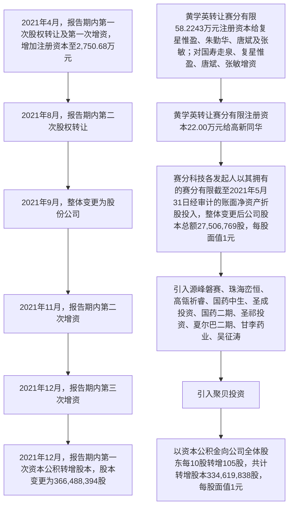
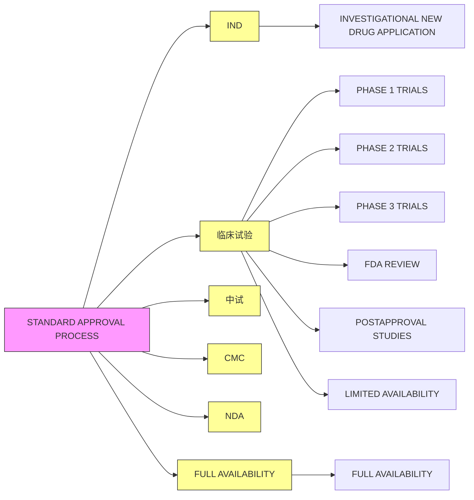
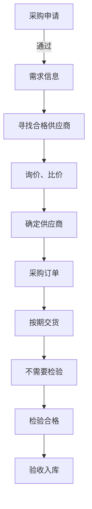
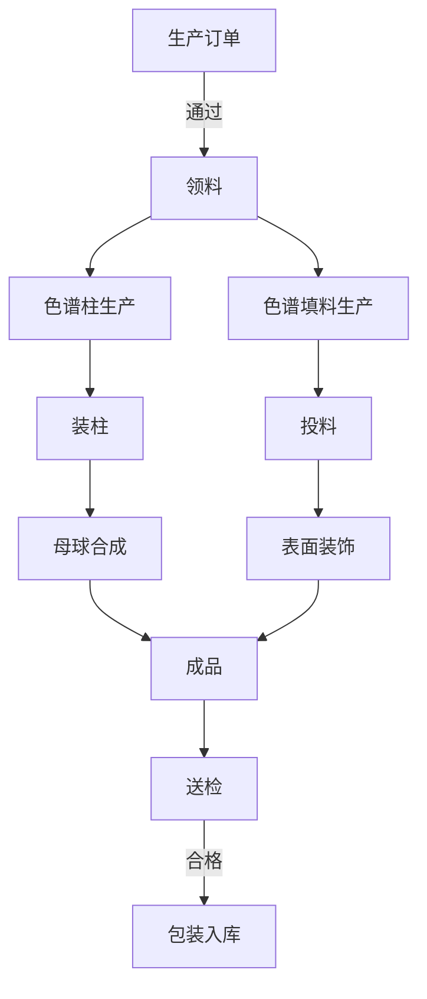
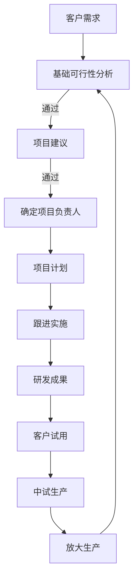
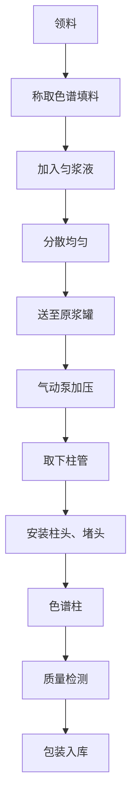
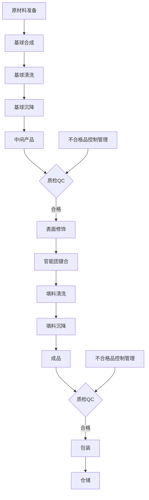
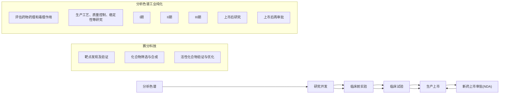
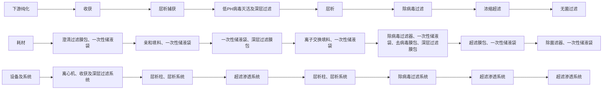

```mermaid
graph TD
    A["战略委员会"] --> B["董事会"]
    C["提名委员会"] --> B
    D["薪酬与考核委员会"] --> B
    E["审计委员会"] --> B
    F["股东大会"] --> B
    G["监事会"] --> B
    H["董事长"] --> I["总经理"]
    J["董事会秘书"] --> I
    K["审计部"] --> L["安全、供应链部"]
    K --> M["研发部"]
    K --> N["生产部"]
    K --> O["质量技术部"]
    P["市场销售部"] --> Q["财务综合部"]
    R["人事行政部"] --> S["仓储物流部"]
    T["证券事务部"] --> U["赛分医疗科"]
    V["美国赛分"] --> W["扬州赛分"]
    X["赛分综合部"] --> Y["市场销售部"]
    Z["财务综合部"] --> AA["市场销售部"]
    AB["人事行政部"] --> AC["市场销售部"]
    AD["仓储物流部"] --> AE["市场销售部"]
    AF["赛分医疗科"] --> AG["市场销售部"]
```

本次股票发行后拟在科创板市场上市，该市场具有较高的投资风险。科创板公司具有研发投入大、经营风险高、业绩不稳定、退市风险高等特点，投资者面临较大的市场风险。投资者应充分了解科创板市场的投资风险及本公司所披露的风险因素，审慎作出投资决定。


# 苏州赛分科技股份有限公司

（中国（江苏）自由贸易试验区苏州片区苏州工业园区集贤街11 号）

# 首次公开发行股票并在科创板上市招股说明书

保荐人（主承销商）


中信证券股份有限公司

CITICSecurities CompanyLimited

广东省深圳市福田区中心三路 8 号卓越时代广场（二期）北座

# 致投资者的声明

# 一、发行人上市的目的

公司是一家专业从事用于药物分析检测和分离纯化的液相色谱材料的研发、生产及销售的高新技术企业。经过多年的技术积累以及不断完善业务布局，公司已成为行业内少数同时具备分析色谱及工业纯化领域研发及规模化大生产能力的企业之一，是国内市场的龙头企业及国际竞争中的主要参与者。随着下游行业未来市场容量增长以及色谱行业国产替代加速，公司业务呈现良好发展态势，亦面临着较为激烈的市场竞争。目前，公司存在融资渠道与资金实力有限、规模化生产能力仍需提升等竞争劣势。

因此，公司上市的目的主要是通过资本市场拓宽融资渠道，扩大核心产品产能，进一步提升竞争优势，满足快速增长的市场需求，推动公司业务规模及盈利水平的持续增长，与投资者共享发展成果。

# 二、发行人现代企业制度的建立健全情况

公司已建立健全现代企业制度，主要包括完善的公司治理结构、有效的内部控制机制和规范的信息披露制度，具体如下：

公司已经根据《公司法》《证券法》《上市公司章程指引》，制定了《公司章程》、三会议事规则、各专门委员会的工作细则、《独立董事工作细则》《董事会秘书工作细则》等制度，设立了多层次的公司治理机构，且上述公司治理机构运行情况、履职情况良好。因此，公司已建立健全完善的公司治理结构。

公司已经根据《企业内部控制基本规范》及其配套指引的规定和其他内部控制监管要求，在经营活动中建立了必要的控制政策和程序。公司管理层对预算、利润、其他财务和经营指标拥有清晰的目标。为合理保证各项目标的实现，公司建立了相关的控制程序，主要包括设置不相容职务分离控制、授权审批控制、会计系统控制、运营分析控制等，覆盖资金管理、销售与收款、采购与付款、生产与仓储、研究与开发、固定资产管理、对外投资、对外担保、关联交易等各项业务活动。通过信息化系统、组织管控优化，公司建立了有效的沟通渠道和机制，审计部根据年度审计计划对公司及子公司的内部控制制度执行情况进行检查与评估，对发现的问题提出改进建议。公司管理层高度重视内部控制的各职能部门和监管机构的报告及建议，并采取各种措施及时纠正控制运行中产生的偏差。因此，公司已建立有效的内部控制机制。此，公司已建立有效的内部控制机制。

是公司信息披露的具体执行人，也是信息披露的直接责任人，由董事会秘书履行负责公司信息披露事务、协调公司信息披露工作，组织制订公司信息披露事务管理制度，督促公司及相关信息披露义务人遵守信息披露相关规定等职权。除此以外，上述公司制度界定了信息披露的定义和内容，并规定了信息披露的程序。因此，公司已建立健全规范的信息披露制度。此，公司已建立健全规范的信息披露制度。

三、发行人本次融资的必要性及募集资金使

# 近年来，我国生物制药市场规模保持强劲增势，带

近年来，我国生物制药市场规模保持强劲增势，带动了下游分离纯化的需求。经过长期的经营，公司积累了大量优质客户，参与了大量药品研发的早期介入合作，并实现了国产替代，色谱介质需求攀升。在此背景下，公司必须牢牢把握发展机遇，进一步扩大核心产品产能，缩短供货周期，满足快速增长的市场需求，推动公司业务规模的快速增长。因此，公司本次融资主要是为了满足公司迫切的公司本次募集资金主

公司本次募集资金主要投向"20万升/年生物医药分离纯化用辅料项目”、“研发中心建设项目"和补充流动资金”，上述项目建设完成后，将进一步提升公司四、发行人持续经营能力及未来发展规划

# 报告期内，公司营业收入及净利润均保

报告期内，公司营业收入及净利润均保持较快增长。公司下游行业市场空间较大，主要客户群体保持较高黏性并持续增长，公司未来经营能力及盈利能力具有可持续性，公司具有较强的盈利能力。公司资产质量良好，公司应收账款账龄主要在1年以内，应收账款周转率高于可比公司平均水平。因此，公司盈利能力未来，公司将继续坚持战略规划，始终以满足客户需求为己任，专注产品研发、技术创

未来，公司将继续坚持战略规划，始终以满足客户需求为己任，专注产品研发、技术创新和工艺开发，不断推出适应客户需求的产品，并进一步扩大产能，深化客户合作，服务全球生物制药客户，推动公司业务规模及盈利水平的持续增长，持续提升公司市场地位和竞争优势，与投资者共享发展成果。

实际控制人、董事长：


<details>
<summary>text_image</summary>

范之雄
</details>

2025年1月6日

# 重要声明

中国证监会、交易所对本次发行所作的任何决定或意见，均不表明其对注册申请文件及所披露信息的真实性、准确性、完整性作出保证，也不表明其对发行人的盈利能力、投资价值或者对投资者的收益作出实质性判断或保证。任何与之相反的声明均属虚假不实陈述。

根据《证券法》的规定，股票依法发行后，发行人经营与收益的变化，由发行人自行负责；投资者自主判断发行人的投资价值，自主作出投资决策，自行承担股票依法发行后因发行人经营与收益变化或者股票价格变动引致的投资风险。

本次发行概况

<table><tr><td>发行股票类型</td><td>人民币普通股(A股)</td></tr><tr><td>发行股数</td><td>本次公开发行股票总数49,975,690股,占发行完成后公司总股本的比例约为12.00%。本次发行全部为新股发行,原股东不公开发售股份</td></tr><tr><td>每股面值</td><td>人民币1.00元</td></tr><tr><td>每股发行价格</td><td>4.32元</td></tr><tr><td>发行日期</td><td>2024年12月30日</td></tr><tr><td>拟上市的交易所和板块</td><td>上海证券交易所科创板</td></tr><tr><td>发行后总股本</td><td>416,464,084股</td></tr><tr><td>保荐人(主承销商)</td><td>中信证券股份有限公司</td></tr><tr><td>招股说明书签署日期</td><td>2025年1月6日</td></tr></table>

# 目 录

# 致投资者的声明 .....

# 重要声明 ......

# 本次发行概况 ...

# 目 录....

# 第一节 释 义 ....

一、一般术语.. 1  
二、专业术语.. .14

# 第二节 概 览 ....

一、重大事项提示.. .17  
二、公司及本次发行的中介机构基本情况. .25  
三、本次发行的概况. ..26  
四、发行人主营业务经营情况. .31  
五、发行人符合科创板定位相关情况.. .33  
六、公司报告期内的主要财务数据及财务指标. .34  
七、发行人选择的具体上市标准. .34  
八、发行人公司治理特殊安排等重要事项. .35  
九、募集资金的用途与未来发展规划.. .35  
十、其他对发行人有重大影响的事项. ..36

# 第三节 风险因素.. 37

一、与发行人相关的风险. .37  
二、与行业相关的风险.. .44  
三、其他风险... ..47

# 第四节 发行人基本情况.... 49

一、公司基本情况.. .49  
二、公司设立及报告期内的股本和股东变化情况. .49  
三、公司成立以来重要事件. .63  
四、公司在其他证券市场的上市/挂牌情况. ..63  
五、公司股权关系与内部组织结构. ..64  
六、公司实际控制人及持有公司 5%以上股份的主要股东情况.. .69

七、发行人特别表决权股份或类似安排的情形. .80  
八、发行人协议控制架构的情形.. ..80  
九、发行人控股股东、实际控制人重大违法的情况.. ..80  
十、公司股本情况.. ..80  
十一、董事、监事、高级管理人员及核心技术人员的情况. ..86  
十二、公司与董事、监事、高级管理人员及核心技术人员签署的协议.......93  
十三、公司董事、监事、高级管理人员及核心技术人员所持股份质押、冻结或发生诉讼纠纷的情况.. ... 93  
十四、董事、监事、高级管理人员及核心技术人员近两年的变动情况及影响... 93  
十五、董事、监事、高级管理人员及核心技术人员的其他对外投资情况...95  
十六、董事、监事、高级管理人员、核心技术人员及其近亲属直接或间接持有公司股份的情况... ... 95  
十七、董事、监事、高级管理人员及核心技术人员的薪酬情况.. ... 96  
十八、公司已制定或实施的股权激励及相关安排情况. .98  
十九、公司员工及社会保险和住房公积金缴纳情况. .98

# 第五节 业务与技术.... ..102

一、公司的主营业务、主要产品... ..102  
二、发行人所处行业的基本情况.. ..113  
三、公司销售情况和主要客户. ..152  
四、公司采购情况和主要供应商. ..156  
五、主要资产情况.. ..159  
六、公司核心技术与研发情况. ...176  
七、环境保护情况.. ..199  
八、公司境外经营情况. ..199

# 第六节 财务会计信息与管理层分析.. .201

一、与财务会计信息相关的重大事项的判断标准. ..201  
二、盈利能力或财务状况的主要影响因素分析. ..201  
三、财务报表.. ..204  
四、审计意见.. ..209  
五、合并财务报表的编制基础、合并范围及变化情况. ..210

六、报告期内对公司财务状况和经营成果有重大影响的主要会计政策和会计估计.... ... 211  
七、主要税项.. .. 245  
八、分部信息. .. 246  
九、公司非经常性损益情况. .. 247  
十、主要财务指标.. .. 249  
十一、经营成果分析.. ..251  
十二、资产质量分析.. .. 304  
十三、偿债能力、流动性与持续经营能力的分析.. ..330  
十四、报告期内的重大投资或资本性支出、重大资产业务重组或股权收购合并事项.... ...343  
十五、期后事项、或有事项及其他重要事项. ..343  
十六、财务报告审计截止日后的主要财务信息及经营状况. .. 343  
十七、盈利预测报告. ..347

# 第七节 募集资金运用与未来发展规划. ..353

一、募集资金运用概况.. ..353  
二、本次募集资金投资项目对发行人同业竞争、独立性的影响. ..354  
三、募集资金投资项目情况. ..354  
四、本次募集资金投资项目与公司现有主要业务、核心技术的关系.........367  
五、未来发展规划.. ... 367

# 第八节 公司治理与独立性 .... .369

一、公司治理制度的执行情况. ..369  
二、公司特别表决权股份或类似安排的情况.. ..371  
三、公司协议控制架构的情况. ..372  
四、公司内部控制的评估. ..372  
五、公司最近三年违法违规及行政处罚的情况. ..372  
六、公司控股股东、实际控制人及其控制的其他企业的资金占用及担保情况... 375  
七、公司直接面向市场独立持续经营的能力.. ..375  
八、公司的规范运作情况. ..377  
九、同业竞争.. ..379

十、关联方及关联关系. ..381  
十一、关联交易. .. 390  
十二、股东关联客户交易.. .. 402

# 第九节 投资者保护 .... 406

一、本次发行完成前滚存利润的分配安排和已履行的决策程序. ..406  
二、公司章程规定的股利分配政策. ..406  
三、公司关于特别表决权股份、协议控制架构或类似特殊安排及尚未盈利或

存在累计未弥补亏损的情况 ..407  
四、董事会关于股东回报事宜的专项研究论证情况以及相应的规划安排理由  
... 408   
五、上市后三年内的股东分红回报规划. .408  
六、长期回报规划.. ..411  
七、投资者关系的主要安排. ..411  
八、股东投票机制的建立情况. ..412  
九、发行人、股东、实际控制人、发行人的董事、监事、高级管理人员、核  
心技术人员以及本次发行的保荐人及证券服务机构等作出的重要承诺.....413

# 第十节 其他重要事项..... ...439

一、重要合同.. ..439  
二、对外担保情况. ..444  
三、重大诉讼、仲裁情况. ..444  
四、其他情况.. .445

# 第十一节 声明 ........ .... 447

一、本公司全体董事、监事、高级管理人员声明.. ..447  
二、本公司控股股东、实际控制人声明.. ..456  
三、保荐人（主承销商）声明. ...457  
四、发行人律师声明. ..460  
五、会计师事务所声明.. ..461  
六、资产评估机构声明.. ..462   
七、验资机构声明.. ...464  
八、关于签字注册会计师离职的声明. ..465

# 第十二节 附件.. .... 466

一、备查文件.. .. 466  
二、查阅时间.. ..466  
三、查阅地点. ...467

# 第一节 释 义

本招股说明书中，除非文义另有所指，下列词语具有如下含义：

# 一、一般术语

<table><tr><td>赛分科技、发行人、本公司、公司</td><td>指</td><td>苏州赛分科技股份有限公司</td></tr><tr><td>赛分有限</td><td>指</td><td>苏州赛分科技有限公司,系赛分科技的前身</td></tr><tr><td>美国赛分</td><td>指</td><td>Sepax Technologies, Inc.,系公司子公司</td></tr><tr><td>扬州赛分</td><td>指</td><td>赛分科技扬州有限公司,系公司全资子公司</td></tr><tr><td>赛分医疗</td><td>指</td><td>苏州赛分医疗器械有限公司,系公司全资子公司</td></tr><tr><td>赛分生科</td><td>指</td><td>Sepax Bioscience Inc.,系公司全资子公司</td></tr><tr><td>上海赛分</td><td>指</td><td>赛分科技(上海)有限公司,系美国赛分历史全资子公司,报告期内注销</td></tr><tr><td>国寿走泉</td><td>指</td><td>江苏国寿走泉股权投资中心(有限合伙)</td></tr><tr><td>江苏国寿</td><td>指</td><td>国寿(江苏)股权投资有限公司</td></tr><tr><td>高新同华</td><td>指</td><td>安徽高新同华创业投资基金(有限合伙),安徽同华高新技术中心(有限合伙)</td></tr><tr><td>安徽同华</td><td>指</td><td>安徽同华投资管理中心(有限合伙)</td></tr><tr><td>华泰大健康一号</td><td>指</td><td>南京华泰大健康一号股权投资合伙企业(有限合伙)</td></tr><tr><td>华泰紫金</td><td>指</td><td>华泰紫金投资有限责任公司</td></tr><tr><td>复星惟盈</td><td>指</td><td>宁波梅山保税港区复星惟盈股权投资基金合伙企业(有限合伙)</td></tr><tr><td>复星惟实</td><td>指</td><td>上海复星惟实股权投资管理合伙企业(有限合伙)</td></tr><tr><td>苏州贤达</td><td>指</td><td>苏州贤达企业管理合伙企业(有限合伙)</td></tr><tr><td>苏州博达</td><td>指</td><td>苏州博达投资咨询合伙企业(有限合伙)</td></tr><tr><td>苏州杰贤</td><td>指</td><td>苏州杰贤企业管理合伙企业(有限合伙)</td></tr><tr><td>海佳同康</td><td>指</td><td>苏州海佳同康技术管理咨询有限公司</td></tr><tr><td>苏州敦行</td><td>指</td><td>苏州敦行价值创业投资合伙企业(有限合伙)</td></tr><tr><td>敦行管理</td><td>指</td><td>苏州敦行投资管理有限公司</td></tr><tr><td>骏耀投资</td><td>指</td><td>舟山骏耀投资管理合伙企业(有限合伙)</td></tr><tr><td>华泰大健康二号</td><td>指</td><td>南京华泰大健康二号股权投资合伙企业(有限合伙)</td></tr><tr><td>道兴投资</td><td>指</td><td>南京道兴创业投资管理中心(普通合伙)</td></tr><tr><td>源峰磐赛</td><td>指</td><td>天津源峰磐赛企业管理合伙企业(有限合伙)</td></tr><tr><td>珠海峦恒</td><td>指</td><td>珠海峦恒股权投资合伙企业(有限合伙)</td></tr><tr><td>高瓴祈睿</td><td>指</td><td>苏州高瓴祈睿医疗健康产业投资合伙企业(有限合伙)</td></tr><tr><td>国药中生</td><td>指</td><td>国药中生(上海)生物股权投资基金合伙企业(有限合伙)</td></tr><tr><td>圣成投资</td><td>指</td><td>上海圣成投资管理合伙企业(有限合伙)</td></tr><tr><td>国药二期</td><td>指</td><td>上海国药二期股权投资基金合伙企业(有限合伙)</td></tr><tr><td>圣祁投资</td><td>指</td><td>上海圣祁投资管理合伙企业(有限合伙)</td></tr><tr><td>夏尔巴二期</td><td>指</td><td>苏州夏尔巴二期股权投资合伙企业(有限合伙)</td></tr><tr><td>甘李药业</td><td>指</td><td>甘李药业股份有限公司</td></tr><tr><td>聚贝投资</td><td>指</td><td>宁波聚贝投资合伙企业(有限合伙)</td></tr><tr><td>Cytiva</td><td>指</td><td>美国思拓凡公司,前身是GE医疗生命科学事业部,现在隶属于美国丹纳赫集团旗下的生命科学平台</td></tr><tr><td>Merck KGaA</td><td>指</td><td>德国默克集团(Merck KGaA)</td></tr><tr><td>Merck &amp; Co</td><td>指</td><td>美国默克集团(Merck &amp; Co Inc)</td></tr><tr><td>Tosoh、东曹</td><td>指</td><td>Tosoh Corporation,日本东曹株式会社</td></tr><tr><td>Agilent、安捷伦</td><td>指</td><td>Agilent Technologies Inc.,美国安捷伦科技有限公司及其关联公司</td></tr><tr><td>Bio-Rad</td><td>指</td><td>Bio-Rad Laboratories Inc.</td></tr><tr><td>博格隆</td><td>指</td><td>博格隆(上海)生物技术有限公司</td></tr><tr><td>Osaka Soda</td><td>指</td><td>Osaka Soda Co., Ltd.,株式会社大阪曹达,由日本大曹株式会社(Daiso Co., Ltd.)更名而来</td></tr><tr><td>Thermo Fisher</td><td>指</td><td>Thermo Fisher Scientific Inc.及其关联公司</td></tr><tr><td>VWR</td><td>指</td><td>VWR International 及其关联公司</td></tr><tr><td>Wyatt</td><td>指</td><td>Wyatt Technology Corporation</td></tr><tr><td>AGC</td><td>指</td><td>AGC株式会社及其关联公司</td></tr><tr><td>Purolite</td><td>指</td><td>Purolite Group,漂莱特集团</td></tr><tr><td>南京诺唯赞</td><td>指</td><td>南京诺唯赞生物科技股份有限公司</td></tr><tr><td>迈科康生物</td><td>指</td><td>成都迈科康生物科技有限公司</td></tr><tr><td>南大药业</td><td>指</td><td>南京南大药业有限责任公司</td></tr><tr><td>中徽纳米</td><td>指</td><td>苏州中徽纳米科技有限公司</td></tr><tr><td>弈柯莱生物</td><td>指</td><td>弈柯莱生物科技(上海)股份有限公司、弈柯莱生物科技(集团)股份有限公司</td></tr><tr><td>弈柯莱台州</td><td>指</td><td>弈柯莱(台州)药业有限公司</td></tr><tr><td>海纳医药</td><td>指</td><td>南京海纳医药科技股份有限公司</td></tr><tr><td>海纳制药</td><td>指</td><td>南京海纳制药有限公司</td></tr><tr><td>苏州赛谱</td><td>指</td><td>苏州赛谱仪器有限公司</td></tr><tr><td>苏州康润</td><td>指</td><td>苏州康润医药测试服务有限公司</td></tr><tr><td>汉邦科技</td><td>指</td><td>江苏汉邦科技股份有限公司</td></tr><tr><td>北京伟杰信</td><td>指</td><td>北京伟杰信生物科技有限公司</td></tr><tr><td>上海迈科康</td><td>指</td><td>上海迈科康生物科技有限公司</td></tr><tr><td>成都华任康</td><td>指</td><td>成都华任康生物科技有限公司</td></tr><tr><td>安达生物</td><td>指</td><td>安达生物药物开发(深圳)有限公司</td></tr><tr><td>苏州盛雄</td><td>指</td><td>苏州盛雄精细化工有限公司</td></tr><tr><td>苏州义捷</td><td>指</td><td>苏州工业园区义捷商贸有限公司</td></tr><tr><td>苏州漫之迪</td><td>指</td><td>苏州工业园区漫之迪商贸有限公司</td></tr><tr><td>汉邦科技</td><td>指</td><td>江苏汉邦科技有限公司</td></tr><tr><td>同华投资</td><td>指</td><td>上海同华创业投资股份有限公司</td></tr><tr><td>江苏新鸿联</td><td>指</td><td>江苏新鸿联集团有限公司</td></tr><tr><td>罗氏</td><td>指</td><td>Roche,霍夫曼-罗氏公司</td></tr><tr><td>辉瑞</td><td>指</td><td>Pfizer Inc.,辉瑞制药有限公司</td></tr><tr><td>礼来</td><td>指</td><td>Eli Lilly and Company,美国礼来公司</td></tr><tr><td>正大天晴</td><td>指</td><td>正大天晴药业集团股份有限公司</td></tr><tr><td>齐鲁制药</td><td>指</td><td>齐鲁制药有限公司</td></tr><tr><td>信达生物</td><td>指</td><td>信达生物制药(苏州)有限公司</td></tr><tr><td>复星医药</td><td>指</td><td>上海复星医药(集团)股份有限公司</td></tr><tr><td>复宏汉霖</td><td>指</td><td>上海复宏汉霖生物技术股份有限公司</td></tr><tr><td>通化安睿特</td><td>指</td><td>通化安睿特生物制药股份有限公司</td></tr><tr><td>惠中医疗</td><td>指</td><td>上海惠中医疗科技有限公司</td></tr><tr><td>诗健生物</td><td>指</td><td>上海诗健生物科技有限公司</td></tr><tr><td>再生元、Regeneron</td><td>指</td><td>Regeneron Pharmaceuticals Inc.,再生元制药公司</td></tr><tr><td>国药集团</td><td>指</td><td>中国医药集团有限公司</td></tr><tr><td>熠昭医药</td><td>指</td><td>熠昭(北京)医药科技有限公司</td></tr><tr><td>舒泰神股份</td><td>指</td><td>舒泰神(北京)生物制药股份有限公司</td></tr><tr><td>昭衍生物</td><td>指</td><td>北京昭衍生物技术有限公司</td></tr><tr><td>《公司章程》</td><td>指</td><td>本公司现行的公司章程</td></tr><tr><td>《公司章程(草案)》</td><td>指</td><td>本公司上市后将实施的公司章程</td></tr><tr><td>《科创板上市规则》</td><td>指</td><td>上海证券交易所科创板股票上市规则</td></tr><tr><td>《证券法》</td><td>指</td><td>中华人民共和国证券法及其修订</td></tr><tr><td>《公司法》</td><td>指</td><td>中华人民共和国公司法及其修订</td></tr><tr><td>A股</td><td>指</td><td>经中国证监会批准向境内投资者发行、在境内证券交易所上市、以人民币标明股票面值、以人民币认购和进行交易的普通股</td></tr><tr><td>本次发行上市</td><td>指</td><td>发行人首次公开发行股票并在科创板上市之行为</td></tr><tr><td>中国证监会</td><td>指</td><td>中国证券监督管理委员会</td></tr><tr><td>上交所</td><td>指</td><td>上海证券交易所</td></tr><tr><td>发改委</td><td>指</td><td>中华人民共和国国家发展和改革委员会</td></tr><tr><td>工信部</td><td>指</td><td>中华人民共和国工业和信息化部</td></tr><tr><td>科学技术部、科技部</td><td>指</td><td>中华人民共和国科学技术部</td></tr><tr><td>财政部</td><td>指</td><td>中华人民共和国财政部</td></tr><tr><td>国家药监局</td><td>指</td><td>中华人民共和国国家药品监督管理局,曾用名“中华人民共和国国家食品药品监督管理总局”</td></tr><tr><td>国务院</td><td>指</td><td>中华人民共和国国务院</td></tr><tr><td>人民银行</td><td>指</td><td>中国人民银行</td></tr><tr><td>“十二五”</td><td>指</td><td>国民经济和社会发展第十二个五年,2011-2015年</td></tr><tr><td>“十三五”</td><td>指</td><td>国民经济和社会发展第十三个五年,2016-2020年</td></tr><tr><td>“十四五”</td><td>指</td><td>国民经济和社会发展第十四个五年,2021-2025年</td></tr><tr><td>保荐人、保荐机构、主承销商、中信证券</td><td>指</td><td>中信证券股份有限公司</td></tr><tr><td>海润天睿律师</td><td>指</td><td>北京海润天睿律师事务所</td></tr><tr><td>Zhong Lun Law Firm LLP</td><td>指</td><td>一家依据美国加利福尼亚州法律合法成立、现行有效存续的有限责任合伙企业,具有在加利福尼亚州执业并对美国法律相关的问题发表法律意见的资格</td></tr><tr><td>容诚会计师</td><td>指</td><td>容诚会计师事务所(特殊普通合伙)</td></tr><tr><td>万隆评估师</td><td>指</td><td>万隆(上海)资产评估有限公司</td></tr><tr><td>报告期</td><td>指</td><td>2021年度、2022年度、2023年度、2024年1-6月</td></tr><tr><td>报告期末</td><td>指</td><td>2024年6月30日</td></tr><tr><td>报告期各期末</td><td>指</td><td>2021年12月31日、2022年12月31日、2023年12月31日、2024年6月30日</td></tr><tr><td>元、万元、亿元</td><td>指</td><td>人民币元、万元、亿元</td></tr></table>

# 二、专业术语

<table><tr><td>色谱介质、层析介质、色谱填料</td><td>指</td><td>英文 chromatography media 的译名,应用于色谱分离技术的固定相,是分离纯化中最核心的物料,决定了药物的纯化效果。色谱介质在工业纯化领域惯称为“层析介质”,分析色谱领域惯称为“色谱填料”</td></tr><tr><td>微球</td><td>指</td><td>未经表面修饰或功能化修饰的直径在纳米和微米尺度范围的球型粒子</td></tr><tr><td>键合、偶联</td><td>指</td><td>两个有机化学单位进行某种化学反应而得到一个有机分子的过程</td></tr><tr><td>官能团、配基、功能基团</td><td>指</td><td>微球表面键合的具有特定化学物理性质的原子或原子团</td></tr><tr><td>组分</td><td>指</td><td>溶液等混合物中的各个成分</td></tr><tr><td>固定相</td><td>指</td><td>在色谱分离中固定不动、对样品产生保留的一相</td></tr><tr><td>流动相</td><td>指</td><td>色谱过程中携带待测组分向前移动的物质,与固定相处于平衡状态、带动样品向前移动的另一相</td></tr><tr><td>工业纯化</td><td>指</td><td>根据临床用药和制剂要求,用适宜的溶剂和方法,从原料中提取有效物质、除去杂质的过程</td></tr><tr><td>分析色谱</td><td>指</td><td>一种超高效、高精细度、高准确率的分析技术,广泛应用于药物的分析检测和质量控制、中药复杂组分分析、医疗诊断、食品分析检测、农药残留物检测、水质和环境监测等领域</td></tr><tr><td>亲和层析填料</td><td>指</td><td>通过配基特异性识别实现分离和纯化的层析介质</td></tr><tr><td>离子交换填料</td><td>指</td><td>利用电荷特性实现分离和纯化的层析介质</td></tr><tr><td>疏水填料</td><td>指</td><td>利用分子表面极性的不同实现分离和纯化的层析介质</td></tr><tr><td>复合层析介质</td><td>指</td><td>兼容两种或多种分离机制特性的层析介质</td></tr><tr><td>体积排阻填料</td><td>指</td><td>利用分子大小的不同以及在色谱介质中滞留时间的长短实现分离和纯化的层析介质</td></tr><tr><td>硅胶基质填料</td><td>指</td><td>以硅胶类化合物为主要材质的色谱介质</td></tr><tr><td>色谱柱</td><td>指</td><td>色谱介质载体,由柱管、压帽、卡套(密封环)、筛板(滤片)、接头、螺丝等部件组成的柱状物体</td></tr><tr><td>层析柱</td><td>指</td><td>用于工业纯化的色谱柱</td></tr><tr><td>分析色谱柱</td><td>指</td><td>用于分析色谱的色谱柱</td></tr><tr><td>μm</td><td>指</td><td>微米,长度的度量单位,国际单位制符号为μm,1微米等于千分之一毫米</td></tr><tr><td>nm</td><td>指</td><td>纳米,长度的度量单位,国际单位制符号为nm,1纳米等于一百万分之一毫米</td></tr><tr><td>Å</td><td>指</td><td>埃米,长度的度量单位,国际单位制符号为Å,1埃米等于一千万分之一毫米</td></tr><tr><td>bar</td><td>指</td><td>巴,压强单位,1巴(bar)=100千帕(kPa)</td></tr><tr><td>HPLC</td><td>指</td><td>High Performance Liquid Chromatography,高效液相色谱法,主要利用溶质在两相间分配系数、亲和力、吸附力或分子大小不同而引起的排阻作用的差别使不同溶质进行分离,达到对化合物的定量检测</td></tr><tr><td>Protein A</td><td>指</td><td>蛋白A,从A型金黄色葡萄球菌分离而得的一种细胞壁蛋白,具有不在抗原结合点但会与免疫球蛋白结合的性质,能形成含有蛋白A、抗体、抗原的复合物</td></tr><tr><td>PMA</td><td>指</td><td>丙二醇甲醚醋酸酯,也称丙二醇单甲醚乙酸酯,分子式为 $C_6H_{12}O_3$ ,无色吸湿液体,有特殊气味,是一种具有多官能团的非公害溶剂</td></tr><tr><td>PSDVB</td><td>指</td><td>聚苯乙烯和二乙烯基苯的共聚物,具有刚性大,耐受有机溶剂性能好,pH值的适用范围广等优点</td></tr><tr><td>FDA</td><td>指</td><td>美国食品药品监督管理局(Food and Drug Administration)</td></tr><tr><td>IND</td><td>指</td><td>新药临床试验,英文Investigational New Drug缩写,IND主要目的是提供足够信息来证明药品在人体进行试验是安全的,以及证明针对研究目的的临床方案设计是合理的</td></tr><tr><td>DMF</td><td>指</td><td>Drug Master Files,药物主文件,FDA要求化学原料药申请注册时提交的文件</td></tr><tr><td>抗原</td><td>指</td><td>能引起机体免疫反应并产生抗体的物质,是抗体识别的目标分子,包括诊断抗原、抗体药物识别的抗原、疫苗抗原等</td></tr><tr><td>抗体</td><td>指</td><td>由于抗原的刺激,由B细胞分化成的浆细胞所产生的、可与相应抗原特异性结合的免疫球蛋白</td></tr><tr><td>单克隆抗体、单抗</td><td>指</td><td>由单一B细胞分化增殖的子代细胞所分泌的高度均质性,针对单一抗原决定簇的特异性抗体</td></tr><tr><td>多抗</td><td>指</td><td>多克隆抗体的简称,是对特定抗原所产生的一组免疫球蛋白混合物,每种免疫球蛋白能识别抗原分子上的一个表位</td></tr><tr><td>mRNA</td><td>指</td><td>信使RNA,是由DNA的一条链作为模板转录而来的、携带遗传信息的能指导蛋白质合成的一类单链核糖核酸</td></tr><tr><td>AAV</td><td>指</td><td>腺病毒相关病毒(adeno-associated virus, AAV)是一类单链线状DNA缺陷型病毒</td></tr><tr><td>VLP</td><td>指</td><td>病毒样颗粒(virus-like particle, VLP)是由一种或多种病毒结构蛋白通过自组装而形成的纳米级颗粒</td></tr><tr><td>核酸</td><td>指</td><td>一类生物聚合物,是所有已知生命形式必不可少的组成物质,是生命体遗传信息载体,为脱氧核糖核酸(DNA)和核糖核酸(RNA)的总称</td></tr><tr><td>生物药</td><td>指</td><td>应用普通的或者以基因工程、细胞工程、蛋白质工程、发酵工程等生物技术获得的微生物、细胞及各种动物和人源的组织和液体等生物材料制备、用于人类疾病预防、治疗和诊断的药品</td></tr><tr><td>小分子</td><td>指</td><td>有机化合物、天然产物、抗生素、多肽等分子量小的物质</td></tr><tr><td>大分子</td><td>指</td><td>蛋白、抗体、疫苗、病毒等分子量大、结构复杂的生物分子</td></tr></table>

本招股说明书中若出现总数与各分项值之和尾数不符的情况，均系四舍五入原因造成。

本招股说明书所引用的有关行业的统计及其他信息，均来自不同的公开刊物、研究报告及行业专业机构提供的信息，但由于引用不同来源的统计信息及其他信息可能其口径有一定的差异，故相关信息并非完全具有可比性。

# 第二节 概 览

本概览仅对招股说明书全文作扼要提示。投资者作出投资决策前，应认真阅读招股说明书全文。

# 一、重大事项提示

本公司特别提示投资者对下列重大事项给予充分关注，并认真阅读本招股说明书全部内容。

# （一）本次发行相关主体作出的重要承诺

发行人实际控制人及其一致行动人已分别作出业绩下滑情形的相关承诺，主要内容如下：“发行人若出现上市当年及之后第二年、第三年较上市前一年扣除非经常性损益后归母净利润下滑 50%以上情形的，本人/本企业将按以下方式延长其届时所持股份（上市前取得，上市当年及之后第二年、第三年年报披露时仍持有的股份）的锁定期限：

1、发行人上市当年较上市前一年净利润下滑 50%以上的，延长本人/本企业届时所持股份锁定期限12个月；  
2、发行人上市第二年较上市前一年净利润下滑 50%以上的，在前项基础上延长本人/本企业届时所持股份锁定期限 12个月；  
3、发行人上市第三年较上市前一年净利润下滑 50%以上的，在前两项基础上延长本人/本企业届时所持股份锁定期限 12个月。”

本公司提示投资者认真阅读本公司、股东、实际控制人、董事、监事、高级管理人员、其他核心人员以及本次发行的保荐人及证券服务机构等作出的重要承诺和未能履行承诺的约束措施，具体承诺事项详见本招股说明书之“第九节 投资者保护”之“九、发行人、股东、实际控制人、发行人的董事、监事、高级管理人员、核心技术人员以及本次发行的保荐人及证券服务机构等作出的重要承诺”。

# （二）利润分配政策及承诺

本公司提示投资者关注公司发行上市后的股利分配政策、上市后三年内股东分红回报规划和长期回报规划，具体内容详见本招股说明书“第九节 投资者保护”。 。

# （三）重大风险提示

# 1、下游行业政策变化的风险

# （1）政策变动导致下游行业增速放缓的风险

公司产品的下游应用领域为医药行业，近年来，医药行业监管持续强化，医改政策不断深化，随着医保控费、集中带量采购、原料药关联审评审批等政策的深入推进、创新药注册管理制度和技术评价体系等政策的实施，下游医药企业原有经营模式受到冲击，研发、人力、生产等各项成本不断上涨，为整个医药行业发展带来挑战；地缘政治、宏观经济政策等外部因素也会影响市场行情，给国内医药市场带来不确定性。在上述因素影响下，我国医药行业发展面临较大的压力，若未来由于宏观经济政策、行业政策等因素导致下游医药行业整体增速放缓，将导致下游市场对发行人色谱产品的需求增长速度放慢，进而影响公司承接的业务订单规模及经营业绩表现。

# （2）行业政策提高创新药研发门槛的风险

近几年，国家药品监督管理局、国家医疗保障局等多部门先后出台了优先审评审批、注册分类改革、上市许可持有人制度、医保目录动态调整等多项政策，给予创新药全生命周期的政策支持，我国新药研发取得了较大进步。与此同时，行业内靶点选择重复、研发赛道拥挤、研发资源浪费等问题突出，同质化竞争可能在未来相当长的时间持续存在。为有效解决该问题，国家药品监督管理局药品审评中心发布了《以临床价值为导向的抗肿瘤药物临床研发指导原则》，提高了研发门槛。2023年8月25日，药监局发布了《药品附条件批准上市申请审评审批工作程序（试行）（修订稿征求意见稿）》，以进一步完善药品附条件批准上市申请审评审批制度，不具备差异化自主创新能力的企业将面临淘汰，相关的研发项目可能停止，发行人来自该类客户或项目的收入将面临下降风险。

# 2、下游客户需求下降的风险

# （1）下游客户药物开发失败的风险

发行人的主营产品分析色谱柱和层析介质用于下游医药客户的研发、临床、商业化生产、质量检测等多个环节，发行人经营业绩与下游客户的药品开发进程紧密相关。对于分析色谱业务，截至 2024年6月底，共有13,452 个医药项目使用公司的分析色谱产品，其中研发类采购项目 10,607 个、质量检测类采购项目2,845 个。对于工业纯化业务，截至 2024 年 6 月底，共有 856 个医药项目使用公司的工业纯化产品，其中处于研发阶段 694 个、临床 I 期阶段 81 个、临床 II 期阶段25个、临床III期阶段19 个、商业化生产阶段 37个。大部分应用公司色谱产品的药物项目处于研发或临床阶段，公司未来业务的发展与下游客户的药物开发及产业化情况紧密相关，而药物开发尤其是新药研发技术难度较大，影响研发进程的因素较多，公司无法全面掌握客户新药研发的进程和商业化效果。若上述药物项目研发临床进度不及预期或开发失败，则可能导致对发行人色谱产品的采购需求减少甚至终止，从而对发行人销售收入的持续性和稳定性带来不利影响。

# （2）下游客户研发投入下降的风险

生物医药行业融资规模下降将直接影响创新药研发投入，在外部融资环境不乐观的情况下，生物医药研发投入将更为谨慎，加之新药研究的周期较长，长尾效应明显，未来几年，创新药的增长和药物临床研究投入存在下降风险。2024年 1-6 月，发行人来自研发和临床阶段的主营业务收入占比分别为 24.63%和38.26%。发行人的分析色谱产品是下游客户研发阶段的重要耗材，工业纯化产品是下游客户纯化的核心成本所在，随着研发和临床阶段的推进，药企客户研发投入不断提升，对工业纯化产品的需求量也进一步上涨。若前述原因导致未来下游客户的研发及临床试验投入有所下降，对发行人产品的采购规模也可能有所下降，发行人相应的销售收入存在增速放缓甚至下降的风险。

# 3、工业纯化客户采购周期波动的风险

发行人工业纯化客户对层析介质的采购需求规模随着其医药项目进度的推进而逐渐增长，在客户进入商业化生产阶段前，采购时点主要取决于其药物开发进展以及研发临床工作推进计划，同一客户的复购时点和复购规模具有一定的周期性和不确定性。在客户进入商业化生产阶段后，通常会按照计划进行大批量生产，从而产生规律的层析介质采购需求，目前发行人主要客户信达生物、甘李药业、复宏汉霖等应用发行人层析介质的部分项目已推进至商业化生产阶段，对发行人填料具备持续性需求，采购周期及采购规模将趋于稳定，预计 1-2年进行复购，但客户也可能因外部因素影响或自身经营安排变化而出现生产排期或生产规模变动的情况。若上述因素导致工业纯化客户采购周期延长、复购时点晚于预期或采购规模下降，公司可能面临工业纯化收入增长不及预期甚至下降的风险。

# 4、库存商品未来跌价的风险

公司考虑到每次投料所需的固定成本，会兼顾生产效率和投入产出比以及成品效益和销售订单因素，对未来销售意向确定性较大或市场前景较好的产品进行一定规模的备产。公司期末库存商品中，亲和层析填料、离子交换填料、硅胶基质填料去化速度较慢。根据公司现有客户需求预计，剩余库存商品可能于 2024年才可完全去化。根据公司当前存货跌价准备计提政策，若 2024 年发行人未能取得相关增量订单或现有客户预计需求未能及时兑现，则将导致发行人在 2024年及2025年对上述层析介质分别计提最高704.69万元及1,157.28万元的资产减值损失，对发行人经营业绩产生不利影响。

# 5、一年以上存货余额增长较快的风险

报告期各期末，公司存货主要由原材料、自制半成品、库存商品和发出商品构成。公司存货余额分别为 5,188.17 万元、9,922.32 万元、12,228.01 万元和12,020.19 万元，占各期末资产总额的比例分别为 5.27%、9.47%、11.10%和 10.65%。未来随着公司生产规模的扩大，存货余额有可能会进一步增加，从而影响到公司的资金周转速度和经营活动的现金流量。

另一方面，公司产品种类较多，可以按照材质、粒径、孔径等分成多种不同规格，且由于产品精密度较高，公司对标准品均备有一定存货，同时公司为保证生产连续性和供应链安全性，对重点原材料进行了备货，并提前进行生产备货。截至 2024 年 6 月末，公司库龄一年以上的原材料、自制半成品和库存商品金额分别为 2,716.86 万元、1,093.25 万元和 2,558.71 万元，若公司产品发生滞销，或部分原材料、自制半成品出现损坏等情况，将导致存货减值，对公司经营产生不利影响，亦存在影响资产质量和盈利能力的风险。

# 6、市场竞争风险

（1）发行人与行业主要厂商相比，在业务覆盖范围、经营规模、市场占有

率等方面存在一定差距

全球分析色谱行业主要厂商包括 Thermo Fisher、Tosoh、Agilent 等，工业纯化行业主要厂商包括 Cytiva、Thermo Fisher、Merck KGaA 等。发行人与行业主要厂商相比，在经营规模、市场占有率、产品类型等方面存在一定差距。业务广度及经营规模方面，发行人深耕色谱行业，主要产品包括分析色谱柱和层析介质，其他行业内主要厂商为上市公司，总体经营规模较大，业务条线涵盖生命科学、医疗保健、化工、仪器制造等多个细分领域；市场占有率方面，Cytiva、ThermoFisher、Tosoh等国际主流厂商在我国色谱介质市场占据了超过50%的市场份额，2023 年发行人国内分析色谱市场占有率约为 5.16%，工业纯化（色谱介质）市场占有率约为1.02%，生物大分子色谱介质市场占有率约为 1.20%，与行业内起步较早的海外龙头企业相比仍存在较大差距，较低的市场占有率限制了发行人业务的规模效应，可能对未来公司市场开拓及成长性产生不利影响。

（2）国产化替代进程加速以及海外供应链恢复稳定的背景下，行业竞争激烈程度进一步加剧

国产化替代趋势进一步加强的同时也加剧了我国本土色谱厂商的竞争激烈程度，本土色谱厂商均在争取抓住良好机遇，实现对进口填料厂商的替代，导入下游药企客户的工业纯化供应链进而抢占市场份额，未来将会有更多的竞争者参与该领域，本土色谱厂商之间的市场竞争将更加激烈。同时随着公共卫生事件影响的逐渐减弱，境外厂商的供应链稳定性逐渐恢复，发行人也将继续面临境外主流厂商带来的激烈市场竞争。如果未来公司不能持续紧跟市场需求进行研发投入，持续提高经营规模，增强资本实力，扩大市场份额，将面临较大的市场竞争风险。

# 7、产能大幅扩张的风险

随着在技术研发和销售网络等方面的持续投入，公司近年来业务规模持续增长，主要产品工业纯化填料的产销量快速提升。色谱行业国产化替代已成为趋势，为满足国内生物制药企业对填料等原材料的国产化替代需求，公司拟在全资子公司扬州赛分现有产能基础上新建“20 万升/年生物医药分离纯化用辅料”项目，工业纯化填料产能将得到大幅提升。以上新增产能项目系公司统筹考虑自身客户项目基础及相关重点客户项目未来产能规划等因素后决策实施，避免因产能不足而失去重大商业机会的风险，有助于公司把握快速增长的国内生物制药企业需求。若下游生物制药领域政策及市场环境出现不利变化，国内生物制药企业的填料国产化替代进程放缓，或公司重点客户未来产能建设及释放不及预期，则公司可能面临产能消化不及预期的风险。

# 8、境外风险

# （1）境外采购风险

报告期各期，公司自境外供应商处采购原材料的金额分别为 3,807.97 万元、4,868.76 万元、4,106.77 万元和 1,016.25 万元，占原材料采购总额之比分别为76.03%、70.64%、71.40%和 49.61%，占比较高。发行人部分微球、柱管、滤片等原材料存在向多家境外供应商采购的情况，如果境外供应商所在国出台相关贸易限制性政策，或所有供应商同时出现供应短缺或供应中断的极端情况，发行人有可能无法及时拓宽采购渠道以满足原材料需求，并及时向下游客户交付产品，公司持续生产经营将受到不利影响。

# （2）境外经营风险

发行人在美国设立了控股子公司美国赛分，承担境外采购、生产及销售的职能。报告期内，公司境外主营业务收入占比分别为 35.20%、33.30%、30.86%和25.11%，境外的采购、生产和销售系公司经营活动中的重要部分。公司对境外控股子公司的管理在管控效率、汇率波动、当地政治与法律的合规性等方面均面临一定风险；若公司无法适应当地的监管环境，建立起有效的境外控股子公司管控体系，将对公司境外业务的进一步发展造成一定不利影响。

# 9、公司盈利规模较小的风险

报告期内公司盈利规模较小，扣除非经常性损益后归属于母公司所有者的净利润分别为 2,001.72 万元、4,109.19 万元、4,602.06 万元和 3,809.24 万元，主要原因为公司工业纯化业务整体上尚处于客户项目导入期，进入商业化生产阶段进而形成规模化采购的客户数量相对有限，且公司相关业务持续研发投入较大。未来随着公司持续加大研发投入和营销力度，短期内可能也会对公司盈利规模产生一定负向影响。

由于公司盈利规模较小，抵御下游行业需求波动风险及工业纯化客户采购周期波动风险的能力相对较弱，若下游行业需求放缓、客户拓展进度及项目进展低于预期或公司产品研发不能及时有效满足下游客户需求，则公司盈利规模可能出现波动。

# 10、盈利预测及业绩预计风险

公司编制了 2024 年度盈利预测报告，容诚会计师对此出具了《盈利预测审核报告》。公司预计2024年度实现营业收入 31,454.03万元，同比增长 28.28%；预计2024年度净利润为5,423.09万元，同比增长 0.14%；预计 2024年度扣除非经常性损益后归属于母公司股东的净利润为 5,291.06万元，同比增长 14.97%。

公司基于2024年1-9月经营情况对 2024年度经营业绩进行了估计，公司预计 2024 年 度 实 现 营 业 收 入 31,000.00 万 元 至 32,000.00 万 元 , 同 比 增 长26.42%-30.50%；预计 2024 年度净利润 7,400.00 万元至 7,900.00 万元，同比增长36.65%-45.88%；预计2024年度扣除非经常性损益后归属于母公司股东的净利润7,000.00 万元至 7,500.00 万元，同比增长 52.11%-62.97%。

公司盈利预测报告是管理层基于谨慎性原则，在最佳估计假设的基础上编制的，但所依据的各种假设具有不确定性。公司业绩预计仅为公司管理层根据 2024年1-9月的实际经营情况对2024 年全年经营业绩的合理估计。公司2024年度实际经营成果可能与盈利预测及业绩预计存在差异，投资者进行投资决策时应谨慎使用。

除上述重大风险提示外，本公司提醒投资者认真阅读本招股说明书“第三节风险因素”部分。

# （四）财务报告审计截止日后主要经营情况

公司财务报告审计截止日为2024年6月30日，财务报告审计截止日至本招股说明书签署日，公司生产经营的内外部环境未发生重大变化，公司所处行业的产业政策、进出口政策、税收政策、所处周期等未发生重大变化。除此之外，公司业务经营模式及竞争趋势、主要原材料采购规模及采购价格、主要产品生产销售规模及销售价格、主要客户和供应商、重大合同条款或实际执行情况未发生重大变化，未有重大安全事故以及其他可能影响投资者判断的重大事项。

公司已在招股说明书“第六章 财务会计信息与管理层分析”之“十六、财务报告审计截止日后的主要财务信息及经营状况”中披露财务报告审计截止日后的主要财务信息及经营状况，提醒投资者认真阅读。

# （五）公司 2024 年度业绩预计情况

# 1、2024 年度业绩预计

根据公司2024年1-9月经审阅的经营业绩，公司实现营业收入 21,853.26万元，扣除非经常性损益后归属于母公司股东净利润 5,400.66万元，已实现《盈利预测审核报告》（容诚专字[2024]210Z0074 号）预测的扣除非经常性损益后归属于母公司股东的净利润 5,291.06 万元。经公司初步测算，预计 2024 年度的业绩情况如下：

单位：万元

<table><tr><td>项目</td><td>2024 年度</td><td>2023 年度</td><td>同比(%)</td></tr><tr><td>营业总收入</td><td>31,000.00-32,000.00</td><td>24,520.55</td><td>26.42-30.50</td></tr><tr><td>净利润</td><td>7,400.00-7,900.00</td><td>5,415.39</td><td>36.65-45.88</td></tr><tr><td>归属于母公司股东净利润</td><td>7,200.00-7,700.00</td><td>5,248.57</td><td>37.18-46.71</td></tr><tr><td>扣除非经常性损益后归属于母公司股东净利润</td><td>7,000.00-7,500.00</td><td>4,602.06</td><td>52.11-62.97</td></tr></table>

注：上述业绩预计情况仅为公司管理层根据实际经营情况对经营业绩的合理估计，未经容诚会计师审计或审阅，不构成公司的盈利预测或业绩承诺。

2024 年，公司不断进行市场开拓，成功导入多个新客户的工业纯化层析介质供应链。此外，公司重视存量客户的维护，持续跟进已导入项目并积极开拓新项目，推进存量客户复购。公司经营规模进一步扩大、盈利能力进一步提升。公司预计 2024 年度营业总收入为 31,000.00 万元至 32,000.00 万元，较 2023 年度增长 26.42%至 30.50%；预计扣除非经常性损益后归属于母公司股东净利润为7,000.00 万元至 7,500.00 万元，较 2023 年度增长 52.11%至 62.97%。

前述 2024 年度财务数据为公司初步预计的结果，未经容诚会计师审计或审阅，不构成盈利预测或业绩承诺。

# 2、2024年度盈利预测报告

发行人以经审计的2023年度以及2024年1-5月未经审计的经营业绩为基础，考虑公司现时经营能力、市场需求等因素，依据各项假设条件，结合预测期的生产计划、销售计划、投资计划、融资计划及其他相关资料，于 2024 年上半年编制了 2024 年度盈利预测报告，并经容诚会计师事务所（特殊普通合伙）审核，出具了《盈利预测审核报告》（容诚专字[2024]210Z0074 号）。根据《盈利预测审核报告》，发行人2024年度主要经营业绩情况如下：

单位：万元

<table><tr><td rowspan="2">项目</td><td rowspan="2">2023年度已审实现数</td><td colspan="3">2024年度预测数</td><td rowspan="2">变动率</td></tr><tr><td>1-5月份未审实现数</td><td>6-12月份预测数</td><td>合计数</td></tr><tr><td>营业收入</td><td>24,520.55</td><td>11,328.03</td><td>20,126.00</td><td>31,454.03</td><td>28.28%</td></tr><tr><td>营业成本</td><td>7,060.52</td><td>2,774.47</td><td>6,519.07</td><td>9,293.54</td><td>31.63%</td></tr><tr><td>归属于母公司所有者的净利润</td><td>5,248.57</td><td>2,889.14</td><td>2,431.69</td><td>5,320.83</td><td>1.38%</td></tr><tr><td>扣除非经常性损益后归属于母公司股东的净利润</td><td>4,602.06</td><td>2,912.41</td><td>2,378.65</td><td>5,291.06</td><td>14.97%</td></tr></table>

发行人预测 2024 年营业收入为 31,454.03 万元，同比上升 28.28%；2024 年营业成本为 9,293.54 万元，同比上升 31.63%，增长幅度与营业收入基本匹配；2024年归属于母公司所有者的净利润为 5,320.83万元，同比上升 1.38%；扣除非经常性损益后归属于母公司股东的净利润为 5,291.06 万元，同比上升 14.97%。2024年度归属于母公司股东的净利润增长幅度仅 1.38%，主要系发行人对于应收账款回款、存货去化减慢等风险因素进行重点关注，并预留较高减值损失计提额度所致。扣除非经常性损益后归属于母公司股东的净利润增长幅度低于营业收入，主要系信用减值损失及资产减值损失预留额度较高及未考虑偶然性及不确定性较高的其他收益所致，具体情况详见本招股说明书“第六节 财务会计信息与管理层分析”之“十七、盈利预测报告” 。

发行人 2024 年度盈利预测报告是管理层在最佳估计假设的基础上编制的，但盈利预测所依据的各种假设具有不确定性，投资者进行投资决策时应谨慎使用。

# 二、公司及本次发行的中介机构基本情况

<table><tr><td colspan="4">(一)发行人基本情况</td></tr><tr><td>发行人名称</td><td>苏州赛分科技股份有限公司</td><td>成立日期</td><td>2009年3月16日</td></tr><tr><td>注册资本</td><td>366,488,394元</td><td>法定代表人</td><td>黄学英</td></tr><tr><td>注册地址</td><td>中国(江苏)自由贸易试验区苏州片区苏州工业园区集贤街11号</td><td>主要生产经营地址</td><td>中国(江苏)自由贸易试验区苏州片区苏州工业园区集贤街11号</td></tr><tr><td>控股股东</td><td>黄学英</td><td>实际控制人</td><td>黄学英</td></tr><tr><td>行业分类</td><td>根据《国民经济行业分类》(GB/T4754-2017),公司属于“C26化学原料和化学制品制造业”行业</td><td>在其他交易场所(申请)挂牌或上市的情况</td><td>无</td></tr><tr><td colspan="4">(二)本次发行的有关中介机构</td></tr><tr><td>保荐人</td><td>中信证券股份有限公司</td><td>主承销商</td><td>中信证券股份有限公司</td></tr><tr><td>发行人律师</td><td>北京海润天睿律师事务所</td><td>其他承销机构</td><td>无</td></tr><tr><td>审计机构</td><td>容诚会计师事务所(特殊普通合伙)</td><td>评估机构</td><td>万隆(上海)资产评估有限公司</td></tr><tr><td colspan="2">保荐人(主承销商)会计师</td><td colspan="2">浙江中铭会计师事务所有限公司</td></tr><tr><td colspan="2">发行人与本次发行有关的保荐人、承销机构、证券服务机构及其负责人、高级管理人员、经办人员之间存在的直接或间接的股权关系或其他利益关系</td><td colspan="2">无</td></tr><tr><td colspan="4">(三)本次发行其他有关机构</td></tr><tr><td>股票登记机构</td><td>中国证券登记结算有限责任公司上海分公司</td><td>收款银行</td><td>中信银行北京瑞城中心支行</td></tr><tr><td colspan="2">其他与本次发行有关的机构</td><td colspan="2">无</td></tr></table>

# 三、本次发行的概况

# （一）本次发行的基本情况

<table><tr><td>股票种类</td><td colspan="3">人民币普通股(A股)</td></tr><tr><td>每股面值</td><td colspan="3">人民币1.00元</td></tr><tr><td>发行股数</td><td>49,975,690股</td><td>占发行后总股本比例</td><td>12%</td></tr><tr><td>其中:发行新股数量</td><td>49,975,690股</td><td>占发行后总股本比例</td><td>12%</td></tr><tr><td>股东公开发售股份数量</td><td>本次发行无原股东公开发售股份</td><td>占发行后总股本比例</td><td>-</td></tr><tr><td>发行后总股本</td><td colspan="3">416,464,084股</td></tr><tr><td>每股发行价格</td><td colspan="3">4.32元</td></tr><tr><td>发行市盈率</td><td colspan="3">39.09倍(每股收益按2023年经审计的扣除非经常性损益前后孰低的归属于母公司股东的净利润除以发行后总股本计算)</td></tr><tr><td>发行前每股净资产</td><td>2.83元(按2024年6月30日经审计的归属于母公司所有者权益除以发行前总股本计算)</td><td>发行前每股收益</td><td>0.13元(按2023年经审计的扣除非经常性损益前后孰低的归属于母公司股东的净利润除以发行前总股本计算)</td></tr><tr><td>发行后每股净资产</td><td>2.89元(按2024年6月30日经审计的归属于母公司所有者权益加上本次募集资金净额除以发行后总股本计算)</td><td>发行后每股收益</td><td>0.11元(按2023年经审计的扣除非经常性损益前后孰低的归属于母公司股东的净利润除以发行后总股本计算)</td></tr></table>

<table><tr><td>发行市净率</td><td>1.49倍(按每股发行价格除以发行后每股净资产计算)</td></tr><tr><td>发行方式</td><td>本次发行采用向战略投资者定向配售、网下向符合条件的投资者询价配售、网上向持有上海市场非限售A股股份和非限售存托凭证市值的社会公众投资者定价发行相结合的方式进行</td></tr><tr><td>发行对象</td><td>符合资格的战略投资者、网下投资者和符合投资者适当性要求且在上海证券交易所开户并开通科创板市场交易账户的境内自然人、法人和其他机构等投资者(国家法律、法规、中国证监会及上海证券交易所规范性文件规定的禁止购买者除外)</td></tr><tr><td>承销方式</td><td>余额包销</td></tr><tr><td>募集资金总额</td><td>21,589.50万元</td></tr><tr><td>募集资金净额</td><td>16,580.13万元</td></tr><tr><td rowspan="3">募集资金投资项目</td><td>20万升/年生物医药分离纯化用辅料</td></tr><tr><td>研发中心建设项目</td></tr><tr><td>补充流动资金</td></tr><tr><td>发行费用概算</td><td>本次发行费用明细如下:1、承销及保荐费:2,528.30万元;2、审计及验资费:1,268.00万元;3、律师费:725.00万元;4、用于本次发行的信息披露费:445.62万元;5、发行手续费及其他费用:42.45万元。以上发行费用口径均不含增值税金额,各项费用根据发行结果可能会有调整。合计数与各分项数值之和尾数存在微小差异,为四舍五入造成</td></tr><tr><td>高级管理人员、员工参与战略配售情况</td><td>中信建投基金-共赢37号员工参与战略配售集合资产管理计划(以下简称“共赢37号”)参与战略配售的数量为4,997,569股,获配金额21,589,498.08元。共赢37号本次获配股票限售期限为自发行人首次公开发行并上市之日起12个月</td></tr><tr><td>保荐人相关子公司参与战略配售情况</td><td>保荐人中信证券另类投资子公司中信证券投资有限公司(以下简称“中证投资”)参与本次发行战略配售的数量为2,498,785股,获配金额10,794,751.20元。中证投资本次获配股票限售期限为自发行人首次公开发行并上市之日起24个月</td></tr><tr><td>拟公开发售股份股东名称、持股数量及拟公开发售股份数量、发行费用的分摊原则</td><td>不适用</td></tr></table>

# （二）本次发行上市的重要日期

<table><tr><td>刊登初步询价公告日期</td><td>2024年12月20日</td></tr><tr><td>初步询价日期</td><td>2024年12月25日</td></tr><tr><td>刊登发行公告日期</td><td>2024年12月27日</td></tr><tr><td>申购日期</td><td>2024年12月30日</td></tr><tr><td>缴款日期</td><td>2025年1月2日</td></tr><tr><td>股票上市日期</td><td>本次股票发行结束后将尽快申请在上海证券交易所科创板上市</td></tr></table>

# （三）本次发行的战略配售情况

# 1、本次战略配售的总体安排

本次公开发行股票数量为 49,975,690股，发行股份占公司发行后总股本的比例约为 12.00%，本次公开发行的股票全部为公司公开发行的新股。

本次发行中初始战略配售发行数量为 7,496,354 股，占本次发行数量的15.00%，初始战略配售与最终战略配售股数一致，无需向网下回拨。

本次发行的战略配售由参与跟投的保荐人相关子公司以及发行人的高级管理人员与核心员工参与本次战略配售设立的专项资产管理计划组成。跟投机构为中证投资，发行人的高级管理人员与核心员工参与本次战略配售设立的专项资产管理计划为共赢37号。

本次发行最终战略配售结果如下：

<table><tr><td>序号</td><td>参与战略配售的投资者名称</td><td>类型</td><td>获配股数(股)</td><td>获配股数占本次发行数量的比例(%)</td><td>获配金额(元)</td><td>限售期(月)</td></tr><tr><td>1</td><td>中信证券投资有限公司</td><td>参与科创板跟投的保荐人相关子公司</td><td>2,498,785</td><td>5</td><td>10,794,751.20</td><td>24</td></tr><tr><td>2</td><td>中信建投基金-共赢37号员工参与战略配售集合资产管理计划</td><td>发行人高级管理人员与核心员工专项资产管理计划</td><td>4,997,569</td><td>10</td><td>21,589,498.08</td><td>12</td></tr><tr><td colspan="3">合计</td><td>7,496,354</td><td>15</td><td>32,384,249.28</td><td></td></tr></table>

# 2、保荐人相关子公司跟投

# （1）跟投主体

本次发行的保荐人（主承销商）按照《证券发行与承销管理办法》（证监会令〔第208号〕）（以下简称“《管理办法》”）和《上海证券交易所首次公开发行证券发行与承销业务实施细则》（上证发〔2023〕33 号）（以下简称“《首发承销细则》”）的相关规定参与本次发行的战略配售，跟投主体为中证投资。

# （2）跟投规模

根据《首发承销细则》要求，若发行规模不足 10亿元，跟投比例为 5%，但不超过人民币4,000万元。

中证投资已足额缴纳战略配售认购资金，参与战略配售的数量合计为本次公开发行规模的 5.00%，即 2,498,785 股，获配金额为 10,794,751.20 元。

# 3、发行人高级管理人员与核心员工专项资产管理计划

# （1）投资主体

发行人的高级管理人员与核心员工参与本次战略配售设立的专项资产管理计划为共赢37号。

# （2）参与规模和具体情况

共赢 37 号参与战略配售的数量合计为本次公开发行规模的 10.00%，即4,997,569 股，获配金额为 21,589,498.08 元。

具体情况如下：

名称：中信建投基金-共赢 37号员工参与战略配售集合资产管理计划

设立时间：2024 年 9 月 24 日

备案日期：2024 年 9 月 27 日

募集资金规模：2,200.00 万元

管理人：中信建投基金管理有限公司

实际支配主体：中信建投基金管理有限公司，发行人高级管理人员及核心员工非实际支配主体；

根据发行人提供的说明及提供的各份额持有人与发行人签署的用工合同，除钱望霓为退休返聘人员外，其余参与本次发行与战略配售的 8 名份额持有人均与发行人或发行人的子公司之间签署了劳动合同，钱望霓作为退休返聘人员，已与发行人全资子公司赛分科技扬州有限公司签订了返聘协议。各份额持有人均为发行人的高级管理人员或发行人核心员工。该等人员姓名、职务与持有份额比例如下：

注 1：Sepax Technologies, Inc.为发行人控股子公司，Sepax Bioscience Inc.以及赛分科技扬州有限公司系发行人全资子公司。  
注 2：共赢 37 号募集资金的 100%用于参与本次战略配售，即用于支付本次战略配售的价款及相关费用。

<table><tr><td>序号</td><td>姓名</td><td>任职单位</td><td>职务</td><td>实际缴款金额(万元)</td><td>资管计划份额的持有比例</td><td>员工类别</td></tr><tr><td>1</td><td>黄学英</td><td>苏州赛分科技股份有限公司</td><td>董事长、总经理</td><td>1,003.00</td><td>45.59%</td><td>高级管理人员</td></tr><tr><td>2</td><td>黄漫履</td><td>苏州赛分科技股份有限公司</td><td>董事会秘书</td><td>167.00</td><td>7.59%</td><td>高级管理人员</td></tr><tr><td>3</td><td>汪庚伟</td><td>苏州赛分科技股份有限公司</td><td>工业纯化BD部副总监</td><td>138.00</td><td>6.27%</td><td>核心员工</td></tr><tr><td>4</td><td>陈亮</td><td>苏州赛分科技股份有限公司</td><td>工业纯化BD部经理</td><td>140.00</td><td>6.36%</td><td>核心员工</td></tr><tr><td>5</td><td>吕金龙</td><td>苏州赛分科技股份有限公司</td><td>分析色谱销售总监</td><td>130.00</td><td>5.91%</td><td>核心员工</td></tr><tr><td>6</td><td>吴頌佰</td><td>Sepax Technologies, Inc.</td><td>Sepax Technologies, Inc.总经理</td><td>147.00</td><td>6.68%</td><td>核心员工</td></tr><tr><td>7</td><td>倪灏</td><td>Sepax Bioscience Inc.</td><td>Sepax Bioscience Inc.总经理</td><td>150.00</td><td>6.82%</td><td>核心员工</td></tr><tr><td>8</td><td>钱望霓</td><td>赛分科技扬州有限公司</td><td>赛分科技扬州有限公司总经理</td><td>195.00</td><td>8.86%</td><td>核心员工</td></tr><tr><td>9</td><td>黄剑</td><td>赛分科技扬州有限公司</td><td>赛分科技扬州有限公司生产运营部副总监</td><td>130.00</td><td>5.91%</td><td>核心员工</td></tr><tr><td colspan="4">合计</td><td>2,200.00</td><td>100.00%</td><td>-</td></tr></table>

# 4、配售条件

参与本次战略配售的投资者已与发行人签署战略配售协议，不参加本次发行初步询价，并承诺按照发行人和保荐人（主承销商）确定的发行价格认购其承诺认购的股票数量，并在规定时间内足额缴付认购资金。

2024年12月20日（T-6 日）公布的《苏州赛分科技股份有限公司首次公开发行股票并在科创板上市发行安排及初步询价公告》已披露战略配售方式、战略配售股票数量上限、参与战略配售的投资者选取标准等。

2024年12月25日（T-3 日）前（含当日），参与战略配售的投资者已向保荐人（主承销商）及时足额缴纳认购资金。保荐人（主承销商）在确定发行价格后根据本次发行定价情况确定各参与战略配售的投资者最终配售金额、配售数量，因参与战略配售的投资者获配金额低于其预缴的金额，保荐人（主承销商）已及时退回差额。

2024年12月27日（T-1 日）公布的《苏州赛分科技股份有限公司首次公开发行股票并在科创板上市发行公告》（以下简称“《发行公告》”）已披露参与战略配售的投资者名称、承诺认购的股票数量以及限售期安排等。2025 年 1 月 2日（T+2 日）公布的《苏州赛分科技股份有限公司首次公开发行股票并在科创板上市网下初步配售结果及网上中签结果公告》（以下简称“《网下初步配售结果及网上中签结果公告》”）已披露最终获配的参与战略配售的投资者名称、股票数量以及限售期安排等。

# 5、限售期限

中证投资本次跟投获配股票限售期限为自发行人首次公开发行并上市之日起 24 个月。

共赢 37 号本次获配股票限售期限为自发行人首次公开发行并上市之日起 12个月。

限售期届满后，参与战略配售的投资者对获配股份的减持适用中国证监会和上交所关于股份减持的有关规定。

# 四、发行人主营业务经营情况

# （一）公司主要业务

公司致力于研发和生产用于药物分析检测和分离纯化的液相色谱材料，是集研发、生产与全球销售于一体的高新技术企业。公司核心产品为应用于生物大分子药物及小分子化学药物分析检测和分离纯化的色谱柱和层析介质，贯穿药物开发生产的全过程，应用于药物研发、IND申报、临床试验、申请上市、商业化生产等多个环节，是制药企业特别是生物药企从药物早期研发到商业化大规模生产所需要的关键核心耗材。


<details>
<summary>bar_stacked</summary>

| 新药研发动物实验 | IND | 临床试验 | 中试 | CMC | NDA | LIMITED AVAILABILITY | FULL AVAILABILITY |
| --- | --- | --- | --- | --- | --- | --- | --- |
| STANDARD APPROVAL PROCESS | 1 | 1 | 1 | 1 | 1 | 1 | 1 |
| INVESTIGATIONAL NEW DRUG APPLICATION | 0 | 0 | 0 | 0 | 0 | 0 | 0 |
| PHASE 1 TRIALS | 0 | 0 | 0 | 0 | 0 | 0 | 0 |
| PHASE 2 TRIALS | 0 | 0 | 0 | 0 | 0 | 0 | 0 |
| PHASE 3 TRIALS | 0 | 0 | 0 | 0 | 0 | 0 | 0 |
| FDA REVIEW | 0 | 0 | 0 | 0 | 0 | 0 | 0 |
| POSTAPPROVAL STUDIES | 0 | 0 | 0 | 0 | 0 | 0 | 0 |
| LIMITED AVAILABILITY | 0 | 0 | 0 | 0 | 0 | 0 | 0 |
| FULL AVAILABILITY | 0 | 0 | 0 | 0 | 0 | 0 | 0 |
</details>

# （二）主要原材料及重要供应商

公司采购的主要原材料包括基质及基质生产试剂、色谱柱柱管及配件、表面功能化用试剂、生产实验用材料、溶剂、仪器及配件和包装材料等。报告期内，公司的重要供应商包括 Osaka Soda、IDEX Health & Science LLC、Purolite 和 DibaIndustries, Inc.等。

# （三）主要生产模式概况

公司生产的产品主要为色谱柱和色谱填料，其中，赛分科技主要负责中试及以下规模工业纯化色谱填料和境内销售的分析色谱柱的生产，扬州赛分负责大规模工业纯化色谱填料的生产，美国赛分主要负责分析色谱填料以及境外销售的分析色谱柱的生产。公司产品生产计划以满足客户订单为主，同时对部分常规产品进行备货生产。

# （四）主要销售方式和渠道及重要客户

公司境内销售采用直销为主，经销为辅的业务模式，境外销售采用直销和经销相结合的业务模式，凭借先进的技术水平、优异的产品性能和可靠的产能保障，报告期内，公司与甘李药业、信达生物、复星医药、Agilent 和 Thermo Fisher等重要客户建立了良好的合作关系。

# （五）行业竞争情况及发行人在行业中的竞争地位

公司所处的色谱行业为医药产业链的上游行业，得益于下游医药行业的高速发展，色谱行业具有广阔的市场空间。长期以来，全球及中国色谱市场份额主要由境外厂商占据，近年来，国家对生物安全的高度重视以及复杂的国际关系促使国内制药企业对于生产的核心耗材供应能力提出了较高的要求，海外企业由于国际贸易摩擦影响，全球供应链受阻，药企客户出于对供应链安全和原材料供货稳定性考虑，对于寻求性价比更高的国产色谱供应商的需求强烈，我国色谱行业迎来了巨大的国产化替代趋势与机遇，以发行人为代表的境内色谱厂商已经具备生产一流的色谱产品的能力，预计未来将逐步打破由国外巨头和进口产品主导的竞争格局，进一步推动国产化率的提升。

公司的分析色谱产品主要用于药物研发及质检环节的分析检测，与包括罗氏、辉瑞、礼来、甘李药业、正大天晴、齐鲁制药、再生元、Moderna 等全球大型医药集团、生物制药公司以及创新药企业建立了良好的业务合作关系，并与Agilent、Thermo Fisher、VWR 和 Sigma-Aldrich 等行业国际巨头保持长期稳定合作，在分析色谱领域的技术水平达到国内领先、部分国际先进水平。基于公司在分析色谱行业的多年沉淀，公司在工业纯化领域已形成了系统完善的技术及产品体系，凭借先进的技术水平和可靠的产能保障，与信达生物、甘李药业、复宏汉霖、齐鲁制药、国药中生和通化安睿特等国内领先医药企业建立了良好的合作关系。

公司是行业内少数同时具备分析色谱及工业纯化领域的研发能力及规模化生产能力的企业之一，属于国产填料领先企业及国际竞争中的主要参与者，随着下游行业未来市场容量增长以及色谱行业国产替代加速，凭借公司行业领先的技术水平、规模化生产能力、质量控制优势与优质客户资源，市场占有率将进一步提升。

# 五、发行人符合科创板定位相关情况

# （一）公司符合行业领域要求

<table><tr><td rowspan="7">公司所属行业领域</td><td>□新一代信息技术</td><td rowspan="7">公司主要从事研发和生产用于药物分析检测和分离纯化的液相色谱材料。根据国家统计局发布的《战略性新兴产业分类(2018)》,公司隶属于“4.1.4生物医药关键装备与原辅料制造”;根据《国民经济行业分类》(GB/T4754-2017),公司属于“C26化学原料和化学制品制造业”行业。公司所处行业符合《上海证券交易所科创板企业发行上市申报及推荐暂行规定(2022年12月修订)》第四条列示的“(三)新材料领域”。</td></tr><tr><td>□高端装备</td></tr><tr><td>☑新材料</td></tr><tr><td>□新能源</td></tr><tr><td>□节能环保</td></tr><tr><td>□生物医药</td></tr><tr><td>□符合科创板定位的其他领域</td></tr></table>

# （二）公司符合科创属性要求

根据上海证券交易所 2024 年 4 月 30 日发布的《关于发布<上海证券交易所科创板企业发行上市申报及推荐暂行规定（2024年4月修订）>的通知》（上证发[2024]54 号）：“申请首次公开发行股票并在科创板上市的企业，在本通知发布之前，未通过本所上市审核委员会审议的，适用新规则；已通过本所上市审核委员会审议的，适用原规则。”

发行人本次发行上市已于2024年1月11日通过上海证券交易所上市审核委员会审议，适用修订前的规则，即《上海证券交易所科创板企业发行上市申报及推荐暂行规定（2022年12月修订）》，根据该规则，发行人符合科创属性的相关指标，具体如下:

<table><tr><td>科创属性评价标准一</td><td>是否符合</td><td>指标情况</td></tr><tr><td>最近三年研发投入占营业收入比例5%以上,或者最近三年研发投入金额累计在6000万元以上</td><td>☑是□否</td><td>2021年-2023年累计研发投入占营业收入比例为17.69%。</td></tr><tr><td>研发人员占当年员工总数的比例不低于10%</td><td>☑是□否</td><td>截至2023年12月31日和2024年6月30日,公司研发人员为107人和99人,占同期员工总数比例为30.06%和26.83%。</td></tr><tr><td>应用于公司主营业务的发明专利5项以上</td><td>☑是□否</td><td>截至本招股说明书签署日,公司应用于公司主营业务的发明专利为13项。</td></tr><tr><td>最近三年营业收入复合增长率达到20%,或者最近一年营业收入金额达到3亿元</td><td>☑是□否</td><td>最近三年营业收入复合增长率为25.82%,最近一年营业收入2.45亿元。</td></tr></table>

# 六、公司报告期内的主要财务数据及财务指标

公司主要财务数据及财务指标简要情况如下：

<table><tr><td>项目</td><td>2024.06.30/2024年1-6月</td><td>2023.12.31/2023年度</td><td>2022.12.31/2022年度</td><td>2021.12.31/2021年度</td></tr><tr><td>资产总额(万元)</td><td>112,901.52</td><td>110,199.68</td><td>104,792.23</td><td>98,435.18</td></tr><tr><td>归属于母公司所有者权益(万元)</td><td>103,859.19</td><td>99,753.96</td><td>94,091.50</td><td>88,483.79</td></tr><tr><td>资产负债率(母公司)(%)</td><td>7.58</td><td>6.89</td><td>6.35</td><td>3.78</td></tr><tr><td>营业收入(万元)</td><td>15,249.27</td><td>24,520.55</td><td>21,277.30</td><td>15,488.71</td></tr><tr><td>净利润(万元)</td><td>3,878.64</td><td>5,415.39</td><td>4,820.24</td><td>2,162.02</td></tr><tr><td>归属于母公司所有者的净利润(万元)</td><td>3,807.93</td><td>5,248.57</td><td>4,713.93</td><td>2,077.38</td></tr><tr><td>扣除非经常性损益后归属于母公司所有者的净利润(万元)</td><td>3,809.24</td><td>4,602.06</td><td>4,109.19</td><td>2,001.72</td></tr><tr><td>基本每股收益(元/股)</td><td>0.10</td><td>0.14</td><td>0.13</td><td>0.07</td></tr><tr><td>稀释每股收益(元/股)</td><td>0.10</td><td>0.14</td><td>0.13</td><td>0.07</td></tr><tr><td>加权平均净资产收益率(%)</td><td>3.74</td><td>5.42</td><td>5.16</td><td>6.55</td></tr><tr><td>经营活动产生的现金流量净额(万元)</td><td>2,620.03</td><td>4,336.78</td><td>2,854.26</td><td>-70.20</td></tr><tr><td>现金分红(万元)</td><td>-</td><td>-</td><td>-</td><td>-</td></tr><tr><td>研发投入占营业收入的比例(%)</td><td>14.40</td><td>18.03</td><td>19.12</td><td>15.18</td></tr></table>

# 七、发行人选择的具体上市标准

公司选择《上海证券交易所科创板股票上市规则》第 2.1.2 条第（一）款的上市标准：预计市值不低于人民币 10 亿元，最近两年净利润均为正且累计净利润不低于人民币 5,000 万元，或者预计市值不低于人民币 10 亿元，最近一年净利润为正且营业收入不低于人民币 1亿元。

根据容诚会计师出具的《审计报告》（容诚审字[2024]210Z0099 号），公司2023年度经审计的营业收入为 24,520.55万元，高于 1亿元，2023年度经审计的扣除非经常性损益前后孰低归属于母公司所有者的净利润为 4,602.06 万元，最近一年净利润为正。结合可比公司在境内市场的近期估值情况，基于对发行人市值的预先评估，预计发行人发行后总市值不低于人民币 10亿元，符合上述标准。

# 八、发行人公司治理特殊安排等重要事项

截至本招股说明书签署之日，公司不存在有关公司治理特殊安排的重要事项。

# 九、募集资金的用途与未来发展规划

# （一）募集资金用途

公司本次发行募集资金将投入以下项目：

单位：万元

<table><tr><td>序号</td><td>项目名称</td><td>项目实施单位</td><td>募投项目投资总额</td><td>募集资金拟投入金额</td><td>项目备案编号</td><td>项目环保批文号</td></tr><tr><td>1</td><td>20万升/年生物医药分离纯化用辅料</td><td>扬州赛分</td><td>41,467.68</td><td>33,423.41</td><td>扬邗行审投资备〔2022〕126号</td><td>扬环审批[2023]05-01号</td></tr><tr><td>2</td><td>研发中心建设项目</td><td>赛分科技、赛分生科</td><td>19,816.22</td><td>19,499.25</td><td>苏园行审境外投备〔2022〕第195号</td><td>-</td></tr><tr><td>3</td><td>补充流动资金</td><td>赛分科技</td><td>27,077.34</td><td>27,077.34</td><td>-</td><td>-</td></tr><tr><td colspan="2">合计</td><td>-</td><td>88,361.24</td><td>80,000.00</td><td>-</td><td>-</td></tr></table>

本次募集资金将存放于董事会决定的专项账户。根据募集资金投资项目的实际进度，公司如在募集资金到位前以自筹资金先行投入以上项目的建设，将待募集资金到位后对前期投入的自筹资金进行置换。若本次募集资金不能满足预计资金使用需求的，不足部分将通过公司自有资金或其他自筹方式予以解决。若所筹资金超过预计募集资金数额的，公司将严格按照相关规定履行相应程序，用于主营业务发展。

# （二）未来发展规划

公司秉承“生物制药企业最值得信赖的合作伙伴”的使命和成为“具有全球影响力的色谱层析专家”的愿景，坚持“尊重、效率、团队、回馈”的价值观，始终以满足客户需求为己任，专注产品研发、技术创新和工艺开发，深化与全球客户的战略合作，快速提升全球产能和市场占有率，服务全球生物制药客户。

未来三年，公司将继续坚持战略规划，积极开展技术研发，不断推出适应客户需求的产品，持续扩大公司产能，提升公司市场地位和竞争优势。

本次募集资金运用与未来发展规划具体情况详见本招股说明书“第七节 募集资金运用与未来发展规划”。

# 十、其他对发行人有重大影响的事项

其他对发行人有重大影响的事项详见本招股说明书“第十节 其他重要事项”。

# 第三节 风险因素

投资者在评价公司本次发行的股票时，除本招股说明书提供的其他各项资料外，还应认真地考虑下述各项风险因素。下列风险因素根据重要性原则或可能影响投资决策的程度大小排序，但该排序并不代表风险因素会依次发生。公司的主要风险因素如下：

# 一、与发行人相关的风险

# （一）境外风险

# 1、境外采购风险

报告期各期，公司自境外供应商处采购原材料的金额分别为 3,807.97 万元、4,868.76 万元、4,106.77 万元和 1,016.25 万元，占原材料采购总额之比分别为76.03%、70.64%、71.40%和 49.61%，占比较高。发行人部分微球、柱管、滤片等原材料存在向多家境外供应商采购的情况，如果境外供应商所在国出台相关贸易限制性政策，或所有供应商同时出现供应短缺或供应中断的极端情况，发行人有可能无法及时拓宽采购渠道以满足原材料需求，并及时向下游客户交付产品，公司持续生产经营将受到不利影响。

# 2、境外经营风险

发行人在美国设立了控股子公司美国赛分，承担境外采购、生产及销售的职能。报告期内，公司境外主营业务收入占比分别为 35.20%、33.30%、30.86%和25.11%，境外的采购、生产和销售系公司经营活动中的重要部分。公司对境外控股子公司的管理在管控效率、汇率波动、当地政治与法律的合规性等方面均面临一定风险；若公司无法适应当地的监管环境，建立起有效的境外控股子公司管控体系，将对公司境外业务的进一步发展造成一定不利影响。

# （二）公司盈利规模较小的风险

报告期内公司盈利规模较小，扣除非经常性损益后归属于母公司所有者的净利润分别为 2,001.72 万元、4,109.19 万元、4,602.06 万元和 3,809.24 万元，主要原因为公司工业纯化业务整体上尚处于客户项目导入期，进入商业化生产阶段进而形成规模化采购的客户数量相对有限，且公司相关业务持续研发投入较大。未来随着公司持续加大研发投入和营销力度，短期内可能也会对公司盈利规模产生一定负向影响。

由于公司盈利规模较小，抵御下游行业需求波动风险及工业纯化客户采购周期波动风险的能力相对较弱，若下游行业需求放缓、客户拓展进度及项目进展低于预期或公司产品研发不能及时有效满足下游客户需求，则公司盈利规模可能出现波动。

# （三）产能大幅扩张的风险

随着在技术研发和销售网络等方面的持续投入，公司近年来业务规模持续增长，主要产品工业纯化填料的产销量快速提升。色谱行业国产化替代已成为趋势，为满足国内生物制药企业对填料等原材料的国产化替代需求，公司拟在全资子公司扬州赛分现有产能基础上新建“20 万升/年生物医药分离纯化用辅料”项目，工业纯化填料产能将得到大幅提升。以上新增产能项目系公司统筹考虑自身客户项目基础及相关重点客户项目未来产能规划等因素后决策实施，避免因产能不足而失去重大商业机会的风险，有助于公司把握快速增长的国内生物制药企业需求。若下游生物制药领域政策及市场环境出现不利变化，国内生物制药企业的填料国产化替代进程放缓，或公司重点客户未来产能建设及释放不及预期，则公司可能面临产能消化不及预期的风险。

# （四）核心技术泄密风险

经过 20 余年的研发探索与经验积累，公司围绕色谱介质制备的各环节形成了独特的微球合成技术、表面修饰技术、功能化修饰技术等多项核心技术，并掌握一系列专有技术（know-how），如果公司未来对核心技术的保护机制运行不力，导致核心技术等商业秘密遭到泄露，将可能削弱公司产品的技术优势，进而对公司市场竞争力、盈利水平等方面产生不利影响。

# （五）新品研发风险

色谱行业是技术密集型行业，客户的需求多样，下游医药行业新领域的拓展持续催动色谱行业的技术突破及更新进步，如果公司未来不能持续跟踪生物医药市场的发展趋势及时进行前瞻性研发，满足下游市场对色谱介质的产品性能、质量和多样性不断提高的要求，可能会影响公司市场地位和未来收益的实现，将会

对公司的业务产生不利影响。

报告期内，公司研发投入占营业收入的比例分别为 15.18%、19.12%、18.03%和 14.40%，研发投入占比较高，同时，公司将利用本次公开发行股票部分募集资金投入研发中心建设项目。研发过程中，如果公司因研发技术路线出现偏差、研发成本投入过高、研发进程缓慢而导致产品研发失败，或者研发成果未能受到市场认可，或者相关技术未能形成产品或未能实现产业化，将会导致公司大量的研发投入无法产生预期的效果，进而对公司的经营规模、盈利能力等方面造成不利影响。

# （六）技术人才流失风险

公司在董事长黄学英博士的带领下，经过多年的发展已形成一支稳定、高水平的国际化技术团队，为公司持续创新和不断发展奠定了重要的人才基础。随着行业的快速发展，业内对高水平专业人才的需求也日益强烈，行业技术人才的培养周期和成本呈现上升趋势，如果未来竞争对手提供更优厚的薪酬、福利待遇吸引公司人才或受其他因素影响导致公司核心技术人才流失，将对公司保持竞争优势和业务的持续发展产生不利影响。

# （七）经营合规风险

随着公司经营规模的持续扩大，对公司治理水平及日常经营管理形成了更高的要求，如公司在经营过程中未按照相关规定开展业务存在可能因不合规受到行政处罚的风险。

# （八）应收账款回收风险

报告期各期末，公司应收账款余额分别为 3,064.43 万元、5,016.31 万元、6,028.56 万元和 7,680.21 万元，占营业收入的比例分别为 19.78%、23.58%、24.59%和 25.18%（年化），截至 2024 年 9 月 30 日，回款金额占应收账款余额比例分别为 97.70%、98.35%、95.90%及 71.85%。未来随着营业收入的增长，公司应收账款绝对金额可能进一步增加，如公司客户发生信用风险，公司可能面临应收账款损失风险。

# （九）存货风险

# 1、库存商品未来跌价的风险

公司考虑到每次投料所需的固定成本，会兼顾生产效率和投入产出比以及成品效益和销售订单因素，对未来销售意向确定性较大或市场前景较好的产品进行一定规模的备产。公司期末库存商品中，亲和层析填料、离子交换填料、硅胶基质填料去化速度较慢。根据公司现有客户需求预计，剩余库存商品可能于 2024年才可完全去化。根据公司当前存货跌价准备计提政策，若 2024 年发行人未能取得相关增量订单或现有客户预计需求未能及时兑现，则将导致发行人在 2024年及2025年对上述层析介质分别计提最高704.69万元及1,157.28万元的资产减值损失，对发行人经营业绩产生不利影响。

# 2、一年以上存货余额增长较快的风险

报告期各期末，公司存货主要由原材料、自制半成品、库存商品和发出商品构成。公司存货余额分别为 5,188.17 万元、9,922.32 万元、12,228.01 万元和12,020.19 万元，占各期末资产总额的比例分别为 5.27%、9.47%、11.10%和 10.65%。未来随着公司生产规模的扩大，存货余额有可能会进一步增加，从而影响到公司的资金周转速度和经营活动的现金流量。

另一方面，公司产品种类较多，可以按照材质、粒径、孔径等分成多种不同规格，且由于产品精密度较高，公司对标准品均备有一定存货，同时公司为保证生产连续性和供应链安全性，对重点原材料进行了备货，并提前进行生产备货。截至 2024 年 6 月末，公司库龄一年以上的原材料、自制半成品和库存商品金额分别为 2,716.86 万元、1,093.25 万元和 2,558.71 万元，若公司产品发生滞销，或部分原材料、自制半成品出现损坏等情况，将导致存货减值，对公司经营产生不利影响，亦存在影响资产质量和盈利能力的风险。

# （十）盈利预测及业绩预计风险

公司编制了 2024 年度盈利预测报告，容诚会计师对此出具了《盈利预测审核报告》。公司预计2024年度实现营业收入 31,454.03万元，同比增长 28.28%；预计2024年度净利润为5,423.09万元，同比增长 0.14%；预计 2024年度扣除非经常性损益后归属于母公司股东的净利润为 5,291.06万元，同比增长 14.97%。

公司基于2024年1-9月经营情况对 2024年度经营业绩进行了估计，公司预计 2024 年 度 实 现 营 业 收 入 31,000.00 万 元 至 32,000.00 万 元 , 同 比 增 长26.42%-30.50%；预计 2024 年度净利润 7,400.00 万元至 7,900.00 万元，同比增长36.65%-45.88%；预计2024年度扣除非经常性损益后归属于母公司股东的净利润7,000.00 万元至 7,500.00 万元，同比增长 52.11%-62.97%。

公司盈利预测报告是管理层基于谨慎性原则，在最佳估计假设的基础上编制的，但所依据的各种假设具有不确定性。公司业绩预计仅为公司管理层根据 2024年1-9月的实际经营情况对2024 年全年经营业绩的合理估计。公司2024年度实际经营成果可能与盈利预测及业绩预计存在差异，投资者进行投资决策时应谨慎使用。

# （十一）毛利率波动的风险

公司产品种类较多，不同产品对于原料的要求及工艺精细度存在差异，导致产品间毛利率存在一定差异。此外，随着新产品的不断推出，生产初期可能出现工艺不稳定的情况，导致毛利率短期内出现波动。同时由于工业纯化客户单笔订单金额较大，议价能力可能较强，导致公司产品毛利率出现下滑。

报告期各期，公司主营业务毛利率分别为71.08%、76.30%、71.14%和74.40%，2023 年由于新产品工艺尚处于逐渐稳定阶段，主营业务毛利率有所下降。如果未来公司的经营规模、产品结构、客户资源、成本控制、技术创新优势等方面发生较大变动，或者行业竞争加剧，导致公司产品销售价格下降、成本费用提高或客户的需求发生较大的变化，公司将面临主营业务毛利率出现波动的风险。

# （十二）政府补助及税收优惠政策变化风险

# 1、政府补助的风险

报告期内，公司计入非经常性损益额政府补助金额分别为 56.79万元、224.65万元、633.42万元和103.71万元，占当期营业收入额比例分别为 0.37%、1.06%、2.58%和 0.68%，占当期利润总额的比例分别为 2.47%、4.38%、10.39%和 2.23%。如果未来国家对生物医药行业的支持力度有所调整，政府补助规模缩减甚至取消，将对公司盈利能力产生不利影响。

# 2、税收优惠的风险

报告期内，公司及扬州赛分被认定为高新技术企业享受15%的所得税优惠率。如果未来公司或扬州赛分不再被认定为高新技术企业，将不能继续享受所得税优惠率，可能对公司的经营业绩产生一定负面影响。此外，如果未来国家主管税务机关对所得税优惠政策作出调整，也将对公司经营业绩和利润水平产生一定程度的影响。

# （十三）整体变更存在累计未弥补亏损风险

公司整体变更为股份公司时，存在累计未弥补亏损，主要是由于公司研发投入、股份支付等造成。整体变更设立股份公司后，公司未分配利润为负的情形已经消除。若未来公司出现盈利能力下降或遭受其他不可预期的风险导致持续亏损，则可能出现未分配利润为负的风险。

# （十四）同行业上市公司相关财务数据可比性不足导致参考性受限的风险

公司主营业务为用于药物分析检测和分离纯化的液相色谱材料的研发、生产和销售，主要产品为色谱柱和色谱填料。国内同时具备液相色谱材料行业研发、生产和销售能力的公司较少，主要为上市公司纳微科技（688690.SH）和非上市公司博格隆。根据《关于苏州纳微科技股份有限公司向不特定对象发行可转换公司债券申请文件的审核问询函的回复报告》《苏州纳微科技股份有限公司 2023年年度报告》及《苏州纳微科技股份有限公司 2024年半年度报告》，2022 年纳微科技生产的液相色谱柱及样品前处理产品，与色谱填料和层析介质产品占主营业务收入比例分别为 6.55%和 64.73%，2023 年纳微科技生产的液相色谱柱及样品前处理产品，与色谱填料和层析介质产品占主营业务收入比例分别为9.93%和69.90%，2024 年 1-6 月纳微科技生产的液相色谱柱及样品前处理产品，与色谱填料和层析介质产品占主营业务收入比例分别为 10.04%和 58.69%，与公司产品的收入结构存在一定差异，博格隆则无法通过公开渠道获取相关数据。公司按照主营业务收入来自医用药用材料类产品、自主研发、自主生产、产品附加值较高等标准，额外选取百普赛斯（301080.SZ）、洁特生物（688026.SH）、键凯科技（688356.SH）、蓝晓科技（300487.SZ）作为可比公司比较，由于公司与以上企业从事的细分行业及产品特性不同，因此相关业务数据特点存在一定差异。

公司当前选择可比公司相关财务数据的可比性和参考性存在一定的局限，公司提醒投资者注意招股说明书中同行业上市公司相关财务数据等可比性及参考性受限的风险。

# （十五）净资产收益率下降的风险

本次募集资金主要用于“20 万升/年生物医药分离纯化用辅料”项目、研发中心建设项目。募集资金到位后，公司净资产规模将有所增长，但短期内无法通过前述募集资金投资项目产生直接收益，因此预计本次发行后公司在短期内存在净资产收益率下降的风险。

# （十六）实际控制人不当控制的风险

截至本招股说明书签署日，公司实际控制人黄学英通过直接、间接持股方式，实际控制公司 31.59%的表决权，本次发行后黄学英仍将处于控股股东和实际控制人的地位，可以对公司发展战略、生产经营决策、利润分配政策等重大事项的决策实施控制。尽管公司已经建立了较为完善的法人治理机制和内部控制体系，但仍不能排除实际控制人利用其控制地位，对公司发展战略、生产经营决策、利润分配和人事安排等重大事项实施不当影响或侵占公司利益，进而损害公司及中小投资者利益的风险。

# （十七）内控体系建设风险

公司根据《公司法》《证券法》和其他有关法律、法规、规章、规范性文件的规定，结合公司行业特征、经营方式以及自身经营和发展需要逐步建立了符合科创板上市公司要求的内控体系，但部分制度实施时间较短，仍需根据公司业务的发展、内外环境的变化不断予以修正及完善，在此期间，公司存在因内控体系不能根据业务需求及时完善而产生的风险。

# （十八）产品质量控制风险

公司主要产品为色谱柱和色谱填料，以生物医药的分离纯化为主要应用场景。生物医药产品质量与消费者生命健康安全息息相关，而色谱填料/层析介质作为药品分离纯化环节的核心材料直接影响着药品质量，因此下游客户亦对公司产品性能与质量提出较高要求。由于色谱填料/层析介质微球均为微米级产品，孔径控制层面需要达到纳米级，生产制备、表面改性与功能化精细程度较高，若公司在采购、生产等环节质量控制把关不力，或未能持续改进质量控制体系以适应生产经营相关变化，可能造成产品质量控制出现问题，对产品品牌及公司市场声誉产生不利影响。

# （十九）规模扩张带来的管理风险

公司基于下游医药领域不断涌现的分离纯化需求对色谱介质进行技术研发和产品开发，经营规模在报告期内实现较快增长，进而在资源整合、市场开拓、财务管理、信息系统等方面对各部门工作的协调性也提出了更高的要求。如果公司管理水平不能满足业务规模扩大对公司各项规范治理的要求，将削弱公司的市场竞争力，存在公司管理能力无法及时适应规模扩张的风险。

# 二、与行业相关的风险

# （一）下游行业政策变化的风险

# 1、政策变动导致下游行业增速放缓的风险

公司产品的下游应用领域为医药行业，近年来，医药行业监管持续强化，医改政策不断深化，随着医保控费、集中带量采购、原料药关联审评审批等政策的深入推进、创新药注册管理制度和技术评价体系等政策的实施，下游医药企业原有经营模式受到冲击，研发、人力、生产等各项成本不断上涨，为整个医药行业发展带来挑战；地缘政治、宏观经济政策等外部因素也会影响市场行情，给国内医药市场带来不确定性。在上述因素影响下，我国医药行业发展面临较大的压力，若未来由于宏观经济政策、行业政策等因素导致下游医药行业整体增速放缓，将导致下游市场对发行人色谱产品的需求增长速度放慢，进而影响公司承接的业务订单规模及经营业绩表现。

# 2、行业政策提高创新药研发门槛的风险

近几年，国家药品监督管理局、国家医疗保障局等多部门先后出台了优先审评审批、注册分类改革、上市许可持有人制度、医保目录动态调整等多项政策，给予创新药全生命周期的政策支持，我国新药研发取得了较大进步。与此同时，行业内靶点选择重复、研发赛道拥挤、研发资源浪费等问题突出，同质化竞争可能在未来相当长的时间持续存在。为有效解决该问题，国家药品监督管理局药品审评中心发布了《以临床价值为导向的抗肿瘤药物临床研发指导原则》，提高了研发门槛。2023年8月25日，药监局发布了《药品附条件批准上市申请审评审批工作程序（试行）（修订稿征求意见稿）》，以进一步完善药品附条件批准上市申请审评审批制度，不具备差异化自主创新能力的企业将面临淘汰，相关的研发项目可能停止，发行人来自该类客户或项目的收入将面临下降风险。

# （二）下游客户需求下降的风险

# 1、下游客户药物开发失败的风险

发行人的主营产品分析色谱柱和层析介质用于下游医药客户的研发、临床、商业化生产、质量检测等多个环节，发行人经营业绩与下游客户的药品开发进程紧密相关。对于分析色谱业务，截至 2024年6月底，共有13,452 个医药项目使用公司的分析色谱产品，其中研发类采购项目 10,607 个、质量检测类采购项目2,845个。对于工业纯化业务，截至 2024年6月底，共有856 个医药项目使用公司的工业纯化产品，其中处于研发阶段 694 个、临床 I 期阶段 81 个、临床 II 期阶段 25 个、临床 III 期阶段 19 个、商业化生产阶段 37 个。大部分应用公司色谱产品的药物项目处于研发或临床阶段，公司未来业务的发展与下游客户的药物开发及产业化情况紧密相关，而药物开发尤其是新药研发技术难度较大，影响研发进程的因素较多，公司无法全面掌握客户新药研发的进程和商业化效果。若上述药物项目研发临床进度不及预期或开发失败，则可能导致对发行人色谱产品的采购需求减少甚至终止，从而对发行人销售收入的持续性和稳定性带来不利影响。

# 2、下游客户研发投入下降的风险

生物医药行业融资规模下降将直接影响创新药研发投入，在外部融资环境不乐观的情况下，生物医药研发投入将更为谨慎，加之新药研究的周期较长，长尾效应明显，未来几年，创新药的增长和药物临床研究投入存在下降风险。2024年 1-6 月，发行人来自研发和临床阶段的主营业务收入占比分别为 24.63%和38.26%。发行人的分析色谱产品是下游客户研发阶段的重要耗材，工业纯化产品是下游客户纯化的核心成本所在，随着研发和临床阶段的推进，药企客户研发投入不断提升，对工业纯化产品的需求量也进一步上涨。若前述原因导致未来下游客户的研发及临床试验投入有所下降，对发行人产品的采购规模也可能有所下降，发行人相应的销售收入存在增速放缓甚至下降的风险。

# （三）工业纯化客户采购周期波动的风险

发行人工业纯化客户对层析介质的采购需求规模随着其医药项目进度的推进而逐渐增长，在客户进入商业化生产阶段前，采购时点主要取决于其药物开发进展以及研发临床工作推进计划，同一客户的复购时点和复购规模具有一定的周期性和不确定性。在客户进入商业化生产阶段后，通常会按照计划进行大批量生产，从而产生规律的层析介质采购需求，目前发行人主要客户信达生物、甘李药业、复宏汉霖等应用发行人层析介质的部分项目已推进至商业化生产阶段，对发行人填料具备持续性需求，采购周期及采购规模将趋于稳定，预计 1-2年进行复购，但客户也可能因外部因素影响或自身经营安排变化而出现生产排期或生产规模变动的情况。若上述因素导致工业纯化客户采购周期延长、复购时点晚于预期或采购规模下降，公司可能面临工业纯化收入增长不及预期甚至下降的风险。

# （四）行业政策变化风险

公司业务主要为色谱介质产品的生产和销售，由于色谱介质产品种类繁多，市场需求各异，难以实现统一质量标准等原因，暂时未出现统一的行业监管政策和标准。未来，随着行业的不断发展和成熟，国家可能出台相关的举措，对生产经营、执业许可、质量标准等方面进行监督和规范。公司如果不能持续满足国家监督管理部门的有关规定和政策要求，则存在被相关部门处罚的风险，可能给公司生产经营带来一定的不利影响。

# （五）市场竞争风险

# 1、发行人与行业主要厂商相比，在业务覆盖范围、经营规模、市场占有率等方面存在一定差距

全球分析色谱行业主要厂商包括 Thermo Fisher、Tosoh、Agilent 等，工业纯化行业主要厂商包括 Cytiva、Thermo Fisher、Merck KGaA 等。发行人与行业主要厂商相比，在经营规模、市场占有率、产品类型等方面存在一定差距。业务广度及经营规模方面，发行人深耕色谱行业，主要产品包括分析色谱柱和层析介质，其他行业内主要厂商为上市公司，总体经营规模较大，业务条线涵盖生命科学、医疗保健、化工、仪器制造等多个细分领域；市场占有率方面，Cytiva、ThermoFisher、Tosoh等国际主流厂商在我国色谱介质市场占据了超过50%的市场份额，

2023年发行人国内分析色谱市场占有率约为 5.16%，工业纯化（色谱介质）市场占有率约为1.02%，生物大分子色谱介质市场占有率约为 1.20%，与行业内起步较早的海外龙头企业相比仍存在较大差距，较低的市场占有率限制了发行人业务的规模效应，可能对未来公司市场开拓及成长性产生不利影响。

# 2、国产化替代进程加速以及海外供应链恢复稳定的背景下，行业竞争激烈程度进一步加剧

国产化替代趋势进一步加强的同时也加剧了我国本土色谱厂商的竞争激烈程度，本土色谱厂商均在争取抓住良好机遇，实现对进口填料厂商的替代，导入下游药企客户的工业纯化供应链进而抢占市场份额，未来将会有更多的竞争者参与该领域，本土色谱厂商之间的市场竞争将更加激烈。同时随着公共卫生事件影响的逐渐减弱，境外厂商的供应链稳定性逐渐恢复，发行人也将继续面临境外主流厂商带来的激烈市场竞争。如果未来公司不能持续紧跟市场需求进行研发投入，持续提高经营规模，增强资本实力，扩大市场份额，将面临较大的市场竞争风险。

# （六）募投项目实施风险

本次募集资金投资项目可行性分析基于当前市场环境、技术发展趋势、公司研发能力和技术水平、市场未来拓展情况等因素作出。公司对相关募投项目实施和前景进行了详细调研论证，在决策过程中综合考虑各方面情况，认为其有利于提升公司研发实力、增强未来市场竞争能力，亦可在技术、人才、场所等方面进行储备。但在实施过程中，募投项目可能受到工程进度、国内市场环境、国际宏观环境以及美国当地市场环境、政策等变化因素与不确定性的影响，致使工程建设和研发方案实施进度及结果与公司预测出现较大差异。若募投项目无法顺利实施，公司可能面临募投项目失败的风险。

# 三、其他风险

# （一）发行失败风险

本次发行公司选择的具体上市标准为“预计市值不低于人民币 10 亿元，最近两年净利润均为正且累计净利润不低于人民币 5,000万元，或者预计市值不低于人民币 10 亿元，最近一年净利润为正且营业收入不低于人民币 1 亿元”。根据《上海证券交易所科创板股票发行与承销实施办法》的规定，若公司按照确定的发行价格（或者发行价格区间下限）乘以发行后总股本计算的确定的预计发行后总市值低于 10 亿元，将中止发行。若参与询价的网下投资者报价过低或发行认购不足，导致公司未能达到预计市值条件，将会引起发行失败风险。

# （二）股票价格可能发生较大波动的风险

首次公开发行股票并上市后，除公司经营情况和财务表现之外，股票价格还将受到国内外宏观经济形势、行业及上下游状况、资本市场整体走势、市场情绪和各类重大突发事件等众多因素的影响。投资者在考虑投资公司股票时，应预计到包括但不限于前述各类因素可能带来的投资风险，并做出审慎判断。

# 第四节 发行人基本情况

# 一、公司基本情况

<table><tr><td>中文名称:</td><td>苏州赛分科技股份有限公司</td></tr><tr><td>英文名称:</td><td>Suzhou Sepax Technologies Co., Ltd.</td></tr><tr><td>注册资本:</td><td>366,488,394元</td></tr><tr><td>法定代表人:</td><td>黄学英</td></tr><tr><td>成立日期:</td><td>2009年3月16日</td></tr><tr><td>注册地址:</td><td>中国(江苏)自由贸易试验区苏州片区苏州工业园区集贤街11号</td></tr><tr><td>联系地址:</td><td>中国(江苏)自由贸易试验区苏州片区苏州工业园区集贤街11号</td></tr><tr><td>邮政编码:</td><td>215125</td></tr><tr><td>电话:</td><td>0512-6936 9067</td></tr><tr><td>传真:</td><td>0512-6936 9025</td></tr><tr><td>互联网网址:</td><td>www.sepax-tech.com.cn</td></tr><tr><td>电子邮箱:</td><td>ir@sepax-tech.com.cn</td></tr><tr><td>信息披露和投资者关系管理部门:</td><td>证券事务部</td></tr><tr><td>负责人:</td><td>黄漫履</td></tr><tr><td>电话号码:</td><td>0512-6936 9067</td></tr></table>

# 二、公司设立及报告期内的股本和股东变化情况

# （一）公司前身赛分有限的设立情况

2009年1月23日，江苏省苏州工商行政管理局出具《名称预先登记核准通知书》（名称预先登记[2009]第 01230006 号），预先核准企业名称为“苏州赛分科技有限公司”。

2009 年 2 月 6 日，赛分有限（筹）股东黄学英、沈建林、潘鼎签署了《苏州赛分科技有限公司章程》，载明赛分有限注册资本10,000,000 元，以货币出资。首期实缴注册资本 4,000,000 元，剩余注册资本约定于 2011 年 3 月 10 日前实缴完毕。

2009年3月11日，苏州众勤会计师事务所有限公司出具苏众勤（2009）第2047 号《验资报告》，截至 2009 年 3 月 10 日，赛分有限（筹）已收到股东以货币资金缴付的注册资本（实收资本）合计 4,000,000元。

2010 年 6 月 17 日，苏州建信会计师事务所有限公司出具建信内验（2010）字第 153 号《验资报告》，截至 2010 年 6 月 17 日，赛分有限已收到黄学英第二期缴纳的注册资本（实收资本）合计 1,000,000元整，全部以货币出资。

2011 年 4 月 19 日，苏州建信会计师事务所有限公司出具建信内验（2011）字第065号《验资报告》，截至 2011 年4月18日，赛分有限已收到黄学英、沈建林、潘鼎第三期缴纳的注册资本（实收资本）合计 5,000,000 元整，全部以货币出资。至此，赛分有限注册资本实缴完毕。

2009年3月16日，赛分有限（筹）就设立事项办理完毕工商登记手续，取得了江苏省苏州工业园区工商行政管理局核发的《企业法人营业执照》。

公司设立时的股权结构情况如下：

<table><tr><td>序号</td><td>股东姓名</td><td>认缴出资额(万元)</td><td>实缴出资额(万元)</td><td>出资比例(%)</td><td>出资方式</td></tr><tr><td>1</td><td>黄学英</td><td>900.00</td><td>360.00</td><td>90.00</td><td>货币</td></tr><tr><td>2</td><td>沈建林</td><td>50.00</td><td>20.00</td><td>5.00</td><td>货币</td></tr><tr><td>3</td><td>潘鼎</td><td>50.00</td><td>20.00</td><td>5.00</td><td>货币</td></tr><tr><td colspan="2">合计</td><td>1,000.00</td><td>400.00</td><td>100.00</td><td>/</td></tr></table>

# （二）股份公司的设立情况

2021 年 8 月 9 日，万隆（上海）资产评估有限公司就赛分有限整体变更设立股份公司事项出具《苏州赛分科技有限公司拟变更设立股份有限公司涉及的其净资产价值资产评估报告》（万隆评报字（2021）第 10464 号），截至 2021 年5月31日，赛分有限经评估的账面净资产值为人民币 330,045,075.98 元。

2021 年 8 月 9 日，容诚会计师事务所（特殊普通合伙）就赛分有限整体变更设立股份公司事项出具《审计报告》（容诚审字[2021]210Z0157 号），截至2021年5月31日，赛分有限经审计的账面净资产值为人民币295,800,700.26元。

2021 年 8 月 9 日，赛分有限临时股东会作出决议，审议通过了《关于公司整体变更为股份有限公司的议案》，同意赛分有限企业类型由有限责任公司整体变更为股份有限公司，名称为“苏州赛分科技股份有限公司”；同意以截至 2021年5月31日，以赛分有限折合的实收股本总额不高于经评估的净资产值为前提，以上述经审计的账面净资产为基础，按 10.7537:1 的比例全额折为股份公司的股份总额，每股面值 1 元，共计 27,506,769 股，未折股部分 268,293,931.26 元将全额计入股份公司的资本公积金。公司全体股东作为发起人，按照目前各自在公司的出资比例持有相应数额的股份。

2021年8月25日，赛分科技召开创立大会暨第一次股东大会，审议通过《关于苏州赛分科技股份有限公司筹办情况的报告》《关于苏州赛分科技股份有限公司整体变更设立股份公司的议案》《关于制定<苏州赛分科技股份有限公司章程>的议案》等相关议案，选举并产生了第一届董事会和第一届监事会的股东代表监事，并与职工代表大会选举产生的职工监事共同组成第一届监事会。

2021年8月25日，容诚会计师事务所（特殊普通合伙）对本次整体变更进行了验资，并出具容诚验字[2021]210Z0020 号《验资报告》。经审验，截至 2021年 8 月 25 日，赛分科技各发起人以其拥有的赛分有限截至 2021 年 5 月 31 日经审计的账面净资产 295,800,700.26 元（评估值为 330,045,075.98 元）折股投入，其中 27,506,769.00 元折合为赛分科技的股本，股本总额 27,506,769 股，每股面值1元，净资产折合股本后的余额计入资本公积。

2021年9月16日，赛分科技就整体变更为股份有限公司事项办理完毕工商变更登记手续，取得了江苏省市场监督管理局换发的《营业执照》。

整体变更为股份有限公司后，赛分科技的股权结构如下：

<table><tr><td>序号</td><td>发起人姓名/名称</td><td>持股数量(股)</td><td>持股比例(%)</td></tr><tr><td>1</td><td>黄学英</td><td>8,031,668</td><td>29.1989</td></tr><tr><td>2</td><td>周金清</td><td>2,800,000</td><td>10.1793</td></tr><tr><td>3</td><td>高新同华</td><td>2,700,000</td><td>9.8158</td></tr><tr><td>4</td><td>陆民</td><td>2,574,000</td><td>9.3577</td></tr><tr><td>5</td><td>国寿走泉</td><td>2,500,615</td><td>9.0909</td></tr><tr><td>6</td><td>华泰大健康一号</td><td>1,751,887</td><td>6.3689</td></tr><tr><td>7</td><td>苏州贤达</td><td>1,341,500</td><td>4.8770</td></tr><tr><td>8</td><td>复星惟盈</td><td>1,263,621</td><td>4.5939</td></tr><tr><td>9</td><td>苏州博达</td><td>1,149,389</td><td>4.1786</td></tr><tr><td>10</td><td>苏州杰贤</td><td>694,800</td><td>2.5259</td></tr><tr><td>11</td><td>潘鼎</td><td>632,000</td><td>2.2976</td></tr><tr><td>12</td><td>海佳同康</td><td>474,000</td><td>1.7232</td></tr><tr><td>13</td><td>苏州敦行</td><td>400,000</td><td>1.4542</td></tr><tr><td>14</td><td>陈志华</td><td>300,400</td><td>1.0921</td></tr><tr><td>15</td><td>耿卫东</td><td>300,000</td><td>1.0906</td></tr><tr><td>16</td><td>骏耀投资</td><td>200,000</td><td>0.7271</td></tr><tr><td>17</td><td>朱勤华</td><td>194,081</td><td>0.7056</td></tr><tr><td>18</td><td>华泰大健康二号</td><td>120,034</td><td>0.4364</td></tr><tr><td>19</td><td>唐斌</td><td>30,041</td><td>0.1092</td></tr><tr><td>20</td><td>道兴投资</td><td>28,079</td><td>0.1021</td></tr><tr><td>21</td><td>张敏</td><td>20,654</td><td>0.0751</td></tr><tr><td colspan="2">合计</td><td>27,506,769</td><td>100.0000</td></tr></table>

赛分有限在整体变更设立股份有限公司时，存在改制基准日累计未分配利润为负的情形。截至 2021 年 5 月 31 日，赛分有限未分配利润-49,602,682.54 元。

发行人改制基准日累计未分配利润为负的形成原因主要为，有限公司前期阶段，发行人收入规模较小，研发投入高。2020 年，发行人营业收入为 9,766.97万元，研发投入为 2,133.01 万元，净利润为 938.57 万元。2021 年，公司实现收入 15,488.71 万元，对应净利润 2,162.02 万元。公司营业规模快速扩大，盈利能力大幅提升。股改基准日之后，发行人盈利能力较弱的情形已消除。综上所述，截至本招股说明书签署日，发行人整体变更设立股份有限公司时未分配利润为负的形成原因已消除，不会对发行人未来盈利能力造成重大不利影响。

发行人整体变更设立股份有限公司在改制基准日的会计处理如下：

借：实收资本 27,506,769.00 元

未分配利润-49,602,682.54 元

资本公积 317,896,613.80 元

贷：股本 27,506,769.00 元

资本公积 268,293,931.26 元

# （三）报告期内的股本和股东变化情况

报告期初，公司注册资本 2,408.00万元，其股权结构如下：

<table><tr><td>序号</td><td>股东姓名/名称</td><td>认缴出资额(万元)</td><td>实缴出资额(万元)</td><td>出资比例(%)</td><td>出资方式</td></tr><tr><td>1</td><td>黄学英</td><td>883.39</td><td>883.39</td><td>36.69</td><td>货币</td></tr><tr><td>2</td><td>周金清</td><td>280.00</td><td>280.00</td><td>11.63</td><td>货币</td></tr><tr><td>3</td><td>陆民</td><td>257.40</td><td>257.40</td><td>10.69</td><td>货币</td></tr><tr><td>4</td><td>高新同华</td><td>248.00</td><td>248.00</td><td>10.30</td><td>货币</td></tr><tr><td>5</td><td>华泰大健康一号</td><td>175.19</td><td>175.19</td><td>7.28</td><td>货币</td></tr><tr><td>6</td><td>苏州贤达</td><td>134.15</td><td>134.15</td><td>5.57</td><td>货币</td></tr><tr><td>7</td><td>苏州博达</td><td>114.94</td><td>114.94</td><td>4.77</td><td>货币</td></tr><tr><td>8</td><td>苏州杰贤</td><td>69.48</td><td>69.48</td><td>2.89</td><td>货币</td></tr><tr><td>9</td><td>潘鼎</td><td>63.20</td><td>63.20</td><td>2.62</td><td>货币</td></tr><tr><td>10</td><td>海佳同康</td><td>47.40</td><td>47.40</td><td>1.97</td><td>货币</td></tr><tr><td>11</td><td>苏州敦行</td><td>40.00</td><td>40.00</td><td>1.66</td><td>货币</td></tr><tr><td>12</td><td>陈志华</td><td>30.04</td><td>30.04</td><td>1.25</td><td>货币</td></tr><tr><td>13</td><td>耿卫东</td><td>30.00</td><td>30.00</td><td>1.25</td><td>货币</td></tr><tr><td>14</td><td>骏耀投资</td><td>20.00</td><td>20.00</td><td>0.83</td><td>货币</td></tr><tr><td>15</td><td>华泰大健康二号</td><td>12.00</td><td>12.00</td><td>0.50</td><td>货币</td></tr><tr><td>16</td><td>道兴投资</td><td>2.81</td><td>2.81</td><td>0.12</td><td>货币</td></tr><tr><td colspan="2">合计</td><td>2,408.00</td><td>2,408.00</td><td>100.00</td><td>/</td></tr></table>

报告期内，公司进行了 3 次增资、2 次股权转让、1 次资本公积转增股本；报告期内，公司改制为股份有限公司；报告期末至本招股说明书签署日，公司股本和股东未发生变化。报告期内的股本和股东变化情况如下：


<details>
<summary>flowchart</summary>


</details>

# 1、2021年 4月，报告期内第一次股权转让及第一次增资

# （1）报告期内第一次股权转让

2021年2月22日，赛分有限召开股东会并作出决议，同意黄学英将其持有的赛分有限 58.2243 万元注册资本分别转让给复星惟盈、朱勤华、唐斌及张敏。

2021年1月，黄学英与朱勤华签署了《股权转让协议》，2021年2月24日，黄学英与复星惟盈、唐斌、张敏签署了《股权转让协议》。

具体情况如下：

注：上述表格中转让单价和转让金额之间的细微差异，系计算过程四舍五入造成。

<table><tr><td>序号</td><td>转让方</td><td>受让方</td><td>转让单价(元/注册资本)</td><td>注册资本(万元)</td><td>转让价格(万元)</td></tr><tr><td>1</td><td>黄学英</td><td>复星惟盈</td><td>51.52</td><td>37.3190</td><td>1,922.8571</td></tr><tr><td>2</td><td rowspan="3"></td><td>朱勤华</td><td rowspan="3"></td><td>19.4081</td><td>1,000.0000</td></tr><tr><td>3</td><td>唐斌</td><td>0.8872</td><td>45.7143</td></tr><tr><td>4</td><td>张敏</td><td>0.6100</td><td>31.4286</td></tr></table>

2021 年 3 月，上述股权受让方将股权转让款项支付给黄学英。根据国家税务总局苏州工业园区税务局第一税务所出具的完税证明，黄学英已就上述股权转让事项缴纳了个人所得税 5,882,051.40 元。

# （2）报告期内第一次增资

2021年2月25日，赛分有限召开股东会并作出决议，同意公司注册资本增加 342.6769 万元至 2,750.6769 万元。新增的 342.6769 万元注册资本由国寿疌泉、复星惟盈、唐斌、张敏以人民币 1.85亿元认购。

2021年2月26日，国寿疌泉、复星惟盈、唐斌、张敏与发行人签署了《关于苏州赛分科技有限公司之增资协议》。

本次增资具体情况如下：

<table><tr><td>序号</td><td>股东姓名/名称</td><td>认缴出资额(万元)</td><td>增资价格(元/注册资本)</td><td>增资金额(万元)</td><td>出资方式</td></tr><tr><td>1</td><td>国寿走泉</td><td>250.0615</td><td rowspan="4">53.99</td><td>13,500.0000</td><td>货币</td></tr><tr><td>2</td><td>复星惟盈</td><td>89.0431</td><td>4,807.1429</td><td>货币</td></tr><tr><td>3</td><td>唐斌</td><td>2.1169</td><td>114.2857</td><td>货币</td></tr><tr><td>4</td><td>张敏</td><td>1.4554</td><td>78.5714</td><td>货币</td></tr></table>

注：上述表格中增资单价和增资金额之间的细微差异，系计算过程四舍五入造成。

2021 年 3 月 9 日，国寿疌泉、复星惟盈、唐斌、张敏向公司支付完毕全部增资款。

2021年4月20日，公司就股权转让和增资事项办理完毕工商变更登记手续，取得了苏州工业园区市场监督管理局换发的《营业执照》。

本次增资和股权转让完成后，赛分有限的股权结构如下：

<table><tr><td>序号</td><td>股东姓名/名称</td><td>认缴出资额(万元)</td><td>实缴出资额(万元)</td><td>出资比例(%)</td><td>出资方式</td></tr><tr><td>1</td><td>黄学英</td><td>825.1668</td><td>825.1668</td><td>29.9987</td><td>货币</td></tr><tr><td>2</td><td>周金清</td><td>280.0000</td><td>280.0000</td><td>10.1793</td><td>货币</td></tr><tr><td>3</td><td>陆民</td><td>257.4000</td><td>257.4000</td><td>9.3577</td><td>货币</td></tr><tr><td>4</td><td>国寿走泉</td><td>250.0615</td><td>250.0615</td><td>9.0909</td><td>货币</td></tr><tr><td>5</td><td>高新同华</td><td>248.0000</td><td>248.0000</td><td>9.0160</td><td>货币</td></tr><tr><td>6</td><td>华泰大健康一号</td><td>175.1887</td><td>175.1887</td><td>6.3689</td><td>货币</td></tr><tr><td>7</td><td>苏州贤达</td><td>134.1500</td><td>134.1500</td><td>4.8770</td><td>货币</td></tr><tr><td>8</td><td>苏州博达</td><td>114.9389</td><td>114.9389</td><td>4.1786</td><td>货币</td></tr><tr><td>9</td><td>复星惟盈</td><td>126.3621</td><td>126.3621</td><td>4.5939</td><td>货币</td></tr><tr><td>10</td><td>苏州杰贤</td><td>69.4800</td><td>69.4800</td><td>2.5259</td><td>货币</td></tr><tr><td>11</td><td>潘鼎</td><td>63.2000</td><td>63.2000</td><td>2.2976</td><td>货币</td></tr><tr><td>12</td><td>海佳同康</td><td>47.4000</td><td>47.4000</td><td>1.7232</td><td>货币</td></tr><tr><td>13</td><td>苏州敦行</td><td>40.0000</td><td>40.0000</td><td>1.4542</td><td>货币</td></tr><tr><td>14</td><td>陈志华</td><td>30.0400</td><td>30.0400</td><td>1.0921</td><td>货币</td></tr><tr><td>15</td><td>耿卫东</td><td>30.0000</td><td>30.0000</td><td>1.0906</td><td>货币</td></tr><tr><td>16</td><td>骏耀投资</td><td>20.0000</td><td>20.0000</td><td>0.7271</td><td>货币</td></tr><tr><td>17</td><td>朱勤华</td><td>19.4081</td><td>19.4081</td><td>0.7056</td><td>货币</td></tr><tr><td>18</td><td>华泰大健康二号</td><td>12.0034</td><td>12.0034</td><td>0.4364</td><td>货币</td></tr><tr><td>19</td><td>道兴投资</td><td>2.8079</td><td>2.8079</td><td>0.1021</td><td>货币</td></tr><tr><td>20</td><td>唐斌</td><td>3.0041</td><td>3.0041</td><td>0.1092</td><td>货币</td></tr><tr><td>21</td><td>张敏</td><td>2.0654</td><td>2.0654</td><td>0.0751</td><td>货币</td></tr><tr><td colspan="2">合计</td><td>2750.6769</td><td>2750.6769</td><td>100.0000</td><td>/</td></tr></table>

# 2、2021年 8月，报告期内第二次股权转让

2021年7月10日，赛分有限召开股东会并作出决议，同意黄学英将其持有的公司0.8%的注册资本22.00 万元以人民币0元的价格转让给高新同华。本次股权转让系为解决公司与高新同华之间的业绩承诺与补偿事宜。

2021年7月10日，赛分有限、高新同华与黄学英签署《增资协议之补充协议》，约定终止各方于 2015 年 7 月签署的《投资合作框架协议》中第四条“业绩承诺”和各方于2015年8月签署的《增资协议》中第五条“业绩承诺和补偿”，各方不再根据被终止条款享有任何权利或承担任何义务，作为补偿，黄学英同意以合计人民币0元的价格向高新同华转让其所持有的赛分有限22万元注册资本，

双方将另行签署《股权转让协议》。

黄学英与高新同华就上述股权转让事宜签署了《股权转让协议》，就该次股权转让事项，黄学英已经取得了免税证明。

本次股权转让后，赛分有限的股权结构如下：

<table><tr><td>序号</td><td>股东姓名/名称</td><td>认缴出资额(万元)</td><td>实缴出资额(万元)</td><td>出资比例(%)</td><td>出资方式</td></tr><tr><td>1</td><td>黄学英</td><td>803.1668</td><td>803.1668</td><td>29.1989</td><td>货币</td></tr><tr><td>2</td><td>周金清</td><td>280.0000</td><td>280.0000</td><td>10.1793</td><td>货币</td></tr><tr><td>3</td><td>陆民</td><td>257.4000</td><td>257.4000</td><td>9.3577</td><td>货币</td></tr><tr><td>4</td><td>国寿走泉</td><td>250.0615</td><td>250.0615</td><td>9.0909</td><td>货币</td></tr><tr><td>5</td><td>高新同华</td><td>270.0000</td><td>270.0000</td><td>9.8158</td><td>货币</td></tr><tr><td>6</td><td>华泰大健康一号</td><td>175.1887</td><td>175.1887</td><td>6.3689</td><td>货币</td></tr><tr><td>7</td><td>苏州贤达</td><td>134.1500</td><td>134.1500</td><td>4.8770</td><td>货币</td></tr><tr><td>8</td><td>苏州博达</td><td>114.9389</td><td>114.9389</td><td>4.1786</td><td>货币</td></tr><tr><td>9</td><td>复星惟盈</td><td>126.3621</td><td>126.3621</td><td>4.5939</td><td>货币</td></tr><tr><td>10</td><td>苏州杰贤</td><td>69.4800</td><td>69.4800</td><td>2.5259</td><td>货币</td></tr><tr><td>11</td><td>潘鼎</td><td>63.2000</td><td>63.2000</td><td>2.2976</td><td>货币</td></tr><tr><td>12</td><td>海佳同康</td><td>47.4000</td><td>47.4000</td><td>1.7232</td><td>货币</td></tr><tr><td>13</td><td>苏州敦行</td><td>40.0000</td><td>40.0000</td><td>1.4542</td><td>货币</td></tr><tr><td>14</td><td>陈志华</td><td>30.0400</td><td>30.0400</td><td>1.0921</td><td>货币</td></tr><tr><td>15</td><td>耿卫东</td><td>30.0000</td><td>30.0000</td><td>1.0906</td><td>货币</td></tr><tr><td>16</td><td>骏耀投资</td><td>20.0000</td><td>20.0000</td><td>0.7271</td><td>货币</td></tr><tr><td>17</td><td>朱勤华</td><td>19.4081</td><td>19.4081</td><td>0.7056</td><td>货币</td></tr><tr><td>18</td><td>华泰大健康二号</td><td>12.0034</td><td>12.0034</td><td>0.4364</td><td>货币</td></tr><tr><td>19</td><td>道兴投资</td><td>2.8079</td><td>2.8079</td><td>0.1021</td><td>货币</td></tr><tr><td>20</td><td>唐斌</td><td>3.0041</td><td>3.0041</td><td>0.1092</td><td>货币</td></tr><tr><td>21</td><td>张敏</td><td>2.0654</td><td>2.0654</td><td>0.0751</td><td>货币</td></tr><tr><td colspan="2">合计</td><td>2750.6769</td><td>2750.6769</td><td>100.0000</td><td>/</td></tr></table>

# 3、2021 年 9 月，整体变更为股份公司

公司整体变更为股份有限公司的具体情况，请详见本招股说明书之“第四节发行人基本情况”之“二、公司设立及报告期内的股本和股东变化情况”之“（二）股份公司的设立情况”。

# 4、2021年 11月，报告期内第二次增资

2021 年 10 月 28 日，赛分科技召开 2021 年第一次临时股东大会，决议同意赛分科技增发股份 4,243,901 股，新增股份由新增股东源峰磐赛、珠海峦恒、高瓴祈睿、国药中生、圣成投资、国药二期、圣祁投资、夏尔巴二期、甘李药业、吴征涛认购。

2021 年 10 月 28 日，上述新增股东与赛分科技签署了《增资协议》。截至2021年11月，上述新增股东已支付完毕全部增资款。

本次增资具体情况如下：

<table><tr><td>序号</td><td>股东姓名/名称</td><td>认购股份(股)</td><td>股份价格(元/股)</td><td>认购金额(万元)</td><td>出资方式</td></tr><tr><td>1</td><td>源峰磐赛</td><td>1,571,815</td><td rowspan="10">127.24</td><td>20,000.00</td><td>货币</td></tr><tr><td>2</td><td>珠海峦恒</td><td>628,726</td><td>8,000.00</td><td>货币</td></tr><tr><td>3</td><td>高瓴祈睿</td><td>628,726</td><td>8,000.00</td><td>货币</td></tr><tr><td>4</td><td>国药中生</td><td>461,846</td><td>5,876.59</td><td>货币</td></tr><tr><td>5</td><td>圣成投资</td><td>9,699</td><td>123.41</td><td>货币</td></tr><tr><td>6</td><td>国药二期</td><td>155,625</td><td>1,980.20</td><td>货币</td></tr><tr><td>7</td><td>圣祁投资</td><td>1,556</td><td>19.80</td><td>货币</td></tr><tr><td>8</td><td>夏尔巴二期</td><td>392,954</td><td>5,000.00</td><td>货币</td></tr><tr><td>9</td><td>甘李药业</td><td>235,772</td><td>3,000.00</td><td>货币</td></tr><tr><td>10</td><td>吴征涛</td><td>157,182</td><td>2,000.00</td><td>货币</td></tr><tr><td colspan="2">合计</td><td>4,243,901</td><td>-</td><td>54,000.00</td><td>-</td></tr></table>

注：上述表格中增资单价和增资金额之间的细微差异，系计算过程四舍五入造成。

2021 年 11 月 10 日，赛分科技取得了江苏省市场监督管理局换发的《营业执照》。

本次增资完成后，赛分科技的股权结构如下：

<table><tr><td>序号</td><td>股东姓名/名称</td><td>股份数量(股)</td><td>持股比例(%)</td></tr><tr><td>1</td><td>黄学英</td><td>8,031,668</td><td>25.2961</td></tr><tr><td>2</td><td>周金清</td><td>2,800,000</td><td>8.8187</td></tr><tr><td>3</td><td>高新同华</td><td>2,700,000</td><td>8.5038</td></tr><tr><td>4</td><td>陆民</td><td>2,574,000</td><td>8.1069</td></tr><tr><td>5</td><td>国寿走泉</td><td>2,500,615</td><td>7.8758</td></tr><tr><td>6</td><td>华泰大健康一号</td><td>1,751,887</td><td>5.5176</td></tr><tr><td>7</td><td>源峰磐赛</td><td>1,571,815</td><td>4.9505</td></tr><tr><td>8</td><td>苏州贤达</td><td>1,341,500</td><td>4.2251</td></tr><tr><td>9</td><td>复星惟盈</td><td>1,263,621</td><td>3.9798</td></tr><tr><td>10</td><td>苏州博达</td><td>1,149,389</td><td>3.6200</td></tr><tr><td>11</td><td>苏州杰贤</td><td>694,800</td><td>2.1883</td></tr><tr><td>12</td><td>潘鼎</td><td>632,000</td><td>1.9905</td></tr><tr><td>13</td><td>珠海峦恒</td><td>628,726</td><td>1.9802</td></tr><tr><td>14</td><td>高瓴祈睿</td><td>628,726</td><td>1.9802</td></tr><tr><td>15</td><td>海佳同康</td><td>474,000</td><td>1.4929</td></tr><tr><td>16</td><td>国药中生</td><td>461,846</td><td>1.4546</td></tr><tr><td>17</td><td>苏州敦行</td><td>400,000</td><td>1.2598</td></tr><tr><td>18</td><td>夏尔巴二期</td><td>392,954</td><td>1.2376</td></tr><tr><td>19</td><td>陈志华</td><td>300,400</td><td>0.9461</td></tr><tr><td>20</td><td>耿卫东</td><td>300,000</td><td>0.9449</td></tr><tr><td>21</td><td>甘李药业</td><td>235,772</td><td>0.7426</td></tr><tr><td>22</td><td>骏耀投资</td><td>200,000</td><td>0.6299</td></tr><tr><td>23</td><td>朱勤华</td><td>194,081</td><td>0.6113</td></tr><tr><td>24</td><td>吴征涛</td><td>157,182</td><td>0.4951</td></tr><tr><td>25</td><td>国药二期</td><td>155,625</td><td>0.4901</td></tr><tr><td>26</td><td>华泰大健康二号</td><td>120,034</td><td>0.3781</td></tr><tr><td>27</td><td>唐斌</td><td>30,041</td><td>0.0946</td></tr><tr><td>28</td><td>道兴投资</td><td>28,079</td><td>0.0884</td></tr><tr><td>29</td><td>张敏</td><td>20,654</td><td>0.0651</td></tr><tr><td>30</td><td>圣成投资</td><td>9,699</td><td>0.0305</td></tr><tr><td>31</td><td>圣祁投资</td><td>1,556</td><td>0.0049</td></tr><tr><td colspan="2">合计</td><td>31,750,670</td><td>100.0000</td></tr></table>

# 5、2021 年 12 月，报告期内第三次增资

2021年11月22日，赛分科技召开 2021年第二次临时股东大会，决议同意赛分科技增发股份 117,886 股，新增股份由新增股东聚贝投资以人民币 1,500 万元认购。

2021 年 11 月 22 日，聚贝投资与赛分科技及原股东签署了《增资协议》。截至2021年12月，聚贝投资支付完毕全部增资款。

2021年12月6日，赛分科技取得了江苏省市场监督管理局换发的《营业执照》。

本次增资完成后，赛分科技的股权结构如下：

<table><tr><td>序号</td><td>股东姓名/名称</td><td>股份数量(股)</td><td>持股比例(%)</td></tr><tr><td>1</td><td>黄学英</td><td>8,031,668</td><td>25.2025</td></tr><tr><td>2</td><td>周金清</td><td>2,800,000</td><td>8.7861</td></tr><tr><td>3</td><td>高新同华</td><td>2,700,000</td><td>8.4723</td></tr><tr><td>4</td><td>陆民</td><td>2,574,000</td><td>8.0769</td></tr><tr><td>5</td><td>国寿走泉</td><td>2,500,615</td><td>7.8467</td></tr><tr><td>6</td><td>华泰大健康一号</td><td>1,751,887</td><td>5.4972</td></tr><tr><td>7</td><td>源峰磐赛</td><td>1,571,815</td><td>4.9322</td></tr><tr><td>8</td><td>苏州贤达</td><td>1,341,500</td><td>4.2095</td></tr><tr><td>9</td><td>复星惟盈</td><td>1,263,621</td><td>3.9651</td></tr><tr><td>10</td><td>苏州博达</td><td>1,149,389</td><td>3.6067</td></tr><tr><td>11</td><td>苏州杰贤</td><td>694,800</td><td>2.1802</td></tr><tr><td>12</td><td>潘鼎</td><td>632,000</td><td>1.9831</td></tr><tr><td>13</td><td>珠海峦恒</td><td>628,726</td><td>1.9729</td></tr><tr><td>14</td><td>高瓴祈睿</td><td>628,726</td><td>1.9729</td></tr><tr><td>15</td><td>海佳同康</td><td>474,000</td><td>1.4874</td></tr><tr><td>16</td><td>国药中生</td><td>461,846</td><td>1.4492</td></tr><tr><td>17</td><td>苏州敦行</td><td>400,000</td><td>1.2552</td></tr><tr><td>18</td><td>夏尔巴二期</td><td>392,954</td><td>1.2330</td></tr><tr><td>19</td><td>陈志华</td><td>300,400</td><td>0.9426</td></tr><tr><td>20</td><td>耿卫东</td><td>300,000</td><td>0.9414</td></tr><tr><td>21</td><td>甘李药业</td><td>235,772</td><td>0.7398</td></tr><tr><td>22</td><td>骏耀投资</td><td>200,000</td><td>0.6276</td></tr><tr><td>23</td><td>朱勤华</td><td>194,081</td><td>0.6090</td></tr><tr><td>24</td><td>吴征涛</td><td>157,182</td><td>0.4932</td></tr><tr><td>25</td><td>国药二期</td><td>155,625</td><td>0.4883</td></tr><tr><td>26</td><td>华泰大健康二号</td><td>120,034</td><td>0.3767</td></tr><tr><td>27</td><td>聚贝投资</td><td>117,886</td><td>0.3699</td></tr><tr><td>28</td><td>唐斌</td><td>30,041</td><td>0.0943</td></tr><tr><td>29</td><td>道兴投资</td><td>28,079</td><td>0.0881</td></tr><tr><td>30</td><td>张敏</td><td>20,654</td><td>0.0648</td></tr><tr><td>31</td><td>圣成投资</td><td>9,699</td><td>0.0304</td></tr><tr><td>32</td><td>圣祁投资</td><td>1,556</td><td>0.0049</td></tr><tr><td colspan="2">合计</td><td>31,868,556</td><td>100.0000</td></tr></table>

该次增资中，赛分科技全体股东共同签署了《苏州赛分科技股份有限公司之股东协议》，约定了投资方的特别权利，包括优先认购权、优先购买权、共同出售权、反稀释权、优先清算权、回赎权等。并确认该股东协议为约定股东权利、义务的唯一和全部协议，该股东协议之前的有关股东权利、义务的任何协议均告终止。

该股东协议第 3.1.2 条“特别权利的终止”，明确约定“投资人和其他股东在此分别确认并同意，为使公司顺利实现合格首次公开发行之目的，本协议项下其优先认购权、优先购买权、共同出售权、反稀释权、优先分配利润的权利、优先清算权、回赎权、最优惠待遇以及任何其他可能构成公司合格首次公开发行的实质法律障碍或对公司上市进程造成任何重大不利影响的条款自公司合格首次公开发行申报基准日起或其另行书面同意的更早时点起不可撤销地终止并自始无效。”

鉴于本次发行的申报基准日为 2022年6月30日，该股东协议约定的投资方的特别权利，均自2022年6月 30日起不可撤销地终止，并自始无效。

# 6、2021年 12月，报告期内第一次资本公积转增股本

2021 年 12 月 6 日，赛分科技召开 2021 年第三次临时股东大会决议，决议同意赛分科技以 2021 年 11 月 25 日总股本 31,868,556 股为基数，以资本公积金向公司现有全体股东每10股转增 105股，共计转增股本 334,619,838 股，每股面值 1 元。本次转增完成后，公司股本总数由 31,868,556 股变更为 366,488,394 股，并同步修改《公司章程》。

2021 年 12 月 15 日，赛分科技取得了江苏省市场监督管理局换发的《营业

执照》。

本次增资完成后，赛分科技的股权结构如下：

<table><tr><td>序号</td><td>股东姓名/名称</td><td>股份数量(股)</td><td>持股比例(%)</td></tr><tr><td>1</td><td>黄学英</td><td>92,364,177</td><td>25.2025</td></tr><tr><td>2</td><td>周金清</td><td>32,200,000</td><td>8.7861</td></tr><tr><td>3</td><td>高新同华</td><td>31,050,000</td><td>8.4723</td></tr><tr><td>4</td><td>陆民</td><td>29,601,000</td><td>8.0769</td></tr><tr><td>5</td><td>国寿走泉</td><td>28,757,073</td><td>7.8467</td></tr><tr><td>6</td><td>华泰大健康一号</td><td>20,146,701</td><td>5.4972</td></tr><tr><td>7</td><td>源峰磐赛</td><td>18,075,873</td><td>4.9322</td></tr><tr><td>8</td><td>苏州贤达</td><td>15,427,250</td><td>4.2095</td></tr><tr><td>9</td><td>复星惟盈</td><td>14,531,642</td><td>3.9651</td></tr><tr><td>10</td><td>苏州博达</td><td>13,217,974</td><td>3.6067</td></tr><tr><td>11</td><td>苏州杰贤</td><td>7,990,200</td><td>2.1802</td></tr><tr><td>12</td><td>潘鼎</td><td>7,268,000</td><td>1.9831</td></tr><tr><td>13</td><td>珠海峦恒</td><td>7,230,349</td><td>1.9729</td></tr><tr><td>14</td><td>高瓴祈睿</td><td>7,230,349</td><td>1.9729</td></tr><tr><td>15</td><td>海佳同康</td><td>5,451,000</td><td>1.4874</td></tr><tr><td>16</td><td>国药中生</td><td>5,311,229</td><td>1.4492</td></tr><tr><td>17</td><td>苏州敦行</td><td>4,600,000</td><td>1.2552</td></tr><tr><td>18</td><td>夏尔巴二期</td><td>4,518,971</td><td>1.2330</td></tr><tr><td>19</td><td>陈志华</td><td>3,454,600</td><td>0.9426</td></tr><tr><td>20</td><td>耿卫东</td><td>3,450,000</td><td>0.9414</td></tr><tr><td>21</td><td>甘李药业</td><td>2,711,378</td><td>0.7398</td></tr><tr><td>22</td><td>骏耀投资</td><td>2,300,000</td><td>0.6276</td></tr><tr><td>23</td><td>朱勤华</td><td>2,231,932</td><td>0.6090</td></tr><tr><td>24</td><td>吴征涛</td><td>1,807,593</td><td>0.4932</td></tr><tr><td>25</td><td>国药二期</td><td>1,789,688</td><td>0.4883</td></tr><tr><td>26</td><td>华泰大健康二号</td><td>1,380,391</td><td>0.3767</td></tr><tr><td>27</td><td>聚贝投资</td><td>1,355,689</td><td>0.3699</td></tr><tr><td>28</td><td>唐斌</td><td>345,472</td><td>0.0943</td></tr><tr><td>29</td><td>道兴投资</td><td>322,909</td><td>0.0881</td></tr><tr><td>30</td><td>张敏</td><td>237,521</td><td>0.0648</td></tr><tr><td>31</td><td>圣成投资</td><td>111,539</td><td>0.0304</td></tr><tr><td>32</td><td>圣祁投资</td><td>17,894</td><td>0.0049</td></tr><tr><td colspan="2">合计</td><td>366,488,394</td><td>100.0000</td></tr></table>

# 三、公司成立以来重要事件

2011 年 10 月，赛分有限以 170 万美元向黄学英/刘鸿雁、陆民、周乃鼎、史建伟、Cheer Rise Consultants Limited 收购美国赛分 79,399 股股份，占美国赛分股份总数的100%。该次股份收购后，赛分有限持有美国赛分 100%的股份。

具体转让情况如下：

<table><tr><td>序号</td><td>转让方</td><td>转让股份数(股)</td><td>持股比例(%)</td><td>转让价格(美元)</td></tr><tr><td>1</td><td>黄学英/刘鸿雁</td><td>38,570</td><td>48.5774</td><td>825,816</td></tr><tr><td>2</td><td>陆民</td><td>15,584</td><td>19.6275</td><td>333,667</td></tr><tr><td>3</td><td>周乃鼎</td><td>14,778</td><td>18.6123</td><td>316,410</td></tr><tr><td>4</td><td>史建伟</td><td>10,200</td><td>12.8465</td><td>218,391</td></tr><tr><td>5</td><td>Cheer RiseConsultants Limited</td><td>267</td><td>0.3363</td><td>5,717</td></tr><tr><td colspan="2">总计</td><td>79,399</td><td>100.0000</td><td>1,700,000</td></tr></table>

该次股份转让后，美国赛分已发行的股份情况如下：

<table><tr><td>序号</td><td>股东</td><td>持股数量(股)</td><td>持股比例(%)</td></tr><tr><td>1</td><td>赛分有限</td><td>79,399</td><td>100.0000</td></tr><tr><td colspan="2">总计</td><td>79,399</td><td>100.0000</td></tr></table>

# 四、公司在其他证券市场的上市/挂牌情况

公司自设立以来，不存在在其他证券市场上上市或挂牌的情况。

# 五、公司股权关系与内部组织结构

# （一）公司股权关系


<details>
<summary>flowchart</summary>

```mermaid
graph TD
    A["其他股东"] -->|24.26%| B["高新同华"]
    A -->|8.47%| C["国寿建泉"]
    A -->|7.85%| D["周金清"]
    A -->|8.08%| E["陆民"]
    B --> F["赛分科技"]
    C --> F
    D --> F
    E --> F
    F --> G["扬州赛分"]
    F --> H["赛分医疗"]
    F --> I["美国赛分"]
    F --> J["赛分生科"]
    F --> K["苏州贤达"]
    F --> L["苏州杰贤"]
    F --> M["苏州博达"]
    F --> N["海佳同康"]
    F --> O["华泰大健康一号"]
    F --> P["华泰大健康二号"]
    Q["华泰证券股份有限公司"] -->|100%| R["华泰紫金投资有限责任公司"]
    R --> S["19.90(GP)"]
    S --> T["19.14(GP)"]
    T --> U["华泰大健康一号"]
    T --> V["5.50%"]
    V --> W["华泰大健康二号"]
    X["黄学英"] -->|16.72%(GP)| Y["苏州贤达"]
    X -->|25.20%| Z["苏州杰贤"]
    X -->|53.22%(GP)| AA["苏州博达"]
    X -->|100%| AB["海佳同康"]
    X --> AC["华泰大健康二号"]
    AC --> AD["0.38%"]
    AE["100%"] --> AF["扬州赛分"]
    AE --> AG["赛分医疗"]
    AE --> AH["美国赛分"]
    AE --> AI["赛分生科"]
```
</details>

截至本招股说明书签署之日，公司股本总数为 366,488,394 股，公司股东及持股情况如下：

<table><tr><td>序号</td><td>股东姓名/名称</td><td>股份数量(股)</td><td>持股比例(%)</td></tr><tr><td>1</td><td>黄学英</td><td>92,364,177</td><td>25.2025</td></tr><tr><td>2</td><td>周金清</td><td>32,200,000</td><td>8.7861</td></tr><tr><td>3</td><td>高新同华</td><td>31,050,000</td><td>8.4723</td></tr><tr><td>4</td><td>陆民</td><td>29,601,000</td><td>8.0769</td></tr><tr><td>5</td><td>国寿走泉</td><td>28,757,073</td><td>7.8467</td></tr><tr><td>6</td><td>华泰大健康一号</td><td>20,146,701</td><td>5.4972</td></tr><tr><td>7</td><td>源峰磐赛</td><td>18,075,873</td><td>4.9322</td></tr><tr><td>8</td><td>苏州贤达</td><td>15,427,250</td><td>4.2095</td></tr><tr><td>9</td><td>复星惟盈</td><td>14,531,642</td><td>3.9651</td></tr><tr><td>10</td><td>苏州博达</td><td>13,217,974</td><td>3.6067</td></tr><tr><td>11</td><td>苏州杰贤</td><td>7,990,200</td><td>2.1802</td></tr><tr><td>12</td><td>潘鼎</td><td>7,268,000</td><td>1.9831</td></tr><tr><td>13</td><td>珠海峦恒</td><td>7,230,349</td><td>1.9729</td></tr><tr><td>14</td><td>高瓴祈睿</td><td>7,230,349</td><td>1.9729</td></tr><tr><td>15</td><td>海佳同康</td><td>5,451,000</td><td>1.4874</td></tr><tr><td>16</td><td>国药中生</td><td>5,311,229</td><td>1.4492</td></tr><tr><td>17</td><td>苏州敦行</td><td>4,600,000</td><td>1.2552</td></tr><tr><td>18</td><td>夏尔巴二期</td><td>4,518,971</td><td>1.2330</td></tr><tr><td>19</td><td>陈志华</td><td>3,454,600</td><td>0.9426</td></tr><tr><td>20</td><td>耿卫东</td><td>3,450,000</td><td>0.9414</td></tr><tr><td>21</td><td>甘李药业</td><td>2,711,378</td><td>0.7398</td></tr><tr><td>22</td><td>骏耀投资</td><td>2,300,000</td><td>0.6276</td></tr><tr><td>23</td><td>朱勤华</td><td>2,231,932</td><td>0.6090</td></tr><tr><td>24</td><td>吴征涛</td><td>1,807,593</td><td>0.4932</td></tr><tr><td>25</td><td>国药二期</td><td>1,789,688</td><td>0.4883</td></tr><tr><td>26</td><td>华泰大健康二号</td><td>1,380,391</td><td>0.3767</td></tr><tr><td>27</td><td>聚贝投资</td><td>1,355,689</td><td>0.3699</td></tr><tr><td>28</td><td>唐斌</td><td>345,472</td><td>0.0943</td></tr><tr><td>29</td><td>道兴投资</td><td>322,909</td><td>0.0881</td></tr><tr><td>30</td><td>张敏</td><td>237,521</td><td>0.0648</td></tr><tr><td>31</td><td>圣成投资</td><td>111,539</td><td>0.0304</td></tr><tr><td>32</td><td>圣祁投资</td><td>17,894</td><td>0.0049</td></tr><tr><td colspan="2">合计</td><td>366,488,394</td><td>100.0000</td></tr></table>

# （二）公司内部组织结构

截至本招股说明书签署之日，公司内部组织结构如下图所示：


<details>
<summary>flowchart</summary>


</details>

# （三）公司控股、参股公司基本情况

截至本招股说明书签署日，发行人共拥有3家全资子公司和1家控股子公司，

无其他参股公司，另有 1 家注销子公司。发行人子公司基本情况如下：

# 1、美国赛分

美国赛分为发行人控股子公司，其基本情况如下：

<table><tr><td>名称:</td><td colspan="3">Sepax Technologies, Inc.</td></tr><tr><td>注册地:</td><td colspan="3">美国特拉华州</td></tr><tr><td>主要生产经营地:</td><td colspan="3">5 Innovation Way, Suite 100, Newark, DE 19711</td></tr><tr><td>授权发行股份:</td><td colspan="3">1,500 美元(150,000 股,每股 0.01 美元)</td></tr><tr><td>已发行股份:</td><td colspan="3">85,599 股</td></tr><tr><td>成立日期:</td><td colspan="3">2002 年 2 月 14 日</td></tr><tr><td rowspan="3">股权结构:</td><td>序号</td><td>股东名称</td><td>股权比例</td></tr><tr><td>1</td><td>赛分科技</td><td>92.76%</td></tr><tr><td>2</td><td>HYL SERVICES, LLC $^1$ </td><td>7.24%</td></tr><tr><td>主营业务</td><td colspan="3">主要从事分析色谱产品的研发、生产及销售</td></tr><tr><td>在发行人业务板块中定位</td><td colspan="3">美国赛分负责国外分析色谱产品的研发、生产和销售</td></tr><tr><td colspan="4">财务数据(以下财务数据经容诚会计师审计)</td></tr><tr><td>项目</td><td colspan="2">2024 年 6 月 30 日/2024 年 1-6 月(万元)</td><td>2023 年 12 月 31 日/2023 年度(万元)</td></tr><tr><td>总资产</td><td colspan="2">17,978.04</td><td>17,834.53</td></tr><tr><td>净资产</td><td colspan="2">12,716.26</td><td>11,450.12</td></tr><tr><td>净利润</td><td colspan="2">976.71</td><td>2,304.13</td></tr></table>

# 2、扬州赛分

扬州赛分为发行人全资子公司，其基本情况如下：

<table><tr><td>中文名称:</td><td colspan="3">赛分科技扬州有限公司</td></tr><tr><td>注册资本:</td><td colspan="3">10,000万元人民币</td></tr><tr><td>实收资本:</td><td colspan="3">10,000万元人民币</td></tr><tr><td>统一社会信用代码:</td><td colspan="3">91321003MA1UQ8XP43</td></tr><tr><td>注册地:</td><td colspan="3">扬州高新技术产业开发区怡康路19号</td></tr><tr><td>主要生产经营地:</td><td colspan="3">扬州高新技术产业开发区怡康路19号</td></tr><tr><td>企业类型:</td><td colspan="3">有限责任公司(自然人投资或控股的法人独资)</td></tr><tr><td>法定代表人:</td><td colspan="3">黄学英</td></tr><tr><td>成立日期:</td><td colspan="3">2017年12月14日</td></tr><tr><td>经营范围:</td><td colspan="3">色谱介质研发、生产、销售。(依法须经批准的项目,经相关部门批准后方可开展经营活动)</td></tr><tr><td rowspan="2">股权结构:</td><td>序号</td><td>股东名称</td><td>股权比例</td></tr><tr><td>1</td><td>赛分科技</td><td>100%</td></tr><tr><td>主营业务</td><td colspan="3">主要从事工业纯化色谱填料的生产</td></tr><tr><td>在发行人业务板块中定位</td><td colspan="3">扬州赛分主要负责发行人工业纯化色谱填料的生产,是工业纯化色谱填料的主要生产单位</td></tr><tr><td colspan="4">财务数据(以下财务数据经容诚会计师审计)</td></tr><tr><td>项目</td><td colspan="2">2024年6月30日/2024年1-6月(万元)</td><td>2023年12月31日/2023年度(万元)</td></tr><tr><td>总资产</td><td colspan="2">18,810.28</td><td>17,585.56</td></tr><tr><td>净资产</td><td colspan="2">10,993.19</td><td>10,099.78</td></tr><tr><td>净利润</td><td colspan="2">893.42</td><td>821.57</td></tr></table>

# 3、赛分医疗

赛分医疗为发行人全资子公司，其基本情况如下：

<table><tr><td>中文名称:</td><td colspan="3">苏州赛分医疗器械有限公司</td></tr><tr><td>注册资本:</td><td colspan="3">10,000万元人民币</td></tr><tr><td>实收资本:</td><td colspan="3">1,979万元人民币</td></tr><tr><td>统一社会信用代码:</td><td colspan="3">91320594MA26E77J1A</td></tr><tr><td>注册地:</td><td colspan="3">中国(江苏)自由贸易试验区苏州片区苏州工业园区集贤街11号</td></tr><tr><td>主要生产经营地:</td><td colspan="3">中国(江苏)自由贸易试验区苏州片区苏州工业园区集贤街11号</td></tr><tr><td>企业类型:</td><td colspan="3">有限责任公司(自然人投资或控股的法人独资)</td></tr><tr><td>法定代表人:</td><td colspan="3">黄学英</td></tr><tr><td>成立日期:</td><td colspan="3">2021年6月30日</td></tr><tr><td>经营范围:</td><td colspan="3">许可项目:第二类医疗器械生产;第三类医疗器械生产;第三类医疗器械经营(依法须经批准的项目,经相关部门批准后方可开展经营活动,具体经营项目以审批结果为准)一般项目:技术进出口;货物进出口;进出口代理;第一类医疗器械生产;第一类医疗器械销售;第二类医疗器械销售;专用设备制造(不含许可类专业设备制造);软件开发;技术服务、技术开发、技术咨询、技术交流、技术转让、技术推广(除依法须经批准的项目外,凭营业执照依法自主开展经营活动)</td></tr><tr><td rowspan="2">股权结构:</td><td>序号</td><td>股东名称</td><td>股权比例</td></tr><tr><td>1</td><td>赛分科技</td><td>100%</td></tr><tr><td>主营业务</td><td colspan="3">自主开发GlyHb色谱柱、配套试剂和糖化血红蛋白仪系列产品,专用于血液样本中的糖化血红蛋白(HbA1c)的检测</td></tr><tr><td>在发行人业务板块中</td><td colspan="3">赛分医疗主要负责发行人医疗板块的研发、生产</td></tr><tr><td>定位</td><td colspan="3"></td></tr><tr><td colspan="4">财务数据(以下财务数据经容诚会计师审计)</td></tr><tr><td>项目</td><td>2024年6月30日/2024年1-6月(万元)</td><td colspan="2">2023年12月31日/2023年度(万元)</td></tr><tr><td>总资产</td><td>791.74</td><td colspan="2">1,022.84</td></tr><tr><td>净资产</td><td>711.14</td><td colspan="2">864.40</td></tr><tr><td>净利润</td><td>-453.26</td><td colspan="2">-270.21</td></tr></table>

# 4、赛分生科

赛分生科为发行人全资子公司，其基本情况如下：

<table><tr><td>名称:</td><td colspan="3">Sepax Bioscience Inc.</td></tr><tr><td>注册地:</td><td colspan="3">美国特拉华州</td></tr><tr><td>主要生产经营地:</td><td colspan="3">5 Innovation Way, Suite 200, Newark, DE 19711</td></tr><tr><td>授权发行股份:</td><td colspan="3">5,000 美元(5,000 股,每股 1.00 美元)</td></tr><tr><td>已发行股份:</td><td colspan="3">-</td></tr><tr><td>成立日期:</td><td colspan="3">2022 年 3 月 15 日</td></tr><tr><td rowspan="2">股权结构:</td><td>序号</td><td>股东名称</td><td>股权比例</td></tr><tr><td>1</td><td>赛分科技</td><td>100%</td></tr><tr><td>主营业务</td><td colspan="3">募投项目美国研发中心项目实施主体</td></tr><tr><td>在发行人业务板块中定位</td><td colspan="3">赛分生科是募投项目美国研发中心项目的实施主体,并负责开发海外的工业纯化填料市场</td></tr><tr><td colspan="4">财务数据(以下财务数据经容诚会计师审计)</td></tr><tr><td>项目</td><td colspan="2">2024 年 6 月 30 日/2024 年 1-6 月(万元)</td><td>2023 年 12 月 31 日/2023 年度(万元)</td></tr><tr><td>总资产</td><td colspan="2">1,310.95</td><td>1,352.37</td></tr><tr><td>净资产</td><td colspan="2">-416.46</td><td>-84.86</td></tr><tr><td>净利润</td><td colspan="2">-330.07</td><td>-908.38</td></tr></table>

# 5、上海赛分（已注销）

上海赛分为发行人全资子公司，其基本情况如下：

注：上海赛分报告期内无实际经营，已于 2021 年6月 17 日注销，无最近一年一期数据。

<table><tr><td>中文名称:</td><td colspan="3">赛分科技(上海)有限公司</td></tr><tr><td>注册资本:</td><td colspan="3">37万美元</td></tr><tr><td>实缴资本</td><td colspan="3">37万美元</td></tr><tr><td>统一社会信用代码:</td><td colspan="3">913101157858898221</td></tr><tr><td>注册地:</td><td colspan="3">中国(上海)自由贸易试验区蔡伦路720弄1号楼615室</td></tr><tr><td>主要生产经营地:</td><td colspan="3">中国(上海)自由贸易试验区蔡伦路720弄1号楼615室</td></tr><tr><td>企业类型:</td><td colspan="3">有限责任公司(外国法人独资)</td></tr><tr><td>法定代表人:</td><td colspan="3">黄学英</td></tr><tr><td>成立日期:</td><td colspan="3">2003年3月10日</td></tr><tr><td>注销日期:</td><td colspan="3">2021年6月17日</td></tr><tr><td>经营范围:</td><td colspan="3">研究、开发、生产化学分析仪器,销售自产产品,并提供相关技术咨询与技术服务;上述产品同类商品的批发、进出口、佣金代理(拍卖除外)及相关配套业务(涉及行政许可的,凭许可证经营)。</td></tr><tr><td rowspan="2">股权结构:</td><td>序号</td><td>股东名称</td><td>股权比例</td></tr><tr><td>1</td><td>美国赛分</td><td>100%</td></tr><tr><td>主营业务</td><td colspan="3">报告期内无实际经营</td></tr><tr><td>在发行人业务板块中定位</td><td colspan="3">已注销</td></tr></table>

# （四）公司的下属分公司情况

报告期内，公司不存在设立分公司的情况。

# 六、公司实际控制人及持有公司 5%以上股份的主要股东情况

# （一）控股股东及实际控制人情况

# 1、控股股东与实际控制人

截至本招股说明书签署日，黄学英直接持有公司 92,364,177 股，占公司总股本比例为 25.20%，为公司的控股股东。同时，黄学英为苏州贤达、苏州杰贤的普通合伙人，苏州贤达、苏州杰贤分别持有公司股权的 4.21%和 2.18%。因此，黄学英合计控制公司股权31.59%，为公司的实际控制人。黄学英的情况如下：

黄学英，男，中国国籍，美国永久居留权，身份证号码 3201061966\*\*\*\*\*\*\*\*。其简历见“第四节 发行人基本情况”之“十一、董事、监事、高级管理人员及核心技术人员的情况”之“（一）董事会成员”。

# 2、控股股东和实际控制人直接或间接持有发行人的股份是否存在质押或其他有争议的情况

截至本招股说明书签署日，公司控股股东、实际控制人直接或间接持有的公司股份不存在质押或其他权利争议的情况。

# （二）实际控制人控制的其他企业情况

截至本招股说明书签署日，公司实际控制人黄学英博士控制的其他企业有 2家，具体情况如下：

<table><tr><td>序号</td><td>企业名称</td><td>黄学英直接出资比例(%)</td><td>主要从事业务情况</td></tr><tr><td>1</td><td>苏州贤达</td><td>17.3873</td><td>赛分科技员工持股平台</td></tr><tr><td>2</td><td>苏州杰贤</td><td>53.2239</td><td>赛分科技员工持股平台</td></tr></table>

截至本招股说明书签署日，上述企业基本情况如下：

# 1、苏州贤达

<table><tr><td>中文名称:</td><td>苏州贤达企业管理合伙企业(有限合伙)</td></tr><tr><td>统一社会信用代码:</td><td>91320594MA1TDWGA75</td></tr><tr><td>注册地:</td><td>中国(江苏)自由贸易试验区苏州片区集贤街11号赛分科技研发办公大楼一楼办公室二</td></tr><tr><td>类型:</td><td>外商投资有限合伙企业</td></tr><tr><td>注册资本:</td><td>825.0225万元</td></tr><tr><td>执行事务合伙人:</td><td>黄学英</td></tr><tr><td>成立日期:</td><td>2017年12月5日</td></tr><tr><td>营业范围:</td><td>企业管理服务及咨询、商务信息咨询、经济信息咨询。(依法须经批准的项目,经相关部门批准后方可开展经营活动)</td></tr></table>

截至本招股说明书签署之日，苏州贤达股权结构如下：

注 1：苏州贤达人员构成系发行人国外员工。其中：TAH BEN HSU 自 2014 年至 2019年底担任美国赛分顾问，非美国赛分正式员工，基于其对公司业务的贡献，向其授予合伙企业份额；YI HUANG 自 2009 年入职美国赛分担任会计，2014年离职后一直担任公司的财务顾问，基于其对公司业务的贡献，向其授予合伙企业份额。  
注 2：2024年 2 月，发行人员工 JIAN XU离职，其所持有的苏州贤达合伙份额转让给普通合伙人黄学英。

<table><tr><td>序号</td><td>股东姓名</td><td>合伙人性质</td><td>认缴出资额(万元)</td><td>认缴出资比例(%)</td><td>出资方式</td></tr><tr><td>1</td><td>黄学英</td><td>普通合伙人</td><td>143.44885</td><td>17.3873</td><td>货币</td></tr><tr><td>2</td><td>SHAO-TANG SUN</td><td>有限合伙人</td><td>184.50000</td><td>22.3630</td><td>货币</td></tr><tr><td>3</td><td>MATHEW GEORGE</td><td>有限合伙人</td><td>110.70000</td><td>13.4178</td><td>货币</td></tr><tr><td>4</td><td>杨克</td><td>有限合伙人</td><td>89.94370</td><td>10.9020</td><td>货币</td></tr><tr><td>5</td><td>周晓涛</td><td>有限合伙人</td><td>83.02500</td><td>10.0634</td><td>货币</td></tr><tr><td>6</td><td>KATHLEEN LEE FALLS</td><td>有限合伙人</td><td>33.21000</td><td>4.0253</td><td>货币</td></tr><tr><td>7</td><td>CHING-CHERNG LEE</td><td>有限合伙人</td><td>30.75000</td><td>3.7272</td><td>货币</td></tr><tr><td>8</td><td>吴颋佰</td><td>有限合伙人</td><td>27.67500</td><td>3.3545</td><td>货币</td></tr><tr><td>9</td><td>范晨</td><td>有限合伙人</td><td>16.60500</td><td>2.0127</td><td>货币</td></tr><tr><td>10</td><td>YI HUANG</td><td>有限合伙人</td><td>16.60500</td><td>2.0127</td><td>货币</td></tr><tr><td>11</td><td>SHENYI WANG</td><td>有限合伙人</td><td>16.60500</td><td>2.0127</td><td>货币</td></tr><tr><td>12</td><td>LUCERO SIERRA GIBBONS</td><td>有限合伙人</td><td>16.60500</td><td>2.0127</td><td>货币</td></tr><tr><td>13</td><td>毛慧明</td><td>有限合伙人</td><td>33.20995</td><td>4.0253</td><td>货币</td></tr><tr><td>14</td><td>周建新</td><td>有限合伙人</td><td>11.07000</td><td>1.3418</td><td>货币</td></tr><tr><td>15</td><td>TAH BEN HSU</td><td>有限合伙人</td><td>11.07000</td><td>1.3418</td><td>货币</td></tr><tr><td colspan="2">合计</td><td>/</td><td>825.02250</td><td>100.0000</td><td>/</td></tr></table>

# 2、苏州杰贤

<table><tr><td>中文名称:</td><td>苏州杰贤企业管理合伙企业(有限合伙)</td></tr><tr><td>统一社会信用代码:</td><td>91320594MA1TDWHX1U</td></tr><tr><td>注册地:</td><td>中国(江苏)自由贸易试验区苏州片区集贤街11号赛分科技研发办公大楼一楼办公室一</td></tr><tr><td>类型:</td><td>有限合伙企业</td></tr><tr><td>注册资本:</td><td>427.302万元人民币</td></tr><tr><td>执行事务合伙人:</td><td>黄学英</td></tr><tr><td>成立日期:</td><td>2017年12月5日</td></tr><tr><td>营业范围:</td><td>企业管理服务及咨询、商务信息咨询、经济信息咨询。(依法须经批准的项目,经相关部门批准后方可开展经营活动)</td></tr></table>

注：苏州杰贤人员构成系发行人国内员工，其中丁忠于 2019 年4 月离职。  
截至本招股说明书签署日，苏州杰贤股权结构如下：

<table><tr><td>序号</td><td>合伙人姓名/名称</td><td>合伙人性质</td><td>认缴出资额(万元)</td><td>认缴出资比例(%)</td><td>出资方式</td></tr><tr><td>1</td><td>黄学英</td><td>普通合伙人</td><td>227.4270</td><td>53.2239</td><td>货币</td></tr><tr><td>2</td><td>刘干</td><td>有限合伙人</td><td>61.5000</td><td>14.3926</td><td>货币</td></tr><tr><td>3</td><td>丁忠</td><td>有限合伙人</td><td>21.5250</td><td>5.0374</td><td>货币</td></tr><tr><td>4</td><td>徐新东</td><td>有限合伙人</td><td>18.4500</td><td>4.3178</td><td>货币</td></tr><tr><td>5</td><td>卞庆莲</td><td>有限合伙人</td><td>15.3750</td><td>3.5982</td><td>货币</td></tr><tr><td>6</td><td>丁良龙</td><td>有限合伙人</td><td>15.3750</td><td>3.5982</td><td>货币</td></tr><tr><td>7</td><td>张伍保</td><td>有限合伙人</td><td>15.3750</td><td>3.5982</td><td>货币</td></tr><tr><td>8</td><td>戴丽</td><td>有限合伙人</td><td>15.3750</td><td>3.5982</td><td>货币</td></tr><tr><td>9</td><td>胡新妹</td><td>有限合伙人</td><td>15.3750</td><td>3.5982</td><td>货币</td></tr><tr><td>10</td><td>杨元营</td><td>有限合伙人</td><td>12.3000</td><td>2.8785</td><td>货币</td></tr><tr><td>11</td><td>黄杰</td><td>有限合伙人</td><td>9.2250</td><td>2.1589</td><td>货币</td></tr><tr><td colspan="2">合计</td><td>/</td><td>427.3020</td><td>100.0000</td><td>/</td></tr></table>

# 3、员工持股计划遵循“闭环原则”

公司股权激励方案约定：在赛分科技上市或者被并购之前，有限合伙人可以选择全部或者部分转让本合伙企业股权份额，只能转让给普通合伙人（即黄学英），普通合伙人需要出资购买有限合伙人的份额。

苏州贤达、苏州杰贤承诺，自发行人股票上市之日起 36 个月内，不转让或者委托他人管理直接和间接持有的发行人首次公开发行股票前已发行股份，也不由发行人回购该部分股份。

# （三）其他持有公司 5%以上股份的主要股东情况

截至本招股说明书签署日，公司除控股股东外，直接或间接持股比例超过5%的其他主要股东及其关联方情况如下：

# 1、周金清

周金清，男，生于 1941 年，中国国籍，无境外永久居留权，身份证号32042119411122\*\*\*\*。截至本招股说明书签署日，周金清直接持有公司 8.79%的股份。

周金清现任江苏鸿联置业集团有限公司董事、上海元光投资有限公司执行董事、江苏鸿联建材有限公司监事、常州市葑岸电镀有限公司监事、常州市长江科技小额贷款股份有限公司监事主席等职务。周金清历任江苏新鸿联集团有限公司董事长、江苏鸿联置业集团有限公司董事长、常州红联纺织机械厂厂长、常州红联灯具厂厂长、鸿联灯饰有限公司董事长兼总经理、常州鸿成金属制品有限公司董事长、常州鸿艺彩色玻璃有限公司董事长、江苏康博达国际曲棍球事业发展有限公司董事长、鸿安灯饰有限公司副董事长、江苏武进农村商业银行股份有限公司董事等。2015年9月至2021 年8月，曾担任发行人董事。

# 2、高新同华

截至本招股说明书签署日，高新同华直接持有公司 8.47%的股份，其基本情

况如下：

<table><tr><td>企业名称</td><td colspan="4">安徽同华高新技术中心(有限合伙)</td></tr><tr><td>执行事务合伙人</td><td colspan="4">安徽同华投资管理中心(有限合伙)</td></tr><tr><td>注册资本</td><td colspan="4">57,000万元人民币</td></tr><tr><td>实缴资本</td><td colspan="4">57,000万元人民币</td></tr><tr><td>企业类型</td><td colspan="4">有限合伙企业</td></tr><tr><td>成立时间</td><td colspan="4">2015-03-25</td></tr><tr><td>注册地址</td><td colspan="4">芜湖市弋江区高新技术开发区漳河路30号汇峰跨境电商产业园一楼</td></tr><tr><td>主要经营地址</td><td colspan="4">上海浦东新区兰花路333世纪大厦15楼</td></tr><tr><td>经营范围</td><td colspan="4">一般项目:技术服务、技术开发、技术咨询、技术交流、技术转让、技术推广(除许可业务外,可自主依法经营法律法规非禁止或限制的项目)</td></tr><tr><td>主营业务与发行人业务的关系</td><td colspan="4">高新同华主营业务为股权投资,与发行人主营业务相互独立,不存在竞争关系。</td></tr><tr><td>中国证券投资基金业协会备案</td><td colspan="4">未备案</td></tr><tr><td rowspan="8">出资结构</td><td>合伙人名称</td><td>合伙人类别</td><td>认缴金额(万元)</td><td>持股比例(%)</td></tr><tr><td>安徽同华投资管理中心(有限合伙)</td><td>普通合伙人</td><td>2,400.00</td><td>4.21</td></tr><tr><td>陈灏元</td><td>有限合伙人</td><td>50,000.00</td><td>87.72</td></tr><tr><td>盛秀林</td><td>有限合伙人</td><td>1,550.00</td><td>2.72</td></tr><tr><td>周兆渊</td><td>有限合伙人</td><td>1,400.00</td><td>2.46</td></tr><tr><td>钱坤</td><td>有限合伙人</td><td>1,350.00</td><td>2.37</td></tr><tr><td>郭玥</td><td>有限合伙人</td><td>300.00</td><td>0.53</td></tr><tr><td colspan="2">合计</td><td>57,000.00</td><td>100.00</td></tr></table>

注：2024 年 2 月，高新同华名称由安徽高新同华创业投资基金（有限合伙）变更为安徽同华高新技术中心（有限合伙）。陈灏元持有高新同华 87.7193%份额，并通过安徽同华投资管理中心（有限合伙）间接持有高新同华 2.9965%份额，间接持有发行人 7.6857%股份。陈灏元基本情况如下：陈灏元，男，生于 1997 年，中国国籍，无境外永久居留权，身份证号 350102199706\*\*\*\*\*\*。

高新同华的普通合伙人为安徽同华投资管理中心（有限合伙），其基本信息如下：

<table><tr><td>企业名称</td><td colspan="4">安徽同华投资管理中心(有限合伙)</td></tr><tr><td>法定代表人</td><td colspan="4">史正富</td></tr><tr><td>注册资本</td><td colspan="4">2,400 万元人民币</td></tr><tr><td>实缴资本</td><td colspan="4">2,400 万元人民币</td></tr><tr><td>企业类型</td><td colspan="4">有限合伙企业</td></tr><tr><td>成立时间</td><td colspan="4">2015-01-09</td></tr><tr><td>注册地址</td><td colspan="4">芜湖市弋江区高新技术开发区漳河路30号汇峰跨境电商产业园一楼(申报承诺)</td></tr><tr><td>主要经营地址</td><td colspan="4">上海浦东新区兰花路333世纪大厦1508室</td></tr><tr><td>经营范围</td><td colspan="4">投资管理、创业投资、股权投资,投资咨询(证券、期货咨询除外)。</td></tr><tr><td>主营业务与发行人业务的关系</td><td colspan="4">安徽同华投资管理中心(有限合伙)主营业务为股权投资,与发行人主营业务相互独立,不存在竞争关系。</td></tr><tr><td rowspan="7">出资结构</td><td>合伙人名称</td><td>合伙人类别</td><td>认缴金额(万元)</td><td>持股比例(%)</td></tr><tr><td>史正富</td><td>普通合伙人</td><td>248.00</td><td>10.33</td></tr><tr><td>陈灏元</td><td>有限合伙人</td><td>1,708.00</td><td>71.17</td></tr><tr><td>黄志坚</td><td>有限合伙人</td><td>192.00</td><td>8.00</td></tr><tr><td>杨丽英</td><td>有限合伙人</td><td>192.00</td><td>8.00</td></tr><tr><td>翟立</td><td>有限合伙人</td><td>60.00</td><td>2.50</td></tr><tr><td colspan="2">合计</td><td>2,400.00</td><td>100.00</td></tr></table>

# 3、陆民

陆民，男，生于 1964 年，中国国籍，美国永久居留权，身份证号32010219640913\*\*\*\*。截至本招股说明书签署日，陆民直接持有公司 8.08%股权。

陆民现任深圳市摩派科技有限公司总经理。陆民取得南京东南大学自动化学士学位。

# 4、国寿疌泉

截至本招股说明书签署日，国寿疌泉直接持有公司 7.85%的股份，其基本情况如下：

<table><tr><td>企业名称</td><td colspan="4">江苏国寿走泉股权投资中心(有限合伙)</td></tr><tr><td>执行事务合伙人</td><td colspan="4">国寿(江苏)股权投资有限公司</td></tr><tr><td>注册资本</td><td colspan="4">500,000万元人民币</td></tr><tr><td>实缴资本</td><td colspan="4">334,492.5万元人民币</td></tr><tr><td>企业类型</td><td colspan="4">有限合伙企业</td></tr><tr><td>成立时间</td><td colspan="4">2019-12-27</td></tr><tr><td>注册地址</td><td colspan="4">南京市建邺区梦都大街136号201室</td></tr><tr><td>主要经营地址</td><td colspan="4">北京市朝阳区东三环中路5号财富金融中心67层西侧</td></tr><tr><td>经营范围</td><td colspan="4">股权投资;实业投资;从事非证券股权投资;投资管理;资产管理。(依法须经批准的项目,经相关部门批准后方可开展经营活动)</td></tr><tr><td>主营业务与发行人</td><td colspan="4">国寿走泉主营业务为股权投资,与发行人主营业务相互独立,不存在</td></tr><tr><td>业务的关系</td><td colspan="4">竞争关系。</td></tr><tr><td>中国证券投资基金业协会备案</td><td colspan="4">已备案,私募基金编号 SJZ124</td></tr><tr><td rowspan="6">出资结构</td><td>合伙人名称</td><td>合伙人类别</td><td>认缴金额(万元)</td><td>持股比例(%)</td></tr><tr><td>国寿(江苏)股权投资有限公司</td><td>普通合伙人</td><td>5,000.00</td><td>1.00</td></tr><tr><td>中国人寿保险股份有限公司</td><td>有限合伙人</td><td>300,000.00</td><td>60.00</td></tr><tr><td>江苏省政府投资基金(有限合伙)</td><td>有限合伙人</td><td>150,000.00</td><td>30.00</td></tr><tr><td>中国人寿财产保险股份有限公司</td><td>有限合伙人</td><td>45,000.00</td><td>9.00</td></tr><tr><td colspan="2">合计</td><td>500,000.00</td><td>100.00</td></tr></table>

国寿疌泉的普通合伙人为国寿（江苏）股权投资有限公司，其基本信息如下：

<table><tr><td>企业名称</td><td colspan="3">国寿(江苏)股权投资有限公司</td></tr><tr><td>法定代表人</td><td colspan="3">刘阳</td></tr><tr><td>注册资本</td><td colspan="3">5,000万元人民币</td></tr><tr><td>实缴资本</td><td colspan="3">5,000万元人民币</td></tr><tr><td>企业类型</td><td colspan="3">有限责任公司(法人独资)</td></tr><tr><td>成立时间</td><td colspan="3">2019-11-12</td></tr><tr><td>注册地址</td><td colspan="3">南京市建邺区庐山路168号9楼901-1室</td></tr><tr><td>主要经营地址</td><td colspan="3">北京市朝阳区东三环中路5号财富金融中心67层西侧</td></tr><tr><td>经营范围</td><td colspan="3">股权投资,从事股权投资管理及相关服务。(依法须经批准的项目,经相关部门批准后方可开展经营活动)</td></tr><tr><td>主营业务与发行人业务的关系</td><td colspan="3">国寿(江苏)股权投资有限公司主营业务为投资管理,与发行人主营业务相互独立,不存在竞争关系。</td></tr><tr><td rowspan="3">出资结构</td><td>股东名称</td><td>认缴金额(万元)</td><td>持股比例(%)</td></tr><tr><td>国寿成达(上海)健康医疗股权投资管理有限公司</td><td>5,000.00</td><td>100.00</td></tr><tr><td>合计</td><td>5,000.00</td><td>100.00</td></tr></table>

# 5、华泰大健康一号、华泰大健康二号

# （1）华泰大健康一号

截至本招股说明书签署日，华泰大健康一号直接持有公司 5.50%的股份，其基本情况如下：

<table><tr><td>企业名称</td><td colspan="4">南京华泰大健康一号股权投资合伙企业(有限合伙)</td></tr><tr><td>执行事务合伙人</td><td colspan="4">华泰紫金投资有限责任公司</td></tr><tr><td>注册资本</td><td colspan="4">145,950万元人民币</td></tr><tr><td>实缴资本</td><td colspan="4">145,950万元人民币</td></tr><tr><td>企业类型</td><td colspan="4">有限合伙企业</td></tr><tr><td>成立时间</td><td colspan="4">2016-12-28</td></tr><tr><td>注册地址</td><td colspan="4">南京市鼓楼区汉中门大街301号1501室</td></tr><tr><td>主要经营地址</td><td colspan="4">南京市江东中路230号三号楼九层</td></tr><tr><td>经营范围</td><td colspan="4">从事非证券股权投资活动及相关咨询业务。(依法须经批准的项目,经相关部门批准后方可开展经营活动)</td></tr><tr><td>主营业务与发行人业务的关系</td><td colspan="4">华泰大健康一号主营业务为股权投资,与发行人主营业务相互独立,不存在竞争关系。</td></tr><tr><td>中国证券投资基金业协会备案</td><td colspan="4">已备案,证券公司直投基金产品编码S32514</td></tr><tr><td rowspan="21">出资结构</td><td>合伙人名称</td><td>合伙人类别</td><td>认缴金额(万元)</td><td>持股比例(%)</td></tr><tr><td>华泰紫金投资有限责任公司</td><td>普通合伙人</td><td>27,910.00</td><td>19.12</td></tr><tr><td>南京市创新投资集团有限责任公司</td><td>有限合伙人</td><td>20,000.00</td><td>13.70</td></tr><tr><td>江苏今世缘酒业股份有限公司</td><td>有限合伙人</td><td>20,000.00</td><td>13.70</td></tr><tr><td>江苏金财投资有限公司</td><td>有限合伙人</td><td>10,000.00</td><td>6.85</td></tr><tr><td>江苏汇鸿创业投资有限公司</td><td>有限合伙人</td><td>10,000.00</td><td>6.85</td></tr><tr><td>福建国耀投资有限公司</td><td>有限合伙人</td><td>7,000.00</td><td>4.80</td></tr><tr><td>常州高新技术产业开发区常能电器有限公司</td><td>有限合伙人</td><td>6,000.00</td><td>4.11</td></tr><tr><td>福建盼盼投资有限公司</td><td>有限合伙人</td><td>5,000.00</td><td>3.43</td></tr><tr><td>江苏康缘药业股份有限公司</td><td>有限合伙人</td><td>5,000.00</td><td>3.43</td></tr><tr><td>傅和亮</td><td>有限合伙人</td><td>3,000.00</td><td>2.06</td></tr><tr><td>南京高科新创投资有限公司</td><td>有限合伙人</td><td>3,000.00</td><td>2.06</td></tr><tr><td>高力控股集团有限公司</td><td>有限合伙人</td><td>3,000.00</td><td>2.06</td></tr><tr><td>江苏省农垦投资管理有限公司</td><td>有限合伙人</td><td>3,000.00</td><td>2.06</td></tr><tr><td>江苏苏美达资本控股有限公司</td><td>有限合伙人</td><td>3,000.00</td><td>2.06</td></tr><tr><td>王耀方</td><td>有限合伙人</td><td>2,000.00</td><td>1.37</td></tr><tr><td>严汉忠</td><td>有限合伙人</td><td>2,000.00</td><td>1.37</td></tr><tr><td>商辉</td><td>有限合伙人</td><td>2,000.00</td><td>1.37</td></tr><tr><td>镇江市一花一树生态农业有限公司</td><td>有限合伙人</td><td>2,000.00</td><td>1.37</td></tr><tr><td>成都贝多安企业管理咨询合伙企业(有限合伙)</td><td>有限合伙人</td><td>2,000.00</td><td>1.37</td></tr><tr><td>福建福泰集团有限公司</td><td>有限合伙人</td><td>2,000.00</td><td>1.37</td></tr><tr><td rowspan="8"></td><td>江苏万川医疗健康产业集团有限公司</td><td>有限合伙人</td><td>2,000.00</td><td>1.37</td></tr><tr><td>厦门昇毅投资有限公司</td><td>有限合伙人</td><td>2,000.00</td><td>1.37</td></tr><tr><td>吕仕铭</td><td>有限合伙人</td><td>1,000.00</td><td>0.69</td></tr><tr><td>羊栋</td><td>有限合伙人</td><td>1,000.00</td><td>0.69</td></tr><tr><td>南京东大智能化系统有限公司</td><td>有限合伙人</td><td>1,000.00</td><td>0.69</td></tr><tr><td>成都恒昊创新科技有限公司</td><td>有限合伙人</td><td>1,000.00</td><td>0.69</td></tr><tr><td>南京华泰瑞兴投资基金管理合伙企业(有限合伙)</td><td>有限合伙人</td><td>40.00</td><td>0.03</td></tr><tr><td colspan="2">合计</td><td>145,950.00</td><td>100.00</td></tr></table>

# （2）华泰大健康二号

截至本招股说明书签署日，华泰大健康二号直接持有公司 0.38%的股份，其基本情况如下：

<table><tr><td>企业名称</td><td colspan="4">南京华泰大健康二号股权投资合伙企业(有限合伙)</td></tr><tr><td>执行事务合伙人</td><td colspan="4">华泰紫金投资有限责任公司</td></tr><tr><td>注册资本</td><td colspan="4">10,000万元人民币</td></tr><tr><td>实缴资本</td><td colspan="4">10,000万元人民币</td></tr><tr><td>企业类型</td><td colspan="4">有限合伙企业</td></tr><tr><td>成立时间</td><td colspan="4">2016-12-28</td></tr><tr><td>注册地址</td><td colspan="4">南京市鼓楼区汉中门大街301号1501室</td></tr><tr><td>主要经营地址</td><td colspan="4">南京市江东中路230号三号楼九层</td></tr><tr><td>经营范围</td><td colspan="4">从事非证券股权投资活动及相关咨询业务。(依法须经批准的项目,经相关部门批准后方可开展经营活动)</td></tr><tr><td>主营业务与发行人业务的关系</td><td colspan="4">华泰大健康二号主营业务为股权投资,与发行人主营业务相互独立,不存在竞争关系。</td></tr><tr><td>中国证券投资基金业协会备案</td><td colspan="4">已备案,证券公司直投基金产品编码S32515</td></tr><tr><td rowspan="5">出资结构</td><td>合伙人名称</td><td>合伙人类别</td><td>认缴金额(万元)</td><td>持股比例(%)</td></tr><tr><td>华泰紫金投资有限责任公司</td><td>普通合伙人</td><td>1,990.00</td><td>19.90</td></tr><tr><td>四川省健康养老产业股权投资基金合伙企业(有限合伙)</td><td>有限合伙人</td><td>8,000.00</td><td>80.00</td></tr><tr><td>南京华泰瑞兴投资基金管理合伙企业(有限合伙)</td><td>普通合伙人</td><td>10.00</td><td>0.10</td></tr><tr><td colspan="2">合计</td><td>10,000.00</td><td>100.00</td></tr></table>

# （3）华泰紫金投资有限责任公司

华泰紫金投资有限责任公司为华泰大健康一号和华泰大健康二号的普通合

伙人，其基本情况如下：

<table><tr><td>企业名称</td><td colspan="3">华泰紫金投资有限责任公司</td></tr><tr><td>法定代表人</td><td colspan="3">曹群</td></tr><tr><td>注册资本</td><td colspan="3">600,000万元人民币</td></tr><tr><td>实缴资本</td><td colspan="3">520,000万元人民币</td></tr><tr><td>企业类型</td><td colspan="3">有限责任公司(非自然人投资或控股的法人独资)</td></tr><tr><td>成立时间</td><td colspan="3">2008-08-12</td></tr><tr><td>注册地址</td><td colspan="3">南京市汉中路180号</td></tr><tr><td>主要经营地址</td><td colspan="3">南京市建邺区江东中路230号华泰证券广场3号楼9层</td></tr><tr><td>经营范围</td><td colspan="3">股权投资,债权投资,投资于与股权投资、债权投资相关的其它投资基金;股权投资、债权投资的投资顾问、投资管理,财务顾问服务。(依法须经批准的项目,经相关部门批准后方可开展经营活动)</td></tr><tr><td>主营业务与发行人业务的关系</td><td colspan="3">华泰紫金投资有限责任公司主营业务为投资管理,与发行人主营业务相互独立,不存在竞争关系。</td></tr><tr><td rowspan="3">出资结构</td><td>股东名称</td><td>认缴金额(万元)</td><td>持股比例(%)</td></tr><tr><td>华泰证券股份有限公司</td><td>600,000.00</td><td>100.00</td></tr><tr><td>合计</td><td>600,000.00</td><td>100.00</td></tr></table>

# 6、WEIZHENG XU 及苏州博达、海佳同康

# （1）WEIZHENG XU

WEIZHENG XU，男，生于 1964 年，美国国籍，美国护照号 56187\*\*\*\*。

截至本招股说明书签署日，WEIZHENG XU 通过苏州博达、海佳同康间接分别控制公司3.61%和1.49%股权，合计控制公司5.09%股权。

# （2）苏州博达

截至本招股说明书签署日，苏州博达直接持有公司3.61%的股份，其基本情况如下：

<table><tr><td>企业名称</td><td colspan="4">苏州博达投资咨询合伙企业(有限合伙)</td></tr><tr><td>执行事务合伙人</td><td colspan="4">WEIZHENG XU</td></tr><tr><td>注册资本</td><td colspan="4">883 万元人民币</td></tr><tr><td>实缴资本</td><td colspan="4">883 万元人民币</td></tr><tr><td>企业类型</td><td colspan="4">有限合伙企业</td></tr><tr><td>成立时间</td><td colspan="4">2018-02-11</td></tr><tr><td>注册地址</td><td colspan="4">苏州工业园区丰茂巷 52 号香茂花园 9 幢 501 室(非独立住宅)</td></tr><tr><td>主要经营地址</td><td colspan="4">苏州工业园区丰茂巷52号香茂花园9幢501室(非独立住宅)</td></tr><tr><td>经营范围</td><td colspan="4">投资咨询。(依法须经批准的项目,经相关部门批准后方可开展经营活动)</td></tr><tr><td>主营业务与发行人业务的关系</td><td colspan="4">苏州博达为投资人持股平台,与发行人主营业务相互独立,不存在竞争关系。</td></tr><tr><td>中国证券投资基金业协会备案</td><td colspan="4">未备案</td></tr><tr><td rowspan="9">出资结构</td><td>合伙人名称</td><td>合伙人类别</td><td>认缴金额(万元)</td><td>持股比例(%)</td></tr><tr><td>WEIZHENG XU</td><td>普通合伙人</td><td>247.50</td><td>28.03</td></tr><tr><td>姚宸</td><td>有限合伙人</td><td>261.25</td><td>29.59</td></tr><tr><td>CHONGYING XU</td><td>有限合伙人</td><td>123.75</td><td>14.01</td></tr><tr><td>丁师伟</td><td>有限合伙人</td><td>120.00</td><td>13.59</td></tr><tr><td>程华莲</td><td>有限合伙人</td><td>83.00</td><td>9.40</td></tr><tr><td>陈佑邦</td><td>有限合伙人</td><td>42.89</td><td>4.86</td></tr><tr><td>张志娟</td><td>有限合伙人</td><td>4.61</td><td>0.52</td></tr><tr><td colspan="2">合计</td><td>883.00</td><td>100.00</td></tr></table>

# （3）海佳同康

截至本招股说明书签署日，海佳同康直接持有公司1.49%的股份，其基本情况如下：

<table><tr><td>企业名称</td><td colspan="3">苏州海佳同康技术管理咨询有限公司</td></tr><tr><td>执行事务合伙人</td><td colspan="3">WEIZHENG XU</td></tr><tr><td>注册资本</td><td colspan="3">3万美元</td></tr><tr><td>实缴资本</td><td colspan="3">1万美元</td></tr><tr><td>企业类型</td><td colspan="3">有限责任公司(外国自然人独资)</td></tr><tr><td>成立时间</td><td colspan="3">2015-07-27</td></tr><tr><td>注册地址</td><td colspan="3">吴江经济技术开发区长安路东侧(科技创业园)</td></tr><tr><td>主要经营地址</td><td colspan="3">吴江经济技术开发区长安路东侧(科技创业园)</td></tr><tr><td>经营范围</td><td colspan="3">从事生物医药和新型材料相关产品的研发、销售、技术咨询、技术管理、技术转让。(依法须经批准的项目,经相关部门批准后方可开展经营活动)一般项目:创业投资(除依法须经批准的项目外,凭营业执照依法自主开展经营活动)</td></tr><tr><td>主营业务与发行人业务的关系</td><td colspan="3">海佳同康主营业务为生物医药、新材料领域创业投资,与发行人主营业务相互独立,不存在竞争关系。</td></tr><tr><td rowspan="3">出资结构</td><td>股东名称</td><td>认缴金额(万美元)</td><td>持股比例(%)</td></tr><tr><td>WEIZHENG XU</td><td>3.00</td><td>100.00</td></tr><tr><td>合计</td><td>3.00</td><td>100.00</td></tr></table>

# 七、发行人特别表决权股份或类似安排的情形

截至本招股说明书签署之日，公司不存在特别表决权股份或类似安排。

# 八、发行人协议控制架构的情形

截至本招股说明书签署之日，公司不存在协议控制架构的情形。

# 九、发行人控股股东、实际控制人重大违法的情况

报告期内，发行人控股股东、实际控制人不存在贪污、贿赂、侵占财产、挪用财产或者破坏社会主义市场经济秩序的刑事犯罪，不存在欺诈发行、重大信息披露违法或者其他涉及国家安全、公共安全、生态安全、生产安全、公众健康安全等领域的重大违法行为。

# 十、公司股本情况

# （一）本次发行前后的股本结构

本次发行前，公司总股本为 $^ { 3 6 6 , 4 8 8 , 3 9 4 }$ 股。本次向社会公众发行 49,975,690股，占发行完成后公司总股本的比例约为 12.00%。本次发行前后公司股本结构如下：

<table><tr><td rowspan="2">序号</td><td rowspan="2">股东名称</td><td colspan="2">发行前</td><td colspan="2">发行后</td></tr><tr><td>持股数量(股)</td><td>持股比例(%)</td><td>持股数量(股)</td><td>持股比例(%)</td></tr><tr><td>1</td><td>黄学英</td><td>92,364,177</td><td>25.2025</td><td>92,364,177</td><td>22.1782</td></tr><tr><td>2</td><td>周金清</td><td>32,200,000</td><td>8.7861</td><td>32,200,000</td><td>7.7318</td></tr><tr><td>3</td><td>高新同华</td><td>31,050,000</td><td>8.4723</td><td>31,050,000</td><td>7.4556</td></tr><tr><td>4</td><td>陆民</td><td>29,601,000</td><td>8.0769</td><td>29,601,000</td><td>7.1077</td></tr><tr><td>5</td><td>国寿走泉</td><td>28,757,073</td><td>7.8467</td><td>28,757,073</td><td>6.9051</td></tr><tr><td>6</td><td>华泰大健康一号</td><td>20,146,701</td><td>5.4972</td><td>20,146,701</td><td>4.8376</td></tr><tr><td>7</td><td>源峰磐赛</td><td>18,075,873</td><td>4.9322</td><td>18,075,873</td><td>4.3403</td></tr><tr><td>8</td><td>苏州贤达</td><td>15,427,250</td><td>4.2095</td><td>15,427,250</td><td>3.7043</td></tr><tr><td>9</td><td>复星惟盈</td><td>14,531,642</td><td>3.9651</td><td>14,531,642</td><td>3.4893</td></tr><tr><td>10</td><td>苏州博达</td><td>13,217,974</td><td>3.6067</td><td>13,217,974</td><td>3.1739</td></tr><tr><td>11</td><td>苏州杰贤</td><td>7,990,200</td><td>2.1802</td><td>7,990,200</td><td>1.9186</td></tr><tr><td>12</td><td>潘鼎</td><td>7,268,000</td><td>1.9831</td><td>7,268,000</td><td>1.7452</td></tr><tr><td>13</td><td>珠海峦恒</td><td>7,230,349</td><td>1.9729</td><td>7,230,349</td><td>1.7361</td></tr><tr><td>14</td><td>高瓴祈睿</td><td>7,230,349</td><td>1.9729</td><td>7,230,349</td><td>1.7361</td></tr><tr><td>15</td><td>海佳同康</td><td>5,451,000</td><td>1.4874</td><td>5,451,000</td><td>1.3089</td></tr><tr><td>16</td><td>国药中生</td><td>5,311,229</td><td>1.4492</td><td>5,311,229</td><td>1.2753</td></tr><tr><td>17</td><td>苏州敦行</td><td>4,600,000</td><td>1.2552</td><td>4,600,000</td><td>1.1045</td></tr><tr><td>18</td><td>夏尔巴二期</td><td>4,518,971</td><td>1.2330</td><td>4,518,971</td><td>1.0851</td></tr><tr><td>19</td><td>陈志华</td><td>3,454,600</td><td>0.9426</td><td>3,454,600</td><td>0.8295</td></tr><tr><td>20</td><td>耿卫东</td><td>3,450,000</td><td>0.9414</td><td>3,450,000</td><td>0.8284</td></tr><tr><td>21</td><td>甘李药业</td><td>2,711,378</td><td>0.7398</td><td>2,711,378</td><td>0.6510</td></tr><tr><td>22</td><td>骏耀投资</td><td>2,300,000</td><td>0.6276</td><td>2,300,000</td><td>0.5523</td></tr><tr><td>23</td><td>朱勤华</td><td>2,231,932</td><td>0.6090</td><td>2,231,932</td><td>0.5359</td></tr><tr><td>24</td><td>吴征涛</td><td>1,807,593</td><td>0.4932</td><td>1,807,593</td><td>0.4340</td></tr><tr><td>25</td><td>国药二期</td><td>1,789,688</td><td>0.4883</td><td>1,789,688</td><td>0.4297</td></tr><tr><td>26</td><td>华泰大健康二号</td><td>1,380,391</td><td>0.3767</td><td>1,380,391</td><td>0.3315</td></tr><tr><td>27</td><td>聚贝投资</td><td>1,355,689</td><td>0.3699</td><td>1,355,689</td><td>0.3255</td></tr><tr><td>28</td><td>唐斌</td><td>345,472</td><td>0.0943</td><td>345,472</td><td>0.0830</td></tr><tr><td>29</td><td>道兴投资</td><td>322,909</td><td>0.0881</td><td>322,909</td><td>0.0775</td></tr><tr><td>30</td><td>张敏</td><td>237,521</td><td>0.0648</td><td>237,521</td><td>0.0570</td></tr><tr><td>31</td><td>圣成投资</td><td>111,539</td><td>0.0304</td><td>111,539</td><td>0.0268</td></tr><tr><td>32</td><td>圣祁投资</td><td>17,894</td><td>0.0049</td><td>17,894</td><td>0.0043</td></tr><tr><td>33</td><td>社会公众股</td><td>-</td><td>-</td><td>49,975,690</td><td>12.0000</td></tr><tr><td colspan="2">合计</td><td>366,488,394</td><td>100.0000</td><td>416,464,084</td><td>100.0000</td></tr></table>

# （二）本次发行前后公司前十名股东情况

本次发行前后公司前十名股东情况详见本招股说明书“第四节 发行人基本情况”之“十、公司股本情况”之“（一）本次发行前后的股本结构”。

# （三）本次发行前后公司前十名自然人股东情况

本次发行前后，公司前十名自然人股东的直接持股情况及其在公司担任职务情况如下：

<table><tr><td rowspan="2">股东名称</td><td colspan="2">发行前</td><td colspan="2">发行后</td><td rowspan="2">在公司任职情况</td></tr><tr><td>持股数量(股)</td><td>持股比例(%)</td><td>持股数量(股)</td><td>持股比例(%)</td></tr><tr><td>黄学英</td><td>92,364,177</td><td>25.2025</td><td>92,364,177</td><td>22.6822</td><td>董事长、总经理</td></tr><tr><td>周金清</td><td>32,200,000</td><td>8.7861</td><td>32,200,000</td><td>7.9075</td><td>无</td></tr><tr><td>陆民</td><td>29,601,000</td><td>8.0769</td><td>29,601,000</td><td>7.2692</td><td>无</td></tr><tr><td>潘鼎</td><td>7,268,000</td><td>1.9831</td><td>7,268,000</td><td>1.7848</td><td>监事</td></tr><tr><td>陈志华</td><td>3,454,600</td><td>0.9426</td><td>3,454,600</td><td>0.8484</td><td>无</td></tr><tr><td>耿卫东</td><td>3,450,000</td><td>0.9414</td><td>3,450,000</td><td>0.8472</td><td>无</td></tr><tr><td>朱勤华</td><td>2,231,932</td><td>0.6090</td><td>2,231,932</td><td>0.5481</td><td>无</td></tr><tr><td>吴征涛</td><td>1,807,593</td><td>0.4932</td><td>1,807,593</td><td>0.4439</td><td>无</td></tr><tr><td>唐斌</td><td>345,472</td><td>0.0943</td><td>345,472</td><td>0.0848</td><td>无</td></tr><tr><td>张敏</td><td>237,521</td><td>0.0648</td><td>237,521</td><td>0.0583</td><td>董事</td></tr></table>

# （四）有关公司股本中的国有股份或外资股份的说明

# 1、国有股份

截至本招股说明书签署日，发行人股本中不存在国有股份。

# 2、外资股份

截至本招股说明书签署日，发行人股本中不存在外资股份。

# （五）最近一年公司新增股东情况

申报前十二个月，除外部自然人股东涉及 86,366 股（占发行前股份 0.02%）的股权代持解除情形，导致上述股权实际持有人发生变化外，公司无新增股东的情况。

# （六）本次发行前各股东间的关联关系

本次发行前，公司各股东间的关联关系及关联股东的各自持股比例如下表所示：

注：2022 年 12 月 27 日，南京道兴投资管理中心（普通合伙）更名为南京道兴创业投资管理中心（普通合伙）。

<table><tr><td>序号</td><td>股东姓名/名称</td><td>股份数量(股)</td><td>持股比例(%)</td><td>关联关系</td></tr><tr><td>1</td><td>黄学英</td><td>92,364,177</td><td>25.2025</td><td rowspan="3">黄学英为苏州贤达、苏州杰贤的普通合伙人,持有苏州贤达 17.39% 的股份及苏州杰贤 53.22% 的股份。</td></tr><tr><td>2</td><td>苏州贤达</td><td>15,427,250</td><td>4.2095</td></tr><tr><td>3</td><td>苏州杰贤</td><td>7,990,200</td><td>2.1802</td></tr><tr><td>4</td><td>华泰大健康一号</td><td>20,146,701</td><td>5.4972</td><td>华泰大健康一号、华泰大健</td></tr><tr><td>5</td><td>华泰大健康二号</td><td>1,380,391</td><td>0.3767</td><td rowspan="2">康二号的执行事务合伙人均为华泰紫金投资有限责任公司,道兴投资系华泰紫金投资有限责任公司员工跟投平台。</td></tr><tr><td>6</td><td>道兴投资</td><td>322,909</td><td>0.0881</td></tr><tr><td>7</td><td>复星惟盈</td><td>14,531,642</td><td>3.9651</td><td rowspan="3">唐斌、张敏系复星惟盈员工。</td></tr><tr><td>8</td><td>唐斌</td><td>345,472</td><td>0.0943</td></tr><tr><td>9</td><td>张敏</td><td>237,521</td><td>0.0648</td></tr><tr><td>10</td><td>苏州博达</td><td>13,217,974</td><td>3.6067</td><td rowspan="2">WEIZHENG XU 为苏州博达、海佳同康的执行事务合伙人,并分别持有苏州博达28.03%股份、海佳同康100.00%股份。</td></tr><tr><td>11</td><td>海佳同康</td><td>5,451,000</td><td>1.4874</td></tr><tr><td>12</td><td>珠海峦恒</td><td>7,230,349</td><td>1.9729</td><td rowspan="2">珠海峦恒的实际控制人为张海燕、马翠芳和曹伟;高瓴祈睿的实际控制人为朱秀花、马翠芳和曹伟。</td></tr><tr><td>13</td><td>高瓴祈睿</td><td>7,230,349</td><td>1.9729</td></tr><tr><td>14</td><td>国药中生</td><td>5,311,229</td><td>1.4492</td><td rowspan="4">国药中生、国药二期执行事务合伙人均为上海健壹私募基金管理有限公司,上海健壹私募基金管理有限公司法定代表人、实际控制人为吴爱民。圣成投资、圣祁投资执行事务合伙人均为吴爱民。</td></tr><tr><td>15</td><td>国药二期</td><td>1,789,688</td><td>0.4883</td></tr><tr><td>16</td><td>圣成投资</td><td>111,539</td><td>0.0304</td></tr><tr><td>17</td><td>圣祁投资</td><td>17,894</td><td>0.0049</td></tr></table>

# （七）公司股东公开发售股份的情况

公司本次发行不涉及老股发售。

# （八）特殊权利条款的内容及终止情况

# 1、2021年 11月签署的《股东协议》取代了历次融资签署的一切股东协议

2021 年 11 月 22 日，赛分科技现有全体股东签署了《股东协议》，第 10.3条约定：“本协议构成各方有关本协议主题事项所达成的全部理解，并取代各方或其任何负责人、雇员或代表先前以书面或口头形式就相同事项所达成的所有意向书、协议、承诺、安排、沟通、声明及／或保证等（包括但不限于前轮融资协议以及公司方与各股东于本协议签署日之前签订的任何其他投资协议），且本协议（包括其修改协议或修正，以及其他交易文件）包含了各方就本协议项下事项（包括但不限于公司的股东权利义务）的唯一和全部协议。为避免疑义，各方确认，自本协议生效之日起，任何各方之间先前达成的与本协议或本协议的相关条款约定事项有关的任何协议或条款立即终止，并由本协议或本协议的相关条款取代，前轮融资协议与本协议不一致的内容，均应以本协议为准。”

根据前述条款，2021 年 11 月 22 日的《股东协议》已经取代了先前历次融资所达成的所有意向书、协议、承诺、安排、沟通、声明及／或保证等，亦包括此前各方达成的关于特殊权利义务的约定，前轮融资协议与本协议不一致的内容，均以本协议为准。

# 2、2021年 11月签署的《股东协议》特殊权利条款的约定

《股东协议》约定了“优先认购权”、“非受限股东的转让”、“不转让承诺”、“优先购买权”、“共同出售权”、“反稀释权”、“优先分配利润的权利”、“知情权和检查权”、“优先清算权”、要求公司控股股东或公司回购的“回赎权”、“最优惠条款”等特殊权利条款。

# 3、2021 年 11 月签署的《股东协议》约定特殊权利不可撤销地终止并自始无效

《股东协议》第 3.12 条约定：“投资人和其他股东在此分别确认并同意，为使公司顺利实现合格首次公开发行之目的，本协议项下其优先认购权、优先购买权、共同出售权、反稀释权、优先分配利润的权利、优先清算权、回赎权、最优惠待遇以及任何其他可能构成公司合格首次公开发行的实质法律障碍或对公司上市进程造成任何重大不利影响的条款自公司合格首次公开发行申报基准日起或其另行书面同意的更早时点起不可撤销地终止并自始无效。”

根据《股东协议》第 10.3 条和 3.12 条，股东的特殊权利以本《股东协议》为准，特殊权利自公司合格首次公开发行申报基准日起或其另行书面同意的更早时点起不可撤销地终止并自始无效。

# （九）金融产品纳入监管情况

公司股东中国寿疌泉、复星惟盈、高瓴祈睿、国药中生、国药二期、夏尔巴二期、聚贝投资、苏州敦行属于私募基金，华泰大健康一号和华泰大健康二号属于证券公司私募投资基金，上述股东均已在中国证券投资基金业协会备案并纳入监管，具体情况如下：

<table><tr><td>序号</td><td>股东名称</td><td>是否备案</td><td>备案时间</td><td>基金编号/产品编码</td></tr><tr><td>1</td><td>国寿走泉</td><td>是</td><td>2020年4月17日</td><td>SJZ124</td></tr><tr><td>2</td><td>华泰大健康一号</td><td>是</td><td>2017年11月29日</td><td>S32514</td></tr><tr><td>3</td><td>复星惟盈</td><td>是</td><td>2018年8月1日</td><td>SED828</td></tr><tr><td>4</td><td>华泰大健康二号</td><td>是</td><td>2017年11月29日</td><td>S32515</td></tr><tr><td>5</td><td>高瓴祈睿</td><td>是</td><td>2021年5月28日</td><td>SQS796</td></tr><tr><td>6</td><td>国药中生</td><td>是</td><td>2018年7月6日</td><td>SCT216</td></tr><tr><td>7</td><td>国药二期</td><td>是</td><td>2020年10月10日</td><td>SLX955</td></tr><tr><td>8</td><td>夏尔巴二期</td><td>是</td><td>2021年3月1日</td><td>SNZ052</td></tr><tr><td>9</td><td>聚贝投资</td><td>是</td><td>2016年6月28日</td><td>SK4536</td></tr><tr><td>10</td><td>苏州敦行</td><td>是</td><td>2017年10月26日</td><td>SX2850</td></tr></table>

注：苏州敦行办理基金备案时名称为“苏州敦行价值投资合伙企业（有限合伙）”，2019年 6 月，苏州敦行名称变更为“苏州敦行价值创业投资合伙企业（有限合伙）”。

国寿疌泉的基金管理人国寿股权投资有限公司已在中国证券投资基金业协会备案，登记编号为 P1033329。

华泰大健康一号和华泰大健康二号的基金管理人华泰紫金投资有限责任公司为华泰证券股份有限公司全资子公司，已在中国证券投资基金业协会备案，登记编号为 PT2600011618。

复星惟盈的基金管理人上海复星创富投资管理股份有限公司已在中国证券投资基金业协会备案，登记编号为 P1000303。

高瓴祈睿的基金管理人珠海高瓴股权投资管理有限公司已在中国证券投资基金业协会备案，登记编号为 P1002820。

国药中生和国药二期的基金管理人上海健壹私募基金管理有限公司已在中国证券投资基金业协会备案，登记编号为 P1000641。

夏尔巴二期的基金管理人珠海夏尔巴股权投资管理有限公司已在中国证券投资基金业协会备案，登记编号为 P1068644。

聚贝投资的基金管理人北京宏儒和愉投资管理有限公司已在中国证券投资基金业协会备案，登记编号为 P1025162。

苏州敦行的基金管理人苏州敦行投资管理有限公司已在中国证券投资基金业协会备案，登记编号为P1064670。

发行人其他现有股东中，苏州贤达、苏州杰贤系发行人员工持股平台；苏州博达系 WEIZHENG XU 控制的投资人持股平台；海佳同康系 WEIZHENG XU 全资控制企业；甘李药业系生物医药企业；高新同华、源峰磐赛、珠海峦恒、骏耀投资、道兴投资、圣成投资、圣祁投资不存在以非公开方式向投资者募集资金的情形，其资产亦未委托基金管理人进行管理，也未担任任何私募投资基金的管理人，不属于《私募投资基金监督管理暂行办法》和《私募投资基金管理人登记和基金备案办法（试行）》规定的私募投资基金或私募基金管理人。

# 十一、董事、监事、高级管理人员及核心技术人员的情况

# （一）董事会成员

公司董事会由9名董事组成，其中独立董事3名。现任董事基本情况如下表：

<table><tr><td>姓名</td><td>在本公司职务</td><td>任职期限</td><td>提名人</td></tr><tr><td>黄学英</td><td>董事长、总经理</td><td>2021.8.25-2024.8.25</td><td>黄学英</td></tr><tr><td>SUN SHAO-TANG</td><td>董事</td><td>2021.8.25-2024.8.25</td><td>苏州贤达</td></tr><tr><td>陈淼</td><td>董事</td><td>2021.8.25-2024.8.25</td><td>华泰大健康一号</td></tr><tr><td>聂迎庆</td><td>董事</td><td>2021.8.25-2024.8.25</td><td>高新同华</td></tr><tr><td>陈道金</td><td>董事</td><td>2021.8.25-2024.8.25</td><td>国寿走泉</td></tr><tr><td>张敏</td><td>董事</td><td>2021.8.25-2024.8.25</td><td>复星惟盈</td></tr><tr><td>彭淑贞</td><td>独立董事</td><td>2021.8.25-2024.8.25</td><td>黄学英</td></tr><tr><td>梁永伟</td><td>独立董事</td><td>2021.8.25-2024.8.25</td><td>黄学英</td></tr><tr><td>徐锋</td><td>独立董事</td><td>2021.8.25-2024.8.25</td><td>黄学英</td></tr></table>

上述各位董事简历如下：

黄学英博士，赛分科技董事长、总经理，中国国籍，美国永久居留权，南京大学本科、硕士，美国特拉华大学博士，斯坦福大学博士后。1999年至2005年间先后供职于美国戴安公司及美国杜邦公司研发中心，担任资深研究员和资深化学家。黄学英博士于2002年成立美国赛分，并担任董事长至今；于 2009年成立赛分有限，并担任董事长、总经理至今。作为发明人申请 79项专利，其中 34项已授权，在 Macromolecules、JACS、Analytical Chemistry 等全球知名学术期刊上发表论文 20 余篇。黄学英博士曾获国家级人才工程（国家特聘专家证书）、江苏省科技企业家、江苏省高层次创业创新人才引进计划、科技领军人才领军成长项目、金鸡湖双百人才计划海外高层次领军人才等荣誉。

SUN SHAO-TANG 博士，中文名孙召棠，赛分科技董事，美国国籍，台湾东海大学本科毕业，美国纽约州立大学博士，麻省理工学院（MIT）博士后。1983年至 1995 年，于美国赫克里斯集团公司任部门经理等职；1995 年至 1997 年，于美国阿里安特科技系统公司任部门经理。1997 至 2019 年，任美国 Elsicon 公司总裁。2011年至2021年任美国赛分董事、总经理职位；2015年至今担任发行人董事。拥有20项美国专利，在Nature、Science 等全球知名学术期刊上发表42篇论文。

陈淼博士，赛分科技董事，中国国籍，南京大学/中国药科大学本科，中国药科大学硕士，美国托莱多大学博士。2010年至今就职于华泰紫金投资有限责任公司从事投资业务，现任南京华泰瑞兴投资管理有限公司、南京华泰瑞通投资管理有限公司等多家公司董事。

聂迎庆先生，赛分科技董事，中国国籍，澳洲永久居留权，安徽财经大学经济学学士，长江商学院EMBA 硕士，2019年至今任安徽同华投资管理中心（有限合伙）高级管理人员，1985年至 2019年，曾先后就职于安徽省芜湖市审计局、安徽安兴联合总公司、安徽安兴发展股份有限公司、安徽金牛控股集团。

陈道金先生，赛分科技董事，中国国籍，中央民族大学中国少数民族传统医学专业硕士，曾任新药 CRO 上市公司阳光诺和（688621）研发经理、董事会秘书，高特佳投资集团高级投资经理，现任国寿股权投资有限公司高级投资总监。

张敏女士，赛分科技董事，中国国籍，南京审计大学审计学本科、长江商学院MBA硕士。曾任优势资本董事总经理、上海赛领资本董事总经理，从事股权投资工作，现任复星创富董事总经理，负责医疗大健康领域的投资。

彭淑贞，赛分科技独立董事，中国国籍，南华大学经济学学士、清华大学经济管理学院工商管理 MBA 硕士。1988 年至 1998 年历任中国核工业总公司财务局科员、副处长；1999年至2006 年历任广州开发区财政局、国资局派驻企业财务总监、董事、监事会主席等职务；2006年至2021年任中国投融资担保股份有限公司计划财务部/财务会计部副总经理、总经理。2021年8 月退休。

梁永伟，赛分科技独立董事，中国国籍，吉林大学法学专业学士。1999 年至2019年任江苏正气浩然律师事务所律师、合伙人；2019年 7月至今担任江苏正气浩然（上海）律师事务所主任兼高级合伙人。

徐锋，赛分科技独立董事，中国国籍，南京大学化学系学士，中共江苏省委党校、江苏省行政学院研究生。1987年至2008年历任南通市科委科长、科委副主任、南通市科技局局长；2008 年至 2013 年任启东市人民政府代市长、市长；2013 年至 2017 年任江苏省中共启东市委员会市委书记；2017 年 5 月至 2017 年12 月初任江苏省南通中央创新区副总指挥；2017 年底至今，任上海艾力斯医药科技股份有限公司副总经理、董事。

# （二）监事会成员

监事会由3名监事组成，其中职工代表监事1名，现任监事基本情况如下表：

<table><tr><td>姓名</td><td>在本公司职务</td><td>任职期限</td><td>提名人</td></tr><tr><td>潘鼎</td><td>监事会主席</td><td>2021.8.25-2024.8.25</td><td>黄学英</td></tr><tr><td>金国仙</td><td>监事、美国赛分总账</td><td>2021.8.25-2024.8.25</td><td>黄学英</td></tr><tr><td>张伟</td><td>职工监事、填料研发部工艺开发主管</td><td>2021.8.25-2024.8.25</td><td>职工代表大会</td></tr></table>

上述各位监事简历如下：

潘鼎先生，监事会主席，中国国籍，1986年至1989年于吴江开关厂任职技术员，1990年至1998年于黎里丝绸织造厂任职销售厂长；1998 年至今任吴江市锦隆喷气织造有限责任公司董事长；2006 年 3 月至今任托普纺织（苏州）有限公司董事长。

金国仙女士，监事、美国赛分总账，中国国籍，2010年至 2013年于宣城市泾县丁家桥镇丁桥村任党总支书记助理；2013年至2015年任职邮储银行宣城市分行泾县支行职员。2015 年 9 月至今，在公司先后任人事行政部助理、财务部出纳、财务部会计、财务部主管、美国赛分总账。

张伟先生，职工监事、填料研发部工艺开发主管，中国国籍，2011 年毕业于苏州农业职业技术学院，2012 年于苏州因迪能源有限公司担任研发中试实验员，2012年10月至今担任公司填料研发部工艺开发主管。

# （三）高级管理人员

公司高级管理人员包括总经理、副总经理、财务总监、董事会秘书。公司现

任高级管理人员如下：

<table><tr><td>姓名</td><td>在本公司职务</td><td>起始任职时间</td></tr><tr><td>黄学英</td><td>董事长、总经理</td><td>自2021年8月起任总经理</td></tr><tr><td>刘干</td><td>副总经理</td><td>自2021年8月起任副总经理</td></tr><tr><td>卞庆莲</td><td>财务总监</td><td>自2021年8月起任财务总监</td></tr><tr><td>黄漫履</td><td>董事会秘书</td><td>自2021年11月起任董事会秘书</td></tr></table>

黄学英博士简历请详见本招股说明书“第四节 发行人基本情况”之“十一、董事、监事、高级管理人员及核心技术人员的情况”之“（一）董事会成员”部分相关内容。

刘干，赛分科技副总经理，中国国籍，1987 年南京大学化学系毕业，江南大学硕士，高级工程师。曾在无锡化工研究院从事了 20 年的项目研发工作，承担和参与完成了多项国家、省市级科研项目。2006 年加入苏州赛分科技有限公司，负责生产，2012年担任赛分有限管理人员，负责生产、质量和产品供应链；2021年8月起担任赛分科技副总经理。

卞庆莲，赛分科技财务总监，中国国籍，2006 年 7 月毕业于江苏大学会计专业。2006年7月至2007年 3月，担任日立空调科技（苏州）有限公司财务专员；2007年3月至2009年7月，担任泰钰科技（苏州）有限公司主办会计；2010年3月至2021年8月担任赛分有限财务经理；2021年8月至 2021年11月担任赛分科技财务负责人、董事会秘书；2021 年 11 月至今担任赛分科技财务总监。

黄漫履，赛分科技董事会秘书，中国国籍，美国永久居留权，公司控股股东、实际控制人黄学英之子。2013 年本科毕业于宾夕法尼亚大学经济学、政治学专业。2013-2014 年，于 Orion Consultants 任助理咨询师；2014-2018 年于联想集团集团战略规划部、业务拓展与运营部担任高级经理；2018-2019 年于美团点评战略与投资平台部门担任经理，2019-2021 年于百事公司大中华区战略与业务拓展部担任副总监；2021年11月至今，于赛分科技担任董事会秘书。

# （四）核心技术人员

本公司核心技术人员有 6 名：黄学英、毛慧明、王宏宇、Mathew George、杨克、周晓涛。

上述各核心技术人员简历如下：

黄学英简历请详见本招股说明书“第四节 发行人基本情况”之“十一、董事、监事、高级管理人员及核心技术人员的情况”之“（一）董事会成员”部分相关内容。

毛慧明博士，赛分科技全球技术总监，中国国籍，美国永久居留权，南开大学化学学士、美国明尼苏达大学双城分校化学博士、美国麻省大学安城分校博士后；2008 年至 2016 年于美国 W. L. Gore & Associates, Inc.任高分子材料科学家；2016年5月加入公司，现任公司全球技术总监。

王宏宇博士，赛分科技全球首席质量官，美国国籍，湖南大学材料学学士、美国阿尔菲莱德大学材料专业博士、美国辛辛那提大学材料专业博士后。1982年至 1985 年，于机械部磨料磨具磨削研究所任工程师；1985 年至 1989 年，任中美国际工程公司业务开发项目经理；1994年至2000年，任美国通用电气全球研发中心研发工程师；2000 年至 2002 年，任美国通用电气能源材料和工艺开发部高级工程师；2002年至2006 年，任美国通用电气能源系统复合材料有限责任公司技术经理；2007年至2015 年，任美国通用电气航空陶瓷复合材料事业部经理；2015年至2021年，历任赛分有限、扬州赛分高级管理人员、美国赛分国际业务开发资深副总裁；2021年 8月至今，任赛分科技全球首席质量官。

Mathew George 博士，美国赛分研发部总监，美国国籍，印度圣雄甘地大学博士、和乔治城大学博士后；2006 年加入美国赛分，历任研发部经理和总监。在德国马普所有机化学、液相色谱及杂化材料领域具有扎实的专业基础知识和实践经验，主导公司体积排阻色谱柱产品线的研发和应用，负责技术含量较高的定制化填料产品的开发。根据客户不同的产品需求进行填料表面修饰调整优化，负责聚合物基质离子交换填料的开发。主持完成了 12 个项目的研发工作，作为发明人申请授权专利2篇，发表国内外核心期刊（包括 JACS、Langmuir 等）论文16篇以及书本章节。

杨克博士，赛分科技研究院士，美国布兰迪斯大学（Brandeis）博士，麻省理工学院（MIT）博士后。1995 年至 2008 年，先后供职于美国 MemorialSloan-Kettering Cancer Center，Pharmacoepeia, Inc.，Message Pharmaceutical, Inc.

和Astrazeneca 等机构和公司；2008 年加入美国赛分。在药物化学、有机合成、过程化学和分析化学等领域有着二十多年的研究开发经验。

周晓涛，北京大学本科，爱荷华州立大学生物化学专业硕士、得克萨斯大学计算机科学专业硕士。2005-2006 年在 Johns Hopkins University 医学院参与癌症研究，2006年加入赛分，现任美国赛分运营总监，从事填料和色谱柱生产管理、离子交换填料R&D、IT等领域的研究近 10年，在离子交换填料领域具有丰富的研发和实践经验，熟练掌握生产管理、填料生产、色谱柱填装和检测技术。主导公司离子交换填料领域研发和应用，负责技术含量较高的离子交换填料产品开发，主持完成“不同粒径离子交换填料”等项目的研发工作，负责 1.7 微米到 10 微米新一代分析级离子交换填料研发和生产。

核心技术人员的认定依据请详见本招股说明书“第五节 业务与技术”之“六、公司核心技术与研发情况”之“（三）核心技术人员”部分相关内容。

# （五）董事、监事、高级管理人员及核心技术人员的兼职情况

截至本招股说明书签署日，公司董事、监事、高级管理人员及核心技术人员在公司之外的单位兼职情况如下：

<table><tr><td>姓名</td><td>在公司职务</td><td>兼职单位</td><td>兼职职务</td><td>兼职单位与公司关系</td></tr><tr><td rowspan="2">黄学英</td><td rowspan="2">董事长、总经理</td><td>苏州杰贤</td><td>执行事务合伙人</td><td>发行人员工持股平台</td></tr><tr><td>苏州贤达</td><td>执行事务合伙人</td><td>发行人员工持股平台</td></tr><tr><td rowspan="7">陈淼</td><td rowspan="7">董事</td><td>华泰紫金投资有限责任公司</td><td>董事</td><td>公司关联自然人担任董事的企业,通过管理的华泰大健康一号和华泰大健康二号持有发行人合计5.88%股份</td></tr><tr><td>南京华泰瑞通投资管理有限公司</td><td>董事</td><td>公司关联自然人担任董事的企业</td></tr><tr><td>南京华泰瑞兴投资管理有限公司</td><td>董事</td><td>公司关联自然人担任董事的企业</td></tr><tr><td>安达生物药物开发(深圳)有限公司</td><td>董事</td><td>公司关联自然人担任董事的企业</td></tr><tr><td>南京道合投资管理中心(普通合伙)</td><td>执行事务合伙人</td><td>公司关联自然人控制的企业</td></tr><tr><td>道兴投资</td><td>执行事务合伙人</td><td>公司关联自然人控制的企业,持有发行人0.38%股份</td></tr><tr><td>南京道悦投资管理合伙企业(普通合伙)</td><td>执行事务合伙人</td><td>公司关联自然人控制的企业</td></tr><tr><td></td><td></td><td>南京道安企业管理中心(普通合伙)</td><td>执行事务合伙人</td><td>公司关联自然人控制的企业</td></tr><tr><td>聂迎庆</td><td>董事</td><td>安徽同华投资管理中心(有限合伙)</td><td>高级管理人员</td><td>公司关联自然人任职的企业</td></tr><tr><td rowspan="12">陈道金</td><td rowspan="12">董事</td><td>国寿股权投资有限公司</td><td>投资总监</td><td>公司关联自然人任职的企业</td></tr><tr><td>北京赛赋医药研究院有限公司</td><td>董事</td><td>公司关联自然人担任董事的企业</td></tr><tr><td>北京先通国际医药科技股份有限公司</td><td>董事</td><td>公司关联自然人担任董事的企业</td></tr><tr><td>北京艺妙神州医药科技有限公司</td><td>董事</td><td>公司关联自然人担任董事的企业</td></tr><tr><td>北京伟杰信生物科技有限公司</td><td>董事</td><td>公司关联自然人担任董事的企业</td></tr><tr><td>江苏汉邦科技股份有限公司</td><td>董事</td><td>公司关联自然人担任董事的企业</td></tr><tr><td>成都迈科康生物科技有限公司</td><td>董事</td><td>公司关联自然人担任董事的企业</td></tr><tr><td>北京灵赋生物科技有限公司</td><td>董事</td><td>公司关联自然人担任董事的企业</td></tr><tr><td>杭州依思康医药科技有限公司</td><td>董事</td><td>公司关联自然人担任董事的企业</td></tr><tr><td>江苏关怀医疗科技(集团)有限公司</td><td>董事</td><td>公司关联自然人担任董事的企业</td></tr><tr><td>江苏盈科生物制药有限公司</td><td>董事</td><td>公司关联自然人担任董事的企业</td></tr><tr><td>江苏威凯尔医药科技股份有限公司</td><td>董事</td><td>公司关联自然人担任董事的企业</td></tr><tr><td>梁永伟</td><td>独立董事</td><td>江苏正气浩然(上海)律师事务所</td><td>主任兼高级合伙人</td><td>公司关联自然人控制的企业</td></tr><tr><td>徐锋</td><td>独立董事</td><td>上海艾力斯医药科技股份有限公司</td><td>董事、副总经理</td><td>公司关联自然人担任董事、高管的企业</td></tr><tr><td rowspan="5">潘鼎</td><td rowspan="5">监事会主席</td><td>托普纺织(苏州)有限公司</td><td>董事长</td><td>公司关联自然人控制的企业</td></tr><tr><td>吴江市锦隆喷气织造有限责任公司</td><td>董事长</td><td>公司关联自然人控制的企业</td></tr><tr><td>宁波捷碧医疗科技有限公司</td><td>董事</td><td>公司关联自然人担任董事的企业</td></tr><tr><td>江苏万鼎智能制造有限公司</td><td>董事</td><td>公司关联自然人担任董事的企业</td></tr><tr><td>江苏苏州农村商业银行股份有限公司</td><td>董事</td><td>公司关联自然人担任董事的企业</td></tr></table>

# （六）董事、监事、高级管理人员及核心技术人员亲属关系

截至本招股说明书签署日，除黄学英、黄漫履为父子关系外，公司董事、监

事、高级管理人员及核心技术人员之间不存在亲属关系。

# （七）董事、监事、高级管理人员及核心技术人员合法合规情况

截至本招股说明书签署日，公司董事、监事、高级管理人员及核心技术人员最近三年不存在被行政处罚、监督管理措施、纪律处分或自律监管措施、被司法机关立案侦查、被中国证监会立案调查等情况。

# 十二、公司与董事、监事、高级管理人员及核心技术人员签署的协议

截至本招股说明书签署日，在公司专职并领薪的董事、监事、高级管理人员及核心技术人员均与公司签署了劳动合同和保密协议。截至本招股说明书签署日，上述合同或协议均履行正常，不存在违约情形。

除上述合同或协议以外，公司董事、监事、高级管理人员及核心技术人员与公司之间未签订其他重大商业协议。

# 十三、公司董事、监事、高级管理人员及核心技术人员所持股份质押、冻结或发生诉讼纠纷的情况

截至本招股说明书签署日，公司董事、监事、高级管理人员及核心技术人员直接或间接持有公司股份不存在质押或其他权利争议的情况。

# 十四、董事、监事、高级管理人员及核心技术人员近两年的变动情况及影响

# （一）近两年董事的变动情况

2020 年初赛分有限在任董事为黄学英、SUN SHAO-TANG、陈淼、水静、周金清，其中黄学英为董事长。

2020年1月1日以来，公司董事会成员变动情况如下：

（1）2020年9月25日，赛分有限 2020年第三次股东会作出决议，同意水静辞去董事职务，选举聂迎庆为公司董事。2020 年 12 月 15 日，董事变更事项完成工商备案。  
（2）2021 年 2 月 25 日，有限公司召开股东大会，审议通过公司的董事会席位由5席变更为7席，增加新董事陈道金和张敏。

（3）2021 年 8 月 25 日，赛分科技召开创立大会暨第一次股东大会，选举黄学英、SUN SHAO-TANG、陈淼、聂迎庆、陈道金、张敏为公司第一届董事会非独立董事；选举彭淑贞、梁永伟、徐锋为公司第一届董事会独立董事。同日，公司召开第一届董事会第一次会议，选举黄学英为董事长。

# （二）近两年监事的变动情况

2020年初赛分有限设监事一名，监事为潘鼎。

2020年1月1日以来，公司监事会成员变动情况如下：

2021年8月19日，公司召开职工代表大会，选举张伟为公司第一届监事会职工代表监事。2021年8月25 日，公司召开首次股东大会，选举潘鼎、金国仙为公司第一届监事会股东代表监事。同日，公司召开第一届监事会第一次会议，选举潘鼎为监事会主席。

# （三）近两年高级管理人员的变动情况

2020 年初赛分有限在任高级管理人员一名：黄学英为总经理。赛分有限于2015 年 7 月 18 日作出《执行董事决定》，确认原总经理 WEIZHENG XU 不再担任总经理职务，任命黄学英为公司总经理。但赛分有限任命总经理之后，未及时办理相应的工商备案程序，导致工商备案的总经理为 WEIZHENG XU。为办理相关工商备案程序，2020年 9月27日，赛分有限作出董事会决议，同意选聘黄学英为公司总经理。

2020年1月1日以来，公司高级管理人员变动情况如下：

（1）2021 年 5 月 27 日，赛分有限作出董事会决议，同意聘任贾月为董事会秘书兼财务总监。公司在试用期内对贾月进行了调岗，截至 2021 年 8 月，贾月不再继续担任公司董事会秘书兼财务总监。  
（2）2021 年 8 月 25 日，公司召开第一届董事会第一次会议，聘任黄学英为公司总经理，聘任刘干为公司副总经理，聘任卞庆莲为公司财务总监、董事会秘书。  
（3）2021年11月30日，公司召开第一届董事会第四次会议，解聘卞庆莲董事会秘书职务，聘任黄漫履为公司董事会秘书。

# （四）近两年核心技术人员的变动情况

2020 年 1 月 1 日以来，公司核心技术人员未发生变动。

# （五）上述变动的原因及对发行人的影响

公司最近两年内董事、监事、高级管理人员和核心技术人员变动系公司治理结构优化、内部正常人员调整等原因发生了增补和调整。最近两年内公司董事、监事、高级管理人员及核心技术人员未发生重大变化，对公司的生产经营不构成重大不利影响。

# 十五、董事、监事、高级管理人员及核心技术人员的其他对外投资情况

截至本招股说明书签署日，公司董事、监事、高级管理人员及核心技术人员不存在与公司主营业务相关或存在利益冲突的对外投资。

# 十六、董事、监事、高级管理人员、核心技术人员及其近亲属直接或间接持有公司股份的情况

截至本招股说明书签署日，公司董事、监事、高级管理人员、核心技术人员直接或间接持有公司股份的情况如下表：

注：员工持股平台苏州贤达、苏州杰贤分别直接持有公司 4.21%、2.18%股份，道兴投资直接持有公司 0.09%股份。

<table><tr><td>姓名</td><td>在本公司职务</td><td>直接持股比例(%)</td><td>间接持股情况</td></tr><tr><td>黄学英</td><td>董事长、总经理</td><td>25.20</td><td>直接持有苏州贤达17.3873%份额直接持有苏州杰贤53.2239%份额</td></tr><tr><td>SUN SHAO-TANG</td><td>董事</td><td>-</td><td>直接持有苏州贤达22.3630%份额</td></tr><tr><td>陈淼</td><td>董事</td><td>-</td><td>直接持有道兴投资15.7472%份额,并通过南京道悦投资管理合伙企业(普通合伙)间接持有道兴投资0.2639%份额</td></tr><tr><td>聂迎庆</td><td>董事</td><td>-</td><td>-</td></tr><tr><td>陈道金</td><td>董事</td><td>-</td><td>-</td></tr><tr><td>张敏</td><td>董事</td><td>0.06</td><td>-</td></tr><tr><td>彭淑贞</td><td>独立董事</td><td>-</td><td>-</td></tr><tr><td>梁永伟</td><td>独立董事</td><td>-</td><td>-</td></tr><tr><td>徐锋</td><td>独立董事</td><td>-</td><td>-</td></tr><tr><td>潘鼎</td><td>监事</td><td>1.98</td><td>-</td></tr><tr><td>金国仙</td><td>监事</td><td>-</td><td>-</td></tr><tr><td>张伟</td><td>职工监事</td><td>-</td><td>-</td></tr><tr><td>刘干</td><td>副总经理</td><td>-</td><td>直接持有苏州杰贤 14.3926%份额</td></tr><tr><td>卞庆莲</td><td>财务总监</td><td>-</td><td>直接持有苏州杰贤 3.5982%份额</td></tr><tr><td>黄漫履</td><td>董事会秘书</td><td>-</td><td>-</td></tr><tr><td>毛慧明</td><td>技术总监</td><td>-</td><td>直接持有苏州贤达 4.0253%份额</td></tr><tr><td>王宏宇</td><td>全球首席质量官</td><td>-</td><td>-</td></tr><tr><td>Mathew George</td><td>美国赛分研发部总监</td><td>-</td><td>直接持有苏州贤达 13.4178%份额</td></tr><tr><td>杨克</td><td>赛分科技研究院士</td><td>-</td><td>直接持有苏州贤达 10.9020%份额</td></tr><tr><td>周晓涛</td><td>美国赛分运营总监</td><td>-</td><td>直接持有苏州贤达 10.0634%份额</td></tr></table>

截至本招股说明书签署日，公司董事、监事、高级管理人员、核心技术人员的近亲属不存在直接或间接持有公司股份的情况。

截至本招股说明书签署日，董事、监事、高级管理人员、核心技术人员直接或间接持有公司的股份不存在质押或冻结的情况。

# 十七、董事、监事、高级管理人员及核心技术人员的薪酬情况

在公司担任具体生产经营职务的董事、监事、高级管理人员及核心技术人员的薪酬由基本工资、岗位工资、绩效工资及奖金等组成。独立董事享有固定数额的独立董事津贴。

公司董事、监事、高级管理人员及核心技术人员的薪酬方案按照《公司章程》《董事会薪酬与考核委员会议事规则》《公司薪酬管理制度》等公司治理制度履行了相应的审议程序。

同时，公司按照国家和地方的有关规定，依法为以上在公司担任具体生产经营职务的董事、监事、高级管理人员及核心技术人员办理养老、医疗、失业、工伤、生育等保险，不存在其它特殊待遇和退休金计划。

公司董事、监事、高级管理人员及核心技术人员在公司 2023 年度的薪酬情况具体如下：

<table><tr><td>姓名</td><td>在发行人的任职</td><td>2023 年薪酬(税前,人民币万元)</td><td>领薪单位</td></tr><tr><td>黄学英</td><td>董事长、总经理</td><td>93.79</td><td>赛分科技、美国赛分</td></tr><tr><td>SUN SHAO-TANG</td><td>董事</td><td>-</td><td>未在发行人处领薪</td></tr><tr><td>陈淼</td><td>董事</td><td>-</td><td>未在发行人处领薪</td></tr><tr><td>聂迎庆</td><td>董事</td><td>-</td><td>未在发行人处领薪</td></tr><tr><td>陈道金</td><td>董事</td><td>-</td><td>未在发行人处领薪</td></tr><tr><td>张敏</td><td>董事</td><td>-</td><td>未在发行人处领薪</td></tr><tr><td>彭淑贞</td><td>独立董事</td><td>10.00</td><td>赛分科技</td></tr><tr><td>梁永伟</td><td>独立董事</td><td>10.00</td><td>赛分科技</td></tr><tr><td>徐锋</td><td>独立董事</td><td>10.00</td><td>赛分科技</td></tr><tr><td>潘鼎</td><td>监事</td><td>-</td><td>未在发行人处领薪</td></tr><tr><td>金国仙</td><td>监事</td><td>25.04</td><td>赛分科技</td></tr><tr><td>张伟</td><td>职工监事</td><td>22.48</td><td>赛分科技</td></tr><tr><td>刘干</td><td>副总经理</td><td>40.23</td><td>赛分科技</td></tr><tr><td>卞庆莲</td><td>财务总监</td><td>38.37</td><td>赛分科技</td></tr><tr><td>黄漫履</td><td>董事会秘书</td><td>135.55</td><td>赛分科技</td></tr><tr><td>毛慧明</td><td>技术总监</td><td>113.11</td><td>美国赛分</td></tr><tr><td>王宏宇</td><td>全球首席质量官</td><td>80.77</td><td>扬州赛分、美国赛分</td></tr><tr><td>Mathew George</td><td>美国赛分研发部总监</td><td>119.55</td><td>美国赛分</td></tr><tr><td>杨克</td><td>赛分科技研究院士</td><td>102.67</td><td>美国赛分</td></tr><tr><td>周晓涛</td><td>美国赛分运营总监</td><td>106.86</td><td>美国赛分</td></tr><tr><td>合计</td><td>-</td><td>908.42</td><td>-</td></tr></table>

公司董事、监事、高级管理人员及核心技术人员 2021 年、2022 年及 2023年薪酬总额分别为 682.10 万元、856.12 万元及 908.42 万元，分别占公司同期利润总额的 29.70%、16.70%及 14.91%。

除外部董事陈淼、聂迎庆、陈道金、张敏、彭淑贞、梁永伟、徐锋及外部监事潘鼎外，其余董事、监事、高级管理人员及核心技术人员均与公司签署了劳动合同。

公司高级管理人员均在公司领薪，不存在在关联企业中领薪的情况。

# 十八、公司已制定或实施的股权激励及相关安排情况

# （一）股权激励安排

公司在本次公开发行申报前已经制定或实施的股权激励方式为激励对象通过苏州贤达、苏州杰贤间接持有公司股份，苏州贤达、苏州杰贤的具体情况详见本招股说明书“第四节 发行人基本情况”之“六、公司实际控制人及持有公司 5%以上股份的主要股东情况”之“（二）实际控制人控制的其他企业情况”。

# （二）股权激励对公司的影响

# 1、对公司经营状况的影响

通过实施股权激励，公司建立、健全了激励机制，充分调动了公司中高层管理人员及骨干员工的工作积极性。

# 2、对公司财务状况的影响

报告期内上述股权激励的会计处理及对公司财务状况的影响详见本招股说明书“第六节 财务会计信息与管理层分析”之“十一、经营成果分析”之“（七）股份支付分析”部分相关内容。

# 3、对公司控制权变化的影响

股权激励实施前后，公司控制权未发生变化。

# （三）上市后的行权安排

除上述已实施完毕的股权激励外，公司不存在尚未实施完毕的股权激励，亦不存在上市后的行权安排。

# 十九、公司员工及社会保险和住房公积金缴纳情况

# （一）员工人数及结构

# 1、员工人数及变化情况

2021 年末、2022 年末、2023 年末及 2024 年 6 月末，公司（含子公司）员工人数分别为 311 人、372 人、356 人和 369 人。

# 2、员工专业结构

截至2024年6月30日，公司（含子公司）员工的专业构成情况如下：

<table><tr><td>专业岗位</td><td>人数(人)</td><td>比例(%)</td></tr><tr><td>管理人员</td><td>76</td><td>20.60</td></tr><tr><td>研发人员</td><td>99</td><td>26.83</td></tr><tr><td>生产人员</td><td>124</td><td>33.60</td></tr><tr><td>销售人员</td><td>70</td><td>18.97</td></tr><tr><td>合计</td><td>369</td><td>100.00</td></tr></table>

# 3、员工受教育程度

截至 2024 年 6 月 30 日，公司（含子公司）员工的受教育程度情况如下：

<table><tr><td>学历构成</td><td>人数(人)</td><td>比例(%)</td></tr><tr><td>博士</td><td>11</td><td>2.98</td></tr><tr><td>硕士</td><td>47</td><td>12.74</td></tr><tr><td>本科</td><td>178</td><td>48.24</td></tr><tr><td>大专及以下</td><td>133</td><td>36.04</td></tr><tr><td>合计</td><td>369</td><td>100.00</td></tr></table>

# 4、员工年龄结构

截至2024年6月30日，公司（含子公司）员工的年龄结构情况如下：

<table><tr><td>年龄构成</td><td>人数(人)</td><td>比例(%)</td></tr><tr><td>30岁及以下</td><td>189</td><td>51.22</td></tr><tr><td>31-40岁</td><td>122</td><td>33.06</td></tr><tr><td>41-50岁</td><td>35</td><td>9.49</td></tr><tr><td>51岁及以上</td><td>23</td><td>6.23</td></tr><tr><td>合计</td><td>369</td><td>100.00</td></tr></table>

# （二）社会保险和住房公积金缴纳情况

公司根据《劳动法》《劳动合同法》等相关法律、法规，实行劳动合同制，公司已按照国家、地方有关法律、法规及相关政策规定，为员工办理了养老、医疗、生育、工伤、失业等社会保险，并缴纳了住房公积金。

# 1、员工社保、住房公积金缴纳情况

报告期内，公司（含境内子公司）缴纳社会保险及住房公积金的情况如下：

单位：人

<table><tr><td>项目</td><td>2024.6.30</td><td>2023.12.31</td><td>2022.12.31</td><td>2021.12.31</td></tr><tr><td>员工人数(境内)</td><td>305</td><td>301</td><td>303</td><td>251</td></tr><tr><td>社会保险缴纳人数</td><td>294</td><td>295</td><td>282</td><td>234</td></tr><tr><td>员工人数与社会保险缴纳人数差异:</td><td>11</td><td>6</td><td>21</td><td>17</td></tr><tr><td>新入职次月缴纳</td><td>6</td><td>1</td><td>1</td><td>-</td></tr><tr><td>非全日制员工</td><td>-</td><td>-</td><td>1</td><td>5</td></tr><tr><td>实习生</td><td>-</td><td>-</td><td>5</td><td>5</td></tr><tr><td>入职前已由个人缴纳全年医保,公司无法重复缴纳医保,公司缴纳其余社会保险</td><td>-</td><td>-</td><td>-</td><td>2</td></tr><tr><td>退休返聘</td><td>3</td><td>3</td><td>2</td><td>2</td></tr><tr><td>新入职,前单位尚未停缴</td><td>1</td><td>1</td><td>10</td><td>1</td></tr><tr><td>外籍人员</td><td>1</td><td>1</td><td>1</td><td>1</td></tr><tr><td>因个人原因自愿放弃缴纳</td><td>-</td><td>-</td><td>1</td><td>1</td></tr><tr><td>住房公积金缴纳人数</td><td>295</td><td>295</td><td>283</td><td>235</td></tr><tr><td>员工人数与住房公积金缴纳人数差异:</td><td>10</td><td>6</td><td>20</td><td>16</td></tr><tr><td>新入职次月缴纳</td><td>6</td><td>1</td><td>1</td><td>-</td></tr><tr><td>非全日制员工</td><td>-</td><td>-</td><td>1</td><td>5</td></tr><tr><td>实习生</td><td>-</td><td>-</td><td>4</td><td>5</td></tr><tr><td>退休返聘</td><td>3</td><td>3</td><td>2</td><td>2</td></tr><tr><td>新入职,前单位尚未停缴</td><td>-</td><td>1</td><td>8</td><td>1</td></tr><tr><td>外籍人员</td><td>1</td><td>1</td><td>3</td><td>2</td></tr><tr><td>因个人原因自愿放弃缴纳</td><td>-</td><td>-</td><td>1</td><td>1</td></tr></table>

注：上述表格缴纳人数中包括因员工个人意愿希望在异地缴纳社保、公积金，并由公司委托第三方人力资源服务公司代为缴纳社保、公积金的情况。截至各报告期末，发行人委托第三方机构为员工代缴社保、公积金的人数分别为 11 人、6 人、3 人和5 人，占境内员工人数比例分别为 4.38%、1.98%、1.00%和 1.64%。

# 2、发行人及境内外子公司执行社会保障制度、住房公积金政策合法合规情况

根据发行人及其境内子公司所在地人力资源和社会保障及住房公积金管理部门出具的证明，报告期内，发行人及其境内子公司没有因违反社会保险和住房公积金缴纳方面的相关规定而受到主管行政部门处罚的情形。根据 Zhong LunLaw Firm LLP 出具的法律意见书，发行人境外子公司不涉及任何相关主管部门的行政处罚，与员工之间不涉及诉讼。

# 3、发行人实际控制人出具的承诺

发行人实际控制人黄学英博士已就公司社保及公积金缴纳出具承诺函，详见本招股说明书之“第九节 投资者保护”之“九、发行人、股东、实际控制人、发行人的董事、监事、高级管理人员、核心技术人员以及本次发行的保荐人及证券服务机构等作出的重要承诺”之“（十一）其他承诺事项”。

# 第五节 业务与技术

# 一、公司的主营业务、主要产品

# （一）公司的主营业务

公司致力于研发和生产用于药物分析检测和分离纯化的液相色谱材料，是集研发、生产与全球销售于一体的高新技术企业。公司核心产品为应用于生物大分子药物及小分子化学药物分析检测和分离纯化的色谱柱和色谱填料，贯穿药物开发生产的全过程，应用于药物研发、IND申报、临床试验、申请上市、商业化生产等多个环节，是制药企业特别是生物药企从药物早期研发到商业化大规模生产所需要的关键核心耗材。


<details>
<summary>flowchart</summary>


</details>

公司的分析色谱产品主要用于药物研发及质检环节的分析检测，公司自设立起便自主开发不同分离模式的分析色谱柱产品，产品种类齐全，应用领域广泛，目前细分产品超过 1,000 种，依托强大的技术研发能力，公司在已有产品线基础上持续进行升级及创新，解决生物制药色谱分离前沿问题，在业界形成了良好的市场口碑，公司在全球分析色谱领域客户超过 5,000家，与包括罗氏、辉瑞、礼来、甘李药业、正大天晴、齐鲁制药、再生元、Moderna 等国际大型医药集团、生物制药公司以及创新药企业建立了良好的业务合作关系，并与 Agilent、Sigma-Aldrich 等行业国际巨头保持长期稳定合作。公司的工业纯化产品主要用于药物临床研究及规模化生产阶段的分离纯化，公司积极把握下游行业发展机遇和分离纯化需求变化，持续夯实和提升自主创新、工艺技术和生产质控能力，不断推出应用于抗体、mRNA、用于基因和细胞疗法的 AAV 等病毒载体等前沿领域的创新产品，在药物尤其是大分子生物药的分离纯化领域已具备较强的研发、制造能力。公司始终坚持以研发和创新为驱动，以客户需求为核心，致力于新产品、新技术、新工艺的前沿研究和开发，公司已在微球合成、表面修饰、功能化修饰等方面形成了先进的核心技术以及深厚的工艺沉淀，能够为药企客户提供全周期色谱分离纯化解决方案，致力于推动实现色谱关键技术和产品的国产化，凭借深耕色谱材料技术二十年的技术创新和工艺积累，聚焦于生物制药下游领域，广泛覆盖抗体、疫苗、胰岛素、核酸、基因治疗、重组蛋白等生物制药细分领域。

公司在提供关键的分析及分离纯化耗材的同时，参与到生物制药企业的质检体系建立及下游纯化工艺开发中，经过多年发展与积累，公司技术与产品得到了下游领先企业的一致认可，与信达生物、甘李药业、复宏汉霖、齐鲁制药、国药中生和通化安睿特等国内领先医药企业建立了良好的合作关系。随着供应链安全、成本控制、技术合作、新兴药物涌现等因素的变化，国产化替代已成为生物制药行业趋势。与此同时，越来越多的国产生物药进入商业化生产阶段，处于研发及临床申报阶段的生物药也不断涌现，对色谱分离耗材的需求预计将会持续快速增加，为公司的业务发展带来良好的增长潜力。同时，随着医药技术的进一步创新发展，新靶点、新制剂以及新兴领域生物药品不断涌现，对色谱产品运用于不同场景的分离纯化效果提出了更高的要求，凭借对下游应用的深刻理解，公司着眼于技术含量高、应用前沿高端的方向，对核壳结构层析介质、亲和层析等色谱材料及工艺进行了前沿性的研发，及时推出创新型分离纯化解决方案，持续促进新研发产品的技术先进性和市场需求契合度，为我国生物制药客户带来国际前沿领域的最新技术，助力我国生物药市场快速发展。

公司自设立以来，主营业务未发生变化。

# （二）主要产品情况

公司主要产品为色谱柱和色谱填料，根据应用可划分为分析色谱和工业纯化两大领域，为生物制药企业提供从药品研发、临床前（Pre-IND）到临床Ⅰ、Ⅱ、Ⅲ期、生产以及质控全周期全流程的分离纯化产品及相关服务。

# 1、分析色谱

分析色谱材料的微球粒径通常为 10微米及以下，主要用于药物的研发分析、质量控制和小量样品的制备，实现对不同组分的分离，分析色谱产品多以填装成柱的色谱柱形态存在，色谱柱产品是将微米级的固定相色谱填料运用专有技术装填在不锈钢或塑料 Peek 柱管中而制得，将制得的色谱柱连接到液相色谱分析仪器上，即可分离混合组分，对各种药物分子进行分析。性能优异的色谱柱具备较高的稳定重复性和较长的使用寿命，在保证更好的分辨率和准确性的同时，可以节约分离时间和成本。

根据色谱材料微球的粒径、孔径、官能团、表面修饰技术的不同，以及柱管的材质、直径和长度的不同，可制得不同规格的色谱柱，以满足不同药物分子的分离需求。色谱柱的性能由色谱填料及填装工艺决定，公司依托微球合成、表面修饰和功能化修饰三大核心技术平台，掌握了优异的填充填料处理技术，同时具备成熟的填充工艺控制能力，能够在高压、高流速的状况下保障色谱柱的分离效率，对多样复杂的样品进行准确、高效的分离。

公司的分析色谱产品包括分析色谱柱以及便于部分客户使用未填装成柱的分析色谱填料，公司依托强大的技术研发能力，在已有产品线基础上持续进行升级及创新，解决生物制药色谱分离的前沿问题，分析色谱产品种类齐全，应用领域广泛，目前细分产品超过1,000 种，规格从粒径1.7-10μm，孔径 80Å-2000Å，内径 0.3mm 到 5cm，满足客户多样化的分析分离需求。公司分析色谱产品具体分类情况如下：

<table><tr><td>产品类别</td><td>产品系列名称</td><td>主要产品系列描述</td><td>应用场景</td></tr><tr><td rowspan="4">分析色谱柱</td><td>体积排阻色谱柱</td><td>体积排阻分离模式的液相色谱柱,填充的体积排阻色谱填料通过在高纯度具有良好机械稳定性的硅胶或聚合物基质上,键合一层均匀的纳米厚度中性亲水薄膜制备而成,通过层析介质孔径的设定,利用分子大小的不同,在介质中滞留时间的长短来实现分离</td><td>广泛适用于抗体、蛋白、质粒、mRNA、腺病毒载体、类病毒颗粒等各类生物大分子的分离和检测</td></tr><tr><td>离子交换色谱柱</td><td>离子交换分离模式的液相色谱柱,填充的离子交换色谱填料以聚苯乙烯/二乙烯基苯微球、完全覆盖微球表面的纳米厚度的亲水薄膜以及一层均匀的离子交换官能团构成,利用分子混合物所带电荷的不同,通过正负电荷相互吸引来实现分离</td><td>适用于抗体、蛋白、寡核苷酸、多肽、质粒、腺病毒载体等各类生物大分子的分离和检测</td></tr><tr><td>亲和色谱柱</td><td>亲和分离模式的液相色谱柱,填充的亲和色谱填料由均一的聚苯乙烯/二乙烯基苯微球与重组蛋白A官能团偶联而成,通过配基特异性识别来实现分离</td><td>适用于细胞系筛选或上游生物工艺优化和质量控制过程中快速准确的抗体定量分析</td></tr><tr><td>疏水色谱柱</td><td>疏水分离模式的液相色谱柱,填充的疏水色谱填料通过在无孔、球形、高交联度的聚苯乙烯/二乙烯基苯微球表面偶联疏水性的官能团制备而成,利用分子表面极性的不同实现分离</td><td>适用于分离和检测单克隆抗体、抗体偶联物(ADC)以及存在疏水性差异的蛋白片段等</td></tr><tr><td></td><td>常规色谱柱</td><td>拥有各种不同色谱作用机制,主要适用于小分子物质的色谱柱的总称,其中以反相色谱为主,大部分以全覆盖的键合硅胶为基质</td><td>广泛地满足食品、药品、保健品、生命科学领域不同实验的分离与纯化要求</td></tr><tr><td colspan="2">分析色谱填料</td><td>用以填充分析色谱柱的各种类型填料的总称,需要装填到色谱柱中才能发挥色谱分离作用</td><td>主要适用于分析色谱柱的装填生产,较少单独使用</td></tr></table>

分析色谱柱能够快速、高效分理出高纯度的样品，为广大的医药企业和科研机构的研发研究活动提供坚实的实验基础支撑，近年来随着创新药物的研发进程加快，公司的分析色谱柱产品广泛应用于创新药物的实验研究，越来越多的被国际知名学术期刊引用，并成为众多客户选择产品时的重要参考。

# 2、工业纯化

工业纯化色谱填料（又称“层析介质”）的微球粒径通常为 10 微米以上，主要在药物的临床研究阶段以及工业化生产阶段用于分离纯化，实现目标成分的提取，工业纯化类色谱产品形态多为散装层析介质，便于药企大规模纯化使用，亦存在将层析介质填装至空柱管中，以预装柱产品形态供客户进行小规模的筛选和纯化。作为生物药规模生产过程中下游纯化环节的关键材料，层析介质的需求量随着药物生产规模的放大而增加。

由于生物样品具有多样性和复杂性，经过多年的技术研究与积累，公司针对不同的应用场景，自主开发了覆盖不同分离模式的层析介质产品体系，覆盖多种生物药纯化分离的需求。公司具有强大的技术创新能力，能够不断丰富产品图谱，推出应用于 mRNA 核酸药物、多抗药物等前沿领域的创新层析介质，产品种类已超过100种，公司工业纯化产品具体分类情况如下：

<table><tr><td>产品类别</td><td>产品系列名称</td><td>主要产品系列描述</td><td>应用场景</td></tr><tr><td rowspan="3">层析介质</td><td>亲和层析填料</td><td>在琼脂糖基质微球或聚合物基质微球表面键合耐碱性重组蛋白 A、Oligo dT20 分子等配基,通过配基特异性识别来实现分离</td><td>用于抗体、蛋白、核酸、多肽等生物大分子的分离纯化</td></tr><tr><td>复合层析填料</td><td>高聚物微球为基质的核壳结构填料,核壳两层的表面化学官能团可调节,兼容两种分离机制的特性</td><td>可广泛适用于蛋白、抗体、疫苗、病毒、DNA、RNA、质粒等生物大分子的分离纯化并帮助提高生产分离效率</td></tr><tr><td>离子交换填料</td><td>在亲水性基质表面键合不同的离子交换官能团,利用分子混合物所带电荷的不同,通过正负电荷相互吸引来实现分离</td><td>广泛适用于抗体、疫苗、胰岛素、蛋白、核酸、肝素等生物样品的分离和纯化</td></tr><tr><td rowspan="4"></td><td>体积排阻填料</td><td>以聚合物或琼脂糖为基质经过亲水修饰而成,通过层析介质孔径的设定,利用分子大小的不同,在介质中滞留时间的长短来实现分离</td><td>多应用于胰岛素及小分子分离,对生物大分子的分离纯化也具有高分离效率和回收率</td></tr><tr><td>疏水填料</td><td>在聚合物基质微球表面键合烷基、丁基、乙醚基等官能团,利用分子表面极性的不同实现分离</td><td>应用于抗体、蛋白、DNA和寡核苷酸类等有较大分子量的生物样品的分离纯化</td></tr><tr><td>聚合物反相填料</td><td>采用高交联度的聚合物为基质,固定相中含有苯基官能团,利用固定相和流动相的相对极性大小实现分离</td><td>适用于胰岛素、多肽等较小分子量的生物样品以及造影剂等小分子化合物</td></tr><tr><td>硅胶基质填料</td><td>以高纯度具有良好机械稳定性的硅胶为基质,采用单层官能团化学键合技术进行修饰</td><td>适合疏水性和亲水性化合物分离,以及多肽和蛋白等</td></tr><tr><td colspan="2">预装柱</td><td>将少量层析介质预先装填进小规格的不锈钢或特殊塑料柱管,接入到液相色谱或蛋白纯化等实验系统,以便快速测试层析介质性能</td><td>适用于对层析介质进行初步筛选</td></tr></table>

随着下游行业需求提升带来的订单增长，在提供多样化产品种类的同时，公司始终重视生产能力的提升。为满足客户对产品多样化、性能先进性和供应稳定性的需要，公司扬州生产基地于2021年正式投产，一期工程年产能达24,760升，单批次产能达500升，是国内色谱介质行业具有大规模量产能力的少数企业之一。

# （三）主营业务的收入构成及特征

报告期内，公司主营业务收入按照主要产品类别构成情况如下：

单位：万元

<table><tr><td rowspan="2">业务板块</td><td rowspan="2">产品种类</td><td rowspan="2">产品</td><td colspan="2">2024年1-6月</td><td colspan="2">2023年</td><td colspan="2">2022年</td><td colspan="2">2021年</td></tr><tr><td>金额</td><td>比例</td><td>金额</td><td>比例</td><td>金额</td><td>比例</td><td>金额</td><td>比例</td></tr><tr><td rowspan="8">分析色谱</td><td rowspan="5">分析色谱柱</td><td>体积排阻色谱柱</td><td>3,253.24</td><td>21.42%</td><td>6,258.53</td><td>25.66%</td><td>5,891.06</td><td>27.84%</td><td>4,645.86</td><td>30.07%</td></tr><tr><td>离子交换色谱柱</td><td>665.45</td><td>4.38%</td><td>1,529.92</td><td>6.27%</td><td>1,680.82</td><td>7.94%</td><td>1,792.61</td><td>11.60%</td></tr><tr><td>亲和色谱柱</td><td>69.81</td><td>0.46%</td><td>164.58</td><td>0.67%</td><td>172.41</td><td>0.81%</td><td>142.28</td><td>0.92%</td></tr><tr><td>疏水色谱柱</td><td>217.25</td><td>1.43%</td><td>534.00</td><td>2.19%</td><td>331.53</td><td>1.57%</td><td>329.45</td><td>2.13%</td></tr><tr><td>常规色谱柱</td><td>590.43</td><td>3.89%</td><td>1,374.94</td><td>5.64%</td><td>1,308.79</td><td>6.19%</td><td>1,193.78</td><td>7.73%</td></tr><tr><td rowspan="2">其他</td><td>分析级填料</td><td>511.22</td><td>3.37%</td><td>1,014.52</td><td>4.16%</td><td>1,209.75</td><td>5.72%</td><td>972.38</td><td>6.29%</td></tr><tr><td>分析色谱配件及其他</td><td>355.81</td><td>2.34%</td><td>643.17</td><td>2.64%</td><td>435.88</td><td>2.06%</td><td>296.86</td><td>1.92%</td></tr><tr><td colspan="2">小计</td><td>5,663.20</td><td>37.29%</td><td>11,519.67</td><td>47.22%</td><td>11,030.23</td><td>52.14%</td><td>9,373.22</td><td>60.67%</td></tr><tr><td rowspan="7">工业纯化</td><td rowspan="4">层析介质</td><td>亲和层析填料</td><td>2,791.24</td><td>18.38%</td><td>1,846.23</td><td>7.57%</td><td>5,017.88</td><td>23.72%</td><td>1,194.63</td><td>7.73%</td></tr><tr><td>离子交换填料</td><td>2,093.09</td><td>13.78%</td><td>6,471.34</td><td>26.53%</td><td>2,290.62</td><td>10.83%</td><td>2,575.62</td><td>16.67%</td></tr><tr><td>硅胶基质填料</td><td>1,096.85</td><td>7.22%</td><td>2,396.06</td><td>9.82%</td><td>1,163.17</td><td>5.50%</td><td>1,260.93</td><td>8.16%</td></tr><tr><td>其他类型填料</td><td>3,124.12</td><td>20.57%</td><td>1,195.95</td><td>4.90%</td><td>704.04</td><td>3.33%</td><td>293.15</td><td>1.90%</td></tr><tr><td rowspan="2">其他</td><td>预装柱</td><td>160.48</td><td>1.06%</td><td>309.49</td><td>1.27%</td><td>188.12</td><td>0.89%</td><td>143.44</td><td>0.93%</td></tr><tr><td>工业纯化配件及其他</td><td>103.88</td><td>0.68%</td><td>345.01</td><td>1.41%</td><td>436.39</td><td>2.06%</td><td>370.33</td><td>2.40%</td></tr><tr><td colspan="2">小计</td><td>9,369.65</td><td>61.70%</td><td>12,564.06</td><td>51.51%</td><td>9,800.23</td><td>46.32%</td><td>5,838.09</td><td>37.79%</td></tr><tr><td colspan="3">服务</td><td>152.26</td><td>1.00%</td><td>309.78</td><td>1.27%</td><td>326.52</td><td>1.54%</td><td>238.99</td><td>1.55%</td></tr><tr><td colspan="3">合计</td><td>15,185.11</td><td>100.00%</td><td>24,393.51</td><td>100.00%</td><td>21,156.98</td><td>100.00%</td><td>15,450.30</td><td>100.00%</td></tr></table>

报告期内，公司主营业务收入构成及特征具体分析参见“第六节 财务会计信息与管理层分析”之“十一、经营成果分析”之“（二）营业收入分析”之“2、主营业务收入的构成分析”。

# （四）主要经营模式

# 1、销售模式

公司境内销售采用直销为主，经销为辅的业务模式，直销模式下由销售部和市场部通过参加行业展会、客户拜访、互联网营销等多种方式推广产品获得订单，定向了解客户应用需求，有利于与多家知名医药企业保持长期稳固的合作关系，同时由于公司分析色谱产品种类繁多，客户较为分散且单次采购量通常较小，采用买断式经销模式有利于公司拓宽销售渠道，扩大客户覆盖范围。

公司境外销售采用直销和经销相结合的业务模式，直销模式下，公司位于美国的销售团队通过客户拜访、学术论坛、互联网或展会等方式接触国际医药企业，双方达成销售意向后由公司直接向客户销售。由于国外客户数量分布广泛，公司的主要分析色谱柱产品亦通过进驻 Fisher Scientific、VWR等大型经销商平台进行销售，客户通过平台下单后，公司直接发货至终端客户以完成销售，对于欧洲、印度、韩国、日本等美国以外的海外市场，公司在自主面向终端客户拓展并获取业务机会的同时，借助熟悉海外市场且具有一定客户资源的大型经销商，由其提供平台供终端客户下单并基于自身优势为公司提供语言翻译和清关运输等辅助性工作。

公司制定了完善的销售管理制度，包括了《客户服务管理办法》《销售业务管理办法》及《经销商管理办法》等，对合同签订、结算方式、信用政策、退换货政策等方面做了严格的规定。

# 2、采购模式

公司主要根据生产订单和研发物料需求制定采购计划，采购的产品主要包括原材料、耗材、研发物料等。在采购过程中，公司相关部门严格执行《供应商管理办法》《采购管理办法》等制度文件，形成了完备的采购体系。

公司制定了《供应商管理办法》对供应商进行管理，针对供应商的开发、选择、分类和评定、日常管理等方面进行了规定，综合考虑供方的质量保证能力、物料价格、供应能力、售后服务、付款条件等相关条件对供方进行评估后形成《合格供方名录》。

公司的采购部负责需求物料的采购工作，质量部负责对采购的物料进行检验，仓管员负责来料的收检、入库验收和保管。具体的采购流程为：由需求部门填写《采购申请单》，审批通过后交由采购部，采购员根据需求信息选择合适的供应商进行询价、比价；确定供应商后，采购部与其签订《采购合同》或《订货协议》，并监督供方按期交货；采购物料到货后，由仓管员根据采购物料的验收准则进行验收，其中，对需要检验的物料交由质量部进行检验，检验通过后方可入合格品库；对于不需要检验的物料做合格物料进行入库管理。相应采购流程图如下：


<details>
<summary>flowchart</summary>


</details>

# 3、生产模式

公司生产的产品主要为色谱柱和色谱填料，其中，赛分科技主要负责中试及以下规模工业纯化色谱填料和境内销售的分析色谱柱的生产，扬州赛分负责大规模工业纯化色谱填料的生产，美国赛分主要负责分析色谱填料以及境外销售的分析色谱柱的生产。公司产品生产计划以满足客户订单为主，同时对部分常规产品进行备货生产。

公司在苏州、美国和扬州三地的质量管理体系分别于2013年、2015年和2021年通过了ISO9001认证。扬州赛分在此基础上引用了 ICH GMP 的指导原则，规范各部门的质量管理运作，以满足医药企业客户对供货和药品法规审批的严格要求。在生产过程中，公司实施“人机料法环”全要素和从原材料到生产过程到质检发货的全过程控制，严格执行既定的质量手册、管理程序文件和操作规程，以确保生产过程合规和产品质量稳定。

公司具体生产流程如下：


<details>
<summary>flowchart</summary>


</details>

# 4、研发模式

# （1）研发模式

公司主要采用以客户需求为导向的自主研发模式，在苏州和美国均设有研发中心，两处研发中心共享资源和信息，技术人员定期并及时交流，充分发挥协同与互补作用。同时，公司以研发中心为载体，建立了面向客户的技术服务平台，加大对核心技术研究的支持力度，通过开展高难度、“卡脖子”领域创新项目的研究开发，形成了具有自主知识产权的核心技术优势。公司研发中心还与国内外同行业知名企业进行广泛且深入的合作，提高公司新产品开发及产业化效率，并根据研发项目的需要，公司邀请国内外学科专家和企业专家进行交流合作，追求底层关键技术突破与创新。

公司研发实行高管责任制，由董事长黄学英博士总负责，研发总监负责，课题组组长直接领导。负责人根据生物医药产业结构发展趋势，统筹把握创新研发的方向并设立研发课题组，以进行基础和应用研究与新产品的开发。各课题组在核心技术团队带领下由专人负责，专注于该研发方向技术与产品研究，不断解决全球客户在色谱分析和工业纯化领域所遇到的难题。

# （2）研发流程

具体的研发流程为：销售部收集客户需求并与研发中心进行讨论，研发中心建立研发小组，以小组形式进行基础可行性分析后提出项目建议，经研发总监及总经理审批后确认项目负责人；项目负责人带领研发小组编制研发项目计划，完成项目立项，并负责跟进实施；得到研发成果后由客户进行试用，试用通过后进行中试生产，成功后进行放大生产。相应研发流程图如下：


<details>
<summary>flowchart</summary>


</details>

# 5、公司采用目前经营模式的原因、影响经营模式的关键因素以及经营模式和影响因素在报告期内的变化情况及未来变化趋势

公司的经营模式受到公司所处行业的技术水平特点、市场供需情况、市场竞争格局及产业政策等一系列因素的影响，在长期的生产经营活动中通过不断探索和完善而形成，符合行业特点及自身经营需要。报告期内，公司经营模式稳定，影响公司经营模式的关键因素未发生重大变化，预计未来一定时期内公司经营模式不会发生重大变化。

# （五）设立以来主营业务、主要产品或服务、主要经营模式演变情况

公司自成立起立足于色谱材料领域，首先推出体积排阻色谱柱、离子交换色谱柱、疏水色谱柱等标杆性分析色谱产品，在多年的发展过程中，公司不断升级丰富产品谱图，并基于在分析色谱领域的成熟技术积累以及优质的客户资源，逐步拓展工业纯化领域业务，工业纯化收入规模和占比持续提升，形成了目前以分析色谱和工业纯化两大领域为主的业务布局，2021年扬州赛分工厂正式投产后，公司进一步提升工业纯化产品规模化生产能力，优化了公司业务的整体布局，也更加夯实了公司未来开拓发展的基础。

# （六）主要业务经营情况和核心技术产业化情况

公司主营业务收入主要为色谱柱和色谱填料产品销售收入。报告期各期，公司主营业务收入金额分别为 15,450.30 万元、21,156.98 万元、24,393.51 万元和15,185.11 万元，占营业收入总额的比例分别为 99.75%、99.43%、99.48%和 99.58%，主营业务占比突出，业务结构稳定。报告期内，随着公司业务的持续扩大和拓展，公司主营业务收入呈现持续增长趋势。2023年和2022年，公司主营业务收入较上一年度分别增长 3,236.53 万元和 5,706.68 万元，增幅分别为 15.30%和 36.94%。

经过 20 余年的研发探索与经验积累，公司坚持以技术创新为发展驱动力，在多年持续研发和生产应用中不断优化和再创新，已掌握了微球合成技术、表面修饰技术、功能化修饰技术、核壳复合层析介质制备技术、功能生物大分子合成技术和色谱介质装填技术几大核心技术。报告期内，公司核心技术均用于色谱产品生产的相关环节，基于在核心技术先进性及生产工艺成熟度方面的深厚基础，构建了覆盖多种分离模式、多种性能特点的色谱产品体系，广泛应用于小分子化合物、抗体、疫苗、胰岛素、核酸、重组蛋白等不同分子量大小和空间构型的药物分子的分离纯化，在产品性能和产品丰富度方面形成了较强的市场竞争力，为业绩增长提供了有效保障，核心技术产业化水平较高。

# （七）主要产品的业务流程、主要或关键工序

# 1、色谱柱工艺流程图


<details>
<summary>flowchart</summary>


</details>

# 2、色谱填料工艺流程图


<details>
<summary>flowchart</summary>


</details>

# （八）安全生产情况

公司在生产经营过程中，高度重视安全防护，报告期内未发生重大安全事故，不存在因违反安全生产法律法规而受到行政处罚的情况。

截至本招股说明书签署之日，赛分科技受到 1 项涉及安全生产的行政处罚，具体情况分析参见“第八节 公司治理与独立性”之“五、公司最近三年违法违规及行政处罚的情况”。

# （九）业务指标变动情况

结合公司所处的行业和自身经营的特点，公司营业收入及毛利率为对公司经营前景具有核心意义的业务指标，其变动对业绩变动具有较强预示作用，营业收入和毛利率分析请参见本招股说明书“第六节 财务会计信息与管理层分析”之“十一、经营成果分析”之“（二）营业收入分析”和“（四）毛利率分析”。

# （十）公司符合产业政策和国家经济发展战略的情况

根据《上海证券交易所科创板企业发行上市申报及推荐暂行规定（2022 年12 月修订）》，申报科创板发行上市的发行人，应当属于下列行业领域的高新技术产业和战略性新兴产业：新一代信息技术领域、高端装备领域、新材料领域，新能源领域、节能环保领域，生物医药领域以及符合科创板定位的其他领域。其中新材料领域主要包括先进钢铁材料、先进有色金属材料、先进石化化工新材料、先进无机非金属材料、高性能复合材料、前沿新材料及相关服务等。

公司的主营业务为研发、生产和销售液相色谱材料并提供相关技术服务，属于新材料产业的前沿新材料领域，满足《上海证券交易所科创板企业发行上市申报及推荐暂行规定（2022年12 月修订）》中行业定位的要求。

发行人其他符合产业政策和国家经济发展战略的情况请参见本节“二、发行人所处行业的基本情况”之“（一）所处行业划分”。

# 二、发行人所处行业的基本情况

# （一）所处行业划分

发行人的主营业务为液相色谱材料的研发、生产和销售并提供相关技术服务，为全球生物医药公司、生物科技公司和科研机构从早期研发到商业化大规模生产提供重要耗材。

根据国家统计局发布的《战略性新兴产业分类（2018）》公司隶属于“4.1.4生物医药关键装备与原辅料制造”。根据《国家重点支持的高新技术领域》目录，公司隶属于“4.3.1新型功能高分子材料的制备及应用技术”。

根据《国民经济行业分类》（GB/T4754-2017），公司属于“C26 化学原料和化学制品制造业”行业。

# （二）行业监管体制、行业主管部门以及行业主要法律法规政策

# 1、行业主管部门及监管体制

公司的主营业务为液相色谱材料的研发、生产、销售并提供相关技术服务。公司产品主要应用于医药研发与生产过程中的分析检测和分离纯化环节，因此公司的客户作为医药企业受到国家药监局、国家卫健委等医药行业监管部门管理，公司作为医药公司研发与生产所需耗材的上游供应商，目前不受医药行业监管部门的直接管理，相关行业监管机制以政府宏观调控为主。公司提供的产品和服务主要应用于医药制造行业，对产品质量要求高，因此，发行人在法律法规的标准要求外，主动参照医药行业的相关标准进行管理，确保产品质量满足客户生产要求。

# 2、行业主要法律法规政策

（1）法律法规

<table><tr><td>序号</td><td>名称</td><td>颁布时间</td></tr><tr><td>1</td><td>《中华人民共和国安全生产法》</td><td>2021年6月修正</td></tr><tr><td>2</td><td>《中华人民共和国生物安全法》</td><td>2021年4月</td></tr><tr><td>3</td><td>《中华人民共和国专利法》</td><td>2020年10月修正</td></tr><tr><td>4</td><td>《中华人民共和国基本医疗卫生与健康促进法》</td><td>2019年12月</td></tr><tr><td>5</td><td>《中华人民共和国药品管理法》</td><td>2019年8月修订</td></tr><tr><td>6</td><td>《中华人民共和国产品质量法》</td><td>2018年12月修正</td></tr><tr><td>7</td><td>《中华人民共和国促进科技成果转化法》</td><td>2015年8月修正</td></tr><tr><td>8</td><td>《中华人民共和国环境保护法》</td><td>2014年4月修订</td></tr></table>

（2）产业政策

<table><tr><td>序号</td><td>名称</td><td>颁布时间</td><td>颁布部门</td><td>相关内容</td></tr><tr><td>1</td><td>《产业结构调整指导目录(2024年本)》</td><td>2023年12月</td><td>发改委</td><td>将“新型纯化填料和过滤膜材料”、“大规模高效细胞培养和纯化技术”以及“蛋白质高效分离和纯化设备”列为鼓励类项目。</td></tr><tr><td>2</td><td>《“十四五”医药工业发展规划》</td><td>2021年12月</td><td>工信部、发改委等9个部门</td><td>重点开发超大规模(≥1万升/罐)细胞培养技术,双功能抗体、抗体偶联药物、多肽偶联药物、新型重组蛋白疫苗、核酸疫苗、细胞治疗和基因治疗药物等新型生物药的产业化制备技术;健全药用辅料、包装材料的标准体系和质量规范。</td></tr><tr><td>3</td><td>《“十四五”国家药品安全及促进高质量发展规划》</td><td>2021年12月</td><td>国家药品监督管理局</td><td>加强标准的国际协调,牵头中药国际标准制定,化学药品标准达到国际先进水平,生物制品标准与国际水平保持同步,药用辅料和药包材标准紧跟国际标准;鼓励开展药品快速检测新技术、药品研发生产及质量控制等研究。</td></tr><tr><td>4</td><td>《中华人民共和国国民经济和社会发展第十四个五年规划和2035年远景目标纲要》</td><td>2021年3月</td><td>全国人民代表大会</td><td>推动生物技术和信息技术融合创新,加快发展生物医药、生物育种、生物材料、生物能源等产业,做大做强生物经济;推进国家组织药品和耗材集中带量采购使用改革,完善创新药物、疫苗、医疗器械等快速审评审批机制,加快临床急需和罕见病治疗药品、医疗器械审评审批等。</td></tr><tr><td>5</td><td>《战略性新兴产业重点产品和服务指导目录》(2016版)</td><td>2017年1月</td><td>发改委</td><td>将“疫苗抗原纯化技术,蛋白纯化生产新工艺技术,药物生产的分离纯化,药物生产在线质量控制,用于疫苗和药物生产的清洁动物(包括胚胎)、细胞系、培养基,基因工程、细胞工程、发酵工程、天然药物的生产、药物活性成分等分离用的高精度、自动化、程序化、连续高效的设备和介质”列为战略性新兴产业。</td></tr><tr><td>6</td><td>《“十三五”国家战略性新兴产业发展规划》</td><td>2016年12月</td><td>国务院</td><td>拓展纳米材料在光电子、新能源、生物医药等领域应用范围;加快推广绿色化、智能化制药生产技术支持生物类似药规模化发展,开展专利到期药物大品种研发和生产,加快制药装备升级换代;整合各类要素形成一批先进产品标准和具有国际先进水平的产业技术体系,提升关键原辅料和装备配套能力,支撑生物技术药物持续创新发展等。</td></tr><tr><td>7</td><td>《新材料产业发展指南》</td><td>2016年12月</td><td>工信部、发改委、科技部、财政部</td><td>将生物医用材料列为新材料产业发展方向中的关键战略材料,提出突破材料及器件的技术关和市场关,完善原辅料配套体系,提高材料成品率和性能稳定性,实现产业化和规模应用。</td></tr><tr><td>8</td><td>《国务院办公厅关于促进医药产业健康发展的指导意见》</td><td>2016年3月</td><td>国务院</td><td>加快化学药杂质、溶解性能、溶剂残留和药物晶型等控制技术开发应用,提高产品纯度和稳定性。加强生物活性、等效性、利用度等生物药性能研究,增强发酵和细胞培养等生物学过程易变性控制能力,着力提高疫苗等生物产品的安全性、有效性。</td></tr><tr><td>9</td><td>《医药工业发展规划指南》</td><td>2016年10月</td><td>工信部、发改委、科学技术部、商务部、国家卫生和计划生育委员会、国家食品药品监督管理总局</td><td>重点发展极微量杂质的分析检测技术;针对重点发展产品,建立与国际先进水平接轨的质量控制技术;提高无血清无蛋白培养基、蛋白质分离纯化介质、稳定剂和保护剂等生产用重要原辅材料的生产水平;重点发展大规模生物反应器及附属系统,蛋白质高效分离和纯化设备等。</td></tr><tr><td>10</td><td>《促进医药产业健康发展的指导意见》</td><td>2016年3月</td><td>国务院办公厅</td><td>发展技术精、质量高的医药中间体、辅料、包材等配套产品,形成大中小企业分工协作、互利共赢的产业组织结构;继续推进新药创制,加快开发手性合成、酶催化、结晶控制等化学药制备技术,推动大规模细胞培养及纯化、抗体偶联、无血清无蛋白培养基培养等生物技术研发及工程化;开发生物转化、高效提取纯化、高产低耗菌种应用等清洁生产技术,加强发酵类大宗原料药污染防治。</td></tr></table>

# 3、行业监管体制、行业主要法律法规政策对发行人经营发展的影响

生物医药的纳米新材料属于国家重点支持的高新技术领域，产业政策支持十分充分。国家先后出台了《国家重点支持的高新技术领域》《“十三五”国家战略性新兴产业发展规划》《新材料产业发展指南》等一系列政策明确支持新材料产业发展，为行业奠定了优秀的政策环境。

近年来国家强调生物制品的安全供应，中央全面深化改革委员会第十二次会议将生物安全纳入国家战略体系，持续推出政策鼓励生命科学及医药上游供应链发展，2021 年 7 月，中央政治局会议提出强化科技创新和产业链供应链韧性，开展补链强链专项行动，加快解决“卡脖子”难题，高度重视产业链供应链供应能力对新兴产业可持续发展的影响；2023年8月，国务院常务会议审议通过《医药工业高质量发展行动计划（2023－2025 年）》《医疗装备产业高质量发展行动计划（2023－2025 年）》，会议强调，要增强高端药品、关键技术和原辅料等供给能力，要着眼医药研发创新难度大、周期长、投入高的特点，给予全链条支持。色谱填料及色谱柱作为医药产业链上游的重要原辅料，其产品质量稳定性和资源供应能力极大影响着医药产业的良性发展，各地纷纷出台政策聚焦医药产业等战略性新兴产业进行全产业链战略布局，为公司经营发展提供了有力的政策支持。

# （三）所属行业的技术水平及特点、发展情况和未来发展趋势

# 1、色谱技术概况

# （1）色谱技术原理

1903 年俄国化学家茨维特使用石油醚将植物中的绿叶色素进行溶解，然后使用玻璃柱将碳酸粉末进行填充，并将溶解后的绿叶色素通过玻璃柱，得到了不同颜色的绿叶色素谱带，他将这一过程命名为“色谱（Chromatography）”。其后，在 1941 年诺贝尔奖获得者 Matin 和 Synge 建立了液相色谱的分配理论，这一理论奠定了今后色谱技术发展的基础。

液相色谱技术是目前最为常见的色谱技术，是利用被分离物质在固定相和流动相中分配系数不同以使组分分离的方法。流动相作为载体，携带了待测的样品/混合组分进入固定相，固定相用来分离被测组分，当混合组分随着流动相从装有色谱填料的容器一头进入、向容器另外一端流动时，混合组分中各个成分物质因物理和化学性质不同，与色谱填料作用力不同，导致各组分物质在固定相中的迁移速度有差异，最终各组分按顺序从柱子另外一端流出，从而实现各组分分离的目的。


<details>
<summary>text_image</summary>

混合溶液
层析
介质
</details>

色谱分离技术原理示意图

其中，固定相的选择对样品的分离起着重要作用，用作固定相的色谱填料是影响液相色谱性能的核心耗材。色谱填料是用于捕获和修饰单抗、抗体片段、疫苗和其他生物分子的介质，不同种类的色谱填料能够广泛用于多种样品类型的分析检测以及纯化分离，根据核酸、蛋白质、小分子和大分子的不同物理性质和化学性质，选择适合的色谱填料，能够实现从样品混合物中筛选目标样本的纯化目的。

# （2）色谱技术分类

根据应用场景的不同，色谱产品可应用于分析色谱及工业纯化两大领域。

# ①分析色谱技术

分析色谱技术是一种超高效、高精细度、高准确率的分析技术，广泛应用于药物的分析检测和质量控制、中药复杂组分分析、医疗诊断、食品分析检测、农药残留物检测、水质和环境监测等领域。分析色谱技术的主要应用平台为高效液相色谱系统，分析色谱柱则是其中的核心部件，性能优异的色谱柱具备较高的稳定重复性和较长的使用寿命，在保证更好的分辨率和准确性的同时，可以节约分离时间和成本。

# ②工业纯化技术

工业纯化是指根据临床用药和制剂要求，用适宜的溶剂和方法，从原料中提取有效物质、除去杂质的过程。工业纯化色谱技术的主要应用平台为层析系统，工业纯化色谱填料（又称“层析介质”）是其中的核心耗材。作为生物药规模生产过程中下游纯化环节的关键材料，层析介质的需求量随着药物生产规模的放大而增加。

# （3）色谱技术在医药行业的应用

生物药品种繁多，包括单抗、双抗、ADC、疫苗、胰岛素、mRNA 等核酸药物、融合蛋白、白蛋白、GLP-1 类似物、多肽、肝素、质粒、病毒、AAV、VLP 等。


<details>
<summary>text_image</summary>

小分子化合物
0.1-1nm
胰岛素
~2nm
白蛋白
~10nm
抗体
5~25nm
mRNA
10~100nm
病毒
25~300nm
</details>

生物药分子尺寸分布示意图

生物药的生产一般分为上游和下游两个阶段，上游生产通过分子构建，细胞株筛选，发酵表达药物分子；下游生产将发酵产生的生物发酵液进行分离纯化，去除各种杂质，得到单一组分的目标药物。

在下游纯化工艺中，由于生物发酵液含有成千上万种不同的生物大分子及小分子，品类丰富且具有复杂的化学结构和空间结构，而目标药物分子只是其中之一，分离纯化难度很大，需要结合生物样品的特性开发不同的色谱分离纯化方法才能得到符合质量标准的产品。例如，根据分子特异性亲和开发的亲和色谱介质，为电荷异质体开发的离子交换色谱材料，为疏水性差异开发的疏水色谱介质，根据分子量差异开发的体积排阻色谱介质，为复杂样品开发的复合模式色谱介质，以及其他多种分离模式的色谱介质，以满足不同生物药纯化分离的需求。

生物药的创新药物或类似药的研发阶段包括研究开发、临床前实验、临床试验、生产上市等，色谱技术全程贯穿并应用于生物药的研发、生产及应用等各个环节，全周期全流程发挥关键作用，如下图所示：


<details>
<summary>flowchart</summary>


</details>

色谱技术在生物药全周期全流程的应用示意图

# 1）不同色谱技术在医药行业的应用

# ①分析色谱在医药行业的应用

分析色谱主要应用于研究开发阶段、临床前实验阶段、生产应用阶段以及全过程的质控环节，全球制药行业的研发和质量控制实验室利用分析色谱技术将混合物中各组分进行分离，通过监控和分析这些组分的含量和杂质情况，进行药物鉴别、含量测定和杂质检查，为药物的生产工艺优化、质量研究与控制、稳定性考察、药理毒理及临床研究等提供重要的参考依据，有力地指导药物的开发研制，同时为药物的安全有效性提供保障。

# ②工业纯化在医药行业的应用

随着生物药流程的推进和延伸，工业纯化技术的应用也随之凸显，与分析色谱技术不同，工业纯化技术的目的是将目标物与杂质及有害物质分离，且将潜在内源病毒样颗粒和外源病毒进行灭活去除，进而制备出高纯度、低潜在危害的产品，工业纯化是药品生产的核心环节，其技术的先进性决定了药品的质量及药品生产效率和成本，对药物的安全有效性起着至关重要的作用。

高分辨率的分析色谱柱可以帮助测定不同组分的含量和杂质情况，并获取多样的定性、定量数据。高载量、高收率的工业纯化填料可以帮助提高药物生产效率，并获得高纯度、低潜在危害的产品，两者共同构成了生物药的质量、有效性和安全的重要保障，基于此特点，色谱技术在医药领域中得到广泛应用。

# 2）色谱技术在药物制备不同环节的应用

色谱技术作为对药物进行分离纯化和分析检测最常用也是最稳定的技术，覆盖药物制备全流程，从药品研究开发、临床前实验到临床Ⅰ、Ⅱ、Ⅲ期、生产应用以及质量控制的各个环节都涉及色谱技术的应用，色谱在药品安全性及有效性层面扮演着至关重要的角色。

# ①色谱在研究开发阶段的应用

色谱在药品的研究开发这一前期阶段便已介入，药物研发是极其精确的过程，各项参数都需要尽可能的准确，以此来保证准确地把握药物当中的成分及含量。残留药物的检测一直是一个严峻的问题，残留药物由于含量可能较低，检测难度相对较高，而高效液相色谱法（HPLC）这一分析色谱技术反应过程十分灵敏，在残留药物检测方面具有独特的优势；其次，工作人员根据药物样品的不同成分产生的不同疗效分别确认有效成分，直至所研发的样品应用于临床试验，而分析色谱能够有效地确定药品中的成分；同时，由于药物中成分复杂，多为各类有机物，有着多种的异构体，这些客观因素都给药物中各项成分的具体含量测定带来了一定的难度，而运用分析色谱对混合组分进行分析，各项成分都可以在色谱结果中得到明显的体现。分析色谱能够对药物成分和含量进行较为准确的分析和测定，为进一步的研究实验打下良好的基础。随着我国创新药研发需求的逐步释放，以及仿制药生物等效性带来的增量需求，近年来我国药物研发市场发展迅速，为分析色谱行业的发展奠定了市场基础。

# ②色谱在临床前实验阶段的应用

临床前实验阶段的目的之一是评估药物的药理和毒理作用，药物的吸收、分布、代谢和排泄情况（ADME），为了深刻描述并理解药物的作用机理，需要对大量生物样品进行定性定量分析，这些生物样品的取样量少、基质复杂、药物和代谢产物浓度低但样本量大，因此要求分析方法特异性强、灵敏度高、重现性好、简便快速，并具有一定通量。分析色谱技术灵敏度高、简便快捷且集分离和分析功能为一体，可以适用不同类型化合物的定性定量分析，在临床前实验阶段，生物药物在表达、制备、储存过程中，各种微环境的影响会导致生物分子变化，于是需要分析色谱技术对生物药物的理化特性、生物学特性、纯度和杂质进行测定、分析和分离，以保证生物药物的安全性、有效性和批次稳定性。同时，临床前实验阶段还会进行生产工艺、质量控制、稳定性等研究，其中工业纯化技术在生产工艺研究中便开始应用介入，分析色谱则在质量控制和稳定性研究中扮演重要角色。

# ③色谱在临床试验阶段的应用

临床试验阶段在人体（病人或健康志愿者）进行药物的系统性研究，目的是确定试验药物的疗效与安全性，一般分为 I、II、III 期临床试验。在此阶段，需根据临床试验结果不断改进优化产品及技术，分离纯化是医药制造过程中核心环节，该环节的关键耗材工业纯化填料的需求规模将随着试验阶段的推进而不断放大，医药企业在药品申报时需一并报备相关色谱填料厂家。作为关键物料，填料一旦变更将会导致生产工艺有所改变，进而有可能对药品安全性、有效性和质量可控性产生较显著的影响，根据《生物制品生产工艺过程变更管理技术指导原则》等有关规定，分离纯化方法的变更应进行相关的技术评价，并进行验证，具体包括变更前后主要有效成分生物学变化的研究、变更前后连续 3批产品质量分析和适当的临床试验，周期较长，因此，医药企业在产品获批后第一供应商供货及时的情况下，通常不会轻易更换色谱填料供应商，然而随着国家持续推进医药产业改革，“医保控费”、“仿制药一致性评价”和“药品带量采购”等政策陆续出台，制药企业对成本端的重视程度大大提升，同时随着国际贸易环境不确定性增加导致国际厂商供货延迟，药企客户出于对供应链安全和原材料供货稳定性考虑，对国产填料的采购意愿也进一步提升。

# ④色谱在生产阶段的应用

随着药物获批上市进入生产阶段而产生的大规模且稳定的量产需求，色谱填料厂家作为药物生产制备关键耗材的供应商，其产能、供应链稳定性以及批次间一致性都是药企客户的关注重点。同时，高载量高寿命的填料能够帮助提高批处理量及大规模纯化效率，更容易获得客户的青睐。

⑤色谱在质量控制环节的应用

药品质量直接关系到患者的生命安全，因此质量控制是医药企业生产和管理的重中之重，药品的质量控制贯穿药品生产的每个环节，基于生物药的结构复杂性和异变性，需要对其进行全面的检测和质量控制，以保证产品的安全和有效。分析色谱技术作为药品纯度和含量测定的主要技术，能够对药物全面地定性、定量分析，通过有效监控药物中的杂质进而确保药物的质量和安全性。

# 2、色谱行业概况

# （1）色谱介质市场

生物药生产包括上游发酵及下游工业纯化。下游纯化环节在整个生物药生产中占据主要生产成本，以单抗为例，下游分离纯化环节占据总生产成本的 65%2以上。下游分离纯化主要涉及收获、层析捕获、低 PH病毒灭活及深层过滤、层析、除病毒过滤、浓缩超滤、无菌过滤等环节，层析是整个下游纯化工艺的核心环节，层析使用的设备及耗材主要为层析系统和色谱填料（又称“层析介质”）。


<details>
<summary>flowchart</summary>


</details>

# 生物药分离纯化流程示意图

近年来随着下游生物制药、学术研究、食品安全领域的不断发展，全球色谱介质市场规模稳步提升，根据前瞻产业研究院数据，2023 年全球色谱介质市场规模预计达到69亿美元，预计于 2026年达到90亿美元，2023-2026年期间年均复合增长率为9.26%。生物制药是色谱介质最为重要的应用领域，随着全球生物研发投入不断增加，抗体、疫苗、重组蛋白等下游生物药市场不断扩张及新药逐步放量，全球生物药色谱介质市场需求快速扩张，根据前瞻产业研究院数据，2023年全球生物药色谱介质市场规模预计为 54 亿美元，预计于 2026 年达到 70 亿美元，2023-2026 年期间年均复合增长率为 9.04%。

2020-2026年全球色谱介质和生物药色谱介质市场规模（亿美元）  


<details>
<summary>bar</summary>

| 年份 | 全球色谱介质市场规模 | 全球生物药色谱介质市场规模 |
| :--- | :--- | :--- |
| 2020 | 53 | 41 |
| 2021 | 58 | 45 |
| 2022E | 63 | 49 |
| 2023E | 69 | 54 |
| 2024E | 75 | 59 |
| 2025E | 82 | 64 |
| 2026E | 90 | 70 |
</details>

数据来源：前瞻产业研究院

相比国外，我国色谱介质行业发展较晚，但随着近年来中国从政策层面及科技研发支持方面加大对生物医药的重视及投入，受技术创新、产业结构调整和支付能力增加等因素驱动，国内生物药行业得以迅速发展，色谱介质作为生物药行业生产中不可或缺的关键耗材，随着下游市场需求不断释放，我国色谱介质行业规模呈现高速增长趋势，生物药色谱介质市场规模的增速尤为明显。根据前瞻产业研究院数据，2023年中国色谱介质市场规模为 112亿元，预计于 2026年达到203 亿元，2023-2026 年期间年均复合增长率为 21.92%。2023 年中国生物药色谱介质市场规模为 73 亿元，随着我国在生物药领域的研发投入的不断增加，国际重磅生物药专利的到期，未来 5 年我国生物药色谱介质市场仍将保持高速增长，预计于 2026 年达到 132 亿元，2023-2026 年期间年均复合增长率为 21.83%。

2020-2026 年中国色谱介质和生物药色谱介质市场规模（亿元）  


<details>
<summary>bar</summary>

| 年份 | 中国色谱介质市场规模 | 中国生物药色谱介质市场规模 |
| :--- | :--- | :--- |
| 2020 | 63 | 41 |
| 2021 | 75 | 49 |
| 2022E | 92 | 60 |
| 2023E | 112 | 73 |
| 2024E | 136 | 89 |
| 2025E | 167 | 108 |
| 2026E | 203 | 132 |
</details>

数据来源：前瞻产业研究院

# （2）色谱柱市场

分析色谱技术主要应用于药物的研究开发及质量检测，分析色谱柱是分析色谱系统的核心耗材。根据前瞻产业研究院数据，2023年全球色谱柱产量达到 428万根，市场规模达到 26.2 亿美元，随着下游制药工业、食品检测、环境保护等领域的发展成熟以及全球色谱柱生产技术的不断创新，未来全球色谱柱行业将保持稳步增长，2025 年全球色谱柱产量预计达到 450 万根，全球色谱柱市场规模预计达到30.3亿美元，复合增速将达到 7.54%。

2021-2025年全球色谱柱产量和市场规模  


<details>
<summary>bar</summary>

| 年份 | 全球色谱柱产量（十万根） | 全球色谱柱市场规模（亿美元） |
| :--- | :--- | :--- |
| 2021 | 40.8 | 22.6 |
| 2022E | 41.8 | 24.3 |
| 2023E | 42.8 | 26.2 |
| 2024E | 43.9 | 28.2 |
| 2025E | 45.0 | 30.3 |
</details>

数据来源：前瞻产业研究院

近年来，随着我国生物药行业的高速发展，国内色谱柱企业凭借相关技术水平与产品质量的提升，加之生产制造成本的优势，形成进口替代发展趋势。根据前瞻产业研究院数据，2023 年中国色谱柱产量达到 19.8 万根，占全球色谱柱产量比例为 4.6%，中国色谱柱市场规模达到 16.2 亿元，未来随着下游领域的需求驱动以及进口替代趋势的进一步增强，中国色谱柱市场将保持高速增长，2025年中国色谱柱产量预计达到22.9万根，中国色谱柱市场规模预计达到20.7亿元，复合增速将达到 13.04%。

2021-2025年中国色谱柱产量和市场规模  


<details>
<summary>bar</summary>

| 年份 | 色谱柱产量 (万根) | 色谱柱规模 (亿元) |
| :--- | :--- | :--- |
| 2021 | 17.2 | 12.5 |
| 2022E | 18.4 | 14.2 |
| 2023E | 19.8 | 16.2 |
| 2024E | 21.3 | 18.3 |
| 2025E | 22.9 | 20.7 |
</details>

数据来源：前瞻产业研究院

根据 QYResearch 数据，在全球范围内，色谱柱市场主要受生物技术与制药工业的推动，该领域消费量占色谱柱整体市场份额的比例合计达到 54.21%。其次为食品安全与环境保护监测领域，分别占色谱柱整体市场份额的 16.80%与15.14%。

全球色谱柱应用领域消费量市场份额占比情况  


<details>
<summary>pie</summary>

| 类别 | 占比 (%) |
| :--- | :--- |
| 生物技术 | 22.04 |
| 制药工业 | 32.17 |
| 食品安全 | 16.80 |
| 其他 | 13.85 |
| 环境保护监测 | 15.14 |
</details>

数据来源：QYResearch

# 3、色谱行业发展趋势

近年来新的药物形式和给药技术快速发展，传统小分子化药不断迭代，单抗、疫苗、重组蛋白等大分子生物药物迎来快速应用发展的黄金期，ADC、双抗、mRNA、核酸、基因细胞治疗等新生物医药技术不断涌现，全球生物制药产业发展势头强劲。色谱分离技术是对药物进行分离纯化和分析检测最常用也是最稳定的技术，各类药物的研发及生产都离不开色谱技术的应用。

# （1）下游生物制药行业的需求提升驱动色谱行业市场增长

得益于全球生物创新药研发投入的增加、新药研发成果的涌现以及现实临床需求量的持续增加等因素，全球生物药行业得以迅速发展。根据 Frost&Sullivan统计数据，2016 年至 2020 年，全球生物药市场从 2,202 亿美元增长至 2,979 亿美元，复合年增长率达 7.8%。受临床需求扩充、技术进步及新一代产品收入增长的驱动，预计 2025 年全球生物药市场将进一步达到 5,301 亿美元，年复合增

长率为 12.2%。

2016-2025 年全球生物药市场规模及预测（亿美元）  


<details>
<summary>bar</summary>

| Year | Value |
| :--- | :--- |
| 2016 | 2,202 |
| 2017 | 2,396 |
| 2018 | 2,611 |
| 2019 | 2,864 |
| 2020 | 2,979 |
| 2021E | 3,366 |
| 2022E | 3,790 |
| 2023E | 4,245 |
| 2024E | 4,755 |
| 2025E | 5,301 |
</details>

数据来源：Frost&Sullivan

受到庞大人口基数带来的巨大市场需求、国际重磅生物药专利到期、大量海归人才回流以及国内资本助力等因素影响，中国生物药市场取得了高速增长，2016 年至 2020 年，中国生物药市场规模由 1,836 亿元增长到 3,457 亿元，复合年增长率高达17.1%，目前我国处于临床阶段的生物创新药包括 100余个生物类似药项目（9 类单克隆抗体方向）、20 余个 ADC 项目、15 个以上 BsAb 项目、15个以上CAR-T项目，受益于生物制药研发投入大量增加、经销模式创新与供应链产能提高，随着未来大量项目进入商业化，中国生物药市场规模将保持高增速，根据 Frost&Sullivan统计数据，预计 2025 年中国生物药市场规模将达到 8,116亿元，2020年至2025年复合年增长率为 18.6%，发展势头强劲。

2016-2025 年中国生物药市场规模及预测（亿元）  


<details>
<summary>bar</summary>

| Year | Value |
| :--- | :--- |
| 2016 | 1,836 |
| 2017 | 2,185 |
| 2018 | 2,622 |
| 2019 | 3,120 |
| 2020 | 3,457 |
| 2021E | 4,248 |
| 2022E | 5,162 |
| 2023E | 6,137 |
| 2024E | 7,119 |
| 2025E | 8,116 |
</details>

数据来源：Frost&Sullivan

近年来，全球医药行业的蓬勃发展，推动了关键耗材色谱填料市场的进一步增长。在中国的低成本优势下，生物药产能呈现向中国转移的趋势，同时在产业政策的指引下，我国生物医药行业的快速进步、多种创新药市场的显著发展，成为刺激色谱产品需求增长、推动色谱行业市场发展的重要因素。

# （2）进口替代趋势增强

国家药品集采政策逐步落地使得我国药品销售价格下降，制药企业对成本端的重视程度大幅提升，国内具有优势的劳动力和生产成本将推动国产化产品在价格方面较海外供应商具备一定优势。国家对生物安全的高度重视以及近几年复杂的国际关系促使国内制药企业对于生产的核心耗材供应能力提出了较高的要求，海外企业由于国际贸易摩擦影响，全球供应链受阻，药企客户出于对供应链安全和原材料供货稳定性考虑，对于寻求性价比更高的国产色谱供应商的需求强烈，而国内色谱企业通过持续加大研发投入，不断提升自主创新、工艺技术和生产质控能力，推动成本下降及性能升级，越来越多国内色谱企业已经具备生产一流的层析介质的能力，逐步与国际领先企业形成有效竞争，进口替代趋势明显。

# （3）客户对产品质量要求提高

生物药分离纯化，是生物大分子药品的核心生产环节，分离纯化环节的质量直接决定了生物大分子药品的综合性能表现。随着国家将生物安全纳入国家战略体系，监管部门对生物药的纯度和质量要求越来越高，医药行业对上游供应链的稳定性和安全性高度重视，对于关键耗材的要求显著提升，药企倾向于选择具有更高机械强度、更高化学稳定性、更高载量和使用寿命的高质量分离纯化产品，保障药品的安全性及有效性。产品质量高、品牌口碑良好的企业将在未来的市场竞争中更具竞争力，将获得市场认可并得到持续发展。

# （4）新的应用场景催生产品创新需求

随着医药技术的进一步创新发展，新靶点、新制剂的生物药品不断涌现，生物活性物质种类越来越多，组成结构愈加复杂，且由于生物药具有分子量大、结构复杂且可变、容易受到各种理化因素影响等特点，在生物发酵、目标产物的分离纯化等复杂生产过程中存在异变性，为药物的分离纯化带来了很多挑战，需要开发更创新的产品进行深入表征分析。同时随着色谱应用场景延伸至 ADC、双抗、核酸、基因治疗等新兴领域，催生了新的分离纯化需求。以上都对色谱技术创新水平和产品性能提出了更高的要求，将有利于产品创新能力强、市场结合度高的企业快速发展。

# 4、与上、下游行业之间的关联性

# （1）与上游行业之间的关联性

色谱行业处于医药产业链的上游行业，色谱行业企业采购的内容主要包括化学试剂、仪器配件等耗材，均属市场供应充裕且透明度较高的产品，涉及的上游行业竞争充分，市场主体数量众多，因此，色谱行业与上游产业不存在紧密关联的关系。

# （2）与下游行业之间的关联性

色谱材料作为医药企业研发及生产中的关键耗材，其所处行业前景与下游行业的发展状况息息相关。一方面，我国医药行业的快速进步、多种创新药市场的显著发展、国产替代进程的加速，均成为推动色谱行业市场尤其是国产色谱厂商发展的重要因素；另一方面，下游医药行业受到我国相关部门较为严格的监管，重大监管政策的发布和调整通常会对行业内企业生产经营造成一定影响，进而影响对色谱材料的需求水平。色谱材料在下游各细分领域的应用情况具体参见本招股说明书“第五节 业务与技术”之“二、发行人所处行业的基本情况”之“（三）所属行业的技术水平及特点、发展情况和未来发展趋势”之“5、下游应用领域情况”。

# 5、下游应用领域情况

# （1）生物医药行业

# 1）生物医药行业发展概况

色谱介质作为生物药行业研发及生产中的关键耗材，其景气度与下游行业的发展状况息息相关，全球生物药市场近年来的高速发展驱动色谱行业整体呈增长态势，具体详见本招股说明书“第五节 业务与技术”之“二、发行人所处行业的基本情况”之“（三）所属行业的技术水平及特点、发展情况和未来发展趋势”之“3、色谱行业发展趋势”之“（1）下游生物制药行业的需求提升驱动色谱行业市场增长”。

# 2）色谱在生物医药行业的应用

色谱材料最终广泛应用于生物技术与制药、食品安全、环境保护监测等领域，其中，生物医药行业为下游行业中最为重要的构成部分。根据前瞻产业研究院统计数据，色谱介质主要应用在制药工业领域，其占色谱介质整体市场规模的比例达到80%。其次为食品分析领域和学术研究领域，市场规模占比分别达 11%、5%，随着未来的制药标准的趋严，预计未来色谱介质在制药领域的应用占比将进一步加大。

色谱介质应用领域分布情况  


<details>
<summary>pie</summary>

| 类别 | 占比 (%) |
| :--- | :--- |
| 制药工业 | 80 |
| 食品分析 | 11 |
| 学术研究 | 5 |
| 其他 | 4 |
</details>

数据来源：前瞻产业研究院

色谱技术作为对药物进行分离纯化和分析检测最常用也是最稳定的技术，其应用贯穿于生物药品制备的多个环节，在药品安全性及有效性层面扮演着至关重要的角色，具体详见本招股说明书“第五节 业务与技术”之“二、发行人所处行业的基本情况”之“（三）所属行业的技术水平及特点、发展情况和未来发展趋势”之“1、色谱技术概况”之“（3）色谱技术在医药行业的应用”。

# 3）下游行业需求及市场空间的变化情况

①在当前宏观经济和医保政策下，医药行业发展面临较大压力

医药行业是我国重点发展的战略性新兴行业，医药产品关系到人民生命健康和安全。近年来，医药行业监管持续强化，医改政策不断深化，下游医药企业原有经营模式受到冲击，研发、人力、生产等各项成本不断上涨，为整个医药行业发展带来挑战；地缘政治、宏观经济政策等外部因素也会影响市场行情，给国内医药市场带来不确定性。

在上述因素影响下，我国医药行业发展面临较大的压力，国家统计局数据显示，2023 年 1-6 月，我国医药制造业规模以上工业企业实现营业收入 12,496.00亿元，同比下降 2.90%，实现利润总额 1,794.50 亿元，同比下降 17.10%。色谱介质为医药行业研发及生产中的关键耗材，色谱行业的景气度与下游医药行业的发展状况息息相关，医药行业整体增速的下降，使得色谱产品对应的下游需求及市场空间的增速也将有所放缓。

②医保控费和带量采购等政策加剧医药行业竞争激烈程度，下游药企对成本重视程度不断提升

随着医保控费、两票制等相关政策的持续深化，下游医药行业的竞争环境愈发激烈，行业集中度进一步提高，具有较强技术实力及差异化竞争优势的企业将获得更大的市场份额，缺乏独特优势或特色品种的医药企业将面临被市场淘汰的风险；在国家药品集中带量采购政策驱动下，下游药企销售端利润不断被压缩，成本控制成为下游药企的核心竞争力之一，出于降本增效的考虑，药企客户更愿意选择产品性能接近但价格更低的品牌，发行人工业纯化产品性能已达到行业内主流竞品的同等水平，且与境外主流厂商相比具备较为明显的价格优势，因此在上述背景下迎来了良好的市场开拓机遇。

③行业政策提高创新药研发门槛，不具备差异化创新能力的药企面临淘汰风险

近几年，国家药品监督管理局、国家医疗保障局等多部门先后出台了优先审评审批、注册分类改革、上市许可持有人制度、医保目录动态调整等多项政策，给予创新药全生命周期的政策支持，我国新药研发取得了较大进步。与此同时，行业内靶点选择重复、研发赛道拥挤、研发资源浪费等问题突出，同质化竞争可能在未来相当长的时间持续存在。为有效解决该问题，国家药品监督管理局药品审评中心发布了《以临床价值为导向的抗肿瘤药物临床研发指导原则》，提高了研发门槛，2023年8月25日，药监局发布了《药品附条件批准上市申请审评审批工作程序（试行）（修订稿征求意见稿）》，以进一步完善药品附条件批准上市申请审评审批制度，利好有发现未满足临床需求、并研发具有差异化创新药能力的药企，不具备差异化自主创新能力的企业将面临淘汰。

④医药行业融资规模下降导致研发进度放缓，临床试验投入下降

近年来，生物医药一级市场投资进入调整期，2022 年创新药一级市场融资事件同比2021年（1,329起）下降30%；全球与中国市场融资金额同比下降43%，中国一级市场融资金额同比下降 55%3。生物医药行业融资规模下降将直接影响创新药研发投入，在外部融资环境不乐观，投资进度和投资力度有所调整的情况下，研发进度也有所放缓，2022 年全年，中国新登记临床试验数量达到 1,466项，同比下降5%；III 期临床试验登记数量降幅最大，同比下降近 26%，近4年增长后首次下滑4。加之新药研究的周期较长，长尾效应明显，未来几年，生物医药研发投入将更为谨慎，创新药的增长和药物临床研究投入存在继续下降的风险。

# （2）抗体行业

# 1）抗体行业发展概况

抗体药物为当前生物医药领域规模最大的细分市场。根据 Frost&Sullivan 统计数据，2021 年全球抗体药物市场规模为 2,010.50 亿美元，中国抗体药物市场规模为 735 亿元。中国抗体药物市场规模在近年来快速发展，根据 Frost&Sullivan预测，2023年中国单抗市场规模将增长到 1,565亿元。随着抗体药物逐渐纳入医保支付，我国抗体药物治疗的渗透率有望持续提升；此外，有大量的抗体药项目处于临床研究阶段，随着新的抗体药物种类上市，以及药企持续研发创新靶点，我国抗体药物的适用症范围将进一步扩大，推动市场规模的快速增长。

# 2）色谱在抗体行业的应用

抗体药物生产过程复杂，包括上游的发酵及下游的分离纯化，下游工艺主要包括膜过滤及多步层析分离纯化。标准的抗体层析分离步骤包括三步：第一步采用 Protein A 层析进行抗体捕获和浓缩；第二步采用离子交换进行中间纯化以去除多聚体，宿主蛋白等杂质；第三步采用离子交换或疏水层析去除剩余微量杂质。层析是抗体下游工艺的核心环节，也是抗体生产的主要成本和瓶颈所在。

# （3）疫苗行业

# 1）疫苗行业发展概况

近年来，随着全球卫生事业的不断发展，全球疫苗市场规模呈快速增长态势。根据Evaluate Pharma 的测算，全球疫苗市场规模从2016年的 275亿美元增长至2019 年的 325 亿美元，2016-2019 年复合增速 5.7%；并有望于 2022 年增长至 407亿美元。近年来随着重磅品种陆续在国内获批，国内疫苗市场规模呈加速增长趋势。根据 Frost&Sullivan 统计数据，我国疫苗市场规模从 2013 年 230 亿元增长至 2020 年 508 亿元，期间年复合增长率 12.0%，远高于全球市场增速。到 2023年，我国疫苗市场规模预计将达到约 854 亿元，2020-2023 年期间年复合增长率18.9%。

随着免疫学研究的发展，基因工程疫苗、核酸疫苗、多糖疫苗等新型疫苗的研发不断向前推进，疫苗的适应症从传统的传染病领域慢慢扩展到了肿瘤等非传染性疾病领域，疫苗实现从预防型到治疗型的跨越，将进一步打开疫苗行业的市场需求。

# 2）色谱在疫苗行业的应用

在疫苗制备过程中，应用先进的分离纯化技术是提高疫苗效力、减少副反应的有效手段。色谱技术具有分辨率高、操作条件温和、重复性好、易于放大等优势，已成为用于分离纯化疫苗的主流技术。当前广泛开发的病毒亚单位疫苗、脑膜多糖疫苗、流感嗜血杆菌疫苗以及用于各种病毒的核酸疫苗等都采用层析技术进行纯化和大规模生产。疫苗种类繁多，在开发方法、构成以及物理化学性质、原始来源等方面均存在不同差异，与抗体不同，疫苗的多样性造成了纯化工艺的复杂性，用于不同疫苗的分离和纯化方法相对特定，通用性较低，可能涉及到的纯化步骤也较多，需要依据病毒或杂质的性质选择合适的层析介质进行纯化。

# （4）胰岛素行业

# 1）胰岛素行业发展概况

据 Frost&Sullivan 统计，全球抗糖尿病药物市场规模由 2016 年的 602 亿美元增长到 2020 年的 697 亿美元，2016 年至 2020 年的复合年增长率为 3.7%。随着主要发达市场的持续创新、糖尿病的流行及胰岛素生物仿制药的广泛采用，市场将继续保持增长态势。

随着中国糖尿病患者的支付能力的增加、中国医保制度的完善和糖尿病创新药物的不断发展，我国糖尿病用药市场规模呈逐年增长态势。据 Frost&Sullivan报告，2020年中国糖尿病药物市场已达到 632亿元，预计到 2022年市场规模将接近862亿元。

目前胰岛素类似物（三代胰岛素）是国内胰岛素市场主流产品，占比国内胰岛素市场接近80%市场份额。三代胰岛素主要包括甘精胰岛素、地特胰岛素、德谷胰岛素三大类产品，具备在起效时间以及作用持续时间上更接近生理性胰岛素分泌特点的优势。但三类胰岛素原研药均来自海外企业，国内企业胰岛素产品多为仿制药。2021年11月5日，国家组织药品联合采购办公室的文件《全国药品集中采购文件（胰岛素专项）》正式公布，胰岛素专项集采正式启动，国产胰岛素份额有望在集采后迅速提升，加速替代进口产品。

# 2）色谱在胰岛素行业的应用

胰岛素的纯化主要是除去胰岛素原和类胰岛素原杂质，早期的药用胰岛素纯度较低，含有较多的蛋白水解酶、胰岛素原等杂质，具有较高的致敏性与抗原性。为降低药用胰岛素的免疫原性，人们将结晶胰岛素进行层析，剔除部分杂质，使胰岛素的纯度进一步提高。胰岛素纯化体系复杂并且杂质近似，因此分离难度大，用到的层析步骤和介质种类相比抗体类药物更多，通常会使用 3-4 步层析纯化，对层析介质的选择性及分辨率提出了较高的要求。

# （5）核酸药物行业

# 1）核酸药物行业发展概况

核酸药物是生物医药发展的前沿领域，是基因治疗的一种形式，也是继小分子药物、蛋白药物、抗体药物之后的新一代制药技术，受到越来越多药企的重视与布局。核酸药物主要包括 mRNA 和小核酸两类，目前全球已有数十款核酸药物上市。核酸药物适用的靶点丰富、特异性强，能够从源头对疾病进行干预。随着BioNTech 和Moderna 研发的 mRNA 疫苗成为欧美国家接种的主流疫苗，核酸药物研发周期短、安全性更高、稳定性更强等优势得到了关注，显著提升了核酸药物的地位。

# 2）色谱在核酸药物行业的应用

mRNA 药物在下游生产过程中需要去除用于合成的原材料以及 mRNA 杂质，例如中止的短转录、双链RNA和聚集体。与过去的蛋白质纯化一样，mRNA领域正在从沉淀方法转向层析方法，以获得更高的回收率和纯度，更好的可预测性、可扩展性和更好的重现性。mRNA 纯化有多种选择，包括亲和、阴离子交换、氢键、疏水相互作用和反相色谱。据未来智库报告，Oligo dT 亲和层析为 mRNA药物的主流纯化工艺，Moderna 采用两步亲和层析，BioNTech 也采取 Oligo dT亲和层析工艺满足报批要求。而对于合成寡核苷酸药物，在经过固相法或液相法的化学合成工艺后，同样需要通过离子交换、疏水、反相等层析方法进行分离和纯化，以达到较高的纯度。

# （6）重组蛋白行业

# 1）重组蛋白行业发展概况

根据Frost&Sullivan 关于全球重组蛋白市场规模分析及预测，全球重组蛋白市场从 2015 年的 70 亿美元增长到 2020 年的 108 亿美元，期间年复合增长率为9.0%，预计 2025 年市场规模将达到 208 亿美元，2020 年至 2025 年间年复合增长率接近14.1%。国内生物制药、生命科学基础研究、体外诊断、mRNA疫苗等下游应用领域发展进一步加速了重组蛋白国产替代进程，随着科研机构、医药企业对于重组蛋白质量的要求显著提升，纯化是制备重组蛋白的关键环节，其关键耗材层析介质的质量在药品安全性及有效性层面扮演着至关重要的角色。

# 2）色谱在重组蛋白行业的应用

重组蛋白是利用重组 DNA 或重组 RNA 技术而获得的蛋白质，即人工设计的蛋白分子。重组蛋白的制备过程中生成的产物，除了目标蛋白外，还含有其它各种性质的蛋白、核酸、多糖等，这就要求将目标蛋白质与其他组分分离出来，同时仍保留蛋白的生物学活性及化学完整性。重组蛋白纯化主要分为粗分离阶段和精细纯化阶段，粗分离阶段主要将目的蛋白和其他细胞成分如 RNA、DNA等分开，常用的方法为硫酸铵沉淀法，精细纯化阶段的目的是把目的蛋白与其他大小及理化性质接近的蛋白区分开来，常用的方法有亲和层析、体积排阻层析、离子交换层析、疏水层析等。

# 6、色谱行业进入壁垒

# （1）技术与人才壁垒

色谱柱和色谱填料因分离模式、基质材料、孔径大小等的不同，导致其产品种类较多，开发技术含量高，生产制备要求高，研发人员需整合多个前沿领域的交叉技术，包括材料、化学、物理和生物等多个领域，而技术积累与品种丰富都需要较长的开发时间，加之医药领域的快速发展导致新药研发方向不断涌现特色化需求，以及下游客户对色谱柱和色谱填料的品种、品质要求不断提高，色谱企业需要密切关注新方法、新工艺的研发动态并将其应用到实践中来，还需要前瞻性地预测新兴产业的发展动态，持续研发新品种，新进入企业由于研发技术、人员储备不足，缺乏相关经验，难以满足客户多样化、差异化需求，难以在短期内取得技术优势并对现有竞争格局产生冲击。

# （2）品牌壁垒

色谱柱和色谱填料的质量与性能直接影响到实验分析检测与生产纯化分离结果，对产品的研发与生产效率影响较大，因此，客户对于色谱柱及填料的各项功能性指标要求极高，在采购时倾向于品牌认可度高、市场口碑好的产品。品牌培育是一个漫长的过程，要求产品质量长期稳定可靠，尤其在色谱柱和色谱填料行业，用户对产品的使用、认可需要一个较长的周期，从用户接受使用到获得良好体验到认可品牌并实现口碑相传再到获得公信力认可从而用于科学文献的发表，一般需要若干年甚至十余年的时间。长时间的良好客户体验有助于企业建立信誉，形成较强的客户粘性，从而树立强大的品牌影响力。新进入行业的厂商难以在短时间内获得用户及市场的认可，行业品牌壁垒明显。

# （3）规模壁垒

用于工业生产的色谱填料单笔订单产品需求数量往往较大，企业需要达到一定的生产规模才能有效降低综合生产成本，保证合理利润空间。规模较小的企业抗风险能力较差，容易受原材料价格波动、汇率波动等因素影响，只有具备较强成本控制能力和规模优势的企业才能在激烈的市场竞争中生存下去。同时，色谱行业竞争激烈，企业只有不断提高研发设计能力、提升产品品质、完善生产工艺，才能持续获得下游客户的认可，而只有具备较大生产经营规模的企业才能在上述方面不断投入，以维持企业的核心竞争力，新进入企业很难在短时间内完成规模效应和成本控制。

# （4）客户壁垒

分离纯化为医药制造过程中重要的下游生产环节，根据《生物制品生产工艺过程变更管理技术指导原则》等有关规定，分离纯化方法的变更应进行相关的技术评价并进行验证，包括变更前后主要有效成分生物学变化的研究、变更前后连续3批产品质量分析和适当的临床试验。因此，制药企业在产品获批时需报备相关色谱填料厂家，若更换供应商，将经历严格的替换程序，需履行的各项工艺开发、性能确认、寿命验证等手续较为复杂，整体时间周期较长，投入成本较高，涉及工作量较大，这使得客户与色谱填料供应商形成了粘性较强的合作关系，行业存在较高的客户壁垒。

# 7、色谱行业周期性特征

色谱行业作为医药产业链的上游行业，发展周期与下游医药行业密切相关，医药与人的生命健康息息相关，具有较强的需求刚性，没有呈现明显的周期性特征，故发行人所处行业周期性特征较弱。

# （四）行业面临的机遇与挑战

# 1、面临的机遇

# （1）进口替代空间广阔

用于实验室分析检测的色谱柱和生物制药分离纯化的色谱介质产品研发技术难度大、生产制备要求高，由于欧美等发达国家或地区起步较早，国内色谱柱市场的主要参与者包括 Thermo Fisher、Agilent、Tosoh 和 Waters 等境外厂商，国内层析介质市场的主要份额与先进技术长期被 Cytiva、Merck KGaA、ThermoFisher、Tosoh 和 Bio-Rad 等国际大型厂商占据。

随着国家持续推进医药产业改革，“医保控费”、“仿制药一致性评价”和“药品带量采购”等政策陆续出台，制药企业对成本端的重视程度大大提升，而下游纯化是生物大分子药品的主要成本所在，国内厂商在产品价格以及响应速度和客户服务质量上较海外供应商具备一定优势。

近年来国家强调生物制品的安全供应，中央全面深化改革委员会第十二次会议将生物安全纳入国家战略体系，持续推出政策鼓励生命科学及医药上游供应链发展，2021 年 7 月，中央政治局会议提出强化科技创新和产业链供应链韧性，开展补链强链专项行动，加快解决“卡脖子”难题，高度重视产业链供应链供应能力对新兴产业可持续发展的影响。各地纷纷出台政策聚焦医药产业等战略性新兴产业进行全产业链布局，作为医药产业链上游的重要原辅料，色谱介质的产品质量稳定性和资源供应能力极大影响着医药产业的良性发展，关键原料的国产替代成为趋势。同时，随着国际贸易环境不确定性增加导致国际厂商供货延迟，药企客户出于对供应链安全和原材料供货稳定性考虑，对国产填料的采购意愿也进一步提升，色谱介质的国产替代进度有望进一步加速。

色谱介质的国产化对中国生物制药产业链安全供应至关重要，下游生物制药企业对于寻求性价比更高的国产色谱供应商的需求强烈，我国色谱行业迎来了巨大的国产化替代趋势与机遇。根据前瞻产业研究院数据，中国的色谱介质市场规模在 2021 年达到 75 亿元，2026 年中国色谱介质市场规模将达到 203 亿元，本土化率较低，未来进口替代空间巨大，具备完备技术积累的国产生产商将迎来市场扩张和份额提升的双重红利，逐步打破进口产品主导的行业局面。

# （2）下游市场带动行业发展

生物医药是色谱柱和色谱填料产品的主要应用领域，得益于全球生物创新药研发投入的增加、新药研发成果的涌现以及现实临床需求量的持续增加等因素，全球生物药行业得以迅速发展，在传统化药及单抗、疫苗等大分子生物药不断迭代快速发展的同时，ADC、双抗、mRNA、核酸、基因细胞治疗等新生物医药技术也不断涌现，所有生物医药都离不开色谱技术的分析检测和分离纯化应用，需求端将进一步释放大量空间。生物产业在我国被列为七大战略性新兴产业之一，未来将成为国民经济的先导产业和支柱产业，我国生物药市场仍处于发展初期，但具有强劲的增长潜力，随着可支付能力的提高、患者群体的增长以及医保覆盖范围的扩大，受中国生物药研发投资增加、政府政策利好、肿瘤及自身免疫性疾病领域较大未满足需求的推动，预计 2025 年中国生物药市场规模将达到 8,116亿元，受益于下游市场空间的持续扩大，我国色谱行业迎来重大发展机遇，成长空间广阔。

# （3）新兴经济体迎来良好发展机遇

全球医药市场经过多年的快速发展，以中国、巴西、印度、俄罗斯等国家为代表的新兴经济体在经济快速增长的驱动下，药品需求快速增长，成为医药市场规模增长的中坚力量。随着医疗可及性的提高、国民收入水平增加、人口数量的增长，未来新兴经济体医药市场将迎来良好的发展机遇；在发达国家市场研发成本渐涨、新药审批日趋严格、专利保护纷纷到期的背景下，基于成本优势和行业高速增长的大环境，全球医药产业链逐渐向新兴经济体转移。中国医药产业链上游厂家在受益于本土市场蓬勃发展的同时，将进一步承接全球原料产能需求，作为全球市场化竞争参与者，深度嵌入全球医药研发供应链。

# （4）国家政策支持

色谱柱和色谱填料是物质分析检测、分离纯化环节的关键材料，主要应用于药物研发与生产过程当中，国家产业政策对该行业以及其下游行业发展提供了大力支持。其中，《产业结构调整指导目录（2024 年本）》中将“新型纯化填料和过滤膜材料”、“大规模高效细胞培养和纯化技术”以及“蛋白质高效分离和纯化设备”列为鼓励类项目；《战略性新兴产业重点产品和服务指导目录》（2016版）中将“疫苗抗原纯化技术，蛋白纯化生产新工艺技术，药物生产的分离纯化，药物生产在线质量控制，用于疫苗和药物生产的清洁动物（包括胚胎）、细胞系、培养基，基因工程、细胞工程、发酵工程、天然药物的生产、药物活性成分等分离用的高精度、自动化、程序化、连续高效的设备和介质”列为战略性新兴产业；《医药工业发展规划指南》提出“提高无血清无蛋白培养基、蛋白质分离纯化介质、稳定剂和保护剂等生产用重要原辅材料的生产水平”等。上述政策的颁布及实施为色谱行业提供了巨大的发展空间和市场潜力，加快了相关产品的自主创新与技术改造，进一步提高了产业的竞争力。

# 2、面临的挑战

目前，我国分析色谱行业的行业集中度仍然较低，大多数企业规模较小、产品研发设计能力不足，众多中小企业同质化竞争情况严重，部分企业通过降低价格来参与市场竞争，从而影响行业整体的利润水平。

我国工业纯化行业中，国外生产厂商具备行业先发优势，技术发展成熟，占据了较大的市场规模，国内生产厂商进入色谱行业市场较晚，规模体量普遍偏小，在与国外主流厂商竞争过程中面临较大的压力和挑战，市场认可度仍待进一步积累。同时，还存在少部分企业不遵守知识产权法规、仿冒侵权的现象，加剧了行业的无序竞争，成为制约行业健康发展的瓶颈。

# （五）行业竞争状况和市场化程度

# 1、行业竞争格局

长期以来，全球色谱柱和色谱填料大部分市场被大型跨国科技公司所占据，海外的大型公司由于进入该领域较早，其产品技术优势和应用成熟度较高，在高端市场优势尤为明显。

全球范围内主流的分析色谱企业为 Thermo Fisher、Agilent、Tosoh 和 Waters等，上述企业通常可以提供包括设备、仪器、试剂、耗材和实验室整体解决方案的一整套生物技术研究开发的工具服务，在产品性能、渠道、客户粘性等方面具有较大的优势，全球的市场份额占比较高。国内市场方面，上述企业由于发展历史较长、技术实力相对雄厚，在高端市场占据明显优势，国内仅有包括发行人在内的少数企业能在高端产品领域与之竞争。

由于工业纯化领域技术壁垒较高且需要企业具有规模化生产能力，因此行业集中度较高，Cytiva、Merck KGaA、Thermo Fisher、Tosoh 和 Bio-Rad 等海外企业占据了全球工业纯化填料的主要市场份额，形成了寡头垄断局面，国内企业起步较晚，但我国快速发展的下游医药行业及政策的大力支持促使国内企业纷纷加大投资力度，新建研发中心和生产工厂，技术水平和规模化生产能力得以增强，以发行人为代表的国内企业通过技术创新产品迭代，部分产品已接近甚至达到国际先进水平，加之供应链稳定、价格优势等有利因素，已开始逐步打破由国外巨头和进口产品主导的竞争格局，产品市场份额不断提升。在抗体、胰岛素等药物纯化领域，以发行人为代表的国内企业已经进行了一定程度的替代，是国内厂家率先实现国产替代的领域。国产企业的亲和层析填料产品在临床阶段已经进行了广泛的试用，发行人的亲和层析填料已经有商业化应用的产品。

# 2、行业竞争格局的变化情况

（1）政策收紧及下游行业周期增速放缓，驱使药企客户更加注重成本控制，加速国产化替代进程

在当前宏观经济和医保政策下，医药行业整体增速有所下降，叠加生物医药行业融资规模减少直接影响了创新药的研发投入，下游药企客户发展面临较大压力。因此，国内药企出于成本控制的考虑寻求本土优质产品来替代进口产品的动机更为强烈，对国内色谱填料供应商的开放程度进一步加大，在同等性能的情况下更倾向于选择本土供应商，以发行人为代表的本土色谱企业凭借较高的产品性价比及服务优势不断通过替代的方式抢占进口厂商的市场份额，国产替代进一步加速，为以发行人为代表的国产填料厂商带来了良好的发展机遇。

（2）国产化替代进程加速的背景下，国产厂商竞争激烈程度进一步加剧

国产化替代趋势进一步加强的同时也加剧了我国本土色谱厂商的竞争激烈程度，本土色谱厂商均在争取抓住良好机遇，实现对进口填料厂商的替代，导入下游药企客户的工业纯化供应链进而抢占市场份额，未来将会有更多的竞争者参与该领域，本土色谱厂商之间的市场竞争将更加激烈。公司若不能持续保持市场竞争优势，则面临市场竞争加剧的风险。

（3）海外供应链恢复稳定后，国产化替代进程或将面临境外厂商竞争阻力

随着公共卫生事件影响的逐渐减弱，境外厂商的供应链稳定性逐渐恢复，国内厂家先前在供应链稳定性和及时性方面的明显优势有所减弱。同时 Cytiva、Thermo Fisher 等境外厂商基于中国医药下游市场较为良好的发展前景和市场空间，对中国市场的重视度进一步提升，在市场推广、参加招投标次数、商业谈判、供货周期保障等客户开拓及维系等方面有所重视和加强，因此，境内厂商或将面临境外厂商维持国内市场主导地位的竞争导致的国产化替代进程的市场竞争阻力。

发行人将紧跟全球医药领域前沿研发方向技术发展趋势，对下游生物医药新兴技术领域进行全方位布局，持续进行技术提升和产品性能优化，坚持发挥本土化优势，凭借更快速稳定的产品交期、水平相当或更优的产品性能、更快的响应速度以及更优质的技术服务，实现药企客户全周期全流程产品供应和技术支持覆盖，增强客户合作粘性，保持核心竞争力。

# （六）公司与同行业可比公司比较情况

# 1、分析色谱行业

（1）同行业公司基本情况、经营规模对比

<table><tr><td>同行业公司</td><td>基本情况</td><td>经营规模</td></tr><tr><td>Thermo Fisher</td><td>美股上市公司(股票代码 TMO.N),为客户提供包括高端分析仪器、实验室装备、软件、服务、耗材和试剂在内的实验室综合解决方案。</td><td>根据 2023 年报披露,Thermo Fisher 总资产为987.26 亿美元,营业收入为428.57 亿美元,净利润为59.95 亿美元。</td></tr><tr><td>Agilent</td><td>美股上市公司(股票代码 A.N),设立生命科学和应用市场业务、诊断和基因组学业务以及安捷伦交叉实验室三大业务板块,其中生命科学与应用市场业务主要产品包括液相色谱系统及组件、液相色谱质谱系统、气相色谱系统及组件、气相色谱质谱系统、电感耦合等离子体质谱仪器等。</td><td>根据 2023 年报披露,Agilent 总资产为 107.63 亿美元,营业收入为 68.33 亿美元,净利润为 12.40 亿美元。</td></tr><tr><td>Tosoh</td><td>日本上市公司(股票代码 4042.T),涉足石油化工、基础化学、精细化工、电子材料、生命科学等多项事业。Tosoh 旗下的东曹生命科学(Tosoh Bioscience)为色谱分离解决方案供应商,为制药、生物技术、化工行业的用户提供液相色谱分离纯化产品和技术服务。</td><td>根据 2023 年报披露,总资产为 85.74 亿美元,营业收入为 66.84 亿美元,净利润为 3.81 亿美元。</td></tr><tr><td>Waters</td><td>美股上市公司(股票代码 WAT.N),全球领先的分析仪器供应商,产品主要包括仪器设备、耗材和试剂。</td><td>根据 2023 年报披露,Waters 总资产为 46.27 亿美元,营业收入为 29.56 亿美元,净利润为 6.42 亿美元。</td></tr><tr><td>纳微科技</td><td>科创板上市公司(股票代码 688690.SH),是一家专门从事高性能纳米微球材料研发、规模化生产、销售及应用服务,为生物医药、平板显示、分析检测及体外诊断等领域客户提供核心微球材料及相关技术解决方案的高新技术企业。</td><td>根据 2023 年报披露,总资产为 21.07 亿元,营业收入为 5.87 亿元,归属于母公司所有者的净利润为 0.69 亿元。</td></tr><tr><td>发行人</td><td>致力于研发和生产用于药物分析检测和分离纯化的液相色谱材料,核心产品包括应用于生物大分子药物及小分子化学药物分析检测和分离纯化的色谱柱和色谱填料。</td><td>2023 年总资产为 11.02 亿元,营业收入为 2.45 亿元,净利润为 5,415.39 万元。</td></tr></table>

分析色谱行业主流厂商主要为境外上市公司，总体经营规模较大，业务条线涵盖生命科学、化工、仪器制造等多个细分领域，境内上市公司纳微科技近年来亦进军分析色谱领域，其业务布局包括色谱材料、光电、仪器等多个领域，相较之下，公司聚焦于色谱业务，经营规模存在一定差距。

# （2）同行业公司产品覆盖度对比

全球分析色谱领域主要参与厂商对不同品类的分析色谱柱均有布局，差异主要为基质、孔径、粒径、表面修饰化学等维度的丰富度。不同分析色谱产品涉及的维度有所差别，具体如下：

# ①体积排阻色谱柱

分析色谱产品中，体积排阻色谱柱涉及聚合物和硅胶两大基质，发行人与全球主流厂商在体积排阻色谱柱领域的基质、孔径及粒径覆盖度对比如下：

<table><tr><td colspan="2">厂商</td><td colspan="3">Thermo Fisher</td><td colspan="3">Agilent</td><td colspan="3">Tosoh</td><td colspan="3">Waters</td><td colspan="3">纳微科技</td><td colspan="3">发行人</td></tr><tr><td>基质</td><td>孔径粒径</td><td>≤300Å</td><td>300-500Å</td><td>&gt;500Å</td><td>≤300Å</td><td>300-500Å</td><td>&gt;500Å</td><td>≤300Å</td><td>300-500Å</td><td>&gt;500Å</td><td>≤300Å</td><td>300-500Å</td><td>&gt;500Å</td><td>≤300Å</td><td>300-500Å</td><td>&gt;500Å</td><td>≤300Å</td><td>300-500Å</td><td></td></tr><tr><td rowspan="3">硅胶</td><td>&lt;2 μm</td><td></td><td></td><td></td><td>√</td><td></td><td></td><td></td><td></td><td></td><td>√</td><td></td><td></td><td>√</td><td>√</td><td></td><td>√</td><td></td><td></td></tr><tr><td>2-5 μm</td><td>√</td><td></td><td></td><td>√</td><td>√</td><td>√</td><td>√</td><td></td><td></td><td>√</td><td>√</td><td></td><td>√</td><td>√</td><td>√</td><td>√</td><td>√</td><td>√</td></tr><tr><td>&gt;5 μm</td><td></td><td></td><td></td><td></td><td></td><td></td><td>√</td><td>√</td><td></td><td>√</td><td>√</td><td></td><td></td><td></td><td></td><td>√</td><td>√</td><td>√</td></tr><tr><td rowspan="2">聚合物</td><td>≤5 μm</td><td>√</td><td></td><td></td><td></td><td></td><td></td><td></td><td></td><td></td><td>√</td><td>√</td><td>√</td><td></td><td></td><td></td><td>√</td><td>√</td><td>√</td></tr><tr><td>&gt;5 μm</td><td></td><td></td><td>√</td><td>√</td><td>√</td><td>√</td><td>√</td><td>√</td><td>√</td><td>√</td><td>√</td><td>√</td><td></td><td></td><td></td><td>√</td><td>√</td><td>√</td></tr></table>

注：相关信息来源于同行业公司官网披露产品信息及产品宣传手册等。

# ②其他生物分离色谱柱

分析色谱主流厂商的离子交换色谱柱、疏水色谱柱和亲和色谱柱均以聚合物基质为主，故此处选取孔径和粒径覆盖度进行对比如下：

注 1：各厂商均有推出硅胶基质的离子交换色谱柱，但多用于小分子药物，应用市场较窄。  
注 2：Agilent 的亲和色谱柱产品 Monolith 为整体柱，与多孔颗粒色谱柱不具备可比性。  
注 3：相关信息来源于同行业公司官网披露产品信息及产品宣传手册等。

<table><tr><td>产品</td><td>厂商</td><td colspan="2">Thermo Fisher</td><td colspan="2">Agilent</td><td colspan="2">Tosoh</td><td colspan="2">Waters</td><td colspan="2">纳微科技</td><td colspan="2">发行人</td></tr><tr><td rowspan="5">离子交换色谱柱</td><td>孔径粒径</td><td>无孔</td><td>有孔</td><td>无孔</td><td>有孔</td><td>无孔</td><td>有孔</td><td>无孔</td><td>有孔</td><td>无孔</td><td>有孔</td><td>无孔</td><td>有孔</td></tr><tr><td>&lt;2 μm</td><td></td><td></td><td>√</td><td></td><td></td><td></td><td></td><td></td><td></td><td></td><td>√</td><td></td></tr><tr><td>2-3 μm</td><td></td><td></td><td>√</td><td></td><td>√</td><td></td><td>√</td><td></td><td></td><td></td><td>√</td><td></td></tr><tr><td>3-5 μm</td><td>√</td><td></td><td>√</td><td></td><td></td><td></td><td>√</td><td></td><td>√</td><td></td><td>√</td><td></td></tr><tr><td>5-10 μm</td><td>√</td><td></td><td>√</td><td>√</td><td>√</td><td>√</td><td>√</td><td></td><td>√</td><td></td><td>√</td><td>√</td></tr><tr><td rowspan="3">疏水色谱柱</td><td>&lt;2 μm</td><td></td><td></td><td></td><td></td><td></td><td></td><td></td><td></td><td></td><td></td><td>√</td><td></td></tr><tr><td>2-3 μm</td><td></td><td></td><td></td><td></td><td>√</td><td></td><td>√</td><td></td><td></td><td></td><td>√</td><td></td></tr><tr><td>3-5 μm</td><td></td><td></td><td></td><td>√</td><td></td><td></td><td>√</td><td></td><td></td><td></td><td>√</td><td></td></tr><tr><td></td><td>5-10 μm</td><td>√</td><td>√</td><td></td><td></td><td></td><td>√</td><td>√</td><td></td><td></td><td></td><td>√</td><td></td></tr><tr><td>亲和色谱柱</td><td>10-20 μm</td><td></td><td>√</td><td colspan="2">注2</td><td>√</td><td>√</td><td colspan="2">无明确披露信息</td><td></td><td>√</td><td></td><td>√</td></tr></table>

③常规色谱柱

分析色谱产品中，常规色谱柱涉及聚合物和硅胶两大基质，发行人与全球主流厂商在常规色谱柱领域的基质、孔径及粒径覆盖度对比如下：

<table><tr><td colspan="2">厂商</td><td colspan="3">Thermo Fisher</td><td colspan="3">Agilent</td><td colspan="3">Tosoh</td><td colspan="3">Waters</td><td colspan="3">纳微科技</td><td colspan="3">发行人</td></tr><tr><td>基质</td><td>孔径粒径</td><td>≤300Å</td><td>300-500Å</td><td>&gt;500Å</td><td>≤300Å</td><td>300-500Å</td><td>&gt;500Å</td><td>≤300Å</td><td>300-500Å</td><td>&gt;500Å</td><td>≤300Å</td><td>300-500Å</td><td>&gt;500Å</td><td>≤300Å</td><td>300-500Å</td><td>&gt;500Å</td><td>≤300Å</td><td>300-500Å</td><td></td></tr><tr><td rowspan="3">硅胶</td><td>&lt;2 μm</td><td>√</td><td></td><td></td><td>√</td><td></td><td></td><td>√</td><td></td><td></td><td>√</td><td></td><td></td><td>√</td><td></td><td></td><td>√</td><td></td><td></td></tr><tr><td>2-5 μm</td><td>√</td><td></td><td></td><td>√</td><td></td><td></td><td>√</td><td></td><td></td><td>√</td><td>√</td><td></td><td>√</td><td></td><td></td><td>√</td><td></td><td></td></tr><tr><td>&gt;5 μm</td><td>√</td><td></td><td></td><td>√</td><td></td><td></td><td>√</td><td></td><td></td><td>√</td><td></td><td></td><td>√</td><td></td><td></td><td>√</td><td>√</td><td>√</td></tr><tr><td rowspan="2">聚合物</td><td>≤5 μm</td><td></td><td></td><td>√</td><td>√</td><td></td><td>√</td><td>√</td><td></td><td></td><td></td><td></td><td></td><td>√</td><td></td><td></td><td>√</td><td>√</td><td>√</td></tr><tr><td>&gt;5 μm</td><td></td><td></td><td></td><td>√</td><td></td><td>√</td><td></td><td>√</td><td>√</td><td></td><td></td><td>√</td><td></td><td></td><td></td><td>√</td><td>√</td><td>√</td></tr></table>

注 1：常规色谱柱包括反相色谱柱、药典专用柱、糖类专用柱等。  
注 2：相关信息来源于同行业公司官网披露产品信息及产品宣传手册等。

公司自 2002 年进入分析色谱领域，持续跟踪生物医药市场的发展趋势，及时进行前瞻性研发，不断开发新产品及拓展新的应用场景并在全球医药领域实现商业化应用，拥有全面的分析色谱品类布局和丰富的可选粒径、孔径维度，产品覆盖度处于行业领先水平。

# 2、工业纯化行业

（1）同行业公司基本情况、经营规模对比

<table><tr><td>同行业公司</td><td>基本情况</td><td>经营规模</td></tr><tr><td>Cytiva</td><td>前身为GE医疗生命科学(GE Healthcare Life Science),在被Danaher Corporation(美国丹纳赫集团)收购后更名为Cytiva,主要产品包括层析硬件和填料、细胞培养基、一次性生物工艺技术、开发仪器和耗材等。</td><td>非上市公司,无公开数据。</td></tr><tr><td>Merck KGaA</td><td>德国上市公司(股票代码MRK.DF),是一家在生命科学与化学材料行业领先的高科技企业,下设有显示材料事业部、颜料和功能性材料事业部、先进技术事业部和集成电路材料事业部。</td><td>根据2023年报披露,Merck KGaA总资产为538.12亿美元,营业收入为232.95亿美元,净利润为31.34亿美元。</td></tr><tr><td>Thermo Fisher</td><td>美股上市公司(股票代码TMO.N),为客户提供包括高端分析仪器、实验室装备、软件、服务、耗材和试剂在内的实验室综合解决方案。</td><td>根据2023年报披露,Thermo Fisher总资产为987.26亿美元,营业收入为428.57亿美元,净利润为59.95亿美元。</td></tr><tr><td>Tosoh</td><td>日本上市公司(股票代码4042.T),涉足石油化工、基础化学、精细化工、电子材料、生命科学等多项事业。Tosoh旗下的东曹生命科学(Tosoh Bioscience)为色谱分离解决方案供应商,为制药、生物技术、化工行业的用户提供液相色谱分离纯化产品和技术服务。</td><td>根据2023年报披露,总资产为85.74亿美元,营业收入为66.84亿美元,净利润为3.81亿美元。</td></tr><tr><td>Bio-Rad</td><td>美股上市公司(股票代码BIO.N),是世界临床诊断和生命科学领域的高科技跨国公司,负责为生命科学研究、医疗保健、分析化学和其他市场制造和提供蛋白组研究产品、层析仪与填料、蛋白质和核酸电泳产品、基因枪与电穿孔仪、图像分析系统、食品检测仪器与试剂、糖化血红蛋白检测系列产品、血液病毒检测产品等。</td><td>根据2023年报披露,Bio-Rad总资产为122.99亿美元,营业收入为26.71亿美元,净利润为-6.37亿美元。</td></tr><tr><td>纳微科技</td><td>科创板上市公司(股票代码688690.SH),是一家专门从事高性能纳米微球材料研发、规模化生产、销售及应用服务,为生物医药、平板显示、分析检测及体外诊断等领域客户提供核心微球材料及相关技术解决方案的高新技术企业。</td><td>根据2023年报披露,总资产为21.07亿元,营业收入为5.87亿元,归属于母公司所有者的净利润为0.69亿元。</td></tr><tr><td>博格隆</td><td>一家专注于生物工程制药下游纯化技术和产品的研发、生产、销售的公司,其产品和服务包括生物分离介质、预装柱、空色谱柱、个性化介质加工服务、蛋白质纯化工艺的开发和认证、重组蛋白质粒DNA和抗体的加工生产。</td><td>未见公开数据。</td></tr><tr><td>发行人</td><td>致力于研发和生产用于药物分析检测和分离纯化的液相色谱材料,核心产品包括应用于生物大分子药物及小分子化学药物分析检测和分离纯化的色谱柱和色谱填料。</td><td>2023年末总资产为11.02亿元,营业收入为2.45亿元,净利润为5,415.39万元。</td></tr></table>

工业纯化行业主流厂商包括境外上市公司及其下属公司以及境内上市公司纳微科技，总体经营规模较大，相较之下，公司聚焦于色谱业务，经营规模存在一定差距。

# （2）同行业公司产品覆盖度对比

全球工业纯化领域主要参与厂商在产品种类、基质类型、孔结构、高端产品等维度的覆盖情况对比如下：

<table><tr><td>产品种类</td><td>细分维度</td><td>Cytiva</td><td>Merck KGaA</td><td>Thermo Fisher</td><td>Tosoh</td><td>Bio-rad</td><td>纳微科技</td><td>博格隆</td><td>发行人</td></tr><tr><td rowspan="2">亲和层析填料</td><td>硬胶</td><td></td><td>√</td><td>√</td><td>√</td><td>√</td><td>√</td><td></td><td>√</td></tr><tr><td>软胶</td><td>√</td><td></td><td>√</td><td></td><td>√</td><td>√</td><td>√</td><td>√</td></tr><tr><td rowspan="2">离子交换填料</td><td>硬胶</td><td>√</td><td>√</td><td>√</td><td>√</td><td>√</td><td>√</td><td>√</td><td>√</td></tr><tr><td>软胶</td><td>√</td><td></td><td></td><td></td><td>√</td><td>√</td><td>√</td><td>√</td></tr><tr><td rowspan="2">疏水填料</td><td>硬胶</td><td></td><td>√</td><td>√</td><td>√</td><td>√</td><td>√</td><td></td><td>√</td></tr><tr><td>软胶</td><td>√</td><td></td><td></td><td></td><td>√</td><td>√</td><td>√</td><td></td></tr><tr><td rowspan="2">体积排阻填料</td><td>硬胶</td><td></td><td>√</td><td></td><td>√</td><td>√</td><td></td><td></td><td>√</td></tr><tr><td>软胶</td><td>√</td><td></td><td></td><td></td><td></td><td>√</td><td>√</td><td>√</td></tr><tr><td rowspan="2">聚合物反相填料</td><td>有孔</td><td>√</td><td></td><td>√</td><td></td><td></td><td>√</td><td></td><td>√</td></tr><tr><td>无孔</td><td></td><td></td><td></td><td></td><td></td><td>√</td><td>√</td><td>√</td></tr><tr><td colspan="2">硅胶基质填料</td><td></td><td>√</td><td></td><td></td><td></td><td>√</td><td></td><td>√</td></tr><tr><td colspan="2">核壳复合模式填料</td><td>√</td><td></td><td></td><td></td><td></td><td></td><td>√</td><td>√</td></tr><tr><td colspan="2">复合模式离子交换填料</td><td>√</td><td>√</td><td>√</td><td>√</td><td>√</td><td>√</td><td>√</td><td>√</td></tr></table>

注：相关信息来源于同行业公司官网披露产品信息及产品宣传手册等。

如上表所示，公司工业纯化产品在基质种类、孔结构、高端产品等细分领域均实现了全面的布局，产品覆盖度达到了同等甚至优于同行业公司的水平。

# （七）发行人产品的市场地位

# 1、发行人的市场地位

公司的分析色谱产品主要用于药物研发及质检环节的分析检测，公司自设立起便自主开发不同分离模式的分析色谱柱产品，产品种类齐全，应用领域广泛，目前细分产品超过1,000种，依托强大的技术研发能力，公司在已有产品线基础上持续进行升级及创新，解决生物制药色谱分离前沿问题，在业界形成了良好的市场口碑，公司在全球分析色谱领域客户超过 5,000家，与包括罗氏、辉瑞、礼来、甘李药业、正大天晴、齐鲁制药、再生元、Moderna 等国际大型医药集团、生物制药公司以及创新药企业建立了良好的业务合作关系，并与 Agilent、Sigma-Aldrich 等行业国际巨头保持长期稳定合作。公司在分析色谱领域的技术水平达到国内领先、部分国际先进水平，在复合模式色谱柱领域，公司是国际上少有的可以实现生产体积排阻+疏水复合模式色谱柱的企业，自主研发的 Biomix系列双抗错配色谱柱已经作为关键技术型耗材，广泛应用于双特异性抗体项目的研发中。公司的分析色谱柱产品广泛应用于抗体、疫苗、核酸、重组蛋白等生物大分子领域的前沿研究，全球范围内共有超过 1,000 余篇论文引用了发行人的相关产品。在全球市场上良好的口碑以及与知名客户的紧密合作，为公司创造了较大的经济效益及品牌效应，奠定了公司在分析色谱领域中的市场地位。

基于公司在分析色谱行业的多年沉淀，随着积极布局和持续拓展，公司在工业纯化领域已形成了系统完善的技术及产品体系，为满足高速发展的中国生物制药下游分离纯化需求，公司于 2017 年在扬州建设占地41,405 平方米的大规模生产基地，专注色谱层析介质的生产，一期工程包括抗体、疫苗、胰岛素、重组蛋白等药物专用介质八条生产线，年产能达 24,760升；二期工程正在规划建设中，总产能将达到 20 万升。积极扩产的同时，公司注重质量管理体系的建设，在美国、苏州、扬州三地都获得ISO 9001:2015 质量管理体系认证的基础上，依据 ICHQ7 GMP 规则，指导填料生产与质量管理日常运作，保障产品的高质量和批次间一致性。随着国内药企客户对供应商的产品质量保障和稳定供货能力愈发重视，公司凭借先进的技术水平和可靠的产能保障，与信达生物、甘李药业、复宏汉霖、齐鲁制药、国药中生和通化安睿特等国内领先医药企业建立了良好的合作关系。

公司是行业内少数同时具备分析色谱及工业纯化领域研发及规模化大生产能力的企业之一，经过多年的技术积累不断完善业务布局，公司不仅能够为全球生物制药企业提供从药品研发、临床前（Pre-IND）到临床Ⅰ、Ⅱ、Ⅲ期、生产以及质控全周期全流程分析色谱和工业纯化解决方案，还通过 RSF 文件、DMF 备案号等，为客户 IND、BLA 和 NDA 提供必要的填料性能、稳定性、安全性等法规支持资料，协助客户进行全球范围的药物申报工作。公司自主开发拥有专利的MabPurix A/P系列蛋白A亲和层析填料已于2022年2月10日通过美国FDA DMF备案，是中国第一家通过 FDA DMF 备案的国产色谱填料供应商。公司属于国内市场的龙头企业及国际竞争中的主要参与者，但目前阶段市场占有率与国际品牌相比仍有一定差距，随着下游行业未来市场容量增长以及色谱行业国产替代加速，凭借公司行业领先的技术水平、规模化生产能力、质量控制优势与优质客户资源，市场占有率将进一步提升。

# 2、发行人的技术水平及特点

发行人的技术水平及特点详见本招股说明书“第五节 业务与技术”之“六、公司核心技术与研发情况”之“（一）公司核心技术情况”之“1、公司核心技术介绍和技术先进性具体表征”。

# （八）发行人的竞争优势与劣势

# 1、发行人的竞争优势

# （1）技术和研发优势

公司坚持以技术创新为发展驱动力，在多年持续研发和生产应用中不断优化和再创新，围绕色谱介质制备环节形成了微球合成、表面修饰和功能化修饰三大先进的核心技术平台，在行业内处于发展的前沿，拥有较高的技术壁垒。依托核心技术平台，结合自身对色谱技术在药物研发生产过程中应用的深刻理解及对下游新药研发市场方向的前瞻性判断，公司以实际应用需求优化研发设计，积极布局下游新兴领域，在核壳复合层析介质制备、功能生物大分子合成等领域形成显著技术创新性优势，成功研发出核壳复合层析介质、Protein A 亲和层析等高质量标准产品并具备规模化生产能力，为 mRNA 药物、抗体药物等新兴药物的大规模生产提供高效的关键原料保障和纯化工艺开发技术支持。

色谱介质的研发是多学科的交叉应用，公司已建立了由行业内资深技术专家领衔的色谱科学、材料科学和蛋白工程学国际化研发团队，团队成员在各自技术领域具有深厚造诣和丰富经验，中美两地研发团队的国际化视野使公司能够紧跟行业前沿，不断实现技术突破和产品创新，巩固和提升公司的技术研发优势。

# （2）产品竞争优势

基于自主研发的核心技术平台以及在产品实际开发和应用中积累的大量技术诀窍，公司能够制备出粒径孔径高度可控，表面涂层稳定性良好，非特异性吸附低的色谱介质。公司产品种类布局全面，微球涵盖硅胶、聚合物和琼脂糖三大基质类型，填料粒径包括 1.7μm、1.8μm、3μm、5μm、8μm、10μm、15μm、30μm、45μm、60μm、90μm 等规格，填料孔径包括无孔、6nm、8nm、10nm、12nm、15nm、20nm、30nm、50nm、80nm、100nm、200nm、400nm 等规格，基于多样的表面涂层和功能基团制备的色谱填料覆盖亲和、离子交换、体积排阻、聚合物反相、疏水、复合、正相、反相等多种分离模式。公司层析介质种类超过100种，分析色谱柱细分规格超过 1,000种，形成了对抗体、疫苗药物、胰岛素、核酸、重组蛋白等诸多下游应用场景较为全面的覆盖，为生物制药企业从药物发现到临床试验研发及商业化生产全流程提供全面高效、稳定可控的纯化分离方案。

# （3）市场布局优势

公司业务面向全球市场，依托在技术研发、产品性能、质量控制、规模化生产、销售渠道等多方面的优势，与罗氏、礼来、辉瑞等全球领先医药企业建立了良好的合作关系，助力创新药物发现和科学研究。公司产品在技术水平、产品质量、服务及快速响应、交货及时等方面得到合作客户的高度认可，与国际知名品牌商如 Agilent、Thermo Fisher、VWR 和 Sigma-Aldrich 等全球生物科技及生命科学服务行业龙头企业等客户保持长期稳定的合作关系。全球化的业务布局以及丰富的客户资源不仅为公司的业务发展提供了持续动力，同时也使公司紧跟全球医药领域前沿研发方向技术发展趋势，及时开展创新技术研发及产品迭代更新，快速响应客户不断涌现的多样化需求，形成技术创新与客户粘性共同良性发展的有利格局，进一步巩固并提升公司的核心竞争力。

# （4）产能储备优势

作为药品生产的关键耗材，色谱介质对药品质量与成本至关重要，药企客户对供应链安全和原材料供货稳定性亦有较高的要求。公司在扬州建有占地 41,405平方米的大规模生产基地，拥有生物大分子层析介质产能 24,760 升，为下游药物大规模生产提供充足且安全稳定的产能保证。为了进一步满足下游医药行业快速增长的分离纯化需求，公司正在规划建设扬州二期工程，建成后合计（连同扬州一期）实现年产224,760升生物大分子层析介质的产能，将进一步提升公司生物大分子层析介质的规模化生产能力，为公司业务拓展建立坚实的基础。

# （5）质量控制优势

公司高度重视质量管理工作，在苏州、美国、扬州三地均已获得 ISO9001:2015质量管理体系认证。在此基础上，扬州赛分层析介质生产基地依据国际人用药品注册技术协调会（ICH）原料药 GMP 指南（Q7），指导层析介质的生产与质量管理日常运作，以人、机、料、法、环“全要素”、从原材料到成品检验“全过程”、各部门的“全员参与”的理念和方式，在公司产能充分释放的同时，保障产品的高质量和批次间一致性。公司建立了《质量手册》《变更控制管理》《纠正和预防措施管理》《岗位与职责管理》《厂房与设施管理》等一系列质量管理规范文件，在各个业务环节进行严格的质量控制，确保公司的质量管理体系有效运行，并通过客户审计和企业内部定期的内审和管理评审，不断改进和完善质量管理体系。截至本招股说明书签署日，扬州赛分成功通过 91 家知名制药企业的质量审计，具备较强的市场竞争力。

# 2、发行人的竞争劣势

# （1）相比国外厂商的现有规模偏小

国外生产厂商具备行业先发优势，技术发展成熟，占据了较大的市场规模，国内生产厂商进入色谱行业市场较晚，规模体量普遍偏小。

# （2）使用习惯及品牌效应

生物制药行业具备严苛的生产流程，纯化环节作为生产的关键环节受到下游制药企业的普遍关注。色谱填料作为分离纯化环节的关键原材料，对纯化结果存在直接影响。下游客户对色谱介质供应商具备复杂的认证流程，一般不会轻易更换供应商。跨国企业在色谱介质行业内起步早，具备较强的品牌效应和技术沉淀，

对公司拓展新客户形成一定的阻碍。

# 三、公司销售情况和主要客户

# （一）主要产品的生产和销售情况

# 1、产能利用率

报告期内，公司主要产品的产能利用率情况如下：

<table><tr><td rowspan="2">报告期</td><td>产品</td><td>分析色谱柱</td><td>生物大分子层析介质</td><td>硅胶基质填料</td></tr><tr><td>单位</td><td>根</td><td>升</td><td>公斤</td></tr><tr><td rowspan="3">2024年1-6月</td><td>产能</td><td>11,625.00</td><td>12,380.00</td><td>1,100.00</td></tr><tr><td>产量</td><td>7,384.00</td><td>13,243.29</td><td>821.74</td></tr><tr><td>产能利用率</td><td>63.52%</td><td>106.97%</td><td>74.70%</td></tr><tr><td rowspan="3">2023年</td><td>产能</td><td>26,000.00</td><td>24,760.00</td><td>4,000.00</td></tr><tr><td>产量</td><td>15,269.00</td><td>17,265.24</td><td>3,578.62</td></tr><tr><td>产能利用率</td><td>58.73%</td><td>69.73%</td><td>89.47%</td></tr><tr><td rowspan="3">2022年</td><td>产能</td><td>24,000.00</td><td>28,740.00</td><td>2,260.00</td></tr><tr><td>产量</td><td>18,994.00</td><td>10,058.70</td><td>1,438.82</td></tr><tr><td>产能利用率</td><td>79.14%</td><td>35.00%</td><td>63.66%</td></tr><tr><td rowspan="3">2021年</td><td>产能</td><td>21,450.00</td><td>27,010.00</td><td>17,400.00</td></tr><tr><td>产量</td><td>17,212.00</td><td>6,869.22</td><td>17,269.55</td></tr><tr><td>产能利用率</td><td>80.24%</td><td>25.43%</td><td>99.25%</td></tr></table>

注：分析色谱柱包括体积排阻色谱柱、离子交换色谱柱、亲和色谱柱、疏水色谱柱和常规色谱柱。生物大分子层析介质包括亲和层析填料、离子交换填料、聚合物反相填料、复合层析填料、体积排阻填料和疏水填料等。

# 2、产销率

报告期内，公司主要产品的产销率情况如下：

注：分析色谱柱包括体积排阻色谱柱、离子交换色谱柱、亲和色谱柱、疏水色谱柱和常规色谱柱。生物大分子层析介质包括亲和层析填料、离子交换填料、聚合物反相填料、复合层析填料、体积排阻填料和疏水填料等。

<table><tr><td rowspan="2">报告期</td><td>产品</td><td>分析色谱柱</td><td>生物大分子层析介质</td><td>硅胶基质填料</td></tr><tr><td>单位</td><td>根</td><td>升</td><td>公斤</td></tr><tr><td rowspan="3">2024年1-6月</td><td>产量</td><td>7,384.00</td><td>13,243.29</td><td>821.74</td></tr><tr><td>销量</td><td>6,910.00</td><td>10,412.68</td><td>809.59</td></tr><tr><td>产销率</td><td>93.58%</td><td>78.63%</td><td>98.52%</td></tr><tr><td rowspan="3">2023年</td><td>产量</td><td>15,269.00</td><td>17,265.24</td><td>3,578.62</td></tr><tr><td>销量</td><td>15,537.00</td><td>10,784.43</td><td>3,819.41</td></tr><tr><td>产销率</td><td>101.76%</td><td>62.46%</td><td>106.73%</td></tr><tr><td rowspan="3">2022年</td><td>产量</td><td>18,994.00</td><td>10,058.70</td><td>1,438.82</td></tr><tr><td>销量</td><td>16,391.00</td><td>5,105.89</td><td>836.30</td></tr><tr><td>产销率</td><td>86.30%</td><td>50.76%</td><td>58.12%</td></tr><tr><td rowspan="3">2021年</td><td>产量</td><td>17,212.00</td><td>6,869.22</td><td>17,269.55</td></tr><tr><td>销量</td><td>16,256.00</td><td>3,941.60</td><td>12,699.28</td></tr><tr><td>产销率</td><td>94.45%</td><td>57.38%</td><td>73.54%</td></tr></table>

# （二）报告期内的收入情况

# 1、主营产品的销售收入情况

报告期内，公司的收入主要来自于色谱柱和色谱填料产品，公司主营业务收入按照业务板块及产品种类的构成情况如下：

单位：万元

<table><tr><td rowspan="2">业务板块</td><td rowspan="2">产品种类</td><td rowspan="2">产品</td><td colspan="2">2024年1-6月</td><td colspan="2">2023年</td><td colspan="2">2022年</td><td colspan="2">2021年</td></tr><tr><td>金额</td><td>比例</td><td>金额</td><td>比例</td><td>金额</td><td>比例</td><td>金额</td><td>比例</td></tr><tr><td rowspan="8">分析色谱</td><td rowspan="5">分析色谱柱</td><td>体积排阻色谱柱</td><td>3,253.24</td><td>21.42%</td><td>6,258.53</td><td>25.66%</td><td>5,891.06</td><td>27.84%</td><td>4,645.86</td><td>30.07%</td></tr><tr><td>离子交换色谱柱</td><td>665.45</td><td>4.38%</td><td>1,529.92</td><td>6.27%</td><td>1,680.82</td><td>7.94%</td><td>1,792.61</td><td>11.60%</td></tr><tr><td>亲和色谱柱</td><td>69.81</td><td>0.46%</td><td>164.58</td><td>0.67%</td><td>172.41</td><td>0.81%</td><td>142.28</td><td>0.92%</td></tr><tr><td>疏水色谱柱</td><td>217.25</td><td>1.43%</td><td>534.00</td><td>2.19%</td><td>331.53</td><td>1.57%</td><td>329.45</td><td>2.13%</td></tr><tr><td>常规色谱柱</td><td>590.43</td><td>3.89%</td><td>1,374.94</td><td>5.64%</td><td>1,308.79</td><td>6.19%</td><td>1,193.78</td><td>7.73%</td></tr><tr><td rowspan="2">其他</td><td>分析级填料</td><td>511.22</td><td>3.37%</td><td>1,014.52</td><td>4.16%</td><td>1,209.75</td><td>5.72%</td><td>972.38</td><td>6.29%</td></tr><tr><td>分析色谱配件及其他</td><td>355.81</td><td>2.34%</td><td>643.17</td><td>2.64%</td><td>435.88</td><td>2.06%</td><td>296.86</td><td>1.92%</td></tr><tr><td colspan="2">小计</td><td>5,663.20</td><td>37.29%</td><td>11,519.67</td><td>47.22%</td><td>11,030.23</td><td>52.14%</td><td>9,373.22</td><td>60.67%</td></tr><tr><td rowspan="5">工业纯化</td><td rowspan="4">层析介质</td><td>亲和层析填料</td><td>2,791.24</td><td>18.38%</td><td>1,846.23</td><td>7.57%</td><td>5,017.88</td><td>23.72%</td><td>1,194.63</td><td>7.73%</td></tr><tr><td>离子交换填料</td><td>2,093.09</td><td>13.78%</td><td>6,471.34</td><td>26.53%</td><td>2,290.62</td><td>10.83%</td><td>2,575.62</td><td>16.67%</td></tr><tr><td>硅胶基质填料</td><td>1,096.85</td><td>7.22%</td><td>2,396.06</td><td>9.82%</td><td>1,163.17</td><td>5.50%</td><td>1,260.93</td><td>8.16%</td></tr><tr><td>其他类型填料</td><td>3,124.12</td><td>20.57%</td><td>1,195.95</td><td>4.90%</td><td>704.04</td><td>3.33%</td><td>293.15</td><td>1.90%</td></tr><tr><td>其他</td><td>预装柱</td><td>160.48</td><td>1.06%</td><td>309.49</td><td>1.27%</td><td>188.12</td><td>0.89%</td><td>143.44</td><td>0.93%</td></tr><tr><td colspan="3">服务</td><td>152.26</td><td>1.00%</td><td>309.78</td><td>1.27%</td><td>326.52</td><td>1.54%</td><td>238.99</td><td>1.55%</td></tr><tr><td colspan="3">合计</td><td>15,185.11</td><td>100.00%</td><td>24,393.51</td><td>100.00%</td><td>21,156.98</td><td>100.00%</td><td>15,450.30</td><td>100.00%</td></tr></table>

报告期内，公司主营业务收入主要由分析色谱和工业纯化两大业务板块构成，随着公司在工业纯化领域的行业知名度逐渐提高，客户群体快速扩大，订单数量不断增加，工业纯化板块收入占比逐渐提升，报告期内分别为 37.79%、46.32%、51.51%和 61.70%。公司服务类收入主要提供生物药开发过程中所需的分析及纯化方法开发、色谱介质装填服务等。

# 2、主营业务收入销售区域分类情况

公司主营业务收入的区域构成情况如下：

单位：万元

<table><tr><td rowspan="2">区域</td><td colspan="2">2024 年 1-6 月</td><td colspan="2">2023 年</td><td colspan="2">2022 年</td><td colspan="2">2021 年</td></tr><tr><td>金额</td><td>比例</td><td>金额</td><td>比例</td><td>金额</td><td>比例</td><td>金额</td><td>比例</td></tr><tr><td>境内收入</td><td>11,372.50</td><td>74.89%</td><td>16,866.77</td><td>69.14%</td><td>14,111.31</td><td>66.70%</td><td>10,011.46</td><td>64.80%</td></tr><tr><td>境外收入</td><td>3,812.61</td><td>25.11%</td><td>7,526.74</td><td>30.86%</td><td>7,045.67</td><td>33.30%</td><td>5,438.84</td><td>35.20%</td></tr><tr><td>合计</td><td>15,185.11</td><td>100.00%</td><td>24,393.51</td><td>100.00%</td><td>21,156.98</td><td>100.00%</td><td>15,450.30</td><td>100.00%</td></tr></table>

# 3、主营业务收入销售模式分类情况

公司主营业务收入按不同销售模式构成情况如下：

单位：万元

<table><tr><td rowspan="2">销售模式</td><td colspan="2">2024年1-6月</td><td colspan="2">2023年</td><td colspan="2">2022年</td><td colspan="2">2021年</td></tr><tr><td>金额</td><td>比例</td><td>金额</td><td>比例</td><td>金额</td><td>比例</td><td>金额</td><td>比例</td></tr><tr><td>直销</td><td>12,979.09</td><td>85.47%</td><td>19,445.81</td><td>79.72%</td><td>17,411.74</td><td>82.30%</td><td>10,872.93</td><td>70.37%</td></tr><tr><td>经销</td><td>2,206.02</td><td>14.53%</td><td>4,947.70</td><td>20.28%</td><td>3,745.24</td><td>17.70%</td><td>4,577.37</td><td>29.63%</td></tr><tr><td>合计</td><td>15,185.11</td><td>100.00%</td><td>24,393.51</td><td>100.00%</td><td>21,156.98</td><td>100.00%</td><td>15,450.30</td><td>100.00%</td></tr></table>

# 4、销售价格的总体变动情况

报告期内，公司销售价格的总体变动情况具体分析参见“第六节 财务会计信息与管理层分析”之“十一、经营成果分析”之“（二）营业收入分析”之“2、主营业务收入的构成分析”之“（4）报告期内，公司主要产品或服务的销售数量、平均销售单价及销售收入情况具体分析”。

# （三）报告期内前五名客户销售情况

报告期内，公司销售前五名客户的收入、占比情况如下表所示：

单位：万元

<table><tr><td>期间</td><td>序号</td><td>客户名称</td><td>销售金额</td><td>占当期营业收入的比例</td></tr><tr><td rowspan="6">2024年1-6月</td><td>1</td><td>通化安睿特</td><td>3,364.69</td><td>22.06%</td></tr><tr><td>2</td><td>信达生物</td><td>897.66</td><td>5.89%</td></tr><tr><td>3</td><td>兴盟生物医药(苏州)有限公司</td><td>845.97</td><td>5.55%</td></tr><tr><td>4</td><td>Thermo Fisher</td><td>739.53</td><td>4.85%</td></tr><tr><td>5</td><td>Agilent</td><td>640.66</td><td>4.20%</td></tr><tr><td colspan="2">合计</td><td>6,488.52</td><td>42.55%</td></tr><tr><td rowspan="6">2023年</td><td>1</td><td>甘李药业</td><td>4,621.02</td><td>18.85%</td></tr><tr><td>2</td><td>通化安睿特</td><td>2,360.58</td><td>9.63%</td></tr><tr><td>3</td><td>Thermo Fisher</td><td>1,319.86</td><td>5.38%</td></tr><tr><td>4</td><td>Agilent</td><td>851.59</td><td>3.47%</td></tr><tr><td>5</td><td>VWR</td><td>673.20</td><td>2.75%</td></tr><tr><td colspan="2">合计</td><td>9,826.25</td><td>40.07%</td></tr><tr><td rowspan="6">2022年</td><td>1</td><td>信达生物</td><td>1,913.47</td><td>8.99%</td></tr><tr><td>2</td><td>复星医药</td><td>1,900.82</td><td>8.93%</td></tr><tr><td>3</td><td>Agilent</td><td>1,505.08</td><td>7.07%</td></tr><tr><td>4</td><td>Thermo Fisher</td><td>1,034.96</td><td>4.86%</td></tr><tr><td>5</td><td>惠中医疗</td><td>962.41</td><td>4.52%</td></tr><tr><td colspan="2">合计</td><td>7,316.74</td><td>34.39%</td></tr><tr><td rowspan="6">2021年</td><td>1</td><td>Agilent</td><td>1,372.54</td><td>8.86%</td></tr><tr><td>2</td><td>千络供应链(上海)有限公司</td><td>1,319.47</td><td>8.52%</td></tr><tr><td>3</td><td>惠中医疗</td><td>806.14</td><td>5.20%</td></tr><tr><td>4</td><td>澳斯康生物(南通)股份有限公司</td><td>789.28</td><td>5.10%</td></tr><tr><td>5</td><td>Thermo Fisher</td><td>727.16</td><td>4.69%</td></tr><tr><td colspan="2">合计</td><td>5,014.60</td><td>32.38%</td></tr></table>

上表数据已根据公开信息并参考同行业上市公司认定口径将受同一实际控

制人控制的客户合并计算，具体如下：

<table><tr><td>序号</td><td>客户名称</td><td>合并范围</td></tr><tr><td>1</td><td>甘李药业</td><td>甘李药业股份有限公司、甘李药业山东有限公司</td></tr><tr><td>2</td><td>复星医药</td><td>上海复宏汉霖生物医药有限公司、上海复宏汉霖生物制药有限公司、上海复宏汉霖生物技术股份有限公司、万新医药科技(苏州)有限公司、江苏万邦生化医药集团有限责任公司、苏州二叶制药有限公司、四川合信药业有限责任公司、复星安特金(成都)生物制药有限公司</td></tr><tr><td>3</td><td>Agilent</td><td>Agilent Technologies、Agilent Technologies Singapore、Agilent-CA、Agilent Technologies Netherlands B.V.</td></tr><tr><td>4</td><td>Thermo Fisher</td><td>Fisher Scientific、赛默飞生物制药(杭州)有限公司、赛默飞世尔科技(中国)有限公司、Pierce Biotechnology、Patheon Biologics LLC、Fisher Scientific GmbH、飞世尔实验器材(上海)有限公司、Thermo Fisher(CA)、Thermo Fisher(IL)、Fisher Scientific(M)Sdn.Bhd、Fisher Scientific-Canada</td></tr><tr><td>5</td><td>澳斯康生物(南通)股份有限公司</td><td>澳斯康生物(南通)股份有限公司、甘肃健顺生物科技有限公司、上海澳斯康生物制药有限公司、上海健士拜生物科技有限公司</td></tr><tr><td>6</td><td>VWR</td><td>VWR International(C)、VWR International B.V.(Netherlands)、VWR International GmbH(Switzerland)、VWR International(PA)、VWR International GmbH(Germany)、VWR International bvba(Belgium)、VWR International AB-SWEDEN、VWR International A/S(Denmark)、艾万拓生命科学(上海)有限公司</td></tr><tr><td>7</td><td>通化安睿特</td><td>通化安睿特生物制药股份有限公司、通化东宝药业股份有限公司、通化东宝生物科技有限公司、北京安睿特生物技术有限公司</td></tr><tr><td>8</td><td>兴盟生物医药(苏州)有限公司</td><td>兴盟生物医药(苏州)有限公司、北京科兴中维生物技术有限公司、深圳科兴药业有限公司、科兴生物制药股份有限公司</td></tr></table>

报告期内，公司不存在向单个客户销售的比例超过营业收入 50%或严重依赖少数客户的情况。公司董事、监事和高管人员在上述主要客户中不持有股份。

# 四、公司采购情况和主要供应商

# （一）公司采购情况

# 1、主要原材料采购情况

公司采购的原材料主要分为基质及基质生产试剂、色谱柱柱管及配件、表面功能化用试剂、生产实验用材料、溶剂、仪器及配件和包装材料，报告期内，公司原材料不含税采购额及占比情况如下：

单位：万元

<table><tr><td rowspan="2">项目</td><td colspan="2">2024 年 1-6 月</td><td colspan="2">2023 年度</td><td colspan="2">2022 年度</td><td colspan="2">2021 年度</td></tr><tr><td>金额</td><td>比例</td><td>金额</td><td>比例</td><td>金额</td><td>比例</td><td>金额</td><td>比例</td></tr><tr><td>基质及基质生产试剂</td><td>721.35</td><td>35.22%</td><td>2,454.65</td><td>41.97%</td><td>3,071.77</td><td>44.56%</td><td>2,688.92</td><td>53.69%</td></tr><tr><td>色谱柱柱管及配件</td><td>346.00</td><td>16.89%</td><td>1,702.24</td><td>29.11%</td><td>1,648.34</td><td>23.91%</td><td>1,267.92</td><td>25.31%</td></tr><tr><td>表面功能化用试剂</td><td>374.87</td><td>18.30%</td><td>543.01</td><td>9.29%</td><td>884.65</td><td>12.83%</td><td>392.01</td><td>7.83%</td></tr><tr><td>生产实验用材料</td><td>301.60</td><td>14.72%</td><td>625.24</td><td>10.69%</td><td>821.90</td><td>11.92%</td><td>345.36</td><td>6.90%</td></tr><tr><td>溶剂</td><td>155.16</td><td>7.57%</td><td>254.81</td><td>4.36%</td><td>269.88</td><td>3.92%</td><td>193.65</td><td>3.87%</td></tr><tr><td>仪器及配件</td><td>138.41</td><td>6.76%</td><td>248.74</td><td>4.25%</td><td>148.48</td><td>2.15%</td><td>75.45</td><td>1.51%</td></tr><tr><td>包装材料</td><td>10.99</td><td>0.54%</td><td>19.40</td><td>0.33%</td><td>47.78</td><td>0.69%</td><td>45.36</td><td>0.91%</td></tr><tr><td>合计</td><td>2,048.38</td><td>100.00%</td><td>5,848.09</td><td>100.00%</td><td>6,892.81</td><td>100.00%</td><td>5,008.66</td><td>100.00%</td></tr></table>

公司原材料具体种类较多，不同型号、不同品牌的同类原材料价格差异较大，其中采购相对金额较大且较为持续的原材料单价情况如下：

单位：元

<table><tr><td>物料名称</td><td>分类</td><td>规格</td><td>2024年1-6月</td><td>2023年度</td><td>2022年度</td><td>2021年度</td></tr><tr><td>柱头</td><td>色谱柱柱管及配件</td><td>个</td><td>70.13</td><td>82.14</td><td>69.71</td><td>61.80</td></tr><tr><td>蛋白纯化空柱管</td><td>色谱柱柱管及配件</td><td>根</td><td>1,754.69</td><td>1,776.58</td><td>1,531.63</td><td>1,796.55</td></tr><tr><td>高压液相色谱柱管</td><td>色谱柱柱管及配件</td><td>根</td><td>131.98</td><td>122.51</td><td>79.97</td><td>77.69</td></tr><tr><td>琼脂糖-65</td><td>基质及基质生产试剂</td><td>升</td><td>-</td><td>3,547.51</td><td>3,315.79</td><td>3,056.68</td></tr><tr><td>分析级多孔硅胶</td><td>基质及基质生产试剂</td><td>克</td><td>48.15</td><td>39.33</td><td>51.45</td><td>49.22</td></tr><tr><td>制备级多孔硅胶</td><td>基质及基质生产试剂</td><td>克</td><td>8.71</td><td>8.84</td><td>8.75</td><td>10.42</td></tr><tr><td>整套柱管</td><td>色谱柱柱管及配件</td><td>套</td><td>259.32</td><td>449.98</td><td>475.25</td><td>381.83</td></tr><tr><td>无水乙醇</td><td>溶剂</td><td>升</td><td>9.20</td><td>8.57</td><td>8.24</td><td>8.77</td></tr><tr><td>滤片</td><td>色谱柱柱管及配件</td><td>个</td><td>18.03</td><td>18.61</td><td>16.02</td><td>11.55</td></tr></table>

# 2、主要能源采购情况

<table><tr><td>采购内容</td><td>项目</td><td>2024年1-6月</td><td>2023年</td><td>2022年</td><td>2021年</td></tr><tr><td>电</td><td>采购金额(万元)</td><td>316.59</td><td>573.46</td><td>526.22</td><td>291.90</td></tr><tr><td rowspan="2"></td><td>采购量(万度)</td><td>372.45</td><td>710.14</td><td>668.91</td><td>379.59</td></tr><tr><td>平均采购单价(元/度)</td><td>0.85</td><td>0.81</td><td>0.79</td><td>0.77</td></tr><tr><td rowspan="3">水</td><td>采购金额(万元)</td><td>9.35</td><td>18.61</td><td>15.22</td><td>11.96</td></tr><tr><td>采购量(万吨)</td><td>2.44</td><td>4.87</td><td>4.31</td><td>2.97</td></tr><tr><td>平均采购单价(元/吨)</td><td>3.84</td><td>3.82</td><td>3.53</td><td>4.03</td></tr></table>

# （二）向前五名供应商采购情况

报告期内，公司原材料采购总额排名前五名供应商如下：

注：上述数据已将同一控制下的供应商进行合并披露。  
单位：万元

<table><tr><td>期间</td><td>序号</td><td>供应商名称</td><td>采购内容</td><td>采购金额</td><td>占比</td></tr><tr><td rowspan="6">2024年1-6月</td><td>1</td><td>Osaka Soda</td><td>基质及基质生产试剂、生产实验用材料</td><td>570.20</td><td>27.84%</td></tr><tr><td>2</td><td>上海泰坦科技股份有限公司</td><td>表面功能化用试剂、基质及基质生产试剂、生产实验用材料、溶剂、包装材料</td><td>201.86</td><td>9.85%</td></tr><tr><td>3</td><td>Diba Industries, Inc.</td><td>色谱柱柱管及配件</td><td>161.38</td><td>7.88%</td></tr><tr><td>4</td><td>太仓新太酒精有限公司</td><td>溶剂</td><td>106.23</td><td>5.19%</td></tr><tr><td>5</td><td>IDEX Health &amp; Science LLC</td><td>色谱柱柱管及配件、生产实验用材料</td><td>99.60</td><td>4.86%</td></tr><tr><td colspan="3">合计</td><td>1,139.26</td><td>55.62%</td></tr><tr><td rowspan="6">2023年</td><td>1</td><td>IDEX Health &amp; Science LLC</td><td>色谱柱柱管及配件、生产实验用材料、仪器及配件</td><td>1,322.60</td><td>23.00%</td></tr><tr><td>2</td><td>Osaka Soda</td><td>基质及基质生产试剂</td><td>1,273.34</td><td>22.14%</td></tr><tr><td>3</td><td>Purolite</td><td>基质及基质生产试剂</td><td>630.60</td><td>10.96%</td></tr><tr><td>4</td><td>上海泰坦科技股份有限公司</td><td>溶剂、表面功能化用试剂、基质及基质生产试剂、生产实验用材料、包装材料、仪器及配件</td><td>230.24</td><td>4.00%</td></tr><tr><td>5</td><td>常州市弘裕化工有限公司</td><td>表面功能化用试剂、生产实验用材料</td><td>153.53</td><td>2.67%</td></tr><tr><td colspan="3">合计</td><td>3,610.30</td><td>62.77%</td></tr><tr><td rowspan="4">2022年</td><td>1</td><td>Osaka Soda</td><td>基质及基质生产试剂</td><td>1,685.78</td><td>24.46%</td></tr><tr><td>2</td><td>IDEX Health &amp; Science LLC</td><td>色谱柱柱管及配件、生产实验用材料、仪器及配件</td><td>1,021.45</td><td>14.82%</td></tr><tr><td>3</td><td>Purolite</td><td>基质及基质生产试剂</td><td>890.56</td><td>12.92%</td></tr><tr><td>4</td><td>Diba Industries, Inc.</td><td>色谱柱柱管及配件</td><td>449.56</td><td>6.52%</td></tr><tr><td rowspan="2"></td><td>5</td><td>AGC</td><td>基质及基质生产试剂</td><td>223.46</td><td>3.24%</td></tr><tr><td colspan="3">合计</td><td>4,270.82</td><td>61.96%</td></tr><tr><td rowspan="6">2021年</td><td>1</td><td>Osaka Soda</td><td>基质及基质生产试剂</td><td>1,114.13</td><td>22.24%</td></tr><tr><td>2</td><td>Purolite</td><td>基质及基质生产试剂</td><td>1,012.76</td><td>20.22%</td></tr><tr><td>3</td><td>IDEX Health &amp; Science LLC</td><td>色谱柱柱管及配件、生产实验用材料</td><td>779.31</td><td>15.56%</td></tr><tr><td>4</td><td>AGC</td><td>基质及基质生产试剂</td><td>310.11</td><td>6.19%</td></tr><tr><td>5</td><td>Diba Industries, Inc.</td><td>色谱柱柱管及配件</td><td>305.79</td><td>6.11%</td></tr><tr><td colspan="3">合计</td><td>3,522.09</td><td>70.32%</td></tr></table>

报告期内，发行人不存在向单个供应商采购比例超过总额 50%的情况。发行人董事、监事、高级管理人员和核心技术人员、主要关联方或持股 5%以上股份的股东在上述供应商中未占有任何权益。

# 五、主要资产情况

# （一）固定资产

截至2024年6月30日，公司主要固定资产概况如下：

单位：万元

<table><tr><td>项目</td><td>原值</td><td>累计折旧</td><td>净值</td><td>成新率</td></tr><tr><td>房屋及建筑物</td><td>18,013.27</td><td>2,519.54</td><td>15,493.73</td><td>86.01%</td></tr><tr><td>机器设备</td><td>7,203.37</td><td>2,246.11</td><td>4,957.27</td><td>68.82%</td></tr><tr><td>运输设备</td><td>159.37</td><td>131.28</td><td>28.09</td><td>17.62%</td></tr><tr><td>电子设备</td><td>139.45</td><td>122.28</td><td>17.17</td><td>12.31%</td></tr><tr><td>办公设备及其他设备</td><td>326.50</td><td>212.79</td><td>113.71</td><td>34.83%</td></tr><tr><td>合计</td><td>25,841.97</td><td>5,232.01</td><td>20,609.96</td><td>79.75%</td></tr></table>

# 1、房屋及建筑物

截至本招股说明书签署日，公司自有房产情况如下：

<table><tr><td>序号</td><td>产权人</td><td>产权证号</td><td>地址</td><td>面积(m2)</td><td>用途</td><td>取得方式</td><td>他项权利</td></tr><tr><td>1</td><td>赛分科技</td><td>苏(2022)苏州工业园区不动产权第0000194号</td><td>苏州工业园区集贤街11号</td><td>25,604.69</td><td>非居住</td><td>自建房</td><td>无</td></tr><tr><td>2</td><td>扬州赛分</td><td>苏(2021)扬州市不动产权第0166108号</td><td>扬州高新技术产业开发区怡康路19号1幢</td><td>6,319.48</td><td>生产办公楼</td><td>自建房</td><td>无</td></tr><tr><td>3</td><td>扬州赛分</td><td>苏(2021)扬州市不动产权第0166112号</td><td>扬州高新技术产业开发区怡康路19号2幢</td><td>116.10</td><td>门卫</td><td>自建房</td><td>无</td></tr><tr><td>4</td><td>扬州赛分</td><td>苏(2021)扬州市不动产权第0166115号</td><td>扬州高新技术产业开发区怡康路19号3幢</td><td>1,562.78</td><td>车间2</td><td>自建房</td><td>无</td></tr><tr><td>5</td><td>扬州赛分</td><td>苏(2021)扬州市不动产权第0166118号</td><td>扬州高新技术产业开发区怡康路19号4幢</td><td>967.16</td><td>公用工程房</td><td>自建房</td><td>无</td></tr><tr><td>6</td><td>扬州赛分</td><td>苏(2021)扬州市不动产权第0166131号</td><td>扬州高新技术产业开发区怡康路19号5幢</td><td>1,325.63</td><td>工业用地/其他</td><td>自建房</td><td>无</td></tr><tr><td>7</td><td>扬州赛分</td><td>苏(2021)扬州市不动产权第0166125号</td><td>扬州市高新技术产业开发区怡康路19号6幢</td><td>158.47</td><td>综合机房</td><td>自建房</td><td>无</td></tr><tr><td>8</td><td>扬州赛分</td><td>苏(2021)扬州市不动产权第0166134号</td><td>扬州市高新技术产业开发区怡康路19号7幢</td><td>741.25</td><td>仓库1</td><td>自建房</td><td>无</td></tr></table>

除此之外，公司不存在其他自有的房屋。

# 2、主要设备

截至2024年6月30日，公司拥有的固定资产中关键生产经营设备情况如下：

单位：万元

<table><tr><td>序号</td><td>设备名称</td><td>单位</td><td>数量</td><td>原值</td><td>成新率</td></tr><tr><td>1</td><td>液相色谱仪</td><td>台</td><td>75</td><td>1,162.48</td><td>49.60%</td></tr><tr><td>2</td><td>蛋白纯化系统</td><td>个</td><td>36</td><td>1,033.64</td><td>75.60%</td></tr><tr><td>3</td><td>反应釜</td><td>台</td><td>107</td><td>324.30</td><td>71.10%</td></tr><tr><td>4</td><td>离心机</td><td>台</td><td>15</td><td>269.05</td><td>67.03%</td></tr><tr><td>5</td><td>发酵系统</td><td>个</td><td>1</td><td>158.85</td><td>85.75%</td></tr><tr><td>6</td><td>乳化机</td><td>台</td><td>12</td><td>154.84</td><td>61.99%</td></tr><tr><td>7</td><td>检测器</td><td>个</td><td>24</td><td>151.87</td><td>43.43%</td></tr><tr><td>8</td><td>废水处理系统</td><td>个</td><td>1</td><td>150.44</td><td>83.37%</td></tr><tr><td>9</td><td>减压蒸馏干燥设备</td><td>台</td><td>1</td><td>140.71</td><td>84.17%</td></tr></table>

# （二）无形资产

# 1、商标

截至本招股说明书签署日，公司已经取得的注册商标情况如下：

<table><tr><td>序号</td><td>商标</td><td>注册号</td><td>权利人</td><td>有效期限</td><td>核定类别</td><td>取得方式</td><td>他项权利</td></tr><tr><td>1</td><td></td><td>6957606</td><td>赛分科技</td><td>2020.11.07-203 0.11.06</td><td>9</td><td>继受取得</td><td>无</td></tr><tr><td>2</td><td></td><td>63513385</td><td>赛分科技</td><td>2022.11.14-203 2.11.13</td><td>1</td><td>原始取得</td><td>无</td></tr><tr><td>3</td><td></td><td>63524532</td><td>赛分科技</td><td>2022.11.14-203 2.11.13</td><td>5</td><td>原始取得</td><td>无</td></tr><tr><td>4</td><td></td><td>63527036</td><td>赛分科技</td><td>2022.11.14-203 2.11.13</td><td>1</td><td>原始取得</td><td>无</td></tr><tr><td>5</td><td></td><td>63527501</td><td>赛分科技</td><td>2022.11.14-203 2.11.13</td><td>35</td><td>原始取得</td><td>无</td></tr><tr><td>6</td><td></td><td>63527506</td><td>赛分科技</td><td>2022.11.07-203 2.11.06</td><td>42</td><td>原始取得</td><td>无</td></tr><tr><td>7</td><td></td><td>69366974</td><td>赛分科技</td><td>2023.09.06-203 3.09.05</td><td>10</td><td>原始取得</td><td>无</td></tr><tr><td>8</td><td>赛分科技</td><td>6957607</td><td>赛分科技</td><td>2020.08.28-203 0.08.27</td><td>9</td><td>继受取得</td><td>无</td></tr><tr><td>9</td><td></td><td>17202847</td><td>赛分科技</td><td>2016.11.28-202 6.11.27</td><td>9</td><td>原始取得</td><td>无</td></tr><tr><td>10</td><td></td><td>63497481</td><td>赛分科技</td><td>2022.11.07-203 2.11.06</td><td>35</td><td>原始取得</td><td>无</td></tr><tr><td>11</td><td></td><td>63501510</td><td>赛分科技</td><td>2022.11.07-203 2.11.06</td><td>42</td><td>原始取得</td><td>无</td></tr><tr><td>12</td><td></td><td>63519137</td><td>赛分科技</td><td>2022.11.14-203 2.11.13</td><td>5</td><td>原始取得</td><td>无</td></tr><tr><td>13</td><td></td><td>63526493</td><td>赛分科技</td><td>2022.11.14-203 2.11.13</td><td>1</td><td>原始取得</td><td>无</td></tr><tr><td>14</td><td></td><td>63527046</td><td>赛分科技</td><td>2022.11.14-2032.11.13</td><td>1</td><td>原始取得</td><td>无</td></tr><tr><td>15</td><td>赛分</td><td>54668447</td><td>赛分科技</td><td>2021.12.28-2031.12.27</td><td>1</td><td>原始取得</td><td>无</td></tr><tr><td>16</td><td>赛分</td><td>54669867</td><td>赛分科技</td><td>2021.10.28-2031.10.27</td><td>44</td><td>原始取得</td><td>无</td></tr><tr><td>17</td><td>赛分</td><td>54672226</td><td>赛分科技</td><td>2022.08.14-2032.08.13</td><td>35</td><td>原始取得</td><td>无</td></tr><tr><td>18</td><td>赛分</td><td>54678775</td><td>赛分科技</td><td>2022.01.14-2031.01.13</td><td>9</td><td>原始取得</td><td>无</td></tr><tr><td>19</td><td>赛分</td><td>54684827</td><td>赛分科技</td><td>2021.10.28-2031.10.27</td><td>42</td><td>原始取得</td><td>无</td></tr><tr><td>20</td><td>赛分</td><td>54696896</td><td>赛分科技</td><td>2021.10.28-2031.10.27</td><td>5</td><td>原始取得</td><td>无</td></tr><tr><td>21</td><td>赛分</td><td>54702359</td><td>赛分科技</td><td>2021.10.28-2031.10.27</td><td>10</td><td>原始取得</td><td>无</td></tr><tr><td>22</td><td>赛分</td><td>63511416</td><td>赛分科技</td><td>2022.09.14-2032.09.13</td><td>10</td><td>原始取得</td><td>无</td></tr><tr><td>23</td><td>赛分</td><td>63516790</td><td>赛分科技</td><td>2022.09.14-2032.09.13</td><td>5</td><td>原始取得</td><td>无</td></tr><tr><td>24</td><td>赛分</td><td>63521536</td><td>赛分科技</td><td>2022.09.14-2032.09.13</td><td>1</td><td>原始取得</td><td>无</td></tr><tr><td>25</td><td>赛分</td><td>63527458</td><td>赛分科技</td><td>2022.09.14-2032.09.13</td><td>9</td><td>原始取得</td><td>无</td></tr><tr><td>26</td><td>赛分</td><td>61962389</td><td>赛分科技</td><td>2022.12.07-2032.12.06</td><td>35</td><td>原始取得</td><td>无</td></tr><tr><td>27</td><td> 赛分科技</td><td>55263271</td><td>赛分科技</td><td>2021.11.07-2031.11.06</td><td>42</td><td>原始取得</td><td>无</td></tr><tr><td>28</td><td> 赛分科技</td><td>55258645</td><td>赛分科技</td><td>2021.11.07-2031.11.06</td><td>5</td><td>原始取得</td><td>无</td></tr><tr><td>29</td><td> 赛分科技</td><td>55266492</td><td>赛分科技</td><td>2022.01.07-2032.01.06</td><td>9</td><td>原始取得</td><td>无</td></tr><tr><td>30</td><td> 赛分科技</td><td>55255253</td><td>赛分科技</td><td>2022.01.07-2032.01.06</td><td>35</td><td>原始取得</td><td>无</td></tr><tr><td>31</td><td> 赛分科技</td><td>55263291</td><td>赛分科技</td><td>2022.01.07-2032.01.06</td><td>44</td><td>原始取得</td><td>无</td></tr><tr><td>32</td><td> 赛分科技</td><td>55244416</td><td>赛分科技</td><td>2022.02.28-2032.02.27</td><td>1</td><td>原始取得</td><td>无</td></tr><tr><td>33</td><td> 赛分科技</td><td>55263245</td><td>赛分科技</td><td>2022.09.14-2032.09.13</td><td>10</td><td>原始取得</td><td>无</td></tr><tr><td>34</td><td> 赛分科技</td><td>63509885</td><td>赛分科技</td><td>2022.11.14-2032.11.13</td><td>5</td><td>原始取得</td><td>无</td></tr><tr><td>35</td><td> 赛分科技</td><td>63523116</td><td>赛分科技</td><td>2022.11.14-2032.11.13</td><td>1</td><td>原始取得</td><td>无</td></tr><tr><td>36</td><td> 赛分科技</td><td>63133058</td><td>赛分科技</td><td>2024.02.14-2034.02.13</td><td>10</td><td>原始取得</td><td>无</td></tr><tr><td>37</td><td>Generik</td><td>28111748</td><td>赛分科技</td><td>2019.01.14-2029.01.13</td><td>9</td><td>原始取得</td><td>无</td></tr><tr><td>38</td><td>Generik</td><td>63512206</td><td>赛分科技</td><td>2022.09.21-2032.09.20</td><td>9</td><td>原始取得</td><td>无</td></tr><tr><td>39</td><td>Generik</td><td>63526536</td><td>赛分科技</td><td>2022.11.07-2032.11.06</td><td>1</td><td>原始取得</td><td>无</td></tr><tr><td>40</td><td>Generik</td><td>63501687</td><td>赛分科技</td><td>2023.01.14-2033.01.13</td><td>5</td><td>原始取得</td><td>无</td></tr><tr><td>41</td><td>Generik</td><td>63523551</td><td>赛分科技</td><td>2023.03.07-2033.03.06</td><td>1</td><td>原始取得</td><td>无</td></tr><tr><td>42</td><td>Monomix</td><td>40649572</td><td>赛分科技</td><td>2020.07.07-2030.07.06</td><td>1</td><td>原始取得</td><td>无</td></tr><tr><td>43</td><td>Monomix</td><td>63524510</td><td>赛分科技</td><td>2022.09.21-2032.09.20</td><td>1</td><td>原始取得</td><td>无</td></tr><tr><td>44</td><td>Monomix</td><td>63509495</td><td>赛分科技</td><td>2022.09.21-2032.09.20</td><td>5</td><td>原始取得</td><td>无</td></tr><tr><td>45</td><td>MabPurix</td><td>54806791</td><td>赛分科技</td><td>2021.10.14-2031.10.13</td><td>35</td><td>原始取得</td><td>无</td></tr><tr><td>46</td><td>MabPurix</td><td>54796005</td><td>赛分科技</td><td>2021.10.14-2031.10.13</td><td>1</td><td>原始取得</td><td>无</td></tr><tr><td>47</td><td>MabPurix</td><td>54782747</td><td>赛分科技</td><td>2021.10.14-2031.10.13</td><td>9</td><td>原始取得</td><td>无</td></tr><tr><td>48</td><td>MabPurix</td><td>54783159</td><td>赛分科技</td><td>2021.10.14-2031.10.13</td><td>10</td><td>原始取得</td><td>无</td></tr><tr><td>49</td><td>MabPurix</td><td>54790883</td><td>赛分科技</td><td>2021.10.14-2031.10.13</td><td>42</td><td>原始取得</td><td>无</td></tr><tr><td>50</td><td>MabPurix</td><td>54798290</td><td>赛分科技</td><td>2021.10.14-2031.10.13</td><td>44</td><td>原始取得</td><td>无</td></tr><tr><td>51</td><td>MabPurix</td><td>54785587</td><td>赛分科技</td><td>2021.10.21-2031.10.20</td><td>5</td><td>原始取得</td><td>无</td></tr><tr><td>52</td><td>MabPurix</td><td>63518078</td><td>赛分科技</td><td>2022.09.21-2032.09.20</td><td>1</td><td>原始取得</td><td>无</td></tr><tr><td>53</td><td>MabPurix</td><td>63513547</td><td>赛分科技</td><td>2022.09.21-2032.09.20</td><td>5</td><td>原始取得</td><td>无</td></tr><tr><td>54</td><td>MabPurix</td><td>63498893</td><td>赛分科技</td><td>2022.09.21-2032.09.20</td><td>9</td><td>原始取得</td><td>无</td></tr><tr><td>55</td><td>MabPurix</td><td>63523573</td><td>赛分科技</td><td>2022.09.21-2032.09.20</td><td>10</td><td>原始取得</td><td>无</td></tr><tr><td>56</td><td>PolyRP</td><td>54848255</td><td>赛分科技</td><td>2021.10.21-203 1.10.20</td><td>5</td><td>原始取得</td><td>无</td></tr><tr><td>57</td><td>PolyRP</td><td>54843272</td><td>赛分科技</td><td>2021.10.21-203 1.10.20</td><td>9</td><td>原始取得</td><td>无</td></tr><tr><td>58</td><td>PolyRP</td><td>54823658</td><td>赛分科技</td><td>2021.10.21-203 1.10.20</td><td>10</td><td>原始取得</td><td>无</td></tr><tr><td>59</td><td>PolyRP</td><td>54844567</td><td>赛分科技</td><td>2021.10.21-203 1.10.20</td><td>35</td><td>原始取得</td><td>无</td></tr><tr><td>60</td><td>PolyRP</td><td>54839398</td><td>赛分科技</td><td>2021.10.21-203 1.10.20</td><td>42</td><td>原始取得</td><td>无</td></tr><tr><td>61</td><td>PolyRP</td><td>54849396</td><td>赛分科技</td><td>2021.10.21-203 1.10.20</td><td>44</td><td>原始取得</td><td>无</td></tr><tr><td>62</td><td>PolyRP</td><td>54814118</td><td>赛分科技</td><td>2022.10.14-203 2.10.13</td><td>1</td><td>原始取得</td><td>无</td></tr><tr><td>63</td><td>PolyRP</td><td>63500463</td><td>赛分科技</td><td>2022.11.07-203 2.11.06</td><td>5</td><td>原始取得</td><td>无</td></tr><tr><td>64</td><td>PolyRP</td><td>63515237</td><td>赛分科技</td><td>2022.11.07-203 2.11.06</td><td>9</td><td>原始取得</td><td>无</td></tr><tr><td>65</td><td>PolyRP</td><td>63515261</td><td>赛分科技</td><td>2022.11.07-203 2.11.06</td><td>10</td><td>原始取得</td><td>无</td></tr><tr><td>66</td><td>PolyRP</td><td>63519865</td><td>赛分科技</td><td>2023.03.28-203 3.03.27</td><td>1</td><td>原始取得</td><td>无</td></tr><tr><td>67</td><td>Polar MC</td><td>54693778</td><td>赛分科技</td><td>2021.10.28-203 1.10.27</td><td>1</td><td>原始取得</td><td>无</td></tr><tr><td>68</td><td>Polar MC</td><td>54680159</td><td>赛分科技</td><td>2021.10.28-203 1.10.27</td><td>5</td><td>原始取得</td><td>无</td></tr><tr><td>69</td><td>Polar MC</td><td>54708514</td><td>赛分科技</td><td>2021.10.28-203 1.10.27</td><td>35</td><td>原始取得</td><td>无</td></tr><tr><td>70</td><td>Polar MC</td><td>54683640</td><td>赛分科技</td><td>2021.10.28-203 1.10.27</td><td>42</td><td>原始取得</td><td>无</td></tr><tr><td>71</td><td>Polar MC</td><td>54686339</td><td>赛分科技</td><td>2021.11.07-203 1.11.06</td><td>44</td><td>原始取得</td><td>无</td></tr><tr><td>72</td><td>Polar MC</td><td>54700382</td><td>赛分科技</td><td>2022.01.21-203 2.01.20</td><td>10</td><td>原始取得</td><td>无</td></tr><tr><td>73</td><td>Polar MC</td><td>54703783</td><td>赛分科技</td><td>2022.03.07-203 2.03.06</td><td>9</td><td>原始取得</td><td>无</td></tr><tr><td>74</td><td>Polar MC</td><td>63505585</td><td>赛分科技</td><td>2022.11.07-203 2.11.06</td><td>5</td><td>原始取得</td><td>无</td></tr><tr><td>75</td><td>Polar MC</td><td>63508750</td><td>赛分科技</td><td>2022.11.14-203 2.11.13</td><td>1</td><td>原始取得</td><td>无</td></tr><tr><td>76</td><td>ProAqa</td><td>55801334</td><td>赛分科技</td><td>2022.02.07-203 2.02.06</td><td>9</td><td>原始取得</td><td>无</td></tr><tr><td>77</td><td>ProAqa</td><td>55789994</td><td>赛分科技</td><td>2022.02.07-203 2.02.06</td><td>5</td><td>原始取得</td><td>无</td></tr><tr><td>78</td><td>ProAqa</td><td>55823119</td><td>赛分科技</td><td>2022.02.14-203 2.02.13</td><td>10</td><td>原始取得</td><td>无</td></tr><tr><td>79</td><td>ProAqa</td><td>55821047</td><td>赛分科技</td><td>2021.11.21-203 1.11.20</td><td>1</td><td>原始取得</td><td>无</td></tr><tr><td>80</td><td>ProAqa</td><td>63516631</td><td>赛分科技</td><td>2022.09.14-2032.09.13</td><td>1</td><td>原始取得</td><td>无</td></tr><tr><td>81</td><td>ProAqa</td><td>63501367</td><td>赛分科技</td><td>2022.09.14-2032.09.13</td><td>5</td><td>原始取得</td><td>无</td></tr><tr><td>82</td><td>ProAqa</td><td>63503060</td><td>赛分科技</td><td>2022.09.14-2032.09.13</td><td>9</td><td>原始取得</td><td>无</td></tr><tr><td>83</td><td>Antibodix</td><td>55852701</td><td>赛分科技</td><td>2022.01.07-2032.01.06</td><td>1</td><td>原始取得</td><td>无</td></tr><tr><td>84</td><td>Antibodix</td><td>55832177</td><td>赛分科技</td><td>2021.11.14-2031.11.13</td><td>9</td><td>原始取得</td><td>无</td></tr><tr><td>85</td><td>Antibodix</td><td>55854131</td><td>赛分科技</td><td>2022.01.21-2031.01.20</td><td>10</td><td>原始取得</td><td>无</td></tr><tr><td>86</td><td>Antibodix</td><td>55833399</td><td>赛分科技</td><td>2022.03.14-2032.03.13</td><td>5</td><td>原始取得</td><td>无</td></tr><tr><td>87</td><td>Antibodix</td><td>63498582</td><td>赛分科技</td><td>2022.09.14-2032.09.13</td><td>1</td><td>原始取得</td><td>无</td></tr><tr><td>88</td><td>Antibodix</td><td>63512182</td><td>赛分科技</td><td>2022.09.14-2032.09.13</td><td>9</td><td>原始取得</td><td>无</td></tr><tr><td>89</td><td>Carbomix</td><td>55825965</td><td>赛分科技</td><td>2022.03.21-2032.03.20</td><td>9</td><td>原始取得</td><td>无</td></tr><tr><td>90</td><td>Carbomix</td><td>55851287</td><td>赛分科技</td><td>2022.05.21-2032.05.20</td><td>10</td><td>原始取得</td><td>无</td></tr><tr><td>91</td><td>Carbomix</td><td>63519567</td><td>赛分科技</td><td>2022.11.21-2032.11.20</td><td>9</td><td>原始取得</td><td>无</td></tr><tr><td>92</td><td>Proteomix</td><td>63504508</td><td>赛分科技</td><td>2022.09.14-2032.09.13</td><td>1</td><td>原始取得</td><td>无</td></tr><tr><td>93</td><td>Proteomix</td><td>63511778</td><td>赛分科技</td><td>2022.09.14-2032.09.13</td><td>5</td><td>原始取得</td><td>无</td></tr><tr><td>94</td><td>Proteomix</td><td>55859079</td><td>赛分科技</td><td>2022.01.21-2031.01.20</td><td>5</td><td>原始取得</td><td>无</td></tr><tr><td>95</td><td>Proteomix</td><td>55854095</td><td>赛分科技</td><td>2021.11.21-2031.11.20</td><td>9</td><td>原始取得</td><td>无</td></tr><tr><td>96</td><td>Proteomix</td><td>55860760</td><td>赛分科技</td><td>2021.11.21-2031.11.20</td><td>1</td><td>原始取得</td><td>无</td></tr><tr><td>97</td><td>Proteomix</td><td>55857887</td><td>赛分科技</td><td>2021.11.21-2031.11.20</td><td>10</td><td>原始取得</td><td>无</td></tr><tr><td>98</td><td>Proteomix</td><td>63523207</td><td>赛分科技</td><td>2022.09.14-2031.09.13</td><td>9</td><td>原始取得</td><td>无</td></tr><tr><td>99</td><td>Proteomix</td><td>63504767</td><td>赛分科技</td><td>2022.09.14-2032.09.13</td><td>10</td><td>原始取得</td><td>无</td></tr><tr><td>100</td><td>SRT</td><td>55832187</td><td>赛分科技</td><td>2022.01.21-2032.01.20</td><td>9</td><td>原始取得</td><td>无</td></tr><tr><td>101</td><td>SRT</td><td>55830701</td><td>赛分科技</td><td>2022.01.21-2032.01.20</td><td>10</td><td>原始取得</td><td>无</td></tr><tr><td>102</td><td>SRT</td><td>55833408</td><td>赛分科技</td><td>2022.03.14-2032.03.13</td><td>5</td><td>原始取得</td><td>无</td></tr><tr><td>103</td><td>SRT</td><td>55852713</td><td>赛分科技</td><td>2022.10.14-2032.10.13</td><td>1</td><td>原始取得</td><td>无</td></tr><tr><td>104</td><td>SRT</td><td>63501611</td><td>赛分科技</td><td>2023.01.14-2033.01.13</td><td>1</td><td>原始取得</td><td>无</td></tr><tr><td>105</td><td>SRT</td><td>63519550</td><td>赛分科技</td><td>2023.01.28-2033.01.27</td><td>5</td><td>原始取得</td><td>无</td></tr><tr><td>106</td><td>Unix</td><td>55833370</td><td>赛分科技</td><td>2022.03.07-2032.03.06</td><td>1</td><td>原始取得</td><td>无</td></tr><tr><td>107</td><td>Unix</td><td>55832164</td><td>赛分科技</td><td>2022.03.07-2032.03.06</td><td>5</td><td>原始取得</td><td>无</td></tr><tr><td>108</td><td>Unix</td><td>63519899</td><td>赛分科技</td><td>2022.11.07-2032.11.06</td><td>5</td><td>原始取得</td><td>无</td></tr><tr><td>109</td><td>Unix</td><td>63515358</td><td>赛分科技</td><td>2022.11.21-2032.11.20</td><td>9</td><td>原始取得</td><td>无</td></tr><tr><td>110</td><td>Unix</td><td>63523487</td><td>赛分科技</td><td>2023.01.14-2033.01.13</td><td>1</td><td>原始取得</td><td>无</td></tr><tr><td>111</td><td>Unix</td><td>55832190</td><td>赛分科技</td><td>2022.03.07-2032.03.06</td><td>9</td><td>原始取得</td><td>无</td></tr><tr><td>112</td><td>GlyHb</td><td>42582181</td><td>赛分科技</td><td>2020.09.14-2030.09.13</td><td>9</td><td>原始取得</td><td>无</td></tr><tr><td>113</td><td>GlyHb</td><td>42572648</td><td>赛分科技</td><td>2020.08.28-2030.08.27</td><td>5</td><td>原始取得</td><td>无</td></tr><tr><td>114</td><td>GlyHb</td><td>42573736</td><td>赛分科技</td><td>2020.09.07-2030.09.06</td><td>1</td><td>原始取得</td><td>无</td></tr><tr><td>115</td><td>GlyHb</td><td>17202846</td><td>赛分科技</td><td>2016.08.07-2026.08.06</td><td>10</td><td>原始取得</td><td>无</td></tr><tr><td>116</td><td>GlyHb</td><td>63505991</td><td>赛分科技</td><td>2022.11.07-2032.11.06</td><td>1</td><td>原始取得</td><td>无</td></tr><tr><td>117</td><td>GlyHb</td><td>63512212</td><td>赛分科技</td><td>2022.11.07-2032.11.06</td><td>9</td><td>原始取得</td><td>无</td></tr><tr><td>118</td><td>GlyHb</td><td>63519172</td><td>赛分科技</td><td>2022.11.07-2032.11.06</td><td>5</td><td>原始取得</td><td>无</td></tr><tr><td>119</td><td>GlyHb</td><td>63522314</td><td>赛分科技</td><td>2022.11.07-2032.11.06</td><td>10</td><td>原始取得</td><td>无</td></tr><tr><td>120</td><td>Zenix</td><td>55854259</td><td>赛分科技</td><td>2021.11.07-2031.11.06</td><td>10</td><td>原始取得</td><td>无</td></tr><tr><td>121</td><td>Zenix</td><td>55843584</td><td>赛分科技</td><td>2021.11.14-203 1.11.13</td><td>5</td><td>原始取得</td><td>无</td></tr><tr><td>122</td><td>Zenix</td><td>55850969</td><td>赛分科技</td><td>2022.01.21-203 1.01.20</td><td>9</td><td>原始取得</td><td>无</td></tr><tr><td>123</td><td>Zenix</td><td>55836869</td><td>赛分科技</td><td>2022.01.21-203 1.01.20</td><td>1</td><td>原始取得</td><td>无</td></tr><tr><td>124</td><td>Zenix</td><td>63511835</td><td>赛分科技</td><td>2022.11.07-203 2.11.06</td><td>10</td><td>原始取得</td><td>无</td></tr><tr><td>125</td><td>Zenix</td><td>63514408</td><td>赛分科技</td><td>2022.11.07-203 2.11.06</td><td>5</td><td>原始取得</td><td>无</td></tr><tr><td>126</td><td>Zenix</td><td>63521412</td><td>赛分科技</td><td>2022.11.07-203 2.11.06</td><td>9</td><td>原始取得</td><td>无</td></tr><tr><td>127</td><td>Zenix</td><td>63541121</td><td>赛分科技</td><td>2023.04.21-203 3.04.20</td><td>1</td><td>原始取得</td><td>无</td></tr><tr><td>128</td><td>CoreBeads</td><td>56560249</td><td>赛分科技</td><td>2021.12.28-203 1.12.27</td><td>10</td><td>原始取得</td><td>无</td></tr><tr><td>129</td><td>CoreBeads</td><td>56557374</td><td>赛分科技</td><td>2021.12.28-203 1.12.27</td><td>35</td><td>原始取得</td><td>无</td></tr><tr><td>130</td><td>CoreBeads</td><td>56544213</td><td>赛分科技</td><td>2021.12.28-203 1.12.27</td><td>42</td><td>原始取得</td><td>无</td></tr><tr><td>131</td><td>CoreBeads</td><td>56540516</td><td>赛分科技</td><td>2021.12.28-203 1.12.27</td><td>1</td><td>原始取得</td><td>无</td></tr><tr><td>132</td><td>CoreBeads</td><td>57294839</td><td>赛分科技</td><td>2022.01.14-203 2.01.13</td><td>44</td><td>原始取得</td><td>无</td></tr><tr><td>133</td><td>CoreBeads</td><td>56553660</td><td>赛分科技</td><td>2022.01.07-203 2.01.06</td><td>5</td><td>原始取得</td><td>无</td></tr><tr><td>134</td><td>CoreBeads</td><td>56549219</td><td>赛分科技</td><td>2022.01.07-203 2.01.06</td><td>9</td><td>原始取得</td><td>无</td></tr><tr><td>135</td><td>CoreBeads</td><td>63507666</td><td>赛分科技</td><td>2022.09.14-203 2.09.13</td><td>1</td><td>原始取得</td><td>无</td></tr><tr><td>136</td><td>CoreBeads</td><td>63527331</td><td>赛分科技</td><td>2022.09.14-203 2.09.13</td><td>5</td><td>原始取得</td><td>无</td></tr><tr><td>137</td><td>CoreBeads</td><td>63503026</td><td>赛分科技</td><td>2022.09.14-203 2.09.13</td><td>9</td><td>原始取得</td><td>无</td></tr><tr><td>138</td><td>CoreBeads</td><td>63511436</td><td>赛分科技</td><td>2022.09.14-203 2.09.13</td><td>10</td><td>原始取得</td><td>无</td></tr><tr><td>139</td><td>Agarosix</td><td>63460389</td><td>赛分科技</td><td>2022.09.21-203 2.09.20</td><td>1</td><td>原始取得</td><td>无</td></tr><tr><td>140</td><td>Agarosix</td><td>63504413</td><td>赛分科技</td><td>2022.09.14-203 2.09.13</td><td>1</td><td>原始取得</td><td>无</td></tr><tr><td>141</td><td>Agarosix</td><td>63444519</td><td>赛分科技</td><td>2022.09.14-203 2.09.13</td><td>5</td><td>原始取得</td><td>无</td></tr><tr><td>142</td><td>Agarosix</td><td>63521017</td><td>赛分科技</td><td>2022.09.14-2032.09.13</td><td>9</td><td>原始取得</td><td>无</td></tr><tr><td>143</td><td>Agarosix</td><td>63500535</td><td>赛分科技</td><td>2022.09.14-2032.09.13</td><td>10</td><td>原始取得</td><td>无</td></tr><tr><td>144</td><td>Sepax Bioscience</td><td>75659178</td><td>赛分科技</td><td>2024.06.07-2034.06.06</td><td>1, 5,9-10</td><td>原始取得</td><td>无</td></tr><tr><td>145</td><td>SRT</td><td>3289868</td><td>美国赛分</td><td>2017.09.11起10年</td><td>9</td><td>原始取得</td><td>无</td></tr><tr><td>146</td><td>SRT</td><td>6722103</td><td>美国赛分</td><td>2022.05.24起10年</td><td>1</td><td>原始取得</td><td>无</td></tr><tr><td>147</td><td>Carbomix</td><td>3289869</td><td>美国赛分</td><td>2017.09.11起10年</td><td>9</td><td>原始取得</td><td>无</td></tr><tr><td>148</td><td>Carbomix</td><td>6728130</td><td>美国赛分</td><td>2022.05.24起10年</td><td>1</td><td>原始取得</td><td>无</td></tr><tr><td>149</td><td>Nanofilm</td><td>3429261</td><td>美国赛分</td><td>2018.05.20起10年</td><td>9</td><td>原始取得</td><td>无</td></tr><tr><td>150</td><td>Proteomix</td><td>3429262</td><td>美国赛分</td><td>2018.05.20起10年</td><td>9</td><td>原始取得</td><td>无</td></tr><tr><td>151</td><td>Zenix</td><td>4213680</td><td>美国赛分</td><td>2012.09.25起20年</td><td>9</td><td>原始取得</td><td>无</td></tr><tr><td>152</td><td>Antibodix</td><td>4213681</td><td>美国赛分</td><td>2012.09.25起20年</td><td>9</td><td>原始取得</td><td>无</td></tr><tr><td>153</td><td>Generik</td><td>4213734</td><td>美国赛分</td><td>2012.09.25起20年</td><td>9</td><td>原始取得</td><td>无</td></tr><tr><td>154</td><td></td><td>4233063</td><td>美国赛分</td><td>2012.10.30起20年</td><td>9</td><td>原始取得</td><td>无</td></tr><tr><td>155</td><td>Sepax Technologies</td><td>4236710</td><td>美国赛分</td><td>2012.11.06起20年</td><td>9</td><td>原始取得</td><td>无</td></tr><tr><td>156</td><td>Generik</td><td>6722091</td><td>美国赛分</td><td>2022.05.24起10年</td><td>1</td><td>原始取得</td><td>无</td></tr><tr><td>157</td><td></td><td>6722111</td><td>美国赛分</td><td>2022.05.24起10年</td><td>1</td><td>原始取得</td><td>无</td></tr><tr><td>158</td><td>Sepax Technologies</td><td>6716307</td><td>美国赛分</td><td>2022.05.03起10年</td><td>1</td><td>原始取得</td><td>无</td></tr><tr><td>159</td><td>GLYHB</td><td>6708837</td><td>美国赛分</td><td>2022.04.19起10年</td><td>1,9</td><td>原始取得</td><td>无</td></tr><tr><td>160</td><td>MONOMIX</td><td>6728123</td><td>美国赛分</td><td>2022.05.24起10年</td><td>1,9</td><td>原始取得</td><td>无</td></tr><tr><td>161</td><td>COREBEADS</td><td>6703373</td><td>美国赛分</td><td>2022.04.12起10年</td><td>1,9</td><td>原始取得</td><td>无</td></tr><tr><td>162</td><td>H2P</td><td>6728121</td><td>美国赛分</td><td>2022.05.24起10年</td><td>1,9</td><td>原始取得</td><td>无</td></tr><tr><td>163</td><td>POLAR MC</td><td>6771280</td><td>美国赛分</td><td>2022.06.28起10年</td><td>1,9</td><td>原始取得</td><td>无</td></tr><tr><td>164</td><td>POLYRP</td><td>6771281</td><td>美国赛分</td><td>2022.06.28起10年</td><td>1,9</td><td>原始取得</td><td>无</td></tr><tr><td>165</td><td>PROAQA</td><td>6728127</td><td>美国赛分</td><td>2022.05.24起10年</td><td>1,9</td><td>原始取得</td><td>无</td></tr><tr><td>166</td><td>BIOMIX</td><td>6728111</td><td>美国赛分</td><td>2022.05.24起10年</td><td>1,9</td><td>原始取得</td><td>无</td></tr><tr><td>167</td><td>Unix</td><td>7346357</td><td>美国赛分</td><td>2024.04.02起10年</td><td>9</td><td>原始取得</td><td>无</td></tr><tr><td>168</td><td>Sepax mo</td><td>63359295</td><td>赛分医疗</td><td>2022.09.14-2032.09.13</td><td>10</td><td>原始取得</td><td>无</td></tr><tr><td>169</td><td>Sepax Bioscience</td><td>7228547</td><td>赛分生科</td><td>2023.11.28起10年</td><td>1</td><td>原始取得</td><td>无</td></tr></table>

# 2、专利权

# （1）自有专利具体情况

截至本招股说明书签署日，发行人及其子公司已取得 75 项专利，其中境内专利 73 项，境外专利 2 项，发明专利 24 项，实用新型专利 46 项，外观专利 5项，专利权情况具体如下：

<table><tr><td>序号</td><td>专利名称</td><td>专利号</td><td>专利类型</td><td>专利权人</td><td>申请日</td><td>有效期限</td><td>取得方式</td></tr><tr><td>1</td><td>液相色谱填料孔径的测定方法</td><td>2013100143848</td><td>发明</td><td>赛分科技</td><td>2013.01.15</td><td>20年</td><td>原始取得</td></tr><tr><td>2</td><td>离子交换树脂</td><td>2014105132609</td><td>发明</td><td>赛分科技</td><td>2014.09.29</td><td>20年</td><td>原始取得</td></tr><tr><td>3</td><td>一种糖化血红蛋白的检测方法及其试剂盒</td><td>2015102957159</td><td>发明</td><td>赛分科技</td><td>2015.06.02</td><td>20年</td><td>原始取得</td></tr><tr><td>4</td><td>甜叶菊中甜菊糖苷的分离纯化方法</td><td>2016100344446</td><td>发明</td><td>赛分科技</td><td>2016.01.19</td><td>20年</td><td>原始取得</td></tr><tr><td>5</td><td>一种莱鲍迪苷C的分离纯化方法</td><td>2018104740944</td><td>发明</td><td>赛分科技</td><td>2018.05.17</td><td>20年</td><td>原始取得</td></tr><tr><td>6</td><td>一种从鱼油中纯化EPA的方法</td><td>2018112834178</td><td>发明</td><td>赛分科技</td><td>2018.10.31</td><td>20年</td><td>原始取得</td></tr><tr><td>7</td><td>基于NTA的IMAC填料及其制备方法和应用</td><td>2018116092798</td><td>发明</td><td>赛分科技</td><td>2018.12.27</td><td>20年</td><td>原始取得</td></tr><tr><td>8</td><td>一种戊柔比星的纯化方法</td><td>2019102869550</td><td>发明</td><td>赛分科技</td><td>2019.04.10</td><td>20年</td><td>原始取得</td></tr><tr><td>9</td><td>一种莫西菌素的纯化方法</td><td>2019105991713</td><td>发明</td><td>赛分科技</td><td>2019.07.04</td><td>20年</td><td>原始取得</td></tr><tr><td>10</td><td>分离介质及其制备方法和应用</td><td>2019107955177</td><td>发明</td><td>赛分科技</td><td>2019.08.27</td><td>20年</td><td>原始取得</td></tr><tr><td>11</td><td>特拉万星的纯化方法</td><td>2019111804818</td><td>发明</td><td>赛分科技</td><td>2019.11.27</td><td>20年</td><td>原始取得</td></tr><tr><td>12</td><td>多柔比星的纯化方法</td><td>202010310647X</td><td>发明</td><td>赛分科技</td><td>2020.04.20</td><td>20年</td><td>原始取得</td></tr><tr><td>13</td><td>用于分离含硼物质的层析介质</td><td>2020105261910</td><td>发明</td><td>赛分科技</td><td>2020.06.09</td><td>20年</td><td>原始取得</td></tr><tr><td>14</td><td>用于纯化分离病毒类抗原的液相色谱法</td><td>2021107043510</td><td>发明</td><td>赛分科技</td><td>2021.06.24</td><td>20年</td><td>原始取得</td></tr><tr><td>15</td><td>基于重组蛋白A的亲和层析介质及其制备方法和应用</td><td>2021115856344</td><td>发明</td><td>赛分科技</td><td>2021.12.22</td><td>20年</td><td>原始取得</td></tr><tr><td>16</td><td>一种纯化质粒DNA的方法</td><td>2022109476431</td><td>发明</td><td>赛分科技</td><td>2022.08.09</td><td>20年</td><td>原始取得</td></tr><tr><td>17</td><td>硼酸亲和分离材料的合成方法及分离材料</td><td>2022110834042</td><td>发明</td><td>赛分科技</td><td>2022.09.06</td><td>20年</td><td>原始取得</td></tr><tr><td>18</td><td>一种适用于工业放大化生产的芥酸纯化方法</td><td>2020110256043</td><td>发明</td><td>赛分科技</td><td>2020.09.25</td><td>20年</td><td>原始取得</td></tr><tr><td>19</td><td>制备液相色谱仪</td><td>2017306597839</td><td>外观</td><td>赛分科技</td><td>2017.12.21</td><td>15年</td><td>原始取得</td></tr><tr><td>20</td><td>制备液相色谱仪</td><td>2018300862341</td><td>外观</td><td>赛分科技</td><td>2018.03.08</td><td>15年</td><td>原始取得</td></tr><tr><td>21</td><td>全自动临床分析仪</td><td>2020301192908</td><td>外观</td><td>赛分科技</td><td>2020.03.31</td><td>15年</td><td>原始取得</td></tr><tr><td>22</td><td>全自动临床分析仪(GlyHb-100)</td><td>2021306746007</td><td>外观</td><td>赛分科技</td><td>2021.10.14</td><td>15年</td><td>原始取得</td></tr><tr><td>23</td><td>湿法离心筛分机</td><td>2015200135672</td><td>实用新型</td><td>赛分科技</td><td>2015.01.08</td><td>10年</td><td>原始取得</td></tr><tr><td>24</td><td>制备型色谱柱的连接结构及制备型色谱柱</td><td>2015200168290</td><td>实用新型</td><td>赛分科技</td><td>2015.01.09</td><td>10年</td><td>原始取得</td></tr><tr><td>25</td><td>色谱柱活塞及制备型色谱柱</td><td>2015200168271</td><td>实用新型</td><td>赛分科技</td><td>2015.01.09</td><td>10年</td><td>原始取得</td></tr><tr><td>26</td><td>制备型色谱柱的密封结构及制备型色谱柱</td><td>2015200167334</td><td>实用新型</td><td>赛分科技</td><td>2015.01.09</td><td>10年</td><td>原始取得</td></tr><tr><td>27</td><td>用于糖化血红蛋白仪的血液混匀装置及糖化血红蛋白仪</td><td>2019202288685</td><td>实用新型</td><td>赛分科技</td><td>2019.02.22</td><td>10年</td><td>原始取得</td></tr><tr><td>28</td><td>用于糖化血红蛋白仪检测的内置储液瓶液路装置</td><td>2021225431651</td><td>实用新型</td><td>赛分科技</td><td>2021.10.21</td><td>10年</td><td>原始取得</td></tr><tr><td>29</td><td>一种层析柱装柱器</td><td>202320766781X</td><td>实用新型</td><td>赛分科技</td><td>2023.04.10</td><td>10年</td><td>原始取得</td></tr><tr><td>30</td><td>一种聚甲基丙烯酸缩水甘油酯微球的制备方法</td><td>2022107683456</td><td>发明</td><td>扬州赛分</td><td>2022.06.30</td><td>20年</td><td>原始取得</td></tr><tr><td>31</td><td>离子交换填料的表面修饰方法</td><td>2022110464670</td><td>发明</td><td>扬州赛分</td><td>2022.08.30</td><td>20年</td><td>原始取得</td></tr><tr><td>32</td><td>一种便携移动式色谱装柱机</td><td>2021217799271</td><td>实用新型</td><td>扬州赛分</td><td>2021.08.02</td><td>10年</td><td>原始取得</td></tr><tr><td>33</td><td>一种净化柱及液相色谱分析装置</td><td>2021217799318</td><td>实用新型</td><td>扬州赛分</td><td>2021.08.02</td><td>10年</td><td>原始取得</td></tr><tr><td>34</td><td>一种花青素的分离纯化装置</td><td>2021217799375</td><td>实用新型</td><td>扬州赛分</td><td>2021.08.02</td><td>10年</td><td>原始取得</td></tr><tr><td>35</td><td>一种高效液相色谱流动相循环使用装置</td><td>2021217810567</td><td>实用新型</td><td>扬州赛分</td><td>2021.08.02</td><td>10年</td><td>原始取得</td></tr><tr><td>36</td><td>一种高效液相色谱流路中的单向阀装置</td><td>2021217810571</td><td>实用新型</td><td>扬州赛分</td><td>2021.08.02</td><td>10年</td><td>原始取得</td></tr><tr><td>37</td><td>一种高效液相色谱HPLC溶剂制备纯化装置</td><td>2021217810660</td><td>实用新型</td><td>扬州赛分</td><td>2021.08.02</td><td>10年</td><td>原始取得</td></tr><tr><td>38</td><td>一种液相色谱柱存放装置</td><td>2021218706433</td><td>实用新型</td><td>扬州赛分</td><td>2021.08.11</td><td>10年</td><td>原始取得</td></tr><tr><td>39</td><td>一种用于液相色谱的在线纯化装置</td><td>2021218724982</td><td>实用新型</td><td>扬州赛分</td><td>2021.08.11</td><td>10年</td><td>原始取得</td></tr><tr><td>40</td><td>一种离子色谱仪减压减温后的液相除气装置</td><td>2021218725190</td><td>实用新型</td><td>扬州赛分</td><td>2021.08.11</td><td>10年</td><td>原始取得</td></tr><tr><td>41</td><td>一种可快速装填的色谱柱</td><td>2021218725218</td><td>实用新型</td><td>扬州赛分</td><td>2021.08.11</td><td>10年</td><td>原始取得</td></tr><tr><td>42</td><td>一种抗体纯化流出液检测器</td><td>2021218725326</td><td>实用新型</td><td>扬州赛分</td><td>2021.08.11</td><td>10年</td><td>原始取得</td></tr><tr><td>43</td><td>一种抗体纯化流出液自动收集装置</td><td>2021218725345</td><td>实用新型</td><td>扬州赛分</td><td>2021.08.11</td><td>10年</td><td>原始取得</td></tr><tr><td>44</td><td>一种自动真空液相色谱分离装置</td><td>2021219833826</td><td>实用新型</td><td>扬州赛分</td><td>2021.08.23</td><td>10年</td><td>原始取得</td></tr><tr><td>45</td><td>一种中压液相色谱制备柱喷头</td><td>2021219846544</td><td>实用新型</td><td>扬州赛分</td><td>2021.08.23</td><td>10年</td><td>原始取得</td></tr><tr><td>46</td><td>一种用于整体床层分离介质的径向制备液相色谱柱</td><td>2021219846845</td><td>实用新型</td><td>扬州赛分</td><td>2021.08.23</td><td>10年</td><td>原始取得</td></tr><tr><td>47</td><td>一种带有减震结构的平板式吊袋卸料离心机</td><td>2021228456237</td><td>实用新型</td><td>扬州赛分</td><td>2021.11.19</td><td>10年</td><td>原始取得</td></tr><tr><td>48</td><td>一种用于分离固液体的振动筛选机</td><td>2021228456241</td><td>实用新型</td><td>扬州赛分</td><td>2021.11.19</td><td>10年</td><td>原始取得</td></tr><tr><td>49</td><td>一种催化剂固液混合物的液体分离设备</td><td>2021228881284</td><td>实用新型</td><td>扬州赛分</td><td>2021.11.19</td><td>10年</td><td>原始取得</td></tr><tr><td>50</td><td>一种便于安装的气相色谱仪</td><td>2022213395786</td><td>实用新型</td><td>扬州赛分</td><td>2022.05.31</td><td>10年</td><td>原始取得</td></tr><tr><td>51</td><td>一种色谱柱分离荧光染料用手提紫外灯</td><td>2022213395875</td><td>实用新型</td><td>扬州赛分</td><td>2022.05.31</td><td>10年</td><td>原始取得</td></tr><tr><td>52</td><td>一种多功能便携气相色谱采样装置</td><td>2022213395907</td><td>实用新型</td><td>扬州赛分</td><td>2022.05.31</td><td>10年</td><td>原始取得</td></tr><tr><td>53</td><td>一种液相色谱柱储存装置</td><td>2022217938902</td><td>实用新型</td><td>扬州赛分</td><td>2022.07.12</td><td>10年</td><td>原始取得</td></tr><tr><td>54</td><td>一种液相色谱柱柱温箱</td><td>2022228607744</td><td>实用新型</td><td>扬州赛分</td><td>2022.10.28</td><td>10年</td><td>原始取得</td></tr><tr><td>55</td><td>一种微正压清洗装置</td><td>2023214316536</td><td>实用新型</td><td>扬州赛分</td><td>2023.06.06</td><td>10年</td><td>原始取得</td></tr><tr><td>56</td><td>一种液相悬浮液沉降装置</td><td>2023214520858</td><td>实用新型</td><td>扬州赛分</td><td>2023.06.06</td><td>10年</td><td>原始取得</td></tr><tr><td>57</td><td>一种剪切乳化机</td><td>202323110757X</td><td>实用新型</td><td>扬州赛分</td><td>2023.11.17</td><td>10年</td><td>原始取得</td></tr><tr><td>58</td><td>一种卧式螺旋卸料过滤式离心机</td><td>2023233057768</td><td>实用新型</td><td>扬州赛分</td><td>2023.12.05</td><td>10年</td><td>原始取得</td></tr><tr><td>59</td><td>一种识别及扫码装置</td><td>2022208507298</td><td>实用新型</td><td>赛分医疗</td><td>2022.04.13</td><td>10年</td><td>原始取得</td></tr><tr><td>60</td><td>预热装置、糖化仪及液相色谱分析装置</td><td>2022209065317</td><td>实用新型</td><td>赛分医疗</td><td>2022.04.19</td><td>10年</td><td>原始取得</td></tr><tr><td>61</td><td>一种试管混匀装置</td><td>202220870816X</td><td>实用新型</td><td>赛分医疗</td><td>2022.04.15</td><td>10年</td><td>原始取得</td></tr><tr><td>62</td><td>一种进样针清洗装置</td><td>2022208730799</td><td>实用新型</td><td>赛分医疗</td><td>2022.04.15</td><td>10年</td><td>原始取得</td></tr><tr><td>63</td><td>一种脱气装置及糖化血红蛋白分析仪</td><td>2022211969911</td><td>实用新型</td><td>赛分医疗</td><td>2022.05.18</td><td>10年</td><td>原始取得</td></tr><tr><td>64</td><td>一种分析仪急诊位结构</td><td>2022215556922</td><td>实用新型</td><td>赛分医疗</td><td>2022.06.21</td><td>10年</td><td>原始取得</td></tr><tr><td>65</td><td>一种旋转混匀装置</td><td>2022230605323</td><td>实用新型</td><td>赛分医疗</td><td>2022.11.17</td><td>10年</td><td>原始取得</td></tr><tr><td>66</td><td>一种糖化血红蛋白检测器及其信号产生和处理方法</td><td>2022103958182</td><td>发明</td><td>赛分医疗</td><td>2022.04.15</td><td>20年</td><td>原始取得</td></tr><tr><td>67</td><td>一种糖化血红蛋白仪清除进样针外壁液体装置</td><td>2022232708288</td><td>实用新型</td><td>赛分医疗</td><td>2022.12.06</td><td>10年</td><td>原始取得</td></tr><tr><td>68</td><td>一种液相色谱检测器</td><td>2023211165750</td><td>实用新型</td><td>赛分医疗</td><td>2023.05.10</td><td>10年</td><td>原始取得</td></tr><tr><td>69</td><td>一种用于液相色谱系统的检测装置</td><td>2023215205390</td><td>实用新型</td><td>赛分医疗</td><td>2023.06.14</td><td>10年</td><td>原始取得</td></tr><tr><td>70</td><td>一种混合器</td><td>202322575967X</td><td>实用新型</td><td>赛分医疗</td><td>2023.09.21</td><td>10年</td><td>原始取得</td></tr><tr><td>71</td><td>液相色谱仪</td><td>2023306233274</td><td>外观</td><td>赛分医疗</td><td>2023.09.22</td><td>15年</td><td>原始取得</td></tr><tr><td>72</td><td>一种夹具</td><td>2023230174026</td><td>实用新型</td><td>赛分医疗</td><td>2023.11.08</td><td>10年</td><td>原始取得</td></tr><tr><td>73</td><td>一种糖化血红蛋白检测器的信号产生和处理方法</td><td>2022103970818</td><td>发明</td><td>赛分医疗</td><td>2022.04.15</td><td>20年</td><td>原始取得</td></tr><tr><td>74</td><td>Material and Process for controlled thin polymeric coatings on plastic surface $^{5}$ </td><td>US 7247387 B1</td><td>发明</td><td>美国赛分</td><td>2004.07.10</td><td>20年</td><td>原始取得</td></tr><tr><td>75</td><td>Material and process for precisely controlled polymeric coatings $^{6}$ </td><td>US 7303821 B1</td><td>发明</td><td>美国赛分</td><td>2004.07.10</td><td>20年</td><td>原始取得</td></tr></table>

# （2）专利许可及转让

2020 年 2 月，美国赛分与赛分科技签署《专利独占许可协议》，约定美国赛分将专利号为“US 7247387 B1”、“US 7303821 B1”的专利以全球独占许可的方式授予赛分科技使用，许可期限为 2020 年 2 月 26 日至 2030 年 2 月 26 日。

# 3、域名

截至本招股说明书签署日，公司已经取得的域名证书情况如下：

<table><tr><td>序号</td><td>域名</td><td>权利人</td><td>登记/申请日期</td><td>到期日</td><td>网站备案号</td></tr><tr><td>1</td><td>sepax-tech.com.cn</td><td>赛分科技</td><td>2006.04.30</td><td>2025.04.30</td><td>苏ICP备2021018252号-1</td></tr><tr><td>2</td><td>sepax.net</td><td>赛分科技</td><td>2021.03.12</td><td>2025.03.12</td><td>暂未备案</td></tr><tr><td>3</td><td>sepax.tech</td><td>赛分科技</td><td>2021.03.12</td><td>2025.03.12</td><td>暂未备案</td></tr><tr><td>4</td><td>赛分.com</td><td>赛分科技</td><td>2021.03.22</td><td>2025.03.22</td><td>暂未备案</td></tr><tr><td>5</td><td>赛分.cn</td><td>赛分科技</td><td>2021.03.22</td><td>2025.03.22</td><td>暂未备案</td></tr><tr><td>6</td><td>赛分科技.com</td><td>赛分科技</td><td>2021.03.22</td><td>2025.03.22</td><td>暂未备案</td></tr><tr><td>7</td><td>赛分科技.cn</td><td>赛分科技</td><td>2021.03.22</td><td>2025.03.22</td><td>暂未备案</td></tr><tr><td>8</td><td>生物分离.com</td><td>赛分科技</td><td>2021.03.22</td><td>2025.03.22</td><td>暂未备案</td></tr><tr><td>9</td><td>生物分离.cn</td><td>赛分科技</td><td>2021.03.22</td><td>2025.03.22</td><td>暂未备案</td></tr><tr><td>10</td><td>分析色谱.com</td><td>赛分科技</td><td>2021.03.22</td><td>2025.03.22</td><td>暂未备案</td></tr><tr><td>11</td><td>分析色谱.cn</td><td>赛分科技</td><td>2021.03.22</td><td>2025.03.22</td><td>暂未备案</td></tr><tr><td>12</td><td>工业纯化.com</td><td>赛分科技</td><td>2021.03.22</td><td>2025.03.22</td><td>暂未备案</td></tr><tr><td>13</td><td>工业纯化.cn</td><td>赛分科技</td><td>2021.03.22</td><td>2025.03.22</td><td>暂未备案</td></tr><tr><td>14</td><td>sepax.cn</td><td>赛分科技</td><td>2019.01.16</td><td>2025.01.16</td><td>暂未备案</td></tr><tr><td>15</td><td>sepax.com.cn</td><td>赛分科技</td><td>2020.07.22</td><td>2025.07.22</td><td>暂未备案</td></tr><tr><td>16</td><td>赛分医疗.com</td><td>赛分科技</td><td>2022.03.11</td><td>2025.03.11</td><td>暂未备案</td></tr><tr><td>17</td><td>扬州赛分.com</td><td>赛分科技</td><td>2022.03.11</td><td>2025.03.11</td><td>暂未备案</td></tr><tr><td>18</td><td>sepax-md.com</td><td>赛分科技</td><td>2022.03.11</td><td>2025.03.11</td><td>暂未备案</td></tr><tr><td>19</td><td>sepax-md.cn</td><td>赛分科技</td><td>2022.03.11</td><td>2025.03.11</td><td>暂未备案</td></tr><tr><td>20</td><td>sepax-dx.com</td><td>赛分科技</td><td>2022.03.11</td><td>2025.03.11</td><td>暂未备案</td></tr><tr><td>21</td><td>sepaxdiagnostics.com</td><td>赛分科技</td><td>2022.03.11</td><td>2025.03.11</td><td>暂未备案</td></tr><tr><td>22</td><td>赛分医疗.cn</td><td>赛分科技</td><td>2022.03.11</td><td>2025.03.11</td><td>暂未备案</td></tr><tr><td>23</td><td>扬州赛分.cn</td><td>赛分科技</td><td>2022.03.11</td><td>2025.03.11</td><td>暂未备案</td></tr><tr><td>24</td><td>sepax-yz.cn</td><td>赛分科技</td><td>2022.03.11</td><td>2025.03.11</td><td>暂未备案</td></tr><tr><td>25</td><td>sepaxdiagnostics.com.cn</td><td>赛分科技</td><td>2022.03.11</td><td>2025.03.11</td><td>暂未备案</td></tr><tr><td>26</td><td>sepax-dx.com.cn</td><td>赛分科技</td><td>2022.03.11</td><td>2025.03.11</td><td>暂未备案</td></tr><tr><td>27</td><td>sepaxbioscience.com.cn</td><td>赛分科技</td><td>2022.03.23</td><td>2025.03.23</td><td>暂未备案</td></tr><tr><td>28</td><td>sepax-bioscience.com.cn</td><td>赛分科技</td><td>2022.03.23</td><td>2025.03.23</td><td>暂未备案</td></tr><tr><td>29</td><td>sepax-yz.com</td><td>扬州赛分</td><td>2021.05.10</td><td>2027.05.10</td><td>暂未备案</td></tr><tr><td>30</td><td>sepax-tech.com</td><td>美国赛分</td><td>2003.05.29</td><td>2025.05.29</td><td>美国网站</td></tr><tr><td>31</td><td>sepax-bioscience.com</td><td>美国赛分</td><td>2022.03.22</td><td>2027.03.22</td><td>美国网站</td></tr></table>

# 4、土地使用权

截至本招股说明书签署日，公司土地使用权情况如下：

<table><tr><td rowspan="2">序号</td><td rowspan="2">权利人</td><td rowspan="2">不动产权证号</td><td rowspan="2">地址</td><td colspan="3">土地使用权</td><td rowspan="2">他项权利</td></tr><tr><td>面积(m2)</td><td>使用期限</td><td>用途</td></tr><tr><td>1</td><td>赛分科技</td><td>苏(2022)苏州工业园区不动产权第0000194号</td><td>苏州工业园区集贤街11号</td><td>10,001.29</td><td>2062.05.24</td><td>工业(研发)</td><td>无</td></tr><tr><td>2</td><td>扬州赛分</td><td>苏(2019)扬州市不动产权第0058932号</td><td>扬州市高新技术产业开发区</td><td>41,405.00</td><td>2068.11.15</td><td>工业用地</td><td>无</td></tr></table>

# （三）各要素与所提供产品或服务的内在联系，对生产经营的重要程度，是否存在瑕疵及瑕疵资产占比，是否存在纠纷或潜在纠纷，是否对发行人持续经营存在重大不利影响

截至本招股说明书签署之日，发行人所拥有的固定资产、无形资产等资源要素，是所提供产品的必要基础，其中房屋建筑物、土地使用权系公司生产经营主要场所，机器设备、电子设备、运输工具等用于公司生产经营，专利对公司的生产经营具有支撑作用，是公司技术成果的体现。公司所拥有的主要固定资产、无形资产各要素具有充分性和适当性，利用情况良好，对生产经营具有重要性，且不存在瑕疵、纠纷和潜在纠纷，不存在对发行人持续经营存在重大不利影响的情况。

# （四）租赁资产情况

截至本招股说明书签署日，公司租赁的主要房屋情况如下所示：

<table><tr><td>序号</td><td>承租人</td><td>出租人</td><td>房屋坐落</td><td>面积</td><td>租金</td><td>租赁期限</td><td>用途</td></tr><tr><td>1</td><td>赛分科技</td><td>苏州振旺光电有限公司</td><td>苏州工业园区月亮湾路6号兰亭半岛生活广场2幢402室</td><td>333.21平方米</td><td>2.083万元/月</td><td>2024.01.01-2025.12.31</td><td>接待</td></tr><tr><td>2</td><td>美国赛分</td><td>Delaware Technology Park, Inc.</td><td>5 Innovation Way, Newark, DE 19711</td><td>27,476平方英尺</td><td>865,822.00美元-1,057,319.50美元/年,租赁期限内逐年递增</td><td>2021.09.01-2031.08.31</td><td>办公、研发</td></tr></table>

# （五）资质认证和许可情况

截至本招股说明书签署日，公司取得的与生产经营相关的主要资质认证和许可情况如下：

<table><tr><td>序号</td><td>公司名称</td><td>资质/证书名称</td><td>编号</td><td>发证时间</td><td>到期时间</td><td>发证机关</td></tr><tr><td>1</td><td>赛分科技</td><td>国家高新技术企业证书</td><td>GR202132008558</td><td>2021.11.30</td><td> $2024.11.29^7$ </td><td>江苏省科学技术厅、江苏省财政厅、国家税务总局江苏省税务局</td></tr><tr><td>2</td><td>扬州赛分</td><td>国家高新技术企业证书</td><td>GR202332004638</td><td>2023.11.6</td><td>2026.11.6</td><td>江苏省科学技术厅、江苏省财政厅、国家税务总局江苏省税务局</td></tr><tr><td>3</td><td>赛分科技</td><td>对外贸易经营者备案登记表</td><td>01142928</td><td>2012.06.11</td><td>长期</td><td>苏州工业园区经济贸易发展局</td></tr><tr><td>4</td><td>赛分科技</td><td>海关进出口货物收发货人备案回执</td><td>海关注册编码:3205260596出入境检验检疫备案号:3202605248</td><td>2020.12.16</td><td>长期</td><td>中华人民共和国苏州工业园区海关</td></tr><tr><td>5</td><td>赛分科技</td><td>中华人民共和国海关报关单位注册登记证书</td><td>海关注册登记编码:3205260596</td><td>2009.07.02</td><td>2068.07.31</td><td>中华人民共和国苏州工业园区海关</td></tr><tr><td>6</td><td>赛分科技</td><td>固定污染源排污登记回执</td><td>913205946865754144001W</td><td>2020.04.02</td><td>2025.04.01</td><td>-</td></tr><tr><td>7</td><td>扬州赛分</td><td>固定污染源排污登记回执</td><td>91321003MA1UQ8XP43001W</td><td>2020.08.06</td><td>2025.08.05</td><td>-</td></tr><tr><td>8</td><td>扬州赛分</td><td>城镇污水排入排水管网许可证</td><td>苏K2021字第040号</td><td>2022.09.20</td><td>2027.09.19</td><td>-</td></tr><tr><td>9</td><td>赛分医疗</td><td>医疗器械注册证</td><td>苏械注准20222402072</td><td>2022.12.05</td><td>2027.12.04</td><td>江苏省药品监督管理局</td></tr><tr><td>10</td><td>赛分医疗</td><td>医疗器械注册证</td><td>苏械注准2022222197</td><td>2022.12.16</td><td>2027.12.15</td><td>江苏省药品监督管理局</td></tr><tr><td>11</td><td>赛分医疗</td><td>医疗器械注册证</td><td>苏械注准2022222265</td><td>2022.12.29</td><td>2027.12.28</td><td>江苏省药品监督管理局</td></tr><tr><td>12</td><td>赛分医疗</td><td>医疗器械生产许可证</td><td>苏药监械生产许20230016号</td><td>2023.01.30</td><td>2028.01.29</td><td>江苏省药品监督管理局</td></tr><tr><td>13</td><td>赛分科技</td><td>ISO9001:2015认证证书</td><td>11721QU0021-11R2M</td><td>2024.11.06</td><td>2027.11.05</td><td>上海英格尔认证有限公司</td></tr><tr><td>14</td><td>美国赛分</td><td>ISO9001:2015认证证书</td><td>140660-2013-AQ-USA-RvA</td><td>2022.08.02</td><td>2025.08.07</td><td>DNV GL</td></tr><tr><td>15</td><td>扬州赛分</td><td>ISO9001:2015认证证书</td><td>00124Q35194R1M/1100</td><td>2024.06.21</td><td>2027.06.24</td><td>中国质量认证中心</td></tr></table>

# （六）资产使用许可情况

截至本招股说明书签署日，公司不存在资产使用许可情况。

# 六、公司核心技术与研发情况

# （一）公司核心技术情况

# 1、公司核心技术介绍和技术先进性具体表征

色谱介质一般由微球、表面涂层、功能化基团三部分组成。微球为微米级粒径的球形基质材料，表面涂层是微球表面覆盖的纳米厚度聚合物，其作用在于减少微球表面与样品间的非特异性吸附，并为色谱介质的功能化提供键合位点，功能化基团是在表面涂层上键合的官能团，其类型决定了色谱介质的分离模式和分离选择性。因此，完整的色谱介质的研发制备，涉及到微球合成技术、表面修饰技术和功能化修饰技术的开发应用。经过 20 余年的研发探索与经验积累，公司围绕色谱介质制备的各环节形成了独特的微球合成技术、表面修饰技术、功能化修饰技术等核心技术平台，并涵盖了与医药分离纯化相关的所有分离模式。

# （1）微球合成技术

# ①技术背景

微球的合成是制备色谱介质的初始环节，为后续的表面修饰和功能化修饰奠定了重要基础，决定微球性能的指标包括粒径及粒径分布、孔径及孔径分布、机械强度等，微球合成技术的难点在于对以上参数进行精准控制。

传统的聚合物微球合成技术为 1970 年代末由挪威科学家 John Ugelstad 开发的种子溶胀聚合法，该技术作为行业内主流技术广泛运用于各类色谱填料的微球合成中，运用该方法制备的聚合物微球粒径和孔径的尺寸及分布可控，被广泛应用于层析介质、色谱柱填料等分离纯化产品，然而该技术的聚合工艺步骤繁琐，溶剂和助剂用量较大，且制备的微球孔壁上缺乏可以用于键合官能团的位点，限制了多种色谱分离模式的可实现性。

# ②技术先进性

# 1）创新性改良传统技术

公司针对传统种子聚合方法的缺点，进行技术攻关及创新，通过对种子单体、分子量、溶剂、助剂、配比、用量的优化选择和精确控制，改进了种子溶胀聚合技术。公司自主研发的新的种子溶胀聚合技术工艺步骤简单，提高生产效率的同时，减少了溶剂和助剂的用量，进而降低生产成本，相较传统种子聚合技术，克服了微球孔壁上缺乏可修饰官能团位点的难题，制备的微球孔壁上可键合密度可调节的官能团，极大丰富了可运用的化学修饰方法以及可实现的分离模式。

# 2）粒径大小及分布的精准控制

公司基于微球合成技术，可以实现对微球粒径大小及分布的精准控制。公司具备生产合成粒径在 1.7～125μm 微球的能力，适用于超高效液相分析（UPLC）、液相系统（HPLC）和大分子药物纯化等不同分离纯化系统。粒径分布方面，工业纯化层析介质的分离效果更多取决于官能团的选取及键合方式，且单分散微球之间较大的空隙会降低分离纯化的实际效果，因此公司针对工业纯化的微球合成更注重于分散度范围的把控，通过将微球粒径分布精准控制在 1.1-1.3 之间，最终生产出具有工业纯化生产应用所需最佳分离度和纯化效果的层析介质；分析色谱领域注重柱效及分析结果的重现性，用于分析色谱的色谱填料粒径较小，粒径分布若不均一则会延长分析时间，因此公司针对分析色谱的微球合成，通过工艺的精准控制合成出单分散微球，粒径分布高度均一，保证了应用中分析结果的稳定重现。

# 3）孔径大小及分布的精准控制

生物样品尺寸分布广泛，不同分子量大小的生物样品需要选择对应孔径的色谱介质进行分离纯化，从而使样品顺利进入微球的孔中并与功能化基团发生相互作用。公司基于独特的孔结构生产技术，能对微球的孔径大小、分布、孔容、比表面积达到精确控制，具备生产无孔微球以及包括 6nm、8nm、10nm、12nm、15nm、20nm、30nm、50nm、80nm、100nm、200nm、400nm 等不同规格有孔微球的能力，根据不同官能团及其键合方式控制官能团密度的同时，基于分离应用的实际需求来控制孔容及比表面积大小，从而使不同孔结构的微球适用于特定的分离纯化场景，充分覆盖小分子化合物、胰岛素、多肽、抗体、mRNA、重组蛋白、病毒、VLP等不同分子量大小和空间构型的药物分子的分离纯化需求。

# 4）机械稳定性的精准控制

公司针对不同应用领域开发合成出不同机械强度的微球，提高了产品选择性，在工业纯化生产中，针对同一类型的聚合物基质，公司基于微球合成技术能够在离子交换和体积排阻模式下提高基质的交联度，从而增强微球的机械强度，使其耐受20bar的压力条件，而分析色谱领域对控制微球的机械强度提出了更高要求，公司自主开发的Proteomix无孔系列微球在分析系统中可耐受高达350-700bar的压力。

# （2）表面修饰技术

# ①技术背景

表面修饰技术即在微球表面覆盖一层纳米厚度的亲水性聚合物涂层，对微球表面进行修饰和改性处理的技术，其作用在于减少微球表面与样品间的非特异性吸附，同时为色谱介质的功能化提供键合位点。在微球合成技术为生产色谱介质奠定的基础上，表面修饰则是为色谱介质满足实际应用需求而进行的预处理，对色谱介质的分离纯化效果发挥着至关重要的作用。

# ②技术先进性

色谱介质常用的硅胶和聚合物基质会与药物分子发生非特异性吸附作用，造成药物分子无法洗脱而影响活性回收率。公司创始人黄学英博士于 1995 年研发了固相原子转移自由基聚合技术（Surface ATRP）这一表面修饰新技术8，通过在固定相表面的定向聚合，消除了传统技术同时进行固定相及溶液聚合反应带来的影响和干扰，依托该开创性工作奠定的技术基础，公司经历多年实践经验及持续优化，开发了多项表面纳米涂层技术，能够在填料基质表面形成由高度亲水的聚乙二醇、丙烯酰胺及其衍生物聚合而成的纳米薄膜，并对厚度和结构进行精准控制，该纳米薄膜的引入可实现对硅胶表面的极性硅羟基以及聚苯乙烯基质的疏水性表面进行化学修饰，阻断其与生物药物分子的直接接触，解决填料的非特异性吸附问题，表面修饰相关技术具体情况如下表所示：

<table><tr><td>相关技术</td><td>技术难点</td><td>技术先进性</td></tr><tr><td>活性自由基表面聚合技术</td><td>传统技术路线一般采用自由基聚合反应,聚合反应在微球表面和聚合反应溶液里同时发生,溶液中形成的大量聚合物堵塞微球孔道,使得微球失去分离效果,且难以控制表面涂层的厚度和均一性</td><td>公司活性聚合反应技术通过运用 Surface ATRP、氧化还原反应体系等,使表面修饰反应定向发生在微球及孔道的表面,从而选择性地在微球表面形成纳米涂层,精准控制涂层的厚度、均一性等技术参数,基于此技术形成的表面修饰涂层具有良好的稳定性不易脱落,由此制备出回收率高、性能优异的色谱介质</td></tr><tr><td>聚合物沉积技术</td><td>针对色谱分离纯化需要的特定亲水高分子聚合物,微球表面聚合反应不易取得,稳定性和均一性是技术难点</td><td>公司运用聚合物沉积技术,事先合成分子量控制在一定范围的高分子聚合物,通过物理吸附方式涂覆在微球表面,溶解在特定的溶剂中和微球共混,在一定温度条件下,高分子聚合物沉积到微球孔道的表面,从而形成均一的纳米涂层</td></tr><tr><td>无孔微球表面聚合技术</td><td>分离度是衡量色谱产品性能的关键指标,影响分离度的主要因素是分子在色谱填料中横向扩散以及微球孔道扩散,无孔微球可以完全消除孔道扩散,理论上可实现最佳柱效,但无孔微球比表面积小、载量低的缺点极大限制了其实际应用</td><td>公司无孔微球表面聚合技术考虑到无孔微球传质速度快的优势,以及比表面积小的缺点,成功开发了链状结构的涂层,在微球表面上形成第三维结构,该涂层提供了大量的官能团键合位点,从而解决了无孔微球载量低的缺点,制备出高分辨率,高载量的色谱填料,这项创新技术已在公司的几十种产品上得到应用</td></tr></table>

# （3）功能化修饰技术

# ①技术背景

功能化修饰是制备色谱介质的关键步骤，通过在经表面修饰的微球表面偶联不同的功能基团，能够制备出不同分离模式的色谱介质，以实现对药物分子的分离。功能化修饰中，功能基团的密度和分布、间隔臂的设计与选择对色谱介质的载量、分离效率、产率以及纯度起着至关重要的作用，减少对微球孔结构的影响、保持功能基团的物理和化学稳定性是主要的技术难点，对功能基团的设计、合成机理和作用机理提出了很高的要求。

# ②技术先进性

# 1）直接功能化修饰技术

色谱介质的分离纯化模式是由其功能基团的结构与性能决定的，对于一些特定要求的色谱介质，公司先在微球表面引入化学活性基团，然后选择合适的化学反应条件与方法将功能基团高效靶向地连接在化学活性基团上，通过两步反应对基球进行直接修饰而实现功能化，工艺简单稳定。

# 2）接枝反应修饰技术

聚合物接枝为在高分子链上用自由基聚合反应引入功能基团的一种改性方式，通过在色谱介质制备中运用该策略，可以有效地提高色谱介质对蛋白的动态结合能力，在快速高通量蛋白质分离过程中具备高载量和高吸收率等优异的性能。公司自主研发并形成了成熟的接枝反应修饰技术，可以使携带功能基团的单体在温和条件下，选择性地在微球表面聚合，并根据分离需求控制接枝率以及单链的接枝长度，而单体本身在反应体系中极少发生自聚反应，从而降低了粘稠度，减轻了清洗难度，提高了功能基团的修饰成功率，该技术具有条件温和，引发效率高，接枝率可控，反应时间短，操作简单，重现性好等优点，且不会破坏微球的孔容、孔径以及机械强度等结构特点。通过该技术接枝在微球表面合成的聚合物链的骨架结构具有良好的稳定性，可以耐受高浓度的酸或碱以及高温，具有较长的使用寿命。

# ③技术应用

公司经过 20 多年的持续的技术发展与延伸，基于功能化修饰技术已研发与生产了键合多种官能团的色谱介质，全面覆盖生物样品的分离需求，具体应用如下表：

<table><tr><td rowspan="2">分离模式</td><td rowspan="2">功能基团</td><td colspan="2">工业纯化</td><td colspan="2">分析色谱</td></tr><tr><td>产品</td><td>应用</td><td>产品</td><td>应用</td></tr><tr><td rowspan="5">亲和模式</td><td>-Protein A</td><td>MabPurix A/P</td><td>抗体、Fc融合蛋白</td><td>ProAqa Excel</td><td>抗体、Fc融合蛋白</td></tr><tr><td>-dT20</td><td>Monomix dT20</td><td>mRNA</td><td>-</td><td>-</td></tr><tr><td>-IDA</td><td>Polar MC IMAC</td><td>含His标签蛋白</td><td>-</td><td>-</td></tr><tr><td>-Aminodiol</td><td>MonomixMC-Amindiol</td><td>含硼的小分子化学物、寡核苷酸、多肽、蛋白</td><td>-</td><td>-</td></tr><tr><td>-Boronate</td><td>MonomixMC-Boronate</td><td>带顺式二元醇的化合物,糖类、核酸、蛋白等</td><td>-</td><td>-</td></tr><tr><td>离子交换模式(阴离子)</td><td>-N+(CH)3,-N(C2H5)2</td><td>MonomixHC/MC-QMonomixHC/MC-DEAE Polar MC-QPolar MC-DEAE Agarosix Q</td><td>抗体、疫苗、胰岛素、蛋白、核酸、肝素</td><td>ProteomixSAXProteomixWAX</td><td>抗体、胰岛素、蛋白、核酸、多肽</td></tr><tr><td>离子交换模式(阳离子)</td><td>-SO3H,-CH2-SO3,-CH2COOH</td><td>MonomixHC/MC-SPMonomix HC45-SMonomix Mab60-SPPolar MC-CMPolar MC-SP</td><td>抗体、疫苗、胰岛素、蛋白、核酸、肝素</td><td>ProteomixSCXProteomixWCXAntibodixProteomixCV-1</td><td>抗体、胰岛素、蛋白、核酸、多肽</td></tr><tr><td>离子交换模式</td><td>H+,Ca2+,Pb2+</td><td>-</td><td>-</td><td>Carbomix</td><td>有机酸、糖类</td></tr><tr><td>疏水模式</td><td>Butyl,Ether,Propyl,Phenyl</td><td>Monomix MC-HICGenerik MC-HICPolar MC-HIC</td><td>抗体、重组蛋白、病毒、mRNA、核酸</td><td>ProteomixHIC</td><td>抗体、重组蛋白、ADC、核酸</td></tr><tr><td rowspan="3">复合模式</td><td>胺基+SEC</td><td>Monomix Core</td><td rowspan="2">质粒、疫苗、核酸、蛋白、病毒载体、RNA、抗体</td><td>-</td><td>-</td></tr><tr><td>疏水+离子交换</td><td>ProteomixPOR-S/Q</td><td>-</td><td>-</td></tr><tr><td>疏水+SEC</td><td>-</td><td>-</td><td>BioMix SEC</td><td>双抗</td></tr></table>

# （4）核壳复合层析介质制备技术

# ①技术背景

生物药物存在物理化学特性的异质性和分离复杂性，随着研发和商业化管线中治疗性生物制品的迅速扩张，其结构的复杂性不断提升，对分离纯化效率也提出了更高的要求。行业内传统的色谱介质多采用单一分离模式的设计，制备难度较低，虽然具有良好的工业可实现性，但已无法满足生物药物开发制造中不断涌现的具有挑战性的分离纯化需求。复合模式色谱介质可以在一次分离中获得与多维色谱介质同等水平的分离效果，并且可以避免多维色谱介质结构复杂、流动相兼容性差、分离时间长等缺陷，已成为行业内重要的研发方向之一。

# ②技术先进性

公司开拓性提出全新的核壳复合层析介质制备技术路线，以高聚物微球为基质，突破常规层析介质的单一分离模式，构建了独特的平台化核壳结构复合层析介质，通过精确控制关键化学反应来建立壳层、核层的表面化学，公司在壳层（Shell）和核层（Core）的表面分别键合 X 和 Y 官能团，从而发挥核层和壳层两种分离机制的特性，能够兼备体积排阻、离子交换、亲水、疏水、亲和等层析效应。同时，公司基于微球合成、表面修饰以及功能化修饰三大技术，在实现了对核壳两层功能基团的类型、密度、厚度等各维度参数自主调节的同时，确保了核粒径分布和孔隙结构的高度可控性以及表面涂层的良好均一性。公司自主研发的核壳复合层析制备技术具备高灵活性及高扩展性，基于此技术可制备形成满足不同分离模式需求的功能性核壳型填料，可广泛适用于蛋白、抗体、病毒、病毒载体、疫苗、DNA、RNA、质粒等生物大分子的分离和纯化。该技术能够为生物药品提供系统化和平台化的分离纯化解决方案，核层和壳层多种化学修饰的选择打破了传统层析介质分离模式扩展的限制，减少了分离纯化步骤，节省了传统模式下针对新生物制品研发新型色谱填料的时间成本，进一步提升了生物制品复杂分离纯化场景下的分离效果以及分离效率，能够满足生物大分子不断增长且日渐复杂的分离与纯化需求。长期以来，核壳型层析介质全球市场由 Cytiva 垄断，公司已成为全球范围内少数取得技术突破，并能够规模化生产核壳结构复合层析介质的企业之一。

# （5）功能生物大分子合成技术

抗体是一种能够与相应的抗原发生特异性结合的免疫球蛋白分子，以其高度特异性和疗效确切的特性，在肿瘤、自身免疫、代谢、病毒感染等疾病的诊断和治疗领域显示出独特的优势和广阔的应用前景。抗体下游纯化的关键步骤为亲和层析，亲和层析的核心元件亲和配基通过偶联桥梁被固定到固定相基质上，通过特异性识别与目标蛋白结合。重组蛋白 A（Protein A）作为最常见的亲和配基，对抗体IgG分子的Fc区有很高的特异性和亲和力，对抗体纯化有很好的通用性。

公司在天然蛋白 A（Staphylococcal Protein A, SPA）基础上嵌合并优化个别重要氨基酸，并重组亲和区域之间连接片段，以此产生的 rSPA 具备独特的蛋白序列。公司运用基因编辑技术实现重组蛋白 A 定点突变，提高耐碱性的同时不改变空间构型，通过半胱氨酸与基球表面涂层形成硫醚键，稳定的共价结合方式保证了重组蛋白 A 以最佳构象定点定向连接到色谱介质表面，配基连接稳定性高，最大限度降低了层析介质使用中重组蛋白 A 的脱落，并加入柔性连接臂，保证嵌合体的活动自由度从而提高与目标分子的结合能力，最终制备的亲和层析填料具备更高的动态载量以及更强的耐碱性。

# （6）色谱介质装填技术

色谱介质装填技术是指以匀浆液的形式将色谱介质装填至层析柱并接至层析系统上，从而实现生物样品分离的技术。色谱介质装填技术在发挥色谱介质的产品性能，确保工业生产的安全性，提高工业生产效率，提高分析精度，确保分析结果稳定性等方面发挥着关键作用。装填过程中为了将层析介质装填成为均一紧致的柱床，需要进行一定比例的压缩才能稳定地发挥分离纯化作用，对压缩比的控制至关重要。

不同的层析介质以及不同规格的层析柱都需要特定的装填方法，工业纯化领域，公司的层析介质装填技术基于行业先进的电动轴向压缩柱系统而开发，分析色谱领域，公司的色谱柱装填技术开发采用恒流工艺，公司多年来持续对装填介质重量、匀浆液选择及匀浆量、超声时间、匀浆罐体积、装填压力、收液体积、装填时间、填装温度、环境温湿度等装填参数进行实验研究及归纳分析，筛选出最优的参数组合，在产品应用实践中积累了丰富的层析介质装填经验，具备成熟而稳定的装填技术，能够形成稳定均一紧致的柱床，对压缩速度、压缩比等因素进行精准控制。

# 2、公司技术先进性的产品体现

公司主要产品可分为分析色谱柱和层析介质两大系列，公司代表性产品与国内外主流产品的关键性能指标对比与分析如下：

# （1）体积排阻色谱柱

<table><tr><td>公司名称</td><td>发行人</td><td>Tosoh</td><td>分析</td></tr><tr><td>具体对比型号</td><td>Zenix-C SEC-300</td><td>TSKgel G3000 SWXL</td><td>Tosoh 的体积排阻色谱柱产品在国际上受到广泛认可,在全球最大的医药综合服务平台之一 VWR 搜索体积排阻分析色谱柱产品,Tosoh 的 SWXL 系列销量排名第一;且 Tosoh 该款色谱柱在抗体类药物质量检测领域应用广泛,与发行人的 Zenix-C SEC-300 产品相似,综合以上因素选择该竞品进行对比分析。</td></tr><tr><td>粒径(μm)</td><td>3</td><td>5</td><td>发行人粒径更小,填充柱的柱效越高,在相同选择性条件下,提高柱效可提高分离度。</td></tr><tr><td>pH 范围</td><td>2-8.5</td><td>2.5-7.5</td><td>发行人产品可耐受 pH 范围更广。</td></tr><tr><td>最高使用温度°C</td><td>~80</td><td>10~30</td><td>发行人产品耐高温性能更佳。</td></tr><tr><td>蛋白质分子量范围(D)</td><td>5,000-1,250,000</td><td>10,000-500,000</td><td>发行人产品能分离的蛋白质分子量范围更广,适用性更广。</td></tr><tr><td>最大压力 psi</td><td>1,500</td><td>1,015</td><td>发行人产品耐压性更高。</td></tr><tr><td>盐浓度范围(mol/L)</td><td>0.02 ~2.0</td><td>&lt;0.5</td><td>发行人产品可耐受的盐浓度范围更广,对样品的应用扩展性更强。</td></tr></table>

# （2）离子交换色谱柱

<table><tr><td>公司名称</td><td>发行人</td><td>Thermo Fisher</td><td>分析</td></tr><tr><td>具体对比型号</td><td>Antibodix-NP</td><td>ProPac WCX-10</td><td>Thermo Fisher 的离子交换色谱柱产品在国际上受到广泛认可,在全球最大的医药综合服务平台之一 VWR 搜索离子交换分析色谱柱产品,Thermo Fisher 的 ProPac WCX-10 产品销量排名第一;且 Thermo Fisher 该款色谱柱在抗体类药物质量检测领域应用广泛,与发行人的 Antibodix-NP 产品相似,综合以上因素选择该竞品进行对比分析。</td></tr><tr><td>基质</td><td>单分散刚性无孔聚苯乙烯/二乙烯苯</td><td>多分散无孔乙基乙烯基苯/二乙烯基苯</td><td>发行人单分散的填料粒径分布均一,能够提升色谱填料的批次间一致性,在产品应用上有利于分析结果的稳定重现。</td></tr><tr><td>粒径(μm)</td><td>10,5,3,1.7</td><td>10</td><td>发行人粒径可选择维度更多。</td></tr><tr><td>官能团</td><td>—COOH</td><td>—COOH</td><td>官能团相同。</td></tr><tr><td>pH范围</td><td>2-12</td><td>2-12</td><td>耐受pH范围相同。</td></tr><tr><td>最高使用温度(°C)</td><td>室温~80</td><td>室温~60</td><td>发行人产品耐高温性能更佳。</td></tr><tr><td>最大压力 psi</td><td>4,000</td><td>3,000</td><td>发行人产品耐压性更高。</td></tr><tr><td>分辨力</td><td>单抗结构微小差异异构体,如一个电荷差异</td><td>可分离差异仅为一个带电残基的异构体</td><td>分辨力无差异。</td></tr><tr><td>适用范围</td><td>单抗及蛋白酸碱异构体分析</td><td>单抗及蛋白酸碱异构体分析</td><td>适用范围相同。</td></tr></table>

# （3）亲和层析填料

<table><tr><td>公司名称</td><td>发行人</td><td>Cytiva</td><td>Thermo Fisher</td><td>纳微科技</td><td>分析</td></tr><tr><td>产品名称</td><td>MabPurix A65</td><td>MabSelect SuRe LX</td><td>MabCaptureC</td><td>NMab</td><td>目前市场上应用最为广泛的Protein A亲和填料主要以琼脂糖基质为基质,其中Cytiva的MabSelect SuRe LX应用最为广泛,此外还选择另一进口厂家Thermo Fisher的主流产品MabCaptureC,以及国产厂家纳微科技价格近似且基质及应用均类似的琼脂糖亲和填料NMab进行对比分析。</td></tr><tr><td>基质</td><td>琼脂糖</td><td>琼脂糖</td><td>琼脂糖</td><td>琼脂糖</td><td>基质相同。</td></tr><tr><td>粒径(μm)</td><td>65</td><td>85</td><td>75±10</td><td>90</td><td>发行人产品和进口、国产竞品填料粒径均较大,均满足工业放大需求。</td></tr><tr><td>工作压力(bar)</td><td>≤3 bar</td><td>&lt;2 bar</td><td>≤3 bar</td><td>≤3 bar</td><td>发行人和Thermo Fisher、纳微科技产品耐压性处于同等水平,高于Cytiva。</td></tr><tr><td>配基</td><td>耐碱性重组Protein A</td><td>耐碱蛋白A衍生</td><td>蛋白A的重组C结构域</td><td>耐碱型rProtein A</td><td>发行人拥有区别于Cytiva和Thermo Fisher、纳微科技的独立自主设计的蛋白序列,已获得国家知识产权局专利授权。</td></tr><tr><td>动态载量</td><td>&gt;60 mg HIgG/mL</td><td>~60 mg HIgG/mL</td><td>&gt;50 mg HIgG/mL</td><td>≥55 mg HIgG/mL</td><td>发行人与 Cytiva 处于同等水平,略高于其他竞品,无显著差异。</td></tr><tr><td>耐碱性</td><td>耐受 0.1-0.5M 氢氧化钠</td><td>耐受 0.1-0.5M 氢氧化钠</td><td>耐受 0.2M 氢氧化钠</td><td>耐受 0.1-0.5M 氢氧化钠</td><td>发行人与 Cytiva、纳微科技产品耐碱性处于同等水平,高于 Thermo Fisher。</td></tr><tr><td>pH 范围</td><td>3-12</td><td>3-12</td><td>无数据</td><td>2-12</td><td>发行人和 Cytiva、纳微科技产品耐受 pH 范围相同,pH 适用范围均可满足实际生产需求。</td></tr></table>

# （4）阳离子交换填料

<table><tr><td>公司名称</td><td>发行人</td><td>Cytiva</td><td>Merck KGaA</td><td>纳微科技</td><td>分析</td></tr><tr><td>产品名称</td><td>Monomix HC60-SP</td><td>Capto SP Impres</td><td>Eshmuno CPX</td><td>NanoGel-50SP HP</td><td>发行人阳离子交换填料为聚合物基质,主要应用于抗体蛋白类药物,此处选择国际主流填料厂家 Cytiva 以及 Merck KGaA 的主流阳离子交换填料,以及国产厂家纳微科技的 NanoGel-50SP HP 产品作为对比,上述竞品均为市场上应用较广的产品,具有代表性,且基质(Cytiva 除外,其填料产品多以琼脂糖为基质,鲜有推出聚合物为基质的填料产品)及应用领域与发行人相同,可比性较高。</td></tr><tr><td>基质</td><td>聚甲基丙烯酸酯</td><td>琼脂糖</td><td>聚乙烯醚</td><td>聚苯乙烯-二乙烯基苯</td><td>发行人和 Merck KGaA、纳微科技的产品基质为硬胶,相较 Cytiva 的琼脂糖基质(软胶)耐压性更强。</td></tr><tr><td>粒径(μm)</td><td>60(单分散)</td><td>36-44</td><td>46-54</td><td>50(单分散)</td><td>发行人和纳微科技产品粒径为单分散形,相较于 Cytiva 和 Merck KGaA 的多分散产品在高压条件下稳定性更高。</td></tr><tr><td>孔径(Å)</td><td>1,000</td><td>/</td><td>/</td><td>2,500</td><td>与发行人的硬胶不同,琼脂糖基质孔径与琼脂糖交联度有关,且孔径不均一,不具有对比意义。针对抗体类样品,其分子尺寸一般不超过15nm,因此发行人1000Å孔径的填料产品更适用于抗体药物纯化。</td></tr><tr><td>工作压力(bar)</td><td>≤10 bar</td><td>&lt;3 bar</td><td>≤8 bar</td><td>≤20 bar</td><td>生产设备中层析系统耐压一般为6bar,柱管耐压一般为3bar,因此各厂商填料的耐压限度均高于设备耐压性能,可以满足实际生产需求。</td></tr><tr><td>配基</td><td>磺酸基</td><td>磺酸酯基</td><td>磺酸基</td><td>磺酸基</td><td>配基基本相同,无实质差异。</td></tr><tr><td>动态载量</td><td>≥90mg/mL Lysozyme</td><td>&gt;70mg/mL Lysozyme</td><td>120 mg/mL pIgG</td><td>~70 mg/mL hIgG</td><td>发行人产品载量高于Cytiva,Merck KgaA和纳微科技披露的动态载量维度不同,故无法直接对比。</td></tr><tr><td>离子载量(Ion Exchange Capacity)</td><td>~0.10 mmol H+/ml</td><td>0.13-0.16 mmol H+/ml</td><td>0.06 mmol H+/ml</td><td>~0.14 mmol H+/ml</td><td>离子载量是衡量填料进行离子交换反应的性能的重要指标,体现结合蛋白的能力,离子载量越高结合蛋白能力越强,但洗脱越困难,易导致回收率低,因此需要控制在恰当的水平,发行人和纳微科技的离子载量水平处于Cytiva和Merck KGaA之间,实际使用需结合样品实际情况筛选填料。</td></tr><tr><td>耐碱性</td><td>耐受0.5 M-1M氢氧化钠</td><td>最高耐受1M氢氧化钠</td><td>最高耐受1M氢氧化钠</td><td>最高耐受1M氢氧化钠</td><td>耐碱性处于同等水平。</td></tr><tr><td>pH范围</td><td>2-12</td><td>4-12</td><td>2-12</td><td>1~14</td><td>发行人和Merck KGaA产品耐受pH范围较Cytiva更广,官方信息pH范围窄于纳微科技,实际生产中均可满足使用需求,发行人产品化学稳定性也可耐受pH14的环境。</td></tr></table>

（5）阴离子交换填料

<table><tr><td>公司名称</td><td>发行人</td><td>Cytiva</td><td>Merck KGaA</td><td>纳微科技</td><td>分析</td></tr><tr><td>产品名称</td><td>MonomixMab60-Q</td><td>Capto Q</td><td>Eshmuno Q</td><td>UniGel-80Q</td><td>发行人阴离子交换填料为聚合物基质,主要应用于抗体蛋白类药物,此处选择国际主流填料厂家 Cytiva 以及 Merck KGaA 的主流阴离子交换填料,以及国产厂家纳微科技的 UniGel-80Q 产品作为对比,上述竞品均为市场上应用较广的产品,具有代表性,且基质(Cytiva 除外,其填料产品多以琼脂糖为基质,鲜有推出聚合物为基质的填料产品)及应用领域与发行人相同,可比性较高。</td></tr><tr><td>基质</td><td>聚甲基丙烯酸酯</td><td>琼脂糖</td><td>聚乙烯醚</td><td>聚甲基丙烯酸酯</td><td>发行人和 Merck KgaA、纳微科技产品基质均为硬胶,相较 Cytiva 的琼脂糖基质(软胶)耐压性更强。</td></tr><tr><td>粒径(μm)</td><td>60</td><td>90</td><td>85</td><td>80</td><td>发行人和纳微科技产品粒径为单分散,相较于 Cytiva 和 Merck KGaA 的多分散产品在高压条件下稳定性更高。</td></tr><tr><td>孔径(Å)</td><td>1,000</td><td>/</td><td>/</td><td>1,000</td><td>Cytiva 与发行人的硬胶不同,琼脂糖基质孔径与琼脂糖交联度有关,且孔径不均一,不具有对比意义。发行人孔径与纳微科技产品一致。</td></tr><tr><td>工作压力(bar)</td><td>≤10 bar</td><td>≤3 bar</td><td>≤8 bar</td><td>≤5 bar</td><td>发行人产品耐压性高于 Cytiva、Merck KGaA 和纳微科技,生产设备中层析系统耐压一般为 6bar,柱管耐压一般为 3bar,因此各填料的耐压限度均高于设备耐压性能,可以满足实际生产需求。</td></tr><tr><td>配基</td><td>季铵</td><td>季铵</td><td>季铵</td><td>季铵</td><td>配基相同。</td></tr><tr><td>离子载量/离子交换容量(Ion Exchange Capacity)</td><td>~0.09 mmol/ml</td><td>0.16-0.22 mmol/ml</td><td>0.09-0.19 mmol/ml</td><td>~0.09 mmol/ml</td><td>离子载量是衡量填料进行离子交换反应的性能的重要指标,体现结合蛋白的能力,离子载量越高结合蛋白能力越强,但洗脱越困难,易导致回收率低,因此需要控制在恰当的水平,发行人和纳微科技离子载量水平处于 Cytiva 和 Merck KGaA 之间,实际使用需结合样品实际情况筛选填料。</td></tr><tr><td>耐碱性</td><td>耐受 0.5 M-1M 氢氧化钠</td><td>最高耐受 1M 氢氧化钠</td><td>最高耐受 1M 氢氧化钠</td><td>最高耐受 1M 氢氧化钠</td><td>耐碱性处于同等水平。</td></tr><tr><td>pH 范围</td><td>2-13</td><td>2-12</td><td>2-12</td><td>2-12</td><td>发行人产品耐受 pH 范围更广,实际生产中各竞品均可满足使用需求。</td></tr></table>

注 1：以上表格中的竞品信息来源于发行人可查询获取到的产品手册、网站信息等资料，个别信息可能会与实际情况存在一定偏差。

注 2：填料寿命受客户的生物样品性质、纯化工艺、操作条件、清洗方法等多重因素影响（例如同一种填料在 0.5mol NaOH 环境下的寿命较 1mol NaOH环境下更长），填料寿命通常需要通过客户长期对比使用不同竞品而总结获得相关数据，且目前尚无公开的针对相同生物样品及环境条件下不同填料产品的性能对比测试实验，故无法准确、客观衡量和对比公司产品与竞品的寿命数据。

由以上表格可见，通过对公司体积排阻色谱柱、离子交换色谱柱、亲和层析填料、离子交换填料等代表性产品与可比公司主流产品的关键性能指标的对比与分析，公司基于在核心技术先进性及生产工艺成熟度方面的优势，核心产品的关键性能指标总体持平甚至个别指标优于 Cytiva、Thermo Fisher、Tosoh 等全球主流厂商同类产品，已经达到同行业竞品中的先进水平，具备较强的市场竞争力，成为未来公司不断提升业绩的重要基础。

3、核心技术的专利保护情况及其在主营业务产品中的应用情况

<table><tr><td>核心技术</td><td>所处阶段</td><td>专利</td><td>产品应用情况</td></tr><tr><td>微球合成技术</td><td>大批量生产</td><td>1分离介质及其制备方法和应用,专利号20191079551772液相色谱填料孔径的测定方法,专利号20131001438483一种聚甲基丙烯酸缩水甘油酯微球的制备方法,专利号2022107683456</td><td rowspan="3">公司不同基质、不同分离模式的色谱柱和色谱填料均以此三大核心技术为基础</td></tr><tr><td>表面修饰技术</td><td>大批量生产</td><td>1Material and process for controlled thin polymeric coatings on plastic surface,专利号US 7247387 B12Material and process for precisely controlled polymeric coatings,专利号US 7303821 B13离子交换填料的表面修饰方法,专利号2022110464670</td></tr><tr><td>功能化修饰技术</td><td>大批量生产</td><td>1离子交换树脂,专利号20141051326092基于NTA的IMAC填料及其制备方法和应用,专利号20181160927983用于分离含硼物质的层析介质,专利号20201052619104硼酸亲和分离材料的合成方法及分离材料,专利号2022110834042</td></tr><tr><td>核壳复合层析介质制备技术</td><td>小批量生产</td><td>1一种具有分层多层结构的合成聚合物多孔介质,其设计、合成、改性和液相色谱应用(A synthetic polymeric porous medium with hierarchical multiple layer structure,its design,synthesis,modification,and liquid chromatographic applications),专利号PCT/CN2021/097462、PCT/CN2022/095945(申请)2用于纯化分离病毒类抗原的液相色谱法,专利号20211070435103一种纯化质粒DNA的方法,专利号2022109476431</td><td>复合层析介质</td></tr><tr><td>功能生物大分子合成技术</td><td>大批量生产</td><td>1基于重组蛋白A的亲和层析介质及其制备方法和应用,专利号20211158563442以Oligo(dT)为亲和配基的层析填料的用途,专利号2021116186227(实审)</td><td>亲和层析填料</td></tr><tr><td>色谱介质装填技术</td><td>大批量生产</td><td>1高压液相色谱柱柱头螺栓及高压液相色谱柱,专利号20142073512922高压液相色谱柱筛板及高压液相色谱柱,专利号20142074864253制备型色谱柱的连接结构及制备型色谱柱,专利号20152001682904制备型色谱柱的密封结构及制备型色谱柱,专利号20152001673345色谱柱活塞及制备型色谱柱,专利号20152001682716一种便携移动式色谱装柱机,专利号20212177992717一种高效液相色谱HPLC溶剂制备纯化装置,专利号20212178106608一种高效液相色谱流动相循环使用装置,专利号20212178105679一种高效液相色谱流路中的单向阀装置,专利号202121781057110一种花青素的分离纯化装置,专利号202121779937511一种净化柱及液相色谱分析装置,专利号202121779931812一种抗体纯化流出液检测器,专利号202121872532613一种抗体纯化流出液自动收集装置,专利号202121872534514一种可快速装填的色谱柱,专利号202121872521815一种离子色谱仪减压减温后的液相除气装置,专利号202121872519016一种液相色谱柱存放装置,专利号202121870643317一种用于液相色谱的在线纯化装置,专利号202121872498218一种用于整体床层分离介质的径向制备液相色谱柱,专利号202121984684519一种中压液相色谱制备柱喷头,专利号202121984654420一种自动真空液相色谱分离装置,专利号202121983382621一种催化剂固液混合物的液体分离设备,专利号202122888128422一种带有减震结构的平板式吊袋卸料离心机,专利号202122845623723一种液相色谱柱储存装置,专利号202221793890224一种液相色谱柱柱温箱,专利号202222860774425一种层析柱装柱器,专利号202320766781X</td><td>分析色谱柱,预装柱</td></tr></table>

除专利保护外，公司在核心技术的开发和优化中总结了大量的技术诀窍，以商业机密的形式在严格的内控措施中进行知识产权保护。同时，公司根据不同基质及色谱介质种类的各条产品线进行商标注册，从而对核心技术进行保护。

# 4、核心技术对公司主营业务收入贡献情况

报告期内，公司依靠核心技术开展生产经营所产生的收入及占主营业务收入的比例如下：

单位：万元

<table><tr><td>产品</td><td>2024 年 1-6 月</td><td>2023 年度</td><td>2022 年度</td><td>2021 年度</td></tr><tr><td>依靠核心技术开展生产经营所产生收入合计</td><td>14,734.06</td><td>23,431.59</td><td>20,321.14</td><td>14,820.10</td></tr><tr><td>主营业务收入</td><td>15,185.11</td><td>24,393.51</td><td>21,156.98</td><td>15,450.30</td></tr><tr><td>占主营业务收入比例</td><td>97.03%</td><td>96.06%</td><td>96.05%</td><td>95.92%</td></tr></table>

报告期内，公司依靠核心技术开展生产经营所产生收入占主营业务收入比例分别为 95.92%、96.05%、96.06%和 97.03%，占比较高，是公司持续加强核心技术研发、积极促进核心技术商业化落地的成果。

# （二）科研实力和成果情况

# 1、获得的荣誉奖项及认证

<table><tr><td>序号</td><td>获奖主体</td><td>资质荣誉名称</td><td>认证年份</td><td>认证单位</td></tr><tr><td>1</td><td>赛分科技</td><td>专精特新“小巨人”企业</td><td>2024</td><td>工信部</td></tr><tr><td>2</td><td>赛分科技</td><td>江苏省省级技术企业中心</td><td>2023</td><td>江苏省工业和信息化厅</td></tr><tr><td>3</td><td>赛分科技</td><td>江苏省专精特新中小企业</td><td>2022</td><td>江苏省工业和信息化厅</td></tr><tr><td>4</td><td>赛分科技</td><td>江苏省生物制药分离纯化工程技术研究中心</td><td>2021</td><td>江苏省科技厅</td></tr><tr><td>5</td><td>赛分科技</td><td>江苏省博士后创新实践基地</td><td>2016</td><td>江苏省人力资源和社会保障厅</td></tr><tr><td>6</td><td>赛分科技</td><td>全国颠覆性技术创新大赛优胜奖</td><td>2022</td><td>科技部</td></tr><tr><td>7</td><td>赛分科技</td><td>江苏省星级上云企业(三星级)</td><td>2022</td><td>江苏省工业和信息化厅</td></tr><tr><td>8</td><td>赛分科技</td><td>苏州市企业技术中心</td><td>2021</td><td>苏州市人民政府</td></tr><tr><td>9</td><td>赛分科技</td><td>苏州市知识产权强企培育工程成长型企业</td><td>2022</td><td>苏州市知识产权局</td></tr><tr><td>10</td><td>赛分科技</td><td>工业园区专精特新“小巨人”企业</td><td>2022</td><td>苏州工业园区管理委员会</td></tr><tr><td>11</td><td>赛分科技</td><td>中国疫苗行业协会会员单位</td><td>2021</td><td>中国疫苗行业协会</td></tr><tr><td>12</td><td>赛分科技</td><td>上海生物制药产业创新联盟会员单位</td><td>2021</td><td>上海生物制药产业创新联盟</td></tr><tr><td>13</td><td>赛分科技</td><td>ISO9001:2015质量管理体系认证证书</td><td>2021</td><td>上海英格尔认证有限公司</td></tr><tr><td>14</td><td>黄学英</td><td>国家级人才工程(国家特聘专家证书)</td><td>2011</td><td>中共中央组织部、人力资源和社会保障部</td></tr><tr><td>15</td><td>黄学英</td><td>江苏省科技企业家</td><td>2018</td><td>中共江苏省委组织部、江苏省人才工作领导小组办公室</td></tr><tr><td>16</td><td>黄学英</td><td>金鸡湖双百人才计划海外高层次领军人才</td><td>2011</td><td>苏州工业园区工作委员会、苏州工业园区管理委员会</td></tr><tr><td>17</td><td>王宏宇</td><td>江苏省“双创人才”企业创新类</td><td>2018</td><td>江苏省科技厅、江苏省人才工作领导小组办公室</td></tr></table>

# 2、承担的主要科研项目

<table><tr><td>序号</td><td>项目类别</td><td>项目名称</td><td>承担时间</td></tr><tr><td>1</td><td>江苏省工业和信息产业转型升级专项资金项目</td><td>大规模疫苗生产用层析介质核心技术攻关</td><td>2021-2024</td></tr><tr><td>2</td><td>苏州市科技计划项目-产业前瞻与关键核心技术</td><td>高聚物基质离子纯化层析介质研究</td><td>2022-2024</td></tr><tr><td>3</td><td>江苏省“双创人才”企业创新类</td><td>生物制药和医疗诊断用先进色谱分离纯化材料技术的产业化</td><td>2018-2021</td></tr><tr><td>4</td><td>苏州市科技计划项目-姑苏创新创业领军人才专项-创新领军</td><td>国际领先生物制药和医疗诊断用色谱材料技术的产业化</td><td>2016-2019</td></tr><tr><td>5</td><td>江苏省科技项目专项-科技成果转化</td><td>生物分离用色谱填料的研发及产业化</td><td>2012-2015</td></tr><tr><td>6</td><td>江苏省科技项目专项-基础研究计划(自然科学基金)-面上研究项目</td><td>基于 IMAC 作用的原位纯化固定化酶载体的制备及性能研究</td><td>2011-2014</td></tr><tr><td>7</td><td>江苏省科技项目专项-科技支撑计划-社会发展</td><td>用于生物分离的高效体积排阻色谱填料的研发</td><td>2010-2013</td></tr><tr><td>8</td><td>苏州市科技计划项目-技术专项-医药及生物技术</td><td>高通量生物医药分离纯化服务的关键技术及支撑平台</td><td>2011-2013</td></tr></table>

# （三）核心技术人员

# 1、核心技术人员情况

公司拥有国际高水平的色谱介质研发团队，在具有国际顶尖能力的科学家带领下，结合色谱科学、材料科学、蛋白工程学的理论与实践，以高效的团队协作长期专注于色谱介质的研发和产业化应用。公司基于研发活动及生产经营中主要参与人员及其对应贡献等情况，确定对公司核心技术及产品的形成和优化有突出贡献者作为公司核心技术人员，具体认定依据如下：

（1）主持和参与公司研发项目的开发，对公司研发工作具有发起、主导作用的关键人员；  
（2）公司生产、质量控制等工作的主要负责人，保障公司产品生产的稳定

性并保障公司产品的质量；

（3）具有与公司研发匹配的丰富工作资历及项目经验；  
（4）任职期间对公司研发项目作出重大贡献，包括但不限于技术创新、工艺改进等。

根据上述认定依据，公司的核心技术人员为黄学英、毛慧明、王宏宇、MathewGeorge、杨克、周晓涛，上述人员具体情况如下：

<table><tr><td>姓名</td><td>科研成果以及对公司研发的具体贡献</td></tr><tr><td>黄学英</td><td>公司色谱科学研发团队负责人,有逾20年的色谱介质研发方面的丰富经验,作为表面涂层技术研究领域专家,于1995年开创的固相原子转移自由基聚合技术(Surface ATRP)为公司表面修饰技术奠定了坚实基础。紧密跟踪下游医药行业前沿技术趋势,确定公司重点研发方向和技术路线选择,领导公司内部研发并组建了一支经验丰富、涵盖色谱介质研发各细分领域的研发团队,是公司持续创新突破的关键驱动力。主持完成生物大分子方向分析色谱方法开发和色谱应用研究,纯化工艺开发及填料应用研究等核心项目研发工作,以及应用于抗体、疫苗、重组蛋白、胰岛素、细胞及基因治疗等层析介质研发技术的搭建,作为发明人申请79项专利,其中34项已授权,在JACS、Langmuir、Macromolecules、Analytical Chemistry和Nano Letters等全球知名学术期刊上发表论文20余篇,开发并产业化了超过100种液相色谱材料。</td></tr><tr><td>毛慧明</td><td>公司材料科学研发团队负责人,在高分子材料与多孔材料的合成及应用方面具有丰富的经验,建立并完善了公司的高聚物基质微球合成技术平台,应用于聚合物反相填料、聚合物离子交换填料等产品的制备和产业化应用,主导了Protein A的生物合成技术和亲和层析功能化的实现,开发其在工业纯化和分析色谱领域的应用。主持完成了Monomix Core核壳复合层析介质的制备,打破了传统层析介质分离模式扩展的限制。主持阴离子交换分离模式Agarosix-Q填料的开发,该填料专门用于腺病毒等疫苗的分离纯化,具有高上样量,高分辨率,高回收率的特点,已经在中国疫苗企业的研发和生产中开始应用。作为发明人申请授权11项专利,其中3项已授权,发表国内外核心期刊论文8篇。</td></tr><tr><td>王宏宇</td><td>公司首席质量官,具有深厚材料技术背景和产业化经验,带领团队成功实现了公司层析介质技术及生产工艺向扬州赛分的转移放大和产业化应用,建立并完善符合生物制药行业要求的产品制造质量管理体系,为药企客户提供法规支持服务;建立合格供应商名录,制定明确的原材料质量标准和到货验收程序,管控原材料质量;重视生产一线操作人员的产品知识和技能培训,严格按照生产指令和标准操作规程完成各道工序,严格管控对产品质量有潜在影响的变更,建立偏差分析和纠错防错机制。在其组织带领下,扬州赛分已累计通过91家生物药企严格的质量审计和考察。</td></tr><tr><td>Mathew George</td><td>美国赛分研发总监,在有机化学、液相色谱及杂化材料领域具有扎实的专业基础知识和实践经验,主导公司体积排阻色谱柱产品线的研发和应用,负责技术含量较高的定制化填料产品的开发。根据客户不同的产品需求进行填料表面修饰调整优化,负责聚合物基质离子交换填料的开发。主持完成12个项目的研发工作,作为发明人申请并获授权专利2项,发表国内外核心期刊论文16篇。</td></tr><tr><td>杨克</td><td>公司蛋白工程学研发团队负责人,从事药物化学、有机合成、过程化学等领域的研究20多年,在固相合成和蛋白纯化领域具有丰富的研发和实践经验,熟练掌握蛋白标签的放射性标记和荧光标记技术。主导公司亲和蛋白的研发和生产,负责技术含量较高的从大肠杆菌表达蛋白A及其亲和层析填料产品的开发,参与完成MabPurix系列亲和层析填料等项目的研发工作,为公司研发出Generik MC, Polar MC离子和疏水填料等新产品系列,并完善Proteomix系列离子交换和疏水填料。作为发明人申请7项专利,其中5项已授权。</td></tr><tr><td>周晓涛</td><td>美国赛分运营总监,在分析色谱填料和分析色谱柱领域有近10年的丰富研发和实践经验,精通色谱柱填装和检测技术,主导公司完成多个离子交换填料产品的开发和优化,主持完成多个离子交换填料相关项目的研发工作。</td></tr></table>

报告期内，公司核心技术人员稳定，不存在重大不利变化。

# 2、研发人员情况

研发人员指直接从事研发活动的人员以及与研发活动密切相关的管理人员和直接服务人员。主要包括:在研发部门及相关职能部门中直接从事研发项目的专业人员，具有相关技术知识和经验，在专业人员指导下参与研发活动的技术人员，参与研发活动的技工等。

公司研发人员认定主要是依据员工岗位编制所属部门及工作职责，具体如下：

对于员工岗位编制在研发部门专业从事研发工作的人员认定为研发人员；

对于部门职责中包含辅助支持研发工作的，公司统计部门员工当年从事研发工时占总工时比例，对于当期研发工时占比高于 50%的，当年分类为研发人员；

对于部门职责中不包括研发工作或辅助支持研发工作的，不考虑该部门员工当期研发工时占比，均不认定为研发人员。

报告期各期末，公司研发人员人数及占比情况如下：

单位：人

<table><tr><td>项目</td><td>2024.06.30</td><td>2023.12.31</td><td>2022.12.31</td><td>2021.12.31</td></tr><tr><td>研发人员</td><td>99</td><td>107</td><td>102</td><td>67</td></tr><tr><td>总人数</td><td>369</td><td>356</td><td>372</td><td>311</td></tr><tr><td>研发人员占比</td><td>26.83%</td><td>30.06%</td><td>27.42%</td><td>21.54%</td></tr></table>

截至报告期期末，公司共有 99名研发人员，其中博士6名，硕士 14名，超过 20.20%的研发人员具备硕士及以上学历。报告期各期末，公司研发人员学历分布情况如下：

单位：人

<table><tr><td rowspan="2">学历</td><td colspan="2">2024.06.30</td><td colspan="2">2023.12.31</td><td colspan="2">2022.12.31</td><td colspan="2">2021.12.31</td></tr><tr><td>人数</td><td>占比</td><td>人数</td><td>占比</td><td>人数</td><td>占比</td><td>人数</td><td>占比</td></tr><tr><td>博士</td><td>6</td><td>6.06%</td><td>5</td><td>4.67%</td><td>10</td><td>9.80%</td><td>6</td><td>8.96%</td></tr><tr><td>硕士</td><td>14</td><td>14.14%</td><td>15</td><td>14.02%</td><td>15</td><td>14.71%</td><td>12</td><td>17.91%</td></tr><tr><td>本科</td><td>62</td><td>62.63%</td><td>67</td><td>62.62%</td><td>61</td><td>59.80%</td><td>36</td><td>53.73%</td></tr><tr><td>大专及以下</td><td>17</td><td>17.17%</td><td>20</td><td>18.69%</td><td>16</td><td>15.69%</td><td>13</td><td>19.40%</td></tr><tr><td>合计</td><td>99</td><td>100.00%</td><td>107</td><td>100.00%</td><td>102</td><td>100.00%</td><td>67</td><td>100.00%</td></tr></table>

# （四）公司研发投入情况

# 1、研发投入情况

报告期各期，公司研发费用及其占营业收入比例的情况如下表所示：

单位：万元

<table><tr><td>项目</td><td>2024 年 1-6 月</td><td>2023 年度</td><td>2022 年度</td><td>2021 年度</td></tr><tr><td>研发费用</td><td>2,195.73</td><td>4,420.91</td><td>4,067.65</td><td>2,351.65</td></tr><tr><td>营业收入</td><td>15,249.27</td><td>24,520.55</td><td>21,277.30</td><td>15,488.71</td></tr><tr><td>占比</td><td>14.40%</td><td>18.03%</td><td>19.12%</td><td>15.18%</td></tr></table>

# 2、在研项目情况

截至本招股说明书签署日，公司正在研发的主要项目如下表所示：

<table><tr><td>序号</td><td>项目名称</td><td>项目背景</td><td>研发内容及与行业技术水平的比较</td><td>所处阶段</td></tr><tr><td>1</td><td>耐碱硅胶体积排阻色谱填料和色谱柱的研发及应用开发</td><td>发行人拟通过本研发项目建立混合二氧化硅微球技术平台,开发耐碱硅胶SEC色谱填料以及以此为基础的色谱柱产品,提高耐碱性、使用寿命,并拓展盐浓度、pH范围、温度等应用条件。</td><td>硅胶作为最常被使用的色谱填料基质类型,仍存在分离碱性化合物时出现宽拖尾峰、在一定pH范围环境下寿命短等局限性,这两个缺点可以通过使用有机聚合物作为填料基质来避免,然而有机聚合物填料与硅胶基质填料相比效率和机械强度较低,理想的填料应结合硅胶填料的最佳性能——高效率和高机械强度,以及有机聚合物填料的最佳性能—宽pH稳定性范围和无硅醇效应。</td><td>在研</td></tr><tr><td>2</td><td>基于PSDVB大孔微球的层析介质的开发</td><td>公司已成功开发并商业化PMA基质的离子交换填料产品,PSDVB微球具有疏水性并且具有较大的表面积,公司拟通过此研发项目开发大孔PSDVB微球,并对其亲水涂层进行开发和优化,以此为基础开发新的复合模式色谱填料,亲和填料以及阳离子、阴离子交换填料,丰富Proteomix POR IEX产品线。</td><td>色谱介质的性能与其基质、官能团、间隔臂、键合化学的选择密不可分。针对超大生物分子样品,大孔PSDVB微球阻力小、载量高,相应色谱柱分离速度更快,能够达到更好的分离效果。</td><td>在研</td></tr><tr><td>3</td><td>新一代耐碱高载量亲和层析介质的开发</td><td>公司通过拟此研发项目建立耐碱高载量亲和蛋白技术平台,完成新一代耐碱高载量蛋白A亲和填料和蛋白L亲和填料的开发,以及对应亲和色谱柱的开发,蛋白脱落用ELISA试剂盒开发和中试。</td><td>抗体是以其高度特异性和疗效确切的特性,在肿瘤、自身免疫、代谢、病毒感染等疾病的诊断和治疗领域显示出独特的优势和广阔的应用前景。抗体下游纯化的关键步骤为亲和层析,亲和层析的核心元件亲和配基通过偶联桥梁被固定到固定相基质上,通过特异性识别与目标蛋白结合。与客户进行深度合作,针对客户新型的抗体分子开发新的纯化工艺满足客户的纯化要求。</td><td>在研</td></tr><tr><td>4</td><td>开发新一代高流速高强度低反压的琼脂糖基球</td><td>目前亲和填料产品市场以琼脂糖基质为主,公司拟通过此项目建立高流速、高强度、粒径均一、低反压的琼脂糖微球技术平台,并以此为基础迭代开发覆盖不同分离模式的粒径更小且压力更可控、批次更稳定的琼脂糖基质填料产品。</td><td>琼脂糖是从红色海藻产物琼脂中提取的线性多糖聚合物,其化学和物理稳定性较高,与聚合物基质相比亲水性更高,对蛋白兼容性更高,载量更具优势,但机械强度相对较差、最高允许使用流速和最高允许装柱高度较低。</td><td>在研</td></tr><tr><td>5</td><td>用于疫苗工业纯化的层析介质的开发</td><td>公司拟通过此项目开发升级适用于疫苗工业纯化的亲和层析填料、离子交换填料、核壳结构复合层析填料等产品并实现大规模生产,在已有成熟产品的基础上优化表面修饰工艺提高耐碱性,提高载量,提升填料性能。</td><td>国外主流厂商的层析介质供应已成为国内医药生产的瓶颈,其中用于疫苗纯化的离子交换填料和亲和层析填料是各疫苗生产商的下游纯化供应的首选,其供应尤为紧缺。与客户进行深度合作,针对客户新型的候选疫苗开发新的纯化工艺满足客户的纯化要求。</td><td>在研</td></tr><tr><td>6</td><td>纯化填料装柱工艺的开发</td><td>进行琼脂糖基质填料、聚合物基质填料和硅胶基质填料的装柱工艺开发,涉及柱管规格包括实验室规模、中试规模和生产规模的低压层析柱,对装柱缓冲液的筛选、压缩比和装柱流程进行优化,完善公司层析介质的应用装柱工艺参数。</td><td>对于色谱填料生产商,为客户提供稳定、可靠的装柱工艺至关重要,关系到客户使用填料进行药物生产的安全性,稳定的装柱工艺不仅可以为客户节省时间,还有助于更好地展现填料的分离纯化性能。不同基质类型的填料在溶液中的溶胀性不尽相同,需要为每一种类型的填料筛选合适的装柱缓冲液。</td><td>在研</td></tr><tr><td>7</td><td>生物大分子纯化工艺开发及填料应用研究</td><td>随着技术的进步,生物大分子的结构越来越复杂,分离纯化难度越来越高,生物药企均面临较大的成本压力。公司拟通过本项目的实施,开发简单高效的下游纯化工艺,为客户提供各种生物大分子的纯化工艺开发和工艺验证服务,降低客户商业化生产的成本。</td><td>生物大分子经生物工程发酵后一般需要捕获、粗纯、精纯才能达到质量要求,最常用的填料有亲和填料、离子交换填料、疏水填料和复合模式填料。</td><td>在研</td></tr><tr><td>8</td><td>药物分析方法及色谱柱应用研究</td><td>本项目旨在药物研发和质量控制中,为不同类型的药物,开发出满足客户要求的分析方法,为药物的研发和质量控制提供方法支撑。</td><td>与客户深度合作,开发不同药物的多种分析方法,包括体积排阻(SEC)、离子交换(IEX)、反相(RP)、疏水(HIC)不同洗脱原理色谱柱上的分析方法,满足客户研发或者质量控制中的方法需求。</td><td>在研</td></tr></table>

# （五）技术创新机制

技术创新是公司进步和保持核心竞争力的源泉。公司制定了系统化的技术创新机制，内容包括：

# 1、研发组织架构

公司研发团队由公司董事长黄学英博士总负责，研发总监带头，课题组组长直接领导。结合中国经济结构的调整和生物医药产业结构的发展趋势，统筹把握创新研发的方向设立研发课题组，进行基础和应用研究和新产品的开发。各课题组在核心技术团队带领下由专人负责，专注于该研发方向技术与产品研究，不断解决全球客户在色谱分离和纯化领域所遇到的难题。

# 2、两大全球化的研发中心

公司设有两大全球化的研发中心分别位于美国特拉华州高新技术开发区和中国苏州自由贸易试验区，两处研发中心的资源和信息共享，技术人员定期和及时交流，充分发挥了两个研发中心的协同和互补作用。公司以研发中心为载体，进一步建立了面向客户的技术服务平台来提质增效，加大对核心技术研究的支持力度，通过开展高难度、“卡脖子”领域创新项目的研究开发，加快形成具有自主知识产权的核心技术优势，增加技术储备。同时公司研发中心与国内和国际同行业知名企业进行广泛地和深入地合作，提高公司新产品开发及产业化效率。公司同时根据研发项目的需要，邀请国内、国际学科专家还有企业专家进行交流合作，追求底层关键技术突破与创新。

# 3、持续的技术创新投入，重视人才培养

进一步完善技术创新制度建设，通过研发费用的大量投入为技术创新创造良好条件，同时加强创新人才激励机制。结合公司实际，不断完善技术创新激励机制，充分调动技术创新人才的积极性；完善创新人才培养机制和管理机制，鼓励研发技术人员开展各类技术发明、技术革新和技术改造，并通过多种形式的培训活动提升研发技术人员的技术水平和创新素质，在实践中培养技术创新人才；积极吸纳和引进国内外优秀的专业技术人才，完成人力资源储备，不断提升公司的综合研发实力和技术创新能力。公司高度重视人才培养，以专人长期专注特定领域研发的方式加速相关人员经验积累与技术水平提高，已经培养了多名技术研发骨干。公司制定了《专利产权管理办法》，以激励员工技术创新积极性，进一步提高发明成果申报专利的及时性。

# 4、研发相关内部控制制度及其执行情况

公司已制定了完善的研发内部控制制度，建立了研发人事、财务、档案、保密管理规范和流程。新产品的开发计划、立项论证、项目成本核算等均按规范程序执行。

公司对于研发过程建立了完善的内部控制制度，通过制定并实行《研发人员上岗培训管理规程》《填料工艺开发行为规范管理规程》《研发文件及记录管理规程》《填料研发相关产品处理管理规程》《填料新产品发布流程管理规程》和《研发部门涉密文件及涉密言行管理规程》等文件对各个关键控制点进行了详细规定，从而实现对于整个研发过程的管控。公司通过定期培训落实公司管控要求，通过管理会议、报告、总结等形式，持续控制和优化整体研发过程，建立和实施质量管理体系，包括定期开展内审及管理评审，确保相关过程得到有效实施，公司建立了全面研发考核制度，从项目管理入手，对研发人力与费用投入、研发进度、研发成果等多个方面进行考核。

综上所述，公司建立了完善的研发组织架构，拥有先进的科研设备及高水平研发队伍，核心研发人员稳定，研发投入强、在研项目前景广阔、产品线布局完整、技术储备丰富，已形成了完善的技术创新机制，具有较强的持续研发创新能力。

# 七、环境保护情况

公司生产经营中涉及的主要环境污染物及其处置方式如下：

<table><tr><td>污染物类型</td><td>主要污染物</td><td>处置方式</td></tr><tr><td>废水</td><td>生产废水、生活污水</td><td>生产废水、生活污水经厂内污水处理站预处理达标后接管至污水处理厂集中处理;生活污水经污水口接入市政管网排入污水处理厂集中处理</td></tr><tr><td>废气</td><td>生产废气、实验室废气及污水站废气、工艺尾气</td><td>对于生产经营过程中产生的生产废气,经收集和处理达标后,通过符合标准的排放设备进行排放。特别对于生产过程中产生的工艺尾气,采用全面机械通风进行收集,通过活性炭吸收工艺尾气中有害因子后排放</td></tr><tr><td rowspan="3">固废</td><td>危险废物</td><td>配套建设了规范的危险废物贮存场所,对生产经营过程中产生的危险废弃物进行收集暂存,并委托有资质的第三方单位定期处理</td></tr><tr><td>生活垃圾</td><td>生活垃圾环卫部门清运处理</td></tr><tr><td>一般工业固体废物</td><td>废包装材料分类收集后外售或由原料供应商回收;制水工序废物由设备厂家定期回收处置</td></tr></table>

公司所处行业不属于重污染行业。公司在生产经营中遵守国家环保法律法规，报告期内未发生污染事故。

截至本招股说明书签署之日，扬州赛分受到 2 项涉及环境保护的行政处罚、美国赛分受到 1 项涉及环境保护的行政处罚，具体情况分析参见“第八节 公司治理与独立性”之“五、公司最近三年违法违规及行政处罚的情况”。

# 八、公司境外经营情况

报告期内，公司存在2家境外子公司，分别为美国赛分和赛分生科，具体经本次股票发行后拟在科创板市场上市，该市场具有较高的投资风险。科创 板公司具有研发投入大、经营风险高、业绩不稳定、退市风险高等特点，投资 者面临较大的市场风险。投资者应充分了解科创板市场的投资风险及本公司所 披露的风险因素，审慎作出投资决定。 


# 苏州赛分科技股份有限公司

（中国（江苏）自由贸易试验区苏州片区苏州工业园区集贤街 11 号） 

# 首次公开发行股票并在科创板上市 招股说明书

保荐人（主承销商） 


中信证券股份有限公司 

CITICSecurities CompanyLimited 

广东省深圳市福田区中心三路 8 号卓越时代广场（二期）北座 

# 致投资者的声明

# 一、发行人上市的目的

公司是一家专业从事用于药物分析检测和分离纯化的液相色谱材料的研发、 生产及销售的高新技术企业。经过多年的技术积累以及不断完善业务布局，公司 已成为行业内少数同时具备分析色谱及工业纯化领域研发及规模化大生产能力 的企业之一，是国内市场的龙头企业及国际竞争中的主要参与者。随着下游行业 未来市场容量增长以及色谱行业国产替代加速，公司业务呈现良好发展态势，亦 面临着较为激烈的市场竞争。目前，公司存在融资渠道与资金实力有限、规模化 生产能力仍需提升等竞争劣势。 

因此，公司上市的目的主要是通过资本市场拓宽融资渠道，扩大核心产品产 能，进一步提升竞争优势，满足快速增长的市场需求，推动公司业务规模及盈利 水平的持续增长，与投资者共享发展成果。 

# 二、发行人现代企业制度的建立健全情况

公司已建立健全现代企业制度，主要包括完善的公司治理结构、有效的内部 控制机制和规范的信息披露制度，具体如下： 

公司已经根据《公司法》《证券法》《上市公司章程指引》，制定了《公司章 程》、三会议事规则、各专门委员会的工作细则、《独立董事工作细则》《董事会 秘书工作细则》等制度，设立了多层次的公司治理机构，且上述公司治理机构运 行情况、履职情况良好。因此，公司已建立健全完善的公司治理结构。 

公司已经根据《企业内部控制基本规范》及其配套指引的规定和其他内部控 制监管要求，在经营活动中建立了必要的控制政策和程序。公司管理层对预算、 利润、其他财务和经营指标拥有清晰的目标。为合理保证各项目标的实现，公司 建立了相关的控制程序，主要包括设置不相容职务分离控制、授权审批控制、会 计系统控制、运营分析控制等，覆盖资金管理、销售与收款、采购与付款、生产 与仓储、研究与开发、固定资产管理、对外投资、对外担保、关联交易等各项业 务活动。通过信息化系统、组织管控优化，公司建立了有效的沟通渠道和机制， 审计部根据年度审计计划对公司及子公司的内部控制制度执行情况进行检查与 评估，对发现的问题提出改进建议。公司管理层高度重视内部控制的各职能部门 和监管机构的报告及建议，并采取各种措施及时纠正控制运行中产生的偏差。因 此，公司已建立有效的内部控制机制。 此，公司已建立有效的内部控制机制。 

是公司信息披露的具体执行人，也是信息披露的直接责任人，由董事会秘书履 行负责公司信息披露事务、协调公司信息披露工作，组织制订公司信息披露事务 管理制度，督促公司及相关信息披露义务人遵守信息披露相关规定等职权。除此 以外，上述公司制度界定了信息披露的定义和内容，并规定了信息披露的程序。 因此，公司已建立健全规范的信息披露制度。 此，公司已建立健全规范的信息披露制度。 

三、发行人本次融资的必要性及募集资金使 

# 近年来，我国生物制药市场规模保持强劲增势，带

近年来，我国生物制药市场规模保持强劲增势，带动了下游分离纯化的需求。 经过长期的经营，公司积累了大量优质客户，参与了大量药品研发的早期介入合 作，并实现了国产替代，色谱介质需求攀升。在此背景下，公司必须牢牢把握发 展机遇，进一步扩大核心产品产能，缩短供货周期，满足快速增长的市场需求， 推动公司业务规模的快速增长。因此，公司本次融资主要是为了满足公司迫切的 公司本次募集资金主 

公司本次募集资金主要投向"20万升/年生物医药分离纯化用辅料项目”、“研 发中心建设项目"和补充流动资金”，上述项目建设完成后，将进一步提升公司 四、发行人持续经营能力及未来发展规划 

# 报告期内，公司营业收入及净利润均保

报告期内，公司营业收入及净利润均保持较快增长。公司下游行业市场空间 较大，主要客户群体保持较高黏性并持续增长，公司未来经营能力及盈利能力具 有可持续性，公司具有较强的盈利能力。公司资产质量良好，公司应收账款账龄 主要在1年以内，应收账款周转率高于可比公司平均水平。因此，公司盈利能力 未来，公司将继续坚持战略规划，始终以满足客户需求为己任，专注产品研 发、技术创 

未来，公司将继续坚持战略规划，始终以满足客户需求为己任，专注产品研 发、技术创新和工艺开发，不断推出适应客户需求的产品，并进一步扩大产能， 深化客户合作，服务全球生物制药客户，推动公司业务规模及盈利水平的持续增 长，持续提升公司市场地位和竞争优势，与投资者共享发展成果。 

实际控制人、董事长： 


2025年1月6日 

# 重要声明

中国证监会、交易所对本次发行所作的任何决定或意见，均不表明其对注册 申请文件及所披露信息的真实性、准确性、完整性作出保证，也不表明其对发行 人的盈利能力、投资价值或者对投资者的收益作出实质性判断或保证。任何与之 相反的声明均属虚假不实陈述。 

根据《证券法》的规定，股票依法发行后，发行人经营与收益的变化，由发 行人自行负责；投资者自主判断发行人的投资价值，自主作出投资决策，自行承 担股票依法发行后因发行人经营与收益变化或者股票价格变动引致的投资风险。 


本次发行概况


<table><tr><td>发行股票类型</td><td>人民币普通股(A股)</td></tr><tr><td>发行股数</td><td>本次公开发行股票总数49,975,690股,占发行完成后公司总股本的比例约为12.00%。本次发行全部为新股发行,原股东不公开发售股份</td></tr><tr><td>每股面值</td><td>人民币1.00元</td></tr><tr><td>每股发行价格</td><td>4.32元</td></tr><tr><td>发行日期</td><td>2024年12月30日</td></tr><tr><td>拟上市的交易所和板块</td><td>上海证券交易所科创板</td></tr><tr><td>发行后总股本</td><td>416,464,084股</td></tr><tr><td>保荐人(主承销商)</td><td>中信证券股份有限公司</td></tr><tr><td>招股说明书签署日期</td><td>2025年1月6日</td></tr></table>

# 目 录

# 致投资者的声明 .....

# 重要声明 ......

# 本次发行概况 ...

# 目 录....

# 第一节 释 义 ....

一、一般术语.. 1 

二、专业术语.. .14 

# 第二节 概 览 ....

一、重大事项提示.. .17 

二、公司及本次发行的中介机构基本情况. .25 

三、本次发行的概况. ..26 

四、发行人主营业务经营情况. .31 

五、发行人符合科创板定位相关情况.. .33 

六、公司报告期内的主要财务数据及财务指标. .34 

七、发行人选择的具体上市标准. .34 

八、发行人公司治理特殊安排等重要事项. .35 

九、募集资金的用途与未来发展规划.. .35 

十、其他对发行人有重大影响的事项. ..36 

# 第三节 风险因素.. 37

一、与发行人相关的风险. .37 

二、与行业相关的风险.. .44 

三、其他风险... ..47 

# 第四节 发行人基本情况.... 49

一、公司基本情况.. .49 

二、公司设立及报告期内的股本和股东变化情况. .49 

三、公司成立以来重要事件. .63 

四、公司在其他证券市场的上市/挂牌情况. ..63 

五、公司股权关系与内部组织结构. ..64 

六、公司实际控制人及持有公司 5%以上股份的主要股东情况.. .69 

七、发行人特别表决权股份或类似安排的情形. .80 

八、发行人协议控制架构的情形.. ..80 

九、发行人控股股东、实际控制人重大违法的情况.. ..80 

十、公司股本情况.. ..80 

十一、董事、监事、高级管理人员及核心技术人员的情况. ..86 

十二、公司与董事、监事、高级管理人员及核心技术人员签署的协议.......93 

十三、公司董事、监事、高级管理人员及核心技术人员所持股份质押、冻结 或发生诉讼纠纷的情况.. ... 93 

十四、董事、监事、高级管理人员及核心技术人员近两年的变动情况及影响 ... 93 

十五、董事、监事、高级管理人员及核心技术人员的其他对外投资情况...95 

十六、董事、监事、高级管理人员、核心技术人员及其近亲属直接或间接持 有公司股份的情况... ... 95 

十七、董事、监事、高级管理人员及核心技术人员的薪酬情况.. ... 96 

十八、公司已制定或实施的股权激励及相关安排情况. .98 

十九、公司员工及社会保险和住房公积金缴纳情况. .98 

# 第五节 业务与技术.... ..102

一、公司的主营业务、主要产品... ..102 

二、发行人所处行业的基本情况.. ..113 

三、公司销售情况和主要客户. ..152 

四、公司采购情况和主要供应商. ..156 

五、主要资产情况.. ..159 

六、公司核心技术与研发情况. ...176 

七、环境保护情况.. ..199 

八、公司境外经营情况. ..199 

# 第六节 财务会计信息与管理层分析.. .201

一、与财务会计信息相关的重大事项的判断标准. ..201 

二、盈利能力或财务状况的主要影响因素分析. ..201 

三、财务报表.. ..204 

四、审计意见.. ..209 

五、合并财务报表的编制基础、合并范围及变化情况. ..210 

六、报告期内对公司财务状况和经营成果有重大影响的主要会计政策和会计 估计.... ... 211 

七、主要税项.. .. 245 

八、分部信息. .. 246 

九、公司非经常性损益情况. .. 247 

十、主要财务指标.. .. 249 

十一、经营成果分析.. ..251 

十二、资产质量分析.. .. 304 

十三、偿债能力、流动性与持续经营能力的分析.. ..330 

十四、报告期内的重大投资或资本性支出、重大资产业务重组或股权收购合 并事项.... ...343 

十五、期后事项、或有事项及其他重要事项. ..343 

十六、财务报告审计截止日后的主要财务信息及经营状况. .. 343 

十七、盈利预测报告. ..347 

# 第七节 募集资金运用与未来发展规划. ..353

一、募集资金运用概况.. ..353 

二、本次募集资金投资项目对发行人同业竞争、独立性的影响. ..354 

三、募集资金投资项目情况. ..354 

四、本次募集资金投资项目与公司现有主要业务、核心技术的关系.........367 

五、未来发展规划.. ... 367 

# 第八节 公司治理与独立性 .... .369

一、公司治理制度的执行情况. ..369 

二、公司特别表决权股份或类似安排的情况.. ..371 

三、公司协议控制架构的情况. ..372 

四、公司内部控制的评估. ..372 

五、公司最近三年违法违规及行政处罚的情况. ..372 

六、公司控股股东、实际控制人及其控制的其他企业的资金占用及担保情况 ... 375 

七、公司直接面向市场独立持续经营的能力.. ..375 

八、公司的规范运作情况. ..377 

九、同业竞争.. ..379 

十、关联方及关联关系. ..381 

十一、关联交易. .. 390 

十二、股东关联客户交易.. .. 402 

# 第九节 投资者保护 .... 406

一、本次发行完成前滚存利润的分配安排和已履行的决策程序. ..406 

二、公司章程规定的股利分配政策. ..406 

三、公司关于特别表决权股份、协议控制架构或类似特殊安排及尚未盈利或 

存在累计未弥补亏损的情况 ..407 

四、董事会关于股东回报事宜的专项研究论证情况以及相应的规划安排理由 

... 408 

五、上市后三年内的股东分红回报规划. .408 

六、长期回报规划.. ..411 

七、投资者关系的主要安排. ..411 

八、股东投票机制的建立情况. ..412 

九、发行人、股东、实际控制人、发行人的董事、监事、高级管理人员、核 

心技术人员以及本次发行的保荐人及证券服务机构等作出的重要承诺.....413 

# 第十节 其他重要事项..... ...439

一、重要合同.. ..439 

二、对外担保情况. ..444 

三、重大诉讼、仲裁情况. ..444 

四、其他情况.. .445 

# 第十一节 声明 ........ .... 447

一、本公司全体董事、监事、高级管理人员声明.. ..447 

二、本公司控股股东、实际控制人声明.. ..456 

三、保荐人（主承销商）声明. ...457 

四、发行人律师声明. ..460 

五、会计师事务所声明.. ..461 

六、资产评估机构声明.. ..462 

七、验资机构声明.. ...464 

八、关于签字注册会计师离职的声明. ..465 

# 第十二节 附件.. .... 466

一、备查文件.. .. 466 

二、查阅时间.. ..466 

三、查阅地点. ...467 

# 第一节 释 义

本招股说明书中，除非文义另有所指，下列词语具有如下含义： 

# 一、一般术语

<table><tr><td>赛分科技、发行人、本公司、公司</td><td>指</td><td>苏州赛分科技股份有限公司</td></tr><tr><td>赛分有限</td><td>指</td><td>苏州赛分科技有限公司,系赛分科技的前身</td></tr><tr><td>美国赛分</td><td>指</td><td>Sepax Technologies, Inc.,系公司子公司</td></tr><tr><td>扬州赛分</td><td>指</td><td>赛分科技扬州有限公司,系公司全资子公司</td></tr><tr><td>赛分医疗</td><td>指</td><td>苏州赛分医疗器械有限公司,系公司全资子公司</td></tr><tr><td>赛分生科</td><td>指</td><td>Sepax Bioscience Inc.,系公司全资子公司</td></tr><tr><td>上海赛分</td><td>指</td><td>赛分科技(上海)有限公司,系美国赛分历史全资子公司,报告期内注销</td></tr><tr><td>国寿走泉</td><td>指</td><td>江苏国寿走泉股权投资中心(有限合伙)</td></tr><tr><td>江苏国寿</td><td>指</td><td>国寿(江苏)股权投资有限公司</td></tr><tr><td>高新同华</td><td>指</td><td>安徽高新同华创业投资基金(有限合伙),安徽同华高新技术中心(有限合伙)</td></tr><tr><td>安徽同华</td><td>指</td><td>安徽同华投资管理中心(有限合伙)</td></tr><tr><td>华泰大健康一号</td><td>指</td><td>南京华泰大健康一号股权投资合伙企业(有限合伙)</td></tr><tr><td>华泰紫金</td><td>指</td><td>华泰紫金投资有限责任公司</td></tr><tr><td>复星惟盈</td><td>指</td><td>宁波梅山保税港区复星惟盈股权投资基金合伙企业(有限合伙)</td></tr><tr><td>复星惟实</td><td>指</td><td>上海复星惟实股权投资管理合伙企业(有限合伙)</td></tr><tr><td>苏州贤达</td><td>指</td><td>苏州贤达企业管理合伙企业(有限合伙)</td></tr><tr><td>苏州博达</td><td>指</td><td>苏州博达投资咨询合伙企业(有限合伙)</td></tr><tr><td>苏州杰贤</td><td>指</td><td>苏州杰贤企业管理合伙企业(有限合伙)</td></tr><tr><td>海佳同康</td><td>指</td><td>苏州海佳同康技术管理咨询有限公司</td></tr><tr><td>苏州敦行</td><td>指</td><td>苏州敦行价值创业投资合伙企业(有限合伙)</td></tr><tr><td>敦行管理</td><td>指</td><td>苏州敦行投资管理有限公司</td></tr><tr><td>骏耀投资</td><td>指</td><td>舟山骏耀投资管理合伙企业(有限合伙)</td></tr><tr><td>华泰大健康二号</td><td>指</td><td>南京华泰大健康二号股权投资合伙企业(有限合伙)</td></tr><tr><td>道兴投资</td><td>指</td><td>南京道兴创业投资管理中心(普通合伙)</td></tr><tr><td>源峰磐赛</td><td>指</td><td>天津源峰磐赛企业管理合伙企业(有限合伙)</td></tr><tr><td>珠海峦恒</td><td>指</td><td>珠海峦恒股权投资合伙企业(有限合伙)</td></tr><tr><td>高瓴祈睿</td><td>指</td><td>苏州高瓴祈睿医疗健康产业投资合伙企业(有限合伙)</td></tr><tr><td>国药中生</td><td>指</td><td>国药中生(上海)生物股权投资基金合伙企业(有限合伙)</td></tr><tr><td>圣成投资</td><td>指</td><td>上海圣成投资管理合伙企业(有限合伙)</td></tr><tr><td>国药二期</td><td>指</td><td>上海国药二期股权投资基金合伙企业(有限合伙)</td></tr><tr><td>圣祁投资</td><td>指</td><td>上海圣祁投资管理合伙企业(有限合伙)</td></tr><tr><td>夏尔巴二期</td><td>指</td><td>苏州夏尔巴二期股权投资合伙企业(有限合伙)</td></tr><tr><td>甘李药业</td><td>指</td><td>甘李药业股份有限公司</td></tr><tr><td>聚贝投资</td><td>指</td><td>宁波聚贝投资合伙企业(有限合伙)</td></tr><tr><td>Cytiva</td><td>指</td><td>美国思拓凡公司,前身是GE医疗生命科学事业部,现在隶属于美国丹纳赫集团旗下的生命科学平台</td></tr><tr><td>Merck KGaA</td><td>指</td><td>德国默克集团(Merck KGaA)</td></tr><tr><td>Merck &amp; Co</td><td>指</td><td>美国默克集团(Merck &amp; Co Inc)</td></tr><tr><td>Tosoh、东曹</td><td>指</td><td>Tosoh Corporation,日本东曹株式会社</td></tr><tr><td>Agilent、安捷伦</td><td>指</td><td>Agilent Technologies Inc.,美国安捷伦科技有限公司及其关联公司</td></tr><tr><td>Bio-Rad</td><td>指</td><td>Bio-Rad Laboratories Inc.</td></tr><tr><td>博格隆</td><td>指</td><td>博格隆(上海)生物技术有限公司</td></tr><tr><td>Osaka Soda</td><td>指</td><td>Osaka Soda Co., Ltd.,株式会社大阪曹达,由日本大曹株式会社(Daiso Co., Ltd.)更名而来</td></tr><tr><td>Thermo Fisher</td><td>指</td><td>Thermo Fisher Scientific Inc.及其关联公司</td></tr><tr><td>VWR</td><td>指</td><td>VWR International 及其关联公司</td></tr><tr><td>Wyatt</td><td>指</td><td>Wyatt Technology Corporation</td></tr><tr><td>AGC</td><td>指</td><td>AGC株式会社及其关联公司</td></tr><tr><td>Purolite</td><td>指</td><td>Purolite Group,漂莱特集团</td></tr><tr><td>南京诺唯赞</td><td>指</td><td>南京诺唯赞生物科技股份有限公司</td></tr><tr><td>迈科康生物</td><td>指</td><td>成都迈科康生物科技有限公司</td></tr><tr><td>南大药业</td><td>指</td><td>南京南大药业有限责任公司</td></tr><tr><td>中徽纳米</td><td>指</td><td>苏州中徽纳米科技有限公司</td></tr><tr><td>弈柯莱生物</td><td>指</td><td>弈柯莱生物科技(上海)股份有限公司、弈柯莱生物科技(集团)股份有限公司</td></tr><tr><td>弈柯莱台州</td><td>指</td><td>弈柯莱(台州)药业有限公司</td></tr><tr><td>海纳医药</td><td>指</td><td>南京海纳医药科技股份有限公司</td></tr><tr><td>海纳制药</td><td>指</td><td>南京海纳制药有限公司</td></tr><tr><td>苏州赛谱</td><td>指</td><td>苏州赛谱仪器有限公司</td></tr><tr><td>苏州康润</td><td>指</td><td>苏州康润医药测试服务有限公司</td></tr><tr><td>汉邦科技</td><td>指</td><td>江苏汉邦科技股份有限公司</td></tr><tr><td>北京伟杰信</td><td>指</td><td>北京伟杰信生物科技有限公司</td></tr><tr><td>上海迈科康</td><td>指</td><td>上海迈科康生物科技有限公司</td></tr><tr><td>成都华任康</td><td>指</td><td>成都华任康生物科技有限公司</td></tr><tr><td>安达生物</td><td>指</td><td>安达生物药物开发(深圳)有限公司</td></tr><tr><td>苏州盛雄</td><td>指</td><td>苏州盛雄精细化工有限公司</td></tr><tr><td>苏州义捷</td><td>指</td><td>苏州工业园区义捷商贸有限公司</td></tr><tr><td>苏州漫之迪</td><td>指</td><td>苏州工业园区漫之迪商贸有限公司</td></tr><tr><td>汉邦科技</td><td>指</td><td>江苏汉邦科技有限公司</td></tr><tr><td>同华投资</td><td>指</td><td>上海同华创业投资股份有限公司</td></tr><tr><td>江苏新鸿联</td><td>指</td><td>江苏新鸿联集团有限公司</td></tr><tr><td>罗氏</td><td>指</td><td>Roche,霍夫曼-罗氏公司</td></tr><tr><td>辉瑞</td><td>指</td><td>Pfizer Inc.,辉瑞制药有限公司</td></tr><tr><td>礼来</td><td>指</td><td>Eli Lilly and Company,美国礼来公司</td></tr><tr><td>正大天晴</td><td>指</td><td>正大天晴药业集团股份有限公司</td></tr><tr><td>齐鲁制药</td><td>指</td><td>齐鲁制药有限公司</td></tr><tr><td>信达生物</td><td>指</td><td>信达生物制药(苏州)有限公司</td></tr><tr><td>复星医药</td><td>指</td><td>上海复星医药(集团)股份有限公司</td></tr><tr><td>复宏汉霖</td><td>指</td><td>上海复宏汉霖生物技术股份有限公司</td></tr><tr><td>通化安睿特</td><td>指</td><td>通化安睿特生物制药股份有限公司</td></tr><tr><td>惠中医疗</td><td>指</td><td>上海惠中医疗科技有限公司</td></tr><tr><td>诗健生物</td><td>指</td><td>上海诗健生物科技有限公司</td></tr><tr><td>再生元、Regeneron</td><td>指</td><td>Regeneron Pharmaceuticals Inc.,再生元制药公司</td></tr><tr><td>国药集团</td><td>指</td><td>中国医药集团有限公司</td></tr><tr><td>熠昭医药</td><td>指</td><td>熠昭(北京)医药科技有限公司</td></tr><tr><td>舒泰神股份</td><td>指</td><td>舒泰神(北京)生物制药股份有限公司</td></tr><tr><td>昭衍生物</td><td>指</td><td>北京昭衍生物技术有限公司</td></tr><tr><td>《公司章程》</td><td>指</td><td>本公司现行的公司章程</td></tr><tr><td>《公司章程(草案)》</td><td>指</td><td>本公司上市后将实施的公司章程</td></tr><tr><td>《科创板上市规则》</td><td>指</td><td>上海证券交易所科创板股票上市规则</td></tr><tr><td>《证券法》</td><td>指</td><td>中华人民共和国证券法及其修订</td></tr><tr><td>《公司法》</td><td>指</td><td>中华人民共和国公司法及其修订</td></tr><tr><td>A股</td><td>指</td><td>经中国证监会批准向境内投资者发行、在境内证券交易所上市、以人民币标明股票面值、以人民币认购和进行交易的普通股</td></tr><tr><td>本次发行上市</td><td>指</td><td>发行人首次公开发行股票并在科创板上市之行为</td></tr><tr><td>中国证监会</td><td>指</td><td>中国证券监督管理委员会</td></tr><tr><td>上交所</td><td>指</td><td>上海证券交易所</td></tr><tr><td>发改委</td><td>指</td><td>中华人民共和国国家发展和改革委员会</td></tr><tr><td>工信部</td><td>指</td><td>中华人民共和国工业和信息化部</td></tr><tr><td>科学技术部、科技部</td><td>指</td><td>中华人民共和国科学技术部</td></tr><tr><td>财政部</td><td>指</td><td>中华人民共和国财政部</td></tr><tr><td>国家药监局</td><td>指</td><td>中华人民共和国国家药品监督管理局,曾用名“中华人民共和国国家食品药品监督管理总局”</td></tr><tr><td>国务院</td><td>指</td><td>中华人民共和国国务院</td></tr><tr><td>人民银行</td><td>指</td><td>中国人民银行</td></tr><tr><td>“十二五”</td><td>指</td><td>国民经济和社会发展第十二个五年,2011-2015年</td></tr><tr><td>“十三五”</td><td>指</td><td>国民经济和社会发展第十三个五年,2016-2020年</td></tr><tr><td>“十四五”</td><td>指</td><td>国民经济和社会发展第十四个五年,2021-2025年</td></tr><tr><td>保荐人、保荐机构、主承销商、中信证券</td><td>指</td><td>中信证券股份有限公司</td></tr><tr><td>海润天睿律师</td><td>指</td><td>北京海润天睿律师事务所</td></tr><tr><td>Zhong Lun Law Firm LLP</td><td>指</td><td>一家依据美国加利福尼亚州法律合法成立、现行有效存续的有限责任合伙企业,具有在加利福尼亚州执业并对美国法律相关的问题发表法律意见的资格</td></tr><tr><td>容诚会计师</td><td>指</td><td>容诚会计师事务所(特殊普通合伙)</td></tr><tr><td>万隆评估师</td><td>指</td><td>万隆(上海)资产评估有限公司</td></tr><tr><td>报告期</td><td>指</td><td>2021年度、2022年度、2023年度、2024年1-6月</td></tr><tr><td>报告期末</td><td>指</td><td>2024年6月30日</td></tr><tr><td>报告期各期末</td><td>指</td><td>2021年12月31日、2022年12月31日、2023年12月31日、2024年6月30日</td></tr><tr><td>元、万元、亿元</td><td>指</td><td>人民币元、万元、亿元</td></tr></table>

# 二、专业术语

<table><tr><td>色谱介质、层析介质、色谱填料</td><td>指</td><td>英文 chromatography media 的译名,应用于色谱分离技术的固定相,是分离纯化中最核心的物料,决定了药物的纯化效果。色谱介质在工业纯化领域惯称为“层析介质”,分析色谱领域惯称为“色谱填料”</td></tr><tr><td>微球</td><td>指</td><td>未经表面修饰或功能化修饰的直径在纳米和微米尺度范围的球型粒子</td></tr><tr><td>键合、偶联</td><td>指</td><td>两个有机化学单位进行某种化学反应而得到一个有机分子的过程</td></tr><tr><td>官能团、配基、功能基团</td><td>指</td><td>微球表面键合的具有特定化学物理性质的原子或原子团</td></tr><tr><td>组分</td><td>指</td><td>溶液等混合物中的各个成分</td></tr><tr><td>固定相</td><td>指</td><td>在色谱分离中固定不动、对样品产生保留的一相</td></tr><tr><td>流动相</td><td>指</td><td>色谱过程中携带待测组分向前移动的物质,与固定相处于平衡状态、带动样品向前移动的另一相</td></tr><tr><td>工业纯化</td><td>指</td><td>根据临床用药和制剂要求,用适宜的溶剂和方法,从原料中提取有效物质、除去杂质的过程</td></tr><tr><td>分析色谱</td><td>指</td><td>一种超高效、高精细度、高准确率的分析技术,广泛应用于药物的分析检测和质量控制、中药复杂组分分析、医疗诊断、食品分析检测、农药残留物检测、水质和环境监测等领域</td></tr><tr><td>亲和层析填料</td><td>指</td><td>通过配基特异性识别实现分离和纯化的层析介质</td></tr><tr><td>离子交换填料</td><td>指</td><td>利用电荷特性实现分离和纯化的层析介质</td></tr><tr><td>疏水填料</td><td>指</td><td>利用分子表面极性的不同实现分离和纯化的层析介质</td></tr><tr><td>复合层析介质</td><td>指</td><td>兼容两种或多种分离机制特性的层析介质</td></tr><tr><td>体积排阻填料</td><td>指</td><td>利用分子大小的不同以及在色谱介质中滞留时间的长短实现分离和纯化的层析介质</td></tr><tr><td>硅胶基质填料</td><td>指</td><td>以硅胶类化合物为主要材质的色谱介质</td></tr><tr><td>色谱柱</td><td>指</td><td>色谱介质载体,由柱管、压帽、卡套(密封环)、筛板(滤片)、接头、螺丝等部件组成的柱状物体</td></tr><tr><td>层析柱</td><td>指</td><td>用于工业纯化的色谱柱</td></tr><tr><td>分析色谱柱</td><td>指</td><td>用于分析色谱的色谱柱</td></tr><tr><td>μm</td><td>指</td><td>微米,长度的度量单位,国际单位制符号为μm,1微米等于千分之一毫米</td></tr><tr><td>nm</td><td>指</td><td>纳米,长度的度量单位,国际单位制符号为nm,1纳米等于一百万分之一毫米</td></tr><tr><td>Å</td><td>指</td><td>埃米,长度的度量单位,国际单位制符号为Å,1埃米等于一千万分之一毫米</td></tr><tr><td>bar</td><td>指</td><td>巴,压强单位,1巴(bar)=100千帕(kPa)</td></tr><tr><td>HPLC</td><td>指</td><td>High Performance Liquid Chromatography,高效液相色谱法,主要利用溶质在两相间分配系数、亲和力、吸附力或分子大小不同而引起的排阻作用的差别使不同溶质进行分离,达到对化合物的定量检测</td></tr><tr><td>Protein A</td><td>指</td><td>蛋白A,从A型金黄色葡萄球菌分离而得的一种细胞壁蛋白,具有不在抗原结合点但会与免疫球蛋白结合的性质,能形成含有蛋白A、抗体、抗原的复合物</td></tr><tr><td>PMA</td><td>指</td><td>丙二醇甲醚醋酸酯,也称丙二醇单甲醚乙酸酯,分子式为<eq>C_6H_{12}O_3</eq>,无色吸湿液体,有特殊气味,是一种具有多官能团的非公害溶剂</td></tr><tr><td>PSDVB</td><td>指</td><td>聚苯乙烯和二乙烯基苯的共聚物,具有刚性大,耐受有机溶剂性能好,pH值的适用范围广等优点</td></tr><tr><td>FDA</td><td>指</td><td>美国食品药品监督管理局(Food and Drug Administration)</td></tr><tr><td>IND</td><td>指</td><td>新药临床试验,英文Investigational New Drug缩写,IND主要目的是提供足够信息来证明药品在人体进行试验是安全的,以及证明针对研究目的的临床方案设计是合理的</td></tr><tr><td>DMF</td><td>指</td><td>Drug Master Files,药物主文件,FDA要求化学原料药申请注册时提交的文件</td></tr><tr><td>抗原</td><td>指</td><td>能引起机体免疫反应并产生抗体的物质,是抗体识别的目标分子,包括诊断抗原、抗体药物识别的抗原、疫苗抗原等</td></tr><tr><td>抗体</td><td>指</td><td>由于抗原的刺激,由B细胞分化成的浆细胞所产生的、可与相应抗原特异性结合的免疫球蛋白</td></tr><tr><td>单克隆抗体、单抗</td><td>指</td><td>由单一B细胞分化增殖的子代细胞所分泌的高度均质性,针对单一抗原决定簇的特异性抗体</td></tr><tr><td>多抗</td><td>指</td><td>多克隆抗体的简称,是对特定抗原所产生的一组免疫球蛋白混合物,每种免疫球蛋白能识别抗原分子上的一个表位</td></tr><tr><td>mRNA</td><td>指</td><td>信使RNA,是由DNA的一条链作为模板转录而来的、携带遗传信息的能指导蛋白质合成的一类单链核糖核酸</td></tr><tr><td>AAV</td><td>指</td><td>腺病毒相关病毒(adeno-associated virus, AAV)是一类单链线状DNA缺陷型病毒</td></tr><tr><td>VLP</td><td>指</td><td>病毒样颗粒(virus-like particle, VLP)是由一种或多种病毒结构蛋白通过自组装而形成的纳米级颗粒</td></tr><tr><td>核酸</td><td>指</td><td>一类生物聚合物,是所有已知生命形式必不可少的组成物质,是生命体遗传信息载体,为脱氧核糖核酸(DNA)和核糖核酸(RNA)的总称</td></tr><tr><td>生物药</td><td>指</td><td>应用普通的或者以基因工程、细胞工程、蛋白质工程、发酵工程等生物技术获得的微生物、细胞及各种动物和人源的组织和液体等生物材料制备、用于人类疾病预防、治疗和诊断的药品</td></tr><tr><td>小分子</td><td>指</td><td>有机化合物、天然产物、抗生素、多肽等分子量小的物质</td></tr><tr><td>大分子</td><td>指</td><td>蛋白、抗体、疫苗、病毒等分子量大、结构复杂的生物分子</td></tr></table>

本招股说明书中若出现总数与各分项值之和尾数不符的情况，均系四舍五入 原因造成。 

本招股说明书所引用的有关行业的统计及其他信息，均来自不同的公开刊物、 研究报告及行业专业机构提供的信息，但由于引用不同来源的统计信息及其他信 息可能其口径有一定的差异，故相关信息并非完全具有可比性。 

# 第二节 概 览

本概览仅对招股说明书全文作扼要提示。投资者作出投资决策前，应认真阅 读招股说明书全文。 

# 一、重大事项提示

本公司特别提示投资者对下列重大事项给予充分关注，并认真阅读本招股说 明书全部内容。 

# （一）本次发行相关主体作出的重要承诺

发行人实际控制人及其一致行动人已分别作出业绩下滑情形的相关承诺，主 要内容如下：“发行人若出现上市当年及之后第二年、第三年较上市前一年扣除 非经常性损益后归母净利润下滑 50%以上情形的，本人/本企业将按以下方式延 长其届时所持股份（上市前取得，上市当年及之后第二年、第三年年报披露时仍 持有的股份）的锁定期限： 

1、发行人上市当年较上市前一年净利润下滑 50%以上的，延长本人/本企业 届时所持股份锁定期限12个月； 

2、发行人上市第二年较上市前一年净利润下滑 50%以上的，在前项基础上 延长本人/本企业届时所持股份锁定期限 12个月； 

3、发行人上市第三年较上市前一年净利润下滑 50%以上的，在前两项基础 上延长本人/本企业届时所持股份锁定期限 12个月。” 

本公司提示投资者认真阅读本公司、股东、实际控制人、董事、监事、高级 管理人员、其他核心人员以及本次发行的保荐人及证券服务机构等作出的重要承 诺和未能履行承诺的约束措施，具体承诺事项详见本招股说明书之“第九节 投 资者保护”之“九、发行人、股东、实际控制人、发行人的董事、监事、高级管 理人员、核心技术人员以及本次发行的保荐人及证券服务机构等作出的重要承 诺”。 

# （二）利润分配政策及承诺

本公司提示投资者关注公司发行上市后的股利分配政策、上市后三年内股东 分红回报规划和长期回报规划，具体内容详见本招股说明书“第九节 投资者保 护”。 。 

# （三）重大风险提示

# 1、下游行业政策变化的风险

# （1）政策变动导致下游行业增速放缓的风险

公司产品的下游应用领域为医药行业，近年来，医药行业监管持续强化，医 改政策不断深化，随着医保控费、集中带量采购、原料药关联审评审批等政策的 深入推进、创新药注册管理制度和技术评价体系等政策的实施，下游医药企业原 有经营模式受到冲击，研发、人力、生产等各项成本不断上涨，为整个医药行业 发展带来挑战；地缘政治、宏观经济政策等外部因素也会影响市场行情，给国内 医药市场带来不确定性。在上述因素影响下，我国医药行业发展面临较大的压力， 若未来由于宏观经济政策、行业政策等因素导致下游医药行业整体增速放缓，将 导致下游市场对发行人色谱产品的需求增长速度放慢，进而影响公司承接的业务 订单规模及经营业绩表现。 

# （2）行业政策提高创新药研发门槛的风险

近几年，国家药品监督管理局、国家医疗保障局等多部门先后出台了优先审 评审批、注册分类改革、上市许可持有人制度、医保目录动态调整等多项政策， 给予创新药全生命周期的政策支持，我国新药研发取得了较大进步。与此同时， 行业内靶点选择重复、研发赛道拥挤、研发资源浪费等问题突出，同质化竞争可 能在未来相当长的时间持续存在。为有效解决该问题，国家药品监督管理局药品 审评中心发布了《以临床价值为导向的抗肿瘤药物临床研发指导原则》，提高了 研发门槛。2023年8月25日，药监局发布了《药品附条件批准上市申请审评审 批工作程序（试行）（修订稿征求意见稿）》，以进一步完善药品附条件批准上 市申请审评审批制度，不具备差异化自主创新能力的企业将面临淘汰，相关的研 发项目可能停止，发行人来自该类客户或项目的收入将面临下降风险。 

# 2、下游客户需求下降的风险

# （1）下游客户药物开发失败的风险

发行人的主营产品分析色谱柱和层析介质用于下游医药客户的研发、临床、 商业化生产、质量检测等多个环节，发行人经营业绩与下游客户的药品开发进程 紧密相关。对于分析色谱业务，截至 2024年6月底，共有13,452 个医药项目使 用公司的分析色谱产品，其中研发类采购项目 10,607 个、质量检测类采购项目 2,845 个。对于工业纯化业务，截至 2024 年 6 月底，共有 856 个医药项目使用公 司的工业纯化产品，其中处于研发阶段 694 个、临床 I 期阶段 81 个、临床 II 期 阶段25个、临床III期阶段19 个、商业化生产阶段 37个。大部分应用公司色谱 产品的药物项目处于研发或临床阶段，公司未来业务的发展与下游客户的药物开 发及产业化情况紧密相关，而药物开发尤其是新药研发技术难度较大，影响研发 进程的因素较多，公司无法全面掌握客户新药研发的进程和商业化效果。若上述 药物项目研发临床进度不及预期或开发失败，则可能导致对发行人色谱产品的采 购需求减少甚至终止，从而对发行人销售收入的持续性和稳定性带来不利影响。 

# （2）下游客户研发投入下降的风险

生物医药行业融资规模下降将直接影响创新药研发投入，在外部融资环境不 乐观的情况下，生物医药研发投入将更为谨慎，加之新药研究的周期较长，长尾 效应明显，未来几年，创新药的增长和药物临床研究投入存在下降风险。2024 年 1-6 月，发行人来自研发和临床阶段的主营业务收入占比分别为 24.63%和 38.26%。发行人的分析色谱产品是下游客户研发阶段的重要耗材，工业纯化产品 是下游客户纯化的核心成本所在，随着研发和临床阶段的推进，药企客户研发投 入不断提升，对工业纯化产品的需求量也进一步上涨。若前述原因导致未来下游 客户的研发及临床试验投入有所下降，对发行人产品的采购规模也可能有所下降， 发行人相应的销售收入存在增速放缓甚至下降的风险。 

# 3、工业纯化客户采购周期波动的风险

发行人工业纯化客户对层析介质的采购需求规模随着其医药项目进度的推 进而逐渐增长，在客户进入商业化生产阶段前，采购时点主要取决于其药物开发 进展以及研发临床工作推进计划，同一客户的复购时点和复购规模具有一定的周 期性和不确定性。在客户进入商业化生产阶段后，通常会按照计划进行大批量生 产，从而产生规律的层析介质采购需求，目前发行人主要客户信达生物、甘李药 业、复宏汉霖等应用发行人层析介质的部分项目已推进至商业化生产阶段，对发 行人填料具备持续性需求，采购周期及采购规模将趋于稳定，预计 1-2年进行复 购，但客户也可能因外部因素影响或自身经营安排变化而出现生产排期或生产规 模变动的情况。若上述因素导致工业纯化客户采购周期延长、复购时点晚于预期 或采购规模下降，公司可能面临工业纯化收入增长不及预期甚至下降的风险。 

# 4、库存商品未来跌价的风险

公司考虑到每次投料所需的固定成本，会兼顾生产效率和投入产出比以及成 品效益和销售订单因素，对未来销售意向确定性较大或市场前景较好的产品进行 一定规模的备产。公司期末库存商品中，亲和层析填料、离子交换填料、硅胶基 质填料去化速度较慢。根据公司现有客户需求预计，剩余库存商品可能于 2024 年才可完全去化。根据公司当前存货跌价准备计提政策，若 2024 年发行人未能 取得相关增量订单或现有客户预计需求未能及时兑现，则将导致发行人在 2024 年及2025年对上述层析介质分别计提最高704.69万元及1,157.28万元的资产减 值损失，对发行人经营业绩产生不利影响。 

# 5、一年以上存货余额增长较快的风险

报告期各期末，公司存货主要由原材料、自制半成品、库存商品和发出商品 构成。公司存货余额分别为 5,188.17 万元、9,922.32 万元、12,228.01 万元和 12,020.19 万元，占各期末资产总额的比例分别为 5.27%、9.47%、11.10%和 10.65%。 未来随着公司生产规模的扩大，存货余额有可能会进一步增加，从而影响到公司 的资金周转速度和经营活动的现金流量。 

另一方面，公司产品种类较多，可以按照材质、粒径、孔径等分成多种不同 规格，且由于产品精密度较高，公司对标准品均备有一定存货，同时公司为保证 生产连续性和供应链安全性，对重点原材料进行了备货，并提前进行生产备货。 截至 2024 年 6 月末，公司库龄一年以上的原材料、自制半成品和库存商品金额 分别为 2,716.86 万元、1,093.25 万元和 2,558.71 万元，若公司产品发生滞销，或 部分原材料、自制半成品出现损坏等情况，将导致存货减值，对公司经营产生不 利影响，亦存在影响资产质量和盈利能力的风险。 

# 6、市场竞争风险

（1）发行人与行业主要厂商相比，在业务覆盖范围、经营规模、市场占有 

率等方面存在一定差距 

全球分析色谱行业主要厂商包括 Thermo Fisher、Tosoh、Agilent 等，工业纯 化行业主要厂商包括 Cytiva、Thermo Fisher、Merck KGaA 等。发行人与行业主 要厂商相比，在经营规模、市场占有率、产品类型等方面存在一定差距。业务广 度及经营规模方面，发行人深耕色谱行业，主要产品包括分析色谱柱和层析介质， 其他行业内主要厂商为上市公司，总体经营规模较大，业务条线涵盖生命科学、 医疗保健、化工、仪器制造等多个细分领域；市场占有率方面，Cytiva、Thermo Fisher、Tosoh等国际主流厂商在我国色谱介质市场占据了超过50%的市场份额， 2023 年发行人国内分析色谱市场占有率约为 5.16%，工业纯化（色谱介质）市场 占有率约为1.02%，生物大分子色谱介质市场占有率约为 1.20%，与行业内起步 较早的海外龙头企业相比仍存在较大差距，较低的市场占有率限制了发行人业务 的规模效应，可能对未来公司市场开拓及成长性产生不利影响。 

（2）国产化替代进程加速以及海外供应链恢复稳定的背景下，行业竞争激 烈程度进一步加剧 

国产化替代趋势进一步加强的同时也加剧了我国本土色谱厂商的竞争激烈 程度，本土色谱厂商均在争取抓住良好机遇，实现对进口填料厂商的替代，导入 下游药企客户的工业纯化供应链进而抢占市场份额，未来将会有更多的竞争者参 与该领域，本土色谱厂商之间的市场竞争将更加激烈。同时随着公共卫生事件影 响的逐渐减弱，境外厂商的供应链稳定性逐渐恢复，发行人也将继续面临境外主 流厂商带来的激烈市场竞争。如果未来公司不能持续紧跟市场需求进行研发投入， 持续提高经营规模，增强资本实力，扩大市场份额，将面临较大的市场竞争风险。 

# 7、产能大幅扩张的风险

随着在技术研发和销售网络等方面的持续投入，公司近年来业务规模持续增 长，主要产品工业纯化填料的产销量快速提升。色谱行业国产化替代已成为趋势， 为满足国内生物制药企业对填料等原材料的国产化替代需求，公司拟在全资子公 司扬州赛分现有产能基础上新建“20 万升/年生物医药分离纯化用辅料”项目， 工业纯化填料产能将得到大幅提升。以上新增产能项目系公司统筹考虑自身客户 项目基础及相关重点客户项目未来产能规划等因素后决策实施，避免因产能不足 而失去重大商业机会的风险，有助于公司把握快速增长的国内生物制药企业需求。 若下游生物制药领域政策及市场环境出现不利变化，国内生物制药企业的填料国 产化替代进程放缓，或公司重点客户未来产能建设及释放不及预期，则公司可能 面临产能消化不及预期的风险。 

# 8、境外风险

# （1）境外采购风险

报告期各期，公司自境外供应商处采购原材料的金额分别为 3,807.97 万元、 4,868.76 万元、4,106.77 万元和 1,016.25 万元，占原材料采购总额之比分别为 76.03%、70.64%、71.40%和 49.61%，占比较高。发行人部分微球、柱管、滤片 等原材料存在向多家境外供应商采购的情况，如果境外供应商所在国出台相关贸 易限制性政策，或所有供应商同时出现供应短缺或供应中断的极端情况，发行人 有可能无法及时拓宽采购渠道以满足原材料需求，并及时向下游客户交付产品， 公司持续生产经营将受到不利影响。 

# （2）境外经营风险

发行人在美国设立了控股子公司美国赛分，承担境外采购、生产及销售的职 能。报告期内，公司境外主营业务收入占比分别为 35.20%、33.30%、30.86%和 25.11%，境外的采购、生产和销售系公司经营活动中的重要部分。公司对境外控 股子公司的管理在管控效率、汇率波动、当地政治与法律的合规性等方面均面临 一定风险；若公司无法适应当地的监管环境，建立起有效的境外控股子公司管控 体系，将对公司境外业务的进一步发展造成一定不利影响。 

# 9、公司盈利规模较小的风险

报告期内公司盈利规模较小，扣除非经常性损益后归属于母公司所有者的净 利润分别为 2,001.72 万元、4,109.19 万元、4,602.06 万元和 3,809.24 万元，主要 原因为公司工业纯化业务整体上尚处于客户项目导入期，进入商业化生产阶段进 而形成规模化采购的客户数量相对有限，且公司相关业务持续研发投入较大。未 来随着公司持续加大研发投入和营销力度，短期内可能也会对公司盈利规模产生 一定负向影响。 

由于公司盈利规模较小，抵御下游行业需求波动风险及工业纯化客户采购周 期波动风险的能力相对较弱，若下游行业需求放缓、客户拓展进度及项目进展低 于预期或公司产品研发不能及时有效满足下游客户需求，则公司盈利规模可能出 现波动。 

# 10、盈利预测及业绩预计风险

公司编制了 2024 年度盈利预测报告，容诚会计师对此出具了《盈利预测审 核报告》。公司预计2024年度实现营业收入 31,454.03万元，同比增长 28.28%； 预计2024年度净利润为5,423.09万元，同比增长 0.14%；预计 2024年度扣除非 经常性损益后归属于母公司股东的净利润为 5,291.06万元，同比增长 14.97%。 

公司基于2024年1-9月经营情况对 2024年度经营业绩进行了估计，公司预 计 2024 年 度 实 现 营 业 收 入 31,000.00 万 元 至 32,000.00 万 元 , 同 比 增 长 26.42%-30.50%；预计 2024 年度净利润 7,400.00 万元至 7,900.00 万元，同比增长 36.65%-45.88%；预计2024年度扣除非经常性损益后归属于母公司股东的净利润 7,000.00 万元至 7,500.00 万元，同比增长 52.11%-62.97%。 

公司盈利预测报告是管理层基于谨慎性原则，在最佳估计假设的基础上编制 的，但所依据的各种假设具有不确定性。公司业绩预计仅为公司管理层根据 2024 年1-9月的实际经营情况对2024 年全年经营业绩的合理估计。公司2024年度实 际经营成果可能与盈利预测及业绩预计存在差异，投资者进行投资决策时应谨慎 使用。 

除上述重大风险提示外，本公司提醒投资者认真阅读本招股说明书“第三节 风险因素”部分。 

# （四）财务报告审计截止日后主要经营情况

公司财务报告审计截止日为2024年6月30日，财务报告审计截止日至本招 股说明书签署日，公司生产经营的内外部环境未发生重大变化，公司所处行业的 产业政策、进出口政策、税收政策、所处周期等未发生重大变化。除此之外，公 司业务经营模式及竞争趋势、主要原材料采购规模及采购价格、主要产品生产销 售规模及销售价格、主要客户和供应商、重大合同条款或实际执行情况未发生重 大变化，未有重大安全事故以及其他可能影响投资者判断的重大事项。 

公司已在招股说明书“第六章 财务会计信息与管理层分析”之“十六、财 务报告审计截止日后的主要财务信息及经营状况”中披露财务报告审计截止日后 的主要财务信息及经营状况，提醒投资者认真阅读。 

# （五）公司 2024 年度业绩预计情况

# 1、2024 年度业绩预计

根据公司2024年1-9月经审阅的经营业绩，公司实现营业收入 21,853.26万 元，扣除非经常性损益后归属于母公司股东净利润 5,400.66万元，已实现《盈利 预测审核报告》（容诚专字[2024]210Z0074 号）预测的扣除非经常性损益后归属 于母公司股东的净利润 5,291.06 万元。经公司初步测算，预计 2024 年度的业绩 情况如下： 


单位：万元


<table><tr><td>项目</td><td>2024 年度</td><td>2023 年度</td><td>同比(%)</td></tr><tr><td>营业总收入</td><td>31,000.00-32,000.00</td><td>24,520.55</td><td>26.42-30.50</td></tr><tr><td>净利润</td><td>7,400.00-7,900.00</td><td>5,415.39</td><td>36.65-45.88</td></tr><tr><td>归属于母公司股东净利润</td><td>7,200.00-7,700.00</td><td>5,248.57</td><td>37.18-46.71</td></tr><tr><td>扣除非经常性损益后归属于母公司股东净利润</td><td>7,000.00-7,500.00</td><td>4,602.06</td><td>52.11-62.97</td></tr></table>


注：上述业绩预计情况仅为公司管理层根据实际经营情况对经营业绩的合理估计，未经 容诚会计师审计或审阅，不构成公司的盈利预测或业绩承诺。 


2024 年，公司不断进行市场开拓，成功导入多个新客户的工业纯化层析介 质供应链。此外，公司重视存量客户的维护，持续跟进已导入项目并积极开拓新 项目，推进存量客户复购。公司经营规模进一步扩大、盈利能力进一步提升。公 司预计 2024 年度营业总收入为 31,000.00 万元至 32,000.00 万元，较 2023 年度增 长 26.42%至 30.50%；预计扣除非经常性损益后归属于母公司股东净利润为 7,000.00 万元至 7,500.00 万元，较 2023 年度增长 52.11%至 62.97%。 

前述 2024 年度财务数据为公司初步预计的结果，未经容诚会计师审计或审 阅，不构成盈利预测或业绩承诺。 

# 2、2024年度盈利预测报告

发行人以经审计的2023年度以及2024年1-5月未经审计的经营业绩为基础， 考虑公司现时经营能力、市场需求等因素，依据各项假设条件，结合预测期的生 产计划、销售计划、投资计划、融资计划及其他相关资料，于 2024 年上半年编 制了 2024 年度盈利预测报告，并经容诚会计师事务所（特殊普通合伙）审核， 出具了《盈利预测审核报告》（容诚专字[2024]210Z0074 号）。根据《盈利预测 审核报告》，发行人2024年度主要经营业绩情况如下： 


单位：万元


<table><tr><td rowspan="2">项目</td><td rowspan="2">2023年度已审实现数</td><td colspan="3">2024年度预测数</td><td rowspan="2">变动率</td></tr><tr><td>1-5月份未审实现数</td><td>6-12月份预测数</td><td>合计数</td></tr><tr><td>营业收入</td><td>24,520.55</td><td>11,328.03</td><td>20,126.00</td><td>31,454.03</td><td>28.28%</td></tr><tr><td>营业成本</td><td>7,060.52</td><td>2,774.47</td><td>6,519.07</td><td>9,293.54</td><td>31.63%</td></tr><tr><td>归属于母公司所有者的净利润</td><td>5,248.57</td><td>2,889.14</td><td>2,431.69</td><td>5,320.83</td><td>1.38%</td></tr><tr><td>扣除非经常性损益后归属于母公司股东的净利润</td><td>4,602.06</td><td>2,912.41</td><td>2,378.65</td><td>5,291.06</td><td>14.97%</td></tr></table>

发行人预测 2024 年营业收入为 31,454.03 万元，同比上升 28.28%；2024 年 营业成本为 9,293.54 万元，同比上升 31.63%，增长幅度与营业收入基本匹配； 2024年归属于母公司所有者的净利润为 5,320.83万元，同比上升 1.38%；扣除非 经常性损益后归属于母公司股东的净利润为 5,291.06 万元，同比上升 14.97%。 2024年度归属于母公司股东的净利润增长幅度仅 1.38%，主要系发行人对于应收 账款回款、存货去化减慢等风险因素进行重点关注，并预留较高减值损失计提额 度所致。扣除非经常性损益后归属于母公司股东的净利润增长幅度低于营业收入， 主要系信用减值损失及资产减值损失预留额度较高及未考虑偶然性及不确定性 较高的其他收益所致，具体情况详见本招股说明书“第六节 财务会计信息与管 理层分析”之“十七、盈利预测报告” 。 

发行人 2024 年度盈利预测报告是管理层在最佳估计假设的基础上编制的， 但盈利预测所依据的各种假设具有不确定性，投资者进行投资决策时应谨慎使用。 

# 二、公司及本次发行的中介机构基本情况

<table><tr><td colspan="4">(一)发行人基本情况</td></tr><tr><td>发行人名称</td><td>苏州赛分科技股份有限公司</td><td>成立日期</td><td>2009年3月16日</td></tr><tr><td>注册资本</td><td>366,488,394元</td><td>法定代表人</td><td>黄学英</td></tr><tr><td>注册地址</td><td>中国(江苏)自由贸易试验区苏州片区苏州工业园区集贤街11号</td><td>主要生产经营地址</td><td>中国(江苏)自由贸易试验区苏州片区苏州工业园区集贤街11号</td></tr><tr><td>控股股东</td><td>黄学英</td><td>实际控制人</td><td>黄学英</td></tr><tr><td>行业分类</td><td>根据《国民经济行业分类》(GB/T4754-2017),公司属于“C26化学原料和化学制品制造业”行业</td><td>在其他交易场所(申请)挂牌或上市的情况</td><td>无</td></tr><tr><td colspan="4">(二)本次发行的有关中介机构</td></tr><tr><td>保荐人</td><td>中信证券股份有限公司</td><td>主承销商</td><td>中信证券股份有限公司</td></tr><tr><td>发行人律师</td><td>北京海润天睿律师事务所</td><td>其他承销机构</td><td>无</td></tr><tr><td>审计机构</td><td>容诚会计师事务所(特殊普通合伙)</td><td>评估机构</td><td>万隆(上海)资产评估有限公司</td></tr><tr><td colspan="2">保荐人(主承销商)会计师</td><td colspan="2">浙江中铭会计师事务所有限公司</td></tr><tr><td colspan="2">发行人与本次发行有关的保荐人、承销机构、证券服务机构及其负责人、高级管理人员、经办人员之间存在的直接或间接的股权关系或其他利益关系</td><td colspan="2">无</td></tr><tr><td colspan="4">(三)本次发行其他有关机构</td></tr><tr><td>股票登记机构</td><td>中国证券登记结算有限责任公司上海分公司</td><td>收款银行</td><td>中信银行北京瑞城中心支行</td></tr><tr><td colspan="2">其他与本次发行有关的机构</td><td colspan="2">无</td></tr></table>

# 三、本次发行的概况

# （一）本次发行的基本情况

<table><tr><td>股票种类</td><td colspan="3">人民币普通股(A股)</td></tr><tr><td>每股面值</td><td colspan="3">人民币1.00元</td></tr><tr><td>发行股数</td><td>49,975,690股</td><td>占发行后总股本比例</td><td>12%</td></tr><tr><td>其中:发行新股数量</td><td>49,975,690股</td><td>占发行后总股本比例</td><td>12%</td></tr><tr><td>股东公开发售股份数量</td><td>本次发行无原股东公开发售股份</td><td>占发行后总股本比例</td><td>-</td></tr><tr><td>发行后总股本</td><td colspan="3">416,464,084股</td></tr><tr><td>每股发行价格</td><td colspan="3">4.32元</td></tr><tr><td>发行市盈率</td><td colspan="3">39.09倍(每股收益按2023年经审计的扣除非经常性损益前后孰低的归属于母公司股东的净利润除以发行后总股本计算)</td></tr><tr><td>发行前每股净资产</td><td>2.83元(按2024年6月30日经审计的归属于母公司所有者权益除以发行前总股本计算)</td><td>发行前每股收益</td><td>0.13元(按2023年经审计的扣除非经常性损益前后孰低的归属于母公司股东的净利润除以发行前总股本计算)</td></tr><tr><td>发行后每股净资产</td><td>2.89元(按2024年6月30日经审计的归属于母公司所有者权益加上本次募集资金净额除以发行后总股本计算)</td><td>发行后每股收益</td><td>0.11元(按2023年经审计的扣除非经常性损益前后孰低的归属于母公司股东的净利润除以发行后总股本计算)</td></tr></table>

<table><tr><td>发行市净率</td><td>1.49倍(按每股发行价格除以发行后每股净资产计算)</td></tr><tr><td>发行方式</td><td>本次发行采用向战略投资者定向配售、网下向符合条件的投资者询价配售、网上向持有上海市场非限售A股股份和非限售存托凭证市值的社会公众投资者定价发行相结合的方式进行</td></tr><tr><td>发行对象</td><td>符合资格的战略投资者、网下投资者和符合投资者适当性要求且在上海证券交易所开户并开通科创板市场交易账户的境内自然人、法人和其他机构等投资者(国家法律、法规、中国证监会及上海证券交易所规范性文件规定的禁止购买者除外)</td></tr><tr><td>承销方式</td><td>余额包销</td></tr><tr><td>募集资金总额</td><td>21,589.50万元</td></tr><tr><td>募集资金净额</td><td>16,580.13万元</td></tr><tr><td rowspan="3">募集资金投资项目</td><td>20万升/年生物医药分离纯化用辅料</td></tr><tr><td>研发中心建设项目</td></tr><tr><td>补充流动资金</td></tr><tr><td>发行费用概算</td><td>本次发行费用明细如下:1、承销及保荐费:2,528.30万元;2、审计及验资费:1,268.00万元;3、律师费:725.00万元;4、用于本次发行的信息披露费:445.62万元;5、发行手续费及其他费用:42.45万元。以上发行费用口径均不含增值税金额,各项费用根据发行结果可能会有调整。合计数与各分项数值之和尾数存在微小差异,为四舍五入造成</td></tr><tr><td>高级管理人员、员工参与战略配售情况</td><td>中信建投基金-共赢37号员工参与战略配售集合资产管理计划(以下简称“共赢37号”)参与战略配售的数量为4,997,569股,获配金额21,589,498.08元。共赢37号本次获配股票限售期限为自发行人首次公开发行并上市之日起12个月</td></tr><tr><td>保荐人相关子公司参与战略配售情况</td><td>保荐人中信证券另类投资子公司中信证券投资有限公司(以下简称“中证投资”)参与本次发行战略配售的数量为2,498,785股,获配金额10,794,751.20元。中证投资本次获配股票限售期限为自发行人首次公开发行并上市之日起24个月</td></tr><tr><td>拟公开发售股份股东名称、持股数量及拟公开发售股份数量、发行费用的分摊原则</td><td>不适用</td></tr></table>

# （二）本次发行上市的重要日期

<table><tr><td>刊登初步询价公告日期</td><td>2024年12月20日</td></tr><tr><td>初步询价日期</td><td>2024年12月25日</td></tr><tr><td>刊登发行公告日期</td><td>2024年12月27日</td></tr><tr><td>申购日期</td><td>2024年12月30日</td></tr><tr><td>缴款日期</td><td>2025年1月2日</td></tr><tr><td>股票上市日期</td><td>本次股票发行结束后将尽快申请在上海证券交易所科创板上市</td></tr></table>

# （三）本次发行的战略配售情况

# 1、本次战略配售的总体安排

本次公开发行股票数量为 49,975,690股，发行股份占公司发行后总股本的比 例约为 12.00%，本次公开发行的股票全部为公司公开发行的新股。 

本次发行中初始战略配售发行数量为 7,496,354 股，占本次发行数量的 15.00%，初始战略配售与最终战略配售股数一致，无需向网下回拨。 

本次发行的战略配售由参与跟投的保荐人相关子公司以及发行人的高级管 理人员与核心员工参与本次战略配售设立的专项资产管理计划组成。跟投机构为 中证投资，发行人的高级管理人员与核心员工参与本次战略配售设立的专项资产 管理计划为共赢37号。 

本次发行最终战略配售结果如下： 

<table><tr><td>序号</td><td>参与战略配售的投资者名称</td><td>类型</td><td>获配股数(股)</td><td>获配股数占本次发行数量的比例(%)</td><td>获配金额(元)</td><td>限售期(月)</td></tr><tr><td>1</td><td>中信证券投资有限公司</td><td>参与科创板跟投的保荐人相关子公司</td><td>2,498,785</td><td>5</td><td>10,794,751.20</td><td>24</td></tr><tr><td>2</td><td>中信建投基金-共赢37号员工参与战略配售集合资产管理计划</td><td>发行人高级管理人员与核心员工专项资产管理计划</td><td>4,997,569</td><td>10</td><td>21,589,498.08</td><td>12</td></tr><tr><td colspan="3">合计</td><td>7,496,354</td><td>15</td><td>32,384,249.28</td><td></td></tr></table>

# 2、保荐人相关子公司跟投

# （1）跟投主体

本次发行的保荐人（主承销商）按照《证券发行与承销管理办法》（证监会 令〔第208号〕）（以下简称“《管理办法》”）和《上海证券交易所首次公开 发行证券发行与承销业务实施细则》（上证发〔2023〕33 号）（以下简称“《首 发承销细则》”）的相关规定参与本次发行的战略配售，跟投主体为中证投资。 

# （2）跟投规模

根据《首发承销细则》要求，若发行规模不足 10亿元，跟投比例为 5%，但 不超过人民币4,000万元。 

中证投资已足额缴纳战略配售认购资金，参与战略配售的数量合计为本次公 开发行规模的 5.00%，即 2,498,785 股，获配金额为 10,794,751.20 元。 

# 3、发行人高级管理人员与核心员工专项资产管理计划


注 1：Sepax Technologies, Inc.为发行人控股子公司，Sepax Bioscience Inc.以及赛分科技 扬州有限公司系发行人全资子公司。 


# （1）投资主体

发行人的高级管理人员与核心员工参与本次战略配售设立的专项资产管理 计划为共赢37号。 

# （2）参与规模和具体情况

共赢 37 号参与战略配售的数量合计为本次公开发行规模的 10.00%，即 4,997,569 股，获配金额为 21,589,498.08 元。 

具体情况如下： 

名称：中信建投基金-共赢 37号员工参与战略配售集合资产管理计划 

设立时间：2024 年 9 月 24 日 

备案日期：2024 年 9 月 27 日 

募集资金规模：2,200.00 万元 

管理人：中信建投基金管理有限公司 

实际支配主体：中信建投基金管理有限公司，发行人高级管理人员及核心员 工非实际支配主体； 

根据发行人提供的说明及提供的各份额持有人与发行人签署的用工合同，除 钱望霓为退休返聘人员外，其余参与本次发行与战略配售的 8 名份额持有人均与 发行人或发行人的子公司之间签署了劳动合同，钱望霓作为退休返聘人员，已与 发行人全资子公司赛分科技扬州有限公司签订了返聘协议。各份额持有人均为发 行人的高级管理人员或发行人核心员工。该等人员姓名、职务与持有份额比例如 下： 

<table><tr><td>序号</td><td>姓名</td><td>任职单位</td><td>职务</td><td>实际缴款金额(万元)</td><td>资管计划份额的持有比例</td><td>员工类别</td></tr><tr><td>1</td><td>黄学英</td><td>苏州赛分科技股份有限公司</td><td>董事长、总经理</td><td>1,003.00</td><td>45.59%</td><td>高级管理人员</td></tr><tr><td>2</td><td>黄漫履</td><td>苏州赛分科技股份有限公司</td><td>董事会秘书</td><td>167.00</td><td>7.59%</td><td>高级管理人员</td></tr><tr><td>3</td><td>汪庚伟</td><td>苏州赛分科技股份有限公司</td><td>工业纯化BD部副总监</td><td>138.00</td><td>6.27%</td><td>核心员工</td></tr><tr><td>4</td><td>陈亮</td><td>苏州赛分科技股份有限公司</td><td>工业纯化BD部经理</td><td>140.00</td><td>6.36%</td><td>核心员工</td></tr><tr><td>5</td><td>吕金龙</td><td>苏州赛分科技股份有限公司</td><td>分析色谱销售总监</td><td>130.00</td><td>5.91%</td><td>核心员工</td></tr><tr><td>6</td><td>吴頌佰</td><td>Sepax Technologies, Inc.</td><td>Sepax Technologies, Inc.总经理</td><td>147.00</td><td>6.68%</td><td>核心员工</td></tr><tr><td>7</td><td>倪灏</td><td>Sepax Bioscience Inc.</td><td>Sepax Bioscience Inc.总经理</td><td>150.00</td><td>6.82%</td><td>核心员工</td></tr><tr><td>8</td><td>钱望霓</td><td>赛分科技扬州有限公司</td><td>赛分科技扬州有限公司总经理</td><td>195.00</td><td>8.86%</td><td>核心员工</td></tr><tr><td>9</td><td>黄剑</td><td>赛分科技扬州有限公司</td><td>赛分科技扬州有限公司生产运营部副总监</td><td>130.00</td><td>5.91%</td><td>核心员工</td></tr><tr><td colspan="4">合计</td><td>2,200.00</td><td>100.00%</td><td>-</td></tr></table>


注 2：共赢 37 号募集资金的 100%用于参与本次战略配售，即用于支付本次战略配售的 价款及相关费用。 


# 4、配售条件

参与本次战略配售的投资者已与发行人签署战略配售协议，不参加本次发行 初步询价，并承诺按照发行人和保荐人（主承销商）确定的发行价格认购其承诺 认购的股票数量，并在规定时间内足额缴付认购资金。 

2024年12月20日（T-6 日）公布的《苏州赛分科技股份有限公司首次公开 发行股票并在科创板上市发行安排及初步询价公告》已披露战略配售方式、战略 配售股票数量上限、参与战略配售的投资者选取标准等。 

2024年12月25日（T-3 日）前（含当日），参与战略配售的投资者已向保 荐人（主承销商）及时足额缴纳认购资金。保荐人（主承销商）在确定发行价格 后根据本次发行定价情况确定各参与战略配售的投资者最终配售金额、配售数量， 因参与战略配售的投资者获配金额低于其预缴的金额，保荐人（主承销商）已及 时退回差额。 

2024年12月27日（T-1 日）公布的《苏州赛分科技股份有限公司首次公开 发行股票并在科创板上市发行公告》（以下简称“《发行公告》”）已披露参与 战略配售的投资者名称、承诺认购的股票数量以及限售期安排等。2025 年 1 月 2 日（T+2 日）公布的《苏州赛分科技股份有限公司首次公开发行股票并在科创板 上市网下初步配售结果及网上中签结果公告》（以下简称“《网下初步配售结果 及网上中签结果公告》”）已披露最终获配的参与战略配售的投资者名称、股票 数量以及限售期安排等。 

# 5、限售期限

中证投资本次跟投获配股票限售期限为自发行人首次公开发行并上市之日 起 24 个月。 

共赢 37 号本次获配股票限售期限为自发行人首次公开发行并上市之日起 12 个月。 

限售期届满后，参与战略配售的投资者对获配股份的减持适用中国证监会和 上交所关于股份减持的有关规定。 

# 四、发行人主营业务经营情况

# （一）公司主要业务

公司致力于研发和生产用于药物分析检测和分离纯化的液相色谱材料，是集 研发、生产与全球销售于一体的高新技术企业。公司核心产品为应用于生物大分 子药物及小分子化学药物分析检测和分离纯化的色谱柱和层析介质，贯穿药物开 发生产的全过程，应用于药物研发、IND申报、临床试验、申请上市、商业化生 产等多个环节，是制药企业特别是生物药企从药物早期研发到商业化大规模生产 所需要的关键核心耗材。 


# （二）主要原材料及重要供应商

公司采购的主要原材料包括基质及基质生产试剂、色谱柱柱管及配件、表面 功能化用试剂、生产实验用材料、溶剂、仪器及配件和包装材料等。报告期内， 公司的重要供应商包括 Osaka Soda、IDEX Health & Science LLC、Purolite 和 Diba Industries, Inc.等。 

# （三）主要生产模式概况

公司生产的产品主要为色谱柱和色谱填料，其中，赛分科技主要负责中试及 以下规模工业纯化色谱填料和境内销售的分析色谱柱的生产，扬州赛分负责大规 模工业纯化色谱填料的生产，美国赛分主要负责分析色谱填料以及境外销售的分 析色谱柱的生产。公司产品生产计划以满足客户订单为主，同时对部分常规产品 进行备货生产。 

# （四）主要销售方式和渠道及重要客户

公司境内销售采用直销为主，经销为辅的业务模式，境外销售采用直销和经 销相结合的业务模式，凭借先进的技术水平、优异的产品性能和可靠的产能保障， 报告期内，公司与甘李药业、信达生物、复星医药、Agilent 和 Thermo Fisher等 重要客户建立了良好的合作关系。 

# （五）行业竞争情况及发行人在行业中的竞争地位

公司所处的色谱行业为医药产业链的上游行业，得益于下游医药行业的高速 发展，色谱行业具有广阔的市场空间。长期以来，全球及中国色谱市场份额主要 由境外厂商占据，近年来，国家对生物安全的高度重视以及复杂的国际关系促使 国内制药企业对于生产的核心耗材供应能力提出了较高的要求，海外企业由于国 际贸易摩擦影响，全球供应链受阻，药企客户出于对供应链安全和原材料供货稳 定性考虑，对于寻求性价比更高的国产色谱供应商的需求强烈，我国色谱行业迎 来了巨大的国产化替代趋势与机遇，以发行人为代表的境内色谱厂商已经具备生 产一流的色谱产品的能力，预计未来将逐步打破由国外巨头和进口产品主导的竞 争格局，进一步推动国产化率的提升。 

公司的分析色谱产品主要用于药物研发及质检环节的分析检测，与包括罗氏、 辉瑞、礼来、甘李药业、正大天晴、齐鲁制药、再生元、Moderna 等全球大型医 药集团、生物制药公司以及创新药企业建立了良好的业务合作关系，并与Agilent、 Thermo Fisher、VWR 和 Sigma-Aldrich 等行业国际巨头保持长期稳定合作，在分 析色谱领域的技术水平达到国内领先、部分国际先进水平。基于公司在分析色谱 行业的多年沉淀，公司在工业纯化领域已形成了系统完善的技术及产品体系，凭 借先进的技术水平和可靠的产能保障，与信达生物、甘李药业、复宏汉霖、齐鲁 制药、国药中生和通化安睿特等国内领先医药企业建立了良好的合作关系。 

公司是行业内少数同时具备分析色谱及工业纯化领域的研发能力及规模化 生产能力的企业之一，属于国产填料领先企业及国际竞争中的主要参与者，随着 下游行业未来市场容量增长以及色谱行业国产替代加速，凭借公司行业领先的技 术水平、规模化生产能力、质量控制优势与优质客户资源，市场占有率将进一步 提升。 

# 五、发行人符合科创板定位相关情况

# （一）公司符合行业领域要求

<table><tr><td rowspan="7">公司所属行业领域</td><td>□新一代信息技术</td><td rowspan="7">公司主要从事研发和生产用于药物分析检测和分离纯化的液相色谱材料。根据国家统计局发布的《战略性新兴产业分类(2018)》,公司隶属于“4.1.4生物医药关键装备与原辅料制造”;根据《国民经济行业分类》(GB/T4754-2017),公司属于“C26化学原料和化学制品制造业”行业。公司所处行业符合《上海证券交易所科创板企业发行上市申报及推荐暂行规定(2022年12月修订)》第四条列示的“(三)新材料领域”。</td></tr><tr><td>□高端装备</td></tr><tr><td>☑新材料</td></tr><tr><td>□新能源</td></tr><tr><td>□节能环保</td></tr><tr><td>□生物医药</td></tr><tr><td>□符合科创板定位的其他领域</td></tr></table>

# （二）公司符合科创属性要求

根据上海证券交易所 2024 年 4 月 30 日发布的《关于发布<上海证券交易所 科创板企业发行上市申报及推荐暂行规定（2024年4月修订）>的通知》（上证 发[2024]54 号）：“申请首次公开发行股票并在科创板上市的企业，在本通知发 布之前，未通过本所上市审核委员会审议的，适用新规则；已通过本所上市审核 委员会审议的，适用原规则。” 

发行人本次发行上市已于2024年1月11日通过上海证券交易所上市审核委 员会审议，适用修订前的规则，即《上海证券交易所科创板企业发行上市申报及 推荐暂行规定（2022年12月修订）》，根据该规则，发行人符合科创属性的相 关指标，具体如下: 

<table><tr><td>科创属性评价标准一</td><td>是否符合</td><td>指标情况</td></tr><tr><td>最近三年研发投入占营业收入比例5%以上,或者最近三年研发投入金额累计在6000万元以上</td><td>☑是□否</td><td>2021年-2023年累计研发投入占营业收入比例为17.69%。</td></tr><tr><td>研发人员占当年员工总数的比例不低于10%</td><td>☑是□否</td><td>截至2023年12月31日和2024年6月30日,公司研发人员为107人和99人,占同期员工总数比例为30.06%和26.83%。</td></tr><tr><td>应用于公司主营业务的发明专利5项以上</td><td>☑是□否</td><td>截至本招股说明书签署日,公司应用于公司主营业务的发明专利为13项。</td></tr><tr><td>最近三年营业收入复合增长率达到20%,或者最近一年营业收入金额达到3亿元</td><td>☑是□否</td><td>最近三年营业收入复合增长率为25.82%,最近一年营业收入2.45亿元。</td></tr></table>

# 六、公司报告期内的主要财务数据及财务指标

公司主要财务数据及财务指标简要情况如下： 

<table><tr><td>项目</td><td>2024.06.30/2024年1-6月</td><td>2023.12.31/2023年度</td><td>2022.12.31/2022年度</td><td>2021.12.31/2021年度</td></tr><tr><td>资产总额(万元)</td><td>112,901.52</td><td>110,199.68</td><td>104,792.23</td><td>98,435.18</td></tr><tr><td>归属于母公司所有者权益(万元)</td><td>103,859.19</td><td>99,753.96</td><td>94,091.50</td><td>88,483.79</td></tr><tr><td>资产负债率(母公司)(%)</td><td>7.58</td><td>6.89</td><td>6.35</td><td>3.78</td></tr><tr><td>营业收入(万元)</td><td>15,249.27</td><td>24,520.55</td><td>21,277.30</td><td>15,488.71</td></tr><tr><td>净利润(万元)</td><td>3,878.64</td><td>5,415.39</td><td>4,820.24</td><td>2,162.02</td></tr><tr><td>归属于母公司所有者的净利润(万元)</td><td>3,807.93</td><td>5,248.57</td><td>4,713.93</td><td>2,077.38</td></tr><tr><td>扣除非经常性损益后归属于母公司所有者的净利润(万元)</td><td>3,809.24</td><td>4,602.06</td><td>4,109.19</td><td>2,001.72</td></tr><tr><td>基本每股收益(元/股)</td><td>0.10</td><td>0.14</td><td>0.13</td><td>0.07</td></tr><tr><td>稀释每股收益(元/股)</td><td>0.10</td><td>0.14</td><td>0.13</td><td>0.07</td></tr><tr><td>加权平均净资产收益率(%)</td><td>3.74</td><td>5.42</td><td>5.16</td><td>6.55</td></tr><tr><td>经营活动产生的现金流量净额(万元)</td><td>2,620.03</td><td>4,336.78</td><td>2,854.26</td><td>-70.20</td></tr><tr><td>现金分红(万元)</td><td>-</td><td>-</td><td>-</td><td>-</td></tr><tr><td>研发投入占营业收入的比例(%)</td><td>14.40</td><td>18.03</td><td>19.12</td><td>15.18</td></tr></table>

# 七、发行人选择的具体上市标准

公司选择《上海证券交易所科创板股票上市规则》第 2.1.2 条第（一）款的 上市标准：预计市值不低于人民币 10 亿元，最近两年净利润均为正且累计净利 润不低于人民币 5,000 万元，或者预计市值不低于人民币 10 亿元，最近一年净 利润为正且营业收入不低于人民币 1亿元。 

根据容诚会计师出具的《审计报告》（容诚审字[2024]210Z0099 号），公司 2023年度经审计的营业收入为 24,520.55万元，高于 1亿元，2023年度经审计的 扣除非经常性损益前后孰低归属于母公司所有者的净利润为 4,602.06 万元，最近 一年净利润为正。结合可比公司在境内市场的近期估值情况，基于对发行人市值 的预先评估，预计发行人发行后总市值不低于人民币 10亿元，符合上述标准。 

# 八、发行人公司治理特殊安排等重要事项

截至本招股说明书签署之日，公司不存在有关公司治理特殊安排的重要事项。 

# 九、募集资金的用途与未来发展规划

# （一）募集资金用途

公司本次发行募集资金将投入以下项目： 


单位：万元


<table><tr><td>序号</td><td>项目名称</td><td>项目实施单位</td><td>募投项目投资总额</td><td>募集资金拟投入金额</td><td>项目备案编号</td><td>项目环保批文号</td></tr><tr><td>1</td><td>20万升/年生物医药分离纯化用辅料</td><td>扬州赛分</td><td>41,467.68</td><td>33,423.41</td><td>扬邗行审投资备〔2022〕126号</td><td>扬环审批[2023]05-01号</td></tr><tr><td>2</td><td>研发中心建设项目</td><td>赛分科技、赛分生科</td><td>19,816.22</td><td>19,499.25</td><td>苏园行审境外投备〔2022〕第195号</td><td>-</td></tr><tr><td>3</td><td>补充流动资金</td><td>赛分科技</td><td>27,077.34</td><td>27,077.34</td><td>-</td><td>-</td></tr><tr><td colspan="2">合计</td><td>-</td><td>88,361.24</td><td>80,000.00</td><td>-</td><td>-</td></tr></table>

本次募集资金将存放于董事会决定的专项账户。根据募集资金投资项目的实 际进度，公司如在募集资金到位前以自筹资金先行投入以上项目的建设，将待募 集资金到位后对前期投入的自筹资金进行置换。若本次募集资金不能满足预计资 金使用需求的，不足部分将通过公司自有资金或其他自筹方式予以解决。若所筹 资金超过预计募集资金数额的，公司将严格按照相关规定履行相应程序，用于主 营业务发展。 

# （二）未来发展规划

公司秉承“生物制药企业最值得信赖的合作伙伴”的使命和成为“具有全球 影响力的色谱层析专家”的愿景，坚持“尊重、效率、团队、回馈”的价值观， 始终以满足客户需求为己任，专注产品研发、技术创新和工艺开发，深化与全球 客户的战略合作，快速提升全球产能和市场占有率，服务全球生物制药客户。 

未来三年，公司将继续坚持战略规划，积极开展技术研发，不断推出适应客 户需求的产品，持续扩大公司产能，提升公司市场地位和竞争优势。 

本次募集资金运用与未来发展规划具体情况详见本招股说明书“第七节 募 集资金运用与未来发展规划”。 

# 十、其他对发行人有重大影响的事项

其他对发行人有重大影响的事项详见本招股说明书“第十节 其他重要事项”。 

# 第三节 风险因素

投资者在评价公司本次发行的股票时，除本招股说明书提供的其他各项资料 外，还应认真地考虑下述各项风险因素。下列风险因素根据重要性原则或可能影 响投资决策的程度大小排序，但该排序并不代表风险因素会依次发生。公司的主 要风险因素如下： 

# 一、与发行人相关的风险

# （一）境外风险

# 1、境外采购风险

报告期各期，公司自境外供应商处采购原材料的金额分别为 3,807.97 万元、 4,868.76 万元、4,106.77 万元和 1,016.25 万元，占原材料采购总额之比分别为 76.03%、70.64%、71.40%和 49.61%，占比较高。发行人部分微球、柱管、滤片 等原材料存在向多家境外供应商采购的情况，如果境外供应商所在国出台相关贸 易限制性政策，或所有供应商同时出现供应短缺或供应中断的极端情况，发行人 有可能无法及时拓宽采购渠道以满足原材料需求，并及时向下游客户交付产品， 公司持续生产经营将受到不利影响。 

# 2、境外经营风险

发行人在美国设立了控股子公司美国赛分，承担境外采购、生产及销售的职 能。报告期内，公司境外主营业务收入占比分别为 35.20%、33.30%、30.86%和 25.11%，境外的采购、生产和销售系公司经营活动中的重要部分。公司对境外控 股子公司的管理在管控效率、汇率波动、当地政治与法律的合规性等方面均面临 一定风险；若公司无法适应当地的监管环境，建立起有效的境外控股子公司管控 体系，将对公司境外业务的进一步发展造成一定不利影响。 

# （二）公司盈利规模较小的风险

报告期内公司盈利规模较小，扣除非经常性损益后归属于母公司所有者的净 利润分别为 2,001.72 万元、4,109.19 万元、4,602.06 万元和 3,809.24 万元，主要 原因为公司工业纯化业务整体上尚处于客户项目导入期，进入商业化生产阶段进 而形成规模化采购的客户数量相对有限，且公司相关业务持续研发投入较大。未 来随着公司持续加大研发投入和营销力度，短期内可能也会对公司盈利规模产生 一定负向影响。 

由于公司盈利规模较小，抵御下游行业需求波动风险及工业纯化客户采购周 期波动风险的能力相对较弱，若下游行业需求放缓、客户拓展进度及项目进展低 于预期或公司产品研发不能及时有效满足下游客户需求，则公司盈利规模可能出 现波动。 

# （三）产能大幅扩张的风险

随着在技术研发和销售网络等方面的持续投入，公司近年来业务规模持续增 长，主要产品工业纯化填料的产销量快速提升。色谱行业国产化替代已成为趋势， 为满足国内生物制药企业对填料等原材料的国产化替代需求，公司拟在全资子公 司扬州赛分现有产能基础上新建“20 万升/年生物医药分离纯化用辅料”项目， 工业纯化填料产能将得到大幅提升。以上新增产能项目系公司统筹考虑自身客户 项目基础及相关重点客户项目未来产能规划等因素后决策实施，避免因产能不足 而失去重大商业机会的风险，有助于公司把握快速增长的国内生物制药企业需求。 若下游生物制药领域政策及市场环境出现不利变化，国内生物制药企业的填料国 产化替代进程放缓，或公司重点客户未来产能建设及释放不及预期，则公司可能 面临产能消化不及预期的风险。 

# （四）核心技术泄密风险

经过 20 余年的研发探索与经验积累，公司围绕色谱介质制备的各环节形成 了独特的微球合成技术、表面修饰技术、功能化修饰技术等多项核心技术，并掌 握一系列专有技术（know-how），如果公司未来对核心技术的保护机制运行不 力，导致核心技术等商业秘密遭到泄露，将可能削弱公司产品的技术优势，进而 对公司市场竞争力、盈利水平等方面产生不利影响。 

# （五）新品研发风险

色谱行业是技术密集型行业，客户的需求多样，下游医药行业新领域的拓展 持续催动色谱行业的技术突破及更新进步，如果公司未来不能持续跟踪生物医药 市场的发展趋势及时进行前瞻性研发，满足下游市场对色谱介质的产品性能、质 量和多样性不断提高的要求，可能会影响公司市场地位和未来收益的实现，将会 

对公司的业务产生不利影响。 

报告期内，公司研发投入占营业收入的比例分别为 15.18%、19.12%、18.03% 和 14.40%，研发投入占比较高，同时，公司将利用本次公开发行股票部分募集 资金投入研发中心建设项目。研发过程中，如果公司因研发技术路线出现偏差、 研发成本投入过高、研发进程缓慢而导致产品研发失败，或者研发成果未能受到 市场认可，或者相关技术未能形成产品或未能实现产业化，将会导致公司大量的 研发投入无法产生预期的效果，进而对公司的经营规模、盈利能力等方面造成不 利影响。 

# （六）技术人才流失风险

公司在董事长黄学英博士的带领下，经过多年的发展已形成一支稳定、高水 平的国际化技术团队，为公司持续创新和不断发展奠定了重要的人才基础。随着 行业的快速发展，业内对高水平专业人才的需求也日益强烈，行业技术人才的培 养周期和成本呈现上升趋势，如果未来竞争对手提供更优厚的薪酬、福利待遇吸 引公司人才或受其他因素影响导致公司核心技术人才流失，将对公司保持竞争优 势和业务的持续发展产生不利影响。 

# （七）经营合规风险

随着公司经营规模的持续扩大，对公司治理水平及日常经营管理形成了更高 的要求，如公司在经营过程中未按照相关规定开展业务存在可能因不合规受到行 政处罚的风险。 

# （八）应收账款回收风险

报告期各期末，公司应收账款余额分别为 3,064.43 万元、5,016.31 万元、 6,028.56 万元和 7,680.21 万元，占营业收入的比例分别为 19.78%、23.58%、24.59% 和 25.18%（年化），截至 2024 年 9 月 30 日，回款金额占应收账款余额比例分 别为 97.70%、98.35%、95.90%及 71.85%。未来随着营业收入的增长，公司应收 账款绝对金额可能进一步增加，如公司客户发生信用风险，公司可能面临应收账 款损失风险。 

# （九）存货风险

# 1、库存商品未来跌价的风险

公司考虑到每次投料所需的固定成本，会兼顾生产效率和投入产出比以及成 品效益和销售订单因素，对未来销售意向确定性较大或市场前景较好的产品进行 一定规模的备产。公司期末库存商品中，亲和层析填料、离子交换填料、硅胶基 质填料去化速度较慢。根据公司现有客户需求预计，剩余库存商品可能于 2024 年才可完全去化。根据公司当前存货跌价准备计提政策，若 2024 年发行人未能 取得相关增量订单或现有客户预计需求未能及时兑现，则将导致发行人在 2024 年及2025年对上述层析介质分别计提最高704.69万元及1,157.28万元的资产减 值损失，对发行人经营业绩产生不利影响。 

# 2、一年以上存货余额增长较快的风险

报告期各期末，公司存货主要由原材料、自制半成品、库存商品和发出商品 构成。公司存货余额分别为 5,188.17 万元、9,922.32 万元、12,228.01 万元和 12,020.19 万元，占各期末资产总额的比例分别为 5.27%、9.47%、11.10%和 10.65%。 未来随着公司生产规模的扩大，存货余额有可能会进一步增加，从而影响到公司 的资金周转速度和经营活动的现金流量。 

另一方面，公司产品种类较多，可以按照材质、粒径、孔径等分成多种不同 规格，且由于产品精密度较高，公司对标准品均备有一定存货，同时公司为保证 生产连续性和供应链安全性，对重点原材料进行了备货，并提前进行生产备货。 截至 2024 年 6 月末，公司库龄一年以上的原材料、自制半成品和库存商品金额 分别为 2,716.86 万元、1,093.25 万元和 2,558.71 万元，若公司产品发生滞销，或 部分原材料、自制半成品出现损坏等情况，将导致存货减值，对公司经营产生不 利影响，亦存在影响资产质量和盈利能力的风险。 

# （十）盈利预测及业绩预计风险

公司编制了 2024 年度盈利预测报告，容诚会计师对此出具了《盈利预测审 核报告》。公司预计2024年度实现营业收入 31,454.03万元，同比增长 28.28%； 预计2024年度净利润为5,423.09万元，同比增长 0.14%；预计 2024年度扣除非 经常性损益后归属于母公司股东的净利润为 5,291.06万元，同比增长 14.97%。 

公司基于2024年1-9月经营情况对 2024年度经营业绩进行了估计，公司预 计 2024 年 度 实 现 营 业 收 入 31,000.00 万 元 至 32,000.00 万 元 , 同 比 增 长 26.42%-30.50%；预计 2024 年度净利润 7,400.00 万元至 7,900.00 万元，同比增长 36.65%-45.88%；预计2024年度扣除非经常性损益后归属于母公司股东的净利润 7,000.00 万元至 7,500.00 万元，同比增长 52.11%-62.97%。 

公司盈利预测报告是管理层基于谨慎性原则，在最佳估计假设的基础上编制 的，但所依据的各种假设具有不确定性。公司业绩预计仅为公司管理层根据 2024 年1-9月的实际经营情况对2024 年全年经营业绩的合理估计。公司2024年度实 际经营成果可能与盈利预测及业绩预计存在差异，投资者进行投资决策时应谨慎 使用。 

# （十一）毛利率波动的风险

公司产品种类较多，不同产品对于原料的要求及工艺精细度存在差异，导致 产品间毛利率存在一定差异。此外，随着新产品的不断推出，生产初期可能出现 工艺不稳定的情况，导致毛利率短期内出现波动。同时由于工业纯化客户单笔订 单金额较大，议价能力可能较强，导致公司产品毛利率出现下滑。 

报告期各期，公司主营业务毛利率分别为71.08%、76.30%、71.14%和74.40%， 2023 年由于新产品工艺尚处于逐渐稳定阶段，主营业务毛利率有所下降。如果 未来公司的经营规模、产品结构、客户资源、成本控制、技术创新优势等方面发 生较大变动，或者行业竞争加剧，导致公司产品销售价格下降、成本费用提高或 客户的需求发生较大的变化，公司将面临主营业务毛利率出现波动的风险。 

# （十二）政府补助及税收优惠政策变化风险

# 1、政府补助的风险

报告期内，公司计入非经常性损益额政府补助金额分别为 56.79万元、224.65 万元、633.42万元和103.71万元，占当期营业收入额比例分别为 0.37%、1.06%、 2.58%和 0.68%，占当期利润总额的比例分别为 2.47%、4.38%、10.39%和 2.23%。 如果未来国家对生物医药行业的支持力度有所调整，政府补助规模缩减甚至取消， 将对公司盈利能力产生不利影响。 

# 2、税收优惠的风险

报告期内，公司及扬州赛分被认定为高新技术企业享受15%的所得税优惠率。 如果未来公司或扬州赛分不再被认定为高新技术企业，将不能继续享受所得税优 惠率，可能对公司的经营业绩产生一定负面影响。此外，如果未来国家主管税务 机关对所得税优惠政策作出调整，也将对公司经营业绩和利润水平产生一定程度 的影响。 

# （十三）整体变更存在累计未弥补亏损风险

公司整体变更为股份公司时，存在累计未弥补亏损，主要是由于公司研发投 入、股份支付等造成。整体变更设立股份公司后，公司未分配利润为负的情形已 经消除。若未来公司出现盈利能力下降或遭受其他不可预期的风险导致持续亏损， 则可能出现未分配利润为负的风险。 

# （十四）同行业上市公司相关财务数据可比性不足导致参考性受限的风险

公司主营业务为用于药物分析检测和分离纯化的液相色谱材料的研发、生产 和销售，主要产品为色谱柱和色谱填料。国内同时具备液相色谱材料行业研发、 生产和销售能力的公司较少，主要为上市公司纳微科技（688690.SH）和非上市 公司博格隆。根据《关于苏州纳微科技股份有限公司向不特定对象发行可转换公 司债券申请文件的审核问询函的回复报告》《苏州纳微科技股份有限公司 2023 年年度报告》及《苏州纳微科技股份有限公司 2024年半年度报告》，2022 年纳 微科技生产的液相色谱柱及样品前处理产品，与色谱填料和层析介质产品占主营 业务收入比例分别为 6.55%和 64.73%，2023 年纳微科技生产的液相色谱柱及样 品前处理产品，与色谱填料和层析介质产品占主营业务收入比例分别为9.93%和 69.90%，2024 年 1-6 月纳微科技生产的液相色谱柱及样品前处理产品，与色谱 填料和层析介质产品占主营业务收入比例分别为 10.04%和 58.69%，与公司产品 的收入结构存在一定差异，博格隆则无法通过公开渠道获取相关数据。公司按照 主营业务收入来自医用药用材料类产品、自主研发、自主生产、产品附加值较高 等标准，额外选取百普赛斯（301080.SZ）、洁特生物（688026.SH）、键凯科技 （688356.SH）、蓝晓科技（300487.SZ）作为可比公司比较，由于公司与以上企 业从事的细分行业及产品特性不同，因此相关业务数据特点存在一定差异。 

公司当前选择可比公司相关财务数据的可比性和参考性存在一定的局限，公 司提醒投资者注意招股说明书中同行业上市公司相关财务数据等可比性及参考 性受限的风险。 

# （十五）净资产收益率下降的风险

本次募集资金主要用于“20 万升/年生物医药分离纯化用辅料”项目、研发 中心建设项目。募集资金到位后，公司净资产规模将有所增长，但短期内无法通 过前述募集资金投资项目产生直接收益，因此预计本次发行后公司在短期内存在 净资产收益率下降的风险。 

# （十六）实际控制人不当控制的风险

截至本招股说明书签署日，公司实际控制人黄学英通过直接、间接持股方式， 实际控制公司 31.59%的表决权，本次发行后黄学英仍将处于控股股东和实际控 制人的地位，可以对公司发展战略、生产经营决策、利润分配政策等重大事项的 决策实施控制。尽管公司已经建立了较为完善的法人治理机制和内部控制体系， 但仍不能排除实际控制人利用其控制地位，对公司发展战略、生产经营决策、利 润分配和人事安排等重大事项实施不当影响或侵占公司利益，进而损害公司及中 小投资者利益的风险。 

# （十七）内控体系建设风险

公司根据《公司法》《证券法》和其他有关法律、法规、规章、规范性文件 的规定，结合公司行业特征、经营方式以及自身经营和发展需要逐步建立了符合 科创板上市公司要求的内控体系，但部分制度实施时间较短，仍需根据公司业务 的发展、内外环境的变化不断予以修正及完善，在此期间，公司存在因内控体系 不能根据业务需求及时完善而产生的风险。 

# （十八）产品质量控制风险

公司主要产品为色谱柱和色谱填料，以生物医药的分离纯化为主要应用场景。 生物医药产品质量与消费者生命健康安全息息相关，而色谱填料/层析介质作为 药品分离纯化环节的核心材料直接影响着药品质量，因此下游客户亦对公司产品 性能与质量提出较高要求。由于色谱填料/层析介质微球均为微米级产品，孔径 控制层面需要达到纳米级，生产制备、表面改性与功能化精细程度较高，若公司 在采购、生产等环节质量控制把关不力，或未能持续改进质量控制体系以适应生 产经营相关变化，可能造成产品质量控制出现问题，对产品品牌及公司市场声誉 产生不利影响。 

# （十九）规模扩张带来的管理风险

公司基于下游医药领域不断涌现的分离纯化需求对色谱介质进行技术研发 和产品开发，经营规模在报告期内实现较快增长，进而在资源整合、市场开拓、 财务管理、信息系统等方面对各部门工作的协调性也提出了更高的要求。如果公 司管理水平不能满足业务规模扩大对公司各项规范治理的要求，将削弱公司的市 场竞争力，存在公司管理能力无法及时适应规模扩张的风险。 

# 二、与行业相关的风险

# （一）下游行业政策变化的风险

# 1、政策变动导致下游行业增速放缓的风险

公司产品的下游应用领域为医药行业，近年来，医药行业监管持续强化，医 改政策不断深化，随着医保控费、集中带量采购、原料药关联审评审批等政策的 深入推进、创新药注册管理制度和技术评价体系等政策的实施，下游医药企业原 有经营模式受到冲击，研发、人力、生产等各项成本不断上涨，为整个医药行业 发展带来挑战；地缘政治、宏观经济政策等外部因素也会影响市场行情，给国内 医药市场带来不确定性。在上述因素影响下，我国医药行业发展面临较大的压力， 若未来由于宏观经济政策、行业政策等因素导致下游医药行业整体增速放缓，将 导致下游市场对发行人色谱产品的需求增长速度放慢，进而影响公司承接的业务 订单规模及经营业绩表现。 

# 2、行业政策提高创新药研发门槛的风险

近几年，国家药品监督管理局、国家医疗保障局等多部门先后出台了优先审 评审批、注册分类改革、上市许可持有人制度、医保目录动态调整等多项政策， 给予创新药全生命周期的政策支持，我国新药研发取得了较大进步。与此同时， 行业内靶点选择重复、研发赛道拥挤、研发资源浪费等问题突出，同质化竞争可 能在未来相当长的时间持续存在。为有效解决该问题，国家药品监督管理局药品 审评中心发布了《以临床价值为导向的抗肿瘤药物临床研发指导原则》，提高了 研发门槛。2023年8月25日，药监局发布了《药品附条件批准上市申请审评审 批工作程序（试行）（修订稿征求意见稿）》，以进一步完善药品附条件批准上 市申请审评审批制度，不具备差异化自主创新能力的企业将面临淘汰，相关的研 发项目可能停止，发行人来自该类客户或项目的收入将面临下降风险。 

# （二）下游客户需求下降的风险

# 1、下游客户药物开发失败的风险

发行人的主营产品分析色谱柱和层析介质用于下游医药客户的研发、临床、 商业化生产、质量检测等多个环节，发行人经营业绩与下游客户的药品开发进程 紧密相关。对于分析色谱业务，截至 2024年6月底，共有13,452 个医药项目使 用公司的分析色谱产品，其中研发类采购项目 10,607 个、质量检测类采购项目 2,845个。对于工业纯化业务，截至 2024年6月底，共有856 个医药项目使用公 司的工业纯化产品，其中处于研发阶段 694 个、临床 I 期阶段 81 个、临床 II 期 阶段 25 个、临床 III 期阶段 19 个、商业化生产阶段 37 个。大部分应用公司色谱 产品的药物项目处于研发或临床阶段，公司未来业务的发展与下游客户的药物开 发及产业化情况紧密相关，而药物开发尤其是新药研发技术难度较大，影响研发 进程的因素较多，公司无法全面掌握客户新药研发的进程和商业化效果。若上述 药物项目研发临床进度不及预期或开发失败，则可能导致对发行人色谱产品的采 购需求减少甚至终止，从而对发行人销售收入的持续性和稳定性带来不利影响。 

# 2、下游客户研发投入下降的风险

生物医药行业融资规模下降将直接影响创新药研发投入，在外部融资环境不 乐观的情况下，生物医药研发投入将更为谨慎，加之新药研究的周期较长，长尾 效应明显，未来几年，创新药的增长和药物临床研究投入存在下降风险。2024 年 1-6 月，发行人来自研发和临床阶段的主营业务收入占比分别为 24.63%和 38.26%。发行人的分析色谱产品是下游客户研发阶段的重要耗材，工业纯化产品 是下游客户纯化的核心成本所在，随着研发和临床阶段的推进，药企客户研发投 入不断提升，对工业纯化产品的需求量也进一步上涨。若前述原因导致未来下游 客户的研发及临床试验投入有所下降，对发行人产品的采购规模也可能有所下降， 发行人相应的销售收入存在增速放缓甚至下降的风险。 

# （三）工业纯化客户采购周期波动的风险

发行人工业纯化客户对层析介质的采购需求规模随着其医药项目进度的推 进而逐渐增长，在客户进入商业化生产阶段前，采购时点主要取决于其药物开发 进展以及研发临床工作推进计划，同一客户的复购时点和复购规模具有一定的周 期性和不确定性。在客户进入商业化生产阶段后，通常会按照计划进行大批量生 产，从而产生规律的层析介质采购需求，目前发行人主要客户信达生物、甘李药 业、复宏汉霖等应用发行人层析介质的部分项目已推进至商业化生产阶段，对发 行人填料具备持续性需求，采购周期及采购规模将趋于稳定，预计 1-2年进行复 购，但客户也可能因外部因素影响或自身经营安排变化而出现生产排期或生产规 模变动的情况。若上述因素导致工业纯化客户采购周期延长、复购时点晚于预期 或采购规模下降，公司可能面临工业纯化收入增长不及预期甚至下降的风险。 

# （四）行业政策变化风险

公司业务主要为色谱介质产品的生产和销售，由于色谱介质产品种类繁多， 市场需求各异，难以实现统一质量标准等原因，暂时未出现统一的行业监管政策 和标准。未来，随着行业的不断发展和成熟，国家可能出台相关的举措，对生产 经营、执业许可、质量标准等方面进行监督和规范。公司如果不能持续满足国家 监督管理部门的有关规定和政策要求，则存在被相关部门处罚的风险，可能给公 司生产经营带来一定的不利影响。 

# （五）市场竞争风险

# 1、发行人与行业主要厂商相比，在业务覆盖范围、经营规模、市场占有率 等方面存在一定差距

全球分析色谱行业主要厂商包括 Thermo Fisher、Tosoh、Agilent 等，工业纯 化行业主要厂商包括 Cytiva、Thermo Fisher、Merck KGaA 等。发行人与行业主 要厂商相比，在经营规模、市场占有率、产品类型等方面存在一定差距。业务广 度及经营规模方面，发行人深耕色谱行业，主要产品包括分析色谱柱和层析介质， 其他行业内主要厂商为上市公司，总体经营规模较大，业务条线涵盖生命科学、 医疗保健、化工、仪器制造等多个细分领域；市场占有率方面，Cytiva、Thermo Fisher、Tosoh等国际主流厂商在我国色谱介质市场占据了超过50%的市场份额， 

2023年发行人国内分析色谱市场占有率约为 5.16%，工业纯化（色谱介质）市场 占有率约为1.02%，生物大分子色谱介质市场占有率约为 1.20%，与行业内起步 较早的海外龙头企业相比仍存在较大差距，较低的市场占有率限制了发行人业务 的规模效应，可能对未来公司市场开拓及成长性产生不利影响。 

# 2、国产化替代进程加速以及海外供应链恢复稳定的背景下，行业竞争激烈 程度进一步加剧

国产化替代趋势进一步加强的同时也加剧了我国本土色谱厂商的竞争激烈 程度，本土色谱厂商均在争取抓住良好机遇，实现对进口填料厂商的替代，导入 下游药企客户的工业纯化供应链进而抢占市场份额，未来将会有更多的竞争者参 与该领域，本土色谱厂商之间的市场竞争将更加激烈。同时随着公共卫生事件影 响的逐渐减弱，境外厂商的供应链稳定性逐渐恢复，发行人也将继续面临境外主 流厂商带来的激烈市场竞争。如果未来公司不能持续紧跟市场需求进行研发投入， 持续提高经营规模，增强资本实力，扩大市场份额，将面临较大的市场竞争风险。 

# （六）募投项目实施风险

本次募集资金投资项目可行性分析基于当前市场环境、技术发展趋势、公司 研发能力和技术水平、市场未来拓展情况等因素作出。公司对相关募投项目实施 和前景进行了详细调研论证，在决策过程中综合考虑各方面情况，认为其有利于 提升公司研发实力、增强未来市场竞争能力，亦可在技术、人才、场所等方面进 行储备。但在实施过程中，募投项目可能受到工程进度、国内市场环境、国际宏 观环境以及美国当地市场环境、政策等变化因素与不确定性的影响，致使工程建 设和研发方案实施进度及结果与公司预测出现较大差异。若募投项目无法顺利实 施，公司可能面临募投项目失败的风险。 

# 三、其他风险

# （一）发行失败风险

本次发行公司选择的具体上市标准为“预计市值不低于人民币 10 亿元，最 近两年净利润均为正且累计净利润不低于人民币 5,000万元，或者预计市值不低 于人民币 10 亿元，最近一年净利润为正且营业收入不低于人民币 1 亿元”。根 据《上海证券交易所科创板股票发行与承销实施办法》的规定，若公司按照确定 的发行价格（或者发行价格区间下限）乘以发行后总股本计算的确定的预计发行 后总市值低于 10 亿元，将中止发行。若参与询价的网下投资者报价过低或发行 认购不足，导致公司未能达到预计市值条件，将会引起发行失败风险。 

# （二）股票价格可能发生较大波动的风险

首次公开发行股票并上市后，除公司经营情况和财务表现之外，股票价格还 将受到国内外宏观经济形势、行业及上下游状况、资本市场整体走势、市场情绪 和各类重大突发事件等众多因素的影响。投资者在考虑投资公司股票时，应预计 到包括但不限于前述各类因素可能带来的投资风险，并做出审慎判断。 

# 第四节 发行人基本情况

# 一、公司基本情况

<table><tr><td>中文名称:</td><td>苏州赛分科技股份有限公司</td></tr><tr><td>英文名称:</td><td>Suzhou Sepax Technologies Co., Ltd.</td></tr><tr><td>注册资本:</td><td>366,488,394元</td></tr><tr><td>法定代表人:</td><td>黄学英</td></tr><tr><td>成立日期:</td><td>2009年3月16日</td></tr><tr><td>注册地址:</td><td>中国(江苏)自由贸易试验区苏州片区苏州工业园区集贤街11号</td></tr><tr><td>联系地址:</td><td>中国(江苏)自由贸易试验区苏州片区苏州工业园区集贤街11号</td></tr><tr><td>邮政编码:</td><td>215125</td></tr><tr><td>电话:</td><td>0512-6936 9067</td></tr><tr><td>传真:</td><td>0512-6936 9025</td></tr><tr><td>互联网网址:</td><td>www.sepax-tech.com.cn</td></tr><tr><td>电子邮箱:</td><td>ir@sepax-tech.com.cn</td></tr><tr><td>信息披露和投资者关系管理部门:</td><td>证券事务部</td></tr><tr><td>负责人:</td><td>黄漫履</td></tr><tr><td>电话号码:</td><td>0512-6936 9067</td></tr></table>

# 二、公司设立及报告期内的股本和股东变化情况

# （一）公司前身赛分有限的设立情况

2009年1月23日，江苏省苏州工商行政管理局出具《名称预先登记核准通 知书》（名称预先登记[2009]第 01230006 号），预先核准企业名称为“苏州赛 分科技有限公司”。 

2009 年 2 月 6 日，赛分有限（筹）股东黄学英、沈建林、潘鼎签署了《苏 州赛分科技有限公司章程》，载明赛分有限注册资本10,000,000 元，以货币出资。 首期实缴注册资本 4,000,000 元，剩余注册资本约定于 2011 年 3 月 10 日前实缴 完毕。 

2009年3月11日，苏州众勤会计师事务所有限公司出具苏众勤（2009）第 2047 号《验资报告》，截至 2009 年 3 月 10 日，赛分有限（筹）已收到股东以 货币资金缴付的注册资本（实收资本）合计 4,000,000元。 

2010 年 6 月 17 日，苏州建信会计师事务所有限公司出具建信内验（2010） 字第 153 号《验资报告》，截至 2010 年 6 月 17 日，赛分有限已收到黄学英第二 期缴纳的注册资本（实收资本）合计 1,000,000元整，全部以货币出资。 

2011 年 4 月 19 日，苏州建信会计师事务所有限公司出具建信内验（2011） 字第065号《验资报告》，截至 2011 年4月18日，赛分有限已收到黄学英、沈 建林、潘鼎第三期缴纳的注册资本（实收资本）合计 5,000,000 元整，全部以货 币出资。至此，赛分有限注册资本实缴完毕。 

2009年3月16日，赛分有限（筹）就设立事项办理完毕工商登记手续，取 得了江苏省苏州工业园区工商行政管理局核发的《企业法人营业执照》。 

公司设立时的股权结构情况如下： 

<table><tr><td>序号</td><td>股东姓名</td><td>认缴出资额(万元)</td><td>实缴出资额(万元)</td><td>出资比例(%)</td><td>出资方式</td></tr><tr><td>1</td><td>黄学英</td><td>900.00</td><td>360.00</td><td>90.00</td><td>货币</td></tr><tr><td>2</td><td>沈建林</td><td>50.00</td><td>20.00</td><td>5.00</td><td>货币</td></tr><tr><td>3</td><td>潘鼎</td><td>50.00</td><td>20.00</td><td>5.00</td><td>货币</td></tr><tr><td colspan="2">合计</td><td>1,000.00</td><td>400.00</td><td>100.00</td><td>/</td></tr></table>

# （二）股份公司的设立情况

2021 年 8 月 9 日，万隆（上海）资产评估有限公司就赛分有限整体变更设 立股份公司事项出具《苏州赛分科技有限公司拟变更设立股份有限公司涉及的其 净资产价值资产评估报告》（万隆评报字（2021）第 10464 号），截至 2021 年 5月31日，赛分有限经评估的账面净资产值为人民币 330,045,075.98 元。 

2021 年 8 月 9 日，容诚会计师事务所（特殊普通合伙）就赛分有限整体变 更设立股份公司事项出具《审计报告》（容诚审字[2021]210Z0157 号），截至 2021年5月31日，赛分有限经审计的账面净资产值为人民币295,800,700.26元。 

2021 年 8 月 9 日，赛分有限临时股东会作出决议，审议通过了《关于公司 整体变更为股份有限公司的议案》，同意赛分有限企业类型由有限责任公司整体 变更为股份有限公司，名称为“苏州赛分科技股份有限公司”；同意以截至 2021 年5月31日，以赛分有限折合的实收股本总额不高于经评估的净资产值为前提， 以上述经审计的账面净资产为基础，按 10.7537:1 的比例全额折为股份公司的股 份总额，每股面值 1 元，共计 27,506,769 股，未折股部分 268,293,931.26 元将全 额计入股份公司的资本公积金。公司全体股东作为发起人，按照目前各自在公司 的出资比例持有相应数额的股份。 

2021年8月25日，赛分科技召开创立大会暨第一次股东大会，审议通过《关 于苏州赛分科技股份有限公司筹办情况的报告》《关于苏州赛分科技股份有限公 司整体变更设立股份公司的议案》《关于制定<苏州赛分科技股份有限公司章程> 的议案》等相关议案，选举并产生了第一届董事会和第一届监事会的股东代表监 事，并与职工代表大会选举产生的职工监事共同组成第一届监事会。 

2021年8月25日，容诚会计师事务所（特殊普通合伙）对本次整体变更进 行了验资，并出具容诚验字[2021]210Z0020 号《验资报告》。经审验，截至 2021 年 8 月 25 日，赛分科技各发起人以其拥有的赛分有限截至 2021 年 5 月 31 日经 审计的账面净资产 295,800,700.26 元（评估值为 330,045,075.98 元）折股投入， 其中 27,506,769.00 元折合为赛分科技的股本，股本总额 27,506,769 股，每股面 值1元，净资产折合股本后的余额计入资本公积。 

2021年9月16日，赛分科技就整体变更为股份有限公司事项办理完毕工商 变更登记手续，取得了江苏省市场监督管理局换发的《营业执照》。 

整体变更为股份有限公司后，赛分科技的股权结构如下： 

<table><tr><td>序号</td><td>发起人姓名/名称</td><td>持股数量(股)</td><td>持股比例(%)</td></tr><tr><td>1</td><td>黄学英</td><td>8,031,668</td><td>29.1989</td></tr><tr><td>2</td><td>周金清</td><td>2,800,000</td><td>10.1793</td></tr><tr><td>3</td><td>高新同华</td><td>2,700,000</td><td>9.8158</td></tr><tr><td>4</td><td>陆民</td><td>2,574,000</td><td>9.3577</td></tr><tr><td>5</td><td>国寿走泉</td><td>2,500,615</td><td>9.0909</td></tr><tr><td>6</td><td>华泰大健康一号</td><td>1,751,887</td><td>6.3689</td></tr><tr><td>7</td><td>苏州贤达</td><td>1,341,500</td><td>4.8770</td></tr><tr><td>8</td><td>复星惟盈</td><td>1,263,621</td><td>4.5939</td></tr><tr><td>9</td><td>苏州博达</td><td>1,149,389</td><td>4.1786</td></tr><tr><td>10</td><td>苏州杰贤</td><td>694,800</td><td>2.5259</td></tr><tr><td>11</td><td>潘鼎</td><td>632,000</td><td>2.2976</td></tr><tr><td>12</td><td>海佳同康</td><td>474,000</td><td>1.7232</td></tr><tr><td>13</td><td>苏州敦行</td><td>400,000</td><td>1.4542</td></tr><tr><td>14</td><td>陈志华</td><td>300,400</td><td>1.0921</td></tr><tr><td>15</td><td>耿卫东</td><td>300,000</td><td>1.0906</td></tr><tr><td>16</td><td>骏耀投资</td><td>200,000</td><td>0.7271</td></tr><tr><td>17</td><td>朱勤华</td><td>194,081</td><td>0.7056</td></tr><tr><td>18</td><td>华泰大健康二号</td><td>120,034</td><td>0.4364</td></tr><tr><td>19</td><td>唐斌</td><td>30,041</td><td>0.1092</td></tr><tr><td>20</td><td>道兴投资</td><td>28,079</td><td>0.1021</td></tr><tr><td>21</td><td>张敏</td><td>20,654</td><td>0.0751</td></tr><tr><td colspan="2">合计</td><td>27,506,769</td><td>100.0000</td></tr></table>

赛分有限在整体变更设立股份有限公司时，存在改制基准日累计未分配利润 为负的情形。截至 2021 年 5 月 31 日，赛分有限未分配利润-49,602,682.54 元。 

发行人改制基准日累计未分配利润为负的形成原因主要为，有限公司前期阶 段，发行人收入规模较小，研发投入高。2020 年，发行人营业收入为 9,766.97 万元，研发投入为 2,133.01 万元，净利润为 938.57 万元。2021 年，公司实现收 入 15,488.71 万元，对应净利润 2,162.02 万元。公司营业规模快速扩大，盈利能 力大幅提升。股改基准日之后，发行人盈利能力较弱的情形已消除。综上所述， 截至本招股说明书签署日，发行人整体变更设立股份有限公司时未分配利润为负 的形成原因已消除，不会对发行人未来盈利能力造成重大不利影响。 

发行人整体变更设立股份有限公司在改制基准日的会计处理如下： 

借：实收资本 27,506,769.00 元 

未分配利润-49,602,682.54 元 

资本公积 317,896,613.80 元 

贷：股本 27,506,769.00 元 

资本公积 268,293,931.26 元 

# （三）报告期内的股本和股东变化情况

报告期初，公司注册资本 2,408.00万元，其股权结构如下： 

<table><tr><td>序号</td><td>股东姓名/名称</td><td>认缴出资额(万元)</td><td>实缴出资额(万元)</td><td>出资比例(%)</td><td>出资方式</td></tr><tr><td>1</td><td>黄学英</td><td>883.39</td><td>883.39</td><td>36.69</td><td>货币</td></tr><tr><td>2</td><td>周金清</td><td>280.00</td><td>280.00</td><td>11.63</td><td>货币</td></tr><tr><td>3</td><td>陆民</td><td>257.40</td><td>257.40</td><td>10.69</td><td>货币</td></tr><tr><td>4</td><td>高新同华</td><td>248.00</td><td>248.00</td><td>10.30</td><td>货币</td></tr><tr><td>5</td><td>华泰大健康一号</td><td>175.19</td><td>175.19</td><td>7.28</td><td>货币</td></tr><tr><td>6</td><td>苏州贤达</td><td>134.15</td><td>134.15</td><td>5.57</td><td>货币</td></tr><tr><td>7</td><td>苏州博达</td><td>114.94</td><td>114.94</td><td>4.77</td><td>货币</td></tr><tr><td>8</td><td>苏州杰贤</td><td>69.48</td><td>69.48</td><td>2.89</td><td>货币</td></tr><tr><td>9</td><td>潘鼎</td><td>63.20</td><td>63.20</td><td>2.62</td><td>货币</td></tr><tr><td>10</td><td>海佳同康</td><td>47.40</td><td>47.40</td><td>1.97</td><td>货币</td></tr><tr><td>11</td><td>苏州敦行</td><td>40.00</td><td>40.00</td><td>1.66</td><td>货币</td></tr><tr><td>12</td><td>陈志华</td><td>30.04</td><td>30.04</td><td>1.25</td><td>货币</td></tr><tr><td>13</td><td>耿卫东</td><td>30.00</td><td>30.00</td><td>1.25</td><td>货币</td></tr><tr><td>14</td><td>骏耀投资</td><td>20.00</td><td>20.00</td><td>0.83</td><td>货币</td></tr><tr><td>15</td><td>华泰大健康二号</td><td>12.00</td><td>12.00</td><td>0.50</td><td>货币</td></tr><tr><td>16</td><td>道兴投资</td><td>2.81</td><td>2.81</td><td>0.12</td><td>货币</td></tr><tr><td colspan="2">合计</td><td>2,408.00</td><td>2,408.00</td><td>100.00</td><td>/</td></tr></table>

报告期内，公司进行了 3 次增资、2 次股权转让、1 次资本公积转增股本； 报告期内，公司改制为股份有限公司；报告期末至本招股说明书签署日，公司股 本和股东未发生变化。报告期内的股本和股东变化情况如下： 


# 1、2021年 4月，报告期内第一次股权转让及第一次增资

# （1）报告期内第一次股权转让

2021年2月22日，赛分有限召开股东会并作出决议，同意黄学英将其持有 的赛分有限 58.2243 万元注册资本分别转让给复星惟盈、朱勤华、唐斌及张敏。 

2021年1月，黄学英与朱勤华签署了《股权转让协议》，2021年2月24日， 黄学英与复星惟盈、唐斌、张敏签署了《股权转让协议》。 

具体情况如下： 

<table><tr><td>序号</td><td>转让方</td><td>受让方</td><td>转让单价(元/注册资本)</td><td>注册资本(万元)</td><td>转让价格(万元)</td></tr><tr><td>1</td><td>黄学英</td><td>复星惟盈</td><td>51.52</td><td>37.3190</td><td>1,922.8571</td></tr><tr><td>2</td><td rowspan="3"></td><td>朱勤华</td><td rowspan="3"></td><td>19.4081</td><td>1,000.0000</td></tr><tr><td>3</td><td>唐斌</td><td>0.8872</td><td>45.7143</td></tr><tr><td>4</td><td>张敏</td><td>0.6100</td><td>31.4286</td></tr></table>


注：上述表格中转让单价和转让金额之间的细微差异，系计算过程四舍五入造成。 


2021 年 3 月，上述股权受让方将股权转让款项支付给黄学英。根据国家税 务总局苏州工业园区税务局第一税务所出具的完税证明，黄学英已就上述股权转 让事项缴纳了个人所得税 5,882,051.40 元。 

# （2）报告期内第一次增资

2021年2月25日，赛分有限召开股东会并作出决议，同意公司注册资本增 加 342.6769 万元至 2,750.6769 万元。新增的 342.6769 万元注册资本由国寿疌泉、 复星惟盈、唐斌、张敏以人民币 1.85亿元认购。 

2021年2月26日，国寿疌泉、复星惟盈、唐斌、张敏与发行人签署了《关 于苏州赛分科技有限公司之增资协议》。 


本次增资具体情况如下：


<table><tr><td>序号</td><td>股东姓名/名称</td><td>认缴出资额(万元)</td><td>增资价格(元/注册资本)</td><td>增资金额(万元)</td><td>出资方式</td></tr><tr><td>1</td><td>国寿走泉</td><td>250.0615</td><td rowspan="4">53.99</td><td>13,500.0000</td><td>货币</td></tr><tr><td>2</td><td>复星惟盈</td><td>89.0431</td><td>4,807.1429</td><td>货币</td></tr><tr><td>3</td><td>唐斌</td><td>2.1169</td><td>114.2857</td><td>货币</td></tr><tr><td>4</td><td>张敏</td><td>1.4554</td><td>78.5714</td><td>货币</td></tr></table>


注：上述表格中增资单价和增资金额之间的细微差异，系计算过程四舍五入造成。 


2021 年 3 月 9 日，国寿疌泉、复星惟盈、唐斌、张敏向公司支付完毕全部 增资款。 

2021年4月20日，公司就股权转让和增资事项办理完毕工商变更登记手续， 取得了苏州工业园区市场监督管理局换发的《营业执照》。 


本次增资和股权转让完成后，赛分有限的股权结构如下：


<table><tr><td>序号</td><td>股东姓名/名称</td><td>认缴出资额(万元)</td><td>实缴出资额(万元)</td><td>出资比例(%)</td><td>出资方式</td></tr><tr><td>1</td><td>黄学英</td><td>825.1668</td><td>825.1668</td><td>29.9987</td><td>货币</td></tr><tr><td>2</td><td>周金清</td><td>280.0000</td><td>280.0000</td><td>10.1793</td><td>货币</td></tr><tr><td>3</td><td>陆民</td><td>257.4000</td><td>257.4000</td><td>9.3577</td><td>货币</td></tr><tr><td>4</td><td>国寿走泉</td><td>250.0615</td><td>250.0615</td><td>9.0909</td><td>货币</td></tr><tr><td>5</td><td>高新同华</td><td>248.0000</td><td>248.0000</td><td>9.0160</td><td>货币</td></tr><tr><td>6</td><td>华泰大健康一号</td><td>175.1887</td><td>175.1887</td><td>6.3689</td><td>货币</td></tr><tr><td>7</td><td>苏州贤达</td><td>134.1500</td><td>134.1500</td><td>4.8770</td><td>货币</td></tr><tr><td>8</td><td>苏州博达</td><td>114.9389</td><td>114.9389</td><td>4.1786</td><td>货币</td></tr><tr><td>9</td><td>复星惟盈</td><td>126.3621</td><td>126.3621</td><td>4.5939</td><td>货币</td></tr><tr><td>10</td><td>苏州杰贤</td><td>69.4800</td><td>69.4800</td><td>2.5259</td><td>货币</td></tr><tr><td>11</td><td>潘鼎</td><td>63.2000</td><td>63.2000</td><td>2.2976</td><td>货币</td></tr><tr><td>12</td><td>海佳同康</td><td>47.4000</td><td>47.4000</td><td>1.7232</td><td>货币</td></tr><tr><td>13</td><td>苏州敦行</td><td>40.0000</td><td>40.0000</td><td>1.4542</td><td>货币</td></tr><tr><td>14</td><td>陈志华</td><td>30.0400</td><td>30.0400</td><td>1.0921</td><td>货币</td></tr><tr><td>15</td><td>耿卫东</td><td>30.0000</td><td>30.0000</td><td>1.0906</td><td>货币</td></tr><tr><td>16</td><td>骏耀投资</td><td>20.0000</td><td>20.0000</td><td>0.7271</td><td>货币</td></tr><tr><td>17</td><td>朱勤华</td><td>19.4081</td><td>19.4081</td><td>0.7056</td><td>货币</td></tr><tr><td>18</td><td>华泰大健康二号</td><td>12.0034</td><td>12.0034</td><td>0.4364</td><td>货币</td></tr><tr><td>19</td><td>道兴投资</td><td>2.8079</td><td>2.8079</td><td>0.1021</td><td>货币</td></tr><tr><td>20</td><td>唐斌</td><td>3.0041</td><td>3.0041</td><td>0.1092</td><td>货币</td></tr><tr><td>21</td><td>张敏</td><td>2.0654</td><td>2.0654</td><td>0.0751</td><td>货币</td></tr><tr><td colspan="2">合计</td><td>2750.6769</td><td>2750.6769</td><td>100.0000</td><td>/</td></tr></table>

# 2、2021年 8月，报告期内第二次股权转让

2021年7月10日，赛分有限召开股东会并作出决议，同意黄学英将其持有 的公司0.8%的注册资本22.00 万元以人民币0元的价格转让给高新同华。本次股 权转让系为解决公司与高新同华之间的业绩承诺与补偿事宜。 

2021年7月10日，赛分有限、高新同华与黄学英签署《增资协议之补充协 议》，约定终止各方于 2015 年 7 月签署的《投资合作框架协议》中第四条“业 绩承诺”和各方于2015年8月签署的《增资协议》中第五条“业绩承诺和补偿”， 各方不再根据被终止条款享有任何权利或承担任何义务，作为补偿，黄学英同意 以合计人民币0元的价格向高新同华转让其所持有的赛分有限22万元注册资本， 

双方将另行签署《股权转让协议》。 

黄学英与高新同华就上述股权转让事宜签署了《股权转让协议》，就该次股 权转让事项，黄学英已经取得了免税证明。 

本次股权转让后，赛分有限的股权结构如下： 

<table><tr><td>序号</td><td>股东姓名/名称</td><td>认缴出资额(万元)</td><td>实缴出资额(万元)</td><td>出资比例(%)</td><td>出资方式</td></tr><tr><td>1</td><td>黄学英</td><td>803.1668</td><td>803.1668</td><td>29.1989</td><td>货币</td></tr><tr><td>2</td><td>周金清</td><td>280.0000</td><td>280.0000</td><td>10.1793</td><td>货币</td></tr><tr><td>3</td><td>陆民</td><td>257.4000</td><td>257.4000</td><td>9.3577</td><td>货币</td></tr><tr><td>4</td><td>国寿走泉</td><td>250.0615</td><td>250.0615</td><td>9.0909</td><td>货币</td></tr><tr><td>5</td><td>高新同华</td><td>270.0000</td><td>270.0000</td><td>9.8158</td><td>货币</td></tr><tr><td>6</td><td>华泰大健康一号</td><td>175.1887</td><td>175.1887</td><td>6.3689</td><td>货币</td></tr><tr><td>7</td><td>苏州贤达</td><td>134.1500</td><td>134.1500</td><td>4.8770</td><td>货币</td></tr><tr><td>8</td><td>苏州博达</td><td>114.9389</td><td>114.9389</td><td>4.1786</td><td>货币</td></tr><tr><td>9</td><td>复星惟盈</td><td>126.3621</td><td>126.3621</td><td>4.5939</td><td>货币</td></tr><tr><td>10</td><td>苏州杰贤</td><td>69.4800</td><td>69.4800</td><td>2.5259</td><td>货币</td></tr><tr><td>11</td><td>潘鼎</td><td>63.2000</td><td>63.2000</td><td>2.2976</td><td>货币</td></tr><tr><td>12</td><td>海佳同康</td><td>47.4000</td><td>47.4000</td><td>1.7232</td><td>货币</td></tr><tr><td>13</td><td>苏州敦行</td><td>40.0000</td><td>40.0000</td><td>1.4542</td><td>货币</td></tr><tr><td>14</td><td>陈志华</td><td>30.0400</td><td>30.0400</td><td>1.0921</td><td>货币</td></tr><tr><td>15</td><td>耿卫东</td><td>30.0000</td><td>30.0000</td><td>1.0906</td><td>货币</td></tr><tr><td>16</td><td>骏耀投资</td><td>20.0000</td><td>20.0000</td><td>0.7271</td><td>货币</td></tr><tr><td>17</td><td>朱勤华</td><td>19.4081</td><td>19.4081</td><td>0.7056</td><td>货币</td></tr><tr><td>18</td><td>华泰大健康二号</td><td>12.0034</td><td>12.0034</td><td>0.4364</td><td>货币</td></tr><tr><td>19</td><td>道兴投资</td><td>2.8079</td><td>2.8079</td><td>0.1021</td><td>货币</td></tr><tr><td>20</td><td>唐斌</td><td>3.0041</td><td>3.0041</td><td>0.1092</td><td>货币</td></tr><tr><td>21</td><td>张敏</td><td>2.0654</td><td>2.0654</td><td>0.0751</td><td>货币</td></tr><tr><td colspan="2">合计</td><td>2750.6769</td><td>2750.6769</td><td>100.0000</td><td>/</td></tr></table>

# 3、2021 年 9 月，整体变更为股份公司

公司整体变更为股份有限公司的具体情况，请详见本招股说明书之“第四节 发行人基本情况”之“二、公司设立及报告期内的股本和股东变化情况”之“（二） 股份公司的设立情况”。 

# 4、2021年 11月，报告期内第二次增资

2021 年 10 月 28 日，赛分科技召开 2021 年第一次临时股东大会，决议同意 赛分科技增发股份 4,243,901 股，新增股份由新增股东源峰磐赛、珠海峦恒、高 瓴祈睿、国药中生、圣成投资、国药二期、圣祁投资、夏尔巴二期、甘李药业、 吴征涛认购。 

2021 年 10 月 28 日，上述新增股东与赛分科技签署了《增资协议》。截至 2021年11月，上述新增股东已支付完毕全部增资款。 


本次增资具体情况如下：


<table><tr><td>序号</td><td>股东姓名/名称</td><td>认购股份(股)</td><td>股份价格(元/股)</td><td>认购金额(万元)</td><td>出资方式</td></tr><tr><td>1</td><td>源峰磐赛</td><td>1,571,815</td><td rowspan="10">127.24</td><td>20,000.00</td><td>货币</td></tr><tr><td>2</td><td>珠海峦恒</td><td>628,726</td><td>8,000.00</td><td>货币</td></tr><tr><td>3</td><td>高瓴祈睿</td><td>628,726</td><td>8,000.00</td><td>货币</td></tr><tr><td>4</td><td>国药中生</td><td>461,846</td><td>5,876.59</td><td>货币</td></tr><tr><td>5</td><td>圣成投资</td><td>9,699</td><td>123.41</td><td>货币</td></tr><tr><td>6</td><td>国药二期</td><td>155,625</td><td>1,980.20</td><td>货币</td></tr><tr><td>7</td><td>圣祁投资</td><td>1,556</td><td>19.80</td><td>货币</td></tr><tr><td>8</td><td>夏尔巴二期</td><td>392,954</td><td>5,000.00</td><td>货币</td></tr><tr><td>9</td><td>甘李药业</td><td>235,772</td><td>3,000.00</td><td>货币</td></tr><tr><td>10</td><td>吴征涛</td><td>157,182</td><td>2,000.00</td><td>货币</td></tr><tr><td colspan="2">合计</td><td>4,243,901</td><td>-</td><td>54,000.00</td><td>-</td></tr></table>


注：上述表格中增资单价和增资金额之间的细微差异，系计算过程四舍五入造成。 


2021 年 11 月 10 日，赛分科技取得了江苏省市场监督管理局换发的《营业 执照》。 


本次增资完成后，赛分科技的股权结构如下：


<table><tr><td>序号</td><td>股东姓名/名称</td><td>股份数量(股)</td><td>持股比例(%)</td></tr><tr><td>1</td><td>黄学英</td><td>8,031,668</td><td>25.2961</td></tr><tr><td>2</td><td>周金清</td><td>2,800,000</td><td>8.8187</td></tr><tr><td>3</td><td>高新同华</td><td>2,700,000</td><td>8.5038</td></tr><tr><td>4</td><td>陆民</td><td>2,574,000</td><td>8.1069</td></tr><tr><td>5</td><td>国寿走泉</td><td>2,500,615</td><td>7.8758</td></tr><tr><td>6</td><td>华泰大健康一号</td><td>1,751,887</td><td>5.5176</td></tr><tr><td>7</td><td>源峰磐赛</td><td>1,571,815</td><td>4.9505</td></tr><tr><td>8</td><td>苏州贤达</td><td>1,341,500</td><td>4.2251</td></tr><tr><td>9</td><td>复星惟盈</td><td>1,263,621</td><td>3.9798</td></tr><tr><td>10</td><td>苏州博达</td><td>1,149,389</td><td>3.6200</td></tr><tr><td>11</td><td>苏州杰贤</td><td>694,800</td><td>2.1883</td></tr><tr><td>12</td><td>潘鼎</td><td>632,000</td><td>1.9905</td></tr><tr><td>13</td><td>珠海峦恒</td><td>628,726</td><td>1.9802</td></tr><tr><td>14</td><td>高瓴祈睿</td><td>628,726</td><td>1.9802</td></tr><tr><td>15</td><td>海佳同康</td><td>474,000</td><td>1.4929</td></tr><tr><td>16</td><td>国药中生</td><td>461,846</td><td>1.4546</td></tr><tr><td>17</td><td>苏州敦行</td><td>400,000</td><td>1.2598</td></tr><tr><td>18</td><td>夏尔巴二期</td><td>392,954</td><td>1.2376</td></tr><tr><td>19</td><td>陈志华</td><td>300,400</td><td>0.9461</td></tr><tr><td>20</td><td>耿卫东</td><td>300,000</td><td>0.9449</td></tr><tr><td>21</td><td>甘李药业</td><td>235,772</td><td>0.7426</td></tr><tr><td>22</td><td>骏耀投资</td><td>200,000</td><td>0.6299</td></tr><tr><td>23</td><td>朱勤华</td><td>194,081</td><td>0.6113</td></tr><tr><td>24</td><td>吴征涛</td><td>157,182</td><td>0.4951</td></tr><tr><td>25</td><td>国药二期</td><td>155,625</td><td>0.4901</td></tr><tr><td>26</td><td>华泰大健康二号</td><td>120,034</td><td>0.3781</td></tr><tr><td>27</td><td>唐斌</td><td>30,041</td><td>0.0946</td></tr><tr><td>28</td><td>道兴投资</td><td>28,079</td><td>0.0884</td></tr><tr><td>29</td><td>张敏</td><td>20,654</td><td>0.0651</td></tr><tr><td>30</td><td>圣成投资</td><td>9,699</td><td>0.0305</td></tr><tr><td>31</td><td>圣祁投资</td><td>1,556</td><td>0.0049</td></tr><tr><td colspan="2">合计</td><td>31,750,670</td><td>100.0000</td></tr></table>

# 5、2021 年 12 月，报告期内第三次增资

2021年11月22日，赛分科技召开 2021年第二次临时股东大会，决议同意 赛分科技增发股份 117,886 股，新增股份由新增股东聚贝投资以人民币 1,500 万 元认购。 

2021 年 11 月 22 日，聚贝投资与赛分科技及原股东签署了《增资协议》。 截至2021年12月，聚贝投资支付完毕全部增资款。 

2021年12月6日，赛分科技取得了江苏省市场监督管理局换发的《营业执 照》。 

本次增资完成后，赛分科技的股权结构如下： 

<table><tr><td>序号</td><td>股东姓名/名称</td><td>股份数量(股)</td><td>持股比例(%)</td></tr><tr><td>1</td><td>黄学英</td><td>8,031,668</td><td>25.2025</td></tr><tr><td>2</td><td>周金清</td><td>2,800,000</td><td>8.7861</td></tr><tr><td>3</td><td>高新同华</td><td>2,700,000</td><td>8.4723</td></tr><tr><td>4</td><td>陆民</td><td>2,574,000</td><td>8.0769</td></tr><tr><td>5</td><td>国寿走泉</td><td>2,500,615</td><td>7.8467</td></tr><tr><td>6</td><td>华泰大健康一号</td><td>1,751,887</td><td>5.4972</td></tr><tr><td>7</td><td>源峰磐赛</td><td>1,571,815</td><td>4.9322</td></tr><tr><td>8</td><td>苏州贤达</td><td>1,341,500</td><td>4.2095</td></tr><tr><td>9</td><td>复星惟盈</td><td>1,263,621</td><td>3.9651</td></tr><tr><td>10</td><td>苏州博达</td><td>1,149,389</td><td>3.6067</td></tr><tr><td>11</td><td>苏州杰贤</td><td>694,800</td><td>2.1802</td></tr><tr><td>12</td><td>潘鼎</td><td>632,000</td><td>1.9831</td></tr><tr><td>13</td><td>珠海峦恒</td><td>628,726</td><td>1.9729</td></tr><tr><td>14</td><td>高瓴祈睿</td><td>628,726</td><td>1.9729</td></tr><tr><td>15</td><td>海佳同康</td><td>474,000</td><td>1.4874</td></tr><tr><td>16</td><td>国药中生</td><td>461,846</td><td>1.4492</td></tr><tr><td>17</td><td>苏州敦行</td><td>400,000</td><td>1.2552</td></tr><tr><td>18</td><td>夏尔巴二期</td><td>392,954</td><td>1.2330</td></tr><tr><td>19</td><td>陈志华</td><td>300,400</td><td>0.9426</td></tr><tr><td>20</td><td>耿卫东</td><td>300,000</td><td>0.9414</td></tr><tr><td>21</td><td>甘李药业</td><td>235,772</td><td>0.7398</td></tr><tr><td>22</td><td>骏耀投资</td><td>200,000</td><td>0.6276</td></tr><tr><td>23</td><td>朱勤华</td><td>194,081</td><td>0.6090</td></tr><tr><td>24</td><td>吴征涛</td><td>157,182</td><td>0.4932</td></tr><tr><td>25</td><td>国药二期</td><td>155,625</td><td>0.4883</td></tr><tr><td>26</td><td>华泰大健康二号</td><td>120,034</td><td>0.3767</td></tr><tr><td>27</td><td>聚贝投资</td><td>117,886</td><td>0.3699</td></tr><tr><td>28</td><td>唐斌</td><td>30,041</td><td>0.0943</td></tr><tr><td>29</td><td>道兴投资</td><td>28,079</td><td>0.0881</td></tr><tr><td>30</td><td>张敏</td><td>20,654</td><td>0.0648</td></tr><tr><td>31</td><td>圣成投资</td><td>9,699</td><td>0.0304</td></tr><tr><td>32</td><td>圣祁投资</td><td>1,556</td><td>0.0049</td></tr><tr><td colspan="2">合计</td><td>31,868,556</td><td>100.0000</td></tr></table>

该次增资中，赛分科技全体股东共同签署了《苏州赛分科技股份有限公司之 股东协议》，约定了投资方的特别权利，包括优先认购权、优先购买权、共同出 售权、反稀释权、优先清算权、回赎权等。并确认该股东协议为约定股东权利、 义务的唯一和全部协议，该股东协议之前的有关股东权利、义务的任何协议均告 终止。 

该股东协议第 3.1.2 条“特别权利的终止”，明确约定“投资人和其他股东 在此分别确认并同意，为使公司顺利实现合格首次公开发行之目的，本协议项下 其优先认购权、优先购买权、共同出售权、反稀释权、优先分配利润的权利、优 先清算权、回赎权、最优惠待遇以及任何其他可能构成公司合格首次公开发行的 实质法律障碍或对公司上市进程造成任何重大不利影响的条款自公司合格首次 公开发行申报基准日起或其另行书面同意的更早时点起不可撤销地终止并自始 无效。” 

鉴于本次发行的申报基准日为 2022年6月30日，该股东协议约定的投资方 的特别权利，均自2022年6月 30日起不可撤销地终止，并自始无效。 

# 6、2021年 12月，报告期内第一次资本公积转增股本

2021 年 12 月 6 日，赛分科技召开 2021 年第三次临时股东大会决议，决议 同意赛分科技以 2021 年 11 月 25 日总股本 31,868,556 股为基数，以资本公积金 向公司现有全体股东每10股转增 105股，共计转增股本 334,619,838 股，每股面 值 1 元。本次转增完成后，公司股本总数由 31,868,556 股变更为 366,488,394 股， 并同步修改《公司章程》。 

2021 年 12 月 15 日，赛分科技取得了江苏省市场监督管理局换发的《营业 

执照》。 


本次增资完成后，赛分科技的股权结构如下：


<table><tr><td>序号</td><td>股东姓名/名称</td><td>股份数量(股)</td><td>持股比例(%)</td></tr><tr><td>1</td><td>黄学英</td><td>92,364,177</td><td>25.2025</td></tr><tr><td>2</td><td>周金清</td><td>32,200,000</td><td>8.7861</td></tr><tr><td>3</td><td>高新同华</td><td>31,050,000</td><td>8.4723</td></tr><tr><td>4</td><td>陆民</td><td>29,601,000</td><td>8.0769</td></tr><tr><td>5</td><td>国寿走泉</td><td>28,757,073</td><td>7.8467</td></tr><tr><td>6</td><td>华泰大健康一号</td><td>20,146,701</td><td>5.4972</td></tr><tr><td>7</td><td>源峰磐赛</td><td>18,075,873</td><td>4.9322</td></tr><tr><td>8</td><td>苏州贤达</td><td>15,427,250</td><td>4.2095</td></tr><tr><td>9</td><td>复星惟盈</td><td>14,531,642</td><td>3.9651</td></tr><tr><td>10</td><td>苏州博达</td><td>13,217,974</td><td>3.6067</td></tr><tr><td>11</td><td>苏州杰贤</td><td>7,990,200</td><td>2.1802</td></tr><tr><td>12</td><td>潘鼎</td><td>7,268,000</td><td>1.9831</td></tr><tr><td>13</td><td>珠海峦恒</td><td>7,230,349</td><td>1.9729</td></tr><tr><td>14</td><td>高瓴祈睿</td><td>7,230,349</td><td>1.9729</td></tr><tr><td>15</td><td>海佳同康</td><td>5,451,000</td><td>1.4874</td></tr><tr><td>16</td><td>国药中生</td><td>5,311,229</td><td>1.4492</td></tr><tr><td>17</td><td>苏州敦行</td><td>4,600,000</td><td>1.2552</td></tr><tr><td>18</td><td>夏尔巴二期</td><td>4,518,971</td><td>1.2330</td></tr><tr><td>19</td><td>陈志华</td><td>3,454,600</td><td>0.9426</td></tr><tr><td>20</td><td>耿卫东</td><td>3,450,000</td><td>0.9414</td></tr><tr><td>21</td><td>甘李药业</td><td>2,711,378</td><td>0.7398</td></tr><tr><td>22</td><td>骏耀投资</td><td>2,300,000</td><td>0.6276</td></tr><tr><td>23</td><td>朱勤华</td><td>2,231,932</td><td>0.6090</td></tr><tr><td>24</td><td>吴征涛</td><td>1,807,593</td><td>0.4932</td></tr><tr><td>25</td><td>国药二期</td><td>1,789,688</td><td>0.4883</td></tr><tr><td>26</td><td>华泰大健康二号</td><td>1,380,391</td><td>0.3767</td></tr><tr><td>27</td><td>聚贝投资</td><td>1,355,689</td><td>0.3699</td></tr><tr><td>28</td><td>唐斌</td><td>345,472</td><td>0.0943</td></tr><tr><td>29</td><td>道兴投资</td><td>322,909</td><td>0.0881</td></tr><tr><td>30</td><td>张敏</td><td>237,521</td><td>0.0648</td></tr><tr><td>31</td><td>圣成投资</td><td>111,539</td><td>0.0304</td></tr><tr><td>32</td><td>圣祁投资</td><td>17,894</td><td>0.0049</td></tr><tr><td colspan="2">合计</td><td>366,488,394</td><td>100.0000</td></tr></table>

# 三、公司成立以来重要事件

2011 年 10 月，赛分有限以 170 万美元向黄学英/刘鸿雁、陆民、周乃鼎、史 建伟、Cheer Rise Consultants Limited 收购美国赛分 79,399 股股份，占美国赛分 股份总数的100%。该次股份收购后，赛分有限持有美国赛分 100%的股份。 

具体转让情况如下： 

<table><tr><td>序号</td><td>转让方</td><td>转让股份数(股)</td><td>持股比例(%)</td><td>转让价格(美元)</td></tr><tr><td>1</td><td>黄学英/刘鸿雁</td><td>38,570</td><td>48.5774</td><td>825,816</td></tr><tr><td>2</td><td>陆民</td><td>15,584</td><td>19.6275</td><td>333,667</td></tr><tr><td>3</td><td>周乃鼎</td><td>14,778</td><td>18.6123</td><td>316,410</td></tr><tr><td>4</td><td>史建伟</td><td>10,200</td><td>12.8465</td><td>218,391</td></tr><tr><td>5</td><td>Cheer RiseConsultants Limited</td><td>267</td><td>0.3363</td><td>5,717</td></tr><tr><td colspan="2">总计</td><td>79,399</td><td>100.0000</td><td>1,700,000</td></tr></table>

该次股份转让后，美国赛分已发行的股份情况如下： 

<table><tr><td>序号</td><td>股东</td><td>持股数量(股)</td><td>持股比例(%)</td></tr><tr><td>1</td><td>赛分有限</td><td>79,399</td><td>100.0000</td></tr><tr><td colspan="2">总计</td><td>79,399</td><td>100.0000</td></tr></table>

# 四、公司在其他证券市场的上市/挂牌情况

公司自设立以来，不存在在其他证券市场上上市或挂牌的情况。 

# 五、公司股权关系与内部组织结构

# （一）公司股权关系


截至本招股说明书签署之日，公司股本总数为 366,488,394 股，公司股东及 持股情况如下： 

<table><tr><td>序号</td><td>股东姓名/名称</td><td>股份数量(股)</td><td>持股比例(%)</td></tr><tr><td>1</td><td>黄学英</td><td>92,364,177</td><td>25.2025</td></tr><tr><td>2</td><td>周金清</td><td>32,200,000</td><td>8.7861</td></tr><tr><td>3</td><td>高新同华</td><td>31,050,000</td><td>8.4723</td></tr><tr><td>4</td><td>陆民</td><td>29,601,000</td><td>8.0769</td></tr><tr><td>5</td><td>国寿走泉</td><td>28,757,073</td><td>7.8467</td></tr><tr><td>6</td><td>华泰大健康一号</td><td>20,146,701</td><td>5.4972</td></tr><tr><td>7</td><td>源峰磐赛</td><td>18,075,873</td><td>4.9322</td></tr><tr><td>8</td><td>苏州贤达</td><td>15,427,250</td><td>4.2095</td></tr><tr><td>9</td><td>复星惟盈</td><td>14,531,642</td><td>3.9651</td></tr><tr><td>10</td><td>苏州博达</td><td>13,217,974</td><td>3.6067</td></tr><tr><td>11</td><td>苏州杰贤</td><td>7,990,200</td><td>2.1802</td></tr><tr><td>12</td><td>潘鼎</td><td>7,268,000</td><td>1.9831</td></tr><tr><td>13</td><td>珠海峦恒</td><td>7,230,349</td><td>1.9729</td></tr><tr><td>14</td><td>高瓴祈睿</td><td>7,230,349</td><td>1.9729</td></tr><tr><td>15</td><td>海佳同康</td><td>5,451,000</td><td>1.4874</td></tr><tr><td>16</td><td>国药中生</td><td>5,311,229</td><td>1.4492</td></tr><tr><td>17</td><td>苏州敦行</td><td>4,600,000</td><td>1.2552</td></tr><tr><td>18</td><td>夏尔巴二期</td><td>4,518,971</td><td>1.2330</td></tr><tr><td>19</td><td>陈志华</td><td>3,454,600</td><td>0.9426</td></tr><tr><td>20</td><td>耿卫东</td><td>3,450,000</td><td>0.9414</td></tr><tr><td>21</td><td>甘李药业</td><td>2,711,378</td><td>0.7398</td></tr><tr><td>22</td><td>骏耀投资</td><td>2,300,000</td><td>0.6276</td></tr><tr><td>23</td><td>朱勤华</td><td>2,231,932</td><td>0.6090</td></tr><tr><td>24</td><td>吴征涛</td><td>1,807,593</td><td>0.4932</td></tr><tr><td>25</td><td>国药二期</td><td>1,789,688</td><td>0.4883</td></tr><tr><td>26</td><td>华泰大健康二号</td><td>1,380,391</td><td>0.3767</td></tr><tr><td>27</td><td>聚贝投资</td><td>1,355,689</td><td>0.3699</td></tr><tr><td>28</td><td>唐斌</td><td>345,472</td><td>0.0943</td></tr><tr><td>29</td><td>道兴投资</td><td>322,909</td><td>0.0881</td></tr><tr><td>30</td><td>张敏</td><td>237,521</td><td>0.0648</td></tr><tr><td>31</td><td>圣成投资</td><td>111,539</td><td>0.0304</td></tr><tr><td>32</td><td>圣祁投资</td><td>17,894</td><td>0.0049</td></tr><tr><td colspan="2">合计</td><td>366,488,394</td><td>100.0000</td></tr></table>

# （二）公司内部组织结构

截至本招股说明书签署之日，公司内部组织结构如下图所示： 


# （三）公司控股、参股公司基本情况

截至本招股说明书签署日，发行人共拥有3家全资子公司和1家控股子公司， 

无其他参股公司，另有 1 家注销子公司。发行人子公司基本情况如下： 

# 1、美国赛分

美国赛分为发行人控股子公司，其基本情况如下： 

<table><tr><td>名称:</td><td colspan="3">Sepax Technologies, Inc.</td></tr><tr><td>注册地:</td><td colspan="3">美国特拉华州</td></tr><tr><td>主要生产经营地:</td><td colspan="3">5 Innovation Way, Suite 100, Newark, DE 19711</td></tr><tr><td>授权发行股份:</td><td colspan="3">1,500 美元(150,000 股,每股 0.01 美元)</td></tr><tr><td>已发行股份:</td><td colspan="3">85,599 股</td></tr><tr><td>成立日期:</td><td colspan="3">2002 年 2 月 14 日</td></tr><tr><td rowspan="3">股权结构:</td><td>序号</td><td>股东名称</td><td>股权比例</td></tr><tr><td>1</td><td>赛分科技</td><td>92.76%</td></tr><tr><td>2</td><td>HYL SERVICES, LLC<eq>^1</eq></td><td>7.24%</td></tr><tr><td>主营业务</td><td colspan="3">主要从事分析色谱产品的研发、生产及销售</td></tr><tr><td>在发行人业务板块中定位</td><td colspan="3">美国赛分负责国外分析色谱产品的研发、生产和销售</td></tr><tr><td colspan="4">财务数据(以下财务数据经容诚会计师审计)</td></tr><tr><td>项目</td><td colspan="2">2024 年 6 月 30 日/2024 年 1-6 月(万元)</td><td>2023 年 12 月 31 日/2023 年度(万元)</td></tr><tr><td>总资产</td><td colspan="2">17,978.04</td><td>17,834.53</td></tr><tr><td>净资产</td><td colspan="2">12,716.26</td><td>11,450.12</td></tr><tr><td>净利润</td><td colspan="2">976.71</td><td>2,304.13</td></tr></table>

# 2、扬州赛分

扬州赛分为发行人全资子公司，其基本情况如下： 

<table><tr><td>中文名称:</td><td colspan="3">赛分科技扬州有限公司</td></tr><tr><td>注册资本:</td><td colspan="3">10,000万元人民币</td></tr><tr><td>实收资本:</td><td colspan="3">10,000万元人民币</td></tr><tr><td>统一社会信用代码:</td><td colspan="3">91321003MA1UQ8XP43</td></tr><tr><td>注册地:</td><td colspan="3">扬州高新技术产业开发区怡康路19号</td></tr><tr><td>主要生产经营地:</td><td colspan="3">扬州高新技术产业开发区怡康路19号</td></tr><tr><td>企业类型:</td><td colspan="3">有限责任公司(自然人投资或控股的法人独资)</td></tr><tr><td>法定代表人:</td><td colspan="3">黄学英</td></tr><tr><td>成立日期:</td><td colspan="3">2017年12月14日</td></tr><tr><td>经营范围:</td><td colspan="3">色谱介质研发、生产、销售。(依法须经批准的项目,经相关部门批准后方可开展经营活动)</td></tr><tr><td rowspan="2">股权结构:</td><td>序号</td><td>股东名称</td><td>股权比例</td></tr><tr><td>1</td><td>赛分科技</td><td>100%</td></tr><tr><td>主营业务</td><td colspan="3">主要从事工业纯化色谱填料的生产</td></tr><tr><td>在发行人业务板块中定位</td><td colspan="3">扬州赛分主要负责发行人工业纯化色谱填料的生产,是工业纯化色谱填料的主要生产单位</td></tr><tr><td colspan="4">财务数据(以下财务数据经容诚会计师审计)</td></tr><tr><td>项目</td><td colspan="2">2024年6月30日/2024年1-6月(万元)</td><td>2023年12月31日/2023年度(万元)</td></tr><tr><td>总资产</td><td colspan="2">18,810.28</td><td>17,585.56</td></tr><tr><td>净资产</td><td colspan="2">10,993.19</td><td>10,099.78</td></tr><tr><td>净利润</td><td colspan="2">893.42</td><td>821.57</td></tr></table>

# 3、赛分医疗

赛分医疗为发行人全资子公司，其基本情况如下： 

<table><tr><td>中文名称:</td><td colspan="3">苏州赛分医疗器械有限公司</td></tr><tr><td>注册资本:</td><td colspan="3">10,000万元人民币</td></tr><tr><td>实收资本:</td><td colspan="3">1,979万元人民币</td></tr><tr><td>统一社会信用代码:</td><td colspan="3">91320594MA26E77J1A</td></tr><tr><td>注册地:</td><td colspan="3">中国(江苏)自由贸易试验区苏州片区苏州工业园区集贤街11号</td></tr><tr><td>主要生产经营地:</td><td colspan="3">中国(江苏)自由贸易试验区苏州片区苏州工业园区集贤街11号</td></tr><tr><td>企业类型:</td><td colspan="3">有限责任公司(自然人投资或控股的法人独资)</td></tr><tr><td>法定代表人:</td><td colspan="3">黄学英</td></tr><tr><td>成立日期:</td><td colspan="3">2021年6月30日</td></tr><tr><td>经营范围:</td><td colspan="3">许可项目:第二类医疗器械生产;第三类医疗器械生产;第三类医疗器械经营(依法须经批准的项目,经相关部门批准后方可开展经营活动,具体经营项目以审批结果为准)一般项目:技术进出口;货物进出口;进出口代理;第一类医疗器械生产;第一类医疗器械销售;第二类医疗器械销售;专用设备制造(不含许可类专业设备制造);软件开发;技术服务、技术开发、技术咨询、技术交流、技术转让、技术推广(除依法须经批准的项目外,凭营业执照依法自主开展经营活动)</td></tr><tr><td rowspan="2">股权结构:</td><td>序号</td><td>股东名称</td><td>股权比例</td></tr><tr><td>1</td><td>赛分科技</td><td>100%</td></tr><tr><td>主营业务</td><td colspan="3">自主开发GlyHb色谱柱、配套试剂和糖化血红蛋白仪系列产品,专用于血液样本中的糖化血红蛋白(HbA1c)的检测</td></tr><tr><td>在发行人业务板块中</td><td colspan="3">赛分医疗主要负责发行人医疗板块的研发、生产</td></tr><tr><td>定位</td><td colspan="3"></td></tr><tr><td colspan="4">财务数据(以下财务数据经容诚会计师审计)</td></tr><tr><td>项目</td><td>2024年6月30日/2024年1-6月(万元)</td><td colspan="2">2023年12月31日/2023年度(万元)</td></tr><tr><td>总资产</td><td>791.74</td><td colspan="2">1,022.84</td></tr><tr><td>净资产</td><td>711.14</td><td colspan="2">864.40</td></tr><tr><td>净利润</td><td>-453.26</td><td colspan="2">-270.21</td></tr></table>

# 4、赛分生科

赛分生科为发行人全资子公司，其基本情况如下： 

<table><tr><td>名称:</td><td colspan="3">Sepax Bioscience Inc.</td></tr><tr><td>注册地:</td><td colspan="3">美国特拉华州</td></tr><tr><td>主要生产经营地:</td><td colspan="3">5 Innovation Way, Suite 200, Newark, DE 19711</td></tr><tr><td>授权发行股份:</td><td colspan="3">5,000 美元(5,000 股,每股 1.00 美元)</td></tr><tr><td>已发行股份:</td><td colspan="3">-</td></tr><tr><td>成立日期:</td><td colspan="3">2022 年 3 月 15 日</td></tr><tr><td rowspan="2">股权结构:</td><td>序号</td><td>股东名称</td><td>股权比例</td></tr><tr><td>1</td><td>赛分科技</td><td>100%</td></tr><tr><td>主营业务</td><td colspan="3">募投项目美国研发中心项目实施主体</td></tr><tr><td>在发行人业务板块中定位</td><td colspan="3">赛分生科是募投项目美国研发中心项目的实施主体,并负责开发海外的工业纯化填料市场</td></tr><tr><td colspan="4">财务数据(以下财务数据经容诚会计师审计)</td></tr><tr><td>项目</td><td colspan="2">2024 年 6 月 30 日/2024 年 1-6 月(万元)</td><td>2023 年 12 月 31 日/2023 年度(万元)</td></tr><tr><td>总资产</td><td colspan="2">1,310.95</td><td>1,352.37</td></tr><tr><td>净资产</td><td colspan="2">-416.46</td><td>-84.86</td></tr><tr><td>净利润</td><td colspan="2">-330.07</td><td>-908.38</td></tr></table>

# 5、上海赛分（已注销）

上海赛分为发行人全资子公司，其基本情况如下： 

<table><tr><td>中文名称:</td><td colspan="3">赛分科技(上海)有限公司</td></tr><tr><td>注册资本:</td><td colspan="3">37万美元</td></tr><tr><td>实缴资本</td><td colspan="3">37万美元</td></tr><tr><td>统一社会信用代码:</td><td colspan="3">913101157858898221</td></tr><tr><td>注册地:</td><td colspan="3">中国(上海)自由贸易试验区蔡伦路720弄1号楼615室</td></tr><tr><td>主要生产经营地:</td><td colspan="3">中国(上海)自由贸易试验区蔡伦路720弄1号楼615室</td></tr><tr><td>企业类型:</td><td colspan="3">有限责任公司(外国法人独资)</td></tr><tr><td>法定代表人:</td><td colspan="3">黄学英</td></tr><tr><td>成立日期:</td><td colspan="3">2003年3月10日</td></tr><tr><td>注销日期:</td><td colspan="3">2021年6月17日</td></tr><tr><td>经营范围:</td><td colspan="3">研究、开发、生产化学分析仪器,销售自产产品,并提供相关技术咨询与技术服务;上述产品同类商品的批发、进出口、佣金代理(拍卖除外)及相关配套业务(涉及行政许可的,凭许可证经营)。</td></tr><tr><td rowspan="2">股权结构:</td><td>序号</td><td>股东名称</td><td>股权比例</td></tr><tr><td>1</td><td>美国赛分</td><td>100%</td></tr><tr><td>主营业务</td><td colspan="3">报告期内无实际经营</td></tr><tr><td>在发行人业务板块中定位</td><td colspan="3">已注销</td></tr></table>


注：上海赛分报告期内无实际经营，已于 2021 年6月 17 日注销，无最近一年一期数据。 


# （四）公司的下属分公司情况

报告期内，公司不存在设立分公司的情况。 

# 六、公司实际控制人及持有公司 5%以上股份的主要股东情况

# （一）控股股东及实际控制人情况

# 1、控股股东与实际控制人

截至本招股说明书签署日，黄学英直接持有公司 92,364,177 股，占公司总股 本比例为 25.20%，为公司的控股股东。同时，黄学英为苏州贤达、苏州杰贤的 普通合伙人，苏州贤达、苏州杰贤分别持有公司股权的 4.21%和 2.18%。因此， 黄学英合计控制公司股权31.59%，为公司的实际控制人。黄学英的情况如下： 

黄学英，男，中国国籍，美国永久居留权，身份证号码 3201061966********。 其简历见“第四节 发行人基本情况”之“十一、董事、监事、高级管理人员及 核心技术人员的情况”之“（一）董事会成员”。 

# 2、控股股东和实际控制人直接或间接持有发行人的股份是否存在质押或其 他有争议的情况

截至本招股说明书签署日，公司控股股东、实际控制人直接或间接持有的公 司股份不存在质押或其他权利争议的情况。 

# （二）实际控制人控制的其他企业情况

截至本招股说明书签署日，公司实际控制人黄学英博士控制的其他企业有 2 家，具体情况如下： 


注 1：苏州贤达人员构成系发行人国外员工。其中：TAH BEN HSU 自 2014 年至 2019 年底担任美国赛分顾问，非美国赛分正式员工，基于其对公司业务的贡献，向其授予合伙企 业份额；YI HUANG 自 2009 年入职美国赛分担任会计，2014年离职后一直担任公司的财务 顾问，基于其对公司业务的贡献，向其授予合伙企业份额。 


<table><tr><td>序号</td><td>企业名称</td><td>黄学英直接出资比例(%)</td><td>主要从事业务情况</td></tr><tr><td>1</td><td>苏州贤达</td><td>17.3873</td><td>赛分科技员工持股平台</td></tr><tr><td>2</td><td>苏州杰贤</td><td>53.2239</td><td>赛分科技员工持股平台</td></tr></table>

截至本招股说明书签署日，上述企业基本情况如下： 

# 1、苏州贤达

<table><tr><td>中文名称:</td><td>苏州贤达企业管理合伙企业(有限合伙)</td></tr><tr><td>统一社会信用代码:</td><td>91320594MA1TDWGA75</td></tr><tr><td>注册地:</td><td>中国(江苏)自由贸易试验区苏州片区集贤街11号赛分科技研发办公大楼一楼办公室二</td></tr><tr><td>类型:</td><td>外商投资有限合伙企业</td></tr><tr><td>注册资本:</td><td>825.0225万元</td></tr><tr><td>执行事务合伙人:</td><td>黄学英</td></tr><tr><td>成立日期:</td><td>2017年12月5日</td></tr><tr><td>营业范围:</td><td>企业管理服务及咨询、商务信息咨询、经济信息咨询。(依法须经批准的项目,经相关部门批准后方可开展经营活动)</td></tr></table>

截至本招股说明书签署之日，苏州贤达股权结构如下： 

<table><tr><td>序号</td><td>股东姓名</td><td>合伙人性质</td><td>认缴出资额(万元)</td><td>认缴出资比例(%)</td><td>出资方式</td></tr><tr><td>1</td><td>黄学英</td><td>普通合伙人</td><td>143.44885</td><td>17.3873</td><td>货币</td></tr><tr><td>2</td><td>SHAO-TANG SUN</td><td>有限合伙人</td><td>184.50000</td><td>22.3630</td><td>货币</td></tr><tr><td>3</td><td>MATHEW GEORGE</td><td>有限合伙人</td><td>110.70000</td><td>13.4178</td><td>货币</td></tr><tr><td>4</td><td>杨克</td><td>有限合伙人</td><td>89.94370</td><td>10.9020</td><td>货币</td></tr><tr><td>5</td><td>周晓涛</td><td>有限合伙人</td><td>83.02500</td><td>10.0634</td><td>货币</td></tr><tr><td>6</td><td>KATHLEEN LEE FALLS</td><td>有限合伙人</td><td>33.21000</td><td>4.0253</td><td>货币</td></tr><tr><td>7</td><td>CHING-CHERNG LEE</td><td>有限合伙人</td><td>30.75000</td><td>3.7272</td><td>货币</td></tr><tr><td>8</td><td>吴颋佰</td><td>有限合伙人</td><td>27.67500</td><td>3.3545</td><td>货币</td></tr><tr><td>9</td><td>范晨</td><td>有限合伙人</td><td>16.60500</td><td>2.0127</td><td>货币</td></tr><tr><td>10</td><td>YI HUANG</td><td>有限合伙人</td><td>16.60500</td><td>2.0127</td><td>货币</td></tr><tr><td>11</td><td>SHENYI WANG</td><td>有限合伙人</td><td>16.60500</td><td>2.0127</td><td>货币</td></tr><tr><td>12</td><td>LUCERO SIERRA GIBBONS</td><td>有限合伙人</td><td>16.60500</td><td>2.0127</td><td>货币</td></tr><tr><td>13</td><td>毛慧明</td><td>有限合伙人</td><td>33.20995</td><td>4.0253</td><td>货币</td></tr><tr><td>14</td><td>周建新</td><td>有限合伙人</td><td>11.07000</td><td>1.3418</td><td>货币</td></tr><tr><td>15</td><td>TAH BEN HSU</td><td>有限合伙人</td><td>11.07000</td><td>1.3418</td><td>货币</td></tr><tr><td colspan="2">合计</td><td>/</td><td>825.02250</td><td>100.0000</td><td>/</td></tr></table>


注 2：2024年 2 月，发行人员工 JIAN XU离职，其所持有的苏州贤达合伙份额转让给 普通合伙人黄学英。 


注：苏州杰贤人员构成系发行人国内员工，其中丁忠于 2019 年4 月离职。 


# 2、苏州杰贤

<table><tr><td>中文名称:</td><td>苏州杰贤企业管理合伙企业(有限合伙)</td></tr><tr><td>统一社会信用代码:</td><td>91320594MA1TDWHX1U</td></tr><tr><td>注册地:</td><td>中国(江苏)自由贸易试验区苏州片区集贤街11号赛分科技研发办公大楼一楼办公室一</td></tr><tr><td>类型:</td><td>有限合伙企业</td></tr><tr><td>注册资本:</td><td>427.302万元人民币</td></tr><tr><td>执行事务合伙人:</td><td>黄学英</td></tr><tr><td>成立日期:</td><td>2017年12月5日</td></tr><tr><td>营业范围:</td><td>企业管理服务及咨询、商务信息咨询、经济信息咨询。(依法须经批准的项目,经相关部门批准后方可开展经营活动)</td></tr></table>


截至本招股说明书签署日，苏州杰贤股权结构如下：


<table><tr><td>序号</td><td>合伙人姓名/名称</td><td>合伙人性质</td><td>认缴出资额(万元)</td><td>认缴出资比例(%)</td><td>出资方式</td></tr><tr><td>1</td><td>黄学英</td><td>普通合伙人</td><td>227.4270</td><td>53.2239</td><td>货币</td></tr><tr><td>2</td><td>刘干</td><td>有限合伙人</td><td>61.5000</td><td>14.3926</td><td>货币</td></tr><tr><td>3</td><td>丁忠</td><td>有限合伙人</td><td>21.5250</td><td>5.0374</td><td>货币</td></tr><tr><td>4</td><td>徐新东</td><td>有限合伙人</td><td>18.4500</td><td>4.3178</td><td>货币</td></tr><tr><td>5</td><td>卞庆莲</td><td>有限合伙人</td><td>15.3750</td><td>3.5982</td><td>货币</td></tr><tr><td>6</td><td>丁良龙</td><td>有限合伙人</td><td>15.3750</td><td>3.5982</td><td>货币</td></tr><tr><td>7</td><td>张伍保</td><td>有限合伙人</td><td>15.3750</td><td>3.5982</td><td>货币</td></tr><tr><td>8</td><td>戴丽</td><td>有限合伙人</td><td>15.3750</td><td>3.5982</td><td>货币</td></tr><tr><td>9</td><td>胡新妹</td><td>有限合伙人</td><td>15.3750</td><td>3.5982</td><td>货币</td></tr><tr><td>10</td><td>杨元营</td><td>有限合伙人</td><td>12.3000</td><td>2.8785</td><td>货币</td></tr><tr><td>11</td><td>黄杰</td><td>有限合伙人</td><td>9.2250</td><td>2.1589</td><td>货币</td></tr><tr><td colspan="2">合计</td><td>/</td><td>427.3020</td><td>100.0000</td><td>/</td></tr></table>

# 3、员工持股计划遵循“闭环原则”

公司股权激励方案约定：在赛分科技上市或者被并购之前，有限合伙人可以 选择全部或者部分转让本合伙企业股权份额，只能转让给普通合伙人（即黄学英）， 普通合伙人需要出资购买有限合伙人的份额。 

苏州贤达、苏州杰贤承诺，自发行人股票上市之日起 36 个月内，不转让或 者委托他人管理直接和间接持有的发行人首次公开发行股票前已发行股份，也不 由发行人回购该部分股份。 

# （三）其他持有公司 5%以上股份的主要股东情况

截至本招股说明书签署日，公司除控股股东外，直接或间接持股比例超过 5%的其他主要股东及其关联方情况如下： 

# 1、周金清

周金清，男，生于 1941 年，中国国籍，无境外永久居留权，身份证号 32042119411122****。截至本招股说明书签署日，周金清直接持有公司 8.79%的 股份。 

周金清现任江苏鸿联置业集团有限公司董事、上海元光投资有限公司执行董 事、江苏鸿联建材有限公司监事、常州市葑岸电镀有限公司监事、常州市长江科 技小额贷款股份有限公司监事主席等职务。周金清历任江苏新鸿联集团有限公司 董事长、江苏鸿联置业集团有限公司董事长、常州红联纺织机械厂厂长、常州红 联灯具厂厂长、鸿联灯饰有限公司董事长兼总经理、常州鸿成金属制品有限公司 董事长、常州鸿艺彩色玻璃有限公司董事长、江苏康博达国际曲棍球事业发展有 限公司董事长、鸿安灯饰有限公司副董事长、江苏武进农村商业银行股份有限公 司董事等。2015年9月至2021 年8月，曾担任发行人董事。 

# 2、高新同华

截至本招股说明书签署日，高新同华直接持有公司 8.47%的股份，其基本情 


况如下：


<table><tr><td>企业名称</td><td colspan="4">安徽同华高新技术中心(有限合伙)</td></tr><tr><td>执行事务合伙人</td><td colspan="4">安徽同华投资管理中心(有限合伙)</td></tr><tr><td>注册资本</td><td colspan="4">57,000万元人民币</td></tr><tr><td>实缴资本</td><td colspan="4">57,000万元人民币</td></tr><tr><td>企业类型</td><td colspan="4">有限合伙企业</td></tr><tr><td>成立时间</td><td colspan="4">2015-03-25</td></tr><tr><td>注册地址</td><td colspan="4">芜湖市弋江区高新技术开发区漳河路30号汇峰跨境电商产业园一楼</td></tr><tr><td>主要经营地址</td><td colspan="4">上海浦东新区兰花路333世纪大厦15楼</td></tr><tr><td>经营范围</td><td colspan="4">一般项目:技术服务、技术开发、技术咨询、技术交流、技术转让、技术推广(除许可业务外,可自主依法经营法律法规非禁止或限制的项目)</td></tr><tr><td>主营业务与发行人业务的关系</td><td colspan="4">高新同华主营业务为股权投资,与发行人主营业务相互独立,不存在竞争关系。</td></tr><tr><td>中国证券投资基金业协会备案</td><td colspan="4">未备案</td></tr><tr><td rowspan="8">出资结构</td><td>合伙人名称</td><td>合伙人类别</td><td>认缴金额(万元)</td><td>持股比例(%)</td></tr><tr><td>安徽同华投资管理中心(有限合伙)</td><td>普通合伙人</td><td>2,400.00</td><td>4.21</td></tr><tr><td>陈灏元</td><td>有限合伙人</td><td>50,000.00</td><td>87.72</td></tr><tr><td>盛秀林</td><td>有限合伙人</td><td>1,550.00</td><td>2.72</td></tr><tr><td>周兆渊</td><td>有限合伙人</td><td>1,400.00</td><td>2.46</td></tr><tr><td>钱坤</td><td>有限合伙人</td><td>1,350.00</td><td>2.37</td></tr><tr><td>郭玥</td><td>有限合伙人</td><td>300.00</td><td>0.53</td></tr><tr><td colspan="2">合计</td><td>57,000.00</td><td>100.00</td></tr></table>


注：2024 年 2 月，高新同华名称由安徽高新同华创业投资基金（有限合伙）变更为安 徽同华高新技术中心（有限合伙）。陈灏元持有高新同华 87.7193%份额，并通过安徽同华 投资管理中心（有限合伙）间接持有高新同华 2.9965%份额，间接持有发行人 7.6857%股份。 陈灏元基本情况如下：陈灏元，男，生于 1997 年，中国国籍，无境外永久居留权，身份证 号 350102199706******。 


高新同华的普通合伙人为安徽同华投资管理中心（有限合伙），其基本信息 如下： 

<table><tr><td>企业名称</td><td colspan="4">安徽同华投资管理中心(有限合伙)</td></tr><tr><td>法定代表人</td><td colspan="4">史正富</td></tr><tr><td>注册资本</td><td colspan="4">2,400 万元人民币</td></tr><tr><td>实缴资本</td><td colspan="4">2,400 万元人民币</td></tr><tr><td>企业类型</td><td colspan="4">有限合伙企业</td></tr><tr><td>成立时间</td><td colspan="4">2015-01-09</td></tr><tr><td>注册地址</td><td colspan="4">芜湖市弋江区高新技术开发区漳河路30号汇峰跨境电商产业园一楼(申报承诺)</td></tr><tr><td>主要经营地址</td><td colspan="4">上海浦东新区兰花路333世纪大厦1508室</td></tr><tr><td>经营范围</td><td colspan="4">投资管理、创业投资、股权投资,投资咨询(证券、期货咨询除外)。</td></tr><tr><td>主营业务与发行人业务的关系</td><td colspan="4">安徽同华投资管理中心(有限合伙)主营业务为股权投资,与发行人主营业务相互独立,不存在竞争关系。</td></tr><tr><td rowspan="7">出资结构</td><td>合伙人名称</td><td>合伙人类别</td><td>认缴金额(万元)</td><td>持股比例(%)</td></tr><tr><td>史正富</td><td>普通合伙人</td><td>248.00</td><td>10.33</td></tr><tr><td>陈灏元</td><td>有限合伙人</td><td>1,708.00</td><td>71.17</td></tr><tr><td>黄志坚</td><td>有限合伙人</td><td>192.00</td><td>8.00</td></tr><tr><td>杨丽英</td><td>有限合伙人</td><td>192.00</td><td>8.00</td></tr><tr><td>翟立</td><td>有限合伙人</td><td>60.00</td><td>2.50</td></tr><tr><td colspan="2">合计</td><td>2,400.00</td><td>100.00</td></tr></table>

# 3、陆民

陆民，男，生于 1964 年，中国国籍，美国永久居留权，身份证号 32010219640913****。截至本招股说明书签署日，陆民直接持有公司 8.08%股权。 

陆民现任深圳市摩派科技有限公司总经理。陆民取得南京东南大学自动化学 士学位。 

# 4、国寿疌泉

截至本招股说明书签署日，国寿疌泉直接持有公司 7.85%的股份，其基本情 况如下： 

<table><tr><td>企业名称</td><td colspan="4">江苏国寿走泉股权投资中心(有限合伙)</td></tr><tr><td>执行事务合伙人</td><td colspan="4">国寿(江苏)股权投资有限公司</td></tr><tr><td>注册资本</td><td colspan="4">500,000万元人民币</td></tr><tr><td>实缴资本</td><td colspan="4">334,492.5万元人民币</td></tr><tr><td>企业类型</td><td colspan="4">有限合伙企业</td></tr><tr><td>成立时间</td><td colspan="4">2019-12-27</td></tr><tr><td>注册地址</td><td colspan="4">南京市建邺区梦都大街136号201室</td></tr><tr><td>主要经营地址</td><td colspan="4">北京市朝阳区东三环中路5号财富金融中心67层西侧</td></tr><tr><td>经营范围</td><td colspan="4">股权投资;实业投资;从事非证券股权投资;投资管理;资产管理。(依法须经批准的项目,经相关部门批准后方可开展经营活动)</td></tr><tr><td>主营业务与发行人</td><td colspan="4">国寿走泉主营业务为股权投资,与发行人主营业务相互独立,不存在</td></tr><tr><td>业务的关系</td><td colspan="4">竞争关系。</td></tr><tr><td>中国证券投资基金业协会备案</td><td colspan="4">已备案,私募基金编号 SJZ124</td></tr><tr><td rowspan="6">出资结构</td><td>合伙人名称</td><td>合伙人类别</td><td>认缴金额(万元)</td><td>持股比例(%)</td></tr><tr><td>国寿(江苏)股权投资有限公司</td><td>普通合伙人</td><td>5,000.00</td><td>1.00</td></tr><tr><td>中国人寿保险股份有限公司</td><td>有限合伙人</td><td>300,000.00</td><td>60.00</td></tr><tr><td>江苏省政府投资基金(有限合伙)</td><td>有限合伙人</td><td>150,000.00</td><td>30.00</td></tr><tr><td>中国人寿财产保险股份有限公司</td><td>有限合伙人</td><td>45,000.00</td><td>9.00</td></tr><tr><td colspan="2">合计</td><td>500,000.00</td><td>100.00</td></tr></table>

国寿疌泉的普通合伙人为国寿（江苏）股权投资有限公司，其基本信息如下： 

<table><tr><td>企业名称</td><td colspan="3">国寿(江苏)股权投资有限公司</td></tr><tr><td>法定代表人</td><td colspan="3">刘阳</td></tr><tr><td>注册资本</td><td colspan="3">5,000万元人民币</td></tr><tr><td>实缴资本</td><td colspan="3">5,000万元人民币</td></tr><tr><td>企业类型</td><td colspan="3">有限责任公司(法人独资)</td></tr><tr><td>成立时间</td><td colspan="3">2019-11-12</td></tr><tr><td>注册地址</td><td colspan="3">南京市建邺区庐山路168号9楼901-1室</td></tr><tr><td>主要经营地址</td><td colspan="3">北京市朝阳区东三环中路5号财富金融中心67层西侧</td></tr><tr><td>经营范围</td><td colspan="3">股权投资,从事股权投资管理及相关服务。(依法须经批准的项目,经相关部门批准后方可开展经营活动)</td></tr><tr><td>主营业务与发行人业务的关系</td><td colspan="3">国寿(江苏)股权投资有限公司主营业务为投资管理,与发行人主营业务相互独立,不存在竞争关系。</td></tr><tr><td rowspan="3">出资结构</td><td>股东名称</td><td>认缴金额(万元)</td><td>持股比例(%)</td></tr><tr><td>国寿成达(上海)健康医疗股权投资管理有限公司</td><td>5,000.00</td><td>100.00</td></tr><tr><td>合计</td><td>5,000.00</td><td>100.00</td></tr></table>

# 5、华泰大健康一号、华泰大健康二号

# （1）华泰大健康一号

截至本招股说明书签署日，华泰大健康一号直接持有公司 5.50%的股份，其 基本情况如下： 

<table><tr><td>企业名称</td><td colspan="4">南京华泰大健康一号股权投资合伙企业(有限合伙)</td></tr><tr><td>执行事务合伙人</td><td colspan="4">华泰紫金投资有限责任公司</td></tr><tr><td>注册资本</td><td colspan="4">145,950万元人民币</td></tr><tr><td>实缴资本</td><td colspan="4">145,950万元人民币</td></tr><tr><td>企业类型</td><td colspan="4">有限合伙企业</td></tr><tr><td>成立时间</td><td colspan="4">2016-12-28</td></tr><tr><td>注册地址</td><td colspan="4">南京市鼓楼区汉中门大街301号1501室</td></tr><tr><td>主要经营地址</td><td colspan="4">南京市江东中路230号三号楼九层</td></tr><tr><td>经营范围</td><td colspan="4">从事非证券股权投资活动及相关咨询业务。(依法须经批准的项目,经相关部门批准后方可开展经营活动)</td></tr><tr><td>主营业务与发行人业务的关系</td><td colspan="4">华泰大健康一号主营业务为股权投资,与发行人主营业务相互独立,不存在竞争关系。</td></tr><tr><td>中国证券投资基金业协会备案</td><td colspan="4">已备案,证券公司直投基金产品编码S32514</td></tr><tr><td rowspan="21">出资结构</td><td>合伙人名称</td><td>合伙人类别</td><td>认缴金额(万元)</td><td>持股比例(%)</td></tr><tr><td>华泰紫金投资有限责任公司</td><td>普通合伙人</td><td>27,910.00</td><td>19.12</td></tr><tr><td>南京市创新投资集团有限责任公司</td><td>有限合伙人</td><td>20,000.00</td><td>13.70</td></tr><tr><td>江苏今世缘酒业股份有限公司</td><td>有限合伙人</td><td>20,000.00</td><td>13.70</td></tr><tr><td>江苏金财投资有限公司</td><td>有限合伙人</td><td>10,000.00</td><td>6.85</td></tr><tr><td>江苏汇鸿创业投资有限公司</td><td>有限合伙人</td><td>10,000.00</td><td>6.85</td></tr><tr><td>福建国耀投资有限公司</td><td>有限合伙人</td><td>7,000.00</td><td>4.80</td></tr><tr><td>常州高新技术产业开发区常能电器有限公司</td><td>有限合伙人</td><td>6,000.00</td><td>4.11</td></tr><tr><td>福建盼盼投资有限公司</td><td>有限合伙人</td><td>5,000.00</td><td>3.43</td></tr><tr><td>江苏康缘药业股份有限公司</td><td>有限合伙人</td><td>5,000.00</td><td>3.43</td></tr><tr><td>傅和亮</td><td>有限合伙人</td><td>3,000.00</td><td>2.06</td></tr><tr><td>南京高科新创投资有限公司</td><td>有限合伙人</td><td>3,000.00</td><td>2.06</td></tr><tr><td>高力控股集团有限公司</td><td>有限合伙人</td><td>3,000.00</td><td>2.06</td></tr><tr><td>江苏省农垦投资管理有限公司</td><td>有限合伙人</td><td>3,000.00</td><td>2.06</td></tr><tr><td>江苏苏美达资本控股有限公司</td><td>有限合伙人</td><td>3,000.00</td><td>2.06</td></tr><tr><td>王耀方</td><td>有限合伙人</td><td>2,000.00</td><td>1.37</td></tr><tr><td>严汉忠</td><td>有限合伙人</td><td>2,000.00</td><td>1.37</td></tr><tr><td>商辉</td><td>有限合伙人</td><td>2,000.00</td><td>1.37</td></tr><tr><td>镇江市一花一树生态农业有限公司</td><td>有限合伙人</td><td>2,000.00</td><td>1.37</td></tr><tr><td>成都贝多安企业管理咨询合伙企业(有限合伙)</td><td>有限合伙人</td><td>2,000.00</td><td>1.37</td></tr><tr><td>福建福泰集团有限公司</td><td>有限合伙人</td><td>2,000.00</td><td>1.37</td></tr><tr><td rowspan="8"></td><td>江苏万川医疗健康产业集团有限公司</td><td>有限合伙人</td><td>2,000.00</td><td>1.37</td></tr><tr><td>厦门昇毅投资有限公司</td><td>有限合伙人</td><td>2,000.00</td><td>1.37</td></tr><tr><td>吕仕铭</td><td>有限合伙人</td><td>1,000.00</td><td>0.69</td></tr><tr><td>羊栋</td><td>有限合伙人</td><td>1,000.00</td><td>0.69</td></tr><tr><td>南京东大智能化系统有限公司</td><td>有限合伙人</td><td>1,000.00</td><td>0.69</td></tr><tr><td>成都恒昊创新科技有限公司</td><td>有限合伙人</td><td>1,000.00</td><td>0.69</td></tr><tr><td>南京华泰瑞兴投资基金管理合伙企业(有限合伙)</td><td>有限合伙人</td><td>40.00</td><td>0.03</td></tr><tr><td colspan="2">合计</td><td>145,950.00</td><td>100.00</td></tr></table>

# （2）华泰大健康二号

截至本招股说明书签署日，华泰大健康二号直接持有公司 0.38%的股份，其 基本情况如下： 

<table><tr><td>企业名称</td><td colspan="4">南京华泰大健康二号股权投资合伙企业(有限合伙)</td></tr><tr><td>执行事务合伙人</td><td colspan="4">华泰紫金投资有限责任公司</td></tr><tr><td>注册资本</td><td colspan="4">10,000万元人民币</td></tr><tr><td>实缴资本</td><td colspan="4">10,000万元人民币</td></tr><tr><td>企业类型</td><td colspan="4">有限合伙企业</td></tr><tr><td>成立时间</td><td colspan="4">2016-12-28</td></tr><tr><td>注册地址</td><td colspan="4">南京市鼓楼区汉中门大街301号1501室</td></tr><tr><td>主要经营地址</td><td colspan="4">南京市江东中路230号三号楼九层</td></tr><tr><td>经营范围</td><td colspan="4">从事非证券股权投资活动及相关咨询业务。(依法须经批准的项目,经相关部门批准后方可开展经营活动)</td></tr><tr><td>主营业务与发行人业务的关系</td><td colspan="4">华泰大健康二号主营业务为股权投资,与发行人主营业务相互独立,不存在竞争关系。</td></tr><tr><td>中国证券投资基金业协会备案</td><td colspan="4">已备案,证券公司直投基金产品编码S32515</td></tr><tr><td rowspan="5">出资结构</td><td>合伙人名称</td><td>合伙人类别</td><td>认缴金额(万元)</td><td>持股比例(%)</td></tr><tr><td>华泰紫金投资有限责任公司</td><td>普通合伙人</td><td>1,990.00</td><td>19.90</td></tr><tr><td>四川省健康养老产业股权投资基金合伙企业(有限合伙)</td><td>有限合伙人</td><td>8,000.00</td><td>80.00</td></tr><tr><td>南京华泰瑞兴投资基金管理合伙企业(有限合伙)</td><td>普通合伙人</td><td>10.00</td><td>0.10</td></tr><tr><td colspan="2">合计</td><td>10,000.00</td><td>100.00</td></tr></table>

# （3）华泰紫金投资有限责任公司

华泰紫金投资有限责任公司为华泰大健康一号和华泰大健康二号的普通合 


伙人，其基本情况如下：


<table><tr><td>企业名称</td><td colspan="3">华泰紫金投资有限责任公司</td></tr><tr><td>法定代表人</td><td colspan="3">曹群</td></tr><tr><td>注册资本</td><td colspan="3">600,000万元人民币</td></tr><tr><td>实缴资本</td><td colspan="3">520,000万元人民币</td></tr><tr><td>企业类型</td><td colspan="3">有限责任公司(非自然人投资或控股的法人独资)</td></tr><tr><td>成立时间</td><td colspan="3">2008-08-12</td></tr><tr><td>注册地址</td><td colspan="3">南京市汉中路180号</td></tr><tr><td>主要经营地址</td><td colspan="3">南京市建邺区江东中路230号华泰证券广场3号楼9层</td></tr><tr><td>经营范围</td><td colspan="3">股权投资,债权投资,投资于与股权投资、债权投资相关的其它投资基金;股权投资、债权投资的投资顾问、投资管理,财务顾问服务。(依法须经批准的项目,经相关部门批准后方可开展经营活动)</td></tr><tr><td>主营业务与发行人业务的关系</td><td colspan="3">华泰紫金投资有限责任公司主营业务为投资管理,与发行人主营业务相互独立,不存在竞争关系。</td></tr><tr><td rowspan="3">出资结构</td><td>股东名称</td><td>认缴金额(万元)</td><td>持股比例(%)</td></tr><tr><td>华泰证券股份有限公司</td><td>600,000.00</td><td>100.00</td></tr><tr><td>合计</td><td>600,000.00</td><td>100.00</td></tr></table>

# 6、WEIZHENG XU 及苏州博达、海佳同康

# （1）WEIZHENG XU

WEIZHENG XU，男，生于 1964 年，美国国籍，美国护照号 56187****。 

截至本招股说明书签署日，WEIZHENG XU 通过苏州博达、海佳同康间接 分别控制公司3.61%和1.49%股权，合计控制公司5.09%股权。 

# （2）苏州博达

截至本招股说明书签署日，苏州博达直接持有公司3.61%的股份，其基本情 况如下： 

<table><tr><td>企业名称</td><td colspan="4">苏州博达投资咨询合伙企业(有限合伙)</td></tr><tr><td>执行事务合伙人</td><td colspan="4">WEIZHENG XU</td></tr><tr><td>注册资本</td><td colspan="4">883 万元人民币</td></tr><tr><td>实缴资本</td><td colspan="4">883 万元人民币</td></tr><tr><td>企业类型</td><td colspan="4">有限合伙企业</td></tr><tr><td>成立时间</td><td colspan="4">2018-02-11</td></tr><tr><td>注册地址</td><td colspan="4">苏州工业园区丰茂巷 52 号香茂花园 9 幢 501 室(非独立住宅)</td></tr><tr><td>主要经营地址</td><td colspan="4">苏州工业园区丰茂巷52号香茂花园9幢501室(非独立住宅)</td></tr><tr><td>经营范围</td><td colspan="4">投资咨询。(依法须经批准的项目,经相关部门批准后方可开展经营活动)</td></tr><tr><td>主营业务与发行人业务的关系</td><td colspan="4">苏州博达为投资人持股平台,与发行人主营业务相互独立,不存在竞争关系。</td></tr><tr><td>中国证券投资基金业协会备案</td><td colspan="4">未备案</td></tr><tr><td rowspan="9">出资结构</td><td>合伙人名称</td><td>合伙人类别</td><td>认缴金额(万元)</td><td>持股比例(%)</td></tr><tr><td>WEIZHENG XU</td><td>普通合伙人</td><td>247.50</td><td>28.03</td></tr><tr><td>姚宸</td><td>有限合伙人</td><td>261.25</td><td>29.59</td></tr><tr><td>CHONGYING XU</td><td>有限合伙人</td><td>123.75</td><td>14.01</td></tr><tr><td>丁师伟</td><td>有限合伙人</td><td>120.00</td><td>13.59</td></tr><tr><td>程华莲</td><td>有限合伙人</td><td>83.00</td><td>9.40</td></tr><tr><td>陈佑邦</td><td>有限合伙人</td><td>42.89</td><td>4.86</td></tr><tr><td>张志娟</td><td>有限合伙人</td><td>4.61</td><td>0.52</td></tr><tr><td colspan="2">合计</td><td>883.00</td><td>100.00</td></tr></table>

# （3）海佳同康

截至本招股说明书签署日，海佳同康直接持有公司1.49%的股份，其基本情 况如下： 

<table><tr><td>企业名称</td><td colspan="3">苏州海佳同康技术管理咨询有限公司</td></tr><tr><td>执行事务合伙人</td><td colspan="3">WEIZHENG XU</td></tr><tr><td>注册资本</td><td colspan="3">3万美元</td></tr><tr><td>实缴资本</td><td colspan="3">1万美元</td></tr><tr><td>企业类型</td><td colspan="3">有限责任公司(外国自然人独资)</td></tr><tr><td>成立时间</td><td colspan="3">2015-07-27</td></tr><tr><td>注册地址</td><td colspan="3">吴江经济技术开发区长安路东侧(科技创业园)</td></tr><tr><td>主要经营地址</td><td colspan="3">吴江经济技术开发区长安路东侧(科技创业园)</td></tr><tr><td>经营范围</td><td colspan="3">从事生物医药和新型材料相关产品的研发、销售、技术咨询、技术管理、技术转让。(依法须经批准的项目,经相关部门批准后方可开展经营活动)一般项目:创业投资(除依法须经批准的项目外,凭营业执照依法自主开展经营活动)</td></tr><tr><td>主营业务与发行人业务的关系</td><td colspan="3">海佳同康主营业务为生物医药、新材料领域创业投资,与发行人主营业务相互独立,不存在竞争关系。</td></tr><tr><td rowspan="3">出资结构</td><td>股东名称</td><td>认缴金额(万美元)</td><td>持股比例(%)</td></tr><tr><td>WEIZHENG XU</td><td>3.00</td><td>100.00</td></tr><tr><td>合计</td><td>3.00</td><td>100.00</td></tr></table>

# 七、发行人特别表决权股份或类似安排的情形

截至本招股说明书签署之日，公司不存在特别表决权股份或类似安排。 

# 八、发行人协议控制架构的情形

截至本招股说明书签署之日，公司不存在协议控制架构的情形。 

# 九、发行人控股股东、实际控制人重大违法的情况

报告期内，发行人控股股东、实际控制人不存在贪污、贿赂、侵占财产、挪 用财产或者破坏社会主义市场经济秩序的刑事犯罪，不存在欺诈发行、重大信息 披露违法或者其他涉及国家安全、公共安全、生态安全、生产安全、公众健康安 全等领域的重大违法行为。 

# 十、公司股本情况

# （一）本次发行前后的股本结构

本次发行前，公司总股本为 $^ { 3 6 6 , 4 8 8 , 3 9 4 }$ 股。本次向社会公众发行 49,975,690 股，占发行完成后公司总股本的比例约为 12.00%。本次发行前后公司股本结构 如下： 

<table><tr><td rowspan="2">序号</td><td rowspan="2">股东名称</td><td colspan="2">发行前</td><td colspan="2">发行后</td></tr><tr><td>持股数量(股)</td><td>持股比例(%)</td><td>持股数量(股)</td><td>持股比例(%)</td></tr><tr><td>1</td><td>黄学英</td><td>92,364,177</td><td>25.2025</td><td>92,364,177</td><td>22.1782</td></tr><tr><td>2</td><td>周金清</td><td>32,200,000</td><td>8.7861</td><td>32,200,000</td><td>7.7318</td></tr><tr><td>3</td><td>高新同华</td><td>31,050,000</td><td>8.4723</td><td>31,050,000</td><td>7.4556</td></tr><tr><td>4</td><td>陆民</td><td>29,601,000</td><td>8.0769</td><td>29,601,000</td><td>7.1077</td></tr><tr><td>5</td><td>国寿走泉</td><td>28,757,073</td><td>7.8467</td><td>28,757,073</td><td>6.9051</td></tr><tr><td>6</td><td>华泰大健康一号</td><td>20,146,701</td><td>5.4972</td><td>20,146,701</td><td>4.8376</td></tr><tr><td>7</td><td>源峰磐赛</td><td>18,075,873</td><td>4.9322</td><td>18,075,873</td><td>4.3403</td></tr><tr><td>8</td><td>苏州贤达</td><td>15,427,250</td><td>4.2095</td><td>15,427,250</td><td>3.7043</td></tr><tr><td>9</td><td>复星惟盈</td><td>14,531,642</td><td>3.9651</td><td>14,531,642</td><td>3.4893</td></tr><tr><td>10</td><td>苏州博达</td><td>13,217,974</td><td>3.6067</td><td>13,217,974</td><td>3.1739</td></tr><tr><td>11</td><td>苏州杰贤</td><td>7,990,200</td><td>2.1802</td><td>7,990,200</td><td>1.9186</td></tr><tr><td>12</td><td>潘鼎</td><td>7,268,000</td><td>1.9831</td><td>7,268,000</td><td>1.7452</td></tr><tr><td>13</td><td>珠海峦恒</td><td>7,230,349</td><td>1.9729</td><td>7,230,349</td><td>1.7361</td></tr><tr><td>14</td><td>高瓴祈睿</td><td>7,230,349</td><td>1.9729</td><td>7,230,349</td><td>1.7361</td></tr><tr><td>15</td><td>海佳同康</td><td>5,451,000</td><td>1.4874</td><td>5,451,000</td><td>1.3089</td></tr><tr><td>16</td><td>国药中生</td><td>5,311,229</td><td>1.4492</td><td>5,311,229</td><td>1.2753</td></tr><tr><td>17</td><td>苏州敦行</td><td>4,600,000</td><td>1.2552</td><td>4,600,000</td><td>1.1045</td></tr><tr><td>18</td><td>夏尔巴二期</td><td>4,518,971</td><td>1.2330</td><td>4,518,971</td><td>1.0851</td></tr><tr><td>19</td><td>陈志华</td><td>3,454,600</td><td>0.9426</td><td>3,454,600</td><td>0.8295</td></tr><tr><td>20</td><td>耿卫东</td><td>3,450,000</td><td>0.9414</td><td>3,450,000</td><td>0.8284</td></tr><tr><td>21</td><td>甘李药业</td><td>2,711,378</td><td>0.7398</td><td>2,711,378</td><td>0.6510</td></tr><tr><td>22</td><td>骏耀投资</td><td>2,300,000</td><td>0.6276</td><td>2,300,000</td><td>0.5523</td></tr><tr><td>23</td><td>朱勤华</td><td>2,231,932</td><td>0.6090</td><td>2,231,932</td><td>0.5359</td></tr><tr><td>24</td><td>吴征涛</td><td>1,807,593</td><td>0.4932</td><td>1,807,593</td><td>0.4340</td></tr><tr><td>25</td><td>国药二期</td><td>1,789,688</td><td>0.4883</td><td>1,789,688</td><td>0.4297</td></tr><tr><td>26</td><td>华泰大健康二号</td><td>1,380,391</td><td>0.3767</td><td>1,380,391</td><td>0.3315</td></tr><tr><td>27</td><td>聚贝投资</td><td>1,355,689</td><td>0.3699</td><td>1,355,689</td><td>0.3255</td></tr><tr><td>28</td><td>唐斌</td><td>345,472</td><td>0.0943</td><td>345,472</td><td>0.0830</td></tr><tr><td>29</td><td>道兴投资</td><td>322,909</td><td>0.0881</td><td>322,909</td><td>0.0775</td></tr><tr><td>30</td><td>张敏</td><td>237,521</td><td>0.0648</td><td>237,521</td><td>0.0570</td></tr><tr><td>31</td><td>圣成投资</td><td>111,539</td><td>0.0304</td><td>111,539</td><td>0.0268</td></tr><tr><td>32</td><td>圣祁投资</td><td>17,894</td><td>0.0049</td><td>17,894</td><td>0.0043</td></tr><tr><td>33</td><td>社会公众股</td><td>-</td><td>-</td><td>49,975,690</td><td>12.0000</td></tr><tr><td colspan="2">合计</td><td>366,488,394</td><td>100.0000</td><td>416,464,084</td><td>100.0000</td></tr></table>

# （二）本次发行前后公司前十名股东情况

本次发行前后公司前十名股东情况详见本招股说明书“第四节 发行人基本 情况”之“十、公司股本情况”之“（一）本次发行前后的股本结构”。 

# （三）本次发行前后公司前十名自然人股东情况

本次发行前后，公司前十名自然人股东的直接持股情况及其在公司担任职务 情况如下： 

<table><tr><td rowspan="2">股东名称</td><td colspan="2">发行前</td><td colspan="2">发行后</td><td rowspan="2">在公司任职情况</td></tr><tr><td>持股数量(股)</td><td>持股比例(%)</td><td>持股数量(股)</td><td>持股比例(%)</td></tr><tr><td>黄学英</td><td>92,364,177</td><td>25.2025</td><td>92,364,177</td><td>22.6822</td><td>董事长、总经理</td></tr><tr><td>周金清</td><td>32,200,000</td><td>8.7861</td><td>32,200,000</td><td>7.9075</td><td>无</td></tr><tr><td>陆民</td><td>29,601,000</td><td>8.0769</td><td>29,601,000</td><td>7.2692</td><td>无</td></tr><tr><td>潘鼎</td><td>7,268,000</td><td>1.9831</td><td>7,268,000</td><td>1.7848</td><td>监事</td></tr><tr><td>陈志华</td><td>3,454,600</td><td>0.9426</td><td>3,454,600</td><td>0.8484</td><td>无</td></tr><tr><td>耿卫东</td><td>3,450,000</td><td>0.9414</td><td>3,450,000</td><td>0.8472</td><td>无</td></tr><tr><td>朱勤华</td><td>2,231,932</td><td>0.6090</td><td>2,231,932</td><td>0.5481</td><td>无</td></tr><tr><td>吴征涛</td><td>1,807,593</td><td>0.4932</td><td>1,807,593</td><td>0.4439</td><td>无</td></tr><tr><td>唐斌</td><td>345,472</td><td>0.0943</td><td>345,472</td><td>0.0848</td><td>无</td></tr><tr><td>张敏</td><td>237,521</td><td>0.0648</td><td>237,521</td><td>0.0583</td><td>董事</td></tr></table>

# （四）有关公司股本中的国有股份或外资股份的说明

# 1、国有股份

截至本招股说明书签署日，发行人股本中不存在国有股份。 

# 2、外资股份

截至本招股说明书签署日，发行人股本中不存在外资股份。 

# （五）最近一年公司新增股东情况

申报前十二个月，除外部自然人股东涉及 86,366 股（占发行前股份 0.02%） 的股权代持解除情形，导致上述股权实际持有人发生变化外，公司无新增股东的 情况。 

# （六）本次发行前各股东间的关联关系

本次发行前，公司各股东间的关联关系及关联股东的各自持股比例如下表所 示： 

<table><tr><td>序号</td><td>股东姓名/名称</td><td>股份数量(股)</td><td>持股比例(%)</td><td>关联关系</td></tr><tr><td>1</td><td>黄学英</td><td>92,364,177</td><td>25.2025</td><td rowspan="3">黄学英为苏州贤达、苏州杰贤的普通合伙人,持有苏州贤达 17.39% 的股份及苏州杰贤 53.22% 的股份。</td></tr><tr><td>2</td><td>苏州贤达</td><td>15,427,250</td><td>4.2095</td></tr><tr><td>3</td><td>苏州杰贤</td><td>7,990,200</td><td>2.1802</td></tr><tr><td>4</td><td>华泰大健康一号</td><td>20,146,701</td><td>5.4972</td><td>华泰大健康一号、华泰大健</td></tr><tr><td>5</td><td>华泰大健康二号</td><td>1,380,391</td><td>0.3767</td><td rowspan="2">康二号的执行事务合伙人均为华泰紫金投资有限责任公司,道兴投资系华泰紫金投资有限责任公司员工跟投平台。</td></tr><tr><td>6</td><td>道兴投资</td><td>322,909</td><td>0.0881</td></tr><tr><td>7</td><td>复星惟盈</td><td>14,531,642</td><td>3.9651</td><td rowspan="3">唐斌、张敏系复星惟盈员工。</td></tr><tr><td>8</td><td>唐斌</td><td>345,472</td><td>0.0943</td></tr><tr><td>9</td><td>张敏</td><td>237,521</td><td>0.0648</td></tr><tr><td>10</td><td>苏州博达</td><td>13,217,974</td><td>3.6067</td><td rowspan="2">WEIZHENG XU 为苏州博达、海佳同康的执行事务合伙人,并分别持有苏州博达28.03%股份、海佳同康100.00%股份。</td></tr><tr><td>11</td><td>海佳同康</td><td>5,451,000</td><td>1.4874</td></tr><tr><td>12</td><td>珠海峦恒</td><td>7,230,349</td><td>1.9729</td><td rowspan="2">珠海峦恒的实际控制人为张海燕、马翠芳和曹伟;高瓴祈睿的实际控制人为朱秀花、马翠芳和曹伟。</td></tr><tr><td>13</td><td>高瓴祈睿</td><td>7,230,349</td><td>1.9729</td></tr><tr><td>14</td><td>国药中生</td><td>5,311,229</td><td>1.4492</td><td rowspan="4">国药中生、国药二期执行事务合伙人均为上海健壹私募基金管理有限公司,上海健壹私募基金管理有限公司法定代表人、实际控制人为吴爱民。圣成投资、圣祁投资执行事务合伙人均为吴爱民。</td></tr><tr><td>15</td><td>国药二期</td><td>1,789,688</td><td>0.4883</td></tr><tr><td>16</td><td>圣成投资</td><td>111,539</td><td>0.0304</td></tr><tr><td>17</td><td>圣祁投资</td><td>17,894</td><td>0.0049</td></tr></table>


注：2022 年 12 月 27 日，南京道兴投资管理中心（普通合伙）更名为南京道兴创业投 资管理中心（普通合伙）。 


# （七）公司股东公开发售股份的情况

公司本次发行不涉及老股发售。 

# （八）特殊权利条款的内容及终止情况

# 1、2021年 11月签署的《股东协议》取代了历次融资签署的一切股东协议

2021 年 11 月 22 日，赛分科技现有全体股东签署了《股东协议》，第 10.3 条约定：“本协议构成各方有关本协议主题事项所达成的全部理解，并取代各方 或其任何负责人、雇员或代表先前以书面或口头形式就相同事项所达成的所有意 向书、协议、承诺、安排、沟通、声明及／或保证等（包括但不限于前轮融资协 议以及公司方与各股东于本协议签署日之前签订的任何其他投资协议），且本协 议（包括其修改协议或修正，以及其他交易文件）包含了各方就本协议项下事项 （包括但不限于公司的股东权利义务）的唯一和全部协议。为避免疑义，各方确 认，自本协议生效之日起，任何各方之间先前达成的与本协议或本协议的相关条 款约定事项有关的任何协议或条款立即终止，并由本协议或本协议的相关条款取 代，前轮融资协议与本协议不一致的内容，均应以本协议为准。” 

根据前述条款，2021 年 11 月 22 日的《股东协议》已经取代了先前历次融 资所达成的所有意向书、协议、承诺、安排、沟通、声明及／或保证等，亦包括 此前各方达成的关于特殊权利义务的约定，前轮融资协议与本协议不一致的内容， 均以本协议为准。 

# 2、2021年 11月签署的《股东协议》特殊权利条款的约定

《股东协议》约定了“优先认购权”、“非受限股东的转让”、“不转让承 诺”、“优先购买权”、“共同出售权”、“反稀释权”、“优先分配利润的权 利”、“知情权和检查权”、“优先清算权”、要求公司控股股东或公司回购的 “回赎权”、“最优惠条款”等特殊权利条款。 

# 3、2021 年 11 月签署的《股东协议》约定特殊权利不可撤销地终止并自始 无效

《股东协议》第 3.12 条约定：“投资人和其他股东在此分别确认并同意， 为使公司顺利实现合格首次公开发行之目的，本协议项下其优先认购权、优先购 买权、共同出售权、反稀释权、优先分配利润的权利、优先清算权、回赎权、最 优惠待遇以及任何其他可能构成公司合格首次公开发行的实质法律障碍或对公 司上市进程造成任何重大不利影响的条款自公司合格首次公开发行申报基准日 起或其另行书面同意的更早时点起不可撤销地终止并自始无效。” 

根据《股东协议》第 10.3 条和 3.12 条，股东的特殊权利以本《股东协议》 为准，特殊权利自公司合格首次公开发行申报基准日起或其另行书面同意的更早 时点起不可撤销地终止并自始无效。 

# （九）金融产品纳入监管情况

公司股东中国寿疌泉、复星惟盈、高瓴祈睿、国药中生、国药二期、夏尔巴 二期、聚贝投资、苏州敦行属于私募基金，华泰大健康一号和华泰大健康二号属 于证券公司私募投资基金，上述股东均已在中国证券投资基金业协会备案并纳入 监管，具体情况如下： 

<table><tr><td>序号</td><td>股东名称</td><td>是否备案</td><td>备案时间</td><td>基金编号/产品编码</td></tr><tr><td>1</td><td>国寿走泉</td><td>是</td><td>2020年4月17日</td><td>SJZ124</td></tr><tr><td>2</td><td>华泰大健康一号</td><td>是</td><td>2017年11月29日</td><td>S32514</td></tr><tr><td>3</td><td>复星惟盈</td><td>是</td><td>2018年8月1日</td><td>SED828</td></tr><tr><td>4</td><td>华泰大健康二号</td><td>是</td><td>2017年11月29日</td><td>S32515</td></tr><tr><td>5</td><td>高瓴祈睿</td><td>是</td><td>2021年5月28日</td><td>SQS796</td></tr><tr><td>6</td><td>国药中生</td><td>是</td><td>2018年7月6日</td><td>SCT216</td></tr><tr><td>7</td><td>国药二期</td><td>是</td><td>2020年10月10日</td><td>SLX955</td></tr><tr><td>8</td><td>夏尔巴二期</td><td>是</td><td>2021年3月1日</td><td>SNZ052</td></tr><tr><td>9</td><td>聚贝投资</td><td>是</td><td>2016年6月28日</td><td>SK4536</td></tr><tr><td>10</td><td>苏州敦行</td><td>是</td><td>2017年10月26日</td><td>SX2850</td></tr></table>


注：苏州敦行办理基金备案时名称为“苏州敦行价值投资合伙企业（有限合伙）”，2019 年 6 月，苏州敦行名称变更为“苏州敦行价值创业投资合伙企业（有限合伙）”。 


国寿疌泉的基金管理人国寿股权投资有限公司已在中国证券投资基金业协 会备案，登记编号为 P1033329。 

华泰大健康一号和华泰大健康二号的基金管理人华泰紫金投资有限责任公 司为华泰证券股份有限公司全资子公司，已在中国证券投资基金业协会备案，登 记编号为 PT2600011618。 

复星惟盈的基金管理人上海复星创富投资管理股份有限公司已在中国证券 投资基金业协会备案，登记编号为 P1000303。 

高瓴祈睿的基金管理人珠海高瓴股权投资管理有限公司已在中国证券投资 基金业协会备案，登记编号为 P1002820。 

国药中生和国药二期的基金管理人上海健壹私募基金管理有限公司已在中 国证券投资基金业协会备案，登记编号为 P1000641。 

夏尔巴二期的基金管理人珠海夏尔巴股权投资管理有限公司已在中国证券 投资基金业协会备案，登记编号为 P1068644。 

聚贝投资的基金管理人北京宏儒和愉投资管理有限公司已在中国证券投资 基金业协会备案，登记编号为 P1025162。 

苏州敦行的基金管理人苏州敦行投资管理有限公司已在中国证券投资基金 业协会备案，登记编号为P1064670。 

发行人其他现有股东中，苏州贤达、苏州杰贤系发行人员工持股平台；苏州 博达系 WEIZHENG XU 控制的投资人持股平台；海佳同康系 WEIZHENG XU 全 资控制企业；甘李药业系生物医药企业；高新同华、源峰磐赛、珠海峦恒、骏耀 投资、道兴投资、圣成投资、圣祁投资不存在以非公开方式向投资者募集资金的 情形，其资产亦未委托基金管理人进行管理，也未担任任何私募投资基金的管理 人，不属于《私募投资基金监督管理暂行办法》和《私募投资基金管理人登记和 基金备案办法（试行）》规定的私募投资基金或私募基金管理人。 

# 十一、董事、监事、高级管理人员及核心技术人员的情况

# （一）董事会成员

公司董事会由9名董事组成，其中独立董事3名。现任董事基本情况如下表： 

<table><tr><td>姓名</td><td>在本公司职务</td><td>任职期限</td><td>提名人</td></tr><tr><td>黄学英</td><td>董事长、总经理</td><td>2021.8.25-2024.8.25</td><td>黄学英</td></tr><tr><td>SUN SHAO-TANG</td><td>董事</td><td>2021.8.25-2024.8.25</td><td>苏州贤达</td></tr><tr><td>陈淼</td><td>董事</td><td>2021.8.25-2024.8.25</td><td>华泰大健康一号</td></tr><tr><td>聂迎庆</td><td>董事</td><td>2021.8.25-2024.8.25</td><td>高新同华</td></tr><tr><td>陈道金</td><td>董事</td><td>2021.8.25-2024.8.25</td><td>国寿走泉</td></tr><tr><td>张敏</td><td>董事</td><td>2021.8.25-2024.8.25</td><td>复星惟盈</td></tr><tr><td>彭淑贞</td><td>独立董事</td><td>2021.8.25-2024.8.25</td><td>黄学英</td></tr><tr><td>梁永伟</td><td>独立董事</td><td>2021.8.25-2024.8.25</td><td>黄学英</td></tr><tr><td>徐锋</td><td>独立董事</td><td>2021.8.25-2024.8.25</td><td>黄学英</td></tr></table>

上述各位董事简历如下： 

黄学英博士，赛分科技董事长、总经理，中国国籍，美国永久居留权，南京 大学本科、硕士，美国特拉华大学博士，斯坦福大学博士后。1999年至2005年 间先后供职于美国戴安公司及美国杜邦公司研发中心，担任资深研究员和资深化 学家。黄学英博士于2002年成立美国赛分，并担任董事长至今；于 2009年成立 赛分有限，并担任董事长、总经理至今。作为发明人申请 79项专利，其中 34项 已授权，在 Macromolecules、JACS、Analytical Chemistry 等全球知名学术期刊上 发表论文 20 余篇。黄学英博士曾获国家级人才工程（国家特聘专家证书）、江 苏省科技企业家、江苏省高层次创业创新人才引进计划、科技领军人才领军成长 项目、金鸡湖双百人才计划海外高层次领军人才等荣誉。 

SUN SHAO-TANG 博士，中文名孙召棠，赛分科技董事，美国国籍，台湾 东海大学本科毕业，美国纽约州立大学博士，麻省理工学院（MIT）博士后。1983 年至 1995 年，于美国赫克里斯集团公司任部门经理等职；1995 年至 1997 年， 于美国阿里安特科技系统公司任部门经理。1997 至 2019 年，任美国 Elsicon 公 司总裁。2011年至2021年任美国赛分董事、总经理职位；2015年至今担任发行 人董事。拥有20项美国专利，在Nature、Science 等全球知名学术期刊上发表42 篇论文。 

陈淼博士，赛分科技董事，中国国籍，南京大学/中国药科大学本科，中国 药科大学硕士，美国托莱多大学博士。2010年至今就职于华泰紫金投资有限责 任公司从事投资业务，现任南京华泰瑞兴投资管理有限公司、南京华泰瑞通投 资管理有限公司等多家公司董事。 

聂迎庆先生，赛分科技董事，中国国籍，澳洲永久居留权，安徽财经大学经 济学学士，长江商学院EMBA 硕士，2019年至今任安徽同华投资管理中心（有 限合伙）高级管理人员，1985年至 2019年，曾先后就职于安徽省芜湖市审计局、 安徽安兴联合总公司、安徽安兴发展股份有限公司、安徽金牛控股集团。 

陈道金先生，赛分科技董事，中国国籍，中央民族大学中国少数民族传统医 学专业硕士，曾任新药 CRO 上市公司阳光诺和（688621）研发经理、董事会秘 书，高特佳投资集团高级投资经理，现任国寿股权投资有限公司高级投资总监。 

张敏女士，赛分科技董事，中国国籍，南京审计大学审计学本科、长江商学 院MBA硕士。曾任优势资本董事总经理、上海赛领资本董事总经理，从事股权 投资工作，现任复星创富董事总经理，负责医疗大健康领域的投资。 

彭淑贞，赛分科技独立董事，中国国籍，南华大学经济学学士、清华大学经 济管理学院工商管理 MBA 硕士。1988 年至 1998 年历任中国核工业总公司财务 局科员、副处长；1999年至2006 年历任广州开发区财政局、国资局派驻企业财 务总监、董事、监事会主席等职务；2006年至2021年任中国投融资担保股份有 限公司计划财务部/财务会计部副总经理、总经理。2021年8 月退休。 

梁永伟，赛分科技独立董事，中国国籍，吉林大学法学专业学士。1999 年 至2019年任江苏正气浩然律师事务所律师、合伙人；2019年 7月至今担任江苏 正气浩然（上海）律师事务所主任兼高级合伙人。 

徐锋，赛分科技独立董事，中国国籍，南京大学化学系学士，中共江苏省委 党校、江苏省行政学院研究生。1987年至2008年历任南通市科委科长、科委副 主任、南通市科技局局长；2008 年至 2013 年任启东市人民政府代市长、市长； 2013 年至 2017 年任江苏省中共启东市委员会市委书记；2017 年 5 月至 2017 年 12 月初任江苏省南通中央创新区副总指挥；2017 年底至今，任上海艾力斯医药 科技股份有限公司副总经理、董事。 

# （二）监事会成员

监事会由3名监事组成，其中职工代表监事1名，现任监事基本情况如下表： 

<table><tr><td>姓名</td><td>在本公司职务</td><td>任职期限</td><td>提名人</td></tr><tr><td>潘鼎</td><td>监事会主席</td><td>2021.8.25-2024.8.25</td><td>黄学英</td></tr><tr><td>金国仙</td><td>监事、美国赛分总账</td><td>2021.8.25-2024.8.25</td><td>黄学英</td></tr><tr><td>张伟</td><td>职工监事、填料研发部工艺开发主管</td><td>2021.8.25-2024.8.25</td><td>职工代表大会</td></tr></table>

上述各位监事简历如下： 

潘鼎先生，监事会主席，中国国籍，1986年至1989年于吴江开关厂任职技 术员，1990年至1998年于黎里丝绸织造厂任职销售厂长；1998 年至今任吴江市 锦隆喷气织造有限责任公司董事长；2006 年 3 月至今任托普纺织（苏州）有限 公司董事长。 

金国仙女士，监事、美国赛分总账，中国国籍，2010年至 2013年于宣城市 泾县丁家桥镇丁桥村任党总支书记助理；2013年至2015年任职邮储银行宣城市 分行泾县支行职员。2015 年 9 月至今，在公司先后任人事行政部助理、财务部 出纳、财务部会计、财务部主管、美国赛分总账。 

张伟先生，职工监事、填料研发部工艺开发主管，中国国籍，2011 年毕业 于苏州农业职业技术学院，2012 年于苏州因迪能源有限公司担任研发中试实验 员，2012年10月至今担任公司填料研发部工艺开发主管。 

# （三）高级管理人员

公司高级管理人员包括总经理、副总经理、财务总监、董事会秘书。公司现 


任高级管理人员如下：


<table><tr><td>姓名</td><td>在本公司职务</td><td>起始任职时间</td></tr><tr><td>黄学英</td><td>董事长、总经理</td><td>自2021年8月起任总经理</td></tr><tr><td>刘干</td><td>副总经理</td><td>自2021年8月起任副总经理</td></tr><tr><td>卞庆莲</td><td>财务总监</td><td>自2021年8月起任财务总监</td></tr><tr><td>黄漫履</td><td>董事会秘书</td><td>自2021年11月起任董事会秘书</td></tr></table>

黄学英博士简历请详见本招股说明书“第四节 发行人基本情况”之“十一、 董事、监事、高级管理人员及核心技术人员的情况”之“（一）董事会成员”部 分相关内容。 

刘干，赛分科技副总经理，中国国籍，1987 年南京大学化学系毕业，江南 大学硕士，高级工程师。曾在无锡化工研究院从事了 20 年的项目研发工作，承 担和参与完成了多项国家、省市级科研项目。2006 年加入苏州赛分科技有限公 司，负责生产，2012年担任赛分有限管理人员，负责生产、质量和产品供应链； 2021年8月起担任赛分科技副总经理。 

卞庆莲，赛分科技财务总监，中国国籍，2006 年 7 月毕业于江苏大学会计 专业。2006年7月至2007年 3月，担任日立空调科技（苏州）有限公司财务专 员；2007年3月至2009年7月，担任泰钰科技（苏州）有限公司主办会计；2010 年3月至2021年8月担任赛分有限财务经理；2021年8月至 2021年11月担任 赛分科技财务负责人、董事会秘书；2021 年 11 月至今担任赛分科技财务总监。 

黄漫履，赛分科技董事会秘书，中国国籍，美国永久居留权，公司控股股东、 实际控制人黄学英之子。2013 年本科毕业于宾夕法尼亚大学经济学、政治学专 业。2013-2014 年，于 Orion Consultants 任助理咨询师；2014-2018 年于联想集团 集团战略规划部、业务拓展与运营部担任高级经理；2018-2019 年于美团点评战 略与投资平台部门担任经理，2019-2021 年于百事公司大中华区战略与业务拓展 部担任副总监；2021年11月至今，于赛分科技担任董事会秘书。 

# （四）核心技术人员

本公司核心技术人员有 6 名：黄学英、毛慧明、王宏宇、Mathew George、 杨克、周晓涛。 

上述各核心技术人员简历如下： 

黄学英简历请详见本招股说明书“第四节 发行人基本情况”之“十一、董 事、监事、高级管理人员及核心技术人员的情况”之“（一）董事会成员”部分 相关内容。 

毛慧明博士，赛分科技全球技术总监，中国国籍，美国永久居留权，南开大 学化学学士、美国明尼苏达大学双城分校化学博士、美国麻省大学安城分校博士 后；2008 年至 2016 年于美国 W. L. Gore & Associates, Inc.任高分子材料科学家； 2016年5月加入公司，现任公司全球技术总监。 

王宏宇博士，赛分科技全球首席质量官，美国国籍，湖南大学材料学学士、 美国阿尔菲莱德大学材料专业博士、美国辛辛那提大学材料专业博士后。1982 年至 1985 年，于机械部磨料磨具磨削研究所任工程师；1985 年至 1989 年，任 中美国际工程公司业务开发项目经理；1994年至2000年，任美国通用电气全球 研发中心研发工程师；2000 年至 2002 年，任美国通用电气能源材料和工艺开发 部高级工程师；2002年至2006 年，任美国通用电气能源系统复合材料有限责任 公司技术经理；2007年至2015 年，任美国通用电气航空陶瓷复合材料事业部经 理；2015年至2021年，历任赛分有限、扬州赛分高级管理人员、美国赛分国际 业务开发资深副总裁；2021年 8月至今，任赛分科技全球首席质量官。 

Mathew George 博士，美国赛分研发部总监，美国国籍，印度圣雄甘地大学 博士、和乔治城大学博士后；2006 年加入美国赛分，历任研发部经理和总监。 在德国马普所有机化学、液相色谱及杂化材料领域具有扎实的专业基础知识和实 践经验，主导公司体积排阻色谱柱产品线的研发和应用，负责技术含量较高的定 制化填料产品的开发。根据客户不同的产品需求进行填料表面修饰调整优化，负 责聚合物基质离子交换填料的开发。主持完成了 12 个项目的研发工作，作为发 明人申请授权专利2篇，发表国内外核心期刊（包括 JACS、Langmuir 等）论文 16篇以及书本章节。 

杨克博士，赛分科技研究院士，美国布兰迪斯大学（Brandeis）博士，麻省 理工学院（MIT）博士后。1995 年至 2008 年，先后供职于美国 Memorial Sloan-Kettering Cancer Center，Pharmacoepeia, Inc.，Message Pharmaceutical, Inc. 

和Astrazeneca 等机构和公司；2008 年加入美国赛分。在药物化学、有机合成、 过程化学和分析化学等领域有着二十多年的研究开发经验。 

周晓涛，北京大学本科，爱荷华州立大学生物化学专业硕士、得克萨斯大学 计算机科学专业硕士。2005-2006 年在 Johns Hopkins University 医学院参与癌症 研究，2006年加入赛分，现任美国赛分运营总监，从事填料和色谱柱生产管理、 离子交换填料R&D、IT等领域的研究近 10年，在离子交换填料领域具有丰富的 研发和实践经验，熟练掌握生产管理、填料生产、色谱柱填装和检测技术。主导 公司离子交换填料领域研发和应用，负责技术含量较高的离子交换填料产品开发， 主持完成“不同粒径离子交换填料”等项目的研发工作，负责 1.7 微米到 10 微 米新一代分析级离子交换填料研发和生产。 

核心技术人员的认定依据请详见本招股说明书“第五节 业务与技术”之“六、 公司核心技术与研发情况”之“（三）核心技术人员”部分相关内容。 

# （五）董事、监事、高级管理人员及核心技术人员的兼职情况

截至本招股说明书签署日，公司董事、监事、高级管理人员及核心技术人员 在公司之外的单位兼职情况如下： 

<table><tr><td>姓名</td><td>在公司职务</td><td>兼职单位</td><td>兼职职务</td><td>兼职单位与公司关系</td></tr><tr><td rowspan="2">黄学英</td><td rowspan="2">董事长、总经理</td><td>苏州杰贤</td><td>执行事务合伙人</td><td>发行人员工持股平台</td></tr><tr><td>苏州贤达</td><td>执行事务合伙人</td><td>发行人员工持股平台</td></tr><tr><td rowspan="7">陈淼</td><td rowspan="7">董事</td><td>华泰紫金投资有限责任公司</td><td>董事</td><td>公司关联自然人担任董事的企业,通过管理的华泰大健康一号和华泰大健康二号持有发行人合计5.88%股份</td></tr><tr><td>南京华泰瑞通投资管理有限公司</td><td>董事</td><td>公司关联自然人担任董事的企业</td></tr><tr><td>南京华泰瑞兴投资管理有限公司</td><td>董事</td><td>公司关联自然人担任董事的企业</td></tr><tr><td>安达生物药物开发(深圳)有限公司</td><td>董事</td><td>公司关联自然人担任董事的企业</td></tr><tr><td>南京道合投资管理中心(普通合伙)</td><td>执行事务合伙人</td><td>公司关联自然人控制的企业</td></tr><tr><td>道兴投资</td><td>执行事务合伙人</td><td>公司关联自然人控制的企业,持有发行人0.38%股份</td></tr><tr><td>南京道悦投资管理合伙企业(普通合伙)</td><td>执行事务合伙人</td><td>公司关联自然人控制的企业</td></tr><tr><td></td><td></td><td>南京道安企业管理中心(普通合伙)</td><td>执行事务合伙人</td><td>公司关联自然人控制的企业</td></tr><tr><td>聂迎庆</td><td>董事</td><td>安徽同华投资管理中心(有限合伙)</td><td>高级管理人员</td><td>公司关联自然人任职的企业</td></tr><tr><td rowspan="12">陈道金</td><td rowspan="12">董事</td><td>国寿股权投资有限公司</td><td>投资总监</td><td>公司关联自然人任职的企业</td></tr><tr><td>北京赛赋医药研究院有限公司</td><td>董事</td><td>公司关联自然人担任董事的企业</td></tr><tr><td>北京先通国际医药科技股份有限公司</td><td>董事</td><td>公司关联自然人担任董事的企业</td></tr><tr><td>北京艺妙神州医药科技有限公司</td><td>董事</td><td>公司关联自然人担任董事的企业</td></tr><tr><td>北京伟杰信生物科技有限公司</td><td>董事</td><td>公司关联自然人担任董事的企业</td></tr><tr><td>江苏汉邦科技股份有限公司</td><td>董事</td><td>公司关联自然人担任董事的企业</td></tr><tr><td>成都迈科康生物科技有限公司</td><td>董事</td><td>公司关联自然人担任董事的企业</td></tr><tr><td>北京灵赋生物科技有限公司</td><td>董事</td><td>公司关联自然人担任董事的企业</td></tr><tr><td>杭州依思康医药科技有限公司</td><td>董事</td><td>公司关联自然人担任董事的企业</td></tr><tr><td>江苏关怀医疗科技(集团)有限公司</td><td>董事</td><td>公司关联自然人担任董事的企业</td></tr><tr><td>江苏盈科生物制药有限公司</td><td>董事</td><td>公司关联自然人担任董事的企业</td></tr><tr><td>江苏威凯尔医药科技股份有限公司</td><td>董事</td><td>公司关联自然人担任董事的企业</td></tr><tr><td>梁永伟</td><td>独立董事</td><td>江苏正气浩然(上海)律师事务所</td><td>主任兼高级合伙人</td><td>公司关联自然人控制的企业</td></tr><tr><td>徐锋</td><td>独立董事</td><td>上海艾力斯医药科技股份有限公司</td><td>董事、副总经理</td><td>公司关联自然人担任董事、高管的企业</td></tr><tr><td rowspan="5">潘鼎</td><td rowspan="5">监事会主席</td><td>托普纺织(苏州)有限公司</td><td>董事长</td><td>公司关联自然人控制的企业</td></tr><tr><td>吴江市锦隆喷气织造有限责任公司</td><td>董事长</td><td>公司关联自然人控制的企业</td></tr><tr><td>宁波捷碧医疗科技有限公司</td><td>董事</td><td>公司关联自然人担任董事的企业</td></tr><tr><td>江苏万鼎智能制造有限公司</td><td>董事</td><td>公司关联自然人担任董事的企业</td></tr><tr><td>江苏苏州农村商业银行股份有限公司</td><td>董事</td><td>公司关联自然人担任董事的企业</td></tr></table>

# （六）董事、监事、高级管理人员及核心技术人员亲属关系

截至本招股说明书签署日，除黄学英、黄漫履为父子关系外，公司董事、监 

事、高级管理人员及核心技术人员之间不存在亲属关系。 

# （七）董事、监事、高级管理人员及核心技术人员合法合规情况

截至本招股说明书签署日，公司董事、监事、高级管理人员及核心技术人员 最近三年不存在被行政处罚、监督管理措施、纪律处分或自律监管措施、被司法 机关立案侦查、被中国证监会立案调查等情况。 

# 十二、公司与董事、监事、高级管理人员及核心技术人员签署的协议

截至本招股说明书签署日，在公司专职并领薪的董事、监事、高级管理人员 及核心技术人员均与公司签署了劳动合同和保密协议。截至本招股说明书签署日， 上述合同或协议均履行正常，不存在违约情形。 

除上述合同或协议以外，公司董事、监事、高级管理人员及核心技术人员与 公司之间未签订其他重大商业协议。 

# 十三、公司董事、监事、高级管理人员及核心技术人员所持股份质押、 冻结或发生诉讼纠纷的情况

截至本招股说明书签署日，公司董事、监事、高级管理人员及核心技术人员 直接或间接持有公司股份不存在质押或其他权利争议的情况。 

# 十四、董事、监事、高级管理人员及核心技术人员近两年的变动情况 及影响

# （一）近两年董事的变动情况

2020 年初赛分有限在任董事为黄学英、SUN SHAO-TANG、陈淼、水静、 周金清，其中黄学英为董事长。 

2020年1月1日以来，公司董事会成员变动情况如下： 

（1）2020年9月25日，赛分有限 2020年第三次股东会作出决议，同意水 静辞去董事职务，选举聂迎庆为公司董事。2020 年 12 月 15 日，董事变更事项 完成工商备案。 

（2）2021 年 2 月 25 日，有限公司召开股东大会，审议通过公司的董事会 席位由5席变更为7席，增加新董事陈道金和张敏。 

（3）2021 年 8 月 25 日，赛分科技召开创立大会暨第一次股东大会，选举 黄学英、SUN SHAO-TANG、陈淼、聂迎庆、陈道金、张敏为公司第一届董事会 非独立董事；选举彭淑贞、梁永伟、徐锋为公司第一届董事会独立董事。同日， 公司召开第一届董事会第一次会议，选举黄学英为董事长。 

# （二）近两年监事的变动情况

2020年初赛分有限设监事一名，监事为潘鼎。 

2020年1月1日以来，公司监事会成员变动情况如下： 

2021年8月19日，公司召开职工代表大会，选举张伟为公司第一届监事会 职工代表监事。2021年8月25 日，公司召开首次股东大会，选举潘鼎、金国仙 为公司第一届监事会股东代表监事。同日，公司召开第一届监事会第一次会议， 选举潘鼎为监事会主席。 

# （三）近两年高级管理人员的变动情况

2020 年初赛分有限在任高级管理人员一名：黄学英为总经理。赛分有限于 2015 年 7 月 18 日作出《执行董事决定》，确认原总经理 WEIZHENG XU 不再 担任总经理职务，任命黄学英为公司总经理。但赛分有限任命总经理之后，未及 时办理相应的工商备案程序，导致工商备案的总经理为 WEIZHENG XU。为办 理相关工商备案程序，2020年 9月27日，赛分有限作出董事会决议，同意选聘 黄学英为公司总经理。 

2020年1月1日以来，公司高级管理人员变动情况如下： 

（1）2021 年 5 月 27 日，赛分有限作出董事会决议，同意聘任贾月为董事 会秘书兼财务总监。公司在试用期内对贾月进行了调岗，截至 2021 年 8 月，贾 月不再继续担任公司董事会秘书兼财务总监。 

（2）2021 年 8 月 25 日，公司召开第一届董事会第一次会议，聘任黄学英 为公司总经理，聘任刘干为公司副总经理，聘任卞庆莲为公司财务总监、董事会 秘书。 

（3）2021年11月30日，公司召开第一届董事会第四次会议，解聘卞庆莲 董事会秘书职务，聘任黄漫履为公司董事会秘书。 

# （四）近两年核心技术人员的变动情况

2020 年 1 月 1 日以来，公司核心技术人员未发生变动。 

# （五）上述变动的原因及对发行人的影响

公司最近两年内董事、监事、高级管理人员和核心技术人员变动系公司治理 结构优化、内部正常人员调整等原因发生了增补和调整。最近两年内公司董事、 监事、高级管理人员及核心技术人员未发生重大变化，对公司的生产经营不构成 重大不利影响。 

# 十五、董事、监事、高级管理人员及核心技术人员的其他对外投资情 况

截至本招股说明书签署日，公司董事、监事、高级管理人员及核心技术人员 不存在与公司主营业务相关或存在利益冲突的对外投资。 

# 十六、董事、监事、高级管理人员、核心技术人员及其近亲属直接或 间接持有公司股份的情况

截至本招股说明书签署日，公司董事、监事、高级管理人员、核心技术人员 直接或间接持有公司股份的情况如下表： 

<table><tr><td>姓名</td><td>在本公司职务</td><td>直接持股比例(%)</td><td>间接持股情况</td></tr><tr><td>黄学英</td><td>董事长、总经理</td><td>25.20</td><td>直接持有苏州贤达17.3873%份额直接持有苏州杰贤53.2239%份额</td></tr><tr><td>SUN SHAO-TANG</td><td>董事</td><td>-</td><td>直接持有苏州贤达22.3630%份额</td></tr><tr><td>陈淼</td><td>董事</td><td>-</td><td>直接持有道兴投资15.7472%份额,并通过南京道悦投资管理合伙企业(普通合伙)间接持有道兴投资0.2639%份额</td></tr><tr><td>聂迎庆</td><td>董事</td><td>-</td><td>-</td></tr><tr><td>陈道金</td><td>董事</td><td>-</td><td>-</td></tr><tr><td>张敏</td><td>董事</td><td>0.06</td><td>-</td></tr><tr><td>彭淑贞</td><td>独立董事</td><td>-</td><td>-</td></tr><tr><td>梁永伟</td><td>独立董事</td><td>-</td><td>-</td></tr><tr><td>徐锋</td><td>独立董事</td><td>-</td><td>-</td></tr><tr><td>潘鼎</td><td>监事</td><td>1.98</td><td>-</td></tr><tr><td>金国仙</td><td>监事</td><td>-</td><td>-</td></tr><tr><td>张伟</td><td>职工监事</td><td>-</td><td>-</td></tr><tr><td>刘干</td><td>副总经理</td><td>-</td><td>直接持有苏州杰贤 14.3926%份额</td></tr><tr><td>卞庆莲</td><td>财务总监</td><td>-</td><td>直接持有苏州杰贤 3.5982%份额</td></tr><tr><td>黄漫履</td><td>董事会秘书</td><td>-</td><td>-</td></tr><tr><td>毛慧明</td><td>技术总监</td><td>-</td><td>直接持有苏州贤达 4.0253%份额</td></tr><tr><td>王宏宇</td><td>全球首席质量官</td><td>-</td><td>-</td></tr><tr><td>Mathew George</td><td>美国赛分研发部总监</td><td>-</td><td>直接持有苏州贤达 13.4178%份额</td></tr><tr><td>杨克</td><td>赛分科技研究院士</td><td>-</td><td>直接持有苏州贤达 10.9020%份额</td></tr><tr><td>周晓涛</td><td>美国赛分运营总监</td><td>-</td><td>直接持有苏州贤达 10.0634%份额</td></tr></table>


注：员工持股平台苏州贤达、苏州杰贤分别直接持有公司 4.21%、2.18%股份，道兴投 资直接持有公司 0.09%股份。 


截至本招股说明书签署日，公司董事、监事、高级管理人员、核心技术人员 的近亲属不存在直接或间接持有公司股份的情况。 

截至本招股说明书签署日，董事、监事、高级管理人员、核心技术人员直接 或间接持有公司的股份不存在质押或冻结的情况。 

# 十七、董事、监事、高级管理人员及核心技术人员的薪酬情况

在公司担任具体生产经营职务的董事、监事、高级管理人员及核心技术人员 的薪酬由基本工资、岗位工资、绩效工资及奖金等组成。独立董事享有固定数额 的独立董事津贴。 

公司董事、监事、高级管理人员及核心技术人员的薪酬方案按照《公司章程》 《董事会薪酬与考核委员会议事规则》《公司薪酬管理制度》等公司治理制度履 行了相应的审议程序。 

同时，公司按照国家和地方的有关规定，依法为以上在公司担任具体生产经 营职务的董事、监事、高级管理人员及核心技术人员办理养老、医疗、失业、工 伤、生育等保险，不存在其它特殊待遇和退休金计划。 

公司董事、监事、高级管理人员及核心技术人员在公司 2023 年度的薪酬情 况具体如下： 

<table><tr><td>姓名</td><td>在发行人的任职</td><td>2023 年薪酬(税前,人民币万元)</td><td>领薪单位</td></tr><tr><td>黄学英</td><td>董事长、总经理</td><td>93.79</td><td>赛分科技、美国赛分</td></tr><tr><td>SUN SHAO-TANG</td><td>董事</td><td>-</td><td>未在发行人处领薪</td></tr><tr><td>陈淼</td><td>董事</td><td>-</td><td>未在发行人处领薪</td></tr><tr><td>聂迎庆</td><td>董事</td><td>-</td><td>未在发行人处领薪</td></tr><tr><td>陈道金</td><td>董事</td><td>-</td><td>未在发行人处领薪</td></tr><tr><td>张敏</td><td>董事</td><td>-</td><td>未在发行人处领薪</td></tr><tr><td>彭淑贞</td><td>独立董事</td><td>10.00</td><td>赛分科技</td></tr><tr><td>梁永伟</td><td>独立董事</td><td>10.00</td><td>赛分科技</td></tr><tr><td>徐锋</td><td>独立董事</td><td>10.00</td><td>赛分科技</td></tr><tr><td>潘鼎</td><td>监事</td><td>-</td><td>未在发行人处领薪</td></tr><tr><td>金国仙</td><td>监事</td><td>25.04</td><td>赛分科技</td></tr><tr><td>张伟</td><td>职工监事</td><td>22.48</td><td>赛分科技</td></tr><tr><td>刘干</td><td>副总经理</td><td>40.23</td><td>赛分科技</td></tr><tr><td>卞庆莲</td><td>财务总监</td><td>38.37</td><td>赛分科技</td></tr><tr><td>黄漫履</td><td>董事会秘书</td><td>135.55</td><td>赛分科技</td></tr><tr><td>毛慧明</td><td>技术总监</td><td>113.11</td><td>美国赛分</td></tr><tr><td>王宏宇</td><td>全球首席质量官</td><td>80.77</td><td>扬州赛分、美国赛分</td></tr><tr><td>Mathew George</td><td>美国赛分研发部总监</td><td>119.55</td><td>美国赛分</td></tr><tr><td>杨克</td><td>赛分科技研究院士</td><td>102.67</td><td>美国赛分</td></tr><tr><td>周晓涛</td><td>美国赛分运营总监</td><td>106.86</td><td>美国赛分</td></tr><tr><td>合计</td><td>-</td><td>908.42</td><td>-</td></tr></table>

公司董事、监事、高级管理人员及核心技术人员 2021 年、2022 年及 2023 年薪酬总额分别为 682.10 万元、856.12 万元及 908.42 万元，分别占公司同期利 润总额的 29.70%、16.70%及 14.91%。 

除外部董事陈淼、聂迎庆、陈道金、张敏、彭淑贞、梁永伟、徐锋及外部监 事潘鼎外，其余董事、监事、高级管理人员及核心技术人员均与公司签署了劳动 合同。 

公司高级管理人员均在公司领薪，不存在在关联企业中领薪的情况。 

# 十八、公司已制定或实施的股权激励及相关安排情况

# （一）股权激励安排

公司在本次公开发行申报前已经制定或实施的股权激励方式为激励对象通 过苏州贤达、苏州杰贤间接持有公司股份，苏州贤达、苏州杰贤的具体情况详见 本招股说明书“第四节 发行人基本情况”之“六、公司实际控制人及持有公司 5% 以上股份的主要股东情况”之“（二）实际控制人控制的其他企业情况”。 

# （二）股权激励对公司的影响

# 1、对公司经营状况的影响

通过实施股权激励，公司建立、健全了激励机制，充分调动了公司中高层管 理人员及骨干员工的工作积极性。 

# 2、对公司财务状况的影响

报告期内上述股权激励的会计处理及对公司财务状况的影响详见本招股说 明书“第六节 财务会计信息与管理层分析”之“十一、经营成果分析”之“（七） 股份支付分析”部分相关内容。 

# 3、对公司控制权变化的影响

股权激励实施前后，公司控制权未发生变化。 

# （三）上市后的行权安排

除上述已实施完毕的股权激励外，公司不存在尚未实施完毕的股权激励，亦 不存在上市后的行权安排。 

# 十九、公司员工及社会保险和住房公积金缴纳情况

# （一）员工人数及结构

# 1、员工人数及变化情况

2021 年末、2022 年末、2023 年末及 2024 年 6 月末，公司（含子公司）员 工人数分别为 311 人、372 人、356 人和 369 人。 

# 2、员工专业结构

截至2024年6月30日，公司（含子公司）员工的专业构成情况如下： 

<table><tr><td>专业岗位</td><td>人数(人)</td><td>比例(%)</td></tr><tr><td>管理人员</td><td>76</td><td>20.60</td></tr><tr><td>研发人员</td><td>99</td><td>26.83</td></tr><tr><td>生产人员</td><td>124</td><td>33.60</td></tr><tr><td>销售人员</td><td>70</td><td>18.97</td></tr><tr><td>合计</td><td>369</td><td>100.00</td></tr></table>

# 3、员工受教育程度

截至 2024 年 6 月 30 日，公司（含子公司）员工的受教育程度情况如下： 

<table><tr><td>学历构成</td><td>人数(人)</td><td>比例(%)</td></tr><tr><td>博士</td><td>11</td><td>2.98</td></tr><tr><td>硕士</td><td>47</td><td>12.74</td></tr><tr><td>本科</td><td>178</td><td>48.24</td></tr><tr><td>大专及以下</td><td>133</td><td>36.04</td></tr><tr><td>合计</td><td>369</td><td>100.00</td></tr></table>

# 4、员工年龄结构

截至2024年6月30日，公司（含子公司）员工的年龄结构情况如下： 

<table><tr><td>年龄构成</td><td>人数(人)</td><td>比例(%)</td></tr><tr><td>30岁及以下</td><td>189</td><td>51.22</td></tr><tr><td>31-40岁</td><td>122</td><td>33.06</td></tr><tr><td>41-50岁</td><td>35</td><td>9.49</td></tr><tr><td>51岁及以上</td><td>23</td><td>6.23</td></tr><tr><td>合计</td><td>369</td><td>100.00</td></tr></table>

# （二）社会保险和住房公积金缴纳情况

公司根据《劳动法》《劳动合同法》等相关法律、法规，实行劳动合同制， 公司已按照国家、地方有关法律、法规及相关政策规定，为员工办理了养老、医 疗、生育、工伤、失业等社会保险，并缴纳了住房公积金。 

# 1、员工社保、住房公积金缴纳情况

报告期内，公司（含境内子公司）缴纳社会保险及住房公积金的情况如下： 


单位：人


<table><tr><td>项目</td><td>2024.6.30</td><td>2023.12.31</td><td>2022.12.31</td><td>2021.12.31</td></tr><tr><td>员工人数(境内)</td><td>305</td><td>301</td><td>303</td><td>251</td></tr><tr><td>社会保险缴纳人数</td><td>294</td><td>295</td><td>282</td><td>234</td></tr><tr><td>员工人数与社会保险缴纳人数差异:</td><td>11</td><td>6</td><td>21</td><td>17</td></tr><tr><td>新入职次月缴纳</td><td>6</td><td>1</td><td>1</td><td>-</td></tr><tr><td>非全日制员工</td><td>-</td><td>-</td><td>1</td><td>5</td></tr><tr><td>实习生</td><td>-</td><td>-</td><td>5</td><td>5</td></tr><tr><td>入职前已由个人缴纳全年医保,公司无法重复缴纳医保,公司缴纳其余社会保险</td><td>-</td><td>-</td><td>-</td><td>2</td></tr><tr><td>退休返聘</td><td>3</td><td>3</td><td>2</td><td>2</td></tr><tr><td>新入职,前单位尚未停缴</td><td>1</td><td>1</td><td>10</td><td>1</td></tr><tr><td>外籍人员</td><td>1</td><td>1</td><td>1</td><td>1</td></tr><tr><td>因个人原因自愿放弃缴纳</td><td>-</td><td>-</td><td>1</td><td>1</td></tr><tr><td>住房公积金缴纳人数</td><td>295</td><td>295</td><td>283</td><td>235</td></tr><tr><td>员工人数与住房公积金缴纳人数差异:</td><td>10</td><td>6</td><td>20</td><td>16</td></tr><tr><td>新入职次月缴纳</td><td>6</td><td>1</td><td>1</td><td>-</td></tr><tr><td>非全日制员工</td><td>-</td><td>-</td><td>1</td><td>5</td></tr><tr><td>实习生</td><td>-</td><td>-</td><td>4</td><td>5</td></tr><tr><td>退休返聘</td><td>3</td><td>3</td><td>2</td><td>2</td></tr><tr><td>新入职,前单位尚未停缴</td><td>-</td><td>1</td><td>8</td><td>1</td></tr><tr><td>外籍人员</td><td>1</td><td>1</td><td>3</td><td>2</td></tr><tr><td>因个人原因自愿放弃缴纳</td><td>-</td><td>-</td><td>1</td><td>1</td></tr></table>


注：上述表格缴纳人数中包括因员工个人意愿希望在异地缴纳社保、公积金，并由公司 委托第三方人力资源服务公司代为缴纳社保、公积金的情况。截至各报告期末，发行人委托 第三方机构为员工代缴社保、公积金的人数分别为 11 人、6 人、3 人和5 人，占境内员工人 数比例分别为 4.38%、1.98%、1.00%和 1.64%。 


# 2、发行人及境内外子公司执行社会保障制度、住房公积金政策合法合规情 况

根据发行人及其境内子公司所在地人力资源和社会保障及住房公积金管理 部门出具的证明，报告期内，发行人及其境内子公司没有因违反社会保险和住房 公积金缴纳方面的相关规定而受到主管行政部门处罚的情形。根据 Zhong Lun Law Firm LLP 出具的法律意见书，发行人境外子公司不涉及任何相关主管部门 的行政处罚，与员工之间不涉及诉讼。 

# 3、发行人实际控制人出具的承诺

发行人实际控制人黄学英博士已就公司社保及公积金缴纳出具承诺函，详见 本招股说明书之“第九节 投资者保护”之“九、发行人、股东、实际控制人、 发行人的董事、监事、高级管理人员、核心技术人员以及本次发行的保荐人及证 券服务机构等作出的重要承诺”之“（十一）其他承诺事项”。 

# 第五节 业务与技术

# 一、公司的主营业务、主要产品

# （一）公司的主营业务

公司致力于研发和生产用于药物分析检测和分离纯化的液相色谱材料，是集 研发、生产与全球销售于一体的高新技术企业。公司核心产品为应用于生物大分 子药物及小分子化学药物分析检测和分离纯化的色谱柱和色谱填料，贯穿药物开 发生产的全过程，应用于药物研发、IND申报、临床试验、申请上市、商业化生 产等多个环节，是制药企业特别是生物药企从药物早期研发到商业化大规模生产 所需要的关键核心耗材。 


公司的分析色谱产品主要用于药物研发及质检环节的分析检测，公司自设立 起便自主开发不同分离模式的分析色谱柱产品，产品种类齐全，应用领域广泛， 目前细分产品超过 1,000 种，依托强大的技术研发能力，公司在已有产品线基础 上持续进行升级及创新，解决生物制药色谱分离前沿问题，在业界形成了良好的 市场口碑，公司在全球分析色谱领域客户超过 5,000家，与包括罗氏、辉瑞、礼 来、甘李药业、正大天晴、齐鲁制药、再生元、Moderna 等国际大型医药集团、 生物制药公司以及创新药企业建立了良好的业务合作关系，并与 Agilent、 Sigma-Aldrich 等行业国际巨头保持长期稳定合作。公司的工业纯化产品主要用 于药物临床研究及规模化生产阶段的分离纯化，公司积极把握下游行业发展机遇 和分离纯化需求变化，持续夯实和提升自主创新、工艺技术和生产质控能力，不 断推出应用于抗体、mRNA、用于基因和细胞疗法的 AAV 等病毒载体等前沿领 域的创新产品，在药物尤其是大分子生物药的分离纯化领域已具备较强的研发、 制造能力。公司始终坚持以研发和创新为驱动，以客户需求为核心，致力于新产 品、新技术、新工艺的前沿研究和开发，公司已在微球合成、表面修饰、功能化 修饰等方面形成了先进的核心技术以及深厚的工艺沉淀，能够为药企客户提供全 周期色谱分离纯化解决方案，致力于推动实现色谱关键技术和产品的国产化，凭 借深耕色谱材料技术二十年的技术创新和工艺积累，聚焦于生物制药下游领域， 广泛覆盖抗体、疫苗、胰岛素、核酸、基因治疗、重组蛋白等生物制药细分领域。 

公司在提供关键的分析及分离纯化耗材的同时，参与到生物制药企业的质检 体系建立及下游纯化工艺开发中，经过多年发展与积累，公司技术与产品得到了 下游领先企业的一致认可，与信达生物、甘李药业、复宏汉霖、齐鲁制药、国药 中生和通化安睿特等国内领先医药企业建立了良好的合作关系。随着供应链安全、 成本控制、技术合作、新兴药物涌现等因素的变化，国产化替代已成为生物制药 行业趋势。与此同时，越来越多的国产生物药进入商业化生产阶段，处于研发及 临床申报阶段的生物药也不断涌现，对色谱分离耗材的需求预计将会持续快速增 加，为公司的业务发展带来良好的增长潜力。同时，随着医药技术的进一步创新 发展，新靶点、新制剂以及新兴领域生物药品不断涌现，对色谱产品运用于不同 场景的分离纯化效果提出了更高的要求，凭借对下游应用的深刻理解，公司着眼 于技术含量高、应用前沿高端的方向，对核壳结构层析介质、亲和层析等色谱材 料及工艺进行了前沿性的研发，及时推出创新型分离纯化解决方案，持续促进新 研发产品的技术先进性和市场需求契合度，为我国生物制药客户带来国际前沿领 域的最新技术，助力我国生物药市场快速发展。 

公司自设立以来，主营业务未发生变化。 

# （二）主要产品情况

公司主要产品为色谱柱和色谱填料，根据应用可划分为分析色谱和工业纯化 两大领域，为生物制药企业提供从药品研发、临床前（Pre-IND）到临床Ⅰ、Ⅱ、 Ⅲ期、生产以及质控全周期全流程的分离纯化产品及相关服务。 

# 1、分析色谱

分析色谱材料的微球粒径通常为 10微米及以下，主要用于药物的研发分析、 质量控制和小量样品的制备，实现对不同组分的分离，分析色谱产品多以填装成 柱的色谱柱形态存在，色谱柱产品是将微米级的固定相色谱填料运用专有技术装 填在不锈钢或塑料 Peek 柱管中而制得，将制得的色谱柱连接到液相色谱分析仪 器上，即可分离混合组分，对各种药物分子进行分析。性能优异的色谱柱具备较 高的稳定重复性和较长的使用寿命，在保证更好的分辨率和准确性的同时，可以 节约分离时间和成本。 

根据色谱材料微球的粒径、孔径、官能团、表面修饰技术的不同，以及柱管 的材质、直径和长度的不同，可制得不同规格的色谱柱，以满足不同药物分子的 分离需求。色谱柱的性能由色谱填料及填装工艺决定，公司依托微球合成、表面 修饰和功能化修饰三大核心技术平台，掌握了优异的填充填料处理技术，同时具 备成熟的填充工艺控制能力，能够在高压、高流速的状况下保障色谱柱的分离效 率，对多样复杂的样品进行准确、高效的分离。 

公司的分析色谱产品包括分析色谱柱以及便于部分客户使用未填装成柱的 分析色谱填料，公司依托强大的技术研发能力，在已有产品线基础上持续进行升 级及创新，解决生物制药色谱分离的前沿问题，分析色谱产品种类齐全，应用领 域广泛，目前细分产品超过1,000 种，规格从粒径1.7-10μm，孔径 80Å-2000Å， 内径 0.3mm 到 5cm，满足客户多样化的分析分离需求。公司分析色谱产品具体 分类情况如下： 

<table><tr><td>产品类别</td><td>产品系列名称</td><td>主要产品系列描述</td><td>应用场景</td></tr><tr><td rowspan="4">分析色谱柱</td><td>体积排阻色谱柱</td><td>体积排阻分离模式的液相色谱柱,填充的体积排阻色谱填料通过在高纯度具有良好机械稳定性的硅胶或聚合物基质上,键合一层均匀的纳米厚度中性亲水薄膜制备而成,通过层析介质孔径的设定,利用分子大小的不同,在介质中滞留时间的长短来实现分离</td><td>广泛适用于抗体、蛋白、质粒、mRNA、腺病毒载体、类病毒颗粒等各类生物大分子的分离和检测</td></tr><tr><td>离子交换色谱柱</td><td>离子交换分离模式的液相色谱柱,填充的离子交换色谱填料以聚苯乙烯/二乙烯基苯微球、完全覆盖微球表面的纳米厚度的亲水薄膜以及一层均匀的离子交换官能团构成,利用分子混合物所带电荷的不同,通过正负电荷相互吸引来实现分离</td><td>适用于抗体、蛋白、寡核苷酸、多肽、质粒、腺病毒载体等各类生物大分子的分离和检测</td></tr><tr><td>亲和色谱柱</td><td>亲和分离模式的液相色谱柱,填充的亲和色谱填料由均一的聚苯乙烯/二乙烯基苯微球与重组蛋白A官能团偶联而成,通过配基特异性识别来实现分离</td><td>适用于细胞系筛选或上游生物工艺优化和质量控制过程中快速准确的抗体定量分析</td></tr><tr><td>疏水色谱柱</td><td>疏水分离模式的液相色谱柱,填充的疏水色谱填料通过在无孔、球形、高交联度的聚苯乙烯/二乙烯基苯微球表面偶联疏水性的官能团制备而成,利用分子表面极性的不同实现分离</td><td>适用于分离和检测单克隆抗体、抗体偶联物(ADC)以及存在疏水性差异的蛋白片段等</td></tr><tr><td></td><td>常规色谱柱</td><td>拥有各种不同色谱作用机制,主要适用于小分子物质的色谱柱的总称,其中以反相色谱为主,大部分以全覆盖的键合硅胶为基质</td><td>广泛地满足食品、药品、保健品、生命科学领域不同实验的分离与纯化要求</td></tr><tr><td colspan="2">分析色谱填料</td><td>用以填充分析色谱柱的各种类型填料的总称,需要装填到色谱柱中才能发挥色谱分离作用</td><td>主要适用于分析色谱柱的装填生产,较少单独使用</td></tr></table>

分析色谱柱能够快速、高效分理出高纯度的样品，为广大的医药企业和科研 机构的研发研究活动提供坚实的实验基础支撑，近年来随着创新药物的研发进程 加快，公司的分析色谱柱产品广泛应用于创新药物的实验研究，越来越多的被国 际知名学术期刊引用，并成为众多客户选择产品时的重要参考。 

# 2、工业纯化

工业纯化色谱填料（又称“层析介质”）的微球粒径通常为 10 微米以上， 主要在药物的临床研究阶段以及工业化生产阶段用于分离纯化，实现目标成分的 提取，工业纯化类色谱产品形态多为散装层析介质，便于药企大规模纯化使用， 亦存在将层析介质填装至空柱管中，以预装柱产品形态供客户进行小规模的筛选 和纯化。作为生物药规模生产过程中下游纯化环节的关键材料，层析介质的需求 量随着药物生产规模的放大而增加。 

由于生物样品具有多样性和复杂性，经过多年的技术研究与积累，公司针对 不同的应用场景，自主开发了覆盖不同分离模式的层析介质产品体系，覆盖多种 生物药纯化分离的需求。公司具有强大的技术创新能力，能够不断丰富产品图谱， 推出应用于 mRNA 核酸药物、多抗药物等前沿领域的创新层析介质，产品种类 已超过100种，公司工业纯化产品具体分类情况如下： 

<table><tr><td>产品类别</td><td>产品系列名称</td><td>主要产品系列描述</td><td>应用场景</td></tr><tr><td rowspan="3">层析介质</td><td>亲和层析填料</td><td>在琼脂糖基质微球或聚合物基质微球表面键合耐碱性重组蛋白 A、Oligo dT20 分子等配基,通过配基特异性识别来实现分离</td><td>用于抗体、蛋白、核酸、多肽等生物大分子的分离纯化</td></tr><tr><td>复合层析填料</td><td>高聚物微球为基质的核壳结构填料,核壳两层的表面化学官能团可调节,兼容两种分离机制的特性</td><td>可广泛适用于蛋白、抗体、疫苗、病毒、DNA、RNA、质粒等生物大分子的分离纯化并帮助提高生产分离效率</td></tr><tr><td>离子交换填料</td><td>在亲水性基质表面键合不同的离子交换官能团,利用分子混合物所带电荷的不同,通过正负电荷相互吸引来实现分离</td><td>广泛适用于抗体、疫苗、胰岛素、蛋白、核酸、肝素等生物样品的分离和纯化</td></tr><tr><td rowspan="4"></td><td>体积排阻填料</td><td>以聚合物或琼脂糖为基质经过亲水修饰而成,通过层析介质孔径的设定,利用分子大小的不同,在介质中滞留时间的长短来实现分离</td><td>多应用于胰岛素及小分子分离,对生物大分子的分离纯化也具有高分离效率和回收率</td></tr><tr><td>疏水填料</td><td>在聚合物基质微球表面键合烷基、丁基、乙醚基等官能团,利用分子表面极性的不同实现分离</td><td>应用于抗体、蛋白、DNA和寡核苷酸类等有较大分子量的生物样品的分离纯化</td></tr><tr><td>聚合物反相填料</td><td>采用高交联度的聚合物为基质,固定相中含有苯基官能团,利用固定相和流动相的相对极性大小实现分离</td><td>适用于胰岛素、多肽等较小分子量的生物样品以及造影剂等小分子化合物</td></tr><tr><td>硅胶基质填料</td><td>以高纯度具有良好机械稳定性的硅胶为基质,采用单层官能团化学键合技术进行修饰</td><td>适合疏水性和亲水性化合物分离,以及多肽和蛋白等</td></tr><tr><td colspan="2">预装柱</td><td>将少量层析介质预先装填进小规格的不锈钢或特殊塑料柱管,接入到液相色谱或蛋白纯化等实验系统,以便快速测试层析介质性能</td><td>适用于对层析介质进行初步筛选</td></tr></table>

随着下游行业需求提升带来的订单增长，在提供多样化产品种类的同时，公 司始终重视生产能力的提升。为满足客户对产品多样化、性能先进性和供应稳定 性的需要，公司扬州生产基地于2021年正式投产，一期工程年产能达24,760升， 单批次产能达500升，是国内色谱介质行业具有大规模量产能力的少数企业之一。 

# （三）主营业务的收入构成及特征

报告期内，公司主营业务收入按照主要产品类别构成情况如下： 


单位：万元


<table><tr><td rowspan="2">业务板块</td><td rowspan="2">产品种类</td><td rowspan="2">产品</td><td colspan="2">2024年1-6月</td><td colspan="2">2023年</td><td colspan="2">2022年</td><td colspan="2">2021年</td></tr><tr><td>金额</td><td>比例</td><td>金额</td><td>比例</td><td>金额</td><td>比例</td><td>金额</td><td>比例</td></tr><tr><td rowspan="8">分析色谱</td><td rowspan="5">分析色谱柱</td><td>体积排阻色谱柱</td><td>3,253.24</td><td>21.42%</td><td>6,258.53</td><td>25.66%</td><td>5,891.06</td><td>27.84%</td><td>4,645.86</td><td>30.07%</td></tr><tr><td>离子交换色谱柱</td><td>665.45</td><td>4.38%</td><td>1,529.92</td><td>6.27%</td><td>1,680.82</td><td>7.94%</td><td>1,792.61</td><td>11.60%</td></tr><tr><td>亲和色谱柱</td><td>69.81</td><td>0.46%</td><td>164.58</td><td>0.67%</td><td>172.41</td><td>0.81%</td><td>142.28</td><td>0.92%</td></tr><tr><td>疏水色谱柱</td><td>217.25</td><td>1.43%</td><td>534.00</td><td>2.19%</td><td>331.53</td><td>1.57%</td><td>329.45</td><td>2.13%</td></tr><tr><td>常规色谱柱</td><td>590.43</td><td>3.89%</td><td>1,374.94</td><td>5.64%</td><td>1,308.79</td><td>6.19%</td><td>1,193.78</td><td>7.73%</td></tr><tr><td rowspan="2">其他</td><td>分析级填料</td><td>511.22</td><td>3.37%</td><td>1,014.52</td><td>4.16%</td><td>1,209.75</td><td>5.72%</td><td>972.38</td><td>6.29%</td></tr><tr><td>分析色谱配件及其他</td><td>355.81</td><td>2.34%</td><td>643.17</td><td>2.64%</td><td>435.88</td><td>2.06%</td><td>296.86</td><td>1.92%</td></tr><tr><td colspan="2">小计</td><td>5,663.20</td><td>37.29%</td><td>11,519.67</td><td>47.22%</td><td>11,030.23</td><td>52.14%</td><td>9,373.22</td><td>60.67%</td></tr><tr><td rowspan="7">工业纯化</td><td rowspan="4">层析介质</td><td>亲和层析填料</td><td>2,791.24</td><td>18.38%</td><td>1,846.23</td><td>7.57%</td><td>5,017.88</td><td>23.72%</td><td>1,194.63</td><td>7.73%</td></tr><tr><td>离子交换填料</td><td>2,093.09</td><td>13.78%</td><td>6,471.34</td><td>26.53%</td><td>2,290.62</td><td>10.83%</td><td>2,575.62</td><td>16.67%</td></tr><tr><td>硅胶基质填料</td><td>1,096.85</td><td>7.22%</td><td>2,396.06</td><td>9.82%</td><td>1,163.17</td><td>5.50%</td><td>1,260.93</td><td>8.16%</td></tr><tr><td>其他类型填料</td><td>3,124.12</td><td>20.57%</td><td>1,195.95</td><td>4.90%</td><td>704.04</td><td>3.33%</td><td>293.15</td><td>1.90%</td></tr><tr><td rowspan="2">其他</td><td>预装柱</td><td>160.48</td><td>1.06%</td><td>309.49</td><td>1.27%</td><td>188.12</td><td>0.89%</td><td>143.44</td><td>0.93%</td></tr><tr><td>工业纯化配件及其他</td><td>103.88</td><td>0.68%</td><td>345.01</td><td>1.41%</td><td>436.39</td><td>2.06%</td><td>370.33</td><td>2.40%</td></tr><tr><td colspan="2">小计</td><td>9,369.65</td><td>61.70%</td><td>12,564.06</td><td>51.51%</td><td>9,800.23</td><td>46.32%</td><td>5,838.09</td><td>37.79%</td></tr><tr><td colspan="3">服务</td><td>152.26</td><td>1.00%</td><td>309.78</td><td>1.27%</td><td>326.52</td><td>1.54%</td><td>238.99</td><td>1.55%</td></tr><tr><td colspan="3">合计</td><td>15,185.11</td><td>100.00%</td><td>24,393.51</td><td>100.00%</td><td>21,156.98</td><td>100.00%</td><td>15,450.30</td><td>100.00%</td></tr></table>

报告期内，公司主营业务收入构成及特征具体分析参见“第六节 财务会计 信息与管理层分析”之“十一、经营成果分析”之“（二）营业收入分析”之“2、 主营业务收入的构成分析”。 

# （四）主要经营模式

# 1、销售模式

公司境内销售采用直销为主，经销为辅的业务模式，直销模式下由销售部和 市场部通过参加行业展会、客户拜访、互联网营销等多种方式推广产品获得订单， 定向了解客户应用需求，有利于与多家知名医药企业保持长期稳固的合作关系， 同时由于公司分析色谱产品种类繁多，客户较为分散且单次采购量通常较小，采 用买断式经销模式有利于公司拓宽销售渠道，扩大客户覆盖范围。 

公司境外销售采用直销和经销相结合的业务模式，直销模式下，公司位于美 国的销售团队通过客户拜访、学术论坛、互联网或展会等方式接触国际医药企业， 双方达成销售意向后由公司直接向客户销售。由于国外客户数量分布广泛，公司 的主要分析色谱柱产品亦通过进驻 Fisher Scientific、VWR等大型经销商平台进 行销售，客户通过平台下单后，公司直接发货至终端客户以完成销售，对于欧洲、 印度、韩国、日本等美国以外的海外市场，公司在自主面向终端客户拓展并获取 业务机会的同时，借助熟悉海外市场且具有一定客户资源的大型经销商，由其提 供平台供终端客户下单并基于自身优势为公司提供语言翻译和清关运输等辅助 性工作。 

公司制定了完善的销售管理制度，包括了《客户服务管理办法》《销售业务 管理办法》及《经销商管理办法》等，对合同签订、结算方式、信用政策、退换 货政策等方面做了严格的规定。 

# 2、采购模式

公司主要根据生产订单和研发物料需求制定采购计划，采购的产品主要包括 原材料、耗材、研发物料等。在采购过程中，公司相关部门严格执行《供应商管 理办法》《采购管理办法》等制度文件，形成了完备的采购体系。 

公司制定了《供应商管理办法》对供应商进行管理，针对供应商的开发、选 择、分类和评定、日常管理等方面进行了规定，综合考虑供方的质量保证能力、 物料价格、供应能力、售后服务、付款条件等相关条件对供方进行评估后形成《合 格供方名录》。 

公司的采购部负责需求物料的采购工作，质量部负责对采购的物料进行检验， 仓管员负责来料的收检、入库验收和保管。具体的采购流程为：由需求部门填写 《采购申请单》，审批通过后交由采购部，采购员根据需求信息选择合适的供应 商进行询价、比价；确定供应商后，采购部与其签订《采购合同》或《订货协议》， 并监督供方按期交货；采购物料到货后，由仓管员根据采购物料的验收准则进行 验收，其中，对需要检验的物料交由质量部进行检验，检验通过后方可入合格品 库；对于不需要检验的物料做合格物料进行入库管理。相应采购流程图如下： 


# 3、生产模式

公司生产的产品主要为色谱柱和色谱填料，其中，赛分科技主要负责中试及 以下规模工业纯化色谱填料和境内销售的分析色谱柱的生产，扬州赛分负责大规 模工业纯化色谱填料的生产，美国赛分主要负责分析色谱填料以及境外销售的分 析色谱柱的生产。公司产品生产计划以满足客户订单为主，同时对部分常规产品 进行备货生产。 

公司在苏州、美国和扬州三地的质量管理体系分别于2013年、2015年和2021 年通过了ISO9001认证。扬州赛分在此基础上引用了 ICH GMP 的指导原则，规 范各部门的质量管理运作，以满足医药企业客户对供货和药品法规审批的严格要 求。在生产过程中，公司实施“人机料法环”全要素和从原材料到生产过程到质 检发货的全过程控制，严格执行既定的质量手册、管理程序文件和操作规程，以 确保生产过程合规和产品质量稳定。 

公司具体生产流程如下： 


# 4、研发模式

# （1）研发模式

公司主要采用以客户需求为导向的自主研发模式，在苏州和美国均设有研发 中心，两处研发中心共享资源和信息，技术人员定期并及时交流，充分发挥协同 与互补作用。同时，公司以研发中心为载体，建立了面向客户的技术服务平台， 加大对核心技术研究的支持力度，通过开展高难度、“卡脖子”领域创新项目的 研究开发，形成了具有自主知识产权的核心技术优势。公司研发中心还与国内外 同行业知名企业进行广泛且深入的合作，提高公司新产品开发及产业化效率，并 根据研发项目的需要，公司邀请国内外学科专家和企业专家进行交流合作，追求 底层关键技术突破与创新。 

公司研发实行高管责任制，由董事长黄学英博士总负责，研发总监负责，课 题组组长直接领导。负责人根据生物医药产业结构发展趋势，统筹把握创新研发 的方向并设立研发课题组，以进行基础和应用研究与新产品的开发。各课题组在 核心技术团队带领下由专人负责，专注于该研发方向技术与产品研究，不断解决 全球客户在色谱分析和工业纯化领域所遇到的难题。 

# （2）研发流程

具体的研发流程为：销售部收集客户需求并与研发中心进行讨论，研发中心 建立研发小组，以小组形式进行基础可行性分析后提出项目建议，经研发总监及 总经理审批后确认项目负责人；项目负责人带领研发小组编制研发项目计划，完 成项目立项，并负责跟进实施；得到研发成果后由客户进行试用，试用通过后进 行中试生产，成功后进行放大生产。相应研发流程图如下： 


# 5、公司采用目前经营模式的原因、影响经营模式的关键因素以及经营模式 和影响因素在报告期内的变化情况及未来变化趋势

公司的经营模式受到公司所处行业的技术水平特点、市场供需情况、市场竞 争格局及产业政策等一系列因素的影响，在长期的生产经营活动中通过不断探索 和完善而形成，符合行业特点及自身经营需要。报告期内，公司经营模式稳定， 影响公司经营模式的关键因素未发生重大变化，预计未来一定时期内公司经营模 式不会发生重大变化。 

# （五）设立以来主营业务、主要产品或服务、主要经营模式演变情况

公司自成立起立足于色谱材料领域，首先推出体积排阻色谱柱、离子交换色 谱柱、疏水色谱柱等标杆性分析色谱产品，在多年的发展过程中，公司不断升级 丰富产品谱图，并基于在分析色谱领域的成熟技术积累以及优质的客户资源，逐 步拓展工业纯化领域业务，工业纯化收入规模和占比持续提升，形成了目前以分 析色谱和工业纯化两大领域为主的业务布局，2021年扬州赛分工厂正式投产后， 公司进一步提升工业纯化产品规模化生产能力，优化了公司业务的整体布局，也 更加夯实了公司未来开拓发展的基础。 

# （六）主要业务经营情况和核心技术产业化情况

公司主营业务收入主要为色谱柱和色谱填料产品销售收入。报告期各期，公 司主营业务收入金额分别为 15,450.30 万元、21,156.98 万元、24,393.51 万元和 15,185.11 万元，占营业收入总额的比例分别为 99.75%、99.43%、99.48%和 99.58%， 主营业务占比突出，业务结构稳定。报告期内，随着公司业务的持续扩大和拓展， 公司主营业务收入呈现持续增长趋势。2023年和2022年，公司主营业务收入较 上一年度分别增长 3,236.53 万元和 5,706.68 万元，增幅分别为 15.30%和 36.94%。 

经过 20 余年的研发探索与经验积累，公司坚持以技术创新为发展驱动力， 在多年持续研发和生产应用中不断优化和再创新，已掌握了微球合成技术、表面 修饰技术、功能化修饰技术、核壳复合层析介质制备技术、功能生物大分子合成 技术和色谱介质装填技术几大核心技术。报告期内，公司核心技术均用于色谱产 品生产的相关环节，基于在核心技术先进性及生产工艺成熟度方面的深厚基础， 构建了覆盖多种分离模式、多种性能特点的色谱产品体系，广泛应用于小分子化 合物、抗体、疫苗、胰岛素、核酸、重组蛋白等不同分子量大小和空间构型的药 物分子的分离纯化，在产品性能和产品丰富度方面形成了较强的市场竞争力，为 业绩增长提供了有效保障，核心技术产业化水平较高。 

# （七）主要产品的业务流程、主要或关键工序

# 1、色谱柱工艺流程图


# 2、色谱填料工艺流程图


# （八）安全生产情况

公司在生产经营过程中，高度重视安全防护，报告期内未发生重大安全事故， 不存在因违反安全生产法律法规而受到行政处罚的情况。 

截至本招股说明书签署之日，赛分科技受到 1 项涉及安全生产的行政处罚， 具体情况分析参见“第八节 公司治理与独立性”之“五、公司最近三年违法违 规及行政处罚的情况”。 

# （九）业务指标变动情况

结合公司所处的行业和自身经营的特点，公司营业收入及毛利率为对公司经 营前景具有核心意义的业务指标，其变动对业绩变动具有较强预示作用，营业收 入和毛利率分析请参见本招股说明书“第六节 财务会计信息与管理层分析”之 “十一、经营成果分析”之“（二）营业收入分析”和“（四）毛利率分析”。 

# （十）公司符合产业政策和国家经济发展战略的情况

根据《上海证券交易所科创板企业发行上市申报及推荐暂行规定（2022 年 12 月修订）》，申报科创板发行上市的发行人，应当属于下列行业领域的高新 技术产业和战略性新兴产业：新一代信息技术领域、高端装备领域、新材料领域， 新能源领域、节能环保领域，生物医药领域以及符合科创板定位的其他领域。其 中新材料领域主要包括先进钢铁材料、先进有色金属材料、先进石化化工新材料、 先进无机非金属材料、高性能复合材料、前沿新材料及相关服务等。 

公司的主营业务为研发、生产和销售液相色谱材料并提供相关技术服务，属 于新材料产业的前沿新材料领域，满足《上海证券交易所科创板企业发行上市申 报及推荐暂行规定（2022年12 月修订）》中行业定位的要求。 

发行人其他符合产业政策和国家经济发展战略的情况请参见本节“二、发行 人所处行业的基本情况”之“（一）所处行业划分”。 

# 二、发行人所处行业的基本情况

# （一）所处行业划分

发行人的主营业务为液相色谱材料的研发、生产和销售并提供相关技术服务， 为全球生物医药公司、生物科技公司和科研机构从早期研发到商业化大规模生产 提供重要耗材。 

根据国家统计局发布的《战略性新兴产业分类（2018）》公司隶属于“4.1.4 生物医药关键装备与原辅料制造”。根据《国家重点支持的高新技术领域》目录， 公司隶属于“4.3.1新型功能高分子材料的制备及应用技术”。 

根据《国民经济行业分类》（GB/T4754-2017），公司属于“C26 化学原料 和化学制品制造业”行业。 

# （二）行业监管体制、行业主管部门以及行业主要法律法规政策

# 1、行业主管部门及监管体制

公司的主营业务为液相色谱材料的研发、生产、销售并提供相关技术服务。 公司产品主要应用于医药研发与生产过程中的分析检测和分离纯化环节，因此公 司的客户作为医药企业受到国家药监局、国家卫健委等医药行业监管部门管理， 公司作为医药公司研发与生产所需耗材的上游供应商，目前不受医药行业监管部 门的直接管理，相关行业监管机制以政府宏观调控为主。公司提供的产品和服务 主要应用于医药制造行业，对产品质量要求高，因此，发行人在法律法规的标准 要求外，主动参照医药行业的相关标准进行管理，确保产品质量满足客户生产要 求。 

# 2、行业主要法律法规政策


（1）法律法规


<table><tr><td>序号</td><td>名称</td><td>颁布时间</td></tr><tr><td>1</td><td>《中华人民共和国安全生产法》</td><td>2021年6月修正</td></tr><tr><td>2</td><td>《中华人民共和国生物安全法》</td><td>2021年4月</td></tr><tr><td>3</td><td>《中华人民共和国专利法》</td><td>2020年10月修正</td></tr><tr><td>4</td><td>《中华人民共和国基本医疗卫生与健康促进法》</td><td>2019年12月</td></tr><tr><td>5</td><td>《中华人民共和国药品管理法》</td><td>2019年8月修订</td></tr><tr><td>6</td><td>《中华人民共和国产品质量法》</td><td>2018年12月修正</td></tr><tr><td>7</td><td>《中华人民共和国促进科技成果转化法》</td><td>2015年8月修正</td></tr><tr><td>8</td><td>《中华人民共和国环境保护法》</td><td>2014年4月修订</td></tr></table>


（2）产业政策


<table><tr><td>序号</td><td>名称</td><td>颁布时间</td><td>颁布部门</td><td>相关内容</td></tr><tr><td>1</td><td>《产业结构调整指导目录(2024年本)》</td><td>2023年12月</td><td>发改委</td><td>将“新型纯化填料和过滤膜材料”、“大规模高效细胞培养和纯化技术”以及“蛋白质高效分离和纯化设备”列为鼓励类项目。</td></tr><tr><td>2</td><td>《“十四五”医药工业发展规划》</td><td>2021年12月</td><td>工信部、发改委等9个部门</td><td>重点开发超大规模(≥1万升/罐)细胞培养技术,双功能抗体、抗体偶联药物、多肽偶联药物、新型重组蛋白疫苗、核酸疫苗、细胞治疗和基因治疗药物等新型生物药的产业化制备技术;健全药用辅料、包装材料的标准体系和质量规范。</td></tr><tr><td>3</td><td>《“十四五”国家药品安全及促进高质量发展规划》</td><td>2021年12月</td><td>国家药品监督管理局</td><td>加强标准的国际协调,牵头中药国际标准制定,化学药品标准达到国际先进水平,生物制品标准与国际水平保持同步,药用辅料和药包材标准紧跟国际标准;鼓励开展药品快速检测新技术、药品研发生产及质量控制等研究。</td></tr><tr><td>4</td><td>《中华人民共和国国民经济和社会发展第十四个五年规划和2035年远景目标纲要》</td><td>2021年3月</td><td>全国人民代表大会</td><td>推动生物技术和信息技术融合创新,加快发展生物医药、生物育种、生物材料、生物能源等产业,做大做强生物经济;推进国家组织药品和耗材集中带量采购使用改革,完善创新药物、疫苗、医疗器械等快速审评审批机制,加快临床急需和罕见病治疗药品、医疗器械审评审批等。</td></tr><tr><td>5</td><td>《战略性新兴产业重点产品和服务指导目录》(2016版)</td><td>2017年1月</td><td>发改委</td><td>将“疫苗抗原纯化技术,蛋白纯化生产新工艺技术,药物生产的分离纯化,药物生产在线质量控制,用于疫苗和药物生产的清洁动物(包括胚胎)、细胞系、培养基,基因工程、细胞工程、发酵工程、天然药物的生产、药物活性成分等分离用的高精度、自动化、程序化、连续高效的设备和介质”列为战略性新兴产业。</td></tr><tr><td>6</td><td>《“十三五”国家战略性新兴产业发展规划》</td><td>2016年12月</td><td>国务院</td><td>拓展纳米材料在光电子、新能源、生物医药等领域应用范围;加快推广绿色化、智能化制药生产技术支持生物类似药规模化发展,开展专利到期药物大品种研发和生产,加快制药装备升级换代;整合各类要素形成一批先进产品标准和具有国际先进水平的产业技术体系,提升关键原辅料和装备配套能力,支撑生物技术药物持续创新发展等。</td></tr><tr><td>7</td><td>《新材料产业发展指南》</td><td>2016年12月</td><td>工信部、发改委、科技部、财政部</td><td>将生物医用材料列为新材料产业发展方向中的关键战略材料,提出突破材料及器件的技术关和市场关,完善原辅料配套体系,提高材料成品率和性能稳定性,实现产业化和规模应用。</td></tr><tr><td>8</td><td>《国务院办公厅关于促进医药产业健康发展的指导意见》</td><td>2016年3月</td><td>国务院</td><td>加快化学药杂质、溶解性能、溶剂残留和药物晶型等控制技术开发应用,提高产品纯度和稳定性。加强生物活性、等效性、利用度等生物药性能研究,增强发酵和细胞培养等生物学过程易变性控制能力,着力提高疫苗等生物产品的安全性、有效性。</td></tr><tr><td>9</td><td>《医药工业发展规划指南》</td><td>2016年10月</td><td>工信部、发改委、科学技术部、商务部、国家卫生和计划生育委员会、国家食品药品监督管理总局</td><td>重点发展极微量杂质的分析检测技术;针对重点发展产品,建立与国际先进水平接轨的质量控制技术;提高无血清无蛋白培养基、蛋白质分离纯化介质、稳定剂和保护剂等生产用重要原辅材料的生产水平;重点发展大规模生物反应器及附属系统,蛋白质高效分离和纯化设备等。</td></tr><tr><td>10</td><td>《促进医药产业健康发展的指导意见》</td><td>2016年3月</td><td>国务院办公厅</td><td>发展技术精、质量高的医药中间体、辅料、包材等配套产品,形成大中小企业分工协作、互利共赢的产业组织结构;继续推进新药创制,加快开发手性合成、酶催化、结晶控制等化学药制备技术,推动大规模细胞培养及纯化、抗体偶联、无血清无蛋白培养基培养等生物技术研发及工程化;开发生物转化、高效提取纯化、高产低耗菌种应用等清洁生产技术,加强发酵类大宗原料药污染防治。</td></tr></table>

# 3、行业监管体制、行业主要法律法规政策对发行人经营发展的影响

生物医药的纳米新材料属于国家重点支持的高新技术领域，产业政策支持十 分充分。国家先后出台了《国家重点支持的高新技术领域》《“十三五”国家战 略性新兴产业发展规划》《新材料产业发展指南》等一系列政策明确支持新材料 产业发展，为行业奠定了优秀的政策环境。 

近年来国家强调生物制品的安全供应，中央全面深化改革委员会第十二次会 议将生物安全纳入国家战略体系，持续推出政策鼓励生命科学及医药上游供应链 发展，2021 年 7 月，中央政治局会议提出强化科技创新和产业链供应链韧性， 开展补链强链专项行动，加快解决“卡脖子”难题，高度重视产业链供应链供应 能力对新兴产业可持续发展的影响；2023年8月，国务院常务会议审议通过《医 药工业高质量发展行动计划（2023－2025 年）》《医疗装备产业高质量发展行 动计划（2023－2025 年）》，会议强调，要增强高端药品、关键技术和原辅料 等供给能力，要着眼医药研发创新难度大、周期长、投入高的特点，给予全链条 支持。色谱填料及色谱柱作为医药产业链上游的重要原辅料，其产品质量稳定性 和资源供应能力极大影响着医药产业的良性发展，各地纷纷出台政策聚焦医药产 业等战略性新兴产业进行全产业链战略布局，为公司经营发展提供了有力的政策 支持。 

# （三）所属行业的技术水平及特点、发展情况和未来发展趋势

# 1、色谱技术概况

# （1）色谱技术原理

1903 年俄国化学家茨维特使用石油醚将植物中的绿叶色素进行溶解，然后 使用玻璃柱将碳酸粉末进行填充，并将溶解后的绿叶色素通过玻璃柱，得到了不 同颜色的绿叶色素谱带，他将这一过程命名为“色谱（Chromatography）”。其 后，在 1941 年诺贝尔奖获得者 Matin 和 Synge 建立了液相色谱的分配理论，这 一理论奠定了今后色谱技术发展的基础。 

液相色谱技术是目前最为常见的色谱技术，是利用被分离物质在固定相和流 动相中分配系数不同以使组分分离的方法。流动相作为载体，携带了待测的样品 /混合组分进入固定相，固定相用来分离被测组分，当混合组分随着流动相从装 有色谱填料的容器一头进入、向容器另外一端流动时，混合组分中各个成分物质 因物理和化学性质不同，与色谱填料作用力不同，导致各组分物质在固定相中的 迁移速度有差异，最终各组分按顺序从柱子另外一端流出，从而实现各组分分离 的目的。 


色谱分离技术原理示意图


其中，固定相的选择对样品的分离起着重要作用，用作固定相的色谱填料是 影响液相色谱性能的核心耗材。色谱填料是用于捕获和修饰单抗、抗体片段、疫 苗和其他生物分子的介质，不同种类的色谱填料能够广泛用于多种样品类型的分 析检测以及纯化分离，根据核酸、蛋白质、小分子和大分子的不同物理性质和化 学性质，选择适合的色谱填料，能够实现从样品混合物中筛选目标样本的纯化目 的。 

# （2）色谱技术分类

根据应用场景的不同，色谱产品可应用于分析色谱及工业纯化两大领域。 

# ①分析色谱技术

分析色谱技术是一种超高效、高精细度、高准确率的分析技术，广泛应用于 药物的分析检测和质量控制、中药复杂组分分析、医疗诊断、食品分析检测、农 药残留物检测、水质和环境监测等领域。分析色谱技术的主要应用平台为高效液 相色谱系统，分析色谱柱则是其中的核心部件，性能优异的色谱柱具备较高的稳 定重复性和较长的使用寿命，在保证更好的分辨率和准确性的同时，可以节约分 离时间和成本。 

# ②工业纯化技术

工业纯化是指根据临床用药和制剂要求，用适宜的溶剂和方法，从原料中提 取有效物质、除去杂质的过程。工业纯化色谱技术的主要应用平台为层析系统， 工业纯化色谱填料（又称“层析介质”）是其中的核心耗材。作为生物药规模生 产过程中下游纯化环节的关键材料，层析介质的需求量随着药物生产规模的放大 而增加。 

# （3）色谱技术在医药行业的应用

生物药品种繁多，包括单抗、双抗、ADC、疫苗、胰岛素、mRNA 等核酸 药物、融合蛋白、白蛋白、GLP-1 类似物、多肽、肝素、质粒、病毒、AAV、 VLP 等。 


生物药分子尺寸分布示意图


生物药的生产一般分为上游和下游两个阶段，上游生产通过分子构建，细胞 株筛选，发酵表达药物分子；下游生产将发酵产生的生物发酵液进行分离纯化， 去除各种杂质，得到单一组分的目标药物。 

在下游纯化工艺中，由于生物发酵液含有成千上万种不同的生物大分子及小 分子，品类丰富且具有复杂的化学结构和空间结构，而目标药物分子只是其中之 一，分离纯化难度很大，需要结合生物样品的特性开发不同的色谱分离纯化方法 才能得到符合质量标准的产品。例如，根据分子特异性亲和开发的亲和色谱介质， 为电荷异质体开发的离子交换色谱材料，为疏水性差异开发的疏水色谱介质，根 据分子量差异开发的体积排阻色谱介质，为复杂样品开发的复合模式色谱介质， 以及其他多种分离模式的色谱介质，以满足不同生物药纯化分离的需求。 

生物药的创新药物或类似药的研发阶段包括研究开发、临床前实验、临床试 验、生产上市等，色谱技术全程贯穿并应用于生物药的研发、生产及应用等各个 环节，全周期全流程发挥关键作用，如下图所示： 


色谱技术在生物药全周期全流程的应用示意图


# 1）不同色谱技术在医药行业的应用

# ①分析色谱在医药行业的应用

分析色谱主要应用于研究开发阶段、临床前实验阶段、生产应用阶段以及全 过程的质控环节，全球制药行业的研发和质量控制实验室利用分析色谱技术将混 合物中各组分进行分离，通过监控和分析这些组分的含量和杂质情况，进行药物 鉴别、含量测定和杂质检查，为药物的生产工艺优化、质量研究与控制、稳定性 考察、药理毒理及临床研究等提供重要的参考依据，有力地指导药物的开发研制， 同时为药物的安全有效性提供保障。 

# ②工业纯化在医药行业的应用

随着生物药流程的推进和延伸，工业纯化技术的应用也随之凸显，与分析色 谱技术不同，工业纯化技术的目的是将目标物与杂质及有害物质分离，且将潜在 内源病毒样颗粒和外源病毒进行灭活去除，进而制备出高纯度、低潜在危害的产 品，工业纯化是药品生产的核心环节，其技术的先进性决定了药品的质量及药品 生产效率和成本，对药物的安全有效性起着至关重要的作用。 

高分辨率的分析色谱柱可以帮助测定不同组分的含量和杂质情况，并获取多 样的定性、定量数据。高载量、高收率的工业纯化填料可以帮助提高药物生产效 率，并获得高纯度、低潜在危害的产品，两者共同构成了生物药的质量、有效性 和安全的重要保障，基于此特点，色谱技术在医药领域中得到广泛应用。 

# 2）色谱技术在药物制备不同环节的应用

色谱技术作为对药物进行分离纯化和分析检测最常用也是最稳定的技术，覆 盖药物制备全流程，从药品研究开发、临床前实验到临床Ⅰ、Ⅱ、Ⅲ期、生产应用 以及质量控制的各个环节都涉及色谱技术的应用，色谱在药品安全性及有效性层 面扮演着至关重要的角色。 

# ①色谱在研究开发阶段的应用

色谱在药品的研究开发这一前期阶段便已介入，药物研发是极其精确的过程， 各项参数都需要尽可能的准确，以此来保证准确地把握药物当中的成分及含量。 残留药物的检测一直是一个严峻的问题，残留药物由于含量可能较低，检测难度 相对较高，而高效液相色谱法（HPLC）这一分析色谱技术反应过程十分灵敏， 在残留药物检测方面具有独特的优势；其次，工作人员根据药物样品的不同成分 产生的不同疗效分别确认有效成分，直至所研发的样品应用于临床试验，而分析 色谱能够有效地确定药品中的成分；同时，由于药物中成分复杂，多为各类有机 物，有着多种的异构体，这些客观因素都给药物中各项成分的具体含量测定带来 了一定的难度，而运用分析色谱对混合组分进行分析，各项成分都可以在色谱结 果中得到明显的体现。分析色谱能够对药物成分和含量进行较为准确的分析和测 定，为进一步的研究实验打下良好的基础。随着我国创新药研发需求的逐步释放， 以及仿制药生物等效性带来的增量需求，近年来我国药物研发市场发展迅速，为 分析色谱行业的发展奠定了市场基础。 

# ②色谱在临床前实验阶段的应用

临床前实验阶段的目的之一是评估药物的药理和毒理作用，药物的吸收、分 布、代谢和排泄情况（ADME），为了深刻描述并理解药物的作用机理，需要对 大量生物样品进行定性定量分析，这些生物样品的取样量少、基质复杂、药物和 代谢产物浓度低但样本量大，因此要求分析方法特异性强、灵敏度高、重现性好、 简便快速，并具有一定通量。分析色谱技术灵敏度高、简便快捷且集分离和分析 功能为一体，可以适用不同类型化合物的定性定量分析，在临床前实验阶段，生 物药物在表达、制备、储存过程中，各种微环境的影响会导致生物分子变化，于 是需要分析色谱技术对生物药物的理化特性、生物学特性、纯度和杂质进行测定、 分析和分离，以保证生物药物的安全性、有效性和批次稳定性。同时，临床前实 验阶段还会进行生产工艺、质量控制、稳定性等研究，其中工业纯化技术在生产 工艺研究中便开始应用介入，分析色谱则在质量控制和稳定性研究中扮演重要角 色。 

# ③色谱在临床试验阶段的应用

临床试验阶段在人体（病人或健康志愿者）进行药物的系统性研究，目的是 确定试验药物的疗效与安全性，一般分为 I、II、III 期临床试验。在此阶段，需 根据临床试验结果不断改进优化产品及技术，分离纯化是医药制造过程中核心环 节，该环节的关键耗材工业纯化填料的需求规模将随着试验阶段的推进而不断放 大，医药企业在药品申报时需一并报备相关色谱填料厂家。作为关键物料，填料 一旦变更将会导致生产工艺有所改变，进而有可能对药品安全性、有效性和质量 可控性产生较显著的影响，根据《生物制品生产工艺过程变更管理技术指导原则》 等有关规定，分离纯化方法的变更应进行相关的技术评价，并进行验证，具体包 括变更前后主要有效成分生物学变化的研究、变更前后连续 3批产品质量分析和 适当的临床试验，周期较长，因此，医药企业在产品获批后第一供应商供货及时 的情况下，通常不会轻易更换色谱填料供应商，然而随着国家持续推进医药产业 改革，“医保控费”、“仿制药一致性评价”和“药品带量采购”等政策陆续出 台，制药企业对成本端的重视程度大大提升，同时随着国际贸易环境不确定性增 加导致国际厂商供货延迟，药企客户出于对供应链安全和原材料供货稳定性考虑， 对国产填料的采购意愿也进一步提升。 

# ④色谱在生产阶段的应用

随着药物获批上市进入生产阶段而产生的大规模且稳定的量产需求，色谱填 料厂家作为药物生产制备关键耗材的供应商，其产能、供应链稳定性以及批次间 一致性都是药企客户的关注重点。同时，高载量高寿命的填料能够帮助提高批处 理量及大规模纯化效率，更容易获得客户的青睐。 

⑤色谱在质量控制环节的应用 

药品质量直接关系到患者的生命安全，因此质量控制是医药企业生产和管理 的重中之重，药品的质量控制贯穿药品生产的每个环节，基于生物药的结构复杂 性和异变性，需要对其进行全面的检测和质量控制，以保证产品的安全和有效。 分析色谱技术作为药品纯度和含量测定的主要技术，能够对药物全面地定性、定 量分析，通过有效监控药物中的杂质进而确保药物的质量和安全性。 

# 2、色谱行业概况

# （1）色谱介质市场

生物药生产包括上游发酵及下游工业纯化。下游纯化环节在整个生物药生产 中占据主要生产成本，以单抗为例，下游分离纯化环节占据总生产成本的 65%2以 上。下游分离纯化主要涉及收获、层析捕获、低 PH病毒灭活及深层过滤、层析、 除病毒过滤、浓缩超滤、无菌过滤等环节，层析是整个下游纯化工艺的核心环节， 层析使用的设备及耗材主要为层析系统和色谱填料（又称“层析介质”）。 


# 生物药分离纯化流程示意图

近年来随着下游生物制药、学术研究、食品安全领域的不断发展，全球色谱 介质市场规模稳步提升，根据前瞻产业研究院数据，2023 年全球色谱介质市场 规模预计达到69亿美元，预计于 2026年达到90亿美元，2023-2026年期间年均 复合增长率为9.26%。生物制药是色谱介质最为重要的应用领域，随着全球生物 研发投入不断增加，抗体、疫苗、重组蛋白等下游生物药市场不断扩张及新药逐 步放量，全球生物药色谱介质市场需求快速扩张，根据前瞻产业研究院数据，2023 年全球生物药色谱介质市场规模预计为 54 亿美元，预计于 2026 年达到 70 亿美 元，2023-2026 年期间年均复合增长率为 9.04%。 


2020-2026年全球色谱介质和生物药色谱介质市场规模（亿美元）


数据来源：前瞻产业研究院


相比国外，我国色谱介质行业发展较晚，但随着近年来中国从政策层面及科 技研发支持方面加大对生物医药的重视及投入，受技术创新、产业结构调整和支 付能力增加等因素驱动，国内生物药行业得以迅速发展，色谱介质作为生物药行 业生产中不可或缺的关键耗材，随着下游市场需求不断释放，我国色谱介质行业 规模呈现高速增长趋势，生物药色谱介质市场规模的增速尤为明显。根据前瞻产 业研究院数据，2023年中国色谱介质市场规模为 112亿元，预计于 2026年达到 203 亿元，2023-2026 年期间年均复合增长率为 21.92%。2023 年中国生物药色谱 介质市场规模为 73 亿元，随着我国在生物药领域的研发投入的不断增加，国际 重磅生物药专利的到期，未来 5 年我国生物药色谱介质市场仍将保持高速增长， 预计于 2026 年达到 132 亿元，2023-2026 年期间年均复合增长率为 21.83%。 


2020-2026 年中国色谱介质和生物药色谱介质市场规模（亿元）


数据来源：前瞻产业研究院


# （2）色谱柱市场

分析色谱技术主要应用于药物的研究开发及质量检测，分析色谱柱是分析色 谱系统的核心耗材。根据前瞻产业研究院数据，2023年全球色谱柱产量达到 428 万根，市场规模达到 26.2 亿美元，随着下游制药工业、食品检测、环境保护等 领域的发展成熟以及全球色谱柱生产技术的不断创新，未来全球色谱柱行业将保 持稳步增长，2025 年全球色谱柱产量预计达到 450 万根，全球色谱柱市场规模 预计达到30.3亿美元，复合增速将达到 7.54%。 


2021-2025年全球色谱柱产量和市场规模


数据来源：前瞻产业研究院


近年来，随着我国生物药行业的高速发展，国内色谱柱企业凭借相关技术水 平与产品质量的提升，加之生产制造成本的优势，形成进口替代发展趋势。根据 前瞻产业研究院数据，2023 年中国色谱柱产量达到 19.8 万根，占全球色谱柱产 量比例为 4.6%，中国色谱柱市场规模达到 16.2 亿元，未来随着下游领域的需求 驱动以及进口替代趋势的进一步增强，中国色谱柱市场将保持高速增长，2025 年中国色谱柱产量预计达到22.9万根，中国色谱柱市场规模预计达到20.7亿元， 复合增速将达到 13.04%。 


2021-2025年中国色谱柱产量和市场规模


数据来源：前瞻产业研究院


根据 QYResearch 数据，在全球范围内，色谱柱市场主要受生物技术与制药 工业的推动，该领域消费量占色谱柱整体市场份额的比例合计达到 54.21%。其 次为食品安全与环境保护监测领域，分别占色谱柱整体市场份额的 16.80%与 15.14%。 


全球色谱柱应用领域消费量市场份额占比情况


数据来源：QYResearch


# 3、色谱行业发展趋势

近年来新的药物形式和给药技术快速发展，传统小分子化药不断迭代，单抗、 疫苗、重组蛋白等大分子生物药物迎来快速应用发展的黄金期，ADC、双抗、 mRNA、核酸、基因细胞治疗等新生物医药技术不断涌现，全球生物制药产业发 展势头强劲。色谱分离技术是对药物进行分离纯化和分析检测最常用也是最稳定 的技术，各类药物的研发及生产都离不开色谱技术的应用。 

# （1）下游生物制药行业的需求提升驱动色谱行业市场增长

得益于全球生物创新药研发投入的增加、新药研发成果的涌现以及现实临床 需求量的持续增加等因素，全球生物药行业得以迅速发展。根据 Frost&Sullivan 统计数据，2016 年至 2020 年，全球生物药市场从 2,202 亿美元增长至 2,979 亿 美元，复合年增长率达 7.8%。受临床需求扩充、技术进步及新一代产品收入增 长的驱动，预计 2025 年全球生物药市场将进一步达到 5,301 亿美元，年复合增 

长率为 12.2%。 


2016-2025 年全球生物药市场规模及预测（亿美元）


数据来源：Frost&Sullivan


受到庞大人口基数带来的巨大市场需求、国际重磅生物药专利到期、大量海 归人才回流以及国内资本助力等因素影响，中国生物药市场取得了高速增长， 2016 年至 2020 年，中国生物药市场规模由 1,836 亿元增长到 3,457 亿元，复合 年增长率高达17.1%，目前我国处于临床阶段的生物创新药包括 100余个生物类 似药项目（9 类单克隆抗体方向）、20 余个 ADC 项目、15 个以上 BsAb 项目、 15个以上CAR-T项目，受益于生物制药研发投入大量增加、经销模式创新与供 应链产能提高，随着未来大量项目进入商业化，中国生物药市场规模将保持高增 速，根据 Frost&Sullivan统计数据，预计 2025 年中国生物药市场规模将达到 8,116 亿元，2020年至2025年复合年增长率为 18.6%，发展势头强劲。 


2016-2025 年中国生物药市场规模及预测（亿元）


数据来源：Frost&Sullivan


近年来，全球医药行业的蓬勃发展，推动了关键耗材色谱填料市场的进一步 增长。在中国的低成本优势下，生物药产能呈现向中国转移的趋势，同时在产业 政策的指引下，我国生物医药行业的快速进步、多种创新药市场的显著发展，成 为刺激色谱产品需求增长、推动色谱行业市场发展的重要因素。 

# （2）进口替代趋势增强

国家药品集采政策逐步落地使得我国药品销售价格下降，制药企业对成本端 的重视程度大幅提升，国内具有优势的劳动力和生产成本将推动国产化产品在价 格方面较海外供应商具备一定优势。国家对生物安全的高度重视以及近几年复杂 的国际关系促使国内制药企业对于生产的核心耗材供应能力提出了较高的要求， 海外企业由于国际贸易摩擦影响，全球供应链受阻，药企客户出于对供应链安全 和原材料供货稳定性考虑，对于寻求性价比更高的国产色谱供应商的需求强烈， 而国内色谱企业通过持续加大研发投入，不断提升自主创新、工艺技术和生产质 控能力，推动成本下降及性能升级，越来越多国内色谱企业已经具备生产一流的 层析介质的能力，逐步与国际领先企业形成有效竞争，进口替代趋势明显。 

# （3）客户对产品质量要求提高

生物药分离纯化，是生物大分子药品的核心生产环节，分离纯化环节的质量 直接决定了生物大分子药品的综合性能表现。随着国家将生物安全纳入国家战略 体系，监管部门对生物药的纯度和质量要求越来越高，医药行业对上游供应链的 稳定性和安全性高度重视，对于关键耗材的要求显著提升，药企倾向于选择具有 更高机械强度、更高化学稳定性、更高载量和使用寿命的高质量分离纯化产品， 保障药品的安全性及有效性。产品质量高、品牌口碑良好的企业将在未来的市场 竞争中更具竞争力，将获得市场认可并得到持续发展。 

# （4）新的应用场景催生产品创新需求

随着医药技术的进一步创新发展，新靶点、新制剂的生物药品不断涌现，生 物活性物质种类越来越多，组成结构愈加复杂，且由于生物药具有分子量大、结 构复杂且可变、容易受到各种理化因素影响等特点，在生物发酵、目标产物的分 离纯化等复杂生产过程中存在异变性，为药物的分离纯化带来了很多挑战，需要 开发更创新的产品进行深入表征分析。同时随着色谱应用场景延伸至 ADC、双 抗、核酸、基因治疗等新兴领域，催生了新的分离纯化需求。以上都对色谱技术 创新水平和产品性能提出了更高的要求，将有利于产品创新能力强、市场结合度 高的企业快速发展。 

# 4、与上、下游行业之间的关联性

# （1）与上游行业之间的关联性

色谱行业处于医药产业链的上游行业，色谱行业企业采购的内容主要包括化 学试剂、仪器配件等耗材，均属市场供应充裕且透明度较高的产品，涉及的上游 行业竞争充分，市场主体数量众多，因此，色谱行业与上游产业不存在紧密关联 的关系。 

# （2）与下游行业之间的关联性

色谱材料作为医药企业研发及生产中的关键耗材，其所处行业前景与下游行 业的发展状况息息相关。一方面，我国医药行业的快速进步、多种创新药市场的 显著发展、国产替代进程的加速，均成为推动色谱行业市场尤其是国产色谱厂商 发展的重要因素；另一方面，下游医药行业受到我国相关部门较为严格的监管， 重大监管政策的发布和调整通常会对行业内企业生产经营造成一定影响，进而影 响对色谱材料的需求水平。色谱材料在下游各细分领域的应用情况具体参见本招 股说明书“第五节 业务与技术”之“二、发行人所处行业的基本情况”之“（三） 所属行业的技术水平及特点、发展情况和未来发展趋势”之“5、下游应用领域 情况”。 

# 5、下游应用领域情况

# （1）生物医药行业

# 1）生物医药行业发展概况

色谱介质作为生物药行业研发及生产中的关键耗材，其景气度与下游行业的 发展状况息息相关，全球生物药市场近年来的高速发展驱动色谱行业整体呈增长 态势，具体详见本招股说明书“第五节 业务与技术”之“二、发行人所处行业 的基本情况”之“（三）所属行业的技术水平及特点、发展情况和未来发展趋势” 之“3、色谱行业发展趋势”之“（1）下游生物制药行业的需求提升驱动色谱行 业市场增长”。 

# 2）色谱在生物医药行业的应用

色谱材料最终广泛应用于生物技术与制药、食品安全、环境保护监测等领域， 其中，生物医药行业为下游行业中最为重要的构成部分。根据前瞻产业研究院统 计数据，色谱介质主要应用在制药工业领域，其占色谱介质整体市场规模的比例 达到80%。其次为食品分析领域和学术研究领域，市场规模占比分别达 11%、5%， 随着未来的制药标准的趋严，预计未来色谱介质在制药领域的应用占比将进一步 加大。 


色谱介质应用领域分布情况


数据来源：前瞻产业研究院


色谱技术作为对药物进行分离纯化和分析检测最常用也是最稳定的技术，其 应用贯穿于生物药品制备的多个环节，在药品安全性及有效性层面扮演着至关重 要的角色，具体详见本招股说明书“第五节 业务与技术”之“二、发行人所处 行业的基本情况”之“（三）所属行业的技术水平及特点、发展情况和未来发展 趋势”之“1、色谱技术概况”之“（3）色谱技术在医药行业的应用”。 

# 3）下游行业需求及市场空间的变化情况

①在当前宏观经济和医保政策下，医药行业发展面临较大压力 

医药行业是我国重点发展的战略性新兴行业，医药产品关系到人民生命健康 和安全。近年来，医药行业监管持续强化，医改政策不断深化，下游医药企业原 有经营模式受到冲击，研发、人力、生产等各项成本不断上涨，为整个医药行业 发展带来挑战；地缘政治、宏观经济政策等外部因素也会影响市场行情，给国内 医药市场带来不确定性。 

在上述因素影响下，我国医药行业发展面临较大的压力，国家统计局数据显 示，2023 年 1-6 月，我国医药制造业规模以上工业企业实现营业收入 12,496.00 亿元，同比下降 2.90%，实现利润总额 1,794.50 亿元，同比下降 17.10%。色谱 介质为医药行业研发及生产中的关键耗材，色谱行业的景气度与下游医药行业的 发展状况息息相关，医药行业整体增速的下降，使得色谱产品对应的下游需求及 市场空间的增速也将有所放缓。 

②医保控费和带量采购等政策加剧医药行业竞争激烈程度，下游药企对成本 重视程度不断提升 

随着医保控费、两票制等相关政策的持续深化，下游医药行业的竞争环境愈 发激烈，行业集中度进一步提高，具有较强技术实力及差异化竞争优势的企业将 获得更大的市场份额，缺乏独特优势或特色品种的医药企业将面临被市场淘汰的 风险；在国家药品集中带量采购政策驱动下，下游药企销售端利润不断被压缩， 成本控制成为下游药企的核心竞争力之一，出于降本增效的考虑，药企客户更愿 意选择产品性能接近但价格更低的品牌，发行人工业纯化产品性能已达到行业内 主流竞品的同等水平，且与境外主流厂商相比具备较为明显的价格优势，因此在 上述背景下迎来了良好的市场开拓机遇。 

③行业政策提高创新药研发门槛，不具备差异化创新能力的药企面临淘汰风 险 

近几年，国家药品监督管理局、国家医疗保障局等多部门先后出台了优先审 评审批、注册分类改革、上市许可持有人制度、医保目录动态调整等多项政策， 给予创新药全生命周期的政策支持，我国新药研发取得了较大进步。与此同时， 行业内靶点选择重复、研发赛道拥挤、研发资源浪费等问题突出，同质化竞争可 能在未来相当长的时间持续存在。为有效解决该问题，国家药品监督管理局药品 审评中心发布了《以临床价值为导向的抗肿瘤药物临床研发指导原则》，提高了 研发门槛，2023年8月25日，药监局发布了《药品附条件批准上市申请审评审 批工作程序（试行）（修订稿征求意见稿）》，以进一步完善药品附条件批准上 市申请审评审批制度，利好有发现未满足临床需求、并研发具有差异化创新药能 力的药企，不具备差异化自主创新能力的企业将面临淘汰。 

④医药行业融资规模下降导致研发进度放缓，临床试验投入下降 

近年来，生物医药一级市场投资进入调整期，2022 年创新药一级市场融资 事件同比2021年（1,329起）下降30%；全球与中国市场融资金额同比下降43%， 中国一级市场融资金额同比下降 55%3。生物医药行业融资规模下降将直接影响 创新药研发投入，在外部融资环境不乐观，投资进度和投资力度有所调整的情况 下，研发进度也有所放缓，2022 年全年，中国新登记临床试验数量达到 1,466项， 同比下降5%；III 期临床试验登记数量降幅最大，同比下降近 26%，近4年增长 后首次下滑4。加之新药研究的周期较长，长尾效应明显，未来几年，生物医药 研发投入将更为谨慎，创新药的增长和药物临床研究投入存在继续下降的风险。 

# （2）抗体行业

# 1）抗体行业发展概况

抗体药物为当前生物医药领域规模最大的细分市场。根据 Frost&Sullivan 统 计数据，2021 年全球抗体药物市场规模为 2,010.50 亿美元，中国抗体药物市场 规模为 735 亿元。中国抗体药物市场规模在近年来快速发展，根据 Frost&Sullivan 预测，2023年中国单抗市场规模将增长到 1,565亿元。随着抗体药物逐渐纳入医 保支付，我国抗体药物治疗的渗透率有望持续提升；此外，有大量的抗体药项目 处于临床研究阶段，随着新的抗体药物种类上市，以及药企持续研发创新靶点， 我国抗体药物的适用症范围将进一步扩大，推动市场规模的快速增长。 

# 2）色谱在抗体行业的应用

抗体药物生产过程复杂，包括上游的发酵及下游的分离纯化，下游工艺主要 包括膜过滤及多步层析分离纯化。标准的抗体层析分离步骤包括三步：第一步采 用 Protein A 层析进行抗体捕获和浓缩；第二步采用离子交换进行中间纯化以去 除多聚体，宿主蛋白等杂质；第三步采用离子交换或疏水层析去除剩余微量杂质。 层析是抗体下游工艺的核心环节，也是抗体生产的主要成本和瓶颈所在。 

# （3）疫苗行业

# 1）疫苗行业发展概况

近年来，随着全球卫生事业的不断发展，全球疫苗市场规模呈快速增长态势。 根据Evaluate Pharma 的测算，全球疫苗市场规模从2016年的 275亿美元增长至 2019 年的 325 亿美元，2016-2019 年复合增速 5.7%；并有望于 2022 年增长至 407 亿美元。近年来随着重磅品种陆续在国内获批，国内疫苗市场规模呈加速增长趋 势。根据 Frost&Sullivan 统计数据，我国疫苗市场规模从 2013 年 230 亿元增长 至 2020 年 508 亿元，期间年复合增长率 12.0%，远高于全球市场增速。到 2023 年，我国疫苗市场规模预计将达到约 854 亿元，2020-2023 年期间年复合增长率 18.9%。 

随着免疫学研究的发展，基因工程疫苗、核酸疫苗、多糖疫苗等新型疫苗的 研发不断向前推进，疫苗的适应症从传统的传染病领域慢慢扩展到了肿瘤等非传 染性疾病领域，疫苗实现从预防型到治疗型的跨越，将进一步打开疫苗行业的市 场需求。 

# 2）色谱在疫苗行业的应用

在疫苗制备过程中，应用先进的分离纯化技术是提高疫苗效力、减少副反应 的有效手段。色谱技术具有分辨率高、操作条件温和、重复性好、易于放大等优 势，已成为用于分离纯化疫苗的主流技术。当前广泛开发的病毒亚单位疫苗、脑 膜多糖疫苗、流感嗜血杆菌疫苗以及用于各种病毒的核酸疫苗等都采用层析技术 进行纯化和大规模生产。疫苗种类繁多，在开发方法、构成以及物理化学性质、 原始来源等方面均存在不同差异，与抗体不同，疫苗的多样性造成了纯化工艺的 复杂性，用于不同疫苗的分离和纯化方法相对特定，通用性较低，可能涉及到的 纯化步骤也较多，需要依据病毒或杂质的性质选择合适的层析介质进行纯化。 

# （4）胰岛素行业

# 1）胰岛素行业发展概况

据 Frost&Sullivan 统计，全球抗糖尿病药物市场规模由 2016 年的 602 亿美 元增长到 2020 年的 697 亿美元，2016 年至 2020 年的复合年增长率为 3.7%。随 着主要发达市场的持续创新、糖尿病的流行及胰岛素生物仿制药的广泛采用，市 场将继续保持增长态势。 

随着中国糖尿病患者的支付能力的增加、中国医保制度的完善和糖尿病创新 药物的不断发展，我国糖尿病用药市场规模呈逐年增长态势。据 Frost&Sullivan 报告，2020年中国糖尿病药物市场已达到 632亿元，预计到 2022年市场规模将 接近862亿元。 

目前胰岛素类似物（三代胰岛素）是国内胰岛素市场主流产品，占比国内胰 岛素市场接近80%市场份额。三代胰岛素主要包括甘精胰岛素、地特胰岛素、德 谷胰岛素三大类产品，具备在起效时间以及作用持续时间上更接近生理性胰岛素 分泌特点的优势。但三类胰岛素原研药均来自海外企业，国内企业胰岛素产品多 为仿制药。2021年11月5日，国家组织药品联合采购办公室的文件《全国药品 集中采购文件（胰岛素专项）》正式公布，胰岛素专项集采正式启动，国产胰岛 素份额有望在集采后迅速提升，加速替代进口产品。 

# 2）色谱在胰岛素行业的应用

胰岛素的纯化主要是除去胰岛素原和类胰岛素原杂质，早期的药用胰岛素纯 度较低，含有较多的蛋白水解酶、胰岛素原等杂质，具有较高的致敏性与抗原性。 为降低药用胰岛素的免疫原性，人们将结晶胰岛素进行层析，剔除部分杂质，使 胰岛素的纯度进一步提高。胰岛素纯化体系复杂并且杂质近似，因此分离难度大， 用到的层析步骤和介质种类相比抗体类药物更多，通常会使用 3-4 步层析纯化， 对层析介质的选择性及分辨率提出了较高的要求。 

# （5）核酸药物行业

# 1）核酸药物行业发展概况

核酸药物是生物医药发展的前沿领域，是基因治疗的一种形式，也是继小分 子药物、蛋白药物、抗体药物之后的新一代制药技术，受到越来越多药企的重视 与布局。核酸药物主要包括 mRNA 和小核酸两类，目前全球已有数十款核酸药 物上市。核酸药物适用的靶点丰富、特异性强，能够从源头对疾病进行干预。随 着BioNTech 和Moderna 研发的 mRNA 疫苗成为欧美国家接种的主流疫苗，核酸 药物研发周期短、安全性更高、稳定性更强等优势得到了关注，显著提升了核酸 药物的地位。 

# 2）色谱在核酸药物行业的应用

mRNA 药物在下游生产过程中需要去除用于合成的原材料以及 mRNA 杂质， 例如中止的短转录、双链RNA和聚集体。与过去的蛋白质纯化一样，mRNA领 域正在从沉淀方法转向层析方法，以获得更高的回收率和纯度，更好的可预测性、 可扩展性和更好的重现性。mRNA 纯化有多种选择，包括亲和、阴离子交换、 氢键、疏水相互作用和反相色谱。据未来智库报告，Oligo dT 亲和层析为 mRNA 药物的主流纯化工艺，Moderna 采用两步亲和层析，BioNTech 也采取 Oligo dT 亲和层析工艺满足报批要求。而对于合成寡核苷酸药物，在经过固相法或液相法 的化学合成工艺后，同样需要通过离子交换、疏水、反相等层析方法进行分离和 纯化，以达到较高的纯度。 

# （6）重组蛋白行业

# 1）重组蛋白行业发展概况

根据Frost&Sullivan 关于全球重组蛋白市场规模分析及预测，全球重组蛋白 市场从 2015 年的 70 亿美元增长到 2020 年的 108 亿美元，期间年复合增长率为 9.0%，预计 2025 年市场规模将达到 208 亿美元，2020 年至 2025 年间年复合增 长率接近14.1%。国内生物制药、生命科学基础研究、体外诊断、mRNA疫苗等 下游应用领域发展进一步加速了重组蛋白国产替代进程，随着科研机构、医药企 业对于重组蛋白质量的要求显著提升，纯化是制备重组蛋白的关键环节，其关键 耗材层析介质的质量在药品安全性及有效性层面扮演着至关重要的角色。 

# 2）色谱在重组蛋白行业的应用

重组蛋白是利用重组 DNA 或重组 RNA 技术而获得的蛋白质，即人工设计 的蛋白分子。重组蛋白的制备过程中生成的产物，除了目标蛋白外，还含有其它 各种性质的蛋白、核酸、多糖等，这就要求将目标蛋白质与其他组分分离出来， 同时仍保留蛋白的生物学活性及化学完整性。重组蛋白纯化主要分为粗分离阶段 和精细纯化阶段，粗分离阶段主要将目的蛋白和其他细胞成分如 RNA、DNA等 分开，常用的方法为硫酸铵沉淀法，精细纯化阶段的目的是把目的蛋白与其他大 小及理化性质接近的蛋白区分开来，常用的方法有亲和层析、体积排阻层析、离 子交换层析、疏水层析等。 

# 6、色谱行业进入壁垒

# （1）技术与人才壁垒

色谱柱和色谱填料因分离模式、基质材料、孔径大小等的不同，导致其产品 种类较多，开发技术含量高，生产制备要求高，研发人员需整合多个前沿领域的 交叉技术，包括材料、化学、物理和生物等多个领域，而技术积累与品种丰富都 需要较长的开发时间，加之医药领域的快速发展导致新药研发方向不断涌现特色 化需求，以及下游客户对色谱柱和色谱填料的品种、品质要求不断提高，色谱企 业需要密切关注新方法、新工艺的研发动态并将其应用到实践中来，还需要前瞻 性地预测新兴产业的发展动态，持续研发新品种，新进入企业由于研发技术、人 员储备不足，缺乏相关经验，难以满足客户多样化、差异化需求，难以在短期内 取得技术优势并对现有竞争格局产生冲击。 

# （2）品牌壁垒

色谱柱和色谱填料的质量与性能直接影响到实验分析检测与生产纯化分离 结果，对产品的研发与生产效率影响较大，因此，客户对于色谱柱及填料的各项 功能性指标要求极高，在采购时倾向于品牌认可度高、市场口碑好的产品。品牌 培育是一个漫长的过程，要求产品质量长期稳定可靠，尤其在色谱柱和色谱填料 行业，用户对产品的使用、认可需要一个较长的周期，从用户接受使用到获得良 好体验到认可品牌并实现口碑相传再到获得公信力认可从而用于科学文献的发 表，一般需要若干年甚至十余年的时间。长时间的良好客户体验有助于企业建立 信誉，形成较强的客户粘性，从而树立强大的品牌影响力。新进入行业的厂商难 以在短时间内获得用户及市场的认可，行业品牌壁垒明显。 

# （3）规模壁垒

用于工业生产的色谱填料单笔订单产品需求数量往往较大，企业需要达到一 定的生产规模才能有效降低综合生产成本，保证合理利润空间。规模较小的企业 抗风险能力较差，容易受原材料价格波动、汇率波动等因素影响，只有具备较强 成本控制能力和规模优势的企业才能在激烈的市场竞争中生存下去。同时，色谱 行业竞争激烈，企业只有不断提高研发设计能力、提升产品品质、完善生产工艺， 才能持续获得下游客户的认可，而只有具备较大生产经营规模的企业才能在上述 方面不断投入，以维持企业的核心竞争力，新进入企业很难在短时间内完成规模 效应和成本控制。 

# （4）客户壁垒

分离纯化为医药制造过程中重要的下游生产环节，根据《生物制品生产工艺 过程变更管理技术指导原则》等有关规定，分离纯化方法的变更应进行相关的技 术评价并进行验证，包括变更前后主要有效成分生物学变化的研究、变更前后连 续3批产品质量分析和适当的临床试验。因此，制药企业在产品获批时需报备相 关色谱填料厂家，若更换供应商，将经历严格的替换程序，需履行的各项工艺开 发、性能确认、寿命验证等手续较为复杂，整体时间周期较长，投入成本较高， 涉及工作量较大，这使得客户与色谱填料供应商形成了粘性较强的合作关系，行 业存在较高的客户壁垒。 

# 7、色谱行业周期性特征

色谱行业作为医药产业链的上游行业，发展周期与下游医药行业密切相关， 医药与人的生命健康息息相关，具有较强的需求刚性，没有呈现明显的周期性特 征，故发行人所处行业周期性特征较弱。 

# （四）行业面临的机遇与挑战

# 1、面临的机遇

# （1）进口替代空间广阔

用于实验室分析检测的色谱柱和生物制药分离纯化的色谱介质产品研发技 术难度大、生产制备要求高，由于欧美等发达国家或地区起步较早，国内色谱柱 市场的主要参与者包括 Thermo Fisher、Agilent、Tosoh 和 Waters 等境外厂商，国 内层析介质市场的主要份额与先进技术长期被 Cytiva、Merck KGaA、Thermo Fisher、Tosoh 和 Bio-Rad 等国际大型厂商占据。 

随着国家持续推进医药产业改革，“医保控费”、“仿制药一致性评价”和 “药品带量采购”等政策陆续出台，制药企业对成本端的重视程度大大提升，而 下游纯化是生物大分子药品的主要成本所在，国内厂商在产品价格以及响应速度 和客户服务质量上较海外供应商具备一定优势。 

近年来国家强调生物制品的安全供应，中央全面深化改革委员会第十二次会 议将生物安全纳入国家战略体系，持续推出政策鼓励生命科学及医药上游供应链 发展，2021 年 7 月，中央政治局会议提出强化科技创新和产业链供应链韧性， 开展补链强链专项行动，加快解决“卡脖子”难题，高度重视产业链供应链供应 能力对新兴产业可持续发展的影响。各地纷纷出台政策聚焦医药产业等战略性新 兴产业进行全产业链布局，作为医药产业链上游的重要原辅料，色谱介质的产品 质量稳定性和资源供应能力极大影响着医药产业的良性发展，关键原料的国产替 代成为趋势。同时，随着国际贸易环境不确定性增加导致国际厂商供货延迟，药 企客户出于对供应链安全和原材料供货稳定性考虑，对国产填料的采购意愿也进 一步提升，色谱介质的国产替代进度有望进一步加速。 

色谱介质的国产化对中国生物制药产业链安全供应至关重要，下游生物制药 企业对于寻求性价比更高的国产色谱供应商的需求强烈，我国色谱行业迎来了巨 大的国产化替代趋势与机遇。根据前瞻产业研究院数据，中国的色谱介质市场规 模在 2021 年达到 75 亿元，2026 年中国色谱介质市场规模将达到 203 亿元，本 土化率较低，未来进口替代空间巨大，具备完备技术积累的国产生产商将迎来市 场扩张和份额提升的双重红利，逐步打破进口产品主导的行业局面。 

# （2）下游市场带动行业发展

生物医药是色谱柱和色谱填料产品的主要应用领域，得益于全球生物创新药 研发投入的增加、新药研发成果的涌现以及现实临床需求量的持续增加等因素， 全球生物药行业得以迅速发展，在传统化药及单抗、疫苗等大分子生物药不断迭 代快速发展的同时，ADC、双抗、mRNA、核酸、基因细胞治疗等新生物医药技 术也不断涌现，所有生物医药都离不开色谱技术的分析检测和分离纯化应用，需 求端将进一步释放大量空间。生物产业在我国被列为七大战略性新兴产业之一， 未来将成为国民经济的先导产业和支柱产业，我国生物药市场仍处于发展初期， 但具有强劲的增长潜力，随着可支付能力的提高、患者群体的增长以及医保覆盖 范围的扩大，受中国生物药研发投资增加、政府政策利好、肿瘤及自身免疫性疾 病领域较大未满足需求的推动，预计 2025 年中国生物药市场规模将达到 8,116 亿元，受益于下游市场空间的持续扩大，我国色谱行业迎来重大发展机遇，成长 空间广阔。 

# （3）新兴经济体迎来良好发展机遇

全球医药市场经过多年的快速发展，以中国、巴西、印度、俄罗斯等国家为 代表的新兴经济体在经济快速增长的驱动下，药品需求快速增长，成为医药市场 规模增长的中坚力量。随着医疗可及性的提高、国民收入水平增加、人口数量的 增长，未来新兴经济体医药市场将迎来良好的发展机遇；在发达国家市场研发成 本渐涨、新药审批日趋严格、专利保护纷纷到期的背景下，基于成本优势和行业 高速增长的大环境，全球医药产业链逐渐向新兴经济体转移。中国医药产业链上 游厂家在受益于本土市场蓬勃发展的同时，将进一步承接全球原料产能需求，作 为全球市场化竞争参与者，深度嵌入全球医药研发供应链。 

# （4）国家政策支持

色谱柱和色谱填料是物质分析检测、分离纯化环节的关键材料，主要应用于 药物研发与生产过程当中，国家产业政策对该行业以及其下游行业发展提供了大 力支持。其中，《产业结构调整指导目录（2024 年本）》中将“新型纯化填料 和过滤膜材料”、“大规模高效细胞培养和纯化技术”以及“蛋白质高效分离和 纯化设备”列为鼓励类项目；《战略性新兴产业重点产品和服务指导目录》（2016 版）中将“疫苗抗原纯化技术，蛋白纯化生产新工艺技术，药物生产的分离纯化， 药物生产在线质量控制，用于疫苗和药物生产的清洁动物（包括胚胎）、细胞系、 培养基，基因工程、细胞工程、发酵工程、天然药物的生产、药物活性成分等分 离用的高精度、自动化、程序化、连续高效的设备和介质”列为战略性新兴产业； 《医药工业发展规划指南》提出“提高无血清无蛋白培养基、蛋白质分离纯化介 质、稳定剂和保护剂等生产用重要原辅材料的生产水平”等。上述政策的颁布及 实施为色谱行业提供了巨大的发展空间和市场潜力，加快了相关产品的自主创新 与技术改造，进一步提高了产业的竞争力。 

# 2、面临的挑战

目前，我国分析色谱行业的行业集中度仍然较低，大多数企业规模较小、产 品研发设计能力不足，众多中小企业同质化竞争情况严重，部分企业通过降低价 格来参与市场竞争，从而影响行业整体的利润水平。 

我国工业纯化行业中，国外生产厂商具备行业先发优势，技术发展成熟，占 据了较大的市场规模，国内生产厂商进入色谱行业市场较晚，规模体量普遍偏小， 在与国外主流厂商竞争过程中面临较大的压力和挑战，市场认可度仍待进一步积 累。同时，还存在少部分企业不遵守知识产权法规、仿冒侵权的现象，加剧了行 业的无序竞争，成为制约行业健康发展的瓶颈。 

# （五）行业竞争状况和市场化程度

# 1、行业竞争格局

长期以来，全球色谱柱和色谱填料大部分市场被大型跨国科技公司所占据， 海外的大型公司由于进入该领域较早，其产品技术优势和应用成熟度较高，在高 端市场优势尤为明显。 

全球范围内主流的分析色谱企业为 Thermo Fisher、Agilent、Tosoh 和 Waters 等，上述企业通常可以提供包括设备、仪器、试剂、耗材和实验室整体解决方案 的一整套生物技术研究开发的工具服务，在产品性能、渠道、客户粘性等方面具 有较大的优势，全球的市场份额占比较高。国内市场方面，上述企业由于发展历 史较长、技术实力相对雄厚，在高端市场占据明显优势，国内仅有包括发行人在 内的少数企业能在高端产品领域与之竞争。 

由于工业纯化领域技术壁垒较高且需要企业具有规模化生产能力，因此行业 集中度较高，Cytiva、Merck KGaA、Thermo Fisher、Tosoh 和 Bio-Rad 等海外企 业占据了全球工业纯化填料的主要市场份额，形成了寡头垄断局面，国内企业起 步较晚，但我国快速发展的下游医药行业及政策的大力支持促使国内企业纷纷加 大投资力度，新建研发中心和生产工厂，技术水平和规模化生产能力得以增强， 以发行人为代表的国内企业通过技术创新产品迭代，部分产品已接近甚至达到国 际先进水平，加之供应链稳定、价格优势等有利因素，已开始逐步打破由国外巨 头和进口产品主导的竞争格局，产品市场份额不断提升。在抗体、胰岛素等药物 纯化领域，以发行人为代表的国内企业已经进行了一定程度的替代，是国内厂家 率先实现国产替代的领域。国产企业的亲和层析填料产品在临床阶段已经进行了 广泛的试用，发行人的亲和层析填料已经有商业化应用的产品。 

# 2、行业竞争格局的变化情况

（1）政策收紧及下游行业周期增速放缓，驱使药企客户更加注重成本控制， 加速国产化替代进程 

在当前宏观经济和医保政策下，医药行业整体增速有所下降，叠加生物医药 行业融资规模减少直接影响了创新药的研发投入，下游药企客户发展面临较大压 力。因此，国内药企出于成本控制的考虑寻求本土优质产品来替代进口产品的动 机更为强烈，对国内色谱填料供应商的开放程度进一步加大，在同等性能的情况 下更倾向于选择本土供应商，以发行人为代表的本土色谱企业凭借较高的产品性 价比及服务优势不断通过替代的方式抢占进口厂商的市场份额，国产替代进一步 加速，为以发行人为代表的国产填料厂商带来了良好的发展机遇。 

（2）国产化替代进程加速的背景下，国产厂商竞争激烈程度进一步加剧 

国产化替代趋势进一步加强的同时也加剧了我国本土色谱厂商的竞争激烈 程度，本土色谱厂商均在争取抓住良好机遇，实现对进口填料厂商的替代，导入 下游药企客户的工业纯化供应链进而抢占市场份额，未来将会有更多的竞争者参 与该领域，本土色谱厂商之间的市场竞争将更加激烈。公司若不能持续保持市场 竞争优势，则面临市场竞争加剧的风险。 

（3）海外供应链恢复稳定后，国产化替代进程或将面临境外厂商竞争阻力 

随着公共卫生事件影响的逐渐减弱，境外厂商的供应链稳定性逐渐恢复，国 内厂家先前在供应链稳定性和及时性方面的明显优势有所减弱。同时 Cytiva、 Thermo Fisher 等境外厂商基于中国医药下游市场较为良好的发展前景和市场空 间，对中国市场的重视度进一步提升，在市场推广、参加招投标次数、商业谈判、 供货周期保障等客户开拓及维系等方面有所重视和加强，因此，境内厂商或将面 临境外厂商维持国内市场主导地位的竞争导致的国产化替代进程的市场竞争阻 力。 

发行人将紧跟全球医药领域前沿研发方向技术发展趋势，对下游生物医药新 兴技术领域进行全方位布局，持续进行技术提升和产品性能优化，坚持发挥本土 化优势，凭借更快速稳定的产品交期、水平相当或更优的产品性能、更快的响应 速度以及更优质的技术服务，实现药企客户全周期全流程产品供应和技术支持覆 盖，增强客户合作粘性，保持核心竞争力。 

# （六）公司与同行业可比公司比较情况

# 1、分析色谱行业

（1）同行业公司基本情况、经营规模对比 

<table><tr><td>同行业公司</td><td>基本情况</td><td>经营规模</td></tr><tr><td>Thermo Fisher</td><td>美股上市公司(股票代码 TMO.N),为客户提供包括高端分析仪器、实验室装备、软件、服务、耗材和试剂在内的实验室综合解决方案。</td><td>根据 2023 年报披露,Thermo Fisher 总资产为987.26 亿美元,营业收入为428.57 亿美元,净利润为59.95 亿美元。</td></tr><tr><td>Agilent</td><td>美股上市公司(股票代码 A.N),设立生命科学和应用市场业务、诊断和基因组学业务以及安捷伦交叉实验室三大业务板块,其中生命科学与应用市场业务主要产品包括液相色谱系统及组件、液相色谱质谱系统、气相色谱系统及组件、气相色谱质谱系统、电感耦合等离子体质谱仪器等。</td><td>根据 2023 年报披露,Agilent 总资产为 107.63 亿美元,营业收入为 68.33 亿美元,净利润为 12.40 亿美元。</td></tr><tr><td>Tosoh</td><td>日本上市公司(股票代码 4042.T),涉足石油化工、基础化学、精细化工、电子材料、生命科学等多项事业。Tosoh 旗下的东曹生命科学(Tosoh Bioscience)为色谱分离解决方案供应商,为制药、生物技术、化工行业的用户提供液相色谱分离纯化产品和技术服务。</td><td>根据 2023 年报披露,总资产为 85.74 亿美元,营业收入为 66.84 亿美元,净利润为 3.81 亿美元。</td></tr><tr><td>Waters</td><td>美股上市公司(股票代码 WAT.N),全球领先的分析仪器供应商,产品主要包括仪器设备、耗材和试剂。</td><td>根据 2023 年报披露,Waters 总资产为 46.27 亿美元,营业收入为 29.56 亿美元,净利润为 6.42 亿美元。</td></tr><tr><td>纳微科技</td><td>科创板上市公司(股票代码 688690.SH),是一家专门从事高性能纳米微球材料研发、规模化生产、销售及应用服务,为生物医药、平板显示、分析检测及体外诊断等领域客户提供核心微球材料及相关技术解决方案的高新技术企业。</td><td>根据 2023 年报披露,总资产为 21.07 亿元,营业收入为 5.87 亿元,归属于母公司所有者的净利润为 0.69 亿元。</td></tr><tr><td>发行人</td><td>致力于研发和生产用于药物分析检测和分离纯化的液相色谱材料,核心产品包括应用于生物大分子药物及小分子化学药物分析检测和分离纯化的色谱柱和色谱填料。</td><td>2023 年总资产为 11.02 亿元,营业收入为 2.45 亿元,净利润为 5,415.39 万元。</td></tr></table>

分析色谱行业主流厂商主要为境外上市公司，总体经营规模较大，业务条线 涵盖生命科学、化工、仪器制造等多个细分领域，境内上市公司纳微科技近年来 亦进军分析色谱领域，其业务布局包括色谱材料、光电、仪器等多个领域，相较 之下，公司聚焦于色谱业务，经营规模存在一定差距。 

# （2）同行业公司产品覆盖度对比

全球分析色谱领域主要参与厂商对不同品类的分析色谱柱均有布局，差异主 要为基质、孔径、粒径、表面修饰化学等维度的丰富度。不同分析色谱产品涉及 的维度有所差别，具体如下： 

# ①体积排阻色谱柱

分析色谱产品中，体积排阻色谱柱涉及聚合物和硅胶两大基质，发行人与全 球主流厂商在体积排阻色谱柱领域的基质、孔径及粒径覆盖度对比如下： 

<table><tr><td colspan="2">厂商</td><td colspan="3">Thermo Fisher</td><td colspan="3">Agilent</td><td colspan="3">Tosoh</td><td colspan="3">Waters</td><td colspan="3">纳微科技</td><td colspan="3">发行人</td></tr><tr><td>基质</td><td>孔径粒径</td><td>≤300Å</td><td>300-500Å</td><td>&gt;500Å</td><td>≤300Å</td><td>300-500Å</td><td>&gt;500Å</td><td>≤300Å</td><td>300-500Å</td><td>&gt;500Å</td><td>≤300Å</td><td>300-500Å</td><td>&gt;500Å</td><td>≤300Å</td><td>300-500Å</td><td>&gt;500Å</td><td>≤300Å</td><td>300-500Å</td><td></td></tr><tr><td rowspan="3">硅胶</td><td>&lt;2 μm</td><td></td><td></td><td></td><td>√</td><td></td><td></td><td></td><td></td><td></td><td>√</td><td></td><td></td><td>√</td><td>√</td><td></td><td>√</td><td></td><td></td></tr><tr><td>2-5 μm</td><td>√</td><td></td><td></td><td>√</td><td>√</td><td>√</td><td>√</td><td></td><td></td><td>√</td><td>√</td><td></td><td>√</td><td>√</td><td>√</td><td>√</td><td>√</td><td>√</td></tr><tr><td>&gt;5 μm</td><td></td><td></td><td></td><td></td><td></td><td></td><td>√</td><td>√</td><td></td><td>√</td><td>√</td><td></td><td></td><td></td><td></td><td>√</td><td>√</td><td>√</td></tr><tr><td rowspan="2">聚合物</td><td>≤5 μm</td><td>√</td><td></td><td></td><td></td><td></td><td></td><td></td><td></td><td></td><td>√</td><td>√</td><td>√</td><td></td><td></td><td></td><td>√</td><td>√</td><td>√</td></tr><tr><td>&gt;5 μm</td><td></td><td></td><td>√</td><td>√</td><td>√</td><td>√</td><td>√</td><td>√</td><td>√</td><td>√</td><td>√</td><td>√</td><td></td><td></td><td></td><td>√</td><td>√</td><td>√</td></tr></table>


注：相关信息来源于同行业公司官网披露产品信息及产品宣传手册等。 


注 1：各厂商均有推出硅胶基质的离子交换色谱柱，但多用于小分子药物，应用市场较窄。 


# ②其他生物分离色谱柱


注 2：Agilent 的亲和色谱柱产品 Monolith 为整体柱，与多孔颗粒色谱柱不具备可比性。 


分析色谱主流厂商的离子交换色谱柱、疏水色谱柱和亲和色谱柱均以聚合物基质为主，故此处选取孔径和粒径覆盖度进行对比如 下： 

<table><tr><td>产品</td><td>厂商</td><td colspan="2">Thermo Fisher</td><td colspan="2">Agilent</td><td colspan="2">Tosoh</td><td colspan="2">Waters</td><td colspan="2">纳微科技</td><td colspan="2">发行人</td></tr><tr><td rowspan="5">离子交换色谱柱</td><td>孔径粒径</td><td>无孔</td><td>有孔</td><td>无孔</td><td>有孔</td><td>无孔</td><td>有孔</td><td>无孔</td><td>有孔</td><td>无孔</td><td>有孔</td><td>无孔</td><td>有孔</td></tr><tr><td>&lt;2 μm</td><td></td><td></td><td>√</td><td></td><td></td><td></td><td></td><td></td><td></td><td></td><td>√</td><td></td></tr><tr><td>2-3 μm</td><td></td><td></td><td>√</td><td></td><td>√</td><td></td><td>√</td><td></td><td></td><td></td><td>√</td><td></td></tr><tr><td>3-5 μm</td><td>√</td><td></td><td>√</td><td></td><td></td><td></td><td>√</td><td></td><td>√</td><td></td><td>√</td><td></td></tr><tr><td>5-10 μm</td><td>√</td><td></td><td>√</td><td>√</td><td>√</td><td>√</td><td>√</td><td></td><td>√</td><td></td><td>√</td><td>√</td></tr><tr><td rowspan="3">疏水色谱柱</td><td>&lt;2 μm</td><td></td><td></td><td></td><td></td><td></td><td></td><td></td><td></td><td></td><td></td><td>√</td><td></td></tr><tr><td>2-3 μm</td><td></td><td></td><td></td><td></td><td>√</td><td></td><td>√</td><td></td><td></td><td></td><td>√</td><td></td></tr><tr><td>3-5 μm</td><td></td><td></td><td></td><td>√</td><td></td><td></td><td>√</td><td></td><td></td><td></td><td>√</td><td></td></tr><tr><td></td><td>5-10 μm</td><td>√</td><td>√</td><td></td><td></td><td></td><td>√</td><td>√</td><td></td><td></td><td></td><td>√</td><td></td></tr><tr><td>亲和色谱柱</td><td>10-20 μm</td><td></td><td>√</td><td colspan="2">注2</td><td>√</td><td>√</td><td colspan="2">无明确披露信息</td><td></td><td>√</td><td></td><td>√</td></tr></table>


注 3：相关信息来源于同行业公司官网披露产品信息及产品宣传手册等。 


③常规色谱柱 

分析色谱产品中，常规色谱柱涉及聚合物和硅胶两大基质，发行人与全球主流厂商在常规色谱柱领域的基质、孔径及粒径 覆盖度对比如下： 

<table><tr><td colspan="2">厂商</td><td colspan="3">Thermo Fisher</td><td colspan="3">Agilent</td><td colspan="3">Tosoh</td><td colspan="3">Waters</td><td colspan="3">纳微科技</td><td colspan="3">发行人</td></tr><tr><td>基质</td><td>孔径粒径</td><td>≤300Å</td><td>300-500Å</td><td>&gt;500Å</td><td>≤300Å</td><td>300-500Å</td><td>&gt;500Å</td><td>≤300Å</td><td>300-500Å</td><td>&gt;500Å</td><td>≤300Å</td><td>300-500Å</td><td>&gt;500Å</td><td>≤300Å</td><td>300-500Å</td><td>&gt;500Å</td><td>≤300Å</td><td>300-500Å</td><td></td></tr><tr><td rowspan="3">硅胶</td><td>&lt;2 μm</td><td>√</td><td></td><td></td><td>√</td><td></td><td></td><td>√</td><td></td><td></td><td>√</td><td></td><td></td><td>√</td><td></td><td></td><td>√</td><td></td><td></td></tr><tr><td>2-5 μm</td><td>√</td><td></td><td></td><td>√</td><td></td><td></td><td>√</td><td></td><td></td><td>√</td><td>√</td><td></td><td>√</td><td></td><td></td><td>√</td><td></td><td></td></tr><tr><td>&gt;5 μm</td><td>√</td><td></td><td></td><td>√</td><td></td><td></td><td>√</td><td></td><td></td><td>√</td><td></td><td></td><td>√</td><td></td><td></td><td>√</td><td>√</td><td>√</td></tr><tr><td rowspan="2">聚合物</td><td>≤5 μm</td><td></td><td></td><td>√</td><td>√</td><td></td><td>√</td><td>√</td><td></td><td></td><td></td><td></td><td></td><td>√</td><td></td><td></td><td>√</td><td>√</td><td>√</td></tr><tr><td>&gt;5 μm</td><td></td><td></td><td></td><td>√</td><td></td><td>√</td><td></td><td>√</td><td>√</td><td></td><td></td><td>√</td><td></td><td></td><td></td><td>√</td><td>√</td><td>√</td></tr></table>


注 1：常规色谱柱包括反相色谱柱、药典专用柱、糖类专用柱等。 


注 2：相关信息来源于同行业公司官网披露产品信息及产品宣传手册等。 


公司自 2002 年进入分析色谱领域，持续跟踪生物医药市场的发展趋势，及 时进行前瞻性研发，不断开发新产品及拓展新的应用场景并在全球医药领域实现 商业化应用，拥有全面的分析色谱品类布局和丰富的可选粒径、孔径维度，产品 覆盖度处于行业领先水平。 

# 2、工业纯化行业


（1）同行业公司基本情况、经营规模对比


<table><tr><td>同行业公司</td><td>基本情况</td><td>经营规模</td></tr><tr><td>Cytiva</td><td>前身为GE医疗生命科学(GE Healthcare Life Science),在被Danaher Corporation(美国丹纳赫集团)收购后更名为Cytiva,主要产品包括层析硬件和填料、细胞培养基、一次性生物工艺技术、开发仪器和耗材等。</td><td>非上市公司,无公开数据。</td></tr><tr><td>Merck KGaA</td><td>德国上市公司(股票代码MRK.DF),是一家在生命科学与化学材料行业领先的高科技企业,下设有显示材料事业部、颜料和功能性材料事业部、先进技术事业部和集成电路材料事业部。</td><td>根据2023年报披露,Merck KGaA总资产为538.12亿美元,营业收入为232.95亿美元,净利润为31.34亿美元。</td></tr><tr><td>Thermo Fisher</td><td>美股上市公司(股票代码TMO.N),为客户提供包括高端分析仪器、实验室装备、软件、服务、耗材和试剂在内的实验室综合解决方案。</td><td>根据2023年报披露,Thermo Fisher总资产为987.26亿美元,营业收入为428.57亿美元,净利润为59.95亿美元。</td></tr><tr><td>Tosoh</td><td>日本上市公司(股票代码4042.T),涉足石油化工、基础化学、精细化工、电子材料、生命科学等多项事业。Tosoh旗下的东曹生命科学(Tosoh Bioscience)为色谱分离解决方案供应商,为制药、生物技术、化工行业的用户提供液相色谱分离纯化产品和技术服务。</td><td>根据2023年报披露,总资产为85.74亿美元,营业收入为66.84亿美元,净利润为3.81亿美元。</td></tr><tr><td>Bio-Rad</td><td>美股上市公司(股票代码BIO.N),是世界临床诊断和生命科学领域的高科技跨国公司,负责为生命科学研究、医疗保健、分析化学和其他市场制造和提供蛋白组研究产品、层析仪与填料、蛋白质和核酸电泳产品、基因枪与电穿孔仪、图像分析系统、食品检测仪器与试剂、糖化血红蛋白检测系列产品、血液病毒检测产品等。</td><td>根据2023年报披露,Bio-Rad总资产为122.99亿美元,营业收入为26.71亿美元,净利润为-6.37亿美元。</td></tr><tr><td>纳微科技</td><td>科创板上市公司(股票代码688690.SH),是一家专门从事高性能纳米微球材料研发、规模化生产、销售及应用服务,为生物医药、平板显示、分析检测及体外诊断等领域客户提供核心微球材料及相关技术解决方案的高新技术企业。</td><td>根据2023年报披露,总资产为21.07亿元,营业收入为5.87亿元,归属于母公司所有者的净利润为0.69亿元。</td></tr><tr><td>博格隆</td><td>一家专注于生物工程制药下游纯化技术和产品的研发、生产、销售的公司,其产品和服务包括生物分离介质、预装柱、空色谱柱、个性化介质加工服务、蛋白质纯化工艺的开发和认证、重组蛋白质粒DNA和抗体的加工生产。</td><td>未见公开数据。</td></tr><tr><td>发行人</td><td>致力于研发和生产用于药物分析检测和分离纯化的液相色谱材料,核心产品包括应用于生物大分子药物及小分子化学药物分析检测和分离纯化的色谱柱和色谱填料。</td><td>2023年末总资产为11.02亿元,营业收入为2.45亿元,净利润为5,415.39万元。</td></tr></table>

工业纯化行业主流厂商包括境外上市公司及其下属公司以及境内上市公司 纳微科技，总体经营规模较大，相较之下，公司聚焦于色谱业务，经营规模存在 一定差距。 

# （2）同行业公司产品覆盖度对比

全球工业纯化领域主要参与厂商在产品种类、基质类型、孔结构、高端产品 等维度的覆盖情况对比如下： 

<table><tr><td>产品种类</td><td>细分维度</td><td>Cytiva</td><td>Merck KGaA</td><td>Thermo Fisher</td><td>Tosoh</td><td>Bio-rad</td><td>纳微科技</td><td>博格隆</td><td>发行人</td></tr><tr><td rowspan="2">亲和层析填料</td><td>硬胶</td><td></td><td>√</td><td>√</td><td>√</td><td>√</td><td>√</td><td></td><td>√</td></tr><tr><td>软胶</td><td>√</td><td></td><td>√</td><td></td><td>√</td><td>√</td><td>√</td><td>√</td></tr><tr><td rowspan="2">离子交换填料</td><td>硬胶</td><td>√</td><td>√</td><td>√</td><td>√</td><td>√</td><td>√</td><td>√</td><td>√</td></tr><tr><td>软胶</td><td>√</td><td></td><td></td><td></td><td>√</td><td>√</td><td>√</td><td>√</td></tr><tr><td rowspan="2">疏水填料</td><td>硬胶</td><td></td><td>√</td><td>√</td><td>√</td><td>√</td><td>√</td><td></td><td>√</td></tr><tr><td>软胶</td><td>√</td><td></td><td></td><td></td><td>√</td><td>√</td><td>√</td><td></td></tr><tr><td rowspan="2">体积排阻填料</td><td>硬胶</td><td></td><td>√</td><td></td><td>√</td><td>√</td><td></td><td></td><td>√</td></tr><tr><td>软胶</td><td>√</td><td></td><td></td><td></td><td></td><td>√</td><td>√</td><td>√</td></tr><tr><td rowspan="2">聚合物反相填料</td><td>有孔</td><td>√</td><td></td><td>√</td><td></td><td></td><td>√</td><td></td><td>√</td></tr><tr><td>无孔</td><td></td><td></td><td></td><td></td><td></td><td>√</td><td>√</td><td>√</td></tr><tr><td colspan="2">硅胶基质填料</td><td></td><td>√</td><td></td><td></td><td></td><td>√</td><td></td><td>√</td></tr><tr><td colspan="2">核壳复合模式填料</td><td>√</td><td></td><td></td><td></td><td></td><td></td><td>√</td><td>√</td></tr><tr><td colspan="2">复合模式离子交换填料</td><td>√</td><td>√</td><td>√</td><td>√</td><td>√</td><td>√</td><td>√</td><td>√</td></tr></table>


注：相关信息来源于同行业公司官网披露产品信息及产品宣传手册等。 


如上表所示，公司工业纯化产品在基质种类、孔结构、高端产品等细分领域 均实现了全面的布局，产品覆盖度达到了同等甚至优于同行业公司的水平。 

# （七）发行人产品的市场地位

# 1、发行人的市场地位

公司的分析色谱产品主要用于药物研发及质检环节的分析检测，公司自设立 起便自主开发不同分离模式的分析色谱柱产品，产品种类齐全，应用领域广泛， 目前细分产品超过1,000种，依托强大的技术研发能力，公司在已有产品线基础 上持续进行升级及创新，解决生物制药色谱分离前沿问题，在业界形成了良好的 市场口碑，公司在全球分析色谱领域客户超过 5,000家，与包括罗氏、辉瑞、礼 来、甘李药业、正大天晴、齐鲁制药、再生元、Moderna 等国际大型医药集团、 生物制药公司以及创新药企业建立了良好的业务合作关系，并与 Agilent、 Sigma-Aldrich 等行业国际巨头保持长期稳定合作。公司在分析色谱领域的技术 水平达到国内领先、部分国际先进水平，在复合模式色谱柱领域，公司是国际上 少有的可以实现生产体积排阻+疏水复合模式色谱柱的企业，自主研发的 Biomix 系列双抗错配色谱柱已经作为关键技术型耗材，广泛应用于双特异性抗体项目的 研发中。公司的分析色谱柱产品广泛应用于抗体、疫苗、核酸、重组蛋白等生物 大分子领域的前沿研究，全球范围内共有超过 1,000 余篇论文引用了发行人的相 关产品。在全球市场上良好的口碑以及与知名客户的紧密合作，为公司创造了较 大的经济效益及品牌效应，奠定了公司在分析色谱领域中的市场地位。 

基于公司在分析色谱行业的多年沉淀，随着积极布局和持续拓展，公司在工 业纯化领域已形成了系统完善的技术及产品体系，为满足高速发展的中国生物制 药下游分离纯化需求，公司于 2017 年在扬州建设占地41,405 平方米的大规模生 产基地，专注色谱层析介质的生产，一期工程包括抗体、疫苗、胰岛素、重组蛋 白等药物专用介质八条生产线，年产能达 24,760升；二期工程正在规划建设中， 总产能将达到 20 万升。积极扩产的同时，公司注重质量管理体系的建设，在美 国、苏州、扬州三地都获得ISO 9001:2015 质量管理体系认证的基础上，依据 ICH Q7 GMP 规则，指导填料生产与质量管理日常运作，保障产品的高质量和批次间 一致性。随着国内药企客户对供应商的产品质量保障和稳定供货能力愈发重视， 公司凭借先进的技术水平和可靠的产能保障，与信达生物、甘李药业、复宏汉霖、 齐鲁制药、国药中生和通化安睿特等国内领先医药企业建立了良好的合作关系。 

公司是行业内少数同时具备分析色谱及工业纯化领域研发及规模化大生产 能力的企业之一，经过多年的技术积累不断完善业务布局，公司不仅能够为全球 生物制药企业提供从药品研发、临床前（Pre-IND）到临床Ⅰ、Ⅱ、Ⅲ期、生产以 及质控全周期全流程分析色谱和工业纯化解决方案，还通过 RSF 文件、DMF 备 案号等，为客户 IND、BLA 和 NDA 提供必要的填料性能、稳定性、安全性等法 规支持资料，协助客户进行全球范围的药物申报工作。公司自主开发拥有专利的 MabPurix A/P系列蛋白A亲和层析填料已于2022年2月10日通过美国FDA DMF 备案，是中国第一家通过 FDA DMF 备案的国产色谱填料供应商。公司属于国内 市场的龙头企业及国际竞争中的主要参与者，但目前阶段市场占有率与国际品牌 相比仍有一定差距，随着下游行业未来市场容量增长以及色谱行业国产替代加速， 凭借公司行业领先的技术水平、规模化生产能力、质量控制优势与优质客户资源， 市场占有率将进一步提升。 

# 2、发行人的技术水平及特点

发行人的技术水平及特点详见本招股说明书“第五节 业务与技术”之“六、 公司核心技术与研发情况”之“（一）公司核心技术情况”之“1、公司核心技 术介绍和技术先进性具体表征”。 

# （八）发行人的竞争优势与劣势

# 1、发行人的竞争优势

# （1）技术和研发优势

公司坚持以技术创新为发展驱动力，在多年持续研发和生产应用中不断优化 和再创新，围绕色谱介质制备环节形成了微球合成、表面修饰和功能化修饰三大 先进的核心技术平台，在行业内处于发展的前沿，拥有较高的技术壁垒。依托核 心技术平台，结合自身对色谱技术在药物研发生产过程中应用的深刻理解及对下 游新药研发市场方向的前瞻性判断，公司以实际应用需求优化研发设计，积极布 局下游新兴领域，在核壳复合层析介质制备、功能生物大分子合成等领域形成显 著技术创新性优势，成功研发出核壳复合层析介质、Protein A 亲和层析等高质量 标准产品并具备规模化生产能力，为 mRNA 药物、抗体药物等新兴药物的大规 模生产提供高效的关键原料保障和纯化工艺开发技术支持。 

色谱介质的研发是多学科的交叉应用，公司已建立了由行业内资深技术专家 领衔的色谱科学、材料科学和蛋白工程学国际化研发团队，团队成员在各自技术 领域具有深厚造诣和丰富经验，中美两地研发团队的国际化视野使公司能够紧跟 行业前沿，不断实现技术突破和产品创新，巩固和提升公司的技术研发优势。 

# （2）产品竞争优势

基于自主研发的核心技术平台以及在产品实际开发和应用中积累的大量技 术诀窍，公司能够制备出粒径孔径高度可控，表面涂层稳定性良好，非特异性吸 附低的色谱介质。公司产品种类布局全面，微球涵盖硅胶、聚合物和琼脂糖三大 基质类型，填料粒径包括 1.7μm、1.8μm、3μm、5μm、8μm、10μm、15 μm、30μm、45μm、60μm、90μm 等规格，填料孔径包括无孔、6nm、8nm、 10nm、12nm、15nm、20nm、30nm、50nm、80nm、100nm、200nm、400nm 等 规格，基于多样的表面涂层和功能基团制备的色谱填料覆盖亲和、离子交换、体 积排阻、聚合物反相、疏水、复合、正相、反相等多种分离模式。公司层析介质 种类超过100种，分析色谱柱细分规格超过 1,000种，形成了对抗体、疫苗药物、 胰岛素、核酸、重组蛋白等诸多下游应用场景较为全面的覆盖，为生物制药企业 从药物发现到临床试验研发及商业化生产全流程提供全面高效、稳定可控的纯化 分离方案。 

# （3）市场布局优势

公司业务面向全球市场，依托在技术研发、产品性能、质量控制、规模化生 产、销售渠道等多方面的优势，与罗氏、礼来、辉瑞等全球领先医药企业建立了 良好的合作关系，助力创新药物发现和科学研究。公司产品在技术水平、产品质 量、服务及快速响应、交货及时等方面得到合作客户的高度认可，与国际知名品 牌商如 Agilent、Thermo Fisher、VWR 和 Sigma-Aldrich 等全球生物科技及生命 科学服务行业龙头企业等客户保持长期稳定的合作关系。全球化的业务布局以及 丰富的客户资源不仅为公司的业务发展提供了持续动力，同时也使公司紧跟全球 医药领域前沿研发方向技术发展趋势，及时开展创新技术研发及产品迭代更新， 快速响应客户不断涌现的多样化需求，形成技术创新与客户粘性共同良性发展的 有利格局，进一步巩固并提升公司的核心竞争力。 

# （4）产能储备优势

作为药品生产的关键耗材，色谱介质对药品质量与成本至关重要，药企客户 对供应链安全和原材料供货稳定性亦有较高的要求。公司在扬州建有占地 41,405 平方米的大规模生产基地，拥有生物大分子层析介质产能 24,760 升，为下游药 物大规模生产提供充足且安全稳定的产能保证。为了进一步满足下游医药行业快 速增长的分离纯化需求，公司正在规划建设扬州二期工程，建成后合计（连同扬 州一期）实现年产224,760升生物大分子层析介质的产能，将进一步提升公司生 物大分子层析介质的规模化生产能力，为公司业务拓展建立坚实的基础。 

# （5）质量控制优势

公司高度重视质量管理工作，在苏州、美国、扬州三地均已获得 ISO9001:2015 质量管理体系认证。在此基础上，扬州赛分层析介质生产基地依据国际人用药品 注册技术协调会（ICH）原料药 GMP 指南（Q7），指导层析介质的生产与质量 管理日常运作，以人、机、料、法、环“全要素”、从原材料到成品检验“全过 程”、各部门的“全员参与”的理念和方式，在公司产能充分释放的同时，保障 产品的高质量和批次间一致性。公司建立了《质量手册》《变更控制管理》《纠 正和预防措施管理》《岗位与职责管理》《厂房与设施管理》等一系列质量管理 规范文件，在各个业务环节进行严格的质量控制，确保公司的质量管理体系有效 运行，并通过客户审计和企业内部定期的内审和管理评审，不断改进和完善质量 管理体系。截至本招股说明书签署日，扬州赛分成功通过 91 家知名制药企业的 质量审计，具备较强的市场竞争力。 

# 2、发行人的竞争劣势

# （1）相比国外厂商的现有规模偏小

国外生产厂商具备行业先发优势，技术发展成熟，占据了较大的市场规模， 国内生产厂商进入色谱行业市场较晚，规模体量普遍偏小。 

# （2）使用习惯及品牌效应

生物制药行业具备严苛的生产流程，纯化环节作为生产的关键环节受到下游 制药企业的普遍关注。色谱填料作为分离纯化环节的关键原材料，对纯化结果存 在直接影响。下游客户对色谱介质供应商具备复杂的认证流程，一般不会轻易更 换供应商。跨国企业在色谱介质行业内起步早，具备较强的品牌效应和技术沉淀， 

对公司拓展新客户形成一定的阻碍。 

# 三、公司销售情况和主要客户


注：分析色谱柱包括体积排阻色谱柱、离子交换色谱柱、亲和色谱柱、疏水色谱柱和常 规色谱柱。生物大分子层析介质包括亲和层析填料、离子交换填料、聚合物反相填料、复合 层析填料、体积排阻填料和疏水填料等。 


# （一）主要产品的生产和销售情况

# 1、产能利用率

报告期内，公司主要产品的产能利用率情况如下： 

<table><tr><td rowspan="2">报告期</td><td>产品</td><td>分析色谱柱</td><td>生物大分子层析介质</td><td>硅胶基质填料</td></tr><tr><td>单位</td><td>根</td><td>升</td><td>公斤</td></tr><tr><td rowspan="3">2024年1-6月</td><td>产能</td><td>11,625.00</td><td>12,380.00</td><td>1,100.00</td></tr><tr><td>产量</td><td>7,384.00</td><td>13,243.29</td><td>821.74</td></tr><tr><td>产能利用率</td><td>63.52%</td><td>106.97%</td><td>74.70%</td></tr><tr><td rowspan="3">2023年</td><td>产能</td><td>26,000.00</td><td>24,760.00</td><td>4,000.00</td></tr><tr><td>产量</td><td>15,269.00</td><td>17,265.24</td><td>3,578.62</td></tr><tr><td>产能利用率</td><td>58.73%</td><td>69.73%</td><td>89.47%</td></tr><tr><td rowspan="3">2022年</td><td>产能</td><td>24,000.00</td><td>28,740.00</td><td>2,260.00</td></tr><tr><td>产量</td><td>18,994.00</td><td>10,058.70</td><td>1,438.82</td></tr><tr><td>产能利用率</td><td>79.14%</td><td>35.00%</td><td>63.66%</td></tr><tr><td rowspan="3">2021年</td><td>产能</td><td>21,450.00</td><td>27,010.00</td><td>17,400.00</td></tr><tr><td>产量</td><td>17,212.00</td><td>6,869.22</td><td>17,269.55</td></tr><tr><td>产能利用率</td><td>80.24%</td><td>25.43%</td><td>99.25%</td></tr></table>

# 2、产销率

报告期内，公司主要产品的产销率情况如下： 

<table><tr><td rowspan="2">报告期</td><td>产品</td><td>分析色谱柱</td><td>生物大分子层析介质</td><td>硅胶基质填料</td></tr><tr><td>单位</td><td>根</td><td>升</td><td>公斤</td></tr><tr><td rowspan="3">2024年1-6月</td><td>产量</td><td>7,384.00</td><td>13,243.29</td><td>821.74</td></tr><tr><td>销量</td><td>6,910.00</td><td>10,412.68</td><td>809.59</td></tr><tr><td>产销率</td><td>93.58%</td><td>78.63%</td><td>98.52%</td></tr><tr><td rowspan="3">2023年</td><td>产量</td><td>15,269.00</td><td>17,265.24</td><td>3,578.62</td></tr><tr><td>销量</td><td>15,537.00</td><td>10,784.43</td><td>3,819.41</td></tr><tr><td>产销率</td><td>101.76%</td><td>62.46%</td><td>106.73%</td></tr><tr><td rowspan="3">2022年</td><td>产量</td><td>18,994.00</td><td>10,058.70</td><td>1,438.82</td></tr><tr><td>销量</td><td>16,391.00</td><td>5,105.89</td><td>836.30</td></tr><tr><td>产销率</td><td>86.30%</td><td>50.76%</td><td>58.12%</td></tr><tr><td rowspan="3">2021年</td><td>产量</td><td>17,212.00</td><td>6,869.22</td><td>17,269.55</td></tr><tr><td>销量</td><td>16,256.00</td><td>3,941.60</td><td>12,699.28</td></tr><tr><td>产销率</td><td>94.45%</td><td>57.38%</td><td>73.54%</td></tr></table>


注：分析色谱柱包括体积排阻色谱柱、离子交换色谱柱、亲和色谱柱、疏水色谱柱和常 规色谱柱。生物大分子层析介质包括亲和层析填料、离子交换填料、聚合物反相填料、复合 层析填料、体积排阻填料和疏水填料等。 


# （二）报告期内的收入情况

# 1、主营产品的销售收入情况

报告期内，公司的收入主要来自于色谱柱和色谱填料产品，公司主营业务收 入按照业务板块及产品种类的构成情况如下： 


单位：万元


<table><tr><td rowspan="2">业务板块</td><td rowspan="2">产品种类</td><td rowspan="2">产品</td><td colspan="2">2024年1-6月</td><td colspan="2">2023年</td><td colspan="2">2022年</td><td colspan="2">2021年</td></tr><tr><td>金额</td><td>比例</td><td>金额</td><td>比例</td><td>金额</td><td>比例</td><td>金额</td><td>比例</td></tr><tr><td rowspan="8">分析色谱</td><td rowspan="5">分析色谱柱</td><td>体积排阻色谱柱</td><td>3,253.24</td><td>21.42%</td><td>6,258.53</td><td>25.66%</td><td>5,891.06</td><td>27.84%</td><td>4,645.86</td><td>30.07%</td></tr><tr><td>离子交换色谱柱</td><td>665.45</td><td>4.38%</td><td>1,529.92</td><td>6.27%</td><td>1,680.82</td><td>7.94%</td><td>1,792.61</td><td>11.60%</td></tr><tr><td>亲和色谱柱</td><td>69.81</td><td>0.46%</td><td>164.58</td><td>0.67%</td><td>172.41</td><td>0.81%</td><td>142.28</td><td>0.92%</td></tr><tr><td>疏水色谱柱</td><td>217.25</td><td>1.43%</td><td>534.00</td><td>2.19%</td><td>331.53</td><td>1.57%</td><td>329.45</td><td>2.13%</td></tr><tr><td>常规色谱柱</td><td>590.43</td><td>3.89%</td><td>1,374.94</td><td>5.64%</td><td>1,308.79</td><td>6.19%</td><td>1,193.78</td><td>7.73%</td></tr><tr><td rowspan="2">其他</td><td>分析级填料</td><td>511.22</td><td>3.37%</td><td>1,014.52</td><td>4.16%</td><td>1,209.75</td><td>5.72%</td><td>972.38</td><td>6.29%</td></tr><tr><td>分析色谱配件及其他</td><td>355.81</td><td>2.34%</td><td>643.17</td><td>2.64%</td><td>435.88</td><td>2.06%</td><td>296.86</td><td>1.92%</td></tr><tr><td colspan="2">小计</td><td>5,663.20</td><td>37.29%</td><td>11,519.67</td><td>47.22%</td><td>11,030.23</td><td>52.14%</td><td>9,373.22</td><td>60.67%</td></tr><tr><td rowspan="5">工业纯化</td><td rowspan="4">层析介质</td><td>亲和层析填料</td><td>2,791.24</td><td>18.38%</td><td>1,846.23</td><td>7.57%</td><td>5,017.88</td><td>23.72%</td><td>1,194.63</td><td>7.73%</td></tr><tr><td>离子交换填料</td><td>2,093.09</td><td>13.78%</td><td>6,471.34</td><td>26.53%</td><td>2,290.62</td><td>10.83%</td><td>2,575.62</td><td>16.67%</td></tr><tr><td>硅胶基质填料</td><td>1,096.85</td><td>7.22%</td><td>2,396.06</td><td>9.82%</td><td>1,163.17</td><td>5.50%</td><td>1,260.93</td><td>8.16%</td></tr><tr><td>其他类型填料</td><td>3,124.12</td><td>20.57%</td><td>1,195.95</td><td>4.90%</td><td>704.04</td><td>3.33%</td><td>293.15</td><td>1.90%</td></tr><tr><td>其他</td><td>预装柱</td><td>160.48</td><td>1.06%</td><td>309.49</td><td>1.27%</td><td>188.12</td><td>0.89%</td><td>143.44</td><td>0.93%</td></tr><tr><td colspan="3">服务</td><td>152.26</td><td>1.00%</td><td>309.78</td><td>1.27%</td><td>326.52</td><td>1.54%</td><td>238.99</td><td>1.55%</td></tr><tr><td colspan="3">合计</td><td>15,185.11</td><td>100.00%</td><td>24,393.51</td><td>100.00%</td><td>21,156.98</td><td>100.00%</td><td>15,450.30</td><td>100.00%</td></tr></table>

报告期内，公司主营业务收入主要由分析色谱和工业纯化两大业务板块构成， 随着公司在工业纯化领域的行业知名度逐渐提高，客户群体快速扩大，订单数量 不断增加，工业纯化板块收入占比逐渐提升，报告期内分别为 37.79%、46.32%、 51.51%和 61.70%。公司服务类收入主要提供生物药开发过程中所需的分析及纯 化方法开发、色谱介质装填服务等。 

# 2、主营业务收入销售区域分类情况

公司主营业务收入的区域构成情况如下： 


单位：万元


<table><tr><td rowspan="2">区域</td><td colspan="2">2024 年 1-6 月</td><td colspan="2">2023 年</td><td colspan="2">2022 年</td><td colspan="2">2021 年</td></tr><tr><td>金额</td><td>比例</td><td>金额</td><td>比例</td><td>金额</td><td>比例</td><td>金额</td><td>比例</td></tr><tr><td>境内收入</td><td>11,372.50</td><td>74.89%</td><td>16,866.77</td><td>69.14%</td><td>14,111.31</td><td>66.70%</td><td>10,011.46</td><td>64.80%</td></tr><tr><td>境外收入</td><td>3,812.61</td><td>25.11%</td><td>7,526.74</td><td>30.86%</td><td>7,045.67</td><td>33.30%</td><td>5,438.84</td><td>35.20%</td></tr><tr><td>合计</td><td>15,185.11</td><td>100.00%</td><td>24,393.51</td><td>100.00%</td><td>21,156.98</td><td>100.00%</td><td>15,450.30</td><td>100.00%</td></tr></table>

# 3、主营业务收入销售模式分类情况

公司主营业务收入按不同销售模式构成情况如下： 


单位：万元


<table><tr><td rowspan="2">销售模式</td><td colspan="2">2024年1-6月</td><td colspan="2">2023年</td><td colspan="2">2022年</td><td colspan="2">2021年</td></tr><tr><td>金额</td><td>比例</td><td>金额</td><td>比例</td><td>金额</td><td>比例</td><td>金额</td><td>比例</td></tr><tr><td>直销</td><td>12,979.09</td><td>85.47%</td><td>19,445.81</td><td>79.72%</td><td>17,411.74</td><td>82.30%</td><td>10,872.93</td><td>70.37%</td></tr><tr><td>经销</td><td>2,206.02</td><td>14.53%</td><td>4,947.70</td><td>20.28%</td><td>3,745.24</td><td>17.70%</td><td>4,577.37</td><td>29.63%</td></tr><tr><td>合计</td><td>15,185.11</td><td>100.00%</td><td>24,393.51</td><td>100.00%</td><td>21,156.98</td><td>100.00%</td><td>15,450.30</td><td>100.00%</td></tr></table>

# 4、销售价格的总体变动情况

报告期内，公司销售价格的总体变动情况具体分析参见“第六节 财务会计 信息与管理层分析”之“十一、经营成果分析”之“（二）营业收入分析”之“2、 主营业务收入的构成分析”之“（4）报告期内，公司主要产品或服务的销售数 量、平均销售单价及销售收入情况具体分析”。 

# （三）报告期内前五名客户销售情况

报告期内，公司销售前五名客户的收入、占比情况如下表所示： 


单位：万元


<table><tr><td>期间</td><td>序号</td><td>客户名称</td><td>销售金额</td><td>占当期营业收入的比例</td></tr><tr><td rowspan="6">2024年1-6月</td><td>1</td><td>通化安睿特</td><td>3,364.69</td><td>22.06%</td></tr><tr><td>2</td><td>信达生物</td><td>897.66</td><td>5.89%</td></tr><tr><td>3</td><td>兴盟生物医药(苏州)有限公司</td><td>845.97</td><td>5.55%</td></tr><tr><td>4</td><td>Thermo Fisher</td><td>739.53</td><td>4.85%</td></tr><tr><td>5</td><td>Agilent</td><td>640.66</td><td>4.20%</td></tr><tr><td colspan="2">合计</td><td>6,488.52</td><td>42.55%</td></tr><tr><td rowspan="6">2023年</td><td>1</td><td>甘李药业</td><td>4,621.02</td><td>18.85%</td></tr><tr><td>2</td><td>通化安睿特</td><td>2,360.58</td><td>9.63%</td></tr><tr><td>3</td><td>Thermo Fisher</td><td>1,319.86</td><td>5.38%</td></tr><tr><td>4</td><td>Agilent</td><td>851.59</td><td>3.47%</td></tr><tr><td>5</td><td>VWR</td><td>673.20</td><td>2.75%</td></tr><tr><td colspan="2">合计</td><td>9,826.25</td><td>40.07%</td></tr><tr><td rowspan="6">2022年</td><td>1</td><td>信达生物</td><td>1,913.47</td><td>8.99%</td></tr><tr><td>2</td><td>复星医药</td><td>1,900.82</td><td>8.93%</td></tr><tr><td>3</td><td>Agilent</td><td>1,505.08</td><td>7.07%</td></tr><tr><td>4</td><td>Thermo Fisher</td><td>1,034.96</td><td>4.86%</td></tr><tr><td>5</td><td>惠中医疗</td><td>962.41</td><td>4.52%</td></tr><tr><td colspan="2">合计</td><td>7,316.74</td><td>34.39%</td></tr><tr><td rowspan="6">2021年</td><td>1</td><td>Agilent</td><td>1,372.54</td><td>8.86%</td></tr><tr><td>2</td><td>千络供应链(上海)有限公司</td><td>1,319.47</td><td>8.52%</td></tr><tr><td>3</td><td>惠中医疗</td><td>806.14</td><td>5.20%</td></tr><tr><td>4</td><td>澳斯康生物(南通)股份有限公司</td><td>789.28</td><td>5.10%</td></tr><tr><td>5</td><td>Thermo Fisher</td><td>727.16</td><td>4.69%</td></tr><tr><td colspan="2">合计</td><td>5,014.60</td><td>32.38%</td></tr></table>

上表数据已根据公开信息并参考同行业上市公司认定口径将受同一实际控 

制人控制的客户合并计算，具体如下： 

<table><tr><td>序号</td><td>客户名称</td><td>合并范围</td></tr><tr><td>1</td><td>甘李药业</td><td>甘李药业股份有限公司、甘李药业山东有限公司</td></tr><tr><td>2</td><td>复星医药</td><td>上海复宏汉霖生物医药有限公司、上海复宏汉霖生物制药有限公司、上海复宏汉霖生物技术股份有限公司、万新医药科技(苏州)有限公司、江苏万邦生化医药集团有限责任公司、苏州二叶制药有限公司、四川合信药业有限责任公司、复星安特金(成都)生物制药有限公司</td></tr><tr><td>3</td><td>Agilent</td><td>Agilent Technologies、Agilent Technologies Singapore、Agilent-CA、Agilent Technologies Netherlands B.V.</td></tr><tr><td>4</td><td>Thermo Fisher</td><td>Fisher Scientific、赛默飞生物制药(杭州)有限公司、赛默飞世尔科技(中国)有限公司、Pierce Biotechnology、Patheon Biologics LLC、Fisher Scientific GmbH、飞世尔实验器材(上海)有限公司、Thermo Fisher(CA)、Thermo Fisher(IL)、Fisher Scientific(M)Sdn.Bhd、Fisher Scientific-Canada</td></tr><tr><td>5</td><td>澳斯康生物(南通)股份有限公司</td><td>澳斯康生物(南通)股份有限公司、甘肃健顺生物科技有限公司、上海澳斯康生物制药有限公司、上海健士拜生物科技有限公司</td></tr><tr><td>6</td><td>VWR</td><td>VWR International(C)、VWR International B.V.(Netherlands)、VWR International GmbH(Switzerland)、VWR International(PA)、VWR International GmbH(Germany)、VWR International bvba(Belgium)、VWR International AB-SWEDEN、VWR International A/S(Denmark)、艾万拓生命科学(上海)有限公司</td></tr><tr><td>7</td><td>通化安睿特</td><td>通化安睿特生物制药股份有限公司、通化东宝药业股份有限公司、通化东宝生物科技有限公司、北京安睿特生物技术有限公司</td></tr><tr><td>8</td><td>兴盟生物医药(苏州)有限公司</td><td>兴盟生物医药(苏州)有限公司、北京科兴中维生物技术有限公司、深圳科兴药业有限公司、科兴生物制药股份有限公司</td></tr></table>

报告期内，公司不存在向单个客户销售的比例超过营业收入 50%或严重依赖 少数客户的情况。公司董事、监事和高管人员在上述主要客户中不持有股份。 

# 四、公司采购情况和主要供应商

# （一）公司采购情况

# 1、主要原材料采购情况

公司采购的原材料主要分为基质及基质生产试剂、色谱柱柱管及配件、表面 功能化用试剂、生产实验用材料、溶剂、仪器及配件和包装材料，报告期内，公 司原材料不含税采购额及占比情况如下： 


单位：万元


<table><tr><td rowspan="2">项目</td><td colspan="2">2024 年 1-6 月</td><td colspan="2">2023 年度</td><td colspan="2">2022 年度</td><td colspan="2">2021 年度</td></tr><tr><td>金额</td><td>比例</td><td>金额</td><td>比例</td><td>金额</td><td>比例</td><td>金额</td><td>比例</td></tr><tr><td>基质及基质生产试剂</td><td>721.35</td><td>35.22%</td><td>2,454.65</td><td>41.97%</td><td>3,071.77</td><td>44.56%</td><td>2,688.92</td><td>53.69%</td></tr><tr><td>色谱柱柱管及配件</td><td>346.00</td><td>16.89%</td><td>1,702.24</td><td>29.11%</td><td>1,648.34</td><td>23.91%</td><td>1,267.92</td><td>25.31%</td></tr><tr><td>表面功能化用试剂</td><td>374.87</td><td>18.30%</td><td>543.01</td><td>9.29%</td><td>884.65</td><td>12.83%</td><td>392.01</td><td>7.83%</td></tr><tr><td>生产实验用材料</td><td>301.60</td><td>14.72%</td><td>625.24</td><td>10.69%</td><td>821.90</td><td>11.92%</td><td>345.36</td><td>6.90%</td></tr><tr><td>溶剂</td><td>155.16</td><td>7.57%</td><td>254.81</td><td>4.36%</td><td>269.88</td><td>3.92%</td><td>193.65</td><td>3.87%</td></tr><tr><td>仪器及配件</td><td>138.41</td><td>6.76%</td><td>248.74</td><td>4.25%</td><td>148.48</td><td>2.15%</td><td>75.45</td><td>1.51%</td></tr><tr><td>包装材料</td><td>10.99</td><td>0.54%</td><td>19.40</td><td>0.33%</td><td>47.78</td><td>0.69%</td><td>45.36</td><td>0.91%</td></tr><tr><td>合计</td><td>2,048.38</td><td>100.00%</td><td>5,848.09</td><td>100.00%</td><td>6,892.81</td><td>100.00%</td><td>5,008.66</td><td>100.00%</td></tr></table>

公司原材料具体种类较多，不同型号、不同品牌的同类原材料价格差异较大， 其中采购相对金额较大且较为持续的原材料单价情况如下： 


单位：元


<table><tr><td>物料名称</td><td>分类</td><td>规格</td><td>2024年1-6月</td><td>2023年度</td><td>2022年度</td><td>2021年度</td></tr><tr><td>柱头</td><td>色谱柱柱管及配件</td><td>个</td><td>70.13</td><td>82.14</td><td>69.71</td><td>61.80</td></tr><tr><td>蛋白纯化空柱管</td><td>色谱柱柱管及配件</td><td>根</td><td>1,754.69</td><td>1,776.58</td><td>1,531.63</td><td>1,796.55</td></tr><tr><td>高压液相色谱柱管</td><td>色谱柱柱管及配件</td><td>根</td><td>131.98</td><td>122.51</td><td>79.97</td><td>77.69</td></tr><tr><td>琼脂糖-65</td><td>基质及基质生产试剂</td><td>升</td><td>-</td><td>3,547.51</td><td>3,315.79</td><td>3,056.68</td></tr><tr><td>分析级多孔硅胶</td><td>基质及基质生产试剂</td><td>克</td><td>48.15</td><td>39.33</td><td>51.45</td><td>49.22</td></tr><tr><td>制备级多孔硅胶</td><td>基质及基质生产试剂</td><td>克</td><td>8.71</td><td>8.84</td><td>8.75</td><td>10.42</td></tr><tr><td>整套柱管</td><td>色谱柱柱管及配件</td><td>套</td><td>259.32</td><td>449.98</td><td>475.25</td><td>381.83</td></tr><tr><td>无水乙醇</td><td>溶剂</td><td>升</td><td>9.20</td><td>8.57</td><td>8.24</td><td>8.77</td></tr><tr><td>滤片</td><td>色谱柱柱管及配件</td><td>个</td><td>18.03</td><td>18.61</td><td>16.02</td><td>11.55</td></tr></table>

# 2、主要能源采购情况

<table><tr><td>采购内容</td><td>项目</td><td>2024年1-6月</td><td>2023年</td><td>2022年</td><td>2021年</td></tr><tr><td>电</td><td>采购金额(万元)</td><td>316.59</td><td>573.46</td><td>526.22</td><td>291.90</td></tr><tr><td rowspan="2"></td><td>采购量(万度)</td><td>372.45</td><td>710.14</td><td>668.91</td><td>379.59</td></tr><tr><td>平均采购单价(元/度)</td><td>0.85</td><td>0.81</td><td>0.79</td><td>0.77</td></tr><tr><td rowspan="3">水</td><td>采购金额(万元)</td><td>9.35</td><td>18.61</td><td>15.22</td><td>11.96</td></tr><tr><td>采购量(万吨)</td><td>2.44</td><td>4.87</td><td>4.31</td><td>2.97</td></tr><tr><td>平均采购单价(元/吨)</td><td>3.84</td><td>3.82</td><td>3.53</td><td>4.03</td></tr></table>

# （二）向前五名供应商采购情况

报告期内，公司原材料采购总额排名前五名供应商如下： 


单位：万元


<table><tr><td>期间</td><td>序号</td><td>供应商名称</td><td>采购内容</td><td>采购金额</td><td>占比</td></tr><tr><td rowspan="6">2024年1-6月</td><td>1</td><td>Osaka Soda</td><td>基质及基质生产试剂、生产实验用材料</td><td>570.20</td><td>27.84%</td></tr><tr><td>2</td><td>上海泰坦科技股份有限公司</td><td>表面功能化用试剂、基质及基质生产试剂、生产实验用材料、溶剂、包装材料</td><td>201.86</td><td>9.85%</td></tr><tr><td>3</td><td>Diba Industries, Inc.</td><td>色谱柱柱管及配件</td><td>161.38</td><td>7.88%</td></tr><tr><td>4</td><td>太仓新太酒精有限公司</td><td>溶剂</td><td>106.23</td><td>5.19%</td></tr><tr><td>5</td><td>IDEX Health &amp; Science LLC</td><td>色谱柱柱管及配件、生产实验用材料</td><td>99.60</td><td>4.86%</td></tr><tr><td colspan="3">合计</td><td>1,139.26</td><td>55.62%</td></tr><tr><td rowspan="6">2023年</td><td>1</td><td>IDEX Health &amp; Science LLC</td><td>色谱柱柱管及配件、生产实验用材料、仪器及配件</td><td>1,322.60</td><td>23.00%</td></tr><tr><td>2</td><td>Osaka Soda</td><td>基质及基质生产试剂</td><td>1,273.34</td><td>22.14%</td></tr><tr><td>3</td><td>Purolite</td><td>基质及基质生产试剂</td><td>630.60</td><td>10.96%</td></tr><tr><td>4</td><td>上海泰坦科技股份有限公司</td><td>溶剂、表面功能化用试剂、基质及基质生产试剂、生产实验用材料、包装材料、仪器及配件</td><td>230.24</td><td>4.00%</td></tr><tr><td>5</td><td>常州市弘裕化工有限公司</td><td>表面功能化用试剂、生产实验用材料</td><td>153.53</td><td>2.67%</td></tr><tr><td colspan="3">合计</td><td>3,610.30</td><td>62.77%</td></tr><tr><td rowspan="4">2022年</td><td>1</td><td>Osaka Soda</td><td>基质及基质生产试剂</td><td>1,685.78</td><td>24.46%</td></tr><tr><td>2</td><td>IDEX Health &amp; Science LLC</td><td>色谱柱柱管及配件、生产实验用材料、仪器及配件</td><td>1,021.45</td><td>14.82%</td></tr><tr><td>3</td><td>Purolite</td><td>基质及基质生产试剂</td><td>890.56</td><td>12.92%</td></tr><tr><td>4</td><td>Diba Industries, Inc.</td><td>色谱柱柱管及配件</td><td>449.56</td><td>6.52%</td></tr><tr><td rowspan="2"></td><td>5</td><td>AGC</td><td>基质及基质生产试剂</td><td>223.46</td><td>3.24%</td></tr><tr><td colspan="3">合计</td><td>4,270.82</td><td>61.96%</td></tr><tr><td rowspan="6">2021年</td><td>1</td><td>Osaka Soda</td><td>基质及基质生产试剂</td><td>1,114.13</td><td>22.24%</td></tr><tr><td>2</td><td>Purolite</td><td>基质及基质生产试剂</td><td>1,012.76</td><td>20.22%</td></tr><tr><td>3</td><td>IDEX Health &amp; Science LLC</td><td>色谱柱柱管及配件、生产实验用材料</td><td>779.31</td><td>15.56%</td></tr><tr><td>4</td><td>AGC</td><td>基质及基质生产试剂</td><td>310.11</td><td>6.19%</td></tr><tr><td>5</td><td>Diba Industries, Inc.</td><td>色谱柱柱管及配件</td><td>305.79</td><td>6.11%</td></tr><tr><td colspan="3">合计</td><td>3,522.09</td><td>70.32%</td></tr></table>


注：上述数据已将同一控制下的供应商进行合并披露。 


报告期内，发行人不存在向单个供应商采购比例超过总额 50%的情况。发行 人董事、监事、高级管理人员和核心技术人员、主要关联方或持股 5%以上股份 的股东在上述供应商中未占有任何权益。 

# 五、主要资产情况

# （一）固定资产

截至2024年6月30日，公司主要固定资产概况如下： 


单位：万元


<table><tr><td>项目</td><td>原值</td><td>累计折旧</td><td>净值</td><td>成新率</td></tr><tr><td>房屋及建筑物</td><td>18,013.27</td><td>2,519.54</td><td>15,493.73</td><td>86.01%</td></tr><tr><td>机器设备</td><td>7,203.37</td><td>2,246.11</td><td>4,957.27</td><td>68.82%</td></tr><tr><td>运输设备</td><td>159.37</td><td>131.28</td><td>28.09</td><td>17.62%</td></tr><tr><td>电子设备</td><td>139.45</td><td>122.28</td><td>17.17</td><td>12.31%</td></tr><tr><td>办公设备及其他设备</td><td>326.50</td><td>212.79</td><td>113.71</td><td>34.83%</td></tr><tr><td>合计</td><td>25,841.97</td><td>5,232.01</td><td>20,609.96</td><td>79.75%</td></tr></table>

# 1、房屋及建筑物

截至本招股说明书签署日，公司自有房产情况如下： 

<table><tr><td>序号</td><td>产权人</td><td>产权证号</td><td>地址</td><td>面积(m2)</td><td>用途</td><td>取得方式</td><td>他项权利</td></tr><tr><td>1</td><td>赛分科技</td><td>苏(2022)苏州工业园区不动产权第0000194号</td><td>苏州工业园区集贤街11号</td><td>25,604.69</td><td>非居住</td><td>自建房</td><td>无</td></tr><tr><td>2</td><td>扬州赛分</td><td>苏(2021)扬州市不动产权第0166108号</td><td>扬州高新技术产业开发区怡康路19号1幢</td><td>6,319.48</td><td>生产办公楼</td><td>自建房</td><td>无</td></tr><tr><td>3</td><td>扬州赛分</td><td>苏(2021)扬州市不动产权第0166112号</td><td>扬州高新技术产业开发区怡康路19号2幢</td><td>116.10</td><td>门卫</td><td>自建房</td><td>无</td></tr><tr><td>4</td><td>扬州赛分</td><td>苏(2021)扬州市不动产权第0166115号</td><td>扬州高新技术产业开发区怡康路19号3幢</td><td>1,562.78</td><td>车间2</td><td>自建房</td><td>无</td></tr><tr><td>5</td><td>扬州赛分</td><td>苏(2021)扬州市不动产权第0166118号</td><td>扬州高新技术产业开发区怡康路19号4幢</td><td>967.16</td><td>公用工程房</td><td>自建房</td><td>无</td></tr><tr><td>6</td><td>扬州赛分</td><td>苏(2021)扬州市不动产权第0166131号</td><td>扬州高新技术产业开发区怡康路19号5幢</td><td>1,325.63</td><td>工业用地/其他</td><td>自建房</td><td>无</td></tr><tr><td>7</td><td>扬州赛分</td><td>苏(2021)扬州市不动产权第0166125号</td><td>扬州市高新技术产业开发区怡康路19号6幢</td><td>158.47</td><td>综合机房</td><td>自建房</td><td>无</td></tr><tr><td>8</td><td>扬州赛分</td><td>苏(2021)扬州市不动产权第0166134号</td><td>扬州市高新技术产业开发区怡康路19号7幢</td><td>741.25</td><td>仓库1</td><td>自建房</td><td>无</td></tr></table>

除此之外，公司不存在其他自有的房屋。 

# 2、主要设备

截至2024年6月30日，公司拥有的固定资产中关键生产经营设备情况如下： 


单位：万元


<table><tr><td>序号</td><td>设备名称</td><td>单位</td><td>数量</td><td>原值</td><td>成新率</td></tr><tr><td>1</td><td>液相色谱仪</td><td>台</td><td>75</td><td>1,162.48</td><td>49.60%</td></tr><tr><td>2</td><td>蛋白纯化系统</td><td>个</td><td>36</td><td>1,033.64</td><td>75.60%</td></tr><tr><td>3</td><td>反应釜</td><td>台</td><td>107</td><td>324.30</td><td>71.10%</td></tr><tr><td>4</td><td>离心机</td><td>台</td><td>15</td><td>269.05</td><td>67.03%</td></tr><tr><td>5</td><td>发酵系统</td><td>个</td><td>1</td><td>158.85</td><td>85.75%</td></tr><tr><td>6</td><td>乳化机</td><td>台</td><td>12</td><td>154.84</td><td>61.99%</td></tr><tr><td>7</td><td>检测器</td><td>个</td><td>24</td><td>151.87</td><td>43.43%</td></tr><tr><td>8</td><td>废水处理系统</td><td>个</td><td>1</td><td>150.44</td><td>83.37%</td></tr><tr><td>9</td><td>减压蒸馏干燥设备</td><td>台</td><td>1</td><td>140.71</td><td>84.17%</td></tr></table>

# （二）无形资产

# 1、商标

截至本招股说明书签署日，公司已经取得的注册商标情况如下： 

<table><tr><td>序号</td><td>商标</td><td>注册号</td><td>权利人</td><td>有效期限</td><td>核定类别</td><td>取得方式</td><td>他项权利</td></tr><tr><td>1</td><td></td><td>6957606</td><td>赛分科技</td><td>2020.11.07-203 0.11.06</td><td>9</td><td>继受取得</td><td>无</td></tr><tr><td>2</td><td></td><td>63513385</td><td>赛分科技</td><td>2022.11.14-203 2.11.13</td><td>1</td><td>原始取得</td><td>无</td></tr><tr><td>3</td><td></td><td>63524532</td><td>赛分科技</td><td>2022.11.14-203 2.11.13</td><td>5</td><td>原始取得</td><td>无</td></tr><tr><td>4</td><td></td><td>63527036</td><td>赛分科技</td><td>2022.11.14-203 2.11.13</td><td>1</td><td>原始取得</td><td>无</td></tr><tr><td>5</td><td></td><td>63527501</td><td>赛分科技</td><td>2022.11.14-203 2.11.13</td><td>35</td><td>原始取得</td><td>无</td></tr><tr><td>6</td><td></td><td>63527506</td><td>赛分科技</td><td>2022.11.07-203 2.11.06</td><td>42</td><td>原始取得</td><td>无</td></tr><tr><td>7</td><td></td><td>69366974</td><td>赛分科技</td><td>2023.09.06-203 3.09.05</td><td>10</td><td>原始取得</td><td>无</td></tr><tr><td>8</td><td>赛分科技</td><td>6957607</td><td>赛分科技</td><td>2020.08.28-203 0.08.27</td><td>9</td><td>继受取得</td><td>无</td></tr><tr><td>9</td><td></td><td>17202847</td><td>赛分科技</td><td>2016.11.28-202 6.11.27</td><td>9</td><td>原始取得</td><td>无</td></tr><tr><td>10</td><td></td><td>63497481</td><td>赛分科技</td><td>2022.11.07-203 2.11.06</td><td>35</td><td>原始取得</td><td>无</td></tr><tr><td>11</td><td></td><td>63501510</td><td>赛分科技</td><td>2022.11.07-203 2.11.06</td><td>42</td><td>原始取得</td><td>无</td></tr><tr><td>12</td><td></td><td>63519137</td><td>赛分科技</td><td>2022.11.14-203 2.11.13</td><td>5</td><td>原始取得</td><td>无</td></tr><tr><td>13</td><td></td><td>63526493</td><td>赛分科技</td><td>2022.11.14-203 2.11.13</td><td>1</td><td>原始取得</td><td>无</td></tr><tr><td>14</td><td></td><td>63527046</td><td>赛分科技</td><td>2022.11.14-2032.11.13</td><td>1</td><td>原始取得</td><td>无</td></tr><tr><td>15</td><td>赛分</td><td>54668447</td><td>赛分科技</td><td>2021.12.28-2031.12.27</td><td>1</td><td>原始取得</td><td>无</td></tr><tr><td>16</td><td>赛分</td><td>54669867</td><td>赛分科技</td><td>2021.10.28-2031.10.27</td><td>44</td><td>原始取得</td><td>无</td></tr><tr><td>17</td><td>赛分</td><td>54672226</td><td>赛分科技</td><td>2022.08.14-2032.08.13</td><td>35</td><td>原始取得</td><td>无</td></tr><tr><td>18</td><td>赛分</td><td>54678775</td><td>赛分科技</td><td>2022.01.14-2031.01.13</td><td>9</td><td>原始取得</td><td>无</td></tr><tr><td>19</td><td>赛分</td><td>54684827</td><td>赛分科技</td><td>2021.10.28-2031.10.27</td><td>42</td><td>原始取得</td><td>无</td></tr><tr><td>20</td><td>赛分</td><td>54696896</td><td>赛分科技</td><td>2021.10.28-2031.10.27</td><td>5</td><td>原始取得</td><td>无</td></tr><tr><td>21</td><td>赛分</td><td>54702359</td><td>赛分科技</td><td>2021.10.28-2031.10.27</td><td>10</td><td>原始取得</td><td>无</td></tr><tr><td>22</td><td>赛分</td><td>63511416</td><td>赛分科技</td><td>2022.09.14-2032.09.13</td><td>10</td><td>原始取得</td><td>无</td></tr><tr><td>23</td><td>赛分</td><td>63516790</td><td>赛分科技</td><td>2022.09.14-2032.09.13</td><td>5</td><td>原始取得</td><td>无</td></tr><tr><td>24</td><td>赛分</td><td>63521536</td><td>赛分科技</td><td>2022.09.14-2032.09.13</td><td>1</td><td>原始取得</td><td>无</td></tr><tr><td>25</td><td>赛分</td><td>63527458</td><td>赛分科技</td><td>2022.09.14-2032.09.13</td><td>9</td><td>原始取得</td><td>无</td></tr><tr><td>26</td><td>赛分</td><td>61962389</td><td>赛分科技</td><td>2022.12.07-2032.12.06</td><td>35</td><td>原始取得</td><td>无</td></tr><tr><td>27</td><td> 赛分科技</td><td>55263271</td><td>赛分科技</td><td>2021.11.07-2031.11.06</td><td>42</td><td>原始取得</td><td>无</td></tr><tr><td>28</td><td> 赛分科技</td><td>55258645</td><td>赛分科技</td><td>2021.11.07-2031.11.06</td><td>5</td><td>原始取得</td><td>无</td></tr><tr><td>29</td><td> 赛分科技</td><td>55266492</td><td>赛分科技</td><td>2022.01.07-2032.01.06</td><td>9</td><td>原始取得</td><td>无</td></tr><tr><td>30</td><td> 赛分科技</td><td>55255253</td><td>赛分科技</td><td>2022.01.07-2032.01.06</td><td>35</td><td>原始取得</td><td>无</td></tr><tr><td>31</td><td> 赛分科技</td><td>55263291</td><td>赛分科技</td><td>2022.01.07-2032.01.06</td><td>44</td><td>原始取得</td><td>无</td></tr><tr><td>32</td><td> 赛分科技</td><td>55244416</td><td>赛分科技</td><td>2022.02.28-2032.02.27</td><td>1</td><td>原始取得</td><td>无</td></tr><tr><td>33</td><td> 赛分科技</td><td>55263245</td><td>赛分科技</td><td>2022.09.14-2032.09.13</td><td>10</td><td>原始取得</td><td>无</td></tr><tr><td>34</td><td> 赛分科技</td><td>63509885</td><td>赛分科技</td><td>2022.11.14-2032.11.13</td><td>5</td><td>原始取得</td><td>无</td></tr><tr><td>35</td><td> 赛分科技</td><td>63523116</td><td>赛分科技</td><td>2022.11.14-2032.11.13</td><td>1</td><td>原始取得</td><td>无</td></tr><tr><td>36</td><td> 赛分科技</td><td>63133058</td><td>赛分科技</td><td>2024.02.14-2034.02.13</td><td>10</td><td>原始取得</td><td>无</td></tr><tr><td>37</td><td>Generik</td><td>28111748</td><td>赛分科技</td><td>2019.01.14-2029.01.13</td><td>9</td><td>原始取得</td><td>无</td></tr><tr><td>38</td><td>Generik</td><td>63512206</td><td>赛分科技</td><td>2022.09.21-2032.09.20</td><td>9</td><td>原始取得</td><td>无</td></tr><tr><td>39</td><td>Generik</td><td>63526536</td><td>赛分科技</td><td>2022.11.07-2032.11.06</td><td>1</td><td>原始取得</td><td>无</td></tr><tr><td>40</td><td>Generik</td><td>63501687</td><td>赛分科技</td><td>2023.01.14-2033.01.13</td><td>5</td><td>原始取得</td><td>无</td></tr><tr><td>41</td><td>Generik</td><td>63523551</td><td>赛分科技</td><td>2023.03.07-2033.03.06</td><td>1</td><td>原始取得</td><td>无</td></tr><tr><td>42</td><td>Monomix</td><td>40649572</td><td>赛分科技</td><td>2020.07.07-2030.07.06</td><td>1</td><td>原始取得</td><td>无</td></tr><tr><td>43</td><td>Monomix</td><td>63524510</td><td>赛分科技</td><td>2022.09.21-2032.09.20</td><td>1</td><td>原始取得</td><td>无</td></tr><tr><td>44</td><td>Monomix</td><td>63509495</td><td>赛分科技</td><td>2022.09.21-2032.09.20</td><td>5</td><td>原始取得</td><td>无</td></tr><tr><td>45</td><td>MabPurix</td><td>54806791</td><td>赛分科技</td><td>2021.10.14-2031.10.13</td><td>35</td><td>原始取得</td><td>无</td></tr><tr><td>46</td><td>MabPurix</td><td>54796005</td><td>赛分科技</td><td>2021.10.14-2031.10.13</td><td>1</td><td>原始取得</td><td>无</td></tr><tr><td>47</td><td>MabPurix</td><td>54782747</td><td>赛分科技</td><td>2021.10.14-2031.10.13</td><td>9</td><td>原始取得</td><td>无</td></tr><tr><td>48</td><td>MabPurix</td><td>54783159</td><td>赛分科技</td><td>2021.10.14-2031.10.13</td><td>10</td><td>原始取得</td><td>无</td></tr><tr><td>49</td><td>MabPurix</td><td>54790883</td><td>赛分科技</td><td>2021.10.14-2031.10.13</td><td>42</td><td>原始取得</td><td>无</td></tr><tr><td>50</td><td>MabPurix</td><td>54798290</td><td>赛分科技</td><td>2021.10.14-2031.10.13</td><td>44</td><td>原始取得</td><td>无</td></tr><tr><td>51</td><td>MabPurix</td><td>54785587</td><td>赛分科技</td><td>2021.10.21-2031.10.20</td><td>5</td><td>原始取得</td><td>无</td></tr><tr><td>52</td><td>MabPurix</td><td>63518078</td><td>赛分科技</td><td>2022.09.21-2032.09.20</td><td>1</td><td>原始取得</td><td>无</td></tr><tr><td>53</td><td>MabPurix</td><td>63513547</td><td>赛分科技</td><td>2022.09.21-2032.09.20</td><td>5</td><td>原始取得</td><td>无</td></tr><tr><td>54</td><td>MabPurix</td><td>63498893</td><td>赛分科技</td><td>2022.09.21-2032.09.20</td><td>9</td><td>原始取得</td><td>无</td></tr><tr><td>55</td><td>MabPurix</td><td>63523573</td><td>赛分科技</td><td>2022.09.21-2032.09.20</td><td>10</td><td>原始取得</td><td>无</td></tr><tr><td>56</td><td>PolyRP</td><td>54848255</td><td>赛分科技</td><td>2021.10.21-203 1.10.20</td><td>5</td><td>原始取得</td><td>无</td></tr><tr><td>57</td><td>PolyRP</td><td>54843272</td><td>赛分科技</td><td>2021.10.21-203 1.10.20</td><td>9</td><td>原始取得</td><td>无</td></tr><tr><td>58</td><td>PolyRP</td><td>54823658</td><td>赛分科技</td><td>2021.10.21-203 1.10.20</td><td>10</td><td>原始取得</td><td>无</td></tr><tr><td>59</td><td>PolyRP</td><td>54844567</td><td>赛分科技</td><td>2021.10.21-203 1.10.20</td><td>35</td><td>原始取得</td><td>无</td></tr><tr><td>60</td><td>PolyRP</td><td>54839398</td><td>赛分科技</td><td>2021.10.21-203 1.10.20</td><td>42</td><td>原始取得</td><td>无</td></tr><tr><td>61</td><td>PolyRP</td><td>54849396</td><td>赛分科技</td><td>2021.10.21-203 1.10.20</td><td>44</td><td>原始取得</td><td>无</td></tr><tr><td>62</td><td>PolyRP</td><td>54814118</td><td>赛分科技</td><td>2022.10.14-203 2.10.13</td><td>1</td><td>原始取得</td><td>无</td></tr><tr><td>63</td><td>PolyRP</td><td>63500463</td><td>赛分科技</td><td>2022.11.07-203 2.11.06</td><td>5</td><td>原始取得</td><td>无</td></tr><tr><td>64</td><td>PolyRP</td><td>63515237</td><td>赛分科技</td><td>2022.11.07-203 2.11.06</td><td>9</td><td>原始取得</td><td>无</td></tr><tr><td>65</td><td>PolyRP</td><td>63515261</td><td>赛分科技</td><td>2022.11.07-203 2.11.06</td><td>10</td><td>原始取得</td><td>无</td></tr><tr><td>66</td><td>PolyRP</td><td>63519865</td><td>赛分科技</td><td>2023.03.28-203 3.03.27</td><td>1</td><td>原始取得</td><td>无</td></tr><tr><td>67</td><td>Polar MC</td><td>54693778</td><td>赛分科技</td><td>2021.10.28-203 1.10.27</td><td>1</td><td>原始取得</td><td>无</td></tr><tr><td>68</td><td>Polar MC</td><td>54680159</td><td>赛分科技</td><td>2021.10.28-203 1.10.27</td><td>5</td><td>原始取得</td><td>无</td></tr><tr><td>69</td><td>Polar MC</td><td>54708514</td><td>赛分科技</td><td>2021.10.28-203 1.10.27</td><td>35</td><td>原始取得</td><td>无</td></tr><tr><td>70</td><td>Polar MC</td><td>54683640</td><td>赛分科技</td><td>2021.10.28-203 1.10.27</td><td>42</td><td>原始取得</td><td>无</td></tr><tr><td>71</td><td>Polar MC</td><td>54686339</td><td>赛分科技</td><td>2021.11.07-203 1.11.06</td><td>44</td><td>原始取得</td><td>无</td></tr><tr><td>72</td><td>Polar MC</td><td>54700382</td><td>赛分科技</td><td>2022.01.21-203 2.01.20</td><td>10</td><td>原始取得</td><td>无</td></tr><tr><td>73</td><td>Polar MC</td><td>54703783</td><td>赛分科技</td><td>2022.03.07-203 2.03.06</td><td>9</td><td>原始取得</td><td>无</td></tr><tr><td>74</td><td>Polar MC</td><td>63505585</td><td>赛分科技</td><td>2022.11.07-203 2.11.06</td><td>5</td><td>原始取得</td><td>无</td></tr><tr><td>75</td><td>Polar MC</td><td>63508750</td><td>赛分科技</td><td>2022.11.14-203 2.11.13</td><td>1</td><td>原始取得</td><td>无</td></tr><tr><td>76</td><td>ProAqa</td><td>55801334</td><td>赛分科技</td><td>2022.02.07-203 2.02.06</td><td>9</td><td>原始取得</td><td>无</td></tr><tr><td>77</td><td>ProAqa</td><td>55789994</td><td>赛分科技</td><td>2022.02.07-203 2.02.06</td><td>5</td><td>原始取得</td><td>无</td></tr><tr><td>78</td><td>ProAqa</td><td>55823119</td><td>赛分科技</td><td>2022.02.14-203 2.02.13</td><td>10</td><td>原始取得</td><td>无</td></tr><tr><td>79</td><td>ProAqa</td><td>55821047</td><td>赛分科技</td><td>2021.11.21-203 1.11.20</td><td>1</td><td>原始取得</td><td>无</td></tr><tr><td>80</td><td>ProAqa</td><td>63516631</td><td>赛分科技</td><td>2022.09.14-2032.09.13</td><td>1</td><td>原始取得</td><td>无</td></tr><tr><td>81</td><td>ProAqa</td><td>63501367</td><td>赛分科技</td><td>2022.09.14-2032.09.13</td><td>5</td><td>原始取得</td><td>无</td></tr><tr><td>82</td><td>ProAqa</td><td>63503060</td><td>赛分科技</td><td>2022.09.14-2032.09.13</td><td>9</td><td>原始取得</td><td>无</td></tr><tr><td>83</td><td>Antibodix</td><td>55852701</td><td>赛分科技</td><td>2022.01.07-2032.01.06</td><td>1</td><td>原始取得</td><td>无</td></tr><tr><td>84</td><td>Antibodix</td><td>55832177</td><td>赛分科技</td><td>2021.11.14-2031.11.13</td><td>9</td><td>原始取得</td><td>无</td></tr><tr><td>85</td><td>Antibodix</td><td>55854131</td><td>赛分科技</td><td>2022.01.21-2031.01.20</td><td>10</td><td>原始取得</td><td>无</td></tr><tr><td>86</td><td>Antibodix</td><td>55833399</td><td>赛分科技</td><td>2022.03.14-2032.03.13</td><td>5</td><td>原始取得</td><td>无</td></tr><tr><td>87</td><td>Antibodix</td><td>63498582</td><td>赛分科技</td><td>2022.09.14-2032.09.13</td><td>1</td><td>原始取得</td><td>无</td></tr><tr><td>88</td><td>Antibodix</td><td>63512182</td><td>赛分科技</td><td>2022.09.14-2032.09.13</td><td>9</td><td>原始取得</td><td>无</td></tr><tr><td>89</td><td>Carbomix</td><td>55825965</td><td>赛分科技</td><td>2022.03.21-2032.03.20</td><td>9</td><td>原始取得</td><td>无</td></tr><tr><td>90</td><td>Carbomix</td><td>55851287</td><td>赛分科技</td><td>2022.05.21-2032.05.20</td><td>10</td><td>原始取得</td><td>无</td></tr><tr><td>91</td><td>Carbomix</td><td>63519567</td><td>赛分科技</td><td>2022.11.21-2032.11.20</td><td>9</td><td>原始取得</td><td>无</td></tr><tr><td>92</td><td>Proteomix</td><td>63504508</td><td>赛分科技</td><td>2022.09.14-2032.09.13</td><td>1</td><td>原始取得</td><td>无</td></tr><tr><td>93</td><td>Proteomix</td><td>63511778</td><td>赛分科技</td><td>2022.09.14-2032.09.13</td><td>5</td><td>原始取得</td><td>无</td></tr><tr><td>94</td><td>Proteomix</td><td>55859079</td><td>赛分科技</td><td>2022.01.21-2031.01.20</td><td>5</td><td>原始取得</td><td>无</td></tr><tr><td>95</td><td>Proteomix</td><td>55854095</td><td>赛分科技</td><td>2021.11.21-2031.11.20</td><td>9</td><td>原始取得</td><td>无</td></tr><tr><td>96</td><td>Proteomix</td><td>55860760</td><td>赛分科技</td><td>2021.11.21-2031.11.20</td><td>1</td><td>原始取得</td><td>无</td></tr><tr><td>97</td><td>Proteomix</td><td>55857887</td><td>赛分科技</td><td>2021.11.21-2031.11.20</td><td>10</td><td>原始取得</td><td>无</td></tr><tr><td>98</td><td>Proteomix</td><td>63523207</td><td>赛分科技</td><td>2022.09.14-2031.09.13</td><td>9</td><td>原始取得</td><td>无</td></tr><tr><td>99</td><td>Proteomix</td><td>63504767</td><td>赛分科技</td><td>2022.09.14-2032.09.13</td><td>10</td><td>原始取得</td><td>无</td></tr><tr><td>100</td><td>SRT</td><td>55832187</td><td>赛分科技</td><td>2022.01.21-2032.01.20</td><td>9</td><td>原始取得</td><td>无</td></tr><tr><td>101</td><td>SRT</td><td>55830701</td><td>赛分科技</td><td>2022.01.21-2032.01.20</td><td>10</td><td>原始取得</td><td>无</td></tr><tr><td>102</td><td>SRT</td><td>55833408</td><td>赛分科技</td><td>2022.03.14-2032.03.13</td><td>5</td><td>原始取得</td><td>无</td></tr><tr><td>103</td><td>SRT</td><td>55852713</td><td>赛分科技</td><td>2022.10.14-2032.10.13</td><td>1</td><td>原始取得</td><td>无</td></tr><tr><td>104</td><td>SRT</td><td>63501611</td><td>赛分科技</td><td>2023.01.14-2033.01.13</td><td>1</td><td>原始取得</td><td>无</td></tr><tr><td>105</td><td>SRT</td><td>63519550</td><td>赛分科技</td><td>2023.01.28-2033.01.27</td><td>5</td><td>原始取得</td><td>无</td></tr><tr><td>106</td><td>Unix</td><td>55833370</td><td>赛分科技</td><td>2022.03.07-2032.03.06</td><td>1</td><td>原始取得</td><td>无</td></tr><tr><td>107</td><td>Unix</td><td>55832164</td><td>赛分科技</td><td>2022.03.07-2032.03.06</td><td>5</td><td>原始取得</td><td>无</td></tr><tr><td>108</td><td>Unix</td><td>63519899</td><td>赛分科技</td><td>2022.11.07-2032.11.06</td><td>5</td><td>原始取得</td><td>无</td></tr><tr><td>109</td><td>Unix</td><td>63515358</td><td>赛分科技</td><td>2022.11.21-2032.11.20</td><td>9</td><td>原始取得</td><td>无</td></tr><tr><td>110</td><td>Unix</td><td>63523487</td><td>赛分科技</td><td>2023.01.14-2033.01.13</td><td>1</td><td>原始取得</td><td>无</td></tr><tr><td>111</td><td>Unix</td><td>55832190</td><td>赛分科技</td><td>2022.03.07-2032.03.06</td><td>9</td><td>原始取得</td><td>无</td></tr><tr><td>112</td><td>GlyHb</td><td>42582181</td><td>赛分科技</td><td>2020.09.14-2030.09.13</td><td>9</td><td>原始取得</td><td>无</td></tr><tr><td>113</td><td>GlyHb</td><td>42572648</td><td>赛分科技</td><td>2020.08.28-2030.08.27</td><td>5</td><td>原始取得</td><td>无</td></tr><tr><td>114</td><td>GlyHb</td><td>42573736</td><td>赛分科技</td><td>2020.09.07-2030.09.06</td><td>1</td><td>原始取得</td><td>无</td></tr><tr><td>115</td><td>GlyHb</td><td>17202846</td><td>赛分科技</td><td>2016.08.07-2026.08.06</td><td>10</td><td>原始取得</td><td>无</td></tr><tr><td>116</td><td>GlyHb</td><td>63505991</td><td>赛分科技</td><td>2022.11.07-2032.11.06</td><td>1</td><td>原始取得</td><td>无</td></tr><tr><td>117</td><td>GlyHb</td><td>63512212</td><td>赛分科技</td><td>2022.11.07-2032.11.06</td><td>9</td><td>原始取得</td><td>无</td></tr><tr><td>118</td><td>GlyHb</td><td>63519172</td><td>赛分科技</td><td>2022.11.07-2032.11.06</td><td>5</td><td>原始取得</td><td>无</td></tr><tr><td>119</td><td>GlyHb</td><td>63522314</td><td>赛分科技</td><td>2022.11.07-2032.11.06</td><td>10</td><td>原始取得</td><td>无</td></tr><tr><td>120</td><td>Zenix</td><td>55854259</td><td>赛分科技</td><td>2021.11.07-2031.11.06</td><td>10</td><td>原始取得</td><td>无</td></tr><tr><td>121</td><td>Zenix</td><td>55843584</td><td>赛分科技</td><td>2021.11.14-203 1.11.13</td><td>5</td><td>原始取得</td><td>无</td></tr><tr><td>122</td><td>Zenix</td><td>55850969</td><td>赛分科技</td><td>2022.01.21-203 1.01.20</td><td>9</td><td>原始取得</td><td>无</td></tr><tr><td>123</td><td>Zenix</td><td>55836869</td><td>赛分科技</td><td>2022.01.21-203 1.01.20</td><td>1</td><td>原始取得</td><td>无</td></tr><tr><td>124</td><td>Zenix</td><td>63511835</td><td>赛分科技</td><td>2022.11.07-203 2.11.06</td><td>10</td><td>原始取得</td><td>无</td></tr><tr><td>125</td><td>Zenix</td><td>63514408</td><td>赛分科技</td><td>2022.11.07-203 2.11.06</td><td>5</td><td>原始取得</td><td>无</td></tr><tr><td>126</td><td>Zenix</td><td>63521412</td><td>赛分科技</td><td>2022.11.07-203 2.11.06</td><td>9</td><td>原始取得</td><td>无</td></tr><tr><td>127</td><td>Zenix</td><td>63541121</td><td>赛分科技</td><td>2023.04.21-203 3.04.20</td><td>1</td><td>原始取得</td><td>无</td></tr><tr><td>128</td><td>CoreBeads</td><td>56560249</td><td>赛分科技</td><td>2021.12.28-203 1.12.27</td><td>10</td><td>原始取得</td><td>无</td></tr><tr><td>129</td><td>CoreBeads</td><td>56557374</td><td>赛分科技</td><td>2021.12.28-203 1.12.27</td><td>35</td><td>原始取得</td><td>无</td></tr><tr><td>130</td><td>CoreBeads</td><td>56544213</td><td>赛分科技</td><td>2021.12.28-203 1.12.27</td><td>42</td><td>原始取得</td><td>无</td></tr><tr><td>131</td><td>CoreBeads</td><td>56540516</td><td>赛分科技</td><td>2021.12.28-203 1.12.27</td><td>1</td><td>原始取得</td><td>无</td></tr><tr><td>132</td><td>CoreBeads</td><td>57294839</td><td>赛分科技</td><td>2022.01.14-203 2.01.13</td><td>44</td><td>原始取得</td><td>无</td></tr><tr><td>133</td><td>CoreBeads</td><td>56553660</td><td>赛分科技</td><td>2022.01.07-203 2.01.06</td><td>5</td><td>原始取得</td><td>无</td></tr><tr><td>134</td><td>CoreBeads</td><td>56549219</td><td>赛分科技</td><td>2022.01.07-203 2.01.06</td><td>9</td><td>原始取得</td><td>无</td></tr><tr><td>135</td><td>CoreBeads</td><td>63507666</td><td>赛分科技</td><td>2022.09.14-203 2.09.13</td><td>1</td><td>原始取得</td><td>无</td></tr><tr><td>136</td><td>CoreBeads</td><td>63527331</td><td>赛分科技</td><td>2022.09.14-203 2.09.13</td><td>5</td><td>原始取得</td><td>无</td></tr><tr><td>137</td><td>CoreBeads</td><td>63503026</td><td>赛分科技</td><td>2022.09.14-203 2.09.13</td><td>9</td><td>原始取得</td><td>无</td></tr><tr><td>138</td><td>CoreBeads</td><td>63511436</td><td>赛分科技</td><td>2022.09.14-203 2.09.13</td><td>10</td><td>原始取得</td><td>无</td></tr><tr><td>139</td><td>Agarosix</td><td>63460389</td><td>赛分科技</td><td>2022.09.21-203 2.09.20</td><td>1</td><td>原始取得</td><td>无</td></tr><tr><td>140</td><td>Agarosix</td><td>63504413</td><td>赛分科技</td><td>2022.09.14-203 2.09.13</td><td>1</td><td>原始取得</td><td>无</td></tr><tr><td>141</td><td>Agarosix</td><td>63444519</td><td>赛分科技</td><td>2022.09.14-203 2.09.13</td><td>5</td><td>原始取得</td><td>无</td></tr><tr><td>142</td><td>Agarosix</td><td>63521017</td><td>赛分科技</td><td>2022.09.14-2032.09.13</td><td>9</td><td>原始取得</td><td>无</td></tr><tr><td>143</td><td>Agarosix</td><td>63500535</td><td>赛分科技</td><td>2022.09.14-2032.09.13</td><td>10</td><td>原始取得</td><td>无</td></tr><tr><td>144</td><td>Sepax Bioscience</td><td>75659178</td><td>赛分科技</td><td>2024.06.07-2034.06.06</td><td>1, 5,9-10</td><td>原始取得</td><td>无</td></tr><tr><td>145</td><td>SRT</td><td>3289868</td><td>美国赛分</td><td>2017.09.11起10年</td><td>9</td><td>原始取得</td><td>无</td></tr><tr><td>146</td><td>SRT</td><td>6722103</td><td>美国赛分</td><td>2022.05.24起10年</td><td>1</td><td>原始取得</td><td>无</td></tr><tr><td>147</td><td>Carbomix</td><td>3289869</td><td>美国赛分</td><td>2017.09.11起10年</td><td>9</td><td>原始取得</td><td>无</td></tr><tr><td>148</td><td>Carbomix</td><td>6728130</td><td>美国赛分</td><td>2022.05.24起10年</td><td>1</td><td>原始取得</td><td>无</td></tr><tr><td>149</td><td>Nanofilm</td><td>3429261</td><td>美国赛分</td><td>2018.05.20起10年</td><td>9</td><td>原始取得</td><td>无</td></tr><tr><td>150</td><td>Proteomix</td><td>3429262</td><td>美国赛分</td><td>2018.05.20起10年</td><td>9</td><td>原始取得</td><td>无</td></tr><tr><td>151</td><td>Zenix</td><td>4213680</td><td>美国赛分</td><td>2012.09.25起20年</td><td>9</td><td>原始取得</td><td>无</td></tr><tr><td>152</td><td>Antibodix</td><td>4213681</td><td>美国赛分</td><td>2012.09.25起20年</td><td>9</td><td>原始取得</td><td>无</td></tr><tr><td>153</td><td>Generik</td><td>4213734</td><td>美国赛分</td><td>2012.09.25起20年</td><td>9</td><td>原始取得</td><td>无</td></tr><tr><td>154</td><td></td><td>4233063</td><td>美国赛分</td><td>2012.10.30起20年</td><td>9</td><td>原始取得</td><td>无</td></tr><tr><td>155</td><td>Sepax Technologies</td><td>4236710</td><td>美国赛分</td><td>2012.11.06起20年</td><td>9</td><td>原始取得</td><td>无</td></tr><tr><td>156</td><td>Generik</td><td>6722091</td><td>美国赛分</td><td>2022.05.24起10年</td><td>1</td><td>原始取得</td><td>无</td></tr><tr><td>157</td><td></td><td>6722111</td><td>美国赛分</td><td>2022.05.24起10年</td><td>1</td><td>原始取得</td><td>无</td></tr><tr><td>158</td><td>Sepax Technologies</td><td>6716307</td><td>美国赛分</td><td>2022.05.03起10年</td><td>1</td><td>原始取得</td><td>无</td></tr><tr><td>159</td><td>GLYHB</td><td>6708837</td><td>美国赛分</td><td>2022.04.19起10年</td><td>1,9</td><td>原始取得</td><td>无</td></tr><tr><td>160</td><td>MONOMIX</td><td>6728123</td><td>美国赛分</td><td>2022.05.24起10年</td><td>1,9</td><td>原始取得</td><td>无</td></tr><tr><td>161</td><td>COREBEADS</td><td>6703373</td><td>美国赛分</td><td>2022.04.12起10年</td><td>1,9</td><td>原始取得</td><td>无</td></tr><tr><td>162</td><td>H2P</td><td>6728121</td><td>美国赛分</td><td>2022.05.24起10年</td><td>1,9</td><td>原始取得</td><td>无</td></tr><tr><td>163</td><td>POLAR MC</td><td>6771280</td><td>美国赛分</td><td>2022.06.28起10年</td><td>1,9</td><td>原始取得</td><td>无</td></tr><tr><td>164</td><td>POLYRP</td><td>6771281</td><td>美国赛分</td><td>2022.06.28起10年</td><td>1,9</td><td>原始取得</td><td>无</td></tr><tr><td>165</td><td>PROAQA</td><td>6728127</td><td>美国赛分</td><td>2022.05.24起10年</td><td>1,9</td><td>原始取得</td><td>无</td></tr><tr><td>166</td><td>BIOMIX</td><td>6728111</td><td>美国赛分</td><td>2022.05.24起10年</td><td>1,9</td><td>原始取得</td><td>无</td></tr><tr><td>167</td><td>Unix</td><td>7346357</td><td>美国赛分</td><td>2024.04.02起10年</td><td>9</td><td>原始取得</td><td>无</td></tr><tr><td>168</td><td>Sepax mo</td><td>63359295</td><td>赛分医疗</td><td>2022.09.14-2032.09.13</td><td>10</td><td>原始取得</td><td>无</td></tr><tr><td>169</td><td>Sepax Bioscience</td><td>7228547</td><td>赛分生科</td><td>2023.11.28起10年</td><td>1</td><td>原始取得</td><td>无</td></tr></table>

# 2、专利权

# （1）自有专利具体情况

截至本招股说明书签署日，发行人及其子公司已取得 75 项专利，其中境内 专利 73 项，境外专利 2 项，发明专利 24 项，实用新型专利 46 项，外观专利 5 项，专利权情况具体如下： 

<table><tr><td>序号</td><td>专利名称</td><td>专利号</td><td>专利类型</td><td>专利权人</td><td>申请日</td><td>有效期限</td><td>取得方式</td></tr><tr><td>1</td><td>液相色谱填料孔径的测定方法</td><td>2013100143848</td><td>发明</td><td>赛分科技</td><td>2013.01.15</td><td>20年</td><td>原始取得</td></tr><tr><td>2</td><td>离子交换树脂</td><td>2014105132609</td><td>发明</td><td>赛分科技</td><td>2014.09.29</td><td>20年</td><td>原始取得</td></tr><tr><td>3</td><td>一种糖化血红蛋白的检测方法及其试剂盒</td><td>2015102957159</td><td>发明</td><td>赛分科技</td><td>2015.06.02</td><td>20年</td><td>原始取得</td></tr><tr><td>4</td><td>甜叶菊中甜菊糖苷的分离纯化方法</td><td>2016100344446</td><td>发明</td><td>赛分科技</td><td>2016.01.19</td><td>20年</td><td>原始取得</td></tr><tr><td>5</td><td>一种莱鲍迪苷C的分离纯化方法</td><td>2018104740944</td><td>发明</td><td>赛分科技</td><td>2018.05.17</td><td>20年</td><td>原始取得</td></tr><tr><td>6</td><td>一种从鱼油中纯化EPA的方法</td><td>2018112834178</td><td>发明</td><td>赛分科技</td><td>2018.10.31</td><td>20年</td><td>原始取得</td></tr><tr><td>7</td><td>基于NTA的IMAC填料及其制备方法和应用</td><td>2018116092798</td><td>发明</td><td>赛分科技</td><td>2018.12.27</td><td>20年</td><td>原始取得</td></tr><tr><td>8</td><td>一种戊柔比星的纯化方法</td><td>2019102869550</td><td>发明</td><td>赛分科技</td><td>2019.04.10</td><td>20年</td><td>原始取得</td></tr><tr><td>9</td><td>一种莫西菌素的纯化方法</td><td>2019105991713</td><td>发明</td><td>赛分科技</td><td>2019.07.04</td><td>20年</td><td>原始取得</td></tr><tr><td>10</td><td>分离介质及其制备方法和应用</td><td>2019107955177</td><td>发明</td><td>赛分科技</td><td>2019.08.27</td><td>20年</td><td>原始取得</td></tr><tr><td>11</td><td>特拉万星的纯化方法</td><td>2019111804818</td><td>发明</td><td>赛分科技</td><td>2019.11.27</td><td>20年</td><td>原始取得</td></tr><tr><td>12</td><td>多柔比星的纯化方法</td><td>202010310647X</td><td>发明</td><td>赛分科技</td><td>2020.04.20</td><td>20年</td><td>原始取得</td></tr><tr><td>13</td><td>用于分离含硼物质的层析介质</td><td>2020105261910</td><td>发明</td><td>赛分科技</td><td>2020.06.09</td><td>20年</td><td>原始取得</td></tr><tr><td>14</td><td>用于纯化分离病毒类抗原的液相色谱法</td><td>2021107043510</td><td>发明</td><td>赛分科技</td><td>2021.06.24</td><td>20年</td><td>原始取得</td></tr><tr><td>15</td><td>基于重组蛋白A的亲和层析介质及其制备方法和应用</td><td>2021115856344</td><td>发明</td><td>赛分科技</td><td>2021.12.22</td><td>20年</td><td>原始取得</td></tr><tr><td>16</td><td>一种纯化质粒DNA的方法</td><td>2022109476431</td><td>发明</td><td>赛分科技</td><td>2022.08.09</td><td>20年</td><td>原始取得</td></tr><tr><td>17</td><td>硼酸亲和分离材料的合成方法及分离材料</td><td>2022110834042</td><td>发明</td><td>赛分科技</td><td>2022.09.06</td><td>20年</td><td>原始取得</td></tr><tr><td>18</td><td>一种适用于工业放大化生产的芥酸纯化方法</td><td>2020110256043</td><td>发明</td><td>赛分科技</td><td>2020.09.25</td><td>20年</td><td>原始取得</td></tr><tr><td>19</td><td>制备液相色谱仪</td><td>2017306597839</td><td>外观</td><td>赛分科技</td><td>2017.12.21</td><td>15年</td><td>原始取得</td></tr><tr><td>20</td><td>制备液相色谱仪</td><td>2018300862341</td><td>外观</td><td>赛分科技</td><td>2018.03.08</td><td>15年</td><td>原始取得</td></tr><tr><td>21</td><td>全自动临床分析仪</td><td>2020301192908</td><td>外观</td><td>赛分科技</td><td>2020.03.31</td><td>15年</td><td>原始取得</td></tr><tr><td>22</td><td>全自动临床分析仪(GlyHb-100)</td><td>2021306746007</td><td>外观</td><td>赛分科技</td><td>2021.10.14</td><td>15年</td><td>原始取得</td></tr><tr><td>23</td><td>湿法离心筛分机</td><td>2015200135672</td><td>实用新型</td><td>赛分科技</td><td>2015.01.08</td><td>10年</td><td>原始取得</td></tr><tr><td>24</td><td>制备型色谱柱的连接结构及制备型色谱柱</td><td>2015200168290</td><td>实用新型</td><td>赛分科技</td><td>2015.01.09</td><td>10年</td><td>原始取得</td></tr><tr><td>25</td><td>色谱柱活塞及制备型色谱柱</td><td>2015200168271</td><td>实用新型</td><td>赛分科技</td><td>2015.01.09</td><td>10年</td><td>原始取得</td></tr><tr><td>26</td><td>制备型色谱柱的密封结构及制备型色谱柱</td><td>2015200167334</td><td>实用新型</td><td>赛分科技</td><td>2015.01.09</td><td>10年</td><td>原始取得</td></tr><tr><td>27</td><td>用于糖化血红蛋白仪的血液混匀装置及糖化血红蛋白仪</td><td>2019202288685</td><td>实用新型</td><td>赛分科技</td><td>2019.02.22</td><td>10年</td><td>原始取得</td></tr><tr><td>28</td><td>用于糖化血红蛋白仪检测的内置储液瓶液路装置</td><td>2021225431651</td><td>实用新型</td><td>赛分科技</td><td>2021.10.21</td><td>10年</td><td>原始取得</td></tr><tr><td>29</td><td>一种层析柱装柱器</td><td>202320766781X</td><td>实用新型</td><td>赛分科技</td><td>2023.04.10</td><td>10年</td><td>原始取得</td></tr><tr><td>30</td><td>一种聚甲基丙烯酸缩水甘油酯微球的制备方法</td><td>2022107683456</td><td>发明</td><td>扬州赛分</td><td>2022.06.30</td><td>20年</td><td>原始取得</td></tr><tr><td>31</td><td>离子交换填料的表面修饰方法</td><td>2022110464670</td><td>发明</td><td>扬州赛分</td><td>2022.08.30</td><td>20年</td><td>原始取得</td></tr><tr><td>32</td><td>一种便携移动式色谱装柱机</td><td>2021217799271</td><td>实用新型</td><td>扬州赛分</td><td>2021.08.02</td><td>10年</td><td>原始取得</td></tr><tr><td>33</td><td>一种净化柱及液相色谱分析装置</td><td>2021217799318</td><td>实用新型</td><td>扬州赛分</td><td>2021.08.02</td><td>10年</td><td>原始取得</td></tr><tr><td>34</td><td>一种花青素的分离纯化装置</td><td>2021217799375</td><td>实用新型</td><td>扬州赛分</td><td>2021.08.02</td><td>10年</td><td>原始取得</td></tr><tr><td>35</td><td>一种高效液相色谱流动相循环使用装置</td><td>2021217810567</td><td>实用新型</td><td>扬州赛分</td><td>2021.08.02</td><td>10年</td><td>原始取得</td></tr><tr><td>36</td><td>一种高效液相色谱流路中的单向阀装置</td><td>2021217810571</td><td>实用新型</td><td>扬州赛分</td><td>2021.08.02</td><td>10年</td><td>原始取得</td></tr><tr><td>37</td><td>一种高效液相色谱HPLC溶剂制备纯化装置</td><td>2021217810660</td><td>实用新型</td><td>扬州赛分</td><td>2021.08.02</td><td>10年</td><td>原始取得</td></tr><tr><td>38</td><td>一种液相色谱柱存放装置</td><td>2021218706433</td><td>实用新型</td><td>扬州赛分</td><td>2021.08.11</td><td>10年</td><td>原始取得</td></tr><tr><td>39</td><td>一种用于液相色谱的在线纯化装置</td><td>2021218724982</td><td>实用新型</td><td>扬州赛分</td><td>2021.08.11</td><td>10年</td><td>原始取得</td></tr><tr><td>40</td><td>一种离子色谱仪减压减温后的液相除气装置</td><td>2021218725190</td><td>实用新型</td><td>扬州赛分</td><td>2021.08.11</td><td>10年</td><td>原始取得</td></tr><tr><td>41</td><td>一种可快速装填的色谱柱</td><td>2021218725218</td><td>实用新型</td><td>扬州赛分</td><td>2021.08.11</td><td>10年</td><td>原始取得</td></tr><tr><td>42</td><td>一种抗体纯化流出液检测器</td><td>2021218725326</td><td>实用新型</td><td>扬州赛分</td><td>2021.08.11</td><td>10年</td><td>原始取得</td></tr><tr><td>43</td><td>一种抗体纯化流出液自动收集装置</td><td>2021218725345</td><td>实用新型</td><td>扬州赛分</td><td>2021.08.11</td><td>10年</td><td>原始取得</td></tr><tr><td>44</td><td>一种自动真空液相色谱分离装置</td><td>2021219833826</td><td>实用新型</td><td>扬州赛分</td><td>2021.08.23</td><td>10年</td><td>原始取得</td></tr><tr><td>45</td><td>一种中压液相色谱制备柱喷头</td><td>2021219846544</td><td>实用新型</td><td>扬州赛分</td><td>2021.08.23</td><td>10年</td><td>原始取得</td></tr><tr><td>46</td><td>一种用于整体床层分离介质的径向制备液相色谱柱</td><td>2021219846845</td><td>实用新型</td><td>扬州赛分</td><td>2021.08.23</td><td>10年</td><td>原始取得</td></tr><tr><td>47</td><td>一种带有减震结构的平板式吊袋卸料离心机</td><td>2021228456237</td><td>实用新型</td><td>扬州赛分</td><td>2021.11.19</td><td>10年</td><td>原始取得</td></tr><tr><td>48</td><td>一种用于分离固液体的振动筛选机</td><td>2021228456241</td><td>实用新型</td><td>扬州赛分</td><td>2021.11.19</td><td>10年</td><td>原始取得</td></tr><tr><td>49</td><td>一种催化剂固液混合物的液体分离设备</td><td>2021228881284</td><td>实用新型</td><td>扬州赛分</td><td>2021.11.19</td><td>10年</td><td>原始取得</td></tr><tr><td>50</td><td>一种便于安装的气相色谱仪</td><td>2022213395786</td><td>实用新型</td><td>扬州赛分</td><td>2022.05.31</td><td>10年</td><td>原始取得</td></tr><tr><td>51</td><td>一种色谱柱分离荧光染料用手提紫外灯</td><td>2022213395875</td><td>实用新型</td><td>扬州赛分</td><td>2022.05.31</td><td>10年</td><td>原始取得</td></tr><tr><td>52</td><td>一种多功能便携气相色谱采样装置</td><td>2022213395907</td><td>实用新型</td><td>扬州赛分</td><td>2022.05.31</td><td>10年</td><td>原始取得</td></tr><tr><td>53</td><td>一种液相色谱柱储存装置</td><td>2022217938902</td><td>实用新型</td><td>扬州赛分</td><td>2022.07.12</td><td>10年</td><td>原始取得</td></tr><tr><td>54</td><td>一种液相色谱柱柱温箱</td><td>2022228607744</td><td>实用新型</td><td>扬州赛分</td><td>2022.10.28</td><td>10年</td><td>原始取得</td></tr><tr><td>55</td><td>一种微正压清洗装置</td><td>2023214316536</td><td>实用新型</td><td>扬州赛分</td><td>2023.06.06</td><td>10年</td><td>原始取得</td></tr><tr><td>56</td><td>一种液相悬浮液沉降装置</td><td>2023214520858</td><td>实用新型</td><td>扬州赛分</td><td>2023.06.06</td><td>10年</td><td>原始取得</td></tr><tr><td>57</td><td>一种剪切乳化机</td><td>202323110757X</td><td>实用新型</td><td>扬州赛分</td><td>2023.11.17</td><td>10年</td><td>原始取得</td></tr><tr><td>58</td><td>一种卧式螺旋卸料过滤式离心机</td><td>2023233057768</td><td>实用新型</td><td>扬州赛分</td><td>2023.12.05</td><td>10年</td><td>原始取得</td></tr><tr><td>59</td><td>一种识别及扫码装置</td><td>2022208507298</td><td>实用新型</td><td>赛分医疗</td><td>2022.04.13</td><td>10年</td><td>原始取得</td></tr><tr><td>60</td><td>预热装置、糖化仪及液相色谱分析装置</td><td>2022209065317</td><td>实用新型</td><td>赛分医疗</td><td>2022.04.19</td><td>10年</td><td>原始取得</td></tr><tr><td>61</td><td>一种试管混匀装置</td><td>202220870816X</td><td>实用新型</td><td>赛分医疗</td><td>2022.04.15</td><td>10年</td><td>原始取得</td></tr><tr><td>62</td><td>一种进样针清洗装置</td><td>2022208730799</td><td>实用新型</td><td>赛分医疗</td><td>2022.04.15</td><td>10年</td><td>原始取得</td></tr><tr><td>63</td><td>一种脱气装置及糖化血红蛋白分析仪</td><td>2022211969911</td><td>实用新型</td><td>赛分医疗</td><td>2022.05.18</td><td>10年</td><td>原始取得</td></tr><tr><td>64</td><td>一种分析仪急诊位结构</td><td>2022215556922</td><td>实用新型</td><td>赛分医疗</td><td>2022.06.21</td><td>10年</td><td>原始取得</td></tr><tr><td>65</td><td>一种旋转混匀装置</td><td>2022230605323</td><td>实用新型</td><td>赛分医疗</td><td>2022.11.17</td><td>10年</td><td>原始取得</td></tr><tr><td>66</td><td>一种糖化血红蛋白检测器及其信号产生和处理方法</td><td>2022103958182</td><td>发明</td><td>赛分医疗</td><td>2022.04.15</td><td>20年</td><td>原始取得</td></tr><tr><td>67</td><td>一种糖化血红蛋白仪清除进样针外壁液体装置</td><td>2022232708288</td><td>实用新型</td><td>赛分医疗</td><td>2022.12.06</td><td>10年</td><td>原始取得</td></tr><tr><td>68</td><td>一种液相色谱检测器</td><td>2023211165750</td><td>实用新型</td><td>赛分医疗</td><td>2023.05.10</td><td>10年</td><td>原始取得</td></tr><tr><td>69</td><td>一种用于液相色谱系统的检测装置</td><td>2023215205390</td><td>实用新型</td><td>赛分医疗</td><td>2023.06.14</td><td>10年</td><td>原始取得</td></tr><tr><td>70</td><td>一种混合器</td><td>202322575967X</td><td>实用新型</td><td>赛分医疗</td><td>2023.09.21</td><td>10年</td><td>原始取得</td></tr><tr><td>71</td><td>液相色谱仪</td><td>2023306233274</td><td>外观</td><td>赛分医疗</td><td>2023.09.22</td><td>15年</td><td>原始取得</td></tr><tr><td>72</td><td>一种夹具</td><td>2023230174026</td><td>实用新型</td><td>赛分医疗</td><td>2023.11.08</td><td>10年</td><td>原始取得</td></tr><tr><td>73</td><td>一种糖化血红蛋白检测器的信号产生和处理方法</td><td>2022103970818</td><td>发明</td><td>赛分医疗</td><td>2022.04.15</td><td>20年</td><td>原始取得</td></tr><tr><td>74</td><td>Material and Process for controlled thin polymeric coatings on plastic surface<eq>^{5}</eq></td><td>US 7247387 B1</td><td>发明</td><td>美国赛分</td><td>2004.07.10</td><td>20年</td><td>原始取得</td></tr><tr><td>75</td><td>Material and process for precisely controlled polymeric coatings<eq>^{6}</eq></td><td>US 7303821 B1</td><td>发明</td><td>美国赛分</td><td>2004.07.10</td><td>20年</td><td>原始取得</td></tr></table>

# （2）专利许可及转让

2020 年 2 月，美国赛分与赛分科技签署《专利独占许可协议》，约定美国 赛分将专利号为“US 7247387 B1”、“US 7303821 B1”的专利以全球独占许可 的方式授予赛分科技使用，许可期限为 2020 年 2 月 26 日至 2030 年 2 月 26 日。 

# 3、域名

截至本招股说明书签署日，公司已经取得的域名证书情况如下： 

<table><tr><td>序号</td><td>域名</td><td>权利人</td><td>登记/申请日期</td><td>到期日</td><td>网站备案号</td></tr><tr><td>1</td><td>sepax-tech.com.cn</td><td>赛分科技</td><td>2006.04.30</td><td>2025.04.30</td><td>苏ICP备2021018252号-1</td></tr><tr><td>2</td><td>sepax.net</td><td>赛分科技</td><td>2021.03.12</td><td>2025.03.12</td><td>暂未备案</td></tr><tr><td>3</td><td>sepax.tech</td><td>赛分科技</td><td>2021.03.12</td><td>2025.03.12</td><td>暂未备案</td></tr><tr><td>4</td><td>赛分.com</td><td>赛分科技</td><td>2021.03.22</td><td>2025.03.22</td><td>暂未备案</td></tr><tr><td>5</td><td>赛分.cn</td><td>赛分科技</td><td>2021.03.22</td><td>2025.03.22</td><td>暂未备案</td></tr><tr><td>6</td><td>赛分科技.com</td><td>赛分科技</td><td>2021.03.22</td><td>2025.03.22</td><td>暂未备案</td></tr><tr><td>7</td><td>赛分科技.cn</td><td>赛分科技</td><td>2021.03.22</td><td>2025.03.22</td><td>暂未备案</td></tr><tr><td>8</td><td>生物分离.com</td><td>赛分科技</td><td>2021.03.22</td><td>2025.03.22</td><td>暂未备案</td></tr><tr><td>9</td><td>生物分离.cn</td><td>赛分科技</td><td>2021.03.22</td><td>2025.03.22</td><td>暂未备案</td></tr><tr><td>10</td><td>分析色谱.com</td><td>赛分科技</td><td>2021.03.22</td><td>2025.03.22</td><td>暂未备案</td></tr><tr><td>11</td><td>分析色谱.cn</td><td>赛分科技</td><td>2021.03.22</td><td>2025.03.22</td><td>暂未备案</td></tr><tr><td>12</td><td>工业纯化.com</td><td>赛分科技</td><td>2021.03.22</td><td>2025.03.22</td><td>暂未备案</td></tr><tr><td>13</td><td>工业纯化.cn</td><td>赛分科技</td><td>2021.03.22</td><td>2025.03.22</td><td>暂未备案</td></tr><tr><td>14</td><td>sepax.cn</td><td>赛分科技</td><td>2019.01.16</td><td>2025.01.16</td><td>暂未备案</td></tr><tr><td>15</td><td>sepax.com.cn</td><td>赛分科技</td><td>2020.07.22</td><td>2025.07.22</td><td>暂未备案</td></tr><tr><td>16</td><td>赛分医疗.com</td><td>赛分科技</td><td>2022.03.11</td><td>2025.03.11</td><td>暂未备案</td></tr><tr><td>17</td><td>扬州赛分.com</td><td>赛分科技</td><td>2022.03.11</td><td>2025.03.11</td><td>暂未备案</td></tr><tr><td>18</td><td>sepax-md.com</td><td>赛分科技</td><td>2022.03.11</td><td>2025.03.11</td><td>暂未备案</td></tr><tr><td>19</td><td>sepax-md.cn</td><td>赛分科技</td><td>2022.03.11</td><td>2025.03.11</td><td>暂未备案</td></tr><tr><td>20</td><td>sepax-dx.com</td><td>赛分科技</td><td>2022.03.11</td><td>2025.03.11</td><td>暂未备案</td></tr><tr><td>21</td><td>sepaxdiagnostics.com</td><td>赛分科技</td><td>2022.03.11</td><td>2025.03.11</td><td>暂未备案</td></tr><tr><td>22</td><td>赛分医疗.cn</td><td>赛分科技</td><td>2022.03.11</td><td>2025.03.11</td><td>暂未备案</td></tr><tr><td>23</td><td>扬州赛分.cn</td><td>赛分科技</td><td>2022.03.11</td><td>2025.03.11</td><td>暂未备案</td></tr><tr><td>24</td><td>sepax-yz.cn</td><td>赛分科技</td><td>2022.03.11</td><td>2025.03.11</td><td>暂未备案</td></tr><tr><td>25</td><td>sepaxdiagnostics.com.cn</td><td>赛分科技</td><td>2022.03.11</td><td>2025.03.11</td><td>暂未备案</td></tr><tr><td>26</td><td>sepax-dx.com.cn</td><td>赛分科技</td><td>2022.03.11</td><td>2025.03.11</td><td>暂未备案</td></tr><tr><td>27</td><td>sepaxbioscience.com.cn</td><td>赛分科技</td><td>2022.03.23</td><td>2025.03.23</td><td>暂未备案</td></tr><tr><td>28</td><td>sepax-bioscience.com.cn</td><td>赛分科技</td><td>2022.03.23</td><td>2025.03.23</td><td>暂未备案</td></tr><tr><td>29</td><td>sepax-yz.com</td><td>扬州赛分</td><td>2021.05.10</td><td>2027.05.10</td><td>暂未备案</td></tr><tr><td>30</td><td>sepax-tech.com</td><td>美国赛分</td><td>2003.05.29</td><td>2025.05.29</td><td>美国网站</td></tr><tr><td>31</td><td>sepax-bioscience.com</td><td>美国赛分</td><td>2022.03.22</td><td>2027.03.22</td><td>美国网站</td></tr></table>

# 4、土地使用权

截至本招股说明书签署日，公司土地使用权情况如下： 

<table><tr><td rowspan="2">序号</td><td rowspan="2">权利人</td><td rowspan="2">不动产权证号</td><td rowspan="2">地址</td><td colspan="3">土地使用权</td><td rowspan="2">他项权利</td></tr><tr><td>面积(m2)</td><td>使用期限</td><td>用途</td></tr><tr><td>1</td><td>赛分科技</td><td>苏(2022)苏州工业园区不动产权第0000194号</td><td>苏州工业园区集贤街11号</td><td>10,001.29</td><td>2062.05.24</td><td>工业(研发)</td><td>无</td></tr><tr><td>2</td><td>扬州赛分</td><td>苏(2019)扬州市不动产权第0058932号</td><td>扬州市高新技术产业开发区</td><td>41,405.00</td><td>2068.11.15</td><td>工业用地</td><td>无</td></tr></table>

# （三）各要素与所提供产品或服务的内在联系，对生产经营的重要程度，是 否存在瑕疵及瑕疵资产占比，是否存在纠纷或潜在纠纷，是否对发行人持续经营 存在重大不利影响

截至本招股说明书签署之日，发行人所拥有的固定资产、无形资产等资源要 素，是所提供产品的必要基础，其中房屋建筑物、土地使用权系公司生产经营主 要场所，机器设备、电子设备、运输工具等用于公司生产经营，专利对公司的生 产经营具有支撑作用，是公司技术成果的体现。公司所拥有的主要固定资产、无 形资产各要素具有充分性和适当性，利用情况良好，对生产经营具有重要性，且 不存在瑕疵、纠纷和潜在纠纷，不存在对发行人持续经营存在重大不利影响的情 况。 

# （四）租赁资产情况

截至本招股说明书签署日，公司租赁的主要房屋情况如下所示： 

<table><tr><td>序号</td><td>承租人</td><td>出租人</td><td>房屋坐落</td><td>面积</td><td>租金</td><td>租赁期限</td><td>用途</td></tr><tr><td>1</td><td>赛分科技</td><td>苏州振旺光电有限公司</td><td>苏州工业园区月亮湾路6号兰亭半岛生活广场2幢402室</td><td>333.21平方米</td><td>2.083万元/月</td><td>2024.01.01-2025.12.31</td><td>接待</td></tr><tr><td>2</td><td>美国赛分</td><td>Delaware Technology Park, Inc.</td><td>5 Innovation Way, Newark, DE 19711</td><td>27,476平方英尺</td><td>865,822.00美元-1,057,319.50美元/年,租赁期限内逐年递增</td><td>2021.09.01-2031.08.31</td><td>办公、研发</td></tr></table>

# （五）资质认证和许可情况

截至本招股说明书签署日，公司取得的与生产经营相关的主要资质认证和许 可情况如下： 

<table><tr><td>序号</td><td>公司名称</td><td>资质/证书名称</td><td>编号</td><td>发证时间</td><td>到期时间</td><td>发证机关</td></tr><tr><td>1</td><td>赛分科技</td><td>国家高新技术企业证书</td><td>GR202132008558</td><td>2021.11.30</td><td><eq>2024.11.29^7</eq></td><td>江苏省科学技术厅、江苏省财政厅、国家税务总局江苏省税务局</td></tr><tr><td>2</td><td>扬州赛分</td><td>国家高新技术企业证书</td><td>GR202332004638</td><td>2023.11.6</td><td>2026.11.6</td><td>江苏省科学技术厅、江苏省财政厅、国家税务总局江苏省税务局</td></tr><tr><td>3</td><td>赛分科技</td><td>对外贸易经营者备案登记表</td><td>01142928</td><td>2012.06.11</td><td>长期</td><td>苏州工业园区经济贸易发展局</td></tr><tr><td>4</td><td>赛分科技</td><td>海关进出口货物收发货人备案回执</td><td>海关注册编码:3205260596出入境检验检疫备案号:3202605248</td><td>2020.12.16</td><td>长期</td><td>中华人民共和国苏州工业园区海关</td></tr><tr><td>5</td><td>赛分科技</td><td>中华人民共和国海关报关单位注册登记证书</td><td>海关注册登记编码:3205260596</td><td>2009.07.02</td><td>2068.07.31</td><td>中华人民共和国苏州工业园区海关</td></tr><tr><td>6</td><td>赛分科技</td><td>固定污染源排污登记回执</td><td>913205946865754144001W</td><td>2020.04.02</td><td>2025.04.01</td><td>-</td></tr><tr><td>7</td><td>扬州赛分</td><td>固定污染源排污登记回执</td><td>91321003MA1UQ8XP43001W</td><td>2020.08.06</td><td>2025.08.05</td><td>-</td></tr><tr><td>8</td><td>扬州赛分</td><td>城镇污水排入排水管网许可证</td><td>苏K2021字第040号</td><td>2022.09.20</td><td>2027.09.19</td><td>-</td></tr><tr><td>9</td><td>赛分医疗</td><td>医疗器械注册证</td><td>苏械注准20222402072</td><td>2022.12.05</td><td>2027.12.04</td><td>江苏省药品监督管理局</td></tr><tr><td>10</td><td>赛分医疗</td><td>医疗器械注册证</td><td>苏械注准2022222197</td><td>2022.12.16</td><td>2027.12.15</td><td>江苏省药品监督管理局</td></tr><tr><td>11</td><td>赛分医疗</td><td>医疗器械注册证</td><td>苏械注准2022222265</td><td>2022.12.29</td><td>2027.12.28</td><td>江苏省药品监督管理局</td></tr><tr><td>12</td><td>赛分医疗</td><td>医疗器械生产许可证</td><td>苏药监械生产许20230016号</td><td>2023.01.30</td><td>2028.01.29</td><td>江苏省药品监督管理局</td></tr><tr><td>13</td><td>赛分科技</td><td>ISO9001:2015认证证书</td><td>11721QU0021-11R2M</td><td>2024.11.06</td><td>2027.11.05</td><td>上海英格尔认证有限公司</td></tr><tr><td>14</td><td>美国赛分</td><td>ISO9001:2015认证证书</td><td>140660-2013-AQ-USA-RvA</td><td>2022.08.02</td><td>2025.08.07</td><td>DNV GL</td></tr><tr><td>15</td><td>扬州赛分</td><td>ISO9001:2015认证证书</td><td>00124Q35194R1M/1100</td><td>2024.06.21</td><td>2027.06.24</td><td>中国质量认证中心</td></tr></table>

# （六）资产使用许可情况

截至本招股说明书签署日，公司不存在资产使用许可情况。 

# 六、公司核心技术与研发情况

# （一）公司核心技术情况

# 1、公司核心技术介绍和技术先进性具体表征

色谱介质一般由微球、表面涂层、功能化基团三部分组成。微球为微米级粒 径的球形基质材料，表面涂层是微球表面覆盖的纳米厚度聚合物，其作用在于减 少微球表面与样品间的非特异性吸附，并为色谱介质的功能化提供键合位点，功 能化基团是在表面涂层上键合的官能团，其类型决定了色谱介质的分离模式和分 离选择性。因此，完整的色谱介质的研发制备，涉及到微球合成技术、表面修饰 技术和功能化修饰技术的开发应用。经过 20 余年的研发探索与经验积累，公司 围绕色谱介质制备的各环节形成了独特的微球合成技术、表面修饰技术、功能化 修饰技术等核心技术平台，并涵盖了与医药分离纯化相关的所有分离模式。 

# （1）微球合成技术

# ①技术背景

微球的合成是制备色谱介质的初始环节，为后续的表面修饰和功能化修饰奠 定了重要基础，决定微球性能的指标包括粒径及粒径分布、孔径及孔径分布、机 械强度等，微球合成技术的难点在于对以上参数进行精准控制。 

传统的聚合物微球合成技术为 1970 年代末由挪威科学家 John Ugelstad 开发 的种子溶胀聚合法，该技术作为行业内主流技术广泛运用于各类色谱填料的微球 合成中，运用该方法制备的聚合物微球粒径和孔径的尺寸及分布可控，被广泛应 用于层析介质、色谱柱填料等分离纯化产品，然而该技术的聚合工艺步骤繁琐， 溶剂和助剂用量较大，且制备的微球孔壁上缺乏可以用于键合官能团的位点，限 制了多种色谱分离模式的可实现性。 

# ②技术先进性

# 1）创新性改良传统技术

公司针对传统种子聚合方法的缺点，进行技术攻关及创新，通过对种子单体、 分子量、溶剂、助剂、配比、用量的优化选择和精确控制，改进了种子溶胀聚合 技术。公司自主研发的新的种子溶胀聚合技术工艺步骤简单，提高生产效率的同 时，减少了溶剂和助剂的用量，进而降低生产成本，相较传统种子聚合技术，克 服了微球孔壁上缺乏可修饰官能团位点的难题，制备的微球孔壁上可键合密度可 调节的官能团，极大丰富了可运用的化学修饰方法以及可实现的分离模式。 

# 2）粒径大小及分布的精准控制

公司基于微球合成技术，可以实现对微球粒径大小及分布的精准控制。公司 具备生产合成粒径在 1.7～125μm 微球的能力，适用于超高效液相分析（UPLC）、 液相系统（HPLC）和大分子药物纯化等不同分离纯化系统。粒径分布方面，工 业纯化层析介质的分离效果更多取决于官能团的选取及键合方式，且单分散微球 之间较大的空隙会降低分离纯化的实际效果，因此公司针对工业纯化的微球合成 更注重于分散度范围的把控，通过将微球粒径分布精准控制在 1.1-1.3 之间，最 终生产出具有工业纯化生产应用所需最佳分离度和纯化效果的层析介质；分析色 谱领域注重柱效及分析结果的重现性，用于分析色谱的色谱填料粒径较小，粒径 分布若不均一则会延长分析时间，因此公司针对分析色谱的微球合成，通过工艺 的精准控制合成出单分散微球，粒径分布高度均一，保证了应用中分析结果的稳 定重现。 

# 3）孔径大小及分布的精准控制

生物样品尺寸分布广泛，不同分子量大小的生物样品需要选择对应孔径的色 谱介质进行分离纯化，从而使样品顺利进入微球的孔中并与功能化基团发生相互 作用。公司基于独特的孔结构生产技术，能对微球的孔径大小、分布、孔容、比 表面积达到精确控制，具备生产无孔微球以及包括 6nm、8nm、10nm、12nm、 15nm、20nm、30nm、50nm、80nm、100nm、200nm、400nm 等不同规格有孔微 球的能力，根据不同官能团及其键合方式控制官能团密度的同时，基于分离应用 的实际需求来控制孔容及比表面积大小，从而使不同孔结构的微球适用于特定的 分离纯化场景，充分覆盖小分子化合物、胰岛素、多肽、抗体、mRNA、重组蛋 白、病毒、VLP等不同分子量大小和空间构型的药物分子的分离纯化需求。 

# 4）机械稳定性的精准控制

公司针对不同应用领域开发合成出不同机械强度的微球，提高了产品选择性， 在工业纯化生产中，针对同一类型的聚合物基质，公司基于微球合成技术能够在 离子交换和体积排阻模式下提高基质的交联度，从而增强微球的机械强度，使其 耐受20bar的压力条件，而分析色谱领域对控制微球的机械强度提出了更高要求， 公司自主开发的Proteomix无孔系列微球在分析系统中可耐受高达350-700bar的 压力。 

# （2）表面修饰技术

# ①技术背景

表面修饰技术即在微球表面覆盖一层纳米厚度的亲水性聚合物涂层，对微球 表面进行修饰和改性处理的技术，其作用在于减少微球表面与样品间的非特异性 吸附，同时为色谱介质的功能化提供键合位点。在微球合成技术为生产色谱介质 奠定的基础上，表面修饰则是为色谱介质满足实际应用需求而进行的预处理，对 色谱介质的分离纯化效果发挥着至关重要的作用。 

# ②技术先进性

色谱介质常用的硅胶和聚合物基质会与药物分子发生非特异性吸附作用，造 成药物分子无法洗脱而影响活性回收率。公司创始人黄学英博士于 1995 年研发 了固相原子转移自由基聚合技术（Surface ATRP）这一表面修饰新技术8，通过在 固定相表面的定向聚合，消除了传统技术同时进行固定相及溶液聚合反应带来的 影响和干扰，依托该开创性工作奠定的技术基础，公司经历多年实践经验及持续 优化，开发了多项表面纳米涂层技术，能够在填料基质表面形成由高度亲水的聚 乙二醇、丙烯酰胺及其衍生物聚合而成的纳米薄膜，并对厚度和结构进行精准控 制，该纳米薄膜的引入可实现对硅胶表面的极性硅羟基以及聚苯乙烯基质的疏水 性表面进行化学修饰，阻断其与生物药物分子的直接接触，解决填料的非特异性 吸附问题，表面修饰相关技术具体情况如下表所示： 

<table><tr><td>相关技术</td><td>技术难点</td><td>技术先进性</td></tr><tr><td>活性自由基表面聚合技术</td><td>传统技术路线一般采用自由基聚合反应,聚合反应在微球表面和聚合反应溶液里同时发生,溶液中形成的大量聚合物堵塞微球孔道,使得微球失去分离效果,且难以控制表面涂层的厚度和均一性</td><td>公司活性聚合反应技术通过运用 Surface ATRP、氧化还原反应体系等,使表面修饰反应定向发生在微球及孔道的表面,从而选择性地在微球表面形成纳米涂层,精准控制涂层的厚度、均一性等技术参数,基于此技术形成的表面修饰涂层具有良好的稳定性不易脱落,由此制备出回收率高、性能优异的色谱介质</td></tr><tr><td>聚合物沉积技术</td><td>针对色谱分离纯化需要的特定亲水高分子聚合物,微球表面聚合反应不易取得,稳定性和均一性是技术难点</td><td>公司运用聚合物沉积技术,事先合成分子量控制在一定范围的高分子聚合物,通过物理吸附方式涂覆在微球表面,溶解在特定的溶剂中和微球共混,在一定温度条件下,高分子聚合物沉积到微球孔道的表面,从而形成均一的纳米涂层</td></tr><tr><td>无孔微球表面聚合技术</td><td>分离度是衡量色谱产品性能的关键指标,影响分离度的主要因素是分子在色谱填料中横向扩散以及微球孔道扩散,无孔微球可以完全消除孔道扩散,理论上可实现最佳柱效,但无孔微球比表面积小、载量低的缺点极大限制了其实际应用</td><td>公司无孔微球表面聚合技术考虑到无孔微球传质速度快的优势,以及比表面积小的缺点,成功开发了链状结构的涂层,在微球表面上形成第三维结构,该涂层提供了大量的官能团键合位点,从而解决了无孔微球载量低的缺点,制备出高分辨率,高载量的色谱填料,这项创新技术已在公司的几十种产品上得到应用</td></tr></table>

# （3）功能化修饰技术

# ①技术背景

功能化修饰是制备色谱介质的关键步骤，通过在经表面修饰的微球表面偶联 不同的功能基团，能够制备出不同分离模式的色谱介质，以实现对药物分子的分 离。功能化修饰中，功能基团的密度和分布、间隔臂的设计与选择对色谱介质的 载量、分离效率、产率以及纯度起着至关重要的作用，减少对微球孔结构的影响、 保持功能基团的物理和化学稳定性是主要的技术难点，对功能基团的设计、合成 机理和作用机理提出了很高的要求。 

# ②技术先进性

# 1）直接功能化修饰技术

色谱介质的分离纯化模式是由其功能基团的结构与性能决定的，对于一些特 定要求的色谱介质，公司先在微球表面引入化学活性基团，然后选择合适的化学 反应条件与方法将功能基团高效靶向地连接在化学活性基团上，通过两步反应对 基球进行直接修饰而实现功能化，工艺简单稳定。 

# 2）接枝反应修饰技术

聚合物接枝为在高分子链上用自由基聚合反应引入功能基团的一种改性方 式，通过在色谱介质制备中运用该策略，可以有效地提高色谱介质对蛋白的动态 结合能力，在快速高通量蛋白质分离过程中具备高载量和高吸收率等优异的性能。 公司自主研发并形成了成熟的接枝反应修饰技术，可以使携带功能基团的单体在 温和条件下，选择性地在微球表面聚合，并根据分离需求控制接枝率以及单链的 接枝长度，而单体本身在反应体系中极少发生自聚反应，从而降低了粘稠度，减 轻了清洗难度，提高了功能基团的修饰成功率，该技术具有条件温和，引发效率 高，接枝率可控，反应时间短，操作简单，重现性好等优点，且不会破坏微球的 孔容、孔径以及机械强度等结构特点。通过该技术接枝在微球表面合成的聚合物 链的骨架结构具有良好的稳定性，可以耐受高浓度的酸或碱以及高温，具有较长 的使用寿命。 

# ③技术应用

公司经过 20 多年的持续的技术发展与延伸，基于功能化修饰技术已研发与 生产了键合多种官能团的色谱介质，全面覆盖生物样品的分离需求，具体应用如 下表： 

<table><tr><td rowspan="2">分离模式</td><td rowspan="2">功能基团</td><td colspan="2">工业纯化</td><td colspan="2">分析色谱</td></tr><tr><td>产品</td><td>应用</td><td>产品</td><td>应用</td></tr><tr><td rowspan="5">亲和模式</td><td>-Protein A</td><td>MabPurix A/P</td><td>抗体、Fc融合蛋白</td><td>ProAqa Excel</td><td>抗体、Fc融合蛋白</td></tr><tr><td>-dT20</td><td>Monomix dT20</td><td>mRNA</td><td>-</td><td>-</td></tr><tr><td>-IDA</td><td>Polar MC IMAC</td><td>含His标签蛋白</td><td>-</td><td>-</td></tr><tr><td>-Aminodiol</td><td>MonomixMC-Amindiol</td><td>含硼的小分子化学物、寡核苷酸、多肽、蛋白</td><td>-</td><td>-</td></tr><tr><td>-Boronate</td><td>MonomixMC-Boronate</td><td>带顺式二元醇的化合物,糖类、核酸、蛋白等</td><td>-</td><td>-</td></tr><tr><td>离子交换模式(阴离子)</td><td>-N+(CH)3,-N(C2H5)2</td><td>MonomixHC/MC-QMonomixHC/MC-DEAE Polar MC-QPolar MC-DEAE Agarosix Q</td><td>抗体、疫苗、胰岛素、蛋白、核酸、肝素</td><td>ProteomixSAXProteomixWAX</td><td>抗体、胰岛素、蛋白、核酸、多肽</td></tr><tr><td>离子交换模式(阳离子)</td><td>-SO3H,-CH2-SO3,-CH2COOH</td><td>MonomixHC/MC-SPMonomix HC45-SMonomix Mab60-SPPolar MC-CMPolar MC-SP</td><td>抗体、疫苗、胰岛素、蛋白、核酸、肝素</td><td>ProteomixSCXProteomixWCXAntibodixProteomixCV-1</td><td>抗体、胰岛素、蛋白、核酸、多肽</td></tr><tr><td>离子交换模式</td><td>H+,Ca2+,Pb2+</td><td>-</td><td>-</td><td>Carbomix</td><td>有机酸、糖类</td></tr><tr><td>疏水模式</td><td>Butyl,Ether,Propyl,Phenyl</td><td>Monomix MC-HICGenerik MC-HICPolar MC-HIC</td><td>抗体、重组蛋白、病毒、mRNA、核酸</td><td>ProteomixHIC</td><td>抗体、重组蛋白、ADC、核酸</td></tr><tr><td rowspan="3">复合模式</td><td>胺基+SEC</td><td>Monomix Core</td><td rowspan="2">质粒、疫苗、核酸、蛋白、病毒载体、RNA、抗体</td><td>-</td><td>-</td></tr><tr><td>疏水+离子交换</td><td>ProteomixPOR-S/Q</td><td>-</td><td>-</td></tr><tr><td>疏水+SEC</td><td>-</td><td>-</td><td>BioMix SEC</td><td>双抗</td></tr></table>

# （4）核壳复合层析介质制备技术

# ①技术背景

生物药物存在物理化学特性的异质性和分离复杂性，随着研发和商业化管线 中治疗性生物制品的迅速扩张，其结构的复杂性不断提升，对分离纯化效率也提 出了更高的要求。行业内传统的色谱介质多采用单一分离模式的设计，制备难度 较低，虽然具有良好的工业可实现性，但已无法满足生物药物开发制造中不断涌 现的具有挑战性的分离纯化需求。复合模式色谱介质可以在一次分离中获得与多 维色谱介质同等水平的分离效果，并且可以避免多维色谱介质结构复杂、流动相 兼容性差、分离时间长等缺陷，已成为行业内重要的研发方向之一。 

# ②技术先进性

公司开拓性提出全新的核壳复合层析介质制备技术路线，以高聚物微球为基 质，突破常规层析介质的单一分离模式，构建了独特的平台化核壳结构复合层析 介质，通过精确控制关键化学反应来建立壳层、核层的表面化学，公司在壳层 （Shell）和核层（Core）的表面分别键合 X 和 Y 官能团，从而发挥核层和壳层 两种分离机制的特性，能够兼备体积排阻、离子交换、亲水、疏水、亲和等层析 效应。同时，公司基于微球合成、表面修饰以及功能化修饰三大技术，在实现了 对核壳两层功能基团的类型、密度、厚度等各维度参数自主调节的同时，确保了 核粒径分布和孔隙结构的高度可控性以及表面涂层的良好均一性。公司自主研发 的核壳复合层析制备技术具备高灵活性及高扩展性，基于此技术可制备形成满足 不同分离模式需求的功能性核壳型填料，可广泛适用于蛋白、抗体、病毒、病毒 载体、疫苗、DNA、RNA、质粒等生物大分子的分离和纯化。该技术能够为生 物药品提供系统化和平台化的分离纯化解决方案，核层和壳层多种化学修饰的选 择打破了传统层析介质分离模式扩展的限制，减少了分离纯化步骤，节省了传统 模式下针对新生物制品研发新型色谱填料的时间成本，进一步提升了生物制品复 杂分离纯化场景下的分离效果以及分离效率，能够满足生物大分子不断增长且日 渐复杂的分离与纯化需求。长期以来，核壳型层析介质全球市场由 Cytiva 垄断， 公司已成为全球范围内少数取得技术突破，并能够规模化生产核壳结构复合层析 介质的企业之一。 

# （5）功能生物大分子合成技术

抗体是一种能够与相应的抗原发生特异性结合的免疫球蛋白分子，以其高度 特异性和疗效确切的特性，在肿瘤、自身免疫、代谢、病毒感染等疾病的诊断和 治疗领域显示出独特的优势和广阔的应用前景。抗体下游纯化的关键步骤为亲和 层析，亲和层析的核心元件亲和配基通过偶联桥梁被固定到固定相基质上，通过 特异性识别与目标蛋白结合。重组蛋白 A（Protein A）作为最常见的亲和配基， 对抗体IgG分子的Fc区有很高的特异性和亲和力，对抗体纯化有很好的通用性。 

公司在天然蛋白 A（Staphylococcal Protein A, SPA）基础上嵌合并优化个别 重要氨基酸，并重组亲和区域之间连接片段，以此产生的 rSPA 具备独特的蛋白 序列。公司运用基因编辑技术实现重组蛋白 A 定点突变，提高耐碱性的同时不 改变空间构型，通过半胱氨酸与基球表面涂层形成硫醚键，稳定的共价结合方式 保证了重组蛋白 A 以最佳构象定点定向连接到色谱介质表面，配基连接稳定性 高，最大限度降低了层析介质使用中重组蛋白 A 的脱落，并加入柔性连接臂， 保证嵌合体的活动自由度从而提高与目标分子的结合能力，最终制备的亲和层析 填料具备更高的动态载量以及更强的耐碱性。 

# （6）色谱介质装填技术

色谱介质装填技术是指以匀浆液的形式将色谱介质装填至层析柱并接至层 析系统上，从而实现生物样品分离的技术。色谱介质装填技术在发挥色谱介质的 产品性能，确保工业生产的安全性，提高工业生产效率，提高分析精度，确保分 析结果稳定性等方面发挥着关键作用。装填过程中为了将层析介质装填成为均一 紧致的柱床，需要进行一定比例的压缩才能稳定地发挥分离纯化作用，对压缩比 的控制至关重要。 

不同的层析介质以及不同规格的层析柱都需要特定的装填方法，工业纯化领 域，公司的层析介质装填技术基于行业先进的电动轴向压缩柱系统而开发，分析 色谱领域，公司的色谱柱装填技术开发采用恒流工艺，公司多年来持续对装填介 质重量、匀浆液选择及匀浆量、超声时间、匀浆罐体积、装填压力、收液体积、 装填时间、填装温度、环境温湿度等装填参数进行实验研究及归纳分析，筛选出 最优的参数组合，在产品应用实践中积累了丰富的层析介质装填经验，具备成熟 而稳定的装填技术，能够形成稳定均一紧致的柱床，对压缩速度、压缩比等因素 进行精准控制。 

# 2、公司技术先进性的产品体现

公司主要产品可分为分析色谱柱和层析介质两大系列，公司代表性产品与国 内外主流产品的关键性能指标对比与分析如下： 

# （1）体积排阻色谱柱

<table><tr><td>公司名称</td><td>发行人</td><td>Tosoh</td><td>分析</td></tr><tr><td>具体对比型号</td><td>Zenix-C SEC-300</td><td>TSKgel G3000 SWXL</td><td>Tosoh 的体积排阻色谱柱产品在国际上受到广泛认可,在全球最大的医药综合服务平台之一 VWR 搜索体积排阻分析色谱柱产品,Tosoh 的 SWXL 系列销量排名第一;且 Tosoh 该款色谱柱在抗体类药物质量检测领域应用广泛,与发行人的 Zenix-C SEC-300 产品相似,综合以上因素选择该竞品进行对比分析。</td></tr><tr><td>粒径(μm)</td><td>3</td><td>5</td><td>发行人粒径更小,填充柱的柱效越高,在相同选择性条件下,提高柱效可提高分离度。</td></tr><tr><td>pH 范围</td><td>2-8.5</td><td>2.5-7.5</td><td>发行人产品可耐受 pH 范围更广。</td></tr><tr><td>最高使用温度°C</td><td>~80</td><td>10~30</td><td>发行人产品耐高温性能更佳。</td></tr><tr><td>蛋白质分子量范围(D)</td><td>5,000-1,250,000</td><td>10,000-500,000</td><td>发行人产品能分离的蛋白质分子量范围更广,适用性更广。</td></tr><tr><td>最大压力 psi</td><td>1,500</td><td>1,015</td><td>发行人产品耐压性更高。</td></tr><tr><td>盐浓度范围(mol/L)</td><td>0.02 ~2.0</td><td>&lt;0.5</td><td>发行人产品可耐受的盐浓度范围更广,对样品的应用扩展性更强。</td></tr></table>

# （2）离子交换色谱柱

<table><tr><td>公司名称</td><td>发行人</td><td>Thermo Fisher</td><td>分析</td></tr><tr><td>具体对比型号</td><td>Antibodix-NP</td><td>ProPac WCX-10</td><td>Thermo Fisher 的离子交换色谱柱产品在国际上受到广泛认可,在全球最大的医药综合服务平台之一 VWR 搜索离子交换分析色谱柱产品,Thermo Fisher 的 ProPac WCX-10 产品销量排名第一;且 Thermo Fisher 该款色谱柱在抗体类药物质量检测领域应用广泛,与发行人的 Antibodix-NP 产品相似,综合以上因素选择该竞品进行对比分析。</td></tr><tr><td>基质</td><td>单分散刚性无孔聚苯乙烯/二乙烯苯</td><td>多分散无孔乙基乙烯基苯/二乙烯基苯</td><td>发行人单分散的填料粒径分布均一,能够提升色谱填料的批次间一致性,在产品应用上有利于分析结果的稳定重现。</td></tr><tr><td>粒径(μm)</td><td>10,5,3,1.7</td><td>10</td><td>发行人粒径可选择维度更多。</td></tr><tr><td>官能团</td><td>—COOH</td><td>—COOH</td><td>官能团相同。</td></tr><tr><td>pH范围</td><td>2-12</td><td>2-12</td><td>耐受pH范围相同。</td></tr><tr><td>最高使用温度(°C)</td><td>室温~80</td><td>室温~60</td><td>发行人产品耐高温性能更佳。</td></tr><tr><td>最大压力 psi</td><td>4,000</td><td>3,000</td><td>发行人产品耐压性更高。</td></tr><tr><td>分辨力</td><td>单抗结构微小差异异构体,如一个电荷差异</td><td>可分离差异仅为一个带电残基的异构体</td><td>分辨力无差异。</td></tr><tr><td>适用范围</td><td>单抗及蛋白酸碱异构体分析</td><td>单抗及蛋白酸碱异构体分析</td><td>适用范围相同。</td></tr></table>

# （3）亲和层析填料

<table><tr><td>公司名称</td><td>发行人</td><td>Cytiva</td><td>Thermo Fisher</td><td>纳微科技</td><td>分析</td></tr><tr><td>产品名称</td><td>MabPurix A65</td><td>MabSelect SuRe LX</td><td>MabCaptureC</td><td>NMab</td><td>目前市场上应用最为广泛的Protein A亲和填料主要以琼脂糖基质为基质,其中Cytiva的MabSelect SuRe LX应用最为广泛,此外还选择另一进口厂家Thermo Fisher的主流产品MabCaptureC,以及国产厂家纳微科技价格近似且基质及应用均类似的琼脂糖亲和填料NMab进行对比分析。</td></tr><tr><td>基质</td><td>琼脂糖</td><td>琼脂糖</td><td>琼脂糖</td><td>琼脂糖</td><td>基质相同。</td></tr><tr><td>粒径(μm)</td><td>65</td><td>85</td><td>75±10</td><td>90</td><td>发行人产品和进口、国产竞品填料粒径均较大,均满足工业放大需求。</td></tr><tr><td>工作压力(bar)</td><td>≤3 bar</td><td>&lt;2 bar</td><td>≤3 bar</td><td>≤3 bar</td><td>发行人和Thermo Fisher、纳微科技产品耐压性处于同等水平,高于Cytiva。</td></tr><tr><td>配基</td><td>耐碱性重组Protein A</td><td>耐碱蛋白A衍生</td><td>蛋白A的重组C结构域</td><td>耐碱型rProtein A</td><td>发行人拥有区别于Cytiva和Thermo Fisher、纳微科技的独立自主设计的蛋白序列,已获得国家知识产权局专利授权。</td></tr><tr><td>动态载量</td><td>&gt;60 mg HIgG/mL</td><td>~60 mg HIgG/mL</td><td>&gt;50 mg HIgG/mL</td><td>≥55 mg HIgG/mL</td><td>发行人与 Cytiva 处于同等水平,略高于其他竞品,无显著差异。</td></tr><tr><td>耐碱性</td><td>耐受 0.1-0.5M 氢氧化钠</td><td>耐受 0.1-0.5M 氢氧化钠</td><td>耐受 0.2M 氢氧化钠</td><td>耐受 0.1-0.5M 氢氧化钠</td><td>发行人与 Cytiva、纳微科技产品耐碱性处于同等水平,高于 Thermo Fisher。</td></tr><tr><td>pH 范围</td><td>3-12</td><td>3-12</td><td>无数据</td><td>2-12</td><td>发行人和 Cytiva、纳微科技产品耐受 pH 范围相同,pH 适用范围均可满足实际生产需求。</td></tr></table>

# （4）阳离子交换填料

<table><tr><td>公司名称</td><td>发行人</td><td>Cytiva</td><td>Merck KGaA</td><td>纳微科技</td><td>分析</td></tr><tr><td>产品名称</td><td>Monomix HC60-SP</td><td>Capto SP Impres</td><td>Eshmuno CPX</td><td>NanoGel-50SP HP</td><td>发行人阳离子交换填料为聚合物基质,主要应用于抗体蛋白类药物,此处选择国际主流填料厂家 Cytiva 以及 Merck KGaA 的主流阳离子交换填料,以及国产厂家纳微科技的 NanoGel-50SP HP 产品作为对比,上述竞品均为市场上应用较广的产品,具有代表性,且基质(Cytiva 除外,其填料产品多以琼脂糖为基质,鲜有推出聚合物为基质的填料产品)及应用领域与发行人相同,可比性较高。</td></tr><tr><td>基质</td><td>聚甲基丙烯酸酯</td><td>琼脂糖</td><td>聚乙烯醚</td><td>聚苯乙烯-二乙烯基苯</td><td>发行人和 Merck KGaA、纳微科技的产品基质为硬胶,相较 Cytiva 的琼脂糖基质(软胶)耐压性更强。</td></tr><tr><td>粒径(μm)</td><td>60(单分散)</td><td>36-44</td><td>46-54</td><td>50(单分散)</td><td>发行人和纳微科技产品粒径为单分散形,相较于 Cytiva 和 Merck KGaA 的多分散产品在高压条件下稳定性更高。</td></tr><tr><td>孔径(Å)</td><td>1,000</td><td>/</td><td>/</td><td>2,500</td><td>与发行人的硬胶不同,琼脂糖基质孔径与琼脂糖交联度有关,且孔径不均一,不具有对比意义。针对抗体类样品,其分子尺寸一般不超过15nm,因此发行人1000Å孔径的填料产品更适用于抗体药物纯化。</td></tr><tr><td>工作压力(bar)</td><td>≤10 bar</td><td>&lt;3 bar</td><td>≤8 bar</td><td>≤20 bar</td><td>生产设备中层析系统耐压一般为6bar,柱管耐压一般为3bar,因此各厂商填料的耐压限度均高于设备耐压性能,可以满足实际生产需求。</td></tr><tr><td>配基</td><td>磺酸基</td><td>磺酸酯基</td><td>磺酸基</td><td>磺酸基</td><td>配基基本相同,无实质差异。</td></tr><tr><td>动态载量</td><td>≥90mg/mL Lysozyme</td><td>&gt;70mg/mL Lysozyme</td><td>120 mg/mL pIgG</td><td>~70 mg/mL hIgG</td><td>发行人产品载量高于Cytiva,Merck KgaA和纳微科技披露的动态载量维度不同,故无法直接对比。</td></tr><tr><td>离子载量(Ion Exchange Capacity)</td><td>~0.10 mmol H+/ml</td><td>0.13-0.16 mmol H+/ml</td><td>0.06 mmol H+/ml</td><td>~0.14 mmol H+/ml</td><td>离子载量是衡量填料进行离子交换反应的性能的重要指标,体现结合蛋白的能力,离子载量越高结合蛋白能力越强,但洗脱越困难,易导致回收率低,因此需要控制在恰当的水平,发行人和纳微科技的离子载量水平处于Cytiva和Merck KGaA之间,实际使用需结合样品实际情况筛选填料。</td></tr><tr><td>耐碱性</td><td>耐受0.5 M-1M氢氧化钠</td><td>最高耐受1M氢氧化钠</td><td>最高耐受1M氢氧化钠</td><td>最高耐受1M氢氧化钠</td><td>耐碱性处于同等水平。</td></tr><tr><td>pH范围</td><td>2-12</td><td>4-12</td><td>2-12</td><td>1~14</td><td>发行人和Merck KGaA产品耐受pH范围较Cytiva更广,官方信息pH范围窄于纳微科技,实际生产中均可满足使用需求,发行人产品化学稳定性也可耐受pH14的环境。</td></tr></table>


（5）阴离子交换填料


<table><tr><td>公司名称</td><td>发行人</td><td>Cytiva</td><td>Merck KGaA</td><td>纳微科技</td><td>分析</td></tr><tr><td>产品名称</td><td>MonomixMab60-Q</td><td>Capto Q</td><td>Eshmuno Q</td><td>UniGel-80Q</td><td>发行人阴离子交换填料为聚合物基质,主要应用于抗体蛋白类药物,此处选择国际主流填料厂家 Cytiva 以及 Merck KGaA 的主流阴离子交换填料,以及国产厂家纳微科技的 UniGel-80Q 产品作为对比,上述竞品均为市场上应用较广的产品,具有代表性,且基质(Cytiva 除外,其填料产品多以琼脂糖为基质,鲜有推出聚合物为基质的填料产品)及应用领域与发行人相同,可比性较高。</td></tr><tr><td>基质</td><td>聚甲基丙烯酸酯</td><td>琼脂糖</td><td>聚乙烯醚</td><td>聚甲基丙烯酸酯</td><td>发行人和 Merck KgaA、纳微科技产品基质均为硬胶,相较 Cytiva 的琼脂糖基质(软胶)耐压性更强。</td></tr><tr><td>粒径(μm)</td><td>60</td><td>90</td><td>85</td><td>80</td><td>发行人和纳微科技产品粒径为单分散,相较于 Cytiva 和 Merck KGaA 的多分散产品在高压条件下稳定性更高。</td></tr><tr><td>孔径(Å)</td><td>1,000</td><td>/</td><td>/</td><td>1,000</td><td>Cytiva 与发行人的硬胶不同,琼脂糖基质孔径与琼脂糖交联度有关,且孔径不均一,不具有对比意义。发行人孔径与纳微科技产品一致。</td></tr><tr><td>工作压力(bar)</td><td>≤10 bar</td><td>≤3 bar</td><td>≤8 bar</td><td>≤5 bar</td><td>发行人产品耐压性高于 Cytiva、Merck KGaA 和纳微科技,生产设备中层析系统耐压一般为 6bar,柱管耐压一般为 3bar,因此各填料的耐压限度均高于设备耐压性能,可以满足实际生产需求。</td></tr><tr><td>配基</td><td>季铵</td><td>季铵</td><td>季铵</td><td>季铵</td><td>配基相同。</td></tr><tr><td>离子载量/离子交换容量(Ion Exchange Capacity)</td><td>~0.09 mmol/ml</td><td>0.16-0.22 mmol/ml</td><td>0.09-0.19 mmol/ml</td><td>~0.09 mmol/ml</td><td>离子载量是衡量填料进行离子交换反应的性能的重要指标,体现结合蛋白的能力,离子载量越高结合蛋白能力越强,但洗脱越困难,易导致回收率低,因此需要控制在恰当的水平,发行人和纳微科技离子载量水平处于 Cytiva 和 Merck KGaA 之间,实际使用需结合样品实际情况筛选填料。</td></tr><tr><td>耐碱性</td><td>耐受 0.5 M-1M 氢氧化钠</td><td>最高耐受 1M 氢氧化钠</td><td>最高耐受 1M 氢氧化钠</td><td>最高耐受 1M 氢氧化钠</td><td>耐碱性处于同等水平。</td></tr><tr><td>pH 范围</td><td>2-13</td><td>2-12</td><td>2-12</td><td>2-12</td><td>发行人产品耐受 pH 范围更广,实际生产中各竞品均可满足使用需求。</td></tr></table>

注 1：以上表格中的竞品信息来源于发行人可查询获取到的产品手册、网站信息等资料， 个别信息可能会与实际情况存在一定偏差。 

注 2：填料寿命受客户的生物样品性质、纯化工艺、操作条件、清洗方法等多重因素影 响（例如同一种填料在 0.5mol NaOH 环境下的寿命较 1mol NaOH环境下更长），填料寿命 通常需要通过客户长期对比使用不同竞品而总结获得相关数据，且目前尚无公开的针对相同 生物样品及环境条件下不同填料产品的性能对比测试实验，故无法准确、客观衡量和对比公 司产品与竞品的寿命数据。 

由以上表格可见，通过对公司体积排阻色谱柱、离子交换色谱柱、亲和层析 填料、离子交换填料等代表性产品与可比公司主流产品的关键性能指标的对比与 分析，公司基于在核心技术先进性及生产工艺成熟度方面的优势，核心产品的关 键性能指标总体持平甚至个别指标优于 Cytiva、Thermo Fisher、Tosoh 等全球主 流厂商同类产品，已经达到同行业竞品中的先进水平，具备较强的市场竞争力， 成为未来公司不断提升业绩的重要基础。 


3、核心技术的专利保护情况及其在主营业务产品中的应用情况


<table><tr><td>核心技术</td><td>所处阶段</td><td>专利</td><td>产品应用情况</td></tr><tr><td>微球合成技术</td><td>大批量生产</td><td>1分离介质及其制备方法和应用,专利号20191079551772液相色谱填料孔径的测定方法,专利号20131001438483一种聚甲基丙烯酸缩水甘油酯微球的制备方法,专利号2022107683456</td><td rowspan="3">公司不同基质、不同分离模式的色谱柱和色谱填料均以此三大核心技术为基础</td></tr><tr><td>表面修饰技术</td><td>大批量生产</td><td>1Material and process for controlled thin polymeric coatings on plastic surface,专利号US 7247387 B12Material and process for precisely controlled polymeric coatings,专利号US 7303821 B13离子交换填料的表面修饰方法,专利号2022110464670</td></tr><tr><td>功能化修饰技术</td><td>大批量生产</td><td>1离子交换树脂,专利号20141051326092基于NTA的IMAC填料及其制备方法和应用,专利号20181160927983用于分离含硼物质的层析介质,专利号20201052619104硼酸亲和分离材料的合成方法及分离材料,专利号2022110834042</td></tr><tr><td>核壳复合层析介质制备技术</td><td>小批量生产</td><td>1一种具有分层多层结构的合成聚合物多孔介质,其设计、合成、改性和液相色谱应用(A synthetic polymeric porous medium with hierarchical multiple layer structure,its design,synthesis,modification,and liquid chromatographic applications),专利号PCT/CN2021/097462、PCT/CN2022/095945(申请)2用于纯化分离病毒类抗原的液相色谱法,专利号20211070435103一种纯化质粒DNA的方法,专利号2022109476431</td><td>复合层析介质</td></tr><tr><td>功能生物大分子合成技术</td><td>大批量生产</td><td>1基于重组蛋白A的亲和层析介质及其制备方法和应用,专利号20211158563442以Oligo(dT)为亲和配基的层析填料的用途,专利号2021116186227(实审)</td><td>亲和层析填料</td></tr><tr><td>色谱介质装填技术</td><td>大批量生产</td><td>1高压液相色谱柱柱头螺栓及高压液相色谱柱,专利号20142073512922高压液相色谱柱筛板及高压液相色谱柱,专利号20142074864253制备型色谱柱的连接结构及制备型色谱柱,专利号20152001682904制备型色谱柱的密封结构及制备型色谱柱,专利号20152001673345色谱柱活塞及制备型色谱柱,专利号20152001682716一种便携移动式色谱装柱机,专利号20212177992717一种高效液相色谱HPLC溶剂制备纯化装置,专利号20212178106608一种高效液相色谱流动相循环使用装置,专利号20212178105679一种高效液相色谱流路中的单向阀装置,专利号202121781057110一种花青素的分离纯化装置,专利号202121779937511一种净化柱及液相色谱分析装置,专利号202121779931812一种抗体纯化流出液检测器,专利号202121872532613一种抗体纯化流出液自动收集装置,专利号202121872534514一种可快速装填的色谱柱,专利号202121872521815一种离子色谱仪减压减温后的液相除气装置,专利号202121872519016一种液相色谱柱存放装置,专利号202121870643317一种用于液相色谱的在线纯化装置,专利号202121872498218一种用于整体床层分离介质的径向制备液相色谱柱,专利号202121984684519一种中压液相色谱制备柱喷头,专利号202121984654420一种自动真空液相色谱分离装置,专利号202121983382621一种催化剂固液混合物的液体分离设备,专利号202122888128422一种带有减震结构的平板式吊袋卸料离心机,专利号202122845623723一种液相色谱柱储存装置,专利号202221793890224一种液相色谱柱柱温箱,专利号202222860774425一种层析柱装柱器,专利号202320766781X</td><td>分析色谱柱,预装柱</td></tr></table>

除专利保护外，公司在核心技术的开发和优化中总结了大量的技术诀窍，以 商业机密的形式在严格的内控措施中进行知识产权保护。同时，公司根据不同基 质及色谱介质种类的各条产品线进行商标注册，从而对核心技术进行保护。 

# 4、核心技术对公司主营业务收入贡献情况

报告期内，公司依靠核心技术开展生产经营所产生的收入及占主营业务收入 的比例如下： 


单位：万元


<table><tr><td>产品</td><td>2024 年 1-6 月</td><td>2023 年度</td><td>2022 年度</td><td>2021 年度</td></tr><tr><td>依靠核心技术开展生产经营所产生收入合计</td><td>14,734.06</td><td>23,431.59</td><td>20,321.14</td><td>14,820.10</td></tr><tr><td>主营业务收入</td><td>15,185.11</td><td>24,393.51</td><td>21,156.98</td><td>15,450.30</td></tr><tr><td>占主营业务收入比例</td><td>97.03%</td><td>96.06%</td><td>96.05%</td><td>95.92%</td></tr></table>

报告期内，公司依靠核心技术开展生产经营所产生收入占主营业务收入比例 分别为 95.92%、96.05%、96.06%和 97.03%，占比较高，是公司持续加强核心技 术研发、积极促进核心技术商业化落地的成果。 

# （二）科研实力和成果情况

# 1、获得的荣誉奖项及认证

<table><tr><td>序号</td><td>获奖主体</td><td>资质荣誉名称</td><td>认证年份</td><td>认证单位</td></tr><tr><td>1</td><td>赛分科技</td><td>专精特新“小巨人”企业</td><td>2024</td><td>工信部</td></tr><tr><td>2</td><td>赛分科技</td><td>江苏省省级技术企业中心</td><td>2023</td><td>江苏省工业和信息化厅</td></tr><tr><td>3</td><td>赛分科技</td><td>江苏省专精特新中小企业</td><td>2022</td><td>江苏省工业和信息化厅</td></tr><tr><td>4</td><td>赛分科技</td><td>江苏省生物制药分离纯化工程技术研究中心</td><td>2021</td><td>江苏省科技厅</td></tr><tr><td>5</td><td>赛分科技</td><td>江苏省博士后创新实践基地</td><td>2016</td><td>江苏省人力资源和社会保障厅</td></tr><tr><td>6</td><td>赛分科技</td><td>全国颠覆性技术创新大赛优胜奖</td><td>2022</td><td>科技部</td></tr><tr><td>7</td><td>赛分科技</td><td>江苏省星级上云企业(三星级)</td><td>2022</td><td>江苏省工业和信息化厅</td></tr><tr><td>8</td><td>赛分科技</td><td>苏州市企业技术中心</td><td>2021</td><td>苏州市人民政府</td></tr><tr><td>9</td><td>赛分科技</td><td>苏州市知识产权强企培育工程成长型企业</td><td>2022</td><td>苏州市知识产权局</td></tr><tr><td>10</td><td>赛分科技</td><td>工业园区专精特新“小巨人”企业</td><td>2022</td><td>苏州工业园区管理委员会</td></tr><tr><td>11</td><td>赛分科技</td><td>中国疫苗行业协会会员单位</td><td>2021</td><td>中国疫苗行业协会</td></tr><tr><td>12</td><td>赛分科技</td><td>上海生物制药产业创新联盟会员单位</td><td>2021</td><td>上海生物制药产业创新联盟</td></tr><tr><td>13</td><td>赛分科技</td><td>ISO9001:2015质量管理体系认证证书</td><td>2021</td><td>上海英格尔认证有限公司</td></tr><tr><td>14</td><td>黄学英</td><td>国家级人才工程(国家特聘专家证书)</td><td>2011</td><td>中共中央组织部、人力资源和社会保障部</td></tr><tr><td>15</td><td>黄学英</td><td>江苏省科技企业家</td><td>2018</td><td>中共江苏省委组织部、江苏省人才工作领导小组办公室</td></tr><tr><td>16</td><td>黄学英</td><td>金鸡湖双百人才计划海外高层次领军人才</td><td>2011</td><td>苏州工业园区工作委员会、苏州工业园区管理委员会</td></tr><tr><td>17</td><td>王宏宇</td><td>江苏省“双创人才”企业创新类</td><td>2018</td><td>江苏省科技厅、江苏省人才工作领导小组办公室</td></tr></table>

# 2、承担的主要科研项目

<table><tr><td>序号</td><td>项目类别</td><td>项目名称</td><td>承担时间</td></tr><tr><td>1</td><td>江苏省工业和信息产业转型升级专项资金项目</td><td>大规模疫苗生产用层析介质核心技术攻关</td><td>2021-2024</td></tr><tr><td>2</td><td>苏州市科技计划项目-产业前瞻与关键核心技术</td><td>高聚物基质离子纯化层析介质研究</td><td>2022-2024</td></tr><tr><td>3</td><td>江苏省“双创人才”企业创新类</td><td>生物制药和医疗诊断用先进色谱分离纯化材料技术的产业化</td><td>2018-2021</td></tr><tr><td>4</td><td>苏州市科技计划项目-姑苏创新创业领军人才专项-创新领军</td><td>国际领先生物制药和医疗诊断用色谱材料技术的产业化</td><td>2016-2019</td></tr><tr><td>5</td><td>江苏省科技项目专项-科技成果转化</td><td>生物分离用色谱填料的研发及产业化</td><td>2012-2015</td></tr><tr><td>6</td><td>江苏省科技项目专项-基础研究计划(自然科学基金)-面上研究项目</td><td>基于 IMAC 作用的原位纯化固定化酶载体的制备及性能研究</td><td>2011-2014</td></tr><tr><td>7</td><td>江苏省科技项目专项-科技支撑计划-社会发展</td><td>用于生物分离的高效体积排阻色谱填料的研发</td><td>2010-2013</td></tr><tr><td>8</td><td>苏州市科技计划项目-技术专项-医药及生物技术</td><td>高通量生物医药分离纯化服务的关键技术及支撑平台</td><td>2011-2013</td></tr></table>

# （三）核心技术人员

# 1、核心技术人员情况

公司拥有国际高水平的色谱介质研发团队，在具有国际顶尖能力的科学家带 领下，结合色谱科学、材料科学、蛋白工程学的理论与实践，以高效的团队协作 长期专注于色谱介质的研发和产业化应用。公司基于研发活动及生产经营中主要 参与人员及其对应贡献等情况，确定对公司核心技术及产品的形成和优化有突出 贡献者作为公司核心技术人员，具体认定依据如下： 

（1）主持和参与公司研发项目的开发，对公司研发工作具有发起、主导作 用的关键人员； 

（2）公司生产、质量控制等工作的主要负责人，保障公司产品生产的稳定 

性并保障公司产品的质量； 

（3）具有与公司研发匹配的丰富工作资历及项目经验； 

（4）任职期间对公司研发项目作出重大贡献，包括但不限于技术创新、工 艺改进等。 

根据上述认定依据，公司的核心技术人员为黄学英、毛慧明、王宏宇、Mathew George、杨克、周晓涛，上述人员具体情况如下： 

<table><tr><td>姓名</td><td>科研成果以及对公司研发的具体贡献</td></tr><tr><td>黄学英</td><td>公司色谱科学研发团队负责人,有逾20年的色谱介质研发方面的丰富经验,作为表面涂层技术研究领域专家,于1995年开创的固相原子转移自由基聚合技术(Surface ATRP)为公司表面修饰技术奠定了坚实基础。紧密跟踪下游医药行业前沿技术趋势,确定公司重点研发方向和技术路线选择,领导公司内部研发并组建了一支经验丰富、涵盖色谱介质研发各细分领域的研发团队,是公司持续创新突破的关键驱动力。主持完成生物大分子方向分析色谱方法开发和色谱应用研究,纯化工艺开发及填料应用研究等核心项目研发工作,以及应用于抗体、疫苗、重组蛋白、胰岛素、细胞及基因治疗等层析介质研发技术的搭建,作为发明人申请79项专利,其中34项已授权,在JACS、Langmuir、Macromolecules、Analytical Chemistry和Nano Letters等全球知名学术期刊上发表论文20余篇,开发并产业化了超过100种液相色谱材料。</td></tr><tr><td>毛慧明</td><td>公司材料科学研发团队负责人,在高分子材料与多孔材料的合成及应用方面具有丰富的经验,建立并完善了公司的高聚物基质微球合成技术平台,应用于聚合物反相填料、聚合物离子交换填料等产品的制备和产业化应用,主导了Protein A的生物合成技术和亲和层析功能化的实现,开发其在工业纯化和分析色谱领域的应用。主持完成了Monomix Core核壳复合层析介质的制备,打破了传统层析介质分离模式扩展的限制。主持阴离子交换分离模式Agarosix-Q填料的开发,该填料专门用于腺病毒等疫苗的分离纯化,具有高上样量,高分辨率,高回收率的特点,已经在中国疫苗企业的研发和生产中开始应用。作为发明人申请授权11项专利,其中3项已授权,发表国内外核心期刊论文8篇。</td></tr><tr><td>王宏宇</td><td>公司首席质量官,具有深厚材料技术背景和产业化经验,带领团队成功实现了公司层析介质技术及生产工艺向扬州赛分的转移放大和产业化应用,建立并完善符合生物制药行业要求的产品制造质量管理体系,为药企客户提供法规支持服务;建立合格供应商名录,制定明确的原材料质量标准和到货验收程序,管控原材料质量;重视生产一线操作人员的产品知识和技能培训,严格按照生产指令和标准操作规程完成各道工序,严格管控对产品质量有潜在影响的变更,建立偏差分析和纠错防错机制。在其组织带领下,扬州赛分已累计通过91家生物药企严格的质量审计和考察。</td></tr><tr><td>Mathew George</td><td>美国赛分研发总监,在有机化学、液相色谱及杂化材料领域具有扎实的专业基础知识和实践经验,主导公司体积排阻色谱柱产品线的研发和应用,负责技术含量较高的定制化填料产品的开发。根据客户不同的产品需求进行填料表面修饰调整优化,负责聚合物基质离子交换填料的开发。主持完成12个项目的研发工作,作为发明人申请并获授权专利2项,发表国内外核心期刊论文16篇。</td></tr><tr><td>杨克</td><td>公司蛋白工程学研发团队负责人,从事药物化学、有机合成、过程化学等领域的研究20多年,在固相合成和蛋白纯化领域具有丰富的研发和实践经验,熟练掌握蛋白标签的放射性标记和荧光标记技术。主导公司亲和蛋白的研发和生产,负责技术含量较高的从大肠杆菌表达蛋白A及其亲和层析填料产品的开发,参与完成MabPurix系列亲和层析填料等项目的研发工作,为公司研发出Generik MC, Polar MC离子和疏水填料等新产品系列,并完善Proteomix系列离子交换和疏水填料。作为发明人申请7项专利,其中5项已授权。</td></tr><tr><td>周晓涛</td><td>美国赛分运营总监,在分析色谱填料和分析色谱柱领域有近10年的丰富研发和实践经验,精通色谱柱填装和检测技术,主导公司完成多个离子交换填料产品的开发和优化,主持完成多个离子交换填料相关项目的研发工作。</td></tr></table>

报告期内，公司核心技术人员稳定，不存在重大不利变化。 

# 2、研发人员情况

研发人员指直接从事研发活动的人员以及与研发活动密切相关的管理人员 和直接服务人员。主要包括:在研发部门及相关职能部门中直接从事研发项目的 专业人员，具有相关技术知识和经验，在专业人员指导下参与研发活动的技术人 员，参与研发活动的技工等。 

公司研发人员认定主要是依据员工岗位编制所属部门及工作职责，具体如下： 

对于员工岗位编制在研发部门专业从事研发工作的人员认定为研发人员； 

对于部门职责中包含辅助支持研发工作的，公司统计部门员工当年从事研发 工时占总工时比例，对于当期研发工时占比高于 50%的，当年分类为研发人员； 

对于部门职责中不包括研发工作或辅助支持研发工作的，不考虑该部门员工 当期研发工时占比，均不认定为研发人员。 

报告期各期末，公司研发人员人数及占比情况如下： 


单位：人


<table><tr><td>项目</td><td>2024.06.30</td><td>2023.12.31</td><td>2022.12.31</td><td>2021.12.31</td></tr><tr><td>研发人员</td><td>99</td><td>107</td><td>102</td><td>67</td></tr><tr><td>总人数</td><td>369</td><td>356</td><td>372</td><td>311</td></tr><tr><td>研发人员占比</td><td>26.83%</td><td>30.06%</td><td>27.42%</td><td>21.54%</td></tr></table>

截至报告期期末，公司共有 99名研发人员，其中博士6名，硕士 14名，超 过 20.20%的研发人员具备硕士及以上学历。报告期各期末，公司研发人员学历 分布情况如下： 


单位：人


<table><tr><td rowspan="2">学历</td><td colspan="2">2024.06.30</td><td colspan="2">2023.12.31</td><td colspan="2">2022.12.31</td><td colspan="2">2021.12.31</td></tr><tr><td>人数</td><td>占比</td><td>人数</td><td>占比</td><td>人数</td><td>占比</td><td>人数</td><td>占比</td></tr><tr><td>博士</td><td>6</td><td>6.06%</td><td>5</td><td>4.67%</td><td>10</td><td>9.80%</td><td>6</td><td>8.96%</td></tr><tr><td>硕士</td><td>14</td><td>14.14%</td><td>15</td><td>14.02%</td><td>15</td><td>14.71%</td><td>12</td><td>17.91%</td></tr><tr><td>本科</td><td>62</td><td>62.63%</td><td>67</td><td>62.62%</td><td>61</td><td>59.80%</td><td>36</td><td>53.73%</td></tr><tr><td>大专及以下</td><td>17</td><td>17.17%</td><td>20</td><td>18.69%</td><td>16</td><td>15.69%</td><td>13</td><td>19.40%</td></tr><tr><td>合计</td><td>99</td><td>100.00%</td><td>107</td><td>100.00%</td><td>102</td><td>100.00%</td><td>67</td><td>100.00%</td></tr></table>

# （四）公司研发投入情况

# 1、研发投入情况

报告期各期，公司研发费用及其占营业收入比例的情况如下表所示： 


单位：万元


<table><tr><td>项目</td><td>2024 年 1-6 月</td><td>2023 年度</td><td>2022 年度</td><td>2021 年度</td></tr><tr><td>研发费用</td><td>2,195.73</td><td>4,420.91</td><td>4,067.65</td><td>2,351.65</td></tr><tr><td>营业收入</td><td>15,249.27</td><td>24,520.55</td><td>21,277.30</td><td>15,488.71</td></tr><tr><td>占比</td><td>14.40%</td><td>18.03%</td><td>19.12%</td><td>15.18%</td></tr></table>

# 2、在研项目情况

截至本招股说明书签署日，公司正在研发的主要项目如下表所示： 

<table><tr><td>序号</td><td>项目名称</td><td>项目背景</td><td>研发内容及与行业技术水平的比较</td><td>所处阶段</td></tr><tr><td>1</td><td>耐碱硅胶体积排阻色谱填料和色谱柱的研发及应用开发</td><td>发行人拟通过本研发项目建立混合二氧化硅微球技术平台,开发耐碱硅胶SEC色谱填料以及以此为基础的色谱柱产品,提高耐碱性、使用寿命,并拓展盐浓度、pH范围、温度等应用条件。</td><td>硅胶作为最常被使用的色谱填料基质类型,仍存在分离碱性化合物时出现宽拖尾峰、在一定pH范围环境下寿命短等局限性,这两个缺点可以通过使用有机聚合物作为填料基质来避免,然而有机聚合物填料与硅胶基质填料相比效率和机械强度较低,理想的填料应结合硅胶填料的最佳性能——高效率和高机械强度,以及有机聚合物填料的最佳性能—宽pH稳定性范围和无硅醇效应。</td><td>在研</td></tr><tr><td>2</td><td>基于PSDVB大孔微球的层析介质的开发</td><td>公司已成功开发并商业化PMA基质的离子交换填料产品,PSDVB微球具有疏水性并且具有较大的表面积,公司拟通过此研发项目开发大孔PSDVB微球,并对其亲水涂层进行开发和优化,以此为基础开发新的复合模式色谱填料,亲和填料以及阳离子、阴离子交换填料,丰富Proteomix POR IEX产品线。</td><td>色谱介质的性能与其基质、官能团、间隔臂、键合化学的选择密不可分。针对超大生物分子样品,大孔PSDVB微球阻力小、载量高,相应色谱柱分离速度更快,能够达到更好的分离效果。</td><td>在研</td></tr><tr><td>3</td><td>新一代耐碱高载量亲和层析介质的开发</td><td>公司通过拟此研发项目建立耐碱高载量亲和蛋白技术平台,完成新一代耐碱高载量蛋白A亲和填料和蛋白L亲和填料的开发,以及对应亲和色谱柱的开发,蛋白脱落用ELISA试剂盒开发和中试。</td><td>抗体是以其高度特异性和疗效确切的特性,在肿瘤、自身免疫、代谢、病毒感染等疾病的诊断和治疗领域显示出独特的优势和广阔的应用前景。抗体下游纯化的关键步骤为亲和层析,亲和层析的核心元件亲和配基通过偶联桥梁被固定到固定相基质上,通过特异性识别与目标蛋白结合。与客户进行深度合作,针对客户新型的抗体分子开发新的纯化工艺满足客户的纯化要求。</td><td>在研</td></tr><tr><td>4</td><td>开发新一代高流速高强度低反压的琼脂糖基球</td><td>目前亲和填料产品市场以琼脂糖基质为主,公司拟通过此项目建立高流速、高强度、粒径均一、低反压的琼脂糖微球技术平台,并以此为基础迭代开发覆盖不同分离模式的粒径更小且压力更可控、批次更稳定的琼脂糖基质填料产品。</td><td>琼脂糖是从红色海藻产物琼脂中提取的线性多糖聚合物,其化学和物理稳定性较高,与聚合物基质相比亲水性更高,对蛋白兼容性更高,载量更具优势,但机械强度相对较差、最高允许使用流速和最高允许装柱高度较低。</td><td>在研</td></tr><tr><td>5</td><td>用于疫苗工业纯化的层析介质的开发</td><td>公司拟通过此项目开发升级适用于疫苗工业纯化的亲和层析填料、离子交换填料、核壳结构复合层析填料等产品并实现大规模生产,在已有成熟产品的基础上优化表面修饰工艺提高耐碱性,提高载量,提升填料性能。</td><td>国外主流厂商的层析介质供应已成为国内医药生产的瓶颈,其中用于疫苗纯化的离子交换填料和亲和层析填料是各疫苗生产商的下游纯化供应的首选,其供应尤为紧缺。与客户进行深度合作,针对客户新型的候选疫苗开发新的纯化工艺满足客户的纯化要求。</td><td>在研</td></tr><tr><td>6</td><td>纯化填料装柱工艺的开发</td><td>进行琼脂糖基质填料、聚合物基质填料和硅胶基质填料的装柱工艺开发,涉及柱管规格包括实验室规模、中试规模和生产规模的低压层析柱,对装柱缓冲液的筛选、压缩比和装柱流程进行优化,完善公司层析介质的应用装柱工艺参数。</td><td>对于色谱填料生产商,为客户提供稳定、可靠的装柱工艺至关重要,关系到客户使用填料进行药物生产的安全性,稳定的装柱工艺不仅可以为客户节省时间,还有助于更好地展现填料的分离纯化性能。不同基质类型的填料在溶液中的溶胀性不尽相同,需要为每一种类型的填料筛选合适的装柱缓冲液。</td><td>在研</td></tr><tr><td>7</td><td>生物大分子纯化工艺开发及填料应用研究</td><td>随着技术的进步,生物大分子的结构越来越复杂,分离纯化难度越来越高,生物药企均面临较大的成本压力。公司拟通过本项目的实施,开发简单高效的下游纯化工艺,为客户提供各种生物大分子的纯化工艺开发和工艺验证服务,降低客户商业化生产的成本。</td><td>生物大分子经生物工程发酵后一般需要捕获、粗纯、精纯才能达到质量要求,最常用的填料有亲和填料、离子交换填料、疏水填料和复合模式填料。</td><td>在研</td></tr><tr><td>8</td><td>药物分析方法及色谱柱应用研究</td><td>本项目旨在药物研发和质量控制中,为不同类型的药物,开发出满足客户要求的分析方法,为药物的研发和质量控制提供方法支撑。</td><td>与客户深度合作,开发不同药物的多种分析方法,包括体积排阻(SEC)、离子交换(IEX)、反相(RP)、疏水(HIC)不同洗脱原理色谱柱上的分析方法,满足客户研发或者质量控制中的方法需求。</td><td>在研</td></tr></table>

# （五）技术创新机制

技术创新是公司进步和保持核心竞争力的源泉。公司制定了系统化的技术创 新机制，内容包括： 

# 1、研发组织架构

公司研发团队由公司董事长黄学英博士总负责，研发总监带头，课题组组长 直接领导。结合中国经济结构的调整和生物医药产业结构的发展趋势，统筹把握 创新研发的方向设立研发课题组，进行基础和应用研究和新产品的开发。各课题 组在核心技术团队带领下由专人负责，专注于该研发方向技术与产品研究，不断 解决全球客户在色谱分离和纯化领域所遇到的难题。 

# 2、两大全球化的研发中心

公司设有两大全球化的研发中心分别位于美国特拉华州高新技术开发区和 中国苏州自由贸易试验区，两处研发中心的资源和信息共享，技术人员定期和及 时交流，充分发挥了两个研发中心的协同和互补作用。公司以研发中心为载体， 进一步建立了面向客户的技术服务平台来提质增效，加大对核心技术研究的支持 力度，通过开展高难度、“卡脖子”领域创新项目的研究开发，加快形成具有自 主知识产权的核心技术优势，增加技术储备。同时公司研发中心与国内和国际同 行业知名企业进行广泛地和深入地合作，提高公司新产品开发及产业化效率。公 司同时根据研发项目的需要，邀请国内、国际学科专家还有企业专家进行交流合 作，追求底层关键技术突破与创新。 

# 3、持续的技术创新投入，重视人才培养

进一步完善技术创新制度建设，通过研发费用的大量投入为技术创新创造良 好条件，同时加强创新人才激励机制。结合公司实际，不断完善技术创新激励机 制，充分调动技术创新人才的积极性；完善创新人才培养机制和管理机制，鼓励 研发技术人员开展各类技术发明、技术革新和技术改造，并通过多种形式的培训 活动提升研发技术人员的技术水平和创新素质，在实践中培养技术创新人才；积 极吸纳和引进国内外优秀的专业技术人才，完成人力资源储备，不断提升公司的 综合研发实力和技术创新能力。公司高度重视人才培养，以专人长期专注特定领 域研发的方式加速相关人员经验积累与技术水平提高，已经培养了多名技术研发 骨干。公司制定了《专利产权管理办法》，以激励员工技术创新积极性，进一步 提高发明成果申报专利的及时性。 

# 4、研发相关内部控制制度及其执行情况

公司已制定了完善的研发内部控制制度，建立了研发人事、财务、档案、保 密管理规范和流程。新产品的开发计划、立项论证、项目成本核算等均按规范程 序执行。 

公司对于研发过程建立了完善的内部控制制度，通过制定并实行《研发人员 上岗培训管理规程》《填料工艺开发行为规范管理规程》《研发文件及记录管理 规程》《填料研发相关产品处理管理规程》《填料新产品发布流程管理规程》和 《研发部门涉密文件及涉密言行管理规程》等文件对各个关键控制点进行了详细 规定，从而实现对于整个研发过程的管控。公司通过定期培训落实公司管控要求， 通过管理会议、报告、总结等形式，持续控制和优化整体研发过程，建立和实施 质量管理体系，包括定期开展内审及管理评审，确保相关过程得到有效实施，公 司建立了全面研发考核制度，从项目管理入手，对研发人力与费用投入、研发进 度、研发成果等多个方面进行考核。 

综上所述，公司建立了完善的研发组织架构，拥有先进的科研设备及高水平 研发队伍，核心研发人员稳定，研发投入强、在研项目前景广阔、产品线布局完 整、技术储备丰富，已形成了完善的技术创新机制，具有较强的持续研发创新能 力。 

# 七、环境保护情况

公司生产经营中涉及的主要环境污染物及其处置方式如下： 

<table><tr><td>污染物类型</td><td>主要污染物</td><td>处置方式</td></tr><tr><td>废水</td><td>生产废水、生活污水</td><td>生产废水、生活污水经厂内污水处理站预处理达标后接管至污水处理厂集中处理;生活污水经污水口接入市政管网排入污水处理厂集中处理</td></tr><tr><td>废气</td><td>生产废气、实验室废气及污水站废气、工艺尾气</td><td>对于生产经营过程中产生的生产废气,经收集和处理达标后,通过符合标准的排放设备进行排放。特别对于生产过程中产生的工艺尾气,采用全面机械通风进行收集,通过活性炭吸收工艺尾气中有害因子后排放</td></tr><tr><td rowspan="3">固废</td><td>危险废物</td><td>配套建设了规范的危险废物贮存场所,对生产经营过程中产生的危险废弃物进行收集暂存,并委托有资质的第三方单位定期处理</td></tr><tr><td>生活垃圾</td><td>生活垃圾环卫部门清运处理</td></tr><tr><td>一般工业固体废物</td><td>废包装材料分类收集后外售或由原料供应商回收;制水工序废物由设备厂家定期回收处置</td></tr></table>

公司所处行业不属于重污染行业。公司在生产经营中遵守国家环保法律法规， 报告期内未发生污染事故。 

截至本招股说明书签署之日，扬州赛分受到 2 项涉及环境保护的行政处罚、 美国赛分受到 1 项涉及环境保护的行政处罚，具体情况分析参见“第八节 公司 治理与独立性”之“五、公司最近三年违法违规及行政处罚的情况”。 

# 八、公司境外经营情况

报告期内，公司存在2家境外子公司，分别为美国赛分和赛分生科，具体经 营情况参见“第四节 发行人基本情况”之“五、公司股权关系与内部组织结构” 之“（三）公司控股、参股公司基本情况”。 

报告期内，根据 Zhong Lun Law Firm LLP 出具的关于美国赛分的《法律意 见书》、关于赛分生科的《法律意见书》，截至该等文件出具日，美国赛分、赛 分生科在美国依法设立并有效存在，在雇佣关系、税务、生产、质量、环保、安 全等方面，不涉及主管部门的行政处罚，无诉讼、仲裁情况。 

# 第六节 财务会计信息与管理层分析

容诚会计师对公司 2021 年 12 月 31 日、2022 年 12 月 31 日、2023 年 12 月 31 日和 2024 年 6 月 30 日的合并及母公司资产负债表，2021 年度、2022 年度、 2023 年度和 2024 年 1-6 月的合并及母公司利润表、合并及母公司现金流量表、 合并及母公司所有者权益变动表进行了审计，并出具了容诚审字[2024]210Z0099 号无保留意见的审计报告。 

本节的财务会计数据和相关的分析说明反映了公司报告期内经审计的财务 状况和经营成果。引用的财务会计数据及以下分析所涉及的数据，非经特别说明， 均引自经审计的财务报告及审计报告全文，按合并报表口径披露。 

公司董事会提请投资者注意，本章分析与讨论应结合公司经审计的财务报告 及审计报告全文，以及本招股说明书揭示的其他信息一并阅读。 

# 一、与财务会计信息相关的重大事项的判断标准

发行人在本节披露的与财务会计信息相关重大事项的重要性水平判断标准 如下： 

<table><tr><td>项目</td><td>重要性标准</td></tr><tr><td>重要的单项计提坏账准备的应收款项</td><td>金额大于等于200万元</td></tr><tr><td>重要的应收款项核销</td><td>金额大于等于200万元</td></tr><tr><td>账龄超过1年的重要预付款项</td><td>金额大于等于200万元</td></tr><tr><td>账龄超过1年的重要应付账款</td><td>金额大于等于200万元</td></tr><tr><td>账龄超过1年的重要其他应付款</td><td>金额大于等于200万元</td></tr><tr><td>重要的投资活动有关的现金</td><td>金额大于等于1000万元</td></tr><tr><td>重要的在建工程</td><td>占集团总资产的比例≥0.5%</td></tr><tr><td>重要的非全资子公司</td><td>非全资子公司收入金额占集团总收入≥10%或非全资子公司净利润金额占集团总净利润≥10%</td></tr></table>

# 二、盈利能力或财务状况的主要影响因素分析

# （一）产品特点

公司产品主要为用于实验室级别药物的研究开发及质量检测的分析色谱产 品和用于药品规模化生产的工业纯化产品。 

分析色谱产品具有高精度、特异性等特点，研发技术难度大、生产制备要求 高。公司自成立起坚持研发为驱动的发展方向，重视新技术、新产品的持续创新， 拥有国内领先、部分国际领先的技术储备，可满足药物研发前沿领域不断精进的 需求。由于分析色谱产品的用途主要集中在研发前期及中后期质检，单家客户的 需求量呈现长期稳定的特点。 

工业纯化产品主要应用于药品的规模化生产，对产品效能的一致性要求较高。 按照我国药品生产监管规范要求，生物医药企业需要报备产品使用的色谱填料/ 层析介质厂家，若更换相关供应商，需对更换后的产品进行试产、测试并在药监 局履行相关变更程序，更换成本较高，故而客户对于色谱填料及层析介质供应商 的粘性较强。如使用公司生产的色谱填料及层析介质的生物医药企业成功获批， 开展规模化生产，公司将获取长期稳定且规模较大订单。 

# （二）业务模式

公司产品的最终用户主要为各大生物制药企业，负责采购的主要为客户专职 采购人员或研究开发人员。为更精准地了解客户需求，更有效地向客户提供适当 的产品，积累市场口碑，进一步促进公司销售，公司逐步提升直销模式下销售的 比例。因此公司增加了销售团队的人员数量，同时在招聘过程中对销售人员的专 业水平也提出了较高的要求。随着扬州赛分于 2021 年正式投产，公司工业纯化 业务线持续扩张，公司在增加销售团队人员规模导致职工薪酬规模提升的同时， 宣传推广相关费用亦有较为明显的提升。 

公司主要自产产品为标准品，由于产品类型、规格繁多，生产周期较长，生 产部门通常会制定相应安全库存，并根据实时库存和销售预测制定生产计划和组 织生产，同时根据临时订单及时调整生产计划。对于非常规类产品需求，公司一 般根据订单组织生产。由于工业纯化订单生产期间相对较长，公司为缩短交货周 期，增加了填料的备货。报告期前三年，公司营业成本覆盖平均库存商品余额的 次数分别为 2.98 次、1.74 次及 1.59 次。报告期内该指标出现下降，主要系公司 重点发展工业纯化业务，并基于销售预测备货所致。 

公司主要采购的原辅材料包括基质及基质生产试剂、色谱柱柱管及配件、表 面功能化用试剂、生产实验用材料、溶剂、仪器及配件和包装材料等，采购品种 多、质量要求高，为确保原材料的稳定供应，主要原材料一般向两家以上的供应 商进行采购。随着 2021 年下半年工业纯化业务的快速增长，公司为缩减公司的 交货周期，提高客户响应速度，公司增加了和核心原材料特别是外采基质材料的 备货。报告期前三年，公司营业成本覆盖平均原材料余额及自制半成品余额的次 数分别为 2.05 次、1.20 次及 1.15 次。报告期内，公司该指标出现下降，生产供 货能力有较为明显的提升。 

# （三）行业竞争程度

全球知名分析色谱领域企业依托成熟的生物技术研发一体化解决方案，建立 了较高的竞争壁垒，并占据较高的市场份额。在国内市场，全球知名公司主要占 据高端市场，中低端市场主要由本土中小企业覆盖，竞争较为充分。公司与 Thermo Fisher、VWR 等海外经销商建立了长期稳定的合作关系，在海外市场拥 有较为稳定的市场份额。报告期前三年，公司分析色谱复合增长率为 10.86%， 呈现出良好的发展态势。 

全球知名色谱填料领域企业如 Cytiva、Tosoh、Bio-Rad等，借助其全球声誉 及先发优势，占据主要市场份额。近年来国内工业纯化企业在下游医药行业快速 发展及政策支持下快速发展，并借助稳定的供应链及本土生产的成本优势，与国 外企业进行竞争。以纳微科技及博格隆为主的国内厂商，近年来已提前进行市场 布局，抢占国内医药行业市场先机，并在国内市场中积累了较好的信任度。报告 期前三年，尽管公司工业纯化领域销售额快速增长，复合增长率达到 46.70%， 但整体规模较主要竞争对手仍存在明显差距。目前国内色谱填料行业正处于国产 替代早期，未来发展前景较好。 

# （四）外部市场环境

近年来，我国生物医药行业进入快速发展阶段，对公司产品的需求逐年增加。 国家不断推出政策，鼓励医药企业加速开展国产替代，带动上游供应链发展。国 际贸易摩擦背景下，海外供应链稳定性受到较大影响，国内药企对于关键原料的 国产替代需求强烈。公司将迎来市场扩张和份额提升的双重红利，带来营业收入 的提升。报告期前三年，公司营业收入复合增长率达到 25.82%，未来营业收入 增长有较高可能性保持在较高水平。 

与此同时，“医保控费”和“带量采购”等政策的推出，对生物医药客户的 盈利能力提出了挑战，为缓解企业的盈利压力，生物医药客户可能会将降本增效 的压力传导至原材料供应商，压降公司色谱填料产品的销售单价。此外，针对仿 制药推出的“一致性评价”政策以及监管部门对药品质量和杂质控制要求趋严， 需要公司付出更多的成本在产品质量控制方面。报告期各期，公司综合毛利率分 别为 71.08%、76.33%、71.21%和 74.44%，随着产品结构及生产工艺的变化呈现 一定波动，未来可能存在由于外部市场环境变化导致毛利率下降的风险。 

关于公司盈利能力的具体分析请详见本节之“十一、经营成果分析”之描述。 

# 三、财务报表

# （一）合并资产负债表


单位：元


<table><tr><td>项目</td><td>2024.06.30</td><td>2023.12.31</td><td>2022.12.31</td><td>2021.12.31</td></tr><tr><td>流动资产:</td><td></td><td></td><td></td><td></td></tr><tr><td>货币资金</td><td>136,330,494.13</td><td>258,788,777.88</td><td>335,332,015.46</td><td>65,252,897.35</td></tr><tr><td>交易性金融资产</td><td>5,217,020.21</td><td>8,056,693.64</td><td>3,503,007.78</td><td>546,077,991.24</td></tr><tr><td>应收票据</td><td>720,000.00</td><td>-</td><td>-</td><td>3,910,000.00</td></tr><tr><td>应收账款</td><td>72,429,912.29</td><td>56,922,397.58</td><td>47,366,187.71</td><td>28,947,285.57</td></tr><tr><td>预付款项</td><td>1,322,539.28</td><td>1,472,786.27</td><td>3,737,492.46</td><td>3,004,999.22</td></tr><tr><td>其他应收款</td><td>758,671.83</td><td>799,909.83</td><td>129,634.31</td><td>98,731.29</td></tr><tr><td>存货</td><td>98,588,903.44</td><td>106,111,593.79</td><td>89,775,490.33</td><td>46,011,252.39</td></tr><tr><td>一年内到期的非流动资产</td><td>42,165,888.89</td><td>-</td><td>-</td><td>-</td></tr><tr><td>其他流动资产</td><td>3,798,860.07</td><td>2,009,555.93</td><td>2,824,263.39</td><td>10,699,632.33</td></tr><tr><td>流动资产合计</td><td>361,332,290.14</td><td>434,161,714.92</td><td>482,668,091.44</td><td>704,002,789.39</td></tr><tr><td>非流动资产:</td><td></td><td></td><td></td><td></td></tr><tr><td>投资性房地产</td><td>5,456,969.83</td><td>5,563,292.59</td><td>5,775,938.11</td><td>5,988,583.63</td></tr><tr><td>固定资产</td><td>206,099,589.33</td><td>202,251,610.44</td><td>203,402,228.50</td><td>186,507,828.65</td></tr><tr><td>在建工程</td><td>3,495,660.60</td><td>8,659,383.03</td><td>1,733,663.37</td><td>12,541,374.18</td></tr><tr><td>使用权资产</td><td>42,747,294.68</td><td>45,683,342.08</td><td>49,357,430.54</td><td>50,757,901.11</td></tr><tr><td>无形资产</td><td>11,655,698.27</td><td>11,821,676.00</td><td>12,406,617.37</td><td>10,582,560.01</td></tr><tr><td>长期待摊费用</td><td>17,415,912.26</td><td>19,680,758.87</td><td>25,332,079.52</td><td>2,295,216.22</td></tr><tr><td>递延所得税资产</td><td>16,752,718.33</td><td>15,386,499.45</td><td>10,915,399.60</td><td>10,300,015.40</td></tr><tr><td>其他非流动资产</td><td>464,059,108.02</td><td>358,788,521.01</td><td>256,330,898.63</td><td>1,375,484.28</td></tr><tr><td>非流动资产合计</td><td>767,682,951.32</td><td>667,835,083.47</td><td>565,254,255.64</td><td>280,348,963.48</td></tr><tr><td>资产总计</td><td>1,129,015,241.46</td><td>1,101,996,798.39</td><td>1,047,922,347.08</td><td>984,351,752.87</td></tr><tr><td>流动负债:</td><td></td><td></td><td></td><td></td></tr><tr><td>短期借款</td><td>483,913.21</td><td>407,211.12</td><td>629,161.56</td><td>4,761,500.84</td></tr><tr><td>应付账款</td><td>5,672,005.64</td><td>7,941,611.71</td><td>14,422,586.50</td><td>16,149,148.37</td></tr><tr><td>合同负债</td><td>711,434.86</td><td>885,557.50</td><td>1,975,076.15</td><td>1,291,386.52</td></tr><tr><td>应付职工薪酬</td><td>6,642,714.45</td><td>7,723,781.58</td><td>8,191,476.41</td><td>4,992,575.64</td></tr><tr><td>应交税费</td><td>6,447,628.08</td><td>13,591,528.64</td><td>2,828,205.88</td><td>936,119.22</td></tr><tr><td>其他应付款</td><td>914,975.81</td><td>699,821.02</td><td>428,688.23</td><td>1,013,573.01</td></tr><tr><td>一年内到期的非流动负债</td><td>5,709,676.27</td><td>5,502,103.27</td><td>4,616,225.12</td><td>4,323,030.38</td></tr><tr><td>其他流动负债</td><td>60,889.09</td><td>66,101.34</td><td>197,949.41</td><td>158,208.26</td></tr><tr><td>流动负债合计</td><td>26,643,237.41</td><td>36,817,716.18</td><td>33,289,369.26</td><td>33,625,542.24</td></tr><tr><td>非流动负债:</td><td></td><td></td><td></td><td></td></tr><tr><td>租赁负债</td><td>40,326,505.12</td><td>43,071,594.60</td><td>46,302,800.88</td><td>46,613,507.47</td></tr><tr><td>递延收益</td><td>13,837,481.27</td><td>14,452,903.54</td><td>15,525,430.75</td><td>7,370,383.81</td></tr><tr><td>递延所得税负债</td><td>409,584.32</td><td>1,825,140.96</td><td>5,555,368.91</td><td>7,274,920.24</td></tr><tr><td>非流动负债合计</td><td>54,573,570.71</td><td>59,349,639.10</td><td>67,383,600.54</td><td>61,258,811.52</td></tr><tr><td>负债合计</td><td>81,216,808.12</td><td>96,167,355.28</td><td>100,672,969.80</td><td>94,884,353.76</td></tr><tr><td>所有者权益:</td><td></td><td></td><td></td><td></td></tr><tr><td>股本</td><td>366,488,394.00</td><td>366,488,394.00</td><td>366,488,394.00</td><td>366,488,394.00</td></tr><tr><td>资本公积</td><td>482,205,836.30</td><td>479,912,501.79</td><td>477,120,366.16</td><td>474,328,230.53</td></tr><tr><td>其他综合收益</td><td>-254,444.25</td><td>-934,156.04</td><td>-2,280,832.94</td><td>-8,426,420.71</td></tr><tr><td>盈余公积</td><td>9,652,814.86</td><td>9,652,814.86</td><td>5,952,438.60</td><td>2,071,329.22</td></tr><tr><td>未分配利润</td><td>180,499,262.26</td><td>142,420,004.01</td><td>93,634,632.20</td><td>50,376,411.65</td></tr><tr><td>归属于母公司所有者权益合计</td><td>1,038,591,863.17</td><td>997,539,558.62</td><td>940,914,998.02</td><td>884,837,944.69</td></tr><tr><td>少数股东权益</td><td>9,206,570.17</td><td>8,289,884.49</td><td>6,334,379.26</td><td>4,629,454.42</td></tr><tr><td>所有者权益合计</td><td>1,047,798,433.34</td><td>1,005,829,443.11</td><td>947,249,377.28</td><td>889,467,399.11</td></tr><tr><td>负债和所有者权益总计</td><td>1,129,015,241.46</td><td>1,101,996,798.39</td><td>1,047,922,347.08</td><td>984,351,752.87</td></tr></table>

（二）合并利润表 


单位：元


<table><tr><td>项目</td><td>2024年1-6月</td><td>2023年度</td><td>2022年度</td><td>2021年度</td></tr><tr><td>一、营业总收入</td><td>152,492,715.84</td><td>245,205,508.36</td><td>212,772,974.59</td><td>154,887,134.94</td></tr><tr><td>其中:营业收入</td><td>152,492,715.84</td><td>245,205,508.36</td><td>212,772,974.59</td><td>154,887,134.94</td></tr><tr><td>二、营业总成本</td><td>99,870,427.53</td><td>184,578,139.34</td><td>163,376,927.31</td><td>132,111,633.37</td></tr><tr><td>其中:营业成本</td><td>38,983,085.26</td><td>70,605,246.64</td><td>50,372,116.17</td><td>44,789,656.12</td></tr><tr><td>税金及附加</td><td>2,012,449.36</td><td>2,923,780.49</td><td>2,688,783.78</td><td>2,732,558.46</td></tr><tr><td>销售费用</td><td>18,547,747.64</td><td>31,603,200.78</td><td>27,938,626.98</td><td>23,347,321.19</td></tr><tr><td>管理费用</td><td>25,145,015.39</td><td>48,837,952.94</td><td>49,227,725.83</td><td>36,463,047.53</td></tr><tr><td>研发费用</td><td>21,957,312.63</td><td>44,209,135.64</td><td>40,676,523.29</td><td>23,516,489.10</td></tr><tr><td>财务费用</td><td>-6,775,182.75</td><td>-13,601,177.15</td><td>-7,526,848.74</td><td>1,262,560.97</td></tr><tr><td>其中:利息费用</td><td>783,142.11</td><td>1,718,099.73</td><td>1,750,106.89</td><td>2,171,621.51</td></tr><tr><td>利息收入</td><td>8,206,014.79</td><td>15,964,731.76</td><td>10,326,462.06</td><td>809,797.05</td></tr><tr><td>加:其他收益</td><td>1,455,635.36</td><td>7,412,849.17</td><td>2,559,916.35</td><td>687,085.79</td></tr><tr><td>投资收益(损失以“-”号填列)</td><td>278,516.33</td><td>262,133.60</td><td>6,608,679.83</td><td>1,103,735.21</td></tr><tr><td>公允价值变动损益(损失以“-”号填列)</td><td>-86,659.72</td><td>259,203.92</td><td>-1,146,133.69</td><td>1,024,345.64</td></tr><tr><td>信用减值损失(损失以“-”号填列)</td><td>-1,114,114.07</td><td>-502,697.99</td><td>-1,312,588.00</td><td>-518,712.57</td></tr><tr><td>资产减值损失(损失以“-”号填列)</td><td>-6,540,873.75</td><td>-6,933,828.15</td><td>-4,032,322.21</td><td>-1,721,309.36</td></tr><tr><td>资产处置收益(损失以“-”号填列)</td><td>519.03</td><td>-</td><td>-</td><td>3,333.03</td></tr><tr><td>三、营业利润</td><td>46,615,311.49</td><td>61,125,029.57</td><td>52,073,599.56</td><td>23,353,979.31</td></tr><tr><td>加:营业外收入</td><td>4,292.44</td><td>82,915.00</td><td>14,074.63</td><td>73,353.38</td></tr><tr><td>减:营业外支出</td><td>16,001.26</td><td>263,276.20</td><td>809,799.89</td><td>457,431.99</td></tr><tr><td>四、利润总额</td><td>46,603,602.67</td><td>60,944,668.37</td><td>51,277,874.30</td><td>22,969,900.70</td></tr><tr><td>减:所得税费用</td><td>7,817,203.59</td><td>6,790,730.16</td><td>3,075,491.62</td><td>1,349,664.95</td></tr><tr><td>五、净利润</td><td>38,786,399.08</td><td>54,153,938.21</td><td>48,202,382.68</td><td>21,620,235.75</td></tr><tr><td>(一)归属于母公司股东的净利润</td><td>38,079,258.25</td><td>52,485,748.07</td><td>47,139,329.93</td><td>20,773,776.84</td></tr><tr><td>(二)少数股东损益</td><td>707,140.83</td><td>1,668,190.14</td><td>1,063,052.75</td><td>846,458.91</td></tr><tr><td>六、其他综合收益的税</td><td>733,963.47</td><td>1,463,470.58</td><td>6,616,938.44</td><td>-1,848,916.09</td></tr><tr><td>后净额</td><td></td><td></td><td></td><td></td></tr><tr><td>归属于母公司所有者的其他综合收益的税后净额</td><td>679,711.79</td><td>1,346,676.90</td><td>6,145,587.77</td><td>-1,715,054.57</td></tr><tr><td>(一)不能重分类进损益的其他综合收益</td><td>-</td><td>-</td><td>-</td><td>-</td></tr><tr><td>(二)将重分类进损益的其他综合收益</td><td>679,711.79</td><td>1,346,676.90</td><td>6,145,587.77</td><td>-1,715,054.57</td></tr><tr><td>1.外币报表折算差额</td><td>679,711.79</td><td>1,346,676.90</td><td>6,145,587.77</td><td>-1,715,054.57</td></tr><tr><td>归属于少数股东的其他综合收益的税后净额</td><td>54,251.68</td><td>116,793.68</td><td>471,350.67</td><td>-133,861.52</td></tr><tr><td>七、综合收益总额</td><td>39,520,362.55</td><td>55,617,408.79</td><td>54,819,321.12</td><td>19,771,319.66</td></tr><tr><td>归属于母公司所有者的综合收益总额</td><td>38,758,970.04</td><td>53,832,424.97</td><td>53,284,917.70</td><td>19,058,722.27</td></tr><tr><td>归属于少数股东的综合收益总额</td><td>761,392.51</td><td>1,784,983.82</td><td>1,534,403.42</td><td>712,597.39</td></tr><tr><td>八、每股收益:</td><td></td><td></td><td></td><td></td></tr><tr><td>(一)基本每股收益(元/股)</td><td>0.10</td><td>0.14</td><td>0.13</td><td>0.07</td></tr><tr><td>(二)稀释每股收益(元/股)</td><td>0.10</td><td>0.14</td><td>0.13</td><td>0.07</td></tr></table>

# （三）合并现金流量表


单位：元


<table><tr><td>项目</td><td>2024 年 1-6 月</td><td>2023 年度</td><td>2022 年度</td><td>2021 年度</td></tr><tr><td>一、经营活动产生的现金流量</td><td></td><td></td><td></td><td></td></tr><tr><td>销售商品、提供劳务收到的现金</td><td>145,020,306.72</td><td>256,210,221.22</td><td>215,644,127.42</td><td>153,464,015.59</td></tr><tr><td>收到的税费返还</td><td>560,393.26</td><td>317,019.67</td><td>12,316,238.72</td><td>1,067,767.34</td></tr><tr><td>收到其他与经营活动有关的现金</td><td>2,259,793.90</td><td>11,000,684.46</td><td>19,897,555.08</td><td>6,148,274.84</td></tr><tr><td>经营活动现金流入小计</td><td>147,840,493.88</td><td>267,527,925.35</td><td>247,857,921.22</td><td>160,680,057.77</td></tr><tr><td>购买商品、接受劳务支付的现金</td><td>21,967,011.53</td><td>66,674,295.29</td><td>85,477,840.66</td><td>53,902,338.37</td></tr><tr><td>支付给职工以及为职工支付的现金</td><td>53,554,886.21</td><td>101,099,651.97</td><td>84,934,363.26</td><td>57,316,331.12</td></tr><tr><td>支付的各项税费</td><td>29,556,347.23</td><td>17,390,600.77</td><td>15,256,735.19</td><td>10,175,489.49</td></tr><tr><td>支付其他与经营活动有关的现金</td><td>16,561,948.16</td><td>38,995,549.84</td><td>33,646,352.62</td><td>39,987,918.21</td></tr><tr><td>经营活动现金流出小计</td><td>121,640,193.13</td><td>224,160,097.87</td><td>219,315,291.73</td><td>161,382,077.19</td></tr><tr><td>经营活动产生的现</td><td>26,200,300.75</td><td>43,367,827.48</td><td>28,542,629.49</td><td>-702,019.42</td></tr><tr><td>金流量净额</td><td></td><td></td><td></td><td></td></tr><tr><td>二、投资活动产生的现金流量</td><td></td><td></td><td></td><td></td></tr><tr><td>收回投资收到的现金</td><td>94,684,388.63</td><td>168,355,405.56</td><td>816,151,623.77</td><td>270,006,360.94</td></tr><tr><td>取得投资收益收到的现金</td><td>2,380,182.99</td><td>2,768,800.27</td><td>6,608,679.83</td><td>591,063.27</td></tr><tr><td>处置固定资产、无形资产和其他长期资产收回的现金净额</td><td>164,204.49</td><td>67,059.30</td><td>-</td><td>1,370,911.42</td></tr><tr><td>收到其他与投资活动有关的现金</td><td>-</td><td>-</td><td>-</td><td>1,801,752.73</td></tr><tr><td>投资活动现金流入小计</td><td>97,228,776.11</td><td>171,191,265.13</td><td>822,760,303.60</td><td>273,770,088.36</td></tr><tr><td>购建固定资产、无形资产和其他长期资产支付的现金</td><td>8,202,334.58</td><td>19,133,186.11</td><td>48,740,107.92</td><td>50,613,539.10</td></tr><tr><td>投资支付的现金</td><td>221,981,274.64</td><td>192,649,887.50</td><td>684,722,774.00</td><td>808,649,454.00</td></tr><tr><td>支付其他与投资活动有关的现金</td><td>-</td><td>-</td><td>-</td><td>-</td></tr><tr><td>投资活动现金流出小计</td><td>230,183,609.22</td><td>211,783,073.61</td><td>733,462,881.92</td><td>859,262,993.10</td></tr><tr><td>投资活动产生的现金流量净额</td><td>-132,954,833.11</td><td>-40,591,808.48</td><td>89,297,421.68</td><td>-585,492,904.74</td></tr><tr><td>三、筹资活动产生的现金流量</td><td></td><td></td><td></td><td></td></tr><tr><td>吸收投资收到的现金</td><td>-</td><td>-</td><td>-</td><td>740,000,000.00</td></tr><tr><td>取得借款收到的现金</td><td>2,121,272.94</td><td>4,728,432.55</td><td>6,731,589.63</td><td>10,915,329.92</td></tr><tr><td>收到其他与筹资活动有关的现金</td><td>-</td><td>-</td><td>-</td><td>8,000,000.00</td></tr><tr><td>筹资活动现金流入小计</td><td>2,121,272.94</td><td>4,728,432.55</td><td>6,731,589.63</td><td>758,915,329.92</td></tr><tr><td>偿还债务支付的现金</td><td>2,044,570.85</td><td>4,950,382.99</td><td>10,857,303.79</td><td>86,044,262.44</td></tr><tr><td>分配股利、利润或偿付利息支付的现金</td><td>-</td><td>-</td><td>51,453.26</td><td>1,829,545.79</td></tr><tr><td>支付其他与筹资活动有关的现金</td><td>4,830,424.59</td><td>11,164,783.30</td><td>9,446,261.89</td><td>33,459,046.82</td></tr><tr><td>筹资活动现金流出小计</td><td>6,874,995.44</td><td>16,115,166.29</td><td>20,355,018.94</td><td>121,332,855.05</td></tr><tr><td>筹资活动产生的现金流量净额</td><td>-4,753,722.50</td><td>-11,386,733.74</td><td>-13,623,429.31</td><td>637,582,474.87</td></tr><tr><td>四、汇率变动对现金及现金等价物的影响</td><td>169,082.20</td><td>1,117,116.05</td><td>5,569,579.58</td><td>-1,996,250.85</td></tr><tr><td>五、现金及现金等价物净增加额</td><td>-111,339,172.66</td><td>-7,493,598.69</td><td>109,786,201.44</td><td>49,391,299.86</td></tr><tr><td>加:期初现金及现金等价物余额</td><td>167,545,500.10</td><td>175,039,098.79</td><td>65,252,897.35</td><td>15,861,597.49</td></tr><tr><td>六、期末现金及现金等价物余额</td><td>56,206,327.44</td><td>167,545,500.10</td><td>175,039,098.79</td><td>65,252,897.35</td></tr></table>

# 四、审计意见

# （一）审计意见

容诚会计师事务所（特殊普通合伙）审计了公司 2021 年 12 月 31 日、2022 年 12 月 31 日、2023 年 12 月 31 日和 2024 年 6 月 30 日的合并及母公司资产负 债表，2021年度、2022年度、2023年度和2024年6月30日的合并及母公司利 润表、合并及母公司现金流量表、合并及母公司股东权益变动表以及财务报表附 注，并出具了容诚审字[2024]210Z0099 号标准无保留意见的审计报告。 

# （二）关键审计事项

关键审计事项是容诚会计师根据职业判断，认为对 2021 年度、2022 年度、 2023 年度和 2024 年 1-6 月财务报表审计最为重要的事项。这些事项的应对以对 财务报表整体进行审计并形成审计意见为背景，容诚会计师不对这些事项单独发 表意见。 

容诚会计师在审计中识别出的关键审计事项汇总如下： 

<table><tr><td>关键审计事项</td><td>审计应对</td></tr><tr><td colspan="2">1、营业收入的确认</td></tr><tr><td>赛分科技公司主要从事研发和生产用于药物分析检测和分离纯化的液相色谱材料和技术。2024年1-6月、2023年度、2022年度、2021年度,赛分科技公司合并报表所列示的营业收入分别为152,492,715.84元、245,205,508.36元、212,772,974.59元、154,887,134.94元。由于营业收入金额重大且收入为关键业绩指标之一,对财务报表影响重大,因此我们将营业收入确认确定为关键审计事项。</td><td>(1)了解与收入确认相关的内部控制,评价其设计是否有效,并测试了关键控制运行的有效性;(2)选取样本检查销售合同,评价与收入确认有关的会计政策是否符合企业会计准则的规定;(3)执行分析性程序,分析收入和毛利率变动的合理性、识别是否存在异常;(4)选取样本检查与收入确认相关的支持性文件,包括销售合同、销售发票、出库单、签收单、海关出口报关单、提单等;(5)选取样本对客户进行函证,函证内容包括当期销售金额及期末应收账款余额;(6)通过公开渠道查询重要客户的工商资料,包括重要客户的成立时间、注册资本、主营业务、股权结构、主要人员等信息,检查客户的真实性,以及考虑是否存在未识别的关联方关系迹象;(7)对重要客户进行现场走访或视频访谈,访谈客户相关人员,并就报告期间与客户的销售及收款情况等进行确认;(8)针对资产负债表日前后确认的收入,选取样本核对相关支持性文件,评估收入是否记录在恰当的会计期间。</td></tr><tr><td colspan="2">2、存货跌价准备</td></tr><tr><td>截至2024年6月30日、2023年12月31日、2022年12月31日、2021年12月31日,赛分科技公司合并报表所列示的存货账面余额分别为120,201,920.76元、122,280,135.86元、99,223,218.80元、51,881,721.44元,计提的跌价准备金额分别为21,613,017.32元、16,168,542.07元、9,447,728.47元、5,870,469.05元。赛分科技于资产负债表日对存货进行减值测试,由于公司期末存货金额较大,且存货跌价准备的计提过程涉及重大的管理层判断和估计,因此我们将存货跌价准备的计提作为关键审计事项。</td><td>(1)了解和评价与存货跌价准备计提相关内部控制的设计有效性,并测试了关键控制运行的有效性;(2)了解管理层计提存货跌价准备时的判断及考虑因素,评价存货跌价准备计提政策是否恰当,并与同行业可比公司进行比较,分析存货跌价准备的整体合理性;(3)了解管理层计提存货跌价准备的具体方法和过程,评价存货跌价准备计提方法及相关假设、参数的合理性;(4)执行存货监盘,检查和观察存货的数量、状况等,了解是否存在陈旧或者毁损的情况,评价资产负债表日的存货数量、状况;(5)获取存货期末库龄明细表,检查库龄划分是否正确,复核其准确性;对库龄较长的存货进行重点检查,了解其内容、形成原因及后续利用价值,判断库龄较长的存货跌价准备是否计提充分;(6)获取存货跌价准备计提表,复核存货跌价准备计算的准确性。</td></tr></table>

# 五、合并财务报表的编制基础、合并范围及变化情况

# （一）合并财务报表的编制基础

公司财务报表以持续经营为编制基础，根据实际发生的交易事项，按照企业 会计准则及其应用指南和准则解释的规定进行确认和计量，在此基础上编制财务 报表。此外，公司还按照中国证监会《公开发行证券的公司信息披露编报规则第 15号——财务报告的一般规定》（2014年修订）披露有关财务信息。 

# （二）合并财务报表范围及变化情况

# 1、合并财务报表范围

截至报告期末，公司纳入合并财务报表范围的公司包括子公司美国赛分、子 公司扬州赛分、子公司赛分医疗和子公司赛分生科，合并财务报表范围内子公司 如下： 

<table><tr><td rowspan="2">子公司名称</td><td rowspan="2">取得方式</td><td colspan="2">持股比例</td><td colspan="4">是否纳入合并范围</td></tr><tr><td>直接</td><td>间接</td><td>2024年1-6月</td><td>2023年度</td><td>2022年度</td><td>2021年度</td></tr><tr><td>美国赛分</td><td>同一控制下控股合并</td><td>92.76%</td><td>-</td><td>是</td><td>是</td><td>是</td><td>是</td></tr><tr><td>扬州赛分</td><td>新设成立</td><td>100.00%</td><td>-</td><td>是</td><td>是</td><td>是</td><td>是</td></tr><tr><td>赛分医疗</td><td>新设成立</td><td>100.00%</td><td>-</td><td>是</td><td>是</td><td>是</td><td>是</td></tr><tr><td>赛分生科</td><td>新设成立</td><td>100.00%</td><td>-</td><td>是</td><td>是</td><td>是</td><td>不适用</td></tr></table>


注 1：美国赛分于 2002 年 2 月成立，创始人为赛分科技董事长黄学英。2011 年 10 月， 美国赛分股东会同意各股东将其各自持有的美国赛分已发行的股份全部转让给赛分科技，美 国赛分于 2011 年纳入合并报表范围，成为发行人子公司； 


注 2：扬州赛分于 2017 年12 月成立，2017 年纳入合并报表范围，系发行人全资子公司； 


注 3：赛分医疗于 2021 年6 月成立，2021 年纳入合并报表范围，系发行人全资子公司； 


注 4：赛分生科于 2022 年3 月成立，2022 年纳入合并报表范围，系发行人全资子公司。 


# 2、合并报表范围变化情况

报告期内，发行人合并报告范围变动情况如下： 

<table><tr><td>公司名称</td><td>股权变动方式</td><td>股权变动时点</td><td>注册资本</td><td>出资比例(%)</td></tr><tr><td>赛分医疗</td><td>新设成立</td><td>2021/6/30</td><td>10,000.00 万元人民币</td><td>100.00</td></tr><tr><td>赛分生科</td><td>新设成立</td><td>2022/3/15</td><td>1,500.00 万元美金</td><td>100.00</td></tr><tr><td>上海赛分</td><td>注销</td><td>2021/6/17</td><td>37.00 万元美金</td><td>100.00</td></tr></table>


注：上海赛分为发行人美国子公司美国赛分的全资子公司。 


# 六、报告期内对公司财务状况和经营成果有重大影响的主要会计政策 和会计估计

公司下列重要会计政策、会计估计根据企业会计准则制定。未提及的业务按 企业会计准则中相关会计政策执行。 

# （一）遵循企业会计准则的声明

公司所编制的财务报表符合企业会计准则的要求，真实、完整地反映了公司 的财务状况、经营成果、所有者权益变动和现金流量等有关信息。 

# （二）会计期间

公司的会计年度从公历1 月1日至12月31日止。 

# （三）营业周期

公司以12个月作为一个经营周期。 

# （四）记账本位币

本公司的记账本位币为人民币，境外（分）子公司按经营所处的主要经济环 境中的货币为记账本位币。 

# （五）合并财务报表的编制方法

# 1、合并范围的确定

合并财务报表的合并范围以控制为基础予以确定，不仅包括根据表决权（或 类似表决权）本身或者结合其他安排确定的子公司，也包括基于一项或多项合同 安排决定的结构化主体。 

控制是指公司拥有对被投资方的权力，通过参与被投资方的相关活动而享有 可变回报，并且有能力运用对被投资方的权力影响其回报金额。控制的定义包含 三项基本要素：一是投资方拥有对被投资方的权力，二是因参与被投资方的相关 活动而享有可变回报，三是有能力运用对被投资方的权力影响其回报金额。当本 公司对被投资方的投资具备上述三要素时，表明本公司能够控制被投资方。 

子公司是指被公司控制的主体（含企业、被投资单位中可分割的部分，以及 企业所控制的结构化主体等），结构化主体是指在确定其控制方时没有将表决权 或类似权利作为决定性因素而设计的主体（注：有时也称为特殊目的主体）。 

# 2、合并财务报表的编制方法

公司以自身和子公司的财务报表为基础，根据其他有关资料，编制合并财务 报表。 

公司编制合并财务报表，将整个企业集团视为一个会计主体，依据相关企业 会计准则的确认、计量和列报要求，按照统一的会计政策和会计期间，反映企业 集团整体财务状况、经营成果和现金流量。 

（1）合并母公司与子公司的资产、负债、所有者权益、收入、费用和现金 流等项目。 

（2）抵销母公司对子公司的长期股权投资与母公司在子公司所有者权益中 所享有的份额。 

（3）抵销母公司与子公司、子公司相互之间发生的内部交易的影响。内部 

交易表明相关资产发生减值损失的，应当全额确认该部分损失。 

（4）站在企业集团角度对特殊交易事项予以调整。 

# 3、报告期内增减子公司的处理

# （1）增加子公司或业务

①同一控制下企业合并增加的子公司或业务 

A.编制合并资产负债表时，调整合并资产负债表的期初数，同时对比较报表 的相关项目进行调整，视同合并后的报告主体自最终控制方开始控制时点起一直 存在。 

B.编制合并利润表时，将该子公司以及业务合并当期期初至报告期末的收入、 费用、利润纳入合并利润表，同时对比较报表的相关项目进行调整，视同合并后 的报告主体自最终控制方开始控制时点起一直存在。 

C.编制合并现金流量表时，将该子公司以及业务合并当期期初至报告期末的 现金流量纳入合并现金流量表，同时对比较报表的相关项目进行调整，视同合并 后的报告主体自最终控制方开始控制时点起一直存在。 

# （2）处置子公司或业务

A.编制合并资产负债表时，不调整合并资产负债表的期初数。 

B.编制合并利润表时，将该子公司以及业务期初至处置日的收入、费用、利 润纳入合并利润表。 

C.编制合并现金流量表时将该子公司以及业务期初至处置日的现金流量纳 入合并现金流量表。 

# 4、合并抵销中的特殊考虑

（1）因抵销未实现内部销售损益导致合并资产负债表中资产、负债的账面 价值与其在所属纳税主体的计税基础之间产生暂时性差异的，在合并资产负债表 中确认递延所得税资产或递延所得税负债，同时调整合并利润表中的所得税费用， 但与直接计入所有者权益的交易或事项及企业合并相关的递延所得税除外。 

（2）公司向子公司出售资产所发生的未实现内部交易损益，应当全额抵销 “归属于母公司所有者的净利润”。子公司向公司出售资产所发生的未实现内部 交易损益，应当按照公司对该子公司的分配比例在“归属于母公司所有者的净利 润”和“少数股东损益”之间分配抵销。子公司之间出售资产所发生的未实现内 部交易损益，应当按照公司对出售方子公司的分配比例在“归属于母公司所有者 的净利润”和“少数股东损益”之间分配抵销。 

（3）子公司少数股东分担的当期亏损超过了少数股东在该子公司期初所有 者权益中所享有的份额的，其余额仍应当冲减少数股东权益。 

# （六）现金及现金等价物

现金指企业库存现金及可以随时用于支付的存款。现金等价物指持有的期限 短（一般是指从购买日起三个月内到期）、流动性强、易于转换为已知金额现金、 价值变动风险很小的投资。 

# （七）外币业务和外币报表折算

# 1、外币交易时折算汇率的确定方法

公司外币交易初始确认时采用交易发生日的即期汇率折算为记账本位币。 

# 2、资产负债表日外币货币性项目的折算方法

在资产负债表日，对于外币货币性项目，采用资产负债表日的即期汇率折算。 因资产负债表日即期汇率与初始确认时或前一资产负债表日即期汇率不同而产 生的汇兑差额，计入当期损益。对以历史成本计量的外币非货币性项目，仍采用 交易发生日的即期汇率折算；对以公允价值计量的外币非货币性项目，采用公允 价值确定日的即期汇率折算，折算后的记账本位币金额与原记账本位币金额的差 额，计入当期损益。 

# 3、外币报表折算方法

对企业境外经营财务报表进行折算前先调整境外经营的会计期间和会计政 策，使之与企业会计期间和会计政策相一致，再根据调整后会计政策及会计期间 编制相应货币（记账本位币以外的货币）的财务报表，再按照以下方法对境外经 营财务报表进行折算： 

（1）资产负债表中的资产和负债项目，采用资产负债表日的即期汇率折算， 

所有者权益项目除“未分配利润”项目外，其他项目采用发生时的即期汇率折算。 

（2）利润表中的收入和费用项目，采用交易发生当期平均汇率折算。 

（3）外币现金流量以及境外子公司的现金流量，采用现金流量发生当期平 均汇率折算。汇率变动对现金的影响额应当作为调节项目，在现金流量表中单独 列报。 

（4）产生的外币财务报表折算差额，在编制合并财务报表时，在合并资产 负债表中所有者权益项目下单独列示“其他综合收益”。 

处置境外经营并丧失控制权时，将资产负债表中所有者权益项目下列示的、 与该境外经营相关的外币报表折算差额，全部或按处置该境外经营的比例转入处 置当期损益。 

# （八）金融工具

金融工具，是指形成一方的金融资产并形成其他方的金融负债或权益工具的 合同。 

# 1、金融工具的确认和终止确认

当公司成为金融工具合同的一方时，确认相关的金融资产或金融负债。 

金融资产满足下列条件之一的，终止确认： 

（1）收取该金融资产现金流量的合同权利终止； 

（2）该金融资产已转移，且符合下述金融资产转移的终止确认条件。 

金融负债（或其一部分）的现时义务已经解除的，终止确认该金融负债（或 该部分金融负债）。公司（借入方）与借出方之间签订协议，以承担新金融负债 方式替换原金融负债，且新金融负债与原金融负债的合同条款实质上不同的，终 止确认原金融负债，并同时确认新金融负债。公司对原金融负债（或其一部分） 的合同条款作出实质性修改的，应当终止原金融负债，同时按照修改后的条款确 认一项新的金融负债。 

以常规方式买卖金融资产，按交易日进行会计确认和终止确认。常规方式买 卖金融资产，是指按照合同条款规定，在法规或市场惯例所确定的时间安排来交 付金融资产。交易日，是指公司承诺买入或卖出金融资产的日期。 

# 2、金融资产的分类与计量

公司在初始确认时根据管理金融资产的业务模式和金融资产的合同现金流 量特征，将金融资产分类为：以摊余成本计量的金融资产、以公允价值计量且其 变动计入当期损益的金融资产、以公允价值计量且其变动计入其他综合收益的金 融资产。除非公司改变管理金融资产的业务模式，在此情形下，所有受影响的相 关金融资产在业务模式发生变更后的首个报告期间的第一天进行重分类，否则金 融资产在初始确认后不得进行重分类。 

金融资产在初始确认时以公允价值计量。对于以公允价值计量且其变动计入 当期损益的金融资产，相关交易费用直接计入当期损益，其他类别的金融资产相 关交易费用计入其初始确认金额。因销售商品或提供劳务而产生的、未包含或不 考虑重大融资成分的应收票据及应收账款，公司则按照收入准则定义的交易价格 进行初始计量。 

金融资产的后续计量取决于其分类： 

# （1）以摊余成本计量的金融资产

金融资产同时符合下列条件的，分类为以摊余成本计量的金融资产：公司管 理该金融资产的业务模式是以收取合同现金流量为目标；该金融资产的合同条款 规定，在特定日期产生的现金流量，仅为对本金和以未偿付本金金额为基础的利 息的支付。对于此类金融资产，采用实际利率法，按照摊余成本进行后续计量， 其终止确认、按实际利率法摊销或减值产生的利得或损失，均计入当期损益。 

# （2）以公允价值计量且其变动计入当期损益的金融资产

上述以摊余成本计量的金融资产和以公允价值计量且其变动计入其他综合 收益的金融资产之外的金融资产，分类为以公允价值计量且其变动计入当期损益 的金融资产。对于此类金融资产，采用公允价值进行后续计量，所有公允价值变 动计入当期损益。 

# 3、金融负债的分类与计量

公司将金融负债分类为以公允价值计量且其变动计入当期损益的金融负债、 低于市场利率贷款的贷款承诺及财务担保合同负债及以摊余成本计量的金融负 债。 

金融负债的后续计量取决于其分类： 

# （1）以公允价值计量且其变动计入当期损益的金融负债

该类金融负债包括交易性金融负债（含属于金融负债的衍生工具）和指定为 以公允价值计量且其变动计入当期损益的金融负债。初始确认后，对于该类金融 负债以公允价值进行后续计量，除与套期会计有关外，产生的利得或损失（包括 利息费用）计入当期损益。但公司对指定为以公允价值计量且其变动计入当期损 益的金融负债，由其自身信用风险变动引起的该金融负债公允价值的变动金额计 入其他综合收益，当该金融负债终止确认时，之前计入其他综合收益的累计利得 和损失应当从其他综合收益中转出，计入留存收益。 

# （2）以摊余成本计量的金融负债

初始确认后，对其他金融负债采用实际利率法以摊余成本计量。 

除特殊情况外，金融负债与权益工具按照下列原则进行区分： 

如果公司不能无条件地避免以交付现金或其他金融资产来履行一项合同义 务，则该合同义务符合金融负债的定义。有些金融工具虽然没有明确地包含交付 现金或其他金融资产义务的条款和条件，但有可能通过其他条款和条件间接地形 成合同义务。 

如果一项金融工具须用或可用本公司自身权益工具进行结算，需要考虑用于 结算该工具的本公司自身权益工具，是作为现金或其他金融资产的替代品，还是 为了使该工具持有方享有在发行方扣除所有负债后的资产中的剩余权益。如果是 前者，该工具是发行方的金融负债；如果是后者，该工具是发行方的权益工具。 在某些情况下，一项金融工具合同规定本公司须用或可用自身权益工具结算该金 融工具，其中合同权利或合同义务的金额等于可获取或需交付的自身权益工具的 数量乘以其结算时的公允价值，则无论该合同权利或合同义务的金额是固定的， 还是完全或部分地基于除公司自身权益工具的市场价格以外变量（例如利率、某 种商品的价格或某项金融工具的价格）的变动而变动，该合同分类为金融负债。 

# 4、金融工具减值

公司对于以摊余成本计量的金融资产、合同资产、租赁应收款等，以预期信 用损失为基础确认损失准备。 

# （1）预期信用损失的计量

预期信用损失，是指以发生违约的风险为权重的金融工具信用损失的加权平 均值。信用损失，是指本公司按照原实际利率折现的、根据合同应收的所有合同 现金流量与预期收取的所有现金流量之间的差额，即全部现金短缺的现值。其中， 对于公司购买或源生的已发生信用减值的金融资产，应按照该金融资产经信用调 整的实际利率折现。 

整个存续期预期信用损失，是指因金融工具整个预计存续期内所有可能发生 的违约事件而导致的预期信用损失。 

未来12个月内预期信用损失，是指因资产负债表日后 12 个月内（若金融工 具的预计存续期少于 12 个月，则为预计存续期）可能发生的金融工具违约事件 而导致的预期信用损失，是整个存续期预期信用损失的一部分。 

于每个资产负债表日，公司对于处于不同阶段的金融工具的预期信用损失分 别进行计量。金融工具自初始确认后信用风险未显著增加的，处于第一阶段，公 司按照未来 12 个月内的预期信用损失计量损失准备；金融工具自初始确认后信 用风险已显著增加但尚未发生信用减值的，处于第二阶段，公司按照该工具整个 存续期的预期信用损失计量损失准备；金融工具自初始确认后已经发生信用减值 的，处于第三阶段，公司按照该工具整个存续期的预期信用损失计量损失准备。 

对于在资产负债表日具有较低信用风险的金融工具，公司假设其信用风险自 初始确认后并未显著增加，按照未来 12个月内的预期信用损失计量损失准备。 

公司对于处于第一阶段和第二阶段、以及较低信用风险的金融工具，按照其 未扣除减值准备的账面余额和实际利率计算利息收入。对于处于第三阶段的金融 工具，按照其账面余额减已计提减值准备后的摊余成本和实际利率计算利息收入。 

对于应收票据及应收账款，无论是否存在重大融资成分，公司均按照整个存 续期的预期信用损失计量损失准备。 

对于存在客观证据表明存在减值，以及其他适用于单项评估的应收票据、应 收账款，其他应收款等单独进行减值测试，确认预期信用损失，计提单项减值准 备。对于不存在减值客观证据的应收票据、应收账款、其他应收款或当单项金融 资产无法以合理成本评估预期信用损失的信息时，本公司依据信用风险特征将应 收票据、应收账款、其他应收款等划分为若干组合，在组合基础上计算预期信用 损失，确定组合的依据如下： 

应收票据确定组合的依据如下： 

应收票据组合 1 商业承兑汇票 

应收票据组合2银行承兑汇票 

对于划分为组合的应收票据，本公司参考历史信用损失经验，结合当前状况 以及对未来经济状况的预测，通过违约风险敞口和整个存续期预期信用损失率， 计算预期信用损失。 

应收账款确定组合的依据如下： 

应收账款组合1应收客户货款 

应收账款组合2应收合并范围内关联方客户 

对于划分为组合的应收账款，本公司参考历史信用损失经验，结合当前状况 以及对未来经济状况的预测，编制应收账款账龄与整个存续期预期信用损失率对 照表，计算预期信用损失。 

其他应收款确定组合的依据如下： 

其他应收款组合1合并范围外关联方借款 

其他应收款组合2员工备用金 

其他应收款组合3应收押金及保证金 

其他应收款组合4应收其他款项 

其他应收款组合5合并范围内关联方借款 

对于划分为组合的其他应收款，本公司参考历史信用损失经验，结合当前状 况以及对未来经济状况的预测，通过违约风险敞口和未来 12 个月内或整个存续 期预期信用损失率，计算预期信用损失。 

# （2）具有较低的信用风险

如果金融工具的违约风险较低，借款人在短期内履行其合同现金流量义务的 能力很强，并且即便较长时期内经济形势和经营环境存在不利变化但未必一定降 低借款人履行其合同现金流量义务的能力，该金融工具被视为具有较低的信用风 险。 

# （3）信用风险显著增加

公司通过比较金融工具在资产负债表日所确定的预计存续期内的违约概率 与在初始确认时所确定的预计存续期内的违约概率，以确定金融工具预计存续期 内发生违约概率的相对变化，以评估金融工具的信用风险自初始确认后是否已显 著增加。 

在确定信用风险自初始确认后是否显著增加时，本公司考虑无须付出不必要 的额外成本或努力即可获得的合理且有依据的信息，包括前瞻性信息。本公司考 虑的信息包括： 

信用风险变化所导致的内部价格指标是否发生显著变化； 

预期将导致债务人履行其偿债义务的能力是否发生显著变化的业务、财务或 经济状况的不利变化； 

债务人经营成果实际或预期是否发生显著变化；债务人所处的监管、经济或 技术环境是否发生显著不利变化； 

作为债务抵押的担保物价值或第三方提供的担保或信用增级质量是否发生 显著变化。这些变化预期将降低债务人按合同规定期限还款的经济动机或者影响 违约概率； 

预期将降低债务人按合同约定期限还款的经济动机是否发生显著变化； 

借款合同的预期变更，包括预计违反合同的行为是否可能导致的合同义务的 免除或修订、给予免息期、利率跳升、要求追加抵押品或担保或者对金融工具的 合同框架做出其他变更； 

债务人预期表现和还款行为是否发生显著变化； 

合同付款是否发生逾期超过（含）30日。 

根据金融工具的性质，本公司以单项金融工具或金融工具组合为基础评估信 用风险是否显著增加。以金融工具组合为基础进行评估时，本公司可基于共同信 用风险特征对金融工具进行分类，例如逾期信息和信用风险评级。 

通常情况下，如果逾期超过 30 日，本公司确定金融工具的信用风险已经显 著增加。除非本公司无需付出过多成本或努力即可获得合理且有依据的信息，证 明虽然超过合同约定的付款期限 30 天，但信用风险自初始确认以来并未显著增 加。 

# （4）已发生信用减值的金融资产

公司在资产负债表日评估以摊余成本计量的金融资产和以公允价值计量且 其变动计入其他综合收益的债权投资是否已发生信用减值。当对金融资产预期未 来现金流量具有不利影响的一项或多项事件发生时，该金融资产成为已发生信用 减值的金融资产。金融资产已发生信用减值的证据包括下列可观察信息： 

发行方或债务人发生重大财务困难；债务人违反合同，如偿付利息或本金违 约或逾期等；债权人出于与债务人财务困难有关的经济或合同考虑，给予债务人 在任何其他情况下都不会做出的让步；债务人很可能破产或进行其他财务重组； 发行方或债务人财务困难导致该金融资产的活跃市场消失；以大幅折扣购买或源 生一项金融资产，该折扣反映了发生信用损失的事实。 

# （5）预期信用损失准备的列报

为反映金融工具的信用风险自初始确认后的变化，公司在每个资产负债表日 重新计量预期信用损失，由此形成的损失准备的增加或转回金额，应当作为减值 损失或利得计入当期损益。对于以摊余成本计量的金融资产，损失准备抵减该金 融资产在资产负债表中列示的账面价值。 

# （6）核销

如果公司不再合理预期金融资产合同现金流量能够全部或部分收回，则直接 减记该金融资产的账面余额。这种减记构成相关金融资产的终止确认。这种情况 通常发生在本公司确定债务人没有资产或收入来源可产生足够的现金流量以偿 

还将被减记的金额。 

已减记的金融资产以后又收回的，作为减值损失的转回计入收回当期的损益。 

# 5、金融资产转移

金融资产转移是指下列两种情形： 

将收取金融资产现金流量的合同权利转移给另一方； 

将金融资产整体或部分转移给另一方，但保留收取金融资产现金流量的合同 权利，并承担将收取的现金流量支付给一个或多个收款方的合同义务。 

# （1）终止确认所转移的金融资产

已将金融资产所有权上几乎所有的风险和报酬转移给转入方的，或既没有转 移也没有保留金融资产所有权上几乎所有的风险和报酬的，但放弃了对该金融资 产控制的，终止确认该金融资产。 

在判断是否已放弃对所转移金融资产的控制时，根据转入方出售该金融资产 的实际能力。转入方能够单方面将转移的金融资产整体出售给不相关的第三方， 且没有额外条件对此项出售加以限制的，则公司已放弃对该金融资产的控制。 

公司在判断金融资产转移是否满足金融资产终止确认条件时，注重金融资产 转移的实质。 

金融资产整体转移满足终止确认条件的，将下列两项金额的差额计入当期损 益： 

所转移金融资产的账面价值； 

因转移而收到的对价，与原直接计入其他综合收益的公允价值变动累计额中 对于终止确认部分的金额（涉及转移的金融资产为根据《企业会计准则第 22号- 金融工具确认和计量》第十八条分类为以公允价值计量且其变动计入其他综合收 益的金融资产的情形）之和。 

金融资产部分转移满足终止确认条件的，将所转移金融资产整体的账面价值， 在终止确认部分和未终止确认部分（在此种情况下，所保留的服务资产视同继续 确认金融资产的一部分）之间，按照转移日各自的相对公允价值进行分摊，并将 

下列两项金额的差额计入当期损益： 

终止确认部分在终止确认日的账面价值； 

终止确认部分的对价，与原计入其他综合收益的公允价值变动累计额中对应 终止确认部分的金额（涉及转移的金融资产为根据《企业会计准则第 22 号-金融 工具确认和计量》第十八条分类为以公允价值计量且其变动计入其他综合收益的 金融资产的情形）之和。 

# （2）继续涉入所转移的金融资产

既没有转移也没有保留金融资产所有权上几乎所有的风险和报酬的，且未放 弃对该金融资产控制的，应当按照其继续涉入所转移金融资产的程度确认有关金 融资产，并相应确认有关负债。 

继续涉入所转移金融资产的程度，是指企业承担的被转移金融资产价值变动 风险或报酬的程度。 

# （3）继续确认所转移的金融资产

仍保留与所转移金融资产所有权上几乎所有的风险和报酬的，应当继续确认 所转移金融资产整体，并将收到的对价确认为一项金融负债。 

该金融资产与确认的相关金融负债不得相互抵销。在随后的会计期间，企业 应当继续确认该金融资产产生的收入（或利得）和该金融负债产生的费用（或损 失）。 

# 6、金融资产和金融负债的抵销

金融资产和金融负债应当在资产负债表内分别列示，不得相互抵销。但同时 满足下列条件的，以相互抵销后的净额在资产负债表内列示： 

公司具有抵销已确认金额的法定权利，且该种法定权利是当前可执行的； 

公司计划以净额结算，或同时变现该金融资产和清偿该金融负债。 

不满足终止确认条件的金融资产转移，转出方不得将已转移的金融资产和相 关负债进行抵销。 

# 7、金融工具公允价值的确定方法

金融资产和金融负债的公允价值确定方法详见本部分之“（九）公允价值计 量”。 

# （九）公允价值计量

公允价值是指市场参与者在计量日发生的有序交易中，出售一项资产所能收 到或者转移一项负债所需支付的价格。 

公司以主要市场的价格计量相关资产或负债的公允价值，不存在主要市场的， 公司以最有利市场的价格计量相关资产或负债的公允价值。公司采用市场参与者 在对该资产或负债定价时为实现其经济利益最大化所使用的假设。 

主要市场，是指相关资产或负债交易量最大和交易活跃程度最高的市场；最 有利市场，是指在考虑交易费用和运输费用后，能够以最高金额出售相关资产或 者以最低金额转移相关负债的市场。 

存在活跃市场的金融资产或金融负债，公司采用活跃市场中的报价确定其公 允价值。金融工具不存在活跃市场的，公司采用估值技术确定其公允价值。 

以公允价值计量非金融资产的，考虑市场参与者将该资产用于最佳用途产生 经济利益的能力，或者将该资产出售给能够用于最佳用途的其他市场参与者产生 经济利益的能力。 

# 1、估值技术

公司采用在当期情况下适用并且有足够可利用数据和其他信息支持的估值 技术，使用的估值技术主要包括市场法、收益法和成本法。公司使用与其中一种 或多种估值技术相一致的方法计量公允价值，使用多种估值技术计量公允价值的， 考虑各估值结果的合理性，选取在当期情况下最能代表公允价值的金额作为公允 价值。 

公司在估值技术的应用中，优先使用相关可观察输入值，只有在相关可观察 输入值无法取得或取得不切实可行的情况下，才使用不可观察输入值。可观察输 入值，是指能够从市场数据中取得的输入值。该输入值反映了市场参与者在对相 关资产或负债定价时所使用的假设。不可观察输入值，是指不能从市场数据中取 得的输入值。该输入值根据可获得的市场参与者在对相关资产或负债定价时所使 用假设的最佳信息取得。 

# 2、公允价值层次

公司将公允价值计量所使用的输入值划分为三个层次，并首先使用第一层次 输入值，其次使用第二层次输入值，最后使用第三层次输入值。第一层次输入值 是在计量日能够取得的相同资产或负债在活跃市场上未经调整的报价。第二层次 输入值是除第一层次输入值外相关资产或负债直接或间接可观察的输入值。第三 层次输入值是相关资产或负债的不可观察输入值。 

# （十）存货

# 1、存货的分类

存货是指公司在日常活动中持有以备出售的产成品或商品、处在生产过程中 的在产品、在生产过程或提供劳务过程中耗用的材料和物料等，包括原材料、在 产品、自制半成品、库存商品、发出商品等。 

# 2、发出存货的计价方法

公司存货发出时采用加权平均法计价。 

# 3、存货的盘存制度

公司存货采用永续盘存制，每年至少盘点一次，盘盈及盘亏金额计入当年度 损益。 

# 4、存货跌价准备的计提方法

资产负债表日按成本与可变现净值孰低计量，存货成本高于其可变现净值的， 计提存货跌价准备，计入当期损益。 

在确定存货的可变现净值时，以取得的可靠证据为基础，并且考虑持有存货 的目的、资产负债表日后事项的影响等因素。 

（1）库存商品和用于出售的材料等直接用于出售的存货，在正常生产经营 过程中，以该存货的估计售价减去估计的销售费用和相关税费后的金额确定其可 变现净值。为执行销售合同或者劳务合同而持有的存货，以合同价格作为其可变 现净值的计量基础；如果持有存货的数量多于销售合同订购数量，超出部分的存 货可变现净值以一般销售价格为计量基础。用于出售的材料等，以市场价格作为 其可变现净值的计量基础。 

（2）需要经过加工的材料存货，在正常生产经营过程中，以所生产的产成 品的估计售价减去至完工时估计将要发生的成本、估计的销售费用和相关税费后 的金额确定其可变现净值。如果用其生产的产成品的可变现净值高于成本，则该 材料按成本计量；如果材料价格的下降表明产成品的可变现净值低于成本，则该 材料按可变现净值计量，按其差额计提存货跌价准备。 

（3）存货跌价准备一般按单个存货项目计提；对于数量繁多、单价较低的 存货，按存货类别计提。 

（4）资产负债表日如果以前减记存货价值的影响因素已经消失，则减记的 金额予以恢复，并在原已计提的存货跌价准备的金额内转回，转回的金额计入当 期损益。 

# （十一）合同资产、合同负债

公司根据履行履约义务与客户付款之间的关系在资产负债表中列示合同资 产或合同负债。公司已向客户转让商品或提供服务而有权收取的对价（且该权利 取决于时间流逝之外的其他因素）列示为合同资产。公司已收或应收客户对价而 应向客户转让商品或提供服务的义务列示为合同负债。 

公司对合同资产的预期信用损失的确定方法及会计处理方法详见本部分之 “（八）金融工具”之“4、金融工具减值”。 

合同资产和合同负债在资产负债表中单独列示。同一合同下的合同资产和合 同负债以净额列示，净额为借方余额的，根据其流动性在“合同资产”或“其他 非流动资产”项目中列示；净额为贷方余额的，根据其流动性在“合同负债”或 “其他非流动负债”项目中列示。不同合同下的合同资产和合同负债不能相互抵 销。 

# （十二）合同成本

合同成本分为合同履约成本与合同取得成本。 

公司为履行合同而发生的成本，在同时满足下列条件时作为合同履约成本确 认为一项资产： 

（1）该成本与一份当前或预期取得的合同直接相关，包括直接人工、直接 材料、制造费用（或类似费用）、明确由客户承担的成本以及仅因该合同而发生 的其他成本。 

（2）该成本增加了公司未来用于履行履约义务的资源。 

（3）该成本预期能够收回。 

公司为取得合同发生的增量成本预期能够收回的，作为合同取得成本确认为 一项资产。 

与合同成本有关的资产采用与该资产相关的商品或服务收入确认相同的基 础进行摊销；但是对于合同取得成本摊销期限未超过一年的，本公司将其在发生 时计入当期损益。 

与合同成本有关的资产，其账面价值高于下列两项的差额的，本公司将对于 超出部分计提减值准备，并确认为资产减值损失，并进一步考虑是否应计提亏损 合同有关的预计负债： 

（1）因转让与该资产相关的商品或服务预期能够取得的剩余对价； 

（2）为转让该相关商品或服务估计将要发生的成本。 

上述资产减值准备后续发生转回的，转回后的资产账面价值不超过假定不计 提减值准备情况下该资产在转回日的账面价值。 

确认为资产的合同履约成本，初始确认时摊销期限不超过一年或一个正常营 业周期，在“存货”项目中列示，初始确认时摊销期限超过一年或一个正常营业 周期，在“其他非流动资产”项目中列示。 

确认为资产的合同取得成本，初始确认时摊销期限不超过一年或一个正常营 业周期，在“其他流动资产”项目中列示，初始确认时摊销期限超过一年或一个 正常营业周期，在“其他非流动资产”项目中列示。 

# （十三）长期股权投资

公司长期股权投资系对子公司投资。 

投资设立的子公司按照实际支付的价款作为投资成本。 

后续计量采用成本法核算，追加或收回投资时调整长期股权投资的成本；被 投资单位宣告分派的现金股利或利润，确认为当期投资收益。 

对子公司投资，计提资产减值的方法见本部分之“（十九）长期资产减值”。 

# （十四）投资性房地产

# 1、投资性房地产的分类

投资性房产是指为赚取租金或资本增值，或两者兼有而持有的房地产。公司 主要为已出租的房屋及建筑物。 

# 2、投资性房地产的计量模式

公司采用成本模式对投资性房地产进行后续计量，计提资产减值方法见本部 分之“（十九）长期资产减值”。 

公司对投资性房地产成本减累计减值及净残值后按直线法计算折旧或摊销， 投资性房地产的类别、估计的经济使用年限和预计的净残值率分别确定折旧年限 和年折旧率如下： 

<table><tr><td>类别</td><td>折旧年限(年)</td><td>残值率(%)</td><td>年折旧率(%)</td></tr><tr><td>房屋及建筑物</td><td>30.00</td><td>5.00</td><td>3.17</td></tr></table>

# （十五）固定资产

固定资产是指为生产商品、提供劳务、出租或经营管理而持有的使用寿命超 过一年的单位价值较高的有形资产。 

# 1、固定资产确认条件

固定资产在同时满足下列条件时，按取得时的实际成本予以确认： 

（1）与该固定资产有关的经济利益很可能流入企业。 

（2）该固定资产的成本能够可靠地计量。 

固定资产发生的后续支出，符合固定资产确认条件的计入固定资产成本；不 

符合固定资产确认条件的在发生时计入当期损益。 

# 2、各类固定资产的折旧方法

公司从固定资产达到预定可使用状态的次月起按年限平均法计提折旧，按固 定资产的类别、估计的经济使用年限和预计的净残值率分别确定折旧年限和年折 旧率如下： 

<table><tr><td>类别</td><td>折旧方法</td><td>折旧年限(年)</td><td>残值率(%)</td><td>年折旧率(%)</td></tr><tr><td>房屋及建筑物</td><td>年限平均法</td><td>30.00</td><td>0.00-5.00</td><td>3.17-3.33</td></tr><tr><td>机器设备</td><td>年限平均法</td><td>10.00</td><td>0.00-5.00</td><td>9.50-10.00</td></tr><tr><td>运输设备</td><td>年限平均法</td><td>5.00</td><td>0.00-5.00</td><td>19.00-20.00</td></tr><tr><td>电子设备</td><td>年限平均法</td><td>3.00</td><td>0.00-5.00</td><td>31.67-33.33</td></tr><tr><td>办公设备及其他</td><td>年限平均法</td><td>5.00</td><td>0.00-5.00</td><td>19.00-20.00</td></tr></table>

对于已经计提减值准备的固定资产，在计提折旧时扣除已计提的固定资产减 值准备。 

每年年度终了，公司对固定资产的使用寿命、预计净残值和折旧方法进行复 核。使用寿命预计数与原先估计数有差异的，调整固定资产使用寿命。 

# （十六）在建工程

# 1、在建工程以立项项目分类核算。

# 2、在建工程结转为固定资产的标准和时点

在建工程项目按建造该项资产达到预定可使用状态前所发生的全部支出，作 为固定资产的入账价值。包括建筑费用、机器设备原价、其他为使在建工程达到 预定可使用状态所发生的必要支出以及在资产达到预定可使用状态之前为该项 目专门借款所发生的借款费用及占用的一般借款发生的借款费用。公司在工程安 装或建设完成达到预定可使用状态时将在建工程转入固定资产。所建造的已达到 预定可使用状态、但尚未办理竣工决算的固定资产，自达到预定可使用状态之日 起，根据工程预算、造价或者工程实际成本等，按估计的价值转入固定资产，并 按公司固定资产折旧政策计提固定资产的折旧，待办理竣工决算后，再按实际成 本调整原来的暂估价值，但不调整原已计提的折旧额。 

# （十七）借款费用

# 1、借款费用资本化的确认原则和资本化期间

公司发生的可直接归属于符合资本化条件的资产的购建或生产的借款费用 在同时满足下列条件时予以资本化计入相关资产成本： 

（1）资产支出已经发生； 

（2）借款费用已经发生； 

（3）为使资产达到预定可使用状态所必要的购建或者生产活动已经开始。 

其他的借款利息、折价或溢价和汇兑差额，计入发生当期的损益。 

符合资本化条件的资产在购建或者生产过程中发生非正常中断，且中断时间 连续超过3个月的，暂停借款费用的资本化。 

当购建或者生产符合资本化条件的资产达到预定可使用或者可销售状态时， 停止其借款费用的资本化；以后发生的借款费用于发生当期确认为费用。 

# 2、借款费用资本化率以及资本化金额的计算方法

为购建或者生产符合资本化条件的资产而借入专门借款的，以专门借款当期 实际发生的利息费用，减去将尚未动用的借款资金存入银行取得的利息收入或者 进行暂时性投资取得的投资收益后的金额，确定为专门借款利息费用的资本化金 额。 

购建或者生产符合资本化条件的资产占用了一般借款的，一般借款应予资本 化的利息金额按累计资产支出超过专门借款部分的资产支出加权平均数乘以所 占用一般借款的资本化率，计算确定一般借款应予资本化的利息金额。资本化率 根据一般借款加权平均利率计算确定。 

# （十八）无形资产

# 1、无形资产的计价方法

按取得时的实际成本入账。 

# 2、无形资产使用寿命及摊销

（1）使用寿命有限的无形资产的使用寿命估计情况： 

<table><tr><td>项目</td><td>预计使用寿命</td><td>依据</td></tr><tr><td>土地使用权</td><td>合同规定年限或受益年限</td><td>法定使用权</td></tr><tr><td>计算机软件</td><td>合同规定年限或受益年限</td><td>参考能为公司带来经济利益的期限确定使用寿命</td></tr></table>

每年年度终了，公司对使用寿命有限的无形资产的使用寿命及摊销方法进行 复核。经复核，本期末无形资产的使用寿命及摊销方法与以前估计未有不同。 

（2）无法预见无形资产为企业带来经济利益期限的，视为使用寿命不确定 的无形资产。对于使用寿命不确定的无形资产，公司在每年年度终了对使用寿命 不确定的无形资产的使用寿命进行复核，如果重新复核后仍为不确定的，于资产 负债表日进行减值测试。 

# （3）无形资产的摊销

对于使用寿命有限的无形资产，公司在取得时确定其使用寿命，在使用寿命 内采用直线法系统合理摊销，摊销金额按受益项目计入当期损益。具体应摊销金 额为其成本扣除预计残值后的金额。已计提减值准备的无形资产，还应扣除已计 提的无形资产减值准备累计金额。使用寿命有限的无形资产，其残值视为零，但 下列情况除外：有第三方承诺在无形资产使用寿命结束时购买该无形资产或可以 根据活跃市场得到预计残值信息，并且该市场在无形资产使用寿命结束时很可能 存在。 

对使用寿命不确定的无形资产，不予摊销。每年年度终了对使用寿命不确定 的无形资产的使用寿命进行复核，如果有证据表明无形资产的使用寿命是有限的， 估计其使用寿命并在预计使用年限内系统合理摊销。 

# （十九）长期资产减值

对子公司的长期股权投资、采用成本模式进行后续计量的投资性房地产、固 定资产、在建工程、使用权资产、无形资产等（存货、递延所得税资产、金融资 产除外）的资产减值，按以下方法确定： 

于资产负债表日判断资产是否存在可能发生减值的迹象，存在减值迹象的， 本公司将估计其可收回金额，进行减值测试。对因企业合并所形成的商誉、使用 寿命不确定的无形资产和尚未达到可使用状态的无形资产无论是否存在减值迹 象，每年都进行减值测试。 

可收回金额根据资产的公允价值减去处置费用后的净额与资产预计未来现 金流量的现值两者之间较高者确定。公司以单项资产为基础估计其可收回金额； 难以对单项资产的可收回金额进行估计的，以该资产所属的资产组为基础确定资 产组的可收回金额。资产组的认定，以资产组产生的主要现金流入是否独立于其 他资产或者资产组的现金流入为依据。 

当资产或资产组的可收回金额低于其账面价值时，公司将其账面价值减记至 可收回金额，减记的金额计入当期损益，同时计提相应的资产减值准备。 

资产减值损失一经确认，在以后会计期间不再转回。 

# （二十）长期待摊费用

长期待摊费用核算公司已经发生但应由本期和以后各期负担的分摊期限在 一年以上的各项费用。 

# （二十一）职工薪酬

本公司职工薪酬主要包括短期薪酬、离职后福利、辞退福利。 

# 1、短期薪酬的会计处理方法

（1）职工基本薪酬（工资、奖金、津贴、补贴） 

公司在职工为其提供服务的会计期间，将实际发生的短期薪酬确认为负债， 并计入当期损益，其他会计准则要求或允许计入资产成本的除外。 

（2）职工福利费 

公司发生的职工福利费，在实际发生时根据实际发生额计入当期损益或相关 资产成本。职工福利费为非货币性福利的，按照公允价值计量。 

（3）医疗保险费、工伤保险费、生育保险费等社会保险费和住房公积金， 以及工会经费和职工教育经费 

公司为职工缴纳的医疗保险费、工伤保险费、生育保险费等社会保险费和住 房公积金，以及按规定提取的工会经费和职工教育经费，在职工为其提供服务的 会计期间，根据规定的计提基础和计提比例计算确定相应的职工薪酬金额，并确 认相应负债，计入当期损益或相关资产成本。 

# 2、离职后福利的会计处理方法

本公司离职后福利计划仅涉及设定提存计划，是指向独立的基金缴存固定费 用后，企业不再承担进一步支付义务的离职后福利计划，包括基本养老保险、失 业保险、401（K）等。在职工提供服务的会计期间，根据设定提存计划计算的 应缴存金额确认为负债，并计入当期损益或相关资产成本。 

# 3、辞退福利的会计处理方法

公司向职工提供辞退福利的，在下列两者孰早日确认辞退福利产生的职工薪 酬负债，并计入当期损益： 

（1）企业不能单方面撤回因解除劳动关系计划或裁减建议所提供的辞退福 利时； 

（2）企业确认与涉及支付辞退福利的重组相关的成本或费用时。 

辞退福利预期在年度报告期结束后十二个月内不能完全支付的，参照相应的 折现率（根据资产负债表日与设定受益计划义务期限和币种相匹配的国债或活跃 市场上的高质量公司债券的市场收益率确定）将辞退福利金额予以折现，以折现 后的金额计量应付职工薪酬。 

# （二十二）股份支付

# 1、股份支付的种类

公司股份支付是以权益结算的股份支付。 

# 2、权益工具公允价值的确定方法

对于授予职工的股份，其公允价值按公司股份的市场价格计量，同时考虑授 予股份所依据的条款和条件（不包括市场条件之外的可行权条件）进行调整。 

# 3、确认可行权权益工具最佳估计的依据

在等待期内每个资产负债表日，公司根据最新取得的可行权职工人数变动等 后续信息作出最佳估计，修正预计可行权的权益工具数量，以作出可行权权益工 具的最佳估计。 

# 4、股份支付计划实施的会计处理

# 以权益结算的股份支付

（1）授予后立即可行权的换取职工服务的以权益结算的股份支付，在授予 日以权益工具的公允价值计入相关成本或费用，相应增加资本公积。 

（2）完成等待期内的服务或达到规定业绩条件以后才可行权换取职工服务 的以权益结算的股份支付，在等待期内的每个资产负债表日，以对可行权权益工 具数量的最佳估计为基础，按权益工具授予日的公允价值，将当期取得的服务计 入成本或费用和资本公积。 

# 5、股份支付计划修改的会计处理

公司对股份支付计划进行修改时，若修改增加了所授予权益工具的公允价值， 按照权益工具公允价值的增加相应地确认取得服务的增加；若修改增加了所授予 权益工具的数量，则将增加的权益工具的公允价值相应地确认为取得服务的增加。 权益工具公允价值的增加是指修改前后的权益工具在修改日的公允价值之间的 差额。若修改减少了股份支付公允价值总额或采用了其他不利于职工的方式修改 股份支付计划的条款和条件，则仍继续对取得的服务进行会计处理，视同该变更 从未发生，除非本公司取消了部分或全部已授予的权益工具。 

# （二十三）收入确认原则和计量方法

# 1、一般原则

收入是公司在日常活动中形成的、会导致股东权益增加且与股东投入资本无 关的经济利益的总流入。 

公司在履行了合同中的履约义务，即在客户取得相关商品控制权时确认收入。 取得相关商品控制权，是指能够主导该商品的使用并从中获得几乎全部的经济利 益。 

合同中包含两项或多项履约义务的，公司在合同开始日，按照各单项履约义 务所承诺商品或服务的单独售价的相对比例，将交易价格分摊至各单项履约义务， 按照分摊至各单项履约义务的交易价格计量收入。 

交易价格是公司因向客户转让商品或服务而预期有权收取的对价金额，不包 括代第三方收取的款项。在确定合同交易价格时，如果存在可变对价，公司按照 期望值或最可能发生金额确定可变对价的最佳估计数，并以不超过在相关不确定 性消除时累计已确认收入极可能不会发生重大转回的金额计入交易价格。合同中 如果存在重大融资成分，公司将根据客户在取得商品控制权时即以现金支付的应 付金额确定交易价格，该交易价格与合同对价之间的差额，在合同期间内采用实 际利率法摊销，对于控制权转移与客户支付价款间隔未超过一年的，公司不考虑 其中的融资成分。 

满足下列条件之一的，属于在某一时段内履行履约义务；否则，属于在某一 时点履行履约义务： 

（1）客户在公司履约的同时即取得并消耗公司履约所带来的经济利益； 

（2）客户能够控制公司履约过程中在建的商品； 

（3）公司履约过程中所产出的商品具有不可替代用途，且公司在整个合同 期间内有权就累计至今已完成的履约部分收取款项。 

对于在某一时段内履行的履约义务，公司在该段时间内按照履约进度确认收 入，但是，履约进度不能合理确定的除外。公司按照投入法（或产出法）确定提 供服务的履约进度。当履约进度不能合理确定时，公司已经发生的成本预计能够 得到补偿的，按照已经发生的成本金额确认收入，直到履约进度能够合理确定为 止。 

对于在某一时点履行的履约义务，公司在客户取得相关商品控制权时点确认 收入。在判断客户是否已取得商品或服务控制权时，本公司会考虑下列迹象： 

（1）公司就该商品或服务享有现时收款权利，即客户就该商品负有现时付 款义务； 

（2）公司已将该商品的法定所有权转移给客户，即客户已拥有了该商品的 法定所有权； 

（3）公司已将该商品的实物转移给客户，即客户已实物占有该商品； 

（4）公司已将该商品所有权上的主要风险和报酬转移给客户，即客户已取 得该商品所有权上的主要风险和报酬； 

# （5）客户已接受该商品。

# 2、具体方法

公司收入确认的具体方法如下： 

# （1）商品销售合同

公司与客户之间的销售商品合同包含转让商品的履约义务，属于在某一时点 履行履约义务。 

内销产品收入确认需满足以下条件：公司已根据合同约定将产品交付给客户 且客户已接受该商品，已经收回货款或取得了收款凭证且相关的经济利益很可能 流入，商品所有权上的主要风险和报酬已转移，商品的法定所有权已转移。 

外销产品收入确认需满足以下条件：采用 FOB 模式进行交易的客户，货物 本公司已根据合同约定将产品报关，取得报关单和提单，已经收回货款或取得了 收款凭证且相关的经济利益很可能流入，商品的控制权以及所有权上的主要风险 和报酬已转移；采用EXW模式进行交易的客户，取得买方签收确认的货物签收 单，已经收回货款或取得了收款凭证且相关的经济利益很可能流入，商品的控制 权以及所有权上的主要风险和报酬已转移。 

# （2）提供服务合同

已提供的劳务或服务经客户确认后确认收入。 

# （3）让渡资产使用权

经营租赁收入：采用直线法在租赁期内分摊确认收入。 

# （二十四）政府补助

# 1、政府补助的确认条件

政府补助同时满足下列条件的，才能予以确认： 

（1）公司能够满足政府补助所附条件； 

（2）公司能够收到政府补助。 

# 2、政府补助的计量

政府补助为货币性资产的，按照收到或应收的金额计量。政府补助为非货币 性资产的，按照公允价值计量；公允价值不能可靠取得的，按照名义金额1元计 量。 

# 3、政府补助的会计处理

# （1）与资产相关的政府补助

公司取得的、用于购建或以其他方式形成长期资产的政府补助划分为与资产 相关的政府补助。与资产相关的政府补助确认为递延收益，在相关资产使用期限 内按照合理、系统的方法分期计入损益。按照名义金额计量的政府补助，直接计 入当期损益。相关资产在使用寿命结束前被出售、转让、报废或发生毁损的，将 尚未分配的相关递延收益余额转入资产处置当期的损益。 

# （2）与收益相关的政府补助

除与资产相关的政府补助之外的政府补助划分为与收益相关的政府补助。与 收益相关的政府补助，分情况按照以下规定进行会计处理： 

用于补偿公司以后期间的相关成本费用或损失的，确认为递延收益，并在确 认相关成本费用或损失的期间，计入当期损益； 

用于补偿公司已发生的相关成本费用或损失的，直接计入当期损益。 

对于同时包含与资产相关部分和与收益相关部分的政府补助，区分不同部分 分别进行会计处理；难以区分的，整体归类为与收益相关的政府补助。 

与公司日常活动相关的政府补助，按照经济业务实质，计入其他收益。与公 司日常活动无关的政府补助，计入营业外收支。 

# （3）政策性优惠贷款贴息

财政将贴息资金直接拨付给公司，公司将对应的贴息冲减相关借款费用。 

# （二十五）递延所得税资产和递延所得税负债

公司通常根据资产与负债在资产负债表日的账面价值与计税基础之间的暂 时性差异，采用资产负债表债务法将应纳税暂时性差异或可抵扣暂时性差异对所 得税的影响额确认和计量为递延所得税负债或递延所得税资产。公司不对递延所 得税资产和递延所得税负债进行折现。 

# 1、递延所得税资产的确认

对于可抵扣暂时性差异、能够结转以后年度的可抵扣亏损和税款抵减，其对 所得税的影响额按预计转回期间的所得税税率计算，并将该影响额确认为递延所 得税资产，但是以本公司很可能取得用来抵扣可抵扣暂时性差异、可抵扣亏损和 税款抵减的未来应纳税所得额为限。 

同时具有下列特征的交易或事项中因资产或负债的初始确认所产生的可抵 扣暂时性差异对所得税的影响额不确认为递延所得税资产： 

（1）该项交易不是企业合并； 

（2）交易发生时既不影响会计利润也不影响应纳税所得额（或可抵扣亏损）。 

公司对与子公司相关的可抵扣暂时性差异，同时满足下列两项条件的，其对 所得税的影响额（才能）确认为递延所得税资产： 

（1）暂时性差异在可预见的未来很可能转回； 

（2）未来很可能获得用来抵扣可抵扣暂时性差异的应纳税所得额； 

资产负债表日，有确凿证据表明未来期间很可能获得足够的应纳税所得额用 来抵扣可抵扣暂时性差异的，确认以前期间未确认的递延所得税资产。 

在资产负债表日，公司对递延所得税资产的账面价值进行复核。如果未来期 间很可能无法获得足够的应纳税所得额用以抵扣递延所得税资产的利益，减记递 延所得税资产的账面价值。在很可能获得足够的应纳税所得额时，减记的金额予 以转回。 

# 2、递延所得税负债的确认

公司所有应纳税暂时性差异均按预计转回期间的所得税税率计量对所得税 的影响，并将该影响额确认为递延所得税负债，但下列情况的除外： 

（1）因下列交易或事项中产生的应纳税暂时性差异对所得税的影响不确认 为递延所得税负债： 

商誉的初始确认； 

具有以下特征的交易中产生的资产或负债的初始确认：该交易不是企业合并， 并且交易发生时既不影响会计利润也不影响应纳税所得额或可抵扣亏损。 

（2）公司对与子公司相关的应纳税暂时性差异，其对所得税的影响额一般 确认为递延所得税负债，但同时满足以下两项条件的除外： 

公司能够控制暂时性差异转回的时间； 

该暂时性差异在可预见的未来很可能不会转回。 

# 3、特定交易或事项所涉及的递延所得税负债或资产的确认

# （1）公司自身经营产生的可弥补亏损以及税款抵减

可抵扣亏损是指按照税法规定计算确定的准予用以后年度的应纳税所得额 弥补的亏损。对于按照税法规定可以结转以后年度的未弥补亏损（可抵扣亏损） 和税款抵减，视同可抵扣暂时性差异处理。在预计可利用可弥补亏损或税款抵减 的未来期间内很可能取得足够的应纳税所得额时，以很可能取得的应纳税所得额 为限，确认相应的递延所得税资产，同时减少当期利润表中的所得税费用。 

# （2）合并抵销形成的暂时性差异

公司在编制合并财务报表时，因抵销未实现内部销售损益导致合并资产负债 表中资产、负债的账面价值与其在所属纳税主体的计税基础之间产生暂时性差异 的，在合并资产负债表中确认递延所得税资产或递延所得税负债，同时调整合并 利润表中的所得税费用，但与直接计入所有者权益的交易或事项及企业合并相关 的递延所得税除外。 

# （二十六）租赁

# 1、租赁的识别

在合同开始日，公司评估合同是否为租赁或者包含租赁，如果合同中一方让 渡了在一定期间内控制一项或多项已识别资产使用的权利以换取对价，则该合同 为租赁或者包含租赁。为确定合同是否让渡了在一定期间内控制已识别资产使用 的权利，公司评估合同中的客户是否有权获得在使用期间内因使用已识别资产所 产生的几乎全部经济利益，并有权在该使用期间主导已识别资产的使用。 

# 2、单独租赁的识别

合同中同时包含多项单独租赁的，公司将合同予以分拆，并分别各项单独租 赁进行会计处理。同时符合下列条件的，使用已识别资产的权利构成合同中的一 项单独租赁：①承租人可从单独使用该资产或将其与易于获得的其他资源一起使 用中获利；②该资产与合同中的其他资产不存在高度依赖或高度关联关系。 

# 3、本公司作为承租人的会计处理方法

在租赁期开始日，公司将租赁期不超过 12 个月，且不包含购买选择权的租 赁认定为短期租赁；将单项租赁资产为全新资产时价值较低的租赁认定为低价值 资产租赁。本公司转租或预期转租租赁资产的，原租赁不认定为低价值资产租赁。 

公司在租赁期内各个期间按照直线法将租赁付款额计入相关资产成本或当 期损益。 

除上述采用简化处理的短期租赁和低价值资产租赁外，在租赁期开始日，公 司对租赁确认使用权资产和租赁负债。 

# （1）使用权资产

使用权资产，是指承租人可在租赁期内使用租赁资产的权利。 

在租赁期开始日，使用权资产按照成本进行初始计量。该成本包括： 

• 租赁负债的初始计量金额； 

• 在租赁期开始日或之前支付的租赁付款额，存在租赁激励的，扣除已享 受的租赁激励相关金额； 

承租人发生的初始直接费用； 

使用权资产折旧采用年限平均法分类计提。对于能合理确定租赁期届满时将 会取得租赁资产所有权的，在租赁资产预计剩余使用寿命内，根据使用权资产类 别和预计净残值率确定折旧率；对于无法合理确定租赁期届满时将会取得租赁资 产所有权的，在租赁期与租赁资产剩余使用寿命两者孰短的期间内，根据使用权 资产类别确定折旧率。 

# （2）租赁负债

租赁负债应当按照租赁期开始日尚未支付的租赁付款额的现值进行初始计 量。租赁付款额包括以下五项内容： 

• 固定付款额及实质固定付款额，存在租赁激励的，扣除租赁激励相关金 额； 

取决于指数或比率的可变租赁付款额； 

• 购买选择权的行权价格，前提是承租人合理确定将行使该选择权； 

• 行使终止租赁选择权需支付的款项，前提是租赁期反映出承租人将行使 终止租赁选择权； 

根据承租人提供的担保余值预计应支付的款项。 

计算租赁付款额现值时采用租赁内含利率作为折现率，无法确定租赁内含利 率的，采用公司增量借款利率作为折现率。租赁付款额与其现值之间的差额作为 未确认融资费用，在租赁期各个期间内按照确认租赁付款额现值的折现率确认利 息费用，并计入当期损益。未纳入租赁负债计量的可变租赁付款额于实际发生时 计入当期损益。 

租赁期开始日后，当实质固定付款额发生变动、担保余值预计的应付金额发 生变化、用于确定租赁付款额的指数或比率发生变动、购买选择权、续租选择权 或终止选择权的评估结果或实际行权情况发生变化时，本公司按照变动后的租赁 付款额的现值重新计量租赁负债，并相应调整使用权资产的账面价值。 

# 4、公司作为出租人的会计处理方法

在租赁开始日，公司将实质上转移了与租赁资产所有权有关的几乎全部风险 和报酬的租赁划分为融资租赁，除此之外的均为经营租赁。 

# （1）经营租赁

公司在租赁期内各个期间按照直线法将租赁收款额确认为租金收入，发生的 初始直接费用予以资本化并按照与租金收入确认相同的基础进行分摊，分期计入 当期损益。本公司取得的与经营租赁有关的未计入租赁收款额的可变租赁付款额 在实际发生时计入当期损益。 

# 5、租赁变更的会计处理

# （1）租赁变更作为一项单独租赁

租赁发生变更且同时符合下列条件的，公司将该租赁变更作为一项单独租赁 进行会计处理：A.该租赁变更通过增加一项或多项租赁资产的使用权而扩大了租 赁范围；B.增加的对价与租赁范围扩大部分的单独价格按该合同情况调整后的金 额相当。 

# （2）租赁变更未作为一项单独租赁

公司作为承租人 

在租赁变更生效日，公司重新确定租赁期，并采用修订后的折现率对变更后 的租赁付款额进行折现，以重新计量租赁负债。在计算变更后租赁付款额的现值 时，采用剩余租赁期间的租赁内含利率作为折现率；无法确定剩余租赁期间的租 赁内含利率的，采用租赁变更生效日的增量借款利率作为折现率。 

就上述租赁负债调整的影响，区分以下情形进行会计处理： 

• 租赁变更导致租赁范围缩小或租赁期缩短的，调减使用权资产的账面价 值，并将部分终止或完全终止租赁的相关利得或损失计入当期损益； 

其他租赁变更，相应调整使用权资产的账面价值。 

公司作为出租人 

经营租赁发生变更的，公司自变更生效日起将其作为一项新租赁进行会计处 理，与变更前租赁有关的预收或应收租赁收款额视为新租赁的收款额。 

融资租赁的变更未作为一项单独租赁进行会计处理的，公司分别下列情形对 变更后的租赁进行处理：如果租赁变更在租赁开始日生效，该租赁会被分类为经 营租赁的，公司自租赁变更生效日开始将其作为一项新租赁进行会计处理，并以 租赁变更生效日前的租赁投资净额作为租赁资产的账面价值；如果租赁变更在租 赁开始日生效，该租赁会被分类为融资租赁的，公司按照关于修改或重新议定合 同的规定进行会计处理。 

# （二十七）重要会计判断和估计

公司根据历史经验和其它因素，包括对未来事项的合理预期，对所采用的重 要会计估计和关键假设进行持续的评价。很可能导致下一会计年度资产和负债的 账面价值出现重大调整风险的重要会计估计和关键假设列示如下： 

递延所得税资产 

在很有可能有足够的应纳税利润来抵扣亏损的限度内，应就所有未利用的税 务亏损确认递延所得税资产。这需要管理层运用大量的判断来估计未来应纳税利 润发生的时间和金额，结合纳税筹划策略，以决定应确认的递延所得税资产的金 额。 

# （二十八）重要的会计政策和会计估计变更

# 1、重要会计政策变更

（1）2022年11月30日，财政部发布了《企业会计准则解释第 16号》（财 会[2022]31 号，以下简称解释 16 号），其中“关于单项交易产生的资产和负债 相关的递延所得税不适用初始确认豁免的会计处理”内容自 2023 年 1 月 1 日起 施行，“关于发行方分类为权益工具的金融工具相关股利的所得税影响的会计处 理”、“关于企业将以现金结算的股份支付修改为以权益结算的股份支付的会计 处理”内容自公布之日起施行。执行解释 16 号的相关规定对公司报告期内财务 报表未产生重大影响。 

（2）2023年10月25日，财政部发布了《企业会计准则解释第 17号》（财 会[2023]21 号，以下简称解释 17 号），自 2024 年 1 月 1 日起施行。本公司于 2024 年 1 月 1 日起执行解释 17 号的规定。执行解释 17 号的相关规定对本公司 报告期内财务报表无重大影响。 

# 2、重要会计估计变更

报告期内，公司未发生会计估计变更。 

# （二十九）成本核算方法

报告期内，公司各类色谱柱及填料产品成本均由直接材料、直接人工和制造 费用及其他构成，其归集和分配方法如下： 

直接材料：原材料成本归集时，公司采取加权平均法计算当月领用材料成本。 通过生产订单归集各产品生产实际领用的材料成本，月末对已完工产品的材料成 本计入库存商品成本,对未完工产品的材料成本计入在产品成本。在产品按照期 初在产数量+本期投产数量-完工数量=本期在产数量进行计算； 

直接人工：直接人工按生产部门进行归集。公司制定各产品的标准工时，月 末将当月各生产部门实际发生的从事生产工作的人员薪酬，按照约当总工时合理 分摊人工成本； 

本月约当总工时 = 产成品工时+上期在产品完工工时+上期在产品仍为完 工工时+在产品工时 

$\begin{array} { r } { \sharp \sharp \sharp : \vec { p } ^ { \sharp } \sharp \sharp \underline { { \Pi } } _ { \sf H H } ^ { \sf H } \underline { { \Pi } } \sharp \underline { { \Pi } } \sharp \underline { { \Pi } } \sharp = { \bf B } \boldsymbol { 0 } \mathbf { M } \mathbin { \vrule h e t h \vrule h e t h \vrule h e t h \vrule h e t h \vrule h e t h \vrule h e t h \vrule h e t h \vrule h e t h \vrule h e t h \vrule h e t h \vrule h e t h \vrule h e t h \vrule h e t h \vrule h e t h \vrule h e t h \vrule h e t h \vrule h e t h \vrule h e t h \vrule h e t h \vrule h e t h \vrule h e t h \vrule h e t h \vrule h e t h \vrule h e t h \vrule h e t h \vrule h e t h \vrule h e t h \vrule h e t h \vrule h e t h \vrule h e t h e t h \vrule h e t h e t h \vrule h e t h e t h \vrule h e t h e t h \vrule h e t h e t h \vrule h e t h e t h \vrule h e t h e t h \vrule h e t h e t h \vrule h e t h e t h \vrule h e t h e t h \vrule h e t h e t h \vrule h e t h e t h \vrule h e t h e t h \vrule h e t h e t h \vrule h e t h e t h \vrule h e t h e t h } } \end{array}$ 

$\begin{array} { r l } { \underline { { \texttt { E H } } } [ \overleftrightarrow { \texttt { f r } } ] ^ { * } [ \overleftrightarrow { \texttt { m } } ] \stackrel {  } { \texttt { M } } [ \overbrace { \texttt { m } } ] ^ { \texttt { L H } } = } & { \underline { { \texttt { N } } } [ \overleftrightarrow { \texttt { m } } ] \stackrel {  } { \texttt { N L } } \underline { { \texttt { M } } } [ \underline { { \texttt { m } } } ] ^ { * } \ast \underline { { \texttt { N } } } [ \underline { { \texttt { f l } } } ] ^ { * } \texttt { C } [ 1 - \texttt { L } ] \underline { { \texttt { M } } } [ \underline { { \texttt { f l } } } ] ^ { * } \underline { { \texttt { N } } } [ \underline { { \texttt { m } } } ] \stackrel { \ll } { \texttt { M } } [ \texttt { G r } ] } \end{array}$ 

上期在产品仍未完工工时 = 期末在制数量*标准工时*（本期约当- 上期约当系数） 

$\downarrow \downarrow A B \downarrow \uparrow \downarrow \downarrow \downarrow \downarrow \downarrow \downarrow \downarrow \downarrow \downarrow \downarrow \downarrow \uparrow \uparrow \uparrow \uparrow \uparrow \uparrow \uparrow = \uparrow A B \uparrow \uparrow \uparrow \uparrow \downarrow \uparrow = \uparrow A B \uparrow \downarrow \downarrow \downarrow \downarrow \downarrow \downarrow \downarrow \downarrow \downarrow \downarrow \downarrow \downarrow \downarrow \downarrow \downarrow \downarrow \downarrow \downarrow \downarrow \downarrow \downarrow \downarrow \downarrow \downarrow \downarrow \downarrow \downarrow \downarrow \downarrow \downarrow \downarrow \downarrow \downarrow \downarrow \downarrow \downarrow \downarrow \downarrow \downarrow \downarrow \downarrow \downarrow \downarrow \downarrow \downarrow \downarrow \downarrow \downarrow \downarrow \downarrow \downarrow \downarrow \downarrow \downarrow \downarrow$ 

约当系数即产品的完工百分比，各期末由负责生产人员提供。 

制造费用：公司制造费用主要核算与生产相关的固定资产折旧分摊、房租， 水电，生产用耗材，生产辅助人员工资薪酬等费用。月末将实际发生的制造费用, 按照约当总工时合理分摊制造费用。2020 年起，公司根据新收入准则，将产品 运输到客户发生的运输费计入主营业务成本中。 

产品发出成本的核算：公司采用加权平均法计价核算。 

主营业务成本结转：在满足收入确认条件时，将上述发出存货成本结转至主 营业务成本，主营业务成本科目按客户和项目明细辅助核算。 

# （三十）重大会计政策或会计估计与可比上市公司的差异情况

公司重大会计政策或会计估计与可比上市公司相比，不存在较大差异。 

# 七、主要税项

# （一）主要税种及税率

<table><tr><td>税种</td><td>计税依据</td><td>税率</td></tr><tr><td>增值税</td><td>以按税法规定计算的销售货物和应税劳务收入为基础计算销项税额,扣除当期允许抵扣的进项税额后,差额部分为应交增值税</td><td>13%、9%、6%</td></tr><tr><td>房产税</td><td>从价计征的,按房产原值一次减除30%后余值的1.2%计缴;从租计征的,按租金收入的12%计缴</td><td>12%、1.2%</td></tr><tr><td>城市维护建设税</td><td>实际缴纳的流转税税额</td><td>7%</td></tr><tr><td>教育费附加</td><td>实际缴纳的流转税税额</td><td>3%</td></tr><tr><td>地方教育附加</td><td>实际缴纳的流转税税额</td><td>2%</td></tr><tr><td>企业所得税</td><td>应纳税所得额</td><td>25%、21%、20%、15%</td></tr></table>

不同纳税主体适用的所得税税率如下： 

<table><tr><td rowspan="2">纳税主体名称</td><td colspan="4">所得税税率</td></tr><tr><td>2024年1-6月</td><td>2023年度</td><td>2022年度</td><td>2021年度</td></tr><tr><td>赛分科技</td><td>15%</td><td>15%</td><td>15%</td><td>15%</td></tr><tr><td>美国赛分</td><td>21%</td><td>21%</td><td>21%</td><td>21%</td></tr><tr><td>扬州赛分</td><td>15%</td><td>15%</td><td>25%</td><td>25%</td></tr><tr><td>赛分医疗</td><td>25%</td><td>25%</td><td>25%</td><td>25%</td></tr><tr><td>上海赛分</td><td>不适用</td><td>不适用</td><td>不适用</td><td>20%</td></tr><tr><td>赛分生科</td><td>21%</td><td>21%</td><td>21%</td><td>不适用</td></tr></table>


注 1：美国赛分及赛分生科注册在美国特拉华州，企业所得税分为州税和联邦税，各州 企业所得税在销售所在州计缴，税率为 4.90%-9.99%；联邦企业所得税税率为 21%，各州已 计缴的企业所得税可以在计算联邦所得税时从应纳税所得额中扣除。此处按照总体税率体现。 


注 2：美国赛分及赛分生科享受研发费用简化税收抵免政策（ALTERNATIVE SIMPLIFIED CREDIT，简称 ASC），对研发费用投入高出最近 3 年平均水平 50%的，超出 部分按 14%抵免联邦企业所得税，对于州的部分，按联邦抵免额的 50%退税。 


注 3：扬州赛分 2023 年度取得高新技术企业证书，所得税税率为 15%。 


报告期内，公司税收政策未有大幅变化，未对公司经营业绩构成重大影响。 

# （二）税收优惠

根据全国高新技术企业认定管理工作领导小组办公室《关于江苏省 2021 年 高新技术企业备案的复函》（国科火字〔2020〕251号），赛分科技被认定为高 新技术企业，税收优惠期三年，自 2021 年至 2023 年，2024 年高新技术企业申 报正在复审中。 

根据全国高新技术企业认定管理工作领导小组办公室《对江苏省认定机构 2023 年认定报备的第一批高新技术企业进行备案的公告》，扬州赛分被认定为 高新技术企业，税收优惠期三年，自 2023年至2025年。 

报告期内，赛分科技按15%税率计缴企业所得税。2023年，扬州赛分按 15% 税率计缴企业所得税。 

# （三）税收优惠对经营业绩的影响分析

报告期内，公司税收优惠占当期利润总额的情况如下： 


单位：万元


<table><tr><td>项目</td><td>2024 年 1-6 月</td><td>2023 年度</td><td>2022 年度</td><td>2021 年度</td></tr><tr><td>企业所得税优惠</td><td>380.03</td><td>245.05</td><td>85.91</td><td>-</td></tr><tr><td>利润总额</td><td>4,660.36</td><td>6,094.47</td><td>5,127.79</td><td>2,296.99</td></tr><tr><td>企业所得税优惠占利润总额的比例</td><td>8.15%</td><td>4.02%</td><td>1.68%</td><td>-</td></tr></table>


注：按照法定所得税税率 25%初步测算的所得税费用与实际所得税费用之间的差额。 


公司将于高新企业证书到期时申请复审，鉴于公司未来继续获得高新技术企 业资格的可能性较高，预计未来可以继续享受上述税收优惠政策，上述税收优惠 具有可持续性，对公司未来持续盈利能力不构成重大影响。 

# 八、分部信息

# （一）报告分部的确定依据与会计政策

根据公司的内部组织结构、管理要求及内部报告制度，公司的经营业务划分 为2个报告分部。这些报告分部是以公司日常内部管理要求的财务信息为基础确 定的。公司的管理层定期评价这些报告分部的经营成果，以决定向其分配资源及 评价其业绩。 

本公司报告分部包括： 

1、境内分部，境内研发、生产、销售主体； 

2、境外分部，境外研发、生产、销售主体； 

分部报告信息根据各分部向管理层报告时采用的会计政策及计量标准披露， 这些会计政策及计量基础与编制财务报表时的会计政策及计量基础保持一致。 

# （二）分部利润或亏损、资产及负债


单位：万元


<table><tr><td>2024年1-6月/2024.06.30</td><td>境内分部</td><td>境外分部</td><td>抵销</td><td>合计</td></tr><tr><td>营业收入</td><td>15,803.32</td><td>4,756.73</td><td>-5,310.78</td><td>15,249.27</td></tr><tr><td>营业成本</td><td>7,270.01</td><td>1,465.76</td><td>-4,837.47</td><td>3,898.31</td></tr><tr><td>资产总额</td><td>125,257.75</td><td>19,288.99</td><td>-31,645.21</td><td>112,901.52</td></tr><tr><td>负债总额</td><td>15,903.10</td><td>6,989.19</td><td>-14,770.62</td><td>8,121.68</td></tr></table>


（续上表）


<table><tr><td>2023年度/2023.12.31</td><td>境内分部</td><td>境外分部</td><td>抵销</td><td>合计</td></tr><tr><td>营业收入</td><td>24,272.17</td><td>9,794.12</td><td>-9,545.74</td><td>24,520.55</td></tr><tr><td>营业成本</td><td>12,579.24</td><td>3,439.74</td><td>-8,958.46</td><td>7,060.52</td></tr><tr><td>资产总额</td><td>120,032.35</td><td>19,186.89</td><td>-29,019.57</td><td>110,199.68</td></tr><tr><td>负债总额</td><td>14,631.66</td><td>7,821.64</td><td>-12,836.56</td><td>9,616.74</td></tr></table>


（续上表）


<table><tr><td>2022年度/2022.12.31</td><td>境内分部</td><td>境外分部</td><td>抵销</td><td>合计</td></tr><tr><td>营业收入</td><td>19,885.00</td><td>9,578.82</td><td>8,186.52</td><td>21,277.30</td></tr><tr><td>营业成本</td><td>9,310.99</td><td>3,357.24</td><td>7,631.02</td><td>5,037.21</td></tr><tr><td>资产总额</td><td>115,432.06</td><td>15,945.89</td><td>26,585.71</td><td>104,792.23</td></tr><tr><td>负债总额</td><td>15,064.36</td><td>6,869.92</td><td>11,866.98</td><td>10,067.30</td></tr></table>


（续上表）


<table><tr><td>2021 年度/2021.12.31</td><td>境内分部</td><td>境外分部</td><td>抵销</td><td>合计</td></tr><tr><td>营业收入</td><td>11,520.39</td><td>7,295.55</td><td>3,327.23</td><td>15,488.71</td></tr><tr><td>营业成本</td><td>4,737.23</td><td>2,878.07</td><td>3,136.33</td><td>4,478.97</td></tr><tr><td>资产总额</td><td>104,289.56</td><td>13,059.66</td><td>18,914.05</td><td>98,435.18</td></tr><tr><td>负债总额</td><td>8,599.52</td><td>6,665.39</td><td>5,776.47</td><td>9,488.44</td></tr></table>

# 九、公司非经常性损益情况

# 1、非经常性损益

公司根据中国证监会《公开发行证券的公司信息披露解释性公告第 1号—非 经常性损益（2008）》编制了 2021年至2024年1-6月的非经常损益明细表，并 经容诚会计师事务所（特殊普通合伙）出具的《关于苏州赛分科技股份有限公司 非经常性损益的鉴证报告》（容诚专字[2024]210Z0089 号）鉴证。 

报告期内，公司非经常性损益明细表如下： 


单位：万元


<table><tr><td>项目</td><td>2024 年 1-6 月</td><td>2023 年度</td><td>2022 年度</td><td>2021 年度</td></tr><tr><td>非流动资产处置损益,包括已计提资产减值准备的冲销部分</td><td>0.05</td><td>-</td><td>-</td><td>51.60</td></tr><tr><td>计入当期损益的政府补助(与企业业务密切相关,按照国家统一标准定额或定量享受的政府补助除外)</td><td>103.71</td><td>633.42</td><td>224.65</td><td>56.79</td></tr><tr><td>计入当期损益的对非金融企业收取的资金占用费</td><td>-</td><td>-</td><td>-</td><td>-</td></tr><tr><td>持有交易性金融资产产生的公允价值变动损益以及处置交易性金融资产取得的投资收益</td><td>19.19</td><td>52.13</td><td>546.25</td><td>161.54</td></tr><tr><td>除上述各项之外的其他营业外收入和支出</td><td>1.21</td><td>89.83</td><td>-48.23</td><td>-26.49</td></tr><tr><td>因股份支付确认的费用</td><td>-108.98</td><td>-</td><td>-</td><td>-122.42</td></tr><tr><td>非经常性损益总额</td><td>15.18</td><td>775.38</td><td>722.67</td><td>121.02</td></tr><tr><td>减:非经常性损益的所得税影响数(所得税费用减少以“-”表示)</td><td>21.62</td><td>122.84</td><td>118.30</td><td>45.73</td></tr><tr><td>非经常性损益净额</td><td>-6.44</td><td>652.54</td><td>604.37</td><td>75.29</td></tr><tr><td>减:归属于少数股东的非经常性损益净额</td><td>-5.13</td><td>6.03</td><td>-0.37</td><td>-0.36</td></tr><tr><td>归属于公司普通股股东的非经常性损益净额</td><td>-1.31</td><td>646.51</td><td>604.74</td><td>75.65</td></tr></table>

# 2、扣除非经常性损益后归属于母公司股东的净利润

报告期内，公司扣除非经常性损益后归属于母公司股东的净利润如下： 


单位：万元


<table><tr><td>项目</td><td>2024 年 1-6 月</td><td>2023 年度</td><td>2022 年度</td><td>2021 年度</td></tr><tr><td>归属于母公司股东的非经常性损益净额</td><td>-1.31</td><td>646.51</td><td>604.74</td><td>75.65</td></tr><tr><td>归属于母公司股东的净利润</td><td>3,807.93</td><td>5,248.57</td><td>4,713.93</td><td>2,077.38</td></tr><tr><td>归属于母公司股东的非经常性损益净额占归属于母公司股东的净利润的比例</td><td>-0.03%</td><td>12.32%</td><td>12.83%</td><td>3.64%</td></tr><tr><td>扣除非经常性损益后归属于母公司股东的净利润</td><td>3,809.24</td><td>4,602.06</td><td>4,109.19</td><td>2,001.72</td></tr></table>

# 十、主要财务指标

# （一）基本财务指标

<table><tr><td>项目</td><td>2024.06.30/2024年1-6月</td><td>2023.12.31/2023年度</td><td>2022.12.31/2022年度</td><td>2021.12.31/2021年度</td></tr><tr><td>流动比率(倍)</td><td>13.56</td><td>11.79</td><td>14.50</td><td>20.94</td></tr><tr><td>速动比率(倍)</td><td>9.67</td><td>8.82</td><td>11.61</td><td>19.16</td></tr><tr><td>资产负债率(母公司)(%)</td><td>7.58</td><td>6.89</td><td>6.35</td><td>3.78</td></tr><tr><td>资产负债率(合并)(%)</td><td>7.19</td><td>8.73</td><td>9.61</td><td>9.64</td></tr><tr><td>应收账款周转率(次/年)</td><td>2.22</td><td>4.44</td><td>5.27</td><td>6.45</td></tr><tr><td>存货周转率(次/年)</td><td>0.32</td><td>0.64</td><td>0.67</td><td>1.15</td></tr><tr><td>息税折旧摊销前利润(万元)</td><td>6,005.90</td><td>8,785.23</td><td>7,264.90</td><td>3,763.68</td></tr><tr><td>利息保障倍数(倍)</td><td>60.51</td><td>36.47</td><td>30.30</td><td>11.58</td></tr><tr><td>无形资产(扣除土地使用权后)占净资产的比例(%)</td><td>0.09</td><td>0.10</td><td>0.14</td><td>0.06</td></tr><tr><td>研发投入占营业收入的比例(%)</td><td>14.40</td><td>18.03</td><td>19.12</td><td>15.18</td></tr><tr><td>归属于发行人股东的每股净资产(元/股)</td><td>2.83</td><td>2.72</td><td>2.57</td><td>2.41</td></tr><tr><td>每股净现金流量(元/股)</td><td>-0.30</td><td>-0.02</td><td>0.30</td><td>0.13</td></tr><tr><td>每股经营活动产生的现金流量净额(元/股)</td><td>0.07</td><td>0.12</td><td>0.08</td><td>0.00</td></tr></table>

以上财务指标计算公式如下： 

1、流动比率=流动资产÷流动负债 

2、速动比率=（流动资产-预付款项-存货-其他流动资产）÷流动负债 

3、资产负债率=负债总额÷资产总额×100% 

4、应收账款周转率=营业收入÷应收账款平均账面余额 

5、存货周转率=营业成本÷存货平均账面余额 

6、息税折旧摊销前利润=净利润+所得税费用+利息支出（不含利息资本化金额，含租 赁负债利息支出）+固定资产折旧+投资性房地产折旧+使用权资产折旧+无形资产摊销+长期 待摊费用摊销 

7、利息保障倍数=（利润总额＋利息费用（财务费用项下））/利息费用（财务费用项 下） 

8、研发投入占营业收入的比例=（研发费用+资本化研发投入）÷营业收入 

9、归属于公司普通股股东的每股净资产=期末归属于母公司所有者权益÷期末普通股股 份总数 

10、每股净现金流量=现金及现金等价物净增加额÷期末普通股股份总数 

11、每股经营活动产生的现金流量=经营活动产生的现金流量净额÷期末普通股股份总数 

# （二）净资产收益率和每股收益

1、根据中国证监会《公开发行证券公司信息披露编报规则第 9 号——净资 产收益率和每股收益的计算及披露》（2010 年修订）以及现行的《企业会计准 则第34号——每股收益》，报告期内，公司的净资产收益率及每股收益如下： 

<table><tr><td rowspan="2">期间</td><td rowspan="2">报告期利润</td><td rowspan="2">加权平均净资产收益率(%)</td><td colspan="2">每股收益(元/股)</td></tr><tr><td>基本每股收益</td><td>稀释每股收益</td></tr><tr><td rowspan="2">2024年1-6月</td><td>归属于公司普通股股东的净利润</td><td>3.74</td><td>0.10</td><td>0.10</td></tr><tr><td>扣除非经常性损益后归属于公司普通股股东的净利润</td><td>3.74</td><td>0.10</td><td>0.10</td></tr><tr><td rowspan="2">2023年度</td><td>归属于公司普通股股东的净利润</td><td>5.42</td><td>0.14</td><td>0.14</td></tr><tr><td>扣除非经常性损益后归属于公司普通股股东的净利润</td><td>4.75</td><td>0.13</td><td>0.13</td></tr><tr><td rowspan="2">2022年度</td><td>归属于公司普通股股东的净利润</td><td>5.16</td><td>0.13</td><td>0.13</td></tr><tr><td>扣除非经常性损益后归属于公司普通股股东的净利润</td><td>4.50</td><td>0.11</td><td>0.11</td></tr><tr><td rowspan="2">2021年度</td><td>归属于公司普通股股东的净利润</td><td>6.55</td><td>0.07</td><td>0.07</td></tr><tr><td>扣除非经常性损益后归属于公司普通股股东的净利润</td><td>6.31</td><td>0.06</td><td>0.06</td></tr></table>

# 2、计算公式

# （1）加权平均净资产收益率

加权平均净资产收益率=P/（E0＋NP÷2＋Ei×Mi÷M0－Ej×Mj÷M0±Ek ×Mk÷M0） 

其中：P分别对应于归属于公司普通股股东的净利润、扣除非经常性损益后 归属于公司普通股股东的净利润；NP为归属于公司普通股股东的净利润；E0为 归属于公司普通股股东的期初净资产；Ei 为报告期发行新股或债转股等新增的、 归属于公司普通股股东的净资产；Ej 为报告期回购或现金分红等减少的、归属 于公司普通股股东的净资产；M0 为报告期月份数；Mi为新增净资产下一月份起 至报告期期末的月份数；Mj 为减少净资产下一月份起至报告期期末的月份数； Ek为因其他交易或事项引起的净资产增减变动；Mk 为发生其他净资产增减变动 下一月份起至报告期期末的月份数。 

# （2）基本每股收益

$$
\text {基本每股收益} = \mathrm{P} \div \mathrm{S}, \quad \mathrm{S} = \mathrm{S0} + \mathrm{S1} + \mathrm{S2} \div 2 + \mathrm{Si} \times \mathrm{Mi} \div \mathrm{M0} - \mathrm{Sj} \times \mathrm{Mj} \div \mathrm{M0} - \mathrm{Sk}
$$

其中，P为归属于公司普通股股东的净利润或扣除非经常性损益后归属于普 通股股东的净利润；S 为发行在外的普通股加权平均数；S0 为期初股份总数； S1 为报告期因公积金转增股本或股票股利分配等增加股份数（未超出期初净资 产部分）；S2 为报告期因公积金转增股本或股票股利分配等增加股份数（超出 期初净资产部分）；Si 为报告期因发行新股或债转股等增加股份数；Sj 为报告 期因回购等减少股份数；Sk 为报告期缩股数；M0 报告期月份数；Mi 为增加股 份下一月份起至报告期期末的月份数；Mj 为减少股份下一月份起至报告期期末 的月份数。 

# （3）稀释每股收益

报告期内公司不存在稀释性的潜在普通股，稀释每股收益的计算过程与基本 每股收益的计算过程相同。 

# 十一、经营成果分析

公司主要竞争对手均为国外大型科技公司，目前国内医药分离纯化领域以液 相色谱材料的研发生产销售为主营业务的上市公司仅纳微科技（688690.SH）一 家。在进行财务状况、盈利能力分析时，公司按照主营业务收入来自医用药用材 料类产品、自主研发、自主生产、产品附加值较高等标准，额外选取百普赛斯 （301080.SZ）、洁特生物（688026.SH）、键凯科技（688356.SH）、蓝晓科技 （300487.SZ）四家上市公司作为可比公司。可比公司核心产品情况列示如下： 

<table><tr><td>公司简称</td><td>证券代码</td><td>核心产品</td></tr><tr><td>纳微科技</td><td>688690.SH</td><td>高精度、高性能、高附加值微球材料</td></tr><tr><td>百普赛斯</td><td>301080.SZ</td><td>蛋白、抗体、试剂盒及分析检测服务</td></tr><tr><td>洁特生物</td><td>688026.SH</td><td>生物实验室高端耗材</td></tr><tr><td>键凯科技</td><td>688356.SH</td><td>医用药用聚乙二醇及其活性衍生品</td></tr><tr><td>蓝晓科技</td><td>300487.SZ</td><td>吸附分离功能材料及系统装置</td></tr></table>

因在产品、资产、收入规模和结构、经营模式等方面与除纳微科技外的可比 公司均存在一定差异，可能导致部分财务指标存在一定差异。可比公司的相关信 息均来自公开披露资料，公司不对其准确性、真实性作出判断。 

# （一）报告期内的经营情况概述

报告期内，公司的经营成果情况如下： 


单位：万元，%


<table><tr><td rowspan="2">项目</td><td colspan="2">2024 年 1-6 月</td><td colspan="2">2023 年度</td><td colspan="2">2022 年度</td><td>2021 年度</td></tr><tr><td>金额</td><td>增幅</td><td>金额</td><td>增幅</td><td>金额</td><td>增幅</td><td>金额</td></tr><tr><td>营业收入</td><td>15,249.27</td><td>13.55</td><td>24,520.55</td><td>15.24</td><td>21,277.30</td><td>37.37</td><td>15,488.71</td></tr><tr><td>营业成本</td><td>3,898.31</td><td>-9.23</td><td>7,060.52</td><td>40.17</td><td>5,037.21</td><td>12.46</td><td>4,478.97</td></tr><tr><td>营业毛利</td><td>11,350.96</td><td>24.26</td><td>17,460.03</td><td>7.51</td><td>16,240.09</td><td>47.51</td><td>11,009.75</td></tr><tr><td>期间费用</td><td>5,887.49</td><td>3.95</td><td>11,104.91</td><td>0.66</td><td>11,031.60</td><td>30.41</td><td>8,458.94</td></tr><tr><td>营业利润</td><td>4,661.53</td><td>31.45</td><td>6,112.50</td><td>17.38</td><td>5,207.36</td><td>122.98</td><td>2,335.40</td></tr><tr><td>利润总额</td><td>4,660.36</td><td>31.69</td><td>6,094.47</td><td>18.85</td><td>5,127.79</td><td>123.24</td><td>2,296.99</td></tr><tr><td>净利润</td><td>3,878.64</td><td>21.43</td><td>5,415.39</td><td>12.35</td><td>4,820.24</td><td>122.95</td><td>2,162.02</td></tr><tr><td>归属于母公司股东的净利润</td><td>3,807.93</td><td>22.59</td><td>5,248.57</td><td>11.34</td><td>4,713.93</td><td>126.92</td><td>2,077.38</td></tr><tr><td>扣除非经常性损益后归属于母公司股东的净利润</td><td>3,809.24</td><td>40.52</td><td>4,602.06</td><td>11.99</td><td>4,109.19</td><td>105.28</td><td>2,001.72</td></tr></table>

2021 年至 2024 年 1-6 月，随着业务规模的扩大，公司营业收入保持了较快 增长，其中 2022 年较 2021 年增长 5,788.58 万元，增长率为 37.37%；2023 年较 2022 年增长 3,243.25 万元，增长率 15.24%；2024 年 1-6 月较 2023 年 1-6 月增长 1,819.83 万元，增长率 13.55%。 

报告期内，公司归母净利润亦保持了稳定增长，其中 2022 年归母净利润较 2021 年增长了 2,636.56 万元，增幅 126.92%；2023 年归母净利润较 2022 年增长 了 534.64 万元，增幅 11.34%；2024 年 1-6 月归母净利润较 2023 年 1-6 月增长了 701.68 万元，增幅 22.59%。公司归母净利润的增长主要是得益于公司营业收入 的快速增长。 

2024 年 1-6 月公司期间费用较 2023 年 1-6 月增加 3.95%，无显著变化。2023 年公司期间费用增加 0.66%，无显著变化。2022 年公司期间费用增加 30.41%， 主要系公司平均在职销售人员数量上升，继续完善各子公司管理团队，同时增加 中高级管理序列人员，同时为进一步提升公司研发水平，公司扩招研发人员所致。 

报告期内，公司取得上述经营成果的主要动因包括技术及研发实力、工业纯 化布局及产能储备、市场及客户口碑，具体表现为： 

# 1、技术及研发实力

经过 20 余年的研发探索与经验积累，发行人在微球合成、表面修饰、功能 化修饰等液相色谱材料制作关键领域均拥有丰富的技术储备，能够实现对下游生 物医药分离纯化需求较为全面的覆盖。发行人紧跟全球医药领域前沿研发方向和 技术发展趋势，成功研发出核壳复合层析介质、Protein A亲和层析等高质量标准 产品并具备规模化生产能力，快速响应客户不断涌现的多样化需求。公司雄厚的 研发实力为业务的持续发展提供了坚实的技术基础。 

# 2、工业纯化布局及产能储备

基于公司在分析色谱行业的多年积淀，公司逐步拓展自身在工业纯化行业的 影响力。公司在扬州建有占地 41,405 平方米的大规模生产基地，拥有生物大分 子层析介质产能 24,760 升，推动了公司工业纯化板块业务的增长。公司正在规 划建设扬州二期工程，建成后可实现合计年产 224,760升生物大分子层析介质的 产能，将为下游药物大规模生产提供充足且安全稳定的产能保证。 

# 3、市场及客户口碑

依托强大的技术研发能力，公司持续进行技术创新，解决生物制药色谱分离 前沿问题，在业界形成了良好的市场口碑。公司在全球范围内积累了丰富的客户 资源，公司在全球分析色谱领域客户超过 5,000家。当前我国生物医药行业进入 快速发展阶段，越来越多的国产生物药进入商业化生产阶段，处于研发及临床申 报阶段的生物药不断涌现。伴随着国家政策不断鼓励生产关键原料国产替代，国 内工业纯化领域迎来增长红利期。凭借先进的技术水平和可靠的产能保障，公司 进入多家国内领先医药企业的供应链体系。报告期内，公司与大客户的合作持续 稳定，稳固的优质客户为公司收入的稳定增长提供了有效保障，同时公司持续积 极开拓新客户，也为未来业务发展提供新的增长点。 

# 4、2023 年与 2022 年业绩变动分析

公司2023年较2022年同期经营状况对比如下： 


单位：万元


<table><tr><td>项目</td><td>2023 年度</td><td>2022 年度</td><td>变动金额</td><td>变动幅度</td></tr><tr><td>营业收入</td><td>24,520.55</td><td>21,277.30</td><td>3,243.25</td><td>15.24%</td></tr><tr><td>其中:分析色谱</td><td>11,519.67</td><td>11,030.23</td><td>489.43</td><td>4.44%</td></tr><tr><td>工业纯化</td><td>12,564.06</td><td>9,800.23</td><td>2,763.84</td><td>28.20%</td></tr><tr><td>营业成本</td><td>7,060.52</td><td>5,037.21</td><td>2,023.31</td><td>40.17%</td></tr><tr><td>其中:分析色谱</td><td>2,636.77</td><td>2,266.08</td><td>370.69</td><td>16.36%</td></tr><tr><td>工业纯化</td><td>4,178.52</td><td>2,565.50</td><td>1,613.01</td><td>62.87%</td></tr><tr><td>期间费用</td><td>11,104.91</td><td>11,031.60</td><td>73.31</td><td>0.66%</td></tr><tr><td>其中:销售费用</td><td>3,160.32</td><td>2,793.86</td><td>366.46</td><td>13.12%</td></tr><tr><td>管理费用</td><td>4,883.80</td><td>4,922.77</td><td>-38.98</td><td>-0.79%</td></tr><tr><td>研发费用</td><td>4,420.91</td><td>4,067.65</td><td>353.26</td><td>8.68%</td></tr><tr><td>财务费用</td><td>-1,360.12</td><td>-752.68</td><td>-607.43</td><td>80.70%</td></tr><tr><td>利润总额</td><td>6,094.47</td><td>5,127.79</td><td>966.68</td><td>18.85%</td></tr><tr><td>净利润</td><td>5,415.39</td><td>4,820.24</td><td>595.16</td><td>12.35%</td></tr><tr><td>归属于母公司股东的净利润</td><td>5,248.57</td><td>4,713.93</td><td>534.64</td><td>11.34%</td></tr><tr><td>扣除非经常性损益后归属于母公司股东的净利润</td><td>4,602.06</td><td>4,109.19</td><td>492.87</td><td>11.99%</td></tr><tr><td>经营活动产生的现金流量净额</td><td>4,336.78</td><td>2,854.26</td><td>1,482.52</td><td>51.94%</td></tr><tr><td>其中:销售商品、提供劳务收到的现金</td><td>25,621.02</td><td>21,564.41</td><td>4,056.61</td><td>18.81%</td></tr><tr><td>购买商品、接受劳务支付的现金</td><td>6,667.43</td><td>8,547.78</td><td>-1,880.35</td><td>-22.00%</td></tr><tr><td>支付给职工以及为职工支付的现金</td><td>10,109.97</td><td>8,493.44</td><td>1,616.53</td><td>19.03%</td></tr></table>

# （1）收入变动分析

2023 年，公司分析色谱业务收入较去年同期小幅增长，形成了公司业务稳 定的业绩支撑；公司工业纯化业务收入较去年同期显著增长，其中离子交换填料 增长 182.52%、硅胶基质填料增长 105.99%。公司工业纯化填料销售结构变化， 主要系各期重点客户采购填料不同所致。2023 年，公司主要客户甘李药业主要 研发及生产胰岛素产品，并选用离子交换填料及硅胶基质填料完成相关分离纯化 步骤，贡献收入 4,621.02 万元。甘李药业于 2023 年向发行人持续复购离子交换 填料及硅胶基质填料，用于多个处于临床阶段以及商业化生产阶段的胰岛素项目 以及其子公司甘李药业山东有限公司的扩产。2023 年，公司主要客户通化安睿 特主要研发及生产人血白蛋白产品，并选用离子交换填料完成相关分离纯化步骤， 贡献收入 2,360.58 万元。通化安睿特于 2023 年向发行人复购离子交换填料用于 其临床阶段样本生产以及厂房扩产验证，故销售规模大幅扩张。 

# （2）成本变动分析

2023 年，公司分析色谱业务成本较去年同期小幅增长，增长幅度略低于收 入增长；公司工业纯化业务成本较去年同期增长幅度大于收入同期增长幅度，主 要系产品销售结构不同所致。2023 年，公司主要销售新款离子交换填料，新款 填料生产工序较为复杂，工艺仍在优化中，导致其生产成本相对较高。此外，2023 年，公司高单位成本产品硅胶基质填料销售收入占工业纯化业务收入的比例由 11.87%上升至19.07%，导致该期间营业成本增长幅度较高。 

# （3）期间费用变动分析

2023 年，公司期间费用较去年同期基本持平，其中销售费用、研发费用存 在一定幅度的增长，管理费用基本持平，财务费用利息收入增长较多。公司销售 费用上升，主要系公共卫生事件影响基本消失，销售人员业务拓展增多，客户试 用费、差旅费、业务招待费等增长所致。公司为进一步提升竞争力，不断进行新 型色谱填料及色谱柱的研发及工艺优化，并持续推进医疗器械的开发工作。由于 研发项目数量及项目规模增长较快，导致研发费用上升。此外，发行人研发人员 人数由 94 人上升至 107 人，导致研发人员薪酬出现上升。公司财务费用变动， 主要系流动性管理策略发生变动，存款产品利息收入增加所致。如将投资收益及 利息收入加总来看，2023 年及 2022 年分别为 1,622.69 万元及 1,693.51 万元，整 体差异较小。 

# （4）其他影响损益的项目分析

2023年，公司获取其他收益 714.28万元，较去年同期增长 485.29万元，主 要系本期收到上市专项资金 300 万元、苏州市科创板上市后备企业培育计划 60 万元等。 

2023 年，公司计提信用减值损失及资产减值损失合计 743.65 万元，较去年 同期增长209.16万元，主要系库存商品规模整体上升，部分品类去化不及预期， 库龄加长所致。未来如存货去化情况未能转好，则资产减值损失计提将继续增长， 相关风险请见“第二节 概览”之“一、重大事项提示”之“（三）重大风险提 示”之“4、库存商品未来跌价的风险”。 

# （5）归属于母公司股东的非经常性损益变动分析

2023 年，公司归属于母公司股东的非经常性损益为 646.51 万元，较去年同 期增加41.77万元，主要系非流动性资产毁损报废损失、违约金、罚款、滞纳金 等营业外支出下降所致。 

# （6）经营活动产生的现金流量净额变动

2023 年，公司经营活动产生现金流量净额较去年同期大幅增长，主要系发 行人业绩规模大幅上升，通过销售商品、提供劳务获得的现金流增长、购买商品、 接受劳务的现金下降所致，公司已能通过日常经营实现正向现金流。 

# （二）营业收入分析

# 1、营业收入的构成情况

报告期内，公司营业收入构成如下： 


单位：万元


<table><tr><td rowspan="2">项目</td><td colspan="2">2024 年 1-6 月</td><td colspan="2">2023 年度</td><td colspan="2">2022 年度</td><td colspan="2">2021 年度</td></tr><tr><td>金额</td><td>比例</td><td>金额</td><td>比例</td><td>金额</td><td>比例</td><td>金额</td><td>比例</td></tr><tr><td>主营业务收入</td><td>15,185.11</td><td>99.58%</td><td>24,393.51</td><td>99.48%</td><td>21,156.98</td><td>99.43%</td><td>15,450.30</td><td>99.75%</td></tr><tr><td>其他业务收入</td><td>64.16</td><td>0.42%</td><td>127.04</td><td>0.52%</td><td>120.32</td><td>0.57%</td><td>38.41</td><td>0.25%</td></tr><tr><td>合计</td><td>15,249.27</td><td>100.00%</td><td>24,520.55</td><td>100.00%</td><td>21,277.30</td><td>100.00%</td><td>15,488.71</td><td>100.00%</td></tr></table>

报告期内，公司主营业务收入金额分别为 15,450.30 万元、21,156.98 万元、 24,393.51万元和15,185.11万元，主营业务收入占营业收入的比重分别为99.75%、 99.43%、99.48%和 99.58%，公司主营业务突出。报告期内，公司其他业务收入 主要为房屋租赁收入，金额和占比均较小。 

# 2、主营业务收入的构成分析

# （1）分产品的主营业务收入分析

报告期内，公司分产品的主营业务收入情况如下： 


单位：万元


<table><tr><td rowspan="2">业务板块</td><td rowspan="2">产品种类</td><td rowspan="2">产品</td><td colspan="2">2024年1-6月</td><td colspan="2">2023年</td><td colspan="2">2022年</td><td colspan="2">2021年</td></tr><tr><td>金额</td><td>比例</td><td>金额</td><td>比例</td><td>金额</td><td>比例</td><td>金额</td><td>比例</td></tr><tr><td rowspan="2">分析色谱</td><td rowspan="2">分析色谱柱</td><td>体积排阻色谱柱</td><td>3,253.24</td><td>21.42%</td><td>6,258.53</td><td>25.66%</td><td>5,891.06</td><td>27.84%</td><td>4,645.86</td><td>30.07%</td></tr><tr><td>离子交换色谱柱</td><td>665.45</td><td>4.38%</td><td>1,529.92</td><td>6.27%</td><td>1,680.82</td><td>7.94%</td><td>1,792.61</td><td>11.60%</td></tr><tr><td rowspan="7">工业纯化</td><td rowspan="4">层析介质</td><td>亲和层析填料</td><td>2,791.24</td><td>18.38%</td><td>1,846.23</td><td>7.57%</td><td>5,017.88</td><td>23.72%</td><td>1,194.63</td><td>7.73%</td></tr><tr><td>离子交换填料</td><td>2,093.09</td><td>13.78%</td><td>6,471.34</td><td>26.53%</td><td>2,290.62</td><td>10.83%</td><td>2,575.62</td><td>16.67%</td></tr><tr><td>硅胶基质填料</td><td>1,096.85</td><td>7.22%</td><td>2,396.06</td><td>9.82%</td><td>1,163.17</td><td>5.50%</td><td>1,260.93</td><td>8.16%</td></tr><tr><td>其他类型填料</td><td>3,124.12</td><td>20.57%</td><td>1,195.95</td><td>4.90%</td><td>704.04</td><td>3.33%</td><td>293.15</td><td>1.90%</td></tr><tr><td rowspan="2">其他</td><td>预装柱</td><td>160.48</td><td>1.06%</td><td>309.49</td><td>1.27%</td><td>188.12</td><td>0.89%</td><td>143.44</td><td>0.93%</td></tr><tr><td>工业纯化配件及其他</td><td>103.88</td><td>0.68%</td><td>345.01</td><td>1.41%</td><td>436.39</td><td>2.06%</td><td>370.33</td><td>2.40%</td></tr><tr><td colspan="2">小计</td><td>9,369.65</td><td>61.70%</td><td>12,564.06</td><td>51.51%</td><td>9,800.23</td><td>46.32%</td><td>5,838.09</td><td>37.79%</td></tr><tr><td colspan="3">服务</td><td>152.26</td><td>1.00%</td><td>309.78</td><td>1.27%</td><td>326.52</td><td>1.54%</td><td>238.99</td><td>1.55%</td></tr><tr><td colspan="3">合计</td><td>15,185.11</td><td>100.00%</td><td>24,393.51</td><td>100.00%</td><td>21,156.98</td><td>100.00%</td><td>15,450.30</td><td>100.00%</td></tr></table>

分析色谱产品和工业纯化产品是公司主营业务收入的主要来源，报告期内， 分析色谱产品收入占主营业务收入的比重分别为 60.67%、52.14%、47.22%和 37.29%；工业纯化产品收入占主营业务收入的比重分别是 37.79%、46.32%、51.51% 和 61.70%，占比快速提升，是公司收入的重要增长点。此外，公司也获得少量 技术类服务订单，报告期内整体占比较小。 

# ①分析色谱收入

报告期内，公司分析色谱的收入金额分别为 9,373.22万元、11,030.23万元、 11,519.67 万元和 5,663.20 万元，占主营业务收入的比重分别为 60.67%、52.14%、 47.22%和 37.29%，总体金额呈上升趋势。公司深耕分析色谱行业多年，良好的 技术储备及丰富的全球客户资源，为公司分析色谱业务带来了持续稳定的增长。 2021 年度，公司分析色谱收入较上年度增加了 1,604.98 万元，主要原因为，公 司进一步拓展业务，除分析级填料收入减少 358.84 万元，降幅 26.96%外，其余 品类收入均有提升。该年度分析级填料销售下降，主要系相关客户需求降低。2022 年度，公司分析色谱规模保持稳定增长，收入较上年度增加了 1,657.02万元，除 离子交换色谱柱有小幅波动外，其他品类收入均有提升。2023 年度，受生物医 药领域投资下行影响，发行人主要分析色谱柱客户 Agilent、Wyatt、惠中医疗调 整采购计划，减少对发行人采购并加速现有库存去化，导致部分品类色谱柱及分 析级填料销售金额下降，分析色谱整体收入增速较低。 

# ②工业纯化收入

报告期内，公司工业纯化的收入金额分别为 5,838.09 万元、9,800.23 万元、 12,564.06 万元和 9,369.65 万元，占主营业务收入的比重分别为 37.79%、46.32%、 51.51%和 61.70%，总体金额及占比均呈上升较快。工业纯化业务是公司重点发 展的业务板块。2021 年度，公司工业纯化收入较上年度增加了 3,961.92 万元， 主要原因为，扬州公司填料生产线正式投产，工业纯化填料产能明显提升，能够 满足更多客户的工业纯化填料需求。2022 年度，公司工业纯化板块继续保持扩 张，收入较上年度增加了 3,962.14 万元，其中亲和层析填料收入增长 3,823.25 万 元，成为驱动公司经营业绩增长的核心产品。2023 年度，发行人工业纯化板块 收入增长主要系离子交换填料、硅胶基质填料、其他类型填料（主要为疏水填料） 销售增长所致。2023 年度，重点战略客户甘李药业、通化安睿特由于产能扩张， 新建厂房推进试产，向发行人大额采购填料，推动发行人收入大幅增长。2023 年度，发行人亲和层析填料销售规模下降，主要系 2022 年度大额采购客户信达 生物、复宏汉霖等抗体类药物研发及生产客户尚未规模化复购，其余抗体类药物 客户暂未形成可比规模需求所致。2024年1-6月，重点战略客户大额采购疏水填 料，导致其他类型填料销售占比大幅提升。 

# ③服务收入

报告期内，公司服务的收入金额分别为 238.99 万元、326.52 万元、309.43 万元和152.26万元，占主营业务收入的比重分别为1.55%、1.54%、1.27%和1.00%， 占比较低。 

# （2）分地域的主营业务收入分析

报告期内，公司主营业务收入按地域划分情况如下： 


单位：万元


<table><tr><td rowspan="2">区域</td><td colspan="2">2024年1-6月</td><td colspan="2">2023年</td><td colspan="2">2022年</td><td colspan="2">2021年</td></tr><tr><td>金额</td><td>比例</td><td>金额</td><td>比例</td><td>金额</td><td>比例</td><td>金额</td><td>比例</td></tr><tr><td>境内收入</td><td>11,372.50</td><td>74.89%</td><td>16,866.77</td><td>69.14%</td><td>14,111.31</td><td>66.70%</td><td>10,011.46</td><td>64.80%</td></tr><tr><td>境外收入</td><td>3,812.61</td><td>25.11%</td><td>7,526.74</td><td>30.86%</td><td>7,045.67</td><td>33.30%</td><td>5,438.84</td><td>35.20%</td></tr><tr><td>合计</td><td>15,185.11</td><td>100.00%</td><td>24,393.51</td><td>100.00%</td><td>21,156.98</td><td>100.00%</td><td>15,450.30</td><td>100.00%</td></tr></table>

报告期内，公司销售区域覆盖范围广泛，在境内市场方面已覆盖全国大部分 省份，境外市场已覆盖美国、欧洲、日本、韩国、东南亚等地域。报告期各期， 公司境外收入占比分别为 35.20%、33.30%、30.86%和 25.11%，整体呈下降趋势。 境外客户主要为 Agilent、Thermo Fisher、VWR、SBS LLC 等全球大型医药综合 服务商。报告期内，发行人境内收入占比进一步增长，主要系工业纯化业务国内 客户占绝大多数所致。 

# （3）分季度的主营业务收入分析

报告期内，公司主营业务收入按季度划分情况如下： 


单位：万元


<table><tr><td rowspan="2">季度</td><td colspan="2">2024 年 1-6 月</td><td colspan="2">2023 年度</td><td colspan="2">2022 年度</td><td colspan="2">2021 年度</td></tr><tr><td>金额</td><td>比例</td><td>金额</td><td>比例</td><td>金额</td><td>比例</td><td>金额</td><td>比例</td></tr><tr><td>第一季度</td><td>7,692.94</td><td>50.66%</td><td>5,632.27</td><td>23.09%</td><td>3,071.07</td><td>14.52%</td><td>2,456.37</td><td>15.90%</td></tr><tr><td>第二季度</td><td>7,492.16</td><td>49.34%</td><td>7,791.22</td><td>31.94%</td><td>4,551.73</td><td>21.51%</td><td>2,679.25</td><td>17.34%</td></tr><tr><td>第三季度</td><td>-</td><td>-</td><td>3,891.55</td><td>15.95%</td><td>4,615.20</td><td>21.81%</td><td>4,243.68</td><td>27.47%</td></tr><tr><td>第四季度</td><td>-</td><td>-</td><td>7,078.48</td><td>29.02%</td><td>8,918.98</td><td>42.16%</td><td>6,071.01</td><td>39.29%</td></tr><tr><td>合计</td><td>15,185.11</td><td>100.00%</td><td>24,393.51</td><td>100.00%</td><td>21,156.98</td><td>100.00%</td><td>15,450.30</td><td>100.00%</td></tr></table>

2021 年度公司第四季度收入占比较大，主要系受部分客户推进中试计划及 研发项目取得进展，第三、四季度下达大额纯化订单所致。2022 年度公司第四 季度收入占比较大，主要系信达生物、复宏汉霖、甘李药业等 2022 全年重要客 户的销售订单受其投产进度的影响，主要发生于四季度所致。2023 年度公司第 二季度收入占比较大，主要系甘李药业基于其扩产项目需求于 2022年末及2023 年上半年下达大额订单，发行人开展生产，并于二季度交付所致。同年第四季度 收入占比较大，主要系通化安睿特基于其扩产项目需求，于 2023 年四季度下达 大额订单，发行人于同期交付所致。工业纯化订单单笔金额较大，且分布与下游 制药企业自身药品研发及生产计划直接相关，时间具有不确定性。大订单的销售 实现对收入的分布具有较为明显的影响。2024 年 1-6 月，公司第一季度及第二季 度收入分布较为平均。 

（4）报告期内，公司主要产品或服务的销售数量、平均销售单价及销售收 入情况具体分析 

①销售均价变动合理性分析 

报告期内，公司主要产品为体积排阻色谱柱、离子交换色谱柱、常规色谱柱、 亲和层析填料、离子交换填料、硅胶基质填料和分析级填料，上述产品各报告期 合计占主营业务收入的比例为 88.25%、87.74%、85.64%和 72.45%。 

报告期内，公司主要产品销售均价变动情况如下： 


单位：元


<table><tr><td rowspan="2">产品</td><td rowspan="2">单位</td><td colspan="2">2024年1-6月</td><td colspan="2">2023年度</td><td colspan="2">2022年度</td><td>2021年度</td></tr><tr><td>单价</td><td>增幅</td><td>单价</td><td>增幅</td><td>单价</td><td>增幅</td><td>单价</td></tr><tr><td>体积排阻色谱柱</td><td>根</td><td>10,109.50</td><td>8.71%</td><td>9,299.45</td><td>17.00%</td><td>7,948.00</td><td>8.50%</td><td>7,325.55</td></tr><tr><td>离子交换色谱柱</td><td>根</td><td>6,254.21</td><td>-8.27%</td><td>6,817.83</td><td>9.76%</td><td>6,211.44</td><td>23.74%</td><td>5,019.90</td></tr><tr><td>常规色谱柱</td><td>根</td><td>2,717.12</td><td>8.97%</td><td>2,493.54</td><td>3.80%</td><td>2,402.34</td><td>12.91%</td><td>2,127.57</td></tr><tr><td>亲和层析填料</td><td>升</td><td>39,813.93</td><td>-3.95%</td><td>41,450.04</td><td>-5.50%</td><td>43,863.24</td><td>-0.31%</td><td>44,001.05</td></tr><tr><td>离子交换填料</td><td>升</td><td>5,460.53</td><td>-27.32%</td><td>7,513.14</td><td>15.09%</td><td>6,528.26</td><td>-14.48%</td><td>7,633.73</td></tr><tr><td>硅胶基质填料</td><td>公斤</td><td>13,548.25</td><td>115.96%</td><td>6,273.37</td><td>-54.90%</td><td>13,908.48</td><td>1300.78%</td><td>992.91</td></tr><tr><td>分析级填料</td><td>克</td><td>646.81</td><td>33.51%</td><td>484.46</td><td>0.56%</td><td>481.74</td><td>55.24%</td><td>310.32</td></tr></table>

由上表可见，报告期内发行人主要产品中，硅胶基质填料和分析级填料单价 波动较大，具体原因如下： 

A.硅胶基质填料单价水平主要由其粒径大小决定，通常粒径越小价格越高 

2021年硅胶基质填料平均单价较低，主要系粒径 50微米及以上的低单价产 品销售占比较高所致；2022 年硅胶基质填料单价大幅提升，主要系销售产品的 结构性因素影响，单价较高的粒径 10 微米及以下的硅胶基质填料产品占比超过 95%，显著拉高了硅胶基质填料的平均价格；2023 年硅胶基质填料平均单价较 2022 年有所下降，主要系本年销售 2,200kg 粒径 70 微米的硅胶基质填料，2022 年未销售该类大粒径产品所致；2024 年 1-6 月硅胶基质填料平均单价与 2022 年 

基本持平。 

B.分析级填料单价水平主要由其粒径大小决定，通常粒径越小价格越高 

2022 年分析级填料平均单价上涨幅度较大，主要系粒径 3 微米及以下产品 平均单价较高，其销售收入占比由 39.67%上升至68.15%，拉高了分析级填料的 整体平均单价水平。2024年1-6 月分析级填料单价上涨，主要系部分单价水平较 低的产品销售数量较2023年下降，拉高整体平均单价水平所致。 

综上所述，报告期内，公司产品价格存在一定波动，主要由于公司产品类型 丰富，粒径、孔径、功能基团等规格较多，不同细分产品单价差异较大；各类产 品中，不同规格产品各年销售情况不一，使同类产品内部销售结构发生变化，因 此导致该类产品平均单价产生波动。 

②主要产品或服务的销售数量、价格与结构变化对营业收入增减变化的具体 影响 


单位：万元


<table><tr><td rowspan="2">产品类别</td><td colspan="4">2023年度较2022年度的影响</td><td colspan="4">2022年度较2021年度的影响</td></tr><tr><td>销量影响</td><td>单价影响</td><td>合计影响</td><td>主营业务收入占比</td><td>销量影响</td><td>单价影响</td><td>合计影响</td><td>主营业务收入占比</td></tr><tr><td>体积排阻色谱柱</td><td>-634.22</td><td>1,001.70</td><td>367.48</td><td>1.51%</td><td>850.44</td><td>394.76</td><td>1,245.19</td><td>5.89%</td></tr><tr><td>离子交换色谱柱</td><td>-314.98</td><td>164.09</td><td>-150.90</td><td>-0.62%</td><td>-537.29</td><td>425.50</td><td>-111.79</td><td>-0.53%</td></tr><tr><td>常规色谱柱</td><td>16.46</td><td>49.68</td><td>66.14</td><td>0.27%</td><td>-39.16</td><td>154.17</td><td>115.02</td><td>0.54%</td></tr><tr><td>亲和层析填料</td><td>-2,895.59</td><td>-276.07</td><td>-3,171.65</td><td>-13.00%</td><td>3,826.99</td><td>-3.74</td><td>3,823.25</td><td>18.07%</td></tr><tr><td>离子交换填料</td><td>3,835.15</td><td>345.57</td><td>4,180.72</td><td>17.14%</td><td>87.98</td><td>-372.99</td><td>-285.00</td><td>-1.35%</td></tr><tr><td>硅胶基质填料</td><td>1,871.41</td><td>-638.53</td><td>1,232.88</td><td>5.05%</td><td>-16,499.60</td><td>16,401.85</td><td>-97.75</td><td>-0.46%</td></tr><tr><td>分析级填料</td><td>-202.06</td><td>6.83</td><td>-195.23</td><td>-0.80%</td><td>-299.78</td><td>537.15</td><td>237.37</td><td>1.12%</td></tr><tr><td>合计</td><td>1,676.17</td><td>653.28</td><td>2,329.45</td><td>9.55%</td><td>-12,610.42</td><td>17,536.70</td><td>4,926.28</td><td>23.28%</td></tr></table>


注 1：销量影响=（本年销量-上年销量）*本年平均单价 


注 2：单价影响=（本年平均销售单价-上年平均销售单价）*上年销售数量 


注 3：主营业务收入占比=合计影响/当年主营业务收入 


2022年，公司主要产品销售收入较2021年增加4,926.28万元，增幅36.13%， 主要受亲和层析填料和体积排阻色谱柱收入增长影响： 

体积排阻色谱柱销售收入增长受销量和单价上升影响。体积排阻色谱柱是公 司成熟产品，市场需求稳步增长，销售数量从 6,342根上升至 7,412根； 

亲和层析填料销售收入增长主要受销量增加影响，随着公司工业纯化订单不 断放量，2022 年亲和层析填料销售数量从 271.50L 上升至 1,143.98L。 

2023年，公司主要产品销售收入较2022年增加2,329.45万元，增幅12.55%， 主要受离子交换填料和硅胶基质填料收入增长影响： 

离子交换填料销售收入增长受销量和单价上升影响，随着公司工业纯化订单 不断放量，2023 年离子交换填料销售数量从 3,508.77L 上升至 8,613.36L； 

硅胶基质填料收入增长主要受销量增加影响，2023 年硅胶基质填料销售数 量从 836.30L 上升至 3,819.41L。 


（6）公司的产销量与账面确认收入数据对比情况


单位：万元


<table><tr><td rowspan="2">产品</td><td rowspan="2">单位</td><td colspan="3">2024年1-6月</td><td colspan="3">2023年度</td><td colspan="3">2022年度</td><td colspan="3">2021年度</td></tr><tr><td>产量</td><td>销量</td><td>收入</td><td>产量</td><td>销量</td><td>收入</td><td>产量</td><td>销量</td><td>收入</td><td>产量</td><td>销量</td><td>收入</td></tr><tr><td>体积排阻色谱柱</td><td>根</td><td>3,358.00</td><td>3,218.00</td><td>3,253.24</td><td>6,874.00</td><td>6,730.00</td><td>6,258.53</td><td>8,356.00</td><td>7,412.00</td><td>5,891.06</td><td>7,196.00</td><td>6,342.00</td><td>4,645.86</td></tr><tr><td>离子交换色谱柱</td><td>根</td><td>1,220.00</td><td>1,064.00</td><td>665.45</td><td>2,598.00</td><td>2,244.00</td><td>1,529.92</td><td>3,661.00</td><td>2,706.00</td><td>1,680.82</td><td>4,618.00</td><td>3,571.00</td><td>1,792.61</td></tr><tr><td>亲和色谱柱</td><td>根</td><td>135.00</td><td>130.00</td><td>69.81</td><td>258.00</td><td>298.00</td><td>164.58</td><td>350.00</td><td>354.00</td><td>172.41</td><td>340.00</td><td>288.00</td><td>142.28</td></tr><tr><td>疏水色谱柱</td><td>根</td><td>428.00</td><td>325.00</td><td>217.25</td><td>756.00</td><td>751.00</td><td>534.00</td><td>678.00</td><td>471.00</td><td>331.53</td><td>589.00</td><td>444.00</td><td>329.45</td></tr><tr><td>常规色谱柱</td><td>根</td><td>2,233.00</td><td>2,173.00</td><td>590.43</td><td>5,210.00</td><td>5,514.00</td><td>1,374.94</td><td>5,949.00</td><td>5,448.00</td><td>1,308.79</td><td>4,469.00</td><td>5,611.00</td><td>1,193.78</td></tr><tr><td>分析级填料</td><td>Kg</td><td>27.37</td><td>7.82</td><td>511.22</td><td>95.24</td><td>20.94</td><td>1,014.52</td><td>122.40</td><td>25.11</td><td>1,209.75</td><td>27.73</td><td>31.34</td><td>972.38</td></tr><tr><td>硅胶基质填料</td><td>Kg</td><td>821.74</td><td>809.59</td><td>1,096.85</td><td>3,578.62</td><td>3,819.41</td><td>2,396.06</td><td>1,438.82</td><td>836.30</td><td>1,163.17</td><td>17,269.55</td><td>12,699.28</td><td>1,260.93</td></tr><tr><td>亲和层析填料</td><td>L</td><td>1,034.13</td><td>701.07</td><td>2,791.24</td><td>1,444.73</td><td>445.41</td><td>1,846.23</td><td>2,385.45</td><td>1,143.98</td><td>5,017.88</td><td>247.31</td><td>271.50</td><td>1,194.63</td></tr><tr><td>离子交换填料</td><td>L</td><td>3,787.39</td><td>3,833.13</td><td>2,093.09</td><td>10,866.85</td><td>8,613.36</td><td>6,471.34</td><td>5,919.65</td><td>3,508.77</td><td>2,290.62</td><td>6,024.38</td><td>3,374.00</td><td>2,575.62</td></tr></table>

如上表所示，除分析级填料及硅胶基质填料外，其余主要产品产销量与收入金额匹配性较高。分析级填料及硅胶基质填料 由于不同规格间价格差异较大，导致收入金额与产销量间匹配性存在一定波动，具体详见本部分之“（4）报告期内，公司主要 产品或服务的销售数量、平均销售单价及销售收入情况具体分析”之“①销售均价变动合理性分析”。 

# 3、其他业务收入分析

报告期内各期，公司的其他业务收入主要明细如下： 


单位：万元


<table><tr><td rowspan="2">类别</td><td colspan="2">2024 年 1-6 月</td><td colspan="2">2023 年度</td><td colspan="2">2022 年度</td><td colspan="2">2021 年度</td></tr><tr><td>金额</td><td>比例</td><td>金额</td><td>比例</td><td>金额</td><td>比例</td><td>金额</td><td>比例</td></tr><tr><td>房租收入</td><td>64.16</td><td>100.00%</td><td>127.04</td><td>100.00%</td><td>120.32</td><td>100.00%</td><td>33.02</td><td>85.97%</td></tr><tr><td>贸易收入</td><td>-</td><td>-</td><td>-</td><td>-</td><td>-</td><td>-</td><td>5.39</td><td>14.03%</td></tr><tr><td>其他收入</td><td>-</td><td>-</td><td>-</td><td>-</td><td>-</td><td>-</td><td>-</td><td>-</td></tr><tr><td>合计</td><td>64.16</td><td>100.00%</td><td>127.04</td><td>100.00%</td><td>120.32</td><td>100.00%</td><td>38.41</td><td>100.00%</td></tr></table>

报告期内，公司其他业务收入金额分别为 38.41 万元、120.32 万元、127.04 万元及64.16万元，整体金额较小。 

# （三）营业成本分析

# 1、营业成本的构成情况

报告期内，公司营业成本构成如下： 


单位：万元


<table><tr><td rowspan="2">项目</td><td colspan="2">2024 年 1-6 月</td><td colspan="2">2023 年度</td><td colspan="2">2022 年度</td><td colspan="2">2021 年度</td></tr><tr><td>金额</td><td>比例</td><td>金额</td><td>比例</td><td>金额</td><td>比例</td><td>金额</td><td>比例</td></tr><tr><td>主营业务成本</td><td>3,887.68</td><td>99.73%</td><td>7,039.26</td><td>99.70%</td><td>5,013.84</td><td>99.54%</td><td>4,468.98</td><td>99.78%</td></tr><tr><td>其他业务成本</td><td>10.63</td><td>0.27%</td><td>21.27</td><td>0.30%</td><td>23.37</td><td>0.46%</td><td>9.99</td><td>0.22%</td></tr><tr><td>合计</td><td>3,898.31</td><td>100.00%</td><td>7,060.52</td><td>100.00%</td><td>5,037.21</td><td>100.00%</td><td>4,478.97</td><td>100.00%</td></tr></table>

公司营业成本主要为主营业务成本，报告期内，公司的主营业务成本金额分 别为 4,468.98 万元、5,013.84 万元、7,039.26 万元及 3,887.68 万元，主营业务成 本占营业成本的比重分别为 99.78%、99.54%、99.70%和 99.73%，占比较高。 

# 2、主营业务成本的构成分析

# （1）分产品的主营业务成本分析

报告期内，公司主营业务成本按产品类别划分如下： 

<table><tr><td rowspan="2">业务板块</td><td rowspan="2">产品种类</td><td rowspan="2">产品</td><td colspan="2">2024年1-6月</td><td colspan="2">2023年</td><td colspan="2">2022年</td><td colspan="2">2021年</td></tr><tr><td>金额</td><td>比例</td><td>金额</td><td>比例</td><td>金额</td><td>比例</td><td>金额</td><td>比例</td></tr><tr><td>分析色谱</td><td>分析色谱</td><td>体积排阻色谱柱</td><td>819.48</td><td>21.08%</td><td>1,424.52</td><td>20.24%</td><td>1,258.92</td><td>25.11%</td><td>1,125.67</td><td>25.19%</td></tr><tr><td rowspan="9">业务板块</td><td rowspan="6">产品种类柱</td><td rowspan="2">产品</td><td colspan="2">2024年1-6月</td><td colspan="2">2023年</td><td colspan="2">2022年</td><td colspan="2">2021年</td></tr><tr><td>金额</td><td>比例</td><td>金额</td><td>比例</td><td>金额</td><td>比例</td><td>金额</td><td>比例</td></tr><tr><td>离子交换色谱柱</td><td>180.27</td><td>4.64%</td><td>436.47</td><td>6.20%</td><td>355.87</td><td>7.10%</td><td>452.09</td><td>10.12%</td></tr><tr><td>亲和色谱柱</td><td>9.19</td><td>0.24%</td><td>14.27</td><td>0.20%</td><td>17.16</td><td>0.34%</td><td>24.47</td><td>0.55%</td></tr><tr><td>疏水色谱柱</td><td>42.99</td><td>1.11%</td><td>95.32</td><td>1.35%</td><td>41.81</td><td>0.83%</td><td>74.49</td><td>1.67%</td></tr><tr><td>常规色谱柱</td><td>179.21</td><td>4.61%</td><td>351.48</td><td>4.99%</td><td>264.05</td><td>5.27%</td><td>282.15</td><td>6.31%</td></tr><tr><td rowspan="2">其他</td><td>分析级填料</td><td>77.51</td><td>1.99%</td><td>170.78</td><td>2.43%</td><td>211.51</td><td>4.22%</td><td>284.67</td><td>6.37%</td></tr><tr><td>分析色谱配件及其他</td><td>64.57</td><td>1.66%</td><td>143.92</td><td>2.04%</td><td>116.76</td><td>2.33%</td><td>144.50</td><td>3.23%</td></tr><tr><td colspan="2">小计</td><td>1,373.23</td><td>35.32%</td><td>2,636.77</td><td>37.46%</td><td>2,266.08</td><td>45.20%</td><td>2,388.05</td><td>53.44%</td></tr><tr><td rowspan="7">工业纯化</td><td rowspan="4">层析介质</td><td>亲和层析填料</td><td>434.00</td><td>11.16%</td><td>372.39</td><td>5.29%</td><td>976.77</td><td>19.48%</td><td>291.63</td><td>6.53%</td></tr><tr><td>离子交换填料</td><td>537.93</td><td>13.84%</td><td>1,761.44</td><td>25.02%</td><td>373.60</td><td>7.45%</td><td>440.91</td><td>9.87%</td></tr><tr><td>硅胶基质填料</td><td>708.37</td><td>18.22%</td><td>1,492.49</td><td>21.20%</td><td>766.21</td><td>15.28%</td><td>880.20</td><td>19.70%</td></tr><tr><td>其他类型填料</td><td>628.48</td><td>16.17%</td><td>267.89</td><td>3.81%</td><td>122.64</td><td>2.45%</td><td>36.79</td><td>0.82%</td></tr><tr><td rowspan="2">其他</td><td>预装柱</td><td>39.27</td><td>1.01%</td><td>68.86</td><td>0.98%</td><td>60.99</td><td>1.22%</td><td>48.62</td><td>1.09%</td></tr><tr><td>工业纯化配件及其他</td><td>64.23</td><td>1.65%</td><td>215.45</td><td>3.06%</td><td>265.29</td><td>5.29%</td><td>257.26</td><td>5.76%</td></tr><tr><td colspan="2">小计</td><td>2,412.27</td><td>62.05%</td><td>4,178.52</td><td>59.36%</td><td>2,565.50</td><td>51.17%</td><td>1,955.41</td><td>43.76%</td></tr><tr><td colspan="3">服务</td><td>102.18</td><td>2.63%</td><td>223.97</td><td>3.18%</td><td>182.26</td><td>3.64%</td><td>125.52</td><td>2.81%</td></tr><tr><td colspan="3">合计</td><td>3,887.68</td><td>100.00%</td><td>7,039.26</td><td>100.00%</td><td>5,013.84</td><td>100.00%</td><td>4,468.98</td><td>100.00%</td></tr></table>

报告期各期，公司的各类产品的成本变动趋势与营业收入的波动趋势基本一 致。 

2021 年，公司营业成本中体积排阻色谱柱、离子交换色谱柱、硅胶基质填 料占比较高。2022 年随着亲和层析填料销量增加，其成本占比快速上升。体积 排阻色谱柱是公司销量较为稳定的成熟产品，市场需求量较大。硅胶基质填料主 要原材料为多孔硅胶，公司在其基础上进行表面修饰和功能化修饰从而制备出成 品，多孔硅胶成本占硅胶基质填料总成本的比例较高，其价格与粒径的大小直接 相关，例如用于制造分析级填料的硅胶粒径通常在 10 微米以下，其单价显著高 于用于制造工业纯化层析介质的大粒径硅胶。2023 年离子交换色谱柱营业收入 下降，营业成本上升，主要系产品销售结构变化所致。2023 年度，发行人销售 1.7μm 小粒径低毛利率离子交换色谱柱占比明显上升，其中 OEM 客户 Agilent 采购该产品的数量占比由16.20%上升至32.44%，导致营业成本上升速度高于营 业收入增长速度。 

随着报告期内工业纯化产品收入的逐步提高，营业成本亦随之增长。2023 年，发行人离子交换填料营业成本增长速度大幅高于营业收入增长速度，主要系 本年度大额销售新一代离子交换填料。由于该品类填料生产工艺较为复杂，导致 单位成本高于前代离子交换填料。 

# （2）分要素的主营业务成本分析

报告期内，公司主营业务成本结构如下： 


单位：万元


<table><tr><td rowspan="2">项目</td><td colspan="2">2024 年 1-6 月</td><td colspan="2">2023 年度</td><td colspan="2">2022 年度</td><td colspan="2">2021 年度</td></tr><tr><td>金额</td><td>比例</td><td>金额</td><td>比例</td><td>金额</td><td>比例</td><td>金额</td><td>比例</td></tr><tr><td>直接材料</td><td>2,501.38</td><td>64.34%</td><td>4,147.40</td><td>58.92%</td><td>3,209.56</td><td>64.01%</td><td>3,067.09</td><td>68.63%</td></tr><tr><td>直接人工</td><td>478.22</td><td>12.30%</td><td>917.97</td><td>13.04%</td><td>741.22</td><td>14.78%</td><td>526.74</td><td>11.79%</td></tr><tr><td>制造费用及其他</td><td>908.08</td><td>23.36%</td><td>1,973.88</td><td>28.04%</td><td>1,063.07</td><td>21.20%</td><td>875.15</td><td>19.58%</td></tr><tr><td>合计</td><td>3,887.68</td><td>100.00%</td><td>7,039.26</td><td>100.00%</td><td>5,013.84</td><td>100.00%</td><td>4,468.98</td><td>100.00%</td></tr></table>

报告期内，公司主营业务成本主要由生产所需原材料、职工薪酬及折旧摊销、 运费等制造费用构成。报告期各期，公司主营业务成本分别为 4,468.98 万元、 5,013.84 万元、7,039.26 万元和 3,887.68 万元，增速较快，主要系报告期内公司 生产和销售规模不断扩大，生产人员和材料采购逐年增长，成本也相应上升。 

# ① 直接材料

报告期内，公司成本以直接材料为主，占主营业务成本的比例分别为 68.63%、 64.01%、58.92%和 64.34%。直接材料主要包括基质及基质生产材料、表面功能 化试剂、柱管、柱头、滤片等。公司与 Osaka Soda、IDEX Health & Science LLC、 AGC 等主要供应商形成了长期稳定的合作关系，采购价格总体保持稳定。2020 年至 2021 年，直接材料占比较高的硅胶基质填料销量持续上升，导致公司直接 材料占比升高。2022 年，受大粒径硅胶基质填料销量下降的影响，直接材料占 比出现回落。2023年，发行人推出新一代离子交换填料，新产品工艺较为复杂， 直接材料占比较其他离子交换填料低，导致直接材料占比下降。2024 年 1-6 月， 发行人直接材料占比恢复至2022 年水平。 

# ② 直接人工

报告期内，公司直接人工占主营业务成本的比例分别为 11.79%、14.78%、 13.04%和12.30%。2022年公司直接人工占比回升，主要系大粒径硅胶基质填料 销量下降及员工工资水平上升所致。直接人工主要为生产相关人员薪酬，遇到生 产技术困难时，公司会邀请研发人员协助解决相关问题。相关人员会在工时表中， 对从事生产工作及研发工作的工时进行区分，并将生产相关费用计入直接人工。 

# ③ 制造费用及其他

报告期内，公司制造费用及其他占主营业务成本的比例分别为 19.58%、 21.20%、28.04%和 23.36%，整体呈上升趋势，主要系发行人工业纯化填料主要 于扬州赛分生产，生产规模较大导致制造费用占比较高。制造费用主要核算从事 生产组织管理、质量检测相关职工薪酬，其他无法直接归集的材料费用及设备的 折旧摊销费用。随着国内医药改革的不断推进，及以“一致性评价”为代表的监 管政策出台，公司客户对于药品生产过程中耗材的质量要求不断提升。为保证公 司产品质量，更好的满足客户需求，公司不断加大相关人员、设备及材料投入， 相关费用随产量的提高持续上升。 

# （四）毛利率分析

# 1、毛利额构成及变动分析

报告期内，公司营业毛利额构成情况如下： 


单位：万元


<table><tr><td rowspan="2">项目</td><td colspan="2">2024 年 1-6 月</td><td colspan="2">2023 年度</td><td colspan="2">2022 年度</td><td colspan="2">2021 年度</td></tr><tr><td>金额</td><td>比例</td><td>金额</td><td>比例</td><td>金额</td><td>比例</td><td>金额</td><td>比例</td></tr><tr><td>主营业务毛利</td><td>11,297.43</td><td>99.53%</td><td>17,354.26</td><td>99.39%</td><td>16,143.14</td><td>99.40%</td><td>10,981.32</td><td>99.74%</td></tr><tr><td>其他业务毛利</td><td>53.53</td><td>0.47%</td><td>105.77</td><td>0.61%</td><td>96.95</td><td>0.60%</td><td>28.42</td><td>0.26%</td></tr><tr><td>合计</td><td>11,350.96</td><td>100.00%</td><td>17,460.03</td><td>100.00%</td><td>16,240.09</td><td>100.00%</td><td>11,009.75</td><td>100.00%</td></tr></table>

报告期内，公司主营业务毛利分别为 10,981.32 万元、16,143.14 万元、 17,354.26 万元和 11,297.43 万元，占毛利的比例分别为 99.74%、99.40%、99.39% 和 99.53%。 

报告期内公司营业毛利额分产品构成情况如下： 


单位：万元


<table><tr><td rowspan="2">业务板块</td><td rowspan="2">产品种类</td><td rowspan="2">产品</td><td colspan="2">2024年1-6月</td><td colspan="2">2023年度</td><td colspan="2">2022年度</td><td colspan="2">2021年度</td></tr><tr><td>金额</td><td>比例</td><td>金额</td><td>比例</td><td>金额</td><td>比例</td><td>金额</td><td>比例</td></tr><tr><td rowspan="8">分析色谱</td><td rowspan="5">分析色谱柱</td><td>体积排阻色谱柱</td><td>2,433.75</td><td>21.54%</td><td>4,834.01</td><td>27.85%</td><td>4,632.14</td><td>28.69%</td><td>3,520.19</td><td>32.06%</td></tr><tr><td>离子交换色谱柱</td><td>485.18</td><td>4.29%</td><td>1,093.45</td><td>6.30%</td><td>1,324.95</td><td>8.21%</td><td>1,340.52</td><td>12.21%</td></tr><tr><td>亲和色谱柱</td><td>60.62</td><td>0.54%</td><td>150.30</td><td>0.87%</td><td>155.25</td><td>0.96%</td><td>117.81</td><td>1.07%</td></tr><tr><td>疏水色谱柱</td><td>174.26</td><td>1.54%</td><td>438.69</td><td>2.53%</td><td>289.73</td><td>1.79%</td><td>254.96</td><td>2.32%</td></tr><tr><td>常规色谱柱</td><td>411.22</td><td>3.64%</td><td>1,023.45</td><td>5.90%</td><td>1,044.74</td><td>6.47%</td><td>911.63</td><td>8.30%</td></tr><tr><td rowspan="2">其他</td><td>分析级填料</td><td>433.71</td><td>3.84%</td><td>843.74</td><td>4.86%</td><td>998.24</td><td>6.18%</td><td>687.71</td><td>6.26%</td></tr><tr><td>分析色谱配件及其他</td><td>291.24</td><td>2.58%</td><td>499.26</td><td>2.88%</td><td>319.12</td><td>1.98%</td><td>152.35</td><td>1.39%</td></tr><tr><td colspan="2">小计</td><td>4,289.98</td><td>37.97%</td><td>8,882.90</td><td>51.19%</td><td>8,764.16</td><td>54.29%</td><td>6,985.17</td><td>63.61%</td></tr><tr><td rowspan="7">工业纯化</td><td rowspan="4">层析介质</td><td>亲和层析填料</td><td>2,357.24</td><td>20.87%</td><td>1,473.84</td><td>8.49%</td><td>4,041.11</td><td>25.03%</td><td>903.00</td><td>8.22%</td></tr><tr><td>离子交换填料</td><td>1,555.16</td><td>13.77%</td><td>4,709.90</td><td>27.14%</td><td>1,917.01</td><td>11.88%</td><td>2,134.69</td><td>19.44%</td></tr><tr><td>硅胶基质填料</td><td>388.48</td><td>3.44%</td><td>903.57</td><td>5.21%</td><td>396.96</td><td>2.46%</td><td>380.73</td><td>3.47%</td></tr><tr><td>其他类型填料</td><td>2,495.64</td><td>22.09%</td><td>928.06</td><td>5.35%</td><td>581.40</td><td>3.60%</td><td>256.38</td><td>2.33%</td></tr><tr><td rowspan="2">其他</td><td>预装柱</td><td>121.21</td><td>1.07%</td><td>240.62</td><td>1.39%</td><td>127.14</td><td>0.79%</td><td>94.82</td><td>0.86%</td></tr><tr><td>工业纯化配件及其他</td><td>39.64</td><td>0.35%</td><td>129.56</td><td>0.75%</td><td>171.10</td><td>1.06%</td><td>113.07</td><td>1.03%</td></tr><tr><td colspan="2">小计</td><td>6,957.38</td><td>61.58%</td><td>8,385.55</td><td>48.32%</td><td>7,234.73</td><td>44.82%</td><td>3,882.68</td><td>35.36%</td></tr><tr><td colspan="3">服务</td><td>50.08</td><td>0.44%</td><td>85.81</td><td>0.49%</td><td>144.25</td><td>0.89%</td><td>113.47</td><td>1.03%</td></tr><tr><td colspan="3">合计</td><td>11,297.43</td><td>100.00%</td><td>17,354.26</td><td>100.00%</td><td>16,143.14</td><td>100.00%</td><td>10,981.32</td><td>100.00%</td></tr></table>

2021-2023 年，发行人主营业务毛利主要来源于分析色谱柱、分析级填料、 离子交换填料及亲和层析填料，该四项毛利额合计分别为 9,870.50 万元、 14,403.16 万元、14,567.38 万元，占主营业务毛利的比重分别为 89.88%、89.22%、 83.94%。2024 年 1-6 月，发行人主营业务毛利主要来源于分析色谱柱、亲和层 析填料、离子交换填料及以疏水填料为主的的其他类型填料，该四项毛利额合计 为 9,973.07 万元，占主营业务毛利的的比重为 88.28%。公司在分析色谱柱研发 与制造领域拥有较为丰富的经验，主要产品包括体积排阻色谱柱、离子交换色谱 柱、亲和色谱柱、疏水色谱柱和常规色谱柱等，由于色谱柱产品的生产的工艺较 为成熟，且公司与下游客户建立了稳定的供货关系，该类产品贡献的毛利额保持 在稳定较高的水平。2023 年，发行人受全球生物医药投资下降影响，分析色谱 

业务毛利增速有所回落。 

随着发行人大力拓展工业纯化业务，工业纯化业务毛利贡献占比呈上升趋势， 2024 年 1-6 月工业纯化业务毛利较 2023 年 1-6 月增长 50.11%，其中亲和层析填 料、疏水填料毛利明显上升，离子交换填料及硅胶基质填料毛利有所下降，主要 系通化安睿特选用发行人疏水填料用于其重组人白蛋白项目，以及发行人持续进 行市场开拓，抗体类客户及多肽类客户于本期兑现需求所致，甘李药业 2023 年 1-6月采购的离子交换填料及硅胶基质填料目前仍在使用寿命内，2024年1-6月 未同等规模复购离子交换填料及硅胶基质填料。2023 年度工业纯化业务毛利较 2022 年度增长 15.91%。除亲和层析填料外，离子交换填料、硅胶基质填料及以 疏水填料为主的其他类型填料毛利均呈现明显提升。由于信达生物、复宏汉霖等 2022 年四季度采购的亲和层析填料目前仍在使用寿命内，其他抗体类药物研发 及生产客户尚未形成同等规模复购需求，2023 年度亲和层析填料毛利规模明显 下降。 

报告期内，公司离子交换填料的毛利额分别为2,134.69万元、1,917.01万元、 4,709.90 万元和 1,555.16 万元，公司亲和层析填料的毛利额分别为 903.00 万元、 4,041.11 万元、1,473.84 万元和 2,357.24 万元，两者合计占主营毛利的比重分别 为 27.66%、36.91%、35.63%和 34.63%。离子交换填料和亲和层析填料为扬州公 司生产的主要填料产品，随着公司大力拓展工业纯化业务，两种填料的销售额持 续增长，毛利额逐年上升。 

# 2、毛利率及其变动分析

# （1）毛利率总体分析

报告期内，公司毛利率情况如下： 

<table><tr><td>项目</td><td>2024 年 1-6 月</td><td>2023 年度</td><td>2022 年度</td><td>2021 年度</td></tr><tr><td>主营业务毛利率</td><td>74.40%</td><td>71.14%</td><td>76.30%</td><td>71.08%</td></tr><tr><td>其中:分析色谱产品</td><td>75.75%</td><td>77.11%</td><td>79.46%</td><td>74.52%</td></tr><tr><td>工业纯化产品</td><td>74.25%</td><td>66.74%</td><td>73.82%</td><td>66.51%</td></tr><tr><td>其他业务毛利率</td><td>83.43%</td><td>83.26%</td><td>80.58%</td><td>74.00%</td></tr><tr><td>综合毛利率</td><td>74.44%</td><td>71.21%</td><td>76.33%</td><td>71.08%</td></tr></table>

报告期内，公司主营业务毛利率存在波动，主要系产品结构变化所致。随着 公司离子交换填料、亲和层析填料制作工艺的不断成熟，填料销售的品类更加多 元，工业纯化产品的毛利率整体上呈现上升趋势。 

报告期内，公司不同产品收入、毛利率及对应毛利贡献率情况如下： 

<table><tr><td>2024年1-6月</td><td>产品</td><td>收入(万元)</td><td>占比</td><td>毛利率</td><td>毛利贡献率</td></tr><tr><td rowspan="2">分析色谱</td><td>分析色谱柱</td><td>4,796.18</td><td>31.45%</td><td>74.33%</td><td>31.41%</td></tr><tr><td>其他</td><td>867.03</td><td>5.69%</td><td>83.61%</td><td>6.39%</td></tr><tr><td rowspan="5">工业纯化</td><td>亲和层析填料</td><td>2,791.24</td><td>18.30%</td><td>84.45%</td><td>20.77%</td></tr><tr><td>离子交换填料</td><td>2,093.09</td><td>13.73%</td><td>74.30%</td><td>13.70%</td></tr><tr><td>硅胶基质填料</td><td>1,096.85</td><td>7.19%</td><td>35.42%</td><td>3.42%</td></tr><tr><td>其他类型填料</td><td>3,124.12</td><td>20.49%</td><td>79.88%</td><td>21.99%</td></tr><tr><td>其他</td><td>264.35</td><td>1.73%</td><td>60.85%</td><td>1.42%</td></tr><tr><td colspan="2">服务</td><td>152.26</td><td>1.00%</td><td>32.89%</td><td>0.44%</td></tr><tr><td colspan="2">其他业务</td><td>64.16</td><td>0.42%</td><td>83.43%</td><td>0.47%</td></tr><tr><td colspan="2">合计</td><td>15,249.27</td><td>100.00%</td><td>74.44%</td><td>100.00%</td></tr></table>


（续上表）


<table><tr><td>2023 年度</td><td>产品</td><td>收入(万元)</td><td>占比</td><td>毛利率</td><td>毛利贡献率</td></tr><tr><td rowspan="2">分析色谱</td><td>分析色谱柱</td><td>9,861.97</td><td>40.22%</td><td>76.45%</td><td>43.18%</td></tr><tr><td>其他</td><td>1,657.69</td><td>6.76%</td><td>81.02%</td><td>7.69%</td></tr><tr><td rowspan="5">工业纯化</td><td>亲和层析填料</td><td>1,846.23</td><td>7.53%</td><td>79.83%</td><td>8.44%</td></tr><tr><td>离子交换填料</td><td>6,471.34</td><td>26.39%</td><td>72.78%</td><td>26.98%</td></tr><tr><td>硅胶基质填料</td><td>2,396.06</td><td>9.77%</td><td>37.71%</td><td>5.18%</td></tr><tr><td>其他类型填料</td><td>1,195.95</td><td>4.88%</td><td>77.60%</td><td>5.32%</td></tr><tr><td>其他</td><td>654.49</td><td>2.67%</td><td>56.56%</td><td>2.12%</td></tr><tr><td colspan="2">服务</td><td>309.78</td><td>1.26%</td><td>27.70%</td><td>0.49%</td></tr><tr><td colspan="2">其他业务</td><td>127.04</td><td>0.52%</td><td>83.26%</td><td>0.61%</td></tr><tr><td colspan="2">合计</td><td>24,520.55</td><td>100.00%</td><td>71.21%</td><td>100.00%</td></tr></table>


（续上表）


<table><tr><td>2022 年度</td><td>产品</td><td>收入(万元)</td><td>占比</td><td>毛利率</td><td>毛利贡献率</td></tr><tr><td rowspan="2">分析色谱</td><td>分析色谱柱</td><td>9,384.61</td><td>44.11%</td><td>79.35%</td><td>45.85%</td></tr><tr><td>其他</td><td>1,645.62</td><td>7.73%</td><td>80.05%</td><td>8.11%</td></tr><tr><td>工业纯化</td><td>亲和层析填料</td><td>5,017.88</td><td>23.58%</td><td>80.53%</td><td>24.88%</td></tr><tr><td rowspan="4"></td><td>离子交换填料</td><td>2,290.62</td><td>10.77%</td><td>83.69%</td><td>11.80%</td></tr><tr><td>硅胶基质填料</td><td>1,163.17</td><td>5.47%</td><td>34.13%</td><td>2.44%</td></tr><tr><td>其他类型填料</td><td>704.04</td><td>3.31%</td><td>82.58%</td><td>3.58%</td></tr><tr><td>其他</td><td>624.52</td><td>2.94%</td><td>47.76%</td><td>1.84%</td></tr><tr><td colspan="2">服务</td><td>326.52</td><td>1.53%</td><td>44.18%</td><td>0.89%</td></tr><tr><td colspan="2">其他业务</td><td>120.32</td><td>0.57%</td><td>80.58%</td><td>0.60%</td></tr><tr><td colspan="2">合计</td><td>21,277.30</td><td>100.00%</td><td>76.33%</td><td>100.00%</td></tr></table>

<table><tr><td>2021年度</td><td>产品</td><td>收入(万元)</td><td>占比</td><td>毛利率</td><td>毛利贡献率</td></tr><tr><td rowspan="2">分析色谱</td><td>分析色谱柱</td><td>8,103.98</td><td>52.32%</td><td>75.83%</td><td>55.82%</td></tr><tr><td>其他</td><td>1,269.24</td><td>8.19%</td><td>66.19%</td><td>7.63%</td></tr><tr><td rowspan="5">工业纯化</td><td>亲和层析填料</td><td>1,194.63</td><td>7.71%</td><td>75.59%</td><td>8.20%</td></tr><tr><td>离子交换填料</td><td>2,575.62</td><td>16.63%</td><td>82.88%</td><td>19.39%</td></tr><tr><td>硅胶基质填料</td><td>1,260.93</td><td>8.14%</td><td>30.19%</td><td>3.46%</td></tr><tr><td>其他类型填料</td><td>293.15</td><td>1.89%</td><td>87.45%</td><td>2.33%</td></tr><tr><td>其他</td><td>513.77</td><td>3.32%</td><td>40.46%</td><td>1.89%</td></tr><tr><td colspan="2">服务</td><td>238.99</td><td>1.54%</td><td>47.48%</td><td>1.03%</td></tr><tr><td colspan="2">其他业务</td><td>38.41</td><td>0.25%</td><td>74.00%</td><td>0.26%</td></tr><tr><td colspan="2">合计</td><td>15,488.71</td><td>100.00%</td><td>71.08%</td><td>100.00%</td></tr></table>

如上表所示，报告期内公司收入结构出现较为明显的变化。2021 年度随着 毛利率较高的离子交换填料及亲和层析填料毛利贡献率显著上升，公司综合毛利 率得到提升。2022 年度，随着亲和层析填料的工艺成熟并成为公司主力产品， 公司综合毛利率在2021年基础上得到进一步提升。此外，2021-2022年分析色谱 柱毛利率稳中有升，带动报告期内综合毛利率的提升。2023 年，公司毛利率下 降主要系本年度离子交换填料毛利率下降所致。由于本年度公司主要销售新款离 子交换填料，生产工艺仍在优化调整阶段，其生产成本相对较高，导致公司综合 毛利率出现下降。此外，由于 2023 年低毛利率硅胶基质填料销售规模增加，导 致公司毛利率下降。2024年1-6 月，公司综合毛利率上涨，主要系亲和层析填料 及疏水填料销售占比提高，以及亲和层析填料和离子交换填料毛利率水平有所回 升所致。 

# （2）主要产品毛利率变动分析

报告期内，公司主营业务毛利率分别为 71.08%、76.30%、71.14%和 74.40%。 主要产品毛利率变动情况分析如下： 

2021年至2022年，随着填料生产工艺的不断成熟及硅胶基质填料在公司填 料销售的占比下降，公司工业纯化板块填料毛利率水平持续上升。2023 年，公 司主营业务毛利率有所下降主要系新款离子交换填料工艺仍在优化调整阶段，当 期毛利率低于其他离子交换填料所致。2024年1-6月，公司主营业务毛利率上涨， 主要系亲和层析填料及疏水填料销售占比提高，以及亲和层析填料和离子交换填 料毛利率水平有所回升所致。 

<table><tr><td>业务板块</td><td>产品</td><td>2024年1-6月</td><td>2023年度</td><td>2022年度</td><td>2021年度</td></tr><tr><td rowspan="4">分析色谱</td><td>体积排阻色谱柱</td><td>74.81%</td><td>77.24%</td><td>78.63%</td><td>75.77%</td></tr><tr><td>离子交换色谱柱</td><td>72.91%</td><td>71.47%</td><td>78.83%</td><td>74.78%</td></tr><tr><td>常规色谱柱</td><td>69.65%</td><td>74.44%</td><td>79.82%</td><td>76.36%</td></tr><tr><td>分析级填料</td><td>84.84%</td><td>83.17%</td><td>82.52%</td><td>70.72%</td></tr><tr><td rowspan="4">工业纯化</td><td>离子交换填料</td><td>74.30%</td><td>72.78%</td><td>83.69%</td><td>82.88%</td></tr><tr><td>亲和层析填料</td><td>84.45%</td><td>79.83%</td><td>80.53%</td><td>75.59%</td></tr><tr><td>硅胶基质填料</td><td>35.42%</td><td>37.71%</td><td>34.13%</td><td>30.19%</td></tr><tr><td>疏水填料</td><td>79.94%</td><td>70.83%</td><td>87.99%</td><td>87.23%</td></tr></table>

报告期内，公司体积排阻色谱柱毛利率整体稳定。2023 年发行人离子交换 色谱柱毛利率出现下降，主要系低毛利率粒径为 1.7μm 的色谱柱销售占比上升 所致。公司常规色谱柱及分析级填料毛利率有所波动，主要系该类产品品种、规 格较多，报告期各期产品结构有所不同。公司亲和层析填料毛利率出现波动，主 要系规模生产前期工艺仍在完善所致。公司离子交换填料及亲和层析填料毛利率 存在一定波动主要系扬州工程投产，规模生产后单位成本降低。2024年1-6月公 司亲和层析填料毛利率上升，主要系公司自产琼脂糖技术逐渐成熟并应用于自身 亲和层析填料生产所致。2023 年公司离子交换填料毛利率降低，主要系当年主 要销售新型离子交换填料，该种填料制造工序较复杂，工艺仍在优化调整，导致 毛利率较低。公司硅胶基质填料制作所需多孔硅胶成本较高，导致毛利率较其他 品类填料为低。发行人硅胶基质填料毛利率上升，主要系产品工艺不断完善及本 期生产规模较大所致。2024年 1-6月，其他类型填料销售大幅增加，主要系疏水 填料销售增加所致。报告期内，除 2023 年外，其余期间疏水填料毛利率水平接 近或超过 80%。2023 年公司疏水填料毛利率较低，主要系转产初期工艺尚不成 熟，导致单位成本提升所致。 

报告期内，平均单位收入、平均单位成本对销售毛利率的影响分析如下： 

①体积排阻色谱柱毛利率分析 


单位：元/根


<table><tr><td colspan="2">项目</td><td>2024年1-6月</td><td>2023年度</td><td>2022年度</td><td>2021年度</td></tr><tr><td rowspan="2">平均单位收入</td><td>平均单价</td><td>10,109.50</td><td>9,299.45</td><td>7,948.00</td><td>7,325.55</td></tr><tr><td>增长幅度</td><td>8.71%</td><td>17.00%</td><td>8.50%</td><td>-4.43%</td></tr><tr><td rowspan="2">平均单位成本</td><td>单位成本</td><td>2,546.55</td><td>2,116.68</td><td>1,698.48</td><td>1,774.95</td></tr><tr><td>增长幅度</td><td>20.31%</td><td>24.62%</td><td>-4.31%</td><td>-8.88%</td></tr><tr><td colspan="2">毛利率</td><td>74.81%</td><td>77.24%</td><td>78.63%</td><td>75.77%</td></tr><tr><td colspan="2">毛利率波动</td><td>-2.43%</td><td>-1.39%</td><td>2.86%</td><td>1.18%</td></tr><tr><td colspan="2">平均单位收入对毛利率的影响</td><td>1.82%</td><td>3.11%</td><td>1.90%</td><td>-1.18%</td></tr><tr><td colspan="2">平均单位成本对毛利率的影响</td><td>-4.25%</td><td>-4.50%</td><td>0.96%</td><td>2.36%</td></tr></table>


注 1：平均单位收入变动对毛利率的影响=[（1-上年度平均单位成本/本年度平均单位收 入）-（1-上年度平均单位成本/上年度平均单位收入）]*100%（下表同）。 


注 2：平均单位成本变动对毛利率的影响=[（1-本年度平均单位成本/本年度平均单位收 入）-（1-上年度平均单位成本/本年度平均单位收入）]*100%（下表同）。 


报告期内，公司体积排阻色谱柱毛利率分别为 75.77%、78.63%、77.24%和 74.81%，整体较为稳定。公司每年对于产品指导价格进行调整，报告期内，体积 排阻色谱柱单价整体较为稳定。 

2021 年，公司体积排阻色谱柱毛利率较 2020 年上升 1.18%，主要系平均单 位成本下降大于平均单位收入的减少。2021 年，公司对重点合作经销商销售的 比例有所上升，导致平均单价出现下降。另一方面，随着公司生产流程的不断优 化，公司色谱柱生产成本总体下降。 

2022 年，公司体积排阻色谱柱毛利率较 2021 年上升 2.86%，主要系公司对 重点合作经销商销售的比例有所回落，导致平均单价出现回升。 

2023 年及 2024 年 1-6 月，公司体积排阻色谱柱毛利率小幅回落，主要系原 材料采购价格上升及美国生产经营场所扩大折旧摊销费上升带来成本上涨大于 

平均单价上涨所致。 


②离子交换色谱柱毛利率分析


单位：元/根


<table><tr><td colspan="2">项目</td><td>2024年1-6月</td><td>2023年度</td><td>2022年度</td><td>2021年度</td></tr><tr><td rowspan="2">平均单位收入</td><td>平均单价</td><td>6,254.21</td><td>6,817.83</td><td>6,211.44</td><td>5,019.90</td></tr><tr><td>增长幅度</td><td>-8.27%</td><td>9.76%</td><td>23.74%</td><td>3.94%</td></tr><tr><td rowspan="2">平均单位成本</td><td>单位成本</td><td>1,694.29</td><td>1,945.06</td><td>1,315.10</td><td>1,266.01</td></tr><tr><td>增长幅度</td><td>-12.89%</td><td>47.90%</td><td>3.88%</td><td>-5.15%</td></tr><tr><td colspan="2">毛利率</td><td>72.91%</td><td>71.47%</td><td>78.83%</td><td>74.78%</td></tr><tr><td colspan="2">毛利率波动</td><td>1.44%</td><td>-7.36%</td><td>4.05%</td><td>2.42%</td></tr><tr><td colspan="2">平均单位收入对毛利率的影响</td><td>-2.57%</td><td>1.88%</td><td>4.84%</td><td>1.05%</td></tr><tr><td colspan="2">平均单位成本对毛利率的影响</td><td>4.01%</td><td>-9.24%</td><td>-0.79%</td><td>1.37%</td></tr></table>

报告期内，公司离子交换色谱柱毛利率分别为 74.78%、78.83%、71.47%和 72.91%，整体呈上升趋势。公司每年对于产品指导价格进行调整，报告期内，离 子交换色谱柱单价保持持续稳定上升。 

2021 年，公司离子交换色谱柱毛利率较 2020 年上升 2.42%，系平均单位收 入上升的同时平均单位成本同时下降。随着公司生产流程的不断优化，公司色谱 柱生产成本总体下降。 

2022 年，公司离子交换色谱柱毛利率较 2021 年上升 4.05%，主要系公司平 均单价上升。 

2023 年，公司离子交换色谱柱毛利率较 2022 年下降 7.36%，主要系原材料 采购价格上升及美国生产经营场所扩大折旧摊销费上升带来成本上涨大于平均 单价上涨所致。 

2024年1-6月，公司离子交换色谱柱较 2023年上升1.44%，基本保持稳定， 平均单位收入及平均单位成本变化，主要系产品销售结果变化所致。 


③常规色谱柱毛利率分析


单位：元/根


<table><tr><td colspan="2">项目</td><td>2024 年 1-6 月</td><td>2023 年度</td><td>2022 年度</td><td>2021 年度</td></tr><tr><td rowspan="2">平均单位收入</td><td>平均单价</td><td>2,717.12</td><td>2,493.54</td><td>2,402.34</td><td>2,127.57</td></tr><tr><td>增长幅度</td><td>8.97%</td><td>3.80%</td><td>12.91%</td><td>-4.97%</td></tr><tr><td rowspan="2">平均单位成本</td><td>单位成本</td><td>824.70</td><td>637.44</td><td>484.68</td><td>502.85</td></tr><tr><td>增长幅度</td><td>29.38%</td><td>31.52%</td><td>-3.61%</td><td>-22.71%</td></tr><tr><td colspan="2">毛利率</td><td>69.65%</td><td>74.44%</td><td>79.82%</td><td>76.36%</td></tr><tr><td colspan="2">毛利率波动</td><td>-4.79%</td><td>-5.39%</td><td>3.46%</td><td>5.43%</td></tr><tr><td colspan="2">平均单位收入对毛利率的影响</td><td>2.10%</td><td>0.74%</td><td>2.70%</td><td>-1.52%</td></tr><tr><td colspan="2">平均单位成本对毛利率的影响</td><td>-6.89%</td><td>-6.13%</td><td>0.76%</td><td>6.94%</td></tr></table>

公司常规色谱柱种类及规格较多，不同品类的毛利率存在一定差异，报告期 内公司常规色谱柱毛利率分别为 76.36%、79.82%、74.44%和 69.56%，小幅波动 主要系常规色谱柱涉及种类及规格较多，各期销售的具体品类存在结构性差异所 致。 

④分析级填料毛利率分析 


单位：元/克


<table><tr><td colspan="2">项目</td><td>2024年1-6月</td><td>2023年度</td><td>2022年度</td><td>2021年度</td></tr><tr><td rowspan="2">平均单位收入</td><td>平均单价</td><td>646.81</td><td>484.46</td><td>481.74</td><td>310.32</td></tr><tr><td>增长幅度</td><td>33.51%</td><td>0.56%</td><td>55.24%</td><td>1.25%</td></tr><tr><td rowspan="2">平均单位成本</td><td>单位成本</td><td>98.07</td><td>81.55</td><td>84.22</td><td>90.85</td></tr><tr><td>增长幅度</td><td>20.25%</td><td>-3.17%</td><td>-7.29%</td><td>28.43%</td></tr><tr><td colspan="2">毛利率</td><td>84.84%</td><td>83.17%</td><td>82.52%</td><td>70.72%</td></tr><tr><td colspan="2">毛利率波动</td><td>1.67%</td><td>0.65%</td><td>11.79%</td><td>-6.20%</td></tr><tr><td colspan="2">平均单位收入对毛利率的影响</td><td>4.23%</td><td>0.10%</td><td>10.42%</td><td>0.29%</td></tr><tr><td colspan="2">平均单位成本对毛利率的影响</td><td>-2.55%</td><td>0.55%</td><td>1.37%</td><td>-6.48%</td></tr></table>

报告期内，公司分析级填料毛利率分别为70.72%、82.52%、83.17%和84.84%， 公司分析级填料平均单位收入与平均单位成本变动趋势基本一致，该类填料种类 较多，由于粒径不同，单价及原材料成本差异较为明显。 

⑤离子交换填料毛利率分析 


单位：元/升


<table><tr><td colspan="2">项目</td><td>2024 年 1-6 月</td><td>2023 年度</td><td>2022 年度</td><td>2021 年度</td></tr><tr><td rowspan="2">平均单位收入</td><td>平均单价</td><td>5,460.53</td><td>7,513.14</td><td>6,528.26</td><td>7,633.73</td></tr><tr><td>增长幅度</td><td>-27.32%</td><td>15.09%</td><td>-14.48%</td><td>38.28%</td></tr><tr><td>平均单位成</td><td>单位成本</td><td>1,403.37</td><td>2,045.00</td><td>1,064.76</td><td>1,306.79</td></tr><tr><td>本</td><td>增长幅度</td><td>-31.38%</td><td>92.06%</td><td>-18.52%</td><td>34.23%</td></tr><tr><td colspan="2">毛利率</td><td>74.30%</td><td>72.78%</td><td>83.69%</td><td>82.88%</td></tr><tr><td colspan="2">毛利率波动</td><td>1.52%</td><td>-10.91%</td><td>0.81%</td><td>0.52%</td></tr><tr><td colspan="2">平均单位收入对毛利率的影响</td><td>-10.23%</td><td>2.14%</td><td>-2.90%</td><td>4.88%</td></tr><tr><td colspan="2">平均单位成本对毛利率的影响</td><td>11.75%</td><td>-13.05%</td><td>3.71%</td><td>-4.37%</td></tr></table>

报告期内，公司离子交换填料毛利率分别为 82.88%、83.69%、72.78%和 74.30%。 

2021 年，公司离子交换填料毛利率较 2020 年上升 0.52%，主要系扬州赛分 正式投产，规模化生产初期工艺不稳定，导致生产成本略有上升。2022 年，公 司离子交换填料毛利率较 2021 年上升 0.81%，主要系随着扬州赛分规模化生产 工艺逐渐成熟，离子交换填料的平均单位生产成本有所下降。2023 年公司离子 交换填料毛利率降低，主要系当年主要销售新型离子交换填料，该种填料制造工 序较复杂，发行人仍在进行工艺优化，导致毛利率较低。2024 年1-6月公司离子 交换填料毛利率小幅上升，主要系当期主要销售工艺较为成熟的定制化离子交换 填料，新型离子交换填料销售规模较少所致。 

⑥亲和层析填料毛利率分析 


单位：元/升


<table><tr><td colspan="2">项目</td><td>2024年1-6月</td><td>2023年度</td><td>2022年度</td><td>2021年度</td></tr><tr><td rowspan="2">平均单位收入</td><td>平均单价</td><td>39,813.93</td><td>41,450.04</td><td>43,863.24</td><td>44,001.05</td></tr><tr><td>增长幅度</td><td>-3.95%</td><td>-5.50%</td><td>-0.31%</td><td>146.67%</td></tr><tr><td rowspan="2">平均单位成本</td><td>单位成本</td><td>6,190.48</td><td>8,360.60</td><td>8,538.34</td><td>10,741.47</td></tr><tr><td>增长幅度</td><td>-25.96%</td><td>-2.08%</td><td>-20.51%</td><td>133.51%</td></tr><tr><td colspan="2">毛利率</td><td>84.45%</td><td>79.83%</td><td>80.53%</td><td>75.59%</td></tr><tr><td colspan="2">毛利率波动</td><td>4.62%</td><td>-0.70%</td><td>4.95%</td><td>1.38%</td></tr><tr><td colspan="2">平均单位收入对毛利率的影响</td><td>-0.83%</td><td>-1.13%</td><td>-0.08%</td><td>15.33%</td></tr><tr><td colspan="2">平均单位成本对毛利率的影响</td><td>5.45%</td><td>0.43%</td><td>5.02%</td><td>-13.96%</td></tr></table>

报告期内，公司亲和层析填料毛利率分别为 75.59%、80.53%、79.83%和 84.45%，整体呈上升趋势。 

2021年，公司亲和层析填料毛利率较 2020年上升1.38%，主要系2020年公 司主要销售的亲和层析填料为附加值及单价均相对较低的 Ni 亲和层析填料，导 致该年单位售价及单位成本较其他年份均出现明显下降。 

2022 年，公司亲和层析填料毛利率较 2021 年上升 4.95%，主要系随着扬州 赛分规模化生产工艺逐渐成熟，亲和层析填料的平均单位生产成本有所下降。 

2023 年，公司亲和层析填料毛利率较 2022 年下降 0.70%，基本保持稳定。 

2024 年 1-6 月，公司亲和层析填料毛利率较 2023 年上升 4.62%，主要系公 司自产琼脂糖技术逐渐成熟并应用于自身亲和层析填料生产所致。 

⑦硅胶基质填料毛利率分析 


单位：元/千克


<table><tr><td colspan="2">项目</td><td>2024年1-6月</td><td>2023年度</td><td>2022年度</td><td>2021年度</td></tr><tr><td rowspan="2">平均单位收入</td><td>平均单价</td><td>13,548.25</td><td>6,273.37</td><td>13,908.48</td><td>992.91</td></tr><tr><td>增长幅度</td><td>115.96%</td><td>-54.90%</td><td>1,300.78%</td><td>-77.64%</td></tr><tr><td rowspan="2">平均单位成本</td><td>单位成本</td><td>8,749.75</td><td>3,907.65</td><td>9,161.87</td><td>693.11</td></tr><tr><td>增长幅度</td><td>123.91%</td><td>-57.35%</td><td>1,221.86%</td><td>-77.21%</td></tr><tr><td colspan="2">毛利率</td><td>35.42%</td><td>37.71%</td><td>34.13%</td><td>30.19%</td></tr><tr><td colspan="2">毛利率波动</td><td>-2.29%</td><td>3.58%</td><td>3.93%</td><td>-1.34%</td></tr><tr><td colspan="2">平均单位收入对毛利率的影响</td><td>33.45%</td><td>-80.17%</td><td>64.82%</td><td>-237.80%</td></tr><tr><td colspan="2">平均单位成本对毛利率的影响</td><td>-35.74%</td><td>83.75%</td><td>-60.89%</td><td>236.46%</td></tr></table>

报告期内，公司硅胶基质填料毛利率分别为 30.19%、34.13%、37.71%和 35.42%，硅胶基质填料毛利率整体呈上升趋势。 

公司硅胶基质填料平均单位收入与平均单位成本变动趋势相同，主要系硅胶 基质填料价格根据其粒径大小的不同，存在较大差异。公司硅胶基质填料成本与 多孔硅胶价格高度相关。报告期内，公司硅胶基质填料价格波动系产品结构不同 所致，详见本部分之“（二）营业收入分析”之“2、主营业务收入的构成分析”。 

⑧疏水填料毛利率分析 


单位：元/升


<table><tr><td colspan="2">项目</td><td>2024年1-6月</td><td>2023年度</td><td>2022年度</td><td>2021年度</td></tr><tr><td rowspan="2">平均单位收入</td><td>平均单价</td><td>5,262.95</td><td>5,729.94</td><td>7,521.26</td><td>8,584.92</td></tr><tr><td>增长幅度</td><td>-8.15%</td><td>-23.82%</td><td>-12.39%</td><td>73.92%</td></tr><tr><td>平均单位成</td><td>单位成本</td><td>1,055.94</td><td>1,671.67</td><td>903.54</td><td>1,096.57</td></tr><tr><td>本</td><td>增长幅度</td><td>-36.83%</td><td>85.01%</td><td>-17.60%</td><td>19.01%</td></tr><tr><td colspan="2">毛利率</td><td>79.94%</td><td>70.83%</td><td>87.99%</td><td>87.23%</td></tr><tr><td colspan="2">毛利率波动</td><td>9.11%</td><td>-17.16%</td><td>0.76%</td><td>5.89%</td></tr><tr><td colspan="2">平均单位收入对毛利率的影响</td><td>-2.59%</td><td>-3.76%</td><td>-1.81%</td><td>7.93%</td></tr><tr><td colspan="2">平均单位成本对毛利率的影响</td><td>11.70%</td><td>-13.41%</td><td>2.57%</td><td>-2.04%</td></tr></table>

报告期内，公司疏水填料毛利率分别为 87.23%、87.99%、70.83%和 79.94%， 整体较高。 

2021 年及 2022 年，公司销售疏水填料实现收入分别为 58.00 万元及 86.31 万元，销售规模较小，由于订单规模较小，导致单价相对较高，毛利率较高。 

2023年，公司销售疏水填料实现收入大幅增加至633.77万元，毛利率较2022 年下降17.16%，主要系公司Generik MCHIC系列产品形成百升级别规模化订单， 扬州赛分规模化生产初期工艺正在完善，导致疏水填料的平均单位成本出现上升。 

2024年1-6月，公司疏水填料销售实现爆发，大幅增加至 2,990.28万元，毛 利率较2023年上升9.11%，主要系公司 Generik MCHIC系列产品生产工艺逐渐 成熟以及向通化安睿特销售定制化疏水填料转产顺利，导致疏水填料平均单位成 本下降所致。 

# 3、与同行业可比公司的毛利率水平比较

报告期内，公司与同行业可比公司毛利率如下： 

<table><tr><td>公司名称</td><td>2024 年 1-6 月</td><td>2023 年度</td><td>2022 年度</td><td>2021 年度</td></tr><tr><td>纳微科技(688690.SH)</td><td>72.42%</td><td>78.07%</td><td>78.62%</td><td>83.89%</td></tr><tr><td>百普赛斯(301080.SZ)</td><td>91.46%</td><td>91.26%</td><td>92.51%</td><td>92.57%</td></tr><tr><td>洁特生物(688026.SH)</td><td>37.65%</td><td>30.62%</td><td>31.84%</td><td>41.91%</td></tr><tr><td>键凯科技(688356.SH)</td><td>67.13%</td><td>81.25%</td><td>84.85%</td><td>85.21%</td></tr><tr><td>蓝晓科技(300487.SZ)</td><td>47.48%</td><td>48.67%</td><td>43.99%</td><td>44.57%</td></tr><tr><td>平均</td><td>63.23%</td><td>65.97%</td><td>66.36%</td><td>69.63%</td></tr><tr><td>赛分科技</td><td>74.44%</td><td>71.21%</td><td>76.33%</td><td>71.08%</td></tr></table>


注：可比公司数据来源为上市公司年报及其他公开信息。 


报告期内，公司毛利率平均水平与高于可比公司平均水平。可比公司毛利率 差异较大，主要系产品类型、销售模式不同所致。公司与纳微科技相比毛利率偏 低主要系公司工业纯化产品生产规模仍在扩张期，分摊固定成本较高，导致单位 生产成本较高。随着公司工业纯化业务的规模效应逐渐显现，毛利率进一步增长， 2022年毛利率达到76.33%，与纳微科技处于同等水平。2023 年，由于公司低毛 利率产品销售占比较高，导致综合毛利率出现下降。2024年1-6月，公司高毛利 率亲和层析填料、疏水填料销售规模较大，导致综合毛利率水平有所提升。 

发行人与可比公司纳微科技生产同类产品的毛利率波动情况对比如下： 


单位：万元


<table><tr><td rowspan="2">项目</td><td colspan="2">2024 年 1-6 月</td><td colspan="2">2023 年</td><td colspan="2">2022 年</td><td colspan="2">2021 年</td></tr><tr><td>收入</td><td>毛利率</td><td>收入</td><td>毛利率</td><td>收入</td><td>毛利率</td><td>收入</td><td>毛利率</td></tr><tr><td>纳微科技(色谱填料及层析介质)</td><td>19,939.63</td><td>83.14%</td><td>40,887.02</td><td>83.96%</td><td>45,189.60</td><td>84.68%</td><td>34,873.36</td><td>87.22%</td></tr><tr><td>赛分科技(层析介质及硅胶基质填料)</td><td>9,105.29</td><td>74.64%</td><td>11,909.58</td><td>67.30%</td><td>9,175.71</td><td>75.60%</td><td>5,324.33</td><td>69.02%</td></tr><tr><td>纳微科技(液相色谱柱及样品前处理产品)</td><td>3,410.43</td><td>73.34%</td><td>5,806.10</td><td>75.60%</td><td>4,574.11</td><td>74.35%</td><td>3,166.28</td><td>74.85%</td></tr><tr><td>赛分科技(分析色谱柱及预装柱)</td><td>4,956.65</td><td>74.37%</td><td>10,171.46</td><td>76.49%</td><td>9,572.73</td><td>79.12%</td><td>8,247.42</td><td>75.66%</td></tr></table>

# ①层析介质毛利率波动对比

2021-2022 年，公司层析介质毛利率水平呈上升趋势，但整体水平低于纳微 科技。公司层析介质毛利率绝对水平低于纳微科技主要系生产规模不同及工艺链 条不同所致。报告期内，随着层析介质逐渐实现规模化生产，公司相关产品的单 位生产成本有所下降，毛利率水平得以提升。此外，公司存在外采硅胶及琼脂糖 微球的情况，导致相关层析介质的生产成本较高，故毛利率绝对水平低于纳微科 技。 

2022 年，纳微科技硅胶色谱填料销售占比上升，导致色谱填料及层析介质 产品毛利率出现下滑。同期，公司高毛利率的亲和层析填料及离子交换填料合计 销售占比进一步上升至 79.65%，低毛利率硅胶基质填料销售占比由 2021 年的 23.68%下降至12.68%，故毛利率进一步上升。 

2023 年，公司主要销售新推出的离子交换填料产品，由于工艺尚在优化阶 段，毛利率水平较低，而该产品销售规模较大，故拉低层析介质整体毛利率水平。 此外，公司低毛利率硅胶基质填料销售占比由 2022 年的 5.47%上升至 9.77%， 故毛利率进一步下降。 

2024年1-6月，公司主要销售高毛利率亲和层析填料及以疏水填料为代表的 其他类型填料占比达到64.97%，层析介质整体毛利率有所提升。 

综上所述，公司层析介质毛利率绝对水平低于纳微科技系主要系生产规模不 同及工艺链条不同所致，毛利率变化情况与纳微科技存在差异，系产品销售结构 的变化不同所致，具有合理性。 

②分析色谱柱毛利率波动对比 

报告期内，公司分析色谱柱毛利率水平整体水平与纳微科技相似。2022年， 公司进行产品提价，导致自身销售毛利率上升。 

综上所述，公司分析色谱毛利率与纳微科技整体无显著差异。毛利率变化情 况与纳微科技不同，系产品结构的变化不同所致，具有合理性。 

# （五）期间费用分析

报告期内，公司销售费用、管理费用、研发费用及财务费用金额与占当期营 业收入的比例情况如下： 


单位：万元


<table><tr><td rowspan="2">项目</td><td colspan="2">2024年1-6月</td><td colspan="2">2023年度</td><td colspan="2">2022年度</td><td colspan="2">2021年度</td></tr><tr><td>金额</td><td>占收入比例</td><td>金额</td><td>占收入比例</td><td>金额</td><td>占收入比例</td><td>金额</td><td>占收入比例</td></tr><tr><td>销售费用</td><td>1,854.77</td><td>12.16%</td><td>3,160.32</td><td>12.89%</td><td>2,793.86</td><td>13.13%</td><td>2,334.73</td><td>15.07%</td></tr><tr><td>管理费用</td><td>2,514.50</td><td>16.49%</td><td>4,883.80</td><td>19.92%</td><td>4,922.77</td><td>23.14%</td><td>3,646.30</td><td>23.54%</td></tr><tr><td>研发费用</td><td>2,195.73</td><td>14.40%</td><td>4,420.91</td><td>18.03%</td><td>4,067.65</td><td>19.12%</td><td>2,351.65</td><td>15.18%</td></tr><tr><td>财务费用</td><td>-677.52</td><td>-4.44%</td><td>-1,360.12</td><td>-5.55%</td><td>-752.68</td><td>-3.54%</td><td>126.26</td><td>0.82%</td></tr><tr><td>合计</td><td>5,887.49</td><td>38.61%</td><td>11,104.91</td><td>45.29%</td><td>11,031.60</td><td>51.85%</td><td>8,458.94</td><td>54.61%</td></tr></table>

报告期内，公司期间费用占营业收入的比例分别为 54.61%、51.85%、45.29% 和38.61%，总体呈下降趋势，主要系收入规模增长较快所致。 

# 1、销售费用

# （1）销售费用构成分析

报告期内，公司销售费用的具体构成如下： 


单位：万元


<table><tr><td rowspan="2">项目</td><td colspan="2">2024 年 1-6 月</td><td colspan="2">2023 年度</td><td colspan="2">2022 年度</td><td colspan="2">2021 年度</td></tr><tr><td>金额</td><td>比例</td><td>金额</td><td>比例</td><td>金额</td><td>比例</td><td>金额</td><td>比例</td></tr><tr><td>职工薪酬</td><td>1,276.16</td><td>68.80%</td><td>2,291.54</td><td>72.51%</td><td>2,125.11</td><td>76.06%</td><td>1,663.20</td><td>71.24%</td></tr><tr><td>客户试用</td><td>232.83</td><td>12.55%</td><td>322.36</td><td>10.20%</td><td>225.64</td><td>8.08%</td><td>239.29</td><td>10.25%</td></tr><tr><td>差旅费</td><td>70.36</td><td>3.79%</td><td>174.40</td><td>5.52%</td><td>100.94</td><td>3.61%</td><td>117.35</td><td>5.03%</td></tr><tr><td>业务招待费</td><td>88.93</td><td>4.79%</td><td>168.57</td><td>5.33%</td><td>117.13</td><td>4.19%</td><td>89.47</td><td>3.83%</td></tr><tr><td>广告宣传费</td><td>137.98</td><td>7.44%</td><td>91.23</td><td>2.89%</td><td>147.09</td><td>5.26%</td><td>169.83</td><td>7.27%</td></tr><tr><td>办公费用</td><td>14.68</td><td>0.79%</td><td>55.91</td><td>1.77%</td><td>30.73</td><td>1.10%</td><td>14.48</td><td>0.62%</td></tr><tr><td>售后服务</td><td>21.98</td><td>1.18%</td><td>31.54</td><td>1.00%</td><td>18.00</td><td>0.64%</td><td>29.72</td><td>1.27%</td></tr><tr><td>折旧与摊销</td><td>9.65</td><td>0.52%</td><td>20.18</td><td>0.64%</td><td>17.48</td><td>0.63%</td><td>11.20</td><td>0.48%</td></tr><tr><td>其他</td><td>2.21</td><td>0.12%</td><td>4.59</td><td>0.15%</td><td>11.75</td><td>0.42%</td><td>0.19</td><td>0.01%</td></tr><tr><td>合计</td><td>1,854.77</td><td>100.00%</td><td>3,160.32</td><td>100.00%</td><td>2,793.86</td><td>100.00%</td><td>2,334.73</td><td>100.00%</td></tr><tr><td>销售费用率</td><td colspan="2">12.16%</td><td colspan="2">12.89%</td><td colspan="2">13.13%</td><td colspan="2">15.07%</td></tr></table>


注：在新收入准则下，与销售商品相关的运输费用是一项合同履约成本，作为主营业务 成本列报。 


报告期内，公司的销售费用分别为 2,334.73 万元、2,793.86 万元、3,160.32 万元和 1,854.77 万元，占营业收入的比例分别为 15.07%、13.13%、12.89%和 12.16%。公司的销售费用主要为职工薪酬、客户试用和广告宣传费等。 

# ①职工薪酬

报告期各期，公司销售费用中职工薪酬分别为1,663.20万元、2,125.11万元、 2,291.54万元及1,276.16万元，主要为销售人员工资、奖金、社保、公积金及各 项福利。2021 年职工薪酬较 2020 年增加了 610.93 万元，增幅 58.06%，主要系 随着公司业务规模的扩大及战略层面加大对于工业纯化板块销售的支持力度，公 司扩张了销售团队，以便更及时的对市场和客户需求做出响应。2022 年职工薪 酬较 2021 年增加了 461.91 万元，增幅 27.77%，主要系公司 2022 年全年平均销 售人员数量较高所致。2023 年职工薪酬较去年同期增加了 166.43 万元，增幅 7.83%，主要系销售人员平均工资有所增加所致。 

# ②客户试用

报告期各期，公司销售费用中客户试用费分别为 239.29万元、225.64万元、 322.36 万元及 232.83 万元，主要系与客户接洽时发送的试用品，公司在试用品 发出时确认销售费用。对于客户试用后满意的商品，后续会转为正式订单，并从 销售费用中冲回，结转对应成本并确认为主营业务收入。发行人新产品的不断推 出，推动客户试用费用的规模上涨。 

# ③广告宣传费

报告期各期，公司销售费用中广告宣传费分别为 169.83万元、147.09万元、 91.23万元及137.98万元，主要系各类展会费用及宣传片、宣传册费用。2021年， 公司广告宣传费增幅较大，主要系公司为提升知名度，加大了宣传力度，增加了 参与展会相关费用。2024年1-6 月，发行人为进一步提升企业形象，促进销售增 长，参加某重要展会，展位及主题冠名费、展台搭建费、宣传物等配套费用大幅 增加，导致本期广告宣传费明显上升。 

# （2）销售费用率与同行业公司的比较

报告期内，发行人销售费用占营业收入的比例与同行业公司的比较情况如下： 

<table><tr><td>公司名称</td><td>2024 年 1-6 月</td><td>2023 年度</td><td>2022 年度</td><td>2021 年度</td></tr><tr><td>纳微科技(688690.SH)</td><td>21.47%</td><td>19.18%</td><td>14.24%</td><td>14.84%</td></tr><tr><td>百普赛斯(301080.SZ)</td><td>32.29%</td><td>30.83%</td><td>23.68%</td><td>18.53%</td></tr><tr><td>洁特生物(688026.SH)</td><td>6.25%</td><td>6.52%</td><td>4.13%</td><td>2.85%</td></tr><tr><td>键凯科技(688356.SH)</td><td>2.38%</td><td>2.18%</td><td>2.75%</td><td>3.68%</td></tr><tr><td>蓝晓科技(300487.SZ)</td><td>3.07%</td><td>3.57%</td><td>3.51%</td><td>2.74%</td></tr><tr><td>平均</td><td>13.09%</td><td>12.46%</td><td>9.66%</td><td>8.53%</td></tr><tr><td>赛分科技</td><td>12.16%</td><td>12.89%</td><td>13.13%</td><td>15.07%</td></tr></table>


注：可比公司数据来源为上市公司年报及其他公开信息。 


2021年至2022年，发行人的销售费用率明显高于同行业可比公司的平均值， 主要系发行人经营规模较小，营业收入规模小于可比公司所致。随着发行人工业 纯化业务不断增长，销售费用与同行业可比公司平均值无显著差异。 

2023年度，纳微科技股份支付费用增加，业务招待费及差旅活动投入增加， 导致销售费用增长加快，此外2023年纳微科技营业收入较去年同期下降16.86%， 导致销售费用率大幅提升。2023 年发行人在合理控制销售费用的同时，仍实现 营业收入的稳定增长，导致销售费用率低于纳微科技。 

2024年1-6月，纳微科技合并浙江福立分析仪器有限公司同时加大产品宣传 力度，导致销售费用较去年同期大幅增加 27.04%，由于营业收入未能同幅度增 长，导致销售费用率进一步上升。2024 年 1-6 月，发行人增加了广告宣传投入， 但整体销售费用规模仍进行了有效控制，导致销售费用率保持在较低水平。 

# 2、管理费用

# （1）管理费用构成分析

报告期内，公司管理费用的具体构成如下： 


单位：万元


<table><tr><td rowspan="2">项目</td><td colspan="2">2024 年 1-6 月</td><td colspan="2">2023 年度</td><td colspan="2">2022 年度</td><td colspan="2">2021 年度</td></tr><tr><td>金额</td><td>比例</td><td>金额</td><td>比例</td><td>金额</td><td>比例</td><td>金额</td><td>比例</td></tr><tr><td>职工薪酬</td><td>1,305.10</td><td>51.90%</td><td>2,452.06</td><td>50.21%</td><td>2,348.04</td><td>47.70%</td><td>1,403.12</td><td>38.48%</td></tr><tr><td>折旧及摊销</td><td>291.12</td><td>11.58%</td><td>560.01</td><td>11.47%</td><td>549.89</td><td>11.17%</td><td>429.18</td><td>11.77%</td></tr><tr><td>办公费用</td><td>158.71</td><td>6.31%</td><td>307.73</td><td>6.30%</td><td>386.58</td><td>7.85%</td><td>240.03</td><td>6.58%</td></tr><tr><td>股份支付</td><td>244.86</td><td>9.74%</td><td>296.27</td><td>6.07%</td><td>296.27</td><td>6.02%</td><td>409.37</td><td>11.23%</td></tr><tr><td>水电费</td><td>121.75</td><td>4.84%</td><td>279.42</td><td>5.72%</td><td>178.28</td><td>3.62%</td><td>89.85</td><td>2.46%</td></tr><tr><td>咨询服务费</td><td>90.76</td><td>3.61%</td><td>251.73</td><td>5.15%</td><td>428.66</td><td>8.71%</td><td>463.84</td><td>12.72%</td></tr><tr><td>使用权资产折旧及短期租赁费</td><td>108.34</td><td>4.31%</td><td>221.82</td><td>4.54%</td><td>225.54</td><td>4.58%</td><td>112.45</td><td>3.08%</td></tr><tr><td>危废处理费</td><td>38.28</td><td>1.52%</td><td>150.31</td><td>3.08%</td><td>192.54</td><td>3.91%</td><td>73.03</td><td>2.00%</td></tr><tr><td>业务招待费</td><td>56.06</td><td>2.23%</td><td>129.55</td><td>2.65%</td><td>112.44</td><td>2.28%</td><td>119.57</td><td>3.28%</td></tr><tr><td>维保修理费</td><td>38.80</td><td>1.54%</td><td>83.00</td><td>1.70%</td><td>59.50</td><td>1.21%</td><td>33.93</td><td>0.93%</td></tr><tr><td>存货报废</td><td>26.06</td><td>1.04%</td><td>39.83</td><td>0.82%</td><td>44.68</td><td>0.91%</td><td>59.34</td><td>1.63%</td></tr><tr><td>差旅费</td><td>12.84</td><td>0.51%</td><td>27.72</td><td>0.57%</td><td>37.58</td><td>0.76%</td><td>25.42</td><td>0.70%</td></tr><tr><td>试生产费</td><td>-</td><td>-</td><td>-</td><td>-</td><td>-</td><td>-</td><td>110.73</td><td>3.04%</td></tr><tr><td>其他</td><td>21.81</td><td>0.87%</td><td>84.36</td><td>1.73%</td><td>62.78</td><td>1.28%</td><td>76.45</td><td>2.10%</td></tr><tr><td>合计</td><td>2,514.50</td><td>100.00%</td><td>4,883.80</td><td>100.00%</td><td>4,922.77</td><td>100.00%</td><td>3,646.30</td><td>100.00%</td></tr><tr><td>管理费用率</td><td colspan="2">16.49%</td><td colspan="2">19.92%</td><td colspan="2">23.14%</td><td colspan="2">23.54%</td></tr></table>

报告期内，公司的管理费用分别为 3,646.30 万元、4,922.77 万元、4,883.80 万元和 2,514.50 万元，占营业收入的比重分别为 23.54%、23.14%、19.92%和 16.49%。 

公司引入了员工持股平台，构成了股权激励，已在管理费用中确认了股份支 付费用。报告期内，公司管理费用中股份支付分别为 409.37万元、296.27万元、 296.27万元和244.86万元，具体情况详见本节“十一、经营成果分析”之“（七） 股份支付分析”。 

剔除股份支付费用后，公司管理费用情况如下： 


单位：万元


<table><tr><td rowspan="2">项目</td><td colspan="2">2024 年 1-6 月</td><td colspan="2">2023 年度</td><td colspan="2">2022 年度</td><td colspan="2">2021 年度</td></tr><tr><td>金额</td><td>比例</td><td>金额</td><td>比例</td><td>金额</td><td>比例</td><td>金额</td><td>比例</td></tr><tr><td>职工薪酬</td><td>1,305.10</td><td>57.50%</td><td>2,452.06</td><td>53.45%</td><td>2,348.04</td><td>50.75%</td><td>1,403.12</td><td>43.35%</td></tr><tr><td>折旧及摊销</td><td>291.12</td><td>12.83%</td><td>560.01</td><td>12.21%</td><td>549.89</td><td>11.89%</td><td>429.18</td><td>13.26%</td></tr><tr><td>办公费用</td><td>158.71</td><td>6.99%</td><td>307.73</td><td>6.71%</td><td>386.58</td><td>8.36%</td><td>240.03</td><td>7.42%</td></tr><tr><td>水电费</td><td>121.75</td><td>5.36%</td><td>279.42</td><td>6.09%</td><td>178.28</td><td>3.85%</td><td>89.85</td><td>2.78%</td></tr><tr><td>咨询服务费</td><td>90.76</td><td>4.00%</td><td>251.73</td><td>5.49%</td><td>428.66</td><td>9.27%</td><td>463.84</td><td>14.33%</td></tr><tr><td>使用权资产折旧及短期租赁费</td><td>108.34</td><td>4.77%</td><td>221.82</td><td>4.84%</td><td>225.54</td><td>4.87%</td><td>112.45</td><td>3.47%</td></tr><tr><td>危废处理费</td><td>38.28</td><td>1.69%</td><td>150.31</td><td>3.28%</td><td>192.54</td><td>4.16%</td><td>73.03</td><td>2.26%</td></tr><tr><td>业务招待费</td><td>56.08</td><td>2.47%</td><td>129.55</td><td>2.82%</td><td>112.44</td><td>2.43%</td><td>119.57</td><td>3.69%</td></tr><tr><td>维保修理费</td><td>38.80</td><td>1.71%</td><td>83.00</td><td>1.81%</td><td>59.50</td><td>1.29%</td><td>33.93</td><td>1.05%</td></tr><tr><td>存货报废</td><td>26.06</td><td>1.15%</td><td>39.83</td><td>0.87%</td><td>44.68</td><td>0.97%</td><td>59.34</td><td>1.83%</td></tr><tr><td>差旅费</td><td>12.84</td><td>0.57%</td><td>27.72</td><td>0.60%</td><td>37.58</td><td>0.81%</td><td>25.42</td><td>0.79%</td></tr><tr><td>试生产费</td><td>-</td><td>-</td><td>-</td><td>-</td><td>-</td><td>-</td><td>110.73</td><td>3.42%</td></tr><tr><td>其他</td><td>21.81</td><td>0.96%</td><td>84.36</td><td>1.84%</td><td>62.78</td><td>1.36%</td><td>76.45</td><td>2.36%</td></tr><tr><td>合计</td><td>2,269.64</td><td>100.00%</td><td>4,587.53</td><td>100.00%</td><td>4,626.51</td><td>100.00%</td><td>3,236.94</td><td>100.00%</td></tr><tr><td>管理费用率</td><td colspan="2">14.88%</td><td colspan="2">18.71%</td><td colspan="2">21.74%</td><td colspan="2">20.90%</td></tr></table>

如上表所示，公司管理费用主要为职工薪酬、咨询服务费和折旧及摊销费， 上述三项费用占各年管理费用（剔除股份支付后）的比重分别为 70.94%、71.90%、 71.14%和 74.33%。 

# ①职工薪酬

报告期各期，公司管理费用中职工薪酬分别为 1,403.12 万元、2,348.04 万元、 2,452.06万元和1,305.10万元，主要系高级管理人员、证券事务部门、财务综合 部人员、人事行政部门等工资、奖金、社保、公积金及各项福利。公司职工薪酬 持续增加主要系公司经营规模扩大，管理人员及后台部门人数增加，以及年度薪 酬调增所致。2021 年职工薪酬较 2020 年增加了 280.02 万元，增幅 24.93%，主 要系公司进行组织架构调整完善管理部门配置，以及扬州赛分正式运营、赛分医 疗筹备运营导致人员增长所致。2022 年职工薪酬较 2021 年增加了 944.92 万元， 增幅 67.34%，主要系公司继续完善各子公司管理团队，同时增加中高级管理序 列人员所致。2023 年职工薪酬较去年同期增长 104.02 万元，增幅 4.43%，主要 系公司管理人员人数增加所致。 

# ②咨询服务费

报告期各期，公司管理费用中咨询服务费分别为 463.84万元、428.66万元、 251.73万元和90.76万元，主要系税务咨询、法律咨询费等各类中介费用及绿化、 安保等服务费。2021年咨询服务费较 2020年咨询服务费增长 307.59万元，增幅 196.86%，主要系公司本年度完成股改及 C、D及D+轮融资，并开展 IPO相关准 备工作，导致本年度中介费用支出大幅增加。2022年，公司咨询服务费仍较高， 主要系当期聘请服务机构协助完成工信部下设技术攻关项目申报所致。2023 年 度咨询服务费下降，主要系当期未发生类似 2022 年技术攻关项目申报咨询服务 所致。 

# ③折旧摊销费

报告期各期，公司管理费用中折旧摊销费分别为 429.18万元、549.89万元、 560.01万元和291.12万元，主要系办公楼及办公设备的折旧。公司 2021年折旧 摊销费较2020年增长168.56万元，增幅 64.68%，主要系子公司扬州赛分一期工 程验收转入固定资产，折旧费用增加。 

# （2）管理费用率与同行业公司的比较

报告期内，发行人管理费用占营业收入的比例与同行业公司的比较情况如下： 

<table><tr><td>公司名称</td><td>2024 年 1-6 月</td><td>2023 年度</td><td>2022 年度</td><td>2021 年度</td></tr><tr><td>纳微科技(688690.SH)</td><td>12.07%</td><td>20.14%</td><td>13.53%</td><td>10.65%</td></tr><tr><td>百普赛斯(301080.SZ)</td><td>16.06%</td><td>15.51%</td><td>15.07%</td><td>11.55%</td></tr><tr><td>洁特生物(688026.SH)</td><td>8.30%</td><td>6.08%</td><td>5.14%</td><td>4.13%</td></tr><tr><td>键凯科技(688356.SH)</td><td>21.61%</td><td>13.60%</td><td>12.90%</td><td>12.66%</td></tr><tr><td>蓝晓科技(300487.SZ)</td><td>3.22%</td><td>4.34%</td><td>5.71%</td><td>6.44%</td></tr><tr><td>平均</td><td>12.25%</td><td>11.94%</td><td>10.47%</td><td>9.09%</td></tr><tr><td>赛分科技(剔除股份支付前)</td><td>16.49%</td><td>19.92%</td><td>23.14%</td><td>23.54%</td></tr><tr><td>赛分科技(剔除股份支付后)</td><td>14.88%</td><td>18.71%</td><td>21.74%</td><td>20.90%</td></tr></table>


注：可比公司数据来源为上市公司年报及其他公开信息。 


报告期内，公司管理费用占营业收入的比重高于同行业可比公司平均水平。 报告期内，发行人整体经营规模较可比公司偏小，中美两地的布局亦使得人员支 出及日常管理经营所需支出较高，导致管理费用占收入比率较高。 

# 3、研发费用

# （1）研发费用构成分析

报告期内，公司研发费用的具体构成如下： 


单位：万元


<table><tr><td rowspan="2">项目</td><td colspan="2">2024 年 1-6 月</td><td colspan="2">2023 年度</td><td colspan="2">2022 年度</td><td colspan="2">2021 年度</td></tr><tr><td>金额</td><td>比例</td><td>金额</td><td>比例</td><td>金额</td><td>比例</td><td>金额</td><td>比例</td></tr><tr><td>职工薪酬</td><td>1,299.23</td><td>59.17%</td><td>2,480.43</td><td>56.11%</td><td>2,234.57</td><td>54.94%</td><td>1,433.01</td><td>60.94%</td></tr><tr><td>物料消耗费</td><td>433.63</td><td>19.75%</td><td>928.64</td><td>21.01%</td><td>1,088.09</td><td>26.75%</td><td>516.31</td><td>21.95%</td></tr><tr><td>折旧摊销费</td><td>309.15</td><td>14.08%</td><td>614.00</td><td>13.89%</td><td>337.66</td><td>8.30%</td><td>203.20</td><td>8.64%</td></tr><tr><td>其他费用</td><td>153.73</td><td>7.00%</td><td>397.84</td><td>9.00%</td><td>407.34</td><td>10.01%</td><td>199.13</td><td>8.47%</td></tr><tr><td>合计</td><td>2,195.73</td><td>100.00%</td><td>4,420.91</td><td>100.00%</td><td>4,067.65</td><td>100.00%</td><td>2,351.65</td><td>100.00%</td></tr><tr><td>研发费用率</td><td colspan="2">14.40%</td><td colspan="2">18.03%</td><td colspan="2">19.12%</td><td colspan="2">15.18%</td></tr></table>

报告期内，公司的研发费用分别为 2,351.65 万元、4,067.65 万元、4,420.91 万元和 2,195.73 万元，占营业收入的比重分别为 15.18%、19.12%、18.03%和 

14.40%。研发费用支出主要为研发人员的薪酬、研发领用的物料消耗及研发设备 的折旧等。2023 年度发行人研发费用较 2022 年度小幅增长，主要系 2023 年度 美国子公司扩大研发部门研发场所范围并配置相应的研发设备，导致 2023 年折 旧摊销费显著增加。 

为了应对客户新产品的工艺需求、不断提高公司产品的先进性，公司持续加 大研发投入，报告期内，公司的研发费用金额呈上升趋势。最近三年累计研发投 入占最近三年累计营业收入的比例为 17.69%。最近三年研发投入复合增长率为 37.11%。 

# （2）研发投入的确认依据、核算方法

公司根据《企业会计准则》《高新技术企业认定管理办法》及《高新技术企 业认定管理工作指引》等有关规定，明确研发费用支出的核算范围，并根据立项 文件于系统中维护研发项目维度资料，以便后续系统性记录相关开支。公司研发 投入主要包括材料领用、职工薪酬、折旧与摊销费用及其他费用等。 

具体主要包括： 

# ①材料领用

公司参与项目研发人员根据各研发项目所需材料，发起物料领用流程，经各 研发项目负责人审核后到仓库领用研发材料。仓库管理人员在系统中核对领料名 称、领料数量、领料部门、研发项目名称等信息无误后，审批出库单；每月末， 财务部对已审核的出库单进行复核，按系统中设定的研发项目将实际发生的材料 消耗费用进行归集。 

# ②职工薪酬

研发人员每日填写执行各研发项目的工时及参与生产活动的工时，并经各研 发项目负责人批准。公司人力资源部每月初根据考勤记录，生成员工考勤表，提 交财务部进行复核。财务部对人力资源部提供的员工考勤表及后台导出的研发工 时统计表进行交叉核对，如发现差异则反馈相关人员对填报工时撤销或补填写， 并重新审批。系统会对每次修改进行记录。核对无误后，人力资源部基于考勤表 及相应薪酬标准计算职工薪酬，形成工资汇总表，经部门审核后提交至财务部。 财务部基于核对无误的研发工时统计表，将人力资源部提供的工资汇总表中从事 研发工作相关人员的人工费用归集起来，经部门审核后，进行后续账务处理。 

此外，由于部分研发项目过程需要生产人员或销售市场部下技术人员辅助完 成部分工作，相关部门人员工时亦会在研发工时统计表中进行体现，月末按照其 当期从事研发工时占总工时的比例，将对应人工成本计入研发费用。 

③折旧与摊销费用 

折旧与摊销等间接费用系公司研发项目所使用的各类仪器、机器设备等，按 研发设备管理制度由采购部门进行采购，经设备部验收合格后，将相关单据提交 至财务部，财务部复核后，在系统进行维护。每月末财务人员从系统导出固定资 产折旧明细表，按各研发项目工时在不同的研发项目之间进行分摊。 

财务部根据研发部门开展研发及办公活动所占用面积的比例对电费、租赁房 屋建筑物的租金及装修费进行分摊，研发部门占用部分计入研发费用，按各研发 项目工时在不同的研发项目之间进行分摊。 

④其他费用 

其他研发费用包括差旅费、设备维修费、咨询服务费、检测费、办公培训其 他费、研发成果相关费等，费用发生时研发人员填写相关费用信息，经部门审核 后，提交至财务部。月末结账时，财务人员根据工时将归集的费用分摊至相应的 研发项目中。 

报告期内，公司研发投入均为费用化的研发费用，无资本化的开发支出。 

⑤客户试用研发成果 

客户试用研发成果，主要系对新开发产品进行非实验室背景下的效能验证。 试用过程完成会形成客户试用报告，用以评估新产品是否具备批量生产条件。公 司根据实际客户反馈决定是否进行进一步的产品改进。若客户试用反馈无明显瑕 疵，则公司开展中试生产及后续放大生产流程。 

根据《企业会计准则第6 号——无形资产》，发行人内部研究开发项目研究 阶段的支出，应当于发生时计入当期损益；客户试用研发成果属于项目前期研发 流程的关键步骤，故相关费用计入研发费用。 

由于发行人的研发样品后续能否实现对外销售需通过公司内部及客户的试 用认证等多项环节，存在较大的不确定性。因此，发行人在形成研发样品时无法 确认未来是否能实现对外销售，研发样品不符合相关经济利益很可能流入企业的 特征，不符合资产确认条件，故公司仅做备查簿登记，并入库“研发无价值仓” 进行管理，不进行会计处理。根据财政部发布的《企业会计准则解释第 15号》， 研发过程中产出的产品或副产品对外销售应当分别确认收入及成本。如客户试用 后对产品满意度较高，研发样品最终实现对外销售，则公司将对应的研发样品在 ERP系统中的最近一期加权平均成本从研发费用结转至营业成本，并确认对应营 业收入。 

报告期内，公司形成对外销售的研发样品的成本结转金额及占总体研发样品 金额的比例如下： 


单位：万元


<table><tr><td>项目</td><td>2024 年 1-6 月</td><td>2023 年度</td><td>2022 年度</td><td>2021 年度</td></tr><tr><td>研发费用结转至营业成本</td><td>3.24</td><td>156.75</td><td>194.34</td><td>76.54</td></tr><tr><td>占研发样品金额比例</td><td>1.21%</td><td>19.57%</td><td>20.45%</td><td>28.48%</td></tr></table>

如上表所示，公司研发样品对外销售比例整体较低。2021 年研发样品对外 销售比例高于 2022 年，主要系扬州赛分当期承接赛分科技前期研发成果，进行 亲和层析填料工艺改进较为顺利所致。2022 年，可达到直接销售水平的研发样 品占比略有降低。2023 年，扬州赛分主要进行新款离子交换填料的工艺改进， 可达到直接销售水平的研发样品占比与 2022 年相近。2024 年 1-6 月，公司主要 销售成熟产品，研发样品对外销售比例较低。 

根据公开资料，上市公司中在研发产品完成后不进行会计处理，完成相关产 品销售时确认营业收入，同时冲减研发费用并最终结转营业成本的案例如下： 

<table><tr><td>公司名称</td><td>企业上市状态</td><td>研发样品的会计处理</td></tr><tr><td>邦彦技术(688132.SH)</td><td>科创板上市公司(2022年9月上市)</td><td>公司将研发产品作为产品的组成部分或配套产品对外销售时,按该研发产品在ERP系统中最近一期加权平均单价金额,作为该研发产品的重置成本,相应冲减当期研发费用并转入库存商品,同时将库存商品结转至主营业务成本。</td></tr><tr><td>力芯微(688601.SH)</td><td>科创板上市公司(2021年6月上市)</td><td>对于经过测试评审,客户验证通过形成的可以对外销售的研发样品,公司在满足收入确认条件时确认收入,同时将对应的研发样品成本从研发费用转出计入库存商品,再结转至营业成本。</td></tr></table>

公司结合自身研发活动特点和研发样品属性，对研发样品销售进行会计处理， 与自身经营实际情况相契合，且与部分 A 股上市公司的会计处理方法一致，符 合《企业会计准则》的规定，未在形成样品时结转存货具备合理性。 

⑥中试生产会计处理 

中试生产系发行人研发过程中的重要环节，系借鉴吸收实验室级别工艺，开 展向规模化生产推广的技术转移、差距分析、工艺规程和质量标准制定、工艺放 大实施，并对工艺和质量进行优化的过程。 

公司不同主体由于定位不同，其开展研发工作的方向亦存在差异。美国赛分 及赛分科技主要负责产品的初始工艺路径研发，并基于小试结果开展实验室规模 放大的中试活动。扬州赛分主要负责承接赛分科技研究开发的工艺，基于小试结 果或实验室规模放大结果开展规模化生产前工艺路径的优化。实验室规模中试放 大过程中能够更好的借鉴前期小试研发工艺的经验，放大过程带来的不确定性较 直接进行规模化中试要小。此外，发行人在上述主体配备了更侧重于精确控制及 测量的小规格设备。应用该类型设备，中试过程能够更有效的保证投料数量的精 确性、反应环境的稳定性、操作过程的可控性等，以减少潜在副反应对于实验结 果的影响。鉴于该背景，基于谨慎性考虑，发行人将实验室规模放大相关费用， 参照规模化生产计入批次产品的生产成本中。扬州赛分中试规模较大，主要为验 证由小试或实验室级别生产转向工业规模化生产的工艺路径可行性，由于放大倍 数较高，过程存在较大的不确定性，中试成功率相比实验室级别中试较低，故计 入研发费用中。 

报告期内，公司开展中试生产，计入研发费用的情况如下： 


单位：万元


<table><tr><td>项目</td><td>2024 年 1-6 月</td><td>2023 年度</td><td>2022 年度</td><td>2021 年度</td></tr><tr><td>中试生产费用</td><td>690.87</td><td>1,809.55</td><td>2,813.43</td><td>1,548.95</td></tr><tr><td>其中:计入研发费用</td><td>86.23</td><td>188.47</td><td>480.85</td><td>26.96</td></tr><tr><td>计入生产成本</td><td>604.64</td><td>1,621.08</td><td>2,332.58</td><td>1,521.99</td></tr><tr><td>研发费用</td><td>2,195.73</td><td>4,420.91</td><td>4,067.65</td><td>2,351.65</td></tr><tr><td>计入中试生产研发费用占总体研发费用比例</td><td>3.93%</td><td>4.26%</td><td>11.82%</td><td>1.15%</td></tr></table>

# （3）研发投入明细

报告期内，公司研发项目的支出情况如下： 


单位：万元


<table><tr><td>项目名称</td><td>预算</td><td>2024年1-6月</td><td>2023年度</td><td>2022年度</td><td>2021年度</td><td>进度</td></tr><tr><td>新一代耐碱高载量亲和层析介质的开发</td><td>2,903.34</td><td>369.40</td><td>882.09</td><td>877.56</td><td>286.63</td><td>进行中</td></tr><tr><td>糖化血红蛋白分析检测相关产品开发</td><td>3,177.50</td><td>-</td><td>28.33</td><td>427.85</td><td>251.08</td><td>暂停</td></tr><tr><td>抗体药物的分析方法和纯化工艺开发及产品应用研究</td><td>1,087.31</td><td>-</td><td>36.82</td><td>521.82</td><td>294.66</td><td>结案</td></tr><tr><td>用于疫苗工业纯化的层析介质的开发</td><td>1,687.64</td><td>153.53</td><td>383.12</td><td>708.94</td><td>129.26</td><td>进行中</td></tr><tr><td>开发新一代高流速高强度低反压的琼脂糖基球</td><td>2,275.94</td><td>471.61</td><td>940.82</td><td>272.30</td><td>-</td><td>进行中</td></tr><tr><td>基于PSDVB大孔微球的层析介质的开发</td><td>1,018.12</td><td>162.06</td><td>328.71</td><td>188.03</td><td>36.13</td><td>进行中</td></tr><tr><td>蛋白分析检测纯化相关产品开发</td><td>1,529.00</td><td>186.43</td><td>427.00</td><td>119.52</td><td>7.81</td><td>进行中</td></tr><tr><td>应用于抗体的分析产品及纯化填料的研究与开发</td><td>2,475.88</td><td>-5.08</td><td>78.41</td><td>153.23</td><td>409.12</td><td>进行中</td></tr><tr><td>Monomix Core混合分离机理的填料开发</td><td>421.45</td><td>-</td><td>28.04</td><td>175.60</td><td>79.27</td><td>结案</td></tr><tr><td>耐碱硅胶体积排阻色谱填料和色谱柱的研发及应用开发</td><td>464.18</td><td>153.35</td><td>217.32</td><td>81.99</td><td>27.39</td><td>进行中</td></tr><tr><td>应用于mRNA纯化及分析的填料开发</td><td>850.00</td><td>-</td><td>0.67</td><td>94.36</td><td>19.36</td><td>结案</td></tr><tr><td>纯化填料装柱工艺的开发</td><td>300.00</td><td>27.91</td><td>69.41</td><td>37.39</td><td>-</td><td>进行中</td></tr><tr><td>PSDVBC-PEG填料的研究与开发</td><td>69.00</td><td>0.18</td><td>21.67</td><td>17.77</td><td>18.61</td><td>进行中</td></tr><tr><td>生物大分子纯化工艺开发及填料应用研究</td><td>1,620.00</td><td>258.95</td><td>421.03</td><td>-</td><td>-</td><td>进行中</td></tr><tr><td>药物分析方法及色谱柱应用研究</td><td>753.44</td><td>154.25</td><td>342.80</td><td>-</td><td>-</td><td>进行中</td></tr><tr><td>产品线工艺改进研究</td><td>170.00</td><td>134.71</td><td>51.88</td><td>-</td><td>-</td><td>进行中</td></tr><tr><td>疏水填料研究开发</td><td>168.00</td><td>60.68</td><td>100.68</td><td>-</td><td>-</td><td>进行中</td></tr><tr><td>产品生产技术工艺优化及应用研究</td><td>187.68</td><td>65.62</td><td>62.11</td><td>-</td><td>-</td><td>进行中</td></tr><tr><td>色谱柱的细分应用产品的开发与优化</td><td>899.62</td><td>2.14</td><td>-</td><td>0.44</td><td>105.91</td><td>进行中</td></tr><tr><td>串联质谱试剂盒开发研究</td><td>642.00</td><td>-</td><td>-</td><td>-</td><td>22.37</td><td>暂停</td></tr><tr><td>高分辨率、高流速离子交换色谱柱的研发</td><td>1,613.55</td><td>-</td><td>-</td><td>390.79</td><td>570.80</td><td>结案</td></tr><tr><td>应用于小分子药物的纯化工艺开发</td><td>553.00</td><td>-</td><td>-</td><td>0.07</td><td>41.89</td><td>结案</td></tr><tr><td>固相萃取填料的研究与开发</td><td>157.00</td><td>-</td><td>-</td><td>-</td><td>51.36</td><td>结案</td></tr><tr><td>合计</td><td>-</td><td>2,195.73</td><td>4,420.91</td><td>4,067.65</td><td>2,351.65</td><td>-</td></tr></table>

# （4）研发费用率与同行业公司的比较

报告期内，发行人研发费用占营业收入的比例与同行业公司的比较情况如下： 

<table><tr><td>公司名称</td><td>2024 年 1-6 月</td><td>2023 年度</td><td>2022 年度</td><td>2021 年度</td></tr><tr><td>纳微科技(688690.SH)</td><td>22.68%</td><td>27.54%</td><td>16.59%</td><td>14.81%</td></tr><tr><td>百普赛斯(301080.SZ)</td><td>26.13%</td><td>22.98%</td><td>24.00%</td><td>15.47%</td></tr><tr><td>洁特生物(688026.SH)</td><td>5.62%</td><td>6.16%</td><td>6.12%</td><td>5.12%</td></tr><tr><td>键凯科技(688356.SH)</td><td>21.73%</td><td>19.79%</td><td>19.02%</td><td>15.37%</td></tr><tr><td>蓝晓科技(300487.SZ)</td><td>5.78%</td><td>5.93%</td><td>6.32%</td><td>6.43%</td></tr><tr><td>平均</td><td>16.39%</td><td>16.48%</td><td>14.41%</td><td>11.44%</td></tr><tr><td>赛分科技</td><td>14.40%</td><td>18.03%</td><td>19.12%</td><td>15.18%</td></tr></table>


注：可比公司数据来源为上市公司年报及其他公开信息。 


2021年至2023年，公司研发费用占营业收入的比重明显高于同行业可比公 司平均水平，主要系公司注重自身研发成果的积累，不断加大自主研发的投入力 度，以增强自身的核心竞争力，导致研发费用较高。另一方面，公司处于业绩增 长期，经营规模较可比公司偏小，导致研发费用占收入比率高于同行业可比公司 平均水平。2023 年纳微科技研发费用占营业收入的比例大幅增加，主要系股份 支付费用大幅增加及薪酬支出增加所致。2024年1-6月，公司研发费用占营业收 入比重低于同行业可比公司，主要系营业收入快速增长所致。 

# 4、财务费用

报告期内，公司财务费用情况如下： 


单位：万元


<table><tr><td rowspan="2">项目</td><td colspan="2">2024 年 1-6 月</td><td colspan="2">2023 年度</td><td colspan="2">2022 年度</td><td colspan="2">2021 年度</td></tr><tr><td>金额</td><td>比例</td><td>金额</td><td>比例</td><td>金额</td><td>比例</td><td>金额</td><td>比例</td></tr><tr><td>利息支出</td><td>78.31</td><td>-11.56%</td><td>171.81</td><td>-12.63%</td><td>175.01</td><td>-23.25%</td><td>217.16</td><td>171.99%</td></tr><tr><td>其中: 租赁负债利息支出</td><td>78.31</td><td>-11.56%</td><td>171.81</td><td>-12.63%</td><td>170.53</td><td>-22.66%</td><td>45.20</td><td>35.80%</td></tr><tr><td>减: 利息收入</td><td>820.60</td><td>-121.12%</td><td>1,596.47</td><td>-117.38%</td><td>1,032.65</td><td>-137.20%</td><td>80.98</td><td>64.14%</td></tr><tr><td>利息净支出</td><td>-742.29</td><td>109.56%</td><td>-1,424.66</td><td>104.75%</td><td>-857.64</td><td>113.94%</td><td>136.18</td><td>107.86%</td></tr><tr><td>汇兑损失</td><td>42.46</td><td>-6.27%</td><td>26.14</td><td>-1.92%</td><td>70.82</td><td>-9.41%</td><td>-</td><td>-</td></tr><tr><td>减: 汇兑收益</td><td>-</td><td>-</td><td>-</td><td>-</td><td>-</td><td>-</td><td>29.87</td><td>23.66%</td></tr><tr><td>汇兑净损失</td><td>42.46</td><td>-6.27%</td><td>26.14</td><td>-1.92%</td><td>70.82</td><td>-9.41%</td><td>-29.87</td><td>-23.66%</td></tr><tr><td>银行手续费及其他</td><td>22.31</td><td>-3.29%</td><td>38.40</td><td>-2.82%</td><td>34.13</td><td>-4.53%</td><td>19.95</td><td>15.80%</td></tr><tr><td>合计</td><td>-677.52</td><td>100.00%</td><td>-1,360.12</td><td>100.00%</td><td>-752.68</td><td>100.00%</td><td>126.26</td><td>100.00%</td></tr><tr><td>财务费用率</td><td colspan="2">-4.44%</td><td colspan="2">-5.55%</td><td colspan="2">-3.54%</td><td colspan="2">0.82%</td></tr></table>

报告期内，公司的财务费用分别为 126.26 万元、-752.68 万元、-1,360.12 万 元和-677.52 万元，占营业收入的比重分别为 0.82%、-3.54%、-5.55%和-4.44%， 主要系利息支出、汇兑损益及银行手续费。2021 年 3 月，公司在 C 轮融资入账 后清偿了存量债务。2021 年 11 月，公司收到 D 轮及 D+轮融款资后，对资金进 行流动性管理，投资至安全性较高的存款产品中。因此，公司财务费用明显降低， 并于2022年及2023年形成利息净收入。2023年度，发行人财务收益较 2022年 度增长 80.70%，主要系调整闲置资金管理策略，本年度主要投资于银行存款类 产品或大额存单所致。 

# （六）其他影响损益的项目

# 1、税金及附加

报告期内，公司税金及附加情况如下： 


单位：万元


<table><tr><td>项目</td><td>2024 年 1-6 月</td><td>2023 年度</td><td>2022 年度</td><td>2021 年度</td></tr><tr><td>房产税</td><td>87.78</td><td>164.75</td><td>163.86</td><td>159.55</td></tr><tr><td>城市维护建设税</td><td>55.11</td><td>60.49</td><td>47.66</td><td>39.79</td></tr><tr><td>印花税</td><td>9.69</td><td>8.78</td><td>6.66</td><td>28.19</td></tr><tr><td>教育费附加</td><td>23.62</td><td>25.93</td><td>20.43</td><td>17.05</td></tr><tr><td>地方教育附加</td><td>15.75</td><td>17.28</td><td>13.62</td><td>11.37</td></tr><tr><td>城镇土地使用税</td><td>6.96</td><td>13.92</td><td>15.42</td><td>15.42</td></tr><tr><td>特拉华州特许经营税</td><td>1.06</td><td>1.05</td><td>1.00</td><td>0.96</td></tr><tr><td>特拉华州就业培训基金</td><td>-</td><td>-</td><td>-</td><td>0.64</td></tr><tr><td>其他税费</td><td>1.28</td><td>0.17</td><td>0.23</td><td>0.28</td></tr><tr><td>合计</td><td>201.24</td><td>292.38</td><td>268.88</td><td>273.26</td></tr></table>

公司的税金及附加主要包括城市维护建设税、教育费附加、地方教育附加等， 报告期内税金及附加占营业收入的比例分别为 1.76%、1.26%、1.19%和 1.32%， 占比较小。报告期内，随着公司营业收入的增加，税金及附加亦随之增长。 


注：美国空间实验室建设补助金额，按发放当期汇率折算，未考虑后续汇率变动影响。 


# 2、其他收益

报告期各期，公司的其他收益金额分别为 68.71 万元、255.99 万元、741.28 万元和 145.56 万元，占营业收入的比重分别为 0.44%、1.20%、3.02%和 0.95%， 主要系与公司日常活动相关的政府补助。 

报告期内，公司其他收益明细如下： 


单位：万元


<table><tr><td>项目</td><td>2024 年 1-6 月</td><td>2023 年度</td><td>2022 年度</td><td>2021 年度</td></tr><tr><td>一、计入其他收益的政府补助</td><td>103.71</td><td>633.42</td><td>224.65</td><td>56.79</td></tr><tr><td>其中:与递延收益相关的政府补助(与资产相关)</td><td>62.83</td><td>124.64</td><td>79.09</td><td>48.83</td></tr><tr><td>直接计入当期损益的政府补助(与收益相关)</td><td>40.88</td><td>508.79</td><td>145.56</td><td>7.95</td></tr><tr><td>二、其他与日常活动相关且计入其他收益的项目</td><td>41.85</td><td>107.86</td><td>31.35</td><td>11.92</td></tr><tr><td>其中:收到的稳岗补贴、个税手续费返还、生育津贴</td><td>41.85</td><td>107.86</td><td>31.35</td><td>11.92</td></tr><tr><td>合计</td><td>145.56</td><td>741.28</td><td>255.99</td><td>68.71</td></tr></table>

其中与递延收益相关的政府补助（与资产相关）明细如下： 


单位：万元


<table><tr><td>项目名称</td><td>金额</td><td>2024年1-6月</td><td>2023年度</td><td>2022年度</td><td>2021年度</td></tr><tr><td>扬州市生物科技项目</td><td>500.00</td><td>25.00</td><td>50.00</td><td>50.00</td><td>45.83</td></tr><tr><td>美国空间实验室建设补助*</td><td>266.12</td><td>29.66</td><td>58.83</td><td>14.04</td><td>-</td></tr><tr><td>2021 年度邗江区工业经济高质量发展及技术改造专项资金补贴</td><td>120.51</td><td>6.03</td><td>12.05</td><td>12.05</td><td>-</td></tr><tr><td>苏州市科技计划项目</td><td>30.00</td><td>1.50</td><td>3.00</td><td>3.00</td><td>3.00</td></tr><tr><td>2022 年度扬州市中小企业发展专项资金</td><td>13.00</td><td>0.65</td><td>0.76</td><td>-</td><td>-</td></tr><tr><td>合计</td><td>929.63</td><td>62.83</td><td>124.64</td><td>79.09</td><td>48.83</td></tr></table>


其中与递延收益相关的政府补助（与收益相关）明细如下： 


单位：万元


<table><tr><td>项目名称</td><td>金额</td><td>2024年1-6月</td><td>2023年度</td><td>2022年度</td><td>2021年度</td></tr><tr><td>2022年度江苏省工业和信息产业转型升级专项资金项目</td><td>750.00</td><td>-</td><td>-</td><td>-</td><td>-</td></tr></table>

其中直接计入当期损益的政府补助（与收益相关）明细如下： 


单位：万元


<table><tr><td>项目名称</td><td>金额</td><td>2024年1-6月</td><td>2023年度</td><td>2022年度</td><td>2021年度</td></tr><tr><td>上市专项资金</td><td>300.00</td><td>-</td><td>300.00</td><td></td><td></td></tr><tr><td>苏州市科创板上市后备企业培育计划</td><td>60.00</td><td>-</td><td>60.00</td><td>-</td><td>-</td></tr><tr><td>苏州市科技计划项目</td><td>50.00</td><td>-</td><td>50.00</td><td>-</td><td>-</td></tr><tr><td>省级工程技术研究中心建设项目奖励</td><td>65.00</td><td>-</td><td>40.00</td><td>25.00</td><td>-</td></tr><tr><td>科创板上市企业奖励资金</td><td>30.00</td><td>30.00</td><td>-</td><td>-</td><td>-</td></tr><tr><td>2023年苏州工业园区制造业高质量发展专项资金项目</td><td>20.00</td><td>-</td><td>20.00</td><td>-</td><td>-</td></tr><tr><td>2021年扬州市智能车间补贴</td><td>20.00</td><td>-</td><td>20.00</td><td>-</td><td>-</td></tr><tr><td>2021年苏州工业园区科技发展资金(创新政策专项—姑苏领军项目园区出资)</td><td>20.00</td><td>-</td><td>-</td><td>20.00</td><td>-</td></tr><tr><td>市级企业技术中心认定奖励</td><td>20.00</td><td>-</td><td>-</td><td>20.00</td><td>-</td></tr><tr><td>苏州市科技创新载体计划-省级研发机构补助</td><td>20.00</td><td>-</td><td>-</td><td>20.00</td><td>-</td></tr><tr><td>苏州市企业研发机构绩效补助(市级)</td><td>15.00</td><td>-</td><td>-</td><td>15.00</td><td>-</td></tr><tr><td>扬州高新技术产业开发区管理委员会科技型中小企业、技术合同备案奖补资金</td><td>11.00</td><td>-</td><td>11.00</td><td>-</td><td>-</td></tr><tr><td>国家高企再次认定奖励</td><td>10.00</td><td>-</td><td>-</td><td>10.00</td><td>-</td></tr><tr><td>苏州工业园区专精特新“小巨人”奖励</td><td>10.00</td><td>-</td><td>-</td><td>10.00</td><td>-</td></tr><tr><td>人社局-建站资助上级拨款</td><td>9.50</td><td>-</td><td>-</td><td>9.50</td><td>-</td></tr><tr><td>扬州市邗江区“四上”企业奖励资金</td><td>6.00</td><td>6.00</td><td>-</td><td>-</td><td>-</td></tr><tr><td>2022年度第五批科技发展计划</td><td>5.00</td><td>-</td><td>-</td><td>5.00</td><td>-</td></tr><tr><td>2021年苏州市研发资源开放共享服务用户费用补助</td><td>3.63</td><td>-</td><td>-</td><td>-</td><td>3.63</td></tr><tr><td>苏州市2024年度第二批科技发展计划资金</td><td>3.20</td><td>3.20</td><td>-</td><td>-</td><td>-</td></tr><tr><td>2021年度苏州市博士后创新体系建设-进站博士后生活补贴</td><td>3.00</td><td>-</td><td>3.00</td><td>-</td><td>-</td></tr><tr><td>高新技术企业研发增长后补助</td><td>2.79</td><td>-</td><td>2.79</td><td>-</td><td>-</td></tr><tr><td>邗江区知识产权高质量发展专项资金</td><td>2.00</td><td>-</td><td>-</td><td>2.00</td><td>-</td></tr><tr><td>苏州工业园区生态环境保护引导专项资金</td><td>1.68</td><td>1.68</td><td>-</td><td>-</td><td>-</td></tr><tr><td>2023年度苏州工业园区生产性服务业引导资金</td><td>1.00</td><td>-</td><td>1.00</td><td>-</td><td>-</td></tr><tr><td>苏州工业园区工业企业本质安全提升专项扶持资金</td><td>0.50</td><td>-</td><td>0.50</td><td>-</td><td>-</td></tr><tr><td>扬州市邗江生态环境局(本级)清洁生产奖补资金</td><td>0.50</td><td>-</td><td>0.50</td><td>-</td><td>-</td></tr><tr><td>其他</td><td>55.23</td><td>41.85</td><td>-</td><td>9.06</td><td>4.32</td></tr><tr><td>合计</td><td>745.03</td><td>82.73</td><td>508.79</td><td>145.56</td><td>7.95</td></tr></table>

报告期内，公司其他收益占利润总额的比例分别为 2.99%、4.99%、12.16% 和3.12%。2023年公司其他收益占利润总额的比例有所提高，主要系收到上市专 项资金、苏州市科创板上市后备企业培育计划等政府补助。 

# 3、投资收益

报告期内，公司投资收益的情况如下： 


单位：万元


<table><tr><td>项目</td><td>2024 年 1-6 月</td><td>2023 年度</td><td>2022 年度</td><td>2021 年度</td></tr><tr><td>交易性金融资产</td><td>27.85</td><td>26.21</td><td>660.87</td><td>59.11</td></tr><tr><td>处置子公司产生的收益</td><td>-</td><td>-</td><td>-</td><td>51.27</td></tr><tr><td>合计</td><td>27.85</td><td>26.21</td><td>660.87</td><td>110.37</td></tr></table>

报告期内，公司的投资收益分别为 110.37 万元、660.87万元、26.21万元和 27.85 万元，占营业收入的比重分别为 0.71%、3.11%、0.11%和 0.18%，主要为 购买安全性较高的理财产品及结构性存款获取的投资收益。2023 年度，发行人 投资收益较2022年度明显下降，主要系 2022年度发行人主要将闲置资金投入理 财产品。2023 年度，发行人将理财产品赎回，并投入银行存款产品或大额存单 中。 

2021年，处置子公司产生的收益系上海赛分注销所致。 

# 4、信用减值损失和资产减值损失

报告期内，公司信用减值损失情况如下： 


单位：万元


<table><tr><td>项目</td><td>2024 年 1-6 月</td><td>2023 年度</td><td>2022 年度</td><td>2021 年度</td></tr><tr><td>应收账款坏账损失</td><td>-112.05</td><td>-57.57</td><td>-128.46</td><td>-74.17</td></tr><tr><td>其他应收款坏账损失</td><td>0.64</td><td>7.30</td><td>-2.80</td><td>22.30</td></tr><tr><td>合计</td><td>-111.41</td><td>-50.27</td><td>-131.26</td><td>-51.87</td></tr></table>

报告期内，公司资产减值损失情况如下： 


单位：万元


<table><tr><td>项目</td><td>2024 年 1-6 月</td><td>2023 年度</td><td>2022 年度</td><td>2021 年度</td></tr><tr><td>存货及其他流动资产跌价损失</td><td>-654.09</td><td>-693.38</td><td>-403.23</td><td>-172.13</td></tr><tr><td>合计</td><td>-654.09</td><td>-693.38</td><td>-403.23</td><td>-172.13</td></tr></table>

报告期内，公司资产减值损失分别为 172.13 万元、403.23 万元、693.38 万 元和 654.09 万元，主要为期末依照会计政策计提的存货跌价损失。2023 年度， 发行人计提存货及其他流动资产跌价损失较 2022 年度显著增加，主要系部分存 货由于去化速度较慢，库龄迁徙导致计提金额增加。此外，发行人对于下游市场 发生显著变化，导致其未来销售存在较大不确定性的库存商品进行了单项计提， 导致本期跌价准备金额较高。2024 年上半年，发行人综合考虑基本未销售库龄 一年以上的重点亲和层析填料，基于谨慎性原则，于 2024 年 6 月对截至 2023 年 12 月 31 日库龄在一年以上的重点亲和层析填料全额计提跌价损失约 311 万元。 公司制定的存货跌价计提政策谨慎充分、符合公司的实际情况，关于存货跌价的 计提政策，参见本节之“六、报告期内对公司财务状况和经营成果有重大影响的 主要会计政策和会计估计”之“（十）存货”。 

# 5、营业外收入

报告期内，公司营业外收入情况如下： 


单位：万元


<table><tr><td>项目</td><td>2024 年 1-6 月</td><td>2023 年度</td><td>2022 年度</td><td>2021 年度</td></tr><tr><td>非流动资产毁损报废利得</td><td>-</td><td>-</td><td>-</td><td>-</td></tr><tr><td>信用卡返现</td><td>-</td><td>0.55</td><td>0.84</td><td>4.05</td></tr><tr><td>其他</td><td>0.43</td><td>7.74</td><td>0.56</td><td>3.28</td></tr><tr><td>合计</td><td>0.43</td><td>8.29</td><td>1.41</td><td>7.34</td></tr></table>

报告期内，公司的营业外收入金额分别为 7.34 万元、1.41 万元、8.29 万元 和0.43万元，金额较小。 

# 6、营业外支出

报告期内，公司营业外支出明细如下： 


单位：万元


<table><tr><td>项目</td><td>2024 年 1-6 月</td><td>2023 年度</td><td>2022 年度</td><td>2021 年度</td></tr><tr><td>公益性捐赠支出</td><td>-</td><td>-</td><td>10.00</td><td>0.97</td></tr><tr><td>非流动资产毁损报废损失</td><td>0.96</td><td>17.32</td><td>32.98</td><td>39.88</td></tr><tr><td>违约金、罚款</td><td>-</td><td>8.29</td><td>31.23</td><td>1.49</td></tr><tr><td>滞纳金</td><td>-</td><td>0.02</td><td>6.76</td><td>3.41</td></tr><tr><td>其他</td><td>0.64</td><td>0.70</td><td>0.00</td><td>-</td></tr><tr><td>合计</td><td>1.60</td><td>26.33</td><td>80.98</td><td>45.74</td></tr></table>

报告期内，公司的营业外支出金额分别为 45.74万元、80.98 万元、26.33万 元和1.60万元，金额较小，主要系非流动资产损毁报废损失。 

# （七）股份支付分析

# 1、股份支付总体情况

2017年12月1日，公司发布股权激励方案，成立通过苏州杰贤、苏州贤达 两个合伙企业，实现公司管理层及核心团队持股，股权激励计划的股权来源为持 股平台受让公司老股东的股权并直接持有的合计 9.26%的公司股权。苏州杰贤投 资合伙企业（有限合伙）适用于国内员工，苏州贤达投资合伙企业（有限合伙） 适用于国外员工和部分对于美国赛分发展具有特殊贡献的人士。 

根据股权激励方案，在赛分科技上市或者并购之前，或者赛分科技上市后本 合伙企业所持赛分科技股权依法符合上市公司限售股减持规定和 IPO 前的减持 承诺的最后一期限售股权减持日期之前，原赛分科技员工的合伙人因劳动合同期 满不再续签、主动辞职、被解除劳动合同或者其他原因与赛分公司解除劳动关系 的，必须退伙，其持有的本合伙企业股权份额只能转让给普通合伙人。受让价格 为股权成本价加上每年 8%的单利，不及一年的，按比例折算。原为赛分公司员 工的合伙人因伤病、退休脱离赛分公司的，其在本合伙企业的股权份额可以保留。 赛分公司上市或者并购前，有限合伙人可以选择全部或者部分转让本合伙企业股 权份额，只能转让给普通合伙人，价格为有限合伙人出资额加上每年 8%的单利， 不及一年的，按比例折算。 

# 2、股份支付的具体会计处理

根据 2021 年 5 月财政部发布的《股份支付准则应用案例——以首次公开募 股成功为可行权条件》中规定，公司员工须完成规定的服务期限方可从股权激励 计划中获益，属于可行权条件中的服务期限条件。公司成功完成首次公开募股属 于可行权条件中业绩条件的非市场条件。虽然在公司 2017 年度发布的员工股权 激励方案中，未约定具体的服务期，但是在股权激励方案中对于员工退出的价格 进行了明确约定，即在赛分股票上市解禁之后，员工才能获取其全部的收益。故 该约定表明股权激励授予存在等待期，公司根据重估时点确定等待期，并在对应 期间内进行分摊。 

此外，股权激励方案中未约定员工离职后，普通合伙人受让股份后需要再次 授予其他激励对象，也无其他文件显示对再次授予其他激励对象有明确合理的时 间安排，故普通合伙人按照股权激励协议从已离职的受激励员工处回购的股份， 按照新的公允价值与成本之间的差异，一次性计入股份支付费用，离职员工原确 认的股份支付费用冲回。 

# 3、股份支付的具体财务影响

报告期内，公司股份支付的具体情况如下： 


单位：万元


<table><tr><td>项目</td><td>2024 年 1-6 月</td><td>2023 年度</td><td>2022 年度</td><td>2021 年度</td></tr><tr><td>以权益结算的股份支付计入资本公积的累计金额</td><td>5,757.17</td><td>5,512.30</td><td>5,216.04</td><td>4,919.77</td></tr><tr><td>本期以权益结算的股份支付确认的费用总额</td><td>244.86</td><td>296.27</td><td>296.27</td><td>409.37</td></tr></table>

2017年，被激励人员以6.15 元/股的价格认购苏州杰贤、苏州贤达股份。2018 年 4 月，公司进行 A+轮融资，实际控制人黄学英以老股转让引入华泰大健康一 号等投资者，价格为 15 元/股；2018 年 7 月，以增资方式进行 B 轮融资，价格 为 25 元/股，根据谨慎性原则，选用 25 元/股作为公允价格，计算股份支付，并 以 2026 年 12 月作为上述股份的解禁时点，在此期间内进行摊销。 

2019年4月，丁忠从公司离职，黄学英以 23.70万元的价格回购丁忠持有的 21.5250万元的合伙份额。公司于回购时点冲回丁忠按照 9年服务期、已于 2018 年确认为管理费用的 7.33 万元。黄学英考虑到丁忠在公司任职多年并为公司作 出贡献，决定再次向丁忠授予合伙份额。2019年4月3日，黄学英以 21.5250万 元的价格向丁忠授予21.5250万元的合伙份额。丁忠购买并持有持股平台苏州杰 贤企业管理合伙企业（有限合伙）21.5250 万元的出资份额，为便于合伙份额的 管理，由黄学英代持；公司于 2021 年6月24日在工商上还原代持情况，故对丁 忠2019年4月再次购买公司股份，股权激励对应的公司公允价值参考 2018年7 月的融资价格（25 元/股），一次性确认股份支付 65.98 万元。向丁忠回购其持 有的合伙份额后再授予，合计影响 2019 年管理费用 58.64 万元。对于黄学英向 丁忠再次授予持股平台合伙份额事项，赛分科技已于 2023年 2月17日召开第一 届董事会 2023 年第一次会议，并于 2023 年 3 月 6 日召开 2023 年第一次临时股 东大会，对该事项进行了确认，同意丁忠持有苏州杰贤合伙份额。除丁忠离职之 后存在再次授予情形之外，公司其他离职员工不持有员工持股平台股份。 

2021 年 5 月，毛慧明购买并持有持股平台苏州贤达企业管理合伙企业（有 限合伙）20.75625 万元的出资份额；股权激励对应的公司公允价值参考 2021 年 2 月 C 轮融资价格（53.99 元/股），确认股份支付总额，并以 2026 年 12 月作为 该股份的解禁时点，在此期间内进行摊销。 

2021 年 11 月，CHING-CHERNG LEE 从美国赛分退休，一次性确认剩余未 摊销的股份支付共计 53.23 万元。 

2024年，JIANXU从美国赛分离职根据《苏州赛分科技有限公司股权激励 计划方案》规定，黄学英可以收购该等离职员工的合伙份额。苏州贤达就合伙份 额转让事项已于2024年4月办理工商登记手续，黄学英通过持苏州贤达回购离 职员工JIAN XU股权，股权受让人黄学英未约定服务期，按照回购日公允价值， 一次性确认股份支付费用108.98 万元。 

报告期内，苏州杰贤1人退伙、苏州贤达 4人退伙，对于过往已确认股份支 付的公司将已确认股份支付全部冲回，同时按照最近一轮融资价格计算确认转回 给黄学英所对应新的股份支付，具体情况如下： 

<table><tr><td>项目</td><td>2024 年 1-6 月</td><td>2023 年度</td><td>2022 年度</td><td>2021 年度</td></tr><tr><td>本期回购权益工具情况</td><td>黄学英通过持股平台回购员工间接持有本公司股权 0.9 万股,确认股份支付 108.982415 万元</td><td>无</td><td>无</td><td>黄学英通过持股平台回购员工间接持有本公司股权 10.5 万股,确认股份支付 69.893 万元</td></tr></table>


注：2021 年 5 月，RYAN JAMES PRINGLE、HAIYING CHEN、李丛柏将间接持有的总 计 9.0 万股股权转让给黄学英，因入股时未支付对价，故退出转让时不涉及确认新的股份支 付。 


# （八）纳税情况

# 1、所得税费用情况

报告期内，公司所得税费用与利润总额情况如下： 


单位：万元


<table><tr><td>项目</td><td>2024 年 1-6 月</td><td>2023 年度</td><td>2022 年度</td><td>2021 年度</td></tr><tr><td>利润总额</td><td>4,660.36</td><td>6,094.47</td><td>5,127.79</td><td>2,296.99</td></tr><tr><td>当期所得税费用</td><td>1,057.59</td><td>1,504.62</td><td>598.87</td><td>43.83</td></tr><tr><td>递延所得税费用</td><td>-275.87</td><td>-825.55</td><td>-291.32</td><td>91.13</td></tr><tr><td>所得税费用合计</td><td>781.72</td><td>679.07</td><td>307.55</td><td>134.97</td></tr><tr><td>占利润总额比例</td><td>16.77%</td><td>11.14%</td><td>6.00%</td><td>5.88%</td></tr></table>

企业所得税费用包括当期所得税费用和递延所得税费用，递延所得税费用主 要为公司计提的资产减值准备、信用减值准备、内部交易未实现利润、递延收益、 可抵扣亏损等。 

报告期内，除 2023 年扬州赛分获取高新技术企业资格，于当年享受税收优 惠外，公司及主要子公司适用的税收政策未发生重大变化，未因税收政策重大调 整对公司经营产生重大不利影响。 

# 2、会计利润与所得税费用调整过程


单位：万元


<table><tr><td>项目</td><td>2024 年 1-6 月</td><td>2023 年度</td><td>2022 年度</td><td>2021 年度</td></tr><tr><td>利润总额</td><td>4,660.36</td><td>6,094.47</td><td>5,127.79</td><td>2,296.99</td></tr><tr><td>按 15% 税率计算的所得税费用</td><td>699.05</td><td>914.17</td><td>769.17</td><td>344.55</td></tr><tr><td>子公司适用不同税率的影响</td><td>20.24</td><td>66.24</td><td>45.22</td><td>-8.72</td></tr><tr><td>调整以前期间所得税的影响</td><td>-</td><td>149.80</td><td>-</td><td>-</td></tr><tr><td>不可抵扣的成本、费用和损失的影响</td><td>56.55</td><td>85.97</td><td>100.31</td><td>105.83</td></tr><tr><td>本期未确认递延所得税资产的可抵扣暂时性差异或可抵扣亏损的影响</td><td>322.42</td><td>-</td><td>-</td><td>0.14</td></tr><tr><td>各项扣除项目的影响</td><td>-316.54</td><td>-537.10</td><td>-607.15</td><td>-306.83</td></tr><tr><td>所得税费用</td><td>781.72</td><td>679.07</td><td>307.55</td><td>134.97</td></tr></table>


注：各项扣除项目的影响，包括本公司及子公司扬州赛分、赛分医疗研发费用加计扣除 影响，以及子公司美国赛分、赛分生科的研发费用退税、工资保障计划减免、州税扣除影响。 


# 3、主要税项缴纳情况

容诚会计师对公司最近三年主要税种纳税情况进行了鉴证，并出具了《主要 税种纳税及税收优惠情况的鉴证报告》（容诚专字[2024]210Z0087 号），认为公 司管理层编制的主要税种纳税情况说明在所有重大方面公允反映了公司报告期 内的主要税种的纳税情况。 

报告期内，公司需要缴纳的主要税种为企业所得税和增值税，具体税费情况 如下： 


单位：万元


<table><tr><td>期间</td><td>项目</td><td>企业所得税</td><td>增值税</td></tr><tr><td>2021 年度</td><td>期初未交数本期应交数</td><td>-206.7043.83</td><td>-536.19384.05</td></tr><tr><td rowspan="3"></td><td>本期汇率变动增加</td><td>3.50</td><td>-0.26</td></tr><tr><td>本期已交数</td><td>-99.06</td><td>758.17</td></tr><tr><td>期末未交数</td><td>-60.31</td><td>-910.57</td></tr><tr><td rowspan="5">2022年度</td><td>期初未交数</td><td>-60.31</td><td>-910.57</td></tr><tr><td>本期应交数</td><td>598.87</td><td>1,427.01</td></tr><tr><td>本期汇率变动增加</td><td>-3.07</td><td>1.18</td></tr><tr><td>本期已交数</td><td>406.86</td><td>684.17</td></tr><tr><td>期末未交数</td><td>128.63</td><td>-166.55</td></tr><tr><td rowspan="5">2023年度</td><td>期初未交数</td><td>128.63</td><td>-166.55</td></tr><tr><td>本期应交数</td><td>1,504.62</td><td>1,181.91</td></tr><tr><td>本期汇率变动增加</td><td>3.74</td><td>0.25</td></tr><tr><td>本期已交数</td><td>897.79</td><td>696.77</td></tr><tr><td>期末未交数</td><td>739.20</td><td>318.84</td></tr><tr><td rowspan="5">2024年1-6月</td><td>期初未交数</td><td>739.20</td><td>318.84</td></tr><tr><td>本期应交数</td><td>1,003.95</td><td>1,055.07</td></tr><tr><td>本期汇率变动增加</td><td>0.90</td><td>0.20</td></tr><tr><td>本期已交数</td><td>1,817.05</td><td>1,129.31</td></tr><tr><td>期末未交数</td><td>-73.01</td><td>244.80</td></tr></table>

# 4、税收优惠对经营成果的影响

税收优惠对经营成果的影响详见本节之“七、主要税项”之“（三）税收优 惠对经营业绩的影响分析”的相关内容。 

# （九）非经常性损益对公司经营成果的影响分析

容诚会计师对公司报告期内非经常性损益情况进行了审核，并出具了《关于 苏 州 赛 分 科 技 股 份 有 限 公 司 非 经 常 性 损 益 的 鉴 证 报 告 》 （容 诚 专 字 [2024]210Z0089 号）。报告期内，公司非经常性损益情况如下： 


单位：万元


<table><tr><td>项目</td><td>2024 年 1-6 月</td><td>2023 年度</td><td>2022 年度</td><td>2021 年度</td></tr><tr><td>非流动资产处置损益,包括已计提资产减值准备的冲销部分</td><td>0.05</td><td>-</td><td>-</td><td>51.60</td></tr><tr><td>计入当期损益的政府补助(与企业业务密切相关,按照国家统一标准</td><td>103.71</td><td>633.42</td><td>224.65</td><td>56.79</td></tr><tr><td>定额或定量享受的政府补助除外)</td><td></td><td></td><td></td><td></td></tr><tr><td>持有交易性金融资产产生的公允价值变动损益,以及处置交易性金融资产取得的投资收益</td><td>19.19</td><td>52.13</td><td>546.25</td><td>161.54</td></tr><tr><td>除上述各项之外的其他营业外收入和支出</td><td>1.21</td><td>89.83</td><td>-48.23</td><td>-26.49</td></tr><tr><td>因股份支付确认的费用</td><td>-108.98</td><td>-</td><td>-</td><td>-122.42</td></tr><tr><td>非经常性损益总额</td><td>15.18</td><td>775.38</td><td>722.67</td><td>121.02</td></tr><tr><td>减:非经常性损益的所得税影响数(所得税费用减少以“-”表示)</td><td>21.62</td><td>122.84</td><td>118.30</td><td>45.73</td></tr><tr><td>非经常性损益净额</td><td>-6.44</td><td>652.54</td><td>604.37</td><td>75.29</td></tr><tr><td>减:归属于少数股东的非经常性损益净额</td><td>-5.13</td><td>6.03</td><td>-0.37</td><td>-0.36</td></tr><tr><td>归属于公司普通股股东的非经常性损益净额</td><td>-1.31</td><td>646.51</td><td>604.74</td><td>75.65</td></tr></table>

报告期内，公司非经常性损益主要系收到的政府补助、对非金融企业收取的 资金占用费、金融投资取得的投资收益及股份支付费用，扣除所得税影响后的非 经常性损益金额分别为 75.29 万元、604.37 万元、652.54 万元和-6.44 万元，占当 期净利润的比例绝对值分别为 3.48%、12.54%、12.05%和-0.17%。 

2022 年，非经常性损益对公司经营业绩的影响较大，主要系 2021 年 11 月 获取D轮及D+轮融资后开展资金流动性管理，购买安全性较高的理财产品及结 构性存款获取的投资收益；2023 年，非经常性损益对公司经营业绩的影响较大， 主要系公司收到上市专项资金、苏州市科创板上市后备企业培育计划等政府补助 所致。 

# 十二、资产质量分析

# （一）资产构成分析

报告期各期末，公司资产构成如下： 


单位：万元


<table><tr><td rowspan="2">项目</td><td colspan="2">2024.06.30</td><td colspan="2">2023.12.31</td><td colspan="2">2022.12.31</td><td colspan="2">2021.12.31</td></tr><tr><td>金额</td><td>比例</td><td>金额</td><td>比例</td><td>金额</td><td>比例</td><td>金额</td><td>比例</td></tr><tr><td>流动资产</td><td>36,133.23</td><td>32.00%</td><td>43,416.17</td><td>39.40%</td><td>48,266.81</td><td>46.06%</td><td>70,400.28</td><td>71.52%</td></tr><tr><td>非流动资产</td><td>76,768.30</td><td>68.00%</td><td>66,783.51</td><td>60.60%</td><td>56,525.43</td><td>53.94%</td><td>28,034.90</td><td>28.48%</td></tr><tr><td>资产总计</td><td>112,901.52</td><td>100.00%</td><td>110,199.68</td><td>100.00%</td><td>104,792.23</td><td>100.00%</td><td>98,435.18</td><td>100.00%</td></tr></table>

报告期各期末，公司资产总额分别为 98,435.18 万元、104,792.23 万元、 110,199.68 万元和 112,901.52 万元。公司于 2021 年 3 月完成 C 轮融资，2021 年 11月完成D轮及D+轮融资，经营规模持续扩大以及引进投资后资产总额明显增 加。 

# （二）流动资产分析

报告期各期末，公司流动资产构成如下： 


单位：万元


<table><tr><td rowspan="2">项目</td><td colspan="2">2024.06.30</td><td colspan="2">2023.12.31</td><td colspan="2">2022.12.31</td><td colspan="2">2021.12.31</td></tr><tr><td>金额</td><td>比例</td><td>金额</td><td>比例</td><td>金额</td><td>比例</td><td>金额</td><td>比例</td></tr><tr><td>货币资金</td><td>13,633.05</td><td>37.73%</td><td>25,878.88</td><td>59.61%</td><td>33,533.20</td><td>69.47%</td><td>6,525.29</td><td>9.27%</td></tr><tr><td>交易性金融资产</td><td>521.70</td><td>1.44%</td><td>805.67</td><td>1.86%</td><td>350.30</td><td>0.73%</td><td>54,607.80</td><td>77.57%</td></tr><tr><td>应收票据</td><td>72.00</td><td>0.20%</td><td>-</td><td>-</td><td>-</td><td>-</td><td>391.00</td><td>0.56%</td></tr><tr><td>应收账款</td><td>7,242.99</td><td>20.05%</td><td>5,692.24</td><td>13.11%</td><td>4,736.62</td><td>9.81%</td><td>2,894.73</td><td>4.11%</td></tr><tr><td>预付款项</td><td>132.25</td><td>0.37%</td><td>147.28</td><td>0.34%</td><td>373.75</td><td>0.77%</td><td>300.50</td><td>0.43%</td></tr><tr><td>其他应收款</td><td>75.87</td><td>0.21%</td><td>79.99</td><td>0.18%</td><td>12.96</td><td>0.03%</td><td>9.87</td><td>0.01%</td></tr><tr><td>存货</td><td>9,858.89</td><td>27.28%</td><td>10,611.16</td><td>24.44%</td><td>8,977.55</td><td>18.60%</td><td>4,601.13</td><td>6.54%</td></tr><tr><td>一年内到期的非流动资产</td><td>4,216.59</td><td>11.67%</td><td>-</td><td>-</td><td>-</td><td>-</td><td>-</td><td>-</td></tr><tr><td>其他流动资产</td><td>379.89</td><td>1.05%</td><td>200.96</td><td>0.46%</td><td>282.43</td><td>0.59%</td><td>1,069.96</td><td>1.52%</td></tr><tr><td>流动资产合计</td><td>36,133.23</td><td>100.00%</td><td>43,416.17</td><td>100.00%</td><td>48,266.81</td><td>100.00%</td><td>70,400.28</td><td>100.00%</td></tr></table>

公司的流动资产主要由货币资金、交易性金融资产、应收账款和存货构成， 报告期各期末，上述四项合计占流动资产总额的比例分别为 97.48%、98.61%、 99.01%和 86.50%。 

# 1、货币资金

报告期各期末，公司货币资金构成如下： 


单位：万元


<table><tr><td rowspan="2">项目</td><td colspan="2">2024.06.30</td><td colspan="2">2023.12.31</td><td colspan="2">2022.12.31</td><td colspan="2">2021.12.31</td></tr><tr><td>金额</td><td>比例</td><td>金额</td><td>比例</td><td>金额</td><td>比例</td><td>金额</td><td>比例</td></tr><tr><td>库存现金</td><td>0.27</td><td>0.00%</td><td>5.29</td><td>0.02%</td><td>3.58</td><td>0.01%</td><td>0.67</td><td>0.01%</td></tr><tr><td>银行存款</td><td>5,607.87</td><td>41.13%</td><td>16,718.98</td><td>64.60%</td><td>17,500.33</td><td>52.19%</td><td>6,524.62</td><td>99.99%</td></tr><tr><td>其他货币资金</td><td>8,012.42</td><td>58.77%</td><td>9,124.33</td><td>35.26%</td><td>16,029.29</td><td>47.80%</td><td>-</td><td>-</td></tr><tr><td>数字货币——人民币</td><td>12.49</td><td>0.09%</td><td>30.29</td><td>0.12%</td><td>-</td><td>-</td><td>-</td><td>-</td></tr><tr><td>合计</td><td>13,633.05</td><td>100.00%</td><td>25,878.88</td><td>100.00%</td><td>33,533.20</td><td>100.00%</td><td>6,525.29</td><td>100.00%</td></tr><tr><td>其中:存放在境外的款项总额</td><td>2,824.05</td><td>20.71%</td><td>2,588.29</td><td>10.00%</td><td>3,821.96</td><td>11.40%</td><td>2,648.22</td><td>40.58%</td></tr></table>

报告期各期末，公司货币资金金额分别为 6,525.29 万元、33,533.20 万元、 25,878.88万元和13,633.05万元，随着公司经营规模的扩大，公司货币资金余额 上升。2022年12月31日，公司货币资金余额较上年末增加 27,007.91万元，主 要系公司调整资金流动性管理策略，由购买银行理财改为协定存款。2023 年 12 月 31 日，发行人货币资金规模出现下降，主要系其他货币资金下降所致。2023 年发行人其他货币资金中一年内到期的大额存单及利息于 2023 年内到期后，发 行人复购了大额存单。2024 年 6 月末，发行人货币资金规模出现下降，主要系 发行人增加大额存单申购所致。 

2022年末及2023年末，公司其他货币资金系一年内到期的大额银行存单及 利息，除此之外，公司货币资金中无其他因抵押、质押或冻结等对使用有限制、 有潜在回收风险的款项。 

# 2、交易性金融资产

报告期各期末，公司交易性金融资产情况如下： 


单位：万元


<table><tr><td>项目</td><td>2024.06.30</td><td>2023.12.31</td><td>2022.12.31</td><td>2021.12.31</td></tr><tr><td>以公允价值计量且其变动计入当期损益的金融资产</td><td>521.70</td><td>805.67</td><td>350.30</td><td>54,607.80</td></tr><tr><td>其中:理财产品</td><td>-</td><td>-</td><td>-</td><td>54,019.05</td></tr><tr><td>公司债券</td><td>521.70</td><td>805.67</td><td>69.61</td><td>-</td></tr><tr><td>公募基金</td><td>-</td><td>-</td><td>280.69</td><td>588.75</td></tr><tr><td>指定以公允价值计量且其变动计入当期损益的金融资产</td><td>-</td><td>-</td><td>-</td><td>-</td></tr><tr><td>合计</td><td>521.70</td><td>805.67</td><td>350.30</td><td>54,607.80</td></tr></table>

报告期各期末，公司交易性金融资产的金额分别为 54,607.80 万元、350.30 万元、805.67 万元和 521.70 万元，主要系公司购买的银行理财产品及美国赛分 进行的公司债券、公募基金投资。2022 年 12 月 31 日，公司交易性金融资产较 上年末减少 54,257.50 万元，主要系调整资金流动性管理策略，减少银行理财产 品及结构性存款配置，转为安全性更高、收益波动更小的存款产品。2023年末， 发行人交易性金融资产较 2022 末有所上升，主要系美国银行利率较低，美国赛 分为提升闲置资金管理效率，将部分闲置资金投入高信用等级公司债券所致。 

# 3、应收票据和应收款项融资

报告期各期末，应收票据和应收款项融资情况如下： 


单位：万元


<table><tr><td>科目</td><td>项目</td><td>2024.06.30</td><td>2023.12.31</td><td>2022.12.31</td><td>2021.12.31</td></tr><tr><td rowspan="2">应收票据</td><td>银行承兑汇票</td><td>72.00</td><td>-</td><td>-</td><td>391.00</td></tr><tr><td>商业承兑汇票</td><td>-</td><td>-</td><td>-</td><td>-</td></tr><tr><td colspan="2">合计</td><td>72.00</td><td>-</td><td>-</td><td>391.00</td></tr><tr><td colspan="2">占流动资产的比重</td><td>0.20%</td><td>-</td><td>-</td><td>0.56%</td></tr></table>

报告期各期末，公司应收票据的账面价值合计额分别为 391.00 万元、0.00 万元、0.00万元和72.00万元，金额较小。 

报告期内，公司的应收票据主要为因客户支付货款而收到的银行承兑汇票， 鉴于收到的银行承兑汇票均由信用等级较高的银行进行承兑，公司未对票据进行 坏账准备计提。 

截至报告期末，发行人不存在已背书或贴现但未到期的应收票据。 

# 4、应收账款

# （1）应收账款余额变动分析

报告期各期末，公司应收账款情况如下： 


单位：万元


<table><tr><td>项目</td><td>2024.06.30/2024年1-6月</td><td>2023.12.31/2023年度</td><td>2022.12.31/2022年度</td><td>2021.12.31/2021年度</td></tr><tr><td>应收账款余额</td><td>7,680.21</td><td>6,028.56</td><td>5,016.31</td><td>3,064.43</td></tr><tr><td>减:坏账准备</td><td>437.22</td><td>336.32</td><td>279.69</td><td>169.71</td></tr><tr><td>应收账款净额</td><td>7,242.99</td><td>5,692.24</td><td>4,736.62</td><td>2,894.73</td></tr><tr><td>应收账款净额/流动资产</td><td>20.05%</td><td>13.11%</td><td>9.81%</td><td>4.11%</td></tr><tr><td>应收账款余额/营业收入</td><td>50.36%</td><td>24.59%</td><td>23.58%</td><td>19.78%</td></tr></table>

报告期各期末，公司应收账款账面价值分别为2,894.73万元、4,736.62万元、 5,692.24 万元和 7,242.99 万元，应收账款余额占当期营业收入的比重分别为 19.78%、23.58%、24.59%和 50.36%（未年化），占比较高，主要系公司以赊销 方式为主所致。公司给予终端客户 30日至90日不等的信用期，收入规模增加导 致应收账款金额增加。 


注：可比公司数据来源为上市公司年报及其他公开信息。 


# （2）应收账款期后回款情况


单位：万元


<table><tr><td>项目</td><td>2024.06.30</td><td>2023.12.31</td><td>2022.12.31</td><td>2021.12.31</td></tr><tr><td>应收账款余额</td><td>7,680.21</td><td>6,028.56</td><td>5,016.31</td><td>3,064.43</td></tr><tr><td>合同资产余额(含其他非流动资产-合同资产)</td><td>-</td><td>-</td><td>-</td><td>-</td></tr><tr><td>期后回款</td><td>5,518.31</td><td>5,781.25</td><td>4,933.40</td><td>2,994.05</td></tr><tr><td>其中:银行转账回款</td><td>5,496.39</td><td>5,709.25</td><td>4,583.40</td><td>2,919.97</td></tr><tr><td>票据回款</td><td>21.93</td><td>72.00</td><td>350.00</td><td>74.07</td></tr><tr><td>期后回款占比</td><td>71.85%</td><td>95.90%</td><td>98.35%</td><td>97.70%</td></tr></table>

公司应收账款回款形式主要为银行转账回款及票据回款。截至 2024 年 9 月 30日，报告期各期末应收账款期后回款比例分别为 97.70%、98.35%、95.90%及 71.85%，回款比例较高。公司应收账款期后回款情况良好，不存在大额应收账款 坏账风险。 

# （3）应收账款坏账计提比例

报告期各期末，公司应收账款坏账准备金额分别为 169.71 万元、279.69 万 元、336.32 万元和 437.22 万元，占应收账款余额的比重分别为 5.54%、5.58%、 5.58%和 5.69%。 

公司总体坏账准备计提比例与同行业可比公司对比如下： 

<table><tr><td rowspan="2">公司名称</td><td colspan="4">坏账计提比例</td></tr><tr><td>2024.06.30</td><td>2023.12.31</td><td>2022.12.31</td><td>2021.12.31</td></tr><tr><td>纳微科技</td><td>7.89%</td><td>5.65%</td><td>5.20%</td><td>5.13%</td></tr><tr><td>百普赛斯</td><td>5.26%</td><td>5.05%</td><td>5.02%</td><td>5.03%</td></tr><tr><td>洁特生物</td><td>6.31%</td><td>6.15%</td><td>5.50%</td><td>5.15%</td></tr><tr><td>键凯科技</td><td>6.60%</td><td>5.67%</td><td>2.69%</td><td>3.40%</td></tr><tr><td>蓝晓科技</td><td>10.34%</td><td>10.10%</td><td>10.28%</td><td>11.73%</td></tr><tr><td>平均值</td><td>7.28%</td><td>6.52%</td><td>5.74%</td><td>6.09%</td></tr><tr><td>赛分科技</td><td>5.69%</td><td>5.58%</td><td>5.58%</td><td>5.54%</td></tr></table>


注：期后回款情况统计至 2024 年9月 30 日。 


公司总体的应收账款坏账计提比例略低于同行业可比公司平均值。可比公司 蓝晓科技由于应收账款整体账龄较长，计提比例较高，导致同行业可比公司平均 值较高。 


公司的坏账计提政策与同行业可比公司对比如下：


<table><tr><td>账龄</td><td>纳微科技计提比例</td><td>百普赛斯计提比例</td><td>洁特生物计提比例</td><td>键凯科技计提比例</td><td>蓝晓科技计提比例</td><td>本公司计提比例</td></tr><tr><td>1年以内</td><td>5%</td><td>5%</td><td>5%</td><td>1%、5%、10%</td><td>5%</td><td>5%</td></tr><tr><td>1-2年</td><td>10%</td><td>10%</td><td>20%</td><td>50%</td><td>10%</td><td>10%</td></tr><tr><td>2-3年</td><td>30%</td><td>30%</td><td>50%</td><td>100%</td><td>30%</td><td>30%</td></tr><tr><td>3-4年</td><td>50%</td><td>100%</td><td>100%</td><td>100%</td><td>50%</td><td>50%</td></tr><tr><td>4-5年</td><td>70%</td><td>100%</td><td>100%</td><td>100%</td><td>50%</td><td>70%</td></tr><tr><td>5年以上</td><td>100%</td><td>100%</td><td>100%</td><td>100%</td><td>100%</td><td>100%</td></tr></table>


注：数据来源于各可比公司年度报告及招股说明书。 


对比同行业可比公司应收账款坏账准备分账龄计提比例，公司应收账款坏账 计提政策不存在显著差异，坏账计提合理。 


（4）应收账款余额结构及坏账计提情况


单位：万元


<table><tr><td rowspan="3">类别</td><td colspan="5">2024.06.30</td></tr><tr><td colspan="2">账面余额</td><td colspan="2">坏账准备</td><td rowspan="2">账面价值</td></tr><tr><td>金额</td><td>比例</td><td>金额</td><td>计提比例</td></tr><tr><td>单项计提坏账准备</td><td>-</td><td>-</td><td>-</td><td>-</td><td>-</td></tr><tr><td>按组合计提坏账准备</td><td>7,680.21</td><td>100.00%</td><td>437.22</td><td>5.69%</td><td>7,242.99</td></tr><tr><td>1年以内</td><td>7,382.39</td><td>96.12%</td><td>369.16</td><td>5.00%</td><td>7,013.23</td></tr><tr><td>1至2年</td><td>197.01</td><td>2.57%</td><td>19.70</td><td>10.00%</td><td>177.31</td></tr><tr><td>2至3年</td><td>26.70</td><td>0.35%</td><td>8.01</td><td>30.00%</td><td>18.69</td></tr><tr><td>3至4年</td><td>65.13</td><td>0.85%</td><td>32.57</td><td>50.00%</td><td>32.57</td></tr><tr><td>4至5年</td><td>3.98</td><td>0.05%</td><td>2.78</td><td>70.00%</td><td>1.19</td></tr><tr><td>5年以上</td><td>5.00</td><td>0.07%</td><td>5.00</td><td>100.00%</td><td>-</td></tr><tr><td>合计</td><td>7,680.21</td><td>100.00%</td><td>437.22</td><td>5.69%</td><td>7,242.99</td></tr><tr><td rowspan="3">类别</td><td colspan="5">2023.12.31</td></tr><tr><td colspan="2">账面余额</td><td colspan="2">坏账准备</td><td rowspan="2">账面价值</td></tr><tr><td>金额</td><td>比例</td><td>金额</td><td>计提比例</td></tr><tr><td>单项计提坏账准备</td><td>-</td><td>-</td><td>-</td><td>-</td><td>-</td></tr><tr><td>按组合计提坏账准备</td><td>6,028.56</td><td>100.00%</td><td>336.32</td><td>5.58%</td><td>5,692.24</td></tr><tr><td>1年以内</td><td>5,910.39</td><td>98.04%</td><td>295.52</td><td>5.00%</td><td>5,614.87</td></tr><tr><td>1至2年</td><td>31.33</td><td>0.52%</td><td>3.13</td><td>10.00%</td><td>28.19</td></tr><tr><td>2至3年</td><td>45.67</td><td>0.76%</td><td>13.70</td><td>30.00%</td><td>31.97</td></tr><tr><td>3至4年</td><td>31.79</td><td>0.53%</td><td>15.89</td><td>50.00%</td><td>15.89</td></tr><tr><td>4至5年</td><td>4.38</td><td>0.07%</td><td>3.07</td><td>70.00%</td><td>1.32</td></tr><tr><td>5年以上</td><td>5.00</td><td>0.08%</td><td>5.00</td><td>100.00%</td><td>-</td></tr><tr><td>合计</td><td>6,028.56</td><td>100.00%</td><td>336.32</td><td>5.58%</td><td>5,692.24</td></tr><tr><td rowspan="3">类别</td><td colspan="5">2022.12.31</td></tr><tr><td colspan="2">账面余额</td><td colspan="2">坏账准备</td><td rowspan="2">账面价值</td></tr><tr><td>金额</td><td>比例</td><td>金额</td><td>计提比例</td></tr><tr><td>单项计提坏账准备</td><td>-</td><td>-</td><td>-</td><td>-</td><td>-</td></tr><tr><td>按组合计提坏账准备</td><td>5,016.31</td><td>100.00%</td><td>279.69</td><td>5.58%</td><td>4,736.62</td></tr><tr><td>1年以内</td><td>4,841.30</td><td>96.51%</td><td>242.06</td><td>5.00%</td><td>4,599.23</td></tr><tr><td>1至2年</td><td>88.78</td><td>1.77%</td><td>8.88</td><td>10.00%</td><td>79.90</td></tr><tr><td>2至3年</td><td>76.85</td><td>1.53%</td><td>23.05</td><td>30.00%</td><td>53.79</td></tr><tr><td>3至4年</td><td>4.38</td><td>0.09%</td><td>2.19</td><td>50.00%</td><td>2.19</td></tr><tr><td>4至5年</td><td>5.00</td><td>0.10%</td><td>3.50</td><td>70.00%</td><td>1.50</td></tr><tr><td>5年以上</td><td>-</td><td>-</td><td>-</td><td>-</td><td>-</td></tr><tr><td>合计</td><td>5,016.31</td><td>100.00%</td><td>279.69</td><td>5.58%</td><td>4,736.62</td></tr><tr><td rowspan="3">类别</td><td colspan="5">2021.12.31</td></tr><tr><td colspan="2">账面余额</td><td colspan="2">坏账准备</td><td rowspan="2">账面价值</td></tr><tr><td>金额</td><td>比例</td><td>金额</td><td>计提比例</td></tr><tr><td>单项计提坏账准备</td><td>-</td><td>-</td><td>-</td><td>-</td><td>-</td></tr><tr><td>按组合计提坏账准备</td><td>3,064.43</td><td>100.00%</td><td>169.71</td><td>5.53%</td><td>2,894.72</td></tr><tr><td>1年以内</td><td>2,922.12</td><td>95.36%</td><td>146.11</td><td>5.00%</td><td>2,776.01</td></tr><tr><td>1至2年</td><td>124.81</td><td>4.07%</td><td>12.48</td><td>10.00%</td><td>112.33</td></tr><tr><td>2至3年</td><td>4.72</td><td>0.15%</td><td>1.42</td><td>30.00%</td><td>3.30</td></tr><tr><td>3至4年</td><td>5.96</td><td>0.19%</td><td>2.98</td><td>50.00%</td><td>2.98</td></tr><tr><td>4至5年</td><td>0.36</td><td>0.01%</td><td>0.25</td><td>70.00%</td><td>0.11</td></tr><tr><td>5年以上</td><td>6.47</td><td>0.21%</td><td>6.47</td><td>100.00%</td><td>-</td></tr><tr><td>合计</td><td>3,064.43</td><td>100.00%</td><td>169.71</td><td>5.53%</td><td>2,894.73</td></tr></table>

报告期各期末，公司应收账款余额的账龄主要在一年以内，该部分应收账款 余额的比重分别为 95.36%、96.51%、98.04%和 96.12%，整体账龄较短，应收账 款坏账风险较小。 

# （5）应收账款余额前五名客户情况

报告期各期末，公司应收账款余额前五名客户情况如下： 


单位：万元


<table><tr><td rowspan="2">单位名称</td><td colspan="4">2024.06.30</td></tr><tr><td>余额</td><td>占比</td><td>账龄</td><td>坏账准备</td></tr><tr><td>通化安睿特</td><td>1,319.50</td><td>17.18</td><td>1年以内</td><td>65.97</td></tr><tr><td>信达生物制药(苏州)有限公司</td><td>878.36</td><td>11.44</td><td>1年以内</td><td>43.92</td></tr><tr><td>杏联药业(苏州)有限公司</td><td>577.70</td><td>7.52</td><td>1年以内</td><td>28.89</td></tr><tr><td>甘李药业股份有限公司</td><td>484.67</td><td>6.31</td><td>1年以内</td><td>24.23</td></tr><tr><td>扬州奥锐特药业有限公司</td><td>423.60</td><td>5.52</td><td>1年以内</td><td>21.18</td></tr><tr><td>合计</td><td>3,683.82</td><td>47.97</td><td></td><td>183.40</td></tr><tr><td rowspan="2">单位名称</td><td colspan="4">2023.12.31</td></tr><tr><td>余额</td><td>占比</td><td>账龄</td><td>坏账准备</td></tr><tr><td>通化安睿特</td><td>2,621.53</td><td>43.49%</td><td>1年以内</td><td>131.08</td></tr><tr><td>Thermo Fisher</td><td>351.08</td><td>5.82%</td><td>1年以内</td><td>17.55</td></tr><tr><td>福建基诺厚普生物科技有限公司</td><td>314.94</td><td>5.22%</td><td>1年以内</td><td>15.75</td></tr><tr><td>信达生物制药(苏州)有限公司</td><td>250.00</td><td>4.15%</td><td>1年以内</td><td>12.50</td></tr><tr><td>诗健医药(重庆)有限公司</td><td>215.35</td><td>3.57%</td><td>1年以内</td><td>10.77</td></tr><tr><td>合计</td><td>3,752.90</td><td>62.25%</td><td></td><td>187.64</td></tr><tr><td rowspan="2">单位名称</td><td colspan="4">2022.12.31</td></tr><tr><td>余额</td><td>占比</td><td>账龄</td><td>坏账准备</td></tr><tr><td>上海复宏汉霖生物技术股份有限公司</td><td>1,927.63</td><td>38.43%</td><td>1年以内</td><td>96.38</td></tr><tr><td>珠海联邦制药股份有限公司</td><td>363.84</td><td>7.25%</td><td>1年以内</td><td>18.19</td></tr><tr><td>兰州生物制品研究所有限责任公司</td><td>240.00</td><td>4.78%</td><td>1年以内</td><td>12.00</td></tr><tr><td>Thermo Fisher</td><td>213.51</td><td>4.26%</td><td>1年以内</td><td>10.68</td></tr><tr><td>上海惠中医疗科技有限公司</td><td>206.47</td><td>4.12%</td><td>1年以内</td><td>10.32</td></tr><tr><td>合计</td><td>2,951.45</td><td>58.84%</td><td></td><td>147.57</td></tr><tr><td rowspan="2">单位名称</td><td colspan="4">2021.12.31</td></tr><tr><td>余额</td><td>占比</td><td>账龄</td><td>坏账准备</td></tr><tr><td>山东新时代药业有限公司</td><td>266.01</td><td>8.68%</td><td>1年以内</td><td>13.30</td></tr><tr><td>Thermo Fisher</td><td>223.72</td><td>7.30%</td><td>1年以内</td><td>11.19</td></tr><tr><td>常州千红生化制药股份有限公司</td><td>182.00</td><td>5.94%</td><td>1年以内</td><td>9.10</td></tr><tr><td>齐鲁制药有限公司</td><td>153.09</td><td>5.00%</td><td>1年以内</td><td>7.65</td></tr><tr><td>广东优尼德生物科技有限公司</td><td>119.71</td><td>3.91%</td><td>1年以内35.36万元;1-2年84.36万元</td><td>10.20</td></tr><tr><td>合计</td><td>944.53</td><td>30.83%</td><td></td><td>51.44</td></tr></table>


注：客户应收账款按同一控制下合并统计。 


报告期各期末，公司应收账款余额前五名客户的余额合计占应收账款余额的 比重分别为 30.83%、58.84%、62.25%和 47.97%，公司应收账款较为分散，大多 数为规模较大或合作时间较长的企业，具有良好的商业信誉及偿债能力。报告期 各期末，应收账款中无持有公司 5%（含）以上表决权股份的股东单位款项。 

# 5、预付款项

报告期各期末，公司预付款项账龄结构情况如下： 


单位：万元


<table><tr><td rowspan="2">项目</td><td colspan="2">2024.06.30</td><td colspan="2">2023.12.31</td><td colspan="2">2022.12.31</td><td colspan="2">2021.12.31</td></tr><tr><td>金额</td><td>比例</td><td>金额</td><td>比例</td><td>金额</td><td>比例</td><td>金额</td><td>比例</td></tr><tr><td>1年以内</td><td>129.85</td><td>98.19%</td><td>132.68</td><td>90.09%</td><td>370.53</td><td>99.14%</td><td>297.52</td><td>99.01%</td></tr><tr><td>1至2年</td><td>2.40</td><td>1.81%</td><td>14.60</td><td>9.91%</td><td>3.17</td><td>0.85%</td><td>2.98</td><td>0.99%</td></tr><tr><td>2至3年</td><td>-</td><td></td><td>-</td><td>-</td><td>0.06</td><td>0.01%</td><td>-</td><td>-</td></tr><tr><td>合计</td><td>132.25</td><td>100.00%</td><td>147.28</td><td>100.00%</td><td>373.75</td><td>100.00%</td><td>300.50</td><td>100.00%</td></tr></table>

公司预付款项主要为支付给原材料供应商的预付采购款。报告期各期末，公 司预付款项分别为 300.50 万元、373.75 万元、147.28 万元和 132.25 万元，占总 资产的比重分别为0.31%、0.36%、0.13%和0.12%，占比较小。公司预付款项账 

龄主要在1年以内。 

报告期各期末，公司预付款项余额中前五名情况如下： 


单位：万元


<table><tr><td rowspan="2">单位名称</td><td colspan="2">2024.06.30</td><td rowspan="2">款项性质</td><td rowspan="2">是否与发行人存在关联关系</td></tr><tr><td>余额</td><td>占比</td></tr><tr><td>国网江苏省电力有限公司苏州供电分公司</td><td>27.30</td><td>20.64%</td><td>费用</td><td>否</td></tr><tr><td>利穗科技(苏州)有限公司</td><td>15.00</td><td>11.34%</td><td>费用</td><td>否</td></tr><tr><td>北京纷扬科技有限责任公司</td><td>13.08</td><td>9.89%</td><td>费用</td><td>否</td></tr><tr><td>汉森实验室系统设备(苏州)有限公司</td><td>12.77</td><td>9.66%</td><td>货款</td><td>否</td></tr><tr><td>镇江江工生物工程成套设备有限公司</td><td>6.70</td><td>5.07%</td><td>货款</td><td>否</td></tr><tr><td>合计</td><td>74.85</td><td>56.60%</td><td></td><td></td></tr><tr><td rowspan="2">单位名称</td><td colspan="2">2023.12.31</td><td rowspan="2">款项性质</td><td rowspan="2">是否与发行人存在关联关系</td></tr><tr><td>余额</td><td>占比</td></tr><tr><td>国网江苏省电力有限公司苏州供电分公司</td><td>34.82</td><td>23.64%</td><td>费用</td><td>否</td></tr><tr><td>上海易贸医疗科技有限公司</td><td>31.00</td><td>21.05%</td><td>费用</td><td>否</td></tr><tr><td>北京纷扬科技有限责任公司</td><td>17.98</td><td>12.21%</td><td>费用</td><td>否</td></tr><tr><td>江苏星科元信息科技有限公司</td><td>14.60</td><td>9.91%</td><td>货款</td><td>否</td></tr><tr><td>上海一平知识产权代理有限公司</td><td>9.26</td><td>6.29%</td><td>费用</td><td>否</td></tr><tr><td>合计</td><td>107.65</td><td>73.10%</td><td></td><td></td></tr><tr><td rowspan="2">单位名称</td><td colspan="2">2022.12.31</td><td rowspan="2">款项性质</td><td rowspan="2">是否与发行人存在关联关系</td></tr><tr><td>余额</td><td>占比</td></tr><tr><td>Osaka Soda</td><td>256.29</td><td>68.57%</td><td>货款</td><td>否</td></tr><tr><td>国网江苏省电力有限公司苏州供电分公司</td><td>24.57</td><td>6.57%</td><td>费用</td><td>否</td></tr><tr><td>Agarose Bead Technologies</td><td>19.55</td><td>5.23%</td><td>货款</td><td>否</td></tr><tr><td>江苏星科元信息科技有限公司</td><td>14.60</td><td>3.91%</td><td>货款</td><td>否</td></tr><tr><td>AGC Chemicals Trading (Shanghai) Inc.</td><td>9.63</td><td>2.58%</td><td>货款</td><td>否</td></tr><tr><td>合计</td><td>324.64</td><td>86.86%</td><td></td><td></td></tr><tr><td rowspan="2">单位名称</td><td colspan="2">2021.12.31</td><td rowspan="2">款项性质</td><td rowspan="2">是否与发行人存在关联关系</td></tr><tr><td>余额</td><td>占比</td></tr><tr><td>Osaka Soda</td><td>54.74</td><td>18.22%</td><td>货款</td><td>否</td></tr><tr><td>杭州捷配信息科技有限公司</td><td>27.50</td><td>9.15%</td><td>货款</td><td>否</td></tr><tr><td>连云港百仑生物反应器科技有限公司</td><td>18.59</td><td>6.18%</td><td>货款</td><td>否</td></tr><tr><td>江苏元合化工设备科技有限公司</td><td>14.26</td><td>4.75%</td><td>货款</td><td>否</td></tr><tr><td>利穗科技(苏州)有限公司</td><td>13.81</td><td>4.59%</td><td>货款</td><td>否</td></tr><tr><td>合计</td><td>128.90</td><td>42.89%</td><td></td><td></td></tr></table>

# 6、其他应收款

报告期各期末，公司其他应收款情况如下： 


单位：万元


<table><tr><td>项目</td><td>2024.06.30</td><td>2023.12.31</td><td>2022.12.31</td><td>2021.12.31</td></tr><tr><td>其他应收款余额</td><td>93.02</td><td>97.78</td><td>38.06</td><td>32.17</td></tr><tr><td>减:坏账准备</td><td>17.15</td><td>17.79</td><td>25.09</td><td>22.30</td></tr><tr><td>其他应收款净额</td><td>75.87</td><td>79.99</td><td>12.96</td><td>9.87</td></tr></table>

报告期各期末，公司其他应收款账面价值分别为 9.87 万元、12.96 万元、79.99 万元和 75.87 万元，占总资产的比重分别为 0.01%、0.01%、0.07%和 0.07%，占 比较小。 

报告期各期末，公司其他应收款主要为合并范围外关联方借款、押金及保证 金等，其他应收款余额按款项性质分类情况如下： 


单位：万元


<table><tr><td>项目</td><td>2024.06.30</td><td>2023.12.31</td><td>2022.12.31</td><td>2021.12.31</td></tr><tr><td>合并范围外关联方借款</td><td>-</td><td>-</td><td>-</td><td>-</td></tr><tr><td>员工备用金</td><td>55.75</td><td>59.32</td><td>0.01</td><td>1.50</td></tr><tr><td>应收押金及保证金</td><td>26.05</td><td>27.49</td><td>27.30</td><td>24.54</td></tr><tr><td>应收其他款项</td><td>11.22</td><td>10.98</td><td>10.75</td><td>6.13</td></tr><tr><td>小计</td><td>93.02</td><td>97.78</td><td>38.06</td><td>32.17</td></tr><tr><td>减:坏账准备</td><td>17.15</td><td>17.79</td><td>25.09</td><td>22.30</td></tr><tr><td>合计</td><td>75.87</td><td>79.99</td><td>12.96</td><td>9.87</td></tr></table>

报告期各期末，公司其他应收款余额中前五名情况如下： 


单位：万元


<table><tr><td colspan="6">2024.06.30</td></tr><tr><td>单位名称</td><td>款项性质</td><td>余额</td><td>账龄</td><td>占比</td><td>坏账准备</td></tr><tr><td>刘士琳</td><td>应收员工备用金</td><td>10.81</td><td>1年以内</td><td>11.62%</td><td>0.54</td></tr><tr><td>个人社保及公积金</td><td>应收其他款项</td><td>10.56</td><td>1年以内</td><td>11.35%</td><td>0.53</td></tr><tr><td>University Park Association</td><td>应收押金及保证金</td><td>10.30</td><td>5年以上</td><td>11.07%</td><td>10.30</td></tr><tr><td>中国科学器材有限公司上海分公司</td><td>应收押金及保证金</td><td>7.20</td><td>1年以内</td><td>7.74%</td><td>0.36</td></tr><tr><td>陈亮</td><td>应收员工备用金</td><td>5.54</td><td>1年以内</td><td>5.96%</td><td>0.28</td></tr><tr><td>合计</td><td></td><td>44.41</td><td></td><td>47.74%</td><td>12.00</td></tr><tr><td colspan="6">2023.12.31</td></tr><tr><td>单位名称</td><td>款项性质</td><td>余额</td><td>账龄</td><td>占比</td><td>坏账准备</td></tr><tr><td>汪庚伟</td><td>应收员工备用金</td><td>12.75</td><td>1年以内</td><td>13.04%</td><td>0.64</td></tr><tr><td>丁浩育</td><td>应收员工备用金</td><td>11.25</td><td>1年以内</td><td>11.50%</td><td>0.56</td></tr><tr><td>University Park Association</td><td>应收押金及保证金</td><td>10.23</td><td>5年以上</td><td>10.47%</td><td>10.23</td></tr><tr><td>个人社保及公积金</td><td>应收其他款项</td><td>10.00</td><td>1年以内</td><td>10.23%</td><td>0.50</td></tr><tr><td>杨元营</td><td>应收员工备用金</td><td>10.00</td><td>1年以内</td><td>10.23%</td><td>0.50</td></tr><tr><td>合计</td><td></td><td>54.24</td><td></td><td>55.47%</td><td>12.43</td></tr><tr><td colspan="6">2022.12.31</td></tr><tr><td>单位名称</td><td>款项性质</td><td>余额</td><td>账龄</td><td>占比</td><td>坏账准备</td></tr><tr><td>City of Newark</td><td>应收押金及保证金</td><td>11.84</td><td>5年以上</td><td>31.11%</td><td>11.84</td></tr><tr><td>University Park Association</td><td>应收押金及保证金</td><td>10.06</td><td>5年以上</td><td>26.44%</td><td>10.06</td></tr><tr><td>个人社保及公积金</td><td>应收其他款项</td><td>6.58</td><td>1年以内</td><td>17.29%</td><td>0.33</td></tr><tr><td>徐聪林</td><td>应收押金及保证金</td><td>2.08</td><td>2-3年</td><td>5.47%</td><td>0.62</td></tr><tr><td>Bancroft Construction</td><td>应收其他款项</td><td>1.21</td><td>1年以内</td><td>3.19%</td><td>0.06</td></tr><tr><td>合计</td><td></td><td>31.78</td><td></td><td>83.50%</td><td>22.92</td></tr><tr><td colspan="6">2021.12.31</td></tr><tr><td>单位名称</td><td>款项性质</td><td>余额</td><td>账龄</td><td>占比</td><td>坏账准备</td></tr><tr><td>City of Newark</td><td>应收押金及保证金</td><td>10.84</td><td>5年以上</td><td>33.69%</td><td>10.84</td></tr><tr><td>University Park Association</td><td>应收押金及保证金</td><td>9.21</td><td>5年以上</td><td>28.64%</td><td>9.21</td></tr><tr><td>个人社保及公积金</td><td>应收其他款项</td><td>4.71</td><td>1年以内</td><td>14.65%</td><td>0.24</td></tr><tr><td>徐聪林</td><td>应收押金及保证金</td><td>2.08</td><td>1-2年</td><td>6.47%</td><td>0.21</td></tr><tr><td>苏州德荣气体有限公司</td><td>应收押金及保证金</td><td>1.20</td><td>5年以上</td><td>3.73%</td><td>1.20</td></tr><tr><td>合计</td><td></td><td>28.05</td><td></td><td>87.18%</td><td>21.70</td></tr></table>

# 7、存货

# （1）存货构成情况分析

报告期各期末，公司存货的构成情况如下： 


单位：万元


<table><tr><td rowspan="2">项目</td><td colspan="2">2024.06.30</td><td colspan="2">2023.12.31</td><td colspan="2">2022.12.31</td><td colspan="2">2021.12.31</td></tr><tr><td>金额</td><td>比例</td><td>金额</td><td>比例</td><td>金额</td><td>比例</td><td>金额</td><td>比例</td></tr><tr><td>原材料</td><td>4,270.82</td><td>43.32%</td><td>4,492.75</td><td>42.34%</td><td>3,740.37</td><td>41.66%</td><td>2,337.21</td><td>50.80%</td></tr><tr><td>自制半成品</td><td>1,637.22</td><td>16.61%</td><td>1,722.27</td><td>16.23%</td><td>1,279.73</td><td>14.25%</td><td>307.41</td><td>6.68%</td></tr><tr><td>在产品</td><td>509.74</td><td>5.17%</td><td>371.77</td><td>3.50%</td><td>457.90</td><td>5.10%</td><td>353.41</td><td>7.68%</td></tr><tr><td>库存商品</td><td>3,425.77</td><td>34.75%</td><td>4,010.15</td><td>37.79%</td><td>3,412.38</td><td>38.01%</td><td>1,580.48</td><td>34.35%</td></tr><tr><td>发出商品</td><td>15.34</td><td>0.16%</td><td>14.23</td><td>0.13%</td><td>87.17</td><td>0.97%</td><td>22.61</td><td>0.49%</td></tr><tr><td>合计</td><td>9,858.89</td><td>100.00%</td><td>10,611.16</td><td>100.00%</td><td>8,977.55</td><td>100.00%</td><td>4,601.13</td><td>100.00%</td></tr></table>

公司存货主要由原材料、自制半成品、在产品和库存商品构成，其中原材料、 自制半成品和库存商品合计占存货的比例分别为 91.83%、93.93%、96.36%和 94.67%，系存货余额的主要构成部分。报告期各期末，公司存货金额分别为 4,601.13 万元、8,977.55 万元、10,611.16 万元和 9,858.89 万元，占总资产的比重 分别为4.67%、8.57%、9.63%和8.73%，随着公司业务规模的扩大，存货金额总 体呈上升趋势，存货金额增长比率与营业收入增长率相匹配。 

# ①原材料

公司的原材料主要为基质及基质生产试剂、仪器及配件。报告期各期末，公 司存货中原材料的金额分别为 2,337.21 万元、3,740.37 万元、4,492.75 万元和 4， 270.82 万元，占存货总额的比重分别为 50.80%、41.66%、42.34%和 43.32%，占 比较高。2022年末，公司原材料金额较上年末增加了1,403.16万元，增幅为60.03%， 主要系公司为应对当年跨境物流的不确定性，有效保障公司订单生产能力，主动 增加了色谱柱柱管及配件、基质及基质生产试剂的备货数量。2023 年末，公司 原材料金额较上年末增加了 752.37 万元，增幅为 20.11%，主要系分析色谱销售 不及预期所致，受全球生物医药投资下行影响，发行人主要分析色谱客户Agilent、 Wyatt 降低了采购规模，导致发行人色谱柱柱管及配件等原材料消耗不及预期。 2024 年 6 月末，公司原材料金额较上年末减少了 221.93 万元，降幅为 4.94%， 主要系公司减少了原材料采购，加速现有原材料去化所致。 

# ②自制半成品

公司的自制半成品主要系各类色谱填料或色谱柱生产过程中的需要的填料 中间体。报告期各期末，公司存货中自制半成品的金额分别为 307.41 万元、 1,279.73 万元、1,722.27 万元和 1,637.22 万元，占存货总额的比重分别为 6.68%、 14.25%、16.23%和 16.61%。占比整体较小。2022 年末，公司自制半成品较上年 末增加 972.32 万元，主要系公司获取重点战略客户大额订单，为及时满足客户 订单需求，提前开展订单产品GlyHb系列及Proteomix POR所需中间体生产。2023 年末，自制半成品规模仍较大，主要系存货中部分层析介质去化不及预期，公司 未再进一步加工自制半成品生产更多产成品。2024 年 6 月末，公司自制半成品 较上年末减少了 85.04 万元，降幅为 4.94%，主要系公司逐步推进自制半成品去 化所致。 

# ③在产品

公司成本核算中，按照批次进行料工费的归集。公司在产品余额为不同在制 批次相应归集的成本金额。公司分析色谱产品生产周期较短，报告期末在产品主 要为工业纯化填料。报告期各期末，公司在产品的金额分别为 353.41 万元、457.90 万元、371.77 万元和 509.74 万元，占存货总额的比重分别为 7.68%、5.10%、3.50% 和5.17%，占比较小。 

# ④库存商品

公司的库存商品主要为色谱柱及工业纯化填料。报告期各期末，公司存货中 库存商品的金额分别为 1,580.48 万元、3,412.38 万元、4,010.15 万元和 3,425.77 万元，占存货总额的比重分别为 34.35%、38.01%、37.79%和 34.75%，占比较高。 2022 年 12 月 31 日，公司库存商品金额较上年末增长了 1,831.90 万元，增幅 115.91%，主要系公司为缩短对纯化订单的供货周期，扬州公司对离子交换填料 及亲和层析填料进行了相应备货。2023 年末，公司库存商品金额较上年末增长 了 597.77 万元，增幅 17.52%，主要系发行人产品种类进一步丰富，对部分新产 品进行了备货所致。此外，受前期大规模采购客户层析介质仍在使用寿命内，其 他客户尚未形成规模化需求的影响，存量层析介质去化仍需要一定时间。2024 年 6 月末，公司库存商品金额较上年末减少了 584.37 万元，降幅 14.57%，主要 系公司对截至 2023 年 12 月 31 日库龄在一年以上的重点亲和层析填料全额计提 跌价损失，同时加快存量硅胶基质填料去化所致。 

# ⑤发出商品

发出商品为公司已发货但客户尚未确认签收的产品。报告期各期末，公司发 出商品账面余额分别为 22.61 万元、87.17 万元、14.23 万元和 15.34 万元，占比 分别为 0.49%、0.97%、0.13%和 0.16%，占比较小。 

# （2）存货跌价准备情况

报告期内，公司存货跌价准备计提情况如下： 


单位：万元


<table><tr><td colspan="6">2024 年 1-6 月</td></tr><tr><td>存货种类</td><td>期初余额</td><td>本年计提</td><td>转回或转销</td><td>其他</td><td>期末余额</td></tr><tr><td>原材料</td><td>299.34</td><td>26.77</td><td>0.12</td><td>-</td><td>325.98</td></tr><tr><td>自制半成品</td><td>327.35</td><td>129.91</td><td>1.04</td><td>-</td><td>456.22</td></tr><tr><td>在产品</td><td>19.57</td><td>7.26</td><td>-</td><td>-</td><td>26.83</td></tr><tr><td>库存商品</td><td>970.60</td><td>490.15</td><td>108.48</td><td>-</td><td>1,352.27</td></tr><tr><td>合计</td><td>1,616.85</td><td>654.09</td><td>109.64</td><td>-</td><td>2,161.30</td></tr><tr><td colspan="6">2023 年度</td></tr><tr><td>存货种类</td><td>期初余额</td><td>本年计提</td><td>转回或转销</td><td>其他</td><td>期末余额</td></tr><tr><td>原材料</td><td>249.09</td><td>51.92</td><td>1.68</td><td>-</td><td>299.34</td></tr><tr><td>自制半成品</td><td>170.50</td><td>157.04</td><td>0.19</td><td>-</td><td>327.35</td></tr><tr><td>在产品</td><td>24.10</td><td>-4.53</td><td>-</td><td>-</td><td>19.57</td></tr><tr><td>库存商品</td><td>501.08</td><td>488.96</td><td>19.44</td><td>-</td><td>970.60</td></tr><tr><td>合计</td><td>944.77</td><td>693.38</td><td>21.30</td><td>-</td><td>1,616.85</td></tr><tr><td colspan="6">2022 年度</td></tr><tr><td>存货种类</td><td>期初余额</td><td>本年计提</td><td>转回或转销</td><td>其他</td><td>期末余额</td></tr><tr><td>原材料</td><td>175.74</td><td>75.28</td><td>1.93</td><td>-</td><td>249.09</td></tr><tr><td>自制半成品</td><td>104.08</td><td>74.50</td><td>8.08</td><td>-</td><td>170.50</td></tr><tr><td>在产品</td><td>18.60</td><td>5.50</td><td>-</td><td>-</td><td>24.10</td></tr><tr><td>库存商品</td><td>288.62</td><td>247.95</td><td>35.50</td><td>-</td><td>501.08</td></tr><tr><td>合计</td><td>587.05</td><td>403.23</td><td>45.51</td><td>-</td><td>944.77</td></tr><tr><td colspan="6">2021 年度</td></tr><tr><td>存货种类</td><td>期初余额</td><td>本年计提</td><td>转回或转销</td><td>其他</td><td>期末余额</td></tr><tr><td>原材料</td><td>53.53</td><td>126.44</td><td>4.23</td><td>-</td><td>175.74</td></tr><tr><td>自制半成品</td><td>98.07</td><td>17.91</td><td>11.90</td><td>-</td><td>104.08</td></tr><tr><td>在产品</td><td>-</td><td>18.60</td><td>-</td><td>-</td><td>18.60</td></tr><tr><td>库存商品</td><td>306.49</td><td>23.74</td><td>41.61</td><td>-</td><td>288.62</td></tr><tr><td>合计</td><td>458.09</td><td>186.69</td><td>57.74</td><td>-</td><td>587.05</td></tr></table>

报告期各期末，公司存货跌价准备余额分别为 587.05 万元、944.77 万元、 1,616.85 万元和 2,161.30 万元，占存货原值的比例分别为 11.32%、9.52%、13.22% 和 17.98%，均为对原材料、自制半成品、在产品和库存商品所计提的存货跌价 准备。公司原材料主要为基质及基质生产材料、生产用配件，保质期较长，故对 于无需进行单项计提的，统一按照 5%比例计提。公司色谱柱及填料产品的效期 较长，故公司按照库龄进行计提。 

报告期内，公司与同行业可比公司存货跌价准备平均计提比例对比情况如下： 

<table><tr><td>公司名称</td><td>2024.06.30</td><td>2023.12.31</td><td>2022.12.31</td><td>2021.12.31</td></tr><tr><td>纳微科技(688690.SH)</td><td>11.52%</td><td>9.53%</td><td>6.97%</td><td>8.66%</td></tr><tr><td>百普赛斯(301080.SZ)</td><td>33.45%</td><td>32.44%</td><td>26.71%</td><td>16.03%</td></tr><tr><td>洁特生物(688026.SH)</td><td>22.63%</td><td>25.04%</td><td>17.30%</td><td>13.35%</td></tr><tr><td>键凯科技(688356.SH)</td><td>23.16%</td><td>20.53%</td><td>20.75%</td><td>14.96%</td></tr><tr><td>蓝晓科技(300487.SZ)</td><td>0.25%</td><td>0.25%</td><td>0.01%</td><td>0.01%</td></tr><tr><td>平均</td><td>18.20%</td><td>17.56%</td><td>14.35%</td><td>10.60%</td></tr><tr><td>赛分科技</td><td>17.98%</td><td>13.22%</td><td>9.52%</td><td>11.32%</td></tr></table>


注：可比公司数据来源为上市公司年报及其他公开信息。 


2021 年末，公司存货跌价准备平均计提比例与同行业可比公司平均水平相 当。2022 年，为应对当年国际物流的不确定性，公司进行了原材料备货，并于 年底提前备产以便缩短交货周期，快速响应客户需求，导致 2022 年末库龄在 1 年以内的存货比例上升，故存货跌价准备平均计提比例出现一定下降。2023 年 及 2024 年 1-6 月受部分品类存货去化不及预期影响，存货跌价准备计提比例较 2022 年明显上升。报告期内，公司存货跌价准备平均计提比例均呈上升趋势， 与同行业可比公司变化趋势一致。公司存货跌价准备计提比例均高于可比公司纳 微科技，报告期各期末存货跌价准备计提充分。 

# 8、一年内到期的非流动资产

报告期各期末，公司一年内到期的非流动资产情况如下： 


单位：万元


<table><tr><td>项目</td><td>2024.06.30</td><td>2023.12.31</td><td>2022.12.31</td><td>2021.12.31</td></tr><tr><td>一年内到期的大额存单及利息</td><td>4,216.59</td><td>-</td><td>-</td><td>-</td></tr></table>

公司一年内到期的非流动资产为即将到期的长期大额存单及其利息。 

# 9、其他流动资产

报告期各期末，公司其他流动资产情况如下： 


单位：万元


<table><tr><td>项目</td><td>2024.06.30</td><td>2023.12.31</td><td>2022.12.31</td><td>2021.12.31</td></tr><tr><td>增值税借方余额重分类</td><td>96.22</td><td>89.14</td><td>182.98</td><td>932.40</td></tr><tr><td>预缴企业所得税</td><td>214.55</td><td>-</td><td>-</td><td>3.00</td></tr><tr><td>企业所得税待退税</td><td>69.11</td><td>111.81</td><td>77.42</td><td>75.05</td></tr><tr><td>其他</td><td>-</td><td>-</td><td>22.02</td><td>59.51</td></tr><tr><td>合计</td><td>379.89</td><td>200.96</td><td>282.43</td><td>1,069.96</td></tr></table>

公司的其他流动资产主要为增值税借方余额重分类和企业所得税待退税。企 业所得税待退税主要系子公司美国赛分、赛分生科研发费用税收待退税金额。报 告期各期末，公司其他流动资产金额分别为 1,069.96 万元、282.43 万元、200.96 万元和 379.89 万元，占总资产的比重分别为 1.09%、0.27%、0.18%和 0.34%。2022 年 12 月末，其他流动资产明显下降，主要系本期扬州赛分收到增值税退税 1,045.80 万元。 

# （三）非流动资产分析

报告期内，公司非流动资产构成情况如下： 


单位：万元


<table><tr><td rowspan="2">项目</td><td colspan="2">2024.06.30</td><td colspan="2">2023.12.31</td><td colspan="2">2022.12.31</td><td colspan="2">2021.12.31</td></tr><tr><td>金额</td><td>比例</td><td>金额</td><td>比例</td><td>金额</td><td>比例</td><td>金额</td><td>比例</td></tr><tr><td>投资性房地产</td><td>545.70</td><td>0.71%</td><td>556.33</td><td>0.83%</td><td>577.59</td><td>1.02%</td><td>598.86</td><td>2.14%</td></tr><tr><td>固定资产</td><td>20,609.96</td><td>26.85%</td><td>20,225.16</td><td>30.28%</td><td>20,340.22</td><td>35.98%</td><td>18,650.78</td><td>66.53%</td></tr><tr><td>在建工程</td><td>349.57</td><td>0.46%</td><td>865.94</td><td>1.30%</td><td>173.37</td><td>0.31%</td><td>1,254.14</td><td>4.47%</td></tr><tr><td>使用权资产</td><td>4,274.73</td><td>5.57%</td><td>4,568.33</td><td>6.84%</td><td>4,935.74</td><td>8.73%</td><td>5,075.79</td><td>18.11%</td></tr><tr><td>无形资产</td><td>1,165.57</td><td>1.52%</td><td>1,182.17</td><td>1.77%</td><td>1,240.66</td><td>2.19%</td><td>1,058.26</td><td>3.77%</td></tr><tr><td>长期待摊费用</td><td>1,741.59</td><td>2.27%</td><td>1,968.08</td><td>2.95%</td><td>2,533.21</td><td>4.48%</td><td>229.52</td><td>0.82%</td></tr><tr><td>递延所得税资产</td><td>1,675.27</td><td>2.18%</td><td>1,538.65</td><td>2.30%</td><td>1,091.54</td><td>1.93%</td><td>1,030.00</td><td>3.67%</td></tr><tr><td>其他非流动资产</td><td>46,405.91</td><td>60.45%</td><td>35,878.85</td><td>53.72%</td><td>25,633.09</td><td>45.35%</td><td>137.55</td><td>0.49%</td></tr><tr><td>非流动资产合计</td><td>76,768.30</td><td>100.00%</td><td>66,783.51</td><td>100.00%</td><td>56,525.43</td><td>100.00%</td><td>28,034.90</td><td>100.00%</td></tr></table>

报告期各期末，公司非流动资产分别为 28,034.90 万元、56,525.43 万元、 66,783.51 万元和 76,768.30 万元，占总资产的比重分别为 28.48%、53.94%、60.60% 和 68.00%。公司非流动资产主要为与公司主要经营活动相关的固定资产、在建 工程和使用权资产，2022 年发行人调整闲置资金管理模式，申购大额存单后其 他非流动资产金额快速提升。 

# 1、固定资产

报告期各期末，公司固定资产构成情况如下： 


单位：万元


<table><tr><td>项目</td><td>2024.06.30</td><td>2023.12.31</td><td>2022.12.31</td><td>2021.12.31</td></tr><tr><td>一、账面原值小计</td><td>25,841.97</td><td>25,232.02</td><td>24,161.63</td><td>21,644.66</td></tr><tr><td>房屋及建筑物</td><td>18,013.27</td><td>17,396.90</td><td>17,130.17</td><td>17,130.17</td></tr><tr><td>机器设备</td><td>7,203.37</td><td>7,172.45</td><td>6,412.51</td><td>3,952.55</td></tr><tr><td>运输设备</td><td>159.37</td><td>159.37</td><td>159.37</td><td>159.37</td></tr><tr><td>电子设备</td><td>139.45</td><td>175.57</td><td>172.21</td><td>156.15</td></tr><tr><td>办公设备及其他设备</td><td>326.50</td><td>327.72</td><td>287.37</td><td>246.43</td></tr><tr><td>二、累计折旧小计</td><td>5,232.01</td><td>5,006.86</td><td>3,821.41</td><td>2,993.88</td></tr><tr><td>房屋及建筑物</td><td>2,519.54</td><td>2,233.98</td><td>1,690.67</td><td>1,148.21</td></tr><tr><td>机器设备</td><td>2,246.11</td><td>2,283.41</td><td>1,717.84</td><td>1,515.97</td></tr><tr><td>运输设备</td><td>131.28</td><td>123.21</td><td>107.07</td><td>90.18</td></tr><tr><td>电子设备</td><td>122.28</td><td>150.79</td><td>116.37</td><td>81.63</td></tr><tr><td>办公设备及其他设备</td><td>212.79</td><td>215.47</td><td>189.47</td><td>157.88</td></tr><tr><td>三、减值准备</td><td>-</td><td>-</td><td>-</td><td>-</td></tr><tr><td>四、账面价值小计</td><td>20,609.96</td><td>20,225.16</td><td>20,340.22</td><td>18,650.78</td></tr><tr><td>房屋及建筑物</td><td>15,493.73</td><td>15,162.92</td><td>15,439.50</td><td>15,981.96</td></tr><tr><td>机器设备</td><td>4,957.27</td><td>4,889.04</td><td>4,694.67</td><td>2,436.58</td></tr><tr><td>运输设备</td><td>28.09</td><td>36.16</td><td>52.30</td><td>69.19</td></tr><tr><td>电子设备</td><td>17.17</td><td>24.78</td><td>55.84</td><td>74.51</td></tr><tr><td>办公设备及其他设备</td><td>113.71</td><td>112.26</td><td>97.91</td><td>88.54</td></tr></table>

公司的固定资产主要是房屋建筑物和专用设备等生产经营必需的资产。报告 期各期末，公司固定资产账面价值分别为 18,650.78 万元、20,340.22 万元、 20,225.16 万元和 20,609.96 万元，占总资产的比重分别为 18.95%、19.41%、18.35% 和 18.25%。 

报告期各期末，公司固定资产原值有所上升，主要原因为随着经营规模的扩 大，为进一步提高公司产品的性能、质量和稳定性并提高产能，公司新购置了相 关机器设备。 

2021 年，扬州赛分自建一期办公楼及厂房达到预计可使用状态，并转入固 定资产，金额合计8,907.48万元。 

公司固定资产按照直线法计提折旧，折旧年限与同行业可比公司对比情况如 下： 

<table><tr><td>固定资产种类</td><td>赛分科技</td><td>纳微科技</td><td>百普赛斯</td><td>洁特生物</td><td>键凯科技</td><td>蓝晓科技</td></tr><tr><td>房屋及建筑物</td><td>30年</td><td>30年</td><td>NA</td><td>30年</td><td>20-30年</td><td>5-20年</td></tr><tr><td>机器设备</td><td>10年</td><td>10年</td><td>3-10年</td><td>5-20年</td><td>5-10年</td><td>3-5年</td></tr><tr><td>运输设备</td><td>5年</td><td>4年</td><td>5-10年</td><td>5-10年</td><td>5年</td><td>4-5年</td></tr><tr><td>电子设备</td><td>3年</td><td>3年</td><td>3-5年</td><td>5-10年</td><td>5年</td><td>3-5年</td></tr><tr><td>办公设备及其他</td><td>5年</td><td>5年</td><td>3-5年</td><td>5-10年</td><td>5年</td><td>3-5年</td></tr></table>

公司固定资产折旧年限与可比公司无重大差异，符合业务实质。报告期内， 公司严格按照固定资产折旧政策计提折旧，固定资产折旧充分，不存在少计提折 旧的情形。 

截至2024年6月30日，公司房产、设备性能良好，处于正常运转状态，不 存在可收回金额低于账面价值的情况，未计提固定资产减值准备。 

# 2、在建工程

报告期各期末，公司在建工程账面价值情况如下： 


单位：万元


<table><tr><td>项目</td><td>2024.06.30</td><td>2023.12.31</td><td>2022.12.31</td><td>2021.12.31</td></tr><tr><td>扬州二期建设工程</td><td>142.32</td><td>142.32</td><td>142.32</td><td>61.13</td></tr><tr><td>扬州一期改造工程</td><td>47.31</td><td>403.00</td><td>-</td><td>118.48</td></tr><tr><td>扬州废水处理技改工程</td><td>-</td><td>140.13</td><td>-</td><td>-</td></tr><tr><td>苏州实验室排风及改造工程</td><td>141.93</td><td>-</td><td>-</td><td>-</td></tr><tr><td>苏州大厅及实验室装修</td><td>-</td><td>-</td><td>-</td><td>345.30</td></tr><tr><td>苏州净化车间工程</td><td>-</td><td>-</td><td>-</td><td>477.94</td></tr><tr><td>美国实验室装修</td><td>-</td><td>-</td><td>-</td><td>251.29</td></tr><tr><td>待安装设备</td><td>18.01</td><td>180.49</td><td>31.05</td><td>-</td></tr><tr><td>合计</td><td>349.57</td><td>865.94</td><td>173.37</td><td>1,254.14</td></tr></table>

报告期各期末，公司在建工程余额分别为 1,254.14万元、173.37 万元、865.94 万元和349.57万元，占各期末总资产的比例分别为1.27%、0.17%、0.79%和0.31%。 

2021 年末，公司在建工程金额及占比有所下降，主要系当年扬州一期建设 工程建成转固所致；2021 年末公司为了满足生产经营的需求，启动包括扬州一 期改造工程、苏州大厅及实验室装修、苏州净化车间工程及美国实验室装修等项 目的建设。2023 年，发行人在建工程增加主要系扬州一期工程改造所致。截至 本招股说明书签署日，扬州二期建设工程处于前期设计阶段，未正式动工。 

报告期内，公司在建工程未发生减值迹象，未计提在建工程减值准备。 

报告期内，公司重大在建工程项目变动情况如下： 

（1）2024 年 1-6 月 

无 

（2）2023 年度 

无 

（3）2022 年度 


单位：万元


<table><tr><td>项目名称</td><td>预算数</td><td>2021.12.31</td><td>本期增加金额</td><td>本期转入长期待摊费用金额</td><td>本期其他减少金额</td><td>2022.12.31</td></tr><tr><td>苏州大厅及实验室装修</td><td>450.00</td><td>345.30</td><td>82.88</td><td>428.17</td><td>-</td><td>-</td></tr><tr><td>苏州净化车间工程</td><td>600.00</td><td>477.94</td><td>-</td><td>477.94</td><td>-</td><td>-</td></tr><tr><td>美国实验室装修</td><td>-</td><td>251.29</td><td>1,397.08</td><td>1,648.36</td><td>-</td><td>-</td></tr><tr><td>合计</td><td>1,050.00</td><td>1,074.52</td><td>1,479.95</td><td>2,554.47</td><td>-</td><td>-</td></tr></table>


（续上表）


<table><tr><td>项目名称</td><td>工程累计投入占预算比例(%)</td><td>工程进度(%)</td><td>利息资本化累计金额</td><td>其中:本期利息资本化金额</td><td>本期利息资本化率(%)</td><td>资金来源</td></tr><tr><td>苏州大厅及实验室装修</td><td>95.15</td><td>100.00</td><td>-</td><td>-</td><td>-</td><td>自筹资金</td></tr><tr><td>苏州净化车间工程</td><td>79.66</td><td>100.00</td><td>-</td><td>-</td><td>-</td><td>自筹资金</td></tr><tr><td>美国实验室装修</td><td>-</td><td>100.00</td><td>-</td><td>-</td><td>-</td><td>自筹资金</td></tr></table>


（4）2021 年度


单位：万元


<table><tr><td>项目名称</td><td>预算数</td><td>2020.12.31</td><td>本期增加金额</td><td>本期转入固定资产金额</td><td>本期其他减少金额</td><td>2021.12.31</td></tr><tr><td>扬州一期建设工程</td><td>10,000.00</td><td>8,874.31</td><td>33.17</td><td>8,907.48</td><td>-</td><td>-</td></tr><tr><td>苏州大厅及实验室装修</td><td>450.00</td><td>-</td><td>345.30</td><td>-</td><td>-</td><td>345.30</td></tr><tr><td>苏州净化车间工程</td><td>600.00</td><td>-</td><td>477.94</td><td>-</td><td>-</td><td>477.94</td></tr><tr><td>美国实验室装修</td><td>-</td><td>-</td><td>251.29</td><td>-</td><td>-</td><td>251.29</td></tr><tr><td>合计</td><td>11,050.00</td><td>8,874.31</td><td>1,107.70</td><td>8,907.48</td><td>-</td><td>1,074.52</td></tr></table>


（续上表）


<table><tr><td>项目名称</td><td>工程累计投入占预算比例(%)</td><td>工程进度(%)</td><td>利息资本化累计金额</td><td>其中:本期利息资本化金额</td><td>本期利息资本化率(%)</td><td>资金来源</td></tr><tr><td>扬州一期建设工程</td><td>89.17</td><td>100.00</td><td>-</td><td>-</td><td>-</td><td>自筹资金/政府资金支持</td></tr><tr><td>苏州大厅及实验室装修</td><td>76.73</td><td>76.73</td><td>-</td><td>-</td><td>-</td><td>自筹资金</td></tr><tr><td>苏州净化车间工程</td><td>79.66</td><td>79.66</td><td>-</td><td>-</td><td>-</td><td>自筹资金</td></tr><tr><td>美国实验室装修</td><td>-</td><td>-</td><td>-</td><td>-</td><td>-</td><td>自筹资金</td></tr></table>

# 3、使用权资产

公司于 2021 年 1 月 1 日执行新租赁准则，除采用简化处理的短期租赁和低 价值资产租赁外，在租赁期开始日，公司对租赁确认使用权资产和租赁负债。公 司后续釆用年限平均法对使用权资产计提折旧；折旧期限在租赁期与租赁资产剩 余使用寿命两者孰短的期间内计提折旧。 

报告期各期末，公司使用权资产构成情况如下： 


单位：万元


<table><tr><td>房屋及设备租赁</td><td>2024.06.30</td><td>2023.12.31</td><td>2022.12.31</td><td>2021.12.31</td></tr><tr><td>账面原值</td><td>5,962.50</td><td>5,949.81</td><td>5,794.56</td><td>5,309.86</td></tr><tr><td>累计折旧</td><td>1,687.77</td><td>1,381.48</td><td>858.82</td><td>234.07</td></tr><tr><td>减值准备</td><td>-</td><td>-</td><td>-</td><td>-</td></tr><tr><td>账面价值</td><td>4,274.73</td><td>4,568.33</td><td>4,935.74</td><td>5,075.79</td></tr></table>

公司使用权资产均由房屋及设备租赁产生，主要系美国赛分向 DELAWARE TECHNOLOGY PARK, INC.租赁办公大楼用于日常生产经营以及赛分科技向徐 聪林租赁苏州工业园区月亮湾路6号兰亭半岛生活广场2幢402室作为总部后勤 支持。 

# 4、无形资产

报告期各期末，公司无形资产情况如下： 


单位：万元


<table><tr><td>项目</td><td>2024.06.30</td><td>2023.12.31</td><td>2022.12.31</td><td>2021.12.31</td></tr><tr><td colspan="5">账面原值</td></tr><tr><td>土地使用权</td><td>1,246.25</td><td>1,246.25</td><td>1,246.25</td><td>1,119.70</td></tr><tr><td>计算机软件</td><td>203.33</td><td>190.07</td><td>189.46</td><td>85.08</td></tr><tr><td>账面原值合计</td><td>1,449.58</td><td>1,436.32</td><td>1,435.70</td><td>1,204.78</td></tr><tr><td colspan="5">累计摊销</td></tr><tr><td>土地使用权</td><td>178.51</td><td>166.04</td><td>141.09</td><td>117.51</td></tr><tr><td>计算机软件</td><td>105.49</td><td>88.11</td><td>53.95</td><td>29.02</td></tr><tr><td>累计摊销合计</td><td>284.01</td><td>254.15</td><td>195.04</td><td>146.53</td></tr><tr><td colspan="5">账面价值</td></tr><tr><td>土地使用权</td><td>1,067.74</td><td>1,080.21</td><td>1,105.16</td><td>1,002.19</td></tr><tr><td>计算机软件</td><td>97.83</td><td>101.96</td><td>135.50</td><td>56.06</td></tr><tr><td>账面价值合计</td><td>1,165.57</td><td>1,182.17</td><td>1,240.66</td><td>1,058.26</td></tr></table>

报告期各期末，公司无形资产账面价值分别为 1,058.26 万元、1,240.66 万元、 1,182.17 万元和 1,165.57 万元，占各期末总资产比例分别为 1.08%、1.18%、1.07% 和 1.03%。 

报告期内，公司无形资产主要为土地使用权及计算机软件。报告期各期末， 公司拥有的土地使用权不存在市价大幅下跌或可收回金额低于账面价值以及其 他发生减值迹象的情形，无需计提减值准备。 

报告期内，公司不存在研发费用资本化的情形。 

# 5、长期待摊费用

报告期各期末，公司长期待摊费用的情况如下表所示： 


单位：万元


<table><tr><td>项目</td><td>厂房改造工程</td><td>美国实验室装修</td><td>合计</td></tr><tr><td>2021年12月31日余额</td><td>229.52</td><td>-</td><td>229.52</td></tr><tr><td>本年增加</td><td>930.59</td><td>1,648.36</td><td>2,578.95</td></tr><tr><td>本年摊销</td><td>192.85</td><td>79.60</td><td>272.44</td></tr><tr><td>外币折算影响</td><td>-</td><td>-2.82</td><td>-2.82</td></tr><tr><td>2022年12月31日余额</td><td>967.26</td><td>1,565.94</td><td>2,533.21</td></tr><tr><td>本年增加</td><td>12.07</td><td>-</td><td>12.07</td></tr><tr><td>本年摊销</td><td>268.49</td><td>333.56</td><td>602.05</td></tr><tr><td>外币折算影响</td><td>-</td><td>-24.85</td><td>-24.85</td></tr><tr><td>2023年12月31日余额</td><td>710.84</td><td>1,257.23</td><td>1,968.08</td></tr><tr><td>本年增加</td><td>31.17</td><td>26.77</td><td>57.93</td></tr><tr><td>本年摊销</td><td>123.21</td><td>168.61</td><td>291.81</td></tr><tr><td>外币折算影响</td><td>-</td><td>-7.39</td><td>-7.39</td></tr><tr><td>2024年6月30日余额</td><td>618.80</td><td>1,122.79</td><td>1,741.59</td></tr></table>

报告期各期末，公司长期待摊费用账面价值分别为229.52 万元、2,533.21万 元、1,968.08 万元和 1,741.59 万元，占各期末总资产比例分别为 0.23%、2.42%、 1.79%和 1.54%，主要为厂房改造工程涉及绿化、装修、废水废气改造，美国实 验室装修相关费用。 

# 6、递延所得税资产

报告期各期末，公司递延所得税资产情况如下： 


单位：万元


<table><tr><td>项目</td><td>2024.06.30</td><td>2023.12.31</td><td>2022.12.31</td><td>2021.12.31</td></tr><tr><td>资产减值准备</td><td>264.75</td><td>187.11</td><td>125.03</td><td>75.69</td></tr><tr><td>信用减值准备</td><td>59.41</td><td>44.36</td><td>35.03</td><td>19.83</td></tr><tr><td>内部交易未实现利润</td><td>255.53</td><td>196.93</td><td>150.05</td><td>102.97</td></tr><tr><td>递延收益</td><td>178.56</td><td>183.53</td><td>242.72</td><td>116.05</td></tr><tr><td>可抵扣亏损</td><td>327.79</td><td>542.34</td><td>529.01</td><td>715.34</td></tr><tr><td>使用权资产</td><td>0.03</td><td>0.06</td><td>0.08</td><td>0.12</td></tr><tr><td>赛分生科所得税递延</td><td>589.21</td><td>384.32</td><td>9.62</td><td>-</td></tr><tr><td>合计</td><td>1,675.27</td><td>1,538.65</td><td>1,091.54</td><td>1,030.00</td></tr></table>

公司递延所得税资产主要由资产减值准备、信用减值准备、内部交易未实现 利润、递延收益、可抵扣亏损、使用权资产的账面价值和计税基础之间以及联邦 递延税和特拉华州递延税产生的应纳税暂时性差异引起。赛分生科递延所得税以 净额列示。 

# 7、其他非流动资产

报告期各期末，公司其他非流动资产情况如下： 


单位：万元


<table><tr><td>项目</td><td>2024.06.30</td><td>2023.12.31</td><td>2022.12.31</td><td>2021.12.31</td></tr><tr><td>大额存单及利息</td><td>45,413.91</td><td>35,018.83</td><td>25,119.99</td><td>-</td></tr><tr><td>预付设备、工程款</td><td>19.06</td><td>8.60</td><td>109.95</td><td>53.77</td></tr><tr><td>IPO 申报中介费用</td><td>971.16</td><td>849.64</td><td>401.38</td><td>82.00</td></tr><tr><td>其他</td><td>1.78</td><td>1.78</td><td>1.78</td><td>1.78</td></tr><tr><td>合计</td><td>46,405.91</td><td>35,878.85</td><td>25,633.09</td><td>137.55</td></tr></table>

2021 年 12 月 31 日，公司其他非流动资产金额为 137.55 万元，主要为预付 IPO申报中介费用，账面余额为 82.00万元。 

2022年12月31日，公司账面存在 25,119.99万元大额存单及利息。由于该 笔大额存单距离到期日在一年以上，故分类为其他非流动资产。公司账面存在 109.95万元预付设备、工程款，主要源于正在进行的改造工程。 

2023年12月31日，公司账面存在 35,018.83万元大额存单及利息。由于该 大额存单距离到期日在一年以上，故分类为其他非流动资产。 

2024 年 6 月 30 日，公司账面存在 46,405.91 万元大额存单及利息。由于该 大额存单距离到期日在一年以上，故分类为其他非流动资产。 

# （四）资产周转能力分析

# 1、公司主要资产周转情况

<table><tr><td>项目</td><td>2024 年 1-6 月</td><td>2023 年度</td><td>2022 年度</td><td>2021 年度</td></tr><tr><td>应收账款周转率(次/年)</td><td>2.22</td><td>4.44</td><td>5.27</td><td>6.45</td></tr><tr><td>存货周转率(次/年)</td><td>0.32</td><td>0.64</td><td>0.67</td><td>1.15</td></tr></table>

报告期内，公司应收账款周转率分别为 6.45次/年、5.27次/年、4.44次/年和 2.22次/年（未年化），周转速度整体趋于下降。公司存货周转率分别为 1.15次/ 年、0.67 次/年、0.64 次/年和 0.32 次/年（未年化）。2022 年存货周转率出现下 滑，主要系为应对当年国际物流的不确定性，公司进行了原材料备货；为缩短交 货周期，快速响应客户需求，公司于年底提前备产。 

# 2、主要资产周转率与同行业可比公司对比情况

同行业可比公司主要资产周转率与公司对比情况如下： 

<table><tr><td>指标</td><td>公司名称</td><td>2024 年 1-6 月</td><td>2023 年度</td><td>2022 年度</td><td>2021 年度</td></tr><tr><td rowspan="3">应收账款周转率(次/年)</td><td>纳微科技(688690.SH)</td><td>1.32</td><td>2.59</td><td>4.13</td><td>5.81</td></tr><tr><td>百普赛斯(301080.SZ)</td><td>3.52</td><td>7.58</td><td>8.06</td><td>9.01</td></tr><tr><td>洁特生物(688026.SH)</td><td>1.88</td><td>3.75</td><td>4.69</td><td>7.24</td></tr><tr><td rowspan="4"></td><td>键凯科技(688356.SH)</td><td>1.31</td><td>2.22</td><td>3.26</td><td>4.57</td></tr><tr><td>蓝晓科技(300487.SZ)</td><td>1.69</td><td>4.18</td><td>4.69</td><td>3.72</td></tr><tr><td>平均</td><td>1.94</td><td>4.06</td><td>4.97</td><td>6.07</td></tr><tr><td>赛分科技</td><td>2.22</td><td>4.44</td><td>5.27</td><td>6.45</td></tr><tr><td rowspan="7">存货周转率(次/年)</td><td>纳微科技(688690.SH)</td><td>0.28</td><td>0.48</td><td>0.81</td><td>0.72</td></tr><tr><td>百普赛斯(301080.SZ)</td><td>0.11</td><td>0.29</td><td>0.35</td><td>0.50</td></tr><tr><td>洁特生物(688026.SH)</td><td>1.24</td><td>2.44</td><td>2.84</td><td>3.93</td></tr><tr><td>键凯科技(688356.SH)</td><td>0.36</td><td>0.56</td><td>0.94</td><td>1.33</td></tr><tr><td>蓝晓科技(300487.SZ)</td><td>0.61</td><td>1.24</td><td>1.50</td><td>1.65</td></tr><tr><td>平均</td><td>0.52</td><td>1.00</td><td>1.29</td><td>1.63</td></tr><tr><td>赛分科技</td><td>0.32</td><td>0.64</td><td>0.67</td><td>1.15</td></tr></table>


注：可比公司数据来源为上市公司年报及其他公开信息。 


# （1）应收账款周转率

报告期内，发行人应收账款周转率均高于可比公司平均水平，处于可比公司 中前列。 

报告期内，公司应收账款周转率有所下降，主要系 2021 年公司工业纯化业 务占比明显提升。以色谱柱销售为主的分析色谱业务，具有订单数量较多，单笔 金额较小的特点，该业务回款速度较快。以色谱填料销售为主工业纯化业务，具 有订单数量相对较小，单笔金额较大的特点。由于色谱填料单笔金额较大，客户 内部审批流程较长，回款速度较分析色谱业务为慢。 

公司根据客户的经营规模、信用状况等综合考虑，对于资信情况较好的客户 给予了一定的信用期。公司报告期内信用政策无重大变化，对主要客户的信用政 策稳定，不存在通过放宽信用政策刺激销售的情况。公司按照信用期对客户进行 催收款管理，应收账款回款情况良好。 

# （2）存货周转率

报告期内，公司的存货周转率低于可比上市公司平均水平，主要由于产品结 构和业务模式差异导致。公司以色谱柱为代表的分析色谱业务产品种类规格较多， 为及时满足客户需求，对于部分产品会进行合理备货。公司工业纯化填料规模化 生产需要大量的基质材料，生产周期通常约 2-4 周。为能够及时满足客户需求， 公司对于填料生产所需核心基质材料进行提前备货。同时在生产过程中，为充分 发挥规模化生产优势，实行按批次生产模式，在满足销售订单需要的同时合理备 货。 

# 十三、偿债能力、流动性与持续经营能力的分析

# （一）主要负债情况

# 1、负债构成情况

报告期各期末，公司负债构成情况如下： 


单位：万元，%


<table><tr><td rowspan="2">项目</td><td colspan="2">2024.06.30</td><td colspan="2">2023.12.31</td><td colspan="2">2022.12.31</td><td colspan="2">2021.12.31</td></tr><tr><td>金额</td><td>比例</td><td>金额</td><td>比例</td><td>金额</td><td>比例</td><td>金额</td><td>比例</td></tr><tr><td>流动负债</td><td>2,664.32</td><td>32.81%</td><td>3,681.77</td><td>38.29</td><td>3,328.94</td><td>33.07</td><td>3,362.55</td><td>35.44</td></tr><tr><td>非流动负债</td><td>5,457.36</td><td>67.19%</td><td>5,934.96</td><td>61.71</td><td>6,738.36</td><td>66.93</td><td>6,125.88</td><td>64.56</td></tr><tr><td>负债总计</td><td>8,121.68</td><td>100.00%</td><td>9,616.74</td><td>100.00</td><td>10,067.30</td><td>100.00</td><td>9,488.44</td><td>100.00</td></tr></table>

报告期各期末，公司的负债总额分别为 9,488.44 万元、10,067.30 万元、 9,616.74 万元和 8,121.68 万元。 

# 2、流动负债分析

报告期各期末，公司流动负债构成情况如下： 


单位：万元，%


<table><tr><td rowspan="2">项目</td><td colspan="2">2024.06.30</td><td colspan="2">2023.12.31</td><td colspan="2">2022.12.31</td><td colspan="2">2021.12.31</td></tr><tr><td>金额</td><td>比例</td><td>金额</td><td>比例</td><td>金额</td><td>比例</td><td>金额</td><td>比例</td></tr><tr><td>短期借款</td><td>48.39</td><td>1.82</td><td>40.72</td><td>1.11</td><td>62.92</td><td>1.89</td><td>476.15</td><td>14.16</td></tr><tr><td>应付账款</td><td>567.20</td><td>21.29</td><td>794.16</td><td>21.57</td><td>1,442.26</td><td>43.32</td><td>1,614.91</td><td>48.03</td></tr><tr><td>合同负债</td><td>71.14</td><td>2.67</td><td>88.56</td><td>2.41</td><td>197.51</td><td>5.93</td><td>129.14</td><td>3.84</td></tr><tr><td>应付职工薪酬</td><td>664.27</td><td>24.93</td><td>772.38</td><td>20.98</td><td>819.15</td><td>24.61</td><td>499.26</td><td>14.85</td></tr><tr><td>应交税费</td><td>644.76</td><td>24.20</td><td>1,359.15</td><td>36.92</td><td>282.82</td><td>8.50</td><td>93.61</td><td>2.78</td></tr><tr><td>其他应付款</td><td>91.50</td><td>3.43</td><td>69.98</td><td>1.90</td><td>42.87</td><td>1.29</td><td>101.36</td><td>3.01</td></tr><tr><td>一年内到期的非流动负债</td><td>570.97</td><td>21.43</td><td>550.21</td><td>14.94</td><td>461.62</td><td>13.87</td><td>432.30</td><td>12.86</td></tr><tr><td>其他流动负债</td><td>6.09</td><td>0.23</td><td>6.61</td><td>0.18</td><td>19.79</td><td>0.59</td><td>15.82</td><td>0.47</td></tr><tr><td>流动负债合计</td><td>2,664.32</td><td>100.00</td><td>3,681.77</td><td>100.00</td><td>3,328.94</td><td>100.00</td><td>3,362.55</td><td>100.00</td></tr></table>

公司的流动负债主要由短期借款、应付账款、应付职工薪酬、其他应付款和 一年内到期的非流动负债等构成。报告期各期末，上述五项合计占流动负债总额 的比例分别为 92.91%、84.98%、60.50%和 72.90%。 

# （1）短期借款

报告期各期末，公司短期借款情况如下： 


单位：万元


<table><tr><td>项目</td><td>2024.06.30</td><td>2023.12.31</td><td>2022.12.31</td><td>2021.12.31</td></tr><tr><td>信用借款</td><td>48.39</td><td>40.72</td><td>62.92</td><td>475.49</td></tr><tr><td>应付利息</td><td>-</td><td>-</td><td>-</td><td>0.66</td></tr><tr><td>合计</td><td>48.39</td><td>40.72</td><td>62.92</td><td>476.15</td></tr></table>

公司短期借款主要为信用借款，报告期各期末，公司的短期借款金额分别为 476.15 万元、62.92 万元、40.72 万元和 48.39 万元。2021 年，公司通过股权融资 方式筹集资金，相应的债务融资规模下降。 

截至 2022 年 12 月 31 日，公司信用借款余额为 62.92 万元，该项借款系美 国赛分信用卡贷款。 

截至 2023 年 12 月 31 日，公司信用借款余额为 40.72 万元，该项借款系美 国赛分信用卡贷款。 

截至2024年6月30日，公司信用借款余额为 48.39万元，该项借款系美国 赛分信用卡贷款。 

# （2）应付账款

报告期各期末，公司应付账款构成情况如下： 


单位：万元


<table><tr><td>项目</td><td>2024.06.30</td><td>2023.12.31</td><td>2022.12.31</td><td>2021.12.31</td></tr><tr><td>应付货款</td><td>112.18</td><td>155.17</td><td>387.72</td><td>352.57</td></tr><tr><td>应付设备、工程款</td><td>247.10</td><td>474.62</td><td>761.36</td><td>1,135.76</td></tr><tr><td>应付费用及其他</td><td>207.92</td><td>164.37</td><td>293.18</td><td>126.59</td></tr><tr><td>合计</td><td>567.20</td><td>794.16</td><td>1,442.26</td><td>1,614.91</td></tr></table>

公司应付账款主要为应付供应商的货款以及应付设备及工程款。报告期各期 末，公司应付账款金额分别为 1,614.91 万元、1,442.26 万元、794.16 万元和 567.20 万元。2023年末，发行人应付账款较 2022年末下降，主要系本期支付货款、设 备、工程款等所致。 

# （3）合同负债


单位：万元


<table><tr><td>项目</td><td>2024.06.30</td><td>2023.12.31</td><td>2022.12.31</td><td>2021.12.31</td></tr><tr><td>预收商品款</td><td>71.14</td><td>88.56</td><td>197.51</td><td>129.14</td></tr></table>

报告期各期末，公司的合同负债金额分别为 129.14万元、197.51万元、88.56 万元和 71.14 万元，占负债总额的比例分别为 1.36%、1.96%、0.92%和 0.88%， 占比较小，均为按照合同约定预收的货款。根据财政部修订的《企业会计准则第 14 号—— 收入》，2020 年 1 月 1 日起，如果公司已经收取了合同对价，公司在 客户实际支付款项时点，将已收的款项列示为合同负债。 

# （4）应付职工薪酬

报告期各期末，公司应付职工薪酬分别为499.26万元、819.15 万元、772.38 万元和 664.27 万元，占负债总额的比例分别为 5.26%、8.14%、8.03%和 8.18%， 主要为已计提但尚未发放的工资、奖金、津贴和补贴。随着公司员工人数的增加、 业务规模扩大，报告期内各年末应付职工薪酬余额有所上升。 

# （5）应交税费

报告期各期末，公司应交税费情况如下： 


单位：万元


<table><tr><td>项目</td><td>2024.06.30</td><td>2023.12.31</td><td>2022.12.31</td><td>2021.12.31</td></tr><tr><td>增值税</td><td>341.02</td><td>407.98</td><td>16.43</td><td>21.83</td></tr><tr><td>企业所得税</td><td>210.65</td><td>851.01</td><td>206.05</td><td>17.74</td></tr><tr><td>代扣代缴个人所得税</td><td>10.70</td><td>13.08</td><td>12.13</td><td>7.68</td></tr><tr><td>城市维护建设税</td><td>17.50</td><td>23.21</td><td>-</td><td>1.64</td></tr><tr><td>教育费附加</td><td>7.50</td><td>9.95</td><td>-</td><td>0.70</td></tr><tr><td>地方教育附加</td><td>5.00</td><td>6.63</td><td>-</td><td>0.47</td></tr><tr><td>房产税</td><td>44.34</td><td>41.19</td><td>41.19</td><td>20.21</td></tr><tr><td>城镇土地使用税</td><td>3.48</td><td>3.48</td><td>3.86</td><td>3.11</td></tr><tr><td>印花税</td><td>4.58</td><td>2.62</td><td>3.17</td><td>20.24</td></tr><tr><td>合计</td><td>644.76</td><td>1,359.15</td><td>282.82</td><td>93.61</td></tr></table>

报告期各期末，公司的应交税费余额分别为93.61万元、282.82万元、1,359.15 万元和 644.76 万元，占负债总额的比例分别为 0.99%、2.81%、14.13%和 7.94%， 主要为应交企业所得税、房产税和增值税等。2023年末，发行人应交税费较 2022 年显著增长，主要系赛分科技三季度收入较低，预缴所得税金额较低，四季度收 入显著高于三季度收入导致期末预缴金额不足，形成应交所得税。美国赛分根据 2022 年纳税情况生成 2023 年每季度应交所得税额，由于 2023 年实际应交所得 税较 2022 年有所增加，期末应交所得税增加。此外，由于赛分科技及扬州赛分 12 月实现销售收入应交销项税额大于采购形成进项税额抵扣，导致应交增值税 金额增加。 

# （6）其他应付款

报告期各期末，公司其他应付款情况如下： 


单位：万元


<table><tr><td>项目</td><td>2024.06.30</td><td>2023.12.31</td><td>2022.12.31</td><td>2021.12.31</td></tr><tr><td>人才补贴(代收款)</td><td>10.81</td><td>-</td><td>-</td><td>45.41</td></tr><tr><td>押金、保证金</td><td>31.03</td><td>38.03</td><td>26.06</td><td>35.73</td></tr><tr><td>员工报销款</td><td>5.72</td><td>5.28</td><td>2.94</td><td>2.32</td></tr><tr><td>其他</td><td>43.94</td><td>26.68</td><td>13.87</td><td>17.91</td></tr><tr><td>合计</td><td>91.50</td><td>69.98</td><td>42.87</td><td>101.36</td></tr></table>

报告期各期末，公司其他应付款余额分别为 101.36万元、42.87万元、69.98 万元和91.50万元，金额较小。 

# （7）一年内到期的非流动负债

报告期各期末，公司一年内到期的非流动负债情况如下： 


单位：万元


<table><tr><td>项目</td><td>2024.06.30</td><td>2023.12.31</td><td>2022.12.31</td><td>2021.12.31</td></tr><tr><td>一年内到期的租赁负债</td><td>570.97</td><td>550.21</td><td>461.62</td><td>432.30</td></tr></table>

报告期各期末，公司一年内到期的非流动负债余额分别为 432.30 万元、 461.62万元、550.21万元和570.97 万元，主要为临近支付的租赁负债。 

# 3、非流动负债分析

报告期各期末，公司非流动负债构成情况如下： 


单位：万元，%


<table><tr><td rowspan="2">项目</td><td colspan="2">2024.06.30</td><td colspan="2">2023.12.31</td><td colspan="2">2022.12.31</td><td colspan="2">2021.12.31</td></tr><tr><td>金额</td><td>比例</td><td>金额</td><td>比例</td><td>金额</td><td>比例</td><td>金额</td><td>比例</td></tr><tr><td>租赁负债</td><td>4,032.65</td><td>73.89</td><td>4,307.16</td><td>72.57</td><td>4,630.28</td><td>68.72</td><td>4,661.35</td><td>76.09</td></tr><tr><td>递延收益</td><td>1,383.75</td><td>25.36</td><td>1,445.29</td><td>24.35</td><td>1,552.54</td><td>23.04</td><td>737.04</td><td>12.03</td></tr><tr><td>递延所得税负债</td><td>40.96</td><td>0.75</td><td>182.51</td><td>3.08</td><td>555.54</td><td>8.24</td><td>727.49</td><td>11.88</td></tr><tr><td>非流动负债合计</td><td>5,457.36</td><td>100.00</td><td>5,934.96</td><td>100.00</td><td>6,738.36</td><td>100.00</td><td>6,125.88</td><td>100.00</td></tr></table>

报告期各期末，公司非流动负债金额分别为 6,125.88 万元、6,738.36 万元、 5,934.96 万元和 5,457.36 万元，占负债总额的比重分别为 64.56%、66.93%、61.71% 和 67.19%，占比较高。公司非流动负债主要由租赁负债、递延收益和递延所得 税负债构成。 

# （1）租赁负债

报告期各期末，公司租赁负债的情况如下： 


单位：万元


<table><tr><td>项目</td><td>2024.06.30</td><td>2023.12.31</td><td>2022.12.31</td><td>2021.12.31</td></tr><tr><td>租赁付款额</td><td>5,182.18</td><td>5,511.39</td><td>5,888.00</td><td>5,984.12</td></tr><tr><td>减:未确认融资费用</td><td>578.56</td><td>654.02</td><td>796.10</td><td>890.46</td></tr><tr><td>小计</td><td>4,603.62</td><td>4,857.37</td><td>5,091.90</td><td>5,093.65</td></tr><tr><td>减:一年内到期的租赁负债</td><td>570.97</td><td>550.21</td><td>461.62</td><td>432.30</td></tr><tr><td>合计</td><td>4,032.65</td><td>4,307.16</td><td>4,630.28</td><td>4,661.35</td></tr></table>

# （2）递延收益

公司递延收益均为政府补助。报告期各期末，公司的递延收益分别为 737.04 万元、1,552.54 万元、1,445.29 万元和 1,383.75 万元，占负债总额比例分别为 7.77%、 15.42%、15.03%和 17.04%。 

报告期各期末，公司递延收益的情况如下： 


单位：万元


<table><tr><td>项目</td><td>金额</td><td>2024.06.30</td><td>2023.12.31</td><td>2022.12.31</td><td>2021.12.31</td><td>与资产相关/与收益相关</td></tr><tr><td>2022年度江苏省工业和信息产业转型升级专项资金项目</td><td>750.00</td><td>750.00</td><td>750.00</td><td>750.00</td><td>-</td><td>与收益相关</td></tr><tr><td>苏州市科技计划项目</td><td>30.00</td><td>9.25</td><td>10.75</td><td>13.75</td><td>16.75</td><td>与资产相关</td></tr><tr><td>美国空间实验室建设补助*</td><td>297.47</td><td>193.36</td><td>221.72</td><td>276.17</td><td>266.12</td><td>与资产相关</td></tr><tr><td>扬州市生物科技项目</td><td>500.00</td><td>329.17</td><td>354.17</td><td>404.17</td><td>454.17</td><td>与资产相关</td></tr><tr><td>2021年度邗江区工业经济高质量发展及技术改造专项资金补贴</td><td>120.51</td><td>90.38</td><td>96.41</td><td>108.46</td><td>-</td><td>与资产相关</td></tr><tr><td>2022年度扬州市中小企业发展专项资金</td><td>13.00</td><td>11.59</td><td>12.24</td><td>-</td><td>-</td><td>与资产相关</td></tr><tr><td>合计</td><td>1,710.98</td><td>1,383.75</td><td>1,445.29</td><td>1,552.54</td><td>737.04</td><td></td></tr></table>


注：美国空间实验室建设补助项目金额变化系汇率变动所致。 


# （3）递延所得税负债

报告期各期末，公司递延所得税负债情况如下： 


单位：万元


<table><tr><td>项目</td><td>2024.06.30</td><td>2023.12.31</td><td>2022.12.31</td><td>2021.12.31</td></tr><tr><td>交易性金融资产公允价值变动</td><td>-</td><td>-</td><td>-</td><td>15.52</td></tr><tr><td>美国赛分所得税递延</td><td>40.96</td><td>182.51</td><td>555.54</td><td>711.97</td></tr><tr><td>合计</td><td>40.96</td><td>182.51</td><td>555.54</td><td>727.49</td></tr></table>

公司递延所得税负债主要由交易性金融资产公允价值变动、联邦递延税和特 拉华州递延税产生的应纳税暂时性差异引起，美国赛分递延所得税以净额列示。 

# 4、偿债能力分析

（1）最近一期末银行借款、关联方借款、合同承诺债务、或有负债等主要 债项情况 

截至2024年6月30日，公司除美国子公司名下信用卡因日常运营管理支出 形成的少量借款以外，无其他银行借款、关联方借款、合同承诺债务、或有负债 

等情况。 

# （2）偿债能力指标分析

报告期各期末，公司主要偿债能力指标情况如下： 

<table><tr><td>项目</td><td>2024.06.30</td><td>2023.12.31</td><td>2022.12.31</td><td>2021.12.31</td></tr><tr><td>资产负债率(合并)%</td><td>7.19</td><td>8.73</td><td>9.61</td><td>9.64</td></tr><tr><td>流动比率(倍)</td><td>13.56</td><td>11.79</td><td>14.50</td><td>20.94</td></tr><tr><td>速动比率(倍)</td><td>9.67</td><td>8.82</td><td>11.61</td><td>19.16</td></tr></table>

报告期各期末，公司资产负债率分别为 9.64%、9.61%、8.73%和 7.19%，随 着公司业务规模以及资产规模的扩大，资产负债率呈下降趋势。 

报告期各期末，公司流动比率分别为 20.94 倍、14.50 倍、11.79 倍和 13.56 倍，公司速动比率分别为 19.16 倍、11.61 倍、8.82 倍和 9.67 倍。2022 年及 2023 年末，公司流动比率、速动比率出现下降，主要系公司调整闲置资金管理策略， 购买大额存单所致。 

# （3）偿债能力指标与同行业可比公司对比情况

公司偿债能力指标与同行业可比公司对比情况如下： 

<table><tr><td>指标</td><td>公司名称</td><td>2024.06.30</td><td>2023.12.31</td><td>2022.12.31</td><td>2021.12.31</td></tr><tr><td rowspan="7">资产负债率(合并)%</td><td>纳微科技(688690.SH)</td><td>19.33</td><td>18.64</td><td>19.09</td><td>18.32</td></tr><tr><td>百普赛斯(301080.SZ)</td><td>11.68</td><td>8.01</td><td>6.11</td><td>3.10</td></tr><tr><td>洁特生物(688026.SH)</td><td>28.84</td><td>28.81</td><td>28.98</td><td>17.67</td></tr><tr><td>键凯科技(688356.SH)</td><td>5.26</td><td>4.86</td><td>5.97</td><td>4.50</td></tr><tr><td>蓝晓科技(300487.SZ)</td><td>40.03</td><td>39.32</td><td>40.03</td><td>32.38</td></tr><tr><td>平均</td><td>21.03</td><td>19.93</td><td>20.04</td><td>15.19</td></tr><tr><td>赛分科技</td><td>7.19</td><td>8.73</td><td>9.61</td><td>9.64</td></tr><tr><td rowspan="4">流动比率(倍)</td><td>纳微科技(688690.SH)</td><td>4.26</td><td>6.76</td><td>4.74</td><td>3.83</td></tr><tr><td>百普赛斯(301080.SZ)</td><td>7.21</td><td>12.03</td><td>21.27</td><td>41.12</td></tr><tr><td>洁特生物(688026.SH)</td><td>8.04</td><td>7.46</td><td>7.02</td><td>3.95</td></tr><tr><td>键凯科技(688356.SH)</td><td>12.04</td><td>13.36</td><td>11.67</td><td>18.46</td></tr><tr><td rowspan="3"></td><td>蓝晓科技(300487.SZ)</td><td>2.45</td><td>2.47</td><td>1.87</td><td>2.34</td></tr><tr><td>平均</td><td>6.80</td><td>8.42</td><td>9.31</td><td>13.94</td></tr><tr><td>赛分科技</td><td>13.56</td><td>11.79</td><td>14.50</td><td>20.94</td></tr><tr><td rowspan="7">速动比率(倍)</td><td>纳微科技(688690.SH)</td><td>3.03</td><td>5.10</td><td>3.51</td><td>3.02</td></tr><tr><td>百普赛斯(301080.SZ)</td><td>6.52</td><td>11.15</td><td>20.29</td><td>39.91</td></tr><tr><td>洁特生物(688026.SH)</td><td>6.43</td><td>6.49</td><td>3.48</td><td>2.82</td></tr><tr><td>键凯科技(688356.SH)</td><td>10.21</td><td>11.51</td><td>10.52</td><td>17.31</td></tr><tr><td>蓝晓科技(300487.SZ)</td><td>1.80</td><td>1.80</td><td>1.26</td><td>1.71</td></tr><tr><td>平均</td><td>5.60</td><td>7.21</td><td>7.81</td><td>12.96</td></tr><tr><td>赛分科技</td><td>9.67</td><td>8.82</td><td>11.61</td><td>19.16</td></tr></table>


注：可比公司数据来源为上市公司年报及其他公开信息。 


总体来看，与同行业可比公司相比，公司偿债能力指标高于同行业可比公司 平均值。 

公司目前主要通过日常经营性负债、经营积累以及股权融资来满足经营发展 资金需求，现有融资渠道不足以支撑业务的快速发展。未来，公司将积极通过科 创板等国内资本市场途径，拓展公司股权及债权直接融资能力，并结合公司现金 流情况、盈利状况、资产结构等，在风险可控的前提下，拓展银行借款等间接融 资能力，以支持公司业务的快速发展。 

# （二）股利分配的具体实施情况

报告期内，公司未进行股利分配。 

# （三）现金流量情况

# 1、现金流量总体情况

报告期内，公司现金流量情况如下： 


单位：万元


<table><tr><td>项目</td><td>2024 年 1-6 月</td><td>2023 年度</td><td>2022 年度</td><td>2021 年度</td></tr><tr><td>经营活动产生的现金流量净额</td><td>2,620.03</td><td>4,336.78</td><td>2,854.26</td><td>-70.20</td></tr><tr><td>投资活动产生的现金流量净额</td><td>-13,295.48</td><td>-4,059.18</td><td>8,929.74</td><td>-58,549.29</td></tr><tr><td>筹资活动产生的现金流量净额</td><td>-475.37</td><td>-1,138.67</td><td>-1,362.34</td><td>63,758.25</td></tr><tr><td>汇率变动对现金及现金等价物的影响</td><td>16.91</td><td>111.71</td><td>556.96</td><td>-199.63</td></tr><tr><td>现金及现金等价物净增加额</td><td>-11,133.92</td><td>-749.36</td><td>10,978.62</td><td>4,939.13</td></tr><tr><td>期初现金及现金等价物余额</td><td>16,754.55</td><td>17,503.91</td><td>6,525.29</td><td>1,586.16</td></tr><tr><td>期末现金及现金等价物余额</td><td>5,620.63</td><td>16,754.55</td><td>17,503.91</td><td>6,525.29</td></tr></table>

# 2、经营活动产生的现金流量分析

报告期内，公司经营活动产生的现金流量情况如下： 


单位：万元


<table><tr><td>项目</td><td>2024 年 1-6 月</td><td>2023 年度</td><td>2022 年度</td><td>2021 年度</td></tr><tr><td>销售商品、提供劳务收到的现金</td><td>14,502.03</td><td>25,621.02</td><td>21,564.41</td><td>15,346.40</td></tr><tr><td>收到的税费返还</td><td>56.04</td><td>31.70</td><td>1,231.62</td><td>106.78</td></tr><tr><td>收到其他与经营活动有关的现金</td><td>225.98</td><td>1,100.07</td><td>1,989.76</td><td>614.83</td></tr><tr><td>经营活动现金流入小计</td><td>14,784.05</td><td>26,752.79</td><td>24,785.79</td><td>16,068.01</td></tr><tr><td>购买商品、接受劳务支付的现金</td><td>2,196.70</td><td>6,667.43</td><td>8,547.78</td><td>5,390.23</td></tr><tr><td>支付给职工以及为职工支付的现金</td><td>5,355.49</td><td>10,109.97</td><td>8,493.44</td><td>5,731.63</td></tr><tr><td>支付的各项税费</td><td>2,955.63</td><td>1,739.06</td><td>1,525.67</td><td>1,017.55</td></tr><tr><td>支付其他与经营活动有关的现金</td><td>1,656.19</td><td>3,899.55</td><td>3,364.64</td><td>3,998.79</td></tr><tr><td>经营活动现金流出小计</td><td>12,164.02</td><td>22,416.01</td><td>21,931.53</td><td>16,138.21</td></tr><tr><td>经营活动产生的现金流量净额</td><td>2,620.03</td><td>4,336.78</td><td>2,854.26</td><td>-70.20</td></tr></table>

报告期内，公司销售商品、提供劳务收到的现金分别为 15,346.40 万元、 21,564.41 万元、25,621.02 万元和 14,502.03 万元，占营业收入的比例分别为 99.08%、101.35%、104.49%和 95.10%。随着公司生产经营规模不断扩大，公司 销售商品、提供劳务收到的现金规模也随之增大。 

2021 年公司经营活动产生的现金流量净额为负，主要系推进 IPO 工作导致 咨询服务费增加，加大销售力度导致销售费用增长，人员增长导致办公费用增加。 2024 年 1-6 月，公司经营活动产生的现金流量净额较 2023 年 1-6 月增加 1,185.14 万元，增幅 82.59%，主要系销售商品、提供劳务收到的现金增加 983.97 万元， 增幅7.28%。此外，公司结合当前库存情况及生产需求，降低了原材料采购规模， 公司购买商品、接受劳务支付的现金较同期减少 2,389.98 万元，降幅 52.11%。 

2023年度，公司经营活动产生的现金流量净额较 2022年度显著增加。公司经营 活动现金流入增加，主要系销售商品、提供劳务收到的现金，随营业收入规模增 长而增长，增长幅度与营业收入相匹配。公司收到的税收返还减少，主要系 2022 年度扬州赛分根据规定收到增值税留抵退额退还所致。2023 年度，公司经营活 动现金流量支出与2022年度基本持平。 

报告期内，公司经营活动现金流量净额与净利润的关系如下： 


单位：万元


<table><tr><td>项目</td><td>2024 年 1-6 月</td><td>2023 年度</td><td>2022 年度</td><td>2021 年度</td></tr><tr><td>净利润</td><td>3,878.64</td><td>5,415.39</td><td>4,820.24</td><td>2,162.02</td></tr><tr><td>加:资产减值准备</td><td>654.09</td><td>693.38</td><td>403.23</td><td>172.13</td></tr><tr><td>信用减值损失</td><td>111.41</td><td>50.27</td><td>131.26</td><td>51.87</td></tr><tr><td>固定资产折旧、投资性房地产折旧</td><td>638.80</td><td>1,232.46</td><td>1,056.47</td><td>903.68</td></tr><tr><td>使用权资产折旧</td><td>306.86</td><td>625.53</td><td>585.45</td><td>236.57</td></tr><tr><td>无形资产摊销</td><td>29.75</td><td>58.90</td><td>47.74</td><td>31.85</td></tr><tr><td>长期待摊费用摊销</td><td>291.81</td><td>602.05</td><td>272.44</td><td>77.43</td></tr><tr><td>处置固定资产、无形资产和其他长期资产的损失(收益以“-”号填列)</td><td>-0.05</td><td>-</td><td>-</td><td>-0.33</td></tr><tr><td>固定资产报废损失(收益以“-”号填列)</td><td>0.96</td><td>17.31</td><td>32.98</td><td>39.88</td></tr><tr><td>公允价值变动损失(收益以“-”号填列)</td><td>8.67</td><td>-25.92</td><td>114.61</td><td>-102.43</td></tr><tr><td>财务费用(收益以“-”号填列)</td><td>-589.14</td><td>-1,046.60</td><td>96.56</td><td>187.29</td></tr><tr><td>投资损失(收益以“-”号填列)</td><td>-27.85</td><td>-26.21</td><td>-660.87</td><td>-110.37</td></tr><tr><td>递延所得税资产减少(增加以“-”号填列)</td><td>-136.62</td><td>-447.11</td><td>-61.54</td><td>-81.44</td></tr><tr><td>递延所得税负债增加(减少以“-”号填列)</td><td>-141.56</td><td>-373.02</td><td>-171.96</td><td>157.70</td></tr><tr><td>存货的减少(增加以“-”号填列)</td><td>98.18</td><td>-2,326.99</td><td>-4,779.66</td><td>-2,614.33</td></tr><tr><td>经营性应收项目的减少(增加以“-”号填列)</td><td>-1,776.56</td><td>-1,045.02</td><td>-853.84</td><td>-1,310.12</td></tr><tr><td>经营性应付项目的增加(减少以“-”号填列)</td><td>-972.22</td><td>636.08</td><td>1,524.86</td><td>-280.95</td></tr><tr><td>其他</td><td>244.86</td><td>296.27</td><td>296.27</td><td>409.37</td></tr><tr><td>经营活动产生的现金流量净额</td><td>2,620.03</td><td>4,336.78</td><td>2,854.26</td><td>-70.20</td></tr></table>

报告期各期，公司经营活动产生的现金流量净额与当期净利润存在差异，主 要原因如下：（1）报告期各期固定资产折旧、无形资产摊销的金额较大；（2） 

2021 年扬州赛分正式落成，公司工业纯化业务线正式规模化投产，由于工业纯 化产品生产周期长于分析色谱产品，故公司提高了备货数量，存货规模持续增加， 计提的跌价准备也相应提升；（3）2021年公司归还扬州高新技术产业开发区管 理委员会2,200万元工程代垫款；（4）2021年3月，公司收到 C轮股权融资款。 同年 11 月，公司收到 D 轮及 D+轮股权融资款，公司将所获资金进行安全性较 高、流动性较好的银行理财及存款产品投资，获取了一定的利息收入及投资收益； （5）随着经营规模扩大及平均薪酬水平的提升，应付职工薪酬等经营性应付项 目余额上升。 

# 3、投资活动产生的现金流量分析

报告期内，公司投资活动产生的现金流量情况如下： 


单位：万元


<table><tr><td>项目</td><td>2024 年 1-6 月</td><td>2023 年度</td><td>2022 年度</td><td>2021 年度</td></tr><tr><td>收回投资收到的现金</td><td>9,468.44</td><td>16,835.54</td><td>81,615.16</td><td>27,000.64</td></tr><tr><td>取得投资收益收到的现金</td><td>238.02</td><td>276.88</td><td>660.87</td><td>59.11</td></tr><tr><td>处置固定资产、无形资产和其他长期资产收回的现金净额</td><td>16.42</td><td>6.71</td><td>-</td><td>137.09</td></tr><tr><td>收到其他与投资活动有关的现金</td><td>-</td><td>-</td><td>-</td><td>180.18</td></tr><tr><td>投资活动现金流入小计</td><td>9,722.88</td><td>17,119.13</td><td>82,276.03</td><td>27,377.01</td></tr><tr><td>购建固定资产、无形资产和其他长期资产支付的现金</td><td>820.23</td><td>1,913.32</td><td>4,874.01</td><td>5,061.35</td></tr><tr><td>投资支付的现金</td><td>22,198.13</td><td>19,264.99</td><td>68,472.28</td><td>80,864.95</td></tr><tr><td>投资活动现金流出小计</td><td>23,018.36</td><td>21,178.31</td><td>73,346.29</td><td>85,926.30</td></tr><tr><td>投资活动产生的现金流量净额</td><td>-13,295.48</td><td>-4,059.18</td><td>8,929.74</td><td>-58,549.29</td></tr></table>

报告期内，公司投资活动产生的现金流量净额分别为-58,549.29 万元、 8,929.74 万元、-4,059.18 万元和-13,295.48 万元，公司投资活动主要包括购买、 赎回理财产品以及房屋建筑物装修和设备购置等。2021年及 2022年投资支付的 现金及收回投资收到的现金发生额较大，主要系理财产品等申购赎回规模较大所 致。2023年度，公司投资活动产生的现金流为负数，较 2022 年度显著减少，主 要系发行人降低了货币资金的规模，进行闲置资金管理，导致投资支付的现金高 于收回投资收到的现金。2024年 1-6月，公司投资活动产生的现金流进一步下降， 主要系发行人当期进行大额存单申购所致。 

# 4、筹资活动产生的现金流量分析

报告期内，公司筹资活动产生的现金流量情况如下： 


单位：万元


<table><tr><td>项目</td><td>2024 年 1-6 月</td><td>2023 年度</td><td>2022 年度</td><td>2021 年度</td></tr><tr><td>吸收投资收到的现金</td><td>-</td><td>-</td><td>-</td><td>74,000.00</td></tr><tr><td>取得借款收到的现金</td><td>212.13</td><td>472.84</td><td>673.16</td><td>1,091.53</td></tr><tr><td>收到其他与筹资活动有关的现金</td><td>-</td><td>-</td><td>-</td><td>800.00</td></tr><tr><td>筹资活动现金流入小计</td><td>212.13</td><td>472.84</td><td>673.16</td><td>75,891.53</td></tr><tr><td>偿还债务支付的现金</td><td>204.46</td><td>495.04</td><td>1,085.73</td><td>8,604.43</td></tr><tr><td>分配股利、利润或偿付利息支付的现金</td><td>-</td><td>-</td><td>5.15</td><td>182.95</td></tr><tr><td>支付其他与筹资活动有关的现金</td><td>483.04</td><td>1,116.48</td><td>944.63</td><td>3,345.90</td></tr><tr><td>筹资活动现金流出小计</td><td>687.50</td><td>1,611.52</td><td>2,035.50</td><td>12,133.29</td></tr><tr><td>筹资活动产生的现金流量净额</td><td>-475.37</td><td>-1,138.67</td><td>-1,362.34</td><td>63,758.25</td></tr></table>

报告期内，公司筹资活动产生的现金流量净额分别 63,758.25万元、-1,362.34 万元、-1,138.67 万元和-475.37 万元。公司筹资活动主要包括向银行借款及归还 银行借款、支付利息以及吸收投资等。2021年3月，公司收到 C轮股权融资款， 同年 11 月，公司收到 D 轮及 D+轮股权融资款，导致该期的筹资活动产生的现 金流量净额较高。2023年度，公司筹资活动产生的现金净流出，较 2022年度有 所减少，主要系发行人债务规模减少，所需偿债压力减少所致。2024 年 1-6 月， 公司筹资活动产生的现金净流出，主要系公司支付筹资相关费用所致。 

# （四）资本性支出事项对发行人流动性的影响

# 1、公司报告期内的资本性支出情况

报告期内，公司的资本性支出主要是购置液相色谱仪、蛋白纯化系统等关键 生产经营设备及建设扬州赛分办公楼及生产车间等长期资产支出。公司报告期内 的资本性支出均围绕主业进行，不存在跨行业投资的情况。 

# 2、未来可预见的重大资本性支出计划及资金需要量

公司未来三年的重大资本性支出为本次公开发行募集资金投资项目的投入。 本次发行股票募集资金投资项目详见本招股说明书“第七节 募集资金运用与未 来发展规划”。 

除本次发行募集资金有关投资外，公司将根据业务实际发展需要，合理安排 投资计划。 

# （五）流动性风险分析

报告期各期末，公司债务主要为短期负债，由日常经营产生，由于经营性负 债是由公司自身商业信用形成，随着公司业务规模的扩大，经营性负债也随之增 加，该部分负债不存在重大流动性风险。 

报告期内，公司经营活动产生的现金流量净额分别为-70.20 万元、2,854.26 万元、4,336.78万元和2,620.03 万元。2022年以来，随着公司经营规模持续提升， 经营活动产生的现金流提升明显。 

截至 2024 年 6 月 30 日，公司不存在影响现金流的重要事件或重大事项。 

未来，随着公司销售规模的不断扩大，公司的应收账款回收风险也进一步增 加，将对公司的流动性产生不利影响。对此，公司将加强应收账款的回款与催收， 积极与客户沟通，营销人员与客户就相关款项的支付计划在可预计的范围内提前 达成共识，提高应收账款的回收速度。此外，公司通过首次公开发行股票并上市 筹集资金，充实资本，优化资本结构，增强公司的抗流动性风险能力。 

# （六）对公司持续经营能力产生重大不利影响的因素

报告期内，公司经营规模持续增长，不存在下列对持续盈利能力构成重大不 利影响的因素： 

1、公司的业务和产品定位已经或者将发生重大变化，并对公司的持续盈利 能力构成重大不利影响； 

2、公司报告期经营策略已经或者将发生重大变化，并对公司的持续盈利能 力构成重大不利影响； 

3、公司未来经营计划对公司的持续盈利能力构成重大不利影响； 

4、其他可能对公司持续盈利能力构成重大不利影响的情形。 

发行人在持续经营能力方面面临的主要风险因素包括技术风险、经营风险、 财务风险等，具体内容详见本招股说明书“第三节 风险因素”。 

# 十四、报告期内的重大投资或资本性支出、重大资产业务重组或股权 收购合并事项

报告期内，除本节“十三、偿债能力、流动性与持续经营能力的分析”之“（四） 资本性支出事项对发行人流动性的影响”中所述的主要经营场所装修支出和设备 购置支出之外，公司不存在其他重大投资或资本性支出、重大资产业务重组或股 权收购合并等事项。 

# 十五、期后事项、或有事项及其他重要事项

# （一）期后事项

截至本招股说明书签署日，公司不存在需披露的资产负债表日后事项。 

# （二）或有事项

截至本招股说明书签署日，公司无重大或有事项。 

# （三）其他重要事项

截至本招股说明书签署日，公司不存在需要披露的其他重要事项。 

# 十六、财务报告审计截止日后的主要财务信息及经营状况

# （一）会计师事务所的审阅意见

公司财务报告审计截止日为 2024年6月30日，容诚会计师事务所（特殊普 通合伙）对公司 2024 年 1-9 月财务报告进行了审阅，并出具了容诚专字 [2024]210Z0123 号审阅报告。 

# （二）发行人专项声明

公司及其董事、监事、高级管理人员已出具专项声明，保证审计截止日后财 务报表不存在虚假记载、误导性陈述或者重大遗漏，并对其内容的真实性、准确 性及完整性承担个人及连带责任。 

本公司负责人、主管会计工作负责人及会计机构负责人已出具专项声明，保 证审计截止日后财务报表不存在虚假记载、误导性陈述或者重大遗漏，并对其内 容的真实性、准确性及完整性承担相应的法律责任。 

# （三）财务报告审计截止日后的主要财务信息及经营状况

# 1、财务报告审计截止日后的主要经营状况

公司财务报告审计截止日为 2024 年 6 月 30 日，财务报告审计截止日至本招 股说明书签署日，公司生产经营的内外部环境未发生重大变化，公司所处行业的 产业政策、进出口政策、税收政策、所处周期等未发生重大变化。除此之外，公 司业务经营模式及竞争趋势、主要原材料采购规模及采购价格、主要产品生产销 售规模及销售价格、主要客户和供应商、重大合同条款或实际执行情况未发生重 大变化，未有重大安全事故以及其他可能影响投资者判断的重大事项。 

# 2、财务报告审计截止日后的主要财务信息

根据容诚会计师出具的审阅报告，公司 2024 年 1-9 月主要财务数据如下： 

# （1）合并资产负债表主要数据


单位：万元


<table><tr><td>项目</td><td>2024.09.30</td><td>2023.12.31</td><td>变动金额</td><td>变动幅度</td></tr><tr><td>流动资产</td><td>37,470.64</td><td>43,416.17</td><td>-5,945.53</td><td>-13.69%</td></tr><tr><td>非流动资产</td><td>76,730.02</td><td>66,783.51</td><td>9,946.51</td><td>14.89%</td></tr><tr><td>资产总计</td><td>114,200.66</td><td>110,199.68</td><td>4,000.98</td><td>3.63%</td></tr><tr><td>流动负债</td><td>2,719.57</td><td>3,681.77</td><td>-962.20</td><td>-26.13%</td></tr><tr><td>非流动负债</td><td>5,175.40</td><td>5,934.96</td><td>-759.57</td><td>-12.80%</td></tr><tr><td>负债总计</td><td>7,894.96</td><td>9,616.74</td><td>-1,721.77</td><td>-17.90%</td></tr><tr><td>所有者权益合计</td><td>106,305.70</td><td>100,582.94</td><td>5,722.75</td><td>5.69%</td></tr><tr><td>归属于母公司所有者权益合计</td><td>105,360.20</td><td>99,753.96</td><td>5,606.24</td><td>5.62%</td></tr></table>

2024年9月末，公司资产总额较 2023年末无重大变化，流动资产下降，非 流动资产上升，主要系购买期限在一年以上的大额存单所致。2024 年 9 月末， 公司负债总额下降，主要系租赁负债及应交税费减少所致。 

# （2）合并利润表主要数据


单位：万元


<table><tr><td>项目</td><td>2024 年 1-9 月</td><td>2023 年 1-9 月</td><td>变动金额</td><td>变动幅度</td></tr><tr><td>营业收入</td><td>21,853.25</td><td>17,385.38</td><td>4,467.87</td><td>25.70%</td></tr><tr><td>营业成本</td><td>5,719.66</td><td>5,331.26</td><td>388.39</td><td>7.29%</td></tr><tr><td>期间费用</td><td>8,824.68</td><td>8,350.57</td><td>474.11</td><td>5.68%</td></tr><tr><td>利润总额</td><td>6,509.14</td><td>3,740.58</td><td>2,768.56</td><td>74.01%</td></tr><tr><td>净利润</td><td>5,556.17</td><td>3,468.22</td><td>2,087.95</td><td>60.20%</td></tr><tr><td>扣除非经常性损益后归属于母公司股东的净利润</td><td>5,400.66</td><td>2,831.31</td><td>2,569.35</td><td>90.74%</td></tr></table>


注：2023年1-9 月外币利润表应用 2023 年1-9 月平均汇率折算。 


2024 年 1-9 月，公司营业收入较去年同期增长 25.70%。营业收入增长主要 受益于工业纯化板块市场开拓取得进展，多个新客户落单，同时部分战略客户进 一步采购所致。2024 年 1-9 月，公司营业成本较去年同期增长 7.29%，营业成本 增速低于营业收入增速，主要系公司2023年1-9月主要销售新款离子交换填料， 由于工序较为复杂，工艺尚在优化阶段，导致成本较高。此外，2024 年 1-9 月， 发行人主要销售亲和层析填料及疏水层析填料等高毛利率产品，硅胶基质填料等 毛利率相对较低的产品占比下降，导致营业成本增速低于营业收入增速。2024 年1-9月，公司期间费用与去年同期基本持平。受益于公司经营业绩增长，净利 润及扣除非经常性损益后归属于母公司股东的净利润均明显增长。 

# （3）合并现金流量表主要数据


单位：万元


<table><tr><td>项目</td><td>2024 年 1-9 月</td><td>2023 年 1-9 月</td><td>变动金额</td><td>变动幅度</td></tr><tr><td>经营活动产生的现金流量净额</td><td>5,433.62</td><td>4,258.32</td><td>1,175.30</td><td>27.60%</td></tr><tr><td>投资活动产生的现金流量净额</td><td>-12,195.75</td><td>-3,810.58</td><td>-8,385.17</td><td>220.05%</td></tr><tr><td>筹资活动产生的现金流量净额</td><td>-688.60</td><td>-849.02</td><td>160.42</td><td>-18.89%</td></tr><tr><td>汇率变动对现金及现金等价物的影响</td><td>-93.14</td><td>29.96</td><td>-123.10</td><td>不适用</td></tr><tr><td>现金及现金等价物净增加额</td><td>-7,543.87</td><td>-371.31</td><td>-7,172.55</td><td>1,931.67%</td></tr></table>

2024 年 1-9 月及 2023 年 1-9 月，公司经营活动产生的现金流量净额分别为 5,433.62 万元及 4,258.32 万元，同比增长 27.60%，主要系公司业绩持续增长，导 致“销售商品、提供劳务收到的现金”增加所致。2024年1-9月，公司销售商品、 提供劳务收到的现金为 23,799.75 万元，2023 年 1-9 月为 21,095.71 万元，增幅为 12.82%。 

2024 年 1-9 月及 2023 年 1-9 月，公司投资活动产生的现金流量净额分别为 -12,195.75 万元及-3,810.58 万元，净支出增加 220.05%，主要系公司于 2024 年 1-9月申购大额存单所致。 

2024 年 1-9 月及 2023 年 1-9 月，公司筹资活动产生的现金流量净额分别为 -688.60 万元及-849.02 万元，净支出减少 18.89%，主要系公司于 2024 年 1-9 月 未发生IPO申报中介费用相关支付所致。 

# （4）非经常性损益明细表


单位：万元


<table><tr><td>项目</td><td>2024 年 1-9 月</td><td>2023 年 1-9 月</td><td>变动金额</td><td>变动幅度</td></tr><tr><td>非流动性资产处置损益,包括已计提资产减值准备的冲销部分</td><td>-26.73</td><td>-</td><td>-26.73</td><td>不适用</td></tr><tr><td>计入当期损益的政府补助,但与公司正常经营业务密切相关、符合国家政策规定、按照确定的标准享有、对公司损益产生持续影响的政府补助除外</td><td>161.92</td><td>574.93</td><td>-413.01</td><td>-71.84%</td></tr><tr><td>持有金融资产和金融负债产生的公允价值变动损益以及处置金融资产和金融负债产生的损益</td><td>28.01</td><td>34.26</td><td>-6.25</td><td>-18.24%</td></tr><tr><td>除上述各项之外的其他营业外收入和支出</td><td>23.50</td><td>9.12</td><td>14.38</td><td>157.68%</td></tr><tr><td>因股份支付确认的费用</td><td>-108.98</td><td>-</td><td>-108.98</td><td>不适用</td></tr><tr><td>非经常性损益总额</td><td>77.73</td><td>618.31</td><td>-540.58</td><td>-87.43%</td></tr><tr><td>减:非经常性损益的所得税影响数</td><td>33.38</td><td>103.55</td><td>-70.17</td><td>-67.76%</td></tr><tr><td>非经常性损益净额</td><td>44.35</td><td>514.76</td><td>-470.41</td><td>-91.38%</td></tr><tr><td>减:归属于少数股东的非经常性损益净额</td><td>-3.77</td><td>4.07</td><td>-7.84</td><td>不适用</td></tr><tr><td>归属于公司普通股股东的非经常性损益净额</td><td>48.13</td><td>510.69</td><td>-462.56</td><td>-90.58%</td></tr></table>

2024年1-9月，由于公司员工 JIAN XU离职，其所持有的苏州贤达合伙份 额转让给普通合伙人黄学英，公司确认股份支付费用。2023年 1-9月，公司收到 上市专项基金300万元，导致当期政府补助金额较大。 

# 3、公司 2024 年业绩预计情况

根据公司2024年1-9月经审阅的经营业绩，公司实现营业收入 21,853.26万 元，扣除非经常性损益后归属于母公司股东净利润 5,400.66万元，已实现《盈利 预测审核报告》（容诚专字[2024]210Z0074 号）预测的扣除非经常性损益后归属 于母公司股东的净利润 5,291.06 万元。经公司初步测算，预计 2024 年的业绩情 况如下： 


单位：万元


<table><tr><td>项目</td><td>2024 年度</td><td>2023 年度</td><td>同比(%)</td></tr><tr><td>营业总收入</td><td>31,000.00-32,000.00</td><td>24,520.55</td><td>26.42-30.50</td></tr><tr><td>净利润</td><td>7,400.00-7,900.00</td><td>5,415.39</td><td>36.65-45.88</td></tr><tr><td>归属于母公司股东净利润</td><td>7,200.00-7,700.00</td><td>5,248.57</td><td>37.18-46.71</td></tr><tr><td>扣除非经常性损益后归属于母公司股东净利润</td><td>7,000.00-7,500.00</td><td>4,602.06</td><td>52.11-62.97</td></tr></table>


注：上述业绩预计情况仅为公司管理层根据实际经营情况对经营业绩的合理估计，未经 容诚会计师审计或审阅，不构成公司的盈利预测或业绩承诺。 


# 十七、盈利预测报告

发行人以经审计的2023年度以及2024年1-5月未经审计的经营业绩为基础， 考虑公司现时经营能力、市场需求等因素，依据各项假设条件，结合预测期的生 产计划、销售计划、投资计划、融资计划及其他相关资料，于 2024 年上半年编 制了 2024 年度盈利预测报告，并经容诚会计师事务所（特殊普通合伙）审核， 出具了《盈利预测审核报告》（容诚专字[2024]210Z0074 号），发行人 2024 年 度盈利预测具体情况如下： 

# （一）合并盈利预测表


单位：万元


<table><tr><td rowspan="2">项目</td><td rowspan="2">2023年度已审实现数</td><td colspan="3">2024年度预测数</td><td rowspan="2">2024年度预测数</td></tr><tr><td>1-5月份未审实现数</td><td>6-12月份预测数</td><td>2024年度合计数</td></tr><tr><td>一、营业总收入</td><td>24,520.55</td><td>11,328.03</td><td>20,126.00</td><td>31,454.03</td><td>31,454.03</td></tr><tr><td>其中:营业收入</td><td>24,520.55</td><td>11,328.03</td><td>20,126.00</td><td>31,454.03</td><td>31,454.03</td></tr><tr><td>二、营业总成本</td><td>18,457.81</td><td>7,787.73</td><td>15,856.37</td><td>23,644.10</td><td>23,644.10</td></tr><tr><td>其中:营业成本</td><td>7,060.52</td><td>2,774.47</td><td>6,519.07</td><td>9,293.54</td><td>9,293.54</td></tr><tr><td>税金及附加</td><td>292.38</td><td>153.53</td><td>387.51</td><td>541.04</td><td>541.04</td></tr><tr><td>销售费用</td><td>3,160.32</td><td>1,515.19</td><td>2,702.56</td><td>4,217.75</td><td>4,217.75</td></tr><tr><td>管理费用</td><td>4,883.80</td><td>2,079.78</td><td>3,739.11</td><td>5,818.89</td><td>5,818.89</td></tr><tr><td>研发费用</td><td>4,420.91</td><td>1,804.32</td><td>3,247.43</td><td>5,051.75</td><td>5,051.75</td></tr><tr><td>财务费用</td><td>-1,360.12</td><td>-539.56</td><td>-739.31</td><td>-1,278.87</td><td>-1,278.87</td></tr><tr><td>加:其他收益</td><td>741.28</td><td>93.56</td><td>72.76</td><td>166.32</td><td>166.32</td></tr><tr><td>投资收益</td><td>26.21</td><td>32.15</td><td>-</td><td>32.15</td><td>32.15</td></tr><tr><td>公允价值变动收益</td><td>25.92</td><td>-9.77</td><td>-</td><td>-9.77</td><td>-9.77</td></tr><tr><td>信用减值损失</td><td>-50.27</td><td>-97.22</td><td>-490.40</td><td>-587.62</td><td>-587.62</td></tr><tr><td>资产减值损失</td><td>-693.38</td><td>-351.90</td><td>-855.28</td><td>-1,207.18</td><td>-1,207.18</td></tr><tr><td>资产处置收益</td><td>-</td><td>-</td><td>-</td><td>-</td><td>-</td></tr><tr><td>三、营业利润</td><td>6,112.50</td><td>3,207.12</td><td>2,996.71</td><td>6,203.83</td><td>6,203.83</td></tr><tr><td>加:营业外收入</td><td>8.29</td><td>0.28</td><td>-</td><td>0.28</td><td>0.28</td></tr><tr><td>减:营业外支出</td><td>26.33</td><td>0.82</td><td>-</td><td>0.82</td><td>0.82</td></tr><tr><td>四、利润总额</td><td>6,094.47</td><td>3,206.58</td><td>2,996.71</td><td>6,203.29</td><td>6,203.29</td></tr><tr><td>减:所得税费用</td><td>679.07</td><td>249.32</td><td>530.88</td><td>780.20</td><td>780.20</td></tr><tr><td>五、净利润</td><td>5,415.39</td><td>2,957.26</td><td>2,465.83</td><td>5,423.09</td><td>5,423.09</td></tr><tr><td>(一)按经营持续性分类</td><td></td><td></td><td></td><td></td><td></td></tr><tr><td>1.持续经营净利润(净亏损以“-”号填列)</td><td>5,415.39</td><td>2,957.26</td><td>2,465.83</td><td>5,423.09</td><td>5,423.09</td></tr><tr><td>2.终止经营净利润(净亏损以“-”号填列)</td><td>-</td><td>-</td><td>-</td><td>-</td><td>-</td></tr><tr><td>(二)按所有权归属分类</td><td></td><td></td><td></td><td></td><td></td></tr><tr><td>1.归属于母公司所有者的净利润(净亏损以“-”号填列)</td><td>5,248.57</td><td>2,889.14</td><td>2,431.69</td><td>5,320.83</td><td>5,320.83</td></tr><tr><td>2.少数股东损益(净亏损以“-”号填列)</td><td>166.82</td><td>68.12</td><td>34.14</td><td>102.26</td><td>102.26</td></tr><tr><td>六、其他综合收益的税后净额</td><td>146.35</td><td>42.59</td><td>-</td><td>42.59</td><td>42.59</td></tr><tr><td>(一)归属于母公司所有者的其他综合收益的税后净额</td><td>134.67</td><td>39.47</td><td>-</td><td>39.47</td><td>39.47</td></tr><tr><td>1.不能重分类进损益的其他综合收益</td><td>-</td><td>-</td><td>-</td><td>-</td><td>-</td></tr><tr><td>2.将重分类进损益的其他综合收益</td><td>134.67</td><td>39.47</td><td>-</td><td>39.47</td><td>39.47</td></tr><tr><td>(1)权益法下可转损益的其他综合收益</td><td></td><td></td><td></td><td></td><td></td></tr><tr><td>(2)外币财务报表折算差额</td><td>134.67</td><td>39.47</td><td>-</td><td>39.47</td><td>39.47</td></tr><tr><td>(二)归属于少数股东的其他综合收益的税后净额</td><td>11.68</td><td>3.12</td><td>-</td><td>3.12</td><td>3.12</td></tr><tr><td>七、综合收益总额</td><td>5,561.74</td><td>2,999.85</td><td>2,465.83</td><td>5,465.68</td><td>5,465.68</td></tr><tr><td>(一)归属于母公司所有者的综合收益总额</td><td>5,383.24</td><td>2,928.61</td><td>2,431.69</td><td>5,360.30</td><td>5,360.30</td></tr><tr><td>(二)归属于少数股东的综合收益总额</td><td>178.50</td><td>71.24</td><td>34.14</td><td>105.38</td><td>105.38</td></tr></table>

# （二）盈利预测的编制基础

发行人 2023 年度财务报表业经容诚会计师事务所（特殊普通合伙）审计， 并出具了容诚审字[2024]210Z0022 号的审计报告。发行人 2024 年度的盈利预测 是以上述经审计2023年度以及 2024年1-5月未经审计的经营业绩为基础，充分 考虑发行人现时经营能力、市场需求等因素，依据下列基本假设，结合预测期的 生产计划、销售计划、投资计划、融资计划及其他相关资料，遵循谨慎性原则编 制的。 

编制本盈利预测报告所选用的主要会计政策和会计估计符合《企业会计准则》 的规定，与发行人实际采用的主要会计政策和会计估计一致。 

# （三）盈利预测基本假设

1、预测期内本公司所遵循的国家及地方现行法律、法规、制度及公司所在 地区的社会政治、经济政策、经济环境无重大变化； 

2、预测期内本公司所遵循的税收政策和有关税收优惠政策无重大改变； 

3、预测期内本公司所处地区不会发生重大的通货膨胀，经营业务所涉及的 信贷利率、外汇市场将在正常范围内波动，不会发生重大变化； 

4、预测期内本公司经营策略和管理模式不发生重大变化； 

5、预测期内本公司所处的行业政策不会发生重大改变，从而使本公司生产、 销售均能够按计划顺利执行，不会发生重大波动； 

6、预测期内本公司经营计划顺利完成，各项业务合同能够顺利执行，并与 合同方无重大争议和纠纷； 

7、预测期内本公司主要产品经营价格及主要原材料供应价格无重大变化； 

8、预测期内本公司不会受到诸如人员、水电、运输和材料等客观因素的重 大变化而对生产经营产生巨大不利影响； 

9、本公司对管理人员、销售人员已进行合理配置，无高级管理人员舞弊、 违法行为而造成重大不利影响； 

10、预测期内本公司将进一步加强对应收款项的管理，预计不会有较大的呆 账、坏账发生； 

11、预测期内本公司将进一步加强安全生产管理，预计不会发生对公司生产 经营产生重大影响的人员、生产安全事故； 

12、预测期内无其他人力不可预见及不可抗拒因素造成重大不利影响； 

13、利润表中的收入和费用项目，采用交易发生当期平均汇率折算，预测期 内假设2024年度平均汇率维持 2024年1-5月平均汇率不变。 

# （四）盈利预测分析

发行人2024年度盈利预测数据较 2023年度审计数据变动情况如下： 


单位：万元


<table><tr><td rowspan="2">项目</td><td rowspan="2">2023年度已审实现数</td><td colspan="3">2024年度预测数</td><td rowspan="2">变动率</td></tr><tr><td>1-5月份未审实现数</td><td>6-12月份预测数</td><td>2024年度合计数</td></tr><tr><td>营业收入</td><td>24,520.55</td><td>11,328.03</td><td>20,126.00</td><td>31,454.03</td><td>28.28%</td></tr><tr><td>营业成本</td><td>7,060.52</td><td>2,774.47</td><td>6,519.07</td><td>9,293.54</td><td>31.63%</td></tr><tr><td>归属于母公司所有者的净利润</td><td>5,248.57</td><td>2,889.14</td><td>2,431.69</td><td>5,320.83</td><td>1.38%</td></tr><tr><td>扣除非经常性损益后归属于母公司股东的净利润</td><td>4,602.06</td><td>2,912.41</td><td>2,378.65</td><td>5,291.06</td><td>14.97%</td></tr></table>

发行人预测 2024 年营业收入为 31,454.03 万元，同比上升 28.28%；2024 年 营业成本为 9,293.54 万元，同比上升 31.63%；2024 年归属于母公司所有者的净 利润为5,320.83万元，同比上升 1.38%；扣除非经常性损益后归属于母公司股东 的净利润为 5,291.06 万元，同比上升 14.97%。 

2024 年度发行人营业收入延续报告期内持续增长态势。发行人分析色谱业 务历史期间呈现较为稳定的增长态势，发行人根据 2024 年 1-5 月已实现分析色 谱业务收入（不包含分析级填料）进行年化，作为较为审慎的分析色谱板块预测 期业绩数据。发行人工业纯化业务为经营业绩主要增长点，基于过往顺畅的合作 经历及较高的产品质量，发行人与既有客户建立了良好、密切的合作关系。发行 人基于在手订单及客户反馈采购计划形成预测期业绩数据。截至盈利预测报告出 具日，发行人 2024 年 6-12 月在手工业纯化订单约为 2,600 万元（不含税）。根 据发行人对于已导入在研或商业化管线的进展的持续追踪，部分重点客户将于预 测期内进行产品复购，重点客户包括通化安睿特、复宏汉霖、信达生物、甘李药 业等生物医药龙头企业。通化安睿特、甘李药业等已根据上半年需求与发行人签 订正式订单，通化安睿特、复宏汉霖、信达生物已向发行人反馈下半年具体需求 情况落地时间，公司营业收入预测的精准度和达成率较为可靠。因此，可以合理 预计6-12月预测营业收入的达成概率较高。 

2024 年度发行人营业成本与营业收入增长比率基本匹配，毛利率预计与 2023 年基本持平。2024 年度发行人期间费用预计较 2023 年度增长 24.36%，其 中销售费用预计增长 33.46%，主要系发行人为支撑预测期市场开拓，调高客户 试用、广告宣传费、业务招待费等支出预算所致，整体费用增长率与营业收入增 长率相匹配。 

2024 年度发行人归属于母公司所有者的净利润较 2023 年度仅小幅提升 1.38%，主要系发行人为下半年信用减值损失及资产减值损失预留较高额度，此 外盈利预测未包含偶然性及不确定性因素较高其他收益所致，具体如下： 

# 1、信用减值损失：

由于发行人预计 2024 年度业绩主要增长板块为工业纯化业务，相关重点客 户均给予一定账期，预计应收账款规模将进一步增长，导致信用减值损失规模上 升。此外，发行人对于信用减值损失进行了审慎的预留，预计 2024 年全年计提 信用减值损失约600万元。 

# 2、资产减值损失：

报告期内部分品类存货去化不及预期，发行人结合预测期内预计销售产品结 构情况，谨慎判断存货库龄预计加长且部分库存商品需进行单项计提，预计 2024 年全年计提资产减值损失约1,200 万元。 

# 3、偶然性及不确定性因素较高项目

2023 年度直接计入当期损益的政府补助及其他与日常活动相关且计入其他 收益的项目合计约 600万元，约占 2023 年度归属于母公司所有者的净利润 11%。 发行人在盈利预测中，仅计入当期与递延收益相关的政府补助根据摊销期限测算 确定的部分，直接计入当期损益的政府补助以及其他与日常活动的其他收益暂未 考虑，导致归属于母公司所有者的净利润增长率较低。 

2024 年度发行人扣除非经常性损益后归属于母公司所有者的净利润较 2023 年度上升 14.97%，低于营业收入增长率主要系发行人为下半年信用减值损失及 资产减值损失预留较高额度所致，详见上文。 

综上所述，发行人当前持续经营能力良好，并将在预测期间持续深化存量客 户合作，并不断进行新客户拓展，丰富自身客户项目储备，为增量收入带来新的 增长动力。同时，发行人已对于应收账款回款、存货去化减慢等风险因素进行重 点关注，并预留了较为充分的减值损失计提空间，可以合理预测，2024 年发行 人将延续报告期内持续增长的经营情况，盈利预测目标能够实现的概率较大。 

# 第七节 募集资金运用与未来发展规划

# 一、募集资金运用概况

# （一）募集资金投资项目

本次募集资金投资项目经公司第一届董事会2022年第二次会议、2022年第 一次临时股东大会审议通过，具体如下： 


单位：万元


<table><tr><td>序号</td><td>项目名称</td><td>项目实施单位</td><td>募投项目投资总额</td><td>募集资金拟投入金额</td><td>项目备案编号</td><td>项目环保批文号</td></tr><tr><td>1</td><td>20万升/年生物医药分离纯化用辅料</td><td>扬州赛分</td><td>41,467.68</td><td>33,423.41</td><td>扬邗行审投资备(2022)126号</td><td>扬环审批[2023]05-01号</td></tr><tr><td>2</td><td>研发中心建设项目</td><td>赛分科技、赛分生科</td><td>19,816.22</td><td>19,499.25</td><td>苏园行审境外投备(2022)第195号</td><td>-</td></tr><tr><td>3</td><td>补充流动资金</td><td>赛分科技</td><td>27,077.34</td><td>27,077.34</td><td>-</td><td>-</td></tr><tr><td colspan="2">合计</td><td>-</td><td>88,361.24</td><td>80,000.00</td><td>-</td><td>-</td></tr></table>

若本次股票发行后，实际募集资金数额（扣除发行费用后）大于上述投资项 目的资金需求，超过部分将根据中国证监会及上海证券交易所的有关规定用于公 司主营业务的发展。若本次股票发行后，实际募集资金小于上述投资项目的资金 需求，不足部分公司将用自筹资金补足。如果本次募集资金到位前公司需要对上 述投资项目进行先期投入，则公司将用自筹资金投入，待募集资金到位后以募集 资金置换前期投入的自筹资金。 

# （二）募集资金使用管理制度

公司于2022年10月20日召开了 2022年第一次临时股东大会，审议通过了 《关于制定和修改应经股东大会审议的公司首次公开发行股票并在科创板上市 后适用的相关制度的议案》（包括《募集资金管理制度》）。募集资金到位后， 公司将在银行开设专门的募集资金管理账户，专户存储和管理募集资金，并在募 集资金到位后，与保荐机构、存放募集资金的商业银行签订三方监管协议，按照 证监会和交易所的相关规定进行资金使用和管理。 

# （三）募集资金重点投向科技创新领域的具体安排

本次募集资金投资项目与公司现有业务关系密切，是从公司战略角度出发， 对现有业务进行的产业化扩展和对现有研发能力的升级。本次募集资金所投资领 域为生物医药分离纯化液相色谱材料和技术领域。其中，“20 万升/年生物医药 分离纯化用辅料”、“研发中心建设项目”涉及的相关业务属于《战略性新兴产 业分类（2018）》规定的战略性新兴产业。 

本次募集资金所投资的领域符合《第十四个五年规划和 2035 年远景目标纲 要》《“十三五”国家战略性新兴产业发展规划》《医药工业发展规划指南》《新 材料产业发展指南》《“十三五”材料领域科技创新专项规划》等政策文件指导 精神，公司本次募集资金的运用系对科技创新领域的投入。 

# 二、本次募集资金投资项目对发行人同业竞争、独立性的影响

本次募集资金投资项目，已经在公司第一届董事会 2022 年第二次会议和 2022 年第一次临时股东大会上审议通过。公司本次首次公开发行并在科创板上 市的募集资金净额，将全部用于公司主营业务。 

1、本次募集资金投资项目，结合公司现有主营业务、生产经营规模、财务 状况、技术条件、管理能力、发展目标确定，为现有业务、技术的延伸。本次募 集资金投资项目的实施，有利于提升公司盈利能力，提升公司在生物医药分离纯 化液相色谱材料领域的核心竞争力； 

2、本次募集资金投资项目的实施不会新增同业竞争，不会导致公司与控股 股东、实际控制人及其下属控制企业之间产生同业竞争，对公司的独立性不会产 生不利影响； 

3、本次募集资金投资项目不会导致公司经营模式发生重大不利变化。 

# 三、募集资金投资项目情况

# （一）20万升/年生物医药分离纯化用辅料

# 1、项目概述

项目建设内容主要包括新建20万升/年生物医药分离纯化用辅料的生产基地， 购置先进的生产设备和检测设备，以扩大公司分离纯化用色谱介质产品产能规模， 增强公司产品竞争力，提升公司盈利能力，实现公司业务规模的持续增长。项目 建成后，年新增20万升色谱介质产能，主要包括离子交换填料、亲和层析填料、 复合层析填料等。项目实施主体为扬州赛分。 

# 2、项目投资的必要性分析

# （1）扩大产能，满足快速增长的市场需求

分离纯化是生物药制备的核心环节，色谱填料等色谱产品是分离纯化环节的 核心材料，也是主要成本所在。近年来，随着我国人口老龄化速度加快，国家政 策推动和生物医药创新的高景气，我国生物制药市场规模保持强劲增势，大大带 动了下游分离纯化的需求。在医药领域，单一药品从研发到小试、中试，至最终 量产，对分离纯化产品的需求量具有数量级放大的特点。经过长期的经营，公司 积累了大量优质客户，并参与了大量药品研发的早期介入合作，色谱介质即将放 量。在此背景下，公司必须牢牢把握发展机遇，进一步扩大核心产品产能，缩短 供货周期，满足快速增长的市场需求，推动公司业务规模的快速增长。 

# （2）有利于促进产品结构调整，提升公司产品的竞争优势

由于色谱材料具有高科技属性，导致行业一直被国外大型跨国科技公司所垄 断。而我国色谱材料企业起步较晚，无论在规模或者产品种类等方面与国际知名 色谱材料厂商仍有一定差距。公司作为国内领先的厂商，已实现在部分细分领域 完成了对部分外资巨头的赶超。目前，国内色谱材料市场正处于正快速成长期， 国产厂商竞争实力和各细分填料市场份额稳步提升。面对市场竞争压力，公司计 划新建20万升/年生物医药分离纯化用辅料产能，加大生物医药分离纯化用色谱 介质产品的开发及生产。 

本项目的顺利实施将有助于公司缩小与外资巨头的规模差距，并丰富公司的 产品线，有利于公司提升市场占有率，巩固公司的行业地位。公司作为国内厂商 的主要代表之一，将进一步促进填料市场的进口替代，改善国内市场对于进口产 品的过度依赖，降低我国生物制药的成本。 

# （3）建设先进生产车间和生产线，提高色谱介质质量

色谱填料通常指具有纳米孔道结构的微球材料，其化学属性、结构、粒径大 小和分布、孔径大小、基质材料、表面处理、键合相等多项因素决定其性能，不 同用途色谱填料需控制不同参数，导致其生产难度大，对生产工艺要求极高。目 前，公司由于人力、财力不足，以及生产场地受限，特别是具有一定技术难度的 产品，如亲和层析填料、离子交换填料、聚合物反相填料、体积排阻填料、疏水 填料等产品不能满足未来发展规模化生产需求。 

本项目拟通过建设先进的生产、研发、检测设备，建设现代化、智能化生产 车间和生产线，将科研成果转化为生产力，提高生产效率、提升产品性能，满足 客户定制化需求，进一步发挥生产管理和规模经济优势，强化公司产品在价格和 质量方面的优势。 

# 3、项目投资的可行性分析

# （1）公司掌握色谱材料的核心技术

在分离纯化领域，经过多年研发探索与经验积累，公司围绕色谱介质制备的 各环节形成了独特的基球合成技术、表面修饰技术、功能化修饰技术、色谱柱装 填技术等核心技术平台，并涵盖了与医药分离纯化相关的所有分离模式，产品广 泛应用于胰岛素、抗体、蛋白、多肽、肝素、DNA、RNA、多糖、疫苗等领域。 基球合成技术方面，公司具备在聚合物（如 PSDVB、聚丙烯酸酯）、硅胶以及 琼脂糖基质上精准控制基球粒径、孔径、孔体积、比表面积的能力；基球表面修 饰是色谱介质的重要环节，赛分科技拥有 20 年的研发经验，开发了多项表面纳 米涂层技术体系，可以实现对表面纳米涂层厚度和分布的精准控制，应用于不同 基质和分离模式的层析介质和分析色谱填料。在功能化修饰这一色谱介质制备的 核心领域，公司掌握直接功能化修饰、接枝反应修饰、功能化生物大分子修饰等 技术路线，并已成功研制出技术壁垒极高的复合模式层析介质，公司依托核心技 术平台已经研发并形成性能优异、分离模式丰富的产品体系，全面覆盖抗体、蛋 白、疫苗、胰岛素等生物样品的分离需求。 

赛分科技以强大的研发和技术创新为先导，不断解决全球客户面临的各种分 离纯化难题，已成为行业内少数同时具备分析色谱及工业纯化领域的研发能力及 规模化生产能力的企业之一。赛分科技是国家级人才工程企业、江苏省高新技术 企业，拥有广泛的知识产权，以及大量的技术诀窍（know-how）和技术机密（trade secret）。公司现有的技术研发能力，将为本次募投项目的实施提供技术支撑。 

# （2）公司建立了严格的质量管理及质量控制体系

公司自成立以来，十分重视产品的质量，建立了包括质量过程管理、质量检 测等在内的一整套完整的质量管理体系，并严格做到制度化、程序化。经过长期 评审和验证，公司制定了《原材料采购控制程序》《生产过程控制程序》《试剂 产品检验控制程序》《不合格品控制程序》等制度文件，对产品的原料采购、生 产、销售、服务进行了严格的程序化、流程化管理，赛分科技的质量管理体系在 美国和中国都已分别通过ISO9001 认证。同时在扬州赛分生产基地，质量管理和 生产运营在GMP指导原则（ICHQ7）下进行。 

目前，公司的质量管理体系，从制度上、职责上保证了质量管理和质量控制 工作的有序进行，公司严格的质量管理体系为项目建设提供了质量控制保证。 

# （3）公司的技术人才和管理团队优势是本项目顺利实施的基础

公司始终重视技术人才的培养工作，在中美两地同时拥有先进的产业化平台 和研发环境，建立了一支结构合理、学术背景顶尖、行业经验一流的高素质人才 队伍，为公司保持并巩固行业技术奠定了坚实的人才基础。目前公司在生物学、 药物化学、分析化学、高分子材料等领域储备了一大批具有丰富经验的高级技术 人才。 

此外，公司还培养、储备了一支拥有丰富企业管理实践经验的管理团队，成 员间沟通顺畅、配合默契，对公司未来发展拥有共同理念，形成了团结、高效、 务实的经营管理风格。公司良好的技术人才储备及经验丰富的管理人才为本项目 的顺利建设和投产奠定了良好的人才基础。 

# 4、项目投资概算

该项目预计总投资额 41,467.68 万元。主要包括工程费用、工程建设其他费 用、预备费用和铺底流动资金等，具体投资情况如下表所示： 

<table><tr><td>序号</td><td>项目</td><td>项目资金(万元)</td><td>占比</td></tr><tr><td>一</td><td>建设投资</td><td>33,757.65</td><td>81.41%</td></tr><tr><td>1</td><td>工程费用</td><td>32,914.27</td><td>79.37%</td></tr><tr><td>1.1</td><td>建筑工程费</td><td>20,425.84</td><td>49.26%</td></tr><tr><td>1.2</td><td>设备购置费</td><td>9,366.33</td><td>22.59%</td></tr><tr><td>1.3</td><td>安装工程费</td><td>3,122.11</td><td>7.53%</td></tr><tr><td>2</td><td>工程建设其它费用</td><td>509.14</td><td>1.23%</td></tr><tr><td>3</td><td>预备费</td><td>334.23</td><td>0.81%</td></tr><tr><td>二</td><td>铺底流动资金</td><td>7,710.03</td><td>18.59%</td></tr><tr><td>三</td><td>项目总投资</td><td>41,467.68</td><td>100.00%</td></tr></table>

# 5、项目所需的时间周期和时间进度

本项目计划建设期为24个月，在 T+1年完成基建工程建筑建设；在 T+2年 上半年完成装修工程，在 T+2 年下半年完成生产设备购置、安装与调试，同时 进行员工招聘、培训及试生产。项目预计在 T+3 年即可顺利投产，当年释放总 产能的30%；在T+4年释放总产能的 50%；在T+5年释放总产能的 70%；在T+6 年实现产能完全释放。各期相关环节安排如下： 

<table><tr><td rowspan="3">序号</td><td rowspan="3">项目</td><td colspan="3">建设期</td><td colspan="3">投产期</td><td>达产期</td></tr><tr><td rowspan="2">T+1</td><td colspan="2">T+2</td><td rowspan="2">T+3</td><td rowspan="2">T+4</td><td rowspan="2">T+5</td><td rowspan="2">T+6</td></tr><tr><td>Q1-Q2</td><td>Q3-Q4</td></tr><tr><td>1</td><td>基建工程(建筑)</td><td></td><td></td><td></td><td></td><td></td><td></td><td></td></tr><tr><td>2</td><td>基建工程(装修)</td><td></td><td></td><td></td><td></td><td></td><td></td><td></td></tr><tr><td>3</td><td>生产设备购置、安装与调试</td><td></td><td></td><td></td><td></td><td></td><td></td><td></td></tr><tr><td>4</td><td>新员工招募、培训及试生产</td><td></td><td></td><td></td><td></td><td></td><td></td><td></td></tr><tr><td>5</td><td>释放30%产能</td><td></td><td></td><td></td><td></td><td></td><td></td><td></td></tr><tr><td>6</td><td>释放50%产能</td><td></td><td></td><td></td><td></td><td></td><td></td><td></td></tr><tr><td>7</td><td>释放70%产能</td><td></td><td></td><td></td><td></td><td></td><td></td><td></td></tr><tr><td>8</td><td>释放100%产能</td><td></td><td></td><td></td><td></td><td></td><td></td><td></td></tr></table>


注：Q表示季度，Q1 表示第 1 季度，Q2 表示第2 季度，以此类推。 


# 6、项目涉及的审批、核准或备案程序

本项目于2022年5月23日取得扬州市邗江区行政审批局出具的扬邗行审投 资备〔2022〕126 号江苏省投资项目备案证，已完成项目涉及的立项备案程序。 

# 7、项目的环保情况

本项目已编制《环境影响报告书》，并取得扬州市生态环境局出具的“扬环 审批[2023]05-01 号”环评批复。 

# 8、项目涉及新取得土地或房产情况

项目建设地点位于江苏省扬州市邗江区扬州高新区生物科技园健康一路东 侧。扬州赛分已取得项目建设所需土地（苏（2019）扬州市不动产权第 0058932 号），该地块面积共 41,405 平方米，建设总建筑面积为 26,085 平方米，其中， 扬州一期项目建设规模11,158 平方米，本项目建设将使用剩余 14,927平方米。 

# 9、项目效益分析

项目建成达产后，预计新增年均销售收入 164,650.06万元，项目税后内部收 益率为29.32%，税后静态投资回收期 5.85年（含建设期）。 

# 10、项目不涉及他人合作情况

本项目不涉及与他人合作的情况。 

# 11、项目不涉及向实际控制人、控股股东及其关联方收购资产情况

本项目不涉及向实际控制人、控股股东及其关联方收购资产的情况。 

# （二）研发中心建设项目

# 1、项目概述

本项目建设内容主要包括美国研发场地的装修、先进研发及检测设备的购入、 先进人才的引进、研发项目课题费用投入，和苏州研发中心的装修、先进研发及 检测设备的购入、先进人才的引进、研发项目课题费用投入等。赛分科技致力于 为中国生物制药企业提供研发、质控到临床前、临床、生产全周期全流程的分析 色谱和工业纯化解决方案。项目的实施将以现有研发平台为基础，以市场需求为 导向，不断加大对新技术新产品的研发投入，通过满足下游市场产品更新对新技 术需求的增长，切实为客户提供全方位解决方案的服务，提升公司的自主研发能 力和技术成果转化能力，保障产品质量，增强企业价值，从而强化公司市场竞争 力，增加公司市场占有份额，从而巩固公司在行业中的领先地位。 

美国研发中心项目实施主体为赛分生科，苏州研发中心项目实施为赛分科技。 

# 2、项目投资的必要性分析

# （1）迎合行业需求迅猛增长的必要

随着国家经济水平的大幅度提高，人们对健康的重视程度持续增强，进而对 与生活息息相关的医药、环境、食品等产品的质量提出了更高的要求，研发新产 品并提高产品质量成为制造企业提升竞争力、占据市场份额的主要突破途径。以 生物医药为例，现在已知大约 7,000 种罕见病中只有 350 个批准的治疗药物，即 使癌症、糖尿病、阿尔茨海默症等现代大众疾病仍缺乏有效的治疗手段，新药的 研发是必然的也是必须的。分离纯化设备及填料在制药过程中是占据生产主要成 本的上游耗材，《Cost of Goods Modeling and Quality by Design for Developing Cost-Effective Processes》指出单克隆抗体生产中下游分离纯化环节占据了整个生 产成本的 65%以上。另外，分离纯化过程也是影响药效作用的核心生产环节，纯 化的效率也成为生物制药的核心技术所在。可见，医药行业的发展离不开色谱分 析及工业纯化的技术进步。随着国家政策利好趋势，生物医药市场增势强劲，而 本研发项目的实施恰恰迎合这种技术进步的需求及上游行业规模迅猛增长的需 求。 

# （2）符合产品国产替代趋势的必要

随着色谱在医疗、环境和生物技术等多个领域的应用日益广泛，我国液相色 谱填料和新型色谱柱的研制方面也取得一定进展，国产品牌开始崛起，占据了部 分国内市场。以往这一领域普遍使用国际品牌，但随着供应链安全、成本控制、 技术合作、新兴药物研发需求、国际形势等因素的变化，国产化替代已成为色谱 分析分离行业趋势。与此同时，越来越多的国产生物药进入商业化生产阶段，处 于研发及临床申报阶段的生物药也不断涌现，对色谱分离耗材的工艺开发、工艺 验证、产品质量、供给数量等都将提出更高需求，这将为公司的业务发展带来良 好的增长潜力。随着技术研发和应用成熟度的提高，以纳微科技及本公司为代表 的国内色谱企业不断开发出新型产品和行业解决方案，在机遇与挑战中与国外品 牌展开竞争，逐渐在中高端市场占据一席之地。 

公司产品均为自主研发生产，供应链及生产体系独立而完整。扬州公司一期 项目已建设完成投入使用，正在规划建设扬州二期工程，扬州赛分总规划产能超 过 20 万升，将满足不断增长的国产色谱介质需求。同时，公司创新的色谱技术 也已在糖化血红蛋白检测上得到广泛应用，打破了国际企业对糖尿病诊断这一细 分项目的垄断，打开了公司产品在医疗诊断领域的市场，为公司带来新的业务增 长点。同时，多领域市场逐步有国产分离耗材替换的需求，本研发项目的实施恰 好符合这一替代趋势，有助于公司与客户紧密合作并提供更加丰富全面的服务。 

# （3）适应行业技术发展特征的必要

色谱分析及工业纯化是技术密集型高科技行业，具有高技术、高投入、高产 出、低能耗、低材耗、低污染的特点，市场竞争中柱效高、分离度好、批间重复 性稳定的产品占有优势，且色谱介质质量控制更是核心技术的关键，客户服务中 能够满足多样化需求、提供解决方案的企业更具领先地位。经过多年持续的研发 创新，公司已能够做到介质微球粒径大小的精准控制及微球表面多样性化学修饰， 满足客户不同分离目的，这一技术的掌握使公司在行业技术发展趋势中占有领先 地位。目前，公司已经拥有较丰富的产品品类，能够满足多领域客户不同的产品 需求，公司产品按类别分：分析色谱包括体积排阻色谱柱、离子交换色谱柱、亲 和色谱柱、疏水色谱柱、疏水反相色谱柱、聚合物反相色谱柱、硅胶反相色谱柱、 其他硅胶色谱柱、药典专用柱、固相萃取小柱等；工业纯化包括亲和层析填料、 复合层析填料、离子交换填料、体积排阻填料、疏水填料、硅胶基质填料、聚合 物反相填料、其他硅胶填料、FPLC层析柱管等。 

基于公司已具有的技术优势，本研发项目的实施可以有效保障公司技术水平 的持续更新，为公司在行业技术发展趋势中保持领先地位增加基础支持。 

# （4）丰富产品线增强竞争力的必要

具备研发实力、丰富产品线、现金充足的企业才能在市场需求涨势迅猛的环 境中突出重围，成为行业龙头企业。新应用领域的拓展、制造业新品种源源不断 的补充持续催动分离纯化行业的技术突破及更新进步。公司一直高度重视研发工 作，虽然已经取得一定的行业优势，但随着上游需求增长引致分离纯化业务规模 不断扩大，市场产品日益数字化、智能化、平台化发展，行业竞争环境持续激烈， 公司决定加大研发力度，增强自身研发实力，打破技术壁垒，促进了公司产品线 布局的日渐丰富，提升公司的综合实力和市场竞争力。公司布局全球研发团队建 设，包括美国及国内，支持产品质量把控、商务部门建设及客户售后服务，以更 贴近于客户的方式，不断解决客户的问题，将公司业务做的更精深。这不仅有助 于提升现有公司全球的技术支持能力，更利于推动公司全球区域的业务分布、市 场占有率及目标客户影响力等方面的发展。 

# （5）吸引人才加快成果转换的必要

在技术发展迅速、科技创新层出不穷的当今，拥有高素质、高能力的科研人 才才是企业能够持续发展及不断产业升级的基本保障。公司重视优秀人才的引进 与培养，并设立了适宜的考核奖励制度，给予研发人员良好的成长空间。另外， 本募投研发项目的实施将大幅提升公司自身的基础技术研发能力和产品试验水 平。随着行业知名度提升和行业竞争力增强，公司将能够吸引更多的高端技术人 才加入，不断拓展高等院校和科研机构等合作研发对象，促使公司研发工作步入 更加良性的发展轨道。优秀人才的引进将有利于公司聚集并培养一批高素质的专 业技术人才团队，丰富研发部门的人员架构体系，增强技术储备与产业转化能力， 可以更快速地根据客户需求进行新产品、新技术、新工艺的构想、设计、开发及 生产，成果转换速度加快可以更高效地满足公司业务规模扩大的需求。 

# 3、项目投资的可行性分析

# （1）公司拥有多年技术开发经验保障项目实施

公司自成立之初即以开发和生产用于药物及生物大分子分离纯化的液相色 谱材料为主营业务，目前已成长为一家专注于色谱分离纯化材料技术，集研发、 生产及销售全球一体化的科技型企业，在行业内占据领先地位。公司技术发展已 能够做到精准控制基球孔径、粒径及比表面积，表面修饰技术已能够做到对非需 求效用的准确高效屏蔽，产品载量与客户需求的相适应性达到很好的符合。技术 的精确保障了研发产品种类的多样性，公司研发范围涉及色谱分析和工业纯化， 色谱分析包括体积排阻色谱柱、离子交换色谱柱、亲和色谱柱、疏水色谱柱、疏 水反相色谱柱、聚合物反相色谱柱、硅胶反相色谱柱、其他硅胶色谱柱、药典专 用柱、固相萃取小柱等；工业纯化包括亲和层析填料、复合层析填料、离子交换 填料、体积排阻填料、疏水填料、硅胶基质填料、聚合物反相填料、其他硅胶填 料、FPLC 层析柱管等。色谱分析产品应用涉及抗体、疫苗&病毒、蛋白、胰岛 素&多肽、生物药辅料、化药、中药等领域，工业纯化应用涉及抗体、疫苗、蛋 白、胰岛素&多肽、其他大分子药物、小分子药物等。 

公司一直以来都非常重视技术的研发与积累，始终坚持科技创新驱动产业升 级，通过对前瞻性、关键性技术的不断探索，攻克了多项行业内技术难题，拥有 广泛的知识产权以及大量的技术诀窍（know-how）和技术机密（trade secret）， 积累多项研发成果。公司目前已获得授权国内发明专利 22 项以及海外发明专利 

2 项，处于受理及实质性审核阶段的发明专利（含 PCT 专利）36 项，已参与国 家标准制定 2 项。赛分科技的质量管理体系在美国和中国都已分别通过 ISO9001 认证。在国际上使用赛分科技产品发表的文章、文献超过 1,500 多篇。经过多年 研发生产经验积累，公司已形成了从设计到生产再到销售的完整的技术链。 

公司的研发体系经过二十年的发展，已日趋成熟、完善且极富创造力，公司 也已取得令业内外人士广泛关注的科研成果，已具备强硬的技术实力，为本项目 的实施提供基础的技术保障。 

# （2）重视研发创新的文化理念能保障项目实施

赛分科技以全球顶尖的色谱技术能力和国内领先的色谱材料规模化生产基 地，致力于为以中国生物制药产业为主的下游行业创造价值。通过创新技术和整 体解决方案，提供优质的产品和服务与客户建立长久共赢的合作关系。公司已形 成尊重创新、重视技术的企业文化与研发氛围，持续创新能力较强。 

公司现有研发团队由董事长黄学英博士直接负责，管理团队研发氛围浓厚。 这样的企业文化理念有利于本项目实施的有效运转，并加快技术成果转化效率， 有利于向更高层次的研发体系过渡。 

# （3）技术团队人员稳定凝聚力强保障项目实施

公司在董事长黄学英博士的带领下，核心技术团队技术实力强大且成员稳定。 现有研发团队由黄博士直接负责，分为美国和苏州技术研发部及其各自下属部门。 核心技术研发人员均为行业内技术专家，且长期从事相关研发领域的工作，拥有 丰富的经验积累，并取得了显著的成就。同时，公司重视内部人才培养机制，组 织内部技术交流，保持国际技术接触的渠道，使研发团队不断跟踪国际先进技术。 公司鼓励知识产权保护，重视创新人才的培养，保持员工团队的凝聚力，增强核 心技术团队对公司的归属感。另外公司建立了外部人才引进机制，多渠道吸收优 秀人才，夯实公司研发团队实力。 

# （4）良好的项目实施渠道规划保障了项目实施

本研发项目实施地点包括美国和国内，美国的新建研发中心和国内苏州的扩 建研发中心共同助力实现了国际化研发团队异地协同平台化开发。美国研发中心 这一渠道以国际技术动态、客户需求为导向，能够使公司保持在医药领域应用前 沿同步，持续促进新研发产品的技术先进性和市场需求契合度，为我国生物制药 客户带来国际前沿领域的最新技术，进而开发出高技术含量、高附加值的产品， 同时，公司良好的品牌形象、客户口碑及丰富的客户资源储备将为更多公司产品 进入全球市场提供了渠道保障。 

# （5）产品市场空间广阔需求量大保障项目实施

下游医药行业关系到民众生命安全及身体健康，而色谱产品则直接影响药品 质量与主要成本，因此制药行业对上游色谱产品的持续、安全、稳定供应有较高 要求。根据Frost & Sullivan预测数据，中国生物药市场规模将于 2030年达到1.3 万亿元，直接促进色谱填料需求的增加，给色谱行业发展带来利好。叠加疫情背 景和政策影响，医药行业迅猛发展，这也为本研发项目的实施提供了广阔的市场 空间。 

# 4、项目投资概算

本项目预计总投资额 19,816.22 万元。主要包括工程费用、工程建设其他费 用、预备费及研究开发费用等，具体投资情况如下表所示： 

<table><tr><td>序号</td><td>项目</td><td>金额(万元)</td><td>占比</td></tr><tr><td>一</td><td>建设投资</td><td>5,599.82</td><td>28.26%</td></tr><tr><td>1</td><td>工程费用</td><td>4,632.76</td><td>23.38%</td></tr><tr><td>1.1</td><td>建筑工程费</td><td>1,331.40</td><td>6.72%</td></tr><tr><td>1.2</td><td>设备购置费</td><td>3,144.15</td><td>15.87%</td></tr><tr><td>1.3</td><td>安装工程费</td><td>157.21</td><td>0.79%</td></tr><tr><td>2</td><td>工程建设其它费用</td><td>650.09</td><td>3.28%</td></tr><tr><td>3</td><td>预备费</td><td>316.97</td><td>1.60%</td></tr><tr><td>二</td><td>研究开发费用</td><td>14,216.40</td><td>71.74%</td></tr><tr><td>三</td><td>项目总投资</td><td>19,816.22</td><td>100.00%</td></tr></table>

# 5、项目所需的时间周期和时间进度

本项目从开工建设到建设完工的周期为 2年，包括研发场地建设与装修、设 备购置与安装调试、员工招聘与培训、项目研发等主要阶段。各期相关建设环节 安排如下： 

<table><tr><td rowspan="2">序号</td><td rowspan="2">项目</td><td colspan="4">T+1年</td><td colspan="4">T+2年</td><td colspan="4">T+3年</td></tr><tr><td>Q1</td><td>Q2</td><td>Q3</td><td>Q4</td><td>Q1</td><td>Q2</td><td>Q3</td><td>Q4</td><td>Q1</td><td>Q2</td><td>Q3</td><td>Q4</td></tr><tr><td>1</td><td>研发中心大楼建设</td><td></td><td></td><td></td><td></td><td></td><td></td><td></td><td></td><td></td><td></td><td></td><td></td></tr><tr><td>1.1</td><td>前期工作</td><td></td><td></td><td></td><td></td><td></td><td></td><td></td><td></td><td></td><td></td><td></td><td></td></tr><tr><td>1.2</td><td>建筑装修</td><td></td><td></td><td></td><td></td><td></td><td></td><td></td><td></td><td></td><td></td><td></td><td></td></tr><tr><td>1.3</td><td>设备购置及安装</td><td></td><td></td><td></td><td></td><td></td><td></td><td></td><td></td><td></td><td></td><td></td><td></td></tr><tr><td>2</td><td>项目研发</td><td></td><td></td><td></td><td></td><td></td><td></td><td></td><td></td><td></td><td></td><td></td><td></td></tr></table>


注：Q表示季度，Q1 表示第 1 季度，Q2 表示第2 季度，以此类推。 


# 6、项目涉及的审批、核准或备案程序

本项目于 2022 年 10 月 24 日取得苏州工业园区行政审批局出具的苏园行审 境外投备[2022]第195 号，已完成项目涉及的境外投资备案程序。 

除上述备案程序外，本项目不涉及其他审批、核准或备案程序。 

# 7、项目的环保情况

本项目运营期间主要是进行技术研究和产品测试，产生的主要环境污染物为 生活污水和生活垃圾、运作时产生的噪声等。 

根据国家生态环境部发布的《建设项目环境影响评价分类管理名录》（2021 年版），研发中心项目属于不需要编制建设项目环境影响报告书、环境影响报告 表或者填报环境影响登记表的项目，因此无需履行项目环评备案程序。 

# 8、项目涉及新取得土地或房产情况

美国研发中心项目拟在赛分生科注册地 5 Innovation Way，Newark, Delaware 19711USA 周边租赁新场地，目前正在洽谈意向性协议。 

苏州研发中心项目拟建于苏州工业园区集贤街 11 号一幢大楼，系在当前赛 分科技办公大楼内装修、改造。公司已取得项目建设所需的土地房产（苏（2022） 苏州工业园区不动产权第0000194 号）。 

# 9、项目效益分析

本项目不直接产生利润，不进行单独财务评价。本项目建成后，效益主要体 现为公司整体研发实力和创新能力的大幅提高，有利于公司开发新的产品，创造 新的利润增长点，提高公司的整体核心竞争力。 

# 10、项目不涉及他人合作情况

本项目不涉及与他人合作的情况。 

# 11、项目不涉及向实际控制人、控股股东及其关联方收购资产情况

本项目不涉及向实际控制人、控股股东及其关联方收购资产的情况。 

# （三）补充流动资金

# 1、项目概述

公司拟将本次募集资金中的 27,077.34 万元用于补充流动资金，以满足公司 生产经营的资金需求。 

# 2、项目必要性

报告期内，公司发展迅速，经营规模呈现快速增长趋势。2021年-2023年公 司实现营业收入分别为 15,488.71 万元、21,277.30 万元、24,520.55 万元。在生物 医药等领域需求快速增长的背景下，预计未来公司经营规模仍将保持快速增长的 趋势。因此，公司需要保持较高水平的流动资金用于购买原材料、产品生产以及 日常的运营需求。同时，公司为不断加强产品和技术优势，未来将持续增加行业 高端生产设备、测试设备投入、优秀人才引进及研发投入等方面的资金投入，推 动公司业务可持续发展。 

# 3、项目可行性

本次募集资金用于补充流动资金，符合相关法律法规和政策。通过补充流动 资金，可以有效提高公司的运营资金储备，提高公司盈利能力，为公司未来发展 提供充分的保障。 

# 4、补充流动资金的管理运营安排

公司已建立募集资金专项存储及使用管理制度，公司董事会负责确保该制度 的有效实施。募集资金存放于董事会决定的专项账户，专户不得存放非募集资金 或用作其他用途。公司将在募集资金到位后一个月内与保荐机构、存放募集资金 的商业银行签订三方监管协议，并严格执行中国证监会及上海证券交易所有关募 集资金使用的规定。 

具体使用过程中，公司将根据业务发展进程，在科学测算和合理调度的基础 上，合理安排该部分资金投放的进度和金额，保障募集资金的安全和高效使用， 不断提高股东收益。在资金支付环节，公司将严格按照财务管理制度和资金审批 权限进行使用。 

# 四、本次募集资金投资项目与公司现有主要业务、核心技术的关系

本次募集资金投资项目是对现有主营业务的延伸和扩展，为企业的可持续发 展提供有力的支持。募集资金投资项目的成功实施对公司的积极影响主要体现在 以下方面： 

20 万升/年生物医药分离纯化用辅料项目，扩建生产基地并添置先进设备， 能够提升产能，降低运营成本，有利于扩大公司产销量，增加收入来源，提升盈 利能力，提高公司核心竞争力。 

研发中心建设项目通过在现有产品研发中心的基础上，新建研发场地，购置 先进研发设备，引进专业高端技术人员，进一步提升产品的研发创新能力，丰富 公司的产品结构，提高公司持续发展能力。 

与主营业务相关的补充流动资金将有效满足公司快速发展过程中应收账款、 存货等流动资产增加、业务扩张以及持续研发带来的资金需求，弥补公司未来持 续发展可能带来的资金缺口，增强公司的抗风险能力。 

# 五、未来发展规划

# （一）战略规划

公司秉承“生物制药企业最值得信赖的伙伴”的使命和成为“具有全球影 响力的色谱层析专家”的愿景，坚持“尊重、效率、团队、回馈”的价值观，始 终以满足客户需求为己任，专注产品研发、技术创新和工艺开发，深化与全球客 户的战略合作，快速提升全球产能和市场占有率，服务全球生物制药客户。 

未来三年，公司将继续坚持战略规划，积极开展技术研发，不断推出适应客 户需求的产品，持续扩大公司产能，提升公司市场地位和竞争优势。 

# （二）报告期内为实现战略目标已采取的措施及实施效果

报告期内，公司基于现有资源条件，在分析色谱和工业纯化领域进行了大量 的技术迭代、研发创新及产品开发工作，持续提升微球合成、表面修饰、功能化 修饰等技术工艺，持续深化规模化生产及产业化应用的理解。同时，公司通过持 续拓展业务规模，锻炼培养了独立的研发、销售及运营团队，为公司的持续发展 奠定了坚实基础。 

# （三）未来规划采取的措施

以本次新股发行上市为契机，公司以国内生物医药行业对国产工业纯化填料 的规模化供应能力以及对先进高效的分离纯化技术服务解决方案的迫切需求为 切入口，把握国内生物医药分离纯化填料国产化替代的战略窗口期，通过募集资 金投资项目大幅提升产能水平、开展新产品新技术的研发。 

本次募投项目实施完毕后，公司将新增 20万升/年的工业纯化填料产能，进 一步提升中美两地的研发中心技术能力，全面加强自身在研发、生产等方面的综 合竞争力。 

# 第八节 公司治理与独立性

# 一、公司治理制度的执行情况

# （一）报告期内公司治理方面存在的缺陷及改进情况

公司在 2021 年 8 月整体变更为股份公司之前，公司治理尚未完全完善。自 公司整体变更为股份公司以来，公司根据《公司法》《证券法》《上市公司章程 指引》等相关法律法规的要求，逐步建立健全了由股东大会、董事会、独立董事、 监事会和高级管理层组成的治理结构。公司建立了符合上市公司治理规范性要求 的《股东大会议事规则》《董事会议事规则》《监事会议事规则》《关联交易管 理制度》《对外担保管理制度》《对外投资管理制度》《总经理工作细则》《董 事会秘书工作细则》《独立董事工作细则》《董事会审计委员会议事规则》《董 事会提名委员会议事规则》《董事会薪酬与考核委员会议事规则》《董事会战略 委员会议事规则》《内部审计管理制度》《募集资金管理制度》《信息披露管理 制度》《投资者关系管理制度》等制度，并建立了审计委员会、提名委员会、薪 酬与考核委员会、战略委员会等董事会下属委员会。 

目前，公司严格按照各项规章制度规范运行，相关机构和人员均履行相应职 责，通过上述组织机构的建立和相关制度的实施，公司已经逐步建立健全了符合 上市要求的公司治理结构。 

# （二）公司股东大会、董事会、监事会制度的建立健全及运行情况

股份公司成立以来，截至本招股说明书签署之日，召开了 11 次股东大会， 历次会议的召集和召开程序、出席会议人员资格及表决程序、决议的内容及签署 等，均符合《公司法》等法律、法规和规范性文件及《公司章程》的规定；股东 大会对公司董事、监事和独立董事的选举、利润分配、《公司章程》及三会议事 规则等其他公司治理制度的订立和修改、首次公开发行股票的决策和募集资金投 向等重大事项作出了有效决议。 

股份公司第一届董事会成立于 2021年8月25日，截至本招股说明书签署之 日，董事会累计召开了 16 次会议，历次会议的召集和召开程序、出席会议人员 资格及表决程序、决议的内容及签署等，均符合《公司法》等法律、法规和规范 性文件及《公司章程》的规定，不存在董事会违反《公司法》《公司章程》及相 关制度要求行使职权的行为。 

股份公司第一届监事会成立于 2021年8月25日，截至本招股说明书签署之 日，监事会累计召开了 8 次会议，历次会议的召集和召开程序、出席会议人员资 格及表决程序、决议的内容及签署等，均符合《公司法》等法律、法规和规范性 文件及《公司章程》的规定，不存在监事会违反《公司法》《公司章程》及相关 制度要求行使职权的行为。 

# （三）独立董事履职情况

本公司设立了独立董事工作制度，在聘任独立董事后，独立董事积极参与公 司决策，完善了公司治理结构，发挥了在战略规划、审计、提名、薪酬与考核、 法律等方面的优势，维护了全体股东的利益，在完善公司治理结构、公司战略发 展选择等方面起到了促进作用。 

# （四）董事会专门委员会的构成及运行情况

2021年8月25日，公司召开第一届董事会第一次会议审议通过《关于选举 董事会各专门委员会委员的议案》《关于审议<苏州赛分科技股份有限公司董事 会秘书工作细则>的议案》《关于审议<苏州赛分科技股份有限公司战略委员会议 事规则>的议案》《关于审议<苏州赛分科技股份有限公司审计委员会议事规则> 的议案》《关于审议<苏州赛分科技股份有限公司提名委员会议事规则>的议案》 《关于审议<苏州赛分科技股份有限公司薪酬与考核委员会议事规则>的议案》， 选举了各专门委员会委员并通过了各专门委员会的工作细则。 

公司现任审计委员会由黄学英、彭淑贞、梁永伟组成，其中彭淑贞担任主任 委员（召集人）。截至本招股说明书签署之日，审计委员会累计召开了 15 次会 议，审议了《关于2022年公司审计部半年度工作报告的议案》《关于 2022年度 内部审计工作报告的议案》《关于 2023 年公司审计部年度工作报告的议案》等 议案。审计委员会成立以来，对公司聘请外部审计机构、监督公司内部审计制度 及其实施、审核公司财务信息及其披露等方面提出了积极建议，发挥了良好作用。 

公司现任提名委员会由黄学英、梁永伟、徐锋组成，其中梁永伟担任主任委 员（召集人）。截至本招股说明书签署之日，提名委员会累计召开了 6 次会议。 

提名委员会自设立以来，严格按照公司制订的《苏州赛分科技股份有限公司提名 委员会议事规则》履行职责。 

公司现任薪酬与考核委员会由黄学英、彭淑贞、徐锋组成，其中徐锋担任主 任委员（召集人）。截至本招股说明书签署之日，薪酬与考核委员会累计召开了 4次会议，审议了《关于公司2021 年度总经理工作报告的议案》《关于公司 2022 年度总经理工作报告的议案》《关于公司2023 年度总经理工作报告的议案》等 议案。薪酬与考核委员会成立以来，严格按照公司制订的《苏州赛分科技股份有 限公司薪酬与考核委员会议事规则》履行职责。 

公司现任战略委员会由黄学英、SUN SHAO-TANG、徐锋组成，其中黄学英 担任主任委员（召集人）。截至本招股说明书签署之日，战略委员会累计召开了 7次会议，审议了《关于公司符合首次公开发行股票并在科创板上市条件的议案》 《关于公司申请首次公开发行股票并在科创板上市方案的议案》《关于公司首次 公开发行股票募集资金投资项目及其可行性的议案》《关于公司发展战略和未来 三年业务发展目标与规划的议案》等议案。战略委员会成立以来，对公司发展战 略规划及其他影响公司发展的重大事项等方面提出了积极建议，发挥了良好作用。 

自公司聘任各专门委员会委员以来，公司各专门委员会委员依照《公司法》 等法律、法规和规范性文件及《公司章程》的规定勤勉尽责地履行职权，对完善 公司治理结构和规范公司运作发挥了积极的作用。 

# （五）董事会秘书制度的运行情况

2021年8月25日，公司召开第一届董事会第一次会议，聘任卞庆莲为董事 会秘书；2021 年 11 月 30 日，公司召开第一届董事会第四次会议，聘任黄漫履 为董事会秘书。自受聘以来，公司董事会秘书一直依照有关法律、法规和《公司 章程》的规定认真履行其职责，为公司治理结构的完善和董事会、股东大会正常 行使职权发挥了重要的作用。 

# 二、公司特别表决权股份或类似安排的情况

自公司设立以来至本招股说明书签署之日，公司不存在特别表决权股份或类 似安排的情况。 

# 三、公司协议控制架构的情况

自公司设立以来至本招股说明书签署之日，公司不存在协议控制架构的情况。 

# 四、公司内部控制的评估

# （一）公司管理层的自我评价

截至2024年6月30日（内部控制评价报告基准日），董事会认为：公司已 按照企业内部控制规范体系和相关规定的要求在所有重大方面保持了有效的财 务报告内部控制。根据公司非财务报告内部控制重大缺陷认定情况，于内部控制 评价报告基准日，公司未发现非财务报告内部控制重大缺陷。 

# （二）注册会计师的鉴证意见

容诚会计师出具了“容诚专字[2024]210Z0091 号”《内部控制鉴证报告》， 该报告对于公司内部控制的结论性评价意见为：苏州赛分科技股份有限公司于 2024年6月30日按照《企业内部控制基本规范》和相关规定在所有重大方面保 持了有效的财务报告内部控制。 

# 五、公司最近三年违法违规及行政处罚的情况

最近三年，发行人违法违规及行政处罚的情况如下： 

# （1）扬州赛分被环保主管部门处罚的情况

根据扬州市生态环境局于 2022 年 7 月 15 日下发的扬环罚字〔2022〕05-97 号行政处罚决定书，扬州赛分存在如下行为：末端废气治理设施臭气排放浓度超 过《江苏省化学工业挥发性有机物排放标准》（DB32/3151-2016）表1规定的排 放标准，且存在生产车间门窗未关闭、过滤缸未加盖生产、无废气收集装置，工 艺废气向外环境排放，车间内外有明显异味的情形，扬州市生态环境局依据《大 气污染防治法》第九十九条和第一百零八条对扬州赛分处以 20 万元罚款。 

根据扬州市生态环境局于 2022 年 7 月 15 日下发的扬环罚字〔2022〕05-96 号行政处罚决定书，扬州赛分存在如下行为：危废库母液与废有机溶液混放、废 水处理污泥区域存放有废包装桶、露天存放涂层废液的情形，扬州市生态环境局 依据《固体废物污染环境防治法》第一百一十二条对扬州赛分处以 10万元罚款。 

截至本招股说明书签署之日，扬州赛分已缴纳上述罚款并对相关情况进行了 整改。 

2022年8月19日，扬州市生态环境局出具了《说明函》，证明扬州赛分已 缴纳罚款，前述两项行政处罚事项不属于重大违法违规行为。除前述事项外，扬 州赛分不存在其他因违反环保法规而受到处罚的情形。 

综上，扬州赛分上述行政处罚事项不构成重大违法违规行为，不会对发行人 的持续经营造成重大不利影响。 

# （2）赛分科技被应急管理主管部门处罚的情况

根据苏州市工业园区应急管理局于 2022年8月24日下发的（苏苏园）应急 罚〔2022〕207号行政处罚决定书，赛分科技存在安全设备的安装不符合国家标 准的情形，苏州工业园区应急管理局依据《中华人民共和国安全生产法》第九十 九条第（二）项对赛分科技处以 1.2万元罚款。 

截至本招股说明书签署之日，赛分科技已缴纳上述罚款并对相关情况进行了 整改。 

2022 年 8 月 30 日，苏州工业园区应急管理局出具了苏园科创安证〔2022 23 号的《证明》，证明赛分科技接受处罚后已按照要求完成整改，上述违法事 项不属于重大违法违规事项。 

# （3）美国赛分环保处罚

2023年4月17日，美国特拉华州自然资源和环境控制部向美国赛分出具《行 政处罚核定通知及部长令》，美国赛分涉及如下违规情况：未能在临时危废存放 区中的两个封闭的5加仑危险废物容器（盛装废乙醇及累积用过的溶剂）上标有 “危险废物”字样；在实验室临时危废存放区累积超过 55加仑非急性危险废物； 一个5加仑金属容器的盖子上存在废乙醇；在直接涉及危险废物堆积的区域，仅 列出了应急协调员的电话号码，未张贴紧急协调员的姓名；三个 5加仑溶剂废物 分别堆积了225天、221天和 183天，超过了小量危险废物产生者允许的 180天 堆积期限；一个5加仑危险废物容器，未标注堆放开始日期；被检查前三年的危 险废物清单记录中，有三份危险废物清单复印件无法提供；未能提供与当地应急 服务部门的书面应急响应记录；在 2019年5月至2022年5月的三年期间内，共 计 24 次未能保存集中危废存放区每周例行检查记录。违反了《特拉华州危险废 弃物管理条例》（DRGHW）的相关规定，对美国赛分处以 1 万美元罚款。根据 《行政处罚核定通知及部长令》，美国赛分前述违规事项已整改完毕，并取得了 相关部门的认可。根据 Zhong Lun Law Firm LLP 出具的关于美国赛分行政处罚 的专项法律意见书，美国赛分此次违法违规行为已经改正，罚款金额较小且已足 额缴纳，全部处罚措施均已履行完毕，且没有造成严重环境污染、重大人员伤亡 或者恶劣社会影响的情况，不构成重大违法违规行为。 

# （4）赛分科技海关行政处罚

根据苏州海关于2023年2 月17日出具的《行政处罚决定书》（苏关虎综缉 违字[2023]1 号）：2021 年 9 月-2022 年 6 月期间，赛分科技委托苏州增振信通 国际货运代理有限公司以一般贸易方式向苏州海关申报进口两批货物，经公司自 查发现，部分货物原产国申报错误，原申报为韩国，实际应为美国，前述错误系 员工制单错误所致。该案所涉案值为人民币 12.5242万元，所涉漏缴税款为人民 币 1.0614 万元。 

苏州海关依照《中华人民共和国海关法》第八十六条第（三）项，《中华人 民共和国海关行政处罚实施条例》第十五条第（四）项，《中华人民共和国行政 处罚法》第三十二条第（三）项之规定，对赛分科技处以罚款人民币 0.1061 万 元。 

赛分科技已对前述处罚涉及事项的整改，缴纳相应罚款并补缴了相关税款。 

苏州海关的具体处罚依据为：《中华人民共和国海关法》第八十六条第（三） 项规定：“违反本法规定有下列行为之一的，可以处以罚款，有违法所得的，没 收违法所得：……（三）进出口货物、物品或者过境、转运、通运货物向海关申 报不实的”；《中华人民共和国海关行政处罚实施条例》第十五条第（四）项规 定：“进出口货物的品名、税则号列、数量、规格、价格、贸易方式、原产地、 启运地、运抵地、最终目的地或者其他应当申报的项目未申报或者申报不实的， 分别依照下列规定予以处罚，有违法所得的，没收违法所得：……（四）影响国 家税款征收的，处漏缴税款30%以上2倍以下罚款”；《中华人民共和国行政处 罚法》第三十二条第（三）项之规定：“当事人有下列情形之一，应当从轻或者 减轻行政处罚：……（三）主动供述行政机关尚未掌握的违法行为的”。 

根据前述法规，即：发行人向海关申报的报关单涉及与事实情况不符的情形， 涉及漏缴税款人民币 1.0614 万元，发行人主动上报纠正错误，苏州海关对发行 人从轻或者减轻行政处罚。 

根据前述《行政处罚决定书》内容，赛分科技本次违法事项系进口申报时原 产国填写错误，发行人自查发现后主动上报，相关涉案金额及处罚金额较低，苏 州海关根据《中华人民共和国行政处罚法》第三十二条第（三）项之规定对赛分 科技进行了从轻或者减轻行政处罚，故而该项行政处罚事项不构成重大违法违规 行为。经苏州海关确认，前述事项不属于重大违法违规情形。 

综上，发行人上述行政处罚事项不构成重大违法违规行为，不会对发行人的 持续经营造成重大不利影响。 

# 六、公司控股股东、实际控制人及其控制的其他企业的资金占用及担 保情况

报告期内，公司不存在为控股股东、实际控制人及其控制的其他企业担保的 情况。 

# 七、公司直接面向市场独立持续经营的能力

自股份公司设立以来，公司严格按照《公司法》《证券法》等有关法律、法 规和《公司章程》的要求规范运作，建立健全了法人治理结构，在资产、人员、 财务、机构、业务等方面均独立于控股股东、实际控制人及其控制的其他企业， 公司具有独立、完整的资产、业务体系及面向市场独立持续经营的能力。 

# （一）资产完整

公司具备与生产经营有关的主要生产系统、辅助生产系统和配套设施，合法 拥有与生产经营有关的主要土地、厂房、机器设备以及商标、专利、非专利技术 的所有权或者使用权，具有独立的原料采购和产品销售系统。 

公司拥有所有权或使用权的资产均在公司的控制和支配之下，目前不存在依 赖股东的资产进行生产经营的情况，不存在资产、资金被控股股东、实际控制人 占用而损害公司利益的情况。 

# （二）人员独立

公司的总经理、副总经理、财务负责人和董事会秘书等高级管理人员未在控 股股东、实际控制人及其控制的其他企业中担任除董事、监事以外的其他职务， 未在控股股东、实际控制人及其控制的其他企业领薪；公司的财务人员未在控股 股东、实际控制人及其控制的其他企业中兼职。 

# （三）财务独立

公司设置了独立的财务部门，配备了独立专职的财务人员，并根据现行的会 计准则及相关法律法规建立了独立、完整的财务核算体系，能够独立作出财务决 策，具有规范的财务会计制度和对子公司的财务管理制度。公司开设有独立的银 行账户，不存在与控股股东、实际控制人及其控制的其他企业共用银行账户的情 况。公司作为独立的纳税人，依法纳税，不存在与控股股东、实际控制人及其控 制的其他企业合并纳税的情况。 

# （四）机构独立

公司建立了健全的法人治理结构，设置了股东大会、董事会、监事会等决策 及监督机构，同时建立了独立完整的内部组织机构，各机构按照相关规定在各自 职责范围内独立决策、规范运作。公司独立行使经营管理职权，与控股股东、实 际控制人及其控制的其他企业完全分开，不存在合署办公、机构混同的情况。 

# （五）业务独立

公司拥有独立完整的采购、研发和销售业务体系，业务独立于控股股东、实 际控制人及其控制的其他企业，与控股股东、实际控制人及其控制的其他企业间 不存在对发行人构成重大不利影响的同业竞争，以及严重影响独立性或者显失公 平的关联交易。 

# （六）主营业务、控制权、管理团队和核心技术人员稳定

公司主营业务、控制权、管理团队和核心技术人员稳定，最近 2年内主营业 务和董事、高级管理人员及核心技术人员均没有发生重大不利变化；控股股东和 受控股股东、实际控制人支配的股东所持发行人的股份权属清晰，最近 2年实际 控制人没有发生变更，不存在导致控制权可能变更的重大权属纠纷。 

# （七）其他对持续经营有重大影响的事项

截至本招股说明书签署之日，公司不存在主要资产、核心技术、商标的重大 权属纠纷，重大偿债风险，重大担保、诉讼、仲裁等或有事项，经营环境已经或 将要发生的重大变化等对持续经营有重大影响的事项。 

# 八、公司的规范运作情况

公司已依法建立健全股东大会、董事会、监事会、独立董事、董事会秘书制 度。近三年来，公司遵守国家的有关法律与法规，合法经营，不存在重大违法违 规的行为。 

# （一）第三方回款情况

报告期内，公司不存在第三方回款的情况。 

# （二）现金交易情况

报告期内，公司不存在现金交易情况。 

# （三）违规票据融资行为

报告期内，公司不存在违规使用票据融资行为。 

# （四）转贷事项

# 1、公司上海浦东发展银行股份有限公司转贷

公司分别于2020年6月、2020年7月、2020年8月向上海浦东发展银行股 份 有 限 公 司 苏 州 分 行 申 请 流 动 资 金 贷 款 4,000 万 元 （ 贷 款 合 同 号： 89062020280132）、1,000 万元（贷款合同号：89062020280145）、2,000 万元（贷 款合同号：89062020280160）。公司通过第三方苏州盛雄、公司关联方中徽纳米、 公司员工注册的公司苏州义捷、苏州漫之迪将从上海浦东发展银行股份有限公司 苏州金阊支行取得资金总额为7,000万元的流动资金贷款转入公司用作营运资金， 具体情况如下： 

<table><tr><td>序号</td><td>提款日</td><td>划转日</td><td>偿还日</td><td>提取方式</td><td>转贷金额(万元)</td><td>转贷方</td></tr><tr><td rowspan="2">1</td><td rowspan="2">2020/6/28</td><td rowspan="2">2020/6/29</td><td>2021/1/20</td><td rowspan="2">受托支付</td><td rowspan="2">499.20</td><td rowspan="2">苏州盛雄</td></tr><tr><td>2021/3/18</td></tr><tr><td>2</td><td>2020/6/28</td><td>2020/6/29</td><td>2021/3/18</td><td>受托支付</td><td>427.68</td><td>苏州义捷</td></tr><tr><td>3</td><td>2020/6/28</td><td>2020/7/2</td><td>2021/3/18</td><td>受托支付</td><td>1,575.52</td><td>苏州义捷</td></tr><tr><td>4</td><td>2020/6/28</td><td>2020/7/1</td><td>2021/4/1</td><td>受托支付</td><td>1,497.60</td><td>中徽纳米</td></tr><tr><td>5</td><td>2020/7/20</td><td>2020/7/21</td><td>2021/4/1</td><td>受托支付</td><td>1,000.00</td><td>苏州义捷</td></tr><tr><td>6</td><td>2020/8/19</td><td>2020/8/19</td><td>2021/4/1</td><td>受托支付</td><td>1,500.00</td><td>苏州漫之迪</td></tr><tr><td>7</td><td>2020/8/19</td><td>2020/8/19</td><td>2021/4/1</td><td>受托支付</td><td>500.00</td><td>苏州义捷</td></tr><tr><td colspan="5">合计</td><td>7,000.00</td><td></td></tr></table>

发行人已按照《公司法》《企业内部控制基本规范》等法律法规及部门规章 的要求，加强内部控制机制和内部控制制度建设，加强对贷款审批的内控制度。 发行人2021年及以后未发生转贷情况。 

A.贷款银行和相关部门出具的无违法违规证明 

上海浦东发展银行股份有限公司苏州分行已针对公司报告期内的转贷行为 出具说明，确认公司上述转贷涉及的银行借款均已提前还本付息，未对银行资金 造成任何损失，上海浦东发展银行与赛分科技之间不存在任何纠纷，贷款银行不 会再追究赛分科技在上述贷款过程中的相关责任。 

根据中国银保监会苏州监管分局 2022年1月29日出具的《说明》，自 2019 年1月1日至今，苏州赛分科技股份有限公司未被我分局实施过行政处罚。 

B.实际控制人出具的承诺 

赛分科技实际控制人黄学英已就公司银行贷款相关问题出具承诺：“若赛分 科技因 2019 年 1 月 1 日以来存在的转贷行为而承担违约责任或因此受到行政处 罚，本人将无条件支付因此而产生的费用、罚金或其他经济损失，保证赛分科技 不因此遭受任何损失。” 

公司的转贷行为不属于重大违法违规行为，公司未因该行为受到主管部门的 行政处罚。 

2、黄学英民生银行股份有限公司转贷 

公司实际控制人黄学英于2019年12月向中国民生银行股份有限公司吴江支 行申请小微贷款，授信额度 300 万元（编号：HT2606201904165621）。黄学英 通过公司员工注册的公司苏州义捷，将所获300万元民生银行贷款流转至个人账 户，并最终用作补缴股权转让税款及滞纳金。具体流转情况如下： 


单位：万元


<table><tr><td>序号</td><td>日期</td><td>交易方</td><td>交易对手方</td><td>交易金额</td><td>摘要</td><td>备注</td></tr><tr><td>1</td><td>2020/1/20</td><td>黄学英</td><td>苏州义捷</td><td>300.00</td><td>转存</td><td>受托支付</td></tr><tr><td>2</td><td>2020/1/21</td><td>苏州义捷</td><td>李敏</td><td>300.00</td><td>转取</td><td>取款</td></tr><tr><td>3</td><td>2020/1/21</td><td>李敏</td><td>黄学英</td><td>100.00</td><td>转存</td><td>分三次转回</td></tr><tr><td>4</td><td>2020/1/21</td><td>李敏</td><td>黄学英</td><td>100.00</td><td>转存</td><td>分三次转回</td></tr><tr><td>5</td><td>2020/1/21</td><td>李敏</td><td>黄学英</td><td>100.00</td><td>转存</td><td>分三次转回</td></tr><tr><td>6</td><td>2020/3/30</td><td>黄学英</td><td>898320593110157</td><td>377.98</td><td>消费</td><td>国家税务总局苏州市税务局/工业园区税</td></tr><tr><td>7</td><td>2021/1/19</td><td>黄学英</td><td>-</td><td>300.19</td><td>还款</td><td>还款</td></tr></table>

如上表所示，黄学英涉及的转贷共计 300 万元，发生在 2020 年 1 月，在此 之后黄学英未再有转贷行为。上述转贷资金主要用于黄学英补缴股权转让税款及 滞纳金，与发行人无关，不涉及发行人处罚事项。相关贷款已归还，贷款方中国 民生银行股份有限公司吴江支行出具《说明函》，该笔贷款发放时采取受托支付 方式，已全部结清本金及利息，未对本行（民生银行）造成任何损失，且不存在 任何纠纷，本行（民生银行）不会再追究黄学英在前述贷款过程中的相关责任。 

# 九、同业竞争

# （一）控股股东、实际控制人与公司之间不存在同业竞争

公司主要从事研发和生产应用于生物大分子药物及小分子化学药物分析检 测和分离纯化的色谱柱和色谱填料。 

截至本招股说明书签署之日，公司的控股股东、实际控制人为黄学英博士。 公司控股股东、实际控制人控制的其他企业为苏州贤达和苏州杰贤，相关情况如 下： 

<table><tr><td>序号</td><td>企业名称</td><td>股权结构</td><td>主要从事业务情况</td></tr><tr><td>1</td><td>苏州贤达</td><td>黄学英持股 17.3873%并担任普通合伙人,其他有限合伙人合计持股 82.6127%</td><td>赛分科技员工持股平台</td></tr><tr><td>2</td><td>苏州杰贤</td><td>黄学英持股 53.2239%并担任普通合伙人,其他有限合伙人合计持股 46.7761%</td><td>赛分科技员工持股平台</td></tr></table>

目前苏州贤达和苏州杰贤除持有发行人股权以外不存在其他实质性业务，与 

公司主营业务不存在相同或相近的情形。 

因此，报告期内公司控股股东以及实际控制人控制的其他企业未从事与公司 主营业务相同或类似的业务，不存在同业竞争情形。 

# （二）避免同业竞争的承诺

公司实际控制人黄学英及其控制的苏州贤达、苏州杰贤均出具了《关于避免 同业竞争承诺函》，具体如下： 

公司实际控制人黄学英承诺： 

“一、本人及本人直接或间接控制的除发行人及其控股子公司之外的其他企 业（以下统称“本人”），目前均未从事与发行人及其控股子公司存在直接或间 接竞争关系的业务或活动。 

二、在发行人本次发行及上市后，本人也不会从事与发行人及其控股子公司 目前或今后从事的业务构成或可能构成直接或间接竞争关系的业务或活动。 

三、自本承诺函签署之日起，若本人未来开拓新的业务领域而导致本人所从 事的业务与发行人及其控股子公司构成同业竞争，本人将终止从事该业务，或由 发行人及其控股子公司在同等条件下优先收购该业务所涉资产或股权。 

四、如果本公司违反上述承诺并造成发行人及其控股子公司经济损失的，本 人将依法承担赔偿责任。” 

苏州贤达、苏州杰贤承诺： 

“一、本企业（含本企业及本企业直接或间接控制的除发行人及其控股子公 司之外的其他企业，下同），目前均未从事与发行人及其控股子公司存在直接或 间接竞争关系的业务或活动。 

二、在发行人本次发行及上市后，本企业也不会从事与发行人及其控股子公 司目前或今后从事的业务构成或可能构成直接或间接竞争关系的业务或活动。 

三、自本承诺函签署之日起，若本企业未来开拓新的业务领域而导致本企业 所从事的业务与发行人及其控股子公司构成同业竞争，本企业将终止从事该业务， 或由发行人及其控股子公司在同等条件下优先收购该业务所涉资产或股权。 

四、如果本公司违反上述承诺并造成发行人及其控股子公司经济损失的，本 企业将依法承担赔偿责任。” 

# 十、关联方及关联关系

根据《公司法》《企业会计准则第 36 号——关联方披露》《上海证券交易 所科创板股票上市规则》等相关规定，公司的主要关联方及关联关系如下： 

# （一）直接或间接控制发行人的自然人、法人或其他组织

发行人的控股股东和实际控制人均为黄学英。其直接持有本公司 25.2025% 的股份，通过苏州贤达、苏州杰贤间接控制本公司 6.3897%的股份。 

# （二）直接或间接持有发行人 5%以上股份的，除前述第（一）项所列自然 人之外的其他自然人

<table><tr><td>序号</td><td>姓名</td><td>关联关系</td></tr><tr><td>1</td><td>周金清</td><td>直接持有赛分科技8.7861%的股份</td></tr><tr><td>2</td><td>陆民</td><td>直接持有赛分科技8.0769%的股份</td></tr><tr><td>3</td><td>徐炜政(WEIZHENG XU)</td><td>通过海佳同康间接持有赛分科技1.4874%的股份;通过担任苏州博达执行事务合伙人,享有苏州博达所持赛分科技3.6067%的表决权,合计持有5.0941%的股份</td></tr><tr><td>4</td><td>陈灏元</td><td>持有安徽同华高新技术中心(有限合伙)87.7193%份额,并通过安徽同华投资管理中心(有限合伙)间接持有安徽同华高新技术中心(有限合伙)2.9965%份额,间接持有发行人7.6857%股份。</td></tr></table>

# （三）发行人的董事、监事或高级管理人员

<table><tr><td>序号</td><td>姓名</td><td>职务</td></tr><tr><td>1</td><td>黄学英</td><td>董事长兼总经理</td></tr><tr><td>2</td><td>陈道金</td><td>董事</td></tr><tr><td>3</td><td>张敏</td><td>董事</td></tr><tr><td>4</td><td>SUN SHAO-TANG(孙召棠)</td><td>董事</td></tr><tr><td>5</td><td>聂迎庆</td><td>董事</td></tr><tr><td>6</td><td>陈淼</td><td>董事</td></tr><tr><td>7</td><td>梁永伟</td><td>独立董事</td></tr><tr><td>8</td><td>徐锋</td><td>独立董事</td></tr><tr><td>9</td><td>彭淑贞</td><td>独立董事</td></tr><tr><td>10</td><td>潘鼎</td><td>监事</td></tr><tr><td>11</td><td>张伟</td><td>监事</td></tr><tr><td>12</td><td>金国仙</td><td>监事</td></tr><tr><td>13</td><td>刘干</td><td>副总经理</td></tr><tr><td>14</td><td>黄漫履</td><td>董事会秘书</td></tr><tr><td>15</td><td>卞庆莲</td><td>财务总监</td></tr></table>

# （四）与上述第（一）（二）（三）项所述关联自然人关系密切的家庭成员

上述关系密切的家庭成员包括发行人控股股东、实际控制人、直接或间接持 有公司 5%以上股份的自然人及发行人董事、监事或高级管理人员的配偶、年满 18 周岁的子女及其配偶、父母及配偶的父母、兄弟姐妹及其配偶、配偶的兄弟 姐妹、子女配偶的父母。 

# （五）直接持有发行人 5%以上股份的除前述第（一）项列明之外的法人或 其他组织

<table><tr><td>序号</td><td>企业名称</td><td>关联关系</td></tr><tr><td>1</td><td>国寿走泉</td><td>国寿走泉直接持有赛分科技7.8467%的股权</td></tr><tr><td>2</td><td>高新同华</td><td>高新同华直接持有赛分科技8.4723%的股权</td></tr><tr><td>3</td><td>华泰大健康一号</td><td rowspan="3">华泰大健康一号直接持有赛分科技5.4972%的股权、华泰大健康二号直接持有赛分科技0.3767%的股权、道兴投资直接持有赛分科技0.0881%的股权,合计持有赛分科技5.9620%的股权。华泰大健康一号、华泰大健康二号的执行事务合伙人均为华泰紫金,道兴投资系跟投平台,三者具有关联关系</td></tr><tr><td>4</td><td>华泰大健康二号</td></tr><tr><td>5</td><td>道兴投资</td></tr><tr><td>6</td><td>苏州贤达</td><td rowspan="2">苏州贤达直接持有赛分科技4.2095%的股权、苏州杰贤直接持有赛分科技2.1802%的股权,合计持有赛分科技6.3897%的股权。苏州贤达与苏州杰贤均为黄学英控制的企业</td></tr><tr><td>7</td><td>苏州杰贤</td></tr></table>

# （六）由前述第（一）至（五）项所列关联法人或关联自然人直接或间接控 制的，和由前述关联自然人（独立董事除外）担任董事、高级管理人员的除发行 人、控股子公司及上述列明关联方外的其他法人或其他组织

<table><tr><td>序号</td><td>企业名称</td><td>关联关系</td></tr><tr><td>1</td><td>苏州中徽纳米科技有限公司</td><td>实际控制人黄学英投资的企业,主要股东徐炜政投资、任职的企业</td></tr><tr><td>2</td><td>苏州滋康医药有限公司</td><td>主要股东徐炜政控制的企业</td></tr><tr><td>3</td><td>苏州康润医药有限公司</td><td>主要股东徐炜政控制的企业</td></tr><tr><td>4</td><td>苏州康润医药测试服务有限公司</td><td>主要股东徐炜政控制的企业</td></tr><tr><td>5</td><td>上海元光投资有限公司</td><td>主要股东周金清控制的企业</td></tr><tr><td>6</td><td>江苏新鸿联集团有限公司</td><td>主要股东周金清关系密切的家庭成员控制的企业</td></tr><tr><td>7</td><td>江苏鸿联置业集团有限公司</td><td>主要股东周金清关系密切的家庭成员控制的企业</td></tr><tr><td>8</td><td>上海伟成投资中心(有限合伙)</td><td>主要股东周金清投资的企业</td></tr><tr><td>9</td><td>常州市葑岸电镀有限公司</td><td>主要股东周金清关系密切的家庭成员任职的企业</td></tr><tr><td>10</td><td>江苏鸿联建材有限公司</td><td>主要股东周金清关系密切的家庭成员控制的企业</td></tr><tr><td>11</td><td>江苏鸿景照明科技有限公司</td><td>主要股东周金清关系密切的家庭成员控制的企业</td></tr><tr><td>12</td><td>常州市鸿联电器有限公司</td><td>主要股东周金清关系密切的家庭成员控制的企业</td></tr><tr><td>13</td><td>太仓鸿裕建设发展有限公司</td><td>主要股东周金清关系密切的家庭成员控制的企业</td></tr><tr><td>14</td><td>常州裕成房地产开发有限公司</td><td>主要股东周金清关系密切的家庭成员控制的企业</td></tr><tr><td>15</td><td>常州市爱特百货商城有限公司</td><td>主要股东周金清关系密切的家庭成员控制的企业</td></tr><tr><td>16</td><td>常州联拓物业有限公司</td><td>主要股东周金清关系密切的家庭成员控制的企业</td></tr><tr><td>17</td><td>鸿联灯饰有限公司</td><td>主要股东周金清关系密切的家庭成员控制的企业</td></tr><tr><td>18</td><td>常州鸿佳物业有限公司</td><td>主要股东周金清关系密切的家庭成员控制的企业</td></tr><tr><td>19</td><td>常州市武进区横林鸿苑大酒店</td><td>主要股东周金清关系密切的家庭成员控制的企业</td></tr><tr><td>20</td><td>常州和通投资有限公司</td><td>主要股东周金清关系密切的家庭成员控制的企业</td></tr><tr><td>21</td><td>常州裕丰科创医疗器械有限公司</td><td>主要股东周金清关系密切的家庭成员任职的企业</td></tr><tr><td>22</td><td>常州经开青创孵化器有限公司</td><td>主要股东周金清关系密切的家庭成员任职的企业</td></tr><tr><td>23</td><td>常州裕丰家具有限公司</td><td>主要股东周金清关系密切的家庭成员任职的企业</td></tr><tr><td>24</td><td>常州新鸿联家具有限公司</td><td>主要股东周金清关系密切的家庭成员任职的企业</td></tr><tr><td>25</td><td>常州博森智能家居科技有限公司</td><td>主要股东周金清关系密切的家庭成员任职的企业</td></tr><tr><td>26</td><td>常州市鸿雁美佳纺织有限公司</td><td>主要股东周金清关系密切的家庭成员控制的企业</td></tr><tr><td>27</td><td>常州市鸿泰金属制品有限公司</td><td>主要股东周金清关系密切的家庭成员控制的企业</td></tr><tr><td>28</td><td>常州得丰海绵有限公司</td><td>主要股东周金清关系密切的家庭成员控制的企业</td></tr><tr><td>29</td><td>常州银丰家具有限公司</td><td>主要股东周金清关系密切的家庭成员任职的企业</td></tr><tr><td>30</td><td>常州市武进鸿发电器厂</td><td>主要股东周金清关系密切的家庭成员控制的企业</td></tr><tr><td>31</td><td>常州赛泰科电子科技有限公司</td><td>主要股东周金清关系密切的家庭成员控制的企业</td></tr><tr><td>32</td><td>常州鸿鼎家饰制品有限公司</td><td>主要股东周金清关系密切的家庭成员控制的企业</td></tr><tr><td>33</td><td>常州鸿安生活服务有限公司</td><td>主要股东周金清关系密切的家庭成员控制的企业</td></tr><tr><td>34</td><td>深圳市华乐通用实业发展有限公司</td><td>主要股东陆民控制的企业</td></tr><tr><td>35</td><td>深圳市摩派科技有限公司</td><td>主要股东陆民控制的企业</td></tr><tr><td>36</td><td>海佳同康</td><td>主要股东徐炜政控制的企业</td></tr><tr><td>37</td><td>苏州博达</td><td>主要股东徐炜政控制的企业</td></tr><tr><td>38</td><td>苏州华太电子技术股份有限公司</td><td>主要股东徐炜政任职的企业</td></tr><tr><td>39</td><td>苏州海达通科技创业投资有限公司</td><td>主要股东徐炜政任职的企业</td></tr><tr><td>40</td><td>合肥合澳投资咨询有限公司</td><td>董事聂迎庆关系密切的家庭成员控制的企业</td></tr><tr><td>41</td><td>南京道安企业管理中心(普通合伙)</td><td>董事陈淼控制的企业</td></tr><tr><td>42</td><td>南京道合投资管理中心(普通合伙)</td><td>董事陈淼控制的企业</td></tr><tr><td>43</td><td>南京道悦投资管理合伙企业(普通合伙)</td><td>董事陈淼控制的企业</td></tr><tr><td>44</td><td>南京华泰瑞兴投资管理有限公司</td><td>董事陈淼任职的企业</td></tr><tr><td>45</td><td>南京华泰瑞通投资管理有限公司</td><td>董事陈淼任职的企业</td></tr><tr><td>46</td><td>安达生物药物开发(深圳)有限公司</td><td>董事陈淼任职的企业</td></tr><tr><td>47</td><td>北京赛赋医药研究院有限公司</td><td>董事陈道金任职的企业</td></tr><tr><td>48</td><td>江苏汉邦科技股份有限公司</td><td>董事陈道金任职的企业</td></tr><tr><td>49</td><td>北京灵赋生物科技有限公司</td><td>董事陈道金任职的企业</td></tr><tr><td>50</td><td>北京艺妙神州医药科技有限公司</td><td>董事陈道金任职的企业</td></tr><tr><td>51</td><td>北京先通国际医药科技股份有限公司</td><td>董事陈道金任职的企业</td></tr><tr><td>52</td><td>成都迈科康生物科技有限公司</td><td>董事陈道金任职的企业</td></tr><tr><td>53</td><td>杭州依思康医药科技有限公司</td><td>董事陈道金任职的企业</td></tr><tr><td>54</td><td>北京伟杰信生物科技有限公司</td><td>董事陈道金任职的企业</td></tr><tr><td>55</td><td>江苏关怀医疗科技(集团)有限公司</td><td>董事陈道金任职的企业</td></tr><tr><td>56</td><td>江苏盈科生物制药有限公司</td><td>董事陈道金任职的企业</td></tr><tr><td>57</td><td>江苏威凯尔医药科技股份有限公司</td><td>董事陈道金任职的企业</td></tr><tr><td>58</td><td>北京盈瑞升科技有限公司</td><td>董事陈道金关系密切的家庭成员控制的企业</td></tr><tr><td>59</td><td>吴江市锦隆喷气织造有限责任公司</td><td>监事潘鼎控制的企业</td></tr><tr><td>60</td><td>宁波捷碧医疗科技有限公司</td><td>监事潘鼎任职的企业</td></tr><tr><td>61</td><td>托普纺织(苏州)有限公司</td><td>监事潘鼎任职的企业</td></tr><tr><td>62</td><td>江苏万鼎智能制造有限公司</td><td>监事潘鼎任职的企业</td></tr><tr><td>63</td><td>江苏苏州农村商业银行股份有限公司</td><td>监事潘鼎任职的企业</td></tr><tr><td>64</td><td>滁州博创能源科技有限公司</td><td>主要股东高新同华控制的企业</td></tr><tr><td>65</td><td>芜湖棠棣医药科技有限公司</td><td>主要股东高新同华控制的企业</td></tr><tr><td>66</td><td>深圳市无限天空科技有限公司</td><td>主要股东高新同华控制的企业</td></tr><tr><td>67</td><td>滁州纳盾碳材料有限公司</td><td>主要股东高新同华控制的企业</td></tr><tr><td>68</td><td>上海森今企业管理有限公司</td><td>间接持股 5%以上股东陈灏元控制的企业</td></tr><tr><td>69</td><td>上海同讯投资管理有限公司</td><td>间接持股 5%以上股东陈灏元控制的企业</td></tr><tr><td>70</td><td>上海同科投资有限公司</td><td>间接持股 5%以上股东陈灏元控制的企业</td></tr><tr><td>71</td><td>上海同昭投资有限公司</td><td>间接持股 5%以上股东陈灏元控制的企业</td></tr><tr><td>72</td><td>上海元俊投资管理有限公司</td><td>间接持股 5%以上股东陈灏元关系密切的家庭成员控制的企业</td></tr><tr><td>73</td><td>上海迪而森创业投资中心(有限合伙)</td><td>间接持股 5%以上股东陈灏元关系密切的家庭成员控制的企业</td></tr><tr><td>74</td><td>上海普力华商贸发展有限公司</td><td>间接持股 5%以上股东陈灏元关系密切的家庭成员控制的企业</td></tr><tr><td>75</td><td>深圳市纵横汇通科技有限责任公司</td><td>间接持股 5%以上股东陈灏元关系密切的家庭成员控制的企业</td></tr><tr><td>76</td><td>马鞍山同华皖江产业投资管理中心(有限合伙)</td><td>间接持股 5%以上股东陈灏元关系密切的家庭成员控制的企业</td></tr><tr><td>77</td><td>上海国科同华股权投资基金合伙企业(有限合伙)</td><td>间接持股 5%以上股东陈灏元关系密切的家庭成员控制的企业</td></tr><tr><td>78</td><td>同华控股有限公司</td><td>间接持股 5%以上股东陈灏元关系密切的家庭成员控制的企业</td></tr><tr><td>79</td><td>超融投资管理(上海)有限公司</td><td>间接持股 5%以上股东陈灏元关系密切的家庭成员控制的企业</td></tr><tr><td>80</td><td>山东成诚贸易有限公司</td><td>间接持股 5%以上股东陈灏元关系密切的家庭成员控制的企业</td></tr><tr><td>81</td><td>上海国科同华投资管理中心(有限合伙)</td><td>间接持股 5%以上股东陈灏元关系密切的家庭成员控制的企业</td></tr><tr><td>82</td><td>上海同华投资(集团)有限公司</td><td>间接持股 5%以上股东陈灏元关系密切的家庭成员控制的企业</td></tr><tr><td>83</td><td>上海同华创业投资股份有限公司</td><td>间接持股 5%以上股东陈灏元关系密切的家庭成员控制的企业</td></tr><tr><td>84</td><td>苏州工业园区南华生物科技有限公司</td><td>间接持股 5%以上股东陈灏元关系密切的家庭成员控制的企业</td></tr><tr><td>85</td><td>亳州瑞科生物有限责任公司</td><td>间接持股 5%以上股东陈灏元关系密切的家庭成员控制的企业</td></tr><tr><td>86</td><td>淄博迪森生物科技有限责任公司</td><td>间接持股 5%以上股东陈灏元关系密切的家庭成员控制的企业</td></tr><tr><td>87</td><td>山东同华创新产业园管理有限公司</td><td>间接持股 5%以上股东陈灏元关系密切的家庭成员控制的企业</td></tr><tr><td>88</td><td>鄂尔多斯市中轩生化股份有限公司</td><td>间接持股 5%以上股东陈灏元关系密切的家庭成员控制的企业</td></tr><tr><td>89</td><td>淄博中轩热电有限公司</td><td>间接持股 5%以上股东陈灏元关系密切的家庭成员控制的企业</td></tr><tr><td>90</td><td>宁波摩联材料科技有限公司</td><td>间接持股 5%以上股东陈灏元关系密切的家庭成员任职的企业</td></tr><tr><td>91</td><td>三和安博尔新能源(河北)有限公司</td><td>间接持股 5%以上股东陈灏元关系密切的家庭成员任职的企业</td></tr><tr><td>92</td><td>北京天常科技有限公司</td><td>间接持股 5%以上股东陈灏元关系密切的家庭成员任职的企业</td></tr><tr><td>93</td><td>安徽格瑞德机械制造有限公司</td><td>间接持股 5%以上股东陈灏元关系密切的家庭成员任职的企业</td></tr><tr><td>94</td><td>安徽古井集团有限责任公司</td><td>间接持股 5%以上股东陈灏元关系密切的家庭成员任职的企业</td></tr><tr><td>95</td><td>旭密林绿色建筑科技有限公司</td><td>间接持股 5%以上股东陈灏元关系密切的家庭成员任职的企业</td></tr><tr><td>96</td><td>上海伯裴生物科技有限公司</td><td>间接持股 5%以上股东陈灏元关系密切的家庭成员任职的企业</td></tr></table>

# （七）间接持有上市公司 5%以上股份的法人或其他组织

<table><tr><td>序号</td><td>企业名称</td><td>关联关系</td></tr><tr><td>1</td><td>国寿(江苏)股权投资有限公司</td><td>国寿走泉的执行事务合伙人</td></tr><tr><td>2</td><td>安徽同华投资管理中心(有限合伙)</td><td>高新同华的执行事务合伙人</td></tr><tr><td>3</td><td>华泰紫金投资有限责任公司</td><td>华泰大健康一号、华泰大健康二号的执行事务合伙人</td></tr></table>

# （八）发行人的控股子公司、参股公司

<table><tr><td>序号</td><td>企业名称</td><td>与发行人关系</td></tr><tr><td>1</td><td>扬州赛分</td><td>赛分科技的全资子公司</td></tr><tr><td>2</td><td>赛分医疗</td><td>赛分科技的全资子公司</td></tr><tr><td>3</td><td>美国赛分</td><td>赛分科技控股子公司</td></tr><tr><td>4</td><td>赛分生科</td><td>赛分科技的全资子公司</td></tr><tr><td>5</td><td>上海赛分</td><td>美国赛分持股100%的企业,该企业已于2021年6月17日注销</td></tr></table>


（九）其他关联方


<table><tr><td>序号</td><td>企业名称</td><td>关联关系</td></tr><tr><td>1</td><td>海南鸿联贸易实业有限公司</td><td>主要股东周金清任职的企业(已被吊销、未注销)</td></tr><tr><td>2</td><td>深圳鸿联照明器材有限公司</td><td>主要股东周金清任职的企业(已被吊销、未注销)</td></tr><tr><td>3</td><td>合肥鸿联电器有限责任公司</td><td>主要股东周金清任职的企业(已被吊销、未注销)</td></tr><tr><td>4</td><td>上海鸿联电器有限公司</td><td>主要股东周金清任职的企业(已被吊销、未注销)</td></tr><tr><td>5</td><td>常州鸿立灯饰有限公司</td><td>主要股东周金清任职的企业(已被吊销、未注销)</td></tr><tr><td>6</td><td>深圳市红联灯饰贸易有限公司</td><td>主要股东周金清关系密切的家庭成员控制的企业(已被吊销、未注销)</td></tr><tr><td>7</td><td>扬州圣都灯饰玻璃有限公司</td><td>主要股东周金清关系密切的家庭成员任职的企业(已被吊销、未注销)</td></tr><tr><td>8</td><td>深圳市万江龙实业发展有限公司</td><td>主要股东陆民控制的企业(已被吊销、未注销)</td></tr><tr><td>9</td><td>上海川冈纺织品有限公司</td><td>监事潘鼎控制的企业(已被吊销、未注销)</td></tr><tr><td>10</td><td>芜湖艾贝康生物科技有限公司</td><td>主要股东高新同华曾控制的企业(已退出但未办理工商登记)</td></tr><tr><td>11</td><td>淄博中轩商务拓展有限公司</td><td>间接持股5%以上股东陈灏元关系密切的家庭成员控制的企业(已被吊销、未注销)</td></tr><tr><td>12</td><td>福州立元广告有限公司</td><td>间接持股5%以上股东陈灏元关系密切的家庭成员控制的企业(已被吊销、未注销)</td></tr><tr><td>13</td><td>北京中企信投资顾问有限责任公司</td><td>间接持股5%以上股东陈灏元关系密切的家庭成员控制的企业(已被吊销、未注销)</td></tr><tr><td>14</td><td>深圳东方之光投资顾问有限公司</td><td>间接持股5%以上股东陈灏元关系密切的家庭成员控制的企业(已被吊销、未注销)</td></tr><tr><td>15</td><td>北京正和协同信息技术发展有限公司</td><td>间接持股5%以上股东陈灏元关系密切的家庭成员任职的企业(已被吊销、未注销)</td></tr><tr><td>16</td><td>上海大华投资有限公司</td><td>间接持股5%以上股东陈灏元关系密切的家庭成员任职的企业(已被吊销、未注销)</td></tr><tr><td>17</td><td>云南丹巴水业有限公司</td><td>间接持股5%以上股东陈灏元关系密切的家庭成员任职的企业(已被吊销、未注销)</td></tr></table>

# （十）关联方变化情况

# 1、关联自然人变化情况

<table><tr><td>序号</td><td>姓名</td><td>关联关系</td></tr><tr><td>1</td><td>水静</td><td>报告期内曾任公司董事</td></tr><tr><td>2</td><td>贾月</td><td>报告期内曾任公司董事会秘书兼财务总监</td></tr></table>

# 2、关联法人或其他组织变化情况

<table><tr><td>序号</td><td>企业名称</td><td>关联关系</td></tr><tr><td>1</td><td>上海超朗投资管理有限公司</td><td>股东高新同华持股99%的企业,该企业已于2021年6月注销</td></tr><tr><td>2</td><td>常州元龙特种玻璃钢有限公司</td><td>主要股东周金清关系密切的家庭成员曾任职的企业,该企业已于2021年9月注销</td></tr><tr><td>3</td><td>江苏新鸿联电缆科技有限公司</td><td>江苏新鸿联集团有限公司持股76%(周金清曾间接控制的企业),该企业已于2019年4月注销</td></tr><tr><td>4</td><td>武进区横林鸿磊计算机技术服务部</td><td>主要股东周金清关系密切的家庭成员曾控制的企业,该企业已于2019年5月注销</td></tr><tr><td>5</td><td>南京裕强家俱有限公司</td><td>主要股东周金清关系密切的家庭成员曾任职的企业,已于2021年4月离任</td></tr><tr><td>6</td><td>常州金鸡墩农业专业合作社</td><td>主要股东周金清关系密切的家庭成员曾任职的企业,已于2019年3月离任</td></tr><tr><td>7</td><td>常州市鸿联纺织机械有限公司</td><td>主要股东周金清关系密切的家庭成员控制的企业,该企业已于2023年5月注销</td></tr><tr><td>8</td><td>无锡市元欣灯饰有限公司</td><td>主要股东周金清关系密切的家庭成员曾任职的企业,已于2023年10月离任</td></tr><tr><td>9</td><td>武进区横林公园壹号饮食店</td><td>主要股东周金清关系密切的家庭成员控制的主体,已于2024年1月注销</td></tr><tr><td>10</td><td>常州爱博瑞电子科技有限公司</td><td>主要股东周金清关系密切的家庭成员投资的企业,已于2024年2月注销</td></tr><tr><td>11</td><td>武进区横林盈云美甲工作室</td><td>主要股东周金清关系密切的家庭成员控制的主体,已于2024年2月注销</td></tr><tr><td>12</td><td>常州市隆轩商贸有限公司</td><td>主要股东周金清关系密切的家庭成员任职的企业,已于2024年9月注销</td></tr><tr><td>13</td><td>深圳市华盛通用科技有限公司</td><td>主要股东陆民曾持股75%并担任监事的企业,已于2021年4月退出并离任</td></tr><tr><td>14</td><td>苏州赛谱仪器有限公司</td><td>主要股东徐炜政曾任职的企业(已于2022年5月离任,报告期内曾与发行人发生交易)</td></tr><tr><td>15</td><td>苏州迈为科技股份有限公司(迈为股份300751.SZ)</td><td>主要股东徐炜政曾任职的企业,已于2023年2月离任</td></tr><tr><td>16</td><td>南京药石科技股份有限公司(药石科技300725.SZ)</td><td>主要股东徐炜政曾任职的企业,已于2024年12月离任</td></tr><tr><td>17</td><td>鹏鹞环保股份有限公司</td><td>董事陈淼曾担任董事的企业,已于2019年1月离任</td></tr><tr><td>18</td><td>博纳西亚(合肥)医药科技有限公司</td><td>董事陈淼曾担任董事的企业,已于2022年11月离任</td></tr><tr><td>19</td><td>上海道韩投资中心(有限合伙)</td><td>南京道合投资管理中心(普通合伙)担任执行事务合伙人(董事陈淼曾间接控制的企业),该企业已于2020年12月注销</td></tr><tr><td>20</td><td>北京创腾科技有限公司</td><td>董事陈淼自2023年1月不再任职</td></tr><tr><td>21</td><td>南京德邦金属装备工程股份有限公司</td><td>董事陈淼自2023年2月不再任职</td></tr><tr><td>22</td><td>南京科络思生物科技有限公司</td><td>董事陈淼自2023年5月不再任职</td></tr><tr><td>23</td><td>昂凯生命科技(苏州)有限公司</td><td>董事陈淼自2023年5月不再任职</td></tr><tr><td>24</td><td>南京诺唯赞生物科技股份有限公司</td><td>董事陈淼自2023年5月不再任职</td></tr><tr><td>25</td><td>南京海纳医药科技股份有限公司</td><td>董事陈淼自2023年5月不再任职</td></tr><tr><td>26</td><td>苏州创腾软件有限公司</td><td>董事陈淼自2023年6月不再任职</td></tr><tr><td>27</td><td>弈柯莱生物科技(上海)股份有限公司</td><td>董事陈淼自2023年7月不再任职</td></tr><tr><td>28</td><td>广州玻思韬控释药业有限公司</td><td>董事陈淼自2023年7月不再任职</td></tr><tr><td>29</td><td>南京南大药业有限责任公司</td><td>董事陈淼自2023年10月不再任职</td></tr><tr><td>30</td><td>博生吉医药科技(苏州)有限公司</td><td>董事陈淼自2023年12月不再任职</td></tr><tr><td>31</td><td>芜湖莫森泰克汽车科技股份有限公司</td><td>董事聂迎庆自2024年2月不再任职</td></tr><tr><td>32</td><td>天津顺吉医疗信息咨询有限公司</td><td>董事陈道金的配偶诸春云曾担任执行董事,经理的企业,该企业已于2020年9月注销</td></tr><tr><td>33</td><td>新城投资(苏州)有限公司</td><td>监事潘鼎曾担任董事的企业,该企业已于2020年1月注销</td></tr><tr><td>34</td><td>繁昌县视依医疗器械科技有限公司</td><td>芜湖艾贝康生物科技有限公司曾持股100%的企业,该企业已于2020年9月注销</td></tr><tr><td>35</td><td>六安艾贝康生物科技有限公司</td><td>芜湖艾贝康生物科技有限公司曾持股60%的企业,该企业已于2020年12月注销</td></tr><tr><td>36</td><td>安庆艾贝康生物科技有限公司</td><td>芜湖艾贝康生物科技有限公司曾持股60%的企业,该企业已于2021年6月注销</td></tr><tr><td>37</td><td>马鞍山市视康医疗器械科技有限公司</td><td>芜湖艾贝康生物科技有限公司曾持股100%,已于2022年12月退出</td></tr><tr><td>38</td><td>马鞍山视亮眼科诊所有限公司</td><td>芜湖艾贝康生物科技有限公司曾持股100%,已于2020年10月退出</td></tr><tr><td>39</td><td>南通恒佳医疗器械有限公司</td><td>芜湖艾贝康生物科技有限公司曾持股51%,已于2020年11月退出,该企业已于2022年6月注销</td></tr><tr><td>40</td><td>包头云一新材料科技有限公司</td><td>芜湖云一新材料科技有限公司持股100%的企业,该企业已于2022年5月27日注销</td></tr><tr><td>41</td><td>芜湖云一新材料科技有限公司</td><td>股东高新同华曾持股40.9093%的企业,已于2022年1月退出</td></tr><tr><td>42</td><td>桐城市艾贝康医疗器械有限公司</td><td>股东高新同华曾间接持股65%的企业,该企业已于2023年4月注销</td></tr><tr><td>43</td><td>芜湖同杉投资中心(有限合伙)</td><td>间接持股5%以上股东陈灏元关系密切的家庭成员控制的企业,已于2024年10月注销</td></tr><tr><td>44</td><td>苏州工业园区义捷商贸有限公司</td><td>公司员工设立的企业,报告期内发行人曾通过该公司进行转贷,根据实质重于形式的原则认定为报告期内关联方,该企业已于2020年12月注销</td></tr><tr><td>45</td><td>苏州工业园区漫之迪商贸有限公司</td><td>公司员工设立的企业,报告期内发行人曾通过该公司进行转贷,根据实质重于形式的原则认定为报告期内关联方,该企业已于2020年12月注销</td></tr></table>

# 十一、关联交易

# （一）关联交易汇总表

报告期内，公司发生的关联交易汇总情况如下： 


单位：万元


<table><tr><td colspan="2">项目</td><td>关联方名称</td><td>交易内容</td><td>2024年1-6月</td><td>2023年</td><td>2022年</td><td>2021年</td></tr><tr><td rowspan="6">重大关联交易</td><td>重大经常性关联采购</td><td>苏州赛谱</td><td>实验室仪器设备及配件、维修费等</td><td>-</td><td>5.26</td><td>410.88</td><td>85.61</td></tr><tr><td>重大经常性关键管理人员薪酬</td><td>董事、监事、高级管理人员</td><td>薪酬</td><td>196.09</td><td>385.45</td><td>362.08</td><td>200.48</td></tr><tr><td rowspan="2">重大偶发性关联担保</td><td>刘干</td><td>被担保</td><td colspan="4" rowspan="2">报告期内公司关联担保情况详见本节之“十一、关联交易”之“(三)重大关联交易”之“2、重大偶发性关联交易”之“(1)关联担保”</td></tr><tr><td>黄学英</td><td>被担保</td></tr><tr><td rowspan="2">重大偶发性关联方资金往来</td><td>江苏新鸿联</td><td>资金拆入</td><td colspan="4" rowspan="2">报告期内公司关联方资金往来情况详见本节之“十一、关联交易”之“(三)重大关联交易”之“2、重大偶发性关联交易”之“(2)关联方资金拆借”</td></tr><tr><td>陆民</td><td>资金拆入</td></tr><tr><td rowspan="15">一般关联交易</td><td rowspan="2">一般经常性关联采购</td><td>苏州康润</td><td>检测服务</td><td>0.78</td><td>0.33</td><td>0.13</td><td>0.08</td></tr><tr><td>南京诺唯赞</td><td>生产试验材料</td><td>-</td><td>-</td><td>0.05</td><td>0.02</td></tr><tr><td rowspan="13">一般经常性关联销售</td><td>南京诺唯赞</td><td>色谱填料、色谱柱</td><td>1.84</td><td>20.71</td><td>97.93</td><td>79.10</td></tr><tr><td>北京伟杰信</td><td>色谱柱、工业纯化配件</td><td>0.67</td><td>11.72</td><td>-</td><td>-</td></tr><tr><td>上海迈科康</td><td>工业纯化配件</td><td>1.41</td><td>5.06</td><td>-</td><td>-</td></tr><tr><td>成都华任康</td><td>色谱柱</td><td>1.47</td><td>2.52</td><td>-</td><td>-</td></tr><tr><td>南大药业</td><td>色谱柱</td><td>-</td><td>0.67</td><td>1.94</td><td>-</td></tr><tr><td>中徽纳米</td><td>SPE填料</td><td>-</td><td>-</td><td>-</td><td>4.67</td></tr><tr><td>弈柯莱生物</td><td>色谱柱</td><td>-</td><td>3.40</td><td>1.04</td><td>2.07</td></tr><tr><td>弈柯莱台州</td><td>色谱填料</td><td>-</td><td>-</td><td>-</td><td>0.71</td></tr><tr><td>海纳医药</td><td>色谱柱</td><td>-</td><td>8.27</td><td>0.94</td><td>0.73</td></tr><tr><td>海纳制药</td><td>色谱柱</td><td>-</td><td>-</td><td>-</td><td>0.28</td></tr><tr><td>苏州赛谱</td><td>FPLC柱管</td><td>-</td><td>-</td><td>-</td><td>0.67</td></tr><tr><td>苏州康润</td><td>色谱柱</td><td>-</td><td>-</td><td>0.11</td><td>0.15</td></tr><tr><td>汉邦科技</td><td>色谱柱</td><td>1.59</td><td>0.33</td><td>0.22</td><td>-</td></tr><tr><td rowspan="2"></td><td></td><td>安达生物</td><td>色谱柱</td><td>0.77</td><td>-</td><td>-</td><td>-</td></tr><tr><td>一般经常性关联租赁</td><td>Elsicon Inc</td><td>出租房屋</td><td>-</td><td>-</td><td>-</td><td>1.55</td></tr><tr><td rowspan="3">其他关联交易</td><td rowspan="3">关联方转贷</td><td>中徽纳米</td><td>转贷</td><td colspan="4" rowspan="3">报告期内公司关联方资金往来情况详见本节之“十一、关联交易”之“(五)其他关联交易”</td></tr><tr><td>苏州义捷</td><td>转贷</td></tr><tr><td>苏州漫之迪</td><td>转贷</td></tr></table>

# （二）重大关联交易的判断标准及依据

判断关联交易是否构成重大关联时，公司参考《上海证券交易所科创板股票 上市规则》，将与关联自然人发生的交易金额在 30 万元以上的、与关联法人发 生的成交金额占公司最近一期经审计总资产或市值 0.1%以上，且超过 300 万元 的以及金额未达上述标准但公司认为较为重要的关联交易认定为重大关联交易。 

# （三）重大关联交易

# 1、重大经常性关联交易

报告期内，公司与关联方发生的重大经常性关联交易情况如下： 

# （1）采购固定资产及商品

报告期内，公司向关联方采购固定资产及商品的情况如下表： 


单位：万元


<table><tr><td>关联方名称</td><td>关联交易内容</td><td>定价政策</td><td>2024年1-6月</td><td>2023年</td><td>2022年</td><td>2021年</td></tr><tr><td>苏州赛谱</td><td>实验室仪器设备及配件、维修费等</td><td>协议价</td><td>-</td><td>5.26</td><td>410.88</td><td>85.61</td></tr><tr><td colspan="3">当期实验室仪器设备采购额</td><td>139.61</td><td>304.94</td><td>1,940.81</td><td>1,680.04</td></tr><tr><td colspan="3">关联采购占比</td><td>-</td><td>1.72%</td><td>21.17%</td><td>5.10%</td></tr></table>

公司间接股东徐炜政曾于苏州赛谱担任董事，已于 2022 年 5 月 27 日离任。 苏州赛谱成立于 2011 年 4 月，主营业务为大分子分离纯化设备的研发、生产、 销售及服务，其实际控制人为江必旺。苏州赛谱是国内较为著名的大分子分离纯 化仪器设备商，公司存在采购需求时对该产品在市场中进行询价，综合考虑商品 质量和价格后选取供应商。报告期内，公司向苏州赛谱采购设备的种类、价格情 况如下： 


单位：万元


<table><tr><td>时间</td><td>名称</td><td>采购含税总额</td><td>数量(台)</td><td>采购含税单价</td></tr><tr><td>2022年度</td><td>蛋白纯化系统(不带泵)</td><td>384.90</td><td>13</td><td>29.61</td></tr><tr><td>2022年度</td><td>蛋白纯化系统(带泵)</td><td>70.99</td><td>2</td><td>35.49</td></tr><tr><td>2021年度</td><td>蛋白纯化系统(不带泵)</td><td>59.02</td><td>2</td><td>29.51</td></tr><tr><td>2021年度</td><td>蛋白纯化系统(带泵)</td><td>37.72</td><td>1</td><td>37.72</td></tr></table>

公司在遴选供应商时，对于市场中其他供应商进行了询价，部分报价情况如 下： 


单位：万元


<table><tr><td>序号</td><td>名称</td><td>配置</td><td>采购含税价</td></tr><tr><td>1</td><td>蛋白纯化系统(带泵)</td><td>系统主体、紫外检测器、样品泵、进样阀、压力传感器、电导检测器、混合器、pH检测器、组分收集器、泵前缓冲阀(三通+八通)、柱位阀</td><td>36.49</td></tr><tr><td>2</td><td>蛋白纯化系统(带泵)</td><td>系统主体、自动进样阀、紫外检测器模块、温度传感器模块、电导率检测器模块、背压阀模块、在线过滤器模块、动态混合器模块、层析柱夹、启动包、控制系统、pH检测器模块、气泡传感器模块、组分收集器模块、柱位阀模块、压力检测模块、入口阀模块(二通+九通)、样品泵模块、样品入口阀模块</td><td>36.91</td></tr><tr><td>3</td><td>蛋白纯化系统(不带泵)</td><td>输液泵流速范围、泵最大耐压、动态混合器、流量精度、流量重复性、梯度类型、紫外检测器型号、主要参数、波长精度、重复性、漂移、噪声、自动进样阀、电导检测器、温度传感器、PH检测器、四通道流动相选择、层析工作站、工具包、溶剂托盘、柱位C阀、组分收集器(选配)、柱前后压力检测系统</td><td>28.37</td></tr><tr><td>4</td><td>蛋白纯化系统(不带泵)</td><td>300mL/min实验室层析系统:输液泵、系统/柱前/柱后压力检测器、动态混合器、UV检测器、光纤、pH、电导率检测器、气泡传感器、进样阀、柱位阀、出口阀、四通道buffer选择模块、在线过滤器、限压器、背压阀</td><td>27.40</td></tr></table>

由上表可知，蛋白纯化系统报价与选择配置直接相关，其中样品泵的价格较 高，单项报价约为4.5万元。含样品泵等额外配件的国内蛋白纯化仪器，市场报 价在 36 万元左右。公司根据实际需求，主要购买不带泵的蛋白纯化系统，同时 主要保持其基础功能。 

综上，公司与苏州赛谱的交易价格由交易双方依据市场情况、仪器的配置标 准、技术指标等进行报价，并最终由双方协商确定，与市场同类材料的价格不存 在较大差异，价格具有公允性。 

# （2）关键管理人员薪酬

报告期内，公司关键管理人员薪酬情况如下： 


单位：万元


<table><tr><td>项目</td><td>2024 年 1-6 月</td><td>2023 年度</td><td>2022 年度</td><td>2021 年度</td></tr><tr><td>关键管理人员薪酬</td><td>196.09</td><td>385.45</td><td>362.08</td><td>200.48</td></tr></table>


注：以上薪酬不包含股份支付，部分关键管理人员薪酬包含由子公司美国赛分支付的款 项。 


# 2、重大偶发性关联交易

报告期内，公司与关联方发生的重大偶发性关联交易情况如下： 

# （1）关联担保

A.赛分科技作为担保方 

报告期内，不存在赛分科技作为担保方的情况。 

B.赛分科技作为被担保方 


单位：万元


<table><tr><td>担保方</td><td>贷款金融机构</td><td>担保金额</td><td>担保合同签署日</td><td>担保到期日</td><td>担保是否已经履行完毕</td></tr><tr><td>黄学英、刘干</td><td>苏州市禾裕科技小额贷款有限公司</td><td>200.00</td><td>2020-10-15</td><td>2023-10-14</td><td>是</td></tr><tr><td>黄学英</td><td>江苏银行</td><td>500.00</td><td>2020-09-21</td><td>2021-09-20</td><td>是</td></tr><tr><td>黄学英</td><td>浦发银行</td><td>8,500.00</td><td>2020-05-20</td><td>2023-05-19</td><td>是</td></tr></table>

公司实际控制人黄学英及刘干为公司提供担保的主要原因系随着公司业务 规模的快速发展，公司营运资金需求增多，为保证流动资金充足，公司遂申请向 金融机构进行借款，公司进行贷款审核时，金融机构要求为公司的借款提供担保。 

上述公司的关联方为发行人提供担保未收取任何担保费用，也不存在公司为 关联方提供反担保的情况。 

# （2）关联方资金拆借

A.向关联方拆出资金 

报告期内，公司不存在向关联方拆出资金的情况。 

B.从关联方拆入资金 

报告期内，公司存在从关联方拆入资金的情况，具体如下： 


单位：万元


<table><tr><td>关联方</td><td>拆借金额</td><td>起始日</td><td>到期日</td><td>说明</td></tr><tr><td>江苏新鸿联</td><td>600.00</td><td>2021-02-03</td><td>2021-03-12</td><td>借款利率8%,本息均已结清</td></tr><tr><td>陆民</td><td>200.00</td><td>2021-02-03</td><td>2021-03-12</td><td>未约定借款利率,本金已结清</td></tr></table>

报告期内，公司向关联方拆借资金主要系公司临时资金周转需求所致。由于 公司为非公众公司，融资途径较少，同时也较难快速获得银行借款以应对临时的 资金需求，因此公司需要通过股东或关联方的临时性周转资金拆入支持公司的业 务发展。2021 年公司向股东陆民借款 200 万元，经双方协商，陆民同意不收取 拆借利息。除该笔拆入外，公司已参照同期银行借款利率计提并支付对应的利息。 截至本招股说明书签署日，上述拆借款本息均已结清。上述资金拆入，公司报告 期各期确认的利息费用分别为 4.93万元、0万元、0万元及0 万元，对公司生产 经营成果影响较小。 

公司 2022 年第一次临时股东大会对上述关联方资金拆借进行了确认，公司 独立董事也对该事项进行了审核，认为报告期内，公司与关联方之间发生的交易 不存在损害发行人及其他股东利益的情况。为进一步加强和规范公司的资金管理， 公司建立健全了《关联交易管理制度》《防范大股东及关联方占用公司资金专项 制度》等内部控制制度，有效防范和杜绝控股股东及其他关联方占用公司资金行 为的发生，有效保护公司和股东的合法权益。 

# （四）一般关联交易

报告期内，公司未发生一般偶发性关联交易。一般经常性关联交易的具体情 况如下： 

# 1、向关联方采购商品和接受劳务

报告期内，公司向关联方采购商品和接受劳务的情况如下表： 


单位：万元


<table><tr><td>关联方名称</td><td>关联交易内容</td><td>定价政策</td><td>2024年1-6月</td><td>2023年</td><td>2022年</td><td>2021年</td></tr><tr><td>苏州康润</td><td>检测服务</td><td>协议价</td><td>0.78</td><td>0.33</td><td>0.13</td><td>0.08</td></tr><tr><td>南京诺唯赞</td><td>生产试验材料</td><td>协议价</td><td>-</td><td>-</td><td>0.05</td><td>0.02</td></tr><tr><td colspan="3">合计</td><td>0.78</td><td>0.33</td><td>0.18</td><td>0.10</td></tr><tr><td colspan="3">营业成本</td><td>3,898.31</td><td>7,060.52</td><td>5,037.21</td><td>4,478.97</td></tr><tr><td colspan="3">营业成本占比</td><td>0.02%</td><td>0.00%</td><td>0.00%</td><td>0.00%</td></tr></table>

苏州康润成立于 2010 年，其实际控制人为徐炜政。公司主要向其采购检测 服务。公司与苏州康润交易价格由双方协商确定，采购规模较小，不具有重要性。 


注 1：弈柯莱台州系弈柯莱生物全资子公司； 


公司董事陈淼于报告期内担任南京诺唯赞董事9，因此南京诺唯赞被认定为 公司的关联方。南京诺唯赞成立于 2012 年 3 月，主营业务为酶和抗体的研发和 生产，其实际控制人为曹林。公司主要向其采购化学感受态细胞，采购规模较小， 不具有重要性。 


注 2：南京海纳制药有限公司系南京海纳医药科技股份有限公司全资子公司； 


公司向关联方采购商品和接受劳务具有真实的商业背景，并在平等、互利的 基础上进行，关联采购定价公允，对公司的财务状况和经营成果不会产生重大影 响，不存在损害公司和关联方股东利益额情形，也不影响公司的独立性，公司主 营业务对关联方不存在依赖。 

# 2、向关联方出售商品和提供劳务

报告期内，公司向关联方出售商品和提供劳务的情况如下表： 


单位：万元


<table><tr><td>关联方名称</td><td>关联交易内容</td><td>定价政策</td><td>2024年1-6月</td><td>2023年</td><td>2022年</td><td>2021年</td></tr><tr><td>南京诺唯赞</td><td>色谱填料、色谱柱</td><td>协议价</td><td>1.84</td><td>20.71</td><td>97.93</td><td>79.10</td></tr><tr><td>北京伟杰信</td><td>色谱柱、工业纯化配件</td><td>协议价</td><td>0.67</td><td>11.72</td><td>-</td><td>-</td></tr><tr><td>上海迈科康</td><td>工业纯化配件</td><td>协议价</td><td>1.41</td><td>5.06</td><td>-</td><td>-</td></tr><tr><td>成都华任康</td><td>色谱柱</td><td>协议价</td><td>1.47</td><td>2.52</td><td>-</td><td>-</td></tr><tr><td>安达生物</td><td>色谱柱</td><td>协议价</td><td>0.77</td><td>-</td><td>-</td><td>-</td></tr><tr><td>南大药业</td><td>色谱柱</td><td>协议价</td><td>-</td><td>0.67</td><td>1.94</td><td>-</td></tr><tr><td>中徽纳米</td><td>SPE填料</td><td>协议价</td><td>-</td><td>-</td><td>-</td><td>4.67</td></tr><tr><td>弈柯莱生物</td><td>色谱柱</td><td>协议价</td><td>-</td><td>3.40</td><td>1.04</td><td>2.07</td></tr><tr><td>弈柯莱台州</td><td>色谱填料</td><td>协议价</td><td>-</td><td>-</td><td>-</td><td>0.71</td></tr><tr><td>海纳医药</td><td>色谱柱</td><td>协议价</td><td>-</td><td>8.27</td><td>0.94</td><td>0.73</td></tr><tr><td>海纳制药</td><td>色谱柱</td><td>协议价</td><td>-</td><td>-</td><td>-</td><td>0.28</td></tr><tr><td>苏州赛谱</td><td>FPLC柱管</td><td>协议价</td><td>-</td><td>-</td><td>-</td><td>0.67</td></tr><tr><td>苏州康润</td><td>色谱柱</td><td>协议价</td><td>-</td><td>-</td><td>0.11</td><td>0.15</td></tr><tr><td>汉邦科技</td><td>色谱柱</td><td>协议价</td><td>1.59</td><td>0.33</td><td>0.22</td><td>-</td></tr><tr><td colspan="3">合计</td><td>7.76</td><td>52.68</td><td>102.18</td><td>88.38</td></tr><tr><td colspan="3">营业收入</td><td>15,249.27</td><td>24,520.55</td><td>21,277.30</td><td>15,488.71</td></tr><tr><td colspan="3">关联销售占比</td><td>0.05%</td><td>0.21%</td><td>0.48%</td><td>0.57%</td></tr></table>


注 3：上海迈科康生物科技有限公司、成都华任康生物科技有限公司系成都迈科康生物 科技有限公司全资子公司。 


南京诺唯赞基本情况参见本节之“十一、关联交易”之“（四）一般关联交 易”之“1、向关联方采购商品和接受劳务”。公司主要向南京诺唯赞销售色谱 填料及色谱柱，南京诺唯赞将该商品用于自身生产、研发。2021 年、2022 年、 2023 年、2024 年 1-6 月，公司向南京诺唯赞销售填料的比例分别占向南京诺唯 赞销售总比例的94.78%、81.48%、0和0。公司填料产品销售单价与销售数量直 接相关，由于南京诺唯赞单次采购量均在 1,000ML 以上，选取同一期间同一产 品单次向无关联第三方销售 500ML 以上订单单价进行对比，具体情况如下： 

<table><tr><td>报告期</td><td>物料编码</td><td>数量(ML)</td><td>总金额(含税,元)</td><td>占年度销售比例</td><td>含税单价(元/ML)</td><td>同一产品同一期间500ml以上非关联方订单平均单价(含税)</td><td>差异率</td></tr><tr><td>2022年度</td><td>270745990</td><td>15,000</td><td>735,000</td><td rowspan="2">81.48%</td><td>49.00</td><td>47.43</td><td>3.31%</td></tr><tr><td>2022年度</td><td>280630950</td><td>19,000</td><td>166,725</td><td>8.78</td><td>12.21</td><td>-28.16%</td></tr><tr><td>2021年度</td><td>270745990</td><td>9,000</td><td>486,000</td><td rowspan="2">94.78%</td><td>54.00</td><td>53.59</td><td>0.77%</td></tr><tr><td>2021年度</td><td>280630950</td><td>40,000</td><td>361,200</td><td>9.03</td><td>10.90</td><td>-17.16%</td></tr></table>

2022 年度，公司向南京诺唯赞销售编码 280630950 填料价格低于无关联第 三方价格，主要系南京诺唯赞下达 1笔15,000ML订单，公司给予大订单一定的 优惠折扣所致。 

2021 年度，公司向南京诺唯赞销售编码 280630950 填料价格低于无关联第 三方价格，主要系南京诺唯赞下达 2笔10,000ML订单，公司给予大订单一定的 优惠折扣所致。 

公司向南京诺唯赞销售该填料价格稳定，且定价公允，不存在高于或低于同 类非关联方交易平均价格的情况。 

公司董事陈道金于 2023 年 3 月起担任北京伟杰信董事，因此北京伟杰信被 认定为公司的关联方。北京伟杰信成立于 2016 年 2 月，主营业务为兽用重组蛋 白和抗体药物的研发、生产和销售。公司主要向北京伟杰信销售色谱柱及工业纯 化配件，报告期内，公司向北京伟杰信销售规模较小，不具备重要性。 

公司董事陈道金于 2022 年 7 月起担任迈科康生物董事，因此迈科康生物被 认定为公司的关联方。迈科康生物成立于 2016 年 4 月，主营业务为创新疫苗和 新型佐剂的研发、生产和销售。上海迈科康及成都华任康为迈科康生物全资子公 司，故认定为关联方。公司向上海迈科康销售工业纯化配件，向成都华任康销售 色谱柱，销售规模较小，不具有重要性。 

公司实际控制人黄学英持股中徽纳米 31.5%，监事潘鼎于中徽纳米担任监事， 股东徐炜政担任中徽纳米执行董事兼总经理、且通过海佳同康持股中徽纳米 31.5%，因此中徽纳米被认定为公司的关联方。中徽纳米成立于 2009年2月，主 营业务为炭黑纳米材料，其实际控制人为徐炜政。公司主要向中徽纳米销售 SPE 填料，中徽纳米将该商品用于自身生产、研发。报告期内，公司向中徽纳米销售 规模较小，不具备重要性。 

公司董事陈淼于 2021 年 1 月起担任安达生物董事，因此安达生物被认定为 公司的关联方。安达生物成立于 2018年12月，主营业务为医学药物研究；生物 技术开发及咨询；生物制品研发；自有研发成果转让，并提供相关的技术咨询和 技术服务。公司向安达生物销售色谱柱，销售规模较小，不具有重要性。 

公司董事陈淼于报告期内担任南大药业董事10，因此南大药业被认定为公司 的关联方。南大药业成立于 1998 年 7 月，主营业务为研制和生产在国内外具有 领先水平的生化药品、化学药品、营养保健品和消毒剂等。公司向其零星销售色 谱柱，其用于自身研发及生产。自陈淼担任董事后，公司与南大药业的交易统计 在关联交易内。公司向南大药业销售规模较小，不具有重要性。 

公司董事陈淼报告期内担任弈柯莱生物董事11，因此弈柯莱生物被认定为公 司的关联方。弈柯莱生物成立于 2015 年 4 月，主营业务为合成生物学方法的研 发，及将该方法应用于规模化生产。其实际控制人为罗煜。公司向其零星销售色 谱柱，其用于自身研发及生产，销售规模较小，不具有重要性。弈柯莱台州为弈 柯莱生物全资子公司，故认定为关联方。公司向其零星销售色谱填料，其用于自 身研发及生产，销售规模较小，不具有重要性。 

公司董事陈淼报告期内担任海纳医药董事12，因此海纳医药被认定为公司的 关联方。海纳医药成立于 2001 年 4 月，主营业务为提供从药物发现、研究、注 册、临床、原料药生产、中间体制造、制剂生产以及包装等新药开发全流程的服 务及一体化的解决方案。公司向其零星销售色谱柱，其用于自身研发及生产，销 售规模较小，不具有重要性。海纳制药为海纳医药全资子公司，故认定为关联方。 公司向其零星销售色谱柱，其用于自身研发及生产，销售规模较小，不具有重要 性。 

苏州赛谱基本情况参见本节之“十一、关联交易”之“（三）重大关联交易” 之“1、重大经常性关联交易”之“（1）采购固定资产及商品”。公司向其零星 销售FPLC 柱管，其用于生产自身仪器，销售规模较小，不具有重要性。 

苏州康润基本情况参见本节之“十一、关联交易”之“（四）一般关联交易” 之“1、向关联方采购商品和接受劳务”。公司向其零星销售色谱柱，其用于自 身研发、生产，销售规模较小，不具有重要性。 

公司董事陈道金担任汉邦科技董事，因此汉邦科技被认定为公司的关联方。 汉邦科技成立于1998年10月，主营业务为客户提供以色谱分离纯化工艺为核心 的整体解决方案的设计和实施。公司向其零星销售色谱柱，其用于自身研发、生 产，销售规模较小，不具有重要性。 

公司向关联方出售商品和提供劳务具有真实的商业背景，并在平等、互利的 基础上进行，关联销售定价公允，对公司的财务状况和经营成果不会产生重大影 响，不存在损害公司和关联方股东利益额情形，也不影响公司的独立性，公司主 

营业务对关联方不存在依赖。 

# 3、关联租赁

报告期内，公司作为出租方与关联方 Elsicon Inc.发生的关联租赁情况如下： 


单位：万元


<table><tr><td>项目</td><td>2024 年 1-6 月</td><td>2023 年度</td><td>2022 年度</td><td>2021 年度</td></tr><tr><td>出租办公室</td><td>-</td><td>-</td><td>-</td><td>1.55</td></tr><tr><td>合计</td><td>-</td><td>-</td><td>-</td><td>1.55</td></tr></table>

报告期内，公司向董事 SUN SHAO-TANG 控制的 Elsicon Inc 转租一间办公 室，该交易对公司财务状况和经营成果的影响较小，不具有重要性。 

# （五）其他关联交易

报告期内，发行人为满足日常流动资金需求，存在通过关联方中徽纳米、苏 州义捷、苏州漫之迪取得银行贷款的情形。具体详见本招股说明书本节之“八、 公司的规范运作情况”之“（四）转贷事项”之“1、公司上海浦东发展银行股 份有限公司转贷”。 

# （六）关联方往来款项

报告期各期末，公司对关联方往来款项情况如下： 

# 1、应收关联方款项

报告期各期末，应收关联方款项如下： 


单位：万元


<table><tr><td rowspan="2">项目名称</td><td rowspan="2">关联方</td><td colspan="2">2024.06.30</td><td colspan="2">2023.12.31</td></tr><tr><td>账面余额</td><td>坏账准备</td><td>账面余额</td><td>坏账准备</td></tr><tr><td>应收账款</td><td>南京诺唯赞</td><td>-</td><td>-</td><td>12.63</td><td>0.63</td></tr><tr><td>应收账款</td><td>海纳医药</td><td>-</td><td>-</td><td>0.57</td><td>0.03</td></tr><tr><td>应收账款</td><td>成都华任康</td><td>0.18</td><td>0.01</td><td>-</td><td>-</td></tr><tr><td rowspan="2">项目名称</td><td rowspan="2">关联方</td><td colspan="2">2022.12.31</td><td colspan="2">2021.12.31</td></tr><tr><td>账面余额</td><td>坏账准备</td><td>账面余额</td><td>坏账准备</td></tr><tr><td>应收账款</td><td>南京诺唯赞</td><td>1.83</td><td>0.09</td><td>9.62</td><td>0.48</td></tr><tr><td>应收账款</td><td>南大药业</td><td>2.20</td><td>0.11</td><td>-</td><td>-</td></tr><tr><td>应收账款</td><td>海纳医药</td><td>0.53</td><td>0.03</td><td>0.53</td><td>0.03</td></tr></table>截至报告期末，公司与关联方之间主要为正常交易往来产生的应收账款，公 司无关联方其他应收款，不存在资金被关联方占用的情形。 

# 2、关联其他非流动资产

报告期各期末，关联方其他非流动资产如下： 


单位：万元


<table><tr><td>项目名称</td><td>关联方</td><td>2024.06.30</td><td>2023.12.31</td><td>2022.12.31</td><td>2021.12.31</td></tr><tr><td>其他非流动资产</td><td>汉邦科技</td><td>3.60</td><td>-</td><td>-</td><td>-</td></tr></table>

截至报告期末，公司与关联方之间主要为正常交易往来产生的预付设备款， 根据其流动性分类为其他非流动资产。 

# 3、应付关联方款项

报告期各期末，应付关联方款项如下： 


单位：万元


<table><tr><td>项目名称</td><td>关联方</td><td>2024.06.30</td><td>2023.12.31</td><td>2022.12.31</td><td>2021.12.31</td></tr><tr><td>应付账款</td><td>苏州康润</td><td>0.82</td><td>0.09</td><td>0.22</td><td>0.11</td></tr><tr><td>应付账款</td><td>苏州赛谱</td><td>-</td><td>0.88</td><td>22.79</td><td>1.89</td></tr></table>

截至报告期末，公司与关联方之间主要为正常交易往来产生的应付账款，公 司无关联方其他应付款。 

# 4、关联方合同负债

报告期各期末，关联方合同负债如下： 


单位：万元


<table><tr><td>项目名称</td><td>关联方</td><td>2024.06.30</td><td>2023.12.31</td><td>2022.12.31</td><td>2021.12.31</td></tr><tr><td>合同负债</td><td>迈科康生物</td><td>0.31</td><td>0.31</td><td>-</td><td>-</td></tr></table>

截至报告期末，公司与关联方之间主要为正常交易往来产生的合同负债。 

# 5、关联方其他流动负债

报告期各期末，关联方其他流动负债如下： 


单位：万元


<table><tr><td>项目名称</td><td>关联方</td><td>2024.06.30</td><td>2023.12.31</td><td>2022.12.31</td><td>2021.12.31</td></tr><tr><td>其他流动负债</td><td>迈科康生物</td><td>0.04</td><td>0.04</td><td>-</td><td>-</td></tr></table>

截至报告期末，公司与关联方之间主要为正常交易往来产生的其他流动负债。 

# （七）关联交易对公司财务状况和经营成果的影响

报告期内，发行人与关联方的经常性关联交易主要系向南京诺唯赞、中徽纳 米等销售色谱柱及填料等产品。在关联采购方面，主要为发行人因生产经营及研 发所需，向关联方采购实验室仪器设备及技术咨询服务等。报告期内，发行人与 关联方所发生的经常性关联交易遵循市场化交易原则，具有合理的商业逻辑与必 要性。 

报告期内，发行人的偶发性关联交易主要为担保及资金拆借。发行人的偶发 性关联交易具有合理的商业逻辑和必要性，对公司的财务状况和经营成果无重大 影响。 

报告期内，发行人与关联方存在应收关联方款项和应付关联方款项，主要系 前述关联交易形成的往来款项余额。报告期内，发行人与关联方均及时清偿对方 的应收或应付款项，相关款项回款周期正常。 

报告期内，公司关联交易遵循市场化交易原则，不存在通过关联交易损害公 司及其他非关联股东利益的情况，亦不存在利用关联交易转移利润的情形。 

发行人报告期内发生的关联交易对发行人的财务状况和经营成果未产生重 大负面影响。 

# （八）报告期内关联交易所履行的程序及独立董事意见

报告期内，本公司关联交易均已严格履行了《公司章程》规定的程序。报告 期内已发生关联交易的审议程序如下： 

发行人于 2022 年 9 月 30 日召开第一届董事会 2022 年第二次会议，审议了 《关于确认公司报告期内关联交易的议案》，发行人全体独立董事就上述关联交 易事项发表了独立意见。发行人于2022年10月20日召开2022 年第一次临时股 东大会，审议了《关于确认公司报告期内关联交易的议案》。 

发行人于 2023 年 2 月 17 日召开第一届董事会 2023 年第一次会议，审议了 《关于确认公司 2022 年度关联交易的议案》，发行人全体独立董事就上述关联 交易事项发表了独立意见。发行人于 2023年3月6日召开2023年第一次临时股 东大会，审议了《关于确认公司 2022 年度关联交易的议案》。 

发行人于 2023 年 7 月 10 日召开第一届董事会 2023 年第三次会议，审议了 《关于确认关联方及关联交易的议案》，发行人全体独立董事就上述关联交易事 项发表了独立意见。发行人于 2023 年 7 月 11 日召开 2023 年第二次临时股东大 会，审议了《关于确认关联方及关联交易的议案》。 

发行人于 2024 年 3 月 20 日召开第一届董事会 2024 年第一次会议，审议了 《关于确认公司报告期内关联交易的议案》，发行人全体独立董事就上述关联交 易事项发表了独立意见。 

# （九）规范和减少关联交易的措施

# 1、公司治理对于减少关联交易的措施安排

截至本招股说明书签署之日，发行人在资产、人员、财务、机构和业务方面 均具备独立性，具有完整的业务体系和直接面向市场独立持续经营的能力。发行 人将尽量减少关联交易的发生，对于将来可能发生的关联交易，发行人将严格按 照法律、法规、其他规范性文件及《公司章程》《关联交易管理制度》《独立董 事工作细则》的规定，认真履行关联交易审议程序，并对关联交易予以充分披露。 

目前，发行人董事会由9 名成员组成，其中有 3名独立董事，有利于发行人 董事会的独立性和公司治理机制的完善，独立董事将在规范和减少关联交易方面 发挥重要作用，积极保护公司和中小投资者的利益。 

# 2、相关责任主体关于规范和减少关联交易承诺

详见本招股说明书之“第九节 投资者保护”之“九、发行人、股东、实际 控制人、发行人的董事、监事、高级管理人员、核心技术人员以及本次发行的保 荐人及证券服务机构等作出的重要承诺”之“（十一）其他承诺事项”。 

# 十二、股东关联客户交易

# （一）股东关联客户持股比例情况

报告期内，公司存在向股东关联客户复星医药、甘李药业（含其子公司甘李 药业山东有限公司）、国药集团、舒泰神股份、昭衍生物（舒泰神股份与昭衍生 物合称“舒泰神”）销售商品的情况。上述客户对应股东对发行人持股比例及向 


上穿透股东对发行人的间接持股比例情况如下：


<table><tr><td>股东</td><td>股东对发行人持股比例(%) (1)</td><td>向上穿透股东</td><td>向上穿透股东对发行人股东的间接持股比例(%) 2</td><td>向上穿透股东对发行人的间接持股比例(%) 1×2</td><td>具体关联关系</td></tr><tr><td>复星惟盈</td><td>3.9651</td><td>复星集团</td><td>19.0415</td><td>0.7550</td><td>复星医药控股股东为上海复星高科技(集团)有限公司,复星惟盈系上海复星高科技(集团)有限公司控制的企业。2021年2月,复星惟盈以受让股份及增资的形式成为发行人股东。</td></tr><tr><td>国药中生</td><td>1.4492</td><td>国药集团</td><td>36.2531</td><td>0.5254</td><td>国药集团通过中国生物技术股份有限公司持有国药中生23.88%股权。2021年10月,国药中生以增资形式成为发行人股东。</td></tr><tr><td>甘李药业</td><td>0.7398</td><td>甘李药业</td><td>-</td><td>0.7398</td><td>2021年10月,甘李药业以增资形式成为发行人股东。</td></tr><tr><td>聚贝投资</td><td>0.3699</td><td>舒泰神的实际控制人冯宇霞、周志文</td><td>82.3351</td><td>0.3046</td><td>熠昭医药通过直接及间接持股控制聚贝投资。熠昭医药为舒泰神股份的控股股东,冯宇霞、周志文合计持有熠昭医药85.00%的股份,为熠昭医药及舒泰神股份的实际控制人,冯宇霞、周志文控制昭衍生物。2021年11月,聚贝投资以增资形式成为发行人股东。</td></tr><tr><td>合计</td><td>6.5240</td><td>-</td><td>-</td><td>2.3248</td><td>-</td></tr></table>

# （二）股东关联客户对发行人收入及净利润的影响

# 1、基准测算情形

报告期内，发行人向股东关联客户销售对发行人主营业务收入、毛利润及净 利润的具体金额影响，及对股东入股前后（即 2022年较2021年）主营业务收入、 毛利润及净利润增长的影响测算如下： 

<table><tr><td rowspan="2">项目</td><td colspan="2">2024 年 1-6 月</td><td colspan="2">2023 年</td><td colspan="2">2022 年</td><td colspan="2">2021 年</td><td colspan="2">2022 年较 2021 年增长</td></tr><tr><td>主营业务收入</td><td>毛利润</td><td>主营业务收入</td><td>毛利润</td><td>主营业务收入</td><td>毛利润</td><td>主营业务收入</td><td>毛利润</td><td>主营业务收入</td><td>毛利润</td></tr><tr><td>复星医药</td><td>97.38</td><td>82.75</td><td>93.46</td><td>61.81</td><td>1,900.82</td><td>1,525.04</td><td>51.35</td><td>35.27</td><td>1,849.47</td><td>1,489.77</td></tr><tr><td>甘李药业</td><td>622.23</td><td>231.19</td><td>4,621.02</td><td>2,710.48</td><td>695.62</td><td>317.88</td><td>331.42</td><td>119.14</td><td>364.19</td><td>198.74</td></tr><tr><td>国药集团</td><td>432.14</td><td>364.51</td><td>60.64</td><td>44.32</td><td>230.64</td><td>208.88</td><td>293.63</td><td>251.51</td><td>-62.99</td><td>-42.63</td></tr><tr><td>舒泰神</td><td>6.94</td><td>5.90</td><td>15.21</td><td>9.19</td><td>174.81</td><td>134.10</td><td>15.41</td><td>12.24</td><td>159.40</td><td>121.86</td></tr><tr><td>股东关联客户销售合计1</td><td>1,158.69</td><td>684.35</td><td>4,790.33</td><td>2,825.80</td><td>3,001.88</td><td>2,185.90</td><td>691.82</td><td>418.16</td><td>股东关联客户收入增长合计32,310.07</td><td>股东关联客户毛利润增长合计51,767.74</td></tr><tr><td>发行人销售总额2</td><td>15,249.27</td><td>11,350.96</td><td>24,520.55</td><td>17,460.03</td><td>21,156.98</td><td>16,240.09</td><td>15,450.30</td><td>11,009.75</td><td>主营业务收入增长合计45,706.68</td><td>毛利润增长合计65,230.34</td></tr><tr><td>股东关联客户销售合计占发行人销售总额比重(1/2)</td><td>7.60%</td><td>6.03%</td><td>19.54%</td><td>16.18%</td><td>14.19%</td><td>13.46%</td><td>4.48%</td><td>3.80%</td><td>股东关联客户收入增长占主营业务收入增长比重(3/4)40.48%</td><td>股东关联客户毛利润增长占毛利润增长比重(5/6)33.80%</td></tr></table>

# 2、将千络供应链采购金额纳入国药集团交易总额的测算情形

# ①业务背景情况

2021 年，国药集团下属北京生物制品研究所有限责任公司（以下简称“北 京生物”）通过千络供应链（上海）有限公司（以下简称“千络供应链”）向发 行人采购填料，具体业务背景情况如下： 

2021年，国药集团完成二代重组蛋白新冠疫苗的研发工作并进入转产阶段， 北京生物作为生产单位委托国药集团化学试剂北京有限公司（以下简称“国药化 学试剂”）进行所需物料的筹备。2021 年 7 月，国药化学试剂业务人员与发行 人业务人员开始接洽，鉴于国药化学试剂的采购需求量大，供货速度要求高，发 行人需要调整其他填料的生产安排进行优先生产，为降低商业风险，发行人要求 签订采购合同并全额预付后方可生产发货。因此，国药化学试剂业务人员安排代 理商千络供应链向赛分科技进行全额预付采购。 

2021 年 7 月及 8 月，发行人与千络供应链分别签署 1,000L 及 500L 的相关 填料销售合同。截至本招股说明书出具之日，千络供应链采购的上述 1,500L 填 料尚有 700L 未实现终端销售。根据发行人与千络供应链签署的相关合同及对千 络供应链的访谈，发行人与千络供应链之间的销售业务属于买断式销售，未约定 除质量问题以外的退货情形；根据对千络供应链、国药化学试剂、北京生物的访 谈，前述主体对发行人相关填料的质量无纠纷，发行人亦未在货物接收后收到前 述主体对于质量异议的书面申请，前述主体就 700L 未使用填料的后续处理无约 定。 

# ②测算情况

若将千络供应链（上海）有限公司 2021年采购金额纳入国药集团交易总额， 


上表测算如下：


单位：万元


<table><tr><td rowspan="2">项目</td><td colspan="2">2024 年 1-6 月</td><td colspan="2">2023 年</td><td colspan="2">2022 年</td><td colspan="2">2021 年</td><td colspan="2">2022 年较 2021 年增长</td></tr><tr><td>主营业务收入</td><td>毛利润</td><td>主营业务收入</td><td>毛利润</td><td>主营业务收入</td><td>毛利润</td><td>主营业务收入</td><td>毛利润</td><td>主营业务收入</td><td>毛利润</td></tr><tr><td>复星医药</td><td>97.38</td><td>82.75</td><td>93.46</td><td>61.81</td><td>1,900.82</td><td>1,525.04</td><td>51.35</td><td>35.27</td><td>1,849.47</td><td>1,489.77</td></tr><tr><td>甘李药业</td><td>622.23</td><td>231.19</td><td>4,621.02</td><td>2,710.48</td><td>695.62</td><td>317.88</td><td>331.42</td><td>119.14</td><td>364.19</td><td>198.74</td></tr><tr><td>国药集团</td><td>432.14</td><td>364.51</td><td>60.64</td><td>44.32</td><td>230.64</td><td>208.88</td><td>1,613.10</td><td>1,401.16</td><td>-1,382.46</td><td>-1,192.28</td></tr><tr><td>舒泰神</td><td>6.94</td><td>5.90</td><td>15.21</td><td>9.19</td><td>174.81</td><td>134.10</td><td>15.41</td><td>12.24</td><td>159.40</td><td>121.86</td></tr><tr><td>股东关联客户销售合计1</td><td>1,158.69</td><td>684.35</td><td>4,790.33</td><td>2,825.80</td><td>3,001.88</td><td>2,185.90</td><td>2,011.28</td><td>1,567.81</td><td>股东关联客户收入增长合计3990.60</td><td>股东关联客户毛利润增长合计5618.09</td></tr><tr><td>发行人销售总额2</td><td>15,249.27</td><td>11,350.96</td><td>24,520.55</td><td>17,460.03</td><td>21,156.98</td><td>16,240.09</td><td>15,450.30</td><td>11,009.75</td><td>主营业务收入增长合计45,706.68</td><td>毛利润增长合计65,230.34</td></tr><tr><td>股东关联客户销售合计占发行人销售总额比重(1/2)</td><td>7.60%</td><td>6.03%</td><td>19.54%</td><td>16.18%</td><td>14.19%</td><td>13.46%</td><td>13.02%</td><td>14.24%</td><td>股东关联客户收入增长占主营业务收入增长比重(3/4)17.36%</td><td>股东关联客户毛利润增长占毛利润增长比重(5/6)11.82%</td></tr></table>

# 第九节 投资者保护

# 一、本次发行完成前滚存利润的分配安排和已履行的决策程序

根据公司 2022 年第一次临时股东大会批准，本次股票发行前形成的滚存利 润由股票发行后的新老股东按持股比例共享。 

# 二、公司章程规定的股利分配政策

# （一）本次发行后的股利分配政策和决策程序

2022年10月20日，发行人召开 2022年第一次临时股东大会，审议通过了 本次发行上市完成后生效的《公司章程（草案）》，对公司本次发行上市后的股 利分配政策作出了相应规定，具体如下： 

# 1、利润分配的原则

公司的利润分配应重视对投资者的合理投资回报，并兼顾公司的可持续发展， 执行持续、稳定的利润分配政策。 

公司的利润分配不得超过累计可分配利润的范围，不得损害公司持续经营能 力。公司董事会、监事会和股东大会对利润分配政策的决策和论证过程中应当充 分考虑独立董事的意见。 

# 2、利润分配形式

公司可以采用现金、股票、现金与股票相结合或者法律、法规及规范性文件 允许的其他方式分配利润，并积极推行以现金方式分配股利。在公司的现金能够 满足公司正常经营和发展需要的前提下，相对于股票权利，公司优先采取现金分 红。 

# 3、利润分配的决策程序

1）公司董事会根据本章程的规定，结合公司盈利情况、资金供给和需求情 况、股东回报计划、外部融资环境等因素提出每年利润分配预案，预案经董事会 审议通过后，方可提交股东大会审议；独立董事应对利润分配预案发表明确的独 立意见；独立董事可以征集中小股东的意见，提出分红提案，并直接提交董事会 审议； 

2）在制定现金分红具体方案时，董事会应当认真研究和论证公司现金分红 的时机、条件和最低比例、调整的条件及其决策程序要求等事宜，独立董事应当 发表明确意见； 

3）监事会应对董事会和管理层执行公司利润分配政策和股东回报规划的情 况及决策程序进行监督；并应对年度内盈利但未提出利润分配的预案，就相关政 策、规划执行情况发表专项说明和意见； 

4）董事会审议通过利润分配方案后报股东大会审议批准； 

5）股东大会审议利润分配方案前，公司应当通过多种渠道主动与股东进行 沟通和交流； 

6）公司如因外部经营环境发生重大变化，或根据自身经营状况、投资规划 和长期发展的需要，确实需要调整或者变更公司利润分配政策的，应以保护股东 权益为出发点，并应当满足公司章程规定的条件，经过详细论证后由董事会做出 决议，独立董事发表意见，提交公司股东大会批准，并经出席股东大会的股东（包 括股东代理人）所持表决权的三分之二以上通过。调整后的利润分配政策应不得 违反中国证监会以及上海证券交易所的有关规定； 

7）报告期盈利但董事会未提出现金分红预案的，董事会应当向股东说明原 因，独立董事应当对利润分配具体方案发表独立意见； 

8）公司股东大会对利润分配方案作出决议后，公司董事会须在股东大会召 开后2个月内完成股利（或股份）的派发事项。 

# （二）本次发行前后的股利分配政策差异情况

本次发行前后，发行人的股利分配政策不存在重大差异。 

# 三、公司关于特别表决权股份、协议控制架构或类似特殊安排及尚未 盈利或存在累计未弥补亏损的情况

截至本招股说明书签署之日，公司不存在特别表决权股份、协议控制架构或 类似特殊安排的情形。 

公司报告期末不存在累计未弥补亏损。 

# 四、董事会关于股东回报事宜的专项研究论证情况以及相应的规划安 排理由

# （一）股东回报事宜的专项研究论证情况

董事会已就股东回报事宜进行了专项研究论证，并综合考虑了公司实际经营 情况、未来发展目标、股东意愿和要求、公司的盈利情况和现金流量状况、自身 经营模式、经营发展规划及企业所处的行业特点、发展阶段、资金需求情况、社 会资金成本和外部融资环境等因素，制定了相应的规划安排。这些规划安排旨在 为维护股东合法利益，同时保证公司的持续健康发展。 

# （二）规划安排的理由

# 1、法律法规和《公司章程》要求

《公司法》等相关法律法规和《公司章程》要求公司规范进行分红，增强现 金分红透明度，维护投资者合法权益。 

# 2、公司的财务状况和盈利能力

公司主营业务稳健发展，资产质量良好，财务状况健康，盈利能力较强，能 够为公司实现长期回报规划提供坚实基础。 

# 3、股东利益和需求

股东对于其投资回报有要求和意愿，合理的分红政策符合上市公司股东利益 最大化原则。 

# 五、上市后三年内的股东分红回报规划

# （一）上市后三年内股东分红回报规划的内容

# 1、利润分配的顺序

公司分配当年税后利润时，应当提取利润的 10%列入法定公积金。公司法定 公积金累计额为注册资本的50%以上的，可以不再提取。公司的法定公积金不足 以弥补以前年度亏损的，在提取法定公积金之前，应当先用当年利润弥补亏损。 

公司从税后利润中提取法定公积金后，经股东大会决议，还可以从税后利润 中提取任意公积金。公司弥补亏损、提取公积金后所余税后利润，可以按照股东 

持有的股份比例分配。 

# 2、利润分配的形式和期间间隔

公司可以采取现金、股票、现金与股票相结合的方式或者法律、行政法规、 部门规章、规范性文件允许的其他方式分配利润；在符合现金分红的条件下，公 司应当优先采取现金分红的方式进行利润分配。 

在满足现金分红条件情况下，公司将积极采取现金方式分配利润，原则上每 年度进行一次现金分红；在保证最低现金分红比例和公司股本规模及股权结构合 理的前提下，从公司成长性、每股净资产的摊薄、公司股价与公司股本规模的匹 配性等真实合理因素出发，公司可以根据年度的盈利情况及现金流状况另行采取 股票股利分配的方式进行利润分配。 

# 3、现金分红的条件和比例

# （1）现金分红的条件

①公司当年盈利且累计未分配利润为正值； 

②审计机构对公司该年度财务报告出具标准无保留意见的审计报告； 

③公司未来十二个月内无重大资金支出安排（募集资金项目除外，下同）。 上述“重大资金支出安排”是指公司未来十二个月内一次性或累计购买资产或对 外投资等交易涉及的资金支出总额（同时存在账面值和评估值的，按孰高原则确 认）占公司最近一期经审计净资产 50%以上，且绝对金额达到 5,000万元以上的 事项。 

# （2）现金分红的比例

在满足前述现金分红条件情况下，公司每年以现金方式分配的利润不应低于 当年实现的按照合并财务报表口径的可分配利润的 10%，且公司最近三年以现金 方式累计分配的利润不少于最近三年实现的年均可分配利润的 30%。每年具体现 金分红比例由公司根据相关法律法规、规范性文件、《公司章程》的规定和公司 经营情况拟定，由公司股东大会审议决定。 

公司董事会应当综合考虑所处行业特点、发展阶段、自身经营模式、盈利水 平以及是否有重大资金支出安排等因素，区分下列情形，并按照《公司章程》规 定的程序，提出差异化的现金分红政策： 

公司发展阶段属成熟期且无重大资金支出安排的，进行利润分配时，现金分 红在本次利润分配中所占比例最低应达到 80%； 

公司发展阶段属成熟期且有重大资金支出安排的，进行利润分配时，现金分 红在本次利润分配中所占比例最低应达到 40%； 

公司发展阶段属成长期且有重大资金支出安排的，进行利润分配时，现金分 红在本次利润分配中所占比例最低应达到 20%； 

公司发展阶段不易区分但有重大资金支出安排的，进行利润分配时，按现金 分红在本次利润分配中所占比例最低应达到 20%的要求执行。 

# （二）上市后三年内股东分红回报规划制定的依据

公司主要根据《公司法》《上市公司治理准则》《上市公司监管指引第 3号 —上市公司现金分红》等相关法律法规和《公司章程》的规定，并考虑到公司盈 利能力、现金流状况、负债水平等因素，合理制定了相应利润分配计划，确保公 司的持续健康发展。 

# （三）上市后三年内股东分红回报规划的可行性

报告期内，公司具有较强的盈利能力和良好的现金流状况，这将为公司的利 润分配计划提供坚实的财务基础，并有助于公司在满足正常生产经营资金需求的 情况下，仍有足够的现金用于利润分配。公司将按照计划执行分红规划，确保股 东获得稳定的投资回报，同时促进公司的持续健康发展。 

# （四）未分配利润的使用安排

# 1、扩大经营规模和投入研发

鉴于公司处于快速成长阶段，且色谱行业竞争激烈，公司将把未分配利润用 于扩大经营规模，以促进市场占有率的进一步提升。同时，公司将加强研发，以 进一步增强公司的研发能力，提升公司整体研发实力。 

# 2、补充流动资金

考虑到公司业务的快速增长，公司将把一部分未分配利润为公司日常经营资 

金需求提供保障，从而进一步增强公司财务的稳健性。 

# 3、现金分红

在保障公司稳健运营和持续发展的前提下，公司将考虑到股东回报并结合市 场环境，适时考虑进行现金分红，以增强股东对公司的信任和支持。 

# （五）现金分红比例与上市前三年现金分红平均水平的比较

公司未以上市前三年（2021-2023 年）可分配利润为基础进行利润分配。公 司制定的上市后三年股东分红回报规划为每年以现金方式分配的利润不低于当 年实现的按照合并财务报表口径的可分配利润的 10%，且公司最近三年以现金方 式累计分配的利润不少于最近三年实现的年均可分配利润的 30%。因此不会存在 公司上市后三年股东现金分红比例低于上市前三年现金分红平均水平的情况。 

# 六、长期回报规划

# （一）公司长期回报规划的内容

如无重大投资计划或者重大现金支出等事项发生，公司当年盈利且累计未分 配利润为正值，并且审计机构对公司该年度财务报告出具标准无保留意见的审计 报告的情况下，公司应当采取现金方式分配股利，公司每年以现金方式分配的股 利不低于当年实现的按照合并财务报表口径的可分配利润的 10%，最近三年以现 金方式累计分配的利润不少于最近三年实现的年均可分配利润的 30%。 

# （二）规划制定时的主要考虑因素

公司制定长期规划时的主要考虑因素为：公司的长远和可持续发展；股东要 求和意愿；公司经营发展实际情况；社会资金成本、外部融资环境等。公司综合 分析上述因素，对股利分配做出制度性安排。 

# 七、投资者关系的主要安排

# （一）信息披露制度和流程

为规范公司信息披露行为，确保信息披露真实、准确、完整、及时，根据《公 司法》《证券法》等相关法律、法规、规范性文件及《公司章程》等的有关规定， 公司制定了《信息披露管理制度》，对发行人信息披露的总体原则、管理和责任、 具体程序、披露内容、保密制度等事项进行了详细规定，确保公司按照有关法律 法规履行信息披露义务，加强信息披露的管理工作，明确信息披露的具体流程。 

# （二）投资者沟通渠道的建立

为了进一步加强公司与投资者和潜在投资者之间的沟通，促进投资者对公司 的了解，进一步完善公司法人治理结构，实现公司价值，根据《公司法》《证券 法》等相关法律、法规、规范性文件及《公司章程》等的有关规定，公司制定了 《投资者关系管理制度》。 

根据《投资者关系管理制度》，公司董事会秘书为公司投资者关系管理事务 的负责人，公司以及董事、监事和高级管理人员应当为董事会秘书履行职责提供 便利条件。公司证券事务部是投资者关系管理工作的职能部门，由董事会秘书领 导，在全面深入了解公司运作和管理、经营状况、发展战略等情况下，负责策划、 安排和组织各类投资者关系管理活动和日常事务。 

# （三）未来开展投资者关系管理的规划

公司将严格按照《公司章程》《信息披露管理制度》《投资者关系管理制度》 的相关规定，建立良好的内部协调机制和信息采集制度。同时，公司将根据经营 情况、公司治理结构以及法规政策的变化，对《公司章程》《信息披露管理制度》 《投资者关系管理制度》等相关制度进行适时修订，为投资者尤其是中小投资者 在获取公司信息、享有资产收益、参与重大决策和选择管理者等方面提供制度保 障，切实保护投资者权益。 

# 八、股东投票机制的建立情况

公司建立了董事、监事选举的累积投票制度、中小投资者单独计票制度，对 法定事项采取网络投票方式、征集投票权等相关安排，为中小投资者参与股东大 会提供便利。 

# （一）累积投票制

根据《公司章程（草案）》的规定，股东大会就选举董事、监事进行表决时， 根据《公司章程（草案）》的规定或者股东大会的决议，可以实行累积投票制。 单一股东及其一致行动人拥有权益的股份比例在 30％及以上时，股东大会选举 

董事或者监事时应当采用累积投票制。 

累积投票制是指股东大会选举董事或者监事时，每一股份拥有与应选董事或 者监事人数相同的表决权，股东拥有的表决权可以集中使用。 

# （二）中小投资者单独计票机制

根据《公司章程（草案）》的规定，股东大会审议影响中小投资者利益的重 大事项时，对中小投资者表决应当单独计票。单独计票结果应当及时公开披露。 

# （三）网络投票方式

根据《公司章程（草案）》的规定，公司可以采用包括但不限于网络投票的 方式为股东参加股东大会提供便利。股东大会的通知包括网络或其他方式的表决 时间及表决程序。通过网络或其他方式投票的公司股东或其代理人，有权通过相 应的方式查验自己的投票结果。 

# （四）征集投票权

根据《公司章程（草案）》的规定，公司董事会、独立董事、持有 1%以上 有表决权股份的股东或者依照法律、行政法规或者中国证监会的规定设立的投资 者保护机构可以公开征集股东投票权。征集股东投票权应当向被征集人充分披露 具体投票意向等信息。禁止以有偿或者变相有偿的方式征集股东投票权。除法定 条件外，公司不得对征集投票权提出最低持股比例限制。 

# 九、发行人、股东、实际控制人、发行人的董事、监事、高级管理人 员、核心技术人员以及本次发行的保荐人及证券服务机构等作出的重 要承诺

# （一）关于股份锁定的承诺

# 1、公司控股股东、实际控制人、董事长、总经理、核心技术人员黄学英

发行人控股股东、实际控制人、董事长、总经理、核心技术人员黄学英出具 了《关于股份锁定的承诺》，承诺如下： 

“1、自发行人股票上市之日起 36个月内，不转让或者委托他人管理本人直 接和间接持有的发行人首次公开发行股票前已发行股份，也不由发行人回购该部 

分股份。 

2、发行人上市后 6 个月内如发行人股票连续 20 个交易日的收盘价均低于发 行价，或者上市后6个月期末收盘价低于发行价，本人持有的发行人股票的锁定 期自动延长至少6个月。如遇派息、送股、转增股本等除权、除息事项，上述发 行价相应调整。 

3、发行人上市后存在破发（即减持计划公告前 20个交易日中的任一日股票 收盘价低于首次公开发行时的股票发行价格）、破净（即减持计划公告前 20 个 交易日中的任一日股票收盘价低于最近一个会计年度或者最近一期财务会计报 告期末每股净资产）情形，或者最近三年未进行现金分红、累计现金分红金额低 于最近三年年均净利润30%的，本人不通过二级市场减持发行人股份。 

4、本人在发行人首次公开发行股票前持有的发行人股票若在锁定期满 2 年 内减持的，本人的减持价格不低于发行人首次公开发行价格。在本人减持发行人 股票前，如遇派息、送股、转增股本等除权、除息事项，减持价格下限将相应进 行调整。 

5、本人作为公司的董事、高级管理人员，在遵守上述锁定期要求外，在本 人担任公司董事、高级管理人员期间，每年转让的股份不超过本人直接和间接持 有的公司股份总数的25%；在离职后半年内，不转让所持有的发行人股份。 

6、本人作为核心技术人员，自所持首发前股份限售期满之日起 4 年内，每 年转让的首发前股份不超过上市时所持公司首发前股份总数的 25%，减持比例可 以累积使用；在离职后6个月内，不转让本公司首发前股份。 

7、本人将严格遵守法律、法规、中国证监会和上海证券交易所有关股份锁 定和减持的相关规定。若法律、法规、中国证监会或上海证券交易所规定或要求 股份锁定期长于上述承诺的，则股份锁定期自动按该等规定或要求执行。 

8、如因本人未履行关于股份锁定及减持之承诺事项给发行人和其他投资者 造成损失的，本人将向发行人或者其他投资者依法承担赔偿责任。本企业/本人 愿意承担违背上述承诺而产生的法律责任。” 

# 2、控股股东、实际控制人控制的其他股东苏州杰贤、苏州贤达

发行人控股股东、实际控制人控制的其他股东苏州杰贤、苏州贤达出具了《关 于股份锁定的承诺》，承诺如下： 

“1.自发行人股票上市之日起 36个月内，不转让或者委托他人管理本企业直 接和间接持有的发行人首次公开发行股票前已发行股份，也不由发行人回购该部 分股份。 

2.发行人上市后 6 个月内如发行人股票连续 20 个交易日的收盘价均低于发 行价，或者上市后6个月期末收盘价低于发行价，本企业持有的发行人股票的锁 定期自动延长至少6个月。如遇派息、送股、转增股本等除权、除息事项，上述 发行价相应调整。 

3.发行人上市后存在破发（即减持计划公告前 20 个交易日中的任一日股票 收盘价低于首次公开发行时的股票发行价格）、破净（即减持计划公告前 20 个 交易日中的任一日股票收盘价低于最近一个会计年度或者最近一期财务会计报 告期末每股净资产）情形，或者最近三年未进行现金分红、累计现金分红金额低 于最近三年年均净利润30%的，本企业不通过二级市场减持发行人股份。 

4.本企业在发行人首次公开发行股票前持有的发行人股票若在锁定期满2年 内减持的，本企业的减持价格不低于发行人首次公开发行价格。在本企业减持发 行人股票前，如遇派息、送股、转增股本等除权、除息事项，减持价格下限将相 应进行调整。 

5.本企业将严格遵守法律、法规、中国证监会和上海证券交易所有关股份锁 定和减持的相关规定。若法律、法规、中国证监会或上海证券交易所规定或要求 股份锁定期长于上述承诺的，则股份锁定期自动按该等规定或要求执行。 

6.如因本企业未履行关于股份锁定及减持之承诺事项给发行人和其他投资 者造成损失的，本企业将向发行人或者其他投资者依法承担赔偿责任。本企业愿 意承担违背上述承诺而产生的法律责任。” 

# 3、发行人股东华泰大健康一号、华泰大健康二号、道兴投资

发行人股东华泰大健康一号、华泰大健康二号、道兴投资出具了《关于股份 

锁定的承诺》，承诺如下： 

“1.自发行人股票上市之日起 12 个月内，不转让或者委托他人管理本企业/ 本人直接和间接持有的发行人首次公开发行股票前已发行股份，也不由发行人回 购该部分股份。 

2.本企业/本人将严格遵守法律、法规、中国证监会和上海证券交易所有关股 份锁定和减持的相关规定。若法律、法规、中国证监会或上海证券交易所规定或 要求股份锁定期长于上述承诺的，则股份锁定期自动按该等规定或要求执行。 

3.如因本企业/本人未履行关于股份锁定及减持之承诺事项，则本企业将依法 承担相应法律责任。” 

# 4、发行人股东夏尔巴二期

发行人股东夏尔巴二期出具了《关于股份锁定的承诺》，承诺如下： 

“1.自发行人股票上市之日起 12 个月内，不转让或者委托他人管理本企业 直接持有的发行人首次公开发行股票前已发行股份，也不由发行人回购该部分股 份。 

2.本企业将严格遵守法律、法规、中国证监会和上海证券交易所有关股份锁 定和减持的相关规定。若法律、法规、中国证监会或上海证券交易所规定或要求 股份锁定期长于上述承诺的，则股份锁定期自动按该等规定或要求执行。” 

# 5、发行人其他股东

发行人其他股东出具了《关于股份锁定的承诺》，承诺如下： 

“1.自发行人股票上市之日起 12 个月内，不转让或者委托他人管理本企业/ 本人直接和间接持有的发行人首次公开发行股票前已发行股份，也不由发行人回 购该部分股份。 

2.本企业/本人将严格遵守法律、法规、中国证监会和上海证券交易所有关股 份锁定和减持的相关规定。若法律、法规、中国证监会或上海证券交易所规定或 要求股份锁定期长于上述承诺的，则股份锁定期自动按该等规定或要求执行。 

3.如因本企业/本人未履行关于股份锁定及减持之承诺事项给发行人和其他 投资者造成损失的，本企业/本人将向发行人或者其他投资者依法承担赔偿责任。 

本企业/本人愿意承担违背上述承诺而产生的法律责任。” 

# （二）关于业绩下滑情形相关的承诺

# 1、公司控股股东、实际控制人黄学英

发行人控股股东、实际控制人黄学英出具了《关于业绩下滑情形相关的承诺》， 承诺如下： 

“发行人若出现上市当年及之后第二年、第三年较上市前一年扣除非经常性 损益后归母净利润下滑50%以上情形的，本人将按以下方式延长其届时所持股份 （上市前取得，上市当年及之后第二年、第三年年报披露时仍持有的股份）的锁 定期限： 

1、发行人上市当年较上市前一年净利润下滑 50%以上的，延长本人届时所 持股份锁定期限12个月； 

2、发行人上市第二年较上市前一年净利润下滑 50%以上的，在前项基础上 延长本人届时所持股份锁定期限 12个月； 

3、发行人上市第三年较上市前一年净利润下滑 50%以上的，在前两项基础 上延长本人届时所持股份锁定期限 12个月。” 

# 2、控股股东、实际控制人控制的其他股东苏州杰贤、苏州贤达

发行人控股股东、实际控制人控制的其他股东苏州杰贤、苏州贤达出具了《关 于业绩下滑情形相关的承诺》，承诺如下： 

“发行人若出现上市当年及之后第二年、第三年较上市前一年扣除非经常性 损益后归母净利润下滑50%以上情形的，本企业将按以下方式延长其届时所持股 份（上市前取得，上市当年及之后第二年、第三年年报披露时仍持有的股份）的 锁定期限： 

1、发行人上市当年较上市前一年净利润下滑 50%以上的，延长本企业届时 所持股份锁定期限12个月； 

2、发行人上市第二年较上市前一年净利润下滑 50%以上的，在前项基础上 延长本企业届时所持股份锁定期限 12个月； 

3、发行人上市第三年较上市前一年净利润下滑 50%以上的，在前两项基础 上延长本企业届时所持股份锁定期限 12个月。” 

# （三）股东的持股意向及减持意向的承诺

# 1、控股股东、实际控制人黄学英

公司控股股东、实际控制人黄学英先生就其所持有的公司股份的持股意向和 减持意向，作出承诺如下： 

“1、本人将认真遵守中国证监会、上海证券交易所关于股东减持和信息披露 的相关规定，结合发行人稳定股价、开展经营、资本运作的需要，审慎制定股票 减持计划。作为发行人的控股股东、实际控制人，本人拟长期持有发行人股票， 在限售期内，不出售本次公开发行前持有的发行人股票。 

2、本人将严格遵守首次公开发行关于股份流动限制和股份锁定的承诺，在 持有赛分科技股票的锁定期届满后拟减持赛分科技股票的，将通过合法方式进行 减持并明确披露公司的控制权安排，保证赛分科技持续稳定经营。如本人计划通 过上海证券交易所集中竞价交易减持股份，将在首次卖出的十五个交易日前将向 上海证券交易所报告并预先披露减持计划，由上海证券交易所予以备案。 

3、本人在任意连续九十个自然日内通过上海证券交易所集中竞价交易减持 股份的总数，不超过赛分科技股份总数的 1%；通过大宗交易方式减持的，在任 意连续九十个自然日内，减持股份的总数，不超过赛分科技股份总数的 2%；通 过协议转让方式的，单个受让方的受让比例不得低于公司股份总数的 5%。 

上述减持股份比例，本人及本人一致行动人所持有的赛分科技股份合并计算。 

4、如未履行上述承诺，转让相关股份所取得的收益归赛分科技所有。且若 因本人未履行上述承诺（因相关法律法规、政策变化、自然灾害及其他不可抗力 等无法控制的客观原因导致的除外），造成投资者和赛分科技损失的，本人将依 法赔偿损失。 

5、以上股份不包括本人通过二级市场买入的赛分科技股份。” 

2、控股股东、实际控制人控制的其他股东苏州杰贤、苏州贤达 

苏州杰贤、苏州贤达承诺如下： 

“1、本企业将认真遵守中国证监会、上海证券交易所关于股东减持和信息 披露的相关规定，结合发行人稳定股价、开展经营、资本运作的需要，审慎制定 股票减持计划。作为发行人控股股东、实际控制人控制的企业，本企业拟长期持 有发行人股票，在限售期内，不出售本次公开发行前持有的发行人股票。 

2、本企业将严格遵守首次公开发行关于股份流动限制和股份锁定的承诺， 在持有赛分科技股票的锁定期届满后拟减持赛分科技股票的，将通过合法方式进 行减持并明确披露公司的控制权安排，保证赛分科技持续稳定经营。如本企业计 划通过上海证券交易所集中竞价交易减持股份，将在首次卖出的十五个交易日前 将向上海证券交易所报告并预先披露减持计划，由上海证券交易所予以备案。 

3、本企业在任意连续九十个自然日内通过上海证券交易所集中竞价交易减 持股份的总数，不超过赛分科技股份总数的 1%；通过大宗交易方式减持的，在 任意连续九十个自然日内，减持股份的总数，不超过赛分科技股份总数的 2%； 通过协议转让方式的，单个受让方的受让比例不得低于公司股份总数的 5%。 

上述减持股份比例，本企业及本企业一致行动人所持有的赛分科技股份合并 计算。 

4、如未履行上述承诺，转让相关股份所取得的收益归赛分科技所有。且若 因本企业未履行上述承诺（因相关法律法规、政策变化、自然灾害及其他不可抗 力等无法控制的客观原因导致的除外），造成投资者和赛分科技损失的，本企业 将依法赔偿损失。 

5、以上股份不包括本企业通过二级市场买入的赛分科技股份。” 

# 3、持股 5%以上股东华泰大健康一号、华泰大健康二号

华泰大健康一号、华泰大健康二号承诺： 

“1.本企业/本人将认真遵守中国证监会、上海证券交易所关于股东减持和信 息披露的相关规定，结合发行人稳定股价、开展经营、资本运作的需要，审慎制 定股票减持计划。作为发行人的股东，本企业/本人在限售期内，不出售本次公 开发行前持有的发行人股票。 

2.本企业/本人在锁定期届满后减持本公司在本次发行前持有的发行人股份 的，减持程序需严格遵守《中华人民共和国公司法》《中华人民共和国证券法》 《上市公司股东、董监高减持股份的若干规定》《上海证券交易所上市公司股东 及董事、监事、高级管理人员减持股份实施细则》《上海证券交易所科创板股票 上市规则》等法律、法规、规范性文件关于股份减持及信息披露的规定。 

3.若本企业/本人违反上述承诺给发行人或投资者造成损失的，本企业/本人 将依法承担相应的责任。” 

# 4、其他持股 5%以上的股东

公司其他持股 5%以上的股东周金清、高新同华、陆民、国寿疌泉、苏州博 达及海佳同康就其所持有的公司股份的持股意向和减持意向，作出承诺如下： 

“1.本企业/本人将认真遵守中国证监会、上海证券交易所关于股东减持和信 息披露的相关规定，结合发行人稳定股价、开展经营、资本运作的需要，审慎制 定股票减持计划。作为发行人的股东，本企业/本人拟长期持有发行人股票，在 限售期内，不出售本次公开发行前持有的发行人股票。 

2.本企业/本人在发行人首次公开发行股票前持有的发行人股票若在锁定期 满两年内减持的，本企业/本人的减持价格不低于发行人首次公开发行价格。在 本企业/本人减持发行人股票前，如有派息、送股、转增股本等除权除息事项， 减持价格下限将相应进行调整。 

3.本企业/本人在锁定期届满后减持本公司在本次发行前持有的发行人股份 的，减持程序需严格遵守《中华人民共和国公司法》《中华人民共和国证券法》 《上市公司股东、董监高减持股份的若干规定》《上海证券交易所上市公司股东 及董事、监事、高级管理人员减持股份实施细则》《上海证券交易所科创板股票 上市规则》等法律、法规、规范性文件关于股份减持及信息披露的规定。 

4.若本企业/本人违反上述承诺给发行人或投资者造成损失的，本企业/本人 将依法承担相应的责任。” 

# （四）稳定股价的措施和承诺

# 1、稳定股价的措施

为在公司上市后保持公司股价稳定，公司根据《中华人民共和国公司法》《中 华人民共和国证券法》《中国证监会关于进一步推进新股发行体制改革的意见》 等相关法律法规要求，为保护中小股东和投资者利益，制订了《苏州赛分科技股 份有限公司首次公开发行股票并在科创板上市后三年内稳定股价预案》（以下简 称“《稳定股价预案》”），《稳定股价预案》主要内容如下： 

# 一、启动稳定股价措施的条件

自公司本次 A 股股票发行上市之日起三年（36 个月）内，如非因不可抗力 因素所致，在公司A股股票收盘价格出现连续 20个交易日低于公司最近一期经 审计的每股净资产值（第20个交易日构成“触发日”，每股净资产=合并财务报 表中归属于母公司普通股股东权益合计数÷期末公司股份总数，下同；最近一期 审计基准日后，公司如有派息、送股、资本公积转增股本、股份拆细、增发、配 股或缩股等除权除息事项导致公司净资产或股份总数发生变化的，每股净资产需 相应进行调整，下同）的条件（以下简称“稳定股价条件”）满足时，将依据法 律法规及公司章程的规定实施以下具体股价稳定措施。 

# 二、稳定股价的具体措施

1、稳定股价的具体措施包括：①公司回购公司股票；②控股股东增持公司 股票；③除独立董事和不在公司领取薪酬的董事以外的董事（以下简称“相关董 事”）、高级管理人员增持公司股票。 

选用前述方式时应考虑：不能导致公司不满足法定上市条件；不能迫使控股 股东、董事、高级管理人员履行要约收购义务。股票稳定措施的实施顺序以及具 体措施情况如下： 

（1）在稳定股价条件满足后的 20个交易日内，公司董事会将公告回购公司 股票的预案。股份回购预案将包括但不限于拟回购股份的数量范围、价格区间、 回购资金来源、完成时间等信息。公司三年内（36 个月）用以稳定股价的回购 股份资金总额合计不高于公司本次首次公开发行募集资金总额的 25%，单次回购 股份数量不超过公司股份总数的 1%，单一会计年度累计回购股份数量不超过公 司股份总数的 2%。公司应依据股份回购预案所适用的法律法规及公司章程等规 定，完成公司的内部审批程序，履行相关法律法规所规定的其他相关程序后，实 施稳定股价方案。公司全体董事（独立董事除外）承诺就该等回购事宜在董事会 上投赞成票。公司控股股东承诺就该等回购事宜在股东大会上投赞成票。 

（2）如公司董事会未如期公告前述稳定股价方案，或因各种原因导致前述 稳定股价方案未能通过股东大会的，则触发公司控股股东增持公司股份的义务。 在前述其增持公司股份触发条件满足之日（以较先发生的为准）起 10 个交易日 内，控股股东应就其是否有增持公司 A 股股票的具体计划书面通知公司并由公 司进行公告。控股股东将通过二级市场以竞价交易方式买入公司股份以稳定股价， 通过二级市场以竞价交易方式买入公司股份的，买入价格不高于最近一期经审计 的每股净资产（审计基准日后发生权益分派、公积金转增股本、配股等情况的， 应做除权、除息处理）。但如果公司披露其买入计划后 3个交易日内其股价已经 不满足启动稳定公司股价措施条件的，可不再实施上述买入公司股份计划。 

控股股东单次用于股票增持的资金不少于上一会计年度从公司处领取的税 后现金分红的 20%，且不超过 50%；单一会计年度用于增持股份的资金金额合 计不超过最近三个会计年度从公司获得的累计现金分红的 100%。控股股东增持 公司股份后，公司的股权分布应当符合上市条件。 

控股股东承诺在增持计划完成后的 6个月内将不出售所增持的股票。 

（3）如控股股东未如期公告股份增持计划或明确表示未有增持计划，则触 发相关董事、高级管理人员增持公司股份的义务。在符合相关法律法规规定的前 提下，相关董事、高级管理人员应在前述其增持公司股份触发条件满足之日（以 较先发生的为准）起 10 个交易日内，制定增持公司股份计划并由公司公告。相 关董事、高级管理人员将通过二级市场以竞价交易方式买入公司股份以稳定股价， 通过二级市场以竞价交易方式买入公司股份的，买入价格不高于最近一期经审计 的每股净资产（审计基准日后发生权益分派、公积金转增股本、配股等情况的， 应做除权、除息处理）。但如果公司披露其买入计划后 3个交易日内其股价已经 不满足启动稳定公司股价措施条件的，可不再实施上述买入公司股份计划。 

公司相关董事、高级管理人员各自单次增持金额不低于其在公司担任董事或 高级管理人员职务期间上一会计年度自公司领取的税后薪酬的 10%，且不超过 30%。单一会计年度用以稳定股价的增持资金合计不超过其在公司担任董事或高 级管理人员职务期间上一会计年度从公司领取的税后薪酬的 100%。 

相关董事、高级管理人员承诺在增持计划完成后的 6个月内将不出售所增持 的股票。 

公司在未来聘任新的董事、高级管理人员前，将要求其签署承诺书，保证其 履行公司首次公开发行上市时董事、高级管理人员已做出的相应承诺。 

2、在履行完毕前述三项任一稳定股价措施后的 120 个交易日内，公司、控 股股东、相关董事及高级管理人员的稳定股价义务自动解除。从履行完毕前述三 项任一稳定股价措施后的第 121 个交易日开始，如果公司 A 股股票收盘价格出 现连续 20 个交易日仍低于最近一期经审计的每股净资产，则视为稳定股价条件 再次满足，应继续按照上述稳定股价预案执行。 

3、公司、控股股东、相关董事及高级管理人员在采取前述稳定股价措施时， 应按照公司股票上市地上市规则及其他适用的监管规定履行相应的信息披露义 务，并需符合所适用的法律法规及公司章程等相关规定。 

# 三、稳定股价预案的终止情形

公司在触发稳定股价条件后，若出现以下任一情形，已制定或公告的稳定股 价方案终止执行，已开始执行的方案视为实施完毕而无需继续执行： 

1、公司A股股票连续5个交易日的收盘价均不低于公司最近一期经审计的 每股净资产； 

2、继续执行稳定股价方案将导致公司股权分布不符合上市条件，或将违反 法律法规的禁止性规定，或者相关增持义务人增持公司股份将触发全面要约收购 义务。 

# 2、相关承诺

# （1）公司承诺

“为维护公众投资者的利益，本公司承诺，本公司将严格遵守本公司制定的 《苏州赛分科技股份有限公司首次公开发行股票并在科创板上市后三年内稳定 股价预案》，如本公司未按照稳定股价预案采取稳定股价措施，本公司接受以下 约束： 

1、在本公司股东大会及中国证监会指定媒体上公开说明未采取稳定股价措 

施的具体原因并向本公司股东和社会公众投资者道歉。 

2、向投资者提出补充承诺或替代承诺，以尽可能保护投资者的权益。 

3、如未履行上述承诺事项，致使投资者在证券交易中遭受损失的，将依法 赔偿投资者损失。” 

# （2）控股股东、实际控制人黄学英承诺

“为维护公众投资者的利益，本人承诺，本人将严格遵守赛分科技制定的《苏 州赛分科技股份有限公司首次公开发行股票并在科创板上市后三年内稳定股价 预案》，如本人未按照稳定股价预案采取稳定股价措施，本人接受以下约束： 

1、在赛分科技股东大会及中国证监会指定媒体上公开说明未采取稳定股价 措施的具体原因并向赛分科技股东和社会公众投资者道歉。 

2、向投资者提出补充承诺或替代承诺，以尽可能保护投资者的权益。 

3、如未履行上述承诺事项，致使投资者在证券交易中遭受损失的，将依法 赔偿投资者损失。 

4、本人应获的薪酬及现金分红将被赛分科技予以扣留，直至本人履行稳定 股价措施。赛分科技可将应付本人的薪酬与现金分红予以扣减用于赛分科技回购 股份，本人丧失对相应金额现金的追索权。” 

# （3）董事（不含独立董事）及高级管理人员承诺

“为维护公众投资者的利益，本人承诺，本人将严格遵守赛分科技制定的《苏 州赛分科技股份有限公司首次公开发行股票并在科创板上市后三年内稳定股价 预案》，如本人未按照稳定股价预案采取稳定股价措施，本人接受以下约束： 

1、在赛分科技股东大会及中国证监会指定媒体上公开说明未采取稳定股价 措施的具体原因并向赛分科技股东和社会公众投资者道歉。 

2、向投资者提出补充承诺或替代承诺，以尽可能保护投资者的权益。 

3、如未履行上述承诺事项，致使投资者在证券交易中遭受损失的，将依法 赔偿投资者损失。 

4、本人应获的薪酬（如有）及现金分红（如有）将被赛分科技予以扣留， 

直至本人履行稳定股价措施。赛分科技可将应付本人的薪酬（如有）与现金分红 （如有）予以扣减用于赛分科技回购股份，本人丧失对相应金额现金的追索权。” 

# （五）股份回购和股份购回的措施和承诺

# 1、公司承诺

“如中国证券监督管理委员会认定本公司本次发行上市招股说明书存在虚 假记载、误导性陈述或者重大遗漏，对判断本公司是否符合法律法规的发行条件 构成重大、实质影响的，本公司承诺将依法回购本次发行上市的全部新股；致使 投资者在证券交易中遭受损失的，本公司将依法赔偿投资者损失。” 

# 2、控股股东、实际控制人黄学英承诺

“如中国证券监督管理委员会认定赛分科技本次发行上市招股说明书存在 虚假记载、误导性陈述或者重大遗漏，对判断赛分科技是否符合法律法规的发行 条件构成重大、实质影响的，本人承诺将督促赛分科技依法回购本次发行上市的 全部新股；致使投资者在证券交易中遭受损失的，本人将依法赔偿投资者损失。” 

# （六）对欺诈发行上市的股份购回承诺

# 1、公司承诺

“一、本公司首次公开发行股票并在科创板上市的申请文件不存在虚假记载、 误导性陈述或重大遗漏，不存在本公司不符合发行上市条件而以欺诈手段骗取发 行注册的情形。 

二、如本公司不符合发行上市条件，以欺骗手段骗取发行注册并已经发行上 市的，本公司将在中国证券监督管理委员会等有权部门确认后 5个工作日内启动 股份购回程序，购回本公司本次公开发行的全部新股。 

三、因本公司欺诈发行上市致使投资者在证券交易中遭受损失的，本公司将 依法赔偿投资者损失。” 

# 2、控股股东、实际控制人黄学英承诺

“一、发行人首次公开发行股票并在科创板上市的申请文件不存在虚假记载、 误导性陈述或重大遗漏，不存在发行人不符合发行上市条件而以欺诈手段骗取发 行注册的情形。 

二、如发行人不符合发行上市条件，以欺骗手段骗取发行注册并已经发行上 市的，本人作为发行人的控股股东、实际控制人，将在中国证券监督管理委员会 等有权部门确认后5个工作日内启动股份购回程序，购回发行人本次公开发行的 全部新股。 

三、因发行人欺诈发行上市致使投资者在证券交易中遭受损失的，本人将依 法赔偿投资者损失。” 

# （七）填补被摊薄即期回报的措施及承诺

# 1、公司承诺

“本次公开发行完成后，公司的股本规模、净资产规模较发行前将有较大幅 度增长，公司本次募集资金投资项目需要一定的建设周期，募集资金产生经济效 益需要一定的时间，导致净利润增长速度可能低于净资产增长速度。因此，本次 发行完成后，公司每股收益、净资产收益率等即期回报指标短期内存在被摊薄风 险。为降低本次公开发行摊薄即期回报的影响，公司拟通过多种措施防范即期回 报被摊薄的风险，提高公司未来的持续回报能力，实现公司业务的可持续发展， 以填补股东回报，充分保护中小股东的利益。 

# （一）具体措施

# 1、加快募投项目投资进度，争取早日实现预期效益

本次募集资金到位前，为尽快实现募集资金投资项目效益，公司将积极调配 资源，提前完成募集资金投资项目的前期准备工作并以自有资金开展前期建设； 本次发行募集资金到位后，公司将加快推进募集资金投资项目建设，争取早日完 成并实现预期效益，增加以后年度的股东回报，弥补本次发行导致的即期回报摊 薄的影响。 

# 2、加强对募集资金的监管，保证募集资金合理合法使用

为规范公司募集资金的使用与管理，确保募集资金使用的规范、安全、高效， 公司制定了《募集资金管理制度》和《信息披露管理制度》等内控管理制度。本 次公开发行完成后，募集资金将存放于董事会指定的专项账户中，专户专储，专 款专用，以保证募集资金合理规范使用。 

# 3、强化投资者回报机制

公司实施积极的利润分配政策，重视对投资者的合理投资回报，并保持连续 性和稳定性。公司已根据中国证监会的相关规定及监管要求，制订上市后适用的 《公司章程（草案）》及上市后适用的未来回报规划，对利润分配尤其是现金分 红的条件、比例和股票股利的分配条件等作出了详细规定，完善了公司利润分配 的决策程序及机制。 

# 4、全面提升公司管理水平，提升经营效率和盈利能力

公司未来将努力提高资金的使用效率，进一步加强内部运营控制，完善并强 化投资决策程序，设计更合理的资金使用方案，合理使用各种融资工具，控制资 金成本，提升资金使用效率，节省公司的各项费用支出，全面有效地控制公司经 营风险，提升经营效率和盈利能力。 

# （二）承诺

公司为保证因本次公开发行摊薄即期回报后采取的填补措施得到切实履行， 作出如下承诺： 

1、公司将根据中国证监会、证券交易所等监管机构出台的相关规定，积极 采取一切必要、合理措施，使公司填补回报措施能够得到有效的实施； 

2、如公司未能履行上述承诺，公司将积极采取措施，使上述承诺能够重新 得到履行并使公司填补回报措施能够得到有效的实施，并在中国证监会指定网站 上公开说明未能履行上述承诺的具体原因，并向股东及公众投资者道歉。” 

# 2、控股股东、实际控制人黄学英承诺

“为维护发行人及其投资者的合法权益，保证本次发行并上市过程中涉及的 填补摊薄即期回报的措施能够得到切实履行，本人现作出如下承诺： 

1、不无偿或以不公平条件向其他单位或者个人输送利益，也不采用其他方 式损害公司利益； 

2、对个人的职务消费行为进行约束； 

3、不动用公司资产从事与本人履行职责无关的投资、消费活动。 

4、将积极促使由董事会或薪酬与考核委员会制定的薪酬制度与公司填补回 报措施的执行情况相挂钩； 

5、如公司未来制定、修改股权激励方案，本人将积极促使未来股权激励方 案的行权条件与公司填补回报措施的执行情况相挂钩； 

6、本人将根据中国证监会、证券交易所等证券监督管理机构出台的相关规 定，积极采取一切必要、合理措施，使公司填补回报措施能够得到有效的实施； 

7、本承诺出具后，如监管部门就填补回报措施及其承诺的相关规定作出其 他要求的，且上述承诺不能满足监管部门的相关要求时，本人承诺届时将按照相 关规定出具补充承诺。 

本人若违反上述承诺或拒不履行上述承诺，本人同意按照中国证监会和证券 交易所等证券监督管理机构发布的有关规定、规则，对本人作出相关处罚或采取 相关管理措施。” 

# 3、董事及高级管理人员承诺

“为维护发行人及其投资者的合法权益，保证本次发行并上市过程中涉及的 填补摊薄即期回报的措施能够得到切实履行，本人现作出如下承诺： 

1、不无偿或以不公平条件向其他单位或者个人输送利益，也不采用其他方 式损害公司利益； 

2、对个人的职务消费行为进行约束； 

3、不动用公司资产从事与本人履行职责无关的投资、消费活动。 

4、将积极促使由董事会或薪酬与考核委员会制定的薪酬制度与公司填补回 报措施的执行情况相挂钩； 

5、如公司未来制定、修改股权激励方案，本人将积极促使未来股权激励方 案的行权条件与公司填补回报措施的执行情况相挂钩； 

6、本人将根据中国证监会、证券交易所等证券监督管理机构出台的相关规 定，积极采取一切必要、合理措施，使公司填补回报措施能够得到有效的实施； 

7、本承诺出具后，如监管部门就填补回报措施及其承诺的相关规定作出其 

他要求的，且上述承诺不能满足监管部门的相关要求时，本人承诺届时将按照相 关规定出具补充承诺。 

本人若违反上述承诺或拒不履行上述承诺，本人同意按照中国证监会和证券 交易所等证券监督管理机构发布的有关规定、规则，对本人作出相关处罚或采取 相关管理措施。” 

# （八）利润分配政策的承诺

公司作出如下承诺： 

“本次发行及上市后，本公司将严格遵守《苏州赛分科技股份有限公司章程 （草案）》中规定的利润分配政策及本公司制定的《苏州赛分科技股份有限公司 股票上市后三年内股东分红回报规划》。 

若本公司未能执行上述承诺内容，将采取下列约束措施： 

1、本公司将在股东大会及中国证监会指定媒体上公开说明未履行承诺的具 体原因并向本公司股东和社会公众投资者道歉。 

2、如果因本公司未履行上述承诺事项，致使投资者在证券交易中遭受损失 的，本公司将依法向投资者赔偿损失。” 

# （九）关于招股说明书不存在虚假记载、误导性陈述或重大遗漏的承诺

# 1、公司承诺

“一、本公司向中国证监会、上海证券交易所提交的首次公开发行股票并在 科创板上市的招股说明书及其他申请文件不存在虚假记载、误导性陈述或重大遗 漏，本公司对其真实性、准确性、完整性承担个别和连带的法律责任。 

二、若本公司向中国证监会、上海证券交易所提交的首次公开发行股票并在 科创板上市的招股说明书及其他申报文件存在虚假记载、误导性陈述或者重大遗 漏，致使投资者在证券交易中遭受损失的，本公司将在有权部门依法对上述事实 作出认定或处罚决定后依法赔偿投资者的损失。 

三、若本公司违反上述承诺，则本公司将在股东大会及中国证监会指定媒体 上公开说明未履行承诺的具体原因并向股东和社会公众投资者道歉，并提出补充 承诺或替代承诺，以保护投资者的权益；因未能履行上述承诺造成投资者损失的， 

本公司将依法向投资者进行赔偿。” 

# 2、控股股东、实际控制人黄学英承诺

“一、发行人向中国证监会、上海证券交易所提交的首次公开发行股票并在 科创板上市的招股说明书不存在虚假记载、误导性陈述或重大遗漏，本人对其真 实性、准确性、完整性承担个别和连带的法律责任。 

二、若发行人向中国证监会、上海证券交易所提交的首次公开发行股票并在 科创板上市的招股说明书存在虚假记载、误导性陈述或者重大遗漏，致使投资者 在证券交易中遭受损失的，本人将在有权部门依法对上述事实作出认定或处罚决 定后依法赔偿投资者的损失。 

三、若本人及发行人违反上述承诺，则本人将在股东大会及中国证监会指定 媒体上公开说明未履行承诺的具体原因并向股东和社会公众投资者道歉，并提出 补充承诺或替代承诺，以保护投资者的权益；因未能履行上述承诺造成投资者损 失的，本人将依法向投资者进行赔偿。” 

# 3、董事、监事及高级管理人员承诺

“一、发行人向中国证监会、上海证券交易所提交的首次公开发行股票并在 科创板上市的招股说明书不存在虚假记载、误导性陈述或重大遗漏，本人对其真 实性、准确性、完整性承担个别和连带的法律责任。 

二、若发行人向中国证监会、上海证券交易所提交的首次公开发行股票并在 科创板上市的招股说明书存在虚假记载、误导性陈述或者重大遗漏，致使投资者 在证券交易中遭受损失的，本人将在有权部门依法对上述事实作出认定或处罚决 定后依法赔偿投资者的损失。 

三、若本人及发行人违反上述承诺，则本人将在股东大会及中国证监会指定 媒体上公开说明未履行承诺的具体原因并向股东和社会公众投资者道歉，并提出 补充承诺或替代承诺，以保护投资者的权益；因未能履行上述承诺造成投资者损 失的，本人将依法向投资者进行赔偿。” 

# 4、发行人保荐机构及主承销商承诺

“本公司为赛分科技首次公开发行制作、出具的文件不存在虚假记载、误导 性陈述或者重大遗漏的情形；若因本公司为发行人首次公开发行制作、出具的文 件有虚假记载、误导性陈述或者重大遗漏，给投资者造成损失的，本公司将依法 赔偿投资者损失。 

上述承诺为本公司真实意思表示，本公司自愿接受监管机构、自律组织及社 会公众的监督，若违反上述承诺本公司将依法承担相应责任。” 

# 5、发行人律师承诺

“如本所为发行人本次发行及上市制作、出具的文件有虚假记载、误导性陈 述或者重大遗漏，给投资者造成损失的，本所将依法赔偿投资者损失，但是能够 依法证明本所没有过错的除外。” 

# 6、发行人审计机构承诺

“因本所为赛分科技股份有限公司首次公开发行股票并在科创板上市制作、 出具的文件有虚假记载、误导性陈述或者重大遗漏，给投资者造成损失的，将依 法赔偿投资者损失。” 

# （十）未能履行承诺的约束措施的承诺

# 1、公司承诺

“一、本公司将严格履行在本次发行及上市过程中所作出的全部公开承诺事 项中的各项义务和责任。 

二、若本公司未能履行承诺事项中各项义务或责任，本公司将在股东大会及 中国证监会指定媒体上公开说明未履行承诺的具体原因并向股东和社会公众投 资者道歉，并提出补充承诺或替代承诺，以保护投资者的权益；因未能履行上述 承诺造成投资者损失的，本公司将依法向投资者进行赔偿。股东及社会公众投资 者有权通过法律途径要求本公司履行承诺。 

三、自本公司完全消除未履行相关承诺事项所有不利影响之前，本公司不得 以任何形式向董事、监事及高级管理人员增加薪资或津贴。” 

# 2、控股股东、实际控制人黄学英承诺

“本人将严格履行本人就苏州赛分科技股份有限公司首次公开发行股票并 在科创板上市所作出的所有公开承诺事项，积极接受社会监督。 

（一）如本人非因不可抗力原因导致未能履行公开承诺事项的，需提出新的 承诺（相关承诺需按法律、法规、公司章程的规定履行相关审批程序）并接受如 下约束措施，直至新的承诺履行完毕或相应补救措施实施完毕： 

1.在股东大会及中国证监会指定的披露媒体上公开说明未履行的具体原因 并向股东和社会公众投资者道歉； 

2.若因本人未能履行公开承诺事项导致投资者在证券交易中遭受损失的，本 人自愿将本人在发行人上市当年从发行人所领取的全部薪酬和/或津贴（如有） 依法对投资者先行进行赔偿，且本人完全消除未履行相关承诺事项所产生的不利 影响之前，本人不得以任何方式要求发行人为本人增加薪资或津贴； 

3.在本人完全消除因本人未履行相关承诺事项所导致的所有不利影响之前， 本人将暂不收取发行人所分配之红利或派发之红股（如适用）； 

4.如本人因未能履行公开承诺事项而获得经济收益的，该等收益归发行人所 有，本人应当在获得该等收益之日起五个工作日内将其支付至发行人指定账户。 

（二）如本人因不可抗力原因导致未能履行公开承诺事项的，需提出新的承 诺并接受如下约束措施，直至新的承诺履行完毕或相应补救措施实施完毕： 

1.在发行人股东大会及中国证监会指定的披露媒体上公开说明未履行的具 体原因并向股东和社会公众投资者道歉； 

2.尽快研究将投资者利益损失降低到最小的处理方案，尽可能地保护发行人 投资者利益。” 

3、持股 5%以上股东华泰大健康一号、华泰大健康二号承诺 

“本企业/本人将严格履行本企业/本人就苏州赛分科技股份有限公司首次公 开发行股票并在科创板上市所作出的所有公开承诺事项，积极接受社会监督。 

（一）如本企业/本人非因不可抗力原因导致未能履行公开承诺事项的，需 提出新的承诺（相关承诺需按法律、法规、公司章程的规定履行相关审批程序） 并接受如下约束措施，直至新的承诺履行完毕或相应补救措施实施完毕： 

1.在股东大会及中国证监会指定的披露媒体上公开说明未履行的具体原因 并向股东和社会公众投资者道歉； 

2.如果因未履行相关承诺事项而获得收益的，将依法承担相应责任； 

3.本公司如因未履行相关承诺事项给投资者造成损失的，依法承担赔偿责任。 

（二）如本企业/本人因不可抗力原因导致未能履行公开承诺事项的，需提 出新的承诺并接受如下约束措施，直至新的承诺履行完毕或相应补救措施实施完 毕： 

1.在发行人股东大会及中国证监会指定的披露媒体上公开说明未履行的具 体原因并向股东和社会公众投资者道歉； 

2.尽快研究将投资者利益损失降低到最小的处理方案，尽可能地保护发行人 投资者利益。” 

# 4、其他持股 5%以上股东

“本企业/本人将严格履行本企业/本人就苏州赛分科技股份有限公司首次公 开发行股票并在科创板上市所作出的所有公开承诺事项，积极接受社会监督。 

（一）如本企业/本人非因不可抗力原因导致未能履行公开承诺事项的，需 提出新的承诺（相关承诺需按法律、法规、公司章程的规定履行相关审批程序） 并接受如下约束措施，直至新的承诺履行完毕或相应补救措施实施完毕： 

1.在股东大会及中国证监会指定的披露媒体上公开说明未履行的具体原因 并向股东和社会公众投资者道歉； 

2.不得转让发行人股份。因继承、被强制执行、上市公司重组、为履行保护 投资者利益承诺等必须转股的情形除外； 

3.暂不领取发行人分配利润中归属于本企业/本人的部分； 

4.如果因未履行相关承诺事项而获得收益的，所获收益归发行人所有，并在 获得收益的五个交易日内将所获收益支付给发行人指定账户； 

5.本公司如因未履行相关承诺事项给投资者造成损失的，依法赔偿投资者损 失。 

（二）如本企业/本人因不可抗力原因导致未能履行公开承诺事项的，需提 出新的承诺并接受如下约束措施，直至新的承诺履行完毕或相应补救措施实施完 

毕： 

1.在发行人股东大会及中国证监会指定的披露媒体上公开说明未履行的具 体原因并向股东和社会公众投资者道歉； 

2.尽快研究将投资者利益损失降低到最小的处理方案，尽可能地保护发行人 投资者利益。” 

# 5、公司董事、监事、高级管理人员

“本人将严格履行本人就苏州赛分科技股份有限公司首次公开发行股票并 在科创板上市所作出的所有公开承诺事项，积极接受社会监督。 

（一）如本人非因不可抗力原因导致未能履行公开承诺事项的，需提出新的 承诺（相关承诺需按法律、法规、公司章程的规定履行相关审批程序）并接受如 下约束措施，直至新的承诺履行完毕或相应补救措施实施完毕： 

1.在股东大会及中国证监会指定的披露媒体上公开说明未履行的具体原因 并向股东和社会公众投资者道歉； 

2.若因本人未能履行公开承诺事项导致投资者在证券交易中遭受损失的，本 人自愿将本人在发行人上市当年从发行人所领取的全部薪酬和/或津贴（如有） 依法对投资者先行进行赔偿，且本人完全消除未履行相关承诺事项所产生的不利 影响之前，本人不得以任何方式要求发行人为本人增加薪资或津贴； 

3.在本人完全消除因本人未履行相关承诺事项所导致的所有不利影响之前， 本人将暂不收取发行人所分配之红利或派发之红股（如适用）； 

4.如本人因未能履行公开承诺事项而获得经济收益的，该等收益归发行人所 有，本人应当在获得该等收益之日起五个工作日内将其支付至发行人指定账户。 

（二）如本人因不可抗力原因导致未能履行公开承诺事项的，需提出新的承 诺并接受如下约束措施，直至新的承诺履行完毕或相应补救措施实施完毕： 

1.在发行人股东大会及中国证监会指定的披露媒体上公开说明未履行的具 体原因并向股东和社会公众投资者道歉； 

2.尽快研究将投资者利益损失降低到最小的处理方案，尽可能地保护发行人 投资者利益。” 

# （十一）其他承诺事项

# 1、关于规范并减少关联交易的承诺

公司控股股东、实际控制人黄学英先生承诺如下： 

“一、本人将规范并尽量减少与发行人及其控股子公司的关联交易。在进行 确有必要且无法避免的关联交易时，将在平等、自愿的基础上，按照公平、公允 和等价有偿的原则进行，交易价格将按照市场公认的合理价格确定，并按相关法 律法规以及规范性文件的规定履行交易决策程序及信息披露义务。 

二、本人保证不利用在发行人的地位和影响，通过关联交易损害发行人及其 他股东（特别是中小股东）的合法权益。本人保证不利用本人在发行人中的地位 和影响，违规占用或转移发行人的资金、资产及其他资源，或违规要求发行人提 供担保。 

三、本人如违反上述承诺，将立即停止与发行人及其控股子公司进行的相关 关联交易，并及时采取必要措施予以纠正补救；本人愿意承担由此产生的法律责 任。” 

公司董事、监事、高级管理人员承诺如下： 

“一、本人将规范并尽量减少与发行人及其控股子公司的关联交易。在进行 确有必要且无法避免的关联交易时，将在平等、自愿的基础上，按照公平、公允 和等价有偿的原则进行，交易价格将按照市场公认的合理价格确定，并按相关法 律法规以及规范性文件的规定履行交易决策程序及信息披露义务。 

二、本人保证不利用在发行人的地位和影响，通过关联交易损害发行人及其 他股东（特别是中小股东）的合法权益。本人保证不利用本人在发行人中的地位 和影响，违规占用或转移发行人的资金、资产及其他资源，或违规要求发行人提 供担保。 

三、本人如违反上述承诺，将立即停止与发行人及其控股子公司进行的相关 关联交易，并及时采取必要措施予以纠正补救；本人愿意承担由此产生的法律责 任。” 

5%以上股东华泰大健康一号及华泰大健康二号承诺： 

“1.本企业/本人及由本企业/本人控制或任职的其他公司或经营组织承诺尽 量避免与发行人及其下属企业发生关联交易。如果确有发生关联交易的必要，则 本企业/本人及由本企业/本人控制或任职的其他公司或经营组织承诺按照市场公 允的价格进行交易，并根据法律法规和公司章程等相关规定履行必要的审批程序 和信息披露程序； 

2.本企业/本人及由本企业/本人控制或任职的其他公司或经营组织承诺不利 用关联交易、资产重组、垫付费用、对外投资、担保和其他方式直接或间接侵占 发行人及其下属企业的资金、资产，损坏发行人及其他股东的利益； 

3.如违反上述承诺，本企业/本人愿意依法承担相关责任。” 

其他5%以上股东承诺： 

“1.本企业/本人及由本企业/本人控制或任职的其他公司或经营组织承诺尽 量避免与发行人及其下属企业发生关联交易。如果确有发生关联交易的必要，则 本企业/本人及由本企业/本人控制或任职的其他公司或经营组织承诺按照市场公 允的价格进行交易，并根据法律法规和公司章程等相关规定履行必要的审批程序 和信息披露程序； 

2.本企业/本人及由本企业/本人控制或任职的其他公司或经营组织承诺不利 用关联交易、资产重组、垫付费用、对外投资、担保和其他方式直接或间接侵占 发行人及其下属企业的资金、资产，损坏发行人及其他股东的利益； 

3.如违反上述承诺，本企业/本人愿意承担由此给发行人造成的实际损失。” 

# 2、关于避免占用公司资金的承诺

公司控股股东、实际控制人黄学英出具承诺如下： 

“一、自本承诺出具之日起，本人将不以任何形式、任何理由占用发行人及 其控股子公司的资金、资产及其他资源，不违规要求发行人及其控股子公司提供 担保。 

二、本人如违反上述承诺，将立即停止相关行为，并及时采取必要措施予以 纠正补救；同时，本人对违反上述承诺所导致发行人及其控股子公司的一切损失 和后果承担赔偿责任。” 

# 3、关于社会保险及住房公积金缴纳的承诺

公司控股股东、实际控制人黄学英出具承诺如下： 

“若由于发行人及其子公司在上市前的经营活动中存在应缴未缴的社会保 险和住房公积金而被有关政府部门要求补缴或者处罚，本人将赔偿发行人由此产 生的全部损失。” 

# 4、关于股东信息披露的专项承诺

发行人承诺如下： 

“一、发行人不存在法律法规规定禁止持股的主体直接或间接持有发行人股 份的情况； 

二、发行人本次发行的中介机构或其负责人、高级管理人员、经办人员不存 在直接或间接持有发行人股份的情况； 

三、发行人股东不存在以发行人股权进行不当利益输送的情况。” 

# 5、中介机构承诺

中信证券承诺： 

“本公司为苏州赛分首次公开发行制作、出具的文件不存在虚假记载、误导 性陈述或者重大遗漏的情形；若因本公司为发行人首次公开发行制作、出具的文 件有虚假记载、误导性陈述或者重大遗漏，给投资者造成损失的，本公司将依法 赔偿投资者损失。 

上述承诺为本公司真实意思表示，本公司自愿接受监管机构、自律组织及社 会公众的监督，若违反上述承诺本公司将依法承担相应责任。” 

海润天睿律师承诺： 

“本所为发行人本次发行上市制作、出具的上述法律文件不存在虚假记载、 误导性陈述或者重大遗漏。如因本所过错致使上述法律文件存在虚假记载、误导 性陈述或者重大遗漏，并因此给投资者造成直接损失的，本所将依法与发行人承 担连带赔偿责任。 

作为中国境内专业法律服务机构及执业律师，本所及本所律师与发行人的关 系受《中华人民共和国律师法》的规定及本所与发行人签署的律师聘用协议所约 束。本承诺函所述本所承担连带赔偿责任的证据审查、过错认定、因果关系及相 关程序等均适用本承诺函出具之日有效的相关法律及最高人民法院相关司法解 释的规定。如果投资者依据本承诺函起诉本所，赔偿责任及赔偿金额由被告所在 地或发行人本次公开发行股票的上市交易地有管辖权的法院确定。” 

容诚会计师承诺： 

“如本所为发行人本次发行及上市制作、出具的文件有虚假记载、误导性陈 述或者重大遗漏，给投资者造成损失的，本所将依法赔偿投资者损失。” 

万隆评估师承诺： 

“如本机构为发行人本次发行及上市制作、出具的文件有虚假记载、误导性 陈述或者重大遗漏，给投资者造成损失的，本机构将依法赔偿投资者损失。” 

# 第十节 其他重要事项

# 一、重要合同

# （一）销售合同

公司主要与客户签署单笔的销售合同或订单，同时与部分客户签署框架协议。 由于日常经营过程中签署的单笔合同或订单金额较小，公司选取与报告期内已履 行完毕或正在履行且当年累计合同金额 300 万元及以上的销售合同作为重大合 同，具体情况如下： 


单位：万元


<table><tr><td>序号</td><td>合同相对方</td><td>合同类型</td><td>合同标的</td><td>当年累计金额</td><td>合同履行年度</td><td>实际履行情况</td></tr><tr><td rowspan="4">1</td><td rowspan="4">Agilent</td><td>框架协议+订单合同</td><td>色谱柱</td><td>640.66</td><td>2024年上半年</td><td>履行完毕</td></tr><tr><td>框架协议+订单合同</td><td>色谱柱</td><td>851.59</td><td>2023年</td><td>履行完毕</td></tr><tr><td>框架协议+订单合同</td><td>色谱柱</td><td>1,505.08</td><td>2022年</td><td>履行完毕</td></tr><tr><td>框架协议+订单合同</td><td>色谱柱</td><td>1,372.54</td><td>2021年</td><td>履行完毕</td></tr><tr><td rowspan="4">2</td><td rowspan="4">惠中医疗</td><td>订单合同</td><td>色谱填料</td><td>403.14</td><td>2024年上半年</td><td>履行完毕</td></tr><tr><td>订单合同</td><td>色谱填料</td><td>647.69</td><td>2023年</td><td>履行完毕</td></tr><tr><td>订单合同</td><td>色谱填料</td><td>962.41</td><td>2022年</td><td>履行完毕</td></tr><tr><td>订单合同</td><td>色谱填料</td><td>806.14</td><td>2021年</td><td>履行完毕</td></tr><tr><td rowspan="4">3</td><td rowspan="4">Thermo Fisher</td><td>订单合同</td><td>色谱柱</td><td>739.53</td><td>2024年上半年</td><td>履行完毕</td></tr><tr><td>订单合同</td><td>色谱柱</td><td>1,319.86</td><td>2023年</td><td>履行完毕</td></tr><tr><td>订单合同</td><td>色谱柱</td><td>1,034.96</td><td>2022年</td><td>履行完毕</td></tr><tr><td>订单合同</td><td>色谱柱</td><td>727.16</td><td>2021年</td><td>履行完毕</td></tr><tr><td rowspan="2">4</td><td rowspan="2">信达生物</td><td>订单合同</td><td>色谱填料</td><td>897.66</td><td>2024年上半年</td><td>履行完毕</td></tr><tr><td>订单合同</td><td>色谱填料</td><td>1,913.47</td><td>2022年</td><td>履行完毕</td></tr><tr><td>5</td><td>复星医药</td><td>框架协议+订单合同</td><td>色谱填料</td><td>1,900.82</td><td>2022年</td><td>履行完毕</td></tr><tr><td rowspan="3">6</td><td rowspan="3">VWR</td><td>订单合同</td><td>色谱柱</td><td>673.20</td><td>2023年</td><td>履行完毕</td></tr><tr><td>订单合同</td><td>色谱柱</td><td>511.87</td><td>2022年</td><td>履行完毕</td></tr><tr><td>订单合同</td><td>色谱柱</td><td>415.38</td><td>2021年</td><td>履行完毕</td></tr><tr><td>7</td><td>千络供应链(上海)有限公司</td><td>订单合同</td><td>色谱填料</td><td>1,319.47</td><td>2021年</td><td>履行完毕</td></tr><tr><td rowspan="3">8</td><td rowspan="3">Supelco, Inc.</td><td>框架协议+订单合同</td><td>色谱柱</td><td>441.48</td><td>2023年</td><td>履行完毕</td></tr><tr><td>框架协议+订单合同</td><td>色谱柱</td><td>422.09</td><td>2022年</td><td>履行完毕</td></tr><tr><td>框架协议+订单合同</td><td>色谱柱</td><td>382.64</td><td>2021年</td><td>履行完毕</td></tr><tr><td rowspan="4">9</td><td rowspan="4">甘李药业</td><td>年度产品采购协议+订单合同</td><td>色谱填料、色谱柱</td><td>622.23</td><td>2024年上半年</td><td>履行完毕</td></tr><tr><td>年度产品采购协议+订单合同</td><td>色谱填料、色谱柱</td><td>4,621.02</td><td>2023年</td><td>履行完毕</td></tr><tr><td>年度产品合同+订单合同</td><td>色谱填料、色谱柱</td><td>695.62</td><td>2022年</td><td>履行完毕</td></tr><tr><td>订单合同</td><td>色谱填料、色谱柱</td><td>331.42</td><td>2021年</td><td>履行完毕</td></tr><tr><td rowspan="3">10</td><td rowspan="3">通化安睿特</td><td>订单合同</td><td>色谱填料、色谱柱</td><td>3,364.69</td><td>2024年上半年</td><td>履行完毕</td></tr><tr><td>订单合同</td><td>色谱填料、色谱柱</td><td>2,360.58</td><td>2023年</td><td>履行完毕</td></tr><tr><td>订单合同</td><td>色谱填料、色谱柱</td><td>679.42</td><td>2022年</td><td>履行完毕</td></tr><tr><td>11</td><td>澳斯康生物(南通)股份有限公司</td><td>订单合同</td><td>色谱填料、色谱柱</td><td>789.28</td><td>2021年</td><td>履行完毕</td></tr><tr><td>12</td><td>齐鲁制药</td><td>订单合同</td><td>色谱柱、色谱填料</td><td>577.41</td><td>2022年</td><td>履行完毕</td></tr><tr><td>13</td><td>山东新时代药业有限公司</td><td>订单合同</td><td>色谱填料、色谱柱</td><td>389.37</td><td>2021年</td><td>履行完毕</td></tr><tr><td>14</td><td>黑龙江新和成生物科技有限公司</td><td>订单合同</td><td>色谱填料</td><td>358.46</td><td>2021年</td><td>履行完毕</td></tr><tr><td>15</td><td>Wyatt</td><td>框架协议+订单合同</td><td>色谱柱</td><td>331.19</td><td>2022年</td><td>履行完毕</td></tr><tr><td>16</td><td>珠海联邦制药股份有限公司</td><td>订单合同</td><td>色谱填料</td><td>322.27</td><td>2022年</td><td>履行完毕</td></tr><tr><td>17</td><td>苏州科锐迈德生物医药科技有限公司</td><td>订单合同</td><td>色谱填料、色谱柱</td><td>310.70</td><td>2022年</td><td>履行完毕</td></tr><tr><td>18</td><td>SBS LLC</td><td>框架合同+订单合同</td><td>色谱填料、色谱柱</td><td>502.18</td><td>2023年</td><td>履行完毕</td></tr><tr><td>19</td><td>迈克医疗电子有限公司</td><td>订单合同</td><td>色谱柱</td><td>413.52</td><td>2023年</td><td>履行完毕</td></tr><tr><td>20</td><td>诗健生物</td><td>订单合同</td><td>色谱填料</td><td>399.10</td><td>2023年</td><td>履行完毕</td></tr><tr><td>21</td><td>美药星(南京)制药有限公司</td><td>订单合同</td><td>色谱填料</td><td>322.12</td><td>2023年</td><td>履行完毕</td></tr><tr><td>22</td><td>福建基诺厚普生物科技有限公司</td><td>订单合同</td><td>色谱填料</td><td>316.05</td><td>2023年</td><td>履行完毕</td></tr><tr><td>23</td><td>浙江时迈药业有限公司</td><td>订单合同</td><td>色谱填料</td><td>307.04</td><td>2023年</td><td>履行完毕</td></tr><tr><td>24</td><td>兴盟生物医药(苏州)有限公司</td><td>订单合同</td><td>色谱填料</td><td>845.97</td><td>2024年上半年</td><td>履行完毕</td></tr><tr><td>25</td><td>杏联药业(苏州)有限公司</td><td>订单合同</td><td>色谱填料</td><td>545.93</td><td>2024年上半年</td><td>履行完毕</td></tr><tr><td>26</td><td>兰州生物制品研究所有限责任公司</td><td>订单合同</td><td>色谱填料</td><td>432.14</td><td>2024年上半年</td><td>履行完毕</td></tr><tr><td>27</td><td>奥锐特药业股份有限公司</td><td>订单合同</td><td>色谱填料</td><td>409.06</td><td>2024年上半年</td><td>履行完毕</td></tr></table>

# （二）采购合同

公司主要与供应商签署单笔的采购合同或订单，同时与部分供应商签署框架 协议。由于日常经营过程中签署的单笔合同或订单金额较小，公司选取与报告期 内已履行完毕或正在履行且当年累计合同金额 300 万元及以上的采购合同作为 重大合同，具体情况如下： 


单位：万元


<table><tr><td>序号</td><td>合同相对方</td><td>合同类型</td><td>合同标的</td><td>当年累计金额</td><td>合同履行年度</td><td>实际履行情况</td></tr><tr><td rowspan="4">1</td><td rowspan="4">Osaka Soda</td><td>框架协议+订单合同</td><td>基质及基质生产试剂</td><td>570.20</td><td>2024年上半年</td><td>履行完毕</td></tr><tr><td>框架协议+订单合同</td><td>基质及基质生产试剂</td><td>1,273.34</td><td>2023年</td><td>履行完毕</td></tr><tr><td>框架协议+订单合同</td><td>基质及基质生产试剂</td><td>1,685.78</td><td>2022年</td><td>履行完毕</td></tr><tr><td>框架协议+订单合同</td><td>基质及基质生产试剂</td><td>1,114.13</td><td>2021年</td><td>履行完毕</td></tr><tr><td rowspan="3">2</td><td rowspan="3">IDEX Health &amp; Science LLC</td><td>订单合同</td><td>色谱柱柱管及配件、生产实验用材料</td><td>1,322.60</td><td>2023年</td><td>履行完毕</td></tr><tr><td>订单合同</td><td>色谱柱柱管及配件、生产实验用材料</td><td>1,021.45</td><td>2022年</td><td>履行完毕</td></tr><tr><td>订单合同</td><td>色谱柱柱管及配件、生产实验用材料</td><td>779.31</td><td>2021年</td><td>履行完毕</td></tr><tr><td rowspan="3">3</td><td rowspan="3">Purolite</td><td>框架协议+订单合同</td><td>基质及基质生产试剂</td><td>657.06</td><td>2023年</td><td>履行完毕</td></tr><tr><td>框架协议+订单合同</td><td>基质及基质生产试剂</td><td>890.56</td><td>2022年</td><td>履行完毕</td></tr><tr><td>框架协议+订单合同</td><td>基质及基质生产试剂</td><td>1,012.76</td><td>2021年</td><td>履行完毕</td></tr><tr><td rowspan="2">4</td><td rowspan="2">Diba Industries, Inc.</td><td>订单合同</td><td>色谱柱柱管及配件</td><td>449.56</td><td>2022年</td><td>履行完毕</td></tr><tr><td>订单合同</td><td>色谱柱柱管及配件</td><td>305.79</td><td>2021年</td><td>履行完毕</td></tr><tr><td>5</td><td>AGC</td><td>订单合同</td><td>基质及基质生产试剂</td><td>310.11</td><td>2021年</td><td>履行完毕</td></tr></table>

# （三）银行借款合同

截至本招股说明书签署日，公司不存在正在履行且单个合同金额 300万元及 以上的重大借款合同。截至本招股说明书签署日，公司已履行完毕且单个合同金 额300万元及以上的重大借款合同如下： 


单位：万元


<table><tr><td>序号</td><td>贷款银行</td><td>合同编号</td><td>借款人</td><td>贷款期限</td><td>贷款金额</td><td>抵押、担保情况</td><td>实际履行情况</td></tr><tr><td>1</td><td>上海浦东发展银行股份有限公司苏州分行</td><td>89062020280132</td><td>发行人</td><td>2020/6/28-2024/6/20</td><td>4,000.00</td><td>有</td><td>履行完毕</td></tr><tr><td>2</td><td>上海浦东发展银行股份有限公司苏州分行</td><td>89062020280145</td><td>发行人</td><td>2020/7/17-2024/6/20</td><td>1,000.00</td><td>有</td><td>履行完毕</td></tr><tr><td>3</td><td>上海浦东发展银行股份有限公司苏州分行</td><td>89062020280160</td><td>发行人</td><td>2020/8/13-2024/7/20</td><td>2,000.00</td><td>有</td><td>履行完毕</td></tr><tr><td>4</td><td>江苏银行股份有限公司苏州工业园区支行</td><td>JK031720124866</td><td>发行人</td><td>2020/9/21-2021/9/20</td><td>500.00</td><td>无</td><td>履行完毕</td></tr><tr><td>5</td><td>苏州银行股份有限公司斜塘支行</td><td>苏银贷字[706610008-2021]第[595944]号</td><td>发行人</td><td>2021/3/25-2022/3/25</td><td>453.00</td><td>无</td><td>履行完毕</td></tr></table>


注：以上第 1-3 笔借款均于 2021 年提前偿还。 


与上述银行借款相关的抵押、担保合同如下： 


<table><tr><td>序号</td><td>担保人</td><td>债权人</td><td>合同名称和编号</td><td>主债权合同</td><td>主债权(确定)期间</td><td>担保方式</td><td>担保金额</td><td>担保财产</td><td>履行情况</td></tr><tr><td>1</td><td>发行人</td><td>上海浦东发展银行股份有限公司苏州分行</td><td>《最高额抵押合同》(ZD8906202000000001)</td><td>《流动资金借款合同》(89062020280160)、《流动资金借款合同》(89062020280145)、《流动资金借款合同》(89062020280132)</td><td>2020/5/21-2026/5/21</td><td>抵押</td><td>最高不超过12,796万元</td><td>土地证号为“苏(2020)苏州工业园区不动产权证第000047号”,房屋建筑面积25,604.69平方米,土地使用权面积10,001.29平方米</td><td>履行完毕</td></tr><tr><td>2</td><td>扬州赛分</td><td>上海浦东发展银行股份有限公司苏州分行</td><td>《最高额保证合同》(ZB8906202000000015)</td><td>《流动资金借款合同》(89062020280160)、《流动资金借款合同》(89062020280145)、《流动资金借款合同》(89062020280132)</td><td>2020/5/22-2023/5/22</td><td>连带责任保证</td><td>最高不超过7,000万元</td><td>-</td><td>履行完毕</td></tr></table>

# （四）工程合同

截至本招股说明书签署日，公司已履行完毕或正在履行且累计合同金额 300 万元及以上的重大工程合同如下： 


单位：万元


<table><tr><td>序号</td><td>合同对象</td><td>合同标的</td><td>合同金额1</td><td>合同期限/合同签署日2</td><td>实际履行情况</td></tr><tr><td>1</td><td>通州建总集团有限公司</td><td>生产基地项目</td><td>4,754.23</td><td>2019/8/18</td><td>正在履行</td></tr><tr><td>2</td><td>苏州工业园区科特建筑装饰有限公司</td><td>生产办公楼幕墙工程</td><td>649.02</td><td>2019/12/30</td><td>履行完毕</td></tr><tr><td>3</td><td>苏州青和环境科技有限公司</td><td>废水处理区、废气处理区设备EPC项目工程</td><td>369.51</td><td>2020/4/9</td><td>履行完毕</td></tr><tr><td>4</td><td>江苏伟业安装集团有限公司</td><td>生产车间、公用工程房及管廊安装工程</td><td>1,214.89</td><td>2020/4/15</td><td>履行完毕</td></tr><tr><td>5</td><td>苏州沈氏净化设备有限公司</td><td>净化车间、生产办公楼实验室通风、家具及水电安装工程</td><td>634.04</td><td>2020/4/22</td><td>履行完毕</td></tr><tr><td>6</td><td>上海景泰建设股份有限公司浦东分公司</td><td>内装饰工程</td><td>438.67</td><td>2020/9/8</td><td>履行完毕</td></tr><tr><td>7</td><td>Bancroft Construction</td><td>实验室改造工程</td><td>236.68万美元</td><td>2021/8/23</td><td>履行完毕</td></tr><tr><td>8</td><td>徽华工程科技(苏州)有限公司</td><td>车间生产线改造工程</td><td>310.00</td><td>2023/7/5</td><td>正在履行</td></tr></table>


注：1.以上合同金额为同一工程施工合同、增项合同、补充协议等合同的合计金额； 


2.合同签署日为工程主要施工合同签署日期。 


# （五）其他重要商务合同

无 

# 二、对外担保情况

截至本招股说明书签署之日，公司无对外担保。 

# 三、重大诉讼、仲裁情况

截至本招股说明书签署之日，公司不存在对公司财务状况、经营成果、声誉、 业务活动、未来前景等可能产生较大影响的诉讼或仲裁事项。 

截至本招股说明书签署之日，公司控股股东、实际控制人及公司董事、监事、 高级管理人员不存在尚未了结的或可预见的对公司产生影响的刑事诉讼、重大诉 讼或仲裁事项。 

# 四、其他情况

# 1、美国赛分股权潜在争议

# （1）基本情况

2006 年 2 月，美国赛分实施股权激励，其中美国赛分向肖伟忠无偿授予股 份 60 股、向刘冰无偿授予股份 2 股。肖伟忠、刘冰均无需向美国赛分出资认购 股份，但需要为美国赛分工作或服务一定期限方可取得相应的股份。由于肖伟忠、 刘冰未完成服务期要求，其获授的股份由美国赛分予以注销。 

# （2）2019 年，美国赛分向肖伟忠、刘冰重新发行股份，但未成功

为应对肖伟忠、刘冰潜在的股份权属要求，2019年11 月，美国赛分拟向肖 伟忠、刘冰重新发行股份，其中美国赛分向肖伟忠重新发行 2,400 股、向刘冰重 新发行200股。但是肖伟忠、刘冰最终未正式与美国赛分签订股份认购协议，美 国赛分亦未向其核发股权证书，因此该次股份并未实际发行。 

该次股份发行中，美国赛分计划向肖伟忠发行股份的数量为 2,400股的原因 是，美国赛分早期向其授予60 股股份时，通过邮件形式约定的服务期限为 5年， 肖伟忠实际在公司工作了2年，故美国赛分计划确认其 24股股份（60股×2/5）。 此外，由于 2009 年美国赛分扩股，美国赛分每 1 股扩股至 100 股，故美国赛分 计划向肖伟忠发行的股份数量为 2,400股（24股×100）。 

该次股份发行中，美国赛分计划向刘冰发行股份的数量为 200 股的原因是， 美国赛分早期向其授予 2 股股份时，双方约定的服务期事项没有相应书面记录， 且考虑到刘冰获授的股份数量较少，为快速解决双方争议，故美国赛分计划确认 其2股股份。此外，由于2009 年美国赛分扩股，美国赛分每1 股扩股至100股， 故美国赛分计划向刘冰发行的股份数量为 200股（2股×100）。 

# （3）2022年，美国赛分将争议股份进行预留

为避免美国赛分层面潜在股权纠纷，对发行人本次发行造成影响，美国赛分 将相应争议股份进行单独预留，以应对肖伟忠、刘冰可能提出的股份权属诉求问 题。具体情况如下： 

美国赛分于2022年10月 11日形成董事会决议，同意向特殊目的公司 HYL 

SERVICES, LLC（以下简称“HYL”）发行股份 6,200股（肖伟忠、刘冰可以主 张权属的股份数量上限，即肖伟忠 6,000 股，刘冰 200 股），该等股份为预留股 份，将用于应对肖伟忠、刘冰可能提出的股份权属诉求问题。 

HYL系由赛分科技实际控制人黄学英配偶刘鸿雁设立，刘鸿雁持有HYL100% 的股份。HYL及刘鸿雁已经出具承诺： 

“1.本人控制下的 HYL 所持有的 Sepax Technologies, Inc（以下简称‘美国 赛分’）6,200 股股份，持股目的是为了预留股份，用于应对未来肖伟忠、刘冰 可能提出的其对美国赛分的股份权属主张。在 HYL 持有的股份直接或间接转让 向肖伟忠、刘冰之前或者HYL 持有的股份全部注销之前（以二者孰早时间为准）， 本人及HYL承诺放弃HYL所持有的美国赛分6,200股股份对应的全部股东权利 （包括但不限于表决权、分红权等）。 

2.若未来肖伟忠、刘冰向美国赛分主张其股份权属且获得有权部门认可的， 本人及 HYL 将促成 HYL 向肖伟忠、刘冰直接或间接转让相应的股份，以回应其 股份权属主张。 

3.若肖伟忠、刘冰在该HYL 持有美国赛分股份之日起 10 年内未向美国赛分 主张股份权属、或者HYL向肖伟忠、刘冰转让股份之后仍有结余的，则届时 HYL 持有的股份余额将全部予以注销，本人及 HYL 将无条件配合美国赛分办理相关 股份注销程序。” 

为避免美国赛分潜在股权纠纷对发行人可能造成的影响，容诚会计师事务所 （特殊普通合伙）出具的容诚审字[2021]210Z0157 号《审计报告》、容诚审字 [2022]210Z0106 号《审计报告》、容诚审字[2023]210Z0095 号《审计报告》、容 诚审字[2024]210Z0099号，已经确认赛分科技对美国赛分的权益比例为92.76%。 

# 第十一节 声明

# 、本公司全体董事、监事、高级管理人员声明

公司及全体董事、监事、高级管理人员承诺本招股说明书的内容真实、准 、完整，不存在虚假记载、误导性陈述或重大遗漏，按照诚信原则履行承诺， 承担相应的法律责任。 

公司全体董事签名： 

<table><tr><td>黄学英</td><td>SUN SHAO-TANG</td><td>陈淼</td></tr><tr><td>聂迎庆</td><td>陈道金</td><td>张敏</td></tr><tr><td>彭淑贞</td><td>梁永伟</td><td>徐锋</td></tr></table>

公司全体监事签名： 


公司全体非董事高级管理人员签名： 


有限公司（盖章） 

年 月 日 

# 第十一节声明

# 一、本公司全体董事、监事、高级管理人员声明

本公司及全体董事、监事、高级管理人员承诺本招股说明书的内容真实、准 确、完整，不存在虚假记载、误导性陈述或重大遗漏，按照诚信原则履行承诺， 并承担相应的法律责任。 

本公司全体董事签名： 

<table><tr><td>黄学英</td><td>SUN SHAO-TANG</td><td>陈淼</td></tr><tr><td>聂迎庆</td><td>陈道金</td><td>张敏</td></tr><tr><td>彭淑贞</td><td>梁永伟</td><td>徐锋</td></tr></table>

本公司全体监事签名： 

潘鼎 金国仙 张伟 

本公司全体非董事高级管理人员签名： 


# 第十一节声明

# 一、本公司全体董事、监事、高级管理人员声明

本公司及全体董事、监事、高级管理人员承诺本招股说明书的内容真实、准 确、完整，不存在虚假记载、误导性陈述或重大遗漏，按照诚信原则履行承诺， 并承担相应的法律责任。 

本公司全体董事签名： 

<table><tr><td>黄学英</td><td>SUN SHAO-TANG</td><td>陈淼</td></tr><tr><td>聂迎庆</td><td>陈道金</td><td>张敏</td></tr><tr><td>彭淑贞</td><td>梁永伟</td><td>徐锋</td></tr></table>

本公司全体监事签名： 

<table><tr><td>潘鼎</td><td>金国仙</td><td>张伟</td></tr></table>

本公司全体非董事高级管理人员签名： 

<table><tr><td></td><td>(€)</td><td>(€)</td><td>(€)</td></tr><tr><td>2017</td><td>10.6</td><td>10.6</td><td>10.6</td></tr><tr><td>2018</td><td>10.9</td><td>10.9</td><td>10.9</td></tr><tr><td>2019</td><td>11.3</td><td>11.3</td><td>11.3</td></tr></table>


2025年1月6日 

# 第十一节声明

# 一、本公司全体董事、监事、高级管理人员声明

本公司及全体董事、监事、高级管理人员承诺本招股说明书的内容真实、准 确、完整，不存在虚假记载、误导性陈述或重大遗漏，按照诚信原则履行承诺， 并承担相应的法律责任。 

本公司全体董事签名： 

SUN SHAO-TANG 

最迎庆 

陈道金 

张敏 

本公司全体监事签名： 

潘鼎 

本公司全体非董事高级管理人员签名： 


# 第十一节声明

# 一、本公司全体董事、监事、高级管理人员声明

本公司及全体董事、监事、高级管理人员承诺本招股说明书的内容真实、准 并承担相应的法律责任。 

SUN SHAO-TANG 

陈道全 

张敏 

本公司全体监事签名： 

本公司全体非董事高级管理人员签名： 


2025年1月6日 

# 第十一节声明

# 一、本公司全体董事、监事、高级管理人员声明

本公司及全体董事、监事、高级管理人员承诺本招股说明书的内容真实、准 确、完整，不存在虚假记载、误导性陈述或重大遗漏，按照诚信原则履行承诺， 并承担相应的法律责任。 

本公司全体董事签名： 

<table><tr><td>黄学英</td><td>SUN SHAO-TANG</td><td>陈淼</td></tr><tr><td></td><td></td><td></td></tr><tr><td>聂迎庆</td><td>陈道金</td><td>张敏</td></tr><tr><td>彭淑贞</td><td>梁永伟</td><td>徐锋</td></tr></table>

本公司全体监事签名： 

潘鼎 金国仙 张伟 

本公司全体非董事高级管理人员签名： 


黄漫履 

份有限公司（盖章） 

2025年1月6日 

# 第十一节声明

# 一、本公司全体董事、监事、高级管理人员声明

本公司及全体董事、监事、高级管理人员承诺本招股说明书的内容真实、准 确、完整，不存在虚假记载、误导性陈述或重大遗漏，按照诚信原则履行承诺， 并承担相应的法律责任。 

本公司全体董事签名： 

<table><tr><td>黄学英</td><td>SUN SHAO-TANG</td><td>陈淼</td></tr><tr><td>聂迎庆</td><td>陈道金</td><td>张敏</td></tr><tr><td></td><td></td><td></td></tr><tr><td>彭淑贞</td><td>梁永伟</td><td>徐锋</td></tr></table>

本公司全体监事签名： 

<table><tr><td>潘鼎</td><td>金国仙</td><td>张伟</td></tr><tr><td colspan="3">本公司全体非董事高级管理人员签名:</td></tr></table>

黄漫履 


份有限公司（盖章） 

2025年1月6日 

# 第十一节声明

# 一、本公司全体董事、监事、高级管理人员声明

本公司及全体董事、监事、高级管理人员承诺本招股说明书的内容真实、准 确、完整，不存在虚假记载、误导性陈述或重大遗漏，按照诚信原则履行承诺， 并承担相应的法律责任。 

本公司全体董事签名： 

黄学英 

SUN SHAO-TANG 

陈淼 

聂迎庆 

陈道金 

张敏 

彭淑贞 


徐锋 

本公司全体监事签名： 

潘鼎 

金国仙 

张伟 

本公司全体非董事高级管理人员签名： 

刘干 

卞庆 

黄漫履 


分有限公司（盖章） 

2025年1月6日 

# 第十一节 声明

# 一、本公司全体董事、监事、高级管理人员声明

本公司及全体董事、监事、高级管理人员承诺本招股说明书的内容真实、准 确、完整，不存在虚假记载、误导性陈述或重大遗漏，按照诚信原则履行承诺， 并承担相应的法律责任。 

本公司全体董事签名： 

SUN SHAO-TANG 

聂迎庆 


本公司全体监事签名： 

潘鼎 

本公司全体非董事高级管理人员签名： 


2025年1月6日 

# 二、本公司控股股东、实际控制人声明

本公司（或本人）承诺本招股说明书的内容真实、准确、完整，不存在虚假 本公司（或本人）承诺本招股说明书的内容真实、准确、完整，不存在虚 

控股股东、实际控制人： 


黄学英


年 月 日 

# 三、保荐人（主承销商）声明

本公司已对招股说明书进行核查，确认招股说明书的内容真实、准确、完整， 不存在虚假记载、误导性陈述或重大遗漏，并承担相应的法律责任。 

荐代表人： 


刘拓


李雨修


目协办人： 


孙彦雄


法定代表人： 


张佑君


# 保荐人（主承销商）董事长声明

本人已认真阅读苏州赛分科技股份有限公司招股说明书的全部内容，确认招 股说明书的内容真实、准确、完整，不存在虚假记载、误导性陈述或重大遗漏， 并承担相应的法律责任。 

董事长： 


# 保荐人（主承销商）总经理声明

本人已认真阅读苏州赛分科技股份有限公司招股说明书的全部内容，确认 股说明书的内容真实、准确、完整，不存在虚假记载、误导性陈述或重大遗漏， 并承担相应的法律责任。 

总经理： 


邹迎光


# 四、发行人律师声明

本所及经办律师已阅读招股说明书，确认招股说明书与本所出具的法律意 书无矛盾之处。本所及经办律师对发行人在招股说明书中引用的法律意见书的 容无异议，确认招股说明书不致因上述内容而出现虚假记载、误导性陈述或重 遗漏，并承担相应的法律责任。 

经办律师： 

周德书 

周德芳 

王 

律师事务所负责人： 

部友 颜克兵 


# 五、会计师事务所声明

本所及签字注册会计师已阅读招股说明书，确认招股说明书与本所出具的审 计报告、审阅报告（如有）、盈利预测审核报告（如有）、内部控制鉴证报告及经 本所鉴证的非经常性损益明细表等无矛盾之处。本所及签字注册会计师对发行人 在招股说明书中引用的审计报告、审阅报告（如有）、盈利预测审核报告（如有）、 内部控制鉴证报告及经本所鉴证的非经常性损益明细表等的内容无异议，确认招 股说明书不致因上述内容而出现虚假记载、误导性陈述或重大遗漏，并承担相应 的法律责任。 

签字注册会计师： 

戴2年 

中国 平 注册会计师 戴玉平 320100020017 

伟国 注矫会计师 张 伟 110101560065 

李刚 注册会计师 李 110101560289 

会计师事务所负责人： 

中国注册会计师 刘 力 刘维 1350200020149 

刘维 


# 六、资产评估机构声明

本机构及签字资产评估师已阅读招股说明书，确认招股说明书与本机构出具 的资产评估报告无矛盾之处。本机构及签字资产评估师对发行人在招股说明书中 引用的资产评估报告的内容无异议，确认招股说明书不致因上述内容而出现虚假 记载、误导性陈述或重大遗漏，并承担相应的法律责任。 

签字注册资产评估师： 

王骅骏 

资产评估机构负责人： 


万隆 


限公司 

月6日 

# 关于签字资产评估师离职的声明

本机构出具的《苏州赛分科技有限公司拟变更设立股份有限公司涉及的其净 资产价值资产评估报告》（万隆评报字（2021）第10464号），签字资产评估师 为王骅骏同志、毛卫民同志。 

王骅骏同志、毛卫民同志已从本机构离职，故无法在《苏州赛分科技股份有 限公司首次公开发行股票并在科创板上市招股说明书》之“评估机构声明”中签 字。前述情形不影响本机构已出具的上述评估报告的法律效力。 

特此说明。 

评估机构负责人： 


# 七、验资机构声明

本机构及签字注册会计师已阅读招股说明书，确认招股说明书与本机构 出具的验资报告无矛盾之处。本机构及签字注册会计师对发行人在招股说明书中 引用的验资报告的内容无异议，确认招股说明书不致因上述内容而出现虚假记载、 误导性陈述或重大遗漏，并承担相应的法律责任。 

签字注册会计师： 


<table><tr><td>舒畅</td></tr></table>

张伟 张 伟 110101560065 

验资机构负责人： 


刘维 


# 关于签字注册会计师离职的声明

本机构作为苏州赛分科技股份有限公司首次公开发行股票并在科创板上市 的验资机构，本机构出具的《验资报告》（容诚验字[2021]210Z0020号)，签字注 册会计师为沈在斌同志、舒畅同志。 

舒畅同志已从本机构离职，故无法在《苏州赛分科技股份有限公司首次公开 发行股票并在科创板上市招股说明书》之“验资机构声明”中签字。 

特此说明。 

验资机构负责人： 

刘维 

中国注册会计师 

刘维 

350200020149 

刘维 

容诚会 通合伙） 

月6日 


# 第十二节 附件

# 一、备查文件

（一）发行保荐书； 

（二）上市保荐书； 

（三）法律意见书； 

（四）财务报告及审计报告； 

（五）公司章程（草案）； 

（六）落实投资者关系管理相关规定的安排、股利分配决策程序、股东投票 机制建立情况； 

（七）与投资者保护相关的承诺； 

（八）发行人及其他责任主体作出的与发行人本次发行上市相关的其他承诺 事项； 

（九）内部控制鉴证报告； 

（十）经注册会计师鉴证的非经常性损益明细表； 

（十一）股东大会、董事会、监事会、独立董事、董事会秘书制度的建立健 全及运行情况说明； 

（十二）审计委员会及其他专门委员会的设置情况说明； 

（十三）募集资金具体运用情况； 

（十四）子公司、参股公司简要情况； 

（十五）其他与本次发行有关的重要文件。 

# 二、查阅时间

本次股票发行承销期内，除法定节假日以外的每日上午 9:00-11:30，下午 14:00-17:00。 

# 三、查阅地点

发行人：苏州赛分科技股份有限公司 

电话：0512-6936 9067 

联系人：黄漫履 

地址：江苏省苏州市工业园区集贤街 11号 

保荐人（主承销商）：中信证券股份有限公司 

电话：010-6083 8371 

联系人：刘拓 

地址：北京市朝阳区亮马桥路 48号中信证券大厦23楼 